# TEMA 3 · PREVENCIÓN DE RIESGOS LABORALES

**Guardia Civil · Método VIGOR · ATESTADO**
**Versión de contenido:** 1.0.0
**Estado editorial:** approved_internal · **Publicación:** not_published

# Mapa del tema

El recorrido distingue cuatro zonas: marco y política preventiva de la Ley 31/1995; actuación frente a riesgos y responsabilidades; adaptación a la Administración General del Estado; y sistema específico de la Guardia Civil.

<!-- VISUAL PENDIENTE: t03-00-mapa-general-prl.webp -->

# Contenido

## 01. Alcance oficial y jerarquía normativa

### Regla y encaje

El Tema 3 no comprende toda la Ley 31/1995: el programa selecciona sus capítulos I, II, III, VI y VII, y añade íntegros los Reales Decretos 67/2010 y 179/2005. La primera tarea es no mezclar la regla general, la adaptación a la AGE y la regulación específica de Guardia Civil.

El bloque se ancla en **Programa oficial; LPRL; RD 67/2010; RD 179/2005** y pertenece a **ley 31/1995: marco, política y garantías**.

### Claves normativas

- El Tema 3 oficial se denomina Prevención de riesgos laborales y se organiza en un bloque único.
- De la Ley 31/1995 entran los capítulos I, II, III, VI y VII. <!-- FACT:GC-T03-F001 -->
- Los capítulos IV y V de la Ley 31/1995 no forman parte del epígrafe oficial del Tema 3. <!-- FACT:GC-T03-F002 -->
- El Real Decreto 67/2010 y el Real Decreto 179/2005 forman parte del epígrafe oficial sin limitación expresa de artículos. <!-- FACT:GC-T03-F003 -->
- El corte normativo incorpora las reformas vigentes de 2022 y 2026, aunque los apuntes privados describan versiones anteriores. <!-- FACT:GC-T03-F004 -->
 <!-- FACT:GC-T03-F005 -->

:::hablemos-claro
No memorices palabras sueltas: identifica quién actúa, sobre qué materia, con qué intensidad verbal y si existe excepción.
:::

:::en-la-calle
Ante un supuesto, identifica primero el régimen aplicable —LPRL, AGE o Guardia Civil—; después localiza el deber, el órgano competente y el plazo o excepción.
:::

:::lo-que-cae
Prioridad: **Programa oficial; LPRL; RD 67/2010; RD 179/2005**. Las trampas cambian el sujeto, convierten «podrá» en «deberá» o alteran un plazo o porcentaje.
:::

<!-- VISUAL:t03-01-alcance-oficial-y-jerarquia-normativa.webp -->

  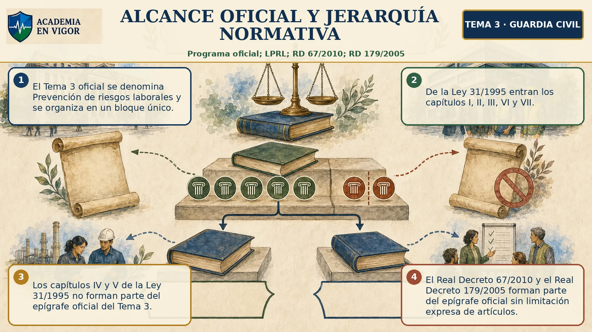

<em>Infografía: Alcance oficial y jerarquía normativa.</em>

<!-- FUENTE: GC-PROGRAMA-2024-T03 -->

## 02. Objeto, carácter, ámbito y exclusiones de la LPRL

### Regla y encaje

Los tres primeros artículos delimitan qué integra la normativa preventiva, qué pretende la ley y a quién se aplica. La exclusión de ciertas funciones públicas se refiere a actividades cuyas particularidades impiden la aplicación directa, no a una zona sin protección.

El bloque se ancla en **arts. 1 a 3 LPRL** y pertenece a **ley 31/1995: marco, política y garantías**.

### Claves normativas

- La normativa preventiva comprende la Ley 31/1995, sus normas de desarrollo o complementarias y otras normas legales o convencionales con prescripciones preventivas.
- La Ley 31/1995 busca promover la seguridad y salud mediante medidas y actividades necesarias para prevenir riesgos derivados del trabajo. <!-- FACT:GC-T03-F006 -->
- Las disposiciones laborales de la ley y sus reglamentos son derecho necesario mínimo indisponible, mejorable por convenio colectivo. <!-- FACT:GC-T03-F007 -->
- La ley se aplica a relaciones laborales y al personal administrativo o estatutario, con las peculiaridades previstas. <!-- FACT:GC-T03-F008 -->
- En policía, seguridad, resguardo aduanero y determinados servicios operativos, la ley inspira la normativa específica cuando las particularidades impiden su aplicación directa. <!-- FACT:GC-T03-F009 -->
 <!-- FACT:GC-T03-F010 -->

:::hablemos-claro
No memorices palabras sueltas: identifica quién actúa, sobre qué materia, con qué intensidad verbal y si existe excepción.
:::

:::en-la-calle
Ante un supuesto, identifica primero el régimen aplicable —LPRL, AGE o Guardia Civil—; después localiza el deber, el órgano competente y el plazo o excepción.
:::

:::lo-que-cae
Prioridad: **arts. 1 a 3 LPRL**. Las trampas cambian el sujeto, convierten «podrá» en «deberá» o alteran un plazo o porcentaje.
:::

<!-- VISUAL:t03-02-objeto-caracter-ambito-y-exclusiones-de-la-lprl.webp -->

  

<em>Infografía: Objeto, carácter, ámbito y exclusiones de la LPRL.</em>

<!-- FUENTE: BOE-L31-1995-GC-T03 -->

## 03. Definiciones nucleares de prevención y riesgo

### Regla y encaje

El artículo 4 contiene definiciones literales muy preguntadas. La gravedad del riesgo no depende de una sola variable: combina probabilidad y severidad.

El bloque se ancla en **art. 4.1 a 4.4 LPRL** y pertenece a **ley 31/1995: marco, política y garantías**.

### Claves normativas

- Prevención es el conjunto de actividades o medidas adoptadas o previstas en todas las fases de la actividad para evitar o disminuir riesgos derivados del trabajo.
- Riesgo laboral es la posibilidad de que una persona trabajadora sufra un daño derivado del trabajo. <!-- FACT:GC-T03-F011 -->
- La gravedad de un riesgo se valora conjuntamente por la probabilidad de que se produzca el daño y su severidad. <!-- FACT:GC-T03-F012 -->
- Daños derivados del trabajo son las enfermedades, patologías o lesiones sufridas con motivo u ocasión del trabajo. <!-- FACT:GC-T03-F013 -->
- Riesgo grave e inminente es el racionalmente probable en un futuro inmediato y capaz de causar un daño grave. <!-- FACT:GC-T03-F014 -->
 <!-- FACT:GC-T03-F015 -->

:::hablemos-claro
No memorices palabras sueltas: identifica quién actúa, sobre qué materia, con qué intensidad verbal y si existe excepción.
:::

:::en-la-calle
Ante un supuesto, identifica primero el régimen aplicable —LPRL, AGE o Guardia Civil—; después localiza el deber, el órgano competente y el plazo o excepción.
:::

:::lo-que-cae
Prioridad: **art. 4.1 a 4.4 LPRL**. Las trampas cambian el sujeto, convierten «podrá» en «deberá» o alteran un plazo o porcentaje.
:::

<!-- VISUAL:t03-03-definiciones-nucleares-de-prevencion-y-riesgo.webp -->

  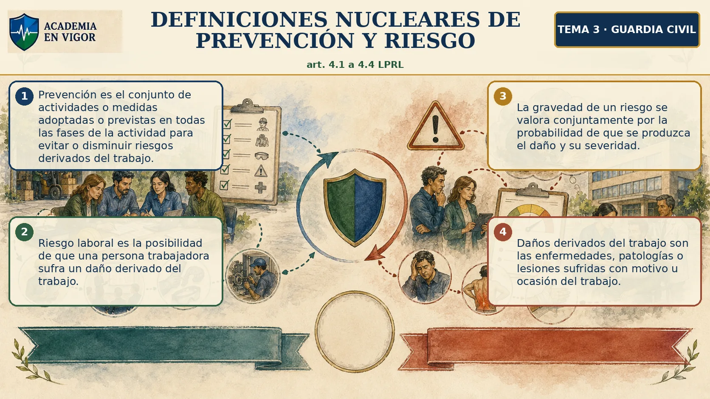

<em>Infografía: Definiciones nucleares de prevención y riesgo.</em>

<!-- FUENTE: BOE-L31-1995-GC-T03 -->

## 04. Definiciones de procesos, equipos, condiciones y EPI

### Regla y encaje

La segunda mitad del artículo 4 separa la fuente del riesgo, el medio de trabajo, la condición influyente y el equipo que protege al trabajador. El accesorio de un EPI también queda incluido.

El bloque se ancla en **art. 4.5 a 4.8 LPRL** y pertenece a **ley 31/1995: marco, política y garantías**.

### Claves normativas

- Son potencialmente peligrosos los procesos, actividades, operaciones, equipos o productos que, sin medidas específicas, originan riesgos.
- Equipo de trabajo es cualquier máquina, aparato, instrumento o instalación utilizada en el trabajo. <!-- FACT:GC-T03-F016 -->
- Condición de trabajo es cualquier característica con influencia significativa en la generación de riesgos para la seguridad y salud. <!-- FACT:GC-T03-F017 -->
- La definición de condición de trabajo incluye locales, instalaciones, productos, agentes, procedimientos y organización del trabajo. <!-- FACT:GC-T03-F018 -->
- EPI es el equipo llevado o sujetado para proteger frente a uno o varios riesgos, incluidos sus complementos o accesorios. <!-- FACT:GC-T03-F019 -->
 <!-- FACT:GC-T03-F020 -->

:::hablemos-claro
No memorices palabras sueltas: identifica quién actúa, sobre qué materia, con qué intensidad verbal y si existe excepción.
:::

:::en-la-calle
Ante un supuesto, identifica primero el régimen aplicable —LPRL, AGE o Guardia Civil—; después localiza el deber, el órgano competente y el plazo o excepción.
:::

:::lo-que-cae
Prioridad: **art. 4.5 a 4.8 LPRL**. Las trampas cambian el sujeto, convierten «podrá» en «deberá» o alteran un plazo o porcentaje.
:::

:::ha-caido
Apariciones oficiales verificadas: 2020 · pregunta 11, 2021 · pregunta 13, 2025 · pregunta 16. La respuesta se conserva en el índice oficial trazado.
:::

<!-- VISUAL:t03-04-definiciones-de-procesos-equipos-condiciones-y-epi.webp -->

  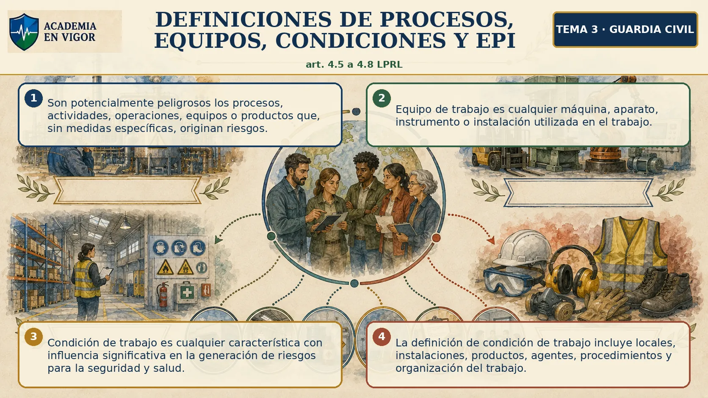

<em>Infografía: Definiciones de procesos, equipos, condiciones y EPI.</em>

<!-- FUENTE: BOE-L31-1995-GC-T03 -->

## 05. Política preventiva y potestad reglamentaria

### Regla y encaje

La política pública coordina actuaciones y el artículo 6 reserva al Gobierno la regulación reglamentaria de materias técnicas, previa consulta a las organizaciones más representativas.

El bloque se ancla en **arts. 5 y 6 LPRL** y pertenece a **ley 31/1995: marco, política y garantías**.

### Claves normativas

- La política preventiva persigue mejorar las condiciones de trabajo y elevar el nivel de protección de la seguridad y salud.
- La política se ejecuta mediante normas y actuaciones administrativas coordinadas con participación de empresarios y trabajadores. <!-- FACT:GC-T03-F021 -->
- Las Administraciones deben considerar variables relacionadas con el sexo para detectar daños laborales vinculados a ellas. <!-- FACT:GC-T03-F022 -->
- El Gobierno regula las materias del artículo 6 mediante normas reglamentarias y previa consulta a organizaciones sindicales y empresariales más representativas. <!-- FACT:GC-T03-F023 -->
- Entre esas materias están requisitos mínimos, prohibiciones, evaluación de riesgos, servicios preventivos y trabajos especialmente peligrosos. <!-- FACT:GC-T03-F024 -->
 <!-- FACT:GC-T03-F025 -->

:::hablemos-claro
No memorices palabras sueltas: identifica quién actúa, sobre qué materia, con qué intensidad verbal y si existe excepción.
:::

:::en-la-calle
Ante un supuesto, identifica primero el régimen aplicable —LPRL, AGE o Guardia Civil—; después localiza el deber, el órgano competente y el plazo o excepción.
:::

:::lo-que-cae
Prioridad: **arts. 5 y 6 LPRL**. Las trampas cambian el sujeto, convierten «podrá» en «deberá» o alteran un plazo o porcentaje.
:::

:::ha-caido
Apariciones oficiales verificadas: 2023 · pregunta 13. La respuesta se conserva en el índice oficial trazado.
:::

<!-- VISUAL:t03-05-politica-preventiva-y-potestad-reglamentaria.webp -->

  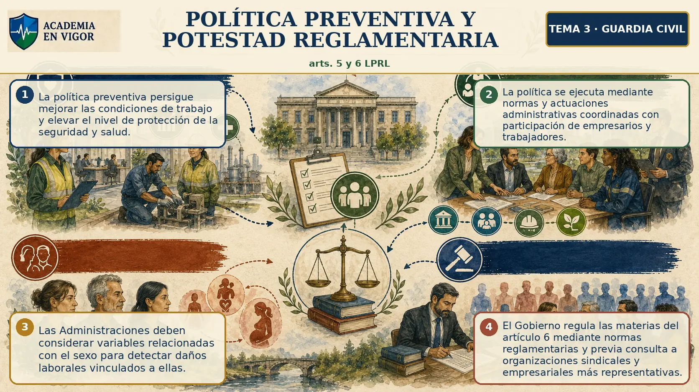

<em>Infografía: Política preventiva y potestad reglamentaria.</em>

<!-- FUENTE: BOE-L31-1995-GC-T03 -->

## 06. Administraciones laborales e INSST

### Regla y encaje

El artículo 7 distribuye promoción, asistencia, vigilancia y sanción; desde abril de 2026 incluye expresamente el seguimiento de actuaciones preventivas y la cooperación respecto de autónomos. El INSST es el órgano científico-técnico especializado.

El bloque se ancla en **arts. 7 y 8 LPRL** y pertenece a **ley 31/1995: marco, política y garantías**.

### Claves normativas

- Las Administraciones laborales promueven la prevención, prestan asesoramiento técnico, vigilan el cumplimiento y sancionan infracciones.
- Desde el 10 de abril de 2026, la promoción incluye expresamente seguimiento de actuaciones preventivas en empresas y cooperación técnica respecto de autónomos. <!-- FACT:GC-T03-F026 -->
- El INSST es el órgano científico-técnico especializado de la Administración General del Estado en seguridad y salud en el trabajo. <!-- FACT:GC-T03-F027 -->
- El INSST analiza condiciones, promueve mejoras, asesora técnicamente y desarrolla formación, información, investigación y divulgación. <!-- FACT:GC-T03-F028 -->
- El INSST actúa como centro de referencia nacional respecto de las instituciones de la Unión Europea. <!-- FACT:GC-T03-F029 -->
 <!-- FACT:GC-T03-F030 -->

:::hablemos-claro
No memorices palabras sueltas: identifica quién actúa, sobre qué materia, con qué intensidad verbal y si existe excepción.
:::

:::en-la-calle
Ante un supuesto, identifica primero el régimen aplicable —LPRL, AGE o Guardia Civil—; después localiza el deber, el órgano competente y el plazo o excepción.
:::

:::lo-que-cae
Prioridad: **arts. 7 y 8 LPRL**. Las trampas cambian el sujeto, convierten «podrá» en «deberá» o alteran un plazo o porcentaje.
:::

<!-- VISUAL:t03-06-administraciones-laborales-e-insst.webp -->

  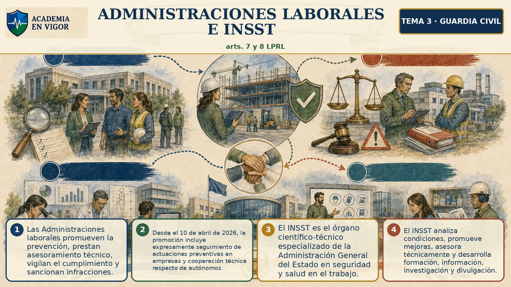

<em>Infografía: Administraciones laborales e INSST.</em>

<!-- FUENTE: BOE-L31-1995-GC-T03 -->

## 07. Inspección de Trabajo, sanidad y coordinación

### Regla y encaje

La Inspección vigila y controla; las Administraciones sanitarias añaden vigilancia de la salud y sistemas de información; y el artículo 11 exige coordinación sin borrar competencias.

El bloque se ancla en **arts. 9 a 11 LPRL** y pertenece a **ley 31/1995: marco, política y garantías**.

### Claves normativas

- Corresponde a la Inspección de Trabajo y Seguridad Social vigilar y controlar la normativa preventiva.
- La Inspección puede proponer sanciones, asesorar, informar sobre accidentes graves y ordenar paralización inmediata ante riesgo grave e inminente. <!-- FACT:GC-T03-F031 -->
- Las Administraciones sanitarias establecen medios de evaluación y control de las actuaciones sanitarias de los servicios de prevención. <!-- FACT:GC-T03-F032 -->
- La actuación sanitaria incluye sistemas de información, estudios epidemiológicos y supervisión de la formación del personal sanitario preventivo. <!-- FACT:GC-T03-F033 -->
- Las Administraciones laboral, sanitaria e industrial coordinan sus actuaciones para una protección eficaz. <!-- FACT:GC-T03-F034 -->
 <!-- FACT:GC-T03-F035 -->

:::hablemos-claro
No memorices palabras sueltas: identifica quién actúa, sobre qué materia, con qué intensidad verbal y si existe excepción.
:::

:::en-la-calle
Ante un supuesto, identifica primero el régimen aplicable —LPRL, AGE o Guardia Civil—; después localiza el deber, el órgano competente y el plazo o excepción.
:::

:::lo-que-cae
Prioridad: **arts. 9 a 11 LPRL**. Las trampas cambian el sujeto, convierten «podrá» en «deberá» o alteran un plazo o porcentaje.
:::

<!-- VISUAL:t03-07-inspeccion-de-trabajo-sanidad-y-coordinacion.webp -->

  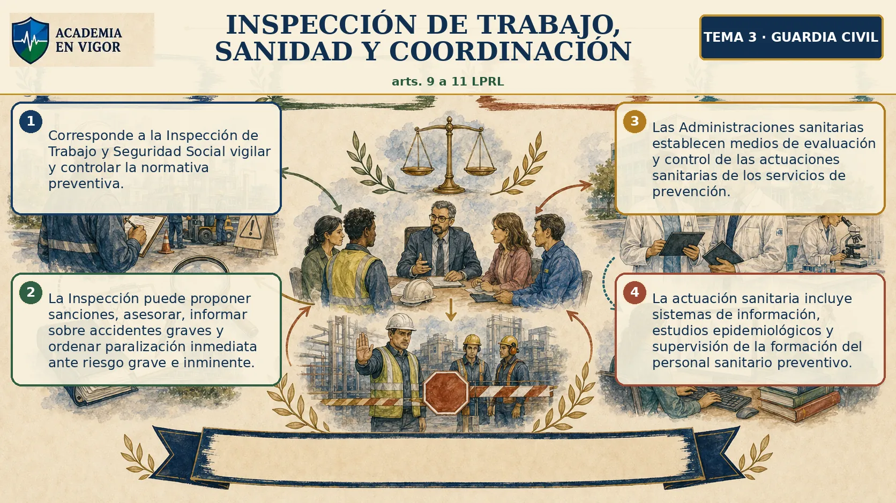

<em>Infografía: Inspección de Trabajo, sanidad y coordinación.</em>

<!-- FUENTE: BOE-L31-1995-GC-T03 -->

## 08. Participación institucional y Comisión Nacional

### Regla y encaje

La participación de organizaciones empresariales y sindicales es un principio básico. La Comisión Nacional es asesora de las Administraciones y órgano de participación institucional, con una aritmética de votos que cae mucho.

El bloque se ancla en **arts. 12 y 13 LPRL** y pertenece a **ley 31/1995: marco, política y garantías**.

### Claves normativas

- La participación de empresarios y trabajadores mediante sus organizaciones más representativas es principio básico de la política preventiva.
- La Comisión Nacional de Seguridad y Salud en el Trabajo es órgano colegiado asesor de las Administraciones y de participación institucional. <!-- FACT:GC-T03-F036 -->
- La Comisión integra un representante de cada comunidad autónoma e igual número de miembros de la AGE y de organizaciones empresariales y sindicales. <!-- FACT:GC-T03-F037 -->
- La Comisión cuenta con un presidente y cuatro vicepresidentes, uno por cada grupo que la integra. <!-- FACT:GC-T03-F038 -->
- En los acuerdos, los representantes autonómicos y estatales tienen un voto cada uno; los empresariales y sindicales, dos votos cada representante. <!-- FACT:GC-T03-F039 -->
 <!-- FACT:GC-T03-F040 -->

:::hablemos-claro
No memorices palabras sueltas: identifica quién actúa, sobre qué materia, con qué intensidad verbal y si existe excepción.
:::

:::en-la-calle
Ante un supuesto, identifica primero el régimen aplicable —LPRL, AGE o Guardia Civil—; después localiza el deber, el órgano competente y el plazo o excepción.
:::

:::lo-que-cae
Prioridad: **arts. 12 y 13 LPRL**. Las trampas cambian el sujeto, convierten «podrá» en «deberá» o alteran un plazo o porcentaje.
:::

:::ha-caido
Apariciones oficiales verificadas: 2020 · pregunta 11, 2021 · pregunta 14, 2021 · pregunta 14, 2024 · pregunta 15, 2024 · pregunta 15. La respuesta se conserva en el índice oficial trazado.
:::

<!-- VISUAL:t03-08-participacion-institucional-y-comision-nacional.webp -->

  

<em>Infografía: Participación institucional y Comisión Nacional.</em>

<!-- FUENTE: BOE-L31-1995-GC-T03 -->

## 09. Derecho de protección y principios de acción preventiva

### Regla y encaje

El artículo 14 formula el derecho y el correlativo deber empresarial. El artículo 15 indica cómo decidir: evitar, evaluar, combatir en origen, adaptar, sustituir y anteponer protección colectiva.

El bloque se ancla en **arts. 14 y 15 LPRL** y pertenece a **ley 31/1995: marco, política y garantías**.

### Claves normativas

- Las personas trabajadoras tienen derecho a una protección eficaz frente a los riesgos laborales.
- Ese derecho genera un correlativo deber empresarial de protección, también para las Administraciones respecto de su personal. <!-- FACT:GC-T03-F041 -->
- El coste de las medidas de seguridad y salud no puede recaer sobre los trabajadores. <!-- FACT:GC-T03-F042 -->
- La acción preventiva debe evitar riesgos, evaluar los inevitables y combatirlos en su origen. <!-- FACT:GC-T03-F043 -->
- Las medidas deben anteponer la protección colectiva a la individual y sustituir lo peligroso por lo que entrañe poco o ningún peligro. <!-- FACT:GC-T03-F044 -->
 <!-- FACT:GC-T03-F045 -->

:::hablemos-claro
No memorices palabras sueltas: identifica quién actúa, sobre qué materia, con qué intensidad verbal y si existe excepción.
:::

:::en-la-calle
Ante un supuesto, identifica primero el régimen aplicable —LPRL, AGE o Guardia Civil—; después localiza el deber, el órgano competente y el plazo o excepción.
:::

:::lo-que-cae
Prioridad: **arts. 14 y 15 LPRL**. Las trampas cambian el sujeto, convierten «podrá» en «deberá» o alteran un plazo o porcentaje.
:::

:::ha-caido
Apariciones oficiales verificadas: 2024 · pregunta 15. La respuesta se conserva en el índice oficial trazado.
:::

<!-- VISUAL:t03-09-derecho-de-proteccion-y-principios-de-accion-preventiva.webp -->

  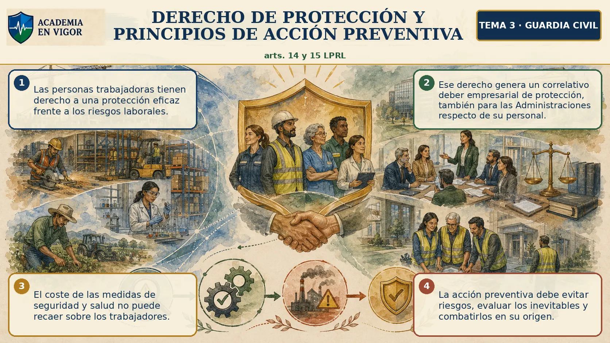

<em>Infografía: Derecho de protección y principios de acción preventiva.</em>

<!-- FUENTE: BOE-L31-1995-GC-T03 -->

## 10. Plan, evaluación y planificación preventiva

### Regla y encaje

Plan, evaluación y planificación no son sinónimos. El plan integra la prevención en la gestión; evaluación y planificación son los instrumentos esenciales para aplicarlo.

El bloque se ancla en **art. 16 LPRL** y pertenece a **ley 31/1995: marco, política y garantías**.

### Claves normativas

- La prevención se integra en el sistema general de gestión mediante la implantación y aplicación de un plan de prevención.
- El plan incluye estructura, responsabilidades, funciones, prácticas, procedimientos, procesos y recursos. <!-- FACT:GC-T03-F046 -->
- Los instrumentos esenciales para gestionar y aplicar el plan son evaluación de riesgos y planificación preventiva. <!-- FACT:GC-T03-F047 -->
- La evaluación inicial considera naturaleza de la actividad, puestos y personas especialmente sensibles y se actualiza cuando cambian las condiciones. <!-- FACT:GC-T03-F048 -->
- Si la evaluación revela riesgos, el empresario planifica actividades, plazos, responsables y recursos y comprueba su ejecución efectiva. <!-- FACT:GC-T03-F049 -->
 <!-- FACT:GC-T03-F050 -->

:::hablemos-claro
No memorices palabras sueltas: identifica quién actúa, sobre qué materia, con qué intensidad verbal y si existe excepción.
:::

:::en-la-calle
Ante un supuesto, identifica primero el régimen aplicable —LPRL, AGE o Guardia Civil—; después localiza el deber, el órgano competente y el plazo o excepción.
:::

:::lo-que-cae
Prioridad: **art. 16 LPRL**. Las trampas cambian el sujeto, convierten «podrá» en «deberá» o alteran un plazo o porcentaje.
:::

<!-- VISUAL:t03-10-plan-evaluacion-y-planificacion-preventiva.webp -->

  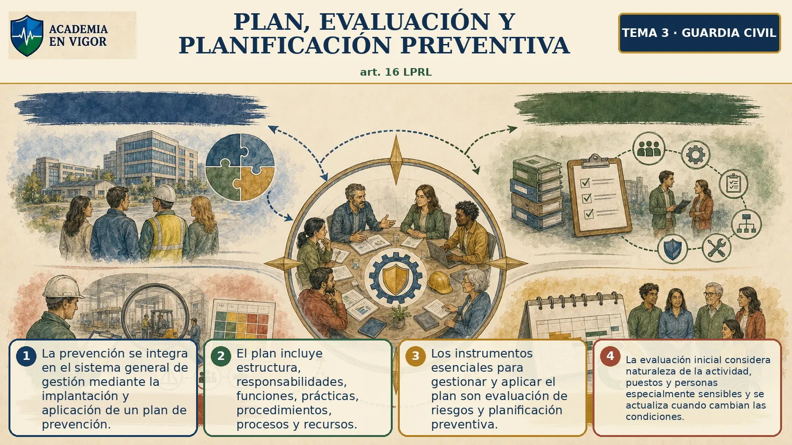

<em>Infografía: Plan, evaluación y planificación preventiva.</em>

<!-- FUENTE: BOE-L31-1995-GC-T03 -->

## 11. Equipos, información y formación

### Regla y encaje

El empresario debe hacer seguro el medio de trabajo, informar sobre riesgos y formar de manera suficiente, adecuada y adaptada. El EPI es necesario cuando la protección colectiva no basta.

El bloque se ancla en **arts. 17 a 19 LPRL** y pertenece a **ley 31/1995: actuación ante riesgos y colectivos protegidos**.

### Claves normativas

- Los equipos de trabajo deben ser adecuados y convenientemente adaptados para garantizar seguridad y salud.
- El empresario proporciona EPI adecuados y vela por su uso efectivo cuando sean necesarios. <!-- FACT:GC-T03-F051 -->
- El EPI se usa cuando los riesgos no puedan evitarse o limitarse suficientemente mediante protección colectiva u organización del trabajo. <!-- FACT:GC-T03-F052 -->
- Cada trabajador debe recibir información sobre riesgos generales, riesgos del puesto y medidas de protección y emergencia. <!-- FACT:GC-T03-F053 -->
- La formación preventiva será teórica y práctica, suficiente y adecuada, al contratar y cuando cambien funciones, tecnologías o equipos. <!-- FACT:GC-T03-F054 -->
 <!-- FACT:GC-T03-F055 -->

:::hablemos-claro
No memorices palabras sueltas: identifica quién actúa, sobre qué materia, con qué intensidad verbal y si existe excepción.
:::

:::en-la-calle
Ante un supuesto, identifica primero el régimen aplicable —LPRL, AGE o Guardia Civil—; después localiza el deber, el órgano competente y el plazo o excepción.
:::

:::lo-que-cae
Prioridad: **arts. 17 a 19 LPRL**. Las trampas cambian el sujeto, convierten «podrá» en «deberá» o alteran un plazo o porcentaje.
:::

<!-- VISUAL:t03-11-equipos-informacion-y-formacion.webp -->

  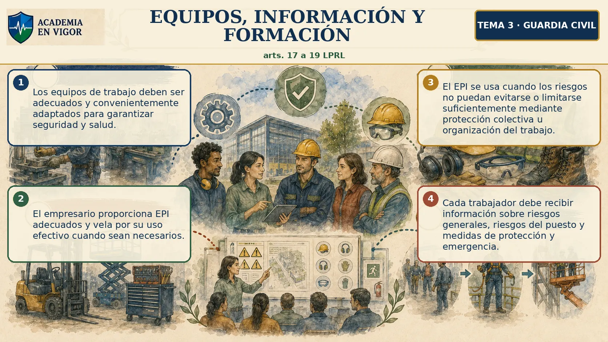

<em>Infografía: Equipos, información y formación.</em>

<!-- FUENTE: BOE-L31-1995-GC-T03 -->

## 12. Emergencias y riesgo grave e inminente

### Regla y encaje

Emergencia y riesgo grave e inminente son regímenes relacionados, pero no idénticos. Ante peligro grave, la información y la capacidad de interrumpir la actividad deben ser inmediatas.

El bloque se ancla en **arts. 20 y 21 LPRL** y pertenece a **ley 31/1995: actuación ante riesgos y colectivos protegidos**.

### Claves normativas

- El empresario analiza posibles emergencias y adopta medidas de primeros auxilios, lucha contra incendios y evacuación.
- Debe designar personal encargado de emergencias, suficiente, formado y dotado de material adecuado. <!-- FACT:GC-T03-F056 -->
- Ante riesgo grave e inminente, el empresario informará lo antes posible a todo el personal afectado. <!-- FACT:GC-T03-F057 -->
- El personal puede interrumpir su actividad y abandonar el lugar cuando considere que existe riesgo grave e inminente para su vida o salud. <!-- FACT:GC-T03-F058 -->
- Quien no pueda contactar con su superior debe poder adoptar medidas necesarias para evitar las consecuencias del peligro. <!-- FACT:GC-T03-F059 -->
 <!-- FACT:GC-T03-F060 -->

:::hablemos-claro
No memorices palabras sueltas: identifica quién actúa, sobre qué materia, con qué intensidad verbal y si existe excepción.
:::

:::en-la-calle
Ante un supuesto, identifica primero el régimen aplicable —LPRL, AGE o Guardia Civil—; después localiza el deber, el órgano competente y el plazo o excepción.
:::

:::lo-que-cae
Prioridad: **arts. 20 y 21 LPRL**. Las trampas cambian el sujeto, convierten «podrá» en «deberá» o alteran un plazo o porcentaje.
:::

:::ha-caido
Apariciones oficiales verificadas: 2020 · pregunta 12. La respuesta se conserva en el índice oficial trazado.
:::

<!-- VISUAL:t03-12-emergencias-y-riesgo-grave-e-inminente.webp -->

  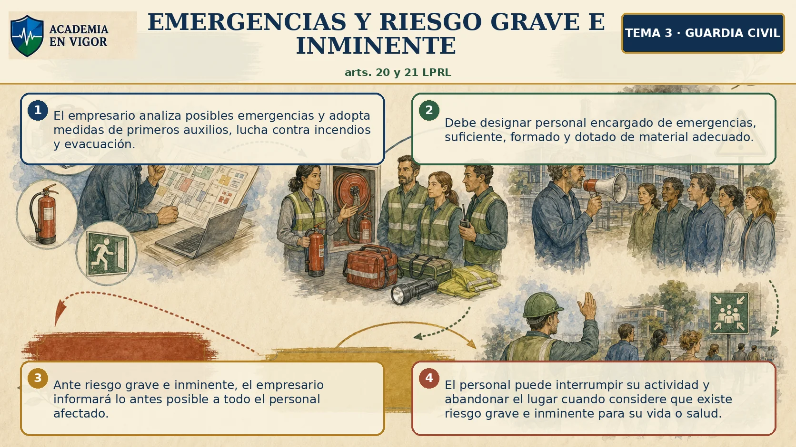

<em>Infografía: Emergencias y riesgo grave e inminente.</em>

<!-- FUENTE: BOE-L31-1995-GC-T03 -->

## 13. Vigilancia de la salud y documentación

### Regla y encaje

La vigilancia de la salud parte del consentimiento y protege intimidad y confidencialidad. El artículo 23, en cambio, enumera los documentos preventivos que deben conservarse.

El bloque se ancla en **arts. 22 y 23 LPRL** y pertenece a **ley 31/1995: actuación ante riesgos y colectivos protegidos**.

### Claves normativas

- El empresario garantiza vigilancia periódica de la salud en función de los riesgos inherentes al trabajo.
- Como regla, la vigilancia requiere consentimiento; las excepciones precisan informe previo de la representación y necesidad legal. <!-- FACT:GC-T03-F061 -->
- Las medidas respetarán intimidad, dignidad y confidencialidad y no podrán usarse con fines discriminatorios. <!-- FACT:GC-T03-F062 -->
- El acceso a información médica personal se limita al personal médico y autoridades sanitarias que vigilan la salud. <!-- FACT:GC-T03-F063 -->
- La documentación incluye plan, evaluación, planificación, controles de salud y relación de accidentes y enfermedades profesionales con baja superior a un día. <!-- FACT:GC-T03-F064 -->
 <!-- FACT:GC-T03-F065 -->

:::hablemos-claro
No memorices palabras sueltas: identifica quién actúa, sobre qué materia, con qué intensidad verbal y si existe excepción.
:::

:::en-la-calle
Ante un supuesto, identifica primero el régimen aplicable —LPRL, AGE o Guardia Civil—; después localiza el deber, el órgano competente y el plazo o excepción.
:::

:::lo-que-cae
Prioridad: **arts. 22 y 23 LPRL**. Las trampas cambian el sujeto, convierten «podrá» en «deberá» o alteran un plazo o porcentaje.
:::

<!-- VISUAL:t03-13-vigilancia-de-la-salud-y-documentacion.webp -->

  

<em>Infografía: Vigilancia de la salud y documentación.</em>

<!-- FUENTE: BOE-L31-1995-GC-T03 -->

## 14. Coordinación de actividades empresariales

### Regla y encaje

Cuando coinciden varias empresas en un centro, no desaparecen responsabilidades: se activan deberes de cooperación, información e instrucción, reforzados para titular y principal.

El bloque se ancla en **art. 24 LPRL** y pertenece a **ley 31/1995: actuación ante riesgos y colectivos protegidos**.

### Claves normativas

- Empresas concurrentes en un mismo centro deben cooperar en la aplicación de la normativa preventiva.
- El titular del centro informa e instruye sobre riesgos, medidas preventivas y emergencias. <!-- FACT:GC-T03-F066 -->
- La empresa principal vigila el cumplimiento preventivo de contratistas y subcontratistas de su propia actividad en su centro. <!-- FACT:GC-T03-F067 -->
- Los deberes de cooperación e información se aplican también a trabajadores autónomos concurrentes. <!-- FACT:GC-T03-F068 -->
- Las obligaciones de coordinación del artículo 24 tienen desarrollo reglamentario. <!-- FACT:GC-T03-F069 -->
 <!-- FACT:GC-T03-F070 -->

:::hablemos-claro
No memorices palabras sueltas: identifica quién actúa, sobre qué materia, con qué intensidad verbal y si existe excepción.
:::

:::en-la-calle
Ante un supuesto, identifica primero el régimen aplicable —LPRL, AGE o Guardia Civil—; después localiza el deber, el órgano competente y el plazo o excepción.
:::

:::lo-que-cae
Prioridad: **art. 24 LPRL**. Las trampas cambian el sujeto, convierten «podrá» en «deberá» o alteran un plazo o porcentaje.
:::

<!-- VISUAL:t03-14-coordinacion-de-actividades-empresariales.webp -->

  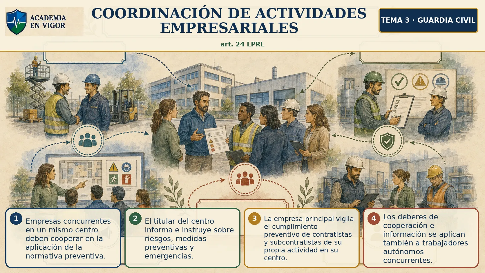

<em>Infografía: Coordinación de actividades empresariales.</em>

<!-- FUENTE: BOE-L31-1995-GC-T03 -->

## 15. Sensibilidad especial, maternidad y menores

### Regla y encaje

Estos artículos obligan a adaptar la prevención a características personales, embarazo, lactancia y juventud. No basta con aplicar una evaluación estándar.

El bloque se ancla en **arts. 25 a 27 LPRL** y pertenece a **ley 31/1995: actuación ante riesgos y colectivos protegidos**.

### Claves normativas

- Debe garantizarse protección específica a quienes sean especialmente sensibles por características personales, estado biológico o discapacidad reconocida.
- No se empleará a personas en puestos que puedan ponerlas en peligro a ellas o a terceros por sus condiciones psicofísicas. <!-- FACT:GC-T03-F071 -->
- La evaluación de embarazo o parto reciente determina naturaleza, grado y duración de la exposición a riesgos específicos. <!-- FACT:GC-T03-F072 -->
- Si existe riesgo, se adapta el puesto o tiempo de trabajo; si no basta, puede producirse cambio de puesto o suspensión en los términos legales. <!-- FACT:GC-T03-F073 -->
- Antes de incorporar menores, se evalúan específicamente los riesgos vinculados a falta de experiencia, inmadurez y desarrollo incompleto. <!-- FACT:GC-T03-F074 -->
 <!-- FACT:GC-T03-F075 -->

:::hablemos-claro
No memorices palabras sueltas: identifica quién actúa, sobre qué materia, con qué intensidad verbal y si existe excepción.
:::

:::en-la-calle
Ante un supuesto, identifica primero el régimen aplicable —LPRL, AGE o Guardia Civil—; después localiza el deber, el órgano competente y el plazo o excepción.
:::

:::lo-que-cae
Prioridad: **arts. 25 a 27 LPRL**. Las trampas cambian el sujeto, convierten «podrá» en «deberá» o alteran un plazo o porcentaje.
:::

<!-- VISUAL:t03-15-sensibilidad-especial-maternidad-y-menores.webp -->

  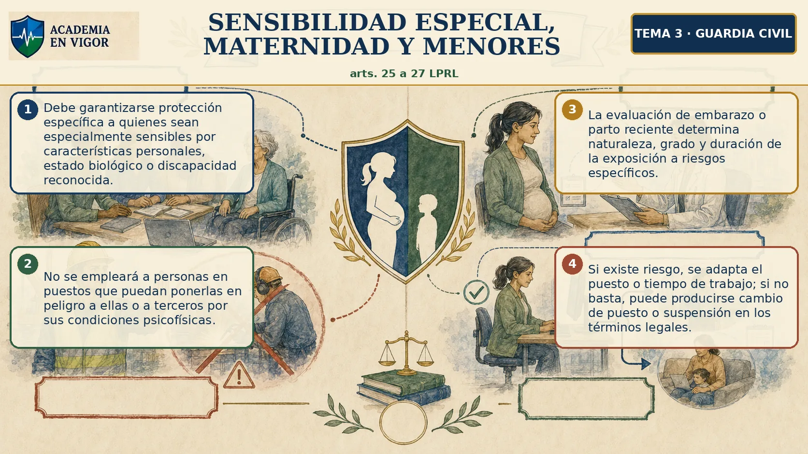

<em>Infografía: Sensibilidad especial, maternidad y menores.</em>

<!-- FUENTE: BOE-L31-1995-GC-T03 -->

## 16. Relaciones temporales y obligaciones del trabajador

### Regla y encaje

La temporalidad no reduce la protección. El trabajador también tiene deberes concretos, pero su incumplimiento no borra el deber empresarial de protección.

El bloque se ancla en **arts. 28 y 29 LPRL** y pertenece a **ley 31/1995: actuación ante riesgos y colectivos protegidos**.

### Claves normativas

- Personal temporal, de duración determinada y de ETT disfruta del mismo nivel de protección que el resto.
- Antes de iniciar la actividad debe recibir información sobre riesgos, cualificaciones necesarias, controles médicos y medidas preventivas. <!-- FACT:GC-T03-F076 -->
- La empresa usuaria responde de las condiciones de ejecución y la ETT de formación y vigilancia de salud, según la distribución legal. <!-- FACT:GC-T03-F077 -->
- Cada trabajador debe velar por su propia seguridad y por la de terceros afectados, conforme a su formación e instrucciones. <!-- FACT:GC-T03-F078 -->
- Debe usar correctamente medios y protecciones, no inutilizar dispositivos, informar inmediatamente y cooperar con el empresario. <!-- FACT:GC-T03-F079 -->
 <!-- FACT:GC-T03-F080 -->

:::hablemos-claro
No memorices palabras sueltas: identifica quién actúa, sobre qué materia, con qué intensidad verbal y si existe excepción.
:::

:::en-la-calle
Ante un supuesto, identifica primero el régimen aplicable —LPRL, AGE o Guardia Civil—; después localiza el deber, el órgano competente y el plazo o excepción.
:::

:::lo-que-cae
Prioridad: **arts. 28 y 29 LPRL**. Las trampas cambian el sujeto, convierten «podrá» en «deberá» o alteran un plazo o porcentaje.
:::

<!-- VISUAL:t03-16-relaciones-temporales-y-obligaciones-del-trabajador.webp -->

  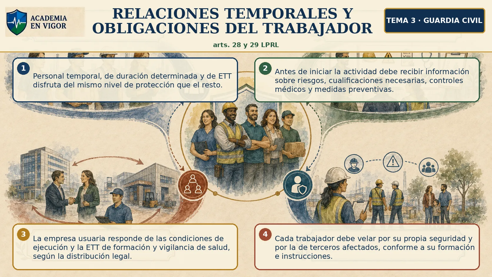

<em>Infografía: Relaciones temporales y obligaciones del trabajador.</em>

<!-- FUENTE: BOE-L31-1995-GC-T03 -->

## 17. Fabricantes, importadores y suministradores

### Regla y encaje

El capítulo VI sitúa obligaciones antes de que el equipo o producto llegue al puesto de trabajo. La seguridad del usuario depende también de diseño, información y envasado.

El bloque se ancla en **art. 41 LPRL** y pertenece a **ley 31/1995: actuación ante riesgos y colectivos protegidos**.

### Claves normativas

- Fabricantes, importadores y suministradores deben asegurar que maquinaria, equipos y útiles no constituyan fuente de peligro si se usan como recomiendan.
- Los productos y sustancias químicas deben envasarse y etiquetarse permitiendo conservación y manipulación seguras. <!-- FACT:GC-T03-F081 -->
- Deben facilitar información sobre uso correcto, medidas preventivas y riesgos de uso normal o manipulación inadecuada. <!-- FACT:GC-T03-F082 -->
- Los fabricantes de EPI deben garantizar su efectividad e informar del riesgo protegido, nivel y forma correcta de uso y mantenimiento. <!-- FACT:GC-T03-F083 -->
- El empresario debe asegurar que la información de fabricantes y suministradores llegue al personal en términos comprensibles. <!-- FACT:GC-T03-F084 -->
 <!-- FACT:GC-T03-F085 -->

:::hablemos-claro
No memorices palabras sueltas: identifica quién actúa, sobre qué materia, con qué intensidad verbal y si existe excepción.
:::

:::en-la-calle
Ante un supuesto, identifica primero el régimen aplicable —LPRL, AGE o Guardia Civil—; después localiza el deber, el órgano competente y el plazo o excepción.
:::

:::lo-que-cae
Prioridad: **art. 41 LPRL**. Las trampas cambian el sujeto, convierten «podrá» en «deberá» o alteran un plazo o porcentaje.
:::

<!-- VISUAL:t03-17-fabricantes-importadores-y-suministradores.webp -->

  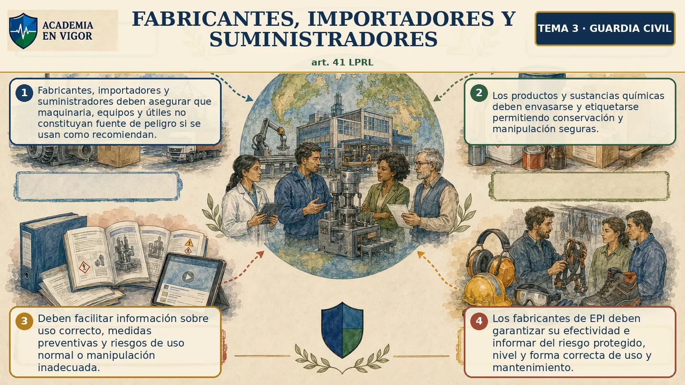

<em>Infografía: Fabricantes, importadores y suministradores.</em>

<!-- FUENTE: BOE-L31-1995-GC-T03 -->

## 18. Responsabilidades y requerimiento inspector

### Regla y encaje

Un incumplimiento puede abrir varias vías de responsabilidad compatibles. Antes o junto a la sanción, la Inspección puede requerir la subsanación con plazo.

El bloque se ancla en **arts. 42 y 43 LPRL** y pertenece a **ley 31/1995: actuación ante riesgos y colectivos protegidos**.

### Claves normativas

- El incumplimiento empresarial puede generar responsabilidades administrativas, penales y civiles por daños.
- Las responsabilidades administrativas son compatibles con indemnizaciones y recargos de prestaciones de Seguridad Social. <!-- FACT:GC-T03-F086 -->
- La empresa principal responde solidariamente en los supuestos previstos por el incumplimiento preventivo de contratistas y subcontratistas. <!-- FACT:GC-T03-F087 -->
- El inspector que compruebe una infracción requerirá al empresario para subsanar, salvo que proceda paralización por riesgo grave e inminente. <!-- FACT:GC-T03-F088 -->
- El requerimiento se comunica por escrito, señala anomalías y plazo y se pone en conocimiento de los Delegados de Prevención. <!-- FACT:GC-T03-F089 -->
 <!-- FACT:GC-T03-F090 -->

:::hablemos-claro
No memorices palabras sueltas: identifica quién actúa, sobre qué materia, con qué intensidad verbal y si existe excepción.
:::

:::en-la-calle
Ante un supuesto, identifica primero el régimen aplicable —LPRL, AGE o Guardia Civil—; después localiza el deber, el órgano competente y el plazo o excepción.
:::

:::lo-que-cae
Prioridad: **arts. 42 y 43 LPRL**. Las trampas cambian el sujeto, convierten «podrá» en «deberá» o alteran un plazo o porcentaje.
:::

:::ha-caido
Apariciones oficiales verificadas: 2022 · pregunta 13, 2023 · pregunta 14. La respuesta se conserva en el índice oficial trazado.
:::

<!-- VISUAL:t03-18-responsabilidades-y-requerimiento-inspector.webp -->

  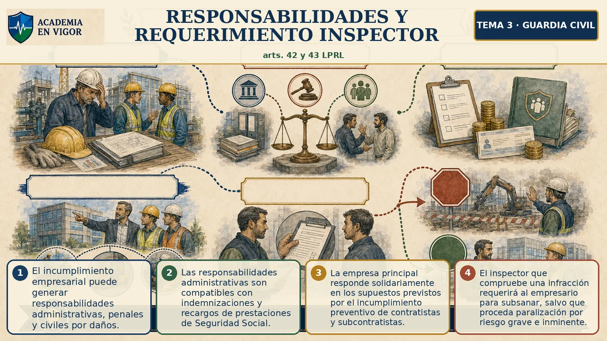

<em>Infografía: Responsabilidades y requerimiento inspector.</em>

<!-- FUENTE: BOE-L31-1995-GC-T03 -->

## 19. Paralización de trabajos e impugnación

### Regla y encaje

La paralización inspectora responde a riesgo grave e inminente. Los plazos son extremadamente breves: tres días hábiles para impugnar y veinticuatro horas para resolver.

El bloque se ancla en **art. 44 LPRL** y pertenece a **ley 31/1995: actuación ante riesgos y colectivos protegidos**.

### Claves normativas

- La Inspección puede ordenar la paralización inmediata de trabajos ante riesgo grave e inminente.
- La medida se comunica a empresa y autoridad laboral; la empresa la comunica de inmediato a trabajadores y representación. <!-- FACT:GC-T03-F091 -->
- La empresa puede impugnar la paralización ante la autoridad laboral en tres días hábiles. <!-- FACT:GC-T03-F092 -->
- La impugnación debe resolverse en un plazo máximo de veinticuatro horas. <!-- FACT:GC-T03-F093 -->
- La paralización se levanta por la Inspección que la decretó o por el empresario cuando subsane las causas, comunicándolo inmediatamente. <!-- FACT:GC-T03-F094 -->
 <!-- FACT:GC-T03-F095 -->

:::hablemos-claro
No memorices palabras sueltas: identifica quién actúa, sobre qué materia, con qué intensidad verbal y si existe excepción.
:::

:::en-la-calle
Ante un supuesto, identifica primero el régimen aplicable —LPRL, AGE o Guardia Civil—; después localiza el deber, el órgano competente y el plazo o excepción.
:::

:::lo-que-cae
Prioridad: **art. 44 LPRL**. Las trampas cambian el sujeto, convierten «podrá» en «deberá» o alteran un plazo o porcentaje.
:::

<!-- VISUAL:t03-19-paralizacion-de-trabajos-e-impugnacion.webp -->

  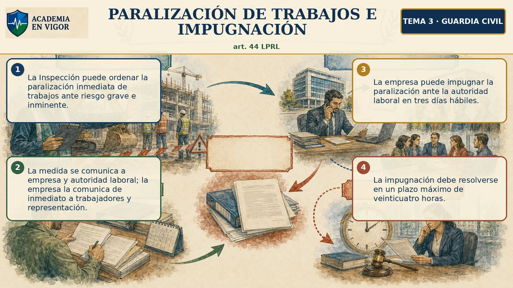

<em>Infografía: Paralización de trabajos e impugnación.</em>

<!-- FUENTE: BOE-L31-1995-GC-T03 -->

## 20. Infracciones y preceptos derogados del capítulo VII

### Regla y encaje

El capítulo VII sigue en el programa, pero no puede estudiarse como en 1995: la mayor parte de su tipificación y sanciones se trasladó a la LISOS y varios artículos están derogados.

El bloque se ancla en **arts. 45 a 52 LPRL** y pertenece a **ley 31/1995: actuación ante riesgos y colectivos protegidos**.

### Claves normativas

- La tipificación y sanción administrativa general en prevención se rige hoy principalmente por el texto refundido de la LISOS.
- El artículo 45 conserva reglas específicas para el personal civil al servicio de las Administraciones públicas. <!-- FACT:GC-T03-F096 -->
- Los artículos 46, 47, 48, 49, 50, 51 y 52 de la LPRL figuran derogados en el texto consolidado. <!-- FACT:GC-T03-F097 -->
- No debe memorizarse como vigente la antigua clasificación de infracciones contenida en esos artículos derogados. <!-- FACT:GC-T03-F098 -->
- La derogación de esos artículos no elimina la responsabilidad administrativa: la regulación fue absorbida por la LISOS. <!-- FACT:GC-T03-F099 -->
 <!-- FACT:GC-T03-F100 -->

:::hablemos-claro
No memorices palabras sueltas: identifica quién actúa, sobre qué materia, con qué intensidad verbal y si existe excepción.
:::

:::en-la-calle
Ante un supuesto, identifica primero el régimen aplicable —LPRL, AGE o Guardia Civil—; después localiza el deber, el órgano competente y el plazo o excepción.
:::

:::lo-que-cae
Prioridad: **arts. 45 a 52 LPRL**. Las trampas cambian el sujeto, convierten «podrá» en «deberá» o alteran un plazo o porcentaje.
:::

:::ha-caido
Apariciones oficiales verificadas: 2022 · pregunta 13, 2026 · pregunta 14. La respuesta se conserva en el índice oficial trazado.
:::

<!-- VISUAL:t03-20-infracciones-y-preceptos-derogados-del-capitulo-vii.webp -->

  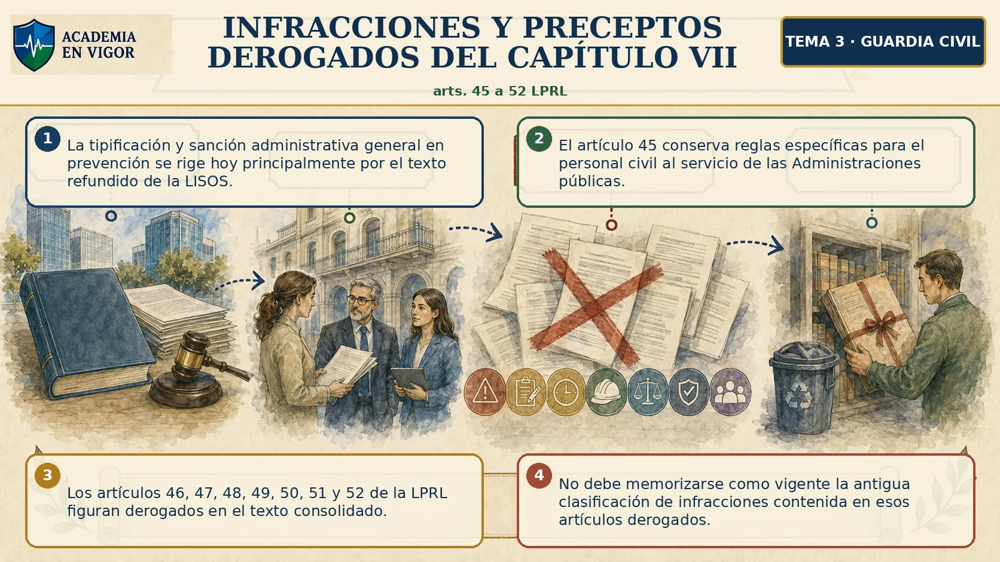

<em>Infografía: Infracciones y preceptos derogados del capítulo VII.</em>

<!-- FUENTE: BOE-L31-1995-GC-T03 -->

## 21. Suspensión, cierre y contratación pública

### Regla y encaje

El cierre exige circunstancias de excepcional gravedad y es una medida extrema. El artículo 54 remite las limitaciones para contratar al régimen de contratos públicos.

El bloque se ancla en **arts. 53 y 54 LPRL** y pertenece a **ley 31/1995: actuación ante riesgos y colectivos protegidos**.

### Claves normativas

- Ante circunstancias de excepcional gravedad, el Gobierno o los órganos autonómicos competentes pueden acordar suspensión de actividades por tiempo determinado.
- En caso extremo, esos mismos órganos pueden acordar el cierre del centro de trabajo. <!-- FACT:GC-T03-F101 -->
- La suspensión o cierre no perjudica el pago de salarios ni indemnizaciones que procedan. <!-- FACT:GC-T03-F102 -->
- Las limitaciones para contratar con la Administración por delitos o infracciones muy graves se rigen por la legislación de contratos públicos. <!-- FACT:GC-T03-F103 -->
- El artículo 54 tiene carácter de legislación básica de contratos administrativos. <!-- FACT:GC-T03-F104 -->
 <!-- FACT:GC-T03-F105 -->

:::hablemos-claro
No memorices palabras sueltas: identifica quién actúa, sobre qué materia, con qué intensidad verbal y si existe excepción.
:::

:::en-la-calle
Ante un supuesto, identifica primero el régimen aplicable —LPRL, AGE o Guardia Civil—; después localiza el deber, el órgano competente y el plazo o excepción.
:::

:::lo-que-cae
Prioridad: **arts. 53 y 54 LPRL**. Las trampas cambian el sujeto, convierten «podrá» en «deberá» o alteran un plazo o porcentaje.
:::

<!-- VISUAL:t03-21-suspension-cierre-y-contratacion-publica.webp -->

  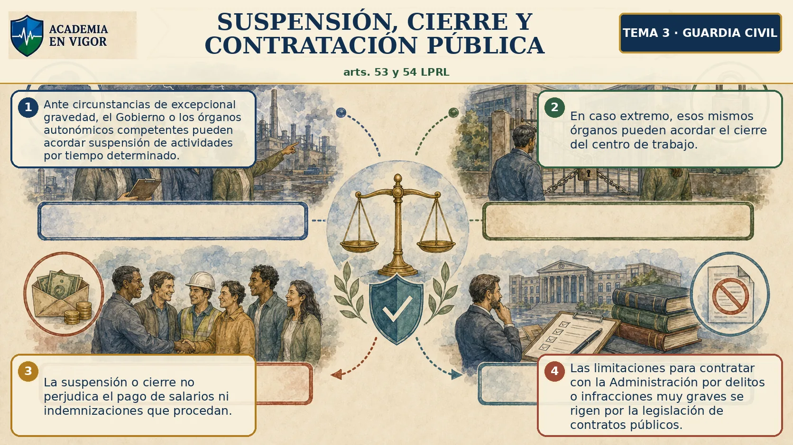

<em>Infografía: Suspensión, cierre y contratación pública.</em>

<!-- FUENTE: BOE-L31-1995-GC-T03 -->

## 22. Objeto y ámbito del Real Decreto 67/2010

### Regla y encaje

El Real Decreto 67/2010 integra la prevención en la AGE y potencia recursos propios. Delimita actividades excluidas y conecta la regla general con las normas específicas de Guardia Civil y Policía.

El bloque se ancla en **arts. 1 y 2 RD 67/2010** y pertenece a **adaptación preventiva a la administración general del estado**.

### Claves normativas

- El Real Decreto 67/2010 adapta la Ley 31/1995 y el Reglamento de Servicios de Prevención a la AGE.
- La adaptación parte de integrar la prevención en actividades y decisiones y potenciar recursos propios. <!-- FACT:GC-T03-F106 -->
- Se aplica a la AGE y organismos públicos vinculados o dependientes con personal funcionario o laboral. <!-- FACT:GC-T03-F107 -->
- Las actividades de policía y seguridad cuyas particularidades lo impidan quedan sometidas a normativa específica inspirada en la LPRL. <!-- FACT:GC-T03-F108 -->
- Las funciones de Guardia Civil sin características exclusivas policiales aplican la normativa general, el RD 67/2010 y las peculiaridades del RD 179/2005. <!-- FACT:GC-T03-F109 -->
 <!-- FACT:GC-T03-F110 -->

:::hablemos-claro
No memorices palabras sueltas: identifica quién actúa, sobre qué materia, con qué intensidad verbal y si existe excepción.
:::

:::en-la-calle
Ante un supuesto, identifica primero el régimen aplicable —LPRL, AGE o Guardia Civil—; después localiza el deber, el órgano competente y el plazo o excepción.
:::

:::lo-que-cae
Prioridad: **arts. 1 y 2 RD 67/2010**. Las trampas cambian el sujeto, convierten «podrá» en «deberá» o alteran un plazo o porcentaje.
:::

:::ha-caido
Apariciones oficiales verificadas: 2021 · pregunta 15, 2026 · pregunta 15. La respuesta se conserva en el índice oficial trazado.
:::

<!-- VISUAL:t03-22-objeto-y-ambito-del-real-decreto-67-2010.webp -->

  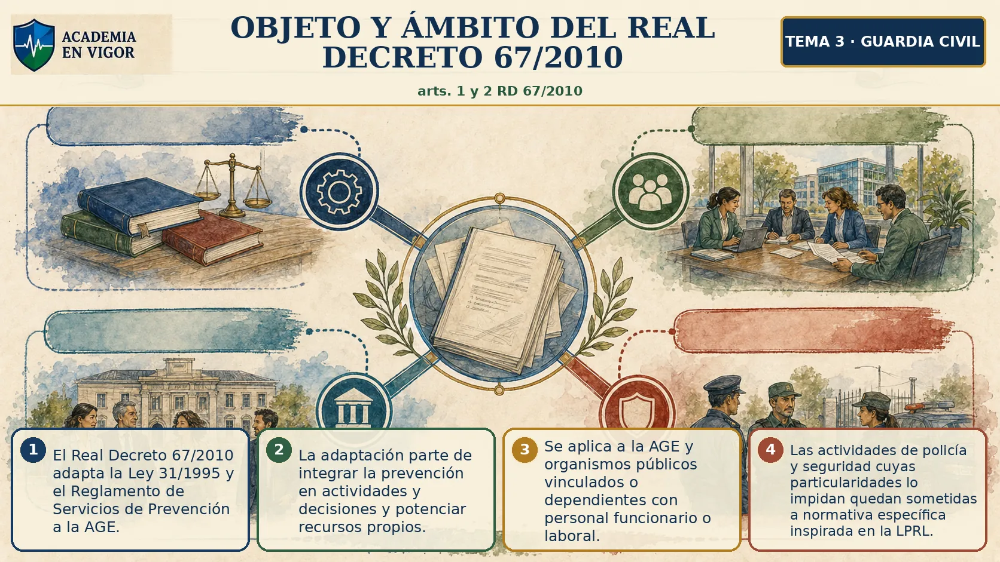

<em>Infografía: Objeto y ámbito del Real Decreto 67/2010.</em>

<!-- FUENTE: BOE-RD67-2010-GC-T03 -->

## 23. Integración y contenido del plan en la AGE

### Regla y encaje

El plan es un documento de gestión, no un simple protocolo. Debe identificar organización, procesos, modalidad preventiva, política, objetivos y recursos, y quedar disponible para tres grupos de control.

El bloque se ancla en **art. 3 RD 67/2010** y pertenece a **adaptación preventiva a la administración general del estado**.

### Claves normativas

- La actividad preventiva de cada departamento u organismo se integra en su sistema general de gestión.
- El Plan de Prevención es la herramienta que materializa esa integración. <!-- FACT:GC-T03-F111 -->
- El documento del plan se conserva a disposición de autoridad laboral, autoridades sanitarias y representantes de los trabajadores. <!-- FACT:GC-T03-F112 -->
- El plan identifica entidad, centros, personal, estructura, funciones, procesos, prácticas y modalidad preventiva. <!-- FACT:GC-T03-F113 -->
- Incluye política, objetivos, metas y recursos humanos, técnicos, materiales y económicos. <!-- FACT:GC-T03-F114 -->
 <!-- FACT:GC-T03-F115 -->

:::hablemos-claro
No memorices palabras sueltas: identifica quién actúa, sobre qué materia, con qué intensidad verbal y si existe excepción.
:::

:::en-la-calle
Ante un supuesto, identifica primero el régimen aplicable —LPRL, AGE o Guardia Civil—; después localiza el deber, el órgano competente y el plazo o excepción.
:::

:::lo-que-cae
Prioridad: **art. 3 RD 67/2010**. Las trampas cambian el sujeto, convierten «podrá» en «deberá» o alteran un plazo o porcentaje.
:::

:::ha-caido
Apariciones oficiales verificadas: 2023 · pregunta 14. La respuesta se conserva en el índice oficial trazado.
:::

<!-- VISUAL:t03-23-integracion-y-contenido-del-plan-en-la-age.webp -->

  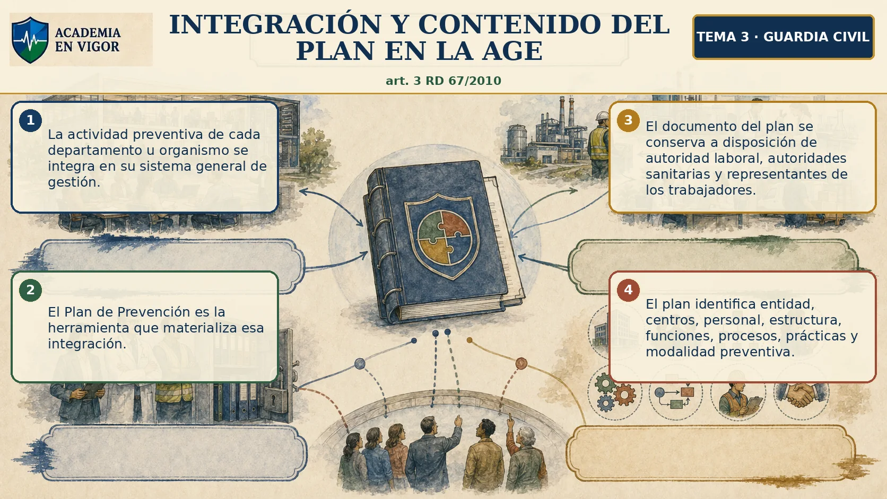

<em>Infografía: Integración y contenido del plan en la AGE.</em>

<!-- FUENTE: BOE-RD67-2010-GC-T03 -->

## 24. Participación y Delegados de Prevención en la AGE

### Regla y encaje

El sistema combina órganos unitarios, Delegados, Comités y una Comisión Técnica. La acreditación individual del delegado corresponde a varias instancias según el ámbito.

El bloque se ancla en **arts. 4 y 5 RD 67/2010** y pertenece a **adaptación preventiva a la administración general del estado**.

### Claves normativas

- La Comisión Técnica de PRL es el órgano específico de participación y negociación sindical en esta materia.
- Los Delegados se designan con carácter general por los representantes del personal y entre miembros de los órganos unitarios. <!-- FACT:GC-T03-F116 -->
- Puede adoptarse otro sistema de designación previo acuerdo de la Comisión Técnica. <!-- FACT:GC-T03-F117 -->
- Cada departamento u organismo y las Delegaciones o Subdelegaciones competentes acreditan individualmente a los Delegados tras comunicar su nombramiento. <!-- FACT:GC-T03-F118 -->
- Reuniones, visitas legales y actuaciones previstas en protocolos de acoso pueden computar como trabajo efectivo sin imputación al crédito horario. <!-- FACT:GC-T03-F119 -->
 <!-- FACT:GC-T03-F120 -->

:::hablemos-claro
No memorices palabras sueltas: identifica quién actúa, sobre qué materia, con qué intensidad verbal y si existe excepción.
:::

:::en-la-calle
Ante un supuesto, identifica primero el régimen aplicable —LPRL, AGE o Guardia Civil—; después localiza el deber, el órgano competente y el plazo o excepción.
:::

:::lo-que-cae
Prioridad: **arts. 4 y 5 RD 67/2010**. Las trampas cambian el sujeto, convierten «podrá» en «deberá» o alteran un plazo o porcentaje.
:::

:::ha-caido
Apariciones oficiales verificadas: 2020 · pregunta 12, 2022 · pregunta 14, 2022 · pregunta 14, 2024 · pregunta 16. La respuesta se conserva en el índice oficial trazado.
:::

<!-- VISUAL:t03-24-participacion-y-delegados-de-prevencion-en-la-age.webp -->

  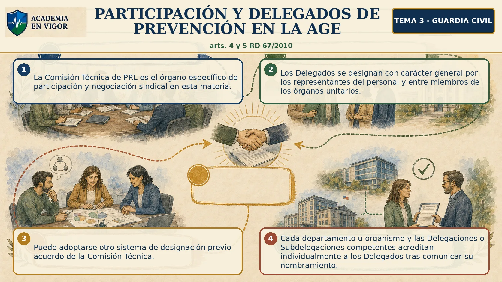

<em>Infografía: Participación y Delegados de Prevención en la AGE.</em>

<!-- FUENTE: BOE-RD67-2010-GC-T03 -->

## 25. Comité de Seguridad y Salud de la AGE

### Regla y encaje

Es un órgano paritario y colegiado, se reúne trimestralmente y puede existir un Comité Intercentros si hay varios centros dotados de comité.

El bloque se ancla en **art. 6 RD 67/2010** y pertenece a **adaptación preventiva a la administración general del estado**.

### Claves normativas

- El Comité es órgano paritario y colegiado para consulta regular y periódica de actuaciones preventivas en la AGE.
- Lo integran Delegados de Prevención y representantes de la Administración en número no superior al de delegados. <!-- FACT:GC-T03-F121 -->
- Con carácter general se constituye un comité en centros del anexo I con 50 o más empleados públicos. <!-- FACT:GC-T03-F122 -->
- El Comité se reúne trimestralmente y cuando lo solicite alguna de las representaciones. <!-- FACT:GC-T03-F123 -->
- Si existen varios centros con comité, puede acordarse un Comité Intercentros con las funciones atribuidas por el acuerdo. <!-- FACT:GC-T03-F124 -->
 <!-- FACT:GC-T03-F125 -->

:::hablemos-claro
No memorices palabras sueltas: identifica quién actúa, sobre qué materia, con qué intensidad verbal y si existe excepción.
:::

:::en-la-calle
Ante un supuesto, identifica primero el régimen aplicable —LPRL, AGE o Guardia Civil—; después localiza el deber, el órgano competente y el plazo o excepción.
:::

:::lo-que-cae
Prioridad: **art. 6 RD 67/2010**. Las trampas cambian el sujeto, convierten «podrá» en «deberá» o alteran un plazo o porcentaje.
:::

<!-- VISUAL:t03-25-comite-de-seguridad-y-salud-de-la-age.webp -->

  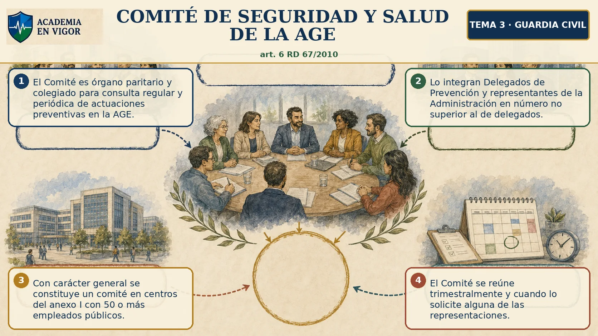

<em>Infografía: Comité de Seguridad y Salud de la AGE.</em>

<!-- FUENTE: BOE-RD67-2010-GC-T03 -->

## 26. Servicios de Prevención en la AGE

### Regla y encaje

La AGE puede combinar servicio propio, personal designado y servicio ajeno, pero prioriza recursos propios. Los umbrales 500 y 250-500 aparecen en la obligación de crear servicio propio.

El bloque se ancla en **art. 7 RD 67/2010** y pertenece a **adaptación preventiva a la administración general del estado**.

### Claves normativas

- La modalidad preventiva se decide previa consulta, atendiendo a estructura, territorio, riesgos e incidencia en empleados.
- Las modalidades son servicio propio, uno o varios empleados designados, servicio ajeno o combinación. <!-- FACT:GC-T03-F126 -->
- Con carácter general se priorizan servicios propios y se contratan temporalmente actividades de difícil asunción técnica. <!-- FACT:GC-T03-F127 -->
- Se crea servicio propio en servicios centrales con más de 500 empleados, o entre 250 y 500 si realizan actividades del anexo I. <!-- FACT:GC-T03-F128 -->
- Un servicio propio con Medicina del Trabajo y recursos suficientes puede asumir vigilancia de salud de un organismo dependiente mediante acuerdo escrito y autorización sanitaria. <!-- FACT:GC-T03-F129 -->
 <!-- FACT:GC-T03-F130 -->

:::hablemos-claro
No memorices palabras sueltas: identifica quién actúa, sobre qué materia, con qué intensidad verbal y si existe excepción.
:::

:::en-la-calle
Ante un supuesto, identifica primero el régimen aplicable —LPRL, AGE o Guardia Civil—; después localiza el deber, el órgano competente y el plazo o excepción.
:::

:::lo-que-cae
Prioridad: **art. 7 RD 67/2010**. Las trampas cambian el sujeto, convierten «podrá» en «deberá» o alteran un plazo o porcentaje.
:::

:::ha-caido
Apariciones oficiales verificadas: 2021 · pregunta 15, 2024 · pregunta 16. La respuesta se conserva en el índice oficial trazado.
:::

<!-- VISUAL:t03-26-servicios-de-prevencion-en-la-age.webp -->

  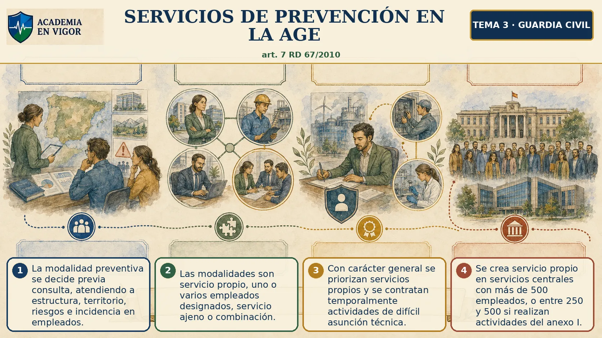

<em>Infografía: Servicios de Prevención en la AGE.</em>

<!-- FUENTE: BOE-RD67-2010-GC-T03 -->

## 27. Funciones y niveles de cualificación

### Regla y encaje

El artículo 8 distingue exactamente tres niveles. Medicina del trabajo, seguridad, higiene industrial y ergonomía/psicosociología pertenecen al nivel superior.

El bloque se ancla en **art. 8 RD 67/2010** y pertenece a **adaptación preventiva a la administración general del estado**.

### Claves normativas

- Las funciones preventivas se clasifican en nivel básico, intermedio y superior.
- El nivel superior comprende medicina del trabajo, seguridad, higiene industrial y ergonomía y psicosociología aplicada. <!-- FACT:GC-T03-F131 -->
- Para nivel básico se exige la formación prevista en el artículo 35 del RD 39/1997. <!-- FACT:GC-T03-F132 -->
- Los niveles intermedio y superior pueden acreditarse por programa formativo o titulación específica; para funcionarios también por oposición equivalente. <!-- FACT:GC-T03-F133 -->
- Las funciones pueden desempeñarse por personal funcionario o laboral y los sindicatos participan en programas formativos. <!-- FACT:GC-T03-F134 -->
 <!-- FACT:GC-T03-F135 -->

:::hablemos-claro
No memorices palabras sueltas: identifica quién actúa, sobre qué materia, con qué intensidad verbal y si existe excepción.
:::

:::en-la-calle
Ante un supuesto, identifica primero el régimen aplicable —LPRL, AGE o Guardia Civil—; después localiza el deber, el órgano competente y el plazo o excepción.
:::

:::lo-que-cae
Prioridad: **art. 8 RD 67/2010**. Las trampas cambian el sujeto, convierten «podrá» en «deberá» o alteran un plazo o porcentaje.
:::

:::ha-caido
Apariciones oficiales verificadas: 2023 · pregunta 15. La respuesta se conserva en el índice oficial trazado.
:::

<!-- VISUAL:t03-27-funciones-y-niveles-de-cualificacion.webp -->

  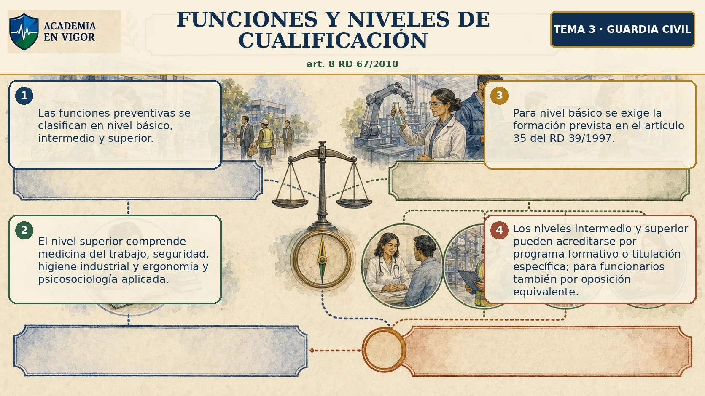

<em>Infografía: Funciones y niveles de cualificación.</em>

<!-- FUENTE: BOE-RD67-2010-GC-T03 -->

## 28. Recursos preventivos, coordinación y control externo

### Regla y encaje

La concurrencia activa coordinación; el sistema preventivo de la AGE se somete además a control periódico externo del INSST, sin perjuicio de la normativa específica de Guardia Civil.

El bloque se ancla en **arts. 9 y 10 RD 67/2010** y pertenece a **adaptación preventiva a la administración general del estado**.

### Claves normativas

- La presencia de recursos preventivos en centros AGE es necesaria en los supuestos de la LPRL y del Reglamento de Servicios de Prevención.
- Si concurren otras Administraciones, empresas o autónomos, deben establecerse medidas y medios de coordinación. <!-- FACT:GC-T03-F136 -->
- Cada sistema preventivo de la AGE se somete a control periódico externo del INSST. <!-- FACT:GC-T03-F137 -->
- El INSST emite informe de evaluación externa con deficiencias y propuestas de mejora, que se comunica a la representación. <!-- FACT:GC-T03-F138 -->
- La AGE fomenta auditorías internas voluntarias como herramienta de gestión y mejora. <!-- FACT:GC-T03-F139 -->
 <!-- FACT:GC-T03-F140 -->

:::hablemos-claro
No memorices palabras sueltas: identifica quién actúa, sobre qué materia, con qué intensidad verbal y si existe excepción.
:::

:::en-la-calle
Ante un supuesto, identifica primero el régimen aplicable —LPRL, AGE o Guardia Civil—; después localiza el deber, el órgano competente y el plazo o excepción.
:::

:::lo-que-cae
Prioridad: **arts. 9 y 10 RD 67/2010**. Las trampas cambian el sujeto, convierten «podrá» en «deberá» o alteran un plazo o porcentaje.
:::

:::ha-caido
Apariciones oficiales verificadas: 2023 · pregunta 15, 2024 · pregunta 16, 2025 · pregunta 17. La respuesta se conserva en el índice oficial trazado.
:::

<!-- VISUAL:t03-28-recursos-preventivos-coordinacion-y-control-externo.webp -->

  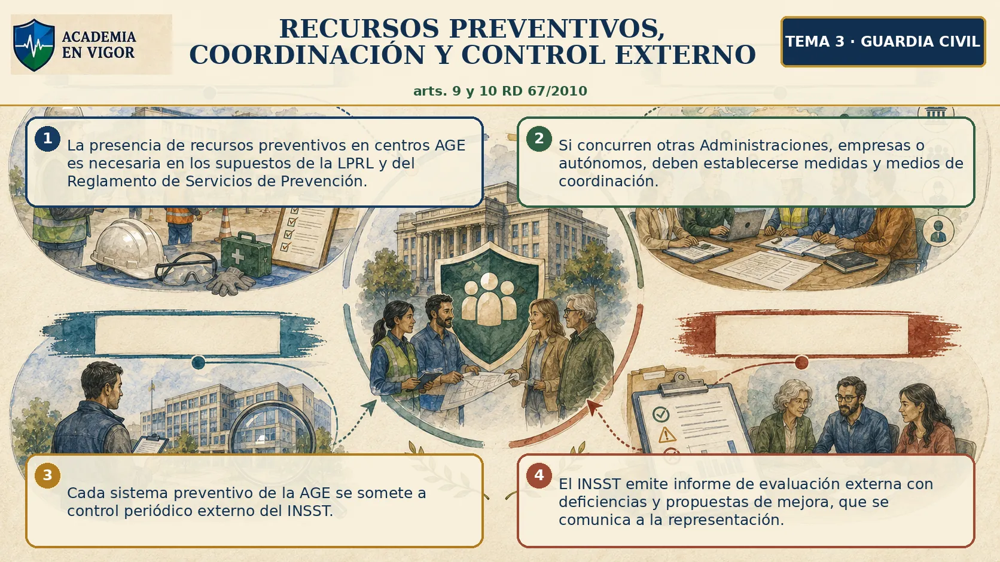

<em>Infografía: Recursos preventivos, coordinación y control externo.</em>

<!-- FUENTE: BOE-RD67-2010-GC-T03 -->

## 29. Dirección General de la Función Pública y disposiciones AGE

### Regla y encaje

La Dirección General de la Función Pública coordina, sigue, impulsa y mantiene la interlocución sindical. Las disposiciones completan colaboración médica, equivalencias y coordinación institucional.

El bloque se ancla en **art. 11 y disposiciones RD 67/2010** y pertenece a **adaptación preventiva a la administración general del estado**.

### Claves normativas

- La Dirección General de la Función Pública coordina, sigue, promueve e impulsa la PRL en la AGE y es interlocutora sindical.
- Ejerce la presidencia de la Comisión Técnica de Prevención de Riesgos Laborales. <!-- FACT:GC-T03-F141 -->
- Coordina especialmente formación, prioridades, objetivos, criterios, soportes y metodologías. <!-- FACT:GC-T03-F142 -->
- Los departamentos informan periódicamente sobre recursos, consulta, planes, actividades, siniestralidad y mejora de condiciones. <!-- FACT:GC-T03-F143 -->
- Los servicios médicos asistenciales pueden colaborar con los servicios preventivos sin perder sus funciones propias. <!-- FACT:GC-T03-F144 -->
 <!-- FACT:GC-T03-F145 -->

:::hablemos-claro
No memorices palabras sueltas: identifica quién actúa, sobre qué materia, con qué intensidad verbal y si existe excepción.
:::

:::en-la-calle
Ante un supuesto, identifica primero el régimen aplicable —LPRL, AGE o Guardia Civil—; después localiza el deber, el órgano competente y el plazo o excepción.
:::

:::lo-que-cae
Prioridad: **art. 11 y disposiciones RD 67/2010**. Las trampas cambian el sujeto, convierten «podrá» en «deberá» o alteran un plazo o porcentaje.
:::

:::ha-caido
Apariciones oficiales verificadas: 2025 · pregunta 18. La respuesta se conserva en el índice oficial trazado.
:::

<!-- VISUAL:t03-29-direccion-general-de-la-funcion-publica-y-disposiciones-age.webp -->

  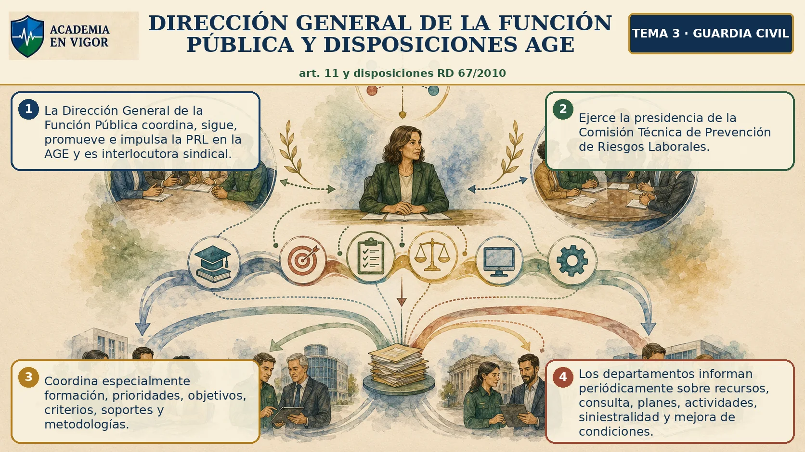

<em>Infografía: Dirección General de la Función Pública y disposiciones AGE.</em>

<!-- FUENTE: BOE-RD67-2010-GC-T03 -->

## 30. Objeto y ámbito específico de Guardia Civil

### Regla y encaje

El Real Decreto 179/2005 adapta la prevención a las peculiaridades organizativas, participativas y funcionales del Cuerpo. Distingue actividades policiales específicas, funciones ordinarias y misiones militares.

El bloque se ancla en **arts. 1 y 2 RD 179/2005** y pertenece a **prevención específica en la guardia civil**.

### Claves normativas

- El RD 179/2005 promueve seguridad y salud del personal del Cuerpo y de militares destinados en unidades, centros y organismos de la Dirección General.
- Adapta Directiva 89/391/CEE y LPRL a peculiaridades organizativas, de participación y funcionales de Guardia Civil. <!-- FACT:GC-T03-F146 -->
- Su ámbito personal incluye guardias civiles y miembros de Fuerzas Armadas destinados en la Dirección General. <!-- FACT:GC-T03-F147 -->
- Comprende actividades específicas para cumplir las misiones de la LO 2/1986; las misiones militares se rigen por sus normas específicas. <!-- FACT:GC-T03-F148 -->
- Las funciones no exclusivamente policiales aplican normativa general, RD 67/2010 y peculiaridades del RD 179/2005. <!-- FACT:GC-T03-F149 -->
 <!-- FACT:GC-T03-F150 -->

:::hablemos-claro
No memorices palabras sueltas: identifica quién actúa, sobre qué materia, con qué intensidad verbal y si existe excepción.
:::

:::en-la-calle
Ante un supuesto, identifica primero el régimen aplicable —LPRL, AGE o Guardia Civil—; después localiza el deber, el órgano competente y el plazo o excepción.
:::

:::lo-que-cae
Prioridad: **arts. 1 y 2 RD 179/2005**. Las trampas cambian el sujeto, convierten «podrá» en «deberá» o alteran un plazo o porcentaje.
:::

:::ha-caido
Apariciones oficiales verificadas: 2024 · pregunta 17. La respuesta se conserva en el índice oficial trazado.
:::

<!-- VISUAL:t03-30-objeto-y-ambito-especifico-de-guardia-civil.webp -->

  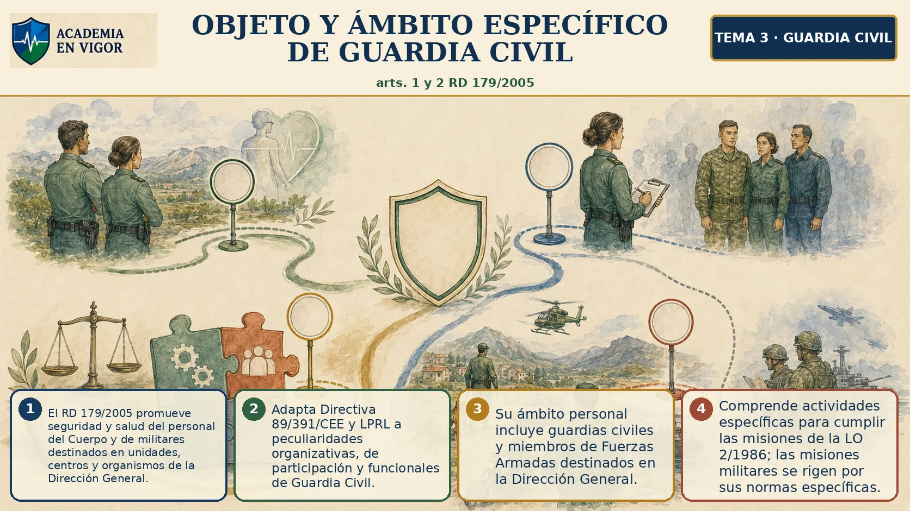

<em>Infografía: Objeto y ámbito específico de Guardia Civil.</em>

<!-- FUENTE: BOE-RD179-2005-GC-T03 -->

## 31. Objetivo y principios de acción preventiva en Guardia Civil

### Regla y encaje

La reforma de 2026 añadió el artículo 3 bis. Esta novedad no estaba en muchos temarios antiguos y es de riesgo máximo: enumera diez principios adaptados a la naturaleza del servicio.

El bloque se ancla en **arts. 3 y 3 bis RD 179/2005** y pertenece a **prevención específica en la guardia civil**.

### Claves normativas

- Las medidas buscan mejorar condiciones del servicio y elevar la protección de seguridad y salud del personal.
- Desde el 26 de febrero de 2026, el artículo 3 bis recoge expresamente los principios generales de la acción preventiva. <!-- FACT:GC-T03-F151 -->
- Entre esos principios están evitar riesgos, evaluar los difíciles de evitar y combatirlos en su origen. <!-- FACT:GC-T03-F152 -->
- Debe adaptarse el puesto, tenerse en cuenta la técnica y priorizarse protección colectiva sobre individual. <!-- FACT:GC-T03-F153 -->
- También se exige elegir medios adecuados, incorporar prevención a métodos y dispositivos cuando sea posible y dar instrucciones. <!-- FACT:GC-T03-F154 -->
 <!-- FACT:GC-T03-F155 -->

:::hablemos-claro
No memorices palabras sueltas: identifica quién actúa, sobre qué materia, con qué intensidad verbal y si existe excepción.
:::

:::en-la-calle
Ante un supuesto, identifica primero el régimen aplicable —LPRL, AGE o Guardia Civil—; después localiza el deber, el órgano competente y el plazo o excepción.
:::

:::lo-que-cae
Prioridad: **arts. 3 y 3 bis RD 179/2005**. Las trampas cambian el sujeto, convierten «podrá» en «deberá» o alteran un plazo o porcentaje.
:::

<!-- VISUAL:t03-31-objetivo-y-principios-de-accion-preventiva-en-guardia-civil.webp -->

  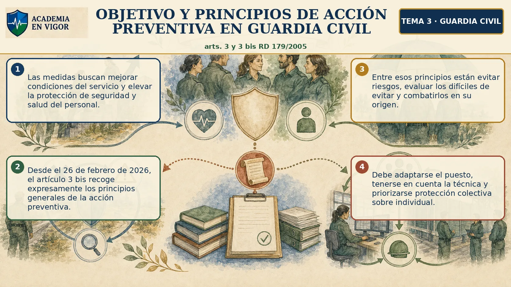

<em>Infografía: Objetivo y principios de acción preventiva en Guardia Civil.</em>

<!-- FUENTE: BOE-RD179-2005-GC-T03 -->

## 32. Integración, evaluación y planes de emergencia en Guardia Civil

### Regla y encaje

El plan integra la prevención; evaluación y planificación lo aplican; y los órganos preventivos mantienen los planes de emergencia, incorporados como anexos a los planes de seguridad.

El bloque se ancla en **arts. 4 y 5 RD 179/2005** y pertenece a **prevención específica en la guardia civil**.

### Claves normativas

- La prevención se integra en todas las actividades mediante un plan que incluya los elementos necesarios.
- Evaluación de riesgos y planificación preventiva son los instrumentos esenciales del plan. <!-- FACT:GC-T03-F156 -->
- La evaluación inicial considera naturaleza de la actividad, características del servicio y actividad preventiva previa. <!-- FACT:GC-T03-F157 -->
- La evaluación se actualiza periódicamente o al cambiar condiciones y se revisa tras daños si es necesario. <!-- FACT:GC-T03-F158 -->
- Los órganos de prevención definen, implantan y mantienen planes de emergencia, anexos a planes de seguridad de centros y organismos. <!-- FACT:GC-T03-F159 -->
 <!-- FACT:GC-T03-F160 -->

:::hablemos-claro
No memorices palabras sueltas: identifica quién actúa, sobre qué materia, con qué intensidad verbal y si existe excepción.
:::

:::en-la-calle
Ante un supuesto, identifica primero el régimen aplicable —LPRL, AGE o Guardia Civil—; después localiza el deber, el órgano competente y el plazo o excepción.
:::

:::lo-que-cae
Prioridad: **arts. 4 y 5 RD 179/2005**. Las trampas cambian el sujeto, convierten «podrá» en «deberá» o alteran un plazo o porcentaje.
:::

:::ha-caido
Apariciones oficiales verificadas: 2024 · pregunta 17. La respuesta se conserva en el índice oficial trazado.
:::

<!-- VISUAL:t03-32-integracion-evaluacion-y-planes-de-emergencia-en-guardia-civil.webp -->

  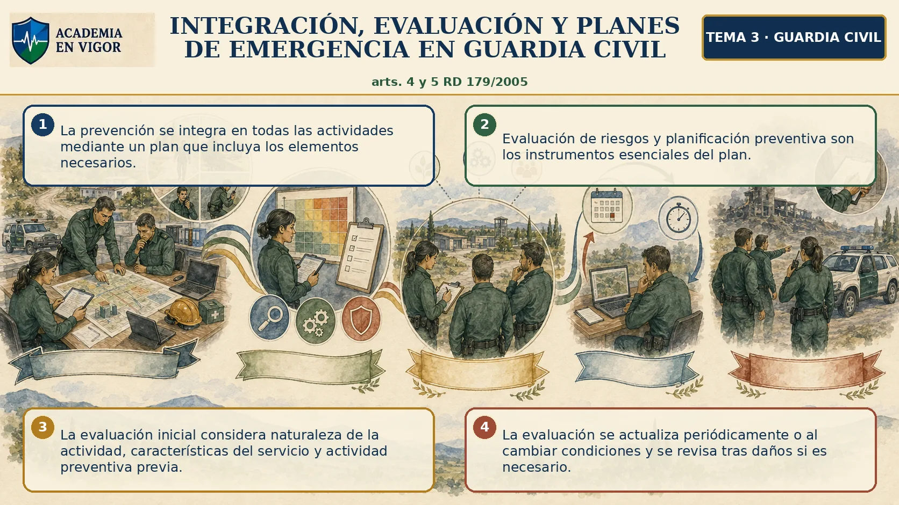

<em>Infografía: Integración, evaluación y planes de emergencia en Guardia Civil.</em>

<!-- FUENTE: BOE-RD179-2005-GC-T03 -->

## 33. Vigilancia de la salud tras la reforma de 2026

### Regla y encaje

La redacción vigente garantiza vigilancia periódica, delimita cuándo puede ser obligatoria y separa información médica personal de las conclusiones de aptitud que necesitan mandos y órganos preventivos.

El bloque se ancla en **art. 6 RD 179/2005** y pertenece a **prevención específica en la guardia civil**.

### Claves normativas

- La Dirección General garantiza vigilancia adecuada y periódica según riesgos profesionales.
- La vigilancia respeta dignidad y confidencialidad y prohíbe uso discriminatorio o perjudicial de datos. <!-- FACT:GC-T03-F161 -->
- Oídas las asociaciones representativas, puede determinarse obligatoriedad cuando el reconocimiento sea necesario para verificar peligro para sí o terceros. <!-- FACT:GC-T03-F162 -->
- Los reconocimientos los realiza Sanidad de Guardia Civil o un servicio preventivo ajeno contratado. <!-- FACT:GC-T03-F163 -->
- La información médica se limita a personal médico y autoridades de vigilancia; mandos de nivel Comandancia y órganos preventivos reciben solo conclusiones de aptitud o necesidad de medidas. <!-- FACT:GC-T03-F164 -->
 <!-- FACT:GC-T03-F165 -->

:::hablemos-claro
No memorices palabras sueltas: identifica quién actúa, sobre qué materia, con qué intensidad verbal y si existe excepción.
:::

:::en-la-calle
Ante un supuesto, identifica primero el régimen aplicable —LPRL, AGE o Guardia Civil—; después localiza el deber, el órgano competente y el plazo o excepción.
:::

:::lo-que-cae
Prioridad: **art. 6 RD 179/2005**. Las trampas cambian el sujeto, convierten «podrá» en «deberá» o alteran un plazo o porcentaje.
:::

<!-- VISUAL:t03-33-vigilancia-de-la-salud-tras-la-reforma-de-2026.webp -->

  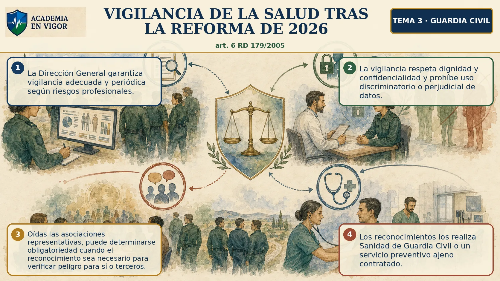

<em>Infografía: Vigilancia de la salud tras la reforma de 2026.</em>

<!-- FUENTE: BOE-RD179-2005-GC-T03 -->

## 34. Información, participación y formación en Guardia Civil

### Regla y encaje

Información, propuestas y formación son tres canales diferentes. Desde 2022, las propuestas a órganos preventivos son analizadas y valoradas por el Consejo de la Guardia Civil.

El bloque se ancla en **arts. 7 a 9 RD 179/2005** y pertenece a **prevención específica en la guardia civil**.

### Claves normativas

- La Dirección General promueve que el personal conozca riesgos de la función y medidas preventivas.
- La información se incorpora a manuales, instrucciones y órdenes hasta el nivel necesario para asegurar prevención. <!-- FACT:GC-T03-F166 -->
- El personal puede proponer mejoras a los órganos del artículo 13; el Consejo de la Guardia Civil las analiza y valora. <!-- FACT:GC-T03-F167 -->
- La formación será suficiente y adecuada desde la incorporación y se integrará en formación continua, adaptada a riesgos nuevos. <!-- FACT:GC-T03-F168 -->
- El personal de órganos preventivos o con funciones protectoras recibe formación especializada acorde con sus cometidos. <!-- FACT:GC-T03-F169 -->
 <!-- FACT:GC-T03-F170 -->

:::hablemos-claro
No memorices palabras sueltas: identifica quién actúa, sobre qué materia, con qué intensidad verbal y si existe excepción.
:::

:::en-la-calle
Ante un supuesto, identifica primero el régimen aplicable —LPRL, AGE o Guardia Civil—; después localiza el deber, el órgano competente y el plazo o excepción.
:::

:::lo-que-cae
Prioridad: **arts. 7 a 9 RD 179/2005**. Las trampas cambian el sujeto, convierten «podrá» en «deberá» o alteran un plazo o porcentaje.
:::

:::ha-caido
Apariciones oficiales verificadas: 2022 · pregunta 14, 2026 · pregunta 16. La respuesta se conserva en el índice oficial trazado.
:::

<!-- VISUAL:t03-34-informacion-participacion-y-formacion-en-guardia-civil.webp -->

  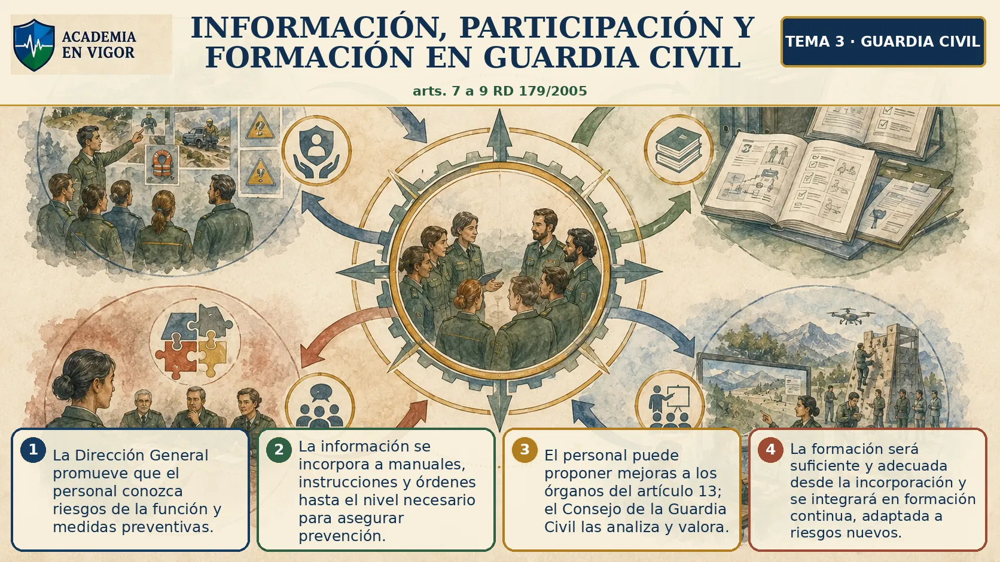

<em>Infografía: Información, participación y formación en Guardia Civil.</em>

<!-- FUENTE: BOE-RD179-2005-GC-T03 -->

## 35. Maternidad y obligaciones de la Administración en Guardia Civil

### Regla y encaje

La evaluación de maternidad debe medir naturaleza, grado y duración de exposición. La Administración debe proteger en medios, EPI, emergencias e información de riesgos graves.

El bloque se ancla en **arts. 10 y 11 RD 179/2005** y pertenece a **prevención específica en la guardia civil**.

### Claves normativas

- La evaluación de embarazo o parto reciente determina naturaleza, grado y duración de exposición a riesgos específicos.
- Si hay riesgo para embarazo o lactancia, los mandos adoptan medidas previstas en destinos, permisos y normativa del personal público. <!-- FACT:GC-T03-F171 -->
- Los órganos administrativos adoptan medidas para garantizar, en lo posible, seguridad al usar medios y equipos. <!-- FACT:GC-T03-F172 -->
- Deben proporcionar EPI adecuados y velar por su uso efectivo cuando sean necesarios. <!-- FACT:GC-T03-F173 -->
- Deben prever primeros auxilios, incendios y evacuación e informar, siempre que sea posible, ante riesgo grave e inminente. <!-- FACT:GC-T03-F174 -->
 <!-- FACT:GC-T03-F175 -->

:::hablemos-claro
No memorices palabras sueltas: identifica quién actúa, sobre qué materia, con qué intensidad verbal y si existe excepción.
:::

:::en-la-calle
Ante un supuesto, identifica primero el régimen aplicable —LPRL, AGE o Guardia Civil—; después localiza el deber, el órgano competente y el plazo o excepción.
:::

:::lo-que-cae
Prioridad: **arts. 10 y 11 RD 179/2005**. Las trampas cambian el sujeto, convierten «podrá» en «deberá» o alteran un plazo o porcentaje.
:::

<!-- VISUAL:t03-35-maternidad-y-obligaciones-de-la-administracion-en-guardia-civil.webp -->

  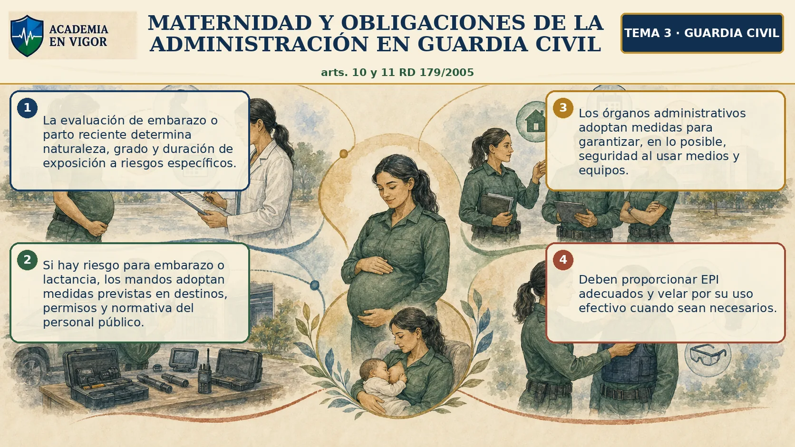

<em>Infografía: Maternidad y obligaciones de la Administración en Guardia Civil.</em>

<!-- FUENTE: BOE-RD179-2005-GC-T03 -->

## 36. Obligaciones del personal de Guardia Civil

### Regla y encaje

La prevención también exige conducta individual: uso correcto, respeto a dispositivos, aviso inmediato y cooperación leal, siempre conforme a formación e instrucciones.

El bloque se ancla en **art. 12 RD 179/2005** y pertenece a **prevención específica en la guardia civil**.

### Claves normativas

- El personal vela, según sus posibilidades, por su propia seguridad y la de terceros afectados por sus actos u omisiones.
- Debe usar adecuadamente máquinas, herramientas, sustancias, equipos y otros medios. <!-- FACT:GC-T03-F176 -->
- Debe utilizar correctamente protección individual o colectiva y no inutilizar dispositivos de seguridad. <!-- FACT:GC-T03-F177 -->
- Debe informar de inmediato y por conducto regular de situaciones razonablemente peligrosas. <!-- FACT:GC-T03-F178 -->
- Debe contribuir al cumplimiento de obligaciones de mando y prestar leal cooperación para condiciones seguras. <!-- FACT:GC-T03-F179 -->
 <!-- FACT:GC-T03-F180 -->

:::hablemos-claro
No memorices palabras sueltas: identifica quién actúa, sobre qué materia, con qué intensidad verbal y si existe excepción.
:::

:::en-la-calle
Ante un supuesto, identifica primero el régimen aplicable —LPRL, AGE o Guardia Civil—; después localiza el deber, el órgano competente y el plazo o excepción.
:::

:::lo-que-cae
Prioridad: **art. 12 RD 179/2005**. Las trampas cambian el sujeto, convierten «podrá» en «deberá» o alteran un plazo o porcentaje.
:::

<!-- VISUAL:t03-36-obligaciones-del-personal-de-guardia-civil.webp -->

  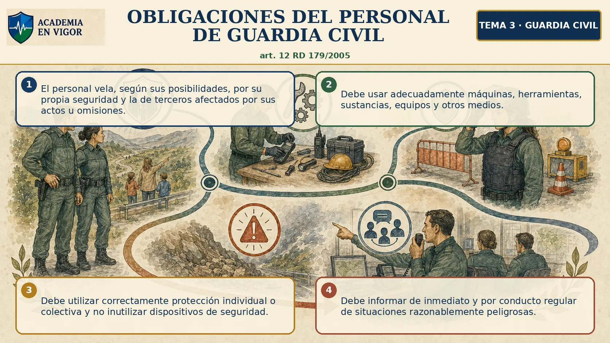

<em>Infografía: Obligaciones del personal de Guardia Civil.</em>

<!-- FUENTE: BOE-RD179-2005-GC-T03 -->

## 37. Órganos de prevención de Guardia Civil

### Regla y encaje

El órgano preventivo es un conjunto de medios humanos, no una lista de recursos materiales. La orden ministerial determina nivel, adscripción, dependencia, medios y funciones específicas.

El bloque se ancla en **art. 13 RD 179/2005** y pertenece a **prevención específica en la guardia civil**.

### Claves normativas

- Los órganos de prevención son el conjunto de medios humanos necesarios para realizar actividades preventivas.
- Diseñan, implantan y coordinan planes, evalúan riesgos y establecen medidas preventivas. <!-- FACT:GC-T03-F181 -->
- El jefe de cada unidad, centro u organismo responde de aplicar medidas a sus subordinados y canalizar propuestas. <!-- FACT:GC-T03-F182 -->
- Una orden ministerial determina nivel orgánico, adscripción, dependencias, funcionamiento, competencias, medios y funciones específicas. <!-- FACT:GC-T03-F183 -->
- Se constituyen Servicio de Prevención, Secciones de Zona, Oficinas de Comandancia y otras unidades. <!-- FACT:GC-T03-F184 -->
 <!-- FACT:GC-T03-F185 -->

:::hablemos-claro
No memorices palabras sueltas: identifica quién actúa, sobre qué materia, con qué intensidad verbal y si existe excepción.
:::

:::en-la-calle
Ante un supuesto, identifica primero el régimen aplicable —LPRL, AGE o Guardia Civil—; después localiza el deber, el órgano competente y el plazo o excepción.
:::

:::lo-que-cae
Prioridad: **art. 13 RD 179/2005**. Las trampas cambian el sujeto, convierten «podrá» en «deberá» o alteran un plazo o porcentaje.
:::

:::ha-caido
Apariciones oficiales verificadas: 2020 · pregunta 13, 2020 · pregunta 13, 2022 · pregunta 15, 2023 · pregunta 16, 2024 · pregunta 17. La respuesta se conserva en el índice oficial trazado.
:::

<!-- VISUAL:t03-37-organos-de-prevencion-de-guardia-civil.webp -->

  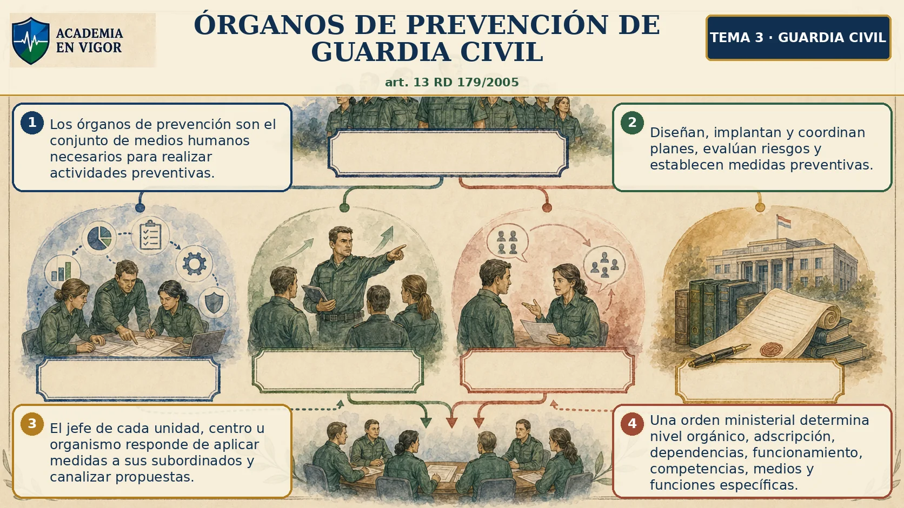

<em>Infografía: Órganos de prevención de Guardia Civil.</em>

<!-- FUENTE: BOE-RD179-2005-GC-T03 -->

## 38. Consejo, inspección y control preventivo

### Regla y encaje

El Consejo asesora sobre propuestas; cada órgano controla internamente a sus dependientes; y la Inspección de Personal y Servicios de Seguridad ejerce control externo.

El bloque se ancla en **arts. 14 y 15 RD 179/2005** y pertenece a **prevención específica en la guardia civil**.

### Claves normativas

- El Consejo de la Guardia Civil analiza y valora las propuestas formuladas por participación.
- Cada órgano preventivo inspecciona y controla internamente órganos dependientes y medidas adoptadas. <!-- FACT:GC-T03-F186 -->
- La Inspección de Personal y Servicios de Seguridad de la Secretaría de Estado de Seguridad realiza control externo. <!-- FACT:GC-T03-F187 -->
- El Servicio de Prevención remite a la Inspección copia de su memoria anual. <!-- FACT:GC-T03-F188 -->
- Un riesgo grave e inminente no inherente a la naturaleza de la función se comunica urgentemente a la subdirección competente. <!-- FACT:GC-T03-F189 -->
 <!-- FACT:GC-T03-F190 -->

:::hablemos-claro
No memorices palabras sueltas: identifica quién actúa, sobre qué materia, con qué intensidad verbal y si existe excepción.
:::

:::en-la-calle
Ante un supuesto, identifica primero el régimen aplicable —LPRL, AGE o Guardia Civil—; después localiza el deber, el órgano competente y el plazo o excepción.
:::

:::lo-que-cae
Prioridad: **arts. 14 y 15 RD 179/2005**. Las trampas cambian el sujeto, convierten «podrá» en «deberá» o alteran un plazo o porcentaje.
:::

:::ha-caido
Apariciones oficiales verificadas: 2021 · pregunta 16, 2022 · pregunta 15. La respuesta se conserva en el índice oficial trazado.
:::

<!-- VISUAL:t03-38-consejo-inspeccion-y-control-preventivo.webp -->

  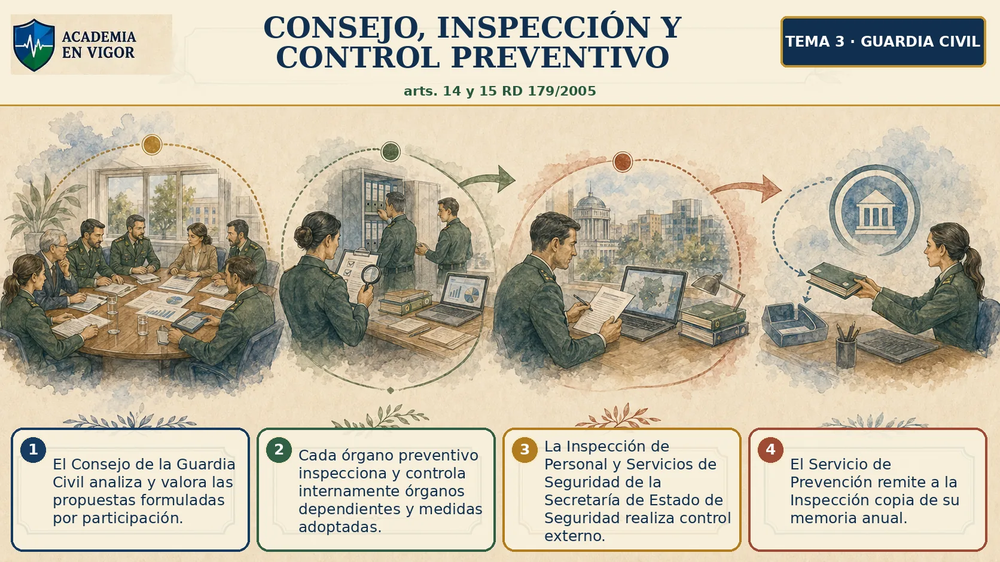

<em>Infografía: Consejo, inspección y control preventivo.</em>

<!-- FUENTE: BOE-RD179-2005-GC-T03 -->

## 39. Procedimiento de medidas correctoras

### Regla y encaje

La propuesta de requerimiento contiene irregularidades, medidas y plazo. El Director General dispone de treinta días hábiles; el silencio convierte la propuesta en definitiva.

El bloque se ancla en **art. 16 RD 179/2005** y pertenece a **prevención específica en la guardia civil**.

### Claves normativas

- La Inspección emite propuesta de requerimiento con irregularidades, medidas de subsanación y plazo de ejecución.
- La propuesta se traslada al Director General a través del Servicio de Prevención. <!-- FACT:GC-T03-F191 -->
- El Director General puede alegar en treinta días hábiles desde la notificación. <!-- FACT:GC-T03-F192 -->
- Sin alegaciones, la propuesta adquiere automáticamente carácter definitivo y se tramita su ejecución. <!-- FACT:GC-T03-F193 -->
- Con discrepancia, la Inspección puede elevar propuesta definitiva al Secretario de Estado de Seguridad, que resuelve. <!-- FACT:GC-T03-F194 -->
 <!-- FACT:GC-T03-F195 -->

:::hablemos-claro
No memorices palabras sueltas: identifica quién actúa, sobre qué materia, con qué intensidad verbal y si existe excepción.
:::

:::en-la-calle
Ante un supuesto, identifica primero el régimen aplicable —LPRL, AGE o Guardia Civil—; después localiza el deber, el órgano competente y el plazo o excepción.
:::

:::lo-que-cae
Prioridad: **art. 16 RD 179/2005**. Las trampas cambian el sujeto, convierten «podrá» en «deberá» o alteran un plazo o porcentaje.
:::

<!-- VISUAL:t03-39-procedimiento-de-medidas-correctoras.webp -->

  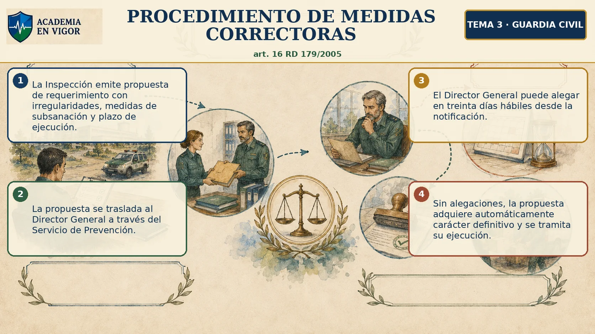

<em>Infografía: Procedimiento de medidas correctoras.</em>

<!-- FUENTE: BOE-RD179-2005-GC-T03 -->

## 40. Disposiciones del Real Decreto 179/2005

### Regla y encaje

Las disposiciones completan la colaboración médica, el personal en el extranjero, la financiación y los plazos históricos de implantación. Se estudian como parte íntegra del real decreto, distinguiendo reglas permanentes de plazos ya consumados.

El bloque se ancla en **disposiciones adicionales, derogatoria y finales RD 179/2005** y pertenece a **prevención específica en la guardia civil**.

### Claves normativas

- Los servicios médicos de unidades colaboran con los servicios preventivos sin perjuicio de sus otras funciones.
- El Servicio de Prevención atiende al personal en el extranjero que no desempeñe misiones militares, considerando peculiaridades y derecho local. <!-- FACT:GC-T03-F196 -->
- Los gastos se financian por la Dirección General dentro de los recursos asignados. <!-- FACT:GC-T03-F197 -->
- Los órganos preventivos debían constituirse en un año y organizar actividad y planes de emergencia en el año siguiente a su constitución. <!-- FACT:GC-T03-F198 -->
- El Ministro del Interior está habilitado para dictar desarrollo complementario y el real decreto entró en vigor al día siguiente de su publicación. <!-- FACT:GC-T03-F199 -->
 <!-- FACT:GC-T03-F200 -->

:::hablemos-claro
No memorices palabras sueltas: identifica quién actúa, sobre qué materia, con qué intensidad verbal y si existe excepción.
:::

:::en-la-calle
Ante un supuesto, identifica primero el régimen aplicable —LPRL, AGE o Guardia Civil—; después localiza el deber, el órgano competente y el plazo o excepción.
:::

:::lo-que-cae
Prioridad: **disposiciones adicionales, derogatoria y finales RD 179/2005**. Las trampas cambian el sujeto, convierten «podrá» en «deberá» o alteran un plazo o porcentaje.
:::

<!-- VISUAL:t03-40-disposiciones-del-real-decreto-179-2005.webp -->

  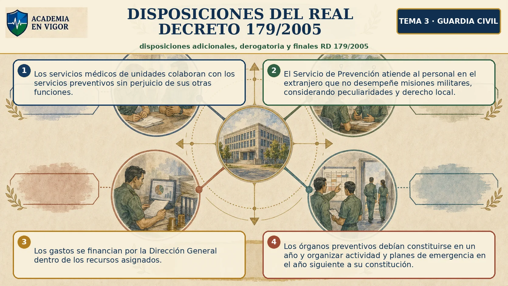

<em>Infografía: Disposiciones del Real Decreto 179/2005.</em>

<!-- FUENTE: BOE-RD179-2005-GC-T03 -->

# Hablemos claro

:::hablemos-claro
No mezcles niveles: la Ley 31/1995 fija el marco general; el Real Decreto 67/2010 lo adapta a la AGE; y el Real Decreto 179/2005 introduce peculiaridades para Guardia Civil. La norma especial desplaza solo lo incompatible, no toda la protección.
:::

# En la calle

:::en-la-calle
En una unidad, prevenir no es reaccionar tras el daño: implica integrar el plan, evaluar los puestos, planificar medidas, formar, mantener emergencias y documentar el control. Las funciones policiales específicas tienen adaptación propia, no ausencia de protección.
:::

# Lo que cae

:::lo-que-cae
Máximo rendimiento: definiciones del artículo 4; composición y votos de la Comisión Nacional; principios del artículo 15; riesgo grave e inminente; plazos de paralización; plan y órganos de la AGE; órganos de Guardia Civil; treinta días del artículo 16; y reformas de 2026 de los artículos 3 bis y 6 del Real Decreto 179/2005.
:::

# Ha caído

:::ha-caido
Se han trazado 40 preguntas oficiales de Guardia Civil entre 2020 y 2026, todas con plantilla final verificada y vinculadas a hechos de este tema.
:::

---

*Academia En Vigor · El temario que nunca duerme · Tema 3 · v1.0.0 · Documento interno no publicado.*
