# TEMA 4 · DERECHO CONSTITUCIONAL

**Guardia Civil · Método VIGOR · ATESTADO**
**Versión de contenido:** 1.0.0
**Estado editorial:** approved_internal · **Publicación:** not_published

# Mapa del tema

El tema recorre la Constitución completa y añade dos garantías civiles: el Defensor del Pueblo como supervisor de la Administración y la protección del honor, la intimidad y la propia imagen.

<!-- VISUAL PENDIENTE: t04-00-mapa-derecho-constitucional.webp -->

# Contenido

## 01. La Constitución como norma suprema

### Regla y encaje

Este bloque ordena la constitución como norma suprema dentro del sistema constitucional. La clave es relacionar el precepto con su sujeto, competencia, garantía, mayoría o plazo.

Este bloque pertenece a **constitución: origen, estructura y título preliminar** y se contrasta en **arts. 9.1 y 166 a 169 CE**.

### Claves normativas

- Ninguna norma inferior puede modificar la Constitución; su reforma exige los procedimientos constitucionales.
- Las leyes, los reglamentos y la actuación de los poderes públicos deben respetar el contenido constitucional. <!-- FACT:GC-T04-F001 -->
- La Constitución es una norma jurídica vinculante y no una mera declaración política. <!-- FACT:GC-T04-F002 -->
- El artículo 9.1 somete a ciudadanos y poderes públicos a la Constitución y al resto del ordenamiento. <!-- FACT:GC-T04-F003 -->
 <!-- FACT:GC-T04-F004 -->

:::hablemos-claro
Lee la Constitución como un sistema: primero identifica el poder u órgano; después, su competencia, límite, garantía y control.
:::

:::en-la-calle
En un supuesto práctico, separa derechos, organización del poder y procedimiento. Una misma palabra —ley, mayoría o control— cambia de sentido según el título constitucional.
:::

:::lo-que-cae
Prioridad de examen: **arts. 9.1 y 166 a 169 CE**. Vigila sujetos, plazos, mayorías, excepciones y verbos de competencia.
:::

<!-- VISUAL:t04-01-la-constitucion-como-norma-suprema.webp -->

  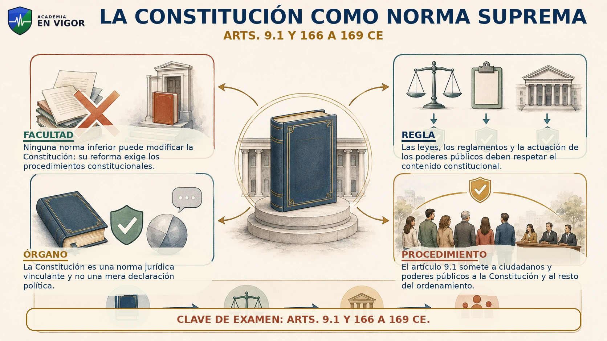

<em>Infografía: La Constitución como norma suprema.</em>

<!-- FUENTE: BOE-CE-1978-GC-T04 -->

## 02. Elaboración de la Constitución de 1978

### Regla y encaje

Este bloque ordena elaboración de la constitución de 1978 dentro del sistema constitucional. La clave es relacionar el precepto con su sujeto, competencia, garantía, mayoría o plazo.

Este bloque pertenece a **constitución: origen, estructura y título preliminar** y se contrasta en **proceso constituyente de 1977-1978**.

### Claves normativas

- Las elecciones del 15 de junio de 1977 dieron lugar a unas Cortes que asumieron de hecho una función constituyente.
- La Ponencia constitucional estuvo formada por siete diputados. <!-- FACT:GC-T04-F005 -->
- El Congreso y el Senado aprobaron la Constitución el 31 de octubre de 1978. <!-- FACT:GC-T04-F006 -->
- El pueblo español ratificó la Constitución en referéndum el 6 de diciembre de 1978. <!-- FACT:GC-T04-F007 -->
- El Rey sancionó y promulgó la Constitución el 27 de diciembre de 1978. <!-- FACT:GC-T04-F008 -->
- La Constitución se publicó y entró en vigor el 29 de diciembre de 1978. <!-- FACT:GC-T04-F009 -->
 <!-- FACT:GC-T04-F010 -->

:::hablemos-claro
Lee la Constitución como un sistema: primero identifica el poder u órgano; después, su competencia, límite, garantía y control.
:::

:::en-la-calle
En un supuesto práctico, separa derechos, organización del poder y procedimiento. Una misma palabra —ley, mayoría o control— cambia de sentido según el título constitucional.
:::

:::lo-que-cae
Prioridad de examen: **proceso constituyente de 1977-1978**. Vigila sujetos, plazos, mayorías, excepciones y verbos de competencia.
:::

<!-- VISUAL:t04-02-elaboracion-de-la-constitucion-de-1978.webp -->

  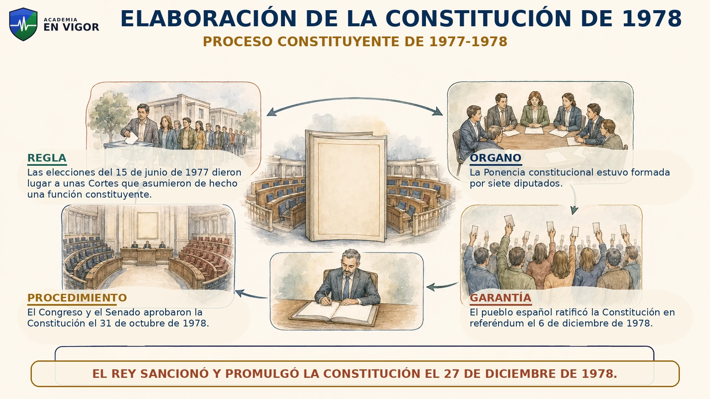

<em>Infografía: Elaboración de la Constitución de 1978.</em>

<!-- FUENTE: BOE-CE-1978-GC-T04 -->

## 03. Estructura de la Constitución

### Regla y encaje

Este bloque ordena estructura de la constitución dentro del sistema constitucional. La clave es relacionar el precepto con su sujeto, competencia, garantía, mayoría o plazo.

Este bloque pertenece a **constitución: origen, estructura y título preliminar** y se contrasta en **estructura de la CE**.

### Claves normativas

- La Constitución contiene 169 artículos.
- La Constitución tiene un Título Preliminar y diez títulos numerados del I al X. <!-- FACT:GC-T04-F011 -->
- La Constitución contiene cuatro disposiciones adicionales, nueve transitorias, una derogatoria y una final. <!-- FACT:GC-T04-F012 -->
- La parte dogmática comprende el Título Preliminar y el Título I. <!-- FACT:GC-T04-F013 -->
- La parte orgánica comprende esencialmente los Títulos II a X. <!-- FACT:GC-T04-F014 -->
- El preámbulo tiene valor interpretativo, pero no está dividido en artículos. <!-- FACT:GC-T04-F015 -->
 <!-- FACT:GC-T04-F016 -->

:::hablemos-claro
Lee la Constitución como un sistema: primero identifica el poder u órgano; después, su competencia, límite, garantía y control.
:::

:::en-la-calle
En un supuesto práctico, separa derechos, organización del poder y procedimiento. Una misma palabra —ley, mayoría o control— cambia de sentido según el título constitucional.
:::

:::lo-que-cae
Prioridad de examen: **estructura de la CE**. Vigila sujetos, plazos, mayorías, excepciones y verbos de competencia.
:::

<!-- VISUAL:t04-03-estructura-de-la-constitucion.webp -->

  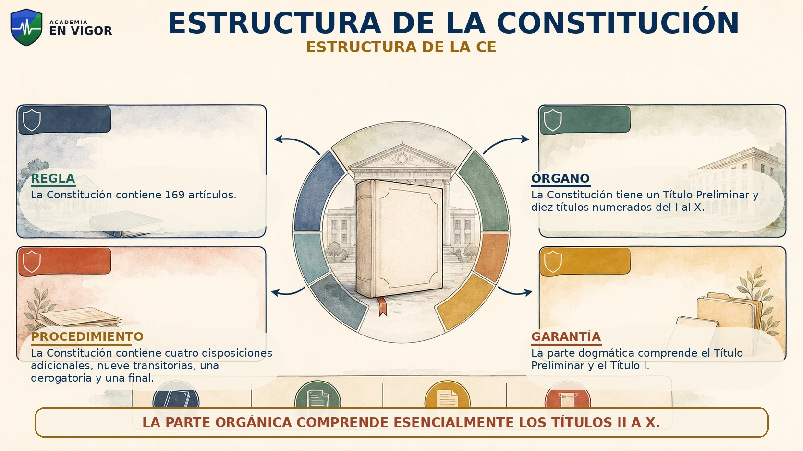

<em>Infografía: Estructura de la Constitución.</em>

<!-- FUENTE: BOE-CE-1978-GC-T04 -->

## 04. Reformas constitucionales realizadas

### Regla y encaje

Este bloque ordena reformas constitucionales realizadas dentro del sistema constitucional. La clave es relacionar el precepto con su sujeto, competencia, garantía, mayoría o plazo.

Este bloque pertenece a **constitución: origen, estructura y título preliminar** y se contrasta en **reformas de 1992, 2011, 2024 y 2026**.

### Claves normativas

- La reforma de 1992 modificó el artículo 13.2 para el sufragio activo y pasivo de extranjeros en elecciones municipales.
- La reforma de 2011 modificó el artículo 135 sobre estabilidad presupuestaria. <!-- FACT:GC-T04-F017 -->
- La reforma de 2024 sustituyó el artículo 49 sobre las personas con discapacidad. <!-- FACT:GC-T04-F018 -->
- La reforma de 2026 modificó el artículo 69.3 para que Formentera elija un senador propio. <!-- FACT:GC-T04-F019 -->
- A 23 de julio de 2026 la Constitución Española ha sido reformada cuatro veces. <!-- FACT:GC-T04-F020 -->
 <!-- FACT:GC-T04-F021 -->

:::hablemos-claro
Lee la Constitución como un sistema: primero identifica el poder u órgano; después, su competencia, límite, garantía y control.
:::

:::en-la-calle
En un supuesto práctico, separa derechos, organización del poder y procedimiento. Una misma palabra —ley, mayoría o control— cambia de sentido según el título constitucional.
:::

:::lo-que-cae
Prioridad de examen: **reformas de 1992, 2011, 2024 y 2026**. Vigila sujetos, plazos, mayorías, excepciones y verbos de competencia.
:::

<!-- VISUAL:t04-04-reformas-constitucionales-realizadas.webp -->

  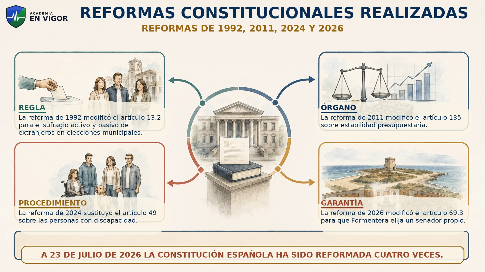

<em>Infografía: Reformas constitucionales realizadas.</em>

<!-- FUENTE: BOE-CE-1978-GC-T04 -->

## 05. Caracteres de la Constitución

### Regla y encaje

Este bloque ordena caracteres de la constitución dentro del sistema constitucional. La clave es relacionar el precepto con su sujeto, competencia, garantía, mayoría o plazo.

Este bloque pertenece a **constitución: origen, estructura y título preliminar** y se contrasta en **caracteres constitucionales**.

### Claves normativas

- La Constitución está recogida en un texto escrito, único y codificado.
- La Constitución se considera extensa por el detalle de sus 169 artículos. <!-- FACT:GC-T04-F022 -->
- La Constitución fue fruto de un amplio acuerdo entre fuerzas políticas distintas. <!-- FACT:GC-T04-F023 -->
- La Constitución exige procedimientos reforzados para su reforma. <!-- FACT:GC-T04-F024 -->
- La Constitución vincula jurídicamente a ciudadanos y poderes públicos. <!-- FACT:GC-T04-F025 -->
- La Constitución recibió influencias de otros textos constitucionales europeos. <!-- FACT:GC-T04-F026 -->
 <!-- FACT:GC-T04-F027 -->

:::hablemos-claro
Lee la Constitución como un sistema: primero identifica el poder u órgano; después, su competencia, límite, garantía y control.
:::

:::en-la-calle
En un supuesto práctico, separa derechos, organización del poder y procedimiento. Una misma palabra —ley, mayoría o control— cambia de sentido según el título constitucional.
:::

:::lo-que-cae
Prioridad de examen: **caracteres constitucionales**. Vigila sujetos, plazos, mayorías, excepciones y verbos de competencia.
:::

<!-- VISUAL:t04-05-caracteres-de-la-constitucion.webp -->

  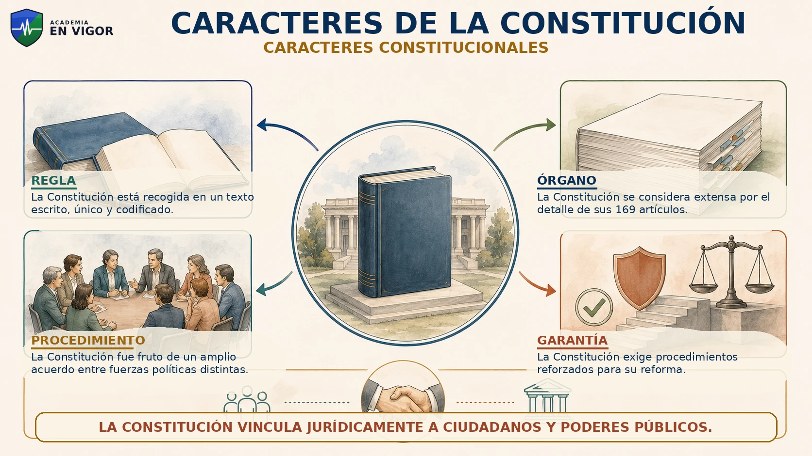

<em>Infografía: Caracteres de la Constitución.</em>

<!-- FUENTE: BOE-CE-1978-GC-T04 -->

## 06. Valores superiores del artículo 1.1

### Regla y encaje

Este bloque ordena valores superiores del artículo 1.1 dentro del sistema constitucional. La clave es relacionar el precepto con su sujeto, competencia, garantía, mayoría o plazo.

Este bloque pertenece a **constitución: origen, estructura y título preliminar** y se contrasta en **art. 1.1 CE**.

### Claves normativas

- El artículo 1.1 proclama libertad, justicia, igualdad y pluralismo político como valores superiores.
- La libertad actúa como valor del ordenamiento y como base de numerosos derechos. <!-- FACT:GC-T04-F028 -->
- La justicia es un valor superior y no debe confundirse con el Poder Judicial. <!-- FACT:GC-T04-F029 -->
- La igualdad del artículo 1.1 se proyecta también en los artículos 9.2 y 14. <!-- FACT:GC-T04-F030 -->
- El pluralismo político se expresa especialmente a través de los partidos políticos. <!-- FACT:GC-T04-F031 -->
 <!-- FACT:GC-T04-F032 -->

:::hablemos-claro
Lee la Constitución como un sistema: primero identifica el poder u órgano; después, su competencia, límite, garantía y control.
:::

:::en-la-calle
En un supuesto práctico, separa derechos, organización del poder y procedimiento. Una misma palabra —ley, mayoría o control— cambia de sentido según el título constitucional.
:::

:::lo-que-cae
Prioridad de examen: **art. 1.1 CE**. Vigila sujetos, plazos, mayorías, excepciones y verbos de competencia.
:::

:::ha-caido
Apariciones oficiales verificadas: 2020 · pregunta 14.
:::

<!-- VISUAL:t04-06-valores-superiores-del-articulo-1-1.webp -->

  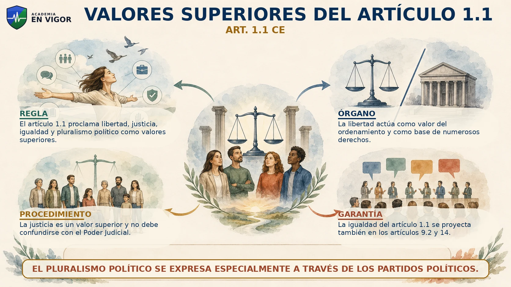

<em>Infografía: Valores superiores del artículo 1.1.</em>

<!-- FUENTE: BOE-CE-1978-GC-T04 -->

## 07. El Estado democrático

### Regla y encaje

Este bloque ordena el estado democrático dentro del sistema constitucional. La clave es relacionar el precepto con su sujeto, competencia, garantía, mayoría o plazo.

Este bloque pertenece a **constitución: origen, estructura y título preliminar** y se contrasta en **arts. 1, 6, 7 y 23 CE**.

### Claves normativas

- La soberanía nacional reside en el pueblo español.
- Los poderes del Estado emanan del pueblo español. <!-- FACT:GC-T04-F033 -->
- Los ciudadanos pueden participar directamente o por medio de representantes libremente elegidos. <!-- FACT:GC-T04-F034 -->
- Los partidos expresan el pluralismo, concurren a formar la voluntad popular y son instrumento de participación. <!-- FACT:GC-T04-F035 -->
- La estructura interna y el funcionamiento de los partidos deben ser democráticos. <!-- FACT:GC-T04-F036 -->
 <!-- FACT:GC-T04-F037 -->

:::hablemos-claro
Lee la Constitución como un sistema: primero identifica el poder u órgano; después, su competencia, límite, garantía y control.
:::

:::en-la-calle
En un supuesto práctico, separa derechos, organización del poder y procedimiento. Una misma palabra —ley, mayoría o control— cambia de sentido según el título constitucional.
:::

:::lo-que-cae
Prioridad de examen: **arts. 1, 6, 7 y 23 CE**. Vigila sujetos, plazos, mayorías, excepciones y verbos de competencia.
:::

:::ha-caido
Apariciones oficiales verificadas: 2022 · pregunta 15, 2023 · pregunta 17.
:::

<!-- VISUAL:t04-07-el-estado-democratico.webp -->

  

<em>Infografía: El Estado democrático.</em>

<!-- FUENTE: BOE-CE-1978-GC-T04 -->

## 08. El Estado de Derecho

### Regla y encaje

Este bloque ordena el estado de derecho dentro del sistema constitucional. La clave es relacionar el precepto con su sujeto, competencia, garantía, mayoría o plazo.

Este bloque pertenece a **constitución: origen, estructura y título preliminar** y se contrasta en **arts. 1.1 y 9 CE**.

### Claves normativas

- El poder público está sometido a la Constitución, a la ley y al control jurisdiccional.
- La Constitución garantiza el principio de legalidad. <!-- FACT:GC-T04-F038 -->
- La Constitución garantiza la jerarquía normativa. <!-- FACT:GC-T04-F039 -->
- La Constitución garantiza la publicidad de las normas. <!-- FACT:GC-T04-F040 -->
- El artículo 9.3 garantiza la irretroactividad de las disposiciones sancionadoras no favorables o restrictivas de derechos individuales. <!-- FACT:GC-T04-F041 -->
- La Constitución garantiza la seguridad jurídica. <!-- FACT:GC-T04-F042 -->
- La Constitución garantiza la responsabilidad de los poderes públicos. <!-- FACT:GC-T04-F043 -->
- La Constitución prohíbe la arbitrariedad de los poderes públicos. <!-- FACT:GC-T04-F044 -->
 <!-- FACT:GC-T04-F045 -->

:::hablemos-claro
Lee la Constitución como un sistema: primero identifica el poder u órgano; después, su competencia, límite, garantía y control.
:::

:::en-la-calle
En un supuesto práctico, separa derechos, organización del poder y procedimiento. Una misma palabra —ley, mayoría o control— cambia de sentido según el título constitucional.
:::

:::lo-que-cae
Prioridad de examen: **arts. 1.1 y 9 CE**. Vigila sujetos, plazos, mayorías, excepciones y verbos de competencia.
:::

:::ha-caido
Apariciones oficiales verificadas: 2023 · pregunta 16.
:::

<!-- VISUAL:t04-08-el-estado-de-derecho.webp -->

  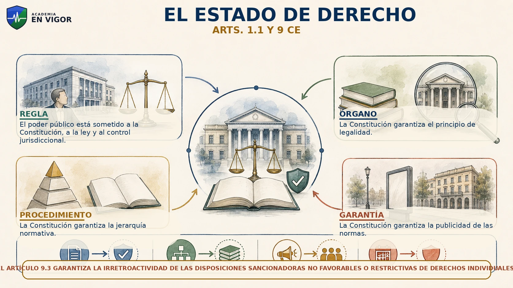

<em>Infografía: El Estado de Derecho.</em>

<!-- FUENTE: BOE-CE-1978-GC-T04 -->

## 09. El Estado social

### Regla y encaje

Este bloque ordena el estado social dentro del sistema constitucional. La clave es relacionar el precepto con su sujeto, competencia, garantía, mayoría o plazo.

Este bloque pertenece a **constitución: origen, estructura y título preliminar** y se contrasta en **arts. 1.1, 9.2 y 39 a 52 CE**.

### Claves normativas

- El Estado social exige una actuación pública orientada a hacer reales la libertad y la igualdad.
- El artículo 9.2 ordena promover condiciones para que libertad e igualdad sean reales y efectivas. <!-- FACT:GC-T04-F046 -->
- Los poderes públicos deben remover los obstáculos que impidan o dificulten la plenitud de libertad e igualdad. <!-- FACT:GC-T04-F047 -->
- Los poderes públicos deben facilitar la participación en la vida política, económica, cultural y social. <!-- FACT:GC-T04-F048 -->
 <!-- FACT:GC-T04-F049 -->

:::hablemos-claro
Lee la Constitución como un sistema: primero identifica el poder u órgano; después, su competencia, límite, garantía y control.
:::

:::en-la-calle
En un supuesto práctico, separa derechos, organización del poder y procedimiento. Una misma palabra —ley, mayoría o control— cambia de sentido según el título constitucional.
:::

:::lo-que-cae
Prioridad de examen: **arts. 1.1, 9.2 y 39 a 52 CE**. Vigila sujetos, plazos, mayorías, excepciones y verbos de competencia.
:::

:::ha-caido
Apariciones oficiales verificadas: 2022 · pregunta 16.
:::

<!-- VISUAL:t04-09-el-estado-social.webp -->

  

<em>Infografía: El Estado social.</em>

<!-- FUENTE: BOE-CE-1978-GC-T04 -->

## 10. La monarquía parlamentaria

### Regla y encaje

Este bloque ordena la monarquía parlamentaria dentro del sistema constitucional. La clave es relacionar el precepto con su sujeto, competencia, garantía, mayoría o plazo.

Este bloque pertenece a **constitución: origen, estructura y título preliminar** y se contrasta en **art. 1.3 CE**.

### Claves normativas

- La forma política del Estado español es la Monarquía parlamentaria.
- El Rey ejerce la Jefatura del Estado, mientras que el Gobierno dirige la política. <!-- FACT:GC-T04-F050 -->
- Los actos del Rey quedan sometidos con carácter general a refrendo. <!-- FACT:GC-T04-F051 -->
- La responsabilidad política corresponde a los órganos que adoptan y refrendan las decisiones. <!-- FACT:GC-T04-F052 -->
 <!-- FACT:GC-T04-F053 -->

:::hablemos-claro
Lee la Constitución como un sistema: primero identifica el poder u órgano; después, su competencia, límite, garantía y control.
:::

:::en-la-calle
En un supuesto práctico, separa derechos, organización del poder y procedimiento. Una misma palabra —ley, mayoría o control— cambia de sentido según el título constitucional.
:::

:::lo-que-cae
Prioridad de examen: **art. 1.3 CE**. Vigila sujetos, plazos, mayorías, excepciones y verbos de competencia.
:::

<!-- VISUAL:t04-10-la-monarquia-parlamentaria.webp -->

  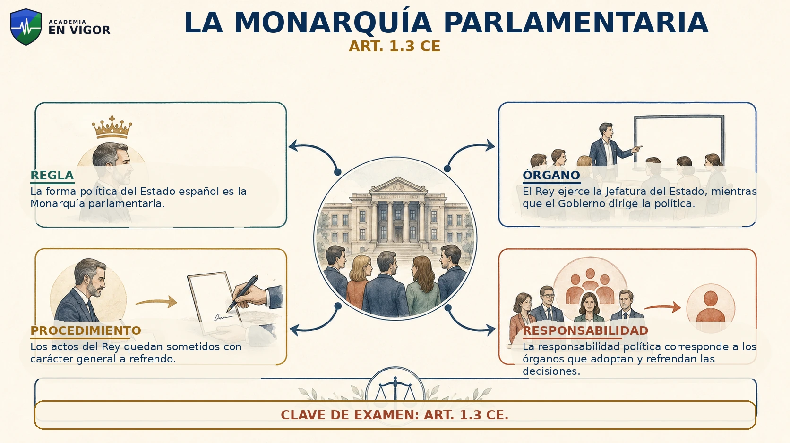

<em>Infografía: La monarquía parlamentaria.</em>

<!-- FUENTE: BOE-CE-1978-GC-T04 -->

## 11. El Estado autonómico

### Regla y encaje

Este bloque ordena el estado autonómico dentro del sistema constitucional. La clave es relacionar el precepto con su sujeto, competencia, garantía, mayoría o plazo.

Este bloque pertenece a **constitución: origen, estructura y título preliminar** y se contrasta en **arts. 2 y 137 CE**.

### Claves normativas

- La Constitución se fundamenta en la indisoluble unidad de la Nación española.
- La Constitución reconoce y garantiza el derecho a la autonomía de nacionalidades y regiones. <!-- FACT:GC-T04-F054 -->
- La Constitución garantiza la solidaridad entre nacionalidades y regiones. <!-- FACT:GC-T04-F055 -->
- El castellano es la lengua española oficial del Estado; existe deber de conocerla y derecho a usarla. <!-- FACT:GC-T04-F056 -->
- Las banderas autonómicas se utilizan junto a la bandera de España en edificios públicos y actos oficiales. <!-- FACT:GC-T04-F057 -->
- La capital del Estado es la villa de Madrid. <!-- FACT:GC-T04-F058 -->
- El artículo 8 CE enumera literalmente el Ejército de Tierra, la Armada y el Ejército del Aire. <!-- FACT:GC-T04-F059 -->
 <!-- FACT:GC-T04-F060 -->

:::hablemos-claro
Lee la Constitución como un sistema: primero identifica el poder u órgano; después, su competencia, límite, garantía y control.
:::

:::en-la-calle
En un supuesto práctico, separa derechos, organización del poder y procedimiento. Una misma palabra —ley, mayoría o control— cambia de sentido según el título constitucional.
:::

:::lo-que-cae
Prioridad de examen: **arts. 2 y 137 CE**. Vigila sujetos, plazos, mayorías, excepciones y verbos de competencia.
:::

:::ha-caido
Apariciones oficiales verificadas: 2020 · pregunta 14, 2021 · pregunta 16, 2024 · pregunta 18.
:::

<!-- VISUAL:t04-11-el-estado-autonomico.webp -->

  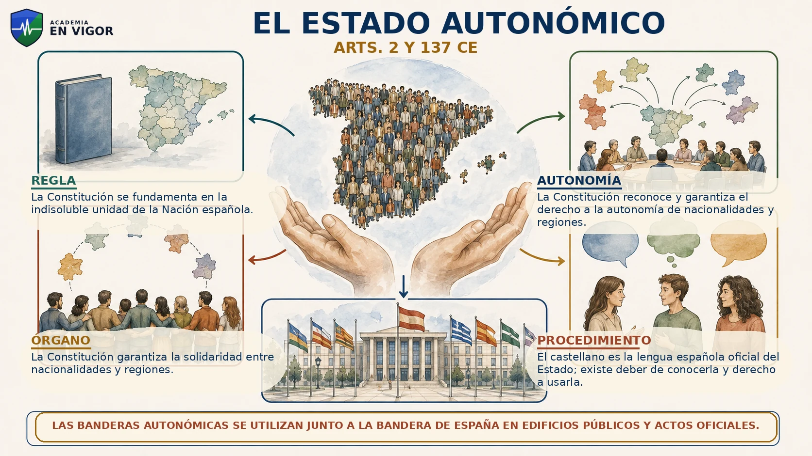

<em>Infografía: El Estado autonómico.</em>

<!-- FUENTE: BOE-CE-1978-GC-T04 -->

## 12. Mapa del Título I

### Regla y encaje

Este bloque ordena mapa del título i dentro del sistema constitucional. La clave es relacionar el precepto con su sujeto, competencia, garantía, mayoría o plazo.

Este bloque pertenece a **constitución: derechos, garantías y suspensión** y se contrasta en **Título I CE**.

### Claves normativas

- El Título I comprende los artículos 10 a 55.
- El Capítulo I del Título I regula a españoles y extranjeros en los artículos 11 a 13. <!-- FACT:GC-T04-F061 -->
- El Capítulo II contiene derechos y libertades en los artículos 14 a 38. <!-- FACT:GC-T04-F062 -->
- El Capítulo III contiene los principios rectores en los artículos 39 a 52. <!-- FACT:GC-T04-F063 -->
- El Capítulo IV regula las garantías y el Defensor del Pueblo en los artículos 53 y 54. <!-- FACT:GC-T04-F064 -->
- El Capítulo V regula la suspensión de derechos y libertades en el artículo 55. <!-- FACT:GC-T04-F065 -->
 <!-- FACT:GC-T04-F066 -->

:::hablemos-claro
Lee la Constitución como un sistema: primero identifica el poder u órgano; después, su competencia, límite, garantía y control.
:::

:::en-la-calle
En un supuesto práctico, separa derechos, organización del poder y procedimiento. Una misma palabra —ley, mayoría o control— cambia de sentido según el título constitucional.
:::

:::lo-que-cae
Prioridad de examen: **Título I CE**. Vigila sujetos, plazos, mayorías, excepciones y verbos de competencia.
:::

<!-- VISUAL:t04-12-mapa-del-titulo-i.webp -->

  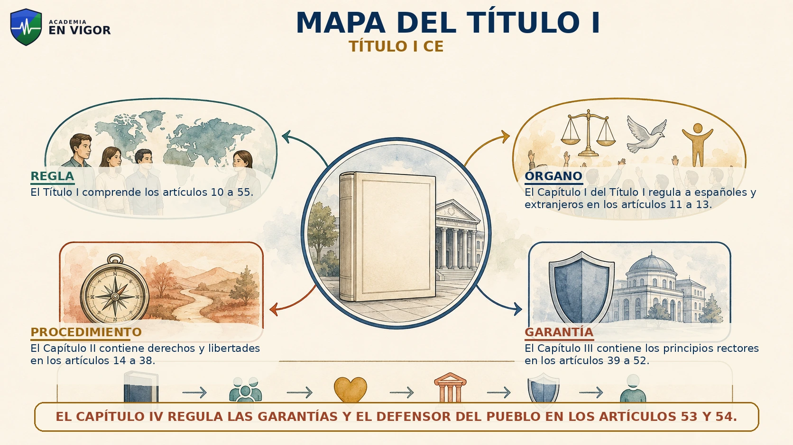

<em>Infografía: Mapa del Título I.</em>

<!-- FUENTE: BOE-CE-1978-GC-T04 -->

## 13. Artículo 10: dignidad e interpretación

### Regla y encaje

Este bloque ordena artículo 10: dignidad e interpretación dentro del sistema constitucional. La clave es relacionar el precepto con su sujeto, competencia, garantía, mayoría o plazo.

Este bloque pertenece a **constitución: derechos, garantías y suspensión** y se contrasta en **art. 10 CE**.

### Claves normativas

- La dignidad de la persona es fundamento del orden político y de la paz social.
- Los derechos inviolables inherentes a la persona fundamentan el orden político y la paz social. <!-- FACT:GC-T04-F067 -->
- El libre desarrollo de la personalidad es fundamento del orden político y de la paz social. <!-- FACT:GC-T04-F068 -->
- Los derechos fundamentales y libertades se interpretan conforme a la Declaración Universal y a los tratados ratificados por España. <!-- FACT:GC-T04-F069 -->
 <!-- FACT:GC-T04-F070 -->

:::hablemos-claro
Lee la Constitución como un sistema: primero identifica el poder u órgano; después, su competencia, límite, garantía y control.
:::

:::en-la-calle
En un supuesto práctico, separa derechos, organización del poder y procedimiento. Una misma palabra —ley, mayoría o control— cambia de sentido según el título constitucional.
:::

:::lo-que-cae
Prioridad de examen: **art. 10 CE**. Vigila sujetos, plazos, mayorías, excepciones y verbos de competencia.
:::

:::ha-caido
Apariciones oficiales verificadas: 2024 · pregunta 18.
:::

<!-- VISUAL:t04-13-articulo-10-dignidad-e-interpretacion.webp -->

  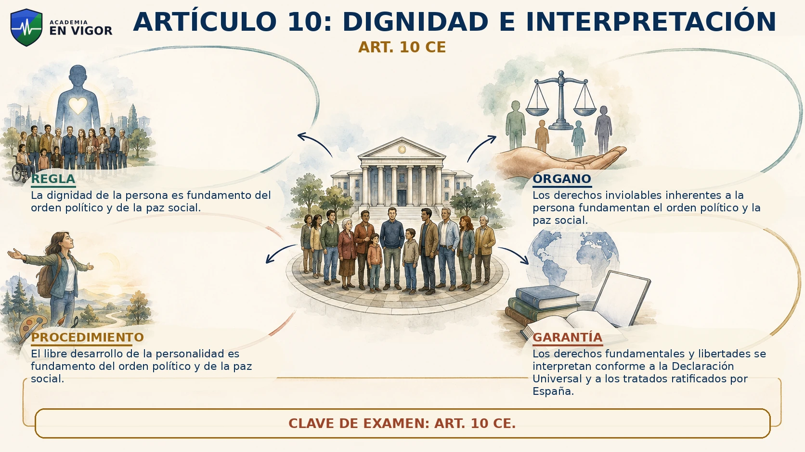

<em>Infografía: Artículo 10: dignidad e interpretación.</em>

<!-- FUENTE: BOE-CE-1978-GC-T04 -->

## 14. Españoles, extranjeros e igualdad

### Regla y encaje

Este bloque ordena españoles, extranjeros e igualdad dentro del sistema constitucional. La clave es relacionar el precepto con su sujeto, competencia, garantía, mayoría o plazo.

Este bloque pertenece a **constitución: derechos, garantías y suspensión** y se contrasta en **arts. 11 a 14 CE**.

### Claves normativas

- La nacionalidad española se adquiere, conserva y pierde conforme a la ley.
- Ningún español de origen puede ser privado de su nacionalidad. <!-- FACT:GC-T04-F071 -->
- Los españoles son mayores de edad a los dieciocho años. <!-- FACT:GC-T04-F072 -->
- Los extranjeros gozan de las libertades públicas del Título I en los términos de los tratados y la ley. <!-- FACT:GC-T04-F073 -->
- Puede reconocerse a extranjeros sufragio activo y pasivo en elecciones municipales atendiendo a reciprocidad. <!-- FACT:GC-T04-F074 -->
- La extradición se concede conforme a tratado o ley y reciprocidad; el terrorismo no se considera delito político. <!-- FACT:GC-T04-F075 -->
- El artículo 14 proclama la igualdad de los españoles ante la ley y prohíbe la discriminación. <!-- FACT:GC-T04-F076 -->
 <!-- FACT:GC-T04-F077 -->

:::hablemos-claro
Lee la Constitución como un sistema: primero identifica el poder u órgano; después, su competencia, límite, garantía y control.
:::

:::en-la-calle
En un supuesto práctico, separa derechos, organización del poder y procedimiento. Una misma palabra —ley, mayoría o control— cambia de sentido según el título constitucional.
:::

:::lo-que-cae
Prioridad de examen: **arts. 11 a 14 CE**. Vigila sujetos, plazos, mayorías, excepciones y verbos de competencia.
:::

:::ha-caido
Apariciones oficiales verificadas: 2024 · pregunta 19.
:::

<!-- VISUAL:t04-14-espanoles-extranjeros-e-igualdad.webp -->

  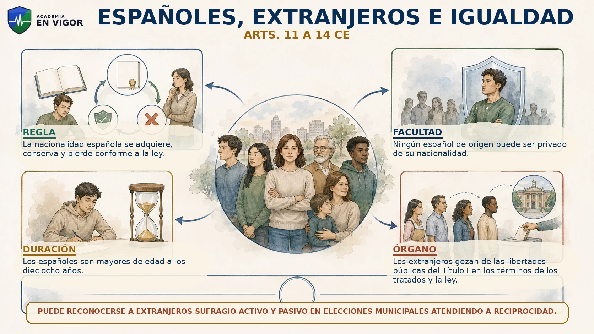

<em>Infografía: Españoles, extranjeros e igualdad.</em>

<!-- FUENTE: BOE-CE-1978-GC-T04 -->

## 15. Derechos de la esfera personal

### Regla y encaje

Este bloque ordena derechos de la esfera personal dentro del sistema constitucional. La clave es relacionar el precepto con su sujeto, competencia, garantía, mayoría o plazo.

Este bloque pertenece a **constitución: derechos, garantías y suspensión** y se contrasta en **arts. 15 a 19 CE**.

### Claves normativas

- El artículo 15 reconoce el derecho a la vida y a la integridad física y moral.
- Nadie puede ser sometido a tortura ni a penas o tratos inhumanos o degradantes. <!-- FACT:GC-T04-F078 -->
- La libertad ideológica, religiosa y de culto solo puede limitarse por el orden público protegido por la ley. <!-- FACT:GC-T04-F079 -->
- Toda persona tiene derecho a la libertad y a la seguridad. <!-- FACT:GC-T04-F080 -->
- La detención preventiva dura solo el tiempo estrictamente necesario y, como máximo ordinario, setenta y dos horas. <!-- FACT:GC-T04-F081 -->
- La persona detenida debe ser informada inmediatamente y de modo comprensible de sus derechos y de las razones de la detención. <!-- FACT:GC-T04-F082 -->
- La Constitución garantiza asistencia de abogado al detenido en diligencias policiales y judiciales. <!-- FACT:GC-T04-F083 -->
- La ley regula un procedimiento de habeas corpus para la inmediata puesta a disposición judicial del detenido ilegalmente. <!-- FACT:GC-T04-F084 -->
- La entrada domiciliaria requiere consentimiento, resolución judicial o flagrante delito. <!-- FACT:GC-T04-F085 -->
- Las comunicaciones son secretas salvo resolución judicial. <!-- FACT:GC-T04-F086 -->
- Los españoles pueden elegir residencia, circular por el territorio y entrar y salir de España en los términos legales. <!-- FACT:GC-T04-F087 -->
 <!-- FACT:GC-T04-F088 -->

:::hablemos-claro
Lee la Constitución como un sistema: primero identifica el poder u órgano; después, su competencia, límite, garantía y control.
:::

:::en-la-calle
En un supuesto práctico, separa derechos, organización del poder y procedimiento. Una misma palabra —ley, mayoría o control— cambia de sentido según el título constitucional.
:::

:::lo-que-cae
Prioridad de examen: **arts. 15 a 19 CE**. Vigila sujetos, plazos, mayorías, excepciones y verbos de competencia.
:::

<!-- VISUAL:t04-15-derechos-de-la-esfera-personal.webp -->

  

<em>Infografía: Derechos de la esfera personal.</em>

<!-- FUENTE: BOE-CE-1978-GC-T04 -->

## 16. Expresión, reunión, asociación y participación

### Regla y encaje

Este bloque ordena expresión, reunión, asociación y participación dentro del sistema constitucional. La clave es relacionar el precepto con su sujeto, competencia, garantía, mayoría o plazo.

Este bloque pertenece a **constitución: derechos, garantías y suspensión** y se contrasta en **arts. 20 a 23 CE**.

### Claves normativas

- El artículo 20 reconoce libertades de expresión, creación, cátedra e información veraz.
- El ejercicio de las libertades del artículo 20 no puede restringirse mediante censura previa. <!-- FACT:GC-T04-F089 -->
- El secuestro de publicaciones, grabaciones y otros medios de información exige resolución judicial. <!-- FACT:GC-T04-F090 -->
- El derecho de reunión pacífica y sin armas no necesita autorización previa. <!-- FACT:GC-T04-F091 -->
- Las reuniones en lugares de tránsito público y las manifestaciones requieren comunicación previa. <!-- FACT:GC-T04-F092 -->
- Una reunión comunicada solo puede prohibirse por razones fundadas de alteración del orden público con peligro para personas o bienes. <!-- FACT:GC-T04-F093 -->
- Las asociaciones con fines o medios delictivos son ilegales y las secretas y paramilitares están prohibidas. <!-- FACT:GC-T04-F094 -->
- Los ciudadanos participan en asuntos públicos directamente o mediante representantes elegidos por sufragio universal. <!-- FACT:GC-T04-F095 -->
- Los ciudadanos acceden en igualdad a funciones y cargos públicos con los requisitos legales. <!-- FACT:GC-T04-F096 -->
 <!-- FACT:GC-T04-F097 -->

:::hablemos-claro
Lee la Constitución como un sistema: primero identifica el poder u órgano; después, su competencia, límite, garantía y control.
:::

:::en-la-calle
En un supuesto práctico, separa derechos, organización del poder y procedimiento. Una misma palabra —ley, mayoría o control— cambia de sentido según el título constitucional.
:::

:::lo-que-cae
Prioridad de examen: **arts. 20 a 23 CE**. Vigila sujetos, plazos, mayorías, excepciones y verbos de competencia.
:::

:::ha-caido
Apariciones oficiales verificadas: 2020 · pregunta 15, 2022 · pregunta 16, 2023 · pregunta 18, 2025 · pregunta 19.
:::

<!-- VISUAL:t04-16-expresion-reunion-asociacion-y-participacion.webp -->

  

<em>Infografía: Expresión, reunión, asociación y participación.</em>

<!-- FUENTE: BOE-CE-1978-GC-T04 -->

## 17. Garantías procesales y legalidad sancionadora

### Regla y encaje

Este bloque ordena garantías procesales y legalidad sancionadora dentro del sistema constitucional. La clave es relacionar el precepto con su sujeto, competencia, garantía, mayoría o plazo.

Este bloque pertenece a **constitución: derechos, garantías y suspensión** y se contrasta en **arts. 24 a 26 CE**.

### Claves normativas

- Todas las personas tienen derecho a obtener tutela efectiva de jueces y tribunales sin indefensión.
- El artículo 24.2 reconoce el derecho al juez ordinario predeterminado por la ley. <!-- FACT:GC-T04-F098 -->
- El artículo 24.2 reconoce los derechos de defensa y asistencia de letrado. <!-- FACT:GC-T04-F099 -->
- El proceso debe ser público, sin dilaciones indebidas y con todas las garantías. <!-- FACT:GC-T04-F100 -->
- Toda persona tiene derecho a la presunción de inocencia. <!-- FACT:GC-T04-F101 -->
- Nadie puede ser condenado o sancionado por hechos que no fueran infracción cuando se produjeron. <!-- FACT:GC-T04-F102 -->
- Las penas privativas de libertad y medidas de seguridad se orientan a reeducación y reinserción social. <!-- FACT:GC-T04-F103 -->
- Los tribunales de honor están prohibidos en la Administración civil y en las organizaciones profesionales. <!-- FACT:GC-T04-F104 -->
 <!-- FACT:GC-T04-F105 -->

:::hablemos-claro
Lee la Constitución como un sistema: primero identifica el poder u órgano; después, su competencia, límite, garantía y control.
:::

:::en-la-calle
En un supuesto práctico, separa derechos, organización del poder y procedimiento. Una misma palabra —ley, mayoría o control— cambia de sentido según el título constitucional.
:::

:::lo-que-cae
Prioridad de examen: **arts. 24 a 26 CE**. Vigila sujetos, plazos, mayorías, excepciones y verbos de competencia.
:::

<!-- VISUAL:t04-17-garantias-procesales-y-legalidad-sancionadora.webp -->

  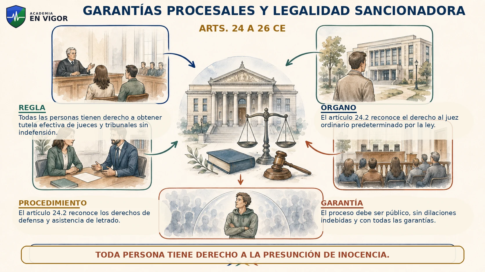

<em>Infografía: Garantías procesales y legalidad sancionadora.</em>

<!-- FUENTE: BOE-CE-1978-GC-T04 -->

## 18. Educación, sindicación, huelga y petición

### Regla y encaje

Este bloque ordena educación, sindicación, huelga y petición dentro del sistema constitucional. La clave es relacionar el precepto con su sujeto, competencia, garantía, mayoría o plazo.

Este bloque pertenece a **constitución: derechos, garantías y suspensión** y se contrasta en **arts. 27 a 29 CE**.

### Claves normativas

- Todos tienen derecho a la educación y se reconoce la libertad de enseñanza.
- La enseñanza básica es obligatoria y gratuita. <!-- FACT:GC-T04-F106 -->
- La libertad sindical comprende fundar sindicatos, afiliarse y no ser obligado a afiliarse. <!-- FACT:GC-T04-F107 -->
- Los trabajadores tienen derecho a la huelga para defender sus intereses. <!-- FACT:GC-T04-F108 -->
- La regulación de la huelga debe establecer garantías para mantener los servicios esenciales de la comunidad. <!-- FACT:GC-T04-F109 -->
- Todos los españoles tienen derecho de petición individual y colectiva por escrito. <!-- FACT:GC-T04-F110 -->
- Los miembros de cuerpos sometidos a disciplina militar ejercen el derecho de petición solo individualmente y conforme a su legislación. <!-- FACT:GC-T04-F111 -->
 <!-- FACT:GC-T04-F112 -->

:::hablemos-claro
Lee la Constitución como un sistema: primero identifica el poder u órgano; después, su competencia, límite, garantía y control.
:::

:::en-la-calle
En un supuesto práctico, separa derechos, organización del poder y procedimiento. Una misma palabra —ley, mayoría o control— cambia de sentido según el título constitucional.
:::

:::lo-que-cae
Prioridad de examen: **arts. 27 a 29 CE**. Vigila sujetos, plazos, mayorías, excepciones y verbos de competencia.
:::

<!-- VISUAL:t04-18-educacion-sindicacion-huelga-y-peticion.webp -->

  

<em>Infografía: Educación, sindicación, huelga y petición.</em>

<!-- FUENTE: BOE-CE-1978-GC-T04 -->

## 19. Derechos y deberes de los ciudadanos

### Regla y encaje

Este bloque ordena derechos y deberes de los ciudadanos dentro del sistema constitucional. La clave es relacionar el precepto con su sujeto, competencia, garantía, mayoría o plazo.

Este bloque pertenece a **constitución: derechos, garantías y suspensión** y se contrasta en **arts. 30 a 38 CE**.

### Claves normativas

- Los españoles tienen el derecho y el deber de defender España.
- El sistema tributario debe ser justo, inspirado en igualdad y progresividad y sin alcance confiscatorio. <!-- FACT:GC-T04-F113 -->
- El hombre y la mujer tienen derecho a contraer matrimonio con plena igualdad jurídica. <!-- FACT:GC-T04-F114 -->
- La Constitución reconoce la propiedad privada y la herencia, delimitadas por su función social. <!-- FACT:GC-T04-F115 -->
- La privación de bienes exige utilidad pública o interés social, indemnización y conformidad con la ley. <!-- FACT:GC-T04-F116 -->
- Se reconoce el derecho de fundación para fines de interés general conforme a la ley. <!-- FACT:GC-T04-F117 -->
- Todos los españoles tienen el deber de trabajar y el derecho al trabajo. <!-- FACT:GC-T04-F118 -->
- La ley garantiza la negociación colectiva laboral y la fuerza vinculante de los convenios. <!-- FACT:GC-T04-F119 -->
- Se reconoce la libertad de empresa en el marco de la economía de mercado. <!-- FACT:GC-T04-F120 -->
 <!-- FACT:GC-T04-F121 -->

:::hablemos-claro
Lee la Constitución como un sistema: primero identifica el poder u órgano; después, su competencia, límite, garantía y control.
:::

:::en-la-calle
En un supuesto práctico, separa derechos, organización del poder y procedimiento. Una misma palabra —ley, mayoría o control— cambia de sentido según el título constitucional.
:::

:::lo-que-cae
Prioridad de examen: **arts. 30 a 38 CE**. Vigila sujetos, plazos, mayorías, excepciones y verbos de competencia.
:::

:::ha-caido
Apariciones oficiales verificadas: 2022 · pregunta 17, 2024 · pregunta 20, 2026 · pregunta 17.
:::

<!-- VISUAL:t04-19-derechos-y-deberes-de-los-ciudadanos.webp -->

  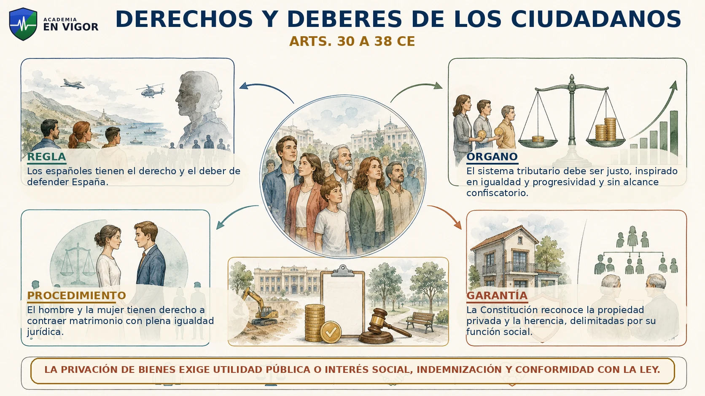

<em>Infografía: Derechos y deberes de los ciudadanos.</em>

<!-- FUENTE: BOE-CE-1978-GC-T04 -->

## 20. Principios rectores: naturaleza y garantía

### Regla y encaje

Este bloque ordena principios rectores: naturaleza y garantía dentro del sistema constitucional. La clave es relacionar el precepto con su sujeto, competencia, garantía, mayoría o plazo.

Este bloque pertenece a **constitución: derechos, garantías y suspensión** y se contrasta en **arts. 39 a 53.3 CE**.

### Claves normativas

- Los artículos 39 a 52 contienen principios rectores de la política social y económica.
- Los principios rectores informan la legislación positiva, la práctica judicial y la actuación de los poderes públicos. <!-- FACT:GC-T04-F122 -->
- Los principios rectores solo pueden alegarse ante la jurisdicción conforme a las leyes que los desarrollen. <!-- FACT:GC-T04-F123 -->
- Los principios rectores no son directamente protegibles mediante recurso de amparo. <!-- FACT:GC-T04-F124 -->
 <!-- FACT:GC-T04-F125 -->

:::hablemos-claro
Lee la Constitución como un sistema: primero identifica el poder u órgano; después, su competencia, límite, garantía y control.
:::

:::en-la-calle
En un supuesto práctico, separa derechos, organización del poder y procedimiento. Una misma palabra —ley, mayoría o control— cambia de sentido según el título constitucional.
:::

:::lo-que-cae
Prioridad de examen: **arts. 39 a 53.3 CE**. Vigila sujetos, plazos, mayorías, excepciones y verbos de competencia.
:::

:::ha-caido
Apariciones oficiales verificadas: 2021 · pregunta 17, 2022 · pregunta 16, 2023 · pregunta 19, 2024 · pregunta 18, 2025 · pregunta 21.
:::

<!-- VISUAL:t04-20-principios-rectores-naturaleza-y-garantia.webp -->

  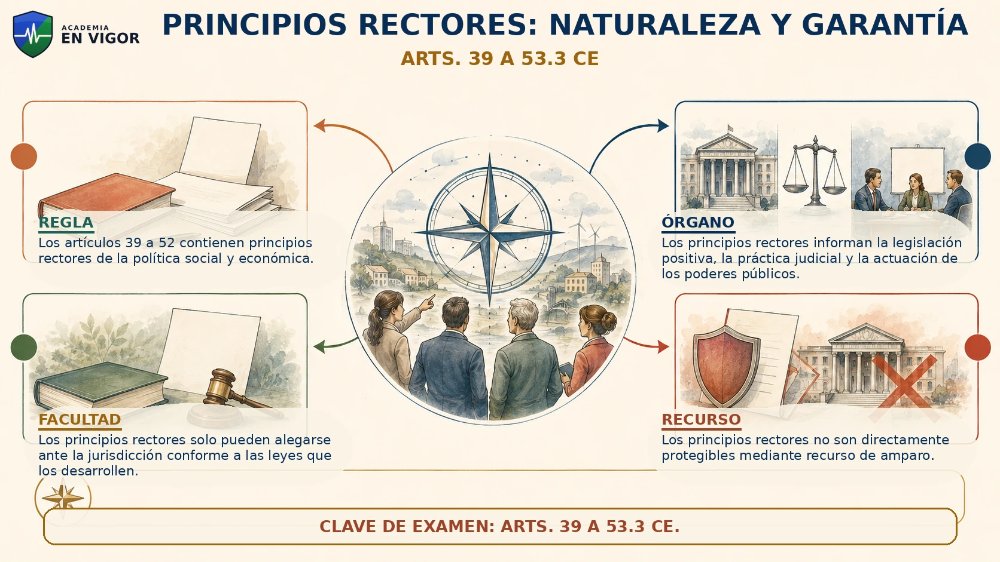

<em>Infografía: Principios rectores: naturaleza y garantía.</em>

<!-- FUENTE: BOE-CE-1978-GC-T04 -->

## 21. Familia, trabajo y Seguridad Social

### Regla y encaje

Este bloque ordena familia, trabajo y seguridad social dentro del sistema constitucional. La clave es relacionar el precepto con su sujeto, competencia, garantía, mayoría o plazo.

Este bloque pertenece a **constitución: derechos, garantías y suspensión** y se contrasta en **arts. 39 a 42 CE**.

### Claves normativas

- Los poderes públicos aseguran la protección social, económica y jurídica de la familia.
- Los hijos son iguales ante la ley con independencia de su filiación. <!-- FACT:GC-T04-F126 -->
- Los poderes públicos promueven progreso social, distribución de renta, pleno empleo y formación profesional. <!-- FACT:GC-T04-F127 -->
- Los poderes públicos mantienen un régimen público de Seguridad Social para todos los ciudadanos. <!-- FACT:GC-T04-F128 -->
- El Estado vela por los derechos económicos y sociales de los trabajadores españoles en el extranjero y orienta su política al retorno. <!-- FACT:GC-T04-F129 -->
 <!-- FACT:GC-T04-F130 -->

:::hablemos-claro
Lee la Constitución como un sistema: primero identifica el poder u órgano; después, su competencia, límite, garantía y control.
:::

:::en-la-calle
En un supuesto práctico, separa derechos, organización del poder y procedimiento. Una misma palabra —ley, mayoría o control— cambia de sentido según el título constitucional.
:::

:::lo-que-cae
Prioridad de examen: **arts. 39 a 42 CE**. Vigila sujetos, plazos, mayorías, excepciones y verbos de competencia.
:::

<!-- VISUAL:t04-21-familia-trabajo-y-seguridad-social.webp -->

  

<em>Infografía: Familia, trabajo y Seguridad Social.</em>

<!-- FUENTE: BOE-CE-1978-GC-T04 -->

## 22. Salud, cultura y medio ambiente

### Regla y encaje

Este bloque ordena salud, cultura y medio ambiente dentro del sistema constitucional. La clave es relacionar el precepto con su sujeto, competencia, garantía, mayoría o plazo.

Este bloque pertenece a **constitución: derechos, garantías y suspensión** y se contrasta en **arts. 43 a 46 CE**.

### Claves normativas

- Se reconoce el derecho a la protección de la salud.
- Los poderes públicos promueven y tutelan el acceso a la cultura. <!-- FACT:GC-T04-F131 -->
- Los poderes públicos promueven la ciencia y la investigación científica y técnica. <!-- FACT:GC-T04-F132 -->
- Todos tienen derecho a un medio ambiente adecuado y el deber de conservarlo. <!-- FACT:GC-T04-F133 -->
- Los poderes públicos garantizan la conservación y promueven el enriquecimiento del patrimonio histórico, cultural y artístico. <!-- FACT:GC-T04-F134 -->
 <!-- FACT:GC-T04-F135 -->

:::hablemos-claro
Lee la Constitución como un sistema: primero identifica el poder u órgano; después, su competencia, límite, garantía y control.
:::

:::en-la-calle
En un supuesto práctico, separa derechos, organización del poder y procedimiento. Una misma palabra —ley, mayoría o control— cambia de sentido según el título constitucional.
:::

:::lo-que-cae
Prioridad de examen: **arts. 43 a 46 CE**. Vigila sujetos, plazos, mayorías, excepciones y verbos de competencia.
:::

<!-- VISUAL:t04-22-salud-cultura-y-medio-ambiente.webp -->

  

<em>Infografía: Salud, cultura y medio ambiente.</em>

<!-- FUENTE: BOE-CE-1978-GC-T04 -->

## 23. Vivienda, juventud, discapacidad y mayores

### Regla y encaje

Este bloque ordena vivienda, juventud, discapacidad y mayores dentro del sistema constitucional. La clave es relacionar el precepto con su sujeto, competencia, garantía, mayoría o plazo.

Este bloque pertenece a **constitución: derechos, garantías y suspensión** y se contrasta en **arts. 47 a 50 CE**.

### Claves normativas

- Todos los españoles tienen derecho a disfrutar de una vivienda digna y adecuada.
- Los poderes públicos promueven la participación libre y eficaz de la juventud. <!-- FACT:GC-T04-F136 -->
- El artículo 49 exige políticas de plena autonomía personal e inclusión social en entornos universalmente accesibles. <!-- FACT:GC-T04-F137 -->
- El artículo 49 atiende particularmente a las necesidades específicas de mujeres y menores con discapacidad. <!-- FACT:GC-T04-F138 -->
- Los poderes públicos garantizan suficiencia económica a las personas durante la tercera edad. <!-- FACT:GC-T04-F139 -->
 <!-- FACT:GC-T04-F140 -->

:::hablemos-claro
Lee la Constitución como un sistema: primero identifica el poder u órgano; después, su competencia, límite, garantía y control.
:::

:::en-la-calle
En un supuesto práctico, separa derechos, organización del poder y procedimiento. Una misma palabra —ley, mayoría o control— cambia de sentido según el título constitucional.
:::

:::lo-que-cae
Prioridad de examen: **arts. 47 a 50 CE**. Vigila sujetos, plazos, mayorías, excepciones y verbos de competencia.
:::

<!-- VISUAL:t04-23-vivienda-juventud-discapacidad-y-mayores.webp -->

  

<em>Infografía: Vivienda, juventud, discapacidad y mayores.</em>

<!-- FUENTE: BOE-CE-1978-GC-T04 -->

## 24. Consumidores y organizaciones profesionales

### Regla y encaje

Este bloque ordena consumidores y organizaciones profesionales dentro del sistema constitucional. La clave es relacionar el precepto con su sujeto, competencia, garantía, mayoría o plazo.

Este bloque pertenece a **constitución: derechos, garantías y suspensión** y se contrasta en **arts. 51 y 52 CE**.

### Claves normativas

- Los poderes públicos garantizan la defensa de consumidores y usuarios.
- La defensa de consumidores protege mediante procedimientos eficaces su seguridad, salud e intereses económicos. <!-- FACT:GC-T04-F141 -->
- Los poderes públicos promueven información y educación de consumidores y usuarios. <!-- FACT:GC-T04-F142 -->
- La ley regula las organizaciones profesionales que contribuyen a defender intereses económicos propios. <!-- FACT:GC-T04-F143 -->
- La estructura interna y el funcionamiento de las organizaciones profesionales deben ser democráticos. <!-- FACT:GC-T04-F144 -->
 <!-- FACT:GC-T04-F145 -->

:::hablemos-claro
Lee la Constitución como un sistema: primero identifica el poder u órgano; después, su competencia, límite, garantía y control.
:::

:::en-la-calle
En un supuesto práctico, separa derechos, organización del poder y procedimiento. Una misma palabra —ley, mayoría o control— cambia de sentido según el título constitucional.
:::

:::lo-que-cae
Prioridad de examen: **arts. 51 y 52 CE**. Vigila sujetos, plazos, mayorías, excepciones y verbos de competencia.
:::

<!-- VISUAL:t04-24-consumidores-y-organizaciones-profesionales.webp -->

  

<em>Infografía: Consumidores y organizaciones profesionales.</em>

<!-- FUENTE: BOE-CE-1978-GC-T04 -->

## 25. Sistema general de garantías

### Regla y encaje

Este bloque ordena sistema general de garantías dentro del sistema constitucional. La clave es relacionar el precepto con su sujeto, competencia, garantía, mayoría o plazo.

Este bloque pertenece a **constitución: derechos, garantías y suspensión** y se contrasta en **arts. 53 a 55 CE**.

### Claves normativas

- Las garantías normativas incluyen reserva de ley, contenido esencial y control de constitucionalidad.
- Las garantías judiciales incluyen tutela ordinaria, procedimiento preferente y sumario y recurso de amparo. <!-- FACT:GC-T04-F146 -->
- El Tribunal Constitucional y el Defensor del Pueblo forman parte del sistema institucional de garantías. <!-- FACT:GC-T04-F147 -->
- El artículo 10.2 conecta la interpretación de los derechos con la Declaración Universal y los tratados ratificados. <!-- FACT:GC-T04-F148 -->
 <!-- FACT:GC-T04-F149 -->

:::hablemos-claro
Lee la Constitución como un sistema: primero identifica el poder u órgano; después, su competencia, límite, garantía y control.
:::

:::en-la-calle
En un supuesto práctico, separa derechos, organización del poder y procedimiento. Una misma palabra —ley, mayoría o control— cambia de sentido según el título constitucional.
:::

:::lo-que-cae
Prioridad de examen: **arts. 53 a 55 CE**. Vigila sujetos, plazos, mayorías, excepciones y verbos de competencia.
:::

:::ha-caido
Apariciones oficiales verificadas: 2020 · pregunta 15, 2022 · pregunta 17, 2025 · pregunta 20, 2025 · pregunta 22.
:::

<!-- VISUAL:t04-25-sistema-general-de-garantias.webp -->

  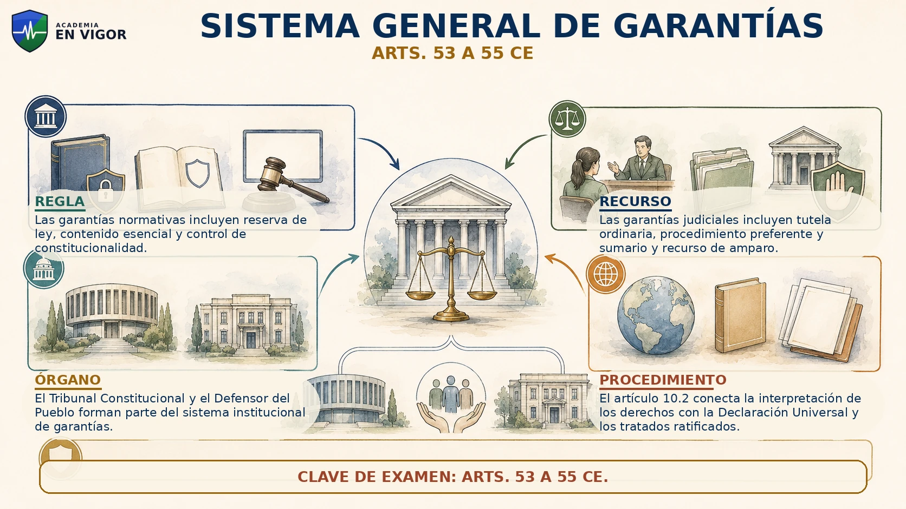

<em>Infografía: Sistema general de garantías.</em>

<!-- FUENTE: BOE-CE-1978-GC-T04 -->

## 26. Los tres apartados del artículo 53

### Regla y encaje

Este bloque ordena los tres apartados del artículo 53 dentro del sistema constitucional. La clave es relacionar el precepto con su sujeto, competencia, garantía, mayoría o plazo.

Este bloque pertenece a **constitución: derechos, garantías y suspensión** y se contrasta en **art. 53 CE**.

### Claves normativas

- Los derechos del Capítulo II vinculan a todos los poderes públicos y solo pueden regularse por ley respetando su contenido esencial.
- El artículo 14 y la Sección 1.ª reciben tutela por procedimiento preferente y sumario y recurso de amparo. <!-- FACT:GC-T04-F150 -->
- El recurso de amparo se extiende a la objeción de conciencia del artículo 30.2. <!-- FACT:GC-T04-F151 -->
- Los principios del Capítulo III informan legislación, práctica judicial y actuación pública y se alegan conforme a sus leyes de desarrollo. <!-- FACT:GC-T04-F152 -->
 <!-- FACT:GC-T04-F153 -->

:::hablemos-claro
Lee la Constitución como un sistema: primero identifica el poder u órgano; después, su competencia, límite, garantía y control.
:::

:::en-la-calle
En un supuesto práctico, separa derechos, organización del poder y procedimiento. Una misma palabra —ley, mayoría o control— cambia de sentido según el título constitucional.
:::

:::lo-que-cae
Prioridad de examen: **art. 53 CE**. Vigila sujetos, plazos, mayorías, excepciones y verbos de competencia.
:::

<!-- VISUAL:t04-26-los-tres-apartados-del-articulo-53.webp -->

  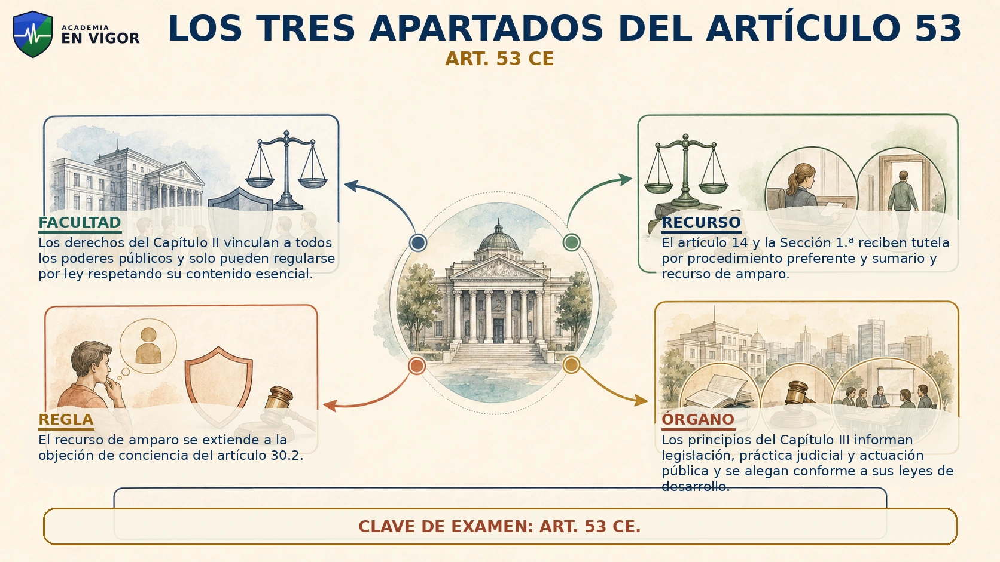

<em>Infografía: Los tres apartados del artículo 53.</em>

<!-- FUENTE: BOE-CE-1978-GC-T04 -->

## 27. Ley orgánica, reforma agravada y control de leyes

### Regla y encaje

Este bloque ordena ley orgánica, reforma agravada y control de leyes dentro del sistema constitucional. La clave es relacionar el precepto con su sujeto, competencia, garantía, mayoría o plazo.

Este bloque pertenece a **constitución: derechos, garantías y suspensión** y se contrasta en **arts. 53.1, 81.1, 161 y 168 CE**.

### Claves normativas

- El desarrollo de derechos fundamentales y libertades públicas requiere ley orgánica.
- La reserva de ley orgánica se refiere a la Sección 1.ª y no automáticamente al artículo 14 o al 30.2. <!-- FACT:GC-T04-F154 -->
- La reforma que afecte a la Sección 1.ª del Capítulo II sigue el procedimiento agravado del artículo 168. <!-- FACT:GC-T04-F155 -->
- El Tribunal Constitucional controla la constitucionalidad de las leyes y normas con fuerza de ley. <!-- FACT:GC-T04-F156 -->
 <!-- FACT:GC-T04-F157 -->

:::hablemos-claro
Lee la Constitución como un sistema: primero identifica el poder u órgano; después, su competencia, límite, garantía y control.
:::

:::en-la-calle
En un supuesto práctico, separa derechos, organización del poder y procedimiento. Una misma palabra —ley, mayoría o control— cambia de sentido según el título constitucional.
:::

:::lo-que-cae
Prioridad de examen: **arts. 53.1, 81.1, 161 y 168 CE**. Vigila sujetos, plazos, mayorías, excepciones y verbos de competencia.
:::

<!-- VISUAL:t04-27-ley-organica-reforma-agravada-y-control-de-leyes.webp -->

  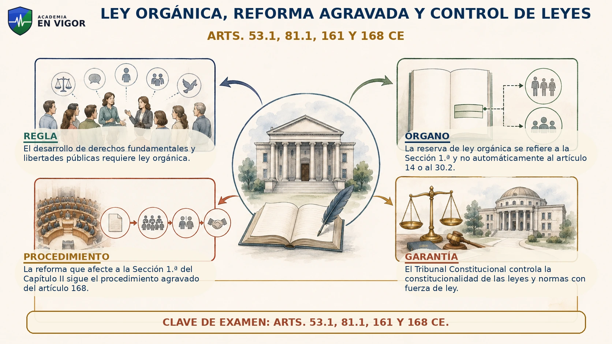

<em>Infografía: Ley orgánica, reforma agravada y control de leyes.</em>

<!-- FUENTE: BOE-CE-1978-GC-T04 -->

## 28. Recurso de amparo

### Regla y encaje

Este bloque ordena recurso de amparo dentro del sistema constitucional. La clave es relacionar el precepto con su sujeto, competencia, garantía, mayoría o plazo.

Este bloque pertenece a **constitución: derechos, garantías y suspensión** y se contrasta en **arts. 53.2, 161 y 162 CE**.

### Claves normativas

- El recurso de amparo es subsidiario y protege los derechos comprendidos en los artículos 14 a 29 y 30.2.
- Antes del amparo deben agotarse las vías judiciales procedentes, salvo los supuestos constitucionales y legales específicos. <!-- FACT:GC-T04-F158 -->
- Pueden interponer amparo la persona afectada, el Defensor del Pueblo y el Ministerio Fiscal en los términos legales. <!-- FACT:GC-T04-F159 -->
- El amparo no es una tercera instancia para revisar cualquier error de legalidad ordinaria. <!-- FACT:GC-T04-F160 -->
 <!-- FACT:GC-T04-F161 -->

:::hablemos-claro
Lee la Constitución como un sistema: primero identifica el poder u órgano; después, su competencia, límite, garantía y control.
:::

:::en-la-calle
En un supuesto práctico, separa derechos, organización del poder y procedimiento. Una misma palabra —ley, mayoría o control— cambia de sentido según el título constitucional.
:::

:::lo-que-cae
Prioridad de examen: **arts. 53.2, 161 y 162 CE**. Vigila sujetos, plazos, mayorías, excepciones y verbos de competencia.
:::

<!-- VISUAL:t04-28-recurso-de-amparo.webp -->

  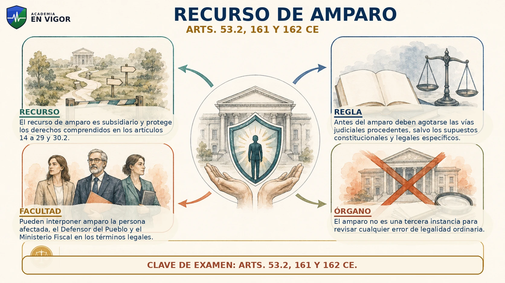

<em>Infografía: Recurso de amparo.</em>

<!-- FUENTE: BOE-CE-1978-GC-T04 -->

## 29. Suspensión general de derechos

### Regla y encaje

Este bloque ordena suspensión general de derechos dentro del sistema constitucional. La clave es relacionar el precepto con su sujeto, competencia, garantía, mayoría o plazo.

Este bloque pertenece a **constitución: derechos, garantías y suspensión** y se contrasta en **art. 55.1 CE**.

### Claves normativas

- La suspensión general del artículo 55.1 solo puede operar durante los estados de excepción o de sitio.
- Pueden suspenderse los derechos de los artículos 17, 18.2, 18.3, 19, 20.1.a y d, 20.5, 21, 28.2 y 37.2. <!-- FACT:GC-T04-F162 -->
- En el estado de excepción no puede suspenderse el artículo 17.3. <!-- FACT:GC-T04-F163 -->
- El estado de alarma no permite suspender derechos fundamentales. <!-- FACT:GC-T04-F164 -->
- La suspensión debe limitarse a lo previsto en la Constitución, la ley y la declaración correspondiente. <!-- FACT:GC-T04-F165 -->
 <!-- FACT:GC-T04-F166 -->

:::hablemos-claro
Lee la Constitución como un sistema: primero identifica el poder u órgano; después, su competencia, límite, garantía y control.
:::

:::en-la-calle
En un supuesto práctico, separa derechos, organización del poder y procedimiento. Una misma palabra —ley, mayoría o control— cambia de sentido según el título constitucional.
:::

:::lo-que-cae
Prioridad de examen: **art. 55.1 CE**. Vigila sujetos, plazos, mayorías, excepciones y verbos de competencia.
:::

:::ha-caido
Apariciones oficiales verificadas: 2020 · pregunta 16, 2023 · pregunta 17.
:::

<!-- VISUAL:t04-29-suspension-general-de-derechos.webp -->

  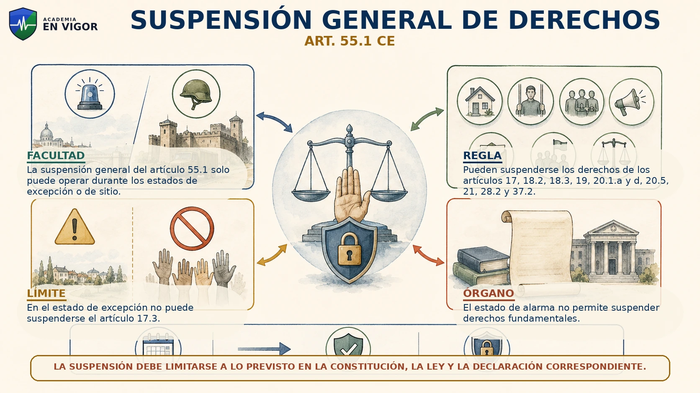

<em>Infografía: Suspensión general de derechos.</em>

<!-- FUENTE: BOE-CE-1978-GC-T04 -->

## 30. Alarma, excepción y sitio

### Regla y encaje

Este bloque ordena alarma, excepción y sitio dentro del sistema constitucional. La clave es relacionar el precepto con su sujeto, competencia, garantía, mayoría o plazo.

Este bloque pertenece a **constitución: derechos, garantías y suspensión** y se contrasta en **art. 116 CE**.

### Claves normativas

- El Gobierno declara el estado de alarma por decreto acordado en Consejo de Ministros por un máximo inicial de quince días.
- La prórroga del estado de alarma necesita autorización del Congreso. <!-- FACT:GC-T04-F167 -->
- El Gobierno declara el estado de excepción previa autorización del Congreso por un máximo de treinta días. <!-- FACT:GC-T04-F168 -->
- El estado de excepción puede prorrogarse por otros treinta días con los mismos requisitos. <!-- FACT:GC-T04-F169 -->
- El Congreso declara el estado de sitio por mayoría absoluta a propuesta exclusiva del Gobierno. <!-- FACT:GC-T04-F170 -->
 <!-- FACT:GC-T04-F171 -->

:::hablemos-claro
Lee la Constitución como un sistema: primero identifica el poder u órgano; después, su competencia, límite, garantía y control.
:::

:::en-la-calle
En un supuesto práctico, separa derechos, organización del poder y procedimiento. Una misma palabra —ley, mayoría o control— cambia de sentido según el título constitucional.
:::

:::lo-que-cae
Prioridad de examen: **art. 116 CE**. Vigila sujetos, plazos, mayorías, excepciones y verbos de competencia.
:::

:::ha-caido
Apariciones oficiales verificadas: 2020 · pregunta 18, 2020 · pregunta 19.
:::

<!-- VISUAL:t04-30-alarma-excepcion-y-sitio.webp -->

  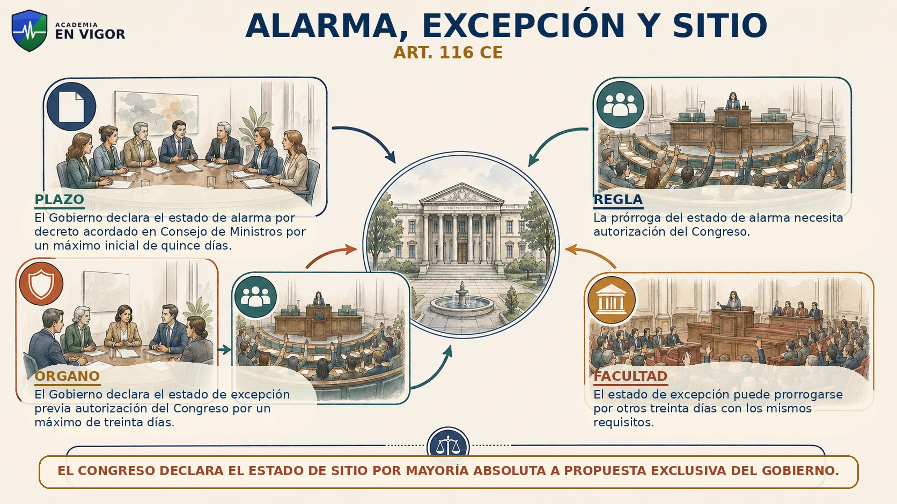

<em>Infografía: Alarma, excepción y sitio.</em>

<!-- FUENTE: BOE-CE-1978-GC-T04 -->

## 31. Suspensión individual vinculada a terrorismo

### Regla y encaje

Este bloque ordena suspensión individual vinculada a terrorismo dentro del sistema constitucional. La clave es relacionar el precepto con su sujeto, competencia, garantía, mayoría o plazo.

Este bloque pertenece a **constitución: derechos, garantías y suspensión** y se contrasta en **art. 55.2 CE**.

### Claves normativas

- La suspensión individual puede afectar a los artículos 17.2, 18.2 y 18.3.
- La suspensión individual se vincula a investigaciones sobre bandas armadas o elementos terroristas. <!-- FACT:GC-T04-F172 -->
- La suspensión individual exige intervención judicial y adecuado control parlamentario. <!-- FACT:GC-T04-F173 -->
- El uso injustificado o abusivo de estas facultades produce responsabilidad penal por violación de derechos. <!-- FACT:GC-T04-F174 -->
 <!-- FACT:GC-T04-F175 -->

:::hablemos-claro
Lee la Constitución como un sistema: primero identifica el poder u órgano; después, su competencia, límite, garantía y control.
:::

:::en-la-calle
En un supuesto práctico, separa derechos, organización del poder y procedimiento. Una misma palabra —ley, mayoría o control— cambia de sentido según el título constitucional.
:::

:::lo-que-cae
Prioridad de examen: **art. 55.2 CE**. Vigila sujetos, plazos, mayorías, excepciones y verbos de competencia.
:::

:::ha-caido
Apariciones oficiales verificadas: 2026 · pregunta 18.
:::

<!-- VISUAL:t04-31-suspension-individual-vinculada-a-terrorismo.webp -->

  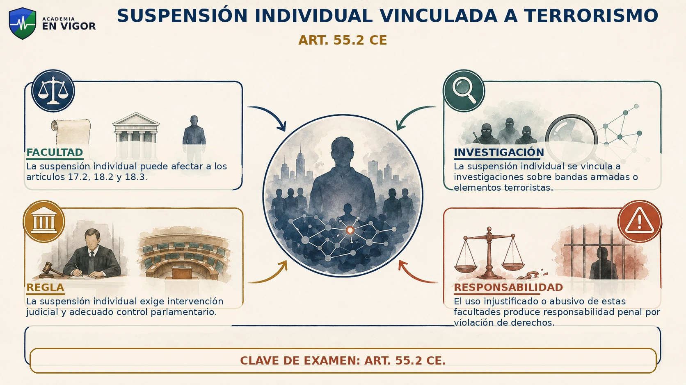

<em>Infografía: Suspensión individual vinculada a terrorismo.</em>

<!-- FUENTE: BOE-CE-1978-GC-T04 -->

## 32. Conexión constitucional con la protección de datos

### Regla y encaje

Este bloque ordena conexión constitucional con la protección de datos dentro del sistema constitucional. La clave es relacionar el precepto con su sujeto, competencia, garantía, mayoría o plazo.

Este bloque pertenece a **constitución: derechos, garantías y suspensión** y se contrasta en **art. 18.4 CE**.

### Claves normativas

- La ley limita el uso de la informática para garantizar honor, intimidad y pleno ejercicio de los derechos.
- Del artículo 18.4 se deriva un derecho autónomo al control de los datos personales. <!-- FACT:GC-T04-F176 -->
- La protección de datos se desarrolla con carácter general y mediante normas específicas para tratamientos policiales y penales. <!-- FACT:GC-T04-F177 -->
 <!-- FACT:GC-T04-F178 -->

:::hablemos-claro
Lee la Constitución como un sistema: primero identifica el poder u órgano; después, su competencia, límite, garantía y control.
:::

:::en-la-calle
En un supuesto práctico, separa derechos, organización del poder y procedimiento. Una misma palabra —ley, mayoría o control— cambia de sentido según el título constitucional.
:::

:::lo-que-cae
Prioridad de examen: **art. 18.4 CE**. Vigila sujetos, plazos, mayorías, excepciones y verbos de competencia.
:::

<!-- VISUAL:t04-32-conexion-constitucional-con-la-proteccion-de-datos.webp -->

  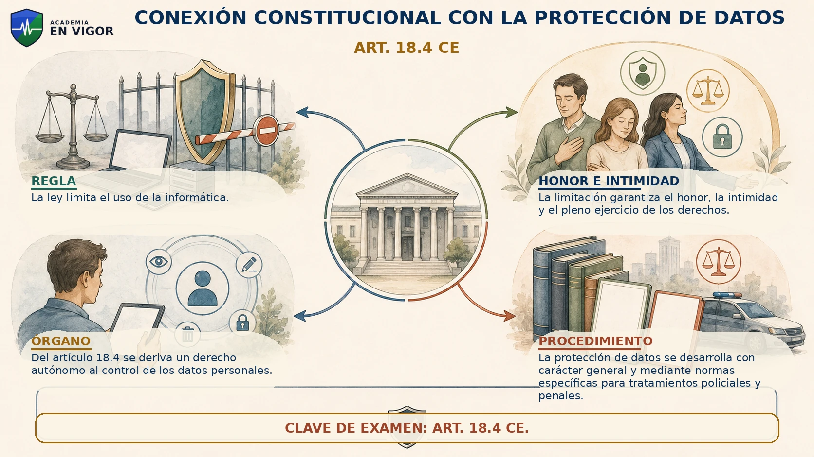

<em>Infografía: Conexión constitucional con la protección de datos.</em>

<!-- FUENTE: BOE-CE-1978-GC-T04 -->

## 33. La Corona: posición, inviolabilidad, refrendo y Casa del Rey

### Regla y encaje

Este bloque ordena la corona: posición, inviolabilidad, refrendo y casa del rey dentro del sistema constitucional. La clave es relacionar el precepto con su sujeto, competencia, garantía, mayoría o plazo.

Este bloque pertenece a **constitución: corona** y se contrasta en **arts. 56, 64 y 65 CE**.

### Claves normativas

- El Rey es el Jefe del Estado y símbolo de la unidad y permanencia de España.
- El Rey arbitra y modera el funcionamiento regular de las instituciones. <!-- FACT:GC-T04-F179 -->
- El Rey asume la más alta representación del Estado español en las relaciones internacionales, especialmente con las naciones de su comunidad histórica. <!-- FACT:GC-T04-F180 -->
- Su título es Rey de España y puede utilizar los demás títulos que correspondan a la Corona. <!-- FACT:GC-T04-F181 -->
- La persona del Rey es inviolable y no está sujeta a responsabilidad. <!-- FACT:GC-T04-F182 -->
- Los actos del Rey carecen de validez sin refrendo, salvo la excepción del artículo 65.2. <!-- FACT:GC-T04-F183 -->
- Los actos del Rey son refrendados por el Presidente del Gobierno y, en su caso, por los ministros competentes. <!-- FACT:GC-T04-F184 -->
- La propuesta y el nombramiento del Presidente del Gobierno y la disolución del artículo 99 son refrendados por el Presidente del Congreso. <!-- FACT:GC-T04-F185 -->
- De los actos del Rey responden las personas que los refrendan. <!-- FACT:GC-T04-F186 -->
- El Rey recibe una cantidad global de los Presupuestos del Estado para su Familia y Casa y la distribuye libremente. <!-- FACT:GC-T04-F187 -->
- El Rey nombra y releva libremente a los miembros civiles y militares de su Casa. <!-- FACT:GC-T04-F188 -->
 <!-- FACT:GC-T04-F189 -->

:::hablemos-claro
Lee la Constitución como un sistema: primero identifica el poder u órgano; después, su competencia, límite, garantía y control.
:::

:::en-la-calle
En un supuesto práctico, separa derechos, organización del poder y procedimiento. Una misma palabra —ley, mayoría o control— cambia de sentido según el título constitucional.
:::

:::lo-que-cae
Prioridad de examen: **arts. 56, 64 y 65 CE**. Vigila sujetos, plazos, mayorías, excepciones y verbos de competencia.
:::

<!-- VISUAL:t04-33-la-corona-posicion-inviolabilidad-refrendo-y-casa-del-rey.webp -->

  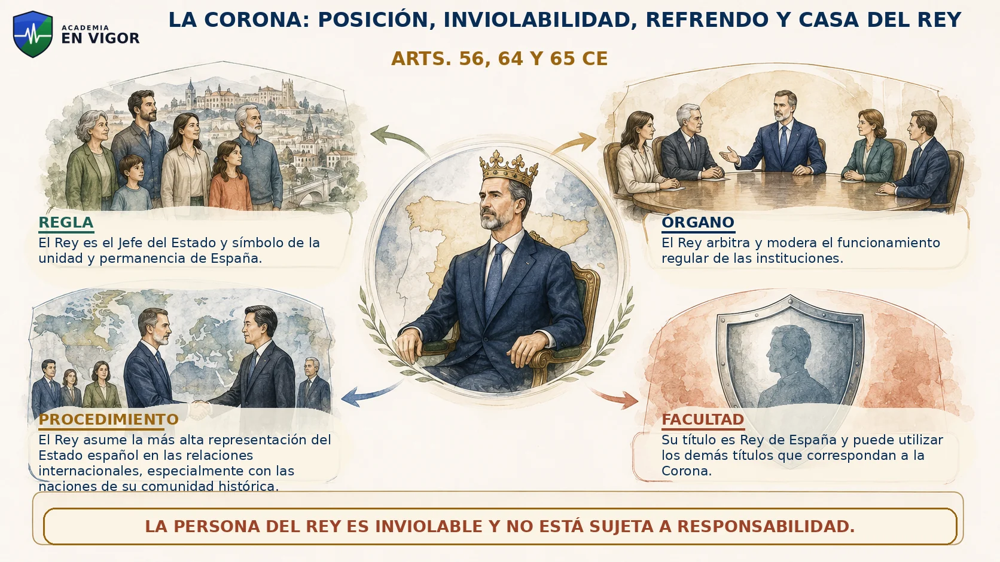

<em>Infografía: La Corona: posición, inviolabilidad, refrendo y Casa del Rey.</em>

<!-- FUENTE: BOE-CE-1978-GC-T04 -->

## 34. Sucesión a la Corona y consorte

### Regla y encaje

Este bloque ordena sucesión a la corona y consorte dentro del sistema constitucional. La clave es relacionar el precepto con su sujeto, competencia, garantía, mayoría o plazo.

Este bloque pertenece a **constitución: corona** y se contrasta en **arts. 57 y 58 CE**.

### Claves normativas

- La Corona es hereditaria en los sucesores de Juan Carlos I de Borbón, legítimo heredero de la dinastía histórica.
- La sucesión sigue el orden regular de primogenitura y representación. <!-- FACT:GC-T04-F190 -->
- En la sucesión se prefiere siempre la línea anterior a las posteriores. <!-- FACT:GC-T04-F191 -->
- Dentro de la misma línea se prefiere el grado más próximo al más remoto. <!-- FACT:GC-T04-F192 -->
- En el mismo grado se prefiere el varón a la mujer. <!-- FACT:GC-T04-F193 -->
- En el mismo sexo se prefiere la persona de más edad a la de menos. <!-- FACT:GC-T04-F194 -->
- El heredero, desde su nacimiento o desde que se produzca el llamamiento, tiene la dignidad de Príncipe de Asturias y los demás títulos tradicionales. <!-- FACT:GC-T04-F195 -->
- Extinguidas todas las líneas llamadas en Derecho, las Cortes Generales proveen la sucesión en la forma más conveniente para los intereses de España. <!-- FACT:GC-T04-F196 -->
- Quien tenga derecho a la sucesión y contraiga matrimonio contra la prohibición expresa del Rey y de las Cortes queda excluido, junto con sus descendientes. <!-- FACT:GC-T04-F197 -->
- Las abdicaciones, renuncias y dudas sucesorias se resuelven mediante ley orgánica. <!-- FACT:GC-T04-F198 -->
- La Reina consorte o el consorte de la Reina no puede asumir funciones constitucionales, salvo lo dispuesto para la Regencia. <!-- FACT:GC-T04-F199 -->
 <!-- FACT:GC-T04-F200 -->

:::hablemos-claro
Lee la Constitución como un sistema: primero identifica el poder u órgano; después, su competencia, límite, garantía y control.
:::

:::en-la-calle
En un supuesto práctico, separa derechos, organización del poder y procedimiento. Una misma palabra —ley, mayoría o control— cambia de sentido según el título constitucional.
:::

:::lo-que-cae
Prioridad de examen: **arts. 57 y 58 CE**. Vigila sujetos, plazos, mayorías, excepciones y verbos de competencia.
:::

:::ha-caido
Apariciones oficiales verificadas: 2020 · pregunta 17, 2022 · pregunta 18.
:::

<!-- VISUAL:t04-34-sucesion-a-la-corona-y-consorte.webp -->

  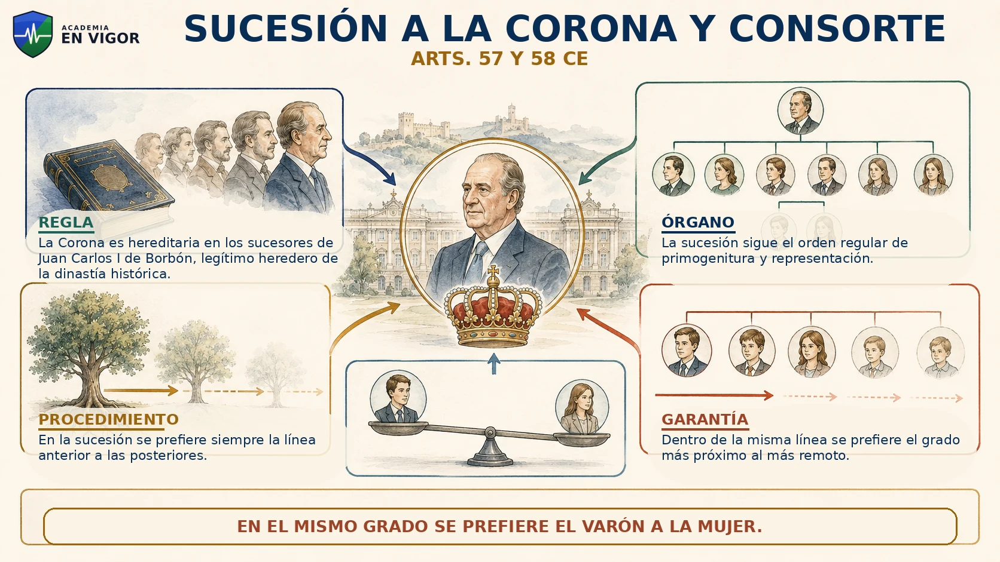

<em>Infografía: Sucesión a la Corona y consorte.</em>

<!-- FUENTE: BOE-CE-1978-GC-T04 -->

## 35. Regencia, tutela y juramento

### Regla y encaje

Este bloque ordena regencia, tutela y juramento dentro del sistema constitucional. La clave es relacionar el precepto con su sujeto, competencia, garantía, mayoría o plazo.

Este bloque pertenece a **constitución: corona** y se contrasta en **arts. 59 a 61 CE**.

### Claves normativas

- Si el Rey es menor, ejerce inmediatamente la Regencia el padre o la madre y, en su defecto, el pariente mayor de edad más próximo según el orden sucesorio.
- La Regencia por minoría de edad dura durante el tiempo de la minoría del Rey. <!-- FACT:GC-T04-F201 -->
- Si el Rey queda inhabilitado y las Cortes reconocen la imposibilidad, ejerce la Regencia el Príncipe heredero si es mayor de edad. <!-- FACT:GC-T04-F202 -->
- Si el Príncipe heredero es menor, se aplica la regencia prevista para minoría hasta que alcance la mayoría de edad. <!-- FACT:GC-T04-F203 -->
- Si no existe persona llamada a ejercer la Regencia, las Cortes la nombran y puede estar compuesta por una, tres o cinco personas. <!-- FACT:GC-T04-F204 -->
- Para ejercer la Regencia se exige ser español y mayor de edad. <!-- FACT:GC-T04-F205 -->
- La Regencia se ejerce por mandato constitucional y siempre en nombre del Rey. <!-- FACT:GC-T04-F206 -->
- Es tutor del Rey menor la persona nombrada por el Rey difunto en testamento, siempre que sea mayor de edad y español de nacimiento. <!-- FACT:GC-T04-F207 -->
- A falta de tutor testamentario, lo es el padre o la madre mientras permanezcan viudos. <!-- FACT:GC-T04-F208 -->
- En defecto de tutor testamentario y de progenitor viudo, las Cortes nombran al tutor. <!-- FACT:GC-T04-F209 -->
- Solo el padre, la madre o los ascendientes directos del Rey pueden acumular los cargos de Regente y tutor. <!-- FACT:GC-T04-F210 -->
- La tutela del Rey es incompatible con todo cargo o representación política. <!-- FACT:GC-T04-F211 -->
- El Rey, al ser proclamado ante las Cortes, jura desempeñar fielmente sus funciones, guardar y hacer guardar la Constitución y las leyes y respetar derechos y autonomías. <!-- FACT:GC-T04-F212 -->
- El Príncipe heredero, al alcanzar la mayoría de edad, y los Regentes al hacerse cargo de sus funciones prestan el mismo juramento y el de fidelidad al Rey. <!-- FACT:GC-T04-F213 -->
 <!-- FACT:GC-T04-F214 -->

:::hablemos-claro
Lee la Constitución como un sistema: primero identifica el poder u órgano; después, su competencia, límite, garantía y control.
:::

:::en-la-calle
En un supuesto práctico, separa derechos, organización del poder y procedimiento. Una misma palabra —ley, mayoría o control— cambia de sentido según el título constitucional.
:::

:::lo-que-cae
Prioridad de examen: **arts. 59 a 61 CE**. Vigila sujetos, plazos, mayorías, excepciones y verbos de competencia.
:::

:::ha-caido
Apariciones oficiales verificadas: 2021 · pregunta 17, 2026 · pregunta 19.
:::

<!-- VISUAL:t04-35-regencia-tutela-y-juramento.webp -->

  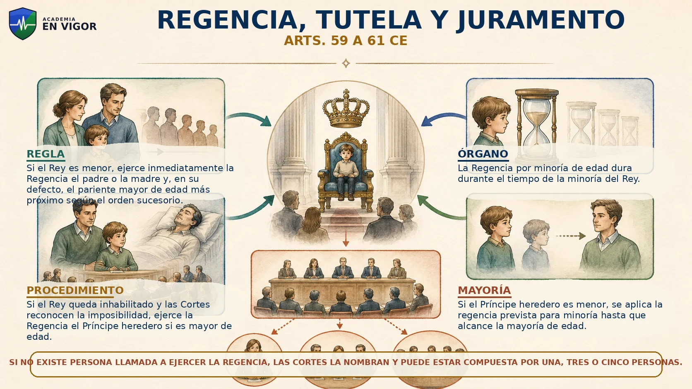

<em>Infografía: Regencia, tutela y juramento.</em>

<!-- FUENTE: BOE-CE-1978-GC-T04 -->

## 36. Funciones nacionales e internacionales del Rey

### Regla y encaje

Este bloque ordena funciones nacionales e internacionales del rey dentro del sistema constitucional. La clave es relacionar el precepto con su sujeto, competencia, garantía, mayoría o plazo.

Este bloque pertenece a **constitución: corona** y se contrasta en **arts. 62 y 63 CE**.

### Claves normativas

- Corresponde al Rey sancionar y promulgar las leyes.
- Corresponde al Rey convocar y disolver las Cortes Generales y convocar elecciones en los términos constitucionales. <!-- FACT:GC-T04-F215 -->
- Corresponde al Rey convocar a referéndum en los casos previstos en la Constitución. <!-- FACT:GC-T04-F216 -->
- Corresponde al Rey proponer candidato a Presidente del Gobierno, nombrarlo y poner fin a sus funciones en los términos constitucionales. <!-- FACT:GC-T04-F217 -->
- Corresponde al Rey nombrar y separar a los miembros del Gobierno a propuesta de su Presidente. <!-- FACT:GC-T04-F218 -->
- Corresponde al Rey expedir los decretos acordados en el Consejo de Ministros. <!-- FACT:GC-T04-F219 -->
- Corresponde al Rey conferir empleos civiles y militares y conceder honores y distinciones con arreglo a las leyes. <!-- FACT:GC-T04-F220 -->
- El Rey tiene derecho a ser informado de los asuntos de Estado. <!-- FACT:GC-T04-F221 -->
- El Rey puede presidir sesiones del Consejo de Ministros, a petición del Presidente del Gobierno, cuando lo estime oportuno para ser informado de asuntos de Estado. <!-- FACT:GC-T04-F222 -->
- Corresponde al Rey el mando supremo de las Fuerzas Armadas. <!-- FACT:GC-T04-F223 -->
- El Rey ejerce el derecho de gracia con arreglo a la ley, que no puede autorizar indultos generales. <!-- FACT:GC-T04-F224 -->
- Corresponde al Rey el Alto Patronazgo de las Reales Academias. <!-- FACT:GC-T04-F225 -->
- El Rey acredita a los embajadores y otros representantes diplomáticos; los representantes extranjeros están acreditados ante él. <!-- FACT:GC-T04-F226 -->
- Corresponde al Rey manifestar el consentimiento del Estado para obligarse internacionalmente por medio de tratados. <!-- FACT:GC-T04-F227 -->
- Corresponde al Rey declarar la guerra y hacer la paz, previa autorización de las Cortes Generales. <!-- FACT:GC-T04-F228 -->
 <!-- FACT:GC-T04-F229 -->

:::hablemos-claro
Lee la Constitución como un sistema: primero identifica el poder u órgano; después, su competencia, límite, garantía y control.
:::

:::en-la-calle
En un supuesto práctico, separa derechos, organización del poder y procedimiento. Una misma palabra —ley, mayoría o control— cambia de sentido según el título constitucional.
:::

:::lo-que-cae
Prioridad de examen: **arts. 62 y 63 CE**. Vigila sujetos, plazos, mayorías, excepciones y verbos de competencia.
:::

:::ha-caido
Apariciones oficiales verificadas: 2020 · pregunta 16, 2020 · pregunta 18, 2023 · pregunta 18, 2024 · pregunta 19.
:::

<!-- VISUAL:t04-36-funciones-nacionales-e-internacionales-del-rey.webp -->

  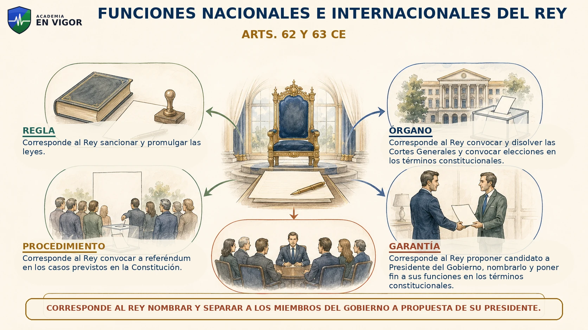

<em>Infografía: Funciones nacionales e internacionales del Rey.</em>

<!-- FUENTE: BOE-CE-1978-GC-T04 -->

## 37. Cortes Generales: naturaleza, funciones y mandato representativo

### Regla y encaje

Este bloque ordena cortes generales: naturaleza, funciones y mandato representativo dentro del sistema constitucional. La clave es relacionar el precepto con su sujeto, competencia, garantía, mayoría o plazo.

Este bloque pertenece a **constitución: cortes generales y producción normativa** y se contrasta en **arts. 66 a 68 CE**.

### Claves normativas

- Las Cortes Generales representan al pueblo español y están formadas por Congreso y Senado.
- Las Cortes ejercen la potestad legislativa, aprueban los Presupuestos, controlan la acción del Gobierno y ejercen las demás competencias constitucionales. <!-- FACT:GC-T04-F230 -->
- Las Cortes Generales son inviolables. <!-- FACT:GC-T04-F231 -->
- Nadie puede ser miembro simultáneamente del Congreso y del Senado. <!-- FACT:GC-T04-F232 -->
- No puede acumularse el acta de una asamblea autonómica con la de diputado al Congreso. <!-- FACT:GC-T04-F233 -->
- Los miembros de las Cortes Generales no están ligados por mandato imperativo. <!-- FACT:GC-T04-F234 -->
- Las reuniones de parlamentarios celebradas sin convocatoria reglamentaria no vinculan a las Cámaras ni pueden ejercer sus funciones o privilegios. <!-- FACT:GC-T04-F235 -->
 <!-- FACT:GC-T04-F236 -->

:::hablemos-claro
Lee la Constitución como un sistema: primero identifica el poder u órgano; después, su competencia, límite, garantía y control.
:::

:::en-la-calle
En un supuesto práctico, separa derechos, organización del poder y procedimiento. Una misma palabra —ley, mayoría o control— cambia de sentido según el título constitucional.
:::

:::lo-que-cae
Prioridad de examen: **arts. 66 a 68 CE**. Vigila sujetos, plazos, mayorías, excepciones y verbos de competencia.
:::

<!-- VISUAL:t04-37-cortes-generales-naturaleza-funciones-y-mandato-representativo.webp -->

  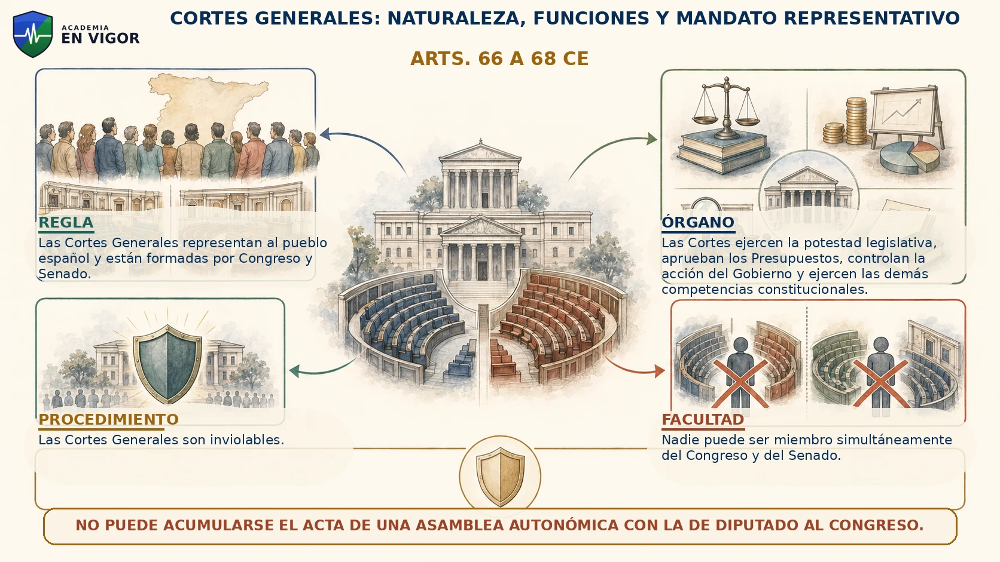

<em>Infografía: Cortes Generales: naturaleza, funciones y mandato representativo.</em>

<!-- FUENTE: BOE-CE-1978-GC-T04 -->

## 38. Congreso, Senado e incompatibilidades

### Regla y encaje

Este bloque ordena congreso, senado e incompatibilidades dentro del sistema constitucional. La clave es relacionar el precepto con su sujeto, competencia, garantía, mayoría o plazo.

Este bloque pertenece a **constitución: cortes generales y producción normativa** y se contrasta en **arts. 68 a 70 CE**.

### Claves normativas

- El Congreso se compone de un mínimo de 300 y un máximo de 400 diputados.
- Los diputados son elegidos por sufragio universal, libre, igual, directo y secreto en los términos legales. <!-- FACT:GC-T04-F237 -->
- La circunscripción electoral para el Congreso es la provincia; Ceuta y Melilla están representadas cada una por un diputado. <!-- FACT:GC-T04-F238 -->
- La ley distribuye el total de diputados asignando una representación mínima inicial a cada circunscripción y el resto en proporción a la población. <!-- FACT:GC-T04-F239 -->
- La elección al Congreso se verifica en cada circunscripción atendiendo a criterios de representación proporcional. <!-- FACT:GC-T04-F240 -->
- El Congreso es elegido por cuatro años y el mandato termina cuatro años después de la elección o el día de la disolución. <!-- FACT:GC-T04-F241 -->
- Son electores y elegibles todos los españoles que estén en pleno uso de sus derechos políticos. <!-- FACT:GC-T04-F242 -->
- La ley reconoce y el Estado facilita el derecho de sufragio de los españoles que se encuentren fuera de España. <!-- FACT:GC-T04-F243 -->
- Las elecciones al Congreso tienen lugar entre los 30 y 60 días desde la terminación del mandato. <!-- FACT:GC-T04-F244 -->
- El Congreso electo debe ser convocado dentro de los 25 días siguientes a las elecciones. <!-- FACT:GC-T04-F245 -->
- El Senado es la Cámara de representación territorial. <!-- FACT:GC-T04-F246 -->
- En cada provincia se eligen cuatro senadores por sufragio universal, libre, igual, directo y secreto. <!-- FACT:GC-T04-F247 -->
- Cada isla mayor —Gran Canaria, Mallorca y Tenerife— elige tres senadores. <!-- FACT:GC-T04-F248 -->
- Ibiza, Formentera, Menorca, Fuerteventura, La Gomera, El Hierro, Lanzarote y La Palma eligen un senador cada una; la eficacia de las nuevas circunscripciones de Ibiza y Formentera se difiere a las primeras elecciones al Senado posteriores a la reforma de 2026. <!-- FACT:GC-T04-F249 -->
- Ceuta y Melilla eligen cada una dos senadores. <!-- FACT:GC-T04-F250 -->
- Cada comunidad autónoma designa un senador y otro más por cada millón de habitantes de su territorio. <!-- FACT:GC-T04-F251 -->
- La designación de senadores autonómicos corresponde a la asamblea legislativa o al órgano colegiado superior, asegurando representación proporcional. <!-- FACT:GC-T04-F252 -->
- El Senado es elegido por cuatro años y el mandato termina cuatro años después de la elección o el día de la disolución. <!-- FACT:GC-T04-F253 -->
- La ley electoral determina causas de inelegibilidad e incompatibilidad de diputados y senadores. <!-- FACT:GC-T04-F254 -->
- Entre las causas constitucionalmente mencionadas figuran determinados altos cargos, miembros del Tribunal Constitucional, Defensor del Pueblo, magistrados, jueces y fiscales en activo, militares y policías en activo y miembros de juntas electorales. <!-- FACT:GC-T04-F255 -->
- La validez de actas y credenciales parlamentarias queda sometida al control judicial en los términos de la ley electoral. <!-- FACT:GC-T04-F256 -->
 <!-- FACT:GC-T04-F257 -->

:::hablemos-claro
Lee la Constitución como un sistema: primero identifica el poder u órgano; después, su competencia, límite, garantía y control.
:::

:::en-la-calle
En un supuesto práctico, separa derechos, organización del poder y procedimiento. Una misma palabra —ley, mayoría o control— cambia de sentido según el título constitucional.
:::

:::lo-que-cae
Prioridad de examen: **arts. 68 a 70 CE**. Vigila sujetos, plazos, mayorías, excepciones y verbos de competencia.
:::

:::ha-caido
Apariciones oficiales verificadas: 2020 · pregunta 17, 2021 · pregunta 18, 2024 · pregunta 19, 2026 · pregunta 20.
:::

<!-- VISUAL:t04-38-congreso-senado-e-incompatibilidades.webp -->

  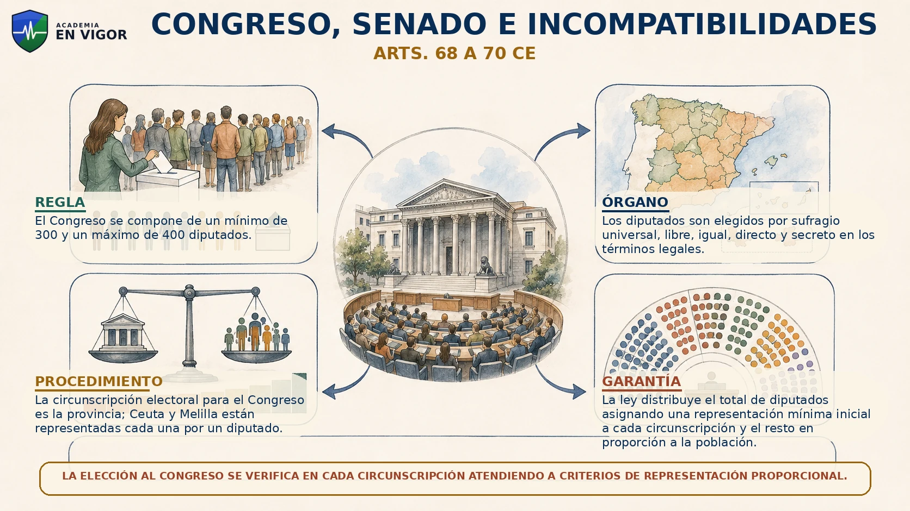

<em>Infografía: Congreso, Senado e incompatibilidades.</em>

<!-- FUENTE: BOE-CE-1978-GC-T04 -->

## 39. Prerrogativas parlamentarias y autonomía de las Cámaras

### Regla y encaje

Este bloque ordena prerrogativas parlamentarias y autonomía de las cámaras dentro del sistema constitucional. La clave es relacionar el precepto con su sujeto, competencia, garantía, mayoría o plazo.

Este bloque pertenece a **constitución: cortes generales y producción normativa** y se contrasta en **arts. 71 y 72 CE**.

### Claves normativas

- Diputados y senadores gozan de inviolabilidad por las opiniones manifestadas en el ejercicio de sus funciones.
- Durante su mandato, diputados y senadores gozan de inmunidad y solo pueden ser detenidos en caso de flagrante delito. <!-- FACT:GC-T04-F258 -->
- Diputados y senadores no pueden ser inculpados ni procesados sin autorización previa de la Cámara respectiva. <!-- FACT:GC-T04-F259 -->
- En las causas contra diputados y senadores es competente la Sala de lo Penal del Tribunal Supremo. <!-- FACT:GC-T04-F260 -->
- Diputados y senadores perciben una asignación fijada por sus respectivas Cámaras. <!-- FACT:GC-T04-F261 -->
- Las Cámaras establecen sus propios reglamentos, aprueban autónomamente sus presupuestos y regulan de común acuerdo el estatuto del personal de las Cortes. <!-- FACT:GC-T04-F262 -->
- Los reglamentos y sus reformas se someten a una votación final sobre su totalidad que requiere mayoría absoluta. <!-- FACT:GC-T04-F263 -->
- Las Cámaras eligen a sus presidentes y a los demás miembros de sus Mesas. <!-- FACT:GC-T04-F264 -->
- Las sesiones conjuntas son presididas por el Presidente del Congreso y se rigen por un reglamento de las Cortes aprobado por mayoría absoluta de cada Cámara. <!-- FACT:GC-T04-F265 -->
- Los presidentes de las Cámaras ejercen en nombre de estas todos los poderes administrativos y facultades de policía en el interior de sus sedes. <!-- FACT:GC-T04-F266 -->
 <!-- FACT:GC-T04-F267 -->

:::hablemos-claro
Lee la Constitución como un sistema: primero identifica el poder u órgano; después, su competencia, límite, garantía y control.
:::

:::en-la-calle
En un supuesto práctico, separa derechos, organización del poder y procedimiento. Una misma palabra —ley, mayoría o control— cambia de sentido según el título constitucional.
:::

:::lo-que-cae
Prioridad de examen: **arts. 71 y 72 CE**. Vigila sujetos, plazos, mayorías, excepciones y verbos de competencia.
:::

<!-- VISUAL:t04-39-prerrogativas-parlamentarias-y-autonomia-de-las-camaras.webp -->

  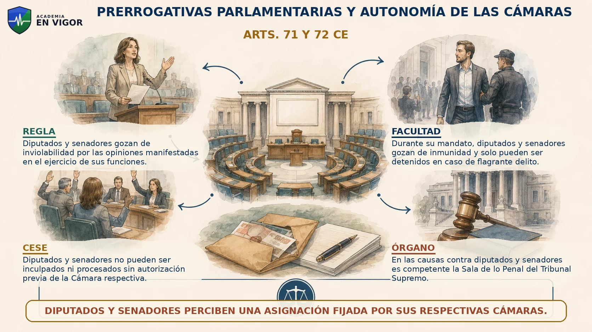

<em>Infografía: Prerrogativas parlamentarias y autonomía de las Cámaras.</em>

<!-- FUENTE: BOE-CE-1978-GC-T04 -->

## 40. Funcionamiento de las Cámaras

### Regla y encaje

Este bloque ordena funcionamiento de las cámaras dentro del sistema constitucional. La clave es relacionar el precepto con su sujeto, competencia, garantía, mayoría o plazo.

Este bloque pertenece a **constitución: cortes generales y producción normativa** y se contrasta en **arts. 73 a 80 CE**.

### Claves normativas

- Las Cámaras se reúnen en dos períodos ordinarios: septiembre-diciembre y febrero-junio.
- Las sesiones extraordinarias pueden solicitarse por el Gobierno, la Diputación Permanente o la mayoría absoluta de la Cámara. <!-- FACT:GC-T04-F268 -->
- Las sesiones extraordinarias se convocan sobre un orden del día determinado y se clausuran al agotarlo. <!-- FACT:GC-T04-F269 -->
- Las Cámaras se reúnen conjuntamente para ejercer las competencias no legislativas que el Título II atribuye a las Cortes. <!-- FACT:GC-T04-F270 -->
- Las decisiones de los artículos 94.1, 145.2 y 158.2 requieren mayoría de cada Cámara. <!-- FACT:GC-T04-F271 -->
- El procedimiento del artículo 94.1 se inicia en el Congreso; los de los artículos 145.2 y 158.2, en el Senado. <!-- FACT:GC-T04-F272 -->
- Si no hay acuerdo entre Cámaras en esos supuestos, interviene una Comisión Mixta de igual número de diputados y senadores. <!-- FACT:GC-T04-F273 -->
- Las Cámaras funcionan en Pleno y por Comisiones. <!-- FACT:GC-T04-F274 -->
- Las Cámaras pueden delegar en comisiones legislativas permanentes la aprobación de proyectos o proposiciones de ley. <!-- FACT:GC-T04-F275 -->
- No puede delegarse en comisiones la reforma constitucional, cuestiones internacionales, leyes orgánicas y de bases ni los Presupuestos Generales. <!-- FACT:GC-T04-F276 -->
- El Pleno puede recabar en cualquier momento el debate y votación de un proyecto o proposición delegado. <!-- FACT:GC-T04-F277 -->
- Congreso y Senado, conjuntamente o por separado, pueden nombrar comisiones de investigación sobre asuntos de interés público. <!-- FACT:GC-T04-F278 -->
- Las conclusiones de una comisión de investigación no vinculan a los tribunales ni afectan a resoluciones judiciales. <!-- FACT:GC-T04-F279 -->
- El resultado de una investigación parlamentaria puede comunicarse al Ministerio Fiscal para el ejercicio de acciones oportunas. <!-- FACT:GC-T04-F280 -->
- Es obligatorio comparecer a requerimiento de las Cámaras; la ley regula sanciones por incumplimiento. <!-- FACT:GC-T04-F281 -->
- Las Cámaras pueden recibir peticiones individuales y colectivas siempre por escrito. <!-- FACT:GC-T04-F282 -->
- Está prohibida la presentación directa de peticiones por manifestaciones ciudadanas. <!-- FACT:GC-T04-F283 -->
- Las Cámaras pueden remitir al Gobierno las peticiones recibidas y el Gobierno debe explicarse si ellas lo exigen. <!-- FACT:GC-T04-F284 -->
- Cada Cámara tiene una Diputación Permanente con un mínimo de 21 miembros, representativos de los grupos parlamentarios. <!-- FACT:GC-T04-F285 -->
- Las Diputaciones Permanentes ejercen las funciones de los artículos 73, 86 y 116 y velan por los poderes de las Cámaras cuando no están reunidas. <!-- FACT:GC-T04-F286 -->
- Expirado el mandato o disuelta la Cámara, la Diputación Permanente continúa hasta la constitución de la nueva Cámara. <!-- FACT:GC-T04-F287 -->
- Reunida la Cámara, la Diputación Permanente da cuenta de los asuntos tratados y decisiones adoptadas. <!-- FACT:GC-T04-F288 -->
- Para adoptar acuerdos, las Cámaras deben estar reunidas reglamentariamente y con asistencia de la mayoría de sus miembros. <!-- FACT:GC-T04-F289 -->
- Los acuerdos son válidos cuando los aprueba la mayoría de los miembros presentes, salvo mayorías especiales. <!-- FACT:GC-T04-F290 -->
- El voto de senadores y diputados es personal e indelegable. <!-- FACT:GC-T04-F291 -->
- Las sesiones plenarias son públicas, salvo acuerdo en contrario adoptado por mayoría absoluta o con arreglo al reglamento. <!-- FACT:GC-T04-F292 -->
 <!-- FACT:GC-T04-F293 -->

:::hablemos-claro
Lee la Constitución como un sistema: primero identifica el poder u órgano; después, su competencia, límite, garantía y control.
:::

:::en-la-calle
En un supuesto práctico, separa derechos, organización del poder y procedimiento. Una misma palabra —ley, mayoría o control— cambia de sentido según el título constitucional.
:::

:::lo-que-cae
Prioridad de examen: **arts. 73 a 80 CE**. Vigila sujetos, plazos, mayorías, excepciones y verbos de competencia.
:::

:::ha-caido
Apariciones oficiales verificadas: 2023 · pregunta 19, 2024 · pregunta 21.
:::

<!-- VISUAL:t04-40-funcionamiento-de-las-camaras.webp -->

  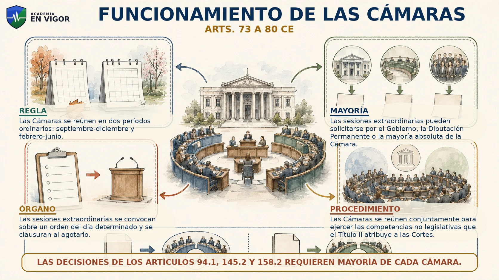

<em>Infografía: Funcionamiento de las Cámaras.</em>

<!-- FUENTE: BOE-CE-1978-GC-T04 -->

## 41. Leyes orgánicas y delegación legislativa

### Regla y encaje

Este bloque ordena leyes orgánicas y delegación legislativa dentro del sistema constitucional. La clave es relacionar el precepto con su sujeto, competencia, garantía, mayoría o plazo.

Este bloque pertenece a **constitución: cortes generales y producción normativa** y se contrasta en **arts. 81 a 85 CE**.

### Claves normativas

- Son leyes orgánicas las relativas al desarrollo de derechos fundamentales y libertades públicas, Estatutos de Autonomía, régimen electoral general y demás previstas constitucionalmente.
- La aprobación, modificación o derogación de una ley orgánica exige mayoría absoluta del Congreso en votación final sobre el conjunto. <!-- FACT:GC-T04-F294 -->
- Las Cortes pueden delegar en el Gobierno la potestad de dictar normas con rango de ley sobre materias no reservadas a ley orgánica. <!-- FACT:GC-T04-F295 -->
- La delegación para formar textos articulados se otorga mediante una ley de bases. <!-- FACT:GC-T04-F296 -->
- La delegación para refundir textos legales se otorga mediante ley ordinaria. <!-- FACT:GC-T04-F297 -->
- La delegación debe otorgarse de forma expresa, para materia concreta y con fijación de plazo. <!-- FACT:GC-T04-F298 -->
- La delegación se agota por el uso que haga de ella el Gobierno mediante la publicación de la norma correspondiente. <!-- FACT:GC-T04-F299 -->
- La delegación no puede entenderse concedida implícitamente, por tiempo indeterminado ni permitir subdelegación. <!-- FACT:GC-T04-F300 -->
- La ley de bases delimita con precisión objeto, alcance, principios y criterios de la delegación. <!-- FACT:GC-T04-F301 -->
- La autorización para refundir determina el ámbito normativo y si se limita a un texto único o incluye regularizar, aclarar y armonizar. <!-- FACT:GC-T04-F302 -->
- Las leyes de delegación pueden establecer fórmulas adicionales de control, sin perjuicio de los tribunales. <!-- FACT:GC-T04-F303 -->
- Las leyes de bases no pueden autorizar la modificación de la propia ley de bases ni facultar para dictar normas retroactivas. <!-- FACT:GC-T04-F304 -->
- Si una proposición o enmienda contradice una delegación vigente, el Gobierno puede oponerse a su tramitación. <!-- FACT:GC-T04-F305 -->
- En ese caso puede presentarse una proposición de ley para la derogación total o parcial de la ley de delegación. <!-- FACT:GC-T04-F306 -->
- Las disposiciones del Gobierno que contienen legislación delegada reciben el título de decretos legislativos. <!-- FACT:GC-T04-F307 -->
 <!-- FACT:GC-T04-F308 -->

:::hablemos-claro
Lee la Constitución como un sistema: primero identifica el poder u órgano; después, su competencia, límite, garantía y control.
:::

:::en-la-calle
En un supuesto práctico, separa derechos, organización del poder y procedimiento. Una misma palabra —ley, mayoría o control— cambia de sentido según el título constitucional.
:::

:::lo-que-cae
Prioridad de examen: **arts. 81 a 85 CE**. Vigila sujetos, plazos, mayorías, excepciones y verbos de competencia.
:::

:::ha-caido
Apariciones oficiales verificadas: 2022 · pregunta 18.
:::

<!-- VISUAL:t04-41-leyes-organicas-y-delegacion-legislativa.webp -->

  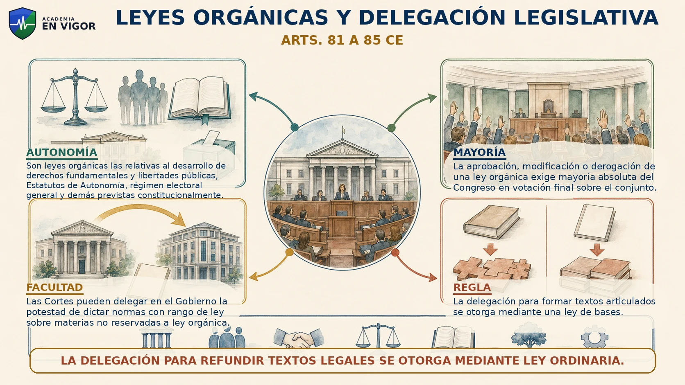

<em>Infografía: Leyes orgánicas y delegación legislativa.</em>

<!-- FUENTE: BOE-CE-1978-GC-T04 -->

## 42. Decreto-ley, iniciativa y procedimiento legislativo

### Regla y encaje

Este bloque ordena decreto-ley, iniciativa y procedimiento legislativo dentro del sistema constitucional. La clave es relacionar el precepto con su sujeto, competencia, garantía, mayoría o plazo.

Este bloque pertenece a **constitución: cortes generales y producción normativa** y se contrasta en **arts. 86 a 92 CE**.

### Claves normativas

- El Gobierno puede dictar decretos-leyes en caso de extraordinaria y urgente necesidad.
- El decreto-ley es una disposición legislativa provisional. <!-- FACT:GC-T04-F309 -->
- El decreto-ley no puede afectar a instituciones básicas del Estado, derechos del Título I, régimen autonómico ni derecho electoral general. <!-- FACT:GC-T04-F310 -->
- El Congreso debe debatir y votar la convalidación o derogación del decreto-ley dentro de los 30 días siguientes a su promulgación. <!-- FACT:GC-T04-F311 -->
- Si el Congreso no está reunido, debe ser convocado al efecto para controlar el decreto-ley. <!-- FACT:GC-T04-F312 -->
- Durante el plazo de 30 días, las Cortes pueden tramitar el decreto-ley como proyecto de ley por urgencia. <!-- FACT:GC-T04-F313 -->
- La iniciativa legislativa corresponde al Gobierno, Congreso y Senado, conforme a Constitución y reglamentos. <!-- FACT:GC-T04-F314 -->
- Las asambleas autonómicas pueden solicitar al Gobierno un proyecto o remitir al Congreso una proposición de ley. <!-- FACT:GC-T04-F315 -->
- Una asamblea autonómica puede delegar hasta tres miembros para defender su proposición ante el Congreso. <!-- FACT:GC-T04-F316 -->
- La iniciativa legislativa popular requiere al menos 500.000 firmas acreditadas. <!-- FACT:GC-T04-F317 -->
- La iniciativa popular no procede en materias de ley orgánica, tributarias, internacionales ni relativas a la prerrogativa de gracia. <!-- FACT:GC-T04-F318 -->
- Los proyectos de ley son aprobados en Consejo de Ministros, que los remite al Congreso con exposición de motivos y antecedentes. <!-- FACT:GC-T04-F319 -->
- La tramitación de proposiciones de ley se regula por los reglamentos de las Cámaras, sin impedir la iniciativa del artículo 87. <!-- FACT:GC-T04-F320 -->
- Las proposiciones que tome en consideración el Senado se remiten al Congreso para su tramitación. <!-- FACT:GC-T04-F321 -->
- Aprobado un proyecto de ley por el Congreso, su Presidente lo comunica al Presidente del Senado. <!-- FACT:GC-T04-F322 -->
- El Senado dispone de dos meses para vetar o enmendar el texto recibido. <!-- FACT:GC-T04-F323 -->
- El veto del Senado requiere mayoría absoluta. <!-- FACT:GC-T04-F324 -->
- El Congreso puede levantar el veto inmediatamente por mayoría absoluta. <!-- FACT:GC-T04-F325 -->
- Transcurridos dos meses desde el veto, el Congreso puede levantarlo por mayoría simple. <!-- FACT:GC-T04-F326 -->
- El Congreso decide sobre las enmiendas del Senado por mayoría simple. <!-- FACT:GC-T04-F327 -->
- En proyectos declarados urgentes, el plazo del Senado se reduce a 20 días naturales. <!-- FACT:GC-T04-F328 -->
- El Rey sanciona las leyes aprobadas por las Cortes en el plazo de 15 días, las promulga y ordena su inmediata publicación. <!-- FACT:GC-T04-F329 -->
- Las decisiones políticas de especial trascendencia pueden someterse a referéndum consultivo de todos los ciudadanos. <!-- FACT:GC-T04-F330 -->
- El referéndum consultivo es convocado por el Rey a propuesta del Presidente del Gobierno, previamente autorizada por el Congreso. <!-- FACT:GC-T04-F331 -->
- Una ley orgánica regula las condiciones y procedimiento de las modalidades de referéndum previstas constitucionalmente. <!-- FACT:GC-T04-F332 -->
 <!-- FACT:GC-T04-F333 -->

:::hablemos-claro
Lee la Constitución como un sistema: primero identifica el poder u órgano; después, su competencia, límite, garantía y control.
:::

:::en-la-calle
En un supuesto práctico, separa derechos, organización del poder y procedimiento. Una misma palabra —ley, mayoría o control— cambia de sentido según el título constitucional.
:::

:::lo-que-cae
Prioridad de examen: **arts. 86 a 92 CE**. Vigila sujetos, plazos, mayorías, excepciones y verbos de competencia.
:::

:::ha-caido
Apariciones oficiales verificadas: 2021 · pregunta 18, 2021 · pregunta 19, 2021 · pregunta 20, 2022 · pregunta 19, 2023 · pregunta 20.
:::

<!-- VISUAL:t04-42-decreto-ley-iniciativa-y-procedimiento-legislativo.webp -->

  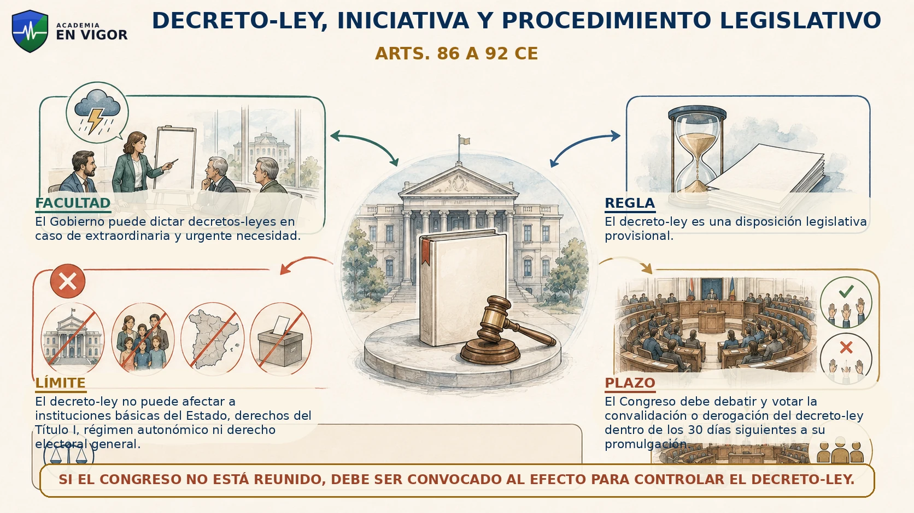

<em>Infografía: Decreto-ley, iniciativa y procedimiento legislativo.</em>

<!-- FUENTE: BOE-CE-1978-GC-T04 -->

## 43. Tratados internacionales

### Regla y encaje

Este bloque ordena tratados internacionales dentro del sistema constitucional. La clave es relacionar el precepto con su sujeto, competencia, garantía, mayoría o plazo.

Este bloque pertenece a **constitución: cortes generales y producción normativa** y se contrasta en **arts. 93 a 96 CE**.

### Claves normativas

- Mediante ley orgánica puede autorizarse un tratado que atribuya a una organización internacional competencias derivadas de la Constitución.
- Corresponde a las Cortes o al Gobierno, según los casos, garantizar el cumplimiento de esos tratados y de las resoluciones de los organismos titulares de la cesión. <!-- FACT:GC-T04-F334 -->
- Los tratados políticos y militares requieren autorización previa de las Cortes. <!-- FACT:GC-T04-F335 -->
- Requieren autorización previa los tratados que afecten a integridad territorial o a derechos y deberes fundamentales del Título I. <!-- FACT:GC-T04-F336 -->
- Requieren autorización previa los tratados que impliquen obligaciones financieras para la Hacienda Pública. <!-- FACT:GC-T04-F337 -->
- Requieren autorización previa los tratados que supongan modificar o derogar una ley o exijan medidas legislativas. <!-- FACT:GC-T04-F338 -->
- El Congreso y el Senado deben ser informados inmediatamente de la conclusión de los restantes tratados. <!-- FACT:GC-T04-F339 -->
- La celebración de un tratado con estipulaciones contrarias a la Constitución exige revisión constitucional previa. <!-- FACT:GC-T04-F340 -->
- El Gobierno o cualquiera de las Cámaras puede requerir al Tribunal Constitucional para que declare si existe contradicción. <!-- FACT:GC-T04-F341 -->
- Los tratados válidamente celebrados y publicados oficialmente forman parte del ordenamiento interno. <!-- FACT:GC-T04-F342 -->
- Las disposiciones de un tratado solo pueden derogarse, modificarse o suspenderse según el propio tratado o el Derecho internacional. <!-- FACT:GC-T04-F343 -->
- Para denunciar tratados se utiliza el mismo procedimiento previsto para su aprobación en el artículo 94. <!-- FACT:GC-T04-F344 -->
 <!-- FACT:GC-T04-F345 -->

:::hablemos-claro
Lee la Constitución como un sistema: primero identifica el poder u órgano; después, su competencia, límite, garantía y control.
:::

:::en-la-calle
En un supuesto práctico, separa derechos, organización del poder y procedimiento. Una misma palabra —ley, mayoría o control— cambia de sentido según el título constitucional.
:::

:::lo-que-cae
Prioridad de examen: **arts. 93 a 96 CE**. Vigila sujetos, plazos, mayorías, excepciones y verbos de competencia.
:::

<!-- VISUAL:t04-43-tratados-internacionales.webp -->

  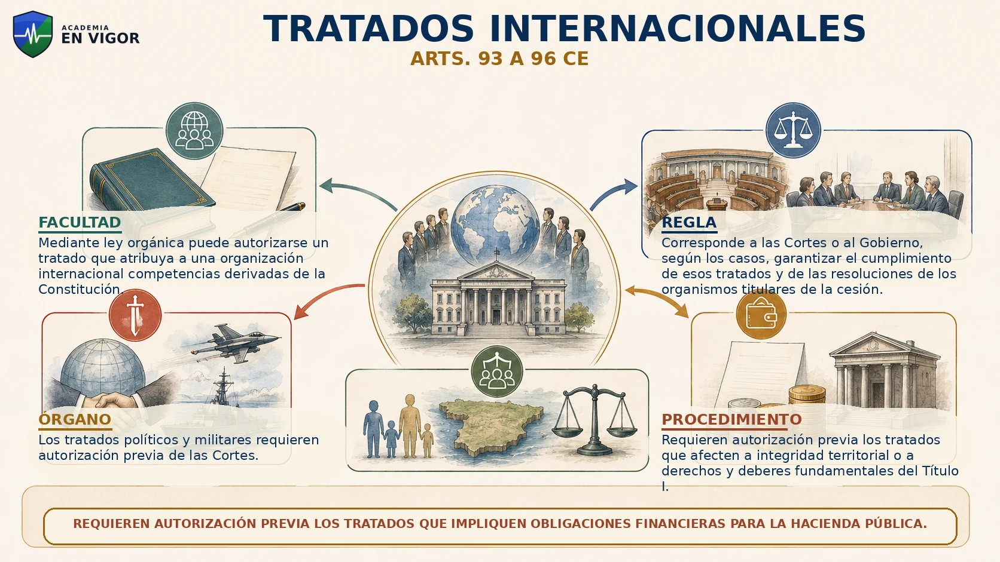

<em>Infografía: Tratados internacionales.</em>

<!-- FUENTE: BOE-CE-1978-GC-T04 -->

## 44. Gobierno: funciones, composición, investidura y cese

### Regla y encaje

Este bloque ordena gobierno: funciones, composición, investidura y cese dentro del sistema constitucional. La clave es relacionar el precepto con su sujeto, competencia, garantía, mayoría o plazo.

Este bloque pertenece a **constitución: gobierno, administración y control parlamentario** y se contrasta en **arts. 97 a 101 CE**.

### Claves normativas

- El Gobierno dirige la política interior y exterior, la Administración civil y militar y la defensa del Estado.
- El Gobierno ejerce la función ejecutiva y la potestad reglamentaria de acuerdo con la Constitución y las leyes. <!-- FACT:GC-T04-F346 -->
- El Gobierno se compone del Presidente, vicepresidentes en su caso, ministros y demás miembros que establezca la ley. <!-- FACT:GC-T04-F347 -->
- El Presidente dirige la acción del Gobierno y coordina las funciones de sus miembros. <!-- FACT:GC-T04-F348 -->
- La coordinación presidencial se entiende sin perjuicio de la competencia y responsabilidad directa de cada miembro en su gestión. <!-- FACT:GC-T04-F349 -->
- La ley regula el estatuto e incompatibilidades de los miembros del Gobierno. <!-- FACT:GC-T04-F350 -->
- Tras la renovación del Congreso y en otros supuestos, el Rey consulta a los grupos y propone candidato a través del Presidente del Congreso. <!-- FACT:GC-T04-F351 -->
- El candidato expone ante el Congreso el programa político del Gobierno que pretende formar y solicita la confianza. <!-- FACT:GC-T04-F352 -->
- La primera votación de investidura requiere mayoría absoluta del Congreso. <!-- FACT:GC-T04-F353 -->
- Si no hay mayoría absoluta, se celebra nueva votación 48 horas después y basta mayoría simple. <!-- FACT:GC-T04-F354 -->
- Si tampoco se obtiene confianza, se tramitan sucesivas propuestas en la forma prevista. <!-- FACT:GC-T04-F355 -->
- Si transcurren dos meses desde la primera votación sin investidura, el Rey disuelve ambas Cámaras y convoca elecciones. <!-- FACT:GC-T04-F356 -->
- La disolución del artículo 99.5 se realiza con refrendo del Presidente del Congreso. <!-- FACT:GC-T04-F357 -->
- Los demás miembros del Gobierno son nombrados y separados por el Rey a propuesta del Presidente. <!-- FACT:GC-T04-F358 -->
- El Gobierno cesa tras elecciones generales, pérdida de confianza, dimisión o fallecimiento de su Presidente. <!-- FACT:GC-T04-F359 -->
- El Gobierno cesante continúa en funciones hasta la toma de posesión del nuevo Gobierno. <!-- FACT:GC-T04-F360 -->
 <!-- FACT:GC-T04-F361 -->

:::hablemos-claro
Lee la Constitución como un sistema: primero identifica el poder u órgano; después, su competencia, límite, garantía y control.
:::

:::en-la-calle
En un supuesto práctico, separa derechos, organización del poder y procedimiento. Una misma palabra —ley, mayoría o control— cambia de sentido según el título constitucional.
:::

:::lo-que-cae
Prioridad de examen: **arts. 97 a 101 CE**. Vigila sujetos, plazos, mayorías, excepciones y verbos de competencia.
:::

:::ha-caido
Apariciones oficiales verificadas: 2021 · pregunta 19, 2022 · pregunta 17, 2024 · pregunta 20, 2025 · pregunta 23.
:::

<!-- VISUAL:t04-44-gobierno-funciones-composicion-investidura-y-cese.webp -->

  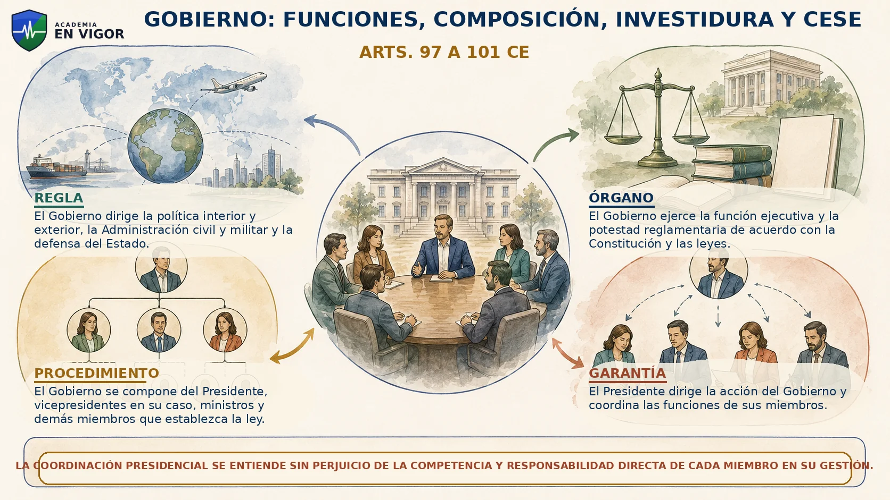

<em>Infografía: Gobierno: funciones, composición, investidura y cese.</em>

<!-- FUENTE: BOE-CE-1978-GC-T04 -->

## 45. Responsabilidad del Gobierno y Administración Pública

### Regla y encaje

Este bloque ordena responsabilidad del gobierno y administración pública dentro del sistema constitucional. La clave es relacionar el precepto con su sujeto, competencia, garantía, mayoría o plazo.

Este bloque pertenece a **constitución: gobierno, administración y control parlamentario** y se contrasta en **arts. 102 a 107 CE**.

### Claves normativas

- La responsabilidad criminal del Presidente y ministros se exige ante la Sala de lo Penal del Tribunal Supremo.
- La acusación por traición o delito contra la seguridad del Estado cometido en el ejercicio del cargo solo puede plantearse por iniciativa de una cuarta parte del Congreso. <!-- FACT:GC-T04-F362 -->
- La acusación especial del artículo 102.2 requiere aprobación por mayoría absoluta del Congreso. <!-- FACT:GC-T04-F363 -->
- La prerrogativa real de gracia no se aplica a los supuestos del artículo 102. <!-- FACT:GC-T04-F364 -->
- La Administración Pública sirve con objetividad los intereses generales. <!-- FACT:GC-T04-F365 -->
- La Administración actúa conforme a eficacia, jerarquía, descentralización, desconcentración y coordinación. <!-- FACT:GC-T04-F366 -->
- La Administración actúa con sometimiento pleno a la ley y al Derecho. <!-- FACT:GC-T04-F367 -->
- Los órganos administrativos son creados, regidos y coordinados de acuerdo con la ley. <!-- FACT:GC-T04-F368 -->
- La ley regula el acceso a la función pública conforme a mérito y capacidad. <!-- FACT:GC-T04-F369 -->
- La ley regula peculiaridades sindicales, incompatibilidades y garantías de imparcialidad de funcionarios. <!-- FACT:GC-T04-F370 -->
- Las Fuerzas y Cuerpos de Seguridad actúan bajo la dependencia del Gobierno. <!-- FACT:GC-T04-F371 -->
- Las Fuerzas y Cuerpos de Seguridad protegen el libre ejercicio de derechos y libertades y garantizan la seguridad ciudadana. <!-- FACT:GC-T04-F372 -->
- Una ley orgánica determina funciones, principios básicos de actuación y estatutos de las Fuerzas y Cuerpos de Seguridad. <!-- FACT:GC-T04-F373 -->
- La ley regula la audiencia de los ciudadanos, directamente o mediante organizaciones, en la elaboración de disposiciones administrativas que les afecten. <!-- FACT:GC-T04-F374 -->
- La ley regula el acceso a archivos y registros administrativos, con límites por seguridad, investigación de delitos e intimidad. <!-- FACT:GC-T04-F375 -->
- La ley regula el procedimiento de producción de actos administrativos, garantizando cuando proceda la audiencia del interesado. <!-- FACT:GC-T04-F376 -->
- Los tribunales controlan la potestad reglamentaria, la legalidad administrativa y el sometimiento a sus fines. <!-- FACT:GC-T04-F377 -->
- Los particulares tienen derecho a indemnización por lesiones causadas por servicios públicos, salvo fuerza mayor y en los términos legales. <!-- FACT:GC-T04-F378 -->
- El Consejo de Estado es el supremo órgano consultivo del Gobierno y una ley orgánica regula su composición y competencia. <!-- FACT:GC-T04-F379 -->
 <!-- FACT:GC-T04-F380 -->

:::hablemos-claro
Lee la Constitución como un sistema: primero identifica el poder u órgano; después, su competencia, límite, garantía y control.
:::

:::en-la-calle
En un supuesto práctico, separa derechos, organización del poder y procedimiento. Una misma palabra —ley, mayoría o control— cambia de sentido según el título constitucional.
:::

:::lo-que-cae
Prioridad de examen: **arts. 102 a 107 CE**. Vigila sujetos, plazos, mayorías, excepciones y verbos de competencia.
:::

:::ha-caido
Apariciones oficiales verificadas: 2021 · pregunta 20, 2021 · pregunta 21, 2022 · pregunta 18, 2024 · pregunta 20, 2024 · pregunta 21, 2025 · pregunta 24.
:::

<!-- VISUAL:t04-45-responsabilidad-del-gobierno-y-administracion-publica.webp -->

  

<em>Infografía: Responsabilidad del Gobierno y Administración Pública.</em>

<!-- FUENTE: BOE-CE-1978-GC-T04 -->

## 46. Control parlamentario ordinario del Gobierno

### Regla y encaje

Este bloque ordena control parlamentario ordinario del gobierno dentro del sistema constitucional. La clave es relacionar el precepto con su sujeto, competencia, garantía, mayoría o plazo.

Este bloque pertenece a **constitución: gobierno, administración y control parlamentario** y se contrasta en **arts. 108 a 111 CE**.

### Claves normativas

- El Gobierno responde solidariamente de su gestión política ante el Congreso.
- Las Cámaras y sus comisiones pueden recabar información y ayuda del Gobierno, departamentos y autoridades estatales y autonómicas. <!-- FACT:GC-T04-F381 -->
- Las Cámaras y sus comisiones pueden reclamar la presencia de los miembros del Gobierno. <!-- FACT:GC-T04-F382 -->
- Los miembros del Gobierno tienen acceso a las sesiones de las Cámaras y sus comisiones y pueden hacerse oír. <!-- FACT:GC-T04-F383 -->
- Los miembros del Gobierno pueden solicitar que informen funcionarios de sus departamentos. <!-- FACT:GC-T04-F384 -->
- El Gobierno y cada uno de sus miembros están sometidos a preguntas e interpelaciones parlamentarias. <!-- FACT:GC-T04-F385 -->
- Los reglamentos reservan un tiempo mínimo semanal para preguntas e interpelaciones. <!-- FACT:GC-T04-F386 -->
- Toda interpelación puede dar lugar a una moción en la que la Cámara manifieste su posición. <!-- FACT:GC-T04-F387 -->
 <!-- FACT:GC-T04-F388 -->

:::hablemos-claro
Lee la Constitución como un sistema: primero identifica el poder u órgano; después, su competencia, límite, garantía y control.
:::

:::en-la-calle
En un supuesto práctico, separa derechos, organización del poder y procedimiento. Una misma palabra —ley, mayoría o control— cambia de sentido según el título constitucional.
:::

:::lo-que-cae
Prioridad de examen: **arts. 108 a 111 CE**. Vigila sujetos, plazos, mayorías, excepciones y verbos de competencia.
:::

:::ha-caido
Apariciones oficiales verificadas: 2022 · pregunta 19, 2022 · pregunta 19.
:::

<!-- VISUAL:t04-46-control-parlamentario-ordinario-del-gobierno.webp -->

  

<em>Infografía: Control parlamentario ordinario del Gobierno.</em>

<!-- FUENTE: BOE-CE-1978-GC-T04 -->

## 47. Confianza, censura y disolución

### Regla y encaje

Este bloque ordena confianza, censura y disolución dentro del sistema constitucional. La clave es relacionar el precepto con su sujeto, competencia, garantía, mayoría o plazo.

Este bloque pertenece a **constitución: gobierno, administración y control parlamentario** y se contrasta en **arts. 112 a 115 CE**.

### Claves normativas

- El Presidente del Gobierno puede plantear la cuestión de confianza previa deliberación del Consejo de Ministros.
- La cuestión de confianza puede versar sobre el programa o una declaración de política general. <!-- FACT:GC-T04-F389 -->
- La confianza se entiende otorgada por mayoría simple del Congreso. <!-- FACT:GC-T04-F390 -->
- El Congreso exige responsabilidad política mediante moción de censura aprobada por mayoría absoluta. <!-- FACT:GC-T04-F391 -->
- La moción debe ser propuesta al menos por una décima parte de los diputados. <!-- FACT:GC-T04-F392 -->
- La moción de censura debe incluir un candidato a la Presidencia del Gobierno. <!-- FACT:GC-T04-F393 -->
- La moción de censura no puede votarse hasta que transcurran cinco días desde su presentación. <!-- FACT:GC-T04-F394 -->
- Durante los dos primeros días desde la presentación pueden presentarse mociones alternativas. <!-- FACT:GC-T04-F395 -->
- Si la moción no es aprobada, sus firmantes no pueden presentar otra en el mismo período de sesiones. <!-- FACT:GC-T04-F396 -->
- Si el Congreso niega la confianza, el Gobierno presenta su dimisión y se inicia el procedimiento del artículo 99. <!-- FACT:GC-T04-F397 -->
- Si prospera la censura, el Gobierno presenta su dimisión y el candidato se entiende investido. <!-- FACT:GC-T04-F398 -->
- El Rey nombra Presidente al candidato incluido en la moción de censura aprobada. <!-- FACT:GC-T04-F399 -->
- El Presidente del Gobierno, previa deliberación del Consejo de Ministros y bajo su responsabilidad, puede proponer la disolución de una o ambas Cámaras. <!-- FACT:GC-T04-F400 -->
- La disolución es decretada por el Rey y el decreto fija la fecha de las elecciones. <!-- FACT:GC-T04-F401 -->
- No puede proponerse la disolución mientras esté en trámite una moción de censura. <!-- FACT:GC-T04-F402 -->
- No procede una nueva disolución antes de un año desde la anterior, salvo el artículo 99.5. <!-- FACT:GC-T04-F403 -->
 <!-- FACT:GC-T04-F404 -->

:::hablemos-claro
Lee la Constitución como un sistema: primero identifica el poder u órgano; después, su competencia, límite, garantía y control.
:::

:::en-la-calle
En un supuesto práctico, separa derechos, organización del poder y procedimiento. Una misma palabra —ley, mayoría o control— cambia de sentido según el título constitucional.
:::

:::lo-que-cae
Prioridad de examen: **arts. 112 a 115 CE**. Vigila sujetos, plazos, mayorías, excepciones y verbos de competencia.
:::

:::ha-caido
Apariciones oficiales verificadas: 2022 · pregunta 20, 2024 · pregunta 21.
:::

<!-- VISUAL:t04-47-confianza-censura-y-disolucion.webp -->

  

<em>Infografía: Confianza, censura y disolución.</em>

<!-- FUENTE: BOE-CE-1978-GC-T04 -->

## 48. Estados de alarma, excepción y sitio

### Regla y encaje

Este bloque ordena estados de alarma, excepción y sitio dentro del sistema constitucional. La clave es relacionar el precepto con su sujeto, competencia, garantía, mayoría o plazo.

Este bloque pertenece a **constitución: gobierno, administración y control parlamentario** y se contrasta en **art. 116 CE**.

### Claves normativas

- Los estados excepcionales solo proceden cuando circunstancias extraordinarias impiden mantener la normalidad mediante poderes ordinarios.
- Las medidas y su duración deben ser estrictamente indispensables y proporcionadas a las circunstancias. <!-- FACT:GC-T04-F405 -->
- El estado de alarma lo declara el Gobierno mediante decreto acordado en Consejo de Ministros. <!-- FACT:GC-T04-F406 -->
- La duración inicial del estado de alarma no puede exceder de 15 días. <!-- FACT:GC-T04-F407 -->
- La prórroga del estado de alarma requiere autorización del Congreso, que establece alcance y condiciones. <!-- FACT:GC-T04-F408 -->
- La alarma puede declararse por catástrofes, crisis sanitarias, paralización de servicios esenciales en condiciones legales o desabastecimiento de productos básicos. <!-- FACT:GC-T04-F409 -->
- La alarma puede limitar circulación, imponer requisas y prestaciones, intervenir locales no domiciliarios, racionar consumos y asegurar abastecimientos. <!-- FACT:GC-T04-F410 -->
- El Gobierno declara el estado de excepción previa autorización del Congreso. <!-- FACT:GC-T04-F411 -->
- El estado de excepción dura como máximo 30 días, prorrogables por otros 30 con los mismos requisitos. <!-- FACT:GC-T04-F412 -->
- La excepción procede ante alteraciones graves de derechos, instituciones, servicios esenciales u orden público que no puedan resolverse con potestades ordinarias. <!-- FACT:GC-T04-F413 -->
- La solicitud de excepción debe precisar derechos a suspender, medidas, ámbito territorial, duración y cuantía máxima de sanciones pecuniarias. <!-- FACT:GC-T04-F414 -->
- El estado de sitio lo declara el Congreso por mayoría absoluta a propuesta exclusiva del Gobierno. <!-- FACT:GC-T04-F415 -->
- El Congreso determina ámbito territorial, duración y condiciones del estado de sitio. <!-- FACT:GC-T04-F416 -->
- El sitio procede ante insurrección o acto de fuerza contra soberanía, independencia, integridad territorial u orden constitucional no resoluble por otros medios. <!-- FACT:GC-T04-F417 -->
- La declaración de sitio puede autorizar la suspensión temporal de las garantías del artículo 17.3. <!-- FACT:GC-T04-F418 -->
- El Gobierno designa la autoridad militar que ejecuta las medidas del estado de sitio bajo su dirección. <!-- FACT:GC-T04-F419 -->
- El Congreso puede determinar los delitos sometidos a jurisdicción militar durante el estado de sitio. <!-- FACT:GC-T04-F420 -->
- No puede disolverse el Congreso mientras esté declarado alguno de los estados excepcionales. <!-- FACT:GC-T04-F421 -->
- Si las Cámaras no están en período de sesiones, quedan automáticamente convocadas durante los estados excepcionales. <!-- FACT:GC-T04-F422 -->
- El funcionamiento de las Cámaras y demás poderes constitucionales no puede interrumpirse durante los estados excepcionales. <!-- FACT:GC-T04-F423 -->
- Disuelto o expirado el Congreso, su Diputación Permanente asume las competencias relativas a los estados excepcionales. <!-- FACT:GC-T04-F424 -->
- La declaración de alarma, excepción o sitio no modifica la responsabilidad del Gobierno ni de sus agentes. <!-- FACT:GC-T04-F425 -->
 <!-- FACT:GC-T04-F426 -->

:::hablemos-claro
Lee la Constitución como un sistema: primero identifica el poder u órgano; después, su competencia, límite, garantía y control.
:::

:::en-la-calle
En un supuesto práctico, separa derechos, organización del poder y procedimiento. Una misma palabra —ley, mayoría o control— cambia de sentido según el título constitucional.
:::

:::lo-que-cae
Prioridad de examen: **art. 116 CE**. Vigila sujetos, plazos, mayorías, excepciones y verbos de competencia.
:::

:::ha-caido
Apariciones oficiales verificadas: 2022 · pregunta 20.
:::

<!-- VISUAL:t04-48-estados-de-alarma-excepcion-y-sitio.webp -->

  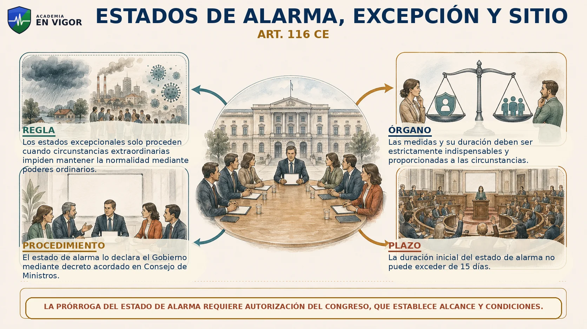

<em>Infografía: Estados de alarma, excepción y sitio.</em>

<!-- FUENTE: BOE-CE-1978-GC-T04 -->

## 49. Poder Judicial: principios y proceso

### Regla y encaje

Este bloque ordena poder judicial: principios y proceso dentro del sistema constitucional. La clave es relacionar el precepto con su sujeto, competencia, garantía, mayoría o plazo.

Este bloque pertenece a **constitución: poder judicial** y se contrasta en **arts. 117 a 121 CE**.

### Claves normativas

- La justicia emana del pueblo y se administra en nombre del Rey.
- Jueces y magistrados son independientes, inamovibles, responsables y sometidos únicamente al imperio de la ley. <!-- FACT:GC-T04-F427 -->
- Los jueces no pueden ser separados, suspendidos, trasladados ni jubilados salvo por causas y garantías legales. <!-- FACT:GC-T04-F428 -->
- Juzgar y hacer ejecutar lo juzgado corresponde exclusivamente a juzgados y tribunales determinados por las leyes. <!-- FACT:GC-T04-F429 -->
- Los tribunales solo ejercen funciones jurisdiccionales y las atribuidas por ley en garantía de derechos. <!-- FACT:GC-T04-F430 -->
- El principio de unidad jurisdiccional es la base de la organización y funcionamiento de los tribunales. <!-- FACT:GC-T04-F431 -->
- La ley regula la jurisdicción militar en el ámbito estrictamente castrense y en los supuestos de estado de sitio. <!-- FACT:GC-T04-F432 -->
- Se prohíben los tribunales de excepción. <!-- FACT:GC-T04-F433 -->
- Es obligatorio cumplir sentencias y resoluciones firmes y prestar la colaboración requerida por jueces y tribunales. <!-- FACT:GC-T04-F434 -->
- La justicia es gratuita cuando lo disponga la ley y, en todo caso, para quienes acrediten insuficiencia de recursos. <!-- FACT:GC-T04-F435 -->
- Las actuaciones judiciales son públicas, salvo excepciones previstas por las leyes de procedimiento. <!-- FACT:GC-T04-F436 -->
- El procedimiento es predominantemente oral, sobre todo en materia criminal. <!-- FACT:GC-T04-F437 -->
- Las sentencias deben ser motivadas y pronunciarse en audiencia pública. <!-- FACT:GC-T04-F438 -->
 <!-- FACT:GC-T04-F439 -->

:::hablemos-claro
Lee la Constitución como un sistema: primero identifica el poder u órgano; después, su competencia, límite, garantía y control.
:::

:::en-la-calle
En un supuesto práctico, separa derechos, organización del poder y procedimiento. Una misma palabra —ley, mayoría o control— cambia de sentido según el título constitucional.
:::

:::lo-que-cae
Prioridad de examen: **arts. 117 a 121 CE**. Vigila sujetos, plazos, mayorías, excepciones y verbos de competencia.
:::

:::ha-caido
Apariciones oficiales verificadas: 2021 · pregunta 21.
:::

<!-- VISUAL:t04-49-poder-judicial-principios-y-proceso.webp -->

  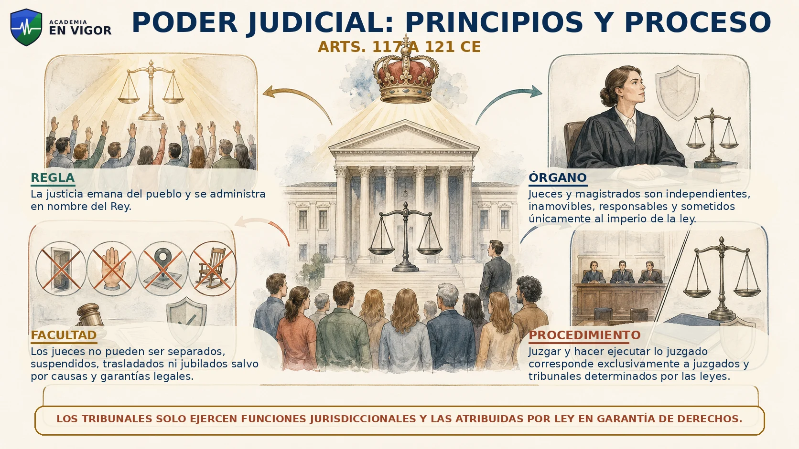

<em>Infografía: Poder Judicial: principios y proceso.</em>

<!-- FUENTE: BOE-CE-1978-GC-T04 -->

## 50. Órganos judiciales, Ministerio Fiscal, Jurado y Policía Judicial

### Regla y encaje

Este bloque ordena órganos judiciales, ministerio fiscal, jurado y policía judicial dentro del sistema constitucional. La clave es relacionar el precepto con su sujeto, competencia, garantía, mayoría o plazo.

Este bloque pertenece a **constitución: poder judicial** y se contrasta en **arts. 122 a 127 CE**.

### Claves normativas

- Los daños por error judicial o funcionamiento anormal de la Administración de Justicia generan indemnización a cargo del Estado.
- La LOPJ determina constitución, funcionamiento y gobierno de juzgados y tribunales y el estatuto de jueces y personal. <!-- FACT:GC-T04-F440 -->
- El Consejo General del Poder Judicial es el órgano de gobierno del Poder Judicial. <!-- FACT:GC-T04-F441 -->
- El CGPJ está integrado por el Presidente del Tribunal Supremo y 20 miembros nombrados por el Rey por cinco años. <!-- FACT:GC-T04-F442 -->
- Doce vocales del CGPJ se eligen entre jueces y magistrados de todas las categorías judiciales. <!-- FACT:GC-T04-F443 -->
- Ocho vocales son abogados u otros juristas de reconocida competencia con más de 15 años de ejercicio. <!-- FACT:GC-T04-F444 -->
- Congreso y Senado proponen cuatro vocales juristas cada uno por mayoría de tres quintos. <!-- FACT:GC-T04-F445 -->
- El Tribunal Supremo es el órgano jurisdiccional superior en todos los órdenes, salvo garantías constitucionales. <!-- FACT:GC-T04-F446 -->
- El Tribunal Supremo tiene jurisdicción en toda España. <!-- FACT:GC-T04-F447 -->
- El Presidente del Tribunal Supremo es nombrado por el Rey a propuesta del CGPJ en la forma legal. <!-- FACT:GC-T04-F448 -->
- El Ministerio Fiscal promueve la acción de la justicia en defensa de legalidad, derechos de ciudadanos e interés público. <!-- FACT:GC-T04-F449 -->
- El Ministerio Fiscal vela por la independencia de los tribunales y procura ante ellos la satisfacción del interés social. <!-- FACT:GC-T04-F450 -->
- El Ministerio Fiscal actúa con unidad de actuación y dependencia jerárquica, sujeto a legalidad e imparcialidad. <!-- FACT:GC-T04-F451 -->
- La ley regula el estatuto orgánico del Ministerio Fiscal. <!-- FACT:GC-T04-F452 -->
- El Fiscal General del Estado es nombrado por el Rey a propuesta del Gobierno, oído el CGPJ. <!-- FACT:GC-T04-F453 -->
- Los ciudadanos pueden ejercer la acción popular en la forma y procesos que determine la ley. <!-- FACT:GC-T04-F454 -->
- Los ciudadanos pueden participar en la Administración de Justicia mediante la institución del Jurado en procesos penales determinados por la ley. <!-- FACT:GC-T04-F455 -->
- La Constitución reconoce la participación ciudadana en tribunales consuetudinarios y tradicionales. <!-- FACT:GC-T04-F456 -->
- La Policía Judicial depende de jueces, tribunales y Ministerio Fiscal en sus funciones de investigación. <!-- FACT:GC-T04-F457 -->
- La Policía Judicial averigua el delito y descubre y asegura al delincuente en los términos legales. <!-- FACT:GC-T04-F458 -->
- Jueces, magistrados y fiscales en activo no pueden desempeñar otros cargos públicos ni pertenecer a partidos o sindicatos. <!-- FACT:GC-T04-F459 -->
- La ley establece el sistema y modalidades de asociación profesional de jueces, magistrados y fiscales. <!-- FACT:GC-T04-F460 -->
- La ley establece el régimen de incompatibilidades de miembros del Poder Judicial para asegurar su independencia. <!-- FACT:GC-T04-F461 -->
 <!-- FACT:GC-T04-F462 -->

:::hablemos-claro
Lee la Constitución como un sistema: primero identifica el poder u órgano; después, su competencia, límite, garantía y control.
:::

:::en-la-calle
En un supuesto práctico, separa derechos, organización del poder y procedimiento. Una misma palabra —ley, mayoría o control— cambia de sentido según el título constitucional.
:::

:::lo-que-cae
Prioridad de examen: **arts. 122 a 127 CE**. Vigila sujetos, plazos, mayorías, excepciones y verbos de competencia.
:::

:::ha-caido
Apariciones oficiales verificadas: 2021 · pregunta 22, 2022 · pregunta 20, 2022 · pregunta 21, 2023 · pregunta 21, 2024 · pregunta 22, 2024 · pregunta 22.
:::

<!-- VISUAL:t04-50-organos-judiciales-ministerio-fiscal-jurado-y-policia-judicial.webp -->

  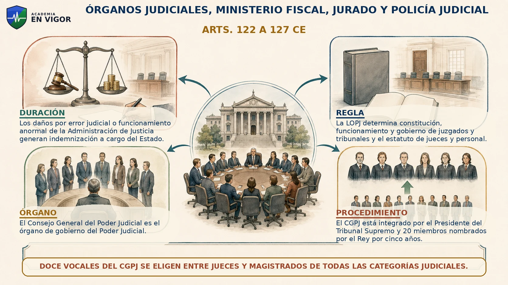

<em>Infografía: Órganos judiciales, Ministerio Fiscal, Jurado y Policía Judicial.</em>

<!-- FUENTE: BOE-CE-1978-GC-T04 -->

## 51. Economía, iniciativa pública y planificación

### Regla y encaje

El Título VII admite intervención pública y planificación, pero exige ley para reservar recursos, intervenir empresas y regular patrimonio y dominio público.

Este bloque pertenece a **constitución: economía y hacienda** y se contrasta en **arts. 128 a 132 CE**.

### Claves normativas

- Toda la riqueza del país, en sus distintas formas y cualquiera que sea su titularidad, está subordinada al interés general.
- Se reconoce la iniciativa pública en la actividad económica. <!-- FACT:GC-T04-F463 -->
- Mediante ley pueden reservarse al sector público recursos o servicios esenciales, especialmente en caso de monopolio. <!-- FACT:GC-T04-F464 -->
- También mediante ley puede acordarse la intervención de empresas cuando lo exija el interés general. <!-- FACT:GC-T04-F465 -->
- La ley establece formas de participación en la Seguridad Social y en organismos públicos cuya función afecte directamente a calidad de vida o bienestar general. <!-- FACT:GC-T04-F466 -->
- Los poderes públicos promueven eficazmente la participación en la empresa y fomentan las sociedades cooperativas. <!-- FACT:GC-T04-F467 -->
- Los poderes públicos establecen medios para facilitar el acceso de los trabajadores a la propiedad de los medios de producción. <!-- FACT:GC-T04-F468 -->
- El Estado puede planificar por ley la actividad económica general para atender necesidades colectivas, equilibrar y armonizar el desarrollo y estimular crecimiento y distribución más justa. <!-- FACT:GC-T04-F469 -->
- El Gobierno elabora los proyectos de planificación de acuerdo con previsiones suministradas por comunidades autónomas y con asesoramiento y colaboración de sindicatos y otras organizaciones. <!-- FACT:GC-T04-F470 -->
- La ley regula el patrimonio del Estado y el Patrimonio Nacional, así como su administración, defensa y conservación. <!-- FACT:GC-T04-F471 -->
 <!-- FACT:GC-T04-F472 -->

:::hablemos-claro
Lee la Constitución como un sistema: primero identifica el poder u órgano; después, su competencia, límite, garantía y control.
:::

:::en-la-calle
En un supuesto práctico, separa derechos, organización del poder y procedimiento. Una misma palabra —ley, mayoría o control— cambia de sentido según el título constitucional.
:::

:::lo-que-cae
Prioridad de examen: **arts. 128 a 132 CE**. Vigila sujetos, plazos, mayorías, excepciones y verbos de competencia.
:::

<!-- VISUAL:t04-51-economia-iniciativa-publica-y-planificacion.webp -->

  

<em>Infografía: Economía, iniciativa pública y planificación.</em>

<!-- FUENTE: BOE-CE-1978-GC-T04 -->

## 52. Potestad tributaria, presupuestos, deuda y Tribunal de Cuentas

### Regla y encaje

La Constitución separa potestad tributaria originaria, beneficios fiscales, elaboración y aprobación presupuestaria, deuda pública y control externo de las cuentas.

Este bloque pertenece a **constitución: economía y hacienda** y se contrasta en **arts. 133 a 136 CE**.

### Claves normativas

- La potestad originaria para establecer tributos corresponde exclusivamente al Estado mediante ley.
- Comunidades autónomas y corporaciones locales pueden establecer y exigir tributos de acuerdo con la Constitución y las leyes. <!-- FACT:GC-T04-F473 -->
- Todo beneficio fiscal que afecte a tributos del Estado debe establecerse por ley. <!-- FACT:GC-T04-F474 -->
- Las Administraciones solo pueden contraer obligaciones financieras y realizar gastos de acuerdo con las leyes. <!-- FACT:GC-T04-F475 -->
- Corresponde al Gobierno elaborar los Presupuestos Generales del Estado y a las Cortes Generales examinarlos, enmendarlos y aprobarlos. <!-- FACT:GC-T04-F476 -->
- Los Presupuestos son anuales, incluyen la totalidad de gastos e ingresos del sector público estatal y consignan los beneficios fiscales que afecten a tributos estatales. <!-- FACT:GC-T04-F477 -->
- El Gobierno debe presentar los Presupuestos al Congreso al menos tres meses antes de la expiración de los del año anterior. <!-- FACT:GC-T04-F478 -->
- Si la Ley de Presupuestos no se aprueba antes del primer día del ejercicio, se prorrogan automáticamente los anteriores hasta aprobar los nuevos. <!-- FACT:GC-T04-F479 -->
- El Gobierno necesita conformidad para tramitar proposiciones o enmiendas que supongan aumento de créditos o disminución de ingresos presupuestarios. <!-- FACT:GC-T04-F480 -->
- La Ley de Presupuestos no puede crear tributos; puede modificarlos cuando una ley tributaria sustantiva lo prevea. <!-- FACT:GC-T04-F481 -->
- El Estado y las comunidades autónomas deben adecuar sus actuaciones al principio de estabilidad presupuestaria. <!-- FACT:GC-T04-F482 -->
- El Estado debe estar autorizado por ley para emitir deuda pública o contraer crédito. <!-- FACT:GC-T04-F483 -->
- Los créditos para intereses y capital de la deuda pública se entienden siempre incluidos en el estado de gastos y su pago goza de prioridad absoluta. <!-- FACT:GC-T04-F484 -->
- El Tribunal de Cuentas es el supremo órgano fiscalizador de las cuentas y de la gestión económica del Estado y del sector público. <!-- FACT:GC-T04-F485 -->
- El Tribunal de Cuentas depende directamente de las Cortes Generales y ejerce por delegación de ellas el examen y comprobación de la Cuenta General del Estado. <!-- FACT:GC-T04-F486 -->
- Los miembros del Tribunal de Cuentas gozan de la misma independencia e inamovilidad y están sometidos a las mismas incompatibilidades que los jueces. <!-- FACT:GC-T04-F487 -->
 <!-- FACT:GC-T04-F488 -->

:::hablemos-claro
Lee la Constitución como un sistema: primero identifica el poder u órgano; después, su competencia, límite, garantía y control.
:::

:::en-la-calle
En un supuesto práctico, separa derechos, organización del poder y procedimiento. Una misma palabra —ley, mayoría o control— cambia de sentido según el título constitucional.
:::

:::lo-que-cae
Prioridad de examen: **arts. 133 a 136 CE**. Vigila sujetos, plazos, mayorías, excepciones y verbos de competencia.
:::

:::ha-caido
Apariciones oficiales verificadas: 2022 · pregunta 21, 2022 · pregunta 21, 2023 · pregunta 20, 2024 · pregunta 23.
:::

<!-- VISUAL:t04-52-potestad-tributaria-presupuestos-deuda-y-tribunal-de-cuentas.webp -->

  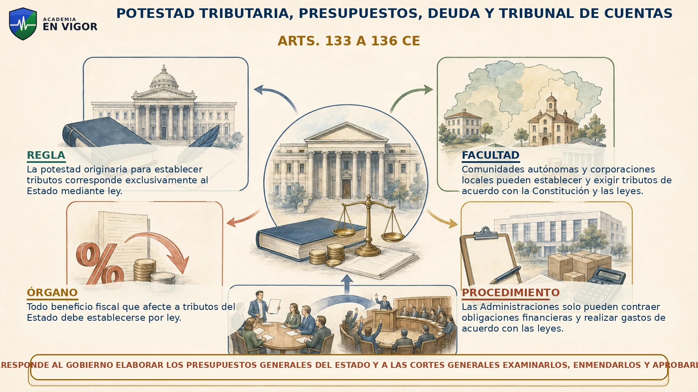

<em>Infografía: Potestad tributaria, presupuestos, deuda y Tribunal de Cuentas.</em>

<!-- FUENTE: BOE-CE-1978-GC-T04 -->

## 53. Principios territoriales y Administración local

### Regla y encaje

Este bloque ordena principios territoriales y administración local dentro del sistema constitucional. La clave es relacionar el precepto con su sujeto, competencia, garantía, mayoría o plazo.

Este bloque pertenece a **constitución: organización territorial** y se contrasta en **arts. 137 a 142 CE**.

### Claves normativas

- El Estado se organiza territorialmente en municipios, provincias y comunidades autónomas que se constituyan.
- Municipios, provincias y comunidades autónomas gozan de autonomía para gestionar sus intereses. <!-- FACT:GC-T04-F489 -->
- El Estado garantiza la realización efectiva del principio de solidaridad y un equilibrio económico adecuado y justo. <!-- FACT:GC-T04-F490 -->
- La garantía de equilibrio territorial debe atender en particular a las circunstancias del hecho insular. <!-- FACT:GC-T04-F491 -->
- Las diferencias entre Estatutos no pueden implicar privilegios económicos o sociales. <!-- FACT:GC-T04-F492 -->
- Todos los españoles tienen los mismos derechos y obligaciones en cualquier parte del territorio. <!-- FACT:GC-T04-F493 -->
- Ninguna autoridad puede obstaculizar directa o indirectamente la libertad de circulación y establecimiento ni la libre circulación de bienes. <!-- FACT:GC-T04-F494 -->
- La Constitución garantiza la autonomía de los municipios y su personalidad jurídica plena. <!-- FACT:GC-T04-F495 -->
- El gobierno y administración municipal corresponden a ayuntamientos integrados por alcaldes y concejales. <!-- FACT:GC-T04-F496 -->
- Los concejales son elegidos por sufragio universal, igual, libre, directo y secreto. <!-- FACT:GC-T04-F497 -->
- Los alcaldes son elegidos por los concejales o por los vecinos. <!-- FACT:GC-T04-F498 -->
- La ley regula las condiciones en que procede el régimen de concejo abierto. <!-- FACT:GC-T04-F499 -->
- La provincia es entidad local con personalidad jurídica propia, agrupación de municipios y división territorial para actividades del Estado. <!-- FACT:GC-T04-F500 -->
- La alteración de límites provinciales debe aprobarse por las Cortes mediante ley orgánica. <!-- FACT:GC-T04-F501 -->
- El gobierno y administración autónoma de las provincias se encomiendan a diputaciones u otras corporaciones representativas. <!-- FACT:GC-T04-F502 -->
- Pueden crearse agrupaciones de municipios diferentes de la provincia. <!-- FACT:GC-T04-F503 -->
- En los archipiélagos, las islas tienen administración propia mediante cabildos o consejos. <!-- FACT:GC-T04-F504 -->
- Las haciendas locales deben disponer de medios suficientes y se nutren principalmente de tributos propios y participación en tributos estatal y autonómicos. <!-- FACT:GC-T04-F505 -->
 <!-- FACT:GC-T04-F506 -->

:::hablemos-claro
Lee la Constitución como un sistema: primero identifica el poder u órgano; después, su competencia, límite, garantía y control.
:::

:::en-la-calle
En un supuesto práctico, separa derechos, organización del poder y procedimiento. Una misma palabra —ley, mayoría o control— cambia de sentido según el título constitucional.
:::

:::lo-que-cae
Prioridad de examen: **arts. 137 a 142 CE**. Vigila sujetos, plazos, mayorías, excepciones y verbos de competencia.
:::

:::ha-caido
Apariciones oficiales verificadas: 2023 · pregunta 21, 2024 · pregunta 22.
:::

<!-- VISUAL:t04-53-principios-territoriales-y-administracion-local.webp -->

  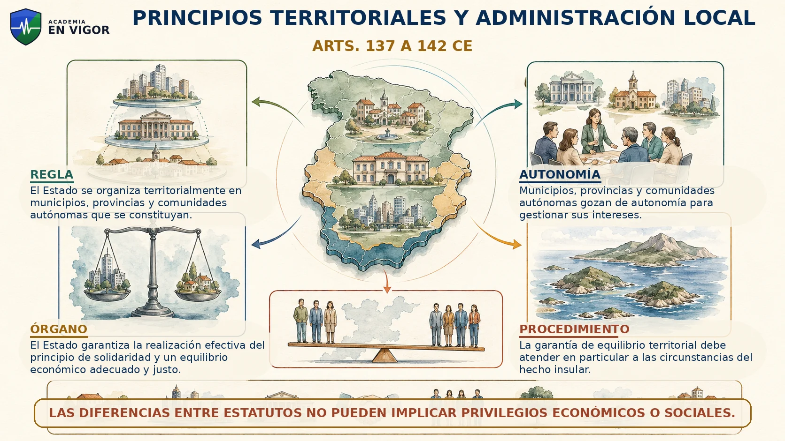

<em>Infografía: Principios territoriales y Administración local.</em>

<!-- FUENTE: BOE-CE-1978-GC-T04 -->

## 54. Acceso a la autonomía y Estatutos

### Regla y encaje

Este bloque ordena acceso a la autonomía y estatutos dentro del sistema constitucional. La clave es relacionar el precepto con su sujeto, competencia, garantía, mayoría o plazo.

Este bloque pertenece a **constitución: organización territorial** y se contrasta en **arts. 143 a 147 CE**.

### Claves normativas

- Pueden acceder al autogobierno provincias limítrofes con características comunes, territorios insulares y provincias con entidad regional histórica.
- La iniciativa corresponde a todas las diputaciones u órganos insulares y a dos tercios de municipios de cada provincia que representen mayoría del censo. <!-- FACT:GC-T04-F507 -->
- Los requisitos de la iniciativa autonómica deben cumplirse en seis meses desde el primer acuerdo. <!-- FACT:GC-T04-F508 -->
- Si la iniciativa no prospera, solo puede reiterarse pasados cinco años. <!-- FACT:GC-T04-F509 -->
- Las Cortes pueden autorizar por ley orgánica una comunidad cuyo ámbito no supere una provincia y no reúna las condiciones del artículo 143.1. <!-- FACT:GC-T04-F510 -->
- Las Cortes pueden autorizar o acordar un Estatuto para territorios no integrados en la organización provincial. <!-- FACT:GC-T04-F511 -->
- Las Cortes pueden sustituir la iniciativa de las corporaciones locales mediante ley orgánica. <!-- FACT:GC-T04-F512 -->
- No se admite en ningún caso la federación de comunidades autónomas. <!-- FACT:GC-T04-F513 -->
- Los Estatutos pueden prever supuestos, requisitos y comunicación a las Cortes de convenios para gestión de servicios propios. <!-- FACT:GC-T04-F514 -->
- Los demás acuerdos de cooperación entre comunidades requieren autorización de las Cortes. <!-- FACT:GC-T04-F515 -->
- El proyecto de Estatuto se elabora por una asamblea formada por miembros de diputaciones u órganos insulares y diputados y senadores elegidos en el territorio. <!-- FACT:GC-T04-F516 -->
- El proyecto de Estatuto se eleva a las Cortes para su tramitación como ley. <!-- FACT:GC-T04-F517 -->
- Los Estatutos son la norma institucional básica de cada comunidad y el Estado los reconoce como parte de su ordenamiento. <!-- FACT:GC-T04-F518 -->
- El Estatuto debe contener denominación, delimitación territorial, organización institucional y competencias asumidas con bases de traspaso. <!-- FACT:GC-T04-F519 -->
- La reforma de los Estatutos se ajusta a su procedimiento y requiere aprobación de las Cortes mediante ley orgánica. <!-- FACT:GC-T04-F520 -->
 <!-- FACT:GC-T04-F521 -->

:::hablemos-claro
Lee la Constitución como un sistema: primero identifica el poder u órgano; después, su competencia, límite, garantía y control.
:::

:::en-la-calle
En un supuesto práctico, separa derechos, organización del poder y procedimiento. Una misma palabra —ley, mayoría o control— cambia de sentido según el título constitucional.
:::

:::lo-que-cae
Prioridad de examen: **arts. 143 a 147 CE**. Vigila sujetos, plazos, mayorías, excepciones y verbos de competencia.
:::

:::ha-caido
Apariciones oficiales verificadas: 2021 · pregunta 23, 2022 · pregunta 22, 2024 · pregunta 23.
:::

<!-- VISUAL:t04-54-acceso-a-la-autonomia-y-estatutos.webp -->

  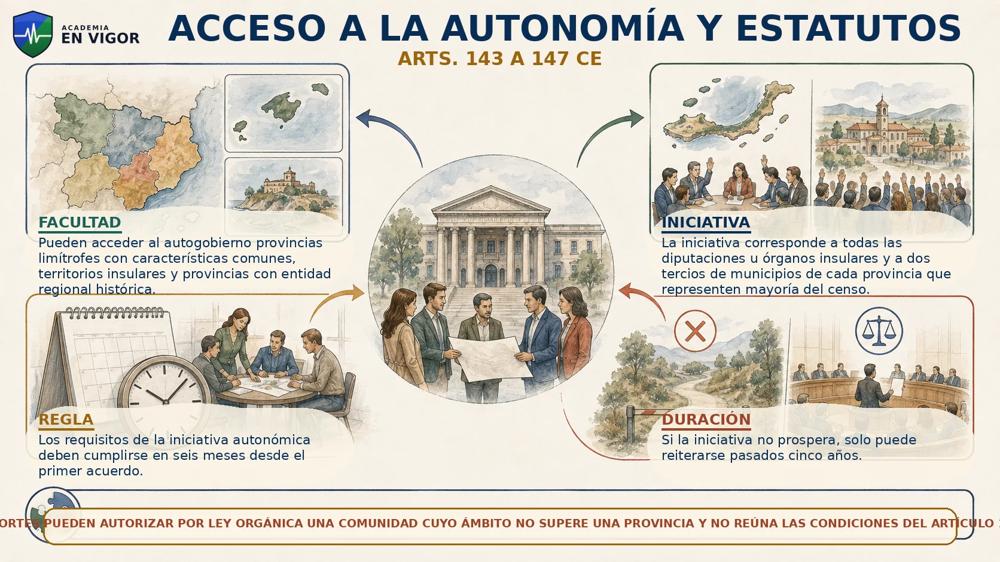

<em>Infografía: Acceso a la autonomía y Estatutos.</em>

<!-- FUENTE: BOE-CE-1978-GC-T04 -->

## 55. Distribución de competencias

### Regla y encaje

Este bloque ordena distribución de competencias dentro del sistema constitucional. La clave es relacionar el precepto con su sujeto, competencia, garantía, mayoría o plazo.

Este bloque pertenece a **constitución: organización territorial** y se contrasta en **arts. 148 y 149 CE**.

### Claves normativas

- Las comunidades autónomas pueden asumir competencias sobre organización de las instituciones de autogobierno.
- Las comunidades autónomas pueden asumir competencias sobre alteraciones de términos municipales y funciones estatales sobre corporaciones locales cuya transferencia autorice la legislación local. <!-- FACT:GC-T04-F522 -->
- Las comunidades autónomas pueden asumir competencias sobre ordenación del territorio, urbanismo y vivienda. <!-- FACT:GC-T04-F523 -->
- Las comunidades autónomas pueden asumir competencias sobre obras públicas de interés de la comunidad dentro de su territorio. <!-- FACT:GC-T04-F524 -->
- Las comunidades autónomas pueden asumir competencias sobre ferrocarriles y carreteras cuyo itinerario discurra íntegramente en el territorio y transporte desarrollado por ellos o por cable. <!-- FACT:GC-T04-F525 -->
- Las comunidades autónomas pueden asumir competencias sobre puertos de refugio, puertos y aeropuertos deportivos y, en general, los que no desarrollen actividades comerciales. <!-- FACT:GC-T04-F526 -->
- Las comunidades autónomas pueden asumir competencias sobre agricultura y ganadería de acuerdo con la ordenación general de la economía. <!-- FACT:GC-T04-F527 -->
- Las comunidades autónomas pueden asumir competencias sobre montes y aprovechamientos forestales. <!-- FACT:GC-T04-F528 -->
- Las comunidades autónomas pueden asumir competencias sobre gestión en materia de protección del medio ambiente. <!-- FACT:GC-T04-F529 -->
- Las comunidades autónomas pueden asumir competencias sobre proyectos, construcción y explotación de aprovechamientos hidráulicos, canales y regadíos de interés autonómico y aguas minerales y termales. <!-- FACT:GC-T04-F530 -->
- Las comunidades autónomas pueden asumir competencias sobre pesca en aguas interiores, marisqueo, acuicultura, caza y pesca fluvial. <!-- FACT:GC-T04-F531 -->
- Las comunidades autónomas pueden asumir competencias sobre ferias interiores. <!-- FACT:GC-T04-F532 -->
- Las comunidades autónomas pueden asumir competencias sobre fomento del desarrollo económico autonómico dentro de los objetivos de la política económica nacional. <!-- FACT:GC-T04-F533 -->
- Las comunidades autónomas pueden asumir competencias sobre artesanía. <!-- FACT:GC-T04-F534 -->
- Las comunidades autónomas pueden asumir competencias sobre museos, bibliotecas y conservatorios de música de interés para la comunidad. <!-- FACT:GC-T04-F535 -->
- Las comunidades autónomas pueden asumir competencias sobre patrimonio monumental de interés de la comunidad. <!-- FACT:GC-T04-F536 -->
- Las comunidades autónomas pueden asumir competencias sobre fomento de cultura e investigación y, en su caso, enseñanza de la lengua autonómica. <!-- FACT:GC-T04-F537 -->
- Las comunidades autónomas pueden asumir competencias sobre promoción y ordenación del turismo en el ámbito territorial. <!-- FACT:GC-T04-F538 -->
- Las comunidades autónomas pueden asumir competencias sobre promoción del deporte y adecuada utilización del ocio. <!-- FACT:GC-T04-F539 -->
- Las comunidades autónomas pueden asumir competencias sobre asistencia social. <!-- FACT:GC-T04-F540 -->
- Las comunidades autónomas pueden asumir competencias sobre sanidad e higiene. <!-- FACT:GC-T04-F541 -->
- Las comunidades autónomas pueden asumir competencias sobre vigilancia y protección de edificios e instalaciones y coordinación y otras facultades sobre policías locales conforme a ley orgánica. <!-- FACT:GC-T04-F542 -->
- Transcurridos cinco años, las comunidades pueden ampliar sucesivamente sus competencias dentro del marco del artículo 149 mediante reforma estatutaria. <!-- FACT:GC-T04-F543 -->
- El Estado tiene competencia exclusiva sobre regulación de las condiciones básicas que garanticen igualdad en derechos y deberes constitucionales. <!-- FACT:GC-T04-F544 -->
- El Estado tiene competencia exclusiva sobre nacionalidad, inmigración, emigración, extranjería y derecho de asilo. <!-- FACT:GC-T04-F545 -->
- El Estado tiene competencia exclusiva sobre relaciones internacionales. <!-- FACT:GC-T04-F546 -->
- El Estado tiene competencia exclusiva sobre defensa y Fuerzas Armadas. <!-- FACT:GC-T04-F547 -->
- El Estado tiene competencia exclusiva sobre administración de Justicia. <!-- FACT:GC-T04-F548 -->
- El Estado tiene competencia exclusiva sobre legislación mercantil, penal y penitenciaria y legislación procesal, con especialidades autonómicas derivadas de su Derecho sustantivo. <!-- FACT:GC-T04-F549 -->
- El Estado tiene competencia exclusiva sobre legislación laboral, sin perjuicio de su ejecución por órganos autonómicos. <!-- FACT:GC-T04-F550 -->
- El Estado tiene competencia exclusiva sobre legislación civil, con respeto a conservación, modificación y desarrollo de derechos forales donde existan y materias estatales reservadas. <!-- FACT:GC-T04-F551 -->
- El Estado tiene competencia exclusiva sobre legislación sobre propiedad intelectual e industrial. <!-- FACT:GC-T04-F552 -->
- El Estado tiene competencia exclusiva sobre régimen aduanero y arancelario y comercio exterior. <!-- FACT:GC-T04-F553 -->
- El Estado tiene competencia exclusiva sobre sistema monetario, divisas, cambio y convertibilidad y bases de crédito, banca y seguros. <!-- FACT:GC-T04-F554 -->
- El Estado tiene competencia exclusiva sobre legislación sobre pesas y medidas y determinación de la hora oficial. <!-- FACT:GC-T04-F555 -->
- El Estado tiene competencia exclusiva sobre bases y coordinación de la planificación general de la actividad económica. <!-- FACT:GC-T04-F556 -->
- El Estado tiene competencia exclusiva sobre hacienda general y Deuda del Estado. <!-- FACT:GC-T04-F557 -->
- El Estado tiene competencia exclusiva sobre fomento y coordinación general de la investigación científica y técnica. <!-- FACT:GC-T04-F558 -->
- El Estado tiene competencia exclusiva sobre sanidad exterior, bases y coordinación general de sanidad y legislación de productos farmacéuticos. <!-- FACT:GC-T04-F559 -->
- El Estado tiene competencia exclusiva sobre legislación básica y régimen económico de la Seguridad Social, sin perjuicio de ejecución autonómica. <!-- FACT:GC-T04-F560 -->
- El Estado tiene competencia exclusiva sobre bases del régimen jurídico administrativo y funcionarial, procedimiento común, expropiación, contratos, concesiones y responsabilidad. <!-- FACT:GC-T04-F561 -->
- El Estado tiene competencia exclusiva sobre pesca marítima, sin perjuicio de competencias autonómicas en ordenación del sector. <!-- FACT:GC-T04-F562 -->
- El Estado tiene competencia exclusiva sobre marina mercante, abanderamiento, puertos y aeropuertos de interés general, espacio aéreo, tránsito, meteorología y matriculación de aeronaves. <!-- FACT:GC-T04-F563 -->
- El Estado tiene competencia exclusiva sobre ferrocarriles y transportes interautonómicos, régimen general de comunicaciones, tráfico, correos, telecomunicaciones y radiocomunicación. <!-- FACT:GC-T04-F564 -->
- El Estado tiene competencia exclusiva sobre legislación, ordenación y concesión de aguas interautonómicas y autorización de instalaciones eléctricas supraautonómicas. <!-- FACT:GC-T04-F565 -->
- El Estado tiene competencia exclusiva sobre legislación básica ambiental y de montes, aprovechamientos forestales y vías pecuarias, con normas adicionales autonómicas de protección. <!-- FACT:GC-T04-F566 -->
- El Estado tiene competencia exclusiva sobre obras públicas de interés general o cuya realización afecte a más de una comunidad. <!-- FACT:GC-T04-F567 -->
- El Estado tiene competencia exclusiva sobre bases del régimen minero y energético. <!-- FACT:GC-T04-F568 -->
- El Estado tiene competencia exclusiva sobre régimen de producción, comercio, tenencia y uso de armas y explosivos. <!-- FACT:GC-T04-F569 -->
- El Estado tiene competencia exclusiva sobre normas básicas de prensa, radio, televisión y medios de comunicación social, sin perjuicio de desarrollo autonómico. <!-- FACT:GC-T04-F570 -->
- El Estado tiene competencia exclusiva sobre defensa del patrimonio cultural contra exportación y expoliación y museos, bibliotecas y archivos estatales, sin perjuicio de gestión autonómica. <!-- FACT:GC-T04-F571 -->
- El Estado tiene competencia exclusiva sobre seguridad pública, sin perjuicio de la creación de policías autonómicas en el marco de ley orgánica. <!-- FACT:GC-T04-F572 -->
- El Estado tiene competencia exclusiva sobre condiciones de obtención, expedición y homologación de títulos académicos y profesionales y normas básicas del artículo 27. <!-- FACT:GC-T04-F573 -->
- El Estado tiene competencia exclusiva sobre estadística para fines estatales. <!-- FACT:GC-T04-F574 -->
- El Estado tiene competencia exclusiva sobre autorización para la convocatoria de consultas populares por vía de referéndum. <!-- FACT:GC-T04-F575 -->
- Sin perjuicio de competencias autonómicas, el Estado considera el servicio de la cultura un deber y atribución esencial y facilita la comunicación cultural. <!-- FACT:GC-T04-F576 -->
- Las materias no atribuidas expresamente al Estado pueden corresponder a comunidades si las asumen en sus Estatutos. <!-- FACT:GC-T04-F577 -->
- Las competencias no asumidas por los Estatutos corresponden al Estado. <!-- FACT:GC-T04-F578 -->
- En caso de conflicto, las normas estatales prevalecen salvo en materias de competencia exclusiva autonómica. <!-- FACT:GC-T04-F579 -->
- El Derecho estatal es supletorio del Derecho autonómico. <!-- FACT:GC-T04-F580 -->
 <!-- FACT:GC-T04-F581 -->

:::hablemos-claro
Lee la Constitución como un sistema: primero identifica el poder u órgano; después, su competencia, límite, garantía y control.
:::

:::en-la-calle
En un supuesto práctico, separa derechos, organización del poder y procedimiento. Una misma palabra —ley, mayoría o control— cambia de sentido según el título constitucional.
:::

:::lo-que-cae
Prioridad de examen: **arts. 148 y 149 CE**. Vigila sujetos, plazos, mayorías, excepciones y verbos de competencia.
:::

<!-- VISUAL:t04-55-distribucion-de-competencias.webp -->

  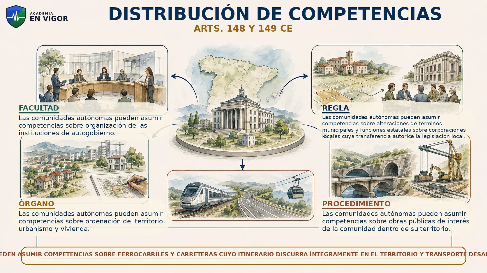

<em>Infografía: Distribución de competencias.</em>

<!-- FUENTE: BOE-CE-1978-GC-T04 -->

## 56. Técnicas del artículo 150 y vía especial del artículo 151

### Regla y encaje

Este bloque ordena técnicas del artículo 150 y vía especial del artículo 151 dentro del sistema constitucional. La clave es relacionar el precepto con su sujeto, competencia, garantía, mayoría o plazo.

Este bloque pertenece a **constitución: organización territorial** y se contrasta en **arts. 150 y 151 CE**.

### Claves normativas

- Las Cortes pueden atribuir a comunidades la facultad de dictar normas legislativas dentro de principios, bases y directrices de una ley estatal.
- La ley marco establece la modalidad de control de las Cortes sobre las normas autonómicas, sin perjuicio de los tribunales. <!-- FACT:GC-T04-F582 -->
- El Estado puede transferir o delegar mediante ley orgánica facultades estatales susceptibles por su naturaleza. <!-- FACT:GC-T04-F583 -->
- La ley orgánica de transferencia debe prever medios financieros y formas de control estatal. <!-- FACT:GC-T04-F584 -->
- El Estado puede dictar leyes de armonización de disposiciones autonómicas cuando lo exija el interés general. <!-- FACT:GC-T04-F585 -->
- La necesidad de armonización debe ser apreciada por mayoría absoluta de cada Cámara. <!-- FACT:GC-T04-F586 -->
- La vía especial exige acuerdo de órganos provinciales y de tres cuartas partes de municipios que representen mayoría del censo de cada provincia. <!-- FACT:GC-T04-F587 -->
- Los requisitos municipales de la vía especial deben cumplirse dentro de seis meses desde el primer acuerdo. <!-- FACT:GC-T04-F588 -->
- La iniciativa especial debe ser ratificada por mayoría absoluta de electores de cada provincia en referéndum. <!-- FACT:GC-T04-F589 -->
- El Gobierno convoca a diputados y senadores del territorio para constituirse en Asamblea y elaborar el proyecto de Estatuto. <!-- FACT:GC-T04-F590 -->
- La Asamblea de parlamentarios aprueba el proyecto de Estatuto por mayoría absoluta de sus miembros. <!-- FACT:GC-T04-F591 -->
- El proyecto se examina en dos meses por la Comisión Constitucional del Congreso con una delegación de la Asamblea proponente. <!-- FACT:GC-T04-F592 -->
- Si hay acuerdo, el texto se somete a referéndum del cuerpo electoral de las provincias afectadas. <!-- FACT:GC-T04-F593 -->
- El Estatuto se eleva a las Cortes si lo aprueba la mayoría de votos válidamente emitidos en cada provincia. <!-- FACT:GC-T04-F594 -->
- Los Plenos de ambas Cámaras deciden mediante voto de ratificación y el Rey sanciona y promulga el Estatuto. <!-- FACT:GC-T04-F595 -->
- Si no hay acuerdo en Comisión, el proyecto se tramita como proyecto de ley y después se somete a referéndum. <!-- FACT:GC-T04-F596 -->
- La falta de aprobación en una o varias provincias no impide la constitución de la comunidad por las restantes en los términos de ley orgánica. <!-- FACT:GC-T04-F597 -->
- La organización autonómica especial se basa en una asamblea elegida por sufragio universal y representación proporcional que asegure territorios. <!-- FACT:GC-T04-F598 -->
- Existe un Consejo de Gobierno con funciones ejecutivas y administrativas. <!-- FACT:GC-T04-F599 -->
- El Presidente es elegido por la Asamblea entre sus miembros y nombrado por el Rey. <!-- FACT:GC-T04-F600 -->
- El Presidente dirige el Consejo, representa supremamente a la comunidad y representa ordinariamente al Estado en ella. <!-- FACT:GC-T04-F601 -->
- El Presidente y el Consejo responden políticamente ante la Asamblea. <!-- FACT:GC-T04-F602 -->
- Un Tribunal Superior de Justicia culmina la organización judicial en el territorio, sin perjuicio del Tribunal Supremo. <!-- FACT:GC-T04-F603 -->
- La reforma de estos Estatutos requiere los procedimientos previstos y referéndum entre electores inscritos. <!-- FACT:GC-T04-F604 -->
- Los Estatutos pueden establecer circunscripciones territoriales propias agrupando municipios limítrofes con personalidad jurídica. <!-- FACT:GC-T04-F605 -->
 <!-- FACT:GC-T04-F606 -->

:::hablemos-claro
Lee la Constitución como un sistema: primero identifica el poder u órgano; después, su competencia, límite, garantía y control.
:::

:::en-la-calle
En un supuesto práctico, separa derechos, organización del poder y procedimiento. Una misma palabra —ley, mayoría o control— cambia de sentido según el título constitucional.
:::

:::lo-que-cae
Prioridad de examen: **arts. 150 y 151 CE**. Vigila sujetos, plazos, mayorías, excepciones y verbos de competencia.
:::

:::ha-caido
Apariciones oficiales verificadas: 2021 · pregunta 24.
:::

<!-- VISUAL:t04-56-tecnicas-del-articulo-150-y-via-especial-del-articulo-151.webp -->

  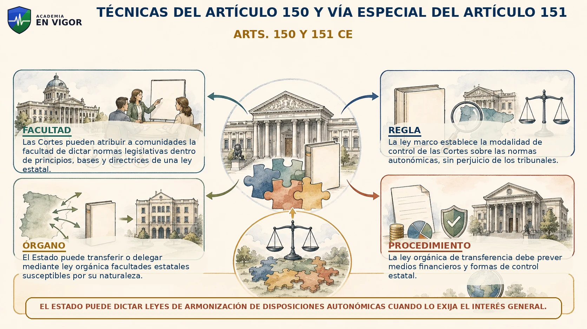

<em>Infografía: Técnicas del artículo 150 y vía especial del artículo 151.</em>

<!-- FUENTE: BOE-CE-1978-GC-T04 -->

## 57. Instituciones, controles, coerción y financiación autonómica

### Regla y encaje

Este bloque ordena instituciones, controles, coerción y financiación autonómica dentro del sistema constitucional. La clave es relacionar el precepto con su sujeto, competencia, garantía, mayoría o plazo.

Este bloque pertenece a **constitución: organización territorial** y se contrasta en **arts. 152 a 158 CE**.

### Claves normativas

- El Tribunal Constitucional controla la constitucionalidad de disposiciones autonómicas con fuerza de ley.
- El Gobierno, previo dictamen del Consejo de Estado, controla el ejercicio de funciones delegadas del artículo 150.2. <!-- FACT:GC-T04-F607 -->
- La jurisdicción contencioso-administrativa controla la administración autonómica y sus normas reglamentarias. <!-- FACT:GC-T04-F608 -->
- El Tribunal de Cuentas ejerce el control económico y presupuestario de las comunidades. <!-- FACT:GC-T04-F609 -->
- Un Delegado nombrado por el Gobierno dirige la Administración del Estado en la comunidad y la coordina cuando proceda con la autonómica. <!-- FACT:GC-T04-F610 -->
- El artículo 155 procede por incumplimiento de obligaciones constitucionales o legales o atentado grave al interés general. <!-- FACT:GC-T04-F611 -->
- Antes de aplicar el artículo 155, el Gobierno debe requerir al Presidente de la comunidad. <!-- FACT:GC-T04-F612 -->
- Si el requerimiento no es atendido, las medidas requieren aprobación por mayoría absoluta del Senado. <!-- FACT:GC-T04-F613 -->
- Las medidas buscan obligar al cumplimiento forzoso o proteger el interés general. <!-- FACT:GC-T04-F614 -->
- Para ejecutar las medidas, el Gobierno puede dar instrucciones a todas las autoridades autonómicas. <!-- FACT:GC-T04-F615 -->
- Las comunidades gozan de autonomía financiera para desarrollar y ejecutar competencias. <!-- FACT:GC-T04-F616 -->
- La autonomía financiera se ejerce con coordinación con la Hacienda estatal y solidaridad entre españoles. <!-- FACT:GC-T04-F617 -->
- Las comunidades pueden actuar como delegadas o colaboradoras del Estado en recaudación, gestión y liquidación tributaria. <!-- FACT:GC-T04-F618 -->
- Los recursos autonómicos incluyen impuestos cedidos, recargos sobre impuestos estatales y tributos propios. <!-- FACT:GC-T04-F619 -->
- Incluyen transferencias del Fondo de Compensación Interterritorial y otras asignaciones presupuestarias. <!-- FACT:GC-T04-F620 -->
- Incluyen rendimientos patrimoniales, ingresos de Derecho privado y operaciones de crédito. <!-- FACT:GC-T04-F621 -->
- Las comunidades no pueden gravar bienes fuera de su territorio ni obstaculizar libre circulación de mercancías o servicios. <!-- FACT:GC-T04-F622 -->
- Una ley orgánica puede regular competencias financieras, conflictos y colaboración con el Estado. <!-- FACT:GC-T04-F623 -->
- Los Presupuestos pueden asignar recursos según volumen de servicios para garantizar un nivel mínimo de servicios públicos fundamentales. <!-- FACT:GC-T04-F624 -->
- El Fondo de Compensación corrige desequilibrios y destina recursos a gastos de inversión. <!-- FACT:GC-T04-F625 -->
- Los recursos del Fondo son distribuidos por las Cortes entre comunidades y provincias, en su caso. <!-- FACT:GC-T04-F626 -->
 <!-- FACT:GC-T04-F627 -->

:::hablemos-claro
Lee la Constitución como un sistema: primero identifica el poder u órgano; después, su competencia, límite, garantía y control.
:::

:::en-la-calle
En un supuesto práctico, separa derechos, organización del poder y procedimiento. Una misma palabra —ley, mayoría o control— cambia de sentido según el título constitucional.
:::

:::lo-que-cae
Prioridad de examen: **arts. 152 a 158 CE**. Vigila sujetos, plazos, mayorías, excepciones y verbos de competencia.
:::

:::ha-caido
Apariciones oficiales verificadas: 2021 · pregunta 22, 2022 · pregunta 22, 2026 · pregunta 21.
:::

<!-- VISUAL:t04-57-instituciones-controles-coercion-y-financiacion-autonomica.webp -->

  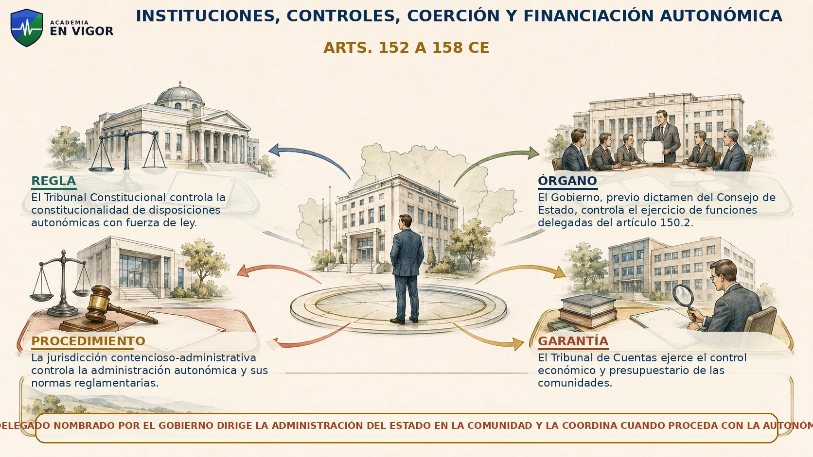

<em>Infografía: Instituciones, controles, coerción y financiación autonómica.</em>

<!-- FUENTE: BOE-CE-1978-GC-T04 -->

## 58. Tribunal Constitucional

### Regla y encaje

Este bloque ordena tribunal constitucional dentro del sistema constitucional. La clave es relacionar el precepto con su sujeto, competencia, garantía, mayoría o plazo.

Este bloque pertenece a **constitución: tribunal constitucional y reforma** y se contrasta en **arts. 159 a 165 CE**.

### Claves normativas

- El Tribunal Constitucional se compone de 12 miembros nombrados por el Rey.
- Cuatro magistrados son propuestos por el Congreso por mayoría de tres quintos. <!-- FACT:GC-T04-F628 -->
- Cuatro magistrados son propuestos por el Senado por mayoría de tres quintos. <!-- FACT:GC-T04-F629 -->
- Dos magistrados son propuestos por el Gobierno y dos por el CGPJ. <!-- FACT:GC-T04-F630 -->
- Los miembros se nombran entre magistrados, fiscales, profesores universitarios, funcionarios públicos y abogados. <!-- FACT:GC-T04-F631 -->
- Deben ser juristas de reconocida competencia con más de 15 años de ejercicio profesional. <!-- FACT:GC-T04-F632 -->
- Los magistrados son designados por nueve años y se renuevan por terceras partes cada tres. <!-- FACT:GC-T04-F633 -->
- La condición de miembro del TC es incompatible con mandato representativo, cargos políticos o administrativos, dirección partidista o sindical, carrera judicial o fiscal y actividad profesional o mercantil. <!-- FACT:GC-T04-F634 -->
- Los miembros del TC son independientes e inamovibles durante su mandato. <!-- FACT:GC-T04-F635 -->
- El Presidente del TC es nombrado por el Rey a propuesta del Pleno por tres años. <!-- FACT:GC-T04-F636 -->
- El TC conoce del recurso de inconstitucionalidad contra leyes y disposiciones normativas con fuerza de ley. <!-- FACT:GC-T04-F637 -->
- El TC conoce del recurso de amparo por violación de derechos del artículo 53.2 en los casos legales. <!-- FACT:GC-T04-F638 -->
- El TC conoce de conflictos de competencia entre Estado y comunidades o de estas entre sí. <!-- FACT:GC-T04-F639 -->
- El TC conoce de las demás materias atribuidas por Constitución o leyes orgánicas. <!-- FACT:GC-T04-F640 -->
- El Gobierno puede impugnar ante el TC disposiciones y resoluciones autonómicas. <!-- FACT:GC-T04-F641 -->
- La impugnación del Gobierno produce suspensión y el TC debe ratificarla o levantarla en un plazo máximo de cinco meses. <!-- FACT:GC-T04-F642 -->
- Están legitimados el Presidente del Gobierno, Defensor del Pueblo, 50 diputados, 50 senadores y órganos autonómicos en su ámbito. <!-- FACT:GC-T04-F643 -->
- Puede interponer amparo toda persona con interés legítimo, el Defensor del Pueblo y el Ministerio Fiscal. <!-- FACT:GC-T04-F644 -->
- Una ley orgánica determina las personas y órganos legitimados en los demás supuestos. <!-- FACT:GC-T04-F645 -->
- Un órgano judicial plantea cuestión cuando una norma con rango de ley aplicable y decisiva para el fallo puede ser contraria a la Constitución. <!-- FACT:GC-T04-F646 -->
- El planteamiento de la cuestión no produce efectos suspensivos generales sobre la norma. <!-- FACT:GC-T04-F647 -->
- Las sentencias del TC se publican en el BOE con los votos particulares, si los hay. <!-- FACT:GC-T04-F648 -->
- Las sentencias del TC tienen valor de cosa juzgada desde el día siguiente a su publicación y no cabe recurso. <!-- FACT:GC-T04-F649 -->
- Las sentencias que declaran inconstitucionalidad y las no limitadas a estimación subjetiva tienen plenos efectos frente a todos. <!-- FACT:GC-T04-F650 -->
- Salvo que el fallo disponga otra cosa, la parte de la ley no afectada por inconstitucionalidad permanece vigente. <!-- FACT:GC-T04-F651 -->
- Una ley orgánica regula funcionamiento del TC, estatuto de miembros, procedimiento y condiciones de acciones. <!-- FACT:GC-T04-F652 -->
- El Tribunal Constitucional actúa en Pleno, Sala o Sección. <!-- FACT:GC-T04-F653 -->
- El Tribunal Constitucional consta de dos Salas de seis magistrados cada una. <!-- FACT:GC-T04-F654 -->
- El Presidente preside la Sala Primera y el Vicepresidente la Sala Segunda. <!-- FACT:GC-T04-F655 -->
- Las Secciones están compuestas por el Presidente correspondiente o sustituto y dos magistrados. <!-- FACT:GC-T04-F656 -->
- El Pleno elige al Presidente por votación secreta y propone su nombramiento al Rey. <!-- FACT:GC-T04-F657 -->
- El Presidente puede ser reelegido una sola vez tras su período de tres años. <!-- FACT:GC-T04-F658 -->
- Pleno y Salas requieren presencia de al menos dos tercios de sus miembros para adoptar acuerdos. <!-- FACT:GC-T04-F659 -->
- La responsabilidad criminal de magistrados del TC se exige ante la Sala de lo Penal del Tribunal Supremo. <!-- FACT:GC-T04-F660 -->
 <!-- FACT:GC-T04-F661 -->

:::hablemos-claro
Lee la Constitución como un sistema: primero identifica el poder u órgano; después, su competencia, límite, garantía y control.
:::

:::en-la-calle
En un supuesto práctico, separa derechos, organización del poder y procedimiento. Una misma palabra —ley, mayoría o control— cambia de sentido según el título constitucional.
:::

:::lo-que-cae
Prioridad de examen: **arts. 159 a 165 CE**. Vigila sujetos, plazos, mayorías, excepciones y verbos de competencia.
:::

:::ha-caido
Apariciones oficiales verificadas: 2021 · pregunta 23, 2021 · pregunta 25, 2022 · pregunta 23, 2022 · pregunta 23, 2022 · pregunta 24, 2023 · pregunta 22.
:::

<!-- VISUAL:t04-58-tribunal-constitucional.webp -->

  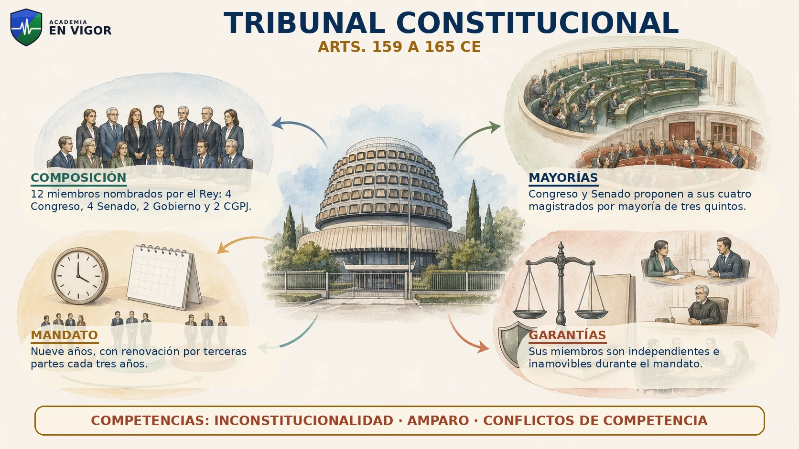

<em>Infografía: Tribunal Constitucional.</em>

<!-- FUENTE: BOE-CE-1978-GC-T04 -->

## 59. Reforma constitucional

### Regla y encaje

Este bloque ordena reforma constitucional dentro del sistema constitucional. La clave es relacionar el precepto con su sujeto, competencia, garantía, mayoría o plazo.

Este bloque pertenece a **constitución: tribunal constitucional y reforma** y se contrasta en **arts. 166 a 169 CE**.

### Claves normativas

- La iniciativa de reforma se ejerce en los términos del artículo 87.1 y 87.2.
- La iniciativa legislativa popular no puede promover una reforma constitucional. <!-- FACT:GC-T04-F662 -->
- La reforma ordinaria exige mayoría de tres quintos de cada Cámara. <!-- FACT:GC-T04-F663 -->
- Si no hay acuerdo, se crea una Comisión Mixta paritaria que presenta un texto a Congreso y Senado. <!-- FACT:GC-T04-F664 -->
- Si falla la Comisión y el Senado aprueba por mayoría absoluta, el Congreso puede aprobar por dos tercios. <!-- FACT:GC-T04-F665 -->
- La reforma ordinaria se somete a referéndum si lo pide una décima parte de cualquiera de las Cámaras dentro de 15 días. <!-- FACT:GC-T04-F666 -->
- La vía agravada se aplica a revisión total o parcial del Título Preliminar, Sección 1.ª del Capítulo II del Título I o Título II. <!-- FACT:GC-T04-F667 -->
- El principio de reforma agravada requiere dos tercios de cada Cámara. <!-- FACT:GC-T04-F668 -->
- Aprobado el principio de reforma agravada se disuelven inmediatamente las Cortes. <!-- FACT:GC-T04-F669 -->
- Las nuevas Cámaras deben ratificar la decisión y estudiar el nuevo texto. <!-- FACT:GC-T04-F670 -->
- El nuevo texto requiere dos tercios de ambas nuevas Cámaras. <!-- FACT:GC-T04-F671 -->
- La reforma agravada aprobada se somete siempre a referéndum de ratificación. <!-- FACT:GC-T04-F672 -->
- No puede iniciarse una reforma constitucional en tiempo de guerra ni durante los estados del artículo 116. <!-- FACT:GC-T04-F673 -->
 <!-- FACT:GC-T04-F674 -->

:::hablemos-claro
Lee la Constitución como un sistema: primero identifica el poder u órgano; después, su competencia, límite, garantía y control.
:::

:::en-la-calle
En un supuesto práctico, separa derechos, organización del poder y procedimiento. Una misma palabra —ley, mayoría o control— cambia de sentido según el título constitucional.
:::

:::lo-que-cae
Prioridad de examen: **arts. 166 a 169 CE**. Vigila sujetos, plazos, mayorías, excepciones y verbos de competencia.
:::

:::ha-caido
Apariciones oficiales verificadas: 2020 · pregunta 19, 2020 · pregunta 20, 2020 · pregunta 21, 2022 · pregunta 22, 2022 · pregunta 24.
:::

<!-- VISUAL:t04-59-reforma-constitucional.webp -->

  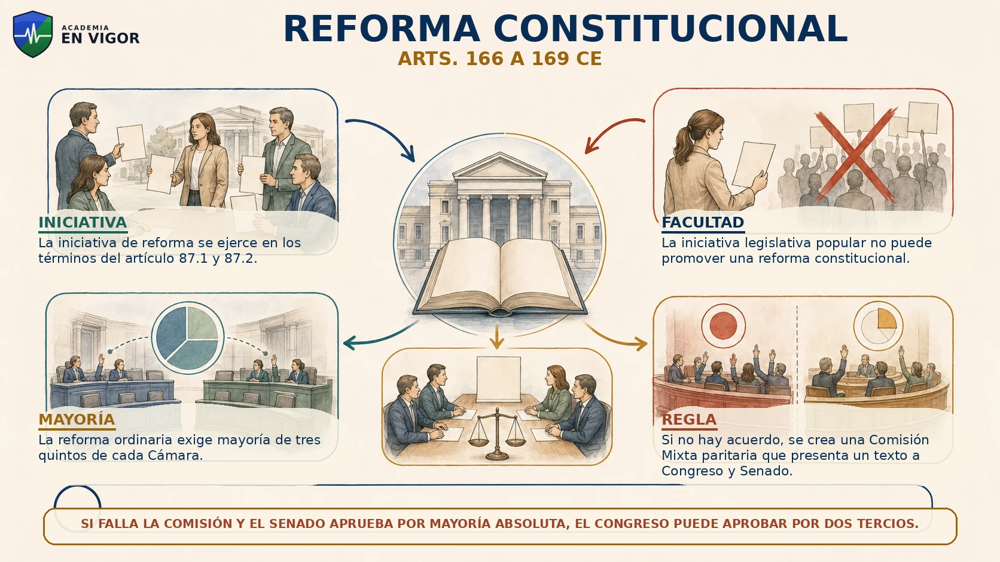

<em>Infografía: Reforma constitucional.</em>

<!-- FUENTE: BOE-CE-1978-GC-T04 -->

## 60. Carácter, mandato y relación con las Cortes

### Regla y encaje

Elección y mandato se sostienen sobre mayorías reforzadas y una Comisión Mixta permanente.

Este bloque pertenece a **ley orgánica 3/1981: defensor del pueblo** y se contrasta en **arts. 1 y 2 LO 3/1981**.

### Claves normativas

- El Defensor del Pueblo es el alto comisionado de las Cortes Generales para defender los derechos del Título I de la Constitución.
- Puede supervisar la actividad de la Administración y da cuenta de su actuación a las Cortes Generales. <!-- FACT:GC-T04-F675 -->
- Es elegido por las Cortes Generales para un período de cinco años. <!-- FACT:GC-T04-F676 -->
- Se relaciona con las Cortes a través de los Presidentes del Congreso y del Senado. <!-- FACT:GC-T04-F677 -->
- Una Comisión Mixta Congreso-Senado se relaciona con el Defensor e informa a los Plenos. <!-- FACT:GC-T04-F678 -->
- La Comisión Mixta se reúne cuando lo acuerden conjuntamente los Presidentes de ambas Cámaras y, en todo caso, para proponer candidato o candidatos. <!-- FACT:GC-T04-F679 -->
- Los acuerdos de la Comisión Mixta se adoptan por mayoría simple. <!-- FACT:GC-T04-F680 -->
- El Pleno del Congreso se convoca en un plazo no inferior a diez días para elegir al candidato. <!-- FACT:GC-T04-F681 -->
- La elección ordinaria exige tres quintos del Congreso y ratificación por tres quintos del Senado dentro de un máximo de veinte días. <!-- FACT:GC-T04-F682 -->
- Si fallan esas mayorías, la Comisión formula nuevas propuestas en un mes; obtenidos tres quintos del Congreso basta mayoría absoluta del Senado. <!-- FACT:GC-T04-F683 -->
 <!-- FACT:GC-T04-F684 -->

:::hablemos-claro
El Defensor supervisa y recomienda, pero no anula actos ni sustituye a jueces o Administraciones. Esa frontera resuelve muchas trampas.
:::

:::en-la-calle
Ante una queja, comprueba legitimación, plazo, admisión, colaboración, resolución y destinatario del informe; no saltes directamente a la recomendación final.
:::

:::lo-que-cae
Prioridad de examen: **arts. 1 y 2 LO 3/1981**. Vigila sujetos, plazos, mayorías, excepciones y verbos de competencia.
:::

:::ha-caido
Apariciones oficiales verificadas: 2026 · pregunta 22.
:::

<!-- VISUAL:t04-60-caracter-mandato-y-relacion-con-las-cortes.webp -->

  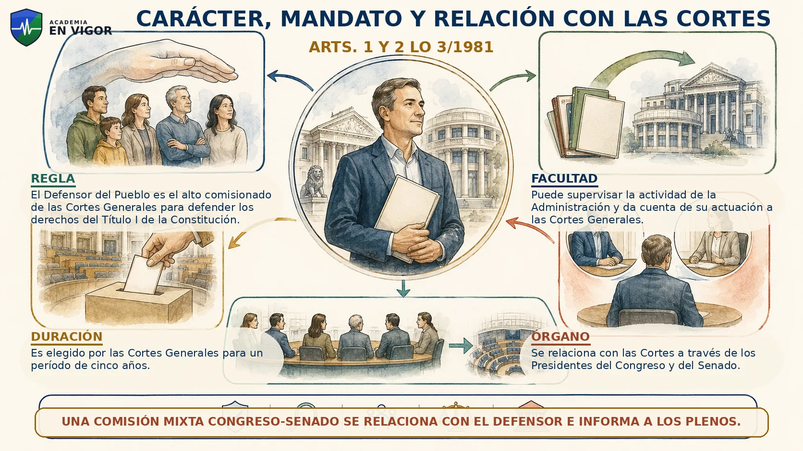

<em>Infografía: Carácter, mandato y relación con las Cortes.</em>

<!-- FUENTE: BOE-LO3-1981-GC-T04 -->

## 61. Elegibilidad, acreditación y toma de posesión

### Regla y encaje

Elegibilidad, acreditación y toma de posesión son fases distintas que suelen confundirse.

Este bloque pertenece a **ley orgánica 3/1981: defensor del pueblo** y se contrasta en **arts. 3 y 4 LO 3/1981**.

### Claves normativas

- Puede ser elegido cualquier español mayor de edad en pleno disfrute de sus derechos civiles y políticos.
- Los Presidentes del Congreso y del Senado acreditan conjuntamente con sus firmas el nombramiento. <!-- FACT:GC-T04-F685 -->
- El nombramiento se publica en el Boletín Oficial del Estado. <!-- FACT:GC-T04-F686 -->
- El Defensor toma posesión ante las Mesas de ambas Cámaras reunidas conjuntamente. <!-- FACT:GC-T04-F687 -->
- En la toma de posesión presta juramento o promesa de fiel desempeño de su función. <!-- FACT:GC-T04-F688 -->
 <!-- FACT:GC-T04-F689 -->

:::hablemos-claro
El Defensor supervisa y recomienda, pero no anula actos ni sustituye a jueces o Administraciones. Esa frontera resuelve muchas trampas.
:::

:::en-la-calle
Ante una queja, comprueba legitimación, plazo, admisión, colaboración, resolución y destinatario del informe; no saltes directamente a la recomendación final.
:::

:::lo-que-cae
Prioridad de examen: **arts. 3 y 4 LO 3/1981**. Vigila sujetos, plazos, mayorías, excepciones y verbos de competencia.
:::

:::ha-caido
Apariciones oficiales verificadas: 2022 · pregunta 23, 2025 · pregunta 25.
:::

<!-- VISUAL:t04-61-elegibilidad-acreditacion-y-toma-de-posesion.webp -->

  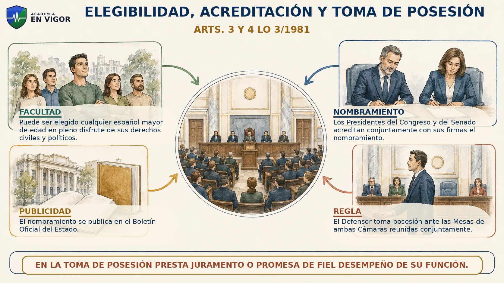

<em>Infografía: Elegibilidad, acreditación y toma de posesión.</em>

<!-- FUENTE: BOE-LO3-1981-GC-T04 -->

## 62. Cese, vacante y sustitución

### Regla y encaje

La causa de cese determina quién declara la vacante y si hace falta votación reforzada.

Este bloque pertenece a **ley orgánica 3/1981: defensor del pueblo** y se contrasta en **art. 5 LO 3/1981**.

### Claves normativas

- El Defensor cesa por renuncia, expiración del mandato, muerte o incapacidad sobrevenida.
- También cesa por notoria negligencia en sus obligaciones o por condena firme por delito doloso. <!-- FACT:GC-T04-F690 -->
- El Presidente del Congreso declara la vacante por muerte, renuncia o expiración del mandato. <!-- FACT:GC-T04-F691 -->
- La incapacidad, negligencia o condena requieren decisión por tres quintos de cada Cámara, debate y audiencia previa. <!-- FACT:GC-T04-F692 -->
- Vacante el cargo, el procedimiento para nombrar nuevo Defensor se inicia en plazo no superior a un mes. <!-- FACT:GC-T04-F693 -->
- Hasta la nueva designación, los Adjuntos ejercen interinamente las funciones por su orden. <!-- FACT:GC-T04-F694 -->
 <!-- FACT:GC-T04-F695 -->

:::hablemos-claro
El Defensor supervisa y recomienda, pero no anula actos ni sustituye a jueces o Administraciones. Esa frontera resuelve muchas trampas.
:::

:::en-la-calle
Ante una queja, comprueba legitimación, plazo, admisión, colaboración, resolución y destinatario del informe; no saltes directamente a la recomendación final.
:::

:::lo-que-cae
Prioridad de examen: **art. 5 LO 3/1981**. Vigila sujetos, plazos, mayorías, excepciones y verbos de competencia.
:::

:::ha-caido
Apariciones oficiales verificadas: 2023 · pregunta 22.
:::

<!-- VISUAL:t04-62-cese-vacante-y-sustitucion.webp -->

  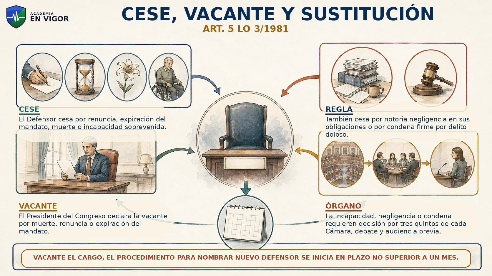

<em>Infografía: Cese, vacante y sustitución.</em>

<!-- FUENTE: BOE-LO3-1981-GC-T04 -->

## 63. Autonomía, inviolabilidad y fuero

### Regla y encaje

La inviolabilidad protege el ejercicio del cargo; el fuero opera para los demás hechos.

Este bloque pertenece a **ley orgánica 3/1981: defensor del pueblo** y se contrasta en **art. 6 LO 3/1981**.

### Claves normativas

- El Defensor no está sujeto a mandato imperativo ni recibe instrucciones de autoridad alguna.
- Desempeña sus funciones con autonomía y según su criterio. <!-- FACT:GC-T04-F696 -->
- Goza de inviolabilidad por las opiniones y actos realizados en el ejercicio de sus competencias. <!-- FACT:GC-T04-F697 -->
- Fuera de esos actos solo puede ser detenido o retenido en caso de flagrante delito mientras esté en funciones. <!-- FACT:GC-T04-F698 -->
- La Sala de lo Penal del Tribunal Supremo decide exclusivamente sobre su inculpación, prisión, procesamiento y juicio. <!-- FACT:GC-T04-F699 -->
- Estas prerrogativas se aplican a los Adjuntos en el cumplimiento de sus funciones. <!-- FACT:GC-T04-F700 -->
 <!-- FACT:GC-T04-F701 -->

:::hablemos-claro
El Defensor supervisa y recomienda, pero no anula actos ni sustituye a jueces o Administraciones. Esa frontera resuelve muchas trampas.
:::

:::en-la-calle
Ante una queja, comprueba legitimación, plazo, admisión, colaboración, resolución y destinatario del informe; no saltes directamente a la recomendación final.
:::

:::lo-que-cae
Prioridad de examen: **art. 6 LO 3/1981**. Vigila sujetos, plazos, mayorías, excepciones y verbos de competencia.
:::

<!-- VISUAL:t04-63-autonomia-inviolabilidad-y-fuero.webp -->

  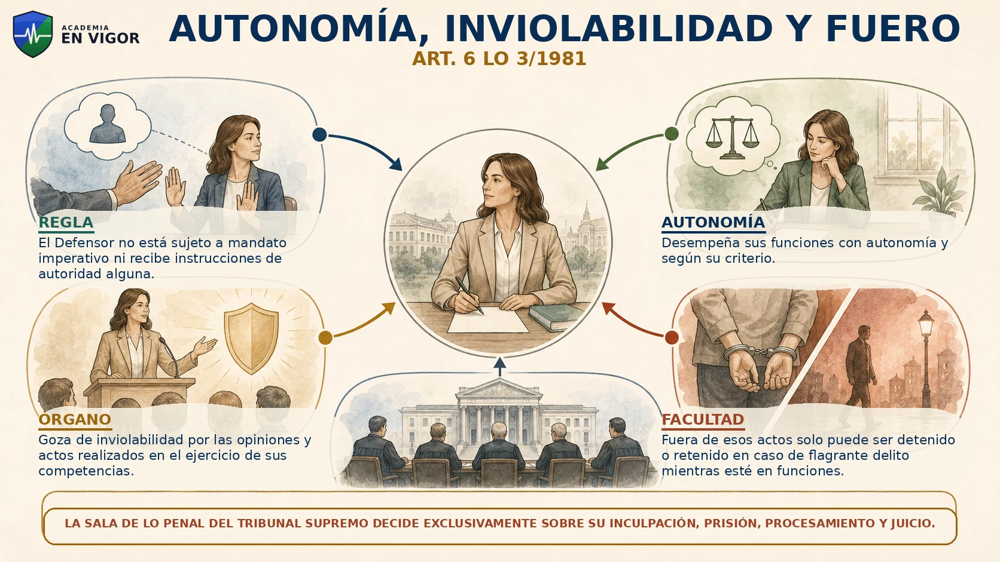

<em>Infografía: Autonomía, inviolabilidad y fuero.</em>

<!-- FUENTE: BOE-LO3-1981-GC-T04 -->

## 64. Incompatibilidades

### Regla y encaje

La lista es extensa y el plazo de diez días es un dato clásico de examen.

Este bloque pertenece a **ley orgánica 3/1981: defensor del pueblo** y se contrasta en **art. 7 LO 3/1981**.

### Claves normativas

- El cargo es incompatible con todo mandato representativo y con todo cargo político o propaganda política.
- Es incompatible con permanecer en servicio activo en cualquier Administración pública. <!-- FACT:GC-T04-F702 -->
- Es incompatible con afiliación a partido político y con funciones directivas o empleo en partidos, sindicatos, asociaciones o fundaciones. <!-- FACT:GC-T04-F703 -->
- Es incompatible con el ejercicio de las carreras judicial y fiscal. <!-- FACT:GC-T04-F704 -->
- Es incompatible con cualquier actividad profesional, liberal, mercantil o laboral. <!-- FACT:GC-T04-F705 -->
- Debe cesar en la incompatibilidad dentro de diez días desde el nombramiento y antes de tomar posesión. <!-- FACT:GC-T04-F706 -->
- Si no cesa en plazo, se entiende que no acepta el nombramiento. <!-- FACT:GC-T04-F707 -->
- La incompatibilidad sobrevenida implica renuncia desde la fecha en que se produce. <!-- FACT:GC-T04-F708 -->
 <!-- FACT:GC-T04-F709 -->

:::hablemos-claro
El Defensor supervisa y recomienda, pero no anula actos ni sustituye a jueces o Administraciones. Esa frontera resuelve muchas trampas.
:::

:::en-la-calle
Ante una queja, comprueba legitimación, plazo, admisión, colaboración, resolución y destinatario del informe; no saltes directamente a la recomendación final.
:::

:::lo-que-cae
Prioridad de examen: **art. 7 LO 3/1981**. Vigila sujetos, plazos, mayorías, excepciones y verbos de competencia.
:::

:::ha-caido
Apariciones oficiales verificadas: 2023 · pregunta 23.
:::

<!-- VISUAL:t04-64-incompatibilidades.webp -->

  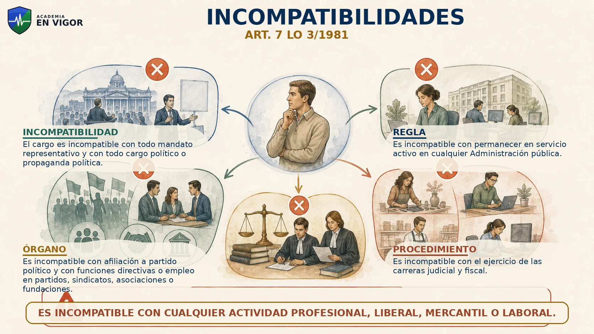

<em>Infografía: Incompatibilidades.</em>

<!-- FUENTE: BOE-LO3-1981-GC-T04 -->

## 65. Adjuntos del Defensor del Pueblo

### Regla y encaje

El orden Primero-Segundo importa tanto para la estructura como para la sustitución.

Este bloque pertenece a **ley orgánica 3/1981: defensor del pueblo** y se contrasta en **art. 8 LO 3/1981**.

### Claves normativas

- El Defensor está auxiliado por un Adjunto Primero y un Adjunto Segundo.
- Puede delegar funciones en los Adjuntos. <!-- FACT:GC-T04-F710 -->
- Los Adjuntos le sustituyen por su orden en imposibilidad temporal y cese. <!-- FACT:GC-T04-F711 -->
- El Defensor nombra y separa a los Adjuntos previa conformidad de las Cámaras. <!-- FACT:GC-T04-F712 -->
- El nombramiento de los Adjuntos se publica en el Boletín Oficial del Estado. <!-- FACT:GC-T04-F713 -->
- A los Adjuntos se aplican los artículos 3, 6 y 7 de la Ley Orgánica. <!-- FACT:GC-T04-F714 -->
 <!-- FACT:GC-T04-F715 -->

:::hablemos-claro
El Defensor supervisa y recomienda, pero no anula actos ni sustituye a jueces o Administraciones. Esa frontera resuelve muchas trampas.
:::

:::en-la-calle
Ante una queja, comprueba legitimación, plazo, admisión, colaboración, resolución y destinatario del informe; no saltes directamente a la recomendación final.
:::

:::lo-que-cae
Prioridad de examen: **art. 8 LO 3/1981**. Vigila sujetos, plazos, mayorías, excepciones y verbos de competencia.
:::

:::ha-caido
Apariciones oficiales verificadas: 2020 · pregunta 20.
:::

<!-- VISUAL:t04-65-adjuntos-del-defensor-del-pueblo.webp -->

  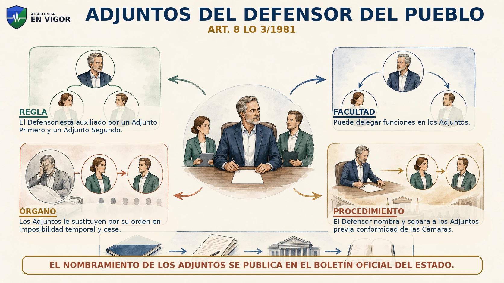

<em>Infografía: Adjuntos del Defensor del Pueblo.</em>

<!-- FUENTE: BOE-LO3-1981-GC-T04 -->

## 66. Inicio, legitimación y continuidad de la investigación

### Regla y encaje

La legitimación es amplísima, salvo la prohibición específica para autoridades administrativas en asuntos propios.

Este bloque pertenece a **ley orgánica 3/1981: defensor del pueblo** y se contrasta en **arts. 9 a 12 LO 3/1981**.

### Claves normativas

- El Defensor puede iniciar y proseguir de oficio o a petición de parte investigaciones sobre actos y resoluciones de la Administración y sus agentes.
- Sus atribuciones se extienden a ministros, autoridades, funcionarios y cualquier persona al servicio de las Administraciones públicas. <!-- FACT:GC-T04-F716 -->
- Puede dirigirse a él toda persona natural o jurídica que invoque interés legítimo. <!-- FACT:GC-T04-F717 -->
- No son impedimento nacionalidad, residencia, sexo, minoría de edad, incapacidad legal, internamiento o relación especial de sujeción. <!-- FACT:GC-T04-F718 -->
- Diputados, senadores y determinadas comisiones pueden solicitar por escrito motivado investigaciones sobre conductas concretas. <!-- FACT:GC-T04-F719 -->
- La Comisión Mixta Congreso-Senado está especialmente legitimada para solicitar esas investigaciones. <!-- FACT:GC-T04-F720 -->
- Ninguna autoridad administrativa puede presentar quejas en asuntos de su competencia. <!-- FACT:GC-T04-F721 -->
- La actividad continúa aunque las Cortes no estén reunidas, estén disueltas o haya expirado su mandato; entonces se dirige a las Diputaciones Permanentes. <!-- FACT:GC-T04-F722 -->
- Los estados de excepción o sitio no interrumpen su actividad ni el derecho de acceso, sin perjuicio del artículo 55 CE. <!-- FACT:GC-T04-F723 -->
 <!-- FACT:GC-T04-F724 -->

:::hablemos-claro
El Defensor supervisa y recomienda, pero no anula actos ni sustituye a jueces o Administraciones. Esa frontera resuelve muchas trampas.
:::

:::en-la-calle
Ante una queja, comprueba legitimación, plazo, admisión, colaboración, resolución y destinatario del informe; no saltes directamente a la recomendación final.
:::

:::lo-que-cae
Prioridad de examen: **arts. 9 a 12 LO 3/1981**. Vigila sujetos, plazos, mayorías, excepciones y verbos de competencia.
:::

:::ha-caido
Apariciones oficiales verificadas: 2020 · pregunta 22.
:::

<!-- VISUAL:t04-66-inicio-legitimacion-y-continuidad-de-la-investigacion.webp -->

  

<em>Infografía: Inicio, legitimación y continuidad de la investigación.</em>

<!-- FUENTE: BOE-LO3-1981-GC-T04 -->

## 67. Ámbito autonómico, Justicia y Administración militar

### Regla y encaje

Justicia y defensa no quedan fuera, pero la Ley canaliza la actuación para respetar sus estructuras.

Este bloque pertenece a **ley orgánica 3/1981: defensor del pueblo** y se contrasta en **arts. 12 a 14 LO 3/1981**.

### Claves normativas

- Puede supervisar de oficio o a instancia de parte la actividad de las comunidades autónomas dentro de sus competencias.
- Los órganos autonómicos similares coordinan sus funciones con él y puede solicitar su cooperación. <!-- FACT:GC-T04-F725 -->
- Las quejas sobre Administración de Justicia se dirigen al Ministerio Fiscal para investigar o adoptar medidas, o se trasladan al Consejo General del Poder Judicial según proceda. <!-- FACT:GC-T04-F726 -->
- Puede mencionar en su informe general los problemas relativos a la Administración de Justicia. <!-- FACT:GC-T04-F727 -->
- Vela por los derechos del Título I en el ámbito de la Administración militar. <!-- FACT:GC-T04-F728 -->
- La actuación en la Administración militar no puede interferir en el mando de la Defensa Nacional. <!-- FACT:GC-T04-F729 -->
 <!-- FACT:GC-T04-F730 -->

:::hablemos-claro
El Defensor supervisa y recomienda, pero no anula actos ni sustituye a jueces o Administraciones. Esa frontera resuelve muchas trampas.
:::

:::en-la-calle
Ante una queja, comprueba legitimación, plazo, admisión, colaboración, resolución y destinatario del informe; no saltes directamente a la recomendación final.
:::

:::lo-que-cae
Prioridad de examen: **arts. 12 a 14 LO 3/1981**. Vigila sujetos, plazos, mayorías, excepciones y verbos de competencia.
:::

:::ha-caido
Apariciones oficiales verificadas: 2022 · pregunta 25.
:::

<!-- VISUAL:t04-67-ambito-autonomico-justicia-y-administracion-militar.webp -->

  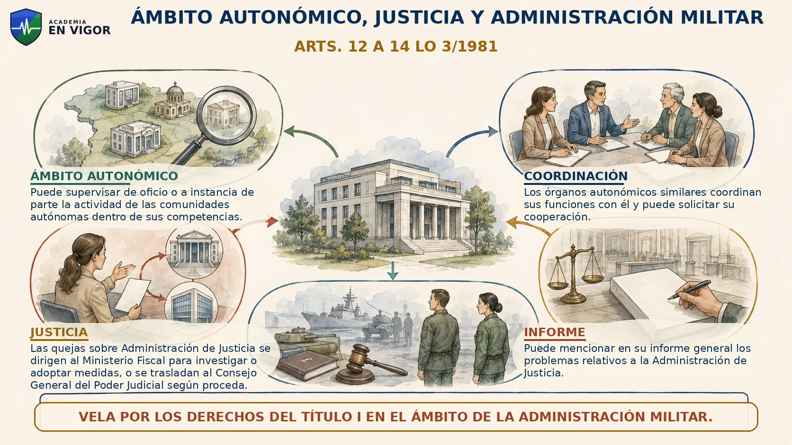

<em>Infografía: Ámbito autonómico, Justicia y Administración militar.</em>

<!-- FUENTE: BOE-LO3-1981-GC-T04 -->

## 68. Presentación, admisión y efectos procesales de las quejas

### Regla y encaje

El procedimiento es informal, pero no inexistente: firma, identificación, razón y plazo siguen siendo obligatorios.

Este bloque pertenece a **ley orgánica 3/1981: defensor del pueblo** y se contrasta en **arts. 15 a 17 LO 3/1981**.

### Claves normativas

- La queja debe ir firmada, identificar nombre, apellidos y domicilio y presentarse en escrito razonado en papel común.
- El plazo máximo para presentar la queja es un año desde que se conocen los hechos. <!-- FACT:GC-T04-F731 -->
- Las actuaciones son gratuitas y no requieren abogado ni procurador. <!-- FACT:GC-T04-F732 -->
- La correspondencia desde centros de detención, internamiento o custodia no puede ser censurada. <!-- FACT:GC-T04-F733 -->
- Las conversaciones con el Defensor o sus delegados no pueden ser escuchadas ni interferidas. <!-- FACT:GC-T04-F734 -->
- El Defensor registra y acusa recibo de las quejas y decide tramitarlas o rechazarlas motivadamente. <!-- FACT:GC-T04-F735 -->
- No examina individualmente una queja pendiente de resolución judicial y suspende su actuación si se interpone demanda o recurso. <!-- FACT:GC-T04-F736 -->
- La pendencia judicial no impide investigar los problemas generales planteados. <!-- FACT:GC-T04-F737 -->
- Rechaza quejas anónimas y puede rechazar mala fe, falta de fundamento, inexistencia de pretensión o perjuicio a tercero. <!-- FACT:GC-T04-F738 -->
- Las decisiones del Defensor no son susceptibles de recurso. <!-- FACT:GC-T04-F739 -->
 <!-- FACT:GC-T04-F740 -->

:::hablemos-claro
El Defensor supervisa y recomienda, pero no anula actos ni sustituye a jueces o Administraciones. Esa frontera resuelve muchas trampas.
:::

:::en-la-calle
Ante una queja, comprueba legitimación, plazo, admisión, colaboración, resolución y destinatario del informe; no saltes directamente a la recomendación final.
:::

:::lo-que-cae
Prioridad de examen: **arts. 15 a 17 LO 3/1981**. Vigila sujetos, plazos, mayorías, excepciones y verbos de competencia.
:::

:::ha-caido
Apariciones oficiales verificadas: 2021 · pregunta 26, 2023 · pregunta 23, 2024 · pregunta 24.
:::

<!-- VISUAL:t04-68-presentacion-admision-y-efectos-procesales-de-las-quejas.webp -->

  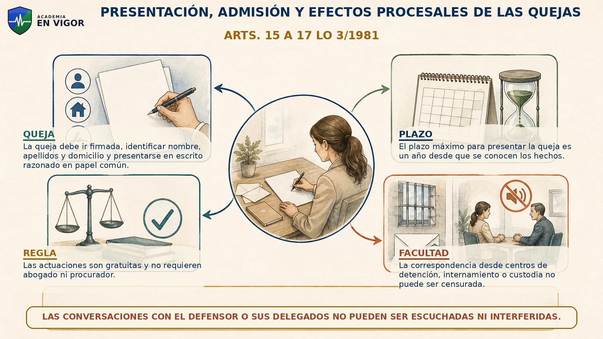

<em>Infografía: Presentación, admisión y efectos procesales de las quejas.</em>

<!-- FUENTE: BOE-LO3-1981-GC-T04 -->

## 69. Investigación sumaria e informe inicial

### Regla y encaje

El primer plazo de la investigación es de quince días, no un mes.

Este bloque pertenece a **ley orgánica 3/1981: defensor del pueblo** y se contrasta en **art. 18 LO 3/1981**.

### Claves normativas

- Admitida la queja, promueve una investigación sumaria e informal.
- Comunica el contenido sustancial al organismo o dependencia para que su jefe remita informe escrito en un máximo de quince días. <!-- FACT:GC-T04-F741 -->
- El plazo de quince días puede ampliarse si concurren circunstancias que lo aconsejen a juicio del Defensor. <!-- FACT:GC-T04-F742 -->
- La negativa o negligencia en enviar el informe puede calificarse como hostil y entorpecedora, hacerse pública y destacarse en informe anual o especial. <!-- FACT:GC-T04-F743 -->
 <!-- FACT:GC-T04-F744 -->

:::hablemos-claro
El Defensor supervisa y recomienda, pero no anula actos ni sustituye a jueces o Administraciones. Esa frontera resuelve muchas trampas.
:::

:::en-la-calle
Ante una queja, comprueba legitimación, plazo, admisión, colaboración, resolución y destinatario del informe; no saltes directamente a la recomendación final.
:::

:::lo-que-cae
Prioridad de examen: **art. 18 LO 3/1981**. Vigila sujetos, plazos, mayorías, excepciones y verbos de competencia.
:::

<!-- VISUAL:t04-69-investigacion-sumaria-e-informe-inicial.webp -->

  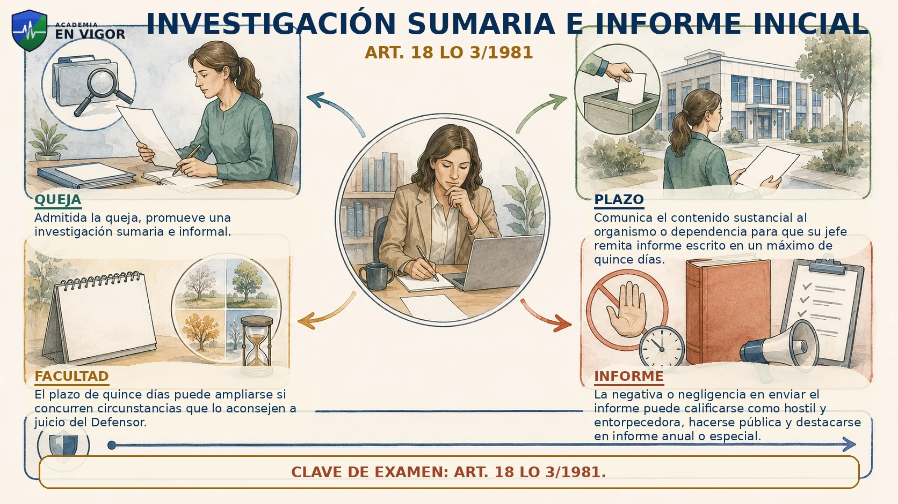

<em>Infografía: Investigación sumaria e informe inicial.</em>

<!-- FUENTE: BOE-LO3-1981-GC-T04 -->

## 70. Colaboración, comparecencia y conducta del personal

### Regla y encaje

La colaboración es preferente y urgente, pero el personal conserva cauces escritos y reserva del testimonio.

Este bloque pertenece a **ley orgánica 3/1981: defensor del pueblo** y se contrasta en **arts. 19 a 21 LO 3/1981**.

### Claves normativas

- Todos los poderes públicos deben auxiliar al Defensor con carácter preferente y urgente.
- El Defensor, su Adjunto o delegado pueden personarse en centros administrativos o afectos a servicios públicos. <!-- FACT:GC-T04-F745 -->
- Pueden comprobar datos, entrevistar y estudiar expedientes y documentación necesarios. <!-- FACT:GC-T04-F746 -->
- Si la queja afecta a una persona al servicio de la Administración, se comunica al afectado y a su superior inmediato. <!-- FACT:GC-T04-F747 -->
- El afectado responde por escrito en un plazo nunca inferior a diez días, prorrogable a instancia de parte por la mitad. <!-- FACT:GC-T04-F748 -->
- El testimonio personal del funcionario tiene carácter reservado, sin perjuicio del deber de denunciar hechos delictivos. <!-- FACT:GC-T04-F749 -->
- La prohibición de responder o entrevistarse debe constar por escrito y estar motivada. <!-- FACT:GC-T04-F750 -->
 <!-- FACT:GC-T04-F751 -->

:::hablemos-claro
El Defensor supervisa y recomienda, pero no anula actos ni sustituye a jueces o Administraciones. Esa frontera resuelve muchas trampas.
:::

:::en-la-calle
Ante una queja, comprueba legitimación, plazo, admisión, colaboración, resolución y destinatario del informe; no saltes directamente a la recomendación final.
:::

:::lo-que-cae
Prioridad de examen: **arts. 19 a 21 LO 3/1981**. Vigila sujetos, plazos, mayorías, excepciones y verbos de competencia.
:::

:::ha-caido
Apariciones oficiales verificadas: 2024 · pregunta 23.
:::

<!-- VISUAL:t04-70-colaboracion-comparecencia-y-conducta-del-personal.webp -->

  

<em>Infografía: Colaboración, comparecencia y conducta del personal.</em>

<!-- FUENTE: BOE-LO3-1981-GC-T04 -->

## 71. Documentos reservados y secreto

### Regla y encaje

Secreto no equivale a silencio automático: la denegación tiene órgano, forma y cauce parlamentario.

Este bloque pertenece a **ley orgánica 3/1981: defensor del pueblo** y se contrasta en **art. 22 LO 3/1981**.

### Claves normativas

- El Defensor puede solicitar todos los documentos necesarios, incluidos los clasificados como secretos conforme a la ley.
- La no remisión de documentos secretos debe acordarla el Consejo de Ministros. <!-- FACT:GC-T04-F752 -->
- La denegación debe acompañarse de certificación acreditativa del acuerdo. <!-- FACT:GC-T04-F753 -->
- Investigaciones y trámites se realizan con absoluta reserva, sin perjuicio de lo que se incluya en los informes a las Cortes. <!-- FACT:GC-T04-F754 -->
- Si un secreto no remitido afecta decisivamente a la investigación, lo comunica a la Comisión Mixta Congreso-Senado. <!-- FACT:GC-T04-F755 -->
 <!-- FACT:GC-T04-F756 -->

:::hablemos-claro
El Defensor supervisa y recomienda, pero no anula actos ni sustituye a jueces o Administraciones. Esa frontera resuelve muchas trampas.
:::

:::en-la-calle
Ante una queja, comprueba legitimación, plazo, admisión, colaboración, resolución y destinatario del informe; no saltes directamente a la recomendación final.
:::

:::lo-que-cae
Prioridad de examen: **art. 22 LO 3/1981**. Vigila sujetos, plazos, mayorías, excepciones y verbos de competencia.
:::

:::ha-caido
Apariciones oficiales verificadas: 2024 · pregunta 24.
:::

<!-- VISUAL:t04-71-documentos-reservados-y-secreto.webp -->

  

<em>Infografía: Documentos reservados y secreto.</em>

<!-- FUENTE: BOE-LO3-1981-GC-T04 -->

## 72. Responsabilidades, delito y gastos de particulares

### Regla y encaje

El Defensor no sanciona, pero puede denunciar, accionar, señalar obstrucciones y activar responsabilidades.

Este bloque pertenece a **ley orgánica 3/1981: defensor del pueblo** y se contrasta en **arts. 23 a 27 LO 3/1981**.

### Claves normativas

- Si la queja parece originada por abuso, arbitrariedad, discriminación, error, negligencia u omisión, el Defensor puede dirigirse al funcionario y formular sugerencias.
- La persistencia en una actitud hostil puede destacarse en informe especial y en la sección correspondiente del informe anual. <!-- FACT:GC-T04-F757 -->
- Un funcionario que obstaculice la investigación mediante negativa o negligencia puede incurrir en el delito previsto legalmente. <!-- FACT:GC-T04-F758 -->
- El Defensor puede ejercitar de oficio la acción de responsabilidad contra autoridades, funcionarios y agentes civiles del orden gubernativo o administrativo. <!-- FACT:GC-T04-F759 -->
- Para esa acción no necesita previa reclamación escrita. <!-- FACT:GC-T04-F760 -->
- Si conoce hechos presumiblemente delictivos, los pone de inmediato en conocimiento del Fiscal General del Estado. <!-- FACT:GC-T04-F761 -->
- El Fiscal General informa periódicamente al Defensor sobre el trámite dado a esos hechos. <!-- FACT:GC-T04-F762 -->
- Los gastos o perjuicios materiales de particulares llamados a informar se compensan con cargo al presupuesto del Defensor. <!-- FACT:GC-T04-F763 -->
 <!-- FACT:GC-T04-F764 -->

:::hablemos-claro
El Defensor supervisa y recomienda, pero no anula actos ni sustituye a jueces o Administraciones. Esa frontera resuelve muchas trampas.
:::

:::en-la-calle
Ante una queja, comprueba legitimación, plazo, admisión, colaboración, resolución y destinatario del informe; no saltes directamente a la recomendación final.
:::

:::lo-que-cae
Prioridad de examen: **arts. 23 a 27 LO 3/1981**. Vigila sujetos, plazos, mayorías, excepciones y verbos de competencia.
:::

:::ha-caido
Apariciones oficiales verificadas: 2022 · pregunta 25.
:::

<!-- VISUAL:t04-72-responsabilidades-delito-y-gastos-de-particulares.webp -->

  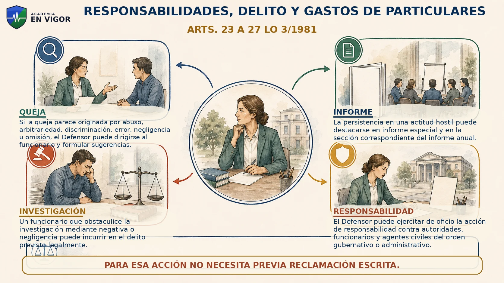

<em>Infografía: Responsabilidades, delito y gastos de particulares.</em>

<!-- FUENTE: BOE-LO3-1981-GC-T04 -->

## 73. Resoluciones, recursos y recomendaciones

### Regla y encaje

Sus resoluciones no sustituyen al acto administrativo: presionan, recomiendan y activan controles.

Este bloque pertenece a **ley orgánica 3/1981: defensor del pueblo** y se contrasta en **arts. 28 a 30 LO 3/1981**.

### Claves normativas

- El Defensor no puede anular ni modificar actos o resoluciones de la Administración.
- Puede sugerir modificar los criterios utilizados para producir actos y resoluciones. <!-- FACT:GC-T04-F765 -->
- Si el cumplimiento riguroso de una norma provoca injusticia o perjuicio, puede sugerir su modificación al órgano legislativo o a la Administración. <!-- FACT:GC-T04-F766 -->
- En servicios prestados por particulares mediante acto administrativo habilitante puede instar potestades administrativas de inspección y sanción. <!-- FACT:GC-T04-F767 -->
- Está legitimado para interponer recursos de inconstitucionalidad y de amparo. <!-- FACT:GC-T04-F768 -->
- Puede formular advertencias, recomendaciones, recordatorios de deberes legales y sugerencias de nuevas medidas. <!-- FACT:GC-T04-F769 -->
- Autoridades y funcionarios deben responder por escrito en plazo no superior a un mes. <!-- FACT:GC-T04-F770 -->
- Si no se adopta una medida adecuada ni se justifican las razones, puede elevar el asunto al Ministro o máxima autoridad de la Administración afectada. <!-- FACT:GC-T04-F771 -->
- Si persiste la falta de justificación, incluye el asunto y los nombres responsables en el informe anual o especial. <!-- FACT:GC-T04-F772 -->
 <!-- FACT:GC-T04-F773 -->

:::hablemos-claro
El Defensor supervisa y recomienda, pero no anula actos ni sustituye a jueces o Administraciones. Esa frontera resuelve muchas trampas.
:::

:::en-la-calle
Ante una queja, comprueba legitimación, plazo, admisión, colaboración, resolución y destinatario del informe; no saltes directamente a la recomendación final.
:::

:::lo-que-cae
Prioridad de examen: **arts. 28 a 30 LO 3/1981**. Vigila sujetos, plazos, mayorías, excepciones y verbos de competencia.
:::

:::ha-caido
Apariciones oficiales verificadas: 2021 · pregunta 24.
:::

<!-- VISUAL:t04-73-resoluciones-recursos-y-recomendaciones.webp -->

  

<em>Infografía: Resoluciones, recursos y recomendaciones.</em>

<!-- FUENTE: BOE-LO3-1981-GC-T04 -->

## 74. Notificaciones e informes a las Cortes

### Regla y encaje

Informe anual e informe extraordinario difieren por periodicidad, causa y destinatario eventual.

Este bloque pertenece a **ley orgánica 3/1981: defensor del pueblo** y se contrasta en **arts. 31 a 33 LO 3/1981**.

### Claves normativas

- Informa al interesado del resultado de la investigación y de la respuesta administrativa, salvo materias reservadas o secretas.
- Si actuó a solicitud parlamentaria, informa al parlamentario o comisión de los resultados o de la desestimación motivada. <!-- FACT:GC-T04-F774 -->
- Comunica el resultado positivo o negativo a la autoridad, funcionario o dependencia investigada. <!-- FACT:GC-T04-F775 -->
- Da cuenta anualmente a las Cortes mediante informe presentado cuando estén reunidas en período ordinario. <!-- FACT:GC-T04-F776 -->
- Puede presentar informe extraordinario por gravedad o urgencia. <!-- FACT:GC-T04-F777 -->
- Si las Cámaras no están reunidas, dirige el informe extraordinario a sus Diputaciones Permanentes. <!-- FACT:GC-T04-F778 -->
- Los informes anuales y extraordinarios se publican. <!-- FACT:GC-T04-F779 -->
- El informe anual detalla número y tipo de quejas, rechazos y causas, investigaciones y resultados y recomendaciones aceptadas. <!-- FACT:GC-T04-F780 -->
- El informe no incluye datos personales que permitan identificar públicamente a interesados, salvo la excepción legal. <!-- FACT:GC-T04-F781 -->
- Un resumen del informe se expone oralmente ante los Plenos de ambas Cámaras. <!-- FACT:GC-T04-F782 -->
 <!-- FACT:GC-T04-F783 -->

:::hablemos-claro
El Defensor supervisa y recomienda, pero no anula actos ni sustituye a jueces o Administraciones. Esa frontera resuelve muchas trampas.
:::

:::en-la-calle
Ante una queja, comprueba legitimación, plazo, admisión, colaboración, resolución y destinatario del informe; no saltes directamente a la recomendación final.
:::

:::lo-que-cae
Prioridad de examen: **arts. 31 a 33 LO 3/1981**. Vigila sujetos, plazos, mayorías, excepciones y verbos de competencia.
:::

:::ha-caido
Apariciones oficiales verificadas: 2020 · pregunta 21, 2020 · pregunta 23.
:::

<!-- VISUAL:t04-74-notificaciones-e-informes-a-las-cortes.webp -->

  

<em>Infografía: Notificaciones e informes a las Cortes.</em>

<!-- FUENTE: BOE-LO3-1981-GC-T04 -->

## 75. Mecanismo Nacional de Prevención de la Tortura

### Regla y encaje

La disposición final añade la función preventiva sin convertir el Mecanismo en una institución separada.

Este bloque pertenece a **ley orgánica 3/1981: defensor del pueblo** y se contrasta en **disposición final única LO 3/1981**.

### Claves normativas

- El Defensor ejerce las funciones del Mecanismo Nacional de Prevención de la Tortura.
- Lo hace conforme a la Constitución, la Ley Orgánica 3/1981 y el Protocolo facultativo de la Convención contra la Tortura. <!-- FACT:GC-T04-F784 -->
- Se crea un Consejo Asesor como órgano de cooperación técnica y jurídica del Mecanismo. <!-- FACT:GC-T04-F785 -->
- El Consejo Asesor es presidido por el Adjunto en quien el Defensor delegue las funciones del Mecanismo. <!-- FACT:GC-T04-F786 -->
 <!-- FACT:GC-T04-F787 -->

:::hablemos-claro
El Defensor supervisa y recomienda, pero no anula actos ni sustituye a jueces o Administraciones. Esa frontera resuelve muchas trampas.
:::

:::en-la-calle
Ante una queja, comprueba legitimación, plazo, admisión, colaboración, resolución y destinatario del informe; no saltes directamente a la recomendación final.
:::

:::lo-que-cae
Prioridad de examen: **disposición final única LO 3/1981**. Vigila sujetos, plazos, mayorías, excepciones y verbos de competencia.
:::

:::ha-caido
Apariciones oficiales verificadas: 2022 · pregunta 26, 2023 · pregunta 24.
:::

<!-- VISUAL:t04-75-mecanismo-nacional-de-prevencion-de-la-tortura.webp -->

  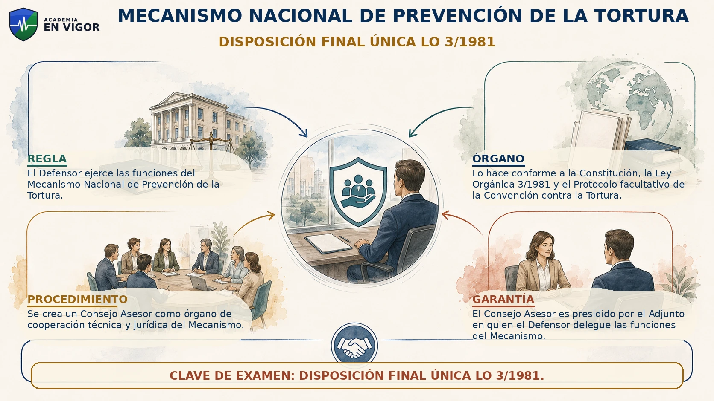

<em>Infografía: Mecanismo Nacional de Prevención de la Tortura.</em>

<!-- FUENTE: BOE-LO3-1981-GC-T04 -->

## 76. Protección civil y naturaleza de los derechos

### Regla y encaje

No confundas el carácter imprescriptible del derecho con la caducidad de la acción concreta de protección.

Este bloque pertenece a **ley orgánica 1/1982: honor, intimidad y propia imagen** y se contrasta en **art. 1 LO 1/1982**.

### Claves normativas

- La Ley protege civilmente el honor, la intimidad personal y familiar y la propia imagen frente a toda intromisión ilegítima.
- El carácter delictivo de la intromisión no impide acudir a la tutela judicial civil del artículo 9. <!-- FACT:GC-T04-F788 -->
- Los criterios de la Ley se aplican para determinar la responsabilidad civil derivada de delito. <!-- FACT:GC-T04-F789 -->
- Estos derechos son irrenunciables, inalienables e imprescriptibles. <!-- FACT:GC-T04-F790 -->
- La renuncia a la protección es nula, sin perjuicio de autorizaciones o consentimientos legalmente admitidos. <!-- FACT:GC-T04-F791 -->
 <!-- FACT:GC-T04-F792 -->

:::hablemos-claro
Honor, intimidad e imagen son derechos distintos. Distingue intromisión, excepción, consentimiento, legitimación y remedio judicial.
:::

:::en-la-calle
Una captación puede ser lícita por contexto público y, sin embargo, su uso comercial posterior ser ilegítimo. Analiza cada conducta y finalidad por separado.
:::

:::lo-que-cae
Prioridad de examen: **art. 1 LO 1/1982**. Vigila sujetos, plazos, mayorías, excepciones y verbos de competencia.
:::

:::ha-caido
Apariciones oficiales verificadas: 2024 · pregunta 24, 2025 · pregunta 26.
:::

<!-- VISUAL:t04-76-proteccion-civil-y-naturaleza-de-los-derechos.webp -->

  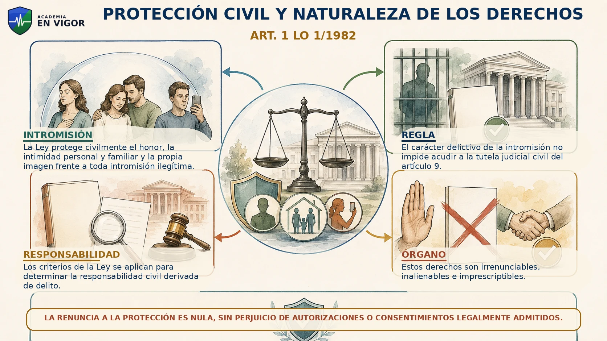

<em>Infografía: Protección civil y naturaleza de los derechos.</em>

<!-- FUENTE: BOE-LO1-1982-GC-T04 -->

## 77. Delimitación y consentimiento

### Regla y encaje

Consentir una utilización concreta no supone renunciar para siempre al derecho.

Este bloque pertenece a **ley orgánica 1/1982: honor, intimidad y propia imagen** y se contrasta en **art. 2 LO 1/1982**.

### Claves normativas

- La protección queda delimitada por las leyes, los usos sociales y el ámbito que cada persona mantenga reservado por sus propios actos.
- No hay intromisión ilegítima cuando esté expresamente autorizada por ley. <!-- FACT:GC-T04-F793 -->
- Tampoco la hay cuando el titular otorgue consentimiento expreso. <!-- FACT:GC-T04-F794 -->
- El inciso que exigía autorización parlamentaria previa para seguir un proceso civil contra Diputado o Senador fue declarado inconstitucional y nulo. <!-- FACT:GC-T04-F795 -->
- El consentimiento es revocable en cualquier momento. <!-- FACT:GC-T04-F796 -->
- La revocación puede obligar a indemnizar daños, perjuicios y expectativas justificadas. <!-- FACT:GC-T04-F797 -->
 <!-- FACT:GC-T04-F798 -->

:::hablemos-claro
Honor, intimidad e imagen son derechos distintos. Distingue intromisión, excepción, consentimiento, legitimación y remedio judicial.
:::

:::en-la-calle
Una captación puede ser lícita por contexto público y, sin embargo, su uso comercial posterior ser ilegítimo. Analiza cada conducta y finalidad por separado.
:::

:::lo-que-cae
Prioridad de examen: **art. 2 LO 1/1982**. Vigila sujetos, plazos, mayorías, excepciones y verbos de competencia.
:::

:::ha-caido
Apariciones oficiales verificadas: 2023 · pregunta 24.
:::

<!-- VISUAL:t04-77-delimitacion-y-consentimiento.webp -->

  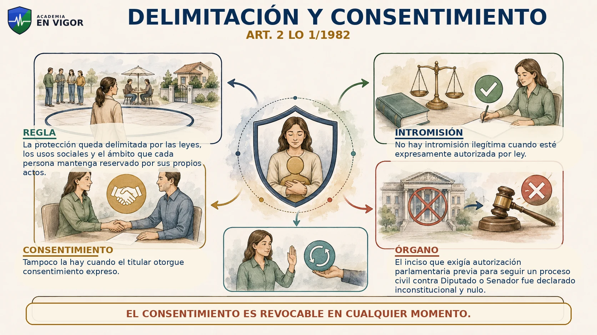

<em>Infografía: Delimitación y consentimiento.</em>

<!-- FUENTE: BOE-LO1-1982-GC-T04 -->

## 78. Consentimiento de menores e incapaces

### Regla y encaje

La madurez desplaza la representación; si no basta, entran representante, Fiscal y eventualmente juez.

Este bloque pertenece a **ley orgánica 1/1982: honor, intimidad y propia imagen** y se contrasta en **art. 3 LO 1/1982**.

### Claves normativas

- Los menores e incapaces prestan por sí mismos el consentimiento si sus condiciones de madurez lo permiten conforme a la legislación civil.
- En los restantes casos, el representante legal otorga el consentimiento por escrito y lo comunica previamente al Ministerio Fiscal. <!-- FACT:GC-T04-F799 -->
- Si el Ministerio Fiscal se opone dentro de ocho días, resuelve el Juez. <!-- FACT:GC-T04-F800 -->
 <!-- FACT:GC-T04-F801 -->

:::hablemos-claro
Honor, intimidad e imagen son derechos distintos. Distingue intromisión, excepción, consentimiento, legitimación y remedio judicial.
:::

:::en-la-calle
Una captación puede ser lícita por contexto público y, sin embargo, su uso comercial posterior ser ilegítimo. Analiza cada conducta y finalidad por separado.
:::

:::lo-que-cae
Prioridad de examen: **art. 3 LO 1/1982**. Vigila sujetos, plazos, mayorías, excepciones y verbos de competencia.
:::

<!-- VISUAL:t04-78-consentimiento-de-menores-e-incapaces.webp -->

  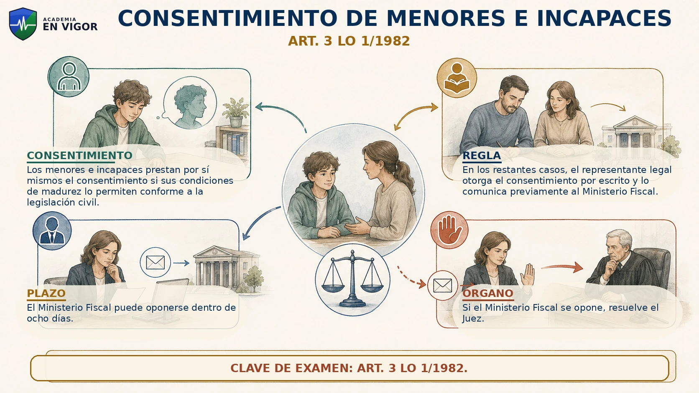

<em>Infografía: Consentimiento de menores e incapaces.</em>

<!-- FUENTE: BOE-LO1-1982-GC-T04 -->

## 79. Protección después del fallecimiento

### Regla y encaje

La legitimación post mortem sigue un orden: designación, familia y Ministerio Fiscal.

Este bloque pertenece a **ley orgánica 1/1982: honor, intimidad y propia imagen** y se contrasta en **arts. 4 a 6 LO 1/1982**.

### Claves normativas

- Las acciones por una persona fallecida corresponden primero a quien haya designado en testamento, incluso una persona jurídica.
- Sin designado vivo, están legitimados cónyuge, descendientes, ascendientes y hermanos que vivieran al fallecer. <!-- FACT:GC-T04-F802 -->
- A falta de todos ellos actúa el Ministerio Fiscal, de oficio o a instancia de interesado, mientras no hayan transcurrido ochenta años desde el fallecimiento. <!-- FACT:GC-T04-F803 -->
- El plazo de ochenta años también rige para la persona jurídica designada en testamento. <!-- FACT:GC-T04-F804 -->
- En intromisiones relacionadas con la utilización del delito por el condenado están legitimados el ofendido o perjudicado y, en todo caso, el Ministerio Fiscal. <!-- FACT:GC-T04-F805 -->
- Si sobreviven varios parientes, cualquiera puede ejercer las acciones. <!-- FACT:GC-T04-F806 -->
- Si hay varios designados testamentarios rige la misma regla salvo disposición contraria del fallecido. <!-- FACT:GC-T04-F807 -->
- Los legitimados pueden iniciar la acción que el titular fallecido no pudo ejercer y continuar la ya entablada. <!-- FACT:GC-T04-F808 -->
 <!-- FACT:GC-T04-F809 -->

:::hablemos-claro
Honor, intimidad e imagen son derechos distintos. Distingue intromisión, excepción, consentimiento, legitimación y remedio judicial.
:::

:::en-la-calle
Una captación puede ser lícita por contexto público y, sin embargo, su uso comercial posterior ser ilegítimo. Analiza cada conducta y finalidad por separado.
:::

:::lo-que-cae
Prioridad de examen: **arts. 4 a 6 LO 1/1982**. Vigila sujetos, plazos, mayorías, excepciones y verbos de competencia.
:::

<!-- VISUAL:t04-79-proteccion-despues-del-fallecimiento.webp -->

  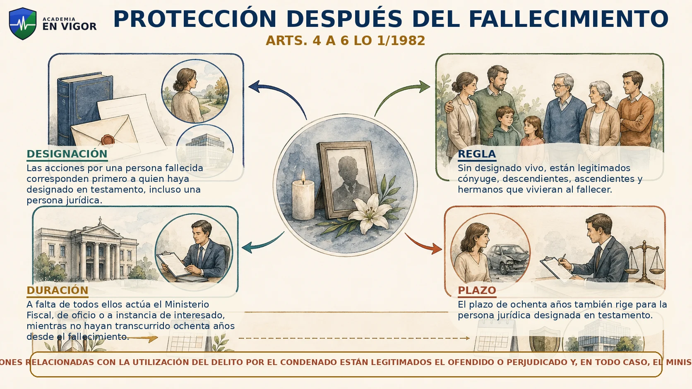

<em>Infografía: Protección después del fallecimiento.</em>

<!-- FUENTE: BOE-LO1-1982-GC-T04 -->

## 80. Intromisiones: captación y revelación de la vida íntima

### Regla y encaje

El artículo distingue colocar medios, utilizarlos, divulgar lo conocido y quebrar el secreto profesional u oficial.

Este bloque pertenece a **ley orgánica 1/1982: honor, intimidad y propia imagen** y se contrasta en **art. 7.1 a 7.4 LO 1/1982**.

### Claves normativas

- Es intromisión ilegítima emplazar aparatos de escucha, filmación u otros medios aptos para grabar o reproducir la vida íntima.
- Es intromisión usar esos medios para conocer vida íntima, manifestaciones o cartas privadas no destinadas al usuario, o grabarlas o reproducirlas. <!-- FACT:GC-T04-F810 -->
- Es intromisión divulgar hechos de la vida privada que afecten a reputación y buen nombre o publicar escritos personales íntimos. <!-- FACT:GC-T04-F811 -->
- Es intromisión revelar datos privados conocidos por actividad profesional u oficial. <!-- FACT:GC-T04-F812 -->
 <!-- FACT:GC-T04-F813 -->

:::hablemos-claro
Honor, intimidad e imagen son derechos distintos. Distingue intromisión, excepción, consentimiento, legitimación y remedio judicial.
:::

:::en-la-calle
Una captación puede ser lícita por contexto público y, sin embargo, su uso comercial posterior ser ilegítimo. Analiza cada conducta y finalidad por separado.
:::

:::lo-que-cae
Prioridad de examen: **art. 7.1 a 7.4 LO 1/1982**. Vigila sujetos, plazos, mayorías, excepciones y verbos de competencia.
:::

:::ha-caido
Apariciones oficiales verificadas: 2024 · pregunta 25.
:::

<!-- VISUAL:t04-80-intromisiones-captacion-y-revelacion-de-la-vida-intima.webp -->

  

<em>Infografía: Intromisiones: captación y revelación de la vida íntima.</em>

<!-- FUENTE: BOE-LO1-1982-GC-T04 -->

## 81. Intromisiones: imagen, explotación e imputaciones

### Regla y encaje

Imagen, voz, nombre y honor protegen dimensiones distintas; el examen suele intercambiarlas.

Este bloque pertenece a **ley orgánica 1/1982: honor, intimidad y propia imagen** y se contrasta en **art. 7.5 a 7.8 LO 1/1982**.

### Claves normativas

- Es intromisión captar, reproducir o publicar la imagen de una persona en momentos de su vida privada o fuera de ellos, salvo las excepciones legales.
- Es intromisión utilizar nombre, voz o imagen para fines publicitarios, comerciales o análogos. <!-- FACT:GC-T04-F814 -->
- Es intromisión imputar hechos o formular juicios de valor que lesionen la dignidad, menoscaben la fama o atenten contra la propia estimación. <!-- FACT:GC-T04-F815 -->
- Es intromisión que un condenado utilice el delito para notoriedad o provecho económico, o divulgue datos falsos, menoscabando la dignidad de las víctimas. <!-- FACT:GC-T04-F816 -->
 <!-- FACT:GC-T04-F817 -->

:::hablemos-claro
Honor, intimidad e imagen son derechos distintos. Distingue intromisión, excepción, consentimiento, legitimación y remedio judicial.
:::

:::en-la-calle
Una captación puede ser lícita por contexto público y, sin embargo, su uso comercial posterior ser ilegítimo. Analiza cada conducta y finalidad por separado.
:::

:::lo-que-cae
Prioridad de examen: **art. 7.5 a 7.8 LO 1/1982**. Vigila sujetos, plazos, mayorías, excepciones y verbos de competencia.
:::

<!-- VISUAL:t04-81-intromisiones-imagen-explotacion-e-imputaciones.webp -->

  

<em>Infografía: Intromisiones: imagen, explotación e imputaciones.</em>

<!-- FUENTE: BOE-LO1-1982-GC-T04 -->

## 82. Actuaciones y usos de imagen no ilegítimos

### Regla y encaje

La excepción depende de contexto público, accesoriedad o interés relevante; no existe una licencia general para usar cualquier imagen.

Este bloque pertenece a **ley orgánica 1/1982: honor, intimidad y propia imagen** y se contrasta en **art. 8 LO 1/1982**.

### Claves normativas

- No se reputan ilegítimas, con carácter general, las actuaciones autorizadas o acordadas por autoridad competente conforme a la ley.
- Tampoco cuando predomine un interés histórico, científico o cultural relevante. <!-- FACT:GC-T04-F818 -->
- Puede captarse, reproducirse o publicarse la imagen de cargos públicos o personas de notoriedad durante actos públicos o en lugares abiertos al público. <!-- FACT:GC-T04-F819 -->
- Puede utilizarse la caricatura de esas personas de acuerdo con el uso social. <!-- FACT:GC-T04-F820 -->
- Puede publicarse información gráfica de un suceso público cuando la imagen de una persona sea meramente accesoria. <!-- FACT:GC-T04-F821 -->
- Las excepciones de cargo público y caricatura no se aplican a autoridades o personas cuyas funciones requieran anonimato. <!-- FACT:GC-T04-F822 -->
 <!-- FACT:GC-T04-F823 -->

:::hablemos-claro
Honor, intimidad e imagen son derechos distintos. Distingue intromisión, excepción, consentimiento, legitimación y remedio judicial.
:::

:::en-la-calle
Una captación puede ser lícita por contexto público y, sin embargo, su uso comercial posterior ser ilegítimo. Analiza cada conducta y finalidad por separado.
:::

:::lo-que-cae
Prioridad de examen: **art. 8 LO 1/1982**. Vigila sujetos, plazos, mayorías, excepciones y verbos de competencia.
:::

<!-- VISUAL:t04-82-actuaciones-y-usos-de-imagen-no-ilegitimos.webp -->

  

<em>Infografía: Actuaciones y usos de imagen no ilegítimos.</em>

<!-- FUENTE: BOE-LO1-1982-GC-T04 -->

## 83. Tutela judicial y medidas de restablecimiento

### Regla y encaje

La tutela no es solo indemnización: también cesa, repone, previene y priva al infractor del lucro.

Este bloque pertenece a **ley orgánica 1/1982: honor, intimidad y propia imagen** y se contrasta en **art. 9.1 y 9.2 LO 1/1982**.

### Claves normativas

- La tutela puede recabarse por vías procesales ordinarias o por el procedimiento del artículo 53.2 CE.
- También puede acudirse al recurso de amparo cuando proceda. <!-- FACT:GC-T04-F824 -->
- La tutela comprende todas las medidas necesarias para poner fin a la intromisión ilegítima. <!-- FACT:GC-T04-F825 -->
- Incluye declarar la intromisión, ordenar el cese inmediato y reponer el estado anterior. <!-- FACT:GC-T04-F826 -->
- En lesión del honor puede publicarse total o parcialmente la sentencia condenatoria a costa del condenado y con al menos igual difusión. <!-- FACT:GC-T04-F827 -->
- Incluye prevenir intromisiones inminentes o ulteriores. <!-- FACT:GC-T04-F828 -->
- Incluye indemnizar daños y perjuicios y atribuir al perjudicado el lucro obtenido con la intromisión. <!-- FACT:GC-T04-F829 -->
- Estas medidas se entienden sin perjuicio de la tutela cautelar necesaria para asegurar su efectividad. <!-- FACT:GC-T04-F830 -->
 <!-- FACT:GC-T04-F831 -->

:::hablemos-claro
Honor, intimidad e imagen son derechos distintos. Distingue intromisión, excepción, consentimiento, legitimación y remedio judicial.
:::

:::en-la-calle
Una captación puede ser lícita por contexto público y, sin embargo, su uso comercial posterior ser ilegítimo. Analiza cada conducta y finalidad por separado.
:::

:::lo-que-cae
Prioridad de examen: **art. 9.1 y 9.2 LO 1/1982**. Vigila sujetos, plazos, mayorías, excepciones y verbos de competencia.
:::

:::ha-caido
Apariciones oficiales verificadas: 2023 · pregunta 25, 2023 · pregunta 25, 2024 · pregunta 25, 2026 · pregunta 23.
:::

<!-- VISUAL:t04-83-tutela-judicial-y-medidas-de-restablecimiento.webp -->

  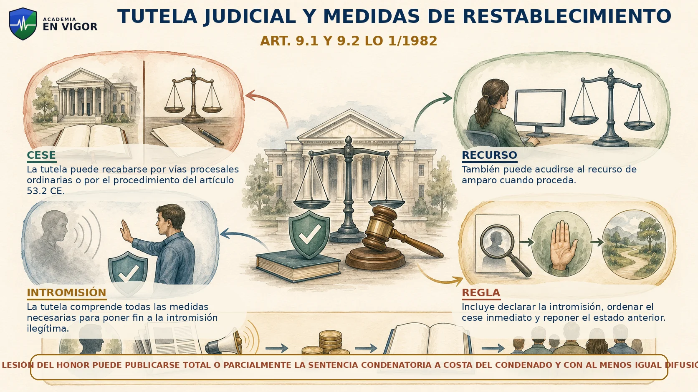

<em>Infografía: Tutela judicial y medidas de restablecimiento.</em>

<!-- FUENTE: BOE-LO1-1982-GC-T04 -->

## 84. Perjuicio, indemnización, caducidad y disposiciones

### Regla y encaje

Derecho imprescriptible y acción con caducidad de cuatro años no son afirmaciones incompatibles.

Este bloque pertenece a **ley orgánica 1/1982: honor, intimidad y propia imagen** y se contrasta en **art. 9.3 a 9.5 y disposiciones LO 1/1982**.

### Claves normativas

- La existencia de perjuicio se presume cuando se acredita la intromisión ilegítima.
- La indemnización se extiende al daño moral. <!-- FACT:GC-T04-F832 -->
- El daño moral se valora según circunstancias y gravedad efectiva, incluida difusión o audiencia del medio. <!-- FACT:GC-T04-F833 -->
- Las acciones de protección caducan a los cuatro años desde que el legitimado pudo ejercitarlas. <!-- FACT:GC-T04-F834 -->
- La disposición derogatoria elimina normas de igual o inferior rango que se opongan a la Ley. <!-- FACT:GC-T04-F835 -->
- La disposición transitoria primera está derogada. <!-- FACT:GC-T04-F836 -->
 <!-- FACT:GC-T04-F837 -->

:::hablemos-claro
Honor, intimidad e imagen son derechos distintos. Distingue intromisión, excepción, consentimiento, legitimación y remedio judicial.
:::

:::en-la-calle
Una captación puede ser lícita por contexto público y, sin embargo, su uso comercial posterior ser ilegítimo. Analiza cada conducta y finalidad por separado.
:::

:::lo-que-cae
Prioridad de examen: **art. 9.3 a 9.5 y disposiciones LO 1/1982**. Vigila sujetos, plazos, mayorías, excepciones y verbos de competencia.
:::

:::ha-caido
Apariciones oficiales verificadas: 2023 · pregunta 26.
:::

<!-- VISUAL:t04-84-perjuicio-indemnizacion-caducidad-y-disposiciones.webp -->

  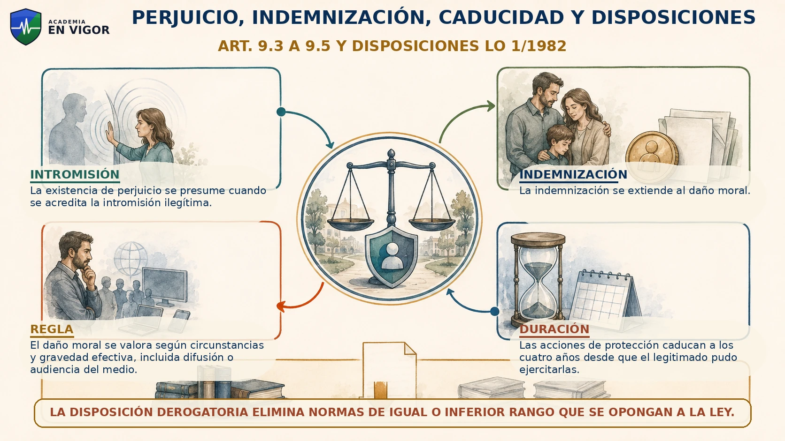

<em>Infografía: Perjuicio, indemnización, caducidad y disposiciones.</em>

<!-- FUENTE: BOE-LO1-1982-GC-T04 -->

# Hablemos claro

:::hablemos-claro
No estudies 169 artículos como una lista plana. Agrúpalos por función: principios y derechos; órganos y relaciones; territorio y control; reforma; supervisión del Defensor; y protección civil de la personalidad.
:::

# En la calle

:::en-la-calle
La secuencia útil es derecho o institución → titular u órgano → competencia → límite → garantía → control. En honor e intimidad añade consentimiento, excepción y remedio.
:::

# Lo que cae

:::lo-que-cae
Máximo rendimiento: artículos 1, 9, 14 a 29, 53 a 55, 56 a 65, 66 a 92, 97 a 116, 117 a 127, 133 a 136, 148 a 155 y 159 a 169; elección, quejas, colaboración y resoluciones del Defensor; artículos 1, 2, 7, 8 y 9 de la Ley Orgánica 1/1982.
:::

# Ha caído

:::ha-caido
Se han vinculado 125 preguntas oficiales verificadas de 2020 a 2026.
:::

---

*Academia En Vigor · El temario que nunca duerme · Tema 4 · v1.0.0 · Documento interno no publicado.*
