# TEMA 7 · DERECHO CIVIL

**Guardia Civil · Método VIGOR · ATESTADO**
**Versión de contenido:** 1.0.0
**Estado editorial:** approved_internal · **Publicación:** not_published

# Mapa del tema

| Parte | Contenido | Bloques |
|---|---|---:|
| 1 | Sistema de fuentes y aplicación de las normas | 1–6 |
| 2 | Nacionalidad, personalidad y domicilio | 7–14 |
| 3 | Matrimonio y crisis matrimonial | 15–25 |
| 4 | Filiación, alimentos y relaciones paterno-filiales | 26–35 |
| 5 | Protección de menores y ausencia | 36–45 |
| 6 | Emancipación y apoyos a personas con discapacidad | 46–56 |

<!-- VISUAL:t07-00-mapa-derecho-civil.webp -->

  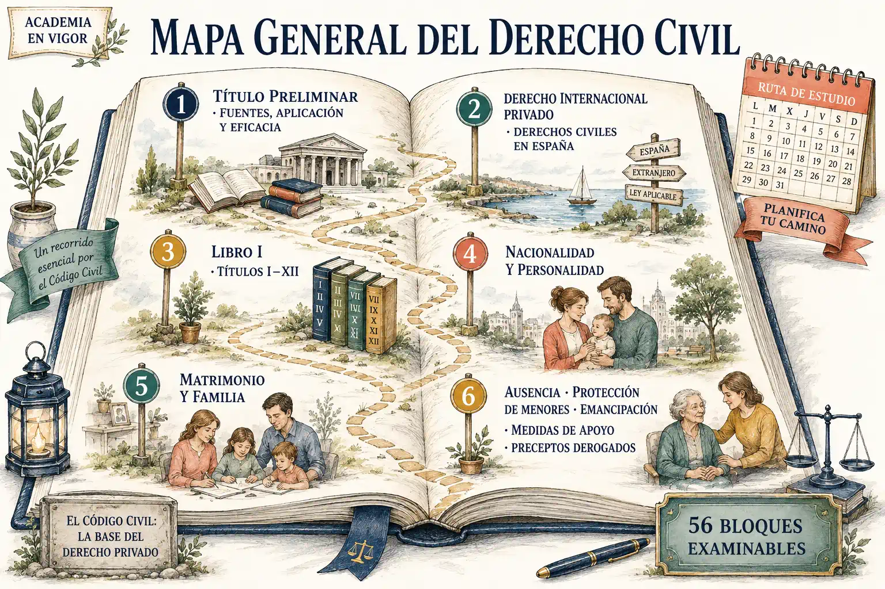

<em>Infografía: recorrido por Título preliminar y Libro I.</em>

# Contenido

## 01. Mapa del Código Civil exigido

### Regla y encaje

Mapa del Código Civil exigido se estudia dentro de sistema de fuentes y aplicación de las normas. El bloque se contrasta directamente con epígrafe oficial.

### Claves examinables

- **epígrafe oficial:** El Tema 7 comprende el Título preliminar completo y el Libro I completo, desde el Título I hasta el XII. - **epígrafe oficial:** El Título preliminar regula las fuentes, la aplicación y la eficacia de las normas, el Derecho internacional privado y la coexistencia de derechos civiles en España. <!-- FACT:GC-T07-F001 --> - **epígrafe oficial:** El Libro I ordena la nacionalidad y personalidad, el matrimonio y la familia, la ausencia, la protección de menores, la emancipación y las medidas de apoyo. <!-- FACT:GC-T07-F002 -->  <!-- FACT:GC-T07-F003 -->

:::hablemos-claro
No basta con reconocer una frase verdadera: hay que comprobar que pertenece al artículo preguntado y que no se ha sustituido una facultad por una obligación, un plazo por otro o una excepción por la regla general.
:::

:::en-la-calle
En un supuesto práctico, fija quién actúa, qué capacidad o vínculo tiene, qué autoridad interviene y qué consecuencia civil produce la actuación.
:::

:::lo-que-cae
Prioriza requisitos, plazos, legitimación, autoridad competente y excepciones. Apariciones oficiales mapeadas en este bloque: **0**.
:::

<!-- VISUAL:t07-01-mapa-del-codigo-civil-exigido.webp -->

  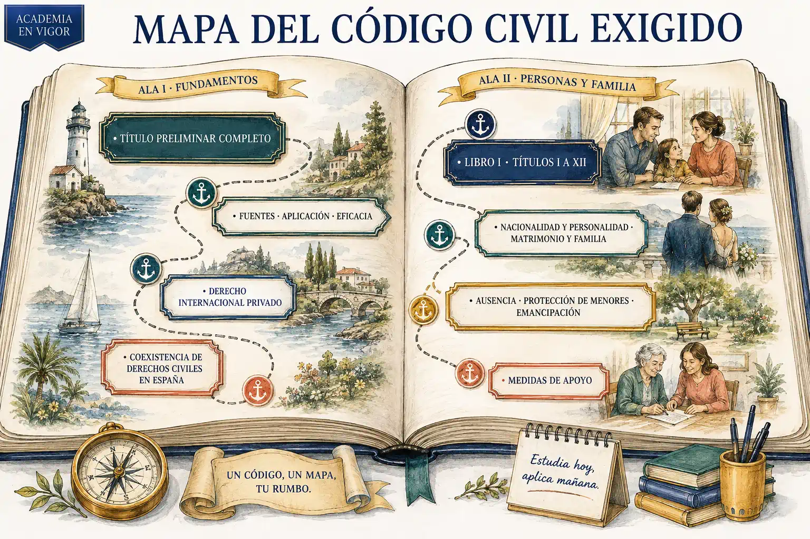

<em>Infografía: esquema de mapa del código civil exigido con relaciones y trampas de examen.</em>

<!-- FUENTE: GC-PROGRAMA-2026-T07 -->

## 02. Fuentes del Derecho y jerarquía normativa

### Regla y encaje

Fuentes del Derecho y jerarquía normativa se estudia dentro de sistema de fuentes y aplicación de las normas. El bloque se contrasta directamente con arts. 1 a 2 CC.

### Claves examinables

- **Artículo 1:** 1. Las fuentes del ordenamiento jurídico español son la ley, la costumbre y los principios generales del derecho. - **Artículo 1:** 2. Carecerán de validez las disposiciones que contradigan otra de rango superior. <!-- FACT:GC-T07-F004 --> - **Artículo 1:** 3. La costumbre sólo regirá en defecto de ley aplicable, siempre que no sea contraria a la moral o al orden público, y que resulte probada. <!-- FACT:GC-T07-F005 --> - **Artículo 1:** Los usos jurídicos que no sean meramente interpretativos de una declaración de voluntad, tendrán la consideración de costumbre. <!-- FACT:GC-T07-F006 --> - **Artículo 1:** 4. Los principios generales del derecho se aplicarán en defecto de ley o costumbre, sin perjuicio de su carácter informador del ordenamiento jurídico. <!-- FACT:GC-T07-F007 --> - **Artículo 1:** 5. Las normas jurídicas contenidas en los tratados internacionales no serán de aplicación directa en España en tanto no hayan pasado a formar parte del ordenamiento interno mediante su publicación íntegra en el «Boletín Oficial del Estado». <!-- FACT:GC-T07-F008 --> - **Artículo 1:** 6. La jurisprudencia complementará el ordenamiento jurídico con la doctrina que, de modo reiterado, establezca el Tribunal Supremo al interpretar y aplicar la ley, la costumbre y los principios generales del derecho. <!-- FACT:GC-T07-F009 --> - **Artículo 1:** 7. Los Jueces y Tribunales tienen el deber inexcusable de resolver en todo caso los asuntos de que conozcan, ateniéndose al sistema de fuentes establecido. <!-- FACT:GC-T07-F010 --> - **Artículo 2:** 1. Las leyes entrarán en vigor a los veinte días de su completa publicación en el «Boletín Oficial del Estado», si en ellas no se dispone otra cosa. <!-- FACT:GC-T07-F011 --> - **Artículo 2:** 2. Las leyes sólo se derogan por otras posteriores. La derogación tendrá el alcance que expresamente se disponga y se extenderá siempre a todo aquello que en la ley nueva, sobre la misma materia sea incompatible con la anterior. Por la simple derogación de una ley no recobran vigencia las que ésta hubiere derogado. <!-- FACT:GC-T07-F012 --> - **Artículo 2:** 3. Las leyes no tendrán efecto retroactivo, si no dispusieren lo contrario. <!-- FACT:GC-T07-F013 -->  <!-- FACT:GC-T07-F014 -->

:::hablemos-claro
No basta con reconocer una frase verdadera: hay que comprobar que pertenece al artículo preguntado y que no se ha sustituido una facultad por una obligación, un plazo por otro o una excepción por la regla general.
:::

:::en-la-calle
En un supuesto práctico, fija quién actúa, qué capacidad o vínculo tiene, qué autoridad interviene y qué consecuencia civil produce la actuación.
:::

:::lo-que-cae
Prioriza requisitos, plazos, legitimación, autoridad competente y excepciones. Apariciones oficiales mapeadas en este bloque: **1**.
:::

<!-- VISUAL:t07-02-fuentes-del-derecho-y-jerarquia-normativa.webp -->

  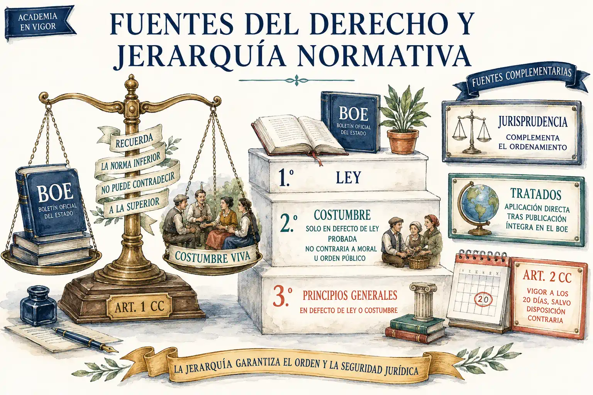

<em>Infografía: esquema de fuentes del derecho y jerarquía normativa con relaciones y trampas de examen.</em>

<!-- FUENTE: CC-BOE-A-1889-4763-T07 -->

## 03. Interpretación, analogía y cómputo civil

### Regla y encaje

Interpretación, analogía y cómputo civil se estudia dentro de sistema de fuentes y aplicación de las normas. El bloque se contrasta directamente con arts. 3 a 5 CC.

### Claves examinables

- **Artículo 3:** 1. Las normas se interpretarán según el sentido propio de sus palabras, en relación con el contexto, los antecedentes históricos y legislativos, y la realidad social del tiempo en que han de ser aplicadas, atendiendo fundamentalmente al espíritu y finalidad de aquellas. - **Artículo 3:** 2. La equidad habrá de ponderarse en la aplicación de las normas, si bien las resoluciones de los Tribunales sólo podrán descansar de manera exclusiva en ella cuando la ley expresamente lo permita. <!-- FACT:GC-T07-F015 --> - **Artículo 4:** 1. Procederá la aplicación analógica de las normas cuando éstas no contemplen un supuesto específico, pero regulen otro semejante entre los que se aprecie identidad de razón. <!-- FACT:GC-T07-F016 --> - **Artículo 4:** 2. Las leyes penales, las excepcionales y las de ámbito temporal no se aplicarán a supuestos ni en momentos distintos de los comprendidos expresamente en ellas. <!-- FACT:GC-T07-F017 --> - **Artículo 4:** 3. Las disposiciones de este Código se aplicarán como supletorias en las materias regidas por otras leyes. <!-- FACT:GC-T07-F018 --> - **Artículo 5:** 1. Siempre que no se establezca otra cosa, en los plazos señalados por días, a contar de uno determinado, quedará éste excluido del cómputo, el cual deberá empezar en el día siguiente; y si los plazos estuviesen fijados por meses o años, se computarán de fecha a fecha. Cuando en el mes del vencimiento no hubiera día equivalente al inicial del cómputo, se entenderá que el plazo expira el último del mes. <!-- FACT:GC-T07-F019 --> - **Artículo 5:** 2. En el cómputo civil de los plazos no se excluyen los días inhábiles. <!-- FACT:GC-T07-F020 -->  <!-- FACT:GC-T07-F021 -->

:::hablemos-claro
No basta con reconocer una frase verdadera: hay que comprobar que pertenece al artículo preguntado y que no se ha sustituido una facultad por una obligación, un plazo por otro o una excepción por la regla general.
:::

:::en-la-calle
En un supuesto práctico, fija quién actúa, qué capacidad o vínculo tiene, qué autoridad interviene y qué consecuencia civil produce la actuación.
:::

:::lo-que-cae
Prioriza requisitos, plazos, legitimación, autoridad competente y excepciones. Apariciones oficiales mapeadas en este bloque: **2**.
:::

<!-- VISUAL:t07-03-interpretacion-analogia-y-computo-civil.webp -->

  

<em>Infografía: esquema de interpretación, analogía y cómputo civil con relaciones y trampas de examen.</em>

<!-- FUENTE: CC-BOE-A-1889-4763-T07 -->

## 04. Eficacia de las normas, buena fe, abuso y fraude

### Regla y encaje

Eficacia de las normas, buena fe, abuso y fraude se estudia dentro de sistema de fuentes y aplicación de las normas. El bloque se contrasta directamente con arts. 6 a 7 CC.

### Claves examinables

- **Artículo 6:** 1. La ignorancia de las leyes no excusa de su cumplimiento. El error de derecho producirá únicamente aquellos efectos que las leyes determinen. - **Artículo 6:** 2. La exclusión voluntaria de la ley aplicable y la renuncia a los derechos en ella reconocidos sólo serán válidas cuando no contraríen el interés o el orden público ni perjudiquen a terceros. <!-- FACT:GC-T07-F022 --> - **Artículo 6:** 3. Los actos contrarios a las normas imperativas y a las prohibitivas son nulos de pleno derecho, salvo que en ellas se establezca un efecto distinto para el caso de contravención. <!-- FACT:GC-T07-F023 --> - **Artículo 6:** 4. Los actos realizados al amparo del texto de una norma que persigan un resultado prohibido por el ordenamiento jurídico, o contrario a él, se considerarán ejecutados en fraude de ley y no impedirán la debida aplicación de la norma que se hubiere tratado de eludir. <!-- FACT:GC-T07-F024 --> - **Artículo 7:** 1. Los derechos deberán ejercitarse conforme a las exigencias de la buena fe. <!-- FACT:GC-T07-F025 --> - **Artículo 7:** 2. La Ley no ampara el abuso del derecho o el ejercicio antisocial del mismo. Todo acto u omisión que por la intención de su autor, por su objeto o por las circunstancias en que se realice sobrepase manifiestamente los límites normales del ejercicio de un derecho, con daño para tercero, dará lugar a la correspondiente indemnización y a la adopción de las medidas judiciales o administrativas que impidan la persistencia en el abuso. <!-- FACT:GC-T07-F026 -->  <!-- FACT:GC-T07-F027 -->

:::hablemos-claro
No basta con reconocer una frase verdadera: hay que comprobar que pertenece al artículo preguntado y que no se ha sustituido una facultad por una obligación, un plazo por otro o una excepción por la regla general.
:::

:::en-la-calle
En un supuesto práctico, fija quién actúa, qué capacidad o vínculo tiene, qué autoridad interviene y qué consecuencia civil produce la actuación.
:::

:::lo-que-cae
Prioriza requisitos, plazos, legitimación, autoridad competente y excepciones. Apariciones oficiales mapeadas en este bloque: **2**.
:::

<!-- VISUAL:t07-04-eficacia-de-las-normas-buena-fe-abuso-y-fraude.webp -->

  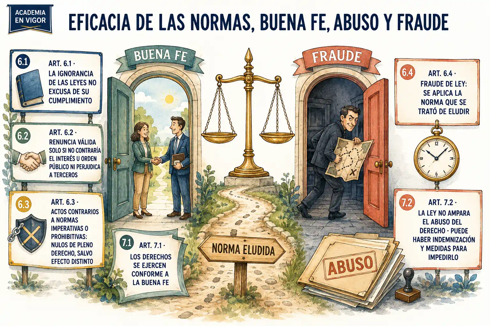

<em>Infografía: esquema de eficacia de las normas, buena fe, abuso y fraude con relaciones y trampas de examen.</em>

<!-- FUENTE: CC-BOE-A-1889-4763-T07 -->

## 05. Normas de Derecho internacional privado

### Regla y encaje

Normas de Derecho internacional privado se estudia dentro de sistema de fuentes y aplicación de las normas. El bloque se contrasta directamente con arts. 8 a 12 CC.

### Claves examinables

- **Artículo 8:** 1. Las leyes penales, las de policía y las de seguridad pública obligan a todos los que se hallen en territorio español. - **Artículo 9:** 1. La ley personal correspondiente a las personas físicas es la determinada por su nacionalidad. Dicha ley regirá la capacidad y el estado civil, los derechos y deberes de familia y la sucesión por causa de muerte. <!-- FACT:GC-T07-F028 --> - **Artículo 9:** El cambio de ley personal no afectará a la mayoría de edad adquirida de conformidad con la ley personal anterior. <!-- FACT:GC-T07-F029 --> - **Artículo 9:** 2. <!-- FACT:GC-T07-F030 --> - **Artículo 9:** Los efectos del matrimonio se regirán por la ley personal común de los cónyuges al tiempo de contraerlo; en defecto de esta ley, por la ley personal o de la residencia habitual de cualquiera de ellos, elegida por ambos en documento auténtico otorgado antes de la celebración del matrimonio; a falta de esta elección, por la ley de la residencia habitual común inmediatamente posterior a la celebración, y, a falta de dicha residencia, por la del lugar de celebración del matrimonio. <!-- FACT:GC-T07-F031 --> - **Artículo 9:** La nulidad, la separación y el divorcio se regirán por la ley que determina el artículo 107. <!-- FACT:GC-T07-F032 --> - **Artículo 9:** 3. Los pactos o capitulaciones por los que se estipule, modifique o sustituya el régimen económico del matrimonio serán válidos cuando sean conformes bien a la ley que rija los efectos del matrimonio, bien a la ley de la nacionalidad o de la residencia habitual de cualquiera de las partes al tiempo del otorgamiento. <!-- FACT:GC-T07-F033 --> - **Artículo 9:** 4. La determinación y el carácter de la filiación por naturaleza se regirán por la ley de la residencia habitual del hijo en el momento del establecimiento de la filiación. A falta de residencia habitual del hijo, o si esta ley no permitiere el establecimiento de la filiación, se aplicará la ley nacional del hijo en ese momento. <!-- FACT:GC-T07-F034 --> - **Artículo 9:** Si esta ley no permitiere el establecimiento de la filiación o si el hijo careciere de residencia habitual y de nacionalidad, se aplicará la ley sustantiva española. En lo relativo al establecimiento de la filiación por adopción, se estará a lo dispuesto en el apartado 5. <!-- FACT:GC-T07-F035 --> - **Artículo 9:** La ley aplicable al contenido de la filiación, por naturaleza o por adopción, y al ejercicio de la responsabilidad parental, se determinará con arreglo al Convenio de La Haya, de 19 de octubre de 1996, relativo a la competencia, la ley aplicable, el reconocimiento, la ejecución y la cooperación en materia de responsabilidad parental y de medidas de protección de los niños. <!-- FACT:GC-T07-F036 --> - **Artículo 9:** 5. La adopción internacional se regirá por las normas contenidas en la Ley de Adopción Internacional. Igualmente, las adopciones constituidas por autoridades extranjeras surtirán efectos en España con arreglo a las disposiciones de la citada Ley de Adopción Internacional. <!-- FACT:GC-T07-F037 --> - **Artículo 9:** 6. La ley aplicable a la protección de menores se determinará de acuerdo con el Convenio de La Haya, de 19 de octubre de 1996, a que se hace referencia en el apartado 4 de este artículo. <!-- FACT:GC-T07-F038 --> - **Artículo 9:** La ley aplicable a las medidas de apoyo para personas con discapacidad será la de su residencia habitual. En el caso de cambio de residencia a otro Estado, se aplicará la ley de la nueva residencia habitual, sin perjuicio del reconocimiento en España de las medidas de apoyo acordadas en otros Estados. Será de aplicación, sin embargo, la ley española para la adopción de medidas de apoyo provisionales o urgentes. <!-- FACT:GC-T07-F039 --> - **Artículo 9:** 7. La ley aplicable a las obligaciones de alimentos entre parientes se determinará de acuerdo con el Protocolo de La Haya, de 23 de noviembre de 2007, sobre la ley aplicable a las obligaciones alimenticias o texto legal que lo sustituya. <!-- FACT:GC-T07-F040 --> - **Artículo 9:** 8. La sucesión por causa de muerte se regirá por la Ley nacional del causante en el momento de su fallecimiento, cualesquiera que sean la naturaleza de los bienes y el país donde se encuentren. <!-- FACT:GC-T07-F041 --> - **Artículo 9:** Sin embargo, las disposiciones hechas en testamento y los pactos sucesorios ordenados conforme a la Ley nacional del testador o del disponente en el momento de su otorgamiento conservarán su validez, aunque sea otra la ley que rija la sucesión, si bien las legítimas se ajustarán, en su caso, a esta última. <!-- FACT:GC-T07-F042 --> - **Artículo 9:** Los derechos que por ministerio de la ley se atribuyan al cónyuge supérstite se regirán por la misma ley que regule los efectos del matrimonio, a salvo siempre las legítimas de los descendientes. <!-- FACT:GC-T07-F043 --> - **Artículo 9:** 9. A los efectos de este capítulo, respecto de las situaciones de doble nacionalidad previstas en las leyes españolas se estará a lo que determinen los tratados internacionales, y, si nada estableciesen, será preferida la nacionalidad coincidente con la última residencia habitual y, en su defecto, la última adquirida. <!-- FACT:GC-T07-F044 --> - **Artículo 9:** Prevalecerá en todo caso la nacionalidad española del que ostente además otra no prevista en nuestras leyes o en los tratados internacionales. Si ostentare dos o más nacionalidades y ninguna de ellas fuera la española, se estará a lo que establece el apartado siguiente. <!-- FACT:GC-T07-F045 --> - **Artículo 9:** 10. Se considerará como ley personal de los que carecieren de nacionalidad o la tuvieren indeterminada, la ley del lugar de su residencia habitual. <!-- FACT:GC-T07-F046 --> - **Artículo 9:** 11. La ley personal correspondiente a las personas jurídicas es la determinada por su nacionalidad, y regirá en todo lo relativo a capacidad, constitución, representación, funcionamiento, transformación, disolución y extinción. <!-- FACT:GC-T07-F047 --> - **Artículo 9:** En la fusión de sociedades de distinta nacionalidad se tendrán en cuenta las respectivas leyes personales. <!-- FACT:GC-T07-F048 --> - **Artículo 10:** 1. La posesión, la propiedad, y los demás derechos sobre bienes inmuebles, así como su publicidad, se regirán por la ley del lugar donde se hallen. <!-- FACT:GC-T07-F049 --> - **Artículo 10:** La misma ley será aplicable a los bienes muebles. <!-- FACT:GC-T07-F050 --> - **Artículo 10:** A los efectos de la constitución o cesión de derechos sobre bienes en tránsito, éstos se considerarán situados en el lugar de su expedición, salvo que el remitente y el destinatario hayan convenido, expresa o tácitamente, que se consideren situados en el lugar de su destino. <!-- FACT:GC-T07-F051 --> - **Artículo 10:** 2. Los buques, las aeronaves y los medios de transporte por ferrocarril, así como todos los derechos que se constituyan sobre ellos, quedarán sometidos a la ley del lugar de su abanderamiento, matrícula o registro. Los automóviles y otros medios de transporte por carretera quedarán sometidos a la ley del lugar donde se hallen. <!-- FACT:GC-T07-F052 --> - **Artículo 10:** 3. La emisión de los títulos-valores se atendrá a la ley del lugar en que se produzca. <!-- FACT:GC-T07-F053 --> - **Artículo 10:** 4. Los derechos de propiedad intelectual e industrial se protegerán dentro del territorio español de acuerdo con la ley española, sin perjuicio de lo establecido por los convenios y tratados internacionales en los que España sea parte. <!-- FACT:GC-T07-F054 --> - **Artículo 10:** 5. Se aplicará a las obligaciones contractuales la ley a que las partes se hayan sometido expresamente, siempre que tenga alguna conexión con el negocio de que se trate; en su defecto, la ley nacional común a las partes; a falta de ella, la de la residencia habitual común, y, en último término, la ley del lugar de celebración del contrato. <!-- FACT:GC-T07-F055 --> - **Artículo 10:** No obstante lo dispuesto en el párrafo anterior, a falta de sometimiento expreso, se aplicará a los contratos relativos a bienes inmuebles la ley del lugar donde estén sitos, y a las compraventas de muebles corporales realizadas en establecimientos mercantiles, la ley del lugar en que éstos radiquen. <!-- FACT:GC-T07-F056 --> - **Artículo 10:** 6. A las obligaciones derivadas del contrato de trabajo, en defecto de sometimiento expreso de las partes y sin perjuicio de lo dispuesto en el apartado 1 del artículo 8, les será de aplicación la ley del lugar donde se presten los servicios. <!-- FACT:GC-T07-F057 --> - **Artículo 10:** 7. Las donaciones se regirán, en todo caso, por la, ley nacional del donante. <!-- FACT:GC-T07-F058 --> - **Artículo 10:** 8. En los contratos celebrados entre personas que se encuentren en España, las personas físicas que gocen de capacidad de conformidad con la ley española solo podrán invocar su discapacidad resultante de la ley de otro país si, en el momento de la celebración del contrato, la otra parte hubiera conocido tal discapacidad o la hubiera ignorado en virtud de negligencia por su parte. <!-- FACT:GC-T07-F059 --> - **Artículo 10:** 9. Las obligaciones no contractuales se regirán por la ley del lugar donde hubiere ocurrido el hecho de que deriven. <!-- FACT:GC-T07-F060 --> - **Artículo 10:** La gestión de negocios se regulará por la ley del lugar donde el gestor realice la principal actividad. <!-- FACT:GC-T07-F061 --> - **Artículo 10:** En el enriquecimiento sin causa se aplicará la ley en virtud de la cual se produjo la transferencia del valor patrimonial en favor del enriquecido. <!-- FACT:GC-T07-F062 --> - **Artículo 10:** 10. La ley reguladora de una obligación se extiende a los requisitos del cumplimiento y a las consecuencias del incumplimiento, así como a su extinción. Sin embargo, se aplicará la ley del lugar de cumplimiento a las modalidades de la ejecución que requieran intervención judicial o administrativa. <!-- FACT:GC-T07-F063 --> - **Artículo 10:** 11. A la representación legal se aplicará la ley reguladora de la relación jurídica de la que nacen las facultades del representante, y a la voluntaria, de no mediar sometimiento expreso, la ley del país en donde se ejerciten las facultades conferidas. <!-- FACT:GC-T07-F064 --> - **Artículo 11:** 1. Las formas y solemnidades de los contratos, testamentos y demás actos jurídicos se regirán por la ley del país en que se otorguen. No obstante, serán también válidos los celebrados con las formas y solemnidades exigidas por la ley aplicable a su contenido, así como los celebrados conforme a la ley personal del disponente o la común de los otorgantes. <!-- FACT:GC-T07-F065 --> - **Artículo 11:** Igualmente serán válidos los actos y contratos relativos a bienes inmuebles otorgados con arreglo a las formas y solemnidades del lugar en que éstos radiquen. <!-- FACT:GC-T07-F066 --> - **Artículo 11:** Si tales actos fueren otorgados a bordo de buques o aeronaves durante su navegación, se entenderán celebrados en el país de su abanderamiento, matrícula o registro. Los navíos y las aeronaves militares se consideran como parte del territorio del Estado al que pertenezcan. <!-- FACT:GC-T07-F067 --> - **Artículo 11:** 2. Si la ley reguladora del contenido de los actos y contratos exigiere para su validez una determinada forma o solemnidad, será siempre aplicada, incluso en el caso de otorgarse aquéllos en el extranjero. <!-- FACT:GC-T07-F068 --> - **Artículo 11:** 3. Será de aplicación la ley española a los contratos, testamentos y demás actos jurídicos autorizados por funcionarios diplomáticos o consulares de España en el extranjero. <!-- FACT:GC-T07-F069 --> - **Artículo 12:** 1. La calificación para determinar la norma de conflicto aplicable se hará siempre con arreglo a la ley española. <!-- FACT:GC-T07-F070 --> - **Artículo 12:** 2. La remisión al derecho extranjero se entenderá hecha a su ley material, sin tener en cuenta el reenvío que sus normas de conflicto puedan hacer a otra ley que no sea la española. <!-- FACT:GC-T07-F071 --> - **Artículo 12:** 3. En ningún caso tendrá aplicación la ley extranjera cuando resulte contraria al orden público. <!-- FACT:GC-T07-F072 --> - **Artículo 12:** 4. Se considerará como fraude de ley la utilización de una norma de conflicto con el fin de eludir una ley imperativa española. <!-- FACT:GC-T07-F073 --> - **Artículo 12:** 5. Cuando una norma de conflicto remita a la legislación de un Estado en el que coexistan diferentes sistemas legislativos, la determinación del que sea aplicable entre ellos se hará conforme a la legislación de dicho Estado. <!-- FACT:GC-T07-F074 --> - **Artículo 12:** 6. Los Tribunales y autoridades aplicarán de oficio las normas de conflicto del derecho español. <!-- FACT:GC-T07-F075 -->  <!-- FACT:GC-T07-F076 -->

:::hablemos-claro
No basta con reconocer una frase verdadera: hay que comprobar que pertenece al artículo preguntado y que no se ha sustituido una facultad por una obligación, un plazo por otro o una excepción por la regla general.
:::

:::en-la-calle
En un supuesto práctico, fija quién actúa, qué capacidad o vínculo tiene, qué autoridad interviene y qué consecuencia civil produce la actuación.
:::

:::lo-que-cae
Prioriza requisitos, plazos, legitimación, autoridad competente y excepciones. Apariciones oficiales mapeadas en este bloque: **0**.
:::

<!-- VISUAL:t07-05-normas-de-derecho-internacional-privado.webp -->

  

<em>Infografía: esquema de normas de derecho internacional privado con relaciones y trampas de examen.</em>

<!-- FUENTE: CC-BOE-A-1889-4763-T07 -->

## 06. Vecindad civil y Derecho interregional

### Regla y encaje

Vecindad civil y Derecho interregional se estudia dentro de sistema de fuentes y aplicación de las normas. El bloque se contrasta directamente con arts. 13 a 16 CC.

### Claves examinables

- **Artículo 13:** 1. Las disposiciones de este título preliminar, en cuanto determinan los efectos de las leyes y las reglas generales para su aplicación, así como las del título IV del libro I, con excepción de las normas de este último relativas al régimen económico matrimonial, tendrán aplicación general y directa en toda España. - **Artículo 13:** 2. En lo demás, y con pleno respeto a los derechos especiales o forales de las provincias o territorios en que están vigentes, regirá el Código Civil como derecho supletorio, en defecto del que lo sea en cada una de aquéllas según sus normas especiales. <!-- FACT:GC-T07-F077 --> - **Artículo 14:** 1. La sujeción al derecho civil común o al especial o foral se determina por la vecindad civil. <!-- FACT:GC-T07-F078 --> - **Artículo 14:** 2. Tienen vecindad civil en territorio de derecho común, o en uno de los de derecho especial o foral, los nacidos de padres que tengan tal vecindad. <!-- FACT:GC-T07-F079 --> - **Artículo 14:** Por la adopción, el adoptado no emancipado adquiere la vecindad civil de los adoptantes. <!-- FACT:GC-T07-F080 --> - **Artículo 14:** 3. Si al nacer el hijo, o al ser adoptado, los padres tuvieren distinta vecindad civil, el hijo tendrá la que corresponda a aquél de los dos respecto del cual la filiación haya sido determinada antes; en su defecto, tendrá la del lugar del nacimiento y, en último término, la vecindad de derecho común. <!-- FACT:GC-T07-F081 --> - **Artículo 14:** Sin embargo, los padres, o el que de ellos ejerza o le haya sido atribuida la patria potestad, podrán atribuir al hijo la vecindad civil de cualquiera de ellos en tanto no transcurran los seis meses siguientes al nacimiento o a la adopción. <!-- FACT:GC-T07-F082 --> - **Artículo 14:** La privación o suspensión en el ejercicio de la patria potestad, o el cambio de vecindad de los padres, no afectarán a la vecindad civil de los hijos. <!-- FACT:GC-T07-F083 --> - **Artículo 14:** En todo caso el hijo desde que cumpla catorce años y hasta que transcurra un año después de su emancipación podrá optar bien por la vecindad civil del lugar de su nacimiento, bien por la última vecindad de cualquiera de sus padres. Si no estuviera emancipado, habrá de ser asistido en la opción por el representante legal. <!-- FACT:GC-T07-F084 --> - **Artículo 14:** 4. El matrimonio no altera la vecindad civil. No obstante, cualquiera de los cónyuges no separados, ya sea legalmente o de hecho, podrá, en todo momento, optar por la vecindad civil del otro. <!-- FACT:GC-T07-F085 --> - **Artículo 14:** 5. La vecindad civil se adquiere: <!-- FACT:GC-T07-F086 --> - **Artículo 14:** 1.° Por residencia continuada durante dos años, siempre que el interesado manifieste ser esa su voluntad. <!-- FACT:GC-T07-F087 --> - **Artículo 14:** 2.° Por residencia continuada de diez años, sin declaración en contrario durante este plazo. <!-- FACT:GC-T07-F088 --> - **Artículo 14:** Ambas declaraciones se harán constar en el Registro Civil y no necesitan ser reiteradas. <!-- FACT:GC-T07-F089 --> - **Artículo 14:** 6. En caso de duda prevalecerá la vecindad civil que corresponda al lugar de nacimiento. <!-- FACT:GC-T07-F090 --> - **Artículo 15:** 1. El extranjero que adquiera la nacionalidad española deberá optar, al inscribir la adquisición de la nacionalidad, por cualquiera de las vecindades siguientes: <!-- FACT:GC-T07-F091 --> - **Artículo 15:** a) La correspondiente al lugar de residencia. b) La del lugar del nacimiento. <!-- FACT:GC-T07-F092 --> - **Artículo 15:** c) La última vecindad de cualquiera de sus progenitores o adoptantes. d) La del cónyuge. <!-- FACT:GC-T07-F093 --> - **Artículo 15:** Esta declaración de opción se formulará, según los casos, por el propio optante, solo o con los apoyos que la persona con discapacidad, en su caso, precise, o por su representante legal. Cuando la adquisición de la nacionalidad se haga por declaración o a petición del representante legal, la autorización necesaria deberá determinar la vecindad civil por la que se ha de optar. <!-- FACT:GC-T07-F094 --> - **Artículo 15:** 2. El extranjero que adquiera la nacionalidad por carta de naturaleza tendrá la vecindad civil que el Real Decreto de concesión determine, teniendo en cuenta la opción de aquél, de acuerdo con lo que dispone el apartado anterior u otras circunstancias que concurran en el peticionario. <!-- FACT:GC-T07-F095 --> - **Artículo 15:** 3. La recuperación de la nacionalidad española lleva consigo la de aquella vecindad civil que ostentara el interesado al tiempo de su pérdida. <!-- FACT:GC-T07-F096 --> - **Artículo 15:** 4. La dependencia personal respecto a una comarca o localidad con especialidad civil propia o distinta, dentro de la legislación especial o foral del territorio correspondiente, se regirá por las disposiciones de este artículo y las del anterior. <!-- FACT:GC-T07-F097 --> - **Artículo 16:** 1. Los conflictos de leyes que puedan surgir por la coexistencia de distintas legislaciones civiles en el territorio nacional se resolverán según las normas contenidas en el capítulo IV con las siguientes particularidades: <!-- FACT:GC-T07-F098 --> - **Artículo 16:** 1.a Será ley personal la determinada por la vecindad civil. <!-- FACT:GC-T07-F099 --> - **Artículo 16:** 2.a No será aplicable lo dispuesto en los apartados 1, 2 y 3 del artículo 12 sobre calificación, remisión y orden público. <!-- FACT:GC-T07-F100 --> - **Artículo 16:** 2. El derecho de viudedad regulado en la Compilación aragonesa corresponde a los cónyuges sometidos al régimen económico matrimonial de dicha Compilación, aunque después cambie su vecindad civil, con exclusión en este caso de la legítima que establezca la ley sucesoria. <!-- FACT:GC-T07-F101 --> - **Artículo 16:** El derecho expectante de viudedad no podrá oponerse al adquirente a título oneroso y de buena fe de los bienes que no radiquen en territorio donde se reconozca tal derecho, si el contrato se hubiera celebrado fuera de dicho territorio, sin haber hecho constar el régimen económico matrimonial del transmitente. <!-- FACT:GC-T07-F102 --> - **Artículo 16:** El usufructo viudal corresponde también al cónyuge supérstite cuando el premuerto tuviese vecindad civil aragonesa en el momento de su muerte. <!-- FACT:GC-T07-F103 --> - **Artículo 16:** 3. Los efectos del matrimonio entre españoles se regularán por la ley española que resulte aplicable según los criterios del artículo 9 y, en su defecto, por el Código Civil. <!-- FACT:GC-T07-F104 --> - **Artículo 16:** En este último caso se aplicará el régimen de separación de bienes del Código Civil si conforme a una y otra ley personal de los contrayentes hubiera de regir un sistema de separación. <!-- FACT:GC-T07-F105 -->  <!-- FACT:GC-T07-F106 -->

:::hablemos-claro
No basta con reconocer una frase verdadera: hay que comprobar que pertenece al artículo preguntado y que no se ha sustituido una facultad por una obligación, un plazo por otro o una excepción por la regla general.
:::

:::en-la-calle
En un supuesto práctico, fija quién actúa, qué capacidad o vínculo tiene, qué autoridad interviene y qué consecuencia civil produce la actuación.
:::

:::lo-que-cae
Prioriza requisitos, plazos, legitimación, autoridad competente y excepciones. Apariciones oficiales mapeadas en este bloque: **2**.
:::

<!-- VISUAL:t07-06-vecindad-civil-y-derecho-interregional.webp -->

  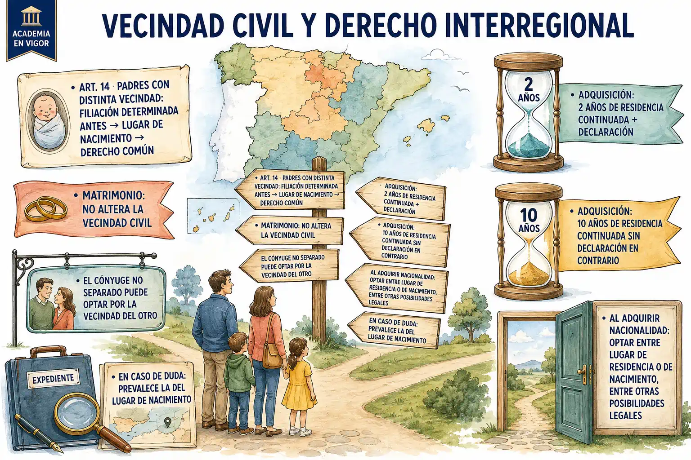

<em>Infografía: esquema de vecindad civil y derecho interregional con relaciones y trampas de examen.</em>

<!-- FUENTE: CC-BOE-A-1889-4763-T07 -->

## 07. Españoles de origen y nacionalidad por opción

### Regla y encaje

Españoles de origen y nacionalidad por opción se estudia dentro de nacionalidad, personalidad y domicilio. El bloque se contrasta directamente con arts. 17 a 18 CC.

### Claves examinables

- **Artículo 17:** 1. Son españoles de origen: a) Los nacidos de padre o madre españoles. - **Artículo 17:** b) Los nacidos en España de padres extranjeros si, al menos, uno de ellos hubiera nacido también en España. Se exceptúan los hijos de funcionario diplomático o consular acreditado en España. <!-- FACT:GC-T07-F107 --> - **Artículo 17:** c) Los nacidos en España de padres extranjeros, si ambos carecieren de nacionalidad o si la legislación de ninguno de ellos atribuye al hijo una nacionalidad. <!-- FACT:GC-T07-F108 --> - **Artículo 17:** d) Los nacidos en España cuya filiación no resulte determinada. A estos efectos, se presumen nacidos en territorio español los menores de edad cuyo primer lugar conocido de estancia sea territorio español. <!-- FACT:GC-T07-F109 --> - **Artículo 17:** 2. La filiación o el nacimiento en España, cuya determinación se produzca después de los dieciocho años de edad, no son por sí solos causa de adquisición de la nacionalidad española. El interesado tiene entonces derecho a optar por la nacionalidad española de origen en el plazo de dos años a contar desde aquella determinación. <!-- FACT:GC-T07-F110 -->  <!-- FACT:GC-T07-F111 -->

:::hablemos-claro
No basta con reconocer una frase verdadera: hay que comprobar que pertenece al artículo preguntado y que no se ha sustituido una facultad por una obligación, un plazo por otro o una excepción por la regla general.
:::

:::en-la-calle
En un supuesto práctico, fija quién actúa, qué capacidad o vínculo tiene, qué autoridad interviene y qué consecuencia civil produce la actuación.
:::

:::lo-que-cae
Prioriza requisitos, plazos, legitimación, autoridad competente y excepciones. Apariciones oficiales mapeadas en este bloque: **3**.
:::

<!-- VISUAL:t07-07-espanoles-de-origen-y-nacionalidad-por-opcion.webp -->

  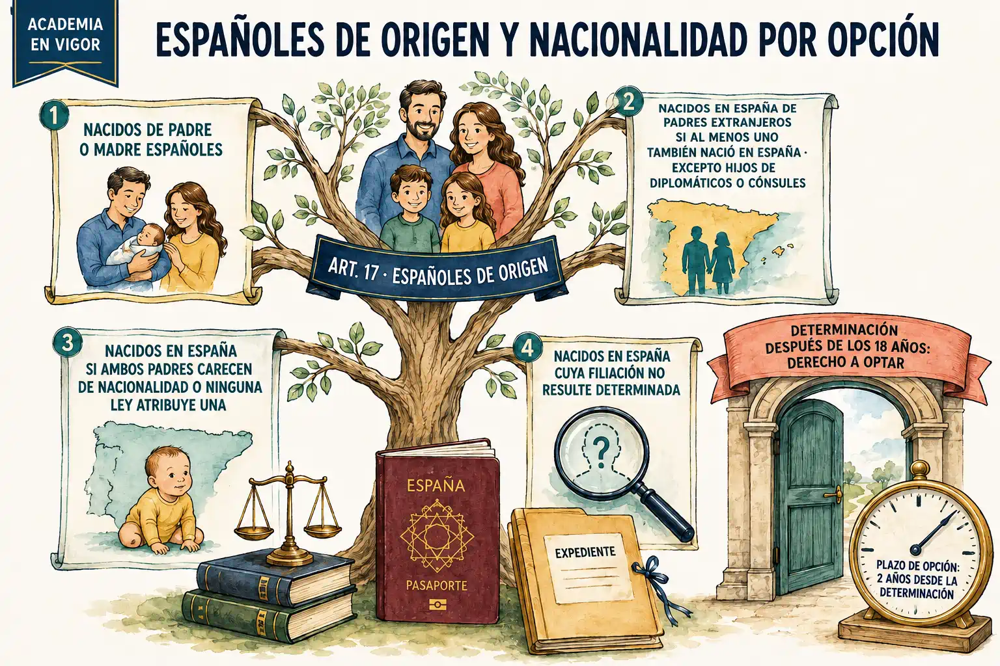

<em>Infografía: esquema de españoles de origen y nacionalidad por opción con relaciones y trampas de examen.</em>

<!-- FUENTE: CC-BOE-A-1889-4763-T07 -->

## 08. Posesión de estado y consolidación de la nacionalidad

### Regla y encaje

Posesión de estado y consolidación de la nacionalidad se estudia dentro de nacionalidad, personalidad y domicilio. El bloque se contrasta directamente con arts. 18 a 19 CC.

### Claves examinables

- **Artículo 18:** La posesión y utilización continuada de la nacionalidad española durante diez años, con buena fe y basada en un título inscrito en el Registro Civil, es causa de consolidación de la nacionalidad, aunque se anule el título que la originó. - **Artículo 19:** 1. El extranjero menor de dieciocho años adoptado por un español adquiere, desde la adopción, la nacionalidad española de origen. <!-- FACT:GC-T07-F112 --> - **Artículo 19:** 2. Si el adoptado es mayor de dieciocho años, podrá optar por la nacionalidad española de origen en el plazo de dos años a partir de la constitución de la adopción. <!-- FACT:GC-T07-F113 --> - **Artículo 19:** 3. Sin perjuicio de lo dispuesto en el apartado 1, si de acuerdo con el sistema jurídico del país de origen el menor adoptado mantiene su nacionalidad, ésta será reconocida también en España. <!-- FACT:GC-T07-F114 -->  <!-- FACT:GC-T07-F115 -->

:::hablemos-claro
No basta con reconocer una frase verdadera: hay que comprobar que pertenece al artículo preguntado y que no se ha sustituido una facultad por una obligación, un plazo por otro o una excepción por la regla general.
:::

:::en-la-calle
En un supuesto práctico, fija quién actúa, qué capacidad o vínculo tiene, qué autoridad interviene y qué consecuencia civil produce la actuación.
:::

:::lo-que-cae
Prioriza requisitos, plazos, legitimación, autoridad competente y excepciones. Apariciones oficiales mapeadas en este bloque: **0**.
:::

<!-- VISUAL:t07-08-posesion-de-estado-y-consolidacion-de-la-nacionalidad.webp -->

  

<em>Infografía: esquema de posesión de estado y consolidación de la nacionalidad con relaciones y trampas de examen.</em>

<!-- FUENTE: CC-BOE-A-1889-4763-T07 -->

## 09. Adquisición de la nacionalidad y residencia

### Regla y encaje

Adquisición de la nacionalidad y residencia se estudia dentro de nacionalidad, personalidad y domicilio. El bloque se contrasta directamente con arts. 20 a 23 CC.

### Claves examinables

- **Artículo 20:** 1. Tienen derecho a optar por la nacionalidad española: - **Artículo 20:** a) Las personas que estén o hayan estado sujetas a la patria potestad de un español. <!-- FACT:GC-T07-F116 --> - **Artículo 20:** b) Aquellas cuyo padre o madre hubiera sido originariamente español y nacido en España. <!-- FACT:GC-T07-F117 --> - **Artículo 20:** c) Las que se hallen comprendidas en el segundo apartado de los artículos 17 y 19. <!-- FACT:GC-T07-F118 --> - **Artículo 20:** 2. La declaración de opción se formulará: <!-- FACT:GC-T07-F119 --> - **Artículo 20:** a) Por el representante legal del optante menor de catorce años. En caso de discrepancia entre los representantes legales del menor de catorce años sobre la tramitación de la declaración de opción, se tramitará el expediente de jurisdicción voluntaria previsto al efecto. <!-- FACT:GC-T07-F120 --> - **Artículo 20:** b) Por el propio interesado, asistido por su representante legal, cuando aquél sea mayor de catorce años. <!-- FACT:GC-T07-F121 --> - **Artículo 20:** c) Por el interesado, por sí solo, si está emancipado o es mayor de dieciocho años. La opción caducará a los veinte años de edad, pero si el optante no estuviera emancipado según su ley personal al llegar a los dieciocho años, el plazo para optar se prolongará hasta que transcurran dos años desde la emancipación. <!-- FACT:GC-T07-F122 --> - **Artículo 20:** d) Por el interesado con discapacidad con los apoyos y ajustes de procedimiento que, en su caso, precise. <!-- FACT:GC-T07-F123 --> - **Artículo 20:** e) Por el interesado, por sí solo, dentro de los dos años siguientes a la extinción de las medidas de apoyo que le hubieran impedido ejercitarla con anterioridad. <!-- FACT:GC-T07-F124 --> - **Artículo 20:** 3. No obstante lo dispuesto en el apartado anterior, el ejercicio del derecho de opción previsto en el apartado 1.b) de este artículo no estará sujeto a límite alguno de edad. <!-- FACT:GC-T07-F125 --> - **Artículo 21:** 1. La nacionalidad española se adquiere por carta de naturaleza, otorgada discrecionalmente mediante Real Decreto, cuando en el interesado concurran circunstancias excepcionales. <!-- FACT:GC-T07-F126 --> - **Artículo 21:** 2. La nacionalidad española también se adquiere por residencia en España, en las condiciones que señala el artículo siguiente y mediante la concesión otorgada por el Ministro de Justicia, que podrá denegarla por motivos razonados de orden público o interés nacional. <!-- FACT:GC-T07-F127 --> - **Artículo 21:** 3. En uno y otro caso la solicitud podrá formularla: a) El interesado emancipado o mayor de dieciocho años. <!-- FACT:GC-T07-F128 --> - **Artículo 21:** b) El mayor de catorce años asistido por su representante legal. <!-- FACT:GC-T07-F129 --> - **Artículo 21:** c) El representante legal del menor de catorce años. En caso de discrepancia entre los representantes legales sobre la solicitud de nacionalidad por residencia, se tramitará el expediente de jurisdicción voluntaria previsto al efecto. <!-- FACT:GC-T07-F130 --> - **Artículo 21:** d) El interesado con discapacidad con los apoyos y ajustes de procedimiento que, en su caso, precise. <!-- FACT:GC-T07-F131 --> - **Artículo 21:** En este caso y en el anterior, el representante legal sólo podrá formular la solicitud si previamente ha obtenido autorización conforme a lo previsto en la letra a) del apartado 2 del artículo anterior. <!-- FACT:GC-T07-F132 --> - **Artículo 21:** 4. Las concesiones por carta de naturaleza o por residencia caducan a los ciento ochenta días siguientes a su notificación, si en este plazo no comparece el interesado ante funcionario competente para cumplir los requisitos del artículo 23. <!-- FACT:GC-T07-F133 --> - **Artículo 22:** 1. Para la concesión de la nacionalidad por residencia se requiere que ésta haya durado diez años. Serán suficientes cinco años para los que hayan obtenido la condición de refugiado y dos años cuando se trate de nacionales de origen de países iberoamericanos, Andorra, Filipinas, Guinea Ecuatorial o Portugal o de sefardíes. <!-- FACT:GC-T07-F134 --> - **Artículo 22:** 2. Bastará el tiempo de residencia de un año para: a) El que haya nacido en territorio español. <!-- FACT:GC-T07-F135 --> - **Artículo 22:** b) El que no haya ejercitado oportunamente la facultad de optar. <!-- FACT:GC-T07-F136 --> - **Artículo 22:** c) El que haya estado sujeto legalmente a la tutela, curatela con facultades de representación plena, guarda o acogimiento de un ciudadano o institución españoles durante dos años consecutivos, incluso si continuare en esta situación en el momento de la solicitud. <!-- FACT:GC-T07-F137 --> - **Artículo 22:** d) El que al tiempo de la solicitud llevare un año casado con español o española y no estuviere separado legalmente o de hecho. <!-- FACT:GC-T07-F138 --> - **Artículo 22:** e) El viudo o viuda de española o español, si a la muerte del cónyuge no existiera separación legal o de hecho. <!-- FACT:GC-T07-F139 --> - **Artículo 22:** f) El nacido fuera de España de padre o madre, abuelo o abuela, que originariamente hubieran sido españoles. <!-- FACT:GC-T07-F140 --> - **Artículo 22:** 3. En todos los casos, la residencia habrá de ser legal, continuada e inmediatamente anterior a la petición. <!-- FACT:GC-T07-F141 --> - **Artículo 22:** A los efectos de lo previsto en el párrafo d) del apartado anterior, se entenderá que tiene residencia legal en España el cónyuge que conviva con funcionario diplomático o consular español acreditado en el extranjero. <!-- FACT:GC-T07-F142 --> - **Artículo 22:** 4. El interesado deberá justificar, en el expediente regulado por la legislación del Registro Civil, buena conducta cívica y suficiente grado de integración en la sociedad española. <!-- FACT:GC-T07-F143 --> - **Artículo 22:** 5. La concesión o denegación de la nacionalidad por residencia deja a salvo la vía judicial contencioso-administrativa. <!-- FACT:GC-T07-F144 --> - **Artículo 23:** Son requisitos comunes para la validez de la adquisición de la nacionalidad española por opción, carta de naturaleza o residencia: <!-- FACT:GC-T07-F145 --> - **Artículo 23:** a) Que el mayor de catorce años y capaz para prestar una declaración por sí jure o prometa fidelidad al Rey y obediencia a la Constitución y a las leyes. <!-- FACT:GC-T07-F146 --> - **Artículo 23:** b) Que la misma persona declare que renuncia a su anterior nacionalidad. Quedan a salvo de este requisito los naturales de países mencionados en el apartado 1 del artículo 24 y los sefardíes originarios de España. <!-- FACT:GC-T07-F147 --> - **Artículo 23:** c) Que la adquisición se inscriba en el Registro Civil español. <!-- FACT:GC-T07-F148 -->  <!-- FACT:GC-T07-F149 -->

:::hablemos-claro
No basta con reconocer una frase verdadera: hay que comprobar que pertenece al artículo preguntado y que no se ha sustituido una facultad por una obligación, un plazo por otro o una excepción por la regla general.
:::

:::en-la-calle
En un supuesto práctico, fija quién actúa, qué capacidad o vínculo tiene, qué autoridad interviene y qué consecuencia civil produce la actuación.
:::

:::lo-que-cae
Prioriza requisitos, plazos, legitimación, autoridad competente y excepciones. Apariciones oficiales mapeadas en este bloque: **0**.
:::

<!-- VISUAL:t07-09-adquisicion-de-la-nacionalidad-y-residencia.webp -->

  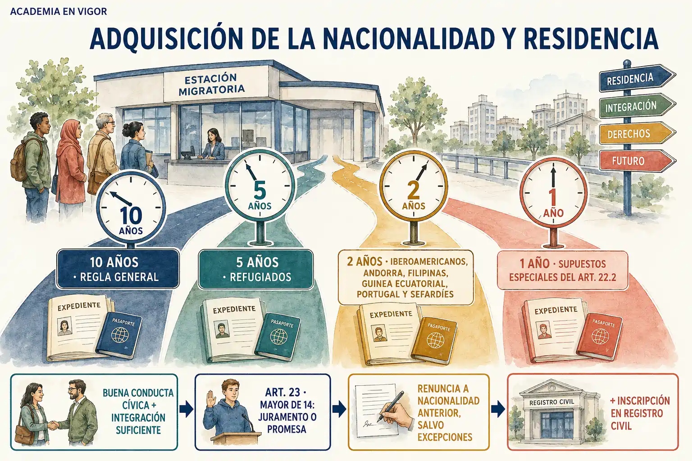

<em>Infografía: esquema de adquisición de la nacionalidad y residencia con relaciones y trampas de examen.</em>

<!-- FUENTE: CC-BOE-A-1889-4763-T07 -->

## 10. Pérdida, recuperación y doble nacionalidad

### Regla y encaje

Pérdida, recuperación y doble nacionalidad se estudia dentro de nacionalidad, personalidad y domicilio. El bloque se contrasta directamente con arts. 24 a 26 CC.

### Claves examinables

- **Artículo 24:** 1. Pierden la nacionalidad española los emancipados que, residiendo habitualmente en el extranjero, adquieran voluntariamente otra nacionalidad o utilicen exclusivamente la nacionalidad extranjera que tuvieran atribuida antes de la emancipación. La pérdida se producirá una vez que transcurran tres años, a contar, respectivamente, desde la adquisición de la nacionalidad extranjera o desde la emancipación. - **Artículo 24:** No obstante, los interesados podrán evitar la pérdida si dentro del plazo indicado declaran su voluntad de conservar la nacionalidad española al encargado del Registro Civil. <!-- FACT:GC-T07-F150 --> - **Artículo 24:** La adquisición de la nacionalidad de países iberoamericanos, Andorra, Filipinas, Guinea Ecuatorial o Portugal no es bastante para producir, conforme a este apartado, la pérdida de la nacionalidad española de origen. <!-- FACT:GC-T07-F151 --> - **Artículo 24:** 2. En todo caso, pierden la nacionalidad española los españoles emancipados que renuncien expresamente a ella, si tienen otra nacionalidad y residen habitualmente en el extranjero. <!-- FACT:GC-T07-F152 --> - **Artículo 24:** 3. Los que habiendo nacido y residiendo en el extranjero ostenten la nacionalidad española por ser hijos de padre o madre españoles, también nacidos en el extranjero, cuando las leyes del país donde residan les atribuyan la nacionalidad del mismo, perderán, en todo caso, la nacionalidad española si no declaran su voluntad de conservarla ante el encargado del Registro Civil en el plazo de tres años, a contar desde su mayoría de edad o emancipación. <!-- FACT:GC-T07-F153 --> - **Artículo 24:** 4. No se pierde la nacionalidad española, en virtud de lo dispuesto en este precepto, si España se hallare en guerra. <!-- FACT:GC-T07-F154 --> - **Artículo 25:** 1. Los españoles que no lo sean de origen perderán la nacionalidad: <!-- FACT:GC-T07-F155 --> - **Artículo 25:** a) Cuando durante un período de tres años utilicen exclusivamente la nacionalidad a la que hubieran declarado renunciar al adquirir la nacionalidad española. <!-- FACT:GC-T07-F156 --> - **Artículo 25:** b) Cuando entren voluntariamente al servicio de las armas o ejerzan cargo político en un Estado extranjero contra la prohibición expresa del Gobierno. <!-- FACT:GC-T07-F157 --> - **Artículo 25:** 2. La sentencia firme que declare que el interesado ha incurrido en falsedad, ocultación o fraude en la adquisición de la nacionalidad española produce la nulidad de tal adquisición, si bien no se derivarán de ella efectos perjudiciales para terceros de buena fe. La acción de nulidad deberá ejercitarse por el Ministerio Fiscal de oficio o en virtud de denuncia, dentro del plazo de quince años. <!-- FACT:GC-T07-F158 --> - **Artículo 26:** 1. Quien haya perdido la nacionalidad española podrá recuperarla cumpliendo los siguientes requisitos: <!-- FACT:GC-T07-F159 --> - **Artículo 26:** a) Ser residente legal en España. Este requisito no será de aplicación a los emigrantes ni a los hijos de emigrantes. En los demás casos podrá ser dispensado por el Ministro de Justicia cuando concurran circunstancias excepcionales. <!-- FACT:GC-T07-F160 --> - **Artículo 26:** b) Declarar ante el encargado del Registro Civil su voluntad de recuperar la nacionalidad española. <!-- FACT:GC-T07-F161 --> - **Artículo 26:** c) Inscribir la recuperación en el Registro Civil. <!-- FACT:GC-T07-F162 --> - **Artículo 26:** 2. No podrán recuperar o adquirir, en su caso, la nacionalidad española sin previa habilitación concedida discrecionalmente por el Gobierno, los que se encuentren incursos en cualquiera de los supuestos previstos en el artículo anterior. <!-- FACT:GC-T07-F163 -->  <!-- FACT:GC-T07-F164 -->

:::hablemos-claro
No basta con reconocer una frase verdadera: hay que comprobar que pertenece al artículo preguntado y que no se ha sustituido una facultad por una obligación, un plazo por otro o una excepción por la regla general.
:::

:::en-la-calle
En un supuesto práctico, fija quién actúa, qué capacidad o vínculo tiene, qué autoridad interviene y qué consecuencia civil produce la actuación.
:::

:::lo-que-cae
Prioriza requisitos, plazos, legitimación, autoridad competente y excepciones. Apariciones oficiales mapeadas en este bloque: **0**.
:::

<!-- VISUAL:t07-10-perdida-recuperacion-y-doble-nacionalidad.webp -->

  

<em>Infografía: esquema de pérdida, recuperación y doble nacionalidad con relaciones y trampas de examen.</em>

<!-- FUENTE: CC-BOE-A-1889-4763-T07 -->

## 11. Extranjeros y capacidad civil

### Regla y encaje

Extranjeros y capacidad civil se estudia dentro de nacionalidad, personalidad y domicilio. El bloque se contrasta directamente con arts. 27 a 28 CC.

### Claves examinables

- **Artículo 27:** Los extranjeros gozan en España de los mismos derechos civiles que los españoles, salvo lo dispuesto en las Leyes especiales y en los Tratados. - **Artículo 28:** Las corporaciones, fundaciones y asociaciones, reconocidas por la ley y domiciliadas en España, gozarán de la nacionalidad española, siempre que tengan el concepto de personas jurídicas con arreglo a las disposiciones del presente Código. <!-- FACT:GC-T07-F165 --> - **Artículo 28:** Las asociaciones domiciliadas en el extranjero tendrán en España la consideración y los derechos que determinen los tratados o leyes especiales. <!-- FACT:GC-T07-F166 -->  <!-- FACT:GC-T07-F167 -->

:::hablemos-claro
No basta con reconocer una frase verdadera: hay que comprobar que pertenece al artículo preguntado y que no se ha sustituido una facultad por una obligación, un plazo por otro o una excepción por la regla general.
:::

:::en-la-calle
En un supuesto práctico, fija quién actúa, qué capacidad o vínculo tiene, qué autoridad interviene y qué consecuencia civil produce la actuación.
:::

:::lo-que-cae
Prioriza requisitos, plazos, legitimación, autoridad competente y excepciones. Apariciones oficiales mapeadas en este bloque: **0**.
:::

<!-- VISUAL:t07-11-extranjeros-y-capacidad-civil.webp -->

  

<em>Infografía: esquema de extranjeros y capacidad civil con relaciones y trampas de examen.</em>

<!-- FUENTE: CC-BOE-A-1889-4763-T07 -->

## 12. Nacimiento, personalidad y muerte

### Regla y encaje

Nacimiento, personalidad y muerte se estudia dentro de nacionalidad, personalidad y domicilio. El bloque se contrasta directamente con arts. 29 a 34 CC.

### Claves examinables

- **Artículo 29:** El nacimiento determina la personalidad; pero el concebido se tiene por nacido para todos los efectos que le sean favorables, siempre que nazca con las condiciones que expresa el artículo siguiente. - **Artículo 30:** La personalidad se adquiere en el momento del nacimiento con vida, una vez producido el entero desprendimiento del seno materno. <!-- FACT:GC-T07-F168 --> - **Artículo 31:** La prioridad del nacimiento, en el caso de partos dobles, da al primer nacido los derechos que la ley reconozca al primogénito. <!-- FACT:GC-T07-F169 --> - **Artículo 32:** La personalidad civil se extingue por la muerte de las personas. <!-- FACT:GC-T07-F170 --> - **Artículo 33:** Si se duda, entre dos o más personas llamadas a sucederse, quién de ellas ha muerto primero, el que sostenga la muerte anterior de una o de otra, debe probarla; a falta de prueba, se presumen muertas al mismo tiempo y no tiene lugar la transmisión de derechos de uno a otro. <!-- FACT:GC-T07-F171 --> - **Artículo 34:** Respecto a la presunción de muerte del ausente y sus efectos se estará a lo dispuesto en el título VIII de este libro. <!-- FACT:GC-T07-F172 -->  <!-- FACT:GC-T07-F173 -->

:::hablemos-claro
No basta con reconocer una frase verdadera: hay que comprobar que pertenece al artículo preguntado y que no se ha sustituido una facultad por una obligación, un plazo por otro o una excepción por la regla general.
:::

:::en-la-calle
En un supuesto práctico, fija quién actúa, qué capacidad o vínculo tiene, qué autoridad interviene y qué consecuencia civil produce la actuación.
:::

:::lo-que-cae
Prioriza requisitos, plazos, legitimación, autoridad competente y excepciones. Apariciones oficiales mapeadas en este bloque: **1**.
:::

<!-- VISUAL:t07-12-nacimiento-personalidad-y-muerte.webp -->

  

<em>Infografía: esquema de nacimiento, personalidad y muerte con relaciones y trampas de examen.</em>

<!-- FUENTE: CC-BOE-A-1889-4763-T07 -->

## 13. Personas jurídicas

### Regla y encaje

Personas jurídicas se estudia dentro de nacionalidad, personalidad y domicilio. El bloque se contrasta directamente con arts. 35 a 39 CC.

### Claves examinables

- **Artículo 35:** Son personas jurídicas: - **Artículo 35:** 1.º Las corporaciones, asociaciones y fundaciones de interés público reconocidas por la ley. <!-- FACT:GC-T07-F174 --> - **Artículo 35:** Su personalidad empieza desde el instante mismo en que, con arreglo a derecho, hubiesen quedado válidamente constituidas. <!-- FACT:GC-T07-F175 --> - **Artículo 35:** 2.º Las asociaciones de interés particular, sean civiles, mercantiles o industriales, a las que la ley conceda personalidad propia, independiente de la de cada uno de los asociados. <!-- FACT:GC-T07-F176 --> - **Artículo 36:** Las asociaciones a que se refiere el número 2.º del artículo anterior se regirán por las disposiciones relativas al contrato de sociedad, según la naturaleza de éste. <!-- FACT:GC-T07-F177 --> - **Artículo 37:** La capacidad civil de las corporaciones se regulará por las leyes que las hayan creado o reconocido; la de las asociaciones por sus estatutos, y las de las fundaciones por las reglas de su institución, debidamente aprobadas por disposición administrativa, cuando este requisito fuere necesario. <!-- FACT:GC-T07-F178 --> - **Artículo 38:** Las personas jurídicas pueden adquirir y poseer bienes de todas clases, así como contraer obligaciones y ejercitar acciones civiles o criminales, conforme a las leyes y reglas de su constitución. <!-- FACT:GC-T07-F179 --> - **Artículo 38:** La Iglesia se regirá en este punto por lo concordado entre ambas potestades, y los establecimientos de instrucción y beneficencia por lo que dispongan las leyes especiales. <!-- FACT:GC-T07-F180 --> - **Artículo 39:** Si por haber expirado el plazo durante el cual funcionaban legalmente o por haber realizado el fin para el cual se constituyeron, o por ser ya imposible aplicar a éste la actividad y los medios de que disponían, dejasen de funcionar las corporaciones, asociaciones y fundaciones, se dará a sus bienes la aplicación que las leyes, o los estatutos, o las cláusulas fundacionales, les hubiesen en esta previsión asignado. <!-- FACT:GC-T07-F181 --> - **Artículo 39:** Si nada se hubiere establecido previamente, se aplicarán esos bienes a la realización de fines análogos, en interés de la región, provincia o municipio que principalmente debieran recoger los beneficios de las instituciones extinguidas. <!-- FACT:GC-T07-F182 -->  <!-- FACT:GC-T07-F183 -->

:::hablemos-claro
No basta con reconocer una frase verdadera: hay que comprobar que pertenece al artículo preguntado y que no se ha sustituido una facultad por una obligación, un plazo por otro o una excepción por la regla general.
:::

:::en-la-calle
En un supuesto práctico, fija quién actúa, qué capacidad o vínculo tiene, qué autoridad interviene y qué consecuencia civil produce la actuación.
:::

:::lo-que-cae
Prioriza requisitos, plazos, legitimación, autoridad competente y excepciones. Apariciones oficiales mapeadas en este bloque: **3**.
:::

<!-- VISUAL:t07-13-personas-juridicas.webp -->

  

<em>Infografía: esquema de personas jurídicas con relaciones y trampas de examen.</em>

<!-- FUENTE: CC-BOE-A-1889-4763-T07 -->

## 14. Domicilio

### Regla y encaje

Domicilio se estudia dentro de nacionalidad, personalidad y domicilio. El bloque se contrasta directamente con arts. 40 a 41 CC.

### Claves examinables

- **Artículo 40:** Para el ejercicio de los derechos y el cumplimiento de las obligaciones civiles, el domicilio de las personas naturales es el lugar de su residencia habitual, y, en su caso, el que determine la Ley de Enjuiciamiento Civil. - **Artículo 40:** El domicilio de los diplomáticos residentes por razón de su cargo en el extranjero, que gocen del derecho de extraterritorialidad, será el último que hubieren tenido en territorio español. <!-- FACT:GC-T07-F184 --> - **Artículo 41:** Cuando ni la ley que las haya creado o reconocido ni los estatutos o las reglas de fundación fijaren el domicilio de las personas jurídicas, se entenderá que lo tienen en el lugar en que se halle establecida su representación legal, o donde ejerzan las principales funciones de su instituto. <!-- FACT:GC-T07-F185 -->  <!-- FACT:GC-T07-F186 -->

:::hablemos-claro
No basta con reconocer una frase verdadera: hay que comprobar que pertenece al artículo preguntado y que no se ha sustituido una facultad por una obligación, un plazo por otro o una excepción por la regla general.
:::

:::en-la-calle
En un supuesto práctico, fija quién actúa, qué capacidad o vínculo tiene, qué autoridad interviene y qué consecuencia civil produce la actuación.
:::

:::lo-que-cae
Prioriza requisitos, plazos, legitimación, autoridad competente y excepciones. Apariciones oficiales mapeadas en este bloque: **2**.
:::

<!-- VISUAL:t07-14-domicilio.webp -->

  

<em>Infografía: esquema de domicilio con relaciones y trampas de examen.</em>

<!-- FUENTE: CC-BOE-A-1889-4763-T07 -->

## 15. Promesa de matrimonio

### Regla y encaje

Promesa de matrimonio se estudia dentro de matrimonio y crisis matrimonial. El bloque se contrasta directamente con arts. 42 a 43 CC.

### Claves examinables

- **Artículo 42:** La promesa de matrimonio no produce obligación de contraerlo ni de cumplir lo que se hubiere estipulado para el supuesto de su no celebración. - **Artículo 42:** No se admitirá a trámite la demanda en que se pretenda su cumplimiento. <!-- FACT:GC-T07-F187 --> - **Artículo 43:** El incumplimiento sin causa de la promesa cierta de matrimonio hecha por persona mayor de edad o por menor emancipado sólo producirá la obligación de resarcir a la otra parte de los gastos hechos y las obligaciones contraídas en consideración al matrimonio prometido. <!-- FACT:GC-T07-F188 --> - **Artículo 43:** Esta acción caducará al año contado desde el día de la negativa a la celebración del matrimonio. <!-- FACT:GC-T07-F189 -->  <!-- FACT:GC-T07-F190 -->

:::hablemos-claro
No basta con reconocer una frase verdadera: hay que comprobar que pertenece al artículo preguntado y que no se ha sustituido una facultad por una obligación, un plazo por otro o una excepción por la regla general.
:::

:::en-la-calle
En un supuesto práctico, fija quién actúa, qué capacidad o vínculo tiene, qué autoridad interviene y qué consecuencia civil produce la actuación.
:::

:::lo-que-cae
Prioriza requisitos, plazos, legitimación, autoridad competente y excepciones. Apariciones oficiales mapeadas en este bloque: **0**.
:::

<!-- VISUAL:t07-15-promesa-de-matrimonio.webp -->

  

<em>Infografía: esquema de promesa de matrimonio con relaciones y trampas de examen.</em>

<!-- FUENTE: CC-BOE-A-1889-4763-T07 -->

## 16. Requisitos e impedimentos matrimoniales

### Regla y encaje

Requisitos e impedimentos matrimoniales se estudia dentro de matrimonio y crisis matrimonial. El bloque se contrasta directamente con arts. 44 a 48 CC.

### Claves examinables

- **Artículo 44:** Toda persona tiene derecho a contraer matrimonio conforme a las disposiciones de este Código. - **Artículo 44:** El matrimonio tendrá los mismos requisitos y efectos cuando ambos contrayentes sean del mismo o de diferente sexo. <!-- FACT:GC-T07-F191 --> - **Artículo 45:** No hay matrimonio sin consentimiento matrimonial. <!-- FACT:GC-T07-F192 --> - **Artículo 45:** La condición, término o modo del consentimiento se tendrá por no puesta. <!-- FACT:GC-T07-F193 --> - **Artículo 46:** No pueden contraer matrimonio: 1.° Los menores de edad no emancipados. <!-- FACT:GC-T07-F194 --> - **Artículo 46:** 2.° Los que estén ligados con vínculo matrimonial. <!-- FACT:GC-T07-F195 --> - **Artículo 47:** Tampoco pueden contraer matrimonio entre sí: 1. Los parientes en línea recta por consanguinidad o adopción. <!-- FACT:GC-T07-F196 --> - **Artículo 47:** 2. Los colaterales por consanguinidad hasta el tercer grado. <!-- FACT:GC-T07-F197 --> - **Artículo 47:** 3. Los condenados por haber tenido participación en la muerte dolosa del cónyuge o persona con la que hubiera estado unida por análoga relación de afectividad a la conyugal. <!-- FACT:GC-T07-F198 --> - **Artículo 48:** El Juez podrá dispensar, con justa causa y a instancia de parte, mediante resolución previa dictada en expediente de jurisdicción voluntaria, los impedimentos de muerte dolosa del cónyuge o persona con la que hubiera estado unida por análoga relación de afectividad a la conyugal y de parentesco de grado tercero entre colaterales. La dispensa ulterior convalida, desde su celebración, el matrimonio cuya nulidad no haya sido instada judicialmente por alguna de las partes. <!-- FACT:GC-T07-F199 -->  <!-- FACT:GC-T07-F200 -->

:::hablemos-claro
No basta con reconocer una frase verdadera: hay que comprobar que pertenece al artículo preguntado y que no se ha sustituido una facultad por una obligación, un plazo por otro o una excepción por la regla general.
:::

:::en-la-calle
En un supuesto práctico, fija quién actúa, qué capacidad o vínculo tiene, qué autoridad interviene y qué consecuencia civil produce la actuación.
:::

:::lo-que-cae
Prioriza requisitos, plazos, legitimación, autoridad competente y excepciones. Apariciones oficiales mapeadas en este bloque: **0**.
:::

<!-- VISUAL:t07-16-requisitos-e-impedimentos-matrimoniales.webp -->

  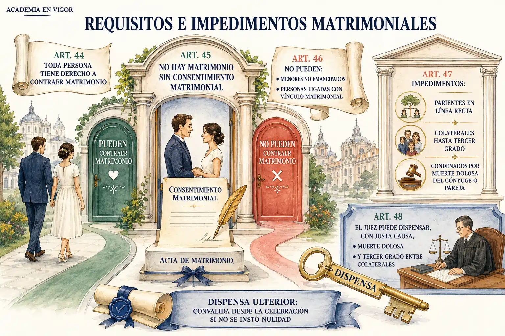

<em>Infografía: esquema de requisitos e impedimentos matrimoniales con relaciones y trampas de examen.</em>

<!-- FUENTE: CC-BOE-A-1889-4763-T07 -->

## 17. Autoridad, forma y celebración del matrimonio

### Regla y encaje

Autoridad, forma y celebración del matrimonio se estudia dentro de matrimonio y crisis matrimonial. El bloque se contrasta directamente con arts. 49 a 60 CC.

### Claves examinables

- **Artículo 49:** Cualquier español podrá contraer matrimonio dentro o fuera de España: - **Artículo 49:** 1.º En la forma regulada en este Código. 2.º En la forma religiosa legalmente prevista. <!-- FACT:GC-T07-F201 --> - **Artículo 49:** También podrá contraer matrimonio fuera de España con arreglo a la forma establecida por la ley del lugar de celebración. <!-- FACT:GC-T07-F202 --> - **Artículo 50:** Si ambos contrayentes son extranjeros, podrá celebrarse el matrimonio en España con arreglo a la forma prescrita para los españoles o cumpliendo la establecida por la ley personal de cualquiera de ellos. <!-- FACT:GC-T07-F203 --> - **Artículo 51:** 1. La competencia para constatar mediante acta o expediente el cumplimiento de los requisitos de capacidad de ambos contrayentes y la inexistencia de impedimentos o su dispensa, o cualquier género de obstáculos para contraer matrimonio corresponderá al Secretario judicial, Notario o Encargado del Registro Civil del lugar del domicilio de uno de los contrayentes o al funcionario diplomático o consular Encargado del Registro Civil si residiesen en el extranjero. <!-- FACT:GC-T07-F204 --> - **Artículo 51:** 2. Será competente para celebrar el matrimonio: <!-- FACT:GC-T07-F205 --> - **Artículo 51:** 1.º El Alcalde del municipio donde se celebre el matrimonio o concejal en quien éste delegue. <!-- FACT:GC-T07-F206 --> - **Artículo 51:** 2.º El Secretario judicial o Notario libremente elegido por ambos contrayentes que sea competente en el lugar de celebración. <!-- FACT:GC-T07-F207 --> - **Artículo 51:** 3.º El funcionario diplomático o consular Encargado del Registro Civil en el extranjero. <!-- FACT:GC-T07-F208 --> - **Artículo 52:** Podrán celebrar el matrimonio del que se halle en peligro de muerte: <!-- FACT:GC-T07-F209 --> - **Artículo 52:** 1.º El Alcalde o Concejal en quien delegue, letrado o letrada de la Administración de Justicia, notario o notaria, o personal funcionario a que se refiere el artículo 51. <!-- FACT:GC-T07-F210 --> - **Artículo 52:** 2.º El Oficial o Jefe superior inmediato respecto de los militares en campaña. <!-- FACT:GC-T07-F211 --> - **Artículo 52:** 3.º El Capitán o Comandante respecto de los matrimonios que se celebren a bordo de nave o aeronave. <!-- FACT:GC-T07-F212 --> - **Artículo 52:** El matrimonio en peligro de muerte no requerirá para su celebración la previa tramitación del acta o expediente matrimonial, pero sí la presencia, en su celebración, de dos testigos mayores de edad y, cuando el peligro de muerte derive de enfermedad o estado físico de alguno de los contrayentes, dictamen médico sobre su capacidad para la prestación del consentimiento y la gravedad de la situación, salvo imposibilidad acreditada, sin perjuicio de lo establecido en el artículo 65. <!-- FACT:GC-T07-F213 --> - **Artículo 53:** La validez del matrimonio no quedará afectada por la incompetencia o falta de nombramiento del Alcalde, Concejal/a, letrado o letrada de la Administración de Justicia, notario o notaria, o personal funcionario ante quien se celebre, siempre que al menos uno de los cónyuges hubiera procedido de buena fe y aquellos ejercieran sus funciones públicamente. <!-- FACT:GC-T07-F214 --> - **Artículo 54:** Cuando concurra causa grave suficientemente probada, el Ministro de Justicia podrá autorizar el matrimonio secreto. En este caso, el expediente se tramitará reservadamente, sin la publicación de edictos o proclamas. <!-- FACT:GC-T07-F215 --> - **Artículo 55:** Uno de los contrayentes podrá contraer matrimonio por apoderado, a quien tendrá que haber concedido poder especial en forma auténtica, siendo siempre necesaria la asistencia personal del otro contrayente. <!-- FACT:GC-T07-F216 --> - **Artículo 55:** En el poder se determinará la persona con quien ha de celebrarse el matrimonio, con expresión de las circunstancias personales precisas para establecer su identidad, debiendo apreciar su validez el Secretario judicial, Notario, Encargado del Registro Civil o funcionario que tramite el acta o expediente matrimonial previo al matrimonio. <!-- FACT:GC-T07-F217 --> - **Artículo 55:** El poder se extinguirá por la revocación del poderdante, por la renuncia del apoderado o por la muerte de cualquiera de ellos. En caso de revocación por el poderdante bastará su manifestación en forma auténtica antes de la celebración del matrimonio. La revocación se notificará de inmediato al Secretario judicial, Notario, Encargado del Registro Civil o funcionario que tramite el acta o expediente previo al matrimonio, y si ya estuviera finalizado a quien vaya a celebrarlo. <!-- FACT:GC-T07-F218 --> - **Artículo 56:** Quienes deseen contraer matrimonio acreditarán previamente en acta o expediente tramitado conforme a la legislación del Registro Civil, que reúnen los requisitos de capacidad o la inexistencia de impedimentos o su dispensa, de acuerdo con lo previsto en este Código. <!-- FACT:GC-T07-F219 --> - **Artículo 56:** El Letrado de la Administración de Justicia, Notario, Encargado del Registro Civil o funcionario que tramite el acta o expediente, cuando sea necesario, podrá recabar de las Administraciones o entidades de iniciativa social de promoción y protección de los derechos de las personas con discapacidad, la provisión de apoyos humanos, técnicos y materiales que faciliten la emisión, interpretación y recepción del consentimiento del o los contrayentes. <!-- FACT:GC-T07-F220 --> - **Artículo 56:** Solo en el caso excepcional de que alguno de los contrayentes presentare una condición de salud que, de modo evidente, categórico y sustancial, pueda impedirle prestar el consentimiento matrimonial pese a las medidas de apoyo, se recabará dictamen médico sobre su aptitud para prestar el consentimiento. <!-- FACT:GC-T07-F221 --> - **Artículo 57:** El matrimonio tramitado por el letrado o letrada de la Administración de Justicia o por personal funcionario consular o diplomático podrá celebrarse ante el mismo u otro distinto, o ante Alcalde o Concejal en quien este delegue, a elección de los contrayentes. Si se hubiere tramitado por el Encargado o Encargada del Registro Civil, el matrimonio deberá celebrarse ante el Alcalde o Concejal en quien éste delegue, que designen los contrayentes. <!-- FACT:GC-T07-F222 --> - **Artículo 57:** Finalmente, si fuera el notario o la notaria quien hubiera extendido el acta matrimonial, los contrayentes podrán otorgar el consentimiento, a su elección, ante el mismo notario o notaria u otro distinto del que hubiera tramitado el acta previa, Alcalde o Concejal en quien este delegue. <!-- FACT:GC-T07-F223 --> - **Artículo 58:** El Alcalde, Concejal, letrado o letrada de la Administración de Justicia, notario o notaria, o personal funcionario, después de leídos los artículos 66, 67 y 68, preguntará a cada uno de los contrayentes si consiente en contraer matrimonio con el otro y si efectivamente lo contrae en dicho acto y, respondiendo ambos afirmativamente, declarará que los mismos quedan unidos en matrimonio y extenderá el acta o autorizará la escritura correspondiente. <!-- FACT:GC-T07-F224 --> - **Artículo 59:** El consentimiento matrimonial podrá prestarse en la forma prevista por una confesión religiosa inscrita, en los términos acordados con el Estado o, en su defecto, autorizados por la legislación de éste. <!-- FACT:GC-T07-F225 --> - **Artículo 60:** 1. El matrimonio celebrado según las normas del Derecho canónico o en cualquiera de otras formas religiosas previstas en los acuerdos de cooperación entre el Estado y las confesiones religiosas produce efectos civiles. <!-- FACT:GC-T07-F226 --> - **Artículo 60:** 2. Igualmente, se reconocen efectos civiles al matrimonio celebrado en la forma religiosa prevista por las iglesias, confesiones, comunidades religiosas o federaciones de las mismas que, inscritas en el Registro de Entidades Religiosas, hayan obtenido el reconocimiento de notorio arraigo en España. <!-- FACT:GC-T07-F227 --> - **Artículo 60:** En este supuesto, el reconocimiento de efectos civiles requerirá el cumplimiento de los siguientes requisitos: <!-- FACT:GC-T07-F228 --> - **Artículo 60:** a) La tramitación de un acta o expediente previo de capacidad matrimonial con arreglo a la normativa del Registro Civil. <!-- FACT:GC-T07-F229 --> - **Artículo 60:** b) La libre manifestación del consentimiento ante un ministro de culto debidamente acreditado y dos testigos mayores de edad. <!-- FACT:GC-T07-F230 --> - **Artículo 60:** La condición de ministro de culto será acreditada mediante certificación expedida por la iglesia, confesión o comunidad religiosa que haya obtenido el reconocimiento de notorio arraigo en España, con la conformidad de la federación que, en su caso, hubiere solicitado dicho reconocimiento. <!-- FACT:GC-T07-F231 --> - **Artículo 60:** 3. Para el pleno reconocimiento de los efectos civiles del matrimonio celebrado en forma religiosa se estará a lo dispuesto en el Capítulo siguiente. <!-- FACT:GC-T07-F232 -->  <!-- FACT:GC-T07-F233 -->

:::hablemos-claro
No basta con reconocer una frase verdadera: hay que comprobar que pertenece al artículo preguntado y que no se ha sustituido una facultad por una obligación, un plazo por otro o una excepción por la regla general.
:::

:::en-la-calle
En un supuesto práctico, fija quién actúa, qué capacidad o vínculo tiene, qué autoridad interviene y qué consecuencia civil produce la actuación.
:::

:::lo-que-cae
Prioriza requisitos, plazos, legitimación, autoridad competente y excepciones. Apariciones oficiales mapeadas en este bloque: **5**.
:::

<!-- VISUAL:t07-17-autoridad-forma-y-celebracion-del-matrimonio.webp -->

  

<em>Infografía: esquema de autoridad, forma y celebración del matrimonio con relaciones y trampas de examen.</em>

<!-- FUENTE: CC-BOE-A-1889-4763-T07 -->

## 18. Forma religiosa e inscripción del matrimonio

### Regla y encaje

Forma religiosa e inscripción del matrimonio se estudia dentro de matrimonio y crisis matrimonial. El bloque se contrasta directamente con arts. 61 a 65 CC.

### Claves examinables

- **Artículo 61:** El matrimonio produce efectos civiles desde su celebración. - **Artículo 61:** Para el pleno reconocimiento de los mismos será necesaria su inscripción en el Registro Civil. <!-- FACT:GC-T07-F234 --> - **Artículo 61:** El matrimonio no inscrito no perjudicará los derechos adquiridos de buena fe por terceras personas. <!-- FACT:GC-T07-F235 --> - **Artículo 62:** La celebración del matrimonio se hará constar mediante acta o escritura pública que será firmada por aquél ante quien se celebre, los contrayentes y dos testigos. <!-- FACT:GC-T07-F236 --> - **Artículo 62:** Extendida el acta o autorizada la escritura pública, se remitirá por el autorizante copia acreditativa de la celebración del matrimonio al Registro Civil competente, para su inscripción, previa calificación por el Encargado del mismo. <!-- FACT:GC-T07-F237 --> - **Artículo 63:** La inscripción del matrimonio celebrado en España en forma religiosa se practicará con la simple presentación de la certificación de la iglesia, o confesión, comunidad religiosa o federación respectiva, que habrá de expresar las circunstancias exigidas por la legislación del Registro Civil. <!-- FACT:GC-T07-F238 --> - **Artículo 63:** Se denegará la práctica del asiento cuando de los documentos presentados o de los asientos del Registro conste que el matrimonio no reúne los requisitos que para su validez se exigen en este Título. <!-- FACT:GC-T07-F239 --> - **Artículo 64:** Para el reconocimiento del matrimonio secreto basta su inscripción en el libro especial del Registro Civil Central, pero no perjudicará los derechos adquiridos de buena fe por terceras personas sino desde su publicación en el Registro Civil ordinario. <!-- FACT:GC-T07-F240 --> - **Artículo 65:** En los casos en que el matrimonio se hubiere celebrado sin haberse tramitado el correspondiente expediente o acta previa, si éste fuera necesario, el Secretario judicial, Notario, o el funcionario diplomático o consular Encargado del Registro Civil que lo haya celebrado, antes de realizar las actuaciones que procedan para su inscripción, deberá comprobar si concurren los requisitos legales para su validez, mediante la tramitación del acta o expediente al que se refiere este artículo. <!-- FACT:GC-T07-F241 --> - **Artículo 65:** Si la celebración del matrimonio hubiera sido realizada ante autoridad o persona competente distinta de las indicadas en el párrafo anterior, el acta de aquélla se remitirá al Encargado del Registro Civil del lugar de celebración para que proceda a la comprobación de los requisitos de validez, mediante el expediente correspondiente. Efectuada esa comprobación, el Encargado del Registro Civil procederá a su inscripción. <!-- FACT:GC-T07-F242 -->  <!-- FACT:GC-T07-F243 -->

:::hablemos-claro
No basta con reconocer una frase verdadera: hay que comprobar que pertenece al artículo preguntado y que no se ha sustituido una facultad por una obligación, un plazo por otro o una excepción por la regla general.
:::

:::en-la-calle
En un supuesto práctico, fija quién actúa, qué capacidad o vínculo tiene, qué autoridad interviene y qué consecuencia civil produce la actuación.
:::

:::lo-que-cae
Prioriza requisitos, plazos, legitimación, autoridad competente y excepciones. Apariciones oficiales mapeadas en este bloque: **0**.
:::

<!-- VISUAL:t07-18-forma-religiosa-e-inscripcion-del-matrimonio.webp -->

  

<em>Infografía: esquema de forma religiosa e inscripción del matrimonio con relaciones y trampas de examen.</em>

<!-- FUENTE: CC-BOE-A-1889-4763-T07 -->

## 19. Derechos y deberes de los cónyuges

### Regla y encaje

Derechos y deberes de los cónyuges se estudia dentro de matrimonio y crisis matrimonial. El bloque se contrasta directamente con arts. 66 a 71 CC.

### Claves examinables

- **Artículo 66:** Los cónyuges son iguales en derechos y deberes. - **Artículo 67:** Los cónyuges deben respetarse y ayudarse mutuamente y actuar en interés de la familia. <!-- FACT:GC-T07-F244 --> - **Artículo 68:** Los cónyuges están obligados a vivir juntos, guardarse fidelidad y socorrerse mutuamente. Deberán, además, compartir las responsabilidades domésticas y el cuidado y atención de ascendientes y descendientes y otras personas dependientes a su cargo. <!-- FACT:GC-T07-F245 --> - **Artículo 69:** Se presume, salvo prueba en contrario, que los cónyuges viven juntos. <!-- FACT:GC-T07-F246 --> - **Artículo 70:** Los cónyuges fijarán de común acuerdo el domicilio conyugal y, en caso de discrepancia, resolverá el Juez, teniendo en cuenta el interés de la familia. <!-- FACT:GC-T07-F247 --> - **Artículo 71:** Ninguno de los cónyuges puede atribuirse la representación del otro sin que le hubiere sido conferida. <!-- FACT:GC-T07-F248 -->  <!-- FACT:GC-T07-F249 -->

:::hablemos-claro
No basta con reconocer una frase verdadera: hay que comprobar que pertenece al artículo preguntado y que no se ha sustituido una facultad por una obligación, un plazo por otro o una excepción por la regla general.
:::

:::en-la-calle
En un supuesto práctico, fija quién actúa, qué capacidad o vínculo tiene, qué autoridad interviene y qué consecuencia civil produce la actuación.
:::

:::lo-que-cae
Prioriza requisitos, plazos, legitimación, autoridad competente y excepciones. Apariciones oficiales mapeadas en este bloque: **0**.
:::

<!-- VISUAL:t07-19-derechos-y-deberes-de-los-conyuges.webp -->

  

<em>Infografía: esquema de derechos y deberes de los cónyuges con relaciones y trampas de examen.</em>

<!-- FUENTE: CC-BOE-A-1889-4763-T07 -->

## 20. Nulidad matrimonial

### Regla y encaje

Nulidad matrimonial se estudia dentro de matrimonio y crisis matrimonial. El bloque se contrasta directamente con arts. 72 a 80 CC.

### Claves examinables

- **Artículo 72:** Artículo 72 figura suprimido en la redacción consolidada vigente del Código Civil. - **Artículo 73:** Es nulo cualquiera que sea la forma de su celebración: 1.º El matrimonio celebrado sin consentimiento matrimonial. <!-- FACT:GC-T07-F250 --> - **Artículo 73:** 2.º El matrimonio celebrado entre las personas a que se refieren los artículos 46 y 47, salvo los casos de dispensa conforme al artículo 48. <!-- FACT:GC-T07-F251 --> - **Artículo 73:** 3.º El que se contraiga sin la intervención del Alcalde o Concejal, letrado o letrada de la Administración de Justicia, notario o notaria, o personal funcionario ante quien deba celebrarse, o sin la de los testigos. <!-- FACT:GC-T07-F252 --> - **Artículo 73:** 4.º El celebrado por error en la identidad de la persona del otro contrayente o en aquellas cualidades personales que, por su entidad, hubieren sido determinantes de la prestación del consentimiento. <!-- FACT:GC-T07-F253 --> - **Artículo 73:** 5.º El contraído por coacción o miedo grave. <!-- FACT:GC-T07-F254 --> - **Artículo 74:** La acción para pedir la nulidad del matrimonio corresponde a los cónyuges, al Ministerio Fiscal y a cualquier persona que tenga interés directo y legítimo en ella, salvo lo dispuesto en los artículos siguientes. <!-- FACT:GC-T07-F255 --> - **Artículo 75:** Si la causa de nulidad fuere la falta de edad, mientras el contrayente sea menor sólo podrá ejercitar la acción cualquiera de sus padres, tutores o guardadores y, en todo caso, el Ministerio Fiscal. <!-- FACT:GC-T07-F256 --> - **Artículo 75:** Al llegar a la mayoría de edad sólo podrá ejercitar la acción el contrayente menor, salvo que los cónyuges hubieren vivido juntos durante un año después de alcanzada aquélla. <!-- FACT:GC-T07-F257 --> - **Artículo 76:** En los casos de error, coacción o miedo grave solamente podrá ejercitar la acción de nulidad el cónyuge que hubiera sufrido el vicio. <!-- FACT:GC-T07-F258 --> - **Artículo 76:** Caduca la acción y se convalida el matrimonio si los cónyuges hubieran vivido juntos durante un año después de desvanecido el error o de haber cesado la fuerza o la causa del miedo. <!-- FACT:GC-T07-F259 --> - **Artículo 77:** Artículo 77 figura suprimido en la redacción consolidada vigente del Código Civil. <!-- FACT:GC-T07-F260 --> - **Artículo 78:** El Juez no acordará la nulidad de un matrimonio por defecto de forma, si al menos uno de los cónyuges lo contrajo de buena fe, salvo lo dispuesto en el número 3 del artículo 73. <!-- FACT:GC-T07-F261 --> - **Artículo 79:** La declaración de nulidad del matrimonio no invalidará los efectos ya producidos respecto de los hijos y del contrayente o contrayentes de buena fe. <!-- FACT:GC-T07-F262 --> - **Artículo 79:** La buena fe se presume. <!-- FACT:GC-T07-F263 --> - **Artículo 80:** Las resoluciones dictadas por los Tribunales eclesiásticos sobre nulidad de matrimonio canónico o las decisiones pontificias sobre matrimonio rato y no consumado tendrán eficacia en el orden civil, a solicitud de cualquiera de las partes, si se declaran ajustados al Derecho del Estado en resolución dictada por el Juez civil competente conforme a las condiciones a las que se refiere el artículo 954 de la Ley de Enjuiciamiento Civil. <!-- FACT:GC-T07-F264 -->  <!-- FACT:GC-T07-F265 -->

:::hablemos-claro
No basta con reconocer una frase verdadera: hay que comprobar que pertenece al artículo preguntado y que no se ha sustituido una facultad por una obligación, un plazo por otro o una excepción por la regla general.
:::

:::en-la-calle
En un supuesto práctico, fija quién actúa, qué capacidad o vínculo tiene, qué autoridad interviene y qué consecuencia civil produce la actuación.
:::

:::lo-que-cae
Prioriza requisitos, plazos, legitimación, autoridad competente y excepciones. Apariciones oficiales mapeadas en este bloque: **3**.
:::

<!-- VISUAL:t07-20-nulidad-matrimonial.webp -->

  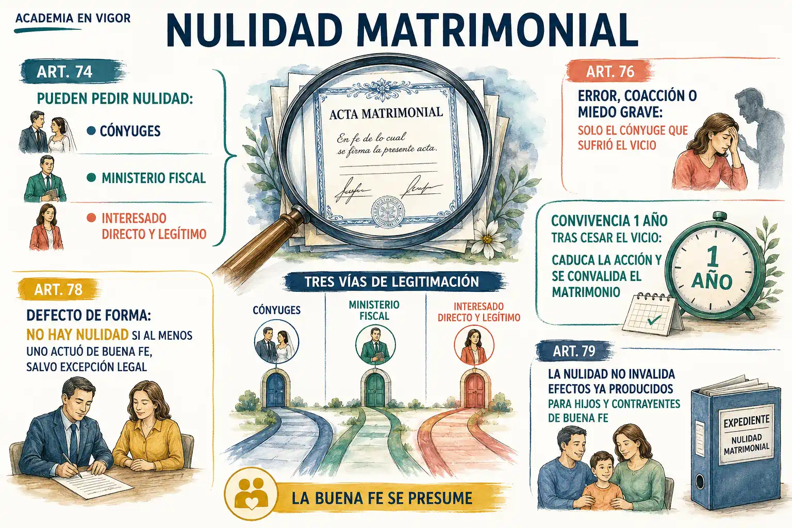

<em>Infografía: esquema de nulidad matrimonial con relaciones y trampas de examen.</em>

<!-- FUENTE: CC-BOE-A-1889-4763-T07 -->

## 21. Separación y reconciliación

### Regla y encaje

Separación y reconciliación se estudia dentro de matrimonio y crisis matrimonial. El bloque se contrasta directamente con arts. 81 a 84 CC.

### Claves examinables

- **Artículo 81:** Se decretará judicialmente la separación cuando existan hijos menores no emancipados o hijos mayores respecto de los que se hayan establecido judicialmente medidas de apoyo atribuidas a sus progenitores, cualquiera que sea la forma de celebración del matrimonio: - **Artículo 81:** 1.º A petición de ambos cónyuges o de uno con el consentimiento del otro, una vez transcurridos tres meses desde la celebración del matrimonio. A la demanda se acompañará una propuesta de convenio regulador redactada conforme al artículo 90 de este Código. <!-- FACT:GC-T07-F266 --> - **Artículo 81:** 2.º A petición de uno solo de los cónyuges, una vez transcurridos tres meses desde la celebración del matrimonio. No será preciso el transcurso de este plazo para la interposición de la demanda cuando se acredite la existencia de un riesgo para la vida, la integridad física, la libertad, la integridad moral o libertad e indemnidad sexual del cónyuge demandante o de los hijos de ambos o de cualquiera de los miembros del matrimonio. <!-- FACT:GC-T07-F267 --> - **Artículo 81:** A la demanda se acompañará propuesta fundada de las medidas que hayan de regular los efectos derivados de la separación. <!-- FACT:GC-T07-F268 --> - **Artículo 82:** 1. Los cónyuges podrán acordar su separación de mutuo acuerdo transcurridos tres meses desde la celebración del matrimonio mediante la formulación de un convenio regulador ante el letrado de la Administración de Justicia o en escritura pública ante Notario, en el que, junto a la voluntad inequívoca de separarse, determinarán las medidas que hayan de regular los efectos derivados de la separación en los términos establecidos en el artículo 90. <!-- FACT:GC-T07-F269 --> - **Artículo 82:** Los funcionarios diplomáticos o consulares, en ejercicio de las funciones notariales que tienen atribuidas, no podrán autorizar la escritura pública de separación. <!-- FACT:GC-T07-F270 --> - **Artículo 82:** Los cónyuges deberán intervenir en el otorgamiento de modo personal, sin perjuicio de que deban estar asistidos por letrado en ejercicio, prestando su consentimiento ante el letrado de la Administración de Justicia o notario. Igualmente los hijos mayores o menores emancipados deberán otorgar el consentimiento ante el letrado de la Administración de Justicia o Notario respecto de las medidas que les afecten por carecer de ingresos propios y convivir en el domicilio familiar. <!-- FACT:GC-T07-F271 --> - **Artículo 82:** 2. No será de aplicación lo dispuesto en este artículo cuando existan hijos en la situación a la que se refiere el artículo anterior. <!-- FACT:GC-T07-F272 --> - **Artículo 83:** La sentencia o decreto de separación o el otorgamiento de la escritura pública del convenio regulador que la determine producen la suspensión de la vida común de los casados y cesa la posibilidad de vincular bienes del otro cónyuge en el ejercicio de la potestad doméstica. <!-- FACT:GC-T07-F273 --> - **Artículo 83:** Los efectos de la separación matrimonial se producirán desde la firmeza de la sentencia o decreto que así la declare o desde la manifestación del consentimiento de ambos cónyuges otorgado en escritura pública conforme a lo dispuesto en el artículo 82. Se remitirá testimonio de la sentencia o decreto, o copia de la escritura pública al Registro Civil para su inscripción, sin que, hasta que esta tenga lugar, se produzcan plenos efectos frente a terceros de buena fe. <!-- FACT:GC-T07-F274 --> - **Artículo 84:** La reconciliación pone término al procedimiento de separación y deja sin efecto ulterior lo resuelto en él, pero ambos cónyuges separadamente deberán ponerlo en conocimiento del Juez que entienda o haya entendido en el litigio. Ello no obstante, mediante resolución judicial, serán mantenidas o modificadas las medidas adoptadas en relación a los hijos, cuando exista causa que lo justifique. <!-- FACT:GC-T07-F275 --> - **Artículo 84:** Cuando la separación hubiere tenido lugar sin intervención judicial, en la forma prevista en el artículo 82, la reconciliación deberá formalizase en escritura pública o acta de manifestaciones. <!-- FACT:GC-T07-F276 --> - **Artículo 84:** La reconciliación deberá inscribirse, para su eficacia frente a terceros, en el Registro Civil correspondiente. <!-- FACT:GC-T07-F277 -->  <!-- FACT:GC-T07-F278 -->

:::hablemos-claro
No basta con reconocer una frase verdadera: hay que comprobar que pertenece al artículo preguntado y que no se ha sustituido una facultad por una obligación, un plazo por otro o una excepción por la regla general.
:::

:::en-la-calle
En un supuesto práctico, fija quién actúa, qué capacidad o vínculo tiene, qué autoridad interviene y qué consecuencia civil produce la actuación.
:::

:::lo-que-cae
Prioriza requisitos, plazos, legitimación, autoridad competente y excepciones. Apariciones oficiales mapeadas en este bloque: **1**.
:::

<!-- VISUAL:t07-21-separacion-y-reconciliacion.webp -->

  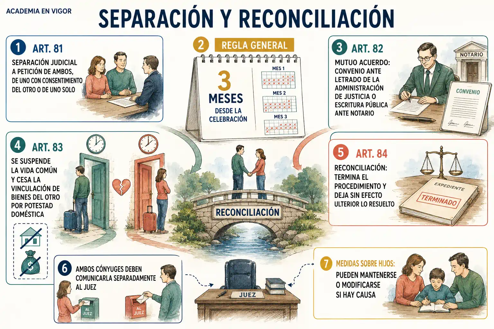

<em>Infografía: esquema de separación y reconciliación con relaciones y trampas de examen.</em>

<!-- FUENTE: CC-BOE-A-1889-4763-T07 -->

## 22. Disolución y divorcio

### Regla y encaje

Disolución y divorcio se estudia dentro de matrimonio y crisis matrimonial. El bloque se contrasta directamente con arts. 85 a 89 CC.

### Claves examinables

- **Artículo 85:** El matrimonio se disuelve, sea cual fuere la forma y el tiempo de su celebración, por la muerte o la declaración de fallecimiento de uno de los cónyuges y por el divorcio. - **Artículo 86:** Se decretará judicialmente el divorcio, cualquiera que sea la forma de celebración del matrimonio, a petición de uno solo de los cónyuges, de ambos o de uno con el consentimiento del otro, cuando concurran los requisitos y circunstancias exigidos en el artículo 81. <!-- FACT:GC-T07-F279 --> - **Artículo 87:** Los cónyuges también podrán acordar su divorcio de mutuo acuerdo mediante la formulación de un convenio regulador ante el Secretario judicial o en escritura pública ante Notario, en la forma y con el contenido regulado en el artículo 82, debiendo concurrir los mismos requisitos y circunstancias exigidas en él. Los funcionarios diplomáticos o consulares, en ejercicio de las funciones notariales que tienen atribuidas, no podrán autorizar la escritura pública de divorcio. <!-- FACT:GC-T07-F280 --> - **Artículo 88:** La acción de divorcio se extingue por la muerte de cualquiera de los cónyuges y por su reconciliación, que deberá ser expresa cuando se produzca después de interpuesta la demanda. <!-- FACT:GC-T07-F281 --> - **Artículo 88:** La reconciliación posterior al divorcio no produce efectos legales, si bien los divorciados podrán contraer entre sí nuevo matrimonio. <!-- FACT:GC-T07-F282 --> - **Artículo 89:** Los efectos de la disolución del matrimonio por divorcio se producirán desde la firmeza de la sentencia o decreto que así lo declare o desde la manifestación del consentimiento de ambos cónyuges otorgado en escritura pública conforme a lo dispuesto en el artículo 87. No perjudicará a terceros de buena fe sino a partir de su respectiva inscripción en el Registro Civil. <!-- FACT:GC-T07-F283 -->  <!-- FACT:GC-T07-F284 -->

:::hablemos-claro
No basta con reconocer una frase verdadera: hay que comprobar que pertenece al artículo preguntado y que no se ha sustituido una facultad por una obligación, un plazo por otro o una excepción por la regla general.
:::

:::en-la-calle
En un supuesto práctico, fija quién actúa, qué capacidad o vínculo tiene, qué autoridad interviene y qué consecuencia civil produce la actuación.
:::

:::lo-que-cae
Prioriza requisitos, plazos, legitimación, autoridad competente y excepciones. Apariciones oficiales mapeadas en este bloque: **2**.
:::

<!-- VISUAL:t07-22-disolucion-y-divorcio.webp -->

  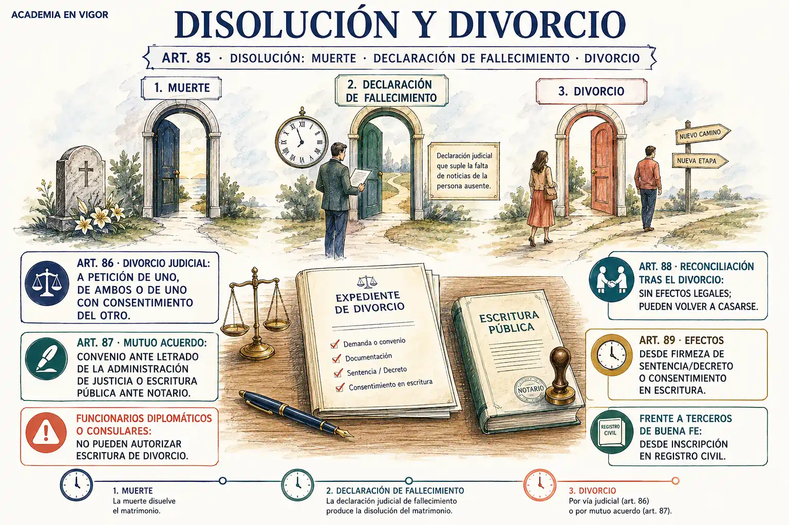

<em>Infografía: esquema de disolución y divorcio con relaciones y trampas de examen.</em>

<!-- FUENTE: CC-BOE-A-1889-4763-T07 -->

## 23. Convenio regulador y efectos comunes

### Regla y encaje

Convenio regulador y efectos comunes se estudia dentro de matrimonio y crisis matrimonial. El bloque se contrasta directamente con arts. 90 a 101 CC.

### Claves examinables

- **Artículo 90:** 1. El convenio regulador a que se refieren los artículos 81, 82, 83, 86 y 87 deberá contener, al menos y siempre que fueran aplicables, los siguientes extremos: - **Artículo 90:** a) El cuidado de los hijos sujetos a la patria potestad de ambos, el ejercicio de ésta y, en su caso, el régimen de comunicación y estancia de los hijos con el progenitor que no viva habitualmente con ellos. <!-- FACT:GC-T07-F285 --> - **Artículo 90:** b) Si se considera necesario, el régimen de visitas y comunicación de los nietos con sus abuelos, teniendo en cuenta, siempre, el interés de aquéllos. <!-- FACT:GC-T07-F286 --> - **Artículo 90:** b) bis El destino de los animales de compañía, en caso de que existan, teniendo en cuenta el interés de los miembros de la familia y el bienestar del animal; el reparto de los tiempos de convivencia y cuidado si fuere necesario, así como las cargas asociadas al cuidado del animal. <!-- FACT:GC-T07-F287 --> - **Artículo 90:** c) La atribución del uso de la vivienda y ajuar familiar. <!-- FACT:GC-T07-F288 --> - **Artículo 90:** d) La contribución a las cargas del matrimonio y alimentos, así como sus bases de actualización y garantías en su caso. <!-- FACT:GC-T07-F289 --> - **Artículo 90:** e) La liquidación, cuando proceda, del régimen económico del matrimonio. <!-- FACT:GC-T07-F290 --> - **Artículo 90:** f) La pensión que conforme al artículo 97 correspondiere satisfacer, en su caso, a uno de los cónyuges. <!-- FACT:GC-T07-F291 --> - **Artículo 90:** 2. Los acuerdos de los cónyuges adoptados para regular las consecuencias de la nulidad, separación y divorcio presentados ante el órgano judicial serán aprobados por el juez salvo si son dañosos para los hijos o gravemente perjudiciales para uno de los cónyuges. <!-- FACT:GC-T07-F292 --> - **Artículo 90:** Si fueran gravemente perjudiciales para el bienestar de los animales de compañía, la autoridad judicial ordenará las medidas a adoptar, sin perjuicio del convenio aprobado. <!-- FACT:GC-T07-F293 --> - **Artículo 90:** Si las partes proponen un régimen de visitas y comunicación de los nietos con los abuelos, el juez podrá aprobarlo previa audiencia de los abuelos en la que estos presten su consentimiento. La denegación de los acuerdos habrá de hacerse mediante resolución motivada y en este caso los cónyuges deberán someter, a la consideración del juez, nueva propuesta para su aprobación, si procede. <!-- FACT:GC-T07-F294 --> - **Artículo 90:** Cuando los cónyuges formalizasen los acuerdos ante el letrado de la Administración de Justicia o notario y éstos considerasen que, a su juicio, alguno de ellos pudiera ser dañoso o gravemente perjudicial para uno de los cónyuges o para los hijos mayores o menores emancipados afectados, o gravemente perjudiciales para el bienestar de los animales de compañía, lo advertirán a los otorgantes y darán por terminado el expediente. <!-- FACT:GC-T07-F295 --> - **Artículo 90:** En este caso, los cónyuges sólo podrán acudir ante el juez para la aprobación de la propuesta de convenio regulador. <!-- FACT:GC-T07-F296 --> - **Artículo 90:** Desde la aprobación del convenio regulador o el otorgamiento de la escritura pública, podrán hacerse efectivos los acuerdos por la vía de apremio. <!-- FACT:GC-T07-F297 --> - **Artículo 90:** 3. Las medidas que el juez adopte en defecto de acuerdo o las convenidas por los cónyuges judicialmente, podrán ser modificadas judicialmente o por nuevo convenio aprobado por el juez, cuando así lo aconsejen las nuevas necesidades de los hijos o el cambio de las circunstancias de los cónyuges. <!-- FACT:GC-T07-F298 --> - **Artículo 90:** Asimismo, podrá modificarse el convenio o solicitarse modificación de las medidas sobre los animales de compañía si se hubieran alterado gravemente sus circunstancias. <!-- FACT:GC-T07-F299 --> - **Artículo 90:** Las medidas que hubieran sido convenidas ante el letrado de la Administración de Justicia o en escritura pública podrán ser modificadas por un nuevo acuerdo, sujeto a los mismos requisitos exigidos en este Código. <!-- FACT:GC-T07-F300 --> - **Artículo 90:** 4. El juez o las partes podrán establecer las garantías reales o personales que requiera el cumplimiento del convenio. <!-- FACT:GC-T07-F301 --> - **Artículo 91:** En las sentencias de nulidad, separación o divorcio, o en ejecución de las mismas, la autoridad judicial, en defecto de acuerdo de los cónyuges o en caso de no aprobación del mismo, determinará conforme a lo establecido en los artículos siguientes las medidas que hayan de sustituir a las ya adoptadas con anterioridad en relación con los hijos, la vivienda familiar, el destino de los animales de compañía, las cargas del matrimonio, liquidación del régimen económico y las cautelas o garantías respectivas, estableciendo las que procedan si para alguno de estos conceptos no se hubiera adoptado ninguna. <!-- FACT:GC-T07-F302 --> - **Artículo 91:** Estas medidas podrán ser modificadas cuando se alteren sustancialmente las circunstancias. <!-- FACT:GC-T07-F303 --> - **Artículo 91:** Cuando al tiempo de la nulidad, separación o divorcio existieran hijos comunes mayores de dieciséis años que se hallasen en situación de necesitar medidas de apoyo por razón de su discapacidad, la sentencia correspondiente, previa audiencia del menor, resolverá también sobre el establecimiento y modo de ejercicio de éstas, las cuáles, en su caso, entrarán en vigor cuando el hijo alcance los dieciocho años de edad. <!-- FACT:GC-T07-F304 --> - **Artículo 91:** En estos casos la legitimación para instarlas, las especialidades de prueba y el contenido de la sentencia se regirán por lo dispuesto en la Ley de Enjuiciamiento Civil acerca de la provisión judicial de medidas de apoyo a las personas con discapacidad. <!-- FACT:GC-T07-F305 --> - **Artículo 92:** 1. La separación, la nulidad y el divorcio no eximen a los padres de sus obligaciones para con los hijos. <!-- FACT:GC-T07-F306 --> - **Artículo 92:** 2. El Juez, cuando deba adoptar cualquier medida sobre la custodia, el cuidado y la educación de los hijos menores, velará por el cumplimiento de su derecho a ser oídos y emitirá una resolución motivada en el interés superior del menor sobre esta cuestión. <!-- FACT:GC-T07-F307 --> - **Artículo 92:** 3. En la sentencia se acordará la privación de la patria potestad cuando en el proceso se revele causa para ello. <!-- FACT:GC-T07-F308 --> - **Artículo 92:** 4. Los padres podrán acordar en el convenio regulador o el Juez podrá decidir, en beneficio de los hijos, que la patria potestad sea ejercida total o parcialmente por uno de los cónyuges. <!-- FACT:GC-T07-F309 --> - **Artículo 92:** 5. Se acordará el ejercicio compartido de la guarda y custodia de los hijos cuando así lo soliciten los padres en la propuesta de convenio regulador o cuando ambos lleguen a este acuerdo en el transcurso del procedimiento. <!-- FACT:GC-T07-F310 --> - **Artículo 92:** 6. <!-- FACT:GC-T07-F311 --> - **Artículo 92:** En todo caso, antes de acordar el régimen de guarda y custodia, el Juez deberá recabar informe del Ministerio Fiscal, oír a los menores que tengan suficiente juicio cuando se estime necesario de oficio o a petición del Fiscal, las partes o miembros del Equipo Técnico Judicial, o del propio menor, y valorar las alegaciones de las partes, la prueba practicada, y la relación que los padres mantengan entre sí y con sus hijos para determinar su idoneidad con el régimen de guarda. <!-- FACT:GC-T07-F312 --> - **Artículo 92:** 7. No procederá la guarda conjunta cuando cualquiera de los progenitores esté incurso en un proceso penal iniciado por intentar atentar contra la vida, la integridad física, la libertad, la integridad moral o la libertad e indemnidad sexual del otro cónyuge o de los hijos que convivan con ambos. Tampoco procederá cuando el juez advierta, de las alegaciones de las partes y las pruebas practicadas, la existencia de indicios fundados de violencia doméstica o de género. <!-- FACT:GC-T07-F313 --> - **Artículo 92:** Se apreciará también a estos efectos la existencia de malos tratos a animales, o la amenaza de causarlos, como medio para controlar o victimizar a cualquiera de estas personas. <!-- FACT:GC-T07-F314 --> - **Artículo 92:** 8. Excepcionalmente, aun cuando no se den los supuestos del apartado cinco de este artículo, el Juez, a instancia de una de las partes, con informe del Ministerio Fiscal, podrá acordar la guarda y custodia compartida fundamentándola en que solo de esta forma se protege adecuadamente el interés superior del menor. <!-- FACT:GC-T07-F315 --> - **Artículo 92:** 9. El Juez, antes de adoptar alguna de las decisiones a que se refieren los apartados anteriores, de oficio o a instancia de parte, del Fiscal o miembros del Equipo Técnico Judicial, o del propio menor, podrá recabar dictamen de especialistas debidamente cualificados, relativo a la idoneidad del modo de ejercicio de la patria potestad y del régimen de custodia de las personas menores de edad para asegurar su interés superior. <!-- FACT:GC-T07-F316 --> - **Artículo 92:** 10. El Juez adoptará, al acordar fundadamente el régimen de guarda y custodia, así como el de estancia, relación y comunicación, las cautelas necesarias, procedentes y adecuadas para el eficaz cumplimiento de los regímenes establecidos, procurando no separar a los hermanos. <!-- FACT:GC-T07-F317 --> - **Artículo 93:** El Juez, en todo caso, determinará la contribución de cada progenitor para satisfacer los alimentos y adoptará las medidas convenientes para asegurar la efectividad y acomodación de las prestaciones a las circunstancias económicas y necesidades de los hijos en cada momento. <!-- FACT:GC-T07-F318 --> - **Artículo 93:** Si convivieran en el domicilio familiar hijos mayores de edad o emancipados que carecieran de ingresos propios, el Juez, en la misma resolución, fijará los alimentos que sean debidos conforme a los artículos 142 y siguientes de este Código. <!-- FACT:GC-T07-F319 --> - **Artículo 94:** La autoridad judicial determinará el tiempo, modo y lugar en que el progenitor que no tenga consigo a los hijos menores podrá ejercitar el derecho de visitarlos, comunicar con ellos y tenerlos en su compañía. <!-- FACT:GC-T07-F320 --> - **Artículo 94:** Respecto de los hijos con discapacidad mayores de edad o emancipados que precisen apoyo para tomar la decisión, el progenitor que no los tenga en su compañía podrá solicitar, en el mismo procedimiento de nulidad, separación o divorcio, que se establezca el modo en que se ejercitará el derecho previsto en el párrafo anterior. <!-- FACT:GC-T07-F321 --> - **Artículo 94:** La autoridad judicial adoptará la resolución prevista en los párrafos anteriores, previa audiencia del hijo y del Ministerio Fiscal. Así mismo, la autoridad judicial podrá limitar o suspender los derechos previstos en los párrafos anteriores si se dieran circunstancias relevantes que así lo aconsejen o se incumplieran grave o reiteradamente los deberes impuestos por la resolución judicial. <!-- FACT:GC-T07-F322 --> - **Artículo 94:** No procederá el establecimiento de un régimen de visita o estancia, y si existiera se suspenderá, respecto del progenitor que esté incurso en un proceso penal iniciado por atentar contra la vida, la integridad física, la libertad, la integridad moral o la libertad e indemnidad sexual del otro cónyuge o sus hijos. <!-- FACT:GC-T07-F323 --> - **Artículo 94:** Tampoco procederá cuando la autoridad judicial advierta, de las alegaciones de las partes y las pruebas practicadas, la existencia de indicios fundados de violencia doméstica o de género. <!-- FACT:GC-T07-F324 --> - **Artículo 94:** No obstante, la autoridad judicial podrá establecer un régimen de visita, comunicación o estancia en resolución motivada en el interés superior del menor o en la voluntad, deseos y preferencias del mayor con discapacidad necesitado de apoyos y previa evaluación de la situación de la relación paternofilial. <!-- FACT:GC-T07-F325 --> - **Artículo 94:** No procederá en ningún caso el establecimiento de un régimen de visitas respecto del progenitor en situación de prisión, provisional o por sentencia firme, acordada en procedimiento penal por los delitos previstos en el párrafo anterior. <!-- FACT:GC-T07-F326 --> - **Artículo 94:** Igualmente, la autoridad judicial podrá reconocer el derecho de comunicación y visita previsto en el apartado segundo del artículo 160, previa audiencia de los progenitores y de quien lo hubiera solicitado por su condición de hermano, abuelo, pariente o allegado del menor o del mayor con discapacidad que precise apoyo para tomar la decisión, que deberán prestar su consentimiento. <!-- FACT:GC-T07-F327 --> - **Artículo 94:** La autoridad judicial resolverá teniendo siempre presente el interés del menor o la voluntad, deseos y preferencias del mayor con discapacidad. <!-- FACT:GC-T07-F328 --> - **Artículo 94 bis:** La autoridad judicial confiará para su cuidado a los animales de compañía a uno o ambos cónyuges, y determinará, en su caso, la forma en la que el cónyuge al que no se le hayan confiado podrá tenerlos en su compañía, así como el reparto de las cargas asociadas al cuidado del animal, todo ello atendiendo al interés de los miembros de la familia y al bienestar del animal, con independencia de la titularidad dominical de este y de a quién le haya sido confiado para su cuidado. <!-- FACT:GC-T07-F329 --> - **Artículo 94 bis:** Esta circunstancia se hará constar en el correspondiente registro de identificación de animales. <!-- FACT:GC-T07-F330 --> - **Artículo 95:** La sentencia firme, el decreto firme o la escritura pública que formalicen el convenio regulador, en su caso, producirán, respecto de los bienes del matrimonio, la disolución o extinción del régimen económico matrimonial y aprobará su liquidación si hubiera mutuo acuerdo entre los cónyuges al respecto. <!-- FACT:GC-T07-F331 --> - **Artículo 95:** Si la sentencia de nulidad declarara la mala fe de uno solo de los cónyuges, el que hubiere obrado de buena fe podrá optar por aplicar en la liquidación del régimen económico matrimonial las disposiciones relativas al régimen de participación y el de mala fe no tendrá derecho a participar en las ganancias obtenidas por su consorte. <!-- FACT:GC-T07-F332 --> - **Artículo 96:** 1. En defecto de acuerdo de los cónyuges aprobado por la autoridad judicial, el uso de la vivienda familiar y de los objetos de uso ordinario de ella corresponderá a los hijos comunes menores de edad y al cónyuge en cuya compañía queden, hasta que todos aquellos alcancen la mayoría de edad. <!-- FACT:GC-T07-F333 --> - **Artículo 96:** Si entre los hijos menores hubiera alguno en una situación de discapacidad que hiciera conveniente la continuación en el uso de la vivienda familiar después de su mayoría de edad, la autoridad judicial determinará el plazo de duración de ese derecho, en función de las circunstancias concurrentes. <!-- FACT:GC-T07-F334 --> - **Artículo 96:** A los efectos del párrafo anterior, los hijos comunes mayores de edad que al tiempo de la nulidad, separación o divorcio estuvieran en una situación de discapacidad que hiciera conveniente la continuación en el uso de la vivienda familiar, se equiparan a los hijos menores que se hallen en similar situación. <!-- FACT:GC-T07-F335 --> - **Artículo 96:** Extinguido el uso previsto en el párrafo primero, las necesidades de vivienda de los que carezcan de independencia económica se atenderán según lo previsto en el Título VI de este Libro, relativo a los alimentos entre parientes. <!-- FACT:GC-T07-F336 --> - **Artículo 96:** Cuando algunos de los hijos queden en la compañía de uno de los cónyuges y los restantes en la del otro, la autoridad judicial resolverá lo procedente. <!-- FACT:GC-T07-F337 --> - **Artículo 96:** 2. No habiendo hijos, podrá acordarse que el uso de tales bienes corresponda al cónyuge no titular por el tiempo que prudencialmente se fije siempre que, atendidas las circunstancias, lo hicieran aconsejable y su interés fuera el más necesitado de protección. <!-- FACT:GC-T07-F338 --> - **Artículo 96:** 3. Para disponer de todo o parte de la vivienda y bienes indicados cuyo uso haya sido atribuido conforme a los párrafos anteriores, se requerirá el consentimiento de ambos cónyuges o, en su defecto, autorización judicial. Esta restricción en la facultad dispositiva sobre la vivienda familiar se hará constar en el Registro de la Propiedad. La manifestación errónea o falsa del disponente sobre el uso de la vivienda no perjudicará al adquirente de buena fe. <!-- FACT:GC-T07-F339 --> - **Artículo 97:** El cónyuge al que la separación o el divorcio produzca un desequilibrio económico en relación con la posición del otro, que implique un empeoramiento en su situación anterior en el matrimonio, tendrá derecho a una compensación que podrá consistir en una pensión temporal o por tiempo indefinido, o en una prestación única, según se determine en el convenio regulador o en la sentencia. <!-- FACT:GC-T07-F340 --> - **Artículo 97:** A falta de acuerdo de los cónyuges, el Juez, en sentencia, determinará su importe teniendo en cuenta las siguientes circunstancias: <!-- FACT:GC-T07-F341 --> - **Artículo 97:** 1.ª Los acuerdos a que hubieran llegado los cónyuges. 2.ª La edad y el estado de salud. <!-- FACT:GC-T07-F342 --> - **Artículo 97:** 3.ª La cualificación profesional y las probabilidades de acceso a un empleo. <!-- FACT:GC-T07-F343 --> - **Artículo 97:** 4.ª La dedicación pasada y futura a la familia. <!-- FACT:GC-T07-F344 --> - **Artículo 97:** 5.ª La colaboración con su trabajo en las actividades mercantiles, industriales o profesionales del otro cónyuge. <!-- FACT:GC-T07-F345 --> - **Artículo 97:** 6.ª La duración del matrimonio y de la convivencia conyugal. 7.ª La pérdida eventual de un derecho de pensión. <!-- FACT:GC-T07-F346 --> - **Artículo 97:** 8.ª El caudal y los medios económicos y las necesidades de uno y otro cónyuge. <!-- FACT:GC-T07-F347 --> - **Artículo 97:** 9.ª Cualquier otra circunstancia relevante. <!-- FACT:GC-T07-F348 --> - **Artículo 97:** En la resolución judicial o en el convenio regulador formalizado ante el Secretario judicial o el Notario se fijarán la periodicidad, la forma de pago, las bases para actualizar la pensión, la duración o el momento de cese y las garantías para su efectividad. <!-- FACT:GC-T07-F349 --> - **Artículo 98:** El cónyuge de buena fe cuyo matrimonio haya sido declarado nulo tendrá derecho a una indemnización si ha existido convivencia conyugal, atendidas las circunstancias previstas en el artículo 97. <!-- FACT:GC-T07-F350 --> - **Artículo 99:** En cualquier momento podrá convenirse la sustitución de la pensión fijada judicialmente o por convenio regulador formalizado conforme al artículo 97 por la constitución de una renta vitalicia, el usufructo de determinados bienes o la entrega de un capital en bienes o en dinero. <!-- FACT:GC-T07-F351 --> - **Artículo 100:** Fijada la pensión y las bases de su actualización en la sentencia de separación o de divorcio, sólo podrá ser modificada por alteraciones en la fortuna de uno u otro cónyuge que así lo aconsejen. <!-- FACT:GC-T07-F352 --> - **Artículo 100:** La pensión y las bases de actualización fijadas en el convenio regulador formalizado ante el Secretario judicial o Notario podrán modificarse mediante nuevo convenio, sujeto a los mismos requisitos exigidos en este Código. <!-- FACT:GC-T07-F353 --> - **Artículo 101:** El derecho a la pensión se extingue por el cese de la causa que lo motivó, por contraer el acreedor nuevo matrimonio o por vivir maritalmente con otra persona. <!-- FACT:GC-T07-F354 --> - **Artículo 101:** El derecho a la pensión no se extingue por el solo hecho de la muerte del deudor. No obstante, los herederos de éste podrán solicitar del Juez la reducción o supresión de aquélla, si el caudal hereditario no pudiera satisfacer las necesidades de la deuda o afectara a sus derechos en la legítima. <!-- FACT:GC-T07-F355 -->  <!-- FACT:GC-T07-F356 -->

:::hablemos-claro
No basta con reconocer una frase verdadera: hay que comprobar que pertenece al artículo preguntado y que no se ha sustituido una facultad por una obligación, un plazo por otro o una excepción por la regla general.
:::

:::en-la-calle
En un supuesto práctico, fija quién actúa, qué capacidad o vínculo tiene, qué autoridad interviene y qué consecuencia civil produce la actuación.
:::

:::lo-que-cae
Prioriza requisitos, plazos, legitimación, autoridad competente y excepciones. Apariciones oficiales mapeadas en este bloque: **0**.
:::

<!-- VISUAL:t07-23-convenio-regulador-y-efectos-comunes.webp -->

  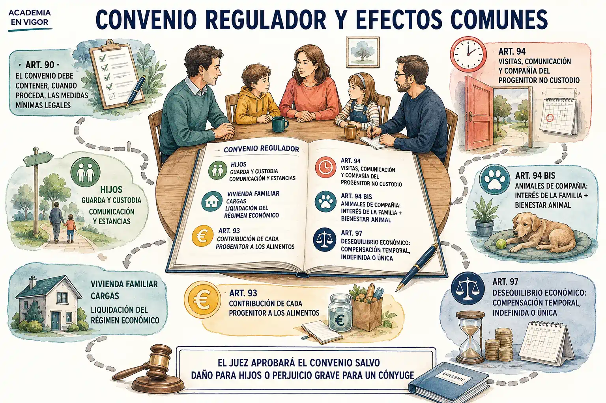

<em>Infografía: esquema de convenio regulador y efectos comunes con relaciones y trampas de examen.</em>

<!-- FUENTE: CC-BOE-A-1889-4763-T07 -->

## 24. Medidas provisionales

### Regla y encaje

Medidas provisionales se estudia dentro de matrimonio y crisis matrimonial. El bloque se contrasta directamente con arts. 102 a 106 CC.

### Claves examinables

- **Artículo 102:** Admitida la demanda de nulidad, separación o divorcio, se producen, por ministerio de la Ley, los efectos siguientes: - **Artículo 102:** 1.° Los cónyuges podrán vivir separados y cesa la presunción de convivencia conyugal. <!-- FACT:GC-T07-F357 --> - **Artículo 102:** 2.° Quedan revocados los consentimientos y poderes que cualquiera de los cónyuges hubiera otorgado al otro. <!-- FACT:GC-T07-F358 --> - **Artículo 102:** Asimismo, salvo pacto en contrario, cesa la posibilidad de vincular los bienes privativos del otro cónyuge en el ejercicio de la potestad doméstica. <!-- FACT:GC-T07-F359 --> - **Artículo 102:** A estos efectos, cualquiera de las partes podrá instar la oportuna anotación en el Registro Civil y, en su caso, en los de la Propiedad y Mercantil. <!-- FACT:GC-T07-F360 --> - **Artículo 103:** Admitida la demanda, el Juez, a falta de acuerdo de ambos cónyuges aprobado judicialmente, adoptará, con audiencia de éstos, las medidas siguientes: <!-- FACT:GC-T07-F361 --> - **Artículo 103:** 1.ª Determinar, en interés de los hijos, con cuál de los cónyuges han de quedar los sujetos a la patria potestad de ambos y tomar las disposiciones apropiadas de acuerdo con lo establecido en este Código y, en particular, la forma en que el cónyuge que no ejerza la guarda y custodia de los hijos podrá cumplir el deber de velar por éstos y el tiempo, modo y lugar en que podrá comunicar con ellos y tenerlos en su compañía. <!-- FACT:GC-T07-F362 --> - **Artículo 103:** Excepcionalmente, los hijos podrán ser encomendados a los abuelos, parientes u otras personas que así lo consintieren y, de no haberlos, a una institución idónea, confiriéndoseles las funciones tutelares que ejercerán bajo la autoridad del juez. <!-- FACT:GC-T07-F363 --> - **Artículo 103:** Cuando exista riesgo de sustracción del menor por alguno de los cónyuges o por terceras personas podrán adoptarse las medidas necesarias y, en particular, las siguientes: <!-- FACT:GC-T07-F364 --> - **Artículo 103:** a) Prohibición de salida del territorio nacional, salvo autorización judicial previa. <!-- FACT:GC-T07-F365 --> - **Artículo 103:** b) Prohibición de expedición del pasaporte al menor o retirada del mismo si ya se hubiere expedido. <!-- FACT:GC-T07-F366 --> - **Artículo 103:** c) Sometimiento a autorización judicial previa de cualquier cambio de domicilio del menor. <!-- FACT:GC-T07-F367 --> - **Artículo 103:** 1.ª bis Determinar, atendiendo al interés de los miembros de la familia y al bienestar del animal, si los animales de compañía se confían a uno o a ambos cónyuges, la forma en que el cónyuge al que no se hayan confiado podrá tenerlos en su compañía, así como también las medidas cautelares convenientes para conservar el derecho de cada uno. <!-- FACT:GC-T07-F368 --> - **Artículo 103:** 2.ª Determinar, teniendo en cuenta el interés familiar más necesitado de protección, cuál de los cónyuges ha de continuar en el uso de la vivienda familiar y asimismo, previo inventario, los bienes y objetos del ajuar que continúan en ésta y los que se ha de llevar el otro cónyuge, así como también las medidas cautelares convenientes para conservar el derecho de cada uno. <!-- FACT:GC-T07-F369 --> - **Artículo 103:** 3.ª Fijar, la contribución de cada cónyuge a las cargas del matrimonio, incluidas si procede las «litis expensas», establecer las bases para la actualización de cantidades y disponer las garantías, depósitos, retenciones u otras medidas cautelares convenientes, a fin de asegurar la efectividad de lo que por estos conceptos un cónyuge haya de abonar al otro. <!-- FACT:GC-T07-F370 --> - **Artículo 103:** Se considerará contribución a dichas cargas el trabajo que uno de los cónyuges dedicará a la atención de los hijos comunes sujetos a patria potestad. <!-- FACT:GC-T07-F371 --> - **Artículo 103:** 4.ª Señalar, atendidas las circunstancias, los bienes gananciales o comunes que, previo inventario, se hayan de entregar a uno u otro cónyuge y las reglas que deban observar en la administración y disposición, así como en la obligatoria rendición de cuentas sobre los bienes comunes o parte de ellos que reciban y los que adquieran en lo sucesivo. <!-- FACT:GC-T07-F372 --> - **Artículo 103:** 5.ª Determinar, en su caso, el régimen de administración y disposición de aquellos bienes privativos que por capitulaciones o escritura pública estuvieran especialmente afectados a las cargas del matrimonio. <!-- FACT:GC-T07-F373 --> - **Artículo 104:** El cónyuge que se proponga demandar la nulidad, separación o divorcio de su matrimonio puede solicitar los efectos y medidas a que se refieren los dos artículos anteriores. <!-- FACT:GC-T07-F374 --> - **Artículo 104:** Estos efectos y medidas sólo subsistirán si, dentro de los treinta días siguientes a contar desde que fueron inicialmente adoptados, se presenta la demanda ante el Juez o Tribunal competente. <!-- FACT:GC-T07-F375 --> - **Artículo 105:** No incumple el deber de convivencia el cónyuge que sale del domicilio conyugal por una causa razonable y en el plazo de treinta días presenta la demanda o solicitud a que se refieren los artículos anteriores. <!-- FACT:GC-T07-F376 --> - **Artículo 106:** Los efectos y medidas previstos en este capítulo terminan, en todo caso, cuando sean sustituidos por los de la sentencia estimatoria o se ponga fin al procedimiento de otro modo. <!-- FACT:GC-T07-F377 --> - **Artículo 106:** La revocación de consentimientos y poderes se entiende definitiva. <!-- FACT:GC-T07-F378 -->  <!-- FACT:GC-T07-F379 -->

:::hablemos-claro
No basta con reconocer una frase verdadera: hay que comprobar que pertenece al artículo preguntado y que no se ha sustituido una facultad por una obligación, un plazo por otro o una excepción por la regla general.
:::

:::en-la-calle
En un supuesto práctico, fija quién actúa, qué capacidad o vínculo tiene, qué autoridad interviene y qué consecuencia civil produce la actuación.
:::

:::lo-que-cae
Prioriza requisitos, plazos, legitimación, autoridad competente y excepciones. Apariciones oficiales mapeadas en este bloque: **1**.
:::

<!-- VISUAL:t07-24-medidas-provisionales.webp -->

  

<em>Infografía: esquema de medidas provisionales con relaciones y trampas de examen.</em>

<!-- FUENTE: CC-BOE-A-1889-4763-T07 -->

## 25. Ley aplicable a la nulidad, separación y divorcio

### Regla y encaje

Ley aplicable a la nulidad, separación y divorcio se estudia dentro de matrimonio y crisis matrimonial. El bloque se contrasta directamente con art. 107 CC.

### Claves examinables

- **Artículo 107:** 1. La nulidad del matrimonio y sus efectos se determinarán de conformidad con la ley aplicable a su celebración. - **Artículo 107:** 2. La separación y el divorcio legal se regirán por las normas de la Unión Europea o españolas de Derecho internacional privado. <!-- FACT:GC-T07-F380 -->  <!-- FACT:GC-T07-F381 -->

:::hablemos-claro
No basta con reconocer una frase verdadera: hay que comprobar que pertenece al artículo preguntado y que no se ha sustituido una facultad por una obligación, un plazo por otro o una excepción por la regla general.
:::

:::en-la-calle
En un supuesto práctico, fija quién actúa, qué capacidad o vínculo tiene, qué autoridad interviene y qué consecuencia civil produce la actuación.
:::

:::lo-que-cae
Prioriza requisitos, plazos, legitimación, autoridad competente y excepciones. Apariciones oficiales mapeadas en este bloque: **0**.
:::

<!-- VISUAL:t07-25-ley-aplicable-a-la-nulidad-separacion-y-divorcio.webp -->

  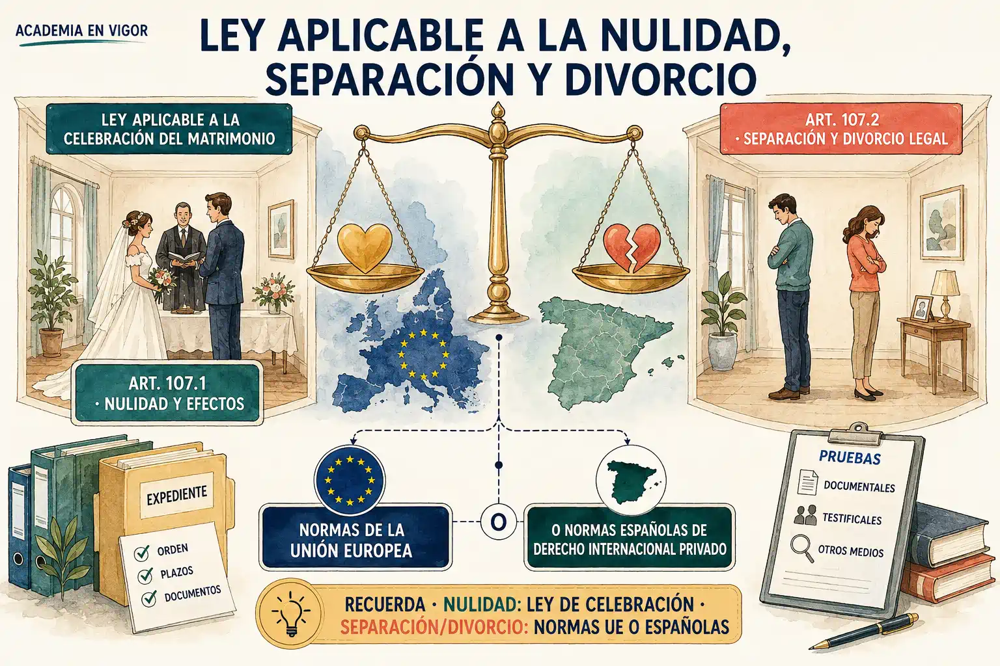

<em>Infografía: esquema de ley aplicable a la nulidad, separación y divorcio con relaciones y trampas de examen.</em>

<!-- FUENTE: CC-BOE-A-1889-4763-T07 -->

## 26. Filiación y sus efectos

### Regla y encaje

Filiación y sus efectos se estudia dentro de filiación, alimentos y relaciones paterno-filiales. El bloque se contrasta directamente con arts. 108 a 111 CC.

### Claves examinables

- **Artículo 108:** La filiación puede tener lugar por naturaleza y por adopción. La filiación por naturaleza puede ser matrimonial y no matrimonial. Es matrimonial cuando los progenitores están casados entre sí. - **Artículo 108:** La filiación matrimonial y la no matrimonial, así como la adoptiva, surten los mismos efectos, conforme a las disposiciones de este Código. <!-- FACT:GC-T07-F382 --> - **Artículo 109:** La filiación determina los apellidos con arreglo a lo dispuesto en la ley. <!-- FACT:GC-T07-F383 --> - **Artículo 109:** Si la filiación está determinada por ambas líneas, los progenitores de común acuerdo podrán decidir el orden de transmisión de su respectivo primer apellido, antes de la inscripción registral. Si no se ejercita esta opción, regirá lo dispuesto en la ley. <!-- FACT:GC-T07-F384 --> - **Artículo 109:** El orden de apellidos inscrito para el mayor de los hijos regirá en las inscripciones de nacimiento posteriores de sus hermanos del mismo vínculo. <!-- FACT:GC-T07-F385 --> - **Artículo 109:** El hijo, al alcanzar la mayoría de edad, podrá solicitar que se altere el orden de los apellidos. <!-- FACT:GC-T07-F386 --> - **Artículo 110:** Aunque no ostenten la patria potestad, ambos progenitores están obligados a velar por los hijos menores y a prestarles alimentos. <!-- FACT:GC-T07-F387 --> - **Artículo 111:** Quedará excluido de la patria potestad y demás funciones tuitivas y no ostentará derechos por ministerio de la Ley respecto del hijo o de sus descendientes, o en sus herencias, el progenitor: <!-- FACT:GC-T07-F388 --> - **Artículo 111:** 1.° Cuando haya sido condenado a causa de las relaciones a que obedezca la generación, según sentencia penal firme. <!-- FACT:GC-T07-F389 --> - **Artículo 111:** 2.° Cuando la filiación haya sido judicialmente determinada contra su oposición. <!-- FACT:GC-T07-F390 --> - **Artículo 111:** En ambos supuestos el hijo no ostentará el apellido del progenitor en cuestión más que si lo solicita él mismo o su representante legal. <!-- FACT:GC-T07-F391 --> - **Artículo 111:** Dejarán de producir efecto estas restricciones por determinación del representante legal del hijo aprobada judicialmente, o por voluntad del propio hijo una vez alcanzada la plena capacidad. <!-- FACT:GC-T07-F392 --> - **Artículo 111:** Quedarán siempre a salvo las obligaciones de velar por los hijos y prestarles alimentos. <!-- FACT:GC-T07-F393 -->  <!-- FACT:GC-T07-F394 -->

:::hablemos-claro
No basta con reconocer una frase verdadera: hay que comprobar que pertenece al artículo preguntado y que no se ha sustituido una facultad por una obligación, un plazo por otro o una excepción por la regla general.
:::

:::en-la-calle
En un supuesto práctico, fija quién actúa, qué capacidad o vínculo tiene, qué autoridad interviene y qué consecuencia civil produce la actuación.
:::

:::lo-que-cae
Prioriza requisitos, plazos, legitimación, autoridad competente y excepciones. Apariciones oficiales mapeadas en este bloque: **2**.
:::

<!-- VISUAL:t07-26-filiacion-y-sus-efectos.webp -->

  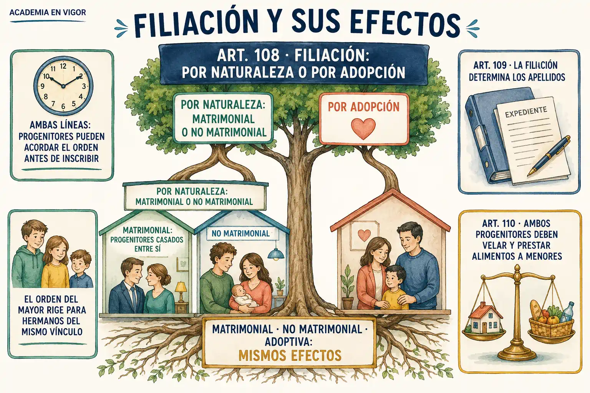

<em>Infografía: esquema de filiación y sus efectos con relaciones y trampas de examen.</em>

<!-- FUENTE: CC-BOE-A-1889-4763-T07 -->

## 27. Determinación y prueba de la filiación

### Regla y encaje

Determinación y prueba de la filiación se estudia dentro de filiación, alimentos y relaciones paterno-filiales. El bloque se contrasta directamente con arts. 112 a 114 CC.

### Claves examinables

- **Artículo 112:** La filiación produce sus efectos desde que tiene lugar. Su determinación legal tiene efectos retroactivos siempre que la retroactividad sea compatible con la naturaleza de aquéllos y la Ley no dispusiere lo contrario. - **Artículo 112:** En todo caso conservarán su validez los actos otorgados en nombre del hijo menor por su representante legal o, en el caso de los mayores con discapacidad que tuvieran previstas medidas de apoyo, los realizados conforme a estas, antes de que la filiación hubiera sido determinada. <!-- FACT:GC-T07-F395 --> - **Artículo 113:** La filiación se acredita por la inscripción en el Registro Civil, por el documento o sentencia que la determina legalmente, por la presunción de paternidad matrimonial y, a falta de los medios anteriores, por la posesión de estado. Para la admisión de pruebas distintas a la inscripción se estará a lo dispuesto en la Ley de Registro Civil. <!-- FACT:GC-T07-F396 --> - **Artículo 113:** No será eficaz la determinación de una filiación en tanto resulte acreditada otra contradictoria. <!-- FACT:GC-T07-F397 --> - **Artículo 114:** Los asientos de filiación podrán ser rectificados conforme a la Ley de Registro Civil, sin perjuicio de lo especialmente dispuesto en el presente título sobre acciones de impugnación. <!-- FACT:GC-T07-F398 --> - **Artículo 114:** Podrán también rectificarse en cualquier momento los asientos que resulten contradictorios con los hechos que una sentencia penal declare probados. <!-- FACT:GC-T07-F399 -->  <!-- FACT:GC-T07-F400 -->

:::hablemos-claro
No basta con reconocer una frase verdadera: hay que comprobar que pertenece al artículo preguntado y que no se ha sustituido una facultad por una obligación, un plazo por otro o una excepción por la regla general.
:::

:::en-la-calle
En un supuesto práctico, fija quién actúa, qué capacidad o vínculo tiene, qué autoridad interviene y qué consecuencia civil produce la actuación.
:::

:::lo-que-cae
Prioriza requisitos, plazos, legitimación, autoridad competente y excepciones. Apariciones oficiales mapeadas en este bloque: **0**.
:::

<!-- VISUAL:t07-27-determinacion-y-prueba-de-la-filiacion.webp -->

  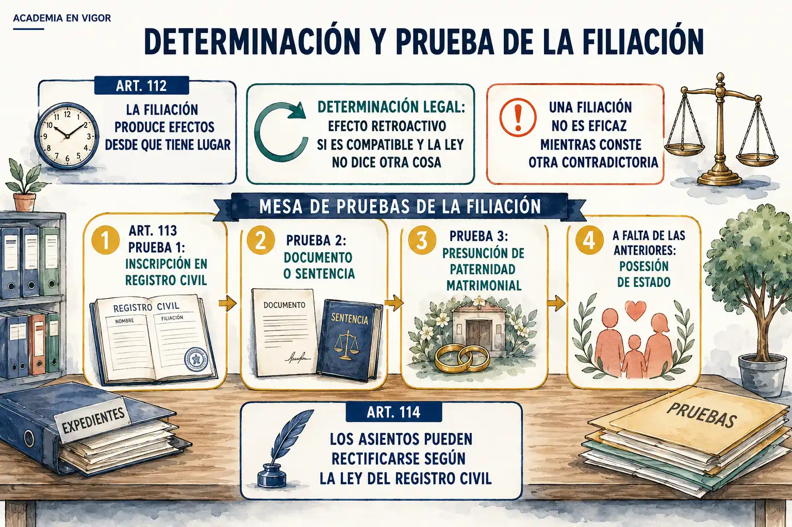

<em>Infografía: esquema de determinación y prueba de la filiación con relaciones y trampas de examen.</em>

<!-- FUENTE: CC-BOE-A-1889-4763-T07 -->

## 28. Filiación matrimonial

### Regla y encaje

Filiación matrimonial se estudia dentro de filiación, alimentos y relaciones paterno-filiales. El bloque se contrasta directamente con arts. 115 a 119 CC.

### Claves examinables

- **Artículo 115:** La filiación matrimonial materna y paterna quedará determinada legalmente: - **Artículo 115:** 1.° Por la inscripción del nacimiento junto con la del matrimonio de los padres. 2.° Por sentencia firme. <!-- FACT:GC-T07-F401 --> - **Artículo 116:** Se presumen hijos del marido los nacidos después de la celebración del matrimonio y antes de los trescientos días siguientes a su disolución o a la separación legal o de hecho de los cónyuges. <!-- FACT:GC-T07-F402 --> - **Artículo 117:** Nacido el hijo dentro de los ciento ochenta días siguientes a la celebración del matrimonio, podrá el marido destruir la presunción mediante declaración auténtica en contrario formalizada dentro de los seis meses siguientes al conocimiento del parto. <!-- FACT:GC-T07-F403 --> - **Artículo 117:** Se exceptúan los casos en que hubiere reconocido la paternidad expresa o tácitamente o hubiese conocido el embarazo de la mujer con anterioridad a la celebración del matrimonio, salvo que, en este último supuesto, la declaración auténtica se hubiera formalizado con el consentimiento de ambos, antes del matrimonio o después del mismo, dentro de los seis meses siguientes al nacimiento del hijo. <!-- FACT:GC-T07-F404 --> - **Artículo 118:** Aun faltando la presunción de paternidad del marido por causa de la separación legal o de hecho de los cónyuges, podrá inscribirse la filiación como matrimonial si concurre el consentimiento de ambos. <!-- FACT:GC-T07-F405 --> - **Artículo 119:** La filiación adquiere el carácter de matrimonial desde la fecha del matrimonio de los progenitores cuando éste tenga lugar con posterioridad al nacimiento del hijo siempre que el hecho de la filiación quede determinado legalmente conforme a lo dispuesto en la sección siguiente. <!-- FACT:GC-T07-F406 --> - **Artículo 119:** Lo establecido en el párrafo anterior aprovechará, en su caso, a los descendientes del hijo fallecido. <!-- FACT:GC-T07-F407 -->  <!-- FACT:GC-T07-F408 -->

:::hablemos-claro
No basta con reconocer una frase verdadera: hay que comprobar que pertenece al artículo preguntado y que no se ha sustituido una facultad por una obligación, un plazo por otro o una excepción por la regla general.
:::

:::en-la-calle
En un supuesto práctico, fija quién actúa, qué capacidad o vínculo tiene, qué autoridad interviene y qué consecuencia civil produce la actuación.
:::

:::lo-que-cae
Prioriza requisitos, plazos, legitimación, autoridad competente y excepciones. Apariciones oficiales mapeadas en este bloque: **1**.
:::

<!-- VISUAL:t07-28-filiacion-matrimonial.webp -->

  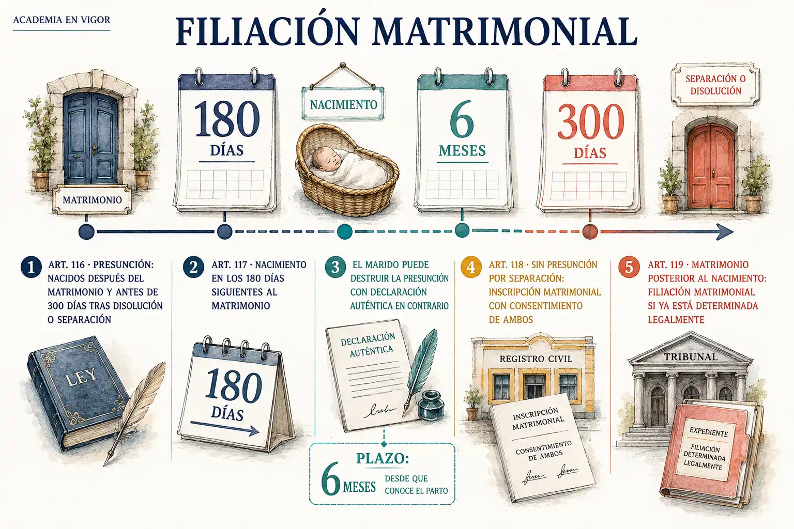

<em>Infografía: esquema de filiación matrimonial con relaciones y trampas de examen.</em>

<!-- FUENTE: CC-BOE-A-1889-4763-T07 -->

## 29. Filiación no matrimonial

### Regla y encaje

Filiación no matrimonial se estudia dentro de filiación, alimentos y relaciones paterno-filiales. El bloque se contrasta directamente con arts. 120 a 126 CC.

### Claves examinables

- **Artículo 120:** La filiación no matrimonial quedará determinada legalmente: - **Artículo 120:** 1.º En el momento de la inscripción del nacimiento, por la declaración conforme realizada por el padre o progenitor no gestante en el correspondiente formulario oficial a que se refiere la legislación del Registro Civil. <!-- FACT:GC-T07-F409 --> - **Artículo 120:** 2.º Por el reconocimiento ante el Encargado del Registro Civil, en testamento o en otro documento público. <!-- FACT:GC-T07-F410 --> - **Artículo 120:** 3.º Por resolución recaída en expediente tramitado con arreglo a la legislación del Registro Civil. <!-- FACT:GC-T07-F411 --> - **Artículo 120:** 4.º Por sentencia firme. <!-- FACT:GC-T07-F412 --> - **Artículo 120:** 5.º Respecto de la madre o progenitor gestante, cuando se haga constar su filiación en la inscripción de nacimiento practicada dentro de plazo, de acuerdo con lo dispuesto en la Ley del Registro Civil. <!-- FACT:GC-T07-F413 --> - **Artículo 121:** El reconocimiento otorgado por menores no emancipados necesitará para su validez aprobación judicial con audiencia del Ministerio Fiscal. <!-- FACT:GC-T07-F414 --> - **Artículo 121:** Para la validez del reconocimiento otorgado por personas mayores de edad respecto de las que hayan establecido medidas de apoyo se estará a lo que resulte de la resolución judicial o escritura pública que las haya establecido. Si nada se hubiese dispuesto y no hubiera medidas voluntarias de apoyo, se instruirá la correspondiente revisión de las medidas de apoyo judicialmente adoptadas para completarlas a este fin. <!-- FACT:GC-T07-F415 --> - **Artículo 122:** Cuando un progenitor hiciere el reconocimiento separadamente, no podrá manifestar en él la identidad del otro a no ser que esté ya determinada legalmente. <!-- FACT:GC-T07-F416 --> - **Artículo 123:** El reconocimiento de un hijo mayor de edad no producirá efectos sin su consentimiento expreso o tácito. <!-- FACT:GC-T07-F417 --> - **Artículo 123:** El consentimiento para la eficacia del reconocimiento de la persona mayor de edad con discapacidad se prestará por esta, de manera expresa o tácita, con los apoyos que requiera para ello. En caso de que exista resolución judicial o escritura pública que haya establecido medidas de apoyo, se estará a lo allí dispuesto. <!-- FACT:GC-T07-F418 --> - **Artículo 124:** La eficacia del reconocimiento de la persona menor de edad requerirá el consentimiento expreso de su representante legal o la aprobación judicial con audiencia del Ministerio Fiscal y del progenitor legalmente conocido. <!-- FACT:GC-T07-F419 --> - **Artículo 124:** No será necesario el consentimiento o la aprobación si el reconocimiento se hubiere efectuado en testamento o dentro del plazo establecido para practicar la inscripción del nacimiento. La inscripción de la filiación del padre o progenitor no gestante así practicada podrá suspenderse a simple petición de la madre o progenitor gestante durante el año siguiente al nacimiento. <!-- FACT:GC-T07-F420 --> - **Artículo 124:** Si el padre o progenitor no gestante solicitara la confirmación de la inscripción, será necesaria la aprobación judicial con audiencia del Ministerio Fiscal. <!-- FACT:GC-T07-F421 --> - **Artículo 125:** Cuando los progenitores del menor fueren hermanos o consanguíneos en línea recta, legalmente determinada la filiación respecto de uno, solo podrá quedar determinada legalmente respecto del otro previa autorización judicial, que se otorgará con audiencia del Ministerio Fiscal, cuando convenga al interés del menor. <!-- FACT:GC-T07-F422 --> - **Artículo 125:** El menor podrá, alcanzada la mayoría de edad, invalidar mediante declaración auténtica esta última determinación si no la hubiere consentido. <!-- FACT:GC-T07-F423 --> - **Artículo 126:** El reconocimiento del ya fallecido sólo surtirá efecto si lo consintieren sus descendientes por sí o por sus representantes legales. <!-- FACT:GC-T07-F424 -->  <!-- FACT:GC-T07-F425 -->

:::hablemos-claro
No basta con reconocer una frase verdadera: hay que comprobar que pertenece al artículo preguntado y que no se ha sustituido una facultad por una obligación, un plazo por otro o una excepción por la regla general.
:::

:::en-la-calle
En un supuesto práctico, fija quién actúa, qué capacidad o vínculo tiene, qué autoridad interviene y qué consecuencia civil produce la actuación.
:::

:::lo-que-cae
Prioriza requisitos, plazos, legitimación, autoridad competente y excepciones. Apariciones oficiales mapeadas en este bloque: **0**.
:::

<!-- VISUAL:t07-29-filiacion-no-matrimonial.webp -->

  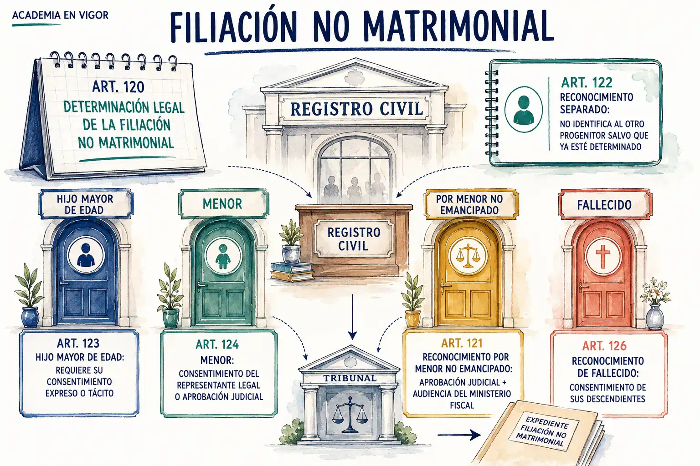

<em>Infografía: esquema de filiación no matrimonial con relaciones y trampas de examen.</em>

<!-- FUENTE: CC-BOE-A-1889-4763-T07 -->

## 30. Acciones de filiación y reclamación

### Regla y encaje

Acciones de filiación y reclamación se estudia dentro de filiación, alimentos y relaciones paterno-filiales. El bloque se contrasta directamente con arts. 127 a 134 CC.

### Claves examinables

- **Arts. 127 a 130:** Arts. 127 a 130 figura derogado en la redacción consolidada vigente del Código Civil. - **Artículo 131:** Cualquier persona con interés legítimo tiene acción para que se declare la filiación manifestada por la constante posesión de estado. <!-- FACT:GC-T07-F426 --> - **Artículo 131:** Se exceptúa el supuesto en que la filiación que se reclame contradiga otra legalmente determinada. <!-- FACT:GC-T07-F427 --> - **Artículo 132:** A falta de la correspondiente posesión de estado, la acción de reclamación de la filiación matrimonial, que es imprescriptible, corresponde a cualquiera de los dos progenitores o al hijo. <!-- FACT:GC-T07-F428 --> - **Artículo 132:** Si el hijo falleciere antes de transcurrir cuatro años desde que alcanzase plena capacidad, o durante el año siguiente al descubrimiento de las pruebas en que se haya de fundar la demanda, su acción corresponde a sus herederos por el tiempo que faltare para completar dichos plazos. <!-- FACT:GC-T07-F429 --> - **Artículo 133:** 1. La acción de reclamación de filiación no matrimonial, cuando falte la respectiva posesión de estado, corresponderá al hijo durante toda su vida. <!-- FACT:GC-T07-F430 --> - **Artículo 133:** Si el hijo falleciere antes de transcurrir cuatro años desde que alcanzare la mayoría de edad o desde que se eliminaren las medidas de apoyo que tuviera previstas a tales efectos, o durante el año siguiente al descubrimiento de las pruebas en que se funde la demanda, su acción corresponderá a sus herederos por el tiempo que faltare para completar dichos plazos. <!-- FACT:GC-T07-F431 --> - **Artículo 133:** 2. Igualmente podrán ejercitar la presente acción de filiación los progenitores en el plazo de un año contado desde que hubieran tenido conocimiento de los hechos en que hayan de basar su reclamación. <!-- FACT:GC-T07-F432 --> - **Artículo 133:** Esta acción no será transmisible a los herederos quienes solo podrán continuar la acción que el progenitor hubiere iniciado en vida. <!-- FACT:GC-T07-F433 --> - **Artículo 134:** El ejercicio de la acción de reclamación, conforme a los artículos anteriores, por el hijo o el progenitor, permitirá en todo caso la impugnación de la filiación contradictoria. <!-- FACT:GC-T07-F434 -->  <!-- FACT:GC-T07-F435 -->

:::hablemos-claro
No basta con reconocer una frase verdadera: hay que comprobar que pertenece al artículo preguntado y que no se ha sustituido una facultad por una obligación, un plazo por otro o una excepción por la regla general.
:::

:::en-la-calle
En un supuesto práctico, fija quién actúa, qué capacidad o vínculo tiene, qué autoridad interviene y qué consecuencia civil produce la actuación.
:::

:::lo-que-cae
Prioriza requisitos, plazos, legitimación, autoridad competente y excepciones. Apariciones oficiales mapeadas en este bloque: **0**.
:::

<!-- VISUAL:t07-30-acciones-de-filiacion-y-reclamacion.webp -->

  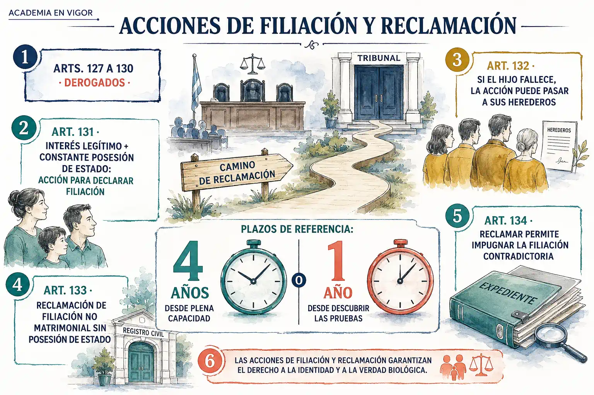

<em>Infografía: esquema de acciones de filiación y reclamación con relaciones y trampas de examen.</em>

<!-- FUENTE: CC-BOE-A-1889-4763-T07 -->

## 31. Impugnación de la filiación

### Regla y encaje

Impugnación de la filiación se estudia dentro de filiación, alimentos y relaciones paterno-filiales. El bloque se contrasta directamente con arts. 135 a 141 CC.

### Claves examinables

- **Artículo 135:** (Derogado) - **Artículo 136:** 1. El marido podrá ejercitar la acción de impugnación de la paternidad en el plazo de un año contado desde la inscripción de la filiación en el Registro Civil. Sin embargo, el plazo no correrá mientras el marido ignore el nacimiento. Fallecido el marido sin conocer el nacimiento, el año se contará desde que lo conozca el heredero. <!-- FACT:GC-T07-F436 --> - **Artículo 136:** 2. Si el marido, pese a conocer el hecho del nacimiento de quien ha sido inscrito como hijo suyo, desconociera su falta de paternidad biológica, el cómputo del plazo de un año comenzará a contar desde que tuviera tal conocimiento. <!-- FACT:GC-T07-F437 --> - **Artículo 136:** 3. Si el marido falleciere antes de transcurrir el plazo señalado en los párrafos anteriores, la acción corresponderá a cada heredero por el tiempo que faltare para completar dicho plazo. <!-- FACT:GC-T07-F438 --> - **Artículo 137:** 1. La filiación del padre o progenitor no gestante podrá ser impugnada por el hijo durante el año siguiente a la inscripción de la filiación. Si fuere menor o persona con discapacidad con medidas de apoyo, para impugnarla, el plazo del año se contará desde la mayoría de edad o desde la extinción de las medidas de apoyo. <!-- FACT:GC-T07-F439 --> - **Artículo 137:** El ejercicio de la acción, en interés del hijo que sea menor, corresponderá, asimismo, durante el año siguiente a la inscripción de la filiación, a la madre o progenitor gestante que ostente la patria potestad, a su representante legal o al Ministerio Fiscal. <!-- FACT:GC-T07-F440 --> - **Artículo 137:** Si se tratare de persona con discapacidad con medidas de apoyo, esta, quien preste el apoyo y se encuentre expresamente facultado para ello o, en su defecto, el Ministerio Fiscal, podrán, asimismo, ejercitar la acción de impugnación durante el año siguiente a la inscripción de la filiación. <!-- FACT:GC-T07-F441 --> - **Artículo 137:** 2. Si el hijo, pese a haber transcurrido más de un año desde la inscripción en el registro, desde su mayoría de edad o desde la extinción de la medida de apoyo, desconociera la falta de paternidad biológica de quien aparece inscrito como su padre o progenitor no gestante, el cómputo del plazo de un año comenzará a contar desde que tuviera tal conocimiento. <!-- FACT:GC-T07-F442 --> - **Artículo 137:** 3. Cuando el hijo falleciere antes de transcurrir los plazos establecidos en los párrafos anteriores, su acción corresponderá a sus herederos por el tiempo que faltare para completar dichos plazos. <!-- FACT:GC-T07-F443 --> - **Artículo 137:** 4. Si falta en las relaciones familiares la posesión de estado de filiación matrimonial, la demanda podrá ser interpuesta en cualquier tiempo por el hijo o sus herederos. <!-- FACT:GC-T07-F444 --> - **Artículo 138:** El reconocimiento y demás actos jurídicos que determinen conforme a la ley una filiación matrimonial o no matrimonial podrán ser impugnados por vicio de consentimiento según lo dispuesto en el artículo 141. La impugnación de la paternidad por otras causas se atendrá a las normas contenidas en esta sección. <!-- FACT:GC-T07-F445 --> - **Artículo 139:** La madre o progenitor que conste como gestante podrá ejercitar la acción de impugnación de la filiación justificando la suposición del parto o no ser cierta la identidad del hijo. <!-- FACT:GC-T07-F446 --> - **Artículo 140:** Cuando falte en las relaciones familiares la posesión de estado, la filiación paterna o materna no matrimonial podrá ser impugnada por aquellos a quienes perjudique. <!-- FACT:GC-T07-F447 --> - **Artículo 140:** Cuando exista posesión de estado, la acción de impugnación corresponderá a quien aparece como hijo o progenitor y a quienes por la filiación puedan resultar afectados en su calidad de herederos forzosos. La acción caducará pasados cuatro años desde que el hijo, una vez inscrita la filiación, goce de la posesión de estado correspondiente. <!-- FACT:GC-T07-F448 --> - **Artículo 140:** Los hijos tendrán en todo caso acción durante un año después de alcanzar la mayoría de edad o de recobrar capacidad suficiente a tales efectos. <!-- FACT:GC-T07-F449 --> - **Artículo 141:** La acción de impugnación del reconocimiento realizado mediante error, violencia o intimidación corresponde a quien lo hubiere otorgado. La acción caducará al año del reconocimiento o desde que cesó el vicio de consentimiento, y podrá ser ejercitada o continuada por los herederos de aquél, si hubiere fallecido antes de transcurrir el año. <!-- FACT:GC-T07-F450 -->  <!-- FACT:GC-T07-F451 -->

:::hablemos-claro
No basta con reconocer una frase verdadera: hay que comprobar que pertenece al artículo preguntado y que no se ha sustituido una facultad por una obligación, un plazo por otro o una excepción por la regla general.
:::

:::en-la-calle
En un supuesto práctico, fija quién actúa, qué capacidad o vínculo tiene, qué autoridad interviene y qué consecuencia civil produce la actuación.
:::

:::lo-que-cae
Prioriza requisitos, plazos, legitimación, autoridad competente y excepciones. Apariciones oficiales mapeadas en este bloque: **0**.
:::

<!-- VISUAL:t07-31-impugnacion-de-la-filiacion.webp -->

  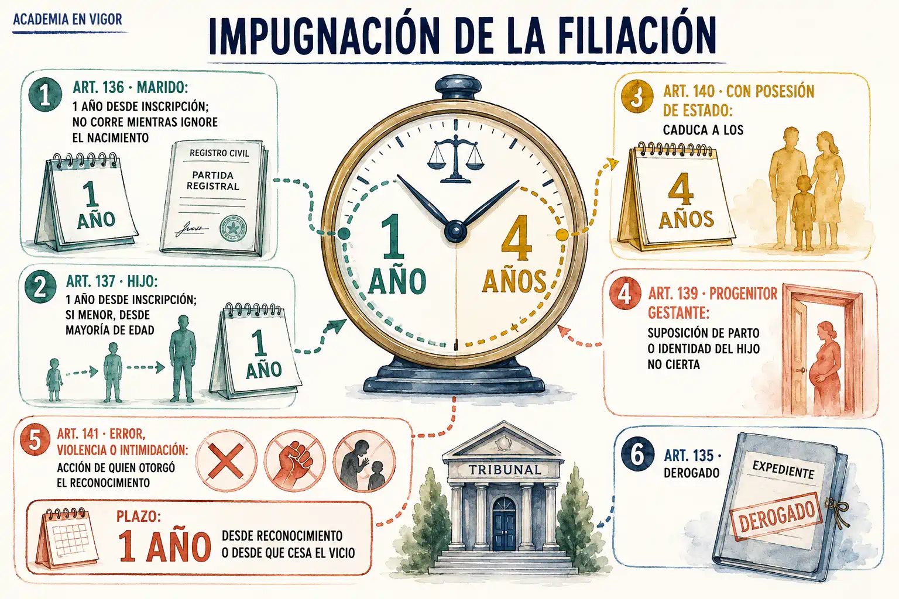

<em>Infografía: esquema de impugnación de la filiación con relaciones y trampas de examen.</em>

<!-- FUENTE: CC-BOE-A-1889-4763-T07 -->

## 32. Alimentos entre parientes

### Regla y encaje

Alimentos entre parientes se estudia dentro de filiación, alimentos y relaciones paterno-filiales. El bloque se contrasta directamente con arts. 142 a 153 CC.

### Claves examinables

- **Artículo 142:** Se entiende por alimentos todo lo que es indispensable para el sustento, habitación, vestido y asistencia médica. - **Artículo 142:** Los alimentos comprenden también la educación e instrucción del alimentista mientras sea menor de edad y aun después cuando no haya terminado su formación por causa que no le sea imputable. <!-- FACT:GC-T07-F452 --> - **Artículo 142:** Entre los alimentos se incluirán los gastos de embarazo y parto, en cuanto no estén cubiertos de otro modo. <!-- FACT:GC-T07-F453 --> - **Artículo 143:** Están obligados recíprocamente a darse alimentos en toda la extensión que señala el artículo precedente: <!-- FACT:GC-T07-F454 --> - **Artículo 143:** 1.° Los cónyuges. 2.° Los ascendientes y descendientes. <!-- FACT:GC-T07-F455 --> - **Artículo 143:** Los hermanos sólo se deben los auxilios necesarios para la vida, cuando los necesiten por cualquier causa que no sea imputable al alimentista, y se extenderán en su caso a los que precisen para su educación. <!-- FACT:GC-T07-F456 --> - **Artículo 144:** La reclamación de alimentos cuando proceda y sean dos o más los obligados a prestarlos se hará por el orden siguiente: <!-- FACT:GC-T07-F457 --> - **Artículo 144:** 1.° Al cónyuge. 2.° A los descendientes de grado más próximo. <!-- FACT:GC-T07-F458 --> - **Artículo 144:** 3.° A los ascendientes, también de grado más próximo. <!-- FACT:GC-T07-F459 --> - **Artículo 144:** 4.° A los hermanos, pero estando obligados en último lugar los que sólo sean uterinos o consanguíneos. <!-- FACT:GC-T07-F460 --> - **Artículo 144:** Entre los descendientes y ascendientes se regulará la gradación por el orden en que sean llamados a la sucesión legítima de la persona que tenga derecho a los alimentos. <!-- FACT:GC-T07-F461 --> - **Artículo 145:** Cuando recaiga sobre dos o más personas la obligación de dar alimentos, se repartirá entre ellas el pago de la pensión en cantidad proporcional a su caudal respectivo. <!-- FACT:GC-T07-F462 --> - **Artículo 145:** Sin embargo, en caso de urgente necesidad y por circunstancias especiales, podrá el Juez obligar a una sola de ellas a que los preste provisionalmente, sin perjuicio de su derecho a reclamar de los demás obligados la parte que les corresponda. <!-- FACT:GC-T07-F463 --> - **Artículo 145:** Cuando dos o más alimentistas reclamaren a la vez alimentos de una misma persona obligada legalmente a darlos, y ésta no tuviere fortuna bastante para atender a todos, se guardará el orden establecido en el artículo anterior, a no ser que los alimentistas concurrentes fuesen el cónyuge y un hijo sujeto a la patria potestad, en cuyo caso éste será preferido a aquél. <!-- FACT:GC-T07-F464 --> - **Artículo 146:** La cuantía de los alimentos será proporcionada al caudal o medios de quien los da y a las necesidades de quien los recibe. <!-- FACT:GC-T07-F465 --> - **Artículo 147:** Los alimentos, en los casos a que se refiere el artículo anterior, se reducirán o aumentarán proporcionalmente según el aumento o disminución que sufran las necesidades del alimentista y la fortuna del que hubiere de satisfacerlos. <!-- FACT:GC-T07-F466 --> - **Artículo 148:** La obligación de dar alimentos será exigible desde que los necesitare, para subsistir, la persona que tenga derecho a percibirlos, pero no se abonarán sino desde la fecha en que se interponga la demanda. <!-- FACT:GC-T07-F467 --> - **Artículo 148:** Se verificará el pago por meses anticipados, y, cuando fallezca el alimentista, sus herederos no estarán obligados a devolver lo que éste hubiese recibido anticipadamente. <!-- FACT:GC-T07-F468 --> - **Artículo 148:** El Juez, a petición del alimentista o del Ministerio Fiscal, ordenará con urgencia las medidas cautelares oportunas para asegurar los anticipos que haga una Entidad pública u otra persona y proveer a las futuras necesidades. <!-- FACT:GC-T07-F469 --> - **Artículo 149:** El obligado a prestar alimentos podrá, a su elección, satisfacerlos, o pagando la pensión que se fije, o recibiendo y manteniendo en su propia casa al que tiene derecho a ellos. <!-- FACT:GC-T07-F470 --> - **Artículo 149:** Esta elección no será posible en cuanto contradiga la situación de convivencia determinada para el alimentista por las normas aplicables o por resolución judicial. También podrá ser rechazada cuando concurra justa causa o perjudique el interés del alimentista menor de edad. <!-- FACT:GC-T07-F471 --> - **Artículo 150:** La obligación de suministrar alimentos cesa con la muerte del obligado, aunque los prestase en cumplimiento de una sentencia firme. <!-- FACT:GC-T07-F472 --> - **Artículo 151:** No es renunciable ni transmisible a un tercero el derecho a los alimentos. Tampoco pueden compensarse con lo que el alimentista deba al que ha de prestarlos. <!-- FACT:GC-T07-F473 --> - **Artículo 151:** Pero podrán compensarse y renunciarse las pensiones alimenticias atrasadas, y transmitirse a título oneroso o gratuito el derecho a demandarlas. <!-- FACT:GC-T07-F474 --> - **Artículo 152:** Cesará también la obligación de dar alimentos: 1.º Por muerte del alimentista. <!-- FACT:GC-T07-F475 --> - **Artículo 152:** 2.º Cuando la fortuna del obligado a darlos se hubiere reducido hasta el punto de no poder satisfacerlos sin desatender sus propias necesidades y las de su familia. <!-- FACT:GC-T07-F476 --> - **Artículo 152:** 3.º Cuando el alimentista pueda ejercer un oficio, profesión o industria, o haya adquirido un destino o mejorado de fortuna, de suerte que no le sea necesaria la pensión alimenticia para su subsistencia. <!-- FACT:GC-T07-F477 --> - **Artículo 152:** 4.º Cuando el alimentista, sea o no heredero forzoso, hubiese cometido alguna falta de las que dan lugar a la desheredación. <!-- FACT:GC-T07-F478 --> - **Artículo 152:** 5.º Cuando el alimentista sea descendiente del obligado a dar alimentos, y la necesidad de aquél provenga de mala conducta o de falta de aplicación al trabajo, mientras subsista esta causa. <!-- FACT:GC-T07-F479 --> - **Artículo 153:** Las disposiciones que preceden son aplicables a los demás casos en que por este Código, por testamento o por pacto se tenga derecho a alimentos, salvo lo pactado, lo ordenado por el testador o lo dispuesto por la ley para el caso especial de que se trate. <!-- FACT:GC-T07-F480 -->  <!-- FACT:GC-T07-F481 -->

:::hablemos-claro
No basta con reconocer una frase verdadera: hay que comprobar que pertenece al artículo preguntado y que no se ha sustituido una facultad por una obligación, un plazo por otro o una excepción por la regla general.
:::

:::en-la-calle
En un supuesto práctico, fija quién actúa, qué capacidad o vínculo tiene, qué autoridad interviene y qué consecuencia civil produce la actuación.
:::

:::lo-que-cae
Prioriza requisitos, plazos, legitimación, autoridad competente y excepciones. Apariciones oficiales mapeadas en este bloque: **4**.
:::

<!-- VISUAL:t07-32-alimentos-entre-parientes.webp -->

  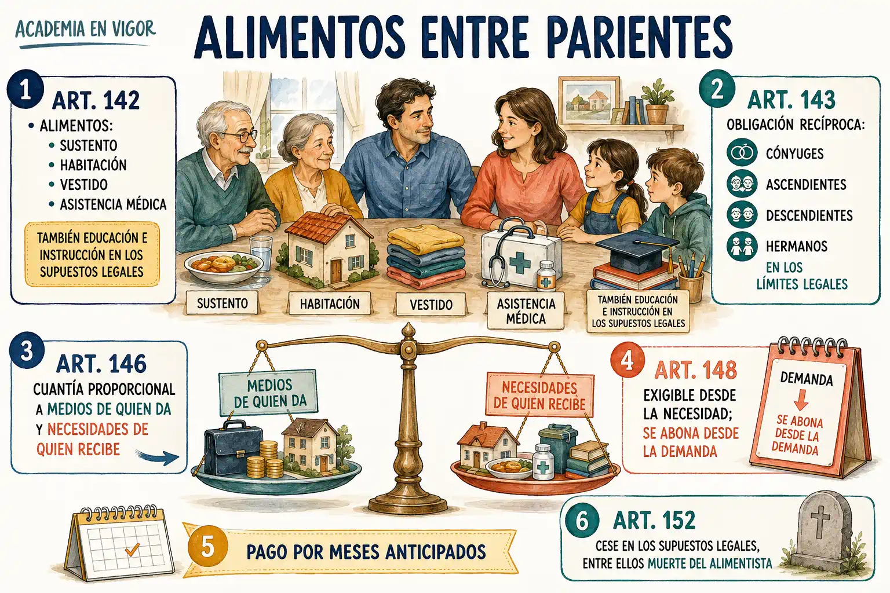

<em>Infografía: esquema de alimentos entre parientes con relaciones y trampas de examen.</em>

<!-- FUENTE: CC-BOE-A-1889-4763-T07 -->

## 33. Patria potestad: contenido y ejercicio

### Regla y encaje

Patria potestad: contenido y ejercicio se estudia dentro de filiación, alimentos y relaciones paterno-filiales. El bloque se contrasta directamente con arts. 154 a 161 CC.

### Claves examinables

- **Artículo 154:** Los hijos e hijas no emancipados están bajo la patria potestad de los progenitores. - **Artículo 154:** La patria potestad, como responsabilidad parental, se ejercerá siempre en interés de los hijos e hijas, de acuerdo con su personalidad, y con respeto a sus derechos, su integridad física y mental. <!-- FACT:GC-T07-F482 --> - **Artículo 154:** Esta función comprende los siguientes deberes y facultades: <!-- FACT:GC-T07-F483 --> - **Artículo 154:** 1.º Velar por ellos, tenerlos en su compañía, alimentarlos, educarlos y procurarles una formación integral. <!-- FACT:GC-T07-F484 --> - **Artículo 154:** 2.º Representarlos y administrar sus bienes. <!-- FACT:GC-T07-F485 --> - **Artículo 154:** 3.º Decidir el lugar de residencia habitual de la persona menor de edad, que solo podrá ser modificado con el consentimiento de ambos progenitores o, en su defecto, por autorización judicial. <!-- FACT:GC-T07-F486 --> - **Artículo 154:** Si los hijos o hijas tuvieren suficiente madurez deberán ser oídos siempre antes de adoptar decisiones que les afecten sea en procedimiento contencioso o de mutuo acuerdo. En todo caso, se garantizará que puedan ser oídas en condiciones idóneas, en términos que les sean accesibles, comprensibles y adaptados a su edad, madurez y circunstancias, recabando el auxilio de especialistas cuando ello fuera necesario. <!-- FACT:GC-T07-F487 --> - **Artículo 154:** Los progenitores podrán, en el ejercicio de su función, recabar el auxilio de la autoridad. <!-- FACT:GC-T07-F488 --> - **Artículo 155:** Los hijos deben: 1.° Obedecer a sus padres mientras permanezcan bajo su potestad, y respetarles siempre. <!-- FACT:GC-T07-F489 --> - **Artículo 155:** 2.° Contribuir equitativamente, según sus posibilidades, al levantamiento de las cargas de la familia mientras convivan con ella. <!-- FACT:GC-T07-F490 --> - **Artículo 156:** La patria potestad se ejercerá conjuntamente por ambos progenitores o por uno solo con el consentimiento expreso o tácito del otro. Serán válidos los actos que realice uno de ellos conforme al uso social y a las circunstancias o en situaciones de urgente necesidad. <!-- FACT:GC-T07-F491 --> - **Artículo 156:** Dictada una sentencia condenatoria y mientras no se extinga la responsabilidad penal o iniciado un procedimiento penal contra uno de los progenitores por atentar contra la vida, la integridad física, la libertad, la integridad moral o la libertad e indemnidad sexual de los hijos o hijas comunes menores de edad, o por atentar contra el otro progenitor, bastará el consentimiento de este para la atención y asistencia psicológica de los hijos e hijas menores de edad, debiendo el primero ser informado previamente. <!-- FACT:GC-T07-F492 --> - **Artículo 156:** Lo anterior será igualmente aplicable, aunque no se haya interpuesto denuncia previa, cuando la mujer esté recibiendo asistencia en un servicio especializado de violencia de género, siempre que medie informe emitido por dicho servicio que acredite dicha situación. Si la asistencia hubiera de prestarse a los hijos e hijas mayores de dieciséis años se precisará en todo caso el consentimiento expreso de estos. <!-- FACT:GC-T07-F493 --> - **Artículo 156:** En caso de desacuerdo en el ejercicio de la patria potestad, cualquiera de los dos podrá acudir a la autoridad judicial, quien, después de oír a ambos y al hijo si tuviera suficiente madurez y, en todo caso, si fuera mayor de doce años, atribuirá la facultad de decidir a uno de los dos progenitores. <!-- FACT:GC-T07-F494 --> - **Artículo 156:** Si los desacuerdos fueran reiterados o concurriera cualquier otra causa que entorpezca gravemente el ejercicio de la patria potestad, podrá atribuirla total o parcialmente a uno de los progenitores o distribuir entre ellos sus funciones. Esta medida tendrá vigencia durante el plazo que se fije, que no podrá nunca exceder de dos años. <!-- FACT:GC-T07-F495 --> - **Artículo 156:** En los supuestos de los párrafos anteriores, respecto de terceros de buena fe, se presumirá que cada uno de los progenitores actúa en el ejercicio ordinario de la patria potestad con el consentimiento del otro. <!-- FACT:GC-T07-F496 --> - **Artículo 156:** En defecto o por ausencia o imposibilidad de uno de los progenitores, la patria potestad será ejercida exclusivamente por el otro. <!-- FACT:GC-T07-F497 --> - **Artículo 156:** Si los progenitores viven separados, la patria potestad se ejercerá por aquel con quien el hijo conviva. Sin embargo, la autoridad judicial, a solicitud fundada del otro progenitor, podrá, en interés del hijo, atribuir al solicitante la patria potestad para que la ejerza conjuntamente con el otro progenitor o distribuir entre ambos las funciones inherentes a su ejercicio. <!-- FACT:GC-T07-F498 --> - **Artículo 157:** El menor no emancipado ejercerá la patria potestad sobre sus hijos con la asistencia de sus padres y, a falta de ambos, de su tutor; en casos de desacuerdo o imposibilidad, con la del Juez. <!-- FACT:GC-T07-F499 --> - **Artículo 158:** El Juez, de oficio o a instancia del propio hijo, de cualquier pariente o del Ministerio Fiscal, dictará: <!-- FACT:GC-T07-F500 --> - **Artículo 158:** 1.º Las medidas convenientes para asegurar la prestación de alimentos y proveer a las futuras necesidades del hijo, en caso de incumplimiento de este deber, por sus padres. <!-- FACT:GC-T07-F501 --> - **Artículo 158:** 2.º Las disposiciones apropiadas a fin de evitar a los hijos perturbaciones dañosas en los caso de cambio de titular de la potestad de guarda. <!-- FACT:GC-T07-F502 --> - **Artículo 158:** 3.º Las medidas necesarias para evitar la sustracción de los hijos menores por alguno de los progenitores o por terceras personas y, en particular, las siguientes: <!-- FACT:GC-T07-F503 --> - **Artículo 158:** a) Prohibición de salida del territorio nacional, salvo autorización judicial previa. <!-- FACT:GC-T07-F504 --> - **Artículo 158:** b) Prohibición de expedición del pasaporte al menor o retirada del mismo si ya se hubiere expedido. <!-- FACT:GC-T07-F505 --> - **Artículo 158:** c) Sometimiento a autorización judicial previa de cualquier cambio de domicilio del menor. <!-- FACT:GC-T07-F506 --> - **Artículo 158:** 4.º La medida de prohibición a los progenitores, tutores, a otros parientes o a terceras personas de aproximarse al menor y acercarse a su domicilio o centro educativo y a otros lugares que frecuente, con respecto al principio de proporcionalidad. <!-- FACT:GC-T07-F507 --> - **Artículo 158:** 5.º La medida de prohibición de comunicación con el menor, que impedirá a los progenitores, tutores, a otros parientes o a terceras personas establecer contacto escrito, verbal o visual por cualquier medio de comunicación o medio informático o telemático, con respeto al principio de proporcionalidad. <!-- FACT:GC-T07-F508 --> - **Artículo 158:** 6.º La suspensión cautelar en el ejercicio de la patria potestad y/o en el ejercicio de la guarda y custodia, la suspensión cautelar del régimen de visitas y comunicaciones establecidos en resolución judicial o convenio judicialmente aprobado y, en general, las demás disposiciones que considere oportunas, a fin de apartar al menor de un peligro o de evitarle perjuicios en su entorno familiar o frente a terceras personas. <!-- FACT:GC-T07-F509 --> - **Artículo 158:** En caso de posible desamparo del menor, el Juzgado comunicará las medidas a la Entidad Pública. Todas estas medidas podrán adoptarse dentro de cualquier proceso judicial o penal o bien en un expediente de jurisdicción voluntaria, en que la autoridad judicial habrá de garantizar la audiencia de la persona menor de edad, pudiendo el Tribunal ser auxiliado por personas externas para garantizar que pueda ejercitarse este derecho por sí misma. <!-- FACT:GC-T07-F510 --> - **Artículo 159:** Si los padres viven separados y no decidieren de común acuerdo, el Juez decidirá, siempre en beneficio de los hijos, al cuidado de qué progenitor quedarán los hijos menores de edad. El Juez oirá, antes de tomar esta medida, a los hijos que tuvieran suficiente juicio y, en todo caso, a los que fueran mayores de doce años. <!-- FACT:GC-T07-F511 --> - **Artículo 160:** 1. Los hijos menores tienen derecho a relacionarse con sus progenitores aunque éstos no ejerzan la patria potestad, salvo que se disponga otra cosa por resolución judicial o por la Entidad Pública en los casos establecidos en el artículo 161. <!-- FACT:GC-T07-F512 --> - **Artículo 160:** En caso de privación de libertad de los progenitores, y siempre que el interés superior del menor recomiende visitas a aquellos, la Administración deberá facilitar el traslado acompañado del menor al centro penitenciario, ya sea por un familiar designado por la administración competente o por un profesional que velarán por la preparación del menor a dicha visita. <!-- FACT:GC-T07-F513 --> - **Artículo 160:** Asimismo la visita a un centro penitenciario se deberá realizar fuera de horario escolar y en un entorno adecuado para el menor. <!-- FACT:GC-T07-F514 --> - **Artículo 160:** Los menores adoptados por otra persona, solo podrán relacionarse con su familia de origen en los términos previstos en el artículo 178.4. <!-- FACT:GC-T07-F515 --> - **Artículo 160:** 2. No podrán impedirse sin justa causa las relaciones personales del menor con sus hermanos, abuelos y otros parientes y allegados. <!-- FACT:GC-T07-F516 --> - **Artículo 160:** En caso de oposición, el Juez, a petición del menor, hermanos, abuelos, parientes o allegados, resolverá atendidas las circunstancias. Especialmente deberá asegurar que las medidas que se puedan fijar para favorecer las relaciones entre hermanos, y entre abuelos y nietos, no faculten la infracción de las resoluciones judiciales que restrinjan o suspendan las relaciones de los menores con alguno de sus progenitores. <!-- FACT:GC-T07-F517 --> - **Artículo 161:** La Entidad Pública a la que, en el respectivo territorio, esté encomendada la protección de menores regulará las visitas y comunicaciones que correspondan a los progenitores, abuelos, hermanos y demás parientes y allegados respecto a los menores en situación de desamparo, pudiendo acordar motivadamente, en interés del menor, la suspensión temporal de las mismas previa audiencia de los afectados y del menor si tuviere suficiente madurez y, en todo caso, si fuera mayor de doce años, con inmediata notificación al Ministerio Fiscal. <!-- FACT:GC-T07-F518 --> - **Artículo 161:** A tal efecto, el Director del centro de acogimiento residencial o la familia acogedora u otros agentes o profesionales implicados informarán a la Entidad Pública de cualquier indicio de los efectos nocivos de estas visitas sobre el menor. <!-- FACT:GC-T07-F519 --> - **Artículo 161:** El menor, los afectados y el Ministerio Fiscal podrán oponerse a dichas resoluciones administrativas conforme a la Ley de Enjuiciamiento Civil. <!-- FACT:GC-T07-F520 -->  <!-- FACT:GC-T07-F521 -->

:::hablemos-claro
No basta con reconocer una frase verdadera: hay que comprobar que pertenece al artículo preguntado y que no se ha sustituido una facultad por una obligación, un plazo por otro o una excepción por la regla general.
:::

:::en-la-calle
En un supuesto práctico, fija quién actúa, qué capacidad o vínculo tiene, qué autoridad interviene y qué consecuencia civil produce la actuación.
:::

:::lo-que-cae
Prioriza requisitos, plazos, legitimación, autoridad competente y excepciones. Apariciones oficiales mapeadas en este bloque: **1**.
:::

<!-- VISUAL:t07-33-patria-potestad-contenido-y-ejercicio.webp -->

  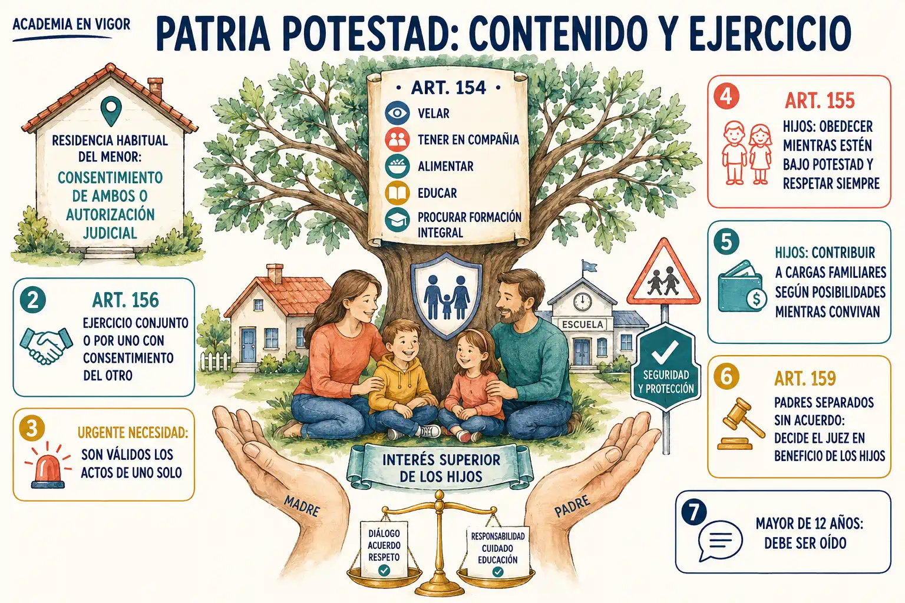

<em>Infografía: esquema de patria potestad: contenido y ejercicio con relaciones y trampas de examen.</em>

<!-- FUENTE: CC-BOE-A-1889-4763-T07 -->

## 34. Representación y bienes de los hijos

### Regla y encaje

Representación y bienes de los hijos se estudia dentro de filiación, alimentos y relaciones paterno-filiales. El bloque se contrasta directamente con arts. 162 a 168 CC.

### Claves examinables

- **Artículo 162:** Los padres que ostenten la patria potestad tienen la representación legal de sus hijos menores no emancipados. - **Artículo 162:** Se exceptúan: <!-- FACT:GC-T07-F522 --> - **Artículo 162:** 1.º Los actos relativos a los derechos de la personalidad que el hijo, de acuerdo con su madurez, pueda ejercitar por sí mismo. <!-- FACT:GC-T07-F523 --> - **Artículo 162:** No obstante, los responsables parentales intervendrán en estos casos en virtud de sus deberes de cuidado y asistencia. <!-- FACT:GC-T07-F524 --> - **Artículo 162:** 2.º Aquellos en que exista conflicto de intereses entre los padres y el hijo. <!-- FACT:GC-T07-F525 --> - **Artículo 162:** 3.º Los relativos a bienes que estén excluidos de la administración de los padres. <!-- FACT:GC-T07-F526 --> - **Artículo 162:** Para celebrar contratos que obliguen al hijo a realizar prestaciones personales se requiere el previo consentimiento de éste si tuviere suficiente juicio, sin perjuicio de lo establecido en el artículo 158. <!-- FACT:GC-T07-F527 --> - **Artículo 163:** Siempre que en algún asunto los progenitores tengan un interés opuesto al de sus hijos no emancipados, se nombrará a éstos un defensor que los represente en juicio y fuera de él. Se procederá también a este nombramiento cuando los progenitores tengan un interés opuesto al del hijo menor emancipado cuya capacidad deban completar. <!-- FACT:GC-T07-F528 --> - **Artículo 163:** Si el conflicto de intereses existiera solo con uno de los progenitores, corresponde al otro por Ley y sin necesidad de especial nombramiento representar al menor o completar su capacidad. <!-- FACT:GC-T07-F529 --> - **Artículo 164:** Los padres administrarán los bienes de los hijos con la misma diligencia que los suyos propios, cumpliendo las obligaciones generales de todo administrador y las especiales establecidas en la Ley Hipotecaria. <!-- FACT:GC-T07-F530 --> - **Artículo 164:** Se exceptúan de la administración paterna: <!-- FACT:GC-T07-F531 --> - **Artículo 164:** 1. Los bienes adquiridos por título gratuito cuando el disponente lo hubiere ordenado de manera expresa. Se cumplirá estrictamente la voluntad de éste sobre la administración de estos bienes y destino de sus frutos. <!-- FACT:GC-T07-F532 --> - **Artículo 164:** 2. Los adquiridos por sucesión en que uno o ambos de los que ejerzan la patria potestad hubieran sido justamente desheredados o no hubieran podido heredar por causa de indignidad, que serán administrados por la persona designada por el causante y, en su defecto y sucesivamente, por el otro progenitor o por un administrador judicial especialmente nombrado. <!-- FACT:GC-T07-F533 --> - **Artículo 164:** 3. Los que el hijo mayor de dieciséis años hubiera adquirido con su trabajo o industria. Los actos de administración ordinaria serán realizados por el hijo, que necesitará el consentimiento de los padres para los que excedan de ella. <!-- FACT:GC-T07-F534 --> - **Artículo 165:** Pertenecen siempre al hijo no emancipado los frutos de sus bienes, así como todo lo que adquiera con su trabajo o industria. <!-- FACT:GC-T07-F535 --> - **Artículo 165:** No obstante, los padres podrán destinar los del menor que viva con ambos o con uno sólo de ellos, en la parte que le corresponda, al levantamiento de las cargas familiares, y no estarán obligados a rendir cuentas de lo que hubiesen consumido en tales atenciones. <!-- FACT:GC-T07-F536 --> - **Artículo 165:** Con este fin se entregarán a los padres, en la medida adecuada, los frutos de los bienes que ellos no administren. Se exceptúan los frutos de los bienes a que se refieren los números 1 y 2 del artículo anterior y los de aquellos donados o dejados a los hijos especialmente para su educación o carrera, pero si los padres carecieren de medios podrán pedir al Juez que se les entregue la parte que en equidad proceda. <!-- FACT:GC-T07-F537 --> - **Artículo 166:** Los padres no podrán renunciar a los derechos de que los hijos sean titulares ni enajenar o gravar sus bienes inmuebles, establecimientos mercantiles o industriales, objetos preciosos y valores mobiliarios, salvo el derecho de suscripción preferente de acciones, sino por causas justificadas de utilidad o necesidad y previa la autorización del Juez del domicilio, con audiencia del Ministerio Fiscal. <!-- FACT:GC-T07-F538 --> - **Artículo 166:** Los padres deberán recabar autorización judicial para repudiar la herencia o legado deferidos al hijo. Si el Juez denegase la autorización, la herencia sólo podrá ser aceptada a beneficio de inventario. <!-- FACT:GC-T07-F539 --> - **Artículo 166:** No será necesaria autorización judicial si el menor hubiese cumplido dieciséis años y consintiere en documento público, ni para la enajenación de valores mobiliarios siempre que su importe se reinvierta en bienes o valores seguros. <!-- FACT:GC-T07-F540 --> - **Artículo 167:** Cuando la administración de los progenitores ponga en peligro el patrimonio del hijo, el Juez, a petición del propio hijo, del Ministerio Fiscal o de cualquier pariente del menor, podrá adoptar las medidas que estime necesarias para la seguridad y recaudo de los bienes, exigir caución o fianza para la continuación en la administración o incluso nombrar un Administrador. <!-- FACT:GC-T07-F541 --> - **Artículo 168:** Al término de la patria potestad podrán los hijos exigir a los padres la rendición de cuentas de la administración que ejercieron sobre sus bienes hasta entonces. La acción para exigir el cumplimiento de esta obligación prescribirá a los tres años. <!-- FACT:GC-T07-F542 --> - **Artículo 168:** En caso de pérdida o deterioro de los bienes por dolo o culpa grave, responderán los padres de los daños y perjuicios sufridos. <!-- FACT:GC-T07-F543 -->  <!-- FACT:GC-T07-F544 -->

:::hablemos-claro
No basta con reconocer una frase verdadera: hay que comprobar que pertenece al artículo preguntado y que no se ha sustituido una facultad por una obligación, un plazo por otro o una excepción por la regla general.
:::

:::en-la-calle
En un supuesto práctico, fija quién actúa, qué capacidad o vínculo tiene, qué autoridad interviene y qué consecuencia civil produce la actuación.
:::

:::lo-que-cae
Prioriza requisitos, plazos, legitimación, autoridad competente y excepciones. Apariciones oficiales mapeadas en este bloque: **0**.
:::

<!-- VISUAL:t07-34-representacion-y-bienes-de-los-hijos.webp -->

  

<em>Infografía: esquema de representación y bienes de los hijos con relaciones y trampas de examen.</em>

<!-- FUENTE: CC-BOE-A-1889-4763-T07 -->

## 35. Extinción, privación y recuperación de la patria potestad

### Regla y encaje

Extinción, privación y recuperación de la patria potestad se estudia dentro de filiación, alimentos y relaciones paterno-filiales. El bloque se contrasta directamente con arts. 169 a 171 CC.

### Claves examinables

- **Artículo 169:** La patria potestad se acaba: 1.° Por la muerte o la declaración de fallecimiento de los padres o del hijo. - **Artículo 169:** 2.° Por la emancipación. 3.° Por la adopción del hijo. <!-- FACT:GC-T07-F545 --> - **Artículo 170:** Cualquiera de los progenitores podrá ser privado total o parcialmente de su potestad por sentencia fundada en el incumplimiento de los deberes inherentes a la misma o dictada en causa criminal o matrimonial. <!-- FACT:GC-T07-F546 --> - **Artículo 170:** Los Tribunales podrán, en beneficio e interés del hijo, acordar la recuperación de la patria potestad cuando hubiere cesado la causa que motivó la privación. <!-- FACT:GC-T07-F547 --> - **Artículo 171:** Artículo 171 figura suprimido en la redacción consolidada vigente del Código Civil. <!-- FACT:GC-T07-F548 -->  <!-- FACT:GC-T07-F549 -->

:::hablemos-claro
No basta con reconocer una frase verdadera: hay que comprobar que pertenece al artículo preguntado y que no se ha sustituido una facultad por una obligación, un plazo por otro o una excepción por la regla general.
:::

:::en-la-calle
En un supuesto práctico, fija quién actúa, qué capacidad o vínculo tiene, qué autoridad interviene y qué consecuencia civil produce la actuación.
:::

:::lo-que-cae
Prioriza requisitos, plazos, legitimación, autoridad competente y excepciones. Apariciones oficiales mapeadas en este bloque: **0**.
:::

<!-- VISUAL:t07-35-extincion-privacion-y-recuperacion-de-la-patria-potestad.webp -->

  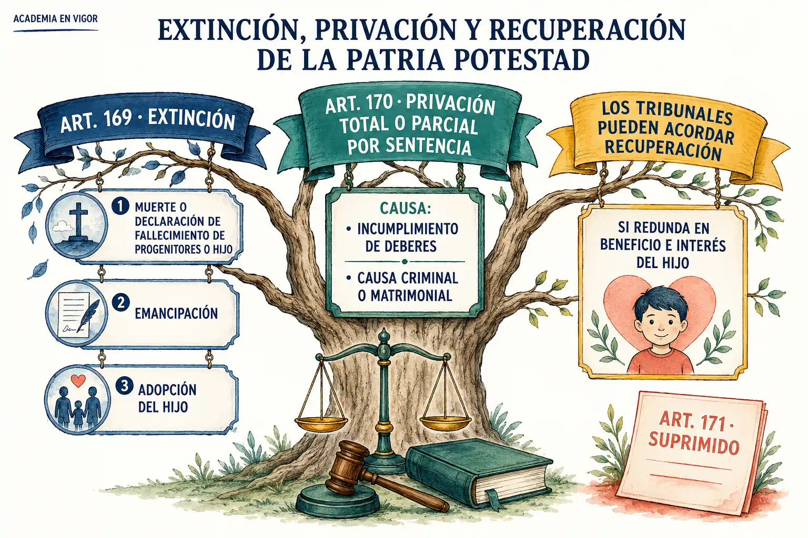

<em>Infografía: esquema de extinción, privación y recuperación de la patria potestad con relaciones y trampas de examen.</em>

<!-- FUENTE: CC-BOE-A-1889-4763-T07 -->

## 36. Desamparo, tutela pública y guarda

### Regla y encaje

Desamparo, tutela pública y guarda se estudia dentro de protección de menores y ausencia. El bloque se contrasta directamente con arts. 172 a 174 CC.

### Claves examinables

- **Artículo 172:** 1. Cuando la Entidad Pública a la que, en el respectivo territorio, esté encomendada la protección de los menores constate que un menor se encuentra en situación de desamparo, tiene por ministerio de la ley la tutela del mismo y deberá adoptar las medidas de protección necesarias para su guarda, poniéndolo en conocimiento del Ministerio Fiscal y, en su caso, del Juez que acordó la tutela ordinaria. - **Artículo 172:** La resolución administrativa que declare la situación de desamparo y las medidas adoptadas se notificará en legal forma a los progenitores, tutores o guardadores y al menor afectado si tuviere suficiente madurez y, en todo caso, si fuere mayor de doce años, de forma inmediata sin que sobrepase el plazo máximo de cuarenta y ocho horas. <!-- FACT:GC-T07-F550 --> - **Artículo 172:** La información será clara, comprensible y en formato accesible, incluyendo las causas que dieron lugar a la intervención de la Administración y los efectos de la decisión adoptada, y en el caso del menor, adaptada a su grado de madurez. Siempre que sea posible, y especialmente en el caso del menor, esta información se facilitará de forma presencial. <!-- FACT:GC-T07-F551 --> - **Artículo 172:** Se considera como situación de desamparo la que se produce de hecho a causa del incumplimiento o del imposible o inadecuado ejercicio de los deberes de protección establecidos por las leyes para la guarda de los menores, cuando éstos queden privados de la necesaria asistencia moral o material. <!-- FACT:GC-T07-F552 --> - **Artículo 172:** La asunción de la tutela atribuida a la Entidad Pública lleva consigo la suspensión de la patria potestad o de la tutela ordinaria. No obstante, serán válidos los actos de contenido patrimonial que realicen los progenitores o tutores en representación del menor y que sean en interés de éste. <!-- FACT:GC-T07-F553 --> - **Artículo 172:** La Entidad Pública y el Ministerio Fiscal podrán promover, si procediere, la privación de la patria potestad y la remoción de la tutela. <!-- FACT:GC-T07-F554 --> - **Artículo 172:** 2. <!-- FACT:GC-T07-F555 --> - **Artículo 172:** Durante el plazo de dos años desde la notificación de la resolución administrativa por la que se declare la situación de desamparo, los progenitores que continúen ostentando la patria potestad pero la tengan suspendida conforme a lo previsto en el apartado 1, o los tutores que, conforme al mismo apartado, tengan suspendida la tutela, podrán solicitar a la Entidad Pública que cese la suspensión y quede revocada la declaración de situación de desamparo del menor, si, por cambio de las circunstancias que la motivaron, entienden que se encuentran en condiciones de asumir nuevamente la patria potestad o la tutela. <!-- FACT:GC-T07-F556 --> - **Artículo 172:** Igualmente, durante el mismo plazo podrán oponerse a las decisiones que se adopten respecto a la protección del menor. <!-- FACT:GC-T07-F557 --> - **Artículo 172:** Pasado dicho plazo decaerá el derecho de los progenitores o tutores a solicitar u oponerse a las decisiones o medidas que se adopten para la protección del menor. No obstante, podrán facilitar información a la Entidad Pública y al Ministerio Fiscal sobre cualquier cambio de las circunstancias que dieron lugar a la declaración de situación de desamparo. <!-- FACT:GC-T07-F558 --> - **Artículo 172:** En todo caso, transcurridos los dos años, únicamente el Ministerio Fiscal estará legitimado para oponerse a la resolución de la Entidad Pública. <!-- FACT:GC-T07-F559 --> - **Artículo 172:** Durante ese plazo de dos años, la Entidad Pública, ponderando la situación y poniéndola en conocimiento del Ministerio Fiscal, podrá adoptar cualquier medida de protección, incluida la propuesta de adopción, cuando exista un pronóstico fundado de imposibilidad definitiva de retorno a la familia de origen. <!-- FACT:GC-T07-F560 --> - **Artículo 172:** 3. La Entidad Pública, de oficio o a instancia del Ministerio Fiscal o de persona o entidad interesada, podrá revocar la declaración de situación de desamparo y decidir el retorno del menor con su familia, siempre que se entienda que es lo más adecuado para su interés. Dicha decisión se notificará al Ministerio Fiscal. <!-- FACT:GC-T07-F561 --> - **Artículo 172:** 4. En cumplimiento de la obligación de prestar la atención inmediata, la Entidad Pública podrá asumir la guarda provisional de un menor mediante resolución administrativa, y lo comunicará al Ministerio Fiscal, procediendo simultáneamente a practicar las diligencias precisas para identificar al menor, investigar sus circunstancias y constatar, en su caso, la situación real de desamparo. <!-- FACT:GC-T07-F562 --> - **Artículo 172:** Tales diligencias se realizarán en el plazo más breve posible, durante el cual deberá procederse, en su caso, a la declaración de la situación de desamparo y consecuente asunción de la tutela o a la promoción de la medida de protección procedente. Si existieran personas que, por sus relaciones con el menor o por otras circunstancias, pudieran asumir la tutela en interés de éste, se promoverá el nombramiento de tutor conforme a las reglas ordinarias. <!-- FACT:GC-T07-F563 --> - **Artículo 172:** Cuando hubiera transcurrido el plazo señalado y no se hubiera formalizado la tutela o adoptado otra resolución, el Ministerio Fiscal promoverá las acciones procedentes para asegurar la adopción de la medida de protección más adecuada del menor por parte de la Entidad Pública. <!-- FACT:GC-T07-F564 --> - **Artículo 172:** 5. La Entidad Pública cesará en la tutela que ostente sobre los menores declarados en situación de desamparo cuando constate, mediante los correspondientes informes, la desaparición de las causas que motivaron su asunción, por alguno de los supuestos previstos en los artículos 276 y 277.1, y cuando compruebe fehacientemente alguna de las siguientes circunstancias: <!-- FACT:GC-T07-F565 --> - **Artículo 172:** a) Que el menor se ha trasladado voluntariamente a otro país. <!-- FACT:GC-T07-F566 --> - **Artículo 172:** b) Que el menor se encuentra en el territorio de otra comunidad autónoma, en cuyo caso se procederá al traslado del expediente de protección y cuya Entidad Pública hubiere dictado resolución sobre declaración de situación de desamparo y asumido su tutela o medida de protección correspondiente, o entendiere que ya no es necesario adoptar medidas de protección a tenor de la situación del menor. <!-- FACT:GC-T07-F567 --> - **Artículo 172:** c) Que hayan transcurrido doce meses desde que el menor abandonó voluntariamente el centro de protección, encontrándose en paradero desconocido. <!-- FACT:GC-T07-F568 --> - **Artículo 172:** La guarda provisional cesará por las mismas causas que la tutela. <!-- FACT:GC-T07-F569 --> - **Artículo 172 bis:** 1. Cuando los progenitores o tutores, por circunstancias graves y transitorias debidamente acreditadas, no puedan cuidar al menor, podrán solicitar de la Entidad Pública que ésta asuma su guarda durante el tiempo necesario, que no podrá sobrepasar dos años como plazo máximo de cuidado temporal del menor, salvo que el interés superior del menor aconseje, excepcionalmente, la prórroga de las medidas. <!-- FACT:GC-T07-F570 --> - **Artículo 172 bis:** Transcurrido el plazo o la prórroga, en su caso, el menor deberá regresar con sus progenitores o tutores o, si no se dan las circunstancias adecuadas para ello, ser declarado en situación legal de desamparo. <!-- FACT:GC-T07-F571 --> - **Artículo 172 bis:** La entrega voluntaria de la guarda se hará por escrito dejando constancia de que los progenitores o tutores han sido informados de las responsabilidades que siguen manteniendo respecto del menor, así como de la forma en que dicha guarda va a ejercerse por la Entidad Pública garantizándose, en particular a los menores con discapacidad, la continuidad de los apoyos especializados que vinieran recibiendo o la adopción de otros más adecuados a sus necesidades. <!-- FACT:GC-T07-F572 --> - **Artículo 172 bis:** La resolución administrativa sobre las asunción de la guarda por la Entidad Pública, así como sobre cualquier variación posterior de su forma de ejercicio, será fundamentada y comunicada a los progenitores o tutores y al Ministerio Fiscal. <!-- FACT:GC-T07-F573 --> - **Artículo 172 bis:** 2. Asimismo, la Entidad Pública asumirá la guarda cuando así lo acuerde el Juez en los casos en que legalmente proceda, adoptando la medida de protección correspondiente. <!-- FACT:GC-T07-F574 --> - **Artículo 172 ter:** 1. La guarda se realizará mediante el acogimiento familiar y, no siendo éste posible o conveniente para el interés del menor, mediante el acogimiento residencial. El acogimiento familiar se realizará por la persona o personas que determine la Entidad Pública. El acogimiento residencial se ejercerá por el Director o responsable del centro donde esté acogido el menor, conforme a los términos establecidos en la legislación de protección de menores. <!-- FACT:GC-T07-F575 --> - **Artículo 172 ter:** No podrán ser acogedores los que no puedan ser tutores de acuerdo con lo previsto en la ley. <!-- FACT:GC-T07-F576 --> - **Artículo 172 ter:** La resolución de la Entidad Pública en la que se formalice por escrito la medida de guarda se notificará a los progenitores o tutores que no estuvieran privados de la patria potestad o tutela, así como al Ministerio Fiscal. <!-- FACT:GC-T07-F577 --> - **Artículo 172 ter:** 2. Se buscará siempre el interés del menor y se priorizará, cuando no sea contrario a ese interés, su reintegración en la propia familia y que la guarda de los hermanos se confíe a una misma institución o persona para que permanezcan unidos. La situación del menor en relación con su familia de origen, tanto en lo que se refiere a su guarda como al régimen de visitas y otras formas de comunicación, será revisada, al menos cada seis meses. <!-- FACT:GC-T07-F578 --> - **Artículo 172 ter:** 3. La Entidad Pública podrá acordar, en relación con el menor en acogida familiar o residencial, cuando sea conveniente a su interés, estancias, salidas de fines de semana o de vacaciones con familias o con instituciones dedicadas a estas funciones. A tal efecto sólo se seleccionará a personas o instituciones adecuadas a las necesidades del menor. <!-- FACT:GC-T07-F579 --> - **Artículo 172 ter:** Dichas medidas deberán ser acordadas una vez haya sido oído el menor si tuviere suficiente madurez y, en todo caso, si fuera mayor de doce años. <!-- FACT:GC-T07-F580 --> - **Artículo 172 ter:** La delegación de guarda para estancias, salidas de fin de semana o vacaciones contendrá los términos de la misma y la información que fuera necesaria para asegurar el bienestar del menor, en especial de todas las medidas restrictivas que haya establecido la Entidad Pública o el Juez. <!-- FACT:GC-T07-F581 --> - **Artículo 172 ter:** Dicha medida será comunicada a los progenitores o tutores, siempre que no hayan sido privados del ejercicio de la patria potestad o removidos del ejercicio de la tutela, así como a los acogedores. Se preservarán los datos de estos guardadores cuando resulte conveniente para el interés del menor o concurra justa causa. <!-- FACT:GC-T07-F582 --> - **Artículo 172 ter:** 4. <!-- FACT:GC-T07-F583 --> - **Artículo 172 ter:** En los casos de declaración de situación de desamparo o de asunción de la guarda por resolución administrativa o judicial, podrá establecerse por la Entidad Pública la cantidad que deben abonar los progenitores o tutores para contribuir, en concepto de alimentos y en función de sus posibilidades, a los gastos derivados del cuidado y atención del menor, así como los derivados de la responsabilidad civil que pudiera imputarse a los menores por actos realizados por los mismos. <!-- FACT:GC-T07-F584 --> - **Artículo 173:** 1. El acogimiento familiar produce la plena participación del menor en la vida de familia e impone a quien lo recibe las obligaciones de velar por él, tenerlo en su compañía, alimentarlo, educarlo y procurarle una formación integral en un entorno afectivo. En el caso de menor con discapacidad, deberá continuar con los apoyos especializados que viniera recibiendo o adoptar otros más adecuados a sus necesidades. <!-- FACT:GC-T07-F585 --> - **Artículo 173:** 2. El acogimiento requerirá el consentimiento de los acogedores y del menor acogido si tuviera suficiente madurez y, en todo caso, si fuera mayor de doce años. <!-- FACT:GC-T07-F586 --> - **Artículo 173:** 3. Si surgieren problemas graves de convivencia entre el menor y la persona o personas a quien hubiere sido confiado la guarda en acogimiento familiar, aquél, el acogedor, el Ministerio Fiscal, los progenitores o tutor que no estuvieran privados de la patria potestad o de la tutela o cualquier persona interesada podrán solicitar a la Entidad Pública la remoción de la guarda. <!-- FACT:GC-T07-F587 --> - **Artículo 173:** 4. El acogimiento familiar del menor cesará: a) Por resolución judicial. <!-- FACT:GC-T07-F588 --> - **Artículo 173:** b) Por resolución de la Entidad Pública, de oficio o a propuesta del Ministerio Fiscal, de los progenitores, tutores, acogedores o del propio menor si tuviera suficiente madurez, cuando se considere necesario para salvaguardar el interés del mismo, oídos los acogedores, el menor, sus progenitores o tutor. <!-- FACT:GC-T07-F589 --> - **Artículo 173:** c) Por la muerte o declaración de fallecimiento del acogedor o acogedores del menor. <!-- FACT:GC-T07-F590 --> - **Artículo 173:** d) Por la mayoría de edad del menor. <!-- FACT:GC-T07-F591 --> - **Artículo 173:** 5. Todas las actuaciones de formalización y cesación del acogimiento se practicarán con la obligada reserva. <!-- FACT:GC-T07-F592 --> - **Artículo 173 bis:** 1. El acogimiento familiar podrá tener lugar en la propia familia extensa del menor o en familia ajena, pudiendo en este último caso ser especializado. <!-- FACT:GC-T07-F593 --> - **Artículo 173 bis:** 2. El acogimiento familiar podrá adoptar las siguientes modalidades atendiendo a su duración y objetivos: <!-- FACT:GC-T07-F594 --> - **Artículo 173 bis:** a) Acogimiento familiar de urgencia, principalmente para menores de seis años, que tendrá una duración no superior a seis meses, en tanto se decide la medida de protección familiar que corresponda. <!-- FACT:GC-T07-F595 --> - **Artículo 173 bis:** b) Acogimiento familiar temporal, que tendrá carácter transitorio, bien porque de la situación del menor se prevea la reintegración de éste en su propia familia, o bien en tanto se adopte una medida de protección que revista un carácter más estable como el acogimiento familiar permanente o la adopción. <!-- FACT:GC-T07-F596 --> - **Artículo 173 bis:** Este acogimiento tendrá una duración máxima de dos años, salvo que el interés superior del menor aconseje la prórroga de la medida por la previsible e inmediata reintegración familiar, o la adopción de otra medida de protección definitiva. <!-- FACT:GC-T07-F597 --> - **Artículo 173 bis:** c) Acogimiento familiar permanente, que se constituirá bien al finalizar el plazo de dos años de acogimiento temporal por no ser posible la reintegración familiar, o bien directamente en casos de menores con necesidades especiales o cuando las circunstancias del menor y su familia así lo aconsejen. <!-- FACT:GC-T07-F598 --> - **Artículo 173 bis:** La Entidad Pública podrá solicitar del Juez que atribuya a los acogedores permanentes aquellas facultades de la tutela que faciliten el desempeño de sus responsabilidades, atendiendo, en todo caso, al interés superior del menor. <!-- FACT:GC-T07-F599 --> - **Artículo 174:** 1. Incumbe al Ministerio Fiscal la superior vigilancia de la tutela, acogimiento o guarda de los menores a que se refiere esta sección. <!-- FACT:GC-T07-F600 --> - **Artículo 174:** 2. A tal fin, la Entidad Pública le dará noticia inmediata de los nuevos ingresos de menores y le remitirá copia de las resoluciones administrativas de formalización de la constitución, variación y cesación de las tutelas, guardas y acogimientos. Igualmente le dará cuenta de cualquier novedad de interés en las circunstancias del menor. <!-- FACT:GC-T07-F601 --> - **Artículo 174:** El Ministerio Fiscal habrá de comprobar, al menos semestralmente, la situación del menor y promoverá ante la Entidad Pública o el Juez, según proceda, las medidas de protección que estime necesarias. <!-- FACT:GC-T07-F602 --> - **Artículo 174:** 3. La vigilancia del Ministerio Fiscal no eximirá a la Entidad Pública de su responsabilidad para con el menor y de su obligación de poner en conocimiento del Ministerio Fiscal las anomalías que observe. <!-- FACT:GC-T07-F603 --> - **Artículo 174:** 4. Para el cumplimiento de la función de la superior vigilancia de la tutela, acogimiento o guarda de los menores, cuando sea necesario, podrá el Ministerio Fiscal recabar la elaboración de informes por parte de los servicios correspondientes de las Administraciones Públicas competentes. <!-- FACT:GC-T07-F604 --> - **Artículo 174:** A estos efectos, los servicios correspondientes de las Administraciones Públicas competentes atenderán las solicitudes de información remitidas por el Ministerio Fiscal en el curso de las investigaciones tendentes a determinar la situación de riesgo o desamparo en la que pudiera encontrarse un menor. <!-- FACT:GC-T07-F605 -->  <!-- FACT:GC-T07-F606 -->

:::hablemos-claro
No basta con reconocer una frase verdadera: hay que comprobar que pertenece al artículo preguntado y que no se ha sustituido una facultad por una obligación, un plazo por otro o una excepción por la regla general.
:::

:::en-la-calle
En un supuesto práctico, fija quién actúa, qué capacidad o vínculo tiene, qué autoridad interviene y qué consecuencia civil produce la actuación.
:::

:::lo-que-cae
Prioriza requisitos, plazos, legitimación, autoridad competente y excepciones. Apariciones oficiales mapeadas en este bloque: **0**.
:::

<!-- VISUAL:t07-36-desamparo-tutela-publica-y-guarda.webp -->

  

<em>Infografía: esquema de desamparo, tutela pública y guarda con relaciones y trampas de examen.</em>

<!-- FUENTE: CC-BOE-A-1889-4763-T07 -->

## 37. Acogimiento familiar

### Regla y encaje

Acogimiento familiar se estudia dentro de protección de menores y ausencia. El bloque se contrasta directamente con arts. 175 a 176 CC.

### Claves examinables

- **Artículo 175:** 1. La adopción requiere que el adoptante sea mayor de veinticinco años. Si son dos los adoptantes bastará con que uno de ellos haya alcanzado dicha edad. En todo caso, la diferencia de edad entre adoptante y adoptando será de, al menos, dieciséis años y no podrá ser superior a cuarenta y cinco años, salvo en los casos previstos en el artículo 176.2. Cuando fueran dos los adoptantes, será suficiente con que uno de ellos no tenga esa diferencia máxima de edad con el adoptando. - **Artículo 175:** Si los futuros adoptantes están en disposición de adoptar grupos de hermanos o menores con necesidades especiales, la diferencia máxima de edad podrá ser superior. <!-- FACT:GC-T07-F607 --> - **Artículo 175:** No pueden ser adoptantes los que no puedan ser tutores de acuerdo con lo previsto en este código. <!-- FACT:GC-T07-F608 --> - **Artículo 175:** 2. Únicamente podrán ser adoptados los menores no emancipados. Por excepción, será posible la adopción de un mayor de edad o de un menor emancipado cuando, inmediatamente antes de la emancipación, hubiere existido una situación de acogimiento con los futuros adoptantes o de convivencia estable con ellos de, al menos, un año. <!-- FACT:GC-T07-F609 --> - **Artículo 175:** 3. No puede adoptarse: 1.º A un descendiente. <!-- FACT:GC-T07-F610 --> - **Artículo 175:** 2.º A un pariente en segundo grado de la línea colateral por consanguinidad o afinidad. <!-- FACT:GC-T07-F611 --> - **Artículo 175:** 3.º A un pupilo por su tutor hasta que haya sido aprobada definitivamente la cuenta general justificada de la tutela. <!-- FACT:GC-T07-F612 --> - **Artículo 175:** 4. Nadie podrá ser adoptado por más de una persona, salvo que la adopción se realice conjunta o sucesivamente por ambos cónyuges o por una pareja unida por análoga relación de afectividad a la conyugal. El matrimonio celebrado con posterioridad a la adopción permitirá al cónyuge la adopción de los hijos de su consorte. Esta previsión será también de aplicación a las parejas que se constituyan con posterioridad. <!-- FACT:GC-T07-F613 --> - **Artículo 175:** En caso de muerte del adoptante, o cuando el adoptante sufra la exclusión prevista en el artículo 179, será posible una nueva adopción del adoptado. <!-- FACT:GC-T07-F614 --> - **Artículo 175:** 5. <!-- FACT:GC-T07-F615 --> - **Artículo 175:** En caso de que el adoptando se encontrara en acogimiento permanente o guarda con fines de adopción de dos cónyuges o de una pareja unida por análoga relación de afectividad a la conyugal, la separación o divorcio legal o ruptura de la relación de los mismos que conste fehacientemente con anterioridad a la propuesta de adopción no impedirá que pueda promoverse la adopción conjunta siempre y cuando se acredite la convivencia efectiva del adoptando con ambos cónyuges o con la pareja unida por análoga relación de naturaleza análoga a la conyugal durante al menos dos años anteriores a la propuesta de adopción. <!-- FACT:GC-T07-F616 --> - **Artículo 176:** 1. La adopción se constituirá por resolución judicial, que tendrá en cuenta siempre el interés del adoptando y la idoneidad del adoptante o adoptantes para el ejercicio de la patria potestad. <!-- FACT:GC-T07-F617 --> - **Artículo 176:** 2. Para iniciar el expediente de adopción será necesaria la propuesta previa de la Entidad Pública a favor del adoptante o adoptantes que dicha Entidad Pública haya declarado idóneos para el ejercicio de la patria potestad. La declaración de idoneidad deberá ser previa a la propuesta. <!-- FACT:GC-T07-F618 --> - **Artículo 176:** No obstante, no se requerirá tal propuesta cuando en el adoptando concurra alguna de las circunstancias siguientes: <!-- FACT:GC-T07-F619 --> - **Artículo 176:** 1.ª Ser huérfano y pariente del adoptante en tercer grado por consanguinidad o afinidad. <!-- FACT:GC-T07-F620 --> - **Artículo 176:** 2.ª Ser hijo del cónyuge o de la persona unida al adoptante por análoga relación de afectividad a la conyugal. <!-- FACT:GC-T07-F621 --> - **Artículo 176:** 3.ª Llevar más de un año en guarda con fines de adopción o haber estado bajo tutela del adoptante por el mismo tiempo. <!-- FACT:GC-T07-F622 --> - **Artículo 176:** 4.ª Ser mayor de edad o menor emancipado. <!-- FACT:GC-T07-F623 --> - **Artículo 176:** 3. Se entiende por idoneidad la capacidad, aptitud y motivación adecuadas para ejercer la responsabilidad parental, atendiendo a las necesidades de los menores a adoptar, y para asumir las peculiaridades, consecuencias y responsabilidades que conlleva la adopción. <!-- FACT:GC-T07-F624 --> - **Artículo 176:** La declaración de idoneidad por la Entidad Pública requerirá una valoración psicosocial sobre la situación personal, familiar, relacional y social de los adoptantes, así como su capacidad para establecer vínculos estables y seguros, sus habilidades educativas y su aptitud para atender a un menor en función de sus singulares circunstancias. Dicha declaración de idoneidad se formalizará mediante la correspondiente resolución. <!-- FACT:GC-T07-F625 --> - **Artículo 176:** No podrán ser declarados idóneos para la adopción quienes se encuentren privados de la patria potestad o tengan suspendido su ejercicio, ni quienes tengan confiada la guarda de su hijo a la Entidad Pública. <!-- FACT:GC-T07-F626 --> - **Artículo 176:** Las personas que se ofrezcan para la adopción deberán asistir a las sesiones informativas y de preparación organizadas por la Entidad Pública o por Entidad colaboradora autorizada. <!-- FACT:GC-T07-F627 --> - **Artículo 176:** 4. Cuando concurra alguna de las circunstancias 1.ª, 2.ª o 3.ª previstas en el apartado 2 podrá constituirse la adopción, aunque el adoptante hubiere fallecido, si éste hubiese prestado ya ante el Juez su consentimiento o el mismo hubiera sido otorgado mediante documento público o en testamento. Los efectos de la resolución judicial en este caso se retrotraerán a la fecha de prestación de tal consentimiento. <!-- FACT:GC-T07-F628 --> - **Artículo 176 bis:** 1. La Entidad Pública podrá delegar la guarda de un menor declarado en situación de desamparo en las personas que, reuniendo los requisitos de capacidad para adoptar previstos en el artículo 175 y habiendo prestado su consentimiento, hayan sido preparadas, declaradas idóneas y asignadas para su adopción. <!-- FACT:GC-T07-F629 --> - **Artículo 176 bis:** A tal efecto, la Entidad Pública, con anterioridad a la presentación de la propuesta de adopción, delegará la guarda con fines de adopción hasta que se dicte la resolución judicial de adopción, mediante resolución administrativa debidamente motivada, previa audiencia de los afectados y del menor si tuviere suficiente madurez y, en todo caso, si fuere mayor de doce años, que se notificará a los progenitores o tutores no privados de la patria potestad o tutela. <!-- FACT:GC-T07-F630 --> - **Artículo 176 bis:** Los guardadores con fines de adopción tendrán los mismos derechos y obligaciones que los acogedores familiares. <!-- FACT:GC-T07-F631 --> - **Artículo 176 bis:** 2. Salvo que convenga otra cosa al interés del menor, la Entidad Pública procederá a suspender el régimen de visitas y relaciones con la familia de origen cuando se inicie el período de convivencia preadoptiva a que se refiere el apartado anterior, excepto en los casos previstos en el artículo 178.4. <!-- FACT:GC-T07-F632 --> - **Artículo 176 bis:** 3. La propuesta de adopción al Juez tendrá que realizarse en el plazo más breve posible y, en todo caso, antes de transcurridos tres meses desde el día en el que se hubiera acordado la delegación de guarda con fines de adopción. No obstante, cuando la Entidad Pública considere necesario, en función de la edad y circunstancias del menor, establecer un período de adaptación del menor a la familia, dicho plazo de tres meses podrá prorrogarse hasta un máximo de un año. <!-- FACT:GC-T07-F633 --> - **Artículo 176 bis:** En el supuesto de que el Juez no considerase procedente esa adopción, la Entidad Pública deberá determinar la medida protectora más adecuada para el menor. <!-- FACT:GC-T07-F634 -->  <!-- FACT:GC-T07-F635 -->

:::hablemos-claro
No basta con reconocer una frase verdadera: hay que comprobar que pertenece al artículo preguntado y que no se ha sustituido una facultad por una obligación, un plazo por otro o una excepción por la regla general.
:::

:::en-la-calle
En un supuesto práctico, fija quién actúa, qué capacidad o vínculo tiene, qué autoridad interviene y qué consecuencia civil produce la actuación.
:::

:::lo-que-cae
Prioriza requisitos, plazos, legitimación, autoridad competente y excepciones. Apariciones oficiales mapeadas en este bloque: **4**.
:::

<!-- VISUAL:t07-37-acogimiento-familiar.webp -->

  

<em>Infografía: esquema de acogimiento familiar con relaciones y trampas de examen.</em>

<!-- FUENTE: CC-BOE-A-1889-4763-T07 -->

## 38. Adopción

### Regla y encaje

Adopción se estudia dentro de protección de menores y ausencia. El bloque se contrasta directamente con arts. 175 a 180 CC.

### Claves examinables

- **Artículo 177:** 1. Habrán de consentir la adopción, en presencia del Juez, el adoptante o adoptantes y el adoptando mayor de doce años. - **Artículo 177:** 2. Deberán asentir a la adopción: <!-- FACT:GC-T07-F636 --> - **Artículo 177:** 1.º El cónyuge o persona unida al adoptante por análoga relación de afectividad a la conyugal salvo que medie separación o divorcio legal o ruptura de la pareja que conste fehacientemente, excepto en los supuestos en los que la adopción se vaya a formalizar de forma conjunta. <!-- FACT:GC-T07-F637 --> - **Artículo 177:** 2.º Los progenitores del adoptando que no se hallare emancipado, a menos que estuvieran privados de la patria potestad por sentencia firme o incursos en causa legal para tal privación. Esta situación solo podrá apreciarse en el procedimiento judicial contradictorio que se tramitará conforme a la Ley de Enjuiciamiento Civil. <!-- FACT:GC-T07-F638 --> - **Artículo 177:** No será necesario el asentimiento cuando los que deban prestarlo se encuentren imposibilitados para ello, imposibilidad que se apreciará motivadamente en la resolución judicial que constituya la adopción. <!-- FACT:GC-T07-F639 --> - **Artículo 177:** Tampoco será necesario el asentimiento de los progenitores que tuvieren suspendida la patria potestad cuando hubieran transcurrido dos años desde la notificación de la declaración de situación de desamparo, en los términos previstos en el artículo 172.2, sin oposición a la misma o cuando, interpuesta en plazo, hubiera sido desestimada. <!-- FACT:GC-T07-F640 --> - **Artículo 177:** El asentimiento de la madre no podrá prestarse hasta que hayan transcurrido seis semanas desde el parto. <!-- FACT:GC-T07-F641 --> - **Artículo 177:** En las adopciones que exijan propuesta previa no se admitirá que el asentimiento de los progenitores se refiera a adoptantes determinados. <!-- FACT:GC-T07-F642 --> - **Artículo 177:** 3. Deberán ser oídos por el Juez: <!-- FACT:GC-T07-F643 --> - **Artículo 177:** 1.º Los progenitores que no hayan sido privados de la patria potestad, cuando su asentimiento no fuera necesario para la adopción. <!-- FACT:GC-T07-F644 --> - **Artículo 177:** 2.º El tutor y, en su caso, la familia acogedora, y el guardador o guardadores. <!-- FACT:GC-T07-F645 --> - **Artículo 177:** 3.º El adoptando menor de doce años de acuerdo con su edad y madurez. <!-- FACT:GC-T07-F646 --> - **Artículo 177:** 4. Los consentimientos y asentimientos deberán otorgarse libremente, en la forma legal requerida y por escrito, previa información de sus consecuencias. <!-- FACT:GC-T07-F647 --> - **Artículo 178:** 1. La adopción produce la extinción de los vínculos jurídicos entre el adoptado y su familia de origen. <!-- FACT:GC-T07-F648 --> - **Artículo 178:** 2. Por excepción subsistirán los vínculos jurídicos con la familia del progenitor que, según el caso, corresponda: <!-- FACT:GC-T07-F649 --> - **Artículo 178:** a) Cuando el adoptado sea hijo del cónyuge o de la persona unida al adoptante por análoga relación de afectividad a la conyugal, aunque el consorte o la pareja hubiera fallecido. <!-- FACT:GC-T07-F650 --> - **Artículo 178:** b) Cuando sólo uno de los progenitores haya sido legalmente determinado, siempre que tal efecto hubiera sido solicitado por el adoptante, el adoptado mayor de doce años y el progenitor cuyo vínculo haya de persistir. <!-- FACT:GC-T07-F651 --> - **Artículo 178:** 3. Lo establecido en los apartados anteriores se entiende sin perjuicio de lo dispuesto sobre impedimentos matrimoniales. <!-- FACT:GC-T07-F652 --> - **Artículo 178:** 4. Cuando el interés del menor así lo aconseje, en razón de su situación familiar, edad o cualquier otra circunstancia significativa valorada por la Entidad Pública, podrá acordarse el mantenimiento de alguna forma de relación o contacto a través de visitas o comunicaciones entre el menor, los miembros de la familia de origen que se considere y la adoptiva, favoreciéndose especialmente, cuando ello sea posible, la relación entre los hermanos biológicos. <!-- FACT:GC-T07-F653 --> - **Artículo 178:** En estos casos el Juez, al constituir la adopción, podrá acordar el mantenimiento de dicha relación, determinando su periodicidad, duración y condiciones, a propuesta de la Entidad Pública o del Ministerio Fiscal y con el consentimiento de la familia adoptiva y del adoptando si tuviera suficiente madurez y siempre si fuere mayor de doce años. En todo caso, será oído el adoptando menor de doce años de acuerdo a su edad y madurez. <!-- FACT:GC-T07-F654 --> - **Artículo 178:** Si fuere necesario, dicha relación se llevará a cabo con la intermediación de la Entidad Pública o entidades acreditadas a tal fin. El Juez podrá acordar, también, su modificación o finalización en atención al interés superior del menor. <!-- FACT:GC-T07-F655 --> - **Artículo 178:** La Entidad Pública remitirá al Juez informes periódicos sobre el desarrollo de las visitas y comunicaciones, así como propuestas de mantenimiento o modificación de las mismas durante los dos primeros años, y, transcurridos estos a petición del Juez. <!-- FACT:GC-T07-F656 --> - **Artículo 178:** Están legitimados para solicitar la suspensión o supresión de dichas visitas o comunicaciones la Entidad Pública, la familia adoptiva, la familia de origen y el menor si tuviere suficiente madurez y, en todo caso, si fuere mayor de doce años. <!-- FACT:GC-T07-F657 --> - **Artículo 178:** En la declaración de idoneidad deberá hacerse constar si las personas que se ofrecen a la adopción aceptarían adoptar a un menor que fuese a mantener la relación con la familia de origen. <!-- FACT:GC-T07-F658 --> - **Artículo 179:** 1. El Juez, a petición del Ministerio Fiscal, del adoptado o de su representante legal, acordará que el adoptante que hubiere incurrido en causa de privación de la patria potestad, quede excluido de las funciones tuitivas y de los derechos que por Ley le correspondan respecto del adoptado o sus descendientes, o en sus herencias. <!-- FACT:GC-T07-F659 --> - **Artículo 179:** 2. Una vez alcanzada la plena capacidad, la exclusión sólo podrá ser pedida por el adoptado, dentro de los dos años siguientes. <!-- FACT:GC-T07-F660 --> - **Artículo 179:** 3. Dejarán de producir efecto estas restricciones por determinación del propio hijo una vez alcanzada la plena capacidad. <!-- FACT:GC-T07-F661 --> - **Artículo 180:** 1. La adopción es irrevocable. <!-- FACT:GC-T07-F662 --> - **Artículo 180:** 2. El Juez acordará la extinción de la adopción a petición de cualquiera de los progenitores que, sin culpa suya, no hubieren intervenido en el expediente en los términos expresados en el artículo 177. Será también necesario que la demanda se interponga dentro de los dos años siguientes a la adopción y que la extinción solicitada no perjudique gravemente al menor. <!-- FACT:GC-T07-F663 --> - **Artículo 180:** Si el adoptado fuere mayor de edad, la extinción de la adopción requerirá su consentimiento expreso. <!-- FACT:GC-T07-F664 --> - **Artículo 180:** 3. La extinción de la adopción no es causa de pérdida de la nacionalidad ni de la vecindad civil adquiridas, ni alcanza a los efectos patrimoniales anteriormente producidos. <!-- FACT:GC-T07-F665 --> - **Artículo 180:** 4. La determinación de la filiación que por naturaleza corresponda al adoptado no afecta a la adopción. <!-- FACT:GC-T07-F666 --> - **Artículo 180:** 5. Las Entidades Públicas asegurarán la conservación de la información de que dispongan relativa a los orígenes del menor, en particular la información respecto a la identidad de sus progenitores, así como la historia médica del menor y de su familia, y se conservarán durante al menos cincuenta años con posterioridad al momento en que la adopción se haya hecho definitiva. <!-- FACT:GC-T07-F667 --> - **Artículo 180:** La conservación se llevará a cabo a los solos efectos de que la persona adoptada pueda ejercitar el derecho al que se refiere el apartado siguiente. <!-- FACT:GC-T07-F668 --> - **Artículo 180:** 6. Las personas adoptadas, alcanzada la mayoría de edad o durante su minoría de edad a través de sus representantes legales, tendrán derecho a conocer los datos sobre sus orígenes biológicos. Las Entidades Públicas, previa notificación a las personas afectadas, prestarán a través de sus servicios especializados el asesoramiento y la ayuda que precisen para hacer efectivo este derecho. <!-- FACT:GC-T07-F669 --> - **Artículo 180:** A estos efectos, cualquier entidad privada o pública tendrá obligación de facilitar a las Entidades Públicas y al Ministerio Fiscal, cuando les sean requeridos, los informes y antecedentes necesarios sobre el menor y su familia de origen. <!-- FACT:GC-T07-F670 -->  <!-- FACT:GC-T07-F671 -->

:::hablemos-claro
No basta con reconocer una frase verdadera: hay que comprobar que pertenece al artículo preguntado y que no se ha sustituido una facultad por una obligación, un plazo por otro o una excepción por la regla general.
:::

:::en-la-calle
En un supuesto práctico, fija quién actúa, qué capacidad o vínculo tiene, qué autoridad interviene y qué consecuencia civil produce la actuación.
:::

:::lo-que-cae
Prioriza requisitos, plazos, legitimación, autoridad competente y excepciones. Apariciones oficiales mapeadas en este bloque: **2**.
:::

<!-- VISUAL:t07-38-adopcion.webp -->

  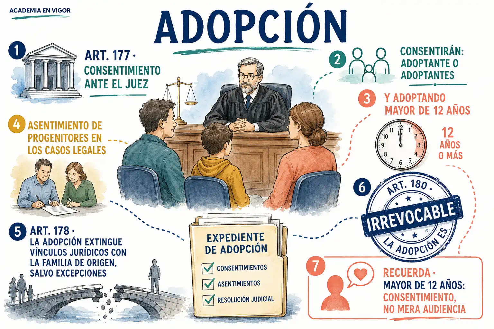

<em>Infografía: esquema de adopción con relaciones y trampas de examen.</em>

<!-- FUENTE: CC-BOE-A-1889-4763-T07 -->

## 39. Desaparición y ausencia legal

### Regla y encaje

Desaparición y ausencia legal se estudia dentro de protección de menores y ausencia. El bloque se contrasta directamente con arts. 181 a 192 CC.

### Claves examinables

- **Artículo 181:** En todo caso, desaparecida una persona de su domicilio o del lugar de su última residencia, sin haberse tenido en ella más noticias, podrá el Secretario judicial, a instancia de parte interesada o del Ministerio Fiscal, nombrar un defensor que ampare y represente al desaparecido en juicio o en los negocios que no admitan demora sin perjuicio grave. Se exceptúan los casos en que aquél estuviese legítimamente representado voluntariamente conforme al artículo 183. - **Artículo 181:** El cónyuge presente mayor de edad no separado legalmente será el representante y defensor nato del desaparecido; y por su falta, el pariente más próximo hasta el cuarto grado, también mayor de edad. En defecto de parientes, no presencia de los mismos o urgencia notoria, el Secretario judicial nombrará persona solvente y de buenos antecedentes, previa audiencia del Ministerio Fiscal. <!-- FACT:GC-T07-F672 --> - **Artículo 181:** También podrá adoptar, según su prudente arbitrio, las medidas necesarias a la conservación del patrimonio. <!-- FACT:GC-T07-F673 --> - **Artículo 182:** Tiene la obligación de promover e instar la declaración de ausencia legal, sin orden de preferencia: <!-- FACT:GC-T07-F674 --> - **Artículo 182:** Primero. El cónyuge del ausente no separado legalmente. <!-- FACT:GC-T07-F675 --> - **Artículo 182:** Segundo. Los parientes consanguíneos hasta el cuarto grado. <!-- FACT:GC-T07-F676 --> - **Artículo 182:** Tercero. El Ministerio fiscal de oficio o a virtud de denuncia. <!-- FACT:GC-T07-F677 --> - **Artículo 182:** Podrá, también, pedir dicha declaración cualquier persona que racionalmente estime tener sobre los bienes del desaparecido algún derecho ejercitable en vida del mismo o dependiente de su muerte. <!-- FACT:GC-T07-F678 --> - **Artículo 183:** Se considerará en situación de ausencia legal al desaparecido de su domicilio o de su última residencia: <!-- FACT:GC-T07-F679 --> - **Artículo 183:** Primero. Pasado un año desde las últimas noticias o a falta de éstas desde su desaparición, si no hubiese dejado apoderado con facultades de administración de todos sus bienes. <!-- FACT:GC-T07-F680 --> - **Artículo 183:** Segundo. Pasados tres años, si hubiese dejado encomendada por apoderamiento la administración de todos sus bienes. <!-- FACT:GC-T07-F681 --> - **Artículo 183:** La muerte o renuncia justificada del mandatario, o la caducidad del mandato, determina la ausencia legal, si al producirse aquéllas se ignorase el paradero del desaparecido y hubiere transcurrido un año desde que se tuvieron las últimas noticias, y, en su defecto, desde su desaparición. Inscrita en el Registro Civil la declaración de ausencia, quedan extinguidos de derecho todos los mandatos generales o especiales otorgados por el ausente. <!-- FACT:GC-T07-F682 --> - **Artículo 184:** Salvo motivo grave apreciado por el Secretario judicial, corresponde la representación del declarado ausente, la pesquisa de su persona, la protección y administración de sus bienes y el cumplimiento de sus obligaciones: <!-- FACT:GC-T07-F683 --> - **Artículo 184:** 1.º Al cónyuge presente mayor de edad no separado legalmente o de hecho. <!-- FACT:GC-T07-F684 --> - **Artículo 184:** 2.º Al hijo mayor de edad; si hubiese varios, serán preferidos los que convivían con el ausente y el mayor al menor. <!-- FACT:GC-T07-F685 --> - **Artículo 184:** 3.º Al ascendiente más próximo de menos edad de una u otra línea. <!-- FACT:GC-T07-F686 --> - **Artículo 184:** 4.º A los hermanos mayores de edad que hayan convivido familiarmente con el ausente, con preferencia del mayor sobre el menor. <!-- FACT:GC-T07-F687 --> - **Artículo 184:** En defecto de las personas expresadas, corresponde en toda su extensión a la persona solvente de buenos antecedentes que el Secretario judicial, oído el Ministerio fiscal, designe a su prudente arbitrio. <!-- FACT:GC-T07-F688 --> - **Artículo 185:** El representante del declarado ausente quedará atenido a las obligaciones siguientes: <!-- FACT:GC-T07-F689 --> - **Artículo 185:** 1.ª Inventariar los bienes muebles y describir los inmuebles de su representado. <!-- FACT:GC-T07-F690 --> - **Artículo 185:** 2.ª Prestar la garantía que el Secretario judicial prudencialmente fije. Quedan exceptuados los comprendidos en los números 1.º, 2.º y 3.º del artículo precedente. <!-- FACT:GC-T07-F691 --> - **Artículo 185:** 3.ª Conservar y defender el patrimonio del ausente y obtener de sus bienes los rendimientos normales de que fueren susceptibles. <!-- FACT:GC-T07-F692 --> - **Artículo 185:** 4.ª Ajustarse a las normas que en orden a la posesión y administración de los bienes del ausente se establecen en la Ley Procesal Civil. <!-- FACT:GC-T07-F693 --> - **Artículo 185:** Serán aplicables a los representantes dativos del ausente, en cuanto se adapten a su especial representación, los preceptos que regulan el ejercicio de la tutela y las causas de inhabilidad, remoción y excusa de los tutores. <!-- FACT:GC-T07-F694 --> - **Artículo 186:** Los representantes legítimos del declarado ausente comprendidos en los números 1.º, 2.º y 3.º del artículo 184 disfrutarán de la posesión temporal del patrimonio del ausente y harán suyos los productos líquidos en la cuantía que el Secretario judicial señale, habida consideración al importe de los frutos, rentas y aprovechamientos, número de hijos del ausente y obligaciones alimenticias para con los mismos, cuidados y actuaciones que la representación requiera, afecciones que graven al patrimonio y demás circunstancias de la propia índole. <!-- FACT:GC-T07-F695 --> - **Artículo 186:** Los representantes legítimos comprendidos en el número 4.º del expresado artículo disfrutarán, también, de la posesión temporal y harán suyos los frutos, rentas y aprovechamientos en la cuantía que el Secretario judicial señale, sin que en ningún caso puedan retener más de los dos tercios de los productos líquidos, reservándose el tercio restante para el ausente, o, en su caso, para sus herederos o causahabientes. <!-- FACT:GC-T07-F696 --> - **Artículo 186:** Los poseedores temporales de los bienes del ausente no podrán venderlos, gravarlos, hipotecarlos o darlos en prenda, sino en caso de necesidad o utilidad evidente, reconocida y declarada por el Secretario judicial, quien, al autorizar dichos actos, determinará el empleo de la cantidad obtenida. <!-- FACT:GC-T07-F697 --> - **Artículo 187:** Si durante el disfrute de la posesión temporal o del ejercicio de la representación dativa alguno probase su derecho preferente a dicha posesión, será excluido el poseedor actual, pero aquél no tendrá derecho a los productos sino a partir del día de la presentación de la demanda. <!-- FACT:GC-T07-F698 --> - **Artículo 187:** Si apareciese el ausente, deberá restituírsele su patrimonio, pero no los productos percibidos, salvo mala fe interviniente, en cuyo caso la restitución comprenderá también los frutos percibidos y los debidos percibir a contar del día en que aquélla se produjo, según la declaración del Secretario judicial. <!-- FACT:GC-T07-F699 --> - **Artículo 188:** Si en el transcurso de la posesión temporal o del ejercicio de la representación dativa se probase la muerte del declarado ausente, se abrirá la sucesión en beneficio de los que en el momento del fallecimiento fuesen sus sucesores voluntarios o legítimos, debiendo el poseedor temporal hacerles entrega del patrimonio del difunto, pero reteniendo, como suyos, los productos recibidos en la cuantía señalada. <!-- FACT:GC-T07-F700 --> - **Artículo 188:** Si se presentase un tercero acreditando por documento fehaciente haber adquirido, por compra u otro título, bienes del ausente, cesará la representación respecto de dichos bienes, que quedarán a disposición de sus legítimos titulares. <!-- FACT:GC-T07-F701 --> - **Artículo 189:** El cónyuge del ausente tendrá derecho a la separación de bienes. <!-- FACT:GC-T07-F702 --> - **Artículo 190:** Para reclamar un derecho en nombre de la persona constituida en ausencia, es preciso probar que esta persona existía en el tiempo en que era necesaria su existencia para adquirirlo. <!-- FACT:GC-T07-F703 --> - **Artículo 191:** Sin perjuicio de lo dispuesto en el artículo anterior, abierta una sucesión a la que estuviere llamado un ausente, acrecerá la parte de éste a sus coherederos, al no haber persona con derecho propio para reclamarla. Los unos y los otros, en su caso, deberán hacer, con intervención del Ministerio fiscal, inventario de dichos bienes, los cuales reservarán hasta la declaración del fallecimiento. <!-- FACT:GC-T07-F704 --> - **Artículo 192:** Lo dispuesto en el artículo anterior se entiende sin perjuicio de las acciones de petición de herencia u otros derechos que competan al ausente, sus representantes o causahabientes. Estos derechos no se extinguirán sino por el transcurso del tiempo fijado para la prescripción. En la inscripción que se haga en el Registro de los bienes inmuebles que acrezcan a los coherederos, se expresará la circunstancia de quedar sujetos a lo que dispone este artículo y el anterior. <!-- FACT:GC-T07-F705 -->  <!-- FACT:GC-T07-F706 -->

:::hablemos-claro
No basta con reconocer una frase verdadera: hay que comprobar que pertenece al artículo preguntado y que no se ha sustituido una facultad por una obligación, un plazo por otro o una excepción por la regla general.
:::

:::en-la-calle
En un supuesto práctico, fija quién actúa, qué capacidad o vínculo tiene, qué autoridad interviene y qué consecuencia civil produce la actuación.
:::

:::lo-que-cae
Prioriza requisitos, plazos, legitimación, autoridad competente y excepciones. Apariciones oficiales mapeadas en este bloque: **2**.
:::

<!-- VISUAL:t07-39-desaparicion-y-ausencia-legal.webp -->

  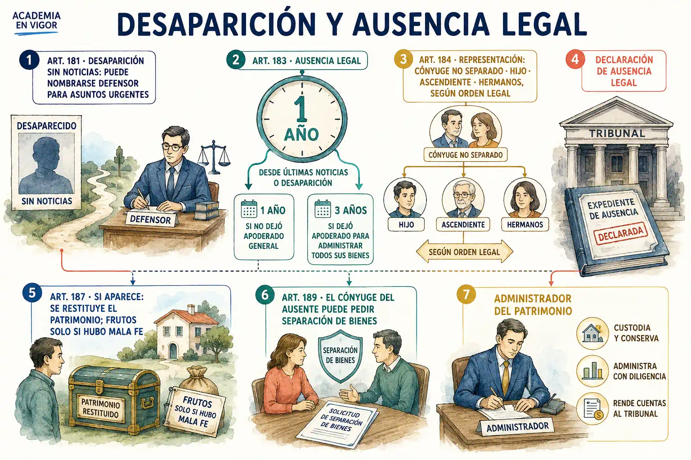

<em>Infografía: esquema de desaparición y ausencia legal con relaciones y trampas de examen.</em>

<!-- FUENTE: CC-BOE-A-1889-4763-T07 -->

## 40. Declaración de fallecimiento e inscripción

### Regla y encaje

Declaración de fallecimiento e inscripción se estudia dentro de protección de menores y ausencia. El bloque se contrasta directamente con arts. 193 a 198 CC.

### Claves examinables

- **Artículo 193:** Procede la declaración de fallecimiento: - **Artículo 193:** 1º. Transcurridos diez años desde las últimas noticias habidas del ausente, o, a falta de éstas, desde su desaparición. <!-- FACT:GC-T07-F707 --> - **Artículo 193:** 2º. Pasados cinco años desde las ultimas noticias o, en defecto de éstas, desde su desaparición, si al expirar dicho plazo hubiere cumplido el ausente setenta y cinco años. <!-- FACT:GC-T07-F708 --> - **Artículo 193:** Los plazos expresados se computarán desde la expiración del año natural en que se tuvieron las últimas noticias, o, en su defecto, del en que ocurrió la desaparición. <!-- FACT:GC-T07-F709 --> - **Artículo 193:** 3º. Cumplido un año, contado de fecha a fecha, de un riesgo inminente de muerte por causa de violencia contra la vida, en que una persona se hubiese encontrado sin haberse tenido, con posterioridad a la violencia, noticias suyas. En caso de siniestro este plazo será de tres meses. <!-- FACT:GC-T07-F710 --> - **Artículo 193:** Se presume la violencia si en una subversión de orden político o social hubiese desaparecido una persona sin volverse a tener noticias suyas durante el tiempo expresado, siempre que hayan pasado seis meses desde la cesación de la subversión. <!-- FACT:GC-T07-F711 --> - **Artículo 194:** Procede también la declaración de fallecimiento: <!-- FACT:GC-T07-F712 --> - **Artículo 194:** 1º. De los que perteneciendo a un contingente armado o unidos a él en calidad de funcionarios auxiliares voluntarios, o en funciones informativas, hayan tomado parte en operaciones de campaña y desaparecido en ellas luego que hayan transcurrido dos años, contados desde la fecha del tratado de paz, y en caso de no haberse concertado, desde la declaración oficial de fin de la guerra. <!-- FACT:GC-T07-F713 --> - **Artículo 194:** 2.º De los que resulte acreditado que se encontraban a bordo de una nave cuyo naufragio o desaparición por inmersión en el mar se haya comprobado, o a bordo de una aeronave cuyo siniestro se haya verificado y haya evidencias racionales de ausencia de supervivientes. <!-- FACT:GC-T07-F714 --> - **Artículo 194:** 3.º De los que no se tuvieren noticias después de que resulte acreditado que se encontraban a bordo de una nave cuyo naufragio o desaparición por inmersión en el mar se haya comprobado o a bordo de una aeronave cuyo siniestro se haya verificado, o, en caso de haberse encontrado restos humanos en tales supuestos, y no hubieren podido ser identificados, luego que hayan transcurrido ocho días. <!-- FACT:GC-T07-F715 --> - **Artículo 194:** 4.º De los que se encuentren a bordo de una nave que se presuma naufragada o desaparecida por inmersión en el mar, por no llegar a su destino, o si careciendo de punto fijo de arribo, no retornase y haya evidencias racionales de ausencia de supervivientes, luego que en cualquiera de los casos haya transcurrido un mes contado desde las últimas noticias recibidas o, por falta de éstas, desde la fecha de salida de la nave del puerto inicial del viaje. <!-- FACT:GC-T07-F716 --> - **Artículo 194:** 5.º De los que se encuentren a bordo de una aeronave que se presuma siniestrada al realizar el viaje sobre mares, zonas desérticas o inhabitadas, por no llegar a su destino, o si careciendo de punto fijo de arribo, no retornase, y haya evidencias racionales de ausencia de supervivientes, luego que en cualquiera de los casos haya transcurrido un mes contado desde las últimas noticias de las personas o de la aeronave y, en su defecto, desde la fecha de inicio del viaje. <!-- FACT:GC-T07-F717 --> - **Artículo 194:** Si éste se hiciere por etapas, el plazo indicado se computará desde el punto de despegue del que se recibieron las últimas noticias. <!-- FACT:GC-T07-F718 --> - **Artículo 195:** Por la declaración de fallecimiento cesa la situación de ausencia legal, pero mientras dicha declaración no se produzca, se presume que el ausente ha vivido hasta el momento en que deba reputársele fallecido, salvo investigaciones en contrario. <!-- FACT:GC-T07-F719 --> - **Artículo 195:** Toda declaración de fallecimiento expresará la fecha a partir de la cual se entienda sucedida la muerte, con arreglo a lo preceptuado en los artículos precedentes, salvo prueba en contrario. <!-- FACT:GC-T07-F720 --> - **Artículo 196:** Firme la declaración de fallecimiento del ausente, se abrirá la sucesión en los bienes del mismo, procediéndose a su adjudicación conforme a lo dispuesto legalmente. <!-- FACT:GC-T07-F721 --> - **Artículo 196:** Los herederos no podrán disponer a título gratuito hasta cinco años después de la declaración del fallecimiento. <!-- FACT:GC-T07-F722 --> - **Artículo 196:** Hasta que transcurra este mismo plazo no serán entregados los legados, si los hubiese, ni tendrán derecho a exigirlos los legatarios, salvo las mandas piadosas en sufragio del alma del testador o los legados en favor de Instituciones de beneficencia. <!-- FACT:GC-T07-F723 --> - **Artículo 196:** Será obligación ineludible de los sucesores, aunque por tratarse de uno solo no fuese necesaria partición, la de formar notarialmente un inventario detallado de los bienes muebles y una descripción de los inmuebles. <!-- FACT:GC-T07-F724 --> - **Artículo 197:** Si después de la declaración de fallecimiento se presentase el ausente o se probase su existencia, recobrará sus bienes en el estado en que se encuentren y tendrá derecho al precio de los que se hubieran vendido, o a los bienes que con este precio se hayan adquirido, pero no podrá reclamar de sus sucesores rentas, frutos ni productos obtenidos con los bienes de su sucesión, sino desde el día de su presencia o de la declaración de no haber muerto. <!-- FACT:GC-T07-F725 --> - **Artículo 198:** En el Registro Civil se harán constar las declaraciones de desaparición, ausencia legal y de fallecimiento, así como las representaciones legítimas y dativas acordadas, y su extinción. <!-- FACT:GC-T07-F726 --> - **Artículo 198:** Asimismo se anotarán los inventarios de bienes muebles y descripción de inmuebles que en este Título se ordenan; los decretos de concesión y las escrituras de transmisiones y gravámenes que efectúen los representantes legítimos o dativos de los ausentes; y la escritura de descripción o inventario de los bienes, así como de las escrituras de partición y adjudicación realizadas a virtud de la declaración de fallecimiento o de las actas de protocolización de los cuadernos particionales en sus respectivos casos. <!-- FACT:GC-T07-F727 -->  <!-- FACT:GC-T07-F728 -->

:::hablemos-claro
No basta con reconocer una frase verdadera: hay que comprobar que pertenece al artículo preguntado y que no se ha sustituido una facultad por una obligación, un plazo por otro o una excepción por la regla general.
:::

:::en-la-calle
En un supuesto práctico, fija quién actúa, qué capacidad o vínculo tiene, qué autoridad interviene y qué consecuencia civil produce la actuación.
:::

:::lo-que-cae
Prioriza requisitos, plazos, legitimación, autoridad competente y excepciones. Apariciones oficiales mapeadas en este bloque: **0**.
:::

<!-- VISUAL:t07-40-declaracion-de-fallecimiento-e-inscripcion.webp -->

  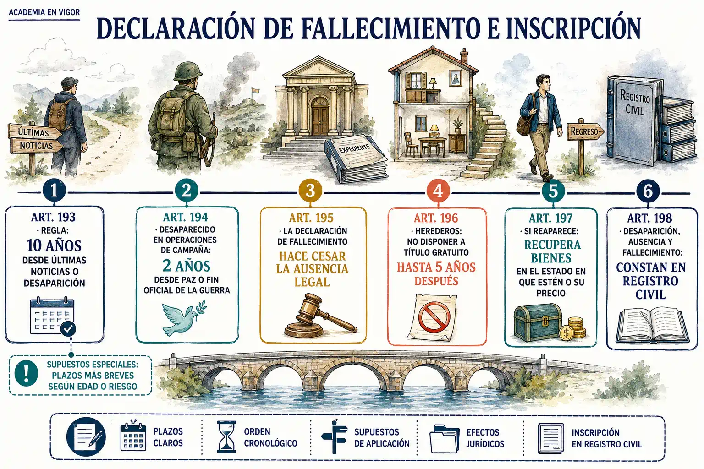

<em>Infografía: esquema de declaración de fallecimiento e inscripción con relaciones y trampas de examen.</em>

<!-- FUENTE: CC-BOE-A-1889-4763-T07 -->

## 41. Tutela de menores: disposiciones generales

### Regla y encaje

Tutela de menores: disposiciones generales se estudia dentro de protección de menores y ausencia. El bloque se contrasta directamente con arts. 199 a 210 CC.

### Claves examinables

- **Artículo 199:** Quedan sujetos a tutela: 1.º Los menores no emancipados en situación de desamparo. - **Artículo 199:** 2.º Los menores no emancipados no sujetos a patria potestad. <!-- FACT:GC-T07-F729 --> - **Artículo 200:** Las funciones tutelares constituyen un deber, se ejercerán en beneficio del tutelado y estarán bajo la salvaguarda de la autoridad judicial. <!-- FACT:GC-T07-F730 --> - **Artículo 200:** Las medidas y disposiciones previstas en el artículo 158 podrán ser acordadas también por la autoridad judicial en todos los supuestos de tutela de menores, en cuanto lo requiera el interés de estos. <!-- FACT:GC-T07-F731 --> - **Artículo 200:** Si se tratara de menores que estén bajo la tutela de una entidad pública, estas medidas solo podrán ser acordadas por la autoridad judicial de oficio o a instancia de dicha entidad, del Ministerio Fiscal o del propio menor. La entidad pública será parte en el procedimiento y las medidas acordadas serán comunicadas a esta, que dará traslado de dicha comunicación al director del centro residencial o a la familia acogedora. <!-- FACT:GC-T07-F732 --> - **Artículo 201:** Los progenitores podrán en testamento o documento público notarial designar tutor, establecer órganos de fiscalización de la tutela, así como designar las personas que hayan de integrarlos u ordenar cualquier otra disposición sobre la persona o bienes de sus hijos menores. <!-- FACT:GC-T07-F733 --> - **Artículo 202:** Las designaciones a que se refiere el artículo anterior vincularán a la autoridad judicial al constituir la tutela, salvo que el interés superior del menor exija otra cosa, en cuyo caso dictará resolución motivada. <!-- FACT:GC-T07-F734 --> - **Artículo 203:** Cuando existieren disposiciones de los progenitores hechas en testamento o documento público notarial de los progenitores, se aplicarán unas y otras conjuntamente, en cuanto fueran compatibles. De no serlo, se adoptarán por la autoridad judicial, en decisión motivada, las que considere más convenientes para el interés superior del menor. <!-- FACT:GC-T07-F735 --> - **Artículo 204:** Serán ineficaces las disposiciones hechas en testamento o documento público notarial sobre la tutela si, en el momento de adoptarlas, el disponente hubiese sido privado de la patria potestad. <!-- FACT:GC-T07-F736 --> - **Artículo 205:** El que disponga de bienes a título gratuito en favor de un menor podrá establecer las reglas de administración y disposición de los mismos y designar la persona o personas que hayan de ejercitarlas. Las funciones no conferidas al administrador corresponden al tutor. <!-- FACT:GC-T07-F737 --> - **Artículo 206:** Estarán obligados a promover la constitución de la tutela, desde el momento en que conocieran el hecho que la motivare, los parientes llamados a ella y la persona física o jurídica bajo cuya guarda se encuentre el menor y, si no lo hicieren, serán responsables solidarios de la indemnización de los daños y perjuicios causados. <!-- FACT:GC-T07-F738 --> - **Artículo 207:** Cualquier persona podrá poner en conocimiento del Ministerio Fiscal o de la autoridad judicial el hecho determinante de la tutela, a fin de que se dé inicio al expediente a que se refiere el artículo siguiente. <!-- FACT:GC-T07-F739 --> - **Artículo 208:** La autoridad judicial constituirá la tutela mediante un expediente de jurisdicción voluntaria, siguiendo los trámites previstos legalmente. <!-- FACT:GC-T07-F740 --> - **Artículo 209:** La tutela se ejercerá bajo la vigilancia del Ministerio Fiscal, que actuará de oficio o a instancia de la persona menor de edad o de cualquier interesado. <!-- FACT:GC-T07-F741 --> - **Artículo 209:** En cualquier momento podrá exigir del tutor que le informe sobre la situación del menor y del estado de la administración de la tutela. <!-- FACT:GC-T07-F742 --> - **Artículo 210:** La autoridad judicial podrá establecer, en la resolución por la que se constituya la tutela o en otra posterior, las medidas de vigilancia y control que estime adecuadas, en beneficio del tutelado. Asimismo, en cualquier momento podrá exigir del tutor que informe sobre la situación del menor y del estado de la administración. <!-- FACT:GC-T07-F743 -->  <!-- FACT:GC-T07-F744 -->

:::hablemos-claro
No basta con reconocer una frase verdadera: hay que comprobar que pertenece al artículo preguntado y que no se ha sustituido una facultad por una obligación, un plazo por otro o una excepción por la regla general.
:::

:::en-la-calle
En un supuesto práctico, fija quién actúa, qué capacidad o vínculo tiene, qué autoridad interviene y qué consecuencia civil produce la actuación.
:::

:::lo-que-cae
Prioriza requisitos, plazos, legitimación, autoridad competente y excepciones. Apariciones oficiales mapeadas en este bloque: **2**.
:::

<!-- VISUAL:t07-41-tutela-de-menores-disposiciones-generales.webp -->

  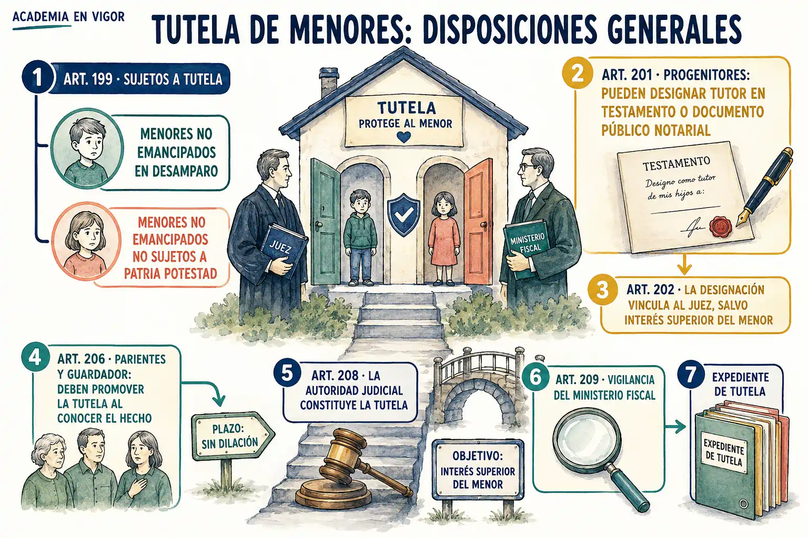

<em>Infografía: esquema de tutela de menores: disposiciones generales con relaciones y trampas de examen.</em>

<!-- FUENTE: CC-BOE-A-1889-4763-T07 -->

## 42. Delación y nombramiento del tutor

### Regla y encaje

Delación y nombramiento del tutor se estudia dentro de protección de menores y ausencia. El bloque se contrasta directamente con arts. 211 a 223 CC.

### Claves examinables

- **Artículo 211:** Podrán ser tutores todas las personas físicas que, a juicio de la autoridad judicial, cumplan las condiciones de aptitud suficientes para el adecuado desempeño de su función y en ellas no concurra alguna de las causas de inhabilidad establecidas en los artículos siguientes. - **Artículo 212:** Podrán ser tutores las fundaciones y demás personas jurídicas sin ánimo de lucro, públicas o privadas, entre cuyos fines figure la protección y asistencia de menores. <!-- FACT:GC-T07-F745 --> - **Artículo 213:** Para el nombramiento de tutor se preferirá: <!-- FACT:GC-T07-F746 --> - **Artículo 213:** 1.º A la persona o personas designadas por los progenitores en testamento o documento público notarial. <!-- FACT:GC-T07-F747 --> - **Artículo 213:** 2.º Al ascendiente o hermano que designe la autoridad judicial. <!-- FACT:GC-T07-F748 --> - **Artículo 213:** Excepcionalmente, en resolución motivada, se podrá alterar el orden del párrafo anterior o prescindir de todas las personas en él mencionadas, si el interés superior del menor así lo exigiere. Se considera beneficiosa para el menor la integración en la vida de familia del tutor. <!-- FACT:GC-T07-F749 --> - **Artículo 214:** En defecto de las personas mencionadas en el artículo anterior, la autoridad judicial designará tutor a quien, por sus relaciones con el tutelado y en el interés superior de este, considere más idóneo. <!-- FACT:GC-T07-F750 --> - **Artículo 215:** Si hubiere que designar tutor para varios hermanos, se procurará que el nombramiento recaiga en una misma persona. <!-- FACT:GC-T07-F751 --> - **Artículo 216:** No podrán ser tutores: <!-- FACT:GC-T07-F752 --> - **Artículo 216:** 1.º Los que por resolución judicial estuvieran privados o suspendidos en el ejercicio de la patria potestad o, total o parcialmente, de los derechos de guarda y protección. <!-- FACT:GC-T07-F753 --> - **Artículo 216:** 2.º Los que hubieren sido legalmente removidos de una tutela, curatela o guarda anterior. <!-- FACT:GC-T07-F754 --> - **Artículo 217:** La autoridad judicial no podrá nombrar a las personas siguientes: <!-- FACT:GC-T07-F755 --> - **Artículo 217:** 1.º A quien haya sido excluido por los progenitores del tutelado. <!-- FACT:GC-T07-F756 --> - **Artículo 217:** 2.º A quien haya sido condenado en sentencia firme por cualquier delito que haga suponer fundadamente que no desempeñará bien la tutela. <!-- FACT:GC-T07-F757 --> - **Artículo 217:** 3.º Al administrador que hubiese sido sustituido en sus facultades de administración durante la tramitación del procedimiento concursal. <!-- FACT:GC-T07-F758 --> - **Artículo 217:** 4.º A quien le sea imputable la declaración como culpable de un concurso, salvo que la tutela lo sea solo de la persona. <!-- FACT:GC-T07-F759 --> - **Artículo 217:** 5.º A quien tenga conflicto de intereses con la persona sujeta a tutela. <!-- FACT:GC-T07-F760 --> - **Artículo 218:** La tutela se ejercerá por un solo tutor salvo: <!-- FACT:GC-T07-F761 --> - **Artículo 218:** 1.º Cuando, por concurrir circunstancias especiales en la persona del tutelado o en su patrimonio, convenga separar como cargos distintos el de tutor de la persona y el de los bienes, cada uno de los cuales actuará independientemente en el ámbito de su competencia, si bien las decisiones que conciernan a ambos deberán tomarlas conjuntamente. <!-- FACT:GC-T07-F762 --> - **Artículo 218:** 2.º Si se designa a alguna persona tutor de los hijos de su hermano y se considera conveniente que ejerza también la tutela el cónyuge del tutor o la persona que se halle en análoga relación de afectividad. <!-- FACT:GC-T07-F763 --> - **Artículo 218:** 3.º Cuando los progenitores del tutelado hayan designado en testamento o documento público notarial más de un tutor para que ejerzan la tutela conjuntamente. <!-- FACT:GC-T07-F764 --> - **Artículo 219:** En el caso del numeral 3.º del artículo anterior, si los progenitores lo hubieren dispuesto de modo expreso, se podrá resolver, al efectuar el nombramiento de tutores, que estos puedan ejercitar las facultades de la tutela con carácter solidario. <!-- FACT:GC-T07-F765 --> - **Artículo 219:** De no mediar tal clase de nombramiento y, sin perjuicio de lo dispuesto en el numeral 1.º del artículo anterior, las facultades de la tutela encomendadas a varios tutores habrán de ser ejercitadas por estos conjuntamente, pero valdrá lo que se haga con el acuerdo del mayor número. A falta de tal acuerdo, la autoridad judicial, después de oír a los tutores y al tutelado si tuviere suficiente madurez, resolverá sin ulterior recurso lo que estime conveniente. <!-- FACT:GC-T07-F766 --> - **Artículo 219:** Para el caso de que los desacuerdos fueran reiterados y entorpeciesen gravemente el ejercicio de la tutela, podrá la autoridad judicial reorganizar su funcionamiento e incluso nombrar nuevo tutor. <!-- FACT:GC-T07-F767 --> - **Artículo 220:** Si los tutores tuvieren sus facultades atribuidas conjuntamente y hubiere incompatibilidad u oposición de intereses en alguno de ellos para un acto o contrato, podrá este ser realizado por el otro tutor o, de ser varios, por los demás en forma conjunta. <!-- FACT:GC-T07-F768 --> - **Artículo 221:** En los casos de que por cualquier causa cese alguno de los tutores, la tutela subsistirá con los restantes a no ser que al hacer el nombramiento se hubiera dispuesto otra cosa de modo expreso. <!-- FACT:GC-T07-F769 --> - **Artículo 222:** La tutela de los menores que se encuentren en situación de desamparo corresponderá por ministerio de la ley a la entidad pública a la que en el respectivo territorio esté encomendada la protección de menores. <!-- FACT:GC-T07-F770 --> - **Artículo 222:** No obstante, se procederá al nombramiento de tutor conforme a las reglas ordinarias cuando existan personas físicas que, por sus relaciones con el menor o por otras circunstancias, puedan asumir la tutela en interés de este. <!-- FACT:GC-T07-F771 --> - **Artículo 222:** En el supuesto del párrafo anterior, previamente a la designación judicial de tutor, o en la misma resolución, deberá acordarse la suspensión o la privación de la patria potestad o la remoción del tutor, en su caso. <!-- FACT:GC-T07-F772 --> - **Artículo 222:** Estarán legitimados para ejercer las acciones de privación de patria potestad, promover la remoción del tutor y solicitar el nombramiento de tutor de los menores en situación de desamparo, el Ministerio Fiscal, la entidad pública y los llamados al ejercicio de la tutela. <!-- FACT:GC-T07-F773 --> - **Artículo 223:** Las causas y procedimientos de remoción y excusa de la tutela serán los mismos que los establecidos para la curatela. <!-- FACT:GC-T07-F774 --> - **Artículo 223:** La autoridad judicial podrá decretar la remoción a solicitud de la persona menor de edad si tuviere suficiente madurez. En todo caso será tenida en cuenta su opinión y se le dará audiencia si fuere mayor de doce años. <!-- FACT:GC-T07-F775 --> - **Artículo 223:** Declarada la remoción, se procederá al nombramiento de nuevo tutor en la forma establecida en este Código. <!-- FACT:GC-T07-F776 -->  <!-- FACT:GC-T07-F777 -->

:::hablemos-claro
No basta con reconocer una frase verdadera: hay que comprobar que pertenece al artículo preguntado y que no se ha sustituido una facultad por una obligación, un plazo por otro o una excepción por la regla general.
:::

:::en-la-calle
En un supuesto práctico, fija quién actúa, qué capacidad o vínculo tiene, qué autoridad interviene y qué consecuencia civil produce la actuación.
:::

:::lo-que-cae
Prioriza requisitos, plazos, legitimación, autoridad competente y excepciones. Apariciones oficiales mapeadas en este bloque: **2**.
:::

<!-- VISUAL:t07-42-delacion-y-nombramiento-del-tutor.webp -->

  

<em>Infografía: esquema de delación y nombramiento del tutor con relaciones y trampas de examen.</em>

<!-- FUENTE: CC-BOE-A-1889-4763-T07 -->

## 43. Ejercicio de la tutela

### Regla y encaje

Ejercicio de la tutela se estudia dentro de protección de menores y ausencia. El bloque se contrasta directamente con arts. 224 a 230 CC.

### Claves examinables

- **Artículo 224:** Serán aplicables a la tutela, con carácter supletorio, las normas de la curatela. - **Artículo 225:** El tutor es el representante del menor, salvo para aquellos actos que este pueda realizar por si solo o para los que únicamente precise asistencia. <!-- FACT:GC-T07-F778 --> - **Artículo 226:** Se prohíbe al tutor: <!-- FACT:GC-T07-F779 --> - **Artículo 226:** 1.º Recibir liberalidades del tutelado o de sus causahabientes, mientras no se haya aprobado definitivamente su gestión. <!-- FACT:GC-T07-F780 --> - **Artículo 226:** 2.º Representar al tutelado cuando en el mismo acto intervenga en nombre propio o de un tercero y existiera conflicto de intereses. <!-- FACT:GC-T07-F781 --> - **Artículo 226:** 3.º Adquirir por título oneroso bienes del tutelado o transmitirle por su parte bienes por igual título. <!-- FACT:GC-T07-F782 --> - **Artículo 227:** Los tutores ejercerán su cargo en interés del menor, de acuerdo con su personalidad y con respeto a sus derechos. <!-- FACT:GC-T07-F783 --> - **Artículo 227:** Cuando sea necesario para el ejercicio de la tutela podrán recabar el auxilio de la autoridad. <!-- FACT:GC-T07-F784 --> - **Artículo 228:** El tutor está obligado a velar por el tutelado y, en particular: <!-- FACT:GC-T07-F785 --> - **Artículo 228:** 1.º A velar por él y a procurarle alimentos. 2.º A educar al menor y procurarle una formación integral. <!-- FACT:GC-T07-F786 --> - **Artículo 228:** 3.º A promover su mejor inserción en la sociedad. <!-- FACT:GC-T07-F787 --> - **Artículo 228:** 4.º A administrar el patrimonio del menor con la diligencia debida. <!-- FACT:GC-T07-F788 --> - **Artículo 228:** 5.º A informar a la autoridad judicial anualmente sobre la situación del menor y a rendirle cuenta anual de su administración. <!-- FACT:GC-T07-F789 --> - **Artículo 228:** 6.º A oír al menor antes de adoptar decisiones que le afecten. <!-- FACT:GC-T07-F790 --> - **Artículo 229:** El tutor tiene derecho a una retribución, siempre que el patrimonio del menor lo permita, así como al reembolso de los gastos justificados, cantidades que serán satisfechas con cargo a dicho patrimonio. <!-- FACT:GC-T07-F791 --> - **Artículo 229:** Salvo que los progenitores hubieran establecido otra cosa, y sin perjuicio de que dichas previsiones puedan modificarse por la autoridad judicial si lo estimase conveniente para el interés del menor, corresponde a la autoridad judicial fijar su importe y el modo de percibirla, para lo cual tendrá en cuenta el trabajo a realizar y el valor y la rentabilidad de los bienes. <!-- FACT:GC-T07-F792 --> - **Artículo 229:** Podrá también establecerse que el tutor haga suyos los frutos de los bienes del tutelado a cambio de prestarle los alimentos, si así lo hubieren dispuesto los progenitores. La autoridad judicial podrá dejar sin efecto esta previsión o establecerla aun cuando nada hubiesen dispuesto los progenitores, si lo estimase conveniente para el interés del menor. <!-- FACT:GC-T07-F793 --> - **Artículo 230:** La persona que en el ejercicio de una función tutelar sufra daños y perjuicios, sin culpa por su parte, tendrá derecho a la indemnización de estos con cargo a los bienes del tutelado, de no poder obtener por otro medio su resarcimiento. <!-- FACT:GC-T07-F794 -->  <!-- FACT:GC-T07-F795 -->

:::hablemos-claro
No basta con reconocer una frase verdadera: hay que comprobar que pertenece al artículo preguntado y que no se ha sustituido una facultad por una obligación, un plazo por otro o una excepción por la regla general.
:::

:::en-la-calle
En un supuesto práctico, fija quién actúa, qué capacidad o vínculo tiene, qué autoridad interviene y qué consecuencia civil produce la actuación.
:::

:::lo-que-cae
Prioriza requisitos, plazos, legitimación, autoridad competente y excepciones. Apariciones oficiales mapeadas en este bloque: **0**.
:::

<!-- VISUAL:t07-43-ejercicio-de-la-tutela.webp -->

  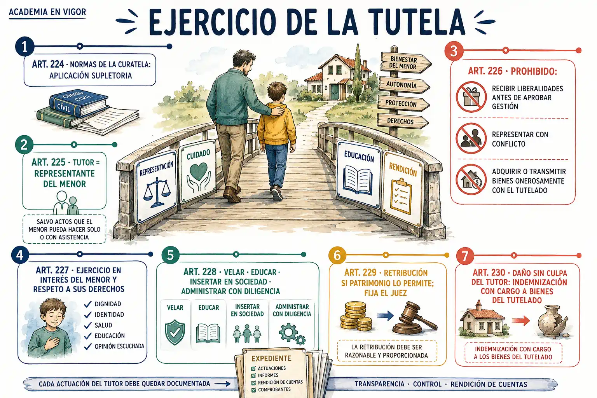

<em>Infografía: esquema de ejercicio de la tutela con relaciones y trampas de examen.</em>

<!-- FUENTE: CC-BOE-A-1889-4763-T07 -->

## 44. Extinción de la tutela y rendición de cuentas

### Regla y encaje

Extinción de la tutela y rendición de cuentas se estudia dentro de protección de menores y ausencia. El bloque se contrasta directamente con arts. 231 a 234 CC.

### Claves examinables

- **Artículo 231:** La tutela se extingue: - **Artículo 231:** 1.º Por la mayoría de edad, emancipación o concesión del beneficio de la mayoría de edad al menor. <!-- FACT:GC-T07-F796 --> - **Artículo 231:** 2.º Por la adopción del menor. 3.º Por muerte o declaración de fallecimiento del menor. <!-- FACT:GC-T07-F797 --> - **Artículo 231:** 4.º Cuando, habiéndose originado por privación o suspensión de la patria potestad, el titular de esta la recupere, o cuando desaparezca la causa que impedía al titular de la patria potestad ejercitarla de hecho. <!-- FACT:GC-T07-F798 --> - **Artículo 232:** El tutor, sin perjuicio de la obligación de rendición anual de cuentas, al cesar en sus funciones deberá rendir ante la autoridad judicial la cuenta general justificada de su administración en el plazo de tres meses, prorrogables por el tiempo que fuere necesario si concurre justa causa. <!-- FACT:GC-T07-F799 --> - **Artículo 232:** La acción para exigir la rendición de esta cuenta prescribe a los cinco años, contados desde la terminación del plazo establecido para efectuarla. <!-- FACT:GC-T07-F800 --> - **Artículo 232:** Antes de resolver sobre la aprobación de la cuenta, la autoridad judicial oirá también, en su caso, al nuevo tutor y a la persona que hubiera estado sometida a tutela o a sus herederos. <!-- FACT:GC-T07-F801 --> - **Artículo 232:** La aprobación judicial de las cuentas no impedirá el ejercicio de las acciones que recíprocamente puedan asistir al tutor y al menor o a sus causahabientes por razón de la tutela. <!-- FACT:GC-T07-F802 --> - **Artículo 233:** Los gastos necesarios de la rendición de cuentas serán a cargo del patrimonio de quien estuvo sometido a tutela. <!-- FACT:GC-T07-F803 --> - **Artículo 233:** El saldo de la cuenta general devengará el interés legal, a favor o en contra del tutor. Si el saldo es a favor del tutor, el interés legal se devengará desde el requerimiento para el pago, previa restitución de los bienes a su titular. Si es en contra del tutor, devengará el interés legal una vez transcurridos los tres meses siguientes a la aprobación de la cuenta. <!-- FACT:GC-T07-F804 --> - **Artículo 234:** El tutor responderá de los daños que hubiese causado al menor por su culpa o negligencia. <!-- FACT:GC-T07-F805 --> - **Artículo 234:** La acción para reclamar esta responsabilidad prescribe a los tres años contados desde la rendición final de cuentas. <!-- FACT:GC-T07-F806 -->  <!-- FACT:GC-T07-F807 -->

:::hablemos-claro
No basta con reconocer una frase verdadera: hay que comprobar que pertenece al artículo preguntado y que no se ha sustituido una facultad por una obligación, un plazo por otro o una excepción por la regla general.
:::

:::en-la-calle
En un supuesto práctico, fija quién actúa, qué capacidad o vínculo tiene, qué autoridad interviene y qué consecuencia civil produce la actuación.
:::

:::lo-que-cae
Prioriza requisitos, plazos, legitimación, autoridad competente y excepciones. Apariciones oficiales mapeadas en este bloque: **0**.
:::

<!-- VISUAL:t07-44-extincion-de-la-tutela-y-rendicion-de-cuentas.webp -->

  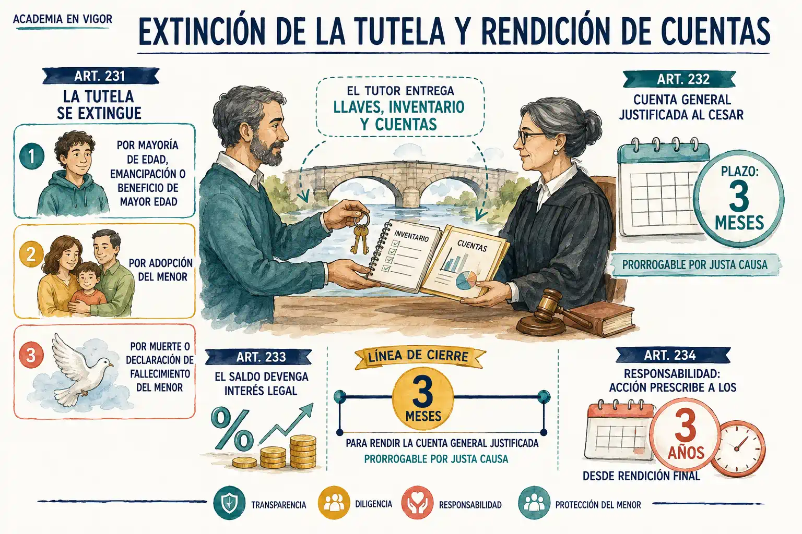

<em>Infografía: esquema de extinción de la tutela y rendición de cuentas con relaciones y trampas de examen.</em>

<!-- FUENTE: CC-BOE-A-1889-4763-T07 -->

## 45. Defensor judicial y guarda de hecho del menor

### Regla y encaje

Defensor judicial y guarda de hecho del menor se estudia dentro de protección de menores y ausencia. El bloque se contrasta directamente con arts. 235 a 238 CC.

### Claves examinables

- **Artículo 235:** Se nombrará un defensor judicial del menor en los casos siguientes: - **Artículo 235:** 1.º Cuando en algún asunto exista conflicto de intereses entre los menores y sus representantes legales, salvo en los casos en que la ley prevea otra forma de salvarlo. <!-- FACT:GC-T07-F808 --> - **Artículo 235:** 2.º Cuando, por cualquier causa, el tutor no desempeñare sus funciones, hasta que cese la causa determinante o se designe otra persona. <!-- FACT:GC-T07-F809 --> - **Artículo 235:** 3.º Cuando el menor emancipado requiera el complemento de capacidad previsto en los artículos 247 y 248 y a quienes corresponda prestarlo no puedan hacerlo o exista con ellos conflicto de intereses. <!-- FACT:GC-T07-F810 --> - **Artículo 236:** Serán aplicables al defensor judicial del menor las normas del defensor judicial de las personas con discapacidad. El defensor judicial del menor ejercerá su cargo en interés del menor, de acuerdo con su personalidad y con respeto a sus derechos. <!-- FACT:GC-T07-F811 --> - **Artículo 237:** 1. Cuando la autoridad judicial tenga conocimiento de la existencia de un guardador de hecho podrá requerirle para que informe de la situación de la persona y los bienes del menor y de su actuación en relación con los mismos, pudiendo establecer las medidas de control y vigilancia que considere oportunas. <!-- FACT:GC-T07-F812 --> - **Artículo 237:** Cautelarmente, mientras se mantenga la situación de guarda de hecho y hasta que se constituya la medida de protección adecuada, si procediera, se podrán otorgar judicialmente facultades tutelares a los guardadores. Igualmente se podrá constituir un acogimiento temporal, siendo acogedores los guardadores. <!-- FACT:GC-T07-F813 --> - **Artículo 237:** 2. Procederá la declaración de situación de desamparo de los menores cuando, además de esta circunstancia, se den los presupuestos objetivos de falta de asistencia contemplados en el artículo 172. <!-- FACT:GC-T07-F814 --> - **Artículo 237:** En los demás casos, el guardador de hecho podrá promover la privación o suspensión de la patria potestad, remoción de la tutela o el nombramiento de tutor. <!-- FACT:GC-T07-F815 --> - **Artículo 238:** Serán aplicables a la guarda de hecho del menor, con carácter supletorio, las normas de la guarda de hecho de las personas con discapacidad. <!-- FACT:GC-T07-F816 -->  <!-- FACT:GC-T07-F817 -->

:::hablemos-claro
No basta con reconocer una frase verdadera: hay que comprobar que pertenece al artículo preguntado y que no se ha sustituido una facultad por una obligación, un plazo por otro o una excepción por la regla general.
:::

:::en-la-calle
En un supuesto práctico, fija quién actúa, qué capacidad o vínculo tiene, qué autoridad interviene y qué consecuencia civil produce la actuación.
:::

:::lo-que-cae
Prioriza requisitos, plazos, legitimación, autoridad competente y excepciones. Apariciones oficiales mapeadas en este bloque: **0**.
:::

<!-- VISUAL:t07-45-defensor-judicial-y-guarda-de-hecho-del-menor.webp -->

  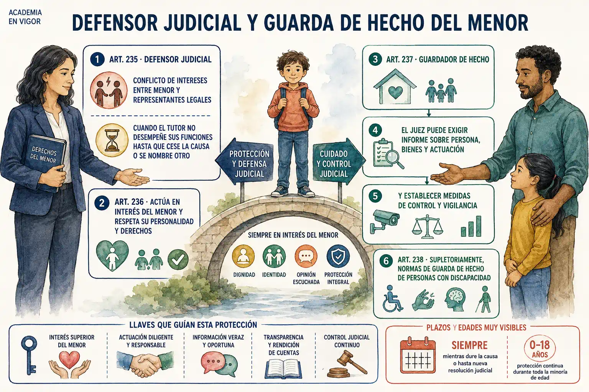

<em>Infografía: esquema de defensor judicial y guarda de hecho del menor con relaciones y trampas de examen.</em>

<!-- FUENTE: CC-BOE-A-1889-4763-T07 -->

## 46. Mayoría de edad y emancipación

### Regla y encaje

Mayoría de edad y emancipación se estudia dentro de emancipación y apoyos a personas con discapacidad. El bloque se contrasta directamente con arts. 239 a 248 CC.

### Claves examinables

- **Artículo 239:** La emancipación tiene lugar: 1.º Por la mayor edad. - **Artículo 239:** 2.º Por concesión de los que ejerzan la patria potestad. 3.º Por concesión judicial. <!-- FACT:GC-T07-F818 --> - **Artículo 240:** La mayor edad empieza a los dieciocho años cumplidos. <!-- FACT:GC-T07-F819 --> - **Artículo 240:** Para el cómputo de los años de la mayoría de edad se incluirá completo el día del nacimiento. <!-- FACT:GC-T07-F820 --> - **Artículo 241:** Para que tenga lugar la emancipación por concesión de quienes ejerzan la patria potestad, se requiere que el menor tenga dieciséis años cumplidos y que la consienta. Esta emancipación se otorgará por escritura pública o por comparecencia ante el encargado del Registro Civil. <!-- FACT:GC-T07-F821 --> - **Artículo 242:** La concesión de la emancipación habrá de inscribirse en el Registro Civil, no produciendo entre tanto efectos contra terceros. <!-- FACT:GC-T07-F822 --> - **Artículo 242:** Concedida la emancipación no podrá ser revocada. <!-- FACT:GC-T07-F823 --> - **Artículo 243:** Se reputará para todos los efectos como emancipado al hijo mayor de dieciséis años que, con el consentimiento de los progenitores, viviere independientemente de estos. Los progenitores podrán revocar este consentimiento. <!-- FACT:GC-T07-F824 --> - **Artículo 244:** La autoridad judicial podrá conceder la emancipación de los hijos mayores de dieciséis años si estos la pidieren y previa audiencia de los progenitores: <!-- FACT:GC-T07-F825 --> - **Artículo 244:** 1.º Cuando quien ejerce la patria potestad contrajere nupcias o conviviere maritalmente con persona distinta del otro progenitor. <!-- FACT:GC-T07-F826 --> - **Artículo 244:** 2.º Cuando los progenitores vivieren separados. <!-- FACT:GC-T07-F827 --> - **Artículo 244:** 3.º Cuando concurra cualquier causa que entorpezca gravemente el ejercicio de la patria potestad. <!-- FACT:GC-T07-F828 --> - **Artículo 245:** También podrá la autoridad judicial, previo informe del Ministerio Fiscal, conceder el beneficio de la mayor edad al sujeto a tutela mayor de dieciséis años que lo solicitare. <!-- FACT:GC-T07-F829 --> - **Artículo 246:** El mayor de edad puede realizar todos los actos de la vida civil, salvo las excepciones establecidas en casos especiales por este Código. <!-- FACT:GC-T07-F830 --> - **Artículo 247:** La emancipación habilita al menor para regir su persona y bienes como si fuera mayor; pero hasta que llegue a la mayor edad no podrá el emancipado tomar dinero a préstamo, gravar o enajenar bienes inmuebles y establecimientos mercantiles o industriales u objetos de extraordinario valor sin consentimiento de sus progenitores y, a falta de ambos, sin el de su defensor judicial. <!-- FACT:GC-T07-F831 --> - **Artículo 247:** El menor emancipado podrá por sí solo comparecer en juicio. <!-- FACT:GC-T07-F832 --> - **Artículo 247:** Lo dispuesto en este artículo es aplicable también al menor que hubiere obtenido judicialmente el beneficio de la mayor edad. <!-- FACT:GC-T07-F833 --> - **Artículo 248:** Para que el casado menor de edad pueda enajenar o gravar bienes inmuebles, establecimientos mercantiles u objetos de extraordinario valor que sean comunes, basta, si es mayor el otro cónyuge, el consentimiento de los dos; si también es menor, se necesitará además el de los progenitores o defensor judicial de uno y otro. <!-- FACT:GC-T07-F834 -->  <!-- FACT:GC-T07-F835 -->

:::hablemos-claro
No basta con reconocer una frase verdadera: hay que comprobar que pertenece al artículo preguntado y que no se ha sustituido una facultad por una obligación, un plazo por otro o una excepción por la regla general.
:::

:::en-la-calle
En un supuesto práctico, fija quién actúa, qué capacidad o vínculo tiene, qué autoridad interviene y qué consecuencia civil produce la actuación.
:::

:::lo-que-cae
Prioriza requisitos, plazos, legitimación, autoridad competente y excepciones. Apariciones oficiales mapeadas en este bloque: **5**.
:::

<!-- VISUAL:t07-46-mayoria-de-edad-y-emancipacion.webp -->

  

<em>Infografía: esquema de mayoría de edad y emancipación con relaciones y trampas de examen.</em>

<!-- FUENTE: CC-BOE-A-1889-4763-T07 -->

## 47. Principios de las medidas de apoyo

### Regla y encaje

Principios de las medidas de apoyo se estudia dentro de emancipación y apoyos a personas con discapacidad. El bloque se contrasta directamente con arts. 249 a 253 CC.

### Claves examinables

- **Artículo 249:** Las medidas de apoyo a las personas mayores de edad o menores emancipadas que las precisen para el adecuado ejercicio de su capacidad jurídica tendrán por finalidad permitir el desarrollo pleno de su personalidad y su desenvolvimiento jurídico en condiciones de igualdad. Estas medidas de apoyo deberán estar inspiradas en el respeto a la dignidad de la persona y en la tutela de sus derechos fundamentales. - **Artículo 249:** Las de origen legal o judicial solo procederán en defecto o insuficiencia de la voluntad de la persona de que se trate. Todas ellas deberán ajustarse a los principios de necesidad y proporcionalidad. <!-- FACT:GC-T07-F836 --> - **Artículo 249:** Las personas que presten apoyo deberán actuar atendiendo a la voluntad, deseos y preferencias de quien lo requiera. Igualmente procurarán que la persona con discapacidad pueda desarrollar su propio proceso de toma de decisiones, informándola, ayudándola en su comprensión y razonamiento y facilitando que pueda expresar sus preferencias. Asimismo, fomentarán que la persona con discapacidad pueda ejercer su capacidad jurídica con menos apoyo en el futuro. <!-- FACT:GC-T07-F837 --> - **Artículo 249:** En casos excepcionales, cuando, pese a haberse hecho un esfuerzo considerable, no sea posible determinar la voluntad, deseos y preferencias de la persona, las medidas de apoyo podrán incluir funciones representativas. <!-- FACT:GC-T07-F838 --> - **Artículo 249:** En este caso, en el ejercicio de esas funciones se deberá tener en cuenta la trayectoria vital de la persona con discapacidad, sus creencias y valores, así como los factores que ella hubiera tomado en consideración, con el fin de tomar la decisión que habría adoptado la persona en caso de no requerir representación. <!-- FACT:GC-T07-F839 --> - **Artículo 249:** La autoridad judicial podrá dictar las salvaguardas que considere oportunas a fin de asegurar que el ejercicio de las medidas de apoyo se ajuste a los criterios resultantes de este precepto y, en particular, atienda a la voluntad, deseos y preferencias de la persona que las requiera. <!-- FACT:GC-T07-F840 --> - **Artículo 250:** Las medidas de apoyo para el ejercicio de la capacidad jurídica de las personas que lo precisen son, además de las de naturaleza voluntaria, la guarda de hecho, la curatela y el defensor judicial. <!-- FACT:GC-T07-F841 --> - **Artículo 250:** La función de las medidas de apoyo consistirá en asistir a la persona con discapacidad en el ejercicio de su capacidad jurídica en los ámbitos en los que sea preciso, respetando su voluntad, deseos y preferencias. <!-- FACT:GC-T07-F842 --> - **Artículo 250:** Las medidas de apoyo de naturaleza voluntaria son las establecidas por la persona con discapacidad, en las que designa quién debe prestarle apoyo y con qué alcance. Cualquier medida de apoyo voluntaria podrá ir acompañada de las salvaguardas necesarias para garantizar en todo momento y ante cualquier circunstancia el respeto a la voluntad, deseos y preferencias de la persona. <!-- FACT:GC-T07-F843 --> - **Artículo 250:** La guarda de hecho es una medida informal de apoyo que puede existir cuando no haya medidas voluntarias o judiciales que se estén aplicando eficazmente. <!-- FACT:GC-T07-F844 --> - **Artículo 250:** La curatela es una medida formal de apoyo que se aplicará a quienes precisen el apoyo de modo continuado. Su extensión vendrá determinada en la correspondiente resolución judicial en armonía con la situación y circunstancias de la persona con discapacidad y con sus necesidades de apoyo. <!-- FACT:GC-T07-F845 --> - **Artículo 250:** El nombramiento de defensor judicial como medida formal de apoyo procederá cuando la necesidad de apoyo se precise de forma ocasional, aunque sea recurrente. <!-- FACT:GC-T07-F846 --> - **Artículo 250:** Al determinar las medidas de apoyo se procurará evitar situaciones en las que se puedan producir conflictos de intereses o influencia indebida. <!-- FACT:GC-T07-F847 --> - **Artículo 250:** No podrán ejercer ninguna de las medidas de apoyo quienes, en virtud de una relación contractual, presten servicios asistenciales, residenciales o de naturaleza análoga a la persona que precisa el apoyo. <!-- FACT:GC-T07-F848 --> - **Artículo 251:** Se prohíbe a quien desempeñe alguna medida de apoyo: <!-- FACT:GC-T07-F849 --> - **Artículo 251:** 1.º Recibir liberalidades de la persona que precisa el apoyo o de sus causahabientes, mientras que no se haya aprobado definitivamente su gestión, salvo que se trate de regalos de costumbre o bienes de escaso valor. <!-- FACT:GC-T07-F850 --> - **Artículo 251:** 2.º Prestar medidas de apoyo cuando en el mismo acto intervenga en nombre propio o de un tercero y existiera conflicto de intereses. <!-- FACT:GC-T07-F851 --> - **Artículo 251:** 3.º Adquirir por título oneroso bienes de la persona que precisa el apoyo o transmitirle por su parte bienes por igual título. <!-- FACT:GC-T07-F852 --> - **Artículo 251:** En las medidas de apoyo voluntarias estas prohibiciones no resultarán de aplicación cuando el otorgante las haya excluido expresamente en el documento de constitución de dichas medidas. <!-- FACT:GC-T07-F853 --> - **Artículo 252:** El que disponga de bienes a título gratuito en favor de una persona necesitada de apoyo podrá establecer las reglas de administración y disposición de aquellos, así como designar la persona o personas a las que se encomienden dichas facultades. Las facultades no conferidas al administrador corresponderán al favorecido por la disposición de los bienes, que las ejercitará, en su caso, con el apoyo que proceda. <!-- FACT:GC-T07-F854 --> - **Artículo 252:** Igualmente podrán establecer los órganos de control o supervisión que se estimen convenientes para el ejercicio de las facultades conferidas. <!-- FACT:GC-T07-F855 --> - **Artículo 253:** Cuando una persona se encuentre en una situación que exija apoyo para el ejercicio de su capacidad jurídica de modo urgente y carezca de un guardador de hecho, el apoyo se prestará de modo provisional por la entidad pública que en el respectivo territorio tenga encomendada esta función. La entidad dará conocimiento de la situación al Ministerio Fiscal en el plazo de veinticuatro horas. <!-- FACT:GC-T07-F856 -->  <!-- FACT:GC-T07-F857 -->

:::hablemos-claro
No basta con reconocer una frase verdadera: hay que comprobar que pertenece al artículo preguntado y que no se ha sustituido una facultad por una obligación, un plazo por otro o una excepción por la regla general.
:::

:::en-la-calle
En un supuesto práctico, fija quién actúa, qué capacidad o vínculo tiene, qué autoridad interviene y qué consecuencia civil produce la actuación.
:::

:::lo-que-cae
Prioriza requisitos, plazos, legitimación, autoridad competente y excepciones. Apariciones oficiales mapeadas en este bloque: **1**.
:::

<!-- VISUAL:t07-47-principios-de-las-medidas-de-apoyo.webp -->

  

<em>Infografía: esquema de principios de las medidas de apoyo con relaciones y trampas de examen.</em>

<!-- FUENTE: CC-BOE-A-1889-4763-T07 -->

## 48. Medidas voluntarias y poderes preventivos

### Regla y encaje

Medidas voluntarias y poderes preventivos se estudia dentro de emancipación y apoyos a personas con discapacidad. El bloque se contrasta directamente con arts. 254 a 262 CC.

### Claves examinables

- **Artículo 254:** Cuando se prevea razonablemente en los dos años anteriores a la mayoría de edad que un menor sujeto a patria potestad o a tutela pueda, después de alcanzada aquella, precisar de apoyo en el ejercicio de su capacidad jurídica, la autoridad judicial podrá acordar, a petición del menor, de los progenitores, del tutor o del Ministerio Fiscal, si lo estima necesario, la procedencia de la adopción de la medida de apoyo que corresponda para cuando concluya la minoría de edad. - **Artículo 254:** Estas medidas se adoptarán si el mayor de dieciséis años no ha hecho sus propias previsiones para cuando alcance la mayoría de edad. En otro caso se dará participación al menor en el proceso, atendiendo a su voluntad, deseos y preferencias. <!-- FACT:GC-T07-F858 --> - **Artículo 255:** Cualquier persona mayor de edad o menor emancipada en previsión o apreciación de la concurrencia de circunstancias que puedan dificultarle el ejercicio de su capacidad jurídica en igualdad de condiciones con las demás, podrá prever o acordar en escritura pública medidas de apoyo relativas a su persona o bienes. <!-- FACT:GC-T07-F859 --> - **Artículo 255:** Podrá también establecer el régimen de actuación, el alcance de las facultades de la persona o personas que le hayan de prestar apoyo, o la forma de ejercicio del apoyo, el cual se prestará conforme a lo dispuesto en el artículo 249. <!-- FACT:GC-T07-F860 --> - **Artículo 255:** Asimismo, podrá prever las medidas u órganos de control que estime oportuno, las salvaguardas necesarias para evitar abusos, conflicto de intereses o influencia indebida y los mecanismos y plazos de revisión de las medidas de apoyo, con el fin de garantizar el respeto de su voluntad, deseos y preferencias. <!-- FACT:GC-T07-F861 --> - **Artículo 255:** El Notario autorizante comunicará de oficio y sin dilación el documento público que contenga las medidas de apoyo al Registro Civil para su constancia en el registro individual del otorgante. <!-- FACT:GC-T07-F862 --> - **Artículo 255:** Solo en defecto o por insuficiencia de estas medidas de naturaleza voluntaria, y a falta de guarda de hecho que suponga apoyo suficiente, podrá la autoridad judicial adoptar otras supletorias o complementarias. <!-- FACT:GC-T07-F863 --> - **Artículo 256:** El poderdante podrá incluir una cláusula que estipule que el poder subsista si en el futuro precisa apoyo en el ejercicio de su capacidad. <!-- FACT:GC-T07-F864 --> - **Artículo 257:** El poderdante podrá otorgar poder solo para el supuesto de que en el futuro precise apoyo en el ejercicio de su capacidad. En este caso, para acreditar que se ha producido la situación de necesidad de apoyo se estará a las previsiones del poderdante. Para garantizar el cumplimiento de estas previsiones se otorgará, si fuera preciso, acta notarial que, además del juicio del Notario, incorpore un informe pericial en el mismo sentido. <!-- FACT:GC-T07-F865 --> - **Artículo 258:** Los poderes a que se refieren los artículos anteriores mantendrán su vigencia pese a la constitución de otras medidas de apoyo en favor del poderdante, tanto si estas han sido establecidas judicialmente como si han sido previstas por el propio interesado. <!-- FACT:GC-T07-F866 --> - **Artículo 258:** Cuando se hubieren otorgado a favor del cónyuge o de la pareja de hecho del poderdante, el cese de la convivencia producirá su extinción automática, salvo que medie voluntad contraria del otorgante o que el cese venga determinado por el internamiento de este. <!-- FACT:GC-T07-F867 --> - **Artículo 258:** El poderdante podrá establecer, además de las facultades que otorgue, las medidas u órganos de control que estime oportuno, condiciones e instrucciones para el ejercicio de las facultades, salvaguardas para evitar abusos, conflicto de intereses o influencia indebida y los mecanismos y plazos de revisión de las medidas de apoyo, con el fin de garantizar el respeto de su voluntad, deseos y preferencias. Podrá también prever formas específicas de extinción del poder. <!-- FACT:GC-T07-F868 --> - **Artículo 258:** Cualquier persona legitimada para instar el procedimiento de provisión de apoyos y el curador, si lo hubiere, podrán solicitar judicialmente la extinción de los poderes preventivos, si en el apoderado concurre alguna de las causas previstas para la remoción del curador, salvo que el poderdante hubiera previsto otra cosa. <!-- FACT:GC-T07-F869 --> - **Artículo 259:** Cuando el poder contenga cláusula de subsistencia para el caso de que el poderdante precise apoyo en el ejercicio de su capacidad o se conceda solo para ese supuesto y, en ambos casos, comprenda todos los negocios del otorgante, el apoderado, sobrevenida la situación de necesidad de apoyo, quedará sujeto a las reglas aplicables a la curatela en todo aquello no previsto en el poder, salvo que el poderdante haya determinado otra cosa. <!-- FACT:GC-T07-F870 --> - **Artículo 260:** Los poderes preventivos a que se refieren los artículos anteriores habrán de otorgarse en escritura pública. <!-- FACT:GC-T07-F871 --> - **Artículo 260:** El Notario autorizante los comunicará de oficio y sin dilación al Registro Civil para su constancia en el registro individual del poderdante. <!-- FACT:GC-T07-F872 --> - **Artículo 261:** El ejercicio de las facultades representativas será personal, sin perjuicio de la posibilidad de encomendar la realización de uno o varios actos concretos a terceras personas. Aquellas facultades que tengan por objeto la protección de la persona no serán delegables. <!-- FACT:GC-T07-F873 --> - **Artículo 262:** Lo dispuesto en este capítulo se aplicará igualmente al caso de mandato sin poder. <!-- FACT:GC-T07-F874 -->  <!-- FACT:GC-T07-F875 -->

:::hablemos-claro
No basta con reconocer una frase verdadera: hay que comprobar que pertenece al artículo preguntado y que no se ha sustituido una facultad por una obligación, un plazo por otro o una excepción por la regla general.
:::

:::en-la-calle
En un supuesto práctico, fija quién actúa, qué capacidad o vínculo tiene, qué autoridad interviene y qué consecuencia civil produce la actuación.
:::

:::lo-que-cae
Prioriza requisitos, plazos, legitimación, autoridad competente y excepciones. Apariciones oficiales mapeadas en este bloque: **0**.
:::

<!-- VISUAL:t07-48-medidas-voluntarias-y-poderes-preventivos.webp -->

  

<em>Infografía: esquema de medidas voluntarias y poderes preventivos con relaciones y trampas de examen.</em>

<!-- FUENTE: CC-BOE-A-1889-4763-T07 -->

## 49. Guarda de hecho de la persona con discapacidad

### Regla y encaje

Guarda de hecho de la persona con discapacidad se estudia dentro de emancipación y apoyos a personas con discapacidad. El bloque se contrasta directamente con arts. 263 a 267 CC.

### Claves examinables

- **Artículo 263:** Quien viniere ejerciendo adecuadamente la guarda de hecho de una persona con discapacidad continuará en el desempeño de su función incluso si existen medidas de apoyo de naturaleza voluntaria o judicial, siempre que estas no se estén aplicando eficazmente. - **Artículo 264:** Cuando, excepcionalmente, se requiera la actuación representativa del guardador de hecho, este habrá de obtener la autorización para realizarla a través del correspondiente expediente de jurisdicción voluntaria, en el que se oirá a la persona con discapacidad. La autorización judicial para actuar como representante se podrá conceder, previa comprobación de su necesidad, en los términos y con los requisitos adecuados a las circunstancias del caso. <!-- FACT:GC-T07-F876 --> - **Artículo 264:** La autorización podrá comprender uno o varios actos necesarios para el desarrollo de la función de apoyo y deberá ser ejercitada de conformidad con la voluntad, deseos y preferencias de la persona con discapacidad. <!-- FACT:GC-T07-F877 --> - **Artículo 264:** En todo caso, quien ejerza la guarda de hecho deberá recabar autorización judicial conforme a lo indicado en el párrafo anterior para prestar consentimiento en los actos enumerados en el artículo 287. <!-- FACT:GC-T07-F878 --> - **Artículo 264:** No será necesaria autorización judicial cuando el guardador solicite una prestación económica a favor de la persona con discapacidad, siempre que esta no suponga un cambio significativo en la forma de vida de la persona, o realice actos jurídicos sobre bienes de esta que tengan escasa relevancia económica y carezcan de especial significado personal o familiar. <!-- FACT:GC-T07-F879 --> - **Artículo 264:** La autoridad judicial podrá acordar el nombramiento de un defensor judicial para aquellos asuntos que por su naturaleza lo exijan. <!-- FACT:GC-T07-F880 --> - **Artículo 265:** A través de un expediente de jurisdicción voluntaria, la autoridad judicial podrá requerir al guardador en cualquier momento, de oficio, a solicitud del Ministerio Fiscal o a instancia de cualquier interesado, para que informe de su actuación, y establecer las salvaguardias que estime necesarias. <!-- FACT:GC-T07-F881 --> - **Artículo 265:** Asimismo, podrá exigir que el guardador rinda cuentas de su actuación en cualquier momento. <!-- FACT:GC-T07-F882 --> - **Artículo 266:** El guardador tiene derecho al reembolso de los gastos justificados y a la indemnización por los daños derivados de la guarda, a cargo de los bienes de la persona a la que presta apoyo. <!-- FACT:GC-T07-F883 --> - **Artículo 267:** La guarda de hecho se extingue: <!-- FACT:GC-T07-F884 --> - **Artículo 267:** 1.º Cuando la persona a quien se preste apoyo solicite que este se organice de otro modo. <!-- FACT:GC-T07-F885 --> - **Artículo 267:** 2.º Cuando desaparezcan las causas que la motivaron. <!-- FACT:GC-T07-F886 --> - **Artículo 267:** 3.º Cuando el guardador desista de su actuación, en cuyo caso deberá ponerlo previamente en conocimiento de la entidad pública que en el respectivo territorio tenga encomendada las funciones de promoción de la autonomía y asistencia a las personas con discapacidad. <!-- FACT:GC-T07-F887 --> - **Artículo 267:** 4.º Cuando, a solicitud del Ministerio Fiscal o de quien se interese por ejercer el apoyo de la persona bajo guarda, la autoridad judicial lo considere conveniente. <!-- FACT:GC-T07-F888 -->  <!-- FACT:GC-T07-F889 -->

:::hablemos-claro
No basta con reconocer una frase verdadera: hay que comprobar que pertenece al artículo preguntado y que no se ha sustituido una facultad por una obligación, un plazo por otro o una excepción por la regla general.
:::

:::en-la-calle
En un supuesto práctico, fija quién actúa, qué capacidad o vínculo tiene, qué autoridad interviene y qué consecuencia civil produce la actuación.
:::

:::lo-que-cae
Prioriza requisitos, plazos, legitimación, autoridad competente y excepciones. Apariciones oficiales mapeadas en este bloque: **1**.
:::

<!-- VISUAL:t07-49-guarda-de-hecho-de-la-persona-con-discapacidad.webp -->

  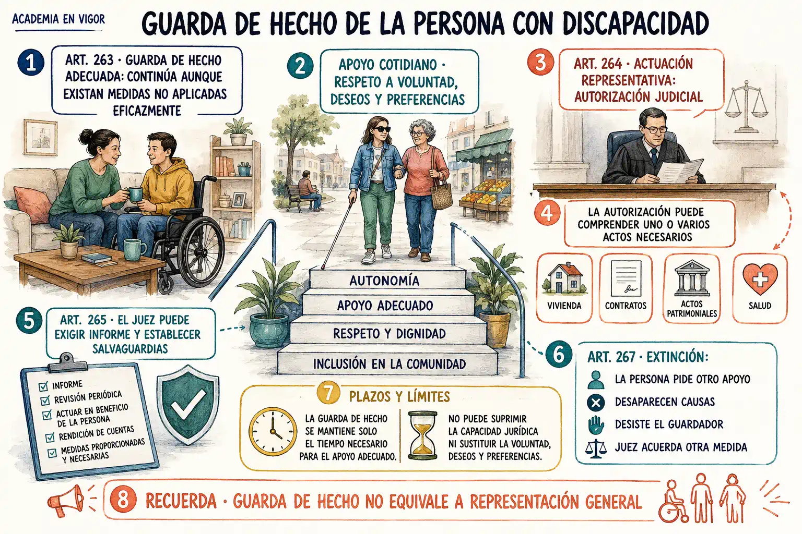

<em>Infografía: esquema de guarda de hecho de la persona con discapacidad con relaciones y trampas de examen.</em>

<!-- FUENTE: CC-BOE-A-1889-4763-T07 -->

## 50. Curatela y autocuratela

### Regla y encaje

Curatela y autocuratela se estudia dentro de emancipación y apoyos a personas con discapacidad. El bloque se contrasta directamente con arts. 268 a 274 CC.

### Claves examinables

- **Artículo 268:** Las medidas tomadas por la autoridad judicial en el procedimiento de provisión de apoyos serán proporcionadas a las necesidades de la persona que las precise, respetarán siempre la máxima autonomía de esta en el ejercicio de su capacidad jurídica y atenderán en todo caso a su voluntad, deseos y preferencias. - **Artículo 268:** Las medidas de apoyo adoptadas judicialmente serán revisadas periódicamente en un plazo máximo de tres años. No obstante, la autoridad judicial podrá, de manera excepcional y motivada, en el procedimiento de provisión o, en su caso, de modificación de apoyos, establecer un plazo de revisión superior que no podrá exceder de seis años. <!-- FACT:GC-T07-F890 --> - **Artículo 268:** Sin perjuicio de lo anterior, las medidas de apoyo adoptadas judicialmente se revisarán, en todo caso, ante cualquier cambio en la situación de la persona que pueda requerir una modificación de dichas medidas. <!-- FACT:GC-T07-F891 --> - **Artículo 269:** La autoridad judicial constituirá la curatela mediante resolución motivada cuando no exista otra medida de apoyo suficiente para la persona con discapacidad. <!-- FACT:GC-T07-F892 --> - **Artículo 269:** La autoridad judicial determinará los actos para los que la persona requiere asistencia del curador en el ejercicio de su capacidad jurídica atendiendo a sus concretas necesidades de apoyo. <!-- FACT:GC-T07-F893 --> - **Artículo 269:** Sólo en los casos excepcionales en los que resulte imprescindible por las circunstancias de la persona con discapacidad, la autoridad judicial determinará en resolución motivada los actos concretos en los que el curador habrá de asumir la representación de la persona con discapacidad. <!-- FACT:GC-T07-F894 --> - **Artículo 269:** Los actos en los que el curador deba prestar el apoyo deberán fijarse de manera precisa, indicando, en su caso, cuáles son aquellos donde debe ejercer la representación. El curador actuará bajo los criterios fijados en el artículo 249. <!-- FACT:GC-T07-F895 --> - **Artículo 269:** En ningún caso podrá incluir la resolución judicial la mera privación de derechos. <!-- FACT:GC-T07-F896 --> - **Artículo 270:** La autoridad judicial establecerá en la resolución que constituya la curatela o en otra posterior las medidas de control que estime oportunas para garantizar el respeto de los derechos, la voluntad y las preferencias de la persona que precisa el apoyo, así como para evitar los abusos, los conflictos de intereses y la influencia indebida. <!-- FACT:GC-T07-F897 --> - **Artículo 270:** También podrá exigir en cualquier momento al curador que, en el ámbito de sus funciones, informe sobre la situación personal o patrimonial de aquella. <!-- FACT:GC-T07-F898 --> - **Artículo 270:** Sin perjuicio de las revisiones periódicas de estas resoluciones, el Ministerio Fiscal podrá recabar en cualquier momento la información que considere necesaria a fin de garantizar el buen funcionamiento de la curatela. <!-- FACT:GC-T07-F899 --> - **Artículo 271:** Cualquier persona mayor de edad o menor emancipada, en previsión de la concurrencia de circunstancias que puedan dificultarle el ejercicio de su capacidad jurídica en igualdad de condiciones con las demás, podrá proponer en escritura pública el nombramiento o la exclusión de una o varias personas determinadas para el ejercicio de la función de curador. <!-- FACT:GC-T07-F900 --> - **Artículo 271:** Podrá igualmente establecer disposiciones sobre el funcionamiento y contenido de la curatela y, en especial, sobre el cuidado de su persona, reglas de administración y disposición de sus bienes, retribución del curador, obligación de hacer inventario o su dispensa y medidas de vigilancia y control, así como proponer a las personas que hayan de llevarlas a cabo. <!-- FACT:GC-T07-F901 --> - **Artículo 272:** La propuesta de nombramiento y demás disposiciones voluntarias a que se refiere el artículo anterior vincularán a la autoridad judicial al constituir la curatela. <!-- FACT:GC-T07-F902 --> - **Artículo 272:** No obstante, la autoridad judicial podrá prescindir total o parcialmente de esas disposiciones voluntarias, de oficio o a instancia de las personas llamadas por ley a ejercer la curatela o del Ministerio Fiscal y, siempre mediante resolución motivada, si existen circunstancias graves desconocidas por la persona que las estableció o alteración de las causas expresadas por ella o que presumiblemente tuvo en cuenta en sus disposiciones. <!-- FACT:GC-T07-F903 --> - **Artículo 273:** Si al establecer la autocuratela se propone el nombramiento de sustitutos al curador y no se concreta el orden de la sustitución, será preferido el propuesto en el documento posterior. Si se proponen varios en el mismo documento, será preferido el propuesto en primer lugar. <!-- FACT:GC-T07-F904 --> - **Artículo 274:** Se podrá delegar en el cónyuge o en otra persona la elección del curador de entre los relacionados en escritura pública por la persona interesada. <!-- FACT:GC-T07-F905 -->  <!-- FACT:GC-T07-F906 -->

:::hablemos-claro
No basta con reconocer una frase verdadera: hay que comprobar que pertenece al artículo preguntado y que no se ha sustituido una facultad por una obligación, un plazo por otro o una excepción por la regla general.
:::

:::en-la-calle
En un supuesto práctico, fija quién actúa, qué capacidad o vínculo tiene, qué autoridad interviene y qué consecuencia civil produce la actuación.
:::

:::lo-que-cae
Prioriza requisitos, plazos, legitimación, autoridad competente y excepciones. Apariciones oficiales mapeadas en este bloque: **0**.
:::

<!-- VISUAL:t07-50-curatela-y-autocuratela.webp -->

  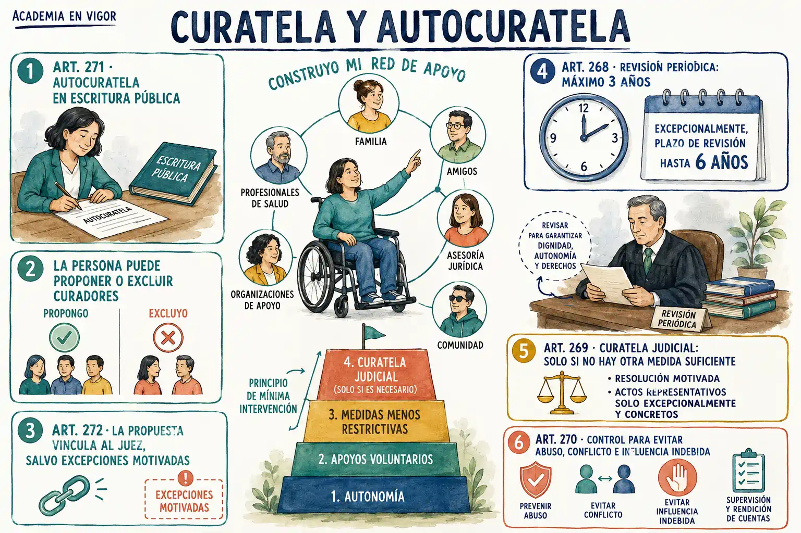

<em>Infografía: esquema de curatela y autocuratela con relaciones y trampas de examen.</em>

<!-- FUENTE: CC-BOE-A-1889-4763-T07 -->

## 51. Nombramiento del curador

### Regla y encaje

Nombramiento del curador se estudia dentro de emancipación y apoyos a personas con discapacidad. El bloque se contrasta directamente con arts. 275 a 281 CC.

### Claves examinables

- **Artículo 275:** 1. Podrán ser curadores las personas mayores de edad que, a juicio de la autoridad judicial, sean aptas para el adecuado desempeño de su función. - **Artículo 275:** Asimismo, podrán ser curadores las fundaciones y demás personas jurídicas sin ánimo de lucro, públicas o privadas, entre cuyos fines figure la promoción de la autonomía y asistencia a las personas con discapacidad. <!-- FACT:GC-T07-F907 --> - **Artículo 275:** 2. No podrán ser curadores: 1.º Quienes hayan sido excluidos por la persona que precise apoyo. <!-- FACT:GC-T07-F908 --> - **Artículo 275:** 2.º Quienes por resolución judicial estuvieran privados o suspendidos en el ejercicio de la patria potestad o, total o parcialmente, de los derechos de guarda y protección. <!-- FACT:GC-T07-F909 --> - **Artículo 275:** 3.º Quienes hubieren sido legalmente removidos de una tutela, curatela o guarda anterior. <!-- FACT:GC-T07-F910 --> - **Artículo 275:** 3. La autoridad judicial no podrá nombrar curador, salvo circunstancias excepcionales debidamente motivadas, a las personas siguientes: <!-- FACT:GC-T07-F911 --> - **Artículo 275:** 1.º A quien haya sido condenado por cualquier delito que haga suponer fundadamente que no desempeñará bien la curatela. <!-- FACT:GC-T07-F912 --> - **Artículo 275:** 2.º A quien tenga conflicto de intereses con la persona que precise apoyo. <!-- FACT:GC-T07-F913 --> - **Artículo 275:** 3.º Al administrador que hubiese sido sustituido en sus facultades de administración durante la tramitación del procedimiento concursal. <!-- FACT:GC-T07-F914 --> - **Artículo 275:** 4.º A quien le sea imputable la declaración como culpable de un concurso, salvo que la curatela lo sea solamente de la persona. <!-- FACT:GC-T07-F915 --> - **Artículo 276:** La autoridad judicial nombrará curador a quien haya sido propuesto para su nombramiento por la persona que precise apoyo o por la persona en quien esta hubiera delegado, salvo que concurra alguna de las circunstancias previstas en el párrafo segundo del artículo 272. La autoridad judicial estará también a lo dispuesto en el artículo 275. <!-- FACT:GC-T07-F916 --> - **Artículo 276:** En defecto de tal propuesta, la autoridad judicial nombrará curador: <!-- FACT:GC-T07-F917 --> - **Artículo 276:** 1.º Al cónyuge, o a quien se encuentre en una situación de hecho asimilable, siempre que convivan con la persona que precisa el apoyo. <!-- FACT:GC-T07-F918 --> - **Artículo 276:** 2.º Al hijo o descendiente. Si fueran varios, será preferido el que de ellos conviva con la persona que precisa el apoyo. <!-- FACT:GC-T07-F919 --> - **Artículo 276:** 3.º Al progenitor o, en su defecto, ascendiente. Si fueren varios, será preferido el que de ellos conviva con la persona que precisa el apoyo. <!-- FACT:GC-T07-F920 --> - **Artículo 276:** 4.º A la persona o personas que el cónyuge o la pareja conviviente o los progenitores hubieran dispuesto en testamento o documento público. <!-- FACT:GC-T07-F921 --> - **Artículo 276:** 5.º A quien estuviera actuando como guardador de hecho. <!-- FACT:GC-T07-F922 --> - **Artículo 276:** 6.º Al hermano, pariente o allegado que conviva con la persona que precisa la curatela. <!-- FACT:GC-T07-F923 --> - **Artículo 276:** 7.º A una persona jurídica en la que concurran las condiciones indicadas en el párrafo segundo del apartado 1 del artículo anterior. <!-- FACT:GC-T07-F924 --> - **Artículo 276:** La autoridad judicial podrá alterar el orden del apartado anterior, una vez oída la persona que precise apoyo. <!-- FACT:GC-T07-F925 --> - **Artículo 276:** Cuando, una vez oída, no resultare clara su voluntad, la autoridad judicial podrá alterar el orden legal, nombrando a la persona más idónea para comprender e interpretar su voluntad, deseos y preferencias. <!-- FACT:GC-T07-F926 --> - **Artículo 277:** Se puede proponer el nombramiento de más de un curador si la voluntad y necesidades de la persona que precisa el apoyo lo justifican. En particular, podrán separarse como cargos distintos los de curador de la persona y curador de los bienes. <!-- FACT:GC-T07-F927 --> - **Artículo 277:** Cuando la curatela sea confiada a varias personas, la autoridad judicial establecerá el modo de funcionamiento, respetando la voluntad de la persona que precisa el apoyo. <!-- FACT:GC-T07-F928 --> - **Artículo 278:** Serán removidos de la curatela los que, después del nombramiento, incurran en una causa legal de inhabilidad, o se conduzcan mal en su desempeño por incumplimiento de los deberes propios del cargo, por notoria ineptitud de su ejercicio o cuando, en su caso, surgieran problemas de convivencia graves y continuados con la persona a la que prestan apoyo. <!-- FACT:GC-T07-F929 --> - **Artículo 278:** La autoridad judicial, de oficio o a solicitud de la persona a cuyo favor se estableció el apoyo o del Ministerio Fiscal, cuando conociere por sí o a través de cualquier interesado circunstancias que comprometan el desempeño correcto de la curatela, podrá decretar la remoción del curador mediante expediente de jurisdicción voluntaria. <!-- FACT:GC-T07-F930 --> - **Artículo 278:** Durante la tramitación del expediente de remoción la autoridad judicial podrá suspender al curador en sus funciones y, de considerarlo necesario, acordará el nombramiento de un defensor judicial. <!-- FACT:GC-T07-F931 --> - **Artículo 278:** Declarada judicialmente la remoción, se procederá al nombramiento de nuevo curador en la forma establecida en este Código, salvo que fuera pertinente otra medida de apoyo. <!-- FACT:GC-T07-F932 --> - **Artículo 279:** Será excusable el desempeño de la curatela si resulta excesivamente gravoso o entraña grave dificultad para la persona nombrada para el ejercicio del cargo. También podrá excusarse el curador de continuar ejerciendo la curatela cuando durante su desempeño le sobrevengan los motivos de excusa. <!-- FACT:GC-T07-F933 --> - **Artículo 279:** Las personas jurídicas privadas podrán excusarse cuando carezcan de medios suficientes para el adecuado desempeño de la curatela o las condiciones de ejercicio de la curatela no sean acordes con sus fines estatutarios. <!-- FACT:GC-T07-F934 --> - **Artículo 279:** El interesado que alegue causa de excusa deberá hacerlo dentro del plazo de quince días a contar desde que tuviera conocimiento del nombramiento. Si la causa fuera sobrevenida podrá hacerlo en cualquier momento. <!-- FACT:GC-T07-F935 --> - **Artículo 279:** Mientras la autoridad judicial resuelva acerca de la excusa, el nombrado estará obligado a ejercer su función. Si no lo hiciera y fuera necesaria una actuación de apoyo, se procederá a nombrar un defensor judicial que sustituya al curador, quedando el sustituido responsable de los gastos ocasionados por la excusa, si esta fuera rechazada. <!-- FACT:GC-T07-F936 --> - **Artículo 279:** Admitida la excusa, se procederá al nombramiento de nuevo curador. <!-- FACT:GC-T07-F937 --> - **Artículo 280:** El curador nombrado en atención a una disposición testamentaria que se excuse de la curatela por cualquier causa, perderá lo que en consideración al nombramiento le hubiere dejado el testador. <!-- FACT:GC-T07-F938 --> - **Artículo 281:** El curador tiene derecho a una retribución, siempre que el patrimonio de la persona con discapacidad lo permita, así como al reembolso de los gastos justificados y a la indemnización de los daños sufridos sin culpa por su parte en el ejercicio de su función, cantidades que serán satisfechas con cargo a dicho patrimonio. <!-- FACT:GC-T07-F939 --> - **Artículo 281:** Corresponde a la autoridad judicial fijar su importe y el modo de percibirlo, para lo cual tendrá en cuenta el trabajo a realizar y el valor y la rentabilidad de los bienes. <!-- FACT:GC-T07-F940 --> - **Artículo 281:** En ningún caso, la admisión de causa de excusa o la decisión de remoción de las personas físicas o jurídicas designadas para el desempeño de los apoyos podrá generar desprotección o indefensión a la persona que precisa dichos apoyos, debiendo la autoridad judicial actuar de oficio, mediante la colaboración necesaria de los llamados a ello, o bien, de no poder contar con estos, con la inexcusable colaboración de los organismos o entidades públicas competentes y del Ministerio Fiscal. <!-- FACT:GC-T07-F941 --> - **Artículo 281:** No concurrirá causa de excusa cuando el desempeño de los apoyos haya sido encomendado a entidad pública. <!-- FACT:GC-T07-F942 -->  <!-- FACT:GC-T07-F943 -->

:::hablemos-claro
No basta con reconocer una frase verdadera: hay que comprobar que pertenece al artículo preguntado y que no se ha sustituido una facultad por una obligación, un plazo por otro o una excepción por la regla general.
:::

:::en-la-calle
En un supuesto práctico, fija quién actúa, qué capacidad o vínculo tiene, qué autoridad interviene y qué consecuencia civil produce la actuación.
:::

:::lo-que-cae
Prioriza requisitos, plazos, legitimación, autoridad competente y excepciones. Apariciones oficiales mapeadas en este bloque: **0**.
:::

<!-- VISUAL:t07-51-nombramiento-del-curador.webp -->

  

<em>Infografía: esquema de nombramiento del curador con relaciones y trampas de examen.</em>

<!-- FUENTE: CC-BOE-A-1889-4763-T07 -->

## 52. Ejercicio de la curatela

### Regla y encaje

Ejercicio de la curatela se estudia dentro de emancipación y apoyos a personas con discapacidad. El bloque se contrasta directamente con arts. 282 a 290 CC.

### Claves examinables

- **Artículo 282:** El curador tomará posesión de su cargo ante el letrado de la Administración de Justicia. - **Artículo 282:** Una vez en el ejercicio de la curatela, estará obligado a mantener contacto personal con la persona a la que va a prestar apoyo y a desempeñar las funciones encomendadas con la diligencia debida. <!-- FACT:GC-T07-F944 --> - **Artículo 282:** El curador asistirá a la persona a la que preste apoyo en el ejercicio de su capacidad jurídica respetando su voluntad, deseos y preferencias. <!-- FACT:GC-T07-F945 --> - **Artículo 282:** El curador procurará que la persona con discapacidad pueda desarrollar su propio proceso de toma de decisiones. <!-- FACT:GC-T07-F946 --> - **Artículo 282:** El curador procurará fomentar las aptitudes de la persona a la que preste apoyo, de modo que pueda ejercer su capacidad con menos apoyo en el futuro. <!-- FACT:GC-T07-F947 --> - **Artículo 283:** Cuando quien desempeñe la curatela esté impedido de modo transitorio para actuar en un caso concreto, o cuando exista un conflicto de intereses ocasional entre él y la persona a quien preste apoyo, el letrado de la Administración de Justicia nombrará un defensor judicial que lo sustituya. Para este nombramiento se oirá a la persona que precise el apoyo y se respetará su voluntad, deseos y preferencias. <!-- FACT:GC-T07-F948 --> - **Artículo 283:** Si, en el caso previsto en el párrafo anterior, fueran varios los curadores con funciones homogéneas, estas serán asumidas por quien de entre ellos no esté afectado por el impedimento o el conflicto de intereses. <!-- FACT:GC-T07-F949 --> - **Artículo 283:** Si la situación de impedimento o conflicto fuera prolongada o reiterada, la autoridad judicial de oficio, a instancia del Ministerio Fiscal, de cualquier persona legitimada para instar el procedimiento de provisión de apoyos o de cualquier persona que esté desempeñando la curatela y previa audiencia a la persona con discapacidad y al Ministerio Fiscal, podrá reorganizar el funcionamiento de la curatela, e incluso proceder al nombramiento de un nuevo curador. <!-- FACT:GC-T07-F950 --> - **Artículo 284:** Cuando la autoridad judicial lo considere necesario por concurrir razones excepcionales, podrá exigir al curador la constitución de fianza que asegure el cumplimiento de sus obligaciones y determinará la modalidad y cuantía de la misma. Una vez constituida, la fianza será objeto de aprobación judicial. <!-- FACT:GC-T07-F951 --> - **Artículo 284:** En cualquier momento la autoridad judicial podrá modificar o dejar sin efecto la garantía que se hubiese prestado. <!-- FACT:GC-T07-F952 --> - **Artículo 285:** El curador con facultades representativas estará obligado a hacer inventario del patrimonio de la persona en cuyo favor se ha establecido el apoyo dentro del plazo de sesenta días, a contar desde aquel en que hubiese tomado posesión de su cargo. <!-- FACT:GC-T07-F953 --> - **Artículo 285:** El inventario se formará ante el letrado de la Administración de Justicia, con citación de las personas que estime conveniente. <!-- FACT:GC-T07-F954 --> - **Artículo 285:** El letrado de la Administración de Justicia podrá prorrogar el plazo previsto en el párrafo primero si concurriere causa para ello. <!-- FACT:GC-T07-F955 --> - **Artículo 285:** El dinero, alhajas, objetos preciosos y valores mobiliarios o documentos que, a juicio del letrado de la Administración de Justicia, no deban quedar en poder del curador serán depositados en un establecimiento destinado a este efecto. <!-- FACT:GC-T07-F956 --> - **Artículo 285:** Los gastos que las anteriores medidas ocasionen correrán a cargo de los bienes de la persona en cuyo apoyo se haya establecido la curatela. <!-- FACT:GC-T07-F957 --> - **Artículo 286:** En el caso de que el curador no incluya en el inventario los créditos que tenga contra la persona a la que presta apoyo, se entenderá que renuncia a ellos. <!-- FACT:GC-T07-F958 --> - **Artículo 287:** El curador que ejerza funciones de representación de la persona que precisa el apoyo necesita autorización judicial para los actos que determine la resolución y, en todo caso, para los siguientes: <!-- FACT:GC-T07-F959 --> - **Artículo 287:** 1.º Realizar actos de transcendencia personal o familiar cuando la persona afectada no pueda hacerlo por sí misma, todo ello a salvo lo dispuesto legalmente en materia de internamiento, consentimiento informado en el ámbito de la salud o en otras leyes especiales. <!-- FACT:GC-T07-F960 --> - **Artículo 287:** 2.º Enajenar o gravar bienes inmuebles, establecimientos mercantiles o industriales, bienes o derechos de especial significado personal o familiar, bienes muebles de extraordinario valor, objetos preciosos y valores mobiliarios no cotizados en mercados oficiales de la persona con medidas de apoyo, dar inmuebles en arrendamiento por término inicial que exceda de seis años, o celebrar contratos o realizar actos que tengan carácter dispositivo y sean susceptibles de inscripción. <!-- FACT:GC-T07-F961 --> - **Artículo 287:** Se exceptúa la venta del derecho de suscripción preferente de acciones. La enajenación de los bienes mencionados en este párrafo se realizará mediante venta directa salvo que el Tribunal considere que es necesaria la enajenación en subasta judicial para mejor y plena garantía de los derechos e intereses de su titular. <!-- FACT:GC-T07-F962 --> - **Artículo 287:** 3.º Disponer a título gratuito de bienes o derechos de la persona con medidas de apoyo, salvo los que tengan escasa relevancia económica y carezcan de especial significado personal o familiar. <!-- FACT:GC-T07-F963 --> - **Artículo 287:** 4.º Renunciar derechos, así como transigir o someter a arbitraje cuestiones relativas a los intereses de la persona cuya curatela ostenta, salvo que sean de escasa relevancia económica. No se precisará la autorización judicial para el arbitraje de consumo. <!-- FACT:GC-T07-F964 --> - **Artículo 287:** 5.º Aceptar sin beneficio de inventario cualquier herencia o repudiar esta o las liberalidades. <!-- FACT:GC-T07-F965 --> - **Artículo 287:** 6.º Hacer gastos extraordinarios en los bienes de la persona a la que presta apoyo. <!-- FACT:GC-T07-F966 --> - **Artículo 287:** 7.º Interponer demanda en nombre de la persona a la que presta apoyo, salvo en los asuntos urgentes o de escasa cuantía. No será precisa la autorización judicial cuando la persona con discapacidad inste la revisión de la resolución judicial en que previamente se le hubiesen determinado los apoyos. <!-- FACT:GC-T07-F967 --> - **Artículo 287:** 8.º Dar y tomar dinero a préstamo y prestar aval o fianza. <!-- FACT:GC-T07-F968 --> - **Artículo 287:** 9.º Celebrar contratos de seguro de vida, renta vitalicia y otros análogos, cuando estos requieran de inversiones o aportaciones de cuantía extraordinaria. <!-- FACT:GC-T07-F969 --> - **Artículo 288:** La autoridad judicial, cuando lo considere adecuado para garantizar la voluntad, deseos y preferencias de la persona con discapacidad, podrá autorizar al curador la realización de una pluralidad de actos de la misma naturaleza o referidos a la misma actividad económica, especificando las circunstancias y características fundamentales de dichos actos. <!-- FACT:GC-T07-F970 --> - **Artículo 289:** No necesitarán autorización judicial la partición de herencia o la división de cosa común realizada por el curador representativo, pero una vez practicadas requerirán aprobación judicial. Si hubiese sido nombrado un defensor judicial para la partición deberá obtener también la aprobación judicial, salvo que se hubiera dispuesto otra cosa al hacer el nombramiento. <!-- FACT:GC-T07-F971 --> - **Artículo 290:** Antes de autorizar o aprobar cualquiera de los actos comprendidos en los artículos anteriores, la autoridad judicial oirá al Ministerio Fiscal y a la persona con medidas de apoyo y recabará los informes que le sean solicitados o estime pertinentes. <!-- FACT:GC-T07-F972 -->  <!-- FACT:GC-T07-F973 -->

:::hablemos-claro
No basta con reconocer una frase verdadera: hay que comprobar que pertenece al artículo preguntado y que no se ha sustituido una facultad por una obligación, un plazo por otro o una excepción por la regla general.
:::

:::en-la-calle
En un supuesto práctico, fija quién actúa, qué capacidad o vínculo tiene, qué autoridad interviene y qué consecuencia civil produce la actuación.
:::

:::lo-que-cae
Prioriza requisitos, plazos, legitimación, autoridad competente y excepciones. Apariciones oficiales mapeadas en este bloque: **0**.
:::

<!-- VISUAL:t07-52-ejercicio-de-la-curatela.webp -->

  

<em>Infografía: esquema de ejercicio de la curatela con relaciones y trampas de examen.</em>

<!-- FUENTE: CC-BOE-A-1889-4763-T07 -->

## 53. Extinción de la curatela

### Regla y encaje

Extinción de la curatela se estudia dentro de emancipación y apoyos a personas con discapacidad. El bloque se contrasta directamente con arts. 291 a 294 CC.

### Claves examinables

- **Artículo 291:** La curatela se extingue de pleno derecho por la muerte o declaración de fallecimiento de la persona con medidas de apoyo. - **Artículo 291:** Asimismo, la curatela se extingue por resolución judicial cuando ya no sea precisa esta medida de apoyo o cuando se adopte una forma de apoyo más adecuada para la persona sometida a curatela. <!-- FACT:GC-T07-F974 --> - **Artículo 292:** El curador, sin perjuicio de la obligación de rendición periódica de cuentas que en su caso le haya impuesto la autoridad judicial, al cesar en sus funciones deberá rendir ante ella la cuenta general justificada de su administración en el plazo de tres meses, prorrogables por el tiempo que fuere necesario si concurre justa causa. <!-- FACT:GC-T07-F975 --> - **Artículo 292:** La acción para exigir la rendición de esta cuenta prescribe a los cinco años, contados desde la terminación del plazo establecido para efectuarla. <!-- FACT:GC-T07-F976 --> - **Artículo 292:** Antes de resolver sobre la aprobación de la cuenta, la autoridad judicial oirá también en su caso al nuevo curador, a la persona a la que se prestó apoyo, o a sus herederos. <!-- FACT:GC-T07-F977 --> - **Artículo 292:** La aprobación judicial de las cuentas no impedirá el ejercicio de las acciones que recíprocamente puedan asistir al curador y a la persona con discapacidad que recibe el apoyo o a sus causahabientes por razón de la curatela. <!-- FACT:GC-T07-F978 --> - **Artículo 293:** Los gastos necesarios de la rendición de cuentas serán a cargo del patrimonio de la persona a la que se prestó apoyo. <!-- FACT:GC-T07-F979 --> - **Artículo 293:** El saldo de la cuenta general devengará el interés legal, a favor o en contra del curador. Si el saldo es a favor del curador, el interés legal se devengará desde el requerimiento para el pago, previa restitución de los bienes a su titular. Si es en contra del curador, devengará el interés legal una vez transcurridos los tres meses siguientes a la aprobación de la cuenta. <!-- FACT:GC-T07-F980 --> - **Artículo 294:** El curador responderá de los daños que hubiese causado por su culpa o negligencia a la persona a la que preste apoyo. <!-- FACT:GC-T07-F981 --> - **Artículo 294:** La acción para reclamar esta responsabilidad prescribe a los tres años contados desde la rendición final de cuentas. <!-- FACT:GC-T07-F982 -->  <!-- FACT:GC-T07-F983 -->

:::hablemos-claro
No basta con reconocer una frase verdadera: hay que comprobar que pertenece al artículo preguntado y que no se ha sustituido una facultad por una obligación, un plazo por otro o una excepción por la regla general.
:::

:::en-la-calle
En un supuesto práctico, fija quién actúa, qué capacidad o vínculo tiene, qué autoridad interviene y qué consecuencia civil produce la actuación.
:::

:::lo-que-cae
Prioriza requisitos, plazos, legitimación, autoridad competente y excepciones. Apariciones oficiales mapeadas en este bloque: **0**.
:::

<!-- VISUAL:t07-53-extincion-de-la-curatela.webp -->

  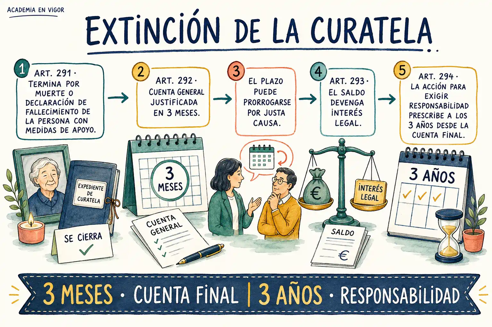

<em>Infografía: esquema de extinción de la curatela con relaciones y trampas de examen.</em>

<!-- FUENTE: CC-BOE-A-1889-4763-T07 -->

## 54. Defensor judicial de la persona con discapacidad

### Regla y encaje

Defensor judicial de la persona con discapacidad se estudia dentro de emancipación y apoyos a personas con discapacidad. El bloque se contrasta directamente con arts. 295 a 298 CC.

### Claves examinables

- **Artículo 295:** Se nombrará un defensor judicial de las personas con discapacidad en los casos siguientes: - **Artículo 295:** 1.º Cuando, por cualquier causa, quien haya de prestar apoyo no pueda hacerlo, hasta que cese la causa determinante o se designe a otra persona. <!-- FACT:GC-T07-F984 --> - **Artículo 295:** 2.º Cuando exista conflicto de intereses entre la persona con discapacidad y la que haya de prestarle apoyo. <!-- FACT:GC-T07-F985 --> - **Artículo 295:** 3.º Cuando, durante la tramitación de la excusa alegada por el curador, la autoridad judicial lo considere necesario. <!-- FACT:GC-T07-F986 --> - **Artículo 295:** 4.º Cuando se hubiere promovido la provisión de medidas judiciales de apoyo a la persona con discapacidad y la autoridad judicial considere necesario proveer a la administración de los bienes hasta que recaiga resolución judicial. <!-- FACT:GC-T07-F987 --> - **Artículo 295:** 5.º Cuando la persona con discapacidad requiera el establecimiento de medidas de apoyo de carácter ocasional, aunque sea recurrente. <!-- FACT:GC-T07-F988 --> - **Artículo 295:** Una vez oída la persona con discapacidad, la autoridad judicial nombrará defensor judicial a quien sea más idóneo para respetar, comprender e interpretar la voluntad, deseos y preferencias de aquella. <!-- FACT:GC-T07-F989 --> - **Artículo 296:** No se nombrará defensor judicial si el apoyo se ha encomendado a más de una persona, salvo que ninguna pueda actuar o la autoridad judicial motivadamente considere necesario el nombramiento. <!-- FACT:GC-T07-F990 --> - **Artículo 297:** Serán aplicables al defensor judicial las causas de inhabilidad, excusa y remoción del curador, así como las obligaciones que a este se atribuyen de conocer y respetar la voluntad, deseos y preferencias de la persona a la que se preste apoyo. <!-- FACT:GC-T07-F991 --> - **Artículo 298:** En el nombramiento se podrá dispensar al defensor judicial de la venta en subasta pública, fijando un precio mínimo, y de la aprobación judicial posterior de los actos. <!-- FACT:GC-T07-F992 --> - **Artículo 298:** El defensor judicial, una vez realizada su gestión, deberá rendir cuentas de ella. <!-- FACT:GC-T07-F993 -->  <!-- FACT:GC-T07-F994 -->

:::hablemos-claro
No basta con reconocer una frase verdadera: hay que comprobar que pertenece al artículo preguntado y que no se ha sustituido una facultad por una obligación, un plazo por otro o una excepción por la regla general.
:::

:::en-la-calle
En un supuesto práctico, fija quién actúa, qué capacidad o vínculo tiene, qué autoridad interviene y qué consecuencia civil produce la actuación.
:::

:::lo-que-cae
Prioriza requisitos, plazos, legitimación, autoridad competente y excepciones. Apariciones oficiales mapeadas en este bloque: **1**.
:::

<!-- VISUAL:t07-54-defensor-judicial-de-la-persona-con-discapacidad.webp -->

  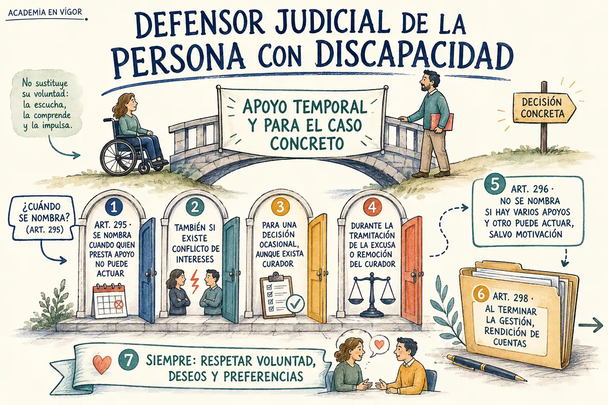

<em>Infografía: esquema de defensor judicial de la persona con discapacidad con relaciones y trampas de examen.</em>

<!-- FUENTE: CC-BOE-A-1889-4763-T07 -->

## 55. Responsabilidad y disposiciones comunes

### Regla y encaje

Responsabilidad y disposiciones comunes se estudia dentro de emancipación y apoyos a personas con discapacidad. El bloque se contrasta directamente con arts. 299 a 300 CC.

### Claves examinables

- **Artículo 299:** La persona con discapacidad responderá por los daños causados a otros, de acuerdo con el Capítulo II del Título XVI del Libro Cuarto, sin perjuicio de lo establecido en materia de responsabilidad extracontractual respecto a otros posibles responsables. - **Artículo 299 bis:** (Derogado) <!-- FACT:GC-T07-F995 --> - **Artículo 300:** Las resoluciones judiciales y los documentos públicos notariales sobre los cargos tutelares y medidas de apoyo a personas con discapacidad habrán de inscribirse en el Registro Civil. <!-- FACT:GC-T07-F996 -->  <!-- FACT:GC-T07-F997 -->

:::hablemos-claro
No basta con reconocer una frase verdadera: hay que comprobar que pertenece al artículo preguntado y que no se ha sustituido una facultad por una obligación, un plazo por otro o una excepción por la regla general.
:::

:::en-la-calle
En un supuesto práctico, fija quién actúa, qué capacidad o vínculo tiene, qué autoridad interviene y qué consecuencia civil produce la actuación.
:::

:::lo-que-cae
Prioriza requisitos, plazos, legitimación, autoridad competente y excepciones. Apariciones oficiales mapeadas en este bloque: **0**.
:::

<!-- VISUAL:t07-55-responsabilidad-y-disposiciones-comunes.webp -->

  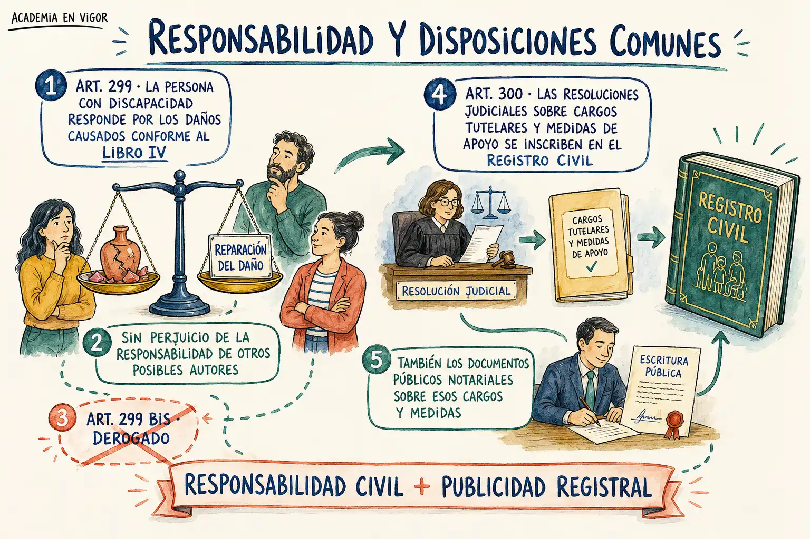

<em>Infografía: esquema de responsabilidad y disposiciones comunes con relaciones y trampas de examen.</em>

<!-- FUENTE: CC-BOE-A-1889-4763-T07 -->

## 56. Preceptos derogados del Libro I

### Regla y encaje

Preceptos derogados del Libro I se estudia dentro de emancipación y apoyos a personas con discapacidad. El bloque se contrasta directamente con arts. 301 a 332 CC.

### Claves examinables

- **Artículo 301 a 324:** Artículo 301 a 324 figura derogado en la redacción consolidada vigente del Código Civil. - **Artículos 325 a 332:** Artículos 325 a 332 figura derogado en la redacción consolidada vigente del Código Civil. <!-- FACT:GC-T07-F998 -->  <!-- FACT:GC-T07-F999 -->

:::hablemos-claro
No basta con reconocer una frase verdadera: hay que comprobar que pertenece al artículo preguntado y que no se ha sustituido una facultad por una obligación, un plazo por otro o una excepción por la regla general.
:::

:::en-la-calle
En un supuesto práctico, fija quién actúa, qué capacidad o vínculo tiene, qué autoridad interviene y qué consecuencia civil produce la actuación.
:::

:::lo-que-cae
Prioriza requisitos, plazos, legitimación, autoridad competente y excepciones. Apariciones oficiales mapeadas en este bloque: **0**.
:::

<!-- VISUAL:t07-56-preceptos-derogados-del-libro-i.webp -->

  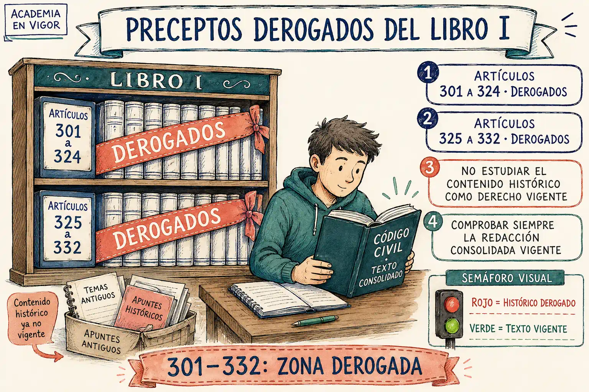

<em>Infografía: esquema de preceptos derogados del libro i con relaciones y trampas de examen.</em>

<!-- FUENTE: CC-BOE-A-1889-4763-T07 -->

# Hablemos claro

:::hablemos-claro
El Código Civil mezcla reglas generales, estados personales, relaciones familiares y medidas de protección. La trampa típica consiste en trasladar un requisito correcto al artículo equivocado. Estudia cada regla con cuatro anclas: sujeto, condición, autoridad y efecto.
:::

# En la calle

:::en-la-calle
Caso guía: antes de decidir si una persona puede actuar sola, hay que distinguir mayoría de edad, emancipación, patria potestad, tutela de menores y apoyos a una persona con discapacidad. Son instituciones distintas y producen límites diferentes.
:::

# Lo que cae

El banco oficial concentra preguntas en fuentes y eficacia de las normas, nacionalidad y vecindad, matrimonio, filiación, alimentos, acogimiento, tutela, ausencia, emancipación y medidas de apoyo.

# Ha caído

Se han verificado **56 preguntas oficiales** del Tema 7 entre 2020 y 2026, vinculadas al bloque y a la regla aplicable.

> Los preceptos derogados se identifican como tales; no se entrenan como regla vigente salvo para reconocer su estado normativo.

---

*Academia En Vigor · El temario que nunca duerme · Tema 7 · v1.0.0 · Documento interno no publicado.*
