# TEMA 13 · SEGURIDAD PÚBLICA Y SEGURIDAD PRIVADA

**Guardia Civil · Método VIGOR · ATESTADO**
**Versión de contenido:** 1.0.0
**Estado editorial:** approved_internal · **Publicación:** not_published

# Mapa del tema

| Parte | Contenido | Bloques |
|---|---|---:|
| 1 | Fundamentos y autoridades de seguridad ciudadana | 1–3 |
| 2 | Documentación e identificación personal | 4–6 |
| 3 | Actuaciones para mantener y restablecer la seguridad | 7–13 |
| 4 | Policía administrativa especial | 14–15 |
| 5 | Régimen sancionador de seguridad ciudadana | 16–25 |
| 6 | Bases de la seguridad privada | 26–31 |
| 7 | Coordinación con la seguridad pública | 32–32 |
| 8 | Empresas y despachos de detectives | 33–36 |
| 9 | Personal de seguridad privada | 37–45 |
| 10 | Servicios de seguridad privada | 46–54 |
| 11 | Medidas y control administrativo | 55–57 |

# Contenido

## 01. Objeto y ámbito de la seguridad ciudadana

### Regla y encaje

Objeto y ámbito de la seguridad ciudadana forma parte de fundamentos y autoridades de seguridad ciudadana. Estúdialo como una secuencia: presupuesto, obligación o facultad, excepción y consecuencia.

### Claves examinables

- **Tema 13 · alcance oficial:** El bloque de seguridad pública del Tema 13 comprende los cinco capítulos de la Ley Orgánica 4/2015, artículos 1 a 54. <!-- FACT:GC-T13-F001 -->
- **Tema 13 · exclusión de alcance:** El bloque de seguridad privada comprende los títulos preliminar a V de la Ley 5/2014, artículos 1 a 55; el título VI y las disposiciones quedan fuera del epígrafe oficial. <!-- FACT:GC-T13-F002 -->
- **Corte normativo:** El corte normativo es 9 de agosto de 2026: la Ley Orgánica 4/2015 está consolidada hasta 23 de febrero de 2021 y la Ley 5/2014 hasta 27 de mayo de 2021. <!-- FACT:GC-T13-F003 -->
- **Artículo 1. Objeto · apartado 1:** 1. La seguridad ciudadana es un requisito indispensable para el pleno ejercicio de los derechos fundamentales y las libertades públicas, y su salvaguarda, como bien jurídico de carácter colectivo, es función del Estado, con sujeción a la Constitución y a las Leyes. <!-- FACT:GC-T13-F004 -->
- **Artículo 1. Objeto · apartado 2:** 2. Esta Ley tiene por objeto la regulación de un conjunto plural y diversificado de actuaciones de distinta naturaleza orientadas a la tutela de la seguridad ciudadana, mediante la protección de personas y bienes y el mantenimiento de la tranquilidad de los ciudadanos. <!-- FACT:GC-T13-F005 -->
- **Artículo 2. Ámbito de aplicación · apartado 1:** 1. Las disposiciones de esta Ley son aplicables en todo el territorio nacional, sin perjuicio de las competencias que, en su caso, hayan asumido las comunidades autónomas en el marco de la Constitución, de los estatutos de autonomía y de la legislación del Estado en materia de seguridad pública. <!-- FACT:GC-T13-F006 -->
- **Artículo 2. Ámbito de aplicación · apartado 2:** 2. En particular, quedan fuera del ámbito de aplicación de esta Ley las prescripciones que tienen por objeto velar por el buen orden de los espectáculos y la protección de las personas y bienes a través de una acción administrativa ordinaria, aun cuando la misma pueda conllevar la intervención de las Fuerzas y Cuerpos de Seguridad, siempre que ésta se conciba como elemento integrante del sistema preventivo habitual del control del espectáculo. <!-- FACT:GC-T13-F007 -->
- **Artículo 2. Ámbito de aplicación · apartado 3:** 3. Asimismo, esta Ley se aplicará sin menoscabo de los regímenes legales que regulan ámbitos concretos de la seguridad pública, como la seguridad aérea, marítima, ferroviaria, vial o en los transportes, quedando, en todo caso, salvaguardadas las disposiciones referentes a la defensa nacional y la regulación de los estados de alarma, excepción y sitio. <!-- FACT:GC-T13-F008 -->

:::hablemos-claro
Seguridad pública significa potestad y responsabilidad estatal; seguridad privada significa actividad complementaria, subordinada, controlada y obligada a colaborar.
:::

:::en-la-calle
Ante un supuesto, identifica primero quién actúa, con qué habilitación, qué medida adopta, qué límite legal existe y qué autoridad controla la actuación.
:::

:::lo-que-cae
Prioriza listas cerradas, plazos, excepciones, competencias y efectos. Apariciones oficiales mapeadas: **4**.
:::

<!-- VISUAL:t13-01-objeto-y-ambito-de-la-seguridad-ciudadana.webp -->

  

<em>Infografía: flujo de objeto y ámbito de la seguridad ciudadana.</em>

<!-- FUENTE: GC-PROGRAMA-2024-T13 -->

## 02. Fines y principios rectores

### Regla y encaje

Fines y principios rectores forma parte de fundamentos y autoridades de seguridad ciudadana. Estúdialo como una secuencia: presupuesto, obligación o facultad, excepción y consecuencia.

### Claves examinables

- **Artículo 3. Fines:** Constituyen los fines de esta Ley y de la acción de los poderes públicos en su ámbito de aplicación: a) La protección del libre ejercicio de los derechos fundamentales y las libertades públicas y los demás derechos reconocidos y amparados por el ordenamiento jurídico. <!-- FACT:GC-T13-F009 -->
- **Artículo 3. Fines:** Constituyen los fines de esta Ley y de la acción de los poderes públicos en su ámbito de aplicación: b) La garantía del normal funcionamiento de las instituciones. <!-- FACT:GC-T13-F010 -->
- **Artículo 3. Fines:** Constituyen los fines de esta Ley y de la acción de los poderes públicos en su ámbito de aplicación: c) La preservación de la seguridad y la convivencia ciudadanas. <!-- FACT:GC-T13-F011 -->
- **Artículo 3. Fines:** Constituyen los fines de esta Ley y de la acción de los poderes públicos en su ámbito de aplicación: d) El respeto a las Leyes, a la paz y a la seguridad ciudadana en el ejercicio de los derechos y libertades. <!-- FACT:GC-T13-F012 -->
- **Artículo 3. Fines:** Constituyen los fines de esta Ley y de la acción de los poderes públicos en su ámbito de aplicación: e) La protección de las personas y bienes, con especial atención a los menores y a las personas con discapacidad necesitadas de especial protección. <!-- FACT:GC-T13-F013 -->
- **Artículo 3. Fines:** Constituyen los fines de esta Ley y de la acción de los poderes públicos en su ámbito de aplicación: f) La pacífica utilización de vías y demás bienes demaniales y, en general, espacios destinados al uso y disfrute público. <!-- FACT:GC-T13-F014 -->
- **Artículo 3. Fines:** Constituyen los fines de esta Ley y de la acción de los poderes públicos en su ámbito de aplicación: g) La garantía de las condiciones de normalidad en la prestación de los servicios básicos para la comunidad. <!-- FACT:GC-T13-F015 -->
- **Artículo 3. Fines:** Constituyen los fines de esta Ley y de la acción de los poderes públicos en su ámbito de aplicación: h) La prevención de la comisión de delitos e infracciones administrativas directamente relacionadas con los fines indicados en los párrafos anteriores y la sanción de las de esta naturaleza tipificadas en esta Ley. <!-- FACT:GC-T13-F016 -->
- **Artículo 3. Fines:** Constituyen los fines de esta Ley y de la acción de los poderes públicos en su ámbito de aplicación: i) La transparencia en la actuación de los poderes públicos en materia de seguridad ciudadana. <!-- FACT:GC-T13-F017 -->
- **Artículo 4. Principios rectores de la acción de los poderes públicos en relación con la seguridad ciudadana · apartado 1:** 1. El ejercicio de las potestades y facultades reconocidas por esta Ley a las administraciones públicas y, específicamente, a las autoridades y demás órganos competentes en materia de seguridad ciudadana y a los miembros de las Fuerzas y Cuerpos de Seguridad se regirá por los principios de legalidad, igualdad de trato y no discriminación, oportunidad, proporcionalidad, eficacia, eficiencia y responsabilidad, y se someterá al control administrativo y jurisdiccional. <!-- FACT:GC-T13-F018 -->
- **Artículo 4. Principios rectores de la acción de los poderes públicos en relación con la seguridad ciudadana:** En particular, las disposiciones de los capítulos III y V deberán interpretarse y aplicarse del modo más favorable a la plena efectividad de los derechos fundamentales y libertades públicas, singularmente de los derechos de reunión y manifestación, las libertades de expresión e información, la libertad sindical y el derecho de huelga. <!-- FACT:GC-T13-F019 -->
- **Artículo 4. Principios rectores de la acción de los poderes públicos en relación con la seguridad ciudadana · apartado 2:** 2. En particular, la actuación de los miembros de las Fuerzas y Cuerpos de Seguridad está sujeta a los principios básicos de actuación regulados en el artículo 5 de la Ley Orgánica 2/1986, de 13 de marzo, de Fuerzas y Cuerpos de Seguridad. <!-- FACT:GC-T13-F020 -->
- **Artículo 4. Principios rectores de la acción de los poderes públicos en relación con la seguridad ciudadana · apartado 3:** 3. La actividad de intervención se justifica por la existencia de una amenaza concreta o de un comportamiento objetivamente peligroso que, razonablemente, sea susceptible de provocar un perjuicio real para la seguridad ciudadana y, en concreto, atentar contra los derechos y libertades individuales y colectivos o alterar el normal funcionamiento de las instituciones públicas. <!-- FACT:GC-T13-F021 -->
- **Artículo 4. Principios rectores de la acción de los poderes públicos en relación con la seguridad ciudadana · apartado 3:** Las concretas intervenciones para el mantenimiento y restablecimiento de la seguridad ciudadana se realizarán conforme a lo dispuesto en el capítulo III de esta Ley. <!-- FACT:GC-T13-F022 -->

:::hablemos-claro
Seguridad pública significa potestad y responsabilidad estatal; seguridad privada significa actividad complementaria, subordinada, controlada y obligada a colaborar.
:::

:::en-la-calle
Ante un supuesto, identifica primero quién actúa, con qué habilitación, qué medida adopta, qué límite legal existe y qué autoridad controla la actuación.
:::

:::lo-que-cae
Prioriza listas cerradas, plazos, excepciones, competencias y efectos. Apariciones oficiales mapeadas: **1**.
:::

<!-- VISUAL:t13-02-fines-y-principios-rectores.webp -->

  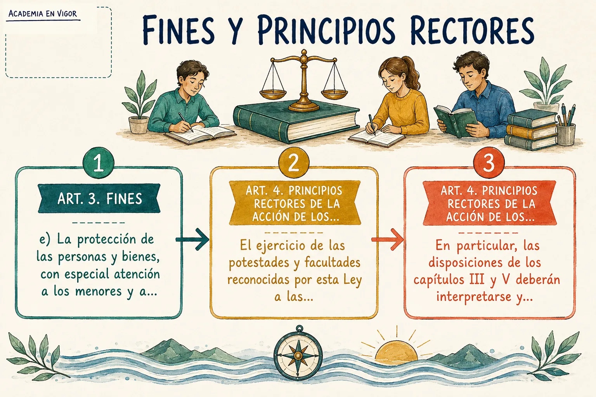

<em>Infografía: comparación de fines y principios rectores.</em>

<!-- FUENTE: LO4-2015-BOE-A-2015-3442-GC-T13 -->

## 03. Autoridades, cooperación y colaboración

### Regla y encaje

Autoridades, cooperación y colaboración forma parte de fundamentos y autoridades de seguridad ciudadana. Estúdialo como una secuencia: presupuesto, obligación o facultad, excepción y consecuencia.

### Claves examinables

- **Artículo 5. Autoridades y órganos competentes · apartado 1:** 1. Corresponde al Gobierno, a través del Ministerio del Interior y de los demás órganos y autoridades competentes y de las Fuerzas y Cuerpos de Seguridad a sus órdenes, la preparación, dirección y ejecución de la política en relación con la administración general de la seguridad ciudadana, sin perjuicio de las competencias atribuidas a otras administraciones públicas en dicha materia. <!-- FACT:GC-T13-F023 -->
- **Artículo 5. Autoridades y órganos competentes:** 2. Son autoridades y órganos competentes en materia de seguridad ciudadana, en el ámbito de la Administración General del Estado: a) El Ministro del Interior. <!-- FACT:GC-T13-F024 -->
- **Artículo 5. Autoridades y órganos competentes:** 2. Son autoridades y órganos competentes en materia de seguridad ciudadana, en el ámbito de la Administración General del Estado: b) El Secretario de Estado de Seguridad. <!-- FACT:GC-T13-F025 -->
- **Artículo 5. Autoridades y órganos competentes:** 2. Son autoridades y órganos competentes en materia de seguridad ciudadana, en el ámbito de la Administración General del Estado: c) Los titulares de los órganos directivos del Ministerio del Interior que tengan atribuida tal condición, en virtud de disposiciones legales o reglamentarias. <!-- FACT:GC-T13-F026 -->
- **Artículo 5. Autoridades y órganos competentes:** 2. Son autoridades y órganos competentes en materia de seguridad ciudadana, en el ámbito de la Administración General del Estado: d) Los Delegados del Gobierno en las comunidades autónomas y en las Ciudades de Ceuta y Melilla. <!-- FACT:GC-T13-F027 -->
- **Artículo 5. Autoridades y órganos competentes:** 2. Son autoridades y órganos competentes en materia de seguridad ciudadana, en el ámbito de la Administración General del Estado: e) Los Subdelegados del Gobierno en las provincias y los Directores Insulares. <!-- FACT:GC-T13-F028 -->
- **Artículo 5. Autoridades y órganos competentes · apartado 3:** 3. Serán autoridades y órganos competentes, a los efectos de esta Ley, los correspondientes de las comunidades autónomas que hayan asumido competencias para la protección de personas y bienes y para el mantenimiento de la seguridad ciudadana y cuenten con un cuerpo de policía propio. <!-- FACT:GC-T13-F029 -->
- **Artículo 5. Autoridades y órganos competentes · apartado 4:** 4. Las autoridades de las Ciudades de Ceuta y Melilla y las autoridades locales ejercerán las facultades que les corresponden, de acuerdo con la Ley Orgánica 2/1986, de 13 de marzo, y la legislación de régimen local, espectáculos públicos, actividades recreativas y actividades clasificadas. <!-- FACT:GC-T13-F030 -->
- **Artículo 6. Cooperación interadministrativa:** La Administración General del Estado y las demás administraciones públicas con competencias en materia de seguridad ciudadana se regirán, en sus relaciones, por los principios de cooperación y lealtad institucional, facilitándose la información de acuerdo con la legislación vigente y la asistencia técnica necesarias en el ejercicio de sus respectivas atribuciones, y, cuando fuese preciso, coordinando las acciones destinadas a garantizar el cumplimiento de esta Ley, de conformidad con lo dispuesto en la Ley Orgánica 2/1986, de 13 de marzo, y en la Ley 30/1992, de 26 de noviembre, de Régimen Jurídico de las Administraciones Públicas y del Procedimiento Administrativo Común. <!-- FACT:GC-T13-F031 -->
- **Artículo 7. Deber de colaboración · apartado 1:** 1. Todas las autoridades y funcionarios públicos, en el ámbito de sus respectivas competencias y de acuerdo con su normativa específica, deberán colaborar con las autoridades y órganos a que se refiere el artículo 5, y prestarles el auxilio que sea posible y adecuado para la consecución de los fines relacionados en el artículo 3. <!-- FACT:GC-T13-F032 -->
- **Artículo 7. Deber de colaboración · apartado 1:** Cuando, por razón de su cargo, tengan conocimiento de hechos que perturben gravemente la seguridad ciudadana o de los que racionalmente pueda inferirse que pueden producir una perturbación grave, estarán obligados a ponerlo inmediatamente en conocimiento de la autoridad competente. <!-- FACT:GC-T13-F033 -->
- **Artículo 7. Deber de colaboración · apartado 2:** 2. Las autoridades y órganos competentes y los miembros de las Fuerzas y Cuerpos de Seguridad podrán recabar de los particulares su ayuda y colaboración en la medida necesaria para el cumplimiento de los fines previstos en esta Ley, especialmente en los casos de grave calamidad pública o catástrofe extraordinaria, siempre que ello no implique riesgo personal para los mismos. <!-- FACT:GC-T13-F034 -->
- **Artículo 7. Deber de colaboración · apartado 2:** Quienes sufran daños y perjuicios por estas causas serán indemnizados de acuerdo con las leyes. <!-- FACT:GC-T13-F035 -->
- **Artículo 7. Deber de colaboración · apartado 3:** 3. Las empresas de seguridad privada, los despachos de detectives privados y el personal de seguridad privada tienen un especial deber de auxiliar a las Fuerzas y Cuerpos de Seguridad en el ejercicio de sus funciones, prestarles la colaboración que precisen y seguir sus instrucciones, en los términos previstos en la normativa de seguridad privada. <!-- FACT:GC-T13-F036 -->
- **Artículo 7. Deber de colaboración · apartado 4:** 4. El personal que realice funciones de policía administrativa tendrá el especial deber de colaborar en la consecución de los fines previstos en el artículo 3 de esta Ley. <!-- FACT:GC-T13-F037 -->

:::hablemos-claro
Seguridad pública significa potestad y responsabilidad estatal; seguridad privada significa actividad complementaria, subordinada, controlada y obligada a colaborar.
:::

:::en-la-calle
Ante un supuesto, identifica primero quién actúa, con qué habilitación, qué medida adopta, qué límite legal existe y qué autoridad controla la actuación.
:::

:::lo-que-cae
Prioriza listas cerradas, plazos, excepciones, competencias y efectos. Apariciones oficiales mapeadas: **4**.
:::

<!-- VISUAL:t13-03-autoridades-cooperacion-y-colaboracion.webp -->

  

<em>Infografía: línea temporal de autoridades, cooperación y colaboración.</em>

<!-- FUENTE: LO4-2015-BOE-A-2015-3442-GC-T13 -->

## 04. Identidad y Documento Nacional de Identidad

### Regla y encaje

Identidad y Documento Nacional de Identidad forma parte de documentación e identificación personal. Estúdialo como una secuencia: presupuesto, obligación o facultad, excepción y consecuencia.

### Claves examinables

- **Artículo 8. Acreditación de la identidad de los ciudadanos españoles · apartado 1:** 1. Los españoles tienen derecho a que se les expida el Documento Nacional de Identidad. <!-- FACT:GC-T13-F038 -->
- **Artículo 8. Acreditación de la identidad de los ciudadanos españoles:** El Documento Nacional de Identidad es un documento público y oficial y tendrá la protección que a estos otorgan las leyes. Es el único documento con suficiente valor por sí solo para la acreditación, a todos los efectos, de la identidad y los datos personales de su titular. <!-- FACT:GC-T13-F039 -->
- **Artículo 8. Acreditación de la identidad de los ciudadanos españoles · apartado 2:** 2. En el Documento Nacional de Identidad figurarán la fotografía y la firma de su titular, así como los datos personales que se determinen reglamentariamente, que respetarán el derecho a la intimidad de la persona, sin que en ningún caso, puedan ser relativos a la raza, etnia, religión, creencias, opinión, ideología, discapacidad, orientación o identidad sexual, o afiliación política o sindical. <!-- FACT:GC-T13-F040 -->
- **Artículo 8. Acreditación de la identidad de los ciudadanos españoles · apartado 2:** La tarjeta soporte del Documento Nacional de Identidad incorporará las medidas de seguridad necesarias para la consecución de condiciones de calidad e inalterabilidad y máximas garantías para impedir su falsificación. <!-- FACT:GC-T13-F041 -->
- **Artículo 8. Acreditación de la identidad de los ciudadanos españoles · apartado 3:** 3. El Documento Nacional de Identidad permite a los españoles mayores de edad que gocen de plena capacidad de obrar y a los menores emancipados la identificación electrónica de su titular, así como la firma electrónica de documentos, en los términos previstos en la legislación específica. <!-- FACT:GC-T13-F042 -->
- **Artículo 8. Acreditación de la identidad de los ciudadanos españoles · apartado 3:** Las personas con capacidad modificada judicialmente podrán ejercer esas facultades cuando expresamente lo solicite el interesado y no precise, atendiendo a la resolución judicial que complemente su capacidad, de la representación o asistencia de una institución de protección y apoyo para obligarse o contratar. <!-- FACT:GC-T13-F043 -->
- **Artículo 8. Acreditación de la identidad de los ciudadanos españoles:** El prestador de servicios de certificación procederá a revocar el certificado de firma electrónica a instancia del Ministerio del Interior, tras recibir éste la comunicación del Encargado del Registro Civil de la inscripción de la resolución judicial que determine la necesidad del complemento de la capacidad para obligarse o contratar, del fallecimiento o de la declaración de ausencia o fallecimiento de una persona. <!-- FACT:GC-T13-F044 -->
- **Artículo 9. Obligaciones y derechos del titular del Documento Nacional de Identidad · apartado 1:** 1. El Documento Nacional de Identidad es obligatorio a partir de los catorce años. Dicho documento es personal e intransferible, debiendo su titular mantenerlo en vigor y conservarlo y custodiarlo con la debida diligencia. No podrá ser privado del mismo, ni siquiera temporalmente, sino en los supuestos en que, conforme a lo previsto por la ley, haya de ser sustituido por otro documento. <!-- FACT:GC-T13-F045 -->
- **Artículo 9. Obligaciones y derechos del titular del Documento Nacional de Identidad · apartado 2:** 2. Todas las personas obligadas a obtener el Documento Nacional de Identidad lo están también a exhibirlo y permitir la comprobación de las medidas de seguridad a las que se refiere el apartado 2 del artículo 8 cuando fueren requeridas para ello por la autoridad o sus agentes, para el cumplimiento de los fines previstos en el apartado 1 del artículo 16. <!-- FACT:GC-T13-F046 -->
- **Artículo 9. Obligaciones y derechos del titular del Documento Nacional de Identidad · apartado 2:** De su sustracción o extravío deberá darse cuenta tan pronto como sea posible a la comisaría de Policía o puesto de las Fuerzas y Cuerpos de Seguridad más próximo. <!-- FACT:GC-T13-F047 -->
- **Artículo 10. Competencias sobre el Documento Nacional de Identidad · apartado 1:** 1. Corresponde al Ministerio del Interior la competencia exclusiva para la dirección, organización y gestión de todos los aspectos referentes a la confección y expedición del Documento Nacional de Identidad, conforme a lo dispuesto en esta Ley y en la legislación sobre firma electrónica. <!-- FACT:GC-T13-F048 -->
- **Artículo 10. Competencias sobre el Documento Nacional de Identidad · apartado 2:** 2. La competencia a que se refiere el apartado anterior será ejercida por la Dirección General de la Policía, a la que corresponderá también la custodia y responsabilidad de los archivos y ficheros relacionados con el Documento Nacional de Identidad. <!-- FACT:GC-T13-F049 -->
- **Artículo 10. Competencias sobre el Documento Nacional de Identidad · apartado 3:** 3. Su expedición está sujeta al pago de una tasa. <!-- FACT:GC-T13-F050 -->

:::hablemos-claro
Seguridad pública significa potestad y responsabilidad estatal; seguridad privada significa actividad complementaria, subordinada, controlada y obligada a colaborar.
:::

:::en-la-calle
Ante un supuesto, identifica primero quién actúa, con qué habilitación, qué medida adopta, qué límite legal existe y qué autoridad controla la actuación.
:::

:::lo-que-cae
Prioriza listas cerradas, plazos, excepciones, competencias y efectos. Apariciones oficiales mapeadas: **3**.
:::

<!-- VISUAL:t13-04-identidad-y-documento-nacional-de-identidad.webp -->

  

<em>Infografía: escena de identidad y documento nacional de identidad.</em>

<!-- FUENTE: LO4-2015-BOE-A-2015-3442-GC-T13 -->

## 05. Pasaporte de ciudadanos españoles

### Regla y encaje

Pasaporte de ciudadanos españoles forma parte de documentación e identificación personal. Estúdialo como una secuencia: presupuesto, obligación o facultad, excepción y consecuencia.

### Claves examinables

- **Artículo 11. Pasaporte de ciudadanos españoles · apartado 1:** 1. El pasaporte español es un documento público, personal, individual e intransferible que, salvo prueba en contrario, acredita la identidad y nacionalidad de los ciudadanos españoles fuera de España, y dentro del territorio nacional, las mismas circunstancias de los españoles no residentes. <!-- FACT:GC-T13-F051 -->
- **Artículo 11. Pasaporte de ciudadanos españoles:** 2. Los ciudadanos españoles tienen derecho a que les sea expedido el pasaporte, que sólo podrá ser exceptuado en las siguientes circunstancias: a) Haber sido condenado a penas o medidas de seguridad privativas de libertad, mientras no se hayan extinguido, salvo que obtenga autorización del órgano judicial competente. <!-- FACT:GC-T13-F052 -->
- **Artículo 11. Pasaporte de ciudadanos españoles:** 2. Los ciudadanos españoles tienen derecho a que les sea expedido el pasaporte, que sólo podrá ser exceptuado en las siguientes circunstancias: b) Haber sido acordada por el órgano judicial competente la retirada de su pasaporte de acuerdo con lo previsto por la ley. <!-- FACT:GC-T13-F053 -->
- **Artículo 11. Pasaporte de ciudadanos españoles:** 2. Los ciudadanos españoles tienen derecho a que les sea expedido el pasaporte, que sólo podrá ser exceptuado en las siguientes circunstancias: c) Haberle sido impuesta una medida de libertad vigilada con prohibición de abandonar el territorio nacional, salvo que obtenga autorización del órgano judicial competente. <!-- FACT:GC-T13-F054 -->
- **Artículo 11. Pasaporte de ciudadanos españoles:** 2. Los ciudadanos españoles tienen derecho a que les sea expedido el pasaporte, que sólo podrá ser exceptuado en las siguientes circunstancias: d) Cuando el órgano judicial competente haya prohibido la salida de España o la expedición de pasaporte al menor de edad o a la persona con la capacidad modificada judicialmente, de acuerdo con lo dispuesto por la ley. <!-- FACT:GC-T13-F055 -->
- **Artículo 11. Pasaporte de ciudadanos españoles · apartado 3:** 3. La obtención del pasaporte por los ciudadanos sujetos a patria potestad o a tutela estará condicionada al consentimiento expreso de las personas u órgano que tenga encomendado su ejercicio o, en su defecto, del órgano judicial competente. <!-- FACT:GC-T13-F056 -->
- **Artículo 11. Pasaporte de ciudadanos españoles · apartado 4:** 4. Los titulares del pasaporte tienen la obligación de exhibirlo y facilitarlo cuando fuesen requeridos para ello por la autoridad o sus agentes. También estarán obligados a su custodia y conservación con la debida diligencia. De su sustracción o extravío deberá darse cuenta de manera inmediata a las Fuerzas y Cuerpos de Seguridad o, en su caso, a la Representación Diplomática o Consular de España en el extranjero. <!-- FACT:GC-T13-F057 -->
- **Artículo 12. Competencias sobre el pasaporte:** 1. La competencia para su expedición corresponde: a) En el territorio nacional, a la Dirección General de la Policía. <!-- FACT:GC-T13-F058 -->
- **Artículo 12. Competencias sobre el pasaporte:** 1. La competencia para su expedición corresponde: b) En el extranjero, a las Representaciones Diplomáticas y Consulares de España. <!-- FACT:GC-T13-F059 -->
- **Artículo 12. Competencias sobre el pasaporte · apartado 2:** 2. Su expedición está sujeta al pago de una tasa. <!-- FACT:GC-T13-F060 -->
- **Artículo 12. Competencias sobre el pasaporte · apartado 3:** 3. Corresponde al Gobierno, a propuesta de los Ministros del Interior y de Asuntos Exteriores y de Cooperación, desarrollar esta Ley en lo referente al régimen jurídico del pasaporte. <!-- FACT:GC-T13-F061 -->

:::hablemos-claro
Seguridad pública significa potestad y responsabilidad estatal; seguridad privada significa actividad complementaria, subordinada, controlada y obligada a colaborar.
:::

:::en-la-calle
Ante un supuesto, identifica primero quién actúa, con qué habilitación, qué medida adopta, qué límite legal existe y qué autoridad controla la actuación.
:::

:::lo-que-cae
Prioriza listas cerradas, plazos, excepciones, competencias y efectos. Apariciones oficiales mapeadas: **3**.
:::

<!-- VISUAL:t13-05-pasaporte-de-ciudadanos-espanoles.webp -->

  

<em>Infografía: capas de pasaporte de ciudadanos españoles.</em>

<!-- FUENTE: LO4-2015-BOE-A-2015-3442-GC-T13 -->

## 06. Identidad de ciudadanos extranjeros

### Regla y encaje

Identidad de ciudadanos extranjeros forma parte de documentación e identificación personal. Estúdialo como una secuencia: presupuesto, obligación o facultad, excepción y consecuencia.

### Claves examinables

- **Artículo 13. Acreditación de la identidad de ciudadanos extranjeros · apartado 1:** 1. Los extranjeros que se encuentren en territorio español tienen el derecho y la obligación de conservar y portar consigo la documentación que acredite su identidad expedida por las autoridades competentes del país de origen o de procedencia, así como la que acredite su situación regular en España. <!-- FACT:GC-T13-F062 -->
- **Artículo 13. Acreditación de la identidad de ciudadanos extranjeros · apartado 2:** 2. Los extranjeros no podrán ser privados de su documentación de origen, salvo en el curso de investigaciones judiciales de carácter penal. <!-- FACT:GC-T13-F063 -->
- **Artículo 13. Acreditación de la identidad de ciudadanos extranjeros · apartado 3:** 3. Los extranjeros estarán obligados a exhibir la documentación mencionada en el apartado 1 de este artículo y permitir la comprobación de las medidas de seguridad de la misma, cuando fueran requeridos por las autoridades o sus agentes de conformidad con lo dispuesto en la ley, y por el tiempo imprescindible para dicha comprobación, sin perjuicio de poder demostrar su identidad por cualquier otro medio si no la llevaran consigo. <!-- FACT:GC-T13-F064 -->

:::hablemos-claro
Seguridad pública significa potestad y responsabilidad estatal; seguridad privada significa actividad complementaria, subordinada, controlada y obligada a colaborar.
:::

:::en-la-calle
Ante un supuesto, identifica primero quién actúa, con qué habilitación, qué medida adopta, qué límite legal existe y qué autoridad controla la actuación.
:::

:::lo-que-cae
Prioriza listas cerradas, plazos, excepciones, competencias y efectos. Apariciones oficiales mapeadas: **0**.
:::

<!-- VISUAL:t13-06-identidad-de-ciudadanos-extranjeros.webp -->

  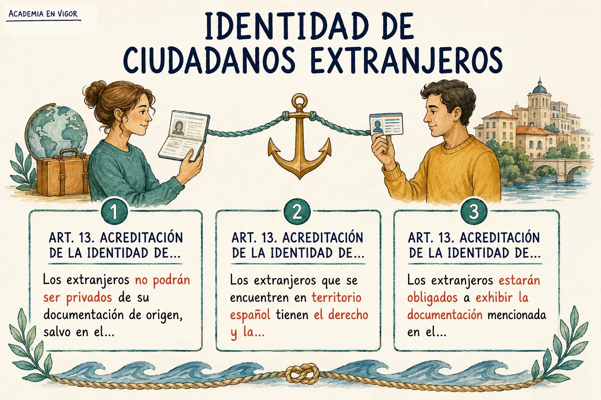

<em>Infografía: mapa de identidad de ciudadanos extranjeros.</em>

<!-- FUENTE: LO4-2015-BOE-A-2015-3442-GC-T13 -->

## 07. Órdenes, entrada en domicilio y edificios oficiales

### Regla y encaje

Órdenes, entrada en domicilio y edificios oficiales forma parte de actuaciones para mantener y restablecer la seguridad. Estúdialo como una secuencia: presupuesto, obligación o facultad, excepción y consecuencia.

### Claves examinables

- **Artículo 14. Órdenes y prohibiciones:** Las autoridades competentes, de conformidad con las Leyes y reglamentos, podrán dictar las órdenes y prohibiciones y disponer las actuaciones policiales estrictamente necesarias para asegurar la consecución de los fines previstos en esta Ley, mediante resolución debidamente motivada. <!-- FACT:GC-T13-F065 -->
- **Artículo 15. Entrada y registro en domicilio y edificios de organismos oficiales · apartado 1:** 1. Los agentes de las Fuerzas y Cuerpos de Seguridad sólo podrán proceder a la entrada y registro en domicilio en los casos permitidos por la Constitución y en los términos que fijen las Leyes. <!-- FACT:GC-T13-F066 -->
- **Artículo 15. Entrada y registro en domicilio y edificios de organismos oficiales · apartado 2:** 2. Será causa legítima suficiente para la entrada en domicilio la necesidad de evitar daños inminentes y graves a las personas y a las cosas, en supuestos de catástrofe, calamidad, ruina inminente u otros semejantes de extrema y urgente necesidad. <!-- FACT:GC-T13-F067 -->
- **Artículo 15. Entrada y registro en domicilio y edificios de organismos oficiales · apartado 3:** 3. Para la entrada en edificios ocupados por organismos oficiales o entidades públicas, no será preciso el consentimiento de la autoridad o funcionario que los tuviere a su cargo. <!-- FACT:GC-T13-F068 -->
- **Artículo 15. Entrada y registro en domicilio y edificios de organismos oficiales · apartado 4:** 4. Cuando por las causas previstas en este artículo las Fuerzas y Cuerpos de Seguridad entren en un domicilio particular, remitirán sin dilación el acta o atestado que instruyan a la autoridad judicial competente. <!-- FACT:GC-T13-F069 -->

:::hablemos-claro
Seguridad pública significa potestad y responsabilidad estatal; seguridad privada significa actividad complementaria, subordinada, controlada y obligada a colaborar.
:::

:::en-la-calle
Ante un supuesto, identifica primero quién actúa, con qué habilitación, qué medida adopta, qué límite legal existe y qué autoridad controla la actuación.
:::

:::lo-que-cae
Prioriza listas cerradas, plazos, excepciones, competencias y efectos. Apariciones oficiales mapeadas: **1**.
:::

<!-- VISUAL:t13-07-ordenes-entrada-en-domicilio-y-edificios-oficiales.webp -->

  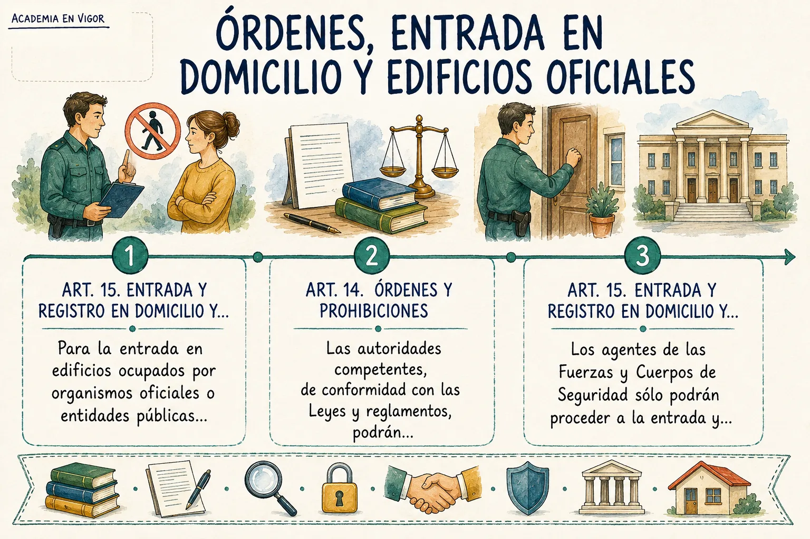

<em>Infografía: flujo de órdenes, entrada en domicilio y edificios oficiales.</em>

<!-- FUENTE: LO4-2015-BOE-A-2015-3442-GC-T13 -->

## 08. Identificación de personas

### Regla y encaje

Identificación de personas forma parte de actuaciones para mantener y restablecer la seguridad. Estúdialo como una secuencia: presupuesto, obligación o facultad, excepción y consecuencia.

### Claves examinables

- **Artículo 16. Identificación de personas:** 1. En el cumplimiento de sus funciones de indagación y prevención delictiva, así como para la sanción de infracciones penales y administrativas, los agentes de las Fuerzas y Cuerpos de Seguridad podrán requerir la identificación de las personas en los siguientes supuestos: a) Cuando existan indicios de que han podido participar en la comisión de una infracción. <!-- FACT:GC-T13-F070 -->
- **Artículo 16. Identificación de personas:** 1. En el cumplimiento de sus funciones de indagación y prevención delictiva, así como para la sanción de infracciones penales y administrativas, los agentes de las Fuerzas y Cuerpos de Seguridad podrán requerir la identificación de las personas en los siguientes supuestos: b) Cuando, en atención a las circunstancias concurrentes, se considere razonablemente necesario que acrediten su identidad para prevenir la comisión de un delito. En estos supuestos, los agentes podrán realizar las comprobaciones necesarias en la vía pública o en el lugar donde se hubiese hecho el requerimiento, incluida la identificación de las personas cuyo rostro no sea visible total o parcialmente por utilizar cualquier tipo de prenda u objeto que lo cubra, impidiendo o dificultando la identificación, cuando fuere preciso a los efectos indicados. <!-- FACT:GC-T13-F071 -->
- **Artículo 16. Identificación de personas:** En la práctica de la identificación se respetarán estrictamente los principios de proporcionalidad, igualdad de trato y no discriminación por razón de nacimiento, nacionalidad, origen racial o étnico, sexo, religión o creencias, edad, discapacidad, orientación o identidad sexual, opinión o cualquier otra condición o circunstancia personal o social. <!-- FACT:GC-T13-F072 -->
- **Artículo 16. Identificación de personas · apartado 2:** Cuando no fuera posible la identificación por cualquier medio, incluida la vía telemática o telefónica, o si la persona se negase a identificarse, los agentes, para impedir la comisión de un delito o al objeto de sancionar una infracción, podrán requerir a quienes no pudieran ser identificados a que les acompañen a las dependencias policiales más próximas en las que se disponga de los medios adecuados para la práctica de esta diligencia, a los solos efectos de su identificación y por el tiempo estrictamente necesario, que en ningún caso podrá superar las seis horas. <!-- FACT:GC-T13-F073 -->
- **Artículo 16. Identificación de personas:** La persona a la que se solicite que se identifique será informada de modo inmediato y comprensible de las razones de dicha solicitud, así como, en su caso, del requerimiento para que acompañe a los agentes a las dependencias policiales. <!-- FACT:GC-T13-F074 -->
- **Artículo 16. Identificación de personas · apartado 3:** 3. En las dependencias a que se hace referencia en el apartado 2 se llevará un libro-registro en el que sólo se practicarán asientos relacionados con la seguridad ciudadana. Constarán en él las diligencias de identificación practicadas, así como los motivos, circunstancias y duración de las mismas, y sólo podrán ser comunicados sus datos a la autoridad judicial competente y al Ministerio Fiscal. <!-- FACT:GC-T13-F075 -->
- **Artículo 16. Identificación de personas · apartado 3:** El órgano competente de la Administración remitirá mensualmente al Ministerio Fiscal extracto de las diligencias de identificación con expresión del tiempo utilizado en cada una. Los asientos de este libro-registro se cancelarán de oficio a los tres años. <!-- FACT:GC-T13-F076 -->
- **Artículo 16. Identificación de personas · apartado 4:** 4. A las personas desplazadas a dependencias policiales a efectos de identificación, se les deberá expedir a su salida un volante acreditativo del tiempo de permanencia en ellas, la causa y la identidad de los agentes actuantes. <!-- FACT:GC-T13-F077 -->
- **Artículo 16. Identificación de personas · apartado 5:** 5. En los casos de resistencia o negativa a identificarse o a colaborar en las comprobaciones o prácticas de identificación, se estará a lo dispuesto en el Código Penal, en la Ley de Enjuiciamiento Criminal y, en su caso, en esta Ley. <!-- FACT:GC-T13-F078 -->

:::hablemos-claro
Seguridad pública significa potestad y responsabilidad estatal; seguridad privada significa actividad complementaria, subordinada, controlada y obligada a colaborar.
:::

:::en-la-calle
Ante un supuesto, identifica primero quién actúa, con qué habilitación, qué medida adopta, qué límite legal existe y qué autoridad controla la actuación.
:::

:::lo-que-cae
Prioriza listas cerradas, plazos, excepciones, competencias y efectos. Apariciones oficiales mapeadas: **3**.
:::

<!-- VISUAL:t13-08-identificacion-de-personas.webp -->

  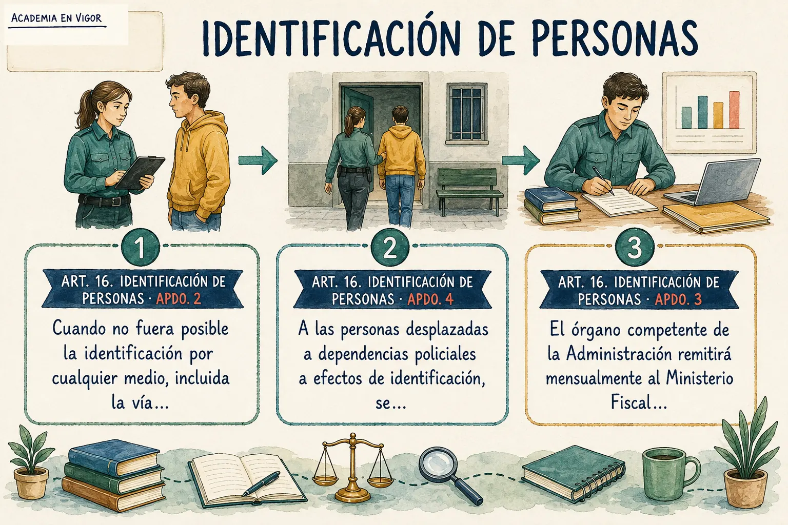

<em>Infografía: comparación de identificación de personas.</em>

<!-- FUENTE: LO4-2015-BOE-A-2015-3442-GC-T13 -->

## 09. Restricción del tránsito y controles en vías públicas

### Regla y encaje

Restricción del tránsito y controles en vías públicas forma parte de actuaciones para mantener y restablecer la seguridad. Estúdialo como una secuencia: presupuesto, obligación o facultad, excepción y consecuencia.

### Claves examinables

- **Artículo 17. Restricción del tránsito y controles en las vías públicas · apartado 1:** 1. Los agentes de las Fuerzas y Cuerpos de Seguridad podrán limitar o restringir la circulación o permanencia en vías o lugares públicos y establecer zonas de seguridad en supuestos de alteración de la seguridad ciudadana o de la pacífica convivencia, o cuando existan indicios racionales de que pueda producirse dicha alteración, por el tiempo imprescindible para su mantenimiento o restablecimiento. <!-- FACT:GC-T13-F079 -->
- **Artículo 17. Restricción del tránsito y controles en las vías públicas · apartado 1:** Asimismo podrán ocupar preventivamente los efectos o instrumentos susceptibles de ser utilizados para acciones ilegales, dándoles el destino que legalmente proceda. <!-- FACT:GC-T13-F080 -->
- **Artículo 17. Restricción del tránsito y controles en las vías públicas · apartado 2:** Para la prevención de delitos de especial gravedad o generadores de alarma social, así como para el descubrimiento y detención de quienes hubieran participado en su comisión y proceder a la recogida de los instrumentos, efectos o pruebas, se podrán establecer controles en las vías, lugares o establecimientos públicos, siempre que resulte indispensable proceder a la identificación de personas que se encuentren en ellos, al registro de vehículos o al control superficial de efectos personales. <!-- FACT:GC-T13-F081 -->

:::hablemos-claro
Seguridad pública significa potestad y responsabilidad estatal; seguridad privada significa actividad complementaria, subordinada, controlada y obligada a colaborar.
:::

:::en-la-calle
Ante un supuesto, identifica primero quién actúa, con qué habilitación, qué medida adopta, qué límite legal existe y qué autoridad controla la actuación.
:::

:::lo-que-cae
Prioriza listas cerradas, plazos, excepciones, competencias y efectos. Apariciones oficiales mapeadas: **1**.
:::

<!-- VISUAL:t13-09-restriccion-del-transito-y-controles-en-vias-publicas.webp -->

  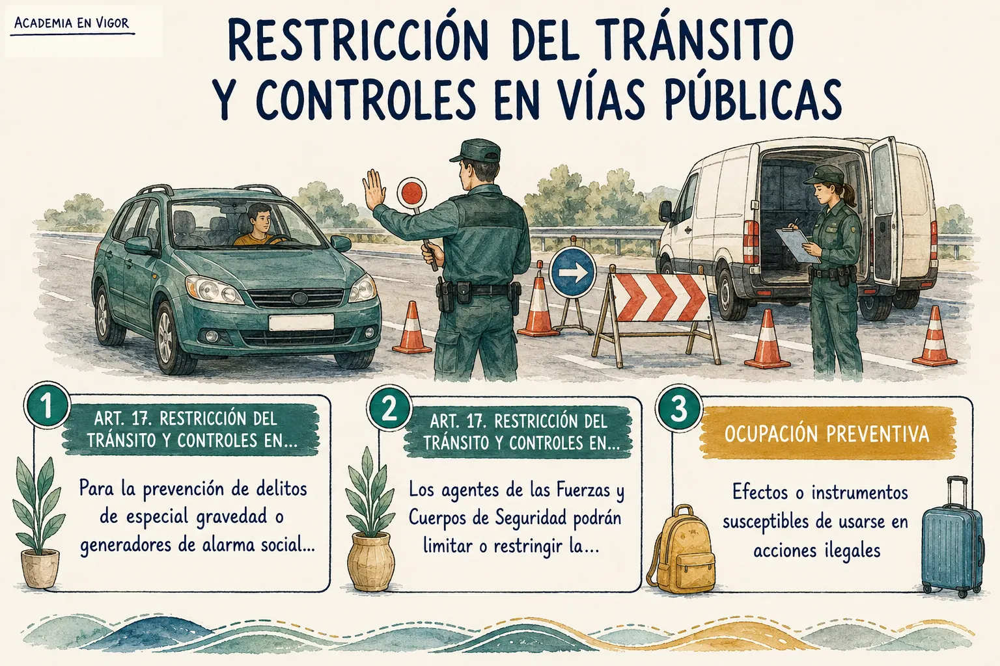

<em>Infografía: línea temporal de restricción del tránsito y controles en vías públicas.</em>

<!-- FUENTE: LO4-2015-BOE-A-2015-3442-GC-T13 -->

## 10. Comprobaciones, registros y diligencias comunes

### Regla y encaje

Comprobaciones, registros y diligencias comunes forma parte de actuaciones para mantener y restablecer la seguridad. Estúdialo como una secuencia: presupuesto, obligación o facultad, excepción y consecuencia.

### Claves examinables

- **Artículo 18. Comprobaciones y registros en lugares públicos · apartado 1:** Los agentes de la autoridad podrán practicar las comprobaciones en las personas, bienes y vehículos que sean necesarias para impedir que en las vías, lugares y establecimientos públicos se porten o utilicen ilegalmente armas, explosivos, sustancias peligrosas u otros objetos, instrumentos o medios que generen un riesgo potencialmente grave para las personas, susceptibles de ser utilizados para la comisión de un delito o alterar la seguridad ciudadana, cuando tengan indicios de su eventual presencia en dichos lugares, procediendo, en su caso, a su intervención. <!-- FACT:GC-T13-F082 -->
- **Artículo 18. Comprobaciones y registros en lugares públicos · apartado 1:** A tal fin, los ciudadanos tienen el deber de colaborar y no obstaculizar la labor de los agentes de la autoridad en el ejercicio de sus funciones. <!-- FACT:GC-T13-F083 -->
- **Artículo 18. Comprobaciones y registros en lugares públicos · apartado 2:** 2. Los agentes de la autoridad podrán proceder a la ocupación temporal de cualesquiera objetos, instrumentos o medios de agresión, incluso de las armas que se porten con licencia, permiso o autorización si se estima necesario, con objeto de prevenir la comisión de cualquier delito, o cuando exista peligro para la seguridad de las personas o de los bienes. <!-- FACT:GC-T13-F084 -->
- **Artículo 19. Disposiciones comunes a las diligencias de identificación, registro y comprobación · apartado 1:** 1. Las diligencias de identificación, registro y comprobación practicadas por los agentes de las Fuerzas y Cuerpos de Seguridad con ocasión de actuaciones realizadas conforme a lo dispuesto en esta sección no estarán sujetas a las mismas formalidades que la detención. <!-- FACT:GC-T13-F085 -->
- **Artículo 19. Disposiciones comunes a las diligencias de identificación, registro y comprobación · apartado 2:** 2. La aprehensión durante las diligencias de identificación, registro y comprobación de armas, drogas tóxicas, estupefacientes, sustancias psicotrópicas u otros efectos procedentes de un delito o infracción administrativa se hará constar en el acta correspondiente, que habrá de ser firmada por el interesado; si éste se negara a firmarla, se dejará constancia expresa de su negativa. <!-- FACT:GC-T13-F086 -->
- **Artículo 19. Disposiciones comunes a las diligencias de identificación, registro y comprobación · apartado 2:** El acta que se extienda gozará de presunción de veracidad de los hechos en ella consignados, salvo prueba en contrario. <!-- FACT:GC-T13-F087 -->

:::hablemos-claro
Seguridad pública significa potestad y responsabilidad estatal; seguridad privada significa actividad complementaria, subordinada, controlada y obligada a colaborar.
:::

:::en-la-calle
Ante un supuesto, identifica primero quién actúa, con qué habilitación, qué medida adopta, qué límite legal existe y qué autoridad controla la actuación.
:::

:::lo-que-cae
Prioriza listas cerradas, plazos, excepciones, competencias y efectos. Apariciones oficiales mapeadas: **1**.
:::

<!-- VISUAL:t13-10-comprobaciones-registros-y-diligencias-comunes.webp -->

  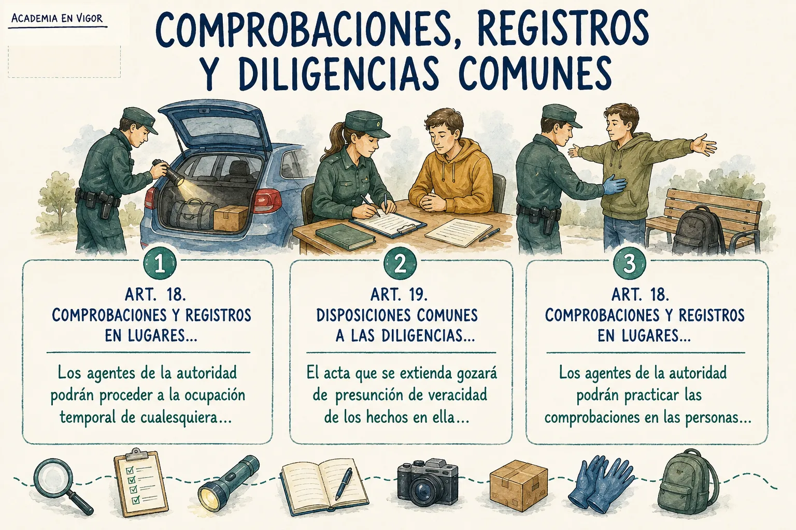

<em>Infografía: escena de comprobaciones, registros y diligencias comunes.</em>

<!-- FUENTE: LO4-2015-BOE-A-2015-3442-GC-T13 -->

## 11. Registros corporales externos

### Regla y encaje

Registros corporales externos forma parte de actuaciones para mantener y restablecer la seguridad. Estúdialo como una secuencia: presupuesto, obligación o facultad, excepción y consecuencia.

### Claves examinables

- **Artículo 20. Registros corporales externos · apartado 1:** 1. Podrá practicarse el registro corporal externo y superficial de la persona cuando existan indicios racionales para suponer que puede conducir al hallazgo de instrumentos, efectos u otros objetos relevantes para el ejercicio de las funciones de indagación y prevención que encomiendan las leyes a las Fuerzas y Cuerpos de Seguridad. <!-- FACT:GC-T13-F088 -->
- **Artículo 20. Registros corporales externos:** 2. Salvo que exista una situación de urgencia por riesgo grave e inminente para los agentes: a) El registro se realizará por un agente del mismo sexo que la persona sobre la que se practique esta diligencia. <!-- FACT:GC-T13-F089 -->
- **Artículo 20. Registros corporales externos:** 2. Salvo que exista una situación de urgencia por riesgo grave e inminente para los agentes: b) Y si exigiera dejar a la vista partes del cuerpo normalmente cubiertas por ropa, se efectuará en un lugar reservado y fuera de la vista de terceros. Se dejará constancia escrita de esta diligencia, de sus causas y de la identidad del agente que la adoptó. <!-- FACT:GC-T13-F090 -->
- **Artículo 20. Registros corporales externos · apartado 3:** 3. Los registros corporales externos respetarán los principios del apartado 1 del artículo 16, así como el de injerencia mínima, y se realizarán del modo que cause el menor perjuicio a la intimidad y dignidad de la persona afectada, que será informada de modo inmediato y comprensible de las razones de su realización. <!-- FACT:GC-T13-F091 -->
- **Artículo 20. Registros corporales externos · apartado 4:** 4. Los registros a los que se refiere este artículo podrán llevarse a cabo contra la voluntad del afectado, adoptando las medidas de compulsión indispensables, conforme a los principios de idoneidad, necesidad y proporcionalidad. <!-- FACT:GC-T13-F092 -->

:::hablemos-claro
Seguridad pública significa potestad y responsabilidad estatal; seguridad privada significa actividad complementaria, subordinada, controlada y obligada a colaborar.
:::

:::en-la-calle
Ante un supuesto, identifica primero quién actúa, con qué habilitación, qué medida adopta, qué límite legal existe y qué autoridad controla la actuación.
:::

:::lo-que-cae
Prioriza listas cerradas, plazos, excepciones, competencias y efectos. Apariciones oficiales mapeadas: **2**.
:::

<!-- VISUAL:t13-11-registros-corporales-externos.webp -->

  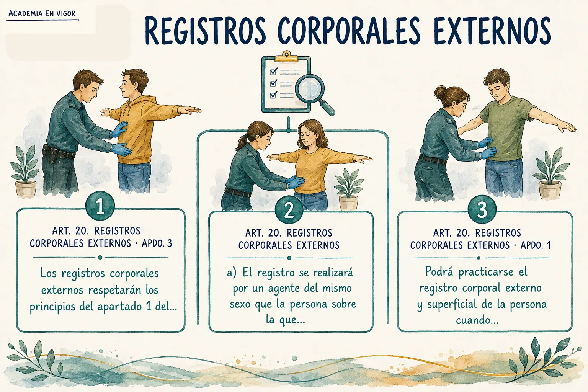

<em>Infografía: capas de registros corporales externos.</em>

<!-- FUENTE: LO4-2015-BOE-A-2015-3442-GC-T13 -->

## 12. Medidas extraordinarias y videocámaras

### Regla y encaje

Medidas extraordinarias y videocámaras forma parte de actuaciones para mantener y restablecer la seguridad. Estúdialo como una secuencia: presupuesto, obligación o facultad, excepción y consecuencia.

### Claves examinables

- **Artículo 21. Medidas de seguridad extraordinarias:** Las autoridades competentes podrán acordar, como medidas de seguridad extraordinarias, el cierre o desalojo de locales o establecimientos, la prohibición del paso, la evacuación de inmuebles o espacios públicos debidamente acotados, o el depósito de explosivos u otras sustancias susceptibles de ser empleadas como tales, en situaciones de emergencia que las hagan imprescindibles y durante el tiempo estrictamente necesario para garantizar la seguridad ciudadana. <!-- FACT:GC-T13-F093 -->
- **Artículo 21. Medidas de seguridad extraordinarias:** Dichas medidas podrán adoptarse por los agentes de la autoridad si la urgencia de la situación lo hiciera imprescindible, incluso mediante órdenes verbales. <!-- FACT:GC-T13-F094 -->
- **Artículo 21. Medidas de seguridad extraordinarias:** A los efectos de este artículo, se entiende por emergencia aquella situación de riesgo sobrevenida por un evento que pone en peligro inminente a personas o bienes y exige una actuación rápida por parte de la autoridad o de sus agentes para evitarla o mitigar sus efectos. <!-- FACT:GC-T13-F095 -->
- **Artículo 22. Uso de videocámaras:** La autoridad gubernativa y, en su caso, las Fuerzas y Cuerpos de Seguridad podrán proceder a la grabación de personas, lugares u objetos mediante cámaras de videovigilancia fijas o móviles legalmente autorizadas, de acuerdo con la legislación vigente en la materia. <!-- FACT:GC-T13-F096 -->

:::hablemos-claro
Seguridad pública significa potestad y responsabilidad estatal; seguridad privada significa actividad complementaria, subordinada, controlada y obligada a colaborar.
:::

:::en-la-calle
Ante un supuesto, identifica primero quién actúa, con qué habilitación, qué medida adopta, qué límite legal existe y qué autoridad controla la actuación.
:::

:::lo-que-cae
Prioriza listas cerradas, plazos, excepciones, competencias y efectos. Apariciones oficiales mapeadas: **3**.
:::

<!-- VISUAL:t13-12-medidas-extraordinarias-y-videocamaras.webp -->

  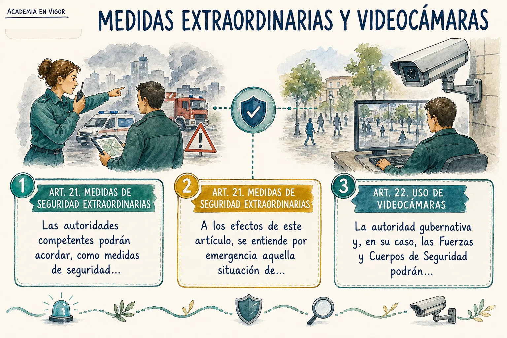

<em>Infografía: mapa de medidas extraordinarias y videocámaras.</em>

<!-- FUENTE: LO4-2015-BOE-A-2015-3442-GC-T13 -->

## 13. Reuniones, manifestaciones y colaboración policial

### Regla y encaje

Reuniones, manifestaciones y colaboración policial forma parte de actuaciones para mantener y restablecer la seguridad. Estúdialo como una secuencia: presupuesto, obligación o facultad, excepción y consecuencia.

### Claves examinables

- **Artículo 23. Reuniones y manifestaciones · apartado 1:** 1. Las autoridades a las que se refiere esta Ley adoptarán las medidas necesarias para proteger la celebración de reuniones y manifestaciones, impidiendo que se perturbe la seguridad ciudadana. <!-- FACT:GC-T13-F097 -->
- **Artículo 23. Reuniones y manifestaciones:** Asimismo podrán acordar la disolución de reuniones en lugares de tránsito público y manifestaciones en los supuestos previstos en el artículo 5 de la Ley Orgánica 9/1983, de 15 de julio, reguladora del derecho de reunión. <!-- FACT:GC-T13-F098 -->
- **Artículo 23. Reuniones y manifestaciones:** También podrán disolver las concentraciones de vehículos en las vías públicas y retirar aquéllos o cualesquiera otra clase de obstáculos cuando impidieran, pusieran en peligro o dificultaran la circulación por dichas vías. <!-- FACT:GC-T13-F099 -->
- **Artículo 23. Reuniones y manifestaciones · apartado 2:** 2. Las medidas de intervención para el mantenimiento o el restablecimiento de la seguridad ciudadana en reuniones y manifestaciones serán graduales y proporcionadas a las circunstancias. La disolución de reuniones y manifestaciones constituirá el último recurso. <!-- FACT:GC-T13-F100 -->
- **Artículo 23. Reuniones y manifestaciones · apartado 3:** 3. Antes de adoptar las medidas a las que se refiere el apartado anterior, las unidades actuantes de las Fuerzas y Cuerpos de Seguridad deberán avisar de tales medidas a las personas afectadas, pudiendo hacerlo de manera verbal si la urgencia de la situación lo hiciera imprescindible. <!-- FACT:GC-T13-F101 -->
- **Artículo 23. Reuniones y manifestaciones:** En caso de que se produzca una alteración de la seguridad ciudadana con armas, artefactos explosivos u objetos contundentes o de cualquier otro modo peligrosos, las Fuerzas y Cuerpos de Seguridad podrán disolver la reunión o manifestación o retirar los vehículos y obstáculos sin necesidad de previo aviso. <!-- FACT:GC-T13-F102 -->
- **Artículo 24. Colaboración entre las Fuerzas y Cuerpos de Seguridad:** En los casos a que se refiere el artículo anterior, las Fuerzas y Cuerpos de Seguridad colaborarán mutuamente en los términos previstos en su Ley orgánica reguladora. <!-- FACT:GC-T13-F103 -->

:::hablemos-claro
Seguridad pública significa potestad y responsabilidad estatal; seguridad privada significa actividad complementaria, subordinada, controlada y obligada a colaborar.
:::

:::en-la-calle
Ante un supuesto, identifica primero quién actúa, con qué habilitación, qué medida adopta, qué límite legal existe y qué autoridad controla la actuación.
:::

:::lo-que-cae
Prioriza listas cerradas, plazos, excepciones, competencias y efectos. Apariciones oficiales mapeadas: **2**.
:::

<!-- VISUAL:t13-13-reuniones-manifestaciones-y-colaboracion-policial.webp -->

  

<em>Infografía: flujo de reuniones, manifestaciones y colaboración policial.</em>

<!-- FUENTE: LO4-2015-BOE-A-2015-3442-GC-T13 -->

## 14. Registros documentales y establecimientos obligados

### Regla y encaje

Registros documentales y establecimientos obligados forma parte de policía administrativa especial. Estúdialo como una secuencia: presupuesto, obligación o facultad, excepción y consecuencia.

### Claves examinables

- **Artículo 25. Obligaciones de registro documental · apartado 1:** Las personas físicas o jurídicas que ejerzan actividades relevantes para la seguridad ciudadana, como las de hospedaje, transporte de personas, acceso comercial a servicios telefónicos o telemáticos de uso público mediante establecimientos abiertos al público, comercio o reparación de objetos usados, alquiler o desguace de vehículos de motor, compraventa de joyas y metales, ya sean preciosos o no, objetos u obras de arte, cerrajería de seguridad, centros gestores de residuos metálicos, establecimientos de comercio al por mayor de chatarra o productos de desecho, o de venta de productos químicos peligrosos a particulares, quedarán sujetas a las obligaciones de registro documental e información en los términos que establezcan las disposiciones aplicables. <!-- FACT:GC-T13-F104 -->
- **Artículo 25. Obligaciones de registro documental · apartado 2:** 2. Los titulares de embarcaciones de alta velocidad, así como los de aeronaves ligeras estarán obligados a realizar las actuaciones de registro documental e información previstas en la normativa vigente. <!-- FACT:GC-T13-F105 -->
- **Artículo 26. Establecimientos e instalaciones obligados a adoptar medidas de seguridad:** Reglamentariamente, en desarrollo de lo dispuesto en esta Ley, en la legislación de seguridad privada, en la de infraestructuras críticas o en otra normativa sectorial, podrá establecerse la necesidad de adoptar medidas de seguridad en establecimientos e instalaciones industriales, comerciales y de servicios, así como en las infraestructuras críticas, con la finalidad de prevenir la comisión de actos delictivos o infracciones administrativas, o cuando generen riesgos directos para terceros o sean especialmente vulnerables. <!-- FACT:GC-T13-F106 -->

:::hablemos-claro
Seguridad pública significa potestad y responsabilidad estatal; seguridad privada significa actividad complementaria, subordinada, controlada y obligada a colaborar.
:::

:::en-la-calle
Ante un supuesto, identifica primero quién actúa, con qué habilitación, qué medida adopta, qué límite legal existe y qué autoridad controla la actuación.
:::

:::lo-que-cae
Prioriza listas cerradas, plazos, excepciones, competencias y efectos. Apariciones oficiales mapeadas: **1**.
:::

<!-- VISUAL:t13-14-registros-documentales-y-establecimientos-obligados.webp -->

  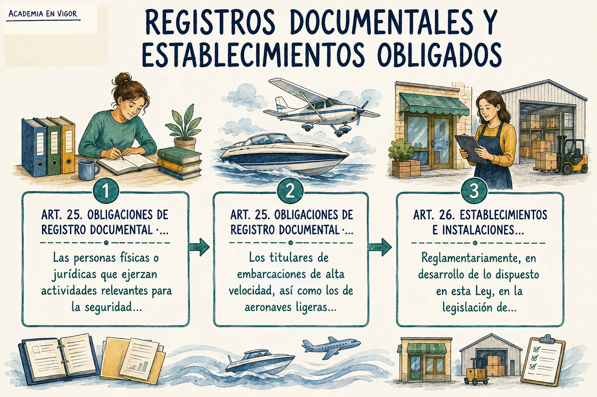

<em>Infografía: comparación de registros documentales y establecimientos obligados.</em>

<!-- FUENTE: LO4-2015-BOE-A-2015-3442-GC-T13 -->

## 15. Espectáculos, armas y medidas de control

### Regla y encaje

Espectáculos, armas y medidas de control forma parte de policía administrativa especial. Estúdialo como una secuencia: presupuesto, obligación o facultad, excepción y consecuencia.

### Claves examinables

- **Artículo 27. Espectáculos y actividades recreativas · apartado 1:** 1. El Estado podrá dictar normas de seguridad pública para los edificios e instalaciones en los que se celebren espectáculos y actividades recreativas. <!-- FACT:GC-T13-F107 -->
- **Artículo 27. Espectáculos y actividades recreativas · apartado 2:** 2. Las autoridades a las que se refiere esta Ley adoptarán las medidas necesarias para preservar la pacífica celebración de espectáculos públicos. En particular, podrán prohibir y, en caso de estar celebrándose, suspender los espectáculos y actividades recreativas cuando exista un peligro cierto para personas y bienes, o acaecieran o se previeran graves alteraciones de la seguridad ciudadana. <!-- FACT:GC-T13-F108 -->
- **Artículo 27. Espectáculos y actividades recreativas · apartado 3:** 3. La normativa específica determinará los supuestos en los que los delegados de la autoridad deban estar presentes en la celebración de los espectáculos y actividades recreativas, los cuales podrán proceder, previo aviso a los organizadores, a la suspensión de los mismos por razones de máxima urgencia en los supuestos previstos en el apartado anterior. <!-- FACT:GC-T13-F109 -->
- **Artículo 27. Espectáculos y actividades recreativas · apartado 4:** 4. Los espectáculos deportivos quedarán, en todo caso, sujetos a las medidas de prevención de la violencia dispuestas en la legislación específica contra la violencia, el racismo, la xenofobia y la intolerancia en el deporte. <!-- FACT:GC-T13-F110 -->
- **Artículo 28. Control administrativo sobre armas, explosivos, cartuchería y artículos pirotécnicos:** 1. Corresponde al Gobierno: a) La regulación de los requisitos y condiciones de fabricación, reparación, circulación, almacenamiento, comercio, adquisición, enajenación, tenencia y utilización de armas, sus imitaciones, réplicas y piezas fundamentales. <!-- FACT:GC-T13-F111 -->
- **Artículo 28. Control administrativo sobre armas, explosivos, cartuchería y artículos pirotécnicos:** 1. Corresponde al Gobierno: b) La regulación de los requisitos y condiciones mencionados anteriormente en relación con los explosivos, cartuchería y artículos pirotécnicos. <!-- FACT:GC-T13-F112 -->
- **Artículo 28. Control administrativo sobre armas, explosivos, cartuchería y artículos pirotécnicos:** 1. Corresponde al Gobierno: c) La adopción de las medidas de control necesarias para el cumplimiento de los requisitos y condiciones a que se refieren los párrafos a) y b). <!-- FACT:GC-T13-F113 -->
- **Artículo 28. Control administrativo sobre armas, explosivos, cartuchería y artículos pirotécnicos · apartado 2:** 2. La intervención de armas, explosivos, cartuchería y artículos pirotécnicos corresponde al Ministerio del Interior, que la ejerce a través de la Dirección General de la Guardia Civil, cuyos servicios están habilitados para realizar en cualquier momento las inspecciones y comprobaciones que sean necesarias en los espacios que estén destinados a su fabricación, depósito, comercialización o utilización. <!-- FACT:GC-T13-F114 -->
- **Artículo 29. Medidas de control:** 1. El Gobierno regulará las medidas de control necesarias sobre las materias relacionadas en el artículo anterior: a) Mediante la sujeción de la apertura y funcionamiento de las fábricas, talleres, depósitos, establecimientos de comercialización y lugares de utilización y las actividades relacionadas con ellas a requisitos de catalogación o clasificación, autorización, información, inspección, vigilancia y control, requisitos especiales de habilitación para el personal encargado de su manipulación, así como la determinación del régimen de responsabilidad de quienes tengan el deber de prevenir la comisión de determinadas infracciones. <!-- FACT:GC-T13-F115 -->
- **Artículo 29. Medidas de control:** 1. El Gobierno regulará las medidas de control necesarias sobre las materias relacionadas en el artículo anterior: b) Estableciendo la obligatoria titularidad de licencias, permisos o autorizaciones para la adquisición, tenencia y utilización de armas de fuego, cuya expedición tendrá carácter restrictivo cuando se trate de armas de defensa personal, en relación con las cuales la concesión de las licencias, permisos o autorizaciones se limitará a supuestos de estricta necesidad. <!-- FACT:GC-T13-F116 -->
- **Artículo 29. Medidas de control:** Para la concesión de licencias, permisos y autorizaciones se tendrán en cuenta la conducta y antecedentes del interesado. En todo caso, el solicitante prestará su consentimiento expreso a favor del órgano de la Administración General del Estado que tramita su solicitud para que se recaben sus antecedentes penales. <!-- FACT:GC-T13-F117 -->
- **Artículo 29. Medidas de control:** Entre las reglas de Artículo 29. Medidas de control, se establece: c) A través de la prohibición de la fabricación, tenencia y comercialización de armas, cartuchería, artículos pirotécnicos y explosivos especialmente peligrosos, así como el depósito de los mismos. <!-- FACT:GC-T13-F118 -->
- **Artículo 29. Medidas de control · apartado 2:** 2. La fabricación, comercio y distribución de armas, artículos pirotécnicos, cartuchería y explosivos, constituye un sector con regulación específica en materia de derecho de establecimiento, en los términos previstos por la legislación sobre inversiones extranjeras en España, correspondiendo a los Ministerios de Defensa, del Interior y de Industria, Energía y Turismo el ejercicio de las competencias de supervisión y control. <!-- FACT:GC-T13-F119 -->

:::hablemos-claro
Seguridad pública significa potestad y responsabilidad estatal; seguridad privada significa actividad complementaria, subordinada, controlada y obligada a colaborar.
:::

:::en-la-calle
Ante un supuesto, identifica primero quién actúa, con qué habilitación, qué medida adopta, qué límite legal existe y qué autoridad controla la actuación.
:::

:::lo-que-cae
Prioriza listas cerradas, plazos, excepciones, competencias y efectos. Apariciones oficiales mapeadas: **1**.
:::

<!-- VISUAL:t13-15-espectaculos-armas-y-medidas-de-control.webp -->

  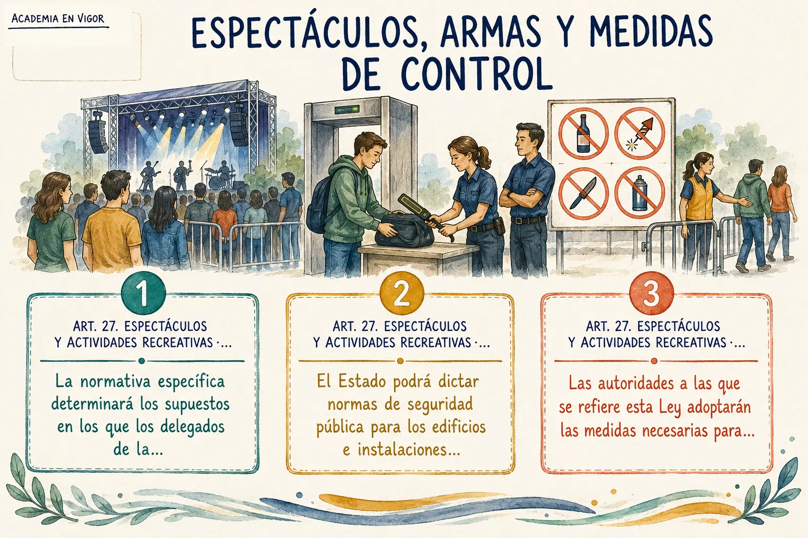

<em>Infografía: línea temporal de espectáculos, armas y medidas de control.</em>

<!-- FUENTE: LO4-2015-BOE-A-2015-3442-GC-T13 -->

## 16. Sujetos responsables y concurso de infracciones

### Regla y encaje

Sujetos responsables y concurso de infracciones forma parte de régimen sancionador de seguridad ciudadana. Estúdialo como una secuencia: presupuesto, obligación o facultad, excepción y consecuencia.

### Claves examinables

- **Artículo 30. Sujetos responsables · apartado 1:** 1. La responsabilidad por las infracciones cometidas recaerá directamente en el autor del hecho en que consista la infracción. <!-- FACT:GC-T13-F120 -->
- **Artículo 30. Sujetos responsables · apartado 2:** 2. Estarán exentos de responsabilidad por las infracciones cometidas los menores de catorce años. <!-- FACT:GC-T13-F121 -->
- **Artículo 30. Sujetos responsables:** En caso de que la infracción sea cometida por un menor de catorce años, la autoridad competente lo pondrá en conocimiento del Ministerio Fiscal para que inicie, en su caso, las actuaciones oportunas. <!-- FACT:GC-T13-F122 -->
- **Artículo 30. Sujetos responsables · apartado 3:** 3. A los efectos de esta Ley se considerarán organizadores o promotores de las reuniones en lugares de tránsito público o manifestaciones las personas físicas o jurídicas que hayan suscrito la preceptiva comunicación. <!-- FACT:GC-T13-F123 -->
- **Artículo 30. Sujetos responsables · apartado 3:** Asimismo, aun no habiendo suscrito o presentado la comunicación, también se considerarán organizadores o promotores quienes de hecho las presidan, dirijan o ejerzan actos semejantes, o quienes por publicaciones o declaraciones de convocatoria de las mismas, por las manifestaciones orales o escritas que en ellas se difundan, por los lemas, banderas u otros signos que ostenten o por cualesquiera otros hechos pueda determinarse razonablemente que son directores de aquellas. <!-- FACT:GC-T13-F124 -->
- **Artículo 31. Normas concursales:** 1. Los hechos susceptibles de ser calificados con arreglo a dos o más preceptos de esta u otra Ley se sancionarán observando las siguientes reglas: a) El precepto especial se aplicará con preferencia al general. <!-- FACT:GC-T13-F125 -->
- **Artículo 31. Normas concursales:** 1. Los hechos susceptibles de ser calificados con arreglo a dos o más preceptos de esta u otra Ley se sancionarán observando las siguientes reglas: b) El precepto más amplio o complejo absorberá el que sancione las infracciones consumidas en aquel. <!-- FACT:GC-T13-F126 -->
- **Artículo 31. Normas concursales:** 1. Los hechos susceptibles de ser calificados con arreglo a dos o más preceptos de esta u otra Ley se sancionarán observando las siguientes reglas: c) En defecto de los criterios anteriores, el precepto más grave excluirá los que sancionen el hecho con una sanción menor. <!-- FACT:GC-T13-F127 -->
- **Artículo 31. Normas concursales · apartado 2:** 2. En el caso de que un solo hecho constituya dos o más infracciones, o cuando una de ellas sea medio necesario para cometer la otra, la conducta será sancionada por aquella infracción que aplique una mayor sanción. <!-- FACT:GC-T13-F128 -->
- **Artículo 31. Normas concursales · apartado 3:** 3. Cuando una acción u omisión deba tomarse en consideración como criterio de graduación de la sanción o como circunstancia que determine la calificación de la infracción no podrá ser sancionada como infracción independiente. <!-- FACT:GC-T13-F129 -->

:::hablemos-claro
Seguridad pública significa potestad y responsabilidad estatal; seguridad privada significa actividad complementaria, subordinada, controlada y obligada a colaborar.
:::

:::en-la-calle
Ante un supuesto, identifica primero quién actúa, con qué habilitación, qué medida adopta, qué límite legal existe y qué autoridad controla la actuación.
:::

:::lo-que-cae
Prioriza listas cerradas, plazos, excepciones, competencias y efectos. Apariciones oficiales mapeadas: **1**.
:::

<!-- VISUAL:t13-16-sujetos-responsables-y-concurso-de-infracciones.webp -->

  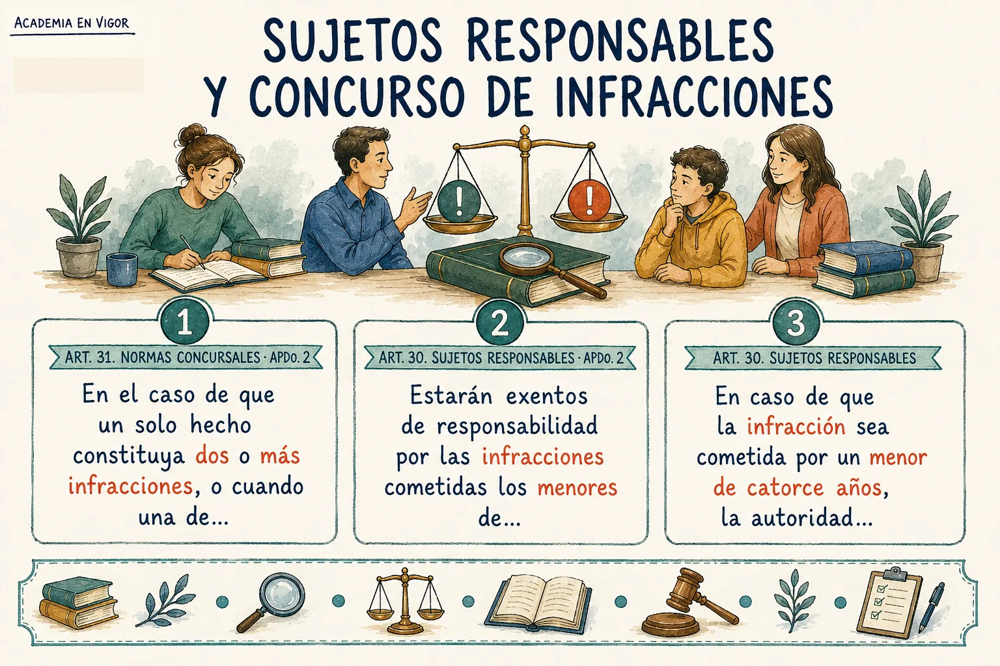

<em>Infografía: escena de sujetos responsables y concurso de infracciones.</em>

<!-- FUENTE: LO4-2015-BOE-A-2015-3442-GC-T13 -->

## 17. Competencia y graduación de sanciones

### Regla y encaje

Competencia y graduación de sanciones forma parte de régimen sancionador de seguridad ciudadana. Estúdialo como una secuencia: presupuesto, obligación o facultad, excepción y consecuencia.

### Claves examinables

- **Artículo 32. Órganos competentes:** 1. Son órganos competentes en el ámbito de la Administración General del Estado: a) El Ministro del Interior, para la sanción de las infracciones muy graves en grado máximo. <!-- FACT:GC-T13-F130 -->
- **Artículo 32. Órganos competentes:** 1. Son órganos competentes en el ámbito de la Administración General del Estado: b) El Secretario de Estado de Seguridad, para la sanción de infracciones muy graves en grado medio y en grado mínimo. <!-- FACT:GC-T13-F131 -->
- **Artículo 32. Órganos competentes:** 1. Son órganos competentes en el ámbito de la Administración General del Estado: c) Los Delegados del Gobierno en las comunidades autónomas y en las Ciudades de Ceuta y Melilla, para la sanción de las infracciones graves y leves. <!-- FACT:GC-T13-F132 -->
- **Artículo 32. Órganos competentes · apartado 2:** 2. Serán competentes para imponer las sanciones tipificadas en esta Ley las autoridades correspondientes de la Comunidad Autónoma en el ámbito de sus competencias en materia de seguridad ciudadana. <!-- FACT:GC-T13-F133 -->
- **Artículo 32. Órganos competentes · apartado 3:** 3. Los alcaldes podrán imponer las sanciones y adoptar las medidas previstas en esta Ley cuando las infracciones se cometieran en espacios públicos municipales o afecten a bienes de titularidad local, siempre que ostenten competencia sobre la materia de acuerdo con la legislación específica. <!-- FACT:GC-T13-F134 -->
- **Artículo 32. Órganos competentes:** En los términos del artículo 41, las ordenanzas municipales podrán introducir especificaciones o graduaciones en el cuadro de las infracciones y sanciones tipificadas en esta Ley. <!-- FACT:GC-T13-F135 -->
- **Artículo 33. Graduación de las sanciones · apartado 1:** 1. En la imposición de las sanciones por la comisión de las infracciones tipificadas en esta Ley se observará el principio de proporcionalidad, de acuerdo con lo dispuesto en los apartados siguientes. <!-- FACT:GC-T13-F136 -->
- **Artículo 33. Graduación de las sanciones · apartado 2:** 2. Dentro de los límites previstos para las infracciones muy graves y graves, las multas se dividirán en tres tramos de igual extensión, correspondientes a los grados mínimo, medio y máximo, en los términos del apartado 1 del artículo 39. <!-- FACT:GC-T13-F137 -->
- **Artículo 33. Graduación de las sanciones:** La comisión de una infracción determinará la imposición de la multa correspondiente en grado mínimo. <!-- FACT:GC-T13-F138 -->
- **Artículo 33. Graduación de las sanciones:** La infracción se sancionará con multa en grado medio cuando se acredite la concurrencia, al menos, de una de las siguientes circunstancias: a) La reincidencia, por la comisión en el término de dos años de más de una infracción de la misma naturaleza, cuando así haya sido declarado por resolución firme en vía administrativa. <!-- FACT:GC-T13-F139 -->
- **Artículo 33. Graduación de las sanciones:** La infracción se sancionará con multa en grado medio cuando se acredite la concurrencia, al menos, de una de las siguientes circunstancias: b) La realización de los hechos interviniendo violencia, amenaza o intimidación. <!-- FACT:GC-T13-F140 -->
- **Artículo 33. Graduación de las sanciones:** La infracción se sancionará con multa en grado medio cuando se acredite la concurrencia, al menos, de una de las siguientes circunstancias: c) La ejecución de los hechos usando cualquier tipo de prenda u objeto que cubra el rostro, impidiendo o dificultando la identificación. <!-- FACT:GC-T13-F141 -->
- **Artículo 33. Graduación de las sanciones:** La infracción se sancionará con multa en grado medio cuando se acredite la concurrencia, al menos, de una de las siguientes circunstancias: d) Que en la comisión de la infracción se utilice a menores de edad, personas con discapacidad necesitadas de especial protección o en situación de vulnerabilidad. <!-- FACT:GC-T13-F142 -->
- **Artículo 33. Graduación de las sanciones:** En cada grado, para la individualización de la multa se tendrán en cuenta los siguientes criterios: a) La entidad del riesgo producido para la seguridad ciudadana o la salud pública. <!-- FACT:GC-T13-F143 -->
- **Artículo 33. Graduación de las sanciones:** En cada grado, para la individualización de la multa se tendrán en cuenta los siguientes criterios: b) La cuantía del perjuicio causado. <!-- FACT:GC-T13-F144 -->
- **Artículo 33. Graduación de las sanciones:** En cada grado, para la individualización de la multa se tendrán en cuenta los siguientes criterios: c) La trascendencia del perjuicio para la prevención, mantenimiento o restablecimiento de la seguridad ciudadana. <!-- FACT:GC-T13-F145 -->
- **Artículo 33. Graduación de las sanciones:** En cada grado, para la individualización de la multa se tendrán en cuenta los siguientes criterios: d) La alteración ocasionada en el funcionamiento de los servicios públicos o en el abastecimiento a la población de bienes y servicios. <!-- FACT:GC-T13-F146 -->
- **Artículo 33. Graduación de las sanciones:** En cada grado, para la individualización de la multa se tendrán en cuenta los siguientes criterios: e) El grado de culpabilidad. <!-- FACT:GC-T13-F147 -->
- **Artículo 33. Graduación de las sanciones:** En cada grado, para la individualización de la multa se tendrán en cuenta los siguientes criterios: f) El beneficio económico obtenido como consecuencia de la comisión de la infracción. <!-- FACT:GC-T13-F148 -->
- **Artículo 33. Graduación de las sanciones:** En cada grado, para la individualización de la multa se tendrán en cuenta los siguientes criterios: g) La capacidad económica del infractor. <!-- FACT:GC-T13-F149 -->
- **Artículo 33. Graduación de las sanciones:** Las infracciones sólo se sancionarán con multa en grado máximo cuando los hechos revistan especial gravedad y así se justifique teniendo en cuenta el número y la entidad de las circunstancias concurrentes y los criterios previstos en este apartado. <!-- FACT:GC-T13-F150 -->
- **Artículo 33. Graduación de las sanciones · apartado 3:** 3. La multa por la comisión de infracciones leves se determinará directamente atendiendo a las circunstancias y los criterios del apartado anterior. <!-- FACT:GC-T13-F151 -->

:::hablemos-claro
Seguridad pública significa potestad y responsabilidad estatal; seguridad privada significa actividad complementaria, subordinada, controlada y obligada a colaborar.
:::

:::en-la-calle
Ante un supuesto, identifica primero quién actúa, con qué habilitación, qué medida adopta, qué límite legal existe y qué autoridad controla la actuación.
:::

:::lo-que-cae
Prioriza listas cerradas, plazos, excepciones, competencias y efectos. Apariciones oficiales mapeadas: **2**.
:::

<!-- VISUAL:t13-17-competencia-y-graduacion-de-sanciones.webp -->

  

<em>Infografía: capas de competencia y graduación de sanciones.</em>

<!-- FUENTE: LO4-2015-BOE-A-2015-3442-GC-T13 -->

## 18. Clasificación e infracciones muy graves

### Regla y encaje

Clasificación e infracciones muy graves forma parte de régimen sancionador de seguridad ciudadana. Estúdialo como una secuencia: presupuesto, obligación o facultad, excepción y consecuencia.

### Claves examinables

- **Artículo 34. Clasificación de las infracciones:** Las infracciones tipificadas en esta Ley se clasifican en muy graves, graves y leves. <!-- FACT:GC-T13-F152 -->
- **Artículo 35. Infracciones muy graves · apartado 1:** 1. Las reuniones o manifestaciones no comunicadas o prohibidas en infraestructuras o instalaciones en las que se prestan servicios básicos para la comunidad o en sus inmediaciones, así como la intrusión en los recintos de éstas, incluido su sobrevuelo, cuando, en cualquiera de estos supuestos, se haya generado un riesgo para la vida o la integridad física de las personas. <!-- FACT:GC-T13-F153 -->
- **Artículo 35. Infracciones muy graves:** En el caso de las reuniones y manifestaciones serán responsables los organizadores o promotores. <!-- FACT:GC-T13-F154 -->
- **Artículo 35. Infracciones muy graves · apartado 2:** La fabricación, reparación, almacenamiento, circulación, comercio, transporte, distribución, adquisición, certificación, enajenación o utilización de armas reglamentarias, explosivos catalogados, cartuchería o artículos pirotécnicos, incumpliendo la normativa de aplicación, careciendo de la documentación o autorización requeridas o excediendo los límites autorizados cuando tales conductas no sean constitutivas de delito así como la omisión, insuficiencia, o falta de eficacia de las medidas de seguridad o precauciones que resulten obligatorias, siempre que en tales actuaciones se causen perjuicios muy graves. <!-- FACT:GC-T13-F155 -->
- **Artículo 35. Infracciones muy graves · apartado 3:** 3. La celebración de espectáculos públicos o actividades recreativas quebrantando la prohibición o suspensión ordenada por la autoridad correspondiente por razones de seguridad pública. <!-- FACT:GC-T13-F156 -->
- **Artículo 35. Infracciones muy graves · apartado 4:** 4. La proyección de haces de luz, mediante cualquier tipo de dispositivo, sobre los pilotos o conductores de medios de transporte que puedan deslumbrarles o distraer su atención y provocar accidentes. <!-- FACT:GC-T13-F157 -->

:::hablemos-claro
Seguridad pública significa potestad y responsabilidad estatal; seguridad privada significa actividad complementaria, subordinada, controlada y obligada a colaborar.
:::

:::en-la-calle
Ante un supuesto, identifica primero quién actúa, con qué habilitación, qué medida adopta, qué límite legal existe y qué autoridad controla la actuación.
:::

:::lo-que-cae
Prioriza listas cerradas, plazos, excepciones, competencias y efectos. Apariciones oficiales mapeadas: **1**.
:::

<!-- VISUAL:t13-18-clasificacion-e-infracciones-muy-graves.webp -->

  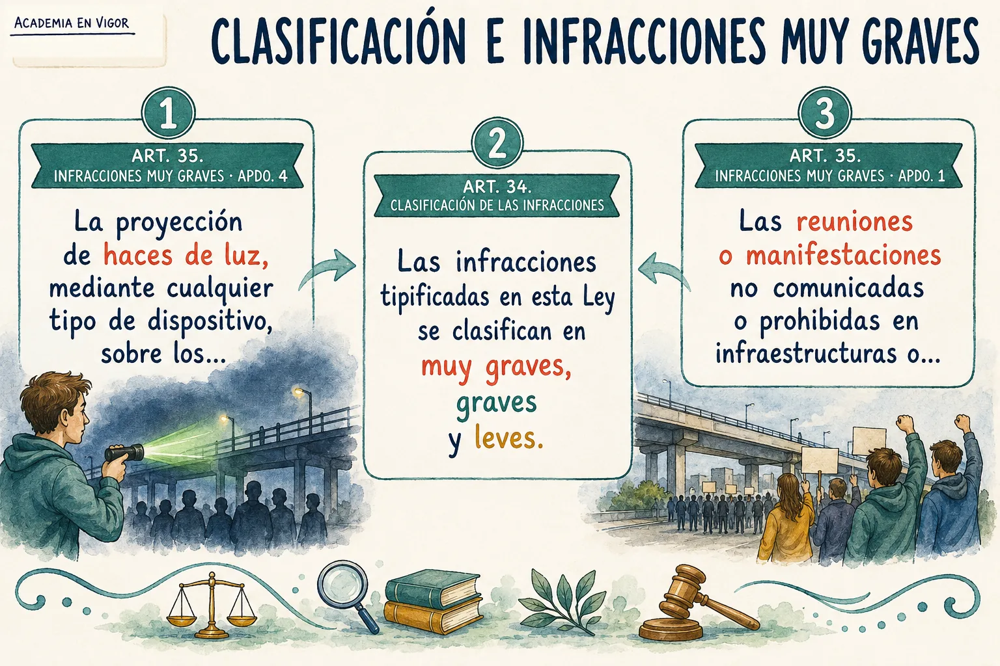

<em>Infografía: mapa de clasificación e infracciones muy graves.</em>

<!-- FUENTE: LO4-2015-BOE-A-2015-3442-GC-T13 -->

## 19. Infracciones graves

### Regla y encaje

Infracciones graves forma parte de régimen sancionador de seguridad ciudadana. Estúdialo como una secuencia: presupuesto, obligación o facultad, excepción y consecuencia.

### Claves examinables

- **Artículo 36. Infracciones graves · apartado 1:** 1. La perturbación de la seguridad ciudadana en actos públicos, espectáculos deportivos o culturales, solemnidades y oficios religiosos u otras reuniones a las que asistan numerosas personas, cuando no sean constitutivas de infracción penal. <!-- FACT:GC-T13-F158 -->
- **Artículo 36. Infracciones graves · apartado 2:** 2. La perturbación grave de la seguridad ciudadana que se produzca con ocasión de reuniones o manifestaciones frente a las sedes del Congreso de los Diputados, el Senado y las asambleas legislativas de las comunidades autónomas, aunque no estuvieran reunidas, cuando no constituya infracción penal. <!-- FACT:GC-T13-F159 -->
- **Artículo 36. Infracciones graves · apartado 3:** 3. Causar desórdenes en las vías, espacios o establecimientos públicos, u obstaculizar la vía pública con mobiliario urbano, vehículos, contenedores, neumáticos u otros objetos, cuando en ambos casos se ocasione una alteración grave de la seguridad ciudadana. <!-- FACT:GC-T13-F160 -->
- **Artículo 36. Infracciones graves · apartado 4:** 4. Los actos de obstrucción que pretendan impedir a cualquier autoridad, empleado público o corporación oficial el ejercicio legítimo de sus funciones, el cumplimiento o la ejecución de acuerdos o resoluciones administrativas o judiciales, siempre que se produzcan al margen de los procedimientos legalmente establecidos y no sean constitutivos de delito. <!-- FACT:GC-T13-F161 -->
- **Artículo 36. Infracciones graves · apartado 5:** 5. Las acciones y omisiones que impidan u obstaculicen el funcionamiento de los servicios de emergencia, provocando o incrementando un riesgo para la vida o integridad de las personas o de daños en los bienes, o agravando las consecuencias del suceso que motive la actuación de aquéllos. <!-- FACT:GC-T13-F162 -->
- **Artículo 36. Infracciones graves · apartado 6:** 6. La desobediencia o la resistencia a la autoridad o a sus agentes en el ejercicio de sus funciones, cuando no sean constitutivas de delito, así como la negativa a identificarse a requerimiento de la autoridad o de sus agentes o la alegación de datos falsos o inexactos en los procesos de identificación. <!-- FACT:GC-T13-F163 -->
- **Artículo 36. Infracciones graves · apartado 7:** 7. La negativa a la disolución de reuniones y manifestaciones en lugares de tránsito público ordenada por la autoridad competente cuando concurran los supuestos del artículo 5 de la Ley Orgánica 9/1983, de 15 de julio. <!-- FACT:GC-T13-F164 -->
- **Artículo 36. Infracciones graves · apartado 8:** 8. La perturbación del desarrollo de una reunión o manifestación lícita, cuando no constituya infracción penal. <!-- FACT:GC-T13-F165 -->
- **Artículo 36. Infracciones graves · apartado 9:** 9. La intrusión en infraestructuras o instalaciones en las que se prestan servicios básicos para la comunidad, incluyendo su sobrevuelo, cuando se haya producido una interferencia grave en su funcionamiento. <!-- FACT:GC-T13-F166 -->
- **Artículo 36. Infracciones graves · apartado 10:** 10. Portar, exhibir o usar armas prohibidas, así como portar, exhibir o usar armas de modo negligente, temerario o intimidatorio, o fuera de los lugares habilitados para su uso, aún cuando en este último caso se tuviera licencia, siempre que dichas conductas no constituyan infracción penal. <!-- FACT:GC-T13-F167 -->
- **Artículo 36. Infracciones graves · apartado 11:** 11. La solicitud o aceptación por el demandante de servicios sexuales retribuidos en zonas de tránsito público en las proximidades de lugares destinados a su uso por menores, como centros educativos, parques infantiles o espacios de ocio accesibles a menores de edad, o cuando estas conductas, por el lugar en que se realicen, puedan generar un riesgo para la seguridad vial. <!-- FACT:GC-T13-F168 -->
- **Artículo 36. Infracciones graves:** Los agentes de la autoridad requerirán a las personas que ofrezcan estos servicios para que se abstengan de hacerlo en dichos lugares, informándoles de que la inobservancia de dicho requerimiento podría constituir una infracción del párrafo 6 de este artículo. <!-- FACT:GC-T13-F169 -->
- **Artículo 36. Infracciones graves · apartado 12:** La fabricación, reparación, almacenamiento, circulación, comercio, transporte, distribución, adquisición, certificación, enajenación o utilización de armas reglamentarias, explosivos catalogados, cartuchería o artículos pirotécnicos, incumpliendo la normativa de aplicación, careciendo de la documentación o autorización requeridas o excediendo los límites autorizados cuando tales conductas no sean constitutivas de delito, así como la omisión, insuficiencia, o falta de eficacia de las medidas de seguridad o precauciones que resulten obligatorias. <!-- FACT:GC-T13-F170 -->
- **Artículo 36. Infracciones graves · apartado 13:** 13. La negativa de acceso o la obstrucción deliberada de las inspecciones o controles reglamentarios, establecidos conforme a lo dispuesto en esta Ley, en fábricas, locales, establecimientos, embarcaciones y aeronaves. <!-- FACT:GC-T13-F171 -->
- **Artículo 36. Infracciones graves · apartado 14:** 14. El uso público e indebido de uniformes, insignias o condecoraciones oficiales, o réplicas de los mismos, así como otros elementos del equipamiento de los cuerpos policiales o de los servicios de emergencia que puedan generar engaño acerca de la condición de quien los use, cuando no sea constitutivo de infracción penal. <!-- FACT:GC-T13-F172 -->
- **Artículo 36. Infracciones graves · apartado 15:** 15. La falta de colaboración con las Fuerzas y Cuerpos de Seguridad en la averiguación de delitos o en la prevención de acciones que puedan poner en riesgo la seguridad ciudadana en los supuestos previstos en el artículo 7. <!-- FACT:GC-T13-F173 -->
- **Artículo 36. Infracciones graves · apartado 16:** 16. El consumo o la tenencia ilícitos de drogas tóxicas, estupefacientes o sustancias psicotrópicas, aunque no estuvieran destinadas al tráfico, en lugares, vías, establecimientos públicos o transportes colectivos, así como el abandono de los instrumentos u otros efectos empleados para ello en los citados lugares. <!-- FACT:GC-T13-F174 -->
- **Artículo 36. Infracciones graves · apartado 17:** 17. El traslado de personas, con cualquier tipo de vehículo, con el objeto de facilitar a éstas el acceso a drogas tóxicas, estupefacientes o sustancias psicotrópicas, siempre que no constituya delito. <!-- FACT:GC-T13-F175 -->
- **Artículo 36. Infracciones graves · apartado 18:** 18. La ejecución de actos de plantación y cultivo ilícitos de drogas tóxicas, estupefacientes o sustancias psicotrópicas en lugares visibles al público, cuando no sean constitutivos de infracción penal. <!-- FACT:GC-T13-F176 -->
- **Artículo 36. Infracciones graves · apartado 19:** 19. La tolerancia del consumo ilegal o el tráfico de drogas tóxicas, estupefacientes o sustancias psicotrópicas en locales o establecimientos públicos o la falta de diligencia en orden a impedirlos por parte de los propietarios, administradores o encargados de los mismos. <!-- FACT:GC-T13-F177 -->
- **Artículo 36. Infracciones graves · apartado 20:** 20. La carencia de los registros previstos en esta Ley para las actividades con trascendencia para la seguridad ciudadana o la omisión de comunicaciones obligatorias. <!-- FACT:GC-T13-F178 -->
- **Artículo 36. Infracciones graves · apartado 21:** 21. La alegación de datos o circunstancias falsos para la obtención de las documentaciones previstas en esta Ley, siempre que no constituya infracción penal. <!-- FACT:GC-T13-F179 -->
- **Artículo 36. Infracciones graves · apartado 22:** 22. El incumplimiento de las restricciones a la navegación reglamentariamente impuestas a las embarcaciones de alta velocidad y aeronaves ligeras. <!-- FACT:GC-T13-F180 -->
- **Artículo 36. Infracciones graves · apartado 23:** 23. El uso no autorizado de imágenes o datos personales o profesionales de autoridades o miembros de las Fuerzas y Cuerpos de Seguridad que pueda poner en peligro la seguridad personal o familiar de los agentes, de las instalaciones protegidas o en riesgo el éxito de una operación, con respeto al derecho fundamental a la información. <!-- FACT:GC-T13-F181 -->

:::hablemos-claro
Seguridad pública significa potestad y responsabilidad estatal; seguridad privada significa actividad complementaria, subordinada, controlada y obligada a colaborar.
:::

:::en-la-calle
Ante un supuesto, identifica primero quién actúa, con qué habilitación, qué medida adopta, qué límite legal existe y qué autoridad controla la actuación.
:::

:::lo-que-cae
Prioriza listas cerradas, plazos, excepciones, competencias y efectos. Apariciones oficiales mapeadas: **2**.
:::

<!-- VISUAL:t13-19-infracciones-graves.webp -->

  

<em>Infografía: flujo de infracciones graves.</em>

<!-- FUENTE: LO4-2015-BOE-A-2015-3442-GC-T13 -->

## 20. Infracciones leves

### Regla y encaje

Infracciones leves forma parte de régimen sancionador de seguridad ciudadana. Estúdialo como una secuencia: presupuesto, obligación o facultad, excepción y consecuencia.

### Claves examinables

- **Artículo 37. Infracciones leves · apartado 1:** 1. La celebración de reuniones en lugares de tránsito público o de manifestaciones, incumpliendo lo preceptuado en los artículos 4.2, 8, 9, 10 y 11 de la Ley Orgánica 9/1983, de 15 de julio, cuya responsabilidad corresponderá a los organizadores o promotores. <!-- FACT:GC-T13-F182 -->
- **Artículo 37. Infracciones leves · apartado 2:** 2. La exhibición de objetos peligrosos para la vida e integridad física de las personas con ánimo intimidatorio, siempre que no constituya delito o infracción grave. <!-- FACT:GC-T13-F183 -->
- **Artículo 37. Infracciones leves · apartado 3:** 3. El incumplimiento de las restricciones de circulación peatonal o itinerario con ocasión de un acto público, reunión o manifestación, cuando provoquen alteraciones menores en el normal desarrollo de los mismos. <!-- FACT:GC-T13-F184 -->
- **Artículo 37. Infracciones leves · apartado 4:** 4. Las faltas de respeto y consideración cuyo destinatario sea un miembro de las Fuerzas y Cuerpos de Seguridad en el ejercicio de sus funciones de protección de la seguridad, cuando estas conductas no sean constitutivas de infracción penal. <!-- FACT:GC-T13-F185 -->
- **Artículo 37. Infracciones leves · apartado 5:** 5. La realización o incitación a la realización de actos que atenten contra la libertad e indemnidad sexual, o ejecutar actos de exhibición obscena, cuando no constituya infracción penal. <!-- FACT:GC-T13-F186 -->
- **Artículo 37. Infracciones leves · apartado 6:** 6. La proyección de haces de luz, mediante cualquier tipo de dispositivo, sobre miembros de las Fuerzas y Cuerpos de Seguridad para impedir o dificultar el ejercicio de sus funciones. <!-- FACT:GC-T13-F187 -->
- **Artículo 37. Infracciones leves · apartado 7:** 7. La ocupación de cualquier inmueble, vivienda o edificio ajenos, o la permanencia en ellos, en ambos casos contra la voluntad de su propietario, arrendatario o titular de otro derecho sobre el mismo, cuando no sean constitutivas de infracción penal. <!-- FACT:GC-T13-F188 -->
- **Artículo 37. Infracciones leves:** Asimismo la ocupación de la vía pública con infracción de lo dispuesto por la Ley o contra la decisión adoptada en aplicación de aquella por la autoridad competente. Se entenderá incluida en este supuesto la ocupación de la vía pública para la venta ambulante no autorizada. <!-- FACT:GC-T13-F189 -->
- **Artículo 37. Infracciones leves · apartado 8:** 8. La omisión o la insuficiencia de medidas para garantizar la conservación de la documentación de armas y explosivos, así como la falta de denuncia de la pérdida o sustracción de la misma. <!-- FACT:GC-T13-F190 -->
- **Artículo 37. Infracciones leves · apartado 9:** 9. Las irregularidades en la cumplimentación de los registros previstos en esta Ley con trascendencia para la seguridad ciudadana, incluyendo la alegación de datos o circunstancias falsos o la omisión de comunicaciones obligatorias dentro de los plazos establecidos, siempre que no constituya infracción penal. <!-- FACT:GC-T13-F191 -->
- **Artículo 37. Infracciones leves · apartado 10:** 10. El incumplimiento de la obligación de obtener la documentación personal legalmente exigida, así como la omisión negligente de la denuncia de su sustracción o extravío. <!-- FACT:GC-T13-F192 -->
- **Artículo 37. Infracciones leves · apartado 11:** 11. La negligencia en la custodia y conservación de la documentación personal legalmente exigida, considerándose como tal la tercera y posteriores pérdidas o extravíos en el plazo de un año. <!-- FACT:GC-T13-F193 -->
- **Artículo 37. Infracciones leves · apartado 12:** 12. La negativa a entregar la documentación personal legalmente exigida cuando se hubiese acordado su retirada o retención. <!-- FACT:GC-T13-F194 -->
- **Artículo 37. Infracciones leves · apartado 13:** 13. Los daños o el deslucimiento de bienes muebles o inmuebles de uso o servicio público, así como de bienes muebles o inmuebles privados en la vía pública, cuando no constituyan infracción penal. <!-- FACT:GC-T13-F195 -->
- **Artículo 37. Infracciones leves · apartado 14:** 14. El escalamiento de edificios o monumentos sin autorización cuando exista un riesgo cierto de que se ocasionen daños a las personas o a los bienes. <!-- FACT:GC-T13-F196 -->
- **Artículo 37. Infracciones leves · apartado 15:** 15. La remoción de vallas, encintados u otros elementos fijos o móviles colocados por las Fuerzas y Cuerpos de Seguridad para delimitar perímetros de seguridad, aun con carácter preventivo, cuando no constituya infracción grave. <!-- FACT:GC-T13-F197 -->
- **Artículo 37. Infracciones leves · apartado 16:** 16. Dejar sueltos o en condiciones de causar daños animales feroces o dañinos, así como abandonar animales domésticos en condiciones en que pueda peligrar su vida. <!-- FACT:GC-T13-F198 -->
- **Artículo 37. Infracciones leves · apartado 17:** 17. El consumo de bebidas alcohólicas en lugares, vías, establecimientos o transportes públicos cuando perturbe gravemente la tranquilidad ciudadana. <!-- FACT:GC-T13-F199 -->

:::hablemos-claro
Seguridad pública significa potestad y responsabilidad estatal; seguridad privada significa actividad complementaria, subordinada, controlada y obligada a colaborar.
:::

:::en-la-calle
Ante un supuesto, identifica primero quién actúa, con qué habilitación, qué medida adopta, qué límite legal existe y qué autoridad controla la actuación.
:::

:::lo-que-cae
Prioriza listas cerradas, plazos, excepciones, competencias y efectos. Apariciones oficiales mapeadas: **1**.
:::

<!-- VISUAL:t13-20-infracciones-leves.webp -->

  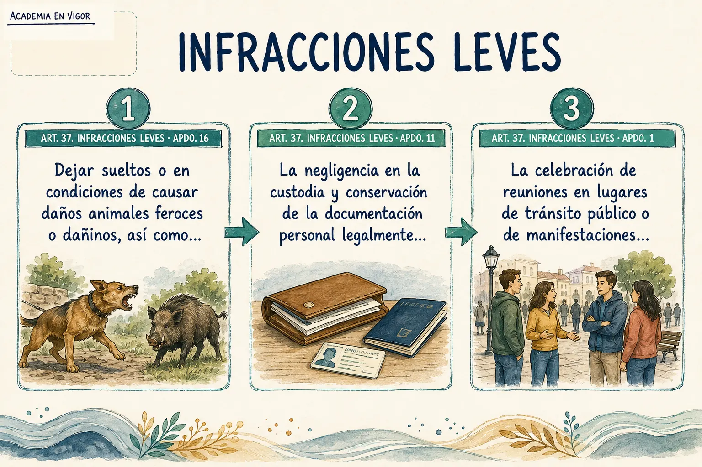

<em>Infografía: comparación de infracciones leves.</em>

<!-- FUENTE: LO4-2015-BOE-A-2015-3442-GC-T13 -->

## 21. Prescripción de infracciones

### Regla y encaje

Prescripción de infracciones forma parte de régimen sancionador de seguridad ciudadana. Estúdialo como una secuencia: presupuesto, obligación o facultad, excepción y consecuencia.

### Claves examinables

- **Artículo 38. Prescripción de las infracciones · apartado 1:** 1. Las infracciones administrativas tipificadas en esta Ley prescribirán a los seis meses, al año o a los dos años de haberse cometido, según sean leves, graves o muy graves, respectivamente. <!-- FACT:GC-T13-F200 -->
- **Artículo 38. Prescripción de las infracciones · apartado 2:** 2. Los plazos señalados en esta Ley se computarán desde el día en que se haya cometido la infracción. No obstante, en los casos de infracciones continuadas y de infracciones de efectos permanentes, los plazos se computarán, respectivamente, desde el día en que se realizó la última infracción y desde que se eliminó la situación ilícita. <!-- FACT:GC-T13-F201 -->
- **Artículo 38. Prescripción de las infracciones · apartado 3:** 3. La prescripción se interrumpirá por cualquier actuación administrativa de la que tenga conocimiento formal el interesado dirigida a la sanción de la infracción, reanudándose el cómputo del plazo de prescripción si el procedimiento estuviera paralizado más de un mes por causa no imputable al presunto responsable. <!-- FACT:GC-T13-F202 -->
- **Artículo 38. Prescripción de las infracciones · apartado 4:** 4. Se interrumpirá igualmente la prescripción como consecuencia de la apertura de un procedimiento judicial penal, hasta que la autoridad judicial comunique al órgano administrativo su finalización en los términos del apartado 2 del artículo 45. <!-- FACT:GC-T13-F203 -->

:::hablemos-claro
Seguridad pública significa potestad y responsabilidad estatal; seguridad privada significa actividad complementaria, subordinada, controlada y obligada a colaborar.
:::

:::en-la-calle
Ante un supuesto, identifica primero quién actúa, con qué habilitación, qué medida adopta, qué límite legal existe y qué autoridad controla la actuación.
:::

:::lo-que-cae
Prioriza listas cerradas, plazos, excepciones, competencias y efectos. Apariciones oficiales mapeadas: **1**.
:::

<!-- VISUAL:t13-21-prescripcion-de-infracciones.webp -->

  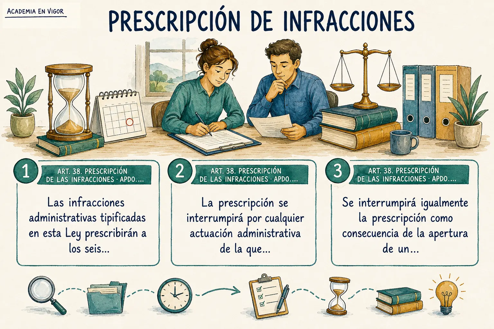

<em>Infografía: línea temporal de prescripción de infracciones.</em>

<!-- FUENTE: LO4-2015-BOE-A-2015-3442-GC-T13 -->

## 22. Sanciones y prescripción

### Regla y encaje

Sanciones y prescripción forma parte de régimen sancionador de seguridad ciudadana. Estúdialo como una secuencia: presupuesto, obligación o facultad, excepción y consecuencia.

### Claves examinables

- **Artículo 39. Sanciones · apartado 1:** 1. Las infracciones muy graves se sancionarán con multa de 30.001 a 600.000 euros; las graves, con multa de 601 a 30.000 euros, y las leves, con multa de 100 a 600 euros. <!-- FACT:GC-T13-F204 -->
- **Artículo 39. Sanciones:** De acuerdo con lo dispuesto en el artículo 33.2, los tramos correspondientes a los grados máximo, medio y mínimo de las multas previstas por la comisión de infracciones graves y muy graves serán los siguientes: a) Para las infracciones muy graves, el grado mínimo comprenderá la multa de 30.001 a 220.000 euros; el grado medio, de 220.001 a 410.000 euros, y el grado máximo, de 410.001 a 600.000 euros. <!-- FACT:GC-T13-F205 -->
- **Artículo 39. Sanciones:** De acuerdo con lo dispuesto en el artículo 33.2, los tramos correspondientes a los grados máximo, medio y mínimo de las multas previstas por la comisión de infracciones graves y muy graves serán los siguientes: b) Para las infracciones graves, el grado mínimo comprenderá la multa de 601 a 10.400; el grado medio, de 10.401 a 20.200 euros, y el grado máximo, de 20.201 a 30.000 euros. <!-- FACT:GC-T13-F206 -->
- **Artículo 39. Sanciones:** 2. La multa podrá llevar aparejada alguna o algunas de las siguientes sanciones accesorias, atendiendo a la naturaleza de los hechos constitutivos de la infracción: a) La retirada de las armas y de las licencias o permisos correspondientes a las mismas. <!-- FACT:GC-T13-F207 -->
- **Artículo 39. Sanciones:** 2. La multa podrá llevar aparejada alguna o algunas de las siguientes sanciones accesorias, atendiendo a la naturaleza de los hechos constitutivos de la infracción: b) El comiso de los bienes, medios o instrumentos con los que se haya preparado o ejecutado la infracción y, en su caso, de los efectos procedentes de ésta, salvo que unos u otros pertenezcan a un tercero de buena fe no responsable de dicha infracción que los haya adquirido legalmente. <!-- FACT:GC-T13-F208 -->
- **Artículo 39. Sanciones:** Cuando los instrumentos o efectos sean de lícito comercio y su valor no guarde relación con la naturaleza o gravedad de la infracción, el órgano competente para imponer la sanción que proceda podrá no acordar el comiso o acordarlo parcialmente. <!-- FACT:GC-T13-F209 -->
- **Artículo 39. Sanciones:** Entre las reglas de Artículo 39. Sanciones, se establece: c) La suspensión temporal de las licencias, autorizaciones o permisos desde seis meses y un día a dos años por infracciones muy graves y hasta seis meses para las infracciones graves, en el ámbito de las materias reguladas en el capítulo IV de esta Ley. En caso de reincidencia, la sanción podrá ser de dos años y un día hasta seis años por infracciones muy graves y hasta dos años por infracciones graves. <!-- FACT:GC-T13-F210 -->
- **Artículo 39. Sanciones:** Entre las reglas de Artículo 39. Sanciones, se establece: d) La clausura de las fábricas, locales o establecimientos, desde seis meses y un día a dos años por infracciones muy graves y hasta seis meses por infracciones graves, en el ámbito de las materias reguladas en el capítulo IV de esta Ley. En caso de reincidencia, la sanción podrá ser de dos años y un día hasta seis años por infracciones muy graves y hasta dos años por infracciones graves. <!-- FACT:GC-T13-F211 -->
- **Artículo 40. Prescripción de las sanciones · apartado 1:** 1. Las sanciones impuestas por infracciones muy graves prescribirán a los tres años, las impuestas por infracciones graves, a los dos años, y las impuestas por infracciones leves al año, computados desde el día siguiente a aquel en que adquiera firmeza en vía administrativa la resolución por la que se impone la sanción. <!-- FACT:GC-T13-F212 -->
- **Artículo 40. Prescripción de las sanciones · apartado 2:** 2. Interrumpirá la prescripción la iniciación, con conocimiento del interesado, del procedimiento de ejecución, volviendo a transcurrir el plazo si aquél se paraliza durante más de un mes por causa no imputable al infractor. <!-- FACT:GC-T13-F213 -->
- **Artículo 41. Habilitación reglamentaria:** Las disposiciones reglamentarias de desarrollo podrán introducir especificaciones o graduaciones en el cuadro de las infracciones y sanciones tipificadas en esta Ley que, sin constituir nuevas infracciones o sanciones, ni alterar su naturaleza y límites, contribuyan a la más correcta identificación de las conductas o a la más precisa determinación de las sanciones correspondientes. <!-- FACT:GC-T13-F214 -->

:::hablemos-claro
Seguridad pública significa potestad y responsabilidad estatal; seguridad privada significa actividad complementaria, subordinada, controlada y obligada a colaborar.
:::

:::en-la-calle
Ante un supuesto, identifica primero quién actúa, con qué habilitación, qué medida adopta, qué límite legal existe y qué autoridad controla la actuación.
:::

:::lo-que-cae
Prioriza listas cerradas, plazos, excepciones, competencias y efectos. Apariciones oficiales mapeadas: **1**.
:::

<!-- VISUAL:t13-22-sanciones-y-prescripcion.webp -->

  

<em>Infografía: escena de sanciones y prescripción.</em>

<!-- FUENTE: LO4-2015-BOE-A-2015-3442-GC-T13 -->

## 23. Reparación, Registro Central y régimen jurídico

### Regla y encaje

Reparación, Registro Central y régimen jurídico forma parte de régimen sancionador de seguridad ciudadana. Estúdialo como una secuencia: presupuesto, obligación o facultad, excepción y consecuencia.

### Claves examinables

- **Artículo 42. Reparación del daño e indemnización:** 1. Si las conductas sancionadas hubieran ocasionado daños o perjuicios a la administración pública, la resolución del procedimiento contendrá un pronunciamiento expreso acerca de los siguientes extremos: a) La exigencia al infractor de la reposición a su estado originario de la situación alterada por la infracción. <!-- FACT:GC-T13-F215 -->
- **Artículo 42. Reparación del daño e indemnización:** 1. Si las conductas sancionadas hubieran ocasionado daños o perjuicios a la administración pública, la resolución del procedimiento contendrá un pronunciamiento expreso acerca de los siguientes extremos: b) Cuando ello no fuera posible, la indemnización por los daños y perjuicios causados, si éstos hubiesen quedado determinados durante el procedimiento. Si el importe de los daños y perjuicios no hubiese quedado establecido, se determinará en un procedimiento complementario, susceptible de terminación convencional, cuya resolución pondrá fin a la vía administrativa. <!-- FACT:GC-T13-F216 -->
- **Artículo 42. Reparación del daño e indemnización · apartado 2:** 2. La responsabilidad civil derivada de una infracción será siempre solidaria entre todos los causantes del daño. <!-- FACT:GC-T13-F217 -->
- **Artículo 42. Reparación del daño e indemnización · apartado 3:** 3. Cuando sea declarado autor de los hechos cometidos un menor de dieciocho años no emancipado o una persona con la capacidad modificada judicialmente, responderán, solidariamente con él, de los daños y perjuicios ocasionados sus padres, tutores, curadores, acogedores o guardadores legales o de hecho, según proceda. <!-- FACT:GC-T13-F218 -->
- **Artículo 43. Registro Central de Infracciones contra la Seguridad Ciudadana · apartado 1:** 1. A efectos exclusivamente de apreciar la reincidencia en la comisión de infracciones tipificadas en esta Ley, se crea en el Ministerio del Interior un Registro Central de Infracciones contra la Seguridad Ciudadana. <!-- FACT:GC-T13-F219 -->
- **Artículo 43. Registro Central de Infracciones contra la Seguridad Ciudadana:** Las comunidades autónomas que hayan asumido competencias para la protección de personas y bienes y para el mantenimiento de la seguridad ciudadana y cuenten con un cuerpo de policía propio, podrán crear sus propios registros de infracciones contra la seguridad ciudadana. <!-- FACT:GC-T13-F220 -->
- **Artículo 43. Registro Central de Infracciones contra la Seguridad Ciudadana:** 2. Reglamentariamente se regulará la organización y funcionamiento del Registro Central de Infracciones contra la Seguridad Ciudadana, en el que únicamente se practicarán los siguientes asientos: a) Datos personales del infractor. <!-- FACT:GC-T13-F221 -->
- **Artículo 43. Registro Central de Infracciones contra la Seguridad Ciudadana:** 2. Reglamentariamente se regulará la organización y funcionamiento del Registro Central de Infracciones contra la Seguridad Ciudadana, en el que únicamente se practicarán los siguientes asientos: b) Infracción cometida. <!-- FACT:GC-T13-F222 -->
- **Artículo 43. Registro Central de Infracciones contra la Seguridad Ciudadana:** 2. Reglamentariamente se regulará la organización y funcionamiento del Registro Central de Infracciones contra la Seguridad Ciudadana, en el que únicamente se practicarán los siguientes asientos: c) Sanción o sanciones firmes en vía administrativa impuestas, con indicación de su alcance temporal, cuando proceda. <!-- FACT:GC-T13-F223 -->
- **Artículo 43. Registro Central de Infracciones contra la Seguridad Ciudadana:** 2. Reglamentariamente se regulará la organización y funcionamiento del Registro Central de Infracciones contra la Seguridad Ciudadana, en el que únicamente se practicarán los siguientes asientos: d) Lugar y fecha de la comisión de la infracción. <!-- FACT:GC-T13-F224 -->
- **Artículo 43. Registro Central de Infracciones contra la Seguridad Ciudadana:** 2. Reglamentariamente se regulará la organización y funcionamiento del Registro Central de Infracciones contra la Seguridad Ciudadana, en el que únicamente se practicarán los siguientes asientos: e) Órgano que haya impuesto la sanción. <!-- FACT:GC-T13-F225 -->
- **Artículo 43. Registro Central de Infracciones contra la Seguridad Ciudadana · apartado 3:** 3. Las personas a las que se haya impuesto una sanción que haya adquirido firmeza en vía administrativa serán informadas de que se procederá a la práctica de los correspondientes asientos en el Registro Central de Infracciones contra la Seguridad Ciudadana. <!-- FACT:GC-T13-F226 -->
- **Artículo 43. Registro Central de Infracciones contra la Seguridad Ciudadana · apartado 3:** Podrán solicitar el acceso, cancelación o rectificación de sus datos de conformidad con lo establecido en la Ley Orgánica 15/1999, de 13 de diciembre, de Protección de Datos de Carácter Personal, y su normativa de desarrollo. Los asientos se cancelarán de oficio transcurridos tres años cuando se trate de infracciones muy graves, dos años en el caso de infracciones graves y uno en el de infracciones leves, a contar desde la firmeza de la sanción. <!-- FACT:GC-T13-F227 -->
- **Artículo 43. Registro Central de Infracciones contra la Seguridad Ciudadana · apartado 4:** 4. Las autoridades y órganos de las distintas administraciones públicas con competencia sancionadora en materia de seguridad ciudadana, de acuerdo con esta Ley, comunicarán al Registro Central de Infracciones contra la Seguridad Ciudadana las resoluciones sancionadoras dictadas, una vez firmes en vía administrativa. Asimismo, a estos efectos, dichas administraciones públicas tendrán acceso a los datos obrantes en ese Registro Central. <!-- FACT:GC-T13-F228 -->
- **Artículo 44. Régimen jurídico:** El ejercicio de la potestad sancionadora en materia de protección de la seguridad ciudadana se regirá por el título IX de la Ley 30/1992, de 26 de noviembre, y sus disposiciones de desarrollo, sin perjuicio de las especialidades que se regulan en este capítulo. <!-- FACT:GC-T13-F229 -->

:::hablemos-claro
Seguridad pública significa potestad y responsabilidad estatal; seguridad privada significa actividad complementaria, subordinada, controlada y obligada a colaborar.
:::

:::en-la-calle
Ante un supuesto, identifica primero quién actúa, con qué habilitación, qué medida adopta, qué límite legal existe y qué autoridad controla la actuación.
:::

:::lo-que-cae
Prioriza listas cerradas, plazos, excepciones, competencias y efectos. Apariciones oficiales mapeadas: **0**.
:::

<!-- VISUAL:t13-23-reparacion-registro-central-y-regimen-juridico.webp -->

  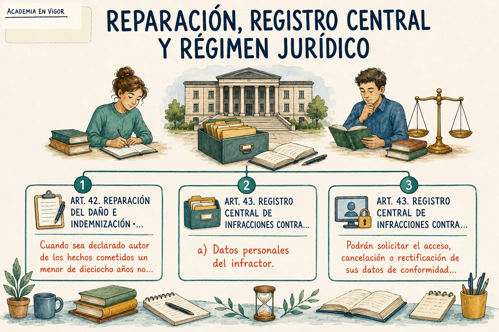

<em>Infografía: capas de reparación, registro central y régimen jurídico.</em>

<!-- FUENTE: LO4-2015-BOE-A-2015-3442-GC-T13 -->

## 24. Procedimiento sancionador y medidas provisionales

### Regla y encaje

Procedimiento sancionador y medidas provisionales forma parte de régimen sancionador de seguridad ciudadana. Estúdialo como una secuencia: presupuesto, obligación o facultad, excepción y consecuencia.

### Claves examinables

- **Artículo 45. Carácter subsidiario del procedimiento administrativo sancionador respecto del penal · apartado 1:** 1. No podrán sancionarse los hechos que hayan sido sancionados penal o administrativamente cuando se aprecie identidad de sujeto, de hecho y de fundamento. <!-- FACT:GC-T13-F230 -->
- **Artículo 45. Carácter subsidiario del procedimiento administrativo sancionador respecto del penal · apartado 2:** En los supuestos en que las conductas pudieran ser constitutivas de delito, el órgano administrativo pasará el tanto de culpa a la autoridad judicial o al Ministerio Fiscal y se abstendrá de seguir el procedimiento sancionador mientras la autoridad judicial no dicte sentencia firme o resolución que de otro modo ponga fin al procedimiento penal, o el Ministerio Fiscal no acuerde la improcedencia de iniciar o proseguir las actuaciones en vía penal, quedando hasta entonces interrumpido el plazo de prescripción. <!-- FACT:GC-T13-F231 -->
- **Artículo 45. Carácter subsidiario del procedimiento administrativo sancionador respecto del penal:** La autoridad judicial y el Ministerio Fiscal comunicarán al órgano administrativo la resolución o acuerdo que hubieran adoptado. <!-- FACT:GC-T13-F232 -->
- **Artículo 45. Carácter subsidiario del procedimiento administrativo sancionador respecto del penal · apartado 3:** 3. De no haberse estimado la existencia de ilícito penal, o en el caso de haberse dictado resolución de otro tipo que ponga fin al procedimiento penal, podrá iniciarse o proseguir el procedimiento sancionador. En todo caso, el órgano administrativo quedará vinculado por los hechos declarados probados en vía judicial. <!-- FACT:GC-T13-F233 -->
- **Artículo 45. Carácter subsidiario del procedimiento administrativo sancionador respecto del penal · apartado 4:** 4. Las medidas cautelares adoptadas antes de la intervención judicial podrán mantenerse mientras la autoridad judicial no resuelva otra cosa. <!-- FACT:GC-T13-F234 -->
- **Artículo 46. Acceso a los datos de otras administraciones públicas · apartado 1:** Las autoridades y órganos de las distintas administraciones públicas competentes para imponer sanciones de acuerdo con esta Ley podrán acceder a los datos relativos a los sujetos infractores que estén directamente relacionados con la investigación de los hechos constitutivos de infracción, sin necesidad de consentimiento previo del titular de los datos, con las garantías de seguridad, integridad y disponibilidad, de conformidad con lo establecido en la Ley Orgánica 15/1999, de 13 de diciembre. <!-- FACT:GC-T13-F235 -->
- **Artículo 46. Acceso a los datos de otras administraciones públicas · apartado 2:** A los exclusivos efectos de cumplimentar las actuaciones que los órganos de la Administración General del Estado competentes en los procedimientos regulados en esta Ley y sus normas de desarrollo tienen encomendadas, la Agencia Estatal de Administración Tributaria y la Tesorería General de la Seguridad Social, en los términos establecidos en la normativa tributaria o de la seguridad social, así como el Instituto Nacional de Estadística, en lo relativo al Padrón Municipal de Habitantes, facilitarán a aquéllos el acceso a los ficheros en los que obren datos que hayan de constar en dichos procedimientos, sin que sea preciso el consentimiento de los interesados. <!-- FACT:GC-T13-F236 -->
- **Artículo 47. Medidas provisionales anteriores al procedimiento · apartado 1:** 1. Los agentes de la autoridad intervendrán y aprehenderán cautelarmente los instrumentos utilizados para la comisión de la infracción, así como el dinero, los frutos o los productos directamente obtenidos, que se mantendrán en los depósitos establecidos al efecto o bajo la custodia de las Fuerzas y Cuerpos de Seguridad mientras se tramita el procedimiento sancionador o hasta que, en su caso, se resuelva la devolución o se decrete el comiso. <!-- FACT:GC-T13-F237 -->
- **Artículo 47. Medidas provisionales anteriores al procedimiento:** Sin perjuicio de lo previsto en el apartado 3 del artículo 49, si la aprehensión fuera de bienes fungibles y el coste del depósito superase el valor venal, éstos se destruirán o se les dará el destino adecuado, de acuerdo con el procedimiento que se establezca reglamentariamente. <!-- FACT:GC-T13-F238 -->
- **Artículo 47. Medidas provisionales anteriores al procedimiento · apartado 2:** 2. Excepcionalmente, en los supuestos de grave riesgo o peligro inminente para personas o bienes, las medidas provisionales previstas en el apartado 1 del artículo 49, salvo la del párrafo f), podrán ser adoptadas directamente por los agentes de la autoridad con carácter previo a la iniciación del procedimiento, debiendo ser ratificadas, modificadas o revocadas en el acuerdo de incoación en el plazo máximo de quince días. <!-- FACT:GC-T13-F239 -->
- **Artículo 47. Medidas provisionales anteriores al procedimiento · apartado 2:** En todo caso, estas medidas quedarán sin efecto si, transcurrido dicho plazo, no se incoa el procedimiento o el acuerdo de incoación no contiene un pronunciamiento expreso acerca de las mismas. <!-- FACT:GC-T13-F240 -->
- **Artículo 48. Actuaciones previas · apartado 1:** 1. Con anterioridad a la incoación del procedimiento se podrán realizar actuaciones previas con objeto de determinar si concurren circunstancias que las justifiquen. En especial, estas actuaciones se orientarán a determinar, con la mayor precisión posible, los hechos susceptibles de motivar la incoación del procedimiento, la identificación de la persona o personas que pudieran resultar responsables y las circunstancias relevantes que concurran en unos y otros. <!-- FACT:GC-T13-F241 -->
- **Artículo 48. Actuaciones previas:** Las actuaciones previas se incorporarán al procedimiento sancionador. <!-- FACT:GC-T13-F242 -->
- **Artículo 48. Actuaciones previas · apartado 2:** 2. Las actuaciones previas podrán desarrollarse sin intervención del presunto responsable, si fuera indispensable para garantizar el buen fin de la investigación, dejando constancia escrita en las diligencias instruidas al efecto de las razones que justifican su no intervención. <!-- FACT:GC-T13-F243 -->
- **Artículo 48. Actuaciones previas · apartado 3:** 3. La práctica de actuaciones previas no interrumpirá la prescripción de las infracciones. <!-- FACT:GC-T13-F244 -->
- **Artículo 49. Medidas de carácter provisional · apartado 1:** 1. Incoado el expediente, el órgano competente para resolver podrá adoptar en cualquier momento, mediante acuerdo motivado, las medidas de carácter provisional que resulten necesarias para asegurar la eficacia de la resolución que pudiera recaer, el buen fin del procedimiento, evitar el mantenimiento de los efectos de la infracción o preservar la seguridad ciudadana, sin que en ningún caso puedan tener carácter sancionador. <!-- FACT:GC-T13-F245 -->
- **Artículo 49. Medidas de carácter provisional:** Dichas medidas serán proporcionadas a la naturaleza y gravedad de la infracción y podrán consistir especialmente en: a) El depósito en lugar seguro de los instrumentos o efectos utilizados para la comisión de las infracciones y, en particular, de las armas, explosivos, aerosoles, objetos o materias potencialmente peligrosos para la tranquilidad ciudadana, drogas tóxicas, estupefacientes o sustancias psicotrópicas. <!-- FACT:GC-T13-F246 -->
- **Artículo 49. Medidas de carácter provisional:** Dichas medidas serán proporcionadas a la naturaleza y gravedad de la infracción y podrán consistir especialmente en: b) La adopción de medidas de seguridad de las personas, bienes, establecimientos o instalaciones que se encuentren en situación de peligro, a cargo de sus titulares. <!-- FACT:GC-T13-F247 -->
- **Artículo 49. Medidas de carácter provisional:** Dichas medidas serán proporcionadas a la naturaleza y gravedad de la infracción y podrán consistir especialmente en: c) La suspensión o clausura preventiva de fábricas, locales o establecimientos susceptibles de afectar a la seguridad ciudadana. <!-- FACT:GC-T13-F248 -->
- **Artículo 49. Medidas de carácter provisional:** Dichas medidas serán proporcionadas a la naturaleza y gravedad de la infracción y podrán consistir especialmente en: d) La suspensión parcial o total de las actividades en los establecimientos que sean notoriamente vulnerables y no tengan en funcionamiento las medidas de seguridad necesarias. <!-- FACT:GC-T13-F249 -->
- **Artículo 49. Medidas de carácter provisional:** Dichas medidas serán proporcionadas a la naturaleza y gravedad de la infracción y podrán consistir especialmente en: e) La adopción de medidas de seguridad de las personas y los bienes en infraestructuras e instalaciones en las que se presten servicios básicos para la comunidad. <!-- FACT:GC-T13-F250 -->
- **Artículo 49. Medidas de carácter provisional:** Dichas medidas serán proporcionadas a la naturaleza y gravedad de la infracción y podrán consistir especialmente en: f) La suspensión de la actividad objeto de autorizaciones, permisos, licencias y otros documentos expedidos por las autoridades administrativas, en el marco de la normativa que le sea de aplicación. <!-- FACT:GC-T13-F251 -->
- **Artículo 49. Medidas de carácter provisional:** Dichas medidas serán proporcionadas a la naturaleza y gravedad de la infracción y podrán consistir especialmente en: g) La suspensión en la venta, reventa o venta ambulante de las entradas del espectáculo o actividad recreativa cuya celebración o desarrollo pudiera implicar un riesgo para la seguridad ciudadana. <!-- FACT:GC-T13-F252 -->
- **Artículo 49. Medidas de carácter provisional · apartado 2:** 2. Los gastos ocasionados por la adopción de las medidas provisionales correrán a cargo del causante de los hechos objeto del expediente sancionador. <!-- FACT:GC-T13-F253 -->
- **Artículo 49. Medidas de carácter provisional · apartado 3:** 3. La duración de las medidas de carácter provisional no podrá exceder de la mitad del plazo previsto en esta Ley para la sanción que pudiera corresponder a la infracción cometida, salvo acuerdo debidamente motivado adoptado por el órgano competente. <!-- FACT:GC-T13-F254 -->
- **Artículo 49. Medidas de carácter provisional · apartado 4:** 4. El acuerdo de adopción de medidas provisionales se notificará a los interesados en el domicilio del que tenga constancia por cualquier medio la administración o, en su caso, por medios electrónicos, con indicación de los recursos procedentes contra el mismo, órgano ante el que deban presentarse y plazos para interponerlos. <!-- FACT:GC-T13-F255 -->
- **Artículo 49. Medidas de carácter provisional · apartado 4:** La autoridad competente para su adopción podrá acordar que sea objeto de conocimiento general cuando ello sea necesario para garantizar la seguridad ciudadana, con sujeción a lo dispuesto en la legislación en materia de protección de datos de carácter personal. <!-- FACT:GC-T13-F256 -->
- **Artículo 49. Medidas de carácter provisional · apartado 5:** 5. Las medidas adoptadas serán inmediatamente ejecutivas, sin perjuicio de que los interesados puedan solicitar su suspensión justificando la apariencia de buen derecho y la existencia de daños de difícil o imposible reparación, prestando, en su caso, caución suficiente para asegurar el perjuicio que se pudiera derivar para la seguridad ciudadana. <!-- FACT:GC-T13-F257 -->
- **Artículo 49. Medidas de carácter provisional · apartado 6:** 6. Las medidas provisionales acordadas podrán ser modificadas o levantadas cuando varíen las circunstancias que motivaron su adopción y, en todo caso, se extinguirán con la resolución que ponga fin al procedimiento. <!-- FACT:GC-T13-F258 -->

:::hablemos-claro
Seguridad pública significa potestad y responsabilidad estatal; seguridad privada significa actividad complementaria, subordinada, controlada y obligada a colaborar.
:::

:::en-la-calle
Ante un supuesto, identifica primero quién actúa, con qué habilitación, qué medida adopta, qué límite legal existe y qué autoridad controla la actuación.
:::

:::lo-que-cae
Prioriza listas cerradas, plazos, excepciones, competencias y efectos. Apariciones oficiales mapeadas: **0**.
:::

<!-- VISUAL:t13-24-procedimiento-sancionador-y-medidas-provisionales.webp -->

  

<em>Infografía: mapa de procedimiento sancionador y medidas provisionales.</em>

<!-- FUENTE: LO4-2015-BOE-A-2015-3442-GC-T13 -->

## 25. Caducidad, resolución, prueba y ejecución

### Regla y encaje

Caducidad, resolución, prueba y ejecución forma parte de régimen sancionador de seguridad ciudadana. Estúdialo como una secuencia: presupuesto, obligación o facultad, excepción y consecuencia.

### Claves examinables

- **Artículo 50. Caducidad del procedimiento · apartado 1:** 1. El procedimiento caducará transcurrido un año desde su incoación sin que se haya notificado la resolución, debiendo, no obstante, tenerse en cuenta en el cómputo las posibles paralizaciones por causas imputables al interesado o la suspensión que debiera acordarse por la existencia de un procedimiento judicial penal, cuando concurra identidad de sujeto, hecho y fundamento, hasta la finalización de éste. <!-- FACT:GC-T13-F259 -->
- **Artículo 50. Caducidad del procedimiento · apartado 2:** 2. La resolución que declare la caducidad se notificará al interesado y pondrá fin al procedimiento, sin perjuicio de que la administración pueda acordar la incoación de un nuevo procedimiento en tanto no haya prescrito la infracción. Los procedimientos caducados no interrumpirán el plazo de prescripción. <!-- FACT:GC-T13-F260 -->
- **Artículo 51. Efectos de la resolución:** En el ámbito de la Administración General del Estado, la resolución del procedimiento sancionador será recurrible de conformidad con la Ley 30/1992, de 26 de noviembre. <!-- FACT:GC-T13-F261 -->
- **Artículo 51. Efectos de la resolución:** Contra la resolución que ponga fin a la vía administrativa podrá interponerse recurso contencioso-administrativo, en su caso, por el procedimiento para la protección de los derechos fundamentales de la persona, en los términos de la Ley 29/1998, de 13 de julio, reguladora de la Jurisdicción Contencioso-administrativa. <!-- FACT:GC-T13-F262 -->
- **Artículo 52. Valor probatorio de las declaraciones de los agentes de la autoridad:** En los procedimientos sancionadores que se instruyan en las materias objeto de esta Ley, las denuncias, atestados o actas formulados por los agentes de la autoridad en ejercicio de sus funciones que hubiesen presenciado los hechos, previa ratificación en el caso de haber sido negados por los denunciados, constituirán base suficiente para adoptar la resolución que proceda, salvo prueba en contrario y sin perjuicio de que aquéllos deban aportar al expediente todos los elementos probatorios disponibles. <!-- FACT:GC-T13-F263 -->
- **Artículo 53. Ejecución de la sanción · apartado 1:** 1. Una vez firme en vía administrativa, se procederá a la ejecución de la sanción conforme a lo previsto en esta Ley. <!-- FACT:GC-T13-F264 -->
- **Artículo 53. Ejecución de la sanción · apartado 2:** 2. El cumplimiento de la sanción de suspensión de las licencias, autorizaciones o permisos se iniciará transcurrido un mes desde que la sanción haya adquirido firmeza en vía administrativa. <!-- FACT:GC-T13-F265 -->
- **Artículo 53. Ejecución de la sanción · apartado 3:** 3. Las sanciones pecuniarias que no hayan sido abonadas previamente deberán hacerse efectivas dentro de los quince días siguientes a la fecha de la firmeza de la sanción. Una vez vencido el plazo de ingreso sin que se hubiese satisfecho la sanción, su exacción se llevará a cabo por el procedimiento de apremio. A tal efecto, será título ejecutivo la providencia de apremio notificada al deudor, expedida por el órgano competente de la administración. <!-- FACT:GC-T13-F266 -->
- **Artículo 53. Ejecución de la sanción · apartado 4:** 4. Cuando las sanciones hayan sido impuestas por la Administración General del Estado, los órganos y procedimientos de la recaudación ejecutiva serán los establecidos en el Reglamento General de Recaudación, aprobado por el Real Decreto 939/2005, de 29 de julio. <!-- FACT:GC-T13-F267 -->
- **Artículo 53. Ejecución de la sanción · apartado 5:** 5. En caso de que la resolución acuerde la devolución de los instrumentos aprehendidos cautelarmente a los que se refiere el apartado 1 del artículo 47, transcurrido un mes desde la notificación de la misma sin que el titular haya recuperado el objeto aprehendido, se procederá a su destrucción o se le dará el destino adecuado en el marco de esta Ley. <!-- FACT:GC-T13-F268 -->
- **Artículo 54. Procedimiento abreviado · apartado 1:** 1. Una vez notificado el acuerdo de incoación del procedimiento para la sanción de infracciones graves o leves, el interesado dispondrá de un plazo de quince días para realizar el pago voluntario con reducción de la sanción de multa, o para formular las alegaciones y proponer o aportar las pruebas que estime oportunas. <!-- FACT:GC-T13-F269 -->
- **Artículo 54. Procedimiento abreviado:** Si efectúa el pago de la multa en las condiciones indicadas en el párrafo anterior, se seguirá el procedimiento sancionador abreviado, y, en caso de no hacerlo, el procedimiento sancionador ordinario. <!-- FACT:GC-T13-F270 -->
- **Artículo 54. Procedimiento abreviado · apartado 2:** 2. El procedimiento sancionador abreviado no será de aplicación a las infracciones muy graves. <!-- FACT:GC-T13-F271 -->
- **Artículo 54. Procedimiento abreviado:** 3. Una vez realizado el pago voluntario de la multa dentro del plazo de quince días contados desde el día siguiente al de su notificación, se tendrá por concluido el procedimiento sancionador con las siguientes consecuencias: a) La reducción del 50 por ciento del importe de la sanción de multa. <!-- FACT:GC-T13-F272 -->
- **Artículo 54. Procedimiento abreviado:** 3. Una vez realizado el pago voluntario de la multa dentro del plazo de quince días contados desde el día siguiente al de su notificación, se tendrá por concluido el procedimiento sancionador con las siguientes consecuencias: b) La renuncia a formular alegaciones. En el caso de que fuesen formuladas se tendrán por no presentadas. <!-- FACT:GC-T13-F273 -->
- **Artículo 54. Procedimiento abreviado:** 3. Una vez realizado el pago voluntario de la multa dentro del plazo de quince días contados desde el día siguiente al de su notificación, se tendrá por concluido el procedimiento sancionador con las siguientes consecuencias: c) La terminación del procedimiento, sin necesidad de dictar resolución expresa, el día en que se realice el pago, siendo recurrible la sanción únicamente ante el orden jurisdiccional contencioso-administrativo. <!-- FACT:GC-T13-F274 -->

:::hablemos-claro
Seguridad pública significa potestad y responsabilidad estatal; seguridad privada significa actividad complementaria, subordinada, controlada y obligada a colaborar.
:::

:::en-la-calle
Ante un supuesto, identifica primero quién actúa, con qué habilitación, qué medida adopta, qué límite legal existe y qué autoridad controla la actuación.
:::

:::lo-que-cae
Prioriza listas cerradas, plazos, excepciones, competencias y efectos. Apariciones oficiales mapeadas: **0**.
:::

<!-- VISUAL:t13-25-caducidad-resolucion-prueba-y-ejecucion.webp -->

  

<em>Infografía: flujo de caducidad, resolución, prueba y ejecución.</em>

<!-- FUENTE: LO4-2015-BOE-A-2015-3442-GC-T13 -->

## 26. Objeto, definiciones y ámbito de la seguridad privada

### Regla y encaje

Objeto, definiciones y ámbito de la seguridad privada forma parte de bases de la seguridad privada. Estúdialo como una secuencia: presupuesto, obligación o facultad, excepción y consecuencia.

### Claves examinables

- **Artículo 1. Objeto · apartado 1:** 1. Esta ley tiene por objeto regular la realización y la prestación por personas privadas, físicas o jurídicas, de actividades y servicios de seguridad privada que, desarrollados por éstos, son contratados, voluntaria u obligatoriamente, por personas físicas o jurídicas, públicas o privadas, para la protección de personas y bienes. Igualmente regula las investigaciones privadas que se efectúen sobre aquéllas o éstos. <!-- FACT:GC-T13-F275 -->
- **Artículo 1. Objeto · apartado 1:** Todas estas actividades tienen la consideración de complementarias y subordinadas respecto de la seguridad pública. <!-- FACT:GC-T13-F276 -->
- **Artículo 1. Objeto · apartado 2:** 2. Asimismo, esta ley, en beneficio de la seguridad pública, establece el marco para la más eficiente coordinación de los servicios de seguridad privada con los de las Fuerzas y Cuerpos de Seguridad, de los que son complementarios. <!-- FACT:GC-T13-F277 -->
- **Artículo 2. Definiciones · apartado 1:** Seguridad privada: el conjunto de actividades, servicios, funciones y medidas de seguridad adoptadas, de forma voluntaria u obligatoria, por personas físicas o jurídicas, públicas o privadas, realizadas o prestados por empresas de seguridad, despachos de detectives privados y personal de seguridad privada para hacer frente a actos deliberados o riesgos accidentales, o para realizar averiguaciones sobre personas y bienes, con la finalidad de garantizar la seguridad de las personas, proteger su patrimonio y velar por el normal desarrollo de sus actividades. <!-- FACT:GC-T13-F278 -->
- **Artículo 2. Definiciones · apartado 2:** 2. Actividades de seguridad privada: los ámbitos de actuación material en que los prestadores de servicios de seguridad privada llevan a cabo su acción empresarial y profesional. <!-- FACT:GC-T13-F279 -->
- **Artículo 2. Definiciones · apartado 3:** 3. Servicios de seguridad privada: las acciones llevadas a cabo por los prestadores de servicios de seguridad privada para materializar las actividades de seguridad privada. <!-- FACT:GC-T13-F280 -->
- **Artículo 2. Definiciones · apartado 4:** 4. Funciones de seguridad privada: las facultades atribuidas al personal de seguridad privada. <!-- FACT:GC-T13-F281 -->
- **Artículo 2. Definiciones · apartado 5:** 5. Medidas de seguridad privada: las disposiciones adoptadas para el cumplimiento de los fines de prevención o protección pretendidos. <!-- FACT:GC-T13-F282 -->
- **Artículo 2. Definiciones · apartado 6:** 6. Prestadores de servicios de seguridad privada: las empresas de seguridad privada, los despachos de detectives y el personal habilitado para el ejercicio de funciones de seguridad privada. <!-- FACT:GC-T13-F283 -->
- **Artículo 2. Definiciones · apartado 7:** 7. Empresa de seguridad privada: las personas físicas o jurídicas, privadas, autorizadas o sometidas al régimen de declaración responsable, para prestar servicios de seguridad privada. <!-- FACT:GC-T13-F284 -->
- **Artículo 2. Definiciones · apartado 8:** 8. Personal de seguridad privada: las personas físicas que, habiendo obtenido la correspondiente habilitación, desarrollan funciones de seguridad privada. <!-- FACT:GC-T13-F285 -->
- **Artículo 2. Definiciones · apartado 9:** 9. Personal acreditado: profesores de centros de formación, ingenieros y técnicos que desarrollen las tareas que les asignan esta ley y operadores de seguridad. <!-- FACT:GC-T13-F286 -->
- **Artículo 2. Definiciones · apartado 10:** 10. Usuario de seguridad privada: las personas físicas o jurídicas que, de forma voluntaria u obligatoria, contratan servicios o adoptan medidas de seguridad privada. <!-- FACT:GC-T13-F287 -->
- **Artículo 2. Definiciones · apartado 11:** 11. Despachos de detectives privados: las oficinas constituidas por uno o más detectives privados que prestan servicios de investigación privada. <!-- FACT:GC-T13-F288 -->
- **Artículo 2. Definiciones · apartado 12:** 12. Centros de formación de aspirantes o de personal de seguridad privada: establecimientos sometidos al régimen de declaración responsable para impartir en sus locales formación al personal de seguridad privada. <!-- FACT:GC-T13-F289 -->
- **Artículo 2. Definiciones · apartado 13:** 13. Elemento, producto o servicio homologado: aquel que reúne las especificaciones técnicas o criterios que recoge una norma técnica al efecto. <!-- FACT:GC-T13-F290 -->
- **Artículo 2. Definiciones · apartado 14:** 14. Elemento, producto o servicio acreditado, certificado o verificado: aquel que lo ha sido por una entidad independiente, constituida a tal fin y reconocida por cualquier Estado miembro de la Unión Europea. <!-- FACT:GC-T13-F291 -->
- **Artículo 3. Ámbito de aplicación · apartado 1:** 1. Las disposiciones de esta ley son de aplicación a las empresas de seguridad privada, al personal de seguridad privada, a los despachos de detectives, a los servicios de seguridad privada, a las medidas de seguridad y a los contratos celebrados en éste ámbito. <!-- FACT:GC-T13-F292 -->
- **Artículo 3. Ámbito de aplicación · apartado 2:** Igualmente, en la medida que resulte pertinente en cada caso, se aplicarán a los establecimientos obligados a disponer de medidas de seguridad, a los usuarios de los servicios de seguridad privada, a los ingenieros y técnicos de las empresas de seguridad, a los operadores de seguridad, a los profesores de centros de formación, a las empresas prestadoras de servicios de seguridad informática, a las centrales receptoras de alarmas de uso propio y a los centros de formación de personal de seguridad privada. <!-- FACT:GC-T13-F293 -->
- **Artículo 3. Ámbito de aplicación · apartado 3:** 3. El régimen sancionador y las medidas provisionales, así como el ejercicio de las facultades de inspección, serán también aplicables a aquellas empresas y personal que presten servicios o ejerzan funciones de seguridad privada sin estar autorizadas o haber presentado declaración responsable, o sin estar habilitados o acreditados para el ejercicio legal de los mismos. <!-- FACT:GC-T13-F294 -->

:::hablemos-claro
Seguridad pública significa potestad y responsabilidad estatal; seguridad privada significa actividad complementaria, subordinada, controlada y obligada a colaborar.
:::

:::en-la-calle
Ante un supuesto, identifica primero quién actúa, con qué habilitación, qué medida adopta, qué límite legal existe y qué autoridad controla la actuación.
:::

:::lo-que-cae
Prioriza listas cerradas, plazos, excepciones, competencias y efectos. Apariciones oficiales mapeadas: **0**.
:::

<!-- VISUAL:t13-26-objeto-definiciones-y-ambito-de-la-seguridad-privada.webp -->

  

<em>Infografía: comparación de objeto, definiciones y ámbito de la seguridad privada.</em>

<!-- FUENTE: L5-2014-BOE-A-2014-3649-GC-T13 -->

## 27. Fines, actividades y compatibilidades

### Regla y encaje

Fines, actividades y compatibilidades forma parte de bases de la seguridad privada. Estúdialo como una secuencia: presupuesto, obligación o facultad, excepción y consecuencia.

### Claves examinables

- **Artículo 4. Fines:** La seguridad privada tiene como fines: a) Satisfacer las necesidades legítimas de seguridad o de información de los usuarios de seguridad privada, velando por la indemnidad o privacidad de las personas o bienes cuya seguridad o investigación se le encomiende frente a posibles vulneraciones de derechos, amenazas deliberadas y riesgos accidentales o derivados de la naturaleza. <!-- FACT:GC-T13-F295 -->
- **Artículo 4. Fines:** La seguridad privada tiene como fines: b) Contribuir a garantizar la seguridad pública, a prevenir infracciones y a aportar información a los procedimientos relacionados con sus actuaciones e investigaciones. <!-- FACT:GC-T13-F296 -->
- **Artículo 4. Fines:** La seguridad privada tiene como fines: c) Complementar el monopolio de la seguridad que corresponde al Estado, integrando funcionalmente sus medios y capacidades como un recurso externo de la seguridad pública. <!-- FACT:GC-T13-F297 -->
- **Artículo 5. Actividades de seguridad privada:** 1. Constituyen actividades de seguridad privada las siguientes: a) La vigilancia y protección de bienes, establecimientos, lugares y eventos, tanto públicos como privados, así como de las personas que pudieran encontrarse en los mismos. <!-- FACT:GC-T13-F298 -->
- **Artículo 5. Actividades de seguridad privada:** 1. Constituyen actividades de seguridad privada las siguientes: b) El acompañamiento, defensa y protección de personas físicas determinadas, incluidas las que ostenten la condición legal de autoridad. <!-- FACT:GC-T13-F299 -->
- **Artículo 5. Actividades de seguridad privada:** 1. Constituyen actividades de seguridad privada las siguientes: c) El depósito, custodia, recuento y clasificación de monedas y billetes, títulos-valores, joyas, metales preciosos, antigüedades, obras de arte u otros objetos que, por su valor económico, histórico o cultural, y expectativas que generen, puedan requerir vigilancia y protección especial. <!-- FACT:GC-T13-F300 -->
- **Artículo 5. Actividades de seguridad privada:** 1. Constituyen actividades de seguridad privada las siguientes: d) El depósito y custodia de explosivos, armas, cartuchería metálica, sustancias, materias, mercancías y cualesquiera objetos que por su peligrosidad precisen de vigilancia y protección especial. <!-- FACT:GC-T13-F301 -->
- **Artículo 5. Actividades de seguridad privada:** 1. Constituyen actividades de seguridad privada las siguientes: e) El transporte y distribución de los objetos a que se refieren los dos párrafos anteriores. <!-- FACT:GC-T13-F302 -->
- **Artículo 5. Actividades de seguridad privada:** 1. Constituyen actividades de seguridad privada las siguientes: f) La instalación y mantenimiento de aparatos, equipos, dispositivos y sistemas de seguridad conectados a centrales receptoras de alarmas o a centros de control o de videovigilancia. <!-- FACT:GC-T13-F303 -->
- **Artículo 5. Actividades de seguridad privada:** 1. Constituyen actividades de seguridad privada las siguientes: g) La explotación de centrales para la conexión, recepción, verificación y, en su caso, respuesta y transmisión de las señales de alarma, así como la monitorización de cualesquiera señales de dispositivos auxiliares para la seguridad de personas, de bienes muebles o inmuebles o de cumplimiento de medidas impuestas, y la comunicación a las Fuerzas y Cuerpos de Seguridad competentes en estos casos. <!-- FACT:GC-T13-F304 -->
- **Artículo 5. Actividades de seguridad privada:** 1. Constituyen actividades de seguridad privada las siguientes: h) La investigación privada en relación a personas, hechos o delitos sólo perseguibles a instancia de parte. <!-- FACT:GC-T13-F305 -->
- **Artículo 5. Actividades de seguridad privada · apartado 2:** 2. Los servicios sobre las actividades relacionadas en los párrafos a) a g) del apartado anterior únicamente podrán prestarse por empresas de seguridad privada, sin perjuicio de las competencias de las Fuerzas y Cuerpos de Seguridad. Los despachos de detectives podrán prestar, con carácter exclusivo y excluyente, servicios sobre la actividad a la que se refiere el párrafo h) del apartado anterior. <!-- FACT:GC-T13-F306 -->
- **Artículo 5. Actividades de seguridad privada · apartado 3:** Las entidades públicas o privadas podrán constituir, previa autorización del Ministerio del Interior o del órgano autonómico competente, centrales receptoras de alarmas de uso propio para la conexión, recepción, verificación y, en su caso, respuesta y transmisión de las señales de alarma que reciban de los sistemas de seguridad instalados en bienes inmuebles o muebles de su titularidad, sin que puedan dar, a través de las mismas, ningún tipo de servicio de seguridad a terceros. <!-- FACT:GC-T13-F307 -->
- **Artículo 6. Actividades compatibles:** 1. Quedan fuera del ámbito de aplicación de esta ley, sin perjuicio de la normativa específica que pudiera resultar de aplicación, especialmente en lo que se refiere a la homologación de productos, las siguientes actividades: a) La fabricación, comercialización, venta, entrega, instalación o mantenimiento de elementos o productos de seguridad y de cerrajería de seguridad. <!-- FACT:GC-T13-F308 -->
- **Artículo 6. Actividades compatibles:** 1. Quedan fuera del ámbito de aplicación de esta ley, sin perjuicio de la normativa específica que pudiera resultar de aplicación, especialmente en lo que se refiere a la homologación de productos, las siguientes actividades: b) La fabricación, comercialización, venta o entrega de equipos técnicos de seguridad electrónica, así como la instalación o mantenimiento de dichos equipos siempre que no estén conectados a centrales de alarma o centros de control o de videovigilancia. <!-- FACT:GC-T13-F309 -->
- **Artículo 6. Actividades compatibles:** 1. Quedan fuera del ámbito de aplicación de esta ley, sin perjuicio de la normativa específica que pudiera resultar de aplicación, especialmente en lo que se refiere a la homologación de productos, las siguientes actividades: c) La conexión a centrales receptoras de alarmas de sistemas de prevención o protección contra incendios o de alarmas de tipo técnico o asistencial, o de sistemas o servicios de control o mantenimiento. <!-- FACT:GC-T13-F310 -->
- **Artículo 6. Actividades compatibles:** 1. Quedan fuera del ámbito de aplicación de esta ley, sin perjuicio de la normativa específica que pudiera resultar de aplicación, especialmente en lo que se refiere a la homologación de productos, las siguientes actividades: d) La planificación, consultoría y asesoramiento en materia de actividades de seguridad privada, que consistirá en la elaboración de estudios e informes de seguridad, análisis de riesgos y planes de seguridad referidos a la protección frente a todo tipo de riesgos, así como en auditorías sobre la prestación de los servicios de seguridad. <!-- FACT:GC-T13-F311 -->
- **Artículo 6. Actividades compatibles:** Estas actividades podrán desarrollarse por las empresas de seguridad privada. <!-- FACT:GC-T13-F312 -->
- **Artículo 6. Actividades compatibles:** 2. Quedan también fuera del ámbito de aplicación de esta ley, a no ser que impliquen la asunción o realización de servicios o funciones de seguridad privada, y se regirán por las normas sectoriales que les sean de aplicación en cada caso, los siguientes servicios y funciones: a) Las de información o de control en los accesos a instalaciones, comprendiendo el cuidado y custodia de las llaves, la apertura y cierre de puertas, la ayuda en el acceso de personas o vehículos, el cumplimiento de la normativa interna de los locales donde presten dicho servicio, así como la ejecución de tareas auxiliares o subordinadas de ayuda o socorro, todas ellas realizadas en las puertas o en el interior de inmuebles, locales públicos, aparcamientos, garajes, autopistas, incluyendo sus zonas de peajes, áreas de servicio, mantenimiento y descanso, por porteros, conserjes y demás personal auxiliar análogo. <!-- FACT:GC-T13-F313 -->
- **Artículo 6. Actividades compatibles:** 2. Quedan también fuera del ámbito de aplicación de esta ley, a no ser que impliquen la asunción o realización de servicios o funciones de seguridad privada, y se regirán por las normas sectoriales que les sean de aplicación en cada caso, los siguientes servicios y funciones: b) Las tareas de recepción, comprobación de visitantes y orientación de los mismos, así como las de comprobación de entradas, documentos o carnés, en cualquier clase de edificios o inmuebles, y de cumplimiento de la normativa interna de los locales donde presten dicho servicio. <!-- FACT:GC-T13-F314 -->
- **Artículo 6. Actividades compatibles:** 2. Quedan también fuera del ámbito de aplicación de esta ley, a no ser que impliquen la asunción o realización de servicios o funciones de seguridad privada, y se regirán por las normas sectoriales que les sean de aplicación en cada caso, los siguientes servicios y funciones: c) El control de tránsito en zonas reservadas o de circulación restringida en el interior de instalaciones en cumplimiento de la normativa interna de los mismos. <!-- FACT:GC-T13-F315 -->
- **Artículo 6. Actividades compatibles:** 2. Quedan también fuera del ámbito de aplicación de esta ley, a no ser que impliquen la asunción o realización de servicios o funciones de seguridad privada, y se regirán por las normas sectoriales que les sean de aplicación en cada caso, los siguientes servicios y funciones: d) Las de comprobación y control del estado y funcionamiento de calderas, bienes e instalaciones en general, en cualquier clase de inmuebles, para garantizar su conservación y funcionamiento. <!-- FACT:GC-T13-F316 -->
- **Artículo 6. Actividades compatibles:** Estos servicios y funciones podrán prestarse o realizarse por empresas y personal de seguridad privada, siempre con carácter complementario o accesorio de las funciones de seguridad privada que se realicen y sin que en ningún caso constituyan el objeto principal del servicio que se preste. <!-- FACT:GC-T13-F317 -->
- **Artículo 6. Actividades compatibles · apartado 3:** 3. El personal no habilitado que preste los servicios o funciones comprendidos en el apartado anterior, en ningún caso podrá ejercer función alguna de las reservadas al personal de seguridad privada, ni portar ni usar armas ni medios de defensa, ni utilizar distintivos, uniformes o medios que puedan confundirse con los previstos para dicho personal. <!-- FACT:GC-T13-F318 -->
- **Artículo 6. Actividades compatibles · apartado 4:** 4. Los prestadores de servicios de seguridad privada que vendan, entreguen, instalen o mantengan equipos técnicos de seguridad, no conectados a centrales receptoras de alarmas o a centros de control o de videovigilancia, quedan fuera del ámbito de aplicación de la legislación de seguridad privada. <!-- FACT:GC-T13-F319 -->
- **Artículo 6. Actividades compatibles · apartado 5:** 5. Las empresas de seguridad privada que se dediquen a la instalación o mantenimiento de aparatos, dispositivos y sistemas de seguridad que no incluyan la conexión a centrales receptoras de alarmas o a centros de control o de videovigilancia, sólo están sometidas a la normativa de seguridad privada en lo que se refiere a las actividades y servicios de seguridad privada para las que se encontrasen autorizadas. <!-- FACT:GC-T13-F320 -->
- **Artículo 6. Actividades compatibles · apartado 6:** A las empresas, sean o no de seguridad privada, que se dediquen a las actividades de seguridad informática, entendida como el conjunto de medidas encaminadas a proteger los sistemas de información a fin de garantizar la confidencialidad, disponibilidad e integridad de la misma o del servicio que aquéllos prestan, por su incidencia directa en la seguridad de las entidades públicas y privadas, se les podrán imponer reglamentariamente requisitos específicos para garantizar la calidad de los servicios que presten. <!-- FACT:GC-T13-F321 -->

:::hablemos-claro
Seguridad pública significa potestad y responsabilidad estatal; seguridad privada significa actividad complementaria, subordinada, controlada y obligada a colaborar.
:::

:::en-la-calle
Ante un supuesto, identifica primero quién actúa, con qué habilitación, qué medida adopta, qué límite legal existe y qué autoridad controla la actuación.
:::

:::lo-que-cae
Prioriza listas cerradas, plazos, excepciones, competencias y efectos. Apariciones oficiales mapeadas: **2**.
:::

<!-- VISUAL:t13-27-fines-actividades-y-compatibilidades.webp -->

  

<em>Infografía: línea temporal de fines, actividades y compatibilidades.</em>

<!-- FUENTE: L5-2014-BOE-A-2014-3649-GC-T13 -->

## 28. Actividades excluidas y principios rectores

### Regla y encaje

Actividades excluidas y principios rectores forma parte de bases de la seguridad privada. Estúdialo como una secuencia: presupuesto, obligación o facultad, excepción y consecuencia.

### Claves examinables

- **Artículo 7. Actividades excluidas · apartado 1:** 1. No están sujetas a esta ley las actuaciones de autoprotección, entendidas como el conjunto de cautelas o diligencias que se puedan adoptar o que ejecuten por sí y para sí mismos de forma directa los interesados, estrictamente dirigidas a la protección de su entorno personal o patrimonial, y cuya práctica o aplicación no conlleve contraprestación alguna ni suponga algún tipo de servicio de seguridad privada prestado a terceros. <!-- FACT:GC-T13-F322 -->
- **Artículo 7. Actividades excluidas:** Cuando los interesados tengan el carácter de empresas o entidades de cualquier tipo, en ningún caso utilizarán a sus empleados para el desarrollo de las funciones previstas en la presente ley, reservadas a las empresas y el personal de seguridad privada. <!-- FACT:GC-T13-F323 -->
- **Artículo 7. Actividades excluidas · apartado 2:** 2. Queda fuera del ámbito de aplicación de esta ley la obtención por uno mismo de información o datos, así como la contratación de servicios de recepción, recopilación, análisis, comunicación o suministro de información libre obrante en fuentes o registros de acceso público. <!-- FACT:GC-T13-F324 -->
- **Artículo 8. Principios rectores · apartado 1:** 1. Los servicios y funciones de seguridad privada se prestarán con respeto a la Constitución, a lo dispuesto en esta ley, especialmente en lo referente a los principios de actuación establecidos en el artículo 30, y al resto del ordenamiento jurídico. <!-- FACT:GC-T13-F325 -->
- **Artículo 8. Principios rectores · apartado 2:** 2. Los prestadores de servicios de seguridad privada colaborarán, en todo momento y lugar, con las Fuerzas y Cuerpos de Seguridad, con sujeción a lo que éstas puedan disponer en relación con la ejecución material de sus actividades. <!-- FACT:GC-T13-F326 -->
- **Artículo 8. Principios rectores · apartado 3:** 3. De conformidad con lo dispuesto en la legislación de fuerzas y cuerpos de seguridad, las empresas de seguridad, los despachos de detectives y el personal de seguridad privada tendrán especial obligación de auxiliar y colaborar, en todo momento, con aquéllas en el ejercicio de sus funciones, de prestarles su colaboración y de seguir sus instrucciones, en relación con los servicios que presten que afecten a la seguridad pública o al ámbito de sus competencias. <!-- FACT:GC-T13-F327 -->
- **Artículo 8. Principios rectores:** 4. Las empresas, los despachos y el personal de seguridad privada: a) No podrán intervenir ni interferir, mientras estén ejerciendo los servicios y funciones que les son propios, en la celebración de reuniones y manifestaciones, ni en el desarrollo de conflictos políticos o laborales. <!-- FACT:GC-T13-F328 -->
- **Artículo 8. Principios rectores:** 4. Las empresas, los despachos y el personal de seguridad privada: b) No podrán ejercer ningún tipo de control sobre opiniones políticas, sindicales o religiosas, o sobre la expresión de tales opiniones, ni proceder al tratamiento, automatizado o no, de datos relacionados con la ideología, afiliación sindical, religión o creencias. <!-- FACT:GC-T13-F329 -->
- **Artículo 8. Principios rectores:** 4. Las empresas, los despachos y el personal de seguridad privada: c) Tendrán prohibido comunicar a terceros, salvo a las autoridades judiciales y policiales para el ejercicio de sus respectivas funciones, cualquier información que conozcan en el desarrollo de sus servicios y funciones sobre sus clientes o personas relacionadas con éstos, así como sobre los bienes y efectos de cuya seguridad o investigación estuvieran encargados. <!-- FACT:GC-T13-F330 -->
- **Artículo 8. Principios rectores · apartado 5:** 5. El Ministro del Interior o, en su caso, el titular del órgano autonómico competente prohibirá la utilización en los servicios de seguridad privada de determinados medios materiales o técnicos cuando pudieran causar daños o perjuicios a terceros o poner en peligro la seguridad ciudadana. <!-- FACT:GC-T13-F331 -->
- **Artículo 8. Principios rectores · apartado 6:** 6. Cuando el personal de seguridad privada desempeñe sus funciones en entidades públicas o privadas en las que se presten servicios que resulten o se declaren esenciales por la autoridad pública competente, o en los que el servicio de seguridad se haya impuesto obligatoriamente, habrán de atenerse, en el ejercicio del derecho de huelga, a lo que respecto de dichas entidades disponga la legislación vigente. <!-- FACT:GC-T13-F332 -->

:::hablemos-claro
Seguridad pública significa potestad y responsabilidad estatal; seguridad privada significa actividad complementaria, subordinada, controlada y obligada a colaborar.
:::

:::en-la-calle
Ante un supuesto, identifica primero quién actúa, con qué habilitación, qué medida adopta, qué límite legal existe y qué autoridad controla la actuación.
:::

:::lo-que-cae
Prioriza listas cerradas, plazos, excepciones, competencias y efectos. Apariciones oficiales mapeadas: **1**.
:::

<!-- VISUAL:t13-28-actividades-excluidas-y-principios-rectores.webp -->

  

<em>Infografía: escena de actividades excluidas y principios rectores.</em>

<!-- FUENTE: L5-2014-BOE-A-2014-3649-GC-T13 -->

## 29. Contratación, comunicación y prohibiciones

### Regla y encaje

Contratación, comunicación y prohibiciones forma parte de bases de la seguridad privada. Estúdialo como una secuencia: presupuesto, obligación o facultad, excepción y consecuencia.

### Claves examinables

- **Artículo 9. Contratación y comunicación de servicios · apartado 1:** 1. No podrá prestarse ningún tipo de servicio de seguridad privada que no haya sido previamente contratado y, en su caso, autorizado. <!-- FACT:GC-T13-F333 -->
- **Artículo 9. Contratación y comunicación de servicios · apartado 2:** 2. De acuerdo con lo que reglamentariamente se determine, los contratos de prestación de los distintos servicios de seguridad privada deberán, en todo caso, formalizarse por escrito y comunicarse su celebración al Ministerio del Interior o, en su caso, al órgano autonómico competente con antelación a la iniciación de los mismos. <!-- FACT:GC-T13-F334 -->
- **Artículo 9. Contratación y comunicación de servicios · apartado 3:** 3. La comunicación de contratos de servicios de investigación privada contendrá exclusivamente los datos necesarios para identificar a las partes contratantes, excluidos los de carácter personal. <!-- FACT:GC-T13-F335 -->
- **Artículo 10. Prohibiciones:** 1. Con carácter general y además de otras prohibiciones contenidas en esta ley, se establecen las siguientes: a) La prestación o publicidad de servicios de seguridad privada por parte de personas, físicas o jurídicas, carentes de la correspondiente autorización o sin haber presentado declaración responsable. <!-- FACT:GC-T13-F336 -->
- **Artículo 10. Prohibiciones:** 1. Con carácter general y además de otras prohibiciones contenidas en esta ley, se establecen las siguientes: b) El ejercicio de funciones de seguridad privada por parte de personas físicas carentes de la correspondiente habilitación o acreditación profesional. <!-- FACT:GC-T13-F337 -->
- **Artículo 10. Prohibiciones:** 1. Con carácter general y además de otras prohibiciones contenidas en esta ley, se establecen las siguientes: c) La prestación de servicios de seguridad privada incumpliendo los requisitos o condiciones legales de prestación de los mismos. <!-- FACT:GC-T13-F338 -->
- **Artículo 10. Prohibiciones:** 1. Con carácter general y además de otras prohibiciones contenidas en esta ley, se establecen las siguientes: d) El empleo o utilización, en servicios de seguridad privada, de medios o medidas de seguridad no homologadas cuando sea preceptivo, o de medidas o medios personales, materiales o técnicos de forma tal que atenten contra el derecho al honor, a la intimidad personal o familiar o a la propia imagen o al secreto de las comunicaciones, o cuando incumplan las condiciones o requisitos establecidos en esta ley y en su normativa de desarrollo. <!-- FACT:GC-T13-F339 -->
- **Artículo 10. Prohibiciones · apartado 2:** Los despachos de detectives y los detectives privados no podrán celebrar contratos que tengan por objeto la investigación de delitos perseguibles de oficio ni, en general, investigar delitos de esta naturaleza, debiendo denunciar inmediatamente ante la autoridad competente cualquier hecho de esta naturaleza que llegara a su conocimiento, y poniendo a su disposición toda la información y los instrumentos que pudieran haber obtenido hasta ese momento, relacionado con dichos delitos. <!-- FACT:GC-T13-F340 -->
- **Artículo 10. Prohibiciones · apartado 3:** 3. Las empresas de seguridad no podrán realizar los servicios de investigación privada propios de los despachos de detectives privados, y éstos no podrán prestar servicios propios de las empresas de seguridad privada. <!-- FACT:GC-T13-F341 -->

:::hablemos-claro
Seguridad pública significa potestad y responsabilidad estatal; seguridad privada significa actividad complementaria, subordinada, controlada y obligada a colaborar.
:::

:::en-la-calle
Ante un supuesto, identifica primero quién actúa, con qué habilitación, qué medida adopta, qué límite legal existe y qué autoridad controla la actuación.
:::

:::lo-que-cae
Prioriza listas cerradas, plazos, excepciones, competencias y efectos. Apariciones oficiales mapeadas: **1**.
:::

<!-- VISUAL:t13-29-contratacion-comunicacion-y-prohibiciones.webp -->

  

<em>Infografía: capas de contratación, comunicación y prohibiciones.</em>

<!-- FUENTE: L5-2014-BOE-A-2014-3649-GC-T13 -->

## 30. Registro Nacional y registros autonómicos

### Regla y encaje

Registro Nacional y registros autonómicos forma parte de bases de la seguridad privada. Estúdialo como una secuencia: presupuesto, obligación o facultad, excepción y consecuencia.

### Claves examinables

- **Artículo 11. Registro Nacional de Seguridad Privada y registros autonómicos · apartado 1:** Serán objeto de inscripción de oficio en el Registro Nacional de Seguridad Privada del Ministerio del Interior, una vez concedidas las pertinentes autorizaciones o, en su caso, presentadas las declaraciones responsables, u obtenidas las preceptivas habilitaciones o acreditaciones, el personal de seguridad privada, las empresas de seguridad privada y los despachos de detectives privados, así como delegaciones y sucursales, los centros de formación del personal de seguridad privada y las centrales receptoras de alarma de uso propio, cuando no sean objeto de inscripción en los registros de las comunidades autónomas. <!-- FACT:GC-T13-F342 -->
- **Artículo 11. Registro Nacional de Seguridad Privada y registros autonómicos:** Igualmente, se inscribirán en el Registro Nacional de Seguridad Privada las sanciones impuestas en materia de seguridad privada, las comunicaciones de los contratos y sus modificaciones y cuantos datos sean necesarios para las actuaciones de control y gestión de la seguridad privada, cuando tales sanciones, comunicaciones y datos se refieran a servicios de seguridad privada que se presten en un ámbito territorial distinto al de una comunidad autónoma con competencia en materia de seguridad privada. <!-- FACT:GC-T13-F343 -->
- **Artículo 11. Registro Nacional de Seguridad Privada y registros autonómicos · apartado 2:** En los registros de las comunidades autónomas, una vez concedidas las pertinentes autorizaciones o, en su caso, presentadas las declaraciones responsables, u obtenidas las preceptivas habilitaciones, se inscribirán de oficio las empresas de seguridad privada y los despachos de detectives privados, así como delegaciones y sucursales, los centros de formación del personal de seguridad privada y las centrales receptoras de alarma de uso propio, que tengan su domicilio en la comunidad autónoma y cuyo ámbito de actuación esté limitado a su territorio. <!-- FACT:GC-T13-F344 -->
- **Artículo 11. Registro Nacional de Seguridad Privada y registros autonómicos:** Igualmente, se inscribirán en dichos registros las sanciones impuestas en materia de seguridad privada, las comunicaciones de los contratos y sus modificaciones y cuantos datos sean necesarios para las actuaciones de control y gestión de la seguridad privada, cuando tales sanciones, comunicaciones y datos se refieran a servicios de seguridad privada que se presten en el ámbito territorial propio de una comunidad autónoma con competencia en materia de seguridad privada. <!-- FACT:GC-T13-F345 -->
- **Artículo 11. Registro Nacional de Seguridad Privada y registros autonómicos · apartado 3:** 3. En el referido Registro Nacional, además de la información correspondiente a las empresas de seguridad privada que en el mismo se inscriban, se incorporará la relativa a las empresas de seguridad privada inscritas en los registros de las comunidades autónomas con competencia en la materia. <!-- FACT:GC-T13-F346 -->
- **Artículo 11. Registro Nacional de Seguridad Privada y registros autonómicos:** A tales efectos, los órganos competentes de las mencionadas comunidades autónomas deberán comunicar al Registro Nacional de Seguridad Privada los datos de las inscripciones y anotaciones que efectúen sobre las empresas de seguridad privada que inscriban, así como sus modificaciones y cancelaciones. <!-- FACT:GC-T13-F347 -->
- **Artículo 11. Registro Nacional de Seguridad Privada y registros autonómicos · apartado 4:** 4. En los mencionados registros, nacional y autonómicos, se anotarán también los datos de las empresas que realicen actividades de seguridad informática, de acuerdo con lo que reglamentariamente se determine. <!-- FACT:GC-T13-F348 -->
- **Artículo 11. Registro Nacional de Seguridad Privada y registros autonómicos · apartado 5:** 5. Las autoridades responsables del Registro Nacional y de los registros autonómicos establecerán los mecanismos de colaboración y reciprocidad necesarios para permitir su interconexión e interoperabilidad, la determinación coordinada de los sistemas de numeración de las empresas de seguridad privada y el acceso a la información registral contenida en los mismos, para el ejercicio de sus respectivas competencias. <!-- FACT:GC-T13-F349 -->
- **Artículo 11. Registro Nacional de Seguridad Privada y registros autonómicos · apartado 6:** 6. Dichos registros serán públicos exclusivamente en cuanto a los asientos referentes a la denominación o razón social, domicilio, número de identificación fiscal y actividades en relación con las cuales estén autorizadas o hayan presentado la declaración responsable las empresas de seguridad privada, despachos de detectives, centros de formación del personal de seguridad privada y centrales de alarmas de uso propio. <!-- FACT:GC-T13-F350 -->
- **Artículo 11. Registro Nacional de Seguridad Privada y registros autonómicos · apartado 7:** 7. Reglamentariamente se regulará la organización y funcionamiento del Registro Nacional de Seguridad Privada. <!-- FACT:GC-T13-F351 -->

:::hablemos-claro
Seguridad pública significa potestad y responsabilidad estatal; seguridad privada significa actividad complementaria, subordinada, controlada y obligada a colaborar.
:::

:::en-la-calle
Ante un supuesto, identifica primero quién actúa, con qué habilitación, qué medida adopta, qué límite legal existe y qué autoridad controla la actuación.
:::

:::lo-que-cae
Prioriza listas cerradas, plazos, excepciones, competencias y efectos. Apariciones oficiales mapeadas: **0**.
:::

<!-- VISUAL:t13-30-registro-nacional-y-registros-autonomicos.webp -->

  

<em>Infografía: mapa de registro nacional y registros autonómicos.</em>

<!-- FUENTE: L5-2014-BOE-A-2014-3649-GC-T13 -->

## 31. Competencias estatal y autonómica

### Regla y encaje

Competencias estatal y autonómica forma parte de bases de la seguridad privada. Estúdialo como una secuencia: presupuesto, obligación o facultad, excepción y consecuencia.

### Claves examinables

- **Artículo 12. Competencias de la Administración General del Estado:** 1. Corresponde a la Administración General del Estado, a través del Ministerio del Interior y, en su caso, de las Delegaciones y Subdelegaciones del Gobierno, el ejercicio de las siguientes facultades: a) La autorización o recepción de la declaración responsable, inspección y sanción de las empresas de seguridad privada y de sus delegaciones cuya competencia no haya sido asumida por las comunidades autónomas. <!-- FACT:GC-T13-F352 -->
- **Artículo 12. Competencias de la Administración General del Estado:** 1. Corresponde a la Administración General del Estado, a través del Ministerio del Interior y, en su caso, de las Delegaciones y Subdelegaciones del Gobierno, el ejercicio de las siguientes facultades: b) La recepción de la declaración responsable para la apertura de los despachos de detectives privados y de sus sucursales, así como su inspección y sanción, cuando el ejercicio de estas facultades no sea competencia de las comunidades autónomas. <!-- FACT:GC-T13-F353 -->
- **Artículo 12. Competencias de la Administración General del Estado:** 1. Corresponde a la Administración General del Estado, a través del Ministerio del Interior y, en su caso, de las Delegaciones y Subdelegaciones del Gobierno, el ejercicio de las siguientes facultades: c) La habilitación e inhabilitación del personal de seguridad privada, y la determinación del armamento, documentación, uniformidad, distintivos y medios de defensa de dicho personal, así como la acreditación, en todo caso, de los ingenieros y técnicos de las empresas de seguridad y de los operadores de seguridad. <!-- FACT:GC-T13-F354 -->
- **Artículo 12. Competencias de la Administración General del Estado:** 1. Corresponde a la Administración General del Estado, a través del Ministerio del Interior y, en su caso, de las Delegaciones y Subdelegaciones del Gobierno, el ejercicio de las siguientes facultades: d) La aprobación, modificación y cancelación de los programas y cursos específicos de formación del personal de seguridad privada que no sean de la competencia de los Ministerios de Educación, Cultura y Deporte o de Empleo y Seguridad Social. <!-- FACT:GC-T13-F355 -->
- **Artículo 12. Competencias de la Administración General del Estado:** 1. Corresponde a la Administración General del Estado, a través del Ministerio del Interior y, en su caso, de las Delegaciones y Subdelegaciones del Gobierno, el ejercicio de las siguientes facultades: e) La recepción de la declaración responsable, inspección y sanción de los centros de formación del personal de seguridad privada cuya competencia no haya sido asumida por las comunidades autónomas, así como la acreditación, en todo caso, de su profesorado. <!-- FACT:GC-T13-F356 -->
- **Artículo 12. Competencias de la Administración General del Estado:** 1. Corresponde a la Administración General del Estado, a través del Ministerio del Interior y, en su caso, de las Delegaciones y Subdelegaciones del Gobierno, el ejercicio de las siguientes facultades: f) La autorización, inspección y sanción de los servicios de protección personal, cuando no sea competencia de las comunidades autónomas, y de aquellas actividades y servicios transfronterizos de seguridad que puedan prestarse por las empresas y el personal de seguridad privada. <!-- FACT:GC-T13-F357 -->
- **Artículo 12. Competencias de la Administración General del Estado:** 1. Corresponde a la Administración General del Estado, a través del Ministerio del Interior y, en su caso, de las Delegaciones y Subdelegaciones del Gobierno, el ejercicio de las siguientes facultades: g) La autorización de los servicios de seguridad privada y de centrales de alarma de uso propio que se presten en un ámbito territorial superior al de una comunidad autónoma con competencia en materia de seguridad privada, así como la inspección y sanción de estos servicios en aquella parte de los mismos que se realice fuera del territorio de dichas comunidades autónomas. <!-- FACT:GC-T13-F358 -->
- **Artículo 12. Competencias de la Administración General del Estado:** 1. Corresponde a la Administración General del Estado, a través del Ministerio del Interior y, en su caso, de las Delegaciones y Subdelegaciones del Gobierno, el ejercicio de las siguientes facultades: h) La determinación reglamentaria de las características técnicas y de homologación que resulten exigibles a los productos, sistemas, dispositivos, equipos, medidas y servicios de seguridad privada. <!-- FACT:GC-T13-F359 -->
- **Artículo 12. Competencias de la Administración General del Estado:** 1. Corresponde a la Administración General del Estado, a través del Ministerio del Interior y, en su caso, de las Delegaciones y Subdelegaciones del Gobierno, el ejercicio de las siguientes facultades: i) La determinación reglamentaria de los establecimientos obligados a disponer de medidas de seguridad privada, así como la fijación del tipo y alcance de las medidas obligatorias que ha de cumplir cada tipo de establecimiento. <!-- FACT:GC-T13-F360 -->
- **Artículo 12. Competencias de la Administración General del Estado:** 1. Corresponde a la Administración General del Estado, a través del Ministerio del Interior y, en su caso, de las Delegaciones y Subdelegaciones del Gobierno, el ejercicio de las siguientes facultades: j) La autorización, inspección y sanción de los establecimientos e instalaciones industriales, comerciales y de servicios que estén obligados a adoptar medidas de seguridad, cuando el ejercicio de esas facultades no sea competencia de las comunidades autónomas. <!-- FACT:GC-T13-F361 -->
- **Artículo 12. Competencias de la Administración General del Estado:** 1. Corresponde a la Administración General del Estado, a través del Ministerio del Interior y, en su caso, de las Delegaciones y Subdelegaciones del Gobierno, el ejercicio de las siguientes facultades: k) La coordinación de los servicios de seguridad e investigación privadas con los de las Fuerzas y Cuerpos de Seguridad del Estado. <!-- FACT:GC-T13-F362 -->
- **Artículo 12. Competencias de la Administración General del Estado:** 2. En el ámbito de las competencias de la Administración General del Estado y de conformidad con lo dispuesto en la legislación de Fuerzas y Cuerpos de Seguridad: a) Corresponde a la Dirección General de la Policía el control de las empresas, entidades y servicios privados de seguridad, vigilancia e investigación, de su personal, medios y actuaciones. <!-- FACT:GC-T13-F363 -->
- **Artículo 12. Competencias de la Administración General del Estado:** 2. En el ámbito de las competencias de la Administración General del Estado y de conformidad con lo dispuesto en la legislación de Fuerzas y Cuerpos de Seguridad: b) Corresponde a la Dirección General de la Guardia Civil el ejercicio de sus competencias en materia de armas sobre las empresas y el personal de seguridad privada, así como el control de los guardas rurales y sus especialidades. Sin afectar a las competencias que corresponden a la Dirección General de la Policía podrá participar en el control de las actuaciones operativas del personal de seguridad privada, que preste servicios en su ámbito de competencias. <!-- FACT:GC-T13-F364 -->
- **Artículo 13. Competencias de las comunidades autónomas:** 1. Las comunidades autónomas que, con arreglo a sus estatutos de autonomía, tengan competencia para la protección de personas y bienes y para el mantenimiento del orden público, ejecutarán la legislación del Estado sobre las siguientes materias: a) La autorización de las empresas de seguridad privada y de sus delegaciones, así como la recepción de la declaración responsable para la apertura de los despachos de detectives privados y de sus sucursales, cuando, en ambos casos, tengan su domicilio en la comunidad autónoma y su ámbito de actuación esté limitado a su territorio. <!-- FACT:GC-T13-F365 -->
- **Artículo 13. Competencias de las comunidades autónomas:** 1. Las comunidades autónomas que, con arreglo a sus estatutos de autonomía, tengan competencia para la protección de personas y bienes y para el mantenimiento del orden público, ejecutarán la legislación del Estado sobre las siguientes materias: b) La autorización de las actividades y servicios de seguridad privada que se realicen en la comunidad autónoma cuando requieran de la misma o de control previo. <!-- FACT:GC-T13-F366 -->
- **Artículo 13. Competencias de las comunidades autónomas:** 1. Las comunidades autónomas que, con arreglo a sus estatutos de autonomía, tengan competencia para la protección de personas y bienes y para el mantenimiento del orden público, ejecutarán la legislación del Estado sobre las siguientes materias: c) La inspección y sanción de las actividades y servicios de seguridad privada que se realicen en la comunidad autónoma, así como de quienes los presten o utilicen y la inspección y sanción de los despachos de detectives privados y de sus sucursales que realicen su actividad en la comunidad autónoma. <!-- FACT:GC-T13-F367 -->
- **Artículo 13. Competencias de las comunidades autónomas:** 1. Las comunidades autónomas que, con arreglo a sus estatutos de autonomía, tengan competencia para la protección de personas y bienes y para el mantenimiento del orden público, ejecutarán la legislación del Estado sobre las siguientes materias: d) La recepción de la declaración responsable, inspección y sanción de los centros de formación del personal de seguridad privada que tengan su sede en la comunidad autónoma. <!-- FACT:GC-T13-F368 -->
- **Artículo 13. Competencias de las comunidades autónomas:** 1. Las comunidades autónomas que, con arreglo a sus estatutos de autonomía, tengan competencia para la protección de personas y bienes y para el mantenimiento del orden público, ejecutarán la legislación del Estado sobre las siguientes materias: e) La coordinación de los servicios de seguridad e investigación privadas prestados en la comunidad autónoma con los de la policía autonómica y las policías locales. <!-- FACT:GC-T13-F369 -->
- **Artículo 13. Competencias de las comunidades autónomas:** 1. Las comunidades autónomas que, con arreglo a sus estatutos de autonomía, tengan competencia para la protección de personas y bienes y para el mantenimiento del orden público, ejecutarán la legislación del Estado sobre las siguientes materias: f) La autorización, inspección y sanción de los establecimientos e instalaciones industriales, comerciales y de servicios sitos en la comunidad autónoma que estén obligados a adoptar medidas de seguridad. <!-- FACT:GC-T13-F370 -->
- **Artículo 13. Competencias de las comunidades autónomas:** 2. Las comunidades autónomas que, en virtud de sus estatutos de autonomía, hayan asumido competencia ejecutiva en materia de seguridad privada cuando así lo establezca la legislación del Estado, la ejercerán si disponen de cuerpo de policía propia o establecen fórmulas de colaboración con el Cuerpo Nacional de Policía previstas en la legislación de fuerzas y cuerpos de seguridad, sobre las siguientes materias: a) La autorización, inspección y sanción de las empresas de seguridad privada que tengan su domicilio en la comunidad autónoma y cuyo ámbito de actuación esté limitado a su territorio. <!-- FACT:GC-T13-F371 -->
- **Artículo 13. Competencias de las comunidades autónomas:** 2. Las comunidades autónomas que, en virtud de sus estatutos de autonomía, hayan asumido competencia ejecutiva en materia de seguridad privada cuando así lo establezca la legislación del Estado, la ejercerán si disponen de cuerpo de policía propia o establecen fórmulas de colaboración con el Cuerpo Nacional de Policía previstas en la legislación de fuerzas y cuerpos de seguridad, sobre las siguientes materias: b) La denuncia, y puesta en conocimiento de las autoridades competentes, de las infracciones cometidas por las empresas de seguridad que no se encuentren incluidas en el párrafo anterior. <!-- FACT:GC-T13-F372 -->

:::hablemos-claro
Seguridad pública significa potestad y responsabilidad estatal; seguridad privada significa actividad complementaria, subordinada, controlada y obligada a colaborar.
:::

:::en-la-calle
Ante un supuesto, identifica primero quién actúa, con qué habilitación, qué medida adopta, qué límite legal existe y qué autoridad controla la actuación.
:::

:::lo-que-cae
Prioriza listas cerradas, plazos, excepciones, competencias y efectos. Apariciones oficiales mapeadas: **0**.
:::

<!-- VISUAL:t13-31-competencias-estatal-y-autonomica.webp -->

  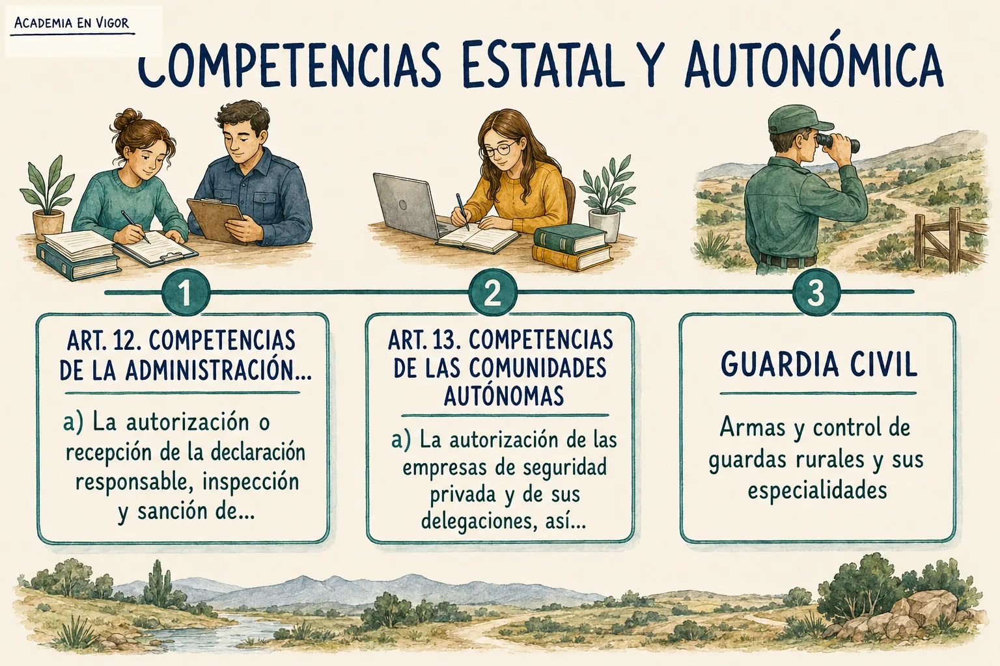

<em>Infografía: flujo de competencias estatal y autonómica.</em>

<!-- FUENTE: L5-2014-BOE-A-2014-3649-GC-T13 -->

## 32. Colaboración, acceso a información y coordinación

### Regla y encaje

Colaboración, acceso a información y coordinación forma parte de coordinación con la seguridad pública. Estúdialo como una secuencia: presupuesto, obligación o facultad, excepción y consecuencia.

### Claves examinables

- **Artículo 14. Colaboración profesional · apartado 1:** 1. La especial obligación de colaboración de las empresas de seguridad, los despachos de detectives y el personal de seguridad privada con las Fuerzas y Cuerpos de Seguridad se desarrollará con sujeción al principio de legalidad y se basará exclusivamente en la necesidad de asegurar el buen fin de las actuaciones tendentes a preservar la seguridad pública, garantizándose la debida reserva y confidencialidad cuando sea necesario. <!-- FACT:GC-T13-F373 -->
- **Artículo 14. Colaboración profesional · apartado 2:** Las empresas de seguridad, los despachos de detectives y el personal de seguridad privada deberán comunicar a las Fuerzas y Cuerpos de Seguridad competentes, tan pronto como sea posible, cualesquiera circunstancias o informaciones relevantes para la prevención, el mantenimiento o restablecimiento de la seguridad ciudadana, así como todo hecho delictivo del que tuviesen conocimiento en el ejercicio de su actividad o funciones, poniendo a su disposición a los presuntos delincuentes, así como los instrumentos, efectos y pruebas relacionadas con los mismos. <!-- FACT:GC-T13-F374 -->
- **Artículo 14. Colaboración profesional · apartado 3:** 3. Las Fuerzas y Cuerpos de Seguridad podrán facilitar al personal de seguridad privada, en el ejercicio de sus funciones, informaciones que faciliten su evaluación de riesgos y consiguiente implementación de medidas de protección. Si estas informaciones contuvieran datos de carácter personal sólo podrán facilitarse en caso de peligro real para la seguridad pública o para evitar la comisión de infracciones penales. <!-- FACT:GC-T13-F375 -->
- **Artículo 15. Acceso a la información por las Fuerzas y Cuerpos de Seguridad · apartado 1:** 1. Se autorizan las cesiones de datos que se consideren necesarias para contribuir a la salvaguarda de la seguridad ciudadana, así como el acceso por parte de las Fuerzas y Cuerpos de Seguridad a los sistemas instalados por las empresas de seguridad privada que permitan la comprobación de las informaciones en tiempo real cuando ello sea necesario para la prevención de un peligro real para la seguridad pública o para la represión de infracciones penales. <!-- FACT:GC-T13-F376 -->
- **Artículo 15. Acceso a la información por las Fuerzas y Cuerpos de Seguridad · apartado 2:** 2. El tratamiento de datos de carácter personal, así como los ficheros, automatizados o no, creados para el cumplimiento de esta ley se someterán a lo dispuesto en la normativa de protección de datos de carácter personal. <!-- FACT:GC-T13-F377 -->
- **Artículo 15. Acceso a la información por las Fuerzas y Cuerpos de Seguridad · apartado 3:** 3. La comunicación de buena fe de información a las Fuerzas y Cuerpos de Seguridad por las entidades y el personal de seguridad privada no constituirá vulneración de las restricciones sobre divulgación de información impuestas por vía contractual o por cualquier disposición legal, reglamentaria o administrativa, cuando ello sea necesario para la prevención de un peligro real para la seguridad pública o para la represión de infracciones penales. <!-- FACT:GC-T13-F378 -->
- **Artículo 16. Coordinación y participación · apartado 1:** 1. El Ministerio del Interior o, en su caso, el órgano autonómico competente adoptará las medidas organizativas que resulten adecuadas para asegurar la coordinación de los servicios de seguridad privada con los de las Fuerzas y Cuerpos de Seguridad. <!-- FACT:GC-T13-F379 -->
- **Artículo 16. Coordinación y participación · apartado 2:** 2. En el ámbito de las competencias de la Administración General del Estado se constituirán comisiones mixtas de seguridad privada, nacionales, autonómicas o provinciales, con el carácter de órganos consultivos y de colaboración entre las administraciones públicas y los representantes del sector. Su composición y funciones se determinarán reglamentariamente. <!-- FACT:GC-T13-F380 -->
- **Artículo 16. Coordinación y participación · apartado 3:** 3. En las comunidades autónomas que tengan asumidas las competencias en materia de seguridad privada de conformidad con lo establecido en el artículo 13, también podrán existir órganos consultivos en materia de seguridad privada, con la composición y funcionamiento que en cada caso se determine. <!-- FACT:GC-T13-F381 -->

:::hablemos-claro
Seguridad pública significa potestad y responsabilidad estatal; seguridad privada significa actividad complementaria, subordinada, controlada y obligada a colaborar.
:::

:::en-la-calle
Ante un supuesto, identifica primero quién actúa, con qué habilitación, qué medida adopta, qué límite legal existe y qué autoridad controla la actuación.
:::

:::lo-que-cae
Prioriza listas cerradas, plazos, excepciones, competencias y efectos. Apariciones oficiales mapeadas: **0**.
:::

<!-- VISUAL:t13-32-colaboracion-acceso-a-informacion-y-coordinacion.webp -->

  

<em>Infografía: comparación de colaboración, acceso a información y coordinación.</em>

<!-- FUENTE: L5-2014-BOE-A-2014-3649-GC-T13 -->

## 33. Actividades y autorización de empresas

### Regla y encaje

Actividades y autorización de empresas forma parte de empresas y despachos de detectives. Estúdialo como una secuencia: presupuesto, obligación o facultad, excepción y consecuencia.

### Claves examinables

- **Artículo 17. Desarrollo de actividades · apartado 1:** 1. Las empresas de seguridad privada únicamente podrán prestar servicios sobre las actividades previstas en el artículo 5.1, excepto la contemplada en el párrafo h) del mismo. <!-- FACT:GC-T13-F382 -->
- **Artículo 17. Desarrollo de actividades · apartado 2:** 2. Además de estas actividades, las empresas de seguridad privada podrán realizar las actividades compatibles a las que se refiere el artículo 6 y dedicarse a la formación, actualización y especialización del personal de seguridad privada, perteneciente o no a sus plantillas, en cuyo caso deberán crear centros de formación, de conformidad con lo previsto en el artículo 29.4 y a lo que reglamentariamente se determine. <!-- FACT:GC-T13-F383 -->
- **Artículo 17. Desarrollo de actividades · apartado 3:** 3. Las empresas de seguridad privada podrán revestir forma societaria o de empresario individual, debiendo cumplir, en ambos casos, la totalidad de condiciones y requisitos previstos en este capítulo para las empresas de seguridad privada. <!-- FACT:GC-T13-F384 -->
- **Artículo 18. Autorización administrativa · apartado 1:** 1. Para la prestación de servicios de seguridad privada, las empresas de seguridad privada deberán obtener autorización administrativa y serán inscritas de oficio en el registro correspondiente, de acuerdo con el procedimiento que se determine reglamentariamente. <!-- FACT:GC-T13-F385 -->
- **Artículo 18. Autorización administrativa · apartado 2:** 2. La autorización administrativa se suplirá por una declaración responsable cuando pretendan dedicarse exclusivamente a la actividad de seguridad privada contemplada en el artículo 5.1.f). <!-- FACT:GC-T13-F386 -->
- **Artículo 18. Autorización administrativa · apartado 3:** 3. La validez de la autorización o de la declaración responsable será indefinida. <!-- FACT:GC-T13-F387 -->

:::hablemos-claro
Seguridad pública significa potestad y responsabilidad estatal; seguridad privada significa actividad complementaria, subordinada, controlada y obligada a colaborar.
:::

:::en-la-calle
Ante un supuesto, identifica primero quién actúa, con qué habilitación, qué medida adopta, qué límite legal existe y qué autoridad controla la actuación.
:::

:::lo-que-cae
Prioriza listas cerradas, plazos, excepciones, competencias y efectos. Apariciones oficiales mapeadas: **1**.
:::

<!-- VISUAL:t13-33-actividades-y-autorizacion-de-empresas.webp -->

  

<em>Infografía: línea temporal de actividades y autorización de empresas.</em>

<!-- FUENTE: L5-2014-BOE-A-2014-3649-GC-T13 -->

## 34. Requisitos generales e inscripción empresarial

### Regla y encaje

Requisitos generales e inscripción empresarial forma parte de empresas y despachos de detectives. Estúdialo como una secuencia: presupuesto, obligación o facultad, excepción y consecuencia.

### Claves examinables

- **Artículo 19. Requisitos generales:** 1. Para la autorización o, en su caso, presentación de declaración responsable, la posterior inscripción en el Registro Nacional de Seguridad Privada o en el correspondiente registro autonómico y el desarrollo de servicios de seguridad privada, las empresas de seguridad privada deberán reunir los siguientes requisitos generales: a) Estar legalmente constituidas e inscritas en el registro mercantil o en el registro público correspondiente y tener por objeto exclusivo todas o alguna de las actividades a las que se refiere el artículo 5.1, excepto la del párrafo h). No obstante, en dicho objeto podrán incluir las actividades que resulten imprescindibles para el cumplimiento de las actividades de seguridad autorizadas, así como las compatibles contempladas en el artículo 6. <!-- FACT:GC-T13-F388 -->
- **Artículo 19. Requisitos generales:** 1. Para la autorización o, en su caso, presentación de declaración responsable, la posterior inscripción en el Registro Nacional de Seguridad Privada o en el correspondiente registro autonómico y el desarrollo de servicios de seguridad privada, las empresas de seguridad privada deberán reunir los siguientes requisitos generales: b) Tener la nacionalidad de un Estado miembro de la Unión Europea o de un Estado parte en el Acuerdo sobre el Espacio Económico Europeo. <!-- FACT:GC-T13-F389 -->
- **Artículo 19. Requisitos generales:** 1. Para la autorización o, en su caso, presentación de declaración responsable, la posterior inscripción en el Registro Nacional de Seguridad Privada o en el correspondiente registro autonómico y el desarrollo de servicios de seguridad privada, las empresas de seguridad privada deberán reunir los siguientes requisitos generales: c) Contar con los medios humanos, de formación, financieros, materiales y técnicos adecuados que, de acuerdo con el principio de proporcionalidad, se determinen reglamentariamente, en función de la naturaleza de las actividades para las que soliciten la autorización o se presente la declaración responsable, y de las características de los servicios que se prestan en relación con tales actividades. <!-- FACT:GC-T13-F390 -->
- **Artículo 19. Requisitos generales:** En particular, cuando se presten servicios para los que se precise el uso de armas, habrán de adoptarse las medidas que garanticen su adecuada custodia, utilización y funcionamiento. <!-- FACT:GC-T13-F391 -->
- **Artículo 19. Requisitos generales:** Igualmente, los ingenieros y técnicos de las empresas de seguridad privada y los operadores de seguridad, deberán disponer de la correspondiente acreditación expedida por el Ministerio del Interior, que se limitará a comprobar la honorabilidad del solicitante y la carencia de antecedentes penales, en los términos que reglamentariamente se establezca. <!-- FACT:GC-T13-F392 -->
- **Artículo 19. Requisitos generales:** Entre las reglas de Artículo 19. Requisitos generales, se establece: d) Disponer de las medidas de seguridad que reglamentariamente se determinen. <!-- FACT:GC-T13-F393 -->
- **Artículo 19. Requisitos generales:** Entre las reglas de Artículo 19. Requisitos generales, se establece: e) Suscribir un contrato de seguro de responsabilidad civil o constituir otras garantías financieras en la cuantía y con las condiciones que se determinen reglamentariamente. <!-- FACT:GC-T13-F394 -->
- **Artículo 19. Requisitos generales:** Entre las reglas de Artículo 19. Requisitos generales, se establece: f) Constituir el aval o seguro de caución que se determine reglamentariamente a disposición de las autoridades españolas, para atender exclusivamente las responsabilidades administrativas por infracciones a la normativa de seguridad privada que se deriven del funcionamiento de la empresa. <!-- FACT:GC-T13-F395 -->
- **Artículo 19. Requisitos generales:** Entre las reglas de Artículo 19. Requisitos generales, se establece: g) No haber sido condenadas mediante sentencia firme por delitos de insolvencia punible, contra la Hacienda Pública, contra la Seguridad Social, contra los derechos de los trabajadores, por intromisión ilegítima en el ámbito de protección del derecho al honor, a la intimidad personal y familiar o a la propia imagen, vulneración del secreto de las comunicaciones o de otros derechos fundamentales, salvo que hubiesen cancelado sus antecedentes penales. <!-- FACT:GC-T13-F396 -->
- **Artículo 19. Requisitos generales:** En el caso de las personas jurídicas, este requisito será aplicable a los administradores de hecho o de derecho y representantes, que, vigente su cargo o representación, no podrán estar incursos en la situación mencionada por actuaciones realizadas en nombre o a beneficio de dichas personas jurídicas. <!-- FACT:GC-T13-F397 -->
- **Artículo 19. Requisitos generales:** Entre las reglas de Artículo 19. Requisitos generales, se establece: h) No haber sido condenadas mediante sentencia firme por intromisión ilegítima en el ámbito de protección del derecho al honor, a la intimidad personal y familiar o a la propia imagen, vulneración del secreto de las comunicaciones o de otros derechos fundamentales en los cinco años anteriores a la solicitud. <!-- FACT:GC-T13-F398 -->
- **Artículo 19. Requisitos generales · apartado 2:** 2. Además del cumplimiento de los requisitos generales, a las empresas de seguridad privada que tengan por objeto alguna de las actividades contempladas en el artículo 5.1.b), c), d), e) y g), se les podrá exigir reglamentariamente el cumplimiento de requisitos y garantías adicionales adecuados a la singularidad de los servicios relacionados con dichas actividades. <!-- FACT:GC-T13-F399 -->
- **Artículo 19. Requisitos generales · apartado 3:** 3. Igualmente, en relación con las actividades contempladas en el artículo 5.1.a), f) y g), podrán ampliarse los requisitos referentes a medios personales y materiales, conforme se disponga reglamentariamente, para poder prestar servicios de seguridad privada en infraestructuras críticas o en servicios esenciales, así como en los servicios descritos en el artículo 40.1 y en artículo 41.2 y 3. <!-- FACT:GC-T13-F400 -->
- **Artículo 19. Requisitos generales · apartado 4:** 4. Para la contratación de servicios de seguridad privada en los sectores estratégicos definidos en la legislación de protección de infraestructuras críticas, las empresas de seguridad privada deberán contar, con carácter previo a su prestación, con una certificación emitida por una entidad de certificación acreditada que garantice, como mínimo, el cumplimiento de la normativa administrativa, laboral, de Seguridad Social y tributaria que les sea de aplicación. <!-- FACT:GC-T13-F401 -->
- **Artículo 19. Requisitos generales · apartado 5:** 5. A los efectos previstos en el apartado 1.e) y f), de este artículo se tendrán en cuenta los requisitos ya exigidos en el Estado miembro de la Unión Europea o parte en el Acuerdo sobre el Espacio Económico Europeo de origen en lo referente a la suscripción del contrato de seguro de responsabilidad civil u otras garantías financieras, así como a la constitución de avales o seguros de caución. <!-- FACT:GC-T13-F402 -->
- **Artículo 19. Requisitos generales · apartado 6:** Las empresas de seguridad privada no españolas, autorizadas para la prestación de servicios de seguridad privada con arreglo a la normativa de cualquiera de los Estados miembros de la Unión Europea o de los Estados parte en el Acuerdo sobre el Espacio Económico Europeo, habrán de inscribirse obligatoriamente en el Registro Nacional de Seguridad Privada del Ministerio del Interior o, cuando tengan su domicilio en una comunidad autónoma con competencias en materia de seguridad privada y su ámbito de actuación limitado a dicho territorio, en el registro autonómico correspondiente, a cuyo efecto deberán acreditar su condición de empresas de seguridad privada y el cumplimiento de los requisitos establecidos en esta ley, en la forma que se determine reglamentariamente. <!-- FACT:GC-T13-F403 -->
- **Artículo 19. Requisitos generales · apartado 7:** Sin perjuicio de lo dispuesto en los apartados anteriores, a las empresas de seguridad privada que tengan por objeto exclusivo la instalación o mantenimiento de aparatos, dispositivos y sistemas de seguridad que incluyan la prestación de servicios de conexión con centrales receptoras de alarma se las podrá eximir del cumplimiento de alguno de los requisitos incluidos en este artículo, excepto los contemplados en los párrafos e) y f) del apartado 1, cuando así se determine reglamentariamente. <!-- FACT:GC-T13-F404 -->
- **Artículo 19. Requisitos generales · apartado 8:** 8. El incumplimiento sobrevenido de los requisitos establecidos en este artículo dará lugar a la extinción de la autorización o al cierre de la empresa, en el caso de presentación de declaración responsable, y, en ambos casos, a la cancelación de oficio de la inscripción de la empresa de seguridad en el registro correspondiente. <!-- FACT:GC-T13-F405 -->
- **Artículo 20. Inscripción registral · apartado 1:** 1. Toda empresa de seguridad privada autorizada o que, en su caso, haya presentado la correspondiente declaración responsable será inscrita de oficio en el Registro Nacional de Seguridad Privada o en el correspondiente registro autonómico. <!-- FACT:GC-T13-F406 -->
- **Artículo 20. Inscripción registral · apartado 2:** No podrá inscribirse en el Registro Nacional de Seguridad Privada o en el correspondiente registro autonómico ninguna empresa cuya denominación coincida, o pueda inducir a error o confusión, con la de otra ya inscrita o con la de órganos o dependencias de las administraciones públicas, o cuando coincida o pueda inducir a confusión con una marca anterior registrada para actividades idénticas o semejantes, salvo que se solicite por el titular de la misma o con su consentimiento. <!-- FACT:GC-T13-F407 -->

:::hablemos-claro
Seguridad pública significa potestad y responsabilidad estatal; seguridad privada significa actividad complementaria, subordinada, controlada y obligada a colaborar.
:::

:::en-la-calle
Ante un supuesto, identifica primero quién actúa, con qué habilitación, qué medida adopta, qué límite legal existe y qué autoridad controla la actuación.
:::

:::lo-que-cae
Prioriza listas cerradas, plazos, excepciones, competencias y efectos. Apariciones oficiales mapeadas: **0**.
:::

<!-- VISUAL:t13-34-requisitos-generales-e-inscripcion-empresarial.webp -->

  

<em>Infografía: escena de requisitos generales e inscripción empresarial.</em>

<!-- FUENTE: L5-2014-BOE-A-2014-3649-GC-T13 -->

## 35. Obligaciones y representantes legales

### Regla y encaje

Obligaciones y representantes legales forma parte de empresas y despachos de detectives. Estúdialo como una secuencia: presupuesto, obligación o facultad, excepción y consecuencia.

### Claves examinables

- **Artículo 21. Obligaciones generales:** 1. Las empresas de seguridad privada deberán cumplir las siguientes obligaciones generales: a) Desarrollar las actividades de seguridad privada en los términos de esta ley y en las condiciones establecidas en la autorización que les haya sido concedida o en la declaración responsable que hayan presentado. <!-- FACT:GC-T13-F408 -->
- **Artículo 21. Obligaciones generales:** 1. Las empresas de seguridad privada deberán cumplir las siguientes obligaciones generales: b) Contar con la infraestructura y logística acorde con las exigencias establecidas en esta ley y en su desarrollo reglamentario. <!-- FACT:GC-T13-F409 -->
- **Artículo 21. Obligaciones generales:** 1. Las empresas de seguridad privada deberán cumplir las siguientes obligaciones generales: c) Comunicar al Registro Nacional o autonómico correspondiente todo cambio que se produzca en cuanto a su forma jurídica, denominación, número de identificación fiscal, domicilio, delegaciones, ámbito territorial de actuación, representantes legales, estatutos, titularidad de las acciones y participaciones sociales, y toda variación que sobrevenga en la composición de los órganos de administración, gestión, representación y dirección de las empresas. <!-- FACT:GC-T13-F410 -->
- **Artículo 21. Obligaciones generales:** Las empresas de seguridad deben comunicar al Registro Nacional o autonómico del lugar donde presten servicios las altas y bajas del personal de seguridad privada de que dispongan y las incidencias concretas relacionadas con los servicios que prestan. <!-- FACT:GC-T13-F411 -->
- **Artículo 21. Obligaciones generales:** Entre las reglas de Artículo 21. Obligaciones generales, se establece: d) Garantizar la formación y actualización profesional del personal de seguridad privada del que dispongan y del personal de la empresa que requiera formación en materia de seguridad privada. El mantenimiento de la aptitud en el uso de las armas de fuego se hará con la participación de instructores de tiro habilitados. <!-- FACT:GC-T13-F412 -->
- **Artículo 21. Obligaciones generales:** Entre las reglas de Artículo 21. Obligaciones generales, se establece: e) Presentar cada año al Ministerio del Interior o al órgano autonómico competente un informe sobre sus actividades y el resumen de las cuentas anuales, debidamente auditadas cuando sea preceptivo, con la información y datos que reglamentariamente se determinen. En ningún caso dicha memoria contendrá datos de carácter personal. <!-- FACT:GC-T13-F413 -->
- **Artículo 21. Obligaciones generales:** El Ministerio del Interior y los órganos autonómicos competentes darán cuenta del funcionamiento del sector a las Cortes Generales y a los Parlamentos autonómicos correspondientes respectivamente, anualmente. <!-- FACT:GC-T13-F414 -->
- **Artículo 21. Obligaciones generales · apartado 2:** 2. Asimismo, las empresas de seguridad privada vendrán obligadas a prestar especial auxilio y colaboración a las Fuerzas y Cuerpos de Seguridad, debiendo facilitar a éstas la información que se les requiera en relación con las competencias atribuidas a las mismas. <!-- FACT:GC-T13-F415 -->
- **Artículo 22. Representantes legales · apartado 1:** 1. A los efectos de esta ley, se entenderá por representante legal de las empresas de seguridad privada todo aquel que asuma o realice las tareas de dirección, administración, gestión y representación, o cualquiera de ellas, en nombre de aquéllas. <!-- FACT:GC-T13-F416 -->
- **Artículo 22. Representantes legales:** 2. Los representantes de las empresas de seguridad privada, que se inscribirán en el Registro Nacional de Seguridad Privada o en el correspondiente registro autonómico, deberán: a) Ser personas físicas residentes en el territorio de alguno de los Estados miembros de la Unión Europea o de un Estado parte en el Acuerdo sobre el Espacio Económico Europeo. <!-- FACT:GC-T13-F417 -->
- **Artículo 22. Representantes legales:** 2. Los representantes de las empresas de seguridad privada, que se inscribirán en el Registro Nacional de Seguridad Privada o en el correspondiente registro autonómico, deberán: b) Carecer de antecedentes penales por delitos dolosos. <!-- FACT:GC-T13-F418 -->
- **Artículo 22. Representantes legales:** 2. Los representantes de las empresas de seguridad privada, que se inscribirán en el Registro Nacional de Seguridad Privada o en el correspondiente registro autonómico, deberán: c) No haber sido sancionados en los dos o cuatro años anteriores por infracción grave o muy grave, respectivamente, en materia de seguridad privada. <!-- FACT:GC-T13-F419 -->
- **Artículo 22. Representantes legales:** 2. Los representantes de las empresas de seguridad privada, que se inscribirán en el Registro Nacional de Seguridad Privada o en el correspondiente registro autonómico, deberán: d) No haber sido separados del servicio en las Fuerzas Armadas o en las Fuerzas y Cuerpos de Seguridad, ni haber ejercido funciones de control de las entidades o servicios de seguridad, vigilancia o investigación privadas, ni de su personal o medios, como miembros de las Fuerzas y Cuerpos de Seguridad, en los dos años anteriores. <!-- FACT:GC-T13-F420 -->
- **Artículo 22. Representantes legales:** 2. Los representantes de las empresas de seguridad privada, que se inscribirán en el Registro Nacional de Seguridad Privada o en el correspondiente registro autonómico, deberán: e) No haber sido administrador de hecho o de derecho o apoderado general, en los diez años anteriores, en una empresa que haya sido declarada en concurso calificado como culpable, o condenada mediante sentencia firme por delitos de insolvencia punible, contra la Hacienda Pública, contra la Seguridad Social o contra los derechos de los trabajadores, por intromisión ilegítima en el ámbito de protección del derecho al honor, a la intimidad personal y familiar o a la propia imagen, vulneración del secreto de las comunicaciones o de otros derechos fundamentales. <!-- FACT:GC-T13-F421 -->
- **Artículo 22. Representantes legales · apartado 3:** 3. Los representantes legales de las empresas de seguridad privada serán responsables del cumplimiento de las obligaciones generales impuestas a las mismas por el artículo anterior. <!-- FACT:GC-T13-F422 -->
- **Artículo 23. Consideración de sector específico · apartado 1:** 1. Las empresas de seguridad privada tienen la consideración de sector económico con regulación específica en materia de derecho de establecimiento. <!-- FACT:GC-T13-F423 -->
- **Artículo 23. Consideración de sector específico · apartado 2:** 2. Cuando el Consejo de Ministros, con arreglo a lo dispuesto en la normativa sobre inversiones extranjeras, suspenda el régimen de liberalización de los movimientos de capital, la autorización previa de inversiones de capital extranjero en empresas de seguridad privada exigirá, en todo caso, informe previo del Ministerio del Interior. <!-- FACT:GC-T13-F424 -->
- **Artículo 23. Consideración de sector específico · apartado 3:** 3. Las empresas de seguridad privada en las que se hubieran realizado inversiones de capital extranjero estarán obligadas a comunicar al Ministerio del Interior todo cambio que se produzca en las mismas, en relación con lo establecido en el artículo 21.1.c). <!-- FACT:GC-T13-F425 -->
- **Artículo 23. Consideración de sector específico · apartado 4:** 4. Las limitaciones establecidas en los dos apartados precedentes no son de aplicación a las personas físicas nacionales de los Estados miembros de la Unión Europea ni a las empresas constituidas de conformidad con la legislación de un Estado miembro y cuya sede social, administración central o centro de actividad principal se encuentre dentro de la Unión Europea. <!-- FACT:GC-T13-F426 -->

:::hablemos-claro
Seguridad pública significa potestad y responsabilidad estatal; seguridad privada significa actividad complementaria, subordinada, controlada y obligada a colaborar.
:::

:::en-la-calle
Ante un supuesto, identifica primero quién actúa, con qué habilitación, qué medida adopta, qué límite legal existe y qué autoridad controla la actuación.
:::

:::lo-que-cae
Prioriza listas cerradas, plazos, excepciones, competencias y efectos. Apariciones oficiales mapeadas: **0**.
:::

<!-- VISUAL:t13-35-obligaciones-y-representantes-legales.webp -->

  

<em>Infografía: capas de obligaciones y representantes legales.</em>

<!-- FUENTE: L5-2014-BOE-A-2014-3649-GC-T13 -->

## 36. Despachos de detectives: apertura y obligaciones

### Regla y encaje

Despachos de detectives: apertura y obligaciones forma parte de empresas y despachos de detectives. Estúdialo como una secuencia: presupuesto, obligación o facultad, excepción y consecuencia.

### Claves examinables

- **Artículo 24. Apertura de despachos de detectives privados · apartado 1:** 1. De acuerdo con lo que se disponga reglamentariamente, podrán abrir despachos de detectives privados y, en su caso, sucursales, las personas físicas habilitadas como tales y las personas jurídicas constituidas exclusivamente por detectives privados habilitados, que únicamente podrán desarrollar la actividad mencionada en el artículo 5.1.h). <!-- FACT:GC-T13-F427 -->
- **Artículo 24. Apertura de despachos de detectives privados:** 2. Los despachos de detectives privados se inscribirán de oficio en el Registro Nacional de Seguridad Privada o, en su caso, en el registro de la comunidad autónoma competente, previa presentación de declaración responsable en la forma que reglamentariamente se determine, para lo cual deberán reunir los siguientes requisitos generales: a) Tener por objeto de su actividad profesional la realización de los servicios de investigación privada a que se refiere el artículo 48.1 y conforme a lo establecido en el artículo 10 de esta ley en materia de prohibiciones. <!-- FACT:GC-T13-F428 -->
- **Artículo 24. Apertura de despachos de detectives privados:** 2. Los despachos de detectives privados se inscribirán de oficio en el Registro Nacional de Seguridad Privada o, en su caso, en el registro de la comunidad autónoma competente, previa presentación de declaración responsable en la forma que reglamentariamente se determine, para lo cual deberán reunir los siguientes requisitos generales: b) En el caso de personas jurídicas, estar legalmente constituidas e inscritas en el Registro Mercantil o en el registro público correspondiente, y cumplir con los requisitos establecidos en el artículo 19.1.g) y h). <!-- FACT:GC-T13-F429 -->
- **Artículo 24. Apertura de despachos de detectives privados:** 2. Los despachos de detectives privados se inscribirán de oficio en el Registro Nacional de Seguridad Privada o, en su caso, en el registro de la comunidad autónoma competente, previa presentación de declaración responsable en la forma que reglamentariamente se determine, para lo cual deberán reunir los siguientes requisitos generales: c) Fijar un domicilio como sede física del despacho en el que se desarrollará la actividad, se llevará el libro-registro y se encontrará el archivo de los expedientes de contratación y de los informes de investigación. <!-- FACT:GC-T13-F430 -->
- **Artículo 24. Apertura de despachos de detectives privados:** 2. Los despachos de detectives privados se inscribirán de oficio en el Registro Nacional de Seguridad Privada o, en su caso, en el registro de la comunidad autónoma competente, previa presentación de declaración responsable en la forma que reglamentariamente se determine, para lo cual deberán reunir los siguientes requisitos generales: d) Facilitar una relación nominal de detectives privados adscritos al despacho como integrantes asociados o dependientes del mismo. <!-- FACT:GC-T13-F431 -->
- **Artículo 24. Apertura de despachos de detectives privados:** 2. Los despachos de detectives privados se inscribirán de oficio en el Registro Nacional de Seguridad Privada o, en su caso, en el registro de la comunidad autónoma competente, previa presentación de declaración responsable en la forma que reglamentariamente se determine, para lo cual deberán reunir los siguientes requisitos generales: e) Suscribir un contrato de seguro de responsabilidad civil o constituir otras garantías financieras en la cuantía y con las condiciones que se determinen reglamentariamente. <!-- FACT:GC-T13-F432 -->
- **Artículo 24. Apertura de despachos de detectives privados:** 2. Los despachos de detectives privados se inscribirán de oficio en el Registro Nacional de Seguridad Privada o, en su caso, en el registro de la comunidad autónoma competente, previa presentación de declaración responsable en la forma que reglamentariamente se determine, para lo cual deberán reunir los siguientes requisitos generales: f) Constituir el aval o seguro de caución que se determine reglamentariamente a disposición de las autoridades españolas para atender exclusivamente las responsabilidades administrativas por infracciones a la normativa de seguridad privada que se deriven del funcionamiento de los despachos. <!-- FACT:GC-T13-F433 -->
- **Artículo 24. Apertura de despachos de detectives privados:** 2. Los despachos de detectives privados se inscribirán de oficio en el Registro Nacional de Seguridad Privada o, en su caso, en el registro de la comunidad autónoma competente, previa presentación de declaración responsable en la forma que reglamentariamente se determine, para lo cual deberán reunir los siguientes requisitos generales: g) Mantener en todo momento el titular y los demás detectives integrantes del despacho la habilitación profesional. <!-- FACT:GC-T13-F434 -->
- **Artículo 24. Apertura de despachos de detectives privados:** 2. Los despachos de detectives privados se inscribirán de oficio en el Registro Nacional de Seguridad Privada o, en su caso, en el registro de la comunidad autónoma competente, previa presentación de declaración responsable en la forma que reglamentariamente se determine, para lo cual deberán reunir los siguientes requisitos generales: h) Contar con las medidas de seguridad que reglamentariamente se determinen. <!-- FACT:GC-T13-F435 -->
- **Artículo 24. Apertura de despachos de detectives privados · apartado 3:** 3. La validez de la declaración responsable necesaria para la apertura de los despachos de detectives y de sus sucursales será indefinida. <!-- FACT:GC-T13-F436 -->
- **Artículo 24. Apertura de despachos de detectives privados · apartado 4:** 4. Los despachos de detectives podrán revestir forma societaria o de empresario individual, debiendo, en ambos casos, cumplir la totalidad de requisitos y obligaciones previstos en este capítulo para los despachos de detectives. <!-- FACT:GC-T13-F437 -->
- **Artículo 24. Apertura de despachos de detectives privados · apartado 5:** 5. El incumplimiento sobrevenido de los requisitos exigidos para la apertura de los despachos de detectives producirá el cierre de los mismos y la cancelación de oficio de su inscripción en el Registro Nacional de Seguridad Privada o, en su caso, en el registro de la comunidad autónoma competente. <!-- FACT:GC-T13-F438 -->
- **Artículo 25. Obligaciones generales:** 1. Los despachos de detectives privados y sus sucursales deberán cumplir las siguientes obligaciones generales: a) Formalizar por escrito un contrato por cada servicio de investigación que les sea encargado, comunicando su celebración al Ministerio del Interior o, en su caso, al órgano autonómico competente en la forma que reglamentariamente se determine. Dicha obligación subsistirá igualmente en los casos de subcontratación entre despachos. <!-- FACT:GC-T13-F439 -->
- **Artículo 25. Obligaciones generales:** 1. Los despachos de detectives privados y sus sucursales deberán cumplir las siguientes obligaciones generales: b) Llevar un libro-registro, con el formato que reglamentariamente se determine, en el que se anotará cada servicio de investigación contratado o subcontratado. <!-- FACT:GC-T13-F440 -->
- **Artículo 25. Obligaciones generales:** 1. Los despachos de detectives privados y sus sucursales deberán cumplir las siguientes obligaciones generales: c) Informar a sus clientes sobre las incidencias relativas a los asuntos que les hubieren encargado, con entrega, en su caso, del informe de investigación elaborado. <!-- FACT:GC-T13-F441 -->
- **Artículo 25. Obligaciones generales:** 1. Los despachos de detectives privados y sus sucursales deberán cumplir las siguientes obligaciones generales: d) Facilitar de forma inmediata a la autoridad judicial o a las Fuerzas y Cuerpos de Seguridad competentes las informaciones sobre hechos delictivos de que tuvieren conocimiento en relación con su trabajo o con las investigaciones que éstos estén llevando a cabo. <!-- FACT:GC-T13-F442 -->
- **Artículo 25. Obligaciones generales:** 1. Los despachos de detectives privados y sus sucursales deberán cumplir las siguientes obligaciones generales: e) Acudir, cuando sean requeridos para ello por los órganos competentes de la Administración de Justicia y de las Fuerzas y Cuerpos de Seguridad, a su llamamiento, tan pronto como resulte posible, y facilitar las informaciones de que tuvieren conocimiento en relación con las investigaciones que tales organismos se encontraran llevando a cabo. <!-- FACT:GC-T13-F443 -->
- **Artículo 25. Obligaciones generales:** 1. Los despachos de detectives privados y sus sucursales deberán cumplir las siguientes obligaciones generales: f) Atender las citaciones que realicen los juzgados y tribunales y las dependencias policiales, a los cuales sus informaciones hayan sido comunicadas o sus informes de investigación hayan sido aportados, para la prestación de testimonio y ratificación, en su caso, del contenido de los referidos informes de investigación. <!-- FACT:GC-T13-F444 -->
- **Artículo 25. Obligaciones generales:** 1. Los despachos de detectives privados y sus sucursales deberán cumplir las siguientes obligaciones generales: g) Asegurar el archivo y conservación de la documentación relativa a su ejercicio profesional, especialmente de los contratos, informes, libros y material de imagen y sonido obtenido. <!-- FACT:GC-T13-F445 -->
- **Artículo 25. Obligaciones generales:** 1. Los despachos de detectives privados y sus sucursales deberán cumplir las siguientes obligaciones generales: h) Comunicar al Ministerio del Interior o, en su caso, al órgano autonómico competente todo cambio que afecte a su forma jurídica, denominación, composición, domicilio y sucursales en la forma que reglamentariamente se determine. <!-- FACT:GC-T13-F446 -->
- **Artículo 25. Obligaciones generales:** 1. Los despachos de detectives privados y sus sucursales deberán cumplir las siguientes obligaciones generales: i) Presentar al Ministerio del Interior o, en su caso, al órgano autonómico competente, una memoria anual de actividades del año precedente, con la información que se determine reglamentariamente, que no podrá contener datos de carácter personal sobre contratantes o investigados. <!-- FACT:GC-T13-F447 -->
- **Artículo 25. Obligaciones generales:** Entre las reglas de Artículo 25. Obligaciones generales, se establece: j) Depositar, en caso de cierre del despacho por cualquier causa, la documentación profesional sobre contratos, informes de investigación y libros-registros en las dependencias del Cuerpo Nacional de Policía o, en su caso, del cuerpo de policía autonómico competente. <!-- FACT:GC-T13-F448 -->
- **Artículo 25. Obligaciones generales · apartado 2:** 2. Los titulares de despachos de detectives responderán civilmente de las acciones u omisiones en que, durante la ejecución de sus servicios, incurran los detectives privados dependientes o asociados. <!-- FACT:GC-T13-F449 -->

:::hablemos-claro
Seguridad pública significa potestad y responsabilidad estatal; seguridad privada significa actividad complementaria, subordinada, controlada y obligada a colaborar.
:::

:::en-la-calle
Ante un supuesto, identifica primero quién actúa, con qué habilitación, qué medida adopta, qué límite legal existe y qué autoridad controla la actuación.
:::

:::lo-que-cae
Prioriza listas cerradas, plazos, excepciones, competencias y efectos. Apariciones oficiales mapeadas: **1**.
:::

<!-- VISUAL:t13-36-despachos-de-detectives-apertura-y-obligaciones.webp -->

  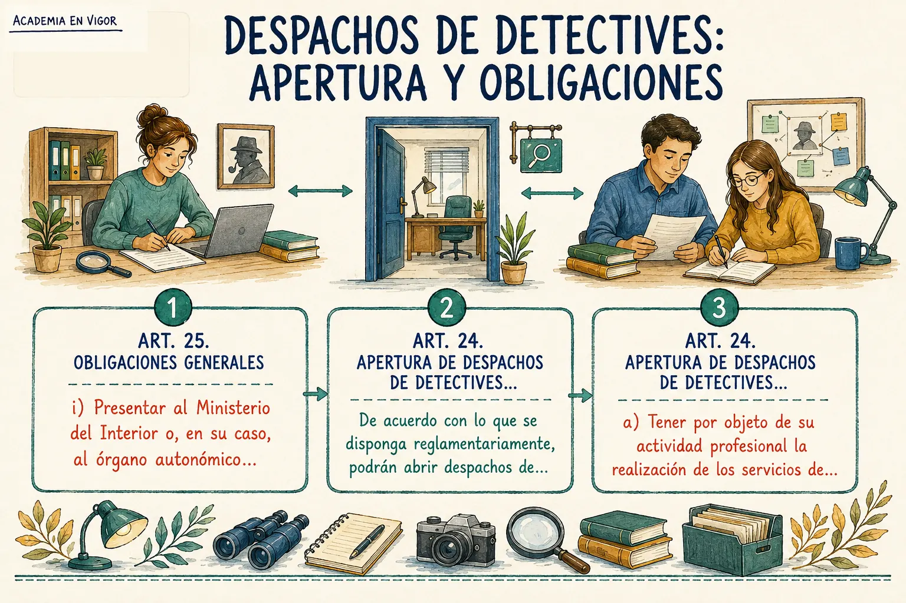

<em>Infografía: mapa de despachos de detectives: apertura y obligaciones.</em>

<!-- FUENTE: L5-2014-BOE-A-2014-3649-GC-T13 -->

## 37. Profesiones y habilitación profesional

### Regla y encaje

Profesiones y habilitación profesional forma parte de personal de seguridad privada. Estúdialo como una secuencia: presupuesto, obligación o facultad, excepción y consecuencia.

### Claves examinables

- **Artículo 26. Profesiones de seguridad privada · apartado 1:** 1. Únicamente puede ejercer funciones de seguridad privada el personal de seguridad privada, que estará integrado por los vigilantes de seguridad y su especialidad de vigilantes de explosivos, los escoltas privados, los guardas rurales y sus especialidades de guardas de caza y guardapescas marítimos, los jefes de seguridad, los directores de seguridad y los detectives privados. <!-- FACT:GC-T13-F450 -->
- **Artículo 26. Profesiones de seguridad privada · apartado 2:** 2. Para habilitarse como vigilante de explosivos será necesario haber obtenido previamente la habilitación como vigilante de seguridad. <!-- FACT:GC-T13-F451 -->
- **Artículo 26. Profesiones de seguridad privada:** Para habilitarse como guarda de caza o guardapesca marítimo será necesario haberlo hecho previamente como guarda rural. <!-- FACT:GC-T13-F452 -->
- **Artículo 26. Profesiones de seguridad privada · apartado 3:** 3. Para la prestación de servicios en infraestructuras críticas y en aquéllos que tengan el carácter de esenciales para la comunidad, así como en aquéllos otros que excepcionalmente lo requieran en función de sus características específicas, se podrá incrementar reglamentariamente la exigencia formativa al personal de seguridad privada encargado de su realización. <!-- FACT:GC-T13-F453 -->
- **Artículo 26. Profesiones de seguridad privada · apartado 4:** 4. Reglamentariamente se regulará la obtención por el personal de seguridad privada de habilitaciones adicionales a las ya adquiridas. El desarrollo reglamentario contemplará la exclusión de los requisitos de formación ya acreditados y valorará para la adquisición de dicha habilitación adicional la experiencia acreditada en el desarrollo de funciones de seguridad privada. <!-- FACT:GC-T13-F454 -->
- **Artículo 26. Profesiones de seguridad privada · apartado 5:** 5. La uniformidad, distintivos y medios de defensa de los vigilantes de seguridad y de los guardas rurales y sus respectivas especialidades se determinarán reglamentariamente. <!-- FACT:GC-T13-F455 -->
- **Artículo 27. Habilitación profesional · apartado 1:** 1. Para el ejercicio de las funciones de seguridad privada, el personal al que se refiere el artículo anterior habrá de obtener previamente la correspondiente habilitación del Ministerio del Interior, en los términos que reglamentariamente se determinen. <!-- FACT:GC-T13-F456 -->
- **Artículo 27. Habilitación profesional · apartado 2:** 2. A quienes soliciten la habilitación, previa comprobación de que reúnen los requisitos necesarios, se les expedirá la tarjeta de identidad profesional, que incluirá todas las habilitaciones de las que el titular disponga. <!-- FACT:GC-T13-F457 -->
- **Artículo 27. Habilitación profesional:** La tarjeta de identidad profesional constituirá el documento público de acreditación del personal de seguridad privada mientras se encuentra en el ejercicio de sus funciones profesionales. <!-- FACT:GC-T13-F458 -->
- **Artículo 27. Habilitación profesional · apartado 3:** 3. La habilitación de todo el personal de seguridad privada corresponderá a la Dirección General de la Policía, excepto la de los guardas rurales y sus especialidades que corresponderá a la Dirección General de la Guardia Civil. <!-- FACT:GC-T13-F459 -->
- **Artículo 27. Habilitación profesional · apartado 4:** 4. El personal de seguridad privada ejercerá exclusivamente las funciones para los que se encuentre habilitado. <!-- FACT:GC-T13-F460 -->
- **Artículo 27. Habilitación profesional · apartado 5:** 5. Reglamentariamente se determinará el régimen de incompatibilidades para el ejercicio de funciones de seguridad privada. <!-- FACT:GC-T13-F461 -->

:::hablemos-claro
Seguridad pública significa potestad y responsabilidad estatal; seguridad privada significa actividad complementaria, subordinada, controlada y obligada a colaborar.
:::

:::en-la-calle
Ante un supuesto, identifica primero quién actúa, con qué habilitación, qué medida adopta, qué límite legal existe y qué autoridad controla la actuación.
:::

:::lo-que-cae
Prioriza listas cerradas, plazos, excepciones, competencias y efectos. Apariciones oficiales mapeadas: **4**.
:::

<!-- VISUAL:t13-37-profesiones-y-habilitacion-profesional.webp -->

  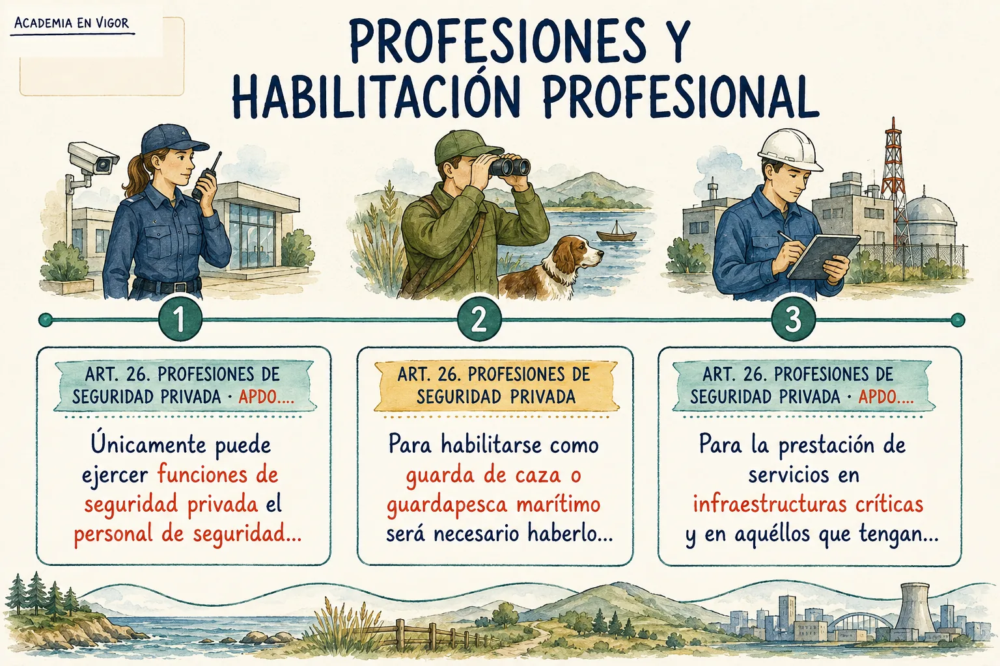

<em>Infografía: flujo de profesiones y habilitación profesional.</em>

<!-- FUENTE: L5-2014-BOE-A-2014-3649-GC-T13 -->

## 38. Requisitos generales y formación

### Regla y encaje

Requisitos generales y formación forma parte de personal de seguridad privada. Estúdialo como una secuencia: presupuesto, obligación o facultad, excepción y consecuencia.

### Claves examinables

- **Artículo 28. Requisitos generales:** 1. Para la obtención de las habilitaciones profesionales indicadas en el artículo anterior, los aspirantes habrán de reunir, los siguientes requisitos generales: a) Tener la nacionalidad de alguno de los Estados miembros de la Unión Europea o de un Estado parte en el Acuerdo sobre el Espacio Económico Europeo, o ser nacional de un tercer Estado que tenga suscrito con España un convenio internacional en el que cada parte reconozca el acceso al ejercicio de estas actividades a los nacionales de la otra. <!-- FACT:GC-T13-F462 -->
- **Artículo 28. Requisitos generales:** 1. Para la obtención de las habilitaciones profesionales indicadas en el artículo anterior, los aspirantes habrán de reunir, los siguientes requisitos generales: b) Ser mayor de edad. <!-- FACT:GC-T13-F463 -->
- **Artículo 28. Requisitos generales:** 1. Para la obtención de las habilitaciones profesionales indicadas en el artículo anterior, los aspirantes habrán de reunir, los siguientes requisitos generales: c) Poseer la capacidad física y la aptitud psicológica necesarias para el ejercicio de las funciones. <!-- FACT:GC-T13-F464 -->
- **Artículo 28. Requisitos generales:** 1. Para la obtención de las habilitaciones profesionales indicadas en el artículo anterior, los aspirantes habrán de reunir, los siguientes requisitos generales: d) Estar en posesión de la formación previa requerida en el artículo 29. <!-- FACT:GC-T13-F465 -->
- **Artículo 28. Requisitos generales:** 1. Para la obtención de las habilitaciones profesionales indicadas en el artículo anterior, los aspirantes habrán de reunir, los siguientes requisitos generales: e) Carecer de antecedentes penales por delitos dolosos. <!-- FACT:GC-T13-F466 -->
- **Artículo 28. Requisitos generales:** 1. Para la obtención de las habilitaciones profesionales indicadas en el artículo anterior, los aspirantes habrán de reunir, los siguientes requisitos generales: f) No haber sido sancionado en los dos o cuatro años anteriores por infracción grave o muy grave, respectivamente, en materia de seguridad privada. <!-- FACT:GC-T13-F467 -->
- **Artículo 28. Requisitos generales:** 1. Para la obtención de las habilitaciones profesionales indicadas en el artículo anterior, los aspirantes habrán de reunir, los siguientes requisitos generales: g) No haber sido separado del servicio en las Fuerzas y Cuerpos de Seguridad o en las Fuerzas Armadas españolas o del país de su nacionalidad o procedencia en los dos años anteriores. <!-- FACT:GC-T13-F468 -->
- **Artículo 28. Requisitos generales:** 1. Para la obtención de las habilitaciones profesionales indicadas en el artículo anterior, los aspirantes habrán de reunir, los siguientes requisitos generales: h) No haber sido condenado por intromisión ilegítima en el ámbito de protección del derecho al honor, a la intimidad personal y familiar o a la propia imagen, vulneración del secreto de las comunicaciones o de otros derechos fundamentales en los cinco años anteriores a la solicitud. <!-- FACT:GC-T13-F469 -->
- **Artículo 28. Requisitos generales:** 1. Para la obtención de las habilitaciones profesionales indicadas en el artículo anterior, los aspirantes habrán de reunir, los siguientes requisitos generales: i) Superar, en su caso, las pruebas de comprobación que reglamentariamente establezca el Ministerio del Interior, que acrediten los conocimientos y la capacidad necesarios para el ejercicio de sus funciones. <!-- FACT:GC-T13-F470 -->
- **Artículo 28. Requisitos generales · apartado 2:** 2. Además de los requisitos generales establecidos en el apartado anterior, el personal de seguridad privada habrá de reunir, para su habilitación, los requisitos específicos que reglamentariamente se determinen en atención a las funciones que haya de desempeñar. <!-- FACT:GC-T13-F471 -->
- **Artículo 28. Requisitos generales · apartado 3:** 3. La pérdida de alguno de los requisitos establecidos en este artículo producirá la extinción de la habilitación y la cancelación de oficio de la inscripción en el Registro Nacional. <!-- FACT:GC-T13-F472 -->
- **Artículo 28. Requisitos generales · apartado 4:** 4. Podrán habilitarse, pero no podrán ejercer funciones propias del personal de seguridad privada, los funcionarios públicos en activo y demás personal al servicio de cualquiera de las administraciones públicas, excepto cuando desempeñen la función de director de seguridad en el propio centro a que pertenezcan. <!-- FACT:GC-T13-F473 -->
- **Artículo 28. Requisitos generales:** Los miembros de las Fuerzas y Cuerpos de Seguridad podrán ejercer funciones propias del personal de seguridad privada cuando pasen a una situación administrativa distinta a la de servicio activo, siempre que en los dos años anteriores no hayan desempeñado funciones de control de las entidades, servicios o actuaciones de seguridad, vigilancia o investigación privadas, ni de su personal o medios. <!-- FACT:GC-T13-F474 -->
- **Artículo 28. Requisitos generales:** 5. Los nacionales de otros Estados miembros de la Unión Europea o de Estados parte en el Acuerdo sobre el Espacio Económico Europeo, cuya habilitación o cualificación profesional haya sido obtenida en alguno de dichos Estados para el desempeño de funciones de seguridad privada en el mismo, podrán prestar servicios en España, siempre que, previa comprobación por el Ministerio del Interior, se acredite que cumplen los siguientes requisitos: a) Poseer alguna titulación, habilitación o certificación expedida por las autoridades competentes de cualquier Estado miembro o de un Estado parte en el Acuerdo sobre el Espacio Económico Europeo que les autorice para el ejercicio de funciones de seguridad privada en el mismo. <!-- FACT:GC-T13-F475 -->
- **Artículo 28. Requisitos generales:** 5. Los nacionales de otros Estados miembros de la Unión Europea o de Estados parte en el Acuerdo sobre el Espacio Económico Europeo, cuya habilitación o cualificación profesional haya sido obtenida en alguno de dichos Estados para el desempeño de funciones de seguridad privada en el mismo, podrán prestar servicios en España, siempre que, previa comprobación por el Ministerio del Interior, se acredite que cumplen los siguientes requisitos: b) Acreditar los conocimientos, formación y aptitudes equivalentes a los exigidos en España para el ejercicio de las profesiones relacionadas con la seguridad privada. <!-- FACT:GC-T13-F476 -->
- **Artículo 28. Requisitos generales:** 5. Los nacionales de otros Estados miembros de la Unión Europea o de Estados parte en el Acuerdo sobre el Espacio Económico Europeo, cuya habilitación o cualificación profesional haya sido obtenida en alguno de dichos Estados para el desempeño de funciones de seguridad privada en el mismo, podrán prestar servicios en España, siempre que, previa comprobación por el Ministerio del Interior, se acredite que cumplen los siguientes requisitos: c) Tener conocimientos de lengua castellana suficientes para el normal desempeño de las funciones de seguridad privada. <!-- FACT:GC-T13-F477 -->
- **Artículo 28. Requisitos generales:** 5. Los nacionales de otros Estados miembros de la Unión Europea o de Estados parte en el Acuerdo sobre el Espacio Económico Europeo, cuya habilitación o cualificación profesional haya sido obtenida en alguno de dichos Estados para el desempeño de funciones de seguridad privada en el mismo, podrán prestar servicios en España, siempre que, previa comprobación por el Ministerio del Interior, se acredite que cumplen los siguientes requisitos: d) Los previstos en los párrafos b), e), f), g) y h) del apartado 1. <!-- FACT:GC-T13-F478 -->
- **Artículo 28. Requisitos generales · apartado 6:** La carencia o insuficiencia de conocimientos o aptitudes necesarios para el ejercicio en España de funciones de seguridad privada por parte de los nacionales de Estados miembros de la Unión Europea o de Estados parte en el Acuerdo sobre el Espacio Económico Europeo, podrá suplirse por aplicación de las medidas compensatorias previstas en la normativa vigente sobre reconocimiento de cualificaciones profesionales, de conformidad con lo que se determine reglamentariamente. <!-- FACT:GC-T13-F479 -->
- **Artículo 29. Formación:** 1. La formación requerida para el personal de seguridad privada consistirá: a) Para los vigilantes de seguridad, vigilantes de explosivos, escoltas privados, guardas rurales, guardas de caza y guardapescas marítimos, en la obtención de la certificación acreditativa correspondiente, expedida por un centro de formación de personal de seguridad privada que haya presentado la declaración responsable ante el Ministerio del Interior o el órgano autonómico competente, o de los correspondientes certificados de profesionalidad de vigilancia y seguridad privada y guarderío rural y marítimo, que establezca el Gobierno a propuesta del Ministerio de Empleo y Seguridad Social, o del título de formación profesional que establezca el Gobierno a propuesta del Ministerio de Educación, Cultura y Deporte. <!-- FACT:GC-T13-F480 -->
- **Artículo 29. Formación:** En estos dos últimos casos no se exigirá la prueba de comprobación de conocimientos y capacidad a que se refiere el artículo 28.1.i). <!-- FACT:GC-T13-F481 -->
- **Artículo 29. Formación:** Entre las reglas de Artículo 29. Formación, se establece: b) Para los jefes y directores de seguridad, en la obtención bien de un título universitario oficial de grado en el ámbito de la seguridad que acredite la adquisición de las competencias que se determinen, o bien del título del curso de dirección de seguridad, reconocido por el Ministerio del Interior. <!-- FACT:GC-T13-F482 -->
- **Artículo 29. Formación:** Entre las reglas de Artículo 29. Formación, se establece: c) Para los detectives privados, en la obtención bien de un título universitario de grado en el ámbito de la investigación privada que acredite la adquisición de las competencias que se determinen, o bien del título del curso de investigación privada, reconocido por el Ministerio del Interior. <!-- FACT:GC-T13-F483 -->
- **Artículo 29. Formación · apartado 2:** 2. Cuando se trate de miembros de las Fuerzas y Cuerpos de Seguridad y de las Fuerzas Armadas se tendrá en cuenta, en la forma que reglamentariamente se establezca, el grado y experiencia profesionales que acrediten su cualificación para el desempeño de las diferentes funciones de seguridad privada, siendo exigible en todo caso la prueba de comprobación de conocimientos y capacidad a que se refiere el artículo 28.1.i). <!-- FACT:GC-T13-F484 -->
- **Artículo 29. Formación · apartado 3:** En relación con lo dispuesto en el apartado 1, la formación previa del personal comprendido en su párrafo a) que no posea la titulación correspondiente de formación profesional, o los certificados de profesionalidad, así como su actualización y especialización se llevará a cabo en los centros de formación de seguridad privada que hayan presentado la declaración responsable ante el Ministerio del Interior o el órgano autonómico competente. y por profesores acreditados por el citado Ministerio. <!-- FACT:GC-T13-F485 -->
- **Artículo 29. Formación:** 4. Los centros de formación del personal de seguridad privada requerirán, para su apertura y funcionamiento, de la presentación de la correspondiente declaración responsable ante el Ministerio del Interior u órgano autonómico competente, debiendo reunir, entre otros que reglamentariamente se establezcan, los siguientes requisitos: a) Acreditación, por cualquier título, del derecho de uso del inmueble. <!-- FACT:GC-T13-F486 -->
- **Artículo 29. Formación:** 4. Los centros de formación del personal de seguridad privada requerirán, para su apertura y funcionamiento, de la presentación de la correspondiente declaración responsable ante el Ministerio del Interior u órgano autonómico competente, debiendo reunir, entre otros que reglamentariamente se establezcan, los siguientes requisitos: b) Licencia municipal correspondiente. <!-- FACT:GC-T13-F487 -->
- **Artículo 29. Formación:** 4. Los centros de formación del personal de seguridad privada requerirán, para su apertura y funcionamiento, de la presentación de la correspondiente declaración responsable ante el Ministerio del Interior u órgano autonómico competente, debiendo reunir, entre otros que reglamentariamente se establezcan, los siguientes requisitos: c) Relación de profesores acreditados. <!-- FACT:GC-T13-F488 -->
- **Artículo 29. Formación:** 4. Los centros de formación del personal de seguridad privada requerirán, para su apertura y funcionamiento, de la presentación de la correspondiente declaración responsable ante el Ministerio del Interior u órgano autonómico competente, debiendo reunir, entre otros que reglamentariamente se establezcan, los siguientes requisitos: d) Instalaciones adecuadas al cumplimiento de sus fines. <!-- FACT:GC-T13-F489 -->
- **Artículo 29. Formación · apartado 5:** 5. No podrán ser titulares ni desempeñar funciones de dirección ni de administración de centros de formación del personal de seguridad privada los miembros de las Fuerzas y Cuerpos de Seguridad que hayan ejercido en los mismos funciones de control de las entidades, servicios o actuaciones, o del personal o medios, en materia de seguridad privada en los dos años anteriores. <!-- FACT:GC-T13-F490 -->
- **Artículo 29. Formación · apartado 6:** 6. Las empresas de seguridad privada podrán crear centros de formación y actualización para personal de seguridad privada perteneciente o no a sus plantillas, en los términos previstos en el apartado 4. <!-- FACT:GC-T13-F491 -->
- **Artículo 29. Formación · apartado 7:** 7. El Ministerio del Interior elaborará los programas de formación previa y especializada correspondiente al personal de seguridad privada, en cuyo contenido se incluirán materias específicas de respeto a la diversidad y a la igualdad de trato y no discriminación. <!-- FACT:GC-T13-F492 -->

:::hablemos-claro
Seguridad pública significa potestad y responsabilidad estatal; seguridad privada significa actividad complementaria, subordinada, controlada y obligada a colaborar.
:::

:::en-la-calle
Ante un supuesto, identifica primero quién actúa, con qué habilitación, qué medida adopta, qué límite legal existe y qué autoridad controla la actuación.
:::

:::lo-que-cae
Prioriza listas cerradas, plazos, excepciones, competencias y efectos. Apariciones oficiales mapeadas: **2**.
:::

<!-- VISUAL:t13-38-requisitos-generales-y-formacion.webp -->

  

<em>Infografía: comparación de requisitos generales y formación.</em>

<!-- FUENTE: L5-2014-BOE-A-2014-3649-GC-T13 -->

## 39. Principios de actuación y protección jurídica

### Regla y encaje

Principios de actuación y protección jurídica forma parte de personal de seguridad privada. Estúdialo como una secuencia: presupuesto, obligación o facultad, excepción y consecuencia.

### Claves examinables

- **Artículo 30. Principios de actuación:** Además de lo establecido en el artículo 8, el personal de seguridad privada se atendrá en sus actuaciones a los siguientes principios básicos: a) Legalidad. <!-- FACT:GC-T13-F493 -->
- **Artículo 30. Principios de actuación:** Además de lo establecido en el artículo 8, el personal de seguridad privada se atendrá en sus actuaciones a los siguientes principios básicos: b) Integridad. <!-- FACT:GC-T13-F494 -->
- **Artículo 30. Principios de actuación:** Además de lo establecido en el artículo 8, el personal de seguridad privada se atendrá en sus actuaciones a los siguientes principios básicos: c) Dignidad en el ejercicio de sus funciones. <!-- FACT:GC-T13-F495 -->
- **Artículo 30. Principios de actuación:** Además de lo establecido en el artículo 8, el personal de seguridad privada se atendrá en sus actuaciones a los siguientes principios básicos: d) Corrección en el trato con los ciudadanos. <!-- FACT:GC-T13-F496 -->
- **Artículo 30. Principios de actuación:** Además de lo establecido en el artículo 8, el personal de seguridad privada se atendrá en sus actuaciones a los siguientes principios básicos: e) Congruencia, aplicando medidas de seguridad y de investigación proporcionadas y adecuadas a los riesgos. <!-- FACT:GC-T13-F497 -->
- **Artículo 30. Principios de actuación:** Además de lo establecido en el artículo 8, el personal de seguridad privada se atendrá en sus actuaciones a los siguientes principios básicos: f) Proporcionalidad en el uso de las técnicas y medios de defensa y de investigación. <!-- FACT:GC-T13-F498 -->
- **Artículo 30. Principios de actuación:** Además de lo establecido en el artículo 8, el personal de seguridad privada se atendrá en sus actuaciones a los siguientes principios básicos: g) Reserva profesional sobre los hechos que conozca en el ejercicio de sus funciones. <!-- FACT:GC-T13-F499 -->
- **Artículo 30. Principios de actuación:** Además de lo establecido en el artículo 8, el personal de seguridad privada se atendrá en sus actuaciones a los siguientes principios básicos: h) Colaboración con las Fuerzas y Cuerpos de Seguridad. El personal de seguridad privada estará obligado a auxiliar y colaborar especialmente con las Fuerzas y Cuerpos de Seguridad, a facilitarles la información que resulte necesaria para el ejercicio de sus funciones, y a seguir sus instrucciones en relación con el servicio de seguridad privada que estuvieren prestando. <!-- FACT:GC-T13-F500 -->
- **Artículo 31. Protección jurídica de agente de la autoridad:** Se considerarán agresiones y desobediencias a agentes de la autoridad las que se cometan contra el personal de seguridad privada, debidamente identificado, cuando desarrolle actividades de seguridad privada en cooperación y bajo el mando de las Fuerzas y Cuerpos de Seguridad. <!-- FACT:GC-T13-F501 -->

:::hablemos-claro
Seguridad pública significa potestad y responsabilidad estatal; seguridad privada significa actividad complementaria, subordinada, controlada y obligada a colaborar.
:::

:::en-la-calle
Ante un supuesto, identifica primero quién actúa, con qué habilitación, qué medida adopta, qué límite legal existe y qué autoridad controla la actuación.
:::

:::lo-que-cae
Prioriza listas cerradas, plazos, excepciones, competencias y efectos. Apariciones oficiales mapeadas: **0**.
:::

<!-- VISUAL:t13-39-principios-de-actuacion-y-proteccion-juridica.webp -->

  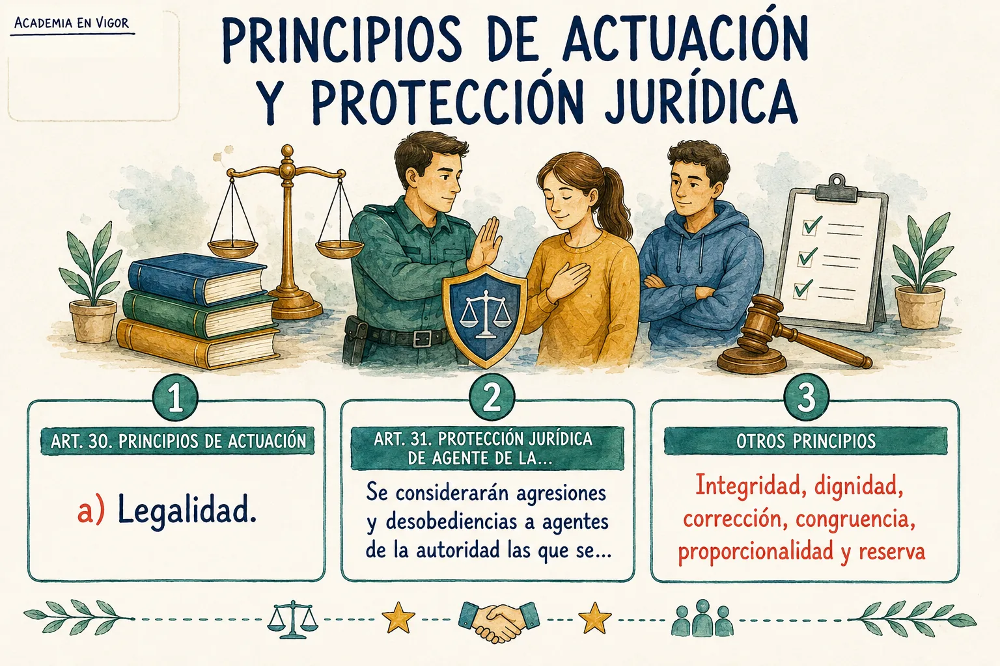

<em>Infografía: línea temporal de principios de actuación y protección jurídica.</em>

<!-- FUENTE: L5-2014-BOE-A-2014-3649-GC-T13 -->

## 40. Vigilantes de seguridad y especialidades

### Regla y encaje

Vigilantes de seguridad y especialidades forma parte de personal de seguridad privada. Estúdialo como una secuencia: presupuesto, obligación o facultad, excepción y consecuencia.

### Claves examinables

- **Artículo 32. Vigilantes de seguridad y su especialidad:** 1. Los vigilantes de seguridad desempeñarán las siguientes funciones: a) Ejercer la vigilancia y protección de bienes, establecimientos, lugares y eventos, tanto privados como públicos, así como la protección de las personas que puedan encontrarse en los mismos, llevando a cabo las comprobaciones, registros y prevenciones necesarias para el cumplimiento de su misión. <!-- FACT:GC-T13-F502 -->
- **Artículo 32. Vigilantes de seguridad y su especialidad:** 1. Los vigilantes de seguridad desempeñarán las siguientes funciones: b) Efectuar controles de identidad, de objetos personales, paquetería, mercancías o vehículos, incluido el interior de éstos, en el acceso o en el interior de inmuebles o propiedades donde presten servicio, sin que, en ningún caso, puedan retener la documentación personal, pero sí impedir el acceso a dichos inmuebles o propiedades. <!-- FACT:GC-T13-F503 -->
- **Artículo 32. Vigilantes de seguridad y su especialidad:** La negativa a exhibir la identificación o a permitir el control de los objetos personales, de paquetería, mercancía o del vehículo facultará para impedir a los particulares el acceso o para ordenarles el abandono del inmueble o propiedad objeto de su protección. <!-- FACT:GC-T13-F504 -->
- **Artículo 32. Vigilantes de seguridad y su especialidad:** Entre las reglas de Artículo 32. Vigilantes de seguridad y su especialidad, se establece: c) Evitar la comisión de actos delictivos o infracciones administrativas en relación con el objeto de su protección, realizando las comprobaciones necesarias para prevenirlos o impedir su consumación, debiendo oponerse a los mismos e intervenir cuando presenciaren la comisión de algún tipo de infracción o fuere precisa su ayuda por razones humanitarias o de urgencia. <!-- FACT:GC-T13-F505 -->
- **Artículo 32. Vigilantes de seguridad y su especialidad:** Entre las reglas de Artículo 32. Vigilantes de seguridad y su especialidad, se establece: d) En relación con el objeto de su protección o de su actuación, detener y poner inmediatamente a disposición de las Fuerzas y Cuerpos de Seguridad competentes a los delincuentes y los instrumentos, efectos y pruebas de los delitos, así como denunciar a quienes cometan infracciones administrativas. No podrán proceder al interrogatorio de aquéllos, si bien no se considerará como tal la anotación de sus datos personales para su comunicación a las autoridades. <!-- FACT:GC-T13-F506 -->
- **Artículo 32. Vigilantes de seguridad y su especialidad:** Lo dispuesto en el párrafo anterior se entiende sin perjuicio de los supuestos en los que la Ley de Enjuiciamiento Criminal permite a cualquier persona practicar la detención. <!-- FACT:GC-T13-F507 -->
- **Artículo 32. Vigilantes de seguridad y su especialidad:** Entre las reglas de Artículo 32. Vigilantes de seguridad y su especialidad, se establece: e) Proteger el almacenamiento, recuento, clasificación, transporte y dispensado de dinero, obras de arte y antigüedades, valores y otros objetos valiosos, así como el manipulado de efectivo y demás procesos inherentes a la ejecución de estos servicios. <!-- FACT:GC-T13-F508 -->
- **Artículo 32. Vigilantes de seguridad y su especialidad:** Entre las reglas de Artículo 32. Vigilantes de seguridad y su especialidad, se establece: f) Llevar a cabo, en relación con el funcionamiento de centrales receptoras de alarmas, la prestación de servicios de verificación personal y respuesta de las señales de alarmas que se produzcan. <!-- FACT:GC-T13-F509 -->
- **Artículo 32. Vigilantes de seguridad y su especialidad:** Además, también podrán realizar las funciones de recepción, verificación no personal y transmisión a las Fuerzas y Cuerpos de Seguridad que el artículo 47.1 reconoce a los operadores de seguridad. <!-- FACT:GC-T13-F510 -->
- **Artículo 32. Vigilantes de seguridad y su especialidad · apartado 2:** 2. Los vigilantes de seguridad se dedicarán exclusivamente a las funciones de seguridad propias, no pudiendo simultanearlas con otras no directamente relacionadas con aquéllas. <!-- FACT:GC-T13-F511 -->
- **Artículo 32. Vigilantes de seguridad y su especialidad · apartado 3:** 3. Corresponde a los vigilantes de explosivos, que deberán estar integrados en empresas de seguridad, la función de protección del almacenamiento, transporte y demás procesos inherentes a la ejecución de estos servicios, en relación con explosivos u otros objetos o sustancias peligrosas que reglamentariamente se determinen. <!-- FACT:GC-T13-F512 -->
- **Artículo 32. Vigilantes de seguridad y su especialidad:** Será aplicable a los vigilantes de explosivos lo establecido para los vigilantes de seguridad respecto a uniformidad, armamento y prestación del servicio. <!-- FACT:GC-T13-F513 -->

:::hablemos-claro
Seguridad pública significa potestad y responsabilidad estatal; seguridad privada significa actividad complementaria, subordinada, controlada y obligada a colaborar.
:::

:::en-la-calle
Ante un supuesto, identifica primero quién actúa, con qué habilitación, qué medida adopta, qué límite legal existe y qué autoridad controla la actuación.
:::

:::lo-que-cae
Prioriza listas cerradas, plazos, excepciones, competencias y efectos. Apariciones oficiales mapeadas: **1**.
:::

<!-- VISUAL:t13-40-vigilantes-de-seguridad-y-especialidades.webp -->

  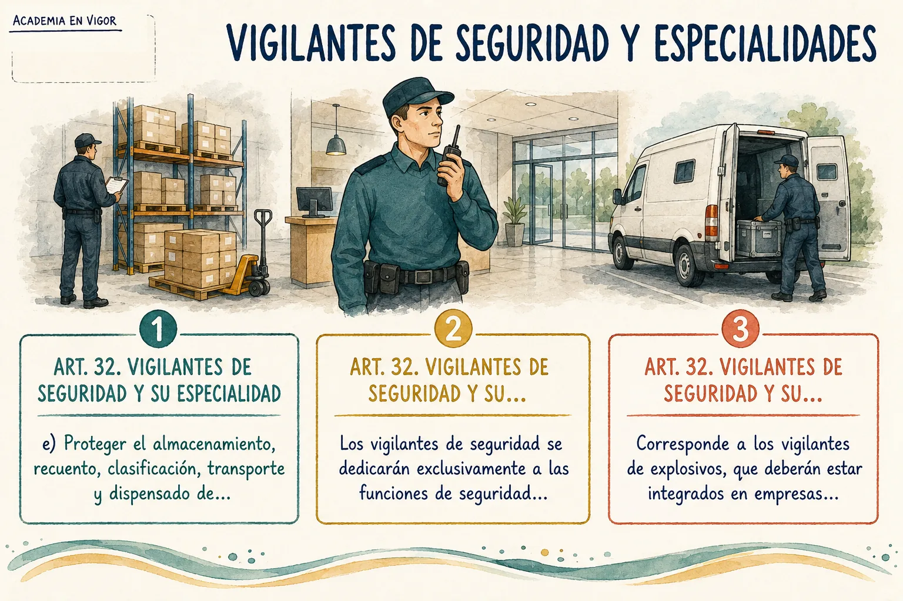

<em>Infografía: escena de vigilantes de seguridad y especialidades.</em>

<!-- FUENTE: L5-2014-BOE-A-2014-3649-GC-T13 -->

## 41. Escoltas privados

### Regla y encaje

Escoltas privados forma parte de personal de seguridad privada. Estúdialo como una secuencia: presupuesto, obligación o facultad, excepción y consecuencia.

### Claves examinables

- **Artículo 33. Escoltas privados · apartado 1:** 1. Son funciones de los escoltas privados el acompañamiento, defensa y protección de personas determinadas, o de grupos concretos de personas, impidiendo que sean objeto de agresiones o actos delictivos. <!-- FACT:GC-T13-F514 -->
- **Artículo 33. Escoltas privados · apartado 2:** En el desempeño de sus funciones, los escoltas no podrán realizar identificaciones o detenciones, ni impedir o restringir la libre circulación, salvo que resultare imprescindible como consecuencia de una agresión o de un intento manifiesto de agresión a la persona o personas protegidas o a los propios escoltas, debiendo, en tal caso, poner inmediatamente al detenido o detenidos a disposición de las Fuerzas y Cuerpos de Seguridad, sin proceder a ninguna suerte de interrogatorio. <!-- FACT:GC-T13-F515 -->
- **Artículo 33. Escoltas privados · apartado 3:** 3. Para el cumplimiento de las indicadas funciones será aplicable a los escoltas privados lo determinado en el artículo 32 y demás preceptos concordantes, relativos a vigilantes de seguridad, salvo lo referente a la uniformidad. <!-- FACT:GC-T13-F516 -->

:::hablemos-claro
Seguridad pública significa potestad y responsabilidad estatal; seguridad privada significa actividad complementaria, subordinada, controlada y obligada a colaborar.
:::

:::en-la-calle
Ante un supuesto, identifica primero quién actúa, con qué habilitación, qué medida adopta, qué límite legal existe y qué autoridad controla la actuación.
:::

:::lo-que-cae
Prioriza listas cerradas, plazos, excepciones, competencias y efectos. Apariciones oficiales mapeadas: **0**.
:::

<!-- VISUAL:t13-41-escoltas-privados.webp -->

  

<em>Infografía: capas de escoltas privados.</em>

<!-- FUENTE: L5-2014-BOE-A-2014-3649-GC-T13 -->

## 42. Guardas rurales y especialidades

### Regla y encaje

Guardas rurales y especialidades forma parte de personal de seguridad privada. Estúdialo como una secuencia: presupuesto, obligación o facultad, excepción y consecuencia.

### Claves examinables

- **Artículo 34. Guardas rurales y sus especialidades · apartado 1:** 1. Los guardas rurales ejercerán funciones de vigilancia y protección de personas y bienes en fincas rústicas, así como en las instalaciones agrícolas, industriales o comerciales que se encuentren en ellas. <!-- FACT:GC-T13-F517 -->
- **Artículo 34. Guardas rurales y sus especialidades:** Se atendrán al régimen general establecido para los vigilantes de seguridad, con la especificidad de que no podrán desempeñar las funciones contempladas en el artículo 32.1.e). <!-- FACT:GC-T13-F518 -->
- **Artículo 34. Guardas rurales y sus especialidades · apartado 2:** 2. A los guardas de caza corresponde desempeñar las funciones previstas en el apartado anterior para los guardas rurales y, además, las de vigilancia y protección en las fincas de caza en cuanto a los distintos aspectos del régimen cinegético y espacios de pesca fluvial. <!-- FACT:GC-T13-F519 -->
- **Artículo 34. Guardas rurales y sus especialidades · apartado 3:** 3. Corresponde a los guardapescas marítimos desempeñar las funciones previstas en el apartado 1 para los guardas rurales y, además, las de vigilancia y protección de los establecimientos de acuicultura y zonas marítimas con fines pesqueros. <!-- FACT:GC-T13-F520 -->
- **Artículo 34. Guardas rurales y sus especialidades · apartado 4:** 4. Los guardas de caza y los guardapescas marítimos podrán proceder a la retirada u ocupación de las piezas cobradas y los medios de caza y pesca, incluidas armas, cuando aquéllos hubieran sido utilizados para cometer una infracción, procediendo a su entrega inmediata a las Fuerzas y Cuerpos de Seguridad competentes. <!-- FACT:GC-T13-F521 -->

:::hablemos-claro
Seguridad pública significa potestad y responsabilidad estatal; seguridad privada significa actividad complementaria, subordinada, controlada y obligada a colaborar.
:::

:::en-la-calle
Ante un supuesto, identifica primero quién actúa, con qué habilitación, qué medida adopta, qué límite legal existe y qué autoridad controla la actuación.
:::

:::lo-que-cae
Prioriza listas cerradas, plazos, excepciones, competencias y efectos. Apariciones oficiales mapeadas: **4**.
:::

<!-- VISUAL:t13-42-guardas-rurales-y-especialidades.webp -->

  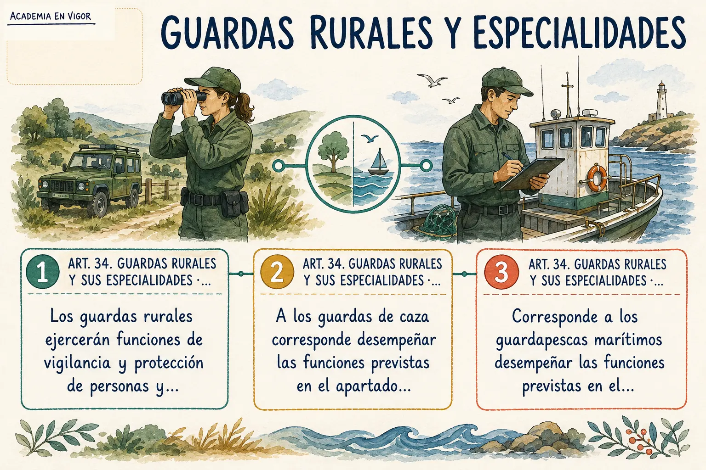

<em>Infografía: mapa de guardas rurales y especialidades.</em>

<!-- FUENTE: L5-2014-BOE-A-2014-3649-GC-T13 -->

## 43. Jefes de seguridad

### Regla y encaje

Jefes de seguridad forma parte de personal de seguridad privada. Estúdialo como una secuencia: presupuesto, obligación o facultad, excepción y consecuencia.

### Claves examinables

- **Artículo 35. Jefes de seguridad:** 1. En el ámbito de la empresa de seguridad en cuya plantilla están integrados, corresponde a los jefes de seguridad el ejercicio de las siguientes funciones: a) El análisis de situaciones de riesgo y la planificación y programación de las actuaciones precisas para la implantación y realización de los servicios de seguridad privada. <!-- FACT:GC-T13-F522 -->
- **Artículo 35. Jefes de seguridad:** 1. En el ámbito de la empresa de seguridad en cuya plantilla están integrados, corresponde a los jefes de seguridad el ejercicio de las siguientes funciones: b) La organización, dirección e inspección del personal y servicios de seguridad privada. <!-- FACT:GC-T13-F523 -->
- **Artículo 35. Jefes de seguridad:** 1. En el ámbito de la empresa de seguridad en cuya plantilla están integrados, corresponde a los jefes de seguridad el ejercicio de las siguientes funciones: c) La propuesta de los sistemas de seguridad que resulten pertinentes, y el control de su funcionamiento y mantenimiento, pudiendo validarlos provisionalmente hasta tanto se produzca la inspección y autorización, en su caso, por parte de la Administración. <!-- FACT:GC-T13-F524 -->
- **Artículo 35. Jefes de seguridad:** 1. En el ámbito de la empresa de seguridad en cuya plantilla están integrados, corresponde a los jefes de seguridad el ejercicio de las siguientes funciones: d) El control de la formación permanente del personal de seguridad que de ellos dependa, y la propuesta de la adopción de las medidas o iniciativas adecuadas para el cumplimiento de dicha finalidad. <!-- FACT:GC-T13-F525 -->
- **Artículo 35. Jefes de seguridad:** 1. En el ámbito de la empresa de seguridad en cuya plantilla están integrados, corresponde a los jefes de seguridad el ejercicio de las siguientes funciones: e) La coordinación de los distintos servicios de seguridad que de ellos dependan, con actuaciones propias de protección civil en situaciones de emergencia, catástrofe o calamidad pública. <!-- FACT:GC-T13-F526 -->
- **Artículo 35. Jefes de seguridad:** 1. En el ámbito de la empresa de seguridad en cuya plantilla están integrados, corresponde a los jefes de seguridad el ejercicio de las siguientes funciones: f) La garantía de la colaboración de los servicios de seguridad con los de las correspondientes dependencias de las Fuerzas y Cuerpos de Seguridad. <!-- FACT:GC-T13-F527 -->
- **Artículo 35. Jefes de seguridad:** 1. En el ámbito de la empresa de seguridad en cuya plantilla están integrados, corresponde a los jefes de seguridad el ejercicio de las siguientes funciones: g) La supervisión de la observancia de la normativa de seguridad privada aplicable. <!-- FACT:GC-T13-F528 -->
- **Artículo 35. Jefes de seguridad:** 1. En el ámbito de la empresa de seguridad en cuya plantilla están integrados, corresponde a los jefes de seguridad el ejercicio de las siguientes funciones: h) La responsabilidad sobre la custodia y el traslado de armas de titularidad de la empresa a la que pertenezca, de acuerdo con la normativa de armas y con lo que reglamentariamente se determine. <!-- FACT:GC-T13-F529 -->
- **Artículo 35. Jefes de seguridad · apartado 2:** 2. La existencia del jefe de seguridad en las empresas de seguridad privada será obligatoria siempre que éstas se dediquen a todas o algunas de las actividades previstas en los párrafos a), b), c), d) y e) del artículo 5.1. <!-- FACT:GC-T13-F530 -->
- **Artículo 35. Jefes de seguridad:** En función de la complejidad organizativa o técnica, u otras circunstancias que se determinen reglamentariamente, podrá exigirse la existencia de un jefe de seguridad específico para algunas de dichas actividades de seguridad. <!-- FACT:GC-T13-F531 -->
- **Artículo 35. Jefes de seguridad · apartado 3:** 3. El ejercicio de funciones podrá delegarse por los jefes de seguridad en los términos que reglamentariamente se dispongan. <!-- FACT:GC-T13-F532 -->

:::hablemos-claro
Seguridad pública significa potestad y responsabilidad estatal; seguridad privada significa actividad complementaria, subordinada, controlada y obligada a colaborar.
:::

:::en-la-calle
Ante un supuesto, identifica primero quién actúa, con qué habilitación, qué medida adopta, qué límite legal existe y qué autoridad controla la actuación.
:::

:::lo-que-cae
Prioriza listas cerradas, plazos, excepciones, competencias y efectos. Apariciones oficiales mapeadas: **1**.
:::

<!-- VISUAL:t13-43-jefes-de-seguridad.webp -->

  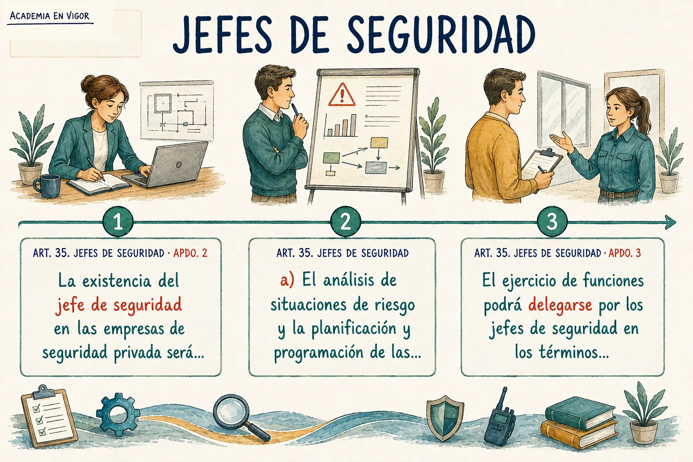

<em>Infografía: flujo de jefes de seguridad.</em>

<!-- FUENTE: L5-2014-BOE-A-2014-3649-GC-T13 -->

## 44. Directores de seguridad

### Regla y encaje

Directores de seguridad forma parte de personal de seguridad privada. Estúdialo como una secuencia: presupuesto, obligación o facultad, excepción y consecuencia.

### Claves examinables

- **Artículo 36. Directores de seguridad:** 1. En relación con la empresa o entidad en la que presten sus servicios, corresponde a los directores de seguridad el ejercicio de las siguientes funciones: a) La organización, dirección, inspección y administración de los servicios y recursos de seguridad privada disponibles. <!-- FACT:GC-T13-F533 -->
- **Artículo 36. Directores de seguridad:** 1. En relación con la empresa o entidad en la que presten sus servicios, corresponde a los directores de seguridad el ejercicio de las siguientes funciones: b) La identificación, análisis y evaluación de situaciones de riesgo que puedan afectar a la vida e integridad de las personas y al patrimonio. <!-- FACT:GC-T13-F534 -->
- **Artículo 36. Directores de seguridad:** 1. En relación con la empresa o entidad en la que presten sus servicios, corresponde a los directores de seguridad el ejercicio de las siguientes funciones: c) La planificación, organización y control de las actuaciones precisas para la implantación de las medidas conducentes a prevenir, proteger y reducir la manifestación de riesgos de cualquier naturaleza con medios y medidas precisas, mediante la elaboración y desarrollo de los planes de seguridad aplicables. <!-- FACT:GC-T13-F535 -->
- **Artículo 36. Directores de seguridad:** 1. En relación con la empresa o entidad en la que presten sus servicios, corresponde a los directores de seguridad el ejercicio de las siguientes funciones: d) El control del funcionamiento y mantenimiento de los sistemas de seguridad privada. <!-- FACT:GC-T13-F536 -->
- **Artículo 36. Directores de seguridad:** 1. En relación con la empresa o entidad en la que presten sus servicios, corresponde a los directores de seguridad el ejercicio de las siguientes funciones: e) La validación provisional, hasta la comprobación, en su caso, por parte de la Administración, de las medidas de seguridad en lo referente a su adecuación a la normativa de seguridad privada. <!-- FACT:GC-T13-F537 -->
- **Artículo 36. Directores de seguridad:** 1. En relación con la empresa o entidad en la que presten sus servicios, corresponde a los directores de seguridad el ejercicio de las siguientes funciones: f) La comprobación de que los sistemas de seguridad privada instalados y las empresas de seguridad privada contratadas, cumplen con las exigencias de homologación de los organismos competentes. <!-- FACT:GC-T13-F538 -->
- **Artículo 36. Directores de seguridad:** 1. En relación con la empresa o entidad en la que presten sus servicios, corresponde a los directores de seguridad el ejercicio de las siguientes funciones: g) La comunicación a las Fuerzas y Cuerpos de Seguridad competentes de las circunstancias o informaciones relevantes para la seguridad ciudadana, así como de los hechos delictivos de los que tenga conocimiento en el ejercicio de sus funciones. <!-- FACT:GC-T13-F539 -->
- **Artículo 36. Directores de seguridad:** 1. En relación con la empresa o entidad en la que presten sus servicios, corresponde a los directores de seguridad el ejercicio de las siguientes funciones: h) La interlocución y enlace con la Administración, especialmente con las Fuerzas y Cuerpos de Seguridad, respecto de la función de seguridad integral de la entidad, empresa o grupo empresarial que les tenga contratados, en relación con el cumplimiento normativo sobre gestión de todo tipo de riesgos. <!-- FACT:GC-T13-F540 -->
- **Artículo 36. Directores de seguridad:** 1. En relación con la empresa o entidad en la que presten sus servicios, corresponde a los directores de seguridad el ejercicio de las siguientes funciones: i) Las comprobaciones de los aspectos necesarios sobre el personal que, por el ejercicio de las funciones encomendadas, precise acceder a áreas o informaciones, para garantizar la protección efectiva de su entidad, empresa o grupo empresarial. <!-- FACT:GC-T13-F541 -->
- **Artículo 36. Directores de seguridad · apartado 2:** 2. Los usuarios de seguridad privada situarán al frente de la seguridad integral de la entidad, empresa o grupo empresarial a un director de seguridad cuando así lo exija la normativa de desarrollo de esta ley por la dimensión de su servicio de seguridad; cuando se acuerde por decisión gubernativa, en atención a las medidas de seguridad y al grado de concentración de riesgo, o cuando lo prevea una disposición especial. <!-- FACT:GC-T13-F542 -->
- **Artículo 36. Directores de seguridad:** Lo dispuesto en este apartado es igualmente aplicable a las empresas de seguridad privada. <!-- FACT:GC-T13-F543 -->
- **Artículo 36. Directores de seguridad · apartado 3:** 3. En las empresas de seguridad el director de seguridad podrá compatibilizar sus funciones con las de jefe de seguridad. <!-- FACT:GC-T13-F544 -->
- **Artículo 36. Directores de seguridad · apartado 4:** 4. Cuando una empresa de seguridad preste servicio a un usuario que cuente con su propio director de seguridad, las funciones encomendadas a los jefes de seguridad en el artículo 35.1.a), b), c), y e) serán asumidas por dicho director de seguridad. <!-- FACT:GC-T13-F545 -->
- **Artículo 36. Directores de seguridad · apartado 5:** 5. El ejercicio de funciones podrá delegarse por los directores de seguridad en los términos que reglamentariamente se disponga. <!-- FACT:GC-T13-F546 -->

:::hablemos-claro
Seguridad pública significa potestad y responsabilidad estatal; seguridad privada significa actividad complementaria, subordinada, controlada y obligada a colaborar.
:::

:::en-la-calle
Ante un supuesto, identifica primero quién actúa, con qué habilitación, qué medida adopta, qué límite legal existe y qué autoridad controla la actuación.
:::

:::lo-que-cae
Prioriza listas cerradas, plazos, excepciones, competencias y efectos. Apariciones oficiales mapeadas: **0**.
:::

<!-- VISUAL:t13-44-directores-de-seguridad.webp -->

  

<em>Infografía: comparación de directores de seguridad.</em>

<!-- FUENTE: L5-2014-BOE-A-2014-3649-GC-T13 -->

## 45. Detectives privados

### Regla y encaje

Detectives privados forma parte de personal de seguridad privada. Estúdialo como una secuencia: presupuesto, obligación o facultad, excepción y consecuencia.

### Claves examinables

- **Artículo 37. Detectives privados · apartado 1:** 1. Los detectives privados se encargarán de la ejecución personal de los servicios de investigación privada a los que se refiere el artículo 48, mediante la realización de averiguaciones en relación con personas, hechos y conductas privadas. <!-- FACT:GC-T13-F547 -->
- **Artículo 37. Detectives privados:** 2. En el ejercicio de sus funciones, los detectives privados vendrán obligados a: a) Confeccionar los informes de investigación relativos a los asuntos que tuvieren encargados. <!-- FACT:GC-T13-F548 -->
- **Artículo 37. Detectives privados:** 2. En el ejercicio de sus funciones, los detectives privados vendrán obligados a: b) Asegurar la necesaria colaboración con las Fuerzas y Cuerpos de Seguridad cuando sus actuaciones profesionales se encuentren relacionadas con hechos delictivos o que puedan afectar a la seguridad ciudadana. <!-- FACT:GC-T13-F549 -->
- **Artículo 37. Detectives privados:** 2. En el ejercicio de sus funciones, los detectives privados vendrán obligados a: c) Ratificar el contenido de sus informes de investigación ante las autoridades judiciales o policiales cuando fueren requeridos para ello. <!-- FACT:GC-T13-F550 -->
- **Artículo 37. Detectives privados · apartado 3:** 3. El ejercicio de las funciones correspondientes a los detectives privados no será compatible con las funciones del resto del personal de seguridad privada, ni con funciones propias del personal al servicio de cualquier Administración Pública. <!-- FACT:GC-T13-F551 -->
- **Artículo 37. Detectives privados · apartado 4:** 4. Los detectives privados no podrán investigar delitos perseguibles de oficio, debiendo denunciar inmediatamente ante la autoridad competente cualquier hecho de esta naturaleza que llegara a su conocimiento, y poniendo a su disposición toda la información y los instrumentos que pudieran haber obtenido hasta ese momento. <!-- FACT:GC-T13-F552 -->

:::hablemos-claro
Seguridad pública significa potestad y responsabilidad estatal; seguridad privada significa actividad complementaria, subordinada, controlada y obligada a colaborar.
:::

:::en-la-calle
Ante un supuesto, identifica primero quién actúa, con qué habilitación, qué medida adopta, qué límite legal existe y qué autoridad controla la actuación.
:::

:::lo-que-cae
Prioriza listas cerradas, plazos, excepciones, competencias y efectos. Apariciones oficiales mapeadas: **2**.
:::

<!-- VISUAL:t13-45-detectives-privados.webp -->

  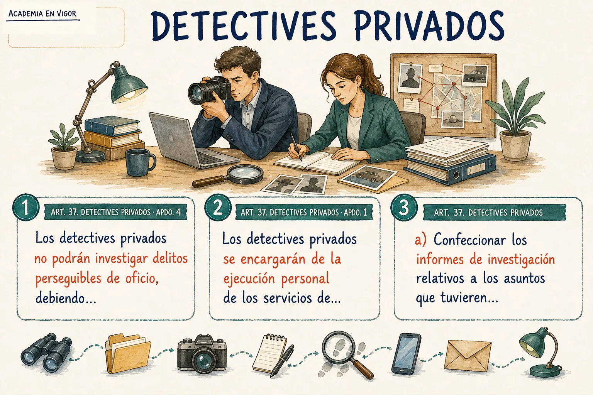

<em>Infografía: línea temporal de detectives privados.</em>

<!-- FUENTE: L5-2014-BOE-A-2014-3649-GC-T13 -->

## 46. Prestación y forma de los servicios

### Regla y encaje

Prestación y forma de los servicios forma parte de servicios de seguridad privada. Estúdialo como una secuencia: presupuesto, obligación o facultad, excepción y consecuencia.

### Claves examinables

- **Artículo 38. Prestación de los servicios de seguridad privada · apartado 1:** 1. Los servicios de seguridad privada se prestarán de conformidad con lo dispuesto en esta ley, en particular en sus artículos 8 y 30, y en sus normas de desarrollo, con arreglo a las estipulaciones del contrato, así como, en su caso, con la autorización concedida o declaración responsable presentada. <!-- FACT:GC-T13-F553 -->
- **Artículo 38. Prestación de los servicios de seguridad privada · apartado 2:** 2. Los servicios de seguridad privada se prestarán únicamente por empresas de seguridad privada, despachos de detectives y personal de seguridad privada. <!-- FACT:GC-T13-F554 -->
- **Artículo 38. Prestación de los servicios de seguridad privada · apartado 3:** 3. Reglamentariamente se establecerán las condiciones y requisitos para la subcontratación de servicios de seguridad privada. <!-- FACT:GC-T13-F555 -->
- **Artículo 38. Prestación de los servicios de seguridad privada · apartado 4:** 4. Los vigilantes de seguridad, vigilantes de explosivos, escoltas privados y jefes de seguridad desempeñarán sus funciones profesionales integrados en las empresas de seguridad que les tengan contratados. <!-- FACT:GC-T13-F556 -->
- **Artículo 38. Prestación de los servicios de seguridad privada · apartado 5:** 5. Los directores de seguridad de las empresas de seguridad privada y de las entidades obligadas a disponer de esta figura, conforme a lo dispuesto en el artículo 36, desempeñarán sus funciones integrados en las plantillas de dichas empresas. <!-- FACT:GC-T13-F557 -->
- **Artículo 38. Prestación de los servicios de seguridad privada · apartado 6:** Los guardas rurales podrán desarrollar sus funciones sin necesidad de constituir o estar integrados en empresas de seguridad, prestando sus servicios directamente a los titulares de bienes y derechos que les puedan contratar, conforme a lo que se establezca reglamentariamente, cuando se trate de servicios de vigilancia y protección de explotaciones agrícolas, fincas de caza, en cuanto a los distintos aspectos del régimen cinegético, y zonas marítimas protegidas con fines pesqueros. <!-- FACT:GC-T13-F558 -->
- **Artículo 38. Prestación de los servicios de seguridad privada · apartado 7:** 7. Los detectives privados ejercerán sus funciones profesionales a través de los despachos de detectives para los que presten sus servicios. <!-- FACT:GC-T13-F559 -->
- **Artículo 39. Forma de prestación · apartado 1:** 1. Los medios utilizados por las empresas de seguridad en la prestación de los servicios de seguridad privada deberán estar homologados por el Ministerio del Interior. En todo caso, los vehículos, uniformes y distintivos no podrán inducir a confusión con los de las Fuerzas y Cuerpos de Seguridad, ni con los de las Fuerzas Armadas, y se ajustarán a las características que reglamentariamente se determinen. <!-- FACT:GC-T13-F560 -->
- **Artículo 39. Forma de prestación · apartado 2:** 2. El personal de seguridad privada uniformado, constituido por los vigilantes de seguridad y de explosivos y por los guardas rurales y sus especialidades, prestará sus servicios vistiendo el uniforme y ostentando el distintivo del cargo, y portando los medios de defensa reglamentarios, que no incluirán armas de fuego. <!-- FACT:GC-T13-F561 -->
- **Artículo 39. Forma de prestación:** Reglamentariamente se podrán establecer excepciones a la obligación de desarrollar sus funciones con uniforme y distintivo. <!-- FACT:GC-T13-F562 -->
- **Artículo 39. Forma de prestación · apartado 3:** 3. Previo el otorgamiento de las correspondientes licencias, sólo se desarrollarán con armas de fuego los servicios de seguridad privada contemplados en el artículo 40 y los que reglamentariamente se determinen. <!-- FACT:GC-T13-F563 -->
- **Artículo 39. Forma de prestación:** Las armas adecuadas para realizar los servicios de seguridad sólo se podrán portar estando de servicio, con las salvedades que se establezcan reglamentariamente. <!-- FACT:GC-T13-F564 -->
- **Artículo 39. Forma de prestación · apartado 4:** 4. Salvo en los casos expresamente previstos en esta ley y lo que se determine reglamentariamente atendiendo a las especiales características de determinados servicios de seguridad privada, los vigilantes de seguridad ejercerán sus funciones en el interior de los inmuebles o de las propiedades de cuya vigilancia estuvieran encargados. <!-- FACT:GC-T13-F565 -->
- **Artículo 39. Forma de prestación · apartado 5:** 5. El personal de seguridad privada, durante la prestación de los servicios de seguridad privada, portará la tarjeta de identidad profesional y, en su caso, la documentación correspondiente al arma de fuego. <!-- FACT:GC-T13-F566 -->

:::hablemos-claro
Seguridad pública significa potestad y responsabilidad estatal; seguridad privada significa actividad complementaria, subordinada, controlada y obligada a colaborar.
:::

:::en-la-calle
Ante un supuesto, identifica primero quién actúa, con qué habilitación, qué medida adopta, qué límite legal existe y qué autoridad controla la actuación.
:::

:::lo-que-cae
Prioriza listas cerradas, plazos, excepciones, competencias y efectos. Apariciones oficiales mapeadas: **0**.
:::

<!-- VISUAL:t13-46-prestacion-y-forma-de-los-servicios.webp -->

  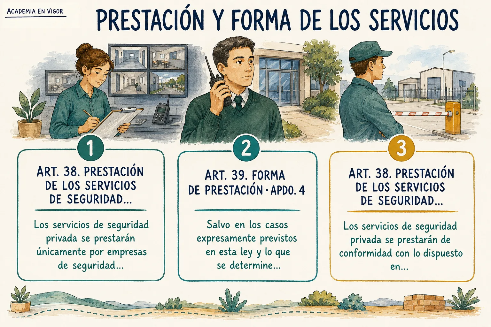

<em>Infografía: escena de prestación y forma de los servicios.</em>

<!-- FUENTE: L5-2014-BOE-A-2014-3649-GC-T13 -->

## 47. Servicios con armas de fuego

### Regla y encaje

Servicios con armas de fuego forma parte de servicios de seguridad privada. Estúdialo como una secuencia: presupuesto, obligación o facultad, excepción y consecuencia.

### Claves examinables

- **Artículo 40. Servicios con armas de fuego:** 1. Los siguientes servicios de seguridad privada se prestarán con armas de fuego en los términos que reglamentariamente se determinen: a) Los de vigilancia y protección del almacenamiento, recuento, clasificación y transporte de dinero, valores y objetos valiosos. <!-- FACT:GC-T13-F567 -->
- **Artículo 40. Servicios con armas de fuego:** 1. Los siguientes servicios de seguridad privada se prestarán con armas de fuego en los términos que reglamentariamente se determinen: b) Los de vigilancia y protección de fábricas y depósitos o transporte de armas, cartuchería metálica y explosivos. <!-- FACT:GC-T13-F568 -->
- **Artículo 40. Servicios con armas de fuego:** 1. Los siguientes servicios de seguridad privada se prestarán con armas de fuego en los términos que reglamentariamente se determinen: c) Los de vigilancia y protección en buques mercantes y buques pesqueros que naveguen bajo bandera española en aguas en las que exista grave riesgo para la seguridad de las personas o de los bienes. <!-- FACT:GC-T13-F569 -->
- **Artículo 40. Servicios con armas de fuego:** 1. Los siguientes servicios de seguridad privada se prestarán con armas de fuego en los términos que reglamentariamente se determinen: d) Cuando por sus características y circunstancias lo requieran, los de vigilancia y protección perimetral en centros penitenciarios, centros de internamiento de extranjeros, establecimientos militares u otros edificios o instalaciones de organismos públicos, incluidas las infraestructuras críticas. <!-- FACT:GC-T13-F570 -->
- **Artículo 40. Servicios con armas de fuego · apartado 2:** 2. Reglamentariamente se determinarán aquellos supuestos en los que, valoradas circunstancias tales como localización, valor de los objetos a proteger, concentración del riesgo, peligrosidad, nocturnidad, zonas rústicas o cinegéticas, u otras de análoga significación, podrá autorizarse la prestación de los servicios de seguridad privada portando armas de fuego. <!-- FACT:GC-T13-F571 -->
- **Artículo 40. Servicios con armas de fuego:** Asimismo, podrá autorizarse la prestación de los servicios de verificación personal de alarmas portando armas de fuego, cuando sea necesario para garantizar la seguridad del personal que los presta, atendiendo a la naturaleza de dicho servicio, al objeto de la protección o a otras circunstancias que incidan en aquélla. <!-- FACT:GC-T13-F572 -->
- **Artículo 40. Servicios con armas de fuego · apartado 3:** 3. El personal de seguridad privada sólo podrá portar el arma de fuego cuando esté de servicio, y podrá acceder con ella al lugar donde se desarrolle éste, salvo que legalmente se establezca lo contrario. Reglamentariamente podrán establecerse excepciones para supuestos determinados. <!-- FACT:GC-T13-F573 -->
- **Artículo 40. Servicios con armas de fuego · apartado 4:** 4. Las armas de fuego adecuadas para realizar cada tipo de servicio serán las que reglamentariamente se establezcan. <!-- FACT:GC-T13-F574 -->

:::hablemos-claro
Seguridad pública significa potestad y responsabilidad estatal; seguridad privada significa actividad complementaria, subordinada, controlada y obligada a colaborar.
:::

:::en-la-calle
Ante un supuesto, identifica primero quién actúa, con qué habilitación, qué medida adopta, qué límite legal existe y qué autoridad controla la actuación.
:::

:::lo-que-cae
Prioriza listas cerradas, plazos, excepciones, competencias y efectos. Apariciones oficiales mapeadas: **1**.
:::

<!-- VISUAL:t13-47-servicios-con-armas-de-fuego.webp -->

  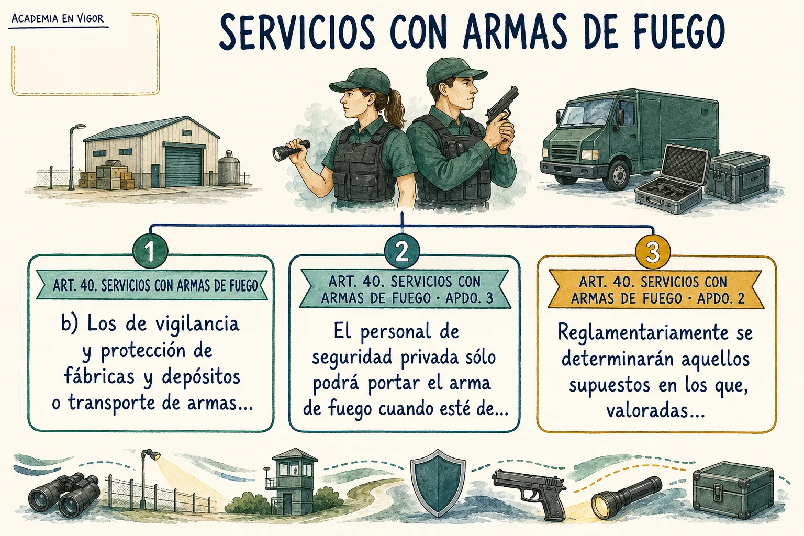

<em>Infografía: capas de servicios con armas de fuego.</em>

<!-- FUENTE: L5-2014-BOE-A-2014-3649-GC-T13 -->

## 48. Vigilancia y protección

### Regla y encaje

Vigilancia y protección forma parte de servicios de seguridad privada. Estúdialo como una secuencia: presupuesto, obligación o facultad, excepción y consecuencia.

### Claves examinables

- **Artículo 41. Servicios de vigilancia y protección · apartado 1:** 1. Los servicios de vigilancia y protección referidos a las actividades contempladas en el artículo 5.1.a) se prestarán por vigilantes de seguridad o, en su caso, por guardas rurales, que desempeñarán sus funciones, con carácter general, en el interior de los edificios, de las instalaciones o propiedades a proteger. <!-- FACT:GC-T13-F575 -->
- **Artículo 41. Servicios de vigilancia y protección:** No obstante, podrán prestarse fuera de estos espacios sin necesidad de autorización previa, incluso en vías o espacios públicos o de uso común, en los siguientes supuestos: a) La vigilancia y protección sobre acciones de manipulación o utilización de bienes, maquinaria o equipos valiosos que hayan de tener lugar en las vías o espacios públicos o de uso común. <!-- FACT:GC-T13-F576 -->
- **Artículo 41. Servicios de vigilancia y protección:** No obstante, podrán prestarse fuera de estos espacios sin necesidad de autorización previa, incluso en vías o espacios públicos o de uso común, en los siguientes supuestos: b) La retirada y reposición de fondos en cajeros automáticos, así como la prestación de servicios de vigilancia y protección de los mismos durante las citadas operaciones, o en las de reparación de averías. <!-- FACT:GC-T13-F577 -->
- **Artículo 41. Servicios de vigilancia y protección:** No obstante, podrán prestarse fuera de estos espacios sin necesidad de autorización previa, incluso en vías o espacios públicos o de uso común, en los siguientes supuestos: c) Los desplazamientos al exterior de los inmuebles objeto de protección para la realización de actividades directamente relacionadas con las funciones de vigilancia y seguridad de dichos inmuebles. <!-- FACT:GC-T13-F578 -->
- **Artículo 41. Servicios de vigilancia y protección:** No obstante, podrán prestarse fuera de estos espacios sin necesidad de autorización previa, incluso en vías o espacios públicos o de uso común, en los siguientes supuestos: d) La vigilancia y protección de los medios de transporte y de sus infraestructuras. <!-- FACT:GC-T13-F579 -->
- **Artículo 41. Servicios de vigilancia y protección:** No obstante, podrán prestarse fuera de estos espacios sin necesidad de autorización previa, incluso en vías o espacios públicos o de uso común, en los siguientes supuestos: e) Los servicios de ronda o de vigilancia discontinua, consistentes en la visita intermitente y programada a los diferentes puestos de vigilancia establecidos o a los distintos lugares objeto de protección. <!-- FACT:GC-T13-F580 -->
- **Artículo 41. Servicios de vigilancia y protección:** No obstante, podrán prestarse fuera de estos espacios sin necesidad de autorización previa, incluso en vías o espacios públicos o de uso común, en los siguientes supuestos: f) La persecución de quienes sean sorprendidos en flagrante delito, en relación con las personas o bienes objeto de su vigilancia y protección. <!-- FACT:GC-T13-F581 -->
- **Artículo 41. Servicios de vigilancia y protección:** No obstante, podrán prestarse fuera de estos espacios sin necesidad de autorización previa, incluso en vías o espacios públicos o de uso común, en los siguientes supuestos: g) Las situaciones en que ello viniera exigido por razones humanitarias. <!-- FACT:GC-T13-F582 -->
- **Artículo 41. Servicios de vigilancia y protección:** No obstante, podrán prestarse fuera de estos espacios sin necesidad de autorización previa, incluso en vías o espacios públicos o de uso común, en los siguientes supuestos: h) Los servicios de vigilancia y protección a los que se refieren los apartados siguientes. <!-- FACT:GC-T13-F583 -->
- **Artículo 41. Servicios de vigilancia y protección:** 2. Requerirán autorización previa por parte del órgano competente los siguientes servicios de vigilancia y protección, que se prestarán en coordinación, cuando proceda, con las Fuerzas y Cuerpos de Seguridad, y de acuerdo con sus instrucciones: a) La vigilancia en polígonos industriales y urbanizaciones delimitados, incluidas sus vías o espacios de uso común. <!-- FACT:GC-T13-F584 -->
- **Artículo 41. Servicios de vigilancia y protección:** 2. Requerirán autorización previa por parte del órgano competente los siguientes servicios de vigilancia y protección, que se prestarán en coordinación, cuando proceda, con las Fuerzas y Cuerpos de Seguridad, y de acuerdo con sus instrucciones: b) La vigilancia en complejos o parques comerciales y de ocio que se encuentren delimitados. <!-- FACT:GC-T13-F585 -->
- **Artículo 41. Servicios de vigilancia y protección:** 2. Requerirán autorización previa por parte del órgano competente los siguientes servicios de vigilancia y protección, que se prestarán en coordinación, cuando proceda, con las Fuerzas y Cuerpos de Seguridad, y de acuerdo con sus instrucciones: c) La vigilancia en acontecimientos culturales, deportivos o cualquier otro evento de relevancia social que se desarrolle en vías o espacios públicos o de uso común, en coordinación, en todo caso, con las Fuerzas y Cuerpos de Seguridad. <!-- FACT:GC-T13-F586 -->
- **Artículo 41. Servicios de vigilancia y protección:** 2. Requerirán autorización previa por parte del órgano competente los siguientes servicios de vigilancia y protección, que se prestarán en coordinación, cuando proceda, con las Fuerzas y Cuerpos de Seguridad, y de acuerdo con sus instrucciones: d) La vigilancia y protección en recintos y espacios abiertos que se encuentren delimitados. <!-- FACT:GC-T13-F587 -->
- **Artículo 41. Servicios de vigilancia y protección:** Reglamentariamente se establecerán las condiciones y requisitos para la prestación de estos servicios. <!-- FACT:GC-T13-F588 -->
- **Artículo 41. Servicios de vigilancia y protección:** 3. Cuando así se decida por el órgano competente, y cumpliendo estrictamente las órdenes e instrucciones de las Fuerzas y Cuerpos de Seguridad, podrán prestarse los siguientes servicios de vigilancia y protección: a) La vigilancia perimetral de centros penitenciarios. <!-- FACT:GC-T13-F589 -->
- **Artículo 41. Servicios de vigilancia y protección:** 3. Cuando así se decida por el órgano competente, y cumpliendo estrictamente las órdenes e instrucciones de las Fuerzas y Cuerpos de Seguridad, podrán prestarse los siguientes servicios de vigilancia y protección: b) La vigilancia perimetral de centros de internamiento de extranjeros. <!-- FACT:GC-T13-F590 -->
- **Artículo 41. Servicios de vigilancia y protección:** 3. Cuando así se decida por el órgano competente, y cumpliendo estrictamente las órdenes e instrucciones de las Fuerzas y Cuerpos de Seguridad, podrán prestarse los siguientes servicios de vigilancia y protección: c) La vigilancia de otros edificios o instalaciones de organismos públicos. <!-- FACT:GC-T13-F591 -->
- **Artículo 41. Servicios de vigilancia y protección:** 3. Cuando así se decida por el órgano competente, y cumpliendo estrictamente las órdenes e instrucciones de las Fuerzas y Cuerpos de Seguridad, podrán prestarse los siguientes servicios de vigilancia y protección: d) La participación en la prestación de servicios encomendados a la seguridad pública, complementando la acción policial. La prestación de estos servicios también podrá realizarse por guardas rurales. <!-- FACT:GC-T13-F592 -->

:::hablemos-claro
Seguridad pública significa potestad y responsabilidad estatal; seguridad privada significa actividad complementaria, subordinada, controlada y obligada a colaborar.
:::

:::en-la-calle
Ante un supuesto, identifica primero quién actúa, con qué habilitación, qué medida adopta, qué límite legal existe y qué autoridad controla la actuación.
:::

:::lo-que-cae
Prioriza listas cerradas, plazos, excepciones, competencias y efectos. Apariciones oficiales mapeadas: **0**.
:::

<!-- VISUAL:t13-48-vigilancia-y-proteccion.webp -->

  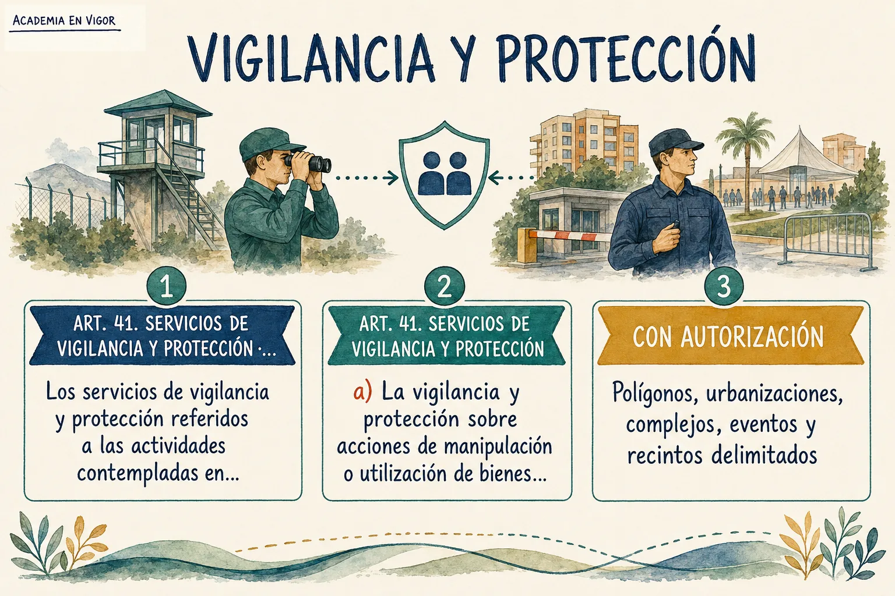

<em>Infografía: mapa de vigilancia y protección.</em>

<!-- FUENTE: L5-2014-BOE-A-2014-3649-GC-T13 -->

## 49. Videovigilancia

### Regla y encaje

Videovigilancia forma parte de servicios de seguridad privada. Estúdialo como una secuencia: presupuesto, obligación o facultad, excepción y consecuencia.

### Claves examinables

- **Artículo 42. Servicios de videovigilancia · apartado 1:** 1. Los servicios de videovigilancia consisten en el ejercicio de la vigilancia a través de sistemas de cámaras o videocámaras, fijas o móviles, capaces de captar y grabar imágenes y sonidos, incluido cualquier medio técnico o sistema que permita los mismos tratamientos que éstas. <!-- FACT:GC-T13-F593 -->
- **Artículo 42. Servicios de videovigilancia:** Cuando la finalidad de estos servicios sea prevenir infracciones y evitar daños a las personas o bienes objeto de protección o impedir accesos no autorizados, serán prestados necesariamente por vigilantes de seguridad o, en su caso, por guardas rurales. <!-- FACT:GC-T13-F594 -->
- **Artículo 42. Servicios de videovigilancia:** No tendrán la consideración de servicio de videovigilancia la utilización de cámaras o videocámaras cuyo objeto principal sea la comprobación del estado de instalaciones o bienes, el control de accesos a aparcamientos y garajes, o las actividades que se desarrollan desde los centros de control y otros puntos, zonas o áreas de las autopistas de peaje. Estas funciones podrán realizarse por personal distinto del de seguridad privada. <!-- FACT:GC-T13-F595 -->
- **Artículo 42. Servicios de videovigilancia · apartado 2:** 2. No se podrán utilizar cámaras o videocámaras con fines de seguridad privada para tomar imágenes y sonidos de vías y espacios públicos o de acceso público salvo en los supuestos y en los términos y condiciones previstos en su normativa específica, previa autorización administrativa por el órgano competente en cada caso. Su utilización en el interior de los domicilios requerirá el consentimiento del titular. <!-- FACT:GC-T13-F596 -->
- **Artículo 42. Servicios de videovigilancia · apartado 3:** 3. Las cámaras de videovigilancia que formen parte de medidas de seguridad obligatorias o de sistemas de recepción, verificación y, en su caso, respuesta y transmisión de alarmas, no requerirán autorización administrativa para su instalación, empleo o utilización. <!-- FACT:GC-T13-F597 -->
- **Artículo 42. Servicios de videovigilancia · apartado 4:** 4. Las grabaciones realizadas por los sistemas de videovigilancia no podrán destinarse a un uso distinto del de su finalidad. <!-- FACT:GC-T13-F598 -->
- **Artículo 42. Servicios de videovigilancia · apartado 4:** Cuando las mismas se encuentren relacionadas con hechos delictivos o que afecten a la seguridad ciudadana, se aportarán, de propia iniciativa o a su requerimiento, a las Fuerzas y Cuerpos de Seguridad competentes, respetando los criterios de conservación y custodia de las mismas para su válida aportación como evidencia o prueba en investigaciones policiales o judiciales. <!-- FACT:GC-T13-F599 -->
- **Artículo 42. Servicios de videovigilancia · apartado 5:** 5. La monitorización, grabación, tratamiento y registro de imágenes y sonidos por parte de los sistemas de videovigilancia estará sometida a lo previsto en la normativa en materia de protección de datos de carácter personal, y especialmente a los principios de proporcionalidad, idoneidad e intervención mínima. <!-- FACT:GC-T13-F600 -->
- **Artículo 42. Servicios de videovigilancia · apartado 6:** 6. En lo no previsto en la presente ley y en sus normas de desarrollo, se aplicará lo dispuesto en la normativa sobre videovigilancia por parte de las Fuerzas y Cuerpos de Seguridad. <!-- FACT:GC-T13-F601 -->

:::hablemos-claro
Seguridad pública significa potestad y responsabilidad estatal; seguridad privada significa actividad complementaria, subordinada, controlada y obligada a colaborar.
:::

:::en-la-calle
Ante un supuesto, identifica primero quién actúa, con qué habilitación, qué medida adopta, qué límite legal existe y qué autoridad controla la actuación.
:::

:::lo-que-cae
Prioriza listas cerradas, plazos, excepciones, competencias y efectos. Apariciones oficiales mapeadas: **1**.
:::

<!-- VISUAL:t13-49-videovigilancia.webp -->

  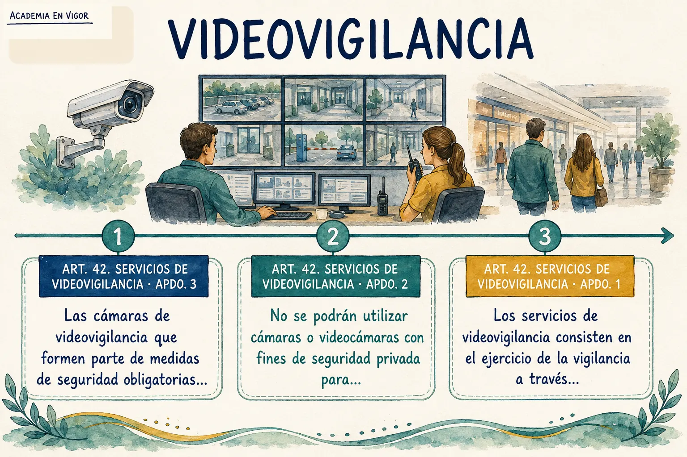

<em>Infografía: flujo de videovigilancia.</em>

<!-- FUENTE: L5-2014-BOE-A-2014-3649-GC-T13 -->

## 50. Protección personal

### Regla y encaje

Protección personal forma parte de servicios de seguridad privada. Estúdialo como una secuencia: presupuesto, obligación o facultad, excepción y consecuencia.

### Claves examinables

- **Artículo 43. Servicios de protección personal · apartado 1:** 1. Los servicios de protección personal, a cargo de escoltas privados, consistirán en el acompañamiento, custodia, resguardo, defensa y protección de la libertad, vida e integridad física de personas o grupos de personas determinadas. <!-- FACT:GC-T13-F602 -->
- **Artículo 43. Servicios de protección personal · apartado 2:** 2. La prestación de servicios de protección personal se realizará con independencia del lugar donde se encuentre la persona protegida, incluido su tránsito o circulación por las vías públicas, sin que se puedan realizar identificaciones, restricciones de la circulación, o detenciones, salvo en caso de flagrante delito relacionado con el objeto de su protección. <!-- FACT:GC-T13-F603 -->
- **Artículo 43. Servicios de protección personal · apartado 3:** 3. La prestación de estos servicios sólo podrá realizarse previa autorización del Ministerio del Interior o del órgano autonómico competente, conforme se disponga reglamentariamente. <!-- FACT:GC-T13-F604 -->

:::hablemos-claro
Seguridad pública significa potestad y responsabilidad estatal; seguridad privada significa actividad complementaria, subordinada, controlada y obligada a colaborar.
:::

:::en-la-calle
Ante un supuesto, identifica primero quién actúa, con qué habilitación, qué medida adopta, qué límite legal existe y qué autoridad controla la actuación.
:::

:::lo-que-cae
Prioriza listas cerradas, plazos, excepciones, competencias y efectos. Apariciones oficiales mapeadas: **0**.
:::

<!-- VISUAL:t13-50-proteccion-personal.webp -->

  

<em>Infografía: comparación de protección personal.</em>

<!-- FUENTE: L5-2014-BOE-A-2014-3649-GC-T13 -->

## 51. Depósito y transporte de seguridad

### Regla y encaje

Depósito y transporte de seguridad forma parte de servicios de seguridad privada. Estúdialo como una secuencia: presupuesto, obligación o facultad, excepción y consecuencia.

### Claves examinables

- **Artículo 44. Servicios de depósito de seguridad · apartado 1:** 1. Los servicios de depósito de seguridad, referidos a la actividad contemplada en el artículo 5.1.c), estarán a cargo de vigilantes de seguridad y se prestarán obligatoriamente cuando los objetos en cuestión alcancen las cuantías que reglamentariamente se establezcan, así como cuando las autoridades competentes lo determinen en atención a los antecedentes y circunstancias relacionadas con dichos objetos. <!-- FACT:GC-T13-F605 -->
- **Artículo 44. Servicios de depósito de seguridad · apartado 2:** 2. Los servicios de depósito de seguridad referidos a la actividad contemplada en el artículo 5.1.d), estarán a cargo de vigilantes de explosivos y se prestarán obligatoriamente cuando precisen de vigilancia, cuidado y protección especial, de acuerdo con la normativa específica de cada materia o así lo dispongan las autoridades competentes en atención a los antecedentes y circunstancias relacionadas con dichos objetos o sustancias. <!-- FACT:GC-T13-F606 -->
- **Artículo 45. Servicios de transporte de seguridad:** Los servicios de transporte y distribución de los objetos y sustancias a que se refiere el artículo anterior, se llevarán a cabo mediante vehículos acondicionados especialmente para cada tipo de transporte u otros elementos de seguridad específicos homologados para el transporte, y consistirán en su traslado material y su protección durante el mismo, por vigilantes de seguridad o vigilantes de explosivos, respectivamente, con arreglo a lo prevenido en esta ley y en sus normas reglamentarias de desarrollo. <!-- FACT:GC-T13-F607 -->

:::hablemos-claro
Seguridad pública significa potestad y responsabilidad estatal; seguridad privada significa actividad complementaria, subordinada, controlada y obligada a colaborar.
:::

:::en-la-calle
Ante un supuesto, identifica primero quién actúa, con qué habilitación, qué medida adopta, qué límite legal existe y qué autoridad controla la actuación.
:::

:::lo-que-cae
Prioriza listas cerradas, plazos, excepciones, competencias y efectos. Apariciones oficiales mapeadas: **0**.
:::

<!-- VISUAL:t13-51-deposito-y-transporte-de-seguridad.webp -->

  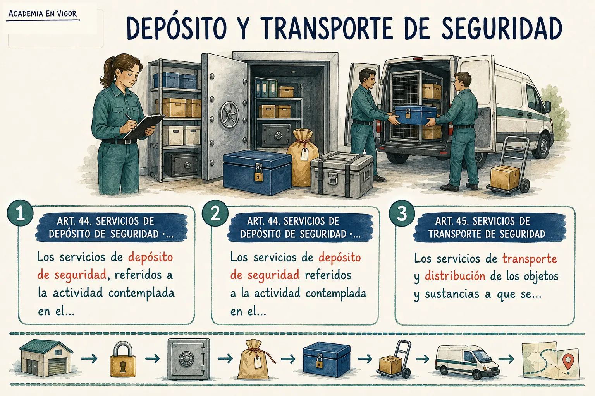

<em>Infografía: línea temporal de depósito y transporte de seguridad.</em>

<!-- FUENTE: L5-2014-BOE-A-2014-3649-GC-T13 -->

## 52. Instalación, mantenimiento y gestión de alarmas

### Regla y encaje

Instalación, mantenimiento y gestión de alarmas forma parte de servicios de seguridad privada. Estúdialo como una secuencia: presupuesto, obligación o facultad, excepción y consecuencia.

### Claves examinables

- **Artículo 46. Servicios de instalación y mantenimiento · apartado 1:** Los servicios de instalación y mantenimiento de aparatos, equipos, dispositivos y sistemas de seguridad conectados a centrales receptoras de alarmas, centros de control o de videovigilancia, consistirán en la ejecución, por técnicos acreditados, de todas aquellas operaciones de instalación y mantenimiento de dichos aparatos, equipos, dispositivos o sistemas, que resulten necesarias para su correcto funcionamiento y el buen cumplimiento de su finalidad, previa elaboración, por ingenieros acreditados, del preceptivo proyecto de instalación, cuyas características se determinarán reglamentariamente. <!-- FACT:GC-T13-F608 -->
- **Artículo 46. Servicios de instalación y mantenimiento · apartado 2:** 2. Estos sistemas deberán someterse a revisiones preventivas con la periodicidad y forma que se determine reglamentariamente. <!-- FACT:GC-T13-F609 -->
- **Artículo 47. Servicios de gestión de alarmas · apartado 1:** 1. Los servicios de gestión de alarmas, a cargo de operadores de seguridad, consistirán en la recepción, verificación no personal y, en su caso, transmisión de las señales de alarma, relativas a la seguridad y protección de personas y bienes a las Fuerzas y Cuerpos de Seguridad competentes. <!-- FACT:GC-T13-F610 -->
- **Artículo 47. Servicios de gestión de alarmas:** 2. Los servicios de respuesta ante alarmas se prestarán por vigilantes de seguridad o, en su caso, por guardas rurales, y podrán comprender los siguientes servicios: a) El depósito y custodia de las llaves de los inmuebles u objetos donde estén instalados los sistemas de seguridad conectados a la central de alarmas y, en su caso, su traslado hasta el lugar del que procediere la señal de alarma verificada o bien la apertura a distancia controlada desde la central de alarmas. <!-- FACT:GC-T13-F611 -->
- **Artículo 47. Servicios de gestión de alarmas:** 2. Los servicios de respuesta ante alarmas se prestarán por vigilantes de seguridad o, en su caso, por guardas rurales, y podrán comprender los siguientes servicios: b) El desplazamiento de los vigilantes de seguridad o guardas rurales a fin de proceder a la verificación personal de la alarma recibida. <!-- FACT:GC-T13-F612 -->
- **Artículo 47. Servicios de gestión de alarmas:** 2. Los servicios de respuesta ante alarmas se prestarán por vigilantes de seguridad o, en su caso, por guardas rurales, y podrán comprender los siguientes servicios: c) Facilitar el acceso a los servicios policiales o de emergencia cuando las circunstancias lo requieran, bien mediante aperturas remotas controladas desde la central de alarmas o con los medios y dispositivos de acceso de que se disponga. <!-- FACT:GC-T13-F613 -->
- **Artículo 47. Servicios de gestión de alarmas · apartado 3:** 3. Cuando los servicios se refirieran al análisis y monitorización de eventos de seguridad de la información y las comunicaciones, estarán sujetos a las especificaciones que reglamentariamente se determinen. Las señales de alarma referidas a estos eventos deberán ser puestas, cuando corresponda, en conocimiento del órgano competente, por el propio usuario o por la empresa con la que haya contratado la seguridad. <!-- FACT:GC-T13-F614 -->

:::hablemos-claro
Seguridad pública significa potestad y responsabilidad estatal; seguridad privada significa actividad complementaria, subordinada, controlada y obligada a colaborar.
:::

:::en-la-calle
Ante un supuesto, identifica primero quién actúa, con qué habilitación, qué medida adopta, qué límite legal existe y qué autoridad controla la actuación.
:::

:::lo-que-cae
Prioriza listas cerradas, plazos, excepciones, competencias y efectos. Apariciones oficiales mapeadas: **0**.
:::

<!-- VISUAL:t13-52-instalacion-mantenimiento-y-gestion-de-alarmas.webp -->

  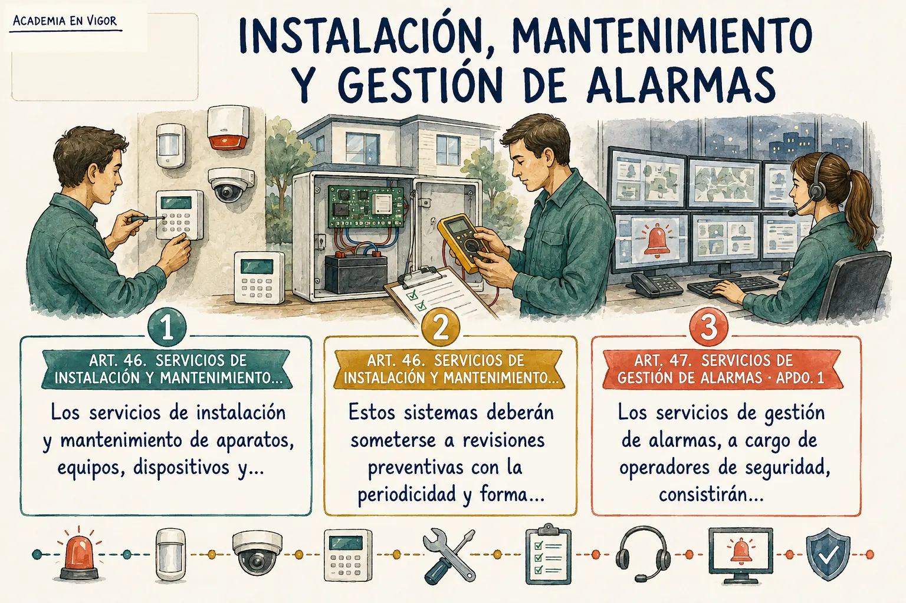

<em>Infografía: escena de instalación, mantenimiento y gestión de alarmas.</em>

<!-- FUENTE: L5-2014-BOE-A-2014-3649-GC-T13 -->

## 53. Investigación privada

### Regla y encaje

Investigación privada forma parte de servicios de seguridad privada. Estúdialo como una secuencia: presupuesto, obligación o facultad, excepción y consecuencia.

### Claves examinables

- **Artículo 48. Servicios de investigación privada:** 1. Los servicios de investigación privada, a cargo de detectives privados, consistirán en la realización de las averiguaciones que resulten necesarias para la obtención y aportación, por cuenta de terceros legitimados, de información y pruebas sobre conductas o hechos privados relacionados con los siguientes aspectos: a) Los relativos al ámbito económico, laboral, mercantil, financiero y, en general, a la vida personal, familiar o social, exceptuada la que se desarrolle en los domicilios o lugares reservados. <!-- FACT:GC-T13-F615 -->
- **Artículo 48. Servicios de investigación privada:** 1. Los servicios de investigación privada, a cargo de detectives privados, consistirán en la realización de las averiguaciones que resulten necesarias para la obtención y aportación, por cuenta de terceros legitimados, de información y pruebas sobre conductas o hechos privados relacionados con los siguientes aspectos: b) La obtención de información tendente a garantizar el normal desarrollo de las actividades que tengan lugar en ferias, hoteles, exposiciones, espectáculos, certámenes, convenciones, grandes superficies comerciales, locales públicos de gran concurrencia o ámbitos análogos. <!-- FACT:GC-T13-F616 -->
- **Artículo 48. Servicios de investigación privada:** 1. Los servicios de investigación privada, a cargo de detectives privados, consistirán en la realización de las averiguaciones que resulten necesarias para la obtención y aportación, por cuenta de terceros legitimados, de información y pruebas sobre conductas o hechos privados relacionados con los siguientes aspectos: c) La realización de averiguaciones y la obtención de información y pruebas relativas a delitos sólo perseguibles a instancia de parte por encargo de los sujetos legitimados en el proceso penal. <!-- FACT:GC-T13-F617 -->
- **Artículo 48. Servicios de investigación privada · apartado 2:** 2. La aceptación del encargo de estos servicios por los despachos de detectives privados requerirá, en todo caso, la acreditación, por el solicitante de los mismos, del interés legítimo alegado, de lo que se dejará constancia en el expediente de contratación e investigación que se abra. <!-- FACT:GC-T13-F618 -->
- **Artículo 48. Servicios de investigación privada · apartado 3:** 3. En ningún caso se podrá investigar la vida íntima de las personas que transcurra en sus domicilios u otros lugares reservados, ni podrán utilizarse en este tipo de servicios medios personales, materiales o técnicos de tal forma que atenten contra el derecho al honor, a la intimidad personal o familiar o a la propia imagen o al secreto de las comunicaciones o a la protección de datos. <!-- FACT:GC-T13-F619 -->
- **Artículo 48. Servicios de investigación privada · apartado 4:** 4. En la prestación de los servicios de investigación, los detectives privados no podrán utilizar o hacer uso de medios, vehículos o distintivos que puedan confundirse con los de las Fuerzas y Cuerpos de Seguridad. <!-- FACT:GC-T13-F620 -->
- **Artículo 48. Servicios de investigación privada · apartado 5:** 5. En todo caso, los despachos de detectives y los detectives privados encargados de las investigaciones velarán por los derechos de sus clientes con respeto a los de los sujetos investigados. <!-- FACT:GC-T13-F621 -->
- **Artículo 48. Servicios de investigación privada · apartado 6:** 6. Los servicios de investigación privada se ejecutarán con respeto a los principios de razonabilidad, necesidad, idoneidad y proporcionalidad. <!-- FACT:GC-T13-F622 -->

:::hablemos-claro
Seguridad pública significa potestad y responsabilidad estatal; seguridad privada significa actividad complementaria, subordinada, controlada y obligada a colaborar.
:::

:::en-la-calle
Ante un supuesto, identifica primero quién actúa, con qué habilitación, qué medida adopta, qué límite legal existe y qué autoridad controla la actuación.
:::

:::lo-que-cae
Prioriza listas cerradas, plazos, excepciones, competencias y efectos. Apariciones oficiales mapeadas: **2**.
:::

<!-- VISUAL:t13-53-investigacion-privada.webp -->

  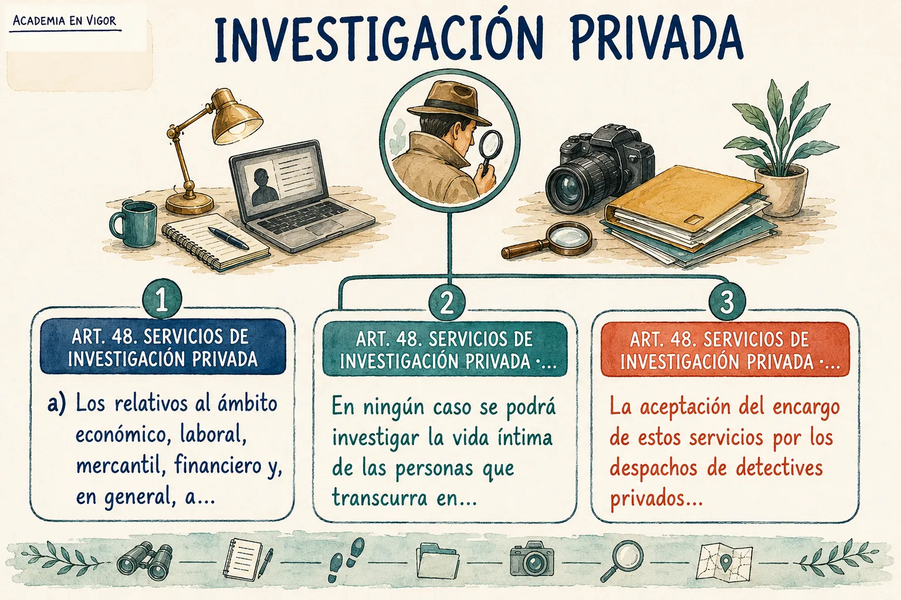

<em>Infografía: capas de investigación privada.</em>

<!-- FUENTE: L5-2014-BOE-A-2014-3649-GC-T13 -->

## 54. Informes y reserva profesional

### Regla y encaje

Informes y reserva profesional forma parte de servicios de seguridad privada. Estúdialo como una secuencia: presupuesto, obligación o facultad, excepción y consecuencia.

### Claves examinables

- **Artículo 49. Informes de investigación · apartado 1:** 1. Por cada servicio que les sea contratado, los despachos o los detectives privados encargados del asunto deberán elaborar un único informe en el que reflejarán el número de registro asignado al servicio, los datos de la persona que encarga y contrata el servicio, el objeto de la contratación, los medios, los resultados, los detectives intervinientes y las actuaciones realizadas, en las condiciones y plazos que reglamentariamente se establezcan. <!-- FACT:GC-T13-F623 -->
- **Artículo 49. Informes de investigación · apartado 2:** En el informe de investigación únicamente se hará constar información directamente relacionada con el objeto y finalidad de la investigación contratada, sin incluir en él referencias, informaciones o datos que hayan podido averiguarse relativos al cliente o al sujeto investigado, en particular los de carácter personal especialmente protegidos, que no resulten necesarios o que no guarden directa relación con dicho objeto y finalidad ni con el interés legítimo alegado para la contratación. <!-- FACT:GC-T13-F624 -->
- **Artículo 49. Informes de investigación · apartado 3:** 3. Dicho informe estará a disposición del cliente, a quien se entregará, en su caso, al finalizar el servicio, así como a disposición de las autoridades policiales competentes para la inspección, en los términos previstos en el artículo 54.5. <!-- FACT:GC-T13-F625 -->
- **Artículo 49. Informes de investigación · apartado 4:** 4. Los informes de investigación deberán conservarse archivados, al menos, durante tres años, sin perjuicio de lo dispuesto en el artículo 16.3 de la Ley Orgánica 15/1999, de 13 de diciembre, de protección de datos de carácter personal. <!-- FACT:GC-T13-F626 -->
- **Artículo 49. Informes de investigación · apartado 4:** Las imágenes y los sonidos grabados durante las investigaciones se destruirán tres años después de su finalización, salvo que estén relacionadas con un procedimiento judicial, una investigación policial o un procedimiento sancionador. En todo caso, el tratamiento de dichas imágenes y sonidos deberá observar lo establecido en la normativa sobre protección de datos de carácter personal, especialmente sobre el bloqueo de datos previsto en la misma. <!-- FACT:GC-T13-F627 -->
- **Artículo 49. Informes de investigación · apartado 5:** 5. Las investigaciones privadas tendrán carácter reservado y los datos obtenidos a través de las mismas solo se podrán poner a disposición del cliente o, en su caso, de los órganos judiciales y policiales, en este último supuesto únicamente para una investigación policial o para un procedimiento sancionador, conforme a lo dispuesto en el artículo 25. <!-- FACT:GC-T13-F628 -->
- **Artículo 50. Deber de reserva profesional · apartado 1:** 1. Los detectives privados están obligados a guardar reserva sobre las investigaciones que realicen, y no podrán facilitar datos o informaciones sobre éstas más que a las personas que se las encomendaron y a los órganos judiciales y policiales competentes para el ejercicio de sus funciones. <!-- FACT:GC-T13-F629 -->
- **Artículo 50. Deber de reserva profesional · apartado 2:** 2. Sólo mediante requerimiento judicial o solicitud policial relacionada con el ejercicio de sus funciones en el curso de una investigación criminal o de un procedimiento sancionador se podrá acceder al contenido de las investigaciones realizadas por los detectives privados. <!-- FACT:GC-T13-F630 -->

:::hablemos-claro
Seguridad pública significa potestad y responsabilidad estatal; seguridad privada significa actividad complementaria, subordinada, controlada y obligada a colaborar.
:::

:::en-la-calle
Ante un supuesto, identifica primero quién actúa, con qué habilitación, qué medida adopta, qué límite legal existe y qué autoridad controla la actuación.
:::

:::lo-que-cae
Prioriza listas cerradas, plazos, excepciones, competencias y efectos. Apariciones oficiales mapeadas: **1**.
:::

<!-- VISUAL:t13-54-informes-y-reserva-profesional.webp -->

  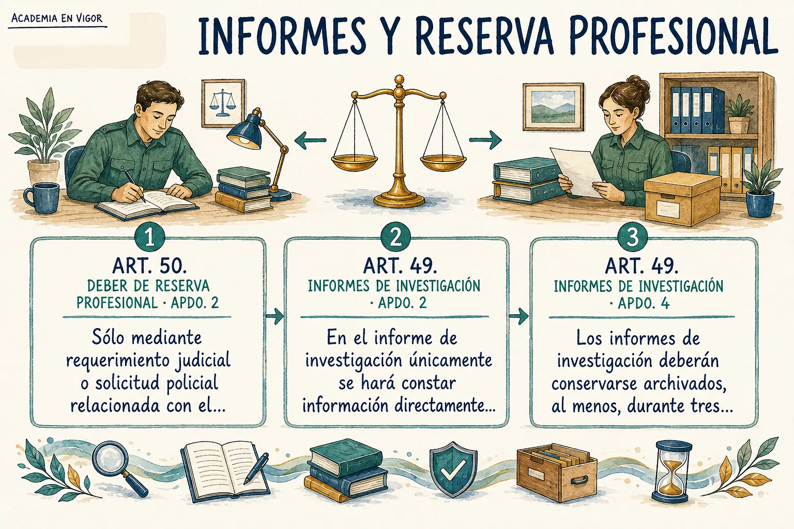

<em>Infografía: mapa de informes y reserva profesional.</em>

<!-- FUENTE: L5-2014-BOE-A-2014-3649-GC-T13 -->

## 55. Adopción y tipos de medidas de seguridad

### Regla y encaje

Adopción y tipos de medidas de seguridad forma parte de medidas y control administrativo. Estúdialo como una secuencia: presupuesto, obligación o facultad, excepción y consecuencia.

### Claves examinables

- **Artículo 51. Adopción de medidas · apartado 1:** 1. Las personas físicas o jurídicas, públicas o privadas, podrán dotarse de medidas de seguridad privada dirigidas a la protección de personas y bienes y al aseguramiento del normal desarrollo de sus actividades personales o empresariales. <!-- FACT:GC-T13-F631 -->
- **Artículo 51. Adopción de medidas · apartado 2:** 2. Reglamentariamente, con la finalidad de prevenir la comisión de actos delictivos contra ellos o por generar riesgos directos para terceros o ser especialmente vulnerables, se determinarán los establecimientos e instalaciones industriales, comerciales y de servicios y los eventos que resulten obligados a adoptar medidas de seguridad, así como el tipo y características de las que deban implantar en cada caso. <!-- FACT:GC-T13-F632 -->
- **Artículo 51. Adopción de medidas · apartado 3:** 3. El Ministerio del Interior o, en su caso, el órgano autonómico competente podrá ordenar que los titulares de establecimientos o instalaciones industriales, comerciales y de servicios y los organizadores de eventos adopten las medidas de seguridad que reglamentariamente se establezcan. <!-- FACT:GC-T13-F633 -->
- **Artículo 51. Adopción de medidas:** El órgano competente formulará la propuesta teniendo en cuenta, además de su finalidad preventiva de hechos delictivos y de evitación de riesgos, la naturaleza de la actividad, la localización de los establecimientos o instalaciones, la concentración de personas u otras circunstancias que la justifiquen y, previa audiencia del titular u organizador, resolverá motivadamente. <!-- FACT:GC-T13-F634 -->
- **Artículo 51. Adopción de medidas:** Cuando se considerase necesaria la implantación de dichas medidas en órganos u organismos públicos, el órgano competente formulará la correspondiente propuesta y, previo acuerdo con el órgano administrativo o entidad de los que dependan las instalaciones o locales necesitados de protección, dictará la resolución procedente. <!-- FACT:GC-T13-F635 -->
- **Artículo 51. Adopción de medidas · apartado 4:** 4. Las sedes y delegaciones de las empresas de seguridad privada vinculadas a la operativa de seguridad y los despachos de detectives privados y sus sucursales estarán obligados a adoptar las medidas de seguridad que se establezcan reglamentariamente. <!-- FACT:GC-T13-F636 -->
- **Artículo 51. Adopción de medidas · apartado 5:** 5. La celebración de eventos y la apertura o funcionamiento de establecimientos e instalaciones y de empresas de seguridad y sus delegaciones y despachos de detectives y sus sucursales, mencionados en los apartados 2 y 3, estará condicionada a la efectiva implantación de las medidas de seguridad que resulten obligatorias en cada caso. <!-- FACT:GC-T13-F637 -->
- **Artículo 51. Adopción de medidas · apartado 6:** 6. Los órganos competentes podrán eximir de la implantación de medidas de seguridad obligatorias cuando las circunstancias que concurran en el caso concreto las hicieren innecesarias o improcedentes. <!-- FACT:GC-T13-F638 -->
- **Artículo 51. Adopción de medidas · apartado 7:** 7. Los titulares de los establecimientos, instalaciones y empresas de seguridad privada y sus delegaciones, así como de los despachos de detectives privados y sus sucursales y los organizadores de eventos, serán responsables de la adopción de las medidas de seguridad que resulten obligatorias en cada caso. <!-- FACT:GC-T13-F639 -->
- **Artículo 51. Adopción de medidas:** Las empresas de seguridad encargadas de la prestación de las medidas de seguridad que les sean contratadas, serán responsables de su correcta instalación, mantenimiento y funcionamiento, sin perjuicio de la responsabilidad en que puedan incurrir sus empleados o los titulares de los establecimientos, instalaciones u organizadores obligados, si cualquier anomalía en su funcionamiento les fuera imputable. <!-- FACT:GC-T13-F640 -->
- **Artículo 51. Adopción de medidas · apartado 8:** 8. Quedarán sometidos a lo establecido en esta ley y en sus disposiciones de desarrollo los usuarios que, sin estar obligados, adopten medidas de seguridad, así como quienes adopten medidas de seguridad adicionales a las obligatorias, respecto de éstas. <!-- FACT:GC-T13-F641 -->
- **Artículo 52. Tipos de medidas:** 1. A los exclusivos efectos de esta ley, se podrán adoptar los siguientes tipos de medidas de seguridad, destinadas a la protección de personas y bienes: a) De seguridad física, cuya funcionalidad consiste en impedir o dificultar el acceso a determinados lugares o bienes mediante la interposición de cualquier tipo de barreras físicas. <!-- FACT:GC-T13-F642 -->
- **Artículo 52. Tipos de medidas:** 1. A los exclusivos efectos de esta ley, se podrán adoptar los siguientes tipos de medidas de seguridad, destinadas a la protección de personas y bienes: b) De seguridad electrónica, orientadas a detectar o advertir cualquier tipo de amenaza, peligro, presencia o intento de asalto o intrusión que pudiera producirse, mediante la activación de cualquier tipo de dispositivos electrónicos. <!-- FACT:GC-T13-F643 -->
- **Artículo 52. Tipos de medidas:** 1. A los exclusivos efectos de esta ley, se podrán adoptar los siguientes tipos de medidas de seguridad, destinadas a la protección de personas y bienes: c) De seguridad informática, cuyo objeto es la protección y salvaguarda de la integridad, confidencialidad y disponibilidad de los sistemas de información y comunicación, y de la información en ellos contenida. <!-- FACT:GC-T13-F644 -->
- **Artículo 52. Tipos de medidas:** 1. A los exclusivos efectos de esta ley, se podrán adoptar los siguientes tipos de medidas de seguridad, destinadas a la protección de personas y bienes: d) De seguridad organizativa, dirigidas a evitar o poner término a cualquier tipo de amenaza, peligro o ataque deliberado, mediante la disposición, programación o planificación de cometidos, funciones o tareas formalizadas o ejecutadas por personas; tales como la creación, existencia y funcionamiento de departamentos de seguridad o la elaboración y aplicación de todo tipo de planes de seguridad, así como cualesquiera otras de similar naturaleza que puedan adoptarse. <!-- FACT:GC-T13-F645 -->
- **Artículo 52. Tipos de medidas:** 1. A los exclusivos efectos de esta ley, se podrán adoptar los siguientes tipos de medidas de seguridad, destinadas a la protección de personas y bienes: e) De seguridad personal, para la prestación de servicios de seguridad regulados en esta ley, distintos de los que constituyen el objeto específico de las anteriores. <!-- FACT:GC-T13-F646 -->
- **Artículo 52. Tipos de medidas · apartado 2:** 2. Las características, elementos y finalidades de las medidas de seguridad de cualquier tipo, quien quiera que los utilice, se regularán reglamentariamente de acuerdo con lo previsto, en cuanto a sus grados y características, en las normas que contienen especificaciones técnicas para una actividad o producto. <!-- FACT:GC-T13-F647 -->
- **Artículo 52. Tipos de medidas · apartado 2:** Asimismo dichas medidas de seguridad, medios materiales y sistemas de alarma deberán contar con la evaluación de los organismos de certificación acreditados en el momento de su instalación y tendrán vigencia indefinida, salvo deterioro o instalación de un nuevo sistema, que deberá ser conforme a la homologación que le resulte aplicable. <!-- FACT:GC-T13-F648 -->

:::hablemos-claro
Seguridad pública significa potestad y responsabilidad estatal; seguridad privada significa actividad complementaria, subordinada, controlada y obligada a colaborar.
:::

:::en-la-calle
Ante un supuesto, identifica primero quién actúa, con qué habilitación, qué medida adopta, qué límite legal existe y qué autoridad controla la actuación.
:::

:::lo-que-cae
Prioriza listas cerradas, plazos, excepciones, competencias y efectos. Apariciones oficiales mapeadas: **0**.
:::

<!-- VISUAL:t13-55-adopcion-y-tipos-de-medidas-de-seguridad.webp -->

  

<em>Infografía: flujo de adopción y tipos de medidas de seguridad.</em>

<!-- FUENTE: L5-2014-BOE-A-2014-3649-GC-T13 -->

## 56. Actuaciones de control e inspección

### Regla y encaje

Actuaciones de control e inspección forma parte de medidas y control administrativo. Estúdialo como una secuencia: presupuesto, obligación o facultad, excepción y consecuencia.

### Claves examinables

- **Artículo 53. Actuaciones de control · apartado 1:** 1. Corresponde a las Fuerzas y Cuerpos de Seguridad competentes en el ejercicio de las funciones de control de las empresas, despachos de detectives, de sus servicios o actuaciones y de su personal y medios en materia de seguridad privada, el cumplimiento de las órdenes e instrucciones que se impartan por los órganos a los que se refieren los artículos 12 y 13. <!-- FACT:GC-T13-F649 -->
- **Artículo 53. Actuaciones de control · apartado 2:** 2. En el ejercicio de estas funciones, los miembros de las Fuerzas y Cuerpos de Seguridad competentes podrán requerir la información pertinente y adoptar las medidas provisionales que resulten necesarias, en los términos del artículo 55. <!-- FACT:GC-T13-F650 -->
- **Artículo 53. Actuaciones de control · apartado 3:** 3. Cuando en el ejercicio de las actuaciones de control se detectase la posible comisión de una infracción administrativa, se instará a la autoridad competente para la incoación del correspondiente procedimiento sancionador. Si se tratara de la posible comisión de un hecho delictivo, se pondrá inmediatamente en conocimiento de la autoridad judicial. <!-- FACT:GC-T13-F651 -->
- **Artículo 53. Actuaciones de control · apartado 4:** 4. Toda persona que tuviera conocimiento de irregularidades cometidas en el ámbito de la seguridad privada podrá denunciarlas ante las autoridades o funcionarios competentes, a efectos del posible ejercicio de las actuaciones de control y sanción correspondientes. <!-- FACT:GC-T13-F652 -->
- **Artículo 53. Actuaciones de control · apartado 5:** 5. El acceso por los órganos que tengan atribuida la competencia de control se limitará a los datos necesarios para la realización de la misma. <!-- FACT:GC-T13-F653 -->
- **Artículo 54. Actuaciones de inspección · apartado 1:** 1. Las Fuerzas y Cuerpos de Seguridad competentes establecerán planes anuales de inspección ordinaria sobre las empresas, los despachos de detectives privados, el personal, los servicios, los establecimientos, los centros de formación, las medidas de seguridad y cualesquiera otras actividades o servicios regulados en esta ley. <!-- FACT:GC-T13-F654 -->
- **Artículo 54. Actuaciones de inspección · apartado 2:** 2. Al margen de los citados planes de inspección, cuando recibieren denuncias sobre irregularidades cometidas en el ámbito de la seguridad privada procederán a la comprobación de los hechos denunciados y, en su caso, a instar la incoación del correspondiente procedimiento sancionador. <!-- FACT:GC-T13-F655 -->
- **Artículo 54. Actuaciones de inspección · apartado 3:** A los efectos anteriormente indicados, las empresas de seguridad, los despachos de detectives y el personal de seguridad privada, así como los establecimientos obligados a contratar servicios de seguridad privada, los centros de formación, las centrales de alarma de uso propio y los usuarios que contraten dichos servicios, habrán de facilitar a las Fuerzas y Cuerpos de Seguridad competentes el acceso a sus instalaciones y medios a efectos de inspección, así como a la información contenida en los contratos de seguridad, en los informes de investigación y en los libros-registro, en los supuestos y en la forma que reglamentariamente se determine. <!-- FACT:GC-T13-F656 -->
- **Artículo 54. Actuaciones de inspección · apartado 4:** 4. Las actuaciones de inspección se atendrán a los principios de injerencia mínima y proporcionalidad, y tendrán por finalidad la comprobación del cumplimiento de la legislación aplicable. <!-- FACT:GC-T13-F657 -->
- **Artículo 54. Actuaciones de inspección · apartado 5:** 5. Cuando las actuaciones de inspección recaigan sobre los servicios de investigación privada se tendrá especial cuidado en su ejecución, extremándose las cautelas en relación con las imágenes, sonidos o datos personales obtenidos que obren en el expediente de investigación. <!-- FACT:GC-T13-F658 -->
- **Artículo 54. Actuaciones de inspección · apartado 5:** Las actuaciones se limitarán a la comprobación de su existencia, sin entrar en su contenido, salvo que se encuentre relacionado con una investigación judicial o policial o con un expediente sancionador. <!-- FACT:GC-T13-F659 -->
- **Artículo 54. Actuaciones de inspección · apartado 6:** 6. Las inspecciones a las que se refieren los apartados anteriores se realizarán por el Cuerpo Nacional de Policía; por la Guardia Civil, en el caso de los guardas rurales y sus especialidades y centros y cursos de formación relativos a este personal; o, por el cuerpo de policía autonómica competente. <!-- FACT:GC-T13-F660 -->
- **Artículo 54. Actuaciones de inspección · apartado 7:** 7. Siempre que el personal indicado en el apartado anterior realice una inspección, extenderá el acta correspondiente y, en el caso de existencia de infracción, se dará cuenta a la autoridad competente. <!-- FACT:GC-T13-F661 -->
- **Artículo 54. Actuaciones de inspección · apartado 8:** 8. El acceso por los órganos que tengan atribuida la competencia de inspección se limitará a los datos necesarios para la realización de la misma. <!-- FACT:GC-T13-F662 -->

:::hablemos-claro
Seguridad pública significa potestad y responsabilidad estatal; seguridad privada significa actividad complementaria, subordinada, controlada y obligada a colaborar.
:::

:::en-la-calle
Ante un supuesto, identifica primero quién actúa, con qué habilitación, qué medida adopta, qué límite legal existe y qué autoridad controla la actuación.
:::

:::lo-que-cae
Prioriza listas cerradas, plazos, excepciones, competencias y efectos. Apariciones oficiales mapeadas: **0**.
:::

<!-- VISUAL:t13-56-actuaciones-de-control-e-inspeccion.webp -->

  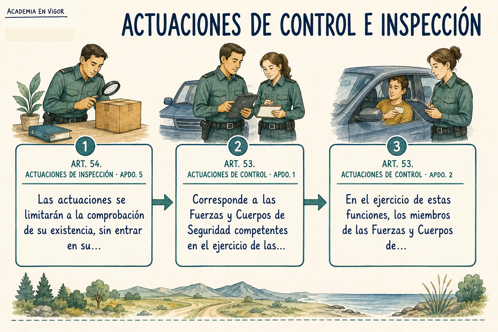

<em>Infografía: comparación de actuaciones de control e inspección.</em>

<!-- FUENTE: L5-2014-BOE-A-2014-3649-GC-T13 -->

## 57. Medidas provisionales anteriores al procedimiento

### Regla y encaje

Medidas provisionales anteriores al procedimiento forma parte de medidas y control administrativo. Estúdialo como una secuencia: presupuesto, obligación o facultad, excepción y consecuencia.

### Claves examinables

- **Artículo 55. Medidas provisionales anteriores al procedimiento:** 1. Los miembros de las Fuerzas y Cuerpos de Seguridad competentes podrán acordar excepcionalmente las siguientes medidas provisionales anteriores a la eventual incoación de un procedimiento sancionador, dando cuenta de ello inmediatamente a la autoridad competente: a) La ocupación o precinto de vehículos, armas, material o equipos prohibidos, no homologados o que resulten peligrosos o perjudiciales, así como de los instrumentos y efectos de la infracción, en supuestos de grave riesgo o peligro inminente para las personas o bienes. <!-- FACT:GC-T13-F663 -->
- **Artículo 55. Medidas provisionales anteriores al procedimiento:** 1. Los miembros de las Fuerzas y Cuerpos de Seguridad competentes podrán acordar excepcionalmente las siguientes medidas provisionales anteriores a la eventual incoación de un procedimiento sancionador, dando cuenta de ello inmediatamente a la autoridad competente: b) La suspensión, junto con la intervención u ocupación de los medios o instrumentos que se estuvieren empleando, de aquellos servicios de seguridad que se estuvieren prestando sin las preceptivas garantías y formalidades legales o sin contar con la necesaria autorización o declaración responsable, o cuando puedan causar daños o perjuicios a terceros o poner en peligro la seguridad ciudadana. <!-- FACT:GC-T13-F664 -->
- **Artículo 55. Medidas provisionales anteriores al procedimiento:** 1. Los miembros de las Fuerzas y Cuerpos de Seguridad competentes podrán acordar excepcionalmente las siguientes medidas provisionales anteriores a la eventual incoación de un procedimiento sancionador, dando cuenta de ello inmediatamente a la autoridad competente: c) El cese de los servicios de seguridad cuando se constate que están siendo prestados por empresas, centrales de alarma de uso propio o despachos de detectives, no autorizados o que no hubieran presentado la declaración responsable, o por personal no habilitado o acreditado para el ejercicio legal de los mismos. <!-- FACT:GC-T13-F665 -->
- **Artículo 55. Medidas provisionales anteriores al procedimiento:** 1. Los miembros de las Fuerzas y Cuerpos de Seguridad competentes podrán acordar excepcionalmente las siguientes medidas provisionales anteriores a la eventual incoación de un procedimiento sancionador, dando cuenta de ello inmediatamente a la autoridad competente: d) El cese de la actividad docente en materia de seguridad privada, cuando se constate que los centros que la imparten, no hayan presentado la declaración responsable o el profesorado no tuviera la acreditación correspondiente. <!-- FACT:GC-T13-F666 -->
- **Artículo 55. Medidas provisionales anteriores al procedimiento:** 1. Los miembros de las Fuerzas y Cuerpos de Seguridad competentes podrán acordar excepcionalmente las siguientes medidas provisionales anteriores a la eventual incoación de un procedimiento sancionador, dando cuenta de ello inmediatamente a la autoridad competente: e) La desconexión de los sistemas de alarma cuyo mal funcionamiento causare perjuicios a la seguridad pública o molestias a terceros. Cuando se trate de establecimientos obligados a contar con esta medida de seguridad, la desconexión se suplirá mediante el establecimiento de un servicio permanente de vigilancia y protección privada. <!-- FACT:GC-T13-F667 -->
- **Artículo 55. Medidas provisionales anteriores al procedimiento:** 1. Los miembros de las Fuerzas y Cuerpos de Seguridad competentes podrán acordar excepcionalmente las siguientes medidas provisionales anteriores a la eventual incoación de un procedimiento sancionador, dando cuenta de ello inmediatamente a la autoridad competente: f) La retirada de la tarjeta de identificación profesional al personal de seguridad o de la acreditación al personal acreditado, cuando resulten detenidos por su implicación en la comisión de hechos delictivos. <!-- FACT:GC-T13-F668 -->
- **Artículo 55. Medidas provisionales anteriores al procedimiento:** 1. Los miembros de las Fuerzas y Cuerpos de Seguridad competentes podrán acordar excepcionalmente las siguientes medidas provisionales anteriores a la eventual incoación de un procedimiento sancionador, dando cuenta de ello inmediatamente a la autoridad competente: g) La suspensión, parcial o total, de las actividades de los establecimientos que sean notoriamente vulnerables y no tengan en funcionamiento las medidas de seguridad obligatorias. <!-- FACT:GC-T13-F669 -->
- **Artículo 55. Medidas provisionales anteriores al procedimiento · apartado 2:** 2. Estas medidas habrán de ser ratificadas, modificadas o revocadas en el plazo máximo de quince días. En todo caso quedarán sin efecto si, transcurrido dicho plazo, no se incoa el procedimiento sancionador o el acuerdo de incoación no contiene un pronunciamiento expreso acerca de las mismas. El órgano competente para ratificar, revocar o modificar las medidas provisionales será el competente para incoar el procedimiento sancionador. <!-- FACT:GC-T13-F670 -->
- **Artículo 55. Medidas provisionales anteriores al procedimiento · apartado 3:** 3. La duración de las medidas contempladas en el apartado 1, que deberá ser notificada a los interesados, no podrá exceder de seis meses. <!-- FACT:GC-T13-F671 -->
- **Artículo 55. Medidas provisionales anteriores al procedimiento · apartado 4:** 4. Asimismo, con independencia de las responsabilidades penales o administrativas a que hubiere lugar, los miembros de las Fuerzas y Cuerpos de Seguridad competentes se harán cargo de las armas que se porten o utilicen ilegalmente, siguiendo lo dispuesto al respecto en la normativa de armas. <!-- FACT:GC-T13-F672 -->

:::hablemos-claro
Seguridad pública significa potestad y responsabilidad estatal; seguridad privada significa actividad complementaria, subordinada, controlada y obligada a colaborar.
:::

:::en-la-calle
Ante un supuesto, identifica primero quién actúa, con qué habilitación, qué medida adopta, qué límite legal existe y qué autoridad controla la actuación.
:::

:::lo-que-cae
Prioriza listas cerradas, plazos, excepciones, competencias y efectos. Apariciones oficiales mapeadas: **1**.
:::

<!-- VISUAL:t13-57-medidas-provisionales-anteriores-al-procedimiento.webp -->

  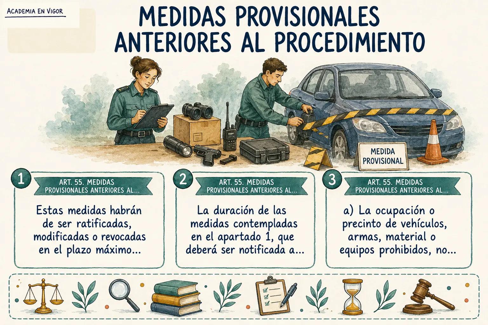

<em>Infografía: línea temporal de medidas provisionales anteriores al procedimiento.</em>

<!-- FUENTE: L5-2014-BOE-A-2014-3649-GC-T13 -->

# Hablemos claro

La clave es no mezclar autoridad pública, empresa, despacho de detectives y personal habilitado: cada sujeto tiene competencias, funciones y límites distintos.

# En la calle

En una actuación real pueden coincidir policía, vigilantes, responsables de seguridad, usuarios y afectados; la coordinación no borra las competencias de cada uno.

# Lo que cae

Son especialmente rentables identificación, registros corporales, reuniones, infracciones, autoridades sancionadoras, profesiones de seguridad privada, funciones, armas, videovigilancia y detectives.

# Ha caído

:::ha-caido
Se han mapeado **65** preguntas oficiales de 2020 a 2026. Permanecen separadas del banco propio y enlazadas al hecho vigente.
:::

---

*Academia En Vigor · El temario que nunca duerme · Tema 13 · v1.0.0 · Documento interno no publicado.*
