# TEMA 17 · MATERIAS TÉCNICO-CIENTÍFICAS. TECNOLOGÍAS DE LA INFORMACIÓN Y LA COMUNICACIÓN

**Guardia Civil · Método VIGOR · ATESTADO**
**Versión de contenido:** 1.0.0
**Estado editorial:** approved_internal · **Publicación:** not_published

# Mapa del tema

| Parte | Contenido | Bloques |
|---|---|---:|
| 1 | Sistemas de telecomunicaciones | 1–7 |
| 2 | Organización e instrumentos de la Administración Digital | 8–9 |
| 3 | Servicios electrónicos de confianza y firma digital | 10–15 |
| 4 | Principios de ciberseguridad del CCN-CERT | 16–22 |
| 5 | Esquema Nacional de Interoperabilidad | 23–24 |

<!-- VISUAL:t17-00-mapa-tic.webp -->

  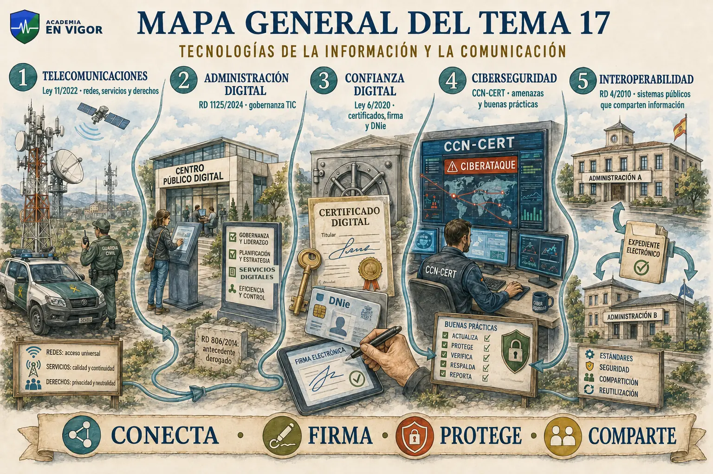

<em>Infografía: arquitectura completa del tema.</em>

# Contenido

## 01. Alcance oficial, método y corte normativo

### Regla y encaje

Alcance oficial, método y corte normativo se estudia con literalidad controlada y conexión práctica. La referencia normativa se mantiene separada de comentarios y antecedentes.

### Claves examinables

- **Epígrafe oficial:** El Tema 17 vigente comprende tecnologías de la información y la comunicación; el bloque de estadística fue suprimido del programa. <!-- FACT:GC-T17-F001 -->
- **Epígrafe oficial:** El programa exige la Ley 11/2022 en su título I y en el capítulo III del título III. <!-- FACT:GC-T17-F002 -->
- **Epígrafe oficial:** El programa mantiene como referencia histórica los capítulos I y III del Real Decreto 806/2014, hoy derogado íntegramente. <!-- FACT:GC-T17-F003 -->
- **Método:** La regla vigente de organización de la Administración Digital se estudia mediante el Real Decreto 1125/2024 y la referencia al Real Decreto 806/2014 se conserva como antecedente de examen. <!-- FACT:GC-T17-F004 -->
- **Epígrafe oficial:** La Ley 6/2020 se estudia en sus títulos I, II y III y en su disposición adicional tercera. <!-- FACT:GC-T17-F005 -->
- **Epígrafe oficial:** El bloque CCN-CERT incluye amenazas, Internet profunda, aplicaciones, navegación, correo, virtualización, móviles, redes inalámbricas, mensajería, redes sociales e Internet de las cosas. <!-- FACT:GC-T17-F006 -->
- **Epígrafe oficial:** El Real Decreto 4/2010 se estudia como norma del Esquema Nacional de Interoperabilidad. <!-- FACT:GC-T17-F007 -->
- **Producción:** Esta entrega planifica referencias visuales, pero no integra archivos PNG, WEBP ni otros binarios gráficos. <!-- FACT:GC-T17-F008 -->

:::hablemos-claro
No memorices palabras aisladas: pregunta siempre quién actúa, con qué habilitación y bajo qué límite.
:::

:::en-la-calle
En un supuesto, traduce el problema a una secuencia: activo o derecho afectado, autoridad o responsable, medida exigible y control posterior.
:::

:::lo-que-cae
Prioriza definiciones, competencias, listas, plazos, cifras y excepciones. Apariciones oficiales mapeadas: **0**.
:::

<!-- VISUAL:t17-01-alcance-oficial-metodo-y-corte-normativo.webp -->

  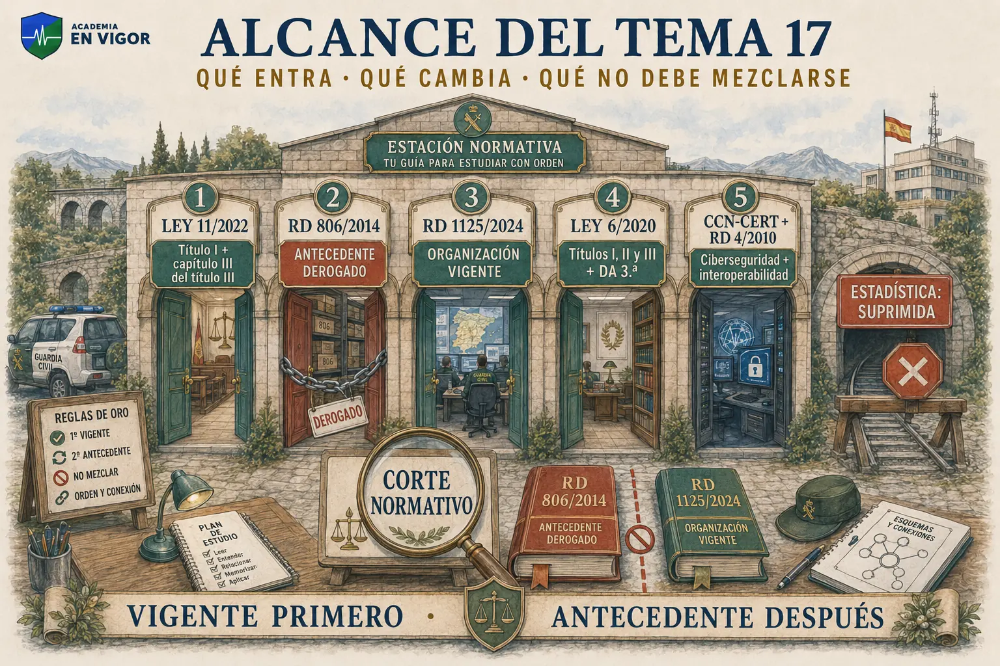

<em>Infografía: esquema de alcance oficial, método y corte normativo.</em>

<!-- FUENTE: GC-PROGRAMA-2026-T17 -->

## 02. Objeto, ámbito y consideración de las telecomunicaciones

### Regla y encaje

Objeto, ámbito y consideración de las telecomunicaciones se estudia con literalidad controlada y conexión práctica. La referencia normativa se mantiene separada de comentarios y antecedentes.

### Claves examinables

- **Artículo 1:** El objeto de esta ley es la regulación de las telecomunicaciones, que comprende la instalación y explotación de las redes de comunicaciones electrónicas, la prestación de los servicios de comunicaciones electrónicas, sus recursos y servicios asociados, los equipos radioeléctricos y los equipos terminales de telecomunicación, de conformidad con el artículo 149.1.21.ª de la Constitución Española. <!-- FACT:GC-T17-F009 -->
- **Artículo 1:** En particular, esta ley es de aplicación al dominio público radioeléctrico utilizado por parte de todas las redes de comunicaciones electrónicas, ya sean públicas o no, y con independencia del servicio que haga uso del mismo. <!-- FACT:GC-T17-F010 -->
- **Artículo 1:** Quedan excluidos del ámbito de esta ley los servicios de comunicación audiovisual, los servicios de intercambio de vídeos a través de plataforma, los contenidos audiovisuales transmitidos a través de las redes, así como el régimen básico de los medios de comunicación social de naturaleza audiovisual a que se refiere el artículo 149.1.27.ª de la Constitución. <!-- FACT:GC-T17-F011 -->
- **Artículo 1:** Asimismo, se excluyen del ámbito de esta ley los servicios que suministren contenidos transmitidos mediante redes y servicios de comunicaciones electrónicas, las actividades que consistan en el ejercicio del control editorial sobre dichos contenidos y los servicios de la Sociedad de la Información, regulados en la Ley 34/2002, de 11 de julio, de Servicios de la Sociedad de la Información y de Comercio Electrónico, en tanto en cuanto no sean asimismo servicios de comunicaciones electrónicas. <!-- FACT:GC-T17-F012 -->
- **Artículo 2:** Las telecomunicaciones son servicios de interés general que se prestan en régimen de libre competencia. <!-- FACT:GC-T17-F013 -->
- **Artículo 2:** Sólo tienen la consideración de servicio público o están sometidos a obligaciones de servicio público los servicios regulados en el artículo 4 y en el Título III, respectivamente. <!-- FACT:GC-T17-F014 -->

:::hablemos-claro
No memorices palabras aisladas: pregunta siempre quién actúa, con qué habilitación y bajo qué límite.
:::

:::en-la-calle
En un supuesto, traduce el problema a una secuencia: activo o derecho afectado, autoridad o responsable, medida exigible y control posterior.
:::

:::lo-que-cae
Prioriza definiciones, competencias, listas, plazos, cifras y excepciones. Apariciones oficiales mapeadas: **3**.
:::

<!-- VISUAL:t17-02-objeto-ambito-y-consideracion-de-las-telecomunicaciones.webp -->

  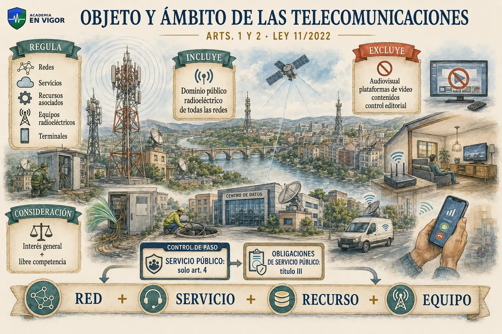

<em>Infografía: esquema de objeto, ámbito y consideración de las telecomunicaciones.</em>

<!-- FUENTE: L11-2022-GC-T17 -->

## 03. Objetivos y principios de la Ley General de Telecomunicaciones

### Regla y encaje

Objetivos y principios de la Ley General de Telecomunicaciones se estudia con literalidad controlada y conexión práctica. La referencia normativa se mantiene separada de comentarios y antecedentes.

### Claves examinables

- **Artículo 3:** Los objetivos y principios de esta ley son los siguientes: <!-- FACT:GC-T17-F015 -->
- **Artículo 3:** a) Fomentar la competencia efectiva y sostenible en los mercados de telecomunicaciones para potenciar al máximo los intereses y beneficios para las empresas y los consumidores, principalmente en términos de bajada de los precios, calidad de los servicios, variedad de elección e innovación, teniendo debidamente en cuenta la variedad de condiciones en cuanto a la competencia y los consumidores que existen en las distintas áreas geográficas, y velando por que no exista falseamiento ni restricción de la competencia en la explotación de redes o en la prestación de servicios de comunicaciones electrónicas, incluida la transmisión de contenidos. <!-- FACT:GC-T17-F016 -->
- **Artículo 3:** b) Desarrollar la economía y el empleo digital, promover el desarrollo del sector de las telecomunicaciones y de todos los nuevos servicios digitales que las nuevas redes de alta y muy alta capacidad permiten, impulsando la cohesión social y territorial, mediante la mejora y extensión de las redes, especialmente las de muy alta capacidad, así como la prestación de los servicios de comunicaciones electrónicas y el suministro de los recursos asociados a ellas. <!-- FACT:GC-T17-F017 -->
- **Artículo 3:** c) Promover, en aras a la consecución del fin de interés general que supone, el despliegue de redes y la prestación de servicios de comunicaciones electrónicas, fomentando la conectividad, el acceso a las redes de muy alta capacidad, incluidas las redes fijas, móviles e inalámbricas y la interoperabilidad de extremo a extremo, en condiciones de igualdad y no discriminación. <!-- FACT:GC-T17-F018 -->
- **Artículo 3:** d) Impulsar la innovación en el despliegue de redes y la prestación de servicios de comunicaciones, en aras a garantizar el servicio universal y la reducción de la desigualdad en el acceso a internet y las Tecnologías de la Información y la Comunicación (TIC), con especial consideración al despliegue de redes y servicios a la ciudadanía vinculados a la mejora del acceso funcional a internet, del teletrabajo, del medioambiente, de la salud y la seguridad públicas y de la protección civil; así como cuando faciliten la vertebración y cohesión social y territorial o contribuyan a la sostenibilidad de la logística urbana. <!-- FACT:GC-T17-F019 -->
- **Artículo 3:** e) Promover el desarrollo de la ingeniería, así como de la industria de productos y equipos de telecomunicaciones. <!-- FACT:GC-T17-F020 -->
- **Artículo 3:** f) Contribuir al desarrollo del mercado interior de servicios de comunicaciones electrónicas en la Unión Europea, facilitando la convergencia de las condiciones que permitan la inversión en redes de comunicaciones electrónicas y en su suministro, en servicios de comunicaciones electrónicas, en recursos asociados y servicios asociados en toda la Unión. <!-- FACT:GC-T17-F021 -->
- **Artículo 3:** g) Promover la inversión eficiente en materia de infraestructuras, especialmente en las redes de muy alta capacidad, incluyendo, cuando proceda y con carácter prioritario, la competencia basada en infraestructuras, reduciendo progresivamente la intervención ex ante en los mercados, posibilitando la coinversión y el uso compartido y fomentando la innovación, teniendo debidamente en cuenta los riesgos en que incurren las empresas inversoras. <!-- FACT:GC-T17-F022 -->
- **Artículo 3:** h) Hacer posible el uso eficaz y eficiente de los recursos limitados de telecomunicaciones, como la numeración y el espectro radioeléctrico, la adecuada protección de este último, y el acceso a los derechos de ocupación de la propiedad pública y privada. <!-- FACT:GC-T17-F023 -->
- **Artículo 3:** i) Fomentar la neutralidad tecnológica en la regulación. <!-- FACT:GC-T17-F024 -->
- **Artículo 3:** j) Garantizar el cumplimiento de las obligaciones de servicio público en la explotación de redes y la prestación de servicios de comunicaciones electrónicas a las que se refiere el Título III, en especial las de servicio universal. <!-- FACT:GC-T17-F025 -->
- **Artículo 3:** k) Defender los intereses de los usuarios, asegurando su derecho al acceso a los servicios de comunicaciones electrónicas en condiciones adecuadas de elección, precio y buena calidad, promoviendo la capacidad de los usuarios finales para acceder y distribuir la información o utilizar las aplicaciones y los servicios de su elección, en particular a través de un acceso abierto a internet. <!-- FACT:GC-T17-F026 -->
- **Artículo 3:** En la prestación de estos servicios deben salvaguardarse los imperativos constitucionales de no discriminación, de respeto a los derechos al honor y a la intimidad, la protección a la juventud y a la infancia, la protección a las personas con discapacidad, la protección de los datos personales y el secreto en las comunicaciones. <!-- FACT:GC-T17-F027 -->
- **Artículo 3:** l) Salvaguardar y proteger en los mercados de telecomunicaciones la satisfacción de las necesidades de grupos sociales específicos, las personas con discapacidad, las personas mayores, las personas en situación de dependencia y usuarios con necesidades sociales especiales, atendiendo a los principios de igualdad de oportunidades y no discriminación. En lo relativo al acceso a los servicios de comunicaciones electrónicas de las personas con discapacidad y personas en situación de dependencia, se fomentará el cumplimiento de las normas o las especificaciones pertinentes relativas a normalización técnica publicadas de acuerdo con la normativa comunitaria y se facilitará el acceso de los usuarios con discapacidad a los servicios de comunicaciones electrónicas y al uso de equipos terminales. <!-- FACT:GC-T17-F028 -->
- **Artículo 3:** m) Impulsar la universalización del acceso a las redes y servicios de comunicaciones electrónicas de banda ancha y contribuir a alcanzar la mayor vertebración territorial y social posible mediante el despliegue de redes y la prestación de servicios de comunicaciones electrónicas en las distintas zonas del territorio español, especialmente en aquellas que necesitan de la instalación de redes de comunicaciones electrónicas y la mejora de las existentes para permitir impulsar distintas actividades económicas y sociales. <!-- FACT:GC-T17-F029 -->

:::hablemos-claro
No memorices palabras aisladas: pregunta siempre quién actúa, con qué habilitación y bajo qué límite.
:::

:::en-la-calle
En un supuesto, traduce el problema a una secuencia: activo o derecho afectado, autoridad o responsable, medida exigible y control posterior.
:::

:::lo-que-cae
Prioriza definiciones, competencias, listas, plazos, cifras y excepciones. Apariciones oficiales mapeadas: **1**.
:::

<!-- VISUAL:t17-03-objetivos-y-principios-de-la-ley-general-de-telecomunicaciones.webp -->

  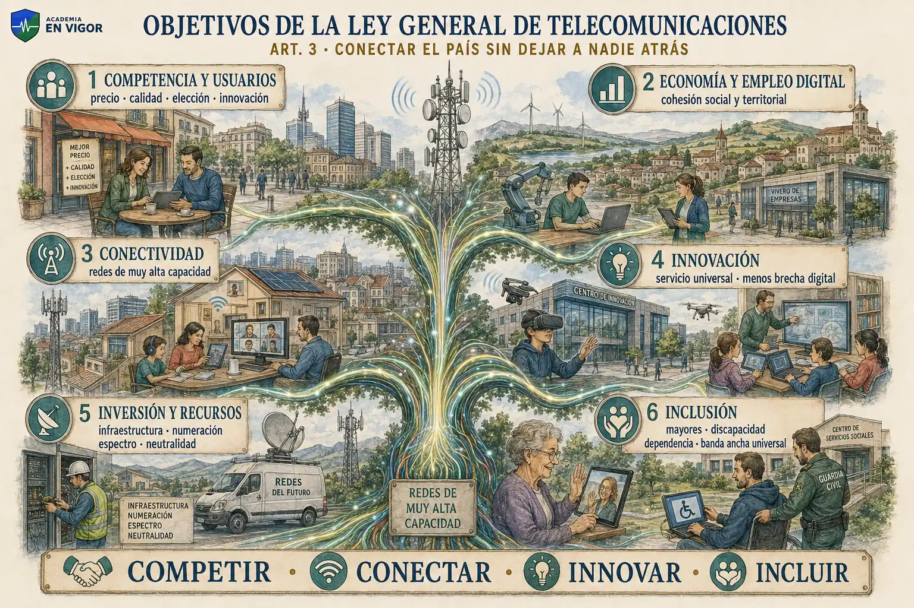

<em>Infografía: esquema de objetivos y principios de la ley general de telecomunicaciones.</em>

<!-- FUENTE: L11-2022-GC-T17 -->

## 04. Telecomunicaciones para seguridad, defensa y protección civil

### Regla y encaje

Telecomunicaciones para seguridad, defensa y protección civil se estudia con literalidad controlada y conexión práctica. La referencia normativa se mantiene separada de comentarios y antecedentes.

### Claves examinables

- **Artículo 4:** Sólo tienen la consideración de servicio público los servicios regulados en este artículo. <!-- FACT:GC-T17-F030 -->
- **Artículo 4:** Las redes, servicios, instalaciones y equipos de telecomunicaciones que desarrollen actividades esenciales para la seguridad y defensa nacionales integran los medios destinados a éstas, se reservan al Estado y se rigen por su normativa específica. <!-- FACT:GC-T17-F031 -->
- **Artículo 4:** El Ministerio de Asuntos Económicos y Transformación Digital es el órgano de la Administración General del Estado con competencia, de conformidad con la legislación específica sobre la materia y lo establecido en esta ley, para ejecutar, en la medida en que le afecte, la política de defensa nacional en el sector de las telecomunicaciones, con la debida coordinación con el Ministerio de Defensa y siguiendo los criterios fijados por éste. <!-- FACT:GC-T17-F032 -->
- **Artículo 4:** En el marco de las funciones relacionadas con la defensa civil, corresponde al Ministerio de Asuntos Económicos y Transformación Digital estudiar, planear, programar, proponer y ejecutar cuantas medidas se relacionen con su aportación a la defensa nacional en el ámbito de las telecomunicaciones. <!-- FACT:GC-T17-F033 -->
- **Artículo 4:** A tales efectos, los Ministerios de Defensa y de Asuntos Económicos y Transformación Digital coordinarán la planificación del sistema de telecomunicaciones de las Fuerzas Armadas, a fin de asegurar, en la medida de lo posible, su compatibilidad con los servicios civiles. Asimismo, elaborarán los programas de coordinación tecnológica precisos que faciliten la armonización, homologación y utilización, conjunta o indistinta, de los medios, sistemas y redes civiles y militares en el ámbito de las telecomunicaciones. Para el estudio e informe de estas materias, se constituirán los órganos interministeriales que se consideren adecuados, con la composición y competencia que se determinen mediante real decreto. <!-- FACT:GC-T17-F034 -->
- **Artículo 4:** En los ámbitos del orden público, la seguridad pública, seguridad vial y de la protección civil, en su específica relación con el uso de las telecomunicaciones, el Ministerio de Asuntos Económicos y Transformación Digital cooperará con el Ministerio del Interior y con los órganos responsables de las Comunidades Autónomas con competencias sobre las citadas materias. <!-- FACT:GC-T17-F035 -->
- **Artículo 4:** Los bienes muebles o inmuebles vinculados a los centros, establecimientos y dependencias afectos a la instalación y explotación de las redes y a la prestación de los servicios de comunicaciones electrónicas dispondrán de las medidas y sistemas de seguridad, vigilancia, difusión de información, prevención de riesgos y protección que se determinen por el Gobierno, a propuesta de los Ministerios de Defensa, del Interior o de Asuntos Económicos y Transformación Digital, dentro del ámbito de sus respectivas competencias. Estas medidas y sistemas deberán estar disponibles en las situaciones de normalidad o en las de crisis, así como en los supuestos contemplados en la Ley Orgánica 4/1981, de 1 de junio, reguladora de los Estados de Alarma, Excepción y Sitio, la Ley 8/2011, de 28 de abril, por la que se establecen medidas para la Protección de las Infraestructuras Críticas, la Ley 17/2015, de 9 de julio, del Sistema Nacional de Protección Civil y el Real Decreto-ley 12/2018, de 7 de septiembre, de seguridad de las redes y sistemas de información. <!-- FACT:GC-T17-F036 -->
- **Artículo 4:** El Gobierno, con carácter excepcional y transitorio, podrá acordar la asunción por la Administración General del Estado de la gestión directa de determinados servicios de comunicaciones electrónicas disponibles al público, distintos de los servicios de comunicaciones interpersonales, independientes de la numeración o de la explotación de ciertas redes públicas de comunicaciones electrónicas, para garantizar la seguridad pública y la seguridad nacional, en los términos en que dichas redes y servicios están definidos en el anexo II, excluyéndose en consecuencia las redes y servicios que se exploten o presten íntegramente en autoprestación. Esta facultad excepcional y transitoria de gestión directa podrá afectar a cualquier infraestructura, recurso asociado o elemento o nivel de la red o del servicio que resulte necesario para preservar o restablecer la seguridad pública y la seguridad nacional. <!-- FACT:GC-T17-F037 -->
- **Artículo 4:** En ningún caso esta intervención podrá suponer una vulneración de los derechos fundamentales y libertades públicas reconocidas en el ordenamiento jurídico. <!-- FACT:GC-T17-F038 -->
- **Artículo 4:** Asimismo, en el caso de incumplimiento de las obligaciones de servicio público a las que se refiere el Título III, el Gobierno, previo informe preceptivo de la Comisión Nacional de los Mercados y la Competencia, e igualmente con carácter excepcional y transitorio, podrá acordar la asunción por la Administración General del Estado de la gestión directa de los correspondientes servicios o de la explotación de las correspondientes redes. En este último caso, podrá, con las mismas condiciones, intervenir la prestación de los servicios de comunicaciones electrónicas. <!-- FACT:GC-T17-F039 -->
- **Artículo 4:** Los acuerdos de asunción de la gestión directa del servicio y de intervención de este o los de intervenir o explotar las redes a los que se refieren los párrafos anteriores se adoptarán por el Gobierno por propia iniciativa o a instancia de una Administración Pública competente. En este último caso, será preciso que la Administración Pública tenga competencias en materia de seguridad o para la prestación de los servicios públicos afectados por el anormal funcionamiento del servicio o de la red de comunicaciones electrónicas. En el supuesto de que el procedimiento se inicie a instancia de una Administración distinta de la del Estado, aquella tendrá la consideración de interesada y podrá evacuar informe con carácter previo a la resolución final. <!-- FACT:GC-T17-F040 -->
- **Artículo 4:** Los acuerdos de asunción de la gestión directa del servicio y de intervención de este o los de intervenir o explotar las redes a los que se refiere este apartado deberán ser comunicados por el Gobierno en el plazo de veinticuatro horas al órgano jurisdiccional competente para que, en un plazo de cuarenta y ocho horas, establezca si los mismos resultan acordes con los derechos fundamentales y libertades públicas reconocidas en el ordenamiento jurídico, procediendo a su anulación en caso negativo. <!-- FACT:GC-T17-F041 -->
- **Artículo 4:** La regulación contenida en esta ley se entiende sin perjuicio de lo previsto en la normativa específica sobre las telecomunicaciones relacionadas con el orden público, la seguridad pública, la defensa nacional y la seguridad nacional. <!-- FACT:GC-T17-F042 -->

:::hablemos-claro
No memorices palabras aisladas: pregunta siempre quién actúa, con qué habilitación y bajo qué límite.
:::

:::en-la-calle
En un supuesto, traduce el problema a una secuencia: activo o derecho afectado, autoridad o responsable, medida exigible y control posterior.
:::

:::lo-que-cae
Prioriza definiciones, competencias, listas, plazos, cifras y excepciones. Apariciones oficiales mapeadas: **0**.
:::

<!-- VISUAL:t17-04-telecomunicaciones-para-seguridad-defensa-y-proteccion-civil.webp -->

  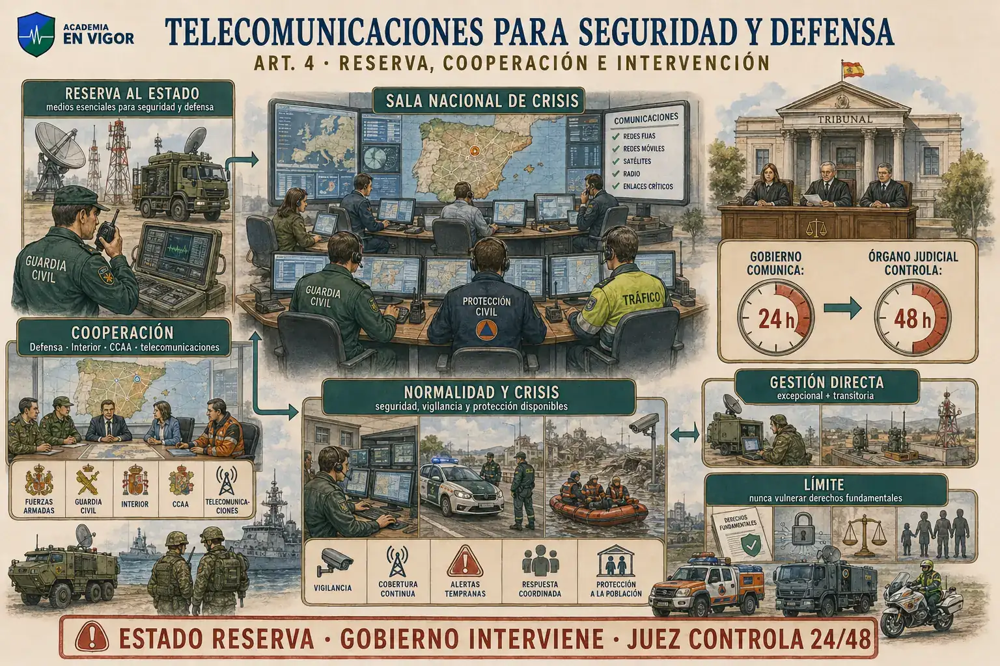

<em>Infografía: esquema de telecomunicaciones para seguridad, defensa y protección civil.</em>

<!-- FUENTE: L11-2022-GC-T17 -->

## 05. Derechos fundamentales y no discriminación

### Regla y encaje

Derechos fundamentales y no discriminación se estudia con literalidad controlada y conexión práctica. La referencia normativa se mantiene separada de comentarios y antecedentes.

### Claves examinables

- **Artículo 56:** Las medidas que se adopten en relación al acceso o al uso por parte de los usuarios finales de los servicios y las aplicaciones a través de redes de comunicaciones electrónicas respetarán los derechos y libertades fundamentales, como queda garantizado en el Convenio Europeo para la Protección de los Derechos Humanos y de las Libertades Fundamentales, en la Carta de Derechos Fundamentales de la Unión Europea, en los principios generales del Derecho comunitario y en la Constitución española. <!-- FACT:GC-T17-F043 -->
- **Artículo 56:** Cualquiera de esas medidas relativas al acceso o al uso por parte de los usuarios finales de los servicios y las aplicaciones a través de redes de comunicaciones electrónicas, que sea susceptible de restringir esos derechos y libertades fundamentales solo podrá imponerse si es adecuada, necesaria y proporcionada en una sociedad democrática, y su aplicación está sujeta a las salvaguardias de procedimiento apropiadas de conformidad con las normas mencionadas en el apartado anterior. <!-- FACT:GC-T17-F044 -->
- **Artículo 56:** Por tanto, dichas medidas solo podrán ser adoptadas respetando debidamente el principio de presunción de inocencia, el derecho a la vida privada e intimidad, el derecho a la libertad de expresión e información y el derecho a la tutela judicial efectiva, a través de un procedimiento previo, justo e imparcial, que incluirá el derecho de los interesados a ser oídos, sin perjuicio de que concurran las condiciones y los requisitos procedimentales adecuados en los casos de urgencia debidamente justificados, de conformidad con el Convenio Europeo para la Protección de los Derechos Humanos y de las Libertades Fundamentales y la Carta de los Derechos Fundamentales de la Unión Europea. <!-- FACT:GC-T17-F045 -->
- **Artículo 57:** Los operadores que instalen o exploten redes públicas de comunicaciones electrónicas o que presten servicios de comunicaciones electrónicas disponibles al público no aplicarán a los usuarios finales ningún requisito diferente ni condiciones generales de acceso o uso de redes o servicios ni de utilización de los mismos por motivos relacionados con la nacionalidad, el lugar de residencia o el lugar de establecimiento del usuario final, a menos que dicho trato diferente se justifique de forma objetiva. <!-- FACT:GC-T17-F046 -->

:::hablemos-claro
No memorices palabras aisladas: pregunta siempre quién actúa, con qué habilitación y bajo qué límite.
:::

:::en-la-calle
En un supuesto, traduce el problema a una secuencia: activo o derecho afectado, autoridad o responsable, medida exigible y control posterior.
:::

:::lo-que-cae
Prioriza definiciones, competencias, listas, plazos, cifras y excepciones. Apariciones oficiales mapeadas: **1**.
:::

<!-- VISUAL:t17-05-derechos-fundamentales-y-no-discriminacion.webp -->

  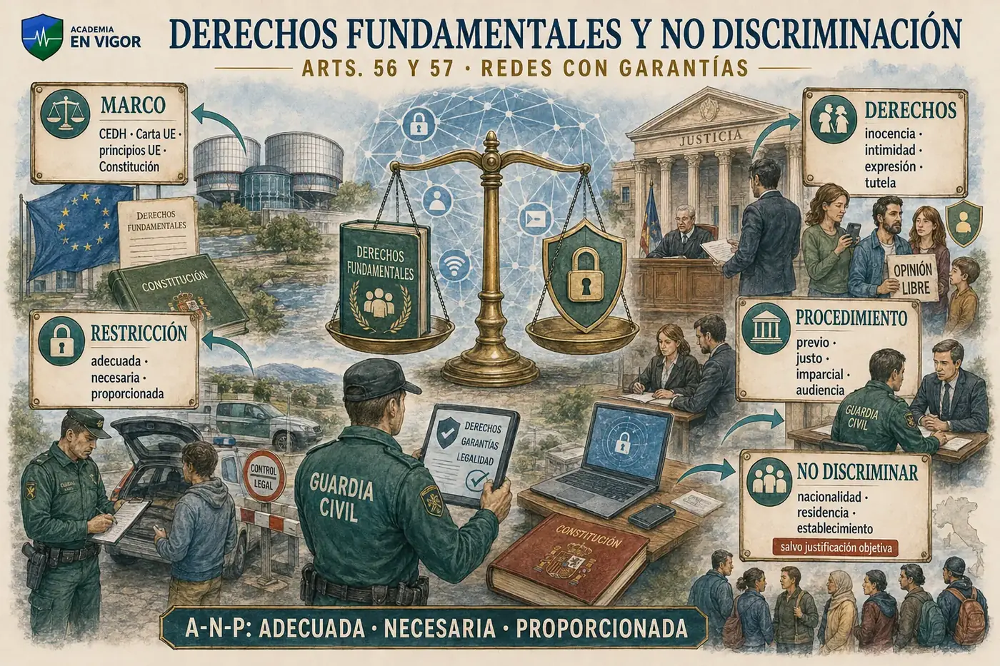

<em>Infografía: esquema de derechos fundamentales y no discriminación.</em>

<!-- FUENTE: L11-2022-GC-T17 -->

## 06. Secreto e interceptación de las comunicaciones

### Regla y encaje

Secreto e interceptación de las comunicaciones se estudia con literalidad controlada y conexión práctica. La referencia normativa se mantiene separada de comentarios y antecedentes.

### Claves examinables

- **Artículo 58:** Los operadores que suministren redes públicas de comunicaciones electrónicas o que presten servicios de comunicaciones electrónicas disponibles al público deberán garantizar el secreto de las comunicaciones de conformidad con los artículos 18.3 y 55.2 de la Constitución, debiendo adoptar las medidas técnicas necesarias. <!-- FACT:GC-T17-F047 -->
- **Artículo 58:** Los operadores que suministren redes públicas de comunicaciones electrónicas o que presten servicios de comunicaciones interpersonales basados en numeración disponibles al público o servicios de acceso a internet están obligados a realizar las interceptaciones que se autoricen judicialmente de acuerdo con lo establecido en el capítulo V del título VIII del libro II de la Ley de Enjuiciamiento Criminal, en la Ley Orgánica 2/2002, de 6 de mayo, reguladora del control judicial previo del Centro Nacional de Inteligencia y en otras normas con rango de ley orgánica. Asimismo, deberán adoptar a su costa las medidas que se establecen en este artículo y en los reglamentos correspondientes. <!-- FACT:GC-T17-F048 -->
- **Artículo 58:** La interceptación a que se refiere el apartado anterior deberá facilitarse para cualquier comunicación que tenga como origen o destino el punto de terminación de red o el terminal específico que se determine a partir de la orden de interceptación legal, incluso aunque esté destinada a dispositivo de almacenamiento o procesamiento de la información; asimismo, la interceptación podrá realizarse sobre un terminal conocido y con unos datos de ubicación temporal para comunicaciones desde locales públicos. Cuando no exista una vinculación fija entre el sujeto de la interceptación y el terminal utilizado, este podrá ser determinado dinámicamente cuando el sujeto de la interceptación lo active para la comunicación mediante un código de identificación personal. <!-- FACT:GC-T17-F049 -->
- **Artículo 58:** El acceso se facilitará para todo tipo de comunicaciones electrónicas disponibles al público distintas de las comunicaciones interpersonales independientes de la numeración, en particular, por su penetración y cobertura, para las que se realicen mediante cualquier modalidad de los servicios de telefonía y de transmisión de datos, se trate de comunicaciones de vídeo, audio, intercambio de mensajes, ficheros o de la transmisión de facsímiles. <!-- FACT:GC-T17-F050 -->
- **Artículo 58:** El acceso facilitado servirá tanto para la supervisión como para la transmisión a los centros de recepción de las interceptaciones de la comunicación electrónica interceptada y la información relativa a la interceptación, y permitirá obtener la señal con la que se realiza la comunicación. <!-- FACT:GC-T17-F051 -->
- **Artículo 58:** Los sujetos obligados deberán facilitar al agente facultado, salvo que por las características del servicio no estén a su disposición, los datos indicados en la orden de interceptación legal, de entre los que se relacionan a continuación: <!-- FACT:GC-T17-F052 -->
- **Artículo 58:** a) Identidad o identidades del sujeto objeto de la medida de la interceptación. <!-- FACT:GC-T17-F053 -->
- **Artículo 58:** Se entiende por identidad: etiqueta técnica que puede representar el origen o el destino de cualquier tráfico de comunicaciones electrónicas, en general identificada mediante un número de identidad de comunicaciones electrónicas físico (tal como un número de teléfono) o un código de identidad de comunicaciones electrónicas lógico o virtual (tal como un número personal) que el abonado puede asignar a un acceso físico caso a caso. <!-- FACT:GC-T17-F054 -->
- **Artículo 58:** Los sujetos obligados proporcionarán, cuando técnicamente sea posible, los identificadores permanentes que sean necesarios para la atribución de un servicio a un usuario determinado de forma inequívoca, así como los identificadores del dispositivo empleado para la comunicación. <!-- FACT:GC-T17-F055 -->
- **Artículo 58:** Si en una comunicación electrónica se asignaran identidades de carácter temporal al usuario, el sujeto obligado implementará, cuando técnicamente sea posible, las medidas de correlación necesarias para que en la información de la interceptación se faciliten las identidades permanentes que permitan la identificación inequívoca del usuario asignado, así como del dispositivo empleado en la comunicación. <!-- FACT:GC-T17-F056 -->
- **Artículo 58:** b) Identidad o identidades de las otras partes involucradas en la comunicación electrónica. <!-- FACT:GC-T17-F057 -->
- **Artículo 58:** c) Servicios básicos utilizados. <!-- FACT:GC-T17-F058 -->
- **Artículo 58:** d) Servicios suplementarios utilizados. <!-- FACT:GC-T17-F059 -->
- **Artículo 58:** e) Dirección de la comunicación. <!-- FACT:GC-T17-F060 -->
- **Artículo 58:** f) Indicación de respuesta. <!-- FACT:GC-T17-F061 -->
- **Artículo 58:** g) Causa de finalización. <!-- FACT:GC-T17-F062 -->
- **Artículo 58:** h) Marcas temporales. <!-- FACT:GC-T17-F063 -->
- **Artículo 58:** i) Información de localización. <!-- FACT:GC-T17-F064 -->
- **Artículo 58:** j) Información intercambiada a través del canal de control o señalización. <!-- FACT:GC-T17-F065 -->
- **Artículo 58:** Además de la información relativa a la interceptación prevista en el apartado anterior, los sujetos obligados deberán facilitar al agente facultado, salvo que por las características del servicio no estén a su disposición, de cualquiera de las partes que intervengan en la comunicación que sean clientes del sujeto obligado, los siguientes datos: <!-- FACT:GC-T17-F066 -->
- **Artículo 58:** a) Identificación de la persona física o jurídica. <!-- FACT:GC-T17-F067 -->
- **Artículo 58:** b) Domicilio en el que el operador realiza las notificaciones. <!-- FACT:GC-T17-F068 -->
- **Artículo 58:** Y, aunque no sea abonado, si el servicio de que se trata permite disponer de alguno de los siguientes: <!-- FACT:GC-T17-F069 -->
- **Artículo 58:** c) Número de titular de servicio (tanto el número de directorio como todas las identificaciones de comunicaciones electrónicas del abonado). <!-- FACT:GC-T17-F070 -->
- **Artículo 58:** d) Número de identificación del terminal. <!-- FACT:GC-T17-F071 -->
- **Artículo 58:** e) Número de cuenta asignada por el proveedor de servicios internet. <!-- FACT:GC-T17-F072 -->
- **Artículo 58:** f) Dirección de correo electrónico. <!-- FACT:GC-T17-F073 -->
- **Artículo 58:** Junto con los datos previstos en los apartados anteriores, los sujetos obligados deberán facilitar, salvo que por las características del servicio no esté a su disposición, información de la situación geográfica del terminal o punto de terminación de red origen de la llamada, y de la del destino de la llamada. En caso de servicios móviles, se proporcionará una posición lo más exacta posible del punto de comunicación y, en todo caso, la identificación, localización y tipo de la estación base afectada. <!-- FACT:GC-T17-F074 -->
- **Artículo 58:** Los sujetos obligados deberán facilitar al agente facultado, de entre los datos previstos en los apartados 5, 6 y 7 de este artículo, solo aquellos que estén incluidos en la orden de interceptación legal. <!-- FACT:GC-T17-F075 -->
- **Artículo 58:** Con carácter previo a la ejecución de la orden de interceptación legal, los sujetos obligados deberán facilitar al agente facultado información sobre los servicios y características del sistema de telecomunicación que utilizan los sujetos objeto de la medida de la interceptación y, si obran en su poder, los correspondientes nombres de los abonados con sus números de documento nacional de identidad, tarjeta de identidad de extranjero o pasaporte, en el caso de personas físicas, o denominación y número de identificación fiscal en el caso de personas jurídicas. <!-- FACT:GC-T17-F076 -->
- **Artículo 58:** Los sujetos obligados deberán tener en todo momento preparadas una o más interfaces a través de las cuales las comunicaciones electrónicas interceptadas y la información relativa a la interceptación se transmitirán a los centros de recepción de las interceptaciones. Las características de estas interfaces y el formato para la transmisión de las comunicaciones interceptadas a estos centros estarán sujetas a las especificaciones técnicas que se establezcan por el Ministerio de Asuntos Económicos y Transformación Digital. <!-- FACT:GC-T17-F077 -->
- **Artículo 58:** En el caso de que los sujetos obligados apliquen a las comunicaciones objeto de interceptación legal algún procedimiento de compresión, cifrado, digitalización o cualquier otro tipo de codificación, deberán entregar aquellas desprovistas de los efectos de tales procedimientos, siempre que sean reversibles. <!-- FACT:GC-T17-F078 -->
- **Artículo 58:** Las comunicaciones interceptadas deben proveerse al centro de recepción de las interceptaciones con una calidad no inferior a la que obtiene el destinatario de la comunicación. <!-- FACT:GC-T17-F079 -->
- **Artículo 59:** Con pleno respeto al derecho al secreto de las comunicaciones y a la exigencia, conforme a lo establecido en la Ley de Enjuiciamiento Criminal, de autorización judicial para la interceptación de contenidos, cuando para la realización de las tareas de control para la eficaz utilización del dominio público radioeléctrico o para la localización de interferencias perjudiciales sea necesaria la utilización de equipos, infraestructuras e instalaciones técnicas de interceptación de señales no dirigidas al público en general, será de aplicación lo siguiente: <!-- FACT:GC-T17-F080 -->
- **Artículo 59:** a) La administración de las telecomunicaciones deberá diseñar y establecer sus sistemas técnicos de interceptación de señales en forma tal que se reduzca al mínimo el riesgo de afectar a los contenidos de las comunicaciones. <!-- FACT:GC-T17-F081 -->
- **Artículo 59:** b) Cuando, como consecuencia de las interceptaciones técnicas efectuadas, quede constancia de los contenidos, los soportes en los que estos aparezcan deberán ser custodiados hasta la finalización, en su caso, del expediente sancionador que hubiera lugar o, en otro caso, destruidos inmediatamente. En ninguna circunstancia podrán ser objeto de divulgación. <!-- FACT:GC-T17-F082 -->
- **Artículo 59:** Las mismas reglas se aplicarán para la vigilancia del adecuado empleo de las redes y la correcta prestación de los servicios de comunicaciones electrónicas. <!-- FACT:GC-T17-F083 -->
- **Artículo 59:** Lo establecido en este artículo se entiende sin perjuicio de las facultades que a la Administración atribuye el artículo 85. <!-- FACT:GC-T17-F084 -->

:::hablemos-claro
No memorices palabras aisladas: pregunta siempre quién actúa, con qué habilitación y bajo qué límite.
:::

:::en-la-calle
En un supuesto, traduce el problema a una secuencia: activo o derecho afectado, autoridad o responsable, medida exigible y control posterior.
:::

:::lo-que-cae
Prioriza definiciones, competencias, listas, plazos, cifras y excepciones. Apariciones oficiales mapeadas: **1**.
:::

<!-- VISUAL:t17-06-secreto-e-interceptacion-de-las-comunicaciones.webp -->

  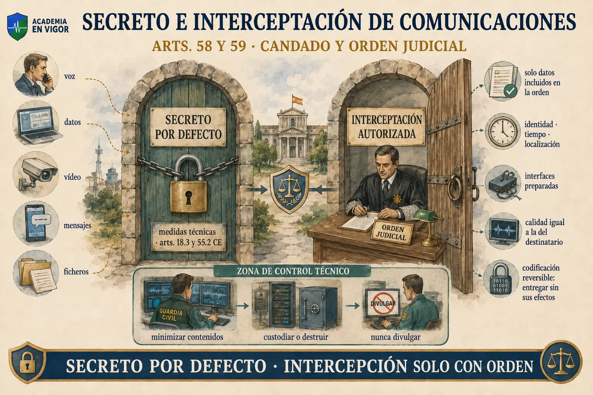

<em>Infografía: esquema de secreto e interceptación de las comunicaciones.</em>

<!-- FUENTE: L11-2022-GC-T17 -->

## 07. Datos personales, cifrado, integridad y seguridad

### Regla y encaje

Datos personales, cifrado, integridad y seguridad se estudia con literalidad controlada y conexión práctica. La referencia normativa se mantiene separada de comentarios y antecedentes.

### Claves examinables

- **Artículo 60:** Los operadores que suministren redes públicas de comunicaciones electrónicas o que presten servicios de comunicaciones electrónicas disponibles al público, incluidas las redes públicas de comunicaciones que den soporte a dispositivos de identificación y recopilación de datos, deberán adoptar las medidas técnicas y de gestión adecuadas para preservar la seguridad en el suministro de su red o en la prestación de sus servicios, con el fin de garantizar la protección de los datos de carácter personal. <!-- FACT:GC-T17-F085 -->
- **Artículo 60:** Dichas medidas incluirán, como mínimo: <!-- FACT:GC-T17-F086 -->
- **Artículo 60:** a) La garantía de que solo el personal autorizado tenga acceso a los datos personales para fines autorizados por la ley. <!-- FACT:GC-T17-F087 -->
- **Artículo 60:** b) La protección de los datos personales almacenados o transmitidos de la destrucción accidental o ilícita, la pérdida o alteración accidentales o el almacenamiento, tratamiento, acceso o revelación no autorizados o ilícitos. <!-- FACT:GC-T17-F088 -->
- **Artículo 60:** c) La garantía de la aplicación efectiva de una política de seguridad con respecto al tratamiento de datos personales. <!-- FACT:GC-T17-F089 -->
- **Artículo 60:** La Agencia Española de Protección de Datos, en el ejercicio de su competencia de garantía de la seguridad en el tratamiento de datos de carácter personal, podrá examinar las medidas adoptadas por los operadores que suministren redes públicas de comunicaciones electrónicas o que presten servicios de comunicaciones electrónicas disponibles al público y podrá formular recomendaciones sobre las mejores prácticas con respecto al nivel de seguridad que debería conseguirse con estas medidas. <!-- FACT:GC-T17-F090 -->
- **Artículo 60:** En caso de que exista un riesgo particular de violación de la seguridad de la red pública o del servicio de comunicaciones electrónicas, el operador que suministre dicha red o preste el servicio de comunicaciones electrónicas informará a los abonados sobre dicho riesgo y sobre las medidas a adoptar. <!-- FACT:GC-T17-F091 -->
- **Artículo 60:** En caso de violación de los datos personales, el operador de servicios de comunicaciones electrónicas disponibles al público notificará sin dilaciones indebidas dicha violación a la Agencia Española de Protección de Datos. Si la violación de los datos pudiera afectar negativamente a la intimidad o a los datos personales de un abonado o particular, el operador notificará también la violación al abonado o particular sin dilaciones indebidas. <!-- FACT:GC-T17-F092 -->
- **Artículo 60:** La notificación de una violación de los datos personales a un abonado o particular afectado no será necesaria si el operador ha probado a satisfacción de la Agencia Española de Protección de Datos que ha aplicado las medidas de protección tecnológica convenientes y que estas medidas se han aplicado a los datos afectados por la violación de seguridad. <!-- FACT:GC-T17-F093 -->
- **Artículo 60:** Unas medidas de protección de estas características podrían ser aquellas que convierten los datos en incomprensibles para toda persona que no esté autorizada a acceder a ellos. <!-- FACT:GC-T17-F094 -->
- **Artículo 60:** Sin perjuicio de la obligación del operador de informar a los abonados o particulares afectados, si el operador no ha notificado ya al abonado o al particular la violación de los datos personales, la Agencia Española de Protección de Datos podrá exigirle que lo haga, una vez evaluados los posibles efectos adversos de la violación. <!-- FACT:GC-T17-F095 -->
- **Artículo 60:** En la notificación al abonado o al particular se describirá al menos la naturaleza de la violación de los datos personales y los puntos de contacto donde puede obtenerse más información y se recomendarán medidas para atenuar los posibles efectos adversos de dicha violación. En la notificación a la Agencia Española de Protección de Datos se describirán además las consecuencias de la violación y las medidas propuestas o adoptadas por el operador respecto a la violación de los datos personales. <!-- FACT:GC-T17-F096 -->
- **Artículo 60:** Los operadores deberán llevar un inventario de las violaciones de los datos personales, incluidos los hechos relacionados con tales infracciones, sus efectos y las medidas adoptadas al respecto, que resulte suficiente para permitir a la Agencia Española de Protección de Datos verificar el cumplimiento de las obligaciones de notificación reguladas en este apartado. Mediante real decreto podrá establecerse el formato y contenido del inventario. <!-- FACT:GC-T17-F097 -->
- **Artículo 60:** A los efectos establecidos en este artículo, se entenderá como violación de los datos personales la violación de la seguridad que provoque la destrucción, accidental o ilícita, la pérdida, la alteración, la revelación o el acceso no autorizados, de datos personales transmitidos, almacenados o tratados de otro modo en relación con la prestación de un servicio de comunicaciones electrónicas de acceso público. <!-- FACT:GC-T17-F098 -->
- **Artículo 60:** La Agencia Española de Protección de Datos podrá adoptar directrices y, en caso necesario, dictar instrucciones sobre las circunstancias en que se requiere que el operador notifique la violación de los datos personales, sobre el formato que debe adoptar dicha notificación y sobre la manera de llevarla a cabo, con pleno respeto a las disposiciones que en su caso sean adoptadas en esta materia por la Comisión Europea. <!-- FACT:GC-T17-F099 -->
- **Artículo 60:** Lo dispuesto en el presente artículo será sin perjuicio de la aplicación del Reglamento (UE) 2016/679, del Parlamento Europeo y del Consejo, de 27 de abril de 2016, relativo a la protección de las personas físicas en lo que respecta al tratamiento de datos personales y a la libre circulación de estos datos y por el que se deroga la Directiva 95/46/CE y de la Ley Orgánica 3/2018, de 5 de diciembre, de Protección de Datos Personales y garantía de los derechos digitales, y su normativa de desarrollo. <!-- FACT:GC-T17-F100 -->
- **Artículo 61:** La conservación y cesión de los datos generados o tratados en el marco de la prestación de servicios de comunicaciones electrónicas o de redes públicas de comunicación a los agentes facultados a través de la correspondiente autorización judicial con fines de detección, investigación y enjuiciamiento de delitos graves contemplados en el Código Penal o en las leyes penales especiales se rige por lo establecido en la Ley 25/2007, de 18 de octubre, de conservación de datos relativos a las comunicaciones electrónicas y a las redes públicas de comunicaciones. <!-- FACT:GC-T17-F101 -->
- **Artículo 62:** Cualquier tipo de información que se transmita por redes de comunicaciones electrónicas podrá ser protegida mediante procedimientos de cifrado. <!-- FACT:GC-T17-F102 -->
- **Artículo 62:** El cifrado es un instrumento de seguridad de la información. Entre sus condiciones de uso, cuando se utilice para proteger la confidencialidad de la información, se podrá imponer la obligación de facilitar a un órgano de la Administración General del Estado o a un organismo público, los algoritmos o cualquier procedimiento de cifrado utilizado, en casos justificados de protección de los intereses esenciales de seguridad del Estado y la seguridad pública, y para permitir la investigación, la detección y el enjuiciamiento de delitos, así como la obligación de facilitar sin coste alguno los aparatos de cifra a efectos de su control de acuerdo con la normativa vigente. <!-- FACT:GC-T17-F103 -->
- **Artículo 62:** Toda información obtenida por parte de la Administración General del Estado o cualquier organismo público a través de los preceptos incluidos en el apartado 2 de este artículo deberá ser tratada con la máxima confidencialidad y destruida una vez que se resuelva la amenaza para la seguridad del Estado y la seguridad pública o se haya dictado sentencia firme sobre el delito en cuestión. <!-- FACT:GC-T17-F104 -->
- **Artículo 63:** Los operadores de redes públicas de comunicaciones electrónicas y de servicios de comunicaciones electrónicas disponibles al público, gestionarán adecuadamente los riesgos de seguridad que puedan afectar a sus redes y servicios a fin de garantizar un adecuado nivel de seguridad y evitar o reducir al mínimo el impacto de los incidentes de seguridad en los usuarios y en otras redes y servicios, para lo cual deberán adoptar las medidas técnicas y organizativas adecuadas, que deberán ser proporcionadas y en línea con el estado de la técnica, pudiendo incluir el cifrado. <!-- FACT:GC-T17-F105 -->
- **Artículo 63:** Asimismo, los operadores de redes públicas de comunicaciones electrónicas garantizarán la integridad de las mismas a fin de asegurar la continuidad en la prestación de los servicios que utilizan dichas redes. <!-- FACT:GC-T17-F106 -->
- **Artículo 63:** Los operadores que suministren redes públicas o presten servicios de comunicaciones electrónicas disponibles al público notificarán al Ministerio de Asuntos Económicos y Transformación Digital los incidentes de seguridad que hayan tenido un impacto significativo en el suministro de las redes o los servicios. <!-- FACT:GC-T17-F107 -->
- **Artículo 63:** Con el fin de determinar la importancia del impacto de un incidente de seguridad se tendrán en cuenta, en particular, los parámetros siguientes, cuando se disponga de ellos: <!-- FACT:GC-T17-F108 -->
- **Artículo 63:** a) El número de usuarios afectados por el incidente de seguridad. <!-- FACT:GC-T17-F109 -->
- **Artículo 63:** b) La duración del incidente de seguridad. <!-- FACT:GC-T17-F110 -->
- **Artículo 63:** c) El área geográfica afectada por el incidente de seguridad. <!-- FACT:GC-T17-F111 -->
- **Artículo 63:** d) La medida en que se ha visto afectado el funcionamiento de la red o del servicio. <!-- FACT:GC-T17-F112 -->
- **Artículo 63:** e) El alcance del impacto sobre las actividades económicas y sociales. <!-- FACT:GC-T17-F113 -->
- **Artículo 63:** Cuando proceda, el Ministerio informará a las autoridades nacionales competentes de otros Estados miembros y a la Agencia Europea de Seguridad en las Redes y la Información (ENISA). Asimismo, podrá informar al público o exigir a los operadores que lo hagan, en caso de estimar que la divulgación del incidente de seguridad reviste interés público. Una vez al año, el Ministerio presentará a la Comisión y a la ENISA un informe resumido sobre las notificaciones recibidas y las medidas adoptadas de conformidad con este apartado. <!-- FACT:GC-T17-F114 -->
- **Artículo 63:** Del mismo modo, el Ministerio comunicará a la Secretaría de Estado de Seguridad del Ministerio del Interior aquellos incidentes que afectando a los operadores estratégicos nacionales sean de interés para la mejora de la protección de infraestructuras críticas, en el marco de la Ley 8/2011, de 28 de abril, reguladora de las mismas. También el Ministerio comunicará a la Comisión Nacional de los Mercados y la Competencia los incidentes de seguridad a que se refiere este apartado que afecten o puedan afectar a las obligaciones específicas impuestas por dicha Comisión en los mercados de referencia. <!-- FACT:GC-T17-F115 -->
- **Artículo 63:** En caso de que exista una amenaza particular y significativa de incidente de seguridad en las redes públicas de comunicaciones electrónicas o en los servicios de comunicaciones electrónicas disponibles para el público, los operadores deberán informar a sus usuarios que pudieran verse afectados por dicha amenaza sobre las posibles medidas de protección o soluciones que pueden adoptar los usuarios. Cuando proceda, los operadores también informarán a sus usuarios sobre la propia amenaza. <!-- FACT:GC-T17-F116 -->
- **Artículo 63:** El Ministerio de Asuntos Económicos y Transformación Digital establecerá los mecanismos para supervisar el cumplimiento de las obligaciones anteriores y, en su caso, dictará las instrucciones correspondientes, que serán vinculantes para los operadores, incluidas las relativas a las medidas necesarias adicionales a las identificadas por los operadores para solventar incidentes de seguridad, o impedir que ocurran cuando se haya observado una amenaza significativa, e incumplimientos de las fechas límite de aplicación. Entre las medidas relativas a la integridad y seguridad de redes y servicios de comunicaciones electrónicas que se puedan exigir a los operadores, podrá imponer: <!-- FACT:GC-T17-F117 -->
- **Artículo 63:** a) La obligación de facilitar la información necesaria para evaluar la seguridad y la integridad de sus servicios y redes, incluidos los documentos sobre las políticas de seguridad. <!-- FACT:GC-T17-F118 -->
- **Artículo 63:** b) La obligación de someterse a una auditoría de seguridad realizada por un organismo independiente o por una autoridad competente, y de poner el resultado a disposición del Ministerio de Asuntos Económicos y Transformación Digital. El coste de la auditoría será sufragado por el operador. <!-- FACT:GC-T17-F119 -->
- **Artículo 63:** En particular, los operadores garantizarán la mayor disponibilidad posible de los servicios de comunicaciones vocales y de acceso a internet a través de las redes públicas de comunicaciones electrónicas en caso de fallo catastrófico de la red o en casos de fuerza mayor, y adoptarán todas las medidas necesarias para garantizar el acceso sin interrupciones a los servicios de emergencia y la transmisión ininterrumpida de las alertas públicas. <!-- FACT:GC-T17-F120 -->
- **Artículo 63:** El presente artículo se entiende sin perjuicio de lo establecido en el artículo 4.6. <!-- FACT:GC-T17-F121 -->
- **Artículo 63:** Lo dispuesto en el presente artículo será sin perjuicio de la aplicación del Reglamento (UE) 2016/679 del Parlamento Europeo y del Consejo de 27 de abril de 2016 y de la Ley Orgánica 3/2018, de 5 de diciembre, de Protección de Datos Personales y garantía de los derechos digitales y su normativa de desarrollo. <!-- FACT:GC-T17-F122 -->

:::hablemos-claro
No memorices palabras aisladas: pregunta siempre quién actúa, con qué habilitación y bajo qué límite.
:::

:::en-la-calle
En un supuesto, traduce el problema a una secuencia: activo o derecho afectado, autoridad o responsable, medida exigible y control posterior.
:::

:::lo-que-cae
Prioriza definiciones, competencias, listas, plazos, cifras y excepciones. Apariciones oficiales mapeadas: **0**.
:::

<!-- VISUAL:t17-07-datos-personales-cifrado-integridad-y-seguridad.webp -->

  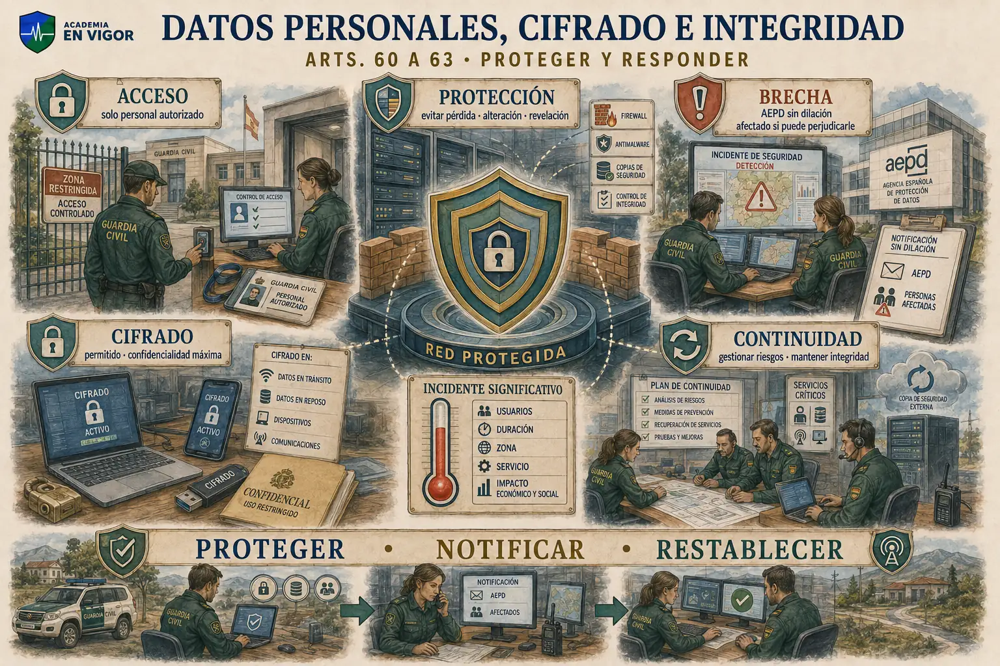

<em>Infografía: esquema de datos personales, cifrado, integridad y seguridad.</em>

<!-- FUENTE: L11-2022-GC-T17 -->

## 08. Transición del Real Decreto 806/2014 al Real Decreto 1125/2024

### Regla y encaje

Transición del Real Decreto 806/2014 al Real Decreto 1125/2024 se estudia con literalidad controlada y conexión práctica. La referencia normativa se mantiene separada de comentarios y antecedentes.

### Claves examinables

- **Vigencia:** El Real Decreto 1125/2024 derogó expresamente y en su totalidad el Real Decreto 806/2014. <!-- FACT:GC-T17-F123 -->
- **Vigencia:** La derogación del Real Decreto 806/2014 entró en vigor el 7 de noviembre de 2024. <!-- FACT:GC-T17-F124 -->
- **Regla de estudio:** Una pregunta que cite el Real Decreto 806/2014 debe identificarse como antecedente histórico y no como descripción de la organización vigente. <!-- FACT:GC-T17-F125 -->
- **Objeto:** El Real Decreto 1125/2024 regula la organización y los instrumentos operativos para la Administración Digital de la Administración del Estado. <!-- FACT:GC-T17-F126 -->
- **Ámbito:** El Real Decreto 1125/2024 se aplica a la Administración General del Estado y a su sector público institucional en los términos previstos por la propia norma. <!-- FACT:GC-T17-F127 -->
- **Transición:** La literalidad histórica y la regla vigente no se mezclan: se conserva la aparición oficial y se corrige su encaje temporal. <!-- FACT:GC-T17-F128 -->

:::hablemos-claro
No memorices palabras aisladas: pregunta siempre quién actúa, con qué habilitación y bajo qué límite.
:::

:::en-la-calle
En un supuesto, traduce el problema a una secuencia: activo o derecho afectado, autoridad o responsable, medida exigible y control posterior.
:::

:::lo-que-cae
Prioriza definiciones, competencias, listas, plazos, cifras y excepciones. Apariciones oficiales mapeadas: **0**.
:::

<!-- VISUAL:t17-08-transicion-del-real-decreto-806-2014-al-real-decreto-1125-2024.webp -->

  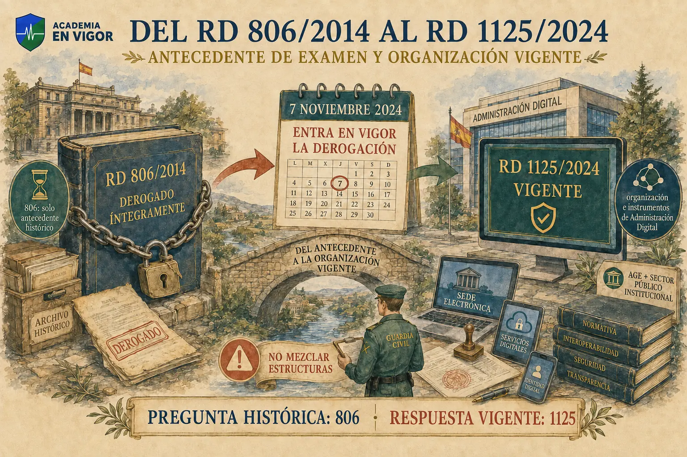

<em>Infografía: esquema de transición del real decreto 806/2014 al real decreto 1125/2024.</em>

<!-- FUENTE: RD1125-2024-GC-T17 -->

## 09. Gobernanza, estrategia y servicios digitales comunes

### Regla y encaje

Gobernanza, estrategia y servicios digitales comunes se estudia con literalidad controlada y conexión práctica. La referencia normativa se mantiene separada de comentarios y antecedentes.

### Claves examinables

- **Artículo 1:** El objeto de este real decreto es el desarrollo de un modelo común de gobernanza de las Tecnologías de la Información y las Comunicaciones (TIC) en la Administración General del Estado y sus organismos públicos y entidades de Derecho público vinculados o dependientes. <!-- FACT:GC-T17-F129 -->
- **Artículo 1:** Este modelo de gobernanza de las TIC incluirá, en todo caso, la definición y ejecución de una estrategia global de transformación digital que garantice el uso adecuado de los recursos informáticos de acuerdo con las necesidades derivadas de la estrategia general del Gobierno, con el fin de mejorar la prestación de los servicios públicos a los ciudadanos, empresas y otras administraciones públicas, fomentando la eficiencia, la interoperabilidad, la seguridad y la innovación. <!-- FACT:GC-T17-F130 -->
- **Artículo 2:** El ámbito de aplicación de este real decreto se extiende a la Administración General del Estado y sus organismos públicos y entidades de Derecho público vinculados o dependientes, de conformidad con lo previsto en la Ley 40/2015, de 1 de octubre, de Régimen Jurídico del Sector Público. <!-- FACT:GC-T17-F131 -->
- **Artículo 8:** El Gobierno, a iniciativa de la Comisión de Estrategia Sobre Tecnologías de la Información y las Comunicaciones (CETIC), aprobará la Estrategia en materia de tecnologías de la información y las comunicaciones (Estrategia TIC), así como sus revisiones periódicas. <!-- FACT:GC-T17-F132 -->
- **Artículo 8:** La Estrategia TIC determinará los objetivos, principios, líneas estratégicas y acciones prioritarias para el desarrollo de la administración digital y la transformación digital de la Administración General del Estado y sus entidades, sirviendo de base para la elaboración por los distintos departamentos ministeriales de sus planes de acción departamentales para la transformación digital. <!-- FACT:GC-T17-F133 -->
- **Artículo 8:** La CETIC determinará el ámbito temporal de la Estrategia TIC, así como su periodo de revisión, asegurando su alineación con las prioridades nacionales y europeas en materia de digitalización. <!-- FACT:GC-T17-F134 -->
- **Artículo 9:** Los medios y servicios digitales de la Administración General del Estado y sus entidades serán declarados de uso común o transversal cuando, por su naturaleza o interés general, respondan a necesidades compartidas por un número significativo de unidades administrativas o departamentos. <!-- FACT:GC-T17-F135 -->
- **Artículo 9:** A los efectos de este real decreto, se entenderá por medios y servicios digitales todas las actividades, infraestructuras técnicas, instalaciones, aplicaciones, equipos, inmuebles, redes, ficheros electrónicos, licencias, datos y demás activos que den soporte a los sistemas de información y a la prestación de servicios digitales. <!-- FACT:GC-T17-F136 -->
- **Artículo 9:** Los activos TIC afectos a la prestación de servicios sectoriales específicos podrán mantenerse en sus ámbitos departamentales en razón de su singularidad competencial o funcional, sin tener la consideración de comunes o transversales. <!-- FACT:GC-T17-F137 -->
- **Artículo 9:** La declaración de medios y servicios digitales comunes o transversales necesarios para la ejecución de la Estrategia TIC corresponderá a la CETIC, a propuesta de la Agencia Estatal de Administración Digital. <!-- FACT:GC-T17-F138 -->
- **Artículo 9:** Cuando concurran razones económicas, técnicas o de oportunidad, la CETIC podrá autorizar excepciones a dicha declaración. <!-- FACT:GC-T17-F139 -->
- **Artículo 9:** La declaración habilitará a la Agencia para adoptar las medidas necesarias para su provisión común o transversal, incluyendo la disposición de recursos humanos, económicos e infraestructuras previamente dedicados por los departamentos. <!-- FACT:GC-T17-F140 -->
- **Artículo 9:** La utilización de los medios y servicios digitales comunes y transversales será de carácter obligatorio y sustitutivo respecto a soluciones particulares. <!-- FACT:GC-T17-F141 -->
- **Artículo 9:** La Agencia Estatal de Administración Digital establecerá y gestionará un Catálogo de Servicios Digitales Comunes y Transversales, que incluirá dichos medios y servicios, así como aquellas infraestructuras o aplicaciones cuya provisión compartida facilite economías de escala, racionalización administrativa e integración de servicios al ciudadano. <!-- FACT:GC-T17-F142 -->
- **Artículo 9:** Dentro de este Catálogo figurarán servicios de administración digital orientados a integrar todas las relaciones de las Administraciones públicas con el ciudadano, empresas y otras administraciones, proporcionando una visión integral y acceso unificado a servicios online. <!-- FACT:GC-T17-F143 -->
- **Artículo 9:** La provisión, explotación y gestión de estos medios y servicios será realizada principalmente por la Agencia Estatal de Administración Digital, con posible colaboración de unidades TIC sectoriales. <!-- FACT:GC-T17-F144 -->
- **Artículo 9:** Las eficiencias generadas se dedicarán preferentemente a potenciar los servicios sectoriales y la innovación digital. <!-- FACT:GC-T17-F145 -->
- **Artículo 9:** Las CMAD y las unidades TIC sectoriales velarán por el uso prioritario de los medios y servicios comunes y transversales. Cuando las necesidades sean compartidas entre áreas o departamentos, se priorizará la solución común, salvo autorización expresa de la Agencia. <!-- FACT:GC-T17-F146 -->
- **Artículo 9:** La Agencia llevará un registro de costes imputables a cada órgano u organismo usuario, sin perjuicio de competencias de control de gasto. <!-- FACT:GC-T17-F147 -->
- **Artículo 9:** La puesta a disposición se realizará conforme a la normativa aplicable en materia de personal, organización, presupuestos y patrimonio. <!-- FACT:GC-T17-F148 -->
- **Artículo 10:** La CETIC podrá declarar como proyectos de interés prioritario aquellos que tengan singular relevancia estratégica, especialmente los orientados a la colaboración y cooperación con las comunidades autónomas, entidades locales y la Unión Europea en materia de administración digital e interoperabilidad. <!-- FACT:GC-T17-F149 -->
- **Artículo 10:** La declaración de proyecto de interés prioritario se trasladará como recomendación al Ministerio de Hacienda para su consideración en la elaboración de los Presupuestos Generales del Estado y en políticas de gasto. <!-- FACT:GC-T17-F150 -->
- **Artículo 7:** Son unidades TIC aquellas unidades administrativas cuya función principal sea la provisión de servicios en materia de Tecnologías de la Información y las Comunicaciones a sí mismas o a otras unidades. <!-- FACT:GC-T17-F151 -->
- **Artículo 7:** Las unidades TIC, bajo la dirección de los órganos superiores o directivos a los que estén adscritas, se configuran como instrumentos esenciales para la implementación de la Estrategia TIC y la transformación digital en los ámbitos sectoriales, bajo la coordinación y supervisión de la Agencia Estatal de Administración Digital. <!-- FACT:GC-T17-F152 -->
- **Artículo 7:** Se entenderá por provisión de servicios TIC la realización de funciones como: <!-- FACT:GC-T17-F153 -->
- **Artículo 7:** a) Soporte, operación, implementación y/o gestión de sistemas informáticos corporativos o redes de telecomunicaciones. <!-- FACT:GC-T17-F154 -->
- **Artículo 7:** b) Desarrollo de aplicativos informáticos en entornos multiusuario. <!-- FACT:GC-T17-F155 -->
- **Artículo 7:** c) Consultoría informática. <!-- FACT:GC-T17-F156 -->
- **Artículo 7:** d) Seguridad de sistemas de información. <!-- FACT:GC-T17-F157 -->
- **Artículo 7:** e) Atención técnica a usuarios. <!-- FACT:GC-T17-F158 -->
- **Artículo 7:** f) Innovación en el ámbito de las TIC. <!-- FACT:GC-T17-F159 -->
- **Artículo 7:** g) Administración digital y servicios al ciudadano. <!-- FACT:GC-T17-F160 -->
- **Artículo 7:** h) Gestión de datos e inteligencia artificial. <!-- FACT:GC-T17-F161 -->
- **Artículo 7:** i) Conformación de la voluntad de adquisición de bienes o servicios TIC. <!-- FACT:GC-T17-F162 -->
- **Artículo 7:** j) Todas aquellas funciones relevantes en materia de tecnologías de la información y las comunicaciones no previstas expresamente. <!-- FACT:GC-T17-F163 -->
- **Artículo 7:** Las unidades TIC adscritas a departamentos ministeriales impulsarán, en el marco de las CMAD, la transformación digital de los servicios sectoriales. <!-- FACT:GC-T17-F164 -->
- **Artículo 7:** La Agencia propondrá adaptaciones organizativas para mejorar la eficiencia derivada de los servicios comunes y transversales. <!-- FACT:GC-T17-F165 -->
- **Artículo 7:** Las unidades TIC identificarán oportunidades para maximizar el rendimiento de las TIC según necesidades funcionales. <!-- FACT:GC-T17-F166 -->
- **Artículo 7:** Artículo correspondiente a cooperación interadministrativa (integrado en funciones de la CETIC y Agencia) <!-- FACT:GC-T17-F167 -->
- **Artículo 7:** La CETIC y la Agencia Estatal de Administración Digital impulsarán líneas de actuación, orientaciones comunes y órganos de cooperación para favorecer el intercambio de estándares, tecnología, datos y proyectos que garanticen la interoperabilidad y mejoren la eficacia y eficiencia en la prestación de servicios públicos entre administraciones. <!-- FACT:GC-T17-F168 -->
- **Artículo 7:** Estas actuaciones se coordinarán en la Comisión Sectorial de Administración Electrónica y la Conferencia Sectorial de Administraciones Públicas. <!-- FACT:GC-T17-F169 -->
- **Artículo 7:** La Agencia propondrá la designación de representantes de la AGE en comisiones o grupos interadministrativos en materia de TIC y administración digital. <!-- FACT:GC-T17-F170 -->

:::hablemos-claro
No memorices palabras aisladas: pregunta siempre quién actúa, con qué habilitación y bajo qué límite.
:::

:::en-la-calle
En un supuesto, traduce el problema a una secuencia: activo o derecho afectado, autoridad o responsable, medida exigible y control posterior.
:::

:::lo-que-cae
Prioriza definiciones, competencias, listas, plazos, cifras y excepciones. Apariciones oficiales mapeadas: **0**.
:::

<!-- VISUAL:t17-09-gobernanza-estrategia-y-servicios-digitales-comunes.webp -->

  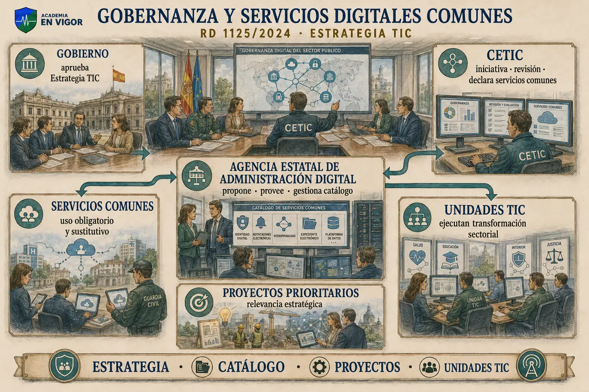

<em>Infografía: esquema de gobernanza, estrategia y servicios digitales comunes.</em>

<!-- FUENTE: RD1125-2024-GC-T17 -->

## 10. Disposiciones generales y vigencia de certificados

### Regla y encaje

Disposiciones generales y vigencia de certificados se estudia con literalidad controlada y conexión práctica. La referencia normativa se mantiene separada de comentarios y antecedentes.

### Claves examinables

- **Fuente oficial:** La presente Ley tiene por objeto regular determinados aspectos de los servicios electrónicos de confianza, como complemento del Reglamento (UE) n.º 910/2014 del Parlamento Europeo y del Consejo, de 23 de julio de 2014, relativo a la identificación electrónica y los servicios de confianza para las transacciones electrónicas en el mercado interior y por el que se deroga la Directiva 1999/93/CE. <!-- FACT:GC-T17-F171 -->
- **Fuente oficial:** Esta ley se aplicará a los prestadores públicos y privados de servicios electrónicos de confianza establecidos en España y a los servicios de certificación que los prestadores residentes o domiciliados en otro Estado ofrezcan a través de un establecimiento permanente situado en España, siempre que ofrezcan servicios no supervisados por la autoridad competente de otro país de la Unión Europea. <!-- FACT:GC-T17-F172 -->
- **Fuente oficial:** Los documentos electrónicos públicos, administrativos y privados, tienen el valor y la eficacia jurídica que corresponda a su respectiva naturaleza, de conformidad con la legislación que les resulte aplicable. <!-- FACT:GC-T17-F173 -->
- **Fuente oficial:** La prueba de los documentos electrónicos privados en los que se hubiese utilizado un servicio de confianza no cualificado se regirá por lo dispuesto en el apartado 3 del artículo 326 de la Ley 1/2000, de 7 de enero, de Enjuiciamiento Civil. Si el servicio fuese cualificado, se estará a lo previsto en el apartado 4 del mismo precepto. <!-- FACT:GC-T17-F174 -->
- **Fuente oficial:** Los certificados electrónicos se extinguen por caducidad a la expiración de su período de vigencia, o mediante revocación por los prestadores de servicios electrónicos de confianza en los supuestos previstos en el artículo siguiente. <!-- FACT:GC-T17-F175 -->
- **Fuente oficial:** El período de vigencia de los certificados cualificados no será superior a cinco años. <!-- FACT:GC-T17-F176 -->
- **Fuente oficial:** Dicho período se fijará en atención a las características y tecnología empleada para generar los datos de creación de firma, sello, o autenticación de sitio web. <!-- FACT:GC-T17-F177 -->

:::hablemos-claro
No memorices palabras aisladas: pregunta siempre quién actúa, con qué habilitación y bajo qué límite.
:::

:::en-la-calle
En un supuesto, traduce el problema a una secuencia: activo o derecho afectado, autoridad o responsable, medida exigible y control posterior.
:::

:::lo-que-cae
Prioriza definiciones, competencias, listas, plazos, cifras y excepciones. Apariciones oficiales mapeadas: **5**.
:::

<!-- VISUAL:t17-10-disposiciones-generales-y-vigencia-de-certificados.webp -->

  

<em>Infografía: esquema de disposiciones generales y vigencia de certificados.</em>

<!-- FUENTE: L6-2020-GC-T17 -->

## 11. Revocación y suspensión de certificados

### Regla y encaje

Revocación y suspensión de certificados se estudia con literalidad controlada y conexión práctica. La referencia normativa se mantiene separada de comentarios y antecedentes.

### Claves examinables

- **Fuente oficial:** Los prestadores de servicios electrónicos de confianza extinguirán la vigencia de los certificados electrónicos mediante revocación en los siguientes supuestos: <!-- FACT:GC-T17-F178 -->
- **Fuente oficial:** a) Solicitud formulada por el firmante, la persona física o jurídica representada por este, un tercero autorizado, el creador del sello o el titular del certificado de autenticación de sitio web. <!-- FACT:GC-T17-F179 -->
- **Fuente oficial:** b) Violación o puesta en peligro del secreto de los datos de creación de firma o de sello, o del prestador de servicios de confianza, o de autenticación de sitio web, o utilización indebida de dichos datos por un tercero. <!-- FACT:GC-T17-F180 -->
- **Fuente oficial:** c) Resolución judicial o administrativa que lo ordene. <!-- FACT:GC-T17-F181 -->
- **Fuente oficial:** d) Fallecimiento del firmante; capacidad modificada judicialmente sobrevenida, total o parcial, del firmante; extinción de la personalidad jurídica o disolución del creador del sello en el caso de tratarse de una entidad sin personalidad jurídica, y cambio o pérdida de control sobre el nombre de dominio en el supuesto de un certificado de autenticación de sitio web. <!-- FACT:GC-T17-F182 -->
- **Fuente oficial:** e) Terminación de la representación en los certificados electrónicos con atributo de representante. En este caso, tanto el representante como la persona o entidad representada están obligados a solicitar la revocación de la vigencia del certificado en cuanto se produzca la modificación o extinción de la citada relación de representación. <!-- FACT:GC-T17-F183 -->
- **Fuente oficial:** f) Cese en la actividad del prestador de servicios de confianza salvo que la gestión de los certificados electrónicos expedidos por aquel sea transferida a otro prestador de servicios de confianza. <!-- FACT:GC-T17-F184 -->
- **Fuente oficial:** g) Descubrimiento de la falsedad o inexactitud de los datos aportados para la expedición del certificado y que consten en él, o alteración posterior de las circunstancias verificadas para la expedición del certificado, como las relativas al cargo. <!-- FACT:GC-T17-F185 -->
- **Fuente oficial:** h) En caso de que se advierta que los mecanismos criptográficos utilizados para la generación de los certificados no cumplen los estándares de seguridad mínimos necesarios para garantizar su seguridad. <!-- FACT:GC-T17-F186 -->
- **Fuente oficial:** i) Cualquier otra causa lícita prevista en la declaración de prácticas del servicio de confianza. <!-- FACT:GC-T17-F187 -->
- **Fuente oficial:** Los prestadores de servicios de confianza suspenderán la vigencia de los certificados electrónicos en los supuestos previstos en las letras a), c) y h) del apartado anterior, así como en los casos de duda sobre la concurrencia de las circunstancias previstas en sus letras b) y g), siempre que sus declaraciones de prácticas de certificación prevean la posibilidad de suspender los certificados. <!-- FACT:GC-T17-F188 -->
- **Fuente oficial:** En su caso, y de manera previa o simultánea a la indicación de la revocación o suspensión de un certificado electrónico en el servicio de consulta sobre el estado de validez o revocación de los certificados por él expedidos, el prestador de servicios electrónicos de confianza comunicará al titular, por un medio que acredite la entrega y recepción efectiva siempre que sea factible, esta circunstancia, especificando los motivos y la fecha y la hora en que el certificado quedará sin efecto. <!-- FACT:GC-T17-F189 -->
- **Fuente oficial:** En los casos de suspensión, la vigencia del certificado se extinguirá si transcurrido el plazo de duración de la suspensión, el prestador no la hubiera levantado. <!-- FACT:GC-T17-F190 -->

:::hablemos-claro
No memorices palabras aisladas: pregunta siempre quién actúa, con qué habilitación y bajo qué límite.
:::

:::en-la-calle
En un supuesto, traduce el problema a una secuencia: activo o derecho afectado, autoridad o responsable, medida exigible y control posterior.
:::

:::lo-que-cae
Prioriza definiciones, competencias, listas, plazos, cifras y excepciones. Apariciones oficiales mapeadas: **2**.
:::

<!-- VISUAL:t17-11-revocacion-y-suspension-de-certificados.webp -->

  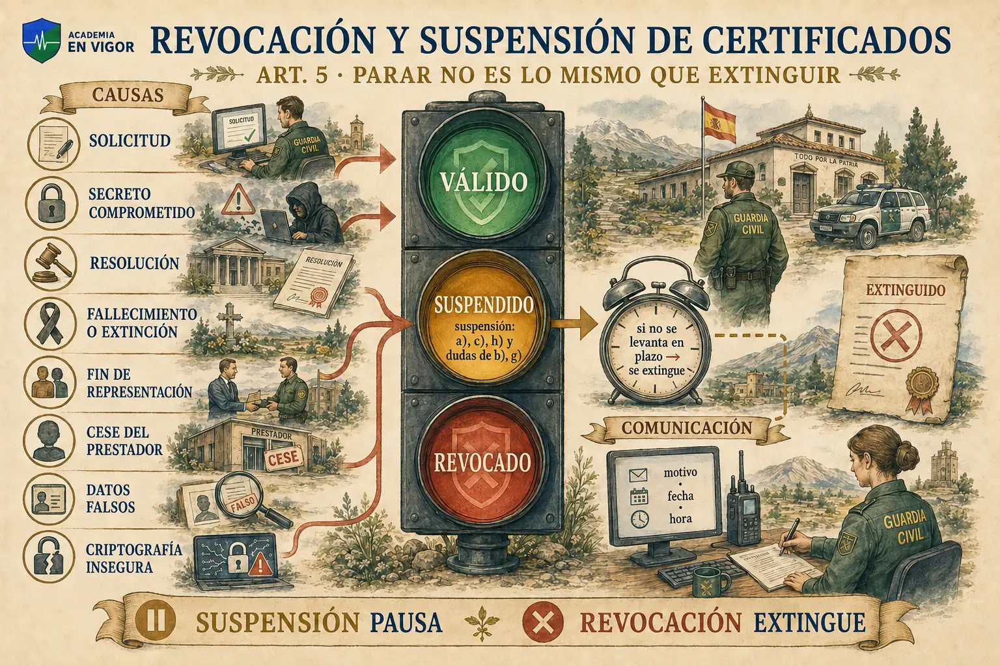

<em>Infografía: esquema de revocación y suspensión de certificados.</em>

<!-- FUENTE: L6-2020-GC-T17 -->

## 12. Identidad, atributos y comprobación del solicitante

### Regla y encaje

Identidad, atributos y comprobación del solicitante se estudia con literalidad controlada y conexión práctica. La referencia normativa se mantiene separada de comentarios y antecedentes.

### Claves examinables

- **Fuente oficial:** La identidad del titular en los certificados cualificados se consignará de la siguiente forma: <!-- FACT:GC-T17-F191 -->
- **Fuente oficial:** a) En el supuesto de certificados de firma electrónica y de autenticación de sitio web expedidos a personas físicas, por su nombre y apellidos y su número de Documento Nacional de Identidad, número de identidad de extranjero o número de identificación fiscal, o a través de un pseudónimo que conste como tal de manera inequívoca. <!-- FACT:GC-T17-F192 -->
- **Fuente oficial:** Los números anteriores podrán sustituirse por otro código o número identificativo únicamente en caso de que el titular carezca de todos ellos por causa lícita, siempre que le identifique de forma unívoca y permanente en el tiempo. <!-- FACT:GC-T17-F193 -->
- **Fuente oficial:** b) En el supuesto de certificados de sello electrónico y de autenticación de sitio web expedidos a personas jurídicas, por su denominación o razón social y su número de identificación fiscal. En defecto de este, deberá indicarse otro código identificativo que le identifique de forma unívoca y permanente en el tiempo, tal como se recoja en los registros oficiales. <!-- FACT:GC-T17-F194 -->
- **Fuente oficial:** Si los certificados admiten una relación de representación incluirán la identidad de la persona física o jurídica representada en las formas previstas en el apartado anterior, así como una indicación del documento, público si resulta exigible, que acredite de forma fehaciente las facultades del firmante para actuar en nombre de la persona o entidad a la que represente y, en caso de ser obligatoria la inscripción, de los datos registrales. <!-- FACT:GC-T17-F195 -->
- **Fuente oficial:** La identificación de la persona física que solicite un certificado cualificado exigirá su personación ante los encargados de verificarla y se acreditará mediante el Documento Nacional de Identidad, pasaporte u otros medios admitidos en Derecho. Podrá prescindirse de la personación de la persona física que solicite un certificado cualificado si su firma en la solicitud de expedición de un certificado cualificado ha sido legitimada en presencia notarial. <!-- FACT:GC-T17-F196 -->
- **Fuente oficial:** Reglamentariamente, mediante Orden de la persona titular del Ministerio de Asuntos Económicos y Transformación Digital, se determinarán otras condiciones y requisitos técnicos de verificación de la identidad a distancia y, si procede, otros atributos específicos de la persona solicitante de un certificado cualificado, mediante otros métodos de identificación como videoconferencia o video-identificación que aporten una seguridad equivalente en términos de fiabilidad a la presencia física según su evaluación por un organismo de evaluación de la conformidad. La determinación de dichas condiciones y requisitos técnicos se realizará a partir de los estándares que, en su caso, hayan sido determinados a nivel comunitario. <!-- FACT:GC-T17-F197 -->
- **Fuente oficial:** Serán considerados métodos de identificación reconocidos a escala nacional, a los efectos de lo previsto en el presente apartado, aquellos que aporten una seguridad equivalente en términos de fiabilidad a la presencia física y cuya equivalencia en el nivel de seguridad sea certificada por un organismo de evaluación de la conformidad, de acuerdo con lo previsto en la normativa en materia de servicios electrónicos de confianza. <!-- FACT:GC-T17-F198 -->
- **Fuente oficial:** La forma en que se ha procedido a identificar a la persona física solicitante podrá constar en el certificado. En otro caso, los prestadores de servicios de confianza deberán colaborar entre sí para determinar cuándo se produjo la última personación. <!-- FACT:GC-T17-F199 -->
- **Fuente oficial:** En el caso de certificados cualificados de sello electrónico y de firma electrónica con atributo de representante, los prestadores de servicios de confianza comprobarán, además de los datos señalados en los apartados anteriores, los datos relativos a la constitución y personalidad jurídica, y a la persona o entidad representada, respectivamente, así como la extensión y vigencia de las facultades de representación del solicitante mediante los documentos, públicos si resultan exigibles, que sirvan para acreditar los extremos citados de manera fehaciente y su inscripción en el correspondiente registro público si así resulta exigible. Esta comprobación podrá realizarse, asimismo, mediante consulta en el registro público en el que estén inscritos los documentos de constitución y de apoderamiento, pudiendo emplear los medios telemáticos facilitados por los citados registros públicos. <!-- FACT:GC-T17-F200 -->
- **Fuente oficial:** Cuando el certificado cualificado contenga otras circunstancias personales o atributos del solicitante, como su condición de titular de un cargo público, su pertenencia a un colegio profesional o su titulación, estas deberán comprobarse mediante los documentos oficiales que las acrediten, de conformidad con su normativa específica. <!-- FACT:GC-T17-F201 -->
- **Fuente oficial:** Lo dispuesto en los apartados anteriores podrá no ser exigible cuando la identidad u otras circunstancias permanentes de los solicitantes de los certificados constaran ya al prestador de servicios de confianza en virtud de una relación preexistente, en la que, para la identificación del interesado, se hubiese empleado el medio señalado en el apartado 1 y el período de tiempo transcurrido desde la identificación fuese menor de 5 años. <!-- FACT:GC-T17-F202 -->
- **Fuente oficial:** El Ministerio de Asuntos Económicos y Transformación Digital velará por que los prestadores cualificados de servicios electrónicos de confianza puedan contribuir a la elaboración de la norma reglamentaria prevista en el apartado 2 del presente artículo, de acuerdo con lo previsto en el artículo 26.6 de la Ley 50/1997, de 27 de noviembre, del Gobierno. <!-- FACT:GC-T17-F203 -->

:::hablemos-claro
No memorices palabras aisladas: pregunta siempre quién actúa, con qué habilitación y bajo qué límite.
:::

:::en-la-calle
En un supuesto, traduce el problema a una secuencia: activo o derecho afectado, autoridad o responsable, medida exigible y control posterior.
:::

:::lo-que-cae
Prioriza definiciones, competencias, listas, plazos, cifras y excepciones. Apariciones oficiales mapeadas: **0**.
:::

<!-- VISUAL:t17-12-identidad-atributos-y-comprobacion-del-solicitante.webp -->

  

<em>Infografía: esquema de identidad, atributos y comprobación del solicitante.</em>

<!-- FUENTE: L6-2020-GC-T17 -->

## 13. Protección de datos y obligaciones de los prestadores

### Regla y encaje

Protección de datos y obligaciones de los prestadores se estudia con literalidad controlada y conexión práctica. La referencia normativa se mantiene separada de comentarios y antecedentes.

### Claves examinables

- **Fuente oficial:** El tratamiento de los datos personales que precisen los prestadores de servicios electrónicos de confianza para el desarrollo de su actividad y los órganos administrativos para el ejercicio de las funciones atribuidas por esta Ley se sujetará a lo dispuesto en la legislación aplicable en materia de protección de datos de carácter personal. <!-- FACT:GC-T17-F204 -->
- **Fuente oficial:** Los prestadores de servicios electrónicos de confianza que consignen un pseudónimo en un certificado electrónico deberán constatar la verdadera identidad del titular del certificado y conservar la documentación que la acredite. <!-- FACT:GC-T17-F205 -->
- **Fuente oficial:** Dichos prestadores de servicios de confianza estarán obligados a revelar la citada identidad cuando lo soliciten los órganos judiciales y otras autoridades públicas en el ejercicio de funciones legalmente atribuidas, con sujeción a lo dispuesto en la legislación aplicable en materia de protección de datos personales. <!-- FACT:GC-T17-F206 -->
- **Fuente oficial:** Los prestadores de servicios electrónicos de confianza deberán: <!-- FACT:GC-T17-F207 -->
- **Fuente oficial:** a) Publicar información veraz y acorde con esta Ley y el Reglamento (UE) 910/2014. <!-- FACT:GC-T17-F208 -->
- **Fuente oficial:** b) No almacenar ni copiar, por sí o a través de un tercero, los datos de creación de firma, sello o autenticación de sitio web de la persona física o jurídica a la que hayan prestado sus servicios, salvo en caso de su gestión en nombre del titular. <!-- FACT:GC-T17-F209 -->
- **Fuente oficial:** En este caso, utilizarán sistemas y productos fiables, incluidos canales de comunicación electrónica seguros, y se aplicarán procedimientos y mecanismos técnicos y organizativos adecuados, para garantizar que el entorno sea fiable y se utilice bajo el control exclusivo del titular del certificado. <!-- FACT:GC-T17-F210 -->
- **Fuente oficial:** Además, deberán custodiar y proteger los datos de creación de firma, sello o autenticación de sitio web frente a cualquier alteración, destrucción o acceso no autorizado, así como garantizar su continua disponibilidad. <!-- FACT:GC-T17-F211 -->
- **Fuente oficial:** Los prestadores de servicios de confianza que expidan certificados electrónicos deberán disponer de un servicio de consulta sobre el estado de validez o revocación de los certificados emitidos accesible al público. <!-- FACT:GC-T17-F212 -->
- **Fuente oficial:** Los prestadores cualificados de servicios electrónicos de confianza deberán cumplir las siguientes obligaciones adicionales: <!-- FACT:GC-T17-F213 -->
- **Fuente oficial:** a) El período de tiempo durante el que deberán conservar la información relativa a los servicios prestados de acuerdo con el artículo 24.2.h) del Reglamento (UE) 910/2014, será de 15 años desde la extinción del certificado o la finalización del servicio prestado. En caso de que expidan certificados cualificados de sello electrónico o autenticación de sitio web a personas jurídicas, los prestadores de servicios de confianza registrarán también la información que permita determinar la identidad de la persona física a la que se hayan entregado los citados certificados, para su identificación en procedimientos judiciales o administrativos. <!-- FACT:GC-T17-F214 -->
- **Fuente oficial:** b) Constituir un seguro de responsabilidad civil por importe mínimo de 1.500.000 euros, excepto si el prestador pertenece al sector público. Si presta más de un servicio cualificado de los previstos en el Reglamento (UE) 910/2014, se añadirán 500.000 euros más por cada tipo de servicio. La citada garantía podrá ser sustituida total o parcialmente por una garantía mediante aval bancario o seguro de caución, de manera que la suma de las cantidades aseguradas sea coherente con lo dispuesto en el párrafo anterior. Las cuantías y los medios de aseguramiento y garantía establecidos en los dos párrafos anteriores podrán ser modificados mediante real decreto. <!-- FACT:GC-T17-F215 -->
- **Fuente oficial:** c) El prestador cualificado que vaya a cesar en su actividad deberá comunicarlo a los clientes a los que preste sus servicios y al órgano de supervisión con una antelación mínima de dos meses al cese efectivo de la actividad, por un medio que acredite la entrega y recepción efectiva siempre que sea factible. <!-- FACT:GC-T17-F216 -->
- **Fuente oficial:** El plan de cese del prestador de servicios puede incluir la transferencia de clientes, una vez acreditada la ausencia de oposición de los mismos, a otro prestador cualificado, el cual podrá conservar la información relativa a los servicios prestados hasta entonces. Igualmente, comunicará al órgano de supervisión cualquier otra circunstancia relevante que pueda impedir la continuación de su actividad. En especial, deberá comunicar, en cuanto tenga conocimiento de ello, la apertura de cualquier proceso concursal que se siga contra él. <!-- FACT:GC-T17-F217 -->
- **Fuente oficial:** d) Enviar el informe de evaluación de la conformidad al Ministerio de Asuntos Económicos y Transformación Digital en los términos previstos en el artículo 20.1 del Reglamento (UE) 910/2014. El incumplimiento de esta obligación conllevará la retirada de la cualificación al prestador y al servicio que este presta, y su eliminación de la lista de confianza prevista en el artículo 22 del citado Reglamento, previo requerimiento al prestador del servicio para que cese en el citado incumplimiento. <!-- FACT:GC-T17-F218 -->

:::hablemos-claro
No memorices palabras aisladas: pregunta siempre quién actúa, con qué habilitación y bajo qué límite.
:::

:::en-la-calle
En un supuesto, traduce el problema a una secuencia: activo o derecho afectado, autoridad o responsable, medida exigible y control posterior.
:::

:::lo-que-cae
Prioriza definiciones, competencias, listas, plazos, cifras y excepciones. Apariciones oficiales mapeadas: **2**.
:::

<!-- VISUAL:t17-13-proteccion-de-datos-y-obligaciones-de-los-prestadores.webp -->

  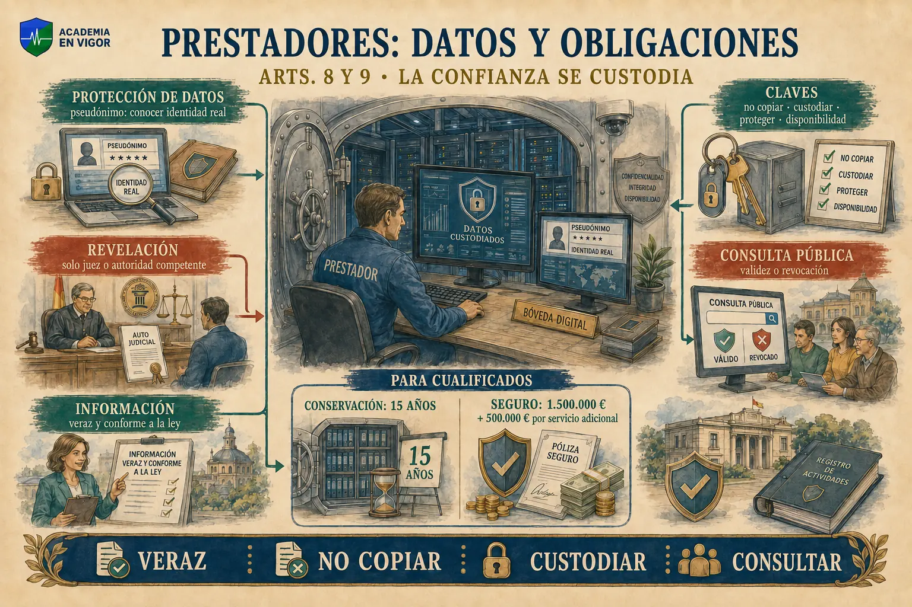

<em>Infografía: esquema de protección de datos y obligaciones de los prestadores.</em>

<!-- FUENTE: L6-2020-GC-T17 -->

## 14. Responsabilidad, inicio de actividad y seguridad

### Regla y encaje

Responsabilidad, inicio de actividad y seguridad se estudia con literalidad controlada y conexión práctica. La referencia normativa se mantiene separada de comentarios y antecedentes.

### Claves examinables

- **Fuente oficial:** Los prestadores de servicios electrónicos de confianza asumirán toda la responsabilidad frente a terceros por la actuación de las personas u otros prestadores en los que deleguen la ejecución de alguna o algunas de las funciones necesarias para la prestación de servicios electrónicos de confianza, incluyendo las actuaciones de comprobación de identidad previas a la expedición de un certificado cualificado. <!-- FACT:GC-T17-F219 -->
- **Fuente oficial:** El prestador de servicios electrónicos de confianza no será responsable de los daños y perjuicios ocasionados a la persona a la que ha prestado sus servicios o a terceros de buena fe, si esta incurre en alguno de los supuestos previstos en el Reglamento (UE) 910/2014 o en los siguientes: <!-- FACT:GC-T17-F220 -->
- **Fuente oficial:** a) No haber proporcionado al prestador de servicios de confianza información veraz, completa y exacta para la prestación del servicio de confianza, en particular, sobre los datos que deban constar en el certificado electrónico o que sean necesarios para su expedición o para la extinción o suspensión de su vigencia, cuando su inexactitud no haya podido ser detectada, actuando con la debida diligencia, por el prestador de servicios. <!-- FACT:GC-T17-F221 -->
- **Fuente oficial:** b) La falta de comunicación sin demora indebida al prestador de servicios de cualquier modificación de las circunstancias que incidan en la prestación del servicio de confianza, en particular, aquellas reflejadas en el certificado electrónico. <!-- FACT:GC-T17-F222 -->
- **Fuente oficial:** c) Negligencia en la conservación de sus datos de creación de firma, sello o autenticación de sitio web, en el aseguramiento de su confidencialidad y en la protección de todo acceso o revelación de estos o, en su caso, de los medios que den acceso a ellos. <!-- FACT:GC-T17-F223 -->
- **Fuente oficial:** d) No solicitar la suspensión o revocación del certificado electrónico en caso de duda en cuanto al mantenimiento de la confidencialidad de sus datos de creación de firma, sello o autenticación de sitio web o, en su caso, de los medios que den acceso a ellos. <!-- FACT:GC-T17-F224 -->
- **Fuente oficial:** e) Utilizar los datos de creación de firma, sello o autenticación de sitio web cuando haya expirado el período de validez del certificado electrónico o el prestador de servicios de confianza le notifique la extinción o suspensión de su vigencia. <!-- FACT:GC-T17-F225 -->
- **Fuente oficial:** El prestador de servicios de confianza tampoco será responsable por los daños y perjuicios si el destinatario actúa de forma negligente. Se entenderá que el destinatario actúa de forma negligente cuando no tenga en cuenta la suspensión o pérdida de vigencia del certificado electrónico, o cuando no verifique la firma o sello electrónico. <!-- FACT:GC-T17-F226 -->
- **Fuente oficial:** El prestador de servicios de confianza no será responsable por los daños y perjuicios en caso de inexactitud de los datos que consten en el certificado electrónico si estos le han sido acreditados mediante documento público u oficial, inscrito en un registro público si así resulta exigible. <!-- FACT:GC-T17-F227 -->
- **Fuente oficial:** Los prestadores de servicios de confianza no cualificados no necesitan verificación administrativa previa de cumplimiento de requisitos para iniciar su actividad, pero deberán comunicar su actividad al Ministerio de Asuntos Económicos y Transformación Digital en el plazo de tres meses desde que la inicien, que publicará en su página web el listado de prestadores de servicios de confianza no cualificados en una lista diferente a la de los prestadores de servicios de confianza cualificados, con la descripción detallada y clara de las características propias y diferenciales de los prestadores cualificados y de los prestadores no cualificados. <!-- FACT:GC-T17-F228 -->
- **Fuente oficial:** En el mismo plazo deberán comunicar la modificación de los datos inicialmente transmitidos y el cese de su actividad. <!-- FACT:GC-T17-F229 -->
- **Fuente oficial:** Los prestadores cualificados y no cualificados de servicios electrónicos de confianza notificarán al Ministerio de Asuntos Económicos y Transformación Digital las violaciones de seguridad o pérdidas de la integridad señaladas en el artículo 19.2 del Reglamento (UE) 910/2014, sin perjuicio de su notificación a la Agencia Española de Protección de Datos, a otros organismos relevantes o a las personas afectadas. <!-- FACT:GC-T17-F230 -->
- **Fuente oficial:** Los prestadores de servicios tienen la obligación de tomar las medidas necesarias para resolver los incidentes de seguridad que les afecten. <!-- FACT:GC-T17-F231 -->
- **Fuente oficial:** Los prestadores de servicios ampliarán, en un plazo máximo de un mes tras la notificación del incidente y, de haber tenido lugar, tras su resolución, la información suministrada en la notificación inicial con arreglo a las directrices y formularios que pueda establecer el Ministerio de Asuntos Económicos y Transformación Digital. <!-- FACT:GC-T17-F232 -->

:::hablemos-claro
No memorices palabras aisladas: pregunta siempre quién actúa, con qué habilitación y bajo qué límite.
:::

:::en-la-calle
En un supuesto, traduce el problema a una secuencia: activo o derecho afectado, autoridad o responsable, medida exigible y control posterior.
:::

:::lo-que-cae
Prioriza definiciones, competencias, listas, plazos, cifras y excepciones. Apariciones oficiales mapeadas: **0**.
:::

<!-- VISUAL:t17-14-responsabilidad-inicio-de-actividad-y-seguridad.webp -->

  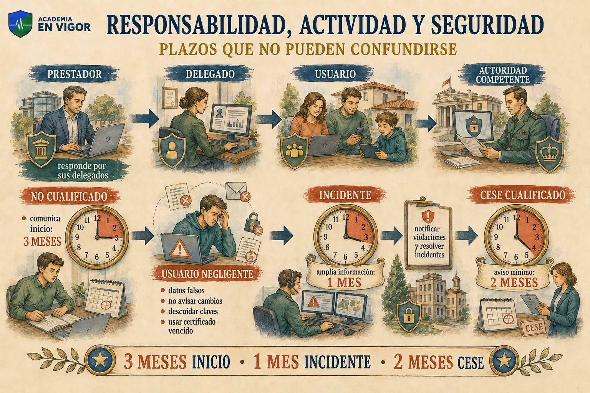

<em>Infografía: esquema de responsabilidad, inicio de actividad y seguridad.</em>

<!-- FUENTE: L6-2020-GC-T17 -->

## 15. DNI electrónico y eficacia de sus certificados

### Regla y encaje

DNI electrónico y eficacia de sus certificados se estudia con literalidad controlada y conexión práctica. La referencia normativa se mantiene separada de comentarios y antecedentes.

### Claves examinables

- **Fuente oficial:** El Documento Nacional de Identidad electrónico es el Documento Nacional de Identidad que permite acreditar electrónicamente la identidad personal de su titular, en los términos establecidos en el artículo 8 de la Ley Orgánica 4/2015, de 30 de marzo, de protección de la seguridad ciudadana, así como la firma electrónica de documentos. <!-- FACT:GC-T17-F233 -->
- **Fuente oficial:** Todas las personas físicas o jurídicas, públicas o privadas, reconocerán la eficacia del Documento Nacional de Identidad para acreditar la identidad y los demás datos personales del titular que consten en el mismo, así como la identidad del firmante y la integridad de los documentos firmados con sus certificados electrónicos. <!-- FACT:GC-T17-F234 -->
- **Fuente oficial:** Los órganos competentes del Ministerio del Interior para la expedición del Documento Nacional de Identidad cumplirán las obligaciones que la presente Ley impone a los prestadores de servicios electrónicos de confianza que expidan certificados cualificados. <!-- FACT:GC-T17-F235 -->

:::hablemos-claro
No memorices palabras aisladas: pregunta siempre quién actúa, con qué habilitación y bajo qué límite.
:::

:::en-la-calle
En un supuesto, traduce el problema a una secuencia: activo o derecho afectado, autoridad o responsable, medida exigible y control posterior.
:::

:::lo-que-cae
Prioriza definiciones, competencias, listas, plazos, cifras y excepciones. Apariciones oficiales mapeadas: **0**.
:::

<!-- VISUAL:t17-15-dni-electronico-y-eficacia-de-sus-certificados.webp -->

  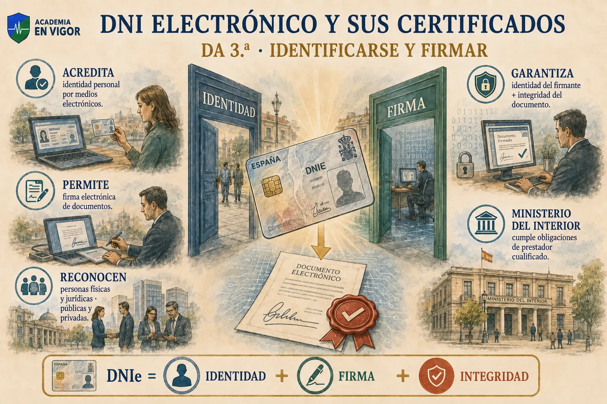

<em>Infografía: esquema de dni electrónico y eficacia de sus certificados.</em>

<!-- FUENTE: L6-2020-GC-T17 -->

## 16. Factores de amenaza y ataques dirigidos

### Regla y encaje

Factores de amenaza y ataques dirigidos se estudia con literalidad controlada y conexión práctica. La referencia normativa se mantiene separada de comentarios y antecedentes.

### Claves examinables

- **Fuente oficial:** La generalización del uso de los medios electrónicos en el normal desenvolvimiento de la sociedad ha incrementado la superficie de exposición a ataques y, en consecuencia, los beneficios potenciales derivados, lo que constituye sin duda uno de los mayores estímulos para los atacantes. <!-- FACT:GC-T17-F236 -->
- **Fuente oficial:** En los últimos años se ha mantenido la tendencia, incrementándose el número, tipología y gravedad de los ataques contra los sistemas de información del Sector Público, de las empresas e instituciones de interés estratégico o de aquellas poseedoras de importantes activos de propiedad intelectual e industrial y, en general, contra todo tipo de entidades y ciudadanos. <!-- FACT:GC-T17-F237 -->
- **Fuente oficial:** Siguen estando presentes las acciones de ciberespionaje, consistentes en ciberataques originados o patrocinados por Estados y perpetrados por ellos mismos o por otros actores a sueldo, y siempre con la intención de apropiarse de información sensible o valiosa desde los puntos de vista político, estratégico, de seguridad o económico. <!-- FACT:GC-T17-F238 -->
- **Fuente oficial:** A modo de resumen, podemos decir que el ciberespionaje presenta las siguientes características generales: <!-- FACT:GC-T17-F239 -->
- **Fuente oficial:** (1). Origen en estados, industrias o empresas. <!-- FACT:GC-T17-F240 -->
- **Fuente oficial:** (2). Utilización, generalmente, de ataques dirigidos (amenazas persistentes avanzadas). <!-- FACT:GC-T17-F241 -->
- **Fuente oficial:** (3). Contra los sectores público (información política o estratégica) y privado (información económicamente valiosa). <!-- FACT:GC-T17-F242 -->
- **Fuente oficial:** (4). Con una enorme dificultad de atribución. <!-- FACT:GC-T17-F243 -->
- **Fuente oficial:** (5). Persiguiendo obtener ventajas políticas, económicas, estratégicas o sociales. <!-- FACT:GC-T17-F244 -->
- **Fuente oficial:** La seguridad en sus actividades hace más difícil analizar estos ataques. De hecho, en los últimos años las tácticas, técnicas y procedimientos han evidenciado una creciente profesionalización mostrando con claridad un nuevo tipo de comportamiento delictivo, al que podríamos denominar Crime-as-a-Service. Este pone a disposición de terceros la posibilidad de desarrollar ciberataques de alto impacto y, generalmente, con el objetivo de obtener beneficios económicos ilícitos. <!-- FACT:GC-T17-F245 -->
- **Fuente oficial:** Otro elemento a tener en cuenta es la utilización del ciberespacio en la denominada Guerra Híbrida, que mediante la combinación de diferentes tácticas busca desestabilizar y polarizar la sociedad de los estados evitando el conflicto armado, pero a la vez consiguiendo que dichas acciones aparezcan como deliberadamente ambiguas, frecuentemente amplificadas mediante campañas de desinformación y manipulación en redes sociales. <!-- FACT:GC-T17-F246 -->
- **Fuente oficial:** A efectos de categorizar la amenaza, la figura siguiente muestra la Pirámide del Daño (Centro Criptológico Nacional, referencia histórica 2017), atendiendo a la mayor o menor peligrosidad de las ciberamenazas, según sea su origen. <!-- FACT:GC-T17-F247 -->
- **Fuente oficial:** NIVEL DE PELIGROSIDAD DE LAS AMENAZAS → <!-- FACT:GC-T17-F248 -->
- **Fuente oficial:** Acciones patrocinadas por Estados <!-- FACT:GC-T17-F249 -->
- **Fuente oficial:** Empresas de Defensa. <!-- FACT:GC-T17-F250 -->
- **Fuente oficial:** Organizaciones I+D. <!-- FACT:GC-T17-F251 -->
- **Fuente oficial:** Infraestructuras Críticas. <!-- FACT:GC-T17-F252 -->
- **Fuente oficial:** Actores externos con ánimo de lucro económico <!-- FACT:GC-T17-F253 -->
- **Fuente oficial:** Instituciones Financieras. <!-- FACT:GC-T17-F254 -->
- **Fuente oficial:** Compañías tecnológicas. <!-- FACT:GC-T17-F255 -->
- **Fuente oficial:** Ex-empleados, actores poco expertos, usuarios poco cuidadosos… <!-- FACT:GC-T17-F256 -->
- **Fuente oficial:** Los ciberataques se han convertido en una alternativa real a las herramientas convencionales de inteligencia, debido a su bajo coste, a la dificultad de probar su autoría y al importante volumen de información que puede ser obtenido por esta vía. En este sentido, los grupos APT (Advanced Persistent Threat o Amenazas Persistentes Avanzadas) buscan recabar la mayor cantidad de información posible y útil de la víctima, con el objetivo de preparar un ataque lo más efectivo posible. <!-- FACT:GC-T17-F257 -->
- **Fuente oficial:** Los parámetros de las técnicas del ataque (APT) se basan en: <!-- FACT:GC-T17-F258 -->
- **Fuente oficial:** (1). Capacidad de desarrollo: exploit (programa o código que se aprovecha de una vulnerabilidad en una aplicación o sistema para provocar un comportamiento no deseado o imprevisto) y vulnerabilidades utilizadas, incluyendo zero-days y explotación de cadena de suministro. <!-- FACT:GC-T17-F259 -->
- **Fuente oficial:** (2). Persistencia: tras reinicios, actualizaciones e incluso actividades de formateo. <!-- FACT:GC-T17-F260 -->
- **Fuente oficial:** (3). Cifrado: métodos de cifrado y fortaleza de claves para intercambiar la información exfiltrada. <!-- FACT:GC-T17-F261 -->
- **Fuente oficial:** (4). Técnicas exfiltración: protocolos utilizados para la extracción de información, como túneles DNS o servicios en la nube. <!-- FACT:GC-T17-F262 -->
- **Fuente oficial:** (5). Ocultación: técnicas de rootkit (herramienta que sirve para ocultar actividades ilegítimas en un sistema. Una vez que ha sido instalado, permite al atacante actuar con el nivel de privilegios del administrador del equipo), bootkit utilizadas para ocultarse. <!-- FACT:GC-T17-F263 -->
- **Fuente oficial:** (6). Resistencia a ingeniería inversa: técnicas que dificultan el análisis del código. <!-- FACT:GC-T17-F264 -->
- **Fuente oficial:** La información exfiltrada, en función de la motivación de los atacantes, puede ser de índole muy variada: económica, sensible, propiedad intelectual, secretos industriales o de estado, etc. <!-- FACT:GC-T17-F265 -->

:::hablemos-claro
No memorices palabras aisladas: pregunta siempre quién actúa, con qué habilitación y bajo qué límite.
:::

:::en-la-calle
En un supuesto, traduce el problema a una secuencia: activo o derecho afectado, autoridad o responsable, medida exigible y control posterior.
:::

:::lo-que-cae
Prioriza definiciones, competencias, listas, plazos, cifras y excepciones. Apariciones oficiales mapeadas: **0**.
:::

<!-- VISUAL:t17-16-factores-de-amenaza-y-ataques-dirigidos.webp -->

  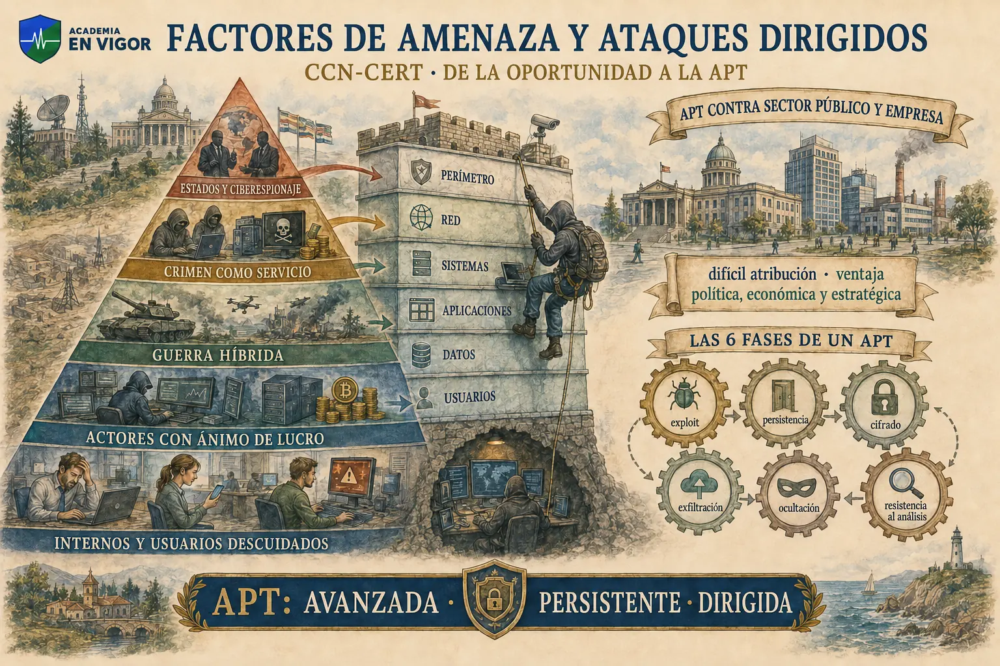

<em>Infografía: esquema de factores de amenaza y ataques dirigidos.</em>

<!-- FUENTE: CCNCERT-BP01-GC-T17 -->

## 17. Internet profunda, red TOR y bitcoin

### Regla y encaje

Internet profunda, red TOR y bitcoin se estudia con literalidad controlada y conexión práctica. La referencia normativa se mantiene separada de comentarios y antecedentes.

### Claves examinables

- **Fuente oficial:** Internet se ha visto dividida en la Internet profunda y la superficial. La superficial se compone de páginas estáticas o fijas, mientras que la web profunda está compuesta de páginas dinámicas donde el contenido se coloca en una base de datos que se proporciona a petición del usuario. <!-- FACT:GC-T17-F266 -->
- **Fuente oficial:** La principal razón de la existencia de la Internet profunda es la imposibilidad para los motores de búsqueda (Google, Yahoo!, Bing, etc.) de encontrar o indexar gran parte de la información existente en ella. <!-- FACT:GC-T17-F267 -->
- **Fuente oficial:** Un subconjunto de la Internet profunda solo es accesible utilizando determinados navegadores web. Es el caso, por ejemplo, de la red TOR, donde los usuarios han de disponer del software de navegación adecuado para poder acceder a dominios que son inaccesibles desde un navegador convencional. <!-- FACT:GC-T17-F268 -->
- **Fuente oficial:** Además, los usuarios han de conocer previamente la dirección a la que han de dirigirse. Existen listados con algunos dominios públicos de la red TOR que los usuarios pueden consultar (The Hidden Wiki, Silk Road, Agora, Evolution, Middle-Earth, etc.) y buscadores como Grams (el Google de la dark web). <!-- FACT:GC-T17-F269 -->
- **Fuente oficial:** The Onion Router (TOR) fue un proyecto diseñado e implementado por la Marina de los Estados Unidos, lanzado en 2002, con el fin de fortalecer las comunicaciones por Internet y garantizar el anonimato y la privacidad. <!-- FACT:GC-T17-F270 -->
- **Fuente oficial:** A diferencia de los navegadores de Internet convencionales, TOR permite a los usuarios navegar por la web de forma anónima. Los datos no viajan de forma directa sino a través de varios nodos que facilitan el anonimato de las comunicaciones. Existe un directorio de nodos intermedios con las claves públicas asociadas para poder establecer la comunicación cifrada. TOR se encarga de crear circuitos virtuales compuestos por tres nodos aleatoriamente escogidos de su red. De manera que la comunicación entre origen, nuestro equipo y el destino, por ejemplo, una web, ha de recorrer los tres nodos asignados, a través de los cuales la información se transmitirá de forma cifrada. El elemento origen cifra la comunicación con la clave pública del último nodo de la ruta elegida para que de esta forma sea el único elemento que pueda descifrar el mensaje y las instrucciones (nodos intermedios y sus claves públicas asociadas) para llegar al destino. <!-- FACT:GC-T17-F271 -->
- **Fuente oficial:** Se eligen rutas aleatorias donde los datos se cifran en capas y una vez que la última capa es tratada por un nodo de salida, se lleva a cabo la conexión con la página web destino. <!-- FACT:GC-T17-F272 -->
- **Fuente oficial:** Bitcoin es una moneda electrónica cifrada, descentralizada, de ordenador a ordenador (peer-to-peer) donde el control se realiza, de forma indirecta, por los propios usuarios a través de intercambios P2P. En lugar de acuñar una moneda o imprimir un billete, se utiliza una cadena de caracteres criptográficos que se intercambian a través de billeteras digitales (wallets) entre el usuario y el vendedor (intercambios P2P), lo que hace que esté fuera del control de cualquier gobierno, institución o entidad financiera tradicional. Cada transacción con bitcoins se registra en una gran base de datos llamada BlockChain. Los datos se guardan en bloques y cada bloque nuevo debe contener el hash del bloque anterior. Por lo tanto, cada bloque nuevo que se une a la cadena posee todo el historial de la transacción. <!-- FACT:GC-T17-F273 -->
- **Fuente oficial:** Este protocolo se sustenta sobre una red de «mineros» que controlan la moneda. Los mineros ponen a disposición de la red recursos de cómputo y como recompensa, reciben bitcoins. Estos mineros protegen al sistema para que no haya transacciones de anulación (devolución de dinero ya gastado). <!-- FACT:GC-T17-F274 -->
- **Fuente oficial:** Esta moneda es internacional, fácil de utilizar, permite transacciones de forma pseudónima, existen cajeros automáticos y cada vez hay más vendedores/comercios que la aceptan. Como riesgos, representa un mecanismo muy práctico para blanquear dinero y evadir impuestos, aunque está cada vez más regulada. <!-- FACT:GC-T17-F275 -->

:::hablemos-claro
No memorices palabras aisladas: pregunta siempre quién actúa, con qué habilitación y bajo qué límite.
:::

:::en-la-calle
En un supuesto, traduce el problema a una secuencia: activo o derecho afectado, autoridad o responsable, medida exigible y control posterior.
:::

:::lo-que-cae
Prioriza definiciones, competencias, listas, plazos, cifras y excepciones. Apariciones oficiales mapeadas: **3**.
:::

<!-- VISUAL:t17-17-internet-profunda-red-tor-y-bitcoin.webp -->

  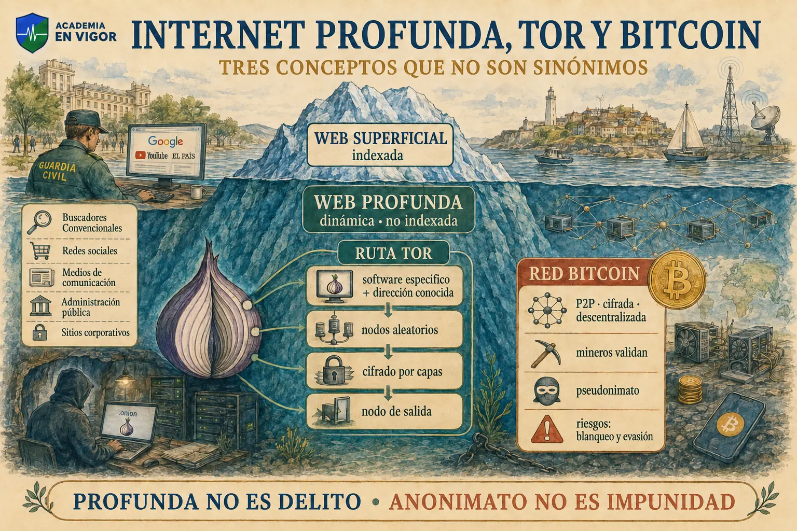

<em>Infografía: esquema de internet profunda, red tor y bitcoin.</em>

<!-- FUENTE: CCNCERT-BP01-GC-T17 -->

## 18. Aplicaciones, cifrado, cortafuegos, antimalware y borrado

### Regla y encaje

Aplicaciones, cifrado, cortafuegos, antimalware y borrado se estudia con literalidad controlada y conexión práctica. La referencia normativa se mantiene separada de comentarios y antecedentes.

### Claves examinables

- **Fuente oficial:** La instalación de programas puede afectar al rendimiento y la seguridad de los dispositivos/equipos. Debe mantenerse la integridad de los mismos y siempre hay que instalar software autorizado y proporcionado directamente por el fabricante o fuentes oficiales verificadas. <!-- FACT:GC-T17-F276 -->
- **Fuente oficial:** (1). El empleo de software legal ofrece garantía y soporte, con independencia de las implicaciones legales de utilizar software no legítimo. <!-- FACT:GC-T17-F277 -->
- **Fuente oficial:** (2). Certificación del programa para su compatibilidad con el sistema operativo y las demás aplicaciones. <!-- FACT:GC-T17-F278 -->
- **Fuente oficial:** (3). Instalación y mantenimiento de parches y actualizaciones de seguridad, con especial atención a aquellas de carácter crítico (en los últimos meses la no actualización de los programas ha provocado numerosas brechas de seguridad a gran escala). <!-- FACT:GC-T17-F279 -->
- **Fuente oficial:** (4). Considerar la superficie de exposición asociada a los sistemas heredados (legacy), especialmente aquellos que tienen más de 10 años de antigüedad por su extremada vulnerabilidad a exploits conocidos. <!-- FACT:GC-T17-F280 -->
- **Fuente oficial:** Los usuarios deben ser conscientes de que la introducción de software no autorizado puede causar la infección del sistema más protegido. Como buenas prácticas se indica lo siguiente: <!-- FACT:GC-T17-F281 -->
- **Fuente oficial:** (1). Trabajar habitualmente en el sistema como usuario sin privilegios, no como «Administrador». <!-- FACT:GC-T17-F282 -->
- **Fuente oficial:** (2). No ejecutar nunca programas de origen dudoso o desconocido. <!-- FACT:GC-T17-F283 -->
- **Fuente oficial:** (3). Si se emplea un paquete de software ofimático capaz de ejecutar macros, hay que asegurarse de que esté desactivada su ejecución automática. <!-- FACT:GC-T17-F284 -->
- **Fuente oficial:** En cuanto a la impresión de documentos, hay que ser conscientes de que los documentos y transacciones impresas son susceptibles de violaciones de la seguridad. Por lo tanto, resulta fundamental emplear buenas prácticas para cumplir la normativa existente en cada entidad y que la información impresa sea segura y no accesible por personal no autorizado, utilizando funciones como impresión segura o retención de trabajos. <!-- FACT:GC-T17-F285 -->
- **Fuente oficial:** Cifrar los datos significa convertir texto plano en texto ilegible, denominado texto cifrado, evitando que la información sea accesible por terceros no autorizados. Para lo cual, se necesita de un algoritmo de cifrado y la existencia de una clave, que permite realizar el proceso de transformación de los datos y que debe mantenerse en secreto. Existen múltiples soluciones comerciales para cifrar los equipos informáticos, clasificables en tres tipos atendiendo al nivel en el que actúan en el sistema de archivos: <!-- FACT:GC-T17-F286 -->
- **Fuente oficial:** (1). Cifrado de disco. Es una tecnología que cifra el disco por completo, de esta manera el sistema operativo se encarga de descifrar la información cuando el usuario la solicita. <!-- FACT:GC-T17-F287 -->
- **Fuente oficial:** (2). Cifrado de carpetas. El cifrado se realiza a nivel de carpeta. El sistema de cifrado se encargará de cifrar y descifrar la información cuando se utiliza la carpeta protegida. <!-- FACT:GC-T17-F288 -->
- **Fuente oficial:** (3). Cifrado de documentos. El sistema se encarga de mostrar y permitir el acceso al documento solo para los usuarios autorizados, haciendo ilegible el contenido a los no autorizados. <!-- FACT:GC-T17-F289 -->
- **Fuente oficial:** Los cortafuegos personales o firewalls son programas que monitorizan las conexiones entrantes y salientes del equipo. Están diseñados para bloquear el acceso no autorizado al mismo, pero permitiendo al mismo tiempo las comunicaciones autorizadas. Lo más complicado de un cortafuegos es configurarlo correctamente, de modo que no se bloqueen las conexiones legítimas (navegación web, actualizaciones, correo electrónico, etc.). <!-- FACT:GC-T17-F290 -->
- **Fuente oficial:** Como criterio genérico, no se deben permitir las conexiones de fuentes desconocidas. Por tanto, deben bloquear todas las conexiones entrantes y solo permitir aquellas que se indiquen expresamente sobre la base de un conjunto de normas y criterios establecidos. Un cortafuegos correctamente configurado añade una protección necesaria que dificulta los movimientos laterales no autorizados por la red, pero que en ningún caso debe considerarse como suficiente por sí solo. <!-- FACT:GC-T17-F291 -->
- **Fuente oficial:** Entre las acciones que puede provocar un código malicioso o malware se encuentran: borrado o alteración de archivos, consumo de recursos del equipo, acceso no autorizado a archivos, infección remota de los equipos, etc. Las funciones mínimas que se pueden esperar en una buena herramienta antimalware (más conocidas por antivirus) son las de filtrado entrante y saliente de contenidos maliciosos, protección en el correo electrónico, en la navegación y en las conexiones de todo tipo en redes profesionales o domésticas. También deben ser capaces de analizar los ficheros en dispositivos removibles como discos externos o memorias USB y permitir programar análisis exhaustivos cada cierto tiempo. Las aplicaciones antimalware deben disponer de actualizaciones regulares (últimas definiciones y motores de búsqueda) y ser productos de casas comerciales de confianza que permitan una combinación de los siguientes métodos: <!-- FACT:GC-T17-F292 -->
- **Fuente oficial:** (1). Escáner de acceso: permite examinar los archivos cuando son abiertos. <!-- FACT:GC-T17-F293 -->
- **Fuente oficial:** (2). Escáner a demanda: análisis en base a un calendario establecido. <!-- FACT:GC-T17-F294 -->
- **Fuente oficial:** (3). Escáner de correos electrónicos: de protección de perímetro o servidores de correo. <!-- FACT:GC-T17-F295 -->
- **Fuente oficial:** (4). Control de firmas: permite detectar cambios no legítimos en el contenido de un archivo. <!-- FACT:GC-T17-F296 -->
- **Fuente oficial:** (5). Métodos heurísticos: búsqueda de anomalías en los archivos y procesos en base a experiencias previas de comportamiento del malware. <!-- FACT:GC-T17-F297 -->
- **Fuente oficial:** Pero, una aplicación antimalware sola no es suficiente; hay que proporcionar un enfoque centralizado (cliente-servidor) para proteger todos los puntos finales (servidores, sobremesas, portátiles, teléfonos inteligentes, etc.) conectados a la red. Algunos proveedores ofrecen sistemas de Endpoint Security que incluyen antivirus, cortafuegos y otro software de seguridad. <!-- FACT:GC-T17-F298 -->
- **Fuente oficial:** Se puede pensar que un simple formateo del disco duro impedirá que los datos almacenados en el mismo puedan ser recuperados. Sin embargo, hay aplicaciones que permiten deshacer el formateo de una unidad existiendo incluso métodos para recuperar los datos de los discos, aunque estos hayan sido sobrescritos. Si se quiere garantizar que no se está distribuyendo información sensible, se deben sobrescribir los datos siguiendo un método (patrón de borrado) que no permita su recuperación de modo alguno. Para tal fin, es necesario realizar diversas pasadas de escritura sobre cada uno de los sectores donde se almacena la información. <!-- FACT:GC-T17-F299 -->
- **Fuente oficial:** Para simplificar la tarea, lo más sencillo es utilizar alguna aplicación especializada que permita eliminar la información de forma sencilla y segura. <!-- FACT:GC-T17-F300 -->
- **Fuente oficial:** En el caso de fotografías digitales, archivos de audio o vídeo y documentos ofimáticos existen metadatos que pueden almacenar información oculta y no visible usando la configuración estándar de las aplicaciones, necesitando de una configuración específica o incluso un software concreto para revelar esos datos. Estos metadatos son útiles ya que facilitan la búsqueda de información, posibilitan la interoperabilidad entre organizaciones, proveen la identificación digital y dan soporte a la gestión del ciclo de vida de los documentos. Sin embargo, el borrado de metadatos o datos ocultos mediante procedimientos y herramientas de revisión y limpieza de documentos/archivos es fundamental para minimizar el riesgo de que se revele información sensible en el almacenamiento e intercambio de información. <!-- FACT:GC-T17-F301 -->

:::hablemos-claro
No memorices palabras aisladas: pregunta siempre quién actúa, con qué habilitación y bajo qué límite.
:::

:::en-la-calle
En un supuesto, traduce el problema a una secuencia: activo o derecho afectado, autoridad o responsable, medida exigible y control posterior.
:::

:::lo-que-cae
Prioriza definiciones, competencias, listas, plazos, cifras y excepciones. Apariciones oficiales mapeadas: **1**.
:::

<!-- VISUAL:t17-18-aplicaciones-cifrado-cortafuegos-antimalware-y-borrado.webp -->

  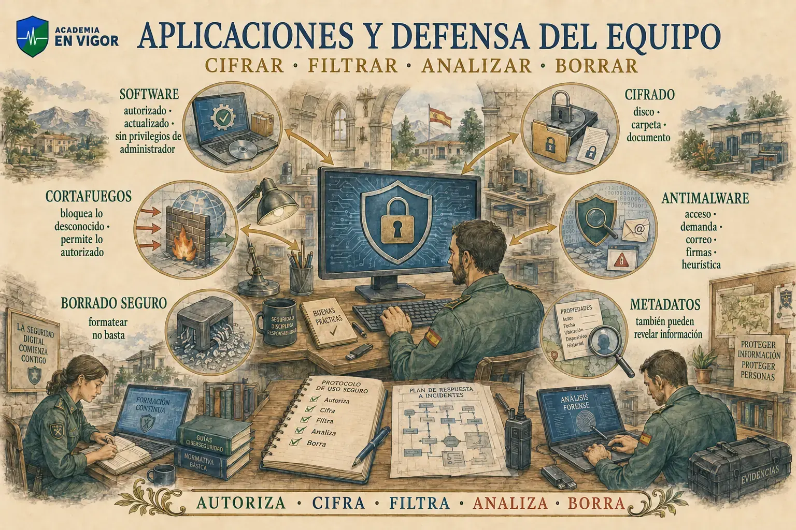

<em>Infografía: esquema de aplicaciones, cifrado, cortafuegos, antimalware y borrado.</em>

<!-- FUENTE: CCNCERT-BP01-GC-T17 -->

## 19. Navegación segura

### Regla y encaje

Navegación segura se estudia con literalidad controlada y conexión práctica. La referencia normativa se mantiene separada de comentarios y antecedentes.

### Claves examinables

- **Fuente oficial:** La comunicación en Internet se sustenta en una idea básica: clientes (ordenadores, teléfonos, tabletas…) llaman a servidores (web, bases de datos…) que proporcionan (sirven) información. Esta comunicación se lleva a cabo a través de un protocolo (http, https, ftp, etc.). El cliente está identificado en la red a través de una dirección IP (TCP/IP) y, cada vez que se conecta a un sitio web, este conoce automáticamente la dirección IP, nombre de máquina, la página de procedencia, etc. Se produce un intercambio de información que habitualmente no es visible, donde el navegador web es el que facilita la mayoría de estos datos. <!-- FACT:GC-T17-F302 -->
- **Fuente oficial:** (1). Un alto porcentaje de los usuarios no es consciente de la cantidad de información que, de forma inadvertida e involuntaria, está revelando a terceros al hacer uso de Internet. <!-- FACT:GC-T17-F303 -->
- **Fuente oficial:** (2). Cada vez que se visita un sitio web, se suministra de forma rutinaria una información que puede ser archivada por el administrador del sitio. <!-- FACT:GC-T17-F304 -->
- **Fuente oficial:** (3). Al sitio web le resulta trivial averiguar la dirección de Internet de la máquina desde la que se está accediendo, sistema operativo, etc. <!-- FACT:GC-T17-F305 -->
- **Fuente oficial:** (4). Con ayuda de las «cookies» se puede personalizar aún más la información recabada acerca de los visitantes, registrando las páginas más visitadas, preferencias, tiempo, etc. <!-- FACT:GC-T17-F306 -->
- **Fuente oficial:** Un navegador web, en favor de la máxima usabilidad, permite que se acceda a información: <!-- FACT:GC-T17-F307 -->
- **Fuente oficial:** (1). La dirección IP pública con que se conecta el usuario. <!-- FACT:GC-T17-F308 -->
- **Fuente oficial:** a) Tu dirección IP es xxx.xxx.xxx.xxx. <!-- FACT:GC-T17-F309 -->
- **Fuente oficial:** b) Tu navegador está utilizando 128 bits de clave secreta SSL. <!-- FACT:GC-T17-F310 -->
- **Fuente oficial:** c) El servidor está utilizando 1024 bits de clave pública SSL. <!-- FACT:GC-T17-F311 -->
- **Fuente oficial:** (2). La resolución de la pantalla. <!-- FACT:GC-T17-F312 -->
- **Fuente oficial:** (3). Qué páginas se leen y cuáles no, qué figuras se miran, cuántas páginas se han visitado, cuál fue el sitio recientemente visitado «Referer». <!-- FACT:GC-T17-F313 -->
- **Fuente oficial:** (4). El valor del campo «User-Agent». <!-- FACT:GC-T17-F314 -->
- **Fuente oficial:** a) Mozilla/5.0 (Windows NT 6.1; rv:16.0) Gecko/20100101 Firefox/16.0. <!-- FACT:GC-T17-F315 -->
- **Fuente oficial:** (5). El idioma y zona GMT del sistema operativo. <!-- FACT:GC-T17-F316 -->
- **Fuente oficial:** (6). Si se aceptan o no «cookies». <!-- FACT:GC-T17-F317 -->
- **Fuente oficial:** (7). Las fuentes cargadas en el sistema o plugins instalados y activados. <!-- FACT:GC-T17-F318 -->
- **Fuente oficial:** Algunas recomendaciones para mantener una navegación segura son: <!-- FACT:GC-T17-F319 -->
- **Fuente oficial:** (1). Acceder únicamente a sitios de confianza. <!-- FACT:GC-T17-F320 -->
- **Fuente oficial:** (2). Mantener actualizado el navegador a la última versión disponible del fabricante. <!-- FACT:GC-T17-F321 -->
- **Fuente oficial:** (3). Configurar el nivel de seguridad del navegador según sus preferencias. <!-- FACT:GC-T17-F322 -->
- **Fuente oficial:** (4). Descargar los programas desde sitios oficiales para evitar suplantaciones maliciosas. <!-- FACT:GC-T17-F323 -->
- **Fuente oficial:** (5). Configurar el navegador para evitar ventanas emergentes. <!-- FACT:GC-T17-F324 -->
- **Fuente oficial:** (6). Utilizar un usuario sin permisos de «Administrador» para navegar por Internet e impedir la instalación de programas y cambios en los valores del sistema. <!-- FACT:GC-T17-F325 -->
- **Fuente oficial:** (7). Borrar las «cookies», los ficheros temporales y el historial cuando se utilicen equipos ajenos para no dejar rastro de la navegación. <!-- FACT:GC-T17-F326 -->
- **Fuente oficial:** (8). Desactivar la posibilidad «script» en navegadores web, como Firefox (NoScript) o Chrome (NotScript), para prevenir la ejecución de los mismos por parte de dominios desconocidos. <!-- FACT:GC-T17-F327 -->
- **Fuente oficial:** (9). Se recomienda hacer uso de HTTPS (SSL/TLS) frente a HTTP incluso para aquellos servicios que no manejen información sensible. Algunas funcionalidades como HSTS y extensiones como HTTPS Everywhere servirán de gran ayuda para garantizar el uso preferente de HTTPS sobre HTTP durante la navegación web. <!-- FACT:GC-T17-F328 -->
- **Fuente oficial:** (10). En la medida de lo posible, usar máquinas virtuales para navegar por Internet. <!-- FACT:GC-T17-F329 -->
- **Fuente oficial:** Además, hay que tener en cuenta que los sistemas de navegación anónima permiten el uso de algunos servicios de Internet, principalmente los basados en navegación web (http/https), de forma desvinculada de la dirección IP origen de la comunicación. <!-- FACT:GC-T17-F330 -->
- **Fuente oficial:** (1). Anonimizadores. <!-- FACT:GC-T17-F331 -->
- **Fuente oficial:** a) Actúan como un filtro entre el navegador y el sitio web que se desea visitar. <!-- FACT:GC-T17-F332 -->
- **Fuente oficial:** b) Al conectarse al anonimizador, se introduce la URL a visitar y entonces este se adentra en la red filtrando cookies, javascripts, etc. <!-- FACT:GC-T17-F333 -->
- **Fuente oficial:** (2). Servidores Proxy. <!-- FACT:GC-T17-F334 -->
- **Fuente oficial:** a) Un servidor proxy actúa de pasarela entre la máquina cliente e Internet. <!-- FACT:GC-T17-F335 -->
- **Fuente oficial:** b) El servidor proxy actúa de intermediario, se encarga de recuperar las páginas web en lugar del usuario que navega. <!-- FACT:GC-T17-F336 -->
- **Fuente oficial:** (3). Túneles de cifrado (TOR, VPS y Darknets). <!-- FACT:GC-T17-F337 -->
- **Fuente oficial:** a) Red de «túneles» por las cuales los datos de navegación, debidamente cifrados, atraviesan múltiples nodos hasta llegar a su destino. <!-- FACT:GC-T17-F338 -->

:::hablemos-claro
No memorices palabras aisladas: pregunta siempre quién actúa, con qué habilitación y bajo qué límite.
:::

:::en-la-calle
En un supuesto, traduce el problema a una secuencia: activo o derecho afectado, autoridad o responsable, medida exigible y control posterior.
:::

:::lo-que-cae
Prioriza definiciones, competencias, listas, plazos, cifras y excepciones. Apariciones oficiales mapeadas: **0**.
:::

<!-- VISUAL:t17-19-navegacion-segura.webp -->

  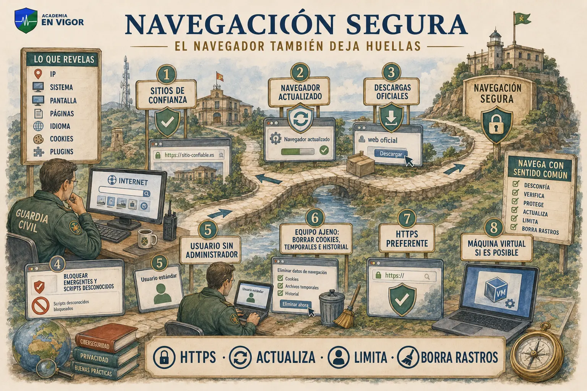

<em>Infografía: esquema de navegación segura.</em>

<!-- FUENTE: CCNCERT-BP01-GC-T17 -->

## 20. Correo electrónico

### Regla y encaje

Correo electrónico se estudia con literalidad controlada y conexión práctica. La referencia normativa se mantiene separada de comentarios y antecedentes.

### Claves examinables

- **Fuente oficial:** Actualmente el correo electrónico sigue siendo una de las herramientas más utilizadas por cualquier entorno corporativo para el intercambio de información a pesar de que en los últimos años han surgido multitud de tecnologías y herramientas colaborativas para facilitar la comunicación y el intercambio de ficheros. El incremento y efectividad de la ingeniería social para engañar a los usuarios por medio de correos electrónicos ha modificado el paradigma de la seguridad corporativa. Actualmente los cortafuegos perimetrales y la securización de los servicios expuestos a Internet no son contramedidas suficientes para proteger una organización de ataques externos. Algunas recomendaciones para utilizar el correo electrónico de forma segura: <!-- FACT:GC-T17-F339 -->
- **Fuente oficial:** (1). No abrir ningún enlace ni descargar ningún fichero adjunto procedente de un correo electrónico que presente cualquier indicio o patrón fuera de lo habitual. <!-- FACT:GC-T17-F340 -->
- **Fuente oficial:** (2). No confiar únicamente en el nombre del remitente. El usuario deberá comprobar que el propio dominio del correo recibido es de confianza. Si un correo procedente de un contacto conocido solicita información inusual contacte con el mismo por teléfono u otra vía de comunicación para corroborar la legitimidad del mismo. <!-- FACT:GC-T17-F341 -->
- **Fuente oficial:** (3). Antes de abrir cualquier fichero descargado desde el correo, hay que asegurarse de la extensión y no fiarse del icono asociado al mismo. <!-- FACT:GC-T17-F342 -->
- **Fuente oficial:** (4). No habilitar las macros de los documentos ofimáticos incluso si el fichero lo solicita. <!-- FACT:GC-T17-F343 -->
- **Fuente oficial:** (5). No hacer clic en ningún enlace que solicite datos personales o bancarios. <!-- FACT:GC-T17-F344 -->
- **Fuente oficial:** (6). Tener siempre actualizado el sistema operativo, las aplicaciones ofimáticas y el navegador (incluyendo los plugins/extensiones instaladas). <!-- FACT:GC-T17-F345 -->
- **Fuente oficial:** (7). Utilizar herramientas de seguridad para mitigar exploits de manera complementaria al software antivirus. <!-- FACT:GC-T17-F346 -->
- **Fuente oficial:** (8). Evitar hacer clic directamente en cualquier enlace desde el propio cliente de correo. Si el enlace es desconocido, es recomendable buscar información del mismo en motores de búsqueda como Google o Bing. <!-- FACT:GC-T17-F347 -->
- **Fuente oficial:** (9). Utilizar contraseñas robustas para el acceso al correo electrónico. Las contraseñas deberán ser periódicamente renovadas y si es posible utilizar doble autenticación. <!-- FACT:GC-T17-F348 -->
- **Fuente oficial:** (10). Cifrar los mensajes de correo que contengan información sensible. <!-- FACT:GC-T17-F349 -->

:::hablemos-claro
No memorices palabras aisladas: pregunta siempre quién actúa, con qué habilitación y bajo qué límite.
:::

:::en-la-calle
En un supuesto, traduce el problema a una secuencia: activo o derecho afectado, autoridad o responsable, medida exigible y control posterior.
:::

:::lo-que-cae
Prioriza definiciones, competencias, listas, plazos, cifras y excepciones. Apariciones oficiales mapeadas: **1**.
:::

<!-- VISUAL:t17-20-correo-electronico.webp -->

  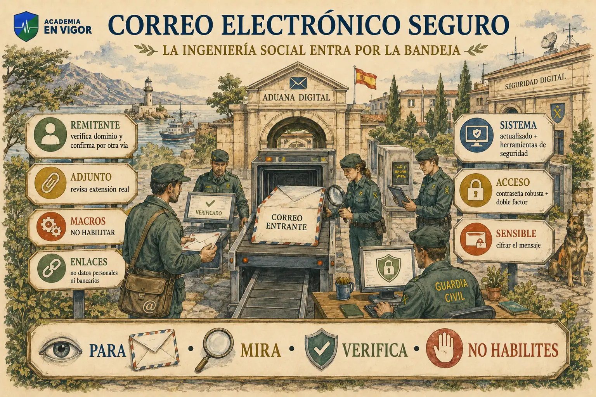

<em>Infografía: esquema de correo electrónico.</em>

<!-- FUENTE: CCNCERT-BP01-GC-T17 -->

## 21. Virtualización, dispositivos móviles y redes inalámbricas

### Regla y encaje

Virtualización, dispositivos móviles y redes inalámbricas se estudia con literalidad controlada y conexión práctica. La referencia normativa se mantiene separada de comentarios y antecedentes.

### Claves examinables

- **Fuente oficial:** La virtualización se entiende como la recreación de un recurso físico (hardware) o lógico (software), por medio de un hipervisor (hypervisor) que permite su ejecución por más de un entorno al mismo tiempo. En el entorno de máquinas virtuales, el hipervisor permite el uso simultáneo del hardware en más de un sistema operativo. El apogeo de la virtualización ha llegado con la utilización de la nube, donde este sistema de reparto de los recursos se hace casi indispensable. Aunque ya existían múltiples sistemas de muchos fabricantes, el desarrollo y avances de los mismos se han incrementado de una forma exponencial. Actualmente se puede optar, entre otros, por XenServer de Citrix, VMware ESXi de Dell, VirtualBox de Oracle, Oracle VM Server e Hyper-V de Microsoft. La seguridad en la virtualización tiene la misma premisa que cualquier otro sistema, que es la minimización de la superficie de ataque. No obstante, cuenta con particularidades que hacen que la aseguración sea más difícil como por ejemplo la multitud de recursos compartidos o los sistemas operativos que funcionan simultáneamente con sus propias aplicaciones sobre una misma máquina física. Como norma general, es conveniente seguir las siguientes indicaciones a la hora de configurar un host de máquinas virtuales: <!-- FACT:GC-T17-F350 -->
- **Fuente oficial:** (1). Tener instaladas en el sistema operativo las últimas actualizaciones de seguridad. <!-- FACT:GC-T17-F351 -->
- **Fuente oficial:** (2). Tener la última reversión disponible del programa de virtualización. <!-- FACT:GC-T17-F352 -->
- **Fuente oficial:** (3). Tener al menos un adaptador de red en exclusiva para la infraestructura de virtualización. <!-- FACT:GC-T17-F353 -->
- **Fuente oficial:** (4). Crear un entorno de laboratorio aislado del entorno de producción. <!-- FACT:GC-T17-F354 -->
- **Fuente oficial:** (5). Disponer de un grupo de seguridad para gestionar la plataforma de seguridad. <!-- FACT:GC-T17-F355 -->
- **Fuente oficial:** (6). Proteger los dispositivos de almacenamiento en los que guardan los archivos de recursos y de definición de la máquina virtual. <!-- FACT:GC-T17-F356 -->
- **Fuente oficial:** (7). Mantener estancos a los administradores de los guest respecto a los de host. <!-- FACT:GC-T17-F357 -->
- **Fuente oficial:** Para la creación de guest, se recomienda seguir las siguientes normas: <!-- FACT:GC-T17-F358 -->
- **Fuente oficial:** (8). Hacer un esquema previo de lo que será la infraestructura de virtualización. <!-- FACT:GC-T17-F359 -->
- **Fuente oficial:** (9). Dimensionar la creación de máquinas virtuales a las necesidades reales y a los recursos de hardware disponibles en el host. <!-- FACT:GC-T17-F360 -->
- **Fuente oficial:** (10). Cifrar los ficheros de máquinas virtuales, instantáneas y discos duros virtuales destinados al almacenamiento de la plataforma de virtualización. <!-- FACT:GC-T17-F361 -->
- **Fuente oficial:** (11). Instalar las últimas actualizaciones de seguridad en cada sistema operativo guest. <!-- FACT:GC-T17-F362 -->
- **Fuente oficial:** (12). Valorar la instalación de los agentes de hipervisor, tipo Guest Additions, y en caso de hacerlo, mantenerlos actualizados. <!-- FACT:GC-T17-F363 -->
- **Fuente oficial:** (13). Asegurar con antimalware y firewalls todos los sistemas operativos invitados. <!-- FACT:GC-T17-F364 -->
- **Fuente oficial:** (14). Conectar DVD, CD y medios de almacenamiento externos solo cuando sea necesario y desactivar tras su uso. <!-- FACT:GC-T17-F365 -->
- **Fuente oficial:** (15). Mantener activas solamente las máquinas virtuales imprescindibles. <!-- FACT:GC-T17-F366 -->
- **Fuente oficial:** (16). Usar para la conexión con la red corporativa o con Internet una interfaz de red virtual diferenciada que se deberá desactivar cuando no se vaya a utilizar. <!-- FACT:GC-T17-F367 -->
- **Fuente oficial:** (17). Cifrar los medios de almacenamiento externos que contengan ficheros de virtualización de respaldo y custodiarlos convenientemente. <!-- FACT:GC-T17-F368 -->
- **Fuente oficial:** El incremento de posibilidades y capacidades que llevan asociados los dispositivos móviles en la actualidad implica igualmente mayores riesgos para la seguridad de los mismos. <!-- FACT:GC-T17-F369 -->
- **Fuente oficial:** Es muy importante que los usuarios sean conscientes de la importancia de la seguridad en los aparatos móviles y los peligros que pueden llevar consigo su mal uso. Es conveniente seguir los siguientes consejos: <!-- FACT:GC-T17-F370 -->
- **Fuente oficial:** (1). Establecer un método seguro para desbloquear el terminal, por ejemplo, utilizando una passphrase robusta o biometría avanzada. <!-- FACT:GC-T17-F371 -->
- **Fuente oficial:** (2). Es recomendable eliminar las previsualizaciones de los mensajes y extremar las medidas cuando no se disponga del teléfono al alcance. <!-- FACT:GC-T17-F372 -->
- **Fuente oficial:** (3). Deshabilitar las conexiones inalámbricas (WiFi, Bluetooth, etc.) y todas aquellas innecesarias mientras no vayan a utilizarse. <!-- FACT:GC-T17-F373 -->
- **Fuente oficial:** (4). Mantener actualizado el software del dispositivo y utilizar una configuración de seguridad aprobada por el responsable TIC de la entidad. <!-- FACT:GC-T17-F374 -->
- **Fuente oficial:** (5). Tener cuidado con el acceso y las solicitudes de permisos de las aplicaciones que se ejecuten en el teléfono. <!-- FACT:GC-T17-F375 -->
- **Fuente oficial:** (6). Ignorar y borrar mensajes (SMS, MMS u otros) de origen desconocido que invitan a descargar contenidos o acceder a sitios web. <!-- FACT:GC-T17-F376 -->
- **Fuente oficial:** (7). Activar el acceso mediante PIN a las conexiones Bluetooth y configurar el dispositivo en modo oculto. No aceptar conexiones de dispositivos no conocidos. <!-- FACT:GC-T17-F377 -->
- **Fuente oficial:** (8). Descargar aplicaciones únicamente desde las tiendas oficiales. En ningún caso, descargar software de sitios poco fiables y en todo caso solicitar al responsable TIC de la entidad las aplicaciones necesarias. <!-- FACT:GC-T17-F378 -->
- **Fuente oficial:** (9). Evitar realizar jailbreaking o rooting del terminal, ya que puede comprometer y reducir considerablemente la seguridad del teléfono a pesar de ser tentador para acceder a aplicaciones o servicios específicos. <!-- FACT:GC-T17-F379 -->
- **Fuente oficial:** (10). Utilizar una red privada virtual (VPN) para proteger el tráfico de datos desde el dispositivo móvil hasta la infraestructura de la entidad. Siempre es una buena práctica para evitar la posible monitorización por parte de intrusos. <!-- FACT:GC-T17-F380 -->
- **Fuente oficial:** (11). Evitar en lo posible el uso de impresoras, faxes o redes WiFi públicas, como las ofrecidas en hoteles o aeropuertos, salvo que se disponga de las herramientas necesarias para asegurar sus comunicaciones. <!-- FACT:GC-T17-F381 -->
- **Fuente oficial:** (12). Muchos teléfonos móviles y cámaras digitales añaden las coordenadas GPS en la información de las imágenes tomadas, por lo que es oportuno limitar la compartición de las imágenes en la red o bien utilizar aplicaciones que eliminen dicha información. <!-- FACT:GC-T17-F382 -->
- **Fuente oficial:** (13). Separar las comunicaciones personales de las profesionales es una buena práctica de seguridad. Disponer de compartimentos estancos en un solo dispositivo aumentará la seguridad. <!-- FACT:GC-T17-F383 -->
- **Fuente oficial:** (14). Implementar la gestión centralizada de dispositivos móviles mediante el empleo de agentes MDM (Mobile Device Management). <!-- FACT:GC-T17-F384 -->
- **Fuente oficial:** (15). Para manejar información sensible, utilizar únicamente soluciones aprobadas por el responsable de seguridad TIC de la entidad. <!-- FACT:GC-T17-F385 -->
- **Fuente oficial:** Si se trabaja con una red inalámbrica, para maximizar la seguridad en la red WiFi es necesario prestar atención a las siguientes recomendaciones: <!-- FACT:GC-T17-F386 -->
- **Fuente oficial:** (1). Cambiar la contraseña de acceso por defecto para la administración del Punto de Acceso. <!-- FACT:GC-T17-F387 -->
- **Fuente oficial:** (2). Modificar el SSID configurado por defecto no empleando nombres que pudieran identificar a la entidad y que permitan pasar desapercibidos con el entorno. <!-- FACT:GC-T17-F388 -->
- **Fuente oficial:** (3). Ocultar el identificador SSID al exterior dificulta obtener el nombre de la red, aunque la trazabilidad de los clientes sigue siendo posible con independencia de la ocultación del SSID. <!-- FACT:GC-T17-F389 -->
- **Fuente oficial:** (4). Activar el filtrado de direcciones MAC de los dispositivos WiFi para permitir que se conecten a la red los dispositivos con las direcciones MAC especificadas. <!-- FACT:GC-T17-F390 -->
- **Fuente oficial:** (5). Configurar WPA3 (o al menos WPA2-AES) en el modo de confidencialidad de datos, obteniendo autenticación y cifrado de datos robusto. <!-- FACT:GC-T17-F391 -->
- **Fuente oficial:** (6). Limitar la cobertura WLAN. Una antena multidireccional ubicada en el centro de la casa/oficina es la opción más común. <!-- FACT:GC-T17-F392 -->
- **Fuente oficial:** (7). Desconectar la red cuando no se utilice. Si bien no es práctico hacerlo diariamente, es muy recomendable durante largos períodos de inactividad. <!-- FACT:GC-T17-F393 -->
- **Fuente oficial:** (8). Desactivar UPnP (Universal Plug and Play) cuando su uso no sea necesario, para evitar que un código dañino de la propia red lo utilice para abrir una brecha en el cortafuegos del router y permitir así que otros atacantes accedan a él. <!-- FACT:GC-T17-F394 -->
- **Fuente oficial:** (9). Actualizar el «firmware» del router periódicamente, pues muchas de las actualizaciones y parches que se van incorporando afectan a la seguridad. <!-- FACT:GC-T17-F395 -->
- **Fuente oficial:** (10). Usar direcciones IP estáticas o limitar el número de direcciones reservadas (DHCP) cuando sea posible, para evitar que usuarios no autorizados puedan obtener una dirección IP de la red local. <!-- FACT:GC-T17-F396 -->
- **Fuente oficial:** (11). Activar el cortafuegos del router, para que solo los usuarios y los servicios autorizados puedan tener acceso a la red. <!-- FACT:GC-T17-F397 -->
- **Fuente oficial:** (12). Activar la opción de registro (login) para el router y analizar periódicamente el historial de accesos. <!-- FACT:GC-T17-F398 -->
- **Fuente oficial:** (13). Es recomendable cambiar el DNS que por defecto trae configurado el router por otro que preserve la privacidad del usuario y mejore su seguridad, por ejemplo, DNSCrypt o DNS over HTTPS. <!-- FACT:GC-T17-F399 -->

:::hablemos-claro
No memorices palabras aisladas: pregunta siempre quién actúa, con qué habilitación y bajo qué límite.
:::

:::en-la-calle
En un supuesto, traduce el problema a una secuencia: activo o derecho afectado, autoridad o responsable, medida exigible y control posterior.
:::

:::lo-que-cae
Prioriza definiciones, competencias, listas, plazos, cifras y excepciones. Apariciones oficiales mapeadas: **1**.
:::

<!-- VISUAL:t17-21-virtualizacion-dispositivos-moviles-y-redes-inalambricas.webp -->

  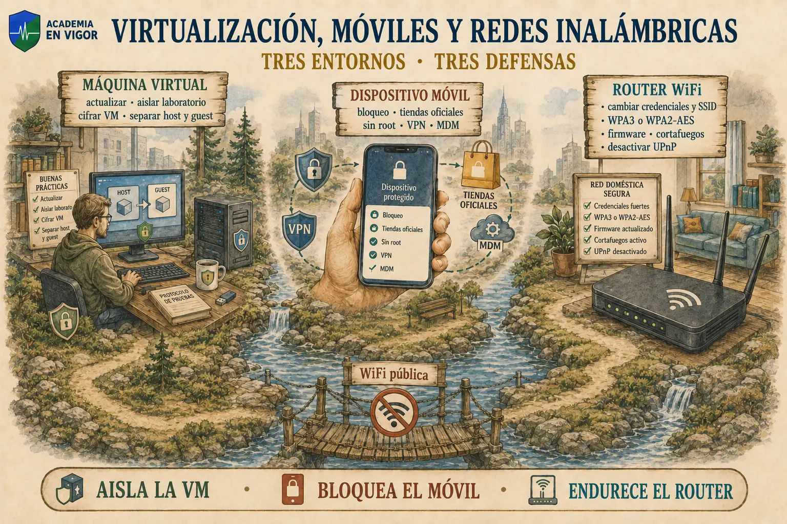

<em>Infografía: esquema de virtualización, dispositivos móviles y redes inalámbricas.</em>

<!-- FUENTE: CCNCERT-BP01-GC-T17 -->

## 22. Mensajería instantánea, redes sociales e Internet de las cosas

### Regla y encaje

Mensajería instantánea, redes sociales e Internet de las cosas se estudia con literalidad controlada y conexión práctica. La referencia normativa se mantiene separada de comentarios y antecedentes.

### Claves examinables

- **Fuente oficial:** Las aplicaciones de mensajería instantánea permiten enviar mensajes de texto mediante la conexión a Internet (WhatsApp y Telegram son las más conocidas). En el caso de WhatsApp, lanzada al mercado en el año 2009, por ejemplo, gestiona actualmente miles de millones de mensajes al día. <!-- FACT:GC-T17-F400 -->
- **Fuente oficial:** Se tratan de plataformas que al poder tener un comportamiento semejante al de una red social convencional son propensas a su expansión. <!-- FACT:GC-T17-F401 -->
- **Fuente oficial:** Además, el uso compartido de la información personal y la escasa percepción de riesgo que los usuarios tienen con la seguridad las han convertido en un entorno atractivo para intrusos y ciberatacantes que intentan obtener datos e información de sus usuarios. Uno de los fallos más comunes en las aplicaciones de mensajería es la forma que utilizan para borrar las conversaciones almacenadas en el teléfono ya que no implica la eliminación directa de los mensajes, sino que estos quedan marcados como libres, de tal forma que puedan ser sobrescritos por nuevas conversaciones o datos cuando sea necesario siendo accesible por técnicas forenses. <!-- FACT:GC-T17-F402 -->
- **Fuente oficial:** Además, hay que tener en cuenta las implicaciones cuando se tenga activa la opción de copia de seguridad (almacenando una posible conversación ya borrada) que podría ser recuperada en un futuro. <!-- FACT:GC-T17-F403 -->
- **Fuente oficial:** Durante el establecimiento de conexión con los servidores, se puede intercambiar en texto claro información sensible acerca del usuario quedando expuesta a cualquiera en el caso de utilizar redes WiFi públicas o de dudosa procedencia. <!-- FACT:GC-T17-F404 -->
- **Fuente oficial:** (1). Sistema operativo del cliente. <!-- FACT:GC-T17-F405 -->
- **Fuente oficial:** (2). Versión de la aplicación en uso. <!-- FACT:GC-T17-F406 -->
- **Fuente oficial:** (3). Número de teléfono registrado. <!-- FACT:GC-T17-F407 -->
- **Fuente oficial:** Al utilizar una conexión basada en redes privadas virtuales (VPN), todos los datos enviados y recibidos pasan cifrados entre el emisor y el receptor, añadiendo una nueva capa de seguridad para evitar posibles atacantes que estén interceptando el tráfico de red (man-in-the-middle). <!-- FACT:GC-T17-F408 -->
- **Fuente oficial:** Por otro lado, la base de datos de conversaciones, ficheros, mensajes, así como otros datos que manejan este tipo de aplicaciones se almacena de forma local dentro del teléfono, con independencia de que se tenga la opción de backup en la nube activada en el dispositivo. Aunque la información se almacena cifrada en local, existen multitud de aplicaciones que por ejemplo para WhatsApp permiten de una forma sencilla el descifrado de la información contenida, tanto en versión local para un equipo, como a través de una aplicación en el teléfono o interfaz web. <!-- FACT:GC-T17-F409 -->
- **Fuente oficial:** Para evitar que un atacante pueda tener acceso a toda la información privada que se almacena en el teléfono hay que prestar especial atención a qué aplicaciones de terceros se instalan, así como el acceso físico de otra persona al terminal. <!-- FACT:GC-T17-F410 -->
- **Fuente oficial:** En el caso de intercambio de datos con redes sociales, como WhatsApp y Facebook, y a pesar de que los mensajes, fotos e información de perfil no serán objetivos a compartir, otra información como número de teléfono, contactos, hora de última conexión, así como tus hábitos de uso de la aplicación pueden ser compartidos. <!-- FACT:GC-T17-F411 -->
- **Fuente oficial:** Insistiendo en las recomendaciones indicadas para dispositivos móviles, será necesario adoptar determinadas precauciones en el uso de aplicaciones de mensajería instantánea como: <!-- FACT:GC-T17-F412 -->
- **Fuente oficial:** (1). Mantener el teléfono bloqueado. De esta forma, se reducirá el riesgo si el dispositivo cae en las manos equivocadas. <!-- FACT:GC-T17-F413 -->
- **Fuente oficial:** (2). Sería recomendable eliminar las previsualizaciones de los mensajes y extremar las medidas cuando no se disponga del teléfono al alcance. <!-- FACT:GC-T17-F414 -->
- **Fuente oficial:** (3). En la medida de lo posible, se recomienda la configuración de las aplicaciones para solo recibir mensajes de personas autorizadas. <!-- FACT:GC-T17-F415 -->
- **Fuente oficial:** (4). Desactivar la conectividad adicional del teléfono cuando no se vaya a utilizar, como podría ser la conexión WiFi o Bluetooth, ya que además de reducir el consumo de batería, reduce la posible superficie de ataque sobre el dispositivo. <!-- FACT:GC-T17-F416 -->
- **Fuente oficial:** (5). Utilizar aplicaciones de mensajería instantánea cuyo código fuente esté abierto a la comunidad y haya sido revisado. Hay alternativas que, además, aseguran la confidencialidad en las comunicaciones, cifrando el tráfico extremo a extremo (e2e), como es Signal. <!-- FACT:GC-T17-F417 -->
- **Fuente oficial:** Las redes sociales no solo han cambiado la manera en que los ciudadanos se informan y se comunican entre sí, sino también la manera en que los Gobiernos y organizaciones transmiten sus mensajes a los ciudadanos y la forma en que estos responden. Comunicarse, compartir información, mantener un contacto por interés o afinidad, relacionarse, formar una identidad y reputación, reivindicarse, protestar, manipular, …son múltiples los objetivos buscados a la hora de utilizar una u otra red social. <!-- FACT:GC-T17-F418 -->
- **Fuente oficial:** No obstante, el éxito alcanzado, las enormes posibilidades que brindan y su uso masivo, las han hecho situarse en el punto de mira de los ciberatacantes que no dudan en explotar los riesgos y vulnerabilidades que tienen tanto las plataformas que sustentan estas redes sociales como las personas u organizaciones que las utilizan. Una vez más, el eslabón más débil de esta cadena vuelve a ser el factor humano por su escasa concienciación y su exceso de confianza a la hora de emplear estas redes. <!-- FACT:GC-T17-F419 -->
- **Fuente oficial:** En general, los riesgos asociados a las redes sociales son los mismos que los del resto de actividades y/o servicios en Internet: grandes dificultades para eliminar la información subida, el acceso futuro por terceros (el derecho a cambiar de opinión es nulo y será muy difícil borrar cualquier opinión, fotografía o vídeo subido a la red) y la dificultad de discernir entre información veraz y propaganda o manipulación. <!-- FACT:GC-T17-F420 -->
- **Fuente oficial:** En este punto hay que recordar la importancia que tiene la configuración de seguridad del dispositivo (sistema operativo y navegador) utilizado para conectarse a Internet y, de esta manera, acceder a las redes sociales. <!-- FACT:GC-T17-F421 -->
- **Fuente oficial:** A continuación, se indican los principales consejos que se pueden dar como buenas prácticas en el uso de redes sociales: <!-- FACT:GC-T17-F422 -->
- **Fuente oficial:** (1). Creación cuidadosa del perfil y la configuración de privacidad. No basarse en la configuración por defecto que proporcionan las plataformas. <!-- FACT:GC-T17-F423 -->
- **Fuente oficial:** (2). Reflexión sobre todo lo que se publica y emplear un pseudónimo. Dar por sentado que todo lo que se sube en una red social es permanente, aunque se elimine la cuenta. <!-- FACT:GC-T17-F424 -->
- **Fuente oficial:** (3). Escoger cuidadosamente a nuestros amigos. <!-- FACT:GC-T17-F425 -->
- **Fuente oficial:** (4). Para evitar revelar las direcciones de correo de sus amigos, no permita que los servicios de redes sociales examinen su libreta de direcciones de correo. <!-- FACT:GC-T17-F426 -->
- **Fuente oficial:** (5). Prestar atención a los servicios basados en la localización y la información del teléfono móvil. <!-- FACT:GC-T17-F427 -->
- **Fuente oficial:** (6). Precaución con los enlaces. Evitar hacer clic en hipervínculos o enlaces de procedencia dudosa. <!-- FACT:GC-T17-F428 -->
- **Fuente oficial:** (7). Escribir directamente la dirección de su sitio de redes sociales en el navegador para evitar que un sitio falso pueda robar su información personal. <!-- FACT:GC-T17-F429 -->
- **Fuente oficial:** (8). Tener precaución al instalar elementos adicionales en su sitio ya que, en ocasiones, se usan estas aplicaciones para robar información personal. <!-- FACT:GC-T17-F430 -->
- **Fuente oficial:** (9). Revisar la información publicada. Eludir dar excesiva información sobre uno mismo entre otras cosas para evitar que puedan entrar en su cuenta al responder a preguntas del tipo su cumpleaños, su ciudad natal, clase del instituto, etc. <!-- FACT:GC-T17-F431 -->
- **Fuente oficial:** (10). Seguridad de las contraseñas, utilice contraseñas complejas que incluyan números, símbolos y signos de puntuación. Es importante no compartir la misma contraseña para todas las redes sociales ni para el resto de servicios que se utilizan en Internet (empleo de gestores de contraseñas tipo KeePass). <!-- FACT:GC-T17-F432 -->
- **Fuente oficial:** (11). Incrementar la seguridad en el acceso a la cuenta añadiendo un segundo factor de autenticación (2FA) que impida a un potencial atacante que se haya hecho con la contraseña acceder al servicio. <!-- FACT:GC-T17-F433 -->
- **Fuente oficial:** En esencia, IoT (Internet of Things) se refiere a redes de objetos físicos, artefactos, vehículos, edificios, electrodomésticos, atuendos, implantes, etc. que llevan en su seno componentes electrónicos, software, sensores con conectividad en red que les permite recolectar información para lograr una contextualización de la situación mediante técnicas de Big Data imposible de realizar por otros medios. <!-- FACT:GC-T17-F434 -->
- **Fuente oficial:** Se trata de una red que interconecta miles de objetos físicos ofreciendo datos en tiempo real, convirtiéndose en los sensores del mundo físico. En este punto hay que considerar el cambio cultural que suponen ya que la tecnología influye en nuestra forma de tomar las decisiones y ello afecta a la capacidad de acción, privacidad y autonomía de las personas. <!-- FACT:GC-T17-F435 -->
- **Fuente oficial:** La IoT es la primera evolución real de Internet, un salto que podría llevar a aplicaciones revolucionarias con capacidad para modificar de forma dramática la forma en la que vivimos, aprendemos, trabajamos y nos entretenemos o relacionamos socialmente. <!-- FACT:GC-T17-F436 -->
- **Fuente oficial:** Los artículos de uso diario han dejado de ser elementos aislados, dispositivos que a su vez pueden estar conectados a otros dispositivos. La pesadilla de los expertos en ciberseguridad puede convertirse en ejércitos de botnets utilizando las tostadoras inteligentes para desarrollar ataques DDoS o para esconder información y ejecutables lejos de la vista de los investigadores. En la IoT hay que considerar aspectos de vital importancia como la seguridad, la interoperabilidad y manejabilidad de dichos sistemas: <!-- FACT:GC-T17-F437 -->
- **Fuente oficial:** (1). Interfaz Web. <!-- FACT:GC-T17-F438 -->
- **Fuente oficial:** (2). Mecanismos de autenticación. <!-- FACT:GC-T17-F439 -->
- **Fuente oficial:** (3). Servicios de red. <!-- FACT:GC-T17-F440 -->
- **Fuente oficial:** (4). Transporte no cifrado. <!-- FACT:GC-T17-F441 -->
- **Fuente oficial:** (5). Protección de la intimidad. <!-- FACT:GC-T17-F442 -->
- **Fuente oficial:** (6). Configuración de seguridad. <!-- FACT:GC-T17-F443 -->
- **Fuente oficial:** (7). Integridad software/firmware. <!-- FACT:GC-T17-F444 -->
- **Fuente oficial:** (8). Seguridad física de los dispositivos. <!-- FACT:GC-T17-F445 -->
- **Fuente oficial:** El reto se reduce a establecer una base de monitorización y control para reducir la exposición al riesgo y aplicar técnicas inteligentes a la creciente población de dispositivos IoT. <!-- FACT:GC-T17-F446 -->
- **Fuente oficial:** (1). Cambiar las contraseñas por defecto de los dispositivos y utilizar contraseñas realmente robustas. <!-- FACT:GC-T17-F447 -->
- **Fuente oficial:** (2). Mantener actualizados los dispositivos con las últimas versiones disponibles de software y firmware. <!-- FACT:GC-T17-F448 -->
- **Fuente oficial:** (3). Desactivar toda conectividad remota (con Internet) de los dispositivos cuando no sea estrictamente necesaria. <!-- FACT:GC-T17-F449 -->
- **Fuente oficial:** (4). Mantener abiertos solo aquellos puertos de comunicación que sean realmente necesarios y modificar los puertos de escucha si es posible. <!-- FACT:GC-T17-F450 -->
- **Fuente oficial:** (5). Si los dispositivos IoT no permiten la configuración de su seguridad, operar con ellos siempre en una red de área local (LAN) detrás de un dispositivo (enrutador) correctamente configurado que sí provea esa seguridad. <!-- FACT:GC-T17-F451 -->
- **Fuente oficial:** (6). En la medida de lo posible, asegurar la autenticidad, confidencialidad e integridad en todas las comunicaciones locales (LAN), especialmente si estas se realizan por enlaces radio (WiFi, Bluetooth, etc.). <!-- FACT:GC-T17-F452 -->
- **Fuente oficial:** (7). Comprobar periódicamente la configuración de seguridad de todos los elementos de la arquitectura IoT y su comunicación con el exterior. <!-- FACT:GC-T17-F453 -->
- **Fuente oficial:** (8). Mantener deshabilitados los componentes no necesarios como pueden ser, según el caso, micrófonos, cámaras de vídeo, etc. <!-- FACT:GC-T17-F454 -->
- **Fuente oficial:** (9). Comprobar la visibilidad de los dispositivos propios en buscadores como Shodan. <!-- FACT:GC-T17-F455 -->

:::hablemos-claro
No memorices palabras aisladas: pregunta siempre quién actúa, con qué habilitación y bajo qué límite.
:::

:::en-la-calle
En un supuesto, traduce el problema a una secuencia: activo o derecho afectado, autoridad o responsable, medida exigible y control posterior.
:::

:::lo-que-cae
Prioriza definiciones, competencias, listas, plazos, cifras y excepciones. Apariciones oficiales mapeadas: **0**.
:::

<!-- VISUAL:t17-22-mensajeria-instantanea-redes-sociales-e-internet-de-las-cosas.webp -->

  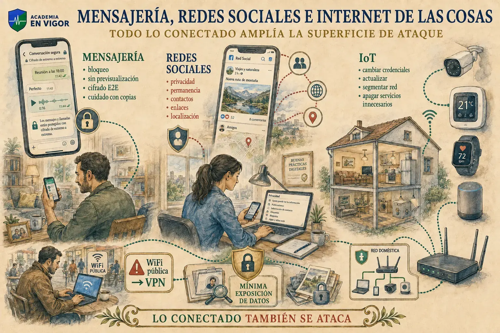

<em>Infografía: esquema de mensajería instantánea, redes sociales e internet de las cosas.</em>

<!-- FUENTE: CCNCERT-BP01-GC-T17 -->

## 23. Objeto, principios e interoperabilidad organizativa, semántica y técnica

### Regla y encaje

Objeto, principios e interoperabilidad organizativa, semántica y técnica se estudia con literalidad controlada y conexión práctica. La referencia normativa se mantiene separada de comentarios y antecedentes.

### Claves examinables

- **Fuente oficial:** El presente Real Decreto tiene por objeto regular el Esquema Nacional de Interoperabilidad (ENI). <!-- FACT:GC-T17-F456 -->
- **Fuente oficial:** El Esquema Nacional de Interoperabilidad comprenderá los criterios y recomendaciones de seguridad, normalización y conservación de la información, de los formatos y de las aplicaciones que deberán ser tenidos en cuenta por las Administraciones Públicas para asegurar un adecuado nivel de interoperabilidad organizativa, semántica y técnica de los datos, informaciones y servicios que gestionen en el ejercicio de sus competencias y para evitar la discriminación a los ciudadanos por razón de su elección tecnológica. <!-- FACT:GC-T17-F457 -->
- **Fuente oficial:** A los efectos previstos en este Real Decreto, las definiciones, palabras, expresiones y términos se entenderán en el sentido indicado en el Glosario de Términos incluido en el anexo del Real Decreto. <!-- FACT:GC-T17-F458 -->
- **Fuente oficial:** El ámbito de aplicación será el establecido en el artículo 2 de la Ley 40/2015, de 1 de octubre, de Régimen Jurídico del Sector Público, esto es: <!-- FACT:GC-T17-F459 -->
- **Fuente oficial:** a) A las Administraciones Públicas, entendiendo por tales la Administración General del Estado, las Administraciones de las comunidades autónomas y las entidades que integran la Administración local, así como las entidades de derecho público vinculadas o dependientes de las mismas. <!-- FACT:GC-T17-F460 -->
- **Fuente oficial:** b) A los ciudadanos en sus relaciones con las Administraciones Públicas. <!-- FACT:GC-T17-F461 -->
- **Fuente oficial:** c) A las relaciones entre las distintas Administraciones Públicas. <!-- FACT:GC-T17-F462 -->
- **Fuente oficial:** El Esquema Nacional de Interoperabilidad y sus normas de desarrollo prevalecerán sobre cualquier otro criterio en materia de política de interoperabilidad en la utilización de medios electrónicos para el acceso de los ciudadanos a los servicios públicos. <!-- FACT:GC-T17-F463 -->
- **Fuente oficial:** La aplicación del Esquema Nacional de Interoperabilidad se desarrollará de acuerdo con los principios generales establecidos en el artículo 4 de la Ley 40/2015, de 1 de octubre, y con los siguientes principios específicos de la interoperabilidad: <!-- FACT:GC-T17-F464 -->
- **Fuente oficial:** a) La interoperabilidad como cualidad integral. <!-- FACT:GC-T17-F465 -->
- **Fuente oficial:** b) Carácter multidimensional de la interoperabilidad. <!-- FACT:GC-T17-F466 -->
- **Fuente oficial:** c) Enfoque de soluciones multilaterales. <!-- FACT:GC-T17-F467 -->
- **Fuente oficial:** La interoperabilidad se tendrá presente de forma integral desde la concepción de los servicios y sistemas y a lo largo de su ciclo de vida: planificación, diseño, adquisición, construcción, despliegue, explotación, publicación, conservación y acceso o interconexión con los mismos. <!-- FACT:GC-T17-F468 -->
- **Fuente oficial:** La interoperabilidad se entenderá contemplando sus dimensiones organizativa, semántica y técnica. La cadena de interoperabilidad se manifiesta en la práctica en los acuerdos interadministrativos, en el despliegue de los sistemas y servicios, en la determinación y uso de estándares, en las infraestructuras y servicios básicos de las Administraciones Públicas y en la publicación y reutilización de las aplicaciones de las Administraciones Públicas, de la documentación asociada y de otros objetos de información. <!-- FACT:GC-T17-F469 -->
- **Fuente oficial:** Todo ello sin olvidar la dimensión temporal que ha de garantizar el acceso a la información a lo largo del tiempo. <!-- FACT:GC-T17-F470 -->
- **Fuente oficial:** Se favorecerá la aproximación multilateral a la interoperabilidad de forma que se puedan obtener las ventajas derivadas del escalado, de la aplicación de las arquitecturas modulares y multiplataforma, de compartir, de reutilizar y de colaborar. <!-- FACT:GC-T17-F471 -->
- **Fuente oficial:** Las Administraciones Públicas establecerán y publicarán las condiciones de acceso y utilización de los servicios, datos y documentos en formato electrónico que pongan a disposición del resto de Administraciones especificando las finalidades, las modalidades de consumo, consulta o interacción, los requisitos que deben satisfacer los posibles usuarios de los mismos, los perfiles de los participantes implicados en la utilización de los servicios, los protocolos y criterios funcionales o técnicos necesarios para acceder a dichos servicios, los necesarios mecanismos de gobierno de los sistemas interoperables, así como las condiciones de seguridad aplicables. <!-- FACT:GC-T17-F472 -->
- **Fuente oficial:** Estas condiciones deberán en todo caso resultar conformes a los principios, derechos y obligaciones contenidos en la Ley Orgánica 3/2018, de 5 de diciembre, de Protección de Datos Personales y garantía de los derechos digitales y su normativa de desarrollo, así como a lo dispuesto en el Esquema Nacional de Seguridad, y los instrumentos jurídicos que deberán suscribir las Administraciones Públicas requeridoras de dichos servicios, datos y documentos. <!-- FACT:GC-T17-F473 -->
- **Fuente oficial:** Se potenciará el establecimiento de convenios entre las Administraciones Públicas emisoras y receptoras y, en particular, con los nodos de interoperabilidad con el objetivo de simplificar la complejidad organizativa sin menoscabo de las garantías jurídicas. <!-- FACT:GC-T17-F474 -->
- **Fuente oficial:** Al objeto de dar cumplimiento de manera eficaz a lo establecido en la normativa vigente, en el Comité Sectorial de Administración Electrónica se identificarán, catalogarán y priorizarán los servicios de interoperabilidad que deberán prestar las diferentes Administraciones Públicas. <!-- FACT:GC-T17-F475 -->
- **Fuente oficial:** Las Administraciones Públicas publicarán aquellos servicios que pongan a disposición de las demás administraciones a través de la Red de comunicaciones de las Administraciones Públicas españolas, o de cualquier otra red equivalente o conectada a la misma que garantice el acceso seguro al resto de administraciones. <!-- FACT:GC-T17-F476 -->
- **Fuente oficial:** Las Administraciones Públicas podrán utilizar nodos de interoperabilidad, entendidos como entidades a las que se les encomienda la gestión de apartados globales o parciales de la interoperabilidad organizativa, semántica o técnica. <!-- FACT:GC-T17-F477 -->
- **Fuente oficial:** Cada Administración Pública mantendrá actualizado el conjunto de sus inventarios de información administrativa que incluirá, al menos: <!-- FACT:GC-T17-F478 -->
- **Fuente oficial:** a) La relación de los procedimientos administrativos y servicios prestados de forma clasificada y estructurada. Las Administraciones Públicas conectarán electrónicamente sus inventarios con el Sistema de Información Administrativa gestionado por el Ministerio de Política Territorial y Función Pública en colaboración con el Ministerio para la Transformación Digital y de la Función Pública. <!-- FACT:GC-T17-F479 -->
- **Fuente oficial:** b) La relación de sus órganos administrativos y oficinas orientadas al público y sus relaciones entre ellos. Dicho inventario se conectará electrónicamente con el Directorio Común de Unidades Orgánicas y Oficinas, gestionado por el Ministerio para la Transformación Digital y de la Función Pública, en colaboración con el Ministerio de Política Territorial y Función Pública, que proveerá una codificación unívoca. <!-- FACT:GC-T17-F480 -->
- **Fuente oficial:** Cada Administración Pública regulará la creación y mantenimiento de estos dos inventarios, en las condiciones que se determinen, con carácter general, por las normas técnicas de interoperabilidad correspondientes; en su caso, las Administraciones Públicas podrán hacer uso de los citados Sistema de Información Administrativa y Directorio Común de Unidades Orgánicas y Oficinas para la creación y mantenimiento de sus propios inventarios. Para la descripción y modelización de los procedimientos administrativos y de los procesos que los soportan será de aplicación lo previsto sobre estándares en el artículo correspondiente. <!-- FACT:GC-T17-F481 -->
- **Fuente oficial:** Se establecerá y mantendrá actualizada la Relación de modelos de datos de intercambio que tengan el carácter de comunes, que serán de preferente aplicación para los intercambios de información en las Administraciones Públicas, de acuerdo con el procedimiento establecido en disposición adicional primera. <!-- FACT:GC-T17-F482 -->
- **Fuente oficial:** Los órganos de la Administración Pública o Entidades de Derecho Público vinculadas o dependientes de aquella, titulares de competencias en materias sujetas a intercambio de información con los ciudadanos y con otras Administraciones Públicas, así como en materia de infraestructuras, servicios y herramientas comunes, establecerán y publicarán los correspondientes modelos de datos de intercambio que serán de obligatoria aplicación para los intercambios de información en las Administraciones Públicas. <!-- FACT:GC-T17-F483 -->
- **Fuente oficial:** Los modelos de datos se ajustarán a los estándares y se publicarán, junto con las definiciones y codificaciones asociadas, a través del Centro de Interoperabilidad Semántica de la Administración, según licenciamiento abierto. <!-- FACT:GC-T17-F484 -->
- **Fuente oficial:** Las definiciones y codificaciones empleadas en los modelos de datos a los que se refieren los apartados anteriores tendrán en cuenta lo dispuesto en la normativa estadística pública vigente. <!-- FACT:GC-T17-F485 -->
- **Fuente oficial:** Las Administraciones Públicas usarán estándares abiertos, así como, en su caso y de forma complementaria, estándares que sean de uso generalizado por los ciudadanos, al objeto de garantizar la independencia en la elección de alternativas tecnológicas por los ciudadanos y las Administraciones Públicas y la adaptabilidad al progreso de la tecnología y, de forma que: <!-- FACT:GC-T17-F486 -->
- **Fuente oficial:** a) Los documentos y servicios de administración electrónica que los órganos o Entidades de Derecho Público emisores pongan a disposición de los ciudadanos o de otras Administraciones Públicas se encontrarán, como mínimo, disponibles mediante estándares abiertos. <!-- FACT:GC-T17-F487 -->
- **Fuente oficial:** b) Los documentos, servicios electrónicos y aplicaciones puestos por las Administraciones Públicas a disposición de los ciudadanos o de otras Administraciones Públicas serán, según corresponda, visualizables, accesibles y funcionalmente operables en condiciones que permitan satisfacer el principio de neutralidad tecnológica y eviten la discriminación a los ciudadanos por razón de su elección tecnológica. <!-- FACT:GC-T17-F488 -->
- **Fuente oficial:** c) En las relaciones con los ciudadanos y con otras Administraciones Públicas, el uso en exclusiva de un estándar no abierto sin que se ofrezca una alternativa basada en un estándar abierto se limitará a circunstancias en las que un estándar abierto no satisfaga la funcionalidad y solo mientras dicha disponibilidad no se produzca. Las Administraciones Públicas promoverán las actividades de normalización con el fin de facilitar la disponibilidad de los estándares abiertos relevantes para sus necesidades. <!-- FACT:GC-T17-F489 -->
- **Fuente oficial:** Para la selección de estándares, en general y, para el establecimiento del catálogo de estándares, en particular, se atenderá a los siguientes criterios: <!-- FACT:GC-T17-F490 -->
- **Fuente oficial:** a) El uso de las especificaciones técnicas de las TIC en la contratación pública junto con las definiciones de norma y especificación técnica establecidos en la normativa europea vigente. <!-- FACT:GC-T17-F491 -->
- **Fuente oficial:** b) La definición de estándar abierto establecida en la normativa: público, gratuito o a coste mínimo, sin condicionantes de propiedad intelectual. <!-- FACT:GC-T17-F492 -->
- **Fuente oficial:** c) Carácter de especificación formalizada. <!-- FACT:GC-T17-F493 -->
- **Fuente oficial:** d) Definición de «coste que no suponga una dificultad de acceso». <!-- FACT:GC-T17-F494 -->
- **Fuente oficial:** e) Consideraciones adicionales referidas a: adecuación funcional, desarrollo, implementación, documentación, gobernanza, madurez, adopción mercado, reutilización, multiplataforma. <!-- FACT:GC-T17-F495 -->
- **Fuente oficial:** Para el uso de los estándares complementarios, se tendrán en cuenta la definición de «uso generalizado por los ciudadanos». En cualquier caso, los ciudadanos podrán elegir las aplicaciones o sistemas para relacionarse con las Administraciones Públicas. <!-- FACT:GC-T17-F496 -->
- **Fuente oficial:** Para facilitar la interoperabilidad con las Administraciones Públicas el catálogo de estándares contendrá una relación de estándares abiertos y en su caso complementarios aplicables. <!-- FACT:GC-T17-F497 -->
- **Fuente oficial:** Las Administraciones Públicas enlazarán aquellas infraestructuras y servicios que puedan implantar en su ámbito de actuación con las infraestructuras y servicios comunes que proporcione la Administración General del Estado para facilitar la interoperabilidad y la relación multilateral en el intercambio de información y de servicios entre todas las Administraciones Públicas. <!-- FACT:GC-T17-F498 -->

:::hablemos-claro
No memorices palabras aisladas: pregunta siempre quién actúa, con qué habilitación y bajo qué límite.
:::

:::en-la-calle
En un supuesto, traduce el problema a una secuencia: activo o derecho afectado, autoridad o responsable, medida exigible y control posterior.
:::

:::lo-que-cae
Prioriza definiciones, competencias, listas, plazos, cifras y excepciones. Apariciones oficiales mapeadas: **5**.
:::

<!-- VISUAL:t17-23-objeto-principios-e-interoperabilidad-organizativa-semantica-y-tecnica.webp -->

  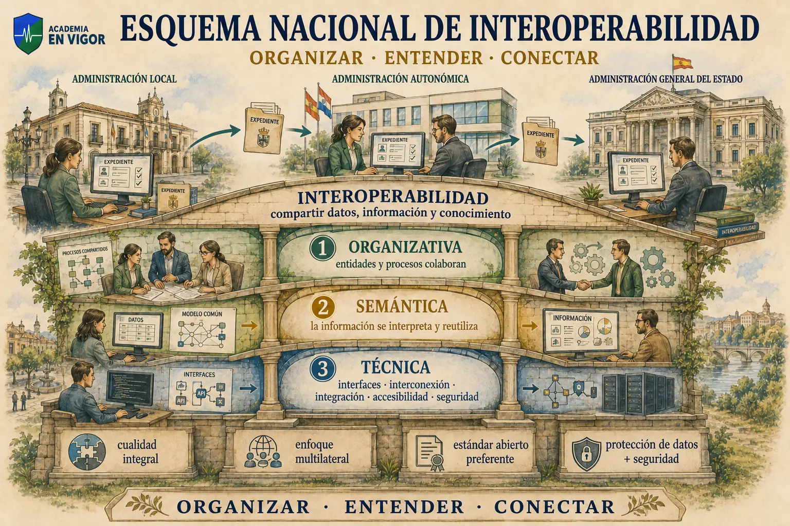

<em>Infografía: esquema de objeto, principios e interoperabilidad organizativa, semántica y técnica.</em>

<!-- FUENTE: RD4-2010-GC-T17 -->

## 24. Comunicaciones, reutilización, firma y conservación documental

### Regla y encaje

Comunicaciones, reutilización, firma y conservación documental se estudia con literalidad controlada y conexión práctica. La referencia normativa se mantiene separada de comentarios y antecedentes.

### Claves examinables

- **Fuente oficial:** Las Administraciones Públicas españolas para comunicarse entre sí, conectarán a la Red de comunicaciones, sus respectivas redes y/o sus nodos de interoperabilidad, para facilitar el intercambio de información y de servicios, así como la interconexión con las redes de las Instituciones de la Unión Europea y de otros Estados miembros. <!-- FACT:GC-T17-F499 -->
- **Fuente oficial:** La Red SARA prestará la citada Red de comunicaciones de las Administraciones Públicas españolas. <!-- FACT:GC-T17-F500 -->
- **Fuente oficial:** Las Administraciones Públicas aplicarán el Plan de direccionamiento e interconexión de redes en la Administración, desarrollado en la norma técnica de interoperabilidad correspondiente, para su interconexión a través de las redes de comunicaciones. <!-- FACT:GC-T17-F501 -->
- **Fuente oficial:** Los sistemas o aplicaciones implicados en la provisión de un servicio público por vía electrónica se sincronizarán con la hora oficial, con una precisión y desfase que garanticen la certidumbre de los plazos establecidos en el trámite administrativo que satisfacen. La sincronización de la fecha y la hora se realizará con el Real Instituto y Observatorio de la Armada, por ser el laboratorio depositario del patrón nacional de Tiempo y laboratorio asociado al Centro Español de Metrología y, cuando sea posible, con la hora oficial a nivel europeo. <!-- FACT:GC-T17-F502 -->
- **Fuente oficial:** Las condiciones de licenciamiento de las aplicaciones informáticas, documentación asociada, y cualquier otro objeto de información cuya titularidad de los derechos de la propiedad intelectual sea de una Administración Pública y permita su puesta a disposición de otra Administración y de los ciudadanos tendrán en cuenta los siguientes aspectos: <!-- FACT:GC-T17-F503 -->
- **Fuente oficial:** a) El fin perseguido es el aprovechamiento y la reutilización de recursos públicos. <!-- FACT:GC-T17-F504 -->
- **Fuente oficial:** b) La completa protección contra su apropiación exclusiva o parcial por parte de terceros. <!-- FACT:GC-T17-F505 -->
- **Fuente oficial:** c) La exención de responsabilidad del cedente por el posible mal uso por parte del cesionario. <!-- FACT:GC-T17-F506 -->
- **Fuente oficial:** d) La no obligación de asistencia técnica o de mantenimiento por parte del cedente. <!-- FACT:GC-T17-F507 -->
- **Fuente oficial:** e) La ausencia total de responsabilidad por parte del cedente con respecto al cesionario en caso de errores o mal funcionamiento de la aplicación. <!-- FACT:GC-T17-F508 -->
- **Fuente oficial:** f) El licenciamiento se realizará por defecto sin contraprestación y sin necesidad de establecer convenio alguno. Sólo se podrá acordar la repercusión parcial del coste de adquisición o desarrollo de las aplicaciones cedidas en aquellos casos en los que este pago repercuta directamente en el incremento de funcionalidades del activo cedido, incluya adaptaciones concretas para su uso en el organismo cesionario, o impliquen el suministro de servicios de asistencia o soporte para su reutilización en el organismo cesionario. <!-- FACT:GC-T17-F509 -->
- **Fuente oficial:** Las Administraciones Públicas utilizarán para las aplicaciones informáticas, documentación asociada, y cualquier otro objeto de información declarados como de fuentes abiertas aquellas licencias que aseguren que los programas, datos o información cumplen los siguientes requisitos: <!-- FACT:GC-T17-F510 -->
- **Fuente oficial:** a) Pueden ejecutarse para cualquier propósito. <!-- FACT:GC-T17-F511 -->
- **Fuente oficial:** b) Permiten conocer su código fuente. <!-- FACT:GC-T17-F512 -->
- **Fuente oficial:** c) Pueden modificarse o mejorarse. <!-- FACT:GC-T17-F513 -->
- **Fuente oficial:** d) Pueden redistribuirse a otros usuarios con o sin cambios siempre que la obra derivada mantenga estas cuatro garantías. <!-- FACT:GC-T17-F514 -->
- **Fuente oficial:** Para este fin se procurará la aplicación de la Licencia Pública de la Unión Europea (EUPL), sin perjuicio de otras licencias que garanticen los mismos derechos expuestos en los apartados 1 y 2. <!-- FACT:GC-T17-F515 -->
- **Fuente oficial:** A efectos de facilitar el establecimiento de las condiciones de licenciamiento, las Administraciones Públicas incluirán en los pliegos de cláusulas técnicas de aquellos contratos que tengan por finalidad el desarrollo de nuevas aplicaciones informáticas, los siguientes aspectos: <!-- FACT:GC-T17-F516 -->
- **Fuente oficial:** a) Que la Administración contratante adquiera los derechos completos de propiedad intelectual de las aplicaciones y cualquier otro objeto de información que se desarrollen como objeto de ese contrato. <!-- FACT:GC-T17-F517 -->
- **Fuente oficial:** b) Que en el caso de reutilizar activos previamente existentes, la Administración contratante reciba un producto que pueda ofrecer para su reutilización posterior a otras Administraciones Públicas. Además, en el caso de partir de productos de fuentes abiertas, que sea posible declarar como de fuentes abiertas la futura aplicación desarrollada. <!-- FACT:GC-T17-F518 -->
- **Fuente oficial:** La Administración General del Estado mantendrá el Directorio general de aplicaciones para su libre reutilización, de acuerdo al artículo 158 de la Ley 40/2015, de 1 de octubre, a través del Centro de Transferencia de Tecnología. Este directorio podrá ser utilizado por otras Administraciones Públicas. En el caso de disponer de un directorio propio, deberá garantizar que las aplicaciones disponibles en ese directorio propio se pueden consultar también a través del Centro de Transferencia de Tecnología. <!-- FACT:GC-T17-F519 -->
- **Fuente oficial:** Las Administraciones Públicas conectarán los directorios de aplicaciones para su libre reutilización entre sí; y con instrumentos equivalentes del ámbito de la Unión Europea. <!-- FACT:GC-T17-F520 -->
- **Fuente oficial:** Las Administraciones Públicas publicarán las aplicaciones reutilizables, en modo producto o en modo servicio, en los directorios de aplicaciones para su libre reutilización, con al menos el siguiente contenido: <!-- FACT:GC-T17-F521 -->
- **Fuente oficial:** a) Código fuente de las aplicaciones finalizadas, en el caso de ser reutilizables en modo producto y haber sido declaradas de fuentes abiertas. <!-- FACT:GC-T17-F522 -->
- **Fuente oficial:** b) Documentación asociada. <!-- FACT:GC-T17-F523 -->
- **Fuente oficial:** c) Condiciones de licenciamiento de todos los activos, en el caso de ser reutilizables en modo producto, o nivel de servicio ofrecido, en el caso de ser reutilizables en modo servicio. <!-- FACT:GC-T17-F524 -->
- **Fuente oficial:** d) Los costes asociados a su reutilización, en el caso de que existieran. <!-- FACT:GC-T17-F525 -->
- **Fuente oficial:** Las Administraciones procurarán la incorporación a la aplicación original de aquellas modificaciones o adaptaciones realizadas sobre cualquier aplicación que se haya obtenido desde un directorio de aplicaciones reutilizables. <!-- FACT:GC-T17-F526 -->
- **Fuente oficial:** La Administración General del Estado definirá una política de firma electrónica y de certificados que servirá de marco general de interoperabilidad para el reconocimiento mutuo de las firmas electrónicas basadas en certificados de documentos administrativos en las Administraciones Públicas. Todos los organismos y entidades de derecho público de la Administración General del Estado aplicarán la política de firma electrónica y de certificados a que se refiere el párrafo anterior. La no aplicación de dicha política deberá ser justificada por el órgano u organismo competente y autorizada por la Secretaría General de Administración Digital. <!-- FACT:GC-T17-F527 -->
- **Fuente oficial:** Las restantes Administraciones Públicas podrán acogerse a la política de firma electrónica y de certificados a que hace referencia el apartado anterior. Sin perjuicio de lo expuesto en el apartado anterior, las Administraciones Públicas podrán aprobar otras políticas de firma electrónica dentro de sus respectivos ámbitos competenciales. <!-- FACT:GC-T17-F528 -->
- **Fuente oficial:** Las políticas de firma electrónica que aprueben las Administraciones Públicas partirán de la norma técnica establecida a tal efecto en la disposición adicional primera, de los estándares técnicos existentes, y deberán ser interoperables con la política marco de firma electrónica mencionada en el apartado 1, en particular, con sus ficheros de implementación. La Administración Pública proponente de una política de firma electrónica particular garantizará su interoperabilidad con la citada política marco de firma electrónica y con sus correspondientes ficheros de implementación según las condiciones establecidas en la norma técnica de interoperabilidad recogida a tal efecto en la disposición adicional primera. <!-- FACT:GC-T17-F529 -->
- **Fuente oficial:** Al objeto de garantizar la interoperabilidad de las firmas electrónicas emitidas conforme a las políticas establecidas, las políticas de firma electrónica que las Administraciones Públicas aprueben deberán ser comunicadas, junto con sus correspondientes ficheros de implementación, a la Secretaría General de Administración Digital del Ministerio para la Transformación Digital y de la Función Pública. Las Administraciones Públicas receptoras de documentos electrónicos firmados, siempre que hayan admitido con anterioridad la política de firma del emisor, permitirán la validación de las firmas electrónicas según la política de firma indicada en la firma del documento electrónico. <!-- FACT:GC-T17-F530 -->
- **Fuente oficial:** Los perfiles comunes de los campos de los certificados definidos por la política de firma electrónica y de certificados posibilitarán la interoperabilidad entre las aplicaciones usuarias, de manera que tanto la identificación como la firma electrónica generada a partir de estos perfiles comunes puedan ser reconocidos por las aplicaciones de las distintas Administraciones Públicas sin ningún tipo de restricción técnica, semántica u organizativa. <!-- FACT:GC-T17-F531 -->
- **Fuente oficial:** Los procedimientos en los que se utilicen certificados de firma electrónica deberán atenerse a la política de firma electrónica y de certificados aplicable en su ámbito, particularmente en la aplicación de los datos obligatorios y opcionales, las reglas de creación y validación de firma electrónica, los algoritmos a utilizar y longitudes de clave mínimas aplicables. <!-- FACT:GC-T17-F532 -->
- **Fuente oficial:** Las plataformas de validación de certificados electrónicos y de firma electrónica ofrecerán servicios de confianza a las aplicaciones usuarias o consumidoras de los servicios de certificación y firma, ofreciendo servicios de validación de los certificados y firmas generadas y admitidas en diversos ámbitos de las Administraciones Públicas. Proporcionarán, en un único punto de llamada, todos los elementos de confianza y de interoperabilidad organizativa, semántica y técnica necesarios para integrar los distintos certificados reconocidos y firmas que pueden encontrarse en los dominios de dos administraciones diferentes. <!-- FACT:GC-T17-F533 -->
- **Fuente oficial:** Potenciarán la armonización técnica y la utilización común de formatos, estándares y políticas de firma electrónica y de certificados para las firmas electrónicas entre las aplicaciones usuarias, y de otros elementos de interoperabilidad relacionados con los certificados, tales como el análisis de los campos y extracción unívoca de la información pertinente. <!-- FACT:GC-T17-F534 -->
- **Fuente oficial:** En particular, se tendrán en cuenta los estándares europeos de las Organizaciones Europeas de Estandarización en el campo de las TIC aplicadas a la firma electrónica. Incorporarán las listas de confianza de los certificados interoperables entre las distintas Administraciones Públicas nacionales y europeas según el esquema operativo de gestión correspondiente de la lista de confianza. <!-- FACT:GC-T17-F535 -->
- **Fuente oficial:** Las Administraciones Públicas adoptarán las medidas organizativas y técnicas necesarias con el fin de garantizar la interoperabilidad en relación con la recuperación y conservación de los documentos electrónicos: <!-- FACT:GC-T17-F536 -->
- **Fuente oficial:** a) La definición de una política de gestión de documentos en cuanto al tratamiento, de acuerdo con las normas y procedimientos específicos que se hayan de utilizar en la formación y gestión de los documentos y expedientes. <!-- FACT:GC-T17-F537 -->
- **Fuente oficial:** b) La inclusión en los expedientes de un índice electrónico firmado por el órgano o entidad actuante que garantice la integridad del expediente electrónico y permita su recuperación. <!-- FACT:GC-T17-F538 -->
- **Fuente oficial:** c) La identificación única e inequívoca de cada documento por medio de convenciones adecuadas, que permitan clasificarlo, recuperarlo y referirse al mismo con facilidad. <!-- FACT:GC-T17-F539 -->
- **Fuente oficial:** d) La asociación de los metadatos mínimos obligatorios y, en su caso, complementarios, asociados al documento electrónico, a lo largo de su ciclo de vida, e incorporación al esquema de metadatos. <!-- FACT:GC-T17-F540 -->
- **Fuente oficial:** e) La clasificación de las funciones, tanto generales como específicas, de cada una de las Administraciones Públicas y de las Entidades de Derecho Público vinculadas o dependientes de aquellas. <!-- FACT:GC-T17-F541 -->
- **Fuente oficial:** f) El período de conservación de los documentos, establecido por las comisiones calificadoras que correspondan, de acuerdo con la legislación en vigor, las normas administrativas y obligaciones jurídicas que resulten de aplicación en cada caso. <!-- FACT:GC-T17-F542 -->
- **Fuente oficial:** g) El acceso completo e inmediato a los documentos a través de métodos de consulta en línea que permitan la visualización de los documentos con todo el detalle de su contenido, la recuperación exhaustiva y pertinente de los documentos, la copia o descarga en línea en los formatos originales y la impresión a papel de aquellos documentos que sean necesarios. El sistema permitirá la consulta durante todo el período de conservación al menos de la firma electrónica, incluido el sello de tiempo, y de los metadatos asociados al documento. <!-- FACT:GC-T17-F543 -->
- **Fuente oficial:** h) La adopción de medidas para asegurar la conservación de los documentos electrónicos a lo largo de su ciclo de vida de forma que se pueda asegurar su recuperación de acuerdo con el plazo mínimo de conservación determinado por las normas administrativas y obligaciones jurídicas, se garantice su conservación a largo plazo, se asegure su valor probatorio y su fiabilidad como evidencia electrónica de las actividades y procedimientos, así como la transparencia, la memoria y la identificación de los órganos de las Administraciones Públicas y de las Entidades de Derecho Público vinculadas o dependientes de aquellas que ejercen la competencia sobre el documento o expediente. <!-- FACT:GC-T17-F544 -->
- **Fuente oficial:** i) La coordinación horizontal entre el responsable de gestión de documentos y los restantes servicios interesados en materia de archivos. <!-- FACT:GC-T17-F545 -->
- **Fuente oficial:** j) Transferencia de los expedientes entre los diferentes repositorios electrónicos a efectos de conservación, de acuerdo con lo establecido en la legislación en materia de Archivos, de manera que se pueda asegurar su conservación y recuperación a medio y largo plazo. <!-- FACT:GC-T17-F546 -->
- **Fuente oficial:** k) Si el resultado del procedimiento de evaluación documental así lo establece, borrado de la información, o en su caso, destrucción física de los soportes, de acuerdo con la legislación que resulte de aplicación, dejando registro de su eliminación. <!-- FACT:GC-T17-F547 -->
- **Fuente oficial:** l) La formación tecnológica del personal responsable de la ejecución y del control de la gestión de documentos, su tratamiento y conservación en archivos o repositorios electrónicos. <!-- FACT:GC-T17-F548 -->
- **Fuente oficial:** m) La documentación de los procedimientos que den interoperabilidad a medio y largo plazo, y medidas de identificación, recuperación, control y tratamiento de documentos electrónicos. <!-- FACT:GC-T17-F549 -->
- **Fuente oficial:** Las Administraciones Públicas crearán repositorios electrónicos, complementarios y equivalentes en cuanto a su función a los archivos convencionales, para cubrir el conjunto del ciclo de vida de los documentos electrónicos. <!-- FACT:GC-T17-F550 -->
- **Fuente oficial:** Para asegurar la conservación de los documentos electrónicos se aplicará lo previsto en el Esquema Nacional de Seguridad en cuanto al cumplimiento de los principios básicos y de los requisitos mínimos de seguridad mediante la aplicación de las medidas de seguridad adecuadas a los medios y soportes en los que se almacenen los documentos, de acuerdo con la categorización de los sistemas. <!-- FACT:GC-T17-F551 -->
- **Fuente oficial:** Estas medidas se aplicarán con el fin de garantizar la integridad, autenticidad, confidencialidad, disponibilidad, trazabilidad, calidad, protección, recuperación y conservación física y lógica de los documentos electrónicos, sus soportes y medios, y se realizarán atendiendo a los riesgos a los que puedan estar expuestos y a los plazos durante los cuales deban conservarse los documentos. <!-- FACT:GC-T17-F552 -->
- **Fuente oficial:** Los aspectos relativos a la firma electrónica en la conservación del documento electrónico se establecerán en la Política de firma electrónica y de certificados, y a través del uso de formatos de firma longeva que preserven la conservación de las firmas a lo largo del tiempo. <!-- FACT:GC-T17-F553 -->
- **Fuente oficial:** Cuando la firma y los certificados no puedan garantizar la autenticidad y la evidencia de los documentos electrónicos a lo largo del tiempo, estas les sobrevendrán a través de su conservación y custodia en los repositorios y archivos electrónicos, así como de los metadatos de gestión de documentos y otros metadatos vinculados, de acuerdo con las características que se definirán en la Política de gestión de documentos. <!-- FACT:GC-T17-F554 -->
- **Fuente oficial:** Con el fin de garantizar la conservación, el documento se conservará en el formato en que haya sido elaborado, enviado o recibido, y preferentemente en un formato correspondiente a un estándar abierto que preserve a lo largo del tiempo la integridad del contenido del documento, de la firma electrónica y de los metadatos que lo acompañan. <!-- FACT:GC-T17-F555 -->
- **Fuente oficial:** Cuando exista riesgo de obsolescencia del formato o bien deje de figurar entre los admitidos en el presente Esquema Nacional de Interoperabilidad, se aplicarán procedimientos normalizados de copiado auténtico de los documentos con cambio de formato, de etiquetado con información del formato utilizado y, en su caso, de las migraciones o conversiones de formatos. <!-- FACT:GC-T17-F556 -->
- **Fuente oficial:** La digitalización de documentos en soporte papel por parte de las Administraciones Públicas se realizará de acuerdo con lo indicado en la norma técnica de interoperabilidad correspondiente en relación con los siguientes aspectos: <!-- FACT:GC-T17-F557 -->
- **Fuente oficial:** a) Formatos estándares de uso común para la digitalización de documentos en soporte papel y técnica de compresión empleada. <!-- FACT:GC-T17-F558 -->
- **Fuente oficial:** b) Nivel de resolución. <!-- FACT:GC-T17-F559 -->
- **Fuente oficial:** c) Garantía de imagen fiel e íntegra. <!-- FACT:GC-T17-F560 -->
- **Fuente oficial:** d) Metadatos mínimos obligatorios y complementarios, asociados al proceso de digitalización. <!-- FACT:GC-T17-F561 -->
- **Fuente oficial:** La gestión y conservación del documento electrónico digitalizado atenderá a su posible existencia en otro soporte. <!-- FACT:GC-T17-F562 -->
- **Fuente oficial:** (1). Sedes y registros electrónicos: la interoperabilidad de las sedes y registros electrónicos, así como la del acceso electrónico de los ciudadanos a los servicios públicos, se regirán por lo establecido en el Esquema Nacional de Interoperabilidad. <!-- FACT:GC-T17-F563 -->
- **Fuente oficial:** (2). Ciclo de vida de servicios y sistemas: la conformidad con el Esquema Nacional de Interoperabilidad se incluirá en el ciclo de vida de los servicios y sistemas, acompañada de los correspondientes procedimientos de control. <!-- FACT:GC-T17-F564 -->
- **Fuente oficial:** (3). Mecanismo de control: cada órgano o Entidad de Derecho Público establecerá sus mecanismos de control para garantizar, de forma efectiva, el cumplimiento del Esquema Nacional de Interoperabilidad. <!-- FACT:GC-T17-F565 -->
- **Fuente oficial:** (4). Publicación de conformidad: los órganos y Entidades de Derecho Público de las Administraciones Públicas darán publicidad, en las correspondientes sedes electrónicas, a las declaraciones de conformidad y a otros posibles distintivos de interoperabilidad de los que sean acreedores, obtenidos respecto al cumplimiento del Esquema Nacional de Interoperabilidad. <!-- FACT:GC-T17-F566 -->
- **Fuente oficial:** El Esquema Nacional de Interoperabilidad se mantendrá actualizado de manera permanente. Se desarrollará y perfeccionará a lo largo del tiempo, en paralelo al progreso de los servicios de Administración Electrónica, de la evolución tecnológica y la consolidación de las infraestructuras que le apoyan. <!-- FACT:GC-T17-F567 -->
- **Fuente oficial:** Se desarrollarán las siguientes normas técnicas de interoperabilidad que serán de obligado cumplimiento por parte de las Administraciones Públicas: <!-- FACT:GC-T17-F568 -->
- **Fuente oficial:** a) Norma Técnica de Catálogo de estándares. <!-- FACT:GC-T17-F569 -->
- **Fuente oficial:** b) Norma Técnica de Documento electrónico. <!-- FACT:GC-T17-F570 -->
- **Fuente oficial:** c) Norma Técnica de Digitalización de documentos. <!-- FACT:GC-T17-F571 -->
- **Fuente oficial:** d) Norma Técnica de Expediente electrónico. <!-- FACT:GC-T17-F572 -->
- **Fuente oficial:** e) Norma Técnica de Política de firma electrónica y de certificados de la Administración. <!-- FACT:GC-T17-F573 -->
- **Fuente oficial:** f) Norma Técnica de Protocolos de intermediación de datos. <!-- FACT:GC-T17-F574 -->
- **Fuente oficial:** g) Norma Técnica de Relación de modelos de datos. <!-- FACT:GC-T17-F575 -->
- **Fuente oficial:** h) Norma Técnica de Política de gestión de documentos electrónicos. <!-- FACT:GC-T17-F576 -->
- **Fuente oficial:** i) Norma Técnica de Requisitos de conexión a la Red de comunicaciones. <!-- FACT:GC-T17-F577 -->
- **Fuente oficial:** j) Norma Técnica de Procedimientos de copiado auténtico y conversión. <!-- FACT:GC-T17-F578 -->
- **Fuente oficial:** k) Norma Técnica de Modelo de Datos para el intercambio de asientos registrales. <!-- FACT:GC-T17-F579 -->
- **Fuente oficial:** l) Norma Técnica de Reutilización de recursos de información. <!-- FACT:GC-T17-F580 -->
- **Fuente oficial:** m) Norma Técnica de interoperabilidad de inventario y codificación de objetos administrativos. <!-- FACT:GC-T17-F581 -->
- **Fuente oficial:** n) Norma Técnica de Interoperabilidad de Transferencia e Ingreso de documentos y expedientes electrónicos. <!-- FACT:GC-T17-F582 -->
- **Fuente oficial:** ñ) Norma Técnica de Interoperabilidad de Valoración y Eliminación de documentos y expedientes electrónicos. <!-- FACT:GC-T17-F583 -->
- **Fuente oficial:** o) Norma Técnica de Interoperabilidad de preservación de documentación electrónica. <!-- FACT:GC-T17-F584 -->
- **Fuente oficial:** p) Norma Técnica de Interoperabilidad de tratamiento y preservación de bases de datos. <!-- FACT:GC-T17-F585 -->
- **Fuente oficial:** q) Norma Técnica de Interoperabilidad de Plan de Direccionamiento. <!-- FACT:GC-T17-F586 -->
- **Fuente oficial:** r) Norma Técnica de Interoperabilidad de reutilización de activos en modo producto y en modo servicio. <!-- FACT:GC-T17-F587 -->
- **Fuente oficial:** s) Norma Técnica de Interoperabilidad del modelo de datos y condiciones de interoperabilidad de los registros de funcionarios habilitados. <!-- FACT:GC-T17-F588 -->
- **Fuente oficial:** t) Norma Técnica de Interoperabilidad del modelo de datos y condiciones de interoperabilidad de los registros electrónicos de apoderamientos. <!-- FACT:GC-T17-F589 -->
- **Fuente oficial:** u) Norma Técnica de Interoperabilidad de Sistema de Referencia de documentos y repositorios de confianza. <!-- FACT:GC-T17-F590 -->
- **Fuente oficial:** v) Norma Técnica de Política de firma electrónica y de certificados en el ámbito estatal. <!-- FACT:GC-T17-F591 -->
- **Fuente oficial:** El Ministerio para la Transformación Digital y de la Función Pública, a propuesta de la Comisión Sectorial de Administración Electrónica, aprobará las normas técnicas de interoperabilidad y las publicará mediante Resolución de la Secretaría de Estado de Digitalización e Inteligencia Artificial. <!-- FACT:GC-T17-F592 -->
- **Fuente oficial:** Para la redacción y actualización de las normas técnicas de interoperabilidad indicadas en el apartado 1 y las futuras que pueda aprobar el Ministerio para la Transformación Digital y de la Función Pública que sean necesarias para garantizar el adecuado nivel de interoperabilidad como consecuencia del nivel de desarrollo tecnológico, los compromisos internacionales o el marco normativo aplicable, se constituirán los correspondientes grupos de trabajo en los órganos colegiados con competencias en materia de Administración electrónica. <!-- FACT:GC-T17-F593 -->
- **Fuente oficial:** Para garantizar la debida interoperabilidad en materia de ciberseguridad y criptografía, en relación con la aplicación del Real Decreto 4/2010 en el ámbito de la administración electrónica, el órgano competente será el Centro Criptológico Nacional, adscrito al Centro Nacional de Inteligencia. <!-- FACT:GC-T17-F594 -->
- **Fuente oficial:** Se desarrollarán los siguientes instrumentos para la interoperabilidad: <!-- FACT:GC-T17-F595 -->
- **Fuente oficial:** a) Sistema de Información Administrativa. <!-- FACT:GC-T17-F596 -->
- **Fuente oficial:** b) Centro de interoperabilidad semántica de la Administración. <!-- FACT:GC-T17-F597 -->
- **Fuente oficial:** c) Centro de Transferencia de Tecnología. <!-- FACT:GC-T17-F598 -->
- **Fuente oficial:** d) Directorio Común de Unidades Orgánicas y Oficinas de las Administraciones Públicas. <!-- FACT:GC-T17-F599 -->
- **Fuente oficial:** El personal de las Administraciones Públicas recibirá la formación necesaria para garantizar el conocimiento del Esquema Nacional de Interoperabilidad, a cuyo fin los órganos responsables dispondrán lo necesario para que esta formación sea una realidad efectiva. <!-- FACT:GC-T17-F600 -->
- **Fuente oficial:** La normativa relativa a la reutilización de recursos de información deberá estar aprobada a más tardar el 1/06/2012. <!-- FACT:GC-T17-F601 -->
- **Fuente oficial:** (1). Aplicación: Programa o conjunto de programas cuyo objeto es la resolución de un problema mediante el uso de informática. <!-- FACT:GC-T17-F602 -->
- **Fuente oficial:** (2). Aplicación de fuentes abiertas: Aquella que se distribuye con una licencia que permite la libertad de ejecutarla, de conocer el código fuente, de modificarla o mejorarla y de redistribuir copias a otros usuarios. <!-- FACT:GC-T17-F603 -->
- **Fuente oficial:** (3). Cadena de interoperabilidad: Expresión de la interoperabilidad en el despliegue de los sistemas y los servicios como una sucesión de elementos enlazados e interconectados, de forma dinámica, a través de interfaces y con proyección a las dimensiones técnica, semántica y organizativa. <!-- FACT:GC-T17-F604 -->
- **Fuente oficial:** (4). Ciclo de vida de un documento electrónico: Conjunto de las etapas o períodos por los que atraviesa la vida del documento, desde su identificación en un sistema de gestión de documentos, hasta su selección para conservación permanente, de acuerdo con la legislación sobre archivos de aplicación en cada caso, o para su destrucción reglamentaria. <!-- FACT:GC-T17-F605 -->
- **Fuente oficial:** (5). Coste que no suponga una dificultad de acceso: Precio del estándar que, por estar vinculado al coste de distribución y no a su valor, no impide conseguir su posesión o uso. <!-- FACT:GC-T17-F606 -->
- **Fuente oficial:** (6). Dato: Una representación de hechos, conceptos o instrucciones de un modo formalizado y adecuado para comunicación, interpretación o procesamiento por medios automáticos o humanos. <!-- FACT:GC-T17-F607 -->
- **Fuente oficial:** (7). Digitalización: El proceso tecnológico que permite convertir un documento en soporte papel o en otro soporte no electrónico en uno o varios ficheros electrónicos que contienen la imagen codificada, fiel e íntegra del documento. <!-- FACT:GC-T17-F608 -->
- **Fuente oficial:** (8). Documento electrónico: Información de cualquier naturaleza en forma electrónica, archivada en un soporte electrónico según un formato determinado y susceptible de identificación y tratamiento diferenciado. <!-- FACT:GC-T17-F609 -->
- **Fuente oficial:** (9). Especificación técnica: Una especificación que figura en un documento en el que se definen las características requeridas de un producto, tales como los niveles de calidad, el uso específico, la seguridad o las dimensiones, incluidas las prescripciones aplicables al producto en lo referente a la denominación de venta, la terminología, los símbolos, los ensayos y métodos de ensayo, el envasado, el marcado y el etiquetado, así como los procedimientos de evaluación de la conformidad. <!-- FACT:GC-T17-F610 -->
- **Fuente oficial:** (10). Especificación formalizada: Aquellas especificaciones que o bien son normas en el sentido de la Directiva 98/34 o bien proceden de consorcios de la industria u otros foros de normalización. <!-- FACT:GC-T17-F611 -->
- **Fuente oficial:** (11). Esquema de metadatos: Instrumento que define la incorporación y gestión de los metadatos de contenido, contexto y estructura de los documentos electrónicos a lo largo de su ciclo de vida. <!-- FACT:GC-T17-F612 -->
- **Fuente oficial:** (12). Estándar: Véase norma. <!-- FACT:GC-T17-F613 -->
- **Fuente oficial:** (13). Estándar abierto: Aquel que reúne las siguientes condiciones: <!-- FACT:GC-T17-F614 -->
- **Fuente oficial:** a) Que sea público y su utilización sea disponible de manera gratuita o a un coste que no suponga una dificultad de acceso. <!-- FACT:GC-T17-F615 -->
- **Fuente oficial:** b) Que su uso y aplicación no esté condicionado al pago de un derecho de propiedad intelectual o industrial. <!-- FACT:GC-T17-F616 -->
- **Fuente oficial:** (14). Ficheros de implementación de las políticas de firma: Son la representación en lenguaje formal (XML o ASN.1) de las condiciones establecidas en la política de firma, acorde a las normas técnicas establecidas por los organismos de estandarización. <!-- FACT:GC-T17-F617 -->
- **Fuente oficial:** (15). Firma electrónica: Conjunto de datos en forma electrónica, consignados junto a otros o asociados con ellos, que pueden ser utilizados como medio de identificación del firmante. <!-- FACT:GC-T17-F618 -->
- **Fuente oficial:** (16). Formato: Conjunto de reglas (algoritmo) que define la manera correcta de intercambiar o almacenar datos en memoria. <!-- FACT:GC-T17-F619 -->
- **Fuente oficial:** (17). Herramientas genéricas: Instrumentos y programas de referencia, compartidos, de colaboración o componentes comunes y módulos similares reutilizables que satisfacen las necesidades comunes en los distintos ámbitos administrativos. <!-- FACT:GC-T17-F620 -->
- **Fuente oficial:** (18). Imagen electrónica: Resultado de aplicar un proceso de digitalización a un documento. <!-- FACT:GC-T17-F621 -->
- **Fuente oficial:** (19). Índice electrónico: Relación de documentos electrónicos de un expediente electrónico, firmada por la Administración, órgano o entidad actuante, según proceda, y cuya finalidad es garantizar la integridad del expediente electrónico y permitir su recuperación siempre que sea preciso. <!-- FACT:GC-T17-F622 -->
- **Fuente oficial:** (20). Infraestructura o servicio común: Capacidad organizativa y técnica que satisface necesidades comunes de los usuarios en diversos ámbitos de la Administración, junto con su gobernanza operativa de apoyo, que pueden tener carácter horizontal o sectorial, con diversos modos de provisión, como servicio o como producto, o integración a modo de plataforma, que facilitan la interoperabilidad, la seguridad, las economías de escala, la racionalización y la simplificación de la actuación administrativa. <!-- FACT:GC-T17-F623 -->
- **Fuente oficial:** (21). Interoperabilidad: Capacidad de los sistemas de información, y por ende de los procedimientos a los que estos dan soporte, de compartir datos y posibilitar el intercambio de información y conocimiento entre ellos. <!-- FACT:GC-T17-F624 -->
- **Fuente oficial:** (22). Interoperabilidad organizativa: Es aquella dimensión de la interoperabilidad relativa a la capacidad de las entidades y de los procesos a través de los cuales llevan a cabo sus actividades para colaborar con el objeto de alcanzar logros mutuamente acordados relativos a los servicios que prestan. <!-- FACT:GC-T17-F625 -->
- **Fuente oficial:** (23). Interoperabilidad semántica: Es aquella dimensión de la interoperabilidad relativa a que la información intercambiada pueda ser interpretable de forma automática y reutilizable por aplicaciones que no intervinieron en su creación. <!-- FACT:GC-T17-F626 -->
- **Fuente oficial:** (24). Interoperabilidad técnica: Es aquella dimensión de la interoperabilidad relativa a la relación entre sistemas y servicios de tecnologías de la información, incluyendo aspectos tales como las interfaces, la interconexión, la integración de datos y servicios, la presentación de la información, la accesibilidad y la seguridad, u otros de naturaleza análoga. <!-- FACT:GC-T17-F627 -->
- **Fuente oficial:** (25). Interoperabilidad en el tiempo: Es aquella dimensión de la interoperabilidad relativa a la interacción entre elementos que corresponden a diversas oleadas tecnológicas; se manifiesta especialmente en la conservación de la información en soporte electrónico. <!-- FACT:GC-T17-F628 -->
- **Fuente oficial:** (26). Licencia Pública de la Unión Europea («European Union Public Licence-EUPL»): Licencia adoptada oficialmente por la Comisión Europea en las 22 lenguas oficiales comunitarias para reforzar la interoperabilidad de carácter legal mediante un marco colectivo para la puesta en común de las aplicaciones del sector público. <!-- FACT:GC-T17-F629 -->
- **Fuente oficial:** (27). Lista de servicios de confianza (TSL): Lista de acceso público que recoge información precisa y actualizada de aquellos servicios de certificación y firma electrónica que se consideran aptos para su empleo en un marco de interoperabilidad de las Administraciones Públicas españolas y europeas. <!-- FACT:GC-T17-F630 -->
- **Fuente oficial:** (28). Marca de tiempo: La asignación por medios electrónicos de la fecha y, en su caso, la hora a un documento electrónico. <!-- FACT:GC-T17-F631 -->
- **Fuente oficial:** (29). Medio electrónico: Mecanismo, instalación, equipo o sistema que permite producir, almacenar o transmitir documentos, datos e informaciones; incluyendo cualesquiera redes de comunicación abiertas o restringidas como Internet, telefonía fija y móvil u otras. <!-- FACT:GC-T17-F632 -->
- **Fuente oficial:** (30). Metadato: Dato que define y describe otros datos. Existen diferentes tipos de metadatos según su aplicación. <!-- FACT:GC-T17-F633 -->
- **Fuente oficial:** (31). Metadato de gestión de documentos: Información estructurada o semiestructurada que hace posible la creación, gestión y uso de documentos a lo largo del tiempo en el contexto de su creación. Los metadatos de gestión de documentos sirven para identificar, autenticar y contextualizar documentos, y del mismo modo a las personas, los procesos y los sistemas que los crean, gestionan, mantienen y utilizan. <!-- FACT:GC-T17-F634 -->
- **Fuente oficial:** (32). Modelo de datos: Conjunto de definiciones (modelo conceptual), interrelaciones (modelo lógico) y reglas y convenciones (modelo físico) que permiten describir los datos para su intercambio. <!-- FACT:GC-T17-F635 -->
- **Fuente oficial:** (33). Nivel de resolución: Resolución espacial de la imagen obtenida como resultado de un proceso de digitalización. <!-- FACT:GC-T17-F636 -->
- **Fuente oficial:** (34). Nodo de interoperabilidad: Organismo que presta servicios de interconexión técnica, organizativa y jurídica entre sistemas de información para un conjunto de Administraciones Públicas bajo las condiciones que estas fijen. <!-- FACT:GC-T17-F637 -->
- **Fuente oficial:** (35). Norma: Especificación técnica aprobada por un organismo de normalización reconocido para una aplicación repetida o continuada cuyo cumplimiento no sea obligatorio y que esté incluida en una de las categorías siguientes: <!-- FACT:GC-T17-F638 -->
- **Fuente oficial:** a) Norma internacional. <!-- FACT:GC-T17-F639 -->
- **Fuente oficial:** c) Norma nacional. <!-- FACT:GC-T17-F640 -->
- **Fuente oficial:** (36). Política de firma electrónica: Conjunto de normas de seguridad, de organización, técnicas y legales para determinar cómo se generan, verifican y gestionan firmas electrónicas, incluyendo las características exigibles a los certificados de firma. <!-- FACT:GC-T17-F641 -->
- **Fuente oficial:** (37). Política de gestión de documentos electrónicos: Orientaciones o directrices que define una organización para la creación y gestión de documentos auténticos, fiables y disponibles a lo largo del tiempo, de acuerdo con las funciones y actividades que le son propias. <!-- FACT:GC-T17-F642 -->
- **Fuente oficial:** (38). Procedimiento administrativo: Proceso formal regulado jurídicamente para la toma de decisiones por parte de las Administraciones Públicas para garantizar la legalidad, eficacia, eficiencia, calidad, derechos e intereses presentes, que termina con una resolución en la que se recoge un acto administrativo; este proceso formal jurídicamente regulado se implementa en la práctica mediante un proceso operativo que coincide en mayor o menor medida con el formal. <!-- FACT:GC-T17-F643 -->
- **Fuente oficial:** (39). Proceso operativo: Conjunto organizado de actividades que se llevan a cabo para producir un producto o servicio; tiene un principio y fin delimitado, implica recursos y da lugar a un resultado. <!-- FACT:GC-T17-F644 -->
- **Fuente oficial:** (40). Repositorio electrónico: Archivo centralizado donde se almacenan y administran datos y documentos electrónicos, y sus metadatos. <!-- FACT:GC-T17-F645 -->
- **Fuente oficial:** (41). Sello de tiempo: La asignación por medios electrónicos de una fecha y hora a un documento electrónico con la intervención de un prestador de servicios de certificación que asegure la exactitud e integridad de la marca de tiempo del documento. <!-- FACT:GC-T17-F646 -->
- **Fuente oficial:** (42). Sellado de tiempo: Acreditación a cargo de un tercero de confianza de la fecha y hora de realización de cualquier operación o transacción por medios electrónicos. <!-- FACT:GC-T17-F647 -->
- **Fuente oficial:** (43). Servicio de interoperabilidad: Cualquier mecanismo que permita a las Administraciones Públicas compartir datos e intercambiar información mediante el uso de las tecnologías de la información. <!-- FACT:GC-T17-F648 -->
- **Fuente oficial:** (44). Soporte: Objeto sobre el cual o en el cual es posible grabar y recuperar datos. <!-- FACT:GC-T17-F649 -->
- **Fuente oficial:** (45). Trámite: Cada uno de los estados y diligencias que hay que recorrer en un negocio hasta su conclusión. <!-- FACT:GC-T17-F650 -->
- **Fuente oficial:** (46). Uso generalizado por los ciudadanos: Usado por casi todas las personas físicas, personas jurídicas y entes sin personalidad que se relacionen o sean susceptibles de relacionarse con las Administraciones Públicas españolas. <!-- FACT:GC-T17-F651 -->

:::hablemos-claro
No memorices palabras aisladas: pregunta siempre quién actúa, con qué habilitación y bajo qué límite.
:::

:::en-la-calle
En un supuesto, traduce el problema a una secuencia: activo o derecho afectado, autoridad o responsable, medida exigible y control posterior.
:::

:::lo-que-cae
Prioriza definiciones, competencias, listas, plazos, cifras y excepciones. Apariciones oficiales mapeadas: **4**.
:::

<!-- VISUAL:t17-24-comunicaciones-reutilizacion-firma-y-conservacion-documental.webp -->

  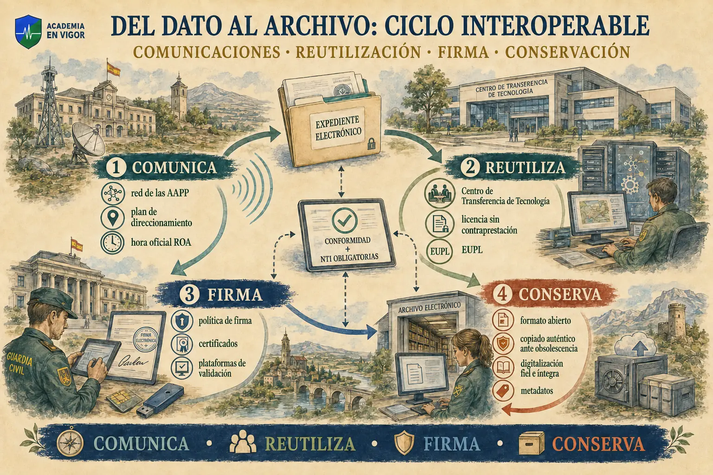

<em>Infografía: esquema de comunicaciones, reutilización, firma y conservación documental.</em>

<!-- FUENTE: RD4-2010-GC-T17 -->

# Hablemos claro

Telecomunicaciones transporta señales; la regulación de contenidos queda fuera salvo que el servicio sea también de comunicaciones electrónicas. En firma digital, diferencia certificado, firma, sello y autenticación de sitio web.

# En la calle

Aplica el tema como una cadena: comunicar con garantías, identificar y firmar, proteger el puesto y asegurar que las Administraciones intercambien información interoperable.

# Lo que cae

Las zonas de mayor riesgo son los plazos y cuantías de la Ley 6/2020, las salvaguardias de la Ley 11/2022, las listas del CCN-CERT y las normas técnicas del ENI.

# Ha caído

Se han verificado **30** apariciones oficiales entre 2020 y 2026.

- **2020:** 2 preguntas oficiales mapeadas.
- **2021:** 2 preguntas oficiales mapeadas.
- **2022:** 8 preguntas oficiales mapeadas.
- **2023:** 4 preguntas oficiales mapeadas.
- **2024:** 7 preguntas oficiales mapeadas.
- **2025:** 3 preguntas oficiales mapeadas.
- **2026:** 4 preguntas oficiales mapeadas.

Las referencias históricas al Real Decreto 806/2014 se muestran con aviso de derogación.

---

*Academia En Vigor · El temario que nunca duerme · Tema 17 · v1.0.0 · Documento interno no publicado.*
