# TEMA 18 · TOPOGRAFÍA

**Guardia Civil · Método VIGOR · ATESTADO**
**Versión de contenido:** 1.0.0
**Estado editorial:** approved_internal · **Publicación:** not_published

# Mapa del tema

| Parte | Contenido | Bloques |
|---|---|---:|
| 1 | Fundamentos y elementos geográficos | 1–6 |
| 2 | Unidades geométricas y escalas | 7–11 |
| 3 | Representación y lectura del terreno | 12–18 |

<!-- VISUAL:t18-00-mapa-topografia.webp -->

  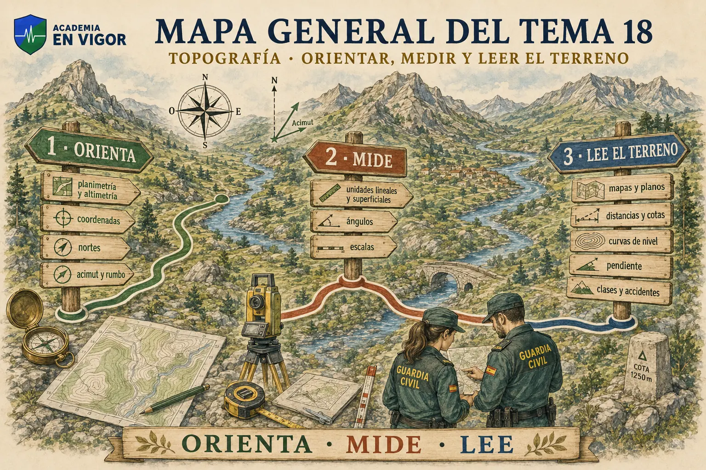

<em>Infografía: arquitectura del tema.</em>

# Contenido

## 01. Alcance oficial y método de resolución

### Lógica del bloque

Alcance oficial y método de resolución se resuelve distinguiendo el concepto de sus vecinos y comprobando siempre referencia, orientación, unidad y sentido de la operación.

### Desarrollo examinable

- **Alcance del Tema 18:** Comprende elementos geográficos; unidades lineales y angulares; escalas numérica y gráfica; planimetría y altimetría; clases y accidentes del terreno; planos acotados y pendiente entre dos puntos. <!-- FACT:GC-T18-F001 -->
- **Bloque único:** El programa oficial agrupa todo el Tema 18 de Topografía en un único bloque, aunque pedagógicamente se divida en partes de estudio. <!-- FACT:GC-T18-F002 -->
- **Regla de homogeneidad:** Antes de operar, todas las distancias deben expresarse en una misma unidad y todas las superficies en unidades cuadradas compatibles. <!-- FACT:GC-T18-F003 -->
- **Regla de escala lineal:** Las longitudes cambian con el denominador de la escala en primera potencia. <!-- FACT:GC-T18-F004 -->
- **Regla de escala superficial:** Las superficies cambian con el cuadrado del denominador de la escala. <!-- FACT:GC-T18-F005 -->
- **Regla angular:** No deben mezclarse grados sexagesimales, centesimales, radianes y milésimas sin convertir previamente. <!-- FACT:GC-T18-F006 -->
- **Regla de pendiente:** La pendiente se calcula con el desnivel y la distancia horizontal, no con la distancia geométrica inclinada. <!-- FACT:GC-T18-F007 -->
- **Producción gráfica:** Esta entrega planifica referencias visuales, pero no integra archivos PNG, WEBP ni otros binarios gráficos. <!-- FACT:GC-T18-F008 -->

:::hablemos-claro
Si dos respuestas usan palabras parecidas, busca qué norte, qué plano de referencia o qué tipo de distancia utiliza cada una.
:::

:::en-la-calle
En una lectura operativa del terreno, combina orientación, escala, pendiente, relieve y accesibilidad; ningún dato aislado describe por sí solo el itinerario.
:::

:::lo-que-cae
Apariciones oficiales mapeadas en este bloque: **0**. Prioridad: fórmulas, unidades, definiciones y accidentes próximos.
:::

<!-- VISUAL:t18-01-alcance-oficial-y-metodo-de-resolucion.webp -->

  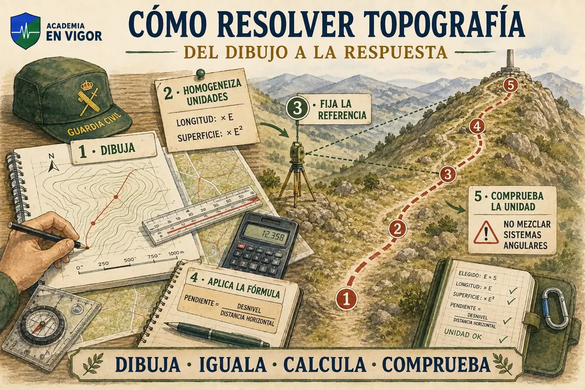

<em>Infografía: alcance oficial y método de resolución.</em>

<!-- FUENTE: GC-PROGRAMA-2026-T18 -->

## 02. Topografía, planimetría y altimetría

### Lógica del bloque

Topografía, planimetría y altimetría se resuelve distinguiendo el concepto de sus vecinos y comprobando siempre referencia, orientación, unidad y sentido de la operación.

### Desarrollo examinable

- **Topografía:** Disciplina que mide y representa una porción limitada de la superficie terrestre con sus detalles naturales y artificiales. <!-- FACT:GC-T18-F009 -->
- **Ámbito topográfico:** En extensiones reducidas puede adoptarse una superficie plana de referencia y despreciarse, a efectos prácticos, la curvatura terrestre. <!-- FACT:GC-T18-F010 -->
- **Planimetría:** Conjunto de métodos para representar a escala los detalles del terreno sobre un plano horizontal, prescindiendo del relieve. <!-- FACT:GC-T18-F011 -->
- **Proyección planimétrica:** Sitúa los puntos del terreno mediante su proyección ortogonal sobre un plano horizontal de comparación. <!-- FACT:GC-T18-F012 -->
- **Altimetría:** Conjunto de métodos para determinar y representar las alturas o cotas de los puntos respecto de una superficie de referencia. <!-- FACT:GC-T18-F013 -->
- **Hipsometría:** Denominación vinculada a la medición y representación de las alturas del terreno. <!-- FACT:GC-T18-F014 -->
- **Representación topográfica completa:** Integra la posición horizontal de la planimetría y la información de alturas de la altimetría. <!-- FACT:GC-T18-F015 -->
- **Diferencia esencial:** La planimetría responde dónde está un punto en horizontal; la altimetría responde a qué altura se encuentra. <!-- FACT:GC-T18-F016 -->

:::hablemos-claro
Si dos respuestas usan palabras parecidas, busca qué norte, qué plano de referencia o qué tipo de distancia utiliza cada una.
:::

:::en-la-calle
En una lectura operativa del terreno, combina orientación, escala, pendiente, relieve y accesibilidad; ningún dato aislado describe por sí solo el itinerario.
:::

:::lo-que-cae
Apariciones oficiales mapeadas en este bloque: **1**. Prioridad: fórmulas, unidades, definiciones y accidentes próximos.
:::

<!-- VISUAL:t18-il-02-topografia-planimetria-y-altimetria.webp -->

  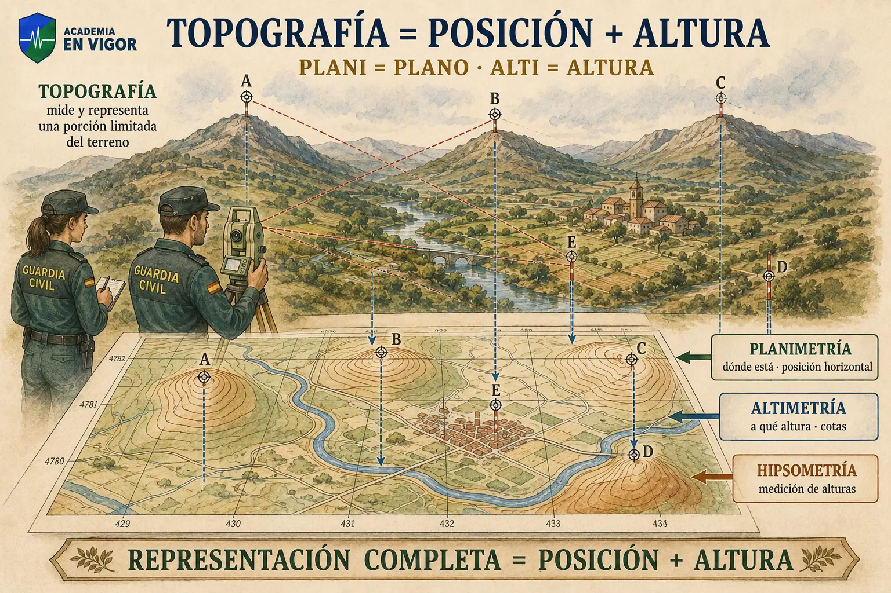

<em>Infografía: topografía, planimetría y altimetría.</em>

<!-- FUENTE: IGN-CONCEPTOS-CARTOGRAFICOS-T18 -->

## 03. Eje terrestre, polos y ecuador

### Lógica del bloque

Eje terrestre, polos y ecuador se resuelve distinguiendo el concepto de sus vecinos y comprobando siempre referencia, orientación, unidad y sentido de la operación.

### Desarrollo examinable

- **Eje terrestre:** Línea ideal alrededor de la cual gira la Tierra y que atraviesa el planeta por los polos geográficos. <!-- FACT:GC-T18-F017 -->
- **Polo geográfico:** Cada punto en el que el eje terrestre corta la superficie del planeta. <!-- FACT:GC-T18-F018 -->
- **Polo Norte:** Extremo boreal del eje terrestre, situado en la región del océano Ártico. <!-- FACT:GC-T18-F019 -->
- **Polo Sur:** Extremo austral del eje terrestre, situado en el continente antártico. <!-- FACT:GC-T18-F020 -->
- **Plano ecuatorial:** Plano perpendicular al eje terrestre que pasa por el centro de la Tierra. <!-- FACT:GC-T18-F021 -->
- **Ecuador:** Circunferencia máxima resultante de la intersección del plano ecuatorial con la superficie terrestre. <!-- FACT:GC-T18-F022 -->
- **Hemisferio norte:** Mitad de la Tierra situada al norte del ecuador, también llamada boreal. <!-- FACT:GC-T18-F023 -->
- **Hemisferio sur:** Mitad de la Tierra situada al sur del ecuador, también llamada austral. <!-- FACT:GC-T18-F024 -->
- **Rotación:** Movimiento de la Tierra alrededor de su eje, completado aproximadamente en un día. <!-- FACT:GC-T18-F025 -->

:::hablemos-claro
Si dos respuestas usan palabras parecidas, busca qué norte, qué plano de referencia o qué tipo de distancia utiliza cada una.
:::

:::en-la-calle
En una lectura operativa del terreno, combina orientación, escala, pendiente, relieve y accesibilidad; ningún dato aislado describe por sí solo el itinerario.
:::

:::lo-que-cae
Apariciones oficiales mapeadas en este bloque: **0**. Prioridad: fórmulas, unidades, definiciones y accidentes próximos.
:::

<!-- VISUAL:t18-03-eje-terrestre-polos-y-ecuador.webp -->

  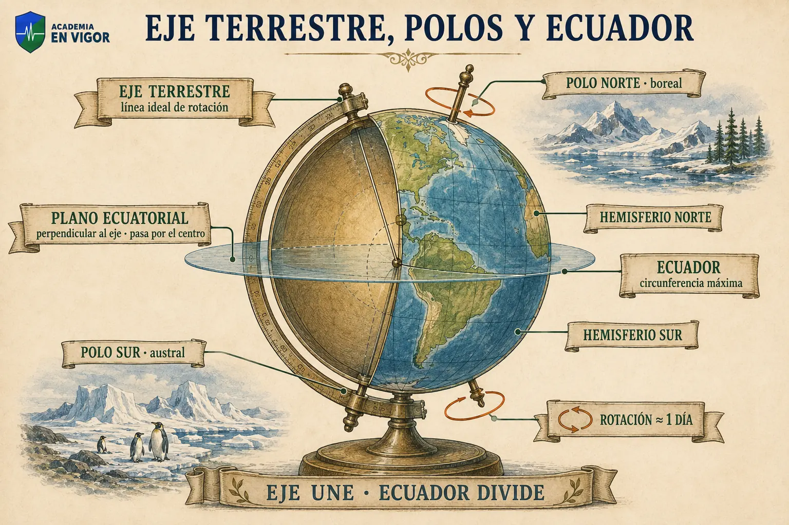

<em>Infografía: eje terrestre, polos y ecuador.</em>

<!-- FUENTE: IGN-CONCEPTOS-CARTOGRAFICOS-T18 -->

## 04. Meridianos, paralelos y coordenadas geográficas

### Lógica del bloque

Meridianos, paralelos y coordenadas geográficas se resuelve distinguiendo el concepto de sus vecinos y comprobando siempre referencia, orientación, unidad y sentido de la operación.

### Desarrollo examinable

- **Plano meridiano:** Todo plano que contiene el eje terrestre. <!-- FACT:GC-T18-F026 -->
- **Meridiano:** Semicircunferencia terrestre determinada por la intersección de un plano meridiano con la superficie, desde un polo al otro. <!-- FACT:GC-T18-F027 -->
- **Meridiano de Greenwich:** Meridiano adoptado como origen para medir longitudes geográficas. <!-- FACT:GC-T18-F028 -->
- **Antimeridiano:** Meridiano opuesto al de Greenwich, correspondiente a 180 grados de longitud. <!-- FACT:GC-T18-F029 -->
- **Paralelo:** Línea de intersección con la superficie terrestre de un plano perpendicular al eje terrestre. <!-- FACT:GC-T18-F030 -->
- **Propiedad de los paralelos:** Todos los puntos de un mismo paralelo tienen la misma latitud. <!-- FACT:GC-T18-F031 -->
- **Latitud:** Ángulo medido sobre el meridiano del lugar desde el ecuador hasta el paralelo del punto, hacia el norte o el sur. <!-- FACT:GC-T18-F032 -->
- **Intervalo de latitud:** La latitud varía entre 0 grados en el ecuador y 90 grados en cada polo. <!-- FACT:GC-T18-F033 -->
- **Longitud:** Ángulo entre el meridiano de origen y el meridiano del punto, medido hacia el este o el oeste. <!-- FACT:GC-T18-F034 -->
- **Intervalo de longitud:** La longitud varía entre 0 y 180 grados hacia el este o hacia el oeste. <!-- FACT:GC-T18-F035 -->
- **Coordenadas geográficas:** Pareja formada por la latitud y la longitud que localiza un punto sobre la superficie terrestre. <!-- FACT:GC-T18-F036 -->
- **Error típico de coordenadas:** Asignar a la longitud el intervalo de 0 a 90 grados es incorrecto; ese límite corresponde a la latitud. <!-- FACT:GC-T18-F037 -->

:::hablemos-claro
Si dos respuestas usan palabras parecidas, busca qué norte, qué plano de referencia o qué tipo de distancia utiliza cada una.
:::

:::en-la-calle
En una lectura operativa del terreno, combina orientación, escala, pendiente, relieve y accesibilidad; ningún dato aislado describe por sí solo el itinerario.
:::

:::lo-que-cae
Apariciones oficiales mapeadas en este bloque: **2**. Prioridad: fórmulas, unidades, definiciones y accidentes próximos.
:::

<!-- VISUAL:t18-04-meridianos-paralelos-y-coordenadas-geograficas.webp -->

  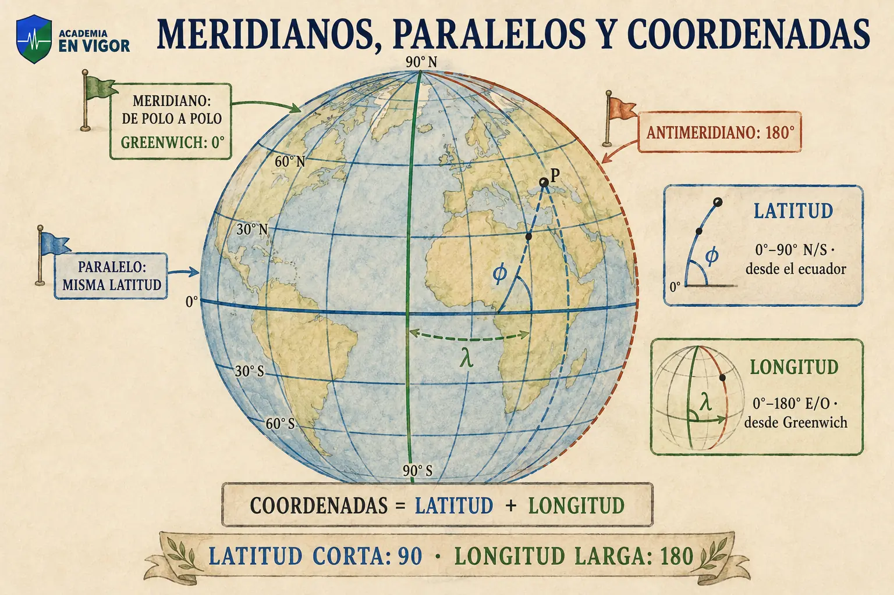

<em>Infografía: meridianos, paralelos y coordenadas geográficas.</em>

<!-- FUENTE: IGN-CONCEPTOS-CARTOGRAFICOS-T18 -->

## 05. Puntos cardinales, nortes y declinación magnética

### Lógica del bloque

Puntos cardinales, nortes y declinación magnética se resuelve distinguiendo el concepto de sus vecinos y comprobando siempre referencia, orientación, unidad y sentido de la operación.

### Desarrollo examinable

- **Meridiana:** Intersección del plano meridiano del lugar con el plano horizontal, que materializa la dirección norte-sur. <!-- FACT:GC-T18-F038 -->
- **Norte:** Punto cardinal también denominado septentrión. <!-- FACT:GC-T18-F039 -->
- **Este:** Punto cardinal denominado también oriente o levante. <!-- FACT:GC-T18-F040 -->
- **Sur:** Punto cardinal denominado también mediodía. <!-- FACT:GC-T18-F041 -->
- **Oeste:** Punto cardinal denominado también occidente o poniente. <!-- FACT:GC-T18-F042 -->
- **Norte geográfico:** Dirección del meridiano del lugar hacia el Polo Norte geográfico. <!-- FACT:GC-T18-F043 -->
- **Norte magnético:** Dirección señalada por la aguja de una brújula bajo la acción del campo magnético terrestre. <!-- FACT:GC-T18-F044 -->
- **Declinación magnética:** Ángulo existente en un lugar entre el norte geográfico y el norte magnético. <!-- FACT:GC-T18-F045 -->
- **Declinación oriental:** Se produce cuando el norte magnético queda al este del norte geográfico. <!-- FACT:GC-T18-F046 -->
- **Declinación occidental:** Se produce cuando el norte magnético queda al oeste del norte geográfico. <!-- FACT:GC-T18-F047 -->

:::hablemos-claro
Si dos respuestas usan palabras parecidas, busca qué norte, qué plano de referencia o qué tipo de distancia utiliza cada una.
:::

:::en-la-calle
En una lectura operativa del terreno, combina orientación, escala, pendiente, relieve y accesibilidad; ningún dato aislado describe por sí solo el itinerario.
:::

:::lo-que-cae
Apariciones oficiales mapeadas en este bloque: **0**. Prioridad: fórmulas, unidades, definiciones y accidentes próximos.
:::

<!-- VISUAL:t18-05-puntos-cardinales-nortes-y-declinacion-magnetica.webp -->

  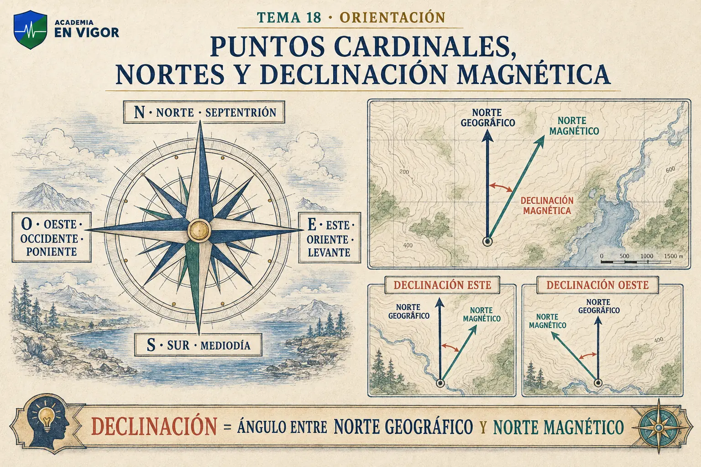

<em>Infografía: puntos cardinales, nortes y declinación magnética.</em>

<!-- FUENTE: IGN-CONCEPTOS-CARTOGRAFICOS-T18 -->

## 06. Acimut, rumbo y direcciones inversas

### Lógica del bloque

Acimut, rumbo y direcciones inversas se resuelve distinguiendo el concepto de sus vecinos y comprobando siempre referencia, orientación, unidad y sentido de la operación.

### Desarrollo examinable

- **Acimut:** Ángulo que forma el norte geográfico con una dirección, medido desde el norte geográfico en sentido horario. <!-- FACT:GC-T18-F048 -->
- **Origen del acimut:** El acimut toma como referencia el norte geográfico o verdadero. <!-- FACT:GC-T18-F049 -->
- **Rumbo:** Ángulo que forma el norte magnético con una dirección, medido desde el norte magnético en sentido horario. <!-- FACT:GC-T18-F050 -->
- **Origen del rumbo:** El rumbo toma como referencia el norte magnético. <!-- FACT:GC-T18-F051 -->
- **Intervalo de acimut y rumbo:** En el convenio utilizado por el temario, ambos se expresan entre 0 y 360 grados. <!-- FACT:GC-T18-F052 -->
- **Acimut inverso:** Acimut de la dirección opuesta a la considerada inicialmente. <!-- FACT:GC-T18-F053 -->
- **Rumbo inverso:** Rumbo medido hacia la dirección opuesta a la considerada inicialmente. <!-- FACT:GC-T18-F054 -->
- **Cálculo de dirección inversa:** Se suma 180 grados si el valor directo es menor de 180 y se resta 180 si es igual o mayor. <!-- FACT:GC-T18-F055 -->
- **Conversión acimut-rumbo:** Exige aplicar la declinación magnética local con su signo correcto. <!-- FACT:GC-T18-F056 -->
- **Confusión crítica:** Acimut no se mide desde el norte magnético y rumbo no se mide desde el norte geográfico. <!-- FACT:GC-T18-F057 -->

:::hablemos-claro
Si dos respuestas usan palabras parecidas, busca qué norte, qué plano de referencia o qué tipo de distancia utiliza cada una.
:::

:::en-la-calle
En una lectura operativa del terreno, combina orientación, escala, pendiente, relieve y accesibilidad; ningún dato aislado describe por sí solo el itinerario.
:::

:::lo-que-cae
Apariciones oficiales mapeadas en este bloque: **3**. Prioridad: fórmulas, unidades, definiciones y accidentes próximos.
:::

<!-- VISUAL:t18-il-06-acimut-rumbo-y-direcciones-inversas.webp -->

  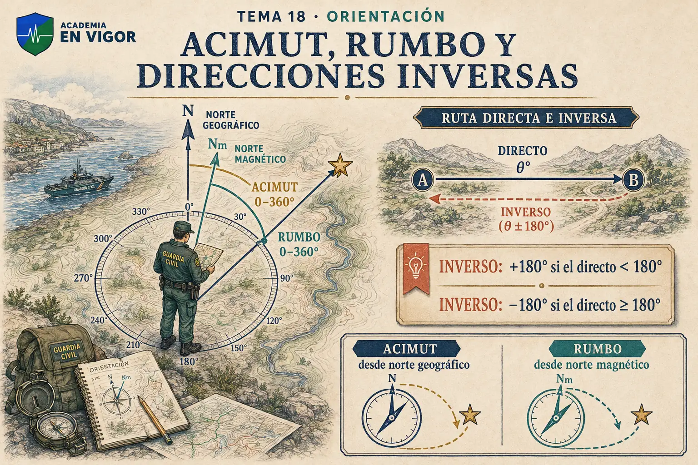

<em>Infografía: acimut, rumbo y direcciones inversas.</em>

<!-- FUENTE: IGN-CONCEPTOS-CARTOGRAFICOS-T18 -->

## 07. Unidades lineales y superficiales

### Lógica del bloque

Unidades lineales y superficiales se resuelve distinguiendo el concepto de sus vecinos y comprobando siempre referencia, orientación, unidad y sentido de la operación.

### Desarrollo examinable

- **Medir:** Comparar una magnitud con otra de la misma especie adoptada como unidad para expresar cuántas veces la contiene. <!-- FACT:GC-T18-F058 -->
- **Metro:** Unidad básica de longitud del Sistema Internacional, símbolo m. <!-- FACT:GC-T18-F059 -->
- **Definición operacional del metro:** El valor fijado de la velocidad de la luz en el vacío es 299 792 458 metros por segundo. <!-- FACT:GC-T18-F060 -->
- **Kilómetro:** Múltiplo del metro equivalente a 1 000 metros. <!-- FACT:GC-T18-F061 -->
- **Hectómetro:** Múltiplo del metro equivalente a 100 metros. <!-- FACT:GC-T18-F062 -->
- **Decámetro:** Múltiplo del metro equivalente a 10 metros. <!-- FACT:GC-T18-F063 -->
- **Decímetro:** Submúltiplo del metro equivalente a 0,1 metros. <!-- FACT:GC-T18-F064 -->
- **Centímetro:** Submúltiplo del metro equivalente a 0,01 metros. <!-- FACT:GC-T18-F065 -->
- **Milímetro:** Submúltiplo del metro equivalente a 0,001 metros. <!-- FACT:GC-T18-F066 -->
- **Metro cuadrado:** Unidad de superficie correspondiente al área de un cuadrado de un metro de lado. <!-- FACT:GC-T18-F067 -->
- **Hectárea:** Unidad de superficie equivalente a 10 000 metros cuadrados. <!-- FACT:GC-T18-F068 -->
- **Hectómetro cuadrado:** Superficie equivalente a 10 000 metros cuadrados y, por tanto, a una hectárea. <!-- FACT:GC-T18-F069 -->
- **Conversión superficial:** Cada salto decimal entre unidades lineales se convierte en un factor cien cuando se trata de superficie. <!-- FACT:GC-T18-F070 -->

:::hablemos-claro
Si dos respuestas usan palabras parecidas, busca qué norte, qué plano de referencia o qué tipo de distancia utiliza cada una.
:::

:::en-la-calle
En una lectura operativa del terreno, combina orientación, escala, pendiente, relieve y accesibilidad; ningún dato aislado describe por sí solo el itinerario.
:::

:::lo-que-cae
Apariciones oficiales mapeadas en este bloque: **1**. Prioridad: fórmulas, unidades, definiciones y accidentes próximos.
:::

<!-- VISUAL:t18-07-unidades-lineales-y-superficiales.webp -->

  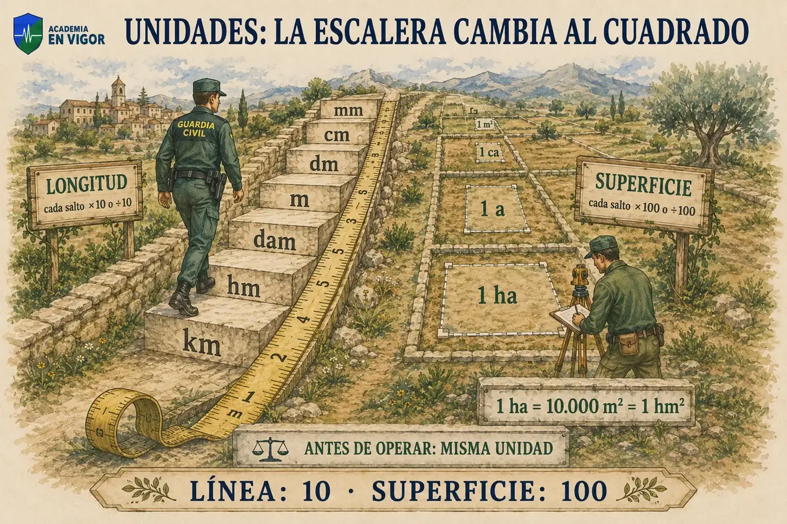

<em>Infografía: unidades lineales y superficiales.</em>

<!-- FUENTE: CEM-SI-9ED-T18 -->

## 08. Sistemas angulares sexagesimal y centesimal

### Lógica del bloque

Sistemas angulares sexagesimal y centesimal se resuelve distinguiendo el concepto de sus vecinos y comprobando siempre referencia, orientación, unidad y sentido de la operación.

### Desarrollo examinable

- **Ángulo recto:** Ángulo formado por dos direcciones perpendiculares. <!-- FACT:GC-T18-F071 -->
- **Grado sexagesimal:** Unidad obtenida al dividir el ángulo recto en 90 partes iguales. <!-- FACT:GC-T18-F072 -->
- **Circunferencia sexagesimal:** Una vuelta completa contiene 360 grados sexagesimales. <!-- FACT:GC-T18-F073 -->
- **Minuto sexagesimal:** Cada grado sexagesimal se divide en 60 minutos. <!-- FACT:GC-T18-F074 -->
- **Segundo sexagesimal:** Cada minuto sexagesimal se divide en 60 segundos. <!-- FACT:GC-T18-F075 -->
- **Grado centesimal:** Unidad obtenida al dividir el ángulo recto en 100 partes iguales. <!-- FACT:GC-T18-F076 -->
- **Circunferencia centesimal:** Una vuelta completa contiene 400 grados centesimales. <!-- FACT:GC-T18-F077 -->
- **Minuto centesimal:** Cada grado centesimal se divide en 100 minutos centesimales. <!-- FACT:GC-T18-F078 -->
- **Segundo centesimal:** Cada minuto centesimal se divide en 100 segundos centesimales. <!-- FACT:GC-T18-F079 -->
- **Equivalencia de ángulo recto:** Noventa grados sexagesimales equivalen a cien grados centesimales. <!-- FACT:GC-T18-F080 -->
- **Equivalencia de vuelta:** Trescientos sesenta grados sexagesimales equivalen a cuatrocientos grados centesimales. <!-- FACT:GC-T18-F081 -->
- **Error centesimal frecuente:** El grado centesimal no resulta de dividir la circunferencia en 100 partes, sino el ángulo recto. <!-- FACT:GC-T18-F082 -->

:::hablemos-claro
Si dos respuestas usan palabras parecidas, busca qué norte, qué plano de referencia o qué tipo de distancia utiliza cada una.
:::

:::en-la-calle
En una lectura operativa del terreno, combina orientación, escala, pendiente, relieve y accesibilidad; ningún dato aislado describe por sí solo el itinerario.
:::

:::lo-que-cae
Apariciones oficiales mapeadas en este bloque: **2**. Prioridad: fórmulas, unidades, definiciones y accidentes próximos.
:::

<!-- VISUAL:t18-08-sistemas-angulares-sexagesimal-y-centesimal.webp -->

  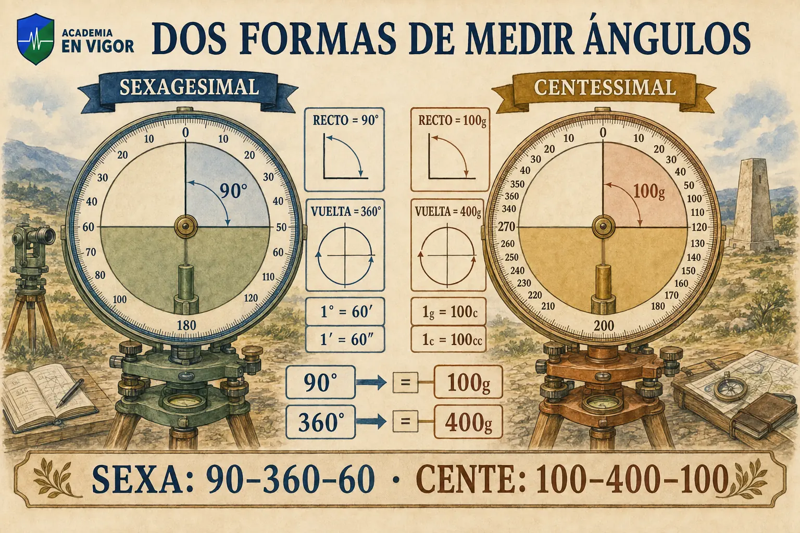

<em>Infografía: sistemas angulares sexagesimal y centesimal.</em>

<!-- FUENTE: IGN-CONCEPTOS-CARTOGRAFICOS-T18 -->

## 09. Radián, milésima y conversiones angulares

### Lógica del bloque

Radián, milésima y conversiones angulares se resuelve distinguiendo el concepto de sus vecinos y comprobando siempre referencia, orientación, unidad y sentido de la operación.

### Desarrollo examinable

- **Radián:** Ángulo central que abarca un arco de longitud igual al radio de la circunferencia. <!-- FACT:GC-T18-F083 -->
- **Vuelta en radianes:** Una circunferencia completa contiene 2π radianes. <!-- FACT:GC-T18-F084 -->
- **Ángulo llano en radianes:** Ciento ochenta grados sexagesimales equivalen a π radianes. <!-- FACT:GC-T18-F085 -->
- **Ángulo recto en radianes:** Noventa grados sexagesimales equivalen a π/2 radianes. <!-- FACT:GC-T18-F086 -->
- **Milésima:** Unidad angular definida, en el convenio del temario, como la milésima parte de un radián. <!-- FACT:GC-T18-F087 -->
- **Radián en milésimas:** Un radián equivale a 1 000 milésimas. <!-- FACT:GC-T18-F088 -->
- **Vuelta en milésimas teóricas:** Dos π radianes equivalen aproximadamente a 6 283,185 milésimas. <!-- FACT:GC-T18-F089 -->
- **Conversión sexagesimal-radián:** Los grados sexagesimales se multiplican por π y se dividen entre 180. <!-- FACT:GC-T18-F090 -->
- **Conversión centesimal-radián:** Los grados centesimales se multiplican por π y se dividen entre 200. <!-- FACT:GC-T18-F091 -->
- **Conversión sexagesimal-centesimal:** Los grados sexagesimales se multiplican por 10/9. <!-- FACT:GC-T18-F092 -->
- **Conversión centesimal-sexagesimal:** Los grados centesimales se multiplican por 9/10. <!-- FACT:GC-T18-F093 -->
- **Paso previo a convertir:** Los minutos y segundos deben transformarse en fracción decimal del grado correspondiente. <!-- FACT:GC-T18-F094 -->

:::hablemos-claro
Si dos respuestas usan palabras parecidas, busca qué norte, qué plano de referencia o qué tipo de distancia utiliza cada una.
:::

:::en-la-calle
En una lectura operativa del terreno, combina orientación, escala, pendiente, relieve y accesibilidad; ningún dato aislado describe por sí solo el itinerario.
:::

:::lo-que-cae
Apariciones oficiales mapeadas en este bloque: **2**. Prioridad: fórmulas, unidades, definiciones y accidentes próximos.
:::

<!-- VISUAL:t18-09-radian-milesima-y-conversiones-angulares.webp -->

  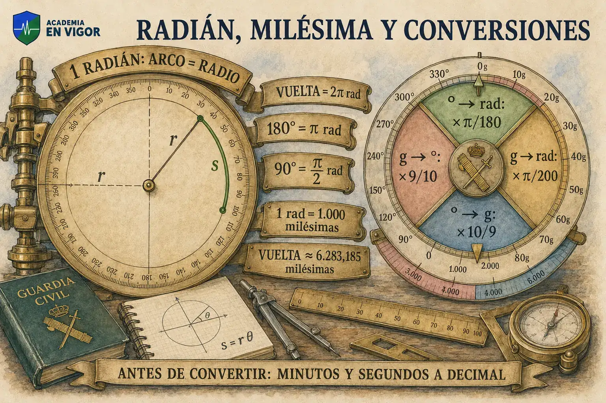

<em>Infografía: radián, milésima y conversiones angulares.</em>

<!-- FUENTE: IGN-CONCEPTOS-CARTOGRAFICOS-T18 -->

## 10. Concepto y tipos de escala

### Lógica del bloque

Concepto y tipos de escala se resuelve distinguiendo el concepto de sus vecinos y comprobando siempre referencia, orientación, unidad y sentido de la operación.

### Desarrollo examinable

- **Escala:** Relación constante entre una longitud medida en la representación y la longitud horizontal correspondiente en el terreno. <!-- FACT:GC-T18-F095 -->
- **Escala numérica:** Se expresa como fracción 1/E o razón 1:E, donde E es el denominador. <!-- FACT:GC-T18-F096 -->
- **Numerador de la escala:** Representa una unidad medida en el plano. <!-- FACT:GC-T18-F097 -->
- **Denominador de la escala:** Indica cuántas unidades iguales corresponden en el terreno a una unidad del plano. <!-- FACT:GC-T18-F098 -->
- **Escala grande:** Tiene denominador relativamente pequeño y muestra más detalle de una extensión menor. <!-- FACT:GC-T18-F099 -->
- **Escala pequeña:** Tiene denominador relativamente grande y muestra menos detalle de una extensión mayor. <!-- FACT:GC-T18-F100 -->
- **Escala gráfica:** Segmento graduado que permite obtener distancias reales mediante comparación directa y conserva utilidad si el documento cambia proporcionalmente de tamaño. <!-- FACT:GC-T18-F101 -->
- **Talón de escala gráfica:** Tramo situado a la izquierda del cero y subdividido para medir fracciones de la unidad principal. <!-- FACT:GC-T18-F102 -->
- **Cuerpo de escala gráfica:** Tramo situado a la derecha del cero y dividido en unidades principales. <!-- FACT:GC-T18-F103 -->
- **Condición de uso:** Plano y terreno deben compararse en la misma unidad antes de aplicar la relación de escala. <!-- FACT:GC-T18-F104 -->

:::hablemos-claro
Si dos respuestas usan palabras parecidas, busca qué norte, qué plano de referencia o qué tipo de distancia utiliza cada una.
:::

:::en-la-calle
En una lectura operativa del terreno, combina orientación, escala, pendiente, relieve y accesibilidad; ningún dato aislado describe por sí solo el itinerario.
:::

:::lo-que-cae
Apariciones oficiales mapeadas en este bloque: **0**. Prioridad: fórmulas, unidades, definiciones y accidentes próximos.
:::

<!-- VISUAL:t18-il-10-concepto-y-tipos-de-escala.webp -->

  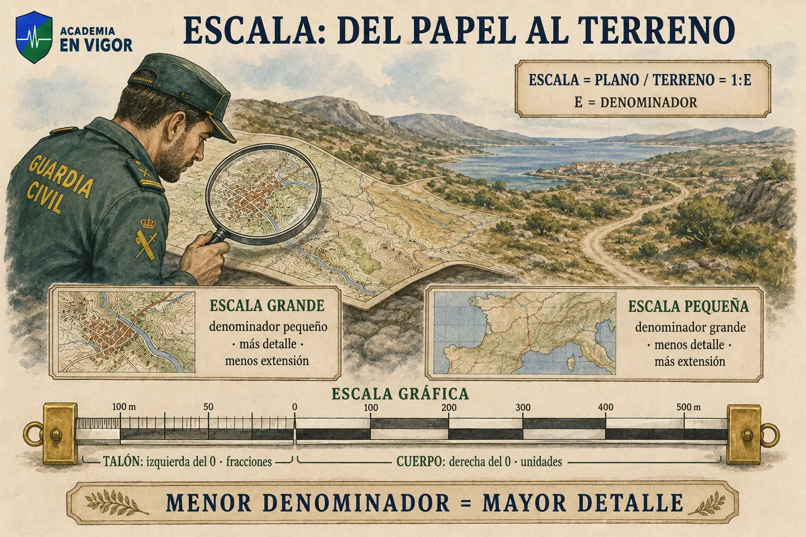

<em>Infografía: concepto y tipos de escala.</em>

<!-- FUENTE: IGN-CONCEPTOS-CARTOGRAFICOS-T18 -->

## 11. Cálculos con escalas lineales y superficiales

### Lógica del bloque

Cálculos con escalas lineales y superficiales se resuelve distinguiendo el concepto de sus vecinos y comprobando siempre referencia, orientación, unidad y sentido de la operación.

### Desarrollo examinable

- **Distancia real desde el plano:** Se obtiene multiplicando la distancia del plano por el denominador de la escala, con unidades homogéneas. <!-- FACT:GC-T18-F105 -->
- **Distancia en el plano:** Se obtiene dividiendo la distancia horizontal real entre el denominador de la escala, con unidades homogéneas. <!-- FACT:GC-T18-F106 -->
- **Denominador desconocido:** Se obtiene dividiendo la distancia real entre la distancia correspondiente medida en el plano. <!-- FACT:GC-T18-F107 -->
- **Ejemplo 1:25 000:** Quinientos metros reales se representan por dos centímetros en un plano a escala 1:25 000. <!-- FACT:GC-T18-F108 -->
- **Ejemplo 1:800:** Diez centímetros en un plano a escala 1:800 representan ochenta metros en el terreno. <!-- FACT:GC-T18-F109 -->
- **Ejemplo 1:100 000:** Ochenta y cinco kilómetros reales se representan por ochenta y cinco centímetros en el plano. <!-- FACT:GC-T18-F110 -->
- **Relación entre dos planos:** Para una misma distancia real, las longitudes medidas en dos planos son inversamente proporcionales a sus denominadores. <!-- FACT:GC-T18-F111 -->
- **Área real desde el plano:** Se obtiene multiplicando el área del plano por el cuadrado del denominador de la escala. <!-- FACT:GC-T18-F112 -->
- **Área en el plano:** Se obtiene dividiendo el área real entre el cuadrado del denominador de la escala. <!-- FACT:GC-T18-F113 -->
- **Denominador desde superficies:** Se obtiene calculando la raíz cuadrada del cociente entre el área real y el área del plano. <!-- FACT:GC-T18-F114 -->
- **Ejemplo superficial 1:2 000:** Seiscientos metros cuadrados ocupan 1,5 centímetros cuadrados en un plano a escala 1:2 000. <!-- FACT:GC-T18-F115 -->
- **Control dimensional:** Una respuesta de superficie debe expresarse en unidades cuadradas; una respuesta lineal, en unidades de longitud. <!-- FACT:GC-T18-F116 -->
- **Error típico de superficie:** Aplicar una sola vez el denominador a un área produce un resultado incorrecto porque la escala superficial es cuadrática. <!-- FACT:GC-T18-F117 -->

:::hablemos-claro
Si dos respuestas usan palabras parecidas, busca qué norte, qué plano de referencia o qué tipo de distancia utiliza cada una.
:::

:::en-la-calle
En una lectura operativa del terreno, combina orientación, escala, pendiente, relieve y accesibilidad; ningún dato aislado describe por sí solo el itinerario.
:::

:::lo-que-cae
Apariciones oficiales mapeadas en este bloque: **10**. Prioridad: fórmulas, unidades, definiciones y accidentes próximos.
:::

<!-- VISUAL:t18-11-calculos-con-escalas-lineales-y-superficiales.webp -->

  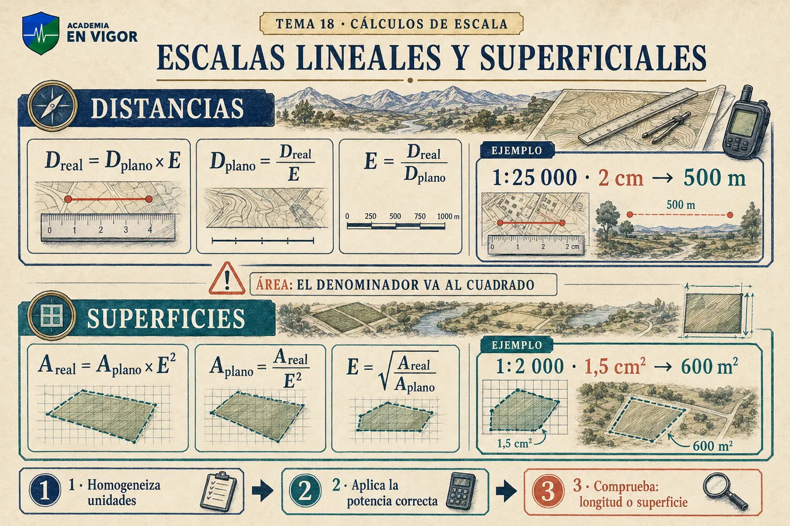

<em>Infografía: cálculos con escalas lineales y superficiales.</em>

<!-- FUENTE: IGN-CONCEPTOS-CARTOGRAFICOS-T18 -->

## 12. Mapas, planos, cartas y croquis

### Lógica del bloque

Mapas, planos, cartas y croquis se resuelve distinguiendo el concepto de sus vecinos y comprobando siempre referencia, orientación, unidad y sentido de la operación.

### Desarrollo examinable

- **Mapa:** Representación reducida, generalizada y convencional de la superficie terrestre o de una parte de ella. <!-- FACT:GC-T18-F118 -->
- **Mapa topográfico:** Representación que muestra conjuntamente planimetría y relieve, normalmente mediante curvas de nivel y cotas. <!-- FACT:GC-T18-F119 -->
- **Plano:** Representación a escala de una extensión reducida en la que la curvatura terrestre puede despreciarse. <!-- FACT:GC-T18-F120 -->
- **Carta:** Representación cartográfica destinada especialmente a la navegación marítima o aérea y adaptada a ese uso. <!-- FACT:GC-T18-F121 -->
- **Croquis:** Dibujo simplificado que refleja la disposición relativa de elementos sin exigir una escala rigurosa. <!-- FACT:GC-T18-F122 -->
- **Generalización cartográfica:** Selección y simplificación de elementos para que la representación siga siendo legible a la escala elegida. <!-- FACT:GC-T18-F123 -->
- **Signo convencional:** Símbolo acordado que representa un objeto o fenómeno del terreno en el documento cartográfico. <!-- FACT:GC-T18-F124 -->
- **Leyenda:** Explicación de los signos, colores y símbolos utilizados en el mapa o plano. <!-- FACT:GC-T18-F125 -->

:::hablemos-claro
Si dos respuestas usan palabras parecidas, busca qué norte, qué plano de referencia o qué tipo de distancia utiliza cada una.
:::

:::en-la-calle
En una lectura operativa del terreno, combina orientación, escala, pendiente, relieve y accesibilidad; ningún dato aislado describe por sí solo el itinerario.
:::

:::lo-que-cae
Apariciones oficiales mapeadas en este bloque: **0**. Prioridad: fórmulas, unidades, definiciones y accidentes próximos.
:::

<!-- VISUAL:t18-12-mapas-planos-cartas-y-croquis.webp -->

  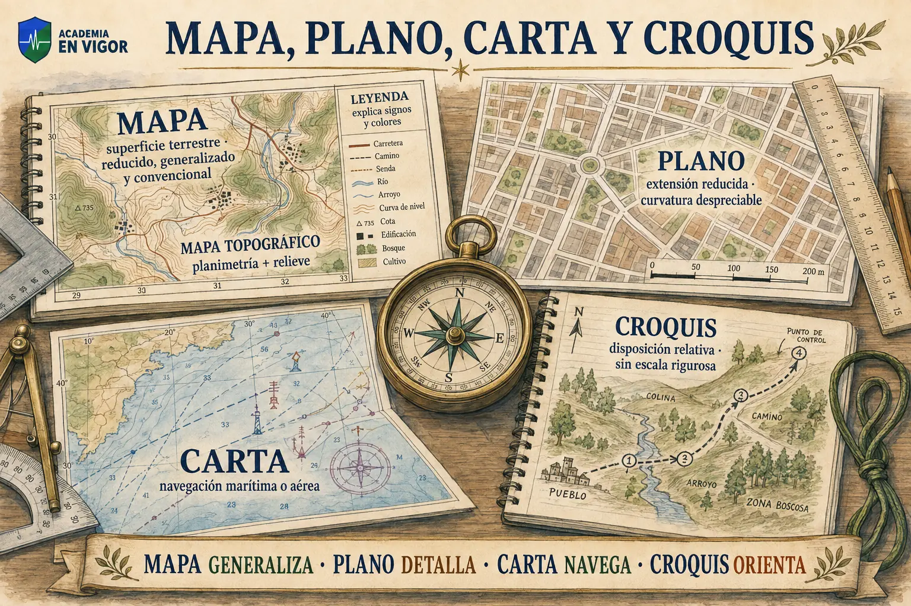

<em>Infografía: mapas, planos, cartas y croquis.</em>

<!-- FUENTE: IGN-CONCEPTOS-CARTOGRAFICOS-T18 -->

## 13. Distancias, cota, altitud y desnivel

### Lógica del bloque

Distancias, cota, altitud y desnivel se resuelve distinguiendo el concepto de sus vecinos y comprobando siempre referencia, orientación, unidad y sentido de la operación.

### Desarrollo examinable

- **Distancia horizontal o reducida:** Proyección horizontal de la línea recta que une dos puntos del terreno. <!-- FACT:GC-T18-F126 -->
- **Distancia geométrica:** Longitud en línea recta entre dos puntos considerados en el espacio. <!-- FACT:GC-T18-F127 -->
- **Distancia real o topográfica:** Longitud del recorrido seguido sobre la superficie irregular del terreno. <!-- FACT:GC-T18-F128 -->
- **Desnivel:** Diferencia vertical de altura o cota entre dos puntos. <!-- FACT:GC-T18-F129 -->
- **Cota:** Distancia vertical de un punto respecto del plano horizontal de referencia adoptado. <!-- FACT:GC-T18-F130 -->
- **Altitud:** Cota referida al nivel medio del mar establecido como referencia altimétrica. <!-- FACT:GC-T18-F131 -->
- **Referencia peninsular:** En la Península se toma como referencia de altitudes el nivel medio del mar en Alicante. <!-- FACT:GC-T18-F132 -->
- **Referencia insular:** En cada isla se utilizan las referencias mareográficas locales definidas por el Instituto Geográfico Nacional. <!-- FACT:GC-T18-F133 -->
- **Relación pitagórica:** El cuadrado de la distancia geométrica es igual al cuadrado de la distancia horizontal más el cuadrado del desnivel. <!-- FACT:GC-T18-F134 -->
- **Desnivel por distancias:** Se obtiene como raíz cuadrada de la diferencia entre el cuadrado de la distancia geométrica y el cuadrado de la horizontal. <!-- FACT:GC-T18-F135 -->
- **Orden habitual de magnitudes:** Entre dos puntos a distinta altura, la distancia geométrica es mayor que la distancia horizontal. <!-- FACT:GC-T18-F136 -->
- **Signo del desnivel:** Depende del sentido del recorrido: es positivo al ascender y negativo al descender si se conserva orientación algebraica. <!-- FACT:GC-T18-F137 -->

:::hablemos-claro
Si dos respuestas usan palabras parecidas, busca qué norte, qué plano de referencia o qué tipo de distancia utiliza cada una.
:::

:::en-la-calle
En una lectura operativa del terreno, combina orientación, escala, pendiente, relieve y accesibilidad; ningún dato aislado describe por sí solo el itinerario.
:::

:::lo-que-cae
Apariciones oficiales mapeadas en este bloque: **2**. Prioridad: fórmulas, unidades, definiciones y accidentes próximos.
:::

<!-- VISUAL:t18-13-distancias-cota-altitud-y-desnivel.webp -->

  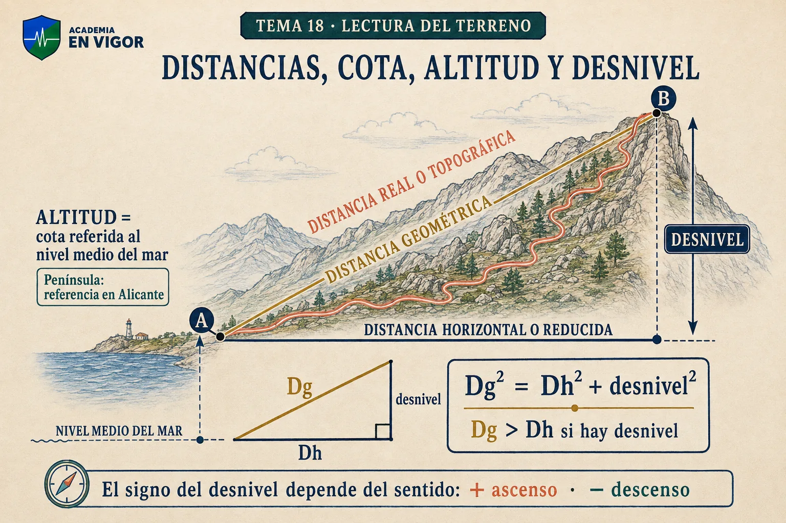

<em>Infografía: distancias, cota, altitud y desnivel.</em>

<!-- FUENTE: IGN-CONCEPTOS-CARTOGRAFICOS-T18 -->

## 14. Sistema de planos acotados y curvas de nivel

### Lógica del bloque

Sistema de planos acotados y curvas de nivel se resuelve distinguiendo el concepto de sus vecinos y comprobando siempre referencia, orientación, unidad y sentido de la operación.

### Desarrollo examinable

- **Sistema de planos acotados:** Representa cada punto mediante su proyección ortogonal sobre un plano horizontal y un número que indica su cota. <!-- FACT:GC-T18-F138 -->
- **Plano de comparación:** Superficie horizontal de referencia desde la que se miden las cotas. <!-- FACT:GC-T18-F139 -->
- **Cota positiva:** Corresponde a un punto situado por encima del plano de comparación. <!-- FACT:GC-T18-F140 -->
- **Cota negativa:** Corresponde a un punto situado por debajo del plano de comparación. <!-- FACT:GC-T18-F141 -->
- **Cota cero:** Corresponde a un punto contenido en el propio plano de comparación. <!-- FACT:GC-T18-F142 -->
- **Curva de nivel:** Línea que une puntos del terreno con la misma cota o altitud. <!-- FACT:GC-T18-F143 -->
- **Isohipsa:** Otro nombre de la curva de nivel empleada para representar alturas. <!-- FACT:GC-T18-F144 -->
- **Isóbata:** Línea que une puntos de igual profundidad bajo una superficie de referencia acuática. <!-- FACT:GC-T18-F145 -->
- **Generación de curvas:** Se obtienen al cortar idealmente el terreno con planos horizontales paralelos y proyectar sus intersecciones. <!-- FACT:GC-T18-F146 -->
- **Equidistancia:** Diferencia vertical constante de cota entre dos curvas de nivel consecutivas. <!-- FACT:GC-T18-F147 -->
- **Curvas juntas:** Indican una pendiente fuerte porque una misma diferencia de altura se salva en poca distancia horizontal. <!-- FACT:GC-T18-F148 -->
- **Curvas separadas:** Indican una pendiente suave porque la diferencia de altura se salva en mayor distancia horizontal. <!-- FACT:GC-T18-F149 -->
- **Cierre de curvas:** Toda curva de nivel es cerrada en el terreno, aunque pueda quedar cortada por el borde del mapa. <!-- FACT:GC-T18-F150 -->
- **Cruce de curvas:** En la representación ordinaria, las curvas de nivel no se cruzan ni se bifurcan. <!-- FACT:GC-T18-F151 -->
- **Tangencia de curvas:** La tangencia o coincidencia aparente de curvas puede expresar una ruptura abrupta como un cantil. <!-- FACT:GC-T18-F152 -->

:::hablemos-claro
Si dos respuestas usan palabras parecidas, busca qué norte, qué plano de referencia o qué tipo de distancia utiliza cada una.
:::

:::en-la-calle
En una lectura operativa del terreno, combina orientación, escala, pendiente, relieve y accesibilidad; ningún dato aislado describe por sí solo el itinerario.
:::

:::lo-que-cae
Apariciones oficiales mapeadas en este bloque: **0**. Prioridad: fórmulas, unidades, definiciones y accidentes próximos.
:::

<!-- VISUAL:t18-il-14-sistema-de-planos-acotados-y-curvas-de-nivel.webp -->

  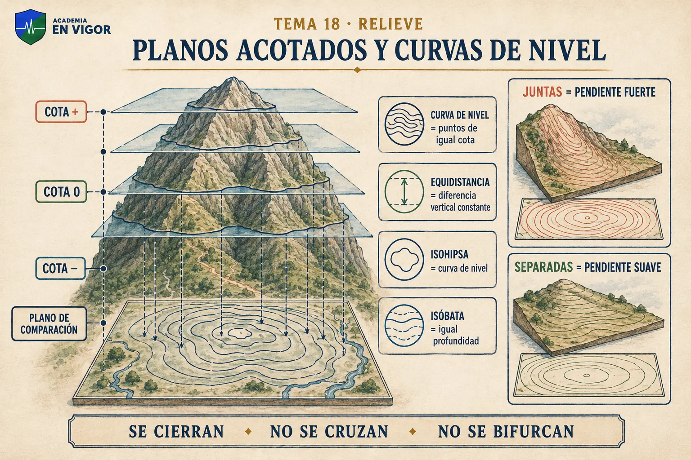

<em>Infografía: sistema de planos acotados y curvas de nivel.</em>

<!-- FUENTE: IGN-CONCEPTOS-CARTOGRAFICOS-T18 -->

## 15. Interpolación de cotas y pendiente

### Lógica del bloque

Interpolación de cotas y pendiente se resuelve distinguiendo el concepto de sus vecinos y comprobando siempre referencia, orientación, unidad y sentido de la operación.

### Desarrollo examinable

- **Interpolación lineal:** Permite estimar la cota de un punto entre dos curvas suponiendo pendiente uniforme. <!-- FACT:GC-T18-F153 -->
- **Fracción de avance:** Se calcula dividiendo la distancia desde la curva de menor cota hasta el punto entre la separación total de las curvas. <!-- FACT:GC-T18-F154 -->
- **Incremento de cota:** Es la fracción de avance multiplicada por la equidistancia. <!-- FACT:GC-T18-F155 -->
- **Cota interpolada:** Se obtiene sumando el incremento a la cota inferior cuando se avanza hacia la curva superior. <!-- FACT:GC-T18-F156 -->
- **Pendiente decimal:** Cociente entre el desnivel y la distancia horizontal. <!-- FACT:GC-T18-F157 -->
- **Pendiente porcentual:** Pendiente decimal multiplicada por cien. <!-- FACT:GC-T18-F158 -->
- **Desnivel desde pendiente:** Se obtiene multiplicando la pendiente decimal por la distancia horizontal. <!-- FACT:GC-T18-F159 -->
- **Distancia desde pendiente:** Se obtiene dividiendo el desnivel entre la pendiente expresada en forma decimal. <!-- FACT:GC-T18-F160 -->
- **Ejemplo de pendiente:** Un desnivel de 600 metros en 1 500 metros horizontales equivale a 0,4 o 40 por ciento. <!-- FACT:GC-T18-F161 -->
- **Pendiente y sentido:** El valor absoluto mide inclinación; su signo puede indicar ascenso o descenso según el sentido elegido. <!-- FACT:GC-T18-F162 -->

:::hablemos-claro
Si dos respuestas usan palabras parecidas, busca qué norte, qué plano de referencia o qué tipo de distancia utiliza cada una.
:::

:::en-la-calle
En una lectura operativa del terreno, combina orientación, escala, pendiente, relieve y accesibilidad; ningún dato aislado describe por sí solo el itinerario.
:::

:::lo-que-cae
Apariciones oficiales mapeadas en este bloque: **4**. Prioridad: fórmulas, unidades, definiciones y accidentes próximos.
:::

<!-- VISUAL:t18-15-interpolacion-de-cotas-y-pendiente.webp -->

  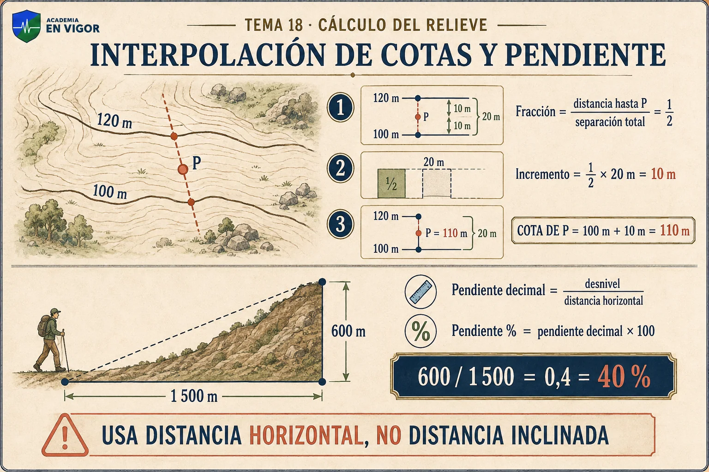

<em>Infografía: interpolación de cotas y pendiente.</em>

<!-- FUENTE: IGN-CONCEPTOS-CARTOGRAFICOS-T18 -->

## 16. Clases del terreno

### Lógica del bloque

Clases del terreno se resuelve distinguiendo el concepto de sus vecinos y comprobando siempre referencia, orientación, unidad y sentido de la operación.

### Desarrollo examinable

- **Terreno llano:** Presenta pendientes pequeñas y escasas variaciones de cota. <!-- FACT:GC-T18-F163 -->
- **Terreno ondulado:** Alterna elevaciones y depresiones suaves sin grandes desniveles abruptos. <!-- FACT:GC-T18-F164 -->
- **Terreno montañoso:** Presenta elevaciones importantes, vertientes marcadas y desniveles considerables. <!-- FACT:GC-T18-F165 -->
- **Terreno escarpado:** Presenta pendientes muy fuertes, cortados o cambios bruscos de nivel. <!-- FACT:GC-T18-F166 -->
- **Terreno compacto:** Ofrece firmeza y cohesión suficientes para soportar el tránsito con relativa estabilidad. <!-- FACT:GC-T18-F167 -->
- **Terreno pedregoso:** Contiene abundancia de piedras o fragmentos rocosos que dificultan el desplazamiento. <!-- FACT:GC-T18-F168 -->
- **Terreno arenoso:** Está formado predominantemente por arena y puede ofrecer poca cohesión. <!-- FACT:GC-T18-F169 -->
- **Terreno suelto:** Posee materiales poco cohesionados que se desplazan con facilidad. <!-- FACT:GC-T18-F170 -->
- **Terreno pantanoso:** Está saturado de agua y ofrece escasa capacidad portante. <!-- FACT:GC-T18-F171 -->
- **Clasificación por relieve:** Distingue llano, ondulado, montañoso y escarpado atendiendo a pendientes y desniveles. <!-- FACT:GC-T18-F172 -->
- **Clasificación por naturaleza:** Atiende a la composición y consistencia física del suelo. <!-- FACT:GC-T18-F173 -->
- **Finalidad operativa:** La clase de terreno condiciona visibilidad, movilidad, itinerarios y elección de puntos de observación. <!-- FACT:GC-T18-F174 -->

:::hablemos-claro
Si dos respuestas usan palabras parecidas, busca qué norte, qué plano de referencia o qué tipo de distancia utiliza cada una.
:::

:::en-la-calle
En una lectura operativa del terreno, combina orientación, escala, pendiente, relieve y accesibilidad; ningún dato aislado describe por sí solo el itinerario.
:::

:::lo-que-cae
Apariciones oficiales mapeadas en este bloque: **0**. Prioridad: fórmulas, unidades, definiciones y accidentes próximos.
:::

<!-- VISUAL:t18-16-clases-del-terreno.webp -->

  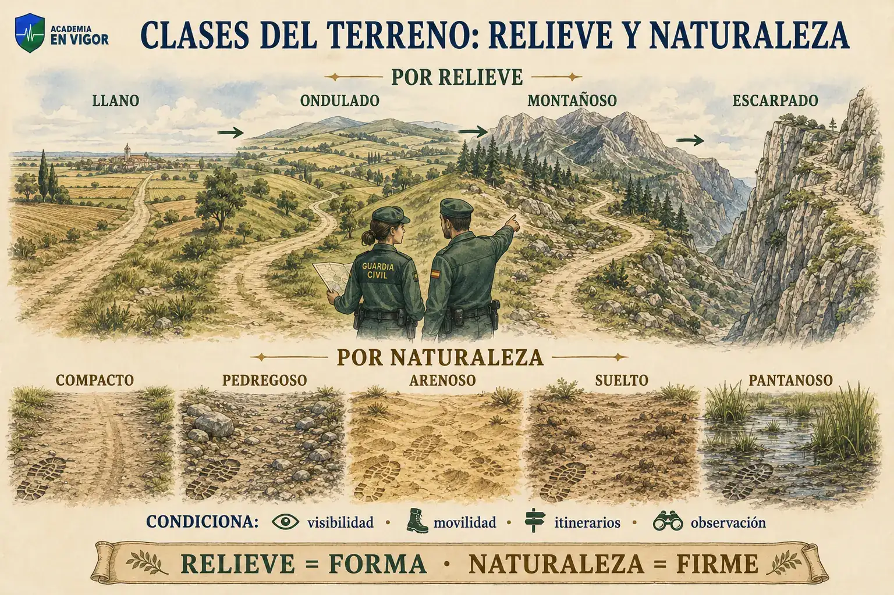

<em>Infografía: clases del terreno.</em>

<!-- FUENTE: IGN-CONCEPTOS-CARTOGRAFICOS-T18 -->

## 17. Accidentes básicos: laderas, divisorias, vaguadas y collados

### Lógica del bloque

Accidentes básicos: laderas, divisorias, vaguadas y collados se resuelve distinguiendo el concepto de sus vecinos y comprobando siempre referencia, orientación, unidad y sentido de la operación.

### Desarrollo examinable

- **Ladera:** Superficie inclinada comprendida entre una zona alta y otra baja del relieve. <!-- FACT:GC-T18-F175 -->
- **Vertiente:** Conjunto de laderas cuyas aguas vierten hacia un mismo cauce o cuenca. <!-- FACT:GC-T18-F176 -->
- **Divisoria:** Línea alta del terreno que separa aguas que discurren hacia vertientes distintas. <!-- FACT:GC-T18-F177 -->
- **Vaguada:** Unión por su parte inferior de dos laderas opuestas que recoge las aguas de ambas. <!-- FACT:GC-T18-F178 -->
- **Regla de alternancia:** Entre dos vaguadas existe una divisoria y entre dos divisorias existe una vaguada. <!-- FACT:GC-T18-F179 -->
- **V en vaguada:** Las curvas forman una V cuyo vértice apunta hacia las cotas más altas o nacimiento del cauce. <!-- FACT:GC-T18-F180 -->
- **V en divisoria:** Las curvas forman una V o U cuya abertura se orienta hacia las cotas más bajas. <!-- FACT:GC-T18-F181 -->
- **Collado:** Punto o zona baja entre dos elevaciones, formado por la unión de dos entrantes y dos salientes. <!-- FACT:GC-T18-F182 -->
- **Puerto:** Paso practicable que aprovecha un collado para atravesar una alineación montañosa. <!-- FACT:GC-T18-F183 -->
- **Hoya:** Depresión del terreno respecto de las zonas que la rodean. <!-- FACT:GC-T18-F184 -->
- **Mogote:** Pequeña elevación aislada, normalmente de forma aproximada troncocónica. <!-- FACT:GC-T18-F185 -->
- **Cima:** Punto o zona más elevada de una montaña o elevación. <!-- FACT:GC-T18-F186 -->
- **Cresta:** Línea superior alargada que enlaza puntos altos de una elevación. <!-- FACT:GC-T18-F187 -->
- **Cantil:** Escarpe o pared de pendiente muy fuerte que produce una ruptura brusca del relieve. <!-- FACT:GC-T18-F188 -->

:::hablemos-claro
Si dos respuestas usan palabras parecidas, busca qué norte, qué plano de referencia o qué tipo de distancia utiliza cada una.
:::

:::en-la-calle
En una lectura operativa del terreno, combina orientación, escala, pendiente, relieve y accesibilidad; ningún dato aislado describe por sí solo el itinerario.
:::

:::lo-que-cae
Apariciones oficiales mapeadas en este bloque: **2**. Prioridad: fórmulas, unidades, definiciones y accidentes próximos.
:::

<!-- VISUAL:t18-17-accidentes-basicos-laderas-divisorias-vaguadas-y-collados.webp -->

  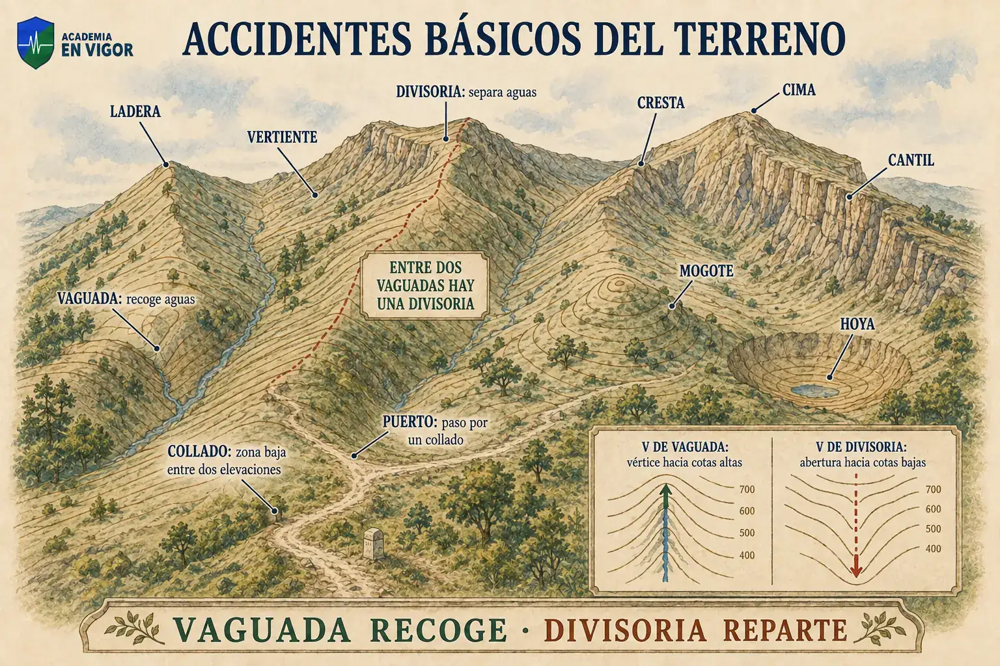

<em>Infografía: accidentes básicos: laderas, divisorias, vaguadas y collados.</em>

<!-- FUENTE: IGN-CONCEPTOS-CARTOGRAFICOS-T18 -->

## 18. Accidentes complejos e hidrográficos

### Lógica del bloque

Accidentes complejos e hidrográficos se resuelve distinguiendo el concepto de sus vecinos y comprobando siempre referencia, orientación, unidad y sentido de la operación.

### Desarrollo examinable

- **Valle:** Zona de terreno comprendida entre grandes divisorias por la que normalmente discurre un curso de agua. <!-- FACT:GC-T18-F189 -->
- **Barranco:** Vaguada profunda y encajada excavada por la erosión o el agua. <!-- FACT:GC-T18-F190 -->
- **Garganta:** Paso estrecho y profundo entre paredes o laderas muy abruptas. <!-- FACT:GC-T18-F191 -->
- **Desfiladero:** Paso largo y estrecho entre montañas o paredes escarpadas. <!-- FACT:GC-T18-F192 -->
- **Macizo:** Agrupación compacta de montañas sin una única dirección general obligatoria. <!-- FACT:GC-T18-F193 -->
- **Sierra:** Alineación de montañas que sigue una dirección general reconocible. <!-- FACT:GC-T18-F194 -->
- **Cordillera:** Sistema extenso de sierras y montañas enlazadas. <!-- FACT:GC-T18-F195 -->
- **Confluencia:** Punto de unión de dos cursos de agua. <!-- FACT:GC-T18-F196 -->
- **Afluente:** Curso de agua que desemboca en otro curso principal. <!-- FACT:GC-T18-F197 -->
- **Vado:** Tramo poco profundo y de fondo firme que permite atravesar un curso de agua. <!-- FACT:GC-T18-F198 -->
- **Meandro:** Curva pronunciada descrita por el cauce de un río. <!-- FACT:GC-T18-F199 -->
- **Cuenca hidrográfica:** Territorio cuyas aguas drenan hacia un mismo río, lago o mar por una red de cauces. <!-- FACT:GC-T18-F200 -->
- **Cauce:** Espacio por el que circula habitualmente una corriente de agua. <!-- FACT:GC-T18-F201 -->
- **Desembocadura:** Lugar donde un curso de agua vierte en otro río, lago o mar. <!-- FACT:GC-T18-F202 -->
- **Error sobre el macizo:** Definir el macizo como montañas con una sola dirección general confunde este accidente con una sierra o alineación. <!-- FACT:GC-T18-F203 -->

:::hablemos-claro
Si dos respuestas usan palabras parecidas, busca qué norte, qué plano de referencia o qué tipo de distancia utiliza cada una.
:::

:::en-la-calle
En una lectura operativa del terreno, combina orientación, escala, pendiente, relieve y accesibilidad; ningún dato aislado describe por sí solo el itinerario.
:::

:::lo-que-cae
Apariciones oficiales mapeadas en este bloque: **3**. Prioridad: fórmulas, unidades, definiciones y accidentes próximos.
:::

<!-- VISUAL:t18-il-18-accidentes-complejos-e-hidrograficos.webp -->

  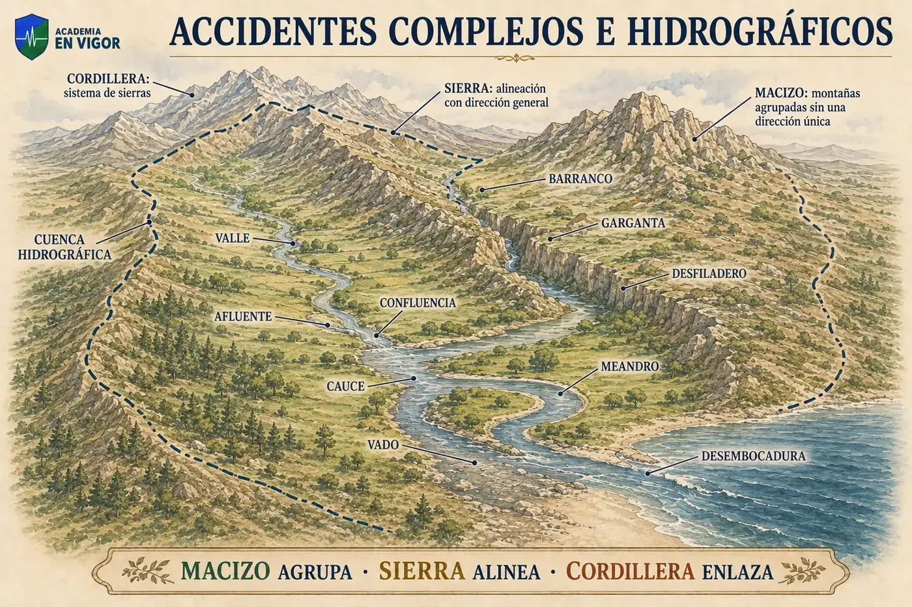

<em>Infografía: accidentes complejos e hidrográficos.</em>

<!-- FUENTE: IGN-CONCEPTOS-CARTOGRAFICOS-T18 -->

# Hablemos claro

La topografía de examen mezcla vocabulario y cálculo. El error más frecuente no es una fórmula desconocida: es usar la fórmula correcta con unidades incompatibles o con la distancia equivocada.

# En la calle

Para orientar un itinerario: identifica el norte de referencia, convierte la escala, lee curvas y accidentes, calcula desniveles y descarta rutas incompatibles con la pendiente o la naturaleza del terreno.

# Lo que cae

Domina acimut frente a rumbo, latitud frente a longitud, escala lineal frente a superficial, distancia horizontal frente a geométrica, y sierra frente a macizo.

# Ha caído

Se han verificado **32** preguntas oficiales entre 2020 y 2026.

- **2020:** 5 preguntas oficiales mapeadas.
- **2021:** 4 preguntas oficiales mapeadas.
- **2022:** 8 preguntas oficiales mapeadas.
- **2023:** 2 preguntas oficiales mapeadas.
- **2024:** 9 preguntas oficiales mapeadas.
- **2025:** 2 preguntas oficiales mapeadas.
- **2026:** 2 preguntas oficiales mapeadas.

---

*Academia En Vigor · El temario que nunca duerme · Tema 18 · v1.0.0 · Documento interno no publicado.*
