# TEMA 1 · DERECHOS HUMANOS

**Guardia Civil · Método VIGOR · PARTE**
**Versión de contenido:** 1.0.0
**Estado editorial:** approved_internal · **Publicación:** not_published

# Mapa del tema

## Ruta de estudio

1. **Naciones Unidas:** Carta, DUDH y Pactos.
2. **Consejo de Europa:** CEDH, TEDH y Carta Social.
3. **Prevención de la tortura:** CAT, OPCAT, SPT y MNP.
4. **Unión Europea:** Carta de Derechos Fundamentales.
5. **Justicia penal internacional:** Estatuto de Roma y cooperación española.

# Contenido

## 01. Propósitos de las Naciones Unidas

Mantener la paz y la seguridad internacionales es el primer propósito de las Naciones Unidas.

- Mantener la paz y la seguridad internacionales es el primer propósito de las Naciones Unidas.
- La ONU debe fomentar relaciones de amistad basadas en la igualdad de derechos y la libre determinación de los pueblos.
- La cooperación internacional incluye problemas económicos, sociales, culturales y humanitarios y el respeto de los derechos humanos.
- La Organización sirve de centro que armoniza los esfuerzos de las naciones para alcanzar propósitos comunes.

<!-- VISUAL:t01-01-mapa-sistemas-derechos-humanos.webp -->

  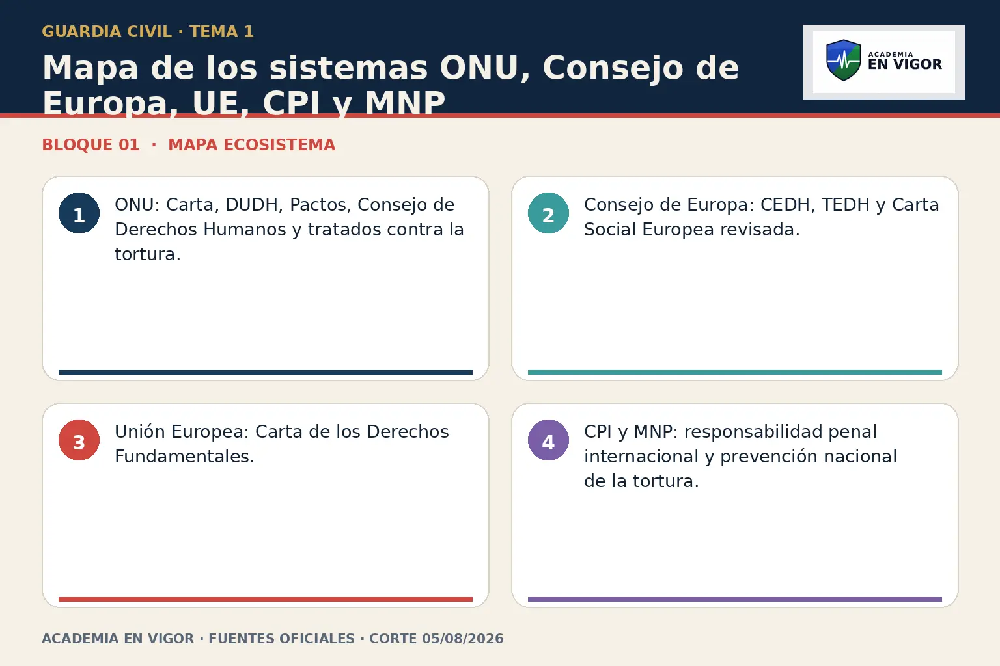

<em>Infografía: Mapa de los sistemas ONU, Consejo de Europa, UE, CPI y MNP.</em>

<!-- VISUAL:t01-il-09-sistemas-proteccion-derechos-humanos.webp -->

  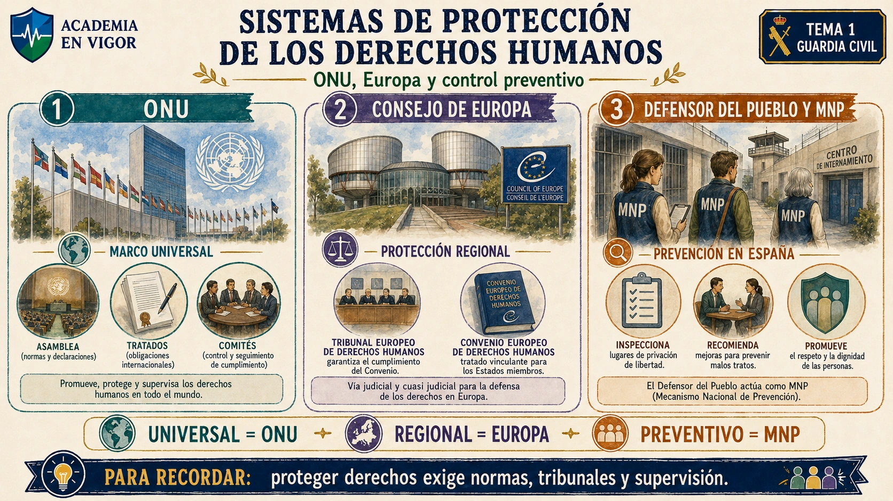

<em>Ilustración: Los sistemas de protección de los derechos humanos.</em>

<!-- FUENTE: ONU-CARTA-GC-T01 -->

## 02. Principios de la Carta

La Organización se basa en la igualdad soberana de todos sus Miembros.

- La Organización se basa en la igualdad soberana de todos sus Miembros.
- Los Miembros deben cumplir de buena fe las obligaciones contraídas conforme a la Carta.
- Las controversias internacionales deben arreglarse por medios pacíficos sin poner en peligro la paz, la seguridad ni la justicia.
- Los Miembros deben abstenerse de la amenaza o del uso de la fuerza incompatible con los propósitos de la ONU.

<!-- FUENTE: ONU-CARTA-GC-T01 -->

## 03. Miembros: admisión, suspensión y expulsión

La admisión de un nuevo Miembro corresponde a la Asamblea General a recomendación del Consejo de Seguridad.

- La admisión de un nuevo Miembro corresponde a la Asamblea General a recomendación del Consejo de Seguridad.
- Pueden ser admitidos los Estados amantes de la paz que acepten las obligaciones de la Carta y estén capacitados y dispuestos a cumplirlas.
- La Asamblea General puede suspender derechos y privilegios de un Miembro a recomendación del Consejo de Seguridad.
- La expulsión por violación repetida de los principios exige decisión de la Asamblea General a recomendación del Consejo de Seguridad.

<!-- FUENTE: ONU-CARTA-GC-T01 -->

## 04. Órganos principales y subsidiarios

La Carta establece seis órganos principales: Asamblea General, Consejo de Seguridad, ECOSOC, Consejo de Administración Fiduciaria, Corte Internacional de Justicia y Secretaría.

- La Carta establece seis órganos principales: Asamblea General, Consejo de Seguridad, ECOSOC, Consejo de Administración Fiduciaria, Corte Internacional de Justicia y Secretaría.
- Los órganos subsidiarios que se estimen necesarios pueden establecerse conforme a la Carta.
- La Corte Internacional de Justicia es un órgano principal; no existe un Consejo Internacional de Justicia.
- La ONU no establece restricciones a la elegibilidad de hombres y mujeres para participar en igualdad en sus órganos principales y subsidiarios.

<!-- VISUAL:t01-02-seis-organos-onu.webp -->

  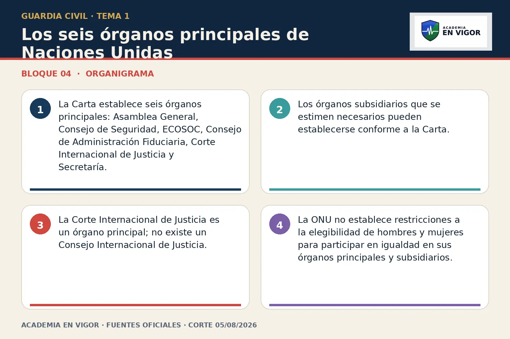

<em>Infografía: Los seis órganos principales de Naciones Unidas.</em>

<!-- FUENTE: ONU-CARTA-GC-T01 -->

## 05. Asamblea General

La Asamblea General está integrada por todos los Miembros y cada Miembro tiene un voto.

- La Asamblea General está integrada por todos los Miembros y cada Miembro tiene un voto.
- Cada Miembro puede tener hasta cinco representantes en la Asamblea General.
- Las cuestiones importantes se deciden por mayoría de dos tercios de los miembros presentes y votantes.
- Las demás cuestiones se deciden por mayoría de los miembros presentes y votantes.

<!-- VISUAL:t01-03-asamblea-vs-consejo.webp -->

  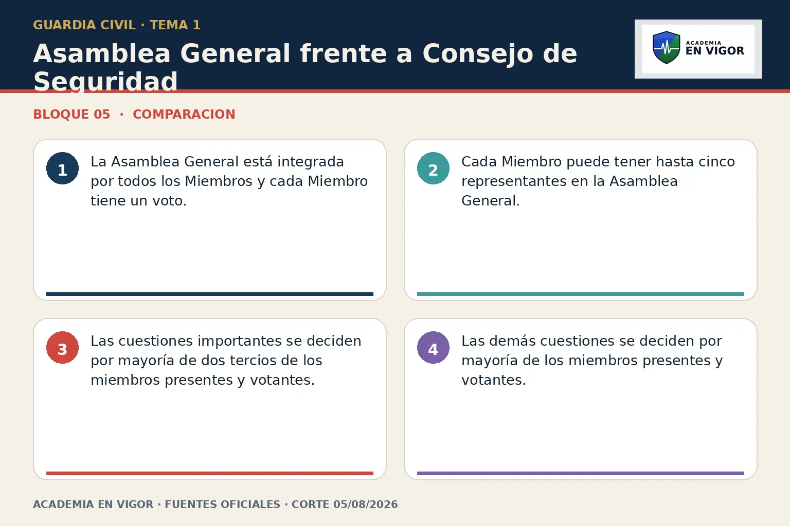

<em>Infografía: Asamblea General frente a Consejo de Seguridad.</em>

<!-- FUENTE: ONU-CARTA-GC-T01 -->

## 06. Consejo de Seguridad y restantes órganos

El Consejo de Seguridad tiene quince miembros, cinco de ellos permanentes.

- El Consejo de Seguridad tiene quince miembros, cinco de ellos permanentes.
- Las decisiones sobre cuestiones de procedimiento requieren nueve votos afirmativos.
- El ECOSOC está compuesto por cincuenta y cuatro miembros elegidos por la Asamblea General.
- El Secretario General es nombrado por la Asamblea General a recomendación del Consejo de Seguridad.

<!-- FUENTE: ONU-CARTA-GC-T01 -->

## 07. Naturaleza y principios de la DUDH

La Declaración fue adoptada y proclamada por la Asamblea General mediante la Resolución 217 A (III), el 10 de diciembre de 1948.

- La Declaración fue adoptada y proclamada por la Asamblea General mediante la Resolución 217 A (III), el 10 de diciembre de 1948.
- Todos los seres humanos nacen libres e iguales en dignidad y derechos.
- Toda persona puede invocar los derechos y libertades sin distinción por las circunstancias enumeradas en el artículo 2.
- La condición política, jurídica o internacional del país o territorio no justifica una distinción en el disfrute de los derechos.

<!-- VISUAL:t01-04-dudh-30-articulos.webp -->

  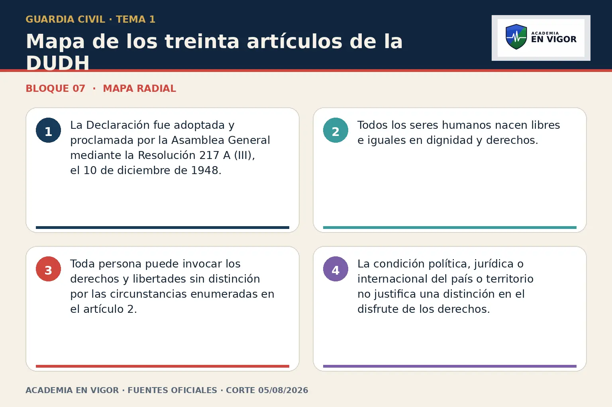

<em>Infografía: Mapa de los treinta artículos de la DUDH.</em>

<!-- VISUAL:t01-il-01-declaracion-universal-derechos-humanos.webp -->

  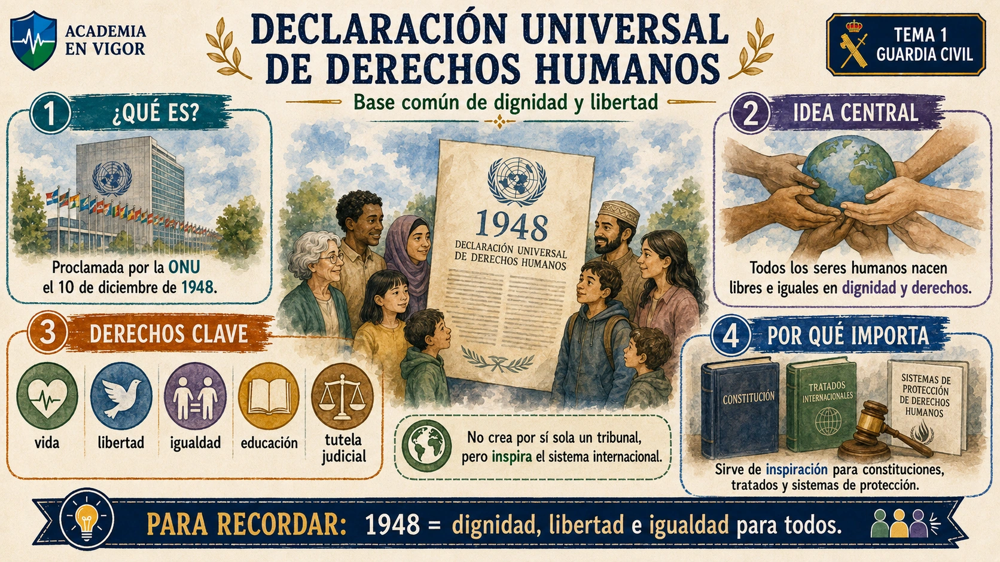

<em>Ilustración: La Declaración Universal de Derechos Humanos.</em>

<!-- FUENTE: ONU-DUDH-GC-T01 -->

## 08. Vida, libertad e integridad

Toda persona tiene derecho a la vida, a la libertad y a la seguridad de su persona.

- Toda persona tiene derecho a la vida, a la libertad y a la seguridad de su persona.
- Nadie estará sometido a esclavitud ni servidumbre y la trata de esclavos está prohibida en todas sus formas.
- Nadie será sometido a torturas ni a penas o tratos crueles, inhumanos o degradantes.

<!-- FUENTE: ONU-DUDH-GC-T01 -->

## 09. Personalidad, igualdad y tutela judicial

Todo ser humano tiene derecho al reconocimiento de su personalidad jurídica en todas partes.

- Todo ser humano tiene derecho al reconocimiento de su personalidad jurídica en todas partes.
- Todos son iguales ante la ley y tienen derecho sin distinción a igual protección de la ley.
- Toda persona tiene derecho a un recurso efectivo ante tribunales nacionales competentes.
- Nadie podrá ser arbitrariamente detenido, preso o desterrado ni sufrir injerencias arbitrarias en su vida privada.

<!-- FUENTE: ONU-DUDH-GC-T01 -->

## 10. Circulación, asilo y nacionalidad

Toda persona tiene derecho a circular y elegir residencia dentro de un Estado y a salir de cualquier país y regresar al propio.

- Toda persona tiene derecho a circular y elegir residencia dentro de un Estado y a salir de cualquier país y regresar al propio.
- En caso de persecución, toda persona tiene derecho a buscar asilo y disfrutar de él en cualquier país.
- El derecho de asilo no puede invocarse frente a una acción judicial realmente originada por delitos comunes o actos contrarios a los propósitos de la ONU.
- Nadie será privado arbitrariamente de su nacionalidad ni del derecho a cambiarla.

<!-- VISUAL:t01-il-01-puerta-del-asilo.webp -->

  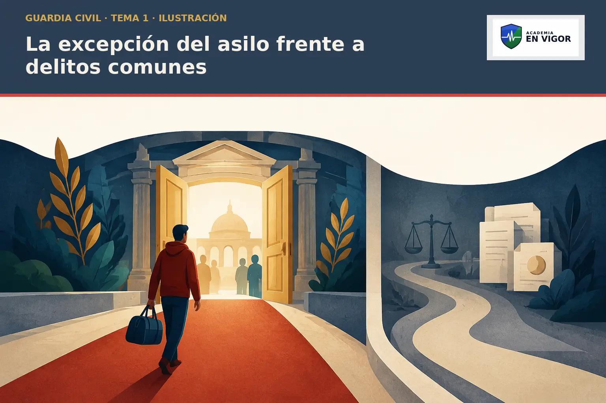

<em>Infografía: La excepción del asilo frente a delitos comunes.</em>

<!-- FUENTE: ONU-DUDH-GC-T01 -->

## 11. Libertades y participación política

Toda persona tiene derecho a la libertad de pensamiento, conciencia y religión, incluido cambiar de religión o creencia.

- Toda persona tiene derecho a la libertad de pensamiento, conciencia y religión, incluido cambiar de religión o creencia.
- La libertad de opinión y expresión comprende investigar, recibir y difundir informaciones e ideas por cualquier medio y sin fronteras.
- Toda persona tiene derecho a la libertad de reunión y asociación pacíficas y nadie puede ser obligado a pertenecer a una asociación.
- La voluntad del pueblo, expresada mediante elecciones auténticas, periódicas, por sufragio universal e igual y voto secreto, es la base de la autoridad del poder público.

<!-- FUENTE: ONU-DUDH-GC-T01 -->

## 12. Derechos sociales, educación y deberes

La DUDH reconoce derechos a seguridad social, trabajo, igual salario, descanso, nivel de vida adecuado y educación.

- La DUDH reconoce derechos a seguridad social, trabajo, igual salario, descanso, nivel de vida adecuado y educación.
- La educación debe orientarse al pleno desarrollo de la personalidad y al fortalecimiento del respeto a los derechos humanos.
- Toda persona tiene deberes respecto de la comunidad, porque solo en ella puede desarrollar libre y plenamente su personalidad.
- Las limitaciones legales solo pueden asegurar derechos ajenos y satisfacer exigencias de moral, orden público y bienestar general en una sociedad democrática.

<!-- FUENTE: ONU-DUDH-GC-T01 -->

## 13. Derechos inderogables y prohibiciones del CEDH

Las Altas Partes Contratantes reconocen a toda persona bajo su jurisdicción los derechos y libertades del Convenio.

- Las Altas Partes Contratantes reconocen a toda persona bajo su jurisdicción los derechos y libertades del Convenio.
- El derecho a la vida está protegido por la ley en los términos del artículo 2.
- Nadie podrá ser sometido a tortura ni a penas o tratos inhumanos o degradantes.
- La prohibición de la tortura no admite derogación ni siquiera en guerra o peligro público.

<!-- VISUAL:t01-il-02-linea-roja-articulo-3.webp -->

  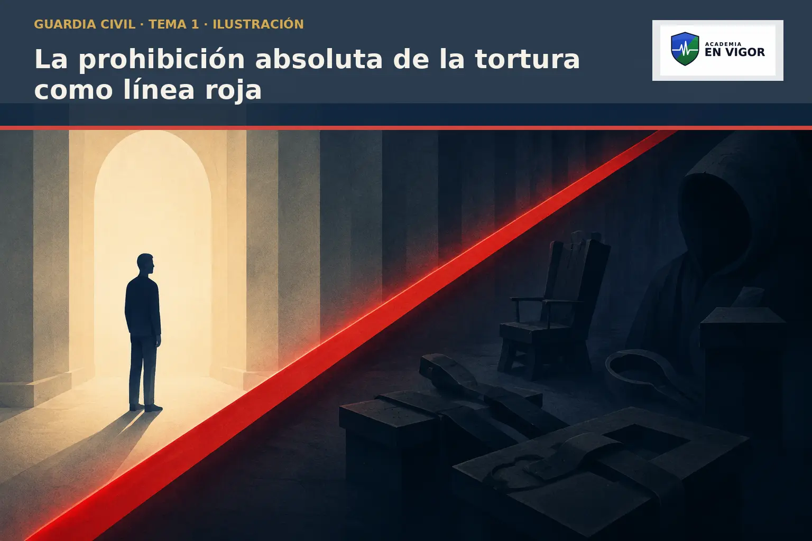

<em>Infografía: La prohibición absoluta de la tortura como línea roja.</em>

<!-- VISUAL:t01-il-02-convenio-europeo-derechos-humanos.webp -->

  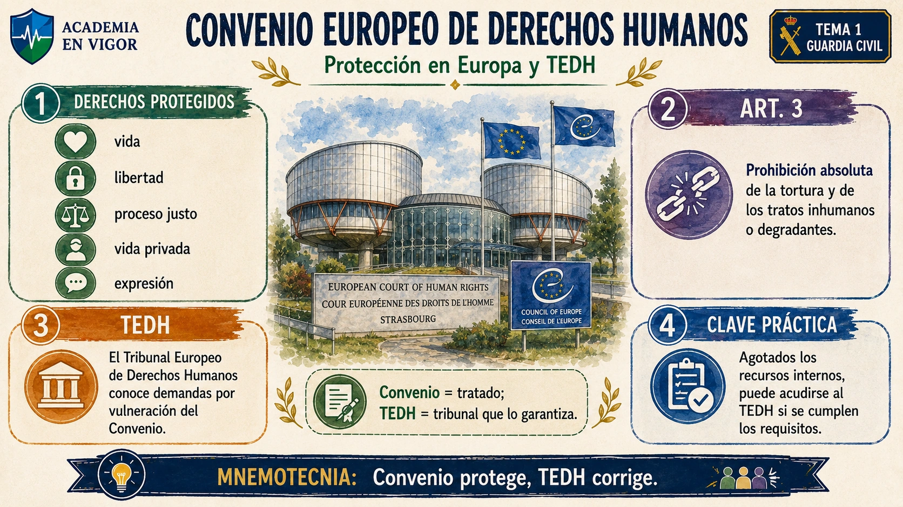

<em>Ilustración: El Convenio Europeo de Derechos Humanos.</em>

<!-- FUENTE: COE-CEDH-GC-T01 -->

## 14. Libertad, seguridad y proceso justo

Nadie puede ser privado de libertad salvo en los casos previstos por el artículo 5 y con arreglo al procedimiento legal.

- Nadie puede ser privado de libertad salvo en los casos previstos por el artículo 5 y con arreglo al procedimiento legal.
- Toda persona detenida debe ser informada, en una lengua que comprenda, de las razones de su detención y de la acusación.
- Toda persona tiene derecho a que su causa sea oída equitativa, públicamente y dentro de un plazo razonable por un tribunal independiente e imparcial.
- Nadie puede ser condenado por una acción u omisión que no constituía infracción cuando se cometió ni sufrir una pena más grave que la aplicable entonces.

<!-- FUENTE: COE-CEDH-GC-T01 -->

## 15. Vida privada y libertades públicas

Toda persona tiene derecho al respeto de su vida privada y familiar, su domicilio y su correspondencia.

- Toda persona tiene derecho al respeto de su vida privada y familiar, su domicilio y su correspondencia.
- La libertad de pensamiento, conciencia y religión incluye cambiar de religión o convicciones y manifestarlas individual o colectivamente.
- La libertad de expresión comprende opinión y recepción o comunicación de informaciones e ideas sin injerencia de autoridades públicas.
- Toda persona tiene derecho a la libertad de reunión pacífica y de asociación, incluido fundar sindicatos y afiliarse a ellos.

<!-- FUENTE: COE-CEDH-GC-T01 -->

## 16. Recursos, discriminación y restricciones

Quien alegue una violación de los derechos del Convenio tiene derecho a un recurso efectivo ante una instancia nacional.

- Quien alegue una violación de los derechos del Convenio tiene derecho a un recurso efectivo ante una instancia nacional.
- El disfrute de los derechos del Convenio debe asegurarse sin discriminación por los motivos del artículo 14.
- Las derogaciones del artículo 15 exigen guerra u otro peligro público que amenace la vida de la nación y medidas estrictamente necesarias.
- Las restricciones permitidas no pueden aplicarse para una finalidad distinta de aquella para la que fueron previstas.

<!-- FUENTE: COE-CEDH-GC-T01 -->

## 17. Jueces del Tribunal Europeo

El Tribunal se compone de un número de jueces igual al de Altas Partes Contratantes.

- El Tribunal se compone de un número de jueces igual al de Altas Partes Contratantes.
- Los jueces son elegidos por la Asamblea Parlamentaria respecto de cada Parte, de una lista de tres candidatos.
- Los jueces deben gozar de la más alta consideración moral y reunir las condiciones para altas funciones judiciales o ser jurisconsultos de reconocida competencia.
- El mandato de los jueces es de nueve años, no son reelegibles y finaliza al alcanzar los setenta años, sin perjuicio de asuntos en curso.

<!-- FUENTE: COE-CEDH-GC-T01 -->

## 18. Formaciones del Tribunal

El Tribunal actúa en formación de juez único, comités de tres jueces, salas de siete jueces y Gran Sala de diecisiete jueces.

- El Tribunal actúa en formación de juez único, comités de tres jueces, salas de siete jueces y Gran Sala de diecisiete jueces.
- El Comité de Ministros puede reducir unánimemente y por tiempo determinado a cinco el número de jueces de las Salas si lo solicita el Pleno.
- El juez único puede declarar inadmisible una demanda individual o archivarla cuando la decisión pueda adoptarse sin examen complementario.
- Si el juez único no adopta esa decisión, remite la demanda a un comité o a una Sala para examen complementario.

<!-- VISUAL:t01-05-formaciones-tedh.webp -->

  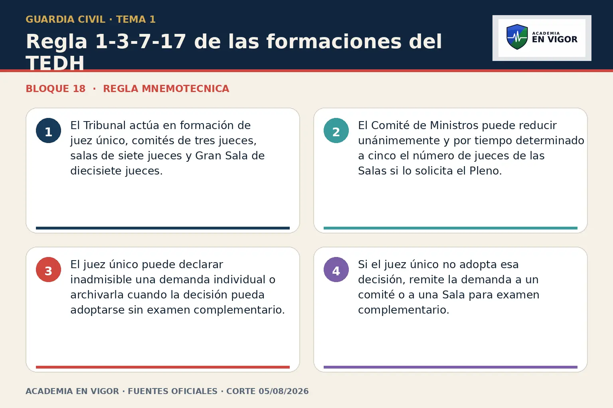

<em>Infografía: Regla 1-3-7-17 de las formaciones del TEDH.</em>

<!-- FUENTE: COE-CEDH-GC-T01 -->

## 19. Demandas, sentencias y ejecución

Las Partes pueden someter al Tribunal incumplimientos imputables a otra Parte y las personas pueden presentar demandas individuales en las condiciones del Convenio.

- Las Partes pueden someter al Tribunal incumplimientos imputables a otra Parte y las personas pueden presentar demandas individuales en las condiciones del Convenio.
- Una parte puede solicitar excepcionalmente la remisión a la Gran Sala dentro de los tres meses siguientes a la sentencia de una Sala.
- Las sentencias y resoluciones deben ser motivadas y las opiniones disidentes pueden unirse a ellas.
- El Comité de Ministros vela por la ejecución de las sentencias definitivas del Tribunal.

<!-- VISUAL:t01-06-recorrido-demanda-tedh.webp -->

  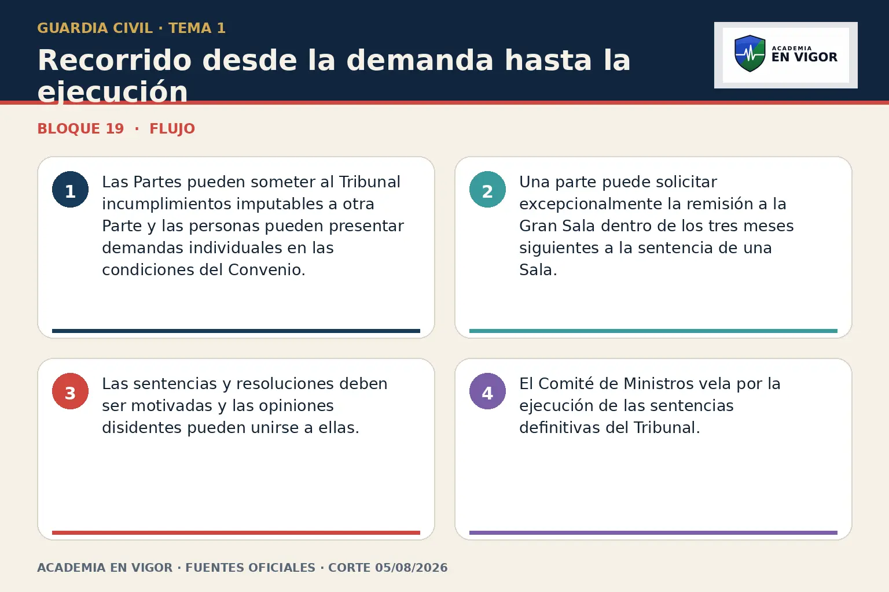

<em>Infografía: Recorrido desde la demanda hasta la ejecución.</em>

<!-- FUENTE: COE-CEDH-GC-T01 -->

## 20. Estructura y compromisos de la Carta Social

La Carta Social Europea revisada fue abierta a la firma en Estrasburgo el 3 de mayo de 1996.

- La Carta Social Europea revisada fue abierta a la firma en Estrasburgo el 3 de mayo de 1996.
- La Parte I contiene derechos y principios como objetivos y la Parte II desarrolla obligaciones jurídicas.
- Cada Parte debe aceptar al menos seis de los nueve artículos del núcleo obligatorio enumerado en el artículo A.
- El compromiso total debe alcanzar al menos dieciséis artículos o sesenta y tres párrafos numerados.

<!-- FUENTE: COE-CSE-GC-T01 -->

## 21. Derechos laborales y sociales

La Carta reconoce trabajo libremente elegido, condiciones equitativas, seguridad e higiene y remuneración suficiente.

- La Carta reconoce trabajo libremente elegido, condiciones equitativas, seguridad e higiene y remuneración suficiente.
- La igualdad de remuneración entre mujeres y hombres por un trabajo de igual valor forma parte del derecho a remuneración equitativa.
- La protección de la maternidad exige un descanso total mínimo de catorce semanas antes y después del parto.
- El derecho a la vivienda comprende favorecer vivienda adecuada, prevenir y paliar la situación de carencia de hogar y hacer asequible el precio.

<!-- VISUAL:t01-07-carta-social-derechos.webp -->

  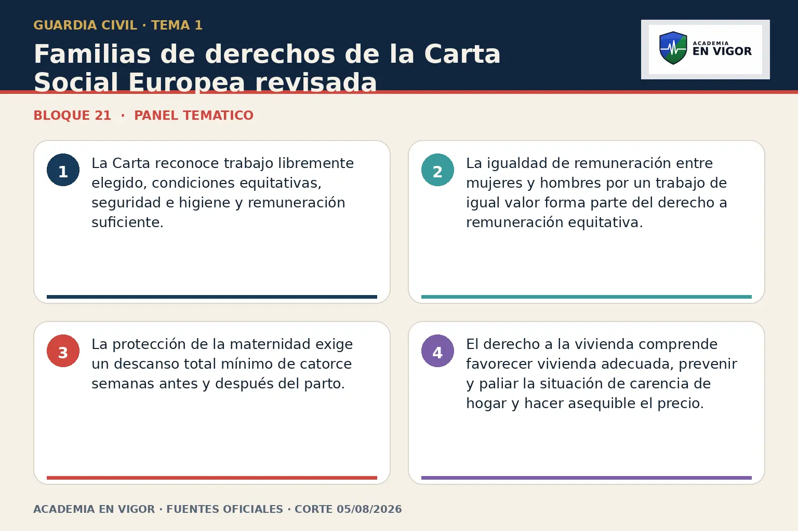

<em>Infografía: Familias de derechos de la Carta Social Europea revisada.</em>

<!-- FUENTE: COE-CSE-GC-T01 -->

## 22. Supervisión, derogaciones y ratificación

El cumplimiento de la Carta se somete al sistema de supervisión previsto para la Carta Social Europea.

- El cumplimiento de la Carta se somete al sistema de supervisión previsto para la Carta Social Europea.
- El artículo F permite derogaciones en guerra o peligro público grave solo en la medida estrictamente necesaria y compatible con otras obligaciones internacionales.
- Los instrumentos de ratificación, aceptación o aprobación se depositan ante el Secretario General del Consejo de Europa.
- La Carta no perjudica normas internas o internacionales que otorguen un trato más favorable.

<!-- FUENTE: COE-CSE-GC-T01 -->

## 23. Obligaciones generales del PIDESC

Todos los pueblos tienen derecho de libre determinación y a disponer libremente de sus riquezas y recursos naturales.

- Todos los pueblos tienen derecho de libre determinación y a disponer libremente de sus riquezas y recursos naturales.
- Cada Estado se compromete a adoptar medidas hasta el máximo de los recursos disponibles para lograr progresivamente la plena efectividad de los derechos.
- Los derechos deben garantizarse sin discriminación y con igualdad entre hombres y mujeres.
- Ninguna disposición puede interpretarse como derecho a destruir los derechos reconocidos o limitarlos más de lo previsto.

<!-- FUENTE: ONU-PIDESC-GC-T01 -->

## 24. Trabajo, familia, nivel de vida y salud

El derecho al trabajo comprende la oportunidad de ganarse la vida mediante un trabajo libremente escogido o aceptado.

- El derecho al trabajo comprende la oportunidad de ganarse la vida mediante un trabajo libremente escogido o aceptado.
- Las condiciones equitativas incluyen remuneración justa, igual salario por trabajo de igual valor, seguridad, higiene, descanso y promoción.
- Debe concederse a la familia la más amplia protección y a las madres especial protección durante un periodo razonable antes y después del parto.
- El Pacto reconoce el derecho de toda persona al disfrute del más alto nivel posible de salud física y mental.

<!-- FUENTE: ONU-PIDESC-GC-T01 -->

## 25. Educación, cultura y supervisión del PIDESC

La enseñanza primaria debe ser obligatoria y asequible a todos gratuitamente.

- La enseñanza primaria debe ser obligatoria y asequible a todos gratuitamente.
- Los Estados reconocen el derecho a participar en la vida cultural y gozar de los beneficios del progreso científico.
- Los Estados presentan informes sobre las medidas adoptadas y progresos realizados en la observancia de los derechos.
- Los instrumentos de ratificación se depositan en poder del Secretario General de las Naciones Unidas.

<!-- VISUAL:t01-08-pidesc-vs-pidcp.webp -->

  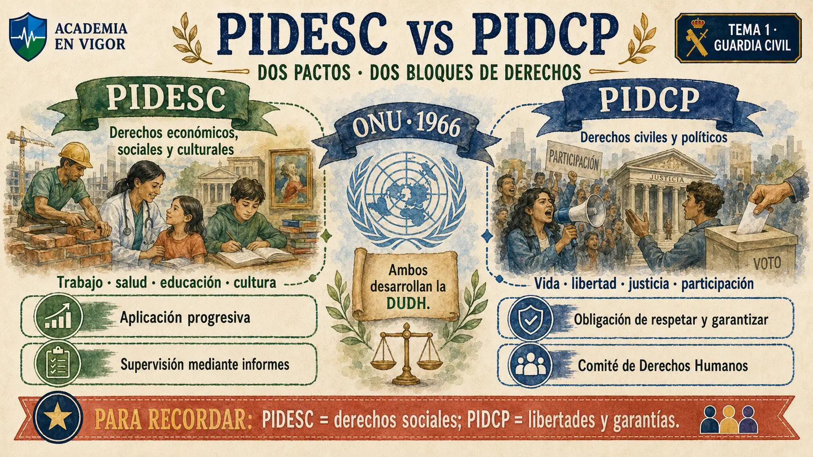

<em>Infografía: Comparación PIDESC y PIDCP.</em>

<!-- FUENTE: ONU-PIDESC-GC-T01 -->

## 26. Obligaciones y derogaciones del PIDCP

Los Estados deben respetar y garantizar los derechos a todas las personas bajo su jurisdicción sin las distinciones del artículo 2.

- Los Estados deben respetar y garantizar los derechos a todas las personas bajo su jurisdicción sin las distinciones del artículo 2.
- Toda persona cuyos derechos sean violados debe disponer de un recurso efectivo decidido por autoridad competente.
- La suspensión de obligaciones exige una situación excepcional que ponga en peligro la vida de la nación y haya sido proclamada oficialmente.
- La suspensión no puede ser incompatible con otras obligaciones internacionales ni entrañar discriminación prohibida.

<!-- FUENTE: ONU-PIDCP-GC-T01 -->

## 27. Vida, tortura y libertad personal

El derecho a la vida es inherente a la persona humana y nadie puede ser privado de ella arbitrariamente.

- El derecho a la vida es inherente a la persona humana y nadie puede ser privado de ella arbitrariamente.
- Nadie será sometido a torturas ni a penas o tratos crueles, inhumanos o degradantes ni a experimentos sin libre consentimiento.
- Todo individuo tiene derecho a la libertad y seguridad personales y nadie puede sufrir detención o prisión arbitrarias.
- Toda persona privada de libertad debe ser tratada humanamente y con el respeto debido a la dignidad inherente al ser humano.

<!-- FUENTE: ONU-PIDCP-GC-T01 -->

## 28. Garantías judiciales y legalidad penal

Todas las personas son iguales ante los tribunales y tienen derecho a ser oídas por un tribunal competente, independiente e imparcial.

- Todas las personas son iguales ante los tribunales y tienen derecho a ser oídas por un tribunal competente, independiente e imparcial.
- Toda persona acusada tiene derecho a que se presuma su inocencia mientras no se pruebe su culpabilidad conforme a la ley.
- Nadie será condenado por actos que no fueran delictivos al cometerse ni se impondrá una pena más grave que la entonces aplicable.
- Todo ser humano tiene derecho al reconocimiento de su personalidad jurídica.

<!-- VISUAL:t01-il-07-garantias-persona-detenida.webp -->

  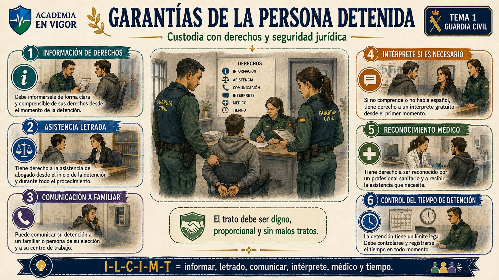

<em>Ilustración: Garantías de la persona detenida.</em>

<!-- FUENTE: ONU-PIDCP-GC-T01 -->

## 29. Libertades, familia y participación

Nadie será objeto de injerencias arbitrarias o ilegales en su vida privada, familia, domicilio o correspondencia.

- Nadie será objeto de injerencias arbitrarias o ilegales en su vida privada, familia, domicilio o correspondencia.
- La libertad de expresión puede quedar sujeta a restricciones legales necesarias para derechos ajenos, seguridad, orden, salud o moral públicos.
- La familia es el elemento natural y fundamental de la sociedad y tiene derecho a protección de la sociedad y del Estado.
- Todo ciudadano tiene derecho a participar, votar y ser elegido en elecciones auténticas por sufragio universal e igual y voto secreto.

<!-- FUENTE: ONU-PIDCP-GC-T01 -->

## 30. Comité de Derechos Humanos

El Comité de Derechos Humanos se compone de dieciocho miembros que actúan a título personal.

- El Comité de Derechos Humanos se compone de dieciocho miembros que actúan a título personal.
- No puede formar parte del Comité más de un nacional de un mismo Estado.
- Los miembros son elegidos por cuatro años y pueden ser reelegidos si se presenta de nuevo su candidatura.
- El Comité elige su Mesa por un periodo de dos años y presenta un informe anual a la Asamblea General por conducto del ECOSOC.

<!-- VISUAL:t01-09-comite-pidcp.webp -->

  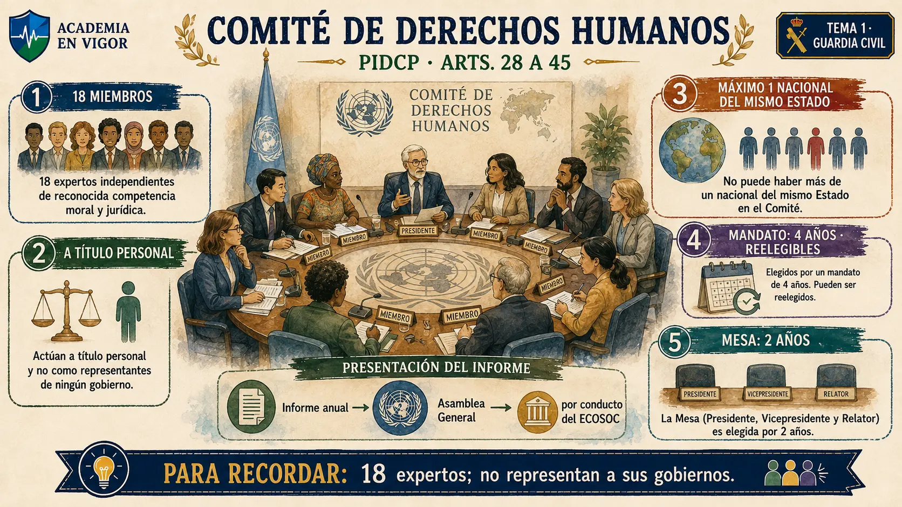

<em>Infografía: Comité de Derechos Humanos: 18 miembros, elección y Mesa.</em>

<!-- FUENTE: ONU-PIDCP-GC-T01 -->

## 31. Creación y mandato del Consejo de Derechos Humanos

La Asamblea General creó el Consejo de Derechos Humanos en 2006 como órgano subsidiario con sede en Ginebra.

- La Asamblea General creó el Consejo de Derechos Humanos en 2006 como órgano subsidiario con sede en Ginebra.
- El Consejo sustituyó a la Comisión de Derechos Humanos.
- Debe promover el respeto universal de todos los derechos y abordar situaciones de violaciones, incluidas las graves y sistemáticas.
- Su labor se guía por universalidad, imparcialidad, objetividad, no selectividad, diálogo constructivo y cooperación.

<!-- FUENTE: ONU-CDH-GC-T01 -->

## 32. Composición y elección del Consejo

El Consejo está compuesto por cuarenta y siete Estados elegidos directa e individualmente por votación secreta de la Asamblea General.

- El Consejo está compuesto por cuarenta y siete Estados elegidos directa e individualmente por votación secreta de la Asamblea General.
- Los miembros ejercen un mandato de tres años y no pueden ser reelegidos inmediatamente tras dos mandatos consecutivos.
- La distribución es: África 13, Asia-Pacífico 13, América Latina y Caribe 8, Europa Occidental y otros 7 y Europa Oriental 6.
- La Asamblea General puede suspender por mayoría de dos tercios a un miembro que cometa violaciones graves y sistemáticas de derechos humanos.

<!-- VISUAL:t01-10-escanos-consejo-ddhh.webp -->

  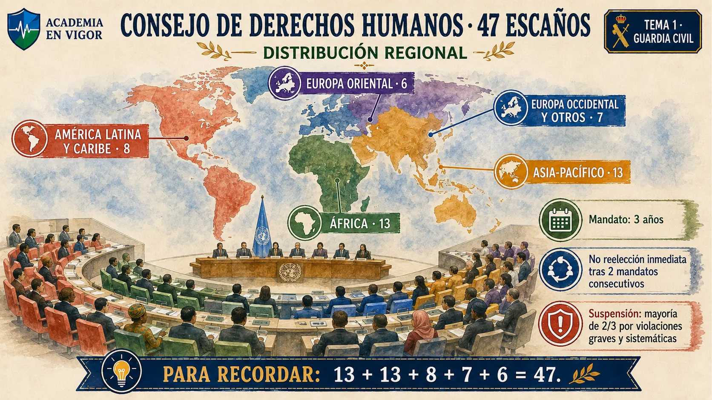

<em>Infografía: Distribución regional de los 47 escaños.</em>

<!-- FUENTE: ONU-CDH-GC-T01 -->

## 33. EPU, procedimiento de quejas y Mesa

El Examen Periódico Universal revisa la situación de derechos humanos de todos los Estados miembros de la ONU.

- El Examen Periódico Universal revisa la situación de derechos humanos de todos los Estados miembros de la ONU.
- El EPU es un mecanismo cooperativo, intergubernamental y basado en información objetiva y diálogo interactivo.
- El procedimiento de quejas es confidencial y se dirige a cuadros persistentes de violaciones graves y fehacientemente probadas.
- La Mesa del Consejo está compuesta por un Presidente y cuatro Vicepresidentes, uno por cada grupo regional.

<!-- VISUAL:t01-11-mecanismos-consejo-ddhh.webp -->

  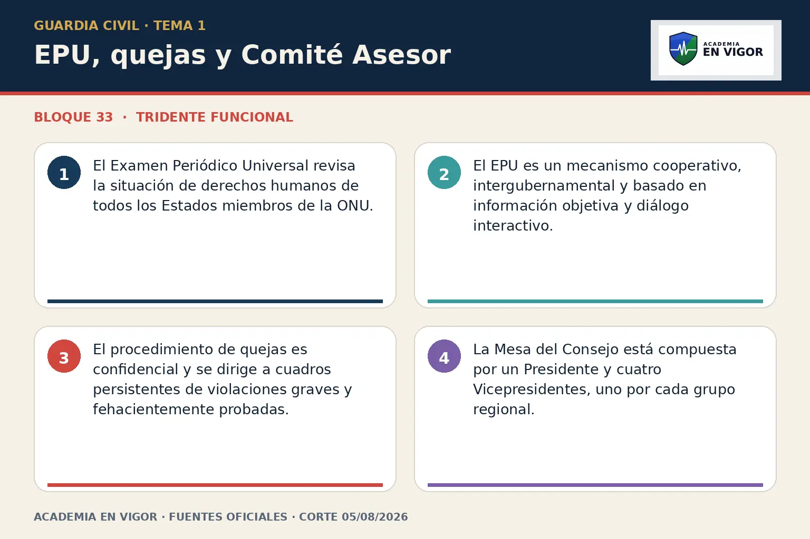

<em>Infografía: EPU, quejas y Comité Asesor.</em>

<!-- FUENTE: ONU-CDH-GC-T01 -->

## 34. Definición y prohibición de la tortura

Tortura es el dolor o sufrimiento grave infligido intencionadamente con una finalidad de las previstas y con intervención, instigación o consentimiento de un funcionario u otra persona en ejercicio de funciones públicas.

- Tortura es el dolor o sufrimiento grave infligido intencionadamente con una finalidad de las previstas y con intervención, instigación o consentimiento de un funcionario u otra persona en ejercicio de funciones públicas.
- No se consideran tortura los dolores o sufrimientos derivados únicamente de sanciones legítimas, inherentes o incidentales a ellas.
- Ninguna circunstancia excepcional ni orden de un superior puede invocarse para justificar la tortura.
- Ningún Estado expulsará, devolverá o extraditará a una persona cuando haya razones fundadas para creer que estaría en peligro de ser torturada.

<!-- VISUAL:t01-il-03-prohibicion-sin-excusas.webp -->

  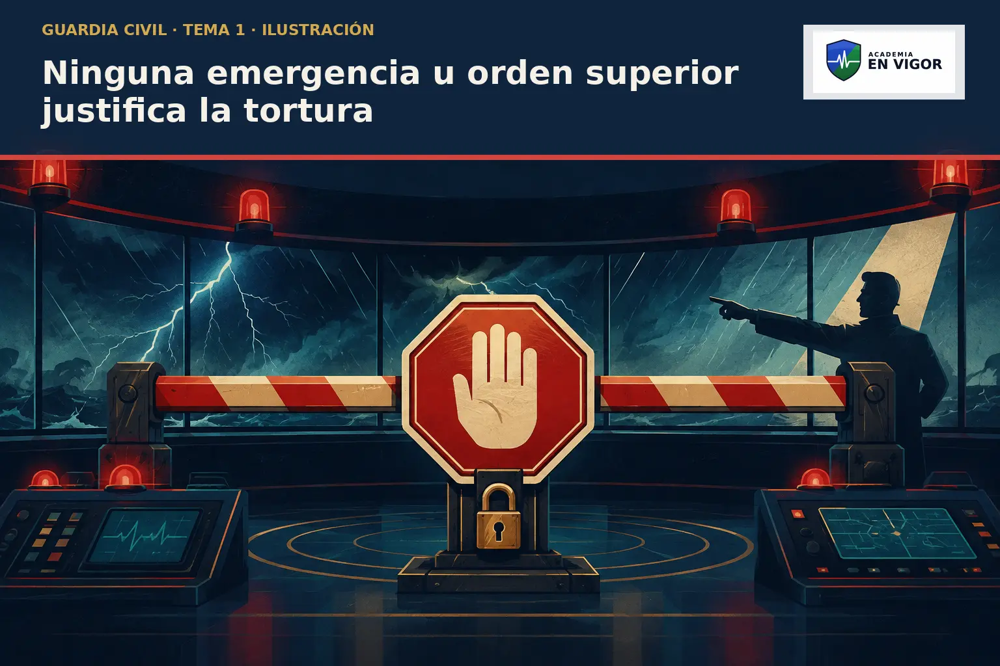

<em>Infografía: Ninguna emergencia u orden superior justifica la tortura.</em>

<!-- VISUAL:t01-il-06-prohibicion-tortura-malos-tratos.webp -->

  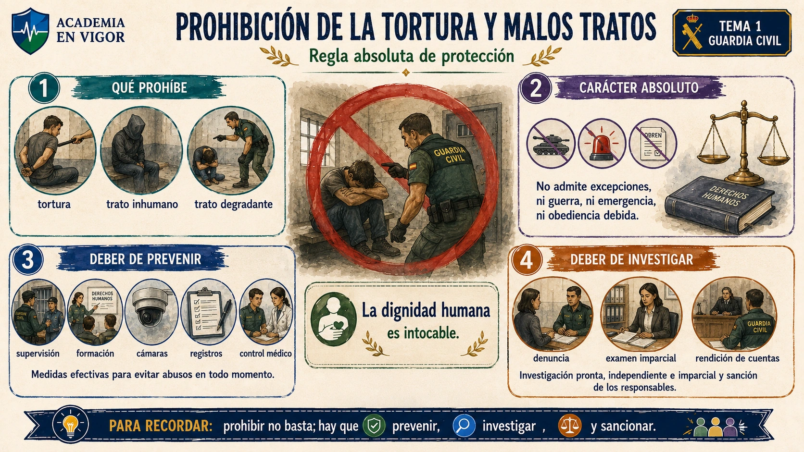

<em>Ilustración: Prohibición de la tortura y de los malos tratos.</em>

<!-- FUENTE: ONU-CAT-GC-T01 -->

## 35. Delitos, jurisdicción y extradición

Todo Estado debe tipificar la tortura, su tentativa y la complicidad o participación y sancionarlas con penas adecuadas a su gravedad.

- Todo Estado debe tipificar la tortura, su tentativa y la complicidad o participación y sancionarlas con penas adecuadas a su gravedad.
- La jurisdicción debe establecerse por territorio, pabellón, nacionalidad del autor y, en ciertos casos, nacionalidad de la víctima.
- Si el presunto autor se encuentra en el territorio y no es extraditado, el Estado somete el caso a sus autoridades competentes para enjuiciamiento.
- Los Estados se prestan la mayor asistencia posible en procedimientos penales relativos a estos delitos.

<!-- FUENTE: ONU-CAT-GC-T01 -->

## 36. Prevención, investigación y reparación

La formación del personal encargado de aplicar la ley debe incluir plenamente la prohibición de la tortura.

- La formación del personal encargado de aplicar la ley debe incluir plenamente la prohibición de la tortura.
- Las normas, métodos y prácticas de interrogatorio y custodia deben examinarse sistemáticamente para prevenir torturas.
- Las autoridades deben investigar pronta e imparcialmente cuando existan motivos razonables para creer que se cometió tortura.
- Ninguna declaración obtenida mediante tortura puede invocarse como prueba salvo contra la persona acusada de tortura para demostrar que se formuló.

<!-- VISUAL:t01-12-cadena-prevencion-cat.webp -->

  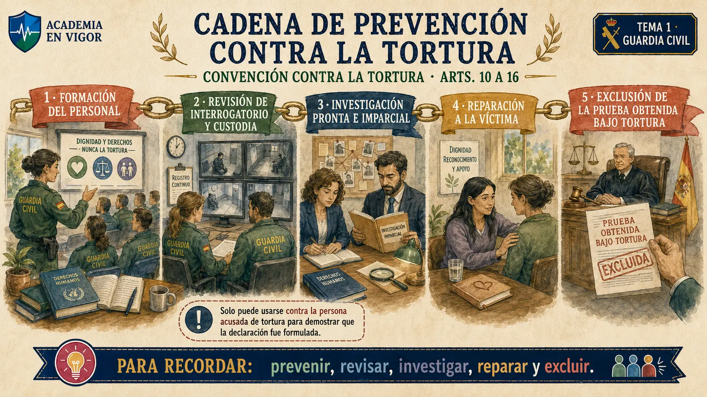

<em>Infografía: Formación, revisión, investigación, reparación y exclusión probatoria.</em>

<!-- FUENTE: ONU-CAT-GC-T01 -->

## 37. Comité contra la Tortura

El Comité contra la Tortura está compuesto por diez expertos de gran integridad moral y reconocida competencia.

- El Comité contra la Tortura está compuesto por diez expertos de gran integridad moral y reconocida competencia.
- Sus miembros son elegidos por cuatro años y pueden ser reelegidos si vuelven a ser propuestos.
- El Comité elige su Mesa por dos años y adopta su reglamento; seis miembros constituyen quórum.
- Las decisiones del Comité se toman por mayoría de votos de los miembros presentes.

<!-- VISUAL:t01-13-comite-contra-tortura.webp -->

  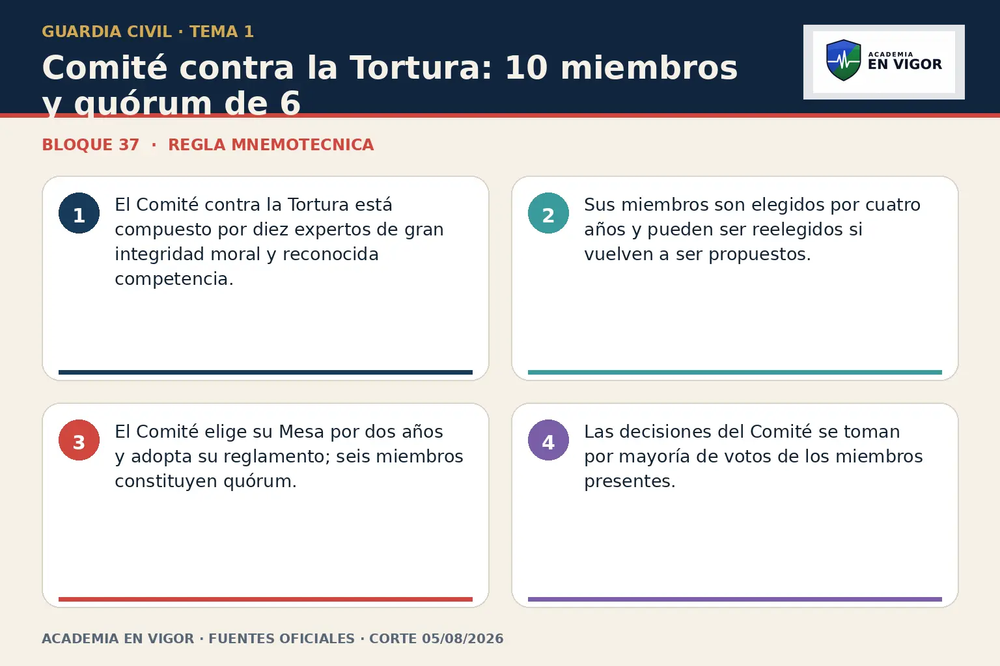

<em>Infografía: Comité contra la Tortura: 10 miembros y quórum de 6.</em>

<!-- FUENTE: ONU-CAT-GC-T01 -->

## 38. Objeto y ámbito del Protocolo Facultativo

El Protocolo crea un sistema de visitas periódicas de órganos internacionales y nacionales independientes a lugares de privación de libertad.

- El Protocolo crea un sistema de visitas periódicas de órganos internacionales y nacionales independientes a lugares de privación de libertad.
- Se establece un Subcomité para la Prevención de la Tortura del Comité contra la Tortura.
- Cada Estado debe establecer, designar o mantener uno o varios mecanismos nacionales de prevención.
- Privación de libertad comprende cualquier detención, encarcelamiento o custodia de la que la persona no pueda salir libremente por orden de autoridad.

<!-- VISUAL:t01-14-opcat-doble-mecanismo.webp -->

  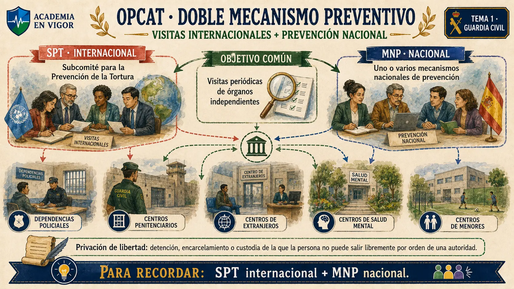

<em>Infografía: SPT internacional y MNP nacional.</em>

<!-- FUENTE: ONU-OPCAT-GC-T01 -->

## 39. Composición y elección del Subcomité

El Subcomité está compuesto por veinticinco miembros elegidos entre personas de gran integridad y experiencia pertinente.

- El Subcomité está compuesto por veinticinco miembros elegidos entre personas de gran integridad y experiencia pertinente.
- No puede haber dos miembros nacionales de un mismo Estado Parte.
- Los miembros son elegidos por cuatro años y pueden ser reelegidos una vez si se presenta de nuevo su candidatura.
- El Subcomité elige su Mesa por dos años y celebra sus periodos de sesiones a puerta cerrada.

<!-- FUENTE: ONU-OPCAT-GC-T01 -->

## 40. Visitas y mandato del Subcomité

El Subcomité visita lugares de privación de libertad y formula recomendaciones a los Estados sobre protección frente a tortura y malos tratos.

- El Subcomité visita lugares de privación de libertad y formula recomendaciones a los Estados sobre protección frente a tortura y malos tratos.
- Los Estados deben permitir acceso sin restricciones a información, lugares y entrevistas privadas con personas privadas de libertad.
- Solo caben objeciones temporales a una visita concreta por razones urgentes y apremiantes de defensa, seguridad, desastre natural o grave alteración del orden.
- El Subcomité comunica confidencialmente sus recomendaciones; puede publicarlas si el Estado lo solicita o hace pública una parte.

<!-- VISUAL:t01-15-visita-preventiva-spt.webp -->

  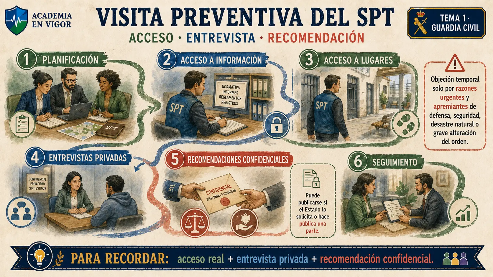

<em>Infografía: Flujo de una visita preventiva.</em>

<!-- FUENTE: ONU-OPCAT-GC-T01 -->

## 41. Mecanismos nacionales de prevención

Los mecanismos nacionales deben gozar de independencia funcional y contar con personal experto y recursos necesarios.

- Los mecanismos nacionales deben gozar de independencia funcional y contar con personal experto y recursos necesarios.
- Deben poder examinar regularmente el trato a personas privadas de libertad y formular recomendaciones y propuestas normativas.
- Los Estados deben conceder acceso a información, lugares y entrevistas privadas y proteger a quienes comuniquen información.
- Las autoridades competentes deben examinar las recomendaciones del mecanismo y entablar diálogo sobre posibles medidas de aplicación.

<!-- FUENTE: ONU-OPCAT-GC-T01 -->

## 42. Valor y ámbito de la Carta de la UE

La Carta reúne derechos bajo dignidad, libertades, igualdad, solidaridad, ciudadanía, justicia y disposiciones generales.

- La Carta reúne derechos bajo dignidad, libertades, igualdad, solidaridad, ciudadanía, justicia y disposiciones generales.
- Tiene el mismo valor jurídico que los Tratados de la Unión Europea.
- Se dirige a instituciones, órganos y organismos de la Unión y a los Estados miembros únicamente cuando aplican Derecho de la Unión.
- La Carta no amplía las competencias de la Unión definidas en los Tratados.

<!-- VISUAL:t01-16-siete-titulos-carta-ue.webp -->

  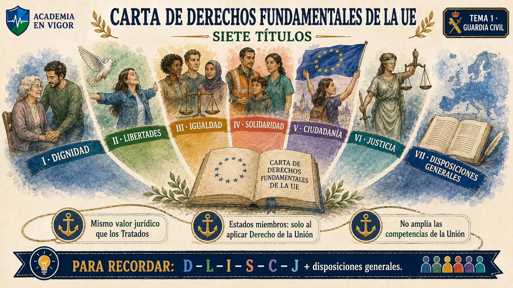

<em>Infografía: Los siete títulos de la Carta de la UE.</em>

<!-- FUENTE: UE-CARTA-GC-T01 -->

## 43. Dignidad, libertades e igualdad

La dignidad humana es inviolable y debe ser respetada y protegida.

- La dignidad humana es inviolable y debe ser respetada y protegida.
- La Carta reconoce vida, integridad, prohibición de tortura, esclavitud y trata de seres humanos.
- Las libertades incluyen seguridad, vida privada, datos personales, pensamiento, expresión, reunión, educación, trabajo, propiedad y asilo.
- El título de Igualdad incluye igualdad ante la ley, no discriminación, diversidad, igualdad entre mujeres y hombres, infancia, mayores y discapacidad.

<!-- FUENTE: UE-CARTA-GC-T01 -->

## 44. Solidaridad, ciudadanía y justicia

Solidaridad incluye información y consulta laboral, negociación colectiva, protección frente al despido, condiciones justas, seguridad social, salud y ambiente.

- Solidaridad incluye información y consulta laboral, negociación colectiva, protección frente al despido, condiciones justas, seguridad social, salud y ambiente.
- La edad mínima de admisión al trabajo no puede ser inferior a la edad en que concluye la escolaridad obligatoria, sin perjuicio de excepciones limitadas.
- La ciudadanía comprende sufragio europeo y municipal, buena administración, acceso a documentos, Defensor del Pueblo Europeo, petición y circulación.
- Justicia incluye tutela judicial efectiva, juez imparcial, presunción de inocencia, legalidad penal y non bis in idem.

<!-- FUENTE: UE-CARTA-GC-T01 -->

## 45. Alcance e interpretación de los derechos

Toda limitación debe estar establecida por ley, respetar el contenido esencial y ser proporcionada y necesaria para objetivos de interés general o derechos ajenos.

- Toda limitación debe estar establecida por ley, respetar el contenido esencial y ser proporcionada y necesaria para objetivos de interés general o derechos ajenos.
- Los derechos correspondientes a los garantizados por el CEDH tienen igual sentido y alcance, sin impedir mayor protección de la Unión.
- La Carta no puede interpretarse como limitativa de derechos reconocidos por el Derecho de la Unión, internacional, convenios o constituciones nacionales.
- Ninguna disposición confiere derecho a destruir derechos o imponer limitaciones más amplias que las previstas.

<!-- FUENTE: UE-CARTA-GC-T01 -->

## 46. Corte, competencia y crímenes

La Corte Penal Internacional es una institución permanente y complementaria de las jurisdicciones penales nacionales.

- La Corte Penal Internacional es una institución permanente y complementaria de las jurisdicciones penales nacionales.
- Su competencia se limita a genocidio, crímenes de lesa humanidad, crímenes de guerra y crimen de agresión.
- La Corte solo tiene competencia respecto de crímenes cometidos después de la entrada en vigor del Estatuto para el Estado correspondiente.
- La competencia puede basarse en territorio, nacionalidad, remisión de un Estado, remisión del Consejo de Seguridad o aceptación ad hoc en los términos del Estatuto.

<!-- VISUAL:t01-17-cuatro-crimenes-cpi.webp -->

  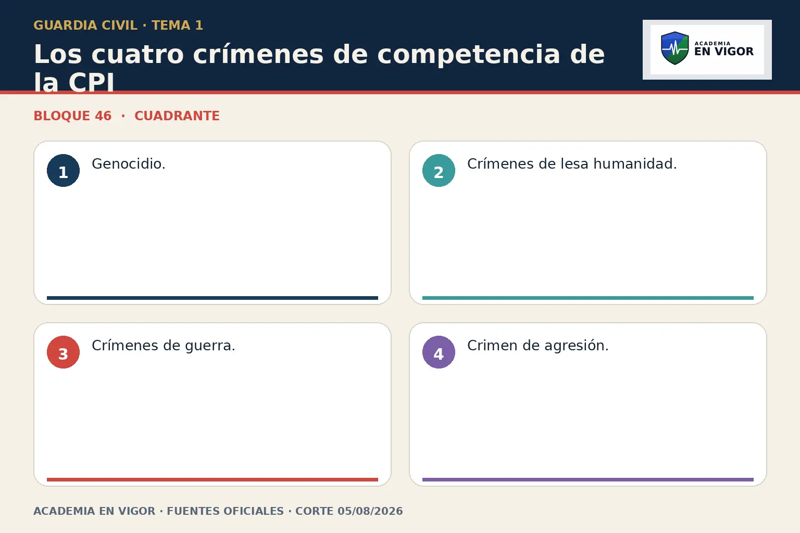

<em>Infografía: Los cuatro crímenes de competencia de la CPI.</em>

<!-- VISUAL:t01-il-03-corte-penal-internacional.webp -->

  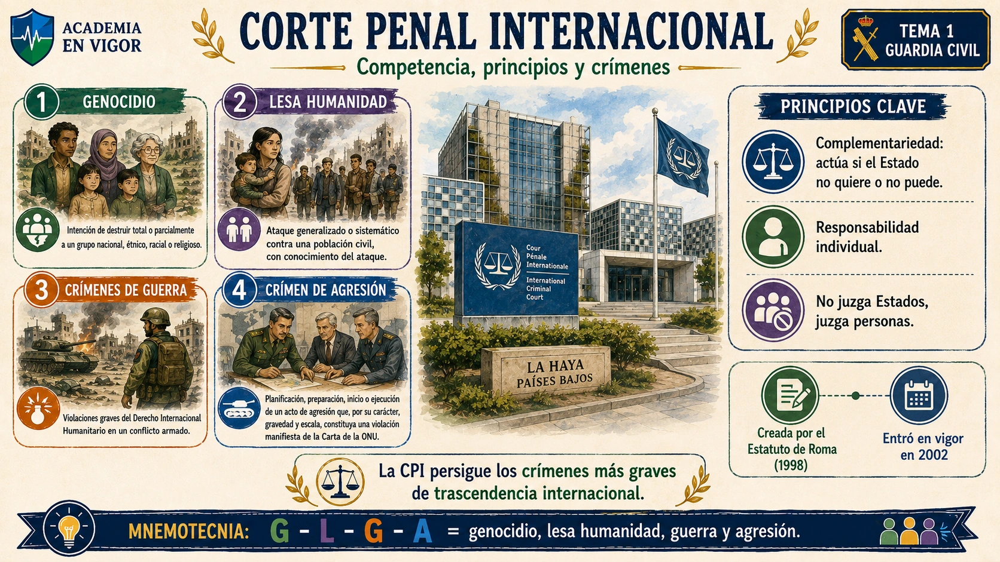

<em>Ilustración: La Corte Penal Internacional.</em>

<!-- FUENTE: CPI-ESTATUTO-GC-T01 -->

## 47. Genocidio y lesa humanidad

El genocidio exige intención de destruir total o parcialmente a un grupo nacional, étnico, racial o religioso como tal.

- El genocidio exige intención de destruir total o parcialmente a un grupo nacional, étnico, racial o religioso como tal.
- Entre los actos de genocidio figuran matar, lesionar gravemente, someter a condiciones destructivas, impedir nacimientos y trasladar por fuerza a niños.
- Los crímenes de lesa humanidad exigen un ataque generalizado o sistemático contra una población civil y conocimiento de dicho ataque.
- Exterminio incluye imponer intencionalmente condiciones de vida, como privación de alimentos o medicinas, encaminadas a destruir parte de una población.

<!-- VISUAL:t01-il-04-genocidio-vs-lesa.webp -->

  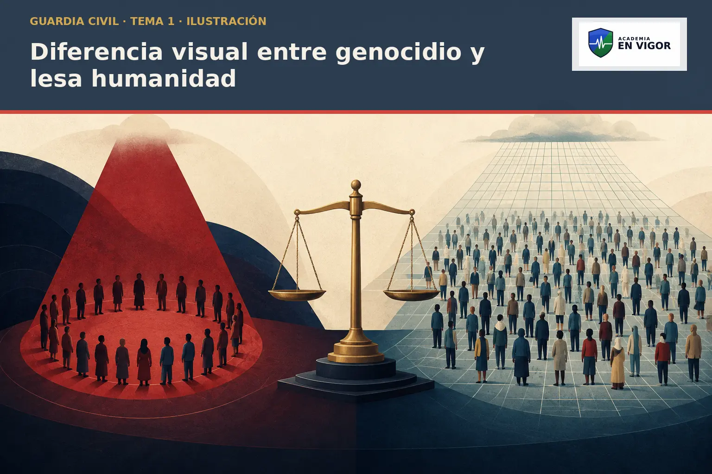

<em>Infografía: Diferencia visual entre genocidio y lesa humanidad.</em>

<!-- FUENTE: CPI-ESTATUTO-GC-T01 -->

## 48. Crímenes de guerra, agresión y elementos

Los crímenes de guerra comprenden infracciones graves y otras violaciones graves del derecho aplicable en conflictos armados.

- Los crímenes de guerra comprenden infracciones graves y otras violaciones graves del derecho aplicable en conflictos armados.
- El crimen de agresión exige planificación, preparación, iniciación o realización de un acto de agresión por quien controle o dirija efectivamente la acción política o militar de un Estado.
- Los Elementos de los Crímenes ayudan a la Corte a interpretar y aplicar los artículos 6, 7, 8 y 8 bis.
- Pueden proponer enmiendas a los Elementos un Estado Parte, los magistrados por mayoría absoluta o el Fiscal.

<!-- FUENTE: CPI-ESTATUTO-GC-T01 -->

## 49. Principios generales de Derecho penal

La Corte aplica en primer lugar el Estatuto, los Elementos de los Crímenes y sus Reglas de Procedimiento y Prueba.

- La Corte aplica en primer lugar el Estatuto, los Elementos de los Crímenes y sus Reglas de Procedimiento y Prueba.
- Nullum crimen sine lege exige que la conducta constituya crimen de competencia de la Corte cuando se realice y prohíbe la analogía extensiva contra el acusado.
- La Corte no es competente respecto de quien fuera menor de dieciocho años en el momento de la presunta comisión.
- Los crímenes de competencia de la Corte no prescriben.

<!-- FUENTE: CPI-ESTATUTO-GC-T01 -->

## 50. Órganos de la Corte y Fiscalía

Los órganos son Presidencia, Sección de Apelaciones, Sección de Primera Instancia, Sección de Cuestiones Preliminares, Fiscalía y Secretaría.

- Los órganos son Presidencia, Sección de Apelaciones, Sección de Primera Instancia, Sección de Cuestiones Preliminares, Fiscalía y Secretaría.
- La Fiscalía actúa independientemente como órgano separado de la Corte.
- La Fiscalía está dirigida por el Fiscal, con plena autoridad sobre su administración y personal.
- La Secretaría administra los aspectos no judiciales de la Corte sin perjuicio de las funciones de la Fiscalía.

<!-- VISUAL:t01-18-organos-cpi.webp -->

  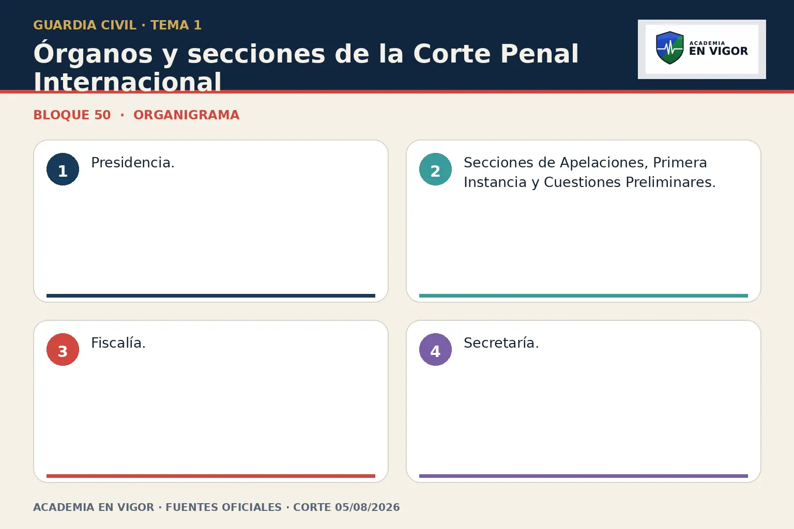

<em>Infografía: Órganos y secciones de la Corte Penal Internacional.</em>

<!-- FUENTE: CPI-ESTATUTO-GC-T01 -->

## 51. Admisibilidad, cooperación y penas

Un asunto es inadmisible si está siendo investigado o enjuiciado genuinamente por un Estado competente, salvo falta de disposición o capacidad real.

- Un asunto es inadmisible si está siendo investigado o enjuiciado genuinamente por un Estado competente, salvo falta de disposición o capacidad real.
- Los Estados Partes deben cooperar plenamente con la Corte en investigación y enjuiciamiento de crímenes de su competencia.
- La Corte puede imponer prisión hasta treinta años o reclusión a perpetuidad cuando lo justifiquen extrema gravedad y circunstancias personales.
- Las penas de prisión se cumplen en un Estado designado por la Corte entre los que hayan manifestado disposición a recibir condenados.

<!-- FUENTE: CPI-ESTATUTO-GC-T01 -->

## 52. Objeto y autoridades de cooperación

La Ley Orgánica 18/2003 regula las relaciones de cooperación entre España y la CPI y los procedimientos internos complementarios.

- La Ley Orgánica 18/2003 regula las relaciones de cooperación entre España y la CPI y los procedimientos internos complementarios.
- El Ministerio de Justicia es la autoridad central para transmitir solicitudes de cooperación, sin perjuicio de competencias de otros órganos.
- La representación y defensa de España ante los órganos de la Corte corresponde a los Abogados del Estado integrados en el servicio jurídico competente.
- El Gobierno puede solicitar informe de la Fiscalía General del Estado y otros órganos para adoptar decisiones de cooperación.

<!-- VISUAL:t01-19-cooperacion-espana-cpi.webp -->

  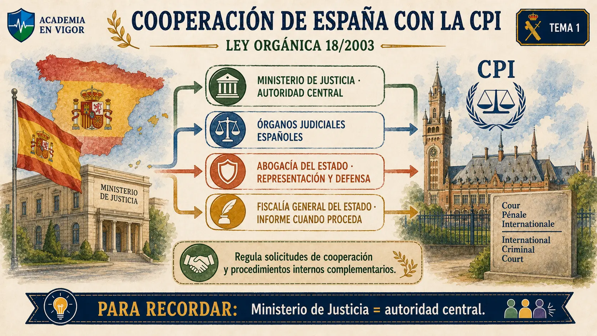

<em>Infografía: Circuito español de cooperación con la CPI.</em>

<!-- FUENTE: BOE-LO18-2003-GC-T01 -->

## 53. Cooperación activa, investigación e inhibición

España puede solicitar al Fiscal de la Corte que inicie una investigación conforme al Estatuto.

- España puede solicitar al Fiscal de la Corte que inicie una investigación conforme al Estatuto.
- La decisión de formular una solicitud de investigación corresponde al Gobierno mediante acuerdo del Consejo de Ministros.
- El Gobierno decide sobre requerimientos de inhibición al Fiscal y sobre impugnación de competencia o admisibilidad conforme a la Ley y el Estatuto.
- La inhibición de órganos judiciales españoles a favor de la Corte se canaliza mediante los procedimientos previstos legalmente.

<!-- FUENTE: BOE-LO18-2003-GC-T01 -->

## 54. Detención, comparecencia y entrega

La solicitud de detención y entrega se tramita judicialmente con las garantías previstas en la Ley.

- La solicitud de detención y entrega se tramita judicialmente con las garantías previstas en la Ley.
- La persona reclamada puede consentir la entrega simplificada en las condiciones legales.
- Las solicitudes concurrentes de la CPI y de otro Estado se resuelven aplicando los criterios del Estatuto y de la Ley.
- La entrega temporal y las actuaciones posteriores a la entrega requieren acuerdo y coordinación con la Corte.

<!-- FUENTE: BOE-LO18-2003-GC-T01 -->

## 55. Otras formas de cooperación y ejecución

Si España es invitada como amicus curiae, el Abogado del Estado consulta al Ministerio de Asuntos Exteriores para decidir conveniencia y términos.

- Si España es invitada como amicus curiae, el Abogado del Estado consulta al Ministerio de Asuntos Exteriores para decidir conveniencia y términos.
- El Ministerio de Justicia comunica a la Corte la decisión sobre celebrar juicio u otras actuaciones procesales en España tras las consultas previstas.
- España puede ejecutar penas impuestas por la Corte cuando haya aceptado recibir a la persona condenada.
- Las Fuerzas y Cuerpos de Seguridad prestan el máximo apoyo a magistrados y funcionarios de la Corte que supervisen en España la ejecución de penas.

<!-- FUENTE: BOE-LO18-2003-GC-T01 -->

## 56. España y el Mecanismo Nacional de Prevención

El Defensor del Pueblo ejerce en España las funciones de Mecanismo Nacional de Prevención de la Tortura.

- El Defensor del Pueblo ejerce en España las funciones de Mecanismo Nacional de Prevención de la Tortura.
- El MNP actúa conforme a la Constitución, la Ley Orgánica del Defensor del Pueblo y el Protocolo Facultativo.
- Un Consejo Asesor coopera técnica y jurídicamente en el ejercicio de las funciones del MNP.

<!-- VISUAL:t01-il-08-guardia-civil-derechos-humanos.webp -->

  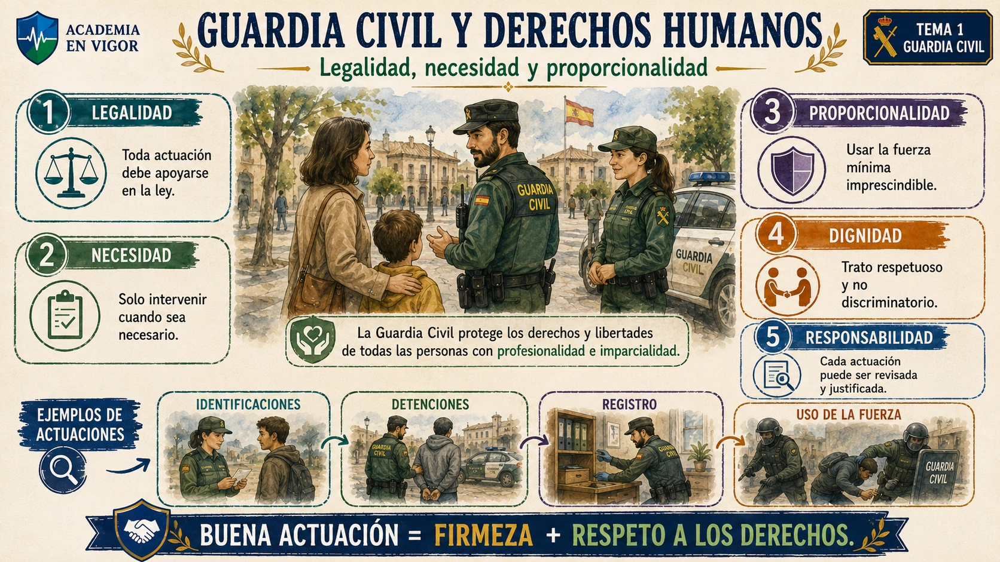

<em>Ilustración: La Guardia Civil y los derechos humanos.</em>

<!-- FUENTE: BOE-LO3-1981-GC-T01 -->

## 57. Defensor del Pueblo como MNP y Consejo Asesor

El Consejo Asesor es un órgano de cooperación técnica y jurídica del Mecanismo Nacional de Prevención.

- El Consejo Asesor es un órgano de cooperación técnica y jurídica del Mecanismo Nacional de Prevención.
- Está integrado por los Adjuntos del Defensor del Pueblo y un máximo de diez Vocales.
- Preside el Adjunto en quien el Defensor delegue las funciones del MNP y actúa como secretario el Secretario General de la institución.
- Los Vocales deben ser mayores de edad, estar en pleno disfrute de derechos civiles y políticos y acreditar trayectoria pertinente.

<!-- VISUAL:t01-il-05-visita-mnp.webp -->

  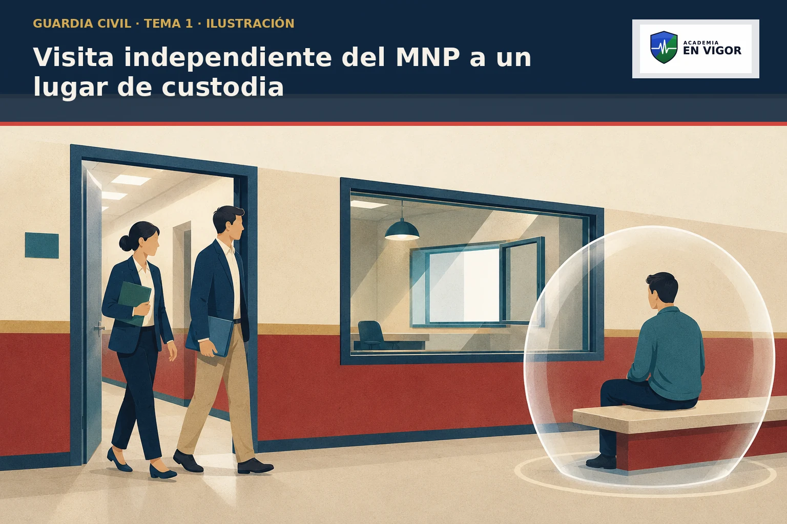

<em>Infografía: Visita independiente del MNP a un lugar de custodia.</em>

<!-- FUENTE: BOE-DP-GC-T01 -->

## 58. Vocales, mandato, reuniones y funciones

Los Vocales se designan por cuatro años y se renuevan por mitades cada dos años.

- Los Vocales se designan por cuatro años y se renuevan por mitades cada dos años.
- El Consejo se reúne al menos dos veces al año.
- La composición incorpora propuestas de Abogacía, Organización Médica Colegial, Psicología, entidades colaboradoras y sociedad civil.
- Sus funciones incluyen proponer visitas y protocolos, emitir informes, promover formación y seguir informes del MNP y del Subcomité de la ONU.

<!-- VISUAL:t01-20-consejo-asesor-mnp.webp -->

  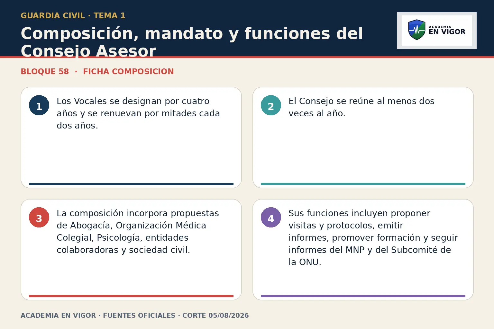

<em>Infografía: Composición, mandato y funciones del Consejo Asesor.</em>

<!-- FUENTE: BOE-DP-GC-T01 -->

# Hablemos claro

:::hablemos-claro
No mezcles organizaciones: primero identifica el sistema, después el tratado, el órgano, su composición y su competencia. Las cifras solo tienen sentido unidas al órgano correcto.
:::

# En la calle

:::en-la-calle
En una actuación, la prohibición de tortura y malos tratos, la tutela judicial, la documentación de custodia y la prevención mediante visitas independientes forman una cadena de garantías, no compartimentos aislados.
:::

# Lo que cae

:::lo-que-cae
Prioriza órganos y composiciones, plazos y mayorías, derechos absolutos y derogables, admisibilidad de demandas, mecanismos de control, cuatro crímenes de la CPI y doble capa SPT–MNP.
:::

# Ha caído

:::ha-caido
Se han vinculado 148 preguntas oficiales verificadas de 2020 a 2026. Solo estas referencias alimentan las apariciones históricas.
:::

---

*Academia En Vigor · El temario que nunca duerme · Tema 1 · v1.0.0 · Documento interno no publicado.*
