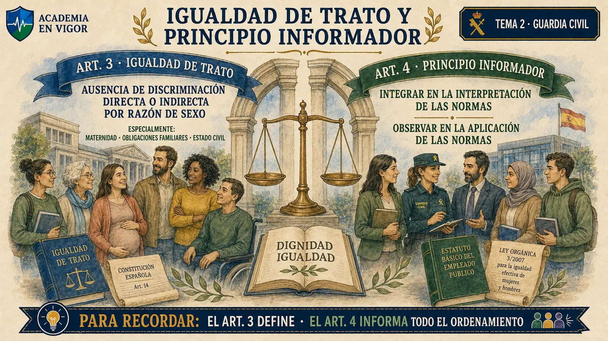
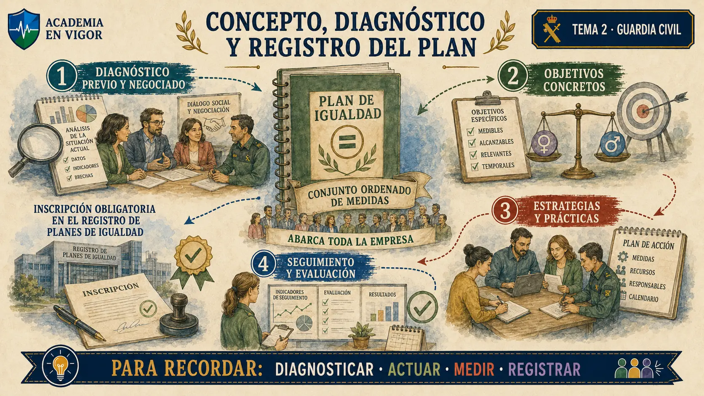
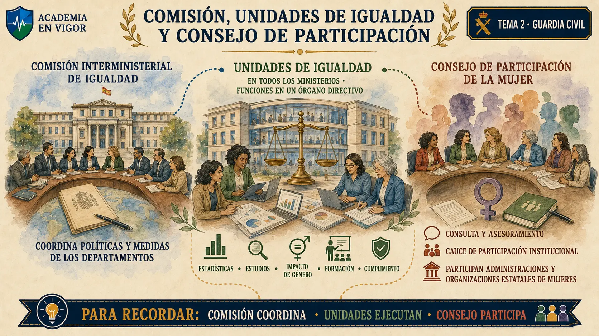

# TEMA 2 · IGUALDAD EFECTIVA DE MUJERES Y HOMBRES. LEY ORGÁNICA 3/2007

**Guardia Civil · Método VIGOR · PARTE**
**Versión de contenido:** 1.0.0
**Estado editorial:** approved_internal · **Publicación:** not_published

# Mapa del tema

El recorrido avanza desde las categorías de discriminación y tutela hasta las políticas públicas, los medios, el empleo, la Administración, las Fuerzas Armadas y FCSE, los bienes y servicios, la responsabilidad social y los órganos de igualdad.

<!-- VISUAL PENDIENTE: t02-00-mapa-general-lo3-2007.webp -->

# Contenido

## 01. Alcance oficial y mapa de la Ley Orgánica 3/2007

El epígrafe oficial no exige estudiar toda la Ley Orgánica 3/2007: comienza en el Título I, limita el Título II a su capítulo I y continúa con los títulos III a VIII. Esta delimitación evita convertir en materia examinable los artículos 1 y 2, los artículos 23 a 35 o las disposiciones de la ley.

### Claves rápidas

- El Tema 2 se centra en la Ley Orgánica 3/2007, de 22 de marzo, para la igualdad efectiva de mujeres y hombres.
- El programa incluye íntegramente el Título I, dedicado al principio de igualdad y a la tutela contra la discriminación.
- Del Título II entra únicamente el capítulo I, artículos 14 a 22, sobre principios generales de las políticas públicas para la igualdad.
- Los títulos III, IV, V, VI, VII y VIII forman parte del alcance oficial del Tema 2.
- El título preliminar, el capítulo II del Título II y las disposiciones adicionales, transitorias, derogatoria y finales quedan fuera del epígrafe oficial del Tema 2.

:::perla-vigor
Ancla el bloque en **Programa oficial; títulos I a VIII**: sujeto, mandato, excepción y control.
:::

<!-- VISUAL:t02-01-alcance-oficial-y-mapa-de-la-ley-organica-3-2007.webp -->

  

<em>Infografía: Alcance oficial y mapa de la Ley Orgánica 3/2007.</em>

<!-- FUENTE: GC-PROGRAMA-2024-T02 -->

## 02. Igualdad de trato y principio informador

Los artículos 3 y 4 forman la puerta de entrada conceptual. El primero define el principio de igualdad de trato; el segundo ordena integrarlo en la interpretación y aplicación de todo el ordenamiento.

### Claves rápidas

- La igualdad de trato entre mujeres y hombres supone ausencia de discriminación directa o indirecta por razón de sexo.
- El artículo 3 destaca especialmente las discriminaciones derivadas de la maternidad, la asunción de obligaciones familiares y el estado civil.
- La igualdad de trato y de oportunidades es un principio informador del ordenamiento jurídico.
- El principio de igualdad debe integrarse en la interpretación de las normas jurídicas.
- El principio de igualdad también debe observarse al aplicar las normas jurídicas.

:::perla-vigor
Ancla el bloque en **arts. 3 y 4**: sujeto, mandato, excepción y control.
:::

<!-- VISUAL:t02-02-igualdad-de-trato-y-principio-informador.webp -->

  

<em>Infografía: Igualdad de trato y principio informador.</em>

<!-- FUENTE: BOE-LO3-2007-GC-T02 -->

## 03. Igualdad en el empleo y requisito profesional

La igualdad laboral no se reduce al acceso a un puesto: cubre empleo público y privado, trabajo por cuenta propia, formación, promoción, retribución, despido y participación profesional. La excepción del requisito profesional se interpreta de forma estricta.

### Claves rápidas

- La igualdad de trato y oportunidades en el empleo se aplica tanto al ámbito privado como al empleo público.
- La garantía alcanza el acceso al empleo, incluido el trabajo por cuenta propia, la formación y la promoción profesionales.
- Las condiciones de trabajo protegidas incluyen las retributivas y las de despido.
- La igualdad alcanza la afiliación y participación en organizaciones sindicales, empresariales y profesionales, incluidas sus prestaciones.
- Una diferencia basada en el sexo solo puede no ser discriminatoria en el acceso si la característica es un requisito profesional esencial y determinante, el objetivo es legítimo y el requisito proporcionado.

:::perla-vigor
Ancla el bloque en **art. 5**: sujeto, mandato, excepción y control.
:::

<!-- VISUAL:t02-03-igualdad-en-el-empleo-y-requisito-profesional.webp -->

  

<em>Infografía: Igualdad en el empleo y requisito profesional.</em>

<!-- FUENTE: BOE-LO3-2007-GC-T02 -->

## 04. Discriminación directa, indirecta y orden de discriminar

La discriminación directa mira al trato menos favorable; la indirecta, al efecto de una regla aparentemente neutra. La segunda admite justificación únicamente con finalidad legítima y medios necesarios y adecuados.

### Claves rápidas

- Existe discriminación directa cuando una persona es, ha sido o pudiera ser tratada menos favorablemente por su sexo que otra en situación comparable.
- La discriminación indirecta nace de una disposición, criterio o práctica aparentemente neutros que colocan a un sexo en desventaja particular.
- Una medida con desventaja particular puede justificarse objetivamente si responde a una finalidad legítima.
- Además de la finalidad legítima, los medios empleados han de ser necesarios y adecuados.
- Toda orden de discriminar directa o indirectamente por razón de sexo se considera discriminatoria.

:::perla-vigor
Ancla el bloque en **art. 6**: sujeto, mandato, excepción y control.
:::

<!-- VISUAL:t02-04-discriminacion-directa-indirecta-y-orden-de-discriminar.webp -->

  

<em>Infografía: Discriminación directa, indirecta y orden de discriminar.</em>

<!-- FUENTE: BOE-LO3-2007-GC-T02 -->

## 05. Acoso sexual y acoso por razón de sexo

La ley diferencia la naturaleza sexual de una conducta del comportamiento realizado en función del sexo. En ambos casos puede bastar el propósito o el efecto lesivo, y ambos acosos son discriminatorios.

### Claves rápidas

- El acoso sexual es un comportamiento verbal o físico de naturaleza sexual que pretende o produce un atentado contra la dignidad.
- El entorno intimidatorio, degradante u ofensivo es una manifestación destacada del atentado contra la dignidad en el acoso sexual.
- El acoso por razón de sexo es un comportamiento realizado en función del sexo de una persona que atenta contra su dignidad y crea un entorno intimidatorio, degradante u ofensivo.
- El acoso sexual y el acoso por razón de sexo son en todo caso discriminatorios.
- Condicionar un derecho o una expectativa de derecho a aceptar una situación de acoso constituye discriminación por razón de sexo.

:::perla-vigor
Ancla el bloque en **art. 7**: sujeto, mandato, excepción y control.
:::

<!-- VISUAL:t02-05-acoso-sexual-y-acoso-por-razon-de-sexo.webp -->

  

<em>Infografía: Acoso sexual y acoso por razón de sexo.</em>

<!-- FUENTE: BOE-LO3-2007-GC-T02 -->

## 06. Embarazo, represalias y consecuencias jurídicas

La ley califica directamente el trato desfavorable por embarazo o maternidad, protege frente a represalias y anuda nulidad, reparación y sanción a la discriminación. Son tres garantías distintas que no deben mezclarse.

### Claves rápidas

- Todo trato desfavorable a las mujeres relacionado con el embarazo o la maternidad constituye discriminación directa por razón de sexo.
- El trato adverso causado por una queja, reclamación, denuncia, demanda o recurso dirigido a impedir la discriminación se considera discriminación por razón de sexo.
- La garantía de indemnidad protege también las actuaciones dirigidas a exigir el cumplimiento efectivo del principio de igualdad.
- Los actos y cláusulas de negocios jurídicos que causen discriminación por sexo son nulos y quedan sin efecto.
- Las reparaciones o indemnizaciones deben ser reales, efectivas y proporcionadas, y las sanciones han de ser eficaces y disuasorias.

:::perla-vigor
Ancla el bloque en **arts. 8 a 10**: sujeto, mandato, excepción y control.
:::

<!-- VISUAL:t02-06-embarazo-represalias-y-consecuencias-juridicas.webp -->

  

<em>Infografía: Embarazo, represalias y consecuencias jurídicas.</em>

<!-- FUENTE: BOE-LO3-2007-GC-T02 -->

## 07. Acciones positivas, tutela y carga de la prueba

Las acciones positivas corrigen desigualdad de hecho; la tutela puede pedirse incluso tras terminar la relación; y la regla probatoria desplaza a la parte demandada la acreditación de ausencia de discriminación, salvo en procesos penales.

### Claves rápidas

- Los poderes públicos adoptarán medidas específicas a favor de las mujeres para corregir situaciones patentes de desigualdad de hecho.
- Las acciones positivas deben ser razonables, proporcionadas y aplicables mientras subsista la desigualdad que pretenden corregir.
- Las personas físicas y jurídicas privadas también pueden adoptar acciones positivas en los términos de la ley.
- Cualquier persona puede pedir tutela judicial del derecho a la igualdad incluso después de terminar la relación en la que se produjo la presunta discriminación.
- La regla que atribuye a la parte demandada probar la ausencia de discriminación y la proporcionalidad no se aplica a los procesos penales.

:::perla-vigor
Ancla el bloque en **arts. 11 a 13**: sujeto, mandato, excepción y control.
:::

<!-- VISUAL:t02-07-acciones-positivas-tutela-y-carga-de-la-prueba.webp -->

  

<em>Infografía: Acciones positivas, tutela y carga de la prueba.</em>

<!-- FUENTE: BOE-LO3-2007-GC-T02 -->

## 08. Criterios generales de los poderes públicos

El artículo 14 concentra doce criterios. No son una lista ornamental: sirven para orientar la acción pública en economía, empleo, sociedad, cultura, violencia, vulnerabilidad, maternidad, conciliación, colaboración, lenguaje y cooperación internacional.

### Claves rápidas

- La efectividad del derecho constitucional de igualdad es criterio general de actuación de los poderes públicos.
- Las políticas públicas deben integrar la igualdad para evitar segregación laboral, eliminar diferencias retributivas y valorar el trabajo de las mujeres, incluido el doméstico.
- La participación equilibrada en candidaturas electorales y toma de decisiones es un criterio general de actuación pública.
- Los poderes públicos atenderán las dificultades de colectivos de mujeres especialmente vulnerables y podrán adoptar acciones positivas.
- El artículo 14 incluye conciliación, corresponsabilidad y lenguaje no sexista, y proyecta sus criterios sobre la cooperación internacional para el desarrollo.

:::perla-vigor
Ancla el bloque en **art. 14**: sujeto, mandato, excepción y control.
:::

<!-- VISUAL:t02-08-criterios-generales-de-los-poderes-publicos.webp -->

  

<em>Infografía: Criterios generales de los poderes públicos.</em>

<!-- FUENTE: BOE-LO3-2007-GC-T02 -->

## 09. Transversalidad, nombramientos, plan e informe

La transversalidad obliga a integrar activamente la igualdad en normas, presupuestos, políticas y actividades. Junto a ella aparecen la presencia equilibrada en nombramientos, el plan estratégico estatal y el informe periódico a las Cortes.

### Claves rápidas

- La igualdad de trato y oportunidades informa con carácter transversal la actuación de todos los poderes públicos.
- Las Administraciones deben integrar activamente la igualdad en normas, políticas, presupuestos y en el conjunto de sus actividades.
- Los poderes públicos procurarán atender a la presencia equilibrada en nombramientos y designaciones de cargos de responsabilidad.
- El Gobierno aprobará periódicamente un Plan Estratégico de Igualdad de Oportunidades en materias de competencia estatal.
- El Gobierno elaborará un informe periódico sobre sus actuaciones en igualdad y dará cuenta de él a las Cortes Generales.

:::perla-vigor
Ancla el bloque en **arts. 15 a 18**: sujeto, mandato, excepción y control.
:::

<!-- VISUAL:t02-09-transversalidad-nombramientos-plan-e-informe.webp -->

  

<em>Infografía: Transversalidad, nombramientos, plan e informe.</em>

<!-- FUENTE: BOE-LO3-2007-GC-T02 -->

## 10. Impacto de género, estadísticas e indicadores

La perspectiva de género debe entrar antes de decidir y también en la forma de medir. El informe acompaña determinadas decisiones del Consejo de Ministros; las estadísticas deben permitir conocer diferencias y discriminaciones múltiples.

### Claves rápidas

- Los proyectos de disposiciones generales sometidos al Consejo de Ministros deben incorporar informe de impacto por razón de género.
- También requieren ese informe los planes de especial relevancia económica, social, cultural y artística sometidos al Consejo de Ministros.
- Los poderes públicos deben incluir sistemáticamente la variable de sexo en estadísticas, encuestas y recogidas de datos.
- Los estudios públicos deben incorporar indicadores que permitan conocer diferencias y situaciones de discriminación múltiple.
- Solo excepcionalmente, mediante informe motivado aprobado por el órgano competente, puede justificarse incumplir alguna obligación estadística del artículo 20.

:::perla-vigor
Ancla el bloque en **arts. 19 y 20**: sujeto, mandato, excepción y control.
:::

<!-- VISUAL:t02-10-impacto-de-genero-estadisticas-e-indicadores.webp -->

  

<em>Infografía: Impacto de género, estadísticas e indicadores.</em>

<!-- FUENTE: BOE-LO3-2007-GC-T02 -->

## 11. Cooperación administrativa y tiempos de la ciudad

La igualdad se integra en cada nivel territorial mediante cooperación. Las corporaciones locales, además, pueden planificar un reparto más equitativo de los tiempos de la ciudad.

### Claves rápidas

- La Administración General del Estado y las comunidades autónomas cooperarán para integrar la igualdad en sus competencias, especialmente en la planificación.
- En la Conferencia Sectorial de la Mujer pueden adoptarse planes y programas conjuntos de igualdad.
- Las entidades locales integrarán la igualdad en sus competencias y colaborarán con las demás Administraciones.
- Las corporaciones locales pueden establecer planes municipales de organización del tiempo de la ciudad.
- El Estado puede prestar asistencia técnica para esos planes sin perjuicio de las competencias autonómicas.

:::perla-vigor
Ancla el bloque en **arts. 21 y 22**: sujeto, mandato, excepción y control.
:::

<!-- VISUAL:t02-11-cooperacion-administrativa-y-tiempos-de-la-ciudad.webp -->

  

<em>Infografía: Cooperación administrativa y tiempos de la ciudad.</em>

<!-- FUENTE: BOE-LO3-2007-GC-T02 -->

## 12. Medios públicos y Corporación RTVE

Los medios públicos deben proyectar una imagen igualitaria, plural y no estereotipada. RTVE recibe objetivos concretos de programación, autorregulación, campañas, promoción profesional y relación con asociaciones de mujeres.

### Claves rápidas

- Los medios públicos velarán por transmitir una imagen igualitaria, plural y no estereotipada de mujeres y hombres.
- Los medios públicos promoverán el conocimiento y difusión del principio de igualdad.
- RTVE debe reflejar adecuadamente la presencia de las mujeres y utilizar lenguaje no sexista en su programación.
- RTVE adoptará mediante autorregulación códigos de conducta y colaborará con campañas institucionales de igualdad y contra la violencia hacia las mujeres.
- RTVE promoverá mujeres en puestos de responsabilidad y la relación con asociaciones y grupos de mujeres.

:::perla-vigor
Ancla el bloque en **arts. 36 y 37**: sujeto, mandato, excepción y control.
:::

<!-- VISUAL:t02-12-medios-publicos-y-corporacion-rtve.webp -->

  

<em>Infografía: Medios públicos y Corporación RTVE.</em>

<!-- FUENTE: BOE-LO3-2007-GC-T02 -->

## 13. Agencia EFE e igualdad informativa

La Agencia EFE comparte con RTVE varios objetivos, pero el examen puede pedir identificar el sujeto exacto. La ley enfatiza además el uso no sexista del lenguaje en sus actividades.

### Claves rápidas

- La Agencia EFE velará por el respeto de la igualdad y, especialmente, por el uso no sexista del lenguaje.
- EFE debe reflejar adecuadamente la presencia de la mujer en los diversos ámbitos de la vida social.
- EFE adoptará códigos de conducta mediante autorregulación para transmitir el principio de igualdad.
- EFE colaborará con campañas institucionales de igualdad y de erradicación de la violencia contra las mujeres.
- EFE promoverá mujeres en puestos de responsabilidad y mantendrá relación con asociaciones y grupos de mujeres.

:::perla-vigor
Ancla el bloque en **art. 38**: sujeto, mandato, excepción y control.
:::

<!-- VISUAL:t02-13-agencia-efe-e-igualdad-informativa.webp -->

  

<em>Infografía: Agencia EFE e igualdad informativa.</em>

<!-- FUENTE: BOE-LO3-2007-GC-T02 -->

## 14. Medios privados, autoridad audiovisual y publicidad

Los medios privados están sujetos al respeto de la igualdad; las Administraciones impulsan autorregulación; la autoridad audiovisual controla; y la publicidad discriminatoria recibe la calificación de ilícita.

### Claves rápidas

- Todos los medios de comunicación deben respetar la igualdad y evitar cualquier forma de discriminación.
- Las Administraciones promoverán acuerdos de autorregulación en los medios, incluidas sus actividades de venta y publicidad.
- Las autoridades audiovisuales adoptarán las medidas procedentes para asegurar un tratamiento de las mujeres conforme a los valores constitucionales.
- La publicidad que comporte una conducta discriminatoria conforme a la Ley Orgánica 3/2007 se considera publicidad ilícita.
- La ilicitud publicitaria se conecta con la legislación general de publicidad y de publicidad y comunicación institucional.

:::perla-vigor
Ancla el bloque en **arts. 39 a 41**: sujeto, mandato, excepción y control.
:::

<!-- VISUAL:t02-14-medios-privados-autoridad-audiovisual-y-publicidad.webp -->

  

<em>Infografía: Medios privados, autoridad audiovisual y publicidad.</em>

<!-- FUENTE: BOE-LO3-2007-GC-T02 -->

## 15. Empleabilidad y negociación colectiva

Las políticas de empleo deben mejorar participación, formación y permanencia de las mujeres. La negociación colectiva puede incorporar acciones positivas para acceso y condiciones de trabajo.

### Claves rápidas

- Aumentar la participación de las mujeres en el mercado laboral es objetivo prioritario de las políticas de empleo.
- La empleabilidad y permanencia se impulsan mejorando formación y adaptabilidad a los requerimientos del mercado.
- Los programas de inserción activa abarcan todos los niveles educativos y edades, incluida la Formación Profesional.
- Esos programas pueden destinarse prioritariamente a colectivos específicos de mujeres o fijar una proporción de mujeres.
- La negociación colectiva puede establecer acciones positivas para el acceso de las mujeres al empleo y la igualdad en las condiciones de trabajo.

:::perla-vigor
Ancla el bloque en **arts. 42 y 43**: sujeto, mandato, excepción y control.
:::

<!-- VISUAL:t02-15-empleabilidad-y-negociacion-colectiva.webp -->

  

<em>Infografía: Empleabilidad y negociación colectiva.</em>

<!-- FUENTE: BOE-LO3-2007-GC-T02 -->

## 16. Conciliación y corresponsabilidad

El artículo 44 enuncia el criterio de conciliación y remite la concreción de permisos y prestaciones a la normativa laboral y de Seguridad Social. No debe memorizarse aquí una duración que el artículo no contiene.

### Claves rápidas

- Los derechos de conciliación deben reconocerse de modo que fomenten la asunción equilibrada de responsabilidades familiares.
- El ejercicio de derechos de conciliación no puede ser fuente de discriminación.
- El permiso y la prestación por maternidad se conceden en los términos de la normativa laboral y de Seguridad Social.
- El artículo 44 reconoce a los padres permiso y prestación por paternidad para contribuir al reparto equilibrado de responsabilidades.
- La Ley Orgánica 3/2007 no fija en el artículo 44 una duración concreta de esos permisos, sino que remite a la normativa aplicable.

:::perla-vigor
Ancla el bloque en **art. 44**: sujeto, mandato, excepción y control.
:::

<!-- VISUAL:t02-16-conciliacion-y-corresponsabilidad.webp -->

  

<em>Infografía: Conciliación y corresponsabilidad.</em>

<!-- FUENTE: BOE-LO3-2007-GC-T02 -->

## 17. Obligación de elaborar planes de igualdad

Todas las empresas deben adoptar medidas de igualdad, pero el plan es obligatorio en supuestos concretos. El umbral vigente es de cincuenta personas trabajadoras, no el originario de más de doscientas cincuenta.

### Claves rápidas

- Todas las empresas deben respetar la igualdad laboral y adoptar medidas para evitar la discriminación entre mujeres y hombres.
- Las empresas de cincuenta o más personas trabajadoras deben elaborar y aplicar un plan de igualdad.
- El convenio colectivo aplicable puede imponer la elaboración y aplicación de un plan de igualdad.
- La autoridad laboral puede acordar un plan de igualdad como sustitución de sanciones accesorias en un procedimiento sancionador.
- Para las demás empresas la implantación del plan es voluntaria, previa consulta a la representación legal.

:::perla-vigor
Ancla el bloque en **art. 45**: sujeto, mandato, excepción y control.
:::

<!-- VISUAL:t02-17-obligacion-de-elaborar-planes-de-igualdad.webp -->

  

<em>Infografía: Obligación de elaborar planes de igualdad.</em>

<!-- FUENTE: BOE-LO3-2007-GC-T02 -->

## 18. Concepto, diagnóstico y registro del plan

El plan de igualdad es un sistema ordenado: diagnóstico, medidas, objetivos, estrategias, seguimiento y evaluación. El diagnóstico es negociado y la inscripción registral es obligatoria.

### Claves rápidas

- Un plan de igualdad es un conjunto ordenado de medidas adoptadas después de realizar un diagnóstico de situación.
- El plan fija objetivos concretos, estrategias y prácticas, además de sistemas eficaces de seguimiento y evaluación.
- El diagnóstico previo y negociado incluye, entre otras materias, selección, clasificación, formación, promoción, condiciones de trabajo, retribuciones e infrarrepresentación femenina.
- El plan incluye la totalidad de la empresa, sin impedir acciones especiales para determinados centros de trabajo.
- Las empresas están obligadas a inscribir sus planes en el Registro de Planes de Igualdad.

:::perla-vigor
Ancla el bloque en **art. 46**: sujeto, mandato, excepción y control.
:::

<!-- VISUAL:t02-18-concepto-diagnostico-y-registro-del-plan.webp -->

  

<em>Infografía: Concepto, diagnóstico y registro del plan.</em>

<!-- FUENTE: BOE-LO3-2007-GC-T02 -->

## 19. Transparencia y prevención del acoso en la empresa

El contenido y los objetivos del plan deben ser accesibles. Además, la empresa debe promover condiciones que eviten delitos y conductas contra la libertad sexual y la integridad moral, también en el ámbito digital.

### Claves rápidas

- La representación legal o, en su defecto, la plantilla debe acceder a información sobre el contenido y los objetivos del plan de igualdad.
- Las comisiones paritarias pueden seguir la evolución de los acuerdos sobre planes si el convenio les atribuye esa competencia.
- Las empresas deben promover condiciones de trabajo que eviten delitos y conductas contra la libertad sexual y la integridad moral.
- Las medidas preventivas alcanzan expresamente el acoso sexual y por razón de sexo cometidos en el ámbito digital.
- La representación de las personas trabajadoras debe sensibilizar e informar a la dirección de conductas conocidas que puedan propiciar el acoso.

:::perla-vigor
Ancla el bloque en **arts. 47 y 48**: sujeto, mandato, excepción y control.
:::

<!-- VISUAL:t02-19-transparencia-y-prevencion-del-acoso-en-la-empresa.webp -->

  

<em>Infografía: Transparencia y prevención del acoso en la empresa.</em>

<!-- FUENTE: BOE-LO3-2007-GC-T02 -->

## 20. Apoyo a pymes y distintivo empresarial

El Gobierno apoya la implantación voluntaria, especialmente en pymes. El distintivo reconoce políticas empresariales de igualdad, admite publicidad y queda sometido a control y retirada.

### Claves rápidas

- El Gobierno establecerá medidas de fomento para planes voluntarios, especialmente dirigidas a pequeñas y medianas empresas.
- Las medidas de fomento para pymes incluirán el apoyo técnico necesario.
- Cualquier empresa, pública o privada, puede presentar un balance de igualdad para obtener el distintivo empresarial.
- El Ministerio competente en trabajo controla que las empresas distinguidas mantengan permanentemente sus políticas de igualdad.
- El incumplimiento de esas políticas determina la retirada del distintivo.

:::perla-vigor
Ancla el bloque en **arts. 49 y 50**: sujeto, mandato, excepción y control.
:::

<!-- VISUAL:t02-20-apoyo-a-pymes-y-distintivo-empresarial.webp -->

  

<em>Infografía: Apoyo a pymes y distintivo empresarial.</em>

<!-- FUENTE: BOE-LO3-2007-GC-T02 -->

## 21. Criterios de igualdad en las Administraciones

El artículo 51 ofrece una lista operativa para todo el empleo público: acceso y carrera, conciliación, formación, selección equilibrada, protección frente al acoso, igualdad retributiva y evaluación.

### Claves rápidas

- Las Administraciones deben remover obstáculos discriminatorios en el acceso al empleo público y la carrera profesional.
- La conciliación debe facilitarse sin menoscabo de la promoción profesional.
- La formación en igualdad se fomentará tanto en el acceso como durante la carrera profesional.
- Las Administraciones promoverán presencia equilibrada en órganos de selección y valoración y protección efectiva frente al acoso.
- Deben eliminar la discriminación retributiva y evaluar periódicamente la efectividad de la igualdad.

:::perla-vigor
Ancla el bloque en **art. 51**: sujeto, mandato, excepción y control.
:::

<!-- VISUAL:t02-21-criterios-de-igualdad-en-las-administraciones.webp -->

  

<em>Infografía: Criterios de igualdad en las Administraciones.</em>

<!-- FUENTE: BOE-LO3-2007-GC-T02 -->

## 22. Órganos directivos, selección y representación

La presencia equilibrada se proyecta sobre órganos directivos, tribunales, comisiones, representación en órganos colegiados y consejos de empresas participadas. Las convocatorias de acceso llevan informe de impacto salvo urgencia.

### Claves rápidas

- El Gobierno atenderá a la presencia equilibrada al nombrar órganos directivos de la AGE y sus organismos, considerados en conjunto.
- Los tribunales y órganos de selección deben responder a la presencia equilibrada salvo razones fundadas, objetivas y motivadas.
- La representación de la AGE en comisiones de valoración de méritos se ajustará a la composición equilibrada.
- La AGE observará presencia equilibrada al designar representantes en órganos colegiados y consejos de administración de empresas participadas.
- Las convocatorias de acceso al empleo público llevarán informe de impacto de género, salvo urgencia y sin perjuicio de la prohibición de discriminar.

:::perla-vigor
Ancla el bloque en **arts. 52 a 55**: sujeto, mandato, excepción y control.
:::

<!-- VISUAL:t02-22-organos-directivos-seleccion-y-representacion.webp -->

  

<em>Infografía: Órganos directivos, selección y representación.</em>

<!-- FUENTE: BOE-LO3-2007-GC-T02 -->

## 23. Permisos, provisión, licencias, vacaciones y formación

Estos artículos protegen la conciliación en la carrera administrativa. El examen insiste en dos cifras del artículo 60: preferencia durante un año y reserva mínima del cuarenta por ciento.

### Claves rápidas

- La normativa del personal público establecerá excedencias, reducciones, permisos y otros beneficios para proteger maternidad y conciliación.
- En los concursos se computará como mérito el tiempo permanecido en situaciones de conciliación previstas en el artículo 56.
- La licencia por riesgo durante embarazo o lactancia natural garantiza la plenitud de derechos económicos en los términos legales.
- Quien vuelve al servicio activo desde determinados permisos o excedencias tiene preferencia durante un año para cursos de formación.
- Al menos el cuarenta por ciento de las plazas de cursos dirigidos a promoción y puestos directivos se reserva a empleadas públicas que reúnan los requisitos.

:::perla-vigor
Ancla el bloque en **arts. 56 a 60**: sujeto, mandato, excepción y control.
:::

<!-- VISUAL:t02-23-permisos-provision-licencias-vacaciones-y-formacion.webp -->

  

<em>Infografía: Permisos, provisión, licencias, vacaciones y formación.</em>

<!-- FUENTE: BOE-LO3-2007-GC-T02 -->

## 24. Acceso, formación y protocolo frente al acoso

La igualdad entra en todas las pruebas de acceso a la AGE y en la formación de todo su personal. El protocolo frente al acoso se negocia y debe respetar un contenido mínimo.

### Claves rápidas

- Todas las pruebas de acceso al empleo público de la AGE y sus organismos contemplarán el estudio y aplicación del principio de igualdad.
- La AGE impartirá a todo su personal cursos sobre igualdad y prevención de la violencia de género.
- Las Administraciones negociarán con la representación legal un protocolo frente al acoso sexual y por razón de sexo.
- El protocolo expresará el compromiso de prevenir y no tolerar el acoso y el deber de respetar dignidad, intimidad e igualdad.
- El protocolo exige tratamiento reservado de denuncias e identificación de las personas responsables de atenderlas.

:::perla-vigor
Ancla el bloque en **arts. 61 y 62**: sujeto, mandato, excepción y control.
:::

<!-- VISUAL:t02-24-acceso-formacion-y-protocolo-frente-al-acoso.webp -->

  

<em>Infografía: Acceso, formación y protocolo frente al acoso.</em>

<!-- FUENTE: BOE-LO3-2007-GC-T02 -->

## 25. Evaluación anual y Plan de Igualdad de la AGE

Los departamentos informan al menos anualmente con datos desagregados. Distinto es el Plan de Igualdad de la AGE: lo aprueba el Gobierno al inicio de cada legislatura y el Consejo de Ministros evalúa anualmente su cumplimiento.

### Claves rápidas

- Departamentos ministeriales y organismos públicos remitirán al menos anualmente información sobre la aplicación efectiva de la igualdad.
- La información incluirá datos desagregados por sexo sobre plantilla, titulación, nivel de destino y retribuciones medias.
- El Plan de Igualdad de la AGE establece objetivos, estrategias y medidas para la igualdad en el empleo público.
- El Gobierno aprobará el Plan de Igualdad de la AGE al inicio de cada legislatura.
- El Plan se negocia con la representación del personal y su cumplimiento es evaluado anualmente por el Consejo de Ministros.

:::perla-vigor
Ancla el bloque en **arts. 63 y 64**: sujeto, mandato, excepción y control.
:::

<!-- VISUAL:t02-25-evaluacion-anual-y-plan-de-igualdad-de-la-age.webp -->

  

<em>Infografía: Evaluación anual y Plan de Igualdad de la AGE.</em>

<!-- FUENTE: BOE-LO3-2007-GC-T02 -->

## 26. Igualdad en las Fuerzas Armadas

La ley distingue dos reglas: una sobre normas de personal y ámbitos prioritarios; otra que proyecta la normativa pública de igualdad, violencia y conciliación con las adaptaciones necesarias.

### Claves rápidas

- Las normas de personal de las Fuerzas Armadas procurarán la efectividad de la igualdad entre mujeres y hombres.
- En las Fuerzas Armadas la igualdad se atiende especialmente en acceso, formación, ascensos, destinos y situaciones administrativas.
- La normativa del personal público sobre igualdad se aplica a las Fuerzas Armadas con las adaptaciones necesarias.
- La aplicación abarca protección integral frente a la violencia de género y la violencia sexual.
- También abarca la conciliación personal, familiar y profesional en los términos de la normativa específica militar.

:::perla-vigor
Ancla el bloque en **arts. 65 y 66**: sujeto, mandato, excepción y control.
:::

<!-- VISUAL:t02-26-igualdad-en-las-fuerzas-armadas.webp -->

  

<em>Infografía: Igualdad en las Fuerzas Armadas.</em>

<!-- FUENTE: BOE-LO3-2007-GC-T02 -->

## 27. Igualdad en las Fuerzas y Cuerpos de Seguridad

Este bloque es central para Guardia Civil. Las normas reguladoras deben impedir discriminación profesional, y las normas del empleo público se adaptan, si procede, a las peculiaridades de las funciones encomendadas.

### Claves rápidas

- Las normas de las Fuerzas y Cuerpos de Seguridad del Estado promoverán la igualdad efectiva e impedirán la discriminación profesional.
- La protección se subraya en acceso, formación, ascensos, destinos y situaciones administrativas.
- Las normas del personal público en materia de igualdad se aplican a las Fuerzas y Cuerpos de Seguridad.
- También se aplican las normas sobre prevención de la violencia de género y sexual y sobre conciliación personal, familiar y profesional.
- La aplicación puede adaptarse a las peculiaridades funcionales y debe respetar la normativa específica.

:::perla-vigor
Ancla el bloque en **arts. 67 y 68**: sujeto, mandato, excepción y control.
:::

<!-- VISUAL:t02-27-igualdad-en-las-fuerzas-y-cuerpos-de-seguridad.webp -->

  

<em>Infografía: Igualdad en las Fuerzas y Cuerpos de Seguridad.</em>

<!-- FUENTE: BOE-LO3-2007-GC-T02 -->

## 28. Acceso a bienes, embarazo, seguros e indemnización

La igualdad rige los bienes y servicios ofrecidos al público fuera de la vida privada y familiar. La libertad de contratar no permite elegir por sexo; el embarazo tiene protección específica; y en seguros existe una regla de equiparación reparadora.

### Claves rápidas

- Quien suministre al público bienes o servicios fuera de la vida privada y familiar debe respetar la igualdad y evitar discriminación sexual.
- La libertad de elegir contratante se mantiene siempre que la elección no venga determinada por el sexo.
- Una diferencia de trato en bienes o servicios solo es admisible con propósito legítimo y medios adecuados y necesarios.
- No puede indagarse sobre el embarazo de una demandante de bienes o servicios salvo por razones de protección de su salud.
- En seguros, el sexo no puede generar diferencias de primas o prestaciones y el perjudicado puede pedir equiparación al sexo más beneficiado.

:::perla-vigor
Ancla el bloque en **arts. 69 a 72**: sujeto, mandato, excepción y control.
:::

<!-- VISUAL:t02-28-acceso-a-bienes-embarazo-seguros-e-indemnizacion.webp -->

  

<em>Infografía: Acceso a bienes, embarazo, seguros e indemnización.</em>

<!-- FUENTE: BOE-LO3-2007-GC-T02 -->

## 29. Responsabilidad social, publicidad y consejos

Las acciones empresariales de responsabilidad social son voluntarias y pueden concertarse con varios interlocutores. Su publicidad está sometida a control. El artículo 75 conserva una formulación de fomento y un plazo histórico de ocho años.

### Claves rápidas

- Las empresas pueden asumir voluntariamente acciones de responsabilidad social destinadas a promover igualdad dentro de la empresa o en su entorno.
- Las acciones pueden concertarse con representación laboral, organizaciones de consumidores, asociaciones de igualdad y organismos de igualdad.
- Las acciones no concertadas con la representación de las personas trabajadoras deben serle comunicadas.
- El Instituto de la Mujer y órganos autonómicos equivalentes pueden ejercer acción de cesación frente a publicidad engañosa de estas acciones.
- Las sociedades obligadas a cuenta de pérdidas y ganancias no abreviada procurarán una presencia equilibrada en sus consejos en el plazo legal de ocho años desde la entrada en vigor de la ley.

:::perla-vigor
Ancla el bloque en **arts. 73 a 75**: sujeto, mandato, excepción y control.
:::

<!-- VISUAL:t02-29-responsabilidad-social-publicidad-y-consejos.webp -->

  

<em>Infografía: Responsabilidad social, publicidad y consejos.</em>

<!-- FUENTE: BOE-LO3-2007-GC-T02 -->

## 30. Comisión, Unidades de Igualdad y Consejo de Participación

El Título VIII crea tres piezas distintas: coordinación interministerial, ejecución especializada dentro de cada ministerio y participación/asesoramiento de las mujeres.

### Claves rápidas

- La Comisión Interministerial de Igualdad coordina las políticas y medidas de los departamentos ministeriales.
- En todos los ministerios se encomendarán a un órgano directivo las funciones de la Unidad de Igualdad.
- Las Unidades recaban estadísticas, elaboran estudios, asesoran sobre impacto de género, proponen formación y velan por el cumplimiento de la ley.
- El Consejo de Participación de la Mujer es un órgano colegiado de consulta y asesoramiento y cauce de participación institucional.
- Su regulación debe garantizar la participación de las Administraciones y de asociaciones y organizaciones estatales de mujeres.

:::perla-vigor
Ancla el bloque en **arts. 76 a 78**: sujeto, mandato, excepción y control.
:::

<!-- VISUAL:t02-30-comision-unidades-de-igualdad-y-consejo-de-participacion.webp -->

  

<em>Infografía: Comisión, Unidades de Igualdad y Consejo de Participación.</em>

<!-- FUENTE: BOE-LO3-2007-GC-T02 -->

# Hablemos claro

:::hablemos-claro
La ley usa verbos con distinta fuerza: «deberán», «podrán», «procurarán» y «promoverán» no son intercambiables. En examen, un cambio de verbo suele convertir una opción verdadera en falsa.
:::

# En la calle

:::en-la-calle
En Guardia Civil, los artículos 67 y 68 conectan la igualdad del empleo público con las peculiaridades funcionales del Cuerpo: adaptación no significa exclusión de la regla.
:::

# Lo que cae

:::lo-que-cae
Máximo rendimiento: definiciones de los artículos 3 a 13; transversalidad; umbral y contenido del plan empresarial; 40 % y un año del artículo 60; Plan AGE; FCSE; bienes y seguros; y órganos de los artículos 76 a 78.
:::

# Ha caído

:::ha-caido
Se han trazado 29 preguntas oficiales de Guardia Civil entre 2020 y 2026, todas con plantilla final verificada y vinculadas a hechos de este tema.
:::

---

*Academia En Vigor · El temario que nunca duerme · Tema 2 · v1.0.0 · Documento interno no publicado.*
