# TEMA 5 · DERECHO DE LA UNIÓN EUROPEA

**Guardia Civil · Método VIGOR · PARTE**
**Versión de contenido:** 1.0.0
**Estado editorial:** approved_internal · **Publicación:** not_published

# Mapa del tema

El tema sigue dos columnas: el **TUE** explica valores, democracia, instituciones, cooperación reforzada, defensa y disposiciones finales; el **TFUE** desarrolla competencias, ciudadanía, mercado, espacio de libertad, seguridad y justicia, acción exterior, instituciones y actos jurídicos.

<!-- VISUAL:t05-00-mapa-tue-tfue.webp -->

  

<em>Infografía: Dos tratados de igual valor y funciones complementarias.</em>

# Contenido

## 01. Valores, objetivos y principios comunes

Este bloque ordena valores, objetivos y principios comunes conforme a arts. 1 a 8 TUE. La clave es separar institución o sujeto, competencia, procedimiento, mayoría, límite y excepción.

### Claves rápidas

- **art. 1 TUE:** Por el presente Tratado, las Altas Partes Contratantes constituyen entre sí una Unión Europea, en lo sucesivo denominada «Unión», a la que los Estados miembros atribuyen competencias para alcanzar sus objetivos comunes.
- **art. 1 TUE:** El presente Tratado constituye una nueva etapa en el proceso creador de una unión cada vez más estrecha entre los pueblos de Europa, en la cual las decisiones serán tomadas de la forma más abierta y próxima a los ciudadanos que sea posible.
- **art. 1 TUE:** La Unión se fundamenta en el presente Tratado y en el Tratado de Funcionamiento de la Unión Europea (TFUE) (en lo sucesivo denominados «los Tratados»).
- **art. 1 TUE:** Ambos Tratados tienen el mismo valor jurídico.
- **art. 1 TUE:** La Unión sustituirá y sucederá a la Comunidad Europea.
- **art. 2 TUE:** La Unión se fundamenta en los valores de respeto de la dignidad humana, libertad, democracia, igualdad, Estado de Derecho y respeto de los derechos humanos, incluidos los derechos de las personas pertenecientes a minorías.
- **art. 2 TUE:** Estos valores son comunes a los Estados miembros en una sociedad caracterizada por el pluralismo, la no discriminación, la tolerancia, la justicia, la solidaridad y la igualdad entre mujeres y hombres.
- **art. 3 TUE:** La Unión tiene como finalidad promover la paz, sus valores y el bienestar de sus pueblos.
- **art. 3 TUE:** La Unión ofrecerá a sus ciudadanos un espacio de libertad, seguridad y justicia sin fronteras interiores, en el que esté garantizada la libre circulación de personas conjuntamente con medidas adecuadas en materia de control de las fronteras exteriores, asilo, inmigración y de prevención y lucha contra la delincuencia.
- **art. 3 TUE:** La Unión establecerá un mercado interior.
- **art. 3 TUE:** Obrará en pro del desarrollo sostenible de Europa basado en un crecimiento económico equilibrado y en la estabilidad de precios, en una economía social de mercado altamente competitiva, tendente al pleno empleo y al progreso social, y en un nivel elevado de protección y mejora de la calidad del medio ambiente.
- **art. 3 TUE:** Asimismo, promoverá el progreso científico y técnico.
- **art. 3 TUE:** La Unión combatirá la exclusión social y la discriminación y fomentará la justicia y la protección sociales, la igualdad entre mujeres y hombres, la solidaridad entre las generaciones y la protección de los derechos del niño.
- **art. 3 TUE:** Fomentará la cohesión económica, social y territorial y la solidaridad entre los Estados miembros.
- **art. 3 TUE:** La Unión respetará la riqueza de su diversidad cultural y lingüística y velará por la conservación y el desarrollo del patrimonio cultural europeo.
- **art. 4 TUE:** De conformidad con el artículo 5, toda competencia no atribuida a la Unión en los Tratados corresponde a los Estados miembros.
- **art. 4 TUE:** La Unión respetará la igualdad de los Estados miembros ante los Tratados, así como su identidad nacional, inherente a las estructuras fundamentales políticas y constitucionales de estos, también en lo referente a la autonomía local y regional.
- **art. 4 TUE:** Respetará las funciones esenciales del Estado, especialmente las que tienen por objeto garantizar su integridad territorial, mantener el orden público y salvaguardar la seguridad nacional.
- **art. 4 TUE:** En particular, la seguridad nacional seguirá siendo responsabilidad exclusiva de cada Estado miembro.
- **art. 4 TUE:** En virtud del principio de cooperación leal, la Unión y los Estados miembros se respetarán y asistirán mutuamente en el cumplimiento de las misiones derivadas de los Tratados.
- **art. 4 TUE:** Los Estados miembros adoptarán todas las medidas generales o particulares apropiadas para asegurar el cumplimiento de las obligaciones derivadas de los Tratados o resultantes de los actos de las instituciones de la Unión.
- **art. 4 TUE:** Los Estados miembros ayudarán a la Unión en el cumplimiento de su misión y se abstendrán de toda medida que pueda poner en peligro la consecución de los objetivos de la Unión.
- **art. 5 TUE:** La delimitación de las competencias de la Unión se rige por el principio de atribución.
- **art. 5 TUE:** El ejercicio de las competencias de la Unión se rige por los principios de subsidiariedad y proporcionalidad.
- **art. 5 TUE:** En virtud del principio de atribución, la Unión actúa dentro de los límites de las competencias que le atribuyen los Estados miembros en los Tratados para lograr los objetivos que estos determinan.
- **art. 5 TUE:** Toda competencia no atribuida a la Unión en los Tratados corresponde a los Estados miembros.
- **art. 5 TUE:** En virtud del principio de subsidiariedad, en los ámbitos que no sean de su competencia exclusiva, la Unión intervendrá solo en caso de que, y en la medida en que, los objetivos de la acción pretendida no puedan ser alcanzados de manera suficiente por los Estados miembros, ni a nivel central ni a nivel regional y local, sino que puedan alcanzarse mejor, debido a la dimensión o a los efectos de la acción pretendida, a nivel de la Unión.
- **art. 5 TUE:** Las instituciones de la Unión aplicarán el principio de subsidiariedad de conformidad con el Protocolo sobre la aplicación de los principios de subsidiariedad y proporcionalidad.
- **art. 5 TUE:** Los Parlamentos nacionales velarán por el respeto del principio de subsidiariedad con arreglo al procedimiento establecido en dicho Protocolo.
- **art. 5 TUE:** En virtud del principio de proporcionalidad, el contenido y la forma de la acción de la Unión no excederán de lo necesario para alcanzar los objetivos de los Tratados.
- **art. 6 TUE:** La Unión reconoce los derechos, libertades y principios enunciados en la Carta de los Derechos Fundamentales de la Unión Europea de 7 de diciembre de 2000, tal como fue adaptada el 12 de diciembre de 2007 en Estrasburgo, la cual tendrá el mismo valor jurídico que los Tratados.
- **art. 6 TUE:** Las disposiciones de la Carta no ampliarán en modo alguno las competencias de la Unión definidas en los Tratados.
- **art. 6 TUE:** Los derechos, libertades y principios de la Carta se interpretarán con arreglo a las disposiciones generales del título VII de la Carta por las que se rige su interpretación y aplicación.
- **art. 6 TUE:** La Unión se adherirá al Convenio Europeo para la Protección de los Derechos Humanos y de las Libertades Fundamentales.
- **art. 6 TUE:** Esta adhesión no modificará las competencias de la Unión definidas en los Tratados.
- **art. 6 TUE:** Los derechos fundamentales que garantiza el Convenio Europeo para la Protección de los Derechos Humanos y de las Libertades Fundamentales y los que resultan de las tradiciones constitucionales comunes a los Estados miembros formarán parte del Derecho de la Unión como principios generales.
- **art. 7 TUE:** A propuesta motivada de un tercio de los Estados miembros, del Parlamento Europeo o de la Comisión, el Consejo, por mayoría de cuatro quintos de sus miembros y previa aprobación del Parlamento Europeo, podrá constatar la existencia de un riesgo claro de violación grave por parte de un Estado miembro de los valores contemplados en el artículo 2.
- **art. 7 TUE:** Antes de proceder a esta constatación, el Consejo oirá al Estado miembro de que se trate y, por el mismo procedimiento, podrá dirigirle recomendaciones.
- **art. 7 TUE:** El Consejo comprobará de manera periódica si los motivos de tal constatación siguen siendo válidos.
- **art. 7 TUE:** El Consejo Europeo, por unanimidad y a propuesta de un tercio de los Estados miembros o de la Comisión y previa aprobación del Parlamento Europeo, podrá constatar la existencia de una violación grave y persistente por parte de un Estado miembro de los valores del artículo 2 tras invitar al Estado miembro de que se trate a que presente sus observaciones.
- **art. 7 TUE:** Al proceder a dicha suspensión, el Consejo tendrá en cuenta las posibles consecuencias de la misma para los derechos y obligaciones de las personas físicas y jurídicas.
- **art. 8 TUE:** La Unión desarrollará con los países vecinos relaciones privilegiadas, con el objetivo de establecer un espacio de prosperidad y de buena vecindad basado en los valores de la Unión y caracterizado por unas relaciones estrechas y pacíficas fundadas en la cooperación.
- **art. 8 TUE:** A efectos del apartado 1, la Unión podrá celebrar acuerdos específicos con dichos países.
- **art. 8 TUE:** Estos acuerdos podrán incluir derechos y obligaciones recíprocos, así como la posibilidad de realizar acciones en común.

:::perla-vigor
Ancla el bloque en **arts. 1 a 8 TUE**: primero identifica el órgano o titular; después, el verbo de competencia y la mayoría o excepción.
:::

<!-- VISUAL:t05-01-valores-objetivos-y-principios-comunes.webp -->

  

<em>Infografía: Valores, objetivos y principios comunes.</em>

<!-- FUENTE: EURLEX-TUE-CONSOLIDADO-GC-T05 -->

## 02. Principios democráticos y Parlamentos nacionales

Este bloque ordena principios democráticos y parlamentos nacionales conforme a arts. 9 a 12 TUE. La clave es separar institución o sujeto, competencia, procedimiento, mayoría, límite y excepción.

### Claves rápidas

- **art. 9 TUE:** La Unión respetará en todas sus actividades el principio de la igualdad de sus ciudadanos, que se beneficiarán por igual de la atención de sus instituciones, órganos y organismos.
- **art. 9 TUE:** Será ciudadano de la Unión toda persona que tenga la nacionalidad de un Estado miembro.
- **art. 9 TUE:** La ciudadanía de la Unión se añade a la ciudadanía nacional sin sustituirla.
- **art. 10 TUE:** El funcionamiento de la Unión se basa en la democracia representativa.
- **art. 10 TUE:** Los ciudadanos estarán directamente representados en la Unión a través del Parlamento Europeo.
- **art. 10 TUE:** Los Estados miembros estarán representados en el Consejo Europeo por su Jefe de Estado o de Gobierno y en el Consejo por sus Gobiernos, que serán democráticamente responsables, bien ante sus Parlamentos nacionales, bien ante sus ciudadanos.
- **art. 10 TUE:** Todo ciudadano tiene derecho a participar en la vida democrática de la Unión.
- **art. 10 TUE:** Las decisiones serán tomadas de la forma más abierta y próxima posible a los ciudadanos.
- **art. 10 TUE:** Los partidos políticos a escala europea contribuirán a formar la conciencia política europea y a expresar la voluntad de los ciudadanos de la Unión.
- **art. 11 TUE:** Las instituciones darán a los ciudadanos y a las asociaciones representativas, la posibilidad de expresar e intercambiar públicamente sus opiniones en todos los ámbitos de actuación de la Unión.
- **art. 11 TUE:** Las instituciones mantendrán un diálogo abierto, transparente y regular con las asociaciones representativas y la sociedad civil.
- **art. 11 TUE:** Con objeto de garantizar la coherencia y la transparencia de las acciones de la Unión, la Comisión Europea mantendrá amplias consultas con las partes interesadas.
- **art. 11 TUE:** Un grupo de al menos un millón de ciudadanos de la Unión, que sean nacionales de un número significativo de Estados miembros, podrá tomar la iniciativa de invitar a la Comisión Europea, en el marco de sus atribuciones, a que presente una propuesta sobre cuestiones que los ciudadanos estimen que requieren un acto jurídico de la Unión para los fines de la aplicación de los Tratados.
- **art. 11 TUE:** Los procedimientos y condiciones preceptivos para presentar esta iniciativa se fijarán en el artículo 24 del TFUE.
- **art. 12 TUE:** Los Parlamentos nacionales reciben información de las instituciones de la Unión y los proyectos de actos legislativos europeos.
- **art. 12 TUE:** Los Parlamentos nacionales velan por el respeto del principio de subsidiariedad conforme a los Protocolos aplicables.
- **art. 12 TUE:** Los Parlamentos nacionales participan en los mecanismos de evaluación del espacio de libertad, seguridad y justicia y en el control político de Europol y la evaluación de Eurojust.
- **art. 12 TUE:** Los Parlamentos nacionales participan en los procedimientos de revisión de los Tratados y son informados de las solicitudes de adhesión.
- **art. 12 TUE:** La cooperación interparlamentaria entre los Parlamentos nacionales y con el Parlamento Europeo se desarrolla conforme al Protocolo correspondiente.

:::perla-vigor
Ancla el bloque en **arts. 9 a 12 TUE**: primero identifica el órgano o titular; después, el verbo de competencia y la mayoría o excepción.
:::

<!-- VISUAL:t05-02-principios-democraticos-y-parlamentos-nacionales.webp -->

  

<em>Infografía: Principios democráticos y Parlamentos nacionales.</em>

<!-- FUENTE: EURLEX-TUE-CONSOLIDADO-GC-T05 -->

## 03. Marco institucional de la Unión

Este bloque ordena marco institucional de la unión conforme a art. 13 TUE. La clave es separar institución o sujeto, competencia, procedimiento, mayoría, límite y excepción.

### Claves rápidas

- **art. 13 TUE:** Las instituciones de la Unión son el Parlamento Europeo, el Consejo Europeo, el Consejo, la Comisión Europea, el Tribunal de Justicia de la Unión Europea, el Banco Central Europeo y el Tribunal de Cuentas.
- **art. 13 TUE:** Cada institución actúa dentro de las atribuciones conferidas por los Tratados y conforme a los procedimientos, condiciones y fines establecidos.
- **art. 13 TUE:** Las instituciones mantienen entre sí una cooperación leal.
- **art. 13 TUE:** El Parlamento Europeo, el Consejo y la Comisión están asistidos por el Comité Económico y Social y el Comité de las Regiones, que ejercen funciones consultivas.

:::perla-vigor
Ancla el bloque en **art. 13 TUE**: primero identifica el órgano o titular; después, el verbo de competencia y la mayoría o excepción.
:::

<!-- VISUAL:t05-03-marco-institucional-de-la-union.webp -->

  

<em>Infografía: Marco institucional de la Unión.</em>

<!-- FUENTE: EURLEX-TUE-CONSOLIDADO-GC-T05 -->

## 04. Parlamento Europeo

Este bloque ordena parlamento europeo conforme a art. 14 TUE. La clave es separar institución o sujeto, competencia, procedimiento, mayoría, límite y excepción.

### Claves rápidas

- **art. 14 TUE:** El Parlamento Europeo ejercerá conjuntamente con el Consejo la función legislativa y la función presupuestaria.
- **art. 14 TUE:** Ejercerá funciones de control político y consultivas, en las condiciones establecidas en los Tratados.
- **art. 14 TUE:** El Parlamento Europeo estará compuesto por representantes de los ciudadanos de la Unión.
- **art. 14 TUE:** La representación de los ciudadanos será decrecientemente proporcional, con un mínimo de 6 diputados por Estado.
- **art. 14 TUE:** No se asignará a ningún Estado más de 96 escaños.
- **art. 14 TUE:** El Consejo Europeo adoptará por unanimidad, a iniciativa del Parlamento Europeo y con su aprobación, una decisión por la que se fije la composición del Parlamento Europeo conforme a los principios referidos.
- **art. 14 TUE:** Los diputados al Parlamento Europeo serán elegidos por sufragio universal directo, libre y secreto, para un mandato de cinco años.
- **art. 14 TUE:** El Parlamento Europeo elegirá a su Presidente y a la Mesa de entre sus diputados.

:::perla-vigor
Ancla el bloque en **art. 14 TUE**: primero identifica el órgano o titular; después, el verbo de competencia y la mayoría o excepción.
:::

<!-- VISUAL:t05-04-parlamento-europeo.webp -->

  

<em>Infografía: Parlamento Europeo.</em>

<!-- FUENTE: EURLEX-TUE-CONSOLIDADO-GC-T05 -->

## 05. Consejo Europeo

Este bloque ordena consejo europeo conforme a art. 15 TUE. La clave es separar institución o sujeto, competencia, procedimiento, mayoría, límite y excepción.

### Claves rápidas

- **art. 15 TUE:** El Consejo Europeo dará a la Unión los impulsos necesarios para su desarrollo y definirá sus orientaciones y prioridades políticas generales.
- **art. 15 TUE:** El Consejo Europeo estará compuesto por los Jefes de Estado o de Gobierno de los Estados miembros, así como por su Presidente y por el Presidente de la Comisión.
- **art. 15 TUE:** Participará en sus trabajos el Alto Representante de la Unión para Asuntos Exteriores y Política de Seguridad.
- **art. 15 TUE:** El Consejo Europeo se reunirá dos veces por semestre por convocatoria de su Presidente.
- **art. 15 TUE:** El Consejo Europeo se pronunciará por consenso, excepto cuando los Tratados dispongan otra cosa.
- **art. 15 TUE:** El Consejo Europeo elegirá a su Presidente por mayoría cualificada para un mandato de dos años y medio que podrá renovarse una sola vez.
- **art. 15 TUE:** En caso de impedimento o falta grave, el Consejo Europeo podrá poner fin a su mandato por el mismo procedimiento.
- **art. 15 TUE:** El Presidente del Consejo Europeo asumirá, en su rango y condición, la representación exterior de la Unión en los asuntos de política exterior y de seguridad común, sin perjuicio de las atribuciones del Alto Representante de la Unión para Asuntos Exteriores y Política de Seguridad.

:::perla-vigor
Ancla el bloque en **art. 15 TUE**: primero identifica el órgano o titular; después, el verbo de competencia y la mayoría o excepción.
:::

<!-- VISUAL:t05-05-consejo-europeo.webp -->

  

<em>Infografía: Consejo Europeo.</em>

<!-- FUENTE: EURLEX-TUE-CONSOLIDADO-GC-T05 -->

## 06. Consejo

Este bloque ordena consejo conforme a art. 16 TUE. La clave es separar institución o sujeto, competencia, procedimiento, mayoría, límite y excepción.

### Claves rápidas

- **art. 16 TUE:** El Consejo ejercerá conjuntamente con el Parlamento Europeo la función legislativa y la función presupuestaria.
- **art. 16 TUE:** Ejercerá funciones de definición de políticas y de coordinación, en las condiciones establecidas en los Tratados.
- **art. 16 TUE:** Estará compuesto por un representante de cada Estado miembro, de rango ministerial, facultado para comprometer al Gobierno del Estado miembro al que represente y para ejercer el derecho de voto.
- **art. 16 TUE:** El Consejo se pronunciará por mayoría cualificada, excepto cuando los Tratados dispongan otra cosa.
- **art. 16 TUE:** A partir del 1 de noviembre de 2014, la mayoría cualificada se definirá como un mínimo del 55% de los miembros del Consejo (que incluya al menos a quince de ellos) y represente a Estados miembros que reúnan como mínimo el 65% de la población de la Unión.
- **art. 16 TUE:** Una minoría de bloqueo estará compuesta por al menos cuatro miembros del Consejo, a falta de lo cual la mayoría cualificada se considerará alcanzada.
- **art. 16 TUE:** Las demás modalidades del voto por mayoría cualificada se establecen en el artículo 238.2 del TFUE.
- **art. 16 TUE:** Las disposiciones relativas a la definición de la mayoría cualificada que serán de aplicación hasta el 31 de octubre de 2014, así como las aplicables entre el 1 de noviembre de 2014 y el 31 de marzo de 2017, se establecerán en el Protocolo sobre las disposiciones transitorias.

:::perla-vigor
Ancla el bloque en **art. 16 TUE**: primero identifica el órgano o titular; después, el verbo de competencia y la mayoría o excepción.
:::

<!-- VISUAL:t05-06-consejo.webp -->

  

<em>Infografía: Consejo.</em>

<!-- FUENTE: EURLEX-TUE-CONSOLIDADO-GC-T05 -->

## 07. Comisión Europea

Este bloque ordena comisión europea conforme a art. 17 TUE. La clave es separar institución o sujeto, competencia, procedimiento, mayoría, límite y excepción.

### Claves rápidas

- **art. 17 TUE:** La Comisión promueve el interés general de la Unión y vela por la aplicación de los Tratados y del Derecho de la Unión bajo el control del Tribunal de Justicia.
- **art. 17 TUE:** La Comisión ejecuta el presupuesto, gestiona programas y ejerce funciones de coordinación, ejecución y gestión conforme a los Tratados.
- **art. 17 TUE:** Salvo en la política exterior y de seguridad común y los demás casos previstos, la Comisión asume la representación exterior de la Unión.
- **art. 17 TUE:** Los actos legislativos de la Unión solo pueden adoptarse a propuesta de la Comisión salvo que los Tratados dispongan otra cosa.
- **art. 17 TUE:** El mandato de la Comisión es de cinco años.

:::perla-vigor
Ancla el bloque en **art. 17 TUE**: primero identifica el órgano o titular; después, el verbo de competencia y la mayoría o excepción.
:::

<!-- VISUAL:t05-07-comision-europea.webp -->

  

<em>Infografía: Comisión Europea.</em>

<!-- FUENTE: EURLEX-TUE-CONSOLIDADO-GC-T05 -->

## 08. Alto Representante

Este bloque ordena alto representante conforme a art. 18 TUE. La clave es separar institución o sujeto, competencia, procedimiento, mayoría, límite y excepción.

### Claves rápidas

- **art. 18 TUE:** El Consejo Europeo nombrará por mayoría cualificada, con la aprobación del Presidente de la Comisión, al Alto Representante de la Unión para Asuntos Exteriores y Política de Seguridad.
- **art. 18 TUE:** El Consejo Europeo podrá poner fin a su mandato por el mismo procedimiento.
- **art. 18 TUE:** El Alto Representante estará al frente de la política exterior y de seguridad común de la Unión.
- **art. 18 TUE:** Contribuirá con sus propuestas a elaborar dicha política y la ejecutará como mandatario del Consejo.
- **art. 18 TUE:** Actuará del mismo modo en relación con la política común de seguridad y defensa.

:::perla-vigor
Ancla el bloque en **art. 18 TUE**: primero identifica el órgano o titular; después, el verbo de competencia y la mayoría o excepción.
:::

<!-- VISUAL:t05-08-alto-representante.webp -->

  

<em>Infografía: Alto Representante.</em>

<!-- FUENTE: EURLEX-TUE-CONSOLIDADO-GC-T05 -->

## 09. Tribunal de Justicia de la Unión Europea

Este bloque ordena tribunal de justicia de la unión europea conforme a art. 19 TUE. La clave es separar institución o sujeto, competencia, procedimiento, mayoría, límite y excepción.

### Claves rápidas

- **art. 19 TUE:** El Tribunal de Justicia de la Unión Europea comprenderá el Tribunal de Justicia, el Tribunal General y los tribunales especializados.
- **art. 19 TUE:** Garantizará el respeto del Derecho en la interpretación y aplicación de los Tratados.
- **art. 19 TUE:** Los Estados miembros establecerán las vías de recurso necesarias para garantizar la tutela judicial efectiva en los ámbitos cubiertos por el Derecho de la Unión.
- **art. 19 TUE:** El Tribunal de Justicia está compuesto por un juez por Estado miembro y será asistido por abogados generales.
- **art. 19 TUE:** El Tribunal General dispondrá al menos de un juez por Estado miembro.
- **art. 19 TUE:** Los jueces y abogados generales del Tribunal de Justicia y los jueces del Tribunal General serán elegidos de entre personalidades que ofrezcan plenas garantías de independencia y que reúnan las condiciones de los artículos 253 y 254 del TFUE.
- **art. 19 TUE:** Serán nombrados de común acuerdo por los Gobiernos de los Estados miembros para un período de seis años.
- **art. 19 TUE:** Los jueces y abogados generales salientes podrán ser nombrados de nuevo.

:::perla-vigor
Ancla el bloque en **art. 19 TUE**: primero identifica el órgano o titular; después, el verbo de competencia y la mayoría o excepción.
:::

<!-- VISUAL:t05-09-tribunal-de-justicia-de-la-union-europea.webp -->

  

<em>Infografía: Tribunal de Justicia de la Unión Europea.</em>

<!-- FUENTE: EURLEX-TUE-CONSOLIDADO-GC-T05 -->

## 10. Cooperaciones reforzadas

Este bloque ordena cooperaciones reforzadas conforme a art. 20 TUE. La clave es separar institución o sujeto, competencia, procedimiento, mayoría, límite y excepción.

### Claves rápidas

- **art. 20 TUE:** Los Estados miembros que deseen instaurar entre sí una cooperación reforzada en el marco de las competencias no exclusivas de la Unión podrán hacer uso de sus instituciones y ejercer dichas competencias aplicando las disposiciones pertinentes de los Tratados, dentro de los límites y con arreglo a lo contemplado en este artículo y en los artículos 326 a 334 del TFUE.
- **art. 20 TUE:** Las cooperaciones reforzadas tendrán por objeto impulsar los objetivos de la Unión, proteger sus intereses y reforzar su proceso de integración.
- **art. 20 TUE:** Estarán abiertas en todo momento a todos los Estados miembros, de conformidad con el artículo 328 del TFUE.
- **art. 20 TUE:** La decisión de autorizar una cooperación reforzada será adoptada por el Consejo como último recurso, cuando haya llegado a la conclusión de que los objetivos perseguidos por dicha cooperación no pueden ser alcanzados en un plazo razonable por la Unión en su conjunto, y a condición de que participen en ella al menos nueve Estados miembros.
- **art. 20 TUE:** El Consejo se pronunciará con arreglo al procedimiento establecido en el artículo 329 del TFUE.
- **art. 20 TUE:** Todos los miembros del Consejo podrán participar en sus deliberaciones, pero únicamente participarán en la votación los miembros del Consejo que representen a los Estados miembros que participan en una cooperación reforzada.
- **art. 20 TUE:** Las modalidades de la votación se establecen en el artículo 330 del TFUE.
- **art. 20 TUE:** Los actos adoptados en el marco de una cooperación reforzada vincularán únicamente a los Estados miembros participantes.

:::perla-vigor
Ancla el bloque en **art. 20 TUE**: primero identifica el órgano o titular; después, el verbo de competencia y la mayoría o excepción.
:::

<!-- VISUAL:t05-10-cooperaciones-reforzadas.webp -->

  

<em>Infografía: Cooperaciones reforzadas.</em>

<!-- FUENTE: EURLEX-TUE-CONSOLIDADO-GC-T05 -->

## 11. Política común de seguridad y defensa

Este bloque ordena política común de seguridad y defensa conforme a arts. 42 a 43 TUE. La clave es separar institución o sujeto, competencia, procedimiento, mayoría, límite y excepción.

### Claves rápidas

- **art. 42 TUE:** La política común de seguridad y defensa forma parte integrante de la política exterior y de seguridad común.
- **art. 42 TUE:** Ofrecerá a la Unión una capacidad operativa basada en medios civiles y militares.
- **art. 42 TUE:** La Unión podrá recurrir a dichos medios en misiones fuera de la Unión que tengan por objetivo garantizar el mantenimiento de la paz, la prevención de conflictos y el fortalecimiento de la seguridad internacional, conforme a los principios de la Carta de las Naciones Unidas.
- **art. 42 TUE:** La ejecución de estas tareas se apoyará en las capacidades proporcionadas por los Estados miembros.
- **art. 42 TUE:** La política común de seguridad y defensa incluirá la definición progresiva de una política común de defensa de la Unión.
- **art. 42 TUE:** Esta conducirá a una defensa común una vez que el Consejo Europeo lo haya decidido por unanimidad.
- **art. 42 TUE:** En este caso, el Consejo Europeo recomendará a los Estados miembros que adopten una decisión en este sentido de conformidad con sus respectivas normas constitucionales.
- **art. 42 TUE:** La política de la Unión con arreglo a esta sección no afectará al carácter específico de la política de seguridad y defensa de determinados Estados miembros, respetará las obligaciones derivadas del Tratado del Atlántico Norte para determinados Estados miembros que consideran que su defensa común se realiza dentro de la Organización del Tratado del Atlántico Norte (OTAN) y será compatible con la política común de seguridad y defensa establecida en dicho marco.
- **art. 43 TUE:** Las misiones a que se refiere el artículo 42.1, en las que la Unión podrá recurrir a medios civiles y militares, abarcarán las actuaciones conjuntas en materia de desarme, las misiones humanitarias y de rescate, las misiones de asesoramiento y asistencia en cuestiones militares, las misiones de prevención de conflictos y de mantenimiento de la paz, las misiones en las que intervengan fuerzas de combate para la gestión de crisis, incluidas las misiones de restablecimiento de la paz y las operaciones de estabilización al término de los conflictos.
- **art. 43 TUE:** Todas estas misiones podrán contribuir a la lucha contra el terrorismo, entre otras cosas mediante el apoyo prestado a terceros países para combatirlo en su territorio.
- **art. 43 TUE:** El Consejo adoptará las decisiones relativas a las misiones contempladas en el apartado 1, y en ellas definirá el objetivo y el alcance de estas misiones y las normas generales de su ejecución.
- **art. 43 TUE:** El Alto Representante de la Unión para Asuntos Exteriores y Política de Seguridad, bajo la autoridad del Consejo y en contacto estrecho y permanente con el Comité Político y de Seguridad, se hará cargo de la coordinación de los aspectos civiles y militares de dichas misiones.

:::perla-vigor
Ancla el bloque en **arts. 42 a 43 TUE**: primero identifica el órgano o titular; después, el verbo de competencia y la mayoría o excepción.
:::

<!-- VISUAL:t05-11-politica-comun-de-seguridad-y-defensa.webp -->

  

<em>Infografía: Política común de seguridad y defensa.</em>

<!-- FUENTE: EURLEX-TUE-CONSOLIDADO-GC-T05 -->

## 12. Misiones, Agencia Europea de Defensa y cooperación estructurada permanente

Este bloque ordena misiones, agencia europea de defensa y cooperación estructurada permanente conforme a arts. 44 a 46 TUE. La clave es separar institución o sujeto, competencia, procedimiento, mayoría, límite y excepción.

### Claves rápidas

- **art. 44 TUE:** En el marco de las decisiones adoptadas conforme al artículo 43, el Consejo podrá encomendar la realización de una misión a un grupo de Estados miembros que lo deseen y que dispongan de las capacidades necesarias.
- **art. 44 TUE:** La gestión de la misión se acordará entre dichos Estados miembros, en asociación con el Alto Representante.
- **art. 44 TUE:** Los Estados miembros participantes informarán periódicamente al Consejo acerca del desarrollo de la misión, por propia iniciativa o a petición de un Estado miembro.
- **art. 44 TUE:** Los Estados miembros participantes comunicarán de inmediato al Consejo si la realización de la misión acarrea consecuencias importantes o exige una modificación del objetivo, alcance o condiciones.
- **art. 45 TUE:** Podrán participar en la Agencia Europea de Defensa todos los Estados miembros que lo deseen.
- **art. 45 TUE:** El Consejo adoptará por mayoría cualificada el estatuto, la sede y la forma de funcionamiento de la Agencia.
- **art. 45 TUE:** Dentro de esta se constituirán grupos específicos, formados por los Estados miembros que realicen proyectos conjuntos.
- **art. 45 TUE:** La Agencia desempeñará sus funciones manteniéndose, en caso necesario, en contacto con la Comisión.
- **art. 46 TUE:** Los Estados miembros que deseen participar en la cooperación estructurada permanente del artículo 42.6 y que reúnan los criterios y asuman los compromisos que figuran en el Protocolo sobre la cooperación estructurada permanente notificarán su intención al Consejo y al Alto Representante.
- **art. 46 TUE:** En un plazo de 3 meses a partir de la notificación, el Consejo adoptará una decisión por la que se establezca la cooperación estructurada permanente y se fije la lista de los Estados miembros participantes.
- **art. 46 TUE:** El Consejo, tras consultar al Alto Representante, se pronunciará por mayoría cualificada.
- **art. 46 TUE:** Cualquier Estado miembro que, con posterioridad, desee participar en la cooperación estructurada permanente, notificará su intención al Consejo y al Alto Representante.
- **art. 46 TUE:** El Consejo adoptará una decisión por la que se confirme la participación del Estado miembro de que se trate, que cumpla los criterios y asuma los compromisos de los artículos 1 y 2 del Protocolo sobre la cooperación estructurada permanente.

:::perla-vigor
Ancla el bloque en **arts. 44 a 46 TUE**: primero identifica el órgano o titular; después, el verbo de competencia y la mayoría o excepción.
:::

<!-- VISUAL:t05-12-misiones-agencia-europea-de-defensa-y-cooperacion-estructurada.webp -->

  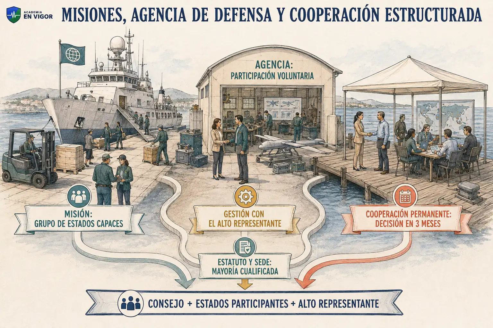

<em>Infografía: Misiones, Agencia Europea de Defensa y cooperación estructurada permanente.</em>

<!-- FUENTE: EURLEX-TUE-CONSOLIDADO-GC-T05 -->

## 13. Personalidad jurídica y revisión de los Tratados

Este bloque ordena personalidad jurídica y revisión de los tratados conforme a arts. 47 a 48 TUE. La clave es separar institución o sujeto, competencia, procedimiento, mayoría, límite y excepción.

### Claves rápidas

- **art. 47 TUE:** La Unión tiene personalidad jurídica.
- **art. 48 TUE:** Los Tratados pueden modificarse mediante un procedimiento de revisión ordinario o mediante los procedimientos de revisión simplificados.
- **art. 48 TUE:** El Gobierno de cualquier Estado miembro, el Parlamento Europeo o la Comisión pueden presentar al Consejo proyectos de revisión de los Tratados.
- **art. 48 TUE:** Los proyectos de revisión pueden aumentar o reducir las competencias atribuidas a la Unión.
- **art. 48 TUE:** El Consejo remite los proyectos al Consejo Europeo y los notifica a los Parlamentos nacionales.
- **art. 48 TUE:** La entrada en vigor de las modificaciones del procedimiento ordinario exige la ratificación de todos los Estados miembros conforme a sus normas constitucionales.
- **art. 48 TUE:** Si, transcurridos dos años desde la firma de un tratado modificativo, lo han ratificado cuatro quintas partes de los Estados y uno o varios encuentran dificultades, el Consejo Europeo examina la cuestión.

:::perla-vigor
Ancla el bloque en **arts. 47 a 48 TUE**: primero identifica el órgano o titular; después, el verbo de competencia y la mayoría o excepción.
:::

<!-- VISUAL:t05-13-personalidad-juridica-y-revision-de-los-tratados.webp -->

  

<em>Infografía: Personalidad jurídica y revisión de los Tratados.</em>

<!-- FUENTE: EURLEX-TUE-CONSOLIDADO-GC-T05 -->

## 14. Adhesión y retirada de la Unión

Este bloque ordena adhesión y retirada de la unión conforme a arts. 49 a 50 TUE. La clave es separar institución o sujeto, competencia, procedimiento, mayoría, límite y excepción.

### Claves rápidas

- **art. 49 TUE:** Cualquier Estado europeo que respete los valores mencionados en el artículo 2 y se comprometa a promoverlos podrá solicitar el ingreso como miembro en la Unión.
- **art. 49 TUE:** Se informará de esta solicitud al Parlamento Europeo y a los Parlamentos nacionales.
- **art. 49 TUE:** El Estado solicitante dirigirá su solicitud al Consejo que se pronunciará por unanimidad después de haber consultado a la Comisión y previa aprobación del Parlamento Europeo, el cual se pronunciará por mayoría de los miembros que lo componen.
- **art. 49 TUE:** Se tendrán en cuenta los criterios de elegibilidad acordados por el Consejo Europeo.
- **art. 49 TUE:** Las condiciones de admisión y las adaptaciones que esta admisión supone en lo relativo a los Tratados sobre los que se funda la Unión serán objeto de un acuerdo entre los Estados miembros y el Estado solicitante.
- **art. 50 TUE:** Todo Estado miembro podrá decidir, de conformidad con sus normas constitucionales, retirarse de la Unión.
- **art. 50 TUE:** El Estado miembro que decida retirarse notificará su intención al Consejo Europeo.
- **art. 50 TUE:** A la luz de las orientaciones del Consejo Europeo, la Unión negociará y celebrará con ese Estado un acuerdo que establecerá la forma de su retirada, teniendo en cuenta sus relaciones futuras.
- **art. 50 TUE:** El Consejo lo celebrará en nombre de la Unión por mayoría cualificada, previa aprobación del Parlamento Europeo.
- **art. 50 TUE:** Los Tratados dejarán de aplicarse al Estado de que se trate a partir de la fecha de entrada en vigor del acuerdo de retirada o, en su defecto, a los dos años de la notificación, salvo si el Consejo Europeo, de acuerdo con dicho Estado, decide por unanimidad prorrogar dicho plazo.
- **art. 50 TUE:** El miembro del Consejo Europeo y del Consejo que represente al Estado miembro que se retire no participará ni en las deliberaciones ni en las decisiones del Consejo Europeo o del Consejo que le afecten.
- **art. 50 TUE:** Si el Estado miembro que se ha retirado solicita de nuevo la adhesión, se someterá al procedimiento del artículo 49.

:::perla-vigor
Ancla el bloque en **arts. 49 a 50 TUE**: primero identifica el órgano o titular; después, el verbo de competencia y la mayoría o excepción.
:::

<!-- VISUAL:t05-14-adhesion-y-retirada-de-la-union.webp -->

  

<em>Infografía: Adhesión y retirada de la Unión.</em>

<!-- FUENTE: EURLEX-TUE-CONSOLIDADO-GC-T05 -->

## 15. Protocolos, ámbito territorial, duración y lenguas

Este bloque ordena protocolos, ámbito territorial, duración y lenguas conforme a arts. 51 a 55 TUE. La clave es separar institución o sujeto, competencia, procedimiento, mayoría, límite y excepción.

### Claves rápidas

- **art. 51 TUE:** Los protocolos y anexos de los Tratados forman parte integrante de los mismos.
- **art. 52 TUE:** El artículo 52 enumera los Estados a los que se aplican los Tratados y remite al artículo 355 TFUE para precisar el ámbito territorial.
- **art. 52 TUE:** Aunque la redacción consolidada de 2016 menciona al Reino Unido, los Tratados dejaron de aplicársele al hacerse efectiva su retirada de la Unión el 31 de enero de 2020.
- **art. 53 TUE:** El Tratado se concluye por un período de tiempo ilimitado.
- **art. 54 TUE:** Será ratificado por las Altas Partes Contratantes, de conformidad con sus normas constitucionales.
- **art. 54 TUE:** Los instrumentos de ratificación serán depositados ante el Gobierno de la República Italiana.
- **art. 54 TUE:** Entrará en vigor el 1 de enero de 1993, siempre que se hayan depositado todos los instrumentos de ratificación o, en su defecto, el primer día del mes siguiente al depósito del instrumento de ratificación del último Estado que cumpla dicha formalidad.
- **art. 55 TUE:** El Tratado, redactado en un ejemplar único, en lenguas alemana, búlgara, checa, danesa, eslovaca, eslovena, española, estonia, finesa, francesa, griega, húngara, inglesa, irlandesa, italiana, letona, lituana, maltesa, neerlandesa, polaca, portuguesa, rumana y sueca, cuyos textos en cada una de estas lenguas son igualmente auténticos, será depositado en los archivos del Gobierno de la República Italiana, que remitirá una copia autenticada a cada uno de los Gobiernos de los restantes Estados signatarios.
- **art. 55 TUE:** El Tratado podrá asimismo traducirse a cualquier otra lengua que determinen los Estados miembros entre aquellas que, de conformidad con sus ordenamientos constitucionales, tengan estatuto de lengua oficial en la totalidad o en parte de su territorio.
- **art. 55 TUE:** El Estado miembro de que se trate facilitará una copia certificada de estas traducciones, que se depositará en los archivos del Consejo.

:::perla-vigor
Ancla el bloque en **arts. 51 a 55 TUE**: primero identifica el órgano o titular; después, el verbo de competencia y la mayoría o excepción.
:::

<!-- VISUAL:t05-15-protocolos-ambito-territorial-duracion-y-lenguas.webp -->

  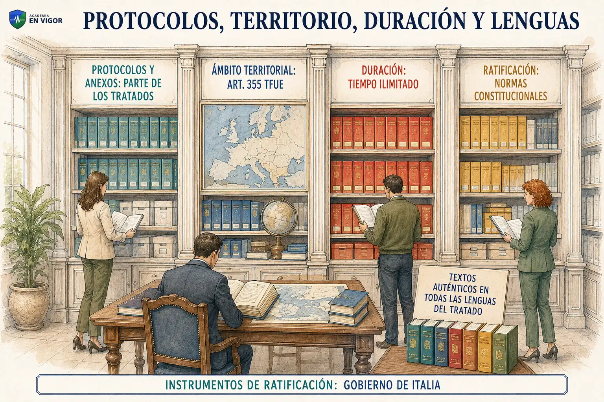

<em>Infografía: Protocolos, ámbito territorial, duración y lenguas.</em>

<!-- FUENTE: EURLEX-TUE-CONSOLIDADO-GC-T05 -->

## 16. Delimitación y categorías de competencias

Este bloque ordena delimitación y categorías de competencias conforme a arts. 1 a 6 TFUE. La clave es separar institución o sujeto, competencia, procedimiento, mayoría, límite y excepción.

### Claves rápidas

- **art. 1 TFUE:** El presente Tratado organiza el funcionamiento de la Unión y determina los ámbitos, la delimitación y las condiciones de ejercicio de sus competencias.
- **art. 1 TFUE:** El presente Tratado y el Tratado de la Unión Europea constituyen los Tratados sobre los que se fundamenta la Unión.
- **art. 1 TFUE:** Estos dos Tratados, que tienen el mismo valor jurídico, se designarán con la expresión «los Tratados».
- **art. 2 TFUE:** Cuando los Tratados atribuyen a la Unión una competencia exclusiva, solo la Unión puede legislar y adoptar actos jurídicamente vinculantes.
- **art. 2 TFUE:** En una competencia compartida, los Estados miembros ejercen la suya en la medida en que la Unión no haya ejercido la propia o haya decidido dejar de ejercerla.
- **art. 2 TFUE:** Las competencias de coordinación y de apoyo no sustituyen la competencia de los Estados miembros.
- **art. 3 TFUE:** Son competencias exclusivas de la Unión la unión aduanera, las normas de competencia necesarias para el mercado interior y la política monetaria de los Estados cuya moneda es el euro.
- **art. 3 TFUE:** También son exclusivas la conservación de los recursos biológicos marinos dentro de la política pesquera común y la política comercial común.
- **art. 3 TFUE:** La Unión tiene competencia exclusiva para determinados acuerdos internacionales cuando así lo exige un acto legislativo o el ejercicio de una competencia interna.
- **art. 4 TFUE:** El mercado interior, la política social en los aspectos definidos por el Tratado y la cohesión económica, social y territorial son competencias compartidas.
- **art. 4 TFUE:** También son compartidas la agricultura y pesca —salvo conservación de recursos biológicos marinos—, medio ambiente, consumidores, transportes, redes transeuropeas y energía.
- **art. 4 TFUE:** El espacio de libertad, seguridad y justicia y los asuntos comunes de seguridad en salud pública son competencias compartidas.
- **art. 4 TFUE:** En investigación, desarrollo tecnológico, espacio, cooperación al desarrollo y ayuda humanitaria, la acción de la Unión no impide la de los Estados miembros.
- **art. 5 TFUE:** Los Estados miembros coordinan sus políticas económicas dentro de la Unión.
- **art. 5 TFUE:** La Unión adopta medidas para coordinar las políticas de empleo y puede tomar iniciativas para coordinar las políticas sociales.
- **art. 5 TFUE:** La Unión dispone de competencia para definir y aplicar una política exterior y de seguridad común, incluida la definición progresiva de una política común de defensa.
- **art. 6 TFUE:** La Unión puede apoyar, coordinar o complementar la acción de los Estados en protección y mejora de la salud humana, industria, cultura, turismo, educación, juventud, deporte, formación profesional, protección civil y cooperación administrativa.
- **art. 6 TFUE:** Los actos jurídicamente vinculantes adoptados en estos ámbitos no pueden armonizar las disposiciones legales y reglamentarias de los Estados miembros.

:::perla-vigor
Ancla el bloque en **arts. 1 a 6 TFUE**: primero identifica el órgano o titular; después, el verbo de competencia y la mayoría o excepción.
:::

<!-- VISUAL:t05-16-delimitacion-y-categorias-de-competencias.webp -->

  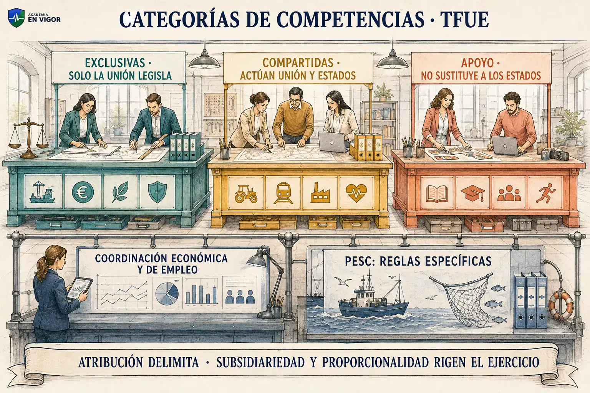

<em>Infografía: Delimitación y categorías de competencias.</em>

<!-- FUENTE: EURLEX-TFUE-CONSOLIDADO-GC-T05 -->

## 17. Cláusulas horizontales de la Unión

Este bloque ordena cláusulas horizontales de la unión conforme a arts. 7 a 17 TFUE. La clave es separar institución o sujeto, competencia, procedimiento, mayoría, límite y excepción.

### Claves rápidas

- **art. 7 TFUE:** La Unión vela por la coherencia entre sus políticas y acciones, teniendo en cuenta el conjunto de sus objetivos.
- **art. 8 TFUE:** En todas sus acciones, la Unión se fija el objetivo de eliminar las desigualdades entre el hombre y la mujer y promover su igualdad.
- **art. 9 TFUE:** La Unión tiene en cuenta un nivel de empleo elevado, protección social adecuada, lucha contra la exclusión y un nivel elevado de educación, formación y protección de la salud humana.
- **art. 10 TFUE:** La Unión trata de luchar contra toda discriminación por razón de sexo, raza u origen étnico, religión o convicciones, discapacidad, edad u orientación sexual.
- **art. 11 TFUE:** Las exigencias de protección del medio ambiente deben integrarse en las políticas y acciones de la Unión para fomentar un desarrollo sostenible.
- **art. 12 TFUE:** Las exigencias de protección de los consumidores se tienen en cuenta al definir y ejecutar otras políticas y acciones de la Unión.
- **art. 13 TFUE:** La Unión y los Estados miembros tienen plenamente en cuenta las exigencias de bienestar de los animales como seres sensibles, respetando las disposiciones y costumbres nacionales indicadas por el Tratado.
- **art. 14 TFUE:** La Unión y los Estados miembros velan por que los servicios de interés económico general actúen con arreglo a principios y condiciones que les permitan cumplir su cometido.
- **art. 15 TFUE:** Las instituciones, órganos y organismos de la Unión actúan con el mayor respeto posible al principio de apertura.
- **art. 15 TFUE:** Todo ciudadano de la Unión y toda persona física o jurídica residente o con domicilio social en un Estado miembro tiene derecho de acceso a documentos en las condiciones fijadas por los Tratados.
- **art. 16 TFUE:** Toda persona tiene derecho a la protección de los datos personales que le conciernan.
- **art. 16 TFUE:** El Parlamento Europeo y el Consejo establecen las normas sobre tratamiento y libre circulación de datos y su control por autoridades independientes.
- **art. 17 TFUE:** La Unión respeta y no prejuzga el estatuto nacional de iglesias, asociaciones religiosas y organizaciones filosóficas y no confesionales.
- **art. 17 TFUE:** La Unión mantiene con ellas un diálogo abierto, transparente y regular.

:::perla-vigor
Ancla el bloque en **arts. 7 a 17 TFUE**: primero identifica el órgano o titular; después, el verbo de competencia y la mayoría o excepción.
:::

<!-- VISUAL:t05-17-clausulas-horizontales-de-la-union.webp -->

  

<em>Infografía: Cláusulas horizontales de la Unión.</em>

<!-- FUENTE: EURLEX-TFUE-CONSOLIDADO-GC-T05 -->

## 18. No discriminación

Este bloque ordena no discriminación conforme a arts. 18 a 19 TFUE. La clave es separar institución o sujeto, competencia, procedimiento, mayoría, límite y excepción.

### Claves rápidas

- **art. 18 TFUE:** En el ámbito de aplicación de los Tratados, y sin perjuicio de las disposiciones particulares que en ellos se prevean, se prohibirá toda discriminación por razón de la nacionalidad.
- **art. 18 TFUE:** El Parlamento Europeo y el Consejo, con arreglo al procedimiento legislativo ordinario, podrán establecer la regulación necesaria para prohibir dichas discriminaciones.
- **art. 19 TFUE:** Sin perjuicio de las demás disposiciones de los Tratados y dentro de los límites de las competencias que atribuyen a la Unión, el Consejo, por unanimidad con arreglo a un procedimiento legislativo especial y previa aprobación del Parlamento Europeo, podrá adoptar acciones apropiadas para combatir la discriminación por motivos de sexo, origen racial o étnico, religión o convicciones, discapacidad, edad u orientación sexual.
- **art. 19 TFUE:** No obstante lo anterior, el Parlamento Europeo y el Consejo podrán adoptar, con arreglo al procedimiento legislativo ordinario, los principios básicos de las medidas de incentivo de la Unión, con exclusión de toda armonización de las disposiciones legales y reglamentarias de los Estados miembros, para apoyar las acciones de los Estados miembros destinadas a contribuir a la consecución de los objetivos mencionados en el apartado 1.

:::perla-vigor
Ancla el bloque en **arts. 18 a 19 TFUE**: primero identifica el órgano o titular; después, el verbo de competencia y la mayoría o excepción.
:::

<!-- VISUAL:t05-18-no-discriminacion.webp -->

  

<em>Infografía: No discriminación.</em>

<!-- FUENTE: EURLEX-TFUE-CONSOLIDADO-GC-T05 -->

## 19. Ciudadanía de la Unión y sus derechos

Este bloque ordena ciudadanía de la unión y sus derechos conforme a arts. 20 a 25 TFUE. La clave es separar institución o sujeto, competencia, procedimiento, mayoría, límite y excepción.

### Claves rápidas

- **art. 20 TFUE:** Será ciudadano de la Unión toda persona que ostente la nacionalidad de un Estado miembro.
- **art. 20 TFUE:** Los ciudadanos de la Unión son titulares de los derechos y están sujetos a los deberes establecidos en los Tratados.
- **art. 20 TFUE:** Estos derechos se ejercerán en las condiciones y límites definidos por los Tratados y por las medidas adoptadas para su aplicación.
- **art. 21 TFUE:** Todo ciudadano de la Unión tendrá derecho a circular y residir libremente en el territorio de los Estados miembros, con sujeción a las limitaciones y condiciones previstas en los Tratados y en las medidas adoptadas para su aplicación.
- **art. 21 TFUE:** A los mismos fines y salvo que los Tratados hayan previsto poderes de actuación para ello, el Consejo podrá adoptar, con arreglo a un procedimiento legislativo especial, medidas sobre seguridad social o protección social.
- **art. 21 TFUE:** El Consejo se pronunciará por unanimidad previa consulta al Parlamento Europeo.
- **art. 22 TFUE:** Todo ciudadano de la Unión que resida en un Estado miembro del que no sea nacional tendrá derecho a ser elector y elegible en las elecciones municipales del Estado miembro en el que resida, en las mismas condiciones que los nacionales de dicho Estado.
- **art. 22 TFUE:** Este derecho se ejercerá sin perjuicio de las modalidades que el Consejo adopte, por unanimidad con arreglo a un procedimiento legislativo especial y previa consulta al Parlamento Europeo.
- **art. 22 TFUE:** Dichas modalidades podrán establecer excepciones cuando así lo justifiquen problemas específicos de un Estado miembro.
- **art. 22 TFUE:** Sin perjuicio de lo dispuesto en el artículo 223.1 y en las disposiciones adoptadas para su aplicación, todo ciudadano de la Unión que resida en un Estado miembro del que no sea nacional tendrá derecho a ser elector y elegible en las elecciones al Parlamento Europeo en el Estado miembro en el que resida, en las mismas condiciones que los nacionales de dicho Estado.
- **art. 23 TFUE:** Todo ciudadano de la Unión podrá acogerse, en el territorio de un tercer país en el que no esté representado el Estado miembro del que sea nacional, a la protección de las autoridades diplomáticas y consulares de cualquier Estado miembro, en las mismas condiciones que los nacionales de dicho Estado.
- **art. 23 TFUE:** Los Estados miembros tomarán las disposiciones necesarias y entablarán las negociaciones internacionales requeridas para garantizar dicha protección.
- **art. 23 TFUE:** El Consejo podrá adoptar, con arreglo a un procedimiento legislativo especial y previa consulta al Parlamento Europeo, directivas por las que se establezcan las medidas de coordinación y de cooperación necesarias para facilitar dicha protección.
- **art. 24 TFUE:** El Parlamento Europeo y el Consejo adoptarán mediante reglamentos, con arreglo al procedimiento legislativo ordinario, las disposiciones relativas a los procedimientos y condiciones requeridos para una iniciativa ciudadana en el sentido del artículo 11 del Tratado de la Unión Europea, incluido el número mínimo de Estados miembros de los que han de proceder los ciudadanos que la presenten.
- **art. 24 TFUE:** Todo ciudadano tendrá el derecho de petición ante el Parlamento Europeo, de conformidad con el artículo 227.
- **art. 24 TFUE:** Todo ciudadano podrá dirigirse al Defensor del Pueblo de la Unión instituido en virtud del artículo 228.
- **art. 24 TFUE:** Todo ciudadano podrá dirigirse por escrito a cualquiera de las instituciones, órganos u organismos mencionados en el presente artículo o en el artículo 13 del Tratado de la Unión Europea en una de las lenguas mencionadas en el artículo 55.1 del Tratado de la Unión Europea y recibir una contestación en esa misma lengua.
- **art. 25 TFUE:** Cada tres años la Comisión informará al Parlamento Europeo, al Consejo y al Comité Económico y Social sobre la aplicación de las disposiciones de la presente Parte.
- **art. 25 TFUE:** Sobre dicha base, y salvo que los Tratados establezcan poderes de actuación para ello, el Consejo, por unanimidad con arreglo a un procedimiento legislativo especial y previa aprobación del Parlamento Europeo, podrá adoptar disposiciones encaminadas a completar los derechos enumerados en el artículo 20.2.
- **art. 25 TFUE:** Dichas disposiciones entrarán en vigor después de haber sido aprobadas por los Estados miembros de conformidad con sus respectivas normas constitucionales.

:::perla-vigor
Ancla el bloque en **arts. 20 a 25 TFUE**: primero identifica el órgano o titular; después, el verbo de competencia y la mayoría o excepción.
:::

<!-- VISUAL:t05-19-ciudadania-de-la-union-y-sus-derechos.webp -->

  

<em>Infografía: Ciudadanía de la Unión y sus derechos.</em>

<!-- FUENTE: EURLEX-TFUE-CONSOLIDADO-GC-T05 -->

## 20. Mercado interior

Este bloque ordena mercado interior conforme a arts. 26 a 27 TFUE. La clave es separar institución o sujeto, competencia, procedimiento, mayoría, límite y excepción.

### Claves rápidas

- **art. 26 TFUE:** La Unión adoptará las medidas destinadas a establecer el mercado interior o a garantizar su funcionamiento, de conformidad con las disposiciones pertinentes de los Tratados.
- **art. 26 TFUE:** El mercado interior implicará un espacio sin fronteras interiores, en el que la libre circulación de mercancías, personas, servicios y capitales estará garantizada de acuerdo con las disposiciones de los Tratados.
- **art. 26 TFUE:** El Consejo, a propuesta de la Comisión, definirá las orientaciones y condiciones necesarias para asegurar un progreso equilibrado en el conjunto de los sectores considerados.
- **art. 27 TFUE:** En el momento de formular sus propuestas con vistas a los objetivos del artículo 26, la Comisión tendrá en cuenta la importancia del esfuerzo que determinadas economías, que presentan diferencias de desarrollo, tendrán que realizar para el establecimiento del mercado interior, y podrá proponer las disposiciones adecuadas.
- **art. 27 TFUE:** Si dichas disposiciones revisten la forma de excepciones, deberán tener carácter temporal y perturbar lo menos posible el funcionamiento del mercado interior.

:::perla-vigor
Ancla el bloque en **arts. 26 a 27 TFUE**: primero identifica el órgano o titular; después, el verbo de competencia y la mayoría o excepción.
:::

<!-- VISUAL:t05-20-mercado-interior.webp -->

  

<em>Infografía: Mercado interior.</em>

<!-- FUENTE: EURLEX-TFUE-CONSOLIDADO-GC-T05 -->

## 21. Unión aduanera y cooperación aduanera

Este bloque ordena unión aduanera y cooperación aduanera conforme a arts. 28 a 33 TFUE. La clave es separar institución o sujeto, competencia, procedimiento, mayoría, límite y excepción.

### Claves rápidas

- **art. 28 TFUE:** La Unión comprenderá una unión aduanera, que abarcará la totalidad de los intercambios de mercancías y que implicará la prohibición, entre los Estados miembros, de los derechos de aduana de importación y exportación y de cualesquiera exacciones de efecto equivalente, así como la adopción de un arancel aduanero común en sus relaciones con terceros países.
- **art. 28 TFUE:** Las disposiciones del artículo 30 y las del Capítulo 3 del presente Título se aplicarán a los productos originarios de los Estados miembros y a los productos procedentes de terceros países que se encuentren en libre práctica en los Estados miembros.
- **art. 29 TFUE:** Se considerarán en libre práctica en un Estado miembro los productos procedentes de terceros países respecto de los cuales se hayan cumplido, en dicho Estado miembro, las formalidades de importación y percibido los derechos de aduana y cualesquiera otras exacciones de efecto equivalente exigibles, siempre que no se hubieren beneficiado de una devolución total o parcial de los mismos.
- **art. 30 TFUE:** Quedarán prohibidos entre los Estados miembros los derechos de aduana de importación y exportación o exacciones de efecto equivalente.
- **art. 30 TFUE:** Esta prohibición se aplicará también a los derechos de aduana de carácter fiscal.
- **art. 31 TFUE:** El Consejo, a propuesta de la Comisión, fijará los derechos del arancel aduanero común.
- **art. 32 TFUE:** Al ejercer sus funciones sobre el arancel aduanero común, la Comisión tiene en cuenta la necesidad de promover los intercambios comerciales entre los Estados miembros y terceros países.
- **art. 32 TFUE:** La Comisión tiene en cuenta la evolución de las condiciones de competencia dentro de la Unión cuando incremente la capacidad competitiva de sus empresas.
- **art. 32 TFUE:** La Comisión atiende a las necesidades de abastecimiento de materias primas y productos semielaborados procurando no falsear la competencia entre los Estados miembros.
- **art. 32 TFUE:** La Comisión procura evitar perturbaciones graves en la vida económica de los Estados miembros y garantizar un desarrollo racional de la producción y una expansión del consumo dentro de la Unión.
- **art. 33 TFUE:** Dentro del ámbito de aplicación de los Tratados, el Parlamento Europeo y el Consejo, con arreglo al procedimiento legislativo ordinario, adoptarán medidas destinadas a fortalecer la cooperación aduanera entre los Estados miembros y entre estos y la Comisión.

:::perla-vigor
Ancla el bloque en **arts. 28 a 33 TFUE**: primero identifica el órgano o titular; después, el verbo de competencia y la mayoría o excepción.
:::

<!-- VISUAL:t05-21-union-aduanera-y-cooperacion-aduanera.webp -->

  

<em>Infografía: Unión aduanera y cooperación aduanera.</em>

<!-- FUENTE: EURLEX-TFUE-CONSOLIDADO-GC-T05 -->

## 22. Restricciones cuantitativas y monopolios comerciales

Este bloque ordena restricciones cuantitativas y monopolios comerciales conforme a arts. 34 a 37 TFUE. La clave es separar institución o sujeto, competencia, procedimiento, mayoría, límite y excepción.

### Claves rápidas

- **art. 34 TFUE:** Quedarán prohibidas entre los Estados miembros las restricciones cuantitativas a la importación, así como todas las medidas de efecto equivalente.
- **art. 35 TFUE:** Quedarán prohibidas entre los Estados miembros las restricciones cuantitativas a la exportación, así como todas las medidas de efecto equivalente.
- **art. 36 TFUE:** Las disposiciones de los artículos 34 y 35 no serán obstáculo para las prohibiciones o restricciones a la importación, exportación o tránsito justificadas por razones de moralidad pública, orden público, seguridad pública, protección de la salud y vida de las personas y animales, preservación de los vegetales, protección del patrimonio artístico, histórico o arqueológico nacional o protección de la propiedad industrial y comercial.
- **art. 36 TFUE:** No obstante, tales prohibiciones o restricciones no deberán constituir un medio de discriminación arbitraria ni una restricción encubierta del comercio entre los Estados miembros.
- **art. 37 TFUE:** Los Estados miembros adecuarán los monopolios nacionales de carácter comercial de tal modo que quede asegurada la exclusión de toda discriminación entre los nacionales de los Estados miembros respecto de las condiciones de abastecimiento y de mercado.
- **art. 37 TFUE:** Las disposiciones del presente artículo se aplicarán a cualquier organismo mediante el cual un Estado miembro, de iure o de facto, directa o indirectamente, controle, dirija o influya sensiblemente en las importaciones o las exportaciones entre los Estados miembros.
- **art. 37 TFUE:** Tales disposiciones se aplicarán igualmente a los monopolios cedidos por el Estado a terceros.
- **art. 37 TFUE:** Los Estados miembros se abstendrán de cualquier nueva medida contraria a los principios enunciados en el apartado 1 o que restrinja el alcance de los artículos relativos a la prohibición de los derechos de aduana y de las restricciones cuantitativas entre los Estados miembros.
- **art. 37 TFUE:** En caso de que un monopolio de carácter comercial implique una regulación destinada a facilitar la comercialización o a mejorar la rentabilidad de los productos agrícolas, deberán adoptarse las medidas necesarias para asegurar, al aplicar las normas del presente artículo, garantías equivalentes para el empleo y el nivel de vida de los productores interesados.

:::perla-vigor
Ancla el bloque en **arts. 34 a 37 TFUE**: primero identifica el órgano o titular; después, el verbo de competencia y la mayoría o excepción.
:::

<!-- VISUAL:t05-22-restricciones-cuantitativas-y-monopolios-comerciales.webp -->

  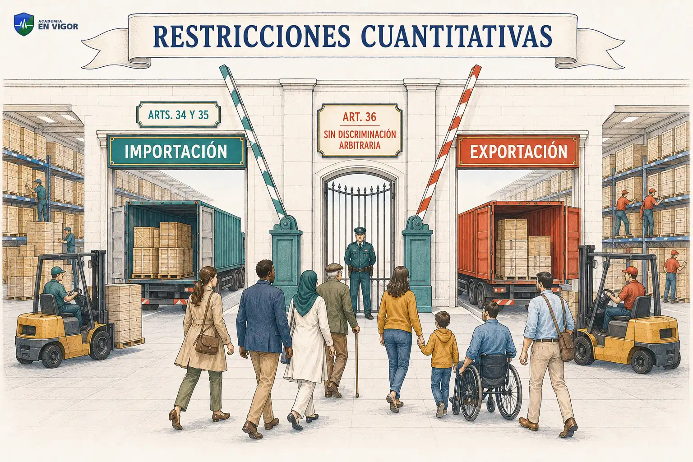

<em>Infografía: Restricciones cuantitativas y monopolios comerciales.</em>

<!-- FUENTE: EURLEX-TFUE-CONSOLIDADO-GC-T05 -->

## 23. Libre circulación de trabajadores

Este bloque ordena libre circulación de trabajadores conforme a arts. 45 a 48 TFUE. La clave es separar institución o sujeto, competencia, procedimiento, mayoría, límite y excepción.

### Claves rápidas

- **art. 45 TFUE:** Quedará asegurada la libre circulación de los trabajadores dentro de la Unión.
- **art. 45 TFUE:** La libre circulación supondrá la abolición de toda discriminación por razón de la nacionalidad entre los trabajadores con respecto al empleo, la retribución y las demás condiciones de trabajo.
- **art. 45 TFUE:** Las disposiciones del presente artículo no serán aplicables a los empleos en la Administración pública.
- **art. 46 TFUE:** El Parlamento Europeo y el Consejo adoptan mediante el procedimiento legislativo ordinario, y previa consulta al Comité Económico y Social, las medidas necesarias para hacer efectiva la libre circulación de trabajadores.
- **art. 46 TFUE:** Las medidas favorecen la estrecha cooperación entre las administraciones nacionales de trabajo y eliminan procedimientos y prácticas administrativas que obstaculicen la libre circulación.
- **art. 46 TFUE:** Las medidas eliminan los plazos y demás restricciones distintos para trabajadores extranjeros que condicionen la libre elección de empleo.
- **art. 46 TFUE:** Las medidas establecen mecanismos para poner en relación ofertas y demandas de empleo y facilitar su equilibrio sin poner en grave peligro el nivel de vida y de empleo de las diversas regiones e industrias.
- **art. 47 TFUE:** Los Estados miembros facilitarán, en el marco de un programa común, el intercambio de trabajadores jóvenes.
- **art. 48 TFUE:** En tal caso, el acto propuesto inicialmente se considerará no adoptado.

:::perla-vigor
Ancla el bloque en **arts. 45 a 48 TFUE**: primero identifica el órgano o titular; después, el verbo de competencia y la mayoría o excepción.
:::

<!-- VISUAL:t05-23-libre-circulacion-de-trabajadores.webp -->

  

<em>Infografía: Libre circulación de trabajadores.</em>

<!-- FUENTE: EURLEX-TFUE-CONSOLIDADO-GC-T05 -->

## 24. Derecho de establecimiento

Este bloque ordena derecho de establecimiento conforme a arts. 49 a 55 TFUE. La clave es separar institución o sujeto, competencia, procedimiento, mayoría, límite y excepción.

### Claves rápidas

- **art. 49 TFUE:** Quedarán prohibidas las restricciones a la libertad de establecimiento de los nacionales de un Estado miembro en el territorio de otro Estado miembro.
- **art. 49 TFUE:** Dicha prohibición se extenderá a las restricciones relativas a la apertura de agencias, sucursales o filiales por los nacionales de un Estado miembro establecidos en el territorio de otro Estado miembro.
- **art. 50 TFUE:** A efectos de alcanzar la libertad de establecimiento en una determinada actividad, el Parlamento Europeo y el Consejo decidirán, mediante directivas, con arreglo al procedimiento legislativo ordinario y previa consulta al Comité Económico y Social.
- **art. 51 TFUE:** Las disposiciones del presente capítulo no se aplicarán, en lo que respecta al Estado miembro interesado, a las actividades que, en dicho Estado, estén relacionadas, aunque solo sea de manera ocasional, con el ejercicio del poder público.
- **art. 51 TFUE:** El Parlamento Europeo y el Consejo, con arreglo al procedimiento legislativo ordinario, podrán excluir determinadas actividades de la aplicación de estas disposiciones.
- **art. 52 TFUE:** Las disposiciones y las medidas adoptadas en virtud de las mismas no prejuzgarán la aplicabilidad de las disposiciones legales, reglamentarias y administrativas que prevean un régimen especial para los extranjeros y que estén justificadas por razones de orden público, seguridad y salud públicas.
- **art. 52 TFUE:** El Parlamento Europeo y el Consejo, con arreglo al procedimiento legislativo ordinario, adoptarán directivas para la coordinación de las mencionadas disposiciones.
- **art. 53 TFUE:** A fin de facilitar el acceso a las actividades no asalariadas y su ejercicio, el Parlamento Europeo y el Consejo, con arreglo al procedimiento legislativo ordinario, adoptarán directivas para el reconocimiento mutuo de diplomas, certificados y otros títulos, así como para la coordinación de las disposiciones legales, reglamentarias y administrativas de los Estados miembros relativas al acceso a las actividades por cuenta propia y a su ejercicio.
- **art. 53 TFUE:** En cuanto a las profesiones médicas, paramédicas y farmacéuticas, la progresiva supresión de las restricciones quedará subordinada a la coordinación de las condiciones exigidas para su ejercicio en los diferentes Estados miembros.
- **art. 54 TFUE:** Las sociedades constituidas de conformidad con la legislación de un Estado miembro y cuya sede social, administración central o centro de actividad principal se encuentren dentro de la Unión quedarán equiparadas, a efectos de aplicación de estas disposiciones, a las personas físicas de los Estados miembros.
- **art. 54 TFUE:** Por sociedades se entiende las sociedades de Derecho civil o mercantil, las sociedades cooperativas, y las demás personas jurídicas de Derecho público o privado, con excepción de las que no persigan un fin lucrativo.
- **art. 55 TFUE:** Los Estados miembros aplicarán a los nacionales de los demás Estados miembros el trato de nacional en lo que respecta a su participación financiera en el capital de las sociedades definidas en el artículo 54, sin perjuicio de la aplicación de las restantes disposiciones de los Tratados.

:::perla-vigor
Ancla el bloque en **arts. 49 a 55 TFUE**: primero identifica el órgano o titular; después, el verbo de competencia y la mayoría o excepción.
:::

<!-- VISUAL:t05-24-derecho-de-establecimiento.webp -->

  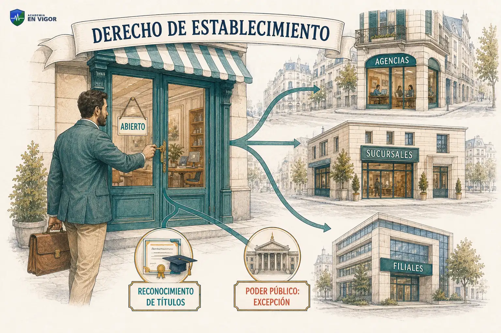

<em>Infografía: Derecho de establecimiento.</em>

<!-- FUENTE: EURLEX-TFUE-CONSOLIDADO-GC-T05 -->

## 25. Libre prestación de servicios

Este bloque ordena libre prestación de servicios conforme a arts. 56 a 62 TFUE. La clave es separar institución o sujeto, competencia, procedimiento, mayoría, límite y excepción.

### Claves rápidas

- **art. 56 TFUE:** Quedarán prohibidas las restricciones a la libre prestación de servicios dentro de la Unión para los nacionales de los Estados miembros establecidos en un Estado miembro que no sea el del destinatario de la prestación.
- **art. 56 TFUE:** El Parlamento Europeo y el Consejo, con arreglo al procedimiento legislativo ordinario, podrán extender el beneficio de las disposiciones del presente capítulo a los prestadores de servicios que sean nacionales de un tercer Estado y se hallen establecidos dentro de la Unión.
- **art. 57 TFUE:** Con arreglo a los Tratados, se considerarán como servicios las prestaciones realizadas normalmente a cambio de una remuneración, en la medida en que no se rijan por las disposiciones relativas a la libre circulación de mercancías, capitales y personas.
- **art. 57 TFUE:** Sin perjuicio de las disposiciones del capítulo relativo al derecho de establecimiento, el prestador de un servicio podrá, con objeto de realizar dicha prestación, ejercer temporalmente su actividad en el Estado miembro donde se lleve a cabo la prestación, en las mismas condiciones que imponga ese Estado a sus propios nacionales.
- **art. 58 TFUE:** La libre prestación de servicios de transportes se regirá por las disposiciones del título relativo a los transportes.
- **art. 58 TFUE:** La liberalización de los servicios bancarios y de seguros vinculados a los movimientos de capitales se realizará en armonía con la liberalización de la circulación de capitales.
- **art. 59 TFUE:** A efectos de alcanzar la liberalización de un servicio determinado, el Parlamento Europeo y el Consejo, con arreglo al procedimiento legislativo ordinario y previa consulta al Comité Económico y Social, decidirán mediante directivas.
- **art. 59 TFUE:** Las directivas previstas con prioridad, a los servicios que influyan de forma directa en los costes de producción o cuya liberalización contribuya a facilitar los intercambios de mercancías.
- **art. 60 TFUE:** Los Estados miembros se esforzarán por proceder a una liberalización de los servicios más amplia que la exigida en virtud de aplicación del artículo 59.1, si su situación económica general y la del sector se lo permiten.
- **art. 60 TFUE:** La Comisión dirigirá, a este fin, recomendaciones a los Estados miembros interesados.
- **art. 61 TFUE:** En tanto no se supriman las restricciones a la libre prestación de servicios, cada uno de los Estados miembros aplicará tales restricciones, sin distinción de nacionalidad o residencia, a todos los prestadores de servicios a que se refiere el párrafo primero del artículo 56.
- **art. 62 TFUE:** Los artículos 51 a 54, ambos inclusive, serán aplicables a las materias reguladas por el presente capítulo.

:::perla-vigor
Ancla el bloque en **arts. 56 a 62 TFUE**: primero identifica el órgano o titular; después, el verbo de competencia y la mayoría o excepción.
:::

<!-- VISUAL:t05-25-libre-prestacion-de-servicios.webp -->

  

<em>Infografía: Libre prestación de servicios.</em>

<!-- FUENTE: EURLEX-TFUE-CONSOLIDADO-GC-T05 -->

## 26. Capitales y pagos

Este bloque ordena capitales y pagos conforme a arts. 63 a 66 TFUE. La clave es separar institución o sujeto, competencia, procedimiento, mayoría, límite y excepción.

### Claves rápidas

- **art. 63 TFUE:** Quedan prohibidas todas las restricciones a los movimientos de capitales entre Estados miembros y entre Estados miembros y terceros países.
- **art. 63 TFUE:** Quedan prohibidas las restricciones sobre los pagos entre Estados miembros y entre Estados miembros y terceros países.
- **art. 64 TFUE:** El artículo 63 no impide aplicar a terceros países las restricciones que existían el 31 de diciembre de 1993 en materia de movimientos de capitales vinculados a inversiones directas, establecimiento, servicios financieros o admisión de valores en mercados de capitales.
- **art. 64 TFUE:** El Parlamento Europeo y el Consejo pueden adoptar mediante el procedimiento legislativo ordinario medidas relativas a movimientos de capitales con terceros países procurando alcanzar el máximo grado posible de liberalización.
- **art. 64 TFUE:** Solo el Consejo, por unanimidad y previa consulta al Parlamento Europeo, puede adoptar medidas que supongan un retroceso en la liberalización de movimientos de capitales con terceros países.
- **art. 65 TFUE:** Los Estados miembros pueden aplicar las disposiciones pertinentes de su Derecho fiscal que distingan entre contribuyentes según su residencia o el lugar donde esté invertido su capital.
- **art. 65 TFUE:** Los Estados miembros pueden adoptar medidas indispensables para impedir infracciones de su Derecho, establecer procedimientos de declaración de movimientos de capitales y adoptar medidas justificadas por orden público o seguridad pública.
- **art. 65 TFUE:** Las medidas nacionales no pueden constituir un medio de discriminación arbitraria ni una restricción encubierta de la libre circulación de capitales y pagos.
- **art. 65 TFUE:** A falta de medidas adoptadas con arreglo al artículo 64.3, el Consejo puede decidir por unanimidad que una medida fiscal restrictiva de un Estado miembro frente a terceros países es compatible con los Tratados.
- **art. 66 TFUE:** Cuando movimientos de capitales con destino u origen en terceros países causen o amenacen causar dificultades graves para el funcionamiento de la unión económica y monetaria, el Consejo puede adoptar medidas de salvaguardia estrictamente necesarias.
- **art. 66 TFUE:** Las medidas de salvaguardia se adoptan a propuesta de la Comisión, previa consulta al Banco Central Europeo, y no pueden exceder de seis meses.

:::perla-vigor
Ancla el bloque en **arts. 63 a 66 TFUE**: primero identifica el órgano o titular; después, el verbo de competencia y la mayoría o excepción.
:::

<!-- VISUAL:t05-26-capitales-y-pagos.webp -->

  

<em>Infografía: Capitales y pagos.</em>

<!-- FUENTE: EURLEX-TFUE-CONSOLIDADO-GC-T05 -->

## 27. Espacio de libertad, seguridad y justicia: reglas generales

Este bloque ordena espacio de libertad, seguridad y justicia: reglas generales conforme a arts. 67 a 76 TFUE. La clave es separar institución o sujeto, competencia, procedimiento, mayoría, límite y excepción.

### Claves rápidas

- **art. 67 TFUE:** La Unión constituye un espacio de libertad, seguridad y justicia con respeto de los derechos fundamentales y de los distintos sistemas y tradiciones jurídicos de los Estados miembros.
- **art. 67 TFUE:** Garantizará la ausencia de controles de las personas en las fronteras interiores y desarrollará una política común de asilo, inmigración y control de las fronteras exteriores basada en la solidaridad entre Estados miembros y equitativa respecto de los nacionales de terceros países.
- **art. 67 TFUE:** A estos efectos, los apátridas se asimilarán a los nacionales de terceros países.
- **art. 67 TFUE:** La Unión se esforzará por garantizar un nivel elevado de seguridad mediante medidas de prevención de la delincuencia, el racismo y la xenofobia y de lucha contra ellos, medidas de coordinación y cooperación entre autoridades policiales y judiciales y otras autoridades competentes, así como mediante el reconocimiento mutuo de las resoluciones judiciales en materia penal y, si es necesario, mediante la aproximación de las legislaciones penales.
- **art. 67 TFUE:** La Unión facilitará el acceso a la tutela judicial, en especial mediante el principio de reconocimiento mutuo de las resoluciones judiciales y extrajudiciales en materia civil.
- **art. 68 TFUE:** El Consejo Europeo definirá las orientaciones estratégicas de la programación legislativa y operativa en el espacio de libertad, seguridad y justicia.
- **art. 69 TFUE:** Los Parlamentos nacionales velarán por el respeto del principio de subsidiariedad en las propuestas legislativas de los capítulos 4 (cooperación judicial penal) y 5 (cooperación policial), conforme al Protocolo correspondiente.
- **art. 70 TFUE:** El Consejo puede adoptar, a propuesta de la Comisión, medidas que establezcan los procedimientos mediante los cuales los Estados miembros efectúan, en colaboración con la Comisión, una evaluación objetiva e imparcial de la aplicación de las políticas del espacio de libertad, seguridad y justicia.
- **art. 70 TFUE:** El Parlamento Europeo y los Parlamentos nacionales son informados del contenido y de los resultados de la evaluación de las políticas del espacio de libertad, seguridad y justicia.
- **art. 71 TFUE:** Un comité permanente dentro del Consejo garantiza el fomento y la intensificación de la cooperación operativa en materia de seguridad interior.
- **art. 71 TFUE:** Los representantes de los órganos y organismos de la Unión interesados pueden participar en los trabajos del comité y se mantiene informados de ellos al Parlamento Europeo y a los Parlamentos nacionales.
- **art. 72 TFUE:** El Título V no afecta las responsabilidades de los Estados miembros en el mantenimiento del orden público y la salvaguardia de la seguridad interior.
- **art. 73 TFUE:** Los Estados miembros podrán organizar entre sí formas de cooperación y coordinación entre servicios competentes responsables de la seguridad nacional.
- **art. 74 TFUE:** El Consejo adoptará medidas para la cooperación administrativa entre servicios competentes de los Estados miembros y con la Comisión (propuesta Comisión o iniciativa quarter, consulta Parlamento Europeo).
- **art. 75 TFUE:** El Parlamento Europeo y el Consejo definen mediante reglamentos adoptados por el procedimiento legislativo ordinario un marco de medidas administrativas sobre movimientos de capitales y pagos para prevenir y combatir el terrorismo y actividades conexas.
- **art. 75 TFUE:** Las medidas administrativas contra el terrorismo pueden incluir la inmovilización de fondos, activos financieros o beneficios económicos pertenecientes a personas, grupos o entidades no estatales.
- **art. 76 TFUE:** Los actos contemplados en los capítulos sobre cooperación judicial penal, cooperación policial y cooperación administrativa se adoptan a propuesta de la Comisión o por iniciativa de una cuarta parte de los Estados miembros.

:::perla-vigor
Ancla el bloque en **arts. 67 a 76 TFUE**: primero identifica el órgano o titular; después, el verbo de competencia y la mayoría o excepción.
:::

<!-- VISUAL:t05-27-espacio-de-libertad-seguridad-y-justicia-reglas-generales.webp -->

  

<em>Infografía: Espacio de libertad, seguridad y justicia: reglas generales.</em>

<!-- FUENTE: EURLEX-TFUE-CONSOLIDADO-GC-T05 -->

## 28. Fronteras, asilo e inmigración

Este bloque ordena fronteras, asilo e inmigración conforme a arts. 77 a 80 TFUE. La clave es separar institución o sujeto, competencia, procedimiento, mayoría, límite y excepción.

### Claves rápidas

- **art. 77 TFUE:** No afecta competencia Estados miembros en delimitación geográfica fronteras.
- **art. 78 TFUE:** Política común de asilo, protección subsidiaria y temporal, conforme Convención Ginebra 1951 y principio no devolución (non-refoulement).
- **art. 79 TFUE:** No afecta derecho Estados miembros determinar volúmenes admisión trabajadores terceros países.
- **art. 80 TFUE:** Políticas y ejecución regidas por principio solidaridad y reparto equitativo responsabilidad (incluido financiero).

:::perla-vigor
Ancla el bloque en **arts. 77 a 80 TFUE**: primero identifica el órgano o titular; después, el verbo de competencia y la mayoría o excepción.
:::

<!-- VISUAL:t05-28-fronteras-asilo-e-inmigracion.webp -->

  

<em>Infografía: Fronteras, asilo e inmigración.</em>

<!-- FUENTE: EURLEX-TFUE-CONSOLIDADO-GC-T05 -->

## 29. Cooperación judicial en materia civil

Este bloque ordena cooperación judicial en materia civil conforme a art. 81 TFUE. La clave es separar institución o sujeto, competencia, procedimiento, mayoría, límite y excepción.

### Claves rápidas

- **art. 81 TFUE:** La Unión desarrollará una cooperación judicial en asuntos civiles con repercusión transfronteriza, basada en el principio de reconocimiento mutuo de las resoluciones judiciales y extrajudiciales.
- **art. 81 TFUE:** Esta cooperación podrá incluir la adopción de medidas de aproximación de las disposiciones legales y reglamentarias de los Estados miembros.

:::perla-vigor
Ancla el bloque en **art. 81 TFUE**: primero identifica el órgano o titular; después, el verbo de competencia y la mayoría o excepción.
:::

<!-- VISUAL:t05-29-cooperacion-judicial-en-materia-civil.webp -->

  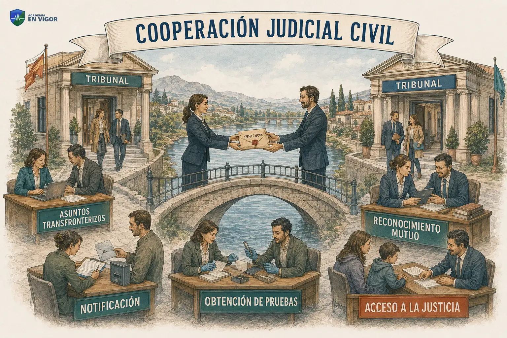

<em>Infografía: Cooperación judicial en materia civil.</em>

<!-- FUENTE: EURLEX-TFUE-CONSOLIDADO-GC-T05 -->

## 30. Cooperación judicial en materia penal

Este bloque ordena cooperación judicial en materia penal conforme a arts. 82 a 86 TFUE. La clave es separar institución o sujeto, competencia, procedimiento, mayoría, límite y excepción.

### Claves rápidas

- **art. 82 TFUE:** La cooperación judicial en materia penal se basa en el principio de reconocimiento mutuo de sentencias y resoluciones judiciales.
- **art. 82 TFUE:** El Parlamento Europeo y el Consejo pueden adoptar mediante el procedimiento legislativo ordinario medidas para asegurar el reconocimiento y ejecución de resoluciones, prevenir conflictos de jurisdicción, apoyar la formación judicial y facilitar la cooperación entre autoridades.
- **art. 82 TFUE:** Mediante directivas pueden establecerse normas mínimas sobre admisibilidad de pruebas, derechos de las personas durante el procedimiento penal, derechos de las víctimas y otros elementos específicos definidos por unanimidad del Consejo previa aprobación del Parlamento Europeo.
- **art. 82 TFUE:** Las normas mínimas de la Unión no impiden que los Estados miembros mantengan o instauren un nivel más elevado de protección de las personas.
- **art. 82 TFUE:** Si un proyecto afecta a aspectos fundamentales del sistema de justicia penal de un Estado, este puede solicitar que se remita al Consejo Europeo y queda suspendido el procedimiento legislativo ordinario.
- **art. 83 TFUE:** Aproximación imprescindible para políticas armonizadas Unión (procedimiento idéntico armonización).
- **art. 84 TFUE:** El Parlamento Europeo y el Consejo pueden establecer mediante el procedimiento legislativo ordinario medidas para impulsar y apoyar la actuación de los Estados miembros en prevención de la delincuencia, sin armonizar sus disposiciones legales y reglamentarias.
- **art. 85 TFUE:** El Parlamento Europeo y el Consejo determinan mediante reglamentos adoptados por el procedimiento legislativo ordinario la estructura, funcionamiento, ámbito de actuación y competencias de Eurojust.
- **art. 85 TFUE:** Eurojust puede iniciar investigaciones, proponer la incoación de procedimientos, coordinar investigaciones y resolver conflictos de jurisdicción en la delincuencia grave que afecte a dos o más Estados miembros.
- **art. 85 TFUE:** Los actos formales de carácter procesal vinculados a las funciones de Eurojust son efectuados por funcionarios nacionales competentes.
- **art. 86 TFUE:** Competente fraude intereses financieros Unión (investigación, acusación, acción penal).

:::perla-vigor
Ancla el bloque en **arts. 82 a 86 TFUE**: primero identifica el órgano o titular; después, el verbo de competencia y la mayoría o excepción.
:::

<!-- VISUAL:t05-30-cooperacion-judicial-en-materia-penal.webp -->

  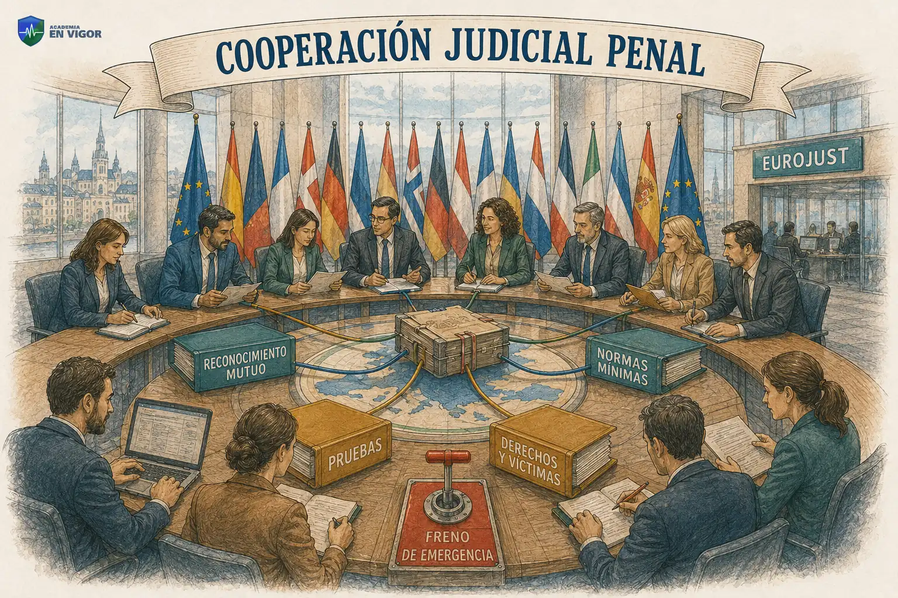

<em>Infografía: Cooperación judicial en materia penal.</em>

<!-- FUENTE: EURLEX-TFUE-CONSOLIDADO-GC-T05 -->

## 31. Cooperación policial

Este bloque ordena cooperación policial conforme a arts. 87 a 89 TFUE. La clave es separar institución o sujeto, competencia, procedimiento, mayoría, límite y excepción.

### Claves rápidas

- **art. 87 TFUE:** La Unión desarrolla una cooperación policial entre las autoridades competentes de los Estados miembros, incluidos los servicios de policía, aduanas y otros servicios con funciones coercitivas.
- **art. 87 TFUE:** El Parlamento Europeo y el Consejo pueden adoptar mediante el procedimiento legislativo ordinario medidas sobre recogida e intercambio de información, formación y equipos del personal y técnicas comunes de investigación.
- **art. 87 TFUE:** Las medidas de cooperación operativa se adoptan por el Consejo mediante un procedimiento legislativo especial, por unanimidad y previa consulta al Parlamento Europeo.
- **art. 87 TFUE:** Si no se alcanza la unanimidad, al menos nueve Estados miembros pueden solicitar que el proyecto se remita al Consejo Europeo y, en las condiciones del Tratado, establecer una cooperación reforzada.
- **art. 88 TFUE:** Europol apoya y refuerza la actuación de las autoridades policiales y demás servicios con funciones coercitivas de los Estados miembros y su colaboración mutua frente a la delincuencia grave transfronteriza, el terrorismo y las formas de delincuencia que lesionen un interés común de la Unión.
- **art. 88 TFUE:** El Parlamento Europeo y el Consejo determinan mediante reglamentos adoptados por el procedimiento legislativo ordinario la estructura, funcionamiento, ámbito de actuación y competencias de Europol.
- **art. 88 TFUE:** Toda acción operativa de Europol se realiza en contacto y de acuerdo con las autoridades del Estado miembro cuyo territorio resulte afectado y la aplicación de medidas coercitivas corresponde exclusivamente a las autoridades nacionales.
- **art. 89 TFUE:** El Consejo fija mediante un procedimiento legislativo especial, por unanimidad y previa consulta al Parlamento Europeo, las condiciones y límites dentro de los cuales las autoridades competentes de un Estado miembro pueden actuar en el territorio de otro Estado miembro en contacto y de acuerdo con sus autoridades.

:::perla-vigor
Ancla el bloque en **arts. 87 a 89 TFUE**: primero identifica el órgano o titular; después, el verbo de competencia y la mayoría o excepción.
:::

<!-- VISUAL:t05-31-cooperacion-policial.webp -->

  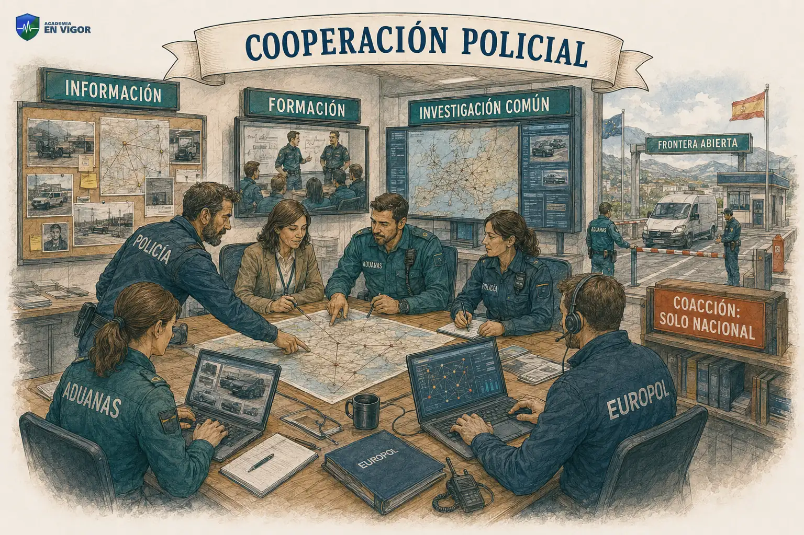

<em>Infografía: Cooperación policial.</em>

<!-- FUENTE: EURLEX-TFUE-CONSOLIDADO-GC-T05 -->

## 32. Medio ambiente

Este bloque ordena medio ambiente conforme a arts. 191 a 193 TFUE. La clave es separar institución o sujeto, competencia, procedimiento, mayoría, límite y excepción.

### Claves rápidas

- **art. 191 TFUE:** La política de la Unión en materia de medio ambiente persigue conservar, proteger y mejorar su calidad, proteger la salud de las personas, utilizar prudentemente los recursos naturales y promover medidas internacionales frente a problemas ambientales y cambio climático.
- **art. 191 TFUE:** La política ambiental de la Unión pretende alcanzar un nivel de protección elevado atendiendo a la diversidad de situaciones regionales.
- **art. 191 TFUE:** La política ambiental se basa en los principios de cautela, acción preventiva, corrección preferente en la fuente y quien contamina paga.
- **art. 191 TFUE:** Al elaborar su política ambiental, la Unión tiene en cuenta los datos científicos y técnicos, las condiciones regionales, las ventajas y cargas de la acción o inacción y el desarrollo económico y social equilibrado.
- **art. 192 TFUE:** El Parlamento Europeo y el Consejo adoptan mediante el procedimiento legislativo ordinario y previa consulta al Comité Económico y Social y al Comité de las Regiones las acciones necesarias para alcanzar los objetivos de la política de medio ambiente.
- **art. 192 TFUE:** El Consejo se pronuncia por unanimidad, con arreglo a un procedimiento legislativo especial y previa consulta al Parlamento Europeo y a los comités consultivos, sobre determinadas disposiciones fiscales, ordenación territorial, recursos hídricos, utilización del suelo y elección energética.
- **art. 192 TFUE:** El Parlamento Europeo y el Consejo adoptan programas de acción de carácter general que fijan los objetivos prioritarios de la política ambiental.
- **art. 193 TFUE:** Las medidas de protección adoptadas por la Unión en materia de medio ambiente no impiden que cada Estado miembro mantenga o adopte medidas de mayor protección.
- **art. 193 TFUE:** Las medidas nacionales de mayor protección deben ser compatibles con los Tratados y notificarse a la Comisión.

:::perla-vigor
Ancla el bloque en **arts. 191 a 193 TFUE**: primero identifica el órgano o titular; después, el verbo de competencia y la mayoría o excepción.
:::

<!-- VISUAL:t05-32-medio-ambiente.webp -->

  

<em>Infografía: Medio ambiente.</em>

<!-- FUENTE: EURLEX-TFUE-CONSOLIDADO-GC-T05 -->

## 33. Protección civil

Este bloque ordena protección civil conforme a art. 196 TFUE. La clave es separar institución o sujeto, competencia, procedimiento, mayoría, límite y excepción.

### Claves rápidas

- **art. 196 TFUE:** La Unión apoya y complementa la acción de los Estados miembros en prevención de riesgos, preparación del personal y respuesta rápida y eficaz ante catástrofes naturales o de origen humano.
- **art. 196 TFUE:** La acción de la Unión fomenta una cooperación operativa rápida y eficaz entre los servicios nacionales de protección civil y la coherencia de las actuaciones internacionales.
- **art. 196 TFUE:** El Parlamento Europeo y el Consejo adoptan mediante el procedimiento legislativo ordinario las medidas necesarias para alcanzar estos objetivos, con exclusión de toda armonización de las disposiciones legales y reglamentarias nacionales.

:::perla-vigor
Ancla el bloque en **art. 196 TFUE**: primero identifica el órgano o titular; después, el verbo de competencia y la mayoría o excepción.
:::

<!-- VISUAL:t05-33-proteccion-civil.webp -->

  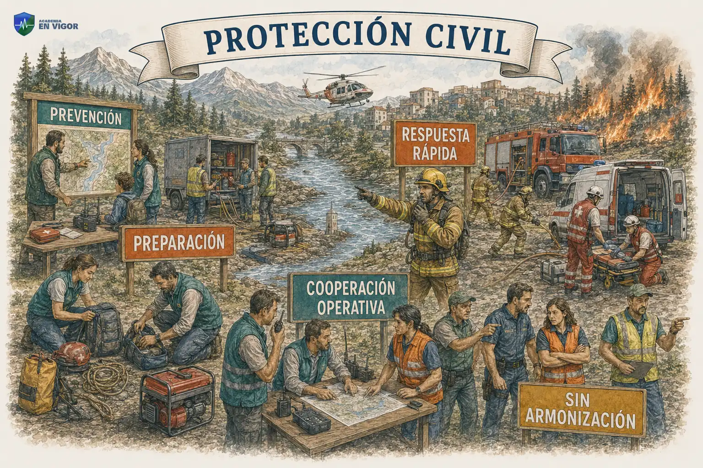

<em>Infografía: Protección civil.</em>

<!-- FUENTE: EURLEX-TFUE-CONSOLIDADO-GC-T05 -->

## 34. Asociación de los países y territorios de ultramar

Este bloque ordena asociación de los países y territorios de ultramar conforme a arts. 198 a 204 TFUE. La clave es separar institución o sujeto, competencia, procedimiento, mayoría, límite y excepción.

### Claves rápidas

- **art. 198 TFUE:** Los Estados miembros asocian a la Unión los países y territorios no europeos que mantienen relaciones especiales con Dinamarca, Francia y los Países Bajos.
- **art. 198 TFUE:** La asociación persigue promover el desarrollo económico y social de esos territorios y establecer estrechas relaciones económicas con la Unión.
- **art. 199 TFUE:** La asociación aplica a los intercambios con los territorios el régimen que los Estados miembros se conceden entre sí y favorece inversiones y establecimiento sin discriminación.
- **art. 200 TFUE:** Las importaciones originarias de los países y territorios de ultramar se benefician de la supresión de derechos de aduana en los Estados miembros, con las condiciones del Tratado.
- **art. 201 TFUE:** La Comisión puede proponer medidas cuando los derechos aplicados por un territorio provoquen desviaciones del tráfico comercial en perjuicio de un Estado miembro.
- **art. 202 TFUE:** La libre circulación de trabajadores entre los Estados miembros y los territorios se regula mediante los actos adoptados conforme al artículo 203, sin perjuicio de salud, seguridad y orden público.
- **art. 203 TFUE:** El Consejo adopta por unanimidad, a propuesta de la Comisión y previa consulta al Parlamento Europeo, las disposiciones de desarrollo de la asociación.
- **art. 204 TFUE:** Los artículos 198 a 203 son aplicables a Groenlandia sin perjuicio del régimen específico fijado en el Protocolo correspondiente.

:::perla-vigor
Ancla el bloque en **arts. 198 a 204 TFUE**: primero identifica el órgano o titular; después, el verbo de competencia y la mayoría o excepción.
:::

<!-- VISUAL:t05-34-asociacion-de-los-paises-y-territorios-de-ultramar.webp -->

  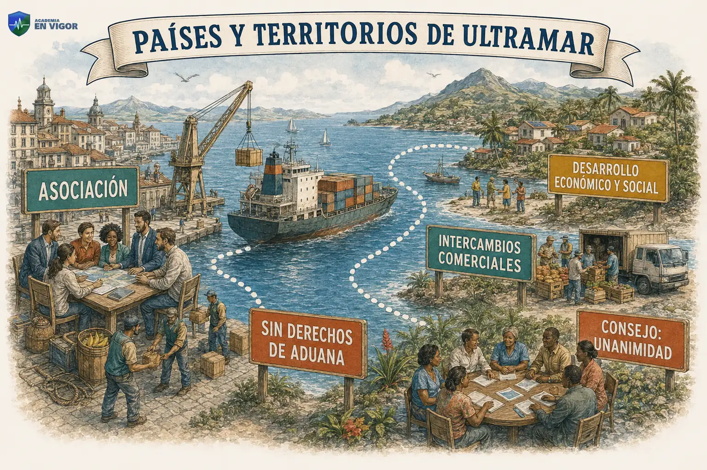

<em>Infografía: Asociación de los países y territorios de ultramar.</em>

<!-- FUENTE: EURLEX-TFUE-CONSOLIDADO-GC-T05 -->

## 35. Cooperación para el desarrollo

Este bloque ordena cooperación para el desarrollo conforme a arts. 208 a 211 TFUE. La clave es separar institución o sujeto, competencia, procedimiento, mayoría, límite y excepción.

### Claves rápidas

- **art. 208 TFUE:** La política de la Unión en el ámbito de la cooperación para el desarrollo se llevará a cabo en el marco de los principios y objetivos de la acción exterior de la Unión.
- **art. 208 TFUE:** Las políticas de cooperación para el desarrollo de la Unión y de los Estados miembros se complementarán y reforzarán mutuamente.
- **art. 208 TFUE:** El objetivo principal será la reducción y, a término, la erradicación de la pobreza.
- **art. 208 TFUE:** La Unión tendrá en cuenta los objetivos de cooperación al desarrollo al aplicar políticas que puedan afectar a países en desarrollo.
- **art. 208 TFUE:** La Unión y los Estados miembros respetarán los compromisos y tendrán en cuenta los objetivos acordados en el marco de Naciones Unidas y otras organizaciones internacionales competentes.
- **art. 209 TFUE:** Banco Europeo de Inversiones contribuye ejecución (condiciones Estatutos).
- **art. 210 TFUE:** Para favorecer la complementariedad y eficacia de sus acciones, la Unión y los Estados miembros coordinan sus políticas de cooperación para el desarrollo y se conciertan sobre sus programas de ayuda, también en organizaciones internacionales y conferencias.
- **art. 210 TFUE:** La Comisión puede adoptar iniciativas adecuadas para fomentar la coordinación de las acciones de cooperación para el desarrollo de la Unión y de los Estados miembros.
- **art. 211 TFUE:** El Banco Europeo de Inversiones contribuye a la ejecución de las medidas de cooperación para el desarrollo en las condiciones previstas por sus Estatutos.

:::perla-vigor
Ancla el bloque en **arts. 208 a 211 TFUE**: primero identifica el órgano o titular; después, el verbo de competencia y la mayoría o excepción.
:::

<!-- VISUAL:t05-35-cooperacion-para-el-desarrollo.webp -->

  

<em>Infografía: Cooperación para el desarrollo.</em>

<!-- FUENTE: EURLEX-TFUE-CONSOLIDADO-GC-T05 -->

## 36. Cooperación económica, financiera, técnica y ayuda humanitaria

Este bloque ordena cooperación económica, financiera, técnica y ayuda humanitaria conforme a arts. 212 a 214 TFUE. La clave es separar institución o sujeto, competencia, procedimiento, mayoría, límite y excepción.

### Claves rápidas

- **art. 212 TFUE:** 208-211, Unión lleva acciones cooperación económica, financiera y técnica (incluida ayuda financiera) con terceros países distintos de países en desarrollo.
- **art. 213 TFUE:** Cuando la situación de un tercer país exija asistencia financiera urgente de la Unión, el Consejo adopta las decisiones necesarias a propuesta de la Comisión.
- **art. 213 TFUE:** El Parlamento Europeo es informado de la decisión adoptada para prestar asistencia financiera urgente a un tercer país.
- **art. 214 TFUE:** Cuerpo Voluntario Europeo Ayuda Humanitaria (EU Aid Volunteers, integrado ahora en Cuerpo Europeo Solidaridad).

:::perla-vigor
Ancla el bloque en **arts. 212 a 214 TFUE**: primero identifica el órgano o titular; después, el verbo de competencia y la mayoría o excepción.
:::

<!-- VISUAL:t05-36-cooperacion-economica-financiera-tecnica-y-ayuda-humanitaria.webp -->

  

<em>Infografía: Cooperación económica, financiera, técnica y ayuda humanitaria.</em>

<!-- FUENTE: EURLEX-TFUE-CONSOLIDADO-GC-T05 -->

## 37. Cláusula de solidaridad

Este bloque ordena cláusula de solidaridad conforme a art. 222 TFUE. La clave es separar institución o sujeto, competencia, procedimiento, mayoría, límite y excepción.

### Claves rápidas

- **art. 222 TFUE:** La Unión y sus Estados miembros actúan conjuntamente con espíritu de solidaridad cuando un Estado miembro es objeto de un ataque terrorista o víctima de una catástrofe natural o de origen humano.
- **art. 222 TFUE:** La Unión moviliza los instrumentos de que dispone, incluidos los medios militares puestos a su disposición, para prevenir la amenaza terrorista, proteger las instituciones y población y prestar asistencia al Estado afectado.
- **art. 222 TFUE:** Los demás Estados miembros prestan asistencia al Estado afectado a petición de sus autoridades políticas y el Consejo coordina la aplicación de la cláusula de solidaridad.
- **art. 222 TFUE:** El Consejo Europeo evalúa periódicamente las amenazas a que se enfrenta la Unión para permitir una actuación eficaz.

:::perla-vigor
Ancla el bloque en **art. 222 TFUE**: primero identifica el órgano o titular; después, el verbo de competencia y la mayoría o excepción.
:::

<!-- VISUAL:t05-37-clausula-de-solidaridad.webp -->

  

<em>Infografía: Cláusula de solidaridad.</em>

<!-- FUENTE: EURLEX-TFUE-CONSOLIDADO-GC-T05 -->

## 38. Parlamento Europeo y Defensor del Pueblo Europeo

Este bloque ordena parlamento europeo y defensor del pueblo europeo conforme a arts. 223 a 234 TFUE. La clave es separar institución o sujeto, competencia, procedimiento, mayoría, límite y excepción.

### Claves rápidas

- **art. 223 TFUE:** La elección de los miembros del Parlamento Europeo será por sufragio universal directo, de acuerdo con un procedimiento uniforme en todos los Estados miembros o de acuerdo con principios comunes a todos.
- **art. 223 TFUE:** El Consejo establecerá las disposiciones necesarias por unanimidad (procedimiento legislativo especial), previa aprobación del Parlamento Europeo (mayoría de los miembros que lo componen).
- **art. 223 TFUE:** Dichas disposiciones entrarán en vigor una vez aprobadas por los Estados miembros de conformidad con sus respectivas normas constitucionales.
- **art. 223 TFUE:** El Parlamento Europeo establecerá mediante reglamentos adoptados por propia iniciativa (procedimiento legislativo especial) el estatuto y las condiciones generales de ejercicio de las funciones de sus miembros, previo dictamen de la Comisión y con la aprobación del Consejo.
- **art. 223 TFUE:** Toda norma o condición relativas al régimen fiscal de los miembros o antiguos miembros se decidirán en el Consejo por unanimidad.
- **art. 224 TFUE:** El Parlamento Europeo y el Consejo establecen mediante reglamentos adoptados con arreglo al procedimiento legislativo ordinario el estatuto de los partidos políticos europeos y las normas relativas a su financiación.
- **art. 225 TFUE:** Por decisión de la mayoría de los miembros que lo componen, el Parlamento Europeo podrá solicitar a la Comisión que presente las propuestas oportunas sobre cualquier asunto que a juicio de aquel requiera la elaboración de un acto de la Unión para la aplicación de los Tratados.
- **art. 225 TFUE:** Si la Comisión no presenta propuesta alguna, comunicará las razones al Parlamento Europeo.
- **art. 226 TFUE:** En cumplimiento de sus cometidos y a petición de ¼ parte de los miembros que lo componen, el Parlamento Europeo podrá constituir una comisión temporal de investigación para examinar alegaciones de infracción o mala administración en la aplicación del Derecho de la Unión (sin perjuicio competencias otras instituciones).
- **art. 227 TFUE:** Cualquier ciudadano de la Unión, así como cualquier persona física o jurídica que resida o tenga su domicilio social en un Estado miembro, tendrá derecho a presentar al Parlamento Europeo, individualmente o asociado con otros, una petición sobre asunto propio de los ámbitos de actuación de la Unión que le afecte directamente.
- **art. 228 TFUE:** Elegido tras elecciones Parlamento Europeo para legislatura completa (renovable).
- **art. 228 TFUE:** Independencia total (no instrucciones, no otra actividad profesional).
- **art. 229 TFUE:** El Parlamento Europeo celebrará cada año un período de sesiones.
- **art. 229 TFUE:** Se reunirá sin convocatoria el segundo martes de marzo.
- **art. 230 TFUE:** La Comisión puede asistir a todas las sesiones del Parlamento Europeo y comparece ante este si así lo solicita.
- **art. 230 TFUE:** La Comisión responde oralmente o por escrito a las preguntas que le formulen el Parlamento Europeo o sus miembros.
- **art. 230 TFUE:** El Consejo Europeo y el Consejo comparecen ante el Parlamento Europeo en las condiciones fijadas por sus reglamentos internos.
- **art. 231 TFUE:** Salvo disposición en contrario de los Tratados, el Parlamento Europeo decide por mayoría de los votos emitidos.
- **art. 231 TFUE:** El Reglamento interno del Parlamento Europeo fija el cuórum necesario para sus votaciones.
- **art. 232 TFUE:** El Parlamento Europeo establece su Reglamento interno por mayoría de los miembros que lo componen.
- **art. 232 TFUE:** Los documentos del Parlamento Europeo se publican en la forma prevista por los Tratados y por su Reglamento interno.
- **art. 233 TFUE:** El Parlamento Europeo discute en sesión pública el informe general anual presentado por la Comisión.
- **art. 234 TFUE:** La moción de censura sobre la gestión de la Comisión solo puede votarse de forma pública transcurridos al menos tres días desde su presentación.
- **art. 234 TFUE:** La moción de censura queda aprobada si obtiene dos tercios de los votos emitidos que representen, a su vez, la mayoría de los miembros del Parlamento Europeo.
- **art. 234 TFUE:** Si se aprueba la moción, los miembros de la Comisión dimiten colectivamente y el Alto Representante cesa en las funciones que ejerce en la Comisión.

:::perla-vigor
Ancla el bloque en **arts. 223 a 234 TFUE**: primero identifica el órgano o titular; después, el verbo de competencia y la mayoría o excepción.
:::

<!-- VISUAL:t05-38-parlamento-europeo-y-defensor-del-pueblo-europeo.webp -->

  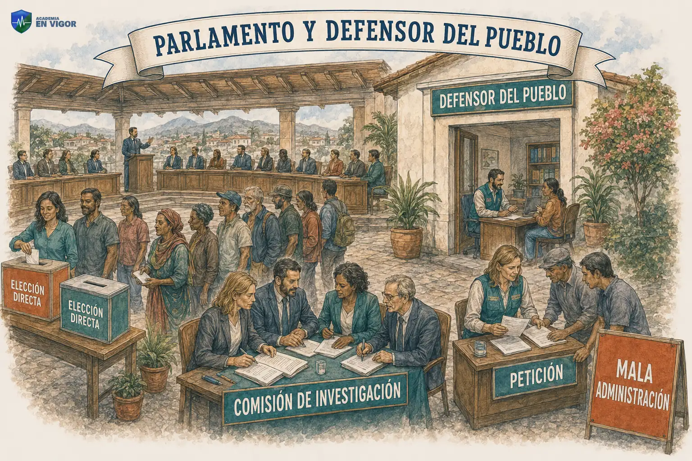

<em>Infografía: Parlamento Europeo y Defensor del Pueblo Europeo.</em>

<!-- FUENTE: EURLEX-TFUE-CONSOLIDADO-GC-T05 -->

## 39. Consejo Europeo y Consejo

Este bloque ordena consejo europeo y consejo conforme a arts. 235 a 243 TFUE. La clave es separar institución o sujeto, competencia, procedimiento, mayoría, límite y excepción.

### Claves rápidas

- **art. 235 TFUE:** En las votaciones del Consejo Europeo, cada miembro puede actuar en representación de uno solo de los demás miembros.
- **art. 235 TFUE:** El presidente del Consejo Europeo y el presidente de la Comisión no participan en las votaciones del Consejo Europeo.
- **art. 235 TFUE:** La abstención de los miembros presentes o representados no impide la adopción de los acuerdos del Consejo Europeo que requieran unanimidad.
- **art. 235 TFUE:** El Consejo Europeo se pronuncia por mayoría simple en las cuestiones de procedimiento y para aprobar su Reglamento interno.
- **art. 236 TFUE:** El Consejo Europeo adopta por mayoría cualificada la lista de formaciones del Consejo distintas de Asuntos Generales y Asuntos Exteriores.
- **art. 236 TFUE:** El Consejo Europeo adopta por mayoría cualificada la decisión relativa a la presidencia de las formaciones del Consejo, salvo la de Asuntos Exteriores, mediante un sistema de rotación igual.
- **art. 237 TFUE:** El Consejo se reúne por convocatoria de su presidente, por iniciativa de este, de uno de sus miembros o de la Comisión.
- **art. 238 TFUE:** Cuando el Consejo deba adoptar un acuerdo por mayoría simple, se pronuncia por mayoría de los miembros que lo componen.
- **art. 238 TFUE:** La mayoría cualificada se determina conforme a las reglas de doble mayoría previstas por el Tratado y la minoría de bloqueo debe reunir el número mínimo de miembros exigido.
- **art. 238 TFUE:** En las votaciones que requieren unanimidad, las abstenciones de los miembros presentes o representados no impiden la adopción del acuerdo.
- **art. 239 TFUE:** En caso de votación, cada miembro del Consejo puede actuar en representación de uno solo de los demás miembros.
- **art. 240 TFUE:** Un Comité de Representantes Permanentes de los Gobiernos de los Estados miembros prepara los trabajos del Consejo y ejecuta los mandatos que este le confíe.
- **art. 240 TFUE:** El Consejo está asistido por una Secretaría General bajo la responsabilidad de un secretario general nombrado por el propio Consejo.
- **art. 240 TFUE:** El Consejo decide por mayoría simple la organización de la Secretaría General y las cuestiones de procedimiento y aprueba su Reglamento interno.
- **art. 241 TFUE:** El Consejo puede solicitar a la Comisión, por mayoría simple, que efectúe los estudios que considere oportunos y presente las propuestas pertinentes para alcanzar los objetivos comunes.
- **art. 241 TFUE:** Si la Comisión no presenta ninguna propuesta solicitada por el Consejo, debe comunicarle las razones.
- **art. 242 TFUE:** El Consejo establece por mayoría simple, previa consulta a la Comisión, los estatutos de los comités previstos por los Tratados.
- **art. 243 TFUE:** El Consejo fija los sueldos, dietas y pensiones de los titulares de los altos cargos de las instituciones enumerados en el artículo 243 y determina cualesquiera otros emolumentos de carácter retributivo.

:::perla-vigor
Ancla el bloque en **arts. 235 a 243 TFUE**: primero identifica el órgano o titular; después, el verbo de competencia y la mayoría o excepción.
:::

<!-- VISUAL:t05-39-consejo-europeo-y-consejo.webp -->

  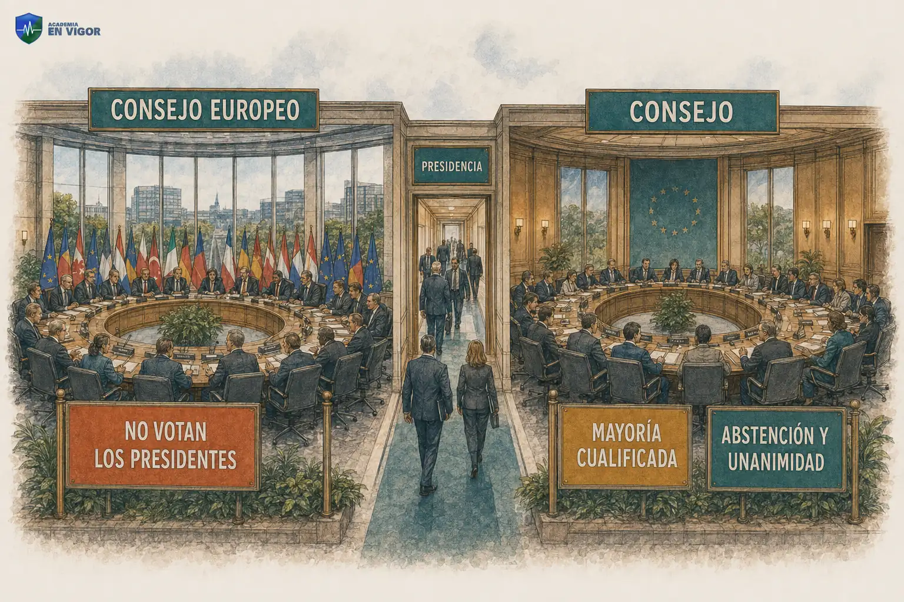

<em>Infografía: Consejo Europeo y Consejo.</em>

<!-- FUENTE: EURLEX-TFUE-CONSOLIDADO-GC-T05 -->

## 40. Comisión Europea

Este bloque ordena comisión europea conforme a arts. 244 a 250 TFUE. La clave es separar institución o sujeto, competencia, procedimiento, mayoría, límite y excepción.

### Claves rápidas

- **art. 244 TFUE:** El Consejo Europeo establece por unanimidad el sistema de rotación para elegir a los miembros de la Comisión cuando su número sea inferior al de Estados miembros.
- **art. 244 TFUE:** El sistema de rotación respeta estrictamente la igualdad entre los Estados miembros y refleja satisfactoriamente la diversidad demográfica y geográfica del conjunto de la Unión.
- **art. 245 TFUE:** Independencia comisarios (no actos incompatibles, no otra actividad profesional).
- **art. 246 TFUE:** El mandato de un miembro de la Comisión concluye por expiración, dimisión voluntaria, cese o fallecimiento.
- **art. 246 TFUE:** La vacante se cubre por el resto del mandato por un nuevo miembro de la misma nacionalidad nombrado de común acuerdo por el Consejo y el presidente de la Comisión, salvo que se decida no cubrirla.
- **art. 246 TFUE:** En caso de dimisión colectiva, los miembros de la Comisión permanecen en funciones y se limitan a despachar los asuntos de administración ordinaria hasta su sustitución.
- **art. 247 TFUE:** El Tribunal de Justicia puede cesar a un miembro de la Comisión, a instancia del Consejo o de la propia Comisión, si deja de reunir las condiciones necesarias o comete una falta grave.
- **art. 248 TFUE:** El presidente estructura y reparte las responsabilidades que incumben a la Comisión entre sus miembros y puede reorganizarlas durante el mandato.
- **art. 248 TFUE:** Los miembros de la Comisión ejercen las funciones atribuidas por el presidente bajo la autoridad de este.
- **art. 249 TFUE:** La Comisión establece su Reglamento interno para asegurar su funcionamiento y el de sus servicios y lo publica.
- **art. 249 TFUE:** La Comisión publica cada año, al menos un mes antes de la apertura del período de sesiones del Parlamento Europeo, un informe general sobre las actividades de la Unión.
- **art. 250 TFUE:** La Comisión adopta sus acuerdos por mayoría de sus miembros.
- **art. 250 TFUE:** El Reglamento interno de la Comisión fija el cuórum necesario para que sus acuerdos sean válidos.

:::perla-vigor
Ancla el bloque en **arts. 244 a 250 TFUE**: primero identifica el órgano o titular; después, el verbo de competencia y la mayoría o excepción.
:::

<!-- VISUAL:t05-40-comision-europea.webp -->

  

<em>Infografía: Comisión Europea.</em>

<!-- FUENTE: EURLEX-TFUE-CONSOLIDADO-GC-T05 -->

## 41. Tribunal de Justicia y Tribunal General: composición y control

Este bloque ordena tribunal de justicia y tribunal general: composición y control conforme a arts. 251 a 260 TFUE. La clave es separar institución o sujeto, competencia, procedimiento, mayoría, límite y excepción.

### Claves rápidas

- **art. 251 TFUE:** El Tribunal de Justicia actúa en Salas o en Gran Sala de conformidad con su Estatuto.
- **art. 251 TFUE:** El Tribunal de Justicia puede actuar en Pleno cuando así lo disponga su Estatuto.
- **art. 252 TFUE:** El Tribunal de Justicia está asistido por abogados generales, que presentan públicamente conclusiones motivadas con absoluta imparcialidad e independencia en los asuntos que lo requieran.
- **art. 252 TFUE:** El Consejo puede aumentar por unanimidad el número de abogados generales a solicitud del Tribunal de Justicia.
- **art. 253 TFUE:** Los jueces y abogados generales del Tribunal de Justicia son designados de común acuerdo por los Gobiernos de los Estados miembros para un período de seis años y pueden ser nuevamente designados.
- **art. 253 TFUE:** Cada tres años tiene lugar una renovación parcial de los jueces y abogados generales en las condiciones fijadas por el Estatuto.
- **art. 253 TFUE:** Los jueces eligen de entre ellos al presidente del Tribunal de Justicia por un período de tres años renovable.
- **art. 253 TFUE:** El Tribunal de Justicia establece su Reglamento de Procedimiento y lo somete a la aprobación del Consejo.
- **art. 254 TFUE:** El número de jueces del Tribunal General se fija en el Estatuto del Tribunal de Justicia y este puede disponer que esté asistido por abogados generales.
- **art. 254 TFUE:** Los miembros del Tribunal General se eligen entre personas que ofrezcan absolutas garantías de independencia y posean la capacidad necesaria para ejercer altas funciones jurisdiccionales.
- **art. 254 TFUE:** El Tribunal General establece su Reglamento de Procedimiento de acuerdo con el Tribunal de Justicia y lo somete a la aprobación del Consejo.
- **art. 255 TFUE:** Antes del nombramiento de jueces y abogados generales, un comité se pronuncia sobre la idoneidad de los candidatos para ejercer las funciones en el Tribunal de Justicia y en el Tribunal General.
- **art. 255 TFUE:** El comité está compuesto por siete personalidades elegidas entre antiguos miembros de ambos tribunales, miembros de órganos jurisdiccionales nacionales supremos y juristas de reconocida competencia.
- **art. 255 TFUE:** El Consejo adopta las normas de funcionamiento del comité y designa a sus miembros por iniciativa del presidente del Tribunal de Justicia.
- **art. 256 TFUE:** El Tribunal General conoce en primera instancia de los recursos directos atribuidos por los Tratados, salvo los reservados al Tribunal de Justicia o a tribunales especializados.
- **art. 256 TFUE:** Las resoluciones del Tribunal General pueden ser objeto de recurso de casación ante el Tribunal de Justicia limitado a cuestiones de Derecho.
- **art. 256 TFUE:** El Tribunal General puede conocer de cuestiones prejudiciales en materias específicas determinadas por el Estatuto y sus resoluciones pueden ser reexaminadas excepcionalmente por el Tribunal de Justicia.
- **art. 257 TFUE:** El Parlamento Europeo y el Consejo pueden crear mediante el procedimiento legislativo ordinario tribunales especializados adjuntos al Tribunal General para conocer en primera instancia de determinadas categorías de recursos.
- **art. 257 TFUE:** Los reglamentos de creación fijan la composición y las competencias del tribunal especializado.
- **art. 257 TFUE:** Los miembros de los tribunales especializados ofrecen absolutas garantías de independencia y son designados por el Consejo por unanimidad.
- **art. 258 TFUE:** Si la Comisión considera que un Estado miembro ha incumplido una obligación derivada de los Tratados, emite un dictamen motivado después de ofrecerle la posibilidad de presentar observaciones.
- **art. 258 TFUE:** Si el Estado miembro no se atiene al dictamen en el plazo fijado, la Comisión puede recurrir al Tribunal de Justicia de la Unión Europea.
- **art. 259 TFUE:** Un Estado miembro que considere que otro ha incumplido los Tratados puede recurrir al Tribunal de Justicia tras someter el asunto a la Comisión.
- **art. 259 TFUE:** La Comisión emite un dictamen motivado después de permitir que los Estados formulen observaciones.
- **art. 260 TFUE:** El Estado miembro cuya infracción haya declarado el Tribunal debe adoptar las medidas necesarias para ejecutar la sentencia.
- **art. 260 TFUE:** Si persiste el incumplimiento, el Tribunal puede imponer una suma a tanto alzado o una multa coercitiva a propuesta de la Comisión.

:::perla-vigor
Ancla el bloque en **arts. 251 a 260 TFUE**: primero identifica el órgano o titular; después, el verbo de competencia y la mayoría o excepción.
:::

<!-- VISUAL:t05-41-tribunal-de-justicia-y-tribunal-general-composicion-y-control.webp -->

  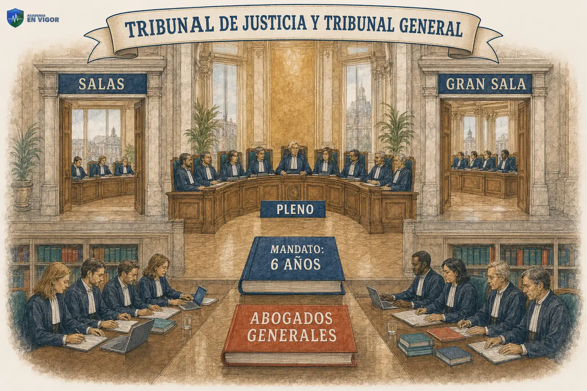

<em>Infografía: Tribunal de Justicia y Tribunal General: composición y control.</em>

<!-- FUENTE: EURLEX-TFUE-CONSOLIDADO-GC-T05 -->

## 42. Recursos, cuestión prejudicial y responsabilidad

Este bloque ordena recursos, cuestión prejudicial y responsabilidad conforme a arts. 261 a 270 TFUE. La clave es separar institución o sujeto, competencia, procedimiento, mayoría, límite y excepción.

### Claves rápidas

- **art. 261 TFUE:** Los reglamentos adoptados conjuntamente por el Parlamento Europeo y el Consejo pueden atribuir al Tribunal de Justicia competencia jurisdiccional plena respecto de las sanciones que prevean.
- **art. 262 TFUE:** El Consejo puede atribuir al Tribunal de Justicia competencia sobre litigios relativos a títulos europeos de propiedad intelectual mediante decisión unánime aprobada por los Estados miembros.
- **art. 263 TFUE:** El Tribunal controla la legalidad de los actos legislativos y de otros actos destinados a producir efectos jurídicos frente a terceros.
- **art. 263 TFUE:** El recurso de anulación puede fundarse en incompetencia, vicios sustanciales de forma, violación de los Tratados o desviación de poder.
- **art. 263 TFUE:** El plazo ordinario para interponer el recurso es de dos meses.
- **art. 264 TFUE:** Si el recurso de anulación está fundado, el Tribunal declara nulo y sin valor ni efecto alguno el acto impugnado.
- **art. 264 TFUE:** El Tribunal puede indicar qué efectos del acto anulado deben considerarse definitivos.
- **art. 265 TFUE:** La abstención de una institución, órgano u organismo en violación de los Tratados puede dar lugar a un recurso por omisión después de haber sido requerida para actuar.
- **art. 266 TFUE:** La institución, órgano u organismo cuyo acto sea anulado o cuya omisión sea declarada debe adoptar las medidas necesarias para ejecutar la sentencia.
- **art. 267 TFUE:** El Tribunal de Justicia es competente para pronunciarse con carácter prejudicial sobre la interpretación de los Tratados y la validez e interpretación de los actos de la Unión.
- **art. 267 TFUE:** Un órgano jurisdiccional nacional puede plantear la cuestión si la considera necesaria para resolver.
- **art. 267 TFUE:** Un órgano cuyas decisiones no sean susceptibles de ulterior recurso judicial interno está obligado a plantearla.
- **art. 267 TFUE:** Cuando la cuestión afecte a una persona privada de libertad, el Tribunal resuelve con la mayor brevedad.
- **art. 268 TFUE:** El Tribunal de Justicia es competente en los litigios relativos a la indemnización por responsabilidad extracontractual de la Unión.
- **art. 269 TFUE:** El Tribunal solo controla el respeto de las reglas procedimentales del artículo 7 TUE a petición del Estado afectado y dentro del plazo fijado por el Tratado.
- **art. 270 TFUE:** El Tribunal es competente en los litigios entre la Unión y sus agentes dentro de los límites del Estatuto de los funcionarios.

:::perla-vigor
Ancla el bloque en **arts. 261 a 270 TFUE**: primero identifica el órgano o titular; después, el verbo de competencia y la mayoría o excepción.
:::

<!-- VISUAL:t05-42-recursos-cuestion-prejudicial-y-responsabilidad.webp -->

  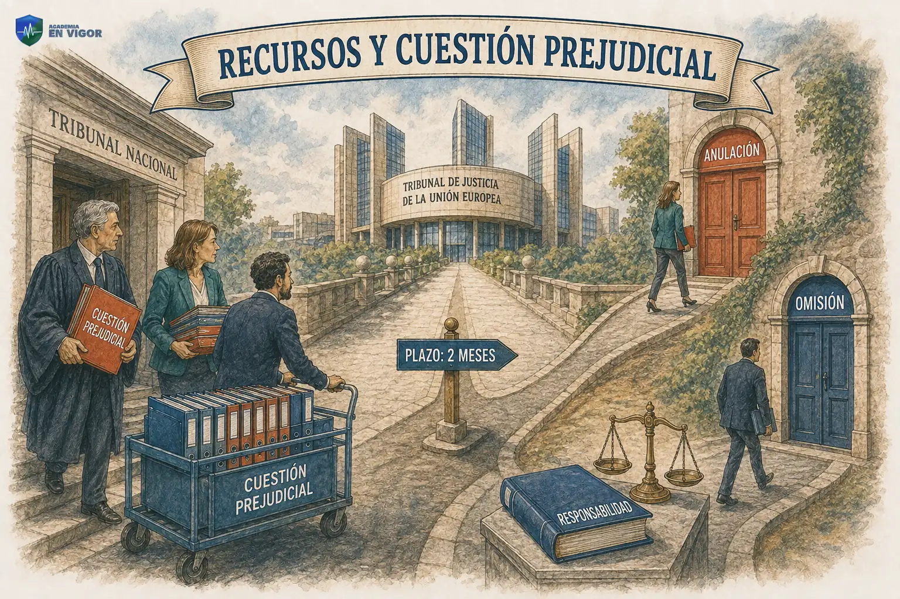

<em>Infografía: Recursos, cuestión prejudicial y responsabilidad.</em>

<!-- FUENTE: EURLEX-TFUE-CONSOLIDADO-GC-T05 -->

## 43. Competencias especiales, cautelares y Estatuto del Tribunal

Este bloque ordena competencias especiales, cautelares y estatuto del tribunal conforme a arts. 271 a 281 TFUE. La clave es separar institución o sujeto, competencia, procedimiento, mayoría, límite y excepción.

### Claves rápidas

- **art. 271 TFUE:** El artículo 271 atribuye competencias especiales al Tribunal respecto del Banco Europeo de Inversiones y de los bancos centrales nacionales.
- **art. 272 TFUE:** El Tribunal es competente para juzgar en virtud de una cláusula compromisoria contenida en un contrato de Derecho público o privado celebrado por la Unión o por su cuenta.
- **art. 273 TFUE:** El Tribunal puede conocer de controversias entre Estados miembros relacionadas con el objeto de los Tratados cuando le sean sometidas en virtud de un compromiso.
- **art. 274 TFUE:** Los litigios en que la Unión sea parte no quedan sustraídos a las jurisdicciones nacionales salvo que los Tratados atribuyan competencia al Tribunal de Justicia.
- **art. 275 TFUE:** El Tribunal no es competente respecto de la política exterior y de seguridad común, salvo para controlar el artículo 40 TUE y determinadas medidas restrictivas contra personas.
- **art. 276 TFUE:** En el espacio de libertad, seguridad y justicia, el Tribunal no controla la validez o proporcionalidad de operaciones policiales ni el ejercicio de responsabilidades estatales sobre orden público y seguridad interior.
- **art. 277 TFUE:** Aunque haya expirado el plazo de anulación, una parte puede alegar la inaplicabilidad de un acto de alcance general por los motivos del artículo 263.
- **art. 278 TFUE:** Los recursos ante el Tribunal no tienen efecto suspensivo, pero el Tribunal puede ordenar la suspensión de la ejecución del acto impugnado.
- **art. 279 TFUE:** El Tribunal puede ordenar las medidas provisionales necesarias en los asuntos de que conozca.
- **art. 280 TFUE:** Las sentencias del Tribunal de Justicia tienen fuerza ejecutiva en las condiciones del artículo 299.
- **art. 281 TFUE:** El Estatuto del Tribunal de Justicia se fija en un Protocolo y puede modificarse mediante el procedimiento legislativo ordinario, con las excepciones previstas.

:::perla-vigor
Ancla el bloque en **arts. 271 a 281 TFUE**: primero identifica el órgano o titular; después, el verbo de competencia y la mayoría o excepción.
:::

<!-- VISUAL:t05-43-competencias-especiales-cautelares-y-estatuto-del-tribunal.webp -->

  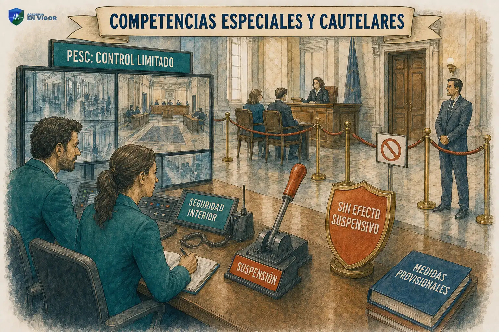

<em>Infografía: Competencias especiales, cautelares y Estatuto del Tribunal.</em>

<!-- FUENTE: EURLEX-TFUE-CONSOLIDADO-GC-T05 -->

## 44. Actos jurídicos de la Unión

Este bloque ordena actos jurídicos de la unión conforme a arts. 288 a 292 TFUE. La clave es separar institución o sujeto, competencia, procedimiento, mayoría, límite y excepción.

### Claves rápidas

- **art. 288 TFUE:** Para ejercer las competencias de la Unión, las instituciones adoptarán reglamentos, directivas, decisiones, recomendaciones y dictámenes.
- **art. 288 TFUE:** El reglamento tendrá un alcance general.
- **art. 288 TFUE:** Será obligatorio en todos sus elementos y directamente aplicable en cada Estado miembro.
- **art. 288 TFUE:** La directiva obligará al Estado miembro destinatario en cuanto al resultado que deba conseguirse, dejando, sin embargo, a las autoridades nacionales la elección de la forma y de los medios.
- **art. 288 TFUE:** La decisión será obligatoria en todos sus elementos.
- **art. 288 TFUE:** Las recomendaciones y los dictámenes no serán vinculantes.
- **art. 289 TFUE:** En los casos específicos previstos por los Tratados, la adopción de un reglamento, una directiva o una decisión, bien por el Parlamento Europeo con la participación del Consejo, bien por el Consejo con la participación del Parlamento Europeo, constituirá un procedimiento legislativo especial.
- **art. 289 TFUE:** Los actos jurídicos que se adopten mediante procedimiento legislativo constituirán actos legislativos.
- **art. 289 TFUE:** En los casos específicos previstos por los Tratados, los actos legislativos podrán ser adoptados por iniciativa de un grupo de Estados miembros o del Parlamento Europeo, por recomendación del Banco Central Europeo o a petición del Tribunal de Justicia o del Banco Europeo de Inversiones.
- **art. 290 TFUE:** Un acto legislativo podrá delegar en la Comisión los poderes para adoptar actos no legislativos de alcance general que completen o modifiquen determinados elementos no esenciales del acto legislativo.
- **art. 290 TFUE:** Los actos legislativos delimitarán de forma expresa los objetivos, el contenido, el alcance y la duración de la delegación de poderes.
- **art. 290 TFUE:** La regulación de los elementos esenciales de un ámbito estará reservada al acto legislativo y, por lo tanto, no podrá ser objeto de una delegación de poderes.
- **art. 290 TFUE:** En el título de los actos delegados figurará el adjetivo «delegado».
- **art. 291 TFUE:** Los Estados miembros adoptarán todas las medidas de Derecho interno necesarias para la ejecución de los actos jurídicamente vinculantes de la Unión.
- **art. 291 TFUE:** A efectos del apartado 2, el Parlamento Europeo y el Consejo establecerán previamente, mediante reglamentos adoptados con arreglo al procedimiento legislativo ordinario, las normas y principios generales relativos a las modalidades de control por parte de los Estados miembros del ejercicio de las competencias de ejecución por la Comisión.
- **art. 291 TFUE:** En el título de los actos de ejecución figurará la expresión «de ejecución».
- **art. 292 TFUE:** Se pronunciará a propuesta de la Comisión en todos los casos en que los Tratados dispongan que el Consejo adopte actos a propuesta de la Comisión.
- **art. 292 TFUE:** Se pronunciará por unanimidad en los ámbitos en los que se requiere la unanimidad para la adopción de un acto de la Unión.
- **art. 292 TFUE:** La Comisión, así como el Banco Central Europeo en los casos específicos previstos por los Tratados, adoptarán recomendaciones.

:::perla-vigor
Ancla el bloque en **arts. 288 a 292 TFUE**: primero identifica el órgano o titular; después, el verbo de competencia y la mayoría o excepción.
:::

<!-- VISUAL:t05-44-actos-juridicos-de-la-union.webp -->

  

<em>Infografía: Actos jurídicos de la Unión.</em>

<!-- FUENTE: EURLEX-TFUE-CONSOLIDADO-GC-T05 -->

## 45. Comité Económico y Social y Comité de las Regiones

Este bloque ordena comité económico y social y comité de las regiones conforme a arts. 300 a 307 TFUE. La clave es separar institución o sujeto, competencia, procedimiento, mayoría, límite y excepción.

### Claves rápidas

- **art. 300 TFUE:** El Parlamento Europeo, el Consejo y la Comisión estarán asistidos por un Comité Económico y Social y por un Comité de las Regiones, que ejercerán funciones consultivas.
- **art. 300 TFUE:** El Comité Económico y Social estará compuesto por representantes de las organizaciones de empresarios, de trabajadores y de otros sectores representativos de la sociedad civil (en particular ámbitos socioeconómico, cívico, profesional y cultural).
- **art. 300 TFUE:** El Comité de las Regiones estará compuesto por representantes de los entes regionales y locales que sean titulares de un mandato electoral o tengan responsabilidad política ante asamblea elegida.
- **art. 300 TFUE:** Los miembros del Comité Económico y Social y del Comité de las Regiones no estarán vinculados por ningún mandato imperativo.
- **art. 300 TFUE:** Ejercerán sus funciones con plena independencia, en interés general de la Unión.
- **art. 301 TFUE:** El número de miembros del Comité Económico y Social no excederá de 350.
- **art. 301 TFUE:** El Consejo adoptará por unanimidad, a propuesta de la Comisión, una decisión por la que se establezca la composición del Comité.
- **art. 301 TFUE:** El Consejo establecerá las dietas de los miembros.
- **art. 302 TFUE:** Los miembros del Comité serán nombrados para un período de 5 años, renovables.
- **art. 302 TFUE:** El Consejo adoptará la lista de miembros establecida de conformidad con las propuestas presentadas por cada Estado miembro.
- **art. 302 TFUE:** El Consejo se pronunciará previa consulta a la Comisión.
- **art. 302 TFUE:** Podrá recabar la opinión de las organizaciones europeas representativas de los diferentes sectores económicos y sociales y de la sociedad civil.
- **art. 303 TFUE:** El Comité designará de entre sus miembros al presidente y a la Mesa, por un período de 2 años y medio.
- **art. 303 TFUE:** El Comité será convocado por su presidente, a instancia del Parlamento Europeo, del Consejo o de la Comisión.
- **art. 304 TFUE:** El Comité será consultado por el Parlamento Europeo, el Consejo o por la Comisión, en los casos previstos en los Tratados.
- **art. 304 TFUE:** Podrán consultarle en todos aquellos casos en que lo consideren oportuno.
- **art. 304 TFUE:** Podrá tomar la iniciativa de emitir un dictamen cuando lo juzgue oportuno.
- **art. 305 TFUE:** El número de miembros del Comité de las Regiones no excede de trescientos cincuenta y el Consejo establece por unanimidad su composición a propuesta de la Comisión.
- **art. 305 TFUE:** Los miembros del Comité de las Regiones y un número igual de suplentes son nombrados por cinco años y pueden ser nuevamente designados.
- **art. 305 TFUE:** Ningún miembro del Comité de las Regiones puede ser simultáneamente miembro del Parlamento Europeo.
- **art. 306 TFUE:** El Comité de las Regiones designará presidente y Mesa por 2 años y medio.
- **art. 307 TFUE:** El Parlamento Europeo, el Consejo o la Comisión consultan al Comité de las Regiones en los casos previstos por los Tratados y pueden hacerlo siempre que lo consideren oportuno.
- **art. 307 TFUE:** El Comité de las Regiones puede emitir dictámenes por propia iniciativa cuando lo considere conveniente.
- **art. 307 TFUE:** Los dictámenes del Comité de las Regiones y el acta de sus deliberaciones se remiten al Parlamento Europeo, al Consejo y a la Comisión.

:::perla-vigor
Ancla el bloque en **arts. 300 a 307 TFUE**: primero identifica el órgano o titular; después, el verbo de competencia y la mayoría o excepción.
:::

<!-- VISUAL:t05-45-comite-economico-y-social-y-comite-de-las-regiones.webp -->

  

<em>Infografía: Comité Económico y Social y Comité de las Regiones.</em>

<!-- FUENTE: EURLEX-TFUE-CONSOLIDADO-GC-T05 -->

## 46. Capacidad jurídica, personal, información y responsabilidad

Este bloque ordena capacidad jurídica, personal, información y responsabilidad conforme a arts. 335 a 340 TFUE. La clave es separar institución o sujeto, competencia, procedimiento, mayoría, límite y excepción.

### Claves rápidas

- **art. 335 TFUE:** La Unión gozará en cada uno de los Estados miembros de la más amplia capacidad jurídica que las legislaciones nacionales reconocen a las personas jurídicas.
- **art. 335 TFUE:** Podrá, en particular, adquirir o enajenar bienes muebles e inmuebles y comparecer en juicio.
- **art. 335 TFUE:** No obstante, la Unión estará representada por cada una de las instituciones, en virtud de la autonomía administrativa de estas, para las cuestiones relacionadas con el funcionamiento de las mismas.
- **art. 336 TFUE:** El Parlamento Europeo y el Consejo establecerán, mediante reglamentos adoptados (procedimiento legislativo ordinario) y previa consulta a las demás instituciones interesadas, el Estatuto de los funcionarios de la Unión Europea y el régimen aplicable a los otros agentes de la Unión.
- **art. 337 TFUE:** Para la realización de las funciones que le son atribuidas, la Comisión podrá recabar todo tipo de informaciones y proceder a todas las comprobaciones necesarias, dentro de los límites y en las condiciones fijados por el Consejo, por mayoría simple, de conformidad con las disposiciones de los Tratados.
- **art. 338 TFUE:** Elaboración ajustada a imparcialidad, fiabilidad, objetividad, independencia científica, rentabilidad, secreto estadístico.
- **art. 339 TFUE:** Los miembros de las instituciones, comités, funcionarios y agentes Unión obligados, incluso tras cese, a no divulgar informaciones amparadas por secreto profesional (especialmente datos empresas, relaciones comerciales, costes).
- **art. 340 TFUE:** La responsabilidad contractual de la Unión se rige por la ley aplicable al contrato de que se trate.
- **art. 340 TFUE:** En materia de responsabilidad extracontractual, la Unión repara los daños causados por sus instituciones o agentes en el ejercicio de sus funciones conforme a los principios generales comunes a los Derechos de los Estados miembros.
- **art. 340 TFUE:** La responsabilidad personal de los agentes ante la Unión se regula por las disposiciones de su Estatuto o régimen aplicable.

:::perla-vigor
Ancla el bloque en **arts. 335 a 340 TFUE**: primero identifica el órgano o titular; después, el verbo de competencia y la mayoría o excepción.
:::

<!-- VISUAL:t05-46-capacidad-juridica-personal-informacion-y-responsabilidad.webp -->

  

<em>Infografía: Capacidad jurídica, personal, información y responsabilidad.</em>

<!-- FUENTE: EURLEX-TFUE-CONSOLIDADO-GC-T05 -->

## 47. Sedes, lenguas, inmunidades y excepciones de seguridad

Este bloque ordena sedes, lenguas, inmunidades y excepciones de seguridad conforme a arts. 341 a 348 TFUE. La clave es separar institución o sujeto, competencia, procedimiento, mayoría, límite y excepción.

### Claves rápidas

- **art. 341 TFUE:** La sede de las instituciones de la Unión se fija de común acuerdo por los Gobiernos de los Estados miembros.
- **art. 342 TFUE:** El Consejo fija por unanimidad, mediante reglamentos y sin perjuicio del Estatuto del Tribunal de Justicia, el régimen lingüístico de las instituciones de la Unión.
- **art. 343 TFUE:** La Unión disfruta en el territorio de los Estados miembros de los privilegios e inmunidades necesarios para el cumplimiento de su misión, en las condiciones fijadas por el Protocolo correspondiente.
- **art. 344 TFUE:** Los Estados miembros se comprometen a no someter las controversias relativas a la interpretación o aplicación de los Tratados a un procedimiento de solución distinto de los previstos en ellos.
- **art. 345 TFUE:** Los Tratados no prejuzgan en modo alguno el régimen de la propiedad en los Estados miembros.
- **art. 346 TFUE:** Ningún Estado miembro está obligado a facilitar información cuya divulgación considere contraria a los intereses esenciales de su seguridad.
- **art. 346 TFUE:** Todo Estado miembro puede adoptar medidas necesarias para proteger los intereses esenciales de su seguridad respecto de armas, municiones y material de guerra.
- **art. 346 TFUE:** Las medidas de seguridad no pueden alterar las condiciones de competencia en el mercado interior respecto de productos no destinados a fines específicamente militares.
- **art. 346 TFUE:** El Consejo puede modificar por unanimidad, a propuesta de la Comisión, la lista de productos sujetos a esta excepción, fijada el 15 de abril de 1958.
- **art. 347 TFUE:** Los Estados miembros se consultan para adoptar conjuntamente las disposiciones necesarias a fin de evitar que el funcionamiento del mercado interior resulte afectado por medidas adoptadas ante disturbios internos graves, guerra, tensión internacional grave o compromisos de paz y seguridad internacional.
- **art. 348 TFUE:** Si las medidas adoptadas conforme a los artículos 346 y 347 falsean las condiciones de competencia en el mercado interior, la Comisión examina con el Estado interesado la forma de adaptarlas a las normas de los Tratados.
- **art. 348 TFUE:** La Comisión o cualquier Estado miembro puede recurrir directamente al Tribunal de Justicia si considera que otro Estado abusa de las facultades previstas en los artículos 346 y 347.
- **art. 348 TFUE:** El Tribunal de Justicia resuelve a puerta cerrada los asuntos relativos a un posible abuso de las excepciones de seguridad.

:::perla-vigor
Ancla el bloque en **arts. 341 a 348 TFUE**: primero identifica el órgano o titular; después, el verbo de competencia y la mayoría o excepción.
:::

<!-- VISUAL:t05-47-sedes-lenguas-inmunidades-y-excepciones-de-seguridad.webp -->

  

<em>Infografía: Sedes, lenguas, inmunidades y excepciones de seguridad.</em>

<!-- FUENTE: EURLEX-TFUE-CONSOLIDADO-GC-T05 -->

## 48. Regiones ultraperiféricas, convenios, flexibilidad y artículo 7 TUE

Este bloque ordena regiones ultraperiféricas, convenios, flexibilidad y artículo 7 tue conforme a arts. 349 a 354 TFUE. La clave es separar institución o sujeto, competencia, procedimiento, mayoría, límite y excepción.

### Claves rápidas

- **art. 349 TFUE:** El Consejo adopta, a propuesta de la Comisión y previa consulta al Parlamento Europeo, medidas específicas para aplicar los Tratados a las regiones ultraperiféricas teniendo en cuenta su situación estructural, social y económica.
- **art. 349 TFUE:** Las medidas específicas pueden referirse, entre otros ámbitos, a políticas aduanera y comercial, fiscalidad, zonas francas, agricultura, pesca, ayudas públicas y acceso a fondos estructurales.
- **art. 349 TFUE:** Las medidas no pueden menoscabar la integridad y coherencia del ordenamiento jurídico de la Unión ni del mercado interior y las políticas comunes.
- **art. 350 TFUE:** Los Tratados no impiden la existencia y realización de las uniones regionales entre Bélgica y Luxemburgo y entre Bélgica, Luxemburgo y los Países Bajos, siempre que sus objetivos no se alcancen mediante la aplicación de los Tratados.
- **art. 351 TFUE:** Los derechos y obligaciones derivados de convenios celebrados antes del 1 de enero de 1958 o de la adhesión de un Estado entre uno o más Estados miembros y uno o más terceros países no quedan afectados por los Tratados.
- **art. 351 TFUE:** Cuando esos convenios sean incompatibles con los Tratados, los Estados miembros recurren a todos los medios apropiados para eliminar las incompatibilidades y, cuando sea preciso, se prestan ayuda mutua y adoptan una actitud común.
- **art. 352 TFUE:** Cuando una acción de la Unión resulte necesaria para alcanzar un objetivo de los Tratados y estos no hayan previsto los poderes de actuación necesarios, el Consejo adopta las disposiciones adecuadas por unanimidad, a propuesta de la Comisión y previa aprobación del Parlamento Europeo.
- **art. 352 TFUE:** La Comisión indica a los Parlamentos nacionales las propuestas basadas en la cláusula de flexibilidad para que controlen el principio de subsidiariedad.
- **art. 352 TFUE:** La cláusula de flexibilidad no puede utilizarse para armonizar disposiciones nacionales cuando los Tratados excluyan tal armonización ni para alcanzar objetivos de la política exterior y de seguridad común.
- **art. 353 TFUE:** El procedimiento de revisión simplificado previsto en el artículo 48.7 TUE no se aplica a las decisiones contempladas en los artículos 311, 312.2, 352 y 354 TFUE.
- **art. 354 TFUE:** En los procedimientos del artículo 7 TUE, el miembro del Consejo Europeo o del Consejo que represente al Estado miembro afectado no participa en la votación y ese Estado no se cuenta para calcular las mayorías.
- **art. 354 TFUE:** Las abstenciones de los miembros presentes o representados no impiden la adopción de las decisiones que exigen unanimidad conforme al artículo 7 TUE.

:::perla-vigor
Ancla el bloque en **arts. 349 a 354 TFUE**: primero identifica el órgano o titular; después, el verbo de competencia y la mayoría o excepción.
:::

<!-- VISUAL:t05-48-regiones-ultraperifericas-convenios-flexibilidad-y-articulo-7-.webp -->

  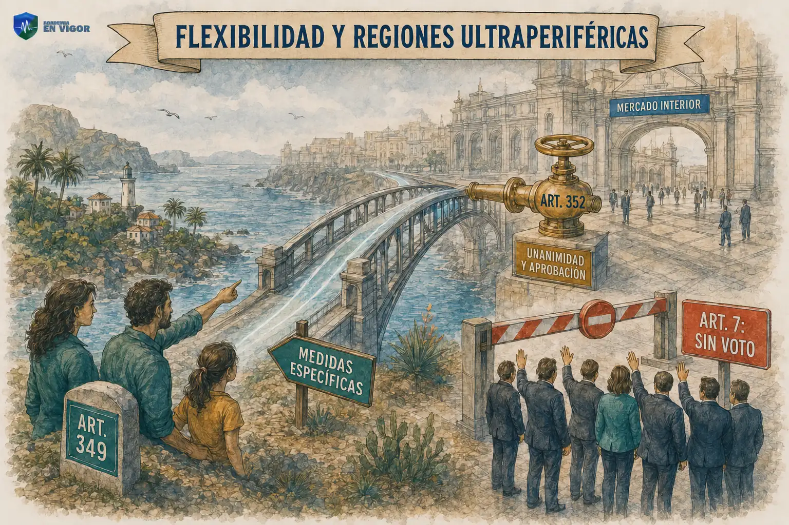

<em>Infografía: Regiones ultraperiféricas, convenios, flexibilidad y artículo 7 TUE.</em>

<!-- FUENTE: EURLEX-TFUE-CONSOLIDADO-GC-T05 -->

## 49. Ámbito territorial, duración, ratificación y lenguas auténticas

Este bloque ordena ámbito territorial, duración, ratificación y lenguas auténticas conforme a arts. 355 a 358 TFUE. La clave es separar institución o sujeto, competencia, procedimiento, mayoría, límite y excepción.

### Claves rápidas

- **art. 355 TFUE:** El artículo 355 delimita el ámbito territorial de aplicación de los Tratados y establece regímenes específicos para regiones ultraperiféricas, países y territorios de ultramar y determinados territorios europeos.
- **art. 355 TFUE:** Los Tratados no se aplican a los territorios expresamente excluidos por el artículo 355 y se aplican a los territorios cuyas relaciones exteriores asume un Estado miembro en los términos previstos.
- **art. 356 TFUE:** El Tratado de Funcionamiento de la Unión Europea se concluye por un período de tiempo ilimitado.
- **art. 357 TFUE:** El Tratado debe ser ratificado por los Estados signatarios conforme a sus respectivas normas constitucionales.
- **art. 357 TFUE:** Los instrumentos de ratificación se depositan ante el Gobierno de la República Italiana.
- **art. 357 TFUE:** La entrada en vigor queda condicionada al depósito de los instrumentos de ratificación en los términos previstos por el propio Tratado.
- **art. 358 TFUE:** Las disposiciones del artículo 55 del Tratado de la Unión Europea relativas a las lenguas auténticas se aplican al Tratado de Funcionamiento.

:::perla-vigor
Ancla el bloque en **arts. 355 a 358 TFUE**: primero identifica el órgano o titular; después, el verbo de competencia y la mayoría o excepción.
:::

<!-- VISUAL:t05-49-ambito-territorial-duracion-ratificacion-y-lenguas-autenticas.webp -->

  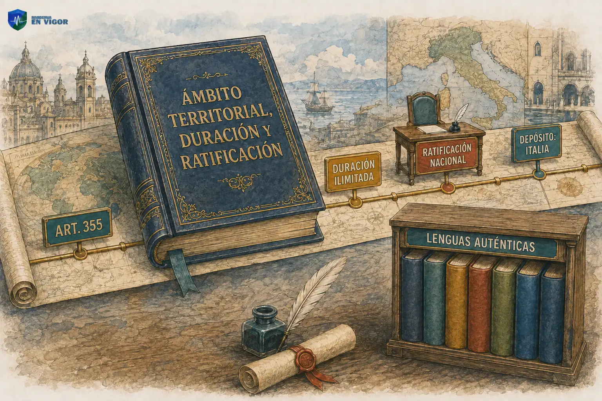

<em>Infografía: Ámbito territorial, duración, ratificación y lenguas auténticas.</em>

<!-- FUENTE: EURLEX-TFUE-CONSOLIDADO-GC-T05 -->

# Hablemos claro

:::hablemos-claro
No estudies la Unión como un organigrama aislado. Competencia, institución, procedimiento y acto forman una cadena: si falla un eslabón, la respuesta es incorrecta.
:::

# En la calle

:::en-la-calle
La secuencia operativa es: materia → tipo de competencia → institución competente → procedimiento → acto jurídico → control jurisdiccional.
:::

# Lo que cae

:::lo-que-cae
Máximo rendimiento histórico: artículos 4, 5, 9 a 20 y 42 a 50 TUE; artículos 2 a 6, 20 a 25, 26 a 37, 45 a 89, 191 a 196, 208 a 214, 222, 223 a 281, 288 a 292, 300 a 307 y 335 a 358 TFUE.
:::

# Ha caído

:::ha-caido
Se han vinculado 68 preguntas oficiales verificadas de 2020 a 2026.
:::

---

*Academia En Vigor · El temario que nunca duerme · Tema 5 · v1.0.0 · Documento interno no publicado.*
