# TEMA 6 · INSTITUCIONES INTERNACIONALES

**Guardia Civil · Método VIGOR · PARTE**
**Versión de contenido:** 1.0.0
**Estado editorial:** approved_internal · **Publicación:** not_published

# Mapa del tema

| Familia | Instituciones | Pregunta guía |
|---|---|---|
| Universal | ONU | ¿Paz, cooperación u órgano principal? |
| Europea política y militar | Consejo de Europa, UE, OTAN | ¿Derechos, integración o defensa colectiva? |
| Seguridad y justicia | INTERPOL, Europol, Eurojust, Frontex, CEPOL | ¿Policía mundial, policía UE, justicia, fronteras o formación? |
| Especializada | FAO, FMI, OMS | ¿Alimentos, estabilidad monetaria o salud? |

<!-- VISUAL:t06-00-mapa-instituciones-internacionales.webp -->

  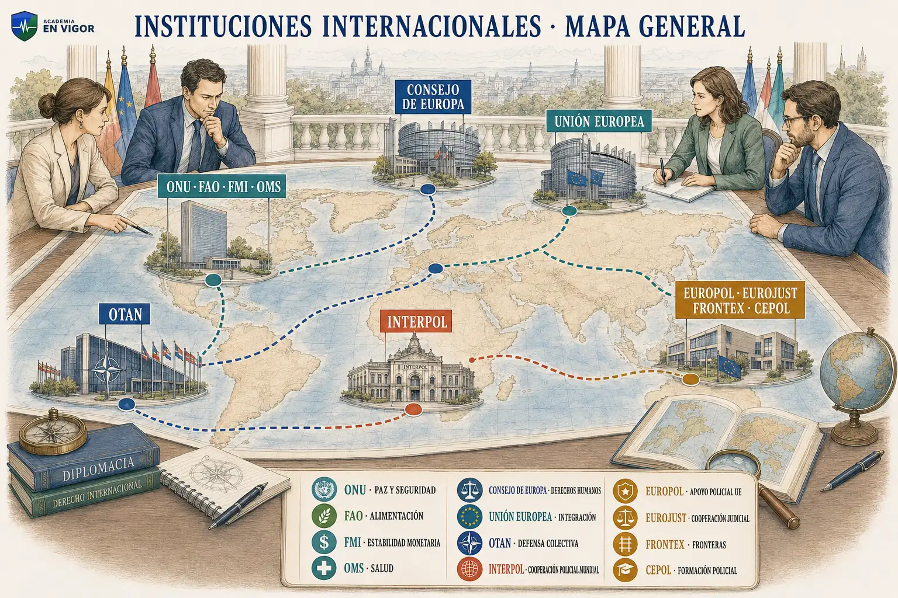

<em>Infografía: familias, sedes y funciones sin enlaces visibles hasta su producción.</em>

# Contenido

## 01. Mapa de las instituciones del tema

El programa mezcla organizaciones universales, europeas, policiales, judiciales, fronterizas, económicas y sanitarias. La primera tarea es identificar qué problema resuelve cada una.

### Claves rápidas

- La ONU, la FAO, el FMI y la OMS tienen vocación mundial, aunque sus mandatos materiales son distintos.
- El Consejo de Europa, la Unión Europea y la OTAN son organizaciones diferentes y no comparten miembros, órganos ni tratados fundacionales idénticos.
- INTERPOL conecta policías de alcance mundial; Europol apoya la cooperación policial de la Unión Europea y Eurojust coordina cooperación judicial penal.

:::perla-vigor
Ancla el bloque en **epígrafe oficial** y responde en este orden: naturaleza, ámbito, sede, órgano y función.
:::

<!-- VISUAL:t06-01-mapa-de-las-instituciones-del-tema.webp -->

  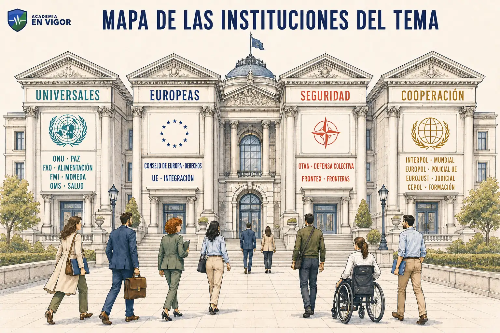

<em>Infografía: Mapa de las instituciones del tema mediante mapa comparativo.</em>

<!-- FUENTE: GC-PROGRAMA-2026-T06 -->

## 02. ONU: nacimiento y Carta fundacional

La ONU nace al final de la Segunda Guerra Mundial y se organiza mediante la Carta de San Francisco.

### Claves rápidas

- La Carta de las Naciones Unidas fue firmada en San Francisco el 26 de junio de 1945.
- La ONU comenzó oficialmente a existir el 24 de octubre de 1945, al entrar en vigor la Carta.
- Cincuenta Estados firmaron la Carta en San Francisco; Polonia firmó después y completó los 51 miembros originarios.

:::perla-vigor
Ancla el bloque en **Carta, arts. 1 a 7** y responde en este orden: naturaleza, ámbito, sede, órgano y función.
:::

<!-- VISUAL:t06-02-onu-nacimiento-y-carta-fundacional.webp -->

  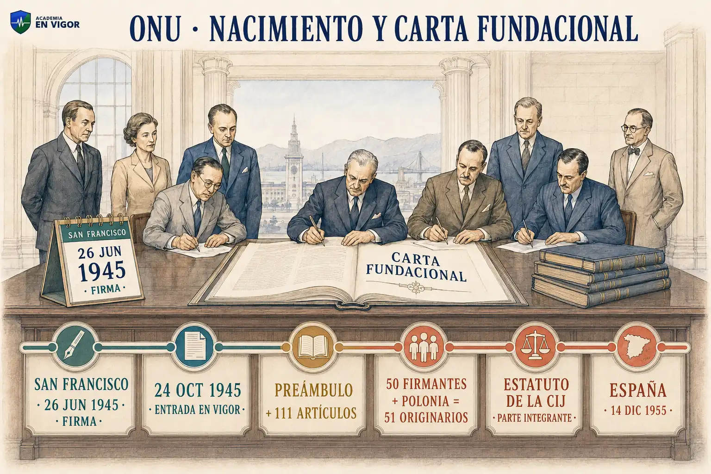

<em>Infografía: ONU: nacimiento y Carta fundacional mediante línea temporal.</em>

<!-- FUENTE: ONU-CARTA-T06 -->

## 03. ONU: miembros, observadores, sedes e idiomas

La dimensión geográfica de la ONU se estudia con miembros, observadores, sedes principales e idiomas oficiales.

### Claves rápidas

- A 9 de agosto de 2026 la ONU cuenta con 193 Estados miembros.
- La Santa Sede y el Estado de Palestina son Estados no miembros con condición de observador permanente.
- La sede principal de la ONU está en Nueva York y existen grandes oficinas en Ginebra, Viena y Nairobi.

:::perla-vigor
Ancla el bloque en **Carta, arts. 3 a 6 y datos institucionales** y responde en este orden: naturaleza, ámbito, sede, órgano y función.
:::

<!-- VISUAL:t06-03-onu-miembros-observadores-sedes-e-idiomas.webp -->

  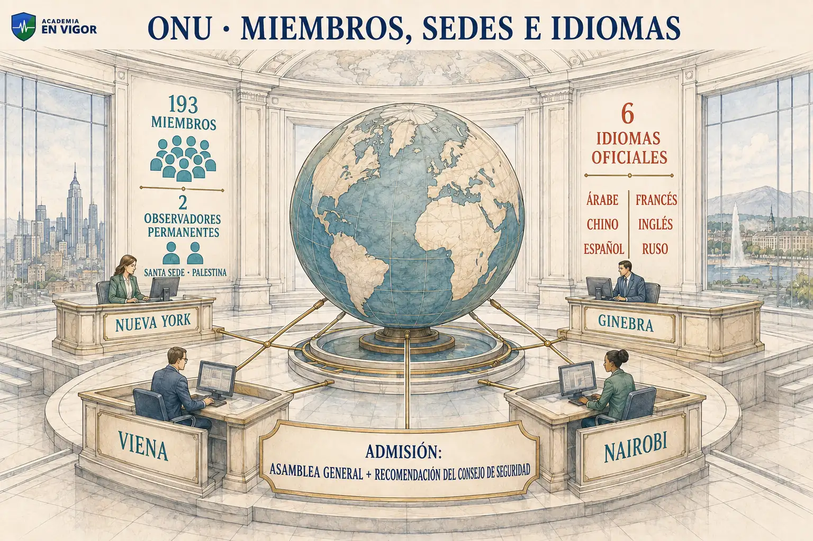

<em>Infografía: ONU: miembros, observadores, sedes e idiomas mediante organigrama.</em>

<!-- FUENTE: ONU-CARTA-T06 -->

## 04. ONU: propósitos y principios

Los artículos 1 y 2 fijan lo que persigue la organización y las reglas básicas de conducta de sus miembros.

### Claves rápidas

- Mantener la paz y la seguridad internacionales es el primer propósito de la ONU.
- La ONU promueve relaciones de amistad basadas en la igualdad de derechos y la libre determinación de los pueblos.
- Los miembros deben cumplir de buena fe las obligaciones contraídas conforme a la Carta.

:::perla-vigor
Ancla el bloque en **Carta, arts. 1 y 2** y responde en este orden: naturaleza, ámbito, sede, órgano y función.
:::

<!-- VISUAL:t06-04-onu-propositos-y-principios.webp -->

  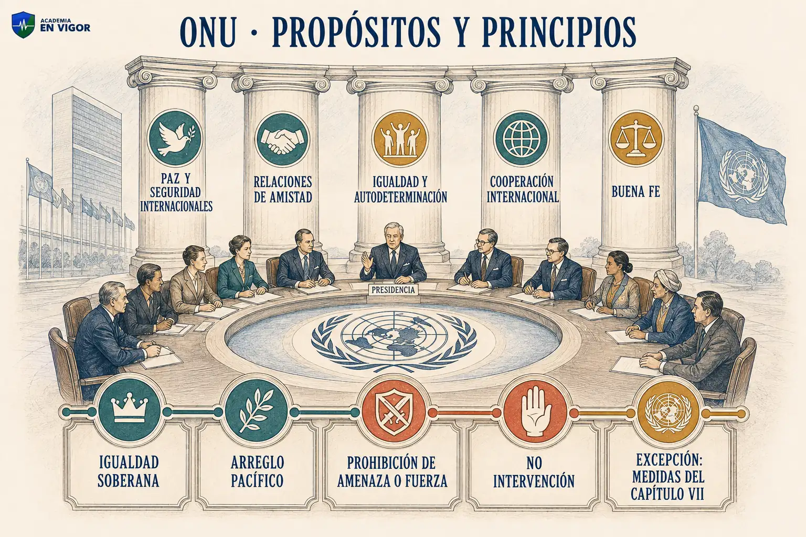

<em>Infografía: ONU: propósitos y principios mediante flujo de decisión.</em>

<!-- FUENTE: ONU-CARTA-T06 -->

## 05. ONU: Asamblea General

La Asamblea General es el órgano deliberativo universal: todos los miembros están representados y cada uno dispone de un voto.

### Claves rápidas

- La Asamblea General está integrada por todos los miembros de la ONU y cada miembro tiene un voto.
- Las cuestiones importantes se deciden por mayoría de dos tercios de los miembros presentes y votantes.
- Las demás cuestiones se deciden por mayoría de los miembros presentes y votantes.

:::perla-vigor
Ancla el bloque en **Carta, arts. 9 a 22** y responde en este orden: naturaleza, ámbito, sede, órgano y función.
:::

<!-- VISUAL:t06-05-onu-asamblea-general.webp -->

  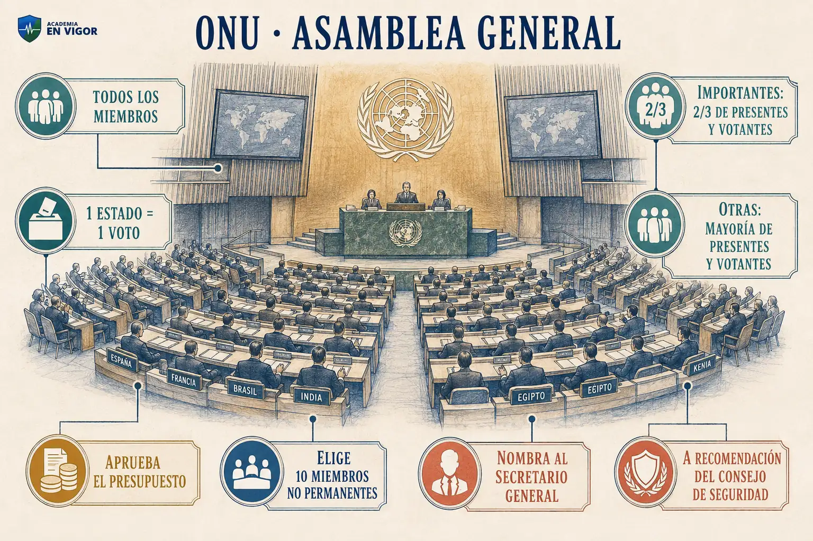

<em>Infografía: ONU: Asamblea General mediante mapa geográfico.</em>

<!-- FUENTE: ONU-CARTA-T06 -->

## 06. ONU: Consejo de Seguridad

El Consejo de Seguridad asume la responsabilidad primordial del mantenimiento de la paz y la seguridad internacionales.

### Claves rápidas

- El Consejo de Seguridad está compuesto por 15 miembros: cinco permanentes y diez no permanentes.
- China, Estados Unidos, Francia, la Federación de Rusia y el Reino Unido son los cinco miembros permanentes.
- Los miembros no permanentes son elegidos por la Asamblea General por períodos de dos años.

:::perla-vigor
Ancla el bloque en **Carta, arts. 23 a 32** y responde en este orden: naturaleza, ámbito, sede, órgano y función.
:::

<!-- VISUAL:t06-06-onu-consejo-de-seguridad.webp -->

  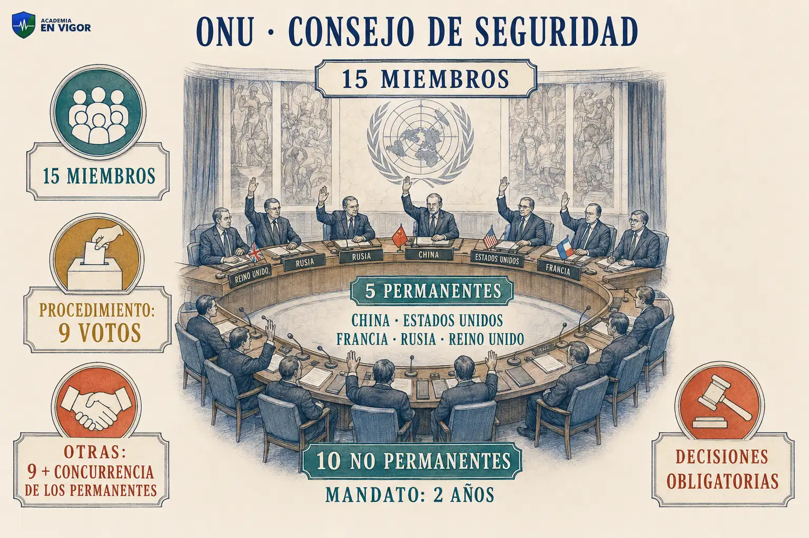

<em>Infografía: ONU: Consejo de Seguridad mediante corte por capas.</em>

<!-- FUENTE: ONU-CARTA-T06 -->

## 07. ONU: ECOSOC y Consejo de Administración Fiduciaria

ECOSOC coordina la cooperación económica y social; el Consejo de Administración Fiduciaria quedó sin actividad ordinaria tras completarse los fideicomisos.

### Claves rápidas

- ECOSOC está integrado por 54 miembros elegidos por la Asamblea General.
- Los miembros de ECOSOC son elegidos por períodos de tres años.
- ECOSOC puede hacer estudios, informes y recomendaciones sobre materias económicas, sociales, culturales, educativas y sanitarias.

:::perla-vigor
Ancla el bloque en **Carta, arts. 61 a 72 y 86 a 91** y responde en este orden: naturaleza, ámbito, sede, órgano y función.
:::

<!-- VISUAL:t06-07-onu-ecosoc-y-consejo-de-administracion-fiduciaria.webp -->

  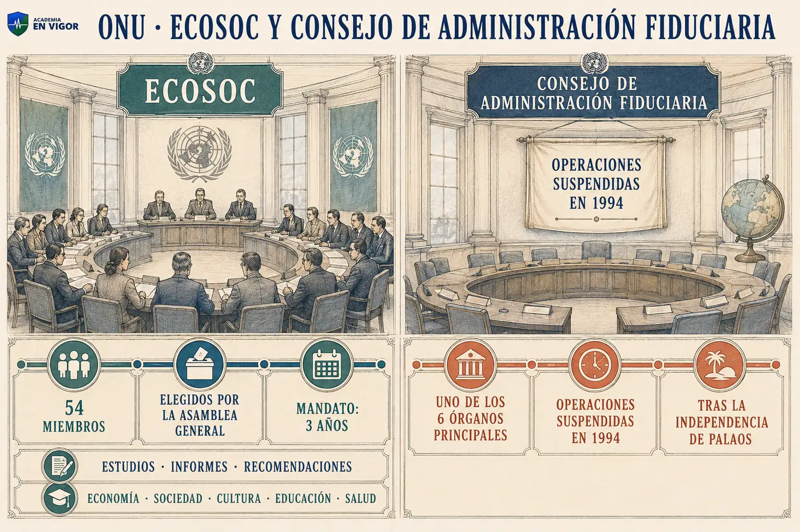

<em>Infografía: ONU: ECOSOC y Consejo de Administración Fiduciaria mediante escena mnemotécnica.</em>

<!-- FUENTE: ONU-CARTA-T06 -->

## 08. ONU: Corte Internacional de Justicia

La CIJ es el órgano judicial principal de la ONU y resuelve controversias jurídicas entre Estados.

### Claves rápidas

- La Corte Internacional de Justicia tiene su sede en La Haya.
- La Corte está compuesta por 15 jueces elegidos por nueve años por la Asamblea General y el Consejo de Seguridad.
- Solo los Estados pueden ser partes en asuntos contenciosos ante la Corte Internacional de Justicia.

:::perla-vigor
Ancla el bloque en **Carta, arts. 92 a 96 y Estatuto de la CIJ** y responde en este orden: naturaleza, ámbito, sede, órgano y función.
:::

<!-- VISUAL:t06-08-onu-corte-internacional-de-justicia.webp -->

  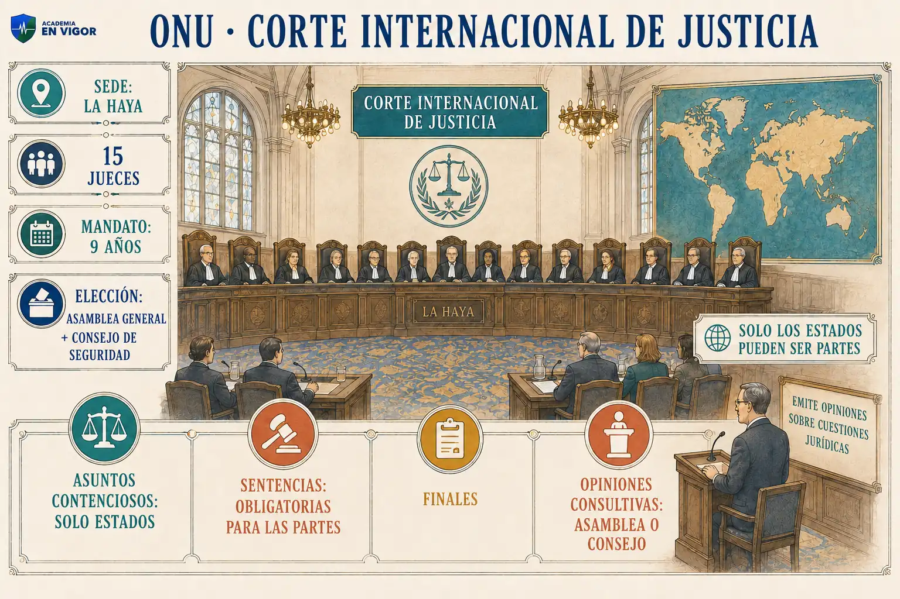

<em>Infografía: ONU: Corte Internacional de Justicia mediante mapa comparativo.</em>

<!-- FUENTE: ONU-CARTA-T06 -->

## 09. ONU: Secretaría y Secretario General

La Secretaría ejecuta el trabajo cotidiano de la ONU bajo la dirección del Secretario General.

### Claves rápidas

- El Secretario General es nombrado por la Asamblea General a recomendación del Consejo de Seguridad.
- El personal de la Secretaría no debe solicitar ni recibir instrucciones de gobiernos o autoridades externas a la organización.
- El artículo 99 permite al Secretario General llamar la atención del Consejo de Seguridad sobre asuntos que puedan amenazar la paz y la seguridad internacionales.

:::perla-vigor
Ancla el bloque en **Carta, arts. 97 a 101** y responde en este orden: naturaleza, ámbito, sede, órgano y función.
:::

<!-- VISUAL:t06-09-onu-secretaria-y-secretario-general.webp -->

  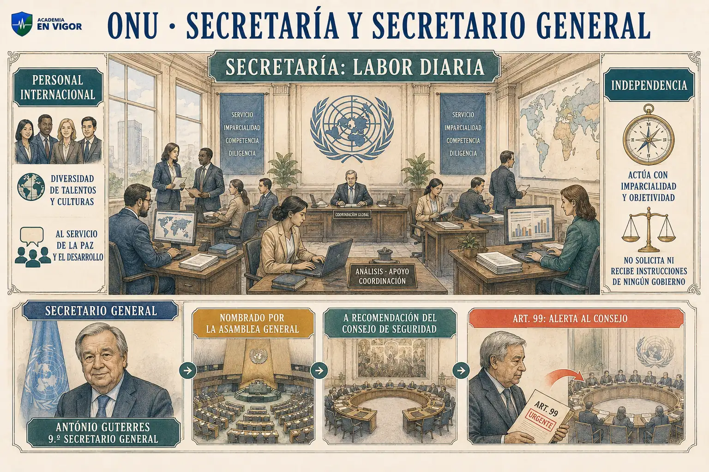

<em>Infografía: ONU: Secretaría y Secretario General mediante línea temporal.</em>

<!-- FUENTE: ONU-CARTA-T06 -->

## 10. ONU: seguridad colectiva y mantenimiento de la paz

La Carta combina arreglo pacífico, sanciones, uso de la fuerza autorizado y cooperación con acuerdos regionales.

### Claves rápidas

- Las operaciones de mantenimiento de la paz se apoyan en consentimiento de las partes, imparcialidad y no uso de la fuerza salvo defensa propia y defensa del mandato.
- El Consejo de Seguridad establece el mandato de una operación de mantenimiento de la paz.
- Los contingentes de las operaciones de paz son aportados por los Estados; la ONU no dispone de un ejército permanente propio.

:::perla-vigor
Ancla el bloque en **Carta, capítulos VI, VII y VIII** y responde en este orden: naturaleza, ámbito, sede, órgano y función.
:::

<!-- VISUAL:t06-10-onu-seguridad-colectiva-y-mantenimiento-de-la-paz.webp -->

  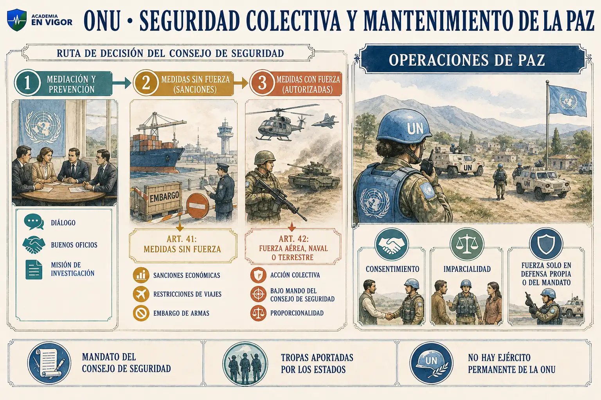

<em>Infografía: ONU: seguridad colectiva y mantenimiento de la paz mediante organigrama.</em>

<!-- FUENTE: ONU-CARTA-T06 -->

## 11. Consejo de Europa: origen, miembros y sede

El Consejo de Europa nació en 1949 como organización paneuropea de derechos humanos, democracia y Estado de Derecho.

### Claves rápidas

- El Consejo de Europa fue creado por el Estatuto de Londres, firmado el 5 de mayo de 1949.
- Diez Estados fundaron el Consejo de Europa en 1949.
- A 9 de agosto de 2026 el Consejo de Europa cuenta con 46 Estados miembros.

:::perla-vigor
Ancla el bloque en **Estatuto, preámbulo y arts. 1 a 11** y responde en este orden: naturaleza, ámbito, sede, órgano y función.
:::

<!-- VISUAL:t06-11-consejo-de-europa-origen-miembros-y-sede.webp -->

  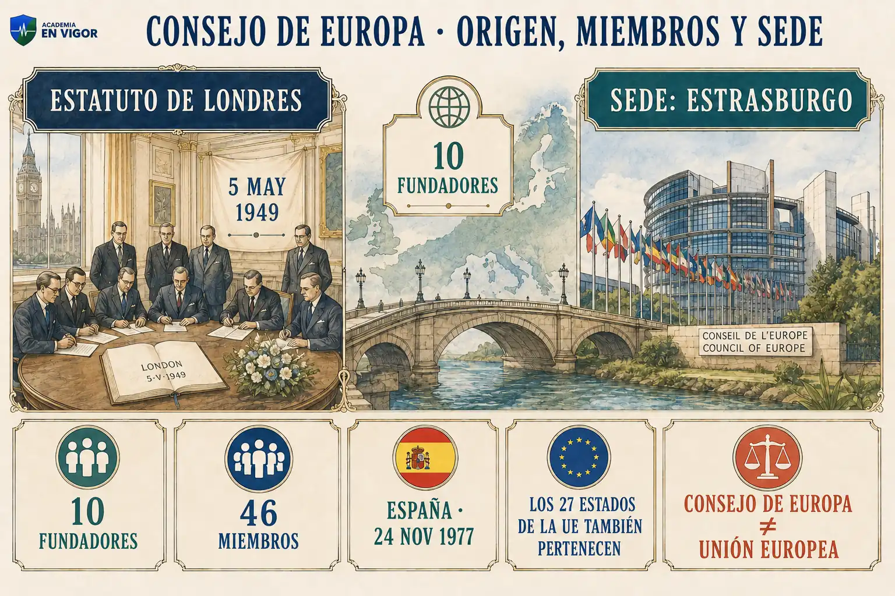

<em>Infografía: Consejo de Europa: origen, miembros y sede mediante flujo de decisión.</em>

<!-- FUENTE: COE-ESTATUTO-T06 -->

## 12. Consejo de Europa: fines y órganos estatutarios

El Estatuto fija un ideal común basado en derechos humanos, democracia y primacía del Derecho.

### Claves rápidas

- La finalidad del Consejo de Europa es lograr una unión más estrecha entre sus miembros para salvaguardar y promover sus ideales y facilitar su progreso económico y social.
- Todo miembro debe aceptar los principios del Estado de Derecho y del disfrute de los derechos humanos y libertades fundamentales por todas las personas bajo su jurisdicción.
- Los dos órganos estatutarios son el Comité de Ministros y la Asamblea Parlamentaria.

:::perla-vigor
Ancla el bloque en **Estatuto, arts. 1, 3, 10 y 12** y responde en este orden: naturaleza, ámbito, sede, órgano y función.
:::

<!-- VISUAL:t06-12-consejo-de-europa-fines-y-organos-estatutarios.webp -->

  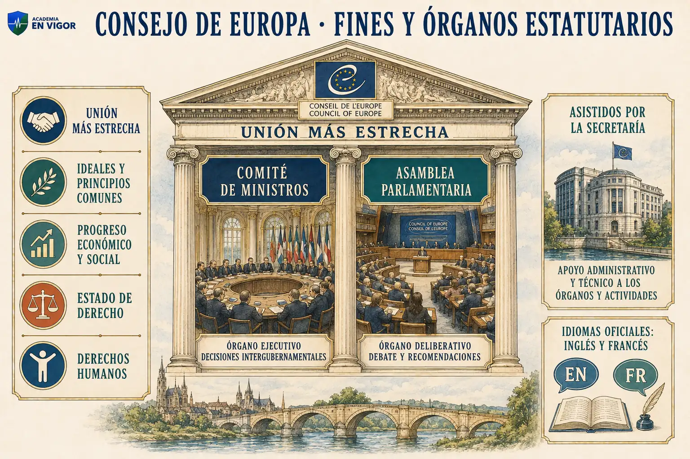

<em>Infografía: Consejo de Europa: fines y órganos estatutarios mediante mapa geográfico.</em>

<!-- FUENTE: COE-ESTATUTO-T06 -->

## 13. Consejo de Europa: instituciones y mecanismos

Junto a los órganos estatutarios existe un ecosistema de protección, representación territorial y participación social.

### Claves rápidas

- El Comité de Ministros es el órgano de decisión del Consejo de Europa y reúne a los ministros de Asuntos Exteriores o a sus representantes permanentes.
- La Asamblea Parlamentaria está formada por parlamentarios designados por los parlamentos nacionales de los Estados miembros.
- El Tribunal Europeo de Derechos Humanos controla el respeto del Convenio Europeo de Derechos Humanos.

:::perla-vigor
Ancla el bloque en **estructura institucional oficial** y responde en este orden: naturaleza, ámbito, sede, órgano y función.
:::

<!-- VISUAL:t06-13-consejo-de-europa-instituciones-y-mecanismos.webp -->

  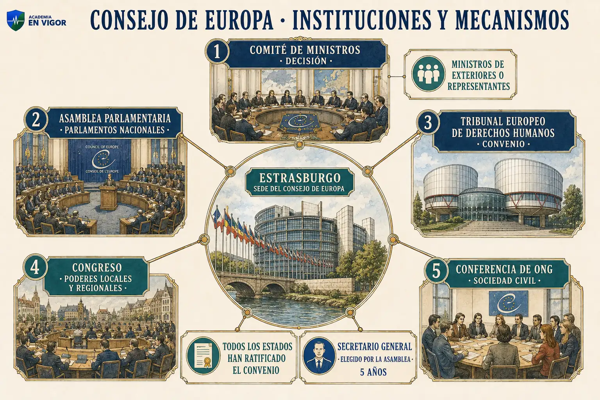

<em>Infografía: Consejo de Europa: instituciones y mecanismos mediante corte por capas.</em>

<!-- FUENTE: COE-ESTATUTO-T06 -->

## 14. Unión Europea: evolución, miembros y valores

La UE es una unión política y económica construida por tratados y ampliaciones sucesivas.

### Claves rápidas

- A 9 de agosto de 2026 la Unión Europea está integrada por 27 Estados miembros.
- España pertenece a las Comunidades Europeas, hoy Unión Europea, desde el 1 de enero de 1986.
- La Unión se fundamenta en dignidad humana, libertad, democracia, igualdad, Estado de Derecho y derechos humanos.

:::perla-vigor
Ancla el bloque en **TUE, arts. 2, 3 y 49** y responde en este orden: naturaleza, ámbito, sede, órgano y función.
:::

<!-- VISUAL:t06-14-union-europea-evolucion-miembros-y-valores.webp -->

  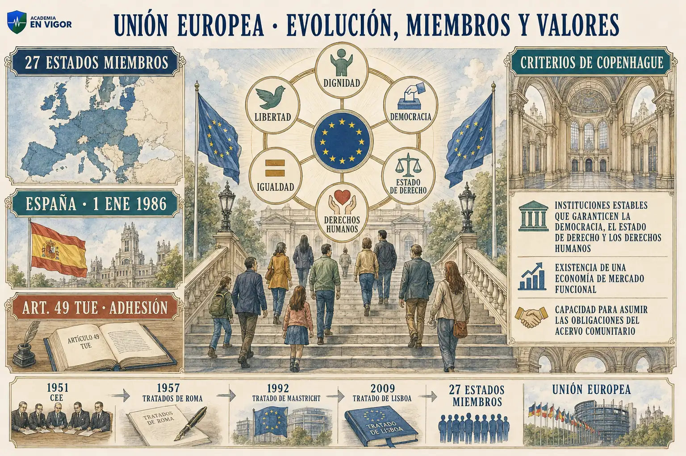

<em>Infografía: Unión Europea: evolución, miembros y valores mediante escena mnemotécnica.</em>

<!-- FUENTE: UE-TRATADOS-T06 -->

## 15. Unión Europea: siete instituciones

El marco institucional de la Unión consta de siete instituciones con funciones diferentes.

### Claves rápidas

- Las siete instituciones de la UE son Parlamento Europeo, Consejo Europeo, Consejo, Comisión, Tribunal de Justicia, Banco Central Europeo y Tribunal de Cuentas.
- El Parlamento Europeo ejerce funciones legislativas y presupuestarias conjuntamente con el Consejo y funciones de control político.
- El Consejo Europeo da a la Unión los impulsos necesarios y define sus orientaciones y prioridades políticas generales, sin ejercer función legislativa.

:::perla-vigor
Ancla el bloque en **TUE, art. 13** y responde en este orden: naturaleza, ámbito, sede, órgano y función.
:::

<!-- VISUAL:t06-15-union-europea-siete-instituciones.webp -->

  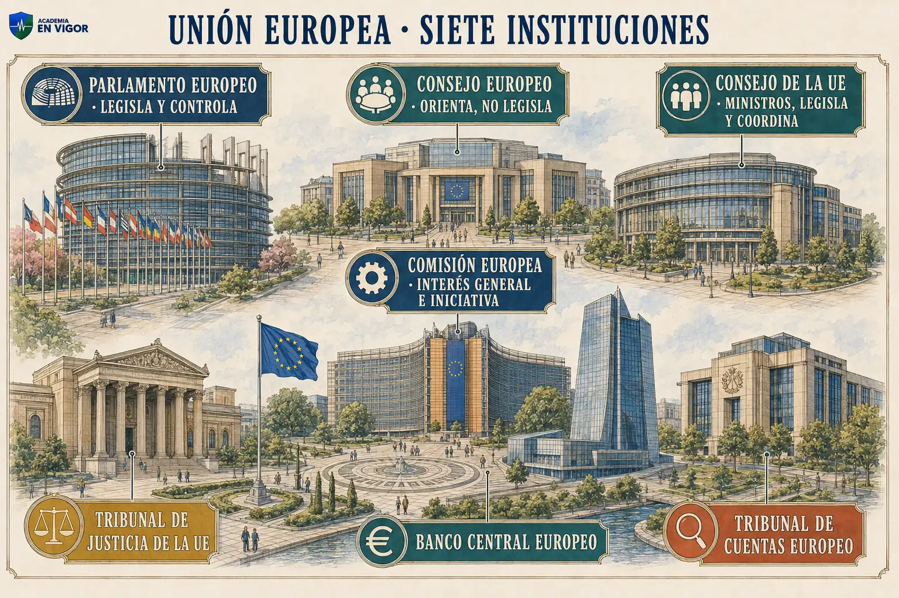

<em>Infografía: Unión Europea: siete instituciones mediante mapa comparativo.</em>

<!-- FUENTE: UE-TRATADOS-T06 -->

## 16. Unión Europea: ciudadanía, elecciones y decisiones

La ciudadanía participa de forma representativa y directa dentro de un sistema institucional multinivel.

### Claves rápidas

- Las elecciones al Parlamento Europeo se celebran cada cinco años por sufragio universal directo, libre y secreto.
- El Parlamento Europeo representa directamente a la ciudadanía de la Unión.
- Una iniciativa ciudadana europea requiere al menos un millón de ciudadanos de un número significativo de Estados miembros.

:::perla-vigor
Ancla el bloque en **TUE, arts. 10 a 12 y marco institucional** y responde en este orden: naturaleza, ámbito, sede, órgano y función.
:::

<!-- VISUAL:t06-16-union-europea-ciudadania-elecciones-y-decisiones.webp -->

  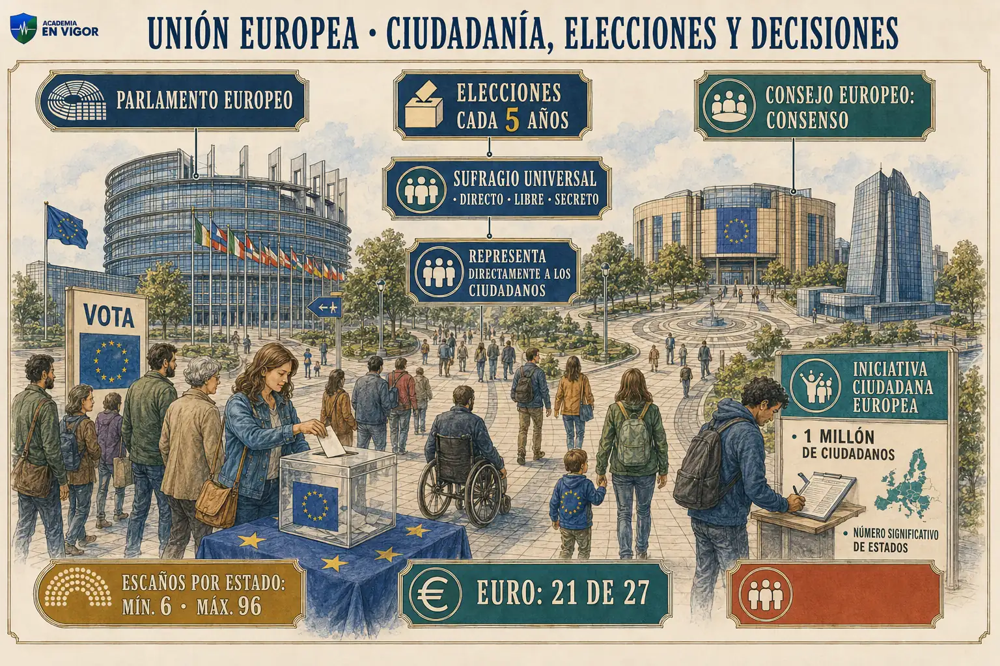

<em>Infografía: Unión Europea: ciudadanía, elecciones y decisiones mediante línea temporal.</em>

<!-- FUENTE: UE-TRATADOS-T06 -->

## 17. OTAN: origen, miembros y sede

La OTAN es una alianza política y militar de defensa colectiva fundada por el Tratado de Washington.

### Claves rápidas

- La OTAN tiene su origen en el Tratado de Washington, firmado el 4 de abril de 1949.
- Doce Estados fueron miembros fundadores de la OTAN.
- A 9 de agosto de 2026 la OTAN cuenta con 32 países miembros.

:::perla-vigor
Ancla el bloque en **Tratado de Washington** y responde en este orden: naturaleza, ámbito, sede, órgano y función.
:::

<!-- VISUAL:t06-17-otan-origen-miembros-y-sede.webp -->

  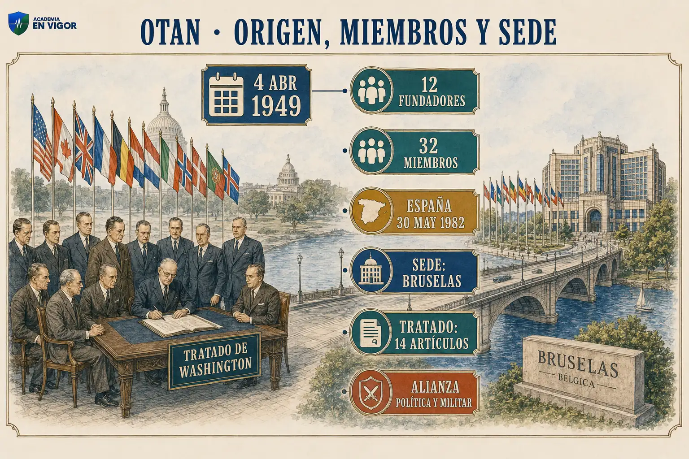

<em>Infografía: OTAN: origen, miembros y sede mediante organigrama.</em>

<!-- FUENTE: OTAN-TRATADO-T06 -->

## 18. OTAN: estructura y decisión por consenso

Las decisiones de la OTAN expresan la voluntad colectiva de los aliados y se adoptan por consenso.

### Claves rápidas

- El Consejo del Atlántico Norte es el principal órgano político de decisión de la OTAN.
- Las decisiones de la OTAN se adoptan por consenso y no por votación mayoritaria.
- El Grupo de Planes Nucleares tiene autoridad comparable al Consejo del Atlántico Norte en asuntos de política nuclear.

:::perla-vigor
Ancla el bloque en **estructura oficial de la Alianza** y responde en este orden: naturaleza, ámbito, sede, órgano y función.
:::

<!-- VISUAL:t06-18-otan-estructura-y-decision-por-consenso.webp -->

  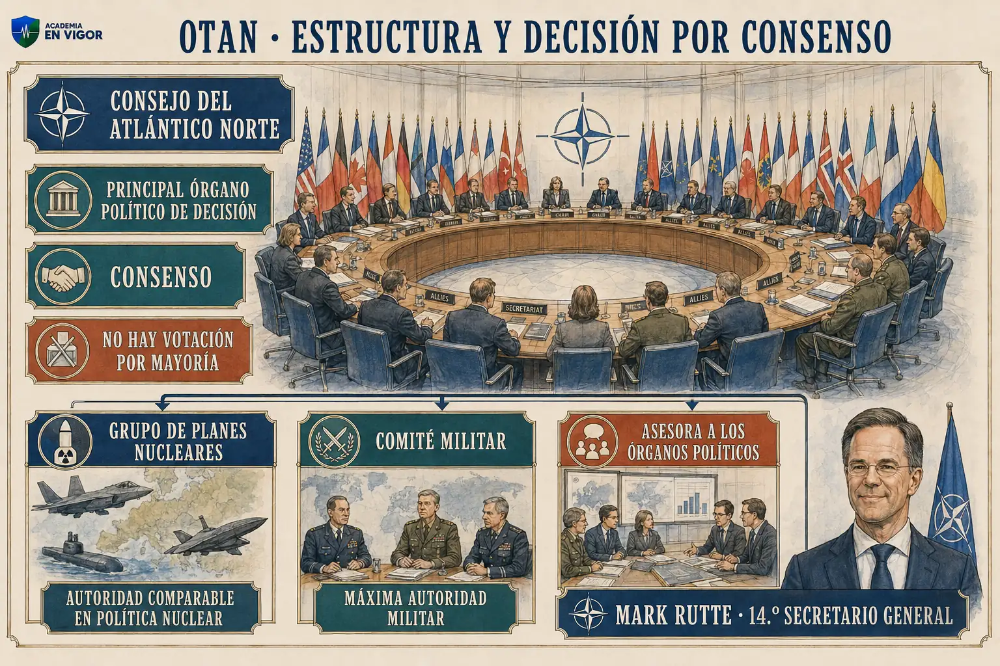

<em>Infografía: OTAN: estructura y decisión por consenso mediante flujo de decisión.</em>

<!-- FUENTE: OTAN-TRATADO-T06 -->

## 19. OTAN: artículos 4 y 5 y gestión de crisis

La defensa colectiva convive con consultas políticas, prevención y gestión de crisis.

### Claves rápidas

- El artículo 4 prevé consultas cuando una parte considere amenazada la integridad territorial, independencia política o seguridad de cualquiera de ellas.
- El artículo 5 considera un ataque armado contra una o varias partes como un ataque contra todas.
- Cada aliado presta la asistencia que juzgue necesaria, incluida la fuerza armada, para restablecer y mantener la seguridad del Atlántico Norte.

:::perla-vigor
Ancla el bloque en **Tratado, arts. 4 y 5** y responde en este orden: naturaleza, ámbito, sede, órgano y función.
:::

<!-- VISUAL:t06-19-otan-articulos-4-y-5-y-gestion-de-crisis.webp -->

  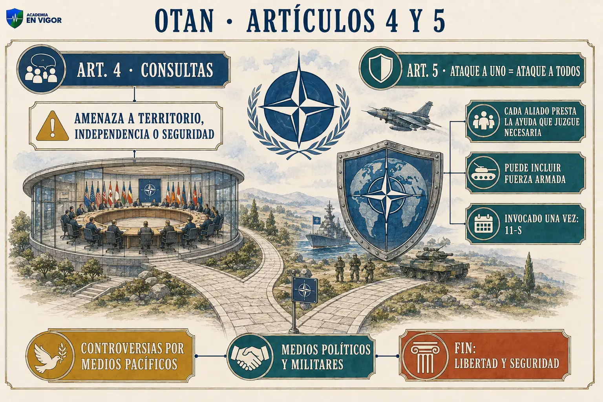

<em>Infografía: OTAN: artículos 4 y 5 y gestión de crisis mediante mapa geográfico.</em>

<!-- FUENTE: OTAN-TRATADO-T06 -->

## 20. INTERPOL: origen, alcance y sede

INTERPOL es la mayor organización policial internacional y conecta autoridades nacionales mediante una red mundial.

### Claves rápidas

- La cooperación policial internacional organizada que dio origen a INTERPOL comenzó en 1923.
- La denominación OIPC-INTERPOL y la Constitución moderna datan de 1956.
- A 9 de agosto de 2026 INTERPOL cuenta con 196 países miembros.

:::perla-vigor
Ancla el bloque en **Constitución y datos institucionales** y responde en este orden: naturaleza, ámbito, sede, órgano y función.
:::

<!-- VISUAL:t06-20-interpol-origen-alcance-y-sede.webp -->

  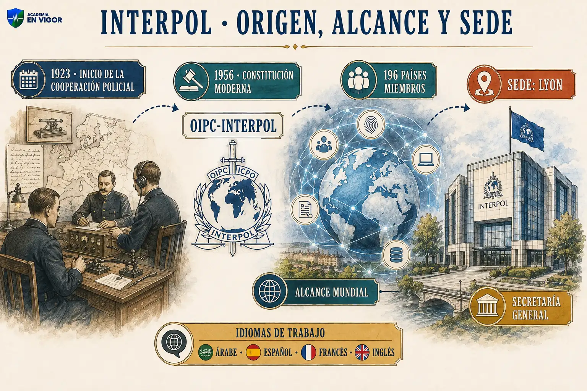

<em>Infografía: INTERPOL: origen, alcance y sede mediante corte por capas.</em>

<!-- FUENTE: INTERPOL-CONSTITUCION-T06 -->

## 21. INTERPOL: órganos y Oficinas Centrales Nacionales

La organización combina órganos internacionales permanentes con un punto de enlace nacional en cada miembro.

### Claves rápidas

- La Asamblea General es el órgano supremo de INTERPOL y se reúne ordinariamente una vez al año.
- El Comité Ejecutivo está integrado por el presidente, tres vicepresidentes y nueve vocales.
- La Secretaría General coordina las actividades cotidianas bajo la dirección del Secretario General.

:::perla-vigor
Ancla el bloque en **Constitución, arts. 5 a 33** y responde en este orden: naturaleza, ámbito, sede, órgano y función.
:::

<!-- VISUAL:t06-21-interpol-organos-y-oficinas-centrales-nacionales.webp -->

  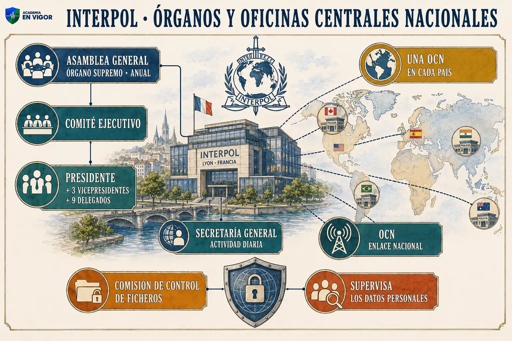

<em>Infografía: INTERPOL: órganos y Oficinas Centrales Nacionales mediante escena mnemotécnica.</em>

<!-- FUENTE: INTERPOL-CONSTITUCION-T06 -->

## 22. INTERPOL: funciones, límites y herramientas

INTERPOL facilita intercambio de datos y asistencia policial dentro de límites jurídicos expresos.

### Claves rápidas

- INTERPOL busca asegurar y promover la asistencia recíproca más amplia entre autoridades de policía criminal dentro de las leyes nacionales y la Declaración Universal de Derechos Humanos.
- El artículo 3 de la Constitución prohíbe a INTERPOL intervenir en asuntos de carácter político, militar, religioso o racial.
- Las notificaciones de INTERPOL son solicitudes internacionales de cooperación o alertas y no sustituyen automáticamente una orden nacional de detención.

:::perla-vigor
Ancla el bloque en **Constitución, arts. 2 y 3** y responde en este orden: naturaleza, ámbito, sede, órgano y función.
:::

<!-- VISUAL:t06-22-interpol-funciones-limites-y-herramientas.webp -->

  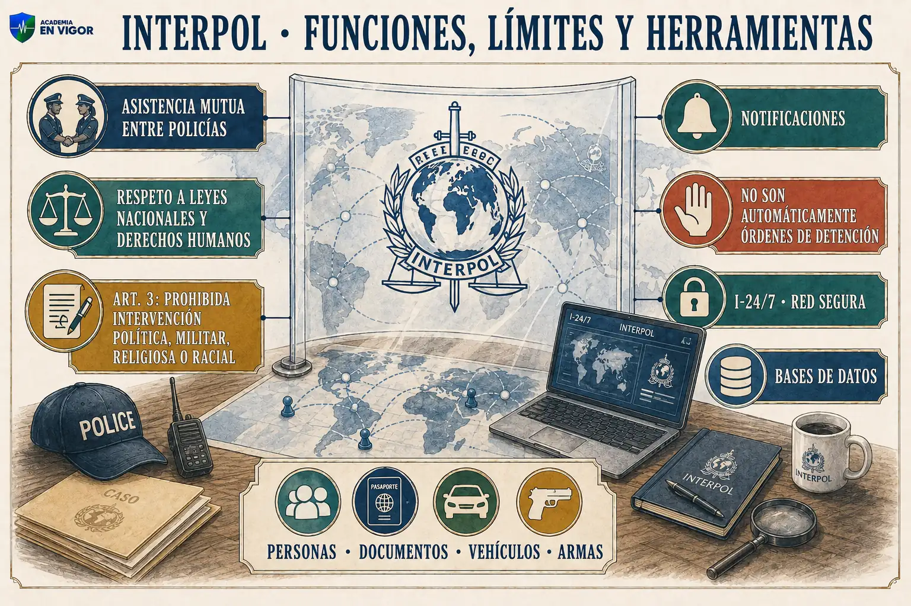

<em>Infografía: INTERPOL: funciones, límites y herramientas mediante mapa comparativo.</em>

<!-- FUENTE: INTERPOL-CONSTITUCION-T06 -->

## 23. Europol: base jurídica, misión y ámbito

Europol apoya a las autoridades de los Estados miembros frente a delincuencia grave y terrorismo con dimensión transfronteriza.

### Claves rápidas

- Europol es la Agencia de la Unión Europea para la Cooperación Policial.
- Europol tiene su sede en La Haya.
- Su misión es apoyar y reforzar la actuación de las autoridades competentes y su cooperación frente a delincuencia grave que afecte a dos o más Estados miembros, terrorismo y formas de delincuencia de interés común.

:::perla-vigor
Ancla el bloque en **Reglamento, arts. 1 a 3** y responde en este orden: naturaleza, ámbito, sede, órgano y función.
:::

<!-- VISUAL:t06-23-europol-base-juridica-mision-y-ambito.webp -->

  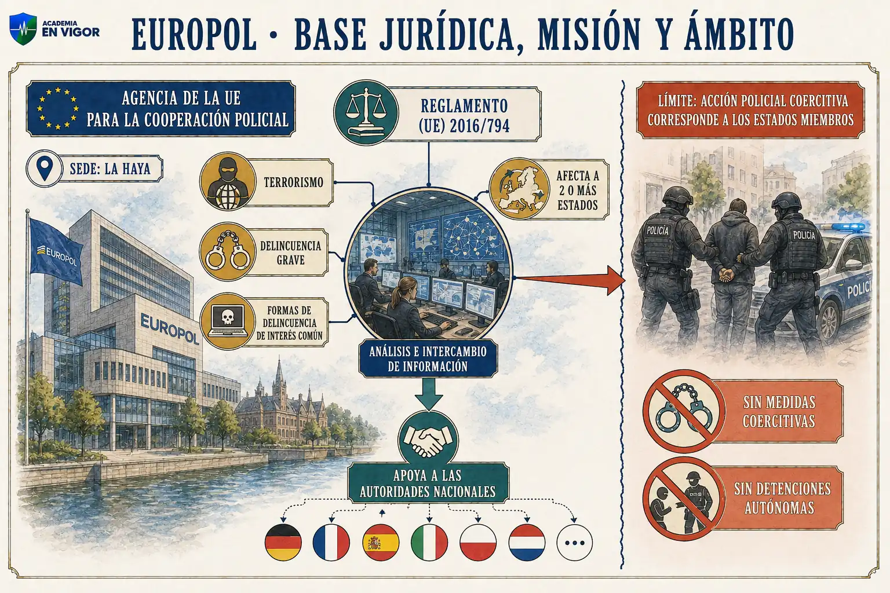

<em>Infografía: Europol: base jurídica, misión y ámbito mediante línea temporal.</em>

<!-- FUENTE: UE-EUROPOL-2016-794-T06 -->

## 24. Europol: tareas y cooperación operativa

El valor añadido de Europol está en recibir, cruzar, analizar y difundir información y apoyar operaciones.

### Claves rápidas

- Europol recopila, almacena, trata, analiza e intercambia información e inteligencia criminal.
- Europol elabora evaluaciones de amenazas, análisis estratégicos y operativos y otros productos de inteligencia.
- Cada Estado miembro designa una Unidad Nacional Europol como órgano de enlace con la Agencia.

:::perla-vigor
Ancla el bloque en **Reglamento, arts. 4 a 12** y responde en este orden: naturaleza, ámbito, sede, órgano y función.
:::

<!-- VISUAL:t06-24-europol-tareas-y-cooperacion-operativa.webp -->

  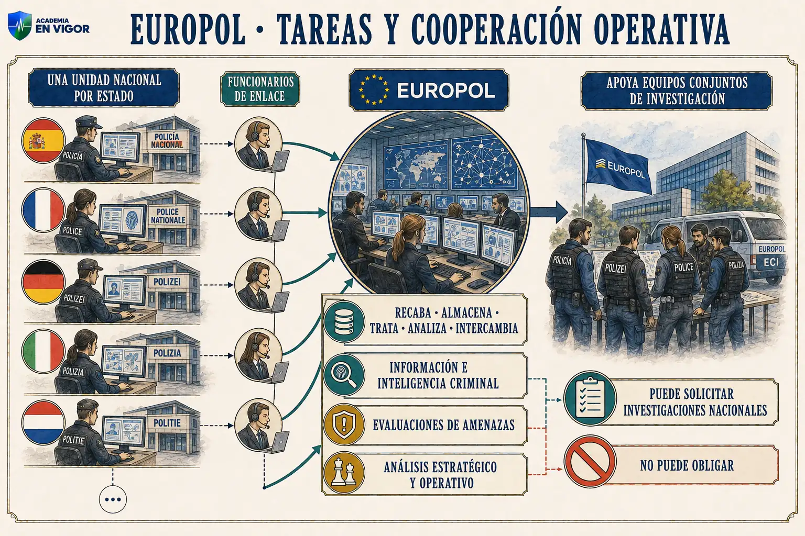

<em>Infografía: Europol: tareas y cooperación operativa mediante organigrama.</em>

<!-- FUENTE: UE-EUROPOL-2016-794-T06 -->

## 25. Europol: gobierno y control

La Agencia se gobierna mediante un Consejo de Administración y un director ejecutivo, con control parlamentario y de protección de datos.

### Claves rápidas

- El Consejo de Administración de Europol está formado por un representante de cada Estado miembro y uno de la Comisión, con derecho de voto.
- El director ejecutivo es el representante legal de Europol y dirige su gestión cotidiana.
- El Consejo nombra al director ejecutivo a partir de una lista de candidatos propuesta por el Consejo de Administración.

:::perla-vigor
Ancla el bloque en **Reglamento, arts. 10 a 15 y 51** y responde en este orden: naturaleza, ámbito, sede, órgano y función.
:::

<!-- VISUAL:t06-25-europol-gobierno-y-control.webp -->

  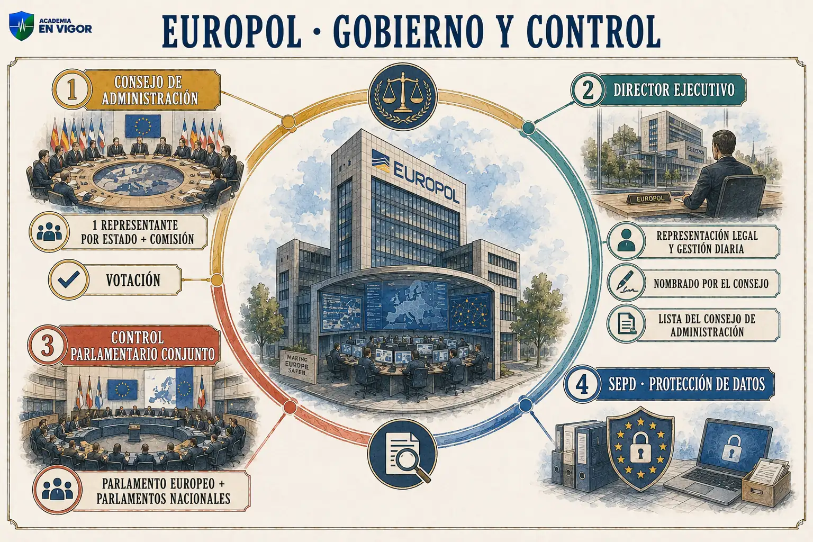

<em>Infografía: Europol: gobierno y control mediante flujo de decisión.</em>

<!-- FUENTE: UE-EUROPOL-2016-794-T06 -->

## 26. Eurojust: misión y competencia

Eurojust es el centro de coordinación judicial penal de la Unión para investigaciones y procesos transfronterizos graves.

### Claves rápidas

- Eurojust es la Agencia de la Unión Europea para la Cooperación Judicial Penal.
- Eurojust tiene su sede en La Haya.
- Eurojust apoya y refuerza la coordinación y cooperación entre autoridades nacionales encargadas de investigar y perseguir delitos graves que afecten a dos o más Estados miembros o exijan una actuación común.

:::perla-vigor
Ancla el bloque en **Reglamento, arts. 1 a 4** y responde en este orden: naturaleza, ámbito, sede, órgano y función.
:::

<!-- VISUAL:t06-26-eurojust-mision-y-competencia.webp -->

  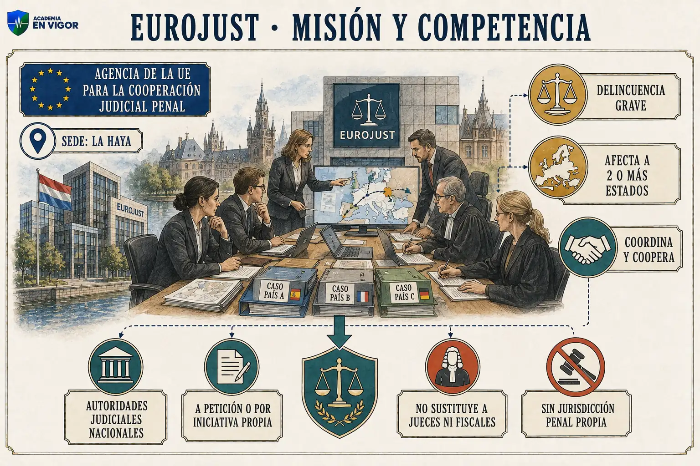

<em>Infografía: Eurojust: misión y competencia mediante mapa geográfico.</em>

<!-- FUENTE: UE-EUROJUST-2018-1727-T06 -->

## 27. Eurojust: estructura e instrumentos

La estructura combina miembros nacionales con órganos de gestión y herramientas de coordinación práctica.

### Claves rápidas

- El Colegio de Eurojust está compuesto por un miembro nacional de cada Estado miembro y, en determinadas funciones de gestión, por un representante de la Comisión.
- Cada miembro nacional debe ser fiscal, juez o representante de una autoridad judicial con competencias equivalentes.
- El Comité Ejecutivo asiste al Colegio en sus funciones de gestión y prepara determinadas decisiones administrativas.

:::perla-vigor
Ancla el bloque en **Reglamento, arts. 7 a 18** y responde en este orden: naturaleza, ámbito, sede, órgano y función.
:::

<!-- VISUAL:t06-27-eurojust-estructura-e-instrumentos.webp -->

  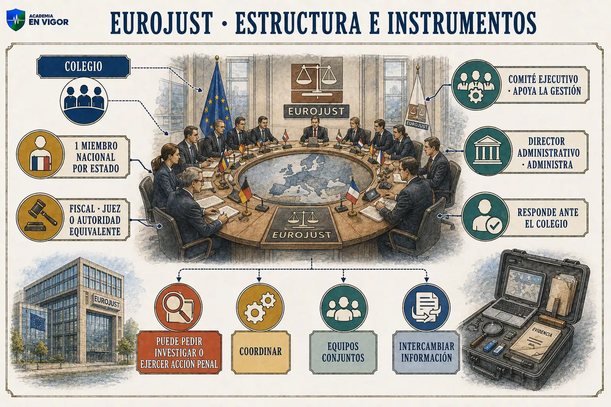

<em>Infografía: Eurojust: estructura e instrumentos mediante corte por capas.</em>

<!-- FUENTE: UE-EUROJUST-2018-1727-T06 -->

## 28. Frontex y la Guardia Europea de Fronteras y Costas

La Guardia Europea de Fronteras y Costas es un sistema compartido; Frontex es la Agencia que lo apoya y coordina.

### Claves rápidas

- La Guardia Europea de Fronteras y Costas está compuesta por Frontex y las autoridades nacionales responsables de fronteras y retornos, incluidos guardacostas cuando realizan control fronterizo.
- Frontex tiene su sede en Varsovia.
- La gestión europea integrada de las fronteras exteriores es una responsabilidad compartida entre la Agencia y las autoridades nacionales.

:::perla-vigor
Ancla el bloque en **Reglamento, arts. 1 a 10** y responde en este orden: naturaleza, ámbito, sede, órgano y función.
:::

<!-- VISUAL:t06-28-frontex-y-la-guardia-europea-de-fronteras-y-costas.webp -->

  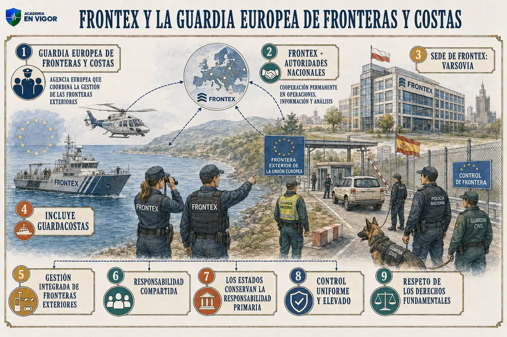

<em>Infografía: Frontex y la Guardia Europea de Fronteras y Costas mediante escena mnemotécnica.</em>

<!-- FUENTE: UE-FRONTEX-2019-1896-T06 -->

## 29. Frontex: tareas y cuerpo permanente

La Agencia analiza riesgos, evalúa vulnerabilidades, coordina operaciones y apoya retornos mediante capacidades comunes.

### Claves rápidas

- Frontex realiza análisis de riesgos y evaluaciones de vulnerabilidad sobre la capacidad de los Estados para afrontar retos en sus fronteras exteriores.
- La Agencia coordina operaciones conjuntas e intervenciones fronterizas rápidas a petición y con participación de los Estados.
- El cuerpo permanente europeo aporta guardias de fronteras y otros expertos en distintas categorías de personal.

:::perla-vigor
Ancla el bloque en **Reglamento, arts. 10, 54 y siguientes** y responde en este orden: naturaleza, ámbito, sede, órgano y función.
:::

<!-- VISUAL:t06-29-frontex-tareas-y-cuerpo-permanente.webp -->

  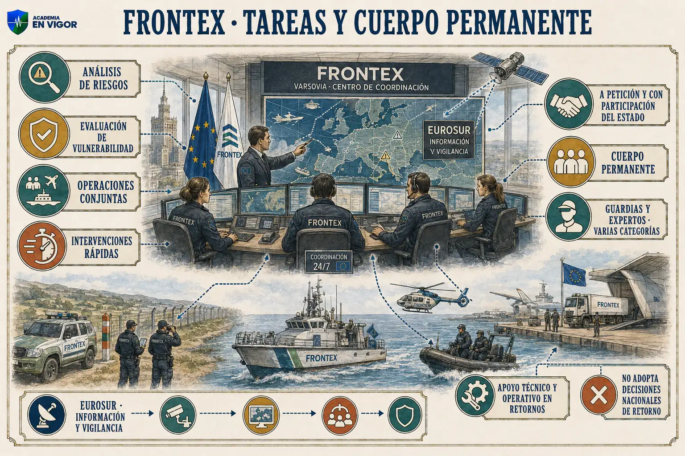

<em>Infografía: Frontex: tareas y cuerpo permanente mediante mapa comparativo.</em>

<!-- FUENTE: UE-FRONTEX-2019-1896-T06 -->

## 30. Frontex: gobierno, presupuesto y derechos fundamentales

El gobierno administrativo se acompaña de mecanismos específicos de garantía de derechos fundamentales.

### Claves rápidas

- El Consejo de Administración aprueba el presupuesto de Frontex, verifica su ejecución y nombra al director ejecutivo y a sus adjuntos.
- El director ejecutivo gestiona la Agencia y ejecuta las decisiones del Consejo de Administración.
- El Responsable de Derechos Fundamentales supervisa el respeto de esos derechos en las actividades de la Agencia.

:::perla-vigor
Ancla el bloque en **Reglamento, arts. 100 a 111** y responde en este orden: naturaleza, ámbito, sede, órgano y función.
:::

<!-- VISUAL:t06-30-frontex-gobierno-presupuesto-y-derechos-fundamentales.webp -->

  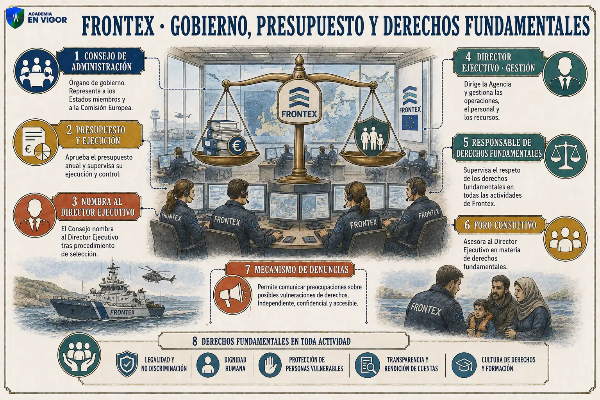

<em>Infografía: Frontex: gobierno, presupuesto y derechos fundamentales mediante línea temporal.</em>

<!-- FUENTE: UE-FRONTEX-2019-1896-T06 -->

## 31. CEPOL: misión, sede y destinatarios

CEPOL desarrolla formación y una cultura común de cooperación entre autoridades policiales.

### Claves rápidas

- CEPOL es la Agencia de la Unión Europea para la Formación Policial.
- CEPOL tiene su sede en Budapest.
- CEPOL apoya, desarrolla, ejecuta y coordina formación para autoridades policiales dentro de su mandato.

:::perla-vigor
Ancla el bloque en **Reglamento, arts. 1 a 4** y responde en este orden: naturaleza, ámbito, sede, órgano y función.
:::

<!-- VISUAL:t06-31-cepol-mision-sede-y-destinatarios.webp -->

  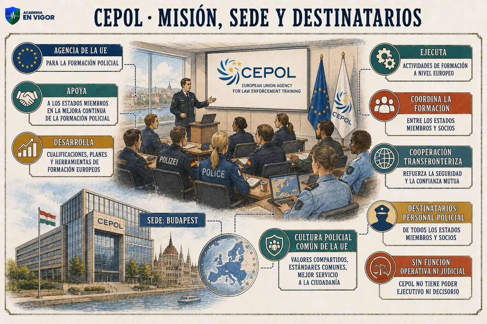

<em>Infografía: CEPOL: misión, sede y destinatarios mediante organigrama.</em>

<!-- FUENTE: UE-CEPOL-2015-2219-T06 -->

## 32. CEPOL: organización y red nacional

La Agencia opera como red: un Consejo de Administración fija prioridades, un director ejecutivo gestiona y las unidades nacionales conectan a los Estados.

### Claves rápidas

- CEPOL está dirigida por un director ejecutivo responsable ante su Consejo de Administración.
- El Consejo de Administración cuenta con representantes de los Estados miembros y de la Comisión conforme al Reglamento.
- Cada Estado miembro establece o designa una Unidad Nacional CEPOL como enlace con su red de centros de formación.

:::perla-vigor
Ancla el bloque en **Reglamento, arts. 7 a 23** y responde en este orden: naturaleza, ámbito, sede, órgano y función.
:::

<!-- VISUAL:t06-32-cepol-organizacion-y-red-nacional.webp -->

  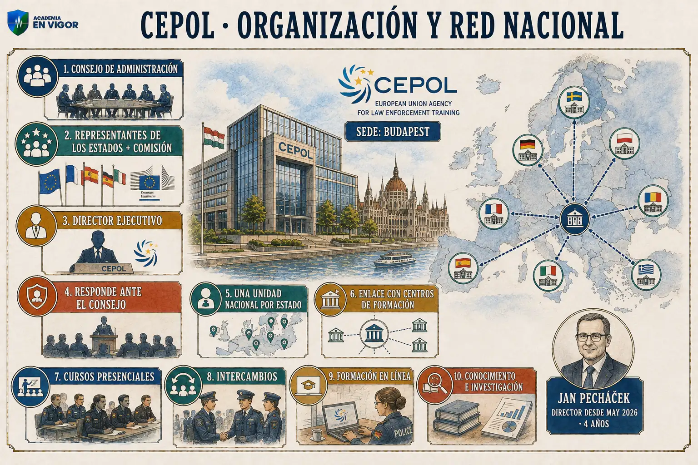

<em>Infografía: CEPOL: organización y red nacional mediante flujo de decisión.</em>

<!-- FUENTE: UE-CEPOL-2015-2219-T06 -->

## 33. FAO: origen, sede, miembros y objetivo

La FAO es el organismo especializado de la ONU que lidera la cooperación internacional contra el hambre y por la seguridad alimentaria.

### Claves rápidas

- La Constitución de la FAO fue firmada en Quebec el 16 de octubre de 1945.
- La sede de la FAO está en Roma.
- La FAO es un organismo especializado de las Naciones Unidas que lidera los esfuerzos internacionales para derrotar el hambre.

:::perla-vigor
Ancla el bloque en **Constitución, preámbulo y arts. I y II** y responde en este orden: naturaleza, ámbito, sede, órgano y función.
:::

<!-- VISUAL:t06-33-fao-origen-sede-miembros-y-objetivo.webp -->

  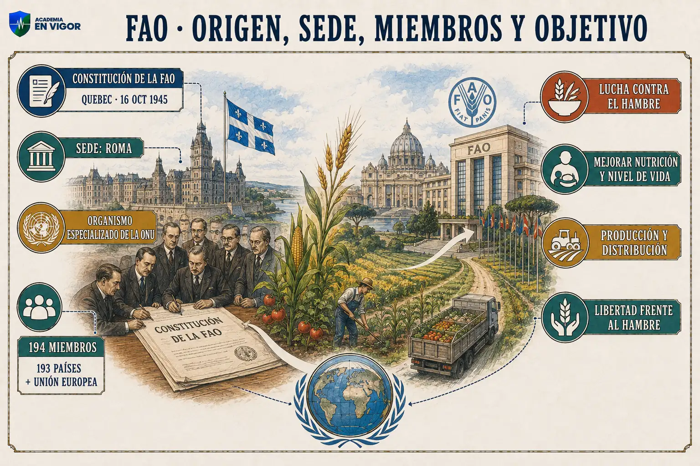

<em>Infografía: FAO: origen, sede, miembros y objetivo mediante mapa geográfico.</em>

<!-- FUENTE: FAO-CONSTITUCION-T06 -->

## 34. FAO: Conferencia, Consejo y Director General

Los órganos rectores ordenan la decisión política, la supervisión entre períodos de sesiones y la dirección administrativa.

### Claves rápidas

- La Conferencia de la FAO es el órgano supremo y celebra períodos ordinarios de sesiones una vez cada dos años.
- Cada miembro dispone de un voto en la Conferencia, con las particularidades aplicables a la organización miembro.
- El Consejo de la FAO está compuesto por 49 Estados miembros elegidos por la Conferencia.

:::perla-vigor
Ancla el bloque en **Constitución, arts. III a VII** y responde en este orden: naturaleza, ámbito, sede, órgano y función.
:::

<!-- VISUAL:t06-34-fao-conferencia-consejo-y-director-general.webp -->

  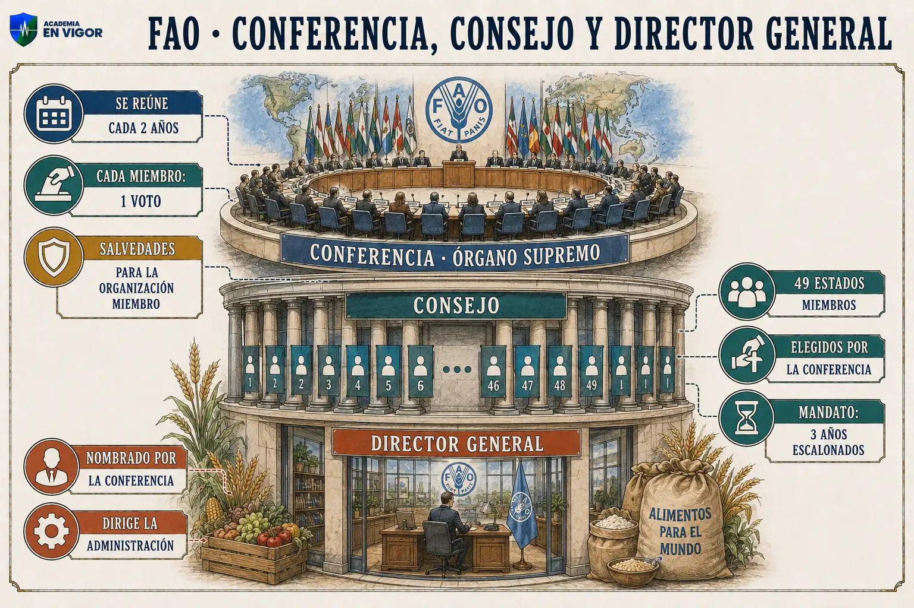

<em>Infografía: FAO: Conferencia, Consejo y Director General mediante corte por capas.</em>

<!-- FUENTE: FAO-CONSTITUCION-T06 -->

## 35. FAO: trabajo regional y financiación

La FAO despliega su mandato mediante oficinas y conferencias regionales, asistencia técnica, estadísticas y normas.

### Claves rápidas

- Las oficinas regionales organizan una Conferencia Regional de la FAO para su región cada dos años.
- Las conferencias regionales identifican problemas y prioridades de su región y formulan recomendaciones para el programa de trabajo.
- La FAO recopila, analiza, interpreta y difunde información sobre nutrición, alimentación y agricultura.

:::perla-vigor
Ancla el bloque en **reglas generales y organización territorial** y responde en este orden: naturaleza, ámbito, sede, órgano y función.
:::

<!-- VISUAL:t06-35-fao-trabajo-regional-y-financiacion.webp -->

  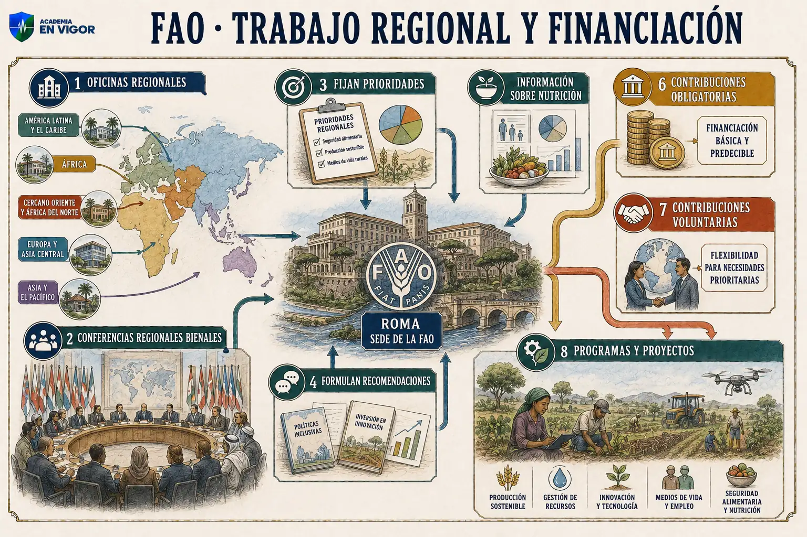

<em>Infografía: FAO: trabajo regional y financiación mediante escena mnemotécnica.</em>

<!-- FUENTE: FAO-CONSTITUCION-T06 -->

## 36. FMI: origen, miembros, sede y fines

El FMI nació del sistema de Bretton Woods para promover cooperación monetaria y estabilidad financiera.

### Claves rápidas

- El FMI fue concebido en la Conferencia de Bretton Woods de julio de 1944.
- A 9 de agosto de 2026 el FMI cuenta con 191 países miembros.
- La sede principal del FMI está en Washington D. C.

:::perla-vigor
Ancla el bloque en **Convenio constitutivo, art. I** y responde en este orden: naturaleza, ámbito, sede, órgano y función.
:::

<!-- VISUAL:t06-36-fmi-origen-miembros-sede-y-fines.webp -->

  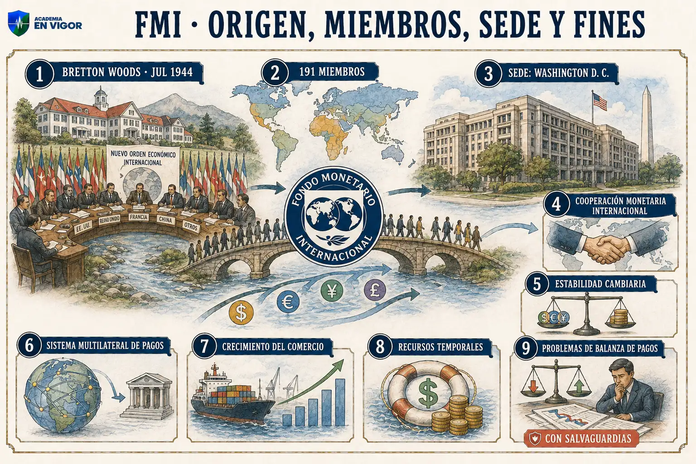

<em>Infografía: FMI: origen, miembros, sede y fines mediante mapa comparativo.</em>

<!-- FUENTE: FMI-CONVENIO-T06 -->

## 37. FMI: gobierno, cuotas y voto

El FMI es gobernado por sus miembros, pero el peso de voto se relaciona con las cuotas.

### Claves rápidas

- La Junta de Gobernadores es el máximo órgano decisorio del FMI y cada miembro designa un gobernador y un suplente.
- El Directorio Ejecutivo conduce la actividad cotidiana del FMI y está compuesto por 25 directores, con el Director Gerente como presidente.
- La cuota de un miembro influye en su aportación financiera, poder de voto, acceso a financiación y asignación de derechos especiales de giro.

:::perla-vigor
Ancla el bloque en **Convenio, arts. XII y XIII** y responde en este orden: naturaleza, ámbito, sede, órgano y función.
:::

<!-- VISUAL:t06-37-fmi-gobierno-cuotas-y-voto.webp -->

  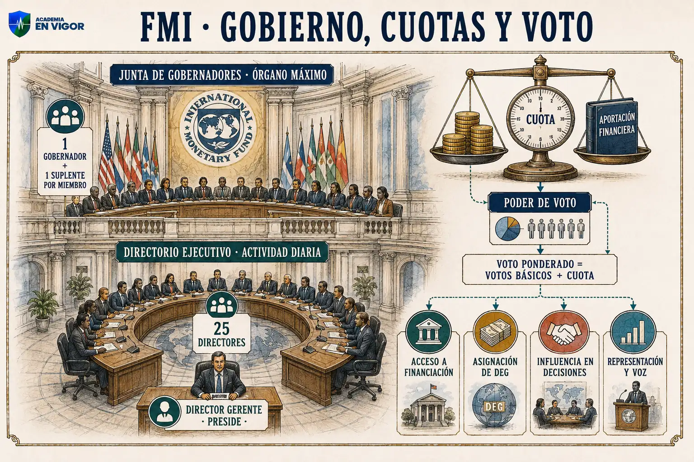

<em>Infografía: FMI: gobierno, cuotas y voto mediante línea temporal.</em>

<!-- FUENTE: FMI-CONVENIO-T06 -->

## 38. FMI: supervisión, préstamos y recursos

Las tres líneas de trabajo son vigilancia, financiación y desarrollo de capacidades.

### Claves rápidas

- El FMI supervisa las políticas económicas y financieras de sus miembros mediante vigilancia bilateral y análisis multilateral.
- El FMI presta a países con necesidades reales o potenciales de balanza de pagos y vincula el apoyo a políticas acordadas.
- El FMI proporciona asistencia técnica y formación para reforzar instituciones y capacidades económicas.

:::perla-vigor
Ancla el bloque en **Convenio, arts. IV, V y VII** y responde en este orden: naturaleza, ámbito, sede, órgano y función.
:::

<!-- VISUAL:t06-38-fmi-supervision-prestamos-y-recursos.webp -->

  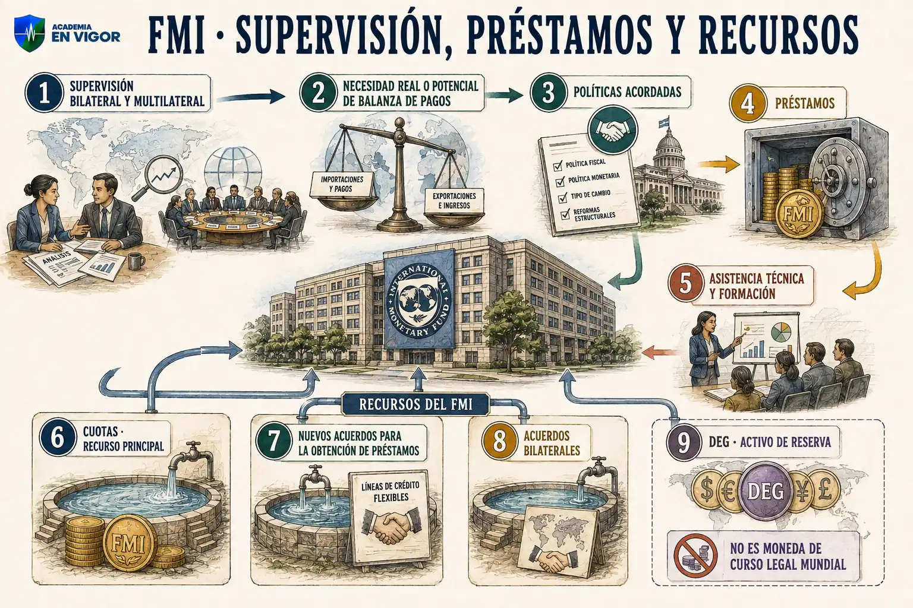

<em>Infografía: FMI: supervisión, préstamos y recursos mediante organigrama.</em>

<!-- FUENTE: FMI-CONVENIO-T06 -->

## 39. OMS: origen, miembros, sede y concepto de salud

La OMS dirige y coordina la acción sanitaria internacional dentro del sistema de Naciones Unidas.

### Claves rápidas

- La Constitución de la OMS fue adoptada en 1946 y entró en vigor el 7 de abril de 1948.
- La sede de la OMS está en Ginebra.
- A 9 de agosto de 2026 la OMS cuenta con 194 Estados miembros.

:::perla-vigor
Ancla el bloque en **Constitución, preámbulo y arts. 1 a 8** y responde en este orden: naturaleza, ámbito, sede, órgano y función.
:::

<!-- VISUAL:t06-39-oms-origen-miembros-sede-y-concepto-de-salud.webp -->

  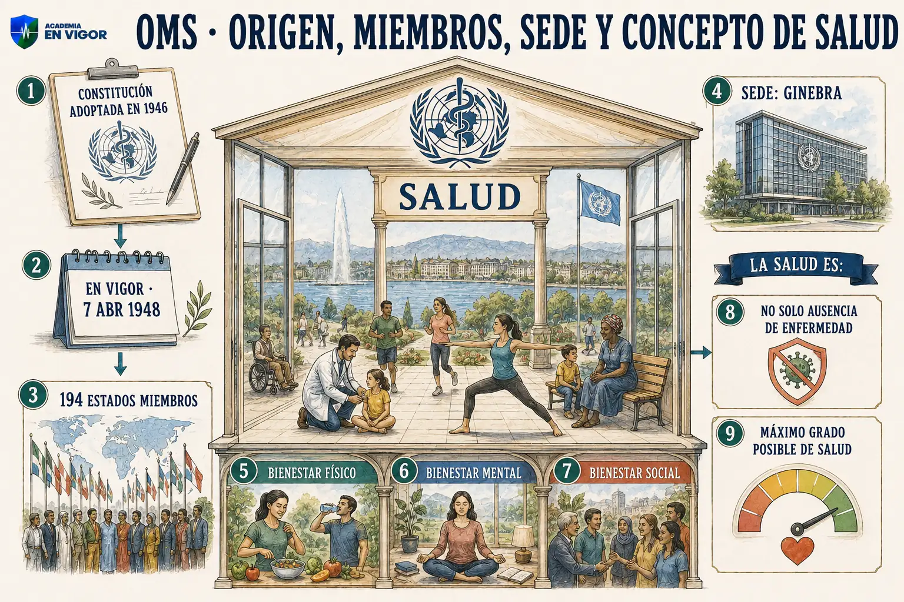

<em>Infografía: OMS: origen, miembros, sede y concepto de salud mediante flujo de decisión.</em>

<!-- FUENTE: OMS-CONSTITUCION-T06 -->

## 40. OMS: Asamblea Mundial, Consejo Ejecutivo y Secretaría

La labor se desarrolla mediante tres órganos: Asamblea Mundial de la Salud, Consejo Ejecutivo y Secretaría.

### Claves rápidas

- La labor de la OMS se realiza por la Asamblea Mundial de la Salud, el Consejo Ejecutivo y la Secretaría.
- La Asamblea Mundial de la Salud es el órgano decisorio supremo y celebra una reunión ordinaria anual.
- El Consejo Ejecutivo está integrado por 34 personas técnicamente cualificadas designadas por Estados miembros elegidos para ello.

:::perla-vigor
Ancla el bloque en **Constitución, arts. 9 a 37** y responde en este orden: naturaleza, ámbito, sede, órgano y función.
:::

<!-- VISUAL:t06-40-oms-asamblea-mundial-consejo-ejecutivo-y-secretaria.webp -->

  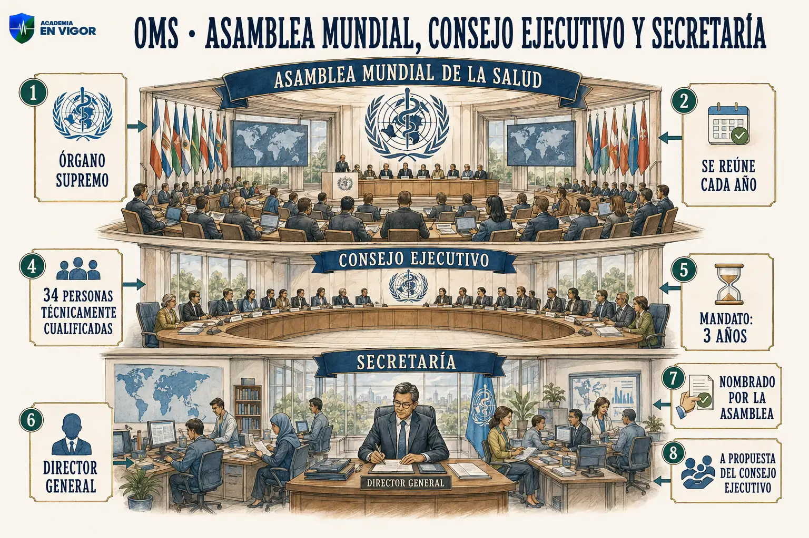

<em>Infografía: OMS: Asamblea Mundial, Consejo Ejecutivo y Secretaría mediante mapa geográfico.</em>

<!-- FUENTE: OMS-CONSTITUCION-T06 -->

## 41. OMS: funciones, regiones, financiación y Hub de Berlín

La OMS combina normas, vigilancia, cooperación técnica y respuesta a emergencias mediante una estructura global y regional.

### Claves rápidas

- La OMS se organiza en seis regiones, cada una con un comité regional y una oficina regional.
- La OMS desarrolla normas y estándares internacionales y coordina vigilancia, alerta y respuesta ante emergencias sanitarias.
- La financiación de la OMS procede principalmente de contribuciones señaladas de los Estados y de contribuciones voluntarias.

:::perla-vigor
Ancla el bloque en **Constitución, arts. 2 y 44 a 54 y datos institucionales** y responde en este orden: naturaleza, ámbito, sede, órgano y función.
:::

<!-- VISUAL:t06-41-oms-funciones-regiones-financiacion-y-hub-de-berlin.webp -->

  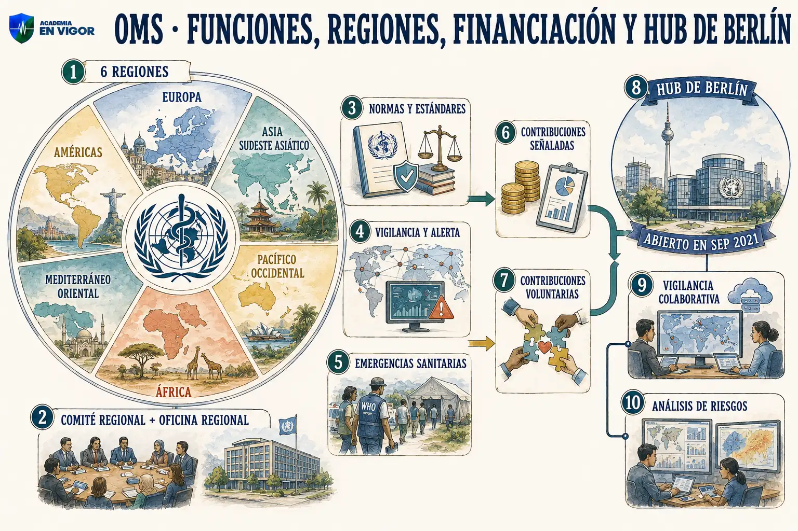

<em>Infografía: OMS: funciones, regiones, financiación y Hub de Berlín mediante corte por capas.</em>

<!-- FUENTE: OMS-CONSTITUCION-T06 -->

## 42. Comparaciones y trampas finales

El examen explota parecidos nominales, sedes compartidas y cambios de cifras o titulares.

### Claves rápidas

- Consejo de Europa, Consejo Europeo y Consejo de la Unión Europea son tres entidades distintas.
- La Haya alberga Europol y Eurojust, pero la primera es cooperación policial y la segunda cooperación judicial penal.
- La Corte Internacional de Justicia es órgano de la ONU; el Tribunal Europeo de Derechos Humanos pertenece al Consejo de Europa y el Tribunal de Justicia pertenece a la UE.

:::perla-vigor
Ancla el bloque en **síntesis del epígrafe** y responde en este orden: naturaleza, ámbito, sede, órgano y función.
:::

<!-- VISUAL:t06-42-comparaciones-y-trampas-finales.webp -->

  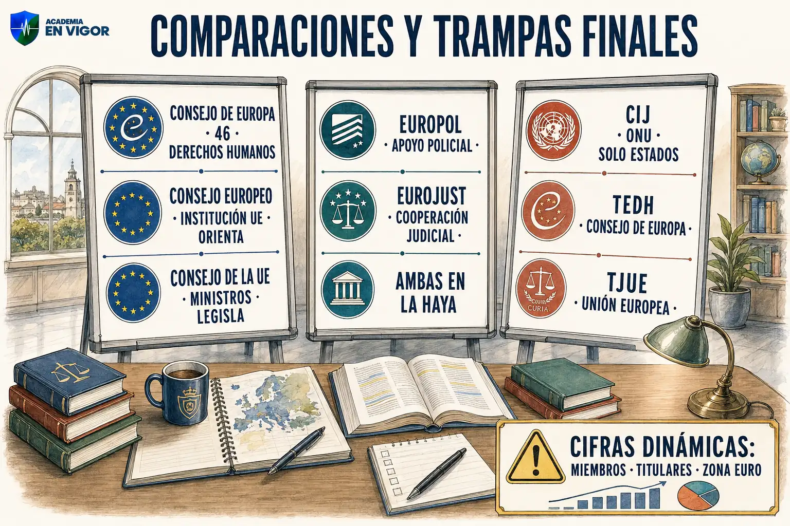

<em>Infografía: Comparaciones y trampas finales mediante escena mnemotécnica.</em>

<!-- FUENTE: GC-PROGRAMA-2026-T06 -->

# Hablemos claro

:::hablemos-claro
La pregunta decisiva es **qué hace cada institución y qué no puede hacer**. INTERPOL no detiene, Europol no sustituye a la policía nacional, Eurojust no juzga, Frontex no decide retornos y CEPOL no investiga. En el plano europeo, Consejo de Europa, Consejo Europeo y Consejo de la UE son entidades distintas.
:::

# En la calle

:::en-la-calle
Caso guía: una red opera en cinco países, mueve personas por una frontera exterior y necesita coordinar detenciones, pruebas y fiscales. INTERPOL puede aportar alcance mundial; Europol, análisis y apoyo policial UE; Eurojust, coordinación judicial; Frontex, apoyo fronterizo; CEPOL, formación. Ninguna sigla sustituye la competencia de la autoridad nacional.
:::

# Lo que cae

Prioridades reales del banco oficial: sedes; número de miembros; órganos; forma de nombramiento; diferencias entre agencias; fechas fundacionales; mayorías; funciones y límites. Los datos variables llevan fecha de corte.

# Ha caído

Se han verificado **66 preguntas oficiales** del Tema 6 entre 2020 y 2026.

| Institución | Apariciones |
|---|---:|
| ONU | 12 |
| Consejo de Europa | 9 |
| Unión Europea | 9 |
| OTAN | 8 |
| Europol | 6 |
| FAO | 4 |
| OMS | 4 |
| CEPOL | 3 |
| Eurojust | 3 |
| FMI | 3 |
| Frontex | 3 |
| INTERPOL | 2 |

> Las preguntas históricas sobre titulares, número de miembros o zona euro se conservan como evidencia de examen, pero se responden con el corte vigente indicado en este tema.

---

*Academia En Vigor · El temario que nunca duerme · Tema 6 · v1.0.0 · Documento interno no publicado.*
