# TEMA 9 · DERECHO PROCESAL PENAL

**Guardia Civil · Método VIGOR · PARTE**
**Versión de contenido:** 1.0.0
**Estado editorial:** approved_internal · **Publicación:** not_published

# Mapa del tema

| Parte | Contenido | Bloques |
|---|---|---:|
| 1 | Alcance y disposiciones generales | 1–7 |
| 2 | Inicio e instrucción del proceso | 8–13 |
| 3 | Comprobación del delito y prueba | 14–22 |
| 4 | Detención, defensa y registros | 23–30 |
| 5 | Habeas corpus | 31–34 |
| 6 | Organización judicial y cooperadores | 35–54 |
| 7 | Policía Judicial especializada | 55–59 |
| 8 | Derechos, protección y asistencia a víctimas | 60–71 |

<!-- VISUAL:t09-00-mapa-derecho-procesal-penal.webp -->

  

<em>Infografía: recorrido por órganos, actuaciones, garantías y víctimas.</em>

# Contenido

## 01. Mapa y alcance del Tema 9

Este bloque ordena **mapa y alcance del tema 9** dentro de alcance y disposiciones generales, distinguiendo órgano, presupuesto, plazo, actuación y efecto.

### Claves rápidas

- **epígrafe oficial:** El Tema 9 se divide en cinco bloques normativos: LECrim seleccionada, habeas corpus, LOPJ seleccionada, RD 769/1987 capítulos I a III y Estatuto de la Víctima.

:::perla-vigor
En procesal penal, identifica siempre quién actúa, ante qué órgano, dentro de qué plazo y con qué consecuencia.
:::

<!-- VISUAL:t09-01-mapa-y-alcance-del-tema-9.webp -->

  

<em>Infografía: flujo de mapa y alcance del tema 9.</em>

<!-- FUENTE: GC-PROGRAMA-2026-T09 -->

## 02. Competencia objetiva y primeras diligencias

Este bloque ordena **competencia objetiva y primeras diligencias** dentro de alcance y disposiciones generales, distinguiendo órgano, presupuesto, plazo, actuación y efecto.

### Claves rápidas

- **Artículo 12:** Sin embargo de lo dispuesto en el art. anterior, la jurisdicción ordinaria será siempre competente para prevenir las causas por delitos que cometan los aforados. Esta competencia se limitará a instruir las primeras diligencias, concluidas las cuales la jurisdicción ordinaria remitirá las actuaciones al Juez o Tribunal que deba conocer de la causa con arreglo a las Leyes, y pondrá a su disposición a los detenidos y los efectos ocupados.
- **Artículo 13:** Se consideran como primeras diligencias la de consignar las pruebas del delito que puedan desaparecer, la de recoger y poner en custodia cuanto conduzca a su comprobación y a la identificación del delincuente, la de detener, en su caso, a los presuntos responsables del delito y la de proteger a los ofendidos o perjudicados por el mismo, a sus familiares o a otras personas, o evitar la reiteración delictiva, pudiendo acordarse a tal efecto las medidas cautelares a las que se refiere el artículo 544 bis o la orden de protección prevista en el artículo 544 ter de esta ley.
- **Artículo 14:** Fuera de los casos que expresa y limitadamente atribuyen la Constitución y las leyes a Jueces y Tribunales determinados, serán competentes: 1. Para el conocimiento y fallo de los juicios por delito leve, la Sección de Instrucción de los Tribunales de Instancia, salvo que corresponda a las secciones con competencia en materia de violencia sobre la mujer o de violencia contra la infancia y la adolescencia de conformidad con los números 5 y 6 de este artículo.
- **Artículo 14:** 2. Para la instrucción de las causas, la Sección de Instrucción del Tribunal de Instancia del partido en que el delito se hubiere cometido, o las Secciones del Tribunal de Instancia con competencia en materia de violencia sobre la mujer o de violencia contra la infancia y la adolescencia, o el Juez Central de Instrucción respecto de los delitos que la Ley determine. 3.

:::perla-vigor
En procesal penal, identifica siempre quién actúa, ante qué órgano, dentro de qué plazo y con qué consecuencia.
:::

<!-- VISUAL:t09-02-competencia-objetiva-y-primeras-diligencias.webp -->

  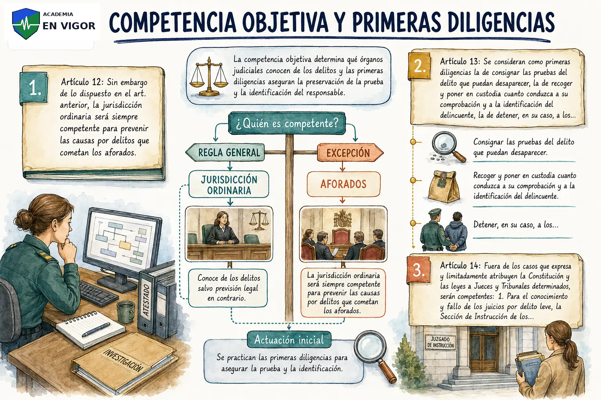

<em>Infografía: comparación de competencia objetiva y primeras diligencias.</em>

<!-- FUENTE: LECRIM-BOE-A-1882-6036-T09 -->

## 03. Competencia territorial y delitos conexos

Este bloque ordena **competencia territorial y delitos conexos** dentro de alcance y disposiciones generales, distinguiendo órgano, presupuesto, plazo, actuación y efecto.

### Claves rápidas

- **Artículo 15:** Cuando no conste el lugar en que se haya cometido una falta o delito, serán Jueces y Tribunales competentes en su caso para conocer de la causa o juicio: 1.º El del término municipal, partido o circunscripción en que se hayan descubierto pruebas materiales del delito. 2.º El del término municipal, partido o circunscripción en que el presunto reo haya sido aprehendido. 3.º El de la residencia del reo presunto. 4.º Cualquiera que hubiese tenido noticia del delito. Si se suscitase competencia entre estos Jueces o Tribunales, se decidirá dando la preferencia por el orden con que están expresados en los números que preceden.
- **Artículo 15:** Tan luego como conste el lugar en que se hubiese cometido el delito, el Juez o Tribunal que estuviere conociendo de la causa acordará la inhibición en favor del competente, poniendo en su caso los detenidos a disposición del mismo y acordando remitir, en la misma resolución las diligencias y efectos ocupados.
- **Artículo 15 bis:** En el caso de que se trate de algunos de los delitos o faltas cuya instrucción o conocimiento corresponda al Juez de Violencia sobre la Mujer, la competencia territorial vendrá determinada por el lugar del domicilio de la víctima, sin perjuicio de la adopción de la orden de protección, o de medidas urgentes del artículo 13 de la presente Ley que pudiera adoptar el Juez del lugar de comisión de los hechos.
- **Artículo 17:** 2. A los efectos de la atribución de jurisdicción y de la distribución de la competencia se consideran delitos conexos: 1.º Los cometidos por dos o más personas reunidas. 2.º Los cometidos por dos o más personas en distintos lugares o tiempos si hubiera precedido concierto para ello. 3.º Los cometidos como medio para perpetrar otros o facilitar su ejecución. 4.º Los cometidos para procurar la impunidad de otros delitos. 5.º Los delitos de favorecimiento real y personal y el blanqueo de capitales respecto al delito antecedente. 6.º Los cometidos por diversas personas cuando se ocasionen lesiones o daños recíprocos. 3.

:::perla-vigor
En procesal penal, identifica siempre quién actúa, ante qué órgano, dentro de qué plazo y con qué consecuencia.
:::

<!-- VISUAL:t09-03-competencia-territorial-y-delitos-conexos.webp -->

  

<em>Infografía: línea temporal de competencia territorial y delitos conexos.</em>

<!-- FUENTE: LECRIM-BOE-A-1882-6036-T09 -->

## 04. Acciones penal y civil: titulares

Este bloque ordena **acciones penal y civil: titulares** dentro de alcance y disposiciones generales, distinguiendo órgano, presupuesto, plazo, actuación y efecto.

### Claves rápidas

- **Artículo 100:** De todo delito o falta nace acción penal para el castigo del culpable, y puede nacer también acción civil para la restitución de la cosa, la reparación del daño y la indemnización de perjuicios causados por el hecho punible.
- **Artículo 101:** La acción penal es pública. Todos los ciudadanos españoles podrán ejercitarla con arreglo a las prescripciones de la Ley.
- **Artículo 103:** Tampoco podrán ejercitar acciones penales entre sí: 1.º Los cónyuges, a no ser por delito o falta cometidos por el uno contra la persona del otro o la de sus hijos, y por el delito de bigamia. 2.º Los ascendientes, descendientes y hermanos por naturaleza, por la adopción o por afinidad, a no ser por delito o falta cometidos por los unos contra las personas de los otros.
- **Artículo 106:** La acción penal por delito o falta que dé lugar al procedimiento de oficio no se extingue por la renuncia de la persona ofendida. Pero se extinguen por esta causa las que nacen de delito o falta que no puedan ser perseguidos sino a instancia de parte, y las civiles, cualquiera que sea el delito o falta de que procedan.

:::perla-vigor
En procesal penal, identifica siempre quién actúa, ante qué órgano, dentro de qué plazo y con qué consecuencia.
:::

<!-- VISUAL:t09-04-acciones-penal-y-civil-titulares.webp -->

  

<em>Infografía: escena de acciones penal y civil: titulares.</em>

<!-- FUENTE: LECRIM-BOE-A-1882-6036-T09 -->

## 05. Renuncia, extinción y reserva de acciones

Este bloque ordena **renuncia, extinción y reserva de acciones** dentro de alcance y disposiciones generales, distinguiendo órgano, presupuesto, plazo, actuación y efecto.

### Claves rápidas

- **Artículo 112:** Si se ejercitase sólo la civil que nace de un delito de los que no pueden perseguirse sino en virtud de querella particular, se considerará extinguida desde luego la acción penal.
- **Artículo 115:** La acción penal se extingue por la muerte del culpable; pero en este caso subsiste la civil contra sus herederos y causahabientes, que sólo podrá ejercitarse ante la jurisdicción y por la vía de lo civil.
- **Artículo 111:** Las acciones que nacen de un delito o falta podrán ejercitarse junta o separadamente; pero mientras estuviese pendiente la acción penal no se ejercitará la civil con separación hasta que aquélla haya sido resuelta en sentencia firme, salvo siempre lo dispuesto en los arts. 4.º, 5.º y 6.º de este Código.
- **Artículo 114:** Promovido juicio criminal en averiguación de un delito o falta, no podrá seguirse pleito sobre el mismo hecho; suspendiéndole si le hubiese, en el estado en que se hallare, hasta que recaiga sentencia firme en la causa criminal. No será necesario para el ejercicio de la acción penal que haya precedido el de la civil originada del mismo delito o falta. Lo dispuesto en este artículo se entiende sin perjuicio de lo establecido en el capítulo II, título I de este libro, respecto a las cuestiones prejudiciales.

:::perla-vigor
En procesal penal, identifica siempre quién actúa, ante qué órgano, dentro de qué plazo y con qué consecuencia.
:::

<!-- VISUAL:t09-05-renuncia-extincion-y-reserva-de-acciones.webp -->

  

<em>Infografía: capas de renuncia, extinción y reserva de acciones.</em>

<!-- FUENTE: LECRIM-BOE-A-1882-6036-T09 -->

## 06. Derecho de defensa y asistencia jurídica gratuita

Este bloque ordena **derecho de defensa y asistencia jurídica gratuita** dentro de alcance y disposiciones generales, distinguiendo órgano, presupuesto, plazo, actuación y efecto.

### Claves rápidas

- **Artículo 119:** 1. Cuando de acuerdo con lo dispuesto en el artículo 118 de esta Ley, haya de procederse a la imputación de una persona jurídica, se practicará con ésta la comparecencia prevista en el artículo 775, con las siguientes particularidades: a) La citación se hará en el domicilio social de la persona jurídica, requiriendo a la entidad que proceda a la designación de un representante, así como Abogado y Procurador para ese procedimiento, con la advertencia de que, en caso de no hacerlo, se procederá a la designación de oficio de estos dos últimos. La falta de designación del representante no impedirá la sustanciación del procedimiento con el Abogado y Procurador designado.
- **Artículo 119:** d) La designación del Procurador sustituirá a la indicación del domicilio a efectos de notificaciones, practicándose con el Procurador designado todos los actos de comunicación posteriores, incluidos aquellos a los que esta Ley asigna carácter personal. Si el Procurador ha sido nombrado de oficio se comunicará su identidad a la persona jurídica imputada.
- **Artículo 121:** Todos los que sean parte en una causa, si no se les hubiere reconocido el derecho a la asistencia jurídica gratuita, tendrán obligación de satisfacer los derechos de los procuradores que les representen, los honorarios de los abogados que les defiendan, los de los peritos que informen a su instancia y las indemnizaciones de los testigos que presentaren, cuando los peritos y testigos, al declarar, hubiesen formulado su reclamación y el Juez o Tribunal la estimaren.
- **Artículo 121:** Ni durante la causa ni después de terminada tendrán la obligación de satisfacer las demás costas procesales, a no ser que a ello fueren condenados. Los que tuvieren reconocido el derecho a la asistencia jurídica gratuita, podrán valerse de abogado y procurador de su elección; pero en este caso estarán obligados a abonarles su honorarios y derechos, como se dispone respecto de los que no tengan reconocido dicho derecho, salvo que los profesionales de libre elección renunciaran a la percepción de honorarios o derechos en los términos previstos en el artículo 27 de la Ley de Asistencia Jurídica Gratuita.

:::perla-vigor
En procesal penal, identifica siempre quién actúa, ante qué órgano, dentro de qué plazo y con qué consecuencia.
:::

<!-- VISUAL:t09-06-derecho-de-defensa-y-asistencia-juridica-gratuita.webp -->

  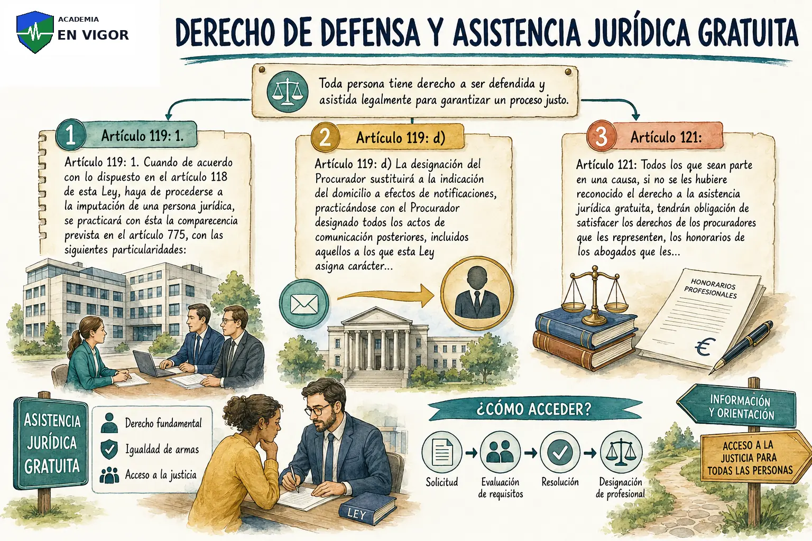

<em>Infografía: mapa de derecho de defensa y asistencia jurídica gratuita.</em>

<!-- FUENTE: LECRIM-BOE-A-1882-6036-T09 -->

## 07. Traducción e interpretación

Este bloque ordena **traducción e interpretación** dentro de alcance y disposiciones generales, distinguiendo órgano, presupuesto, plazo, actuación y efecto.

### Claves rápidas

- **Artículo 123:** 1. Los imputados o acusados que no hablen o entiendan el castellano o la lengua oficial en la que se desarrolle la actuación tendrán los siguientes derechos: a) Derecho a ser asistidos por un intérprete que utilice una lengua que comprenda durante todas las actuaciones en que sea necesaria su presencia, incluyendo el interrogatorio policial o por el Ministerio Fiscal y todas las vistas judiciales.
- **Artículo 123:** e) Derecho a presentar una solicitud motivada para que se considere esencial un documento. Los gastos de traducción e interpretación derivados del ejercicio de estos derechos serán sufragados por la Administración, con independencia del resultado del proceso. 2. En el caso de que no pueda disponerse del servicio de interpretación simultánea, la interpretación de las actuaciones del juicio oral a que se refiere la letra c) del apartado anterior se realizará mediante una interpretación consecutiva de modo que se garantice suficientemente la defensa del imputado o acusado.
- **Artículo 124:** 1. El traductor o intérprete judicial será designado de entre aquellos que se hallen incluidos en los listados elaborados por la Administración competente. Excepcionalmente, en aquellos supuestos que requieran la presencia urgente de un traductor o de un intérprete, y no sea posible la intervención de un traductor o intérprete judicial inscrito en las listas elaboradas por la Administración, en su caso, conforme a lo dispuesto en el apartado 5 del artículo anterior, se podrá habilitar como intérprete o traductor judicial eventual a otra persona conocedora del idioma empleado que se estime capacitado para el desempeño de dicha tarea.
- **Artículo 125:** 2. La decisión del Juez o Tribunal por la que se deniegue el derecho a la interpretación o a la traducción de algún documento o pasaje del mismo que la defensa considere esencial, o por la que se rechacen las quejas de la defensa con relación a la falta de calidad de la interpretación o de la traducción, será documentada por escrito. Si la decisión hubiera sido adoptada durante el juicio oral, la defensa del imputado o acusado podrá hacer constar en el acta su protesta. Contra estas decisiones judiciales podrá interponerse recurso de conformidad con lo dispuesto en esta Ley.

:::perla-vigor
En procesal penal, identifica siempre quién actúa, ante qué órgano, dentro de qué plazo y con qué consecuencia.
:::

<!-- VISUAL:t09-07-traduccion-e-interpretacion.webp -->

  

<em>Infografía: flujo de traducción e interpretación.</em>

<!-- FUENTE: LECRIM-BOE-A-1882-6036-T09 -->

## 08. Denuncia

Este bloque ordena **denuncia** dentro de inicio e instrucción del proceso, distinguiendo órgano, presupuesto, plazo, actuación y efecto.

### Claves rápidas

- **Artículo 259:** El que presenciare la perpetración de cualquier delito público está obligado a ponerlo inmediatamente en conocimiento del Juez de instrucción, de paz, comarcal o municipal o funcionario fiscal más próximo al sitio en que se hallare, bajo la multa de 25 a 250 pesetas.
- **Artículo 261:** Tampoco estarán obligados a denunciar: 1.º Quien sea cónyuge del delincuente no separado legalmente o de hecho o la persona que conviva con él en análoga relación de afectividad. 2.º Quienes sean ascendientes y descendientes del delincuente y sus parientes colaterales hasta el segundo grado inclusive.
- **Artículo 261:** Esta disposición no será aplicable cuando se trate de un delito contra la vida, de un delito de homicidio, de un delito de lesiones de los artículos 149 y 150 del Código Penal, de un delito de maltrato habitual previsto en el artículo 173.2 del Código Penal, de un delito contra la libertad o contra la libertad e indemnidad sexual o de un delito de trata de seres humanos y la víctima del delito sea una persona menor de edad o una persona con discapacidad necesitada de especial protección.
- **Artículo 263 bis:** 1. El Juez de Instrucción competente y el Ministerio Fiscal, así como los Jefes de las Unidades Orgánicas de Policía Judicial, centrales o de ámbito provincial, y sus mandos superiores podrán autorizar la circulación o entrega vigilada de drogas tóxicas, estupefacientes o sustancias psicotrópicas, así como de otras sustancias prohibidas.

:::perla-vigor
En procesal penal, identifica siempre quién actúa, ante qué órgano, dentro de qué plazo y con qué consecuencia.
:::

<!-- VISUAL:t09-08-denuncia.webp -->

  

<em>Infografía: comparación de denuncia.</em>

<!-- FUENTE: LECRIM-BOE-A-1882-6036-T09 -->

## 09. Querella

Este bloque ordena **querella** dentro de inicio e instrucción del proceso, distinguiendo órgano, presupuesto, plazo, actuación y efecto.

### Claves rápidas

- **Artículo 272:** La querella se interpondrá ante el Juez de instrucción competente. Si el querellado estuviere sometido por disposición especial de la Ley a determinado Tribunal, ante éste se interpondrá la querella. Lo mismo se hará cuando fueren varios los querellados por un mismo delito o por dos o más conexos y alguno de aquéllos estuviere sometido excepcionalmente a un Tribunal que no fuere el llamado a conocer, por regla general, del delito.
- **Artículo 277:** La querella se presentará siempre por medio de Procurador con poder bastante y suscrita por Letrado. Se extenderá en papel de oficio, y en ella se expresará: 1.º El Juez o Tribunal ante quien se presente. 2.º El nombre, apellidos y vecindad del querellante. 3.º El nombre, apellidos y vecindad del querellado. En el caso de ignorarse estas circunstancias, se deberá hacer la designación del querellado por las señas que mejor pudieran darle a conocer. 4.º La relación circunstanciada del hecho, con expresión del lugar, año, mes, día y hora en que se ejecutó, si se supieren. 5.º Expresión de las diligencias que se deberán practicar para la comprobación del hecho.
- **Artículo 277:** 6.º La petición de que se admita la querella, se practiquen las diligencias indicadas en el número anterior, se proceda a la detención y prisión del presunto culpable o a exigirle la fianza de libertad provisional, y se acuerde el embargo de sus bienes en la cantidad necesaria en los casos en que así proceda. 7.º La firma del querellante o la de otra persona a su ruego si no supiere o no pudiere firmar cuando el Procurador no tuviese poder especial para formular la querella.
- **Artículo 278:** Si la querella tuviere por objeto algún delito de los que solamente pueden perseguirse a instancia de parte, excepto el de violación o rapto, acompañará también la certificación que acredite haberse celebrado o intentado el acto de conciliación entre querellante y querellado. Podrán, sin embargo, practicarse sin este requisito las diligencias de carácter urgente para la comprobación de los hechos o para la detención del delincuente, suspendiendo después el curso de los autos hasta que se acredite el cumplimiento de lo dispuesto en el párrafo anterior.

:::perla-vigor
En procesal penal, identifica siempre quién actúa, ante qué órgano, dentro de qué plazo y con qué consecuencia.
:::

<!-- VISUAL:t09-09-querella.webp -->

  

<em>Infografía: línea temporal de querella.</em>

<!-- FUENTE: LECRIM-BOE-A-1882-6036-T09 -->

## 10. Policía Judicial: misión y agente encubierto

Este bloque ordena **policía judicial: misión y agente encubierto** dentro de inicio e instrucción del proceso, distinguiendo órgano, presupuesto, plazo, actuación y efecto.

### Claves rápidas

- **Artículo 282 bis:** 1. A los fines previstos en el artículo anterior y cuando se trate de investigaciones que afecten a actividades propias de la delincuencia organizada, el Juez de Instrucción competente o el Ministerio Fiscal dando cuenta inmediata al Juez, podrán autorizar a funcionarios de la Policía Judicial, mediante resolución fundada y teniendo en cuenta su necesidad a los fines de la investigación, a actuar bajo identidad supuesta y a adquirir y transportar los objetos, efectos e instrumentos del delito y diferir la incautación de los mismos.
- **Artículo 282 bis:** La identidad supuesta será otorgada por el Ministerio del Interior por el plazo de seis meses prorrogables por períodos de igual duración, quedando legítimamente habilitados para actuar en todo lo relacionado con la investigación concreta y a participar en el tráfico jurídico y social bajo tal identidad.
- **Artículo 282 bis:** La resolución por la que se acuerde deberá consignar el nombre verdadero del agente y la identidad supuesta con la que actuará en el caso concreto. La resolución será reservada y deberá conservarse fuera de las actuaciones con la debida seguridad. La información que vaya obteniendo el agente encubierto deberá ser puesta a la mayor brevedad posible en conocimiento de quien autorizó la investigación. Asimismo, dicha información deberá aportarse al proceso en su integridad y se valorará en conciencia por el órgano judicial competente.
- **Artículo 282 bis:** Ningún funcionario de la Policía Judicial podrá ser obligado a actuar como agente encubierto. 3. Cuando las actuaciones de investigación puedan afectar a los derechos fundamentales, el agente encubierto deberá solicitar del órgano judicial competente las autorizaciones que, al respecto, establezca la Constitución y la Ley, así como cumplir las demás previsiones legales aplicables. 4. A los efectos señalados en el apartado 1 de este artículo, se considerará como delincuencia organizada la asociación de tres o más personas para realizar, de forma permanente o reiterada, conductas que tengan como fin cometer alguno o algunos de los delitos siguientes:

:::perla-vigor
En procesal penal, identifica siempre quién actúa, ante qué órgano, dentro de qué plazo y con qué consecuencia.
:::

<!-- VISUAL:t09-10-policia-judicial-mision-y-agente-encubierto.webp -->

  

<em>Infografía: escena de policía judicial: misión y agente encubierto.</em>

<!-- FUENTE: LECRIM-BOE-A-1882-6036-T09 -->

## 11. Atestado, comunicación y diligencias policiales

Este bloque ordena **atestado, comunicación y diligencias policiales** dentro de inicio e instrucción del proceso, distinguiendo órgano, presupuesto, plazo, actuación y efecto.

### Claves rápidas

- **Artículo 284:** 2. No obstante, cuando no exista autor conocido del delito la Policía Judicial conservará el atestado a disposición del Ministerio Fiscal y de la autoridad judicial, sin enviárselo, salvo que concurra alguna de las siguientes circunstancias: a) Que se trate de delitos contra la vida, contra la integridad física, contra la libertad e indemnidad sexuales o de delitos relacionados con la corrupción; b) Que se practique cualquier diligencia después de transcurridas setenta y dos horas desde la apertura del atestado y éstas hayan tenido algún resultado; o c) Que el Ministerio Fiscal o la autoridad judicial soliciten la remisión.
- **Artículo 284:** Si hubieran recogido armas, instrumentos o efectos de cualquier clase que pudieran tener relación con el delito y se hallen en el lugar en que éste se cometió o en sus inmediaciones, o en poder del reo o en otra parte conocida, extenderán diligencia expresiva del lugar, tiempo y ocasión en que se encontraren, que incluirá una descripción minuciosa para que se pueda formar idea cabal de los mismos y de las circunstancias de su hallazgo, que podrá ser sustituida por un reportaje gráfico.
- **Artículo 288:** El Ministerio fiscal, los Jueces de instrucción y los municipales podrán entenderse directamente con los funcionarios de Policía judicial, cualquiera que sea su categoría, para todos los efectos de este título; pero si el servicio que de ellos exigiesen admitiese espera, deberán acudir al superior respectivo del funcionario de Policía judicial, mientras no necesitasen del inmediato auxilio de éste.
- **Artículo 289:** El funcionario de Policía judicial que por cualquier causa no pueda cumplir el requerimiento o la orden que hubiese recibido del Ministerio fiscal, del Juez de instrucción, del Juez municipal, o de la Autoridad o agente que hubiese prevenido las primeras diligencias, lo pondrá inmediatamente en conocimiento del que haya hecho el requerimiento o dado la orden para que provea de otro modo a su ejecución.

:::perla-vigor
En procesal penal, identifica siempre quién actúa, ante qué órgano, dentro de qué plazo y con qué consecuencia.
:::

<!-- VISUAL:t09-11-atestado-comunicacion-y-diligencias-policiales.webp -->

  

<em>Infografía: capas de atestado, comunicación y diligencias policiales.</em>

<!-- FUENTE: LECRIM-BOE-A-1882-6036-T09 -->

## 12. Sumario, secreto y autoridades instructoras

Este bloque ordena **sumario, secreto y autoridades instructoras** dentro de inicio e instrucción del proceso, distinguiendo órgano, presupuesto, plazo, actuación y efecto.

### Claves rápidas

- **Artículo 302:** a) evitar un riesgo grave para la vida, libertad o integridad física de otra persona; o b) prevenir una situación que pueda comprometer de forma grave el resultado de la investigación o del proceso. El secreto del sumario deberá alzarse necesariamente con al menos diez días de antelación a la conclusión del sumario. Lo dispuesto en este artículo se entenderá sin perjuicio de lo previsto en el párrafo segundo del apartado 3 del artículo 505.
- **Artículo 301 bis:** El Juez podrá acordar, de oficio o a instancia del Ministerio Fiscal o de la víctima, la adopción de cualquiera de las medidas a que se refiere el apartado 2 del artículo 681 cuando resulte necesario para proteger la intimidad de la víctima o el respeto debido a la misma o a su familia.
- **Artículo 303:** El nombramiento de Juez instructor únicamente podrá recaer en un Magistrado del mismo Tribunal, o en un funcionario del orden judicial en activo servicio de los existentes dentro del territorio de dicho Tribunal. Una vez designado, obrará con jurisdicción propia e independiente. Cuando el instructor fuese un Magistrado, podrá delegar sus funciones, en caso de imprescindible necesidad, en el Juez de instrucción del punto donde hayan de practicarse las diligencias.
- **Artículo 299:** Constituyen el sumario las actuaciones encaminadas a preparar el juicio y practicadas para averiguar y hacer constar la perpetración de los delitos con todas las circunstancias que puedan influir en su calificación y la culpabilidad de los delincuentes, asegurando sus personas y las responsabilidades pecuniarias de los mismos.

:::perla-vigor
En procesal penal, identifica siempre quién actúa, ante qué órgano, dentro de qué plazo y con qué consecuencia.
:::

<!-- VISUAL:t09-12-sumario-secreto-y-autoridades-instructoras.webp -->

  

<em>Infografía: mapa de sumario, secreto y autoridades instructoras.</em>

<!-- FUENTE: LECRIM-BOE-A-1882-6036-T09 -->

## 13. Formación y dirección de la instrucción

Este bloque ordena **formación y dirección de la instrucción** dentro de inicio e instrucción del proceso, distinguiendo órgano, presupuesto, plazo, actuación y efecto.

### Claves rápidas

- **Artículo 307:** En el caso de que el Juez municipal comenzare a instruir las primeras diligencias del sumario, practicadas que sean las más urgentes y todas las que el Juez de instrucción le hubiere prevenido, le remitirá la causa, que nunca podrá retener más de tres días.
- **Artículo 324:** 1. La investigación judicial se desarrollará en un plazo máximo de doce meses desde la incoación de la causa. Si, con anterioridad a la finalización del plazo, se constatare que no será posible finalizar la investigación, el juez, de oficio o a instancia de parte, oídas las partes podrá acordar prórrogas sucesivas por periodos iguales o inferiores a seis meses.
- **Artículo 306:** También podrá delegar sus funciones en los Fiscales municipales. Tan pronto como se ordene la incoación del procedimiento para las causas ante el Tribunal del Jurado, se pondrán en conocimiento del Ministerio Fiscal quien comparecerá e intervendrá en cuantas actuaciones se lleven a cabo ante aquél. Cuando en los órganos judiciales existan los medios técnicos precisos, el fiscal podrá intervenir en las actuaciones de cualquier procedimiento penal, incluida la comparecencia del artículo 505, mediante videoconferencia u otro sistema similar que permita la comunicación bidireccional y simultánea de la imagen y el sonido.
- **Artículo 308:** Inmediatamente que los Jueces de instrucción o de Paz, en su caso, tuvieren noticia de la perpetración de un delito, el Secretario judicial lo pondrá en conocimiento del Fiscal de la respectiva Audiencia, y dará, además, parte al Presidente de ésta de la formación del sumario, en relación sucinta, suficientemente expresiva del hecho, de sus circunstancias y de su autor, dentro de los dos días siguientes al en que hubieren principiado a instruirle. Los Jueces de Paz darán cuenta inmediata de la prevención de las diligencias al de Instrucción a quien corresponda.

:::perla-vigor
En procesal penal, identifica siempre quién actúa, ante qué órgano, dentro de qué plazo y con qué consecuencia.
:::

<!-- VISUAL:t09-13-formacion-y-direccion-de-la-instruccion.webp -->

  

<em>Infografía: flujo de formación y dirección de la instrucción.</em>

<!-- FUENTE: LECRIM-BOE-A-1882-6036-T09 -->

## 14. Inspección ocular

Este bloque ordena **inspección ocular** dentro de comprobación del delito y prueba, distinguiendo órgano, presupuesto, plazo, actuación y efecto.

### Claves rápidas

- **Artículo 333:** Cuando al practicarse las diligencias enumeradas en los artículos anteriores hubiese alguna persona declarada procesada como presunta autora del hecho punible, podrá presenciarlas, ya sola, ya asistida del defensor que eligiese o le fuese nombrado de oficio, si así lo solicitara; uno y otro podrán hacer en el acto las observaciones que estimen pertinentes, las cuales se consignarán por diligencia si no fuesen aceptadas.
- **Artículo 328:** Si se tratare de un robo o de cualquier otro delito cometido con fractura, escalamiento o violencia, el Juez instructor deberá describir los vestigios que haya dejado y consultará el parecer de peritos sobre la manera, instrumentos, medios o tiempo de la ejecución del delito.
- **Artículo 329:** Para llevar a efecto lo dispuesto en los artículos anteriores, podrá ordenar el Juez instructor que no se ausenten durante la diligencia de descripción las personas que hubieren sido halladas en el lugar del delito y que comparezcan además inmediatamente las que se encontraren en cualquier otro sitio próximo, recibiendo a todas separadamente la oportuna declaración.
- **Artículo 326:** Cuando el delito que se persiga haya dejado vestigios o pruebas materiales de su perpetración, el Juez instructor o el que haga sus veces ordenará que se recojan y conserven para el juicio oral si fuere posible, procediendo al efecto a la inspección ocular y a la descripción de todo aquello que pueda tener relación con la existencia y naturaleza del hecho. A este fin, hará consignar en los autos la descripción del lugar del delito, el sitio y estado en que se hallen los objetos que en él se encuentren, los accidentes del terreno o situación de las habitaciones y todos los demás detalles que puedan utilizarse, tanto para la acusación como para la defensa.

:::perla-vigor
En procesal penal, identifica siempre quién actúa, ante qué órgano, dentro de qué plazo y con qué consecuencia.
:::

<!-- VISUAL:t09-14-inspeccion-ocular.webp -->

  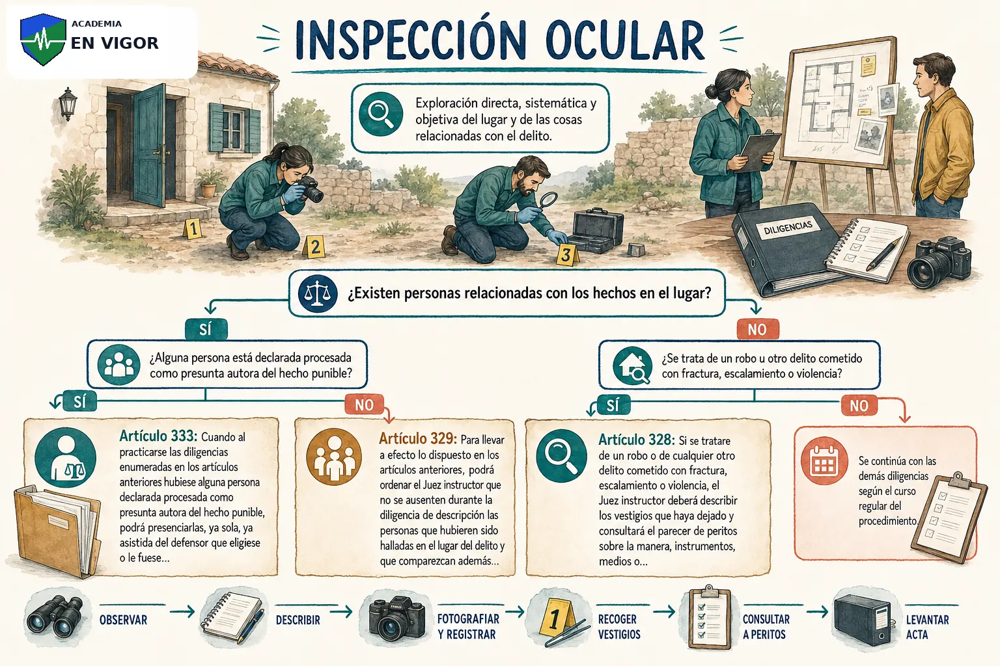

<em>Infografía: comparación de inspección ocular.</em>

<!-- FUENTE: LECRIM-BOE-A-1882-6036-T09 -->

## 15. Cuerpo del delito

Este bloque ordena **cuerpo del delito** dentro de comprobación del delito y prueba, distinguiendo órgano, presupuesto, plazo, actuación y efecto.

### Claves rápidas

- **Artículo 363:** Los Juzgados y Tribunales ordenarán la práctica de los análisis químicos únicamente en los casos en que consideren absolutamente indispensables para la necesaria investigación judicial y la recta administración de justicia. Siempre que concurran acreditadas razones que lo justifiquen, el Juez de Instrucción podrá acordar, en resolución motivada, la obtención de muestras biológicas del sospechoso que resulten indispensables para la determinación de su perfil de ADN. A tal fin, podrá decidir la práctica de aquellos actos de inspección, reconocimiento o intervención corporal que resulten adecuados a los principios de proporcionalidad y razonabilidad.
- **Artículo 334:** La persona afectada por la incautación podrá recurrir en cualquier momento la medida ante el Juez de Instrucción. Este recurso no requerirá de la intervención de abogado cuando sea presentado por terceras personas diferentes del imputado. El recurso se entenderá interpuesto cuando la persona afectada por la medida o un familiar suyo mayor de edad hubieran expresado su disconformidad en el momento de la misma.
- **Artículo 341:** No habiendo testigos de conocimiento, si el estado del cadáver lo permitiere, se expondrá al público antes de practicarse la autopsia, por tiempo a lo menos de veinticuatro horas, expresando en un cartel, que se fijará a la puerta del depósito de cadáveres, el sitio, hora y día en que aquél se hubiese hallado y el Juez que estuviese instruyendo el sumario, a fin de que quien tenga algún dato que pueda contribuir al reconocimiento del cadáver o al esclarecimiento del delito y de sus circunstancias lo comunique al Juez instructor.
- **Artículo 345:** El Médico forense residirá en la capital del Juzgado para que haya sido nombrado, y no podrá ausentarse de ella sin licencia del Juez, del Presidente de la Audiencia de lo criminal o del Ministro de Gracia y Justicia, según que sea por ocho días a lo más, en el primer caso, veinte en el segundo y por el tiempo que el Ministro estime conveniente en el tercero.

:::perla-vigor
En procesal penal, identifica siempre quién actúa, ante qué órgano, dentro de qué plazo y con qué consecuencia.
:::

<!-- VISUAL:t09-15-cuerpo-del-delito.webp -->

  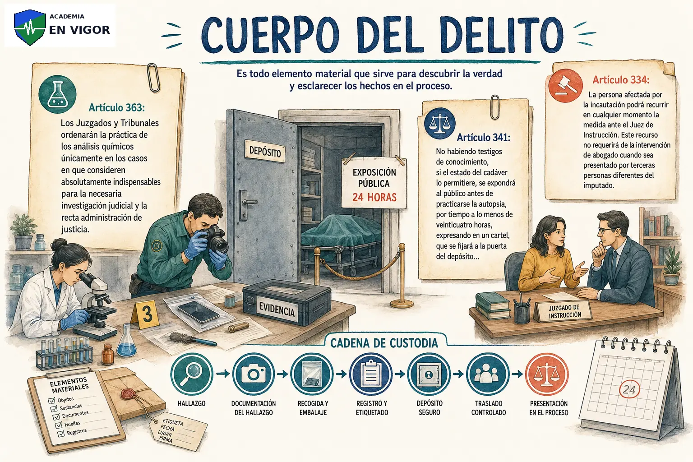

<em>Infografía: línea temporal de cuerpo del delito.</em>

<!-- FUENTE: LECRIM-BOE-A-1882-6036-T09 -->

## 16. Destrucción y realización anticipada de efectos

Este bloque ordena **destrucción y realización anticipada de efectos** dentro de comprobación del delito y prueba, distinguiendo órgano, presupuesto, plazo, actuación y efecto.

### Claves rápidas

- **Artículo 367 ter:** 1. Podrá decretarse la destrucción de los efectos judiciales, dejando muestras suficientes, cuando resultare necesaria o conveniente por la propia naturaleza de los efectos intervenidos o por el peligro real o potencial que comporte su almacenamiento o custodia, previa audiencia al Ministerio Fiscal y al propietario, si fuere conocido, o a la persona en cuyo poder fueron hallados los efectos cuya destrucción se pretende.
- **Artículo 367 quáter:** e) Cuando se trate de efectos que, sin sufrir deterioro material, se deprecien sustancialmente por el transcurso del tiempo. f) Cuando, debidamente requerido el propietario sobre el destino del efecto judicial, no haga manifestación alguna. 2. Cuando concurra alguno de los supuestos previstos en el apartado anterior, el juez, de oficio o a instancia del Ministerio Fiscal, de las partes o de la Oficina de Recuperación y Gestión de Activos, y previa audiencia del interesado, acordará la realización de los efectos judiciales, salvo que concurra alguna de las siguientes circunstancias:
- **Artículo 367 quinquies:** 1. La realización de los efectos judiciales podrá consistir en: a) La entrega a entidades sin ánimo de lucro o a las Administraciones públicas. b) La realización por medio de persona o entidad especializada. c) La subasta pública. 2. Podrá entregarse el efecto judicial a entidades sin ánimo de lucro o a las Administraciones públicas cuando sea de ínfimo valor o se prevea que la realización por medio de persona o entidad especializada o por medio de subasta pública será antieconómica.
- **Artículo 367 sexies:** 1. Podrá autorizarse la utilización provisional de los bienes o efectos decomisados cautelarmente en los siguientes casos: a) Cuando concurran las circunstancias expresadas en las letras b) a f) del apartado 1 del artículo 367 quater, y la utilización de los efectos permita a la Administración un aprovechamiento de su valor mayor que con la realización anticipada, o no se considere procedente la realización anticipada de los mismos. b) Cuando se trate de efectos especialmente idóneos para la prestación de un servicio público.

:::perla-vigor
En procesal penal, identifica siempre quién actúa, ante qué órgano, dentro de qué plazo y con qué consecuencia.
:::

<!-- VISUAL:t09-16-destruccion-y-realizacion-anticipada-de-efectos.webp -->

  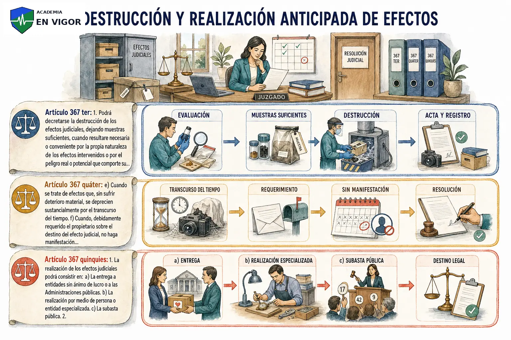

<em>Infografía: escena de destrucción y realización anticipada de efectos.</em>

<!-- FUENTE: LECRIM-BOE-A-1882-6036-T09 -->

## 17. Identidad y circunstancias del investigado

Este bloque ordena **identidad y circunstancias del investigado** dentro de comprobación del delito y prueba, distinguiendo órgano, presupuesto, plazo, actuación y efecto.

### Claves rápidas

- **Artículo 369:** A presencia de todas ellas, o desde un punto en que no pudiere ser visto, según al Juez pareciere más conveniente, el que deba practicar el reconocimiento manifestará si se encuentra en la rueda o grupo la persona a quien hubiese hecho referencia en sus declaraciones, designándola, en caso afirmativo, clara y determinadamente. En la diligencia que se extienda se harán constar todas las circunstancias del acto, así como los nombres de todos los que hubiesen formado la rueda o grupo.
- **Artículo 370:** Cuando fueren varios los que hubieren de reconocer a una persona, la diligencia expresada en el artículo anterior deberá practicarse separadamente con cada uno de ellos, sin que puedan comunicarse entre sí hasta que se haya efectuado el último reconocimiento. Cuando fueren varios los que hubieren de ser reconocidos por una misma persona, podrá hacerse el reconocimiento de todos en un solo acto.
- **Artículo 376:** Cuando no ofreciere duda la identidad del procesado, y conocidamente tuviese la edad que el Código penal requiere para poderle exigir la responsabilidad criminal en toda su extensión, podrá prescindirse de la justificación expresada en el artículo anterior, si su práctica ofreciese alguna dificultad u ocasionase dilaciones extraordinarias. En las actuaciones sucesivas y durante el juicio, el procesado será designado con el nombre con que fuere conocido o con el que él mismo dijere tener.
- **Artículo 377:** Si el Juez instructor lo considerase conveniente, podrá pedir informes sobre el procesado a las Alcaldías o a los correspondientes funcionarios de policía del pueblo o pueblos en que hubiese residido. Estos informes serán fundados, y si no fuere posible fundarlos, se manifestará la causa que lo impidiere. Los que los dieren no contraerán responsabilidad alguna, salvo en el caso de dolo o negligencia grave.

:::perla-vigor
En procesal penal, identifica siempre quién actúa, ante qué órgano, dentro de qué plazo y con qué consecuencia.
:::

<!-- VISUAL:t09-17-identidad-y-circunstancias-del-investigado.webp -->

  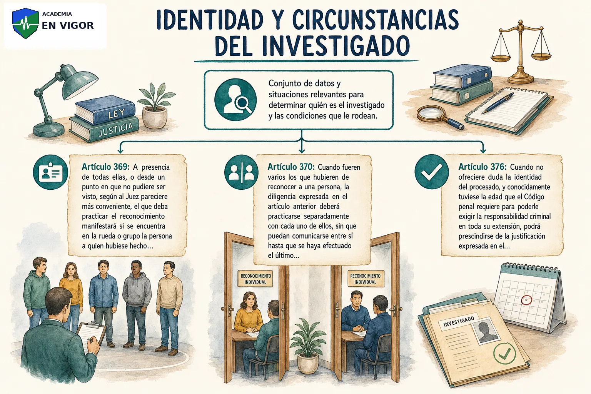

<em>Infografía: capas de identidad y circunstancias del investigado.</em>

<!-- FUENTE: LECRIM-BOE-A-1882-6036-T09 -->

## 18. Declaraciones de los procesados

Este bloque ordena **declaraciones de los procesados** dentro de comprobación del delito y prueba, distinguiendo órgano, presupuesto, plazo, actuación y efecto.

### Claves rápidas

- **Artículo 386:** Si el procesado estuviere detenido, se le recibirá la primera declaración dentro del término de veinticuatro horas. Este plazo podrá prorrogarse por otras cuarenta y ocho, si mediare causa grave, la cual se expresará en la providencia en que se acordase la prórroga.
- **Artículo 389:** Las preguntas que se le hagan en todas las declaraciones que hubiere de prestar se dirigirán a la averiguación de los hechos y a la participación en ellos del procesado y de las demás personas que hubieren contribuido a ejecutarlos o encubrirlos. Las preguntas serán directas, sin que por ningún concepto puedan hacérsele de un modo capcioso o sugestivo. Tampoco se podrá emplear con el procesado género alguno de coacción o amenaza.
- **Artículo 390:** Las relaciones que hagan los procesados o respuestas que den serán orales. Sin embargo, el Juez de instrucción, teniendo siempre en cuenta las circunstancias de aquéllos y la naturaleza de la causa, podrá permitirles que redacten a su presencia una contestación escrita sobre puntos difíciles de explicar, o que también consulten a su presencia apuntes o notas.
- **Artículo 391:** Se pondrán de manifiesto al procesado todos los objetos que constituyen el cuerpo del delito o los que el Juez considere conveniente, a fin de que los reconozca. Se le interrogará sobre la procedencia de dichos objetos, su destino y la razón de haberlos encontrado en su poder y, en general, será siempre interrogado sobre cualquier otra circunstancia que conduzca al esclarecimiento de la verdad. El Juez podrá ordenar al procesado, pero sin emplear ningún género de coacción, que escriba a su presencia algunas palabras o frases, cuando esta medida la considere útil para desvanecer las dudas que surjan sobre la legitimidad de un escrito que se le atribuya.

:::perla-vigor
En procesal penal, identifica siempre quién actúa, ante qué órgano, dentro de qué plazo y con qué consecuencia.
:::

<!-- VISUAL:t09-18-declaraciones-de-los-procesados.webp -->

  

<em>Infografía: mapa de declaraciones de los procesados.</em>

<!-- FUENTE: LECRIM-BOE-A-1882-6036-T09 -->

## 19. Testigos: deber, exenciones y dispensas

Este bloque ordena **testigos: deber, exenciones y dispensas** dentro de comprobación del delito y prueba, distinguiendo órgano, presupuesto, plazo, actuación y efecto.

### Claves rápidas

- **Artículo 411:** Se exceptúan de lo dispuesto en el artículo anterior: el Rey, la Reina, sus respectivos consortes, el Príncipe heredero y los Regentes del Reino. También están exentos del deber de declarar los Agentes Diplomáticos acreditados en España, en todo caso, y el personal administrativo, técnico o de servicio de las misiones diplomáticas, así como sus familiares, si concurren en ellos los requisitos exigidos en los tratados.
- **Artículo 412:** 1. Estarán exentas también de concurrir al llamamiento del Juez, pero no de declarar, pudiendo hacerlo por escrito, las demás personas de la Familia Real. 2. Están exentos de concurrir al llamamiento del Juez, pero no de declarar, pudiendo informar por escrito sobre los hechos de que tengan conocimiento por razón de su cargo: 1.º El Presidente y los demás miembros del Gobierno. 2.º Los Presidentes del Congreso de los Diputados y del Senado.
- **Artículo 412:** 4. Quienes hubiesen desempeñado los cargos a que se refiere el apartado 2 del presente artículo estarán igualmente exentos de concurrir al llamamiento del Juez, pero no de declarar, pudiendo informar por escrito sobre los hechos de que hubieren tenido conocimiento por razón de su cargo.
- **Artículo 417:** No podrán ser obligados a declarar como testigos: 1.º Los eclesiásticos y ministros de los cultos disidentes, sobre los hechos que les fueren revelados en el ejercicio de las funciones de su ministerio. 2.º Los funcionarios públicos, tanto civiles como militares, de cualquiera clase que sean, cuando no pudieren declarar sin violar el secreto que por razón de sus cargos estuviesen obligados a guardar, o cuando, procediendo en virtud de obediencia debida, no fueren autorizados por su superior jerárquico para prestar declaración que se les pida. 3.º Los incapacitados física o moralmente.

:::perla-vigor
En procesal penal, identifica siempre quién actúa, ante qué órgano, dentro de qué plazo y con qué consecuencia.
:::

<!-- VISUAL:t09-19-testigos-deber-exenciones-y-dispensas.webp -->

  

<em>Infografía: flujo de testigos: deber, exenciones y dispensas.</em>

<!-- FUENTE: LECRIM-BOE-A-1882-6036-T09 -->

## 20. Testigos: declaración, protección y prueba preconstituida

Este bloque ordena **testigos: declaración, protección y prueba preconstituida** dentro de comprobación del delito y prueba, distinguiendo órgano, presupuesto, plazo, actuación y efecto.

### Claves rápidas

- **Artículo 436:** El Juez dejará al testigo narrar sin interrupción los hechos sobre los cuales declare, y solamente le exigirá las explicaciones complementarias que sean conducentes a desvanecer los conceptos oscuros o contradictorios. Después le dirigirá las preguntas que estime oportunas para el esclarecimiento de los hechos.
- **Artículo 437:** Los testigos declararán de viva voz, sin que les sea permitido leer declaración ni respuesta alguna que lleven escrita. Podrán, sin embargo, consultar algún apunte o memoria que contenga datos difíciles de recordar. El testigo podrá dictar las contestaciones por sí mismo.
- **Artículo 422:** También deberá evitar la comparecencia de los empleados de vigilancia pública que tengan su residencia en punto distinto de la capital del Juzgado, de los jefes de estación, maquinistas, fogoneros, conductores, telegrafistas, factores, recaudadores, guardagujas u otros agentes que desempeñen funciones análogas, a los cuales citará por conducto de sus jefes inmediatos cuando sea absolutamente indispensable su comparecencia.
- **Artículo 429:** Los testigos que dependan de la jurisdicción militar podrán, según el Juez de instrucción lo estime oportuno, ser examinados por él mismo, como los demás testigos, o por el Juez militar competente. En el primer caso, el Juez de instrucción deberá mandar que la citación hecha al testigo se ponga en conocimiento del Jefe del Cuerpo a que perteneciere. En el segundo caso, se observará lo dispuesto en los dos artículos anteriores.

:::perla-vigor
En procesal penal, identifica siempre quién actúa, ante qué órgano, dentro de qué plazo y con qué consecuencia.
:::

<!-- VISUAL:t09-20-testigos-declaracion-proteccion-y-prueba-preconstituida.webp -->

  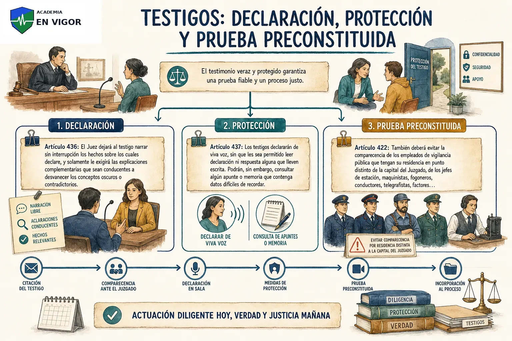

<em>Infografía: comparación de testigos: declaración, protección y prueba preconstituida.</em>

<!-- FUENTE: LECRIM-BOE-A-1882-6036-T09 -->

## 21. Careos

Este bloque ordena **careos** dentro de comprobación del delito y prueba, distinguiendo órgano, presupuesto, plazo, actuación y efecto.

### Claves rápidas

- **Artículo 451:** Cuando los testigos o los procesados entre sí o aquéllos con éstos discordaren acerca de algún hecho o de alguna circunstancia que interese en el sumario, podrá el Juez celebrar careo entre los que estuvieren discordes, sin que esta diligencia deba tener lugar, por regla general, más que entre dos personas a la vez.
- **Artículo 455:** No se practicarán careos sino cuando no fuere conocido otro modo de comprobar la existencia del delito o la culpabilidad de alguno de los procesados. No se practicarán careos con testigos que sean menores de edad salvo que el Juez lo considere imprescindible y no lesivo para el interés de dichos testigos, previo informe pericial.
- **Artículo 452:** El careo se verificará ante el Juez, leyendo el Secretario a los procesados o testigos entre quienes tenga lugar el acto las declaraciones que hubiesen prestado y preguntando el primero a los testigos, después de recordarles su juramento y las penas de falso testimonio, si se ratifican en ellas o tienen alguna variación que hacer. El Juez manifestará en seguida las contradicciones que resulten en dichas declaraciones, e invitará a los careados para que se pongan de acuerdo entre sí.
- **Artículo 453:** El Secretario dará fe de todo lo que ocurriere en el acto del careo y de las preguntas, contestaciones y reconvenciones que mutuamente se hicieren los careados, así como de lo que se observare en su actitud durante el acto; y firmará la diligencia con todos los concurrentes, expresando, si alguno no lo hiciere, la razón que para ello alegue.

:::perla-vigor
En procesal penal, identifica siempre quién actúa, ante qué órgano, dentro de qué plazo y con qué consecuencia.
:::

<!-- VISUAL:t09-21-careos.webp -->

  

<em>Infografía: línea temporal de careos.</em>

<!-- FUENTE: LECRIM-BOE-A-1882-6036-T09 -->

## 22. Informe pericial

Este bloque ordena **informe pericial** dentro de comprobación del delito y prueba, distinguiendo órgano, presupuesto, plazo, actuación y efecto.

### Claves rápidas

- **Artículo 461:** Si la urgencia del caso lo exige, podrá hacerse el llamamiento verbalmente de orden del Juez, haciéndolo constar así en los autos; pero extendiendo siempre el atestado prevenido en el artículo anterior el encargado del cumplimiento de la orden de llamamiento.
- **Artículo 462:** Nadie podrá negarse a acudir al llamamiento del Juez para desempeñar un servicio pericial, si no estuviese legítimamente impedido. En este caso deberá ponerlo en conocimiento del Juez en el acto de recibir el nombramiento, para que se provea a lo que haya lugar.
- **Artículo 469:** El actor o el procesado que intente recusar al perito o peritos nombrados por el Juez deberá hacerlo por escrito antes de empezar la diligencia pericial, expresando la causa de la recusación y la prueba testifical que ofrezca, y acompañando la documental o designando el lugar en que ésta se halle si no la tuviere a su disposición. Para la presentación de este escrito no estará obligado a valerse de Procurador.
- **Artículo 477:** El acto pericial será presidido por el Juez instructor o, en virtud de su delegación, por el Juez municipal. Podrá también delegar, en el caso del artículo 353, en un funcionario de Policía judicial. Asistirá siempre el Secretario que actúe en la causa.

:::perla-vigor
En procesal penal, identifica siempre quién actúa, ante qué órgano, dentro de qué plazo y con qué consecuencia.
:::

<!-- VISUAL:t09-22-informe-pericial.webp -->

  

<em>Infografía: escena de informe pericial.</em>

<!-- FUENTE: LECRIM-BOE-A-1882-6036-T09 -->

## 23. Detención por particulares y agentes

Este bloque ordena **detención por particulares y agentes** dentro de detención, defensa y registros, distinguiendo órgano, presupuesto, plazo, actuación y efecto.

### Claves rápidas

- **Artículo 490:** Cualquier persona puede detener: 1.º Al que intentare cometer un delito en el momento de ir a cometerlo. 2.º Al delincuente in fraganti. 3.º Al que se fugare del establecimiento penal en que se halle extinguiendo condena. 4.º Al que se fugare de la cárcel en que estuviere esperando su traslación al establecimiento penal o lugar en que deba cumplir la condena que se le hubiese impuesto por sentencia firme. 5.º Al que se fugare al ser conducido al establecimiento o lugar mencionado en el número anterior. 6.º Al que se fugare estando detenido o preso por causa pendiente. 7.º Al procesado o condenado que estuviere en rebeldía.
- **Artículo 491:** El particular que detuviere a otro justificará, si éste lo exigiere, haber obrado en virtud de motivos racionalmente suficientes para creer que el detenido se hallaba comprendido en alguno de los casos del artículo anterior.
- **Artículo 492:** La Autoridad o agente de Policía judicial tendrá obligación de detener: 1.º A cualquiera que se halle en alguno de los casos del artículo 490. 2.º Al que estuviere procesado por delito que tenga señalada en el Código pena superior a la de prisión correccional.
- **Artículo 489:** Ningún español ni extranjero podrá ser detenido sino en los casos y en la forma que las leyes prescriban.

:::perla-vigor
En procesal penal, identifica siempre quién actúa, ante qué órgano, dentro de qué plazo y con qué consecuencia.
:::

<!-- VISUAL:t09-23-detencion-por-particulares-y-agentes.webp -->

  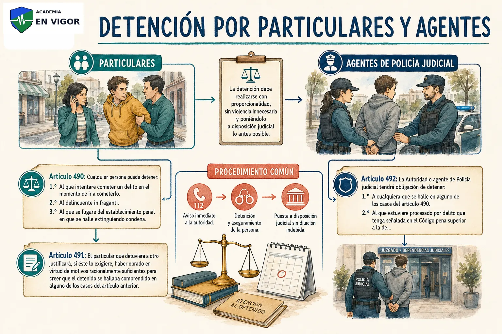

<em>Infografía: capas de detención por particulares y agentes.</em>

<!-- FUENTE: LECRIM-BOE-A-1882-6036-T09 -->

## 24. Entrega, libertad y plazos de detención

Este bloque ordena **entrega, libertad y plazos de detención** dentro de detención, defensa y registros, distinguiendo órgano, presupuesto, plazo, actuación y efecto.

### Claves rápidas

- **Artículo 496:** El particular, Autoridad o agente de Policía judicial que detuviere a una persona en virtud de lo dispuesto en los precedentes artículos, deberá ponerla en libertad o entregarla al Juez más próximo al lugar en que hubiere hecho la detención dentro de las veinticuatro horas siguientes al acto de la misma. Si demorare la entrega, incurrirá en la responsabilidad que establece el Código Penal, si la dilación hubiere excedido de veinticuatro horas.
- **Artículo 495:** No se podrá detener por la presunta comisión de delitos leves, a no ser que el presunto reo no tuviese domicilio conocido ni diese fianza bastante, a juicio de la autoridad o agente que intente detenerle.
- **Artículo 497:** Si el Juez o Tribunal a quien se hiciese la entrega fuere el propio de la causa y la detención se hubiese hecho según lo dispuesto en los números 1.º, 2.º y 6.º, y caso referente al procesado del 7.º del artículo 490, y 2.º, 3.º y 4.º del artículo 492, elevará la detención a prisión, o la dejará sin efecto, en el término de setenta y dos horas, a contar desde que el detenido le hubiese sido entregado. Lo propio, y en idéntico plazo, hará el Juez o Tribunal respecto de la persona cuya detención hubiere él mismo acordado.
- **Artículo 493:** La Autoridad o agente de Policía judicial tomará nota del nombre, apellido, domicilio y demás circunstancias bastantes para la averiguación e identificación de la persona del procesado o del delincuente a quienes no detuviere por no estar comprendidos en ninguno de los casos del artículo anterior. Esta nota será oportunamente entregada al Juez o Tribunal que conozca o deba conocer de la causa.

:::perla-vigor
En procesal penal, identifica siempre quién actúa, ante qué órgano, dentro de qué plazo y con qué consecuencia.
:::

<!-- VISUAL:t09-24-entrega-libertad-y-plazos-de-detencion.webp -->

  

<em>Infografía: mapa de entrega, libertad y plazos de detención.</em>

<!-- FUENTE: LECRIM-BOE-A-1882-6036-T09 -->

## 25. Información de derechos y asistencia letrada

Este bloque ordena **información de derechos y asistencia letrada** dentro de detención, defensa y registros, distinguiendo órgano, presupuesto, plazo, actuación y efecto.

### Claves rápidas

- **Artículo 520:** La detención preventiva no podrá durar más del tiempo estrictamente necesario para la realización de las averiguaciones tendentes al esclarecimiento de los hechos. Dentro de los plazos establecidos en la presente Ley, y, en todo caso, en el plazo máximo de setenta y dos horas, el detenido deberá ser puesto en libertad o a disposición de la autoridad judicial.
- **Artículo 520:** 3. Si el detenido fuere extranjero, se comunicará al cónsul de su país el hecho de su detención y el lugar de custodia y se le permitirá la comunicación con la autoridad consular. En caso de que el detenido tenga dos o más nacionalidades, podrá elegir a qué autoridades consulares debe informarse de que se encuentra privado de libertad y con quién desea comunicarse.
- **Artículo 520:** El abogado designado acudirá al centro de detención con la máxima premura, siempre dentro del plazo máximo de tres horas desde la recepción del encargo. Si en dicho plazo no compareciera, el Colegio de Abogados designará un nuevo abogado del turno de oficio que deberá comparecer a la mayor brevedad y siempre dentro del plazo indicado, sin perjuicio de la exigencia de la responsabilidad disciplinaria en que haya podido incurrir el incompareciente.
- **Artículo 520 bis:** 1. Toda persona detenida como presunto partícipe de alguno de los delitos a que se refiere el artículo 384 bis será puesta a disposición del Juez competente dentro de las setenta y dos horas siguientes a la detención. No obstante, podrá prolongarse la detención el tiempo necesario para los fines investigadores, hasta un límite máximo de otras cuarenta y ocho horas, siempre que, solicitada tal prórroga mediante comunicación motivada dentro de las primeras cuarenta y ocho horas desde la detención, sea autorizada por el Juez en las veinticuatro horas siguientes. Tanto la autorización cuanto la denegación de la prórroga se adoptarán en resolución motivada.

:::perla-vigor
En procesal penal, identifica siempre quién actúa, ante qué órgano, dentro de qué plazo y con qué consecuencia.
:::

<!-- VISUAL:t09-25-informacion-de-derechos-y-asistencia-letrada.webp -->

  

<em>Infografía: flujo de información de derechos y asistencia letrada.</em>

<!-- FUENTE: LECRIM-BOE-A-1882-6036-T09 -->

## 26. Tratamiento, comunicaciones e incomunicación

Este bloque ordena **tratamiento, comunicaciones e incomunicación** dentro de detención, defensa y registros, distinguiendo órgano, presupuesto, plazo, actuación y efecto.

### Claves rápidas

- **Artículo 527:** 1. En los supuestos del artículo 509, el detenido o preso podrá ser privado de los siguientes derechos si así lo justifican las circunstancias del caso: a) Designar un abogado de su confianza. b) Comunicarse con todas o alguna de las personas con las que tenga derecho a hacerlo, salvo con la autoridad judicial, el Ministerio Fiscal y el Médico Forense. c) Entrevistarse reservadamente con su abogado. d) Acceder él o su abogado a las actuaciones, salvo a los elementos esenciales para poder impugnar la legalidad de la detención.
- **Artículo 527:** El juez controlará efectivamente las condiciones en que se desarrolle la incomunicación, a cuyo efecto podrá requerir información a fin de constatar el estado del detenido o preso y el respeto a sus derechos. 3. Los reconocimientos médicos al detenido a quien se le restrinja el derecho a comunicarse con todas o alguna de las personas con las que tenga derecho a hacerlo se realizarán con una frecuencia de al menos dos reconocimientos cada veinticuatro horas, según criterio facultativo.
- **Artículo 523:** Cuando el detenido o preso deseare ser visitado por un ministro de su religión, por un médico, por sus parientes o personas con quienes esté en relación de intereses, o por las que puedan darle sus consejos, deberá permitírsele, con las condiciones prescritas en el reglamento de cárceles, si no afectasen al secreto y éxito del sumario. La relación con el Abogado defensor no podrá impedírsele mientras estuviere en comunicación.
- **Artículo 525:** No se adoptará contra el detenido o preso ninguna medida extraordinaria de seguridad sino en caso de desobediencia, de violencia o de rebelión, o cuando haya intentado o hecho preparativos para fugarse. Esta medida deberá ser temporal, y sólo subsistirá el tiempo estrictamente necesario.

:::perla-vigor
En procesal penal, identifica siempre quién actúa, ante qué órgano, dentro de qué plazo y con qué consecuencia.
:::

<!-- VISUAL:t09-26-tratamiento-comunicaciones-e-incomunicacion.webp -->

  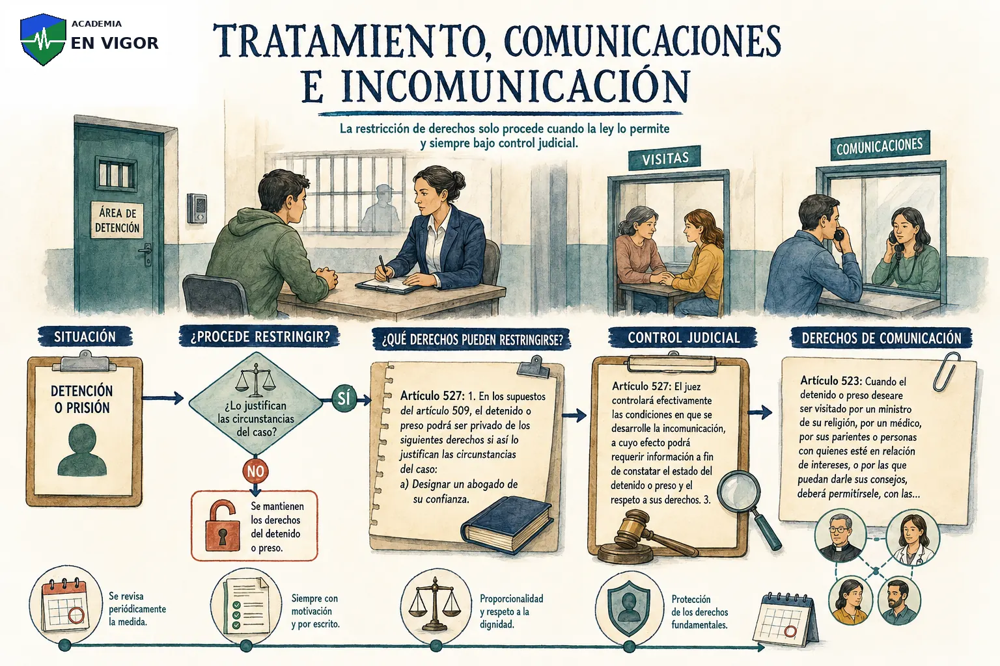

<em>Infografía: comparación de tratamiento, comunicaciones e incomunicación.</em>

<!-- FUENTE: LECRIM-BOE-A-1882-6036-T09 -->

## 27. Entrada y registro: presupuestos y lugares

Este bloque ordena **entrada y registro: presupuestos y lugares** dentro de detención, defensa y registros, distinguiendo órgano, presupuesto, plazo, actuación y efecto.

### Claves rápidas

- **Artículo 546:** El Juez o Tribunal que conociere de la causa podrá decretar la entrada y registro, de día o de noche, en todos los edificios y lugares públicos, sea cualquiera el territorio en que radiquen, cuando hubiere indicios de encontrarse allí el procesado o efectos o instrumentos del delito, o libros, papeles u otros objetos que puedan servir para su descubrimiento y comprobación.
- **Artículo 547:** Se reputarán edificios o lugares públicos para la observancia de lo dispuesto en este capítulo: 1.º Los que estuvieren destinados a cualquier servicio oficial, militar o civil del Estado, de la Provincia o del Municipio, aunque habiten allí los encargados de dicho servicio o los de la conservación y custodia del edificio o lugar. 2.º Los que estuvieren destinados a cualquier establecimiento de reunión o recreo, fueren o no lícitos. 3.º Cualesquiera otros edificios o lugares cerrados que no constituyeren domicilio de un particular con arreglo a lo dispuesto en el artículo 554. 4.º Los buques del Estado.
- **Artículo 549:** Para la entrada y registro en los templos y demás lugares religiosos bastará pasar recado de atención a las personas a cuyo cargo estuvieren.
- **Artículo 554:** Se reputan domicilio, para los efectos de los artículos anteriores: 1.º Los Palacios Reales, estén o no habitados por el Monarca al tiempo de la entrada o registro. 2.º El edificio o lugar cerrado, o la parte de él destinada principalmente a la habitación de cualquier español o extranjero residente en España y de su familia. 3.º Los buques nacionales mercantes.

:::perla-vigor
En procesal penal, identifica siempre quién actúa, ante qué órgano, dentro de qué plazo y con qué consecuencia.
:::

<!-- VISUAL:t09-27-entrada-y-registro-presupuestos-y-lugares.webp -->

  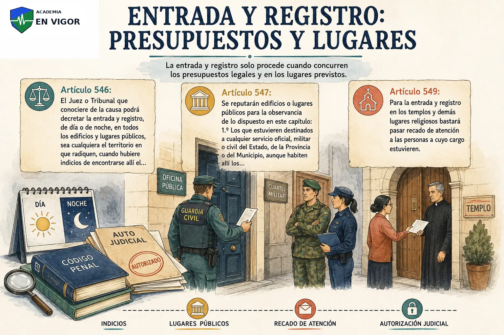

<em>Infografía: línea temporal de entrada y registro: presupuestos y lugares.</em>

<!-- FUENTE: LECRIM-BOE-A-1882-6036-T09 -->

## 28. Práctica de la entrada y registro

Este bloque ordena **práctica de la entrada y registro** dentro de detención, defensa y registros, distinguiendo órgano, presupuesto, plazo, actuación y efecto.

### Claves rápidas

- **Artículo 558:** El auto de entrada y registro en el domicilio de un particular será siempre fundado, y el Juez expresará en él concretamente el edificio o lugar cerrado en que haya de verificarse, si tendrá lugar tan sólo de día y la Autoridad o funcionario que los haya de practicar.
- **Artículo 569:** El registro se hará a presencia del interesado o de la persona que legítimamente le represente. Si aquél no fuere habido o no quisiese concurrir ni nombrar representante, se practicará a presencia de un individuo de su familia mayor de edad. Si no le hubiere, se hará a presencia de dos testigos, vecinos del mismo pueblo.
- **Artículo 569:** La resistencia del interesado, de su representante, de los individuos de la familia y de los testigos a presenciar el registro producirá la responsabilidad declarada en el Código Penal a los reos del delito de desobediencia grave a la Autoridad, sin perjuicio de que la diligencia se practique. Si no se encontrasen las personas u objetos que se busquen ni apareciesen indicios sospechosos, se expedirá una certificación del acta a la parte interesada si la reclamare.
- **Artículo 559:** Para la entrada y registro en los edificios destinados a la habitación u oficina de los representantes de naciones extranjeras acreditados cerca del Gobierno de España, les pedirá su venia el Juez, por medio de atento oficio, en el que les rogará que contesten en el término de doce horas.

:::perla-vigor
En procesal penal, identifica siempre quién actúa, ante qué órgano, dentro de qué plazo y con qué consecuencia.
:::

<!-- VISUAL:t09-28-practica-de-la-entrada-y-registro.webp -->

  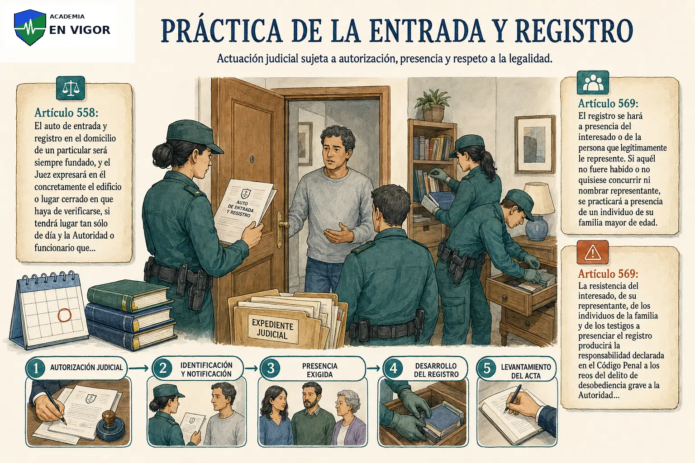

<em>Infografía: escena de práctica de la entrada y registro.</em>

<!-- FUENTE: LECRIM-BOE-A-1882-6036-T09 -->

## 29. Registro de libros y papeles

Este bloque ordena **registro de libros y papeles** dentro de detención, defensa y registros, distinguiendo órgano, presupuesto, plazo, actuación y efecto.

### Claves rápidas

- **Artículo 574:** El Juez ordenará recoger los instrumentos y efectos del delito y también los libros, papeles o cualesquiera otras cosas que se hubiesen encontrado, si esto fuere necesario para el resultado del sumario. Los libros y papeles que se recojan serán foliados, sellados y rubricados en todas sus hojas por el Secretario judicial, bajo su responsabilidad.
- **Artículo 578:** Si el libro que haya de ser objeto del registro fuere el protocolo de un Notario, se procederá con arreglo a lo dispuesto en la Ley del Notariado. Si se tratare de un libro del Registro de la Propiedad, se estará a lo ordenado en la Ley Hipotecaria. Si se tratare de un libro del Registro Civil o Mercantil se estará a lo que se disponga en la Ley y Reglamentos relativos a estos servicios.
- **Artículo 575:** Todos están obligados a exhibir los objetos y papeles que se sospeche puedan tener relación con la causa. Si el que los retenga se negare a su exhibición, será corregido con multa de 125 a 500 pesetas; y cuando insistiera en su negativa, si el objeto o papel fueren de importancia y la índole del delito lo aconseje, será procesado como autor del de desobediencia a la Autoridad, salvo si mereciera la calificación legal de encubridor o receptador.
- **Artículo 573:** No se ordenará el registro de los libros y papeles de contabilidad del procesado o de otra persona sino cuando hubiere indicios graves de que de esta diligencia resultará el descubrimiento o la comprobación de algún hecho o circunstancia importante de la causa.

:::perla-vigor
En procesal penal, identifica siempre quién actúa, ante qué órgano, dentro de qué plazo y con qué consecuencia.
:::

<!-- VISUAL:t09-29-registro-de-libros-y-papeles.webp -->

  

<em>Infografía: capas de registro de libros y papeles.</em>

<!-- FUENTE: LECRIM-BOE-A-1882-6036-T09 -->

## 30. Correspondencia escrita y telegráfica

Este bloque ordena **correspondencia escrita y telegráfica** dentro de detención, defensa y registros, distinguiendo órgano, presupuesto, plazo, actuación y efecto.

### Claves rápidas

- **Artículo 579. De la correspondencia escrita o telegráfica:** 1.º Delitos dolosos castigados con pena con límite máximo de, al menos, tres años de prisión. 2.º Delitos cometidos en el seno de un grupo u organización criminal. 3.º Delitos de terrorismo. 2. El juez podrá acordar, en resolución motivada, por un plazo de hasta tres meses, prorrogable por iguales o inferiores períodos hasta un máximo de dieciocho meses, la observación de las comunicaciones postales y telegráficas del investigado, así como de las comunicaciones de las que se sirva para la realización de sus fines delictivos.
- **Artículo 579. De la correspondencia escrita o telegráfica:** 3. En caso de urgencia, cuando las investigaciones se realicen para la averiguación de delitos relacionados con la actuación de bandas armadas o elementos terroristas y existan razones fundadas que hagan imprescindible la medida prevista en los apartados anteriores de este artículo, podrá ordenarla el Ministro del Interior o, en su defecto, el Secretario de Estado de Seguridad.
- **Artículo 579. De la correspondencia escrita o telegráfica:** Esta medida se comunicará inmediatamente al juez competente y, en todo caso, dentro del plazo máximo de veinticuatro horas, haciendo constar las razones que justificaron la adopción de la medida, la actuación realizada, la forma en que se ha efectuado y su resultado. El juez competente, también de forma motivada, revocará o confirmará tal actuación en un plazo máximo de setenta y dos horas desde que fue ordenada la medida.
- **Artículo 579 bis. Utilización de la información obtenida en un procedimiento distinto y descubrimientos casuales:** 1. El resultado de la detención y apertura de la correspondencia escrita y telegráfica podrá ser utilizado como medio de investigación o prueba en otro proceso penal. 2. A tal efecto, se procederá a la deducción de testimonio de los particulares necesarios para acreditar la legitimidad de la injerencia. Se incluirán entre los antecedentes indispensables, en todo caso, la solicitud inicial para la adopción, la resolución judicial que la acuerda y todas las peticiones y resoluciones judiciales de prórroga recaídas en el procedimiento de origen.

:::perla-vigor
En procesal penal, identifica siempre quién actúa, ante qué órgano, dentro de qué plazo y con qué consecuencia.
:::

<!-- VISUAL:t09-30-correspondencia-escrita-y-telegrafica.webp -->

  

<em>Infografía: mapa de correspondencia escrita y telegráfica.</em>

<!-- FUENTE: LECRIM-BOE-A-1882-6036-T09 -->

## 31. Habeas corpus: objeto, principios y privación ilegal

Este bloque ordena **habeas corpus: objeto, principios y privación ilegal** dentro de habeas corpus, distinguiendo órgano, presupuesto, plazo, actuación y efecto.

### Claves rápidas

- **Exposición de motivos:** El habeas corpus tiene especial arraigo en el Derecho anglosajón y persigue la inmediata puesta a disposición judicial de quien alegue una detención ilegal.
- **Exposición de motivos:** La Ley se inspira en cuatro principios complementarios: agilidad, sencillez y carencia de formalismos, generalidad y universalidad.
- **Exposición de motivos:** La generalidad impide excepciones de autoridad o agente y la universalidad alcanza a toda privación no acordada judicialmente.
- **Artículo primero:** Mediante el procedimiento del «Habeas Corpus», regulado en la presente ley, se podrá obtener la inmediata puesta a disposición de la Autoridad judicial competente, de cualquier persona detenida ilegalmente. A los efectos de esta ley se consideran personas ilegalmente detenidas: a) Las que lo fueren por una autoridad, agente de la misma, funcionario público o particular, sin que concurran los supuestos legales, o sin haberse cumplido las formalidades prevenidas y requisitos exigidos por las leyes.

:::perla-vigor
En procesal penal, identifica siempre quién actúa, ante qué órgano, dentro de qué plazo y con qué consecuencia.
:::

<!-- VISUAL:t09-31-habeas-corpus-objeto-principios-y-privacion-ilegal.webp -->

  

<em>Infografía: flujo de habeas corpus: objeto, principios y privación ilegal.</em>

<!-- FUENTE: LO6-1984-BOE-A-1984-11620-T09 -->

## 32. Habeas corpus: legitimación y competencia

Este bloque ordena **habeas corpus: legitimación y competencia** dentro de habeas corpus, distinguiendo órgano, presupuesto, plazo, actuación y efecto.

### Claves rápidas

- **Artículo tercero:** Podrán instar el procedimiento de “Habeas Corpus” que esta ley establece: a) El privado de libertad, su cónyuge o persona unida por análoga relación de afectividad, descendientes, ascendientes, hermanos y, en su caso, respecto a los menores, sus representantes legales, y respecto a las personas con discapacidad con medidas de apoyo judiciales, la persona que preste su apoyo con facultad de representación específica para este acto concreto. b) El Ministerio Fiscal. c) El Defensor del Pueblo. d) El abogado defensor del privado de libertad. Asimismo, lo podrá iniciar, de oficio, el Juez competente a que se refiere el artículo anterior.

:::perla-vigor
En procesal penal, identifica siempre quién actúa, ante qué órgano, dentro de qué plazo y con qué consecuencia.
:::

<!-- VISUAL:t09-32-habeas-corpus-legitimacion-y-competencia.webp -->

  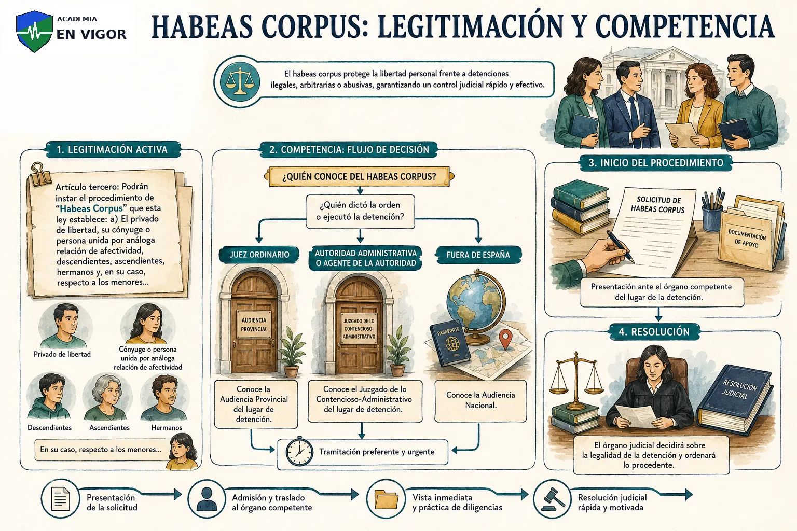

<em>Infografía: comparación de habeas corpus: legitimación y competencia.</em>

<!-- FUENTE: LO6-1984-BOE-A-1984-11620-T09 -->

## 33. Habeas corpus: inicio e incoación

Este bloque ordena **habeas corpus: inicio e incoación** dentro de habeas corpus, distinguiendo órgano, presupuesto, plazo, actuación y efecto.

### Claves rápidas

- **Artículo cuarto:** El procedimiento se iniciará, salvo cuando se incoe de oficio, por medio de escrito o comparecencia, no siendo preceptiva la intervención de Abogado ni de Procurador. En dicho escrito o comparecencia deberán constar: a) El nombre y circunstancias personales del solicitante y de la persona para la que se solicita el amparo judicial regulado en esta ley. b) El lugar en que se halle el privado de libertad, autoridad o persona, bajo cuya custodia se encuentre, si fueren conocidos, y todas aquellas otras circunstancias que pudieran resultar relevantes. c) El motivo concreto por el que se solicita el «Habeas Corpus».
- **Artículo sexto:** Promovida la solicitud de «Habeas Corpus» el Juez examinará la concurrencia de los requisitos para su tramitación y dará traslado de la misma al Ministerio Fiscal. Seguidamente, mediante auto, acordará la incoación del procedimiento, o, en su caso, denegará la solicitud por ser ésta improcedente. Dicho auto se notificará, en todo caso, al Ministerio Fiscal. Contra la resolución que en uno u otro caso se adopte, no cabrá recurso alguno.
- **Artículo quinto:** La autoridad gubernativa, agente de la misma o funcionario público, estarán obligados a poner inmediatamente en conocimiento del Juez competente la solicitud de «Habeas Corpus», formulada por la persona privada de libertad que se encuentre bajo su custodia. Si incumplieren esta obligación, serán apercibidos por el Juez, sin perjuicio de las responsabilidades penales y disciplinarias en que pudieran incurrir.

:::perla-vigor
En procesal penal, identifica siempre quién actúa, ante qué órgano, dentro de qué plazo y con qué consecuencia.
:::

<!-- VISUAL:t09-33-habeas-corpus-inicio-e-incoacion.webp -->

  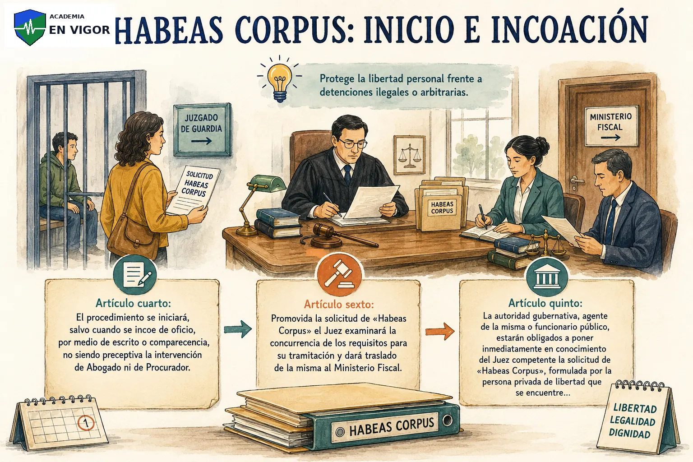

<em>Infografía: línea temporal de habeas corpus: inicio e incoación.</em>

<!-- FUENTE: LO6-1984-BOE-A-1984-11620-T09 -->

## 34. Habeas corpus: audiencia, resolución y efectos

Este bloque ordena **habeas corpus: audiencia, resolución y efectos** dentro de habeas corpus, distinguiendo órgano, presupuesto, plazo, actuación y efecto.

### Claves rápidas

- **Artículo séptimo:** En el auto de incoación, el Juez ordenará a la autoridad a cuya disposición se halle la persona privada de libertad o a aquél en cuyo poder se encuentre, que la ponga de manifiesto ante él, sin pretexto ni demora alguna o se constituirá en el lugar donde aquélla se encuentre.
- **Artículo octavo:** Practicadas las actuaciones a que se refiere el artículo anterior, el Juez, mediante auto motivado, adoptará seguidamente alguna de estas resoluciones: 1. Si estima que no se da ninguna de las circunstancias a que se refiere el artículo primero de esta ley, acordará el archivo de las actuaciones, declarando ser conforme a Derecho la privación de libertad y las circunstancias en que se está realizando. 2. Si estima que concurren alguna de las circunstancias del artículo primero de esta ley, se acordará en el acto alguna de las siguientes medidas: a) La puesta en libertad del privado de ésta, si lo fue ilegalmente.
- **Artículo octavo:** b) Que continúe la situación de privación de libertad de acuerdo con las disposiciones legales aplicables al caso, pero, si lo considerase necesario, en establecimiento distinto, o bajo la custodia de personas distintas a las que hasta entonces la detentaban. c) Que la persona privada de libertad sea puesta inmediatamente a disposición judicial, si ya hubiese transcurrido el plazo legalmente establecido para su detención.
- **Artículo noveno:** El Juez deducirá testimonio de los particulares pertinentes para la persecución y castigo de los delitos que hayan podido cometerse por quienes hubieran ordenado la detención, o tenido bajo su custodia a la persona privada de libertad. En los casos de delito de denuncia falsa o simulación de delito se deducirá asimismo, testimonio de los particulares pertinentes, al efecto de determinar las responsabilidades penales correspondientes. En todo caso, si se apreciase temeridad o mala fe, será condenado el solicitante al pago de las costas del procedimiento, en caso contrario, éstas se declararán de oficio.

:::perla-vigor
En procesal penal, identifica siempre quién actúa, ante qué órgano, dentro de qué plazo y con qué consecuencia.
:::

<!-- VISUAL:t09-34-habeas-corpus-audiencia-resolucion-y-efectos.webp -->

  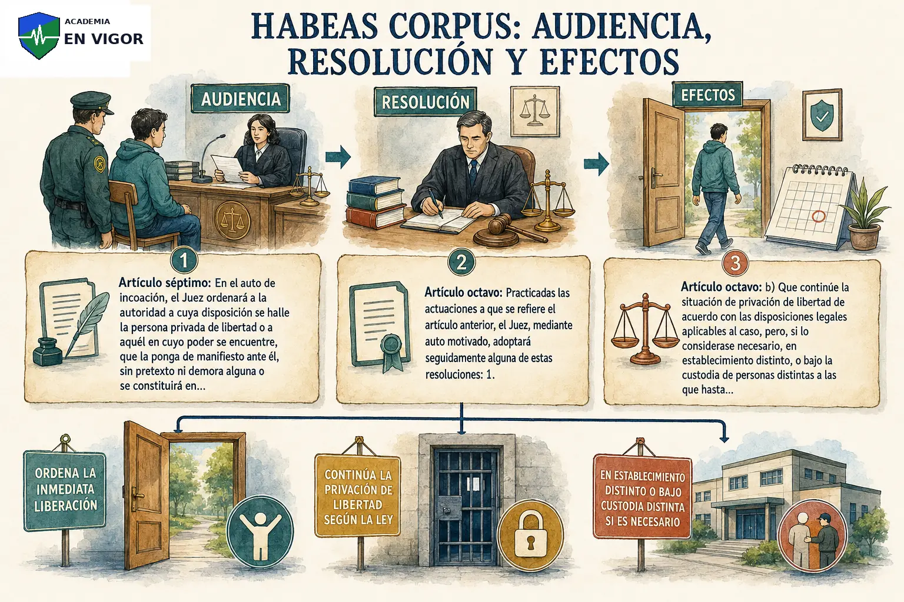

<em>Infografía: escena de habeas corpus: audiencia, resolución y efectos.</em>

<!-- FUENTE: LO6-1984-BOE-A-1984-11620-T09 -->

## 35. Tribunal Supremo: posición y composición

Este bloque ordena **tribunal supremo: posición y composición** dentro de organización judicial y cooperadores, distinguiendo órgano, presupuesto, plazo, actuación y efecto.

### Claves rápidas

- **Artículo 53:** El Tribunal Supremo, con sede en la villa de Madrid, es el órgano jurisdiccional superior en todos los órdenes, salvo lo dispuesto en materia de garantías Constitucionales. Tendrá jurisdicción en toda España y ningún otro podrá tener el título de Supremo.
- **Artículo 54:** El Tribunal Supremo se compondrá de su Presidente, de los Presidentes de Sala y los Magistrados que determine la ley para cada una de las Salas y, en su caso, Secciones en que las mismas puedan articularse.
- **Artículo 55:** El Tribunal Supremo estará integrado por las siguientes Salas: Primera: De lo Civil. Segunda: De lo Penal. Tercera: De lo Contencioso-Administrativo. Cuarta: De lo Social. Quinta: De lo Militar, que se regirá por su legislación específica y supletoriamente por la presente Ley y por el ordenamiento común a las demás Salas del Tribunal Supremo.
- **Artículo 55 bis:** Además de las competencias atribuidas a las Salas de lo Civil y de lo Penal del Tribunal Supremo en los artículos 56 y 57, dichas Salas conocerán de la tramitación y enjuiciamiento de las acciones civiles y penales, respectivamente, dirigidas contra la Reina consorte o el consorte de la Reina, la Princesa o Príncipe de Asturias y su consorte, así como contra el Rey o Reina que hubiere abdicado y su consorte.

:::perla-vigor
En procesal penal, identifica siempre quién actúa, ante qué órgano, dentro de qué plazo y con qué consecuencia.
:::

<!-- VISUAL:t09-35-tribunal-supremo-posicion-y-composicion.webp -->

  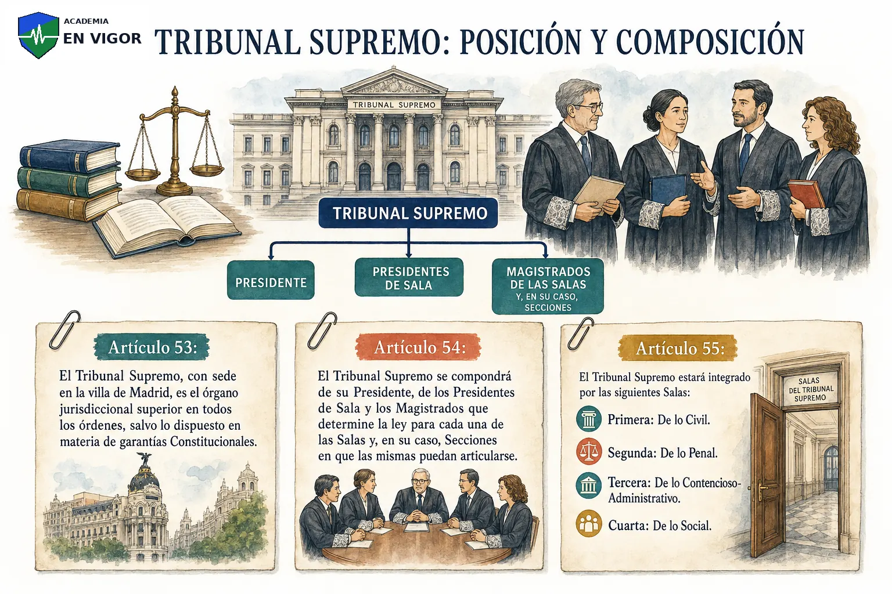

<em>Infografía: capas de tribunal supremo: posición y composición.</em>

<!-- FUENTE: LOPJ-BOE-A-1985-12666-T09 -->

## 36. Tribunal Supremo: Salas Civil y Penal

Este bloque ordena **tribunal supremo: salas civil y penal** dentro de organización judicial y cooperadores, distinguiendo órgano, presupuesto, plazo, actuación y efecto.

### Claves rápidas

- **Artículo 57:** 1. La Sala de lo Penal del Tribunal Supremo conocerá: 1.º De los recursos de casación, revisión y otros extraordinarios en materia penal que establezca la ley.
- **Artículo 57:** 3.º De la instrucción y enjuiciamiento de las causas contra Magistrados de la Audiencia Nacional, de un Tribunal Superior de Justicia o de los Fiscales europeos delegados. 4.º De los demás asuntos que le atribuya esta Ley. 5.º De los procedimientos de decomiso autónomo por los delitos para cuyo conocimiento sean competentes.
- **Artículo 56:** La Sala de lo Civil del Tribunal Supremo conocerá: 1.º De los recursos de casación, revisión y otros extraordinarios en materia civil que establezca la ley.

:::perla-vigor
En procesal penal, identifica siempre quién actúa, ante qué órgano, dentro de qué plazo y con qué consecuencia.
:::

<!-- VISUAL:t09-36-tribunal-supremo-salas-civil-y-penal.webp -->

  

<em>Infografía: mapa de tribunal supremo: salas civil y penal.</em>

<!-- FUENTE: LOPJ-BOE-A-1985-12666-T09 -->

## 37. Tribunal Supremo: Salas Contenciosa, Social y Militar

Este bloque ordena **tribunal supremo: salas contenciosa, social y militar** dentro de organización judicial y cooperadores, distinguiendo órgano, presupuesto, plazo, actuación y efecto.

### Claves rápidas

- **Artículo 58:** La Sala de lo Contencioso-administrativo del Tribunal Supremo conocerá: Primero. En única instancia, de los recursos contencioso-administrativos contra actos y disposiciones del Consejo de Ministros, de las Comisiones Delegadas del Gobierno y del Consejo General del Poder Judicial y contra los actos y disposiciones de los órganos competentes del Congreso de los Diputados y del Senado, del Tribunal Constitucional, del Tribunal de Cuentas y del Defensor del Pueblo en los términos y materias que la Ley establezca y de aquellos otros recursos que excepcionalmente le atribuya la ley.
- **Artículo 59:** La Sala de lo Social del Tribunal Supremo conocerá de los recursos de casación y revisión y otros extraordinarios que establezca la ley en materias propias de este orden jurisdiccional.
- **Artículo 60:** 1. Conocerá además cada una de las Salas del Tribunal Supremo de las recusaciones que se interpusieren contra los Magistrados que las compongan, y de las cuestiones de competencia entre Juzgados o Tribunales del propio orden jurisdiccional que no tengan otro superior común. 2. A estos efectos, los Magistrados recusados no formarán parte de la Sala.

:::perla-vigor
En procesal penal, identifica siempre quién actúa, ante qué órgano, dentro de qué plazo y con qué consecuencia.
:::

<!-- VISUAL:t09-37-tribunal-supremo-salas-contenciosa-social-y-militar.webp -->

  

<em>Infografía: flujo de tribunal supremo: salas contenciosa, social y militar.</em>

<!-- FUENTE: LOPJ-BOE-A-1985-12666-T09 -->

## 38. Tribunal Supremo: salas especiales y suplicatorios

Este bloque ordena **tribunal supremo: salas especiales y suplicatorios** dentro de organización judicial y cooperadores, distinguiendo órgano, presupuesto, plazo, actuación y efecto.

### Claves rápidas

- **Artículo 61 bis:** 3. A los efectos anteriores, en el Gabinete Técnico existirán tantas áreas como órdenes jurisdiccionales. Dentro de cada área podrá existir una sección de Admisión y otra sección de Estudios e Informes. En la Sala Quinta de lo Militar podrá haber un Letrado del Gabinete Técnico. Los Letrados prestarán sus servicios en las diferentes áreas atendiendo a su especialización profesional.
- **Artículo 61 quinquies:** 1. Los Letrados que fueren seleccionados serán nombrados por un año. Una vez cumplido ese plazo, el Presidente del Tribunal Supremo, oídos el Presidente de Sala respectivo y el Director del Gabinete Técnico, propondrá, en su caso, la prórroga en la plaza, de conformidad con el procedimiento establecido para el nombramiento inicial. Los Letrados podrán ser prorrogados por sucesivos periodos de tres años.
- **Artículo 61:** 1. Una Sala formada por el Presidente del Tribunal Supremo, los Presidentes de Sala y el Magistrado más antiguo y el más moderno de cada una de ellas conocerá: 1.º De los recursos de revisión contra las sentencias dictadas en única instancia por la Sala de lo Contencioso-Administrativo de dicho Tribunal. 2.º De los incidentes de recusación del Presidente del Tribunal Supremo, o de los Presidentes de Sala, o de más de dos Magistrados de una Sala. En este caso, los afectados directamente por la recusación serán sustituidos por quienes corresponda.
- **Artículo 61 ter:** La superior dirección del Gabinete Técnico será ejercida por el Presidente del Tribunal Supremo o, en caso de delegación de éste, por el Vicepresidente del Tribunal Supremo.

:::perla-vigor
En procesal penal, identifica siempre quién actúa, ante qué órgano, dentro de qué plazo y con qué consecuencia.
:::

<!-- VISUAL:t09-38-tribunal-supremo-salas-especiales-y-suplicatorios.webp -->

  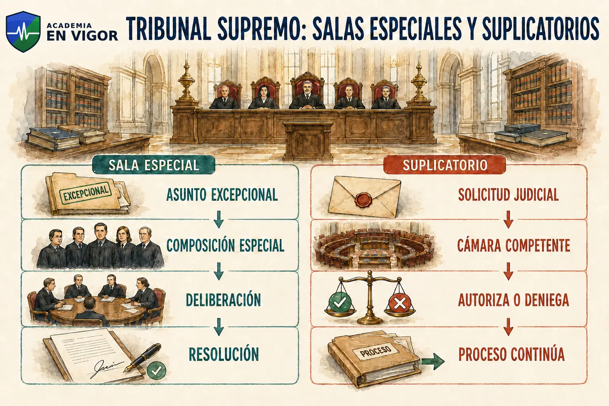

<em>Infografía: comparación de tribunal supremo: salas especiales y suplicatorios.</em>

<!-- FUENTE: LOPJ-BOE-A-1985-12666-T09 -->

## 39. Audiencia Nacional: estructura

Este bloque ordena **audiencia nacional: estructura** dentro de organización judicial y cooperadores, distinguiendo órgano, presupuesto, plazo, actuación y efecto.

### Claves rápidas

- **Artículo 64:** 1. La Audiencia Nacional estará integrada por las siguientes Salas: De Apelación. De lo Penal. De lo Contencioso-Administrativo. De lo Social. 2. En el caso de que el número de asuntos lo aconseje, podrán crearse dos o más Secciones dentro de una Sala.
- **Artículo 64 bis:** 1. La Sala de Apelación de la Audiencia Nacional conocerá de los recursos de esta clase que establezca la ley contra las resoluciones de la Sala de lo Penal. 2. Cuando la sensible y continuada diferencia en el volumen de trabajo lo aconseje, los magistrados de esta Sala, con el acuerdo favorable de la Sala de Gobierno, previa propuesta del Presidente del Tribunal, podrán ser adscritos por el Consejo General del Poder Judicial, total o parcialmente, y sin que ello signifique incremento retributivo alguno, a otra Sala de diferente orden.
- **Artículo 62:** La Audiencia Nacional, con sede en la villa de Madrid, tiene jurisdicción en toda España.
- **Artículo 63:** 1. La Audiencia Nacional se compondrá de su Presidente, los Presidentes de Sala y los magistrados que determine la ley para cada una de sus Salas y Secciones. 2. El Presidente de la Audiencia Nacional, que tendrá la consideración de Presidente de Sala del Tribunal Supremo, es el Presidente nato de todas sus Salas.

:::perla-vigor
En procesal penal, identifica siempre quién actúa, ante qué órgano, dentro de qué plazo y con qué consecuencia.
:::

<!-- VISUAL:t09-39-audiencia-nacional-estructura.webp -->

  

<em>Infografía: línea temporal de audiencia nacional: estructura.</em>

<!-- FUENTE: LOPJ-BOE-A-1985-12666-T09 -->

## 40. Audiencia Nacional: competencias

Este bloque ordena **audiencia nacional: competencias** dentro de organización judicial y cooperadores, distinguiendo órgano, presupuesto, plazo, actuación y efecto.

### Claves rápidas

- **Artículo 65:** La Sala de lo Penal de la Audiencia Nacional conocerá: 1.º Del enjuiciamiento, salvo que corresponda en primera instancia a la Sección de lo Penal del Tribunal Central de Instancia, de las causas por los siguientes delitos: a) Delitos contra el titular de la Corona, su Consorte, su Sucesor o Sucesora, altos organismos de la Nación y forma de Gobierno.
- **Artículo 65:** g) Delitos de contrabando de material de defensa, de otros materiales y de productos y tecnología de doble uso. En todo caso, la Sala de lo penal de la Audiencia Nacional extenderá su competencia al conocimiento de los delitos conexos con todos los anteriormente reseñados.
- **Artículo 65:** 2.° De los procedimientos penales iniciados en el extranjero, de la ejecución de las sentencias dictadas por Tribunales extranjeros o del cumplimiento de pena de prisión impuesta por Tribunales extranjeros, cuando en virtud de un tratado internacional corresponda a España la continuación de un procedimiento penal iniciado en el extranjero, la ejecución de una sentencia penal extranjera o el cumplimiento de una pena o medida de seguridad privativa de libertad, salvo en aquellos casos en que esta Ley atribuya alguna de estas competencias a otro órgano jurisdiccional penal.
- **Artículo 65:** 3.º De las cuestiones de cesión de jurisdicción en materia penal derivadas del cumplimiento de tratados internacionales en los que España sea parte. 4.º De los recursos respecto a los instrumentos de reconocimiento mutuo de resoluciones penales en la Unión Europea que les atribuya la ley, y la resolución de los procedimientos judiciales de extradición pasiva, sea cual fuere el lugar de residencia o en que hubiese tenido lugar la detención del afectado por el procedimiento.

:::perla-vigor
En procesal penal, identifica siempre quién actúa, ante qué órgano, dentro de qué plazo y con qué consecuencia.
:::

<!-- VISUAL:t09-40-audiencia-nacional-competencias.webp -->

  

<em>Infografía: escena de audiencia nacional: competencias.</em>

<!-- FUENTE: LOPJ-BOE-A-1985-12666-T09 -->

## 41. Tribunales Superiores de Justicia: composición

Este bloque ordena **tribunales superiores de justicia: composición** dentro de organización judicial y cooperadores, distinguiendo órgano, presupuesto, plazo, actuación y efecto.

### Claves rápidas

- **Artículo 72:** 1. El Tribunal Superior de Justicia estará integrado por las siguientes Salas: de lo Civil y Penal, de lo Contencioso-Administrativo y de lo Social. 2. Se compondrá de un Presidente, que lo será también de su Sala de lo Civil y Penal, y tendrá la consideración de Magistrado del Tribunal Supremo mientras desempeñe el cargo; de los Presidentes de Sala y de los Magistrados que determine la ley para cada una de las Salas y, en su caso, de las Secciones que puedan dentro de ellas crearse.
- **Artículo 70:** El Tribunal Superior de Justicia de la Comunidad Autónoma culminará la organización judicial en el ámbito territorial de aquélla, sin perjuicio de la jurisdicción que corresponde al Tribunal Supremo.
- **Artículo 71:** El Tribunal Superior de Justicia tomará el nombre de la Comunidad Autónoma y extenderá su jurisdicción al ámbito territorial de ésta.

:::perla-vigor
En procesal penal, identifica siempre quién actúa, ante qué órgano, dentro de qué plazo y con qué consecuencia.
:::

<!-- VISUAL:t09-41-tribunales-superiores-de-justicia-composicion.webp -->

  

<em>Infografía: capas de tribunales superiores de justicia: composición.</em>

<!-- FUENTE: LOPJ-BOE-A-1985-12666-T09 -->

## 42. Tribunales Superiores de Justicia: Sala Civil y Penal

Este bloque ordena **tribunales superiores de justicia: sala civil y penal** dentro de organización judicial y cooperadores, distinguiendo órgano, presupuesto, plazo, actuación y efecto.

### Claves rápidas

- **Artículo 73:** A falta de éstos, recaerá en aquellos Magistrados que habiendo prestado sus servicios en el orden jurisdiccional penal durante diez años dentro de los quince años inmediatamente anteriores a la fecha de la convocatoria, tengan mejor puesto en el escalafón. La antigüedad en órganos mixtos se computará de igual manera a estos efectos. En su defecto, se nombrará a quien ostente mejor puesto en el escalafón.

:::perla-vigor
En procesal penal, identifica siempre quién actúa, ante qué órgano, dentro de qué plazo y con qué consecuencia.
:::

<!-- VISUAL:t09-42-tribunales-superiores-de-justicia-sala-civil-y-penal.webp -->

  

<em>Infografía: mapa de tribunales superiores de justicia: sala civil y penal.</em>

<!-- FUENTE: LOPJ-BOE-A-1985-12666-T09 -->

## 43. Tribunales Superiores de Justicia: Salas Contenciosa y Social

Este bloque ordena **tribunales superiores de justicia: salas contenciosa y social** dentro de organización judicial y cooperadores, distinguiendo órgano, presupuesto, plazo, actuación y efecto.

### Claves rápidas

- **Artículo 77:** 1. Una Sala constituida por el Presidente del Tribunal Superior de Justicia, los Presidentes de Sala y el Magistrado más moderno de cada una de ellas conocerá de las recusaciones formuladas contra el Presidente, los Presidentes de Sala o de Audiencias Provinciales con sede en la Comunidad Autónoma o de dos o más Magistrados de una Sala o Sección o de una Audiencia Provincial. 2. El recusado no podrá formar parte de la Sala, produciéndose, en su caso, su sustitución con arreglo a lo previsto en esta ley.
- **Artículo 79:** La Ley de planta podrá, en aquellos Tribunales Superiores de Justicia en que el número de asuntos lo justifique, reducir el de Magistrados, quedando compuestas las Salas por su respectivo Presidente y por los Presidentes y Magistrados, en su caso, que aquélla determine.
- **Artículo 74:** 1. Las Salas de lo Contencioso-Administrativo de los Tribunales Superiores de Justicia conocerán, en única instancia, de los recursos que se deduzcan en relación con: a) Los actos de las Entidades locales y de las Administraciones de las comunidades autónomas, cuyo conocimiento no esté atribuido a las Secciones de lo Contencioso-Administrativo de los Tribunales de Instancia. b) Las disposiciones generales emanadas de las comunidades autónomas y de las Entidades locales.
- **Artículo 75:** La Sala de lo Social del Tribunal Superior de Justicia conocerá: 1.º En única instancia, de los procesos que la ley establezca sobre controversias que afecten a intereses de los trabajadores y trabajadoras y empresarios y empresarias en ámbito superior al de una Sección de lo Social del Tribunal de Instancia y no superior al de la comunidad autónoma.

:::perla-vigor
En procesal penal, identifica siempre quién actúa, ante qué órgano, dentro de qué plazo y con qué consecuencia.
:::

<!-- VISUAL:t09-43-tribunales-superiores-de-justicia-salas-contenciosa-y-social.webp -->

  

<em>Infografía: flujo de tribunales superiores de justicia: salas contenciosa y social.</em>

<!-- FUENTE: LOPJ-BOE-A-1985-12666-T09 -->

## 44. Audiencias Provinciales

Este bloque ordena **audiencias provinciales** dentro de organización judicial y cooperadores, distinguiendo órgano, presupuesto, plazo, actuación y efecto.

### Claves rápidas

- **Artículo 82:** 1. Las Audiencias Provinciales conocerán en el orden penal: 1.º De las causas por delito, a excepción de los que la ley atribuye al conocimiento de las Secciones de lo Penal de los Tribunales de Instancia o de otros Tribunales previstos en esta ley. 2.º De los recursos que establezca la ley contra las resoluciones dictadas por las Secciones de Instrucción y de lo Penal de los Tribunales de Instancia de la provincia. Para el conocimiento de los recursos contra resoluciones de las Secciones de Instrucción de los Tribunales de Instancia en juicios por delitos leves la Audiencia se constituirá con un solo magistrado o magistrada, mediante un turno de reparto.
- **Artículo 82:** 4.º Las Audiencias Provinciales conocerán también de los recursos contra las resoluciones de las Secciones de Menores de los Tribunales de Instancia con sede en la provincia y de las cuestiones de competencia entre los mismos. 5.º De los recursos que establezca la ley contra las resoluciones de las Secciones de Vigilancia Penitenciaria de los Tribunales de Instancia, cuando la competencia no corresponda a la Sala de lo Penal de la Audiencia Nacional.
- **Artículo 80:** 3. En todo caso, y previo informe de la correspondiente Sala de Gobierno, el Consejo General del Poder Judicial podrá acordar que el conocimiento de determinadas clases de asuntos se atribuya en exclusiva a una sección de la Audiencia Provincial, que extenderá siempre su competencia a todo su ámbito territorial aun cuando existieren secciones desplazadas. Este acuerdo se publicará en el "Boletín Oficial del Estado".
- **Artículo 81:** 2. Cuando el escaso número de asuntos de que conozca una Audiencia Provincial lo aconseje, podrá constar su plantilla de uno a dos magistrados, incluido el Presidente. En este caso, la Audiencia Provincial se completará para el enjuiciamiento y fallo, y cuando la naturaleza de la resolución a dictar lo exija, con el número de magistrados que se precisen del Tribunal Superior de Justicia. A estos efectos, la Sala de Gobierno establecerá un turno para cada año judicial.

:::perla-vigor
En procesal penal, identifica siempre quién actúa, ante qué órgano, dentro de qué plazo y con qué consecuencia.
:::

<!-- VISUAL:t09-44-audiencias-provinciales.webp -->

  

<em>Infografía: comparación de audiencias provinciales.</em>

<!-- FUENTE: LOPJ-BOE-A-1985-12666-T09 -->

## 45. Tribunales de Instancia: organización general

Este bloque ordena **tribunales de instancia: organización general** dentro de organización judicial y cooperadores, distinguiendo órgano, presupuesto, plazo, actuación y efecto.

### Claves rápidas

- **Artículo 84:** 1. Habrá un Tribunal de Instancia en cada partido judicial, con sede en su capital, de la que tomará su nombre. 2. Los Tribunales de Instancia estarán integrados por una Sección Única, de Civil y de Instrucción. En los supuestos determinados por la Ley 38/1988, de 28 de diciembre, de Demarcación y de Planta Judicial, el Tribunal de Instancia se integrará por una Sección Civil y otra Sección de Instrucción.
- **Artículo 84:** Además de las anteriores, los Tribunales de Instancia podrán estar integrados por alguna o varias de las siguientes Secciones: a) De Familia, Infancia y Capacidad. b) De lo Mercantil. c) De Violencia sobre la Mujer. d) De Violencia contra la Infancia y la Adolescencia. e) De lo Penal. f) De Menores. g) De Vigilancia Penitenciaria. h) De lo Contencioso-Administrativo. i) De lo Social. 3. Cada Tribunal de Instancia contará con una Presidencia. Las Secciones del Tribunal de Instancia contarán con una Presidencia de Sección cuando concurran las siguientes circunstancias:

:::perla-vigor
En procesal penal, identifica siempre quién actúa, ante qué órgano, dentro de qué plazo y con qué consecuencia.
:::

<!-- VISUAL:t09-45-tribunales-de-instancia-organizacion-general.webp -->

  

<em>Infografía: línea temporal de tribunales de instancia: organización general.</em>

<!-- FUENTE: LOPJ-BOE-A-1985-12666-T09 -->

## 46. Secciones Civil, Familia, Mercantil y Social

Este bloque ordena **secciones civil, familia, mercantil y social** dentro de organización judicial y cooperadores, distinguiendo órgano, presupuesto, plazo, actuación y efecto.

### Claves rápidas

- **Artículo 86:** 1. Cuando se estime conveniente, en función de la carga de trabajo, se creará en el Tribunal de Instancia una Sección de Familia, Infancia y Capacidad, que extenderá su jurisdicción a todo el partido judicial. 2. No obstante lo dispuesto en el apartado anterior, el Gobierno podrá establecer por real decreto, a propuesta del Consejo General del Poder Judicial y, en su caso, con informe favorable de la comunidad autónoma con competencias en materia de Justicia, Secciones de Familia, Infancia y Capacidad que extiendan su jurisdicción a dos o más partidos dentro de la misma provincia. 3.
- **Artículo 85:** Con carácter general, en los Tribunales de Instancia, las Secciones Civiles o las Civiles y de Instrucción que constituyan una Sección Única extenderán su jurisdicción a un partido judicial. Estas Secciones conocerán, en el orden civil: 1.º En primera instancia, de los juicios que no vengan atribuidos por esta ley a otros órganos judiciales.
- **Artículo 86 bis:** Artículo 86 bis figura sin contenido vigente en el texto consolidado.
- **Artículo 86 ter:** Artículo 86 ter figura sin contenido vigente en el texto consolidado.

:::perla-vigor
En procesal penal, identifica siempre quién actúa, ante qué órgano, dentro de qué plazo y con qué consecuencia.
:::

<!-- VISUAL:t09-46-secciones-civil-familia-mercantil-y-social.webp -->

  

<em>Infografía: escena de secciones civil, familia, mercantil y social.</em>

<!-- FUENTE: LOPJ-BOE-A-1985-12666-T09 -->

## 47. Secciones de Instrucción y Violencia

Este bloque ordena **secciones de instrucción y violencia** dentro de organización judicial y cooperadores, distinguiendo órgano, presupuesto, plazo, actuación y efecto.

### Claves rápidas

- **Artículo 87:** Las Secciones de lo Mercantil tendrán competencia exclusiva para conocer en primera instancia, de acuerdo con la atribución de competencia objetiva, territorial y funcional establecida en la Ley 1/2000, de 7 de enero, de Enjuiciamiento Civil, de los recursos contra las resoluciones dictadas por la Sección Primera de la Comisión de Propiedad Intelectual para resolver las cuestiones litigiosas sobre el acuerdo previsto en el artículo 129 bis.3 del texto refundido de la Ley de Propiedad Intelectual, aprobado por Real Decreto Legislativo 1/1996, de 12 de abril.
- **Artículo 87 bis:** Artículo 87 bis figura sin contenido vigente en el texto consolidado.
- **Artículo 87 ter:** Artículo 87 ter figura sin contenido vigente en el texto consolidado.
- **Artículo 87 quáter:** Artículo 87 quáter figura sin contenido vigente en el texto consolidado.

:::perla-vigor
En procesal penal, identifica siempre quién actúa, ante qué órgano, dentro de qué plazo y con qué consecuencia.
:::

<!-- VISUAL:t09-47-secciones-de-instruccion-y-violencia.webp -->

  

<em>Infografía: capas de secciones de instrucción y violencia.</em>

<!-- FUENTE: LOPJ-BOE-A-1985-12666-T09 -->

## 48. Secciones Penal, Menores y Vigilancia Penitenciaria

Este bloque ordena **secciones penal, menores y vigilancia penitenciaria** dentro de organización judicial y cooperadores, distinguiendo órgano, presupuesto, plazo, actuación y efecto.

### Claves rápidas

- **Artículo 88:** 1. Con carácter general, en los Tribunales de Instancia, las Secciones de Instrucción o las Secciones Únicas extenderán su jurisdicción a un partido judicial. Estas Secciones conocerán, en el orden penal: a) De la instrucción de las causas por delito cuyo enjuiciamiento corresponda a las Audiencias Provinciales y a las Secciones de lo Penal de los Tribunales de Instancia, excepto de la instrucción de aquellas causas que sean competencia de las Secciones de Violencia sobre la Mujer o de la Sección de Violencia contra la Infancia y la Adolescencia.
- **Artículo 89:** 1. El Consejo General del Poder Judicial, previo informe de las Salas de Gobierno, podrá acordar que, en aquellos Tribunales de Instancia donde no hubiere una Sección de Violencia sobre la Mujer y sea conveniente por razón de la carga de trabajo existente, el conocimiento de los asuntos referidos en este artículo corresponda a uno de los jueces o juezas de la Sección de Instrucción, o de Civil y de Instrucción que constituya una Sección Única, determinándose en esta situación que ese juez o jueza conozca de todos estos asuntos dentro del partido judicial, ya sea de forma exclusiva o conociendo también de otras materias.
- **Artículo 89 bis:** 1. El Consejo General del Poder Judicial, previo informe de las Salas de Gobierno, podrá acordar que, en aquellos Tribunales de Instancia donde no hubiere una Sección de Violencia contra la Infancia y la Adolescencia y sea conveniente por razón de la carga de trabajo existente, el conocimiento de los asuntos referidos en este artículo corresponda a uno de los jueces o juezas de la Sección de Instrucción, o de Civil y de Instrucción que constituya una Sección Única, determinándose en esta situación que uno solo de estos jueces o juezas conozca de todos estos asuntos dentro del partido judicial, ya sea de forma exclusiva o conociendo también de otras materias.

:::perla-vigor
En procesal penal, identifica siempre quién actúa, ante qué órgano, dentro de qué plazo y con qué consecuencia.
:::

<!-- VISUAL:t09-48-secciones-penal-menores-y-vigilancia-penitenciaria.webp -->

  

<em>Infografía: mapa de secciones penal, menores y vigilancia penitenciaria.</em>

<!-- FUENTE: LOPJ-BOE-A-1985-12666-T09 -->

## 49. Secciones Contencioso-Administrativas

Este bloque ordena **secciones contencioso-administrativas** dentro de organización judicial y cooperadores, distinguiendo órgano, presupuesto, plazo, actuación y efecto.

### Claves rápidas

- **Artículo 92:** 4. Podrá establecerse que la Sección de Vigilancia Penitenciaria extienda su jurisdicción a dos o más provincias de la misma comunidad autónoma, o uno o más partidos dentro de la misma provincia. 5. El juez, jueza, magistrado o magistrada destinado o destinada en una Sección de Vigilancia Penitenciaria podrá compatibilizar las funciones propias de esta Sección con las de otras Secciones del orden jurisdiccional penal del mismo Tribunal de Instancia.
- **Artículo 93:** 5. También les corresponde autorizar, mediante auto, la entrada en los domicilios y en los restantes edificios o lugares cuyo acceso requiera el consentimiento de su titular, cuando ello proceda para la ejecución forzosa de actos de la Administración, salvo que se trate de la ejecución de medidas de protección de menores acordadas por la entidad pública competente en la materia.
- **Artículo 90:** 1. Con carácter general, en el Tribunal de Instancia, con sede en la capital de cada provincia y con jurisdicción en toda ella, existirá una Sección de lo Penal. 2. También podrán establecerse Secciones de lo Penal en Tribunales de Instancia que tengan su sede en poblaciones distintas de la capital de provincia, delimitándose en cada caso el ámbito territorial de su jurisdicción. 3. Las Secciones de lo Penal enjuiciarán las causas por delito que la ley determine.
- **Artículo 91:** 1. Con carácter general, en el Tribunal de Instancia con sede en la capital de cada provincia, y con jurisdicción en toda ella, existirá una Sección de Menores. No obstante, cuando el volumen de trabajo lo aconseje, podrán establecerse Secciones de Menores cuya jurisdicción se extienda o bien a un partido determinado o agrupación de partidos, o bien a dos o más provincias de la misma comunidad autónoma. Tomarán su nombre de la población donde radique su sede.

:::perla-vigor
En procesal penal, identifica siempre quién actúa, ante qué órgano, dentro de qué plazo y con qué consecuencia.
:::

<!-- VISUAL:t09-49-secciones-contencioso-administrativas.webp -->

  

<em>Infografía: flujo de secciones contencioso-administrativas.</em>

<!-- FUENTE: LOPJ-BOE-A-1985-12666-T09 -->

## 50. Tribunal Central de Instancia

Este bloque ordena **tribunal central de instancia** dentro de organización judicial y cooperadores, distinguiendo órgano, presupuesto, plazo, actuación y efecto.

### Claves rápidas

- **Artículo 96:** 1. El Consejo General del Poder Judicial podrá acordar, previo informe de las Salas de Gobierno y de las Administraciones con competencias en materia de Justicia, que en aquellas circunscripciones donde exista más de una plaza judicial de la misma Sección, una o varias de las personas destinadas en ellas asuman con carácter exclusivo el conocimiento de determinadas clases de asuntos o de las ejecuciones propias del orden jurisdiccional de que se trate, sin perjuicio de las labores de apoyo que puedan prestar los servicios comunes que al efecto se constituyan. 2.
- **Artículo 94:** 1. Con carácter general, en el Tribunal de Instancia con sede en la capital de cada provincia y con jurisdicción en toda ella existirá una Sección de lo Social. 2. Podrán establecerse Secciones de lo Social en Tribunales de Instancia que tengan su sede en poblaciones distintas de la capital de provincia, delimitándose en cada caso el ámbito territorial de su jurisdicción.
- **Artículo 95:** En la Villa de Madrid y con jurisdicción en todo el territorio nacional existirá un Tribunal Central de Instancia, que contará con las siguientes Secciones:
- **Artículo 97:** Artículo 97 figura sin contenido vigente en el texto consolidado.

:::perla-vigor
En procesal penal, identifica siempre quién actúa, ante qué órgano, dentro de qué plazo y con qué consecuencia.
:::

<!-- VISUAL:t09-50-tribunal-central-de-instancia.webp -->

  

<em>Infografía: comparación de tribunal central de instancia.</em>

<!-- FUENTE: LOPJ-BOE-A-1985-12666-T09 -->

## 51. Oficinas de Justicia en los municipios

Este bloque ordena **oficinas de justicia en los municipios** dentro de organización judicial y cooperadores, distinguiendo órgano, presupuesto, plazo, actuación y efecto.

### Claves rápidas

- **Artículo 101:** 1. Los Jueces de Paz y sus sustitutos serán nombrados para un periodo de cuatro años por la Sala de Gobierno del Tribunal Superior de Justicia correspondiente. El nombramiento recaerá en las personas elegidas por el respectivo Ayuntamiento. 2. Los Jueces de Paz y sus sustitutos serán elegidos por el Pleno del Ayuntamiento, con el voto favorable de la mayoría absoluta de sus miembros, entre las personas que, reuniendo las condiciones legales, así lo soliciten. Si no hubiere solicitante, el pleno elegirá libremente. 3. Aprobado el acuerdo correspondiente, será remitido al Juez de Primera Instancia e Instrucción, quien lo elevará a la Sala de Gobierno.
- **Artículo 101:** 4. Si en el plazo de tres meses, a contar desde que se produjera la vacante en un Juzgado de Paz, el Ayuntamiento correspondiente no efectuase la propuesta prevenida en los apartados anteriores, la Sala de Gobierno del Tribunal Superior de Justicia procederá a designar al Juez de Paz. Se actuará de igual modo cuando la persona propuesta por el Ayuntamiento no reuniera, a juicio de la misma Sala de Gobierno y oído el Ministerio Fiscal, las condiciones exigidas por esta ley. 5. Los Jueces de Paz prestarán juramento ante el Juez de Primera Instancia e Instrucción y tomarán posesión ante quien se hallara ejerciendo la jurisdicción.
- **Artículo 99:** En cada municipio donde no exista Tribunal de Instancia, y con jurisdicción en el término correspondiente, habrá un juez o una jueza de paz.
- **Artículo 100:** 1. Los Juzgados de Paz conocerán, en el orden civil, de la sustanciación en primera instancia, fallo y ejecución de los procesos que la ley determine y cumplirán también las demás funciones que la ley les atribuya. 2. En el orden penal, conocerán en primera instancia de los procesos por delito leve que les atribuya la ley. Podrán intervenir, igualmente, en actuaciones penales de prevención, o por delegación, y en aquellas otras que señalen las leyes.

:::perla-vigor
En procesal penal, identifica siempre quién actúa, ante qué órgano, dentro de qué plazo y con qué consecuencia.
:::

<!-- VISUAL:t09-51-oficinas-de-justicia-en-los-municipios.webp -->

  

<em>Infografía: línea temporal de oficinas de justicia en los municipios.</em>

<!-- FUENTE: LOPJ-BOE-A-1985-12666-T09 -->

## 52. Ministerio Fiscal y Fiscalía Europea

Este bloque ordena **ministerio fiscal y fiscalía europea** dentro de organización judicial y cooperadores, distinguiendo órgano, presupuesto, plazo, actuación y efecto.

### Claves rápidas

- **Artículo 541:** 1. Sin perjuicio de las funciones encomendadas a otros órganos, el Ministerio Fiscal tiene por misión promover la acción de la Justicia en defensa de la legalidad, de los derechos de los ciudadanos y del interés público tutelado por la ley, de oficio o a petición de los interesados, así como velar por la independencia de los tribunales y procurar ante éstos la satisfacción del interés social. 2. El Ministerio Fiscal se regirá por lo que disponga su Estatuto Orgánico.
- **Artículo 541 bis:** La Fiscalía Europea será responsable de investigar y ejercer la acción penal ante el órgano de enjuiciamiento competente en primera instancia y vía de recurso contra los autores y demás partícipes en los delitos que perjudiquen los intereses financieros de la Unión Europea en los que, con arreglo al Reglamento (UE) 2017/1939 del Consejo, de 12 de octubre de 2017, ejerza de forma efectiva su competencia.

:::perla-vigor
En procesal penal, identifica siempre quién actúa, ante qué órgano, dentro de qué plazo y con qué consecuencia.
:::

<!-- VISUAL:t09-52-ministerio-fiscal-y-fiscalia-europea.webp -->

  

<em>Infografía: escena de ministerio fiscal y fiscalía europea.</em>

<!-- FUENTE: LOPJ-BOE-A-1985-12666-T09 -->

## 53. Abogacía, Procuraduría y Graduados Sociales

Este bloque ordena **abogacía, procuraduría y graduados sociales** dentro de organización judicial y cooperadores, distinguiendo órgano, presupuesto, plazo, actuación y efecto.

### Claves rápidas

- **Artículo 542:** 1. Corresponde en exclusiva la denominación y función de abogado al licenciado en Derecho que ejerza profesionalmente la dirección y defensa de las partes en toda clase de procesos, o el asesoramiento y consejo jurídico.
- **Artículo 542:** 2. En su actuación ante los juzgados y tribunales, los abogados son libres e independientes, se sujetarán al principio de buena fe, gozarán de los derechos inherentes a la dignidad de su función y serán amparados por aquéllos en su libertad de expresión y defensa. 3. Los abogados deberán guardar secreto de todos los hechos o noticias de que conozcan por razón de cualquiera de las modalidades de su actuación profesional, no pudiendo ser obligados a declarar sobre los mismos.
- **Artículo 543:** 3. Será aplicable a los procuradores lo dispuesto en el apartado 3 del artículo anterior. 4. En el ejercicio de su profesión los procuradores podrán ser sustituidos por otro procurador. También para los actos y en la forma que se determine reglamentariamente podrán ser sustituidos por oficial habilitado.
- **Artículo 546:** 1. Es obligación de los poderes públicos garantizar la defensa y la asistencia de Abogado o la representación técnica de Graduado Social en los términos establecidos en la Constitución y en las leyes. 2. Los Abogados, Procuradores y Graduados Sociales están sujetos en el ejercicio de su profesión a responsabilidad civil, penal y disciplinaria, según proceda.

:::perla-vigor
En procesal penal, identifica siempre quién actúa, ante qué órgano, dentro de qué plazo y con qué consecuencia.
:::

<!-- VISUAL:t09-53-abogacia-procuraduria-y-graduados-sociales.webp -->

  

<em>Infografía: capas de abogacía, procuraduría y graduados sociales.</em>

<!-- FUENTE: LOPJ-BOE-A-1985-12666-T09 -->

## 54. Policía Judicial en la LOPJ

Este bloque ordena **policía judicial en la lopj** dentro de organización judicial y cooperadores, distinguiendo órgano, presupuesto, plazo, actuación y efecto.

### Claves rápidas

- **Artículo 548:** 1. Se establecerán unidades de Policía Judicial que dependerán funcionalmente de las autoridades judiciales y del Ministerio Fiscal en el desempeño de todas las actuaciones que aquéllas les encomienden. 2. Por ley se fijará la organización de estas unidades y los medios de selección y régimen jurídico de sus miembros.
- **Artículo 549:** 1. Corresponden específicamente a las unidades de Policía Judicial las siguientes funciones: a) La averiguación acerca de los responsables y circunstancias de los hechos delictivos y la detención de los primeros, dando cuenta seguidamente a la autoridad judicial y fiscal, conforme a lo dispuesto en las leyes. b) El auxilio a la autoridad judicial y fiscal en cuantas actuaciones deba realizar fuera de su sede y requieran la presencia policial. c) La realización material de las actuaciones que exijan el ejercicio de la coerción y ordenare la autoridad judicial o fiscal. d) La garantía del cumplimiento de las órdenes y resoluciones de la autoridad judicial o fiscal.
- **Artículo 549:** e) Cualesquiera otras de la misma naturaleza en que sea necesaria su cooperación o auxilio y lo ordenare la autoridad judicial o fiscal. 2. En ningún caso podrán encomendarse a los miembros de dichas unidades la práctica de actuaciones que no sean las propias de la Policía Judicial o las derivadas de las mismas.
- **Artículo 550:** 1. En las funciones de investigación penal, la Policía Judicial actuará bajo la dirección de los juzgados y tribunales y del Ministerio Fiscal. 2. Los funcionarios de Policía Judicial a quienes se hubiera encomendado una actuación o investigación concreta dentro de las competencias a que se refiere el artículo 547 de esta ley, no podrán ser removidos o apartados hasta que finalice la misma o, en todo caso, la fase del procedimiento judicial que la originó, si no es por decisión o con la autorización del juez o fiscal competente.

:::perla-vigor
En procesal penal, identifica siempre quién actúa, ante qué órgano, dentro de qué plazo y con qué consecuencia.
:::

<!-- VISUAL:t09-54-policia-judicial-en-la-lopj.webp -->

  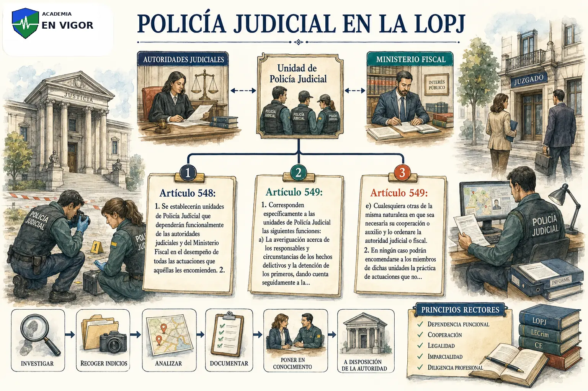

<em>Infografía: mapa de policía judicial en la lopj.</em>

<!-- FUENTE: LOPJ-BOE-A-1985-12666-T09 -->

## 55. Función general de Policía Judicial

Este bloque ordena **función general de policía judicial** dentro de policía judicial especializada, distinguiendo órgano, presupuesto, plazo, actuación y efecto.

### Claves rápidas

- **Art. 3.º:** Los Jueces, Tribunales y miembros del Ministerio Fiscal podrán, en defecto de Unidades de Policía Judicial, con carácter transitorio o en supuestos de urgencia y siempre con sujeción a su respectivo ámbito legal y territorial de atribuciones, encomendar a los miembros de las Fuerzas y Cuerpos de Seguridad la práctica de concretas diligencias de investigación en los términos previstos en el artículo 288 de la Ley de Enjuiciamiento Criminal.
- **Art. 1.º:** Las funciones generales de policía judicial corresponden a todos los miembros de las Fuerzas y Cuerpos de Seguridad cualquiera que sea su naturaleza y dependencia, en la medida en que deben prestar la colaboración requerida por la Autoridad Judicial o el Ministerio Fiscal en actuaciones encaminadas a la averiguación de delitos o descubrimiento y aseguramiento de delincuentes, con estricta sujeción al ámbito de sus respectivas competencias, y sin perjuicio de lo dispuesto en el artículo 283 de la Ley de Enjuiciamiento Criminal.
- **Art. 2.º:** Los miembros de las Fuerzas y Cuerpos de Seguridad, en sus funciones de policía judicial, desarrollarán los cometidos expresados en el artículo 1.º, a requerimiento de la Autoridad Judicial, del Ministerio Fiscal o de sus superiores policiales o por propia iniciativa a través de estos últimos, en los términos previstos en los artículos siguientes.
- **Art. 4.º:** Todos los componentes de las Fuerzas y Cuerpos de Seguridad, cualquiera que sean su naturaleza y dependencia, practicarán por su propia iniciativa y según sus respectivas atribuciones, las primeras diligencias de prevención y aseguramiento así que tengan noticia de la perpetración del hecho presuntamente delictivo, y la ocupación y custodia de los objetos que provinieren del delito o estuvieren relacionados con su ejecución, dando cuenta de todo ello en los términos legales a la Autoridad Judicial o Fiscal, directamente o a través de las Unidades Orgánicas de Policía Judicial.

:::perla-vigor
En procesal penal, identifica siempre quién actúa, ante qué órgano, dentro de qué plazo y con qué consecuencia.
:::

<!-- VISUAL:t09-55-funcion-general-de-policia-judicial.webp -->

  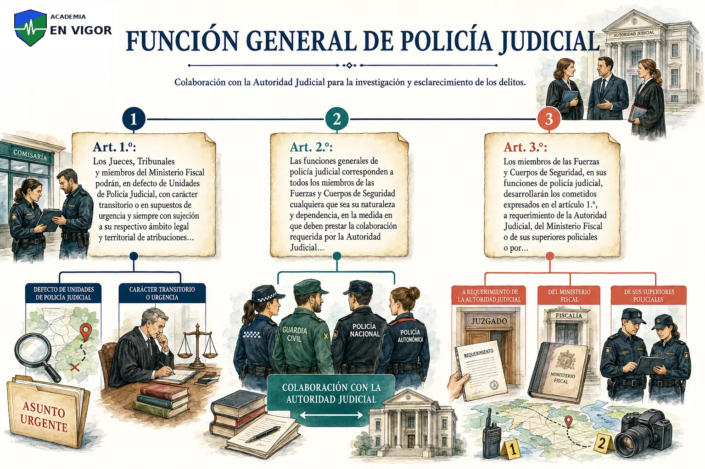

<em>Infografía: flujo de función general de policía judicial.</em>

<!-- FUENTE: RD769-1987-BOE-A-1987-14578-T09 -->

## 56. Unidades Orgánicas de Policía Judicial

Este bloque ordena **unidades orgánicas de policía judicial** dentro de policía judicial especializada, distinguiendo órgano, presupuesto, plazo, actuación y efecto.

### Claves rápidas

- **Art. 6.º:** La Policía Judicial, con la composición y estructuración que en esta norma se determinan, desarrollará, bajo la dependencia funcional directa de los Jueces y Tribunales y del Ministerio Fiscal, funciones de averiguación del delito y descubrimiento y aseguramiento del delincuente, con arreglo a lo dispuesto en la Ley.
- **Art. 8.º:** Dichas Unidades actuarán conforme a lo dispuesto en el artículo 5.° de la Ley de Fuerzas y Cuerpos de Seguridad y con sujeción a los principios y normas contenidos en el capítulo siguiente de este Real Decreto.
- **Art. 9.º:** Las Unidades Orgánicas de la Policía Judicial se estructurarán con arreglo a criterios de distribución territorial sobre una base provincial. También podrán constituirse secciones de las mismas en aquellas poblaciones cuyo índice de criminalidad así lo aconseje. Asimismo, se constituirán Unidades con ámbito de actuación que exceda el provincial, por razones de especialización delictual o de técnicas de investigación.
- **Art. 7.º:** Constituyen la Policía Judicial en sentido estricto las Unidades Orgánicas previstas en el artículo 30.1 de la Ley Orgánica de Fuerzas y Cuerpos de Seguridad integradas por miembros del Cuerpo Nacional de Policía y de la Guardia Civil.

:::perla-vigor
En procesal penal, identifica siempre quién actúa, ante qué órgano, dentro de qué plazo y con qué consecuencia.
:::

<!-- VISUAL:t09-56-unidades-organicas-de-policia-judicial.webp -->

  

<em>Infografía: comparación de unidades orgánicas de policía judicial.</em>

<!-- FUENTE: RD769-1987-BOE-A-1987-14578-T09 -->

## 57. Dependencia funcional

Este bloque ordena **dependencia funcional** dentro de policía judicial especializada, distinguiendo órgano, presupuesto, plazo, actuación y efecto.

### Claves rápidas

- **Art. 10:** En la ejecución de sus cometidos referentes a la averiguación del delito y descubrimiento y aseguramiento del delincuente, así como de los previstos en los apartados b) a e) del artículo 445 (*) de la Ley Orgánica del Poder Judicial, las Unidades Orgánicas de la Policía Judicial y los funcionarios a ellas adscritos dependen funcionalmente de los Jueces, Tribunales o miembros del Ministerio Fiscal que estén conociendo del asunto objeto de su investigación.
- **Art. 11:** Los funcionarios policiales comisionados por la Autoridad Judicial o Fiscal con arreglo al artículo 21 para la práctica de alguna concreta investigación se atendrán en el desarrollo de ésta a las órdenes y directrices que hubieren recibido, sin que las instrucciones de carácter técnico que obtuvieren de sus superiores policiales inmediatos puedan contradecir las primeras.
- **Art. 12:** Los referidos funcionarios policiales informarán de la evolución de sus investigaciones y rendirán cumplida cuenta del resultado final de su actuación a la Autoridad Judicial o del Ministerio Fiscal que la hubiere ordenado, en los términos y forma que la misma haya dispuesto.
- **Art. 13:** En las diligencias o actuaciones que lleven a cabo por encargo y bajo la supervisión de los Jueces, Tribunales o Fiscales, competentes los funcionarios integrantes de las Unidades Orgánicas de la Policía Judicial tendrán el carácter de comisionados de aquéllos y, en tal concepto, podrán requerir el auxilio necesario de las autoridades y, en su caso, de los particulares.

:::perla-vigor
En procesal penal, identifica siempre quién actúa, ante qué órgano, dentro de qué plazo y con qué consecuencia.
:::

<!-- VISUAL:t09-57-dependencia-funcional.webp -->

  

<em>Infografía: línea temporal de dependencia funcional.</em>

<!-- FUENTE: RD769-1987-BOE-A-1987-14578-T09 -->

## 58. Encargos, instrucciones e informes

Este bloque ordena **encargos, instrucciones e informes** dentro de policía judicial especializada, distinguiendo órgano, presupuesto, plazo, actuación y efecto.

### Claves rápidas

- **Art. 15:** Los funcionarios integrantes de las Unidades Orgánicas de la Policía Judicial deberán guardar rigurosa reserva sobre la evolución y resultado de las concretas investigaciones que les hubieren sido encomendadas, así como de todas las informaciones que, a través de ellas, obtengan. La infracción de dicho deber será corregida disciplinariamente, sin perjuicio de otras responsabilidades a que la misma pudiere dar lugar. La obligación de reserva no impedirá, salvo prohibición expresa del Juez o Fiscal competentes, el intercambio interno de información dentro de la Unidad Orgánica para la mejor coordinación y eficacia de los servicios.
- **Art. 16:** Los funcionarios de las Unidades Orgánicas de la Policía Judicial no podrán ser removidos o apartados de la investigación concreta que se les hubiere encomendado, hasta que finalice la misma o la fase procesal que la originó, si no es por decisión o con la autorización del Juez o Fiscal competente. Cuando los funcionarios a quienes esté encomendada una concreta investigación hayan de cesar en su destino por causas legalmente establecidas, su cese se participará a la Autoridad Judicial o Fiscal para su conocimiento.
- **Art. 17:** A tal efecto podrán practicar las informaciones reservadas que consideren pertinentes. En los casos en que los hechos objeto del expediente tengan relación directa con el desarrollo de la investigación, el Juez, Tribunal o Fiscal del que dependan informará con carácter preceptivo en el mismo y podrá emitir cualquier otro informe que considere oportuno durante su tramitación.
- **Art. 14:** Las diligencias y actuaciones llevadas a cabo por las Unidades Orgánicas de la Policía Judicial tendrán el valor reconocido en las Leyes y gozarán de la especial consideración derivada de la adscripción y del carácter de comisionados de Jueces, Tribunales y Fiscales.

:::perla-vigor
En procesal penal, identifica siempre quién actúa, ante qué órgano, dentro de qué plazo y con qué consecuencia.
:::

<!-- VISUAL:t09-58-encargos-instrucciones-e-informes.webp -->

  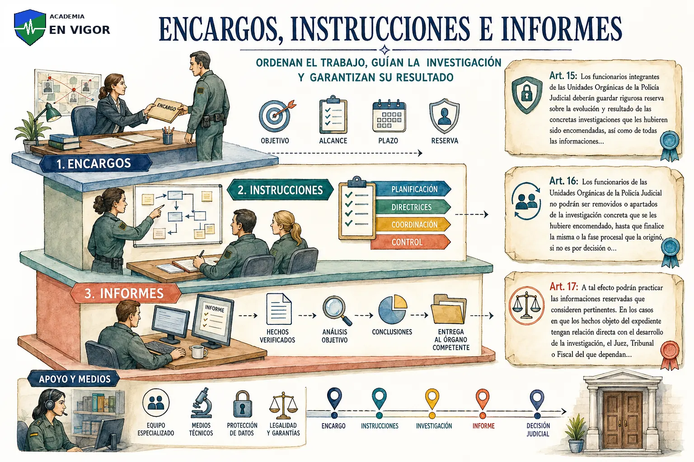

<em>Infografía: escena de encargos, instrucciones e informes.</em>

<!-- FUENTE: RD769-1987-BOE-A-1987-14578-T09 -->

## 59. Principios y formas de actuación

Este bloque ordena **principios y formas de actuación** dentro de policía judicial especializada, distinguiendo órgano, presupuesto, plazo, actuación y efecto.

### Claves rápidas

- **Art. 18:** A las Unidades Orgánicas de la Policía Judicial corresponderá la función de investigación criminal con carácter permanente y especial. A tal fin, contarán con los efectivos y medios necesarios para el eficaz desenvolvimiento de sus cometidos, estableciéndose, en aquellas Unidades en cuyo ámbito de actuación el nivel de delincuencia lo hiciere preciso, los correspondientes equipos de especialización delictual.
- **Art. 20:** Cuando los funcionarios integrantes de las Unidades Orgánicas de la Policía Judicial realicen diligencias de investigación criminal formalmente concretadas a un supuesto presuntamente delictivo, pero con carácter previo a la apertura de la correspondiente actuación judicial, actuarán bajo la dependencia del Ministerio Fiscal.
- **Art. 20:** A tal efecto, darán cuenta de sus investigaciones a la Fiscalía correspondiente que, en cualquier momento, podrá hacerse cargo de la dirección de aquéllas, en cuyo caso los miembros de la Policía Judicial actuarán bajo su dependencia directa y practicarán sin demora las diligencias que el Fiscal les encomiende para la averiguación del delito y el descubrimiento y aseguramiento del delincuente.
- **Art. 21:** El Juez o Tribunal competente, una vez iniciado el procedimiento penal, y el Fiscal encargado de las actuaciones, en los casos a que ese refiere el artículo anterior, se entenderán directamente, y sin necesidad de acudir a instancias administrativas superiores, con el Jefe de la Unidad correspondiente, sea del Cuerpo Nacional de Policía o de la Guardia Civil, para encomendarle la práctica de cualquier investigación o la realización de otras misiones propias de la Policía Judicial.

:::perla-vigor
En procesal penal, identifica siempre quién actúa, ante qué órgano, dentro de qué plazo y con qué consecuencia.
:::

<!-- VISUAL:t09-59-principios-y-formas-de-actuacion.webp -->

  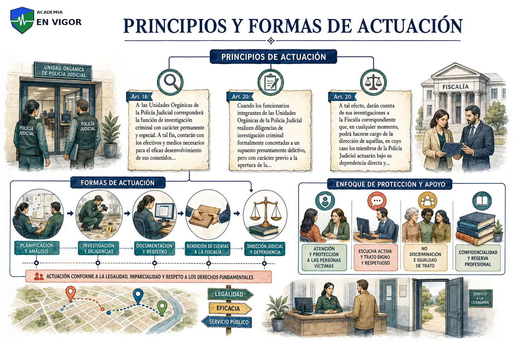

<em>Infografía: capas de principios y formas de actuación.</em>

<!-- FUENTE: RD769-1987-BOE-A-1987-14578-T09 -->

## 60. Estatuto de la Víctima: ámbito y concepto

Este bloque ordena **estatuto de la víctima: ámbito y concepto** dentro de derechos, protección y asistencia a víctimas, distinguiendo órgano, presupuesto, plazo, actuación y efecto.

### Claves rápidas

- **Artículo 2. Ámbito subjetivo. Concepto general de víctima:** Las disposiciones de esta Ley serán aplicables: a) Como víctima directa, a toda persona física que haya sufrido un daño o perjuicio sobre su propia persona o patrimonio, en especial lesiones físicas o psíquicas, daños emocionales o perjuicios económicos directamente causados por la comisión de un delito. b) Como víctima indirecta, en los casos de muerte o desaparición de una persona que haya sido causada directamente por un delito, salvo que se tratare de los responsables de los hechos:
- **Artículo 1. Ámbito:** Las disposiciones de esta Ley serán aplicables, sin perjuicio de lo dispuesto en el artículo 17, a las víctimas de delitos cometidos en España o que puedan ser perseguidos en España, con independencia de su nacionalidad, de si son mayores o menores de edad o de si disfrutan o no de residencia legal.
- **Artículo 3. Derechos de las víctimas:** 1. Toda víctima tiene derecho a la protección, información, apoyo, asistencia, atención y reparación, así como a la participación activa en el proceso penal y a recibir un trato respetuoso, profesional, individualizado y no discriminatorio desde su primer contacto con las autoridades o funcionarios, durante la actuación de los servicios de asistencia y apoyo a las víctimas y, en su caso, de justicia restaurativa, a lo largo de todo el proceso penal y por un período de tiempo adecuado después de su conclusión, con independencia de que se conozca o no la identidad del infractor y del resultado del proceso.

:::perla-vigor
En procesal penal, identifica siempre quién actúa, ante qué órgano, dentro de qué plazo y con qué consecuencia.
:::

<!-- VISUAL:t09-60-estatuto-de-la-victima-ambito-y-concepto.webp -->

  

<em>Infografía: mapa de estatuto de la víctima: ámbito y concepto.</em>

<!-- FUENTE: LEY4-2015-BOE-A-2015-4606-T09 -->

## 61. Comprensión, información y denuncia

Este bloque ordena **comprensión, información y denuncia** dentro de derechos, protección y asistencia a víctimas, distinguiendo órgano, presupuesto, plazo, actuación y efecto.

### Claves rápidas

- **Artículo 4. Derecho a entender y ser entendida:** Toda víctima tiene el derecho a entender y ser entendida en cualquier actuación que deba llevarse a cabo desde la interposición de una denuncia y durante el proceso penal, incluida la información previa a la interposición de una denuncia. A tal fin:
- **Artículo 4. Derecho a entender y ser entendida:** a) Todas las comunicaciones con las víctimas, orales o escritas, se harán en un lenguaje claro, sencillo y accesible, de un modo que tenga en cuenta sus características personales y, especialmente, las necesidades de las personas con discapacidad sensorial, intelectual o mental o su minoría de edad. Si la víctima fuera menor o tuviera la capacidad judicialmente modificada, las comunicaciones se harán a su representante o a la persona que le asista.
- **Artículo 4. Derecho a entender y ser entendida:** b) Se facilitará a la víctima, desde su primer contacto con las autoridades o con las Oficinas de Asistencia a las Víctimas, la asistencia o apoyos necesarios para que pueda hacerse entender ante ellas, lo que incluirá la interpretación en las lenguas de signos reconocidas legalmente y los medios de apoyo a la comunicación oral de personas sordas, con discapacidad auditiva y sordociegas. c) La víctima podrá estar acompañada de una persona de su elección desde el primer contacto con las autoridades y funcionarios.
- **Artículo 6. Derechos de la víctima como denunciante:** Toda víctima tiene, en el momento de presentar su denuncia, los siguientes derechos: a) A obtener una copia de la denuncia, debidamente certificada. b) A la asistencia lingüística gratuita y a la traducción escrita de la copia de la denuncia presentada, cuando no entienda o no hable ninguna de las lenguas que tengan carácter oficial en el lugar en el que se presenta la denuncia.

:::perla-vigor
En procesal penal, identifica siempre quién actúa, ante qué órgano, dentro de qué plazo y con qué consecuencia.
:::

<!-- VISUAL:t09-61-comprension-informacion-y-denuncia.webp -->

  

<em>Infografía: flujo de comprensión, información y denuncia.</em>

<!-- FUENTE: LEY4-2015-BOE-A-2015-4606-T09 -->

## 62. Reflexión, traducción y servicios de apoyo

Este bloque ordena **reflexión, traducción y servicios de apoyo** dentro de derechos, protección y asistencia a víctimas, distinguiendo órgano, presupuesto, plazo, actuación y efecto.

### Claves rápidas

- **Artículo 8. Período de reflexión en garantía de los derechos de la víctima:** 1. Los Abogados y Procuradores no podrán dirigirse a las víctimas directas o indirectas de catástrofes, calamidades públicas u otros sucesos que hubieran producido un número elevado de víctimas que cumplan los requisitos que se determinen reglamentariamente y que puedan constituir delito, para ofrecerles sus servicios profesionales hasta transcurridos 45 días desde el hecho.
- **Artículo 9. Derecho a la traducción e interpretación:** 2. La asistencia de intérprete se podrá prestar por medio de videoconferencia o cualquier medio de telecomunicación, salvo que el Juez o Tribunal, de oficio o a instancia de parte, acuerde la presencia física del intérprete para salvaguardar los derechos de la víctima. 3. Excepcionalmente, la traducción escrita de documentos podrá ser sustituida por un resumen oral de su contenido en una lengua que comprenda, cuando de este modo también se garantice suficientemente la equidad del proceso.
- **Artículo 10. Derecho de acceso a los servicios de asistencia y apoyo:** Este derecho podrá extenderse a los familiares de la víctima, en los términos que asimismo se establezcan reglamentariamente, cuando se trate de delitos que hayan causado perjuicios de especial gravedad. Las autoridades o funcionarios que entren en contacto con las víctimas deberán derivarlas a las Oficinas de Asistencia a las Víctimas cuando resulte necesario en atención a la gravedad del delito o en aquellos casos en los que la víctima lo solicite.

:::perla-vigor
En procesal penal, identifica siempre quién actúa, ante qué órgano, dentro de qué plazo y con qué consecuencia.
:::

<!-- VISUAL:t09-62-reflexion-traduccion-y-servicios-de-apoyo.webp -->

  

<em>Infografía: comparación de reflexión, traducción y servicios de apoyo.</em>

<!-- FUENTE: LEY4-2015-BOE-A-2015-4606-T09 -->

## 63. Participación y revisión del sobreseimiento

Este bloque ordena **participación y revisión del sobreseimiento** dentro de derechos, protección y asistencia a víctimas, distinguiendo órgano, presupuesto, plazo, actuación y efecto.

### Claves rápidas

- **Artículo 12. Comunicación y revisión del sobreseimiento de la investigación a instancia de la víctima:** En estos supuestos, el Juez o Tribunal podrá acordar, motivadamente, prescindir de la comunicación a todos los familiares cuando ya se haya dirigido con éxito a varios de ellos o cuando hayan resultado infructuosas cuantas gestiones se hubieren practicado para su localización. 2. La víctima podrá recurrir la resolución de sobreseimiento conforme a lo dispuesto en la Ley de Enjuiciamiento Criminal, sin que sea necesario para ello que se haya personado anteriormente en el proceso.
- **Artículo 11. Participación activa en el proceso penal:** Toda víctima tiene derecho: a) A ejercer la acción penal y la acción civil conforme a lo dispuesto en la Ley de Enjuiciamiento Criminal, sin perjuicio de las excepciones que puedan existir. b) A comparecer ante las autoridades encargadas de la investigación para aportarles las fuentes de prueba y la información que estime relevante para el esclarecimiento de los hechos.

:::perla-vigor
En procesal penal, identifica siempre quién actúa, ante qué órgano, dentro de qué plazo y con qué consecuencia.
:::

<!-- VISUAL:t09-63-participacion-y-revision-del-sobreseimiento.webp -->

  

<em>Infografía: línea temporal de participación y revisión del sobreseimiento.</em>

<!-- FUENTE: LEY4-2015-BOE-A-2015-4606-T09 -->

## 64. Ejecución, gastos y justicia restaurativa

Este bloque ordena **ejecución, gastos y justicia restaurativa** dentro de derechos, protección y asistencia a víctimas, distinguiendo órgano, presupuesto, plazo, actuación y efecto.

### Claves rápidas

- **Artículo 13. Participación de la víctima en la ejecución:** c) El auto por el que se conceda al penado la libertad condicional, cuando se trate de alguno de los delitos a que se refiere el párrafo segundo del artículo 36.2 del Código Penal o de alguno de los delitos a que se refiere la letra a) de este apartado, siempre que se hubiera impuesto una pena de más de cinco años de prisión. La víctima deberá anunciar al Secretario judicial competente su voluntad de recurrir dentro del plazo máximo de cinco días contados a partir del momento en que se hubiera notificado conforme a lo dispuesto en los párrafos segundo y tercero del artículo 7.1, e interponer el recurso dentro del plazo de quince días desde dicha notificación.
- **Artículo 14. Reembolso de gastos:** La víctima que haya participado en el proceso tendrá derecho a obtener el reembolso de los gastos necesarios para el ejercicio de sus derechos y las costas procesales que se le hubieren causado con preferencia respecto del pago de los gastos que se hubieran causado al Estado, cuando se imponga en la sentencia de condena su pago y se hubiera condenado al acusado, a instancia de la víctima, por delitos por los que el Ministerio Fiscal no hubiera formulado acusación o tras haberse revocado la resolución de archivo por recurso interpuesto por la víctima.
- **Artículo 15. Servicios de justicia restaurativa:** 1. Las víctimas podrán acceder a servicios de justicia restaurativa, en los términos que reglamentariamente se determinen, con la finalidad de obtener una adecuada reparación material y moral de los perjuicios derivados del delito, cuando se cumplan los siguientes requisitos: a) el infractor haya reconocido los hechos esenciales de los que deriva su responsabilidad; b) la víctima haya prestado su consentimiento, después de haber recibido información exhaustiva e imparcial sobre su contenido, sus posibles resultados y los procedimientos existentes para hacer efectivo su cumplimiento;

:::perla-vigor
En procesal penal, identifica siempre quién actúa, ante qué órgano, dentro de qué plazo y con qué consecuencia.
:::

<!-- VISUAL:t09-64-ejecucion-gastos-y-justicia-restaurativa.webp -->

  

<em>Infografía: escena de ejecución, gastos y justicia restaurativa.</em>

<!-- FUENTE: LEY4-2015-BOE-A-2015-4606-T09 -->

## 65. Justicia gratuita, dimensión europea y devolución

Este bloque ordena **justicia gratuita, dimensión europea y devolución** dentro de derechos, protección y asistencia a víctimas, distinguiendo órgano, presupuesto, plazo, actuación y efecto.

### Claves rápidas

- **Artículo 16. Justicia gratuita:** Las víctimas podrán presentar sus solicitudes de reconocimiento del derecho a la asistencia jurídica gratuita ante el funcionario o autoridad que les facilite la información a la que se refiere la letra c) del artículo 5.1, que la trasladará, junto con la documentación aportada, al Colegio de Abogados correspondiente. La solicitud también podrá ser presentada ante las Oficinas de Asistencia a las Víctimas de la Administración de Justicia, que la remitirán al Colegio de Abogados que corresponda.
- **Artículo 18. Devolución de bienes:** Las víctimas tendrán derecho a obtener, de conformidad con lo dispuesto en la Ley de Enjuiciamiento Criminal, la devolución sin demora de los bienes restituibles de su propiedad que hubieran sido incautados en el proceso. La devolución podrá ser denegada cuando la conservación de los efectos por la autoridad resulte imprescindible para el correcto desarrollo del proceso penal y no sea suficiente con la imposición al propietario de una obligación de conservación de los efectos a disposición del Juez o Tribunal.
- **Artículo 17. Víctimas de delitos cometidos en otros Estados miembros de la Unión Europea:** Las víctimas residentes en España podrán presentar ante las autoridades españolas denuncias correspondientes a hechos delictivos que hubieran sido cometidos en el territorio de otros países de la Unión Europea. En el caso de que las autoridades españolas resuelvan no dar curso a la investigación por falta de jurisdicción, remitirán inmediatamente la denuncia presentada a las autoridades competentes del Estado en cuyo territorio se hubieran cometido los hechos y se lo comunicarán al denunciante por el procedimiento que hubiera designado conforme a lo previsto en la letra m) del artículo 5.1 de la presente Ley.

:::perla-vigor
En procesal penal, identifica siempre quién actúa, ante qué órgano, dentro de qué plazo y con qué consecuencia.
:::

<!-- VISUAL:t09-65-justicia-gratuita-dimension-europea-y-devolucion.webp -->

  

<em>Infografía: capas de justicia gratuita, dimensión europea y devolución.</em>

<!-- FUENTE: LEY4-2015-BOE-A-2015-4606-T09 -->

## 66. Protección, contacto, investigación e intimidad

Este bloque ordena **protección, contacto, investigación e intimidad** dentro de derechos, protección y asistencia a víctimas, distinguiendo órgano, presupuesto, plazo, actuación y efecto.

### Claves rápidas

- **Artículo 21. Protección de la víctima durante la investigación penal:** Las autoridades y funcionarios encargados de la investigación penal velarán por que, en la medida que ello no perjudique la eficacia del proceso: a) Se reciba declaración a las víctimas, cuando resulte necesario, sin dilaciones injustificadas. b) Se reciba declaración a las víctimas el menor número de veces posible, y únicamente cuando resulte estrictamente necesario para los fines de la investigación penal.
- **Artículo 19. Derecho de las víctimas a la protección:** Las autoridades y funcionarios encargados de la investigación, persecución y enjuiciamiento de los delitos adoptarán las medidas necesarias, de acuerdo con lo establecido en la Ley de Enjuiciamiento Criminal, para garantizar la vida de la víctima y de sus familiares, su integridad física y psíquica, libertad, seguridad, libertad e indemnidad sexuales, así como para proteger adecuadamente su intimidad y su dignidad, particularmente cuando se les reciba declaración o deban testificar en juicio, y para evitar el riesgo de su victimización secundaria o reiterada.
- **Artículo 20. Derecho a que se evite el contacto entre víctima e infractor:** Las dependencias en las que se desarrollen los actos del procedimiento penal, incluida la fase de investigación, estarán dispuestas de modo que se evite el contacto directo entre las víctimas y sus familiares, de una parte, y el sospechoso de la infracción o acusado, de otra, con arreglo a la Ley de Enjuiciamiento Criminal y sin perjuicio de lo dispuesto en los artículos siguientes.
- **Artículo 22. Derecho a la protección de la intimidad:** Los Jueces, Tribunales, Fiscales y las demás autoridades y funcionarios encargados de la investigación penal, así como todos aquellos que de cualquier modo intervengan o participen en el proceso, adoptarán, de acuerdo con lo dispuesto en la Ley, las medidas necesarias para proteger la intimidad de todas las víctimas y de sus familiares y, en particular, para impedir la difusión de cualquier información que pueda facilitar la identificación de las víctimas menores de edad o de víctimas con discapacidad necesitadas de especial protección.

:::perla-vigor
En procesal penal, identifica siempre quién actúa, ante qué órgano, dentro de qué plazo y con qué consecuencia.
:::

<!-- VISUAL:t09-66-proteccion-contacto-investigacion-e-intimidad.webp -->

  

<em>Infografía: mapa de protección, contacto, investigación e intimidad.</em>

<!-- FUENTE: LEY4-2015-BOE-A-2015-4606-T09 -->

## 67. Evaluación individual de necesidades

Este bloque ordena **evaluación individual de necesidades** dentro de derechos, protección y asistencia a víctimas, distinguiendo órgano, presupuesto, plazo, actuación y efecto.

### Claves rápidas

- **Artículo 24. Competencia y procedimiento de evaluación:** b) Durante la fase de enjuiciamiento, al Juez o Tribunal a los que correspondiera el conocimiento de la causa. La resolución que se adopte deberá ser motivada y reflejará cuáles son las circunstancias que han sido valoradas para su adopción. Se determinará reglamentariamente la tramitación, la constancia documental y la gestión de la valoración y sus modificaciones. 2. La valoración de las necesidades de protección de la víctima incluirá siempre la de aquéllas que hayan sido manifestadas por ella con esa finalidad, así como la voluntad que hubiera expresado.
- **Artículo 23. Evaluación individual de las víctimas a fin de determinar sus necesidades especiales de protección:** 1. La determinación de qué medidas de protección, reguladas en los artículos siguientes, deben ser adoptadas para evitar a la víctima perjuicios relevantes que, de otro modo, pudieran derivar del proceso, se realizará tras una valoración de sus circunstancias particulares.

:::perla-vigor
En procesal penal, identifica siempre quién actúa, ante qué órgano, dentro de qué plazo y con qué consecuencia.
:::

<!-- VISUAL:t09-67-evaluacion-individual-de-necesidades.webp -->

  

<em>Infografía: flujo de evaluación individual de necesidades.</em>

<!-- FUENTE: LEY4-2015-BOE-A-2015-4606-T09 -->

## 68. Medidas especiales de protección

Este bloque ordena **medidas especiales de protección** dentro de derechos, protección y asistencia a víctimas, distinguiendo órgano, presupuesto, plazo, actuación y efecto.

### Claves rápidas

- **Artículo 25. Medidas de protección:** 1. Durante la fase de investigación podrán ser adoptadas las siguientes medidas para la protección de las víctimas: a) Que se les reciba declaración en dependencias especialmente concebidas o adaptadas a tal fin. b) Que se les reciba declaración por profesionales que hayan recibido una formación especial para reducir o limitar perjuicios a la víctima, así como en perspectiva de género, o con su ayuda. c) Que todas las tomas de declaración a una misma víctima le sean realizadas por la misma persona, salvo que ello pueda perjudicar de forma relevante el desarrollo del proceso o deba tomarse la declaración directamente por un Juez o un Fiscal.
- **Artículo 26. Medidas de protección para menores, personas con discapacidad necesitadas de especial protección y víctimas de violencias sexuales:** En particular, serán aplicables las siguientes: a) Las declaraciones recibidas durante la fase de investigación serán grabadas por medios audiovisuales y podrán ser reproducidas en el juicio en los casos y condiciones determinadas por la Ley de Enjuiciamiento Criminal. b) La declaración podrá recibirse por medio de personas expertas. 2. El Fiscal recabará del Juez o Tribunal la designación de un defensor judicial de la víctima, para que la represente en la investigación y en el proceso penal, en los siguientes casos:

:::perla-vigor
En procesal penal, identifica siempre quién actúa, ante qué órgano, dentro de qué plazo y con qué consecuencia.
:::

<!-- VISUAL:t09-68-medidas-especiales-de-proteccion.webp -->

  

<em>Infografía: comparación de medidas especiales de protección.</em>

<!-- FUENTE: LEY4-2015-BOE-A-2015-4606-T09 -->

## 69. Oficinas de Asistencia a las Víctimas

Este bloque ordena **oficinas de asistencia a las víctimas** dentro de derechos, protección y asistencia a víctimas, distinguiendo órgano, presupuesto, plazo, actuación y efecto.

### Claves rápidas

- **Artículo 27. Organización de las Oficinas de Asistencia a las Víctimas:** 1. El Gobierno y las Comunidades Autónomas que hayan asumido competencias en materia de Justicia organizarán, en el ámbito que les es propio, Oficinas de Asistencia a las Víctimas. 2. El Ministerio de Justicia o las Comunidades Autónomas podrán celebrar convenios de colaboración con entidades públicas y privadas, sin ánimo de lucro, para prestar los servicios de asistencia y apoyo a que se refiere este Título.
- **Artículo 28. Funciones de las Oficinas de Asistencia a las Víctimas:** 1. Las Oficinas de Asistencia a las Víctimas prestarán una asistencia que incluirá como mínimo: a) Información general sobre sus derechos y, en particular, sobre la posibilidad de acceder a un sistema público de indemnización. b) Información sobre los servicios especializados disponibles que puedan prestar asistencia a la víctima, a la vista de sus circunstancias personales y la naturaleza del delito de que pueda haber sido objeto. c) Apoyo emocional a la víctima.
- **Artículo 29. Funciones de apoyo a actuaciones de justicia restaurativa y de solución extraprocesal:** Las Oficinas de Asistencia a las Víctimas prestarán, en los términos que reglamentariamente se determine, apoyo a los servicios de justicia restaurativa y demás procedimientos de solución extraprocesal que legalmente se establezcan.

:::perla-vigor
En procesal penal, identifica siempre quién actúa, ante qué órgano, dentro de qué plazo y con qué consecuencia.
:::

<!-- VISUAL:t09-69-oficinas-de-asistencia-a-las-victimas.webp -->

  

<em>Infografía: línea temporal de oficinas de asistencia a las víctimas.</em>

<!-- FUENTE: LEY4-2015-BOE-A-2015-4606-T09 -->

## 70. Formación y protocolos

Este bloque ordena **formación y protocolos** dentro de derechos, protección y asistencia a víctimas, distinguiendo órgano, presupuesto, plazo, actuación y efecto.

### Claves rápidas

- **Artículo 30. Formación en los principios de protección de las víctimas:** 1. El Ministerio de Justicia, el Consejo General del Poder Judicial, la Fiscalía General del Estado y las Comunidades Autónomas, en el ámbito de sus respectivas competencias, asegurarán una formación general y específica, relativa a la protección de las víctimas en el proceso penal, en los cursos de formación de Jueces y Magistrados, Fiscales, Secretarios judiciales, Fuerzas y Cuerpos de Seguridad, médicos forenses, personal al servicio de la Administración de Justicia, personal de las Oficinas de Asistencia a las Víctimas y, en su caso, funcionarios de la Administración General del Estado o de las Comunidades Autónomas que desempeñen funciones en esta materia.
- **Artículo 31. Protocolos de actuación:** El Gobierno y las Comunidades Autónomas en el marco de sus competencias, con el fin de hacer más efectiva la protección de las víctimas y de sus derechos reconocidos por esta Ley, aprobarán los Protocolos que resulten necesarios para la protección de las víctimas. Asimismo, los Colegios profesionales que integren a aquellos que, en su actividad profesional, se relacionan y prestan servicios a las víctimas de delitos, promoverán igualmente la elaboración de Protocolos de actuación que orienten su actividad hacia la protección de las víctimas.

:::perla-vigor
En procesal penal, identifica siempre quién actúa, ante qué órgano, dentro de qué plazo y con qué consecuencia.
:::

<!-- VISUAL:t09-70-formacion-y-protocolos.webp -->

  

<em>Infografía: escena de formación y protocolos.</em>

<!-- FUENTE: LEY4-2015-BOE-A-2015-4606-T09 -->

## 71. Cooperación, sensibilización y disposiciones

Este bloque ordena **cooperación, sensibilización y disposiciones** dentro de derechos, protección y asistencia a víctimas, distinguiendo órgano, presupuesto, plazo, actuación y efecto.

### Claves rápidas

- **Disposición adicional primera:** El funcionamiento de las instituciones, mecanismos y garantías de asistencia a las víctimas es objeto de evaluación periódica.
- **Disposición adicional segunda:** Las medidas de la Ley se atienden con las disponibilidades presupuestarias existentes.
- **Disposición transitoria única:** La Ley se aplica a las víctimas de delitos a partir de su entrada en vigor, sin perjuicio de derechos anteriores.
- **Disposición derogatoria única:** Quedan derogadas las normas de igual o inferior rango que contradigan el Estatuto.

:::perla-vigor
En procesal penal, identifica siempre quién actúa, ante qué órgano, dentro de qué plazo y con qué consecuencia.
:::

<!-- VISUAL:t09-71-cooperacion-sensibilizacion-y-disposiciones.webp -->

  

<em>Infografía: capas de cooperación, sensibilización y disposiciones.</em>

<!-- FUENTE: LEY4-2015-BOE-A-2015-4606-T09 -->

# Hablemos claro

:::hablemos-claro
Este tema no es una lista de trámites. Es un mapa de garantías: competencia, inicio, investigación, prueba, detención, control judicial, organización y protección de la víctima.
:::

# En la calle

:::en-la-calle
Caso guía: recibe la noticia, determina competencia, documenta diligencias, preserva indicios, informa derechos, controla plazos y remite a la autoridad competente.
:::

# Lo que cae

El histórico oficial concentra preguntas en competencia, denuncia y querella, Policía Judicial, testigos, detención y defensa, registros, habeas corpus, órganos jurisdiccionales y Estatuto de la Víctima.

# Ha caído

Se han localizado y mapeado **133 preguntas oficiales** del Tema 9 entre 2020 y 2026.

> Las preguntas antiguas sobre Juzgados de Paz se conservan como antecedente histórico. La regla vigente se explica con Tribunales de Instancia y Oficinas de Justicia en los municipios.

---

*Academia En Vigor · El temario que nunca duerme · Tema 9 · v1.0.0 · Documento interno no publicado.*
