# TEMA 14 · MINISTERIO DEL INTERIOR Y MINISTERIO DE DEFENSA

**Guardia Civil · Método VIGOR · PARTE**
**Versión de contenido:** 1.0.0
**Estado editorial:** approved_internal · **Publicación:** not_published

# Mapa del tema

| Parte | Contenido | Bloques |
|---|---|---:|
| 1 | Mapa normativo y organización general | 1–2 |
| 2 | Seguridad y Fuerzas y Cuerpos de Seguridad | 3–5 |
| 3 | Coordinación, estudios y acción exterior | 6–7 |
| 4 | Instituciones penitenciarias | 8–9 |
| 5 | Protección civil y emergencias | 10–11 |
| 6 | Servicios comunes y órganos de la Subsecretaría | 12–16 |
| 7 | Disposiciones del Ministerio del Interior | 17–19 |
| 8 | Defensa y Fuerzas Armadas | 20–21 |
| 9 | Órganos de la Secretaría de Estado de Defensa | 22–27 |
| 10 | Personal, enseñanza y servicios comunes de Defensa | 28–34 |
| 11 | Política de Defensa | 35–37 |
| 12 | Disposiciones del Ministerio de Defensa | 38–43 |

# Contenido

## 01. Alcance oficial y reformas vigentes

Este bloque sitúa **alcance oficial y reformas vigentes** dentro de mapa normativo y organización general. Distingue dependencia, rango, funciones, órganos subordinados y adscripciones.

### Claves rápidas

- **Tema 14 · alcance oficial:** El Tema 14 comprende la estructura orgánica básica completa del Ministerio del Interior y la estructura orgánica básica completa del Ministerio de Defensa.
- **Tema 14 · fuentes vigentes:** La estructura del Ministerio del Interior se estudia conforme al Real Decreto 207/2024, modificado por el Real Decreto 353/2025 y el Real Decreto 328/2026.
- **Corte normativo:** El corte normativo es 9 de agosto de 2026: Interior está consolidado hasta 27 de abril de 2026 y Defensa hasta 27 de febrero de 2026.

:::perla-vigor
En un organigrama, una palabra cambia la respuesta: depender, adscribirse, integrarse y prestar apoyo no significan lo mismo.
:::

<!-- VISUAL:t14-01-alcance-oficial-y-reformas-vigentes.webp -->

  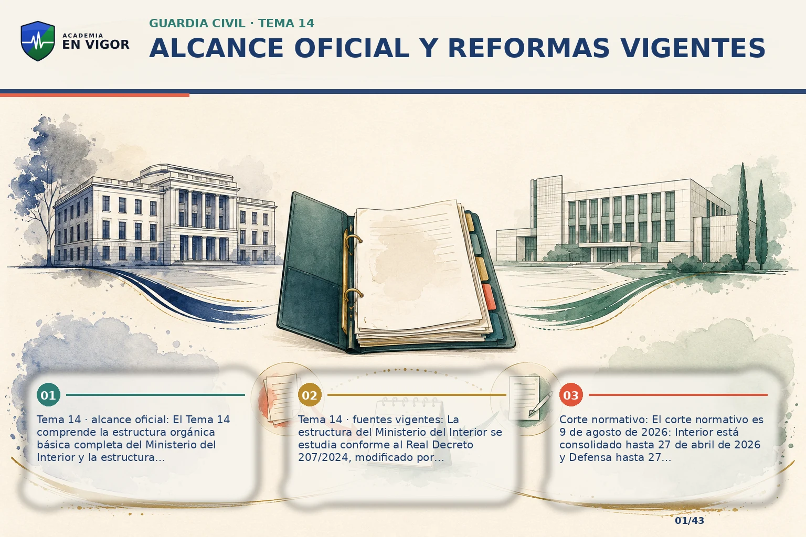

<em>Infografía: flujo de alcance oficial y reformas vigentes.</em>

<!-- FUENTE: GC-PROGRAMA-2024-T14 -->

## 02. Organización general del Ministerio del Interior

Este bloque sitúa **organización general del ministerio del interior** dentro de mapa normativo y organización general. Distingue dependencia, rango, funciones, órganos subordinados y adscripciones.

### Claves rápidas

- **Artículo 1. Organización general del Departamento · apartado 2:** 2. Corresponde a la persona titular del Ministerio la dirección de todos los servicios del Departamento, el mando superior de las Fuerzas y Cuerpos de Seguridad del Estado, la dirección de las competencias del Ministerio en materia de Administración Penitenciaria y las demás funciones señaladas en el artículo 61 de la Ley 40/2015, de 1 de octubre, de Régimen Jurídico del Sector Público, así como las que le sean atribuidas por otras leyes o normas especiales.
- **Artículo 1. Organización general del Departamento:** 5. El Ministerio del Interior se estructura en los siguientes órganos: a) La Secretaría de Estado de Seguridad, órgano superior del que dependen los siguientes órganos directivos: 1.º La Dirección General de la Policía.
- **Artículo 1. Organización general del Departamento:** 5. El Ministerio del Interior se estructura en los siguientes órganos: a) La Secretaría de Estado de Seguridad, órgano superior del que dependen los siguientes órganos directivos: 3.º La Dirección General de Relaciones Internacionales y Extranjería.
- **Artículo 1. Organización general del Departamento:** 5. El Ministerio del Interior se estructura en los siguientes órganos: a) La Secretaría de Estado de Seguridad, órgano superior del que dependen los siguientes órganos directivos: b) La Secretaría General de Instituciones Penitenciarias, de la que depende la Dirección General de Ejecución Penal y Reinserción Social.

:::perla-vigor
En un organigrama, una palabra cambia la respuesta: depender, adscribirse, integrarse y prestar apoyo no significan lo mismo.
:::

<!-- VISUAL:t14-02-organizacion-general-del-ministerio-del-interior.webp -->

  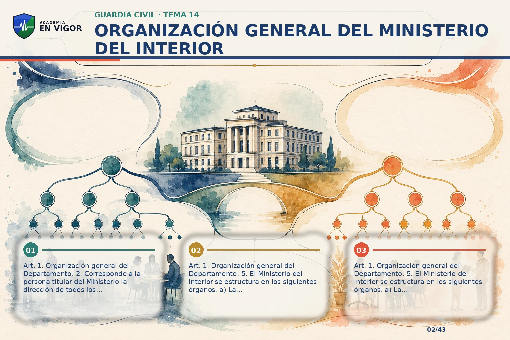

<em>Infografía: comparación de organización general del ministerio del interior.</em>

<!-- FUENTE: RD207-2024-BOE-A-2024-3793-GC-T14 -->

## 03. Secretaría de Estado de Seguridad

Este bloque sitúa **secretaría de estado de seguridad** dentro de seguridad y fuerzas y cuerpos de seguridad. Distingue dependencia, rango, funciones, órganos subordinados y adscripciones.

### Claves rápidas

- **Artículo 2. Secretaría de Estado de Seguridad:** 1. Corresponde a la persona titular de la Secretaría de Estado de Seguridad el ejercicio de las funciones a las que se refiere el artículo 62 de la Ley 40/2015, de 1 de octubre, y en particular, la dirección, coordinación y supervisión de los órganos directivos dependientes de la Secretaría de Estado, bajo la inmediata autoridad de la persona titular del Ministerio, para el ejercicio de las siguientes funciones: f) La dirección, impulso y coordinación de las actuaciones del Departamento en materia de crimen organizado, terrorismo, trata de seres humanos, tráfico de drogas, blanqueo de capitales relacionado con dicho tráfico y delitos conexos.
- **Artículo 2. Secretaría de Estado de Seguridad:** La persona titular de la dirección del Gabinete ejercerá las funciones de Relatoría Nacional contra la Trata de Seres Humanos conforme a la normativa internacional y europea vigente. Asimismo, coordinará, siguiendo las instrucciones de la persona titular de la Secretaría de Estado, las Subdirecciones Generales de Planificación y Gestión de Infraestructuras y Medios para la Seguridad y de Sistemas de Información y Comunicaciones para la Seguridad.
- **Artículo 2. Secretaría de Estado de Seguridad:** Del CITCO dependerán la Unidad Nacional de Retirada de Contenidos Ilícitos en Internet (UNECI), la Oficina Nacional de Información sobre Pasajeros (ONIP), que actúa como Unidad de Información sobre Pasajeros (PIU) nacional prevista en la normativa europea, y la Unidad de Policía Judicial para delitos de terrorismo (TEPOL).
- **Artículo 2. Secretaría de Estado de Seguridad · apartado 2:** 2. Como órgano de asistencia inmediata a la persona titular de la Secretaría de Estado existe un Gabinete, con nivel orgánico de subdirección general, con la estructura que se establece en el artículo 23.3 del Real Decreto 1009/2023, de 5 de diciembre.

:::perla-vigor
En un organigrama, una palabra cambia la respuesta: depender, adscribirse, integrarse y prestar apoyo no significan lo mismo.
:::

<!-- VISUAL:t14-03-secretaria-de-estado-de-seguridad.webp -->

  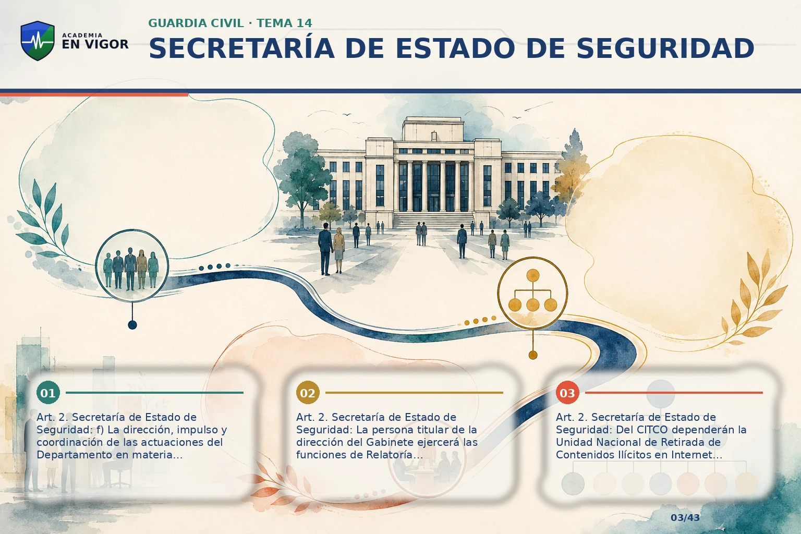

<em>Infografía: línea temporal de secretaría de estado de seguridad.</em>

<!-- FUENTE: RD207-2024-BOE-A-2024-3793-GC-T14 -->

## 04. Dirección General de la Policía

Este bloque sitúa **dirección general de la policía** dentro de seguridad y fuerzas y cuerpos de seguridad. Distingue dependencia, rango, funciones, órganos subordinados y adscripciones.

### Claves rápidas

- **Artículo 3. Dirección General de la Policía:** Corresponde a la persona titular de la Dirección General, bajo la dependencia de la persona titular de la Secretaría de Estado de Seguridad, el mando directo de la Policía Nacional. En particular, ejerce las siguientes funciones: i) Aplicar el régimen disciplinario del personal de la Policía Nacional.
- **Artículo 3. Dirección General de la Policía:** Entre las reglas de Artículo 3. Dirección General de la Policía, se establece: f) A la División de Operaciones y Transformación Digital, el apoyo a la Dirección Adjunta Operativa en la coordinación, gestión y supervisión en el ámbito de la operatividad policial, así como en la planificación estratégica en materia de transformación digital.
- **Artículo 3. Dirección General de la Policía · apartado 1:** 1. La Dirección General de la Policía, cuyo titular tiene rango de subsecretario, es el órgano del Ministerio encargado de la ordenación, dirección, coordinación y ejecución de las misiones que a la Policía Nacional encomienden las disposiciones vigentes, de acuerdo con las directrices y órdenes emanadas de la persona titular del Departamento.
- **Artículo 3. Dirección General de la Policía · apartado 3:** La Dirección Adjunta Operativa es responsable, de acuerdo con las directrices emanadas de la persona titular de la Dirección General, de la dirección, impulso y coordinación de las funciones policiales operativas, que en el nivel central serán realizadas por las Comisarías Generales de Información, de Policía Judicial, de Seguridad Ciudadana, de Extranjería y Fronteras y de Policía Científica, todas ellas con nivel orgánico de subdirección general, así como por la División de Operaciones y Transformación Digital, que tendrá el nivel orgánico que se determine en la relación de puestos de trabajo.

:::perla-vigor
En un organigrama, una palabra cambia la respuesta: depender, adscribirse, integrarse y prestar apoyo no significan lo mismo.
:::

<!-- VISUAL:t14-04-direccion-general-de-la-policia.webp -->

  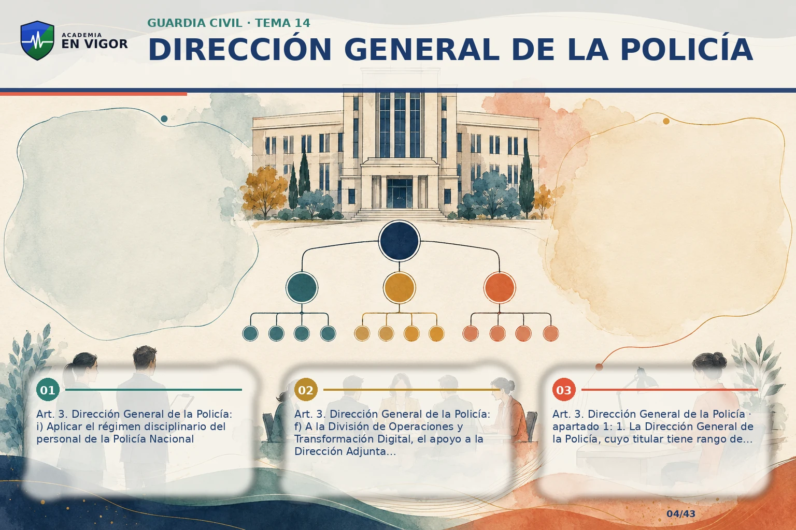

<em>Infografía: escena de dirección general de la policía.</em>

<!-- FUENTE: RD207-2024-BOE-A-2024-3793-GC-T14 -->

## 05. Dirección General de la Guardia Civil

Este bloque sitúa **dirección general de la guardia civil** dentro de seguridad y fuerzas y cuerpos de seguridad. Distingue dependencia, rango, funciones, órganos subordinados y adscripciones.

### Claves rápidas

- **Artículo 4. Dirección General de la Guardia Civil · apartado 1:** 1. La Dirección General de la Guardia Civil, cuyo titular tiene rango de subsecretario, es el órgano del Ministerio encargado de la ordenación, dirección, coordinación y ejecución de las misiones que a la Guardia Civil encomienden las disposiciones vigentes, de acuerdo con las directrices y órdenes emanadas de las personas titulares de los Ministerios del Interior y de Defensa, en el ámbito de sus respectivas competencias.
- **Artículo 4. Dirección General de la Guardia Civil:** Corresponde a la persona titular de la Dirección General, bajo la dependencia de la persona titular de la Secretaría de Estado de Seguridad, el mando directo de la Guardia Civil. En particular, ejerce las siguientes funciones: a) Dirigir, impulsar y coordinar el servicio y distribución de las Unidades de la Guardia Civil.
- **Artículo 4. Dirección General de la Guardia Civil · apartado 2:** 2. Se encuentran adscritos a la Dirección General el Consejo Superior de la Guardia Civil y el Consejo de la Guardia Civil.
- **Artículo 4. Dirección General de la Guardia Civil · apartado 4:** 4. Con nivel orgánico de subdirección general y dependencia directa de la persona titular de la Dirección General existirá un Gabinete Técnico, a cargo de un Oficial General de la Guardia Civil, para el asesoramiento y apoyo, y para facilitarle la coordinación en el ámbito de sus funciones. Elaborará los estudios e informes que se le encomienden, y tramitará las disposiciones normativas en el ámbito de su competencia, además de cuantos otros cometidos se le confíen.

:::perla-vigor
En un organigrama, una palabra cambia la respuesta: depender, adscribirse, integrarse y prestar apoyo no significan lo mismo.
:::

<!-- VISUAL:t14-05-direccion-general-de-la-guardia-civil.webp -->

  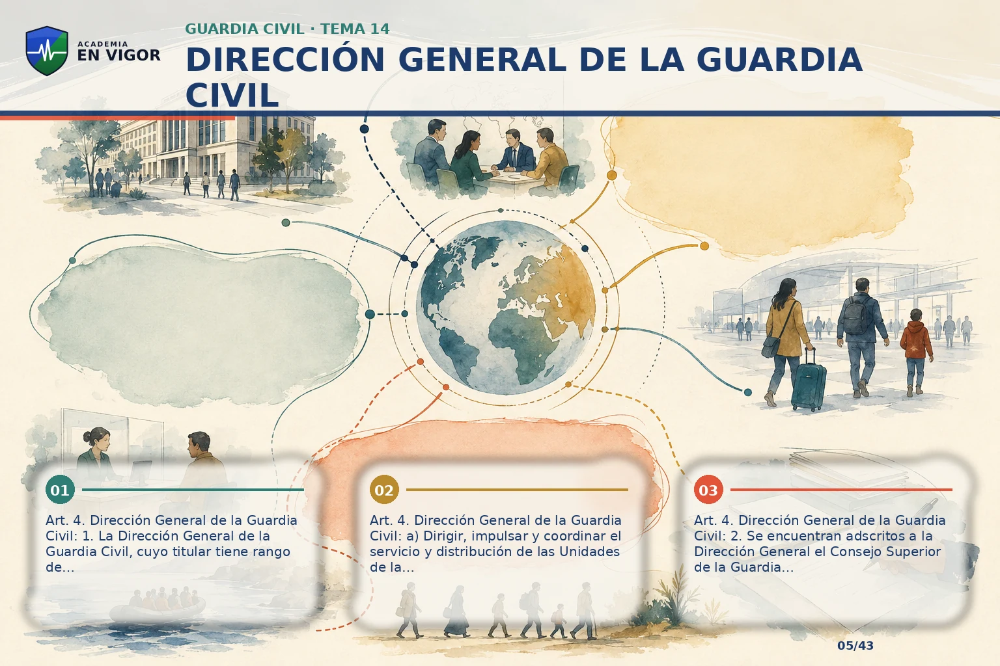

<em>Infografía: capas de dirección general de la guardia civil.</em>

<!-- FUENTE: RD207-2024-BOE-A-2024-3793-GC-T14 -->

## 06. Relaciones Internacionales y Extranjería

Este bloque sitúa **relaciones internacionales y extranjería** dentro de coordinación, estudios y acción exterior. Distingue dependencia, rango, funciones, órganos subordinados y adscripciones.

### Claves rápidas

- **Artículo 5. Dirección General de Relaciones Internacionales y Extranjería:** Entre las reglas de Artículo 5. Dirección General de Relaciones Internacionales y Extranjería, se establece: j) La coordinación de actuaciones con el Ministerio de Asuntos Exteriores, Unión Europea y Cooperación.

:::perla-vigor
En un organigrama, una palabra cambia la respuesta: depender, adscribirse, integrarse y prestar apoyo no significan lo mismo.
:::

<!-- VISUAL:t14-06-relaciones-internacionales-y-extranjeria.webp -->

  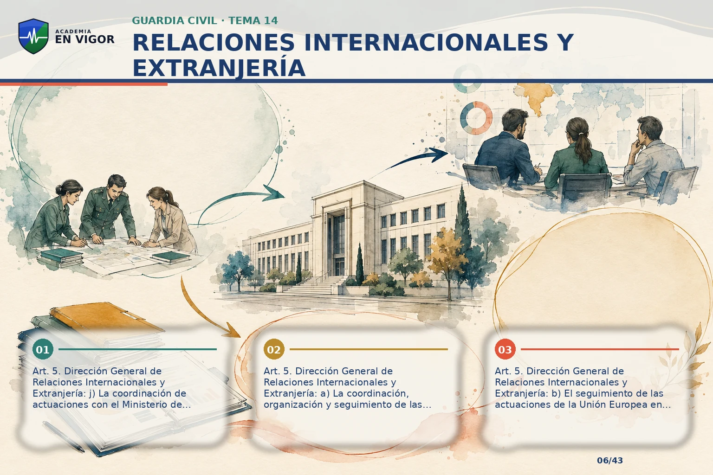

<em>Infografía: mapa de relaciones internacionales y extranjería.</em>

<!-- FUENTE: RD207-2024-BOE-A-2024-3793-GC-T14 -->

## 07. Coordinación y Estudios

Este bloque sitúa **coordinación y estudios** dentro de coordinación, estudios y acción exterior. Distingue dependencia, rango, funciones, órganos subordinados y adscripciones.

### Claves rápidas

- **Artículo 6. Dirección General de Coordinación y Estudios · apartado 1:** 1. La Dirección General de Coordinación y Estudios es el órgano de apoyo y asesoramiento a través del cual la persona titular de la Secretaría de Estado de Seguridad ejerce su función de coordinación y supervisión de la actuación de las Fuerzas y Cuerpos de Seguridad del Estado y de colaboración con las policías autonómicas y las policías locales.
- **Artículo 6. Dirección General de Coordinación y Estudios:** En concreto, le corresponden las siguientes funciones: 12.º Constituirse como Servicio Central de Violencia de Género para la dirección, definición y operación del Sistema de Seguimiento Integral de los casos de Violencia de Género.
- **Artículo 6. Dirección General de Coordinación y Estudios:** En concreto, le corresponden las siguientes funciones: 13.º Dirigir la Oficina Nacional de lucha contra los delitos de odio.
- **Artículo 6. Dirección General de Coordinación y Estudios:** Entre las reglas de Artículo 6. Dirección General de Coordinación y Estudios, se establece: 16.º Constituirse, a través de la OCC, como Observatorio de la Cibercriminalidad del Ministerio del Interior con el objeto de monitorizar y detectar tendencias para hacer frente a nuevos retos y amenazas en dicho ámbito, recopilar, procesar y analizar información sobre ciberseguridad, cibercriminalidad y campañas de desinformación, con la finalidad de elaborar productos de inteligencia

:::perla-vigor
En un organigrama, una palabra cambia la respuesta: depender, adscribirse, integrarse y prestar apoyo no significan lo mismo.
:::

<!-- VISUAL:t14-07-coordinacion-y-estudios.webp -->

  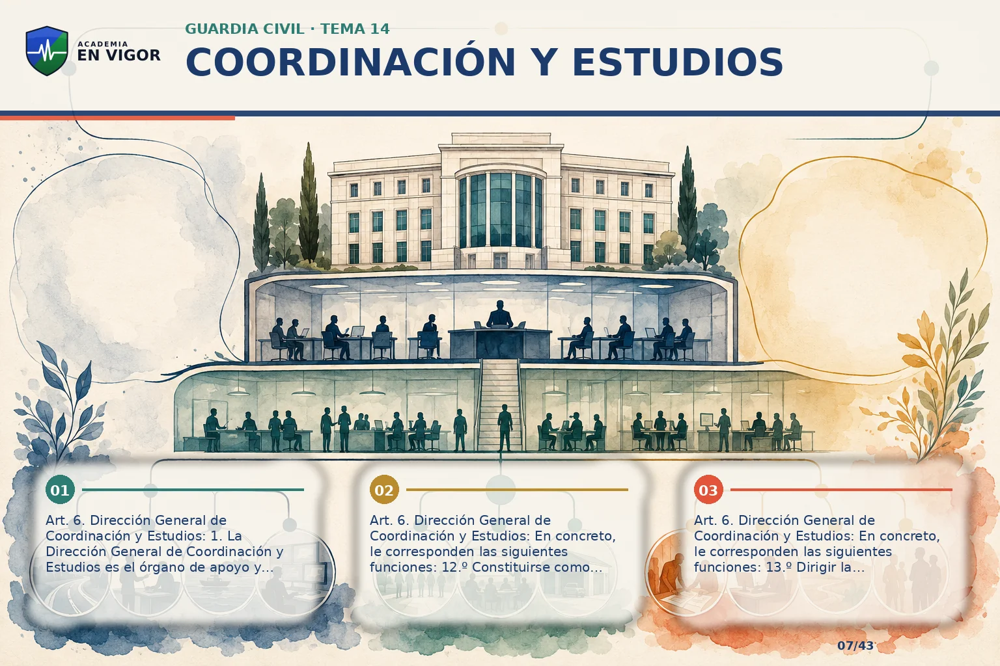

<em>Infografía: flujo de coordinación y estudios.</em>

<!-- FUENTE: RD207-2024-BOE-A-2024-3793-GC-T14 -->

## 08. Secretaría General de Instituciones Penitenciarias

Este bloque sitúa **secretaría general de instituciones penitenciarias** dentro de instituciones penitenciarias. Distingue dependencia, rango, funciones, órganos subordinados y adscripciones.

### Claves rápidas

- **Artículo 7. Secretaría General de Instituciones Penitenciarias · apartado 1:** 1. La Secretaría General de Instituciones Penitenciarias ejercerá, respecto de los órganos dependientes de ella, las atribuciones previstas en el artículo 64 de la Ley 40/2015, de 1 de octubre, y, en particular, las relativas al impulso, dirección, gestión y supervisión de las Instituciones Penitenciaras, a fin de que las penas y medidas penales alcancen los fines previstos constitucionalmente.
- **Artículo 7. Secretaría General de Instituciones Penitenciarias:** Específicamente, le corresponde ejercer las siguientes funciones: a) La dirección superior del ejercicio de las competencias asignadas a la Dirección General de Ejecución Penal y Reinserción Social en materia de gestión regimental y tratamental de los centros penitenciarios, medio abierto, medidas alternativas y sanidad penitenciaria, en los términos descritos en el artículo 8.
- **Artículo 7. Secretaría General de Instituciones Penitenciarias · apartado 7:** 7. Se adscribe a la Secretaría General la entidad de derecho público Trabajo Penitenciario y Formación para el Empleo, que ejercerá sus funciones de acuerdo con lo dispuesto en el Real Decreto 122/2015, de 27 de febrero, por el que se aprueba su estatuto. Corresponde al titular de la Secretaría General la presidencia de la entidad.

:::perla-vigor
En un organigrama, una palabra cambia la respuesta: depender, adscribirse, integrarse y prestar apoyo no significan lo mismo.
:::

<!-- VISUAL:t14-08-secretaria-general-de-instituciones-penitenciarias.webp -->

  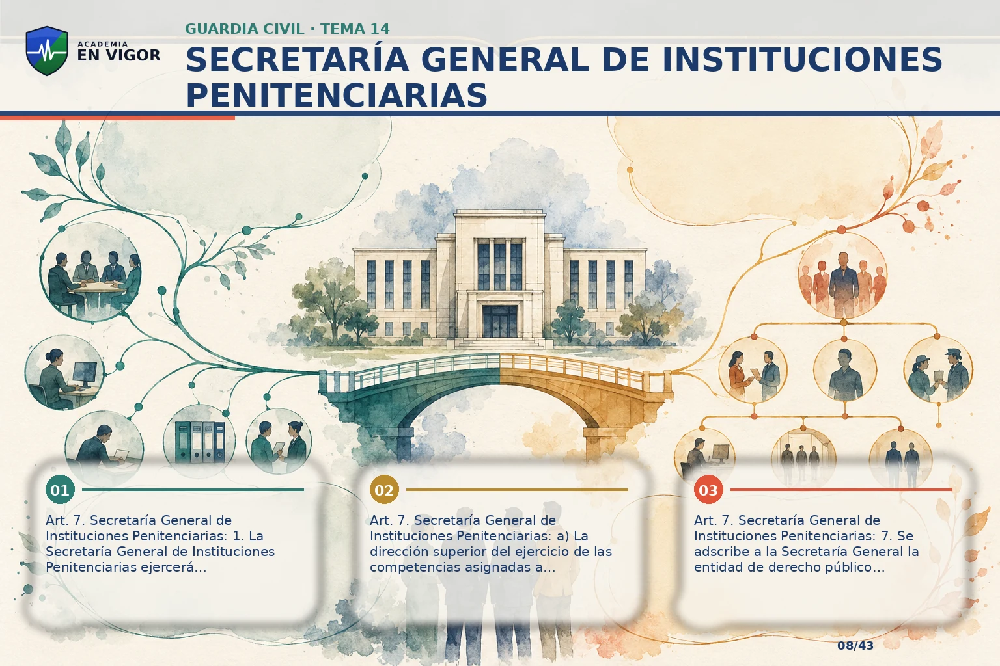

<em>Infografía: comparación de secretaría general de instituciones penitenciarias.</em>

<!-- FUENTE: RD207-2024-BOE-A-2024-3793-GC-T14 -->

## 09. Ejecución Penal y Reinserción Social

Este bloque sitúa **ejecución penal y reinserción social** dentro de instituciones penitenciarias. Distingue dependencia, rango, funciones, órganos subordinados y adscripciones.

### Claves rápidas

- **Artículo 8. Dirección General de Ejecución Penal y Reinserción Social:** 1. Corresponde a la Dirección General de Ejecución Penal y Reinserción Social, bajo la dirección y dependencia jerárquica de la persona titular de la Secretaría General de Instituciones Penitenciarias: a) La dirección de las instituciones penitenciarias en lo relativo a la ejecución penal y reinserción social, así como las medidas de seguridad privativas de libertad y de la medida de seguridad de libertad vigilada de cumplimiento posterior a una pena privativa de libertad.

:::perla-vigor
En un organigrama, una palabra cambia la respuesta: depender, adscribirse, integrarse y prestar apoyo no significan lo mismo.
:::

<!-- VISUAL:t14-09-ejecucion-penal-y-reinsercion-social.webp -->

  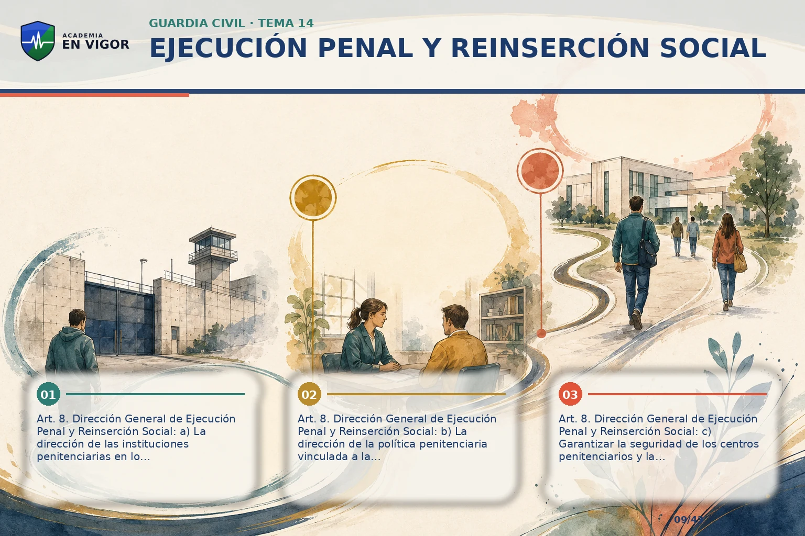

<em>Infografía: línea temporal de ejecución penal y reinserción social.</em>

<!-- FUENTE: RD207-2024-BOE-A-2024-3793-GC-T14 -->

## 10. Secretaría General de Protección Civil y Emergencias

Este bloque sitúa **secretaría general de protección civil y emergencias** dentro de protección civil y emergencias. Distingue dependencia, rango, funciones, órganos subordinados y adscripciones.

### Claves rápidas

- **Artículo 8 bis. Secretaría General de Protección Civil y Emergencias · apartado 1:** Corresponde a la Secretaría General de Protección Civil y Emergencias la gestión de las competencias del Ministerio en relación con la protección civil y las emergencias en el ejercicio de las que le atribuye la Ley 17/2015, de 9 de julio, del Sistema Nacional de Protección Civil, y su normativa de desarrollo, así como, respecto de los órganos dependientes de ella, el ejercicio de las atribuciones a que se refiere el artículo 64 de la Ley 40/2015, de 1 de octubre.
- **Artículo 8 bis. Secretaría General de Protección Civil y Emergencias:** En particular, corresponden a la Secretaría General las siguientes funciones: a) La preparación de planes estatales de protección civil o cuya competencia tenga atribuida por la normativa vigente.
- **Artículo 8 bis. Secretaría General de Protección Civil y Emergencias · apartado 2:** 2. Como órgano de asistencia inmediata a la persona titular de Secretaría General, existe un Gabinete Técnico, con nivel orgánico de subdirección general, con funciones de apoyo y asistencia directa, para facilitar el despacho y la coordinación de los órganos y unidades dependientes de aquélla. Elabora los estudios e informes necesarios, y realiza cuantas otras misiones le encomiende la persona titular de la Secretaría General.
- **Artículo 8 bis. Secretaría General de Protección Civil y Emergencias · apartado 3:** 3. De la Secretaría General de Protección Civil y Emergencias, depende la Dirección General de Protección Civil y Emergencias.

:::perla-vigor
En un organigrama, una palabra cambia la respuesta: depender, adscribirse, integrarse y prestar apoyo no significan lo mismo.
:::

<!-- VISUAL:t14-10-secretaria-general-de-proteccion-civil-y-emergencias.webp -->

  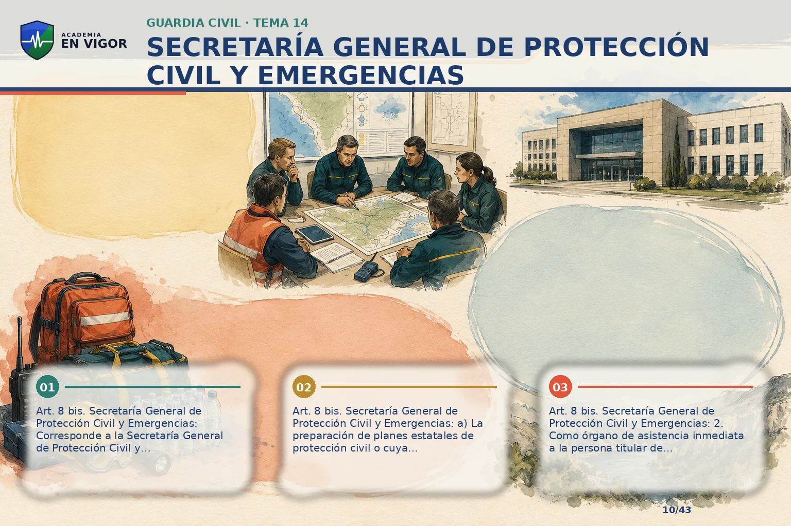

<em>Infografía: escena de secretaría general de protección civil y emergencias.</em>

<!-- FUENTE: RD207-2024-BOE-A-2024-3793-GC-T14 -->

## 11. Dirección General de Protección Civil y Emergencias

Este bloque sitúa **dirección general de protección civil y emergencias** dentro de protección civil y emergencias. Distingue dependencia, rango, funciones, órganos subordinados y adscripciones.

### Claves rápidas

- **Artículo 8 ter. Dirección General de Protección Civil y Emergencias · apartado 1:** 1. Corresponde a la Dirección General de Protección Civil y Emergencias bajo la dirección y dependencia jerárquica de la personal titular de la Secretaría General de Protección Civil y Emergencias, las competencias de la secretaría general, salvo las relacionadas con el ámbito tecnológico.
- **Artículo 8 ter. Dirección General de Protección Civil y Emergencias:** 2. La Dirección General de Protección Civil y Emergencias está integrada por los siguientes órganos directivos con nivel orgánico de subdirección general: a) Subdirección General de Anticipación y Preparación.
- **Artículo 8 ter. Dirección General de Protección Civil y Emergencias · apartado 3:** 3. Corresponde a la Subdirección General de Anticipación y Preparación las competencias en la anticipación, la prevención, la preparación y la formación y, en particular, las funciones previstas en los párrafos b), d), e), h), i), j), k) y o), así como del párrafo ñ) en el ámbito que le corresponda, del artículo 8 bis.1. En ella se integra la Escuela Nacional de Protección Civil.
- **Artículo 8 ter. Dirección General de Protección Civil y Emergencias · apartado 4:** Corresponde a la Subdirección General de Planificación y Gestión de Emergencias la planificación estatal ante las emergencias que puedan producir un riesgo de protección civil, las competencias para la gestión operativa de las emergencias del Mecanismo Nacional de Respuesta y la actuación como punto focal a nivel europeo e internacional y, en particular, las funciones previstas en los párrafos a), c), m) y n), así como en el párrafo l) en la organización y mantenimiento del Centro Nacional de Seguimiento y Coordinación de Emergencias, de la Red de Alerta Nacional y de la Red Nacional de Información, y en el párrafo ñ) en el ámbito que le corresponda del artículo 8 bis.1.

:::perla-vigor
En un organigrama, una palabra cambia la respuesta: depender, adscribirse, integrarse y prestar apoyo no significan lo mismo.
:::

<!-- VISUAL:t14-11-direccion-general-de-proteccion-civil-y-emergencias.webp -->

  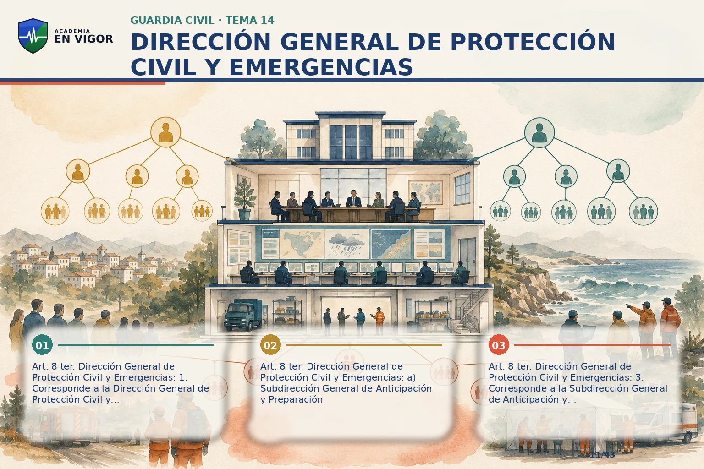

<em>Infografía: capas de dirección general de protección civil y emergencias.</em>

<!-- FUENTE: RD207-2024-BOE-A-2024-3793-GC-T14 -->

## 12. Subsecretaría del Interior

Este bloque sitúa **subsecretaría del interior** dentro de servicios comunes y órganos de la subsecretaría. Distingue dependencia, rango, funciones, órganos subordinados y adscripciones.

### Claves rápidas

- **Artículo 9. Subsecretaría del Interior · apartado 1:** 1. Corresponde a la Subsecretaría del Interior, bajo la superior autoridad de la persona titular del Ministerio, la representación ordinaria del Departamento y la dirección de sus servicios comunes, así como el ejercicio de las atribuciones a que se refiere el artículo 63 de la Ley 40/2015, de 1 de octubre, y la dirección, impulso y supervisión de los órganos directamente dependientes de ella.
- **Artículo 9. Subsecretaría del Interior:** 2. En particular, y sin perjuicio de las competencias de las personas titulares de la Secretaría de Estado, de la Secretaría General de Instituciones Penitenciarias y de la Secretaría General de Protección Civil y Emergencias, corresponde a la Subsecretaría: a) La gestión y desarrollo de la política normativa del Departamento, así como la supervisión de la fundamentación técnico-jurídica de todos los asuntos del Ministerio y sus organismos dependientes que se sometan a la consideración de la Comisión General de Secretarios de Estado y Subsecretarios y del Consejo de Ministros.
- **Artículo 9. Subsecretaría del Interior · apartado 4:** 4. En la medida en que las funciones enumeradas en el apartado anterior se encuentren atribuidas a otros órganos superiores o directivos u organismos del Departamento, corresponde a la Subsecretaría la coordinación departamental de los respectivos servicios.
- **Artículo 9. Subsecretaría del Interior · apartado 6:** 6. Con dependencia directa de la persona titular de la Subsecretaría del Interior, con nivel orgánico de subdirección general, existe un Gabinete Técnico, con funciones de apoyo y asistencia directa, para facilitar el despacho y la coordinación de los órganos y unidades dependientes de aquélla. Elabora los estudios e informes necesarios, y realiza cuantas otras misiones le encomiende la persona titular de la Subsecretaría.

:::perla-vigor
En un organigrama, una palabra cambia la respuesta: depender, adscribirse, integrarse y prestar apoyo no significan lo mismo.
:::

<!-- VISUAL:t14-12-subsecretaria-del-interior.webp -->

  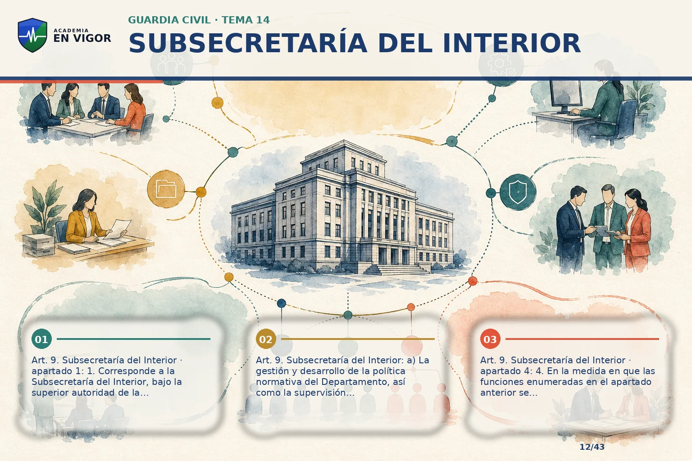

<em>Infografía: mapa de subsecretaría del interior.</em>

<!-- FUENTE: RD207-2024-BOE-A-2024-3793-GC-T14 -->

## 13. Secretaría General Técnica del Interior

Este bloque sitúa **secretaría general técnica del interior** dentro de servicios comunes y órganos de la subsecretaría. Distingue dependencia, rango, funciones, órganos subordinados y adscripciones.

### Claves rápidas

- **Artículo 10. Secretaría General Técnica:** 2. En concreto, le corresponden las funciones que a continuación se relacionan, salvo que estén expresamente atribuidas a otros órganos del Departamento: a) El informe preceptivo y la tramitación de los anteproyectos de ley y los proyectos de disposiciones generales en las materias propias del Departamento y la gestión de su publicación.
- **Artículo 10. Secretaría General Técnica · apartado 1:** 1. Corresponde a la Secretaría General Técnica el ejercicio de las funciones a que se refiere el artículo 65 de la Ley 40/2015, de 1 de octubre, así como las atribuidas por el artículo 26 de la Ley 50/1997, de 27 de noviembre, del Gobierno, y demás normas aplicables.
- **Artículo 10. Secretaría General Técnica · apartado 4:** 4. Las funciones atribuidas a la Secretaría General Técnica en los párrafos u), v), w), x), y) y z) del apartado 2 se ejercerán directamente bajo la dirección de la persona titular de la Secretaría General Técnica.

:::perla-vigor
En un organigrama, una palabra cambia la respuesta: depender, adscribirse, integrarse y prestar apoyo no significan lo mismo.
:::

<!-- VISUAL:t14-13-secretaria-general-tecnica-del-interior.webp -->

  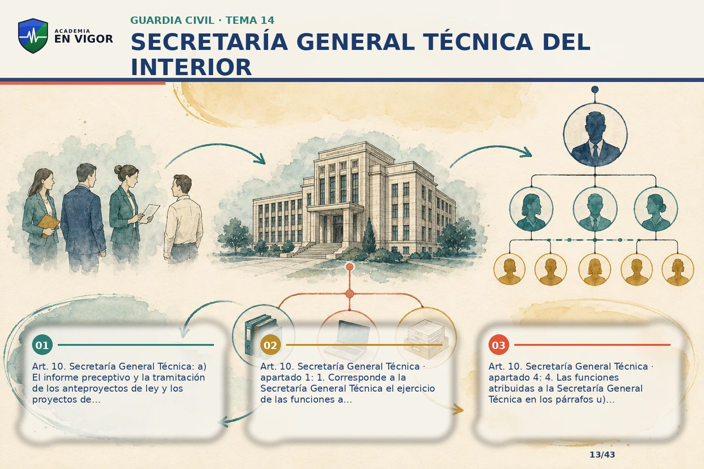

<em>Infografía: flujo de secretaría general técnica del interior.</em>

<!-- FUENTE: RD207-2024-BOE-A-2024-3793-GC-T14 -->

## 14. Política Interior

Este bloque sitúa **política interior** dentro de servicios comunes y órganos de la subsecretaría. Distingue dependencia, rango, funciones, órganos subordinados y adscripciones.

### Claves rápidas

- **Artículo 11. Dirección General de Política Interior:** 2. En particular, corresponden a esta Dirección General las siguientes funciones: d) La planificación, dirección y coordinación de las actuaciones en materia de ciberseguridad en el ámbito electoral y de la Red de coordinación para la Seguridad en procesos electorales. Asimismo, la participación en órganos, grupos de trabajo o reuniones cuya finalidad sea garantizar la seguridad y la lucha contra la desinformación en los procesos electorales.
- **Artículo 11. Dirección General de Política Interior:** 2. En particular, corresponden a esta Dirección General las siguientes funciones: g) La gestión de las relaciones con los órganos competentes de las Comunidades Autónomas y ciudades con Estatuto de Autonomía en materia electoral.
- **Artículo 11. Dirección General de Política Interior:** 2. En particular, corresponden a esta Dirección General las siguientes funciones: q) La coordinación y la supervisión de la política de protección de datos en cumplimiento de la normativa aplicable en esta materia en el ámbito de las competencias del Departamento.
- **Artículo 11. Dirección General de Política Interior · apartado 1:** Corresponde a la Dirección General de Política Interior el ejercicio de las competencias que tiene atribuidas el Ministerio sobre los procesos electorales y consultas populares y el régimen jurídico de los partidos políticos, así como el ejercicio de las funciones encomendadas a la Subsecretaría en materia de recursos humanos, gestión económica y patrimonial, oficialía y servicios generales, transformación digital, innovación y calidad e inspección de los servicios.

:::perla-vigor
En un organigrama, una palabra cambia la respuesta: depender, adscribirse, integrarse y prestar apoyo no significan lo mismo.
:::

<!-- VISUAL:t14-14-politica-interior.webp -->

  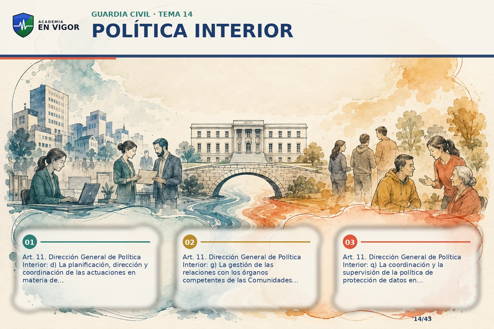

<em>Infografía: comparación de política interior.</em>

<!-- FUENTE: RD207-2024-BOE-A-2024-3793-GC-T14 -->

## 15. Tráfico

Este bloque sitúa **tráfico** dentro de servicios comunes y órganos de la subsecretaría. Distingue dependencia, rango, funciones, órganos subordinados y adscripciones.

### Claves rápidas

- **Artículo 12. Dirección General de Tráfico:** 1. Corresponden a la Dirección General de Tráfico, a través de la cual el Ministerio ejerce sus competencias sobre el organismo autónomo Jefatura Central de Tráfico, las siguientes funciones: a) La planificación y programación estratégica del organismo.
- **Artículo 12. Dirección General de Tráfico · apartado 3:** La Gerencia de Informática, dependiente directamente de la persona titular del organismo, a la que corresponde la realización de las actuaciones y gestiones necesarias para el ejercicio de las funciones atribuidas al órgano directivo en los párrafos e) y f) del apartado 1, así como la colaboración con el Observatorio Nacional de Seguridad vial en las funciones atribuidas en el párrafo q) del apartado 1, tendrá el nivel orgánico que determine la relación de puestos de trabajo.
- **Artículo 12. Dirección General de Tráfico · apartado 4:** 4. La Unidad de Normativa, dependiente directamente de la persona titular del organismo, realiza las actuaciones y gestiones necesarias para el ejercicio de las funciones de los párrafos g), h) e i), del apartado 1. Tendrá el nivel orgánico que determine la relación de puestos de trabajo.

:::perla-vigor
En un organigrama, una palabra cambia la respuesta: depender, adscribirse, integrarse y prestar apoyo no significan lo mismo.
:::

<!-- VISUAL:t14-15-trafico.webp -->

  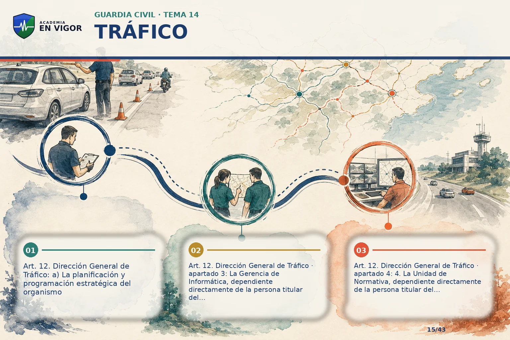

<em>Infografía: línea temporal de tráfico.</em>

<!-- FUENTE: RD207-2024-BOE-A-2024-3793-GC-T14 -->

## 16. Víctimas del terrorismo y protección internacional

Este bloque sitúa **víctimas del terrorismo y protección internacional** dentro de servicios comunes y órganos de la subsecretaría. Distingue dependencia, rango, funciones, órganos subordinados y adscripciones.

### Claves rápidas

- **Artículo 15. Dirección General de Protección Internacional:** 3. La Dirección General de Protección Internacional está integrada por las siguientes Subdirecciones Generales: b) La Subdirección General de Asuntos Generales y Jurídicos de Protección Internacional, a la que corresponde el ejercicio de las funciones previstas en los párrafos c) y d) del apartado 2.
- **Artículo 13. Dirección General de Protección Civil y Emergencias:** (Suprimido)
- **Artículo 14. Dirección General de Apoyo a Víctimas del Terrorismo · apartado 1:** 1. A la Dirección General de Apoyo a Víctimas del Terrorismo corresponde el ejercicio de las competencias que tiene atribuidas el Ministerio en materia de atención y apoyo a las víctimas del terrorismo, las relacionadas con su protección integral y la necesaria colaboración con las distintas Administraciones Públicas.
- **Artículo 14. Dirección General de Apoyo a Víctimas del Terrorismo:** 2. En particular, corresponden a la Dirección General las siguientes funciones: a) La asistencia inmediata a los afectados tras la comisión de un atentado terrorista, informando y apoyando a las víctimas y a sus familias.

:::perla-vigor
En un organigrama, una palabra cambia la respuesta: depender, adscribirse, integrarse y prestar apoyo no significan lo mismo.
:::

<!-- VISUAL:t14-16-victimas-del-terrorismo-y-proteccion-internacional.webp -->

  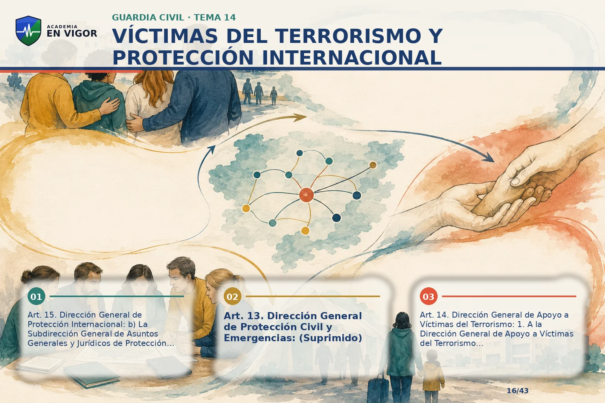

<em>Infografía: escena de víctimas del terrorismo y protección internacional.</em>

<!-- FUENTE: RD207-2024-BOE-A-2024-3793-GC-T14 -->

## 17. Disposiciones adicionales I del Interior

Este bloque sitúa **disposiciones adicionales i del interior** dentro de disposiciones del ministerio del interior. Distingue dependencia, rango, funciones, órganos subordinados y adscripciones.

### Claves rápidas

- **Disposición adicional primera. Nombramiento de los Directores Generales de la Policía y de la Guardia Civil:** Las personas titulares de las Direcciones Generales de la Policía y de la Guardia Civil, a los efectos exclusivos de su nombramiento, se regirán por lo dispuesto en el artículo 64.3 de la Ley 40/2015, de 1 de octubre. En el nombramiento de la persona titular de la Dirección General de la Guardia Civil se tendrá en cuenta, además, lo dispuesto en el artículo 14.2 de la Ley Orgánica 2/1986, de 13 de marzo.
- **Disposición adicional segunda. Supresión de órganos:** Quedan suprimidos los siguientes órganos: a) La Subdirección General de Recursos.
- **Disposición adicional tercera. Desconcentración de competencias para el cierre de puestos fronterizos · apartado 1:** Se desconcentra en la persona titular de la Secretaría de Estado de Seguridad la competencia para acordar, en los supuestos en los que lo requiera la seguridad del Estado o de los ciudadanos, el cierre temporal de los puestos fronterizos habilitados para el paso de personas a que se refiere el artículo 3 del Reglamento de ejecución de la Ley Orgánica 4/2000, de 11 de enero, de derechos y libertades de los extranjeros en España y su integración social, aprobado por el Real Decreto 557/2011, de 20 de abril.
- **Disposición adicional tercera. Desconcentración de competencias para el cierre de puestos fronterizos · apartado 2:** 2. La persona titular de la Secretaría de Estado de Seguridad comunicará las medidas que vayan a adoptarse a los departamentos afectados y, a través del Ministerio de Asuntos Exteriores, Unión Europea y Cooperación, a aquellos países e instituciones con los que España esté obligada a ello como consecuencia de los compromisos internacionales suscritos.

:::perla-vigor
En un organigrama, una palabra cambia la respuesta: depender, adscribirse, integrarse y prestar apoyo no significan lo mismo.
:::

<!-- VISUAL:t14-17-disposiciones-adicionales-i-del-interior.webp -->

  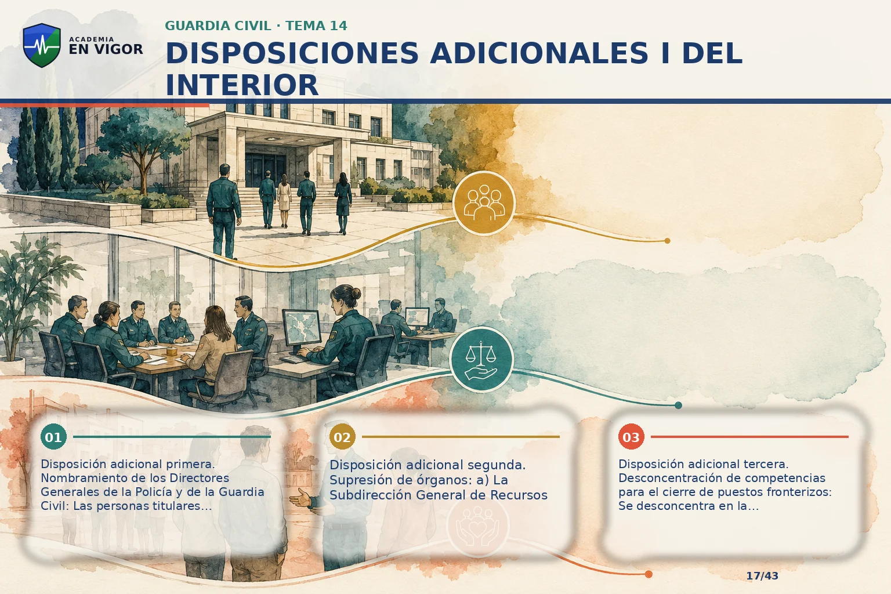

<em>Infografía: capas de disposiciones adicionales i del interior.</em>

<!-- FUENTE: RD207-2024-BOE-A-2024-3793-GC-T14 -->

## 18. Disposiciones adicionales II del Interior

Este bloque sitúa **disposiciones adicionales ii del interior** dentro de disposiciones del ministerio del interior. Distingue dependencia, rango, funciones, órganos subordinados y adscripciones.

### Claves rápidas

- **Disposición adicional cuarta. Delegaciones de competencias:** Las delegaciones de competencias otorgadas por las personas titulares de los distintos órganos del Ministerio del Interior no revocadas hasta la fecha de la entrada en vigor de este real decreto continuarán siendo válidas hasta que, en su caso, sean expresamente revocadas o nuevamente otorgadas a los diferentes órganos regulados en este real decreto.
- **Disposición adicional quinta. Suplencias de los titulares de los órganos superiores y directivos · apartado 1:** 1. En los casos de vacante, ausencia o enfermedad de la personal titular de la Secretaría de Estado de Seguridad corresponderá su suplencia a las personas titulares de sus Direcciones Generales, por el orden en que aparecen citados en la estructura establecida en este real decreto.
- **Disposición adicional quinta. Suplencias de los titulares de los órganos superiores y directivos · apartado 2:** 2. En los casos de vacante, ausencia o enfermedad de la persona titular de un órgano directivo, en defecto de designación de suplente conforme a lo previsto en el artículo 13 de la Ley 40/2015, de 1 de octubre, corresponderá la suplencia a los directores generales o a los subdirectores generales por el orden en que aparecen mencionados en este real decreto.
- **Disposición adicional sexta. Consolidación de Unidades TIC · apartado 1:** 1. En el ejercicio de las funciones de implementación y desarrollo de la política en materia de tecnologías de la información y las comunicaciones en el ámbito sectorial del Ministerio, la Subsecretaría promoverá, en colaboración con las unidades competentes del Ministerio y de sus organismos adscritos, la consolidación de los recursos humanos, económico-presupuestarios, técnicos y materiales vinculados.

:::perla-vigor
En un organigrama, una palabra cambia la respuesta: depender, adscribirse, integrarse y prestar apoyo no significan lo mismo.
:::

<!-- VISUAL:t14-18-disposiciones-adicionales-ii-del-interior.webp -->

  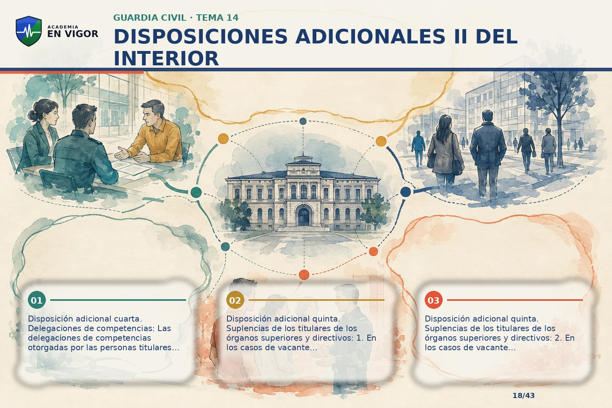

<em>Infografía: mapa de disposiciones adicionales ii del interior.</em>

<!-- FUENTE: RD207-2024-BOE-A-2024-3793-GC-T14 -->

## 19. Disposiciones transitorias y finales del Interior

Este bloque sitúa **disposiciones transitorias y finales del interior** dentro de disposiciones del ministerio del interior. Distingue dependencia, rango, funciones, órganos subordinados y adscripciones.

### Claves rápidas

- **Disposición transitoria primera. Unidades y puestos de trabajo con nivel orgánico inferior a subdirección general · apartado 1:** 1. Las unidades y puestos de trabajo con nivel orgánico inferior a subdirección general continuarán subsistentes y serán retribuidos con cargo a los mismos créditos presupuestarios, hasta que se aprueben las relaciones de puestos de trabajo adaptadas a la estructura orgánica de este real decreto. Dicha adaptación, en ningún caso, podrá generar incremento de gasto público.
- **Disposición transitoria primera. Unidades y puestos de trabajo con nivel orgánico inferior a subdirección general · apartado 2:** 2. Las unidades y puestos de trabajo encuadrados en los órganos suprimidos por este real decreto se adscribirán provisionalmente, por resolución de la personal titular de la Subsecretaría, hasta tanto entre en vigor la nueva relación de puestos de trabajo, a los órganos regulados en este real decreto, en función de las atribuciones que estos tienen asignadas.
- **Disposición transitoria segunda. Comité Ejecutivo de Coordinación:** Hasta tanto se modifique la Orden INT/1251/2004, de 7 de mayo, por la que se regula el Comité Ejecutivo para el Mando Unificado, las referencias a este órgano se entenderán hechas al Comité Ejecutivo de Coordinación al que se refiere el artículo 2.4.
- **Disposición transitoria tercera. Dirección de la Gerencia de Infraestructuras y Equipamiento de la Seguridad del Estado:** Hasta que se efectúen las correspondientes adaptaciones normativas en el Estatuto del organismo autónomo Gerencia de Infraestructuras y Equipamiento de la Seguridad del Estado, aprobado por el Real Decreto 904/2021, de 19 de octubre, la persona titular de la Secretaría de Estado de Seguridad ejercerá transitoriamente las funciones de dirección del organismo.

:::perla-vigor
En un organigrama, una palabra cambia la respuesta: depender, adscribirse, integrarse y prestar apoyo no significan lo mismo.
:::

<!-- VISUAL:t14-19-disposiciones-transitorias-y-finales-del-interior.webp -->

  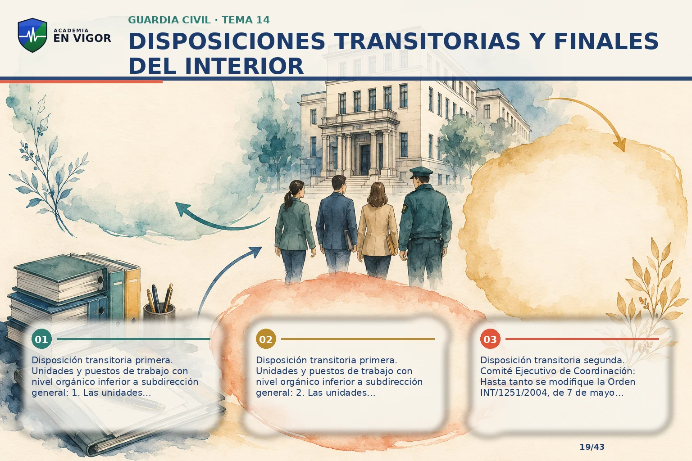

<em>Infografía: flujo de disposiciones transitorias y finales del interior.</em>

<!-- FUENTE: RD207-2024-BOE-A-2024-3793-GC-T14 -->

## 20. Organización general del Ministerio de Defensa

Este bloque sitúa **organización general del ministerio de defensa** dentro de defensa y fuerzas armadas. Distingue dependencia, rango, funciones, órganos subordinados y adscripciones.

### Claves rápidas

- **Artículo 1. Organización general del Departamento · apartado 4:** 4. Está adscrito al Ministerio de Defensa, con dependencia directa de la persona titular del Departamento, el Centro Nacional de Inteligencia.
- **Artículo 1. Organización general del Departamento:** 6. Son órganos asesores y consultivos de la persona titular del Departamento: a) El Consejo Superior del Ejército de Tierra.
- **Artículo 1. Organización general del Departamento · apartado 1:** 1. El Ministerio de Defensa es el Departamento de la Administración General del Estado al que le corresponde la preparación, el desarrollo y la ejecución de la política de defensa determinada por el Gobierno y la gestión de la administración militar.
- **Artículo 1. Organización general del Departamento · apartado 2:** 2. Las competencias atribuidas en este real decreto se entenderán en coordinación y sin perjuicio de aquellas que corresponden a otros Departamentos ministeriales.

:::perla-vigor
En un organigrama, una palabra cambia la respuesta: depender, adscribirse, integrarse y prestar apoyo no significan lo mismo.
:::

<!-- VISUAL:t14-20-organizacion-general-del-ministerio-de-defensa.webp -->

  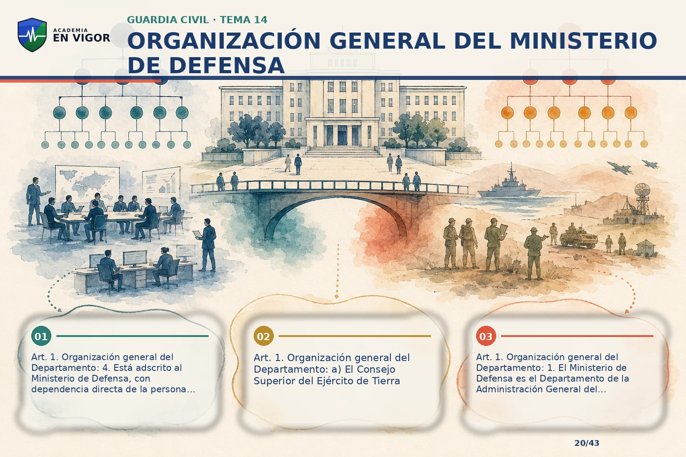

<em>Infografía: comparación de organización general del ministerio de defensa.</em>

<!-- FUENTE: RD205-2024-BOE-A-2024-3791-GC-T14 -->

## 21. Fuerzas Armadas y Estado Mayor de la Defensa

Este bloque sitúa **fuerzas armadas y estado mayor de la defensa** dentro de defensa y fuerzas armadas. Distingue dependencia, rango, funciones, órganos subordinados y adscripciones.

### Claves rápidas

- **Artículo 2. Fuerzas Armadas · apartado 4:** 4. Dependen del Jefe de Estado Mayor de la Defensa las representaciones militares en los organismos internacionales.
- **Artículo 2. Fuerzas Armadas · apartado 6:** La Unidad Militar de Emergencias (UME), que depende orgánicamente de la persona titular del Ministerio de Defensa, está constituida de forma permanente y tiene como misión la intervención en cualquier lugar del territorio nacional y en el exterior, para contribuir a la seguridad y bienestar de los ciudadanos en los supuestos de grave riesgo, catástrofe, calamidad u otras necesidades públicas, con arreglo a lo dispuesto en el Real Decreto 1097/2011, de 22 de julio, por el que se aprueba el Protocolo de Intervención de la Unidad Militar de Emergencias.
- **Artículo 2. Fuerzas Armadas · apartado 1:** 1. La organización militar se rige por su normativa específica, con arreglo a lo dispuesto en la Ley Orgánica 5/2005, de 17 de noviembre.
- **Artículo 2. Fuerzas Armadas · apartado 2:** 2. El Jefe de Estado Mayor de la Defensa (JEMAD), con rango de secretario de estado, ostentará la representación del Departamento, por delegación de la persona titular del Departamento, en los casos en que ésta se la confiera, y la representación militar nacional ante las organizaciones internacionales de seguridad y defensa.

:::perla-vigor
En un organigrama, una palabra cambia la respuesta: depender, adscribirse, integrarse y prestar apoyo no significan lo mismo.
:::

<!-- VISUAL:t14-21-fuerzas-armadas-y-estado-mayor-de-la-defensa.webp -->

  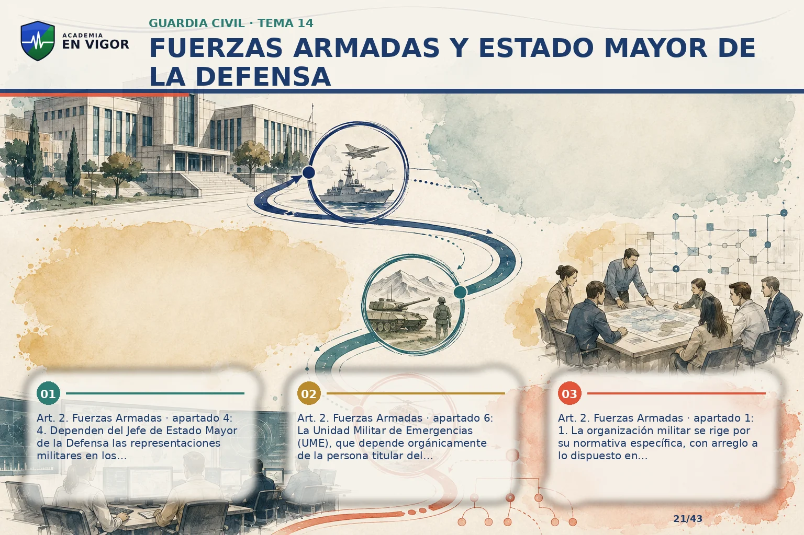

<em>Infografía: línea temporal de fuerzas armadas y estado mayor de la defensa.</em>

<!-- FUENTE: RD205-2024-BOE-A-2024-3791-GC-T14 -->

## 22. Secretaría de Estado de Defensa

Este bloque sitúa **secretaría de estado de defensa** dentro de órganos de la secretaría de estado de defensa. Distingue dependencia, rango, funciones, órganos subordinados y adscripciones.

### Claves rápidas

- **Artículo 3. Secretaría de Estado de Defensa:** 3. De la Secretaría de Estado de Defensa dependen los siguientes órganos directivos, con rango de Dirección General: d) La Dirección General de Infraestructura.
- **Artículo 3. Secretaría de Estado de Defensa:** 3. De la Secretaría de Estado de Defensa dependen los siguientes órganos directivos, con rango de Dirección General: e) El Centro de Sistemas y Tecnologías de la Información y las Comunicaciones.
- **Artículo 3. Secretaría de Estado de Defensa · apartado 7:** 7. Depende de la Secretaría de Estado de Defensa la Junta de Enajenación de Bienes Muebles y Productos de Defensa.
- **Artículo 3. Secretaría de Estado de Defensa · apartado 1:** La Secretaría de Estado de Defensa es el órgano superior del Departamento al que le corresponden, además de las competencias que le encomienda el artículo 62 de la Ley 40/2015, de 1 de octubre, de Régimen Jurídico del Sector Público, la dirección, impulso y gestión de las políticas de armamento y material, la investigación, desarrollo e innovación industrial, económica, de infraestructura, medioambiental y de los sistemas, tecnologías y seguridad de la información en el ámbito de la Defensa, así como el impulso del proceso de transformación digital del Departamento.

:::perla-vigor
En un organigrama, una palabra cambia la respuesta: depender, adscribirse, integrarse y prestar apoyo no significan lo mismo.
:::

<!-- VISUAL:t14-22-secretaria-de-estado-de-defensa.webp -->

  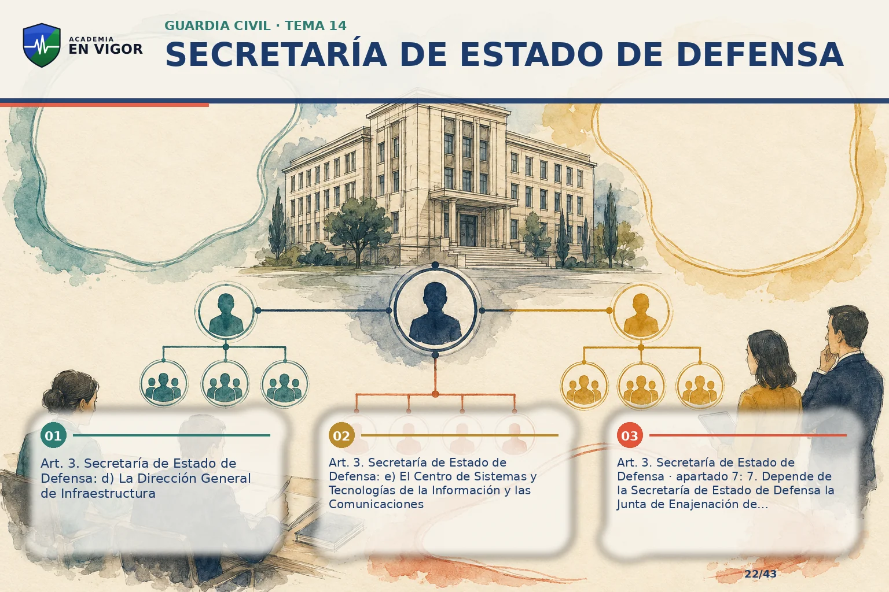

<em>Infografía: escena de secretaría de estado de defensa.</em>

<!-- FUENTE: RD205-2024-BOE-A-2024-3791-GC-T14 -->

## 23. Estrategia e Innovación de la Industria de Defensa

Este bloque sitúa **estrategia e innovación de la industria de defensa** dentro de órganos de la secretaría de estado de defensa. Distingue dependencia, rango, funciones, órganos subordinados y adscripciones.

### Claves rápidas

- **Artículo 4. Dirección General de Estrategia e Innovación de la Industria de Defensa · apartado 1:** La Dirección General de Estrategia e Innovación de la Industria de Defensa es el órgano directivo al que le corresponde la planificación y desarrollo de la política industrial de la Defensa así como la cooperación industrial en esta materia, la cooperación internacional y representación en foros internacionales de industria de Defensa, el apoyo institucional a la internacionalización de la industria de Defensa española y a la exportación, el control del comercio exterior de armamento y material, de las transferencias de tecnología a terceros países y de los activos tanto materiales como inmateriales derivados de la política industrial y de innovación del Departamento.
- **Artículo 4. Dirección General de Estrategia e Innovación de la Industria de Defensa:** 2. Corresponden a esta dirección general, en el ámbito de sus competencias, las siguientes funciones: a) Planificar y programar las políticas de armamento y material y de investigación, desarrollo e innovación del Departamento, y controlar su ejecución.

:::perla-vigor
En un organigrama, una palabra cambia la respuesta: depender, adscribirse, integrarse y prestar apoyo no significan lo mismo.
:::

<!-- VISUAL:t14-23-estrategia-e-innovacion-de-la-industria-de-defensa.webp -->

  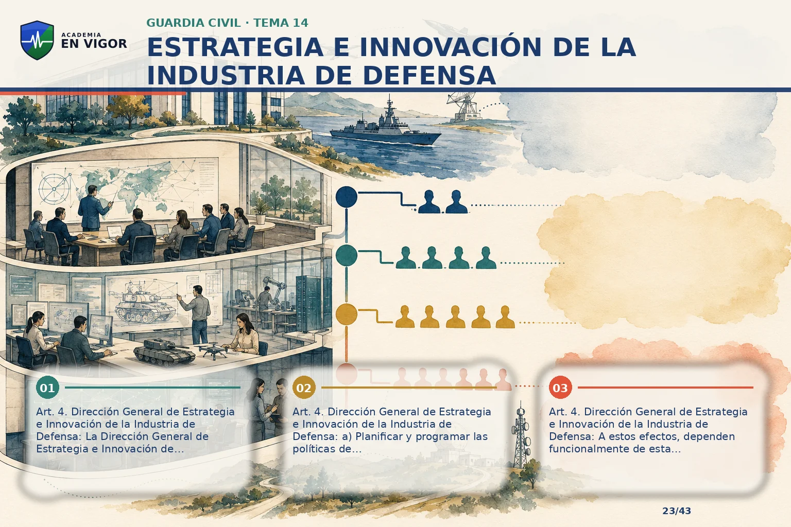

<em>Infografía: capas de estrategia e innovación de la industria de defensa.</em>

<!-- FUENTE: RD205-2024-BOE-A-2024-3791-GC-T14 -->

## 24. Armamento y Material

Este bloque sitúa **armamento y material** dentro de órganos de la secretaría de estado de defensa. Distingue dependencia, rango, funciones, órganos subordinados y adscripciones.

### Claves rápidas

- **Artículo 4 bis. Dirección General de Armamento y Material:** 3. De esta dirección general dependen los siguientes órganos directivos: d) La Subdirección General de Adquisiciones de Armamento y Material, que desarrolla las funciones señaladas en el apartado 2, letra f).
- **Artículo 4 bis. Dirección General de Armamento y Material · apartado 1:** 1. La Dirección General de Armamento y Material es el órgano directivo al que le corresponde la planificación y desarrollo de la política de armamento y material del Departamento, así como la supervisión y dirección de su ejecución. A estos efectos, dependen funcionalmente de esta dirección general los órganos competentes en las citadas materias de las Fuerzas Armadas y de los organismos autónomos del Departamento.

:::perla-vigor
En un organigrama, una palabra cambia la respuesta: depender, adscribirse, integrarse y prestar apoyo no significan lo mismo.
:::

<!-- VISUAL:t14-24-armamento-y-material.webp -->

  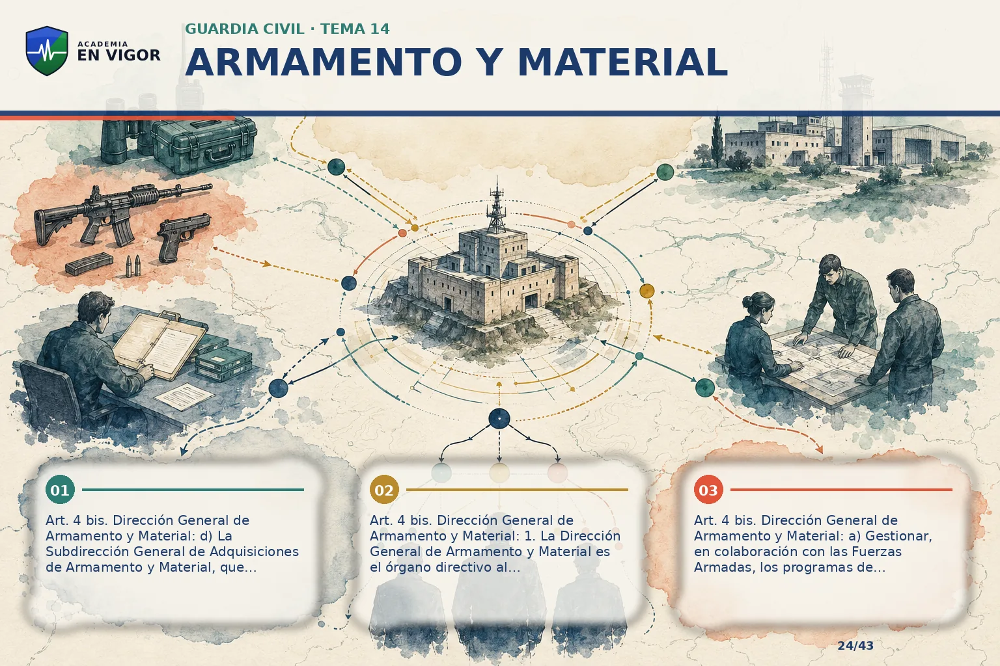

<em>Infografía: mapa de armamento y material.</em>

<!-- FUENTE: RD205-2024-BOE-A-2024-3791-GC-T14 -->

## 25. Asuntos Económicos

Este bloque sitúa **asuntos económicos** dentro de órganos de la secretaría de estado de defensa. Distingue dependencia, rango, funciones, órganos subordinados y adscripciones.

### Claves rápidas

- **Artículo 5. Dirección General de Asuntos Económicos · apartado 1:** 1. La Dirección General de Asuntos Económicos es el órgano directivo al que le corresponde la planificación y desarrollo de la política económica y financiera del Departamento, así como la supervisión y dirección de su ejecución. A estos efectos, dependen funcionalmente de esta dirección general todos los órganos competentes en las citadas materias del Departamento y de sus organismos autónomos.
- **Artículo 5. Dirección General de Asuntos Económicos:** 2. Corresponden a esta dirección general, en el ámbito de sus competencias, las siguientes funciones: a) Dirigir, coordinar y controlar la contabilidad del Departamento, así como el control de los créditos y de la ejecución del gasto.
- **Artículo 5. Dirección General de Asuntos Económicos · apartado 4:** 4. Asimismo, dependen de la Dirección General de Asuntos Económicos la Junta General de Enajenaciones y Liquidadora de Material y la Secretaría de la Junta de Contratación del Ministerio de Defensa.

:::perla-vigor
En un organigrama, una palabra cambia la respuesta: depender, adscribirse, integrarse y prestar apoyo no significan lo mismo.
:::

<!-- VISUAL:t14-25-asuntos-economicos.webp -->

  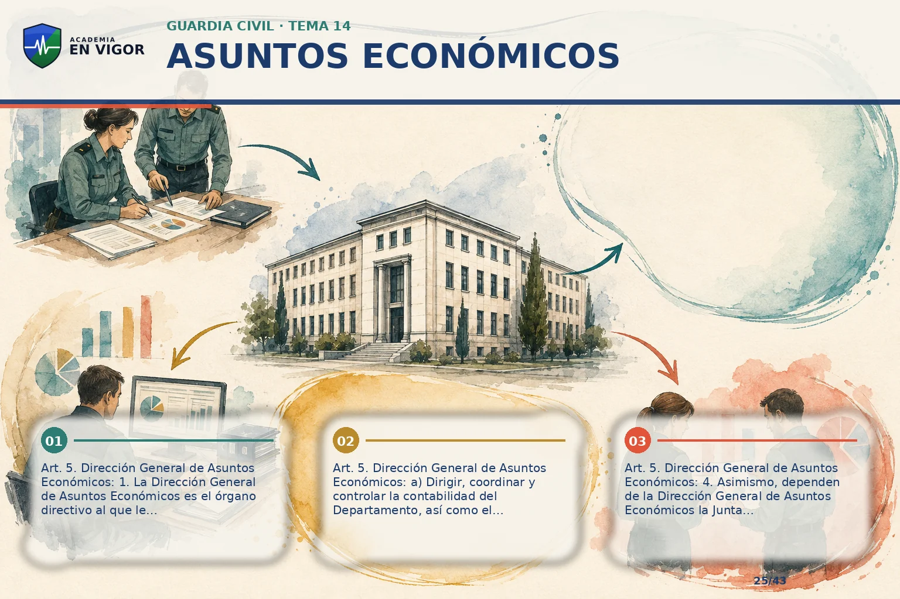

<em>Infografía: flujo de asuntos económicos.</em>

<!-- FUENTE: RD205-2024-BOE-A-2024-3791-GC-T14 -->

## 26. Infraestructura

Este bloque sitúa **infraestructura** dentro de órganos de la secretaría de estado de defensa. Distingue dependencia, rango, funciones, órganos subordinados y adscripciones.

### Claves rápidas

- **Artículo 6. Dirección General de Infraestructura · apartado 1:** 1. La Dirección General de Infraestructura es el órgano directivo al que le corresponde la planificación y desarrollo de las políticas de infraestructura, medioambiental y energética del Departamento, así como la supervisión y dirección de su ejecución. A estos efectos, dependen funcionalmente de esta dirección general los órganos competentes en las citadas materias de las Fuerzas Armadas y de los organismos autónomos del Departamento.
- **Artículo 6. Dirección General de Infraestructura:** 2. Corresponden a esta dirección general, en el ámbito de sus competencias, las siguientes funciones: a) Dirigir la ordenación territorial de la infraestructura del Departamento.

:::perla-vigor
En un organigrama, una palabra cambia la respuesta: depender, adscribirse, integrarse y prestar apoyo no significan lo mismo.
:::

<!-- VISUAL:t14-26-infraestructura.webp -->

  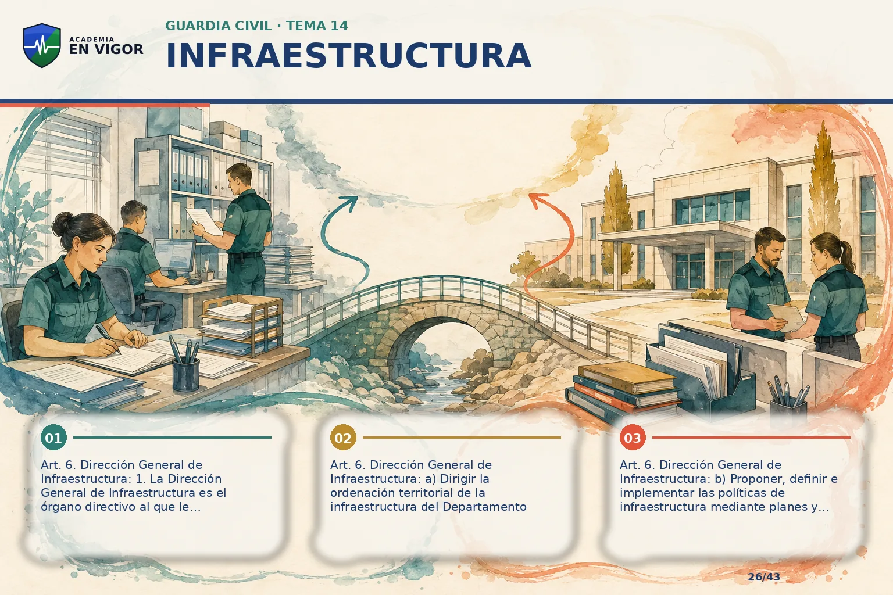

<em>Infografía: comparación de infraestructura.</em>

<!-- FUENTE: RD205-2024-BOE-A-2024-3791-GC-T14 -->

## 27. Sistemas y Tecnologías de la Información

Este bloque sitúa **sistemas y tecnologías de la información** dentro de órganos de la secretaría de estado de defensa. Distingue dependencia, rango, funciones, órganos subordinados y adscripciones.

### Claves rápidas

- **Artículo 7. El Centro de Sistemas y Tecnologías de la Información y las Comunicaciones · apartado 4:** 4. El Centro de Sistemas y Tecnologías de la Información y las Comunicaciones proporcionará las capacidades en el ámbito de las tecnologías de la información y de las comunicaciones (TIC) que resulten necesarias para garantizar el ejercicio de las funciones propias de la Jefatura del Estado.
- **Artículo 7. El Centro de Sistemas y Tecnologías de la Información y las Comunicaciones · apartado 1:** 1. El Centro de Sistemas y Tecnologías de la Información y las Comunicaciones (CESTIC) es el órgano directivo al que le corresponde la planificación, desarrollo, programación y gestión de las políticas relativas a los sistemas y tecnologías de la información y las comunicaciones (CIS/TIC), la transformación digital, la gestión de datos, información y conocimiento y la seguridad de la información, así como la supervisión y dirección de su ejecución.
- **Artículo 7. El Centro de Sistemas y Tecnologías de la Información y las Comunicaciones:** A los efectos anteriores, dependen funcionalmente de este centro los órganos competentes en las citadas materias de las Fuerzas Armadas y de los organismos autónomos del Ministerio de Defensa.

:::perla-vigor
En un organigrama, una palabra cambia la respuesta: depender, adscribirse, integrarse y prestar apoyo no significan lo mismo.
:::

<!-- VISUAL:t14-27-sistemas-y-tecnologias-de-la-informacion.webp -->

  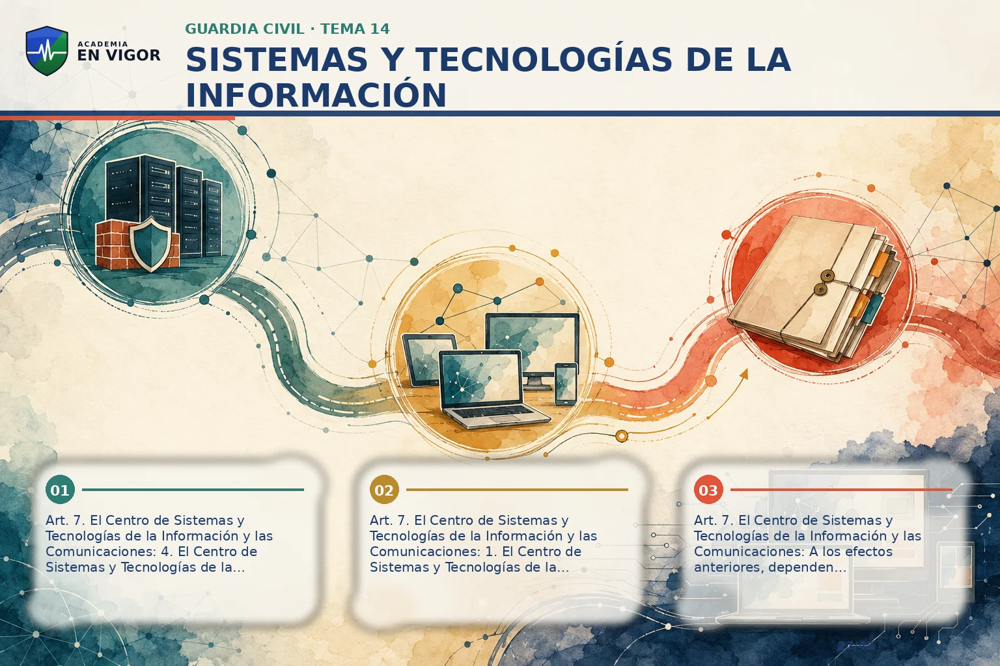

<em>Infografía: línea temporal de sistemas y tecnologías de la información.</em>

<!-- FUENTE: RD205-2024-BOE-A-2024-3791-GC-T14 -->

## 28. Subsecretaría de Defensa

Este bloque sitúa **subsecretaría de defensa** dentro de personal, enseñanza y servicios comunes de defensa. Distingue dependencia, rango, funciones, órganos subordinados y adscripciones.

### Claves rápidas

- **Artículo 8. Subsecretaría de Defensa:** 2. En particular, le corresponden las siguientes funciones: j) Impulsar la política de igualdad.
- **Artículo 8. Subsecretaría de Defensa:** 5. Dependen de la Subsecretaría de Defensa los siguientes órganos directivos, con rango de dirección general: c) La Dirección General de Reclutamiento y Enseñanza Militar.
- **Artículo 8. Subsecretaría de Defensa:** 7. Asimismo, dependen de la Subsecretaría de Defensa los siguientes órganos: b) La Intervención General de la Defensa.
- **Artículo 8. Subsecretaría de Defensa:** 7. Asimismo, dependen de la Subsecretaría de Defensa los siguientes órganos: c) La Inspección General de Sanidad de la Defensa.

:::perla-vigor
En un organigrama, una palabra cambia la respuesta: depender, adscribirse, integrarse y prestar apoyo no significan lo mismo.
:::

<!-- VISUAL:t14-28-subsecretaria-de-defensa.webp -->

  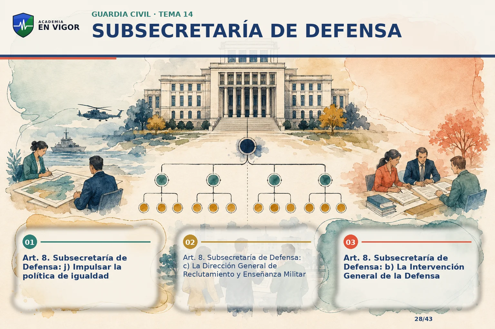

<em>Infografía: escena de subsecretaría de defensa.</em>

<!-- FUENTE: RD205-2024-BOE-A-2024-3791-GC-T14 -->

## 29. Secretaría General Técnica de Defensa

Este bloque sitúa **secretaría general técnica de defensa** dentro de personal, enseñanza y servicios comunes de defensa. Distingue dependencia, rango, funciones, órganos subordinados y adscripciones.

### Claves rápidas

- **Artículo 9. Secretaría General Técnica · apartado 1:** 1. La Secretaría General Técnica es el órgano directivo al que le corresponden las funciones que le atribuyen el artículo 26.5, párrafo cuarto, de la Ley 50/1997, de 27 de noviembre, y el artículo 65 de la Ley 40/2015, de 1 de octubre. A efectos de lo dispuesto en este artículo, dependen funcionalmente de este órgano directivo, en las materias que se citan, los órganos competentes de las Fuerzas Armadas y de los organismos autónomos del Departamento.
- **Artículo 9. Secretaría General Técnica:** 2. Corresponden a este órgano directivo, en el ámbito de sus competencias, las siguientes funciones: a) Impulsar y coordinar la elaboración normativa, así como informar las disposiciones generales, tramitar las consultas al Consejo de Estado y proponer la revisión y refundición de textos legales.

:::perla-vigor
En un organigrama, una palabra cambia la respuesta: depender, adscribirse, integrarse y prestar apoyo no significan lo mismo.
:::

<!-- VISUAL:t14-29-secretaria-general-tecnica-de-defensa.webp -->

  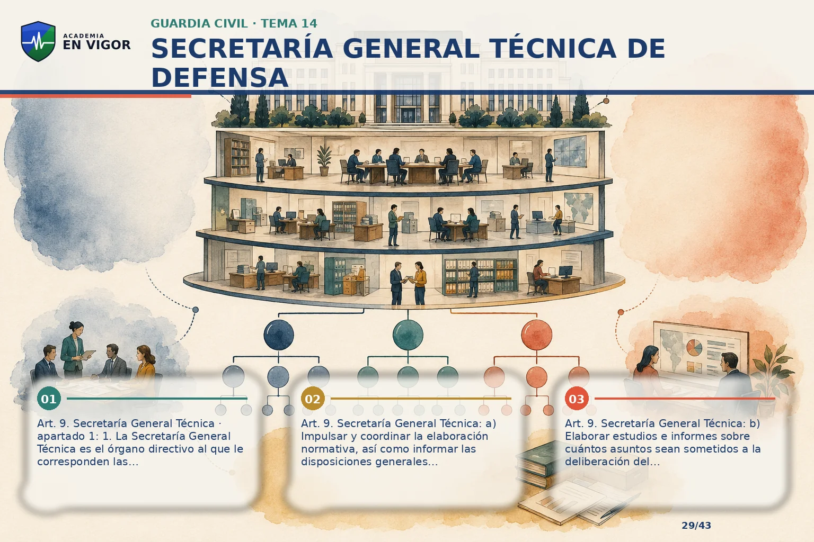

<em>Infografía: capas de secretaría general técnica de defensa.</em>

<!-- FUENTE: RD205-2024-BOE-A-2024-3791-GC-T14 -->

## 30. Personal

Este bloque sitúa **personal** dentro de personal, enseñanza y servicios comunes de defensa. Distingue dependencia, rango, funciones, órganos subordinados y adscripciones.

### Claves rápidas

- **Artículo 10. Dirección General de Personal · apartado 1:** 1. La Dirección General de Personal es el órgano directivo al que le corresponde la planificación y desarrollo de la política de personal, así como la supervisión y dirección de su ejecución. A estos efectos, dependen funcionalmente de esta dirección general los órganos competentes en las citadas materias de las Fuerzas Armadas y de los organismos autónomos del Departamento.
- **Artículo 10. Dirección General de Personal:** 2. Corresponden a esta dirección general, en el ámbito de sus competencias, las siguientes funciones: a) Elaborar las normas y los criterios generales aplicables a la gestión del personal militar, así como ejercer la función inspectora, en los términos establecidos en el artículo 8.10.

:::perla-vigor
En un organigrama, una palabra cambia la respuesta: depender, adscribirse, integrarse y prestar apoyo no significan lo mismo.
:::

<!-- VISUAL:t14-30-personal.webp -->

  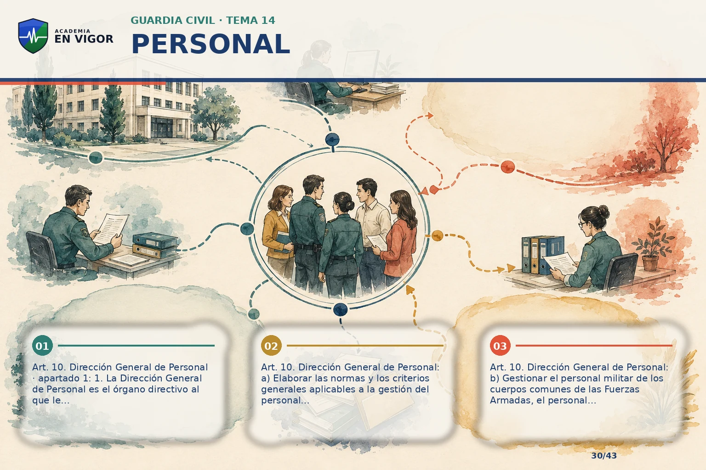

<em>Infografía: mapa de personal.</em>

<!-- FUENTE: RD205-2024-BOE-A-2024-3791-GC-T14 -->

## 31. Reclutamiento y Enseñanza Militar

Este bloque sitúa **reclutamiento y enseñanza militar** dentro de personal, enseñanza y servicios comunes de defensa. Distingue dependencia, rango, funciones, órganos subordinados y adscripciones.

### Claves rápidas

- **Artículo 11. Dirección General de Reclutamiento y Enseñanza Militar · apartado 1:** 1. La Dirección General de Reclutamiento y Enseñanza Militar es el órgano directivo al que le corresponde la planificación e impulso de la política de enseñanza del personal militar y de los reservistas voluntarios, su captación, selección y desarrollo profesional, así como la supervisión y dirección de su ejecución.
- **Artículo 11. Dirección General de Reclutamiento y Enseñanza Militar:** 2. Corresponden a esta dirección general, en el ámbito de sus competencias, las siguientes funciones: a) Planificar y coordinar la enseñanza militar, de acuerdo con lo establecido en la Ley 39/2007, de 19 de noviembre, en lo referente a la enseñanza de formación y de perfeccionamiento y aquellos cursos específicos militares que tengan el carácter de altos estudios de la defensa nacional.
- **Artículo 11. Dirección General de Reclutamiento y Enseñanza Militar · apartado 4:** 4. También depende de esta dirección general la Comisión Permanente y Secretaría General del Consejo Superior del Deporte Militar, que desarrolla la función señalada en el apartado 2, letra o), y de la que dependen funcionalmente las Secretarías de las Juntas Centrales de Educación Física y Deportes de los Ejércitos y la Armada.
- **Artículo 11. Dirección General de Reclutamiento y Enseñanza Militar · apartado 5:** 5. Asimismo, la Academia Central de la Defensa, con el nivel orgánico que determine la correspondiente relación de puestos militares, dependerá de la Subdirección General de Enseñanza Militar.

:::perla-vigor
En un organigrama, una palabra cambia la respuesta: depender, adscribirse, integrarse y prestar apoyo no significan lo mismo.
:::

<!-- VISUAL:t14-31-reclutamiento-y-ensenanza-militar.webp -->

  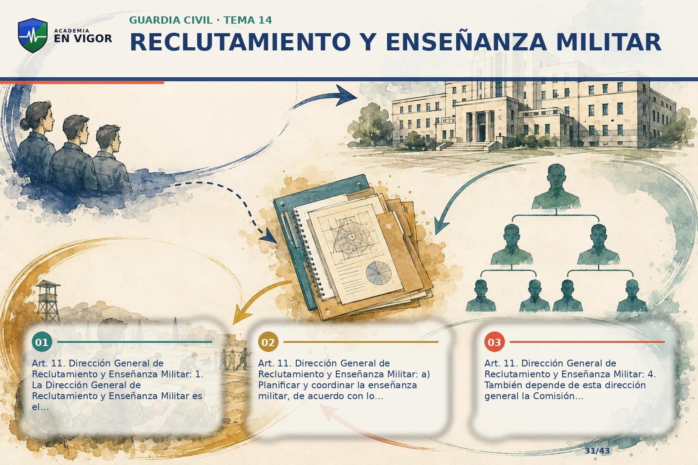

<em>Infografía: flujo de reclutamiento y enseñanza militar.</em>

<!-- FUENTE: RD205-2024-BOE-A-2024-3791-GC-T14 -->

## 32. Asesoría Jurídica General de la Defensa

Este bloque sitúa **asesoría jurídica general de la defensa** dentro de personal, enseñanza y servicios comunes de defensa. Distingue dependencia, rango, funciones, órganos subordinados y adscripciones.

### Claves rápidas

- **Artículo 12. Asesoría Jurídica General de la Defensa · apartado 1:** 1. La Asesoría Jurídica General de la Defensa emite los informes jurídicos preceptivos, de acuerdo con las disposiciones vigentes, y evacua aquellos que le sean solicitados por los órganos superiores y directivos del Ministerio de Defensa.
- **Artículo 12. Asesoría Jurídica General de la Defensa · apartado 2:** 2. La función de asesoramiento jurídico, función única en el ámbito del Departamento, se ejerce bajo la dirección del Asesor Jurídico General de la Defensa quien, a tal fin, puede dictar instrucciones a las asesorías jurídicas del Estado Mayor de la Defensa, de los Ejércitos y la Armada, y a cualquier otra en el ámbito del Departamento, así como evacuar las consultas que le formulen tendentes a asegurar la debida coordinación y unidad de criterio.
- **Artículo 12. Asesoría Jurídica General de la Defensa · apartado 3:** 3. Sin perjuicio de las competencias específicas de las personas titulares del Ministerio de Defensa y de la Subsecretaría de Defensa, la Asesoría Jurídica General es la encargada de las relaciones del Departamento con los órganos de gobierno de la jurisdicción militar, la Fiscalía Togada y la Abogacía General del Estado-Dirección del Servicio Jurídico del Estado.
- **Artículo 12. Asesoría Jurídica General de la Defensa · apartado 4:** 4. Las funciones a que se refieren los apartados anteriores son desarrolladas por personal perteneciente al Cuerpo Jurídico Militar.

:::perla-vigor
En un organigrama, una palabra cambia la respuesta: depender, adscribirse, integrarse y prestar apoyo no significan lo mismo.
:::

<!-- VISUAL:t14-32-asesoria-juridica-general-de-la-defensa.webp -->

  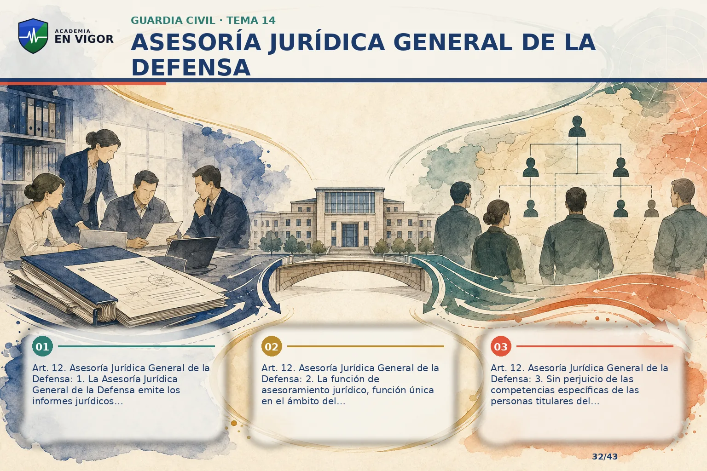

<em>Infografía: comparación de asesoría jurídica general de la defensa.</em>

<!-- FUENTE: RD205-2024-BOE-A-2024-3791-GC-T14 -->

## 33. Intervención General de la Defensa

Este bloque sitúa **intervención general de la defensa** dentro de personal, enseñanza y servicios comunes de defensa. Distingue dependencia, rango, funciones, órganos subordinados y adscripciones.

### Claves rápidas

- **Artículo 13. Intervención General de la Defensa · apartado 1:** La Intervención General de la Defensa, dependiente funcionalmente de la Intervención General de la Administración del Estado, ejerce en el ámbito del Ministerio de Defensa y de los organismos públicos dependientes de éste, el control interno de la gestión económico-financiera mediante el ejercicio de la función interventora, el control financiero permanente y la auditoría pública, en los términos regulados en la Ley 47/2003, de 26 de noviembre, General Presupuestaria.
- **Artículo 13. Intervención General de la Defensa:** Asimismo, le corresponde ejercer la notaría militar en la forma y condiciones establecidas por las leyes, y el asesoramiento en materia de su competencia, a los órganos superiores y directivos del Ministerio de Defensa.
- **Artículo 13. Intervención General de la Defensa · apartado 2:** 2. Las funciones referidas en el apartado anterior se ejercen por personal perteneciente al Cuerpo Militar de Intervención, bajo la dirección del Interventor General de la Defensa, quien podrá dictar instrucciones a cualquier intervención delegada dependiente, a fin de asegurar la debida coordinación y unidad de criterio.
- **Artículo 13. Intervención General de la Defensa · apartado 3:** 3. El cargo de Interventor General de la Defensa es desempeñado por un general de división interventor, en situación de servicio activo, que tiene precedencia sobre los demás cargos del Cuerpo Militar de Intervención.

:::perla-vigor
En un organigrama, una palabra cambia la respuesta: depender, adscribirse, integrarse y prestar apoyo no significan lo mismo.
:::

<!-- VISUAL:t14-33-intervencion-general-de-la-defensa.webp -->

  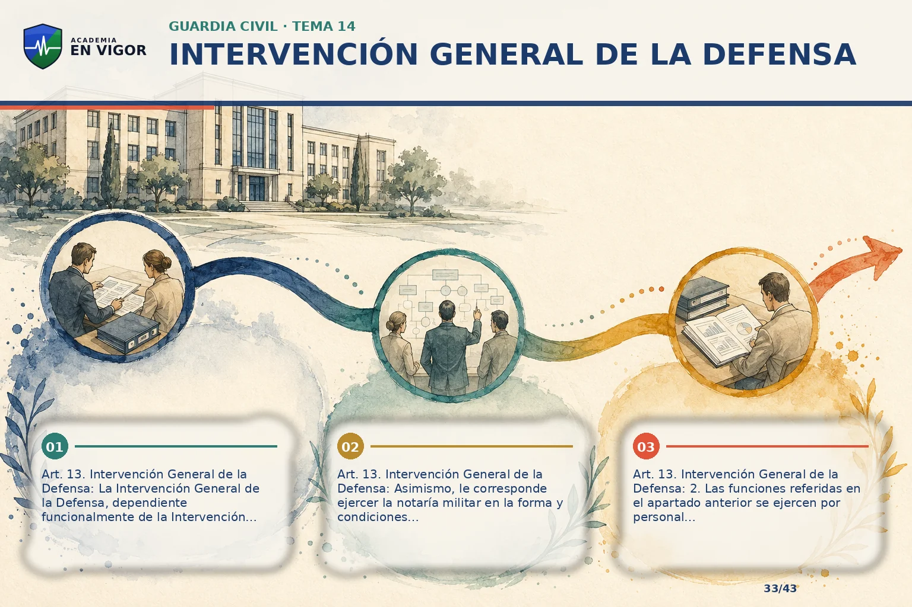

<em>Infografía: línea temporal de intervención general de la defensa.</em>

<!-- FUENTE: RD205-2024-BOE-A-2024-3791-GC-T14 -->

## 34. Inspección General de Sanidad de la Defensa

Este bloque sitúa **inspección general de sanidad de la defensa** dentro de personal, enseñanza y servicios comunes de defensa. Distingue dependencia, rango, funciones, órganos subordinados y adscripciones.

### Claves rápidas

- **Artículo 14. Inspección General de Sanidad de la Defensa · apartado 1:** 1. La Inspección General de Sanidad de la Defensa es el órgano al que le corresponde la planificación y desarrollo de la política sanitaria. Además le corresponde el asesoramiento a los órganos superiores del Departamento en materia de sanidad militar y civil en el ámbito del Ministerio de Defensa.
- **Artículo 14. Inspección General de Sanidad de la Defensa:** 2. En particular le corresponden las siguientes funciones: a) Preparar y proporcionar los apoyos sanitarios y logístico-operativos según las directrices recibidas del Jefe de Estado Mayor de la Defensa y de la persona titular de la Subsecretaría de Defensa.
- **Artículo 14. Inspección General de Sanidad de la Defensa · apartado 3:** 3. El cargo de Inspector General de Sanidad de la Defensa es desempeñado por un general de división del Cuerpo Militar de Sanidad, en situación de servicio activo, que tiene precedencia sobre los demás cargos del Cuerpo Militar de Sanidad.

:::perla-vigor
En un organigrama, una palabra cambia la respuesta: depender, adscribirse, integrarse y prestar apoyo no significan lo mismo.
:::

<!-- VISUAL:t14-34-inspeccion-general-de-sanidad-de-la-defensa.webp -->

  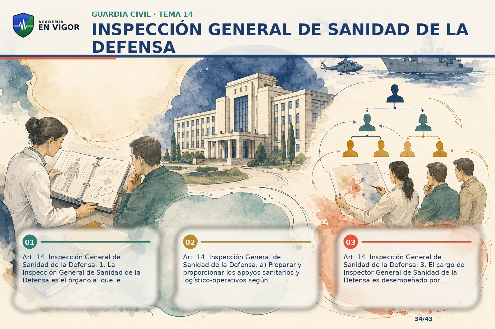

<em>Infografía: escena de inspección general de sanidad de la defensa.</em>

<!-- FUENTE: RD205-2024-BOE-A-2024-3791-GC-T14 -->

## 35. Secretaría General de Política de Defensa

Este bloque sitúa **secretaría general de política de defensa** dentro de política de defensa. Distingue dependencia, rango, funciones, órganos subordinados y adscripciones.

### Claves rápidas

- **Artículo 15. Secretaría General de Política de Defensa:** 2. Corresponde, en particular, a la Secretaría General de Política de Defensa: i) Disponer la actuación del Departamento en materia de control de armamento, no proliferación y desarme.
- **Artículo 15. Secretaría General de Política de Defensa · apartado 6:** 6. De la Secretaría General de Política de Defensa depende la Dirección General de Política de Defensa.
- **Artículo 15. Secretaría General de Política de Defensa · apartado 1:** La Secretaría General de Política de Defensa es el órgano directivo del Ministerio de Defensa al que le corresponde, bajo la dirección de la persona titular del Departamento, el desarrollo y ejecución de la política de defensa y la promoción de la cultura de defensa, así como las relaciones en este ámbito con otros Departamentos ministeriales, en especial con el Ministerio de Asuntos Exteriores, Unión Europea y Cooperación, las relaciones bilaterales en materia de política de defensa con otros Estados y con las organizaciones internacionales de seguridad y defensa, bajo el principio de unidad de acción exterior del Estado establecido en la Ley 2/2014, de 25 de marzo, de la Acción y del Servicio Exterior del Estado, así como el desarrollo de la diplomacia de defensa y, con el Ministerio del Interior en especial, en lo relacionado con la contribución a la conducción de crisis y emergencias.
- **Artículo 15. Secretaría General de Política de Defensa · apartado 3:** La persona titular de la Secretaría General de Política de Defensa ostentará la representación del Departamento, por delegación de la persona titular del Ministerio de Defensa, en los casos en que ésta se la encomiende y, en especial, ante las organizaciones internacionales de seguridad y defensa de las que España forme Parte, particularmente en las reuniones ministeriales de defensa de la Alianza Atlántica y de la Unión Europea cuando no asista la persona titular del Departamento.

:::perla-vigor
En un organigrama, una palabra cambia la respuesta: depender, adscribirse, integrarse y prestar apoyo no significan lo mismo.
:::

<!-- VISUAL:t14-35-secretaria-general-de-politica-de-defensa.webp -->

  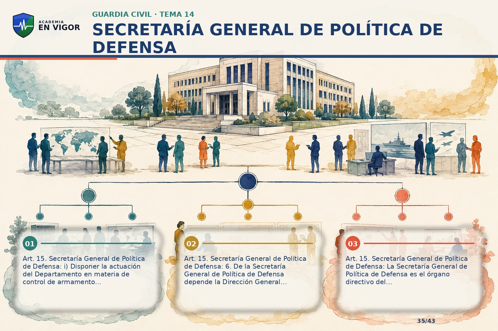

<em>Infografía: capas de secretaría general de política de defensa.</em>

<!-- FUENTE: RD205-2024-BOE-A-2024-3791-GC-T14 -->

## 36. Dirección General de Política de Defensa

Este bloque sitúa **dirección general de política de defensa** dentro de política de defensa. Distingue dependencia, rango, funciones, órganos subordinados y adscripciones.

### Claves rápidas

- **Artículo 16. Dirección General de Política de Defensa · apartado 1:** 1. La Dirección General de Política de Defensa es el órgano directivo al que le corresponde la planificación y desarrollo de la política de defensa. A estos efectos, dependen funcionalmente de esta dirección general los órganos competentes en las citadas materias de las Fuerzas Armadas y de los organismos autónomos del Departamento.
- **Artículo 16. Dirección General de Política de Defensa:** 2. Corresponden a esta dirección general, en el ámbito de sus competencias, las siguientes funciones: a) Seguir y valorar el desarrollo de la situación internacional en el ámbito de la política de seguridad y defensa, especialmente en zonas de crisis y otras áreas de interés.
- **Artículo 16. Dirección General de Política de Defensa · apartado 4:** 4. Depende asimismo de la dirección general, a través de la Subdirección General de Planes y Relaciones Internacionales, la Oficina de Aplicación del Convenio entre los Estados Partes del Tratado del Atlántico Norte, relativo al Estatuto de sus Fuerzas, y del Acuerdo relativo al Estatuto de las Fuerzas de los Estados miembro de la Unión Europea (EU SOFA), hecho en Bruselas el 17 de noviembre de 2003.

:::perla-vigor
En un organigrama, una palabra cambia la respuesta: depender, adscribirse, integrarse y prestar apoyo no significan lo mismo.
:::

<!-- VISUAL:t14-36-direccion-general-de-politica-de-defensa.webp -->

  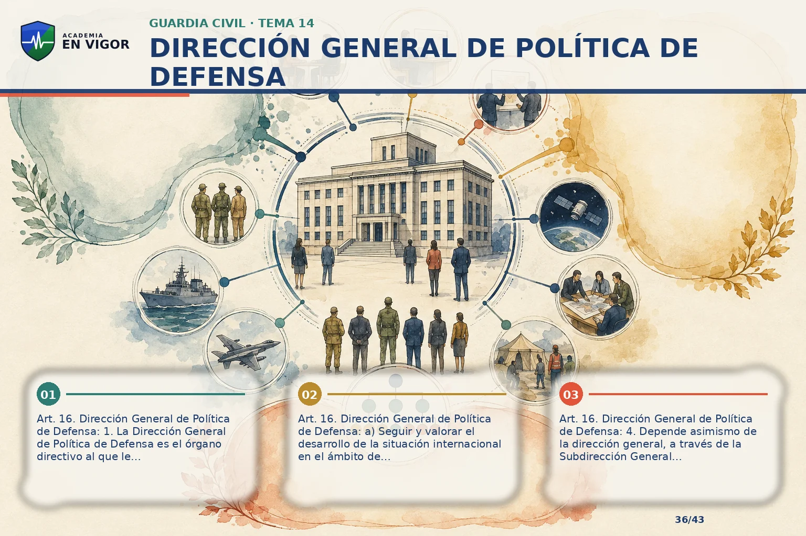

<em>Infografía: mapa de dirección general de política de defensa.</em>

<!-- FUENTE: RD205-2024-BOE-A-2024-3791-GC-T14 -->

## 37. Consejos y Juntas Superiores

Este bloque sitúa **consejos y juntas superiores** dentro de política de defensa. Distingue dependencia, rango, funciones, órganos subordinados y adscripciones.

### Claves rápidas

- **Artículo 17. Consejos Superiores:** El Consejo Superior del Ejército de Tierra, el Consejo Superior de la Armada y el Consejo Superior del Ejército del Aire y del Espacio son los órganos colegiados asesores y consultivos de la persona titular del Ministerio de Defensa y del Jefe de Estado Mayor del ejército respectivo, con las competencias y funciones que les atribuyen la Ley 39/2007, de 19 de noviembre, y demás normas de aplicación, legales o reglamentarias.
- **Artículo 18. Juntas Superiores:** La Junta Superior del Cuerpo Jurídico Militar, la Junta Superior del Cuerpo Militar de Intervención, la Junta Superior del Cuerpo Militar de Sanidad y la Junta Superior del Cuerpo de Músicas Militares son los órganos colegiados asesores y consultivos de las personas titulares del Ministerio de Defensa y de la Subsecretaría de Defensa, en aquellas materias que les atribuyen la Ley 39/2007, de 19 de noviembre, y demás normas de aplicación, legales o reglamentarias.

:::perla-vigor
En un organigrama, una palabra cambia la respuesta: depender, adscribirse, integrarse y prestar apoyo no significan lo mismo.
:::

<!-- VISUAL:t14-37-consejos-y-juntas-superiores.webp -->

  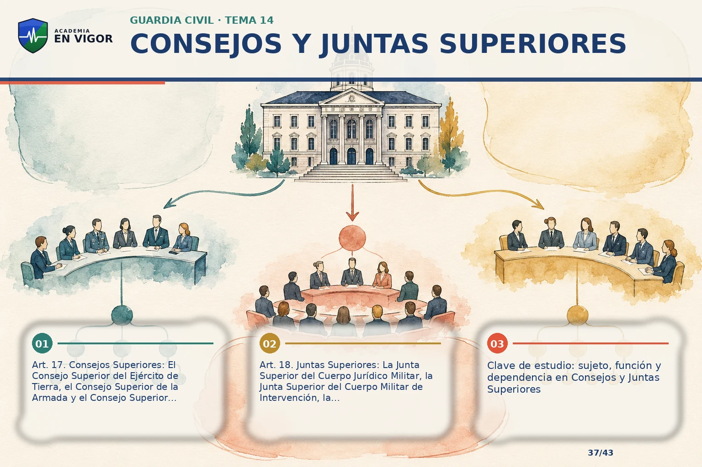

<em>Infografía: flujo de consejos y juntas superiores.</em>

<!-- FUENTE: RD205-2024-BOE-A-2024-3791-GC-T14 -->

## 38. Precedencias del Ministerio de Defensa

Este bloque sitúa **precedencias del ministerio de defensa** dentro de disposiciones del ministerio de defensa. Distingue dependencia, rango, funciones, órganos subordinados y adscripciones.

### Claves rápidas

- **Disposición adicional primera. Orden de precedencias de las autoridades del Departamento:** El orden de precedencia de las autoridades superiores del Departamento en los actos de carácter especial a que alude el Ordenamiento General de Precedencias en el Estado, aprobado por el Real Decreto 2099/1983, de 4 de agosto, y en el régimen interno del Ministerio de Defensa, es el siguiente: a) Persona titular del Ministerio de Defensa.

:::perla-vigor
En un organigrama, una palabra cambia la respuesta: depender, adscribirse, integrarse y prestar apoyo no significan lo mismo.
:::

<!-- VISUAL:t14-38-precedencias-del-ministerio-de-defensa.webp -->

  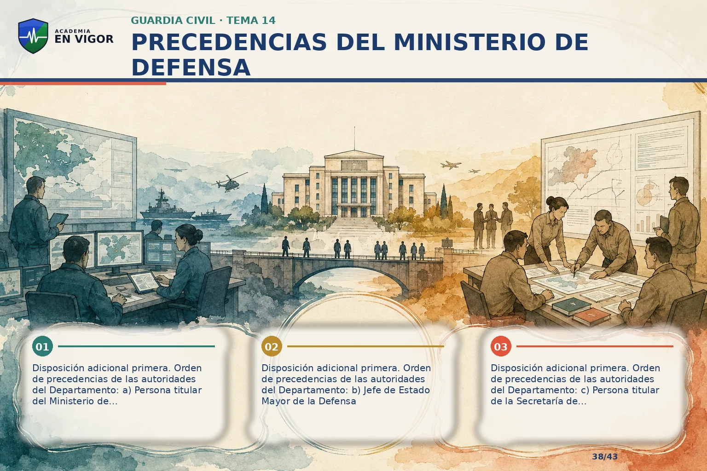

<em>Infografía: comparación de precedencias del ministerio de defensa.</em>

<!-- FUENTE: RD205-2024-BOE-A-2024-3791-GC-T14 -->

## 39. Centro Nacional de Inteligencia

Este bloque sitúa **centro nacional de inteligencia** dentro de disposiciones del ministerio de defensa. Distingue dependencia, rango, funciones, órganos subordinados y adscripciones.

### Claves rápidas

- **Disposición adicional segunda. Centro Nacional de Inteligencia:** Todos los Departamentos ministeriales, en el ámbito de sus respectivas competencias, de acuerdo con la Ley 11/2002, de 6 de mayo, reguladora del Centro Nacional de Inteligencia, prestarán los apoyos necesarios a este organismo público para que disponga de las coberturas que resulten precisas y adecuadas para el cumplimiento de sus objetivos en el ejercicio de las funciones previstas en dicha ley.

:::perla-vigor
En un organigrama, una palabra cambia la respuesta: depender, adscribirse, integrarse y prestar apoyo no significan lo mismo.
:::

<!-- VISUAL:t14-39-centro-nacional-de-inteligencia.webp -->

  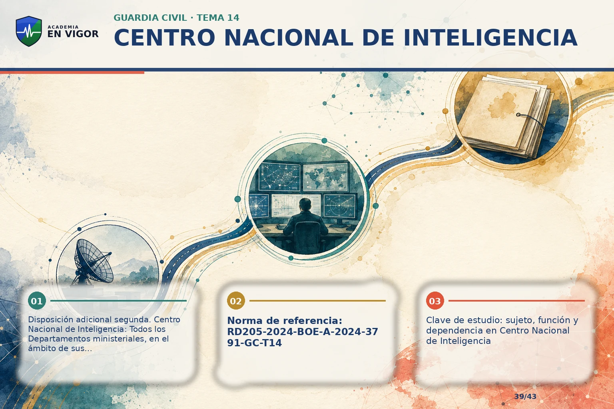

<em>Infografía: línea temporal de centro nacional de inteligencia.</em>

<!-- FUENTE: RD205-2024-BOE-A-2024-3791-GC-T14 -->

## 40. Redes y sistemas de información de Defensa

Este bloque sitúa **redes y sistemas de información de defensa** dentro de disposiciones del ministerio de defensa. Distingue dependencia, rango, funciones, órganos subordinados y adscripciones.

### Claves rápidas

- **Disposición adicional tercera. Redes y sistemas de información y telecomunicaciones · apartado 1:** 1. Por acuerdo de Consejo de Ministros se determinarán las redes y sistemas que hayan de ser dirigidas y gestionadas por el Centro de Sistemas y Tecnologías de la Información y las Comunicaciones del Ministerio de Defensa para la provisión de servicios a otros organismos de la Administración General del Estado.
- **Disposición adicional tercera. Redes y sistemas de información y telecomunicaciones · apartado 2:** 2. Previo acuerdo con el Centro de Sistemas y Tecnologías de la Información y las Comunicaciones, la Dirección General de Protección Civil y Emergencias del Ministerio del Interior podrá hacer uso, en situaciones de emergencia, de las redes dirigidas y gestionadas por el citado centro.
- **Disposición adicional tercera. Redes y sistemas de información y telecomunicaciones · apartado 3:** 3. Las redes y sistemas de información y telecomunicaciones del Centro Nacional de Inteligencia, de conformidad con su régimen jurídico, mantendrán su propia dirección y gestión, no siendo de aplicación lo previsto en el artículo 7.

:::perla-vigor
En un organigrama, una palabra cambia la respuesta: depender, adscribirse, integrarse y prestar apoyo no significan lo mismo.
:::

<!-- VISUAL:t14-40-redes-y-sistemas-de-informacion-de-defensa.webp -->

  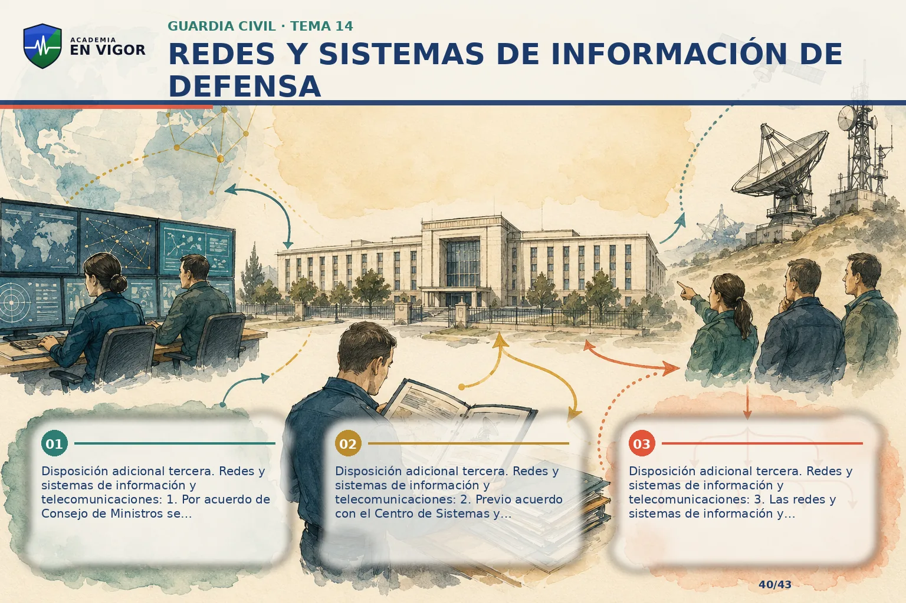

<em>Infografía: escena de redes y sistemas de información de defensa.</em>

<!-- FUENTE: RD205-2024-BOE-A-2024-3791-GC-T14 -->

## 41. Disposiciones adicionales IV a VI de Defensa

Este bloque sitúa **disposiciones adicionales iv a vi de defensa** dentro de disposiciones del ministerio de defensa. Distingue dependencia, rango, funciones, órganos subordinados y adscripciones.

### Claves rápidas

- **Disposición adicional cuarta. Establecimiento Penitenciario Militar de Alcalá de Henares · apartado 1:** 1. El Establecimiento Penitenciario Militar de Alcalá de Henares seguirá adscrito a la Subsecretaría de Defensa, con dependencia orgánica de la Secretaría General Técnica, sin perjuicio del apoyo logístico que no pueda ser prestado por la Subsecretaría de Defensa, que será facilitado por la cadena logística de los Ejércitos y la Armada.
- **Disposición adicional cuarta. Establecimiento Penitenciario Militar de Alcalá de Henares · apartado 2:** 2. Las funciones que corresponden a la Secretaría General Técnica serán desarrolladas por la Subdirección General de Administración Periférica.
- **Disposición adicional quinta. Suplencia de los titulares de los órganos directivos:** En los casos de vacancia, ausencia o enfermedad de la persona titular de un órgano directivo, y en defecto de designación de suplente conforme a lo previsto en el artículo 13.3.b) de la Ley 40/2015, de 1 de octubre, corresponderá la suplencia a las personas titulares de los órganos inmediatamente subordinados, por el mismo orden en que aparecen citados en la respectiva estructura establecida en este real decreto.
- **Disposición adicional sexta. Supresión de órganos directivos · apartado 1:** 1. Queda suprimida la Dirección de Comunicación Institucional de la Defensa, que se transforma en la Oficina de Comunicación Institucional y Prensa del Ministerio de Defensa, manteniendo el rango de subdirección general.

:::perla-vigor
En un organigrama, una palabra cambia la respuesta: depender, adscribirse, integrarse y prestar apoyo no significan lo mismo.
:::

<!-- VISUAL:t14-41-disposiciones-adicionales-iv-a-vi-de-defensa.webp -->

  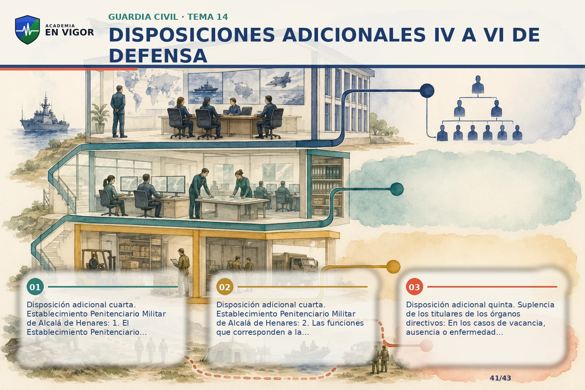

<em>Infografía: capas de disposiciones adicionales iv a vi de defensa.</em>

<!-- FUENTE: RD205-2024-BOE-A-2024-3791-GC-T14 -->

## 42. Disposiciones adicionales VII a XI de Defensa

Este bloque sitúa **disposiciones adicionales vii a xi de defensa** dentro de disposiciones del ministerio de defensa. Distingue dependencia, rango, funciones, órganos subordinados y adscripciones.

### Claves rápidas

- **Disposición adicional séptima. Órganos colegiados:** Los órganos colegiados del Departamento, cuya composición y funciones sean del alcance puramente ministerial, podrán ser regulados, modificados o suprimidos mediante orden de la persona titular del Ministerio de Defensa, aunque su normativa de creación o modificación tenga rango de real decreto.
- **Disposición adicional octava. No incremento del gasto público:** La aplicación de este real decreto no supondrá incremento de gasto público, atendiéndose con los medios personales y materiales del Departamento.
- **Disposición adicional novena. Dependencias funcionales y coordinación:** 1. En virtud de las dependencias funcionales de los distintos órganos de las Fuerzas Armadas y de los organismos autónomos con respecto a los órganos directivos del Departamento, estos últimos podrán: a) Emitir las instrucciones u órdenes de servicio de carácter general para el desarrollo y ejecución de la política del Departamento en el ámbito de su competencia.
- **Disposición adicional novena. Dependencias funcionales y coordinación · apartado 2:** 2. Por su parte, los correspondientes órganos de las Fuerzas Armadas y de los organismos autónomos, en el ámbito de sus competencias, podrán elevar consultas, formular propuestas, solicitar asesoramiento, información o datos y requerir criterios de actuación a los órganos directivos de los que dependen funcionalmente, en relación con la preparación, desarrollo, ejecución y control de la política del Departamento.

:::perla-vigor
En un organigrama, una palabra cambia la respuesta: depender, adscribirse, integrarse y prestar apoyo no significan lo mismo.
:::

<!-- VISUAL:t14-42-disposiciones-adicionales-vii-a-xi-de-defensa.webp -->

  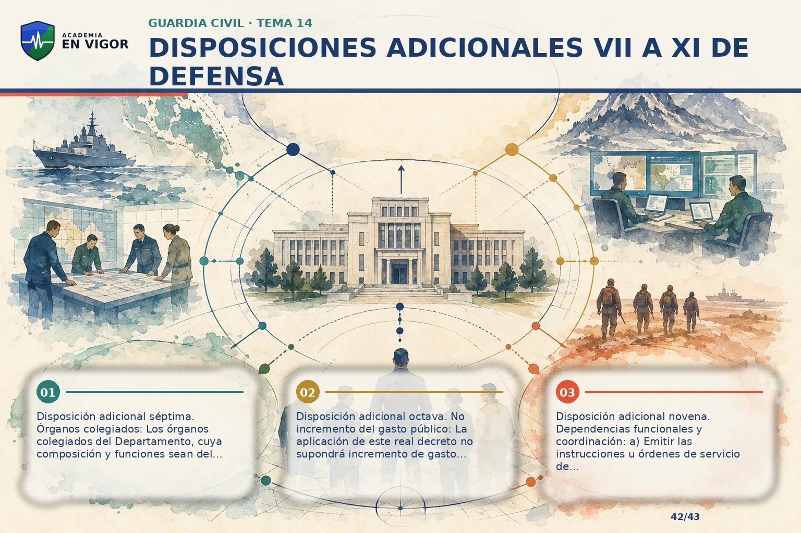

<em>Infografía: mapa de disposiciones adicionales vii a xi de defensa.</em>

<!-- FUENTE: RD205-2024-BOE-A-2024-3791-GC-T14 -->

## 43. Disposiciones transitoria, derogatoria y finales de Defensa

Este bloque sitúa **disposiciones transitoria, derogatoria y finales de defensa** dentro de disposiciones del ministerio de defensa. Distingue dependencia, rango, funciones, órganos subordinados y adscripciones.

### Claves rápidas

- **Disposición derogatoria única. Derogación normativa · apartado 1:** 1. Queda derogado el Real Decreto 372/2020, de 18 de febrero, por el que se desarrolla la estructura orgánica básica del Ministerio de Defensa.
- **Disposición derogatoria única. Derogación normativa · apartado 2:** 2. Asimismo, quedan derogadas cuantas disposiciones de igual o inferior rango se opongan a lo dispuesto en este real decreto.
- **Disposición final primera. Facultades de desarrollo normativo:** Se faculta a la persona titular del Ministerio de Defensa para que, previo el cumplimiento de los trámites legales oportunos, adopte las disposiciones que sean necesarias para el desarrollo y ejecución de este real decreto.
- **Disposición final segunda. Entrada en vigor:** El presente real decreto entrará en vigor el día siguiente al de su publicación en el «Boletín Oficial del Estado».

:::perla-vigor
En un organigrama, una palabra cambia la respuesta: depender, adscribirse, integrarse y prestar apoyo no significan lo mismo.
:::

<!-- VISUAL:t14-43-disposiciones-transitoria-derogatoria-y-finales-de-defensa.webp -->

  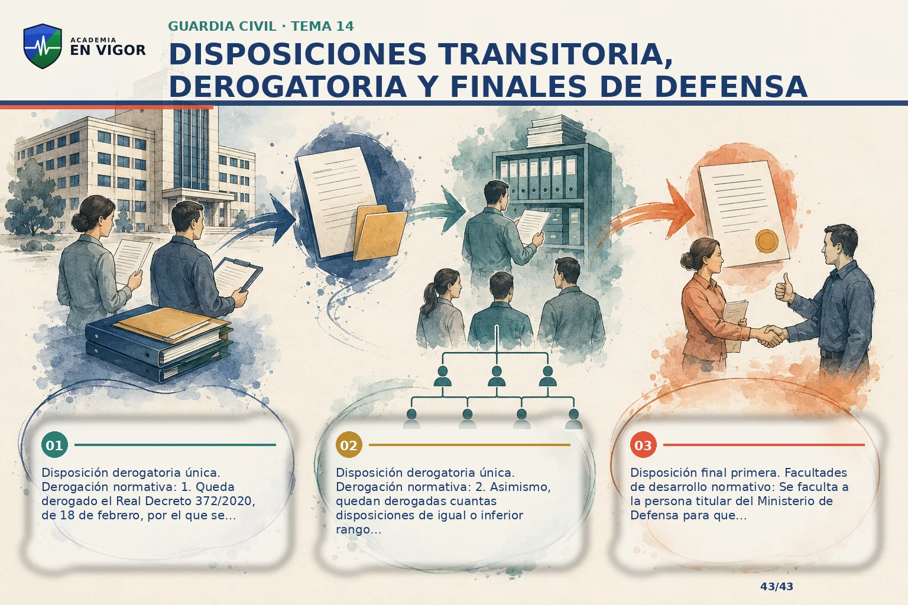

<em>Infografía: flujo de disposiciones transitoria, derogatoria y finales de defensa.</em>

<!-- FUENTE: RD205-2024-BOE-A-2024-3791-GC-T14 -->

# Hablemos claro

La clave es distinguir órgano superior, órgano directivo, subdirección, organismo adscrito y unidad de apoyo: no son categorías intercambiables.

# En la calle

En la práctica, Interior coordina seguridad, penitenciarias, protección civil, tráfico y protección internacional; Defensa articula Fuerzas Armadas, recursos, personal, tecnología y política de defensa.

# Lo que cae

Son especialmente rentables las dependencias de la Secretaría de Estado de Seguridad, la reforma de Protección Civil de 2026, la Guardia Civil, la UME, el CNI, la Secretaría de Estado de Defensa, CESTIC y la Subsecretaría de Defensa.

# Ha caído

:::ha-caido
Se han mapeado **44** preguntas oficiales de 2020 a 2026. Permanecen separadas del banco propio y enlazadas al hecho vigente.
:::

---

*Academia En Vigor · El temario que nunca duerme · Tema 14 · v1.0.0 · Documento interno no publicado.*
