# TEMA 15 · FUERZAS Y CUERPOS DE SEGURIDAD. GUARDIA CIVIL

**Guardia Civil · Método VIGOR · PARTE**
**Versión de contenido:** 1.0.0
**Estado editorial:** approved_internal · **Publicación:** not_published

# Mapa del tema

<!-- VISUAL:t15-00-mapa-general.webp -->

  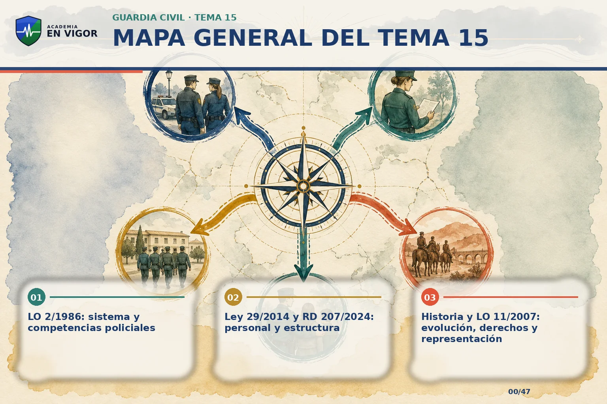

<em>Infografía: recorrido por normas, estructura, historia y derechos.</em>

# Contenido

## 01. Alcance oficial y corte normativo

Este bloque ordena **alcance oficial y corte normativo** dentro de alcance y sistema de seguridad pública.

### Claves rápidas

- **Programa oficial · Tema 15:** El Tema 15 comprende íntegramente la Ley Orgánica 2/1986, de Fuerzas y Cuerpos de Seguridad.
- **Programa oficial · Tema 15:** De la Ley 29/2014, de Régimen del Personal de la Guardia Civil, el programa exige el título preliminar y los títulos I y II, esto es, los artículos 1 a 23.
- **Programa oficial · Tema 15:** El programa incluye la estructura orgánica de los Servicios Centrales de la Dirección General de la Guardia Civil, la historia institucional por periodos y la Ley Orgánica 11/2007 completa.
- **Corte normativo:** El corte normativo se fija el 10 de agosto de 2026; el artículo 4 del Real Decreto 207/2024 se estudia con las modificaciones del Real Decreto 353/2025 y del Real Decreto 328/2026.

:::perla-vigor
Primero localiza la norma y el artículo; después fija el verbo, el sujeto y la excepción.
:::

<!-- VISUAL:t15-01-alcance-oficial-y-corte-normativo.webp -->

  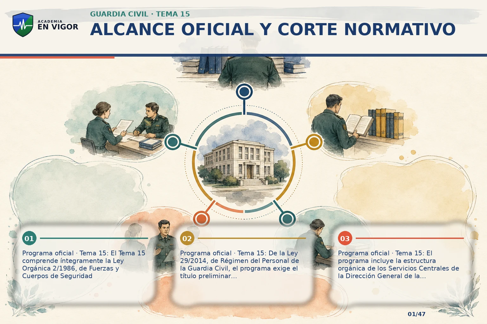

<em>Infografía: esquema de alcance oficial y corte normativo.</em>

<!-- FUENTE: GC-PROGRAMA-2024-T15 -->

## 02. Seguridad pública y Fuerzas y Cuerpos de Seguridad

Este bloque ordena **seguridad pública y fuerzas y cuerpos de seguridad** dentro de alcance y sistema de seguridad pública.

### Claves rápidas

- **Artículo primero. · apartado 1:** 1. La Seguridad Pública es competencia exclusiva del Estado. Su mantenimiento corresponde al Gobierno de la Nación.
- **Artículo primero. · apartado 2:** 2. Las Comunidades Autónomas participarán en el mantenimiento de la Seguridad Pública en los términos que establezcan los respectivos Estatutos y en el marco de esta Ley.
- **Artículo primero. · apartado 3:** 3. Las Corporaciones Locales participarán en el mantenimiento de la seguridad pública en los términos establecidos en la Ley Reguladora de las Bases de Régimen Local y en el marco de esta Ley.
- **Artículo primero. · apartado 4:** 4. El mantenimiento de la Seguridad Pública se ejercerá por las distintas Administraciones Públicas a través de las Fuerzas y Cuerpos de Seguridad.

:::perla-vigor
Primero localiza la norma y el artículo; después fija el verbo, el sujeto y la excepción.
:::

<!-- VISUAL:t15-02-seguridad-publica-y-fuerzas-y-cuerpos-de-seguridad.webp -->

  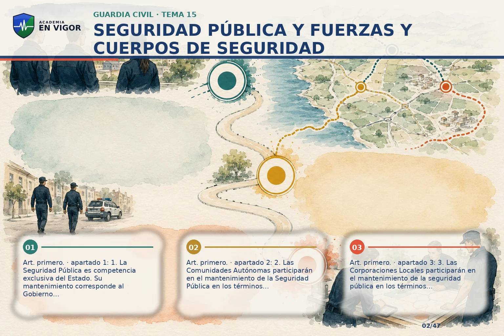

<em>Infografía: esquema de seguridad pública y fuerzas y cuerpos de seguridad.</em>

<!-- FUENTE: LO2-1986-GC-T15 -->

## 03. Principios básicos de actuación

Este bloque ordena **principios básicos de actuación** dentro de alcance y sistema de seguridad pública.

### Claves rápidas

- **Artículo quinto.:** Son principios básicos de actuación de los miembros de las Fuerzas y Cuerpos de Seguridad los siguientes:
- **Artículo quinto. · apartado 1:** 1. Adecuación al ordenamiento jurídico, especialmente:
- **Artículo quinto. · apartado a:** a) Ejercer su función con absoluto respeto a la Constitución y al resto del ordenamiento jurídico.
- **Artículo quinto. · apartado b:** b) Actuar, en el cumplimiento de sus funciones, con absoluta neutralidad política e imparcialidad y, en consecuencia, sin discriminación alguna por razón de raza, religión u opinión.

:::perla-vigor
Primero localiza la norma y el artículo; después fija el verbo, el sujeto y la excepción.
:::

<!-- VISUAL:t15-03-principios-basicos-de-actuacion.webp -->

  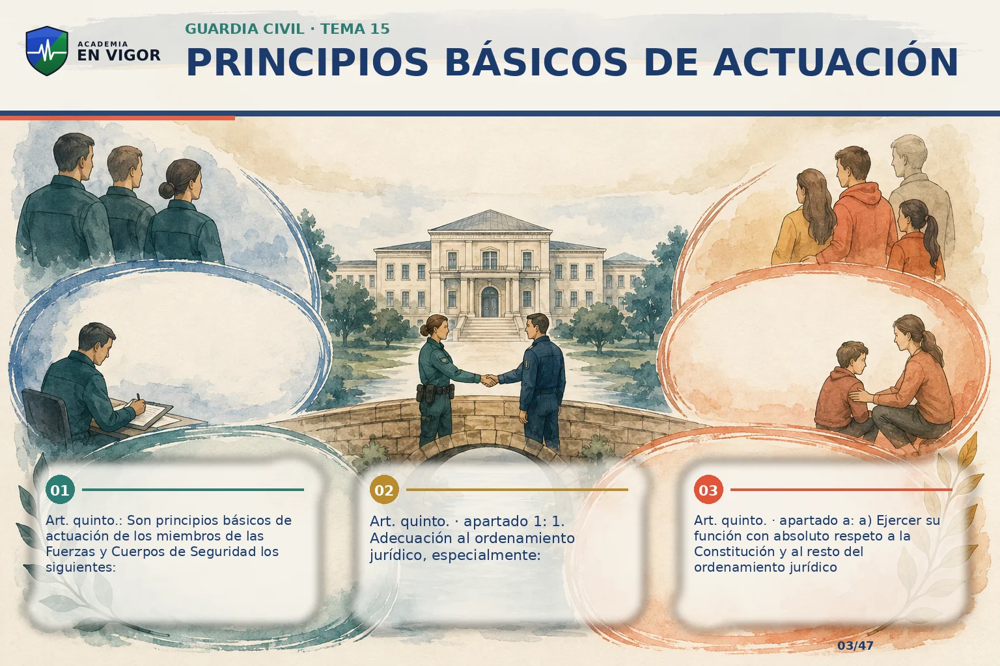

<em>Infografía: esquema de principios básicos de actuación.</em>

<!-- FUENTE: LO2-1986-GC-T15 -->

## 04. Disposiciones estatutarias comunes

Este bloque ordena **disposiciones estatutarias comunes** dentro de alcance y sistema de seguridad pública.

### Claves rápidas

- **Artículo sexto. · apartado 1:** 1. Los Poderes Públicos promoverán las condiciones más favorables para una adecuada promoción profesional, social y humana de los miembros de las Fuerzas y Cuerpos de Seguridad, de acuerdo con los principios de objetividad, igualdad de oportunidades, mérito y capacidad.
- **Artículo sexto. · apartado 2:** 2. La formación y perfeccionamiento de los miembros de las Fuerzas y Cuerpos de Seguridad se adecuará a los principios señalados en el artículo 5.º y se ajustarán a los siguientes criterios:
- **Artículo sexto. · apartado a:** a) Tendrá carácter profesional y permanente.
- **Artículo sexto. · apartado b:** b) Los estudios que se cursen en los centros de enseñanza dependientes de las diferentes Administraciones públicas podrán ser objeto de convalidación por el Ministerio de Educación y Ciencia, que a tal fin tendrá en cuenta las titulaciones exigidas para el acceso a cada uno de ellos y la naturaleza y duración de dichos estudios.

:::perla-vigor
Primero localiza la norma y el artículo; después fija el verbo, el sujeto y la excepción.
:::

<!-- VISUAL:t15-04-disposiciones-estatutarias-comunes.webp -->

  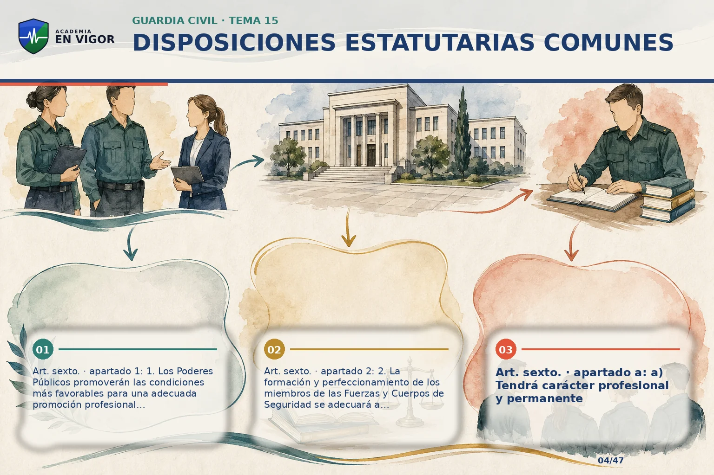

<em>Infografía: esquema de disposiciones estatutarias comunes.</em>

<!-- FUENTE: LO2-1986-GC-T15 -->

## 05. Fuerzas y Cuerpos de Seguridad del Estado: organización

Este bloque ordena **fuerzas y cuerpos de seguridad del estado: organización** dentro de alcance y sistema de seguridad pública.

### Claves rápidas

- **Artículo noveno.:** Las Fuerzas y Cuerpos de Seguridad del Estado ejercen sus funciones en todo el territorio nacional y están integradas por:
- **Artículo noveno. · apartado a:** a) El Cuerpo Nacional de Policía, que es un Instituto Armado de naturaleza civil, dependiente del Ministro del Interior.
- **Artículo noveno. · apartado b:** b) La Guardia Civil, que es un Instituto Armado de naturaleza militar, dependiente del Ministro del Interior, en el desempeño de las funciones que esta Ley le atribuye, y del Ministro de Defensa en el cumplimiento de las misiones de carácter militar que éste o el Gobierno le encomienden. En tiempo de guerra y durante el estado de sitio, dependerá…
- **Artículo diez. · apartado 1:** 1. Corresponde al Ministro del Interior la administración general de la seguridad ciudadana y el mando superior de las Fuerzas y Cuerpos de Seguridad del Estado, así como la responsabilidad de las relaciones de colaboración y auxilio con las Autoridades policiales de otros países, conforme a lo establecido en Tratados y Acuerdos Internacionales.

:::perla-vigor
Primero localiza la norma y el artículo; después fija el verbo, el sujeto y la excepción.
:::

<!-- VISUAL:t15-05-fuerzas-y-cuerpos-de-seguridad-del-estado-organizacion.webp -->

  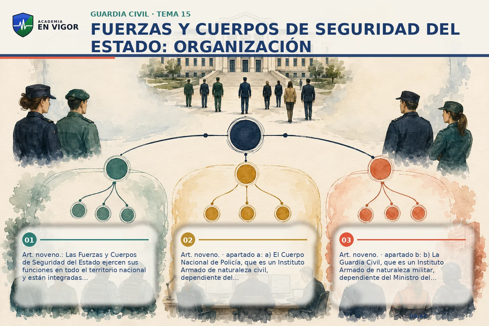

<em>Infografía: esquema de fuerzas y cuerpos de seguridad del estado: organización.</em>

<!-- FUENTE: LO2-1986-GC-T15 -->

## 06. Funciones de las Fuerzas y Cuerpos de Seguridad del Estado

Este bloque ordena **funciones de las fuerzas y cuerpos de seguridad del estado** dentro de alcance y sistema de seguridad pública.

### Claves rápidas

- **Artículo once. · apartado 1:** 1. Las Fuerzas y Cuerpos de Seguridad del Estado tienen como misión proteger el libre ejercicio de los derechos y libertades y garantizar la seguridad ciudadana mediante el desempeño de las siguientes funciones:
- **Artículo once. · apartado a:** a) Velar por el cumplimiento de las Leyes y disposiciones generales, ejecutando las órdenes que reciban de las Autoridades, en el ámbito de sus respectivas competencias.
- **Artículo once. · apartado b:** b) Auxiliar y proteger a las personas y asegurar la conservación y custodia de los bienes que se encuentren en situación de peligro por cualquier causa.
- **Artículo once. · apartado c:** c) Vigilar y proteger los edificios e instalaciones públicos que lo requieran.

:::perla-vigor
Primero localiza la norma y el artículo; después fija el verbo, el sujeto y la excepción.
:::

<!-- VISUAL:t15-06-funciones-de-las-fuerzas-y-cuerpos-de-seguridad-del-est.webp -->

  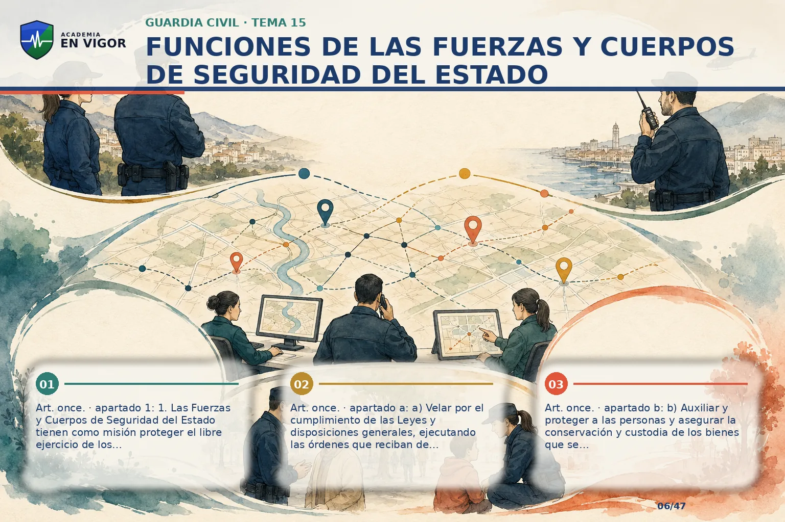

<em>Infografía: esquema de funciones de las fuerzas y cuerpos de seguridad del estado.</em>

<!-- FUENTE: LO2-1986-GC-T15 -->

## 07. Distribución material y territorial de competencias

Este bloque ordena **distribución material y territorial de competencias** dentro de alcance y sistema de seguridad pública.

### Claves rápidas

- **Artículo doce. · apartado 1:** 1. Además de las funciones comunes establecidas en el artículo anterior, se establece la siguiente distribución material de competencias:
- **Artículo doce. · apartado A:** A) Serán ejercidas por el Cuerpo Nacional de Policía:
- **Artículo doce. · apartado a:** a) La expedición del documento nacional de identidad y de los pasaportes.
- **Artículo doce. · apartado b:** b) El control de entrada y salida del territorio nacional de españoles y extranjeros.

:::perla-vigor
Primero localiza la norma y el artículo; después fija el verbo, el sujeto y la excepción.
:::

<!-- VISUAL:t15-07-distribucion-material-y-territorial-de-competencias.webp -->

  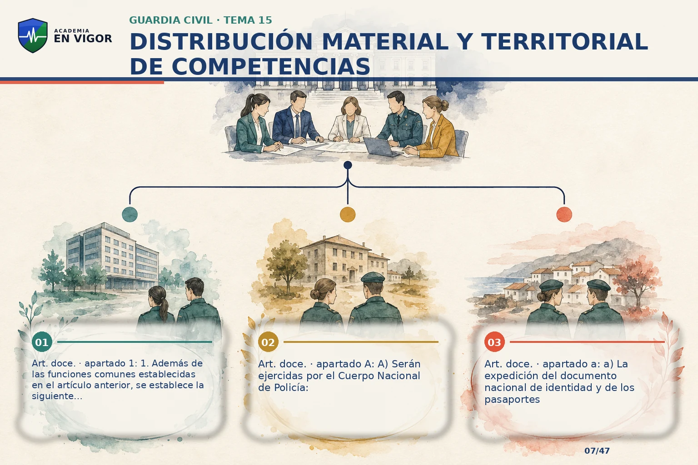

<em>Infografía: esquema de distribución material y territorial de competencias.</em>

<!-- FUENTE: LO2-1986-GC-T15 -->

## 08. Guardia Civil: naturaleza, dependencia y régimen

Este bloque ordena **guardia civil: naturaleza, dependencia y régimen** dentro de alcance y sistema de seguridad pública.

### Claves rápidas

- **Artículo trece. · apartado 1:** 1. El Cuerpo de la Guardia Civil se estructura jerárquicamente según los diferentes empleos, de conformidad con su naturaleza militar.
- **Artículo trece. · apartado 2:** 2. El régimen estatutario de la Guardia Civil será el establecido en la presente Ley, en las normas que la desarrollan y en el ordenamiento militar.
- **Artículo catorce. · apartado 1:** 1. El Ministerio del Interior dispondrá todo lo concerniente a servicios de la Guardia Civil relacionados con la seguridad ciudadana y demás competencias atribuidas por esta Ley, así como a sus retribuciones, destinos, acuartelamientos y material.
- **Artículo catorce. · apartado 2:** 2. Conjuntamente, los Ministros de Defensa e Interior dispondrán todo lo referente a la selección, formación, perfeccionamiento, armamento y despliegue territorial, y propondrán al Gobierno el nombramiento del titular de la Dirección General de la Guardia Civil, así como la normativa reguladora del voluntariado especial para la prestación del servicio…

:::perla-vigor
Primero localiza la norma y el artículo; después fija el verbo, el sujeto y la excepción.
:::

<!-- VISUAL:t15-08-guardia-civil-naturaleza-dependencia-y-regimen.webp -->

  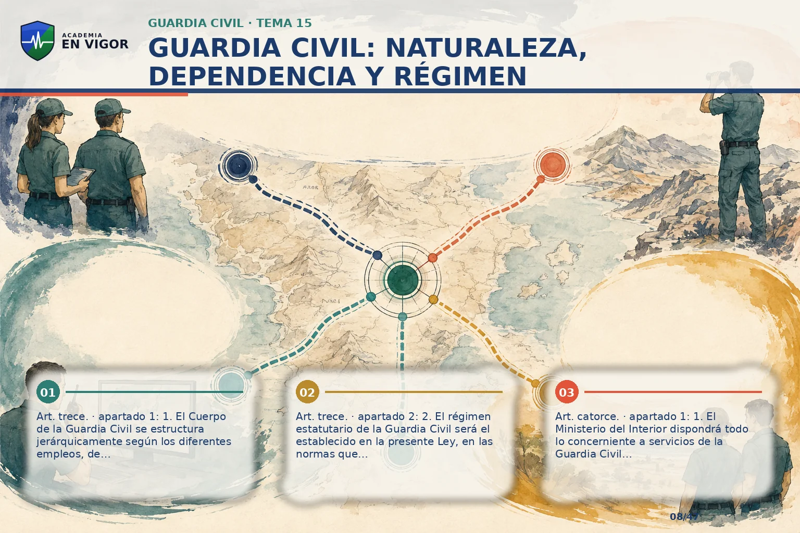

<em>Infografía: esquema de guardia civil: naturaleza, dependencia y régimen.</em>

<!-- FUENTE: LO2-1986-GC-T15 -->

## 09. Policía Judicial

Este bloque ordena **policía judicial** dentro de alcance y sistema de seguridad pública.

### Claves rápidas

- **Artículo veintinueve. · apartado 1:** 1. Las funciones de Policía Judicial que se mencionan en el artículo 126 de la Constitución serán ejercidas por las Fuerzas y Cuerpos de Seguridad del Estado, a través de las Unidades que se regulan en el presente capítulo.
- **Artículo veintinueve. · apartado 2:** 2. Para el cumplimiento de dicha función tendrán carácter colaborador de las Fuerzas y Cuerpos de Seguridad del Estado el personal de Policía de las Comunidades Autónomas y de las Corporaciones Locales.
- **Artículo treinta. · apartado 1:** 1. El Ministerio del Interior organizará con funcionarios de las Fuerzas y Cuerpos de Seguridad del Estado que cuenten con la adecuada formación especializada, Unidades de Policía Judicial, atendiendo a criterios territoriales y de especialización delictual, a las que corresponderá esta función con carácter permanente y especial.
- **Artículo treinta. · apartado 2:** 2. Las referidas Unidades orgánicas de Policía Judicial podrán adscribirse, en todo o en parte, por el Ministerio del Interior, oído el Consejo General del Poder Judicial, a determinados Juzgados y Tribunales. De igual manera podrán adscribirse al Ministerio Fiscal, oído el Fiscal General del Estado.

:::perla-vigor
Primero localiza la norma y el artículo; después fija el verbo, el sujeto y la excepción.
:::

<!-- VISUAL:t15-09-policia-judicial.webp -->

  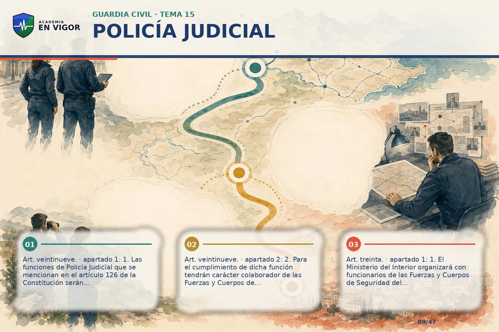

<em>Infografía: esquema de policía judicial.</em>

<!-- FUENTE: LO2-1986-GC-T15 -->

## 10. Policías de las Comunidades Autónomas

Este bloque ordena **policías de las comunidades autónomas** dentro de alcance y sistema de seguridad pública.

### Claves rápidas

- **Artículo treinta y siete. · apartado 1:** 1. Las Comunidades Autónomas en cuyos Estatutos esté previsto podrán crear Cuerpos de Policía para el ejercicio de las funciones de vigilancia y protección a que se refiere el artículo 148.1.22 de la Constitución y las demás que le atribuye la presente Ley.
- **Artículo treinta y siete. · apartado 2:** 2. Las Comunidades Autónomas que no hicieran uso de la posibilidad prevista en el apartado anterior podrán ejercer las funciones enunciadas en el artículo 148.1.22 de la Constitución , de conformidad con los artículos 39 y 47 de esta Ley.
- **Artículo treinta y siete. · apartado 3:** 3. Las Comunidades Autónomas cuyos estatutos no prevean la creación de Cuerpos de Policía también podrán ejercer las funciones de vigilancia y protección a que se refiere el artículo 148.1.22 de la Constitución mediante la firma de acuerdos de cooperación específica con el Estado.
- **Artículo treinta y ocho.:** Las Comunidades Autónomas, a que se refiere el número 1 del artículo anterior, podrán ejercer, a través de sus Cuerpos de Policía, las siguientes funciones:

:::perla-vigor
Primero localiza la norma y el artículo; después fija el verbo, el sujeto y la excepción.
:::

<!-- VISUAL:t15-10-policias-de-las-comunidades-autonomas.webp -->

  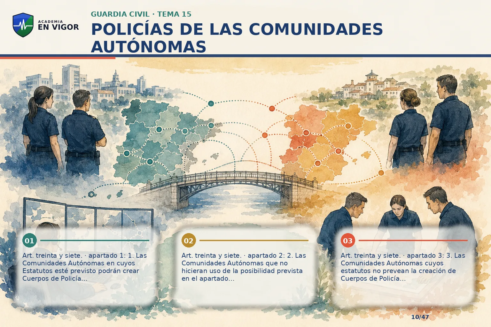

<em>Infografía: esquema de policías de las comunidades autónomas.</em>

<!-- FUENTE: LO2-1986-GC-T15 -->

## 11. Colaboración y coordinación entre Administraciones

Este bloque ordena **colaboración y coordinación entre administraciones** dentro de alcance y sistema de seguridad pública.

### Claves rápidas

- **Artículo cuarenta y cinco.:** Los miembros de las Fuerzas y Cuerpos de Seguridad del Estado y de los Cuerpos de Policía de las Comunidades Autónomas deberán prestarse mutuo auxilio e información recíproca en el ejercicio de sus funciones respectivas.
- **Artículo cuarenta y seis. · apartado 1:** 1. Cuando las Comunidades Autónomas que, según su Estatuto, puedan crear Cuerpos de Policía no dispongan de los medios suficientes para el ejercicio de las funciones previstas en el artículo 38.1 y 2.c) de la presente Ley, podrán recabar, a través de las Autoridades del Estado el auxilio de las Fuerzas y Cuerpos de Seguridad del Estado, correspondiendo en…
- **Artículo cuarenta y seis. · apartado 2:** 2. En el resto de los casos, cuando en la prestación de un determinado servicio o en la realización de una actuación concreta concurran, simultáneamente, miembros o Unidades de las Fuerzas y Cuerpos de Seguridad del Estado y de la Policía de la Comunidad Autónoma, serán los Mandos de los primeros los que asuman la dirección de la operación.
- **Artículo cuarenta y siete.:** Las Comunidades Autónomas incluidas en el apartado 2 del artículo 37 de la presente Ley, podrán solicitar del Gobierno de la Nación, a través del Ministerio del Interior, para el ejercicio de las funciones previstas en el artículo 38.1 de aquélla, la adscripción de Unidades del Cuerpo Nacional de Policía.

:::perla-vigor
Primero localiza la norma y el artículo; después fija el verbo, el sujeto y la excepción.
:::

<!-- VISUAL:t15-11-colaboracion-y-coordinacion-entre-administraciones.webp -->

  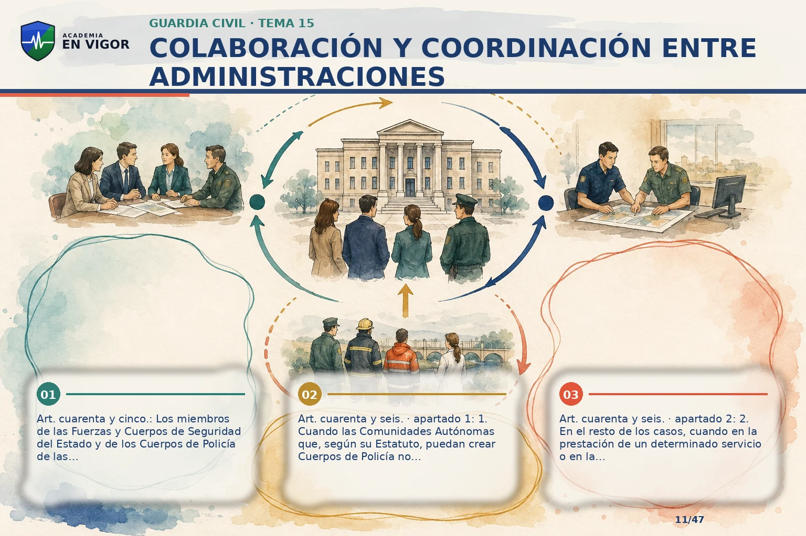

<em>Infografía: esquema de colaboración y coordinación entre administraciones.</em>

<!-- FUENTE: LO2-1986-GC-T15 -->

## 12. Policías Locales

Este bloque ordena **policías locales** dentro de alcance y sistema de seguridad pública.

### Claves rápidas

- **Artículo cincuenta y uno. · apartado 1:** 1. Los municipios podrán crear cuerpos de policía propios, de acuerdo con lo previsto en la presente ley, en la Ley de Bases de Régimen Local y en la legislación autonómica.
- **Artículo cincuenta y uno. · apartado 2:** 2. En los municipios donde no exista policía municipal, los cometidos de ésta serán ejercidos por el personal que desempeñe funciones de custodia y vigilancia de bienes, servicios e instalaciones, con la denominación de guardas, vigilantes, agentes, alguaciles o análogos.
- **Artículo cincuenta y uno. · apartado 3:** 3. Dichos cuerpos sólo podrán actuar en el ámbito territorial del municipio respectivo, salvo en situaciones de emergencia y previo requerimiento de las autoridades competentes.
- **Artículo cincuenta y uno.:** No obstante, cuando ejerzan funciones de protección de autoridades de las corporaciones locales, podrán actuar fuera del término municipal respectivo, con autorización del Ministerio del Interior o de la correspondiente autoridad de la comunidad autónoma que cuente con cuerpo de policía autonómica, cuando desarrollen íntegramente esas actuaciones en el…

:::perla-vigor
Primero localiza la norma y el artículo; después fija el verbo, el sujeto y la excepción.
:::

<!-- VISUAL:t15-12-policias-locales.webp -->

  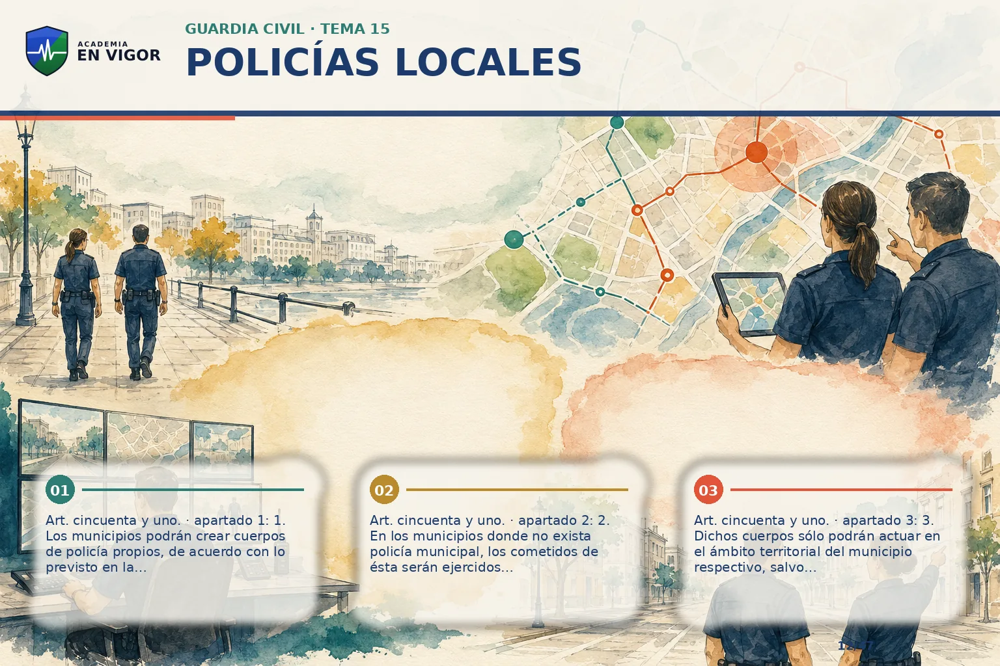

<em>Infografía: esquema de policías locales.</em>

<!-- FUENTE: LO2-1986-GC-T15 -->

## 13. Disposiciones de la Ley Orgánica 2/1986

Este bloque ordena **disposiciones de la ley orgánica 2/1986** dentro de alcance y sistema de seguridad pública.

### Claves rápidas

- **Disposición transitoria primera. · apartado 1:** 1. En el Cuerpo Nacional de Policía se integrarán los funcionarios de los Cuerpos Superiores de Policía y de Policía Nacional, que quedan extinguidos.
- **Disposición transitoria primera.:** La integración en las Escalas previstas en el artículo 17 de esta Ley se realizará en la forma siguiente:
- **Disposición transitoria primera.:** En la Escala Superior:
- **Disposición transitoria primera.:** Primera categoría: Comisarios Principales, Coroneles y el número de Comisarios y Tenientes Coroneles que reglamentariamente se determine de acuerdo con la disposición adicional tercera 1.

:::perla-vigor
Primero localiza la norma y el artículo; después fija el verbo, el sujeto y la excepción.
:::

<!-- VISUAL:t15-13-disposiciones-de-la-ley-organica-2-1986.webp -->

  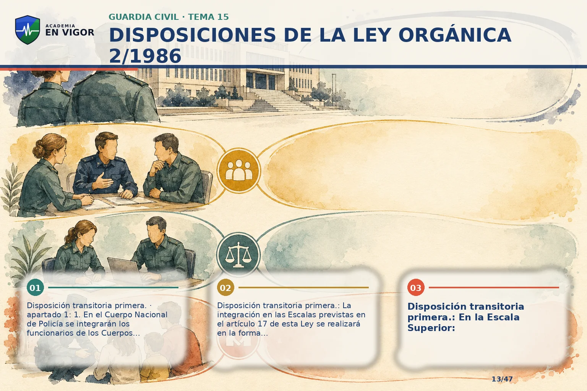

<em>Infografía: esquema de disposiciones de la ley orgánica 2/1986.</em>

<!-- FUENTE: LO2-1986-GC-T15 -->

## 14. Objeto, ámbito, condición de guardia civil e igualdad

Este bloque ordena **objeto, ámbito, condición de guardia civil e igualdad** dentro de régimen de personal y estructura de la guardia civil.

### Claves rápidas

- **Artículo 1. Objeto.:** Esta Ley tiene por objeto establecer el régimen del personal de la Guardia Civil, y específicamente la carrera profesional de sus miembros y todos aquellos aspectos que la conforman, con el fin de que este Cuerpo de Seguridad del Estado de naturaleza militar, esté en condiciones de cumplir con la misión que el artículo 104.1 de la Constitución encomienda a…
- **Artículo 2. Ámbito de aplicación. · apartado 1:** 1. Esta Ley es de aplicación a los guardias civiles y, en los términos en ella establecidos, a quienes ingresen en los centros docentes de formación de la Guardia Civil.
- **Artículo 2. Ámbito de aplicación. · apartado 2:** 2. Los principios y normas de aplicación general al personal al servicio de la Administración General del Estado, establecidos de acuerdo con la Ley 7/2007, de 12 de abril , del Estatuto Básico del Empleado Público , se incorporarán al régimen del personal de la Guardia Civil, siempre que no contradigan su legislación específica.
- **Artículo 3. Guardias civiles. · apartado 1:** 1. Son guardias civiles los españoles vinculados al Cuerpo de la Guardia Civil por una relación de servicios profesionales de carácter permanente como miembros de las Fuerzas y Cuerpos de Seguridad del Estado y que, por la naturaleza militar del Instituto en el que se integran, son militares de carrera de la Guardia Civil.

:::perla-vigor
Primero localiza la norma y el artículo; después fija el verbo, el sujeto y la excepción.
:::

<!-- VISUAL:t15-14-objeto-ambito-condicion-de-guardia-civil-e-igualdad.webp -->

  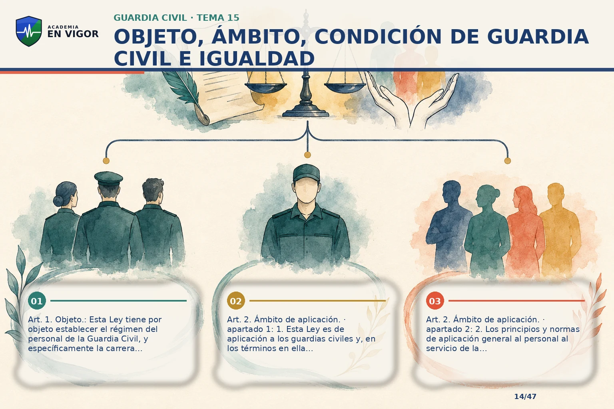

<em>Infografía: esquema de objeto, ámbito, condición de guardia civil e igualdad.</em>

<!-- FUENTE: L29-2014-GC-T15 -->

## 15. Código de conducta y reglas de comportamiento

Este bloque ordena **código de conducta y reglas de comportamiento** dentro de régimen de personal y estructura de la guardia civil.

### Claves rápidas

- **Artículo 6. Código de conducta.:** Los guardias civiles desarrollarán sus funciones con absoluto respeto a la Constitución y al resto del ordenamiento jurídico. Deberán actuar con arreglo a los principios establecidos en el artículo 5 de la Ley Orgánica 2/1986, de 13 de marzo , de Fuerzas y Cuerpos de Seguridad, y en el Título III de la Ley Orgánica 11/2007, de 22 de octubre , reguladora de…
- **Artículo 7. Reglas de comportamiento del guardia civil. · apartado 1:** 1. Las reglas esenciales que definen el comportamiento del guardia civil son las siguientes:
- **Artículo 7. Reglas de comportamiento del guardia civil. · apartado 1:** 1. Mantendrá una disposición permanente para defender a España y proteger el ejercicio de los derechos y libertades de los ciudadanos, que ha de tener su diaria expresión en el exacto cumplimiento de la Constitución y las leyes.
- **Artículo 7. Reglas de comportamiento del guardia civil. · apartado 2:** 2. Pondrá todo su empeño en preservar la seguridad y el bienestar de los ciudadanos, sin discriminación alguna por razón de sexo, origen racial o étnico, religión o ideología, orientación o identidad sexual, edad, discapacidad, o cualquier otra condición o circunstancia personal o social, actuando siempre con dignidad, prudencia y honradez.

:::perla-vigor
Primero localiza la norma y el artículo; después fija el verbo, el sujeto y la excepción.
:::

<!-- VISUAL:t15-15-codigo-de-conducta-y-reglas-de-comportamiento.webp -->

  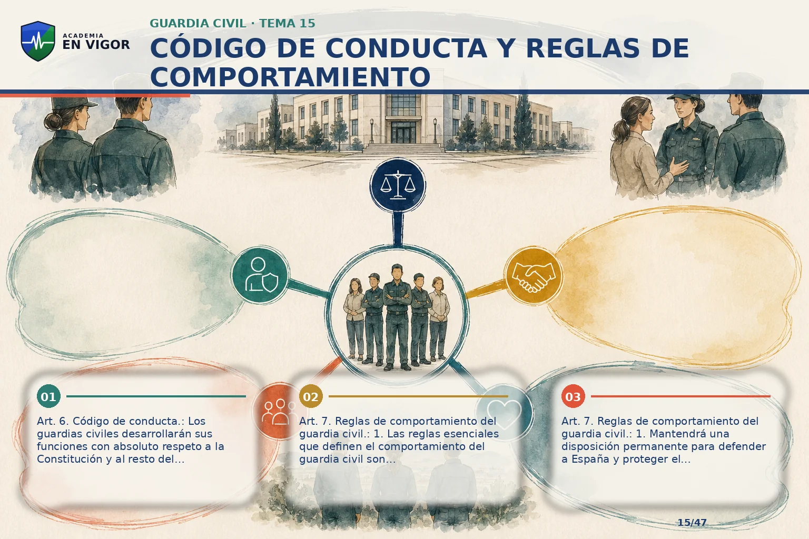

<em>Infografía: esquema de código de conducta y reglas de comportamiento.</em>

<!-- FUENTE: L29-2014-GC-T15 -->

## 16. Competencias en política de personal

Este bloque ordena **competencias en política de personal** dentro de régimen de personal y estructura de la guardia civil.

### Claves rápidas

- **Artículo 8. Del Consejo de Ministros.:** Al Consejo de Ministros, como órgano colegiado del Gobierno, le corresponde:
- **Artículo 8. Del Consejo de Ministros. · apartado a:** a) Fijar periódicamente las plantillas reglamentarias para los distintos empleos y escalas.
- **Artículo 8. Del Consejo de Ministros. · apartado b:** b) Aprobar las provisiones de plazas mediante las correspondientes ofertas de empleo.
- **Artículo 8. Del Consejo de Ministros. · apartado c:** c) Desarrollar las directrices generales de promoción y ascenso de los guardias civiles.

:::perla-vigor
Primero localiza la norma y el artículo; después fija el verbo, el sujeto y la excepción.
:::

<!-- VISUAL:t15-16-competencias-en-politica-de-personal.webp -->

  

<em>Infografía: esquema de competencias en política de personal.</em>

<!-- FUENTE: L29-2014-GC-T15 -->

## 17. Funciones profesionales

Este bloque ordena **funciones profesionales** dentro de régimen de personal y estructura de la guardia civil.

### Claves rápidas

- **Artículo 15. Funciones. · apartado 1:** 1. Los guardias civiles realizarán funciones operativas, técnicas, logísticas, administrativas y docentes en el marco de la seguridad pública o de las misiones de carácter militar que se le puedan encomendar. Estas funciones se desarrollarán por medio de acciones directivas, que incluyen las de mando y de acciones de gestión y ejecutivas.
- **Artículo 15. Funciones. · apartado 2:** 2. La acción directiva se ejerce mediante la definición de objetivos y la determinación de los medios para conseguirlos, estableciendo los planes correspondientes y controlando su ejecución. Mediante acciones de gestión se aplican los medios puestos a disposición para alcanzar los objetivos de la forma más eficiente. Por medio de acciones ejecutivas se…
- **Artículo 15. Funciones. · apartado 3:** 3. La acción de mando es una acción directiva que se refiere al ejercicio de la autoridad y a la asunción de la consiguiente responsabilidad, y corresponde al guardia civil en razón de su cargo, destino o servicio. Para el ejercicio de la acción de mando se podrá contar con la colaboración de los subordinados en tareas de información, planeamiento,…

:::perla-vigor
Primero localiza la norma y el artículo; después fija el verbo, el sujeto y la excepción.
:::

<!-- VISUAL:t15-17-funciones-profesionales.webp -->

  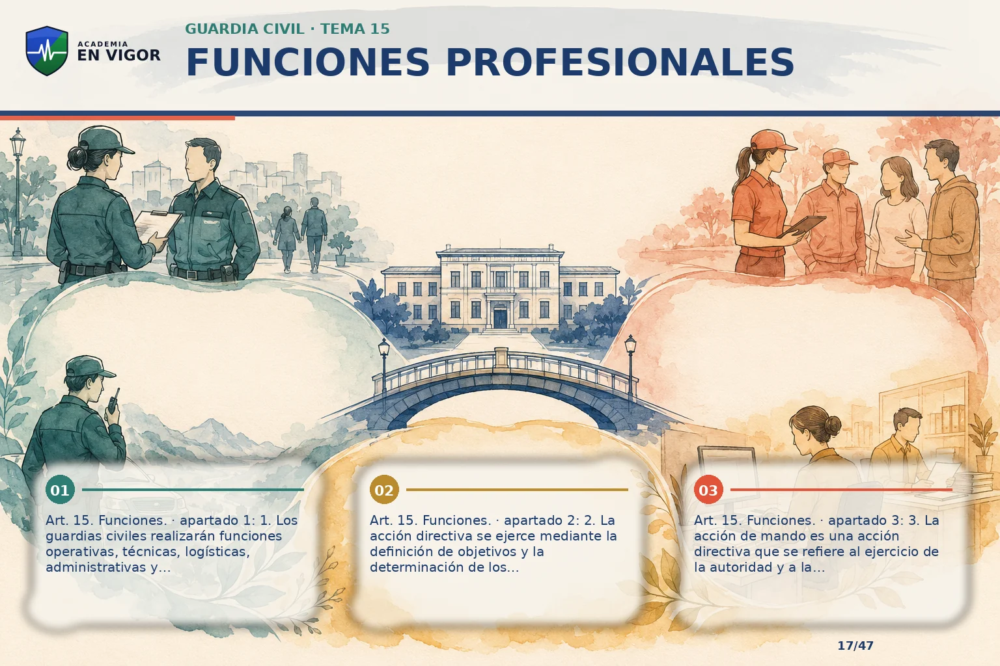

<em>Infografía: esquema de funciones profesionales.</em>

<!-- FUENTE: L29-2014-GC-T15 -->

## 18. Escalas, categorías y empleos

Este bloque ordena **escalas, categorías y empleos** dentro de régimen de personal y estructura de la guardia civil.

### Claves rápidas

- **Artículo 16. Escalas del Cuerpo de la Guardia Civil. · apartado 1:** 1. El personal de la Guardia Civil se agrupa en las escalas de oficiales, suboficiales y cabos y guardias, en función de las facultades profesionales asignadas al conjunto de los empleos de cada una de ellas y a los requisitos educativos exigidos para la incorporación a las mismas. Las facultades profesionales en cada escala son consecuencia de la…
- **Artículo 16. Escalas del Cuerpo de la Guardia Civil. · apartado 2:** 2. La creación, extinción, integración o refundición de escalas se efectuará por ley.
- **Artículo 17. Categorías. · apartado 1:** 1. Los miembros de la escala de oficiales se agrupan en las categorías de oficiales generales y de oficiales.
- **Artículo 17. Categorías.:** Los oficiales generales ejercen la acción de mando en la estructura orgánica de la Guardia Civil y la alta dirección y gestión de los recursos humanos, materiales y financieros. Accederán a esta categoría los oficiales que hayan acreditado en su trayectoria profesional de modo sobresaliente su competencia y capacidad de liderazgo.

:::perla-vigor
Primero localiza la norma y el artículo; después fija el verbo, el sujeto y la excepción.
:::

<!-- VISUAL:t15-18-escalas-categorias-y-empleos.webp -->

  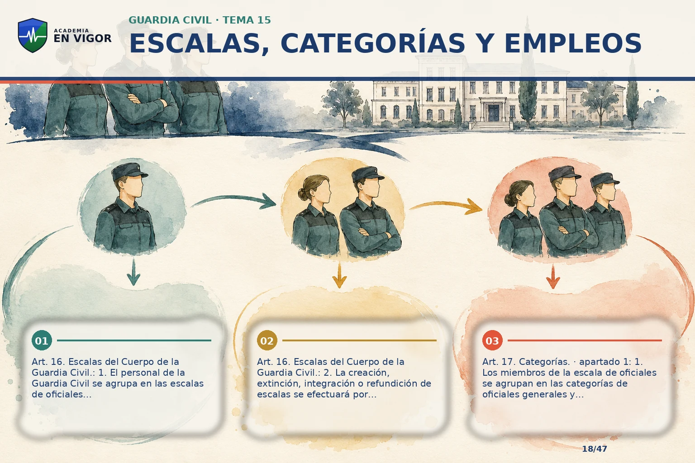

<em>Infografía: esquema de escalas, categorías y empleos.</em>

<!-- FUENTE: L29-2014-GC-T15 -->

## 19. Escalafón, capacidades y especialidades

Este bloque ordena **escalafón, capacidades y especialidades** dentro de régimen de personal y estructura de la guardia civil.

### Claves rápidas

- **Artículo 21. Escalafón, antigüedad y precedencia. · apartado 1:** 1. Se entiende por escalafón la ordenación de los componentes del Cuerpo según su escala y, dentro de cada una de ellas, por empleos y antigüedad en los mismos. Su orden sólo podrá alterarse en aplicación de lo previsto en esta Ley y en las leyes disciplinarias, en cuyo caso al interesado se le asignará la fecha de antigüedad en el empleo que le corresponda…
- **Artículo 21. Escalafón, antigüedad y precedencia. · apartado 2:** 2. La antigüedad en el primer empleo de una escala es el tiempo transcurrido desde la fecha de su concesión y, en los sucesivos empleos, desde la fecha de la firma de la resolución por la que se concede el ascenso correspondiente, salvo que en ella se haga constar, a estos efectos, la fecha del día siguiente a aquél en que se produzca la vacante que origine…
- **Artículo 21. Escalafón, antigüedad y precedencia. · apartado 3:** 3. La precedencia de los guardias civiles estará determinada por el cargo o destino que se ocupe si está fijada en normas de carácter reglamentario; si no lo está, se basará en el empleo; a igualdad de empleo, en la antigüedad en el mismo y a igualdad de ésta se resolverá en función de la posición en el escalafón.
- **Artículo 22. Capacidades para el ejercicio profesional. · apartado 1:** 1. La capacidad profesional específica de los guardias civiles para ejercer las competencias correspondientes a cada puesto de trabajo se determinará en función de los cometidos de los miembros del Cuerpo, por las facultades atribuidas a los componentes de su escala y por su empleo. Dicha capacidad habilita, conforme a los títulos académicos y profesionales…

:::perla-vigor
Primero localiza la norma y el artículo; después fija el verbo, el sujeto y la excepción.
:::

<!-- VISUAL:t15-19-escalafon-capacidades-y-especialidades.webp -->

  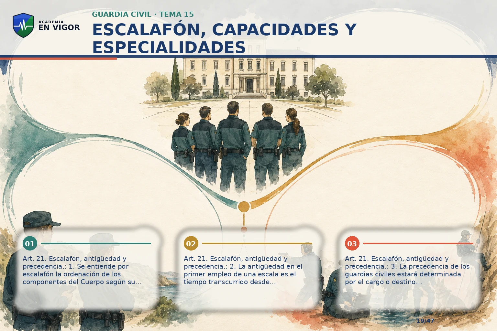

<em>Infografía: esquema de escalafón, capacidades y especialidades.</em>

<!-- FUENTE: L29-2014-GC-T15 -->

## 20. Dirección General, órganos superiores y Gabinete Técnico

Este bloque ordena **dirección general, órganos superiores y gabinete técnico** dentro de régimen de personal y estructura de la guardia civil.

### Claves rápidas

- **Artículo 4. Dirección General de la Guardia Civil. · apartado 1:** 1. La Dirección General de la Guardia Civil, cuyo titular tiene rango de subsecretario, es el órgano del Ministerio encargado de la ordenación, dirección, coordinación y ejecución de las misiones que a la Guardia Civil encomienden las disposiciones vigentes, de acuerdo con las directrices y órdenes emanadas de las personas titulares de los Ministerios del…
- **Artículo 4. Dirección General de la Guardia Civil.:** Corresponde a la persona titular de la Dirección General, bajo la dependencia de la persona titular de la Secretaría de Estado de Seguridad, el mando directo de la Guardia Civil. En particular, ejerce las siguientes funciones:
- **Artículo 4. Dirección General de la Guardia Civil. · apartado a:** a) Dirigir, impulsar y coordinar el servicio y distribución de las Unidades de la Guardia Civil.
- **Artículo 4. Dirección General de la Guardia Civil. · apartado b:** b) Impulsar el análisis, planificación y desarrollo de los planes y proyectos de la Guardia Civil y elevar las propuestas a la Secretaría de Estado de Seguridad.

:::perla-vigor
Primero localiza la norma y el artículo; después fija el verbo, el sujeto y la excepción.
:::

<!-- VISUAL:t15-20-direccion-general-organos-superiores-y-gabinete-tecnico.webp -->

  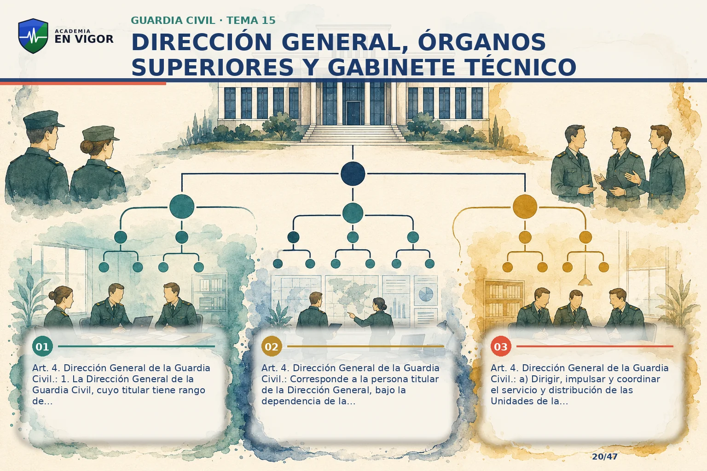

<em>Infografía: esquema de dirección general, órganos superiores y gabinete técnico.</em>

<!-- FUENTE: RD207-2024-ART4-GC-T15 -->

## 21. Dirección Adjunta Operativa y unidades dependientes

Este bloque ordena **dirección adjunta operativa y unidades dependientes** dentro de régimen de personal y estructura de la guardia civil.

### Claves rápidas

- **Artículo 4. Dirección General de la Guardia Civil. · apartado 5:** 5. La Dirección Adjunta Operativa, con nivel orgánico de subdirección general y a cargo de un Teniente General de la Guardia Civil en situación de servicio activo, es el órgano que se constituye en el primer auxiliar de la persona titular de la Dirección General de la Guardia Civil en el cumplimiento de sus funciones, materializando la dirección,…
- **Artículo 4. Dirección General de la Guardia Civil. · apartado a:** a) Proponer a la persona titular de la Dirección General la elaboración de propuestas normativas en su ámbito competencial y coordinar la elaboración y revisión de la estrategia institucional y de los planes estratégicos.
- **Artículo 4. Dirección General de la Guardia Civil. · apartado b:** b) Coadyuvar a la definición de los recursos humanos y materiales necesarios para integrar la planificación y ejecución de la actividad operativa.
- **Artículo 4. Dirección General de la Guardia Civil. · apartado c:** c) Planificar y coordinar la actividad desarrollada por las Unidades dependientes de ella, de acuerdo con las directrices emanadas de la persona titular de la Dirección General.

:::perla-vigor
Primero localiza la norma y el artículo; después fija el verbo, el sujeto y la excepción.
:::

<!-- VISUAL:t15-21-direccion-adjunta-operativa-y-unidades-dependientes.webp -->

  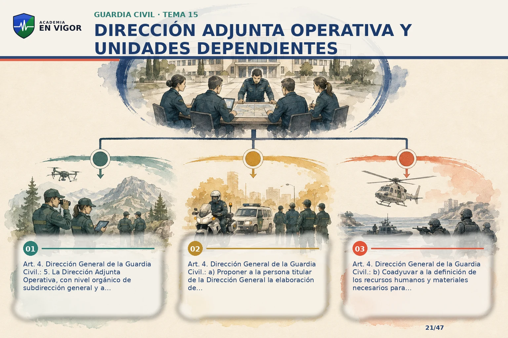

<em>Infografía: esquema de dirección adjunta operativa y unidades dependientes.</em>

<!-- FUENTE: RD207-2024-ART4-GC-T15 -->

## 22. Mando de Operaciones y unidades dependientes

Este bloque ordena **mando de operaciones y unidades dependientes** dentro de régimen de personal y estructura de la guardia civil.

### Claves rápidas

- **Artículo 4. Dirección General de la Guardia Civil. · apartado 7:** 7. El Mando de Operaciones, con nivel orgánico de Subdirección General y al mando de un Teniente General de la Guardia Civil en situación de servicio activo, es el responsable de planificar, impulsar y coordinar los servicios operativos de las Unidades de la Guardia Civil, de acuerdo con las directrices emanadas de la persona titular de la Dirección General…
- **Artículo 4. Dirección General de la Guardia Civil.:** Igualmente dirigirá, impulsará y coordinará la seguridad ciudadana en su demarcación y, por su carácter transversal, las funciones que se realicen para la custodia de las vías de comunicación terrestre y la vigilancia del tráfico, tránsito y transporte en las vías públicas interurbanas. Para tales cometidos, del Mando de Operaciones, a su vez, dependen las…
- **Artículo 4. Dirección General de la Guardia Civil. · apartado a:** a) El Estado Mayor, a cargo de un Oficial General de la Guardia Civil en situación de servicio activo. Es el principal órgano auxiliar de la Dirección Adjunta Operativa, del Mando de Operaciones y del Mando de Fronteras y Policía Marítima, en todo lo concerniente al ejercicio de las funciones de cada Mando, además de responsable de proporcionar los…
- **Artículo 4. Dirección General de la Guardia Civil. · apartado b:** b) La Jefatura de Unidades Especiales y de Reserva, a cargo de un Oficial General de la Guardia Civil en situación de servicio activo, a la que corresponde dirigir, coordinar y controlar las unidades y jefaturas de servicios de ella dependientes, constituyendo la reserva especializada del Mando de Operaciones. Así mismo, a través de sus unidades, asumirá la…

:::perla-vigor
Primero localiza la norma y el artículo; después fija el verbo, el sujeto y la excepción.
:::

<!-- VISUAL:t15-22-mando-de-operaciones-y-unidades-dependientes.webp -->

  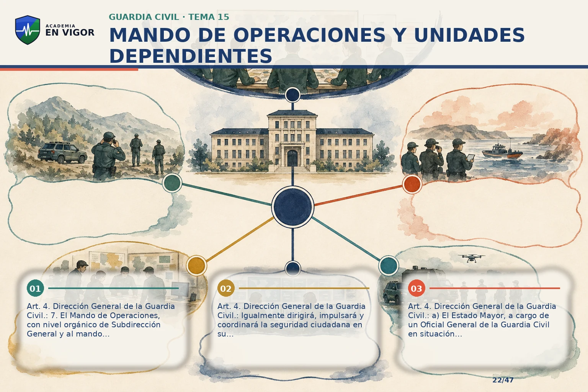

<em>Infografía: esquema de mando de operaciones y unidades dependientes.</em>

<!-- FUENTE: RD207-2024-ART4-GC-T15 -->

## 23. Mando de Fronteras y Policía Marítima

Este bloque ordena **mando de fronteras y policía marítima** dentro de régimen de personal y estructura de la guardia civil.

### Claves rápidas

- **Artículo 4. Dirección General de la Guardia Civil. · apartado 8:** 8. El Mando de Fronteras y Policía Marítima, con nivel orgánico de subdirección general, a cargo de un Teniente General de la Guardia Civil en situación de servicio activo, es responsable, de acuerdo con las directrices emanadas de la persona titular de la Dirección Adjunta Operativa, de la ejecución de las funciones previstas en los acuerdos del Consejo de…
- **Artículo 4. Dirección General de la Guardia Civil.:** Del Mando de Fronteras y Policía Marítima dependen las siguientes Jefaturas:
- **Artículo 4. Dirección General de la Guardia Civil. · apartado a:** a) La Jefatura Fiscal y de Fronteras, a cargo de un Oficial General de la Guardia Civil en situación de servicio activo, a la que corresponde organizar y gestionar el resguardo fiscal del Estado, evitar y perseguir el contrabando, el fraude y los tráficos ilícitos en el ámbito de las funciones encomendadas a la Guardia Civil, así como la custodia, control y…
- **Artículo 4. Dirección General de la Guardia Civil. · apartado b:** b) La Jefatura de Policía Marítima, a cargo de un Oficial General de la Guardia Civil en situación de servicio activo, encargada de la custodia, control y vigilancia de los espacios marítimos en los que España ejerce soberanía y, en este último ámbito, el control de la inmigración irregular. A nivel nacional y en el ámbito de competencias de la Guardia…

:::perla-vigor
Primero localiza la norma y el artículo; después fija el verbo, el sujeto y la excepción.
:::

<!-- VISUAL:t15-23-mando-de-fronteras-y-policia-maritima.webp -->

  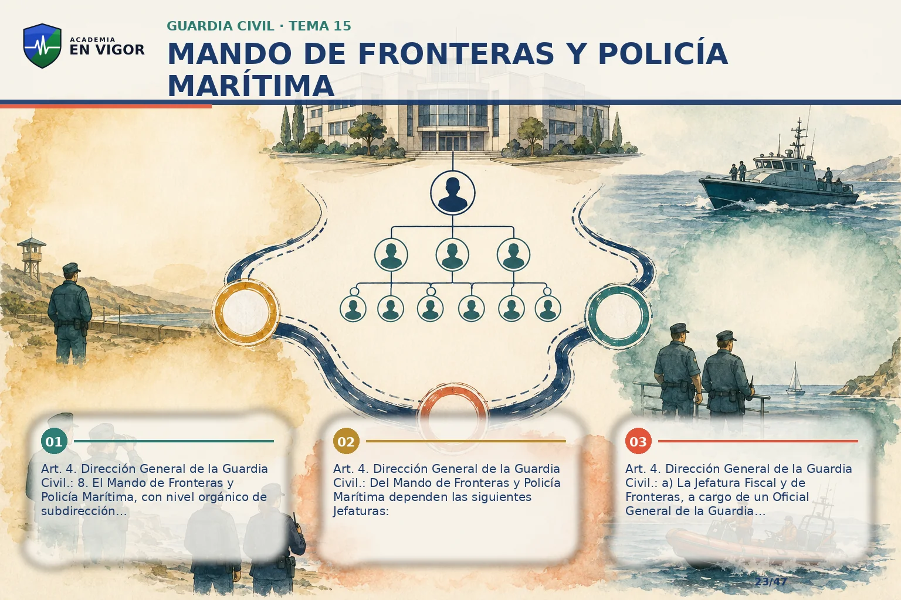

<em>Infografía: esquema de mando de fronteras y policía marítima.</em>

<!-- FUENTE: RD207-2024-ART4-GC-T15 -->

## 24. Mando de Personal

Este bloque ordena **mando de personal** dentro de régimen de personal y estructura de la guardia civil.

### Claves rápidas

- **Artículo 4. Dirección General de la Guardia Civil. · apartado 9:** 9. El Mando de Personal, con nivel orgánico de subdirección general y a cargo de un Teniente General de la Guardia Civil en situación de servicio activo, es responsable, de acuerdo con las directrices emanadas de la persona titular de la Dirección General, de la dirección y coordinación del desarrollo de la política de personal y educativa.
- **Artículo 4. Dirección General de la Guardia Civil.:** Con la misión de auxiliar a su titular en el desempeño de sus funciones, el Mando de Personal cuenta con una Secretaría Técnica, con el nivel orgánico que se determine en la relación de puestos de trabajo.
- **Artículo 4. Dirección General de la Guardia Civil.:** Del Mando de Personal dependen las siguientes Unidades:
- **Artículo 4. Dirección General de la Guardia Civil. · apartado a:** a) La Jefatura de Personal, a cargo de un Oficial General de la Guardia Civil en situación de servicio activo, a la que corresponde administrar y gestionar todo lo relativo al régimen de ascensos, destinos, recompensas, situaciones administrativas, retribuciones y régimen disciplinario, así como todo lo relacionado con la gestión y archivo del historial…

:::perla-vigor
Primero localiza la norma y el artículo; después fija el verbo, el sujeto y la excepción.
:::

<!-- VISUAL:t15-24-mando-de-personal.webp -->

  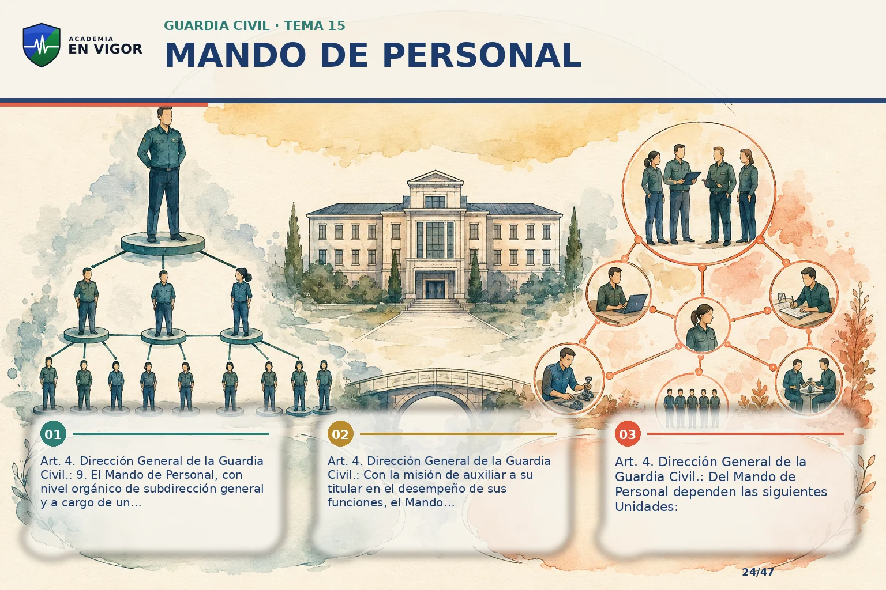

<em>Infografía: esquema de mando de personal.</em>

<!-- FUENTE: RD207-2024-ART4-GC-T15 -->

## 25. Mando de Apoyo

Este bloque ordena **mando de apoyo** dentro de régimen de personal y estructura de la guardia civil.

### Claves rápidas

- **Artículo 4. Dirección General de la Guardia Civil. · apartado 10:** 10. El Mando de Apoyo, con nivel orgánico de subdirección general y a cargo de un Teniente General de la Guardia Civil en situación de servicio activo, es responsable, de acuerdo con las directrices emanadas de la persona titular de la Dirección General, de la dirección, coordinación y gestión de los recursos financieros y de la política de recursos…
- **Artículo 4. Dirección General de la Guardia Civil.:** Con la misión de auxiliar a su titular en el desempeño de sus funciones, el Mando de Apoyo cuenta con una Secretaría Técnica, con el nivel orgánico que se determine en la relación de puestos de trabajo.
- **Artículo 4. Dirección General de la Guardia Civil.:** Del Mando de Apoyo dependen las siguientes unidades:
- **Artículo 4. Dirección General de la Guardia Civil. · apartado a:** a) La Jefatura de Asuntos Económicos, a cargo de un Oficial General de la Guardia Civil en situación de servicio activo, a la que corresponde la realización de las actividades relacionadas con la administración y coordinación de los recursos financieros y patrimoniales.

:::perla-vigor
Primero localiza la norma y el artículo; después fija el verbo, el sujeto y la excepción.
:::

<!-- VISUAL:t15-25-mando-de-apoyo.webp -->

  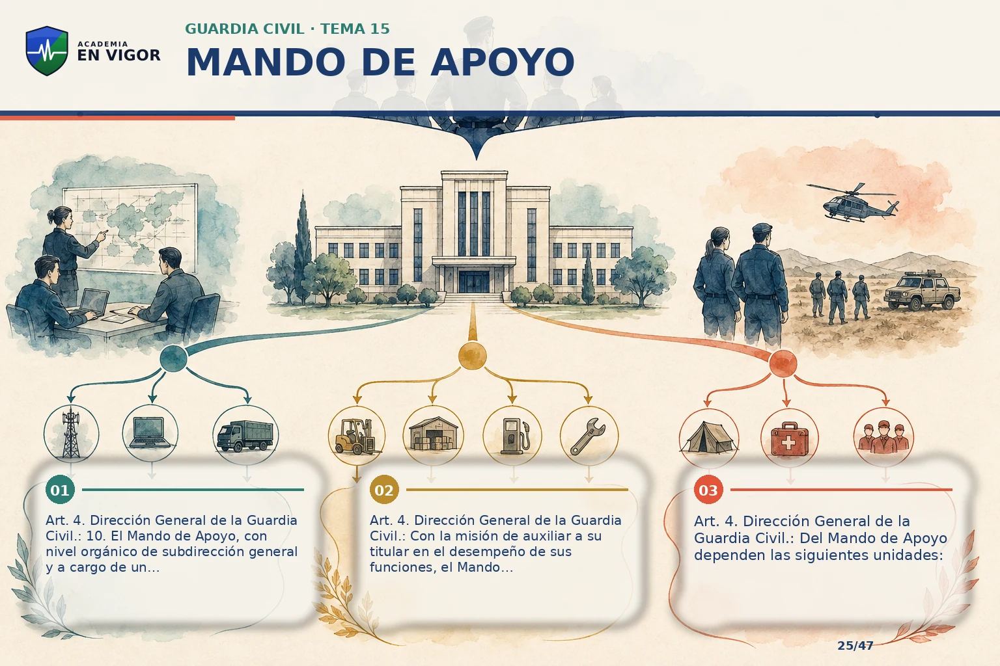

<em>Infografía: esquema de mando de apoyo.</em>

<!-- FUENTE: RD207-2024-ART4-GC-T15 -->

## 26. Organización periférica

Este bloque ordena **organización periférica** dentro de régimen de personal y estructura de la guardia civil.

### Claves rápidas

- **Artículo 4. Dirección General de la Guardia Civil. · apartado 11:** 11. La organización periférica de la Guardia Civil está constituida por Zonas, Comandancias, Compañías y Puestos.

:::perla-vigor
Primero localiza la norma y el artículo; después fija el verbo, el sujeto y la excepción.
:::

<!-- VISUAL:t15-26-organizacion-periferica.webp -->

  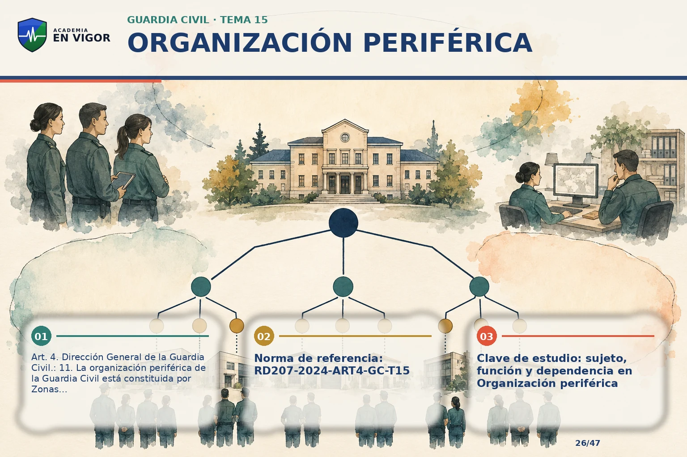

<em>Infografía: esquema de organización periférica.</em>

<!-- FUENTE: RD207-2024-ART4-GC-T15 -->

## 27. Antecedentes del siglo XIX

Este bloque ordena **antecedentes del siglo xix** dentro de historia institucional.

### Claves rápidas

- **Antecedentes del siglo XIX:** En esta página puede encontrar la historia de la Guardia Civil desde antes de su creación hasta la actualidad pasando por las diferentes etapas: los inicios de la institución en el siglo XIX, el momento de su fundación, así como su papel durante el sexenio revolucionario, la restauración monárquica, el reinado de Alfonso XIII, la segunda república, la…
- **Antecedentes del siglo XIX:** Al finalizar la Guerra de la Independencia contra Francia, la debilidad del Estado hace que la inseguridad se apodere de los caminos españoles.
- **Antecedentes del siglo XIX:** Los bandoleros habían sido un mal endémico en España desde la época romana y un fenómeno muy extendido durante el periodo musulmán, pero es desde 1814 cuando se adueñan literalmente de los caminos del país.
- **Antecedentes del siglo XIX:** En la guerra se había utilizado como método de lucha la guerrilla (la propia palabra surge en este conflicto), lo que provoca que, acabadas las hostilidades, queden diseminados por las zonas más agrestes de la península grupos de excombatientes o brigantes, desertores y delincuentes liberados que, inadaptados a la vida civil, hacen del bandolerismo su forma…

:::perla-vigor
Primero localiza la norma y el artículo; después fija el verbo, el sujeto y la excepción.
:::

<!-- VISUAL:t15-27-antecedentes-del-siglo-xix.webp -->

  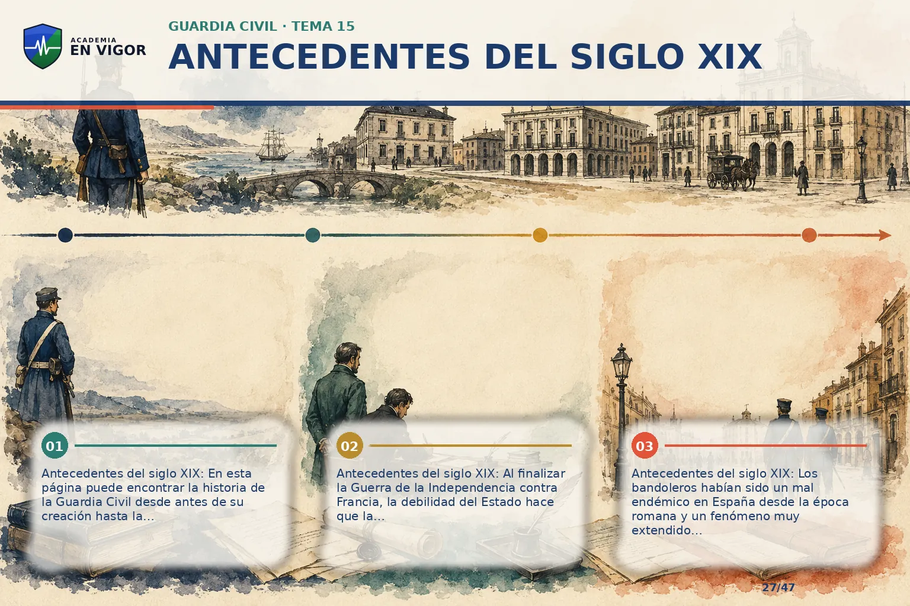

<em>Infografía: esquema de antecedentes del siglo xix.</em>

<!-- FUENTE: GC-HISTORIA-T15 -->

## 28. La Fundación

Este bloque ordena **la fundación** dentro de historia institucional.

### Claves rápidas

- **La Fundación:** Así, el 28 de marzo de 1844 , se produce el momento histórico de la creación oficial de la Guardia Civil cuando, por Real Decreto, se crea un “cuerpo especial de fuerza armada de Infantería y Caballería”, bajo la dependencia del Ministerio de la Gobernación y con “la denominación de Guardias Civiles”.
- **La Fundación:** A los efectos de organizar esta nueva fuerza se comisiona al mariscal de campo D.
- **La Fundación:** Francisco Javier Girón y Ezpeleta, II Duque de Ahumada .
- **La Fundación:** El reto que se le plantea al Duque de Ahumada es poner en marcha una institución que, caracterizada por su eficiencia y, en términos del Real Decreto, se destine “... a proteger eficazmente las personas y las propiedades”.

:::perla-vigor
Primero localiza la norma y el artículo; después fija el verbo, el sujeto y la excepción.
:::

<!-- VISUAL:t15-28-la-fundacion.webp -->

  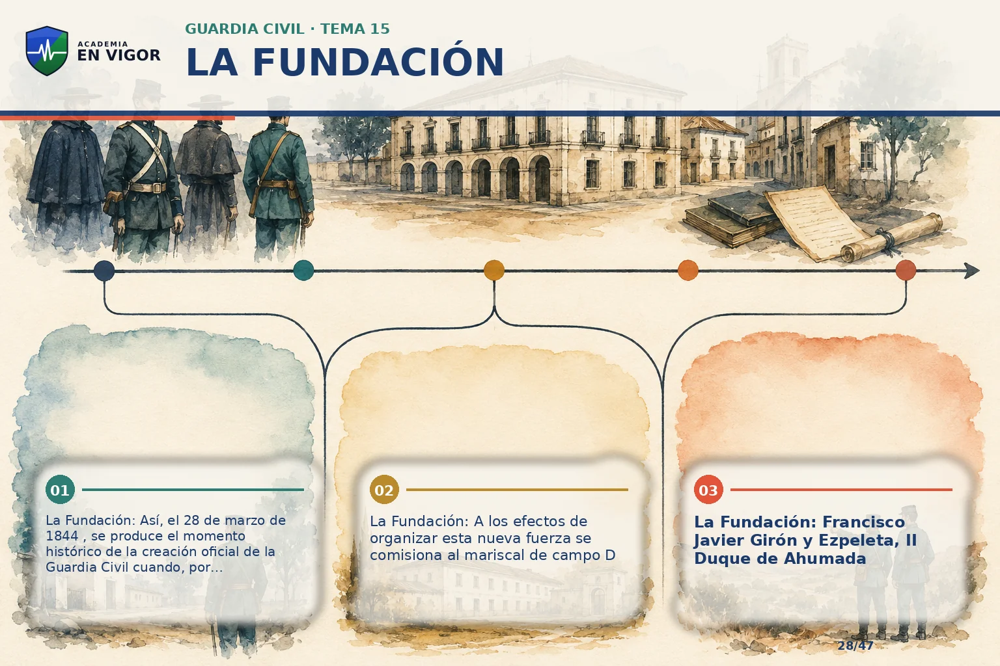

<em>Infografía: esquema de la fundación.</em>

<!-- FUENTE: GC-HISTORIA-T15 -->

## 29. La Consolidación

Este bloque ordena **la consolidación** dentro de historia institucional.

### Claves rápidas

- **La Consolidación:** No le reservaba el destino a la Guardia Civil un ambiente propicio para su consolidación, pues este periodo se caracterizó por la Segunda (1846 – 1849) y la Tercera Guerra Carlista (1872 – 1876) con la consecuente extensión de la guerra de guerrillas y su solapamiento con el bandolerismo endémico, fenómenos a los que debió hacer frente la recién creada…
- **La Consolidación:** Habría de transcurrir poco tiempo para que la Guardia Civil desempeñase su primera misión internacional ; en 1847 un Portugal en guerra civil, con el fin de pacificar el norte del país, solicita la ayuda de España y el Reino Unido.
- **La Consolidación:** Una unidad de Caballería de la Guardia Civil se encarga de patrullar y garantizar la seguridad ciudadana en la ciudad de Oporto.
- **La Consolidación:** En el siguiente año tiene lugar una oleada revolucionaria, denominada en la historiografía La Primavera de los Pueblos o el Año de las Revoluciones , en toda Europa que, aunque no tan virulentamente, se manifiesta también en España.

:::perla-vigor
Primero localiza la norma y el artículo; después fija el verbo, el sujeto y la excepción.
:::

<!-- VISUAL:t15-29-la-consolidacion.webp -->

  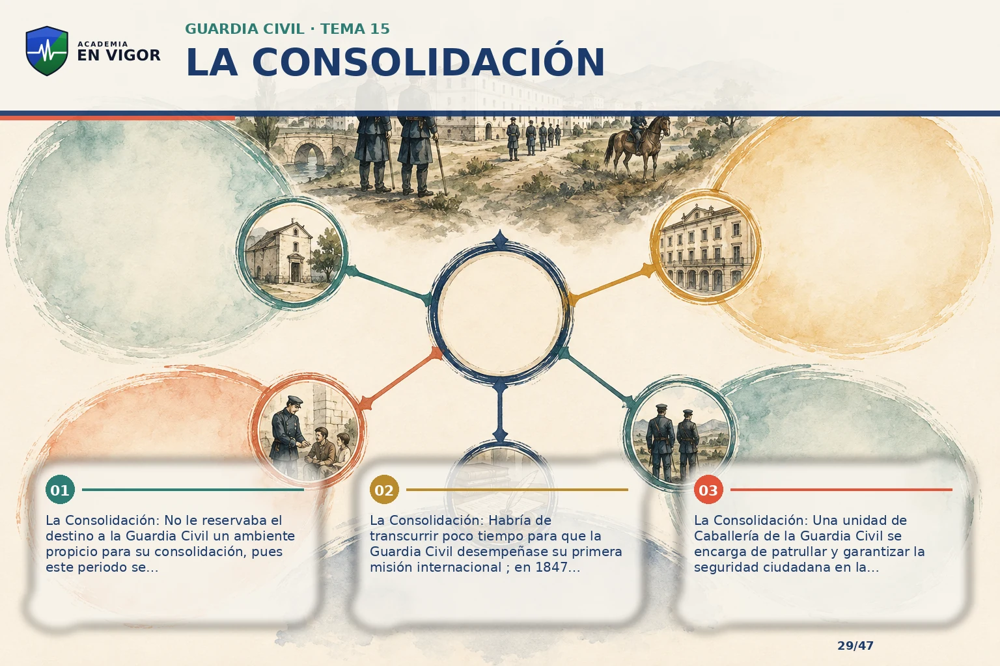

<em>Infografía: esquema de la consolidación.</em>

<!-- FUENTE: GC-HISTORIA-T15 -->

## 30. El Sexenio Revolucionario

Este bloque ordena **el sexenio revolucionario** dentro de historia institucional.

### Claves rápidas

- **El Sexenio Revolucionario:** Tras la revolución de septiembre de 1868, con el exilio de la reina Isabel II y hasta la Restauración de 1874, se inicia un periodo en la historia de España conocido como el “Sexenio Revolucionario”.
- **El Sexenio Revolucionario:** Esta etapa se distingue por una gran inestabilidad política: con tres elecciones y siete gobiernos, con pronunciamientos, disensiones políticas, con la Revolución Cantonal de 1873, la Guerra de los diez años (1868 – 78) en Cuba, la Tercera Guerra Carlista que comienza en 1872, la Guardia Civil se convierte en la institución imprescindible en la que han de…
- **El Sexenio Revolucionario:** Esta coyuntura social y política es además un caldo de cultivo propicio que origina un nuevo repunte del bandolerismo.
- **El Sexenio Revolucionario:** Así, el Gobierno Provisional de Prim suprime la Guardia Rural con el objeto de que fuera la Guardia Civil quien asumiera las competencias correspondientes en ese ámbito territorial.

:::perla-vigor
Primero localiza la norma y el artículo; después fija el verbo, el sujeto y la excepción.
:::

<!-- VISUAL:t15-30-el-sexenio-revolucionario.webp -->

  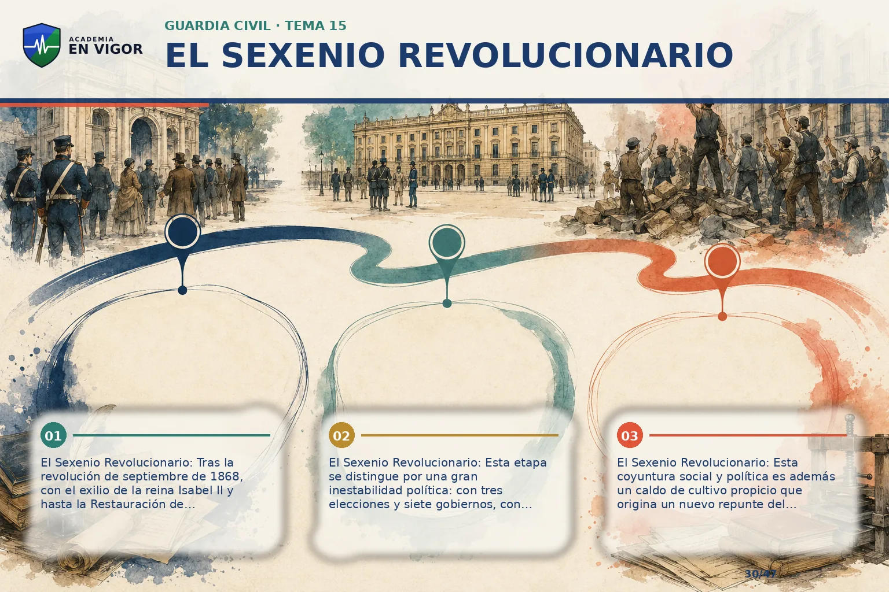

<em>Infografía: esquema de el sexenio revolucionario.</em>

<!-- FUENTE: GC-HISTORIA-T15 -->

## 31. La Restauración Monárquica

Este bloque ordena **la restauración monárquica** dentro de historia institucional.

### Claves rápidas

- **La Restauración Monárquica:** En 1874, con el pronunciamiento del general Martínez Campos, se produce la restauración monárquica en España y el inicio del reinado de Alfonso XII.
- **La Restauración Monárquica:** Se instaura un sistema bipartidista de “alternancia” entre el Partido Liberal y el Conservador.
- **La Restauración Monárquica:** Esta democracia “formal”, con un sistema electoral no estrictamente democrático, traería una cierta estabilidad institucional, que tomó carta de naturaleza con la promulgación de la Constitución de 1876.
- **La Restauración Monárquica:** Tras ésta se publica en 1878 la Ley Constitutiva del Ejército, que explicita la composición del Ejército, del que forma parte el cuerpo de Guardia civil para prestar auxilio a la ejecución de las leyes y para la seguridad del orden de las personas y de las propiedades.

:::perla-vigor
Primero localiza la norma y el artículo; después fija el verbo, el sujeto y la excepción.
:::

<!-- VISUAL:t15-31-la-restauracion-monarquica.webp -->

  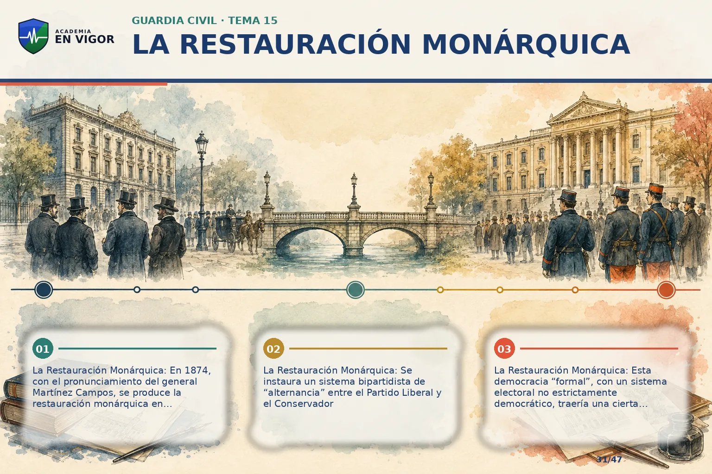

<em>Infografía: esquema de la restauración monárquica.</em>

<!-- FUENTE: GC-HISTORIA-T15 -->

## 32. El reinado de Alfonso XIII

Este bloque ordena **el reinado de alfonso xiii** dentro de historia institucional.

### Claves rápidas

- **El reinado de Alfonso XIII:** En 1902, al cumplir los dieciséis años, Alfonso XIII es declarado mayor de edad y proclamado Rey de España tras la regencia de su madre María Cristina.
- **El reinado de Alfonso XIII:** Su reinado, que se prolonga hasta 1931, se caracteriza por una relativa estabilidad con fuerte crecimiento demográfico e industrial favorecido por la neutralidad española en la I Guerra Mundial.
- **El reinado de Alfonso XIII:** Aun tratándose de una etapa relativamente tranquila, existían serios problemas de fondo: un incipiente independentismo, malas condiciones de vida y trabajo de campesinos y obreros influidos por la Revolución Rusa de 1917, la falta de representatividad política de grandes grupos sociales puesto que sigue vigente el sistema de “alternancia” política…
- **El reinado de Alfonso XIII:** En 1909, se producen unos altercados en Marruecos con unos trabajadores de las obras de construcción de una línea de ferrocarril y el gobierno ordena la llamada a filas de los reservistas.

:::perla-vigor
Primero localiza la norma y el artículo; después fija el verbo, el sujeto y la excepción.
:::

<!-- VISUAL:t15-32-el-reinado-de-alfonso-xiii.webp -->

  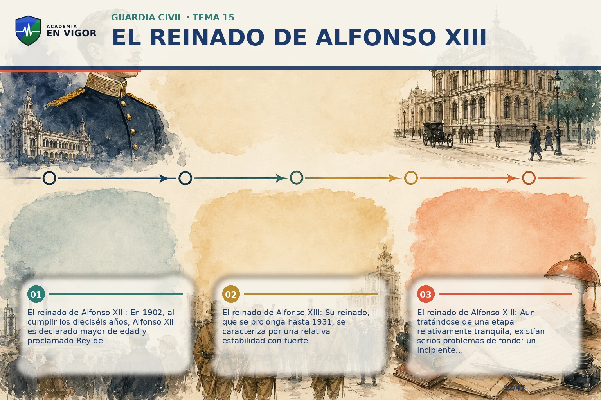

<em>Infografía: esquema de el reinado de alfonso xiii.</em>

<!-- FUENTE: GC-HISTORIA-T15 -->

## 33. La Segunda República

Este bloque ordena **la segunda república** dentro de historia institucional.

### Claves rápidas

- **La Segunda República:** Tras la dimisión del general Miguel Primo de Rivera en enero de 1930, Alfonso XIII, con un gobierno de concentración monárquica, convoca una ronda de elecciones que debían servir para recuperar la legitimidad democrática.
- **La Segunda República:** Sin embargo, en las elecciones municipales del 12 de abril de 1931, los republicanos triunfan en 41 capitales de provincia.
- **La Segunda República:** El 14 de abril se proclama la República en las distintas ciudades y capitales.
- **La Segunda República:** Alfonso XIII abandona España camino del exilio.

:::perla-vigor
Primero localiza la norma y el artículo; después fija el verbo, el sujeto y la excepción.
:::

<!-- VISUAL:t15-33-la-segunda-republica.webp -->

  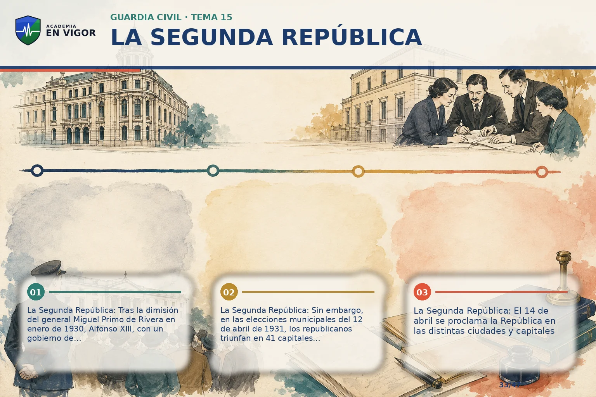

<em>Infografía: esquema de la segunda república.</em>

<!-- FUENTE: GC-HISTORIA-T15 -->

## 34. La Guerra Civil

Este bloque ordena **la guerra civil** dentro de historia institucional.

### Claves rápidas

- **La Guerra Civil:** En 1936 la Guardia Civil la componen 33.500 hombres, una tercera parte de los efectivos del Ejército.
- **La Guerra Civil:** Son profesionales, conocedores del terreno y desplegados en todo el territorio nacional.
- **La Guerra Civil:** Por ello es decisiva en el desarrollo de los acontecimientos iniciales, se puede afirmar que la sublevación triunfa donde se sumó la Guardia Civil y fracasa donde ésta permanece fiel a la República.
- **La Guerra Civil:** La Guardia Civil quedó dividida, igual que España.

:::perla-vigor
Primero localiza la norma y el artículo; después fija el verbo, el sujeto y la excepción.
:::

<!-- VISUAL:t15-34-la-guerra-civil.webp -->

  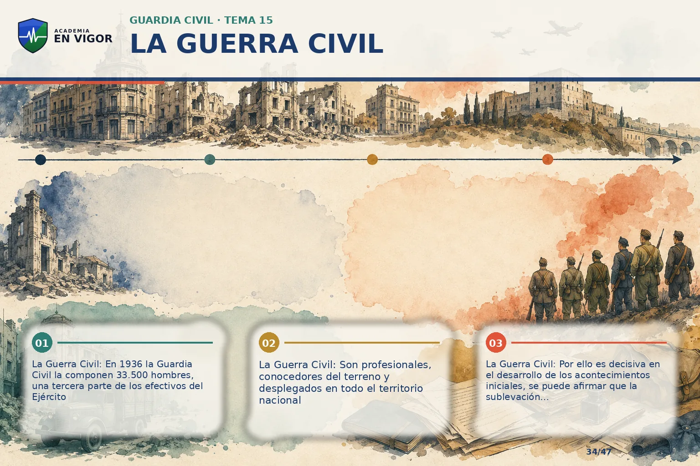

<em>Infografía: esquema de la guerra civil.</em>

<!-- FUENTE: GC-HISTORIA-T15 -->

## 35. El Franquismo

Este bloque ordena **el franquismo** dentro de historia institucional.

### Claves rápidas

- **El Franquismo:** Acabada la guerra, el 15 de marzo de 1940 se promulga una Ley fundamentada en dos pilares básicos: la supresión del Cuerpo de Carabineros, al que se pone fin tras 111 años de servicio ininterrumpido, y asunción de sus funciones por la Guardia Civil; y la adscripción de gran número de jefes y oficiales del Ejército especialmente en los Tercios de Costas y…
- **El Franquismo:** La creación de un Estado Mayor dentro de la estructura orgánica del Cuerpo formado exclusivamente por oficiales del Ejército de Tierra , por Orden de 8 de abril de 1940, hace depender más pronunciadamente a la Guardia Civil de éste.
- **El Franquismo:** Con el nuevo Reglamento Militar de 23 de julio de 1942 se configura a la Guardia Civil como un Cuerpo de Ejército, totalmente integrado en éste.
- **El Franquismo:** Para potenciar la formación de los cuadros de mando se crea en 1942 el Centro de Instrucción y para formar a los guardias de nuevo ingreso, seis Academias Regionales que más tarde se reducirán a tres: Úbeda, El Escorial y Sabadell.

:::perla-vigor
Primero localiza la norma y el artículo; después fija el verbo, el sujeto y la excepción.
:::

<!-- VISUAL:t15-35-el-franquismo.webp -->

  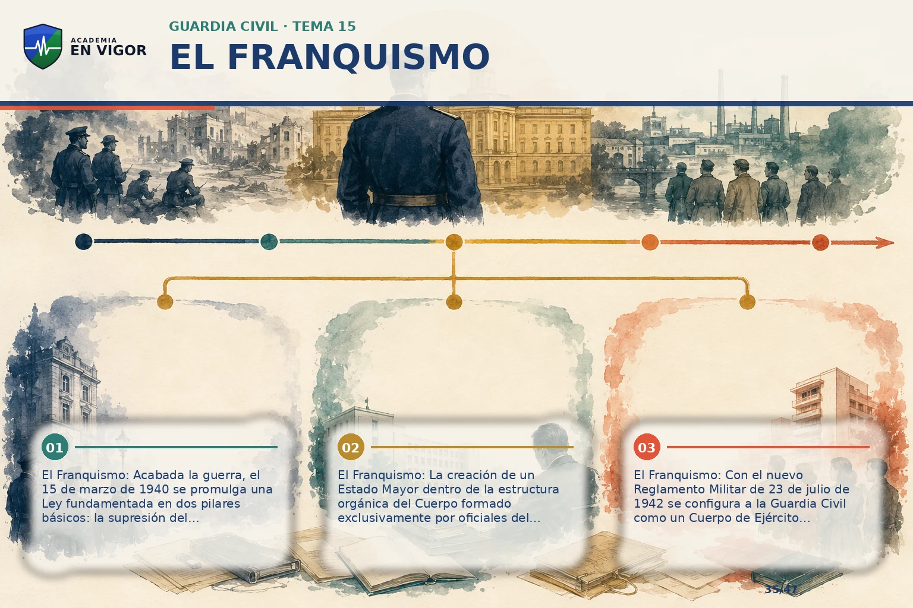

<em>Infografía: esquema de el franquismo.</em>

<!-- FUENTE: GC-HISTORIA-T15 -->

## 36. La Transición y la Democracia

Este bloque ordena **la transición y la democracia** dentro de historia institucional.

### Claves rápidas

- **La Transición y la Democracia:** En 1975, con la proclamación de Don Juan Carlos I Rey de España, se inicia un periodo histórico en el que España pasa del régimen dictatorial surgido de la Guerra Civil a constituirse en una monarquía parlamentaria.
- **La Transición y la Democracia:** En estos años la Benemérita se enfrenta al reto de la lucha contra el terrorismo extremista que surge al final del franquismo con organizaciones como el F.R.A.P., disuelto en 1978, el G.R.A.P.O., cuya primera acción armada es un atentado en 1975 contra dos miembros de la Guardia Civil resultando muerto Casimiro Sánchez García y su compañero gravemente…
- **La Transición y la Democracia:** Aunque surgen grupos independentistas catalanes, gallegos y canarios, así como grupos de extrema derecha, es el separatismo vasco el que despliega mayor actividad terrorista.
- **La Transición y la Democracia:** La Guardia Civil es objetivo prioritario y tiene que emplearse a fondo, desarticulando comandos, desmantelando su cúpula en repetidas ocasiones y obteniendo notables éxitos, aunque también sufriendo el mayor número de víctimas.

:::perla-vigor
Primero localiza la norma y el artículo; después fija el verbo, el sujeto y la excepción.
:::

<!-- VISUAL:t15-36-la-transicion-y-la-democracia.webp -->

  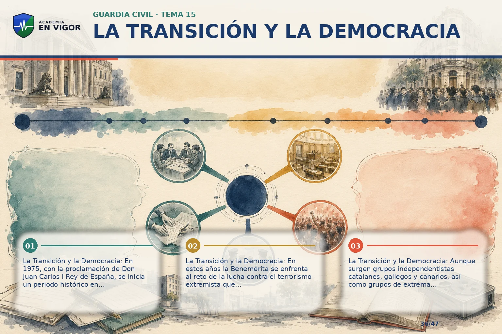

<em>Infografía: esquema de la transición y la democracia.</em>

<!-- FUENTE: GC-HISTORIA-T15 -->

## 37. Objeto, titularidad, igualdad y libertades personales

Este bloque ordena **objeto, titularidad, igualdad y libertades personales** dentro de derechos, deberes y representación profesional.

### Claves rápidas

- **Artículo 1. Objeto y ámbito de aplicación. · apartado 1:** 1. La presente Ley Orgánica regula los derechos que corresponden y los deberes que son exigibles a los miembros de la Guardia Civil en desarrollo del régimen de los derechos y libertades públicas establecidos por la Constitución , y de los principios del Estado social y democrático de Derecho, con las particularidades derivadas de su carácter de Instituto…
- **Artículo 1. Objeto y ámbito de aplicación. · apartado 2:** 2. Los alumnos de los Centros Docentes de la Guardia Civil están igualmente sujetos a lo previsto en esta Ley Orgánica.
- **Artículo 1. Objeto y ámbito de aplicación. · apartado 3:** 3. Quedan excluidos de su ámbito de aplicación los miembros de la Guardia Civil que se encuentren en situaciones administrativas en que dejen de estar sujetos al régimen general de derechos y obligaciones del personal de la Guardia Civil, de acuerdo con la normativa reguladora del régimen de dicho personal.
- **Artículo 2. Titularidad.:** Los Guardias Civiles son titulares de los derechos fundamentales y de las libertades públicas reconocidos en la Constitución , sin otros límites en su ejercicio que los establecidos en ésta, en las disposiciones que la desarrollan y en la presente Ley Orgánica.

:::perla-vigor
Primero localiza la norma y el artículo; después fija el verbo, el sujeto y la excepción.
:::

<!-- VISUAL:t15-37-objeto-titularidad-igualdad-y-libertades-personales.webp -->

  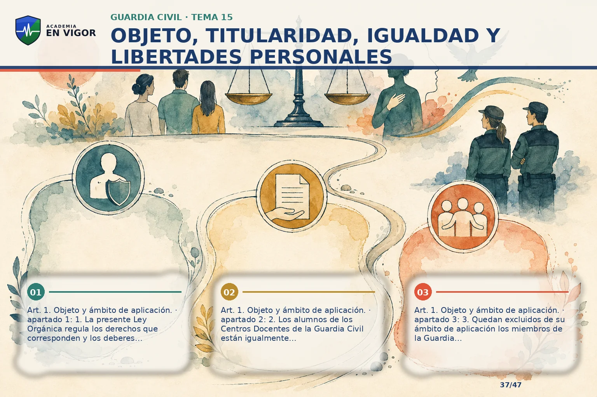

<em>Infografía: esquema de objeto, titularidad, igualdad y libertades personales.</em>

<!-- FUENTE: LO11-2007-GC-T15 -->

## 38. Expresión, reunión, asociación, sufragio y petición

Este bloque ordena **expresión, reunión, asociación, sufragio y petición** dentro de derechos, deberes y representación profesional.

### Claves rápidas

- **Artículo 7. Libertad de expresión y de información. · apartado 1:** 1. Los Guardias Civiles tienen derecho a la libertad de expresión y a comunicar y recibir libremente información en los términos establecidos por la Constitución , con los límites que establece su régimen disciplinario, el secreto profesional y el respeto a la dignidad de las personas, las instituciones y los poderes públicos.
- **Artículo 7. Libertad de expresión y de información. · apartado 2:** 2. En asuntos de servicio o relacionados con la Institución el ejercicio de estos derechos se encontrará sujeto a los límites derivados de la observancia de la disciplina, así como a los deberes de neutralidad política y sindical, y de reserva.
- **Artículo 8. Derecho de reunión y manifestación. · apartado 1:** 1. (Derogado)
- **Artículo 8. Derecho de reunión y manifestación. · apartado 2:** 2. Las reuniones de Guardias Civiles en dependencias oficiales deberán ser comunicadas previamente al jefe de la unidad, centro u órgano correspondiente, quien podrá no autorizarlas por causa del funcionamiento del servicio.

:::perla-vigor
Primero localiza la norma y el artículo; después fija el verbo, el sujeto y la excepción.
:::

<!-- VISUAL:t15-38-expresion-reunion-asociacion-sufragio-y-peticion.webp -->

  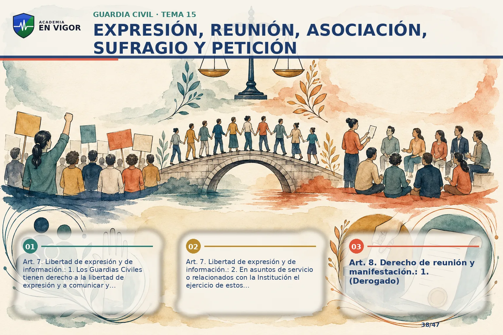

<em>Infografía: esquema de expresión, reunión, asociación, sufragio y petición.</em>

<!-- FUENTE: LO11-2007-GC-T15 -->

## 39. Deberes profesionales

Este bloque ordena **deberes profesionales** dentro de derechos, deberes y representación profesional.

### Claves rápidas

- **Artículo 15. Acatamiento a la Constitución y al Ordenamiento jurídico.:** Los miembros de la Guardia Civil tienen el deber de respetar la Constitución y el resto del ordenamiento jurídico, así como el de proteger el libre ejercicio de los derechos y libertades y garantizar la seguridad ciudadana.
- **Artículo 16. Jerarquía, disciplina y subordinación.:** Los miembros de la Guardia Civil deberán adecuar su actuación profesional a los principios de jerarquía, disciplina y subordinación. En ningún caso la obediencia debida podrá amparar el cumplimiento de órdenes que entrañen la ejecución de actos que manifiestamente constituyan delito o sean contrarios a la Constitución o a las Leyes.
- **Artículo 17. Respeto a la integridad física y moral.:** Los miembros de la Guardia Civil están obligados a observar estrictamente las normas sobre el uso legítimo de la fuerza, debiendo tener siempre presente el respeto a la vida y a la integridad física y moral de la persona.
- **Artículo 18. Neutralidad e imparcialidad. · apartado 1:** 1. Los miembros de la Guardia Civil no podrán fundar ni afiliarse a partidos políticos o sindicatos ni realizar actividades políticas o sindicales.

:::perla-vigor
Primero localiza la norma y el artículo; después fija el verbo, el sujeto y la excepción.
:::

<!-- VISUAL:t15-39-deberes-profesionales.webp -->

  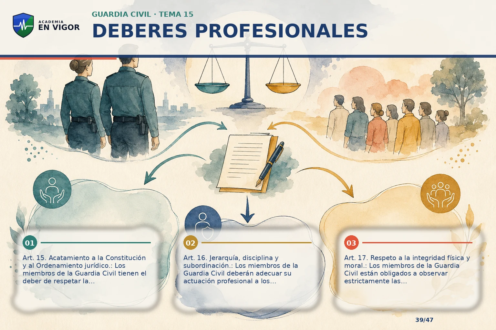

<em>Infografía: esquema de deberes profesionales.</em>

<!-- FUENTE: LO11-2007-GC-T15 -->

## 40. Defensa, uniforme, armas y formación

Este bloque ordena **defensa, uniforme, armas y formación** dentro de derechos, deberes y representación profesional.

### Claves rápidas

- **Artículo 24. Defensa de España.:** Los Guardias Civiles tienen el derecho y deber de defender España de acuerdo con lo previsto en la legislación orgánica de defensa nacional.
- **Artículo 25. Uso del uniforme y de armas.:** Los miembros de la Guardia Civil tendrán el derecho y el deber de utilizar el uniforme reglamentario, así como el deber de portar armas para la prestación del servicio, de acuerdo con las normas que regulen dichos usos, en el ejercicio de sus funciones.
- **Artículo 26. Formación y perfeccionamiento.:** Los miembros de la Guardia Civil tendrán el derecho y, en su caso, el deber de participar en los cursos y en las actividades formativas destinadas a mejorar su capacidad profesional y facilitar su promoción de acuerdo con los criterios objetivos de selección que se establezcan para el acceso a dichas actividades. Estos criterios deberán respetar los…

:::perla-vigor
Primero localiza la norma y el artículo; después fija el verbo, el sujeto y la excepción.
:::

<!-- VISUAL:t15-40-defensa-uniforme-armas-y-formacion.webp -->

  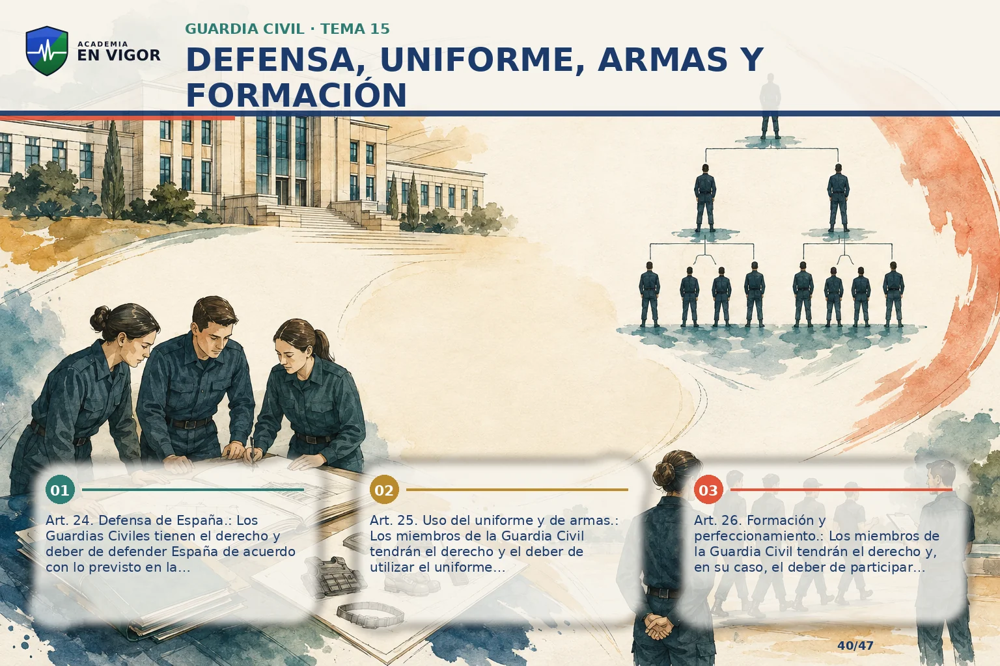

<em>Infografía: esquema de defensa, uniforme, armas y formación.</em>

<!-- FUENTE: LO11-2007-GC-T15 -->

## 41. Derechos profesionales

Este bloque ordena **derechos profesionales** dentro de derechos, deberes y representación profesional.

### Claves rápidas

- **Artículo 27. Carrera profesional.:** Los Guardias Civiles tienen derecho al desarrollo de su carrera profesional, especialmente al régimen de ascensos, destinos, condecoraciones y recompensas, de acuerdo con los principios de igualdad, mérito, capacidad y de conformidad con las normas que la regulen.
- **Artículo 28. Régimen de horario de servicio. · apartado 1:** 1. El horario de servicio de los miembros de la Guardia Civil, sin perjuicio de su disponibilidad permanente para el servicio, será el determinado reglamentariamente. Las modalidades para su prestación y el cómputo de dicho horario se fijarán atendiendo a las necesidades del servicio.
- **Artículo 28. Régimen de horario de servicio. · apartado 2:** 2. Sin perjuicio de las necesidades derivadas del cumplimiento de sus funciones, para la determinación de la jornada y el horario de trabajo y, en su caso, el régimen de turnos, se tendrá en cuenta la conciliación de la vida familiar y laboral del Guardia Civil.
- **Artículo 28. Régimen de horario de servicio. · apartado 3:** 3. Los Guardias Civiles tienen derecho a conocer con antelación suficiente su jornada y horario de trabajo y, en su caso, el régimen de turnos, sin perjuicio de las alteraciones que puedan estar justificadas por las necesidades del servicio o por motivos de fuerza mayor.

:::perla-vigor
Primero localiza la norma y el artículo; después fija el verbo, el sujeto y la excepción.
:::

<!-- VISUAL:t15-41-derechos-profesionales.webp -->

  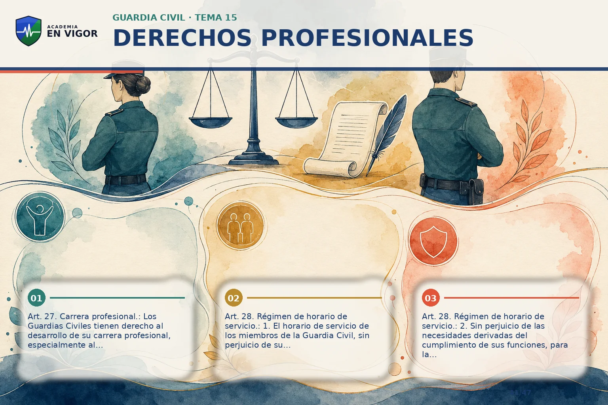

<em>Infografía: esquema de derechos profesionales.</em>

<!-- FUENTE: LO11-2007-GC-T15 -->

## 42. Asociaciones profesionales: constitución y ejercicio

Este bloque ordena **asociaciones profesionales: constitución y ejercicio** dentro de derechos, deberes y representación profesional.

### Claves rápidas

- **Artículo 36. Ámbito, duración y finalidad de la asociación.:** Las asociaciones profesionales de Guardias Civiles deberán tener ámbito estatal, se constituirán por tiempo indefinido y tendrán por finalidad principal la satisfacción de los intereses sociales, económicos y profesionales de sus asociados y la realización de actividades sociales que favorezcan la eficiencia en el ejercicio de la profesión y la deontología…
- **Artículo 36. Ámbito, duración y finalidad de la asociación.:** En ningún caso estas asociaciones profesionales tendrán carácter lucrativo.
- **Artículo 37. Régimen económico. · apartado 1:** 1. Las asociaciones profesionales podrán financiarse a través de las cuotas de sus afiliados u otros recursos económicos que prevean sus Estatutos.
- **Artículo 37. Régimen económico.:** En ningún caso podrán percibir donaciones privadas.

:::perla-vigor
Primero localiza la norma y el artículo; después fija el verbo, el sujeto y la excepción.
:::

<!-- VISUAL:t15-42-asociaciones-profesionales-constitucion-y-ejercicio.webp -->

  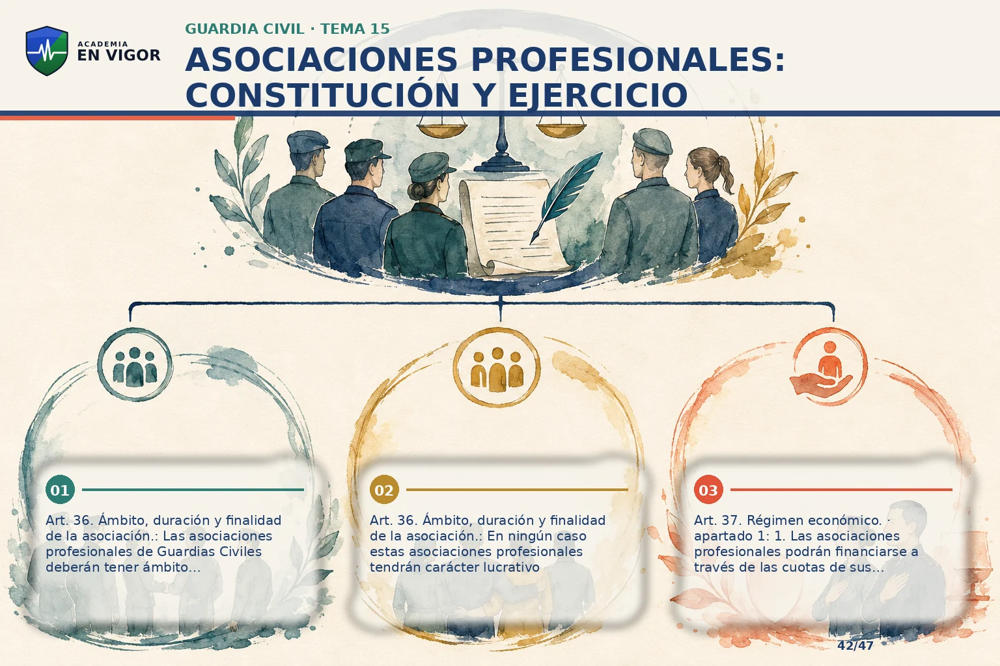

<em>Infografía: esquema de asociaciones profesionales: constitución y ejercicio.</em>

<!-- FUENTE: LO11-2007-GC-T15 -->

## 43. Asociaciones representativas y sus derechos

Este bloque ordena **asociaciones representativas y sus derechos** dentro de derechos, deberes y representación profesional.

### Claves rápidas

- **Artículo 44. Derechos de las asociaciones profesionales representativas. · apartado 1:** 1. Las asociaciones profesionales representativas deberán ser informadas y consultadas en el proceso de elaboración de proyectos normativos que afecten a las condiciones profesionales de los miembros de la Institución.
- **Artículo 44. Derechos de las asociaciones profesionales representativas. · apartado 2:** 2. Igualmente, participarán, en su caso, en los grupos de trabajo o comisiones que se constituyan para el tratamiento de los aspectos profesionales.
- **Artículo 44. Derechos de las asociaciones profesionales representativas. · apartado 3:** 3. Asimismo, podrán formular propuestas, elevar informes, dirigir peticiones y formular quejas a las autoridades competentes.
- **Artículo 45. Derechos de los representantes de las asociaciones profesionales representativas. · apartado 1:** 1. Reglamentariamente se regulará el acceso de los miembros de las asociaciones que formen parte del Consejo de la Guardia Civil y un representante designado por las asociaciones profesionales representativas que no formen parte de dicho Consejo, a los acuartelamientos e instalaciones para participar en actividades propias del asociacionismo profesional,…

:::perla-vigor
Primero localiza la norma y el artículo; después fija el verbo, el sujeto y la excepción.
:::

<!-- VISUAL:t15-43-asociaciones-representativas-y-sus-derechos.webp -->

  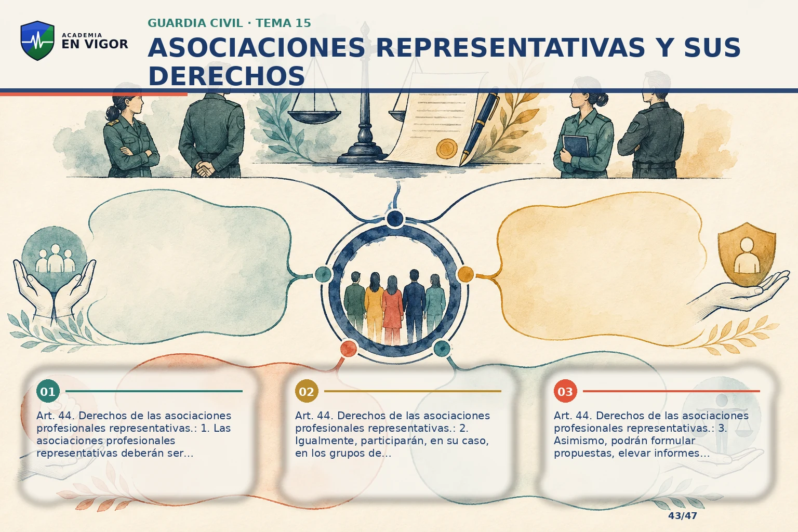

<em>Infografía: esquema de asociaciones representativas y sus derechos.</em>

<!-- FUENTE: LO11-2007-GC-T15 -->

## 44. Consejo de la Guardia Civil: composición y funciones

Este bloque ordena **consejo de la guardia civil: composición y funciones** dentro de derechos, deberes y representación profesional.

### Claves rápidas

- **Artículo 52. Consejo de la Guardia Civil.:** Bajo la presidencia del Ministro del Interior, o persona en quien delegue, se crea el Consejo de la Guardia Civil como órgano colegiado en el que participarán representantes de los miembros del Cuerpo de la Guardia Civil y de los Ministerios del Interior y de Defensa, con el fin de mejorar las condiciones profesionales de su integrantes, así como el…
- **Artículo 53. Composición del Consejo. · apartado 1:** 1. Integran el Consejo de la Guardia Civil:
- **Artículo 53. Composición del Consejo. · apartado a:** a) En representación de los miembros de la Guardia Civil: los vocales elegidos por los integrantes del Instituto mediante sufragio personal, libre, directo y secreto. El número de estos representantes se determinará por Escalas, correspondiendo a cada una de ellas un vocal en el Consejo y uno más por cada 6.000 guardias civiles que estuvieran en activo en…
- **Artículo 53. Composición del Consejo. · apartado b:** b) En representación de la Administración General del Estado: los vocales nombrados por los Ministros del Interior y de Defensa hasta alcanzar igual número de representantes que los que hubieran sido elegidos por los miembros del Instituto.

:::perla-vigor
Primero localiza la norma y el artículo; después fija el verbo, el sujeto y la excepción.
:::

<!-- VISUAL:t15-44-consejo-de-la-guardia-civil-composicion-y-funciones.webp -->

  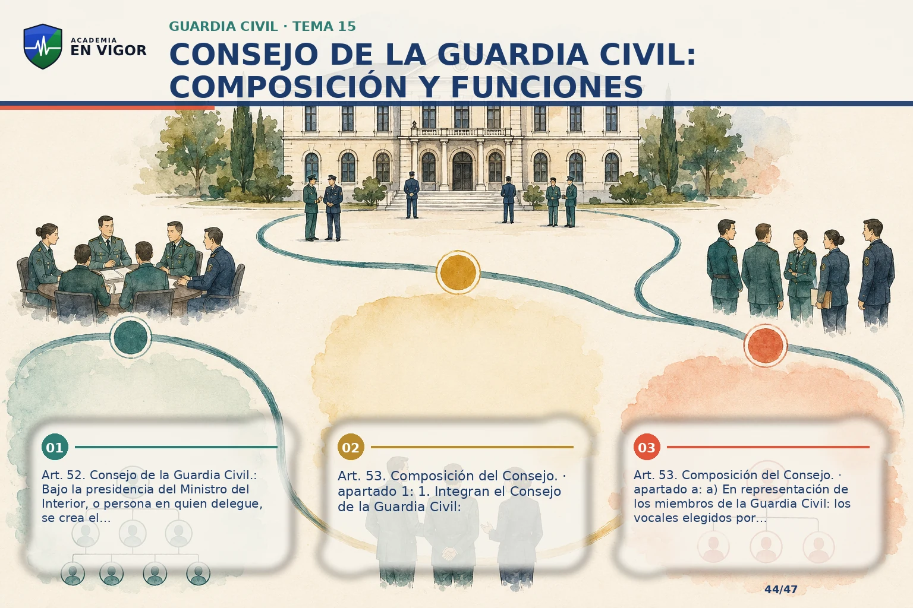

<em>Infografía: esquema de consejo de la guardia civil: composición y funciones.</em>

<!-- FUENTE: LO11-2007-GC-T15 -->

## 45. Consejo de la Guardia Civil: funcionamiento y elección

Este bloque ordena **consejo de la guardia civil: funcionamiento y elección** dentro de derechos, deberes y representación profesional.

### Claves rápidas

- **Artículo 55. Funcionamiento del Consejo.:** Las sesiones del Consejo de la Guardia Civil podrán ser ordinarias y extraordinarias.
- **Artículo 55. Funcionamiento del Consejo.:** El Consejo se reunirá en sesión ordinaria, para el despacho de los asuntos de su competencia, al menos, una vez cada tres meses.
- **Artículo 55. Funcionamiento del Consejo.:** El Consejo se reunirá en sesión extraordinaria cuando lo convoque su Presidente, a iniciativa propia o a solicitud de una tercera parte de los vocales del Consejo, que deberá realizarse mediante escrito dirigido al Presidente.
- **Artículo 55. Funcionamiento del Consejo.:** Mediante Real Decreto se establecerá el reglamento de organización y funcionamiento interno del Consejo de la Guardia Civil, así como las normas complementarias que sean precisas en materia de convocatoria y desarrollo del procedimiento de designación de sus Vocales.

:::perla-vigor
Primero localiza la norma y el artículo; después fija el verbo, el sujeto y la excepción.
:::

<!-- VISUAL:t15-45-consejo-de-la-guardia-civil-funcionamiento-y-eleccion.webp -->

  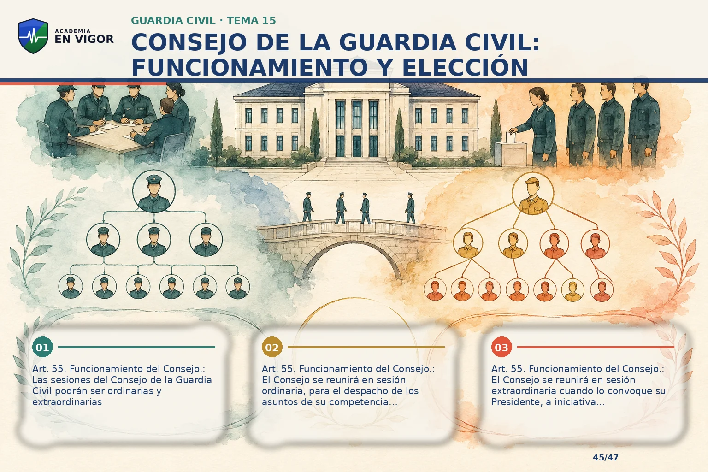

<em>Infografía: esquema de consejo de la guardia civil: funcionamiento y elección.</em>

<!-- FUENTE: LO11-2007-GC-T15 -->

## 46. Disposiciones de la Ley Orgánica 11/2007

Este bloque ordena **disposiciones de la ley orgánica 11/2007** dentro de derechos, deberes y representación profesional.

### Claves rápidas

- **Disposición adicional primera. Aplicación del régimen de derechos y deberes de las Fuerzas Armadas.:** En los supuestos en los que, de acuerdo con la legislación vigente, los miembros de la Guardia Civil, en su condición de Instituto Armado de naturaleza militar, pasen a depender del Ministro de Defensa o queden integrados en Unidades militares, se regirán por la normativa sobre derechos y libertades aplicable a los miembros de las Fuerzas Armadas.
- **Disposición adicional segunda. Régimen especial de agrupación de Escalas. · apartado 1:** 1. A los efectos de la elección de los miembros del Consejo de la Guardia Civil, se considerará que constituyen una sola escala quienes, a la fecha de la correspondiente convocatoria de elecciones, pertenezcan a la escala de oficiales regulada en la Ley de régimen del personal de la Guardia Civil.
- **Disposición adicional segunda. Régimen especial de agrupación de Escalas. · apartado 2:** 2. Igualmente, y a los mismos efectos de elección, se considerará que constituyen una sola escala los oficiales que en la fecha antes citada, no pertenezcan a la escala referida en el apartado 1, siempre que el número de electores no sea inferior a 400. En caso contrario, todos los oficiales formarían parte de la escala a que hace referencia dicho apartado.
- **Disposición adicional segunda. Régimen especial de agrupación de Escalas. · apartado 3:** 3. Las consideraciones que a efectos de elección se establecen en los apartados anteriores serán de aplicación a partir del 1 de julio de 2017, fecha de constitución de la escala de oficiales.

:::perla-vigor
Primero localiza la norma y el artículo; después fija el verbo, el sujeto y la excepción.
:::

<!-- VISUAL:t15-46-disposiciones-de-la-ley-organica-11-2007.webp -->

  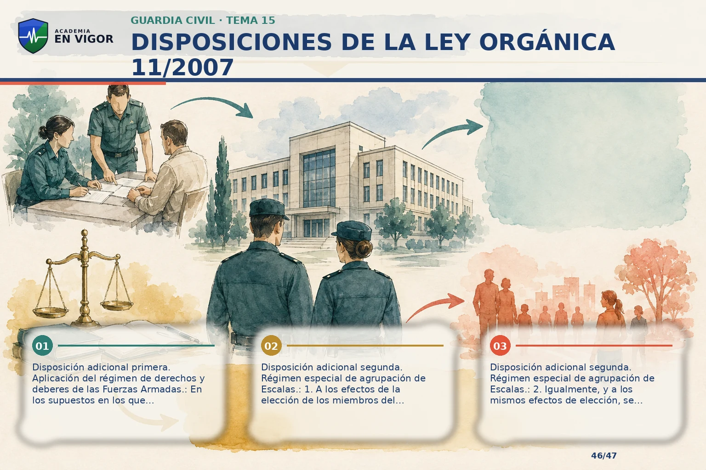

<em>Infografía: esquema de disposiciones de la ley orgánica 11/2007.</em>

<!-- FUENTE: LO11-2007-GC-T15 -->

# Hablemos claro

:::hablemos-claro
No mezcles cinco planos: LO 2/1986 organiza el sistema policial; Ley 29/2014 ordena el personal; RD 207/2024 dibuja la estructura; la historia explica la evolución; LO 11/2007 regula derechos, deberes y representación.
:::

# En la calle

:::en-la-calle
Ante una pregunta, decide primero si trata de competencia policial, personal, organigrama, hito histórico o derecho profesional.
:::

# Lo que cae

:::lo-que-cae
Alta prioridad: principios del artículo 5 LOFCS; funciones y distribución competencial; escalas y empleos; dependencias del artículo 4 RD 207/2024; fechas históricas; límites de derechos y Consejo de la Guardia Civil.
:::

# Ha caído

:::ha-caido
Se han verificado y mapeado **87** preguntas oficiales de las convocatorias 2020-2026. Las preguntas de estructuras anteriores se conservan como antecedente y se cruzan con la organización vigente.
:::

---

*Academia En Vigor · El temario que nunca duerme · Tema 15 · v1.0.0 · Documento interno no publicado.*
