# TEMA 16 · MATERIAS SOCIO-CULTURALES. PROTECCIÓN CIVIL. DESARROLLO SOSTENIBLE. EFICIENCIA ENERGÉTICA

**Guardia Civil · Método VIGOR · PARTE**
**Versión de contenido:** 1.0.0
**Estado editorial:** approved_internal · **Publicación:** not_published

# Mapa del tema

| Parte | Contenido | Bloques |
|---|---|---:|
| 1 | Sistema Nacional de Protección Civil | 1–16 |
| 2 | Patrimonio natural y espacios protegidos | 17–25 |
| 3 | Conservación de la biodiversidad | 26–32 |
| 4 | Uso sostenible del patrimonio natural | 33–35 |
| 5 | Eficiencia energética y transición normativa | 36–48 |

<!-- VISUAL:t16-00-mapa-proteccion-civil-biodiversidad-energia.webp -->

  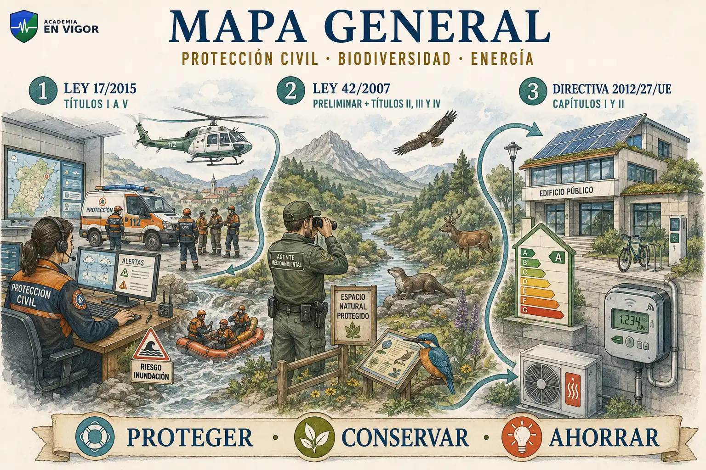

<em>Infografía: tres rutas: emergencias, naturaleza y energía.</em>

# Contenido

## 01. Alcance oficial, método y corte normativo

Este bloque ordena **alcance oficial, método y corte normativo** dentro de sistema nacional de protección civil y separa regla, órgano, requisito, excepción y efecto.

### Claves rápidas

- **epígrafe oficial:** El Tema 16 se divide en tres bloques normativos: Ley 17/2015, títulos I a V; Ley 42/2007, título preliminar y títulos II a IV; y Directiva 2012/27/UE, capítulos I y II.

:::perla-vigor
Primero identifica la norma y su vigencia; después fija sujeto, verbo, requisito y excepción.
:::

<!-- VISUAL:t16-01-alcance-oficial-metodo-y-corte-normativo.webp -->

  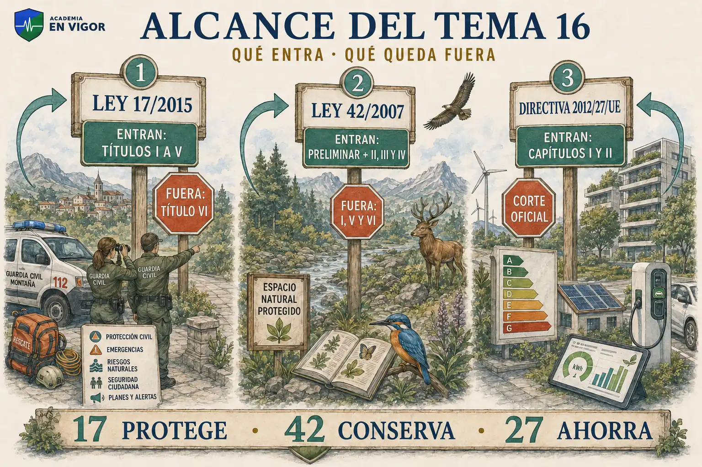

<em>Infografía: flujo de alcance oficial, método y corte normativo.</em>

<!-- FUENTE: GC-PROGRAMA-2024-T16 -->

## 02. Objeto, definiciones y Sistema Nacional

Este bloque ordena **objeto, definiciones y sistema nacional** dentro de sistema nacional de protección civil y separa regla, órgano, requisito, excepción y efecto.

### Claves rápidas

- **Artículo 2. Definiciones:** 1. Peligro. Potencial de ocasionar daño en determinadas situaciones a colectivos de personas o bienes que deben ser preservados por la protección civil.
- **Artículo 2. Definiciones:** 2. Vulnerabilidad. La característica de una colectividad de personas o bienes que los hacen susceptibles de ser afectados en mayor o menor grado por un peligro en determinadas circunstancias.
- **Artículo 2. Definiciones:** 3. Amenaza. Situación en la que personas y bienes preservados por la protección civil están expuestos en mayor o menor medida a un peligro inminente o latente.
- **Artículo 2. Definiciones:** 4. Riesgo. Es la posibilidad de que una amenaza llegue a afectar a colectivos de personas o a bienes.

:::perla-vigor
Primero identifica la norma y su vigencia; después fija sujeto, verbo, requisito y excepción.
:::

<!-- VISUAL:t16-02-objeto-definiciones-y-sistema-nacional.webp -->

  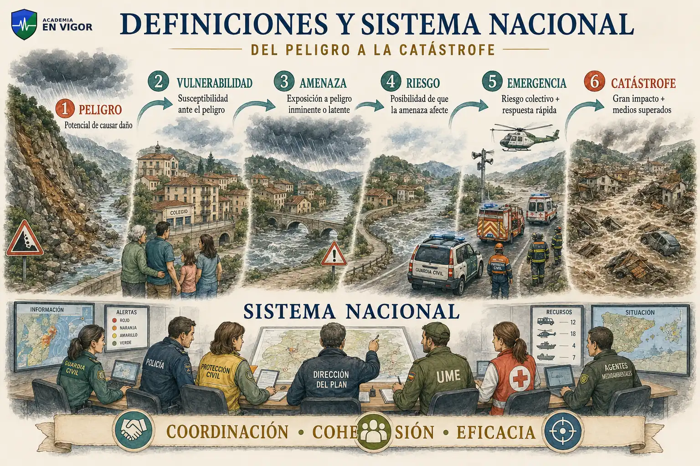

<em>Infografía: comparación de objeto, definiciones y sistema nacional.</em>

<!-- FUENTE: LEY17-2015-GC-T16 -->

## 03. Estrategia, protección, información y participación

Este bloque ordena **estrategia, protección, información y participación** dentro de sistema nacional de protección civil y separa regla, órgano, requisito, excepción y efecto.

### Claves rápidas

- **Artículo 4. Estrategia del Sistema Nacional de Protección Civil:** El Consejo Nacional de Protección Civil aprobará las líneas básicas de la Estrategia del Sistema Nacional de Protección Civil y las directrices para su implantación, seguimiento y evaluación periódica. Podrán establecerse planes de actuación anuales o programas sectoriales para su implementación. Esta Estrategia se revisará, al menos, cada cuatro años.
- **Artículo 4. Estrategia del Sistema Nacional de Protección Civil:** 2. La Estrategia Nacional de Protección Civil integrará y alineará todas las actuaciones de la Administración General del Estado en esta materia. Será aprobada por el Consejo de Seguridad Nacional, a propuesta del Ministro del Interior.
- **Artículo 5. Derecho a la protección en caso de catástrofe:** 4. Los poderes públicos velarán para que se adopten medidas específicas que garanticen que las personas con discapacidad conozcan los riesgos y las medidas de autoprotección y prevención, sean atendidas e informadas en casos de emergencia y participen en los planes de protección civil.
- **Artículo 7. Derecho a la participación:** 2. La participación de los ciudadanos en las tareas de protección civil podrá canalizarse a través de las entidades de voluntariado, de conformidad con lo dispuesto en las leyes y en las normas reglamentarias de desarrollo.

:::perla-vigor
Primero identifica la norma y su vigencia; después fija sujeto, verbo, requisito y excepción.
:::

<!-- VISUAL:t16-03-estrategia-proteccion-informacion-y-participacion.webp -->

  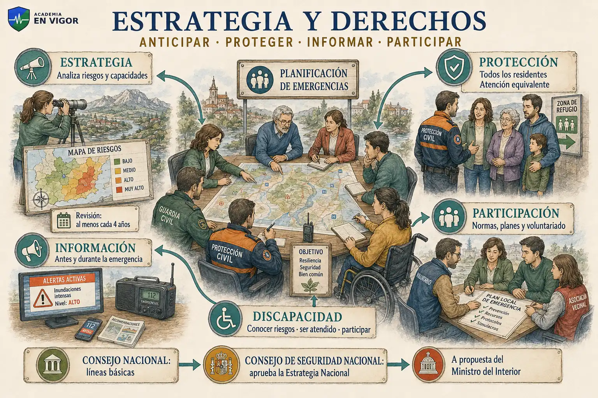

<em>Infografía: línea temporal de estrategia, protección, información y participación.</em>

<!-- FUENTE: LEY17-2015-GC-T16 -->

## 04. Colaboración, cautela, autoprotección y voluntariado

Este bloque ordena **colaboración, cautela, autoprotección y voluntariado** dentro de sistema nacional de protección civil y separa regla, órgano, requisito, excepción y efecto.

### Claves rápidas

- **Artículo 7 bis. Deber de colaboración:** 2. En los casos de emergencia, cualquier persona, a partir de la mayoría de edad, estará obligada a la realización de las prestaciones personales que exijan las autoridades competentes en materia de protección civil, sin derecho a indemnización por esta causa, y al cumplimiento de las órdenes e instrucciones, generales o particulares, que aquellas establezcan.
- **Artículo 7 quáter. Voluntariado en el ámbito de la protección civil:** 1. El voluntariado de protección civil podrá colaborar en la gestión de las emergencias, como expresión de participación ciudadana en la respuesta social a estos fenómenos, de acuerdo con lo que establezcan las normas aplicables, sin perjuicio del deber general de colaboración de los ciudadanos en los términos del artículo 7 bis.
- **Artículo 7 ter. Deber de cautela y autoprotección:** 1. Los ciudadanos deben tomar las medidas necesarias para evitar la generación de riesgos, así como exponerse a ellos. Una vez sobrevenida una emergencia, deberán actuar conforme a las indicaciones de los agentes de los servicios públicos competentes.

:::perla-vigor
Primero identifica la norma y su vigencia; después fija sujeto, verbo, requisito y excepción.
:::

<!-- VISUAL:t16-04-colaboracion-cautela-autoproteccion-y-voluntariado.webp -->

  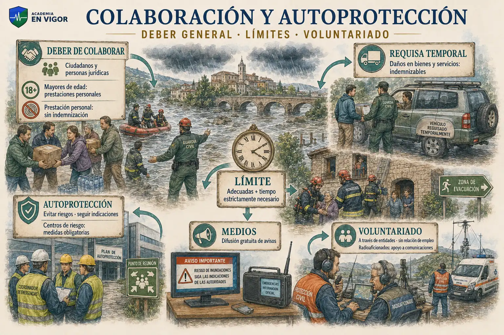

<em>Infografía: escena de colaboración, cautela, autoprotección y voluntariado.</em>

<!-- FUENTE: LEY17-2015-GC-T16 -->

## 05. Anticipación y Red Nacional de Información

Este bloque ordena **anticipación y red nacional de información** dentro de sistema nacional de protección civil y separa regla, órgano, requisito, excepción y efecto.

### Claves rápidas

- **Artículo 9. Red Nacional de Información sobre Protección Civil:** 1. Se crea la Red Nacional de Información sobre Protección Civil con el fin de contribuir a la anticipación de los riesgos y de facilitar una respuesta eficaz ante cualquier situación que lo precise, sin perjuicio de las competencias de las comunidades autónomas. Esta Red permitirá al Sistema Nacional de Protección Civil:
- **Artículo 9. Red Nacional de Información sobre Protección Civil:** a) El Mapa Nacional de Riesgos de Protección Civil, como instrumento que permite identificar las áreas geográficas susceptibles de sufrir daños por emergencias o catástrofes.
- **Artículo 8. Definición:** La anticipación tiene por objeto determinar los riesgos en un territorio basándose en las condiciones de vulnerabilidad y las posibles amenazas, y comprende los análisis y estudios que permitan obtener información y predicciones sobre situaciones peligrosas.

:::perla-vigor
Primero identifica la norma y su vigencia; después fija sujeto, verbo, requisito y excepción.
:::

<!-- VISUAL:t16-05-anticipacion-y-red-nacional-de-informacion.webp -->

  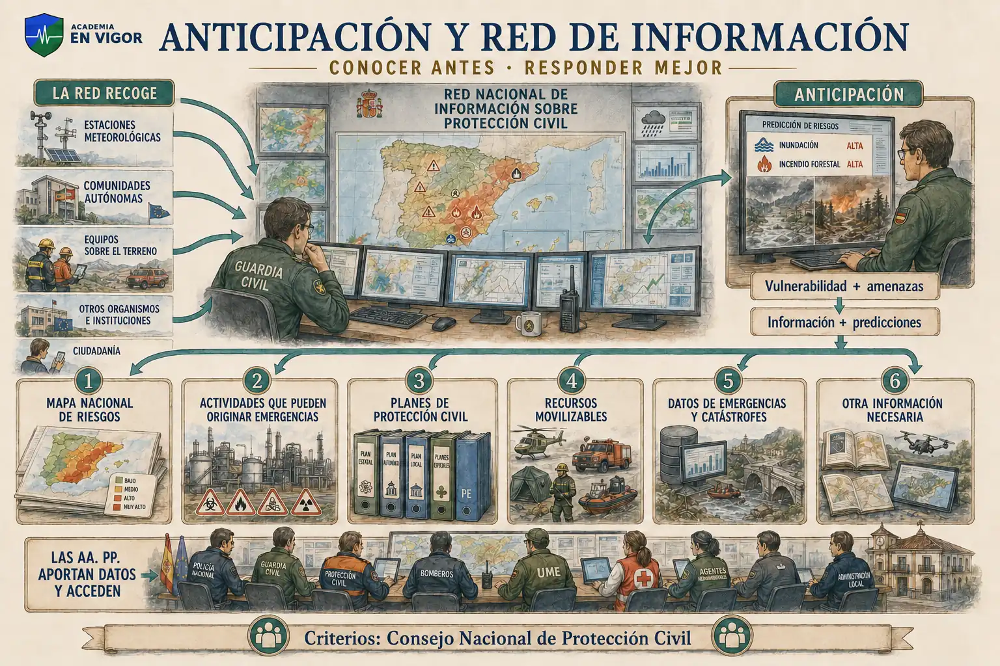

<em>Infografía: capas de anticipación y red nacional de información.</em>

<!-- FUENTE: LEY17-2015-GC-T16 -->

## 06. Prevención, fondo preventivo y Red de Alerta

Este bloque ordena **prevención, fondo preventivo y red de alerta** dentro de sistema nacional de protección civil y separa regla, órgano, requisito, excepción y efecto.

### Claves rápidas

- **Artículo 12. Red de Alerta Nacional de Protección Civil:** 2. La gestión de la Red corresponderá al Ministerio del Interior, a través del Centro Nacional de Seguimiento y Coordinación de Emergencias de Protección Civil.
- **Artículo 10. Política de prevención:** 2. Como paso previo a la prestación de actividades catalogadas de acuerdo con el artículo 9.2.b) se deberá contar con un estudio técnico de los efectos directos sobre los riesgos de emergencias de protección civil identificados en la zona. Incluirá, como mínimo, datos sobre emplazamiento, diseño y tamaño del proyecto de la actividad, una identificación y evaluación de dichos efectos y de las medidas para evitar o reducir las consecuencias adversas de dicho impacto.
- **Artículo 11. Fondo de Prevención de Emergencias:** 2. El Ministerio del Interior podrá suscribir instrumentos de colaboración con otros departamentos ministeriales, con otras Administraciones Públicas y con entidades públicas o privadas, para la realización de las actividades recogidas en este capítulo, que serán financiadas total o parcialmente con cargo al Fondo de Prevención de Emergencias.

:::perla-vigor
Primero identifica la norma y su vigencia; después fija sujeto, verbo, requisito y excepción.
:::

<!-- VISUAL:t16-06-prevencion-fondo-preventivo-y-red-de-alerta.webp -->

  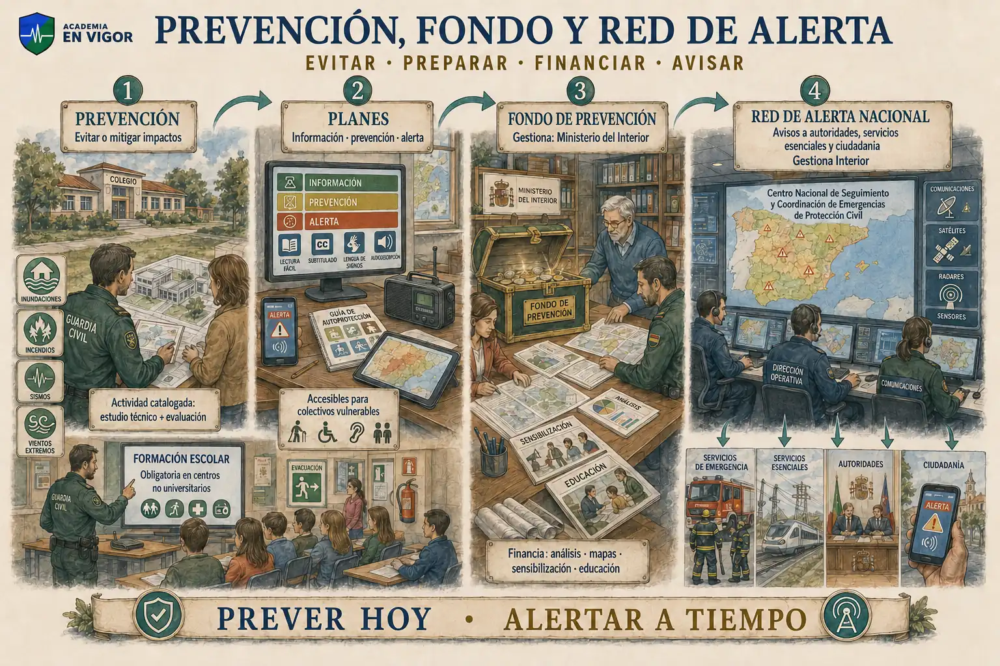

<em>Infografía: mapa de prevención, fondo preventivo y red de alerta.</em>

<!-- FUENTE: LEY17-2015-GC-T16 -->

## 07. Norma Básica y planes de protección civil

Este bloque ordena **norma básica y planes de protección civil** dentro de sistema nacional de protección civil y separa regla, órgano, requisito, excepción y efecto.

### Claves rápidas

- **Artículo 14. Planes de Protección Civil:** 2. Los Planes de Protección Civil son el Plan Estatal General, los Planes Territoriales, de ámbito autonómico o local, los Planes Especiales y los Planes de Autoprotección.
- **Artículo 15. Tipos de Planes:** 2. Son Planes Territoriales todos aquellos que se elaboran para hacer frente a los riesgos de emergencia que se puedan presentar en el territorio de una Comunidad Autónoma o de una Entidad Local. Dichos Planes serán aprobados por la Administración competente, autonómica o local, de conformidad con lo previsto en su legislación específica.
- **Artículo 15. Tipos de Planes:** Son Planes Especiales los que tienen por finalidad hacer frente a los riesgos de inundaciones; terremotos; maremotos; volcánicos; fenómenos meteorológicos adversos; incendios forestales; accidentes en instalaciones o procesos en los que se utilicen o almacenen sustancias químicas, biológicas, nucleares o radiactivas; accidentes de aviación civil y en el transporte de mercancías peligrosas, así como los relativos a la protección de la población en caso de conflicto bélico y aquellos otros que se determinen en la Norma Básica.
- **Artículo 13. Norma Básica de Protección Civil:** La Norma Básica de Protección Civil, aprobada mediante real decreto a propuesta del titular del Ministerio del Interior, y previo informe del Consejo Nacional de Protección Civil, establece las directrices básicas para la identificación de riesgos de emergencias y actuaciones para su gestión integral, el contenido mínimo y los criterios generales para la elaboración de los Planes de Protección Civil, y del desarrollo por los órganos competentes de las actividades de implantación necesarias para su adecuada efectividad.

:::perla-vigor
Primero identifica la norma y su vigencia; después fija sujeto, verbo, requisito y excepción.
:::

<!-- VISUAL:t16-07-norma-basica-y-planes-de-proteccion-civil.webp -->

  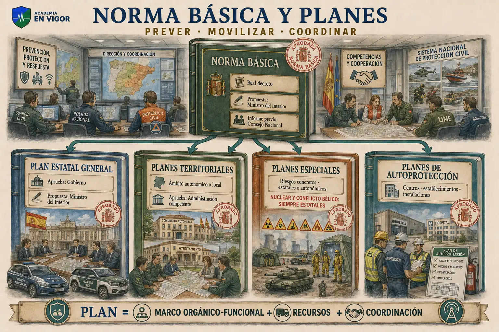

<em>Infografía: flujo de norma básica y planes de protección civil.</em>

<!-- FUENTE: LEY17-2015-GC-T16 -->

## 08. Respuesta inmediata, servicios y recursos estatales

Este bloque ordena **respuesta inmediata, servicios y recursos estatales** dentro de sistema nacional de protección civil y separa regla, órgano, requisito, excepción y efecto.

### Claves rápidas

- **Artículo 16. Definición:** Se entiende por respuesta inmediata a las emergencias de protección civil la actuación de los servicios públicos o privados de intervención y de asistencia tras el acaecimiento de una emergencia o en una situación que pudiera derivar en emergencia, con la finalidad de evitar daños, rescatar y proteger a las personas y bienes, velar por la seguridad ciudadana y satisfacer las necesidades básicas de subsistencia de la población afectada.
- **Artículo 17. Los servicios de intervención y asistencia en emergencias de protección civil:** 1.
- **Artículo 18. El Centro Nacional de Seguimiento y Coordinación de Emergencias de Protección Civil:** 1. El Centro Nacional de Seguimiento y Coordinación de Emergencias de Protección Civil ejerce las siguientes funciones:
- **Artículo 19. Disponibilidad de los recursos del Estado:** 1. El Estado colaborará con las Comunidades Autónomas y con las Entidades Locales, facilitando los recursos humanos y materiales disponibles en caso de emergencias que no hayan sido declaradas de interés nacional, en los términos que se acuerden en el Consejo Nacional de Protección Civil.

:::perla-vigor
Primero identifica la norma y su vigencia; después fija sujeto, verbo, requisito y excepción.
:::

<!-- VISUAL:t16-08-respuesta-inmediata-servicios-y-recursos-estatales.webp -->

  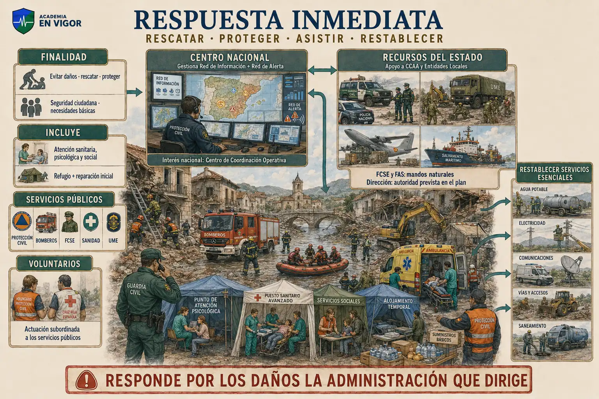

<em>Infografía: comparación de respuesta inmediata, servicios y recursos estatales.</em>

<!-- FUENTE: LEY17-2015-GC-T16 -->

## 09. Recuperación, daños, declaración y medidas

Este bloque ordena **recuperación, daños, declaración y medidas** dentro de sistema nacional de protección civil y separa regla, órgano, requisito, excepción y efecto.

### Claves rápidas

- **Artículo 23. Procedimiento de declaración de zona afectada gravemente por una emergencia de protección civil:** 1. La declaración de zona afectada gravemente por una emergencia de protección civil prevista en esta ley se efectuará por acuerdo de Consejo de Ministros, a propuesta de los Ministros de Hacienda y Administraciones Públicas y del Interior y, en su caso, de los titulares de los demás ministerios concernidos, e incluirá, en todo caso, la delimitación del área afectada. Dicha declaración podrá ser solicitada por las administraciones públicas interesadas.
- **Artículo 20. Fase de recuperación:** De las razones que justifican la intervención de la Administración General del Estado en las tareas de recuperación se informará, en el menor plazo posible, a la Comunidad Autónoma afectada o, en su caso, al Consejo Nacional de Protección Civil.
- **Artículo 21. Daños materiales:** Las entidades aseguradoras que operen en el territorio español estarán obligadas a suministrar al Consorcio de Compensación de Seguros la información que éste les solicite para dar cumplimiento a lo dispuesto anteriormente. El Consorcio de Compensación de Seguros podrá emitir informes de valoración y periciales a solicitud y en favor de las Administraciones Públicas afectadas.
- **Artículo 24. Medidas aplicables:** 8.º De manera excepcional, el Ministro de Hacienda y Administraciones Públicas podrá autorizar una reducción de los índices de rendimiento neto de las explotaciones y actividades agrarias realizadas en las zonas siniestradas.

:::perla-vigor
Primero identifica la norma y su vigencia; después fija sujeto, verbo, requisito y excepción.
:::

<!-- VISUAL:t16-09-recuperacion-danos-declaracion-y-medidas.webp -->

  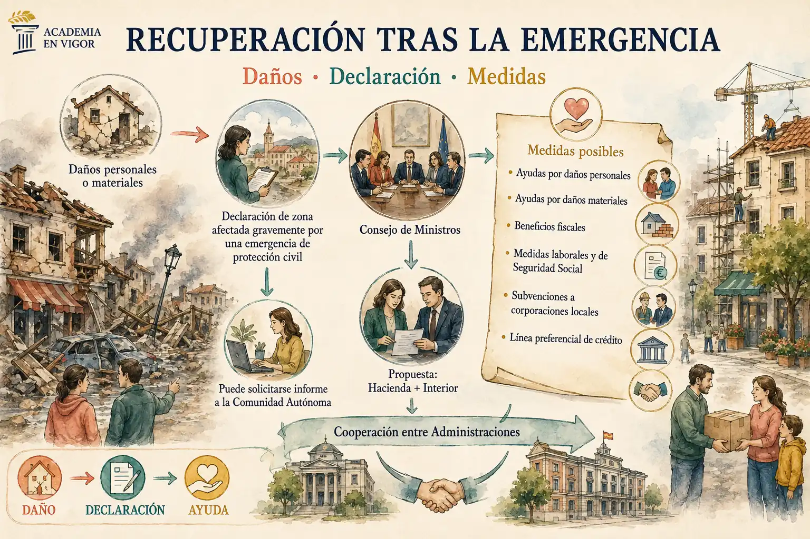

<em>Infografía: línea temporal de recuperación, daños, declaración y medidas.</em>

<!-- FUENTE: LEY17-2015-GC-T16 -->

## 10. Evaluación, inspección y memoria anual

Este bloque ordena **evaluación, inspección y memoria anual** dentro de sistema nacional de protección civil y separa regla, órgano, requisito, excepción y efecto.

### Claves rápidas

- **Artículo 27. Memoria anual del Sistema Nacional de Protección Civil:** El Gobierno, elaborada por el Consejo Nacional de Protección Civil y a propuesta del Ministro del Interior, elevará al Senado una memoria anual que permita valorar la eficacia del Sistema Nacional.
- **Artículo 26. Evaluación e inspección:** 1. La evaluación y la inspección del Sistema Nacional de Protección Civil tendrá como finalidad contribuir a mejorar la calidad de la respuesta de los poderes públicos en la gestión integral de los riesgos y emergencias.

:::perla-vigor
Primero identifica la norma y su vigencia; después fija sujeto, verbo, requisito y excepción.
:::

<!-- VISUAL:t16-10-evaluacion-inspeccion-y-memoria-anual.webp -->

  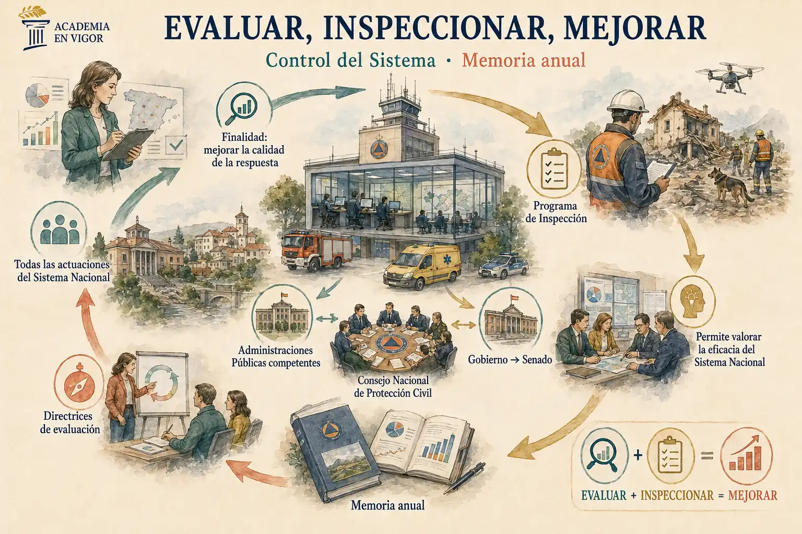

<em>Infografía: escena de evaluación, inspección y memoria anual.</em>

<!-- FUENTE: LEY17-2015-GC-T16 -->

## 11. Emergencias de interés nacional

Este bloque ordena **emergencias de interés nacional** dentro de sistema nacional de protección civil y separa regla, órgano, requisito, excepción y efecto.

### Claves rápidas

- **Artículo 28. Definición:** 1. Las que requieran para la protección de personas y bienes la aplicación de la Ley Orgánica 4/1981, de 1 de junio, reguladora de los estados de alarma, excepción y sitio.
- **Artículo 29. Declaración:** En los supuestos previstos en el artículo anterior, corresponderá la declaración de interés nacional al titular del Ministerio del Interior, bien por propia iniciativa o a instancia de las Comunidades Autónomas o de los Delegados del Gobierno en las mismas.
- **Artículo 30. Efectos:** 2. El Ministro del Interior podrá, en función de la gravedad de la situación, requerir la colaboración de las diferentes Administraciones Públicas que cuenten con recursos movilizables, aunque la emergencia no afecte a su territorio.

:::perla-vigor
Primero identifica la norma y su vigencia; después fija sujeto, verbo, requisito y excepción.
:::

<!-- VISUAL:t16-11-emergencias-de-interes-nacional.webp -->

  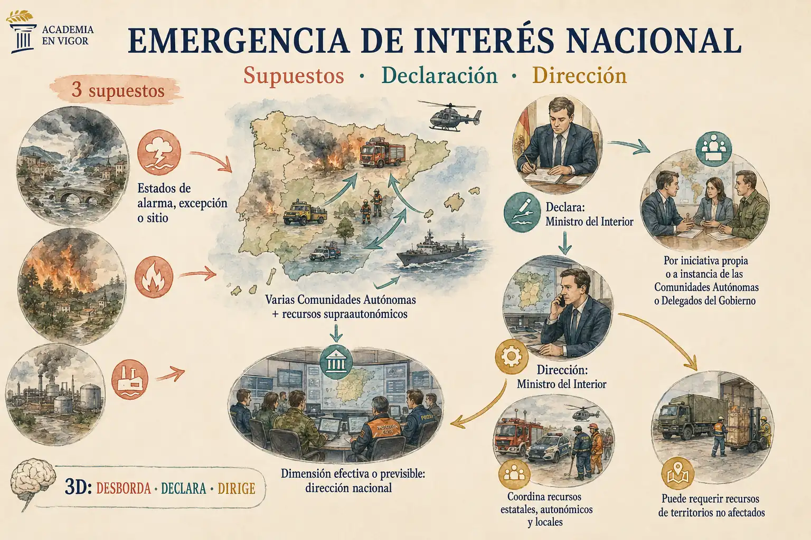

<em>Infografía: capas de emergencias de interés nacional.</em>

<!-- FUENTE: LEY17-2015-GC-T16 -->

## 12. Formación y Escuela Nacional de Protección Civil

Este bloque ordena **formación y escuela nacional de protección civil** dentro de sistema nacional de protección civil y separa regla, órgano, requisito, excepción y efecto.

### Claves rápidas

- **Artículo 32. La Escuela Nacional de Protección Civil:** 1. La Escuela Nacional de Protección Civil, como instrumento vertebrador de la formación especializada y de mandos de alto nivel, desarrolla las siguientes actividades:
- **Artículo 31. La formación de los recursos humanos:** 1. Los poderes públicos promoverán la formación y el desarrollo de la competencia técnica del personal del Sistema Nacional de Protección Civil.

:::perla-vigor
Primero identifica la norma y su vigencia; después fija sujeto, verbo, requisito y excepción.
:::

<!-- VISUAL:t16-12-formacion-y-escuela-nacional-de-proteccion-civil.webp -->

  

<em>Infografía: mapa de formación y escuela nacional de protección civil.</em>

<!-- FUENTE: LEY17-2015-GC-T16 -->

## 13. Competencias del Gobierno y del Ministro del Interior

Este bloque ordena **competencias del gobierno y del ministro del interior** dentro de sistema nacional de protección civil y separa regla, órgano, requisito, excepción y efecto.

### Claves rápidas

- **Artículo 33. Competencias del Gobierno:** g) Aprobar el Protocolo de Intervención de la Unidad Militar de Emergencias y, en su caso, el de otros medios del Estado que puedan destinarse a la protección civil.
- **Artículo 34. Competencias del Ministro del Interior:** b) Elaborar la Norma Básica de Protección Civil, el Plan Estatal General y los Planes Especiales de Protección Civil de ámbito y competencia estatal, y elevarlos al Gobierno para su aprobación, así como proponer al Consejo de Seguridad Nacional la aprobación de la Estrategia Nacional de Protección Civil.
- **Artículo 34. Competencias del Ministro del Interior:** e) Ejercer la superior dirección, coordinación e inspección de las acciones y los medios de ejecución de los planes de protección civil de competencia estatal.
- **Artículo 34. Competencias del Ministro del Interior:** h) Efectuar la oferta de aportación de equipos de intervención en emergencias en el marco del Mecanismo de Protección Civil de la Unión Europea.

:::perla-vigor
Primero identifica la norma y su vigencia; después fija sujeto, verbo, requisito y excepción.
:::

<!-- VISUAL:t16-13-competencias-del-gobierno-y-del-ministro-del-interior.webp -->

  

<em>Infografía: flujo de competencias del gobierno y del ministro del interior.</em>

<!-- FUENTE: LEY17-2015-GC-T16 -->

## 14. Otros departamentos y Delegados del Gobierno

Este bloque ordena **otros departamentos y delegados del gobierno** dentro de sistema nacional de protección civil y separa regla, órgano, requisito, excepción y efecto.

### Claves rápidas

- **Artículo 35. Competencias de otros Departamentos, organismos y entidades del sector público estatal:** Los restantes Ministerios, organismos públicos y demás entidades del sector público estatal participarán en el ejercicio de las actividades de protección civil, en el ámbito de sus respectivas competencias y de conformidad con lo que establezca la normativa vigente y los planes de protección civil. El Ministro del Interior decidirá y la autoridad competente del Departamento u organismo correspondiente ordenará la intervención de estos medios estatales.
- **Artículo 36. Competencias de los Delegados del Gobierno:** Los Delegados del Gobierno, bajo las instrucciones del Ministerio del Interior, coordinarán las actuaciones en materia de protección civil de los órganos y servicios de la Administración General del Estado de sus respectivos ámbitos territoriales, en cooperación a su vez con los órganos competentes en materia de protección civil de las correspondientes Comunidades Autónomas y Entidades Locales.

:::perla-vigor
Primero identifica la norma y su vigencia; después fija sujeto, verbo, requisito y excepción.
:::

<!-- VISUAL:t16-14-otros-departamentos-y-delegados-del-gobierno.webp -->

  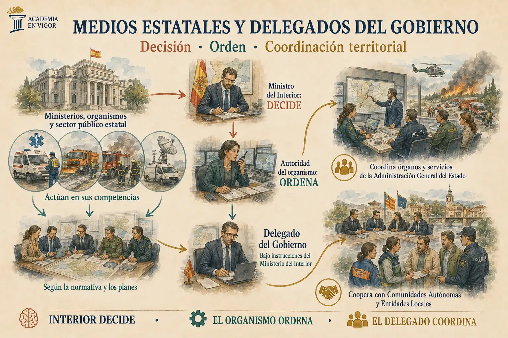

<em>Infografía: comparación de otros departamentos y delegados del gobierno.</em>

<!-- FUENTE: LEY17-2015-GC-T16 -->

## 15. Fuerzas Armadas, UME y Fuerzas y Cuerpos de Seguridad

Este bloque ordena **fuerzas armadas, ume y fuerzas y cuerpos de seguridad** dentro de sistema nacional de protección civil y separa regla, órgano, requisito, excepción y efecto.

### Claves rápidas

- **Artículo 37. Las Fuerzas Armadas. La Unidad Militar de Emergencias:** 4. La Unidad Militar de Emergencias, en caso de emergencia de interés nacional, asumirá la dirección operativa de la misma, actuando bajo la dirección del Ministro del Interior.
- **Artículo 38. Participación de las Fuerzas y Cuerpos de Seguridad del Estado:** 1. Las Fuerzas y Cuerpos de Seguridad del Estado colaborarán en las acciones de protección civil, de conformidad con lo establecido en la Ley Orgánica 2/1986, de 13 de marzo, de Fuerzas y Cuerpos de Seguridad, y en esta ley y en la normativa de desarrollo.

:::perla-vigor
Primero identifica la norma y su vigencia; después fija sujeto, verbo, requisito y excepción.
:::

<!-- VISUAL:t16-15-fuerzas-armadas-ume-y-fuerzas-y-cuerpos-de-seguridad.webp -->

  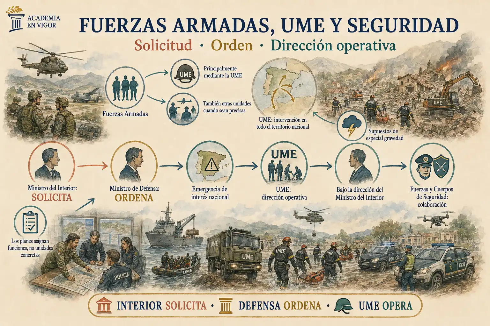

<em>Infografía: línea temporal de fuerzas armadas, ume y fuerzas y cuerpos de seguridad.</em>

<!-- FUENTE: LEY17-2015-GC-T16 -->

## 16. Coordinación nacional, Unión Europea y cooperación internacional

Este bloque ordena **coordinación nacional, unión europea y cooperación internacional** dentro de sistema nacional de protección civil y separa regla, órgano, requisito, excepción y efecto.

### Claves rápidas

- **Artículo 41. Contribución al Mecanismo de Protección Civil de la Unión Europea:** 1. El Ministerio del Interior, como punto de contacto español del Mecanismo de Protección Civil de la Unión Europea, tanto en lo que afecta a las actividades de prevención, como en cuanto a las de preparación y respuesta a desastres que se desarrollan en el marco de dicho Mecanismo, actuará, cuando sea oportuno, en coordinación con los Departamentos de la Administración General del Estado afectados, así como con las Comunidades Autónomas.
- **Artículo 39. Consejo Nacional de Protección Civil:** 1. El Consejo Nacional de Protección Civil es el órgano de cooperación en esta materia de la Administración General del Estado, de las Administraciones de las Comunidades Autónomas, de las Ciudades con Estatuto de Autonomía y de la Administración Local, representada por la Federación Española de Municipios y Provincias, como asociación de Entidades Locales de ámbito estatal con mayor implantación.
- **Artículo 40. Órganos territoriales de participación y coordinación en materia de protección civil:** De acuerdo con lo que disponga la normativa autonómica, en los órganos territoriales de participación y coordinación en materia de protección civil podrán participar representantes de la Administración General de Estado.
- **Artículo 42. Cooperación Internacional:** El Ministerio del Interior recabará y movilizará los recursos del Sistema Nacional para prevenir y afrontar situaciones de catástrofes en terceros países, cuando sea procedente en virtud de los tratados internacionales y convenios bilaterales suscritos por España, o cuando el Gobierno lo acuerde a propuesta de los Ministros de Asuntos Exteriores y de Cooperación y del Interior, y de aquellos otros Departamentos cuyas competencias, en su caso, puedan verse afectadas.

:::perla-vigor
Primero identifica la norma y su vigencia; después fija sujeto, verbo, requisito y excepción.
:::

<!-- VISUAL:t16-16-coordinacion-nacional-union-europea-y-cooperacion-internacional.webp -->

  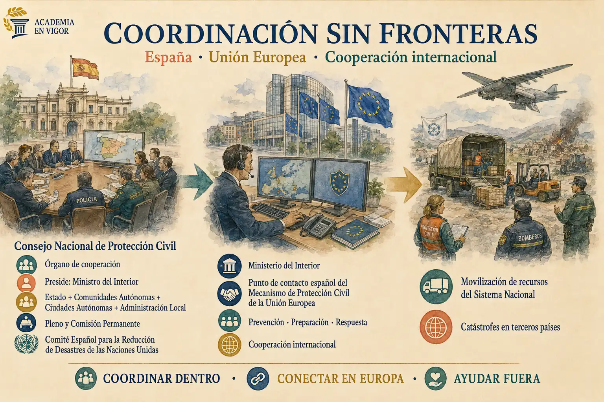

<em>Infografía: escena de coordinación nacional, unión europea y cooperación internacional.</em>

<!-- FUENTE: LEY17-2015-GC-T16 -->

## 17. Objeto, principios y definiciones de patrimonio natural

Este bloque ordena **objeto, principios y definiciones de patrimonio natural** dentro de patrimonio natural y espacios protegidos y separa regla, órgano, requisito, excepción y efecto.

### Claves rápidas

- **Artículo 3. Definiciones:** 6. Conservación in situ: conservación de los ecosistemas y los hábitats naturales y seminaturales el mantenimiento y recuperación de poblaciones viables de especies silvestres en sus entornos naturales y, en el caso de las especies domesticadas y cultivadas, en los entornos en que hayan desarrollado sus propiedades específicas.
- **Artículo 3. Definiciones:** 8. Corredor ecológico: territorio, de extensión y configuración variables, que, debido a su disposición y a su estado de conservación, conecta funcionalmente espacios naturales de singular relevancia para la flora o la fauna silvestres, separados entre sí, permitiendo, entre otros procesos ecológicos, el intercambio genético entre poblaciones de especies silvestres o la migración de especímenes de esas especies.
- **Artículo 3. Definiciones:** 10. Ecosistema: complejo dinámico de comunidades vegetales, animales y de microorganismos y su medio no viviente que interactúan como una unidad funcional.
- **Artículo 3. Definiciones:** 14. Estado de conservación de un hábitat: situación derivada del conjunto de las influencias que actúan sobre el hábitat natural o seminatural de que se trate y sobre las especies típicas asentadas en el mismo y que pueden afectar a largo plazo a su distribución natural, su estructura y funciones, así como a la supervivencia de sus especies típicas en el territorio.

:::perla-vigor
Primero identifica la norma y su vigencia; después fija sujeto, verbo, requisito y excepción.
:::

<!-- VISUAL:t16-17-objeto-principios-y-definiciones-de-patrimonio-natural.webp -->

  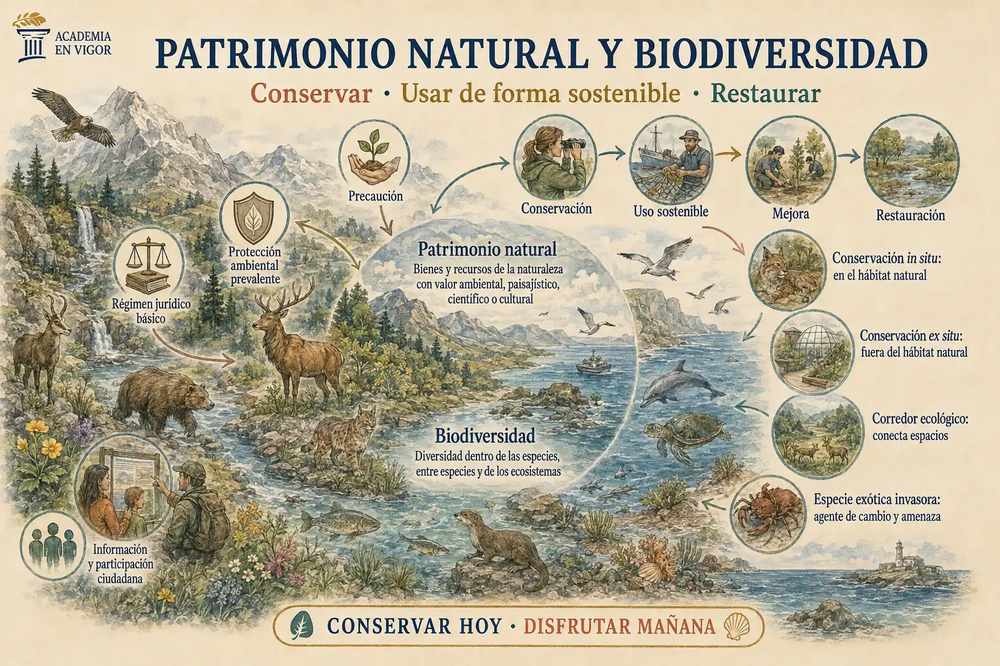

<em>Infografía: capas de objeto, principios y definiciones de patrimonio natural.</em>

<!-- FUENTE: LEY42-2007-GC-T16 -->

## 18. Función social, deberes, competencias y cooperación

Este bloque ordena **función social, deberes, competencias y cooperación** dentro de patrimonio natural y espacios protegidos y separa regla, órgano, requisito, excepción y efecto.

### Claves rápidas

- **Artículo 6. Competencias de las Administraciones Públicas sobre biodiversidad marina:** 4. Corresponde a las comunidades autónomas el ejercicio de las funciones a las que se refiere esta ley con respecto a especies (excepto las altamente migratorias) y espacios, hábitats o áreas críticas situados en el medio marino, cuando exista continuidad ecológica del ecosistema marino con el espacio natural terrestre objeto de protección, avalada por la mejor evidencia científica existente.
- **Artículo 4. Función social y pública del patrimonio natural y la biodiversidad:** 1. El patrimonio natural y la biodiversidad desempeñan una función social relevante por su estrecha vinculación con el desarrollo, la salud y el bienestar de las personas y por su aportación al desarrollo social y económico.
- **Artículo 5. Deberes de los poderes públicos:** 1. Todos los poderes públicos, en sus respectivos ámbitos competenciales, velarán por la conservación y la utilización racional del patrimonio natural en todo el territorio nacional, que incluye su medio marino así como en la zona económica exclusiva y en la plataforma continental, con independencia de su titularidad o régimen jurídico, teniendo en cuenta especialmente los tipos de hábitats naturales y las especies silvestres en régimen de protección especial.
- **Artículo 7. Mecanismos de cooperación:** 1. Las Administraciones Públicas cooperarán y colaborarán en materia de conservación del patrimonio natural y la biodiversidad y se suministrarán mutuamente información para garantizar el cumplimiento de los objetivos de esta Ley.

:::perla-vigor
Primero identifica la norma y su vigencia; después fija sujeto, verbo, requisito y excepción.
:::

<!-- VISUAL:t16-18-funcion-social-deberes-competencias-y-cooperacion.webp -->

  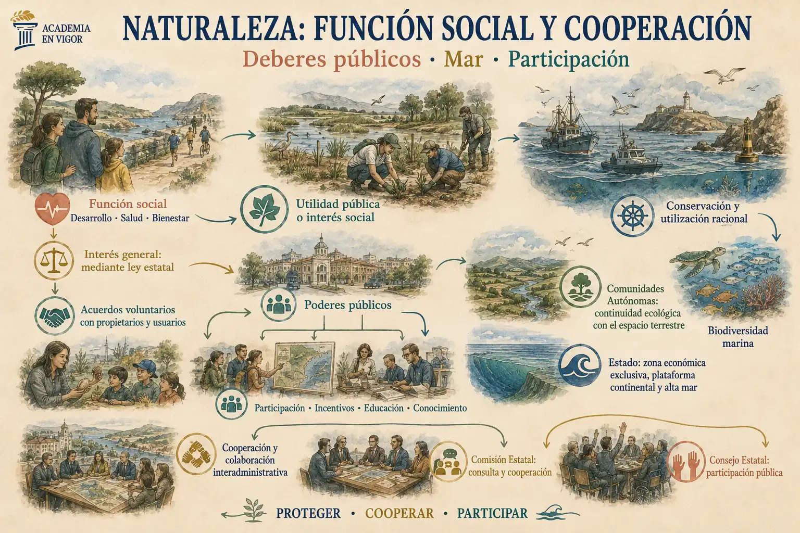

<em>Infografía: mapa de función social, deberes, competencias y cooperación.</em>

<!-- FUENTE: LEY42-2007-GC-T16 -->

## 19. Hábitats en peligro: catálogo, efectos y estrategias

Este bloque ordena **hábitats en peligro: catálogo, efectos y estrategias** dentro de patrimonio natural y espacios protegidos y separa regla, órgano, requisito, excepción y efecto.

### Claves rápidas

- **Artículo 25. El Catálogo Español de Hábitats en Peligro de Desaparición:** 4.ª Encontrarse en alto riesgo de transformación irreversible a corto o medio plazo en una parte significativa de su área de distribución, incluyendo el riesgo de transformación debido a los efectos del cambio climático.
- **Artículo 27. Estrategias y planes de conservación y restauración:** 2. El Ministerio de Agricultura, Alimentación y Medio Ambiente aprobará las Estrategias de conservación y restauración de los hábitats en peligro de desaparición marinos, excepto para los hábitats que se sitúen exclusivamente en espacios con continuidad ecológica del ecosistema marino respecto del espacio natural terrestre objeto de protección, avalada por la mejor evidencia científica existente.
- **Artículo 26. Efectos:** La inclusión de un hábitat en el Catálogo Español de Hábitats en Peligro de Desaparición, surtirá los siguientes efectos:

:::perla-vigor
Primero identifica la norma y su vigencia; después fija sujeto, verbo, requisito y excepción.
:::

<!-- VISUAL:t16-19-habitats-en-peligro-catalogo-efectos-y-estrategias.webp -->

  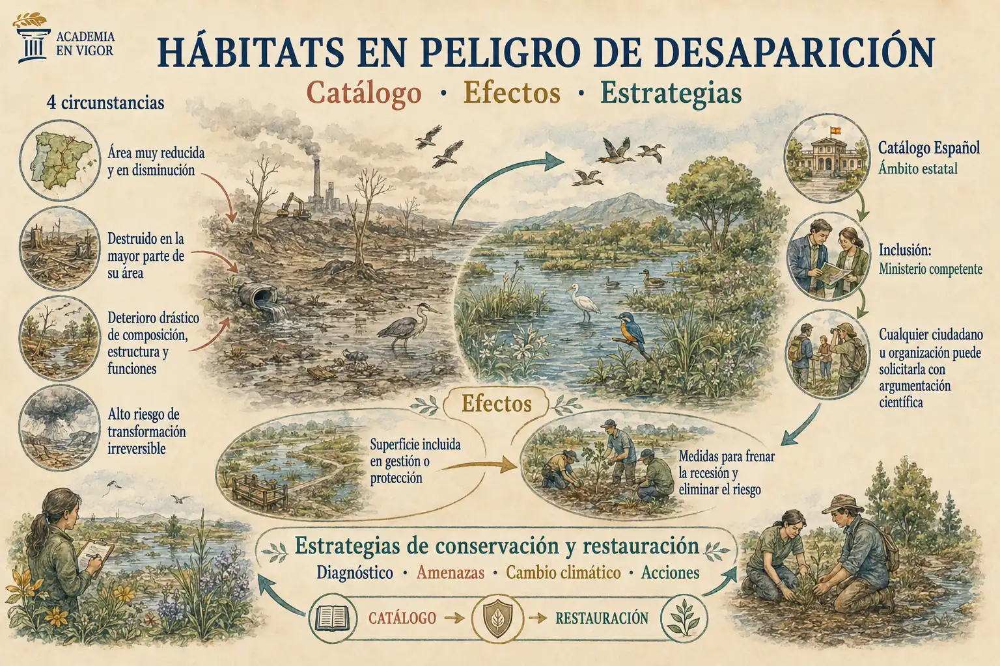

<em>Infografía: flujo de hábitats en peligro: catálogo, efectos y estrategias.</em>

<!-- FUENTE: LEY42-2007-GC-T16 -->

## 20. Espacios naturales protegidos: concepto y clasificación

Este bloque ordena **espacios naturales protegidos: concepto y clasificación** dentro de patrimonio natural y espacios protegidos y separa regla, órgano, requisito, excepción y efecto.

### Claves rápidas

- **Artículo 30. Clasificación de los espacios naturales protegidos:** En función de los bienes y valores a proteger, y de los objetivos de gestión a cumplir, los espacios naturales protegidos, ya sean terrestres o marinos, se clasificarán, al menos, en alguna de las siguientes categorías:
- **Artículo 28. Definición de espacios naturales protegidos:** 1. Tendrán la consideración de espacios naturales protegidos los espacios del territorio nacional, incluidas las aguas continentales, y el medio marino, junto con la zona económica exclusiva y la plataforma continental, que cumplan al menos uno de los requisitos siguientes y sean declarados como tales:
- **Artículo 29. Contenido de las normas reguladoras de los espacios protegidos:** 1. Las normas reguladoras de los espacios protegidos, así como sus mecanismos de planificación de la gestión, determinarán los instrumentos jurídicos, financieros y materiales que se consideren precisos para cumplir eficazmente los fines perseguidos con su declaración.

:::perla-vigor
Primero identifica la norma y su vigencia; después fija sujeto, verbo, requisito y excepción.
:::

<!-- VISUAL:t16-20-espacios-naturales-protegidos-concepto-y-clasificacion.webp -->

  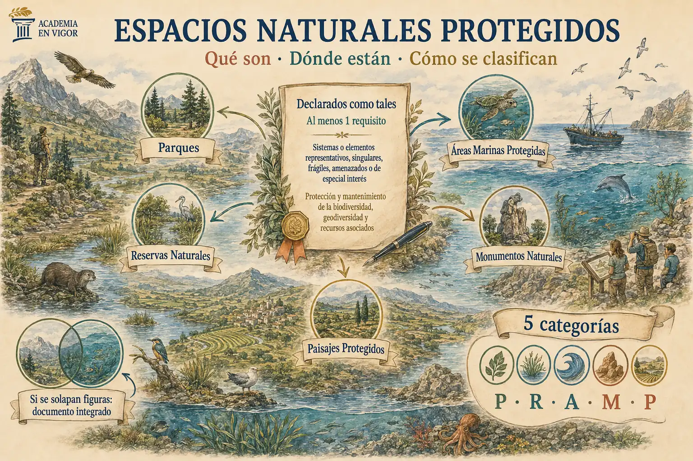

<em>Infografía: comparación de espacios naturales protegidos: concepto y clasificación.</em>

<!-- FUENTE: LEY42-2007-GC-T16 -->

## 21. Parques, reservas, áreas marinas, monumentos y paisajes

Este bloque ordena **parques, reservas, áreas marinas, monumentos y paisajes** dentro de patrimonio natural y espacios protegidos y separa regla, órgano, requisito, excepción y efecto.

### Claves rápidas

- **Artículo 32. Las Reservas Naturales:** 1. Las Reservas Naturales son espacios naturales, cuya creación tiene como finalidad la protección de ecosistemas, comunidades o elementos biológicos que, por su rareza, fragilidad, importancia o singularidad merecen una valoración especial.
- **Artículo 34. Los Monumentos Naturales:** 2. Se considerarán también Monumentos Naturales los árboles singulares y monumentales, las formaciones geológicas, los yacimientos paleontológicos y mineralógicos, los estratotipos y demás elementos de la gea que reúnan un interés especial por la singularidad o importancia de sus valores científicos, culturales o paisajísticos.
- **Artículo 31. Los Parques:** 3. En los Parques se podrá limitar el aprovechamiento de los recursos naturales, prohibiéndose en todo caso los incompatibles con las finalidades que hayan justificado su creación.
- **Artículo 33. Áreas Marinas Protegidas:** 1. Las Áreas Marinas Protegidas son espacios naturales designados para la protección de ecosistemas, comunidades o elementos biológicos o geológicos del medio marino, incluidas las áreas intermareal y submareal, que en razón de su rareza, fragilidad, importancia o singularidad, merecen una protección especial.

:::perla-vigor
Primero identifica la norma y su vigencia; después fija sujeto, verbo, requisito y excepción.
:::

<!-- VISUAL:t16-21-parques-reservas-areas-marinas-monumentos-y-paisajes.webp -->

  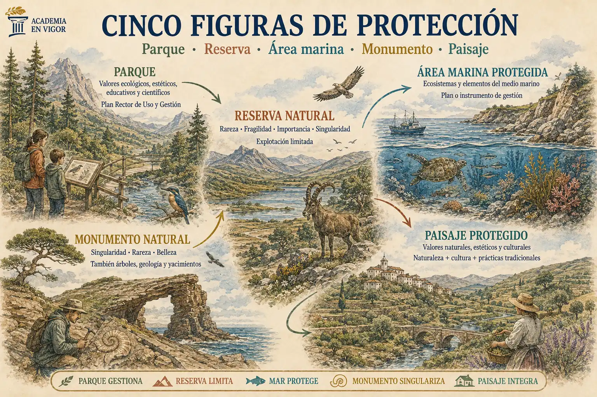

<em>Infografía: línea temporal de parques, reservas, áreas marinas, monumentos y paisajes.</em>

<!-- FUENTE: LEY42-2007-GC-T16 -->

## 22. Declaración, gestión y protección de espacios

Este bloque ordena **declaración, gestión y protección de espacios** dentro de patrimonio natural y espacios protegidos y separa regla, órgano, requisito, excepción y efecto.

### Claves rápidas

- **Artículo 36. Requisitos para la declaración de los Parques y las Reservas Naturales:** 2. Excepcionalmente, podrán declararse Parques y Reservas sin la previa aprobación del Plan de Ordenación de los Recursos Naturales, cuando existan razones que los justifiquen y que se harán constar expresamente en la norma que los declare. En este caso deberá tramitarse en el plazo de un año, a partir de la declaración de Parque o Reserva, el correspondiente Plan de Ordenación.
- **Artículo 37. Declaración y gestión de los Espacios Naturales Protegidos:** 2. Corresponde a la Administración General del Estado la declaración y la gestión de los Espacios Naturales Protegidos en el medio marino, excepto en los casos en que exista continuidad ecológica del ecosistema marino con el espacio natural terrestre objeto de protección, avalada por la mejor evidencia científica existente, en cuyo caso esas funciones corresponderán a las comunidades autónomas.
- **Artículo 40. Utilidad pública y derecho de tanteo y retracto sobre espacios naturales protegidos:** Dentro del plazo que establezca la legislación de las Comunidades autónomas desde dicha notificación, la administración podrá ejercer el derecho de tanteo obligándose al pago del precio convenido en un período no superior a un ejercicio económico.
- **Artículo 38. Zonas periféricas de protección:** En las declaraciones de los espacios naturales protegidos podrán establecerse zonas periféricas de protección destinadas a evitar impactos ecológicos o paisajísticos procedentes del exterior. Cuando proceda, en la propia norma de creación, se establecerán las limitaciones necesarias.

:::perla-vigor
Primero identifica la norma y su vigencia; después fija sujeto, verbo, requisito y excepción.
:::

<!-- VISUAL:t16-22-declaracion-gestion-y-proteccion-de-espacios.webp -->

  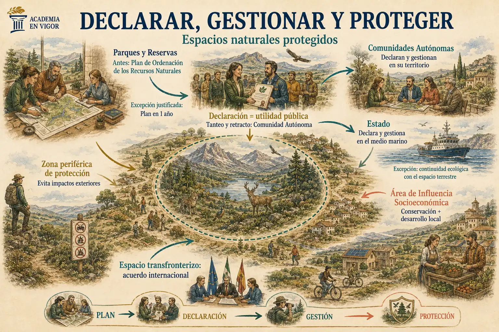

<em>Infografía: escena de declaración, gestión y protección de espacios.</em>

<!-- FUENTE: LEY42-2007-GC-T16 -->

## 23. Red Natura 2000: LIC, ZEC y ZEPA

Este bloque ordena **red natura 2000: lic, zec y zepa** dentro de patrimonio natural y espacios protegidos y separa regla, órgano, requisito, excepción y efecto.

### Claves rápidas

- **Artículo 42. Red Natura 2000:** 1. La Red Ecológica Europea Natura 2000 es una red ecológica coherente compuesta por los Lugares de Importancia Comunitaria (en adelante LIC), hasta su transformación en Zonas Especiales de Conservación (en adelante ZEC), dichas ZEC y las Zonas de Especial Protección para las Aves (en adelante ZEPA), cuya gestión tendrá en cuenta las exigencias ecológicas, económicas, sociales y culturales, así como las particularidades regionales y locales.
- **Artículo 42. Red Natura 2000:** 2. Los LIC, las ZEC y las ZEPA tendrán la consideración de espacios protegidos, con la denominación de espacio protegido Red Natura 2000, y con el alcance y las limitaciones que la Administración General del Estado y las comunidades autónomas establezcan en su legislación y en los correspondientes instrumentos de planificación, siempre en sus respectivos ámbitos competenciales.
- **Artículo 43. Lugares de Importancia Comunitaria y Zonas Especiales de Conservación:** Desde el momento que se envíe al Ministerio de Agricultura, Alimentación y Medio Ambiente la lista de los espacios propuestos como LIC, para su traslado a la Comisión Europea, éstos pasarán a tener un régimen de protección preventiva que garantice que no exista una merma del estado de conservación de sus hábitats y especies hasta el momento de su declaración formal.
- **Artículo 43. Lugares de Importancia Comunitaria y Zonas Especiales de Conservación:** 3. Una vez aprobadas o ampliadas las listas de LIC por la Comisión Europea, éstos serán declarados por las Administraciones competentes, como ZEC lo antes posible y como máximo en un plazo de seis años, junto con la aprobación del correspondiente plan o instrumento de gestión.

:::perla-vigor
Primero identifica la norma y su vigencia; después fija sujeto, verbo, requisito y excepción.
:::

<!-- VISUAL:t16-23-red-natura-2000-lic-zec-y-zepa.webp -->

  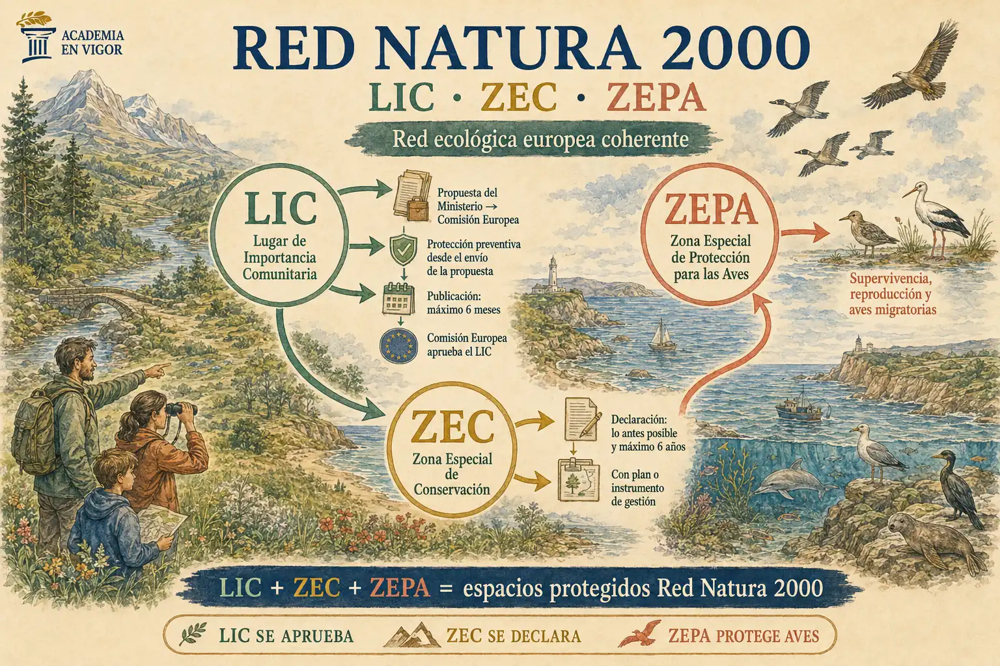

<em>Infografía: capas de red natura 2000: lic, zec y zepa.</em>

<!-- FUENTE: LEY42-2007-GC-T16 -->

## 24. Conservación, conectividad, vigilancia y cambios de categoría

Este bloque ordena **conservación, conectividad, vigilancia y cambios de categoría** dentro de patrimonio natural y espacios protegidos y separa regla, órgano, requisito, excepción y efecto.

### Claves rápidas

- **Artículo 46. Medidas de conservación de la Red Natura 2000:** La concurrencia de razones imperiosas de interés público de primer orden sólo podrá declararse para cada supuesto concreto:
- **Artículo 49. Cambio de categoría:** La descatalogación total o parcial de un espacio incluido en Red Natura 2000 solo podrá proponerse cuando así lo justifiquen los cambios provocados en el mismo por la evolución natural, científicamente demostrada, reflejados en los resultados del seguimiento definido en el artículo anterior.
- **Artículo 47. Coherencia y conectividad de la Red:** Con el fin de mejorar la coherencia ecológica y la conectividad de la Red Natura 2000, las Administraciones, teniendo en cuenta lo dispuesto en el artículo 15, fomentarán la conservación de corredores ecológicos y la gestión de aquellos elementos del paisaje y áreas terrestres y marinas que resultan esenciales o revistan primordial importancia para la migración, la distribución geográfica y el intercambio genético entre poblaciones de especies de fauna y flora silvestres, teniendo en cuenta los impactos futuros del cambio climático.
- **Artículo 48. Vigilancia y seguimiento:** 1. La Administración General del Estado y las comunidades autónomas, en el ámbito de sus respectivas competencias, vigilarán el estado de conservación de los tipos de hábitats y las especies de interés comunitario, teniendo especialmente en cuenta los tipos de hábitats naturales prioritarios y las especies prioritarias, así como de conservación de las especies de aves que se enumeran en el anexo IV.

:::perla-vigor
Primero identifica la norma y su vigencia; después fija sujeto, verbo, requisito y excepción.
:::

<!-- VISUAL:t16-24-conservacion-conectividad-vigilancia-y-cambios-de-categoria.webp -->

  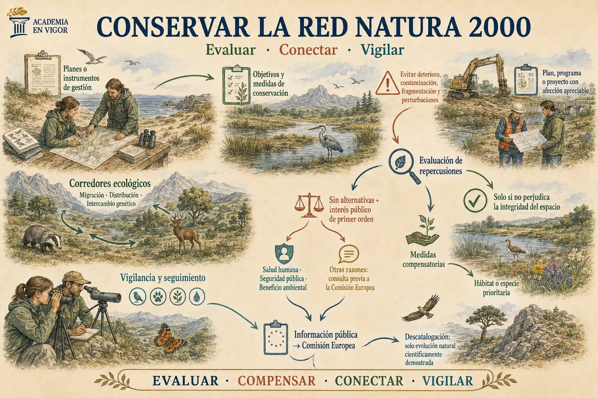

<em>Infografía: mapa de conservación, conectividad, vigilancia y cambios de categoría.</em>

<!-- FUENTE: LEY42-2007-GC-T16 -->

## 25. Áreas internacionales, inventario, delimitación y Registro

Este bloque ordena **áreas internacionales, inventario, delimitación y registro** dentro de patrimonio natural y espacios protegidos y separa regla, órgano, requisito, excepción y efecto.

### Claves rápidas

- **Artículo 50. Áreas protegidas por instrumentos internacionales:** 1. Tendrán la consideración de áreas protegidas por instrumentos internacionales todos aquellos espacios naturales que sean formalmente designados de conformidad con lo dispuesto en los Convenios y Acuerdos internacionales de los que sea parte España y, en particular, los siguientes:
- **Artículo 52. Alteración de la delimitación de los espacios protegidos:** 1. Sólo podrá alterarse la delimitación de espacios naturales protegidos o de la Red Natura 2000, reduciendo su superficie total o excluyendo terrenos de los mismos, cuando así lo justifiquen los cambios provocados en ellos por su evolución natural, científicamente demostrada.
- **Artículo 51. Inventario Español de Espacios Naturales Protegidos, Red Natura 2000 y Áreas protegidas por instrumentos internacionales:** 1. Dependiente del Ministerio de Medio Ambiente, con carácter administrativo y ámbito estatal, se crea el Inventario Español de Espacios Naturales Protegidos, Red Natura 2000 y Áreas protegidas por instrumentos internacionales, incluido en el Inventario Español del Patrimonio Natural y de la Biodiversidad, que se instrumentará reglamentariamente.
- **Artículo 53. Incorporación de la información geográfica al Registro de la Propiedad:** 1. La información perimetral referida a espacios naturales protegidos, Red Natura 2000, los montes de utilidad pública y los dominios públicos de las vías pecuarias y zonas incluidas en el Inventario Español de Zonas Húmedas, integradas en el Inventario Español del Patrimonio Natural y de la Biodiversidad, quedará siempre incorporada al sistema de información geográfica de la finca registral, con arreglo a lo dispuesto en la legislación hipotecaria.

:::perla-vigor
Primero identifica la norma y su vigencia; después fija sujeto, verbo, requisito y excepción.
:::

<!-- VISUAL:t16-25-areas-internacionales-inventario-delimitacion-y-registro.webp -->

  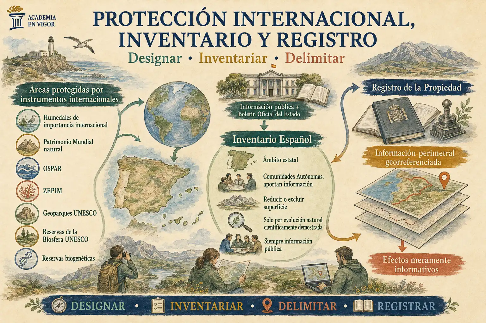

<em>Infografía: flujo de áreas internacionales, inventario, delimitación y registro.</em>

<!-- FUENTE: LEY42-2007-GC-T16 -->

## 26. Especies autóctonas y reintroducción

Este bloque ordena **especies autóctonas y reintroducción** dentro de conservación de la biodiversidad y separa regla, órgano, requisito, excepción y efecto.

### Claves rápidas

- **Artículo 54. Garantía de conservación de especies autóctonas silvestres:** El Ministerio de Agricultura, Alimentación y Medio Ambiente elaborará, en el plazo máximo de un año, un listado en el que, con base en la información técnica y científica existente, se incluirán los taxones alóctonos susceptibles de competir con las especies silvestres autóctonas, alterar su pureza genética o los equilibrios ecológicos.
- **Artículo 55. Reintroducción de especies silvestres autóctonas extinguidas:** Cualquier Administración pública, o cualquier persona física o jurídica de derecho privado podrá solicitar a la Dirección General competente en medio natural del Ministerio de Agricultura, Alimentación y Medio Ambiente la iniciación del procedimiento de inclusión de una especie en este Listado, acompañando a la correspondiente solicitud, una argumentación científica justificativa de su carácter autóctono y de su presencia estable en estado silvestre en el territorio español de forma previa a su extinción.

:::perla-vigor
Primero identifica la norma y su vigencia; después fija sujeto, verbo, requisito y excepción.
:::

<!-- VISUAL:t16-26-especies-autoctonas-y-reintroduccion.webp -->

  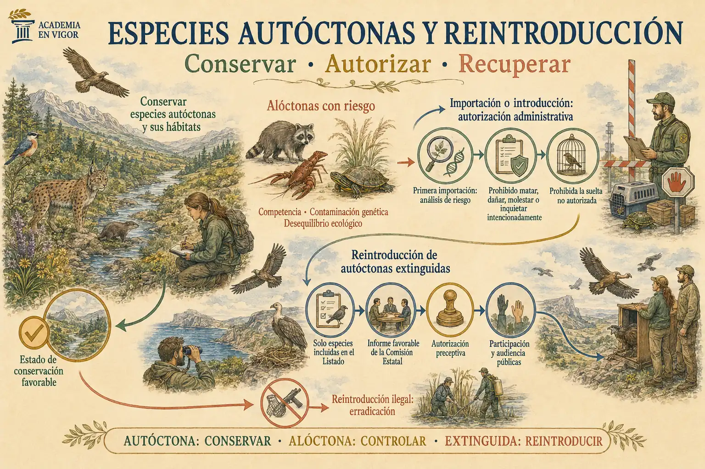

<em>Infografía: comparación de especies autóctonas y reintroducción.</em>

<!-- FUENTE: LEY42-2007-GC-T16 -->

## 27. Listado de Especies Silvestres y prohibiciones

Este bloque ordena **listado de especies silvestres y prohibiciones** dentro de conservación de la biodiversidad y separa regla, órgano, requisito, excepción y efecto.

### Claves rápidas

- **Artículo 56. Listado de Especies Silvestres en Régimen de Protección Especial:** Cualquier ciudadano u organización podrá solicitar la iniciación del procedimiento de inclusión, cambio de categoría o exclusión acompañando a la correspondiente solicitud una argumentación científica de la medida propuesta.
- **Artículo 57. Prohibiciones y garantía de conservación para las especies incluidas en el Listado de Especies Silvestres en Régimen de Protección Especial:** c) En ambos casos, la de poseer, naturalizar, transportar, vender, comerciar o intercambiar, ofertar con fines de venta o intercambio, importar o exportar ejemplares vivos o muertos, así como sus propágulos o restos, salvo en los casos en los que estas actividades, de una forma controlada por la Administración, puedan resultar claramente beneficiosas para su conservación, en los casos que reglamentariamente se determinen.

:::perla-vigor
Primero identifica la norma y su vigencia; después fija sujeto, verbo, requisito y excepción.
:::

<!-- VISUAL:t16-27-listado-de-especies-silvestres-y-prohibiciones.webp -->

  

<em>Infografía: línea temporal de listado de especies silvestres y prohibiciones.</em>

<!-- FUENTE: LEY42-2007-GC-T16 -->

## 28. Catálogo de Especies Amenazadas y estrategias

Este bloque ordena **catálogo de especies amenazadas y estrategias** dentro de conservación de la biodiversidad y separa regla, órgano, requisito, excepción y efecto.

### Claves rápidas

- **Artículo 59. Efectos de la inclusión en el Catálogo Español de Especies Amenazadas:** a) La inclusión de un taxón o población en la categoría de "en peligro de extinción" conllevará, en un plazo máximo de tres años, la adopción de un plan de recuperación, que incluya las medidas más adecuadas para el cumplimiento de los objetivos buscados, y, en su caso, la designación de áreas críticas.
- **Artículo 58. Catálogo Español de Especies Amenazadas:** Cualquier ciudadano u organización podrá solicitar la iniciación del procedimiento de inclusión, cambio de categoría o exclusión acompañando a la correspondiente solicitud una argumentación científica de la medida propuesta.
- **Artículo 60. Estrategias de conservación de especies amenazadas y de lucha contra amenazas para la biodiversidad. Situación crítica de una especie:** 2. Cuando del seguimiento o evaluación del estado de conservación de una especie en peligro de extinción se dedujera que existe un riesgo inminente de extinción, el Ministro de Agricultura, Alimentación y Medio Ambiente, previo informe de la Conferencia Sectorial de Medio Ambiente, podrá declarar la situación crítica de esa especie.

:::perla-vigor
Primero identifica la norma y su vigencia; después fija sujeto, verbo, requisito y excepción.
:::

<!-- VISUAL:t16-28-catalogo-de-especies-amenazadas-y-estrategias.webp -->

  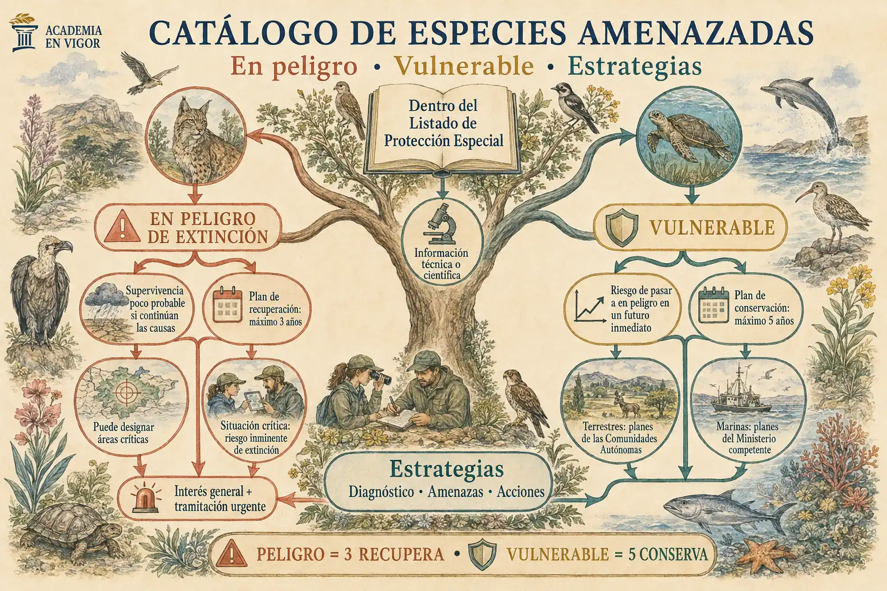

<em>Infografía: escena de catálogo de especies amenazadas y estrategias.</em>

<!-- FUENTE: LEY42-2007-GC-T16 -->

## 29. Excepciones al régimen de protección

Este bloque ordena **excepciones al régimen de protección** dentro de conservación de la biodiversidad y separa regla, órgano, requisito, excepción y efecto.

### Claves rápidas

- **Artículo 61. Excepciones:** b) Para prevenir perjuicios importantes a los cultivos, el ganado, los bosques, la pesca y la calidad de las aguas. Salvo en el caso de las aves, también se podrá aplicar esta excepción en caso de perjuicio importante a otras formas de propiedad.

:::perla-vigor
Primero identifica la norma y su vigencia; después fija sujeto, verbo, requisito y excepción.
:::

<!-- VISUAL:t16-29-excepciones-al-regimen-de-proteccion.webp -->

  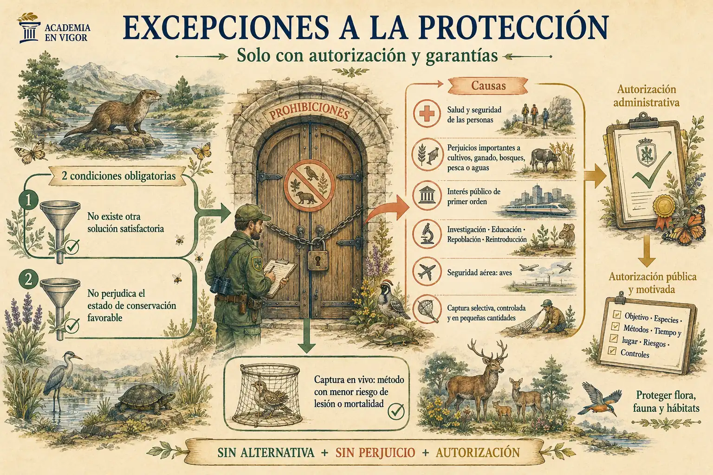

<em>Infografía: capas de excepciones al régimen de protección.</em>

<!-- FUENTE: LEY42-2007-GC-T16 -->

## 30. Propagación y conservación ex situ

Este bloque ordena **propagación y conservación ex situ** dentro de conservación de la biodiversidad y separa regla, órgano, requisito, excepción y efecto.

### Claves rápidas

- **Artículo 63. Conservación ex situ de material biológico y genético de especies silvestres:** 2. La Comisión Estatal para el Patrimonio Natural y la Biodiversidad elaborará unas directrices para impulsar el trabajo coordinado entre los bancos de material genético y biológico y las Administraciones públicas.
- **Artículo 62. Propagación de Especies Silvestres Amenazadas:** 1. Como complemento a las acciones de conservación in situ, para las especies incluidas en el Catálogo Estatal de Especies Amenazadas, la Comisión Estatal de Patrimonio Natural y la Biodiversidad impulsará el desarrollo de programas de cría o propagación fuera de su hábitat natural, en especial cuando tales programas hayan sido previstos en las estrategias de conservación, o planes de recuperación o conservación.

:::perla-vigor
Primero identifica la norma y su vigencia; después fija sujeto, verbo, requisito y excepción.
:::

<!-- VISUAL:t16-30-propagacion-y-conservacion-ex-situ.webp -->

  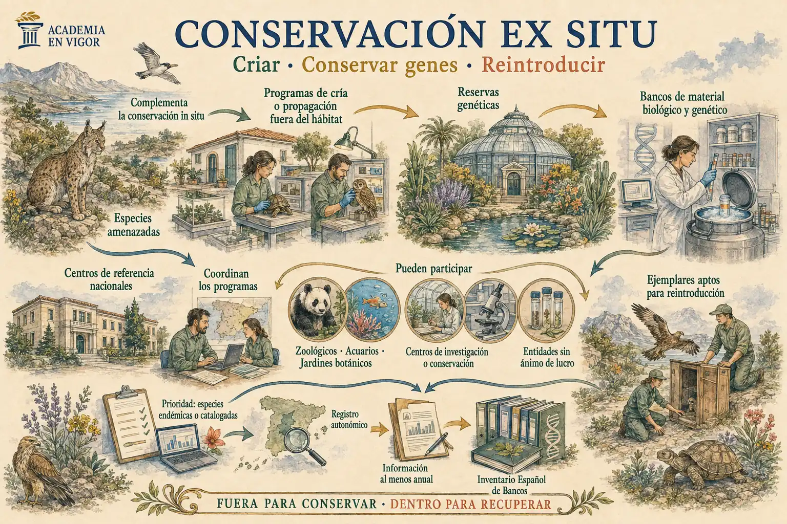

<em>Infografía: mapa de propagación y conservación ex situ.</em>

<!-- FUENTE: LEY42-2007-GC-T16 -->

## 31. Especies exóticas invasoras

Este bloque ordena **especies exóticas invasoras** dentro de conservación de la biodiversidad y separa regla, órgano, requisito, excepción y efecto.

### Claves rápidas

- **Artículo 64. Catálogo Español de Especies Exóticas Invasoras:** Cualquier ciudadano u organización podrá solicitar la iniciación del procedimiento de inclusión o exclusión de una especie o subespecie, acompañando a la correspondiente solicitud una argumentación científica de la medida propuesta.
- **Artículo 64 ter. Especies catalogadas como exóticas invasoras introducidas en el medio natural con anterioridad a la entrada en vigor de la presente ley, objeto de aprovechamiento piscícola o cinegético. Sueltas con la especie trucha arcoíris:** Para evitar que las especies catalogadas objeto de aprovechamiento piscícola o cinegético, introducidas en el medio natural antes de la entrada en vigor de la presente ley, se extiendan fuera de los límites de sus áreas de distribución anteriores a esa fecha, su gestión, control o posible erradicación se podrá realizar, en esas áreas, a través de la caza y la pesca, y en todas sus modalidades, incluidas las reguladas por las federaciones deportivas españolas de caza y de pesca, cuando este objetivo quede recogido en los instrumentos normativos de caza y pesca.
- **Artículo 64 bis. Especies exóticas invasoras de preocupación para la Unión:** 1. La gestión de las especies exóticas invasoras preocupantes para la Unión se hará conforme a lo dispuesto en el Reglamento (UE) n.º 1143/2014 del Parlamento Europeo y del Consejo, de 22 de octubre de 2014, sobre la prevención y la gestión de la introducción y propagación de especies exóticas invasoras.
- **Artículo 64 quáter. Uso de las especies exóticas y las especies localmente ausentes en la acuicultura:** La utilización de especies exóticas en la acuicultura, incluidas las catalogadas como especies exóticas invasoras, se regirá por lo dispuesto en el Reglamento 708/2007, del Consejo, de 11 de junio de 2007, sobre el uso de las especies exóticas y las especies localmente ausentes en la acuicultura.

:::perla-vigor
Primero identifica la norma y su vigencia; después fija sujeto, verbo, requisito y excepción.
:::

<!-- VISUAL:t16-31-especies-exoticas-invasoras.webp -->

  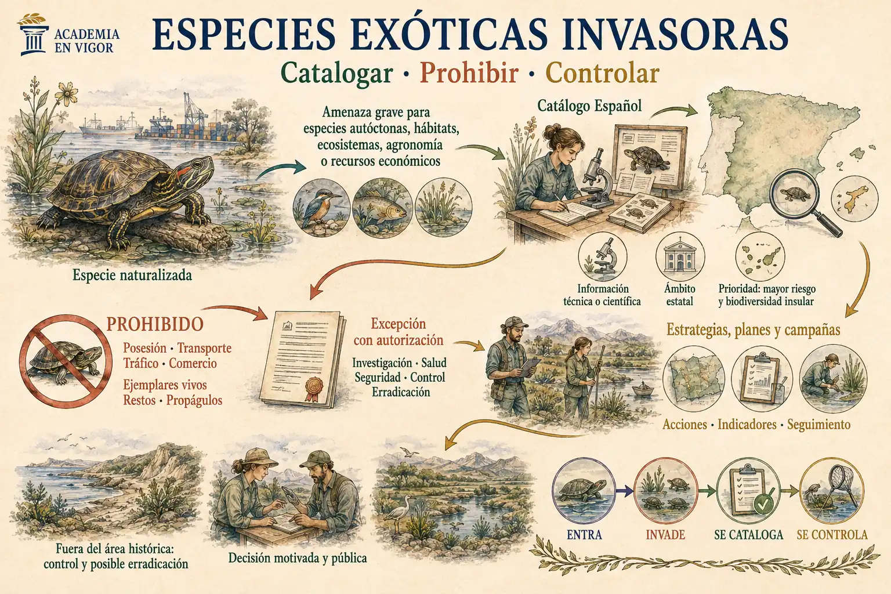

<em>Infografía: flujo de especies exóticas invasoras.</em>

<!-- FUENTE: LEY42-2007-GC-T16 -->

## 32. Caza, pesca e inventario

Este bloque ordena **caza, pesca e inventario** dentro de conservación de la biodiversidad y separa regla, órgano, requisito, excepción y efecto.

### Claves rápidas

- **Artículo 67. Inventario Español de Caza y Pesca:** El Inventario Español de Caza y Pesca, dependiente del Ministerio de Medio Ambiente, mantendrá la información más completa de las poblaciones, capturas y evolución genética de las especies cuya caza o pesca estén autorizadas, con especial atención a las especies migradoras.
- **Artículo 65. Especies objeto de caza y pesca:** 1. La caza y la pesca en aguas continentales sólo podrá realizarse sobre las especies que determinen las Comunidades autónomas, declaración que en ningún caso podrá afectar a las especies incluidas en el Listado de Especies en Régimen de Protección Especial, o a las prohibidas por la Unión Europea.
- **Artículo 66. Caza de la perdiz con reclamo:** La Administración competente podrá autorizar la modalidad de la caza de perdiz con reclamo macho, en los lugares en donde sea tradicional y con las limitaciones precisas para garantizar la conservación de la especie.

:::perla-vigor
Primero identifica la norma y su vigencia; después fija sujeto, verbo, requisito y excepción.
:::

<!-- VISUAL:t16-32-caza-pesca-e-inventario.webp -->

  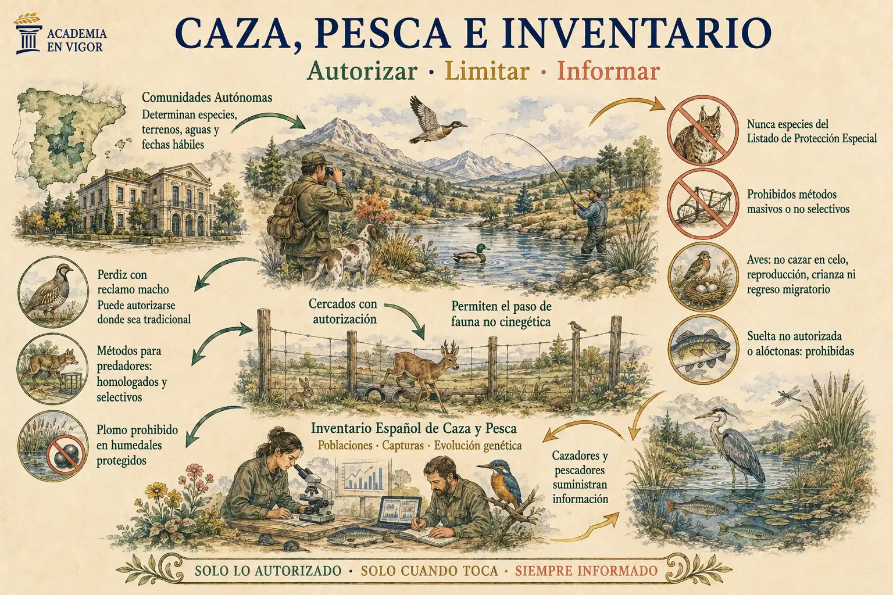

<em>Infografía: comparación de caza, pesca e inventario.</em>

<!-- FUENTE: LEY42-2007-GC-T16 -->

## 33. Red Española de Reservas de la Biosfera

Este bloque ordena **red española de reservas de la biosfera** dentro de uso sostenible del patrimonio natural y separa regla, órgano, requisito, excepción y efecto.

### Claves rápidas

- **Artículo 68. La Red de Reservas de la Biosfera:** La Red de Reservas de la Biosfera Españolas constituye un subconjunto definido y reconocible de la Red Mundial de Reservas de la Biosfera, conjunto de unidades físicas sobre las que se proyecta el programa «Persona y Biosfera» (Programa MaB) de la UNESCO.
- **Artículo 69. Objetivos de la Red española de Reservas de la Biosfera:** 1. Los objetivos de la Red española de Reservas de la Biosfera son:
- **Artículo 70. Características de las Reservas de la Biosfera:** Las Reservas de la Biosfera, para su integración y mantenimiento como tales, deberán respetar las directrices y normas aplicables de la UNESCO y contar, como mínimo, con:

:::perla-vigor
Primero identifica la norma y su vigencia; después fija sujeto, verbo, requisito y excepción.
:::

<!-- VISUAL:t16-33-red-espanola-de-reservas-de-la-biosfera.webp -->

  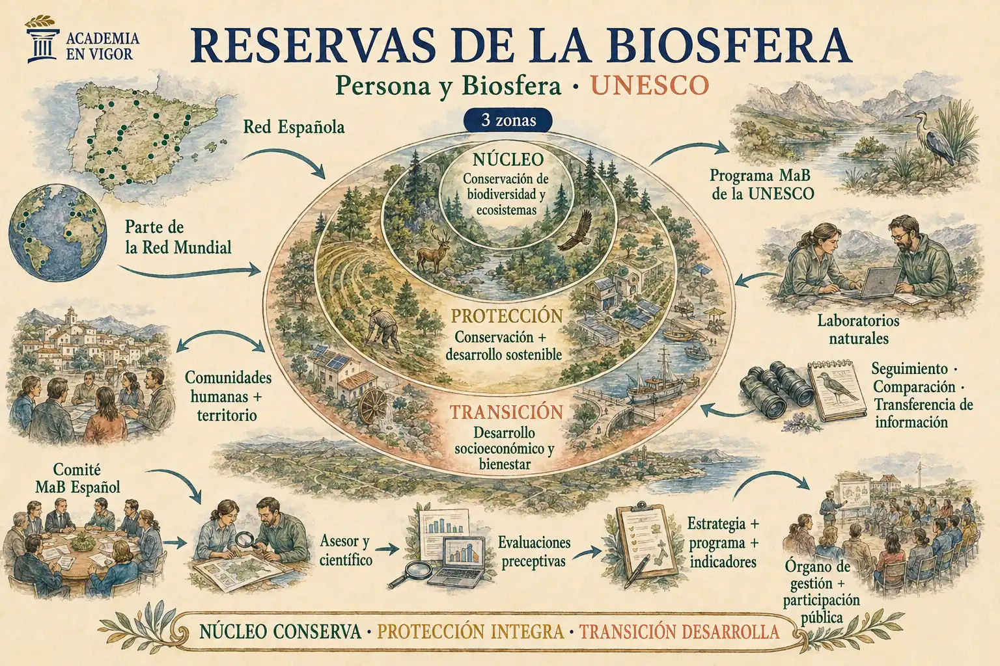

<em>Infografía: línea temporal de red española de reservas de la biosfera.</em>

<!-- FUENTE: LEY42-2007-GC-T16 -->

## 34. Recursos genéticos: acceso, beneficios y control

Este bloque ordena **recursos genéticos: acceso, beneficios y control** dentro de uso sostenible del patrimonio natural y separa regla, órgano, requisito, excepción y efecto.

### Claves rápidas

- **Artículo 71. Acceso y utilización de los recursos genéticos procedentes de taxones silvestres y distribución de beneficios:** 3. La competencia para prestar el consentimiento previo informado, establecer las condiciones mutuamente acordadas y consiguientemente emitir la autorización de acceso para los recursos genéticos españoles corresponderá a las comunidades autónomas de cuyo territorio procedan los recursos genéticos o en cuyo territorio estén localizadas las instituciones de conservación ex situ, siempre que su origen sea español, salvo en el supuesto de la letra c) siguiente.
- **Artículo 72. Control de la utilización de los recursos genéticos:** 1. El seguimiento y las medidas de cumplimiento de la utilización de los recursos genéticos en España se hará conforme a lo dispuesto en el Reglamento (UE) 511/2014 del Parlamento Europeo y del Consejo, de 16 de abril de 2014, relativo a las medidas de cumplimiento de los usuarios del Protocolo de Nagoya sobre al acceso a los recursos genéticos y participación justa y equitativa en los beneficios que se deriven de su utilización en la Unión.

:::perla-vigor
Primero identifica la norma y su vigencia; después fija sujeto, verbo, requisito y excepción.
:::

<!-- VISUAL:t16-34-recursos-geneticos-acceso-beneficios-y-control.webp -->

  

<em>Infografía: escena de recursos genéticos: acceso, beneficios y control.</em>

<!-- FUENTE: LEY42-2007-GC-T16 -->

## 35. Comercio internacional y conocimientos tradicionales

Este bloque ordena **comercio internacional y conocimientos tradicionales** dentro de uso sostenible del patrimonio natural y separa regla, órgano, requisito, excepción y efecto.

### Claves rápidas

- **Artículo 73. Comercio internacional de especies silvestres:** 2. El Ministerio de Industria, Turismo y Comercio mantendrá un registro de las importaciones y exportaciones de especies silvestres cuyo comercio esté regulado, y elaborará, con una periodicidad anual, informes que permitan realizar el análisis de los niveles y tendencias del comercio internacional de estas especies protegidas.
- **Artículo 73. Comercio internacional de especies silvestres:** 3. El Ministerio de Medio Ambiente evaluará, al menos cada cinco años, a partir de los datos de las estadísticas comerciales, el comercio internacional de vida silvestre en España y comunicará sus conclusiones al Ministerio de Industria, Turismo y Comercio junto con una propuesta de medidas que permitan adoptar, si procede, las actuaciones necesarias para asegurar la sostenibilidad de dicho comercio.
- **Artículo 74. Promoción de los conocimientos tradicionales para la conservación del Patrimonio Natural y la Biodiversidad:** 1. De acuerdo con las normas, resoluciones y principios del Convenio sobre la Diversidad Biológica y de la Organización Mundial de Propiedad Intelectual, las Administraciones públicas:

:::perla-vigor
Primero identifica la norma y su vigencia; después fija sujeto, verbo, requisito y excepción.
:::

<!-- VISUAL:t16-35-comercio-internacional-y-conocimientos-tradicionales.webp -->

  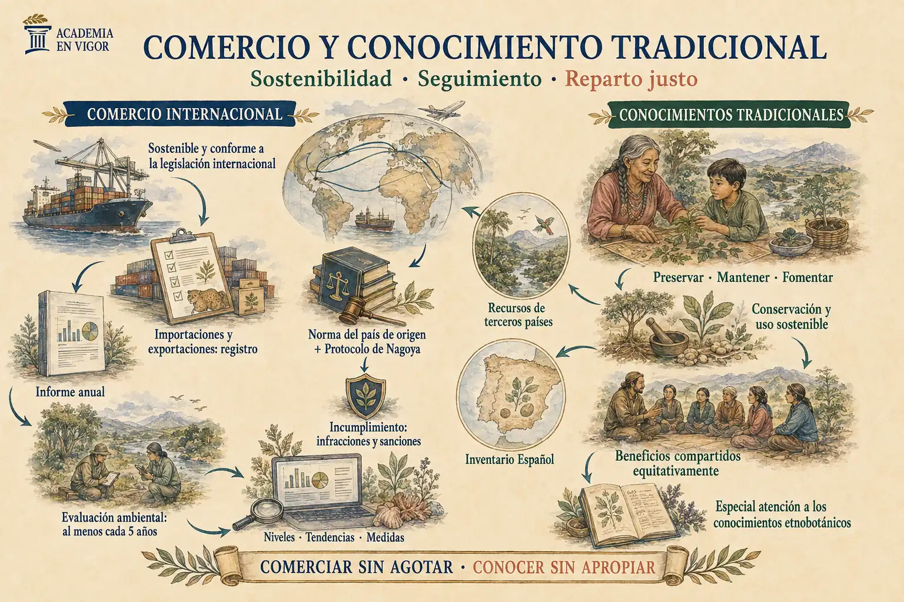

<em>Infografía: capas de comercio internacional y conocimientos tradicionales.</em>

<!-- FUENTE: LEY42-2007-GC-T16 -->

## 36. Vigencia de la Directiva programada y correspondencia actual

Este bloque ordena **vigencia de la directiva programada y correspondencia actual** dentro de eficiencia energética y separa regla, órgano, requisito, excepción y efecto.

### Claves rápidas

- **Artículo 36:** El plazo general de transposición de la Directiva (UE) 2023/1791 venció el 11 de octubre de 2025 para los preceptos enumerados en su artículo 36.
- **Artículo 38:** La Directiva (UE) 2023/1791 derogó la Directiva 2012/27/UE, en su versión modificada, con efectos a partir del 12 de octubre de 2025.

:::perla-vigor
Primero identifica la norma y su vigencia; después fija sujeto, verbo, requisito y excepción.
:::

<!-- VISUAL:t16-36-vigencia-de-la-directiva-programada-y-correspondencia-actual.webp -->

  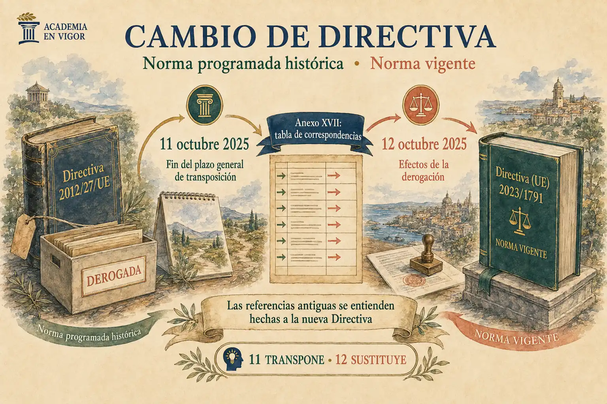

<em>Infografía: mapa de vigencia de la directiva programada y correspondencia actual.</em>

<!-- FUENTE: DIR2023-1791-UE-GC-T16 -->

## 37. Objeto y ámbito de la Directiva 2012/27/UE

Este bloque ordena **objeto y ámbito de la directiva 2012/27/ue** dentro de eficiencia energética y separa regla, órgano, requisito, excepción y efecto.

### Claves rápidas

- **Artículo 1:** 1. La presente Directiva establece un marco común de medidas para el fomento de la eficiencia energética dentro de la Unión a fin de garantizar la consecución de los objetivos principales en materia de eficiencia energética de la Unión, que consisten en un aumento de la eficiencia energética del 20 % para 2020 y de al menos el 32,5 % para 2030, y prepara el camino para mejoras ulteriores de eficiencia energética más allá de esos años.
- **Artículo 1:** La presente Directiva contribuye a la aplicación del principio «primero, la eficiencia energética».
- **Artículo 1:** 2. Los requisitos que establece la presente Directiva son requisitos mínimos y se entienden sin perjuicio de que cualquier Estado miembro mantenga o introduzca medidas más estrictas. Tales medidas deberán ser compatibles con el Derecho de la Unión. Cuando las disposiciones de la legislación nacional establezcan medidas más estrictas, los Estados miembros notificarán dichas disposiciones a la Comisión.

:::perla-vigor
Primero identifica la norma y su vigencia; después fija sujeto, verbo, requisito y excepción.
:::

<!-- VISUAL:t16-37-objeto-y-ambito-de-la-directiva-2012-27-ue.webp -->

  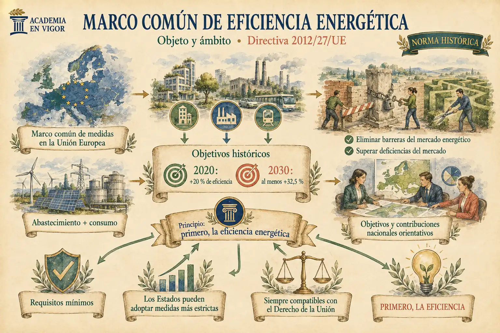

<em>Infografía: flujo de objeto y ámbito de la directiva 2012/27/ue.</em>

<!-- FUENTE: DIR2012-27-UE-GC-T16 -->

## 38. Definiciones de eficiencia energética

Este bloque ordena **definiciones de eficiencia energética** dentro de eficiencia energética y separa regla, órgano, requisito, excepción y efecto.

### Claves rápidas

- **Artículo 2:** «consumo de energía primaria»: el consumo interior bruto, excluidos los usos no energéticos;
- **Artículo 2:** «eficiencia energética»: la relación entre la producción de un rendimiento, servicio, bien o energía, y el gasto de energía;
- **Artículo 2:** «parte participante»: una empresa o un organismo público que se ha comprometido a cumplir determinados objetivos en virtud de un acuerdo voluntario, o que está cubierto por un instrumento nacional de regulación de la actuación;
- **Artículo 2:** «distribuidor de energía»: toda persona física o jurídica, incluidos los operadores de sistemas de distribución, responsable del transporte de energía con vistas a su entrega a los clientes finales o a las compañías de distribución que venden energía a los clientes finales;

:::perla-vigor
Primero identifica la norma y su vigencia; después fija sujeto, verbo, requisito y excepción.
:::

<!-- VISUAL:t16-38-definiciones-de-eficiencia-energetica.webp -->

  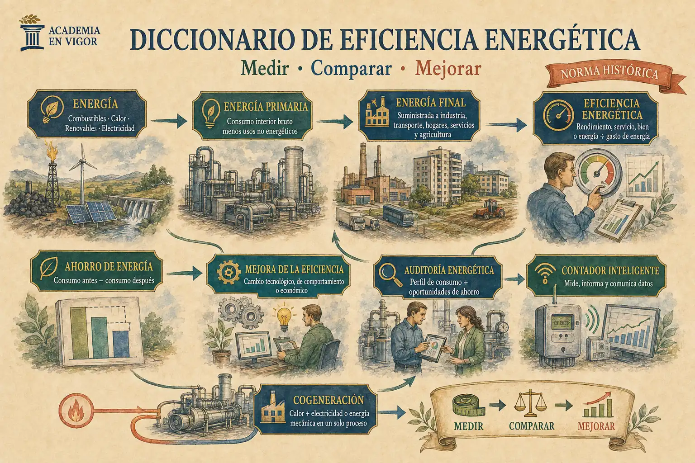

<em>Infografía: comparación de definiciones de eficiencia energética.</em>

<!-- FUENTE: DIR2012-27-UE-GC-T16 -->

## 39. Objetivos de eficiencia energética

Este bloque ordena **objetivos de eficiencia energética** dentro de eficiencia energética y separa regla, órgano, requisito, excepción y efecto.

### Claves rápidas

- **Artículo 3:** En la fijación de esas contribuciones, los Estados miembros tendrán en cuenta que el consumo de energía de la Unión en 2030 no deberá exceder de 1 128 Mtep de energía primaria y/o de 846 Mtep de energía final. Los Estados miembros notificarán esas contribuciones a la Comisión como parte de sus planes nacionales integrados de energía y clima contemplados en, y de conformidad con, el procedimiento en virtud de los artículos 3 y 7 a 12 del Reglamento (UE) 2018/1999.

:::perla-vigor
Primero identifica la norma y su vigencia; después fija sujeto, verbo, requisito y excepción.
:::

<!-- VISUAL:t16-39-objetivos-de-eficiencia-energetica.webp -->

  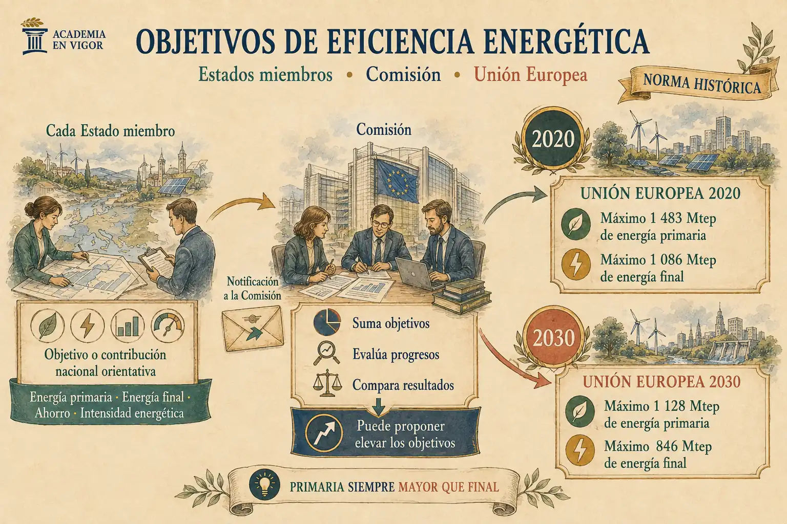

<em>Infografía: línea temporal de objetivos de eficiencia energética.</em>

<!-- FUENTE: DIR2012-27-UE-GC-T16 -->

## 40. Edificios de los organismos públicos

Este bloque ordena **edificios de los organismos públicos** dentro de eficiencia energética y separa regla, órgano, requisito, excepción y efecto.

### Claves rápidas

- **Artículo 5:** Los Estados miembros podrán decidir no establecer o no aplicar los requisitos a que se hace referencia en el apartado 1 a las siguientes categorías de edificios: a) edificios protegidos oficialmente por ser parte de un entorno declarado o en razón de su particular valor arquitectónico o histórico, en la medida en que el cumplimiento de determinados requisitos mínimos de eficiencia energética pudiese alterar de manera inaceptable su carácter o aspecto; b) edificios que sean propiedad de las fuerzas armadas o de la Administración central y se utilicen para fines de defensa nacional, aparte de los edificios destinados únicamente a alojamiento o los edificios de oficinas para las fuerzas armadas y otro personal contratado por las autoridades nacionales de defensa; c) edificios utilizados como lugares de culto y para actividades religiosas.

:::perla-vigor
Primero identifica la norma y su vigencia; después fija sujeto, verbo, requisito y excepción.
:::

<!-- VISUAL:t16-40-edificios-de-los-organismos-publicos.webp -->

  

<em>Infografía: escena de edificios de los organismos públicos.</em>

<!-- FUENTE: DIR2012-27-UE-GC-T16 -->

## 41. Adquisición por organismos públicos

Este bloque ordena **adquisición por organismos públicos** dentro de eficiencia energética y separa regla, órgano, requisito, excepción y efecto.

### Claves rápidas

- **Artículo 6:** Los Estados miembros animarán a los organismos públicos a evaluar, en los procedimientos de licitación para contratos de servicios con una componente energética importante, la posibilidad de celebrar contratos de rendimiento energético a largo plazo que ofrezcan un ahorro de energía a largo plazo.

:::perla-vigor
Primero identifica la norma y su vigencia; después fija sujeto, verbo, requisito y excepción.
:::

<!-- VISUAL:t16-41-adquisicion-por-organismos-publicos.webp -->

  

<em>Infografía: capas de adquisición por organismos públicos.</em>

<!-- FUENTE: DIR2012-27-UE-GC-T16 -->

## 42. Obligaciones de ahorro y medidas alternativas

Este bloque ordena **obligaciones de ahorro y medidas alternativas** dentro de eficiencia energética y separa regla, órgano, requisito, excepción y efecto.

### Claves rápidas

- **Artículo 7 bis:** 7. Los Estados miembros publicarán anualmente el ahorro de energía obtenido por cada parte obligada, o cada subcategoría de parte obligada, así como el ahorro total, en aplicación del sistema.
- **Artículo 7:** 1. Los Estados miembros lograrán un ahorro acumulado de uso final de la energía, como mínimo equivalente a: a) la consecución de un nuevo ahorro cada año, desde el 1 de enero de 2014 hasta el 31 de diciembre de 2020, del 1,5 % de las ventas anuales de energía a clientes finales, en volumen, como promedio de los últimos tres años previos al 1 de enero de 2013.
- **Artículo 7 ter:** 1. Si los Estados miembros deciden cumplir sus obligaciones de alcanzar la cantidad de ahorro requerida por el artículo 7, apartado 1, mediante medidas de actuación alternativas, velarán sin perjuicio de lo dispuesto en el artículo 7, apartados 4 y 5, por que el ahorro de energía requerido por el artículo 7, apartado 1, se alcance entre los clientes finales.

:::perla-vigor
Primero identifica la norma y su vigencia; después fija sujeto, verbo, requisito y excepción.
:::

<!-- VISUAL:t16-42-obligaciones-de-ahorro-y-medidas-alternativas.webp -->

  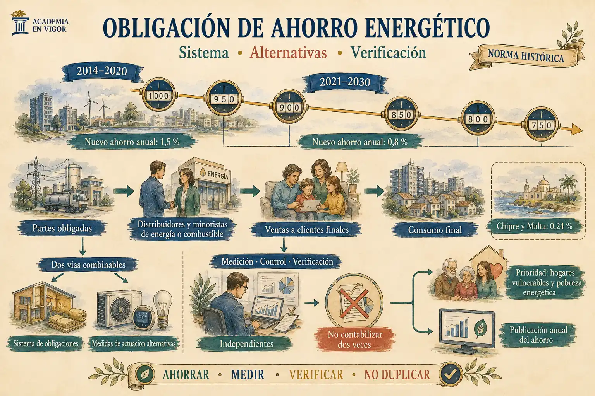

<em>Infografía: mapa de obligaciones de ahorro y medidas alternativas.</em>

<!-- FUENTE: DIR2012-27-UE-GC-T16 -->

## 43. Auditorías energéticas y sistemas de gestión

Este bloque ordena **auditorías energéticas y sistemas de gestión** dentro de eficiencia energética y separa regla, órgano, requisito, excepción y efecto.

### Claves rápidas

- **Artículo 8:** Las auditorías energéticas no contendrán cláusulas que impidan transmitir las conclusiones de la auditoría a los proveedores de servicios energéticos cualificados o acreditados, a condición de que el cliente no se oponga.

:::perla-vigor
Primero identifica la norma y su vigencia; después fija sujeto, verbo, requisito y excepción.
:::

<!-- VISUAL:t16-43-auditorias-energeticas-y-sistemas-de-gestion.webp -->

  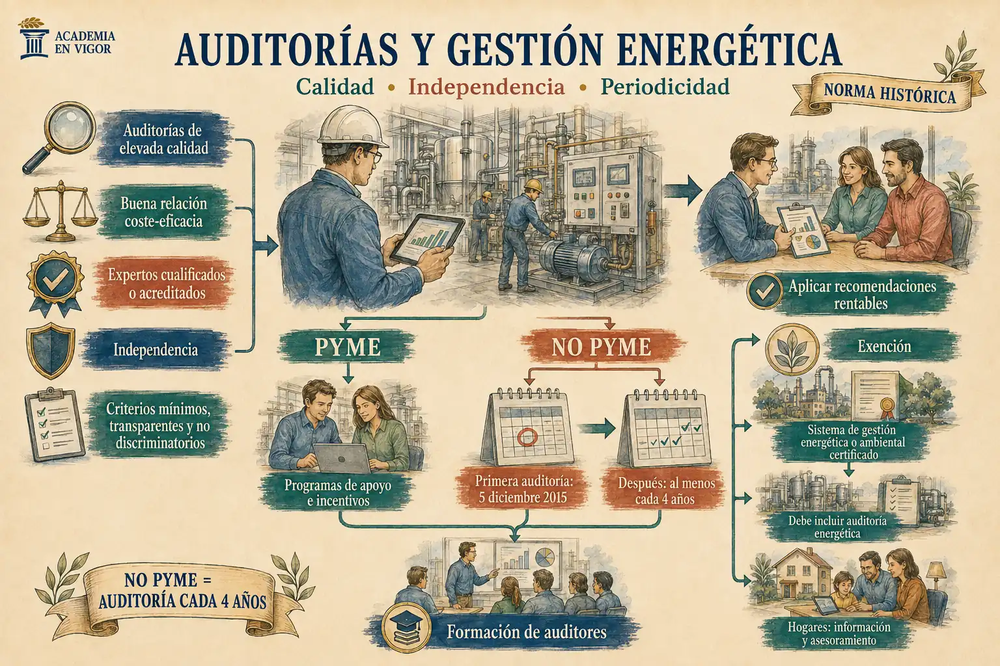

<em>Infografía: flujo de auditorías energéticas y sistemas de gestión.</em>

<!-- FUENTE: DIR2012-27-UE-GC-T16 -->

## 44. Contadores de electricidad y gas

Este bloque ordena **contadores de electricidad y gas** dentro de eficiencia energética y separa regla, órgano, requisito, excepción y efecto.

### Claves rápidas

- **Artículo 9:** se sustituya un contador existente, salvo que sea técnicamente imposible o no resulte rentable en comparación con el ahorro potencial estimado a largo plazo;

:::perla-vigor
Primero identifica la norma y su vigencia; después fija sujeto, verbo, requisito y excepción.
:::

<!-- VISUAL:t16-44-contadores-de-electricidad-y-gas.webp -->

  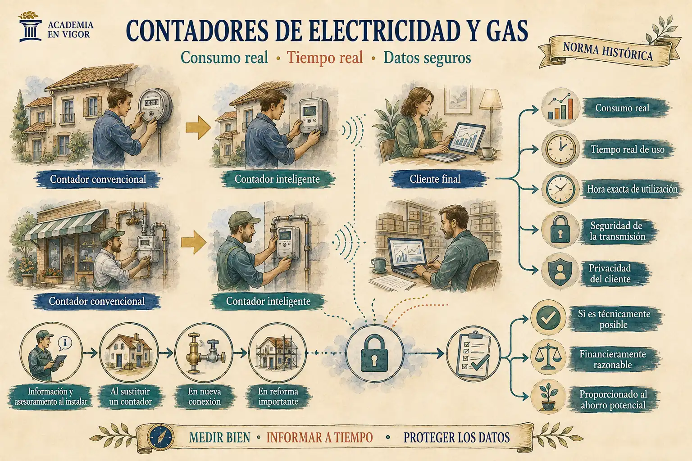

<em>Infografía: comparación de contadores de electricidad y gas.</em>

<!-- FUENTE: DIR2012-27-UE-GC-T16 -->

## 45. Medición de calefacción, refrigeración y agua caliente

Este bloque ordena **medición de calefacción, refrigeración y agua caliente** dentro de eficiencia energética y separa regla, órgano, requisito, excepción y efecto.

### Claves rápidas

- **Artículo 9 bis:** 1. Los Estados miembros velarán por que los clientes finales de calefacción, refrigeración y agua caliente sanitaria urbanas, reciban contadores de precio competitivo que reflejen con precisión su consumo real de energía.
- **Artículo 9 ter:** 1. En los edificios de apartamentos y edificios polivalentes con una fuente central de calefacción o de refrigeración, o abastecidos a partir de una red urbana de calefacción o refrigeración, se instalarán contadores individuales que midan el consumo de calefacción, refrigeración o agua caliente sanitaria de cada unidad del edificio cuando sea técnicamente viable y rentable, en el sentido de que sea proporcionado en relación con el ahorro potencial de energía.
- **Artículo 9 quater:** 1. A los efectos de los artículos 9 bis y 9 ter, los contadores y los repartidores de costes de calefacción instalados después del 25 de octubre de 2020 serán dispositivos de lectura remota. Las condiciones de viabilidad técnica y rentabilidad establecidas en el artículo 9 ter, apartado 1, seguirán siendo de aplicación.

:::perla-vigor
Primero identifica la norma y su vigencia; después fija sujeto, verbo, requisito y excepción.
:::

<!-- VISUAL:t16-45-medicion-de-calefaccion-refrigeracion-y-agua-caliente.webp -->

  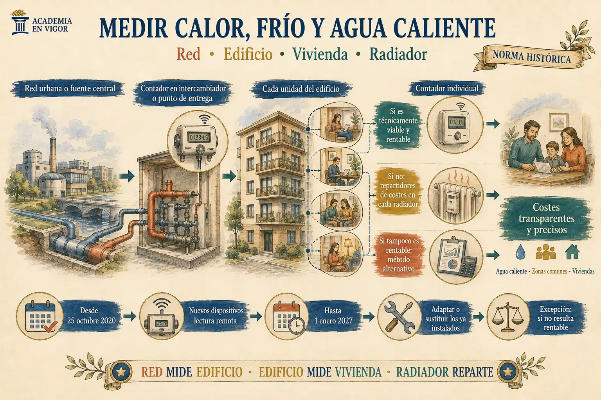

<em>Infografía: línea temporal de medición de calefacción, refrigeración y agua caliente.</em>

<!-- FUENTE: DIR2012-27-UE-GC-T16 -->

## 46. Información de facturación

Este bloque ordena **información de facturación** dentro de eficiencia energética y separa regla, órgano, requisito, excepción y efecto.

### Claves rápidas

- **Artículo 10:** Podrá cumplirse esta obligación por medio de un sistema de autolectura periódica por parte del cliente final, que comunicará la lectura de su contador al proveedor de energía. Solo en caso de que el cliente final no haya facilitado una lectura de contador para un intervalo de facturación determinado se basará la facturación en una estimación del consumo o un cálculo a tanto alzado.

:::perla-vigor
Primero identifica la norma y su vigencia; después fija sujeto, verbo, requisito y excepción.
:::

<!-- VISUAL:t16-46-informacion-de-facturacion.webp -->

  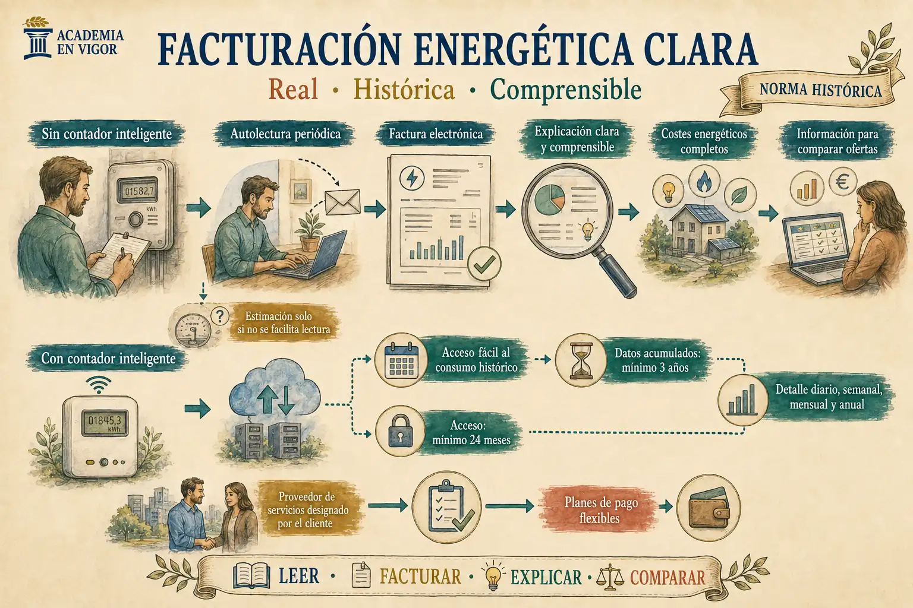

<em>Infografía: escena de información de facturación.</em>

<!-- FUENTE: DIR2012-27-UE-GC-T16 -->

## 47. Costes, consumidores y régimen de sanciones

Este bloque ordena **costes, consumidores y régimen de sanciones** dentro de eficiencia energética y separa regla, órgano, requisito, excepción y efecto.

### Claves rápidas

- **Artículo 10 bis:** Cuando un Estado miembro así lo disponga, y excepto en caso de que se haga una medición individual del consumo basada en repartidores de costes de calefacción con arreglo al artículo 9 ter, dicha obligación podrá cumplirse mediante un sistema de autolectura periódica por parte del cliente o usuario final, que comunicará la lectura de su contador.
- **Artículo 11:** Los Estados miembros se velarán por que los clientes finales reciban de forma gratuita la totalidad de sus facturas y la información sobre la facturación del consumo de energía y de que tengan un acceso adecuado y gratuito a los datos sobre su consumo.
- **Artículo 11 bis:** 1. Los Estados miembros velarán por que los usuarios finales reciban de forma gratuita la totalidad de sus facturas y la información sobre la facturación del consumo de energía y de que tengan un acceso adecuado y gratuito a los datos sobre su consumo.
- **Artículo 12:** 1. Los Estados miembros tomarán las medidas adecuadas para promover y facilitar el uso eficiente de la energía por parte de los pequeños clientes, incluidos los hogares. Estas medidas podrán formar parte de una estrategia nacional.

:::perla-vigor
Primero identifica la norma y su vigencia; después fija sujeto, verbo, requisito y excepción.
:::

<!-- VISUAL:t16-47-costes-consumidores-y-regimen-de-sanciones.webp -->

  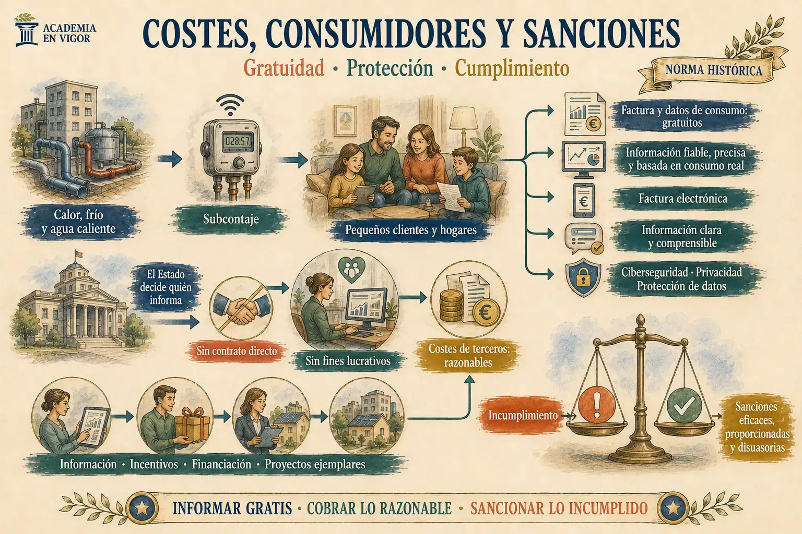

<em>Infografía: capas de costes, consumidores y régimen de sanciones.</em>

<!-- FUENTE: DIR2012-27-UE-GC-T16 -->

## 48. Síntesis examinable y regla de transición normativa

Este bloque ordena **síntesis examinable y regla de transición normativa** dentro de eficiencia energética y separa regla, órgano, requisito, excepción y efecto.

### Claves rápidas

- **Capítulos I y II programados:** A efectos de estudio, las reglas de los capítulos I y II de la Directiva 2012/27/UE se presentan como contenido histórico expresamente programado, no como Derecho de la Unión actualmente vigente.
- **Regla de transición:** Cuando una pregunta reproduzca literalmente la Directiva 2012/27/UE debe resolverse según la norma programada y su fecha; cuando pregunte por la vigencia actual, la referencia correcta es la Directiva (UE) 2023/1791.

:::perla-vigor
Primero identifica la norma y su vigencia; después fija sujeto, verbo, requisito y excepción.
:::

<!-- VISUAL:t16-48-sintesis-examinable-y-regla-de-transicion-normativa.webp -->

  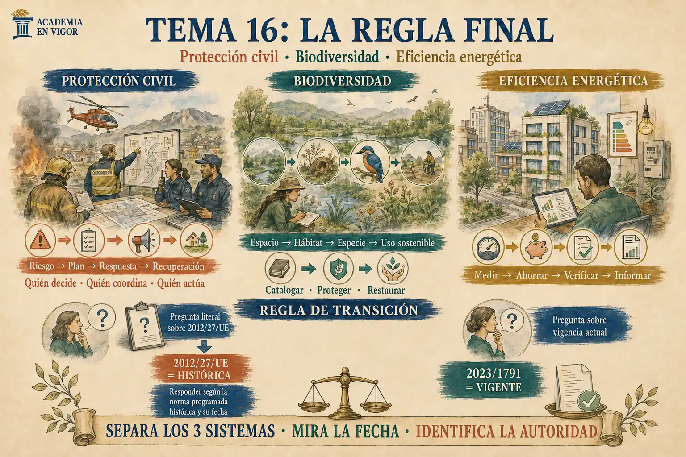

<em>Infografía: mapa de síntesis examinable y regla de transición normativa.</em>

<!-- FUENTE: DIR2012-27-UE-GC-T16 -->

# Hablemos claro

:::hablemos-claro
El tema une tres sistemas distintos. Protección civil organiza la respuesta ante riesgos; biodiversidad protege espacios, hábitats y especies; eficiencia energética reduce consumo y barreras. La fecha de la norma decide cuál de las dos directivas energéticas debe usarse.
:::

# En la calle

:::en-la-calle
Caso guía: ante una emergencia con impacto ambiental y energético, separa la gestión inmediata de protección civil, el régimen de conservación aplicable y las obligaciones de eficiencia. Mezclarlos conduce a atribuir competencias falsas.
:::

# Lo que cae

El histórico oficial concentra preguntas en planes y órganos de protección civil, Red Natura 2000, definiciones y especies, edificios públicos, auditorías, medición y facturación energética.

# Ha caído

Se han localizado y mapeado **62 preguntas oficiales** del Tema 16 entre 2020 y 2026.

> Las preguntas sobre la Directiva 2012/27/UE conservan su fecha histórica. No se presentan como prueba de que la norma siga vigente.

---

*Academia En Vigor · El temario que nunca duerme · Tema 16 · v1.0.0 · Documento interno no publicado.*
