# TEMA 7 · EL MINISTERIO DEL INTERIOR. LA SECRETARÍA DE ESTADO DE SEGURIDAD

**Policía Nacional · Método VIGOR · ATESTADO**
**Versión de contenido:** 1.0.0
**Estado editorial:** approved_internal · **Publicación:** not_published

# Mapa del tema

### Qué exige el programa

El Tema 7 tiene dos núcleos:

1. **Ministerio del Interior:** competencias, mando y estructura orgánica básica.
2. **Secretaría de Estado de Seguridad (SES):** posición, funciones y órganos que dependen de ella.

### Normativa clave

| Norma | Función dentro del tema |
|---|---|
| **Resolución de 7 de julio de 2026** | Fija el enunciado oficial del Tema 7 para Escala Básica. |
| **Real Decreto 207/2024, de 27 de febrero** | Desarrolla la estructura del Ministerio hasta el nivel de subdirección general. |
| **Real Decreto 328/2026, de 22 de abril** | Reforma el organigrama y crea la Secretaría General de Protección Civil y Emergencias. |
| **Real Decreto 1009/2023, de 5 de diciembre** | Establece la estructura básica de los departamentos ministeriales. |
| **Ley 40/2015, de 1 de octubre** | Regula órganos superiores y directivos y las funciones generales de ministros, secretarios de Estado, subsecretarios y secretarios generales. |

### División de estudio

1. **El Ministerio:** qué hace, quién manda y cómo queda el organigrama en 2026.
2. **La SES:** sus quince grandes funciones.
3. **El núcleo directo de la SES:** Gabinete, CITCO, Comité Ejecutivo, dos subdirecciones y Gerencia.
4. **Los cuatro órganos directivos de la SES:** ubicación y funciones que pueden confundirse.
5. **Trampas, exámenes oficiales y última vuelta.**

:::trampa
La reforma de abril de 2026 sacó Protección Civil de la Subsecretaría y creó una **Secretaría General de Protección Civil y Emergencias**, dependiente directamente de la persona titular del Ministerio. Cualquier organigrama que coloque todavía la Dirección General de Protección Civil y Emergencias bajo la Subsecretaría está desactualizado.
:::

<!-- VISUAL:t07-01-mapa-ministerio.webp -->

  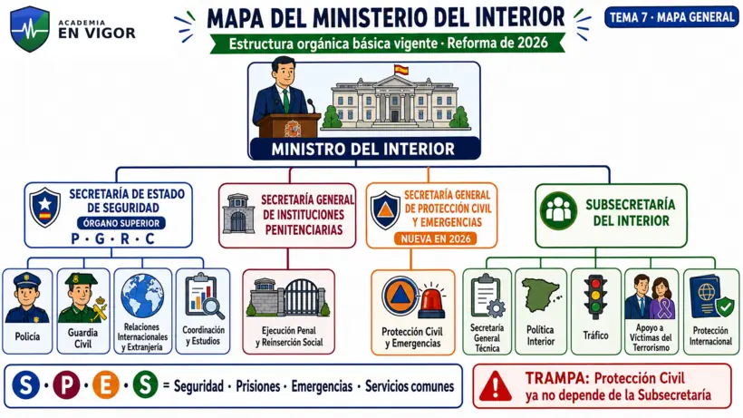

<em>Infografía: organigrama vigente del Ministerio tras el Real Decreto 328/2026.</em>

### Estrategia de estudio

No conviene memorizar este tema como una lista plana. Hay tres relaciones distintas:

- **dependencia orgánica:** de quién cuelga cada órgano;
- **nivel o rango:** órgano superior, órgano directivo, dirección general o subdirección general;
- **competencia:** quién dirige, coordina, ejecuta, inspecciona o asiste.

El tribunal puede conservar los sustantivos y cambiar solo el verbo. «Planificar y coordinar» no es lo mismo que «aprobar»; «mando superior», «ejercicio del mando» y «mando directo» tampoco son equivalentes.

La prioridad es dominar el detalle que permite contestar preguntas reales sin duplicar la estructura interna de la Policía Nacional, que el programa reserva para el Tema 8.

---

<!-- MATERIAL PENDIENTE: t07-todo-audio -->
<!-- MATERIAL PENDIENTE: t07-todo-video -->
<!-- MATERIAL PENDIENTE: t07-todo-pres -->

# Contenido

## 01. Competencias del Ministerio del Interior

El Ministerio del Interior propone y ejecuta la política del Gobierno en estas materias:

1. **Seguridad ciudadana.**
2. Promoción de las condiciones para ejercer los **derechos fundamentales**, especialmente la libertad y seguridad personales.
3. **Mando superior**, dirección y coordinación de las Fuerzas y Cuerpos de Seguridad del Estado.
4. **Seguridad privada.**
5. **Extranjería.**
6. **Protección internacional**, apatridia y protección de personas desplazadas.
7. Administración y régimen de las **instituciones penitenciarias**.
8. Actuaciones necesarias para los **procesos electorales**.
9. **Protección civil.**
10. **Tráfico, seguridad vial y movilidad sostenible.**

**Regla de memoria:** **Se-De-Fuer-Seg-Ex-Pro-Pri-Ele-Ci-Tra**. Es mejor recordarlo como cinco parejas:

- seguridad ciudadana + derechos;
- fuerzas de seguridad + seguridad privada;
- extranjería + protección internacional;
- prisiones + elecciones;
- protección civil + tráfico.

:::hablemos-claro
Interior no es «el ministerio de la Policía». Su campo es mucho más amplio: seguridad pública, extranjería y asilo, prisiones, elecciones, emergencias y tráfico. La Policía Nacional y la Guardia Civil son piezas esenciales, pero no agotan el Departamento. La idea que debe quedar es esta: **Interior protege seguridad, derechos y movilidad, y administra varios sistemas estatales críticos**.
:::

<!-- VISUAL:t07-il-01-interior-no-es-solo-policia.webp -->

  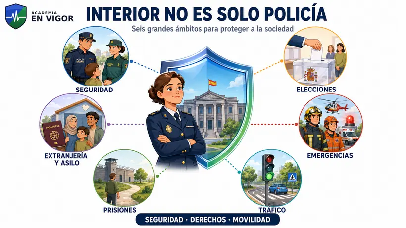

<em>Ilustración: los seis grandes ámbitos del Ministerio del Interior.</em>

 <!-- FACT:PN-T07-F001 -->

 <!-- FACT:PN-T07-F002 -->

 <!-- FACT:PN-T07-F003 -->

 <!-- FACT:PN-T07-F004 -->

 <!-- FACT:PN-T07-F005 -->

 <!-- FACT:PN-T07-F006 -->

<!-- MATERIAL PENDIENTE: t07-p1-audio -->
<!-- MATERIAL PENDIENTE: t07-p1-video -->
<!-- MATERIAL PENDIENTE: t07-p1-pres -->
<!-- MATERIAL PENDIENTE: t07-todo-audio -->
<!-- MATERIAL PENDIENTE: t07-todo-video -->
<!-- MATERIAL PENDIENTE: t07-todo-pres -->

<!-- FUENTE: DGP-RD207-2024 -->

## 02. Ministro, Gabinete y Oficina de Comunicación

La persona titular del Ministerio:

- dirige todos los servicios del Departamento;
- ejerce el **mando superior** de las Fuerzas y Cuerpos de Seguridad del Estado;
- dirige las competencias ministeriales en materia de Administración Penitenciaria;
- ejerce las funciones generales del artículo 61 de la Ley 40/2015 y las que le atribuyan otras normas.

Dependen de ella dos piezas que no deben confundirse:

| Órgano | Nivel | Función esencial |
|---|---:|---|
| **Gabinete del Ministro** | Dirección general | Asistencia inmediata; su titular supervisa protocolo y programa relaciones institucionales e internacionales cuando interviene directamente el Ministro. |
| **Oficina de Comunicación** | Subdirección general | Comunicación oficial, relaciones con medios, publicidad institucional, coordinación informativa y contenidos de la web del Ministerio. |

⚠️ El **Gabinete del Ministro** tiene nivel de **dirección general**. El **Gabinete de la SES** tiene nivel de **subdirección general**.

 <!-- FACT:PN-T07-F007 -->

 <!-- FACT:PN-T07-F008 -->

 <!-- FACT:PN-T07-F009 -->

 <!-- FACT:PN-T07-F010 -->

 <!-- FACT:PN-T07-F011 -->

<!-- MATERIAL PENDIENTE: t07-p1-audio -->
<!-- MATERIAL PENDIENTE: t07-p1-video -->
<!-- MATERIAL PENDIENTE: t07-p1-pres -->
<!-- MATERIAL PENDIENTE: t07-todo-audio -->
<!-- MATERIAL PENDIENTE: t07-todo-video -->
<!-- MATERIAL PENDIENTE: t07-todo-pres -->

<!-- FUENTE: DGP-RD207-2024 -->

## 03. Tres niveles de mando

| Nivel | Titular | Fórmula examinable |
|---|---|---|
| 1 | **Ministro del Interior** | **Mando superior** de las Fuerzas y Cuerpos de Seguridad del Estado. |
| 2 | **Secretario de Estado de Seguridad** | **Ejercicio del mando** de las Fuerzas y Cuerpos de Seguridad del Estado. |
| 3 | **Director General de la Policía / Guardia Civil** | **Mando directo** del Cuerpo correspondiente. |

<!-- VISUAL:t07-02-tres-niveles-mando.webp -->

  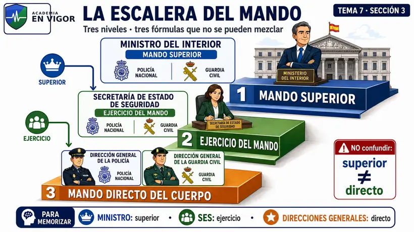

<em>Infografía: Ministro, SES y direcciones generales con los tres verbos competenciales.</em>

<!-- VISUAL:t07-il-02-la-escalera-del-mando.webp -->

  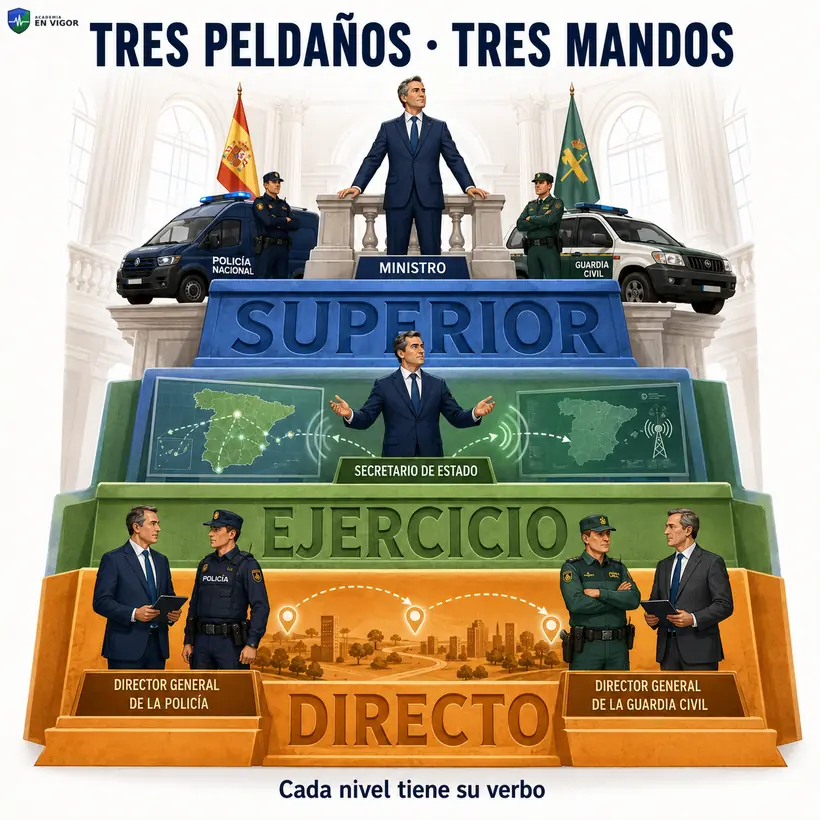

<em>Ilustración: regla mnemotécnica de los tres peldaños del mando.</em>

:::lo-que-cae
La trampa no está en el órgano, sino en el adjetivo. El Ministro no ejerce el mando «directo» de la Policía Nacional y el Director General no ostenta el mando «superior» de todas las Fuerzas y Cuerpos de Seguridad del Estado.
:::

:::en-la-calle
Ante un dispositivo que exige una línea política común para Policía Nacional y Guardia Civil, el nivel departamental corresponde al Ministro y la coordinación ejecutiva a la SES. La dirección cotidiana de las unidades de Policía Nacional corresponde a la Dirección General de la Policía. El ejemplo sirve para separar niveles; no convierte a la SES en una jefatura operativa de cada unidad.
:::

 <!-- FACT:PN-T07-F012 -->

 <!-- FACT:PN-T07-F013 -->

 <!-- FACT:PN-T07-F014 -->

<!-- MATERIAL PENDIENTE: t07-p1-audio -->
<!-- MATERIAL PENDIENTE: t07-p1-video -->
<!-- MATERIAL PENDIENTE: t07-p1-pres -->
<!-- MATERIAL PENDIENTE: t07-todo-audio -->
<!-- MATERIAL PENDIENTE: t07-todo-video -->
<!-- MATERIAL PENDIENTE: t07-todo-pres -->

<!-- FUENTE: DGP-RD207-2024 -->

## 04. Estructura orgánica básica vigente

### A. Secretaría de Estado de Seguridad

Es **órgano superior**. De ella dependen cuatro órganos directivos:

1. Dirección General de la Policía.
2. Dirección General de la Guardia Civil.
3. Dirección General de Relaciones Internacionales y Extranjería.
4. Dirección General de Coordinación y Estudios.

### B. Secretaría General de Instituciones Penitenciarias

De ella depende la **Dirección General de Ejecución Penal y Reinserción Social**.

### C. Secretaría General de Protección Civil y Emergencias

Creada por el Real Decreto 328/2026. De ella depende la **Dirección General de Protección Civil y Emergencias**.

### D. Subsecretaría del Interior

De ella dependen:

1. Secretaría General Técnica.
2. Dirección General de Política Interior.
3. Dirección General de Tráfico.
4. Dirección General de Apoyo a Víctimas del Terrorismo.
5. Dirección General de Protección Internacional.

**Mnemotecnia del primer nivel:** **S-P-E-S** → **Seguridad, Prisiones, Emergencias y Servicios comunes**.

**Mnemotecnia de la SES:** **P-G-R-C** → Policía, Guardia Civil, Relaciones Internacionales y Coordinación y Estudios.

:::hablemos-claro
«Estar en el primer escalón del organigrama» no convierte a todos sus integrantes en órganos superiores. Según la Ley 40/2015, en la organización central son órganos superiores los ministros y los secretarios de Estado. Subsecretarios, secretarios generales, secretarios generales técnicos, directores generales y subdirectores generales son órganos directivos. Por eso la SES es órgano superior; las dos secretarías generales y la Subsecretaría son órganos directivos, aunque aparezcan al mismo nivel visual bajo el Ministro.
:::

### El cambio que invalida los esquemas antiguos

Desde el **27 de abril de 2026**:

- existe la **Secretaría General de Protección Civil y Emergencias**;
- depende directamente de la persona titular del Ministerio;
- la Dirección General de Protección Civil y Emergencias depende de esa Secretaría General;
- la Subsecretaría ya no incluye Protección Civil entre sus direcciones generales.

:::lo-que-cae
Un test puede ofrecer como opción la antigua dependencia «Subsecretaría → Dirección General de Protección Civil y Emergencias». Esa relación fue válida antes de la reforma, pero hoy es falsa.
:::

<!-- VISUAL:t07-03-cambio-proteccion-civil-2026.webp -->

  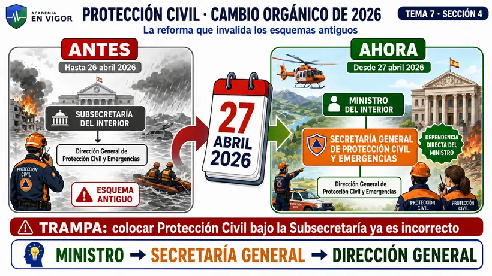

<em>Infografía: antes y después de la reforma de abril de 2026.</em>

### Recuperación activa · Parte 1

Sin mirar:

1. Enumera las diez materias del Ministerio.
2. Distingue el nivel del Gabinete del Ministro y el de la Oficina de Comunicación.
3. Reproduce la escalera «mando superior — ejercicio del mando — mando directo».
4. Nombra los cuatro órganos directivos de la SES.
5. Explica qué cambió el 27 de abril de 2026.

---

 <!-- FACT:PN-T07-F015 -->

 <!-- FACT:PN-T07-F016 -->

 <!-- FACT:PN-T07-F017 -->

 <!-- FACT:PN-T07-F018 -->

 <!-- FACT:PN-T07-F019 -->

 <!-- FACT:PN-T07-F020 -->

 <!-- FACT:PN-T07-F021 -->

 <!-- FACT:PN-T07-F022 -->

<!-- MATERIAL PENDIENTE: t07-p1-audio -->
<!-- MATERIAL PENDIENTE: t07-p1-video -->
<!-- MATERIAL PENDIENTE: t07-p1-pres -->
<!-- MATERIAL PENDIENTE: t07-todo-audio -->
<!-- MATERIAL PENDIENTE: t07-todo-video -->
<!-- MATERIAL PENDIENTE: t07-todo-pres -->

<!-- FUENTE: DGP-RD207-2024 -->

## 05. Posición de la Secretaría de Estado de Seguridad

La persona titular de la SES actúa bajo la **inmediata autoridad** de la persona titular del Ministerio. Ejerce las funciones generales de los secretarios de Estado del artículo 62 de la Ley 40/2015 y dirige, coordina y supervisa los órganos directivos que dependen de la Secretaría de Estado.

 <!-- FACT:PN-T07-F023 -->

 <!-- FACT:PN-T07-F024 -->

<!-- MATERIAL PENDIENTE: t07-p2-audio -->
<!-- MATERIAL PENDIENTE: t07-p2-video -->
<!-- MATERIAL PENDIENTE: t07-p2-pres -->
<!-- MATERIAL PENDIENTE: t07-todo-audio -->
<!-- MATERIAL PENDIENTE: t07-todo-video -->
<!-- MATERIAL PENDIENTE: t07-todo-pres -->

<!-- FUENTE: DGP-RD207-2024 -->

## 06. Funciones de la Secretaría de Estado de Seguridad

Para estudiarlas con lógica, se agrupan sin alterar su contenido examinable.

### 6.1. Derechos y seguridad pública

- Promover las condiciones para el ejercicio de los derechos fundamentales, con atención especial a libertad y seguridad personales, inviolabilidad del domicilio y de las comunicaciones, y libertad de residencia y circulación.
- Ejercer el mando de las Fuerzas y Cuerpos de Seguridad del Estado y coordinar y supervisar sus servicios y misiones.
- Ejercer las competencias atribuidas por la legislación de seguridad privada.
- Gestionar la protección y garantía de los derechos de reunión y manifestación.
- Coordinar las competencias de Delegaciones y Subdelegaciones del Gobierno en seguridad ciudadana.

### 6.2. Cooperación y representación

- Dirigir y coordinar la cooperación policial internacional, especialmente con **EUROPOL, INTERPOL, SIRENE, los sistemas de información de Schengen y los Centros de Cooperación Policial y Aduanera**.
- Representar al Departamento cuando se lo encomiende la persona titular del Ministerio.
- Coordinar, a través de la Dirección General de Relaciones Internacionales y Extranjería, las operaciones con efectos transnacionales dirigidas por cualquiera de las Fuerzas y Cuerpos de Seguridad del Estado.

### 6.3. Amenazas graves

- Dirigir, impulsar y coordinar las actuaciones del Departamento frente a crimen organizado, terrorismo, trata de seres humanos, tráfico de drogas, blanqueo de capitales relacionado con ese tráfico y delitos conexos.
- Dirigir y coordinar las relaciones del Departamento con el Comité Europeo para la Prevención de la Tortura.

### 6.4. Infraestructuras y tecnología

- Planificar y coordinar las políticas de infraestructuras y material de seguridad.
- **Aprobar** los planes y programas de infraestructuras y material de seguridad.
- Dirigir el Sistema Nacional de Protección de Infraestructuras Críticas.
- Dirigir y coordinar las políticas de ciberseguridad del Ministerio dentro de su ámbito competencial.

### 6.5. Precursores y pasajeros

- Dirigir y coordinar las actuaciones relativas a precursores de drogas, precursores de explosivos y tratamiento de datos del Sistema de Registro de Pasajeros (**PNR**).

### 6.6. Fronteras

- Dirigir e impulsar la gestión integrada de fronteras.
- Mandar la participación española en la Guardia Europea de Fronteras y Costas.
- Mantener las relaciones con la Agencia Europea de la Guardia de Fronteras y Costas.

<!-- VISUAL:t07-04-funciones-ses.webp -->

  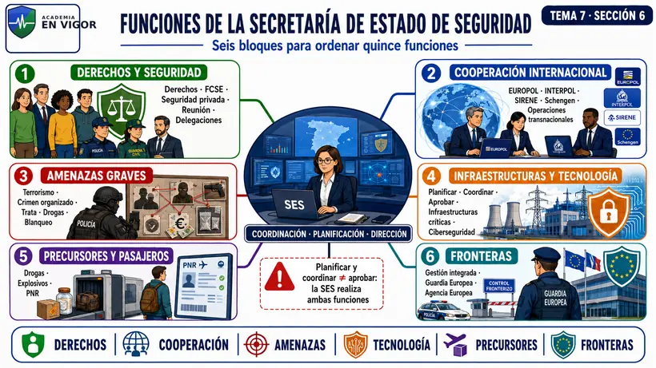

<em>Infografía: seis bloques visuales para ordenar las funciones de la SES.</em>

<!-- VISUAL:t07-il-03-ses-torre-de-control.webp -->

  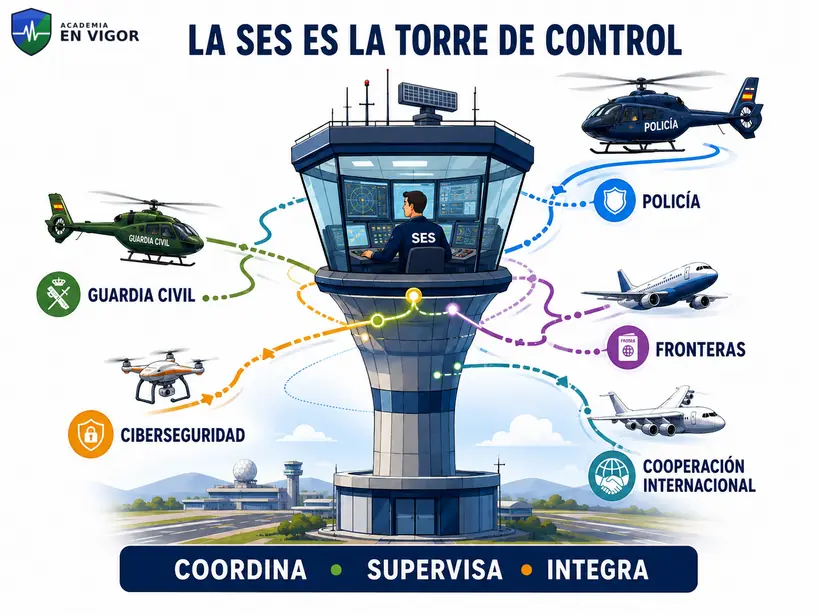

<em>Ilustración: la SES como torre de control que coordina, supervisa e integra.</em>

:::hablemos-claro
La SES no sustituye a las Direcciones Generales. Marca dirección común, coordina, supervisa y asume sistemas transversales que afectan a varios cuerpos: cooperación internacional, fronteras, infraestructuras críticas, ciberseguridad o PNR. La idea que debe quedar es: **la SES integra la política de seguridad que no puede gestionarse como compartimentos policiales aislados**.
:::

:::lo-que-cae
:::
> - **Planificar y coordinar** políticas de infraestructuras no equivale a **aprobar** planes y programas: ambas funciones pertenecen a la SES, pero son dos letras distintas del artículo 2.1.
> - La cooperación policial internacional menciona expresamente EUROPOL, INTERPOL, SIRENE, Schengen y CCPA.
> - La reunión y manifestación aparecen como competencia departamental gestionada por la SES.
> - El blanqueo citado aquí está vinculado al tráfico de drogas y a sus delitos conexos; no se formula como una competencia ilimitada sobre cualquier blanqueo.
> - La ciberseguridad se limita al ámbito competencial del Ministerio.

:::en-la-calle
Una investigación puede comenzar en un cuerpo y producir efectos en varios Estados, afectar a fronteras y requerir cooperación europea. Cada unidad conserva sus competencias operativas, pero la SES dispone de órganos para coordinar el plano transversal. El ejemplo explica la arquitectura; no atribuye a la SES la instrucción directa de cada diligencia.
:::

---

 <!-- FACT:PN-T07-F025 -->

 <!-- FACT:PN-T07-F026 -->

 <!-- FACT:PN-T07-F027 -->

 <!-- FACT:PN-T07-F028 -->

 <!-- FACT:PN-T07-F029 -->

 <!-- FACT:PN-T07-F030 -->

 <!-- FACT:PN-T07-F031 -->

 <!-- FACT:PN-T07-F032 -->

 <!-- FACT:PN-T07-F033 -->

 <!-- FACT:PN-T07-F034 -->

 <!-- FACT:PN-T07-F035 -->

 <!-- FACT:PN-T07-F036 -->

 <!-- FACT:PN-T07-F037 -->

 <!-- FACT:PN-T07-F038 -->

 <!-- FACT:PN-T07-F039 -->

<!-- MATERIAL PENDIENTE: t07-p2-audio -->
<!-- MATERIAL PENDIENTE: t07-p2-video -->
<!-- MATERIAL PENDIENTE: t07-p2-pres -->
<!-- MATERIAL PENDIENTE: t07-todo-audio -->
<!-- MATERIAL PENDIENTE: t07-todo-video -->
<!-- MATERIAL PENDIENTE: t07-todo-pres -->

<!-- FUENTE: DGP-RD207-2024 -->

## 07. Mapa de dependencias de la Secretaría de Estado

Dependen o se integran en el entorno inmediato de la persona titular de la SES:

1. **Gabinete** de asistencia inmediata — nivel de subdirección general.
2. **CITCO** — nivel de subdirección general.
3. **Comité Ejecutivo de Coordinación** — presidido por la persona titular de la SES, bajo dirección y supervisión ministerial.
4. **Subdirección General de Planificación y Gestión de Infraestructuras y Medios para la Seguridad**.
5. **Subdirección General de Sistemas de Información y Comunicaciones para la Seguridad**.
6. Organismo autónomo **Gerencia de Infraestructuras y Equipamiento de la Seguridad del Estado**, adscrito a la SES.
7. Los cuatro órganos directivos: DGP, DGGC, DGRIE y DGCE.

<!-- VISUAL:t07-05-estructura-ses.webp -->

  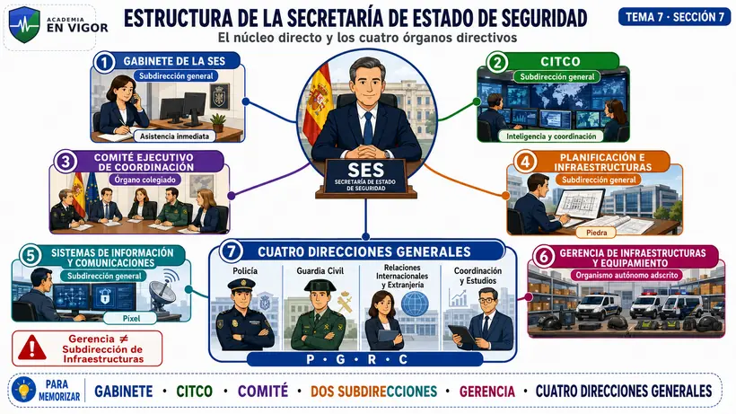

<em>Infografía: mapa de dependencias directas y órganos directivos de la SES.</em>

 <!-- FACT:PN-T07-F040 -->

 <!-- FACT:PN-T07-F041 -->

 <!-- FACT:PN-T07-F042 -->

 <!-- FACT:PN-T07-F043 -->

<!-- MATERIAL PENDIENTE: t07-p3-audio -->
<!-- MATERIAL PENDIENTE: t07-p3-video -->
<!-- MATERIAL PENDIENTE: t07-p3-pres -->
<!-- MATERIAL PENDIENTE: t07-todo-audio -->
<!-- MATERIAL PENDIENTE: t07-todo-video -->
<!-- MATERIAL PENDIENTE: t07-todo-pres -->

<!-- FUENTE: DGP-RD207-2024 -->

## 08. Gabinete de la Secretaría de Estado

Es el órgano de asistencia inmediata y tiene nivel orgánico de **subdirección general**.

La persona que dirige el Gabinete:

- ejerce la **Relatoría Nacional contra la Trata de Seres Humanos**;
- coordina, siguiendo instrucciones de la SES, las dos subdirecciones generales propias de esta.

⚠️ La Relatoría corresponde a la persona titular de la **dirección del Gabinete**, no al CITCO. El CITCO actúa como punto focal de apoyo y asistencia técnica a esa Relatoría.

 <!-- FACT:PN-T07-F044 -->

 <!-- FACT:PN-T07-F045 -->

 <!-- FACT:PN-T07-F046 -->

<!-- MATERIAL PENDIENTE: t07-p3-audio -->
<!-- MATERIAL PENDIENTE: t07-p3-video -->
<!-- MATERIAL PENDIENTE: t07-p3-pres -->
<!-- MATERIAL PENDIENTE: t07-todo-audio -->
<!-- MATERIAL PENDIENTE: t07-todo-video -->
<!-- MATERIAL PENDIENTE: t07-todo-pres -->

<!-- FUENTE: DGP-RD207-2024 -->

## 09. CITCO

El **Centro de Inteligencia contra el Terrorismo y el Crimen Organizado** depende de la persona titular de la SES y tiene nivel orgánico de **subdirección general**.

Su misión central es integrar y analizar información estratégica sobre delincuencia organizada o grave, terrorismo y radicalismo violento; diseñar estrategias frente a esas amenazas y su financiación; y fijar criterios de coordinación cuando concurran investigaciones o actuaciones.

### Funciones examinables

1. Recibir, integrar y analizar información y análisis operativos para elaborar inteligencia criminal estratégica y prospectiva, nacional e internacional.
2. Fijar criterios de coordinación y actuación en intervenciones conjuntas o concurrentes.
3. Elaborar **informes anuales** y evaluaciones periódicas de la amenaza.
4. Elaborar con la DGCE estadísticas no clasificadas, especialmente sobre drogas, crimen organizado, trata y explotación de seres humanos.
5. Proponer estrategias nacionales, mantenerlas actualizadas y verificar su desarrollo.
6. Relacionarse con centros equivalentes de la UE, Estados miembros y terceros países.
7. Fijar criterios de coordinación sobre precursores de drogas y explosivos.
8. Planificar y ejecutar la destrucción de alijos de drogas intervenidos por Policía Nacional y Guardia Civil, sin invadir competencias de otros departamentos.

### Unidades dependientes

- **UNECI:** Unidad Nacional de Retirada de Contenidos Ilícitos en Internet.
- **ONIP:** Oficina Nacional de Información sobre Pasajeros, que actúa como PIU nacional.
- **TEPOL:** Unidad de Policía Judicial para delitos de terrorismo.

### Otros puntos de contacto

- punto focal de apoyo a la Relatoría Nacional contra la Trata;
- punto nacional de contacto sobre localización y recuperación de activos (**ORA**);
- punto de contacto nacional para precursores de explosivos.

<!-- VISUAL:t07-06-citco.webp -->

  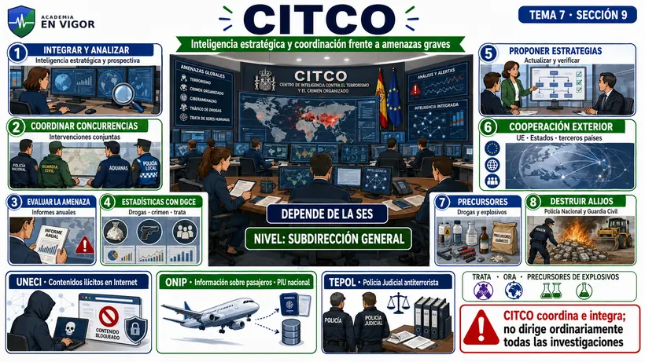

<em>Infografía: CITCO con sus ocho funciones y las unidades UNECI, ONIP y TEPOL.</em>

<!-- VISUAL:t07-il-04-citco-no-es-una-comisaria.webp -->

  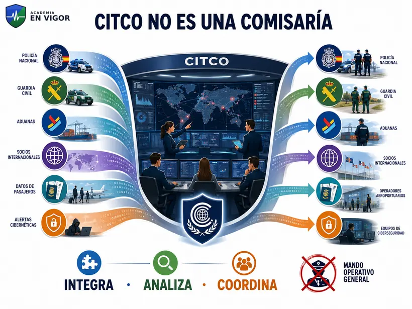

<em>Ilustración: CITCO integra, analiza y coordina sin ejercer el mando operativo general.</em>

:::hablemos-claro
CITCO no es una comisaría general ni una unidad de la Policía Nacional. Es un centro de la SES que trabaja sobre información procedente de distintos actores, genera inteligencia estratégica y coordina concurrencias. **No confundir inteligencia estratégica con dirección ordinaria de todas las investigaciones**.
:::

**Mnemotecnia:** **I-C-E-E-R-P-D**:

- **I**ntegrar información;
- **C**oordinar concurrencias;
- **E**valuar amenazas;
- **E**stadísticas;
- **R**enovar estrategias y relaciones;
- **P**recursores;
- **D**estruir alijos.

:::lo-que-cae
- Los informes son **anuales**, no semestrales.
:::
> - **UNECI depende de CITCO**.
> - ONIP actúa como **PIU nacional**.
> - La dirección del Gabinete ejerce la Relatoría; CITCO presta apoyo técnico como punto focal.
> - CITCO depende de la SES, no de la Dirección General de la Policía.

 <!-- FACT:PN-T07-F047 -->

 <!-- FACT:PN-T07-F048 -->

 <!-- FACT:PN-T07-F049 -->

 <!-- FACT:PN-T07-F050 -->

 <!-- FACT:PN-T07-F051 -->

 <!-- FACT:PN-T07-F052 -->

 <!-- FACT:PN-T07-F053 -->

 <!-- FACT:PN-T07-F054 -->

 <!-- FACT:PN-T07-F055 -->

 <!-- FACT:PN-T07-F056 -->

 <!-- FACT:PN-T07-F057 -->

 <!-- FACT:PN-T07-F058 -->

 <!-- FACT:PN-T07-F059 -->

<!-- MATERIAL PENDIENTE: t07-p3-audio -->
<!-- MATERIAL PENDIENTE: t07-p3-video -->
<!-- MATERIAL PENDIENTE: t07-p3-pres -->
<!-- MATERIAL PENDIENTE: t07-todo-audio -->
<!-- MATERIAL PENDIENTE: t07-todo-video -->
<!-- MATERIAL PENDIENTE: t07-todo-pres -->

<!-- FUENTE: DGP-RD207-2024 -->

## 10. Comité Ejecutivo de Coordinación

Bajo dirección y supervisión de la persona titular del Ministerio, lo preside la persona titular de la SES.

Lo integran las personas titulares de:

- Subsecretaría del Interior;
- Dirección General de la Policía;
- Dirección General de la Guardia Civil;
- Secretaría General de Instituciones Penitenciarias;
- Gabinete del Ministro;
- Dirección General de Relaciones Internacionales y Extranjería;
- Dirección General de Coordinación y Estudios, que ejerce la **secretaría**;
- Direcciones Adjuntas Operativas de Policía Nacional y Guardia Civil.

⚠️ La redacción vigente del artículo 2.4 no incorporó a la nueva Secretaría General de Protección Civil y Emergencias a esta composición.

 <!-- FACT:PN-T07-F060 -->

 <!-- FACT:PN-T07-F061 -->

 <!-- FACT:PN-T07-F062 -->

 <!-- FACT:PN-T07-F063 -->

<!-- MATERIAL PENDIENTE: t07-p3-audio -->
<!-- MATERIAL PENDIENTE: t07-p3-video -->
<!-- MATERIAL PENDIENTE: t07-p3-pres -->
<!-- MATERIAL PENDIENTE: t07-todo-audio -->
<!-- MATERIAL PENDIENTE: t07-todo-video -->
<!-- MATERIAL PENDIENTE: t07-todo-pres -->

<!-- FUENTE: DGP-RD207-2024 -->

## 11. Subdirecciones generales propias de la Secretaría de Estado

### 11.1. Planificación y Gestión de Infraestructuras y Medios para la Seguridad

Se ocupa del soporte **físico y patrimonial**:

- planifica inversiones;
- propone proyectos, obras, adquisiciones, planes y programas;
- coordina, supervisa y evalúa la ejecución y los costes;
- gestiona proyectos derivados de compromisos internacionales y fondos europeos cuando se le encomiendan;
- gestiona el patrimonio inmobiliario de seguridad, inventario, arrendamientos y adquisiciones;
- se relaciona con la Dirección General del Patrimonio del Estado;
- dirige o gestiona otros recursos que le encomiende la SES.

### 11.2. Sistemas de Información y Comunicaciones para la Seguridad

Se ocupa del soporte **digital y de comunicaciones**:

- planifica inversiones en sistemas de información y comunicaciones;
- estandariza sistemas, datos y codificación;
- propone y supervisa planes y programas;
- impulsa proyectos conjuntos o compartidos por las Fuerzas y Cuerpos de Seguridad del Estado;
- gestiona proyectos internacionales y fondos europeos en su materia;
- coordina bases de datos y comunicaciones compartidas, incluidos **eu-LISA, Schengen y SIRDEE**;
- participa en proyectos europeos de I+D+i;
- dirige el **Centro Tecnológico de Seguridad (CETSE)**;
- bajo dependencia funcional de la Subsecretaría, ejerce determinadas funciones comunes TIC previstas en el artículo 9.3.

**Regla de memoria:** **piedra y píxel**. La primera gestiona inmuebles y medios; la segunda, información y comunicaciones.

<!-- VISUAL:t07-il-05-piedra-y-pixel.webp -->

  

<em>Ilustración: contraste entre infraestructuras y medios frente a información y comunicaciones.</em>

:::hablemos-claro
Las dos subdirecciones no compran y operan todo por sí solas. Planifican, proponen, coordinan o gestionan dentro de los créditos y encargos de la SES, respetando las competencias propias de Policía, Guardia Civil, la Gerencia y otros órganos. En un test, los verbos absolutos —«asume en exclusiva», «dirige todos los sistemas»— son sospechosos.
:::

 <!-- FACT:PN-T07-F064 -->

 <!-- FACT:PN-T07-F065 -->

 <!-- FACT:PN-T07-F066 -->

 <!-- FACT:PN-T07-F067 -->

 <!-- FACT:PN-T07-F068 -->

 <!-- FACT:PN-T07-F069 -->

 <!-- FACT:PN-T07-F070 -->

 <!-- FACT:PN-T07-F071 -->

<!-- MATERIAL PENDIENTE: t07-p3-audio -->
<!-- MATERIAL PENDIENTE: t07-p3-video -->
<!-- MATERIAL PENDIENTE: t07-p3-pres -->
<!-- MATERIAL PENDIENTE: t07-todo-audio -->
<!-- MATERIAL PENDIENTE: t07-todo-video -->
<!-- MATERIAL PENDIENTE: t07-todo-pres -->

<!-- FUENTE: DGP-RD207-2024 -->

## 12. Gerencia de Infraestructuras y Equipamiento

Es un **organismo autónomo adscrito a la SES**. Su Estatuto fue aprobado por el Real Decreto 904/2021.

La disposición transitoria tercera del Real Decreto 207/2024 establece que, hasta la adaptación normativa del Estatuto, la persona titular de la SES ejerce transitoriamente las funciones de dirección del organismo.

⚠️ La Gerencia no es una subdirección general y la Subdirección de Infraestructuras no depende de la Gerencia: ambas se relacionan, pero ocupan posiciones diferentes.

### Recuperación activa · Parte 3

1. ¿Qué nivel tienen el Gabinete de la SES y CITCO?
2. ¿Quién ejerce la Relatoría Nacional contra la Trata?
3. ¿Qué tres unidades dependen de CITCO?
4. ¿Quién preside y quién ejerce la secretaría del Comité Ejecutivo?
5. ¿Qué subdirección dirige CETSE?
6. ¿Dónde está adscrita la Gerencia?

---

 <!-- FACT:PN-T07-F072 -->

 <!-- FACT:PN-T07-F073 -->

 <!-- FACT:PN-T07-F074 -->

<!-- MATERIAL PENDIENTE: t07-p3-audio -->
<!-- MATERIAL PENDIENTE: t07-p3-video -->
<!-- MATERIAL PENDIENTE: t07-p3-pres -->
<!-- MATERIAL PENDIENTE: t07-todo-audio -->
<!-- MATERIAL PENDIENTE: t07-todo-video -->
<!-- MATERIAL PENDIENTE: t07-todo-pres -->

<!-- FUENTE: DGP-RD207-2024 -->

## 13. Direcciones Generales de Policía y Guardia Civil

| Órgano directivo | Idea nuclear |
|---|---|
| **Dirección General de la Policía** | Ordena, dirige, coordina y ejecuta las misiones de la Policía Nacional. Su titular tiene rango de subsecretario y mando directo del Cuerpo. |
| **Dirección General de la Guardia Civil** | Ordena, dirige, coordina y ejecuta las misiones de la Guardia Civil según las directrices de Interior y Defensa en sus respectivos ámbitos. Su titular tiene rango de subsecretario y mando directo del Cuerpo. |
| **Dirección General de Relaciones Internacionales y Extranjería** | Coordina la acción exterior del Ministerio, la cooperación policial internacional y las líneas estratégicas internacionales de migración y fronteras. |
| **Dirección General de Coordinación y Estudios** | Apoya a la SES en coordinación, supervisión, inspección, planificación, estadísticas, infraestructuras críticas, ciberseguridad y protección de colectivos vulnerables. |

El Tema 8 desarrolla la Dirección General de la Policía. En el Tema 7 basta con ubicarla, distinguir el mando directo y no confundir sus órganos con los órganos propios de la SES.

### 13.1. Policía Nacional y Guardia Civil: límite de este tema

Las dos Direcciones Generales dependen de la SES y sus titulares tienen rango de subsecretario. La Policía Nacional recibe directrices de la persona titular del Ministerio del Interior. La Guardia Civil presenta una singularidad: sus misiones se desarrollan conforme a las directrices de Interior y Defensa dentro de sus respectivas competencias.

No se reproduce aquí la estructura interna de la Dirección General de la Policía porque el programa la sitúa expresamente en el Tema 8. Tampoco se desarrolla toda la estructura de la Guardia Civil: en el Tema 7 interesa identificarla como órgano directivo dependiente de la SES y diferenciarla de la Policía Nacional.

 <!-- FACT:PN-T07-F075 -->

 <!-- FACT:PN-T07-F076 -->

 <!-- FACT:PN-T07-F077 -->

 <!-- FACT:PN-T07-F078 -->

<!-- MATERIAL PENDIENTE: t07-p4-audio -->
<!-- MATERIAL PENDIENTE: t07-p4-video -->
<!-- MATERIAL PENDIENTE: t07-p4-pres -->
<!-- MATERIAL PENDIENTE: t07-todo-audio -->
<!-- MATERIAL PENDIENTE: t07-todo-video -->
<!-- MATERIAL PENDIENTE: t07-todo-pres -->

<!-- FUENTE: DGP-RD207-2024 -->

## 14. Dirección General de Relaciones Internacionales y Extranjería

Es el órgano encargado de coordinar la **acción exterior del Ministerio**.

### Funciones agrupadas

- relaciones internacionales del Departamento y representación ante la UE;
- seguimiento de políticas europeas que afectan a Interior, especialmente en el Espacio de Libertad, Seguridad y Justicia;
- coordinación de la posición ministerial en grupos y comités europeos;
- cooperación policial internacional;
- órganos técnicos de Interior en misiones diplomáticas;
- negociación de convenios y acuerdos internacionales;
- líneas estratégicas de migración, extranjería y fronteras con dimensión internacional;
- relaciones con la Agencia Europea de la Guardia de Fronteras y Costas;
- coordinación con el Ministerio de Asuntos Exteriores;
- proyectos y ayudas de cooperación internacional;
- seguimiento de materias de Interior derivadas de organismos internacionales de derechos humanos.

Gestiona el **Punto Nacional de Contacto con la Guardia Europea de Fronteras y Costas (NFPOC)** y el **Centro Nacional de Coordinación de Eurosur (NCC)**, con participación de las Fuerzas y Cuerpos de Seguridad del Estado.

### Tres subdirecciones generales

1. **Cooperación Policial Internacional.**
2. **Relaciones Internacionales, Inmigración y Extranjería.**
3. **Asuntos Europeos.**

**Mnemotecnia:** **Policía — Migración — Europa**.

:::lo-que-cae
- La DGRIE depende de la **SES**, no de la Subsecretaría.
- «Protección Internacional» y «Relaciones Internacionales y Extranjería» son direcciones generales distintas. La primera depende de la Subsecretaría; la segunda, de la SES.
- La DGRIE coordina la dimensión internacional; no sustituye a la Oficina de Asilo y Refugio ni a la Dirección General de Protección Internacional.
:::

 <!-- FACT:PN-T07-F079 -->

 <!-- FACT:PN-T07-F080 -->

 <!-- FACT:PN-T07-F081 -->

 <!-- FACT:PN-T07-F082 -->

 <!-- FACT:PN-T07-F083 -->

 <!-- FACT:PN-T07-F084 -->

 <!-- FACT:PN-T07-F085 -->

<!-- MATERIAL PENDIENTE: t07-p4-audio -->
<!-- MATERIAL PENDIENTE: t07-p4-video -->
<!-- MATERIAL PENDIENTE: t07-p4-pres -->
<!-- MATERIAL PENDIENTE: t07-todo-audio -->
<!-- MATERIAL PENDIENTE: t07-todo-video -->
<!-- MATERIAL PENDIENTE: t07-todo-pres -->

<!-- FUENTE: DGP-RD207-2024 -->

## 15. Dirección General de Coordinación y Estudios

La **DGCE** es el órgano de apoyo y asesoramiento mediante el cual la SES coordina y supervisa la actuación de Policía Nacional y Guardia Civil y colabora con policías autonómicas y locales.

### Sus grandes áreas de trabajo

1. **Coordinación y planificación:** estrategias frente a la criminalidad, instrucciones y planes directores u operativos de seguridad ciudadana.
2. **Estadística y estudio:** Estadística Nacional de Criminalidad, informes periódicos, investigaciones y análisis de política de seguridad y modelo policial.
3. **Formación y cooperación:** acciones formativas comunes, participación universitaria y relaciones con centros equivalentes; actúa como Unidad Nacional de **CEPOL**.
4. **Infraestructuras críticas:** impulsa, coordina y supervisa mediante el **CNPIC** las actividades de la SES sobre infraestructuras críticas y servicios esenciales.
5. **Violencia y colectivos vulnerables:** Servicio Central de Violencia de Género, dirección del sistema de seguimiento integral de casos, Oficina Nacional de Lucha contra los Delitos de Odio y Centro Nacional de Desaparecidos.
6. **Ciberseguridad:** mediante la **Oficina de Coordinación de Ciberseguridad (OCC)**, coordina intercambio operativo, actúa como CSIRT-MIR-PJ y Observatorio de la Cibercriminalidad.
7. **Cooperación territorial y comunicación:** coordina CCPA y centros de cooperación policial; el **CEPIC** centraliza recepción, clasificación y distribución de sucesos e información relevante.
8. **Información clasificada y datos:** subregistro principal OTAN/UE/ESA y sede del Delegado de Protección de Datos de la SES.

### Inspección de Personal y Servicios de Seguridad

Depende de la DGCE y tiene nivel orgánico de **subdirección general**. Inspecciona, comprueba y evalúa servicios, centros y unidades centrales y periféricas de Policía Nacional y Guardia Civil.

Entre sus funciones:

- planificar la actividad inspectora;
- analizar recursos humanos, materiales e infraestructuras;
- controlar planes y objetivos;
- ejercer competencias específicas de prevención de riesgos laborales;
- seguir programas de calidad, quejas y sugerencias;
- promover integridad profesional y deontológica;
- dirigir la **Oficina Nacional de Garantías de los Derechos Humanos (ONGADH)**.

<!-- VISUAL:t07-07-dgce.webp -->

  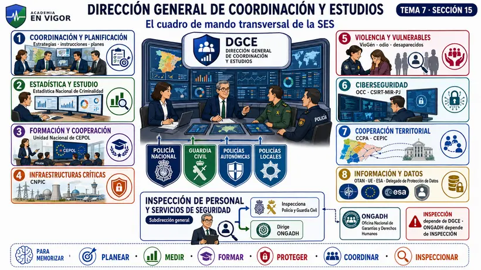

<em>Infografía: ocho áreas de la DGCE y la Inspección con la ONGADH.</em>

<!-- VISUAL:t07-il-06-dgce-cuadro-de-mando.webp -->

  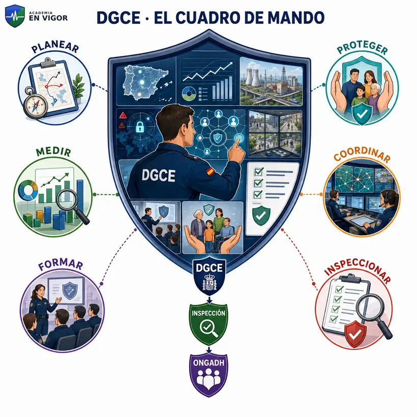

<em>Ilustración: la DGCE como cuadro de mando transversal y la cadena DGCE, Inspección y ONGADH.</em>

:::hablemos-claro
La DGCE es el «cuadro de mando» de la SES. No manda directamente cada comisaría o comandancia: crea planes comunes, integra estadísticas, inspecciona, conecta cuerpos y administra sistemas transversales. CITCO se concentra en terrorismo y delincuencia organizada o grave; la DGCE cubre coordinación general, estudios, infraestructuras críticas, ciberseguridad y evaluación de servicios.
:::

:::lo-que-cae
- La **Inspección de Personal y Servicios de Seguridad depende de la DGCE** y tiene nivel de subdirección general.
- La **ONGADH** depende funcionalmente de esa Inspección.
- El **CNPIC** está en la órbita funcional de la DGCE, que auxilia a la SES como responsable superior del sistema.
- La **OCC** no es la unidad policial que investiga todos los ciberdelitos: coordina, intercambia información y presta soporte como CSIRT-MIR-PJ.
- CITCO y DGCE colaboran en estadísticas, pero CITCO no sustituye a la DGCE como órgano general de coordinación y estudios.
:::

:::en-la-calle
Si se necesita comparar datos de criminalidad de Policía Nacional, Guardia Civil y policías territoriales, diseñar una instrucción común y evaluar su ejecución, la DGCE aporta la estructura transversal. Si el problema es una investigación concreta de terrorismo con concurrencia de cuerpos, CITCO puede fijar criterios de coordinación en su ámbito. La clave es la materia y la función, no que ambos órganos «coordinen».
:::

### Recuperación activa · Parte 4

1. ¿Qué cuatro direcciones generales dependen de la SES?
2. ¿Cuál coordina la acción exterior del Ministerio?
3. ¿Cuáles son las tres subdirecciones de la DGRIE?
4. ¿Qué órgano gestiona la Estadística Nacional de Criminalidad?
5. ¿De quién depende la Inspección de Personal y Servicios de Seguridad?
6. ¿Qué relación existe entre esa Inspección y la ONGADH?
7. ¿Qué órgano actúa como Unidad Nacional de CEPOL?

---

 <!-- FACT:PN-T07-F086 -->

 <!-- FACT:PN-T07-F087 -->

 <!-- FACT:PN-T07-F088 -->

 <!-- FACT:PN-T07-F089 -->

 <!-- FACT:PN-T07-F090 -->

 <!-- FACT:PN-T07-F091 -->

 <!-- FACT:PN-T07-F092 -->

 <!-- FACT:PN-T07-F093 -->

 <!-- FACT:PN-T07-F094 -->

 <!-- FACT:PN-T07-F095 -->

 <!-- FACT:PN-T07-F096 -->

<!-- MATERIAL PENDIENTE: t07-p4-audio -->
<!-- MATERIAL PENDIENTE: t07-p4-video -->
<!-- MATERIAL PENDIENTE: t07-p4-pres -->
<!-- MATERIAL PENDIENTE: t07-todo-audio -->
<!-- MATERIAL PENDIENTE: t07-todo-video -->
<!-- MATERIAL PENDIENTE: t07-todo-pres -->

<!-- FUENTE: DGP-RD207-2024 -->

## 16. Disposiciones y reglas de cierre

### Nombramiento de los directores generales de Policía y Guardia Civil

A efectos exclusivos de su nombramiento, se aplica el artículo 64.3 de la Ley 40/2015. En el nombramiento de la persona titular de la Dirección General de la Guardia Civil se añade la regla del artículo 14.2 de la Ley Orgánica 2/1986.

### Cierre temporal de puestos fronterizos

La competencia está desconcentrada en la persona titular de la **SES** cuando lo exija la seguridad del Estado o de los ciudadanos. Debe comunicar las medidas a los departamentos afectados y, por medio de Asuntos Exteriores, a los países e instituciones correspondientes.

### Suplencia

- Vacante, ausencia o enfermedad de la persona titular de la SES: la suplen los titulares de sus Direcciones Generales por el orden en que aparecen en el Real Decreto.
- En un órgano directivo, si no se ha designado suplente conforme a la Ley 40/2015: actúan los directores generales o subdirectores generales por el orden normativo.

### Reglas transitorias útiles

- Las referencias al antiguo Comité Ejecutivo para el Mando Unificado se entienden hechas al **Comité Ejecutivo de Coordinación**.
- Hasta adaptar el Estatuto de la Gerencia, la persona titular de la SES ejerce transitoriamente su dirección.

### Entrada en vigor

El Real Decreto 207/2024 entró en vigor al día siguiente de su publicación: **29 de febrero de 2024**. Su estructura fue reformada con efectos de **27 de abril de 2026** por el Real Decreto 328/2026.

### 17. Resto de disposiciones del Real Decreto 207/2024

Para cerrar la norma sin convertir el tema en una copia del BOE:

- se suprimieron la antigua Subdirección General de Recursos y la antigua Subdirección General de Protección Internacional;
- las delegaciones de competencias existentes conservaron su validez hasta su revocación o sustitución;
- la Subsecretaría debe promover la consolidación de recursos TIC, aunque ciertas unidades pueden conservar una dependencia orgánica singular;
- las referencias a órganos suprimidos se entienden hechas a sus sucesores;
- las unidades inferiores continúan provisionalmente hasta adaptar las relaciones de puestos de trabajo, sin incremento de gasto;
- quedó derogado el Real Decreto 734/2020;
- la persona titular del Ministerio puede adoptar medidas de desarrollo y, si afectan a la Guardia Civil, debe hacerlo conjuntamente con Defensa;
- Hacienda realiza las modificaciones presupuestarias necesarias.

Estas reglas tienen menor prioridad que los artículos 1 y 2, pero son útiles para preguntas literales de suplencia, fronteras y vigencia.

---

### Última vuelta: 20 datos que deben salir de memoria

1. Ministro: **mando superior**; SES: **ejercicio del mando**; directores generales: **mando directo**.
2. Gabinete del Ministro: dirección general; Oficina de Comunicación: subdirección general.
3. Primer nivel: Seguridad, Prisiones, Emergencias y Subsecretaría.
4. La Secretaría General de Protección Civil y Emergencias existe desde el 27/04/2026.
5. De la Subsecretaría ya no depende Protección Civil.
6. De la SES: Policía, Guardia Civil, Relaciones Internacionales y Coordinación y Estudios.
7. Gabinete de la SES y CITCO: nivel de subdirección general.
8. La dirección del Gabinete ejerce la Relatoría Nacional contra la Trata.
9. CITCO es estratégico y coordinador; depende directamente de la SES.
10. CITCO elabora informes **anuales**.
11. UNECI, ONIP/PIU y TEPOL dependen de CITCO.
12. El Comité Ejecutivo lo preside la SES y su secretaría la ejerce la DGCE.
13. Subdirecciones propias de la SES: **infraestructuras y medios** / **sistemas y comunicaciones**.
14. CETSE depende de Sistemas de Información y Comunicaciones.
15. La Gerencia es organismo autónomo adscrito a la SES.
16. La DGRIE depende de la SES; Protección Internacional depende de la Subsecretaría.
17. Las tres subdirecciones de la DGRIE son Policía, Migración y Europa.
18. La Inspección de Personal y Servicios de Seguridad depende de la DGCE y tiene nivel de subdirección general.
19. La ONGADH está dirigida por esa Inspección.
20. El cierre temporal de puestos fronterizos por razones de seguridad corresponde a la SES.

### Trampas del tribunal

| Si el enunciado dice... | Debes comprobar... |
|---|---|
| «Protección Civil depende de la Subsecretaría» | Es estructura anterior al 27/04/2026. |
| «El Ministro ejerce el mando directo» | El Ministro tiene mando superior. |
| «CITCO elabora informes semestrales» | Son anuales. |
| «UNECI depende de una brigada policial» | Depende de CITCO. |
| «La Relatoría Nacional contra la Trata la ejerce CITCO» | La ejerce la dirección del Gabinete de la SES; CITCO presta apoyo técnico. |
| «La Gerencia es una subdirección de la SES» | Es organismo autónomo adscrito. |
| «DGRIE depende de la Subsecretaría» | Depende de la SES. |
| «Protección Internacional depende de la SES» | Depende de la Subsecretaría. |
| «La Inspección depende directamente de la SES» | Depende de la DGCE. |
| «ONGADH» con singular «Garantía» | La denominación vigente es Oficina Nacional de **Garantías** de los Derechos Humanos. |

### Recuperación final razonada

Responde sin mirar y explica el distractor:

1. ¿Por qué es incorrecto situar hoy Protección Civil bajo la Subsecretaría?
2. ¿Qué diferencia jurídica existe entre mando superior, ejercicio del mando y mando directo?
3. ¿Quién ejerce la Relatoría Nacional contra la Trata y qué papel tiene CITCO?
4. ¿Qué tres unidades dependen de CITCO y qué significa PIU?
5. ¿Qué dos verbos distintos usa la norma respecto de infraestructuras y material en la SES?
6. ¿Quién preside el Comité Ejecutivo y quién ejerce su secretaría?
7. Compara la Subdirección de Infraestructuras con la Gerencia.
8. Distingue DGRIE de Dirección General de Protección Internacional.
9. Explica por qué la Inspección no depende directamente de la SES.
10. Sitúa CNPIC, OCC, CEPIC y ONGADH dentro del mapa de la DGCE.

### Soluciones de control

1. Desde el 27/04/2026 existe una Secretaría General específica de la que depende la Dirección General de Protección Civil y Emergencias.
2. Ministro — SES — director general del Cuerpo, respectivamente.
3. La dirección del Gabinete ejerce la Relatoría; CITCO es punto focal de apoyo técnico.
4. UNECI, ONIP y TEPOL; ONIP actúa como Unidad de Información sobre Pasajeros.
5. Planificar y coordinar políticas; aprobar planes y programas.
6. Preside la SES; ejerce la secretaría la DGCE.
7. La primera es una subdirección propia de la SES; la Gerencia es organismo autónomo adscrito.
8. La primera coordina acción exterior y depende de la SES; la segunda gestiona protección internacional y depende de la Subsecretaría.
9. El Real Decreto la sitúa bajo la DGCE, con nivel de subdirección general.
10. Todos se integran funcionalmente en el ámbito de la DGCE: CNPIC, OCC y CEPIC en sus funciones directas; ONGADH bajo la Inspección.

### Fuentes oficiales

- [Convocatoria de Escala Básica de 2026 — BOE-A-2026-15055](https://www.boe.es/diario_boe/txt.php?id=BOE-A-2026-15055)
- [Real Decreto 207/2024, texto consolidado](https://www.boe.es/buscar/act.php?id=BOE-A-2024-3793)
- [Real Decreto 328/2026, reforma de la estructura](https://www.boe.es/buscar/doc.php?id=BOE-A-2026-9079)
- [Real Decreto 1009/2023, texto consolidado](https://www.boe.es/buscar/act.php?id=BOE-A-2023-24842)
- [Ley 40/2015, texto consolidado](https://www.boe.es/buscar/act.php?id=BOE-A-2015-10566)
- [Organigrama oficial del Ministerio del Interior](https://www.interior.gob.es/opencms/es/el-ministerio/organigrama/)

 <!-- FACT:PN-T07-F097 -->

 <!-- FACT:PN-T07-F098 -->

 <!-- FACT:PN-T07-F099 -->

 <!-- FACT:PN-T07-F100 -->

 <!-- FACT:PN-T07-F101 -->

 <!-- FACT:PN-T07-F102 -->

 <!-- FACT:PN-T07-F103 -->

 <!-- FACT:PN-T07-F104 -->

 <!-- FACT:PN-T07-F105 -->

 <!-- FACT:PN-T07-F106 -->

<!-- MATERIAL PENDIENTE: t07-p5-audio -->
<!-- MATERIAL PENDIENTE: t07-p5-video -->
<!-- MATERIAL PENDIENTE: t07-p5-pres -->
<!-- MATERIAL PENDIENTE: t07-todo-audio -->
<!-- MATERIAL PENDIENTE: t07-todo-video -->
<!-- MATERIAL PENDIENTE: t07-todo-pres -->

<!-- FUENTE: DGP-RD207-2024 -->

# Hablemos claro

:::hablemos-claro
La dificultad no está en memorizar nombres aislados, sino en separar dependencia, rango y competencia. Un órgano puede coordinar sin ejercer mando directo y dos órganos situados juntos en un organigrama pueden tener distinta naturaleza jurídica.
:::

# En la calle

:::en-la-calle
Ante una actuación conjunta, el Ministerio fija la dirección política, la Secretaría de Estado coordina el sistema y las direcciones generales ejercen el mando directo sobre sus respectivos cuerpos. Esa cadena evita confundir coordinación estratégica con dirección cotidiana de unidades.
:::

# Lo que cae

:::lo-que-cae
Prioriza los verbos competenciales, los niveles orgánicos, las dependencias de CITCO, DGCE y DGRIE, y el cambio de Protección Civil vigente desde el 27 de abril de 2026. Los esquemas anteriores a esa reforma ya no sirven como respuesta actual.
:::

# Ha caído

:::ha-caido
El índice histórico conserva 69 apariciones candidatas mapeadas por bloque y 69 respuestas verificadas por la autoría académica. El mapeo de apariciones sigue pendiente de revisión humana; por eso se muestra como antecedente de estudio y nunca como plantilla oficial ni como prueba de vigencia normativa.
:::

---

*Academia En Vigor · El temario que nunca duerme · Tema 7 · v1.0.0 · Documento interno no publicado.*
