# TEMA 15 · PROTECCIÓN DE INFRAESTRUCTURAS CRÍTICAS Y CIBERSEGURIDAD

**Policía Nacional · Método VIGOR · ATESTADO**
**Versión de contenido:** 1.0.0
**Estado editorial:** approved_internal · **Publicación:** not_published

# Mapa del tema

<!-- VISUAL:t15-01-mapa-general.webp -->

  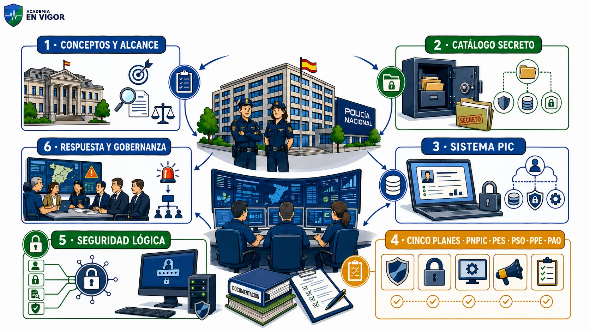

<em>Infografía: recorrido visual por las seis partes y sus relaciones.</em>

El Tema 15 se estudia como un sistema de decisiones enlazadas, no como una colección de listas aisladas.

# Contenido

## 01. Mapa general del Tema 15

El Tema 15 enlaza cuatro piezas: infraestructuras, Catálogo, Sistema de Protección y ciberseguridad.

La ruta de estudio parte de los servicios esenciales, identifica las infraestructuras estratégicas y críticas, organiza la información en el Catálogo, distribuye responsabilidades entre agentes públicos y privados y termina protegiendo tanto el plano físico como el lógico.

### Claves normativas

- El epígrafe oficial de 2026 incluye medidas de protección, Catálogo, Sistema de Protección de Infraestructuras Críticas y ciberseguridad.
- La protección integral combina medidas físicas, lógicas, organizativas y de coordinación.
- La secuencia didáctica correcta conecta servicio esencial, infraestructura, Catálogo, agente responsable, plan y respuesta.

 <!-- FACT:PN-T15-F001 --> <!-- FACT:PN-T15-F002 --> <!-- FACT:PN-T15-F003 -->

<!-- VISUAL:t15-02-ruta-servicio-respuesta.webp -->

  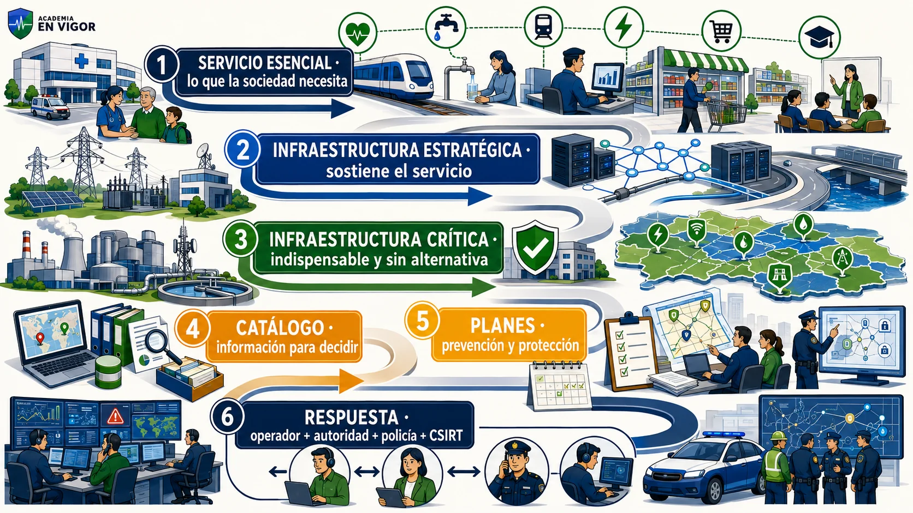

<em>Infografía: Ruta completa desde el servicio esencial hasta la respuesta coordinada.</em>

:::hablemos-claro
Primero decide qué servicio no puede parar; después identifica qué lo sostiene y quién debe protegerlo.
:::

:::en-la-calle
Un fallo eléctrico puede convertirse en incidencia de transporte, telecomunicaciones, sanidad o agua.
:::

:::lo-que-cae
En examen se cruzan definición, órgano y plan: ubica cada dato en su capa.
:::

<!-- MATERIAL PENDIENTE: t15-p1-audio -->
<!-- MATERIAL PENDIENTE: t15-p1-video -->
<!-- MATERIAL PENDIENTE: t15-p1-pres -->

<!-- FUENTE: CONV-PN-2026,L8-2011-T15,RDL12-2018-T15 -->

## 02. Origen y evolución del sistema PIC

La creciente interdependencia convirtió la continuidad de los servicios esenciales en una cuestión de seguridad nacional.

España articuló el CNPIC y el primer plan nacional antes de aprobar la Ley 8/2011 y su Reglamento. El marco vigente sigue siendo ese núcleo, aunque la Unión Europea ha orientado la evolución hacia resiliencia y NIS2 y España mantiene en tramitación sus correspondientes reformas.

### Claves normativas

- La Ley 8/2011 y el Real Decreto 704/2011 constituyen el núcleo vigente del Sistema PIC español.
- La responsabilidad de protección se comparte entre autoridades públicas y operadores, sin desplazar la dirección del Ministerio del Interior.
- Los proyectos de resiliencia y gobernanza se distinguen de las normas ya vigentes hasta su aprobación y entrada en vigor.

 <!-- FACT:PN-T15-F004 --> <!-- FACT:PN-T15-F005 --> <!-- FACT:PN-T15-F006 -->

<!-- VISUAL:t15-il-01-efecto-domino-servicios.webp -->

  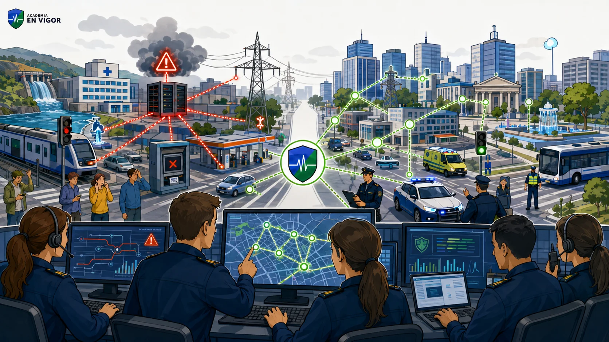

<em>Ilustración: Ciudad conectada donde un fallo inicial amenaza varios servicios esenciales y una red coordinada contiene la cascada.</em>

:::hablemos-claro
La historia explica la evolución, pero la respuesta jurídica sale de la norma que hoy está en vigor.
:::

:::en-la-calle
Antes de aplicar una novedad, comprueba si es directiva, anteproyecto, ley aprobada o norma vigente.
:::

:::lo-que-cae
La palabra «futura» nunca debe convertirse en presente por intuición.
:::

<!-- MATERIAL PENDIENTE: t15-p1-audio -->
<!-- MATERIAL PENDIENTE: t15-p1-video -->
<!-- MATERIAL PENDIENTE: t15-p1-pres -->

<!-- FUENTE: L8-2011-T15,CNPIC-T15,PJC522-2025-T15 -->

## 03. Objeto de la Ley 8/2011

La ley crea estrategias y estructuras para identificar, designar y proteger infraestructuras críticas frente a ataques deliberados.

Su objetivo es mejorar la prevención, preparación y respuesta del Estado ante atentados terroristas u otras amenazas que afecten a infraestructuras críticas. También regula obligaciones especiales de las Administraciones y de los operadores.

### Claves normativas

- La Ley 8/2011 busca dirigir y coordinar actuaciones públicas previa identificación y designación de las infraestructuras.
- La prevención, preparación y respuesta se proyectan frente a atentados terroristas u otras amenazas contra infraestructuras críticas.
- La ley impulsa la colaboración de gestores y propietarios para optimizar la protección contra ataques deliberados.

 <!-- FACT:PN-T15-F007 --> <!-- FACT:PN-T15-F008 --> <!-- FACT:PN-T15-F009 -->

:::hablemos-claro
Identificar, coordinar y proteger: esos tres verbos resumen el objeto.
:::

:::en-la-calle
El operador aporta conocimiento técnico; la autoridad integra y dirige la respuesta.
:::

:::lo-que-cae
No reduzcas el objeto al terrorismo: la ley menciona también otras amenazas.
:::

<!-- MATERIAL PENDIENTE: t15-p1-audio -->
<!-- MATERIAL PENDIENTE: t15-p1-video -->
<!-- MATERIAL PENDIENTE: t15-p1-pres -->

<!-- FUENTE: L8-2011-T15 -->

## 04. Servicio esencial, sector e infraestructura estratégica

La cadena conceptual empieza en el servicio que necesita la sociedad y termina en los activos que permiten prestarlo.

Un servicio esencial mantiene funciones sociales básicas, salud, seguridad, bienestar o funcionamiento institucional. El sector estratégico es el área que lo proporciona; la infraestructura estratégica reúne instalaciones, redes, sistemas y equipos físicos o TIC sobre los que descansa.

### Claves normativas

- Un servicio esencial es necesario para funciones sociales básicas, salud, seguridad, bienestar o eficaz funcionamiento institucional.
- Un sector estratégico proporciona un servicio esencial o garantiza autoridad del Estado o seguridad del país.
- Las infraestructuras estratégicas son instalaciones, redes, sistemas y equipos físicos y TIC sobre los que descansan los servicios esenciales.

 <!-- FACT:PN-T15-F010 --> <!-- FACT:PN-T15-F011 --> <!-- FACT:PN-T15-F012 -->

<!-- VISUAL:t15-04-cadena-servicio-sector-activo.webp -->

  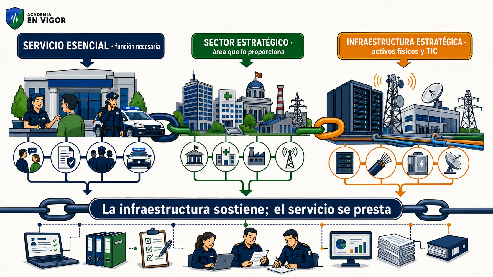

<em>Infografía: Cadena explicada servicio esencial, sector estratégico e infraestructura estratégica.</em>

:::hablemos-claro
Servicio es la función; sector es el ámbito; infraestructura es el soporte.
:::

:::en-la-calle
Una red informática puede ser infraestructura estratégica aunque no se vea desde la calle.
:::

:::lo-que-cae
La definición histórica más preguntada es la de infraestructura estratégica, no la de crítica.
:::

<!-- MATERIAL PENDIENTE: t15-p1-audio -->
<!-- MATERIAL PENDIENTE: t15-p1-video -->
<!-- MATERIAL PENDIENTE: t15-p1-pres -->

<!-- FUENTE: L8-2011-T15 -->

## 05. Infraestructura crítica, europea y zona crítica

Lo crítico es un subconjunto de lo estratégico: añade indispensabilidad, falta de alternativa y grave impacto.

La infraestructura crítica europea produce un impacto grave en al menos dos Estados miembros. La zona crítica agrupa varias infraestructuras interdependientes, de operadores distintos, en un espacio geográfico continuo declarado por la autoridad.

### Claves normativas

- Una infraestructura crítica es estratégica, indispensable, sin solución alternativa y con grave impacto si se perturba o destruye.
- Una infraestructura crítica europea es la que, situada en un Estado miembro, afectaría gravemente al menos a dos Estados miembros.
- La zona crítica es un área geográfica continua con varias infraestructuras críticas interdependientes de operadores diferentes.

 <!-- FACT:PN-T15-F013 --> <!-- FACT:PN-T15-F014 --> <!-- FACT:PN-T15-F015 -->

<!-- VISUAL:t15-05-tres-niveles-criticidad.webp -->

  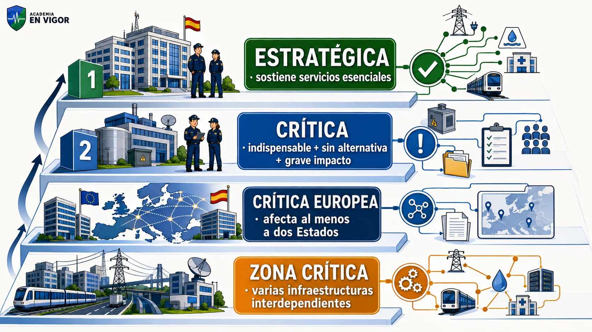

<em>Infografía: Comparativa explicada entre estratégica, crítica, crítica europea y zona crítica.</em>

:::hablemos-claro
Estratégica es importante; crítica es indispensable y sin alternativa razonable.
:::

:::en-la-calle
Mide el daño sobre el servicio, no el tamaño físico de la instalación.
:::

:::lo-que-cae
La palabra «todas» suele borrar el salto entre estratégica y crítica.
:::

<!-- MATERIAL PENDIENTE: t15-p1-audio -->
<!-- MATERIAL PENDIENTE: t15-p1-video -->
<!-- MATERIAL PENDIENTE: t15-p1-pres -->

<!-- FUENTE: L8-2011-T15 -->

## 06. Criterios horizontales de criticidad

La criticidad se valora por consecuencias humanas, económicas, medioambientales, públicas y sociales.

Los criterios horizontales permiten comparar impactos entre sectores. No sustituyen el análisis sectorial: ordenan la gravedad potencial atendiendo a víctimas o salud, pérdidas económicas, deterioro ambiental y alteración de la confianza o de la vida cotidiana.

### Claves normativas

- El número de personas afectadas incluye víctimas mortales, lesiones graves y consecuencias para la salud pública.
- El impacto económico y el medioambiental son criterios horizontales de criticidad.
- El impacto público y social atiende, entre otros elementos, a la confianza, el sufrimiento y la alteración de la vida cotidiana.

 <!-- FACT:PN-T15-F016 --> <!-- FACT:PN-T15-F017 --> <!-- FACT:PN-T15-F018 -->

<!-- VISUAL:t15-06-cuatro-impactos-criticidad.webp -->

  

<em>Infografía: Panel de cuatro impactos con preguntas de evaluación y ejemplos visuales.</em>

:::hablemos-claro
Cuatro preguntas: ¿a cuántas personas?, ¿cuánto daño económico?, ¿qué daño ambiental?, ¿qué ruptura social?
:::

:::en-la-calle
Una interrupción breve puede ser crítica si afecta a un servicio sin alternativa y a mucha población.
:::

:::lo-que-cae
No confundas criterio horizontal con sector estratégico.
:::

<!-- MATERIAL PENDIENTE: t15-p1-audio -->
<!-- MATERIAL PENDIENTE: t15-p1-video -->
<!-- MATERIAL PENDIENTE: t15-p1-pres -->

<!-- FUENTE: L8-2011-T15 -->

## 07. Riesgo, interdependencia y protección

Proteger exige estudiar amenazas, vulnerabilidades, consecuencias e interdependencias antes de decidir medidas.

El análisis de riesgos examina hipótesis de amenaza y vulnerabilidades. Las interdependencias muestran cómo una perturbación se propaga dentro o fuera del sector y en distintos ámbitos territoriales. La protección busca funcionalidad, continuidad e integridad.

### Claves normativas

- El análisis de riesgos estudia amenazas posibles, vulnerabilidades y repercusiones de la perturbación o destrucción.
- Las interdependencias pueden ser intrasectoriales o intersectoriales y tener alcance local, autonómico, nacional o internacional.
- La protección de infraestructuras críticas busca asegurar funcionalidad, continuidad e integridad y prevenir, paliar o neutralizar daños.

 <!-- FACT:PN-T15-F019 --> <!-- FACT:PN-T15-F020 --> <!-- FACT:PN-T15-F021 -->

<!-- VISUAL:t15-07-formula-riesgo-cascada.webp -->

  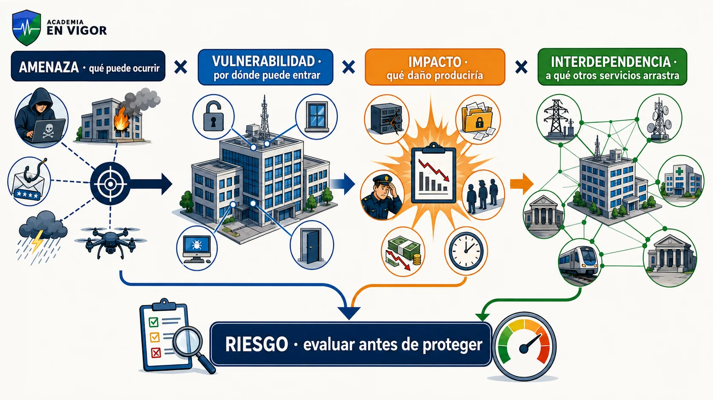

<em>Infografía: Fórmula visual amenaza, vulnerabilidad, impacto e interdependencia.</em>

:::hablemos-claro
Amenaza aprovecha vulnerabilidad; el impacto se multiplica por las dependencias.
:::

:::en-la-calle
Dibuja qué recibe y qué entrega cada servicio para anticipar fallos en cascada.
:::

:::lo-que-cae
Riesgo no es sinónimo de amenaza: incorpora vulnerabilidad y consecuencia.
:::

<!-- MATERIAL PENDIENTE: t15-p1-audio -->
<!-- MATERIAL PENDIENTE: t15-p1-video -->
<!-- MATERIAL PENDIENTE: t15-p1-pres -->

<!-- FUENTE: L8-2011-T15,CNPIC-T15 -->

## 08. Ámbito y sectores estratégicos

La Ley 8/2011 se aplica a infraestructuras críticas en territorio nacional vinculadas a los sectores de su anexo.

El anexo comprende Administración, espacio, industria nuclear y química, instalaciones de investigación, agua, energía, salud, tecnologías de la información y comunicaciones, transporte, alimentación y sistema financiero y tributario. Defensa y Fuerzas y Cuerpos de Seguridad siguen su normativa de control administrativo.

### Claves normativas

- La ley se aplica a infraestructuras críticas situadas en territorio nacional y vinculadas a los sectores estratégicos del anexo.
- El anexo incluye, entre otros, agua, energía, salud, TIC, transporte, alimentación y sistema financiero y tributario.
- Las infraestructuras dependientes de Defensa y de las Fuerzas y Cuerpos de Seguridad se rigen, a efectos de control administrativo, por su propia normativa y procedimientos.

 <!-- FACT:PN-T15-F022 --> <!-- FACT:PN-T15-F023 --> <!-- FACT:PN-T15-F024 -->

<!-- VISUAL:t15-il-02-ciudad-doce-sectores.webp -->

  

<em>Ilustración: Ciudad viva donde agua, energía, salud, transporte, comunicaciones y alimentación funcionan como un ecosistema conectado.</em>

:::hablemos-claro
El anexo organiza sectores; el artículo 3 decide a qué infraestructuras se aplica la ley.
:::

:::en-la-calle
Excepción de control no significa ausencia de seguridad ni de cooperación.
:::

:::lo-que-cae
Memoriza familias de sectores, pero no inventes que toda entidad del sector es crítica.
:::

<!-- MATERIAL PENDIENTE: t15-p1-audio -->
<!-- MATERIAL PENDIENTE: t15-p1-video -->
<!-- MATERIAL PENDIENTE: t15-p1-pres -->

<!-- FUENTE: L8-2011-T15 -->

## 09. Naturaleza, contenido y calificación del Catálogo

El Catálogo es el registro administrativo que reúne información completa, actualizada y contrastada de las infraestructuras estratégicas.

Incluye descripción, ubicación, titularidad, administración, servicios, contactos, nivel de seguridad e información policial. Contiene también las críticas y críticas europeas que afecten a España. El conjunto tiene calificación de secreto.

### Claves normativas

- El Catálogo contiene información de todas las infraestructuras estratégicas nacionales, incluidas las críticas y críticas europeas que afecten a España.
- Entre sus datos figuran descripción, ubicación, titularidad, servicios, contactos y nivel de seguridad.
- El Catálogo Nacional de Infraestructuras Estratégicas tiene calificación de secreto.

 <!-- FACT:PN-T15-F025 --> <!-- FACT:PN-T15-F026 --> <!-- FACT:PN-T15-F027 -->

<!-- VISUAL:t15-09-ficha-secreta-catalogo.webp -->

  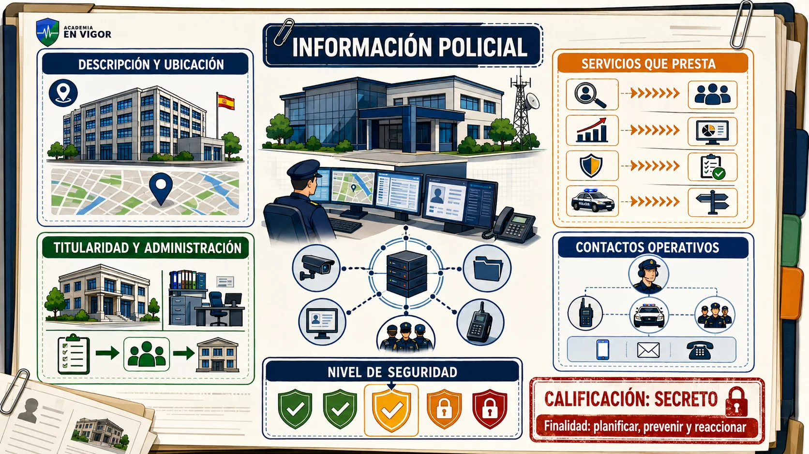

<em>Infografía: Ficha del Catálogo con campos exactos, finalidad operativa y sello SECRETO.</em>

:::hablemos-claro
Catálogo no significa listado público: es una base operativa clasificada.
:::

:::en-la-calle
La información permite planificar, prevenir, proteger y reaccionar de forma proporcionada.
:::

:::lo-que-cae
«Secreto» es literalidad repetida en varias convocatorias.
:::

<!-- MATERIAL PENDIENTE: t15-p2-audio -->
<!-- MATERIAL PENDIENTE: t15-p2-video -->
<!-- MATERIAL PENDIENTE: t15-p2-pres -->

<!-- FUENTE: L8-2011-T15,RD704-2011-T15 -->

## 10. Clasificación e identificación de infraestructuras

La Secretaría de Estado de Seguridad clasifica e incluye; el CNPIC realiza el proceso técnico de identificación.

El Ministerio del Interior, a través de la Secretaría de Estado de Seguridad, clasifica como estratégica, crítica o crítica europea e incluye por primera vez en el Catálogo. El CNPIC comprueba criticidad y puede recabar participación del interesado y agentes competentes.

### Claves normativas

- La competencia para clasificar e incluir en el Catálogo corresponde al Ministerio del Interior a través de la Secretaría de Estado de Seguridad.
- El proceso de identificación de una infraestructura como crítica lo realiza el CNPIC.
- El CNPIC puede recabar participación y asesoramiento del interesado y de agentes competentes e informa del resultado.

 <!-- FACT:PN-T15-F028 --> <!-- FACT:PN-T15-F029 --> <!-- FACT:PN-T15-F030 -->

<!-- VISUAL:t15-10-doble-llave-identificar-clasificar.webp -->

  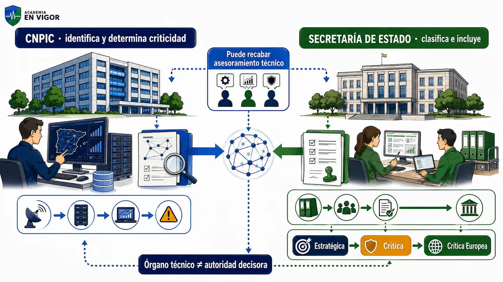

<em>Infografía: Doble llave explicada: identificación técnica del CNPIC y clasificación de la Secretaría de Estado.</em>

:::hablemos-claro
CNPIC identifica técnicamente; Secretaría de Estado clasifica e incluye.
:::

:::en-la-calle
El conocimiento del operador mejora la evaluación, pero no sustituye la decisión pública.
:::

:::lo-que-cae
Órgano técnico y autoridad decisora son distractores intercambiables en examen.
:::

<!-- MATERIAL PENDIENTE: t15-p2-audio -->
<!-- MATERIAL PENDIENTE: t15-p2-video -->
<!-- MATERIAL PENDIENTE: t15-p2-pres -->

<!-- FUENTE: L8-2011-T15,RD704-2011-T15 -->

## 11. Gestión, actualización y acceso al Catálogo

Custodia, gestión y mantenimiento corresponden al Ministerio del Interior a través de la Secretaría de Estado de Seguridad.

El Catálogo se nutre de operadores y agentes del Sistema. Las modificaciones relevantes se remiten al CNPIC y se validan antes de incorporarse; la actualización de datos disponibles se realiza, en todo caso, con periodicidad anual.

### Claves normativas

- La custodia, gestión y mantenimiento del Catálogo corresponden al Ministerio del Interior a través de la Secretaría de Estado de Seguridad.
- Los operadores y demás agentes del Sistema facilitan información al CNPIC para nutrir el Catálogo.
- La actualización de los datos disponibles debe realizarse, en todo caso, con periodicidad anual.

 <!-- FACT:PN-T15-F031 --> <!-- FACT:PN-T15-F032 --> <!-- FACT:PN-T15-F033 -->

<!-- VISUAL:t15-11-ciclo-anual-catalogo.webp -->

  

<em>Infografía: Ciclo de aporte, validación, actualización anual, custodia y acceso autorizado.</em>

:::hablemos-claro
Información viva, pero acceso limitado: actualizar no equivale a publicar.
:::

:::en-la-calle
Un cambio de titularidad, servicio, contacto o riesgo debe alcanzar el sistema por el canal seguro.
:::

:::lo-que-cae
Anual es el mínimo periódico; una modificación relevante no espera necesariamente al cierre del año.
:::

<!-- MATERIAL PENDIENTE: t15-p2-audio -->
<!-- MATERIAL PENDIENTE: t15-p2-video -->
<!-- MATERIAL PENDIENTE: t15-p2-pres -->

<!-- FUENTE: RD704-2011-T15 -->

## 12. Información sensible y comunicaciones seguras

La información sensible podría facilitar la perturbación o destrucción de infraestructuras si se revelara.

Las Administraciones y operadores deben proteger datos y planes según su clasificación. Los sistemas garantizan confidencialidad, integridad y disponibilidad; el CNPIC administra los sistemas PIC y el CCN acredita o certifica su seguridad cuando corresponda.

### Claves normativas

- La información sensible es la que, revelada, podría utilizarse para planear acciones de perturbación o destrucción.
- Los sistemas, comunicaciones e información PIC deben garantizar confidencialidad, integridad y disponibilidad según su clasificación.
- El CNPIC administra los sistemas de información y comunicaciones PIC y el CCN acredita o certifica su seguridad en su ámbito.

 <!-- FACT:PN-T15-F034 --> <!-- FACT:PN-T15-F035 --> <!-- FACT:PN-T15-F036 -->

<!-- VISUAL:t15-12-tres-barreras-informacion.webp -->

  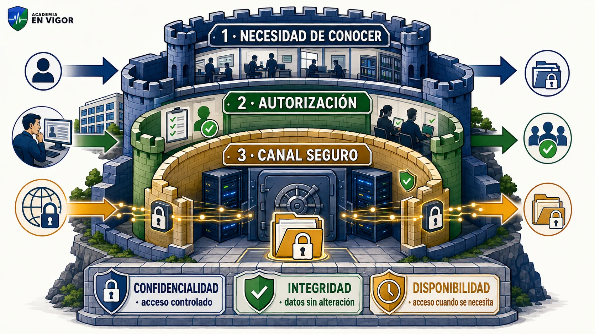

<em>Infografía: Tres barreras de acceso y triada de seguridad aplicada a información PIC.</em>

:::hablemos-claro
Necesidad de conocer, canal seguro y nivel de acceso: tres barreras antes de compartir.
:::

:::en-la-calle
Proteger la información del plan forma parte de proteger la infraestructura.
:::

:::lo-que-cae
Confidencialidad, integridad y disponibilidad aparecen también en ciberseguridad: aquí se aplican a información PIC clasificada.
:::

<!-- MATERIAL PENDIENTE: t15-p2-audio -->
<!-- MATERIAL PENDIENTE: t15-p2-video -->
<!-- MATERIAL PENDIENTE: t15-p2-pres -->

<!-- FUENTE: L8-2011-T15,RD704-2011-T15 -->

## 13. Arquitectura del Sistema PIC

El Sistema PIC integra instituciones, órganos y empresas públicas y privadas responsables de servicios esenciales o seguridad.

Bajo la autoridad superior de la Secretaría de Estado de Seguridad, el CNPIC coordina técnicamente. La Dirección General de Coordinación y Estudios impulsa, coordina y supervisa las actividades encomendadas a la Secretaría de Estado a través del CNPIC.

### Claves normativas

- El Sistema PIC combina agentes del sector público y privado.
- La Secretaría de Estado de Seguridad es el órgano superior responsable del Sistema de Protección de Infraestructuras Críticas Nacionales.
- La Dirección General de Coordinación y Estudios impulsa, coordina y supervisa a través del CNPIC las actividades de la Secretaría de Estado en esta materia.

 <!-- FACT:PN-T15-F037 --> <!-- FACT:PN-T15-F038 --> <!-- FACT:PN-T15-F039 -->

<!-- VISUAL:t15-13-organigrama-sistema-pic.webp -->

  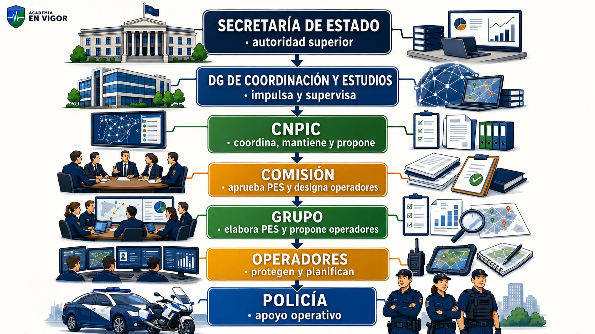

<em>Infografía: Organigrama explicado desde Secretaría de Estado hasta operadores y cuerpos policiales.</em>

:::hablemos-claro
Autoridad superior, apoyo directivo, coordinación técnica y ejecución operativa son niveles distintos.
:::

:::en-la-calle
En una alerta, cada agente conserva su competencia, pero comparte información y activa su plan.
:::

:::lo-que-cae
La estructura orgánica actual no debe responderse con antiguas denominaciones.
:::

<!-- MATERIAL PENDIENTE: t15-p3-audio -->
<!-- MATERIAL PENDIENTE: t15-p3-video -->
<!-- MATERIAL PENDIENTE: t15-p3-pres -->

<!-- FUENTE: L8-2011-T15,RD207-2024-T15,CNPIC-T15 -->

## 14. Secretaría de Estado de Seguridad y CNPIC

La Secretaría diseña y dirige la estrategia; el CNPIC la asiste, coordina y mantiene operativo el sistema.

La Secretaría aprueba el PNPIC, PSO, PPE y PAO según sus procedimientos y declara niveles de seguridad. El CNPIC mantiene Plan y Catálogo, determina criticidad, analiza planes, coordina agentes, gestiona comunicaciones y actúa como punto de contacto internacional PIC.

### Claves normativas

- La Secretaría de Estado de Seguridad diseña y dirige la estrategia nacional de protección de infraestructuras críticas.
- El CNPIC asiste al Secretario de Estado y actúa como órgano de contacto y coordinación con los agentes del Sistema.
- El CNPIC mantiene operativo y actualizado el Catálogo y el PNPIC y determina la criticidad de infraestructuras estratégicas.

 <!-- FACT:PN-T15-F040 --> <!-- FACT:PN-T15-F041 --> <!-- FACT:PN-T15-F042 -->

<!-- VISUAL:t15-14-secretaria-cnpic-reparto.webp -->

  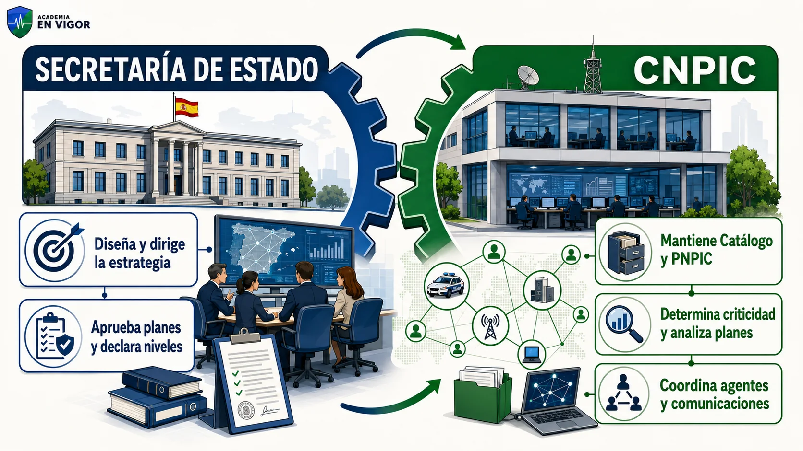

<em>Infografía: Reparto de funciones con verbos exactos entre Secretaría de Estado y CNPIC.</em>

:::hablemos-claro
La Secretaría decide y dirige; el CNPIC prepara, conecta, mantiene y propone.
:::

:::en-la-calle
Cuando el examen pregunta «a través de», suele buscar la relación entre Secretaría, Dirección General y CNPIC.
:::

:::lo-que-cae
No confundas CNPIC con INCIBE ni con el CCN.
:::

<!-- MATERIAL PENDIENTE: t15-p3-audio -->
<!-- MATERIAL PENDIENTE: t15-p3-video -->
<!-- MATERIAL PENDIENTE: t15-p3-pres -->

<!-- FUENTE: L8-2011-T15,RD704-2011-T15 -->

## 15. Comisión Nacional PIC

La Comisión es el órgano colegiado adscrito a la Secretaría de Estado de Seguridad que adopta decisiones sectoriales clave.

Promueve cultura de seguridad y aplicación del sistema. A propuesta del Grupo de Trabajo aprueba Planes Estratégicos Sectoriales, designa operadores críticos y decide sobre grupos sectoriales o técnicos.

### Claves normativas

- La Comisión Nacional PIC es un órgano colegiado adscrito a la Secretaría de Estado de Seguridad.
- La Comisión aprueba los Planes Estratégicos Sectoriales.
- La Comisión designa operadores críticos a propuesta del Grupo de Trabajo Interdepartamental.

 <!-- FACT:PN-T15-F043 --> <!-- FACT:PN-T15-F044 --> <!-- FACT:PN-T15-F045 -->

<!-- VISUAL:t15-15-comision-tres-decisiones.webp -->

  

<em>Infografía: Comisión Nacional con adscripción y tres decisiones clave explicadas.</em>

:::hablemos-claro
Comisión decide; Grupo prepara y propone.
:::

:::en-la-calle
La cultura de seguridad incluye que todos los agentes conozcan su papel antes de una crisis.
:::

:::lo-que-cae
Adscripción y competencia son dos datos históricos muy preguntados.
:::

<!-- MATERIAL PENDIENTE: t15-p3-audio -->
<!-- MATERIAL PENDIENTE: t15-p3-video -->
<!-- MATERIAL PENDIENTE: t15-p3-pres -->

<!-- FUENTE: L8-2011-T15,RD704-2011-T15 -->

## 16. Grupo de Trabajo Interdepartamental

El Grupo de Trabajo es la pieza técnica interdepartamental que elabora planes sectoriales y propone operadores.

Está presidido por el Director del CNPIC e integra representantes ministeriales, policiales, Defensa, CNI, Presidencia, CSN y CNPIC, junto con representación territorial. Puede crear grupos sectoriales y se reúne ordinariamente al menos dos veces al año.

### Claves normativas

- El Grupo de Trabajo elabora los Planes Estratégicos Sectoriales.
- El Grupo propone a la Comisión la designación de operadores críticos.
- El Grupo está presidido por el Director del CNPIC y se reúne ordinariamente al menos dos veces al año.

 <!-- FACT:PN-T15-F046 --> <!-- FACT:PN-T15-F047 --> <!-- FACT:PN-T15-F048 -->

<!-- VISUAL:t15-16-grupo-prepara-comision-decide.webp -->

  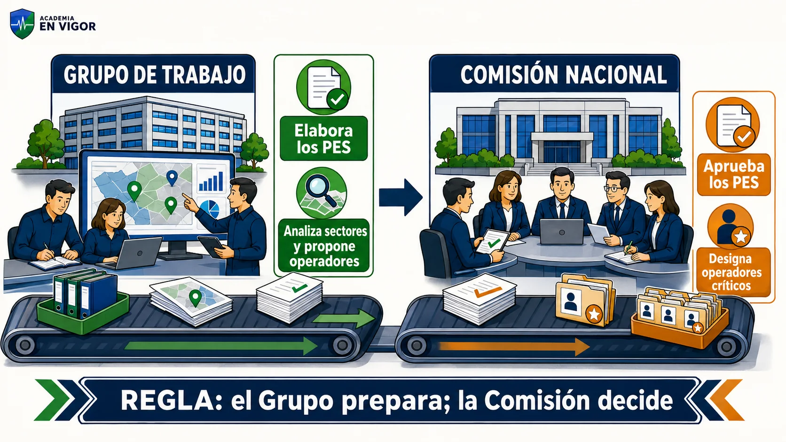

<em>Infografía: Flujo Grupo de Trabajo prepara y propone, Comisión aprueba y designa.</em>

:::hablemos-claro
Grupo = análisis y propuesta; Comisión = aprobación y designación.
:::

:::en-la-calle
Los grupos sectoriales permiten sumar conocimiento técnico de operadores sin ceder la decisión pública.
:::

:::lo-que-cae
Dos reuniones ordinarias al año no son la revisión bienal de los planes.
:::

<!-- MATERIAL PENDIENTE: t15-p3-audio -->
<!-- MATERIAL PENDIENTE: t15-p3-video -->
<!-- MATERIAL PENDIENTE: t15-p3-pres -->

<!-- FUENTE: L8-2011-T15,RD704-2011-T15 -->

## 17. Ministerios, Delegaciones y Fuerzas de Seguridad

Los ministerios aportan conocimiento sectorial y las Delegaciones coordinan la implantación territorial y la respuesta policial.

Los ministerios participan en planes sectoriales, catalogación y verificación. Los Delegados coordinan a las Fuerzas y Cuerpos de Seguridad del Estado ante alertas, participan en PPE y PAO, proponen zonas críticas e inspeccionan en su ámbito.

### Claves normativas

- Los ministerios y organismos del Sistema actúan como puntos de contacto especializados de sus sectores.
- Los Delegados del Gobierno coordinan la actuación de las Fuerzas y Cuerpos de Seguridad del Estado ante una alerta en su territorio.
- Las Delegaciones pueden proponer a la Secretaría de Estado, a través del CNPIC, la declaración de zona crítica.

 <!-- FACT:PN-T15-F049 --> <!-- FACT:PN-T15-F050 --> <!-- FACT:PN-T15-F051 -->

<!-- VISUAL:t15-17-matriz-sector-territorio.webp -->

  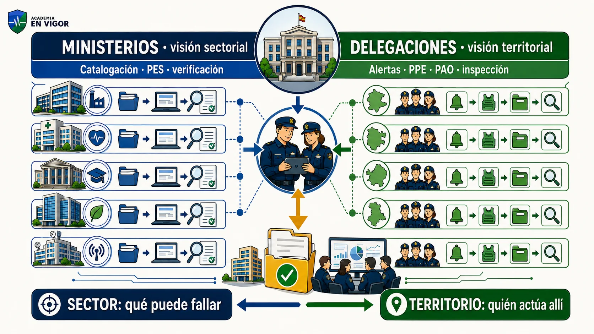

<em>Infografía: Matriz con funciones sectoriales de ministerios y territoriales de Delegaciones.</em>

:::hablemos-claro
Sector explica qué puede fallar; territorio organiza quién actúa allí.
:::

:::en-la-calle
La inspección se coordina con autoridades sectoriales para evitar controles aislados.
:::

:::lo-que-cae
Proponer una zona crítica no equivale a declararla.
:::

<!-- MATERIAL PENDIENTE: t15-p3-audio -->
<!-- MATERIAL PENDIENTE: t15-p3-video -->
<!-- MATERIAL PENDIENTE: t15-p3-pres -->

<!-- FUENTE: L8-2011-T15,RD704-2011-T15 -->

## 18. Comunidades autónomas y entidades locales

La participación territorial cambia según las competencias estatutarias de seguridad y orden público.

Las comunidades con policía integral ejercen determinadas facultades sobre implantación, coordinación e inspección, participan en Comisión y Grupo y actúan mediante sus órganos competentes. Las restantes participan conforme a sus estatutos; las entidades locales lo hacen mediante su asociación de mayor implantación.

### Claves normativas

- Las comunidades con competencias estatutarias de seguridad ejercen facultades específicas sobre infraestructuras situadas en su territorio.
- La coordinación entre Fuerzas estatales y policías autonómicas se rige por los acuerdos de las Juntas de Seguridad correspondientes.
- Las corporaciones locales participan a través de la asociación de entidades locales de mayor implantación nacional.

 <!-- FACT:PN-T15-F052 --> <!-- FACT:PN-T15-F053 --> <!-- FACT:PN-T15-F054 -->

:::hablemos-claro
Mismo sistema, distinta competencia territorial.
:::

:::en-la-calle
Antes de asignar una función, pregunta si la comunidad tiene competencias estatutarias de seguridad.
:::

:::lo-que-cae
Participar no significa dirigir el Sistema nacional.
:::

<!-- MATERIAL PENDIENTE: t15-p3-audio -->
<!-- MATERIAL PENDIENTE: t15-p3-video -->
<!-- MATERIAL PENDIENTE: t15-p3-pres -->

<!-- FUENTE: L8-2011-T15,RD704-2011-T15 -->

## 19. Designación y obligaciones del operador crítico

Basta que una entidad gestione al menos una infraestructura crítica para poder ser designada operador crítico.

El CNPIC formula propuesta y el interesado dispone de quince días para alegar. La Comisión resuelve a propuesta del Grupo. El operador actualiza datos, colabora en planes sectoriales, elabora PSO y PPE, designa figuras de enlace, facilita inspecciones y mantiene un área de seguridad.

### Claves normativas

- Para designar un operador crítico basta con que al menos una infraestructura que gestione tenga consideración de crítica.
- El interesado dispone de quince días desde el día siguiente a la notificación para formular alegaciones.
- La Comisión designa al operador a propuesta del Grupo de Trabajo tras el procedimiento reglamentario.

 <!-- FACT:PN-T15-F055 --> <!-- FACT:PN-T15-F056 --> <!-- FACT:PN-T15-F057 -->

<!-- VISUAL:t15-19-ruta-designacion-operador.webp -->

  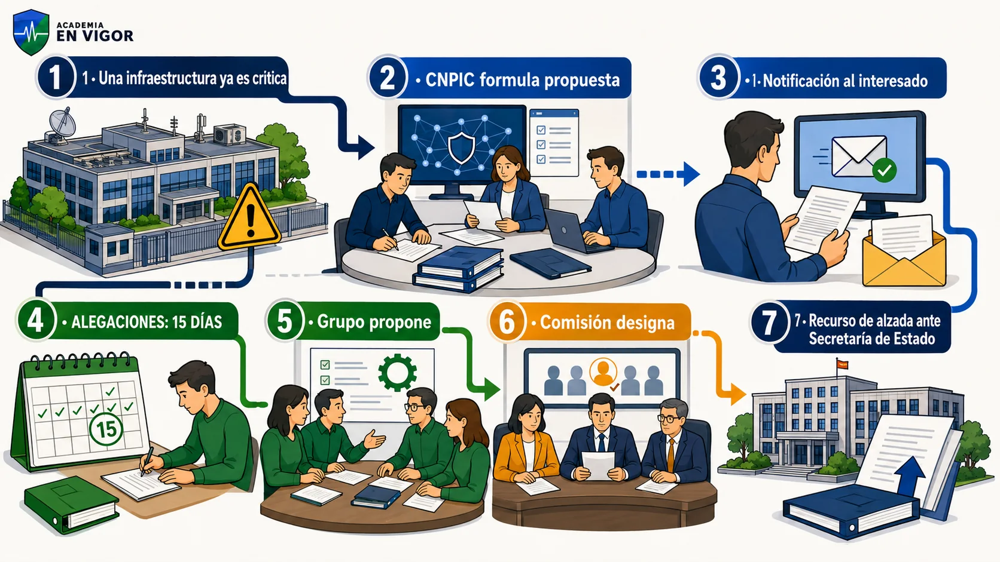

<em>Infografía: Ruta de designación con propuesta, notificación, 15 días, Comisión y recurso.</em>

:::hablemos-claro
Una infraestructura crítica basta para activar la condición del operador.
:::

:::en-la-calle
La designación abre obligaciones estables de información, planificación, enlace e inspección.
:::

:::lo-que-cae
Quince días de alegaciones no son los tres meses para nombrar responsables.
:::

<!-- MATERIAL PENDIENTE: t15-p3-audio -->
<!-- MATERIAL PENDIENTE: t15-p3-video -->
<!-- MATERIAL PENDIENTE: t15-p3-pres -->

<!-- FUENTE: L8-2011-T15,RD704-2011-T15 -->

## 20. Plan Nacional de Protección de Infraestructuras Críticas

El PNPIC es el instrumento de programación del Estado para proteger de forma permanente y homogénea las infraestructuras.

Lo elabora la Secretaría de Estado de Seguridad, lo aprueba su titular y lo mantiene actualizado el CNPIC. Establece criterios, directrices, capacidades, niveles de seguridad e intervención policial coordinados con el plan antiterrorista. Se revisa cada cinco años.

### Claves normativas

- El PNPIC es elaborado por la Secretaría de Estado de Seguridad y aprobado por resolución de su titular.
- El PNPIC prevé niveles de seguridad y de intervención policial según la evaluación de la amenaza.
- El PNPIC se revisa cada cinco años por la Secretaría de Estado de Seguridad.

 <!-- FACT:PN-T15-F058 --> <!-- FACT:PN-T15-F059 --> <!-- FACT:PN-T15-F060 -->

<!-- VISUAL:t15-20-pnpic-cinco-anos.webp -->

  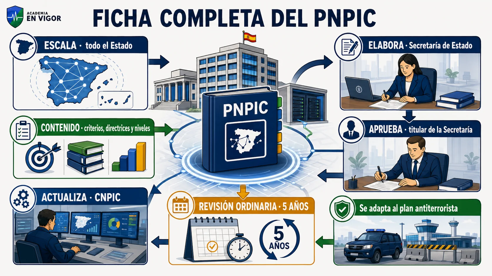

<em>Infografía: Ficha completa del PNPIC con autor, aprobación, contenido, activación y revisión quinquenal.</em>

:::hablemos-claro
Plan nacional: marco común, niveles de seguridad y movilización de capacidades.
:::

:::en-la-calle
Una variación de datos o instrucciones obliga a actualizar aunque no hayan pasado cinco años.
:::

:::lo-que-cae
Cinco años es la excepción dentro de una familia de planes con mucha revisión bienal.
:::

<!-- MATERIAL PENDIENTE: t15-p4-audio -->
<!-- MATERIAL PENDIENTE: t15-p4-video -->
<!-- MATERIAL PENDIENTE: t15-p4-pres -->

<!-- FUENTE: L8-2011-T15,RD704-2011-T15,CNPIC-T15 -->

## 21. Planes Estratégicos Sectoriales

Los PES estudian cada sector en todo el territorio nacional y traducen su funcionamiento en riesgos y medidas estratégicas.

El Grupo de Trabajo, coordinado por el CNPIC y con asesoramiento de operadores, los elabora; la Comisión los aprueba. Describen servicios, funcionamiento, vulnerabilidades, consecuencias de inactividad y medidas. Se revisan cada dos años.

### Claves normativas

- Los PES tienen alcance nacional y analizan servicios, funcionamiento, vulnerabilidades, consecuencias y medidas de un sector.
- El Grupo de Trabajo elabora los PES y la Comisión los aprueba.
- Los PES se revisan cada dos años por los ministerios y organismos del Sistema.

 <!-- FACT:PN-T15-F061 --> <!-- FACT:PN-T15-F062 --> <!-- FACT:PN-T15-F063 -->

<!-- VISUAL:t15-21-pes-radiografia-sector.webp -->

  

<em>Infografía: Radiografía sectorial con cinco contenidos, autor, aprobador y revisión bienal.</em>

:::hablemos-claro
PES mira el bosque sectorial; PPE mira el árbol concreto.
:::

:::en-la-calle
Compara dependencias entre energía, telecomunicaciones, agua y transporte antes de diseñar medidas.
:::

:::lo-que-cae
Elaborador y aprobador forman una pareja clásica: Grupo–Comisión.
:::

<!-- MATERIAL PENDIENTE: t15-p4-audio -->
<!-- MATERIAL PENDIENTE: t15-p4-video -->
<!-- MATERIAL PENDIENTE: t15-p4-pres -->

<!-- FUENTE: L8-2011-T15,RD704-2011-T15 -->

## 22. Plan de Seguridad del Operador: función y plazo

El PSO define la política general de seguridad del operador para el conjunto de sus instalaciones o sistemas.

Cada operador lo presenta al CNPIC dentro de los seis meses siguientes a la notificación de su designación. Debe incluir metodología de análisis de riesgos, continuidad y criterios para medidas frente a amenazas físicas y lógicas.

### Claves normativas

- El PSO es el documento estratégico que define las políticas generales de seguridad del operador.
- El operador debe presentar el PSO en seis meses desde la notificación de su designación.
- El PSO incorpora metodología de análisis de riesgos y criterios frente a amenazas físicas y lógicas.

 <!-- FACT:PN-T15-F064 --> <!-- FACT:PN-T15-F065 --> <!-- FACT:PN-T15-F066 -->

<!-- VISUAL:t15-22-pso-seis-meses.webp -->

  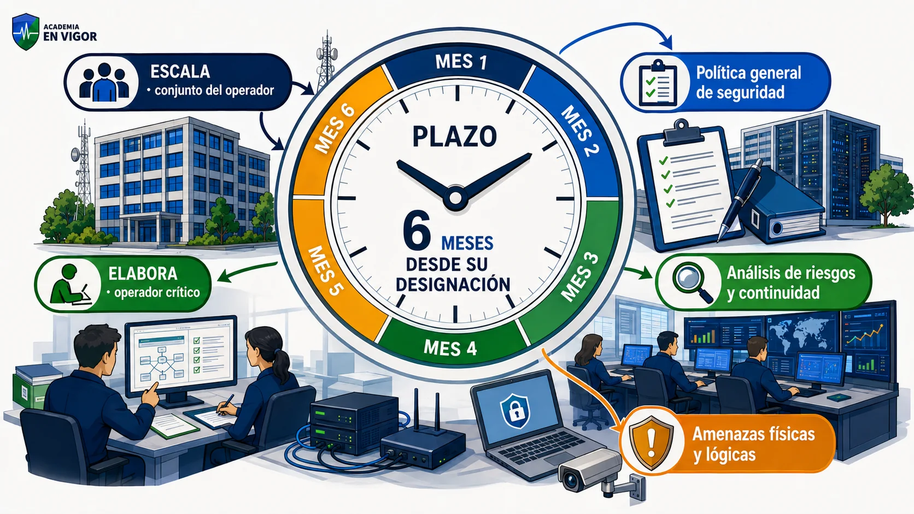

<em>Infografía: Reloj de seis meses y contenidos estratégicos del Plan de Seguridad del Operador.</em>

:::hablemos-claro
PSO = política del operador completo.
:::

:::en-la-calle
Primero se designa al operador; después corre el reloj de seis meses.
:::

:::lo-que-cae
Seis meses PSO, cuatro meses PPE: pareja de plazos esencial.
:::

<!-- MATERIAL PENDIENTE: t15-p4-audio -->
<!-- MATERIAL PENDIENTE: t15-p4-video -->
<!-- MATERIAL PENDIENTE: t15-p4-pres -->

<!-- FUENTE: L8-2011-T15,RD704-2011-T15 -->

## 23. PSO: aprobación, registro y revisión

El CNPIC evalúa e informa el PSO; el Secretario de Estado lo aprueba y el CNPIC custodia su registro central.

La resolución se notifica con las observaciones o medidas necesarias. El plan queda clasificado y el operador debe custodiarlo. Se revisa cada dos años por el operador y esa revisión es aprobada por el CNPIC.

### Claves normativas

- El Secretario de Estado de Seguridad aprueba el PSO, a propuesta del CNPIC, en el procedimiento inicial.
- El CNPIC gestiona y custodia el registro central de los PSO.
- El PSO se revisa cada dos años por el operador y la revisión debe ser aprobada por el CNPIC.

 <!-- FACT:PN-T15-F067 --> <!-- FACT:PN-T15-F068 --> <!-- FACT:PN-T15-F069 -->

:::hablemos-claro
El operador escribe; CNPIC evalúa y registra; Secretaría aprueba.
:::

:::en-la-calle
Clasificación, custodia y necesidad de conocer acompañan al plan durante todo su ciclo.
:::

:::lo-que-cae
No confundas aprobación inicial por Secretaría con aprobación de revisión por CNPIC.
:::

<!-- MATERIAL PENDIENTE: t15-p4-audio -->
<!-- MATERIAL PENDIENTE: t15-p4-video -->
<!-- MATERIAL PENDIENTE: t15-p4-pres -->

<!-- FUENTE: RD704-2011-T15 -->

## 24. Plan de Protección Específico: función y plazo

El PPE convierte la política general del PSO en medidas concretas para una infraestructura crítica.

Es operativo e integra seguridad física y lógica, medidas ya implantadas y futuras, permanentes y temporales. El operador elabora uno por infraestructura y lo presenta en cuatro meses desde la aprobación del PSO.

### Claves normativas

- El PPE es un documento operativo para una infraestructura crítica concreta.
- El PPE define medidas físicas y lógicas, permanentes y temporales.
- El operador presenta cada PPE en cuatro meses desde la aprobación del PSO.

 <!-- FACT:PN-T15-F070 --> <!-- FACT:PN-T15-F071 --> <!-- FACT:PN-T15-F072 -->

<!-- VISUAL:t15-24-ppe-cuatro-meses.webp -->

  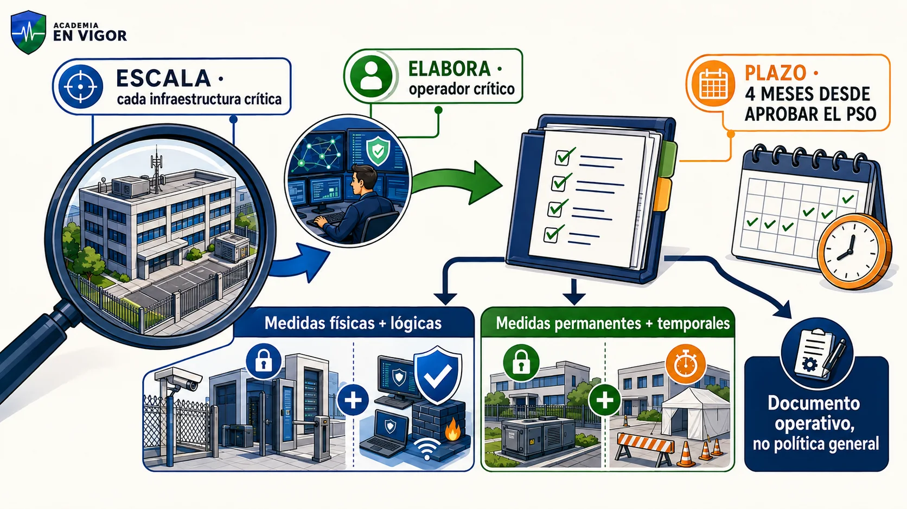

<em>Infografía: Del PSO al PPE en cuatro meses con medidas físicas, lógicas, permanentes y temporales.</em>

:::hablemos-claro
PSO dice la política; PPE baja a la instalación.
:::

:::en-la-calle
Una central, una presa o un nodo de comunicaciones necesita su propio escenario operativo.
:::

:::lo-que-cae
Cuatro meses después del PSO, no cuatro meses desde la designación.
:::

<!-- MATERIAL PENDIENTE: t15-p4-audio -->
<!-- MATERIAL PENDIENTE: t15-p4-video -->
<!-- MATERIAL PENDIENTE: t15-p4-pres -->

<!-- FUENTE: L8-2011-T15,RD704-2011-T15 -->

## 25. PPE: aprobación, revisión e inspección

El CNPIC analiza el PPE y lo propone a la Secretaría de Estado para su aprobación.

La resolución se notifica al operador y a la autoridad territorial. El PPE se revisa cada dos años; Delegaciones o comunidades competentes velan por su ejecución e inspeccionan coordinadamente con autoridades sectoriales.

### Claves normativas

- El CNPIC analiza el PPE y lo propone para aprobación a la Secretaría de Estado de Seguridad.
- Los PPE se revisan cada dos años por los operadores críticos.
- Los Delegados del Gobierno o los órganos autonómicos competentes velan por la ejecución e inspección territorial del PPE.

 <!-- FACT:PN-T15-F073 --> <!-- FACT:PN-T15-F074 --> <!-- FACT:PN-T15-F075 -->

:::hablemos-claro
Plan concreto, control concreto y coordinación con la regulación sectorial.
:::

:::en-la-calle
La inspección puede requerir la situación actualizada de implantación de medidas.
:::

:::lo-que-cae
Revisión bienal y actualización por cambio son obligaciones distintas.
:::

<!-- MATERIAL PENDIENTE: t15-p4-audio -->
<!-- MATERIAL PENDIENTE: t15-p4-video -->
<!-- MATERIAL PENDIENTE: t15-p4-pres -->

<!-- FUENTE: RD704-2011-T15 -->

## 26. Plan de Apoyo Operativo

El PAO contiene la respuesta policial complementaria a las medidas del operador.

Lo elabora el cuerpo policial estatal o autonómico competente para cada infraestructura con PPE. Incluye vigilancia, prevención, protección y reacción, información operativa y coordinación. La Secretaría, a través del CNPIC, lo valida y aprueba.

### Claves normativas

- El PAO lo elabora el cuerpo policial estatal o autonómico competente en la demarcación.
- El PAO contempla medidas policiales complementarias a las previstas por el operador.
- La Secretaría de Estado de Seguridad, a través del CNPIC, valida y aprueba los PAO.

 <!-- FACT:PN-T15-F076 --> <!-- FACT:PN-T15-F077 --> <!-- FACT:PN-T15-F078 -->

<!-- VISUAL:t15-26-doble-escudo-ppe-pao.webp -->

  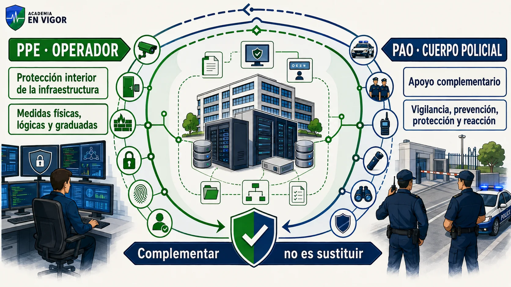

<em>Infografía: Doble escudo explicado: medidas del operador en PPE y apoyo policial en PAO.</em>

:::hablemos-claro
PPE protege desde dentro; PAO apoya desde la capacidad policial.
:::

:::en-la-calle
Complementar no significa duplicar: cada medida debe tener responsable y activación.
:::

:::lo-que-cae
La palabra «complementaria» identifica casi siempre al PAO.
:::

<!-- MATERIAL PENDIENTE: t15-p4-audio -->
<!-- MATERIAL PENDIENTE: t15-p4-video -->
<!-- MATERIAL PENDIENTE: t15-p4-pres -->

<!-- FUENTE: L8-2011-T15,RD704-2011-T15 -->

## 27. PAO: registro, acceso y revisión

Los registros territoriales y el registro central del CNPIC mantienen disponibles los PAO autorizados.

El acceso exige necesidad de conocer y autorización. Los cuerpos policiales revisan cada PAO cada dos años; la revisión pasa por la autoridad territorial y requiere aprobación expresa del CNPIC.

### Claves normativas

- El CNPIC gestiona y custodia el registro central de PAO.
- El acceso a los PAO requiere necesidad de conocer y autorización correspondiente.
- El PAO se revisa cada dos años por el cuerpo policial competente y requiere aprobación expresa del CNPIC.

 <!-- FACT:PN-T15-F079 --> <!-- FACT:PN-T15-F080 --> <!-- FACT:PN-T15-F081 -->

:::hablemos-claro
Quien elabora también revisa, pero la aprobación sigue controlada.
:::

:::en-la-calle
El registro central permite coordinación sin abrir información clasificada.
:::

:::lo-que-cae
PAO y PPE comparten revisión bienal, pero no autor ni circuito.
:::

<!-- MATERIAL PENDIENTE: t15-p4-audio -->
<!-- MATERIAL PENDIENTE: t15-p4-video -->
<!-- MATERIAL PENDIENTE: t15-p4-pres -->

<!-- FUENTE: RD704-2011-T15 -->

## 28. Comparativa de los cinco planes

Los cinco planes se distinguen por escala, autor, aprobador, destinatario y revisión.

El PNPIC ordena el sistema nacional; el PES estudia un sector; el PSO fija política del operador; el PPE protege una infraestructura; el PAO añade apoyo policial. Los tres últimos se encadenan operativamente sin sustituirse.

### Claves normativas

- PNPIC, PES, PSO, PPE y PAO son los cinco instrumentos de planificación de la Ley 8/2011.
- PSO y PPE los elabora el operador; el PAO lo elabora el cuerpo policial competente.
- El PSO se refiere al conjunto del operador y el PPE a cada infraestructura crítica.

 <!-- FACT:PN-T15-F082 --> <!-- FACT:PN-T15-F083 --> <!-- FACT:PN-T15-F084 -->

<!-- VISUAL:t15-28-tabla-cinco-planes.webp -->

  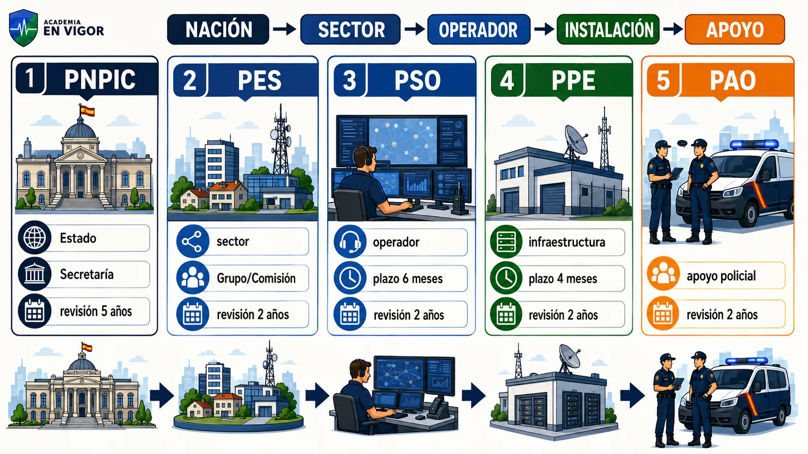

<em>Infografía: Gran comparativa textual de los cinco planes con escala, autor, aprobación, contenido y revisión.</em>

:::hablemos-claro
Nación, sector, operador, infraestructura, apoyo: cinco escalas.
:::

:::en-la-calle
En un simulacro, comprueba qué plan aporta cada medida y quién la activa.
:::

:::lo-que-cae
La mejor defensa contra los distractores es memorizar autor + escala + verbo.
:::

<!-- MATERIAL PENDIENTE: t15-p4-audio -->
<!-- MATERIAL PENDIENTE: t15-p4-video -->
<!-- MATERIAL PENDIENTE: t15-p4-pres -->

<!-- FUENTE: L8-2011-T15,RD704-2011-T15 -->

## 29. Responsable de Seguridad y Enlace

El RSE representa al operador ante la Secretaría de Estado en materias PIC y canaliza necesidades generales.

Se nombra y comunica al CNPIC dentro de los tres meses siguientes a la designación del operador. Debe contar con habilitación de Director de Seguridad o equivalente según su normativa específica.

### Claves normativas

- El operador nombra y comunica al RSE dentro de tres meses desde su designación como operador crítico.
- El RSE representa al operador ante la Secretaría de Estado en seguridad de infraestructuras y planes.
- El RSE debe contar con habilitación de Director de Seguridad o equivalente según la normativa aplicable.

 <!-- FACT:PN-T15-F085 --> <!-- FACT:PN-T15-F086 --> <!-- FACT:PN-T15-F087 -->

<!-- VISUAL:t15-29-rse-ficha-completa.webp -->

  

<em>Infografía: Ficha textual del RSE con plazo, requisito, ámbito, interlocutor y funciones.</em>

:::hablemos-claro
RSE mira al operador completo y a la relación institucional.
:::

:::en-la-calle
Canaliza necesidades operativas e informativas sin reemplazar al Delegado de cada instalación.
:::

:::lo-que-cae
Tres meses desde designación del operador; habilitación de Director de Seguridad.
:::

<!-- MATERIAL PENDIENTE: t15-p4-audio -->
<!-- MATERIAL PENDIENTE: t15-p4-video -->
<!-- MATERIAL PENDIENTE: t15-p4-pres -->

<!-- FUENTE: L8-2011-T15,RD704-2011-T15,CNPIC-T15 -->

## 30. Delegado de Seguridad de la infraestructura

El Delegado de Seguridad es el enlace operativo de una infraestructura crítica concreta.

El operador comunica su identidad a la Delegación del Gobierno o al órgano autonómico competente dentro de tres meses desde la identificación de la infraestructura como crítica o crítica europea.

### Claves normativas

- Debe existir un Delegado de Seguridad por cada infraestructura crítica o crítica europea.
- Su identidad se comunica en tres meses desde la identificación de la infraestructura como crítica o crítica europea.
- El Delegado es el enlace operativo y canal de información sobre la seguridad concreta de la infraestructura.

 <!-- FACT:PN-T15-F088 --> <!-- FACT:PN-T15-F089 --> <!-- FACT:PN-T15-F090 -->

<!-- VISUAL:t15-30-rse-delegado-diferencias.webp -->

  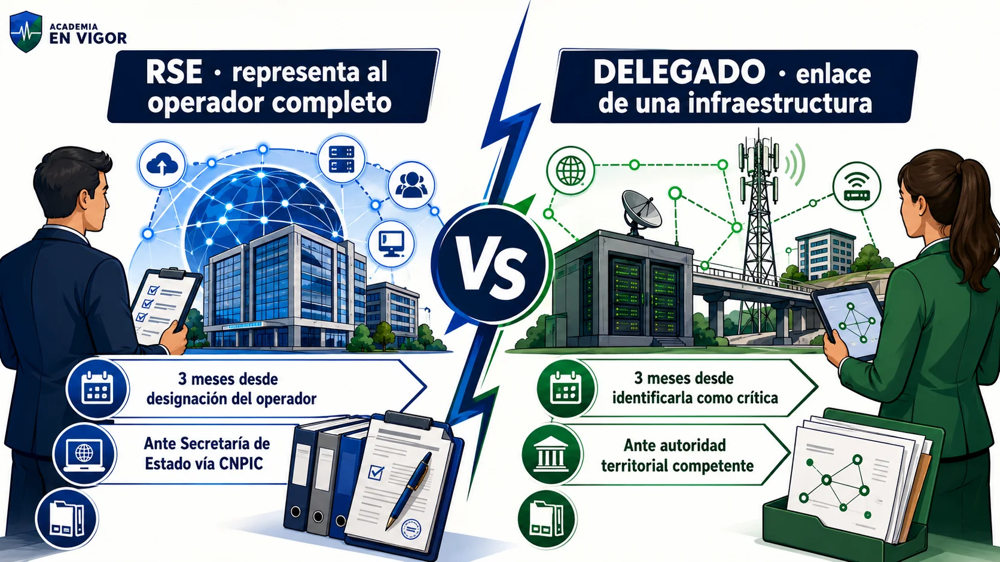

<em>Infografía: Comparativa textual RSE frente a Delegado: ámbito, destinatario, inicio del plazo y función.</em>

:::hablemos-claro
RSE = operador; Delegado = instalación.
:::

:::en-la-calle
Durante una incidencia local, el Delegado enlaza con la autoridad territorial y el RSE mantiene la visión corporativa.
:::

:::lo-que-cae
Ambos tienen tres meses, pero el hecho que inicia el plazo es diferente.
:::

<!-- MATERIAL PENDIENTE: t15-p4-audio -->
<!-- MATERIAL PENDIENTE: t15-p4-video -->
<!-- MATERIAL PENDIENTE: t15-p4-pres -->

<!-- FUENTE: L8-2011-T15,RD704-2011-T15,CNPIC-T15 -->

## 31. Sistemas de control industrial: SCADA y DCS

La ciberseguridad industrial protege sistemas que observan y controlan procesos físicos esenciales.

SCADA suele supervisar y adquirir datos de procesos geográficamente dispersos mediante unidades remotas y un centro de control. DCS distribuye controladores dentro de una instalación o proceso, buscando control local, continuidad y redundancia.

### Claves normativas

- SCADA se asocia a supervisión, adquisición de datos y control remoto de procesos distribuidos geográficamente.
- DCS distribuye controladores para gobernar procesos dentro de una instalación compleja.
- Comprometer un sistema industrial puede producir efectos físicos y afectar a la disponibilidad de un servicio esencial.

 <!-- FACT:PN-T15-F091 --> <!-- FACT:PN-T15-F092 --> <!-- FACT:PN-T15-F093 -->

<!-- VISUAL:t15-il-03-control-industrial-hibrido.webp -->

  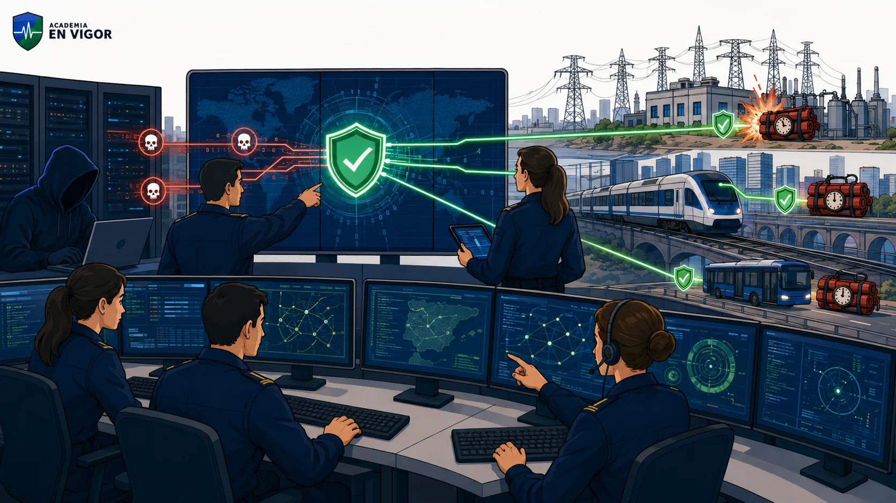

<em>Ilustración: Centro de control donde un equipo contiene una amenaza digital antes de que alcance bombas, red eléctrica y transporte.</em>

:::hablemos-claro
En tecnología operacional, un dato falso puede abrir una válvula o detener una planta.
:::

:::en-la-calle
Separa las redes, controla accesos, registra actividad y prepara operación segura degradada.
:::

:::lo-que-cae
SCADA: dispersión y supervisión remota; DCS: control distribuido de proceso.
:::

<!-- MATERIAL PENDIENTE: t15-p5-audio -->
<!-- MATERIAL PENDIENTE: t15-p5-video -->
<!-- MATERIAL PENDIENTE: t15-p5-pres -->

<!-- FUENTE: CNPIC-T15,RD311-2022-T15 -->

## 32. Dimensiones de seguridad: CIDAT

La seguridad protege disponibilidad, autenticidad, integridad, confidencialidad y trazabilidad.

Confidencialidad limita el acceso; integridad impide alteraciones no autorizadas; disponibilidad mantiene acceso y servicio; autenticidad verifica identidad y origen; trazabilidad permite reconstruir quién hizo qué y cuándo.

### Claves normativas

- La confidencialidad evita el acceso o revelación no autorizados.
- La integridad protege frente a modificaciones o destrucciones no autorizadas y la disponibilidad mantiene servicio y acceso oportunos.
- Autenticidad y trazabilidad permiten verificar identidades, origen y secuencia de acciones.

 <!-- FACT:PN-T15-F094 --> <!-- FACT:PN-T15-F095 --> <!-- FACT:PN-T15-F096 -->

<!-- VISUAL:t15-32-estrella-cidat.webp -->

  

<em>Infografía: Estrella de cinco dimensiones con definición breve, fallo típico y control asociado.</em>

:::hablemos-claro
CIDAT: cinco preguntas distintas sobre el mismo activo.
:::

:::en-la-calle
Un servicio puede estar disponible y, aun así, ser inseguro si ofrece datos manipulados.
:::

:::lo-que-cae
La triada clásica CID se amplía en el ENS con autenticidad y trazabilidad.
:::

<!-- MATERIAL PENDIENTE: t15-p5-audio -->
<!-- MATERIAL PENDIENTE: t15-p5-video -->
<!-- MATERIAL PENDIENTE: t15-p5-pres -->

<!-- FUENTE: RDL12-2018-T15,RD311-2022-T15 -->

## 33. Amenaza, vulnerabilidad, riesgo e incidente

Una amenaza puede aprovechar una vulnerabilidad; el riesgo valora probabilidad e impacto y el incidente materializa efectos adversos.

La gestión no se limita a comprar tecnología. Identifica activos y dependencias, analiza riesgos, elige medidas proporcionadas, vigila, detecta, responde, conserva evidencias, recupera y mejora.

### Claves normativas

- Una vulnerabilidad es una debilidad susceptible de ser explotada por una amenaza.
- El riesgo se gestiona mediante identificación, análisis, evaluación y tratamiento continuos.
- Un incidente produce efectos adversos reales sobre la seguridad de redes y sistemas.

 <!-- FACT:PN-T15-F097 --> <!-- FACT:PN-T15-F098 --> <!-- FACT:PN-T15-F099 -->

:::hablemos-claro
Amenaza es posibilidad; vulnerabilidad es puerta; incidente es materialización.
:::

:::en-la-calle
Registra activos, proveedores y dependencias antes de priorizar medidas.
:::

:::lo-que-cae
No llames incidente a todo riesgo ni riesgo a todo ataque.
:::

<!-- MATERIAL PENDIENTE: t15-p5-audio -->
<!-- MATERIAL PENDIENTE: t15-p5-video -->
<!-- MATERIAL PENDIENTE: t15-p5-pres -->

<!-- FUENTE: RDL12-2018-T15,RD311-2022-T15 -->

## 34. Amenazas físicas, humanas y lógicas

La amenaza puede ser deliberada o accidental y entrar por personas, instalaciones, tecnología o proveedores.

Errores, abuso interno, ingeniería social, malware, denegación de servicio, suplantación, fallos de software, incendios, inundaciones o pérdida eléctrica requieren controles combinados. La clasificación útil explica vector, activo, impacto y respuesta.

### Claves normativas

- Las amenazas pueden ser humanas, físicas o lógicas y tener origen deliberado o accidental.
- La ingeniería social busca manipular personas para obtener acceso, información o una acción.
- La defensa por capas combina controles preventivos, detectivos, de respuesta y recuperación.

 <!-- FACT:PN-T15-F100 --> <!-- FACT:PN-T15-F101 --> <!-- FACT:PN-T15-F102 -->

<!-- VISUAL:t15-34-radar-amenazas-controles.webp -->

  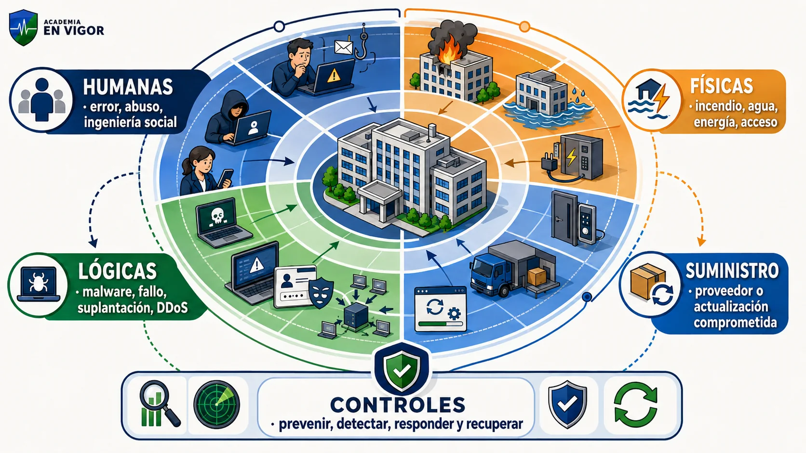

<em>Infografía: Radar de amenazas humanas, físicas, lógicas y de suministro con controles asociados.</em>

:::hablemos-claro
No estudies una enciclopedia de malware: aprende vector, efecto y control.
:::

:::en-la-calle
Una llamada falsa puede saltarse una inversión tecnológica si el procedimiento humano falla.
:::

:::lo-que-cae
La seguridad integral evita separar artificialmente puerta, persona, red y proveedor.
:::

<!-- MATERIAL PENDIENTE: t15-p5-audio -->
<!-- MATERIAL PENDIENTE: t15-p5-video -->
<!-- MATERIAL PENDIENTE: t15-p5-pres -->

<!-- FUENTE: RDL12-2018-T15,RD311-2022-T15,CNPIC-T15 -->

## 35. INCIBE y los CSIRT de referencia

Los CSIRT previenen, detectan, analizan, responden y coordinan incidentes para su comunidad protegida.

CCN-CERT atiende el sector público y sistemas de su ámbito; INCIBE-CERT es referencia para ciudadanos y entidades privadas no cubiertas por CCN-CERT y coordina con CNPIC cuando afectan a operadores críticos; ESPDEF-CERT actúa en Defensa y coopera cuando procede.

### Claves normativas

- INCIBE-CERT es CSIRT de referencia para entidades de derecho privado y ciudadanos fuera del ámbito de CCN-CERT.
- CCN-CERT es la capacidad de respuesta de referencia del Centro Criptológico Nacional para el sector público en su ámbito.
- Los CSIRT de referencia cooperan mediante la Plataforma Nacional de Notificación y Seguimiento de Ciberincidentes.

 <!-- FACT:PN-T15-F103 --> <!-- FACT:PN-T15-F104 --> <!-- FACT:PN-T15-F105 -->

:::hablemos-claro
CSIRT es equipo de respuesta; CNPIC es coordinador del Sistema PIC; INCIBE es una entidad nacional de ciberseguridad.
:::

:::en-la-calle
El CSIRT adecuado depende de la comunidad protegida y de la naturaleza del operador.
:::

:::lo-que-cae
La pregunta histórica sobre INCIBE busca reconocer la entidad, no convertirla en autoridad universal.
:::

<!-- MATERIAL PENDIENTE: t15-p5-audio -->
<!-- MATERIAL PENDIENTE: t15-p5-video -->
<!-- MATERIAL PENDIENTE: t15-p5-pres -->

<!-- FUENTE: RDL12-2018-T15,RD43-2021-T15,INCIBE-T15 -->

## 36. RDL 12/2018: ámbito y autoridades

El marco español de redes y sistemas protege servicios esenciales y determinados servicios digitales.

Se aplica a servicios esenciales dependientes de redes en sectores de la Ley 8/2011 y a mercados en línea, buscadores y nube en sus términos. Para operadores esenciales que también sean críticos, la autoridad es la Secretaría de Estado de Seguridad a través del CNPIC.

### Claves normativas

- El RDL 12/2018 regula seguridad de redes y sistemas y un sistema de notificación de incidentes.
- Su ámbito incluye servicios esenciales dependientes de redes y determinados servicios digitales.
- Para operadores de servicios esenciales que además sean críticos, la autoridad competente es la Secretaría de Estado de Seguridad a través del CNPIC.

 <!-- FACT:PN-T15-F106 --> <!-- FACT:PN-T15-F107 --> <!-- FACT:PN-T15-F108 -->

<!-- VISUAL:t15-36-doble-marco-pic-nis.webp -->

  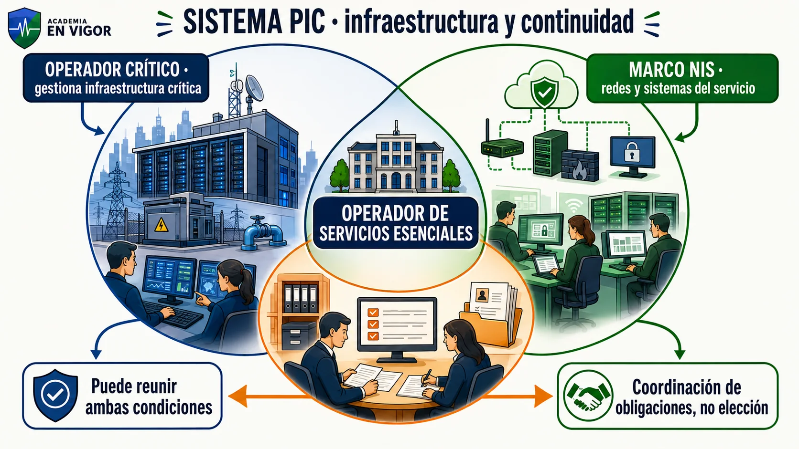

<em>Infografía: Diagrama de solapamiento entre operador crítico, servicio esencial y servicio digital.</em>

:::hablemos-claro
PIC protege infraestructura y continuidad; el marco NIS protege redes y sistemas que sostienen servicios.
:::

:::en-la-calle
Una misma entidad puede acumular condición de operador crítico y operador de servicios esenciales.
:::

:::lo-que-cae
Superposición de regímenes exige coordinación, no escoger el más cómodo.
:::

<!-- MATERIAL PENDIENTE: t15-p6-audio -->
<!-- MATERIAL PENDIENTE: t15-p6-video -->
<!-- MATERIAL PENDIENTE: t15-p6-pres -->

<!-- FUENTE: RDL12-2018-T15,RD43-2021-T15 -->

## 37. Medidas de seguridad y responsable de la información

Las medidas técnicas y organizativas deben ser adecuadas, proporcionadas y basadas en riesgos.

El operador documenta una política de seguridad y una declaración de aplicabilidad. Designa en tres meses un responsable de seguridad de la información como punto de contacto y coordinación técnica con autoridad y CSIRT.

### Claves normativas

- Las medidas deben gestionar riesgos con proporcionalidad al nivel de exposición e impacto.
- La declaración de aplicabilidad documenta las medidas de seguridad seleccionadas para cumplir las obligaciones.
- El responsable de seguridad de la información se designa en tres meses desde la designación como operador de servicios esenciales.

 <!-- FACT:PN-T15-F109 --> <!-- FACT:PN-T15-F110 --> <!-- FACT:PN-T15-F111 -->

<!-- VISUAL:t15-37-tres-figuras-seguridad.webp -->

  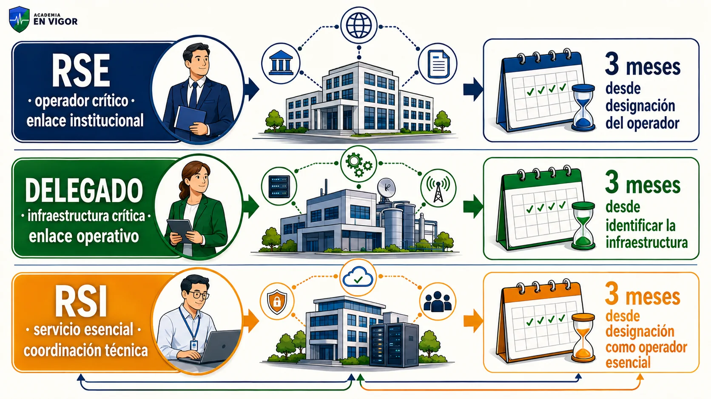

<em>Infografía: Gran comparativa textual RSE, Delegado y RSI con norma, plazo, ámbito e interlocutor.</em>

:::hablemos-claro
RSE, Delegado y RSI pueden relacionarse, pero la ley les da ámbitos distintos.
:::

:::en-la-calle
La autoridad puede comprobar política, aplicabilidad, auditorías y funcionamiento real de las medidas.
:::

:::lo-que-cae
Externalizar tecnología no externaliza la obligación de gestionar el riesgo.
:::

<!-- MATERIAL PENDIENTE: t15-p6-audio -->
<!-- MATERIAL PENDIENTE: t15-p6-video -->
<!-- MATERIAL PENDIENTE: t15-p6-pres -->

<!-- FUENTE: RDL12-2018-T15,RD43-2021-T15 -->

## 38. Gestión y notificación de ciberincidentes

Notificar permite coordinar asistencia, conocer alcance, contener efectos y mejorar la respuesta colectiva.

Los incidentes con efecto perturbador significativo se notifican sin dilación indebida. Puede haber comunicación inicial, intermedias y final; la plataforma nacional conecta operadores, CSIRT y autoridades y permite actualizar la información disponible.

### Claves normativas

- Los operadores de servicios esenciales notifican sin dilación indebida los incidentes con efecto perturbador significativo.
- La secuencia puede incluir notificación inicial, actualizaciones intermedias y notificación final tras la resolución.
- La Plataforma Nacional de Notificación y Seguimiento de Ciberincidentes facilita cooperación y trazabilidad entre actores.

 <!-- FACT:PN-T15-F112 --> <!-- FACT:PN-T15-F113 --> <!-- FACT:PN-T15-F114 -->

<!-- VISUAL:t15-38-linea-notificacion-incidente.webp -->

  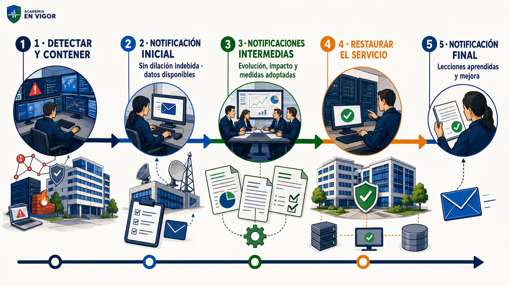

<em>Infografía: Línea temporal textual desde detección hasta notificación final, con actores y contenido de cada fase.</em>

:::hablemos-claro
Primero comunica lo que sabes; después actualiza sin esperar a tener certeza total.
:::

:::en-la-calle
La prioridad operativa es contener y restaurar sin perder evidencia ni coordinación.
:::

:::lo-que-cae
Notificar no sustituye a responder, y responder no excusa notificar.
:::

<!-- MATERIAL PENDIENTE: t15-p6-audio -->
<!-- MATERIAL PENDIENTE: t15-p6-video -->
<!-- MATERIAL PENDIENTE: t15-p6-pres -->

<!-- FUENTE: RDL12-2018-T15,RD43-2021-T15 -->

## 39. Esquema Nacional de Seguridad

El ENS fija principios básicos y requisitos mínimos para proteger información y servicios del sector público en su ámbito.

Sus principios incluyen proceso integral, gestión basada en riesgos, prevención-detección-respuesta-conservación, líneas de defensa, vigilancia continua, reevaluación periódica y diferenciación de responsabilidades.

### Claves normativas

- La seguridad como proceso integral incluye elementos humanos, materiales, técnicos, jurídicos y organizativos.
- El ENS exige gestión basada en riesgos, vigilancia continua y reevaluación periódica.
- El ENS incorpora líneas de defensa y diferenciación de responsabilidades.

 <!-- FACT:PN-T15-F115 --> <!-- FACT:PN-T15-F116 --> <!-- FACT:PN-T15-F117 -->

:::hablemos-claro
ENS no es una lista de productos: es gobierno continuo de la seguridad.
:::

:::en-la-calle
Prevén, detecta, responde, conserva y aprende.
:::

:::lo-que-cae
Los principios básicos no sustituyen las medidas concretas; las orientan.
:::

<!-- MATERIAL PENDIENTE: t15-p6-audio -->
<!-- MATERIAL PENDIENTE: t15-p6-video -->
<!-- MATERIAL PENDIENTE: t15-p6-pres -->

<!-- FUENTE: RD311-2022-T15 -->

## 40. Estrategia Nacional y transición NIS2

La Estrategia Nacional de Ciberseguridad orienta objetivos y coordinación; la normativa crea obligaciones exigibles.

La Estrategia 2019 continúa como referencia mientras se elabora su sustitución conforme al procedimiento aprobado en 2025. NIS2 amplía sectores, gobernanza y obligaciones en la Unión, pero su incorporación española completa no debe darse por consumada sin una ley nacional aprobada.

### Claves normativas

- La Estrategia Nacional de Ciberseguridad es un marco estratégico alineado con la Estrategia de Seguridad Nacional.
- La Orden PJC/522/2025 aprobó el procedimiento para elaborar una nueva Estrategia, no la nueva estrategia definitiva.
- NIS2 amplía el marco europeo, pero debe distinguirse de las obligaciones nacionales vigentes mientras culmina su incorporación.

 <!-- FACT:PN-T15-F118 --> <!-- FACT:PN-T15-F119 --> <!-- FACT:PN-T15-F120 -->

:::hablemos-claro
Estrategia orienta; ley obliga; directiva fija el resultado europeo a incorporar.
:::

:::en-la-calle
En una actualización, registra norma, estado, fecha y efecto real sobre el temario.
:::

:::lo-que-cae
No contestes como vigente el contenido de un anteproyecto.
:::

<!-- MATERIAL PENDIENTE: t15-p6-audio -->
<!-- MATERIAL PENDIENTE: t15-p6-video -->
<!-- MATERIAL PENDIENTE: t15-p6-pres -->

<!-- FUENTE: ECN2019-T15,PJC522-2025-T15,DIR2022-2555-T15 -->

## 41. Respuesta integral y continuidad

La protección madura une prevención, detección, respuesta, recuperación, continuidad y aprendizaje.

Una incidencia híbrida puede exigir activar medidas del operador, apoyo policial, CSIRT, autoridad sectorial y comunicación pública coordinada. El objetivo no es solo evitar el ataque, sino sostener el servicio esencial y reducir el daño en cascada.

### Claves normativas

- La respuesta integral coordina seguridad física, ciberseguridad, continuidad y comunicación.
- La recuperación busca restablecer redes, sistemas y servicio con seguridad y conservar evidencias.
- Las lecciones aprendidas deben alimentar análisis, medidas, planes, ejercicios y formación.

 <!-- FACT:PN-T15-F121 --> <!-- FACT:PN-T15-F122 --> <!-- FACT:PN-T15-F123 -->

:::hablemos-claro
Protege el servicio, no solo el activo.
:::

:::en-la-calle
Ensaya decisiones, contactos, alternativas y comunicación antes de necesitarlos.
:::

:::lo-que-cae
La resiliencia no sustituye la protección: añade capacidad de resistir, adaptarse y recuperarse.
:::

<!-- MATERIAL PENDIENTE: t15-p6-audio -->
<!-- MATERIAL PENDIENTE: t15-p6-video -->
<!-- MATERIAL PENDIENTE: t15-p6-pres -->

<!-- FUENTE: L8-2011-T15,RDL12-2018-T15,RD311-2022-T15 -->

## 42. Tablero final de examen

Resolver el Tema 15 exige identificar definición, autoridad, escala del plan, autor, aprobador, plazo y estado normativo.

Las preguntas históricas se concentran en infraestructura estratégica frente a crítica, calificación secreta del Catálogo, identificación por CNPIC, Comisión adscrita a la Secretaría, autores de PPE y PAO, revisión del PNPIC e INCIBE.

### Claves normativas

- La infraestructura estratégica sostiene el servicio; la crítica añade indispensabilidad, ausencia de alternativa y grave impacto.
- El Catálogo es secreto; el CNPIC identifica; la Secretaría clasifica; la Comisión designa operadores a propuesta del Grupo.
- El operador elabora PSO y PPE; el cuerpo policial elabora PAO; el PNPIC se revisa cada cinco años y los demás planes estudiados ordinariamente cada dos.

 <!-- FACT:PN-T15-F124 --> <!-- FACT:PN-T15-F125 --> <!-- FACT:PN-T15-F126 -->

:::hablemos-claro
Siete casillas: concepto, sujeto, escala, autor, aprobador, plazo y vigencia.
:::

:::en-la-calle
Si dos opciones parecen correctas, busca el verbo exacto: identificar, clasificar, elaborar, aprobar, revisar o custodiar.
:::

:::lo-que-cae
Un dato histórico solo vale si coincide con la regla vigente o está marcado como histórico.
:::

<!-- MATERIAL PENDIENTE: t15-p6-audio -->
<!-- MATERIAL PENDIENTE: t15-p6-video -->
<!-- MATERIAL PENDIENTE: t15-p6-pres -->

<!-- FUENTE: CONV-PN-2026,L8-2011-T15,RD704-2011-T15,RDL12-2018-T15 -->

# Hablemos claro

:::hablemos-claro
Lee primero el sujeto, después la figura jurídica y por último la competencia, el procedimiento o el efecto.
:::

# En la calle

:::en-la-calle
Una actuación correcta fija hechos, activa garantías y documenta el cauce empleado antes de llegar a la conclusión.
:::

# Lo que cae

:::lo-que-cae
Prioriza definiciones próximas, sujetos competentes, secuencias, límites, excepciones y diferencias entre figuras vecinas.
:::

# Ha caído

:::ha-caido
Las coincidencias históricas se conservan en el índice interno y permanecen ocultas mientras no exista plantilla oficial final verificada.
:::

---

*Academia En Vigor · El temario que nunca duerme · Tema 15 · v1.0.0 · Documento interno no publicado.*
