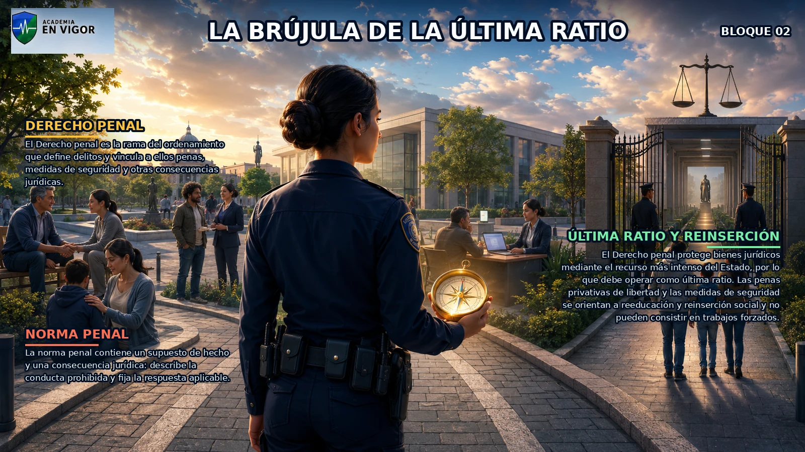
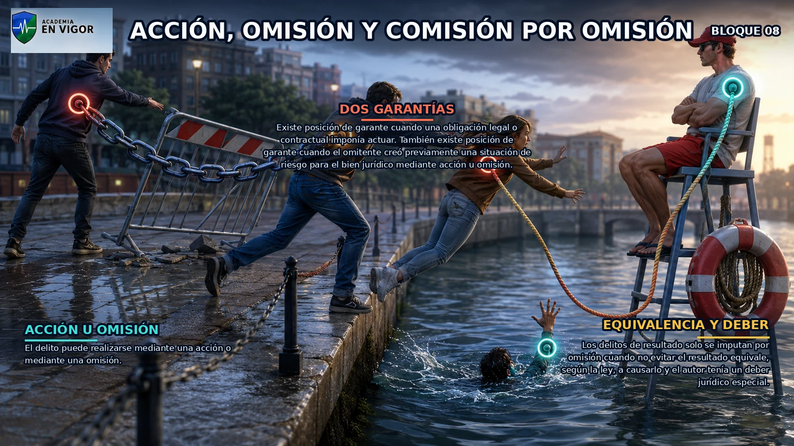
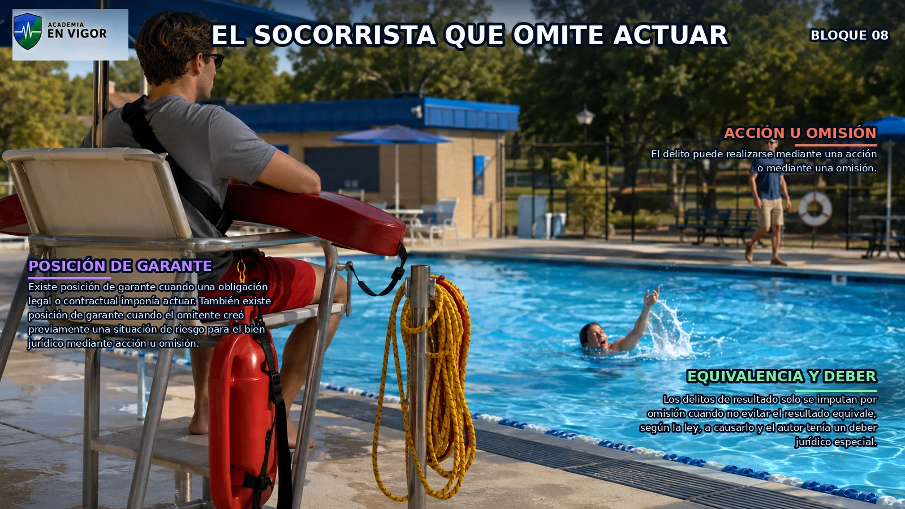
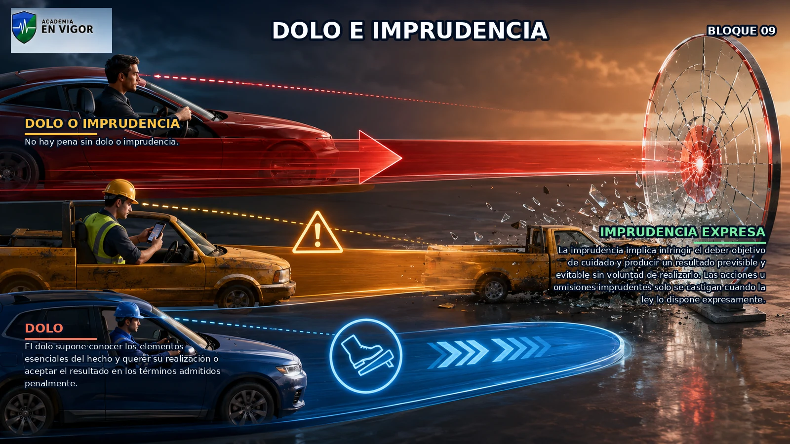
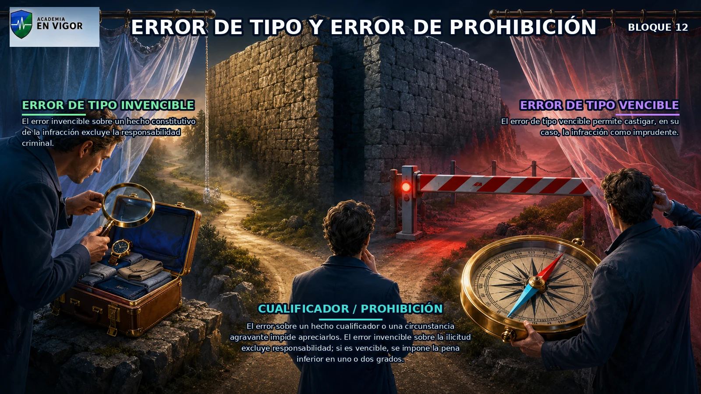
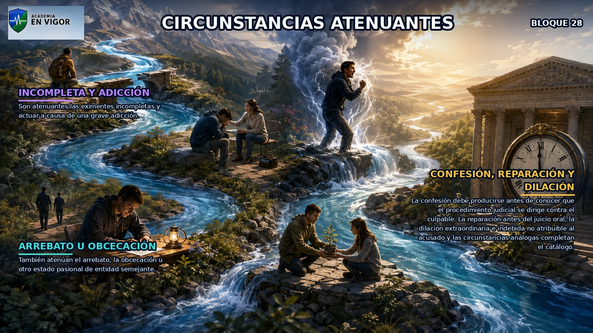
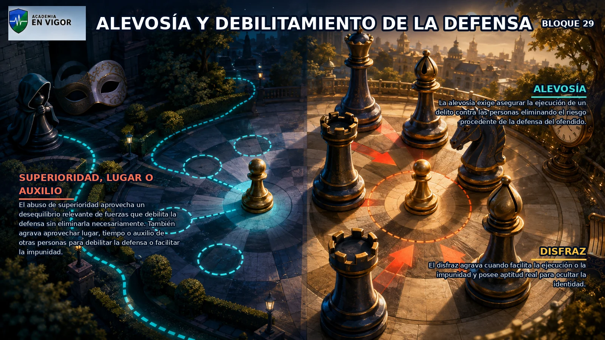
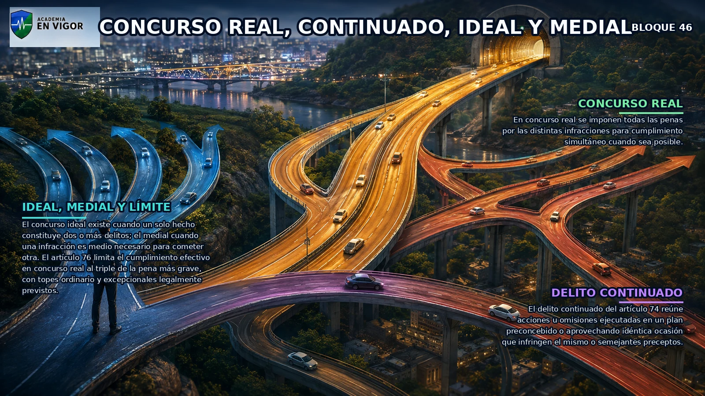
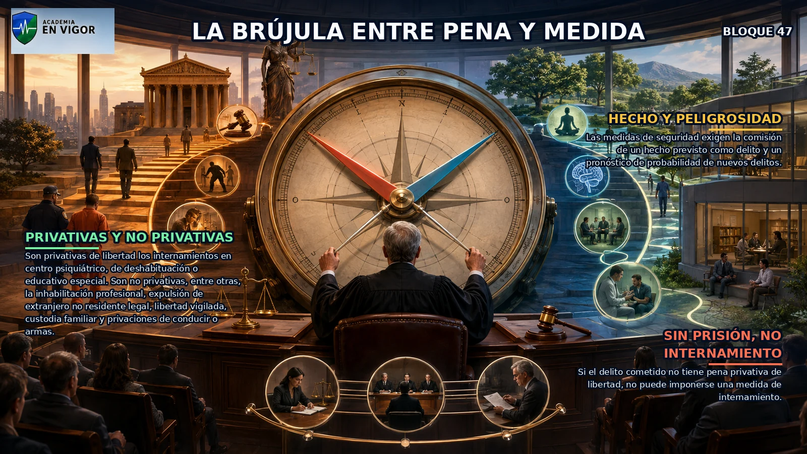

# TEMA 16 · DERECHO PENAL PARTE GENERAL

**Policía Nacional · Método VIGOR · ATESTADO**
**Versión de contenido:** 1.0.0
**Estado editorial:** approved_internal · **Publicación:** not_published

# Mapa del tema

Cinco tramos: fundamentos y vigencia; ejecución y responsables; edad y circunstancias; penas; aplicación y demás consecuencias.

# Contenido

## 01. Mapa oficial y ruta de estudio

### Regla y encaje

El Tema 16 oficial abarca concepto y principios del Derecho penal, infracción penal, concepto material de delito, ejecución, responsables físicos y jurídicos, consecuencias jurídicas, vigencia temporal y espacial, edad penal y circunstancias modificativas. Dentro de **fundamentos y vigencia**, este bloque fija una frontera que debe comprobarse antes de pasar a la consecuencia jurídica.

### Claves normativas

- El Tema 16 oficial abarca concepto y principios del Derecho penal, infracción penal, concepto material de delito, ejecución, responsables físicos y jurídicos, consecuencias jurídicas, vigencia temporal y espacial, edad penal y circunstancias modificativas.
- La ruta eficaz separa cinco tramos: fundamentos y vigencia; delito y ejecución; responsables; circunstancias; y consecuencias jurídicas. <!-- FACT:PN-T16-F001 -->
- El Código Penal es la fuente principal, pero la vigencia espacial se completa con el artículo 23 de la Ley Orgánica del Poder Judicial y la edad con la Ley Orgánica 5/2000. <!-- FACT:PN-T16-F002 -->
- Las explicaciones doctrinales ayudan a comprender, pero nunca sustituyen el tenor de los artículos ni se presentan como derecho vigente. <!-- FACT:PN-T16-F003 -->
 <!-- FACT:PN-T16-F004 -->

<!-- VISUAL:t16-01-mapa-oficial-y-ruta-de-estudio.webp -->

  

<em>Infografía: Mapa oficial y ruta de estudio.</em>

:::hablemos-claro
Piensa primero qué ley manda, cuándo y dónde se aplica; después entra en el delito.
:::

:::en-la-calle
En una intervención, fija fecha, lugar, conducta y norma vigente antes de calificar.
:::

:::lo-que-cae
La trampa suele estar en una excepción temporal, territorial o en confundir doctrina con texto legal. En este bloque retén especialmente: La ruta eficaz separa cinco tramos: fundamentos y vigencia; delito y ejecución; responsables; circunstancias; y consecuencias jurídicas.
:::

<!-- FUENTE: CONV-PN-2026 -->

## 02. Concepto y función del Derecho penal

### Regla y encaje

El Derecho penal es la rama del ordenamiento que define delitos y vincula a ellos penas, medidas de seguridad y otras consecuencias jurídicas. Dentro de **fundamentos y vigencia**, este bloque fija una frontera que debe comprobarse antes de pasar a la consecuencia jurídica.

### Claves normativas

- El Derecho penal es la rama del ordenamiento que define delitos y vincula a ellos penas, medidas de seguridad y otras consecuencias jurídicas.
- La norma penal contiene un supuesto de hecho y una consecuencia jurídica: describe la conducta prohibida y fija la respuesta aplicable. <!-- FACT:PN-T16-F005 -->
- El Derecho penal protege bienes jurídicos mediante el recurso más intenso del Estado, por lo que debe operar como última ratio. <!-- FACT:PN-T16-F006 -->
- Las penas privativas de libertad y las medidas de seguridad se orientan a reeducación y reinserción social y no pueden consistir en trabajos forzados. <!-- FACT:PN-T16-F007 -->
 <!-- FACT:PN-T16-F008 -->

<!-- VISUAL:t16-il-01-la-brujula-de-la-ultima-ratio.webp -->

  

<em>Ilustración: La brújula de la última ratio.</em>

:::hablemos-claro
Piensa primero qué ley manda, cuándo y dónde se aplica; después entra en el delito.
:::

:::en-la-calle
En una intervención, fija fecha, lugar, conducta y norma vigente antes de calificar.
:::

:::lo-que-cae
La trampa suele estar en una excepción temporal, territorial o en confundir doctrina con texto legal. En este bloque retén especialmente: La norma penal contiene un supuesto de hecho y una consecuencia jurídica: describe la conducta prohibida y fija la respuesta aplicable.
:::

<!-- FUENTE: CP-T16,CE-T16 -->

## 03. Legalidad y garantías penales

### Regla y encaje

Nadie puede ser castigado por una acción u omisión que no estuviera prevista como delito por ley anterior a su realización. Dentro de **fundamentos y vigencia**, este bloque fija una frontera que debe comprobarse antes de pasar a la consecuencia jurídica.

### Claves normativas

- Nadie puede ser castigado por una acción u omisión que no estuviera prevista como delito por ley anterior a su realización.
- Las medidas de seguridad solo pueden aplicarse cuando sus presupuestos estaban establecidos previamente por la ley. <!-- FACT:PN-T16-F009 -->
- No puede ejecutarse pena o medida sin sentencia firme del órgano competente ni de forma distinta a la prevista legalmente. <!-- FACT:PN-T16-F010 -->
- Las leyes penales no se aplican a casos distintos de los expresamente comprendidos: la analogía perjudicial al reo está prohibida. <!-- FACT:PN-T16-F011 -->
 <!-- FACT:PN-T16-F012 -->

<!-- VISUAL:t16-02-legalidad-y-garantias-penales.webp -->

  

<em>Infografía: Legalidad y garantías penales.</em>

:::hablemos-claro
Piensa primero qué ley manda, cuándo y dónde se aplica; después entra en el delito.
:::

:::en-la-calle
En una intervención, fija fecha, lugar, conducta y norma vigente antes de calificar.
:::

:::lo-que-cae
La trampa suele estar en una excepción temporal, territorial o en confundir doctrina con texto legal. En este bloque retén especialmente: Las medidas de seguridad solo pueden aplicarse cuando sus presupuestos estaban establecidos previamente por la ley.
:::

<!-- FUENTE: CP-T16,CE-T16 -->

## 04. Vigencia temporal de la ley penal

### Regla y encaje

Las leyes penales desfavorables no tienen efecto retroactivo. Dentro de **fundamentos y vigencia**, este bloque fija una frontera que debe comprobarse antes de pasar a la consecuencia jurídica.

### Claves normativas

- Las leyes penales desfavorables no tienen efecto retroactivo.
- Las leyes penales posteriores favorables al reo se aplican retroactivamente incluso con sentencia firme y durante el cumplimiento de la condena. <!-- FACT:PN-T16-F013 -->
- Si existe duda sobre cuál es la ley más favorable, el reo debe ser oído. <!-- FACT:PN-T16-F014 -->
- Los hechos cometidos bajo una ley temporal se juzgan conforme a ella, salvo que la propia ley disponga expresamente lo contrario. <!-- FACT:PN-T16-F015 -->
 <!-- FACT:PN-T16-F016 -->

<!-- VISUAL:t16-03-vigencia-temporal-de-la-ley-penal.webp -->

  

<em>Infografía: Vigencia temporal de la ley penal.</em>

:::hablemos-claro
Piensa primero qué ley manda, cuándo y dónde se aplica; después entra en el delito.
:::

:::en-la-calle
En una intervención, fija fecha, lugar, conducta y norma vigente antes de calificar.
:::

:::lo-que-cae
La trampa suele estar en una excepción temporal, territorial o en confundir doctrina con texto legal. En este bloque retén especialmente: Las leyes penales posteriores favorables al reo se aplican retroactivamente incluso con sentencia firme y durante el cumplimiento de la condena.
:::

<!-- FUENTE: CP-T16 -->

## 05. Vigencia espacial y jurisdicción española

### Regla y encaje

La jurisdicción española conoce de los delitos cometidos en territorio español o a bordo de buques o aeronaves españoles, sin perjuicio de los tratados. Dentro de **fundamentos y vigencia**, este bloque fija una frontera que debe comprobarse antes de pasar a la consecuencia jurídica.

### Claves normativas

- La jurisdicción española conoce de los delitos cometidos en territorio español o a bordo de buques o aeronaves españoles, sin perjuicio de los tratados.
- El principio de personalidad permite perseguir determinados hechos cometidos fuera de España por españoles o personas que adquirieron después la nacionalidad, si se cumplen los requisitos legales. <!-- FACT:PN-T16-F017 -->
- El principio real o de protección permite perseguir fuera de España los delitos específicamente enumerados que atacan intereses esenciales del Estado. <!-- FACT:PN-T16-F018 -->
- La jurisdicción universal solo opera para los delitos y con las conexiones expresamente previstas en el artículo 23.4 de la Ley Orgánica del Poder Judicial. <!-- FACT:PN-T16-F019 -->
 <!-- FACT:PN-T16-F020 -->

<!-- VISUAL:t16-04-vigencia-espacial-y-jurisdiccion-espanola.webp -->

  

<em>Infografía: Vigencia espacial y jurisdicción española.</em>

:::hablemos-claro
Piensa primero qué ley manda, cuándo y dónde se aplica; después entra en el delito.
:::

:::en-la-calle
En una intervención, fija fecha, lugar, conducta y norma vigente antes de calificar.
:::

:::lo-que-cae
La trampa suele estar en una excepción temporal, territorial o en confundir doctrina con texto legal. En este bloque retén especialmente: El principio de personalidad permite perseguir determinados hechos cometidos fuera de España por españoles o personas que adquirieron después la nacionalidad, si se cumplen los requisitos legales.
:::

<!-- FUENTE: LOPJ-T16,CP-T16 -->

## 06. Momento, lugar y leyes penales especiales

### Regla y encaje

El delito se considera cometido en el momento en que el sujeto ejecuta la acción u omite el acto que estaba obligado a realizar. Dentro de **fundamentos y vigencia**, este bloque fija una frontera que debe comprobarse antes de pasar a la consecuencia jurídica.

### Claves normativas

- El delito se considera cometido en el momento en que el sujeto ejecuta la acción u omite el acto que estaba obligado a realizar.
- En el concurso aparente de normas rigen especialidad, subsidiariedad, consunción y, en defecto de las anteriores, el precepto penal más grave. <!-- FACT:PN-T16-F021 -->
- Las garantías del Título Preliminar se aplican también a delitos de leyes penales especiales. <!-- FACT:PN-T16-F022 -->
- Las restantes disposiciones del Código Penal se aplican supletoriamente a las leyes especiales en lo no previsto expresamente por ellas. <!-- FACT:PN-T16-F023 -->
 <!-- FACT:PN-T16-F024 -->

:::hablemos-claro
Piensa primero qué ley manda, cuándo y dónde se aplica; después entra en el delito.
:::

:::en-la-calle
En una intervención, fija fecha, lugar, conducta y norma vigente antes de calificar.
:::

:::lo-que-cae
La trampa suele estar en una excepción temporal, territorial o en confundir doctrina con texto legal. En este bloque retén especialmente: En el concurso aparente de normas rigen especialidad, subsidiariedad, consunción y, en defecto de las anteriores, el precepto penal más grave.
:::

<!-- FUENTE: CP-T16 -->

## 07. Infracción penal y concepto material de delito

### Regla y encaje

Son delitos las acciones y omisiones dolosas o imprudentes penadas por la ley. Dentro de **fundamentos y vigencia**, este bloque fija una frontera que debe comprobarse antes de pasar a la consecuencia jurídica.

### Claves normativas

- Son delitos las acciones y omisiones dolosas o imprudentes penadas por la ley.
- El concepto material explica el delito como conducta humana típica, antijurídica, culpable y punible. <!-- FACT:PN-T16-F025 -->
- La tipicidad exige que el hecho encaje en la descripción legal; la antijuridicidad desaparece cuando concurre una causa de justificación completa. <!-- FACT:PN-T16-F026 -->
- La culpabilidad exige que el hecho pueda reprocharse personalmente al autor; la punibilidad comprueba que no exista una condición que excluya la pena. <!-- FACT:PN-T16-F027 -->
 <!-- FACT:PN-T16-F028 -->

<!-- VISUAL:t16-05-infraccion-penal-y-concepto-material-de-delito.webp -->

  

<em>Infografía: Infracción penal y concepto material de delito.</em>

:::hablemos-claro
Piensa primero qué ley manda, cuándo y dónde se aplica; después entra en el delito.
:::

:::en-la-calle
En una intervención, fija fecha, lugar, conducta y norma vigente antes de calificar.
:::

:::lo-que-cae
La trampa suele estar en una excepción temporal, territorial o en confundir doctrina con texto legal. En este bloque retén especialmente: El concepto material explica el delito como conducta humana típica, antijurídica, culpable y punible.
:::

<!-- FUENTE: CP-T16 -->

## 08. Acción, omisión y comisión por omisión

### Regla y encaje

El delito puede realizarse mediante una acción o mediante una omisión. Dentro de **fundamentos y vigencia**, este bloque fija una frontera que debe comprobarse antes de pasar a la consecuencia jurídica.

### Claves normativas

- El delito puede realizarse mediante una acción o mediante una omisión.
- Los delitos de resultado solo se imputan por omisión cuando no evitar el resultado equivale, según la ley, a causarlo y el autor tenía un deber jurídico especial. <!-- FACT:PN-T16-F029 -->
- Existe posición de garante cuando una obligación legal o contractual imponía actuar. <!-- FACT:PN-T16-F030 -->
- También existe posición de garante cuando el omitente creó previamente una situación de riesgo para el bien jurídico mediante acción u omisión. <!-- FACT:PN-T16-F031 -->
 <!-- FACT:PN-T16-F032 -->

<!-- VISUAL:t16-06-accion-omision-y-comision-por-omision.webp -->

  

<em>Infografía: Acción, omisión y comisión por omisión.</em>

<!-- VISUAL:t16-il-02-el-socorrista-que-omite-actuar.webp -->

  

<em>Ilustración: El socorrista que omite actuar.</em>

:::hablemos-claro
Piensa primero qué ley manda, cuándo y dónde se aplica; después entra en el delito.
:::

:::en-la-calle
En una intervención, fija fecha, lugar, conducta y norma vigente antes de calificar.
:::

:::lo-que-cae
La trampa suele estar en una excepción temporal, territorial o en confundir doctrina con texto legal. En este bloque retén especialmente: Los delitos de resultado solo se imputan por omisión cuando no evitar el resultado equivale, según la ley, a causarlo y el autor tenía un deber jurídico especial.
:::

<!-- FUENTE: CP-T16 -->

## 09. Dolo e imprudencia

### Regla y encaje

No hay pena sin dolo o imprudencia. Dentro de **fundamentos y vigencia**, este bloque fija una frontera que debe comprobarse antes de pasar a la consecuencia jurídica.

### Claves normativas

- No hay pena sin dolo o imprudencia.
- El dolo supone conocer los elementos esenciales del hecho y querer su realización o aceptar el resultado en los términos admitidos penalmente. <!-- FACT:PN-T16-F033 -->
- La imprudencia implica infringir el deber objetivo de cuidado y producir un resultado previsible y evitable sin voluntad de realizarlo. <!-- FACT:PN-T16-F034 -->
- Las acciones u omisiones imprudentes solo se castigan cuando la ley lo dispone expresamente. <!-- FACT:PN-T16-F035 -->
 <!-- FACT:PN-T16-F036 -->

<!-- VISUAL:t16-07-dolo-e-imprudencia.webp -->

  

<em>Infografía: Dolo e imprudencia.</em>

:::hablemos-claro
Piensa primero qué ley manda, cuándo y dónde se aplica; después entra en el delito.
:::

:::en-la-calle
En una intervención, fija fecha, lugar, conducta y norma vigente antes de calificar.
:::

:::lo-que-cae
La trampa suele estar en una excepción temporal, territorial o en confundir doctrina con texto legal. En este bloque retén especialmente: El dolo supone conocer los elementos esenciales del hecho y querer su realización o aceptar el resultado en los términos admitidos penalmente.
:::

<!-- FUENTE: CP-T16 -->

## 10. Elementos del delito

### Regla y encaje

La conducta es el comportamiento humano activo u omisivo del que parte el análisis del delito. Dentro de **fundamentos y vigencia**, este bloque fija una frontera que debe comprobarse antes de pasar a la consecuencia jurídica.

### Claves normativas

- La conducta es el comportamiento humano activo u omisivo del que parte el análisis del delito.
- La tipicidad reúne los elementos objetivos y subjetivos exigidos por el tipo penal. <!-- FACT:PN-T16-F037 -->
- La antijuridicidad expresa la contradicción del hecho típico con el ordenamiento cuando no concurre una justificación. <!-- FACT:PN-T16-F038 -->
- La culpabilidad comprende imputabilidad, conciencia potencial de la ilicitud y exigibilidad de una conducta conforme a Derecho. <!-- FACT:PN-T16-F039 -->
 <!-- FACT:PN-T16-F040 -->

:::hablemos-claro
Piensa primero qué ley manda, cuándo y dónde se aplica; después entra en el delito.
:::

:::en-la-calle
En una intervención, fija fecha, lugar, conducta y norma vigente antes de calificar.
:::

:::lo-que-cae
La trampa suele estar en una excepción temporal, territorial o en confundir doctrina con texto legal. En este bloque retén especialmente: La tipicidad reúne los elementos objetivos y subjetivos exigidos por el tipo penal.
:::

<!-- FUENTE: CP-T16 -->

## 11. Delitos graves, menos graves y leves

### Regla y encaje

Son delitos graves los castigados por la ley con pena grave. Dentro de **fundamentos y vigencia**, este bloque fija una frontera que debe comprobarse antes de pasar a la consecuencia jurídica.

### Claves normativas

- Son delitos graves los castigados por la ley con pena grave.
- Son delitos menos graves los castigados con pena menos grave y delitos leves los castigados con pena leve. <!-- FACT:PN-T16-F041 -->
- Si la extensión de una pena permite clasificarla a la vez como grave y menos grave, el delito se considera grave. <!-- FACT:PN-T16-F042 -->
- Si la extensión de una pena permite clasificarla a la vez como leve y menos grave, el delito se considera leve. <!-- FACT:PN-T16-F043 -->
 <!-- FACT:PN-T16-F044 -->

<!-- VISUAL:t16-08-delitos-graves-menos-graves-y-leves.webp -->

  

<em>Infografía: Delitos graves, menos graves y leves.</em>

:::hablemos-claro
Piensa primero qué ley manda, cuándo y dónde se aplica; después entra en el delito.
:::

:::en-la-calle
En una intervención, fija fecha, lugar, conducta y norma vigente antes de calificar.
:::

:::lo-que-cae
La trampa suele estar en una excepción temporal, territorial o en confundir doctrina con texto legal. En este bloque retén especialmente: Son delitos menos graves los castigados con pena menos grave y delitos leves los castigados con pena leve.
:::

<!-- FUENTE: CP-T16 -->

## 12. Error de tipo y error de prohibición

### Regla y encaje

El error invencible sobre un hecho constitutivo de la infracción excluye la responsabilidad criminal. Dentro de **fundamentos y vigencia**, este bloque fija una frontera que debe comprobarse antes de pasar a la consecuencia jurídica.

### Claves normativas

- El error invencible sobre un hecho constitutivo de la infracción excluye la responsabilidad criminal.
- El error de tipo vencible permite castigar, en su caso, la infracción como imprudente. <!-- FACT:PN-T16-F045 -->
- El error sobre un hecho cualificador o una circunstancia agravante impide apreciarlos. <!-- FACT:PN-T16-F046 -->
- El error invencible sobre la ilicitud excluye responsabilidad; si es vencible, se impone la pena inferior en uno o dos grados. <!-- FACT:PN-T16-F047 -->
 <!-- FACT:PN-T16-F048 -->

<!-- VISUAL:t16-09-error-de-tipo-y-error-de-prohibicion.webp -->

  

<em>Infografía: Error de tipo y error de prohibición.</em>

:::hablemos-claro
Piensa primero qué ley manda, cuándo y dónde se aplica; después entra en el delito.
:::

:::en-la-calle
En una intervención, fija fecha, lugar, conducta y norma vigente antes de calificar.
:::

:::lo-que-cae
La trampa suele estar en una excepción temporal, territorial o en confundir doctrina con texto legal. En este bloque retén especialmente: El error de tipo vencible permite castigar, en su caso, la infracción como imprudente.
:::

<!-- FUENTE: CP-T16 -->

## 13. Consumación, tentativa y actos preparatorios

### Regla y encaje

Son punibles el delito consumado y la tentativa de delito. Dentro de **fundamentos y vigencia**, este bloque fija una frontera que debe comprobarse antes de pasar a la consecuencia jurídica.

### Claves normativas

- Son punibles el delito consumado y la tentativa de delito.
- Los actos internos no se castigan por sí solos porque aún no exteriorizan una conducta típica. <!-- FACT:PN-T16-F049 -->
- La conspiración, proposición y provocación solo se castigan en los casos especialmente previstos por la ley. <!-- FACT:PN-T16-F050 -->
- Consumación y agotamiento no son equivalentes: la consumación completa el tipo; el agotamiento obtiene o prolonga el propósito perseguido. <!-- FACT:PN-T16-F051 -->
 <!-- FACT:PN-T16-F052 -->

:::hablemos-claro
Piensa primero qué ley manda, cuándo y dónde se aplica; después entra en el delito.
:::

:::en-la-calle
En una intervención, fija fecha, lugar, conducta y norma vigente antes de calificar.
:::

:::lo-que-cae
La trampa suele estar en una excepción temporal, territorial o en confundir doctrina con texto legal. En este bloque retén especialmente: Los actos internos no se castigan por sí solos porque aún no exteriorizan una conducta típica.
:::

<!-- FUENTE: CP-T16 -->

## 14. Tentativa y determinación de la pena

### Regla y encaje

Hay tentativa cuando el sujeto inicia directamente la ejecución mediante hechos exteriores y practica todos o parte de los actos que objetivamente deberían producir el resultado. Dentro de **ejecución y responsables**, este bloque fija una frontera que debe comprobarse antes de pasar a la consecuencia jurídica.

### Claves normativas

- Hay tentativa cuando el sujeto inicia directamente la ejecución mediante hechos exteriores y practica todos o parte de los actos que objetivamente deberían producir el resultado.
- El resultado no se produce por causas independientes de la voluntad del autor. <!-- FACT:PN-T16-F053 -->
- La tentativa puede ser acabada cuando se ejecutan todos los actos previstos e inacabada cuando solo se ejecuta una parte. <!-- FACT:PN-T16-F054 -->
- A los autores de tentativa se les impone la pena inferior en uno o dos grados, atendiendo al peligro del intento y al grado de ejecución. <!-- FACT:PN-T16-F055 -->
 <!-- FACT:PN-T16-F056 -->

<!-- VISUAL:t16-10-tentativa-y-determinacion-de-la-pena.webp -->

  

<em>Infografía: Tentativa y determinación de la pena.</em>

:::hablemos-claro
Dibuja la película del delito: comienzo, posible freno, resultado y papel de cada interviniente.
:::

:::en-la-calle
Separa quién ejecuta, quién induce, quién aporta lo imprescindible y quién solo ayuda.
:::

:::lo-que-cae
Tentativa, desistimiento, autoría y persona jurídica cambian por un requisito concreto; no por intuición. En este bloque retén especialmente: El resultado no se produce por causas independientes de la voluntad del autor.
:::

<!-- FUENTE: CP-T16 -->

## 15. Desistimiento y evitación del resultado

### Regla y encaje

Queda exento por el delito intentado quien evita voluntariamente la consumación desistiendo de la ejecución ya iniciada o impidiendo el resultado. Dentro de **ejecución y responsables**, este bloque fija una frontera que debe comprobarse antes de pasar a la consecuencia jurídica.

### Claves normativas

- Queda exento por el delito intentado quien evita voluntariamente la consumación desistiendo de la ejecución ya iniciada o impidiendo el resultado.
- La exención por desistimiento no elimina la responsabilidad por otros actos ya ejecutados que constituyan delito. <!-- FACT:PN-T16-F057 -->
- Cuando intervienen varios sujetos, queda exento quien desiste e impide o intenta impedir seria, firme y decididamente la consumación. <!-- FACT:PN-T16-F058 -->
- El desistimiento exige voluntariedad: no basta abandonar porque la consumación se ha vuelto imposible o porque aparece un obstáculo insuperable. <!-- FACT:PN-T16-F059 -->
 <!-- FACT:PN-T16-F060 -->

<!-- VISUAL:t16-il-03-el-freno-del-desistimiento.webp -->

  

<em>Ilustración: El freno del desistimiento.</em>

:::hablemos-claro
Dibuja la película del delito: comienzo, posible freno, resultado y papel de cada interviniente.
:::

:::en-la-calle
Separa quién ejecuta, quién induce, quién aporta lo imprescindible y quién solo ayuda.
:::

:::lo-que-cae
Tentativa, desistimiento, autoría y persona jurídica cambian por un requisito concreto; no por intuición. En este bloque retén especialmente: La exención por desistimiento no elimina la responsabilidad por otros actos ya ejecutados que constituyan delito.
:::

<!-- FUENTE: CP-T16 -->

## 16. Conspiración y proposición

### Regla y encaje

La conspiración existe cuando dos o más personas se conciertan para ejecutar un delito y resuelven llevarlo a cabo. Dentro de **ejecución y responsables**, este bloque fija una frontera que debe comprobarse antes de pasar a la consecuencia jurídica.

### Claves normativas

- La conspiración existe cuando dos o más personas se conciertan para ejecutar un delito y resuelven llevarlo a cabo.
- La proposición existe cuando quien ha resuelto cometer un delito invita a otra u otras personas a participar en él. <!-- FACT:PN-T16-F061 -->
- Conspiración y proposición son actos preparatorios punibles únicamente cuando el Libro II lo prevé expresamente. <!-- FACT:PN-T16-F062 -->
- La proposición exige una decisión propia previa de delinquir; no equivale a una invitación abstracta o meramente retórica. <!-- FACT:PN-T16-F063 -->
 <!-- FACT:PN-T16-F064 -->

:::hablemos-claro
Dibuja la película del delito: comienzo, posible freno, resultado y papel de cada interviniente.
:::

:::en-la-calle
Separa quién ejecuta, quién induce, quién aporta lo imprescindible y quién solo ayuda.
:::

:::lo-que-cae
Tentativa, desistimiento, autoría y persona jurídica cambian por un requisito concreto; no por intuición. En este bloque retén especialmente: La proposición existe cuando quien ha resuelto cometer un delito invita a otra u otras personas a participar en él.
:::

<!-- FUENTE: CP-T16 -->

## 17. Provocación y apología

### Regla y encaje

La provocación exige incitación directa a cometer un delito mediante un medio de publicidad eficaz o ante una concurrencia de personas. Dentro de **ejecución y responsables**, este bloque fija una frontera que debe comprobarse antes de pasar a la consecuencia jurídica.

### Claves normativas

- La provocación exige incitación directa a cometer un delito mediante un medio de publicidad eficaz o ante una concurrencia de personas.
- La provocación solo se castiga cuando la ley lo prevé expresamente. <!-- FACT:PN-T16-F065 -->
- La apología solo es delictiva como forma de provocación cuando constituye incitación directa a cometer un delito. <!-- FACT:PN-T16-F066 -->
- Si a la provocación sigue la perpetración del delito, se castiga como inducción. <!-- FACT:PN-T16-F067 -->
 <!-- FACT:PN-T16-F068 -->

:::hablemos-claro
Dibuja la película del delito: comienzo, posible freno, resultado y papel de cada interviniente.
:::

:::en-la-calle
Separa quién ejecuta, quién induce, quién aporta lo imprescindible y quién solo ayuda.
:::

:::lo-que-cae
Tentativa, desistimiento, autoría y persona jurídica cambian por un requisito concreto; no por intuición. En este bloque retén especialmente: La provocación solo se castiga cuando la ley lo prevé expresamente.
:::

<!-- FUENTE: CP-T16 -->

## 18. Autores, inductores y cooperadores necesarios

### Regla y encaje

Son responsables criminalmente de los delitos los autores y los cómplices. Dentro de **ejecución y responsables**, este bloque fija una frontera que debe comprobarse antes de pasar a la consecuencia jurídica.

### Claves normativas

- Son responsables criminalmente de los delitos los autores y los cómplices.
- Es autor quien realiza el hecho por sí solo, conjuntamente o por medio de otro del que se sirve como instrumento. <!-- FACT:PN-T16-F069 -->
- También se consideran autores quienes inducen directamente a otro a ejecutar el delito. <!-- FACT:PN-T16-F070 -->
- También se consideran autores quienes cooperan con un acto sin el cual el delito no se habría efectuado. <!-- FACT:PN-T16-F071 -->
 <!-- FACT:PN-T16-F072 -->

<!-- VISUAL:t16-11-autores-inductores-y-cooperadores-necesarios.webp -->

  

<em>Infografía: Autores, inductores y cooperadores necesarios.</em>

:::hablemos-claro
Dibuja la película del delito: comienzo, posible freno, resultado y papel de cada interviniente.
:::

:::en-la-calle
Separa quién ejecuta, quién induce, quién aporta lo imprescindible y quién solo ayuda.
:::

:::lo-que-cae
Tentativa, desistimiento, autoría y persona jurídica cambian por un requisito concreto; no por intuición. En este bloque retén especialmente: Es autor quien realiza el hecho por sí solo, conjuntamente o por medio de otro del que se sirve como instrumento.
:::

<!-- FUENTE: CP-T16 -->

## 19. Complicidad y encubrimiento

### Regla y encaje

Son cómplices quienes, sin estar comprendidos en el artículo 28, cooperan a la ejecución con actos anteriores o simultáneos. Dentro de **ejecución y responsables**, este bloque fija una frontera que debe comprobarse antes de pasar a la consecuencia jurídica.

### Claves normativas

- Son cómplices quienes, sin estar comprendidos en el artículo 28, cooperan a la ejecución con actos anteriores o simultáneos.
- La cooperación del cómplice no es imprescindible: si el acto era necesario, la figura correcta es cooperación necesaria. <!-- FACT:PN-T16-F073 -->
- Al cómplice de delito consumado o intentado se le impone, salvo regla especial, la pena inferior en grado a la fijada para el autor. <!-- FACT:PN-T16-F074 -->
- El encubrimiento no es una forma de participación en el delito previo: es un delito autónomo cometido después de su ejecución. <!-- FACT:PN-T16-F075 -->
 <!-- FACT:PN-T16-F076 -->

:::hablemos-claro
Dibuja la película del delito: comienzo, posible freno, resultado y papel de cada interviniente.
:::

:::en-la-calle
Separa quién ejecuta, quién induce, quién aporta lo imprescindible y quién solo ayuda.
:::

:::lo-que-cae
Tentativa, desistimiento, autoría y persona jurídica cambian por un requisito concreto; no por intuición. En este bloque retén especialmente: La cooperación del cómplice no es imprescindible: si el acto era necesario, la figura correcta es cooperación necesaria.
:::

<!-- FUENTE: CP-T16 -->

## 20. Delitos mediante difusión y actuación en nombre de otro

### Regla y encaje

En delitos cometidos mediante medios de difusión no responden criminalmente los cómplices ni quienes favorecen personal o realmente el hecho. Dentro de **ejecución y responsables**, este bloque fija una frontera que debe comprobarse antes de pasar a la consecuencia jurídica.

### Claves normativas

- En delitos cometidos mediante medios de difusión no responden criminalmente los cómplices ni quienes favorecen personal o realmente el hecho.
- La responsabilidad en delitos de difusión es escalonada, excluyente y subsidiaria según el orden del artículo 30. <!-- FACT:PN-T16-F077 -->
- Quien actúa como administrador de hecho o de derecho o en representación de otro puede responder personalmente aunque no reúna una cualidad exigida por el tipo. <!-- FACT:PN-T16-F078 -->
- Para aplicar el artículo 31, la cualidad especial debe concurrir en la entidad o persona en cuyo nombre o representación se actúa. <!-- FACT:PN-T16-F079 -->
 <!-- FACT:PN-T16-F080 -->

:::hablemos-claro
Dibuja la película del delito: comienzo, posible freno, resultado y papel de cada interviniente.
:::

:::en-la-calle
Separa quién ejecuta, quién induce, quién aporta lo imprescindible y quién solo ayuda.
:::

:::lo-que-cae
Tentativa, desistimiento, autoría y persona jurídica cambian por un requisito concreto; no por intuición. En este bloque retén especialmente: La responsabilidad en delitos de difusión es escalonada, excluyente y subsidiaria según el orden del artículo 30.
:::

<!-- FUENTE: CP-T16 -->

## 21. Responsabilidad penal de la persona jurídica

### Regla y encaje

Las personas jurídicas responden penalmente solo en los supuestos expresamente previstos por el Código Penal. Dentro de **ejecución y responsables**, este bloque fija una frontera que debe comprobarse antes de pasar a la consecuencia jurídica.

### Claves normativas

- Las personas jurídicas responden penalmente solo en los supuestos expresamente previstos por el Código Penal.
- Una vía de imputación comprende delitos cometidos en nombre o por cuenta y en beneficio directo o indirecto por representantes o personas con facultades decisorias, organizativas o de control. <!-- FACT:PN-T16-F081 -->
- La segunda vía comprende delitos de subordinados cometidos en actividades sociales, por cuenta y beneficio de la entidad, por incumplimiento grave de supervisión, vigilancia y control. <!-- FACT:PN-T16-F082 -->
- La responsabilidad de la persona jurídica no sustituye automáticamente la responsabilidad penal de las personas físicas intervinientes. <!-- FACT:PN-T16-F083 -->
 <!-- FACT:PN-T16-F084 -->

<!-- VISUAL:t16-12-responsabilidad-penal-de-la-persona-juridica.webp -->

  

<em>Infografía: Responsabilidad penal de la persona jurídica.</em>

:::hablemos-claro
Dibuja la película del delito: comienzo, posible freno, resultado y papel de cada interviniente.
:::

:::en-la-calle
Separa quién ejecuta, quién induce, quién aporta lo imprescindible y quién solo ayuda.
:::

:::lo-que-cae
Tentativa, desistimiento, autoría y persona jurídica cambian por un requisito concreto; no por intuición. En este bloque retén especialmente: Una vía de imputación comprende delitos cometidos en nombre o por cuenta y en beneficio directo o indirecto por representantes o personas con facultades decisorias, organizativas o de control.
:::

<!-- FUENTE: CP-T16 -->

## 22. Programas de cumplimiento y exención

### Regla y encaje

Para delitos de dirigentes, la exención exige un modelo eficaz previo, supervisión autónoma, elusión fraudulenta por el autor y ausencia de omisión de control. Dentro de **ejecución y responsables**, este bloque fija una frontera que debe comprobarse antes de pasar a la consecuencia jurídica.

### Claves normativas

- Para delitos de dirigentes, la exención exige un modelo eficaz previo, supervisión autónoma, elusión fraudulenta por el autor y ausencia de omisión de control.
- En personas jurídicas pequeñas, las funciones de supervisión pueden ser asumidas directamente por el órgano de administración. <!-- FACT:PN-T16-F085 -->
- Para delitos de subordinados, la exención exige haber adoptado y ejecutado eficazmente antes del delito un modelo adecuado de prevención o reducción significativa del riesgo. <!-- FACT:PN-T16-F086 -->
- Los modelos deben identificar riesgos, establecer protocolos, gestionar recursos, imponer deber de informar, prever disciplina y verificarse periódicamente. <!-- FACT:PN-T16-F087 -->
 <!-- FACT:PN-T16-F088 -->

<!-- VISUAL:t16-il-04-el-escudo-del-programa-de-cumplimiento.webp -->

  

<em>Ilustración: El escudo del programa de cumplimiento.</em>

:::hablemos-claro
Dibuja la película del delito: comienzo, posible freno, resultado y papel de cada interviniente.
:::

:::en-la-calle
Separa quién ejecuta, quién induce, quién aporta lo imprescindible y quién solo ayuda.
:::

:::lo-que-cae
Tentativa, desistimiento, autoría y persona jurídica cambian por un requisito concreto; no por intuición. En este bloque retén especialmente: En personas jurídicas pequeñas, las funciones de supervisión pueden ser asumidas directamente por el órgano de administración.
:::

<!-- FUENTE: CP-T16 -->

## 23. Autonomía, atenuantes y entidades excluidas

### Regla y encaje

La responsabilidad de la persona jurídica puede declararse aunque no se identifique o no pueda dirigirse el procedimiento contra la persona física concreta. Dentro de **ejecución y responsables**, este bloque fija una frontera que debe comprobarse antes de pasar a la consecuencia jurídica.

### Claves normativas

- La responsabilidad de la persona jurídica puede declararse aunque no se identifique o no pueda dirigirse el procedimiento contra la persona física concreta.
- Las circunstancias que afectan a la culpabilidad o agravan la responsabilidad de la persona física no excluyen ni modifican automáticamente la de la persona jurídica. <!-- FACT:PN-T16-F089 -->
- Las atenuantes de la persona jurídica son posteriores al delito: confesión temprana, colaboración decisiva, reparación antes del juicio oral y medidas preventivas eficaces antes del juicio. <!-- FACT:PN-T16-F090 -->
- El Estado y las entidades públicas enumeradas en el artículo 31 quinquies quedan fuera del régimen general, con la regla especial prevista para sociedades mercantiles públicas. <!-- FACT:PN-T16-F091 -->
 <!-- FACT:PN-T16-F092 -->

:::hablemos-claro
Dibuja la película del delito: comienzo, posible freno, resultado y papel de cada interviniente.
:::

:::en-la-calle
Separa quién ejecuta, quién induce, quién aporta lo imprescindible y quién solo ayuda.
:::

:::lo-que-cae
Tentativa, desistimiento, autoría y persona jurídica cambian por un requisito concreto; no por intuición. En este bloque retén especialmente: Las circunstancias que afectan a la culpabilidad o agravan la responsabilidad de la persona física no excluyen ni modifican automáticamente la de la persona jurídica.
:::

<!-- FUENTE: CP-T16 -->

## 24. Edad penal y sus efectos

### Regla y encaje

Los menores de dieciocho años no responden criminalmente con arreglo al Código Penal. Dentro de **edad y circunstancias**, este bloque fija una frontera que debe comprobarse antes de pasar a la consecuencia jurídica.

### Claves normativas

- Los menores de dieciocho años no responden criminalmente con arreglo al Código Penal.
- La Ley Orgánica 5/2000 se aplica a personas mayores de catorce y menores de dieciocho años por hechos tipificados como delitos. <!-- FACT:PN-T16-F093 -->
- Los menores de catorce años no responden conforme a la Ley Orgánica 5/2000 y se aplican, en su caso, medidas de protección de menores. <!-- FACT:PN-T16-F094 -->
- Desde los dieciocho años rige el Código Penal de adultos; la antigua extensión ordinaria del régimen juvenil hasta veintiún años fue suprimida. <!-- FACT:PN-T16-F095 -->
 <!-- FACT:PN-T16-F096 -->

<!-- VISUAL:t16-13-edad-penal-y-sus-efectos.webp -->

  

<em>Infografía: Edad penal y sus efectos.</em>

<!-- VISUAL:t16-il-05-las-cuatro-puertas-de-la-edad-penal.webp -->

  

<em>Ilustración: Las cuatro puertas de la edad penal.</em>

:::hablemos-claro
Primero pregunta si se excluye la responsabilidad; si no, comprueba si baja, sube o puede oscilar.
:::

:::en-la-calle
Reconstruye capacidad, situación de peligro, provocación, relación con la víctima y antecedentes.
:::

:::lo-que-cae
Eximente, atenuante y agravante no son sinónimos; una palabra puede cambiar toda la consecuencia. En este bloque retén especialmente: La Ley Orgánica 5/2000 se aplica a personas mayores de catorce y menores de dieciocho años por hechos tipificados como delitos.
:::

<!-- FUENTE: CP-T16,LORPM-T16 -->

## 25. Anomalía psíquica, intoxicación y alteración perceptiva

### Regla y encaje

Exime la anomalía o alteración psíquica que impide comprender la ilicitud del hecho o actuar conforme a esa comprensión al cometerlo. Dentro de **edad y circunstancias**, este bloque fija una frontera que debe comprobarse antes de pasar a la consecuencia jurídica.

### Claves normativas

- Exime la anomalía o alteración psíquica que impide comprender la ilicitud del hecho o actuar conforme a esa comprensión al cometerlo.
- El trastorno mental transitorio provocado para delinquir o cuya comisión se previó o debió prever no exime. <!-- FACT:PN-T16-F097 -->
- La intoxicación plena o el síndrome de abstinencia pueden eximir si impiden comprender o actuar y la situación no fue buscada o previsible para delinquir. <!-- FACT:PN-T16-F098 -->
- La alteración grave de la conciencia de la realidad debe derivar de alteraciones en la percepción sufridas desde el nacimiento o la infancia. <!-- FACT:PN-T16-F099 -->
 <!-- FACT:PN-T16-F100 -->

:::hablemos-claro
Primero pregunta si se excluye la responsabilidad; si no, comprueba si baja, sube o puede oscilar.
:::

:::en-la-calle
Reconstruye capacidad, situación de peligro, provocación, relación con la víctima y antecedentes.
:::

:::lo-que-cae
Eximente, atenuante y agravante no son sinónimos; una palabra puede cambiar toda la consecuencia. En este bloque retén especialmente: El trastorno mental transitorio provocado para delinquir o cuya comisión se previó o debió prever no exime.
:::

<!-- FUENTE: CP-T16 -->

## 26. Legítima defensa

### Regla y encaje

La legítima defensa exige agresión ilegítima, necesidad racional del medio empleado y falta de provocación suficiente del defensor. Dentro de **edad y circunstancias**, este bloque fija una frontera que debe comprobarse antes de pasar a la consecuencia jurídica.

### Claves normativas

- La legítima defensa exige agresión ilegítima, necesidad racional del medio empleado y falta de provocación suficiente del defensor.
- En defensa de bienes, la agresión ilegítima exige un ataque constitutivo de delito que los ponga en grave peligro de deterioro o pérdida inminentes. <!-- FACT:PN-T16-F101 -->
- En defensa de la morada o sus dependencias, se considera agresión ilegítima la entrada indebida. <!-- FACT:PN-T16-F102 -->
- Si falta un requisito no esencial, puede apreciarse una eximente incompleta como atenuante; sin agresión ilegítima no existe legítima defensa. <!-- FACT:PN-T16-F103 -->
 <!-- FACT:PN-T16-F104 -->

<!-- VISUAL:t16-14-legitima-defensa.webp -->

  

<em>Infografía: Legítima defensa.</em>

:::hablemos-claro
Primero pregunta si se excluye la responsabilidad; si no, comprueba si baja, sube o puede oscilar.
:::

:::en-la-calle
Reconstruye capacidad, situación de peligro, provocación, relación con la víctima y antecedentes.
:::

:::lo-que-cae
Eximente, atenuante y agravante no son sinónimos; una palabra puede cambiar toda la consecuencia. En este bloque retén especialmente: En defensa de bienes, la agresión ilegítima exige un ataque constitutivo de delito que los ponga en grave peligro de deterioro o pérdida inminentes.
:::

<!-- FUENTE: CP-T16 -->

## 27. Estado de necesidad, miedo y cumplimiento del deber

### Regla y encaje

El estado de necesidad exige que el mal causado no sea mayor que el evitado. Dentro de **edad y circunstancias**, este bloque fija una frontera que debe comprobarse antes de pasar a la consecuencia jurídica.

### Claves normativas

- El estado de necesidad exige que el mal causado no sea mayor que el evitado.
- También exige que la situación no haya sido provocada intencionadamente y que el necesitado no tenga obligación profesional de sacrificarse. <!-- FACT:PN-T16-F105 -->
- El miedo insuperable exime cuando anula razonablemente la exigibilidad de actuar conforme a Derecho. <!-- FACT:PN-T16-F106 -->
- Exime obrar en cumplimiento de un deber o en el ejercicio legítimo de un derecho, oficio o cargo. <!-- FACT:PN-T16-F107 -->
 <!-- FACT:PN-T16-F108 -->

:::hablemos-claro
Primero pregunta si se excluye la responsabilidad; si no, comprueba si baja, sube o puede oscilar.
:::

:::en-la-calle
Reconstruye capacidad, situación de peligro, provocación, relación con la víctima y antecedentes.
:::

:::lo-que-cae
Eximente, atenuante y agravante no son sinónimos; una palabra puede cambiar toda la consecuencia. En este bloque retén especialmente: También exige que la situación no haya sido provocada intencionadamente y que el necesitado no tenga obligación profesional de sacrificarse.
:::

<!-- FUENTE: CP-T16 -->

## 28. Circunstancias atenuantes

### Regla y encaje

Son atenuantes las eximentes incompletas y actuar a causa de una grave adicción. Dentro de **edad y circunstancias**, este bloque fija una frontera que debe comprobarse antes de pasar a la consecuencia jurídica.

### Claves normativas

- Son atenuantes las eximentes incompletas y actuar a causa de una grave adicción.
- También atenúan el arrebato, la obcecación u otro estado pasional de entidad semejante. <!-- FACT:PN-T16-F109 -->
- La confesión debe producirse antes de conocer que el procedimiento judicial se dirige contra el culpable. <!-- FACT:PN-T16-F110 -->
- La reparación antes del juicio oral, la dilación extraordinaria e indebida no atribuible al acusado y las circunstancias análogas completan el catálogo. <!-- FACT:PN-T16-F111 -->
 <!-- FACT:PN-T16-F112 -->

<!-- VISUAL:t16-15-circunstancias-atenuantes.webp -->

  

<em>Infografía: Circunstancias atenuantes.</em>

:::hablemos-claro
Primero pregunta si se excluye la responsabilidad; si no, comprueba si baja, sube o puede oscilar.
:::

:::en-la-calle
Reconstruye capacidad, situación de peligro, provocación, relación con la víctima y antecedentes.
:::

:::lo-que-cae
Eximente, atenuante y agravante no son sinónimos; una palabra puede cambiar toda la consecuencia. En este bloque retén especialmente: También atenúan el arrebato, la obcecación u otro estado pasional de entidad semejante.
:::

<!-- FUENTE: CP-T16 -->

## 29. Alevosía y debilitamiento de la defensa

### Regla y encaje

La alevosía exige asegurar la ejecución de un delito contra las personas eliminando el riesgo procedente de la defensa del ofendido. Dentro de **edad y circunstancias**, este bloque fija una frontera que debe comprobarse antes de pasar a la consecuencia jurídica.

### Claves normativas

- La alevosía exige asegurar la ejecución de un delito contra las personas eliminando el riesgo procedente de la defensa del ofendido.
- El disfraz agrava cuando facilita la ejecución o la impunidad y posee aptitud real para ocultar la identidad. <!-- FACT:PN-T16-F113 -->
- El abuso de superioridad aprovecha un desequilibrio relevante de fuerzas que debilita la defensa sin eliminarla necesariamente. <!-- FACT:PN-T16-F114 -->
- También agrava aprovechar lugar, tiempo o auxilio de otras personas para debilitar la defensa o facilitar la impunidad. <!-- FACT:PN-T16-F115 -->
 <!-- FACT:PN-T16-F116 -->

<!-- VISUAL:t16-16-alevosia-y-debilitamiento-de-la-defensa.webp -->

  

<em>Infografía: Alevosía y debilitamiento de la defensa.</em>

:::hablemos-claro
Primero pregunta si se excluye la responsabilidad; si no, comprueba si baja, sube o puede oscilar.
:::

:::en-la-calle
Reconstruye capacidad, situación de peligro, provocación, relación con la víctima y antecedentes.
:::

:::lo-que-cae
Eximente, atenuante y agravante no son sinónimos; una palabra puede cambiar toda la consecuencia. En este bloque retén especialmente: El disfraz agrava cuando facilita la ejecución o la impunidad y posee aptitud real para ocultar la identidad.
:::

<!-- FUENTE: CP-T16 -->

## 30. Precio, discriminación, ensañamiento y abusos

### Regla y encaje

El precio, recompensa o promesa agrava cuando actúa como motivo determinante para ejecutar el delito. Dentro de **edad y circunstancias**, este bloque fija una frontera que debe comprobarse antes de pasar a la consecuencia jurídica.

### Claves normativas

- El precio, recompensa o promesa agrava cuando actúa como motivo determinante para ejecutar el delito.
- La agravante discriminatoria incluye, entre otros, racismo, antisemitismo, antigitanismo, sexo, edad, orientación o identidad sexual o de género, aporofobia, enfermedad y discapacidad. <!-- FACT:PN-T16-F117 -->
- El ensañamiento consiste en aumentar deliberada e inhumanamente el sufrimiento con padecimientos innecesarios para ejecutar el delito. <!-- FACT:PN-T16-F118 -->
- Completan el catálogo el abuso de confianza y prevalerse del carácter público del culpable. <!-- FACT:PN-T16-F119 -->
 <!-- FACT:PN-T16-F120 -->

:::hablemos-claro
Primero pregunta si se excluye la responsabilidad; si no, comprueba si baja, sube o puede oscilar.
:::

:::en-la-calle
Reconstruye capacidad, situación de peligro, provocación, relación con la víctima y antecedentes.
:::

:::lo-que-cae
Eximente, atenuante y agravante no son sinónimos; una palabra puede cambiar toda la consecuencia. En este bloque retén especialmente: La agravante discriminatoria incluye, entre otros, racismo, antisemitismo, antigitanismo, sexo, edad, orientación o identidad sexual o de género, aporofobia, enfermedad y discapacidad.
:::

<!-- FUENTE: CP-T16 -->

## 31. Reincidencia vigente desde abril de 2026

### Regla y encaje

Hay reincidencia cuando, al delinquir, el culpable ya fue condenado ejecutoriamente por delito del mismo título y de la misma naturaleza. Dentro de **edad y circunstancias**, este bloque fija una frontera que debe comprobarse antes de pasar a la consecuencia jurídica.

### Claves normativas

- Hay reincidencia cuando, al delinquir, el culpable ya fue condenado ejecutoriamente por delito del mismo título y de la misma naturaleza.
- No se computan antecedentes cancelados o cancelables. <!-- FACT:PN-T16-F121 -->
- Los antecedentes por delitos leves no se computan, salvo lo dispuesto para tipos agravados por multirreincidencia de delitos leves. <!-- FACT:PN-T16-F122 -->
- Las condenas firmes de otros Estados de la Unión Europea producen efecto de reincidencia salvo que el antecedente esté cancelado o pudiera cancelarse conforme al Derecho español. <!-- FACT:PN-T16-F123 -->
 <!-- FACT:PN-T16-F124 -->

<!-- VISUAL:t16-17-reincidencia-vigente-desde-abril-de-2026.webp -->

  

<em>Infografía: Reincidencia vigente desde abril de 2026.</em>

:::hablemos-claro
Primero pregunta si se excluye la responsabilidad; si no, comprueba si baja, sube o puede oscilar.
:::

:::en-la-calle
Reconstruye capacidad, situación de peligro, provocación, relación con la víctima y antecedentes.
:::

:::lo-que-cae
Eximente, atenuante y agravante no son sinónimos; una palabra puede cambiar toda la consecuencia. En este bloque retén especialmente: No se computan antecedentes cancelados o cancelables.
:::

<!-- FUENTE: CP-T16,LO1-2026-T16 -->

## 32. Circunstancia mixta de parentesco

### Regla y encaje

El parentesco puede atenuar o agravar según la naturaleza, motivos y efectos del delito. Dentro de **edad y circunstancias**, este bloque fija una frontera que debe comprobarse antes de pasar a la consecuencia jurídica.

### Claves normativas

- El parentesco puede atenuar o agravar según la naturaleza, motivos y efectos del delito.
- Comprende al cónyuge o a quien esté o haya estado ligado de forma estable por análoga relación de afectividad. <!-- FACT:PN-T16-F125 -->
- Comprende ascendientes, descendientes y hermanos por naturaleza o adopción del ofensor. <!-- FACT:PN-T16-F126 -->
- También alcanza a ascendientes, descendientes y hermanos del cónyuge o conviviente en los términos del artículo 23. <!-- FACT:PN-T16-F127 -->
 <!-- FACT:PN-T16-F128 -->

:::hablemos-claro
Primero pregunta si se excluye la responsabilidad; si no, comprueba si baja, sube o puede oscilar.
:::

:::en-la-calle
Reconstruye capacidad, situación de peligro, provocación, relación con la víctima y antecedentes.
:::

:::lo-que-cae
Eximente, atenuante y agravante no son sinónimos; una palabra puede cambiar toda la consecuencia. En este bloque retén especialmente: Comprende al cónyuge o a quien esté o haya estado ligado de forma estable por análoga relación de afectividad.
:::

<!-- FUENTE: CP-T16 -->

## 33. Concepto, fines y clases de penas

### Regla y encaje

Las penas pueden imponerse con carácter principal o accesorio. Dentro de **penas**, este bloque fija una frontera que debe comprobarse antes de pasar a la consecuencia jurídica.

### Claves normativas

- Las penas pueden imponerse con carácter principal o accesorio.
- Por su contenido, las penas son privativas de libertad, privativas de otros derechos y multa. <!-- FACT:PN-T16-F129 -->
- Por naturaleza y duración, las penas se clasifican en graves, menos graves y leves. <!-- FACT:PN-T16-F130 -->
- No son penas la detención y prisión preventiva, las sanciones administrativas o disciplinarias ni las privaciones reparadoras civiles o administrativas. <!-- FACT:PN-T16-F131 -->
 <!-- FACT:PN-T16-F132 -->

<!-- VISUAL:t16-18-concepto-fines-y-clases-de-penas.webp -->

  

<em>Infografía: Concepto, fines y clases de penas.</em>

:::hablemos-claro
Clasifica la pena por contenido y después por gravedad: libertad, derechos o multa; grave, menos grave o leve.
:::

:::en-la-calle
Lee siempre los dos extremos temporales, porque el límite inferior o superior decide la clasificación.
:::

:::lo-que-cae
Memoriza fronteras: prisión superior a cinco años, multa hasta o más de tres meses y TBC 1-30 / 31-365 días. En este bloque retén especialmente: Por su contenido, las penas son privativas de libertad, privativas de otros derechos y multa.
:::

<!-- FUENTE: CP-T16,CE-T16 -->

## 34. Penas graves

### Regla y encaje

Son graves la prisión permanente revisable y la prisión superior a cinco años. Dentro de **penas**, este bloque fija una frontera que debe comprobarse antes de pasar a la consecuencia jurídica.

### Claves normativas

- Son graves la prisión permanente revisable y la prisión superior a cinco años.
- Son graves la inhabilitación absoluta y las inhabilitaciones especiales o suspensión de empleo o cargo público superiores a cinco años. <!-- FACT:PN-T16-F133 -->
- Son graves la privación de conducir o de armas superior a ocho años y las prohibiciones de residencia, aproximación o comunicación superiores a cinco años. <!-- FACT:PN-T16-F134 -->
- La privación de la patria potestad es pena grave cualquiera que sea su duración. <!-- FACT:PN-T16-F135 -->
 <!-- FACT:PN-T16-F136 -->

:::hablemos-claro
Clasifica la pena por contenido y después por gravedad: libertad, derechos o multa; grave, menos grave o leve.
:::

:::en-la-calle
Lee siempre los dos extremos temporales, porque el límite inferior o superior decide la clasificación.
:::

:::lo-que-cae
Memoriza fronteras: prisión superior a cinco años, multa hasta o más de tres meses y TBC 1-30 / 31-365 días. En este bloque retén especialmente: Son graves la inhabilitación absoluta y las inhabilitaciones especiales o suspensión de empleo o cargo público superiores a cinco años.
:::

<!-- FUENTE: CP-T16 -->

## 35. Penas menos graves

### Regla y encaje

Es menos grave la prisión de tres meses hasta cinco años. Dentro de **penas**, este bloque fija una frontera que debe comprobarse antes de pasar a la consecuencia jurídica.

### Claves normativas

- Es menos grave la prisión de tres meses hasta cinco años.
- Son menos graves las inhabilitaciones especiales y la suspensión de empleo o cargo público hasta cinco años. <!-- FACT:PN-T16-F137 -->
- Son menos graves la multa de más de tres meses y la multa proporcional, salvo las reglas de personas jurídicas. <!-- FACT:PN-T16-F138 -->
- Son menos graves los trabajos en beneficio de la comunidad de treinta y un días a un año. <!-- FACT:PN-T16-F139 -->
 <!-- FACT:PN-T16-F140 -->

:::hablemos-claro
Clasifica la pena por contenido y después por gravedad: libertad, derechos o multa; grave, menos grave o leve.
:::

:::en-la-calle
Lee siempre los dos extremos temporales, porque el límite inferior o superior decide la clasificación.
:::

:::lo-que-cae
Memoriza fronteras: prisión superior a cinco años, multa hasta o más de tres meses y TBC 1-30 / 31-365 días. En este bloque retén especialmente: Son menos graves las inhabilitaciones especiales y la suspensión de empleo o cargo público hasta cinco años.
:::

<!-- FUENTE: CP-T16 -->

## 36. Penas leves y penas de personas jurídicas

### Regla y encaje

Son leves la multa de hasta tres meses, la localización permanente de un día a tres meses y los trabajos en beneficio de la comunidad de uno a treinta días. Dentro de **penas**, este bloque fija una frontera que debe comprobarse antes de pasar a la consecuencia jurídica.

### Claves normativas

- Son leves la multa de hasta tres meses, la localización permanente de un día a tres meses y los trabajos en beneficio de la comunidad de uno a treinta días.
- Son leves las privaciones de conducir, armas o actividades relacionadas con animales de tres meses a un año. <!-- FACT:PN-T16-F141 -->
- Todas las penas aplicables a personas jurídicas tienen consideración de graves. <!-- FACT:PN-T16-F142 -->
- Las penas de personas jurídicas incluyen multa, disolución, suspensión, clausura, prohibición de actividades, inhabilitación para ayudas o contratos e intervención judicial. <!-- FACT:PN-T16-F143 -->
 <!-- FACT:PN-T16-F144 -->

<!-- VISUAL:t16-19-penas-leves-y-penas-de-personas-juridicas.webp -->

  

<em>Infografía: Penas leves y penas de personas jurídicas.</em>

:::hablemos-claro
Clasifica la pena por contenido y después por gravedad: libertad, derechos o multa; grave, menos grave o leve.
:::

:::en-la-calle
Lee siempre los dos extremos temporales, porque el límite inferior o superior decide la clasificación.
:::

:::lo-que-cae
Memoriza fronteras: prisión superior a cinco años, multa hasta o más de tres meses y TBC 1-30 / 31-365 días. En este bloque retén especialmente: Son leves las privaciones de conducir, armas o actividades relacionadas con animales de tres meses a un año.
:::

<!-- FUENTE: CP-T16 -->

## 37. Penas privativas de libertad

### Regla y encaje

Son penas privativas de libertad la prisión permanente revisable, la prisión, la localización permanente y la responsabilidad personal subsidiaria por impago de multa. Dentro de **penas**, este bloque fija una frontera que debe comprobarse antes de pasar a la consecuencia jurídica.

### Claves normativas

- Son penas privativas de libertad la prisión permanente revisable, la prisión, la localización permanente y la responsabilidad personal subsidiaria por impago de multa.
- La pena de prisión tiene duración mínima de tres meses y máxima de veinte años, salvo disposición excepcional del Código. <!-- FACT:PN-T16-F145 -->
- La localización permanente obliga a permanecer en el domicilio o lugar fijado y puede durar hasta seis meses. <!-- FACT:PN-T16-F146 -->
- El cómputo de las penas privativas de libertad comienza desde la firmeza si el penado está preso y desde el ingreso si no lo está. <!-- FACT:PN-T16-F147 -->
 <!-- FACT:PN-T16-F148 -->

<!-- VISUAL:t16-20-penas-privativas-de-libertad.webp -->

  

<em>Infografía: Penas privativas de libertad.</em>

:::hablemos-claro
Clasifica la pena por contenido y después por gravedad: libertad, derechos o multa; grave, menos grave o leve.
:::

:::en-la-calle
Lee siempre los dos extremos temporales, porque el límite inferior o superior decide la clasificación.
:::

:::lo-que-cae
Memoriza fronteras: prisión superior a cinco años, multa hasta o más de tres meses y TBC 1-30 / 31-365 días. En este bloque retén especialmente: La pena de prisión tiene duración mínima de tres meses y máxima de veinte años, salvo disposición excepcional del Código.
:::

<!-- FUENTE: CP-T16 -->

## 38. Prisión permanente revisable y prisión

### Regla y encaje

La prisión permanente revisable es pena grave de duración indeterminada pero sujeta a revisión judicial conforme a los plazos y requisitos legales. Dentro de **penas**, este bloque fija una frontera que debe comprobarse antes de pasar a la consecuencia jurídica.

### Claves normativas

- La prisión permanente revisable es pena grave de duración indeterminada pero sujeta a revisión judicial conforme a los plazos y requisitos legales.
- El acceso al tercer grado en prisión permanente revisable exige autorización judicial y pronóstico favorable de reinserción. <!-- FACT:PN-T16-F149 -->
- En prisión superior a cinco años, el tribunal puede ordenar que el tercer grado no se alcance hasta cumplir la mitad de la pena. <!-- FACT:PN-T16-F150 -->
- Los límites máximos efectivos por acumulación del artículo 76 no cambian la duración nominal de cada pena, sino el tiempo máximo de cumplimiento. <!-- FACT:PN-T16-F151 -->
 <!-- FACT:PN-T16-F152 -->

:::hablemos-claro
Clasifica la pena por contenido y después por gravedad: libertad, derechos o multa; grave, menos grave o leve.
:::

:::en-la-calle
Lee siempre los dos extremos temporales, porque el límite inferior o superior decide la clasificación.
:::

:::lo-que-cae
Memoriza fronteras: prisión superior a cinco años, multa hasta o más de tres meses y TBC 1-30 / 31-365 días. En este bloque retén especialmente: El acceso al tercer grado en prisión permanente revisable exige autorización judicial y pronóstico favorable de reinserción.
:::

<!-- FUENTE: CP-T16 -->

## 39. Localización permanente y responsabilidad subsidiaria

### Regla y encaje

La localización permanente se cumple en domicilio o lugar determinado por el órgano judicial. Dentro de **penas**, este bloque fija una frontera que debe comprobarse antes de pasar a la consecuencia jurídica.

### Claves normativas

- La localización permanente se cumple en domicilio o lugar determinado por el órgano judicial.
- Puede acordarse cumplimiento discontinuo cuando el reo lo solicite y las circunstancias lo aconsejen, oído el Ministerio Fiscal. <!-- FACT:PN-T16-F153 -->
- En la multa por cuotas, la responsabilidad subsidiaria general es un día de privación de libertad por cada dos cuotas diarias impagadas. <!-- FACT:PN-T16-F154 -->
- No se impone responsabilidad personal subsidiaria por impago de multa a condenados a pena privativa de libertad superior a cinco años. <!-- FACT:PN-T16-F155 -->
 <!-- FACT:PN-T16-F156 -->

:::hablemos-claro
Clasifica la pena por contenido y después por gravedad: libertad, derechos o multa; grave, menos grave o leve.
:::

:::en-la-calle
Lee siempre los dos extremos temporales, porque el límite inferior o superior decide la clasificación.
:::

:::lo-que-cae
Memoriza fronteras: prisión superior a cinco años, multa hasta o más de tres meses y TBC 1-30 / 31-365 días. En este bloque retén especialmente: Puede acordarse cumplimiento discontinuo cuando el reo lo solicite y las circunstancias lo aconsejen, oído el Ministerio Fiscal.
:::

<!-- FUENTE: CP-T16 -->

## 40. Penas privativas de derechos

### Regla y encaje

Las privativas de derechos incluyen inhabilitaciones, suspensión de empleo, privación de conducir o armas, prohibiciones de residencia, aproximación y comunicación, trabajos comunitarios y privación de patria potestad. Dentro de **penas**, este bloque fija una frontera que debe comprobarse antes de pasar a la consecuencia jurídica.

### Claves normativas

- Las privativas de derechos incluyen inhabilitaciones, suspensión de empleo, privación de conducir o armas, prohibiciones de residencia, aproximación y comunicación, trabajos comunitarios y privación de patria potestad.
- La inhabilitación absoluta priva definitivamente de honores, empleos y cargos públicos y de la posibilidad de obtenerlos o ser elegido durante la condena. <!-- FACT:PN-T16-F157 -->
- La inhabilitación especial afecta al empleo, cargo, profesión, oficio, derecho o actividad concretamente señalados en sentencia. <!-- FACT:PN-T16-F158 -->
- Si la privación de conducir o de armas supera dos años, comporta la pérdida de vigencia del permiso o licencia. <!-- FACT:PN-T16-F159 -->
 <!-- FACT:PN-T16-F160 -->

<!-- VISUAL:t16-21-penas-privativas-de-derechos.webp -->

  

<em>Infografía: Penas privativas de derechos.</em>

:::hablemos-claro
Clasifica la pena por contenido y después por gravedad: libertad, derechos o multa; grave, menos grave o leve.
:::

:::en-la-calle
Lee siempre los dos extremos temporales, porque el límite inferior o superior decide la clasificación.
:::

:::lo-que-cae
Memoriza fronteras: prisión superior a cinco años, multa hasta o más de tres meses y TBC 1-30 / 31-365 días. En este bloque retén especialmente: La inhabilitación absoluta priva definitivamente de honores, empleos y cargos públicos y de la posibilidad de obtenerlos o ser elegido durante la condena.
:::

<!-- FUENTE: CP-T16 -->

## 41. Prohibiciones y trabajos en beneficio de la comunidad

### Regla y encaje

La prohibición de aproximación impide acercarse a la víctima y a los lugares definidos judicialmente y suspende el régimen de visitas respecto de los hijos durante su vigencia. Dentro de **penas**, este bloque fija una frontera que debe comprobarse antes de pasar a la consecuencia jurídica.

### Claves normativas

- La prohibición de aproximación impide acercarse a la víctima y a los lugares definidos judicialmente y suspende el régimen de visitas respecto de los hijos durante su vigencia.
- La prohibición de comunicación impide todo contacto escrito, verbal, visual o mediante medios informáticos o telemáticos. <!-- FACT:PN-T16-F161 -->
- Los trabajos en beneficio de la comunidad requieren consentimiento del penado, son no retribuidos y no pueden atentar contra su dignidad. <!-- FACT:PN-T16-F162 -->
- La jornada de trabajos en beneficio de la comunidad no puede exceder de ocho horas. <!-- FACT:PN-T16-F163 -->
 <!-- FACT:PN-T16-F164 -->

:::hablemos-claro
Clasifica la pena por contenido y después por gravedad: libertad, derechos o multa; grave, menos grave o leve.
:::

:::en-la-calle
Lee siempre los dos extremos temporales, porque el límite inferior o superior decide la clasificación.
:::

:::lo-que-cae
Memoriza fronteras: prisión superior a cinco años, multa hasta o más de tres meses y TBC 1-30 / 31-365 días. En este bloque retén especialmente: La prohibición de comunicación impide todo contacto escrito, verbal, visual o mediante medios informáticos o telemáticos.
:::

<!-- FUENTE: CP-T16 -->

## 42. Pena de multa

### Regla y encaje

La multa se impone por el sistema de días-multa salvo que la ley establezca una multa proporcional. Dentro de **penas**, este bloque fija una frontera que debe comprobarse antes de pasar a la consecuencia jurídica.

### Claves normativas

- La multa se impone por el sistema de días-multa salvo que la ley establezca una multa proporcional.
- Para personas físicas, la multa va de diez días a dos años y la cuota diaria de dos a cuatrocientos euros. <!-- FACT:PN-T16-F165 -->
- Para personas jurídicas, la multa por cuotas puede durar hasta cinco años y la cuota diaria va de treinta a cinco mil euros. <!-- FACT:PN-T16-F166 -->
- En la multa proporcional se atiende al daño, valor del objeto o beneficio y a la situación económica y circunstancias del culpable. <!-- FACT:PN-T16-F167 -->
 <!-- FACT:PN-T16-F168 -->

<!-- VISUAL:t16-22-pena-de-multa.webp -->

  

<em>Infografía: Pena de multa.</em>

:::hablemos-claro
Clasifica la pena por contenido y después por gravedad: libertad, derechos o multa; grave, menos grave o leve.
:::

:::en-la-calle
Lee siempre los dos extremos temporales, porque el límite inferior o superior decide la clasificación.
:::

:::lo-que-cae
Memoriza fronteras: prisión superior a cinco años, multa hasta o más de tres meses y TBC 1-30 / 31-365 días. En este bloque retén especialmente: Para personas físicas, la multa va de diez días a dos años y la cuota diaria de dos a cuatrocientos euros.
:::

<!-- FUENTE: CP-T16 -->

## 43. Penas accesorias

### Regla y encaje

Las penas accesorias duran, con carácter general, lo mismo que la principal salvo que la ley disponga otra cosa. Dentro de **penas**, este bloque fija una frontera que debe comprobarse antes de pasar a la consecuencia jurídica.

### Claves normativas

- Las penas accesorias duran, con carácter general, lo mismo que la principal salvo que la ley disponga otra cosa.
- La prisión igual o superior a diez años lleva inhabilitación absoluta durante la condena, salvo que ya sea pena principal. <!-- FACT:PN-T16-F169 -->
- En prisión inferior a diez años pueden imponerse suspensión o inhabilitaciones vinculadas con el delito, con motivación expresa. <!-- FACT:PN-T16-F170 -->
- En los delitos previstos por el artículo 57 pueden imponerse o resultar obligatorias las prohibiciones del artículo 48 según víctima, gravedad y peligro. <!-- FACT:PN-T16-F171 -->
 <!-- FACT:PN-T16-F172 -->

:::hablemos-claro
Clasifica la pena por contenido y después por gravedad: libertad, derechos o multa; grave, menos grave o leve.
:::

:::en-la-calle
Lee siempre los dos extremos temporales, porque el límite inferior o superior decide la clasificación.
:::

:::lo-que-cae
Memoriza fronteras: prisión superior a cinco años, multa hasta o más de tres meses y TBC 1-30 / 31-365 días. En este bloque retén especialmente: La prisión igual o superior a diez años lleva inhabilitación absoluta durante la condena, salvo que ya sea pena principal.
:::

<!-- FUENTE: CP-T16 -->

## 44. Pena del autor consumado, tentativa y complicidad

### Regla y encaje

La pena señalada por la ley se entiende prevista para el autor de la infracción consumada. Dentro de **aplicación y otras consecuencias**, este bloque fija una frontera que debe comprobarse antes de pasar a la consecuencia jurídica.

### Claves normativas

- La pena señalada por la ley se entiende prevista para el autor de la infracción consumada.
- Al autor de tentativa se le impone la pena inferior en uno o dos grados. <!-- FACT:PN-T16-F173 -->
- Al cómplice se le impone la pena inferior en grado a la fijada para el autor del delito consumado o intentado. <!-- FACT:PN-T16-F174 -->
- Las circunstancias personales solo afectan a quienes concurren; las relativas a ejecución o medios afectan a quienes las conocían al actuar o cooperar. <!-- FACT:PN-T16-F175 -->
 <!-- FACT:PN-T16-F176 -->

:::hablemos-claro
Calcula en orden: grado de ejecución, forma de participación, circunstancias, concurso y consecuencias añadidas.
:::

:::en-la-calle
No sumes a ojo: determina la pena base, aplica grados y mitades y solo después estudia límites y responsabilidades.
:::

:::lo-que-cae
Los concursos, medidas, responsabilidad civil y decomiso obedecen reglas distintas; mezclarlas produce respuestas falsas. En este bloque retén especialmente: Al autor de tentativa se le impone la pena inferior en uno o dos grados.
:::

<!-- FUENTE: CP-T16 -->

## 45. Atenuantes, agravantes y grados de pena

### Regla y encaje

En delitos dolosos, una atenuante sin agravantes conduce a la mitad inferior y una o dos agravantes sin atenuantes a la mitad superior. Dentro de **aplicación y otras consecuencias**, este bloque fija una frontera que debe comprobarse antes de pasar a la consecuencia jurídica.

### Claves normativas

- En delitos dolosos, una atenuante sin agravantes conduce a la mitad inferior y una o dos agravantes sin atenuantes a la mitad superior.
- Dos o más atenuantes o una muy cualificada sin agravantes permiten bajar uno o dos grados. <!-- FACT:PN-T16-F177 -->
- En delitos leves e imprudentes se aplica prudente arbitrio, salvo la regla especial de multirreincidencia de delitos leves vigente desde abril de 2026. <!-- FACT:PN-T16-F178 -->
- La eximente incompleta obliga a imponer la pena inferior en uno o dos grados y la sentencia debe razonar grado y extensión concreta. <!-- FACT:PN-T16-F179 -->
 <!-- FACT:PN-T16-F180 -->

<!-- VISUAL:t16-23-atenuantes-agravantes-y-grados-de-pena.webp -->

  

<em>Infografía: Atenuantes, agravantes y grados de pena.</em>

:::hablemos-claro
Calcula en orden: grado de ejecución, forma de participación, circunstancias, concurso y consecuencias añadidas.
:::

:::en-la-calle
No sumes a ojo: determina la pena base, aplica grados y mitades y solo después estudia límites y responsabilidades.
:::

:::lo-que-cae
Los concursos, medidas, responsabilidad civil y decomiso obedecen reglas distintas; mezclarlas produce respuestas falsas. En este bloque retén especialmente: Dos o más atenuantes o una muy cualificada sin agravantes permiten bajar uno o dos grados.
:::

<!-- FUENTE: CP-T16,LO1-2026-T16 -->

## 46. Concurso real, continuado, ideal y medial

### Regla y encaje

En concurso real se imponen todas las penas por las distintas infracciones para cumplimiento simultáneo cuando sea posible. Dentro de **aplicación y otras consecuencias**, este bloque fija una frontera que debe comprobarse antes de pasar a la consecuencia jurídica.

### Claves normativas

- En concurso real se imponen todas las penas por las distintas infracciones para cumplimiento simultáneo cuando sea posible.
- El delito continuado del artículo 74 reúne acciones u omisiones ejecutadas en un plan preconcebido o aprovechando idéntica ocasión que infringen el mismo o semejantes preceptos. <!-- FACT:PN-T16-F181 -->
- El concurso ideal existe cuando un solo hecho constituye dos o más delitos; el medial cuando una infracción es medio necesario para cometer otra. <!-- FACT:PN-T16-F182 -->
- El artículo 76 limita el cumplimiento efectivo en concurso real al triple de la pena más grave, con topes ordinario y excepcionales legalmente previstos. <!-- FACT:PN-T16-F183 -->
 <!-- FACT:PN-T16-F184 -->

<!-- VISUAL:t16-24-concurso-real-continuado-ideal-y-medial.webp -->

  

<em>Infografía: Concurso real, continuado, ideal y medial.</em>

:::hablemos-claro
Calcula en orden: grado de ejecución, forma de participación, circunstancias, concurso y consecuencias añadidas.
:::

:::en-la-calle
No sumes a ojo: determina la pena base, aplica grados y mitades y solo después estudia límites y responsabilidades.
:::

:::lo-que-cae
Los concursos, medidas, responsabilidad civil y decomiso obedecen reglas distintas; mezclarlas produce respuestas falsas. En este bloque retén especialmente: El delito continuado del artículo 74 reúne acciones u omisiones ejecutadas en un plan preconcebido o aprovechando idéntica ocasión que infringen el mismo o semejantes preceptos.
:::

<!-- FUENTE: CP-T16 -->

## 47. Medidas de seguridad: fundamento y clases

### Regla y encaje

Las medidas de seguridad exigen la comisión de un hecho previsto como delito y un pronóstico de probabilidad de nuevos delitos. Dentro de **aplicación y otras consecuencias**, este bloque fija una frontera que debe comprobarse antes de pasar a la consecuencia jurídica.

### Claves normativas

- Las medidas de seguridad exigen la comisión de un hecho previsto como delito y un pronóstico de probabilidad de nuevos delitos.
- Si el delito cometido no tiene pena privativa de libertad, no puede imponerse una medida de internamiento. <!-- FACT:PN-T16-F185 -->
- Son privativas de libertad los internamientos en centro psiquiátrico, de deshabituación o educativo especial. <!-- FACT:PN-T16-F186 -->
- Son no privativas, entre otras, la inhabilitación profesional, expulsión de extranjero no residente legal, libertad vigilada, custodia familiar y privaciones de conducir o armas. <!-- FACT:PN-T16-F187 -->
 <!-- FACT:PN-T16-F188 -->

<!-- VISUAL:t16-il-06-la-brujula-entre-pena-y-medida.webp -->

  

<em>Ilustración: La brújula entre pena y medida.</em>

:::hablemos-claro
Calcula en orden: grado de ejecución, forma de participación, circunstancias, concurso y consecuencias añadidas.
:::

:::en-la-calle
No sumes a ojo: determina la pena base, aplica grados y mitades y solo después estudia límites y responsabilidades.
:::

:::lo-que-cae
Los concursos, medidas, responsabilidad civil y decomiso obedecen reglas distintas; mezclarlas produce respuestas falsas. En este bloque retén especialmente: Si el delito cometido no tiene pena privativa de libertad, no puede imponerse una medida de internamiento.
:::

<!-- FUENTE: CP-T16 -->

## 48. Aplicación y revisión de medidas de seguridad

### Regla y encaje

Durante la ejecución, el órgano judicial puede mantener, cesar, sustituir o suspender la medida dentro de los límites de la sentencia. Dentro de **aplicación y otras consecuencias**, este bloque fija una frontera que debe comprobarse antes de pasar a la consecuencia jurídica.

### Claves normativas

- Durante la ejecución, el órgano judicial puede mantener, cesar, sustituir o suspender la medida dentro de los límites de la sentencia.
- El quebrantamiento de una medida de internamiento provoca reingreso; en otras medidas puede determinar su sustitución. <!-- FACT:PN-T16-F189 -->
- Cuando concurren pena y medida privativas de libertad, se abona el tiempo de la medida al cumplimiento de la pena conforme al sistema vicarial. <!-- FACT:PN-T16-F190 -->
- Las medidas aplicables a exentos o semiimputables deben ser proporcionales y no pueden resultar más gravosas ni durar más que la pena abstractamente aplicable. <!-- FACT:PN-T16-F191 -->
 <!-- FACT:PN-T16-F192 -->

:::hablemos-claro
Calcula en orden: grado de ejecución, forma de participación, circunstancias, concurso y consecuencias añadidas.
:::

:::en-la-calle
No sumes a ojo: determina la pena base, aplica grados y mitades y solo después estudia límites y responsabilidades.
:::

:::lo-que-cae
Los concursos, medidas, responsabilidad civil y decomiso obedecen reglas distintas; mezclarlas produce respuestas falsas. En este bloque retén especialmente: El quebrantamiento de una medida de internamiento provoca reingreso; en otras medidas puede determinar su sustitución.
:::

<!-- FUENTE: CP-T16 -->

## 49. Responsabilidad civil derivada del delito

### Regla y encaje

La ejecución de un hecho descrito como delito obliga a reparar los daños y perjuicios causados. Dentro de **aplicación y otras consecuencias**, este bloque fija una frontera que debe comprobarse antes de pasar a la consecuencia jurídica.

### Claves normativas

- La ejecución de un hecho descrito como delito obliga a reparar los daños y perjuicios causados.
- El perjudicado puede optar por exigir la responsabilidad civil ante la jurisdicción civil. <!-- FACT:PN-T16-F193 -->
- La responsabilidad civil comprende restitución, reparación del daño e indemnización de perjuicios materiales y morales. <!-- FACT:PN-T16-F194 -->
- El órgano judicial debe fijar razonadamente en la resolución las bases y cuantía de daños e indemnizaciones. <!-- FACT:PN-T16-F195 -->
 <!-- FACT:PN-T16-F196 -->

<!-- VISUAL:t16-25-responsabilidad-civil-derivada-del-delito.webp -->

  

<em>Infografía: Responsabilidad civil derivada del delito.</em>

:::hablemos-claro
Calcula en orden: grado de ejecución, forma de participación, circunstancias, concurso y consecuencias añadidas.
:::

:::en-la-calle
No sumes a ojo: determina la pena base, aplica grados y mitades y solo después estudia límites y responsabilidades.
:::

:::lo-que-cae
Los concursos, medidas, responsabilidad civil y decomiso obedecen reglas distintas; mezclarlas produce respuestas falsas. En este bloque retén especialmente: El perjudicado puede optar por exigir la responsabilidad civil ante la jurisdicción civil.
:::

<!-- FUENTE: CP-T16 -->

## 50. Responsables civiles directos y subsidiarios

### Regla y encaje

Todo responsable criminal lo es también civilmente si del hecho derivan daños o perjuicios. Dentro de **aplicación y otras consecuencias**, este bloque fija una frontera que debe comprobarse antes de pasar a la consecuencia jurídica.

### Claves normativas

- Todo responsable criminal lo es también civilmente si del hecho derivan daños o perjuicios.
- Los aseguradores responden directamente dentro del límite pactado o legal cuando el riesgo esté asegurado. <!-- FACT:PN-T16-F197 -->
- Los exentos de responsabilidad criminal pueden conservar responsabilidad civil en los supuestos y con la distribución del artículo 118. <!-- FACT:PN-T16-F198 -->
- El Código prevé responsabilidad civil subsidiaria de padres o tutores, empresarios, titulares de establecimientos y administraciones en los casos legalmente delimitados. <!-- FACT:PN-T16-F199 -->
 <!-- FACT:PN-T16-F200 -->

:::hablemos-claro
Calcula en orden: grado de ejecución, forma de participación, circunstancias, concurso y consecuencias añadidas.
:::

:::en-la-calle
No sumes a ojo: determina la pena base, aplica grados y mitades y solo después estudia límites y responsabilidades.
:::

:::lo-que-cae
Los concursos, medidas, responsabilidad civil y decomiso obedecen reglas distintas; mezclarlas produce respuestas falsas. En este bloque retén especialmente: Los aseguradores responden directamente dentro del límite pactado o legal cuando el riesgo esté asegurado.
:::

<!-- FUENTE: CP-T16 -->

## 51. Orden, transmisión y pago de responsabilidades

### Regla y encaje

El Estado y demás entes públicos responden subsidiariamente por daños causados por autoridades, agentes o empleados en los supuestos del artículo 121. Dentro de **aplicación y otras consecuencias**, este bloque fija una frontera que debe comprobarse antes de pasar a la consecuencia jurídica.

### Claves normativas

- El Estado y demás entes públicos responden subsidiariamente por daños causados por autoridades, agentes o empleados en los supuestos del artículo 121.
- Quien participa por título lucrativo en los efectos de un delito debe restituir o resarcir hasta la cuantía de su participación. <!-- FACT:PN-T16-F201 -->
- La obligación de restitución o reparación se transmite a herederos y la acción para exigirla a los herederos del perjudicado. <!-- FACT:PN-T16-F202 -->
- Los pagos del penado siguen el orden legal: reparación e indemnización, indemnización al Estado, costas del acusador particular, demás costas y multa. <!-- FACT:PN-T16-F203 -->
 <!-- FACT:PN-T16-F204 -->

:::hablemos-claro
Calcula en orden: grado de ejecución, forma de participación, circunstancias, concurso y consecuencias añadidas.
:::

:::en-la-calle
No sumes a ojo: determina la pena base, aplica grados y mitades y solo después estudia límites y responsabilidades.
:::

:::lo-que-cae
Los concursos, medidas, responsabilidad civil y decomiso obedecen reglas distintas; mezclarlas produce respuestas falsas. En este bloque retén especialmente: Quien participa por título lucrativo en los efectos de un delito debe restituir o resarcir hasta la cuantía de su participación.
:::

<!-- FUENTE: CP-T16 -->

## 52. Decomiso

### Regla y encaje

Todo delito doloso lleva consigo la pérdida de efectos, bienes, medios o instrumentos y ganancias en los términos del artículo 127. Dentro de **aplicación y otras consecuencias**, este bloque fija una frontera que debe comprobarse antes de pasar a la consecuencia jurídica.

### Claves normativas

- Todo delito doloso lleva consigo la pérdida de efectos, bienes, medios o instrumentos y ganancias en los términos del artículo 127.
- El decomiso puede alcanzar bienes transformados o de valor equivalente cuando no sea posible aprehender los directamente relacionados. <!-- FACT:PN-T16-F205 -->
- El decomiso ampliado requiere los presupuestos y delitos expresamente previstos por el Código. <!-- FACT:PN-T16-F206 -->
- El decomiso sin condena y el decomiso de bienes de terceros solo proceden en los casos y con las garantías establecidos legalmente. <!-- FACT:PN-T16-F207 -->
 <!-- FACT:PN-T16-F208 -->

<!-- VISUAL:t16-26-decomiso.webp -->

  

<em>Infografía: Decomiso.</em>

:::hablemos-claro
Calcula en orden: grado de ejecución, forma de participación, circunstancias, concurso y consecuencias añadidas.
:::

:::en-la-calle
No sumes a ojo: determina la pena base, aplica grados y mitades y solo después estudia límites y responsabilidades.
:::

:::lo-que-cae
Los concursos, medidas, responsabilidad civil y decomiso obedecen reglas distintas; mezclarlas produce respuestas falsas. En este bloque retén especialmente: El decomiso puede alcanzar bienes transformados o de valor equivalente cuando no sea posible aprehender los directamente relacionados.
:::

<!-- FUENTE: CP-T16 -->

## 53. Consecuencias accesorias para entidades sin personalidad

### Regla y encaje

El artículo 129 se dirige a empresas, organizaciones, grupos o entidades sin personalidad jurídica no comprendidos en el artículo 31 bis. Dentro de **aplicación y otras consecuencias**, este bloque fija una frontera que debe comprobarse antes de pasar a la consecuencia jurídica.

### Claves normativas

- El artículo 129 se dirige a empresas, organizaciones, grupos o entidades sin personalidad jurídica no comprendidos en el artículo 31 bis.
- El juez o tribunal puede imponer motivadamente una o varias consecuencias equivalentes a las letras c) a g) del artículo 33.7. <!-- FACT:PN-T16-F209 -->
- Solo se aplican cuando el Código lo prevé expresamente o por delitos que permiten responsabilidad penal de personas jurídicas. <!-- FACT:PN-T16-F210 -->
- Durante la instrucción pueden acordarse cautelarmente clausura temporal, suspensión de actividades e intervención judicial dentro de los límites legales. <!-- FACT:PN-T16-F211 -->
 <!-- FACT:PN-T16-F212 -->

:::hablemos-claro
Calcula en orden: grado de ejecución, forma de participación, circunstancias, concurso y consecuencias añadidas.
:::

:::en-la-calle
No sumes a ojo: determina la pena base, aplica grados y mitades y solo después estudia límites y responsabilidades.
:::

:::lo-que-cae
Los concursos, medidas, responsabilidad civil y decomiso obedecen reglas distintas; mezclarlas produce respuestas falsas. En este bloque retén especialmente: El juez o tribunal puede imponer motivadamente una o varias consecuencias equivalentes a las letras c) a g) del artículo 33.7.
:::

<!-- FUENTE: CP-T16 -->

# Hablemos claro

:::hablemos-claro
No memorices listas aisladas: sigue siempre la secuencia ley aplicable → delito → responsable → circunstancia → consecuencia.
:::

# En la calle

:::en-la-calle
Ante un supuesto, fija fecha, lugar, acción u omisión, fase de ejecución, función de cada sujeto y resultado antes de calcular la respuesta penal.
:::

# Lo que cae

:::lo-que-cae
Prioriza artículos 2, 10-23, 27-33, 35, 39, 50-53, 61-79, 95-109 y 127-129, junto con edad y responsabilidad de personas jurídicas.
:::

# Ha caído

:::ha-caido
No hay antecedentes activados como oficiales mientras sigan en cuarentena editorial.
:::

---

*Academia En Vigor · El temario que nunca duerme · Tema 16 · v1.0.0 · Documento interno no publicado.*
