# TEMA 23 · POLÍTICAS DE IGUALDAD, PROTECCIÓN Y NO DISCRIMINACIÓN EN LA AGE. LA LEY ORGÁNICA 3/2007, DE 22 DE MARZO, PARA LA IGUALDAD EFECTIVA DE MUJERES Y HOMBRES. LOS PLANES PARA LA IGUALDAD EN LA ADMINISTRACIÓN GENERAL DEL ESTADO Y EN SUS ORGANISMOS PÚBLICOS. POLÍTICAS CONTRA LA VIOLENCIA DE GÉNERO. LA LEY ORGÁNICA 1/2004, DE 28 DE DICIEMBRE, DE MEDIDAS DE PROTECCIÓN INTEGRAL CONTRA LA VIOLENCIA DE GÉNERO. POLÍTICAS DE INTEGRACIÓN DE LAS PERSONAS CON DISCAPACIDAD. LA LEY 39/2006, DE 14 DE DICIEMBRE, DE PROMOCIÓN DE LA AUTONOMÍA PERSONAL Y ATENCIÓN A LAS PERSONAS EN SITUACIÓN DE DEPENDENCIA. LEY 4/2023, DE 28 DE FEBRERO, PARA LA IGUALDAD REAL Y EFECTIVA DE LAS PERSONAS TRANS Y PARA LA GARANTÍA DE LOS DERECHOS DE LAS PERSONAS LGTBI.

**Policía Nacional · Método VIGOR · ATESTADO**
**Versión de contenido:** 1.0.0
**Estado editorial:** approved_internal · **Publicación:** not_published

# Mapa del tema

El Tema 23 se recorre en cuatro partes: igualdad efectiva y políticas de la age; protección integral frente a la violencia de género; discapacidad e inclusión social; autonomía personal y atención a la dependencia; igualdad de las personas trans y lgtbi; igualdad de trato y organismos independientes.

# Contenido

## 01. Marco constitucional y políticas de igualdad en la AGE

### Regla y encaje

La igualdad ante la ley y la prohibición de discriminación se proclaman en el artículo 14 de la Constitución. Este bloque se integra en **igualdad efectiva y políticas de la age** y se ancla en **arts. 9.2, 14 y 103 CE**.

### Claves normativas

- La igualdad ante la ley y la prohibición de discriminación se proclaman en el artículo 14 de la Constitución.
- El artículo 9.2 obliga a los poderes públicos a promover condiciones para que la igualdad sea real y efectiva y a remover los obstáculos que la dificulten. <!-- FACT:PN-T23-F001 -->
- La igualdad formal prohíbe diferencias injustificadas; la igualdad material permite medidas proporcionadas para corregir desventajas reales. <!-- FACT:PN-T23-F002 -->
- La Administración debe servir con objetividad los intereses generales y actuar con sometimiento pleno a la ley y al Derecho. <!-- FACT:PN-T23-F003 -->
- La perspectiva de género es transversal: no queda limitada al Ministerio de Igualdad ni a una unidad especializada. <!-- FACT:PN-T23-F004 -->
 <!-- FACT:PN-T23-F005 -->

<!-- VISUAL:t23-01-marco-constitucional-y-politicas-de-iguald.webp -->

  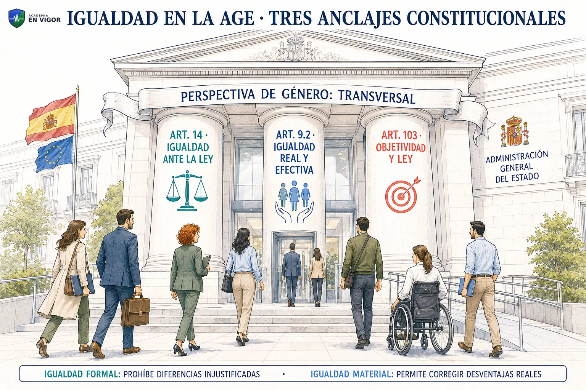

<em>Infografía: Marco constitucional y políticas de igualdad en la AGE.</em>

:::hablemos-claro
Separa sujeto, presupuesto, regla, excepción y control. Las opciones trampa suelen cambiar solo uno de esos cinco elementos.
:::

:::en-la-calle
Antes de actuar, identifica quién decide, qué habilitación existe, qué debe documentarse y qué revisión posterior protege a la persona afectada.
:::

:::lo-que-cae
Memoriza el anclaje «arts. 9.2, 14 y 103 CE» y discrimina reglas, excepciones y plazos.
:::

<!-- FUENTE: CE-T23 -->

## 02. Objeto, alcance y eficacia de la Ley Orgánica 3/2007

### Regla y encaje

La Ley Orgánica 3/2007 hace efectivo el derecho de igualdad de trato y oportunidades entre mujeres y hombres y combate la discriminación por razón de sexo. Este bloque se integra en **igualdad efectiva y políticas de la age** y se ancla en **arts. 1-3**.

### Claves normativas

- La Ley Orgánica 3/2007 hace efectivo el derecho de igualdad de trato y oportunidades entre mujeres y hombres y combate la discriminación por razón de sexo.
- Las obligaciones de la ley alcanzan a toda persona física o jurídica que se encuentre o actúe en territorio español, cualquiera que sea su nacionalidad o domicilio. <!-- FACT:PN-T23-F006 -->
- El principio de igualdad de trato supone ausencia de toda discriminación directa o indirecta por razón de sexo. <!-- FACT:PN-T23-F007 -->
- La igualdad informa la interpretación y aplicación del ordenamiento y debe integrarse en la actuación de todos los poderes públicos. <!-- FACT:PN-T23-F008 -->
- Los actos y cláusulas que constituyan discriminación por razón de sexo son nulos y generan las responsabilidades y reparaciones previstas legalmente. <!-- FACT:PN-T23-F009 -->
 <!-- FACT:PN-T23-F010 -->

<!-- VISUAL:t23-02-objeto-alcance-y-eficacia-de-la-ley-organi.webp -->

  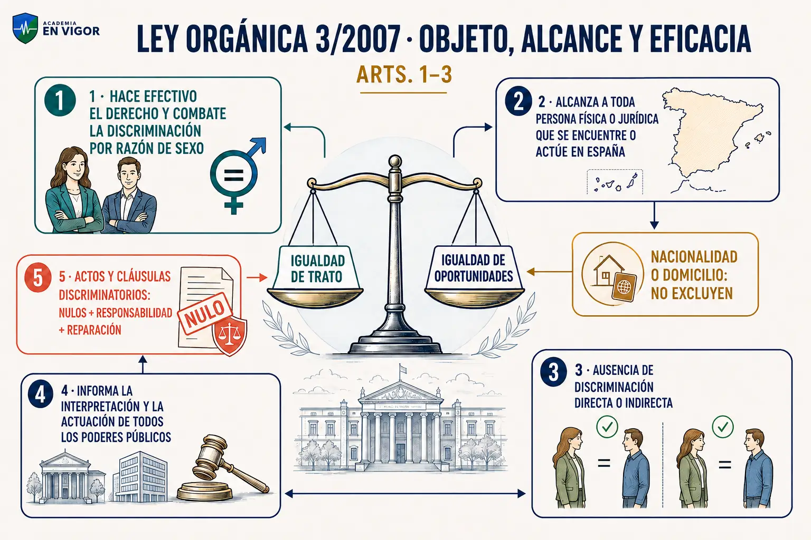

<em>Infografía: Objeto, alcance y eficacia de la Ley Orgánica 3/2007.</em>

:::hablemos-claro
Separa sujeto, presupuesto, regla, excepción y control. Las opciones trampa suelen cambiar solo uno de esos cinco elementos.
:::

:::en-la-calle
Antes de actuar, identifica quién decide, qué habilitación existe, qué debe documentarse y qué revisión posterior protege a la persona afectada.
:::

:::lo-que-cae
Memoriza el anclaje «arts. 1-3» y discrimina reglas, excepciones y plazos.
:::

<!-- FUENTE: LO3-2007-T23 -->

## 03. Discriminación directa e indirecta por razón de sexo

### Regla y encaje

Existe discriminación directa cuando una persona es, ha sido o pudiera ser tratada por razón de su sexo de manera menos favorable que otra en situación comparable. Este bloque se integra en **igualdad efectiva y políticas de la age** y se ancla en **art. 6**.

### Claves normativas

- Existe discriminación directa cuando una persona es, ha sido o pudiera ser tratada por razón de su sexo de manera menos favorable que otra en situación comparable.
- Existe discriminación indirecta cuando una disposición, criterio o práctica aparentemente neutros sitúan a personas de un sexo en desventaja particular respecto del otro. <!-- FACT:PN-T23-F011 -->
- Una desventaja indirecta puede quedar justificada por una finalidad legítima si los medios son necesarios y adecuados. <!-- FACT:PN-T23-F012 -->
- El análisis de discriminación indirecta atiende al efecto real de la medida, no solo a su redacción formalmente neutra. <!-- FACT:PN-T23-F013 -->
- Toda orden de discriminar directa o indirectamente por razón de sexo se considera también discriminatoria. <!-- FACT:PN-T23-F014 -->
 <!-- FACT:PN-T23-F015 -->

<!-- VISUAL:t23-03-discriminacion-directa-e-indirecta-por-raz.webp -->

  

<em>Infografía: Discriminación directa e indirecta por razón de sexo.</em>

:::hablemos-claro
Separa sujeto, presupuesto, regla, excepción y control. Las opciones trampa suelen cambiar solo uno de esos cinco elementos.
:::

:::en-la-calle
Antes de actuar, identifica quién decide, qué habilitación existe, qué debe documentarse y qué revisión posterior protege a la persona afectada.
:::

:::lo-que-cae
Memoriza el anclaje «art. 6» y discrimina reglas, excepciones y plazos.
:::

<!-- FUENTE: LO3-2007-T23 -->

## 04. Acoso sexual y acoso por razón de sexo

### Regla y encaje

El acoso sexual es cualquier comportamiento verbal o físico de naturaleza sexual que atente contra la dignidad de una persona y cree un entorno intimidatorio, degradante u ofensivo. Este bloque se integra en **igualdad efectiva y políticas de la age** y se ancla en **art. 7**.

### Claves normativas

- El acoso sexual es cualquier comportamiento verbal o físico de naturaleza sexual que atente contra la dignidad de una persona y cree un entorno intimidatorio, degradante u ofensivo.
- El acoso por razón de sexo es un comportamiento realizado en función del sexo de una persona con el propósito o efecto de atentar contra su dignidad y crear ese entorno. <!-- FACT:PN-T23-F016 -->
- El acoso sexual y el acoso por razón de sexo son siempre discriminatorios. <!-- FACT:PN-T23-F017 -->
- Condicionar un derecho o expectativa a aceptar una situación constitutiva de acoso sexual o por razón de sexo es también discriminación por razón de sexo. <!-- FACT:PN-T23-F018 -->
- La calificación no exige que la persona autora reconozca intención discriminatoria cuando el comportamiento produce el efecto legalmente descrito. <!-- FACT:PN-T23-F019 -->
 <!-- FACT:PN-T23-F020 -->

<!-- VISUAL:t23-04-acoso-sexual-y-acoso-por-razon-de-sexo.webp -->

  

<em>Infografía: Acoso sexual y acoso por razón de sexo.</em>

:::hablemos-claro
Separa sujeto, presupuesto, regla, excepción y control. Las opciones trampa suelen cambiar solo uno de esos cinco elementos.
:::

:::en-la-calle
Antes de actuar, identifica quién decide, qué habilitación existe, qué debe documentarse y qué revisión posterior protege a la persona afectada.
:::

:::lo-que-cae
Memoriza el anclaje «art. 7» y discrimina reglas, excepciones y plazos.
:::

<!-- FUENTE: LO3-2007-T23 -->

## 05. Embarazo, maternidad, represalias y acciones positivas

### Regla y encaje

Todo trato desfavorable a las mujeres relacionado con el embarazo o la maternidad constituye discriminación directa por razón de sexo. Este bloque se integra en **igualdad efectiva y políticas de la age** y se ancla en **arts. 8-11**.

### Claves normativas

- Todo trato desfavorable a las mujeres relacionado con el embarazo o la maternidad constituye discriminación directa por razón de sexo.
- Es discriminatoria la reacción adversa contra quien presenta una queja, reclamación, denuncia o recurso para impedir la discriminación y exigir igualdad. <!-- FACT:PN-T23-F021 -->
- Los poderes públicos pueden adoptar medidas específicas temporales y razonables en favor de las mujeres para corregir situaciones patentes de desigualdad de hecho. <!-- FACT:PN-T23-F022 -->
- Las acciones positivas deben ser proporcionadas al objetivo perseguido y subsistir solo mientras exista la situación de desigualdad que las justifica. <!-- FACT:PN-T23-F023 -->
- La tutela frente a la discriminación comprende cese, reparación o indemnización real, efectiva y proporcionada y, cuando proceda, sanción disuasoria. <!-- FACT:PN-T23-F024 -->
 <!-- FACT:PN-T23-F025 -->

<!-- VISUAL:t23-05-embarazo-maternidad-represalias-y-acciones.webp -->

  

<em>Infografía: Embarazo, maternidad, represalias y acciones positivas.</em>

:::hablemos-claro
Separa sujeto, presupuesto, regla, excepción y control. Las opciones trampa suelen cambiar solo uno de esos cinco elementos.
:::

:::en-la-calle
Antes de actuar, identifica quién decide, qué habilitación existe, qué debe documentarse y qué revisión posterior protege a la persona afectada.
:::

:::lo-que-cae
Memoriza el anclaje «arts. 8-11» y discrimina reglas, excepciones y plazos.
:::

<!-- FUENTE: LO3-2007-T23 -->

## 06. Transversalidad, impacto de género y estadísticas

### Regla y encaje

La igualdad de trato y oportunidades debe integrarse transversalmente en la actuación de todos los poderes públicos. Este bloque se integra en **igualdad efectiva y políticas de la age** y se ancla en **arts. 14-20**.

### Claves normativas

- La igualdad de trato y oportunidades debe integrarse transversalmente en la actuación de todos los poderes públicos.
- El Gobierno aprueba periódicamente un Plan Estratégico de Igualdad de Oportunidades con medidas para alcanzar la igualdad y eliminar la discriminación por razón de sexo. <!-- FACT:PN-T23-F026 -->
- Los proyectos normativos y planes de especial relevancia económica, social, cultural o artística deben incorporar el informe de impacto por razón de género cuando resulte exigible. <!-- FACT:PN-T23-F027 -->
- Las estadísticas y estudios públicos deben incluir sistemáticamente la variable sexo y permitir conocer diferencias, necesidades y efectos discriminatorios. <!-- FACT:PN-T23-F028 -->
- El lenguaje administrativo debe ser no sexista y la publicidad institucional ha de respetar la igualdad y la dignidad de las mujeres. <!-- FACT:PN-T23-F029 -->
 <!-- FACT:PN-T23-F030 -->

<!-- VISUAL:t23-06-transversalidad-impacto-de-genero-y-estadi.webp -->

  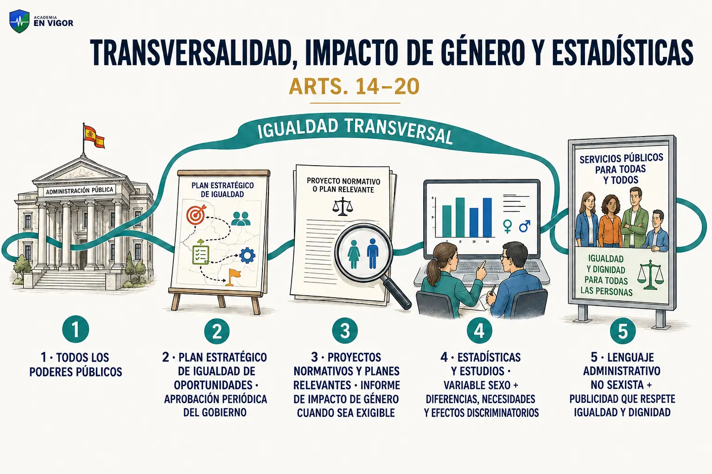

<em>Infografía: Transversalidad, impacto de género y estadísticas.</em>

:::hablemos-claro
Separa sujeto, presupuesto, regla, excepción y control. Las opciones trampa suelen cambiar solo uno de esos cinco elementos.
:::

:::en-la-calle
Antes de actuar, identifica quién decide, qué habilitación existe, qué debe documentarse y qué revisión posterior protege a la persona afectada.
:::

:::lo-que-cae
Memoriza el anclaje «arts. 14-20» y discrimina reglas, excepciones y plazos.
:::

<!-- FUENTE: LO3-2007-T23 -->

## 07. Criterios de actuación de las Administraciones públicas

### Regla y encaje

Las Administraciones deben remover obstáculos discriminatorios en el acceso al empleo público y en el desarrollo de la carrera profesional. Este bloque se integra en **igualdad efectiva y políticas de la age** y se ancla en **art. 51**.

### Claves normativas

- Las Administraciones deben remover obstáculos discriminatorios en el acceso al empleo público y en el desarrollo de la carrera profesional.
- Deben facilitar la conciliación de la vida personal, familiar y laboral sin menoscabo de la promoción profesional. <!-- FACT:PN-T23-F031 -->
- Deben fomentar la formación en igualdad tanto en el acceso al empleo público como a lo largo de la carrera. <!-- FACT:PN-T23-F032 -->
- Deben promover la presencia equilibrada de mujeres y hombres en órganos de selección y valoración. <!-- FACT:PN-T23-F033 -->
- Deben prevenir el acoso sexual y por razón de sexo, eliminar la discriminación retributiva y evaluar periódicamente la efectividad de la igualdad. <!-- FACT:PN-T23-F034 -->
 <!-- FACT:PN-T23-F035 -->

<!-- VISUAL:t23-07-criterios-de-actuacion-de-las-administraci.webp -->

  

<em>Infografía: Criterios de actuación de las Administraciones públicas.</em>

:::hablemos-claro
Separa sujeto, presupuesto, regla, excepción y control. Las opciones trampa suelen cambiar solo uno de esos cinco elementos.
:::

:::en-la-calle
Antes de actuar, identifica quién decide, qué habilitación existe, qué debe documentarse y qué revisión posterior protege a la persona afectada.
:::

:::lo-que-cae
Memoriza el anclaje «art. 51» y discrimina reglas, excepciones y plazos.
:::

<!-- FUENTE: LO3-2007-T23 -->

## 08. Presencia y composición equilibradas

### Regla y encaje

La composición equilibrada exige que las personas de cada sexo no superen el sesenta por ciento ni sean menos del cuarenta por ciento del conjunto considerado. Este bloque se integra en **igualdad efectiva y políticas de la age** y se ancla en **arts. 52-54 y DA 1.ª**.

### Claves normativas

- La composición equilibrada exige que las personas de cada sexo no superen el sesenta por ciento ni sean menos del cuarenta por ciento del conjunto considerado.
- El Gobierno atiende a la presencia equilibrada al nombrar titulares de órganos directivos de la AGE y organismos públicos considerados en su conjunto. <!-- FACT:PN-T23-F036 -->
- Los tribunales y órganos de selección de personal responden a la presencia equilibrada salvo razones fundadas y objetivas debidamente motivadas. <!-- FACT:PN-T23-F037 -->
- La representación de la AGE en comisiones de valoración de méritos se ajusta a la composición equilibrada de ambos sexos. <!-- FACT:PN-T23-F038 -->
- La regla 40/60 no equivale a exigir paridad matemática exacta ni permite ignorar las excepciones legalmente motivadas. <!-- FACT:PN-T23-F039 -->
 <!-- FACT:PN-T23-F040 -->

<!-- VISUAL:t23-08-presencia-y-composicion-equilibradas.webp -->

  

<em>Infografía: Presencia y composición equilibradas.</em>

:::hablemos-claro
Separa sujeto, presupuesto, regla, excepción y control. Las opciones trampa suelen cambiar solo uno de esos cinco elementos.
:::

:::en-la-calle
Antes de actuar, identifica quién decide, qué habilitación existe, qué debe documentarse y qué revisión posterior protege a la persona afectada.
:::

:::lo-que-cae
Memoriza el anclaje «arts. 52-54 y DA 1.ª» y discrimina reglas, excepciones y plazos.
:::

<!-- FUENTE: LO3-2007-T23 -->

## 09. Formación, protocolo de acoso y evaluación en la AGE

### Regla y encaje

La aprobación de convocatorias de pruebas selectivas debe acompañarse de informe de impacto de género, salvo urgencia y sin perjuicio de la prohibición de discriminación. Este bloque se integra en **igualdad efectiva y políticas de la age** y se ancla en **arts. 55-64**.

### Claves normativas

- La aprobación de convocatorias de pruebas selectivas debe acompañarse de informe de impacto de género, salvo urgencia y sin perjuicio de la prohibición de discriminación.
- La AGE imparte formación sobre igualdad y prevención de la violencia de género y valora esos contenidos en el diseño formativo. <!-- FACT:PN-T23-F041 -->
- La AGE y sus organismos deben negociar un protocolo de actuación frente al acoso sexual y al acoso por razón de sexo. <!-- FACT:PN-T23-F042 -->
- Las medidas de conciliación y movilidad de empleadas públicas víctimas de violencia de género deben proteger su carrera, intimidad y seguridad. <!-- FACT:PN-T23-F043 -->
- El Gobierno evalúa periódicamente la aplicación de la igualdad en el empleo público mediante información desagregada y seguimiento de sus medidas. <!-- FACT:PN-T23-F044 -->
 <!-- FACT:PN-T23-F045 -->

<!-- VISUAL:t23-09-formacion-protocolo-de-acoso-y-evaluacion-.webp -->

  

<em>Infografía: Formación, protocolo de acoso y evaluación en la AGE.</em>

:::hablemos-claro
Separa sujeto, presupuesto, regla, excepción y control. Las opciones trampa suelen cambiar solo uno de esos cinco elementos.
:::

:::en-la-calle
Antes de actuar, identifica quién decide, qué habilitación existe, qué debe documentarse y qué revisión posterior protege a la persona afectada.
:::

:::lo-que-cae
Memoriza el anclaje «arts. 55-64» y discrimina reglas, excepciones y plazos.
:::

<!-- FUENTE: LO3-2007-T23 -->

## 10. Órganos de igualdad en la Administración

### Regla y encaje

La Comisión Interministerial de Igualdad coordina las políticas y medidas de los departamentos ministeriales para garantizar y hacer efectiva la igualdad. Este bloque se integra en **igualdad efectiva y políticas de la age** y se ancla en **arts. 76-78 y RD 634/2026**.

### Claves normativas

- La Comisión Interministerial de Igualdad coordina las políticas y medidas de los departamentos ministeriales para garantizar y hacer efectiva la igualdad.
- En todos los Ministerios se encomiendan a un órgano directivo las funciones de Unidad de Igualdad. <!-- FACT:PN-T23-F046 -->
- Las Unidades de Igualdad recaban estadísticas, elaboran estudios, asesoran sobre impacto de género, proponen formación y velan por aplicar la ley. <!-- FACT:PN-T23-F047 -->
- El Consejo de Participación de la Mujer es un órgano colegiado de consulta y asesoramiento que canaliza la participación de organizaciones de mujeres. <!-- FACT:PN-T23-F048 -->
- El Instituto de las Mujeres es el organismo autónomo estatal especializado en igualdad entre mujeres y hombres y no discriminación por razón de sexo. <!-- FACT:PN-T23-F049 -->
 <!-- FACT:PN-T23-F050 -->

<!-- VISUAL:t23-10-organos-de-igualdad-en-la-administracion.webp -->

  

<em>Infografía: Órganos de igualdad en la Administración.</em>

:::hablemos-claro
Separa sujeto, presupuesto, regla, excepción y control. Las opciones trampa suelen cambiar solo uno de esos cinco elementos.
:::

:::en-la-calle
Antes de actuar, identifica quién decide, qué habilitación existe, qué debe documentarse y qué revisión posterior protege a la persona afectada.
:::

:::lo-que-cae
Memoriza el anclaje «arts. 76-78 y RD 634/2026» y discrimina reglas, excepciones y plazos.
:::

<!-- FUENTE: LO3-2007-T23 -->

## 11. IV Plan de Igualdad de Género en la AGE

### Regla y encaje

El IV Plan de Igualdad de Género de la AGE fue aprobado por Acuerdo del Consejo de Ministros de 7 de octubre de 2025 y publicado por Resolución de 20 de octubre de 2025. Este bloque se integra en **igualdad efectiva y políticas de la age** y se ancla en **Acuerdo de 7-10-2025**.

### Claves normativas

- El IV Plan de Igualdad de Género de la AGE fue aprobado por Acuerdo del Consejo de Ministros de 7 de octubre de 2025 y publicado por Resolución de 20 de octubre de 2025.
- El IV Plan se aplica a la Administración General del Estado y a los organismos públicos vinculados o dependientes de ella. <!-- FACT:PN-T23-F051 -->
- Su premisa de diseño es «Conocerse para mejorar» y conserva como metas eliminar desigualdades, promover corresponsabilidad y prevenir violencia y acoso. <!-- FACT:PN-T23-F052 -->
- El IV Plan contiene veinte objetivos y cuarenta y cinco medidas. <!-- FACT:PN-T23-F053 -->
- Las medidas se ejecutan por los departamentos y organismos responsables con sus créditos y quedan condicionadas a disponibilidad presupuestaria y estabilidad financiera. <!-- FACT:PN-T23-F054 -->
 <!-- FACT:PN-T23-F055 -->

<!-- VISUAL:t23-11-iv-plan-de-igualdad-de-genero-en-la-age.webp -->

  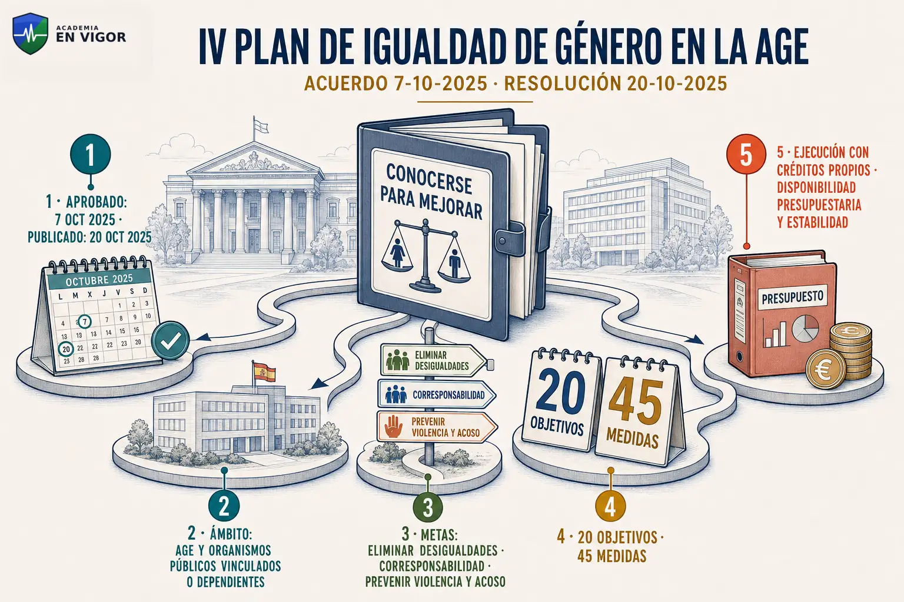

<em>Infografía: IV Plan de Igualdad de Género en la AGE.</em>

:::hablemos-claro
Separa sujeto, presupuesto, regla, excepción y control. Las opciones trampa suelen cambiar solo uno de esos cinco elementos.
:::

:::en-la-calle
Antes de actuar, identifica quién decide, qué habilitación existe, qué debe documentarse y qué revisión posterior protege a la persona afectada.
:::

:::lo-que-cae
Memoriza el anclaje «Acuerdo de 7-10-2025» y discrimina reglas, excepciones y plazos.
:::

<!-- FUENTE: IV-PLAN-AGE-T23 -->

## 12. Ejes, seguimiento y evaluación del IV Plan

### Regla y encaje

El IV Plan se estructura en seis ejes: transformación organizacional; sensibilización y formación; condiciones de trabajo; corresponsabilidad; violencia contra las mujeres; y conocimiento de la igualdad. Este bloque se integra en **igualdad efectiva y políticas de la age** y se ancla en **apartados 3 y 4**.

### Claves normativas

- El IV Plan se estructura en seis ejes: transformación organizacional; sensibilización y formación; condiciones de trabajo; corresponsabilidad; violencia contra las mujeres; y conocimiento de la igualdad.
- El eje de violencia contra las mujeres incluye prevención, protocolo frente al acoso, seguimiento del Pacto de Estado y protección de empleadas públicas víctimas. <!-- FACT:PN-T23-F056 -->
- El eje de conocimiento exige datos homogéneos y periódicos desagregados por sexo. <!-- FACT:PN-T23-F057 -->
- El seguimiento del IV Plan tiene periodicidad cuatrimestral y se informa a la Comisión Técnica de Igualdad y a las comisiones departamentales. <!-- FACT:PN-T23-F058 -->
- La Dirección General de Función Pública elabora informe anual y una evaluación final previa a negociar un nuevo plan; los departamentos realizan memoria anual. <!-- FACT:PN-T23-F059 -->
 <!-- FACT:PN-T23-F060 -->

<!-- VISUAL:t23-12-ejes-seguimiento-y-evaluacion-del-iv-plan.webp -->

  

<em>Infografía: Ejes, seguimiento y evaluación del IV Plan.</em>

:::hablemos-claro
Separa sujeto, presupuesto, regla, excepción y control. Las opciones trampa suelen cambiar solo uno de esos cinco elementos.
:::

:::en-la-calle
Antes de actuar, identifica quién decide, qué habilitación existe, qué debe documentarse y qué revisión posterior protege a la persona afectada.
:::

:::lo-que-cae
Memoriza el anclaje «apartados 3 y 4» y discrimina reglas, excepciones y plazos.
:::

<!-- FUENTE: IV-PLAN-AGE-T23 -->

## 13. Objeto y concepto legal de violencia de género

### Regla y encaje

La Ley Orgánica 1/2004 actúa contra la violencia que, como manifestación de discriminación, desigualdad y relaciones de poder de los hombres sobre las mujeres, ejercen parejas o exparejas masculinas. Este bloque se integra en **protección integral frente a la violencia de género** y se ancla en **art. 1**.

### Claves normativas

- La Ley Orgánica 1/2004 actúa contra la violencia que, como manifestación de discriminación, desigualdad y relaciones de poder de los hombres sobre las mujeres, ejercen parejas o exparejas masculinas.
- La relación puede ser matrimonial o análoga de afectividad y no exige convivencia actual ni pasada. <!-- FACT:PN-T23-F061 -->
- La violencia de género legal comprende violencia física y psicológica, agresiones a la libertad sexual, amenazas, coacciones y privación arbitraria de libertad. <!-- FACT:PN-T23-F062 -->
- La ley pretende prevenir, sancionar y erradicar esa violencia y prestar asistencia a las mujeres, a sus hijos menores y a menores sujetos a tutela, guarda o custodia víctimas de ella. <!-- FACT:PN-T23-F063 -->
- Violencia de género y violencia doméstica no son sinónimos: la primera responde al sujeto y relación definidos en el artículo 1. <!-- FACT:PN-T23-F064 -->
 <!-- FACT:PN-T23-F065 -->

<!-- VISUAL:t23-13-objeto-y-concepto-legal-de-violencia-de-ge.webp -->

  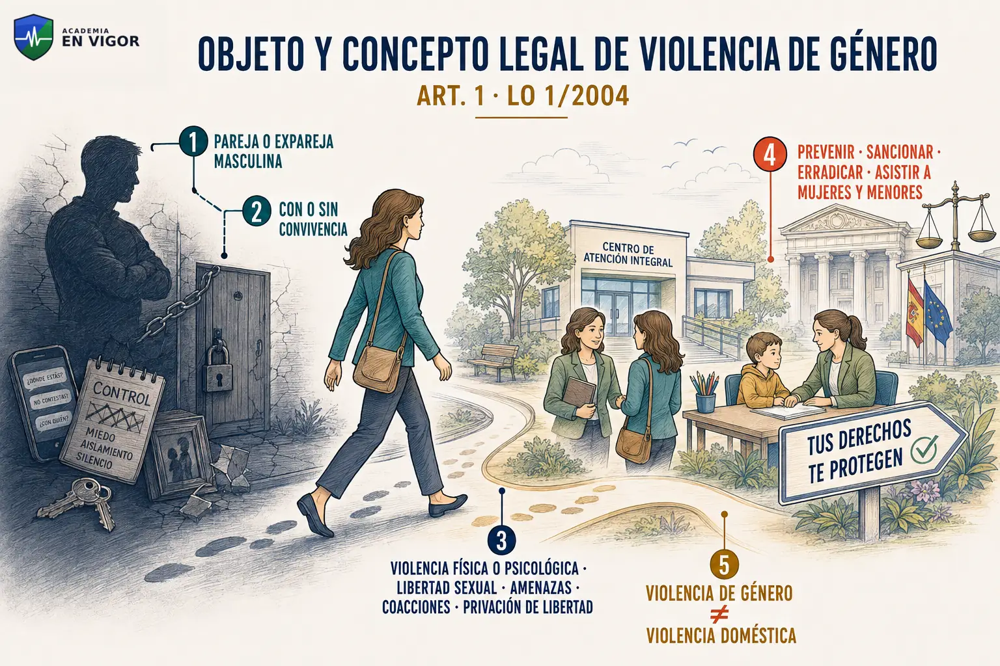

<em>Infografía: Objeto y concepto legal de violencia de género.</em>

:::hablemos-claro
Separa sujeto, presupuesto, regla, excepción y control. Las opciones trampa suelen cambiar solo uno de esos cinco elementos.
:::

:::en-la-calle
Antes de actuar, identifica quién decide, qué habilitación existe, qué debe documentarse y qué revisión posterior protege a la persona afectada.
:::

:::lo-que-cae
Memoriza el anclaje «art. 1» y discrimina reglas, excepciones y plazos.
:::

<!-- FUENTE: LO1-2004-T23 -->

## 14. Principios rectores y respuesta integral

### Regla y encaje

La respuesta integral articula sensibilización, prevención, detección, derechos de las víctimas, tutela institucional, penal y judicial. Este bloque se integra en **protección integral frente a la violencia de género** y se ancla en **art. 2**.

### Claves normativas

- La respuesta integral articula sensibilización, prevención, detección, derechos de las víctimas, tutela institucional, penal y judicial.
- La ley refuerza medidas educativas y de socialización respetuosas con la igualdad y la dignidad de las mujeres. <!-- FACT:PN-T23-F066 -->
- Los derechos de las víctimas deben ser exigibles ante las Administraciones y aseguran acceso rápido, transparente y eficaz a los servicios. <!-- FACT:PN-T23-F067 -->
- La asistencia debe coordinar servicios sociales, sanitarios, jurídicos, policiales y judiciales. <!-- FACT:PN-T23-F068 -->
- La formación y especialización de los profesionales que intervienen es un principio rector de la respuesta pública. <!-- FACT:PN-T23-F069 -->
 <!-- FACT:PN-T23-F070 -->

<!-- VISUAL:t23-14-principios-rectores-y-respuesta-integral.webp -->

  

<em>Infografía: Principios rectores y respuesta integral.</em>

:::hablemos-claro
Separa sujeto, presupuesto, regla, excepción y control. Las opciones trampa suelen cambiar solo uno de esos cinco elementos.
:::

:::en-la-calle
Antes de actuar, identifica quién decide, qué habilitación existe, qué debe documentarse y qué revisión posterior protege a la persona afectada.
:::

:::lo-que-cae
Memoriza el anclaje «art. 2» y discrimina reglas, excepciones y plazos.
:::

<!-- FUENTE: LO1-2004-T23 -->

## 15. Sensibilización, educación, sanidad y publicidad

### Regla y encaje

El Plan Estatal de Sensibilización y Prevención de la Violencia de Género tiene carácter permanente y es evaluado anualmente. Este bloque se integra en **protección integral frente a la violencia de género** y se ancla en **arts. 3-16**.

### Claves normativas

- El Plan Estatal de Sensibilización y Prevención de la Violencia de Género tiene carácter permanente y es evaluado anualmente.
- El sistema educativo debe formar en igualdad, resolución pacífica de conflictos y respeto a la dignidad, con formación específica del profesorado. <!-- FACT:PN-T23-F071 -->
- La publicidad que utilice de forma vejatoria o discriminatoria la imagen de la mujer es ilícita y puede ser objeto de acciones de cesación y rectificación. <!-- FACT:PN-T23-F072 -->
- Las Administraciones sanitarias promueven detección precoz, asistencia y rehabilitación de las mujeres víctimas y formación del personal sanitario. <!-- FACT:PN-T23-F073 -->
- Los medios de comunicación deben proteger dignidad, libertad e igualdad y evitar tratamientos sensacionalistas o discriminatorios de la violencia. <!-- FACT:PN-T23-F074 -->
 <!-- FACT:PN-T23-F075 -->

<!-- VISUAL:t23-15-sensibilizacion-educacion-sanidad-y-public.webp -->

  

<em>Infografía: Sensibilización, educación, sanidad y publicidad.</em>

:::hablemos-claro
Separa sujeto, presupuesto, regla, excepción y control. Las opciones trampa suelen cambiar solo uno de esos cinco elementos.
:::

:::en-la-calle
Antes de actuar, identifica quién decide, qué habilitación existe, qué debe documentarse y qué revisión posterior protege a la persona afectada.
:::

:::lo-que-cae
Memoriza el anclaje «arts. 3-16» y discrimina reglas, excepciones y plazos.
:::

<!-- FUENTE: LO1-2004-T23 -->

## 16. Información, asistencia social integral y asistencia jurídica

### Regla y encaje

Todas las mujeres víctimas de violencia de género tienen garantizados los derechos de la ley con independencia de origen, religión o cualquier otra condición personal o social. Este bloque se integra en **protección integral frente a la violencia de género** y se ancla en **arts. 17-20**.

### Claves normativas

- Todas las mujeres víctimas de violencia de género tienen garantizados los derechos de la ley con independencia de origen, religión o cualquier otra condición personal o social.
- Tienen derecho a información y asesoramiento adecuados a su situación, incluidos recursos de atención, emergencia, apoyo y recuperación integral. <!-- FACT:PN-T23-F076 -->
- La asistencia social integral es multidisciplinar e incluye información, atención psicológica, apoyo social, seguimiento de reclamaciones, apoyo educativo y formación e inserción laboral. <!-- FACT:PN-T23-F077 -->
- Las víctimas tienen derecho a asesoramiento jurídico gratuito inmediatamente antes de denunciar y a defensa y representación gratuitas en procesos vinculados a la violencia padecida en los términos legales. <!-- FACT:PN-T23-F078 -->
- Una misma dirección letrada debe asumir los procesos relacionados cuando garantice debidamente la defensa, y la asistencia se presta de inmediato. <!-- FACT:PN-T23-F079 -->
 <!-- FACT:PN-T23-F080 -->

<!-- VISUAL:t23-16-informacion-asistencia-social-integral-y-a.webp -->

  

<em>Infografía: Información, asistencia social integral y asistencia jurídica.</em>

:::hablemos-claro
Separa sujeto, presupuesto, regla, excepción y control. Las opciones trampa suelen cambiar solo uno de esos cinco elementos.
:::

:::en-la-calle
Antes de actuar, identifica quién decide, qué habilitación existe, qué debe documentarse y qué revisión posterior protege a la persona afectada.
:::

:::lo-que-cae
Memoriza el anclaje «arts. 17-20» y discrimina reglas, excepciones y plazos.
:::

<!-- FUENTE: LO1-2004-T23 -->

## 17. Derechos laborales, de Seguridad Social y de empleadas públicas

### Regla y encaje

La trabajadora víctima puede reducir o reordenar su tiempo de trabajo, solicitar movilidad geográfica o cambio de centro, adaptar el puesto y suspender o extinguir el contrato en los términos legales. Este bloque se integra en **protección integral frente a la violencia de género** y se ancla en **arts. 21-26**.

### Claves normativas

- La trabajadora víctima puede reducir o reordenar su tiempo de trabajo, solicitar movilidad geográfica o cambio de centro, adaptar el puesto y suspender o extinguir el contrato en los términos legales.
- Las ausencias o faltas de puntualidad motivadas por la situación física o psicológica derivada de la violencia pueden considerarse justificadas cuando se acrediten por servicios competentes. <!-- FACT:PN-T23-F081 -->
- Las trabajadoras autónomas que cesen temporalmente para hacer efectiva su protección o asistencia social integral son consideradas en cese temporal de actividad y se suspende la obligación de cotizar durante seis meses. <!-- FACT:PN-T23-F082 -->
- Las empleadas públicas víctimas tienen derechos de reducción o reordenación del tiempo, movilidad, cambio de centro, excedencia y justificación de ausencias conforme a su normativa. <!-- FACT:PN-T23-F083 -->
- La protección laboral y social no depende de conservar el mismo domicilio o puesto cuando la seguridad exige movilidad. <!-- FACT:PN-T23-F084 -->
 <!-- FACT:PN-T23-F085 -->

<!-- VISUAL:t23-17-derechos-laborales-de-seguridad-social-y-d.webp -->

  

<em>Infografía: Derechos laborales, de Seguridad Social y de empleadas públicas.</em>

:::hablemos-claro
Separa sujeto, presupuesto, regla, excepción y control. Las opciones trampa suelen cambiar solo uno de esos cinco elementos.
:::

:::en-la-calle
Antes de actuar, identifica quién decide, qué habilitación existe, qué debe documentarse y qué revisión posterior protege a la persona afectada.
:::

:::lo-que-cae
Memoriza el anclaje «arts. 21-26» y discrimina reglas, excepciones y plazos.
:::

<!-- FUENTE: LO1-2004-T23 -->

## 18. Derechos económicos, vivienda y empleo

### Regla y encaje

La ayuda social del artículo 27 exige rentas no superiores al setenta y cinco por ciento del salario mínimo interprofesional, excluida la parte proporcional de dos pagas extraordinarias. Este bloque se integra en **protección integral frente a la violencia de género** y se ancla en **arts. 27-28**.

### Claves normativas

- La ayuda social del artículo 27 exige rentas no superiores al setenta y cinco por ciento del salario mínimo interprofesional, excluida la parte proporcional de dos pagas extraordinarias.
- También exige especiales dificultades para obtener empleo, acreditadas mediante informe del servicio público de empleo competente. <!-- FACT:PN-T23-F086 -->
- La cuantía general equivale a seis meses de subsidio por desempleo y puede elevarse por discapacidad de la víctima o por responsabilidades familiares. <!-- FACT:PN-T23-F087 -->
- La ayuda es compatible con las previstas en la Ley 35/1995 y resulta incompatible con otras que cumplan la misma finalidad en los términos reglamentarios. <!-- FACT:PN-T23-F088 -->
- Las mujeres víctimas son colectivo prioritario en el acceso a viviendas protegidas, residencias públicas para mayores y programas públicos de empleo. <!-- FACT:PN-T23-F089 -->
 <!-- FACT:PN-T23-F090 -->

<!-- VISUAL:t23-18-derechos-economicos-vivienda-y-empleo.webp -->

  

<em>Infografía: Derechos económicos, vivienda y empleo.</em>

:::hablemos-claro
Separa sujeto, presupuesto, regla, excepción y control. Las opciones trampa suelen cambiar solo uno de esos cinco elementos.
:::

:::en-la-calle
Antes de actuar, identifica quién decide, qué habilitación existe, qué debe documentarse y qué revisión posterior protege a la persona afectada.
:::

:::lo-que-cae
Memoriza el anclaje «arts. 27-28» y discrimina reglas, excepciones y plazos.
:::

<!-- FUENTE: LO1-2004-T23 -->

## 19. Acreditación de las situaciones de violencia de género

### Regla y encaje

Las situaciones de violencia de género pueden acreditarse mediante sentencia condenatoria, orden de protección o cualquier otra resolución judicial que acuerde medida cautelar a favor de la víctima. Este bloque se integra en **protección integral frente a la violencia de género** y se ancla en **art. 23**.

### Claves normativas

- Las situaciones de violencia de género pueden acreditarse mediante sentencia condenatoria, orden de protección o cualquier otra resolución judicial que acuerde medida cautelar a favor de la víctima.
- También pueden acreditarse mediante informe del Ministerio Fiscal que indique indicios de que la demandante es víctima de violencia de género. <!-- FACT:PN-T23-F091 -->
- Son válidos los informes de servicios sociales, servicios especializados o servicios de acogida destinados a víctimas de la Administración competente. <!-- FACT:PN-T23-F092 -->
- Pueden admitirse otros títulos previstos en disposiciones sectoriales que regulen el acceso a cada derecho o recurso. <!-- FACT:PN-T23-F093 -->
- La acreditación no se reduce a la antigua regla de orden de protección como medio general e informe fiscal como única excepción. <!-- FACT:PN-T23-F094 -->
 <!-- FACT:PN-T23-F095 -->

<!-- VISUAL:t23-19-acreditacion-de-las-situaciones-de-violenc.webp -->

  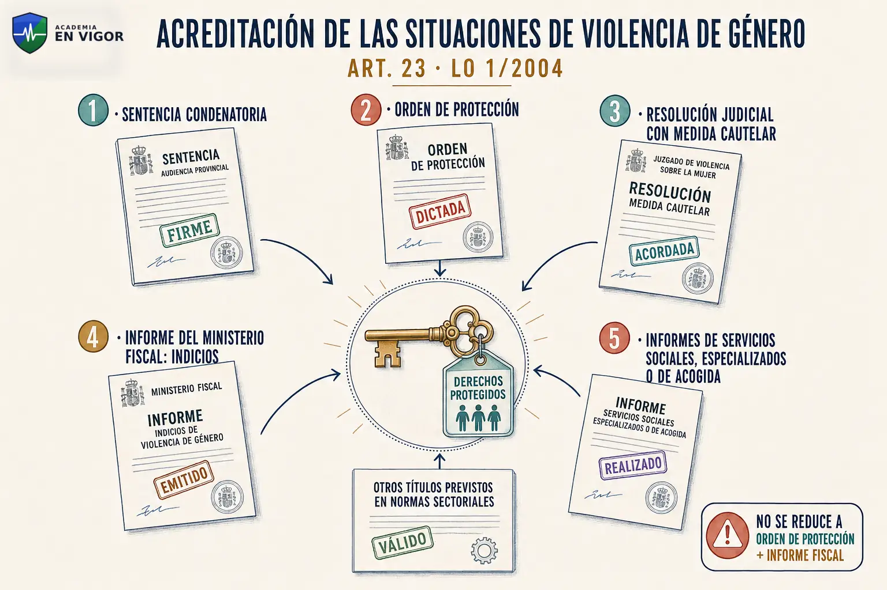

<em>Infografía: Acreditación de las situaciones de violencia de género.</em>

:::hablemos-claro
Separa sujeto, presupuesto, regla, excepción y control. Las opciones trampa suelen cambiar solo uno de esos cinco elementos.
:::

:::en-la-calle
Antes de actuar, identifica quién decide, qué habilitación existe, qué debe documentarse y qué revisión posterior protege a la persona afectada.
:::

:::lo-que-cae
Memoriza el anclaje «art. 23» y discrimina reglas, excepciones y plazos.
:::

<!-- FUENTE: LO1-2004-T23 -->

## 20. Tutela institucional: Delegación y Observatorio

### Regla y encaje

La Delegación del Gobierno contra la Violencia de Género formula políticas públicas, coordina e impulsa actuaciones y elabora la Macroencuesta de Violencia contra las Mujeres. Este bloque se integra en **protección integral frente a la violencia de género** y se ancla en **arts. 29-32**.

### Claves normativas

- La Delegación del Gobierno contra la Violencia de Género formula políticas públicas, coordina e impulsa actuaciones y elabora la Macroencuesta de Violencia contra las Mujeres.
- La persona titular de la Delegación está legitimada para intervenir ante órganos jurisdiccionales en defensa de los derechos e intereses tutelados por la ley. <!-- FACT:PN-T23-F096 -->
- El Observatorio Estatal de Violencia sobre la Mujer es un órgano colegiado de asesoramiento, evaluación, colaboración institucional, elaboración de informes y propuestas. <!-- FACT:PN-T23-F097 -->
- Las Fuerzas y Cuerpos de Seguridad deben disponer de unidades especializadas en prevención y control de la ejecución de medidas judiciales. <!-- FACT:PN-T23-F098 -->
- Los poderes públicos elaboran planes de colaboración que ordenan acciones sanitarias, policiales, judiciales, sociales y educativas. <!-- FACT:PN-T23-F099 -->
 <!-- FACT:PN-T23-F100 -->

<!-- VISUAL:t23-20-tutela-institucional-delegacion-y-observat.webp -->

  

<em>Infografía: Tutela institucional: Delegación y Observatorio.</em>

:::hablemos-claro
Separa sujeto, presupuesto, regla, excepción y control. Las opciones trampa suelen cambiar solo uno de esos cinco elementos.
:::

:::en-la-calle
Antes de actuar, identifica quién decide, qué habilitación existe, qué debe documentarse y qué revisión posterior protege a la persona afectada.
:::

:::lo-que-cae
Memoriza el anclaje «arts. 29-32» y discrimina reglas, excepciones y plazos.
:::

<!-- FUENTE: LO1-2004-T23 -->

## 21. Tutela penal y judicial especializada

### Regla y encaje

La Ley Orgánica 1/2004 reforzó la tutela penal y creó una respuesta judicial especializada para hechos comprendidos en su ámbito. Este bloque se integra en **protección integral frente a la violencia de género** y se ancla en **títulos IV y V**.

### Claves normativas

- La Ley Orgánica 1/2004 reforzó la tutela penal y creó una respuesta judicial especializada para hechos comprendidos en su ámbito.
- La organización judicial vigente integra Secciones de Violencia sobre la Mujer en los Tribunales de Instancia conforme a las reformas orgánicas posteriores. <!-- FACT:PN-T23-F101 -->
- La especialización puede comprender competencias penales y civiles conexas cuando concurren los requisitos legales. <!-- FACT:PN-T23-F102 -->
- El Ministerio Fiscal cuenta con especialización en violencia sobre la mujer y coordina su intervención conforme a su Estatuto Orgánico. <!-- FACT:PN-T23-F103 -->
- Las medidas judiciales deben compatibilizar protección efectiva de víctima y menores con garantías procesales y derecho de defensa. <!-- FACT:PN-T23-F104 -->
 <!-- FACT:PN-T23-F105 -->

<!-- VISUAL:t23-21-tutela-penal-y-judicial-especializada.webp -->

  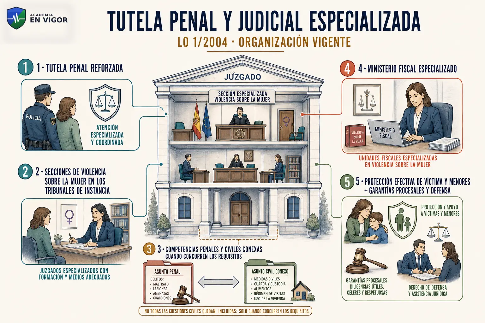

<em>Infografía: Tutela penal y judicial especializada.</em>

:::hablemos-claro
Separa sujeto, presupuesto, regla, excepción y control. Las opciones trampa suelen cambiar solo uno de esos cinco elementos.
:::

:::en-la-calle
Antes de actuar, identifica quién decide, qué habilitación existe, qué debe documentarse y qué revisión posterior protege a la persona afectada.
:::

:::lo-que-cae
Memoriza el anclaje «títulos IV y V» y discrimina reglas, excepciones y plazos.
:::

<!-- FUENTE: LO1-2004-T23 -->

## 22. Orden de protección y Sistema VioGén

### Regla y encaje

La orden de protección puede acordarse para víctimas de violencia doméstica y de género cuando existan indicios de delito contra vida, integridad, libertad, libertad sexual o seguridad y situación objetiva de riesgo. Este bloque se integra en **protección integral frente a la violencia de género** y se ancla en **art. 544 ter LECrim y normativa VioGén**.

### Claves normativas

- La orden de protección puede acordarse para víctimas de violencia doméstica y de género cuando existan indicios de delito contra vida, integridad, libertad, libertad sexual o seguridad y situación objetiva de riesgo.
- La orden concentra medidas cautelares penales y civiles y activa medidas de asistencia y protección social previstas en el ordenamiento. <!-- FACT:PN-T23-F106 -->
- Puede solicitarla la víctima, determinadas personas relacionadas, el Ministerio Fiscal o acordarse de oficio por la autoridad judicial. <!-- FACT:PN-T23-F107 -->
- El Sistema VioGén integra información y seguimiento de casos para valorar riesgo y coordinar protección, sin sustituir la decisión judicial ni la valoración profesional. <!-- FACT:PN-T23-F108 -->
- La valoración policial del riesgo debe actualizarse cuando cambien las circunstancias y orientar medidas proporcionadas al nivel apreciado. <!-- FACT:PN-T23-F109 -->
 <!-- FACT:PN-T23-F110 -->

<!-- VISUAL:t23-22-orden-de-proteccion-y-sistema-viogen.webp -->

  

<em>Infografía: Orden de protección y Sistema VioGén.</em>

:::hablemos-claro
Separa sujeto, presupuesto, regla, excepción y control. Las opciones trampa suelen cambiar solo uno de esos cinco elementos.
:::

:::en-la-calle
Antes de actuar, identifica quién decide, qué habilitación existe, qué debe documentarse y qué revisión posterior protege a la persona afectada.
:::

:::lo-que-cae
Memoriza el anclaje «art. 544 ter LECrim y normativa VioGén» y discrimina reglas, excepciones y plazos.
:::

<!-- FUENTE: L27-2003-T23 -->

## 23. Protección de menores y otras vulnerabilidades

### Regla y encaje

Los hijos menores y menores sujetos a tutela, guarda o custodia de mujeres víctimas son destinatarios de asistencia y protección cuando también resultan afectados. Este bloque se integra en **protección integral frente a la violencia de género** y se ancla en **arts. 1, 5, 19 y reformas vigentes**.

### Claves normativas

- Los hijos menores y menores sujetos a tutela, guarda o custodia de mujeres víctimas son destinatarios de asistencia y protección cuando también resultan afectados.
- La asistencia social integral incluye atención especializada para menores bajo patria potestad, guarda o custodia de la víctima. <!-- FACT:PN-T23-F111 -->
- Las decisiones sobre visitas, estancia, relación o comunicación deben atender al interés superior del menor y al riesgo existente. <!-- FACT:PN-T23-F112 -->
- Discapacidad, dependencia, edad, ruralidad, extranjería o discriminación múltiple exigen accesibilidad y adaptación de recursos, no una reducción de derechos. <!-- FACT:PN-T23-F113 -->
- La coordinación institucional debe evitar victimización secundaria, repeticiones innecesarias y exposición de datos que aumente el riesgo. <!-- FACT:PN-T23-F114 -->
 <!-- FACT:PN-T23-F115 -->

<!-- VISUAL:t23-23-proteccion-de-menores-y-otras-vulnerabilid.webp -->

  

<em>Infografía: Protección de menores y otras vulnerabilidades.</em>

:::hablemos-claro
Separa sujeto, presupuesto, regla, excepción y control. Las opciones trampa suelen cambiar solo uno de esos cinco elementos.
:::

:::en-la-calle
Antes de actuar, identifica quién decide, qué habilitación existe, qué debe documentarse y qué revisión posterior protege a la persona afectada.
:::

:::lo-que-cae
Memoriza el anclaje «arts. 1, 5, 19 y reformas vigentes» y discrimina reglas, excepciones y plazos.
:::

<!-- FUENTE: LO1-2004-T23 -->

## 24. Actuación policial integral y coordinación

### Regla y encaje

La primera actuación policial prioriza seguridad inmediata, asistencia sanitaria si procede, información comprensible y preservación de indicios. Este bloque se integra en **protección integral frente a la violencia de género** y se ancla en **modelo policial y protocolos públicos**.

### Claves normativas

- La primera actuación policial prioriza seguridad inmediata, asistencia sanitaria si procede, información comprensible y preservación de indicios.
- La denuncia debe recoger hechos, contexto, antecedentes, quebrantamientos, acceso a armas, menores afectados y factores relevantes para el riesgo. <!-- FACT:PN-T23-F116 -->
- La valoración del riesgo no se limita al último episodio y debe considerar evolución, vulnerabilidades, conducta del agresor y percepción de la víctima. <!-- FACT:PN-T23-F117 -->
- Las medidas policiales se documentan, comunican y revisan; una valoración inicial no es una etiqueta permanente. <!-- FACT:PN-T23-F118 -->
- Policía, autoridad judicial, fiscalía, servicios sociales y recursos especializados intercambian solo la información legítima y necesaria para proteger. <!-- FACT:PN-T23-F119 -->
 <!-- FACT:PN-T23-F120 -->

<!-- VISUAL:t23-24-actuacion-policial-integral-y-coordinacion.webp -->

  

<em>Infografía: Actuación policial integral y coordinación.</em>

:::hablemos-claro
Separa sujeto, presupuesto, regla, excepción y control. Las opciones trampa suelen cambiar solo uno de esos cinco elementos.
:::

:::en-la-calle
Antes de actuar, identifica quién decide, qué habilitación existe, qué debe documentarse y qué revisión posterior protege a la persona afectada.
:::

:::lo-que-cae
Memoriza el anclaje «modelo policial y protocolos públicos» y discrimina reglas, excepciones y plazos.
:::

<!-- FUENTE: VIOGEN2-T23 -->

## 25. Modelo social, objeto y concepto de discapacidad

### Regla y encaje

La normativa de discapacidad adopta un enfoque de derechos: las personas son titulares de derechos y los poderes públicos deben asegurar su ejercicio real y efectivo. Este bloque se integra en **discapacidad e inclusión social** y se ancla en **arts. 1-4**.

### Claves normativas

- La normativa de discapacidad adopta un enfoque de derechos: las personas son titulares de derechos y los poderes públicos deben asegurar su ejercicio real y efectivo.
- Son personas con discapacidad quienes presentan deficiencias previsiblemente permanentes que, al interactuar con barreras, limitan su participación plena y efectiva en igualdad. <!-- FACT:PN-T23-F121 -->
- Tienen la consideración legal prevista quienes tengan reconocido un grado de discapacidad igual o superior al treinta y tres por ciento, además de los supuestos equiparados legalmente. <!-- FACT:PN-T23-F122 -->
- La inclusión social exige autonomía personal, accesibilidad universal, acceso al empleo, vida independiente y participación en la comunidad. <!-- FACT:PN-T23-F123 -->
- La discapacidad no equivale automáticamente a incapacidad jurídica ni autoriza decisiones sustitutivas sin respetar voluntad, preferencias y apoyos. <!-- FACT:PN-T23-F124 -->
 <!-- FACT:PN-T23-F125 -->

<!-- VISUAL:t23-25-modelo-social-objeto-y-concepto-de-discapa.webp -->

  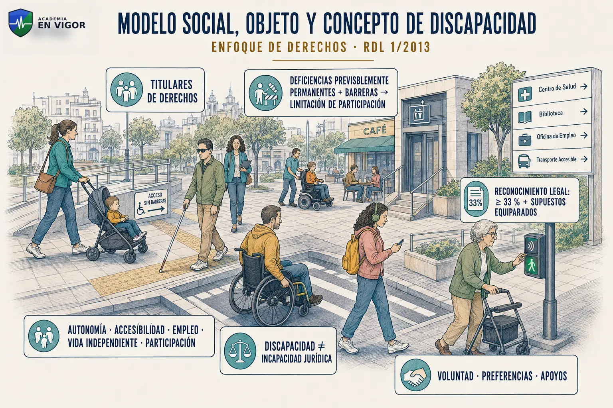

<em>Infografía: Modelo social, objeto y concepto de discapacidad.</em>

:::hablemos-claro
Separa sujeto, presupuesto, regla, excepción y control. Las opciones trampa suelen cambiar solo uno de esos cinco elementos.
:::

:::en-la-calle
Antes de actuar, identifica quién decide, qué habilitación existe, qué debe documentarse y qué revisión posterior protege a la persona afectada.
:::

:::lo-que-cae
Memoriza el anclaje «arts. 1-4» y discrimina reglas, excepciones y plazos.
:::

<!-- FUENTE: RDL1-2013-T23 -->

## 26. Principios y derechos de las personas con discapacidad

### Regla y encaje

La dignidad, autonomía individual, vida independiente, no discriminación, igualdad de oportunidades, accesibilidad y participación son principios de la ley. Este bloque se integra en **discapacidad e inclusión social** y se ancla en **arts. 3 y 5-32**.

### Claves normativas

- La dignidad, autonomía individual, vida independiente, no discriminación, igualdad de oportunidades, accesibilidad y participación son principios de la ley.
- La libertad para tomar decisiones y el respeto a la evolución de las facultades de menores con discapacidad orientan las medidas de apoyo. <!-- FACT:PN-T23-F126 -->
- Las personas con discapacidad ejercen sus derechos en igualdad en protección de la salud, educación, vida independiente, empleo, protección social y participación pública. <!-- FACT:PN-T23-F127 -->
- Los poderes públicos deben prestar atención específica a quienes sufren discriminación múltiple, incluidas mujeres, menores y personas con grandes necesidades de apoyo. <!-- FACT:PN-T23-F128 -->
- La información y la comunicación públicas deben ofrecerse en formatos accesibles y mediante ajustes adecuados a las necesidades de la persona. <!-- FACT:PN-T23-F129 -->
 <!-- FACT:PN-T23-F130 -->

<!-- VISUAL:t23-26-principios-y-derechos-de-las-personas-con-.webp -->

  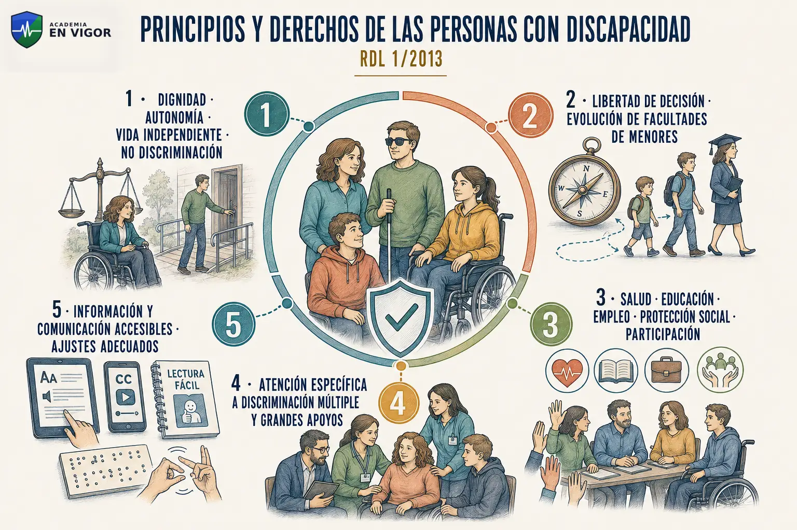

<em>Infografía: Principios y derechos de las personas con discapacidad.</em>

:::hablemos-claro
Separa sujeto, presupuesto, regla, excepción y control. Las opciones trampa suelen cambiar solo uno de esos cinco elementos.
:::

:::en-la-calle
Antes de actuar, identifica quién decide, qué habilitación existe, qué debe documentarse y qué revisión posterior protege a la persona afectada.
:::

:::lo-que-cae
Memoriza el anclaje «arts. 3 y 5-32» y discrimina reglas, excepciones y plazos.
:::

<!-- FUENTE: RDL1-2013-T23 -->

## 27. Igualdad de oportunidades y formas de discriminación

### Regla y encaje

Vulnera la igualdad toda discriminación directa o indirecta, discriminación por asociación, acoso, incumplimiento de accesibilidad o negativa de ajustes razonables. Este bloque se integra en **discapacidad e inclusión social** y se ancla en **arts. 2 y 63-68**.

### Claves normativas

- Vulnera la igualdad toda discriminación directa o indirecta, discriminación por asociación, acoso, incumplimiento de accesibilidad o negativa de ajustes razonables.
- La discriminación directa dispensa trato menos favorable por motivo de discapacidad en situación análoga o comparable. <!-- FACT:PN-T23-F131 -->
- La discriminación indirecta deriva de una disposición, criterio o práctica aparentemente neutros que ocasionan desventaja particular sin justificación legítima y proporcionada. <!-- FACT:PN-T23-F132 -->
- Existe discriminación por asociación cuando el trato desfavorable se debe a la relación de una persona con otra con discapacidad. <!-- FACT:PN-T23-F133 -->
- Los ajustes razonables son modificaciones necesarias y adecuadas que no impongan carga desproporcionada o indebida y garanticen el ejercicio de derechos. <!-- FACT:PN-T23-F134 -->
 <!-- FACT:PN-T23-F135 -->

<!-- VISUAL:t23-27-igualdad-de-oportunidades-y-formas-de-disc.webp -->

  

<em>Infografía: Igualdad de oportunidades y formas de discriminación.</em>

:::hablemos-claro
Separa sujeto, presupuesto, regla, excepción y control. Las opciones trampa suelen cambiar solo uno de esos cinco elementos.
:::

:::en-la-calle
Antes de actuar, identifica quién decide, qué habilitación existe, qué debe documentarse y qué revisión posterior protege a la persona afectada.
:::

:::lo-que-cae
Memoriza el anclaje «arts. 2 y 63-68» y discrimina reglas, excepciones y plazos.
:::

<!-- FUENTE: RDL1-2013-T23 -->

## 28. Accesibilidad universal y vida independiente

### Regla y encaje

La accesibilidad universal permite comprender, utilizar y practicar entornos, procesos, bienes, productos y servicios de forma segura, cómoda y autónoma. Este bloque se integra en **discapacidad e inclusión social** y se ancla en **arts. 2, 22-29 bis**.

### Claves normativas

- La accesibilidad universal permite comprender, utilizar y practicar entornos, procesos, bienes, productos y servicios de forma segura, cómoda y autónoma.
- El diseño universal concibe productos y entornos utilizables por todas las personas desde su origen sin excluir productos de apoyo cuando sean necesarios. <!-- FACT:PN-T23-F136 -->
- Los poderes públicos establecen condiciones básicas de accesibilidad y no discriminación en telecomunicaciones, espacios públicos, transportes, bienes, servicios y relaciones con Administraciones. <!-- FACT:PN-T23-F137 -->
- La accesibilidad cognitiva forma parte de la accesibilidad universal y se apoya, entre otros medios, en lectura fácil, sistemas alternativos y señalización comprensible. <!-- FACT:PN-T23-F138 -->
- La vida independiente exige libertad de elección y control sobre cómo, dónde y con quién vivir, con apoyos suficientes en la comunidad. <!-- FACT:PN-T23-F139 -->
 <!-- FACT:PN-T23-F140 -->

<!-- VISUAL:t23-28-accesibilidad-universal-y-vida-independien.webp -->

  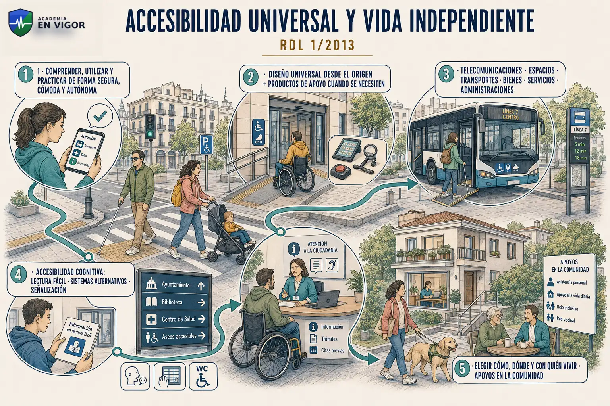

<em>Infografía: Accesibilidad universal y vida independiente.</em>

:::hablemos-claro
Separa sujeto, presupuesto, regla, excepción y control. Las opciones trampa suelen cambiar solo uno de esos cinco elementos.
:::

:::en-la-calle
Antes de actuar, identifica quién decide, qué habilitación existe, qué debe documentarse y qué revisión posterior protege a la persona afectada.
:::

:::lo-que-cae
Memoriza el anclaje «arts. 2, 22-29 bis» y discrimina reglas, excepciones y plazos.
:::

<!-- FUENTE: RDL1-2013-T23 -->

## 29. Empleo e integración laboral

### Regla y encaje

Las personas con discapacidad tienen derecho al trabajo en condiciones que garanticen igualdad de trato y oportunidades. Este bloque se integra en **discapacidad e inclusión social** y se ancla en **arts. 35-47**.

### Claves normativas

- Las personas con discapacidad tienen derecho al trabajo en condiciones que garanticen igualdad de trato y oportunidades.
- El empleo puede desarrollarse en empleo ordinario, empleo protegido mediante centros especiales y enclaves, o empleo autónomo. <!-- FACT:PN-T23-F141 -->
- Las empresas públicas y privadas de cincuenta o más personas trabajadoras deben reservar al menos el dos por ciento de puestos para personas con discapacidad, salvo medidas alternativas autorizadas. <!-- FACT:PN-T23-F142 -->
- Los centros especiales de empleo buscan empleo remunerado y servicios de ajuste personal y social y favorecen el tránsito al empleo ordinario. <!-- FACT:PN-T23-F143 -->
- Las Administraciones adoptan medidas de orientación, formación, adaptación de puestos, empleo con apoyo y acción positiva para la inclusión laboral. <!-- FACT:PN-T23-F144 -->
 <!-- FACT:PN-T23-F145 -->

<!-- VISUAL:t23-29-empleo-e-integracion-laboral.webp -->

  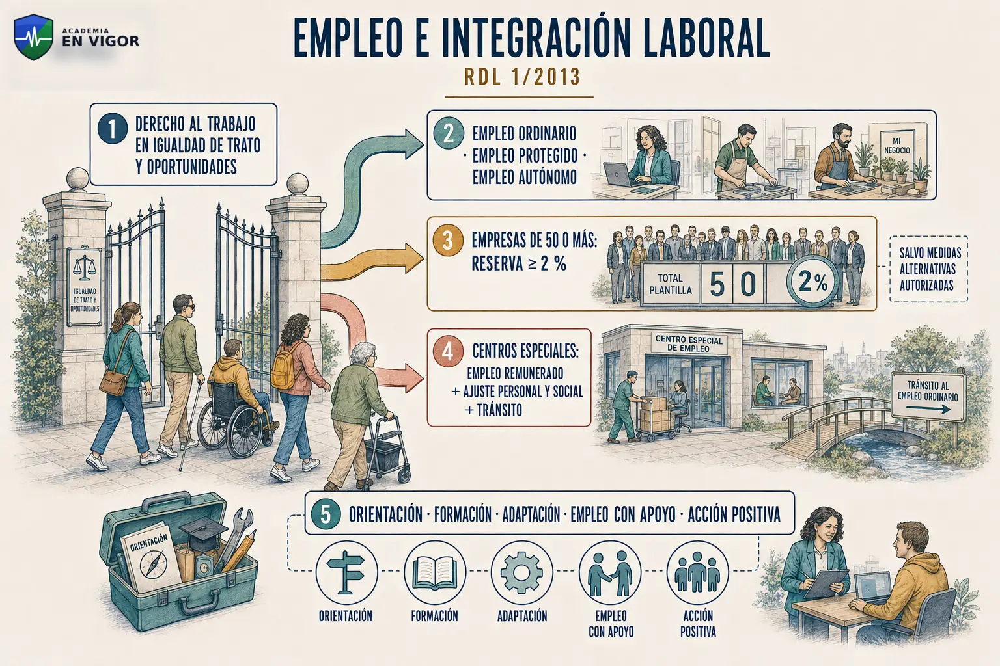

<em>Infografía: Empleo e integración laboral.</em>

:::hablemos-claro
Separa sujeto, presupuesto, regla, excepción y control. Las opciones trampa suelen cambiar solo uno de esos cinco elementos.
:::

:::en-la-calle
Antes de actuar, identifica quién decide, qué habilitación existe, qué debe documentarse y qué revisión posterior protege a la persona afectada.
:::

:::lo-que-cae
Memoriza el anclaje «arts. 35-47» y discrimina reglas, excepciones y plazos.
:::

<!-- FUENTE: RDL1-2013-T23 -->

## 30. Protección institucional, tutela y régimen sancionador

### Regla y encaje

El Consejo Nacional de la Discapacidad institucionaliza la colaboración del movimiento asociativo con la Administración General del Estado. Este bloque se integra en **discapacidad e inclusión social** y se ancla en **arts. 53-105**.

### Claves normativas

- El Consejo Nacional de la Discapacidad institucionaliza la colaboración del movimiento asociativo con la Administración General del Estado.
- La Oficina de Atención a la Discapacidad es órgano permanente y especializado del Consejo Nacional para promover igualdad y no discriminación. <!-- FACT:PN-T23-F146 -->
- Las organizaciones representativas pueden actuar en defensa de intereses colectivos conforme a la ley y con respeto a la legitimación de la persona afectada. <!-- FACT:PN-T23-F147 -->
- Ante indicios fundados de discriminación, las reglas procesales pueden desplazar la carga de justificar objetiva y proporcionalmente la medida cuestionada. <!-- FACT:PN-T23-F148 -->
- El texto refundido establece infracciones y sanciones estatales en materia de igualdad de oportunidades, no discriminación y accesibilidad cuando sea competente el Estado. <!-- FACT:PN-T23-F149 -->
 <!-- FACT:PN-T23-F150 -->

<!-- VISUAL:t23-30-proteccion-institucional-tutela-y-regimen-.webp -->

  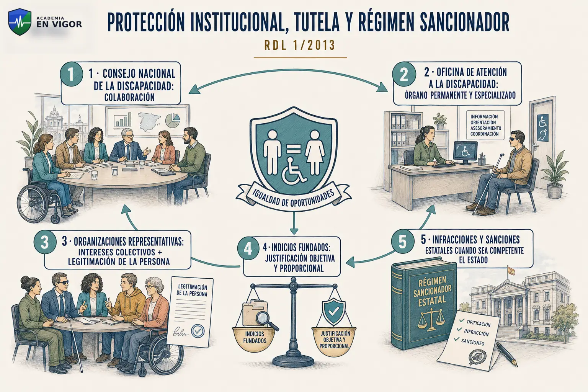

<em>Infografía: Protección institucional, tutela y régimen sancionador.</em>

:::hablemos-claro
Separa sujeto, presupuesto, regla, excepción y control. Las opciones trampa suelen cambiar solo uno de esos cinco elementos.
:::

:::en-la-calle
Antes de actuar, identifica quién decide, qué habilitación existe, qué debe documentarse y qué revisión posterior protege a la persona afectada.
:::

:::lo-que-cae
Memoriza el anclaje «arts. 53-105» y discrimina reglas, excepciones y plazos.
:::

<!-- FUENTE: RDL1-2013-T23 -->

## 31. Objeto y conceptos de autonomía y dependencia

### Regla y encaje

La Ley 39/2006 garantiza condiciones básicas de igualdad en el derecho subjetivo a la promoción de la autonomía personal y atención a la dependencia mediante el SAAD. Este bloque se integra en **autonomía personal y atención a la dependencia** y se ancla en **arts. 1-2**.

### Claves normativas

- La Ley 39/2006 garantiza condiciones básicas de igualdad en el derecho subjetivo a la promoción de la autonomía personal y atención a la dependencia mediante el SAAD.
- Autonomía es la capacidad de controlar, afrontar y tomar decisiones sobre cómo vivir y desarrollar las actividades básicas de la vida diaria. <!-- FACT:PN-T23-F151 -->
- Dependencia es un estado permanente ligado a edad, enfermedad o discapacidad y pérdida de autonomía que exige atención de otras personas o apoyos importantes. <!-- FACT:PN-T23-F152 -->
- Las actividades básicas de la vida diaria comprenden tareas elementales de cuidado, movilidad, orientación, reconocimiento y ejecución de tareas sencillas. <!-- FACT:PN-T23-F153 -->
- La asistencia personal colabora en tareas cotidianas para fomentar vida independiente y potenciar la autonomía de la persona beneficiaria. <!-- FACT:PN-T23-F154 -->
 <!-- FACT:PN-T23-F155 -->

<!-- VISUAL:t23-31-objeto-y-conceptos-de-autonomia-y-dependen.webp -->

  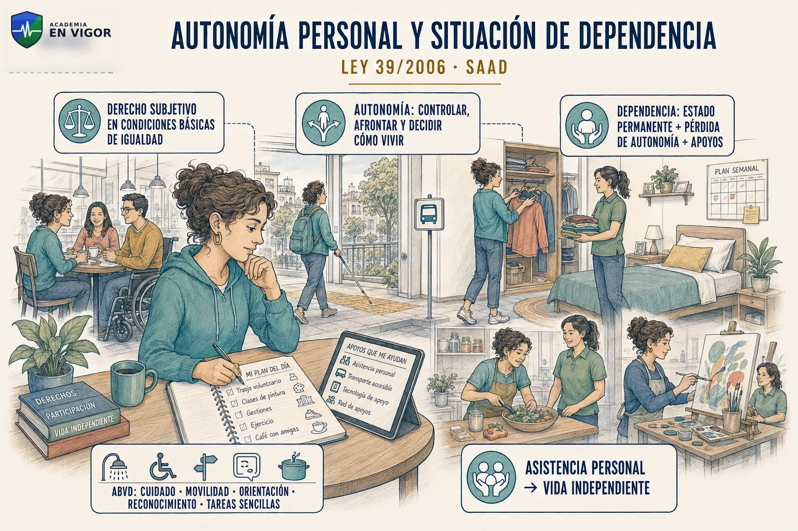

<em>Infografía: Objeto y conceptos de autonomía y dependencia.</em>

:::hablemos-claro
Separa sujeto, presupuesto, regla, excepción y control. Las opciones trampa suelen cambiar solo uno de esos cinco elementos.
:::

:::en-la-calle
Antes de actuar, identifica quién decide, qué habilitación existe, qué debe documentarse y qué revisión posterior protege a la persona afectada.
:::

:::lo-que-cae
Memoriza el anclaje «arts. 1-2» y discrimina reglas, excepciones y plazos.
:::

<!-- FUENTE: L39-2006-T23 -->

## 32. Principios, derechos y obligaciones en dependencia

### Regla y encaje

El SAAD se inspira en carácter público, universalidad, igualdad, atención integral, personalización, prevención, accesibilidad y cooperación interadministrativa. Este bloque se integra en **autonomía personal y atención a la dependencia** y se ancla en **arts. 3-4**.

### Claves normativas

- El SAAD se inspira en carácter público, universalidad, igualdad, atención integral, personalización, prevención, accesibilidad y cooperación interadministrativa.
- La perspectiva de género y la atención preferente de personas en gran dependencia figuran entre los principios legales. <!-- FACT:PN-T23-F156 -->
- Las personas en dependencia acceden en igualdad a prestaciones y servicios con respeto a dignidad, intimidad, autonomía e información accesible. <!-- FACT:PN-T23-F157 -->
- La persona puede participar en la formulación y aplicación de políticas, decidir sobre recursos y no sufrir discriminación por razón de su situación. <!-- FACT:PN-T23-F158 -->
- Las personas beneficiarias deben facilitar información veraz, comunicar ayudas incompatibles, destinar prestaciones a su finalidad y cumplir condiciones del servicio. <!-- FACT:PN-T23-F159 -->
 <!-- FACT:PN-T23-F160 -->

<!-- VISUAL:t23-32-principios-derechos-y-obligaciones-en-depe.webp -->

  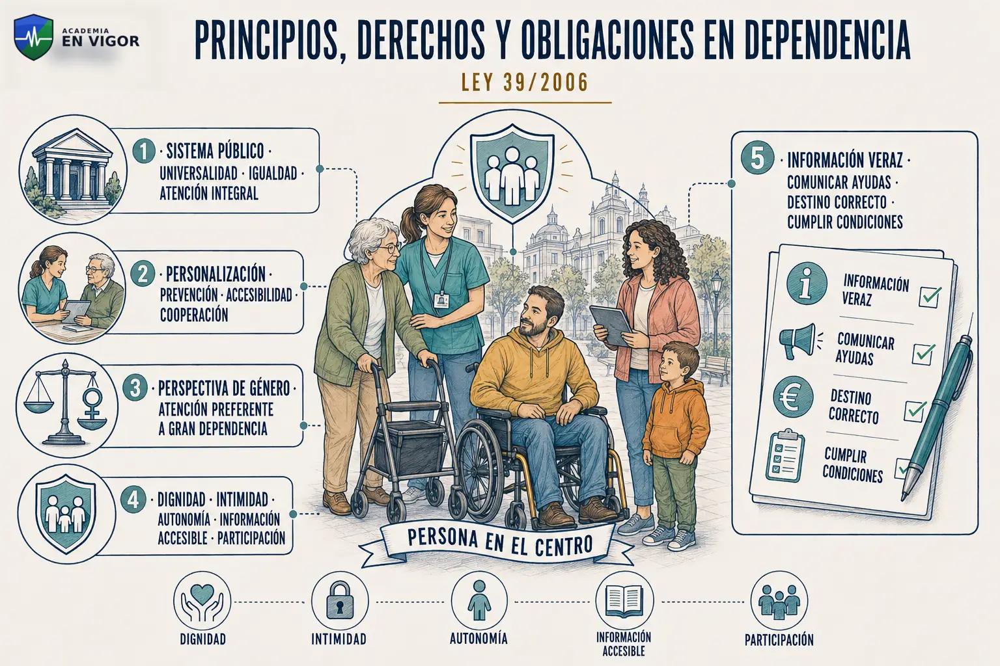

<em>Infografía: Principios, derechos y obligaciones en dependencia.</em>

:::hablemos-claro
Separa sujeto, presupuesto, regla, excepción y control. Las opciones trampa suelen cambiar solo uno de esos cinco elementos.
:::

:::en-la-calle
Antes de actuar, identifica quién decide, qué habilitación existe, qué debe documentarse y qué revisión posterior protege a la persona afectada.
:::

:::lo-que-cae
Memoriza el anclaje «arts. 3-4» y discrimina reglas, excepciones y plazos.
:::

<!-- FUENTE: L39-2006-T23 -->

## 33. Sistema para la Autonomía y Atención a la Dependencia

### Regla y encaje

El SAAD garantiza condiciones básicas y contenido común, coordina la colaboración administrativa y optimiza recursos públicos y privados. Este bloque se integra en **autonomía personal y atención a la dependencia** y se ancla en **arts. 6-12**.

### Claves normativas

- El SAAD garantiza condiciones básicas y contenido común, coordina la colaboración administrativa y optimiza recursos públicos y privados.
- La protección se articula mediante un nivel mínimo garantizado por la AGE y un nivel acordado entre AGE y cada comunidad autónoma, además de mejoras autonómicas. <!-- FACT:PN-T23-F161 -->
- El Consejo Territorial de Servicios Sociales y del SAAD es el instrumento de cooperación para acordar criterios comunes, intensidad, compatibilidades, baremo y financiación. <!-- FACT:PN-T23-F162 -->
- Las comunidades autónomas planifican, coordinan, acreditan, valoran y reconocen prestaciones en su territorio conforme al marco común. <!-- FACT:PN-T23-F163 -->
- Las entidades locales participan en la gestión según la normativa autonómica y las competencias que les atribuya la legislación. <!-- FACT:PN-T23-F164 -->
 <!-- FACT:PN-T23-F165 -->

<!-- VISUAL:t23-33-sistema-para-la-autonomia-y-atencion-a-la-.webp -->

  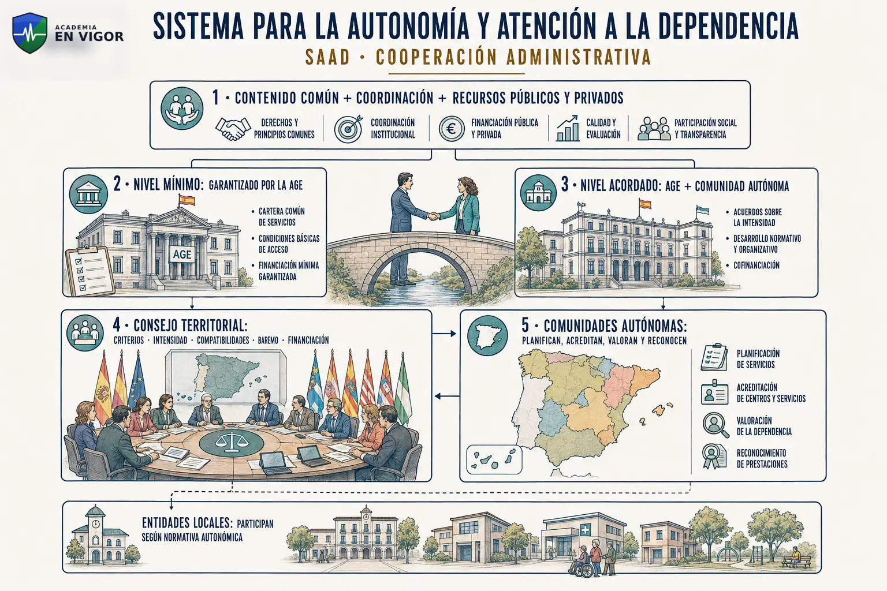

<em>Infografía: Sistema para la Autonomía y Atención a la Dependencia.</em>

:::hablemos-claro
Separa sujeto, presupuesto, regla, excepción y control. Las opciones trampa suelen cambiar solo uno de esos cinco elementos.
:::

:::en-la-calle
Antes de actuar, identifica quién decide, qué habilitación existe, qué debe documentarse y qué revisión posterior protege a la persona afectada.
:::

:::lo-que-cae
Memoriza el anclaje «arts. 6-12» y discrimina reglas, excepciones y plazos.
:::

<!-- FUENTE: L39-2006-T23 -->

## 34. Grados, valoración y Programa Individual de Atención

### Regla y encaje

La situación de dependencia se clasifica en grado I moderada, grado II severa y grado III gran dependencia. Este bloque se integra en **autonomía personal y atención a la dependencia** y se ancla en **arts. 26-30**.

### Claves normativas

- La situación de dependencia se clasifica en grado I moderada, grado II severa y grado III gran dependencia.
- El grado se determina aplicando el baremo acordado por el Consejo Territorial y aprobado por el Gobierno, sin atender aisladamente a un diagnóstico médico. <!-- FACT:PN-T23-F166 -->
- La valoración considera informes de salud, entorno y ayudas técnicas, y corresponde a órganos públicos designados por la comunidad autónoma. <!-- FACT:PN-T23-F167 -->
- El Programa Individual de Atención determina las modalidades de intervención más adecuadas entre servicios y prestaciones reconocidos. <!-- FACT:PN-T23-F168 -->
- Grado y PIA se revisan por mejoría, empeoramiento, error de diagnóstico o aplicación, y cambio de circunstancias en los términos legales. <!-- FACT:PN-T23-F169 -->
 <!-- FACT:PN-T23-F170 -->

<!-- VISUAL:t23-34-grados-valoracion-y-programa-individual-de.webp -->

  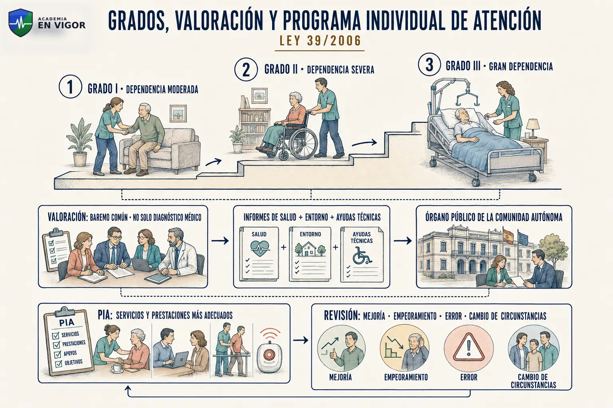

<em>Infografía: Grados, valoración y Programa Individual de Atención.</em>

:::hablemos-claro
Separa sujeto, presupuesto, regla, excepción y control. Las opciones trampa suelen cambiar solo uno de esos cinco elementos.
:::

:::en-la-calle
Antes de actuar, identifica quién decide, qué habilitación existe, qué debe documentarse y qué revisión posterior protege a la persona afectada.
:::

:::lo-que-cae
Memoriza el anclaje «arts. 26-30» y discrimina reglas, excepciones y plazos.
:::

<!-- FUENTE: L39-2006-T23 -->

## 35. Catálogo de servicios del SAAD

### Regla y encaje

El catálogo incluye prevención y promoción de autonomía, teleasistencia, ayuda a domicilio, centros de día o noche y atención residencial. Este bloque se integra en **autonomía personal y atención a la dependencia** y se ancla en **arts. 13-25**.

### Claves normativas

- El catálogo incluye prevención y promoción de autonomía, teleasistencia, ayuda a domicilio, centros de día o noche y atención residencial.
- Los servicios tienen prioridad sobre las prestaciones económicas y se prestan mediante la red pública de servicios sociales de las comunidades autónomas. <!-- FACT:PN-T23-F171 -->
- La ayuda a domicilio comprende atención personal y, vinculada a ella, necesidades domésticas para la vida diaria. <!-- FACT:PN-T23-F172 -->
- Los centros de día o noche ofrecen atención integral para mejorar o mantener autonomía y apoyar a familias o cuidadores. <!-- FACT:PN-T23-F173 -->
- La atención residencial presta servicios continuados personales y sanitarios según tipo y grado de dependencia e intensidad de cuidados. <!-- FACT:PN-T23-F174 -->
 <!-- FACT:PN-T23-F175 -->

<!-- VISUAL:t23-35-catalogo-de-servicios-del-saad.webp -->

  

<em>Infografía: Catálogo de servicios del SAAD.</em>

:::hablemos-claro
Separa sujeto, presupuesto, regla, excepción y control. Las opciones trampa suelen cambiar solo uno de esos cinco elementos.
:::

:::en-la-calle
Antes de actuar, identifica quién decide, qué habilitación existe, qué debe documentarse y qué revisión posterior protege a la persona afectada.
:::

:::lo-que-cae
Memoriza el anclaje «arts. 13-25» y discrimina reglas, excepciones y plazos.
:::

<!-- FUENTE: L39-2006-T23 -->

## 36. Prestaciones económicas, compatibilidad y financiación

### Regla y encaje

Las prestaciones económicas pueden vincularse a un servicio, compensar cuidados en el entorno familiar o financiar asistencia personal en los supuestos legales. Este bloque se integra en **autonomía personal y atención a la dependencia** y se ancla en **arts. 14, 17-20, 25 bis y 32-33**.

### Claves normativas

- Las prestaciones económicas pueden vincularse a un servicio, compensar cuidados en el entorno familiar o financiar asistencia personal en los supuestos legales.
- La prestación para cuidados familiares es excepcional y exige condiciones adecuadas de convivencia, habitabilidad, PIA y requisitos de la persona cuidadora. <!-- FACT:PN-T23-F176 -->
- La asistencia personal busca facilitar educación, trabajo y vida autónoma y puede reconocerse en cualquiera de los grados. <!-- FACT:PN-T23-F177 -->
- Las prestaciones económicas son incompatibles entre sí y con servicios salvo las compatibilidades legales; teleasistencia admite varias compatibilidades expresas. <!-- FACT:PN-T23-F178 -->
- La financiación corresponde a las Administraciones y la persona beneficiaria participa según capacidad económica sin quedar fuera del sistema por falta de recursos. <!-- FACT:PN-T23-F179 -->
 <!-- FACT:PN-T23-F180 -->

<!-- VISUAL:t23-36-prestaciones-economicas-compatibilidad-y-f.webp -->

  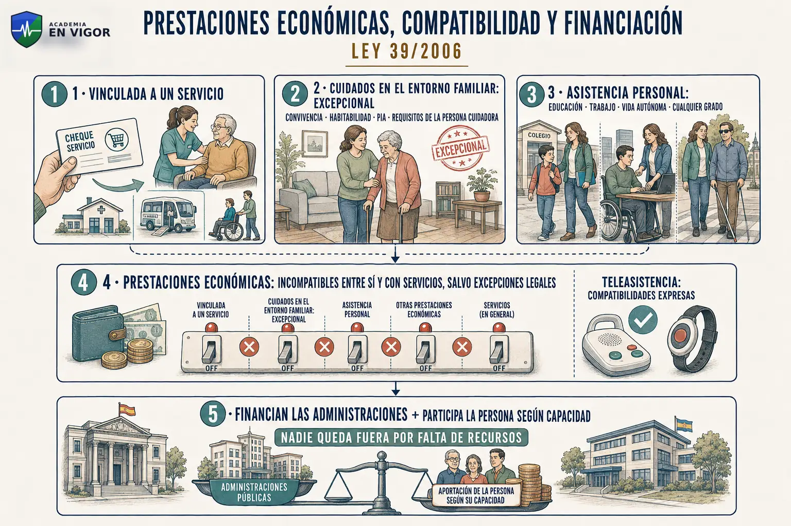

<em>Infografía: Prestaciones económicas, compatibilidad y financiación.</em>

:::hablemos-claro
Separa sujeto, presupuesto, regla, excepción y control. Las opciones trampa suelen cambiar solo uno de esos cinco elementos.
:::

:::en-la-calle
Antes de actuar, identifica quién decide, qué habilitación existe, qué debe documentarse y qué revisión posterior protege a la persona afectada.
:::

:::lo-que-cae
Memoriza el anclaje «arts. 14, 17-20, 25 bis y 32-33» y discrimina reglas, excepciones y plazos.
:::

<!-- FUENTE: L39-2006-T23 -->

## 37. Objeto, ámbito y conceptos básicos LGTBI

### Regla y encaje

La Ley 4/2023 garantiza y promueve la igualdad real y efectiva de las personas LGTBI y de sus familias y regula derechos de las personas trans. Este bloque se integra en **igualdad de las personas trans y lgtbi** y se ancla en **arts. 1-3**.

### Claves normativas

- La Ley 4/2023 garantiza y promueve la igualdad real y efectiva de las personas LGTBI y de sus familias y regula derechos de las personas trans.
- La orientación sexual es la atracción física, sexual o afectiva hacia una persona, con independencia de su sexo o género. <!-- FACT:PN-T23-F181 -->
- La identidad sexual es la vivencia interna e individual del sexo tal como cada persona la siente y autodefine, pudiendo no corresponder con el asignado al nacer. <!-- FACT:PN-T23-F182 -->
- La expresión de género es la manifestación que cada persona hace de su identidad sexual. <!-- FACT:PN-T23-F183 -->
- Las características sexuales son rasgos físicos de carácter sexual, incluidos los genéticos, anatómicos o fisiológicos. <!-- FACT:PN-T23-F184 -->
 <!-- FACT:PN-T23-F185 -->

<!-- VISUAL:t23-37-objeto-ambito-y-conceptos-basicos-lgtbi.webp -->

  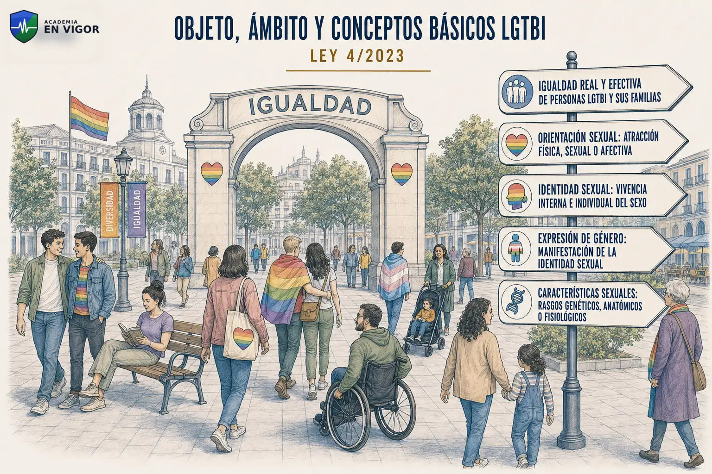

<em>Infografía: Objeto, ámbito y conceptos básicos LGTBI.</em>

:::hablemos-claro
Separa sujeto, presupuesto, regla, excepción y control. Las opciones trampa suelen cambiar solo uno de esos cinco elementos.
:::

:::en-la-calle
Antes de actuar, identifica quién decide, qué habilitación existe, qué debe documentarse y qué revisión posterior protege a la persona afectada.
:::

:::lo-que-cae
Memoriza el anclaje «arts. 1-3» y discrimina reglas, excepciones y plazos.
:::

<!-- FUENTE: L4-2023-T23 -->

## 38. Formas de discriminación LGTBI

### Regla y encaje

La ley distingue discriminación directa, indirecta y múltiple e interseccional por las causas que protege. Este bloque se integra en **igualdad de las personas trans y lgtbi** y se ancla en **art. 3**.

### Claves normativas

- La ley distingue discriminación directa, indirecta y múltiple e interseccional por las causas que protege.
- Hay discriminación por asociación cuando el trato desfavorable deriva de la relación con otra persona sobre la que concurre una causa protegida. <!-- FACT:PN-T23-F186 -->
- Hay discriminación por error cuando el trato se funda en una apreciación incorrecta sobre las características de la persona. <!-- FACT:PN-T23-F187 -->
- El acoso discriminatorio busca o produce atentado contra dignidad y entorno intimidatorio, hostil, degradante, humillante u ofensivo. <!-- FACT:PN-T23-F188 -->
- También se prohíben la inducción, orden o instrucción de discriminar y las represalias por reclamar protección frente a la discriminación. <!-- FACT:PN-T23-F189 -->
 <!-- FACT:PN-T23-F190 -->

<!-- VISUAL:t23-38-formas-de-discriminacion-lgtbi.webp -->

  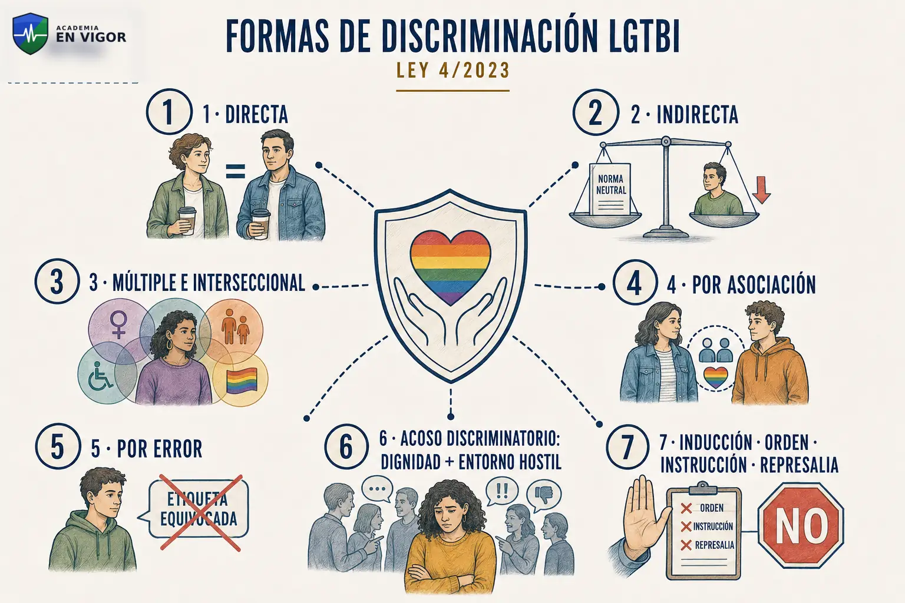

<em>Infografía: Formas de discriminación LGTBI.</em>

:::hablemos-claro
Separa sujeto, presupuesto, regla, excepción y control. Las opciones trampa suelen cambiar solo uno de esos cinco elementos.
:::

:::en-la-calle
Antes de actuar, identifica quién decide, qué habilitación existe, qué debe documentarse y qué revisión posterior protege a la persona afectada.
:::

:::lo-que-cae
Memoriza el anclaje «art. 3» y discrimina reglas, excepciones y plazos.
:::

<!-- FUENTE: L4-2023-T23 -->

## 39. Políticas públicas y empleo público LGTBI

### Regla y encaje

Los poderes públicos deben reconocer, garantizar, proteger y promover igualdad y no discriminación de personas LGTBI y sus familias. Este bloque se integra en **igualdad de las personas trans y lgtbi** y se ancla en **arts. 4-12**.

### Claves normativas

- Los poderes públicos deben reconocer, garantizar, proteger y promover igualdad y no discriminación de personas LGTBI y sus familias.
- La Estrategia estatal para la igualdad de trato y no discriminación LGTBI es el instrumento principal de colaboración territorial y tiene carácter cuatrienal. <!-- FACT:PN-T23-F191 -->
- El Consejo de Participación de las Personas LGTBI institucionaliza el diálogo entre Administraciones y sociedad civil. <!-- FACT:PN-T23-F192 -->
- Las Administraciones garantizan igualdad LGTBI en acceso al empleo público y carrera profesional, previa negociación sindical de las medidas. <!-- FACT:PN-T23-F193 -->
- Los programas de acceso al empleo público incluyen formación y conocimientos sobre igualdad de trato y no discriminación de personas LGTBI. <!-- FACT:PN-T23-F194 -->
 <!-- FACT:PN-T23-F195 -->

<!-- VISUAL:t23-39-politicas-publicas-y-empleo-publico-lgtbi.webp -->

  

<em>Infografía: Políticas públicas y empleo público LGTBI.</em>

:::hablemos-claro
Separa sujeto, presupuesto, regla, excepción y control. Las opciones trampa suelen cambiar solo uno de esos cinco elementos.
:::

:::en-la-calle
Antes de actuar, identifica quién decide, qué habilitación existe, qué debe documentarse y qué revisión posterior protege a la persona afectada.
:::

:::lo-que-cae
Memoriza el anclaje «arts. 4-12» y discrimina reglas, excepciones y plazos.
:::

<!-- FUENTE: L4-2023-T23 -->

## 40. Rectificación registral de la mención relativa al sexo

### Regla y encaje

Las personas españolas mayores de dieciséis años pueden solicitar por sí mismas la rectificación registral del sexo. Este bloque se integra en **igualdad de las personas trans y lgtbi** y se ancla en **arts. 43-45**.

### Claves normativas

- Las personas españolas mayores de dieciséis años pueden solicitar por sí mismas la rectificación registral del sexo.
- Las mayores de catorce y menores de dieciséis solicitan por sí mismas asistidas por sus representantes legales; el desacuerdo puede exigir defensor judicial. <!-- FACT:PN-T23-F196 -->
- Las mayores de doce y menores de catorce pueden solicitar autorización judicial conforme a la Ley de Jurisdicción Voluntaria. <!-- FACT:PN-T23-F197 -->
- El procedimiento no puede condicionarse a informe médico o psicológico ni a modificación corporal previa. <!-- FACT:PN-T23-F198 -->
- Tras la comparecencia inicial, la ratificación se cita en un máximo de tres meses y la resolución se dicta en un máximo de un mes desde la segunda comparecencia. <!-- FACT:PN-T23-F199 -->
 <!-- FACT:PN-T23-F200 -->

<!-- VISUAL:t23-40-rectificacion-registral-de-la-mencion-rela.webp -->

  

<em>Infografía: Rectificación registral de la mención relativa al sexo.</em>

:::hablemos-claro
Separa sujeto, presupuesto, regla, excepción y control. Las opciones trampa suelen cambiar solo uno de esos cinco elementos.
:::

:::en-la-calle
Antes de actuar, identifica quién decide, qué habilitación existe, qué debe documentarse y qué revisión posterior protege a la persona afectada.
:::

:::lo-que-cae
Memoriza el anclaje «arts. 43-45» y discrimina reglas, excepciones y plazos.
:::

<!-- FUENTE: L4-2023-T23 -->

## 41. Efectos, reversibilidad y adecuación documental

### Regla y encaje

La rectificación produce efectos constitutivos desde su inscripción en el Registro Civil y permite ejercer los derechos inherentes a la nueva condición. Este bloque se integra en **igualdad de las personas trans y lgtbi** y se ancla en **arts. 46-51**.

### Claves normativas

- La rectificación produce efectos constitutivos desde su inscripción en el Registro Civil y permite ejercer los derechos inherentes a la nueva condición.
- No altera el régimen jurídico aplicable antes de la inscripción a efectos de la Ley Orgánica 1/2004. <!-- FACT:PN-T23-F201 -->
- Transcurridos seis meses desde la inscripción puede recuperarse la mención registral anterior siguiendo el procedimiento legal. <!-- FACT:PN-T23-F202 -->
- Tras rectificar, se expiden nuevo DNI y, en su caso, pasaporte, conservándose el mismo número del DNI. <!-- FACT:PN-T23-F203 -->
- Las personas trans menores pueden obtener cambio registral de nombre por identidad sexual aun sin rectificar la mención del sexo, cumpliendo la Ley del Registro Civil. <!-- FACT:PN-T23-F204 -->
 <!-- FACT:PN-T23-F205 -->

<!-- VISUAL:t23-41-efectos-reversibilidad-y-adecuacion-docume.webp -->

  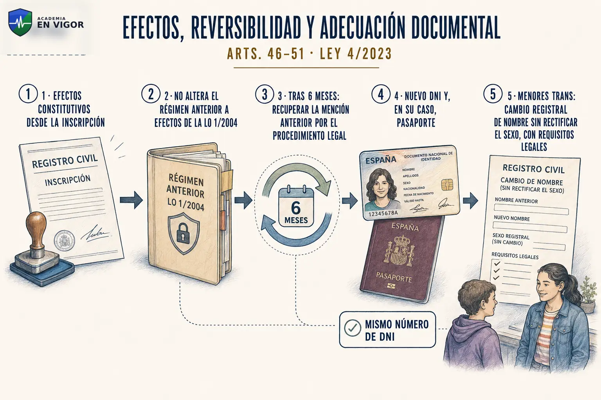

<em>Infografía: Efectos, reversibilidad y adecuación documental.</em>

:::hablemos-claro
Separa sujeto, presupuesto, regla, excepción y control. Las opciones trampa suelen cambiar solo uno de esos cinco elementos.
:::

:::en-la-calle
Antes de actuar, identifica quién decide, qué habilitación existe, qué debe documentarse y qué revisión posterior protege a la persona afectada.
:::

:::lo-que-cae
Memoriza el anclaje «arts. 46-51» y discrimina reglas, excepciones y plazos.
:::

<!-- FUENTE: L4-2023-T23 -->

## 42. Prohibiciones, intersexualidad y protección frente a violencia

### Regla y encaje

Se prohíben métodos, programas y terapias de aversión, conversión o contracondicionamiento dirigidos a modificar orientación, identidad o expresión, incluso con consentimiento. Este bloque se integra en **igualdad de las personas trans y lgtbi** y se ancla en **arts. 17, 19 y 62-74**.

### Claves normativas

- Se prohíben métodos, programas y terapias de aversión, conversión o contracondicionamiento dirigidos a modificar orientación, identidad o expresión, incluso con consentimiento.
- En menores intersexuales de menos de doce años se prohíben modificaciones genitales salvo indicación médica para proteger su salud. <!-- FACT:PN-T23-F206 -->
- Entre doce y dieciséis años esas prácticas solo se permiten a solicitud de la persona menor capaz de consentir informadamente. <!-- FACT:PN-T23-F207 -->
- Las Administraciones deben garantizar protección integral, real y efectiva a quien sufra o esté en riesgo de violencia o discriminación LGTBIfóbica. <!-- FACT:PN-T23-F208 -->
- Las autoridades que conozcan discriminación deben actuar si son competentes o comunicarla inmediatamente a la Administración competente. <!-- FACT:PN-T23-F209 -->
 <!-- FACT:PN-T23-F210 -->

<!-- VISUAL:t23-42-prohibiciones-intersexualidad-y-proteccion.webp -->

  

<em>Infografía: Prohibiciones, intersexualidad y protección frente a violencia.</em>

:::hablemos-claro
Separa sujeto, presupuesto, regla, excepción y control. Las opciones trampa suelen cambiar solo uno de esos cinco elementos.
:::

:::en-la-calle
Antes de actuar, identifica quién decide, qué habilitación existe, qué debe documentarse y qué revisión posterior protege a la persona afectada.
:::

:::lo-que-cae
Memoriza el anclaje «arts. 17, 19 y 62-74» y discrimina reglas, excepciones y plazos.
:::

<!-- FUENTE: L4-2023-T23 -->

## 43. Igualdad de trato y actuación policial no discriminatoria

### Regla y encaje

La Ley 15/2022 garantiza y promueve igualdad de trato y no discriminación en desarrollo de los artículos 9.2, 10 y 14 de la Constitución. Este bloque se integra en **igualdad de trato y organismos independientes** y se ancla en **arts. 1-4 y 18**.

### Claves normativas

- La Ley 15/2022 garantiza y promueve igualdad de trato y no discriminación en desarrollo de los artículos 9.2, 10 y 14 de la Constitución.
- Protege frente a discriminación por nacimiento, origen racial o étnico, sexo, religión, convicciones, edad, discapacidad, orientación o identidad sexual, salud y demás causas legales. <!-- FACT:PN-T23-F211 -->
- La protección alcanza discriminación directa, indirecta, por asociación, por error, múltiple o interseccional, acoso, inducción, orden y represalia. <!-- FACT:PN-T23-F212 -->
- Las Fuerzas y Cuerpos de Seguridad deben evitar perfiles discriminatorios sin justificación objetiva en el ámbito de la seguridad ciudadana. <!-- FACT:PN-T23-F213 -->
- Una diferencia de trato solo es admisible cuando responde a finalidad legítima y los medios son adecuados, necesarios y proporcionados. <!-- FACT:PN-T23-F214 -->
 <!-- FACT:PN-T23-F215 -->

<!-- VISUAL:t23-43-igualdad-de-trato-y-actuacion-policial-no-.webp -->

  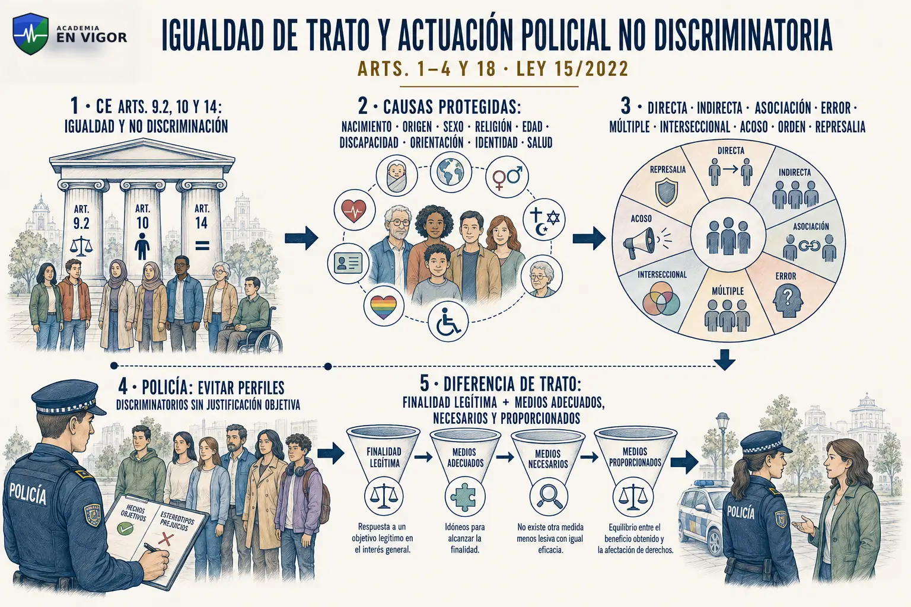

<em>Infografía: Igualdad de trato y actuación policial no discriminatoria.</em>

:::hablemos-claro
Separa sujeto, presupuesto, regla, excepción y control. Las opciones trampa suelen cambiar solo uno de esos cinco elementos.
:::

:::en-la-calle
Antes de actuar, identifica quién decide, qué habilitación existe, qué debe documentarse y qué revisión posterior protege a la persona afectada.
:::

:::lo-que-cae
Memoriza el anclaje «arts. 1-4 y 18» y discrimina reglas, excepciones y plazos.
:::

<!-- FUENTE: L15-2022-T23 -->

## 44. Autoridad Independiente e Instituto de las Mujeres

### Regla y encaje

La Autoridad Independiente para la Igualdad de Trato y la No Discriminación es una autoridad administrativa independiente estatal con personalidad jurídica y autonomía funcional. Este bloque se integra en **igualdad de trato y organismos independientes** y se ancla en **Ley 15/2022 arts. 40-45; RD 606/2026; RD 634/2026**.

### Claves normativas

- La Autoridad Independiente para la Igualdad de Trato y la No Discriminación es una autoridad administrativa independiente estatal con personalidad jurídica y autonomía funcional.
- Asiste a posibles víctimas, tramita quejas, puede mediar con consentimiento, investigar asuntos relevantes y ejercitar acciones en los términos legales. <!-- FACT:PN-T23-F216 -->
- El Real Decreto 606/2026 aprueba su Estatuto y la designa organismo de igualdad del Reino de España en su ámbito competencial. <!-- FACT:PN-T23-F217 -->
- El Instituto de las Mujeres es el organismo especializado en igualdad entre mujeres y hombres y no discriminación por razón de sexo, conforme a sus Estatutos de 2026. <!-- FACT:PN-T23-F218 -->
- Autoridad e Instituto cooperan de forma estructurada, especialmente en discriminaciones múltiples o interseccionales, respetando sus mandatos diferenciados. <!-- FACT:PN-T23-F219 -->
 <!-- FACT:PN-T23-F220 -->

<!-- VISUAL:t23-44-autoridad-independiente-e-instituto-de-las.webp -->

  

<em>Infografía: Autoridad Independiente e Instituto de las Mujeres.</em>

:::hablemos-claro
Separa sujeto, presupuesto, regla, excepción y control. Las opciones trampa suelen cambiar solo uno de esos cinco elementos.
:::

:::en-la-calle
Antes de actuar, identifica quién decide, qué habilitación existe, qué debe documentarse y qué revisión posterior protege a la persona afectada.
:::

:::lo-que-cae
Memoriza el anclaje «Ley 15/2022 arts. 40-45; RD 606/2026; RD 634/2026» y discrimina reglas, excepciones y plazos.
:::

<!-- FUENTE: RD606-2026-T23 -->

# Hablemos claro

:::hablemos-claro
Una regla bien estudiada responde cinco preguntas: quién, cuándo, qué hace, con qué límite y bajo qué control.
:::

# En la calle

:::en-la-calle
En el supuesto práctico, documenta hechos y tiempos antes de aplicar la norma; después revisa necesidad, proporcionalidad y garantías.
:::

# Lo que cae

:::lo-que-cae
Prioriza sujetos competentes, plazos máximos, excepciones tasadas y derechos que no admiten atajos.
:::

# Ha caído

:::ha-caido
Se han mapeado 19 referencias históricas. Permanecen ocultas y en cuarentena porque no existe plantilla oficial final verificable.
:::

## Fuentes oficiales

- `CONV-PN-2026`
- `CE-T23`
- `LO3-2007-T23`
- `LO2-2024-T23`
- `IV-PLAN-AGE-T23`
- `RD259-2019-T23`
- `RD634-2026-T23`
- `LO1-2004-T23`
- `L27-2003-T23`
- `VIOGEN2-T23`
- `RDL1-2013-T23`
- `L39-2006-T23`
- `L4-2023-T23`
- `L15-2022-T23`
- `RD606-2026-T23`

---

*Academia En Vigor · El temario que nunca duerme · Tema 23 · v1.0.0 · Documento interno no publicado.*
