# TEMA 24 · INTRODUCCIÓN A LA PREVENCIÓN DE RIESGOS LABORALES. CONCEPTO GENERAL DE TRABAJO. CONCEPTO DE SALUD Y CONDICIONES DE TRABAJO. EL TRABAJO Y LA SALUD. CONCEPTO GENERAL DE RIESGOS LABORALES. PRINCIPIOS GENERALES DE LA ACTIVIDAD PREVENTIVA. CONCEPTOS DE PREVENCIÓN Y PROTECCIÓN. CONSECUENCIA DE LOS RIESGOS. DAÑOS A LA SALUD.

**Policía Nacional · Método VIGOR · ATESTADO**
**Versión de contenido:** 1.0.0
**Estado editorial:** approved_internal · **Publicación:** not_published

# Mapa del tema

El Tema 24 se recorre en cuatro partes: trabajo, salud y relación entre ambos; condiciones de trabajo y factores de riesgo; concepto y valoración del riesgo laboral; actividad preventiva y principios generales; protección, consecuencias y daños a la salud.

# Contenido

## 01. Finalidad de la prevención de riesgos laborales

### Regla y encaje

La prevención de riesgos laborales busca promover la seguridad y la salud mediante medidas y actividades que eviten o reduzcan los riesgos derivados del trabajo. Este bloque se integra en **trabajo, salud y relación entre ambos** y se ancla en **arts. 2, 4.1 y 14**.

### Claves normativas

- La prevención de riesgos laborales busca promover la seguridad y la salud mediante medidas y actividades que eviten o reduzcan los riesgos derivados del trabajo.
- El modelo preventivo actúa antes de que aparezca el daño y no se limita a reparar sus consecuencias. <!-- FACT:PN-T24-F001 -->
- La mejora de las condiciones de trabajo eleva el nivel de protección de la seguridad y la salud de las personas trabajadoras. <!-- FACT:PN-T24-F002 -->
- La prevención debe integrarse en la actividad y mantenerse mediante identificación, evaluación, control y mejora continua. <!-- FACT:PN-T24-F003 -->
- La ausencia de accidentes durante un período no demuestra por sí sola que los riesgos estén controlados. <!-- FACT:PN-T24-F004 -->
 <!-- FACT:PN-T24-F005 -->

<!-- VISUAL:t24-01-finalidad-de-la-prevencion-de-riesgos-labo.webp -->

  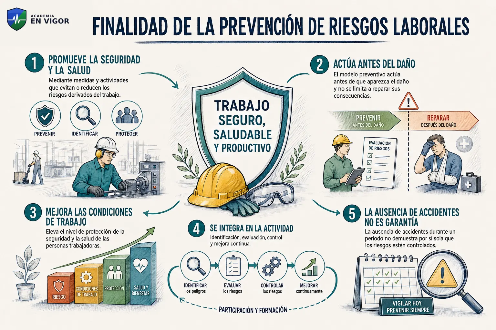

<em>Infografía: Finalidad de la prevención de riesgos laborales.</em>

:::hablemos-claro
Separa sujeto, presupuesto, regla, excepción y control. Las opciones trampa suelen cambiar solo uno de esos cinco elementos.
:::

:::en-la-calle
Antes de actuar, identifica quién decide, qué habilitación existe, qué debe documentarse y qué revisión posterior protege a la persona afectada.
:::

:::lo-que-cae
Memoriza el anclaje «arts. 2, 4.1 y 14» y discrimina reglas, excepciones y plazos.
:::

<!-- FUENTE: LPRL-T24 -->

## 02. Concepto general de trabajo

### Regla y encaje

El trabajo es una actividad humana organizada que transforma recursos o presta servicios para satisfacer necesidades individuales y sociales. Este bloque se integra en **trabajo, salud y relación entre ambos** y se ancla en **introducción y relación trabajo-salud**.

### Claves normativas

- El trabajo es una actividad humana organizada que transforma recursos o presta servicios para satisfacer necesidades individuales y sociales.
- Trabajar implica combinar personas, tareas, medios, métodos, tiempo y organización dentro de un contexto concreto. <!-- FACT:PN-T24-F006 -->
- El trabajo puede proporcionar ingresos, autonomía, identidad, relaciones sociales y desarrollo personal. <!-- FACT:PN-T24-F007 -->
- La tecnificación y la organización permiten producir con mayor eficacia, pero también pueden crear o modificar riesgos. <!-- FACT:PN-T24-F008 -->
- El concepto preventivo de trabajo atiende tanto a la tarea prescrita como a la actividad real con la que se ejecuta. <!-- FACT:PN-T24-F009 -->
 <!-- FACT:PN-T24-F010 -->

<!-- VISUAL:t24-02-concepto-general-de-trabajo.webp -->

  

<em>Infografía: Concepto general de trabajo.</em>

:::hablemos-claro
Separa sujeto, presupuesto, regla, excepción y control. Las opciones trampa suelen cambiar solo uno de esos cinco elementos.
:::

:::en-la-calle
Antes de actuar, identifica quién decide, qué habilitación existe, qué debe documentarse y qué revisión posterior protege a la persona afectada.
:::

:::lo-que-cae
Memoriza el anclaje «introducción y relación trabajo-salud» y discrimina reglas, excepciones y plazos.
:::

<!-- FUENTE: INSST-T3-2026-T24 -->

## 03. Efectos positivos y negativos del trabajo

### Regla y encaje

Cuando se desarrolla en condiciones adecuadas, el trabajo puede favorecer el bienestar físico, mental y social. Este bloque se integra en **trabajo, salud y relación entre ambos** y se ancla en **introducción**.

### Claves normativas

- Cuando se desarrolla en condiciones adecuadas, el trabajo puede favorecer el bienestar físico, mental y social.
- Cuando las condiciones son inadecuadas, el trabajo puede originar accidentes, enfermedades, fatiga, estrés, insatisfacción u otros daños. <!-- FACT:PN-T24-F011 -->
- Una misma actividad puede producir efectos distintos según la exposición, la organización, los medios y las características de la persona. <!-- FACT:PN-T24-F012 -->
- La relación entre trabajo y salud es bidireccional: el trabajo influye en la salud y el estado de salud condiciona la capacidad de trabajar. <!-- FACT:PN-T24-F013 -->
- Mejorar la prevención protege a las personas y también puede favorecer calidad, continuidad y eficacia del servicio. <!-- FACT:PN-T24-F014 -->
 <!-- FACT:PN-T24-F015 -->

<!-- VISUAL:t24-03-efectos-positivos-y-negativos-del-trabajo.webp -->

  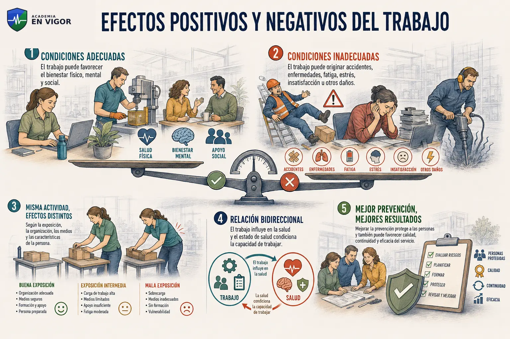

<em>Infografía: Efectos positivos y negativos del trabajo.</em>

:::hablemos-claro
Separa sujeto, presupuesto, regla, excepción y control. Las opciones trampa suelen cambiar solo uno de esos cinco elementos.
:::

:::en-la-calle
Antes de actuar, identifica quién decide, qué habilitación existe, qué debe documentarse y qué revisión posterior protege a la persona afectada.
:::

:::lo-que-cae
Memoriza el anclaje «introducción» y discrimina reglas, excepciones y plazos.
:::

<!-- FUENTE: INSST-T3-2026-T24 -->

## 04. Concepto de salud de la OMS

### Regla y encaje

La OMS concibe la salud como un estado de bienestar físico, mental y social, no como la mera ausencia de enfermedad. Este bloque se integra en **trabajo, salud y relación entre ambos** y se ancla en **preámbulo de la Constitución de la OMS**.

### Claves normativas

- La OMS concibe la salud como un estado de bienestar físico, mental y social, no como la mera ausencia de enfermedad.
- La dimensión física se refiere al funcionamiento corporal y a la ausencia o control de lesiones y alteraciones orgánicas. <!-- FACT:PN-T24-F016 -->
- La dimensión mental comprende equilibrio emocional, capacidades cognitivas y posibilidad de afrontar las demandas de la vida. <!-- FACT:PN-T24-F017 -->
- La dimensión social incluye relaciones, participación y condiciones que permiten desenvolverse en la comunidad. <!-- FACT:PN-T24-F018 -->
- En prevención laboral, proteger la salud exige considerar conjuntamente las tres dimensiones. <!-- FACT:PN-T24-F019 -->
 <!-- FACT:PN-T24-F020 -->

<!-- VISUAL:t24-04-concepto-de-salud-de-la-oms.webp -->

  

<em>Infografía: Concepto de salud de la OMS.</em>

:::hablemos-claro
Separa sujeto, presupuesto, regla, excepción y control. Las opciones trampa suelen cambiar solo uno de esos cinco elementos.
:::

:::en-la-calle
Antes de actuar, identifica quién decide, qué habilitación existe, qué debe documentarse y qué revisión posterior protege a la persona afectada.
:::

:::lo-que-cae
Memoriza el anclaje «preámbulo de la Constitución de la OMS» y discrimina reglas, excepciones y plazos.
:::

<!-- FUENTE: OMS-SALUD-T24 -->

## 05. Salud como realidad dinámica

### Regla y encaje

La salud no es un estado fijo: puede mejorar o deteriorarse a lo largo del tiempo por factores personales, laborales y sociales. Este bloque se integra en **trabajo, salud y relación entre ambos** y se ancla en **concepción integral de salud**.

### Claves normativas

- La salud no es un estado fijo: puede mejorar o deteriorarse a lo largo del tiempo por factores personales, laborales y sociales.
- Entre salud perfecta y enfermedad manifiesta existe un continuo con diferentes grados de bienestar y capacidad funcional. <!-- FACT:PN-T24-F021 -->
- Un daño puede ser inmediato, acumulativo o aparecer tras un período de latencia. <!-- FACT:PN-T24-F022 -->
- La percepción subjetiva de bienestar aporta información, pero no sustituye la evaluación técnica ni la vigilancia de la salud. <!-- FACT:PN-T24-F023 -->
- La prevención debe adaptarse cuando cambian las personas, las tareas, la tecnología o las condiciones de exposición. <!-- FACT:PN-T24-F024 -->
 <!-- FACT:PN-T24-F025 -->

<!-- VISUAL:t24-05-salud-como-realidad-dinamica.webp -->

  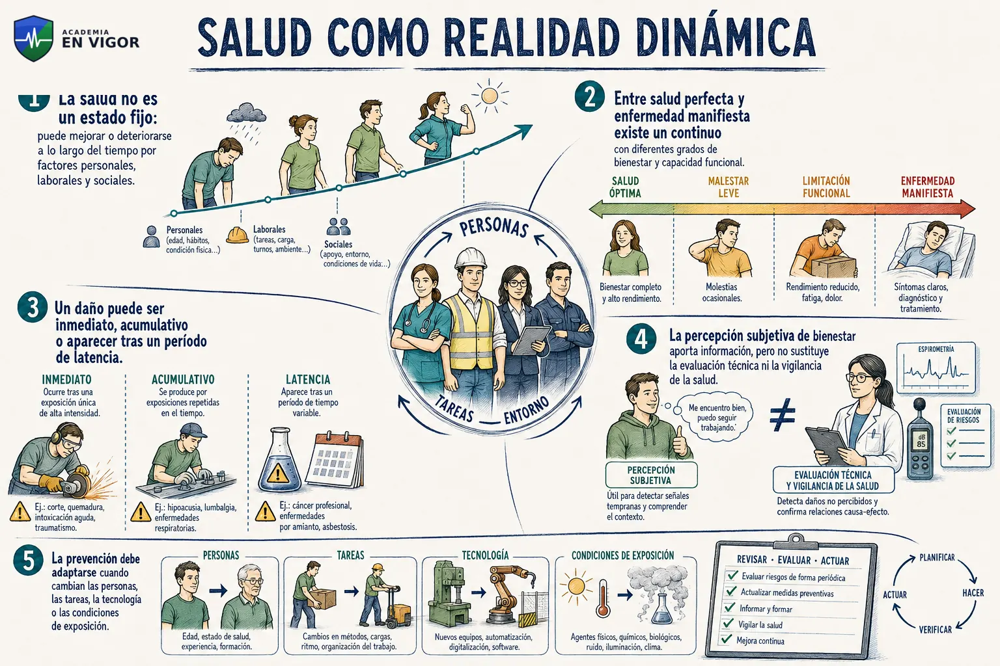

<em>Infografía: Salud como realidad dinámica.</em>

:::hablemos-claro
Separa sujeto, presupuesto, regla, excepción y control. Las opciones trampa suelen cambiar solo uno de esos cinco elementos.
:::

:::en-la-calle
Antes de actuar, identifica quién decide, qué habilitación existe, qué debe documentarse y qué revisión posterior protege a la persona afectada.
:::

:::lo-que-cae
Memoriza el anclaje «concepción integral de salud» y discrimina reglas, excepciones y plazos.
:::

<!-- FUENTE: OMS-SALUD-T24 -->

## 06. Relación entre trabajo y salud

### Regla y encaje

La relación trabajo-salud depende de cómo se diseña, organiza y ejecuta la actividad laboral. Este bloque se integra en **trabajo, salud y relación entre ambos** y se ancla en **introducción y disciplinas preventivas**.

### Claves normativas

- La relación trabajo-salud depende de cómo se diseña, organiza y ejecuta la actividad laboral.
- Las condiciones favorables pueden desarrollar capacidades; las desfavorables pueden generar o agravar daños. <!-- FACT:PN-T24-F026 -->
- El análisis preventivo conecta condiciones de trabajo, exposición, respuesta de la persona y posibles consecuencias. <!-- FACT:PN-T24-F027 -->
- La intervención debe actuar sobre las causas laborales y no atribuir automáticamente el problema a una supuesta falta individual. <!-- FACT:PN-T24-F028 -->
- Seguridad, higiene, ergonomía, psicosociología y medicina del trabajo cooperan para proteger la salud de forma integral. <!-- FACT:PN-T24-F029 -->
 <!-- FACT:PN-T24-F030 -->

<!-- VISUAL:t24-06-relacion-entre-trabajo-y-salud.webp -->

  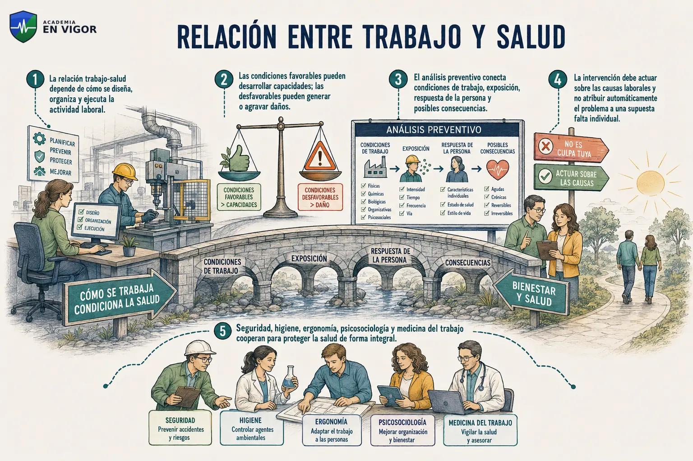

<em>Infografía: Relación entre trabajo y salud.</em>

:::hablemos-claro
Separa sujeto, presupuesto, regla, excepción y control. Las opciones trampa suelen cambiar solo uno de esos cinco elementos.
:::

:::en-la-calle
Antes de actuar, identifica quién decide, qué habilitación existe, qué debe documentarse y qué revisión posterior protege a la persona afectada.
:::

:::lo-que-cae
Memoriza el anclaje «introducción y disciplinas preventivas» y discrimina reglas, excepciones y plazos.
:::

<!-- FUENTE: INSST-T3-2026-T24 -->

## 07. Seguridad y salud en el trabajo

### Regla y encaje

La Constitución encomienda a los poderes públicos velar por la seguridad e higiene en el trabajo. Este bloque se integra en **trabajo, salud y relación entre ambos** y se ancla en **art. 40.2 CE; arts. 2 y 14 LPRL**.

### Claves normativas

- La Constitución encomienda a los poderes públicos velar por la seguridad e higiene en el trabajo.
- La seguridad y salud laboral persigue que el trabajo se realice sin riesgos evitables y con control de los que no puedan eliminarse. <!-- FACT:PN-T24-F031 -->
- El derecho a una protección eficaz comprende prevención, información, formación, participación y vigilancia de la salud en los términos legales. <!-- FACT:PN-T24-F032 -->
- La protección eficaz exige medidas reales y adaptadas al riesgo, no una mera documentación formal. <!-- FACT:PN-T24-F033 -->
- El coste de las medidas de seguridad y salud no debe recaer sobre las personas trabajadoras. <!-- FACT:PN-T24-F034 -->
 <!-- FACT:PN-T24-F035 -->

<!-- VISUAL:t24-07-seguridad-y-salud-en-el-trabajo.webp -->

  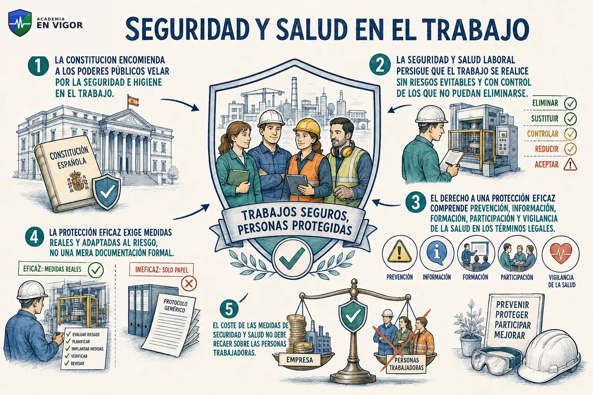

<em>Infografía: Seguridad y salud en el trabajo.</em>

:::hablemos-claro
Separa sujeto, presupuesto, regla, excepción y control. Las opciones trampa suelen cambiar solo uno de esos cinco elementos.
:::

:::en-la-calle
Antes de actuar, identifica quién decide, qué habilitación existe, qué debe documentarse y qué revisión posterior protege a la persona afectada.
:::

:::lo-que-cae
Memoriza el anclaje «art. 40.2 CE; arts. 2 y 14 LPRL» y discrimina reglas, excepciones y plazos.
:::

<!-- FUENTE: CE-T24 -->

## 08. Concepto legal de condición de trabajo

### Regla y encaje

Condición de trabajo es cualquier característica del trabajo con influencia significativa en la generación de riesgos para la seguridad y la salud. Este bloque se integra en **condiciones de trabajo y factores de riesgo** y se ancla en **art. 4.7**.

### Claves normativas

- Condición de trabajo es cualquier característica del trabajo con influencia significativa en la generación de riesgos para la seguridad y la salud.
- La definición legal es amplia y no se limita al edificio o a las instalaciones. <!-- FACT:PN-T24-F036 -->
- Una condición puede ser adecuada en abstracto y convertirse en factor de riesgo por su intensidad, duración, combinación o forma de uso. <!-- FACT:PN-T24-F037 -->
- Las condiciones deben analizarse en la situación real de trabajo y no solo a partir de instrucciones escritas. <!-- FACT:PN-T24-F038 -->
- Modificar una condición de trabajo puede reducir un riesgo existente o introducir otro nuevo que también debe valorarse. <!-- FACT:PN-T24-F039 -->
 <!-- FACT:PN-T24-F040 -->

<!-- VISUAL:t24-08-concepto-legal-de-condicion-de-trabajo.webp -->

  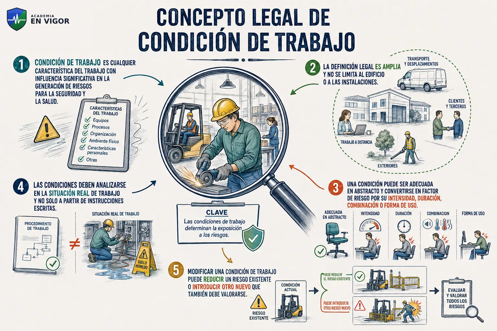

<em>Infografía: Concepto legal de condición de trabajo.</em>

:::hablemos-claro
Separa sujeto, presupuesto, regla, excepción y control. Las opciones trampa suelen cambiar solo uno de esos cinco elementos.
:::

:::en-la-calle
Antes de actuar, identifica quién decide, qué habilitación existe, qué debe documentarse y qué revisión posterior protege a la persona afectada.
:::

:::lo-que-cae
Memoriza el anclaje «art. 4.7» y discrimina reglas, excepciones y plazos.
:::

<!-- FUENTE: LPRL-T24 -->

## 09. Locales, instalaciones, equipos y productos

### Regla y encaje

La condición de trabajo incluye las características generales de locales, instalaciones, equipos, productos y demás útiles del centro. Este bloque se integra en **condiciones de trabajo y factores de riesgo** y se ancla en **art. 4.7.a**.

### Claves normativas

- La condición de trabajo incluye las características generales de locales, instalaciones, equipos, productos y demás útiles del centro.
- El estado, diseño, ubicación y mantenimiento de esos elementos influyen en la probabilidad de accidentes. <!-- FACT:PN-T24-F041 -->
- Orden, limpieza, circulación, almacenamiento e iluminación pueden ser condiciones determinantes de seguridad. <!-- FACT:PN-T24-F042 -->
- Un equipo de trabajo es cualquier máquina, aparato, instrumento o instalación utilizada en el trabajo. <!-- FACT:PN-T24-F043 -->
- La conformidad inicial de un equipo no elimina la necesidad de uso correcto, mantenimiento y adaptación a la tarea. <!-- FACT:PN-T24-F044 -->
 <!-- FACT:PN-T24-F045 -->

<!-- VISUAL:t24-09-locales-instalaciones-equipos-y-productos.webp -->

  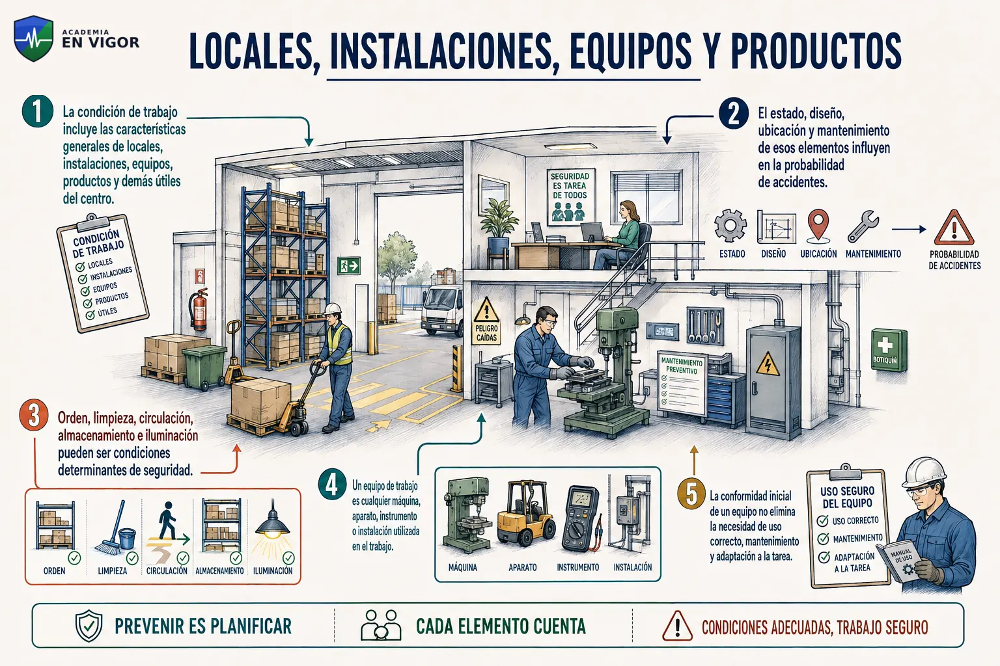

<em>Infografía: Locales, instalaciones, equipos y productos.</em>

:::hablemos-claro
Separa sujeto, presupuesto, regla, excepción y control. Las opciones trampa suelen cambiar solo uno de esos cinco elementos.
:::

:::en-la-calle
Antes de actuar, identifica quién decide, qué habilitación existe, qué debe documentarse y qué revisión posterior protege a la persona afectada.
:::

:::lo-que-cae
Memoriza el anclaje «art. 4.7.a» y discrimina reglas, excepciones y plazos.
:::

<!-- FUENTE: LPRL-T24 -->

## 10. Agentes físicos del ambiente de trabajo

### Regla y encaje

Ruido, vibraciones, radiaciones, iluminación y condiciones térmicas son ejemplos de agentes físicos del ambiente laboral. Este bloque se integra en **condiciones de trabajo y factores de riesgo** y se ancla en **clasificación de condiciones de trabajo**.

### Claves normativas

- Ruido, vibraciones, radiaciones, iluminación y condiciones térmicas son ejemplos de agentes físicos del ambiente laboral.
- El riesgo depende de la naturaleza del agente y también de intensidad, frecuencia, duración y vía de exposición. <!-- FACT:PN-T24-F046 -->
- La ausencia de molestia inmediata no permite descartar daño por exposición a un agente físico. <!-- FACT:PN-T24-F047 -->
- La medición permite comparar la exposición con criterios técnicos y decidir medidas de control. <!-- FACT:PN-T24-F048 -->
- La actuación prioritaria busca eliminar o reducir la exposición en su origen antes de depender de protección individual. <!-- FACT:PN-T24-F049 -->
 <!-- FACT:PN-T24-F050 -->

<!-- VISUAL:t24-10-agentes-fisicos-del-ambiente-de-trabajo.webp -->

  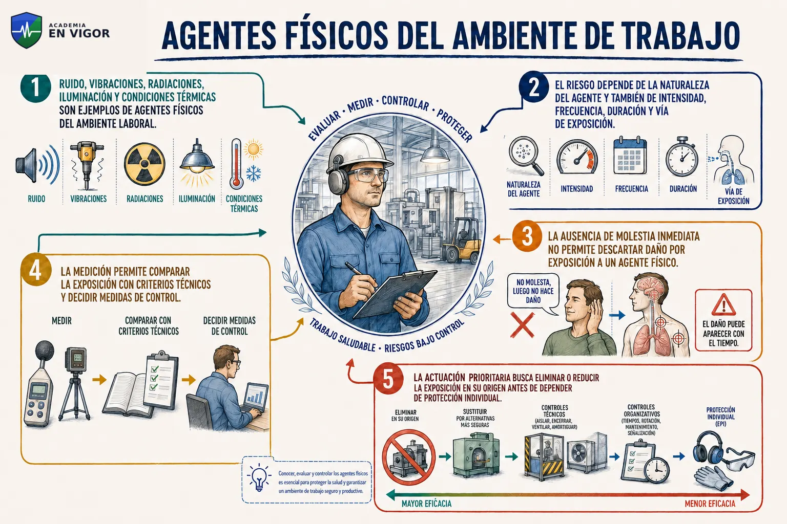

<em>Infografía: Agentes físicos del ambiente de trabajo.</em>

:::hablemos-claro
Separa sujeto, presupuesto, regla, excepción y control. Las opciones trampa suelen cambiar solo uno de esos cinco elementos.
:::

:::en-la-calle
Antes de actuar, identifica quién decide, qué habilitación existe, qué debe documentarse y qué revisión posterior protege a la persona afectada.
:::

:::lo-que-cae
Memoriza el anclaje «clasificación de condiciones de trabajo» y discrimina reglas, excepciones y plazos.
:::

<!-- FUENTE: INSST-T1-2026-T24 -->

## 11. Agentes químicos y biológicos

### Regla y encaje

Las condiciones de trabajo incluyen los agentes químicos y biológicos presentes y sus concentraciones o niveles de presencia. Este bloque se integra en **condiciones de trabajo y factores de riesgo** y se ancla en **art. 4.7.b-c**.

### Claves normativas

- Las condiciones de trabajo incluyen los agentes químicos y biológicos presentes y sus concentraciones o niveles de presencia.
- También incluyen los procedimientos de utilización que influyen en la generación del riesgo. <!-- FACT:PN-T24-F051 -->
- La exposición puede producirse por inhalación, contacto, ingestión accidental, inoculación u otras vías relevantes. <!-- FACT:PN-T24-F052 -->
- Sustituir un agente peligroso por otro menos peligroso es preferible a limitarse a proteger frente a su exposición. <!-- FACT:PN-T24-F053 -->
- El control requiere considerar tareas ordinarias, limpieza, mantenimiento, emergencias y gestión de residuos. <!-- FACT:PN-T24-F054 -->
 <!-- FACT:PN-T24-F055 -->

<!-- VISUAL:t24-11-agentes-quimicos-y-biologicos.webp -->

  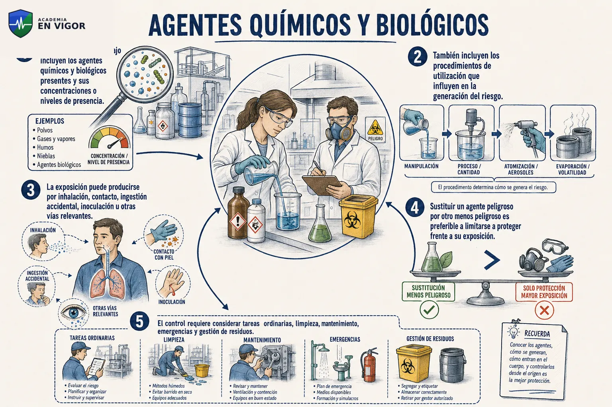

<em>Infografía: Agentes químicos y biológicos.</em>

:::hablemos-claro
Separa sujeto, presupuesto, regla, excepción y control. Las opciones trampa suelen cambiar solo uno de esos cinco elementos.
:::

:::en-la-calle
Antes de actuar, identifica quién decide, qué habilitación existe, qué debe documentarse y qué revisión posterior protege a la persona afectada.
:::

:::lo-que-cae
Memoriza el anclaje «art. 4.7.b-c» y discrimina reglas, excepciones y plazos.
:::

<!-- FUENTE: LPRL-T24 -->

## 12. Carga física y carga mental

### Regla y encaje

La carga de trabajo reúne las exigencias físicas y mentales que la tarea impone a la persona. Este bloque se integra en **condiciones de trabajo y factores de riesgo** y se ancla en **clasificación de condiciones de trabajo**.

### Claves normativas

- La carga de trabajo reúne las exigencias físicas y mentales que la tarea impone a la persona.
- Posturas, esfuerzos, movimientos repetidos y manipulación de cargas son componentes frecuentes de carga física. <!-- FACT:PN-T24-F056 -->
- Atención sostenida, complejidad, presión temporal, responsabilidad y tratamiento de información influyen en la carga mental. <!-- FACT:PN-T24-F057 -->
- Existe riesgo tanto por sobrecarga como por infracarga, monotonía o falta de estimulación. <!-- FACT:PN-T24-F058 -->
- Adaptar el trabajo exige equilibrar demandas, capacidades, pausas, medios y margen de decisión. <!-- FACT:PN-T24-F059 -->
 <!-- FACT:PN-T24-F060 -->

<!-- VISUAL:t24-12-carga-fisica-y-carga-mental.webp -->

  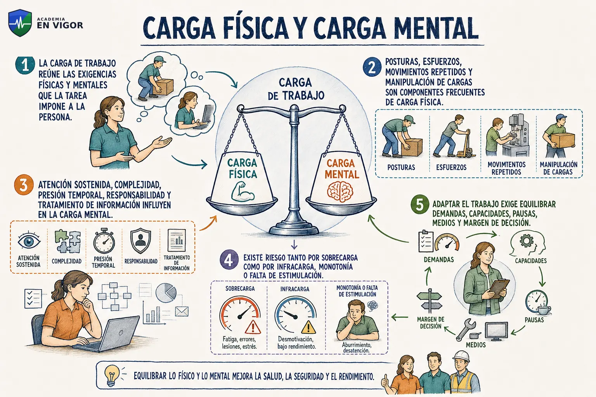

<em>Infografía: Carga física y carga mental.</em>

:::hablemos-claro
Separa sujeto, presupuesto, regla, excepción y control. Las opciones trampa suelen cambiar solo uno de esos cinco elementos.
:::

:::en-la-calle
Antes de actuar, identifica quién decide, qué habilitación existe, qué debe documentarse y qué revisión posterior protege a la persona afectada.
:::

:::lo-que-cae
Memoriza el anclaje «clasificación de condiciones de trabajo» y discrimina reglas, excepciones y plazos.
:::

<!-- FUENTE: INSST-T1-2026-T24 -->

## 13. Organización y ordenación del trabajo

### Regla y encaje

La definición legal incluye las características de organización y ordenación que influyen en la magnitud de los riesgos. Este bloque se integra en **condiciones de trabajo y factores de riesgo** y se ancla en **art. 4.7.d**.

### Claves normativas

- La definición legal incluye las características de organización y ordenación que influyen en la magnitud de los riesgos.
- Horarios, turnos, ritmos, reparto de tareas, autonomía, comunicación y estilo de mando pueden afectar a la salud. <!-- FACT:PN-T24-F061 -->
- Los factores organizativos pueden generar riesgos psicosociales y también aumentar riesgos de accidente o exposición. <!-- FACT:PN-T24-F062 -->
- Una instrucción técnicamente correcta puede fallar si la organización no aporta tiempo, medios o coordinación para cumplirla. <!-- FACT:PN-T24-F063 -->
- La prevención debe integrar relaciones sociales y organización del trabajo, no tratar ambos aspectos como ajenos a la seguridad. <!-- FACT:PN-T24-F064 -->
 <!-- FACT:PN-T24-F065 -->

<!-- VISUAL:t24-13-organizacion-y-ordenacion-del-trabajo.webp -->

  

<em>Infografía: Organización y ordenación del trabajo.</em>

:::hablemos-claro
Separa sujeto, presupuesto, regla, excepción y control. Las opciones trampa suelen cambiar solo uno de esos cinco elementos.
:::

:::en-la-calle
Antes de actuar, identifica quién decide, qué habilitación existe, qué debe documentarse y qué revisión posterior protege a la persona afectada.
:::

:::lo-que-cae
Memoriza el anclaje «art. 4.7.d» y discrimina reglas, excepciones y plazos.
:::

<!-- FUENTE: LPRL-T24 -->

## 14. Puesto de trabajo y factor individual

### Regla y encaje

A efectos preventivos, el puesto resulta de la combinación de condiciones de trabajo y características de la persona que realiza la actividad. Este bloque se integra en **condiciones de trabajo y factores de riesgo** y se ancla en **concepto técnico de puesto**.

### Claves normativas

- A efectos preventivos, el puesto resulta de la combinación de condiciones de trabajo y características de la persona que realiza la actividad.
- La evaluación debe atender a la tarea real, los medios, el entorno, la organización y las personas expuestas. <!-- FACT:PN-T24-F066 -->
- Edad, experiencia, formación, estado de salud y capacidades pueden modificar la vulnerabilidad ante una misma exposición. <!-- FACT:PN-T24-F067 -->
- Considerar factores individuales no autoriza a culpabilizar a la persona ni a sustituir la mejora de las condiciones. <!-- FACT:PN-T24-F068 -->
- La adaptación del puesto busca ajustar el trabajo a la persona y no forzar a todas las personas a un patrón único. <!-- FACT:PN-T24-F069 -->
 <!-- FACT:PN-T24-F070 -->

<!-- VISUAL:t24-14-puesto-de-trabajo-y-factor-individual.webp -->

  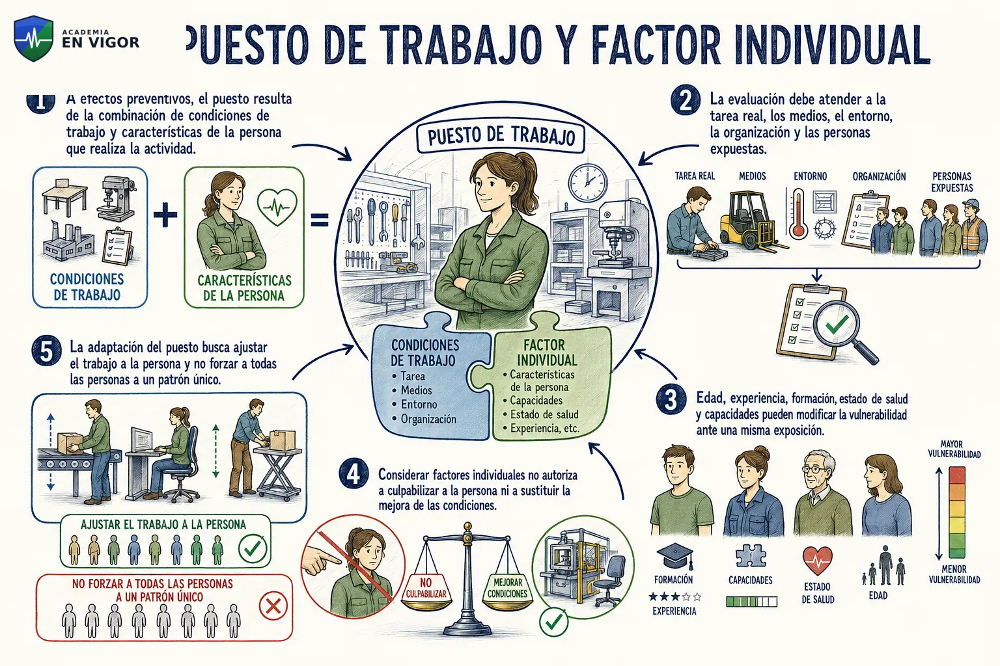

<em>Infografía: Puesto de trabajo y factor individual.</em>

:::hablemos-claro
Separa sujeto, presupuesto, regla, excepción y control. Las opciones trampa suelen cambiar solo uno de esos cinco elementos.
:::

:::en-la-calle
Antes de actuar, identifica quién decide, qué habilitación existe, qué debe documentarse y qué revisión posterior protege a la persona afectada.
:::

:::lo-que-cae
Memoriza el anclaje «concepto técnico de puesto» y discrimina reglas, excepciones y plazos.
:::

<!-- FUENTE: INSST-T1-2026-T24 -->

## 15. Peligro, exposición y riesgo

### Regla y encaje

El peligro es la capacidad de una fuente o situación para causar daño; el riesgo expresa la posibilidad de que el daño se produzca en condiciones de exposición. Este bloque se integra en **concepto y valoración del riesgo laboral** y se ancla en **conceptos generales**.

### Claves normativas

- El peligro es la capacidad de una fuente o situación para causar daño; el riesgo expresa la posibilidad de que el daño se produzca en condiciones de exposición.
- Puede existir un peligro sin exposición efectiva, aunque deba controlarse para impedir que llegue a producirse. <!-- FACT:PN-T24-F071 -->
- La exposición conecta el peligro con la persona mediante una vía, intensidad y duración determinadas. <!-- FACT:PN-T24-F072 -->
- Reducir la exposición puede disminuir el riesgo sin eliminar la peligrosidad intrínseca de la fuente. <!-- FACT:PN-T24-F073 -->
- Confundir peligro con riesgo impide elegir correctamente entre eliminación, control en origen y protección. <!-- FACT:PN-T24-F074 -->
 <!-- FACT:PN-T24-F075 -->

<!-- VISUAL:t24-15-peligro-exposicion-y-riesgo.webp -->

  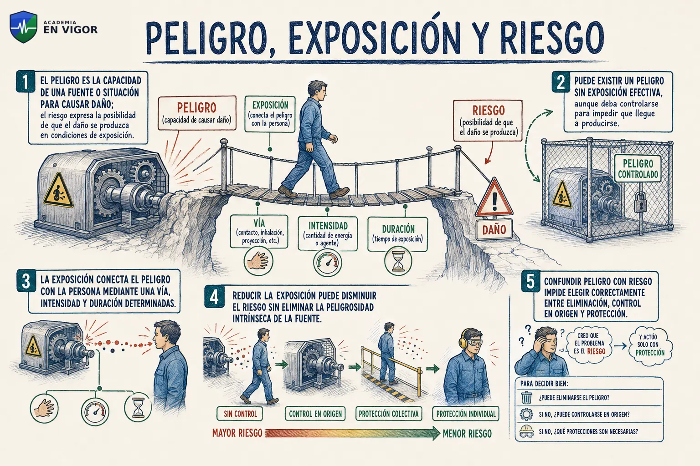

<em>Infografía: Peligro, exposición y riesgo.</em>

:::hablemos-claro
Separa sujeto, presupuesto, regla, excepción y control. Las opciones trampa suelen cambiar solo uno de esos cinco elementos.
:::

:::en-la-calle
Antes de actuar, identifica quién decide, qué habilitación existe, qué debe documentarse y qué revisión posterior protege a la persona afectada.
:::

:::lo-que-cae
Memoriza el anclaje «conceptos generales» y discrimina reglas, excepciones y plazos.
:::

<!-- FUENTE: INSST-T1-2026-T24 -->

## 16. Definición de riesgo laboral

### Regla y encaje

Riesgo laboral es la posibilidad de que una persona trabajadora sufra un daño determinado derivado del trabajo. Este bloque se integra en **concepto y valoración del riesgo laboral** y se ancla en **art. 4.2**.

### Claves normativas

- Riesgo laboral es la posibilidad de que una persona trabajadora sufra un daño determinado derivado del trabajo.
- El riesgo se refiere a un daño posible y concreto, no a cualquier temor abstracto. <!-- FACT:PN-T24-F076 -->
- La existencia de riesgo no exige que el daño ya se haya producido. <!-- FACT:PN-T24-F077 -->
- La ausencia de daño no elimina el riesgo cuando permanecen las condiciones capaces de materializarlo. <!-- FACT:PN-T24-F078 -->
- Identificar un riesgo exige relacionar fuente, exposición, persona afectada y daño posible. <!-- FACT:PN-T24-F079 -->
 <!-- FACT:PN-T24-F080 -->

<!-- VISUAL:t24-16-definicion-de-riesgo-laboral.webp -->

  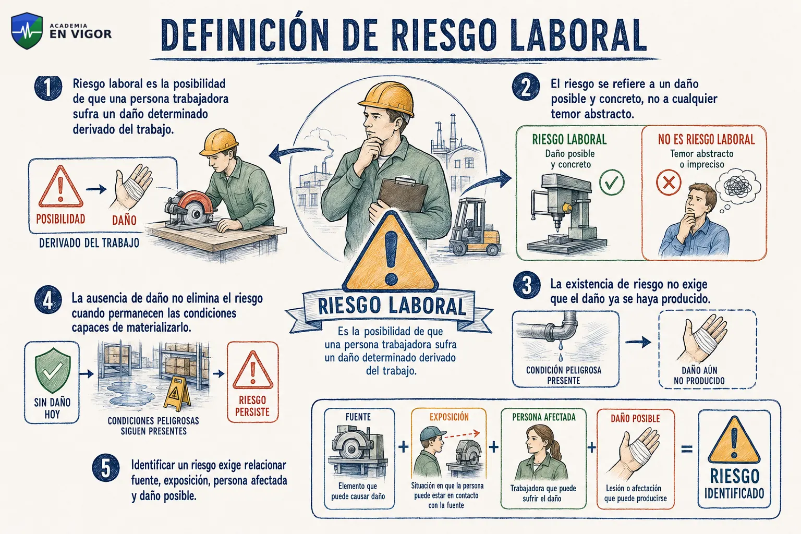

<em>Infografía: Definición de riesgo laboral.</em>

:::hablemos-claro
Separa sujeto, presupuesto, regla, excepción y control. Las opciones trampa suelen cambiar solo uno de esos cinco elementos.
:::

:::en-la-calle
Antes de actuar, identifica quién decide, qué habilitación existe, qué debe documentarse y qué revisión posterior protege a la persona afectada.
:::

:::lo-que-cae
Memoriza el anclaje «art. 4.2» y discrimina reglas, excepciones y plazos.
:::

<!-- FUENTE: LPRL-T24 -->

## 17. Gravedad del riesgo: probabilidad y severidad

### Regla y encaje

La gravedad del riesgo se valora conjuntamente mediante la probabilidad de que ocurra el daño y la severidad de sus consecuencias. Este bloque se integra en **concepto y valoración del riesgo laboral** y se ancla en **art. 4.2**.

### Claves normativas

- La gravedad del riesgo se valora conjuntamente mediante la probabilidad de que ocurra el daño y la severidad de sus consecuencias.
- Una consecuencia muy grave puede exigir control aunque su probabilidad sea baja. <!-- FACT:PN-T24-F081 -->
- Una consecuencia leve pero muy frecuente también puede requerir actuación prioritaria. <!-- FACT:PN-T24-F082 -->
- Probabilidad y severidad no deben confundirse: una describe posibilidad de ocurrencia y la otra magnitud del daño. <!-- FACT:PN-T24-F083 -->
- La matriz de riesgo ayuda a priorizar, pero no sustituye la obligación de evitar los riesgos que puedan eliminarse. <!-- FACT:PN-T24-F084 -->
 <!-- FACT:PN-T24-F085 -->

<!-- VISUAL:t24-17-gravedad-del-riesgo-probabilidad-y-severid.webp -->

  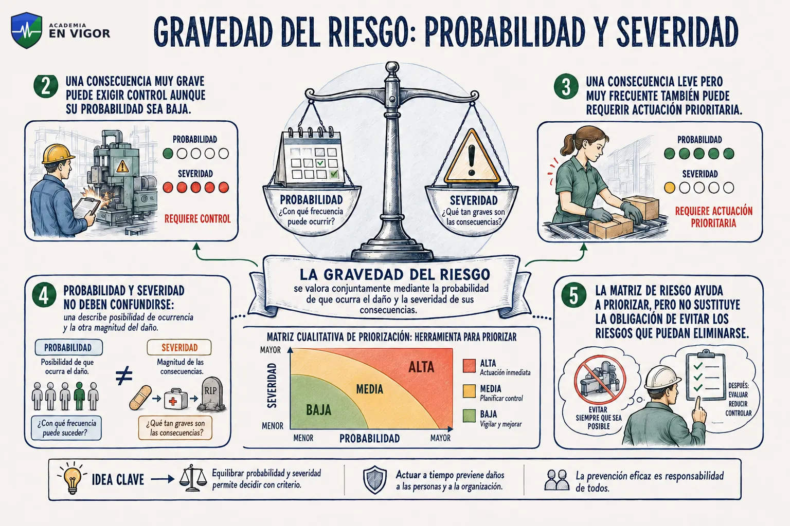

<em>Infografía: Gravedad del riesgo: probabilidad y severidad.</em>

:::hablemos-claro
Separa sujeto, presupuesto, regla, excepción y control. Las opciones trampa suelen cambiar solo uno de esos cinco elementos.
:::

:::en-la-calle
Antes de actuar, identifica quién decide, qué habilitación existe, qué debe documentarse y qué revisión posterior protege a la persona afectada.
:::

:::lo-que-cae
Memoriza el anclaje «art. 4.2» y discrimina reglas, excepciones y plazos.
:::

<!-- FUENTE: LPRL-T24 -->

## 18. Riesgo grave e inminente

### Regla y encaje

Es grave e inminente el riesgo racionalmente probable de materializarse en un futuro inmediato y capaz de causar un daño grave. Este bloque se integra en **concepto y valoración del riesgo laboral** y se ancla en **art. 4.4**.

### Claves normativas

- Es grave e inminente el riesgo racionalmente probable de materializarse en un futuro inmediato y capaz de causar un daño grave.
- La calificación exige simultáneamente probabilidad racional, proximidad temporal y gravedad del posible daño. <!-- FACT:PN-T24-F086 -->
- En exposiciones a agentes peligrosos puede existir riesgo grave e inminente aunque el daño grave no se manifieste de inmediato. <!-- FACT:PN-T24-F087 -->
- Lo inmediato puede referirse a la exposición capaz de causar el daño, no necesariamente a la aparición de síntomas. <!-- FACT:PN-T24-F088 -->
- Un riesgo grave no es automáticamente inminente, y un suceso próximo de consecuencias leves no cumple por sí solo la definición. <!-- FACT:PN-T24-F089 -->
 <!-- FACT:PN-T24-F090 -->

<!-- VISUAL:t24-18-riesgo-grave-e-inminente.webp -->

  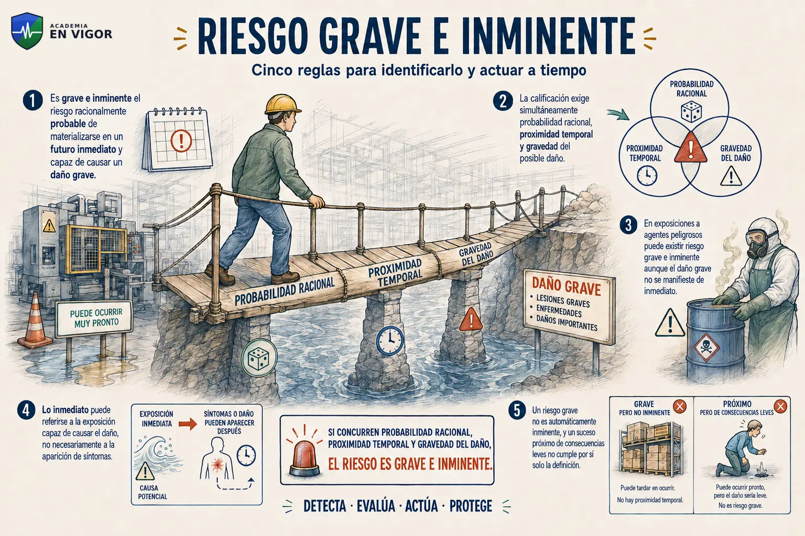

<em>Infografía: Riesgo grave e inminente.</em>

:::hablemos-claro
Separa sujeto, presupuesto, regla, excepción y control. Las opciones trampa suelen cambiar solo uno de esos cinco elementos.
:::

:::en-la-calle
Antes de actuar, identifica quién decide, qué habilitación existe, qué debe documentarse y qué revisión posterior protege a la persona afectada.
:::

:::lo-que-cae
Memoriza el anclaje «art. 4.4» y discrimina reglas, excepciones y plazos.
:::

<!-- FUENTE: LPRL-T24 -->

## 19. Procesos potencialmente peligrosos y equipos

### Regla y encaje

Son potencialmente peligrosos los procesos, operaciones, equipos o productos que sin medidas preventivas específicas originan riesgos para la seguridad o la salud. Este bloque se integra en **concepto y valoración del riesgo laboral** y se ancla en **art. 4.5-6**.

### Claves normativas

- Son potencialmente peligrosos los procesos, operaciones, equipos o productos que sin medidas preventivas específicas originan riesgos para la seguridad o la salud.
- La peligrosidad potencial se aprecia considerando qué ocurriría en ausencia de las medidas específicas necesarias. <!-- FACT:PN-T24-F091 -->
- Un equipo de trabajo puede ser máquina, aparato, instrumento o instalación utilizada en el trabajo. <!-- FACT:PN-T24-F092 -->
- La utilización segura comprende uso normal, ajustes, limpieza, mantenimiento y situaciones previsibles de fallo. <!-- FACT:PN-T24-F093 -->
- Una medida preventiva debe controlar tanto la operación habitual como las tareas no rutinarias con exposición relevante. <!-- FACT:PN-T24-F094 -->
 <!-- FACT:PN-T24-F095 -->

<!-- VISUAL:t24-19-procesos-potencialmente-peligrosos-y-equip.webp -->

  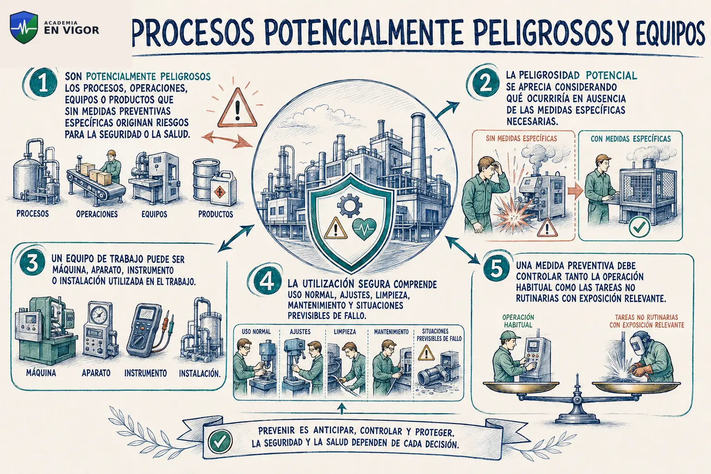

<em>Infografía: Procesos potencialmente peligrosos y equipos.</em>

:::hablemos-claro
Separa sujeto, presupuesto, regla, excepción y control. Las opciones trampa suelen cambiar solo uno de esos cinco elementos.
:::

:::en-la-calle
Antes de actuar, identifica quién decide, qué habilitación existe, qué debe documentarse y qué revisión posterior protege a la persona afectada.
:::

:::lo-que-cae
Memoriza el anclaje «art. 4.5-6» y discrimina reglas, excepciones y plazos.
:::

<!-- FUENTE: LPRL-T24 -->

## 20. Familias de factores de riesgo

### Regla y encaje

Los factores de seguridad se relacionan con lugares, equipos, instalaciones y situaciones capaces de producir accidentes. Este bloque se integra en **concepto y valoración del riesgo laboral** y se ancla en **clasificación técnica**.

### Claves normativas

- Los factores de seguridad se relacionan con lugares, equipos, instalaciones y situaciones capaces de producir accidentes.
- Los factores higiénicos se vinculan a agentes físicos, químicos o biológicos capaces de causar enfermedad o alteración de la salud. <!-- FACT:PN-T24-F096 -->
- Los factores ergonómicos nacen del desajuste entre demandas de la tarea y capacidades físicas o cognitivas de la persona. <!-- FACT:PN-T24-F097 -->
- Los factores psicosociales derivan del diseño, contenido, organización y relaciones del trabajo con capacidad de afectar a la salud. <!-- FACT:PN-T24-F098 -->
- Las familias de factores se solapan y una misma condición puede contribuir a varios riesgos a la vez. <!-- FACT:PN-T24-F099 -->
 <!-- FACT:PN-T24-F100 -->

<!-- VISUAL:t24-20-familias-de-factores-de-riesgo.webp -->

  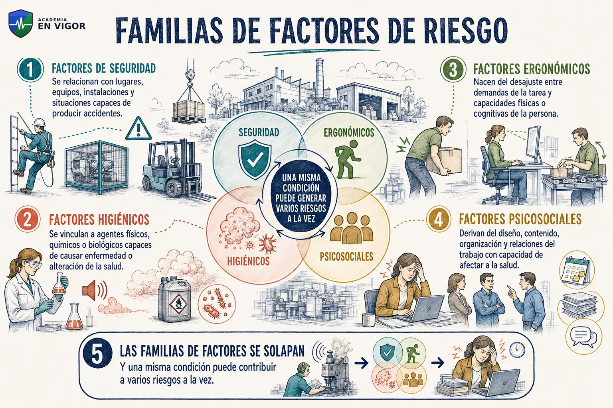

<em>Infografía: Familias de factores de riesgo.</em>

:::hablemos-claro
Separa sujeto, presupuesto, regla, excepción y control. Las opciones trampa suelen cambiar solo uno de esos cinco elementos.
:::

:::en-la-calle
Antes de actuar, identifica quién decide, qué habilitación existe, qué debe documentarse y qué revisión posterior protege a la persona afectada.
:::

:::lo-que-cae
Memoriza el anclaje «clasificación técnica» y discrimina reglas, excepciones y plazos.
:::

<!-- FUENTE: INSST-T1-2026-T24 -->

## 21. Riesgos de seguridad

### Regla y encaje

Caídas, golpes, atrapamientos, cortes, contactos eléctricos, incendios y accidentes de circulación son riesgos típicos de seguridad. Este bloque se integra en **concepto y valoración del riesgo laboral** y se ancla en **seguridad en el trabajo**.

### Claves normativas

- Caídas, golpes, atrapamientos, cortes, contactos eléctricos, incendios y accidentes de circulación son riesgos típicos de seguridad.
- La seguridad en el trabajo pretende eliminar o reducir el riesgo de accidentes mediante técnicas y procedimientos preventivos. <!-- FACT:PN-T24-F101 -->
- Investigar un accidente busca causas y medidas de mejora, no limitarse a identificar el último error humano. <!-- FACT:PN-T24-F102 -->
- Las causas inmediatas suelen estar conectadas con causas básicas de diseño, mantenimiento, formación u organización. <!-- FACT:PN-T24-F103 -->
- La señalización advierte u orienta, pero no sustituye una medida técnica que pueda eliminar o controlar el riesgo. <!-- FACT:PN-T24-F104 -->
 <!-- FACT:PN-T24-F105 -->

<!-- VISUAL:t24-21-riesgos-de-seguridad.webp -->

  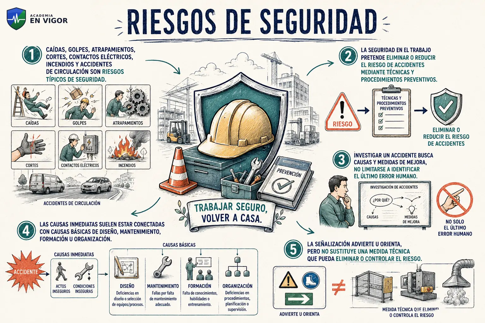

<em>Infografía: Riesgos de seguridad.</em>

:::hablemos-claro
Separa sujeto, presupuesto, regla, excepción y control. Las opciones trampa suelen cambiar solo uno de esos cinco elementos.
:::

:::en-la-calle
Antes de actuar, identifica quién decide, qué habilitación existe, qué debe documentarse y qué revisión posterior protege a la persona afectada.
:::

:::lo-que-cae
Memoriza el anclaje «seguridad en el trabajo» y discrimina reglas, excepciones y plazos.
:::

<!-- FUENTE: INSST-T3-2026-T24 -->

## 22. Riesgos higiénicos, ergonómicos y psicosociales

### Regla y encaje

La higiene industrial identifica, evalúa y controla agentes ambientales que pueden causar enfermedad. Este bloque se integra en **concepto y valoración del riesgo laboral** y se ancla en **disciplinas preventivas**.

### Claves normativas

- La higiene industrial identifica, evalúa y controla agentes ambientales que pueden causar enfermedad.
- La ergonomía adapta tareas, equipos y entornos a las capacidades y limitaciones de las personas. <!-- FACT:PN-T24-F106 -->
- La psicosociología aplicada actúa sobre contenido, organización y relaciones de trabajo con efectos mentales o sociales. <!-- FACT:PN-T24-F107 -->
- Los daños higiénicos suelen poder aparecer tras exposiciones acumuladas, mientras que los ergonómicos y psicosociales también pueden ser progresivos. <!-- FACT:PN-T24-F108 -->
- Las tres disciplinas deben coordinarse porque una intervención aislada puede desplazar el riesgo a otra dimensión. <!-- FACT:PN-T24-F109 -->
 <!-- FACT:PN-T24-F110 -->

<!-- VISUAL:t24-22-riesgos-higienicos-ergonomicos-y-psicosoci.webp -->

  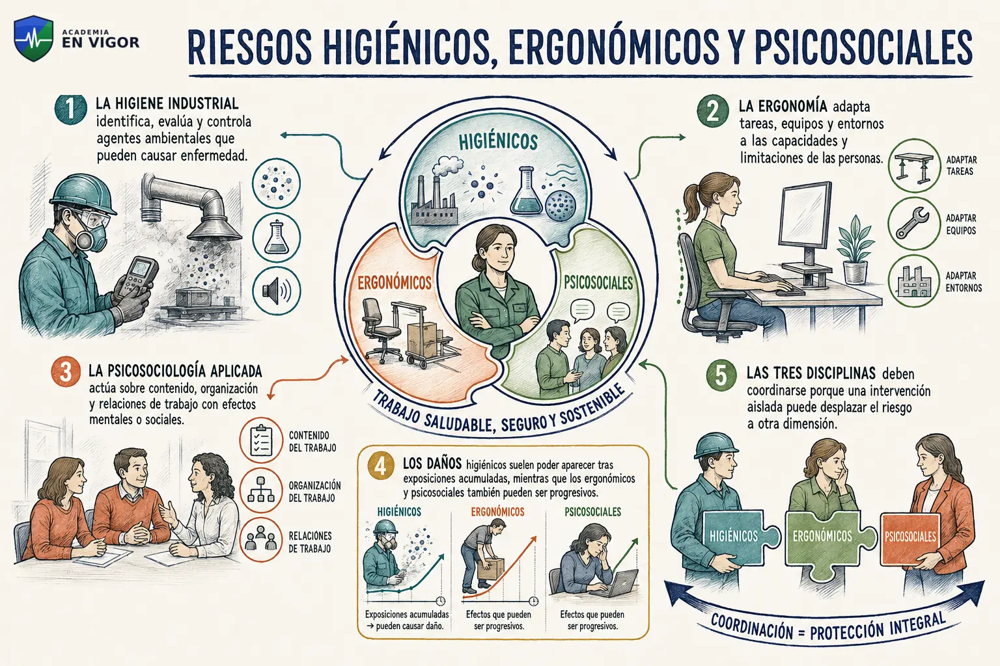

<em>Infografía: Riesgos higiénicos, ergonómicos y psicosociales.</em>

:::hablemos-claro
Separa sujeto, presupuesto, regla, excepción y control. Las opciones trampa suelen cambiar solo uno de esos cinco elementos.
:::

:::en-la-calle
Antes de actuar, identifica quién decide, qué habilitación existe, qué debe documentarse y qué revisión posterior protege a la persona afectada.
:::

:::lo-que-cae
Memoriza el anclaje «disciplinas preventivas» y discrimina reglas, excepciones y plazos.
:::

<!-- FUENTE: INSST-T3-2026-T24 -->

## 23. Concepto legal de prevención

### Regla y encaje

Prevención es el conjunto de actividades o medidas adoptadas o previstas en todas las fases de la actividad para evitar o disminuir riesgos derivados del trabajo. Este bloque se integra en **actividad preventiva y principios generales** y se ancla en **art. 4.1**.

### Claves normativas

- Prevención es el conjunto de actividades o medidas adoptadas o previstas en todas las fases de la actividad para evitar o disminuir riesgos derivados del trabajo.
- La prevención comprende decisiones de diseño, compra, organización, ejecución, mantenimiento y revisión. <!-- FACT:PN-T24-F111 -->
- Prevenir no equivale únicamente a entregar equipos de protección individual. <!-- FACT:PN-T24-F112 -->
- La actuación preventiva puede eliminar el peligro, reducir la probabilidad, limitar la exposición o combinar varias medidas. <!-- FACT:PN-T24-F113 -->
- La prevención debe anticiparse a los cambios y no esperar a que un accidente confirme un riesgo conocido. <!-- FACT:PN-T24-F114 -->
 <!-- FACT:PN-T24-F115 -->

<!-- VISUAL:t24-23-concepto-legal-de-prevencion.webp -->

  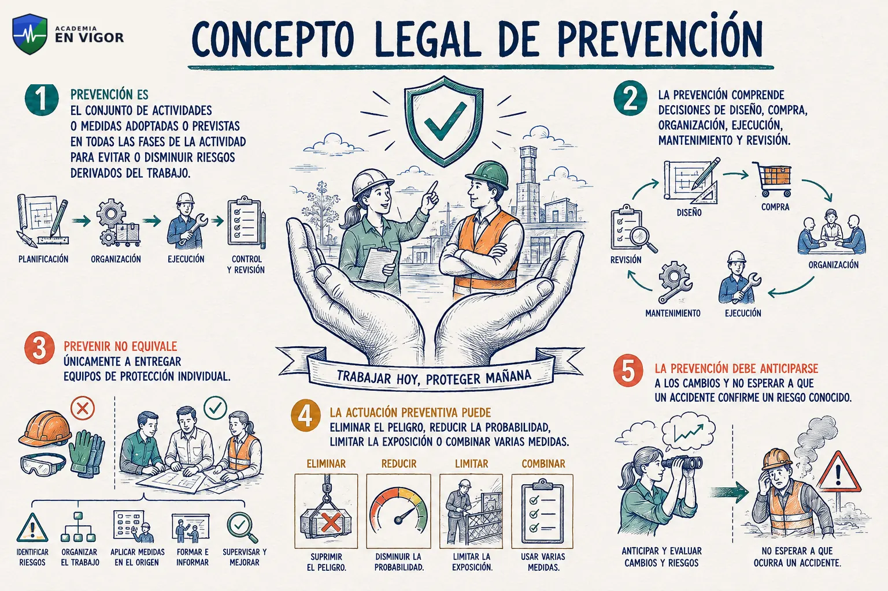

<em>Infografía: Concepto legal de prevención.</em>

:::hablemos-claro
Separa sujeto, presupuesto, regla, excepción y control. Las opciones trampa suelen cambiar solo uno de esos cinco elementos.
:::

:::en-la-calle
Antes de actuar, identifica quién decide, qué habilitación existe, qué debe documentarse y qué revisión posterior protege a la persona afectada.
:::

:::lo-que-cae
Memoriza el anclaje «art. 4.1» y discrimina reglas, excepciones y plazos.
:::

<!-- FUENTE: LPRL-T24 -->

## 24. Evitar, evaluar y combatir en origen

### Regla y encaje

El primer principio es evitar los riesgos siempre que resulte posible. Este bloque se integra en **actividad preventiva y principios generales** y se ancla en **art. 15.1.a-c**.

### Claves normativas

- El primer principio es evitar los riesgos siempre que resulte posible.
- Los riesgos que no puedan evitarse deben evaluarse. <!-- FACT:PN-T24-F116 -->
- Los riesgos deben combatirse en su origen. <!-- FACT:PN-T24-F117 -->
- Evaluar no sustituye a eliminar: solo se evalúa como paso de gestión aquello que no se ha podido evitar. <!-- FACT:PN-T24-F118 -->
- Combatir en origen significa actuar sobre la fuente o la causa antes que sobre la persona expuesta. <!-- FACT:PN-T24-F119 -->
 <!-- FACT:PN-T24-F120 -->

<!-- VISUAL:t24-24-evitar-evaluar-y-combatir-en-origen.webp -->

  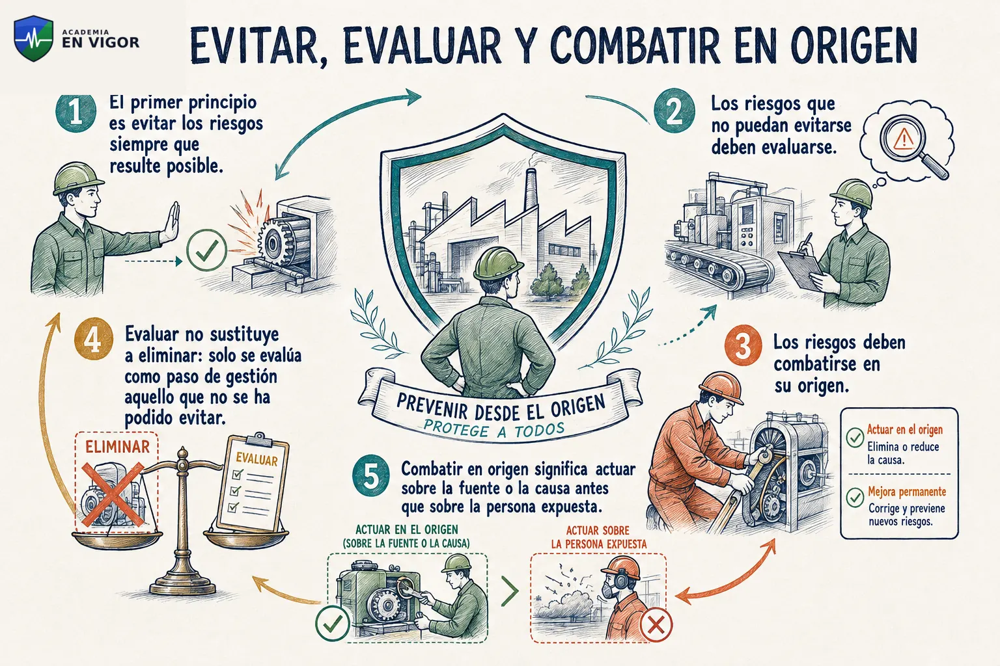

<em>Infografía: Evitar, evaluar y combatir en origen.</em>

:::hablemos-claro
Separa sujeto, presupuesto, regla, excepción y control. Las opciones trampa suelen cambiar solo uno de esos cinco elementos.
:::

:::en-la-calle
Antes de actuar, identifica quién decide, qué habilitación existe, qué debe documentarse y qué revisión posterior protege a la persona afectada.
:::

:::lo-que-cae
Memoriza el anclaje «art. 15.1.a-c» y discrimina reglas, excepciones y plazos.
:::

<!-- FUENTE: LPRL-T24 -->

## 25. Adaptar, actualizar y sustituir

### Regla y encaje

El trabajo debe adaptarse a la persona, especialmente en puestos, equipos y métodos de trabajo y producción. Este bloque se integra en **actividad preventiva y principios generales** y se ancla en **art. 15.1.d-f**.

### Claves normativas

- El trabajo debe adaptarse a la persona, especialmente en puestos, equipos y métodos de trabajo y producción.
- La adaptación busca atenuar monotonía y repetitividad y reducir sus efectos sobre la salud. <!-- FACT:PN-T24-F121 -->
- La prevención debe tener en cuenta la evolución de la técnica. <!-- FACT:PN-T24-F122 -->
- Lo peligroso debe sustituirse por lo que entrañe poco o ningún peligro. <!-- FACT:PN-T24-F123 -->
- Una solución que fue adecuada puede dejar de serlo cuando existe una alternativa técnica más segura y razonable. <!-- FACT:PN-T24-F124 -->
 <!-- FACT:PN-T24-F125 -->

<!-- VISUAL:t24-25-adaptar-actualizar-y-sustituir.webp -->

  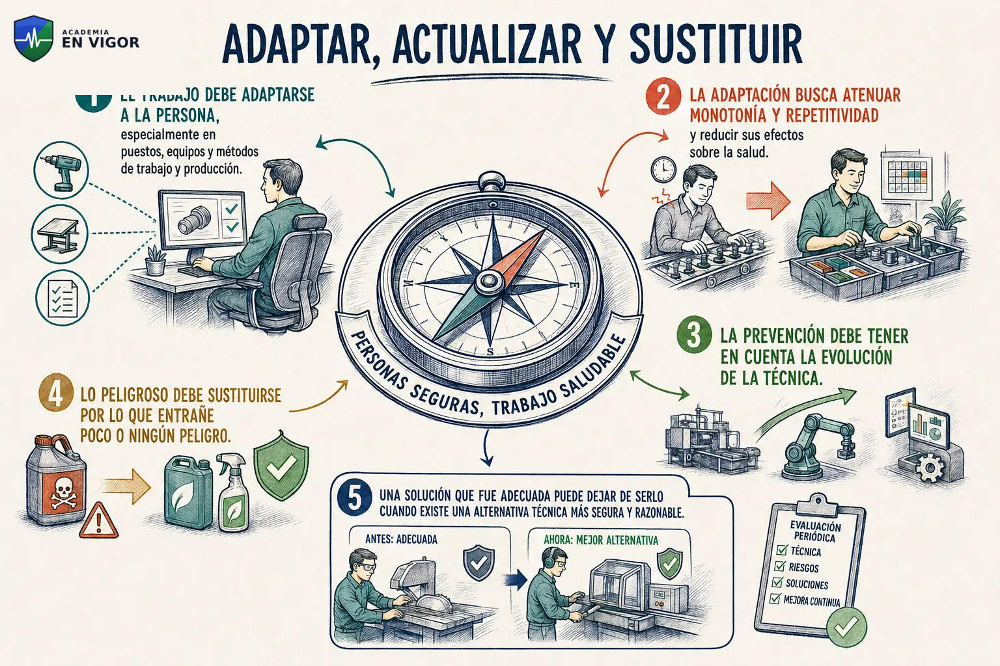

<em>Infografía: Adaptar, actualizar y sustituir.</em>

:::hablemos-claro
Separa sujeto, presupuesto, regla, excepción y control. Las opciones trampa suelen cambiar solo uno de esos cinco elementos.
:::

:::en-la-calle
Antes de actuar, identifica quién decide, qué habilitación existe, qué debe documentarse y qué revisión posterior protege a la persona afectada.
:::

:::lo-que-cae
Memoriza el anclaje «art. 15.1.d-f» y discrimina reglas, excepciones y plazos.
:::

<!-- FUENTE: LPRL-T24 -->

## 26. Planificar, priorizar lo colectivo e instruir

### Regla y encaje

La prevención debe planificarse como un conjunto coherente que integre técnica, organización, condiciones, relaciones sociales y ambiente. Este bloque se integra en **actividad preventiva y principios generales** y se ancla en **art. 15.1.g-i**.

### Claves normativas

- La prevención debe planificarse como un conjunto coherente que integre técnica, organización, condiciones, relaciones sociales y ambiente.
- La protección colectiva debe anteponerse a la individual. <!-- FACT:PN-T24-F126 -->
- Las personas trabajadoras deben recibir las instrucciones debidas. <!-- FACT:PN-T24-F127 -->
- Planificar exige coordinar medidas y evitar que una solución cree incompatibilidades o nuevos riesgos. <!-- FACT:PN-T24-F128 -->
- Dar instrucciones es necesario, pero no compensa un diseño inseguro ni justifica omitir protección colectiva viable. <!-- FACT:PN-T24-F129 -->
 <!-- FACT:PN-T24-F130 -->

<!-- VISUAL:t24-26-planificar-priorizar-lo-colectivo-e-instru.webp -->

  

<em>Infografía: Planificar, priorizar lo colectivo e instruir.</em>

:::hablemos-claro
Separa sujeto, presupuesto, regla, excepción y control. Las opciones trampa suelen cambiar solo uno de esos cinco elementos.
:::

:::en-la-calle
Antes de actuar, identifica quién decide, qué habilitación existe, qué debe documentarse y qué revisión posterior protege a la persona afectada.
:::

:::lo-que-cae
Memoriza el anclaje «art. 15.1.g-i» y discrimina reglas, excepciones y plazos.
:::

<!-- FUENTE: LPRL-T24 -->

## 27. Capacidades, acceso a zonas e imprudencias previsibles

### Regla y encaje

Al encomendar tareas deben considerarse las capacidades profesionales de las personas en seguridad y salud. Este bloque se integra en **actividad preventiva y principios generales** y se ancla en **art. 15.2-4**.

### Claves normativas

- Al encomendar tareas deben considerarse las capacidades profesionales de las personas en seguridad y salud.
- Solo quienes hayan recibido información suficiente y adecuada pueden acceder a zonas de riesgo grave y específico. <!-- FACT:PN-T24-F131 -->
- Las medidas deben prever distracciones o imprudencias no temerarias razonablemente previsibles. <!-- FACT:PN-T24-F132 -->
- Una medida que introduce riesgos adicionales solo es admisible si estos son sustancialmente menores y no existe alternativa más segura. <!-- FACT:PN-T24-F133 -->
- La prevención no puede descansar en exigir una conducta humana perfecta durante toda la jornada. <!-- FACT:PN-T24-F134 -->
 <!-- FACT:PN-T24-F135 -->

<!-- VISUAL:t24-27-capacidades-acceso-a-zonas-e-imprudencias-.webp -->

  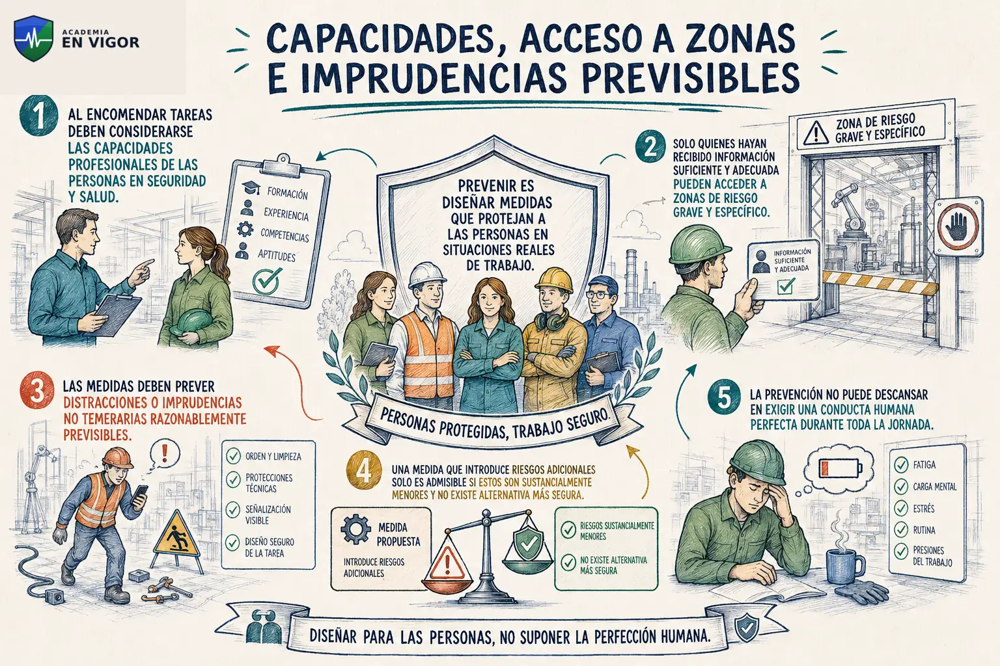

<em>Infografía: Capacidades, acceso a zonas e imprudencias previsibles.</em>

:::hablemos-claro
Separa sujeto, presupuesto, regla, excepción y control. Las opciones trampa suelen cambiar solo uno de esos cinco elementos.
:::

:::en-la-calle
Antes de actuar, identifica quién decide, qué habilitación existe, qué debe documentarse y qué revisión posterior protege a la persona afectada.
:::

:::lo-que-cae
Memoriza el anclaje «art. 15.2-4» y discrimina reglas, excepciones y plazos.
:::

<!-- FUENTE: LPRL-T24 -->

## 28. Prevención integral, integrada y participativa

### Regla y encaje

La prevención es integral cuando abarca todos los riesgos y todas las dimensiones relevantes de la salud. Este bloque se integra en **actividad preventiva y principios generales** y se ancla en **características del modelo preventivo**.

### Claves normativas

- La prevención es integral cuando abarca todos los riesgos y todas las dimensiones relevantes de la salud.
- Es integrada cuando forma parte de las decisiones y actividades ordinarias en todos los niveles. <!-- FACT:PN-T24-F136 -->
- Es interdisciplinar porque necesita la cooperación de conocimientos técnicos, sanitarios, ergonómicos y psicosociales. <!-- FACT:PN-T24-F137 -->
- Es participativa cuando incorpora información, experiencia, consulta y propuestas de las personas trabajadoras. <!-- FACT:PN-T24-F138 -->
- La eficacia preventiva se comprueba mediante seguimiento y revisión, no por la mera existencia de un plan. <!-- FACT:PN-T24-F139 -->
 <!-- FACT:PN-T24-F140 -->

<!-- VISUAL:t24-28-prevencion-integral-integrada-y-participat.webp -->

  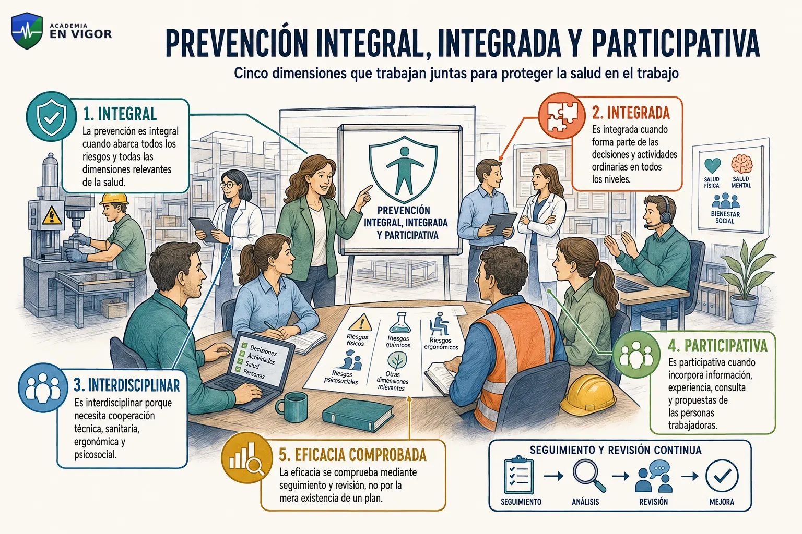

<em>Infografía: Prevención integral, integrada y participativa.</em>

:::hablemos-claro
Separa sujeto, presupuesto, regla, excepción y control. Las opciones trampa suelen cambiar solo uno de esos cinco elementos.
:::

:::en-la-calle
Antes de actuar, identifica quién decide, qué habilitación existe, qué debe documentarse y qué revisión posterior protege a la persona afectada.
:::

:::lo-que-cae
Memoriza el anclaje «características del modelo preventivo» y discrimina reglas, excepciones y plazos.
:::

<!-- FUENTE: INSST-T1-2026-T24 -->

## 29. Ciclo de mejora preventiva

### Regla y encaje

El ciclo preventivo parte de identificar peligros y personas expuestas. Este bloque se integra en **actividad preventiva y principios generales** y se ancla en **arts. 14.2 y 16**.

### Claves normativas

- El ciclo preventivo parte de identificar peligros y personas expuestas.
- Después se eliminan los riesgos evitables y se evalúan los restantes para decidir prioridades. <!-- FACT:PN-T24-F141 -->
- La planificación asigna medidas, responsables, recursos y plazos. <!-- FACT:PN-T24-F142 -->
- La ejecución debe verificarse y su eficacia controlarse mediante seguimiento. <!-- FACT:PN-T24-F143 -->
- Los cambios, incidentes, daños o señales de insuficiencia obligan a revisar evaluación y medidas. <!-- FACT:PN-T24-F144 -->
 <!-- FACT:PN-T24-F145 -->

<!-- VISUAL:t24-29-ciclo-de-mejora-preventiva.webp -->

  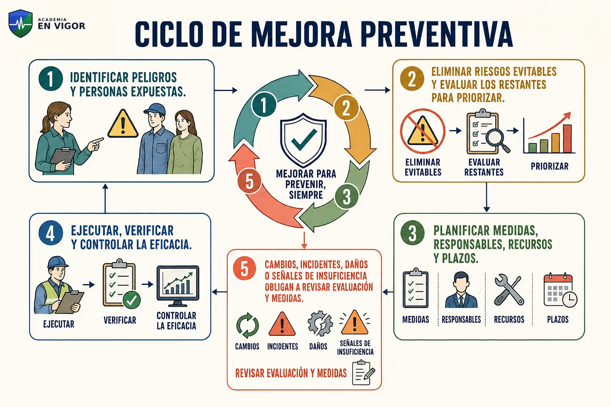

<em>Infografía: Ciclo de mejora preventiva.</em>

:::hablemos-claro
Separa sujeto, presupuesto, regla, excepción y control. Las opciones trampa suelen cambiar solo uno de esos cinco elementos.
:::

:::en-la-calle
Antes de actuar, identifica quién decide, qué habilitación existe, qué debe documentarse y qué revisión posterior protege a la persona afectada.
:::

:::lo-que-cae
Memoriza el anclaje «arts. 14.2 y 16» y discrimina reglas, excepciones y plazos.
:::

<!-- FUENTE: LPRL-T24 -->

## 30. Prevención y protección

### Regla y encaje

La prevención actúa sobre el riesgo, especialmente en su origen, para eliminarlo o disminuir la probabilidad de que se materialice. Este bloque se integra en **protección, consecuencias y daños a la salud** y se ancla en **criterios de actuación**.

### Claves normativas

- La prevención actúa sobre el riesgo, especialmente en su origen, para eliminarlo o disminuir la probabilidad de que se materialice.
- La protección actúa principalmente para evitar o reducir las consecuencias cuando el riesgo no ha podido eliminarse suficientemente. <!-- FACT:PN-T24-F146 -->
- Prevención y protección son complementarias, pero la protección no debe desplazar una medida preventiva viable. <!-- FACT:PN-T24-F147 -->
- Eliminar un producto peligroso es prevención; interponer una barrera frente a la exposición es protección. <!-- FACT:PN-T24-F148 -->
- La elección correcta sigue la jerarquía: eliminar o reducir en origen, proteger colectivamente y recurrir a protección individual cuando proceda. <!-- FACT:PN-T24-F149 -->
 <!-- FACT:PN-T24-F150 -->

<!-- VISUAL:t24-30-prevencion-y-proteccion.webp -->

  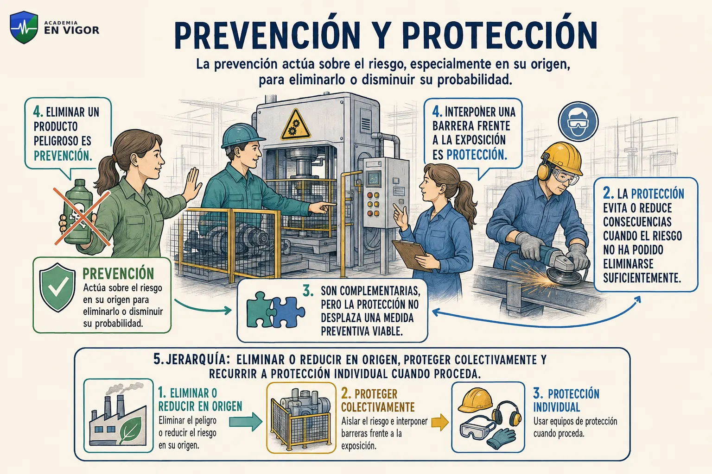

<em>Infografía: Prevención y protección.</em>

:::hablemos-claro
Separa sujeto, presupuesto, regla, excepción y control. Las opciones trampa suelen cambiar solo uno de esos cinco elementos.
:::

:::en-la-calle
Antes de actuar, identifica quién decide, qué habilitación existe, qué debe documentarse y qué revisión posterior protege a la persona afectada.
:::

:::lo-que-cae
Memoriza el anclaje «criterios de actuación» y discrimina reglas, excepciones y plazos.
:::

<!-- FUENTE: INSST-MEDIDAS-T24 -->

## 31. Protección colectiva

### Regla y encaje

La protección colectiva protege simultáneamente a varias personas frente a un riesgo. Este bloque se integra en **protección, consecuencias y daños a la salud** y se ancla en **arts. 15.1.h y 17**.

### Claves normativas

- La protección colectiva protege simultáneamente a varias personas frente a un riesgo.
- Barandillas, resguardos, extracción localizada y apantallamientos son ejemplos habituales de protección colectiva. <!-- FACT:PN-T24-F151 -->
- La protección colectiva tiene prioridad porque ofrece cobertura más amplia y depende menos de la conducta individual. <!-- FACT:PN-T24-F152 -->
- Una medida colectiva debe diseñarse, mantenerse y comprobarse para conservar su eficacia. <!-- FACT:PN-T24-F153 -->
- La prioridad colectiva no impide combinarla con protección individual cuando persista un riesgo residual. <!-- FACT:PN-T24-F154 -->
 <!-- FACT:PN-T24-F155 -->

<!-- VISUAL:t24-31-proteccion-colectiva.webp -->

  

<em>Infografía: Protección colectiva.</em>

:::hablemos-claro
Separa sujeto, presupuesto, regla, excepción y control. Las opciones trampa suelen cambiar solo uno de esos cinco elementos.
:::

:::en-la-calle
Antes de actuar, identifica quién decide, qué habilitación existe, qué debe documentarse y qué revisión posterior protege a la persona afectada.
:::

:::lo-que-cae
Memoriza el anclaje «arts. 15.1.h y 17» y discrimina reglas, excepciones y plazos.
:::

<!-- FUENTE: LPRL-T24 -->

## 32. Protección individual y EPI

### Regla y encaje

Un equipo de protección individual es el destinado a ser llevado o sujetado por la persona para protegerla de uno o varios riesgos laborales. Este bloque se integra en **protección, consecuencias y daños a la salud** y se ancla en **arts. 4.8, 15.1.h y 17.2**.

### Claves normativas

- Un equipo de protección individual es el destinado a ser llevado o sujetado por la persona para protegerla de uno o varios riesgos laborales.
- También forman parte del EPI los complementos o accesorios destinados a esa finalidad protectora. <!-- FACT:PN-T24-F156 -->
- El EPI se utiliza cuando el riesgo no puede evitarse o limitarse suficientemente por protección colectiva u organización del trabajo. <!-- FACT:PN-T24-F157 -->
- Seleccionar un EPI exige adecuarlo al riesgo, a la tarea, al entorno y a la persona usuaria. <!-- FACT:PN-T24-F158 -->
- Entregar el EPI no basta: son necesarios ajuste, formación, uso efectivo, mantenimiento y reposición. <!-- FACT:PN-T24-F159 -->
 <!-- FACT:PN-T24-F160 -->

<!-- VISUAL:t24-32-proteccion-individual-y-epi.webp -->

  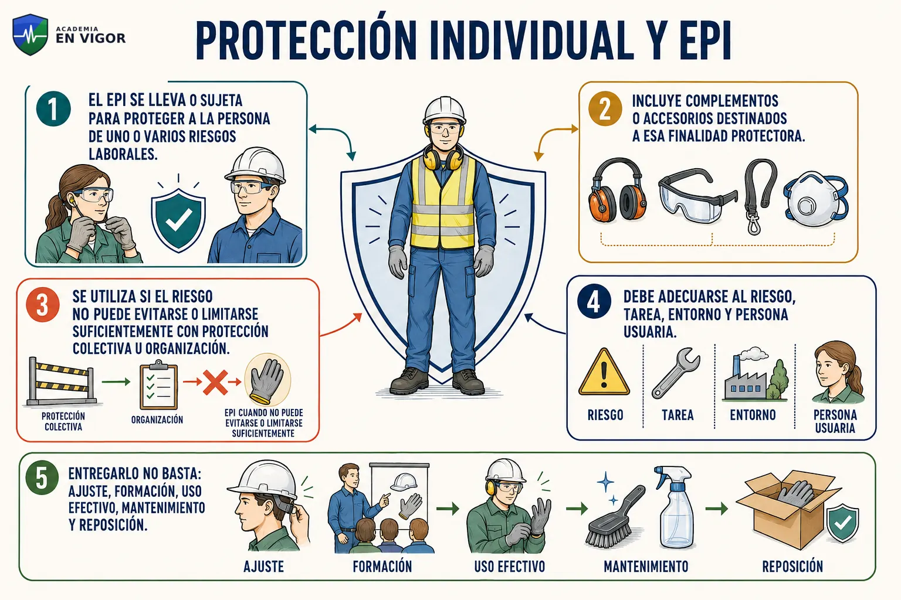

<em>Infografía: Protección individual y EPI.</em>

:::hablemos-claro
Separa sujeto, presupuesto, regla, excepción y control. Las opciones trampa suelen cambiar solo uno de esos cinco elementos.
:::

:::en-la-calle
Antes de actuar, identifica quién decide, qué habilitación existe, qué debe documentarse y qué revisión posterior protege a la persona afectada.
:::

:::lo-que-cae
Memoriza el anclaje «arts. 4.8, 15.1.h y 17.2» y discrimina reglas, excepciones y plazos.
:::

<!-- FUENTE: LPRL-T24 -->

## 33. Consecuencias de los riesgos

### Regla y encaje

La materialización de un riesgo puede causar lesiones, enfermedades, patologías, alteraciones funcionales o afectación mental y social. Este bloque se integra en **protección, consecuencias y daños a la salud** y se ancla en **arts. 4.2-4 y 16.3**.

### Claves normativas

- La materialización de un riesgo puede causar lesiones, enfermedades, patologías, alteraciones funcionales o afectación mental y social.
- Un incidente es un suceso no deseado que pudo causar daño aunque finalmente no lo produjera. <!-- FACT:PN-T24-F161 -->
- Los incidentes aportan información preventiva y deben analizarse antes de que una repetición termine en accidente. <!-- FACT:PN-T24-F162 -->
- Los daños pueden ser inmediatos o diferidos, reversibles o permanentes, leves, graves o mortales. <!-- FACT:PN-T24-F163 -->
- Cuando se produce un daño o aparecen indicios de insuficiencia, deben investigarse las causas y revisarse las medidas. <!-- FACT:PN-T24-F164 -->
 <!-- FACT:PN-T24-F165 -->

<!-- VISUAL:t24-33-consecuencias-de-los-riesgos.webp -->

  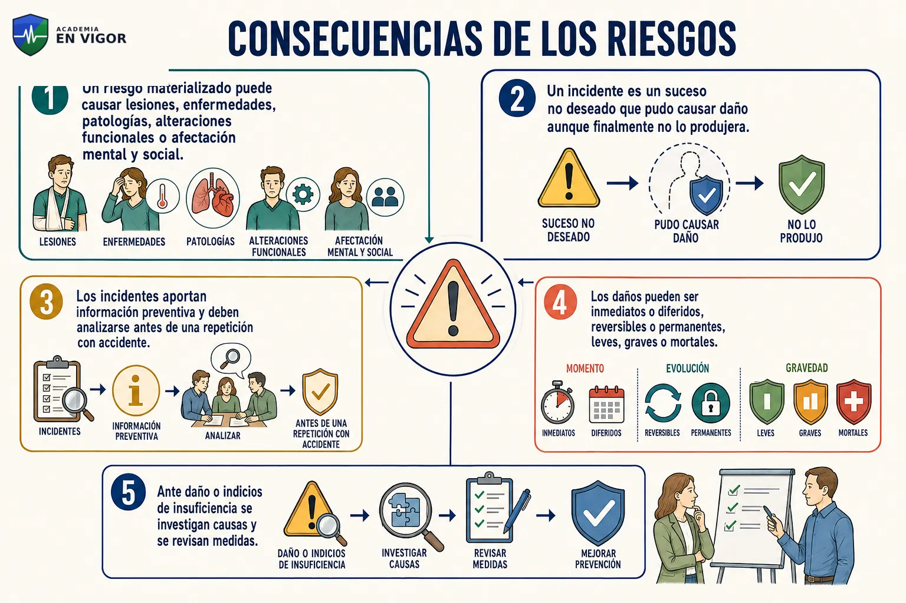

<em>Infografía: Consecuencias de los riesgos.</em>

:::hablemos-claro
Separa sujeto, presupuesto, regla, excepción y control. Las opciones trampa suelen cambiar solo uno de esos cinco elementos.
:::

:::en-la-calle
Antes de actuar, identifica quién decide, qué habilitación existe, qué debe documentarse y qué revisión posterior protege a la persona afectada.
:::

:::lo-que-cae
Memoriza el anclaje «arts. 4.2-4 y 16.3» y discrimina reglas, excepciones y plazos.
:::

<!-- FUENTE: LPRL-T24 -->

## 34. Daños derivados del trabajo

### Regla y encaje

Son daños derivados del trabajo las enfermedades, patologías o lesiones sufridas con motivo u ocasión del trabajo. Este bloque se integra en **protección, consecuencias y daños a la salud** y se ancla en **art. 4.3**.

### Claves normativas

- Son daños derivados del trabajo las enfermedades, patologías o lesiones sufridas con motivo u ocasión del trabajo.
- La definición preventiva es más amplia que las categorías usadas para reconocer prestaciones de Seguridad Social. <!-- FACT:PN-T24-F166 -->
- Un daño puede estar relacionado con el trabajo aunque no encaje en el cuadro legal de enfermedad profesional. <!-- FACT:PN-T24-F167 -->
- La calificación administrativa de la contingencia no sustituye la investigación de sus causas preventivas. <!-- FACT:PN-T24-F168 -->
- Fatiga, estrés, insatisfacción y envejecimiento prematuro pueden revelar condiciones de trabajo deficientes aunque su encaje jurídico varíe. <!-- FACT:PN-T24-F169 -->
 <!-- FACT:PN-T24-F170 -->

<!-- VISUAL:t24-34-danos-derivados-del-trabajo.webp -->

  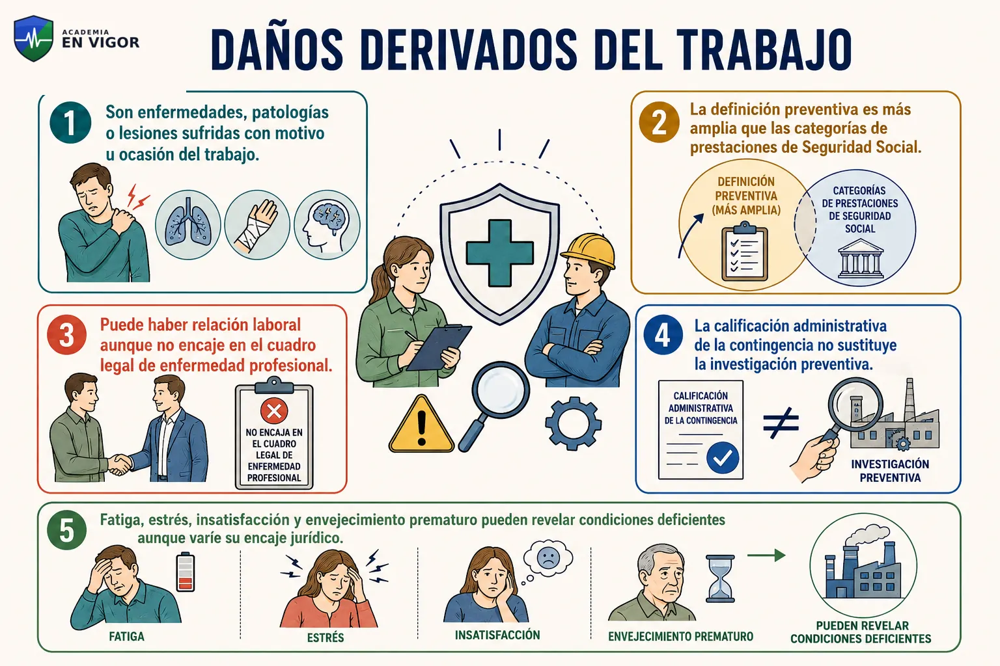

<em>Infografía: Daños derivados del trabajo.</em>

:::hablemos-claro
Separa sujeto, presupuesto, regla, excepción y control. Las opciones trampa suelen cambiar solo uno de esos cinco elementos.
:::

:::en-la-calle
Antes de actuar, identifica quién decide, qué habilitación existe, qué debe documentarse y qué revisión posterior protege a la persona afectada.
:::

:::lo-que-cae
Memoriza el anclaje «art. 4.3» y discrimina reglas, excepciones y plazos.
:::

<!-- FUENTE: LPRL-T24 -->

## 35. Accidente de trabajo

### Regla y encaje

En el Régimen General, accidente de trabajo es la lesión corporal sufrida con ocasión o por consecuencia del trabajo por cuenta ajena. Este bloque se integra en **protección, consecuencias y daños a la salud** y se ancla en **art. 156 LGSS**.

### Claves normativas

- En el Régimen General, accidente de trabajo es la lesión corporal sufrida con ocasión o por consecuencia del trabajo por cuenta ajena.
- También se consideran laborales, en los términos legales, los accidentes al ir o volver del trabajo y determinados actos de salvamento o tareas conexas. <!-- FACT:PN-T24-F171 -->
- Se presume laboral, salvo prueba en contrario, la lesión ocurrida durante el tiempo y en el lugar de trabajo. <!-- FACT:PN-T24-F172 -->
- La imprudencia profesional derivada de la confianza habitual no impide por sí sola la calificación laboral. <!-- FACT:PN-T24-F173 -->
- El dolo o la imprudencia temeraria de la persona accidentada excluyen la calificación en los términos del artículo 156. <!-- FACT:PN-T24-F174 -->
 <!-- FACT:PN-T24-F175 -->

<!-- VISUAL:t24-35-accidente-de-trabajo.webp -->

  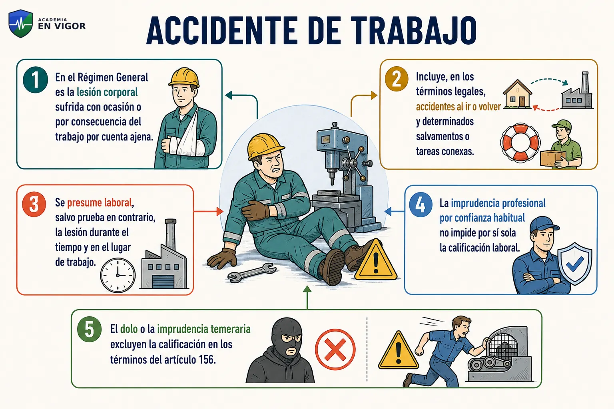

<em>Infografía: Accidente de trabajo.</em>

:::hablemos-claro
Separa sujeto, presupuesto, regla, excepción y control. Las opciones trampa suelen cambiar solo uno de esos cinco elementos.
:::

:::en-la-calle
Antes de actuar, identifica quién decide, qué habilitación existe, qué debe documentarse y qué revisión posterior protege a la persona afectada.
:::

:::lo-que-cae
Memoriza el anclaje «art. 156 LGSS» y discrimina reglas, excepciones y plazos.
:::

<!-- FUENTE: LGSS-T24 -->

## 36. Enfermedad profesional y otras patologías

### Regla y encaje

La enfermedad profesional exige trabajo por cuenta ajena en una actividad incluida en el cuadro y acción del agente o sustancia indicado para esa enfermedad. Este bloque se integra en **protección, consecuencias y daños a la salud** y se ancla en **arts. 156.2.e, 157 y 158 LGSS**.

### Claves normativas

- La enfermedad profesional exige trabajo por cuenta ajena en una actividad incluida en el cuadro y acción del agente o sustancia indicado para esa enfermedad.
- El cuadro de enfermedades profesionales se aprueba y actualiza reglamentariamente. <!-- FACT:PN-T24-F176 -->
- Una enfermedad causada exclusivamente por el trabajo que no esté incluida en el cuadro puede tratarse como accidente de trabajo si se prueba el nexo exigido. <!-- FACT:PN-T24-F177 -->
- Los daños laborales pueden tener origen multicausal y manifestarse tras exposiciones acumuladas o períodos de latencia. <!-- FACT:PN-T24-F178 -->
- La prevención debe atender a accidentes, enfermedades profesionales y otras patologías relacionadas con el trabajo, no solo a las estadísticas de baja. <!-- FACT:PN-T24-F179 -->
 <!-- FACT:PN-T24-F180 -->

<!-- VISUAL:t24-36-enfermedad-profesional-y-otras-patologias.webp -->

  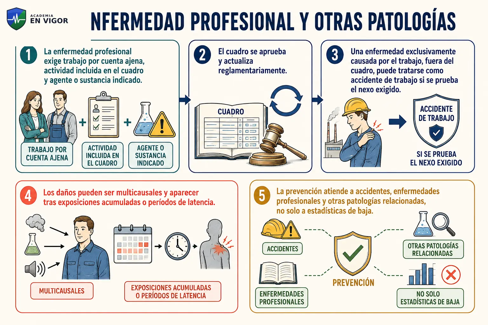

<em>Infografía: Enfermedad profesional y otras patologías.</em>

:::hablemos-claro
Separa sujeto, presupuesto, regla, excepción y control. Las opciones trampa suelen cambiar solo uno de esos cinco elementos.
:::

:::en-la-calle
Antes de actuar, identifica quién decide, qué habilitación existe, qué debe documentarse y qué revisión posterior protege a la persona afectada.
:::

:::lo-que-cae
Memoriza el anclaje «arts. 156.2.e, 157 y 158 LGSS» y discrimina reglas, excepciones y plazos.
:::

<!-- FUENTE: LGSS-T24 -->

# Hablemos claro

:::hablemos-claro
Una regla bien estudiada responde cinco preguntas: quién, cuándo, qué hace, con qué límite y bajo qué control.
:::

# En la calle

:::en-la-calle
En el supuesto práctico, documenta hechos y tiempos antes de aplicar la norma; después revisa necesidad, proporcionalidad y garantías.
:::

# Lo que cae

:::lo-que-cae
Prioriza sujetos competentes, plazos máximos, excepciones tasadas y derechos que no admiten atajos.
:::

# Ha caído

:::ha-caido
Se han mapeado 4 referencias históricas. Permanecen ocultas y en cuarentena porque no existe plantilla oficial final verificable.
:::

## Fuentes oficiales

- `CONV-PN-2026`
- `CE-T24`
- `OMS-SALUD-T24`
- `LPRL-T24`
- `INSST-T1-2026-T24`
- `INSST-T3-2026-T24`
- `INSST-MEDIDAS-T24`
- `LGSS-T24`
- `RD1299-2006-T24`

---

*Academia En Vigor · El temario que nunca duerme · Tema 24 · v1.0.0 · Documento interno no publicado.*
