# TEMA 25 · MARCO NORMATIVO BÁSICO EN PREVENCIÓN DE RIESGOS LABORALES. LA LEY 31/1995, DE PREVENCIÓN DE RIESGOS LABORALES. RD 39/1997, REGLAMENTO DE LOS SERVICIOS DE PREVENCIÓN. EL RD 2/2006, SOBRE PREVENCIÓN DE RIESGOS LABORALES EN LOS FUNCIONARIOS DEL CUERPO NACIONAL DE POLICÍA. EL RD 67/2010 SOBRE ADAPTACIÓN DE LA PREVENCIÓN DE RIESGOS LABORALES EN LA ADMINISTRACIÓN GENERAL DEL ESTADO. DERECHOS Y DEBERES BÁSICOS EN MATERIA DE PREVENCIÓN DE RIESGOS LABORALES.

**Policía Nacional · Método VIGOR · ATESTADO**
**Versión de contenido:** 1.0.0
**Estado editorial:** approved_internal · **Publicación:** not_published

# Mapa del tema

El Tema 25 se recorre en cinco partes: marco básico y sistema de la ley 31/1995; derechos, deberes y protección preventiva; reglamento de los servicios de prevención; cualificación y adaptación a la administración general del estado; prevención de riesgos laborales en la policía nacional.

# Contenido

## 01. Sistema normativo preventivo

### Regla y encaje

La Constitución encomienda a los poderes públicos velar por la seguridad e higiene en el trabajo. Este bloque se integra en **marco básico y sistema de la ley 31/1995** y se ancla en **art. 1 LPRL; art. 40.2 CE**.

### Claves normativas

- La Constitución encomienda a los poderes públicos velar por la seguridad e higiene en el trabajo.
- La normativa preventiva está formada por la Ley 31/1995, sus disposiciones de desarrollo o complementarias y otras normas legales o convencionales con prescripciones preventivas. <!-- FACT:PN-T25-F001 -->
- La Directiva 89/391/CEE fija el marco europeo general de mejora de la seguridad y salud de las personas trabajadoras. <!-- FACT:PN-T25-F002 -->
- La Ley 31/1995 transpone el marco comunitario y actúa como base común, sin excluir normas sectoriales más específicas. <!-- FACT:PN-T25-F003 -->
- En Policía Nacional deben coordinarse la normativa general, la adaptación a la AGE y el régimen específico del Real Decreto 2/2006. <!-- FACT:PN-T25-F004 -->
 <!-- FACT:PN-T25-F005 -->

<!-- VISUAL:t25-01-sistema-normativo-preventivo.webp -->

  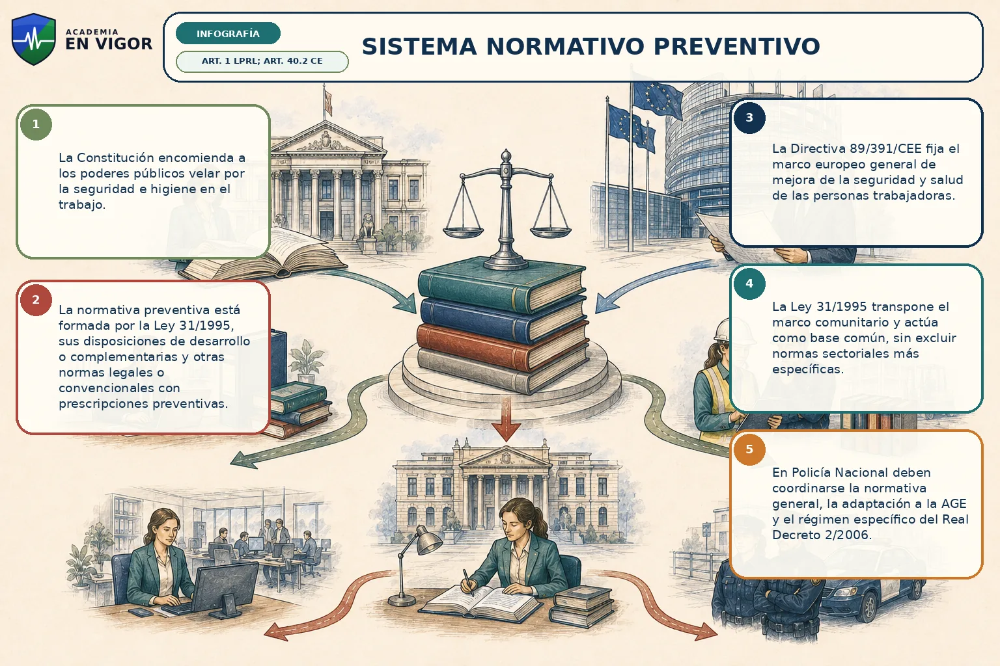

<em>Infografía: Sistema normativo preventivo.</em>

:::hablemos-claro
Separa sujeto, presupuesto, regla, excepción y control. Las opciones trampa suelen cambiar solo uno de esos cinco elementos.
:::

:::en-la-calle
Antes de actuar, identifica quién decide, qué habilitación existe, qué debe documentarse y qué revisión posterior protege a la persona afectada.
:::

:::lo-que-cae
Memoriza el anclaje «art. 1 LPRL; art. 40.2 CE» y discrimina reglas, excepciones y plazos.
:::

<!-- FUENTE: LPRL-T25 -->

## 02. Objeto y carácter de la Ley 31/1995

### Regla y encaje

La Ley 31/1995 tiene por objeto promover la seguridad y salud mediante medidas y actividades necesarias para prevenir los riesgos derivados del trabajo. Este bloque se integra en **marco básico y sistema de la ley 31/1995** y se ancla en **art. 2**.

### Claves normativas

- La Ley 31/1995 tiene por objeto promover la seguridad y salud mediante medidas y actividades necesarias para prevenir los riesgos derivados del trabajo.
- La ley establece principios generales sobre prevención, eliminación o reducción de riesgos, información, consulta, participación y formación. <!-- FACT:PN-T25-F006 -->
- Sus disposiciones laborales tienen carácter de derecho necesario mínimo indisponible. <!-- FACT:PN-T25-F007 -->
- Las disposiciones legales y reglamentarias pueden ser mejoradas y desarrolladas por convenio colectivo. <!-- FACT:PN-T25-F008 -->
- La mejora convencional no permite rebajar el nivel mínimo de protección fijado por la normativa obligatoria. <!-- FACT:PN-T25-F009 -->
 <!-- FACT:PN-T25-F010 -->

<!-- VISUAL:t25-02-objeto-y-caracter-de-la-ley-31-1995.webp -->

  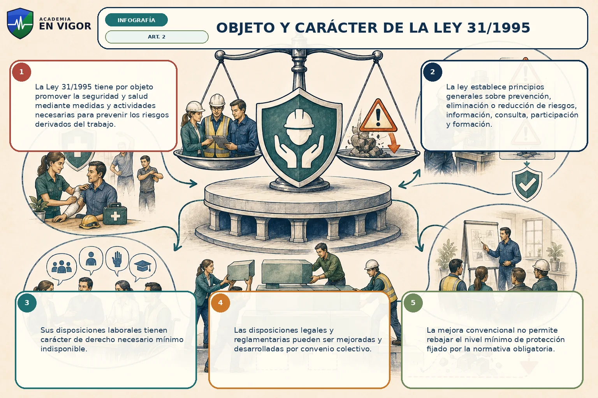

<em>Infografía: Objeto y carácter de la Ley 31/1995.</em>

:::hablemos-claro
Separa sujeto, presupuesto, regla, excepción y control. Las opciones trampa suelen cambiar solo uno de esos cinco elementos.
:::

:::en-la-calle
Antes de actuar, identifica quién decide, qué habilitación existe, qué debe documentarse y qué revisión posterior protege a la persona afectada.
:::

:::lo-que-cae
Memoriza el anclaje «art. 2» y discrimina reglas, excepciones y plazos.
:::

<!-- FUENTE: LPRL-T25 -->

## 03. Ámbito general y peculiaridades públicas

### Regla y encaje

La Ley 31/1995 se aplica a relaciones laborales y al personal con relación administrativa o estatutaria al servicio de las Administraciones públicas, con sus peculiaridades. Este bloque se integra en **marco básico y sistema de la ley 31/1995** y se ancla en **art. 3**.

### Claves normativas

- La Ley 31/1995 se aplica a relaciones laborales y al personal con relación administrativa o estatutaria al servicio de las Administraciones públicas, con sus peculiaridades.
- También contiene reglas específicas para socios trabajadores de cooperativas y otros supuestos expresamente comprendidos. <!-- FACT:PN-T25-F011 -->
- La ley no se aplica cuando las particularidades de determinadas actividades de policía, seguridad, resguardo aduanero o protección civil lo impidan. <!-- FACT:PN-T25-F012 -->
- La exclusión se interpreta de forma funcional: afecta a actividades concretas incompatibles, no a todo trabajo desarrollado por un cuerpo policial. <!-- FACT:PN-T25-F013 -->
- La normativa específica debe inspirarse en la Ley 31/1995 y proteger la seguridad y salud de quienes realizan esas funciones. <!-- FACT:PN-T25-F014 -->
 <!-- FACT:PN-T25-F015 -->

<!-- VISUAL:t25-03-ambito-general-y-peculiaridades-publicas.webp -->

  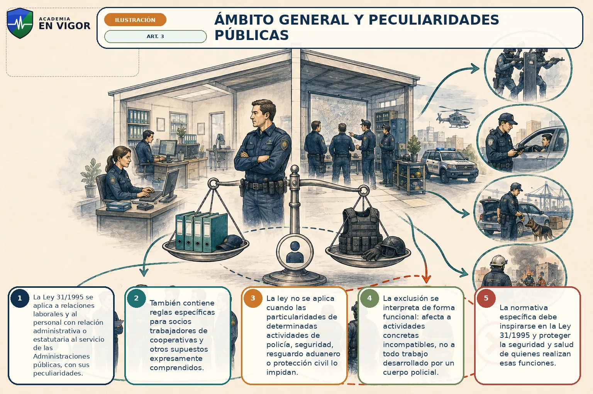

<em>Infografía: Ámbito general y peculiaridades públicas.</em>

:::hablemos-claro
Separa sujeto, presupuesto, regla, excepción y control. Las opciones trampa suelen cambiar solo uno de esos cinco elementos.
:::

:::en-la-calle
Antes de actuar, identifica quién decide, qué habilitación existe, qué debe documentarse y qué revisión posterior protege a la persona afectada.
:::

:::lo-que-cae
Memoriza el anclaje «art. 3» y discrimina reglas, excepciones y plazos.
:::

<!-- FUENTE: LPRL-T25 -->

## 04. Definiciones legales de alto rendimiento

### Regla y encaje

Prevención es el conjunto de actividades o medidas adoptadas o previstas en todas las fases de la actividad para evitar o disminuir riesgos derivados del trabajo. Este bloque se integra en **marco básico y sistema de la ley 31/1995** y se ancla en **art. 4**.

### Claves normativas

- Prevención es el conjunto de actividades o medidas adoptadas o previstas en todas las fases de la actividad para evitar o disminuir riesgos derivados del trabajo.
- Riesgo laboral es la posibilidad de que una persona trabajadora sufra un daño determinado derivado del trabajo. <!-- FACT:PN-T25-F016 -->
- La gravedad del riesgo se valora conjuntamente por la probabilidad de que se produzca el daño y la severidad de este. <!-- FACT:PN-T25-F017 -->
- Riesgo grave e inminente es el racionalmente probable de materializarse en un futuro inmediato y capaz de causar un daño grave. <!-- FACT:PN-T25-F018 -->
- Daños derivados del trabajo son las enfermedades, patologías o lesiones sufridas con motivo u ocasión del trabajo. <!-- FACT:PN-T25-F019 -->
 <!-- FACT:PN-T25-F020 -->

<!-- VISUAL:t25-04-definiciones-legales-de-alto-rendimiento.webp -->

  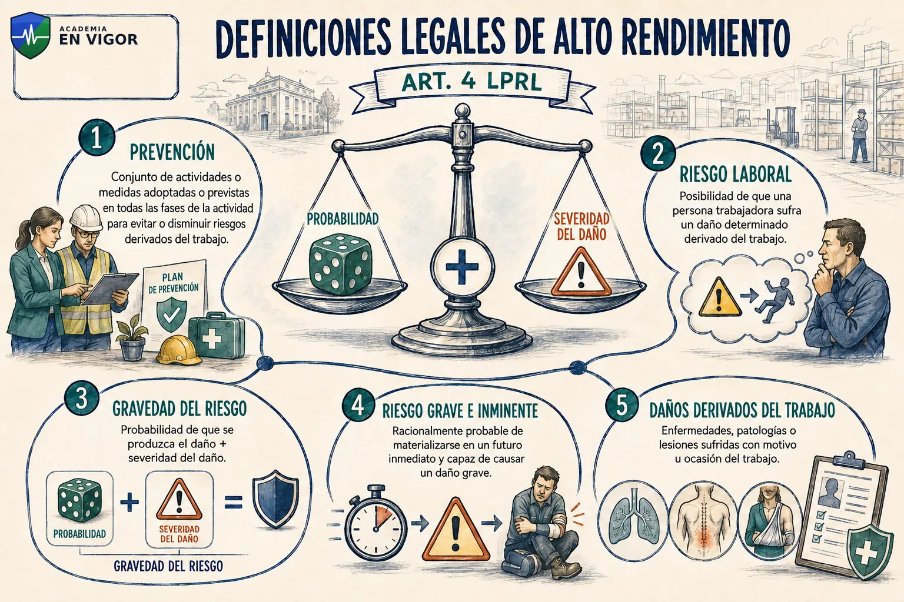

<em>Infografía: Definiciones legales de alto rendimiento.</em>

:::hablemos-claro
Separa sujeto, presupuesto, regla, excepción y control. Las opciones trampa suelen cambiar solo uno de esos cinco elementos.
:::

:::en-la-calle
Antes de actuar, identifica quién decide, qué habilitación existe, qué debe documentarse y qué revisión posterior protege a la persona afectada.
:::

:::lo-que-cae
Memoriza el anclaje «art. 4» y discrimina reglas, excepciones y plazos.
:::

<!-- FUENTE: LPRL-T25 -->

## 05. Política preventiva y coordinación pública

### Regla y encaje

La política preventiva busca mejorar las condiciones de trabajo para elevar la protección de la seguridad y la salud. Este bloque se integra en **marco básico y sistema de la ley 31/1995** y se ancla en **arts. 5-7**.

### Claves normativas

- La política preventiva busca mejorar las condiciones de trabajo para elevar la protección de la seguridad y la salud.
- Las Administraciones competentes deben coordinar sus actuaciones y armonizarlas con las de sujetos públicos y privados. <!-- FACT:PN-T25-F021 -->
- La política preventiva debe considerar especialmente a pequeñas y medianas empresas y promover la integración de la prevención. <!-- FACT:PN-T25-F022 -->
- El Gobierno regula reglamentariamente requisitos mínimos, limitaciones, evaluación, organización preventiva y trabajos especialmente peligrosos. <!-- FACT:PN-T25-F023 -->
- Las Administraciones laborales desarrollan promoción, asesoramiento, vigilancia, control y sanción dentro de sus competencias. <!-- FACT:PN-T25-F024 -->
 <!-- FACT:PN-T25-F025 -->

<!-- VISUAL:t25-05-politica-preventiva-y-coordinacion-publica.webp -->

  

<em>Infografía: Política preventiva y coordinación pública.</em>

:::hablemos-claro
Separa sujeto, presupuesto, regla, excepción y control. Las opciones trampa suelen cambiar solo uno de esos cinco elementos.
:::

:::en-la-calle
Antes de actuar, identifica quién decide, qué habilitación existe, qué debe documentarse y qué revisión posterior protege a la persona afectada.
:::

:::lo-que-cae
Memoriza el anclaje «arts. 5-7» y discrimina reglas, excepciones y plazos.
:::

<!-- FUENTE: LPRL-T25 -->

## 06. Instituto Nacional de Seguridad y Salud en el Trabajo

### Regla y encaje

El Instituto Nacional de Seguridad y Salud en el Trabajo es el órgano científico-técnico especializado de la Administración General del Estado en seguridad y salud laboral. Este bloque se integra en **marco básico y sistema de la ley 31/1995** y se ancla en **art. 8**.

### Claves normativas

- El Instituto Nacional de Seguridad y Salud en el Trabajo es el órgano científico-técnico especializado de la Administración General del Estado en seguridad y salud laboral.
- Su misión incluye analizar y estudiar las condiciones de seguridad y salud y promover y apoyar su mejora. <!-- FACT:PN-T25-F026 -->
- Presta asesoramiento técnico en normativa y normalización nacional e internacional. <!-- FACT:PN-T25-F027 -->
- Promueve formación, información, investigación, estudio y divulgación y coopera con los órganos técnicos autonómicos. <!-- FACT:PN-T25-F028 -->
- El texto histórico de algunas normas utiliza la denominación Instituto Nacional de Seguridad e Higiene en el Trabajo; actualmente la denominación institucional es INSST. <!-- FACT:PN-T25-F029 -->
 <!-- FACT:PN-T25-F030 -->

<!-- VISUAL:t25-06-instituto-nacional-de-seguridad-y-salud-en.webp -->

  

<em>Infografía: Instituto Nacional de Seguridad y Salud en el Trabajo.</em>

:::hablemos-claro
Separa sujeto, presupuesto, regla, excepción y control. Las opciones trampa suelen cambiar solo uno de esos cinco elementos.
:::

:::en-la-calle
Antes de actuar, identifica quién decide, qué habilitación existe, qué debe documentarse y qué revisión posterior protege a la persona afectada.
:::

:::lo-que-cae
Memoriza el anclaje «art. 8» y discrimina reglas, excepciones y plazos.
:::

<!-- FUENTE: LPRL-T25 -->

## 07. Inspección de Trabajo y autoridades sanitarias

### Regla y encaje

La vigilancia y control de la normativa preventiva corresponde a la Inspección de Trabajo y Seguridad Social, sin perjuicio de especialidades públicas. Este bloque se integra en **marco básico y sistema de la ley 31/1995** y se ancla en **arts. 9-10**.

### Claves normativas

- La vigilancia y control de la normativa preventiva corresponde a la Inspección de Trabajo y Seguridad Social, sin perjuicio de especialidades públicas.
- La Inspección puede vigilar, asesorar, elaborar informes, informar accidentes graves y ordenar la paralización inmediata en caso de riesgo grave e inminente. <!-- FACT:PN-T25-F031 -->
- Los órganos técnicos autonómicos pueden prestar apoyo y asesoramiento técnico a la Inspección en los términos legales. <!-- FACT:PN-T25-F032 -->
- Las Administraciones sanitarias controlan actuaciones sanitarias de los servicios de prevención y establecen pautas y protocolos. <!-- FACT:PN-T25-F033 -->
- Las autoridades sanitarias colaboran en sistemas de información, mapas de riesgos, estudios epidemiológicos y vigilancia de la salud laboral. <!-- FACT:PN-T25-F034 -->
 <!-- FACT:PN-T25-F035 -->

<!-- VISUAL:t25-07-inspeccion-de-trabajo-y-autoridades-sanita.webp -->

  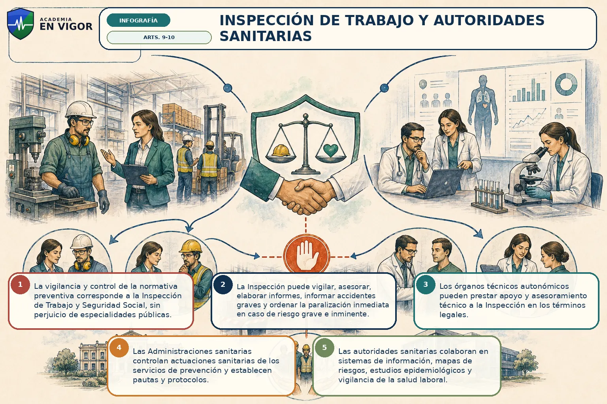

<em>Infografía: Inspección de Trabajo y autoridades sanitarias.</em>

:::hablemos-claro
Separa sujeto, presupuesto, regla, excepción y control. Las opciones trampa suelen cambiar solo uno de esos cinco elementos.
:::

:::en-la-calle
Antes de actuar, identifica quién decide, qué habilitación existe, qué debe documentarse y qué revisión posterior protege a la persona afectada.
:::

:::lo-que-cae
Memoriza el anclaje «arts. 9-10» y discrimina reglas, excepciones y plazos.
:::

<!-- FUENTE: LPRL-T25 -->

## 08. Comisión Nacional de Seguridad y Salud

### Regla y encaje

La Comisión Nacional de Seguridad y Salud en el Trabajo es el órgano colegiado asesor de las Administraciones públicas en la formulación de políticas preventivas. Este bloque se integra en **marco básico y sistema de la ley 31/1995** y se ancla en **art. 13**.

### Claves normativas

- La Comisión Nacional de Seguridad y Salud en el Trabajo es el órgano colegiado asesor de las Administraciones públicas en la formulación de políticas preventivas.
- También es órgano de participación institucional en materia de seguridad y salud en el trabajo. <!-- FACT:PN-T25-F036 -->
- La integran representantes de la Administración General del Estado, de las comunidades autónomas y de las organizaciones empresariales y sindicales más representativas. <!-- FACT:PN-T25-F037 -->
- La representación empresarial y sindical es paritaria respecto del conjunto de representantes de las Administraciones públicas. <!-- FACT:PN-T25-F038 -->
- La Comisión conoce actuaciones de promoción, asesoramiento, vigilancia y control y puede formular propuestas e informar proyectos normativos. <!-- FACT:PN-T25-F039 -->
 <!-- FACT:PN-T25-F040 -->

<!-- VISUAL:t25-08-comision-nacional-de-seguridad-y-salud.webp -->

  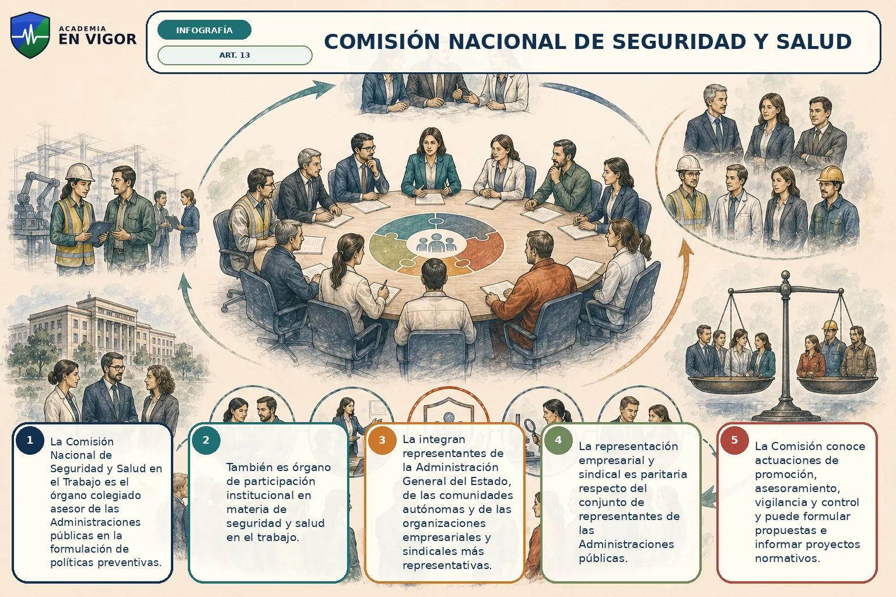

<em>Infografía: Comisión Nacional de Seguridad y Salud.</em>

:::hablemos-claro
Separa sujeto, presupuesto, regla, excepción y control. Las opciones trampa suelen cambiar solo uno de esos cinco elementos.
:::

:::en-la-calle
Antes de actuar, identifica quién decide, qué habilitación existe, qué debe documentarse y qué revisión posterior protege a la persona afectada.
:::

:::lo-que-cae
Memoriza el anclaje «art. 13» y discrimina reglas, excepciones y plazos.
:::

<!-- FUENTE: LPRL-T25 -->

## 09. Derecho a protección eficaz y deber correlativo

### Regla y encaje

Las personas trabajadoras tienen derecho a una protección eficaz en materia de seguridad y salud en el trabajo. Este bloque se integra en **marco básico y sistema de la ley 31/1995** y se ancla en **art. 14**.

### Claves normativas

- Las personas trabajadoras tienen derecho a una protección eficaz en materia de seguridad y salud en el trabajo.
- El derecho implica un deber correlativo del empresario y, respecto de su personal, de las Administraciones públicas. <!-- FACT:PN-T25-F041 -->
- Información, consulta, participación, formación, paralización ante riesgo grave e inminente y vigilancia de la salud forman parte del derecho de protección. <!-- FACT:PN-T25-F042 -->
- El deber de protección exige integrar la prevención y adoptar cuantas medidas sean necesarias en todos los aspectos relacionados con el trabajo. <!-- FACT:PN-T25-F043 -->
- El coste de las medidas relativas a la seguridad y salud no puede recaer sobre las personas trabajadoras. <!-- FACT:PN-T25-F044 -->
 <!-- FACT:PN-T25-F045 -->

<!-- VISUAL:t25-09-derecho-a-proteccion-eficaz-y-deber-correl.webp -->

  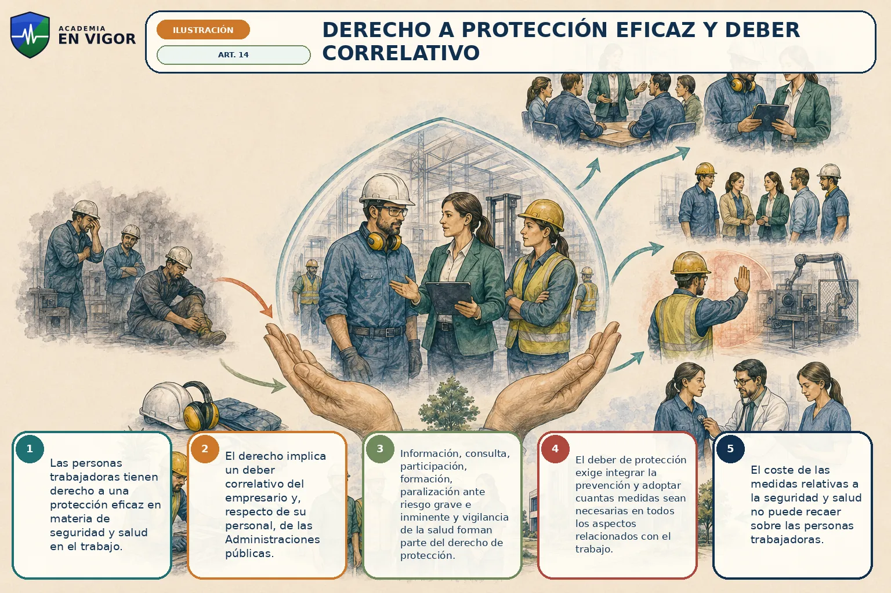

<em>Infografía: Derecho a protección eficaz y deber correlativo.</em>

:::hablemos-claro
Separa sujeto, presupuesto, regla, excepción y control. Las opciones trampa suelen cambiar solo uno de esos cinco elementos.
:::

:::en-la-calle
Antes de actuar, identifica quién decide, qué habilitación existe, qué debe documentarse y qué revisión posterior protege a la persona afectada.
:::

:::lo-que-cae
Memoriza el anclaje «art. 14» y discrimina reglas, excepciones y plazos.
:::

<!-- FUENTE: LPRL-T25 -->

## 10. Principios generales de la acción preventiva

### Regla y encaje

La acción preventiva comienza por evitar los riesgos, evaluar los inevitables y combatirlos en su origen. Este bloque se integra en **marco básico y sistema de la ley 31/1995** y se ancla en **art. 15**.

### Claves normativas

- La acción preventiva comienza por evitar los riesgos, evaluar los inevitables y combatirlos en su origen.
- Debe adaptar el trabajo a la persona, tener en cuenta la evolución técnica y sustituir lo peligroso por lo que entrañe poco o ningún peligro. <!-- FACT:PN-T25-F046 -->
- La prevención debe planificarse integrando técnica, organización, condiciones de trabajo, relaciones sociales y factores ambientales. <!-- FACT:PN-T25-F047 -->
- La protección colectiva debe anteponerse a la individual y deben darse instrucciones adecuadas. <!-- FACT:PN-T25-F048 -->
- Las medidas deben prever distracciones o imprudencias no temerarias razonablemente previsibles. <!-- FACT:PN-T25-F049 -->
 <!-- FACT:PN-T25-F050 -->

<!-- VISUAL:t25-10-principios-generales-de-la-accion-preventi.webp -->

  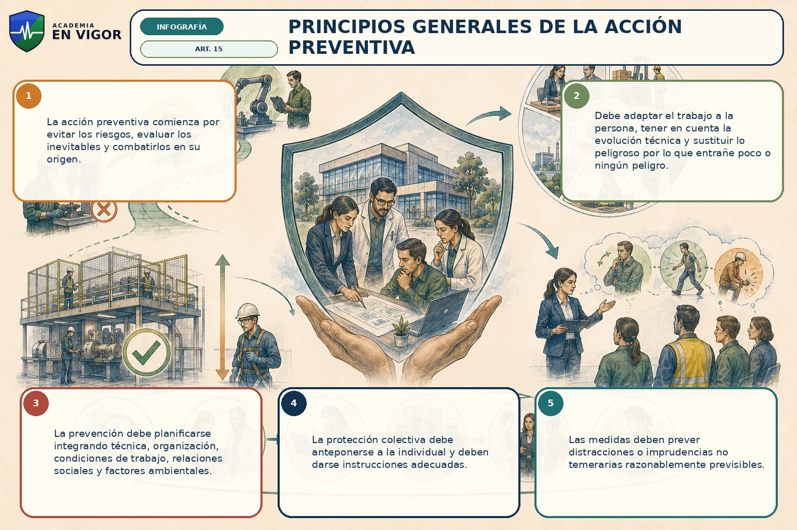

<em>Infografía: Principios generales de la acción preventiva.</em>

:::hablemos-claro
Separa sujeto, presupuesto, regla, excepción y control. Las opciones trampa suelen cambiar solo uno de esos cinco elementos.
:::

:::en-la-calle
Antes de actuar, identifica quién decide, qué habilitación existe, qué debe documentarse y qué revisión posterior protege a la persona afectada.
:::

:::lo-que-cae
Memoriza el anclaje «art. 15» y discrimina reglas, excepciones y plazos.
:::

<!-- FUENTE: LPRL-T25 -->

## 11. Integración y plan de prevención

### Regla y encaje

La prevención debe integrarse en el sistema general de gestión, en todas las actividades y en todos los niveles jerárquicos. Este bloque se integra en **derechos, deberes y protección preventiva** y se ancla en **art. 16.1**.

### Claves normativas

- La prevención debe integrarse en el sistema general de gestión, en todas las actividades y en todos los niveles jerárquicos.
- El plan de prevención es la herramienta mediante la que se integra la prevención en la gestión. <!-- FACT:PN-T25-F051 -->
- El plan incluye estructura organizativa, responsabilidades, funciones, prácticas, procedimientos, procesos y recursos preventivos. <!-- FACT:PN-T25-F052 -->
- La dirección debe aprobar la política preventiva y la organización debe asumirla en su actividad ordinaria. <!-- FACT:PN-T25-F053 -->
- La mera existencia documental del plan no demuestra integración si decisiones y tareas reales ignoran la prevención. <!-- FACT:PN-T25-F054 -->
 <!-- FACT:PN-T25-F055 -->

<!-- VISUAL:t25-11-integracion-y-plan-de-prevencion.webp -->

  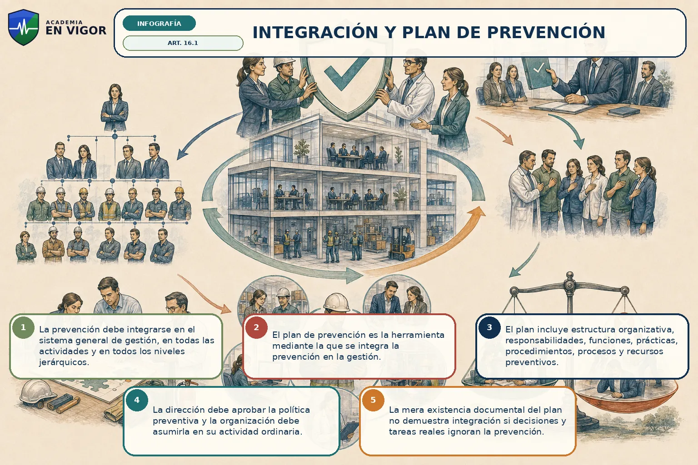

<em>Infografía: Integración y plan de prevención.</em>

:::hablemos-claro
Separa sujeto, presupuesto, regla, excepción y control. Las opciones trampa suelen cambiar solo uno de esos cinco elementos.
:::

:::en-la-calle
Antes de actuar, identifica quién decide, qué habilitación existe, qué debe documentarse y qué revisión posterior protege a la persona afectada.
:::

:::lo-que-cae
Memoriza el anclaje «art. 16.1» y discrimina reglas, excepciones y plazos.
:::

<!-- FUENTE: LPRL-T25 -->

## 12. Evaluación inicial y actualización

### Regla y encaje

La evaluación inicial abarca los riesgos que no hayan podido evitarse y considera actividad, puestos y personas que los desempeñan. Este bloque se integra en **derechos, deberes y protección preventiva** y se ancla en **art. 16.2.a**.

### Claves normativas

- La evaluación inicial abarca los riesgos que no hayan podido evitarse y considera actividad, puestos y personas que los desempeñan.
- Debe realizarse también al elegir equipos, sustancias o preparados químicos y al acondicionar lugares de trabajo. <!-- FACT:PN-T25-F056 -->
- La evaluación considera actuaciones específicas para personas especialmente sensibles y demás previsiones legales. <!-- FACT:PN-T25-F057 -->
- Debe actualizarse cuando cambien las condiciones de trabajo y revisarse cuando se produzcan daños para la salud. <!-- FACT:PN-T25-F058 -->
- Los controles periódicos permiten detectar situaciones potencialmente peligrosas y comprobar si las medidas siguen siendo adecuadas. <!-- FACT:PN-T25-F059 -->
 <!-- FACT:PN-T25-F060 -->

<!-- VISUAL:t25-12-evaluacion-inicial-y-actualizacion.webp -->

  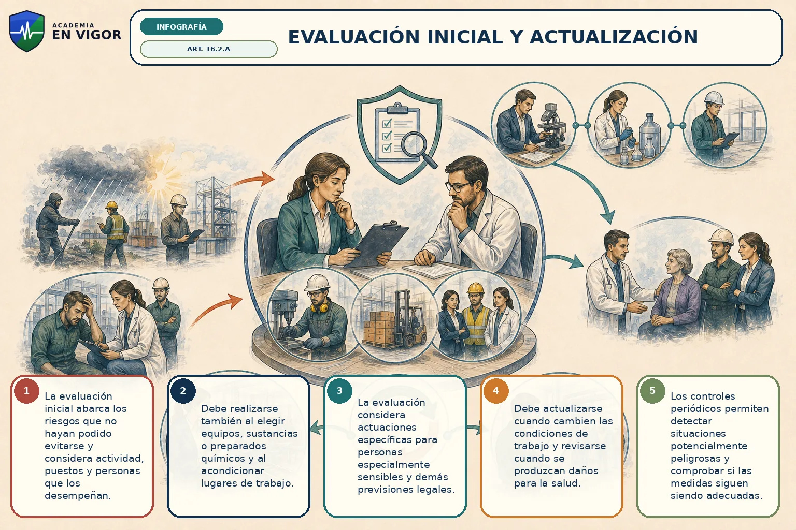

<em>Infografía: Evaluación inicial y actualización.</em>

:::hablemos-claro
Separa sujeto, presupuesto, regla, excepción y control. Las opciones trampa suelen cambiar solo uno de esos cinco elementos.
:::

:::en-la-calle
Antes de actuar, identifica quién decide, qué habilitación existe, qué debe documentarse y qué revisión posterior protege a la persona afectada.
:::

:::lo-que-cae
Memoriza el anclaje «art. 16.2.a» y discrimina reglas, excepciones y plazos.
:::

<!-- FUENTE: LPRL-T25 -->

## 13. Planificación e investigación de daños

### Regla y encaje

Cuando la evaluación revela riesgos, deben planificarse actividades preventivas para eliminarlos, reducirlos o controlarlos. Este bloque se integra en **derechos, deberes y protección preventiva** y se ancla en **arts. 16.2.b y 16.3**.

### Claves normativas

- Cuando la evaluación revela riesgos, deben planificarse actividades preventivas para eliminarlos, reducirlos o controlarlos.
- La planificación fija plazo, responsables y recursos humanos y materiales necesarios. <!-- FACT:PN-T25-F061 -->
- Las actividades deben modificarse si el seguimiento demuestra que son inadecuadas para los fines de protección. <!-- FACT:PN-T25-F062 -->
- Cuando se produce un daño o aparecen indicios de insuficiencia preventiva, deben investigarse las causas. <!-- FACT:PN-T25-F063 -->
- Investigar el daño no sustituye la evaluación: aporta información para corregir causas y revisar el sistema. <!-- FACT:PN-T25-F064 -->
 <!-- FACT:PN-T25-F065 -->

<!-- VISUAL:t25-13-planificacion-e-investigacion-de-danos.webp -->

  

<em>Infografía: Planificación e investigación de daños.</em>

:::hablemos-claro
Separa sujeto, presupuesto, regla, excepción y control. Las opciones trampa suelen cambiar solo uno de esos cinco elementos.
:::

:::en-la-calle
Antes de actuar, identifica quién decide, qué habilitación existe, qué debe documentarse y qué revisión posterior protege a la persona afectada.
:::

:::lo-que-cae
Memoriza el anclaje «arts. 16.2.b y 16.3» y discrimina reglas, excepciones y plazos.
:::

<!-- FUENTE: LPRL-T25 -->

## 14. Equipos de trabajo y protección individual

### Regla y encaje

Los equipos de trabajo deben ser adecuados para la tarea y convenientemente adaptados para garantizar seguridad y salud. Este bloque se integra en **derechos, deberes y protección preventiva** y se ancla en **art. 17**.

### Claves normativas

- Los equipos de trabajo deben ser adecuados para la tarea y convenientemente adaptados para garantizar seguridad y salud.
- Cuando un equipo presenta riesgo específico, su utilización puede reservarse a quienes estén encargados y capacitados. <!-- FACT:PN-T25-F066 -->
- Los trabajos de reparación o mantenimiento con riesgo específico deben realizarse por personal especialmente capacitado. <!-- FACT:PN-T25-F067 -->
- Deben proporcionarse equipos de protección individual adecuados y velarse por su uso efectivo cuando sean necesarios. <!-- FACT:PN-T25-F068 -->
- El EPI procede cuando el riesgo no puede evitarse o limitarse suficientemente mediante protección colectiva u organización del trabajo. <!-- FACT:PN-T25-F069 -->
 <!-- FACT:PN-T25-F070 -->

<!-- VISUAL:t25-14-equipos-de-trabajo-y-proteccion-individual.webp -->

  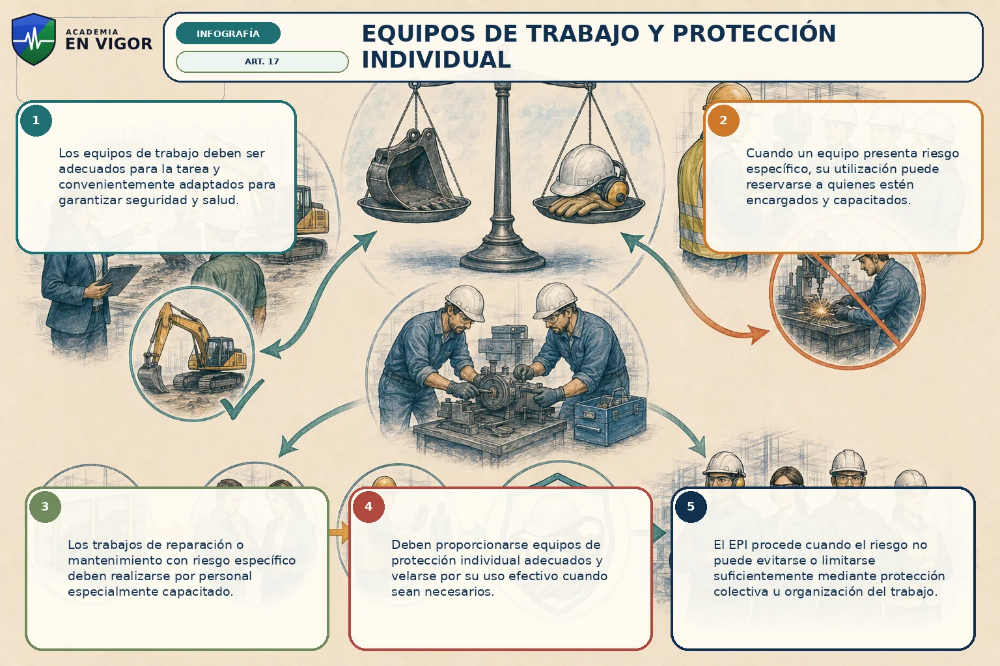

<em>Infografía: Equipos de trabajo y protección individual.</em>

:::hablemos-claro
Separa sujeto, presupuesto, regla, excepción y control. Las opciones trampa suelen cambiar solo uno de esos cinco elementos.
:::

:::en-la-calle
Antes de actuar, identifica quién decide, qué habilitación existe, qué debe documentarse y qué revisión posterior protege a la persona afectada.
:::

:::lo-que-cae
Memoriza el anclaje «art. 17» y discrimina reglas, excepciones y plazos.
:::

<!-- FUENTE: LPRL-T25 -->

## 15. Información preventiva

### Regla y encaje

La información debe cubrir riesgos generales de la empresa y riesgos específicos de cada puesto o función. Este bloque se integra en **derechos, deberes y protección preventiva** y se ancla en **art. 18.1**.

### Claves normativas

- La información debe cubrir riesgos generales de la empresa y riesgos específicos de cada puesto o función.
- También debe explicar las medidas y actividades de prevención y protección aplicables. <!-- FACT:PN-T25-F071 -->
- La información incluye las medidas de emergencia adoptadas. <!-- FACT:PN-T25-F072 -->
- Con representantes, la información general puede canalizarse a través de ellos, pero cada persona recibe directamente la de sus riesgos específicos. <!-- FACT:PN-T25-F073 -->
- Informar no equivale a formar: la información comunica riesgos y medidas, mientras la formación desarrolla capacidades para actuar. <!-- FACT:PN-T25-F074 -->
 <!-- FACT:PN-T25-F075 -->

<!-- VISUAL:t25-15-informacion-preventiva.webp -->

  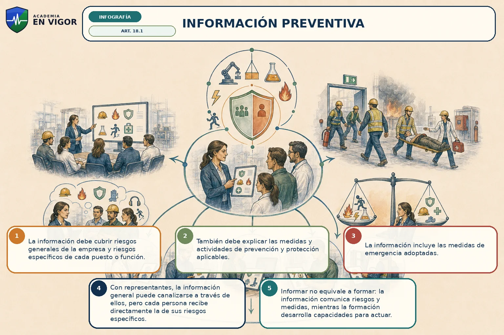

<em>Infografía: Información preventiva.</em>

:::hablemos-claro
Separa sujeto, presupuesto, regla, excepción y control. Las opciones trampa suelen cambiar solo uno de esos cinco elementos.
:::

:::en-la-calle
Antes de actuar, identifica quién decide, qué habilitación existe, qué debe documentarse y qué revisión posterior protege a la persona afectada.
:::

:::lo-que-cae
Memoriza el anclaje «art. 18.1» y discrimina reglas, excepciones y plazos.
:::

<!-- FUENTE: LPRL-T25 -->

## 16. Consulta y participación

### Regla y encaje

El empresario debe consultar con la debida antelación decisiones que puedan afectar sustancialmente a la seguridad y salud. Este bloque se integra en **derechos, deberes y protección preventiva** y se ancla en **arts. 18.2 y 33-34**.

### Claves normativas

- El empresario debe consultar con la debida antelación decisiones que puedan afectar sustancialmente a la seguridad y salud.
- La consulta alcanza organización del trabajo, tecnologías, organización preventiva, emergencias, información, documentación y formación. <!-- FACT:PN-T25-F076 -->
- Las personas trabajadoras tienen derecho a participar y formular propuestas de mejora. <!-- FACT:PN-T25-F077 -->
- Cuando existen representantes, la consulta se realiza con ellos conforme a los cauces legales. <!-- FACT:PN-T25-F078 -->
- La consulta previa no convierte al órgano representativo en quien adopta la decisión empresarial o administrativa. <!-- FACT:PN-T25-F079 -->
 <!-- FACT:PN-T25-F080 -->

<!-- VISUAL:t25-16-consulta-y-participacion.webp -->

  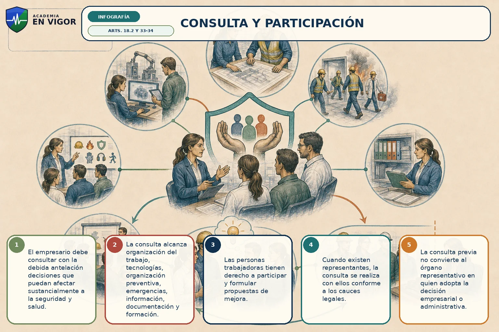

<em>Infografía: Consulta y participación.</em>

:::hablemos-claro
Separa sujeto, presupuesto, regla, excepción y control. Las opciones trampa suelen cambiar solo uno de esos cinco elementos.
:::

:::en-la-calle
Antes de actuar, identifica quién decide, qué habilitación existe, qué debe documentarse y qué revisión posterior protege a la persona afectada.
:::

:::lo-que-cae
Memoriza el anclaje «arts. 18.2 y 33-34» y discrimina reglas, excepciones y plazos.
:::

<!-- FUENTE: LPRL-T25 -->

## 17. Formación preventiva

### Regla y encaje

Cada persona debe recibir formación teórica y práctica suficiente y adecuada en materia preventiva. Este bloque se integra en **derechos, deberes y protección preventiva** y se ancla en **art. 19**.

### Claves normativas

- Cada persona debe recibir formación teórica y práctica suficiente y adecuada en materia preventiva.
- La formación se imparte al contratar y cuando cambian funciones, tecnologías o equipos. <!-- FACT:PN-T25-F081 -->
- Debe centrarse en el puesto o función, adaptarse a la evolución de los riesgos y repetirse si es necesario. <!-- FACT:PN-T25-F082 -->
- Se impartirá siempre que sea posible dentro de la jornada; fuera de ella se descuenta el tiempo invertido. <!-- FACT:PN-T25-F083 -->
- Su coste no puede recaer sobre la persona trabajadora, aunque la formación se concierte externamente. <!-- FACT:PN-T25-F084 -->
 <!-- FACT:PN-T25-F085 -->

<!-- VISUAL:t25-17-formacion-preventiva.webp -->

  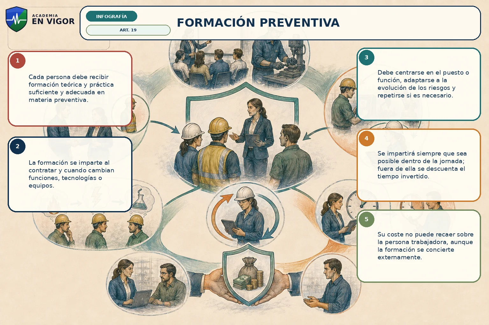

<em>Infografía: Formación preventiva.</em>

:::hablemos-claro
Separa sujeto, presupuesto, regla, excepción y control. Las opciones trampa suelen cambiar solo uno de esos cinco elementos.
:::

:::en-la-calle
Antes de actuar, identifica quién decide, qué habilitación existe, qué debe documentarse y qué revisión posterior protege a la persona afectada.
:::

:::lo-que-cae
Memoriza el anclaje «art. 19» y discrimina reglas, excepciones y plazos.
:::

<!-- FUENTE: LPRL-T25 -->

## 18. Medidas de emergencia

### Regla y encaje

La planificación de emergencias considera tamaño, actividad y posible presencia de personas ajenas. Este bloque se integra en **derechos, deberes y protección preventiva** y se ancla en **art. 20**.

### Claves normativas

- La planificación de emergencias considera tamaño, actividad y posible presencia de personas ajenas.
- Debe abarcar primeros auxilios, lucha contra incendios y evacuación. <!-- FACT:PN-T25-F086 -->
- El personal encargado debe estar designado, ser suficiente, poseer formación y disponer de material adecuado. <!-- FACT:PN-T25-F087 -->
- El funcionamiento de las medidas debe comprobarse periódicamente. <!-- FACT:PN-T25-F088 -->
- Deben organizarse relaciones con servicios externos que garanticen rapidez y eficacia en asistencia, salvamento y lucha contra incendios. <!-- FACT:PN-T25-F089 -->
 <!-- FACT:PN-T25-F090 -->

<!-- VISUAL:t25-18-medidas-de-emergencia.webp -->

  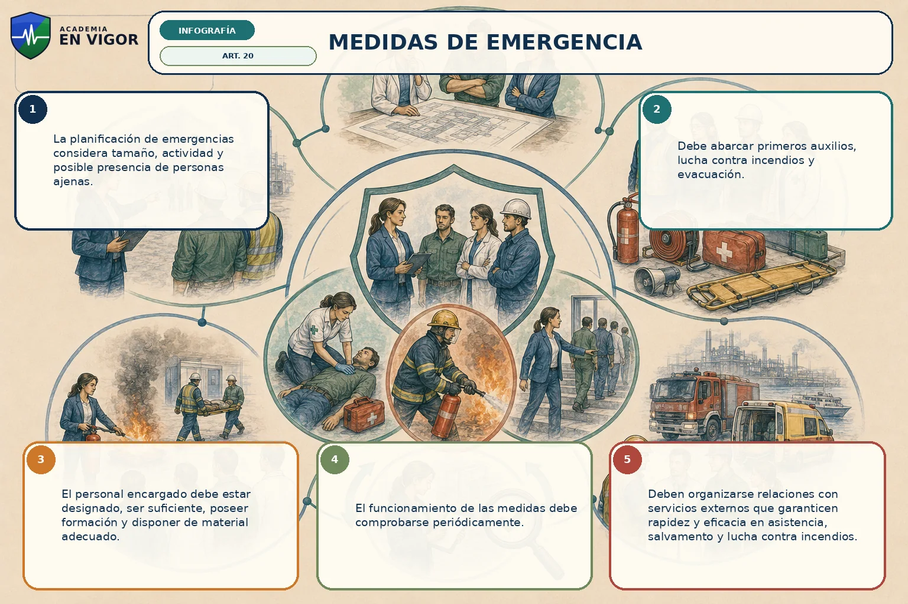

<em>Infografía: Medidas de emergencia.</em>

:::hablemos-claro
Separa sujeto, presupuesto, regla, excepción y control. Las opciones trampa suelen cambiar solo uno de esos cinco elementos.
:::

:::en-la-calle
Antes de actuar, identifica quién decide, qué habilitación existe, qué debe documentarse y qué revisión posterior protege a la persona afectada.
:::

:::lo-que-cae
Memoriza el anclaje «art. 20» y discrimina reglas, excepciones y plazos.
:::

<!-- FUENTE: LPRL-T25 -->

## 19. Riesgo grave e inminente y paralización

### Regla y encaje

Ante riesgo grave e inminente debe informarse lo antes posible a las personas afectadas y de las medidas adoptadas o necesarias. Este bloque se integra en **derechos, deberes y protección preventiva** y se ancla en **art. 21**.

### Claves normativas

- Ante riesgo grave e inminente debe informarse lo antes posible a las personas afectadas y de las medidas adoptadas o necesarias.
- Deben darse instrucciones para interrumpir la actividad y, si es necesario, abandonar de inmediato el lugar de trabajo. <!-- FACT:PN-T25-F091 -->
- La persona que no pueda contactar con su superior debe poder adoptar medidas para evitar las consecuencias del peligro según sus medios y conocimientos. <!-- FACT:PN-T25-F092 -->
- La persona trabajadora puede interrumpir su actividad y abandonar el lugar cuando considere que existe riesgo grave e inminente para su vida o salud. <!-- FACT:PN-T25-F093 -->
- Quienes actúen conforme a este régimen no pueden sufrir perjuicio salvo mala fe o negligencia grave. <!-- FACT:PN-T25-F094 -->
 <!-- FACT:PN-T25-F095 -->

<!-- VISUAL:t25-19-riesgo-grave-e-inminente-y-paralizacion.webp -->

  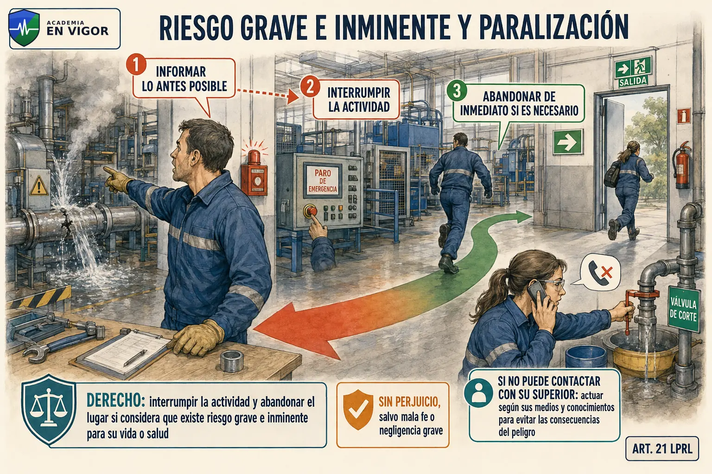

<em>Infografía: Riesgo grave e inminente y paralización.</em>

:::hablemos-claro
Separa sujeto, presupuesto, regla, excepción y control. Las opciones trampa suelen cambiar solo uno de esos cinco elementos.
:::

:::en-la-calle
Antes de actuar, identifica quién decide, qué habilitación existe, qué debe documentarse y qué revisión posterior protege a la persona afectada.
:::

:::lo-que-cae
Memoriza el anclaje «art. 21» y discrimina reglas, excepciones y plazos.
:::

<!-- FUENTE: LPRL-T25 -->

## 20. Vigilancia de la salud

### Regla y encaje

La vigilancia periódica del estado de salud debe realizarse en función de los riesgos inherentes al trabajo. Este bloque se integra en **derechos, deberes y protección preventiva** y se ancla en **art. 22**.

### Claves normativas

- La vigilancia periódica del estado de salud debe realizarse en función de los riesgos inherentes al trabajo.
- Con carácter general requiere consentimiento, salvo supuestos legales y previa intervención representativa cuando proceda. <!-- FACT:PN-T25-F096 -->
- Las pruebas deben ser proporcionales al riesgo y causar las menores molestias posibles. <!-- FACT:PN-T25-F097 -->
- Deben respetarse intimidad, dignidad y confidencialidad y los resultados se comunican a la persona afectada. <!-- FACT:PN-T25-F098 -->
- La empresa recibe conclusiones sobre aptitud o necesidad de medidas, no datos médicos personales sin consentimiento. <!-- FACT:PN-T25-F099 -->
 <!-- FACT:PN-T25-F100 -->

<!-- VISUAL:t25-20-vigilancia-de-la-salud.webp -->

  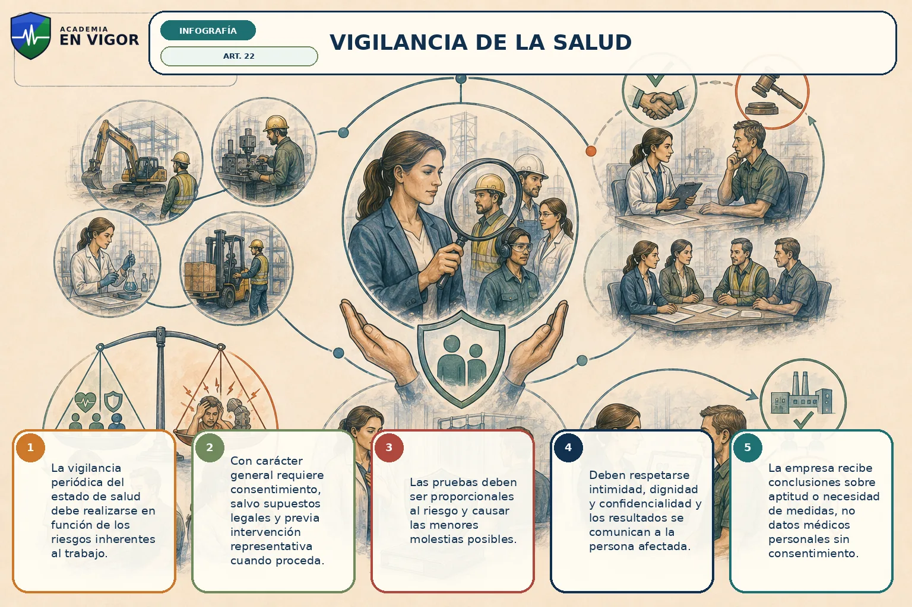

<em>Infografía: Vigilancia de la salud.</em>

:::hablemos-claro
Separa sujeto, presupuesto, regla, excepción y control. Las opciones trampa suelen cambiar solo uno de esos cinco elementos.
:::

:::en-la-calle
Antes de actuar, identifica quién decide, qué habilitación existe, qué debe documentarse y qué revisión posterior protege a la persona afectada.
:::

:::lo-que-cae
Memoriza el anclaje «art. 22» y discrimina reglas, excepciones y plazos.
:::

<!-- FUENTE: LPRL-T25 -->

## 21. Documentación, notificación y coordinación

### Regla y encaje

Debe conservarse documentación del plan, evaluación, planificación, controles de salud y relación de accidentes y enfermedades con baja superior a un día. Este bloque se integra en **derechos, deberes y protección preventiva** y se ancla en **arts. 23-24**.

### Claves normativas

- Debe conservarse documentación del plan, evaluación, planificación, controles de salud y relación de accidentes y enfermedades con baja superior a un día.
- La documentación se pone a disposición de la autoridad laboral y se entrega a quien continúe la actividad en caso de cese. <!-- FACT:PN-T25-F101 -->
- Los daños para la salud deben notificarse por escrito a la autoridad laboral conforme al procedimiento reglamentario. <!-- FACT:PN-T25-F102 -->
- Cuando coinciden varias empresas en un centro, deben cooperar y establecer medios de coordinación preventiva. <!-- FACT:PN-T25-F103 -->
- El titular del centro informa e instruye sobre riesgos y emergencias, y la empresa principal vigila a contratistas de su propia actividad en los supuestos legales. <!-- FACT:PN-T25-F104 -->
 <!-- FACT:PN-T25-F105 -->

<!-- VISUAL:t25-21-documentacion-notificacion-y-coordinacion.webp -->

  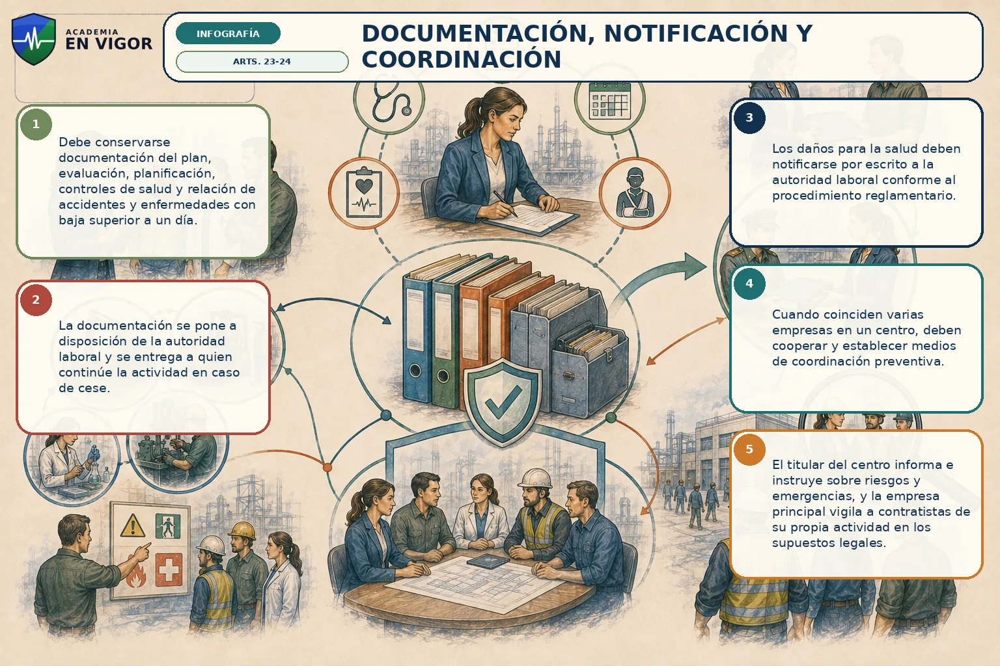

<em>Infografía: Documentación, notificación y coordinación.</em>

:::hablemos-claro
Separa sujeto, presupuesto, regla, excepción y control. Las opciones trampa suelen cambiar solo uno de esos cinco elementos.
:::

:::en-la-calle
Antes de actuar, identifica quién decide, qué habilitación existe, qué debe documentarse y qué revisión posterior protege a la persona afectada.
:::

:::lo-que-cae
Memoriza el anclaje «arts. 23-24» y discrimina reglas, excepciones y plazos.
:::

<!-- FUENTE: LPRL-T25 -->

## 22. Personas especialmente sensibles

### Regla y encaje

La protección debe considerar características personales, estado biológico conocido y discapacidad que hagan especialmente sensible a un riesgo. Este bloque se integra en **derechos, deberes y protección preventiva** y se ancla en **art. 25**.

### Claves normativas

- La protección debe considerar características personales, estado biológico conocido y discapacidad que hagan especialmente sensible a un riesgo.
- La evaluación debe identificar esas situaciones y adoptar medidas preventivas y de protección necesarias. <!-- FACT:PN-T25-F106 -->
- No se destina a una persona a un puesto incompatible cuando ella, otras personas o terceros puedan quedar en peligro. <!-- FACT:PN-T25-F107 -->
- Deben considerarse factores de riesgo que puedan afectar a la función de procreación. <!-- FACT:PN-T25-F108 -->
- La especial sensibilidad exige adaptar prevención y puesto; no autoriza discriminación ni divulgación de datos de salud. <!-- FACT:PN-T25-F109 -->
 <!-- FACT:PN-T25-F110 -->

<!-- VISUAL:t25-22-personas-especialmente-sensibles.webp -->

  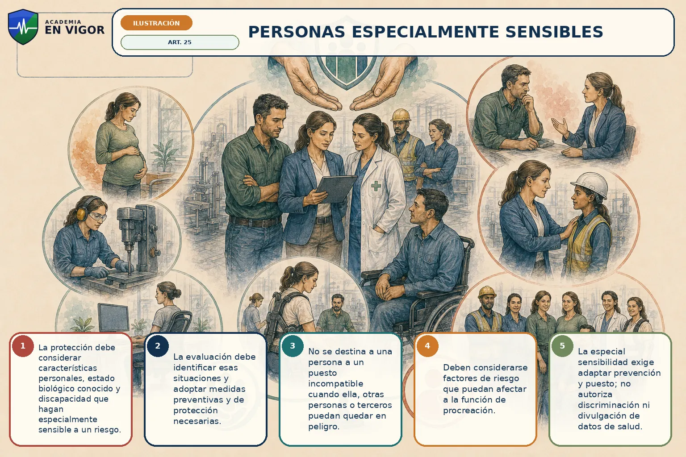

<em>Infografía: Personas especialmente sensibles.</em>

:::hablemos-claro
Separa sujeto, presupuesto, regla, excepción y control. Las opciones trampa suelen cambiar solo uno de esos cinco elementos.
:::

:::en-la-calle
Antes de actuar, identifica quién decide, qué habilitación existe, qué debe documentarse y qué revisión posterior protege a la persona afectada.
:::

:::lo-que-cae
Memoriza el anclaje «art. 25» y discrimina reglas, excepciones y plazos.
:::

<!-- FUENTE: LPRL-T25 -->

## 23. Maternidad, menores y relaciones temporales

### Regla y encaje

La evaluación debe determinar riesgos para embarazo o lactancia y, si existen, adaptar condiciones o tiempo de trabajo. Este bloque se integra en **derechos, deberes y protección preventiva** y se ancla en **arts. 26-28**.

### Claves normativas

- La evaluación debe determinar riesgos para embarazo o lactancia y, si existen, adaptar condiciones o tiempo de trabajo.
- Si la adaptación no basta, procede el cambio a puesto compatible y, en último término, la situación legal por riesgo durante embarazo o lactancia. <!-- FACT:PN-T25-F111 -->
- Antes de incorporar menores de dieciocho años deben evaluarse los riesgos específicos derivados de su falta de experiencia, inmadurez o desarrollo incompleto. <!-- FACT:PN-T25-F112 -->
- Quienes tienen relaciones temporales o de duración determinada disfrutan del mismo nivel de protección que el resto. <!-- FACT:PN-T25-F113 -->
- La empresa usuaria responde de las condiciones de ejecución del trabajo del personal puesto a disposición por una ETT. <!-- FACT:PN-T25-F114 -->
 <!-- FACT:PN-T25-F115 -->

<!-- VISUAL:t25-23-maternidad-menores-y-relaciones-temporales.webp -->

  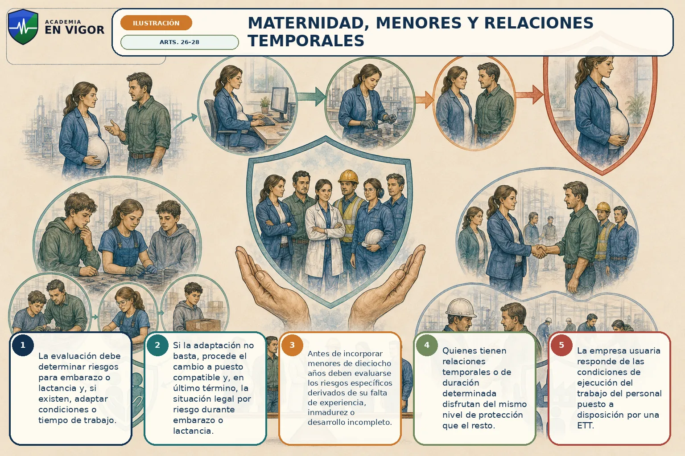

<em>Infografía: Maternidad, menores y relaciones temporales.</em>

:::hablemos-claro
Separa sujeto, presupuesto, regla, excepción y control. Las opciones trampa suelen cambiar solo uno de esos cinco elementos.
:::

:::en-la-calle
Antes de actuar, identifica quién decide, qué habilitación existe, qué debe documentarse y qué revisión posterior protege a la persona afectada.
:::

:::lo-que-cae
Memoriza el anclaje «arts. 26-28» y discrimina reglas, excepciones y plazos.
:::

<!-- FUENTE: LPRL-T25 -->

## 24. Obligaciones de las personas trabajadoras

### Regla y encaje

Cada persona debe velar, según sus posibilidades, por su seguridad y por la de quienes puedan verse afectados por sus actos u omisiones. Este bloque se integra en **derechos, deberes y protección preventiva** y se ancla en **art. 29**.

### Claves normativas

- Cada persona debe velar, según sus posibilidades, por su seguridad y por la de quienes puedan verse afectados por sus actos u omisiones.
- Debe usar adecuadamente equipos, herramientas, sustancias, transportes y demás medios de trabajo. <!-- FACT:PN-T25-F116 -->
- Debe utilizar correctamente los medios de protección y no inutilizar dispositivos de seguridad. <!-- FACT:PN-T25-F117 -->
- Debe informar de inmediato de situaciones que razonablemente entrañen riesgo y contribuir al cumplimiento de obligaciones preventivas. <!-- FACT:PN-T25-F118 -->
- El incumplimiento puede constituir incumplimiento laboral o falta disciplinaria, pero no elimina el deber de protección empresarial o administrativo. <!-- FACT:PN-T25-F119 -->
 <!-- FACT:PN-T25-F120 -->

<!-- VISUAL:t25-24-obligaciones-de-las-personas-trabajadoras.webp -->

  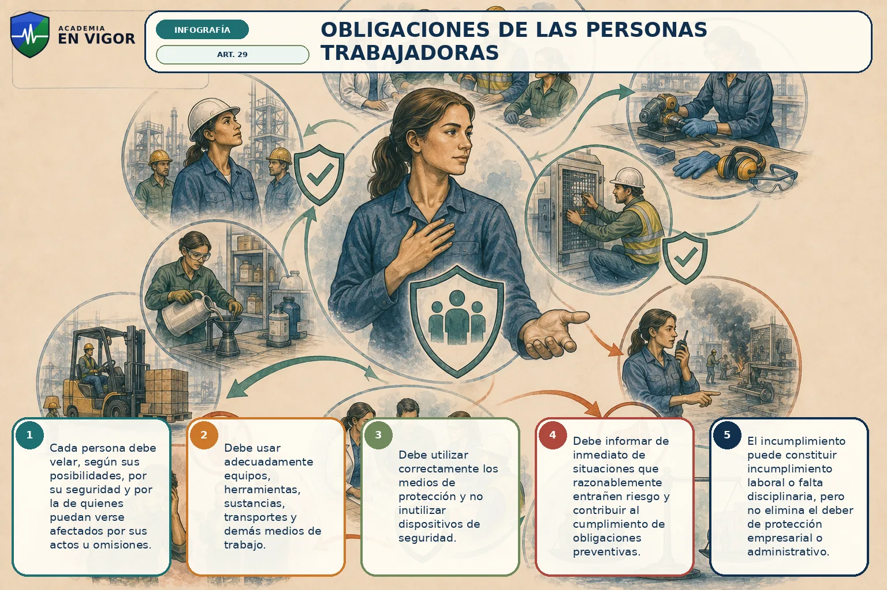

<em>Infografía: Obligaciones de las personas trabajadoras.</em>

:::hablemos-claro
Separa sujeto, presupuesto, regla, excepción y control. Las opciones trampa suelen cambiar solo uno de esos cinco elementos.
:::

:::en-la-calle
Antes de actuar, identifica quién decide, qué habilitación existe, qué debe documentarse y qué revisión posterior protege a la persona afectada.
:::

:::lo-que-cae
Memoriza el anclaje «art. 29» y discrimina reglas, excepciones y plazos.
:::

<!-- FUENTE: LPRL-T25 -->

## 25. Organización, responsabilidades y coste

### Regla y encaje

El deber preventivo se organiza mediante recursos propios, personas designadas o servicios de prevención conforme al riesgo y tamaño. Este bloque se integra en **derechos, deberes y protección preventiva** y se ancla en **arts. 30-32 bis y 42**.

### Claves normativas

- El deber preventivo se organiza mediante recursos propios, personas designadas o servicios de prevención conforme al riesgo y tamaño.
- La contratación de un servicio de prevención no traslada ni elimina la responsabilidad del empresario o de la Administración. <!-- FACT:PN-T25-F121 -->
- Los recursos preventivos deben estar presentes en los casos legalmente previstos para vigilar el cumplimiento y eficacia de actividades preventivas. <!-- FACT:PN-T25-F122 -->
- El incumplimiento puede generar responsabilidades administrativas y, en su caso, penales y civiles por daños y perjuicios. <!-- FACT:PN-T25-F123 -->
- Las responsabilidades pueden ser compatibles entre sí y el coste preventivo nunca se repercute a las personas protegidas. <!-- FACT:PN-T25-F124 -->
 <!-- FACT:PN-T25-F125 -->

<!-- VISUAL:t25-25-organizacion-responsabilidades-y-coste.webp -->

  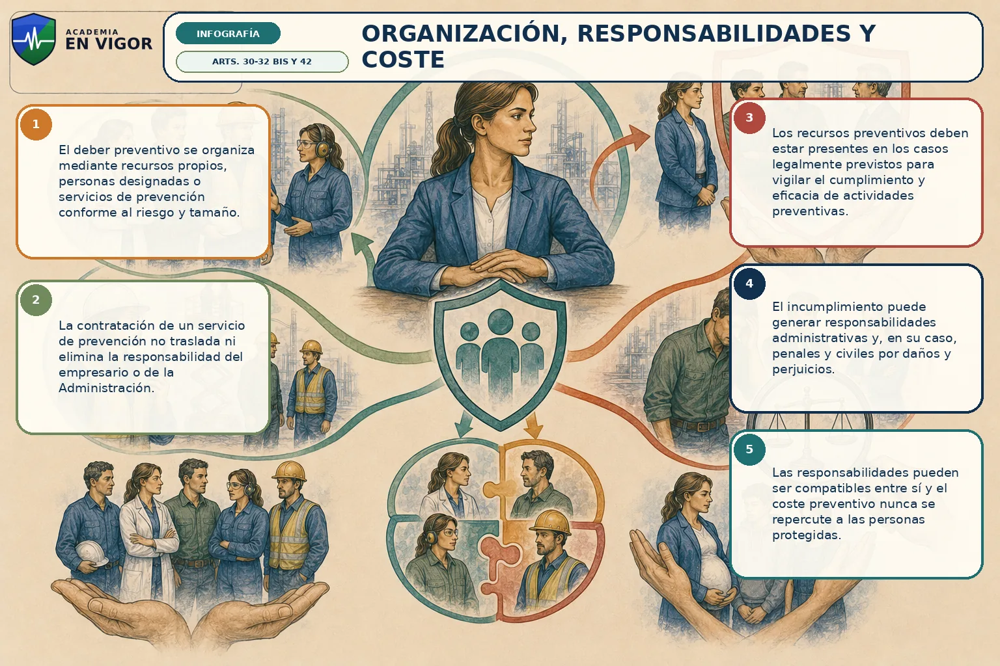

<em>Infografía: Organización, responsabilidades y coste.</em>

:::hablemos-claro
Separa sujeto, presupuesto, regla, excepción y control. Las opciones trampa suelen cambiar solo uno de esos cinco elementos.
:::

:::en-la-calle
Antes de actuar, identifica quién decide, qué habilitación existe, qué debe documentarse y qué revisión posterior protege a la persona afectada.
:::

:::lo-que-cae
Memoriza el anclaje «arts. 30-32 bis y 42» y discrimina reglas, excepciones y plazos.
:::

<!-- FUENTE: LPRL-T25 -->

## 26. Integración y contenido del plan en el RD 39/1997

### Regla y encaje

La integración preventiva alcanza procesos técnicos, organización del trabajo, condiciones y todos los niveles jerárquicos. Este bloque se integra en **reglamento de los servicios de prevención** y se ancla en **arts. 1-2**.

### Claves normativas

- La integración preventiva alcanza procesos técnicos, organización del trabajo, condiciones y todos los niveles jerárquicos.
- El plan es la herramienta que integra la prevención en la gestión y establece la política preventiva. <!-- FACT:PN-T25-F126 -->
- Debe ser aprobado por la dirección, asumido por toda la estructura y conocido por las personas trabajadoras. <!-- FACT:PN-T25-F127 -->
- El documento identifica empresa, centros, estructura, producción, modalidad preventiva, órganos de representación, política, objetivos y recursos. <!-- FACT:PN-T25-F128 -->
- Evaluación y planificación son los instrumentos esenciales para aplicar el plan. <!-- FACT:PN-T25-F129 -->
 <!-- FACT:PN-T25-F130 -->

<!-- VISUAL:t25-26-integracion-y-contenido-del-plan-en-el-rd-.webp -->

  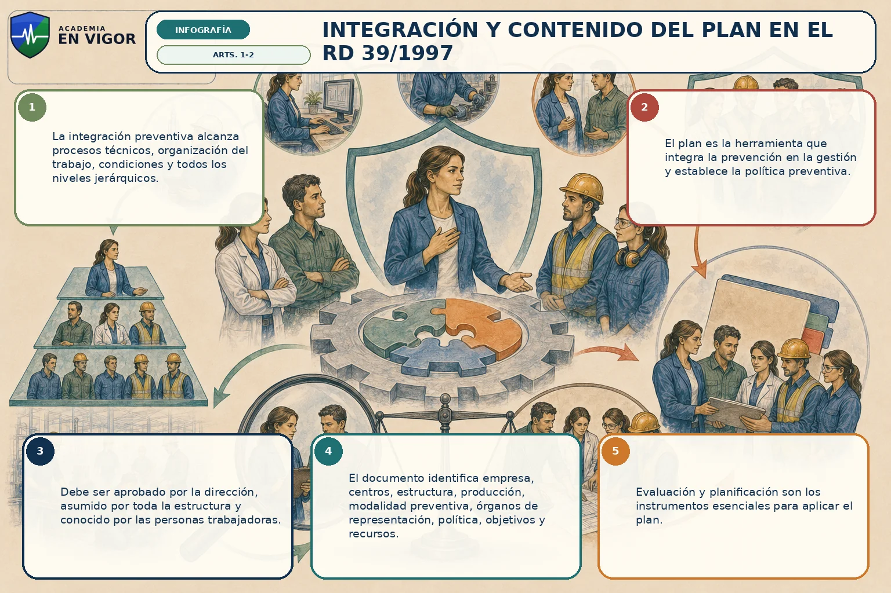

<em>Infografía: Integración y contenido del plan en el RD 39/1997.</em>

:::hablemos-claro
Separa sujeto, presupuesto, regla, excepción y control. Las opciones trampa suelen cambiar solo uno de esos cinco elementos.
:::

:::en-la-calle
Antes de actuar, identifica quién decide, qué habilitación existe, qué debe documentarse y qué revisión posterior protege a la persona afectada.
:::

:::lo-que-cae
Memoriza el anclaje «arts. 1-2» y discrimina reglas, excepciones y plazos.
:::

<!-- FUENTE: RSP-T25 -->

## 27. Contenido general de la evaluación

### Regla y encaje

La evaluación estima la magnitud de los riesgos inevitables para decidir medidas y su prioridad. Este bloque se integra en **reglamento de los servicios de prevención** y se ancla en **arts. 3-5**.

### Claves normativas

- La evaluación estima la magnitud de los riesgos inevitables para decidir medidas y su prioridad.
- La evaluación inicial se extiende a cada puesto en el que concurran riesgos no evitados. <!-- FACT:PN-T25-F131 -->
- Considera condiciones existentes o previstas y la posibilidad de especial sensibilidad de la persona que ocupe el puesto. <!-- FACT:PN-T25-F132 -->
- Debe incluir mediciones, análisis o ensayos cuando sean necesarios y utilizar procedimientos que proporcionen confianza sobre el resultado. <!-- FACT:PN-T25-F133 -->
- En caso de duda se adoptan medidas preventivas más favorables desde el punto de vista de la prevención. <!-- FACT:PN-T25-F134 -->
 <!-- FACT:PN-T25-F135 -->

<!-- VISUAL:t25-27-contenido-general-de-la-evaluacion.webp -->

  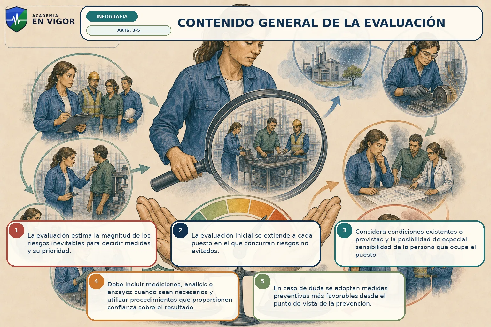

<em>Infografía: Contenido general de la evaluación.</em>

:::hablemos-claro
Separa sujeto, presupuesto, regla, excepción y control. Las opciones trampa suelen cambiar solo uno de esos cinco elementos.
:::

:::en-la-calle
Antes de actuar, identifica quién decide, qué habilitación existe, qué debe documentarse y qué revisión posterior protege a la persona afectada.
:::

:::lo-que-cae
Memoriza el anclaje «arts. 3-5» y discrimina reglas, excepciones y plazos.
:::

<!-- FUENTE: RSP-T25 -->

## 28. Revisión y documentación de la evaluación

### Regla y encaje

La evaluación se revisa cuando lo exige una disposición específica y cuando se detectan daños o indicios de insuficiencia preventiva. Este bloque se integra en **reglamento de los servicios de prevención** y se ancla en **arts. 6-7**.

### Claves normativas

- La evaluación se revisa cuando lo exige una disposición específica y cuando se detectan daños o indicios de insuficiencia preventiva.
- La revisión considera investigación de daños, vigilancia de la salud y datos epidemiológicos relevantes. <!-- FACT:PN-T25-F136 -->
- Puede acordarse una periodicidad de revisión entre empresa y representantes atendiendo al deterioro previsible de los elementos evaluados. <!-- FACT:PN-T25-F137 -->
- La documentación identifica puesto, riesgos, personas afectadas, resultado, medidas procedentes y criterios o métodos utilizados. <!-- FACT:PN-T25-F138 -->
- Documentar el resultado permite comprobar el fundamento técnico y la evolución de las medidas. <!-- FACT:PN-T25-F139 -->
 <!-- FACT:PN-T25-F140 -->

<!-- VISUAL:t25-28-revision-y-documentacion-de-la-evaluacion.webp -->

  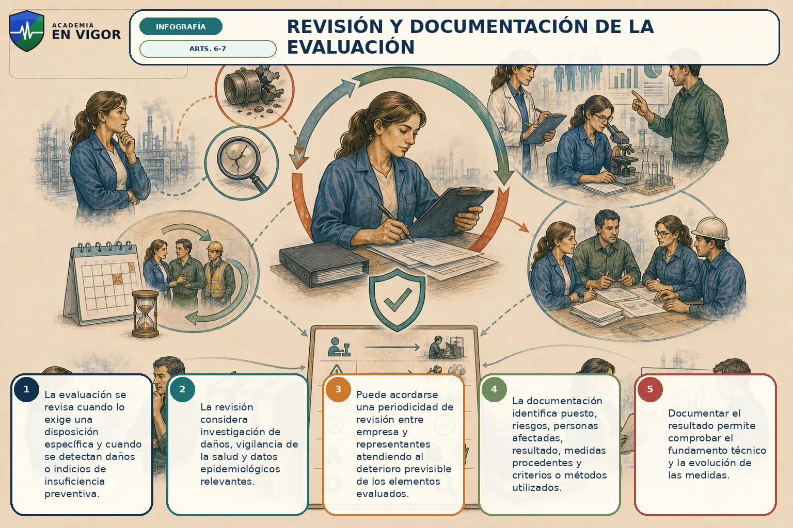

<em>Infografía: Revisión y documentación de la evaluación.</em>

:::hablemos-claro
Separa sujeto, presupuesto, regla, excepción y control. Las opciones trampa suelen cambiar solo uno de esos cinco elementos.
:::

:::en-la-calle
Antes de actuar, identifica quién decide, qué habilitación existe, qué debe documentarse y qué revisión posterior protege a la persona afectada.
:::

:::lo-que-cae
Memoriza el anclaje «arts. 6-7» y discrimina reglas, excepciones y plazos.
:::

<!-- FUENTE: RSP-T25 -->

## 29. Planificación de la actividad preventiva

### Regla y encaje

La actividad preventiva se planifica cuando la evaluación pone de manifiesto situaciones de riesgo. Este bloque se integra en **reglamento de los servicios de prevención** y se ancla en **arts. 8-9**.

### Claves normativas

- La actividad preventiva se planifica cuando la evaluación pone de manifiesto situaciones de riesgo.
- La planificación incluye medios humanos, materiales y recursos económicos necesarios. <!-- FACT:PN-T25-F141 -->
- Debe integrar medidas de emergencia, vigilancia de la salud, información y formación y coordinación de todos los elementos. <!-- FACT:PN-T25-F142 -->
- La actividad se programa para un período determinado, con fases, prioridades y seguimiento según la magnitud y número de personas expuestas. <!-- FACT:PN-T25-F143 -->
- Si el período supera un año debe establecerse un programa anual de actividades. <!-- FACT:PN-T25-F144 -->
 <!-- FACT:PN-T25-F145 -->

<!-- VISUAL:t25-29-planificacion-de-la-actividad-preventiva.webp -->

  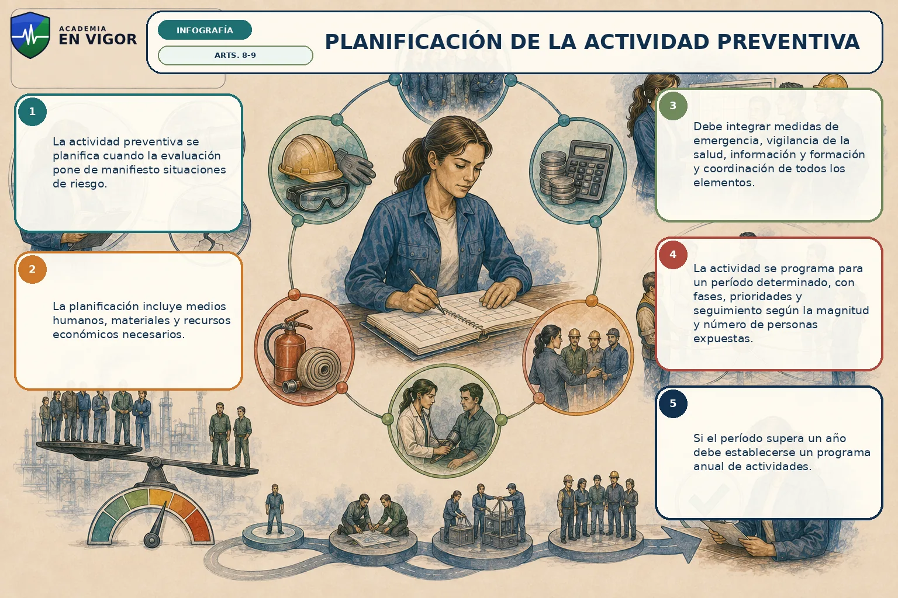

<em>Infografía: Planificación de la actividad preventiva.</em>

:::hablemos-claro
Separa sujeto, presupuesto, regla, excepción y control. Las opciones trampa suelen cambiar solo uno de esos cinco elementos.
:::

:::en-la-calle
Antes de actuar, identifica quién decide, qué habilitación existe, qué debe documentarse y qué revisión posterior protege a la persona afectada.
:::

:::lo-que-cae
Memoriza el anclaje «arts. 8-9» y discrimina reglas, excepciones y plazos.
:::

<!-- FUENTE: RSP-T25 -->

## 30. Modalidades de organización preventiva

### Regla y encaje

Las modalidades son asunción personal por el empresario, designación de personas trabajadoras, servicio propio y servicio ajeno. Este bloque se integra en **reglamento de los servicios de prevención** y se ancla en **art. 10**.

### Claves normativas

- Las modalidades son asunción personal por el empresario, designación de personas trabajadoras, servicio propio y servicio ajeno.
- Las modalidades pueden complementarse cuando una sola no cubre todas las actividades necesarias. <!-- FACT:PN-T25-F146 -->
- La elección debe adecuarse al tamaño, riesgos, peligrosidad, distribución de centros y capacidades disponibles. <!-- FACT:PN-T25-F147 -->
- La vigilancia de la salud exige recursos sanitarios competentes y no puede ser asumida personalmente por el empresario. <!-- FACT:PN-T25-F148 -->
- Organizar recursos no sustituye la obligación de integrar la prevención en decisiones y mandos. <!-- FACT:PN-T25-F149 -->
 <!-- FACT:PN-T25-F150 -->

<!-- VISUAL:t25-30-modalidades-de-organizacion-preventiva.webp -->

  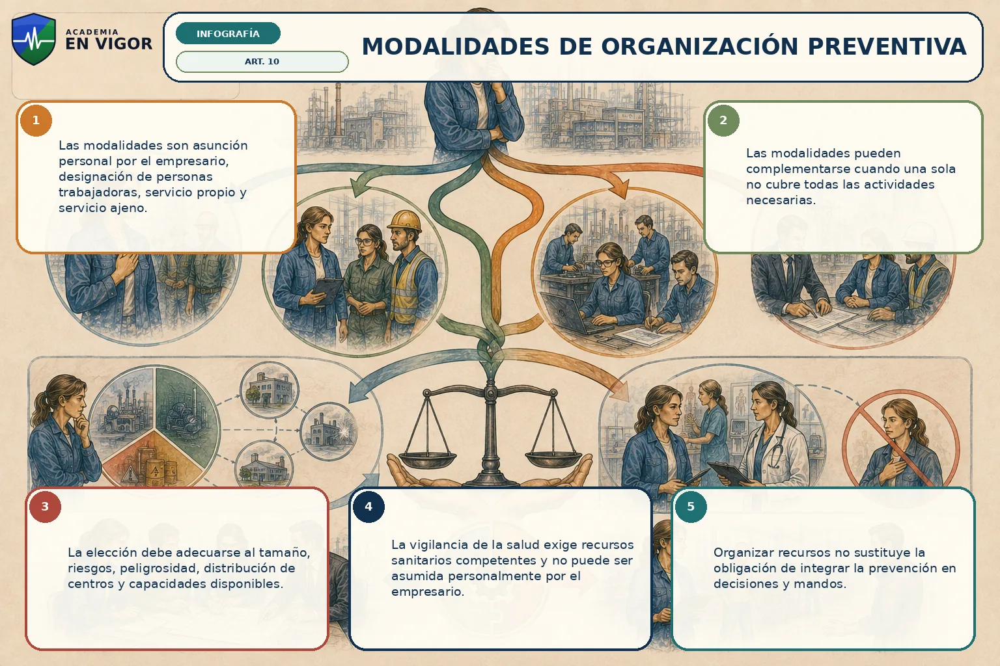

<em>Infografía: Modalidades de organización preventiva.</em>

:::hablemos-claro
Separa sujeto, presupuesto, regla, excepción y control. Las opciones trampa suelen cambiar solo uno de esos cinco elementos.
:::

:::en-la-calle
Antes de actuar, identifica quién decide, qué habilitación existe, qué debe documentarse y qué revisión posterior protege a la persona afectada.
:::

:::lo-que-cae
Memoriza el anclaje «art. 10» y discrimina reglas, excepciones y plazos.
:::

<!-- FUENTE: RSP-T25 -->

## 31. Asunción personal por el empresario

### Regla y encaje

El empresario puede asumir personalmente la actividad preventiva en empresas de hasta diez personas trabajadoras. Este bloque se integra en **reglamento de los servicios de prevención** y se ancla en **art. 11**.

### Claves normativas

- El empresario puede asumir personalmente la actividad preventiva en empresas de hasta diez personas trabajadoras.
- También puede hacerlo en empresas de hasta veinticinco personas si existe un único centro de trabajo. <!-- FACT:PN-T25-F151 -->
- La actividad no puede estar incluida en el anexo I y el empresario debe trabajar habitualmente en el centro. <!-- FACT:PN-T25-F152 -->
- El empresario debe tener capacidad correspondiente a las funciones preventivas que vaya a desarrollar. <!-- FACT:PN-T25-F153 -->
- La vigilancia de la salud y las actividades no asumidas deben cubrirse mediante otras modalidades. <!-- FACT:PN-T25-F154 -->
 <!-- FACT:PN-T25-F155 -->

<!-- VISUAL:t25-31-asuncion-personal-por-el-empresario.webp -->

  

<em>Infografía: Asunción personal por el empresario.</em>

:::hablemos-claro
Separa sujeto, presupuesto, regla, excepción y control. Las opciones trampa suelen cambiar solo uno de esos cinco elementos.
:::

:::en-la-calle
Antes de actuar, identifica quién decide, qué habilitación existe, qué debe documentarse y qué revisión posterior protege a la persona afectada.
:::

:::lo-que-cae
Memoriza el anclaje «art. 11» y discrimina reglas, excepciones y plazos.
:::

<!-- FUENTE: RSP-T25 -->

## 32. Personas trabajadoras designadas

### Regla y encaje

Pueden designarse una o varias personas trabajadoras para ocuparse de la actividad preventiva. Este bloque se integra en **reglamento de los servicios de prevención** y se ancla en **arts. 12-13**.

### Claves normativas

- Pueden designarse una o varias personas trabajadoras para ocuparse de la actividad preventiva.
- Su número, capacidad, tiempo y medios deben ser suficientes para las funciones encomendadas. <!-- FACT:PN-T25-F156 -->
- Las actividades que excedan su capacidad deben desarrollarse mediante servicios propios o ajenos. <!-- FACT:PN-T25-F157 -->
- No es obligatoria la designación si el empresario asume legítimamente la actividad, constituye servicio propio o recurre a servicio ajeno. <!-- FACT:PN-T25-F158 -->
- Las personas designadas deben colaborar entre sí y, cuando proceda, con los servicios de prevención. <!-- FACT:PN-T25-F159 -->
 <!-- FACT:PN-T25-F160 -->

<!-- VISUAL:t25-32-personas-trabajadoras-designadas.webp -->

  

<em>Infografía: Personas trabajadoras designadas.</em>

:::hablemos-claro
Separa sujeto, presupuesto, regla, excepción y control. Las opciones trampa suelen cambiar solo uno de esos cinco elementos.
:::

:::en-la-calle
Antes de actuar, identifica quién decide, qué habilitación existe, qué debe documentarse y qué revisión posterior protege a la persona afectada.
:::

:::lo-que-cae
Memoriza el anclaje «arts. 12-13» y discrimina reglas, excepciones y plazos.
:::

<!-- FUENTE: RSP-T25 -->

## 33. Servicio de prevención propio: supuestos

### Regla y encaje

Debe constituirse servicio propio en empresas con más de quinientas personas trabajadoras. Este bloque se integra en **reglamento de los servicios de prevención** y se ancla en **art. 14**.

### Claves normativas

- Debe constituirse servicio propio en empresas con más de quinientas personas trabajadoras.
- También es obligatorio entre doscientas cincuenta y quinientas cuando se desarrollan actividades del anexo I. <!-- FACT:PN-T25-F161 -->
- La autoridad laboral puede exigirlo por peligrosidad o siniestralidad, previo informe técnico, salvo opción admitida por servicio ajeno. <!-- FACT:PN-T25-F162 -->
- La resolución de la autoridad laboral fija un plazo no superior a un año para constituirlo. <!-- FACT:PN-T25-F163 -->
- Hasta su constitución, las actividades no asumidas se conciertan externamente o se incorporan progresivamente con recursos suficientes. <!-- FACT:PN-T25-F164 -->
 <!-- FACT:PN-T25-F165 -->

<!-- VISUAL:t25-33-servicio-de-prevencion-propio-supuestos.webp -->

  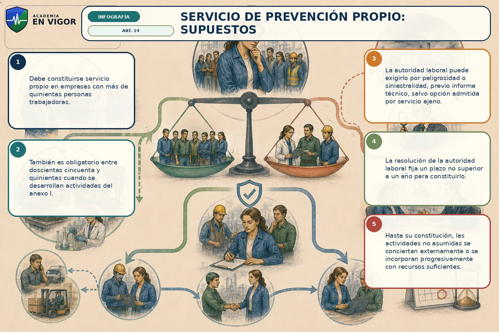

<em>Infografía: Servicio de prevención propio: supuestos.</em>

:::hablemos-claro
Separa sujeto, presupuesto, regla, excepción y control. Las opciones trampa suelen cambiar solo uno de esos cinco elementos.
:::

:::en-la-calle
Antes de actuar, identifica quién decide, qué habilitación existe, qué debe documentarse y qué revisión posterior protege a la persona afectada.
:::

:::lo-que-cae
Memoriza el anclaje «art. 14» y discrimina reglas, excepciones y plazos.
:::

<!-- FUENTE: RSP-T25 -->

## 34. Organización del servicio propio

### Regla y encaje

El servicio propio es una unidad organizativa específica cuyos integrantes dedican de forma exclusiva su actividad preventiva en la empresa. Este bloque se integra en **reglamento de los servicios de prevención** y se ancla en **art. 15**.

### Claves normativas

- El servicio propio es una unidad organizativa específica cuyos integrantes dedican de forma exclusiva su actividad preventiva en la empresa.
- Debe disponer de instalaciones y medios humanos y materiales adecuados a las actividades que desarrolla. <!-- FACT:PN-T25-F166 -->
- Debe contar como mínimo con dos especialidades o disciplinas preventivas de nivel superior. <!-- FACT:PN-T25-F167 -->
- Las actividades no asumidas por el servicio propio se conciertan con uno o más servicios ajenos. <!-- FACT:PN-T25-F168 -->
- La empresa elabora anualmente la memoria y programación del servicio y la mantiene a disposición de autoridades y del Comité. <!-- FACT:PN-T25-F169 -->
 <!-- FACT:PN-T25-F170 -->

<!-- VISUAL:t25-34-organizacion-del-servicio-propio.webp -->

  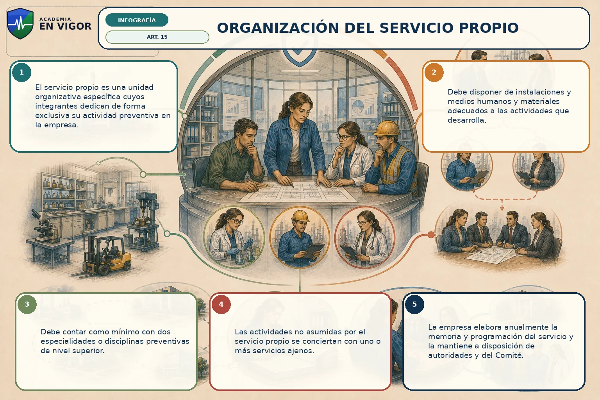

<em>Infografía: Organización del servicio propio.</em>

:::hablemos-claro
Separa sujeto, presupuesto, regla, excepción y control. Las opciones trampa suelen cambiar solo uno de esos cinco elementos.
:::

:::en-la-calle
Antes de actuar, identifica quién decide, qué habilitación existe, qué debe documentarse y qué revisión posterior protege a la persona afectada.
:::

:::lo-que-cae
Memoriza el anclaje «art. 15» y discrimina reglas, excepciones y plazos.
:::

<!-- FUENTE: RSP-T25 -->

## 35. Servicios de prevención ajenos

### Regla y encaje

Se recurre a servicio ajeno cuando la designación sea insuficiente y no exista obligación de servicio propio, o en otros supuestos reglamentarios. Este bloque se integra en **reglamento de los servicios de prevención** y se ancla en **arts. 16-20**.

### Claves normativas

- Se recurre a servicio ajeno cuando la designación sea insuficiente y no exista obligación de servicio propio, o en otros supuestos reglamentarios.
- La decisión de concertar debe consultarse previamente con representantes de las personas trabajadoras. <!-- FACT:PN-T25-F171 -->
- La entidad especializada necesita acreditación, organización, instalaciones, personal, equipos y garantía de responsabilidad. <!-- FACT:PN-T25-F172 -->
- El concierto debe identificar especialidades, actividades, centros, seguimiento, recursos, duración, condiciones económicas y actividades no cubiertas. <!-- FACT:PN-T25-F173 -->
- El servicio ajeno asesora a empresa, personas trabajadoras y representantes, pero el concierto no vacía el deber preventivo del titular. <!-- FACT:PN-T25-F174 -->
 <!-- FACT:PN-T25-F175 -->

<!-- VISUAL:t25-35-servicios-de-prevencion-ajenos.webp -->

  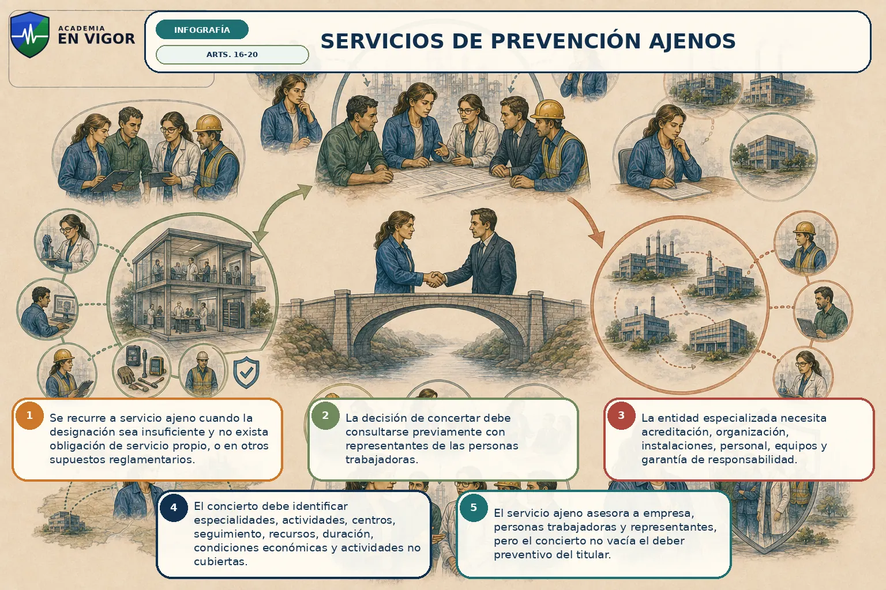

<em>Infografía: Servicios de prevención ajenos.</em>

:::hablemos-claro
Separa sujeto, presupuesto, regla, excepción y control. Las opciones trampa suelen cambiar solo uno de esos cinco elementos.
:::

:::en-la-calle
Antes de actuar, identifica quién decide, qué habilitación existe, qué debe documentarse y qué revisión posterior protege a la persona afectada.
:::

:::lo-que-cae
Memoriza el anclaje «arts. 16-20» y discrimina reglas, excepciones y plazos.
:::

<!-- FUENTE: RSP-T25 -->

## 36. Servicios de prevención mancomunados

### Regla y encaje

Pueden constituirse para empresas que trabajan simultáneamente en un mismo centro, edificio o centro comercial. Este bloque se integra en **reglamento de los servicios de prevención** y se ancla en **art. 21**.

### Claves normativas

- Pueden constituirse para empresas que trabajan simultáneamente en un mismo centro, edificio o centro comercial.
- También pueden acordarse para un mismo sector, grupo empresarial, polígono industrial o área geográfica limitada. <!-- FACT:PN-T25-F176 -->
- El acuerdo requiere consulta previa y debe precisar condiciones mínimas de funcionamiento. <!-- FACT:PN-T25-F177 -->
- El servicio mancomunado se considera servicio propio de las empresas participantes. <!-- FACT:PN-T25-F178 -->
- Debe contar al menos con tres especialidades o disciplinas preventivas y con recursos humanos y materiales suficientes. <!-- FACT:PN-T25-F179 -->
 <!-- FACT:PN-T25-F180 -->

<!-- VISUAL:t25-36-servicios-de-prevencion-mancomunados.webp -->

  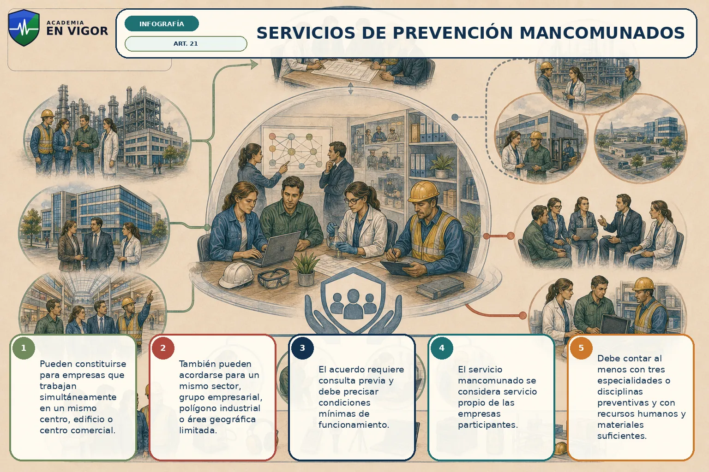

<em>Infografía: Servicios de prevención mancomunados.</em>

:::hablemos-claro
Separa sujeto, presupuesto, regla, excepción y control. Las opciones trampa suelen cambiar solo uno de esos cinco elementos.
:::

:::en-la-calle
Antes de actuar, identifica quién decide, qué habilitación existe, qué debe documentarse y qué revisión posterior protege a la persona afectada.
:::

:::lo-que-cae
Memoriza el anclaje «art. 21» y discrimina reglas, excepciones y plazos.
:::

<!-- FUENTE: RSP-T25 -->

## 37. Auditoría del sistema preventivo

### Regla y encaje

La auditoría externa evalúa sistemática, documentada y objetivamente la eficacia del sistema preventivo cuando resulta exigible. Este bloque se integra en **reglamento de los servicios de prevención** y se ancla en **arts. 29-33 bis**.

### Claves normativas

- La auditoría externa evalúa sistemática, documentada y objetivamente la eficacia del sistema preventivo cuando resulta exigible.
- Comprueba la evaluación, planificación, adecuación de procedimientos y recursos e integración de la prevención. <!-- FACT:PN-T25-F181 -->
- La primera auditoría se realiza dentro de los doce meses siguientes a disponer de la planificación preventiva. <!-- FACT:PN-T25-F182 -->
- Con carácter general se repite cada cuatro años y cada dos años en actividades del anexo I, sin perjuicio de otros supuestos. <!-- FACT:PN-T25-F183 -->
- La auditoría debe ser realizada por personas o entidades autorizadas e independientes respecto de la empresa auditada. <!-- FACT:PN-T25-F184 -->
 <!-- FACT:PN-T25-F185 -->

<!-- VISUAL:t25-37-auditoria-del-sistema-preventivo.webp -->

  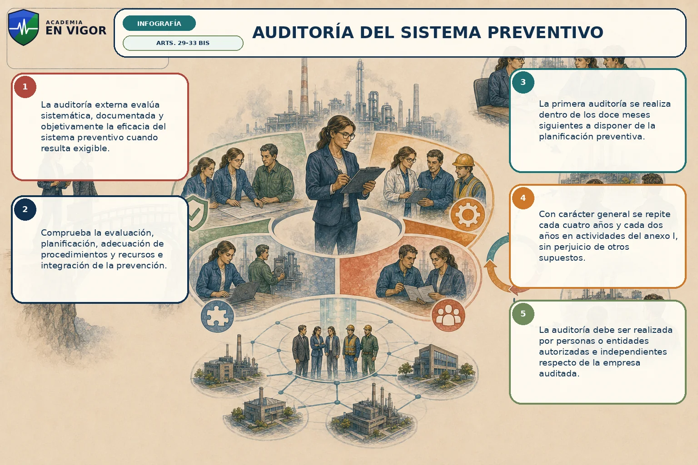

<em>Infografía: Auditoría del sistema preventivo.</em>

:::hablemos-claro
Separa sujeto, presupuesto, regla, excepción y control. Las opciones trampa suelen cambiar solo uno de esos cinco elementos.
:::

:::en-la-calle
Antes de actuar, identifica quién decide, qué habilitación existe, qué debe documentarse y qué revisión posterior protege a la persona afectada.
:::

:::lo-que-cae
Memoriza el anclaje «arts. 29-33 bis» y discrimina reglas, excepciones y plazos.
:::

<!-- FUENTE: RSP-T25 -->

## 38. Presencia de recursos preventivos

### Regla y encaje

La presencia es necesaria cuando los riesgos pueden agravarse o modificarse por concurrencia de operaciones sucesivas o simultáneas. Este bloque se integra en **reglamento de los servicios de prevención** y se ancla en **art. 22 bis**.

### Claves normativas

- La presencia es necesaria cuando los riesgos pueden agravarse o modificarse por concurrencia de operaciones sucesivas o simultáneas.
- También procede en actividades o procesos reglamentariamente peligrosos o con riesgos especiales. <!-- FACT:PN-T25-F186 -->
- Puede exigirse cuando lo requiera la Inspección de Trabajo por las circunstancias observadas. <!-- FACT:PN-T25-F187 -->
- Su misión es vigilar el cumplimiento y comprobar eficacia y adecuación de las actividades preventivas previstas. <!-- FACT:PN-T25-F188 -->
- Si detecta cumplimiento deficiente o medidas inadecuadas, formula indicaciones y comunica la situación para su corrección. <!-- FACT:PN-T25-F189 -->
 <!-- FACT:PN-T25-F190 -->

<!-- VISUAL:t25-38-presencia-de-recursos-preventivos.webp -->

  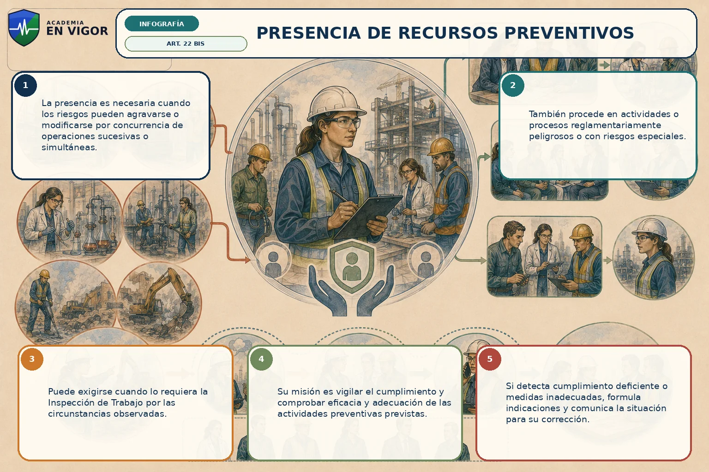

<em>Infografía: Presencia de recursos preventivos.</em>

:::hablemos-claro
Separa sujeto, presupuesto, regla, excepción y control. Las opciones trampa suelen cambiar solo uno de esos cinco elementos.
:::

:::en-la-calle
Antes de actuar, identifica quién decide, qué habilitación existe, qué debe documentarse y qué revisión posterior protege a la persona afectada.
:::

:::lo-que-cae
Memoriza el anclaje «art. 22 bis» y discrimina reglas, excepciones y plazos.
:::

<!-- FUENTE: RSP-T25 -->

## 39. Niveles de funciones preventivas

### Regla y encaje

Las funciones preventivas se clasifican en nivel básico, intermedio y superior. Este bloque se integra en **cualificación y adaptación a la administración general del estado** y se ancla en **arts. 34-37**.

### Claves normativas

- Las funciones preventivas se clasifican en nivel básico, intermedio y superior.
- El nivel básico promueve conductas seguras, actuaciones elementales, seguimiento y cooperación en emergencias. <!-- FACT:PN-T25-F191 -->
- El nivel intermedio realiza evaluaciones no reservadas al superior, propone medidas, forma e informa y participa en la planificación. <!-- FACT:PN-T25-F192 -->
- El nivel superior realiza evaluaciones complejas que exigen estrategias de medición o interpretación no mecánica y desarrolla formación general. <!-- FACT:PN-T25-F193 -->
- Las especialidades superiores son medicina del trabajo, seguridad en el trabajo, higiene industrial y ergonomía y psicosociología aplicada. <!-- FACT:PN-T25-F194 -->
 <!-- FACT:PN-T25-F195 -->

<!-- VISUAL:t25-39-niveles-de-funciones-preventivas.webp -->

  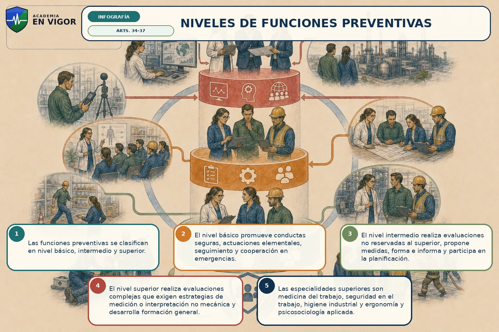

<em>Infografía: Niveles de funciones preventivas.</em>

:::hablemos-claro
Separa sujeto, presupuesto, regla, excepción y control. Las opciones trampa suelen cambiar solo uno de esos cinco elementos.
:::

:::en-la-calle
Antes de actuar, identifica quién decide, qué habilitación existe, qué debe documentarse y qué revisión posterior protege a la persona afectada.
:::

:::lo-que-cae
Memoriza el anclaje «arts. 34-37» y discrimina reglas, excepciones y plazos.
:::

<!-- FUENTE: RSP-T25 -->

## 40. Objeto y ámbito del RD 67/2010

### Regla y encaje

El Real Decreto 67/2010 adapta la Ley 31/1995 y el Reglamento de los Servicios de Prevención a la Administración General del Estado. Este bloque se integra en **cualificación y adaptación a la administración general del estado** y se ancla en **arts. 1-2**.

### Claves normativas

- El Real Decreto 67/2010 adapta la Ley 31/1995 y el Reglamento de los Servicios de Prevención a la Administración General del Estado.
- Parte de la integración preventiva y potencia la utilización de recursos propios adaptando el sistema a peculiaridades organizativas y de participación. <!-- FACT:PN-T25-F196 -->
- Se aplica a la AGE y organismos públicos vinculados o dependientes con personal funcionario o estatutario, exista o no también personal laboral. <!-- FACT:PN-T25-F197 -->
- Las actividades policiales cuyas particularidades impiden aplicar la ley general se rigen por su normativa específica. <!-- FACT:PN-T25-F198 -->
- Las funciones policiales no exclusivas quedan bajo la normativa general adaptada a la AGE y las peculiaridades del Real Decreto 2/2006. <!-- FACT:PN-T25-F199 -->
 <!-- FACT:PN-T25-F200 -->

<!-- VISUAL:t25-40-objeto-y-ambito-del-rd-67-2010.webp -->

  

<em>Infografía: Objeto y ámbito del RD 67/2010.</em>

:::hablemos-claro
Separa sujeto, presupuesto, regla, excepción y control. Las opciones trampa suelen cambiar solo uno de esos cinco elementos.
:::

:::en-la-calle
Antes de actuar, identifica quién decide, qué habilitación existe, qué debe documentarse y qué revisión posterior protege a la persona afectada.
:::

:::lo-que-cae
Memoriza el anclaje «arts. 1-2» y discrimina reglas, excepciones y plazos.
:::

<!-- FUENTE: RD67-2010-T25 -->

## 41. Integración y participación en la AGE

### Regla y encaje

Cada departamento u organismo integra la prevención en su sistema general de gestión mediante su plan preventivo. Este bloque se integra en **cualificación y adaptación a la administración general del estado** y se ancla en **arts. 3-4**.

### Claves normativas

- Cada departamento u organismo integra la prevención en su sistema general de gestión mediante su plan preventivo.
- Evaluación y planificación son instrumentos esenciales y atienden cuando proceda a especial sensibilidad, maternidad y menores. <!-- FACT:PN-T25-F201 -->
- Juntas de Personal, Comités de Empresa, representantes sindicales, Delegados de Prevención y Comités ejercen las funciones legales correspondientes. <!-- FACT:PN-T25-F202 -->
- La Comisión Técnica de Prevención de Riesgos Laborales es el órgano específico de participación y negociación sindical en esta materia en la AGE. <!-- FACT:PN-T25-F203 -->
- Cuando existe más de un Comité pueden crearse Grupos Técnicos de Prevención en los términos acordados. <!-- FACT:PN-T25-F204 -->
 <!-- FACT:PN-T25-F205 -->

<!-- VISUAL:t25-41-integracion-y-participacion-en-la-age.webp -->

  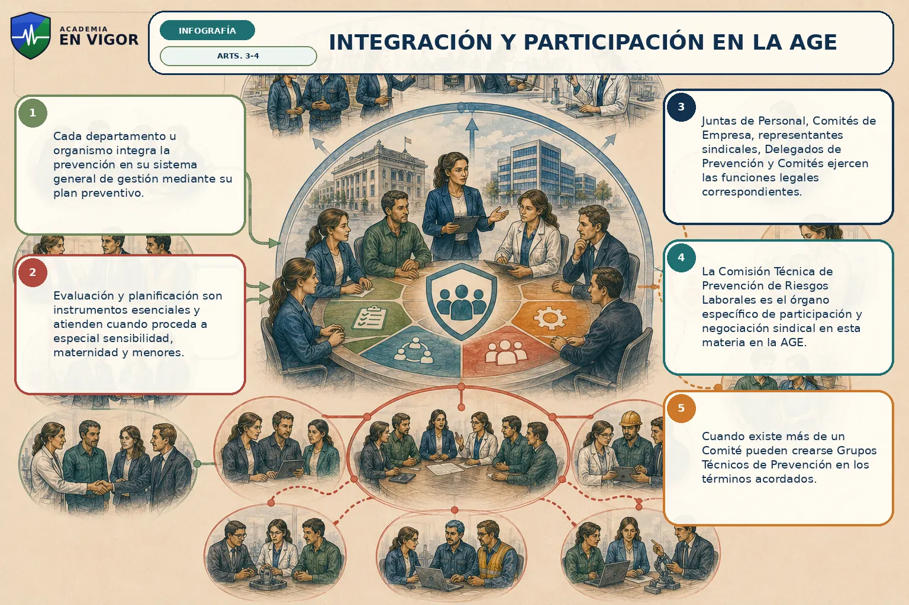

<em>Infografía: Integración y participación en la AGE.</em>

:::hablemos-claro
Separa sujeto, presupuesto, regla, excepción y control. Las opciones trampa suelen cambiar solo uno de esos cinco elementos.
:::

:::en-la-calle
Antes de actuar, identifica quién decide, qué habilitación existe, qué debe documentarse y qué revisión posterior protege a la persona afectada.
:::

:::lo-que-cae
Memoriza el anclaje «arts. 3-4» y discrimina reglas, excepciones y plazos.
:::

<!-- FUENTE: RD67-2010-T25 -->

## 42. Delegados y Comités en la AGE

### Regla y encaje

Los Delegados de Prevención se designan con carácter general por los representantes del personal y entre miembros de los órganos unitarios correspondientes. Este bloque se integra en **cualificación y adaptación a la administración general del estado** y se ancla en **arts. 5-6**.

### Claves normativas

- Los Delegados de Prevención se designan con carácter general por los representantes del personal y entre miembros de los órganos unitarios correspondientes.
- Su número se ajusta a la escala del artículo 35.2 de la Ley 31/1995 y se distribuye proporcionalmente entre colectivos. <!-- FACT:PN-T25-F206 -->
- Tienen las competencias, facultades y garantías de los artículos 36 y 37 de la Ley 31/1995. <!-- FACT:PN-T25-F207 -->
- El Comité de Seguridad y Salud es paritario y colegiado y se constituye con carácter general en centros de cincuenta o más empleados públicos. <!-- FACT:PN-T25-F208 -->
- El Comité se reúne trimestralmente y siempre que lo solicite alguna de las representaciones. <!-- FACT:PN-T25-F209 -->
 <!-- FACT:PN-T25-F210 -->

<!-- VISUAL:t25-42-delegados-y-comites-en-la-age.webp -->

  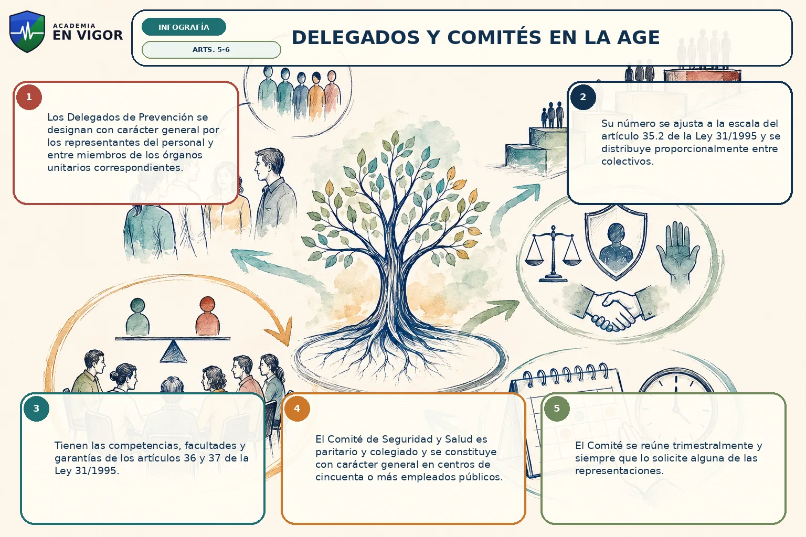

<em>Infografía: Delegados y Comités en la AGE.</em>

:::hablemos-claro
Separa sujeto, presupuesto, regla, excepción y control. Las opciones trampa suelen cambiar solo uno de esos cinco elementos.
:::

:::en-la-calle
Antes de actuar, identifica quién decide, qué habilitación existe, qué debe documentarse y qué revisión posterior protege a la persona afectada.
:::

:::lo-que-cae
Memoriza el anclaje «arts. 5-6» y discrimina reglas, excepciones y plazos.
:::

<!-- FUENTE: RD67-2010-T25 -->

## 43. Recursos, cualificación y control en la AGE

### Regla y encaje

La AGE puede constituir servicio propio, designar empleados públicos o recurrir a servicio ajeno, solos o combinados. Este bloque se integra en **cualificación y adaptación a la administración general del estado** y se ancla en **arts. 7-11**.

### Claves normativas

- La AGE puede constituir servicio propio, designar empleados públicos o recurrir a servicio ajeno, solos o combinados.
- Se da prioridad general a servicios propios y se contratan temporalmente actividades difíciles de asumir por su complejidad técnica. <!-- FACT:PN-T25-F211 -->
- Los servicios propios son obligatorios con más de quinientos empleados y entre doscientos cincuenta y quinientos si realizan actividades del anexo I. <!-- FACT:PN-T25-F212 -->
- Las funciones se clasifican en niveles básico, intermedio y superior conforme al Reglamento y la presencia de recursos se rige por sus reglas generales. <!-- FACT:PN-T25-F213 -->
- La Dirección General de la Función Pública coordina, sigue, promueve e impulsa la prevención en la AGE y los sistemas están sujetos a instrumentos de control. <!-- FACT:PN-T25-F214 -->
 <!-- FACT:PN-T25-F215 -->

<!-- VISUAL:t25-43-recursos-cualificacion-y-control-en-la-age.webp -->

  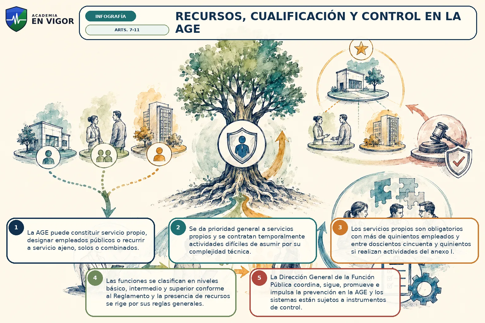

<em>Infografía: Recursos, cualificación y control en la AGE.</em>

:::hablemos-claro
Separa sujeto, presupuesto, regla, excepción y control. Las opciones trampa suelen cambiar solo uno de esos cinco elementos.
:::

:::en-la-calle
Antes de actuar, identifica quién decide, qué habilitación existe, qué debe documentarse y qué revisión posterior protege a la persona afectada.
:::

:::lo-que-cae
Memoriza el anclaje «arts. 7-11» y discrimina reglas, excepciones y plazos.
:::

<!-- FUENTE: RD67-2010-T25 -->

## 44. Objeto, ámbito y estructura vigente policial

### Regla y encaje

El Real Decreto 2/2006 promueve la seguridad y salud de funcionarios policiales adaptando principios de la Ley 31/1995 a las peculiaridades de la función. Este bloque se integra en **prevención de riesgos laborales en la policía nacional** y se ancla en **arts. 1-2; art. 10.3.c INT/859/2023**.

### Claves normativas

- El Real Decreto 2/2006 promueve la seguridad y salud de funcionarios policiales adaptando principios de la Ley 31/1995 a las peculiaridades de la función.
- Se aplica a funcionarios que prestan servicio en órganos centrales y periféricos dependientes de la Dirección General de la Policía. <!-- FACT:PN-T25-F216 -->
- Las funciones no exclusivas de policía, seguridad o protección civil se someten a normativa general con peculiaridades de la AGE y del propio real decreto. <!-- FACT:PN-T25-F217 -->
- La Unidad de Prevención de Riesgos Laborales y Protección Socio-Sanitaria está integrada en la Subdirección General de Recursos Humanos y Formación. <!-- FACT:PN-T25-F218 -->
- De esa Unidad dependen el Área de Coordinación de Prevención de Riesgos Laborales y el Área Sanitaria. <!-- FACT:PN-T25-F219 -->
 <!-- FACT:PN-T25-F220 -->

<!-- VISUAL:t25-44-objeto-ambito-y-estructura-vigente-policia.webp -->

  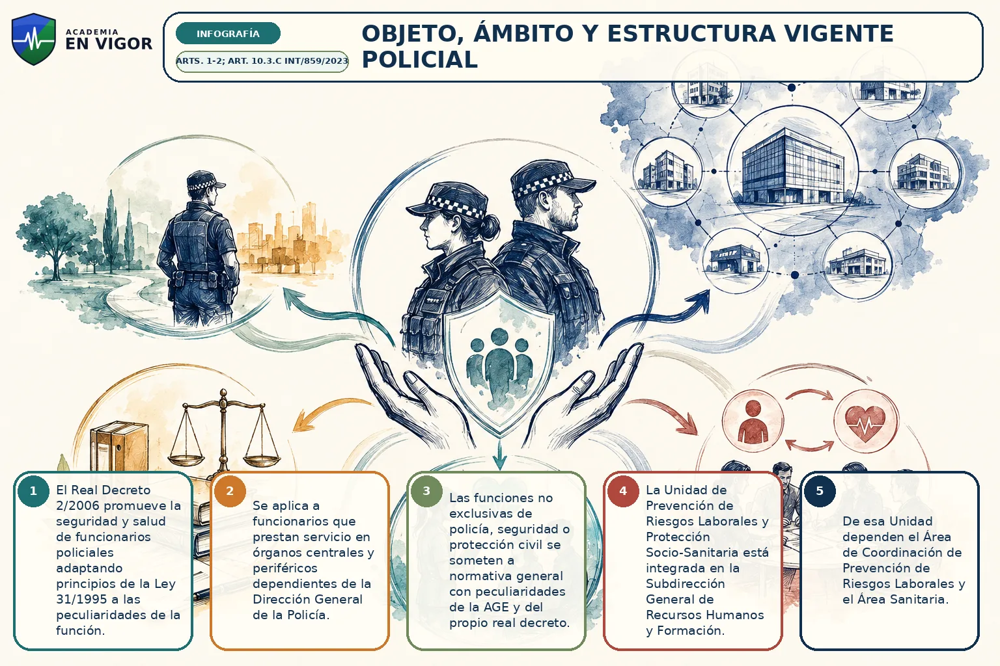

<em>Infografía: Objeto, ámbito y estructura vigente policial.</em>

:::hablemos-claro
Separa sujeto, presupuesto, regla, excepción y control. Las opciones trampa suelen cambiar solo uno de esos cinco elementos.
:::

:::en-la-calle
Antes de actuar, identifica quién decide, qué habilitación existe, qué debe documentarse y qué revisión posterior protege a la persona afectada.
:::

:::lo-que-cae
Memoriza el anclaje «arts. 1-2; art. 10.3.c INT/859/2023» y discrimina reglas, excepciones y plazos.
:::

<!-- FUENTE: RD2-2006-T25 -->

## 45. Derecho y principios preventivos policiales

### Regla y encaje

Los funcionarios policiales tienen derecho a protección eficaz, información, formación, propuestas, participación y vigilancia periódica de la salud. Este bloque se integra en **prevención de riesgos laborales en la policía nacional** y se ancla en **arts. 3-4**.

### Claves normativas

- Los funcionarios policiales tienen derecho a protección eficaz, información, formación, propuestas, participación y vigilancia periódica de la salud.
- La Administración del Estado debe garantizar seguridad y salud en todos los aspectos profesionales dentro de las peculiaridades policiales. <!-- FACT:PN-T25-F221 -->
- La acción policial evita riesgos, evalúa los de imposible o muy difícil evitación y combate los riesgos en su origen. <!-- FACT:PN-T25-F222 -->
- Debe adaptar trabajo y equipos al funcionario, considerar la evolución técnica y priorizar protección colectiva sobre individual. <!-- FACT:PN-T25-F223 -->
- Los métodos y dispositivos de servicio incorporarán siempre que sea posible previsiones adecuadas de seguridad y salud. <!-- FACT:PN-T25-F224 -->
 <!-- FACT:PN-T25-F225 -->

<!-- VISUAL:t25-45-derecho-y-principios-preventivos-policiale.webp -->

  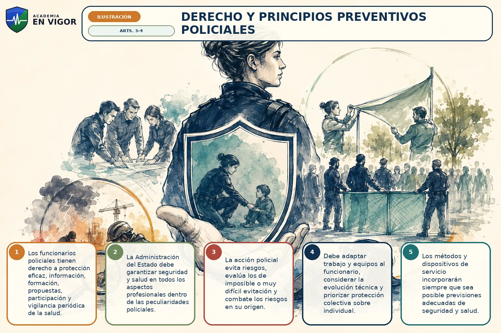

<em>Infografía: Derecho y principios preventivos policiales.</em>

:::hablemos-claro
Separa sujeto, presupuesto, regla, excepción y control. Las opciones trampa suelen cambiar solo uno de esos cinco elementos.
:::

:::en-la-calle
Antes de actuar, identifica quién decide, qué habilitación existe, qué debe documentarse y qué revisión posterior protege a la persona afectada.
:::

:::lo-que-cae
Memoriza el anclaje «arts. 3-4» y discrimina reglas, excepciones y plazos.
:::

<!-- FUENTE: RD2-2006-T25 -->

## 46. Plan, evaluación y revisión policial

### Regla y encaje

La prevención policial se integra en el sistema general de gestión mediante un plan de prevención. Este bloque se integra en **prevención de riesgos laborales en la policía nacional** y se ancla en **art. 5**.

### Claves normativas

- La prevención policial se integra en el sistema general de gestión mediante un plan de prevención.
- Evaluación y planificación son instrumentos esenciales del plan policial. <!-- FACT:PN-T25-F226 -->
- La evaluación inicial considera naturaleza de la actividad, puestos y funcionarios que los desempeñan. <!-- FACT:PN-T25-F227 -->
- También se evalúa al elegir equipos, sustancias o preparados y al acondicionar lugares de trabajo. <!-- FACT:PN-T25-F228 -->
- La evaluación se revisa cada cuatro años y además tras daños, nuevos equipos con riesgos no contemplados o inadecuación protectora. <!-- FACT:PN-T25-F229 -->
 <!-- FACT:PN-T25-F230 -->

<!-- VISUAL:t25-46-plan-evaluacion-y-revision-policial.webp -->

  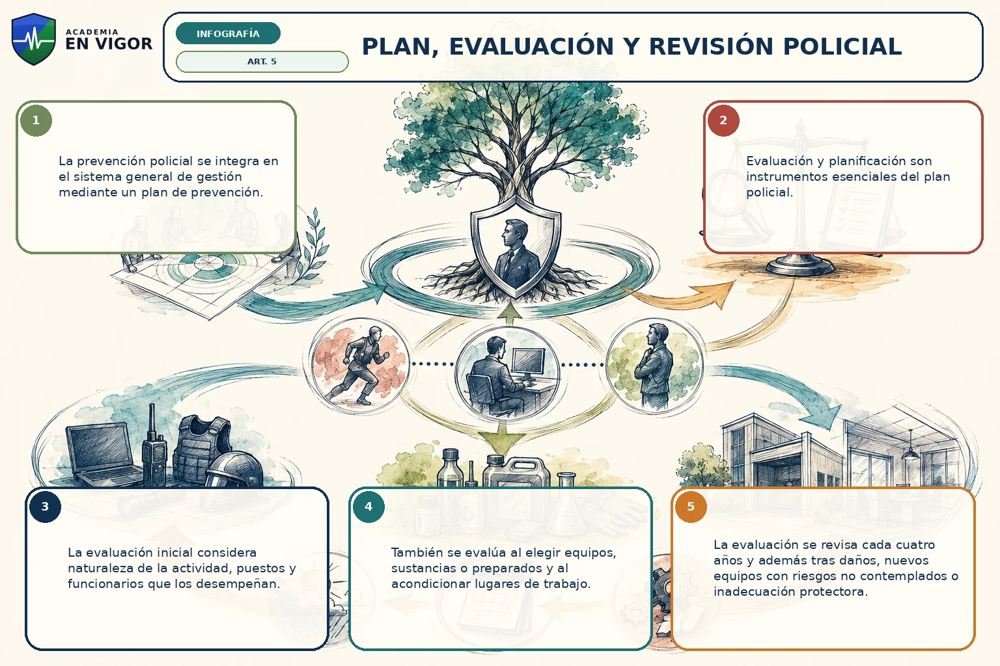

<em>Infografía: Plan, evaluación y revisión policial.</em>

:::hablemos-claro
Separa sujeto, presupuesto, regla, excepción y control. Las opciones trampa suelen cambiar solo uno de esos cinco elementos.
:::

:::en-la-calle
Antes de actuar, identifica quién decide, qué habilitación existe, qué debe documentarse y qué revisión posterior protege a la persona afectada.
:::

:::lo-que-cae
Memoriza el anclaje «art. 5» y discrimina reglas, excepciones y plazos.
:::

<!-- FUENTE: RD2-2006-T25 -->

## 47. Equipos, información y participación policial

### Regla y encaje

Los equipos policiales deben ser adecuados para las tareas y garantizar seguridad y salud atendiendo a normativa y recomendaciones técnicas. Este bloque se integra en **prevención de riesgos laborales en la policía nacional** y se ancla en **arts. 6-7**.

### Claves normativas

- Los equipos policiales deben ser adecuados para las tareas y garantizar seguridad y salud atendiendo a normativa y recomendaciones técnicas.
- La Administración proporciona EPI adecuados y vela por su uso efectivo y correcto. <!-- FACT:PN-T25-F231 -->
- La información comprende riesgos de la actividad, medidas preventivas y protectoras y medidas de emergencia. <!-- FACT:PN-T25-F232 -->
- La información puede facilitarse directamente o a través de los representantes previstos. <!-- FACT:PN-T25-F233 -->
- Los funcionarios pueden efectuar propuestas individualmente por superiores jerárquicos o mediante los cauces de representación. <!-- FACT:PN-T25-F234 -->
 <!-- FACT:PN-T25-F235 -->

<!-- VISUAL:t25-47-equipos-informacion-y-participacion-polici.webp -->

  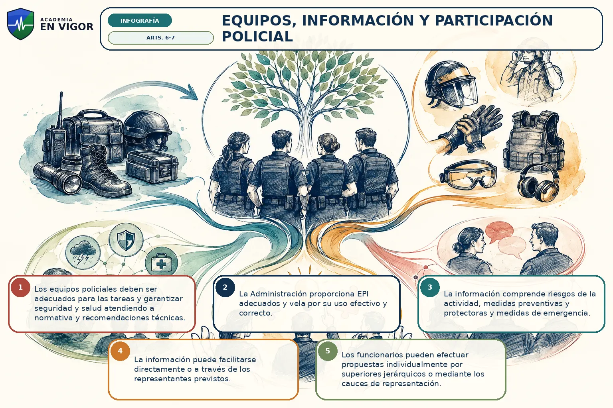

<em>Infografía: Equipos, información y participación policial.</em>

:::hablemos-claro
Separa sujeto, presupuesto, regla, excepción y control. Las opciones trampa suelen cambiar solo uno de esos cinco elementos.
:::

:::en-la-calle
Antes de actuar, identifica quién decide, qué habilitación existe, qué debe documentarse y qué revisión posterior protege a la persona afectada.
:::

:::lo-que-cae
Memoriza el anclaje «arts. 6-7» y discrimina reglas, excepciones y plazos.
:::

<!-- FUENTE: RD2-2006-T25 -->

## 48. Formación y emergencias policiales

### Regla y encaje

La formación preventiva policial debe ser teórica y práctica, suficiente y adecuada. Este bloque se integra en **prevención de riesgos laborales en la policía nacional** y se ancla en **arts. 8-9**.

### Claves normativas

- La formación preventiva policial debe ser teórica y práctica, suficiente y adecuada.
- Se garantiza en ingreso, promoción y especialización preceptiva y cuando se introducen tecnologías o cambios de equipos. <!-- FACT:PN-T25-F236 -->
- El tiempo empleado en cursos o programas preventivos se considera tiempo efectivo de trabajo. <!-- FACT:PN-T25-F237 -->
- La Dirección General analiza emergencias en edificios e instalaciones y adopta medidas de evacuación, incendios y primeros auxilios. <!-- FACT:PN-T25-F238 -->
- El personal de emergencia debe ser adecuado, formado, equipado y sometido a comprobaciones periódicas de funcionamiento. <!-- FACT:PN-T25-F239 -->
 <!-- FACT:PN-T25-F240 -->

<!-- VISUAL:t25-48-formacion-y-emergencias-policiales.webp -->

  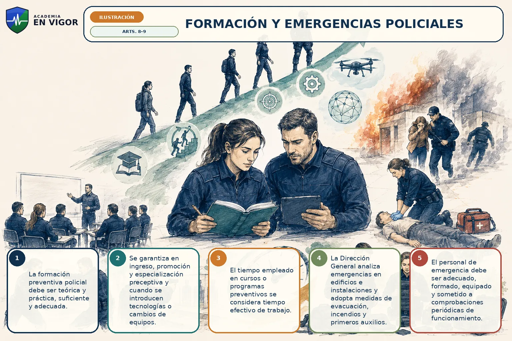

<em>Infografía: Formación y emergencias policiales.</em>

:::hablemos-claro
Separa sujeto, presupuesto, regla, excepción y control. Las opciones trampa suelen cambiar solo uno de esos cinco elementos.
:::

:::en-la-calle
Antes de actuar, identifica quién decide, qué habilitación existe, qué debe documentarse y qué revisión posterior protege a la persona afectada.
:::

:::lo-que-cae
Memoriza el anclaje «arts. 8-9» y discrimina reglas, excepciones y plazos.
:::

<!-- FUENTE: RD2-2006-T25 -->

## 49. Vigilancia de la salud policial

### Regla y encaje

La Dirección General garantiza vigilancia periódica en función de los riesgos inherentes a la función policial. Este bloque se integra en **prevención de riesgos laborales en la policía nacional** y se ancla en **art. 10**.

### Claves normativas

- La Dirección General garantiza vigilancia periódica en función de los riesgos inherentes a la función policial.
- Incluye principalmente reconocimientos médicos y campañas de inmunización y protección de la salud. <!-- FACT:PN-T25-F241 -->
- Las medidas sanitarias son voluntarias salvo previsión normativa o necesidad de detectar patologías capaces de causar grave riesgo a funcionarios o ciudadanía. <!-- FACT:PN-T25-F242 -->
- Se respetan intimidad, dignidad y confidencialidad y los resultados se comunican a las personas afectadas. <!-- FACT:PN-T25-F243 -->
- Los responsables reciben conclusiones sobre aptitud o mejoras preventivas, no información médica personal sin consentimiento. <!-- FACT:PN-T25-F244 -->
 <!-- FACT:PN-T25-F245 -->

<!-- VISUAL:t25-49-vigilancia-de-la-salud-policial.webp -->

  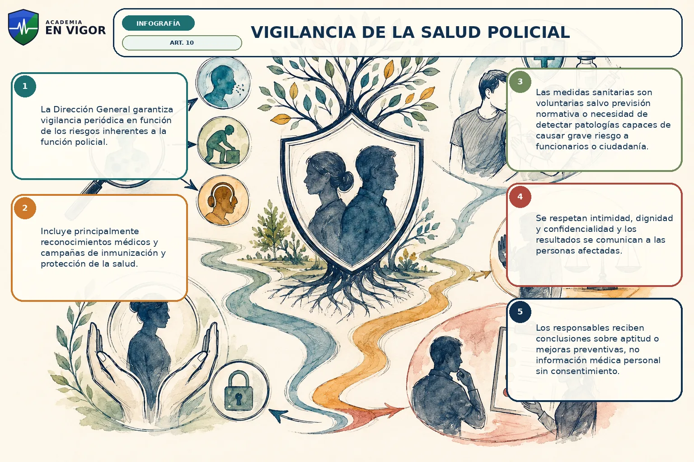

<em>Infografía: Vigilancia de la salud policial.</em>

:::hablemos-claro
Separa sujeto, presupuesto, regla, excepción y control. Las opciones trampa suelen cambiar solo uno de esos cinco elementos.
:::

:::en-la-calle
Antes de actuar, identifica quién decide, qué habilitación existe, qué debe documentarse y qué revisión posterior protege a la persona afectada.
:::

:::lo-que-cae
Memoriza el anclaje «art. 10» y discrimina reglas, excepciones y plazos.
:::

<!-- FUENTE: RD2-2006-T25 -->

## 50. Maternidad y obligaciones policiales

### Regla y encaje

Gestación, maternidad y lactancia reciben protección adecuada para la funcionaria, el feto o lactante. Este bloque se integra en **prevención de riesgos laborales en la policía nacional** y se ancla en **arts. 11-12**.

### Claves normativas

- Gestación, maternidad y lactancia reciben protección adecuada para la funcionaria, el feto o lactante.
- Cuando los informes lo aconsejen se adaptan condiciones, se exime de noches o turnos o se adscribe a otro servicio conservando retribuciones del puesto de origen. <!-- FACT:PN-T25-F246 -->
- La funcionaria no manejará elementos que los informes médicos consideren perjudiciales y podrá usar vestimenta adecuada durante la gestación. <!-- FACT:PN-T25-F247 -->
- Cada funcionario debe velar por su seguridad y la de terceros, usar correctamente medios y protección y no inutilizar dispositivos. <!-- FACT:PN-T25-F248 -->
- Debe informar de inmediato a su superior directo o al servicio de prevención de riesgos razonables y cooperar para garantizar condiciones seguras. <!-- FACT:PN-T25-F249 -->
 <!-- FACT:PN-T25-F250 -->

<!-- VISUAL:t25-50-maternidad-y-obligaciones-policiales.webp -->

  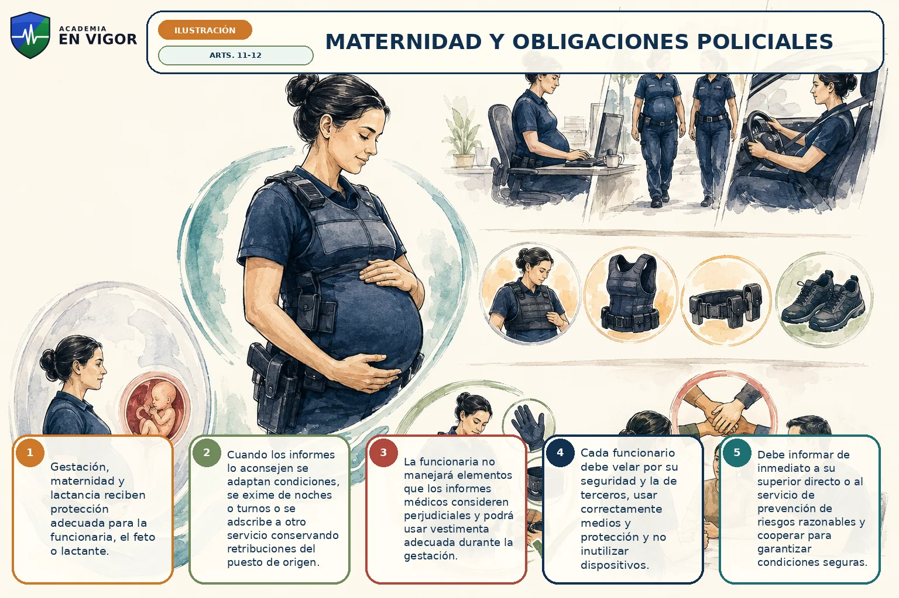

<em>Infografía: Maternidad y obligaciones policiales.</em>

:::hablemos-claro
Separa sujeto, presupuesto, regla, excepción y control. Las opciones trampa suelen cambiar solo uno de esos cinco elementos.
:::

:::en-la-calle
Antes de actuar, identifica quién decide, qué habilitación existe, qué debe documentarse y qué revisión posterior protege a la persona afectada.
:::

:::lo-que-cae
Memoriza el anclaje «arts. 11-12» y discrimina reglas, excepciones y plazos.
:::

<!-- FUENTE: RD2-2006-T25 -->

## 51. Delegados, Comisión y Comités policiales

### Regla y encaje

Los Delegados de Prevención son funcionarios en activo o segunda actividad designados por sindicatos con representación en el Consejo de Policía. Este bloque se integra en **prevención de riesgos laborales en la policía nacional** y se ancla en **arts. 14-17**.

### Claves normativas

- Los Delegados de Prevención son funcionarios en activo o segunda actividad designados por sindicatos con representación en el Consejo de Policía.
- Cada sindicato representativo designa un delegado en cada Jefatura Superior y en servicios centrales, más los que resulten de la escala por electores. <!-- FACT:PN-T25-F251 -->
- La escala adicional llega a ocho delegados cuando existen más de siete mil electores. <!-- FACT:PN-T25-F252 -->
- La Comisión de Seguridad y Salud Laboral Policial es el órgano nacional paritario y colegiado; los Comités son órganos territoriales paritarios. <!-- FACT:PN-T25-F253 -->
- La Comisión se reúne al menos semestralmente y los Comités trimestralmente; en cada Jefatura Superior y servicios centrales existe Comité. <!-- FACT:PN-T25-F254 -->
 <!-- FACT:PN-T25-F255 -->

<!-- VISUAL:t25-51-delegados-comision-y-comites-policiales.webp -->

  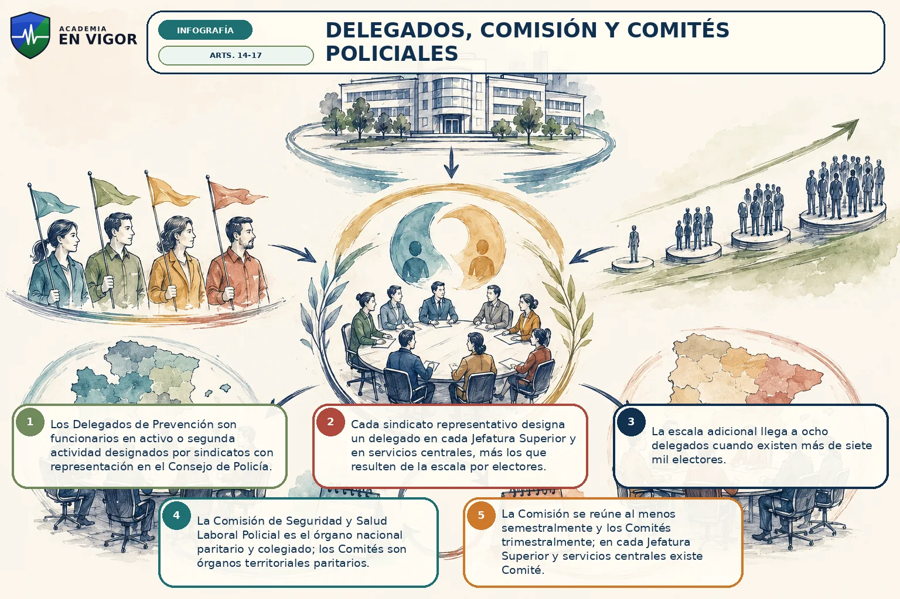

<em>Infografía: Delegados, Comisión y Comités policiales.</em>

:::hablemos-claro
Separa sujeto, presupuesto, regla, excepción y control. Las opciones trampa suelen cambiar solo uno de esos cinco elementos.
:::

:::en-la-calle
Antes de actuar, identifica quién decide, qué habilitación existe, qué debe documentarse y qué revisión posterior protege a la persona afectada.
:::

:::lo-que-cae
Memoriza el anclaje «arts. 14-17» y discrimina reglas, excepciones y plazos.
:::

<!-- FUENTE: RD2-2006-T25 -->

## 52. Servicio de prevención y control policial

### Regla y encaje

El Real Decreto 2/2006 configura un servicio de prevención propio, de ámbito nacional, para asesoramiento y apoyo de la Dirección General. Este bloque se integra en **prevención de riesgos laborales en la policía nacional** y se ancla en **arts. 18-19; DA 1.ª**.

### Claves normativas

- El Real Decreto 2/2006 configura un servicio de prevención propio, de ámbito nacional, para asesoramiento y apoyo de la Dirección General.
- Sus funciones incluyen planes, evaluación, prioridades, información, formación, primeros auxilios, emergencias, vigilancia de la salud y memoria anual. <!-- FACT:PN-T25-F256 -->
- Debe contar con personal cualificado e integrar al menos dos de las cuatro funciones de nivel superior del Reglamento. <!-- FACT:PN-T25-F257 -->
- El sistema policial se controla mediante auditorías y evaluaciones cada cinco años por la Inspección de Personal y Servicios de Seguridad. <!-- FACT:PN-T25-F258 -->
- La estructura vigente sitúa la Unidad de Prevención de Riesgos Laborales y Protección Socio-Sanitaria en la Subdirección General de Recursos Humanos y Formación. <!-- FACT:PN-T25-F259 -->
 <!-- FACT:PN-T25-F260 -->

<!-- VISUAL:t25-52-servicio-de-prevencion-y-control-policial.webp -->

  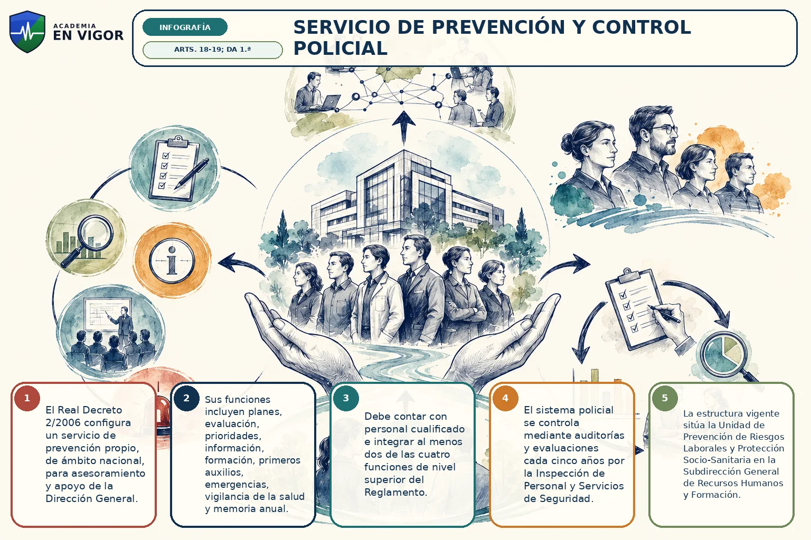

<em>Infografía: Servicio de prevención y control policial.</em>

:::hablemos-claro
Separa sujeto, presupuesto, regla, excepción y control. Las opciones trampa suelen cambiar solo uno de esos cinco elementos.
:::

:::en-la-calle
Antes de actuar, identifica quién decide, qué habilitación existe, qué debe documentarse y qué revisión posterior protege a la persona afectada.
:::

:::lo-que-cae
Memoriza el anclaje «arts. 18-19; DA 1.ª» y discrimina reglas, excepciones y plazos.
:::

<!-- FUENTE: RD2-2006-T25 -->

# Hablemos claro

:::hablemos-claro
Una regla bien estudiada responde cinco preguntas: quién, cuándo, qué hace, con qué límite y bajo qué control.
:::

# En la calle

:::en-la-calle
En el supuesto práctico, documenta hechos y tiempos antes de aplicar la norma; después revisa necesidad, proporcionalidad y garantías.
:::

# Lo que cae

:::lo-que-cae
Prioriza sujetos competentes, plazos máximos, excepciones tasadas y derechos que no admiten atajos.
:::

# Ha caído

:::ha-caido
Se han mapeado 19 referencias históricas. Permanecen ocultas y en cuarentena porque no existe plantilla oficial final verificable.
:::

## Fuentes oficiales

- `CONV-PN-2026`
- `CE-T25`
- `DIR89-391-T25`
- `LPRL-T25`
- `RD171-2004-T25`
- `RSP-T25`
- `RD67-2010-T25`
- `RD2-2006-T25`
- `CORR-RD2-2006-T25`
- `INT859-2023-T25`

---

*Academia En Vigor · El temario que nunca duerme · Tema 25 · v1.0.0 · Documento interno no publicado.*
