# TEMA 34 · DROGODEPENDENCIAS. CONCEPTOS DE DROGA, CONSUMIDOR, MÉTODOS DE ADMINISTRACIÓN, ADICCIÓN, DEPENDENCIA, TOLERANCIA, POLITOXICOMANÍAS. CLASIFICACIÓN DE LAS DROGAS. ÚLTIMAS TENDENCIAS EN EL CONSUMO DE DROGAS EN NUESTRA SOCIEDAD.

**Policía Nacional · Método VIGOR · ATESTADO**
**Versión de contenido:** 1.0.0
**Estado editorial:** approved_internal · **Publicación:** not_published

# Mapa del tema

El Tema 34 se estudia en nueve partes: conceptos; consumidor y vías; adicción, dependencia y policonsumo; clasificaciones y control; depresores; estimulantes; perturbadoras, cannabis e inhalantes; nuevas sustancias y alertas; y tendencias actuales en España y Europa.

# Contenido

## 01. Alcance oficial del Tema 34

### Lógica del bloque

Para dominar **alcance oficial del tema 34**, aplica esta regla: Tres carriles: define con precisión, clasifica sin absolutismos y fecha cada tendencia. El anclaje principal es **conceptos, clasificación y tendencias**.

### Hechos examinables

- El programa exige dominar conceptos básicos, clasificación de drogas y últimas tendencias de consumo. <!-- FACT:PN-T34-F001 -->
- El núcleo conceptual debe distinguirse de cifras coyunturales que cambian entre ediciones de las encuestas. <!-- FACT:PN-T34-F002 -->
- Las sustancias se estudian por familias y riesgos examinables, no como un catálogo ilimitado de nombres callejeros. <!-- FACT:PN-T34-F003 -->
- Las tendencias solo son comparables cuando se indica población, período, indicador y fuente. <!-- FACT:PN-T34-F004 -->

### Trampas de examen

- **Incorrecto:** El programa se limita a memorizar nombres comerciales de sustancias.
- **Incorrecto:** Una cifra de consumo sigue siendo actual aunque no se identifiquen año ni población.

<!-- VISUAL:t34-01-alcance-oficial-del-tema-34.webp -->

  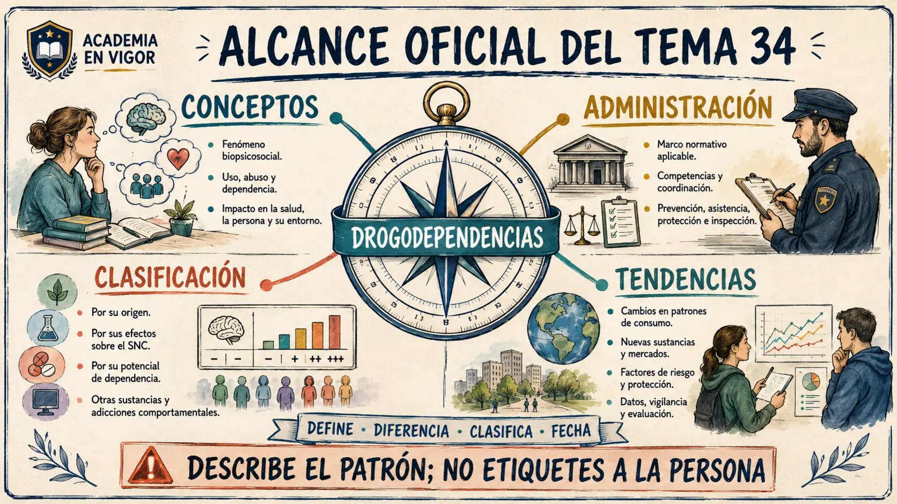

<em>Infografía: Alcance oficial del Tema 34.</em>

:::hablemos-claro
Tres carriles: define con precisión, clasifica sin absolutismos y fecha cada tendencia.
:::

:::en-la-calle
Al explicar el fenómeno sin estigmatizar, Tres carriles: define con precisión, clasifica sin absolutismos y fecha cada tendencia.
:::

:::lo-que-cae
Prioriza **conceptos, clasificación y tendencias** y descarta respuestas que confundan efecto, legalidad, origen o fecha.
:::

<!-- FUENTE: CONVOCATORIA-PN-2026-T34 -->

## 02. Concepto funcional de droga

### Lógica del bloque

Para dominar **concepto funcional de droga**, aplica esta regla: “Droga” describe capacidad de modificar funciones; la legalidad y el daño requieren preguntas adicionales. El anclaje principal es **sustancia, organismo y modificación**.

### Hechos examinables

- Droga es una sustancia que, introducida en el organismo, puede modificar una o varias de sus funciones. <!-- FACT:PN-T34-F005 -->
- El concepto funcional no determina por sí solo que el uso sea ilícito, terapéutico, perjudicial o adictivo. <!-- FACT:PN-T34-F006 -->
- Una misma sustancia puede tener usos médicos controlados y usos no médicos con riesgos diferentes. <!-- FACT:PN-T34-F007 -->
- El efecto depende de sustancia, dosis, vía, persona, contexto y combinación con otros productos. <!-- FACT:PN-T34-F008 -->

### Trampas de examen

- **Incorrecto:** Toda droga es necesariamente ilegal y carece de uso terapéutico.
- **Incorrecto:** El nombre de la sustancia permite predecir un efecto idéntico en cualquier persona.

<!-- VISUAL:t34-02-concepto-funcional-de-droga.webp -->

  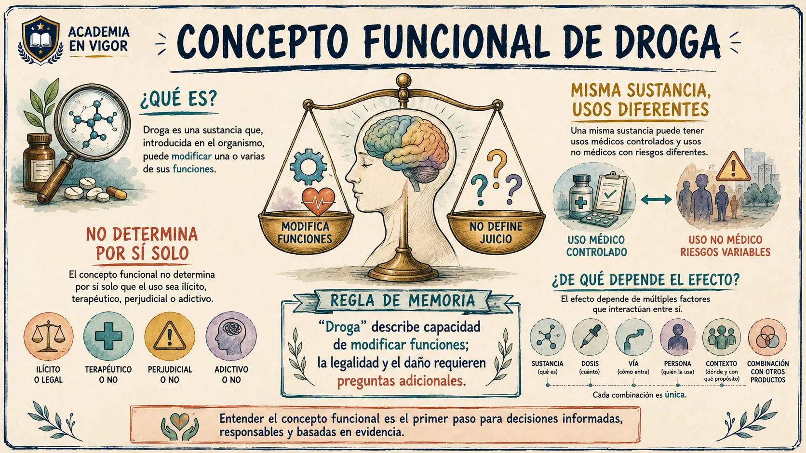

<em>Infografía: Concepto funcional de droga.</em>

:::hablemos-claro
“Droga” describe capacidad de modificar funciones; la legalidad y el daño requieren preguntas adicionales.
:::

:::en-la-calle
Al explicar el fenómeno sin estigmatizar, “Droga” describe capacidad de modificar funciones; la legalidad y el daño requieren preguntas adicionales.
:::

:::lo-que-cae
Prioriza **sustancia, organismo y modificación** y descarta respuestas que confundan efecto, legalidad, origen o fecha.
:::

<!-- FUENTE: UNODC-TERMINOLOGY-T34 -->

## 03. Sustancia psicoactiva y sistema nervioso

### Lógica del bloque

Para dominar **sustancia psicoactiva y sistema nervioso**, aplica esta regla: Psicoactivo es el paraguas; depresor, estimulante y perturbador son respuestas principales bajo él. El anclaje principal es **acción sobre procesos mentales y conducta**.

### Hechos examinables

- Una sustancia psicoactiva actúa sobre el sistema nervioso y puede alterar percepción, ánimo, conciencia, cognición o conducta. <!-- FACT:PN-T34-F009 -->
- Psicoactivo no significa automáticamente alucinógeno: también incluye depresores y estimulantes. <!-- FACT:PN-T34-F010 -->
- La intensidad y el perfil temporal varían según farmacología, cantidad, vía y características del consumidor. <!-- FACT:PN-T34-F011 -->
- Las consecuencias pueden ser agudas, crónicas, directas, indirectas o derivadas del contexto de consumo. <!-- FACT:PN-T34-F012 -->

### Trampas de examen

- **Incorrecto:** Toda sustancia psicoactiva produce alucinaciones visuales.
- **Incorrecto:** Los efectos dependen exclusivamente de la cantidad y nunca del contexto.

<!-- VISUAL:t34-03-sustancia-psicoactiva-y-sistema-nervioso.webp -->

  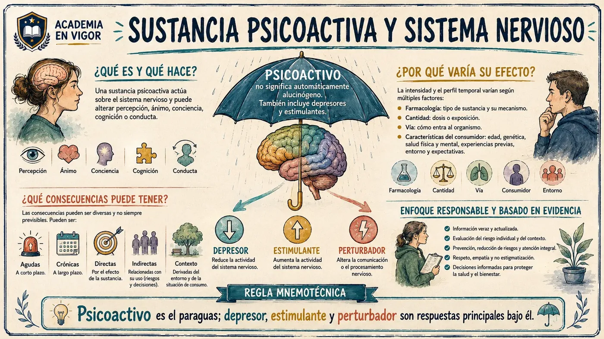

<em>Infografía: Sustancia psicoactiva y sistema nervioso.</em>

:::hablemos-claro
Psicoactivo es el paraguas; depresor, estimulante y perturbador son respuestas principales bajo él.
:::

:::en-la-calle
Al explicar el fenómeno sin estigmatizar, Psicoactivo es el paraguas; depresor, estimulante y perturbador son respuestas principales bajo él.
:::

:::lo-que-cae
Prioriza **acción sobre procesos mentales y conducta** y descarta respuestas que confundan efecto, legalidad, origen o fecha.
:::

<!-- FUENTE: WHO-ICD11-SUBSTANCE-T34 -->

## 04. Uso, uso de riesgo y uso perjudicial

### Lógica del bloque

Para dominar **uso, uso de riesgo y uso perjudicial**, aplica esta regla: No conviertas una escalera en un interruptor: uso, riesgo, daño y dependencia no son sinónimos. El anclaje principal es **patrón, probabilidad y daño**.

### Hechos examinables

- El uso describe consumo sin afirmar por sí mismo que exista trastorno, dependencia o daño demostrado. <!-- FACT:PN-T34-F013 -->
- El uso de riesgo aumenta la probabilidad de consecuencias perjudiciales aunque todavía no se hayan constatado. <!-- FACT:PN-T34-F014 -->
- El uso perjudicial implica daño atribuible al patrón de consumo y exige valorar naturaleza y contexto. <!-- FACT:PN-T34-F015 -->
- Un episodio aislado puede causar intoxicación grave sin que exista dependencia previa. <!-- FACT:PN-T34-F016 -->

### Trampas de examen

- **Incorrecto:** Todo consumo demuestra dependencia clínica.
- **Incorrecto:** Sin dependencia es imposible que aparezca una intoxicación aguda grave.

<!-- VISUAL:t34-04-uso-uso-de-riesgo-y-uso-perjudicial.webp -->

  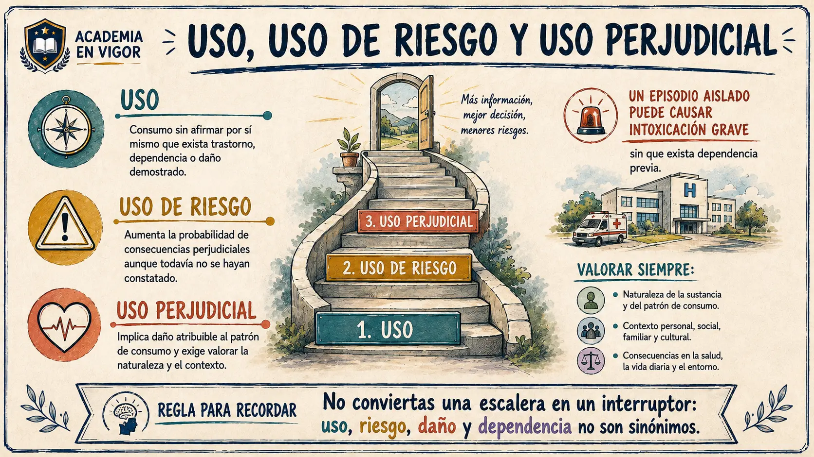

<em>Infografía: Uso, uso de riesgo y uso perjudicial.</em>

:::hablemos-claro
No conviertas una escalera en un interruptor: uso, riesgo, daño y dependencia no son sinónimos.
:::

:::en-la-calle
Al explicar el fenómeno sin estigmatizar, No conviertas una escalera en un interruptor: uso, riesgo, daño y dependencia no son sinónimos.
:::

:::lo-que-cae
Prioriza **patrón, probabilidad y daño** y descarta respuestas que confundan efecto, legalidad, origen o fecha.
:::

<!-- FUENTE: WHO-ICD11-SUBSTANCE-T34 -->

## 05. Intoxicación aguda y efectos crónicos

### Lógica del bloque

Para dominar **intoxicación aguda y efectos crónicos**, aplica esta regla: Agudo pregunta qué ocurre ahora; crónico pregunta qué deja la exposición repetida. El anclaje principal es **tiempo de exposición y manifestación**.

### Hechos examinables

- La intoxicación aguda es un estado transitorio posterior a la administración de una sustancia psicoactiva. <!-- FACT:PN-T34-F017 -->
- Sus signos dependen de sustancia, dosis, tolerancia, vía, mezclas y vulnerabilidad individual. <!-- FACT:PN-T34-F018 -->
- Los efectos crónicos se relacionan con exposición repetida o prolongada y no son una simple intoxicación más larga. <!-- FACT:PN-T34-F019 -->
- La urgencia clínica se determina por síntomas y funciones vitales, no por una etiqueta callejera del producto. <!-- FACT:PN-T34-F020 -->

### Trampas de examen

- **Incorrecto:** La intoxicación aguda exige siempre años de consumo previo.
- **Incorrecto:** El nombre vendido permite conocer con certeza composición y gravedad.

<!-- VISUAL:t34-05-intoxicacion-aguda-y-efectos-cronicos.webp -->

  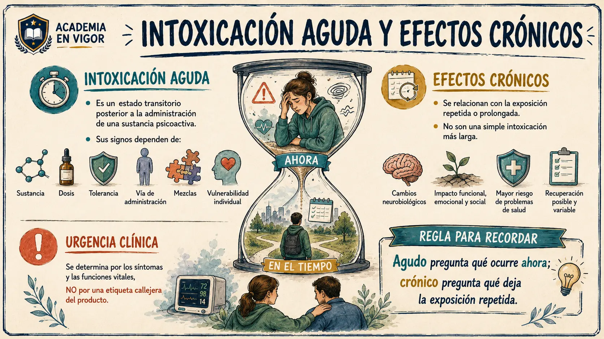

<em>Infografía: Intoxicación aguda y efectos crónicos.</em>

:::hablemos-claro
Agudo pregunta qué ocurre ahora; crónico pregunta qué deja la exposición repetida.
:::

:::en-la-calle
Al explicar el fenómeno sin estigmatizar, Agudo pregunta qué ocurre ahora; crónico pregunta qué deja la exposición repetida.
:::

:::lo-que-cae
Prioriza **tiempo de exposición y manifestación** y descarta respuestas que confundan efecto, legalidad, origen o fecha.
:::

<!-- FUENTE: UNODC-TERMINOLOGY-T34 -->

## 06. Factores de riesgo y de protección

### Lógica del bloque

Para dominar **factores de riesgo y de protección**, aplica esta regla: Triángulo inseparable: sustancia, persona y contexto; ningún vértice explica solo el problema. El anclaje principal es **persona, sustancia y entorno**.

### Hechos examinables

- Los problemas relacionados con drogas resultan de la interacción entre sustancia, persona y entorno. <!-- FACT:PN-T34-F021 -->
- Edad de inicio, salud mental, disponibilidad, presión social y pautas de consumo pueden aumentar riesgo. <!-- FACT:PN-T34-F022 -->
- Apoyo familiar, habilidades personales, información fiable y acceso a servicios pueden actuar como protección. <!-- FACT:PN-T34-F023 -->
- Un factor de riesgo modifica probabilidades; no convierte el resultado en inevitable. <!-- FACT:PN-T34-F024 -->

### Trampas de examen

- **Incorrecto:** Un factor de riesgo permite predecir con certeza quién desarrollará adicción.
- **Incorrecto:** Las propiedades químicas explican por sí solas todo patrón de consumo.

<!-- VISUAL:t34-06-factores-de-riesgo-y-de-proteccion.webp -->

  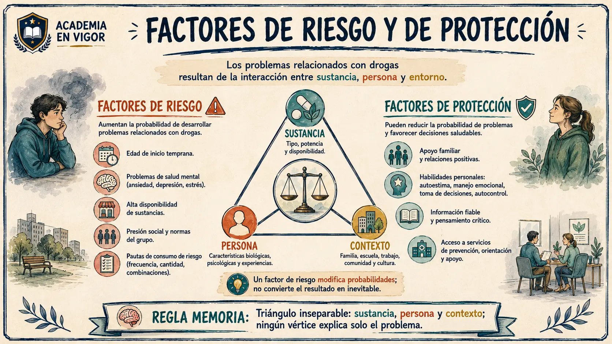

<em>Infografía: Factores de riesgo y de protección.</em>

:::hablemos-claro
Triángulo inseparable: sustancia, persona y contexto; ningún vértice explica solo el problema.
:::

:::en-la-calle
Al explicar el fenómeno sin estigmatizar, Triángulo inseparable: sustancia, persona y contexto; ningún vértice explica solo el problema.
:::

:::lo-que-cae
Prioriza **persona, sustancia y entorno** y descarta respuestas que confundan efecto, legalidad, origen o fecha.
:::

<!-- FUENTE: PNSD-INFORMACION-T34 -->

## 07. Daño individual, social y de salud pública

### Lógica del bloque

Para dominar **daño individual, social y de salud pública**, aplica esta regla: Cuenta consumo, pero también gravedad, exposición, vulnerabilidad y daño a terceros. El anclaje principal es **más allá del efecto farmacológico**.

### Hechos examinables

- El daño puede afectar salud física, salud mental, relaciones, estudios, trabajo, seguridad y convivencia. <!-- FACT:PN-T34-F025 -->
- La carga social no se mide únicamente por el número de personas consumidoras. <!-- FACT:PN-T34-F026 -->
- Frecuencia, intensidad, vulnerabilidad y gravedad de las consecuencias condicionan el impacto. <!-- FACT:PN-T34-F027 -->
- Prevenir, reducir riesgos, tratar y facilitar recuperación son respuestas complementarias, no excluyentes. <!-- FACT:PN-T34-F028 -->

### Trampas de examen

- **Incorrecto:** La sustancia más consumida es necesariamente la que causa más daño por episodio.
- **Incorrecto:** Tratamiento y prevención son respuestas incompatibles entre sí.

<!-- VISUAL:t34-07-dano-individual-social-y-de-salud-publica.webp -->

  

<em>Infografía: Daño individual, social y de salud pública.</em>

:::hablemos-claro
Cuenta consumo, pero también gravedad, exposición, vulnerabilidad y daño a terceros.
:::

:::en-la-calle
Al explicar el fenómeno sin estigmatizar, Cuenta consumo, pero también gravedad, exposición, vulnerabilidad y daño a terceros.
:::

:::lo-que-cae
Prioriza **más allá del efecto farmacológico** y descarta respuestas que confundan efecto, legalidad, origen o fecha.
:::

<!-- FUENTE: PNSD-INFORMACION-T34 -->

## 08. Lenguaje no estigmatizante y precisión

### Lógica del bloque

Para dominar **lenguaje no estigmatizante y precisión**, aplica esta regla: Describe hechos y riesgos; no sustituyas el diagnóstico por una etiqueta social. El anclaje principal es **persona antes que etiqueta**.

### Hechos examinables

- La terminología actual evita convertir a la persona en una etiqueta degradante. <!-- FACT:PN-T34-F029 -->
- Describir patrón, sustancia y consecuencia aporta más precisión que usar calificativos morales. <!-- FACT:PN-T34-F030 -->
- La dependencia es un fenómeno de salud y conducta, sin excluir responsabilidades jurídicas concretas. <!-- FACT:PN-T34-F031 -->
- Un lenguaje respetuoso mejora acceso a ayuda y no reduce el rigor del análisis. <!-- FACT:PN-T34-F032 -->

### Trampas de examen

- **Incorrecto:** Evitar estigma obliga a negar cualquier consecuencia jurídica del comportamiento.
- **Incorrecto:** Los apodos son más precisos que describir patrón y sustancia.

<!-- VISUAL:t34-il-08-lenguaje-no-estigmatizante-y-precision.webp -->

  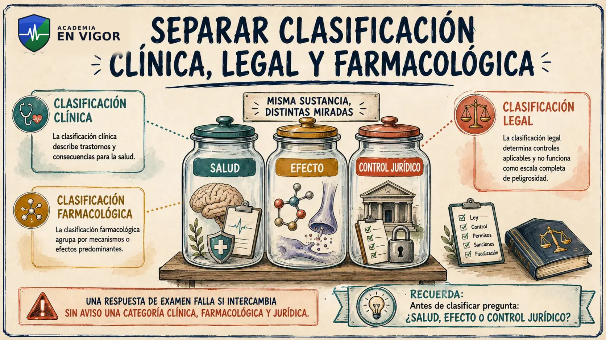

<em>Infografía: Lenguaje no estigmatizante y precisión.</em>

:::hablemos-claro
Describe hechos y riesgos; no sustituyas el diagnóstico por una etiqueta social.
:::

:::en-la-calle
Al explicar el fenómeno sin estigmatizar, Describe hechos y riesgos; no sustituyas el diagnóstico por una etiqueta social.
:::

:::lo-que-cae
Prioriza **persona antes que etiqueta** y descarta respuestas que confundan efecto, legalidad, origen o fecha.
:::

<!-- FUENTE: WHO-ICD11-SUBSTANCE-T34 -->

## 09. Separar clasificación clínica, legal y farmacológica

### Lógica del bloque

Para dominar **separar clasificación clínica, legal y farmacológica**, aplica esta regla: Antes de clasificar pregunta: ¿salud, efecto o control jurídico? El anclaje principal es **tres preguntas distintas**.

### Hechos examinables

- La clasificación clínica describe trastornos y consecuencias para la salud. <!-- FACT:PN-T34-F033 -->
- La clasificación farmacológica agrupa por mecanismos o efectos predominantes. <!-- FACT:PN-T34-F034 -->
- La clasificación legal determina controles aplicables y no funciona como escala completa de peligrosidad. <!-- FACT:PN-T34-F035 -->
- Una respuesta de examen falla si intercambia sin aviso una categoría clínica, farmacológica y jurídica. <!-- FACT:PN-T34-F036 -->

### Trampas de examen

- **Incorrecto:** Una sustancia controlada en una lista es siempre la más tóxica de su grupo.
- **Incorrecto:** Clasificación clínica y fiscalización legal son exactamente la misma operación.

<!-- VISUAL:t34-09-separar-clasificacion-clinica-legal-y-farmacologica.webp -->

  

<em>Infografía: Separar clasificación clínica, legal y farmacológica.</em>

:::hablemos-claro
Antes de clasificar pregunta: ¿salud, efecto o control jurídico?
:::

:::en-la-calle
Al explicar el fenómeno sin estigmatizar, Antes de clasificar pregunta: ¿salud, efecto o control jurídico?
:::

:::lo-que-cae
Prioriza **tres preguntas distintas** y descarta respuestas que confundan efecto, legalidad, origen o fecha.
:::

<!-- FUENTE: UNODC-TERMINOLOGY-T34 -->

## 10. Concepto descriptivo de consumidor

### Lógica del bloque

Para dominar **concepto descriptivo de consumidor**, aplica esta regla: Completa la ficha: qué, cuánto, cómo, cuándo, con qué y con qué consecuencias. El anclaje principal es **persona, sustancia, patrón y período**.

### Hechos examinables

- Consumidor es quien administra una sustancia en un contexto y período determinados. <!-- FACT:PN-T34-F037 -->
- La etiqueta consumidor no informa por sí sola de frecuencia, dependencia, vía ni daño. <!-- FACT:PN-T34-F038 -->
- Las tipologías de consumidor son descriptivas y no sustituyen una evaluación clínica individual. <!-- FACT:PN-T34-F039 -->
- La clasificación debe apoyarse en conducta observada y marco temporal, no en prejuicios sobre el grupo social. <!-- FACT:PN-T34-F040 -->

### Trampas de examen

- **Incorrecto:** Ser consumidor equivale siempre a ser dependiente.
- **Incorrecto:** La apariencia de una persona basta para clasificar su patrón de consumo.

<!-- VISUAL:t34-10-concepto-descriptivo-de-consumidor.webp -->

  

<em>Infografía: Concepto descriptivo de consumidor.</em>

:::hablemos-claro
Completa la ficha: qué, cuánto, cómo, cuándo, con qué y con qué consecuencias.
:::

:::en-la-calle
Al valorar un patrón y su vía de administración, Completa la ficha: qué, cuánto, cómo, cuándo, con qué y con qué consecuencias.
:::

:::lo-que-cae
Prioriza **persona, sustancia, patrón y período** y descarta respuestas que confundan efecto, legalidad, origen o fecha.
:::

<!-- FUENTE: CONVOCATORIA-PN-2026-T34 -->

## 11. Consumidor experimental

### Lógica del bloque

Para dominar **consumidor experimental**, aplica esta regla: “Probar” describe frecuencia, no seguridad ni destino futuro. El anclaje principal es **prueba y ausencia de patrón consolidado**.

### Hechos examinables

- El consumo experimental se caracteriza por probar una sustancia una o pocas veces sin patrón consolidado. <!-- FACT:PN-T34-F041 -->
- Experimental no significa inocuo: puede existir intoxicación, accidente o reacción grave desde el primer episodio. <!-- FACT:PN-T34-F042 -->
- La motivación puede ser curiosidad, presión del grupo, disponibilidad u otras circunstancias. <!-- FACT:PN-T34-F043 -->
- No permite inferir por sí solo que el consumo vaya a mantenerse o evolucionar a dependencia. <!-- FACT:PN-T34-F044 -->

### Trampas de examen

- **Incorrecto:** Experimental significa consumo diario con tolerancia.
- **Incorrecto:** La primera exposición carece siempre de riesgo relevante.

<!-- VISUAL:t34-il-11-consumidor-experimental.webp -->

  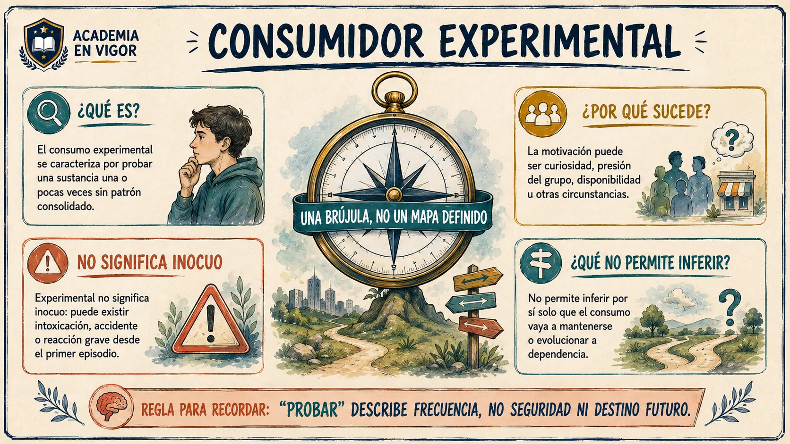

<em>Infografía: Consumidor experimental.</em>

:::hablemos-claro
“Probar” describe frecuencia, no seguridad ni destino futuro.
:::

:::en-la-calle
Al valorar un patrón y su vía de administración, “Probar” describe frecuencia, no seguridad ni destino futuro.
:::

:::lo-que-cae
Prioriza **prueba y ausencia de patrón consolidado** y descarta respuestas que confundan efecto, legalidad, origen o fecha.
:::

<!-- FUENTE: PNSD-INFORMACION-T34 -->

## 12. Consumidor ocasional o esporádico

### Lógica del bloque

Para dominar **consumidor ocasional o esporádico**, aplica esta regla: Pocas ocasiones no equivalen a poco riesgo: importa qué ocurre en cada episodio. El anclaje principal es **episodios separados y contexto**.

### Hechos examinables

- El consumo ocasional aparece en situaciones concretas y con intervalos sin consumo. <!-- FACT:PN-T34-F045 -->
- La baja frecuencia no elimina riesgos ligados a dosis, mezcla, conducción o entorno. <!-- FACT:PN-T34-F046 -->
- Ocasional describe periodicidad, no control garantizado ni ausencia de consecuencias. <!-- FACT:PN-T34-F047 -->
- Para compararlo se necesita definir el período de referencia: vida, año, mes o episodio. <!-- FACT:PN-T34-F048 -->

### Trampas de examen

- **Incorrecto:** Ocasional significa automáticamente consumo sin consecuencias.
- **Incorrecto:** Puede clasificarse la frecuencia sin precisar período de referencia.

<!-- VISUAL:t34-12-consumidor-ocasional-o-esporadico.webp -->

  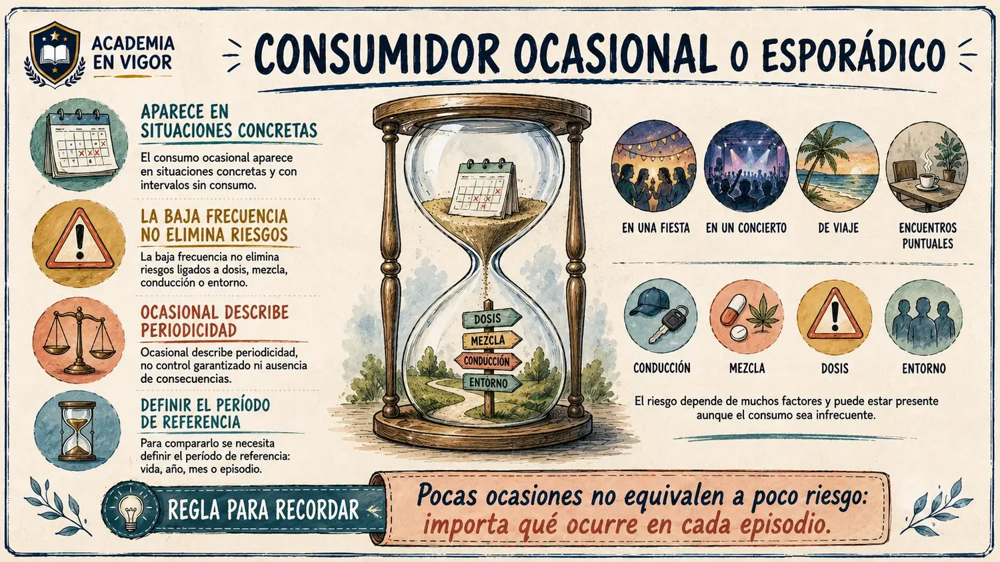

<em>Infografía: Consumidor ocasional o esporádico.</em>

:::hablemos-claro
Pocas ocasiones no equivalen a poco riesgo: importa qué ocurre en cada episodio.
:::

:::en-la-calle
Al valorar un patrón y su vía de administración, Pocas ocasiones no equivalen a poco riesgo: importa qué ocurre en cada episodio.
:::

:::lo-que-cae
Prioriza **episodios separados y contexto** y descarta respuestas que confundan efecto, legalidad, origen o fecha.
:::

<!-- FUENTE: PNSD-INFORMACION-T34 -->

## 13. Consumidor habitual

### Lógica del bloque

Para dominar **consumidor habitual**, aplica esta regla: Habitual habla de repetición; dependencia exige pérdida de control y prioridad del consumo. El anclaje principal es **repetición estable sin diagnóstico automático**.

### Hechos examinables

- El consumo habitual presenta regularidad o repetición dentro de un período definido. <!-- FACT:PN-T34-F049 -->
- Habitual no es sinónimo automático de dependencia, aunque puede elevar exposición y riesgo. <!-- FACT:PN-T34-F050 -->
- La frecuencia debe interpretarse junto a cantidad, función del consumo y consecuencias. <!-- FACT:PN-T34-F051 -->
- Un patrón habitual puede cambiar por contexto, disponibilidad, intervención o evolución personal. <!-- FACT:PN-T34-F052 -->

### Trampas de examen

- **Incorrecto:** Todo consumidor habitual cumple necesariamente criterios de dependencia.
- **Incorrecto:** Cantidad y consecuencias son irrelevantes si se conoce la frecuencia.

<!-- VISUAL:t34-13-consumidor-habitual.webp -->

  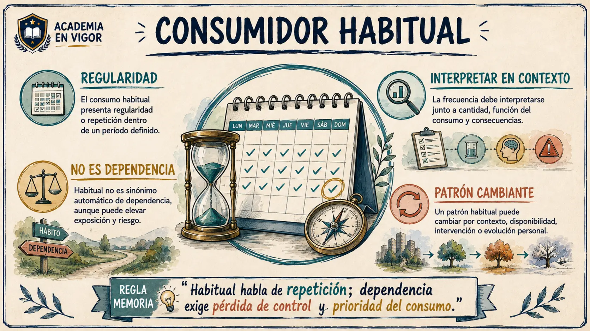

<em>Infografía: Consumidor habitual.</em>

:::hablemos-claro
Habitual habla de repetición; dependencia exige pérdida de control y prioridad del consumo.
:::

:::en-la-calle
Al valorar un patrón y su vía de administración, Habitual habla de repetición; dependencia exige pérdida de control y prioridad del consumo.
:::

:::lo-que-cae
Prioriza **repetición estable sin diagnóstico automático** y descarta respuestas que confundan efecto, legalidad, origen o fecha.
:::

<!-- FUENTE: PNSD-INFORMACION-T34 -->

## 14. Consumidor dependiente

### Lógica del bloque

Para dominar **consumidor dependiente**, aplica esta regla: Tres focos: control deteriorado, prioridad creciente y persistencia pese al daño. El anclaje principal es **control, prioridad y persistencia**.

### Hechos examinables

- El patrón dependiente se reconoce por deterioro del control sobre el consumo. <!-- FACT:PN-T34-F053 -->
- La sustancia adquiere prioridad creciente frente a otras actividades y obligaciones. <!-- FACT:PN-T34-F054 -->
- El consumo persiste o reaparece pese a consecuencias perjudiciales. <!-- FACT:PN-T34-F055 -->
- Tolerancia y abstinencia pueden apoyar la valoración, pero no deben aislarse del patrón completo. <!-- FACT:PN-T34-F056 -->

### Trampas de examen

- **Incorrecto:** Dependencia se define únicamente por consumir todos los días.
- **Incorrecto:** La tolerancia aislada demuestra por sí sola dependencia en cualquier contexto.

<!-- VISUAL:t34-14-consumidor-dependiente.webp -->

  

<em>Infografía: Consumidor dependiente.</em>

:::hablemos-claro
Tres focos: control deteriorado, prioridad creciente y persistencia pese al daño.
:::

:::en-la-calle
Al valorar un patrón y su vía de administración, Tres focos: control deteriorado, prioridad creciente y persistencia pese al daño.
:::

:::lo-que-cae
Prioriza **control, prioridad y persistencia** y descarta respuestas que confundan efecto, legalidad, origen o fecha.
:::

<!-- FUENTE: WHO-ICD11-SUBSTANCE-T34 -->

## 15. Patrones simultáneo y concurrente

### Lógica del bloque

Para dominar **patrones simultáneo y concurrente**, aplica esta regla: Concurrente comparte período; simultáneo comparte episodio y posible interacción. El anclaje principal es **cuándo se combinan las sustancias**.

### Hechos examinables

- El policonsumo puede referirse a uso de varias sustancias dentro de un período de observación. <!-- FACT:PN-T34-F057 -->
- El uso simultáneo sitúa varias sustancias en el mismo episodio o con efectos solapados. <!-- FACT:PN-T34-F058 -->
- El uso concurrente registra varias sustancias en un período, aunque no coincidan en el mismo episodio. <!-- FACT:PN-T34-F059 -->
- La distinción es importante porque el riesgo de interacción es mayor cuando los efectos se solapan. <!-- FACT:PN-T34-F060 -->

### Trampas de examen

- **Incorrecto:** Todo policonsumo implica mezcla en el mismo momento.
- **Incorrecto:** El consumo simultáneo elimina la posibilidad de interacción porque las sustancias son distintas.

<!-- VISUAL:t34-15-patrones-simultaneo-y-concurrente.webp -->

  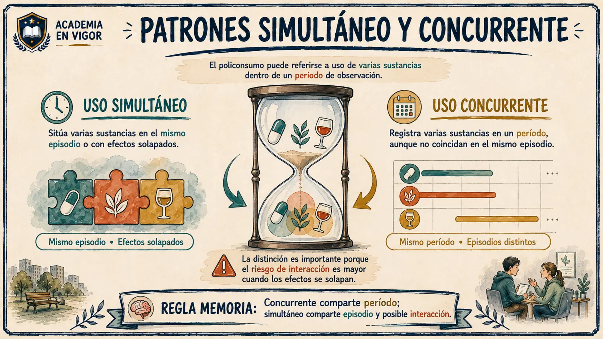

<em>Infografía: Patrones simultáneo y concurrente.</em>

:::hablemos-claro
Concurrente comparte período; simultáneo comparte episodio y posible interacción.
:::

:::en-la-calle
Al valorar un patrón y su vía de administración, Concurrente comparte período; simultáneo comparte episodio y posible interacción.
:::

:::lo-que-cae
Prioriza **cuándo se combinan las sustancias** y descarta respuestas que confundan efecto, legalidad, origen o fecha.
:::

<!-- FUENTE: OEDA-EDADES-2024-T34 -->

## 16. Métodos de administración: mapa general

### Lógica del bloque

Para dominar **métodos de administración: mapa general**, aplica esta regla: La vía es una autopista farmacológica: cambia velocidad, pico, duración y peajes de riesgo. El anclaje principal es **entrada, absorción y llegada al sistema nervioso**.

### Hechos examinables

- La vía de administración determina cómo entra y se absorbe una sustancia. <!-- FACT:PN-T34-F061 -->
- Las vías habituales incluyen oral, inhalada, intranasal, parenteral, sublingual, bucal y transdérmica. <!-- FACT:PN-T34-F062 -->
- La vía modifica rapidez de inicio, intensidad máxima, duración y riesgos locales o sistémicos. <!-- FACT:PN-T34-F063 -->
- Cambiar la vía puede cambiar radicalmente el riesgo aunque la sustancia sea la misma. <!-- FACT:PN-T34-F064 -->

### Trampas de examen

- **Incorrecto:** La vía solo modifica el lugar de consumo y no los efectos.
- **Incorrecto:** Todas las vías alcanzan el cerebro con idéntica rapidez.

<!-- VISUAL:t34-il-16-metodos-de-administracion-mapa-general.webp -->

  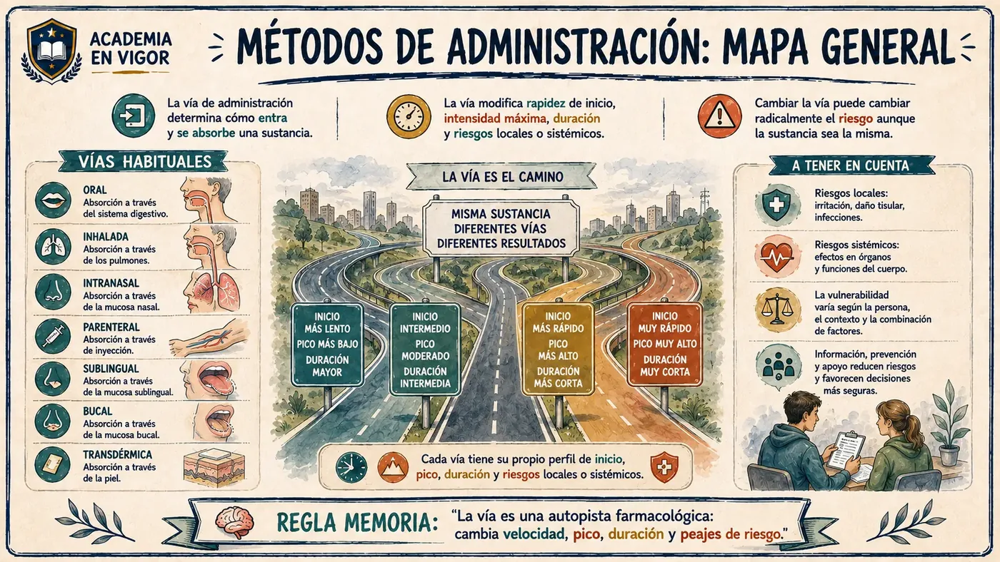

<em>Infografía: Métodos de administración: mapa general.</em>

:::hablemos-claro
La vía es una autopista farmacológica: cambia velocidad, pico, duración y peajes de riesgo.
:::

:::en-la-calle
Al valorar un patrón y su vía de administración, La vía es una autopista farmacológica: cambia velocidad, pico, duración y peajes de riesgo.
:::

:::lo-que-cae
Prioriza **entrada, absorción y llegada al sistema nervioso** y descarta respuestas que confundan efecto, legalidad, origen o fecha.
:::

<!-- FUENTE: UNODC-TERMINOLOGY-T34 -->

## 17. Vía oral

### Lógica del bloque

Para dominar **vía oral**, aplica esta regla: Inicio lento no significa efecto débil: el error clásico es repetir antes de tiempo. El anclaje principal es **absorción digestiva e inicio más lento**.

### Hechos examinables

- La vía oral introduce la sustancia por el aparato digestivo y suele tener inicio más lento que inhalación o inyección. <!-- FACT:PN-T34-F065 -->
- El paso digestivo y hepático puede transformar parte de la sustancia antes de alcanzar la circulación general. <!-- FACT:PN-T34-F066 -->
- El retraso del efecto puede favorecer redosificación prematura si se interpreta como ausencia de efecto. <!-- FACT:PN-T34-F067 -->
- La duración puede ser mayor que con vías de llegada rápida, según la sustancia y formulación. <!-- FACT:PN-T34-F068 -->

### Trampas de examen

- **Incorrecto:** La vía oral produce siempre efecto inmediato.
- **Incorrecto:** El retraso de inicio impide cualquier intoxicación por repetición de dosis.

<!-- VISUAL:t34-17-via-oral.webp -->

  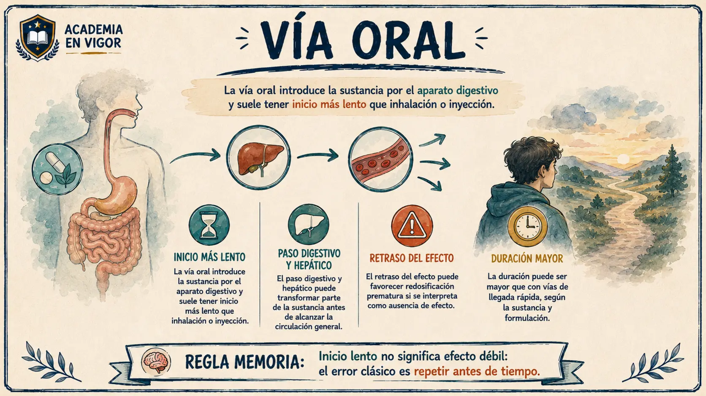

<em>Infografía: Vía oral.</em>

:::hablemos-claro
Inicio lento no significa efecto débil: el error clásico es repetir antes de tiempo.
:::

:::en-la-calle
Al valorar un patrón y su vía de administración, Inicio lento no significa efecto débil: el error clásico es repetir antes de tiempo.
:::

:::lo-que-cae
Prioriza **absorción digestiva e inicio más lento** y descarta respuestas que confundan efecto, legalidad, origen o fecha.
:::

<!-- FUENTE: UNODC-TERMINOLOGY-T34 -->

## 18. Vías inhalada y fumada

### Lógica del bloque

Para dominar **vías inhalada y fumada**, aplica esta regla: Rapidez y pulmón son las dos claves: efecto precoz y exposición respiratoria. El anclaje principal es **pulmón, rapidez y exposición respiratoria**.

### Hechos examinables

- La inhalación permite absorción pulmonar rápida y llegada precoz de la sustancia a la circulación. <!-- FACT:PN-T34-F069 -->
- El inicio rápido puede reforzar la repetición del consumo al asociar conducta y efecto inmediato. <!-- FACT:PN-T34-F070 -->
- Humo, vapores y aerosoles pueden añadir daño respiratorio independiente del efecto psicoactivo. <!-- FACT:PN-T34-F071 -->
- Vapear no garantiza composición conocida ni elimina el riesgo de intoxicación. <!-- FACT:PN-T34-F072 -->

### Trampas de examen

- **Incorrecto:** Inhalar produce un inicio más lento que la vía oral en todos los casos.
- **Incorrecto:** Un producto vaporizado es seguro porque no hay combustión.

<!-- VISUAL:t34-18-vias-inhalada-y-fumada.webp -->

  

<em>Infografía: Vías inhalada y fumada.</em>

:::hablemos-claro
Rapidez y pulmón son las dos claves: efecto precoz y exposición respiratoria.
:::

:::en-la-calle
Al valorar un patrón y su vía de administración, Rapidez y pulmón son las dos claves: efecto precoz y exposición respiratoria.
:::

:::lo-que-cae
Prioriza **pulmón, rapidez y exposición respiratoria** y descarta respuestas que confundan efecto, legalidad, origen o fecha.
:::

<!-- FUENTE: UNODC-TERMINOLOGY-T34 -->

## 19. Vía intranasal

### Lógica del bloque

Para dominar **vía intranasal**, aplica esta regla: Sin aguja no significa sin lesión: mucosa, tabique y material compartido importan. El anclaje principal es **mucosa nasal y absorción**.

### Hechos examinables

- La vía intranasal aprovecha la absorción a través de la mucosa nasal. <!-- FACT:PN-T34-F073 -->
- Suele producir un inicio más rápido que la ingestión y más lento que ciertas vías inhaladas o intravenosas. <!-- FACT:PN-T34-F074 -->
- El uso repetido puede lesionar mucosa, tabique y tejidos locales. <!-- FACT:PN-T34-F075 -->
- Compartir instrumentos puede facilitar transmisión de infecciones por contacto con sangre o secreciones. <!-- FACT:PN-T34-F076 -->

### Trampas de examen

- **Incorrecto:** La vía intranasal carece de daño local porque no usa agujas.
- **Incorrecto:** Compartir instrumentos nunca supone riesgo infeccioso.

<!-- VISUAL:t34-19-via-intranasal.webp -->

  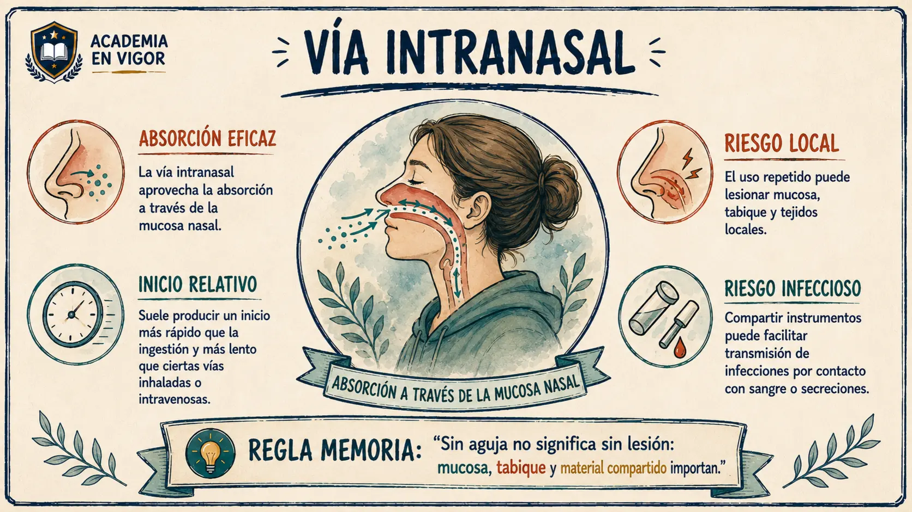

<em>Infografía: Vía intranasal.</em>

:::hablemos-claro
Sin aguja no significa sin lesión: mucosa, tabique y material compartido importan.
:::

:::en-la-calle
Al valorar un patrón y su vía de administración, Sin aguja no significa sin lesión: mucosa, tabique y material compartido importan.
:::

:::lo-que-cae
Prioriza **mucosa nasal y absorción** y descarta respuestas que confundan efecto, legalidad, origen o fecha.
:::

<!-- FUENTE: UNODC-TERMINOLOGY-T34 -->

## 20. Vía parenteral e intravenosa

### Lógica del bloque

Para dominar **vía parenteral e intravenosa**, aplica esta regla: Directo a sangre significa menos margen de corrección: composición, cantidad e higiene se vuelven críticas. El anclaje principal es **acceso directo y máximo riesgo de pico**.

### Hechos examinables

- La vía parenteral introduce la sustancia atravesando la piel; la intravenosa accede directamente a la circulación. <!-- FACT:PN-T34-F077 -->
- La llegada muy rápida aumenta el pico de concentración y el riesgo de sobredosis. <!-- FACT:PN-T34-F078 -->
- Material compartido o no estéril eleva el riesgo de infecciones y lesiones vasculares. <!-- FACT:PN-T34-F079 -->
- La vía elimina parte de las barreras de absorción, por lo que los errores de composición o cantidad son especialmente peligrosos. <!-- FACT:PN-T34-F080 -->

### Trampas de examen

- **Incorrecto:** La inyección reduce el riesgo porque evita el aparato digestivo.
- **Incorrecto:** La esterilidad del material elimina el riesgo de sobredosis.

<!-- VISUAL:t34-20-via-parenteral-e-intravenosa.webp -->

  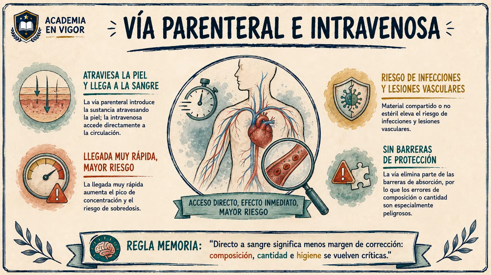

<em>Infografía: Vía parenteral e intravenosa.</em>

:::hablemos-claro
Directo a sangre significa menos margen de corrección: composición, cantidad e higiene se vuelven críticas.
:::

:::en-la-calle
Al valorar un patrón y su vía de administración, Directo a sangre significa menos margen de corrección: composición, cantidad e higiene se vuelven críticas.
:::

:::lo-que-cae
Prioriza **acceso directo y máximo riesgo de pico** y descarta respuestas que confundan efecto, legalidad, origen o fecha.
:::

<!-- FUENTE: UNODC-TERMINOLOGY-T34 -->

## 21. Vías sublingual, bucal y transdérmica

### Lógica del bloque

Para dominar **vías sublingual, bucal y transdérmica**, aplica esta regla: Misma zona visible, distinta absorción: debajo de la lengua, mucosa bucal o piel. El anclaje principal es **mucosas y piel**.

### Hechos examinables

- La vía sublingual absorbe a través de la mucosa situada bajo la lengua. <!-- FACT:PN-T34-F081 -->
- La vía bucal utiliza otras superficies de la mucosa oral. <!-- FACT:PN-T34-F082 -->
- La vía transdérmica libera sustancia a través de la piel, a menudo de forma sostenida. <!-- FACT:PN-T34-F083 -->
- Que una vía tenga uso terapéutico no autoriza alterar, combinar o manipular una formulación prescrita. <!-- FACT:PN-T34-F084 -->

### Trampas de examen

- **Incorrecto:** Sublingual y oral son idénticas porque ambas usan la boca.
- **Incorrecto:** Un parche terapéutico puede manipularse sin modificar su riesgo.

<!-- VISUAL:t34-21-vias-sublingual-bucal-y-transdermica.webp -->

  

<em>Infografía: Vías sublingual, bucal y transdérmica.</em>

:::hablemos-claro
Misma zona visible, distinta absorción: debajo de la lengua, mucosa bucal o piel.
:::

:::en-la-calle
Al valorar un patrón y su vía de administración, Misma zona visible, distinta absorción: debajo de la lengua, mucosa bucal o piel.
:::

:::lo-que-cae
Prioriza **mucosas y piel** y descarta respuestas que confundan efecto, legalidad, origen o fecha.
:::

<!-- FUENTE: UNODC-TERMINOLOGY-T34 -->

## 22. Rapidez de inicio, pico y duración

### Lógica del bloque

Para dominar **rapidez de inicio, pico y duración**, aplica esta regla: Tres relojes distintos: empieza, alcanza el máximo y deja de sentirse; la eliminación tiene su propio reloj. El anclaje principal es **perfil temporal del efecto**.

### Hechos examinables

- Inicio es el tiempo hasta que aparecen efectos; pico es el máximo; duración es el tiempo de efecto apreciable. <!-- FACT:PN-T34-F085 -->
- Una llegada rápida suele asociarse a refuerzo más inmediato y menor margen ante una dosis excesiva. <!-- FACT:PN-T34-F086 -->
- Duración larga no implica necesariamente un pico más intenso. <!-- FACT:PN-T34-F087 -->
- La eliminación del organismo puede prolongarse más que la percepción subjetiva del efecto. <!-- FACT:PN-T34-F088 -->

### Trampas de examen

- **Incorrecto:** Pico y duración son la misma medida.
- **Incorrecto:** Cuando una persona deja de notar efecto, la sustancia ya se ha eliminado por completo.

<!-- VISUAL:t34-22-rapidez-de-inicio-pico-y-duracion.webp -->

  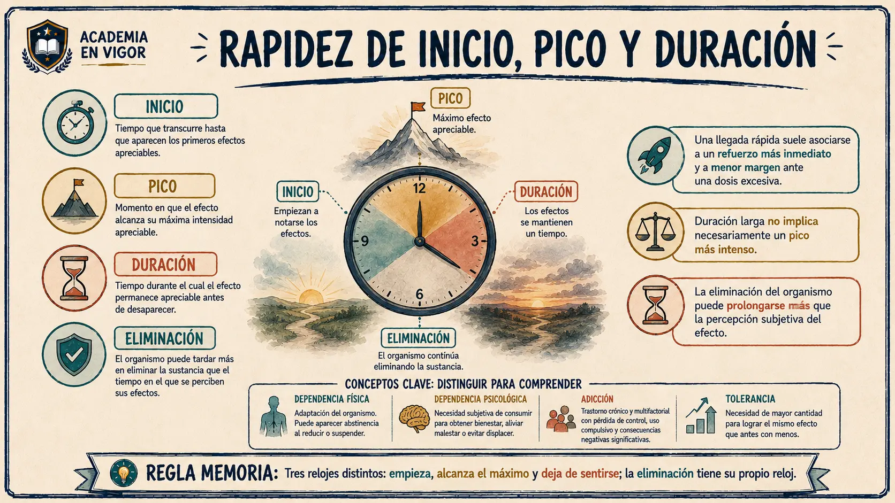

<em>Infografía: Rapidez de inicio, pico y duración.</em>

:::hablemos-claro
Tres relojes distintos: empieza, alcanza el máximo y deja de sentirse; la eliminación tiene su propio reloj.
:::

:::en-la-calle
Al valorar un patrón y su vía de administración, Tres relojes distintos: empieza, alcanza el máximo y deja de sentirse; la eliminación tiene su propio reloj.
:::

:::lo-que-cae
Prioriza **perfil temporal del efecto** y descarta respuestas que confundan efecto, legalidad, origen o fecha.
:::

<!-- FUENTE: UNODC-TERMINOLOGY-T34 -->

## 23. Método de administración y reducción de riesgos

### Lógica del bloque

Para dominar **método de administración y reducción de riesgos**, aplica esta regla: Reducción de daño no es garantía: reconoce la urgencia y actúa sobre lo vital. El anclaje principal es **la vía nunca neutraliza el peligro**.

### Hechos examinables

- Ninguna vía convierte una sustancia desconocida en segura. <!-- FACT:PN-T34-F089 -->
- Evitar mezclas y reconocer signos de urgencia reduce daños, pero no elimina la incertidumbre de composición. <!-- FACT:PN-T34-F090 -->
- Ante pérdida de conciencia, respiración anormal, convulsiones o hipertermia se requiere atención urgente. <!-- FACT:PN-T34-F091 -->
- La respuesta debe priorizar funciones vitales y comunicar sustancias conocidas sin retrasar la asistencia. <!-- FACT:PN-T34-F092 -->

### Trampas de examen

- **Incorrecto:** Elegir una vía menos rápida elimina todo riesgo de intoxicación.
- **Incorrecto:** Esperar a identificar exactamente la sustancia debe preceder siempre a pedir ayuda.

<!-- VISUAL:t34-il-23-metodo-de-administracion-y-reduccion-de-riesgos.webp -->

  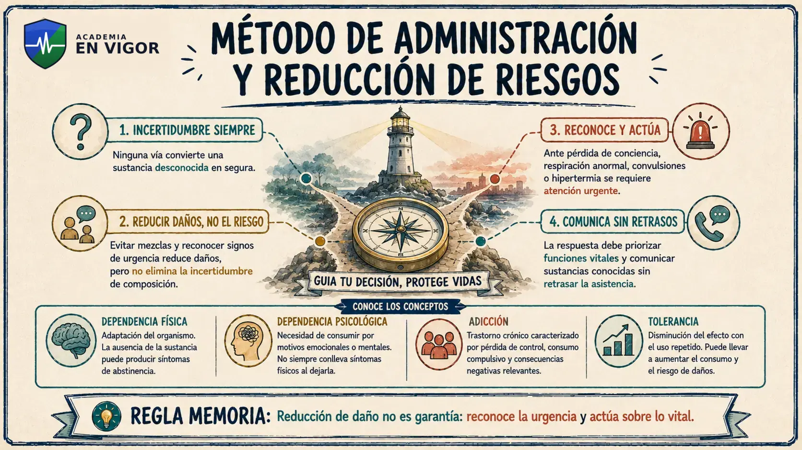

<em>Infografía: Método de administración y reducción de riesgos.</em>

:::hablemos-claro
Reducción de daño no es garantía: reconoce la urgencia y actúa sobre lo vital.
:::

:::en-la-calle
Al valorar un patrón y su vía de administración, Reducción de daño no es garantía: reconoce la urgencia y actúa sobre lo vital.
:::

:::lo-que-cae
Prioriza **la vía nunca neutraliza el peligro** y descarta respuestas que confundan efecto, legalidad, origen o fecha.
:::

<!-- FUENTE: PNSD-INFORMACION-T34 -->

## 24. Concepto de adicción

### Lógica del bloque

Para dominar **concepto de adicción**, aplica esta regla: Mira el patrón completo: control, prioridad, persistencia y consecuencias. El anclaje principal es **conducta repetida, control y prioridad**.

### Hechos examinables

- La adicción implica un patrón persistente de conducta orientada al consumo pese a consecuencias perjudiciales. <!-- FACT:PN-T34-F093 -->
- El deterioro del control y la prioridad creciente del consumo son elementos centrales. <!-- FACT:PN-T34-F094 -->
- No se reduce a falta de voluntad ni a la presencia aislada de síntomas físicos. <!-- FACT:PN-T34-F095 -->
- Puede cursar con remisiones, recaídas y recuperación, por lo que no debe tratarse como destino irreversible. <!-- FACT:PN-T34-F096 -->

### Trampas de examen

- **Incorrecto:** La adicción es únicamente una abstinencia física intensa.
- **Incorrecto:** Una recaída demuestra que la recuperación es imposible.

<!-- VISUAL:t34-24-concepto-de-adiccion.webp -->

  

<em>Infografía: Concepto de adicción.</em>

:::hablemos-claro
Mira el patrón completo: control, prioridad, persistencia y consecuencias.
:::

:::en-la-calle
Al diferenciar adaptación, dependencia e interacción, Mira el patrón completo: control, prioridad, persistencia y consecuencias.
:::

:::lo-que-cae
Prioriza **conducta repetida, control y prioridad** y descarta respuestas que confundan efecto, legalidad, origen o fecha.
:::

<!-- FUENTE: WHO-ICD11-SUBSTANCE-T34 -->

## 25. Dependencia física y adaptación

### Lógica del bloque

Para dominar **dependencia física y adaptación**, aplica esta regla: Adaptación corporal no equivale por sí sola a pérdida de control conductual. El anclaje principal es **adaptación y retirada**.

### Hechos examinables

- La dependencia física es una adaptación del organismo a la exposición repetida a una sustancia. <!-- FACT:PN-T34-F097 -->
- Puede manifestarse mediante síndrome de abstinencia al cesar o reducir el consumo. <!-- FACT:PN-T34-F098 -->
- Puede aparecer durante tratamiento médico correctamente indicado sin que exista conducta adictiva. <!-- FACT:PN-T34-F099 -->
- La retirada de ciertas sustancias debe hacerse con supervisión porque la abstinencia puede ser grave. <!-- FACT:PN-T34-F100 -->

### Trampas de examen

- **Incorrecto:** Dependencia física y adicción son siempre inseparables.
- **Incorrecto:** Toda sustancia puede suspenderse bruscamente sin riesgo.

<!-- VISUAL:t34-25-dependencia-fisica-y-adaptacion.webp -->

  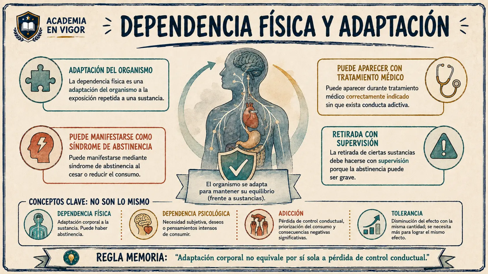

<em>Infografía: Dependencia física y adaptación.</em>

:::hablemos-claro
Adaptación corporal no equivale por sí sola a pérdida de control conductual.
:::

:::en-la-calle
Al diferenciar adaptación, dependencia e interacción, Adaptación corporal no equivale por sí sola a pérdida de control conductual.
:::

:::lo-que-cae
Prioriza **adaptación y retirada** y descarta respuestas que confundan efecto, legalidad, origen o fecha.
:::

<!-- FUENTE: UNODC-TERMINOLOGY-T34 -->

## 26. Dependencia psíquica

### Lógica del bloque

Para dominar **dependencia psíquica**, aplica esta regla: La mente aprende lugares, emociones y recompensas; el cuerpo no es el único que se adapta. El anclaje principal es **deseo, función y expectativa**.

### Hechos examinables

- La dependencia psíquica se relaciona con deseo intenso y uso de la sustancia para obtener o evitar estados mentales. <!-- FACT:PN-T34-F101 -->
- Puede mantenerse por expectativas, señales ambientales y aprendizaje de alivio o recompensa. <!-- FACT:PN-T34-F102 -->
- No exige un síndrome físico espectacular para producir deterioro importante. <!-- FACT:PN-T34-F103 -->
- El contexto y los desencadenantes adquieren relevancia en prevención de recaídas. <!-- FACT:PN-T34-F104 -->

### Trampas de examen

- **Incorrecto:** Sin temblores o vómitos no puede existir dependencia relevante.
- **Incorrecto:** Las señales ambientales carecen de efecto sobre el deseo.

<!-- VISUAL:t34-26-dependencia-psiquica.webp -->

  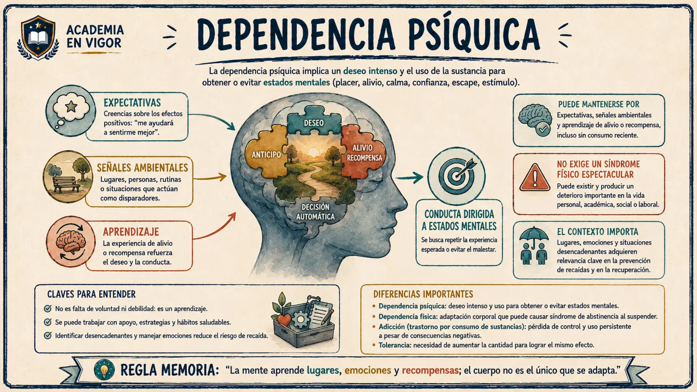

<em>Infografía: Dependencia psíquica.</em>

:::hablemos-claro
La mente aprende lugares, emociones y recompensas; el cuerpo no es el único que se adapta.
:::

:::en-la-calle
Al diferenciar adaptación, dependencia e interacción, La mente aprende lugares, emociones y recompensas; el cuerpo no es el único que se adapta.
:::

:::lo-que-cae
Prioriza **deseo, función y expectativa** y descarta respuestas que confundan efecto, legalidad, origen o fecha.
:::

<!-- FUENTE: UNODC-TERMINOLOGY-T34 -->

## 27. Tolerancia

### Lógica del bloque

Para dominar **tolerancia**, aplica esta regla: Menos efecto percibido no es menos riesgo: la adaptación puede ser desigual. El anclaje principal es **menor efecto o mayor cantidad**.

### Hechos examinables

- Tolerancia es la disminución del efecto de una dosis tras administraciones repetidas. <!-- FACT:PN-T34-F105 -->
- También puede expresarse como necesidad de mayor cantidad para alcanzar un efecto similar. <!-- FACT:PN-T34-F106 -->
- No aparece igual para todos los efectos de una sustancia ni a la misma velocidad. <!-- FACT:PN-T34-F107 -->
- Tolerancia no significa protección frente a toxicidad, accidentes o daño orgánico. <!-- FACT:PN-T34-F108 -->

### Trampas de examen

- **Incorrecto:** Tolerancia significa que la sustancia deja de causar cualquier daño.
- **Incorrecto:** Todos los efectos desarrollan tolerancia simultánea e idéntica.

<!-- VISUAL:t34-27-tolerancia.webp -->

  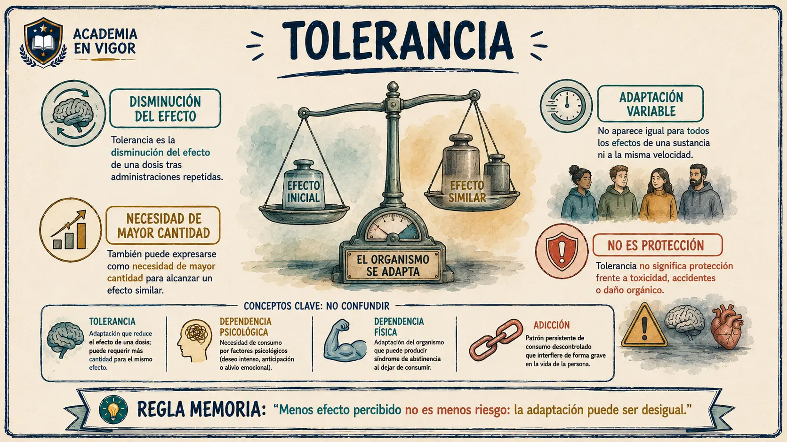

<em>Infografía: Tolerancia.</em>

:::hablemos-claro
Menos efecto percibido no es menos riesgo: la adaptación puede ser desigual.
:::

:::en-la-calle
Al diferenciar adaptación, dependencia e interacción, Menos efecto percibido no es menos riesgo: la adaptación puede ser desigual.
:::

:::lo-que-cae
Prioriza **menor efecto o mayor cantidad** y descarta respuestas que confundan efecto, legalidad, origen o fecha.
:::

<!-- FUENTE: UNODC-TERMINOLOGY-T34 -->

## 28. Tolerancia cruzada

### Lógica del bloque

Para dominar **tolerancia cruzada**, aplica esta regla: El organismo puede reconocer familias, pero no ofrece una tabla casera de equivalencias. El anclaje principal es **adaptación compartida entre sustancias**.

### Hechos examinables

- Existe tolerancia cruzada cuando la tolerancia a una sustancia reduce la respuesta a otra relacionada. <!-- FACT:PN-T34-F109 -->
- Suele aparecer entre sustancias con mecanismos o efectos farmacológicos próximos. <!-- FACT:PN-T34-F110 -->
- No autoriza a asumir equivalencias exactas de potencia o dosis entre productos. <!-- FACT:PN-T34-F111 -->
- Puede influir en tratamiento, abstinencia y riesgo de sustitución entre sustancias. <!-- FACT:PN-T34-F112 -->

### Trampas de examen

- **Incorrecto:** Tolerancia cruzada solo existe entre dos marcas del mismo producto.
- **Incorrecto:** Permite calcular una equivalencia segura sin evaluación profesional.

<!-- VISUAL:t34-il-28-tolerancia-cruzada.webp -->

  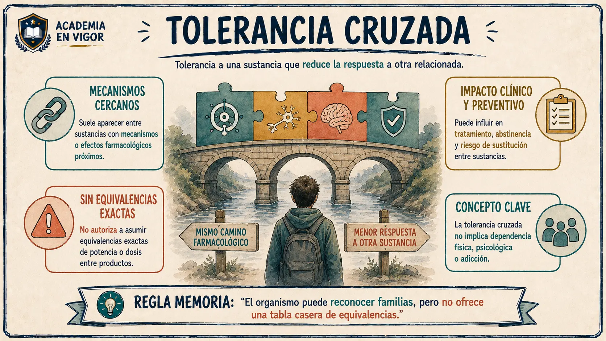

<em>Infografía: Tolerancia cruzada.</em>

:::hablemos-claro
El organismo puede reconocer familias, pero no ofrece una tabla casera de equivalencias.
:::

:::en-la-calle
Al diferenciar adaptación, dependencia e interacción, El organismo puede reconocer familias, pero no ofrece una tabla casera de equivalencias.
:::

:::lo-que-cae
Prioriza **adaptación compartida entre sustancias** y descarta respuestas que confundan efecto, legalidad, origen o fecha.
:::

<!-- FUENTE: UNODC-TERMINOLOGY-T34 -->

## 29. Tolerancia inversa o sensibilización

### Lógica del bloque

Para dominar **tolerancia inversa o sensibilización**, aplica esta regla: La adaptación no tiene una sola dirección: un efecto puede bajar y otro intensificarse. El anclaje principal es **respuesta aumentada**.

### Hechos examinables

- La sensibilización describe aumento de respuesta tras exposiciones repetidas en determinados efectos o sustancias. <!-- FACT:PN-T34-F113 -->
- No es la regla general de toda droga ni el simple contrario universal de la tolerancia. <!-- FACT:PN-T34-F114 -->
- Puede afectar respuestas conductuales aunque otros efectos desarrollen tolerancia. <!-- FACT:PN-T34-F115 -->
- Obliga a evitar respuestas absolutas sobre que siempre hará falta más cantidad. <!-- FACT:PN-T34-F116 -->

### Trampas de examen

- **Incorrecto:** Toda repetición produce exclusivamente tolerancia y nunca sensibilización.
- **Incorrecto:** Sensibilización significa que todos los efectos aumentan por igual.

<!-- VISUAL:t34-29-tolerancia-inversa-o-sensibilizacion.webp -->

  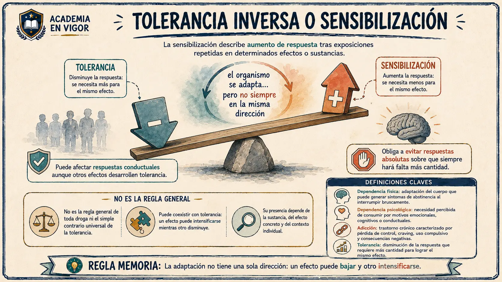

<em>Infografía: Tolerancia inversa o sensibilización.</em>

:::hablemos-claro
La adaptación no tiene una sola dirección: un efecto puede bajar y otro intensificarse.
:::

:::en-la-calle
Al diferenciar adaptación, dependencia e interacción, La adaptación no tiene una sola dirección: un efecto puede bajar y otro intensificarse.
:::

:::lo-que-cae
Prioriza **respuesta aumentada** y descarta respuestas que confundan efecto, legalidad, origen o fecha.
:::

<!-- FUENTE: UNODC-TERMINOLOGY-T34 -->

## 30. Síndrome de abstinencia

### Lógica del bloque

Para dominar **síndrome de abstinencia**, aplica esta regla: Abstinencia es una familia de cuadros, no un único listado universal de síntomas. El anclaje principal es **cese, reducción y síntomas**.

### Hechos examinables

- El síndrome de abstinencia aparece tras cesar o reducir una sustancia después de uso repetido o prolongado. <!-- FACT:PN-T34-F117 -->
- El perfil depende de la sustancia, intensidad del consumo y adaptación individual. <!-- FACT:PN-T34-F118 -->
- Puede incluir síntomas físicos, psicológicos y conductuales. <!-- FACT:PN-T34-F119 -->
- La gravedad varía desde malestar hasta cuadros potencialmente peligrosos que requieren asistencia. <!-- FACT:PN-T34-F120 -->

### Trampas de examen

- **Incorrecto:** La abstinencia presenta el mismo cuadro para todas las sustancias.
- **Incorrecto:** Siempre es leve y puede manejarse sin valoración clínica.

<!-- VISUAL:t34-30-sindrome-de-abstinencia.webp -->

  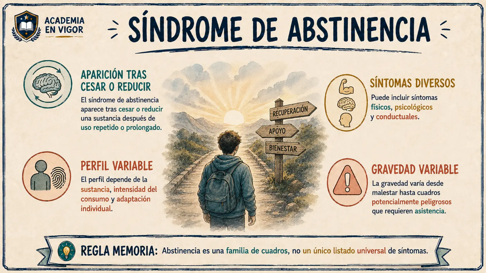

<em>Infografía: Síndrome de abstinencia.</em>

:::hablemos-claro
Abstinencia es una familia de cuadros, no un único listado universal de síntomas.
:::

:::en-la-calle
Al diferenciar adaptación, dependencia e interacción, Abstinencia es una familia de cuadros, no un único listado universal de síntomas.
:::

:::lo-que-cae
Prioriza **cese, reducción y síntomas** y descarta respuestas que confundan efecto, legalidad, origen o fecha.
:::

<!-- FUENTE: WHO-ICD11-SUBSTANCE-T34 -->

## 31. Craving o deseo intenso

### Lógica del bloque

Para dominar **craving o deseo intenso**, aplica esta regla: El deseo es una alarma, no una orden; identifica qué la activa y qué respuesta la corta. El anclaje principal es **impulso y desencadenantes**.

### Hechos examinables

- Craving es un deseo intenso o urgencia subjetiva de consumir. <!-- FACT:PN-T34-F121 -->
- Puede activarse por señales, estrés, disponibilidad, recuerdos o estados emocionales. <!-- FACT:PN-T34-F122 -->
- Puede persistir o reaparecer aun cuando hayan cedido síntomas físicos de abstinencia. <!-- FACT:PN-T34-F123 -->
- No obliga de forma inevitable a consumir, pero aumenta riesgo y requiere estrategias de afrontamiento. <!-- FACT:PN-T34-F124 -->

### Trampas de examen

- **Incorrecto:** Craving desaparece siempre al terminar la abstinencia física.
- **Incorrecto:** Sentir deseo hace inevitable la recaída.

<!-- VISUAL:t34-il-31-craving-o-deseo-intenso.webp -->

  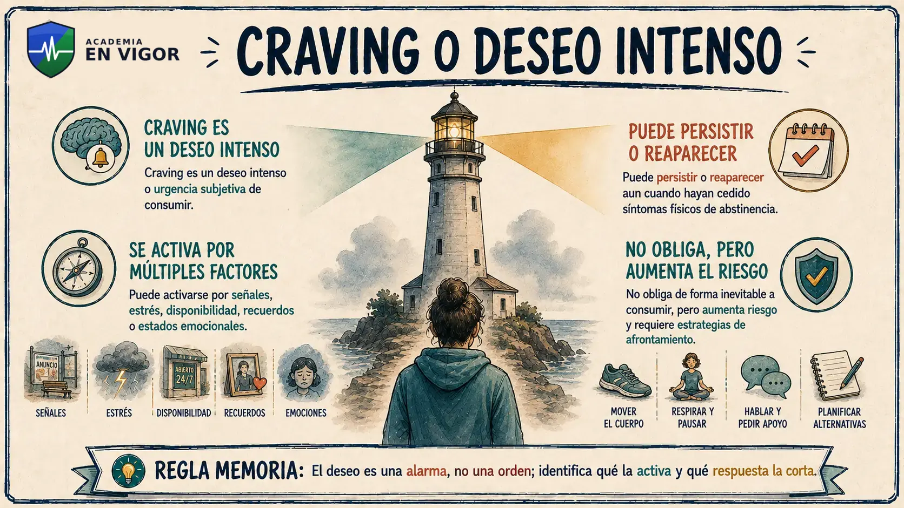

<em>Infografía: Craving o deseo intenso.</em>

:::hablemos-claro
El deseo es una alarma, no una orden; identifica qué la activa y qué respuesta la corta.
:::

:::en-la-calle
Al diferenciar adaptación, dependencia e interacción, El deseo es una alarma, no una orden; identifica qué la activa y qué respuesta la corta.
:::

:::lo-que-cae
Prioriza **impulso y desencadenantes** y descarta respuestas que confundan efecto, legalidad, origen o fecha.
:::

<!-- FUENTE: UNODC-TERMINOLOGY-T34 -->

## 32. Refuerzo positivo y negativo

### Lógica del bloque

Para dominar **refuerzo positivo y negativo**, aplica esta regla: Positivo añade recompensa; negativo quita malestar; ambos pueden reforzar. El anclaje principal es **obtener recompensa o retirar malestar**.

### Hechos examinables

- El refuerzo positivo aumenta una conducta porque produce una consecuencia percibida como gratificante. <!-- FACT:PN-T34-F125 -->
- El refuerzo negativo aumenta una conducta porque reduce o evita un estado desagradable. <!-- FACT:PN-T34-F126 -->
- Negativo no significa castigo: describe retirada de malestar. <!-- FACT:PN-T34-F127 -->
- Ambos procesos pueden contribuir al mantenimiento del consumo en momentos diferentes. <!-- FACT:PN-T34-F128 -->

### Trampas de examen

- **Incorrecto:** Refuerzo negativo es sinónimo de sanción que reduce el consumo.
- **Incorrecto:** Solo la búsqueda de euforia puede mantener una adicción.

<!-- VISUAL:t34-32-refuerzo-positivo-y-negativo.webp -->

  

<em>Infografía: Refuerzo positivo y negativo.</em>

:::hablemos-claro
Positivo añade recompensa; negativo quita malestar; ambos pueden reforzar.
:::

:::en-la-calle
Al diferenciar adaptación, dependencia e interacción, Positivo añade recompensa; negativo quita malestar; ambos pueden reforzar.
:::

:::lo-que-cae
Prioriza **obtener recompensa o retirar malestar** y descarta respuestas que confundan efecto, legalidad, origen o fecha.
:::

<!-- FUENTE: WHO-ICD11-SUBSTANCE-T34 -->

## 33. Control deteriorado y compulsión

### Lógica del bloque

Para dominar **control deteriorado y compulsión**, aplica esta regla: Mide dónde se rompe el control: empezar, parar, cantidad, frecuencia o contexto. El anclaje principal es **inicio, cantidad, final y contexto**.

### Hechos examinables

- El control deteriorado puede afectar inicio, frecuencia, cantidad, duración o finalización del consumo. <!-- FACT:PN-T34-F129 -->
- Los intentos repetidos y fallidos de reducir pueden mostrar pérdida de control. <!-- FACT:PN-T34-F130 -->
- La compulsión no significa ausencia total de decisión en cada episodio ni elimina automáticamente responsabilidad jurídica. <!-- FACT:PN-T34-F131 -->
- La evaluación atiende al patrón persistente, no a una frase aislada del consumidor. <!-- FACT:PN-T34-F132 -->

### Trampas de examen

- **Incorrecto:** Dependencia exige incapacidad absoluta de decidir en todo momento.
- **Incorrecto:** Un único exceso permite diagnosticar por sí solo un patrón compulsivo.

<!-- VISUAL:t34-33-control-deteriorado-y-compulsion.webp -->

  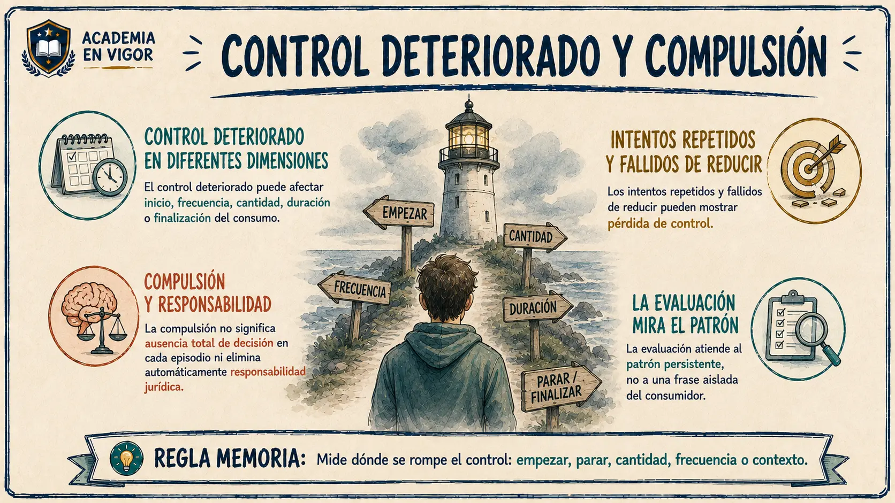

<em>Infografía: Control deteriorado y compulsión.</em>

:::hablemos-claro
Mide dónde se rompe el control: empezar, parar, cantidad, frecuencia o contexto.
:::

:::en-la-calle
Al diferenciar adaptación, dependencia e interacción, Mide dónde se rompe el control: empezar, parar, cantidad, frecuencia o contexto.
:::

:::lo-que-cae
Prioriza **inicio, cantidad, final y contexto** y descarta respuestas que confundan efecto, legalidad, origen o fecha.
:::

<!-- FUENTE: WHO-ICD11-SUBSTANCE-T34 -->

## 34. Poliotoxicomanía y policonsumo

### Lógica del bloque

Para dominar **poliotoxicomanía y policonsumo**, aplica esta regla: Dos o más sustancias abren la pregunta; no cierran el diagnóstico. El anclaje principal es **dos o más sustancias**.

### Hechos examinables

- Policonsumo es el uso de dos o más sustancias psicoactivas dentro del período definido. <!-- FACT:PN-T34-F133 -->
- Poliotoxicomanía se ha usado para patrones persistentes de dependencia o consumo problemático de varias sustancias. <!-- FACT:PN-T34-F134 -->
- No toda persona que ha probado dos sustancias presenta dependencia múltiple. <!-- FACT:PN-T34-F135 -->
- El término debe acompañarse de sustancias, frecuencia y relación temporal para ser útil. <!-- FACT:PN-T34-F136 -->

### Trampas de examen

- **Incorrecto:** Haber probado dos sustancias equivale siempre a politoxicomanía.
- **Incorrecto:** Policonsumo informa por sí solo de que las sustancias se tomaron simultáneamente.

<!-- VISUAL:t34-34-poliotoxicomania-y-policonsumo.webp -->

  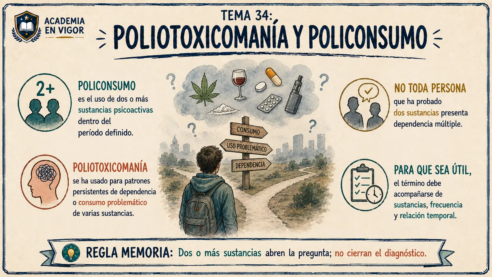

<em>Infografía: Poliotoxicomanía y policonsumo.</em>

:::hablemos-claro
Dos o más sustancias abren la pregunta; no cierran el diagnóstico.
:::

:::en-la-calle
Al diferenciar adaptación, dependencia e interacción, Dos o más sustancias abren la pregunta; no cierran el diagnóstico.
:::

:::lo-que-cae
Prioriza **dos o más sustancias** y descarta respuestas que confundan efecto, legalidad, origen o fecha.
:::

<!-- FUENTE: OEDA-EDADES-2024-T34 -->

## 35. Interacciones farmacodinámicas y farmacocinéticas

### Lógica del bloque

Para dominar **interacciones farmacodinámicas y farmacocinéticas**, aplica esta regla: Una mezcla puede cambiar lo que hace la droga o cuánto tiempo y concentración alcanza. El anclaje principal es **efecto y concentración**.

### Hechos examinables

- Una interacción farmacodinámica modifica efectos en órganos o sistemas sin exigir cambio de concentración. <!-- FACT:PN-T34-F137 -->
- Una interacción farmacocinética modifica absorción, distribución, metabolismo o eliminación. <!-- FACT:PN-T34-F138 -->
- Las combinaciones pueden sumar, potenciar o alterar cualitativamente los efectos esperados. <!-- FACT:PN-T34-F139 -->
- El resultado no se deduce sumando etiquetas de forma lineal, especialmente con composición desconocida. <!-- FACT:PN-T34-F140 -->

### Trampas de examen

- **Incorrecto:** Toda interacción consiste únicamente en que una sustancia neutraliza a otra.
- **Incorrecto:** Conocer los nombres vendidos permite calcular exactamente la interacción.

<!-- VISUAL:t34-35-interacciones-farmacodinamicas-y-farmacocineticas.webp -->

  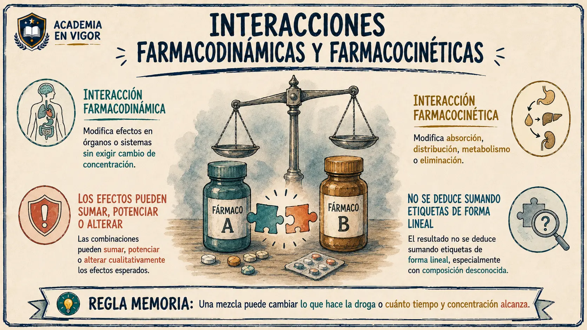

<em>Infografía: Interacciones farmacodinámicas y farmacocinéticas.</em>

:::hablemos-claro
Una mezcla puede cambiar lo que hace la droga o cuánto tiempo y concentración alcanza.
:::

:::en-la-calle
Al diferenciar adaptación, dependencia e interacción, Una mezcla puede cambiar lo que hace la droga o cuánto tiempo y concentración alcanza.
:::

:::lo-que-cae
Prioriza **efecto y concentración** y descarta respuestas que confundan efecto, legalidad, origen o fecha.
:::

<!-- FUENTE: UNODC-TERMINOLOGY-T34 -->

## 36. Mezcla de depresores

### Lógica del bloque

Para dominar **mezcla de depresores**, aplica esta regla: Depresor más depresor no equilibra: puede apagar conciencia y respiración. El anclaje principal es **sedación y depresión respiratoria**.

### Hechos examinables

- Combinar varios depresores puede potenciar sedación, pérdida de conciencia y depresión respiratoria. <!-- FACT:PN-T34-F141 -->
- Alcohol, opioides y sedantes son una combinación especialmente peligrosa. <!-- FACT:PN-T34-F142 -->
- La tolerancia percibida a una sustancia no garantiza tolerancia equivalente a la mezcla. <!-- FACT:PN-T34-F143 -->
- La ausencia de respuesta y la respiración anormal exigen actuación urgente. <!-- FACT:PN-T34-F144 -->

### Trampas de examen

- **Incorrecto:** Un depresor compensa a otro y normaliza la respiración.
- **Incorrecto:** La tolerancia al alcohol protege frente a cualquier opioide o sedante.

<!-- VISUAL:t34-il-36-mezcla-de-depresores.webp -->

  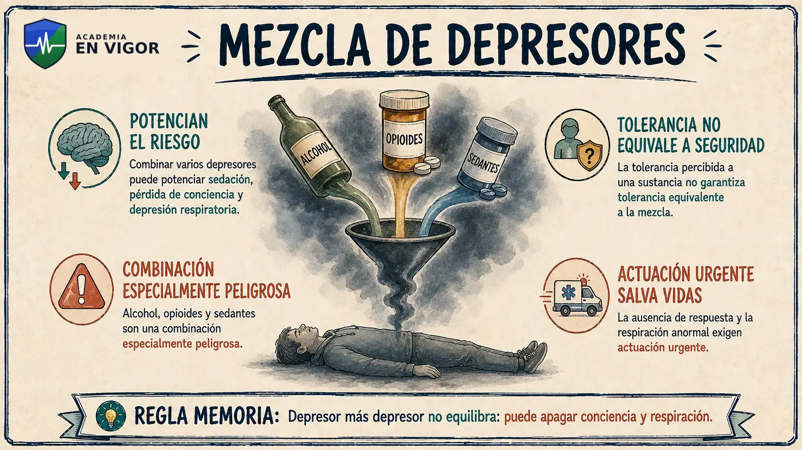

<em>Infografía: Mezcla de depresores.</em>

:::hablemos-claro
Depresor más depresor no equilibra: puede apagar conciencia y respiración.
:::

:::en-la-calle
Al diferenciar adaptación, dependencia e interacción, Depresor más depresor no equilibra: puede apagar conciencia y respiración.
:::

:::lo-que-cae
Prioriza **sedación y depresión respiratoria** y descarta respuestas que confundan efecto, legalidad, origen o fecha.
:::

<!-- FUENTE: PNSD-INFORMACION-T34 -->

## 37. Mezcla de estimulantes y speedball

### Lógica del bloque

Para dominar **mezcla de estimulantes y speedball**, aplica esta regla: Sentirse “equilibrado” no significa estarlo: corazón y respiración siguen expuestos. El anclaje principal es **carga cardiovascular y falsa compensación**.

### Hechos examinables

- Combinar estimulantes puede aumentar carga cardiovascular, agitación, hipertermia y riesgo neurológico. <!-- FACT:PN-T34-F145 -->
- Mezclar un estimulante con un depresor no anula toxicidad ni vuelve predecible el estado clínico. <!-- FACT:PN-T34-F146 -->
- Speedball denomina históricamente la combinación de heroína y cocaína. <!-- FACT:PN-T34-F147 -->
- La desaparición subjetiva de un efecto puede enmascarar la persistencia del otro. <!-- FACT:PN-T34-F148 -->

### Trampas de examen

- **Incorrecto:** Heroína y cocaína se neutralizan y eliminan el riesgo de sobredosis.
- **Incorrecto:** Speedball es una mezcla de dos estimulantes.

<!-- VISUAL:t34-37-mezcla-de-estimulantes-y-speedball.webp -->

  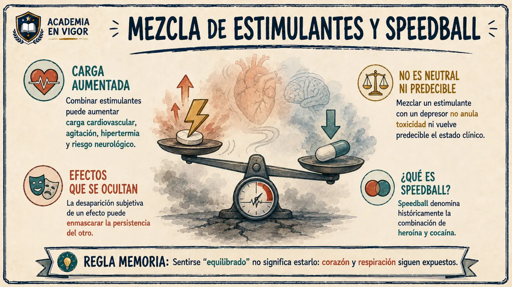

<em>Infografía: Mezcla de estimulantes y speedball.</em>

:::hablemos-claro
Sentirse “equilibrado” no significa estarlo: corazón y respiración siguen expuestos.
:::

:::en-la-calle
Al diferenciar adaptación, dependencia e interacción, Sentirse “equilibrado” no significa estarlo: corazón y respiración siguen expuestos.
:::

:::lo-que-cae
Prioriza **carga cardiovascular y falsa compensación** y descarta respuestas que confundan efecto, legalidad, origen o fecha.
:::

<!-- FUENTE: PNSD-INFORMACION-T34 -->

## 38. Clasificación por situación legal

### Lógica del bloque

Para dominar **clasificación por situación legal**, aplica esta regla: Legalidad regula conductas; no funciona como termómetro completo de daño. El anclaje principal es **permitida, regulada o prohibida**.

### Hechos examinables

- La situación legal depende de sustancia, uso, autorización, cantidad, conducta y jurisdicción aplicable. <!-- FACT:PN-T34-F149 -->
- Legal no equivale a inocuo y controlado no equivale a carente de uso médico. <!-- FACT:PN-T34-F150 -->
- Alcohol, tabaco y medicamentos pueden causar daños pese a su circulación regulada. <!-- FACT:PN-T34-F151 -->
- La clasificación legal cambia con decisiones nacionales e internacionales y debe fecharse. <!-- FACT:PN-T34-F152 -->

### Trampas de examen

- **Incorrecto:** Toda sustancia legal es menos peligrosa que cualquier sustancia ilegal.
- **Incorrecto:** Una sustancia fiscalizada carece necesariamente de uso terapéutico.

<!-- VISUAL:t34-38-clasificacion-por-situacion-legal.webp -->

  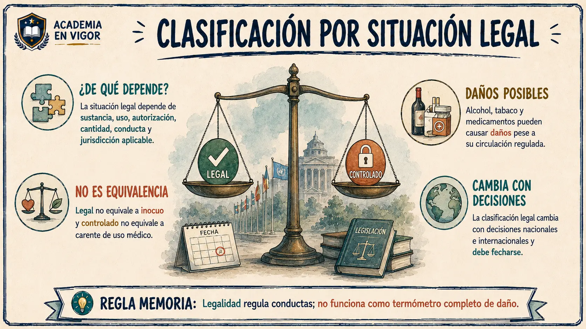

<em>Infografía: Clasificación por situación legal.</em>

:::hablemos-claro
Legalidad regula conductas; no funciona como termómetro completo de daño.
:::

:::en-la-calle
Al clasificar una sustancia o comprobar su fiscalización, Legalidad regula conductas; no funciona como termómetro completo de daño.
:::

:::lo-que-cae
Prioriza **permitida, regulada o prohibida** y descarta respuestas que confundan efecto, legalidad, origen o fecha.
:::

<!-- FUENTE: CONVOCATORIA-PN-2026-T34 -->

## 39. Clasificación por origen

### Lógica del bloque

Para dominar **clasificación por origen**, aplica esta regla: Origen cuenta cómo se obtiene, no cuánto daña ni cómo actúa. El anclaje principal es **natural, semisintética y sintética**.

### Hechos examinables

- Natural describe origen directo en organismos o materiales naturales con procesamiento limitado. <!-- FACT:PN-T34-F153 -->
- Semisintética resulta de modificar químicamente una sustancia de origen natural. <!-- FACT:PN-T34-F154 -->
- Sintética se obtiene mediante síntesis química sin requerir extracción directa del principio activo natural. <!-- FACT:PN-T34-F155 -->
- El origen no permite ordenar seguridad: natural no significa inocuo y sintético no significa siempre más potente. <!-- FACT:PN-T34-F156 -->

### Trampas de examen

- **Incorrecto:** Natural es sinónimo de seguro.
- **Incorrecto:** Toda sustancia sintética produce el mismo tipo de efecto.

<!-- VISUAL:t34-39-clasificacion-por-origen.webp -->

  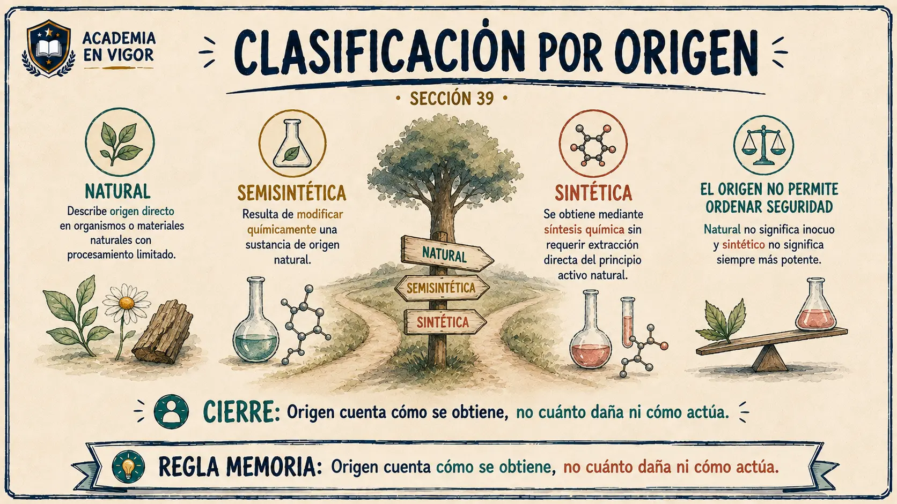

<em>Infografía: Clasificación por origen.</em>

:::hablemos-claro
Origen cuenta cómo se obtiene, no cuánto daña ni cómo actúa.
:::

:::en-la-calle
Al clasificar una sustancia o comprobar su fiscalización, Origen cuenta cómo se obtiene, no cuánto daña ni cómo actúa.
:::

:::lo-que-cae
Prioriza **natural, semisintética y sintética** y descarta respuestas que confundan efecto, legalidad, origen o fecha.
:::

<!-- FUENTE: UNODC-TERMINOLOGY-T34 -->

## 40. Clasificación por efecto predominante en el SNC

### Lógica del bloque

Para dominar **clasificación por efecto predominante en el snc**, aplica esta regla: Predominante es la palabra clave: las fronteras farmacológicas no siempre son cajas perfectas. El anclaje principal es **depresoras, estimulantes y perturbadoras**.

### Hechos examinables

- Una clasificación didáctica agrupa sustancias en depresoras, estimulantes y perturbadoras o alucinógenas. <!-- FACT:PN-T34-F157 -->
- Depresoras reducen o enlentecen funciones del sistema nervioso central de forma predominante. <!-- FACT:PN-T34-F158 -->
- Estimulantes aumentan activación, alerta o actividad de forma predominante. <!-- FACT:PN-T34-F159 -->
- Perturbadoras alteran percepción, pensamiento, conciencia o integración de la experiencia. <!-- FACT:PN-T34-F160 -->

### Trampas de examen

- **Incorrecto:** Depresora significa que siempre causa tristeza.
- **Incorrecto:** Perturbadora significa que la sustancia carece de cualquier efecto estimulante o depresor.

<!-- VISUAL:t34-40-clasificacion-por-efecto-predominante-en-el-snc.webp -->

  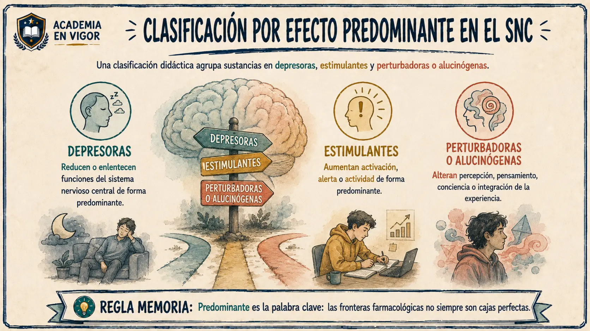

<em>Infografía: Clasificación por efecto predominante en el SNC.</em>

:::hablemos-claro
Predominante es la palabra clave: las fronteras farmacológicas no siempre son cajas perfectas.
:::

:::en-la-calle
Al clasificar una sustancia o comprobar su fiscalización, Predominante es la palabra clave: las fronteras farmacológicas no siempre son cajas perfectas.
:::

:::lo-que-cae
Prioriza **depresoras, estimulantes y perturbadoras** y descarta respuestas que confundan efecto, legalidad, origen o fecha.
:::

<!-- FUENTE: UNODC-TERMINOLOGY-T34 -->

## 41. Límites de la clasificación por efectos

### Lógica del bloque

Para dominar **límites de la clasificación por efectos**, aplica esta regla: Clasificar resume; no borra los efectos mixtos. El anclaje principal es **efectos mixtos y dosis**.

### Hechos examinables

- Una sustancia puede producir efectos mixtos o cambiar de perfil según dosis, fase y persona. <!-- FACT:PN-T34-F161 -->
- MDMA combina rasgos estimulantes con alteraciones perceptivas y efectos entactógenos. <!-- FACT:PN-T34-F162 -->
- Ketamina es un disociativo con propiedades anestésicas y alteraciones perceptivas. <!-- FACT:PN-T34-F163 -->
- La categoría sirve para estudiar el efecto principal, no para negar efectos secundarios de otros grupos. <!-- FACT:PN-T34-F164 -->

### Trampas de examen

- **Incorrecto:** Cada sustancia pertenece de forma absoluta a una sola caja sin matices.
- **Incorrecto:** Ketamina es un estimulante puro porque puede producir agitación.

<!-- VISUAL:t34-il-41-limites-de-la-clasificacion-por-efectos.webp -->

  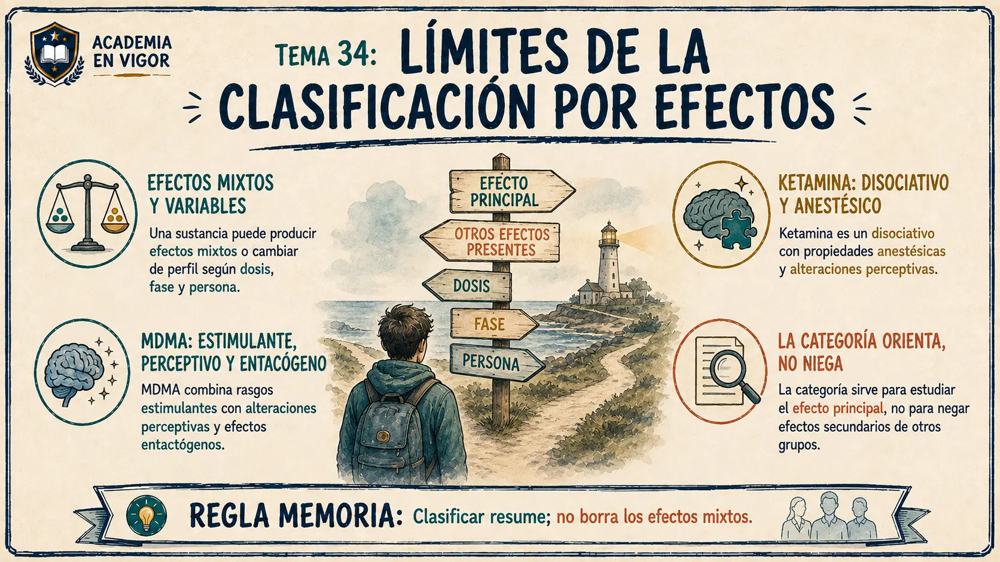

<em>Infografía: Límites de la clasificación por efectos.</em>

:::hablemos-claro
Clasificar resume; no borra los efectos mixtos.
:::

:::en-la-calle
Al clasificar una sustancia o comprobar su fiscalización, Clasificar resume; no borra los efectos mixtos.
:::

:::lo-que-cae
Prioriza **efectos mixtos y dosis** y descarta respuestas que confundan efecto, legalidad, origen o fecha.
:::

<!-- FUENTE: UNODC-TERMINOLOGY-T34 -->

## 42. Estupefacientes en el sistema internacional

### Lógica del bloque

Para dominar **estupefacientes en el sistema internacional**, aplica esta regla: Estupefaciente es una categoría jurídica internacional, no una caja farmacológica única. El anclaje principal es **Convención de 1961 y listas**.

### Hechos examinables

- Los estupefacientes sometidos a control internacional se articulan principalmente mediante la Convención Única de 1961. <!-- FACT:PN-T34-F165 -->
- La Convención utiliza listas con distintos regímenes de control. <!-- FACT:PN-T34-F166 -->
- El término jurídico estupefaciente no coincide exactamente con una única familia farmacológica. <!-- FACT:PN-T34-F167 -->
- Cannabis, cocaína y opioides pueden estar controlados sin compartir el mismo efecto predominante. <!-- FACT:PN-T34-F168 -->

### Trampas de examen

- **Incorrecto:** Estupefaciente significa farmacológicamente depresor en todos los casos.
- **Incorrecto:** La Convención de 1961 solo controla sustancias sintéticas.

<!-- VISUAL:t34-42-estupefacientes-en-el-sistema-internacional.webp -->

  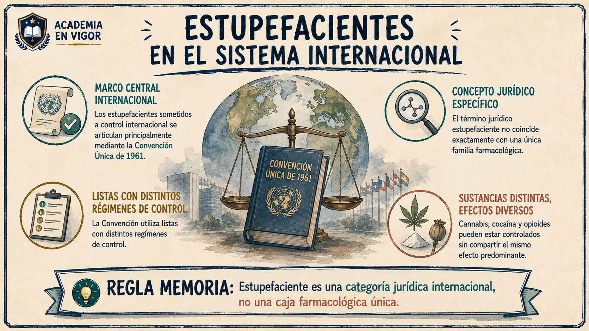

<em>Infografía: Estupefacientes en el sistema internacional.</em>

:::hablemos-claro
Estupefaciente es una categoría jurídica internacional, no una caja farmacológica única.
:::

:::en-la-calle
Al clasificar una sustancia o comprobar su fiscalización, Estupefaciente es una categoría jurídica internacional, no una caja farmacológica única.
:::

:::lo-que-cae
Prioriza **Convención de 1961 y listas** y descarta respuestas que confundan efecto, legalidad, origen o fecha.
:::

<!-- FUENTE: UN-CONVENTION-1961-T34 -->

## 43. Psicotrópicos y Convenio de 1971

### Lógica del bloque

Para dominar **psicotrópicos y convenio de 1971**, aplica esta regla: Cuatro listas jurídicas agrupan perfiles farmacológicos distintos. El anclaje principal es **cuatro listas y control**.

### Hechos examinables

- El Convenio de 1971 establece control internacional para sustancias psicotrópicas. <!-- FACT:PN-T34-F169 -->
- Organiza sustancias en cuatro listas con medidas diferenciadas. <!-- FACT:PN-T34-F170 -->
- Incluye sustancias de perfiles farmacológicos diversos, no solo alucinógenos. <!-- FACT:PN-T34-F171 -->
- La inclusión en una lista responde a evaluación y decisión internacional, no a popularidad del nombre. <!-- FACT:PN-T34-F172 -->

### Trampas de examen

- **Incorrecto:** Psicotrópico equivale exclusivamente a alucinógeno.
- **Incorrecto:** El Convenio de 1971 utiliza una sola lista para todas las sustancias.

<!-- VISUAL:t34-43-psicotropicos-y-convenio-de-1971.webp -->

  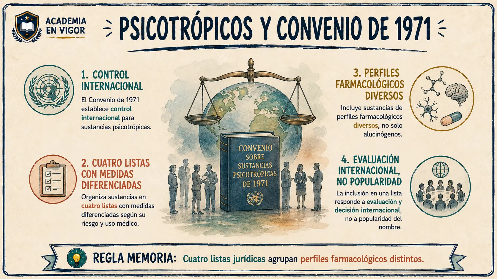

<em>Infografía: Psicotrópicos y Convenio de 1971.</em>

:::hablemos-claro
Cuatro listas jurídicas agrupan perfiles farmacológicos distintos.
:::

:::en-la-calle
Al clasificar una sustancia o comprobar su fiscalización, Cuatro listas jurídicas agrupan perfiles farmacológicos distintos.
:::

:::lo-que-cae
Prioriza **cuatro listas y control** y descarta respuestas que confundan efecto, legalidad, origen o fecha.
:::

<!-- FUENTE: UN-CONVENTION-1971-T34 -->

## 44. Convención de 1988 y precursores

### Lógica del bloque

Para dominar **convención de 1988 y precursores**, aplica esta regla: El precursor está antes de la droga en la cadena; controlarlo corta desvíos. El anclaje principal es **tráfico ilícito y sustancias químicas**.

### Hechos examinables

- La Convención de 1988 refuerza la cooperación contra el tráfico ilícito. <!-- FACT:PN-T34-F173 -->
- Somete a control internacional determinados precursores mediante tablas. <!-- FACT:PN-T34-F174 -->
- Un precursor puede tener usos industriales o lícitos y ser desviado a fabricación ilícita. <!-- FACT:PN-T34-F175 -->
- Controlar precursores busca impedir desvíos sin confundirlos automáticamente con drogas consumibles. <!-- FACT:PN-T34-F176 -->

### Trampas de examen

- **Incorrecto:** Todo precursor es una droga destinada al consumo directo.
- **Incorrecto:** La Convención de 1988 sustituyó y derogó íntegramente las de 1961 y 1971.

<!-- VISUAL:t34-44-convencion-de-1988-y-precursores.webp -->

  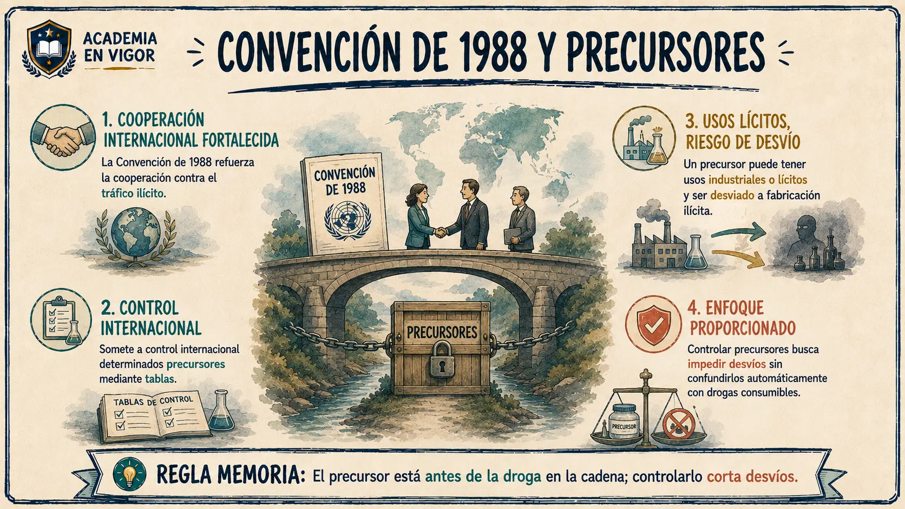

<em>Infografía: Convención de 1988 y precursores.</em>

:::hablemos-claro
El precursor está antes de la droga en la cadena; controlarlo corta desvíos.
:::

:::en-la-calle
Al clasificar una sustancia o comprobar su fiscalización, El precursor está antes de la droga en la cadena; controlarlo corta desvíos.
:::

:::lo-que-cae
Prioriza **tráfico ilícito y sustancias químicas** y descarta respuestas que confundan efecto, legalidad, origen o fecha.
:::

<!-- FUENTE: UN-CONVENTION-1988-T34 -->

## 45. Procedimiento nacional para considerar un estupefaciente

### Lógica del bloque

Para dominar **procedimiento nacional para considerar un estupefaciente**, aplica esta regla: Detectar no es fiscalizar: evaluación técnica, procedimiento y decisión formal. El anclaje principal es **evaluación por AEMPS**.

### Hechos examinables

- El Real Decreto 1194/2011 regula el procedimiento nacional para considerar una sustancia estupefaciente. <!-- FACT:PN-T34-F177 -->
- La AEMPS puede iniciar de oficio el procedimiento o hacerlo a instancia pública motivada o de la Fiscalía Especial Antidroga. <!-- FACT:PN-T34-F178 -->
- La evaluación considera semejanza con estupefacientes, utilidad terapéutica y riesgo de abuso. <!-- FACT:PN-T34-F179 -->
- La decisión nacional complementa el sistema internacional dentro del marco de la Ley 17/1967. <!-- FACT:PN-T34-F180 -->

### Trampas de examen

- **Incorrecto:** La policía incluye por sí sola una sustancia en la lista mediante atestado.
- **Incorrecto:** La evaluación solo pregunta si la sustancia tiene origen natural.

<!-- VISUAL:t34-45-procedimiento-nacional-para-considerar-un-estupefaciente.webp -->

  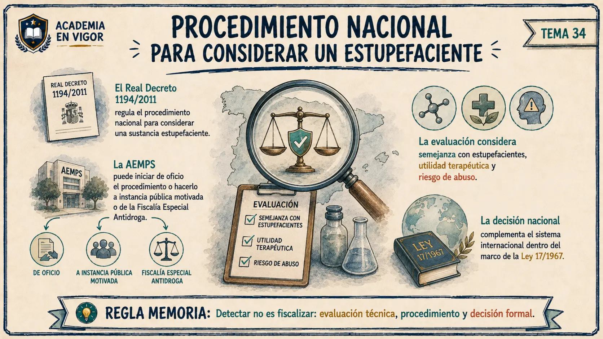

<em>Infografía: Procedimiento nacional para considerar un estupefaciente.</em>

:::hablemos-claro
Detectar no es fiscalizar: evaluación técnica, procedimiento y decisión formal.
:::

:::en-la-calle
Al clasificar una sustancia o comprobar su fiscalización, Detectar no es fiscalizar: evaluación técnica, procedimiento y decisión formal.
:::

:::lo-que-cae
Prioriza **evaluación por AEMPS** y descarta respuestas que confundan efecto, legalidad, origen o fecha.
:::

<!-- FUENTE: RD1194-2011-T34 -->

## 46. Control nacional de psicotrópicos

### Lógica del bloque

Para dominar **control nacional de psicotrópicos**, aplica esta regla: La norma es estable; la lista es dinámica. Comprueba siempre la versión vigente. El anclaje principal es **listas y medidas de fiscalización**.

### Hechos examinables

- El Real Decreto 2829/1977 regula sustancias y preparados medicinales psicotrópicos en España. <!-- FACT:PN-T34-F181 -->
- Su anexo mantiene listas que se actualizan mediante disposiciones posteriores. <!-- FACT:PN-T34-F182 -->
- Las medidas alcanzan fabricación, distribución, prescripción, dispensación, fiscalización e inspección. <!-- FACT:PN-T34-F183 -->
- Para responder sobre una sustancia concreta debe consultarse la lista vigente, no una tabla antigua de academia. <!-- FACT:PN-T34-F184 -->

### Trampas de examen

- **Incorrecto:** Las listas psicotrópicas quedaron congeladas en 1977.
- **Incorrecto:** Fiscalización se limita a prohibir cualquier uso médico.

<!-- VISUAL:t34-46-control-nacional-de-psicotropicos.webp -->

  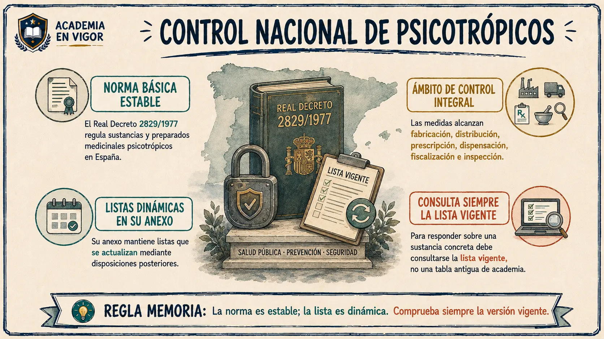

<em>Infografía: Control nacional de psicotrópicos.</em>

:::hablemos-claro
La norma es estable; la lista es dinámica. Comprueba siempre la versión vigente.
:::

:::en-la-calle
Al clasificar una sustancia o comprobar su fiscalización, La norma es estable; la lista es dinámica. Comprueba siempre la versión vigente.
:::

:::lo-que-cae
Prioriza **listas y medidas de fiscalización** y descarta respuestas que confundan efecto, legalidad, origen o fecha.
:::

<!-- FUENTE: RD2829-1977-T34 -->

## 47. Drogas de síntesis

### Lógica del bloque

Para dominar **drogas de síntesis**, aplica esta regla: La fabricación química une al grupo; el efecto farmacológico puede ser muy distinto. El anclaje principal es **síntesis química y efectos diversos**.

### Hechos examinables

- Drogas de síntesis es una denominación amplia para sustancias producidas mediante síntesis química. <!-- FACT:PN-T34-F185 -->
- El grupo incluye sustancias con efectos estimulantes, perturbadores, depresores o mixtos. <!-- FACT:PN-T34-F186 -->
- MDMA, GHB, ketamina y PCP aparecen en materiales oficiales bajo esta denominación amplia. <!-- FACT:PN-T34-F187 -->
- Drogas de síntesis no es sinónimo exacto de derivados anfetamínicos ni de nuevas sustancias psicoactivas. <!-- FACT:PN-T34-F188 -->

### Trampas de examen

- **Incorrecto:** Toda droga de síntesis es una anfetamina.
- **Incorrecto:** Drogas de síntesis y NPS son categorías idénticas.

<!-- VISUAL:t34-il-47-drogas-de-sintesis.webp -->

  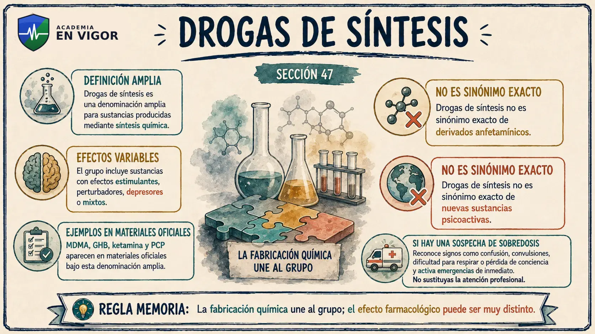

<em>Infografía: Drogas de síntesis.</em>

:::hablemos-claro
La fabricación química une al grupo; el efecto farmacológico puede ser muy distinto.
:::

:::en-la-calle
Al clasificar una sustancia o comprobar su fiscalización, La fabricación química une al grupo; el efecto farmacológico puede ser muy distinto.
:::

:::lo-que-cae
Prioriza **síntesis química y efectos diversos** y descarta respuestas que confundan efecto, legalidad, origen o fecha.
:::

<!-- FUENTE: PNSD-SINTESIS-T34 -->

## 48. Agonista, antagonista e índice terapéutico

### Lógica del bloque

Para dominar **agonista, antagonista e índice terapéutico**, aplica esta regla: Agonista enciende el receptor; antagonista bloquea; el índice mide cuánto margen queda. El anclaje principal es **receptor y margen de seguridad**.

### Hechos examinables

- Un agonista activa un receptor y produce una respuesta farmacológica. <!-- FACT:PN-T34-F189 -->
- Un antagonista se une al receptor y bloquea o reduce la acción de un agonista. <!-- FACT:PN-T34-F190 -->
- Naloxona es un antagonista opioide utilizado para revertir sobredosis por opioides. <!-- FACT:PN-T34-F191 -->
- El índice terapéutico relaciona dosis eficaz y dosis tóxica o letal como aproximación al margen de seguridad. <!-- FACT:PN-T34-F192 -->

### Trampas de examen

- **Incorrecto:** Un antagonista imita y aumenta siempre el efecto de la droga de referencia.
- **Incorrecto:** Un índice terapéutico estrecho indica un margen de seguridad amplio.

<!-- VISUAL:t34-48-agonista-antagonista-e-indice-terapeutico.webp -->

  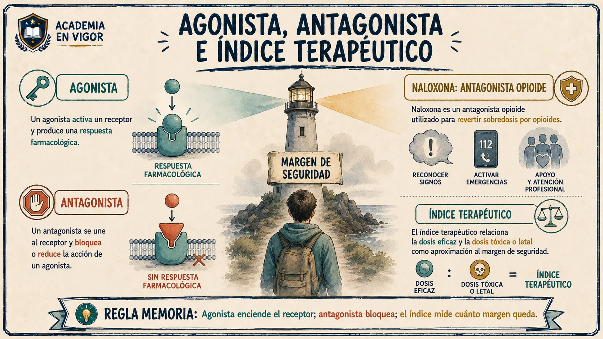

<em>Infografía: Agonista, antagonista e índice terapéutico.</em>

:::hablemos-claro
Agonista enciende el receptor; antagonista bloquea; el índice mide cuánto margen queda.
:::

:::en-la-calle
Al clasificar una sustancia o comprobar su fiscalización, Agonista enciende el receptor; antagonista bloquea; el índice mide cuánto margen queda.
:::

:::lo-que-cae
Prioriza **receptor y margen de seguridad** y descarta respuestas que confundan efecto, legalidad, origen o fecha.
:::

<!-- FUENTE: UNODC-TERMINOLOGY-T34 -->

## 49. Depresores del sistema nervioso central

### Lógica del bloque

Para dominar **depresores del sistema nervioso central**, aplica esta regla: Distintas sustancias comparten una amenaza final: demasiado freno sobre conciencia y respiración. El anclaje principal es **reducción de actividad y riesgo respiratorio**.

### Hechos examinables

- Los depresores reducen de forma predominante la actividad del sistema nervioso central. <!-- FACT:PN-T34-F193 -->
- Pueden causar relajación, sedación, descoordinación, somnolencia y pérdida de conciencia. <!-- FACT:PN-T34-F194 -->
- A dosis altas o en mezclas pueden deprimir respiración y reflejos protectores. <!-- FACT:PN-T34-F195 -->
- Alcohol, opioides, hipnosedantes y GHB son ejemplos con perfiles distintos. <!-- FACT:PN-T34-F196 -->

### Trampas de examen

- **Incorrecto:** Depresor significa únicamente que causa depresión emocional.
- **Incorrecto:** Todos los depresores tienen idéntico mecanismo y duración.

<!-- VISUAL:t34-49-depresores-del-sistema-nervioso-central.webp -->

  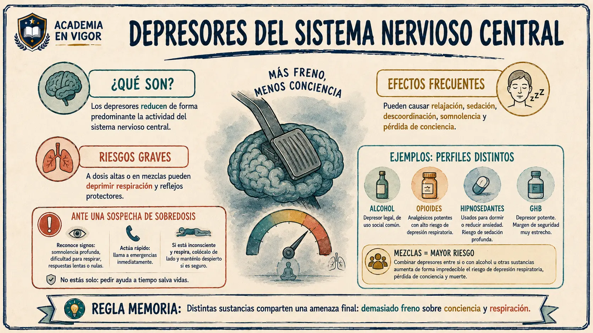

<em>Infografía: Depresores del sistema nervioso central.</em>

:::hablemos-claro
Distintas sustancias comparten una amenaza final: demasiado freno sobre conciencia y respiración.
:::

:::en-la-calle
Ante signos compatibles con un depresor, Distintas sustancias comparten una amenaza final: demasiado freno sobre conciencia y respiración.
:::

:::lo-que-cae
Prioriza **reducción de actividad y riesgo respiratorio** y descarta respuestas que confundan efecto, legalidad, origen o fecha.
:::

<!-- FUENTE: UNODC-TERMINOLOGY-T34 -->

## 50. Alcohol

### Lógica del bloque

Para dominar **alcohol**, aplica esta regla: La conducta puede parecer acelerada mientras el sistema nervioso pierde control y coordinación. El anclaje principal es **depresor legal y daño dosis-dependiente**.

### Hechos examinables

- El alcohol etílico es una sustancia psicoactiva depresora del sistema nervioso central. <!-- FACT:PN-T34-F197 -->
- La desinhibición inicial no lo convierte en estimulante farmacológico. <!-- FACT:PN-T34-F198 -->
- La intoxicación deteriora juicio, coordinación, atención y tiempo de reacción. <!-- FACT:PN-T34-F199 -->
- El uso intenso o prolongado puede generar tolerancia, dependencia y daño orgánico y social. <!-- FACT:PN-T34-F200 -->

### Trampas de examen

- **Incorrecto:** La desinhibición demuestra que el alcohol es un estimulante.
- **Incorrecto:** Su regulación legal impide que produzca dependencia física.

<!-- VISUAL:t34-50-alcohol.webp -->

  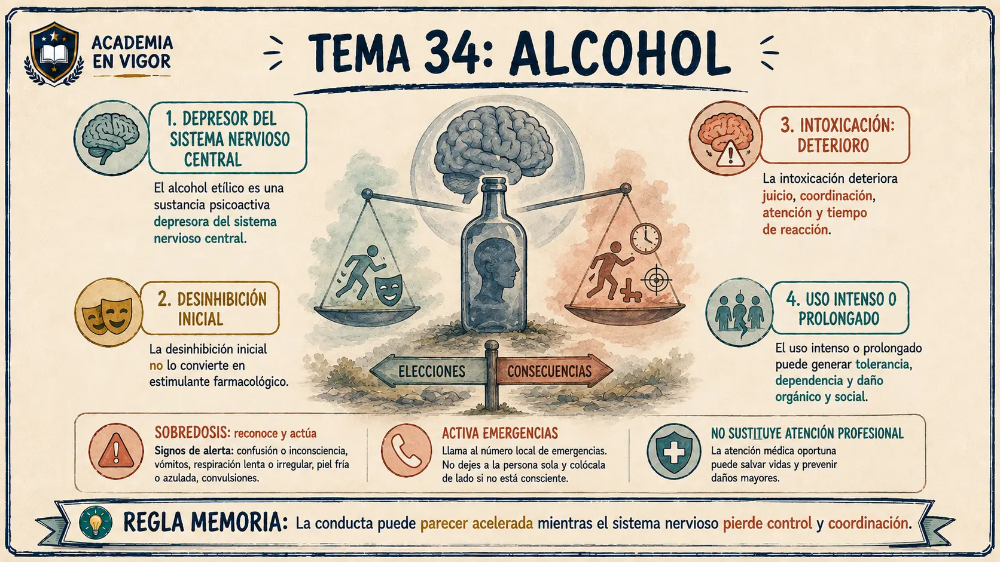

<em>Infografía: Alcohol.</em>

:::hablemos-claro
La conducta puede parecer acelerada mientras el sistema nervioso pierde control y coordinación.
:::

:::en-la-calle
Ante signos compatibles con un depresor, La conducta puede parecer acelerada mientras el sistema nervioso pierde control y coordinación.
:::

:::lo-que-cae
Prioriza **depresor legal y daño dosis-dependiente** y descarta respuestas que confundan efecto, legalidad, origen o fecha.
:::

<!-- FUENTE: PNSD-INFORMACION-T34 -->

## 51. Opioides, opiáceos y receptores

### Lógica del bloque

Para dominar **opioides, opiáceos y receptores**, aplica esta regla: Opioide es la familia; opiáceo es un subconjunto histórico de origen natural o próximo. El anclaje principal es **familia amplia y analgesia**.

### Hechos examinables

- Opioide es el término amplio para sustancias naturales, semisintéticas o sintéticas que actúan sobre receptores opioides. <!-- FACT:PN-T34-F201 -->
- Opiáceo suele reservarse para alcaloides naturales del opio y derivados próximos. <!-- FACT:PN-T34-F202 -->
- Los opioides pueden producir analgesia, euforia, sedación, miosis y depresión respiratoria. <!-- FACT:PN-T34-F203 -->
- La potencia y duración varían mucho dentro de la familia. <!-- FACT:PN-T34-F204 -->

### Trampas de examen

- **Incorrecto:** Todo opioide procede directamente de la planta del opio.
- **Incorrecto:** La miosis excluye la posibilidad de depresión respiratoria.

<!-- VISUAL:t34-51-opioides-opiaceos-y-receptores.webp -->

  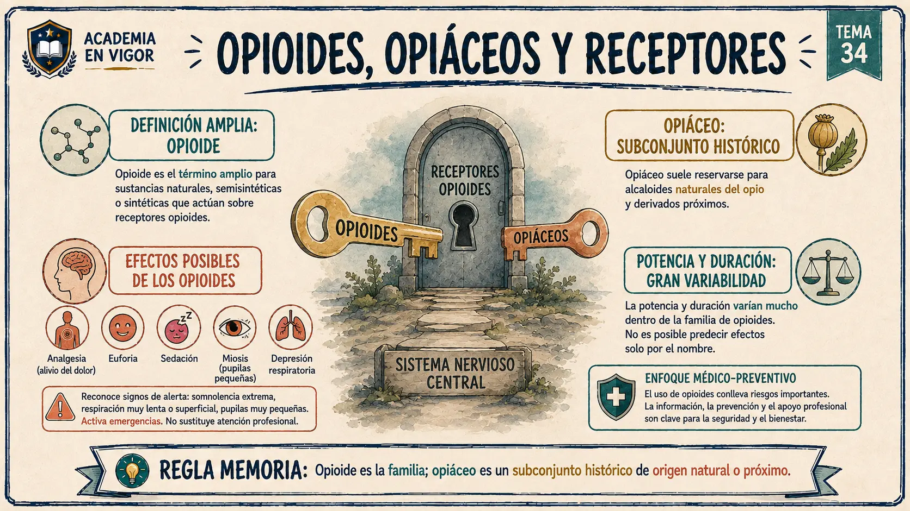

<em>Infografía: Opioides, opiáceos y receptores.</em>

:::hablemos-claro
Opioide es la familia; opiáceo es un subconjunto histórico de origen natural o próximo.
:::

:::en-la-calle
Ante signos compatibles con un depresor, Opioide es la familia; opiáceo es un subconjunto histórico de origen natural o próximo.
:::

:::lo-que-cae
Prioriza **familia amplia y analgesia** y descarta respuestas que confundan efecto, legalidad, origen o fecha.
:::

<!-- FUENTE: PNSD-INFORMACION-T34 -->

## 52. Opio, morfina y codeína

### Lógica del bloque

Para dominar **opio, morfina y codeína**, aplica esta regla: Fiscalizado no significa inútil en medicina; significa control reforzado. El anclaje principal es **alcaloides y usos médicos**.

### Hechos examinables

- El opio se obtiene del látex de la adormidera y contiene varios alcaloides. <!-- FACT:PN-T34-F205 -->
- Morfina es un alcaloide opioide con uso analgésico médico controlado. <!-- FACT:PN-T34-F206 -->
- Codeína es un opioide utilizado, entre otros fines, como analgésico o antitusígeno bajo regulación. <!-- FACT:PN-T34-F207 -->
- Uso médico, dependencia física y riesgo de abuso son dimensiones que pueden coexistir y deben distinguirse. <!-- FACT:PN-T34-F208 -->

### Trampas de examen

- **Incorrecto:** La morfina carece de uso médico por ser estupefaciente.
- **Incorrecto:** Codeína es un estimulante derivado de la coca.

<!-- VISUAL:t34-il-52-opio-morfina-y-codeina.webp -->

  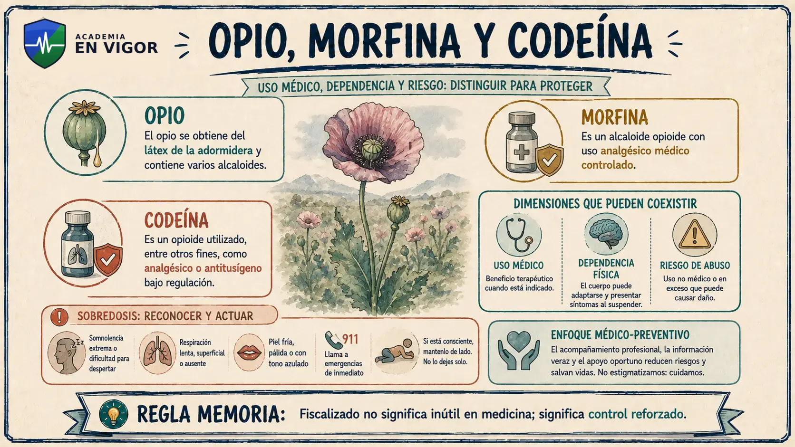

<em>Infografía: Opio, morfina y codeína.</em>

:::hablemos-claro
Fiscalizado no significa inútil en medicina; significa control reforzado.
:::

:::en-la-calle
Ante signos compatibles con un depresor, Fiscalizado no significa inútil en medicina; significa control reforzado.
:::

:::lo-que-cae
Prioriza **alcaloides y usos médicos** y descarta respuestas que confundan efecto, legalidad, origen o fecha.
:::

<!-- FUENTE: PNSD-INFORMACION-T34 -->

## 53. Heroína

### Lógica del bloque

Para dominar **heroína**, aplica esta regla: Familia opioide, acción rápida y composición incierta explican gran parte del riesgo. El anclaje principal es **opioide semisintético y sobredosis**.

### Hechos examinables

- La heroína o diacetilmorfina es un opioide semisintético derivado de la morfina. <!-- FACT:PN-T34-F209 -->
- Su llegada rápida al cerebro favorece euforia intensa y elevado potencial de dependencia. <!-- FACT:PN-T34-F210 -->
- La sobredosis se caracteriza por depresión de conciencia y respiración, y puede causar muerte. <!-- FACT:PN-T34-F211 -->
- La composición ilícita variable aumenta el riesgo de dosis inesperada y adulteración. <!-- FACT:PN-T34-F212 -->

### Trampas de examen

- **Incorrecto:** Heroína es un estimulante sintético sin relación con la morfina.
- **Incorrecto:** Una apariencia conocida permite conocer pureza y potencia.

<!-- VISUAL:t34-53-heroina.webp -->

  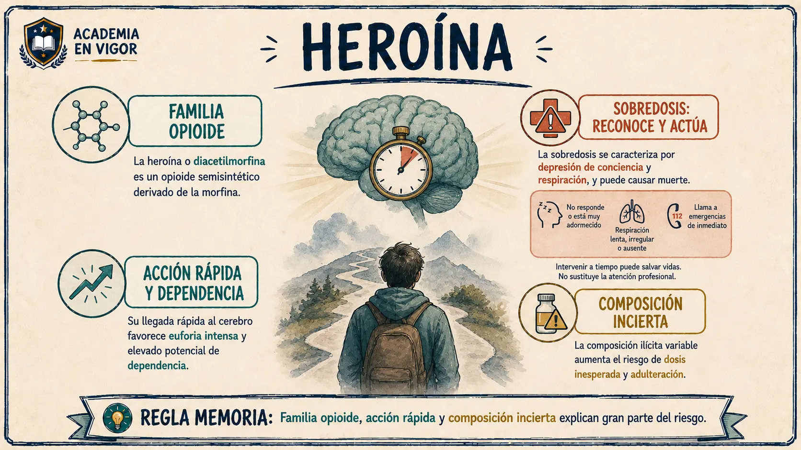

<em>Infografía: Heroína.</em>

:::hablemos-claro
Familia opioide, acción rápida y composición incierta explican gran parte del riesgo.
:::

:::en-la-calle
Ante signos compatibles con un depresor, Familia opioide, acción rápida y composición incierta explican gran parte del riesgo.
:::

:::lo-que-cae
Prioriza **opioide semisintético y sobredosis** y descarta respuestas que confundan efecto, legalidad, origen o fecha.
:::

<!-- FUENTE: PNSD-INFORMACION-T34 -->

## 54. Metadona y buprenorfina

### Lógica del bloque

Para dominar **metadona y buprenorfina**, aplica esta regla: La acción opioide puede usarse de forma controlada para estabilizar y reducir daño. El anclaje principal es **tratamiento agonista opioide**.

### Hechos examinables

- Metadona es un agonista opioide de acción prolongada utilizado en tratamiento de dependencia a opioides. <!-- FACT:PN-T34-F213 -->
- Buprenorfina es un agonista parcial opioide empleado también en tratamiento bajo control sanitario. <!-- FACT:PN-T34-F214 -->
- El objetivo terapéutico incluye estabilizar, reducir consumo ilícito, daños y mortalidad. <!-- FACT:PN-T34-F215 -->
- Que sean tratamientos no elimina necesidad de prescripción, seguimiento y prevención de mezclas peligrosas. <!-- FACT:PN-T34-F216 -->

### Trampas de examen

- **Incorrecto:** El tratamiento sustituye una droga sin aportar ninguna finalidad clínica.
- **Incorrecto:** Metadona y buprenorfina pueden mezclarse libremente con otros depresores.

<!-- VISUAL:t34-54-metadona-y-buprenorfina.webp -->

  

<em>Infografía: Metadona y buprenorfina.</em>

:::hablemos-claro
La acción opioide puede usarse de forma controlada para estabilizar y reducir daño.
:::

:::en-la-calle
Ante signos compatibles con un depresor, La acción opioide puede usarse de forma controlada para estabilizar y reducir daño.
:::

:::lo-que-cae
Prioriza **tratamiento agonista opioide** y descarta respuestas que confundan efecto, legalidad, origen o fecha.
:::

<!-- FUENTE: PNSD-INFORMACION-T34 -->

## 55. Fentanilo y análogos

### Lógica del bloque

Para dominar **fentanilo y análogos**, aplica esta regla: Alta potencia más composición incierta reduce el margen ante cualquier error. El anclaje principal es **alta potencia y margen estrecho**.

### Hechos examinables

- Fentanilo es un opioide sintético muy potente con usos médicos legítimos y riesgo grave de desviación o adulteración. <!-- FACT:PN-T34-F217 -->
- Dosis pequeñas pueden causar depresión respiratoria intensa, especialmente sin tolerancia opioide. <!-- FACT:PN-T34-F218 -->
- Los análogos no tienen potencia idéntica y no deben tratarse como una sola sustancia. <!-- FACT:PN-T34-F219 -->
- El problema europeo incluye medicamentos desviados y nuevos opioides sintéticos en mercados ilícitos. <!-- FACT:PN-T34-F220 -->

### Trampas de examen

- **Incorrecto:** Todo fentanilo encontrado procede de prescripción legítima.
- **Incorrecto:** Todos sus análogos poseen exactamente la misma potencia.

<!-- VISUAL:t34-55-fentanilo-y-analogos.webp -->

  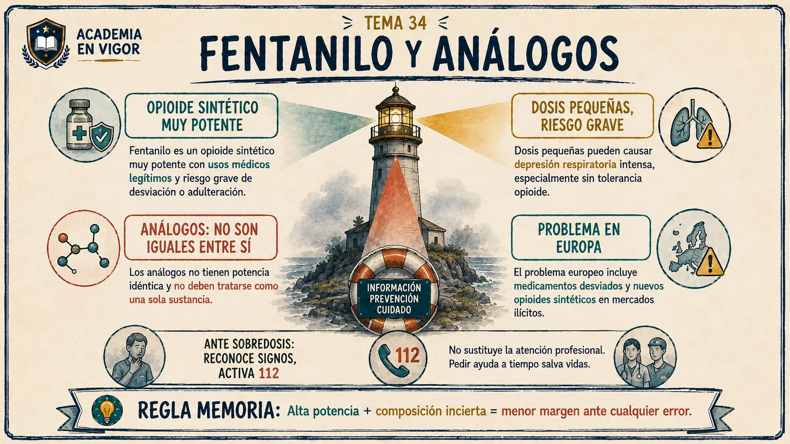

<em>Infografía: Fentanilo y análogos.</em>

:::hablemos-claro
Alta potencia más composición incierta reduce el margen ante cualquier error.
:::

:::en-la-calle
Ante signos compatibles con un depresor, Alta potencia más composición incierta reduce el margen ante cualquier error.
:::

:::lo-que-cae
Prioriza **alta potencia y margen estrecho** y descarta respuestas que confundan efecto, legalidad, origen o fecha.
:::

<!-- FUENTE: EUDA-REPORT-2026-T34 -->

## 56. Nitazenos y nuevos opioides sintéticos

### Lógica del bloque

Para dominar **nitazenos y nuevos opioides sintéticos**, aplica esta regla: La amenaza no siempre viene con etiqueta nueva: puede ocultarse dentro de un producto conocido. El anclaje principal es **amenaza emergente**.

### Hechos examinables

- Los nitazenos son una familia de nuevos opioides sintéticos de alta potencia detectados en Europa. <!-- FACT:PN-T34-F221 -->
- Pueden aparecer en productos vendidos como otros opioides o en mezclas no declaradas. <!-- FACT:PN-T34-F222 -->
- Su variabilidad dificulta anticipar potencia y respuesta clínica. <!-- FACT:PN-T34-F223 -->
- El Informe Europeo 2026 destaca nuevos opioides sintéticos como riesgo de intoxicación potencialmente mortal. <!-- FACT:PN-T34-F224 -->

### Trampas de examen

- **Incorrecto:** Nitazeno es otro nombre para cualquier benzodiacepina.
- **Incorrecto:** Una sustancia no declarada no modifica el riesgo porque el consumidor no la conoce.

<!-- VISUAL:t34-56-nitazenos-y-nuevos-opioides-sinteticos.webp -->

  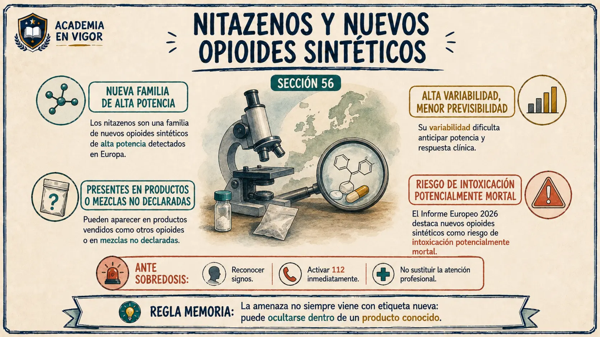

<em>Infografía: Nitazenos y nuevos opioides sintéticos.</em>

:::hablemos-claro
La amenaza no siempre viene con etiqueta nueva: puede ocultarse dentro de un producto conocido.
:::

:::en-la-calle
Ante signos compatibles con un depresor, La amenaza no siempre viene con etiqueta nueva: puede ocultarse dentro de un producto conocido.
:::

:::lo-que-cae
Prioriza **amenaza emergente** y descarta respuestas que confundan efecto, legalidad, origen o fecha.
:::

<!-- FUENTE: EUDA-NPS-2026-T34 -->

## 57. Naloxona y respuesta a sobredosis opioide

### Lógica del bloque

Para dominar **naloxona y respuesta a sobredosis opioide**, aplica esta regla: Puede abrir una ventana de respiración; la urgencia sigue abierta. El anclaje principal es **antagonismo y urgencia**.

### Hechos examinables

- Naloxona desplaza opioides de sus receptores y puede revertir temporalmente la depresión respiratoria. <!-- FACT:PN-T34-F225 -->
- Su duración puede ser menor que la del opioide implicado, por lo que puede reaparecer la toxicidad. <!-- FACT:PN-T34-F226 -->
- Administrarla no sustituye la activación de emergencias ni la vigilancia de respiración. <!-- FACT:PN-T34-F227 -->
- No revierte intoxicaciones por sustancias no opioides salvo que exista componente opioide. <!-- FACT:PN-T34-F228 -->

### Trampas de examen

- **Incorrecto:** Una respuesta inicial a naloxona elimina la necesidad de asistencia posterior.
- **Incorrecto:** Naloxona es un antídoto universal para cualquier droga.

<!-- VISUAL:t34-57-naloxona-y-respuesta-a-sobredosis-opioide.webp -->

  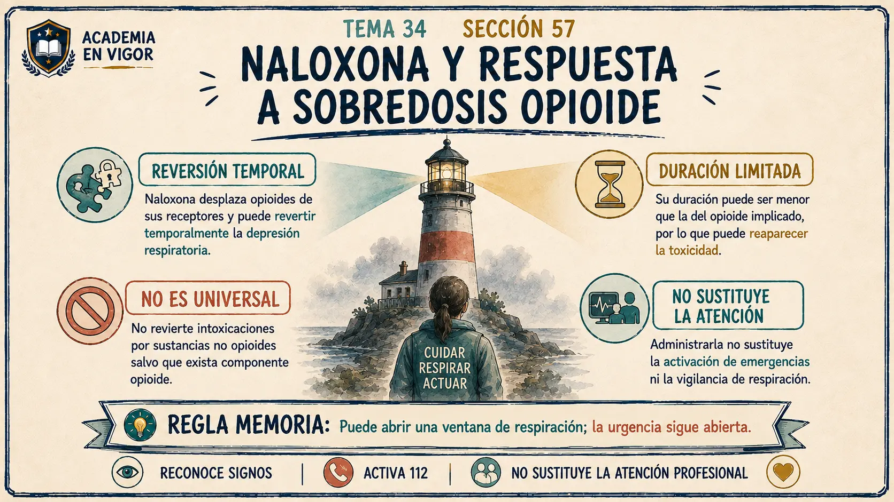

<em>Infografía: Naloxona y respuesta a sobredosis opioide.</em>

:::hablemos-claro
Puede abrir una ventana de respiración; la urgencia sigue abierta.
:::

:::en-la-calle
Ante signos compatibles con un depresor, Puede abrir una ventana de respiración; la urgencia sigue abierta.
:::

:::lo-que-cae
Prioriza **antagonismo y urgencia** y descarta respuestas que confundan efecto, legalidad, origen o fecha.
:::

<!-- FUENTE: UNODC-TERMINOLOGY-T34 -->

## 58. Barbitúricos y benzodiacepinas

### Lógica del bloque

Para dominar **barbitúricos y benzodiacepinas**, aplica esta regla: Medicamento no significa inofensivo: pauta, duración y mezcla cambian el riesgo. El anclaje principal es **hipnosedantes y margen terapéutico**.

### Hechos examinables

- Barbitúricos y benzodiacepinas son depresores con efectos sedantes, hipnóticos y anticonvulsivantes según sustancia y uso. <!-- FACT:PN-T34-F229 -->
- Los barbitúricos tienen, en general, un margen de seguridad menor que las benzodiacepinas. <!-- FACT:PN-T34-F230 -->
- Las benzodiacepinas pueden producir tolerancia, dependencia y abstinencia con uso prolongado. <!-- FACT:PN-T34-F231 -->
- La combinación con alcohol u opioides aumenta el riesgo de sedación profunda y depresión respiratoria. <!-- FACT:PN-T34-F232 -->

### Trampas de examen

- **Incorrecto:** Las benzodiacepinas no producen nunca dependencia por ser medicamentos.
- **Incorrecto:** Mezclar sedantes reduce la depresión respiratoria.

<!-- VISUAL:t34-il-58-barbituricos-y-benzodiacepinas.webp -->

  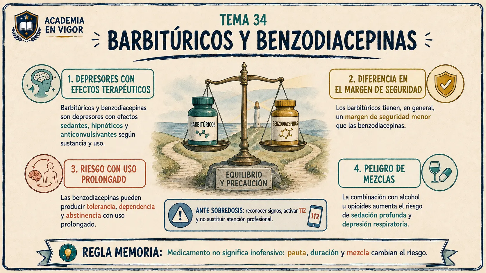

<em>Infografía: Barbitúricos y benzodiacepinas.</em>

:::hablemos-claro
Medicamento no significa inofensivo: pauta, duración y mezcla cambian el riesgo.
:::

:::en-la-calle
Ante signos compatibles con un depresor, Medicamento no significa inofensivo: pauta, duración y mezcla cambian el riesgo.
:::

:::lo-que-cae
Prioriza **hipnosedantes y margen terapéutico** y descarta respuestas que confundan efecto, legalidad, origen o fecha.
:::

<!-- FUENTE: PNSD-INFORMACION-T34 -->

## 59. GHB y depresores de acción rápida

### Lógica del bloque

Para dominar **ghb y depresores de acción rápida**, aplica esta regla: Desinhibición inicial puede ocultar un descenso brusco de conciencia. El anclaje principal es **margen entre efecto y pérdida de conciencia**.

### Hechos examinables

- GHB es una sustancia depresora del sistema nervioso central incluida entre las drogas de síntesis en materiales del PNSD. <!-- FACT:PN-T34-F233 -->
- Puede producir desinhibición y somnolencia, seguidas de pérdida de conciencia y depresión respiratoria. <!-- FACT:PN-T34-F234 -->
- La diferencia entre efectos buscados y toxicidad puede ser estrecha y la composición ilícita es incierta. <!-- FACT:PN-T34-F235 -->
- La mezcla con alcohol u otros depresores incrementa notablemente el riesgo. <!-- FACT:PN-T34-F236 -->

### Trampas de examen

- **Incorrecto:** GHB es un estimulante porque puede causar desinhibición.
- **Incorrecto:** Alcohol reduce el riesgo de pérdida de conciencia por GHB.

<!-- VISUAL:t34-59-ghb-y-depresores-de-accion-rapida.webp -->

  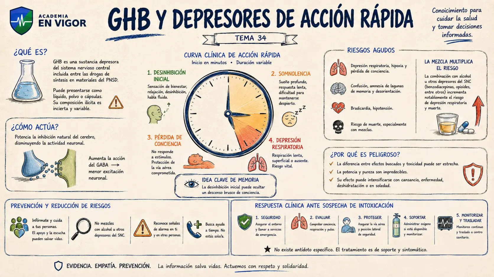

<em>Infografía: GHB y depresores de acción rápida.</em>

:::hablemos-claro
Desinhibición inicial puede ocultar un descenso brusco de conciencia.
:::

:::en-la-calle
Ante signos compatibles con un depresor, Desinhibición inicial puede ocultar un descenso brusco de conciencia.
:::

:::lo-que-cae
Prioriza **margen entre efecto y pérdida de conciencia** y descarta respuestas que confundan efecto, legalidad, origen o fecha.
:::

<!-- FUENTE: PNSD-SINTESIS-T34 -->

## 60. Estimulantes del sistema nervioso central

### Lógica del bloque

Para dominar **estimulantes del sistema nervioso central**, aplica esta regla: El acelerador oculta la reserva restante; no llena el depósito. El anclaje principal es **activación, alerta y sobrecarga**.

### Hechos examinables

- Los estimulantes aumentan de forma predominante alerta, activación y actividad del sistema nervioso central. <!-- FACT:PN-T34-F237 -->
- Pueden reducir temporalmente sueño, hambre y sensación de fatiga. <!-- FACT:PN-T34-F238 -->
- No eliminan la necesidad fisiológica de descanso; pueden enmascarar agotamiento. <!-- FACT:PN-T34-F239 -->
- Los riesgos incluyen ansiedad, agitación, hipertermia, psicosis y complicaciones cardiovasculares. <!-- FACT:PN-T34-F240 -->

### Trampas de examen

- **Incorrecto:** Un estimulante repone el descanso que el organismo necesita.
- **Incorrecto:** Toda activación implica mejora estable del rendimiento.

<!-- VISUAL:t34-60-estimulantes-del-sistema-nervioso-central.webp -->

  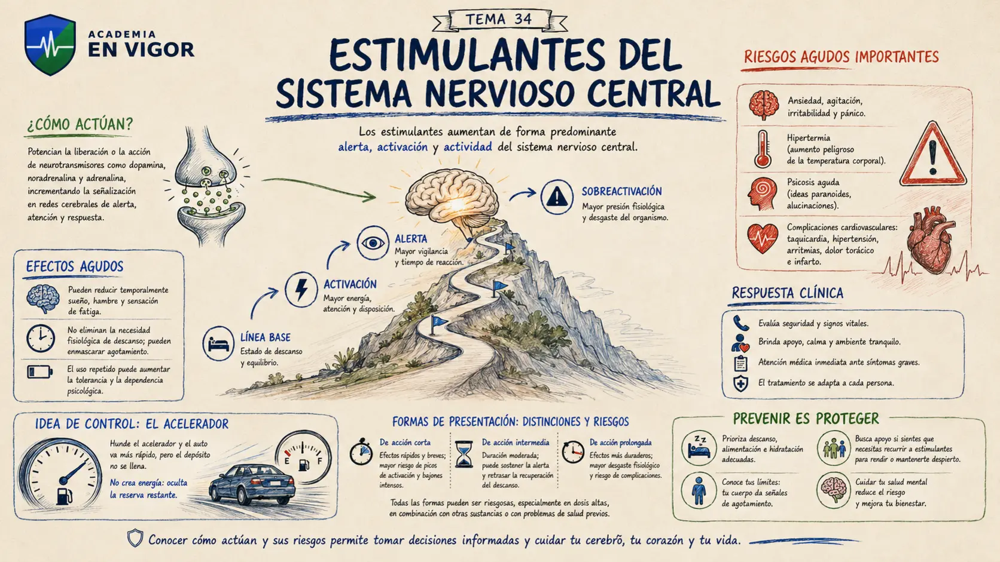

<em>Infografía: Estimulantes del sistema nervioso central.</em>

:::hablemos-claro
El acelerador oculta la reserva restante; no llena el depósito.
:::

:::en-la-calle
Ante hiperactivación o intoxicación por estimulantes, El acelerador oculta la reserva restante; no llena el depósito.
:::

:::lo-que-cae
Prioriza **activación, alerta y sobrecarga** y descarta respuestas que confundan efecto, legalidad, origen o fecha.
:::

<!-- FUENTE: UNODC-TERMINOLOGY-T34 -->

## 61. Cafeína, teofilina y nicotina

### Lógica del bloque

Para dominar **cafeína, teofilina y nicotina**, aplica esta regla: Uso cotidiano y clasificación farmacológica son planos diferentes. El anclaje principal es **estimulantes de uso extendido**.

### Hechos examinables

- Cafeína y teofilina son metilxantinas con efecto estimulante. <!-- FACT:PN-T34-F241 -->
- Nicotina es la principal sustancia psicoactiva del tabaco y posee alto potencial de dependencia. <!-- FACT:PN-T34-F242 -->
- La legalidad o uso cotidiano no elimina efectos cardiovasculares, dependencia ni toxicidad. <!-- FACT:PN-T34-F243 -->
- La clasificación por efecto sitúa estas sustancias entre los estimulantes, aunque su regulación sea diferente. <!-- FACT:PN-T34-F244 -->

### Trampas de examen

- **Incorrecto:** Teofilina es un depresor opioide.
- **Incorrecto:** Nicotina carece de potencial adictivo porque el tabaco es legal.

<!-- VISUAL:t34-61-cafeina-teofilina-y-nicotina.webp -->

  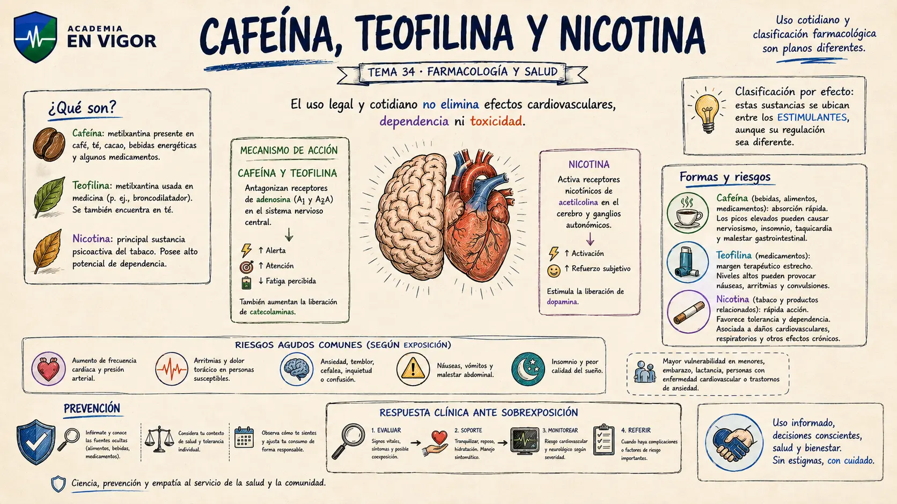

<em>Infografía: Cafeína, teofilina y nicotina.</em>

:::hablemos-claro
Uso cotidiano y clasificación farmacológica son planos diferentes.
:::

:::en-la-calle
Ante hiperactivación o intoxicación por estimulantes, Uso cotidiano y clasificación farmacológica son planos diferentes.
:::

:::lo-que-cae
Prioriza **estimulantes de uso extendido** y descarta respuestas que confundan efecto, legalidad, origen o fecha.
:::

<!-- FUENTE: UNODC-TERMINOLOGY-T34 -->

## 62. Coca y cocaína

### Lógica del bloque

Para dominar **coca y cocaína**, aplica esta regla: Misma planta de origen no significa misma concentración, vía ni riesgo. El anclaje principal es **planta, alcaloide y estimulante**.

### Hechos examinables

- La cocaína es un alcaloide estimulante obtenido a partir de hojas de coca mediante procesamiento. <!-- FACT:PN-T34-F245 -->
- El consumo tradicional de hoja de coca no equivale en concentración ni rapidez al clorhidrato refinado. <!-- FACT:PN-T34-F246 -->
- La cocaína bloquea la recaptación de varios neurotransmisores y produce euforia y activación breves. <!-- FACT:PN-T34-F247 -->
- Su efecto corto puede favorecer repetición compulsiva y fuerte dependencia psíquica. <!-- FACT:PN-T34-F248 -->

### Trampas de examen

- **Incorrecto:** Hoja de coca y cocaína refinada tienen idéntica concentración y riesgo.
- **Incorrecto:** Cocaína es un depresor que enlentece la actividad cerebral.

<!-- VISUAL:t34-62-coca-y-cocaina.webp -->

  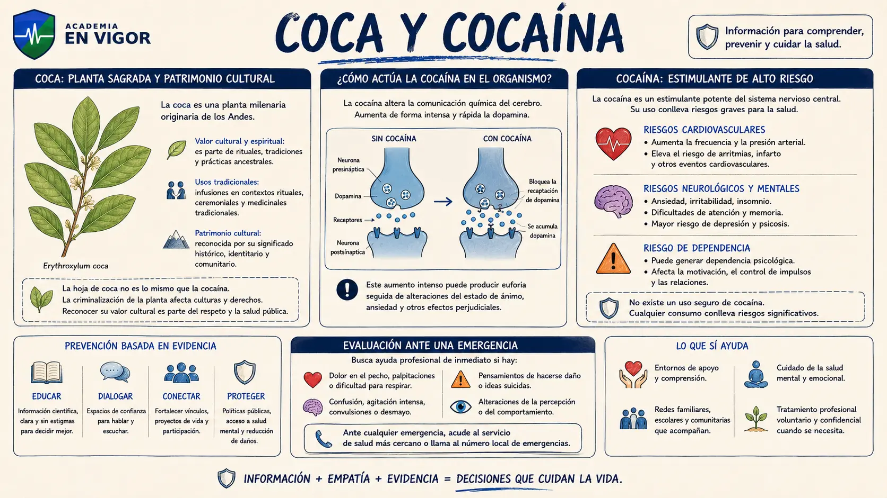

<em>Infografía: Coca y cocaína.</em>

:::hablemos-claro
Misma planta de origen no significa misma concentración, vía ni riesgo.
:::

:::en-la-calle
Ante hiperactivación o intoxicación por estimulantes, Misma planta de origen no significa misma concentración, vía ni riesgo.
:::

:::lo-que-cae
Prioriza **planta, alcaloide y estimulante** y descarta respuestas que confundan efecto, legalidad, origen o fecha.
:::

<!-- FUENTE: PNSD-INFORMACION-T34 -->

## 63. Clorhidrato, base y crack

### Lógica del bloque

Para dominar **clorhidrato, base y crack**, aplica esta regla: La forma y la vía cambian la velocidad; la etiqueta no certifica el contenido. El anclaje principal es **presentación y vía sin instrucciones de elaboración**.

### Hechos examinables

- El clorhidrato de cocaína suele presentarse como polvo y se consume por distintas vías. <!-- FACT:PN-T34-F249 -->
- Crack es una forma base fumable de cocaína. <!-- FACT:PN-T34-F250 -->
- La inhalación de crack produce llegada muy rápida y efecto intenso y breve. <!-- FACT:PN-T34-F251 -->
- La denominación comercial o callejera no garantiza composición, concentración ni ausencia de adulterantes. <!-- FACT:PN-T34-F252 -->

### Trampas de examen

- **Incorrecto:** Crack es una sustancia sin relación farmacológica con la cocaína.
- **Incorrecto:** El color del producto acredita pureza y potencia.

<!-- VISUAL:t34-il-63-clorhidrato-base-y-crack.webp -->

  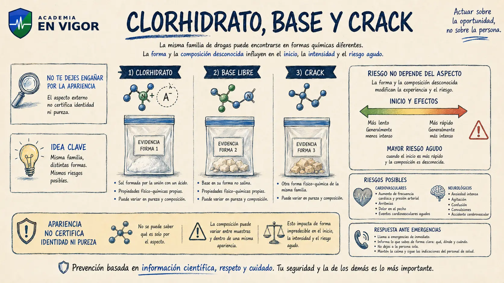

<em>Infografía: Clorhidrato, base y crack.</em>

:::hablemos-claro
La forma y la vía cambian la velocidad; la etiqueta no certifica el contenido.
:::

:::en-la-calle
Ante hiperactivación o intoxicación por estimulantes, La forma y la vía cambian la velocidad; la etiqueta no certifica el contenido.
:::

:::lo-que-cae
Prioriza **presentación y vía sin instrucciones de elaboración** y descarta respuestas que confundan efecto, legalidad, origen o fecha.
:::

<!-- FUENTE: PNSD-INFORMACION-T34 -->

## 64. Anfetamina

### Lógica del bloque

Para dominar **anfetamina**, aplica esta regla: Estimulante sintético, efecto catecolaminérgico y mercado de composición incierta. El anclaje principal es **derivado feniletilamínico estimulante**.

### Hechos examinables

- Anfetamina es un estimulante sintético del sistema nervioso central. <!-- FACT:PN-T34-F253 -->
- Aumenta actividad catecolaminérgica y puede producir energía, alerta y disminución del apetito. <!-- FACT:PN-T34-F254 -->
- El uso no médico puede causar tolerancia, dependencia, agitación y complicaciones cardiovasculares. <!-- FACT:PN-T34-F255 -->
- La presentación ilícita puede contener mezclas y concentraciones impredecibles. <!-- FACT:PN-T34-F256 -->

### Trampas de examen

- **Incorrecto:** Anfetamina es un alucinógeno natural extraído de hongos.
- **Incorrecto:** La presentación en comprimido permite conocer su composición.

<!-- VISUAL:t34-64-anfetamina.webp -->

  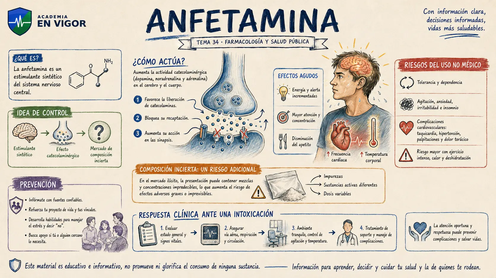

<em>Infografía: Anfetamina.</em>

:::hablemos-claro
Estimulante sintético, efecto catecolaminérgico y mercado de composición incierta.
:::

:::en-la-calle
Ante hiperactivación o intoxicación por estimulantes, Estimulante sintético, efecto catecolaminérgico y mercado de composición incierta.
:::

:::lo-que-cae
Prioriza **derivado feniletilamínico estimulante** y descarta respuestas que confundan efecto, legalidad, origen o fecha.
:::

<!-- FUENTE: PNSD-SINTESIS-T34 -->

## 65. Metanfetamina

### Lógica del bloque

Para dominar **metanfetamina**, aplica esta regla: Más duración no ofrece más control: puede prolongar sobrecarga y psicosis. El anclaje principal es **estimulante potente y prolongado**.

### Hechos examinables

- Metanfetamina es un estimulante sintético relacionado con la anfetamina. <!-- FACT:PN-T34-F257 -->
- Puede producir efectos más intensos y prolongados y elevado potencial de dependencia. <!-- FACT:PN-T34-F258 -->
- El consumo repetido se asocia a deterioro físico, psiquiátrico, cognitivo y social. <!-- FACT:PN-T34-F259 -->
- La situación europea exige vigilar producción, disponibilidad y diversificación de mercados. <!-- FACT:PN-T34-F260 -->

### Trampas de examen

- **Incorrecto:** Metanfetamina es un opioide semisintético.
- **Incorrecto:** Un efecto prolongado reduce necesariamente el riesgo de compulsión.

<!-- VISUAL:t34-65-metanfetamina.webp -->

  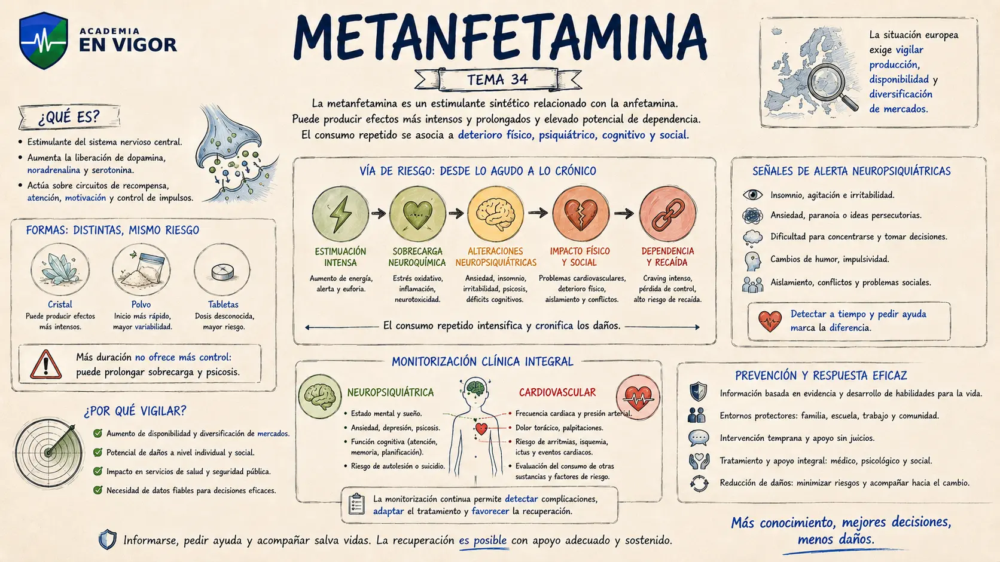

<em>Infografía: Metanfetamina.</em>

:::hablemos-claro
Más duración no ofrece más control: puede prolongar sobrecarga y psicosis.
:::

:::en-la-calle
Ante hiperactivación o intoxicación por estimulantes, Más duración no ofrece más control: puede prolongar sobrecarga y psicosis.
:::

:::lo-que-cae
Prioriza **estimulante potente y prolongado** y descarta respuestas que confundan efecto, legalidad, origen o fecha.
:::

<!-- FUENTE: EUDA-REPORT-2026-T34 -->

## 66. MDMA o éxtasis

### Lógica del bloque

Para dominar **mdma o éxtasis**, aplica esta regla: Efecto mixto más comprimido incierto: no clasifiques por logotipo. El anclaje principal es **estimulante con efectos entactógenos**.

### Hechos examinables

- MDMA es una sustancia sintética relacionada con las anfetaminas. <!-- FACT:PN-T34-F261 -->
- Combina efectos estimulantes con alteraciones perceptivas y aumento de empatía o cercanía subjetiva. <!-- FACT:PN-T34-F262 -->
- Puede causar hipertermia, deshidratación, alteraciones electrolíticas y toxicidad serotoninérgica. <!-- FACT:PN-T34-F263 -->
- Una pastilla vendida como éxtasis puede contener dosis o sustancias distintas de las esperadas. <!-- FACT:PN-T34-F264 -->

### Trampas de examen

- **Incorrecto:** MDMA es un depresor opioide puro.
- **Incorrecto:** El logotipo de una pastilla acredita su composición.

<!-- VISUAL:t34-66-mdma-o-extasis.webp -->

  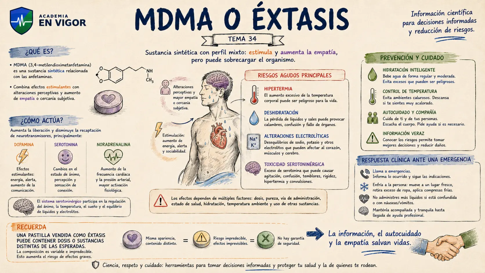

<em>Infografía: MDMA o éxtasis.</em>

:::hablemos-claro
Efecto mixto más comprimido incierto: no clasifiques por logotipo.
:::

:::en-la-calle
Ante hiperactivación o intoxicación por estimulantes, Efecto mixto más comprimido incierto: no clasifiques por logotipo.
:::

:::lo-que-cae
Prioriza **estimulante con efectos entactógenos** y descarta respuestas que confundan efecto, legalidad, origen o fecha.
:::

<!-- FUENTE: PNSD-SINTESIS-T34 -->

## 67. Catinonas sintéticas

### Lógica del bloque

Para dominar **catinonas sintéticas**, aplica esta regla: Una familia cambiante puede ocupar el lugar de varios estimulantes conocidos. El anclaje principal es **NPS estimulantes**.

### Hechos examinables

- Las catinonas sintéticas son estimulantes relacionados estructuralmente con la catinona de la planta khat. <!-- FACT:PN-T34-F265 -->
- Algunas se comercializan como sustitutos de anfetamina, MDMA o cocaína. <!-- FACT:PN-T34-F266 -->
- Pueden producir agitación, ansiedad, psicosis, hipertermia y complicaciones cardiovasculares. <!-- FACT:PN-T34-F267 -->
- La EUDA señala que se han consolidado como sustitutos de estimulantes en partes de Europa. <!-- FACT:PN-T34-F268 -->

### Trampas de examen

- **Incorrecto:** Sales de baño describe una composición química única y segura.
- **Incorrecto:** Toda catinona sintética tiene idéntica potencia y duración.

<!-- VISUAL:t34-67-catinonas-sinteticas.webp -->

  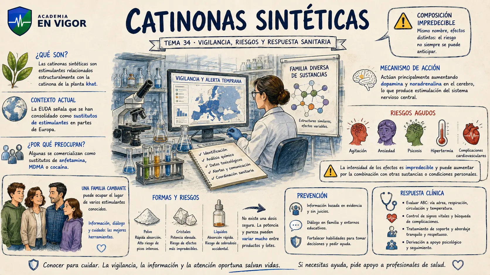

<em>Infografía: Catinonas sintéticas.</em>

:::hablemos-claro
Una familia cambiante puede ocupar el lugar de varios estimulantes conocidos.
:::

:::en-la-calle
Ante hiperactivación o intoxicación por estimulantes, Una familia cambiante puede ocupar el lugar de varios estimulantes conocidos.
:::

:::lo-que-cae
Prioriza **NPS estimulantes** y descarta respuestas que confundan efecto, legalidad, origen o fecha.
:::

<!-- FUENTE: EUDA-NPS-2026-T34 -->

## 68. Intoxicación por estimulantes

### Lógica del bloque

Para dominar **intoxicación por estimulantes**, aplica esta regla: Mucho movimiento puede ocultar un organismo al límite. El anclaje principal es **hiperactivación y urgencia**.

### Hechos examinables

- La intoxicación grave puede presentar agitación extrema, dolor torácico, convulsiones, hipertermia o alteración de conciencia. <!-- FACT:PN-T34-F269 -->
- La hipertermia y la actividad muscular intensa pueden desencadenar daño sistémico. <!-- FACT:PN-T34-F270 -->
- Un estado de agitación no excluye colapso cardiovascular o neurológico. <!-- FACT:PN-T34-F271 -->
- La actuación prioriza seguridad, emergencias y evaluación clínica, no confrontación innecesaria. <!-- FACT:PN-T34-F272 -->

### Trampas de examen

- **Incorrecto:** Una persona agitada no puede estar en riesgo vital porque permanece consciente.
- **Incorrecto:** La hipertermia es un efecto leve que nunca requiere urgencia.

<!-- VISUAL:t34-il-68-intoxicacion-por-estimulantes.webp -->

  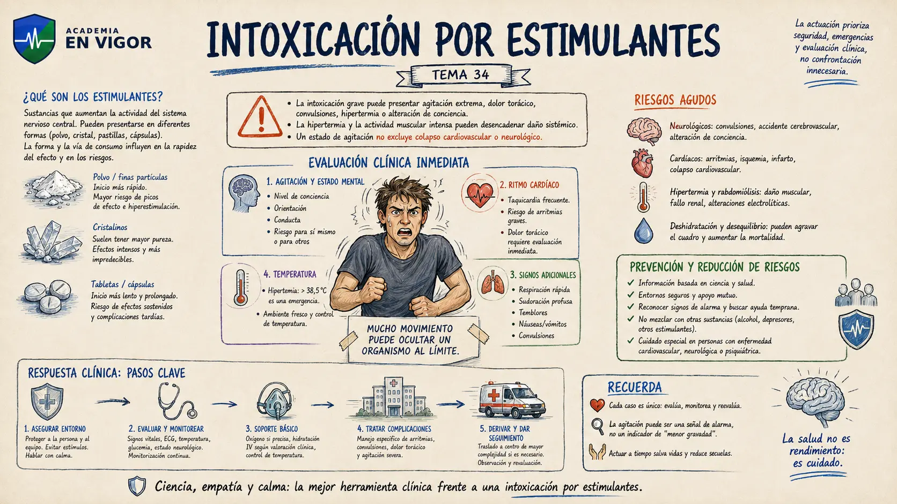

<em>Infografía: Intoxicación por estimulantes.</em>

:::hablemos-claro
Mucho movimiento puede ocultar un organismo al límite.
:::

:::en-la-calle
Ante hiperactivación o intoxicación por estimulantes, Mucho movimiento puede ocultar un organismo al límite.
:::

:::lo-que-cae
Prioriza **hiperactivación y urgencia** y descarta respuestas que confundan efecto, legalidad, origen o fecha.
:::

<!-- FUENTE: PNSD-INFORMACION-T34 -->

## 69. Perturbadoras, alucinógenas y psicodislépticas

### Lógica del bloque

Para dominar **perturbadoras, alucinógenas y psicodislépticas**, aplica esta regla: Mismo gran paraguas, mecanismos y experiencias diferentes. El anclaje principal es **percepción, pensamiento y conciencia**.

### Hechos examinables

- Las sustancias perturbadoras alteran percepción, pensamiento, conciencia o integración sensorial. <!-- FACT:PN-T34-F273 -->
- Alucinógenas y psicodislépticas son términos usados en clasificaciones didácticas próximas. <!-- FACT:PN-T34-F274 -->
- No todas producen alucinaciones completas ni comparten el mismo mecanismo. <!-- FACT:PN-T34-F275 -->
- Psicodélicos clásicos, disociativos y cannabinoides pueden estudiarse por separado dentro del campo amplio. <!-- FACT:PN-T34-F276 -->

### Trampas de examen

- **Incorrecto:** Toda perturbadora produce necesariamente pérdida completa de contacto con la realidad.
- **Incorrecto:** Disociativos y psicodélicos clásicos tienen idéntico mecanismo.

<!-- VISUAL:t34-69-perturbadoras-alucinogenas-y-psicodislepticas.webp -->

  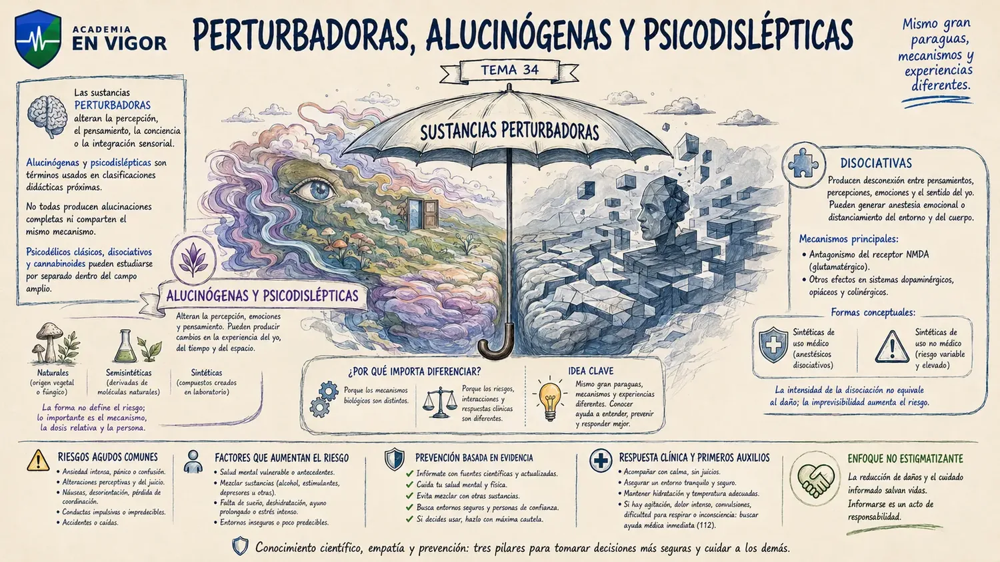

<em>Infografía: Perturbadoras, alucinógenas y psicodislépticas.</em>

:::hablemos-claro
Mismo gran paraguas, mecanismos y experiencias diferentes.
:::

:::en-la-calle
Al distinguir psicodélicos, disociativos, cannabis e inhalantes, Mismo gran paraguas, mecanismos y experiencias diferentes.
:::

:::lo-que-cae
Prioriza **percepción, pensamiento y conciencia** y descarta respuestas que confundan efecto, legalidad, origen o fecha.
:::

<!-- FUENTE: UNODC-TERMINOLOGY-T34 -->

## 70. LSD

### Lógica del bloque

Para dominar **lsd**, aplica esta regla: Poca cantidad y larga experiencia: el riesgo principal no se mide solo por dependencia física. El anclaje principal es **psicodélico serotoninérgico potente**.

### Hechos examinables

- LSD o dietilamida del ácido lisérgico es un psicodélico semisintético muy potente. <!-- FACT:PN-T34-F277 -->
- Produce alteraciones perceptivas, cognitivas y emocionales de duración prolongada. <!-- FACT:PN-T34-F278 -->
- El mal viaje puede incluir ansiedad intensa, pánico, confusión o ideas persecutorias. <!-- FACT:PN-T34-F279 -->
- No suele generar dependencia física típica, pero puede causar accidentes y efectos psicológicos graves. <!-- FACT:PN-T34-F280 -->

### Trampas de examen

- **Incorrecto:** LSD es un depresor opioide que causa abstinencia física intensa.
- **Incorrecto:** La ausencia habitual de dependencia física equivale a ausencia de riesgo.

<!-- VISUAL:t34-70-lsd.webp -->

  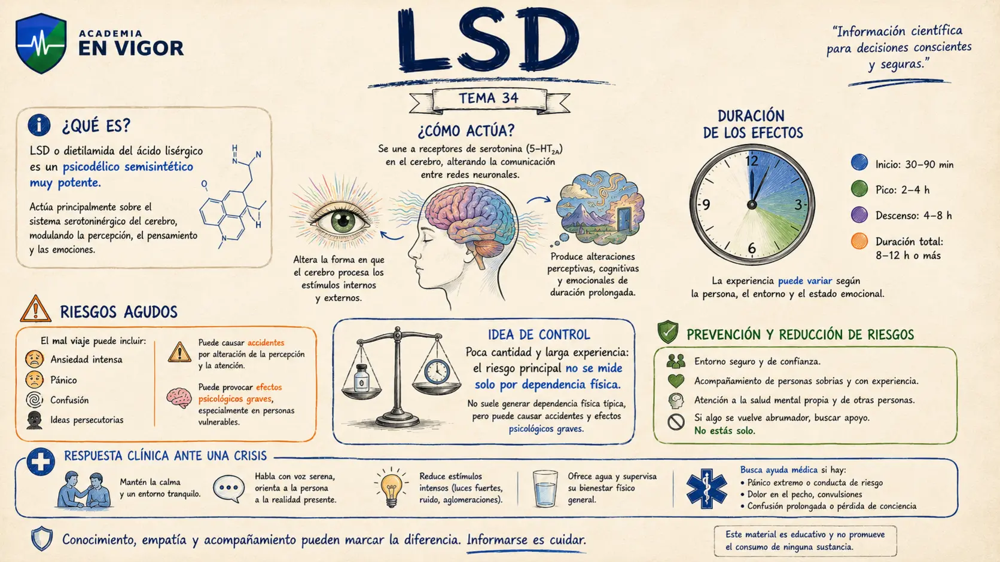

<em>Infografía: LSD.</em>

:::hablemos-claro
Poca cantidad y larga experiencia: el riesgo principal no se mide solo por dependencia física.
:::

:::en-la-calle
Al distinguir psicodélicos, disociativos, cannabis e inhalantes, Poca cantidad y larga experiencia: el riesgo principal no se mide solo por dependencia física.
:::

:::lo-que-cae
Prioriza **psicodélico serotoninérgico potente** y descarta respuestas que confundan efecto, legalidad, origen o fecha.
:::

<!-- FUENTE: PNSD-INFORMACION-T34 -->

## 71. Psilocibina y psilocina

### Lógica del bloque

Para dominar **psilocibina y psilocina**, aplica esta regla: Hongos no es sinónimo de inocuo: sustancia, especie, concentración y contexto importan. El anclaje principal es **hongos y psicodélicos**.

### Hechos examinables

- Psilocibina y psilocina son sustancias psicodélicas presentes en determinadas especies de hongos. <!-- FACT:PN-T34-F281 -->
- Se clasifican entre las perturbadoras o alucinógenas por su efecto predominante. <!-- FACT:PN-T34-F282 -->
- Pueden producir distorsiones sensoriales, cambios emocionales, ansiedad y pérdida de juicio situacional. <!-- FACT:PN-T34-F283 -->
- Natural no significa seguro ni permite identificar concentración o especie sin análisis. <!-- FACT:PN-T34-F284 -->

### Trampas de examen

- **Incorrecto:** Psilocibina es un estimulante derivado de la coca.
- **Incorrecto:** Ser de origen natural garantiza dosis y seguridad.

<!-- VISUAL:t34-71-psilocibina-y-psilocina.webp -->

  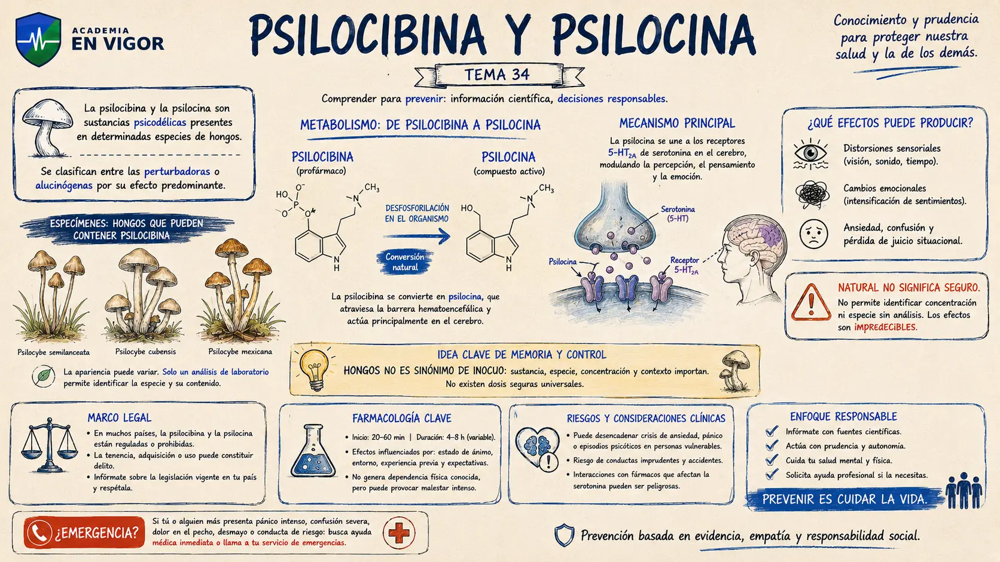

<em>Infografía: Psilocibina y psilocina.</em>

:::hablemos-claro
Hongos no es sinónimo de inocuo: sustancia, especie, concentración y contexto importan.
:::

:::en-la-calle
Al distinguir psicodélicos, disociativos, cannabis e inhalantes, Hongos no es sinónimo de inocuo: sustancia, especie, concentración y contexto importan.
:::

:::lo-que-cae
Prioriza **hongos y psicodélicos** y descarta respuestas que confundan efecto, legalidad, origen o fecha.
:::

<!-- FUENTE: PNSD-INFORMACION-T34 -->

## 72. Mescalina, DMT y ayahuasca

### Lógica del bloque

Para dominar **mescalina, dmt y ayahuasca**, aplica esta regla: Tres nombres, una familia psicodélica y contextos distintos; no confundas tradición con seguridad. El anclaje principal es **psicodélicos de distinto origen**.

### Hechos examinables

- Mescalina es un psicodélico presente en determinados cactus como peyote y San Pedro. <!-- FACT:PN-T34-F285 -->
- DMT es una triptamina psicodélica presente en diversas plantas y también obtenible por síntesis. <!-- FACT:PN-T34-F286 -->
- Ayahuasca es una preparación vegetal cuyo efecto psicodélico se relaciona con DMT y componentes que permiten su actividad oral. <!-- FACT:PN-T34-F287 -->
- Origen ritual o tradicional no elimina riesgos, interacciones ni necesidad de valorar contexto y salud. <!-- FACT:PN-T34-F288 -->

### Trampas de examen

- **Incorrecto:** Mescalina es una benzodiacepina depresora.
- **Incorrecto:** Todo uso tradicional está exento de efectos adversos.

<!-- VISUAL:t34-72-mescalina-dmt-y-ayahuasca.webp -->

  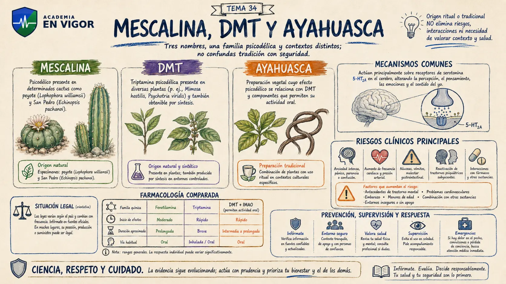

<em>Infografía: Mescalina, DMT y ayahuasca.</em>

:::hablemos-claro
Tres nombres, una familia psicodélica y contextos distintos; no confundas tradición con seguridad.
:::

:::en-la-calle
Al distinguir psicodélicos, disociativos, cannabis e inhalantes, Tres nombres, una familia psicodélica y contextos distintos; no confundas tradición con seguridad.
:::

:::lo-que-cae
Prioriza **psicodélicos de distinto origen** y descarta respuestas que confundan efecto, legalidad, origen o fecha.
:::

<!-- FUENTE: PNSD-INFORMACION-T34 -->

## 73. Ketamina y PCP: disociativos

### Lógica del bloque

Para dominar **ketamina y pcp: disociativos**, aplica esta regla: Disociar no es simplemente alucinar: se rompe la integración entre cuerpo, entorno y conciencia. El anclaje principal es **desconexión perceptiva y anestesia**.

### Hechos examinables

- Ketamina y PCP son sustancias disociativas que alteran integración de percepción, conciencia y sensación corporal. <!-- FACT:PN-T34-F289 -->
- Ketamina tiene uso médico como anestésico bajo control profesional. <!-- FACT:PN-T34-F290 -->
- A dosis no médicas puede causar desorientación, inmovilidad, pérdida de conciencia y accidentes. <!-- FACT:PN-T34-F291 -->
- El estado disociativo intenso asociado a ketamina se conoce coloquialmente como K-hole. <!-- FACT:PN-T34-F292 -->

### Trampas de examen

- **Incorrecto:** Ketamina es un estimulante puro sin efectos anestésicos.
- **Incorrecto:** El uso médico de una sustancia elimina el riesgo de uso no supervisado.

<!-- VISUAL:t34-il-73-ketamina-y-pcp-disociativos.webp -->

  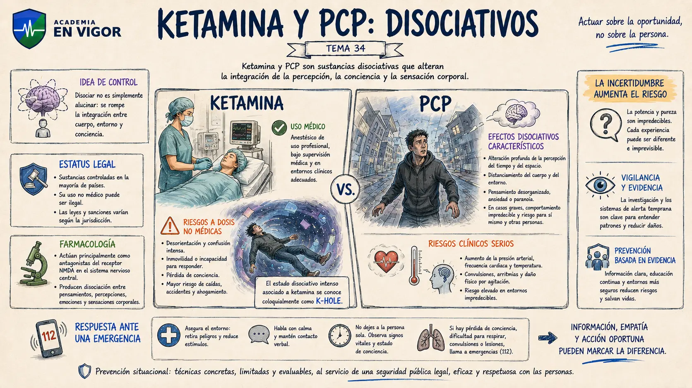

<em>Infografía: Ketamina y PCP: disociativos.</em>

:::hablemos-claro
Disociar no es simplemente alucinar: se rompe la integración entre cuerpo, entorno y conciencia.
:::

:::en-la-calle
Al distinguir psicodélicos, disociativos, cannabis e inhalantes, Disociar no es simplemente alucinar: se rompe la integración entre cuerpo, entorno y conciencia.
:::

:::lo-que-cae
Prioriza **desconexión perceptiva y anestesia** y descarta respuestas que confundan efecto, legalidad, origen o fecha.
:::

<!-- FUENTE: PNSD-SINTESIS-T34 -->

## 74. Cannabis, THC y CBD

### Lógica del bloque

Para dominar **cannabis, thc y cbd**, aplica esta regla: Misma planta, moléculas distintas: THC y CBD no son intercambiables. El anclaje principal es **cannabinoides con efectos distintos**.

### Hechos examinables

- Cannabis contiene numerosos cannabinoides, entre ellos THC y CBD. <!-- FACT:PN-T34-F293 -->
- Delta-9-THC es el principal responsable de los efectos psicoactivos y tiene consideración legal de psicótropo. <!-- FACT:PN-T34-F294 -->
- CBD produce efectos farmacológicos pero no comparte el mismo perfil psicoactivo del THC. <!-- FACT:PN-T34-F295 -->
- La proporción de cannabinoides condiciona efectos y no se deduce con certeza del aspecto del producto. <!-- FACT:PN-T34-F296 -->

### Trampas de examen

- **Incorrecto:** CBD y THC son la misma sustancia con distinto nombre.
- **Incorrecto:** El aspecto vegetal permite conocer exactamente la concentración de THC.

<!-- VISUAL:t34-74-cannabis-thc-y-cbd.webp -->

  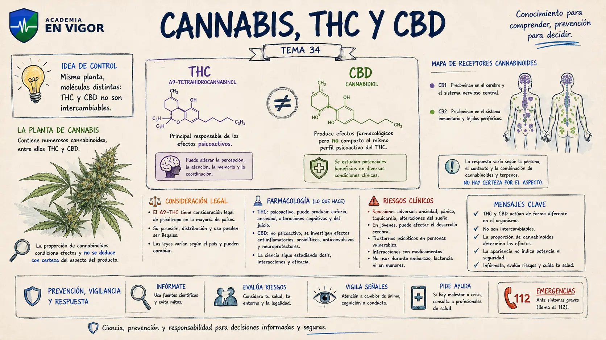

<em>Infografía: Cannabis, THC y CBD.</em>

:::hablemos-claro
Misma planta, moléculas distintas: THC y CBD no son intercambiables.
:::

:::en-la-calle
Al distinguir psicodélicos, disociativos, cannabis e inhalantes, Misma planta, moléculas distintas: THC y CBD no son intercambiables.
:::

:::lo-que-cae
Prioriza **cannabinoides con efectos distintos** y descarta respuestas que confundan efecto, legalidad, origen o fecha.
:::

<!-- FUENTE: RD903-2025-T34 -->

## 75. Marihuana, hachís y extractos

### Lógica del bloque

Para dominar **marihuana, hachís y extractos**, aplica esta regla: Planta, resina y extracto forman una escala posible de concentración, no de seguridad. El anclaje principal es **partes vegetales, resina y concentración**.

### Hechos examinables

- Marihuana reúne principalmente flores y partes vegetales secas del cannabis. <!-- FACT:PN-T34-F297 -->
- Hachís es un producto concentrado de resina o tricomas de cannabis. <!-- FACT:PN-T34-F298 -->
- Aceites y otros extractos pueden alcanzar concentraciones de THC superiores a las formas vegetales. <!-- FACT:PN-T34-F299 -->
- Mayor concentración puede aumentar ansiedad, intoxicación, alteraciones perceptivas y riesgo de dependencia. <!-- FACT:PN-T34-F300 -->

### Trampas de examen

- **Incorrecto:** Hachís es hoja de coca prensada.
- **Incorrecto:** Un extracto concentrado siempre produce efectos más controlables.

<!-- VISUAL:t34-75-marihuana-hachis-y-extractos.webp -->

  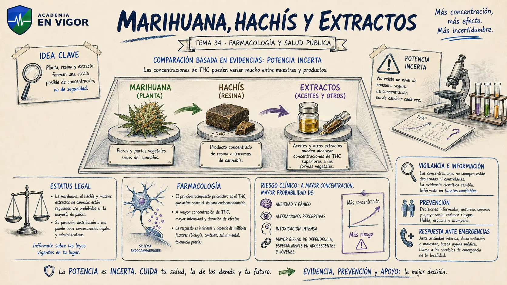

<em>Infografía: Marihuana, hachís y extractos.</em>

:::hablemos-claro
Planta, resina y extracto forman una escala posible de concentración, no de seguridad.
:::

:::en-la-calle
Al distinguir psicodélicos, disociativos, cannabis e inhalantes, Planta, resina y extracto forman una escala posible de concentración, no de seguridad.
:::

:::lo-que-cae
Prioriza **partes vegetales, resina y concentración** y descarta respuestas que confundan efecto, legalidad, origen o fecha.
:::

<!-- FUENTE: PNSD-INFORMACION-T34 -->

## 76. Preparados estandarizados de cannabis de 2025

### Lógica del bloque

Para dominar **preparados estandarizados de cannabis de 2025**, aplica esta regla: Medicinal, estandarizado y registrado: tres límites que no deben borrarse. El anclaje principal es **uso medicinal regulado**.

### Hechos examinables

- El Real Decreto 903/2025 regula fórmulas magistrales tipificadas de preparados estandarizados de cannabis. <!-- FACT:PN-T34-F301 -->
- Preparado estandarizado contiene una cantidad definida de THC y/o CBD y debe estar registrado por la AEMPS. <!-- FACT:PN-T34-F302 -->
- Los preparados con THC igual o superior al 0,2 % en peso quedan sometidos a control de psicótropos. <!-- FACT:PN-T34-F303 -->
- El marco medicinal no legaliza de forma general el uso recreativo ni cualquier producto de cannabis. <!-- FACT:PN-T34-F304 -->

### Trampas de examen

- **Incorrecto:** El Real Decreto 903/2025 legalizó cualquier cannabis recreativo.
- **Incorrecto:** Estandarizado significa que no necesita registro ni control de contenido.

<!-- VISUAL:t34-76-preparados-estandarizados-de-cannabis-de-2025.webp -->

  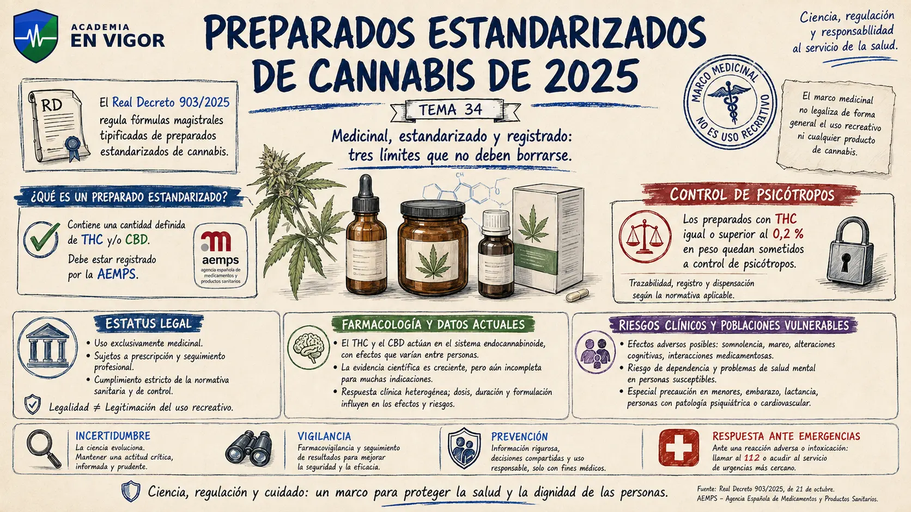

<em>Infografía: Preparados estandarizados de cannabis de 2025.</em>

:::hablemos-claro
Medicinal, estandarizado y registrado: tres límites que no deben borrarse.
:::

:::en-la-calle
Al distinguir psicodélicos, disociativos, cannabis e inhalantes, Medicinal, estandarizado y registrado: tres límites que no deben borrarse.
:::

:::lo-que-cae
Prioriza **uso medicinal regulado** y descarta respuestas que confundan efecto, legalidad, origen o fecha.
:::

<!-- FUENTE: RD903-2025-T34 -->

## 77. Cannabinoides sintéticos y semisintéticos

### Lógica del bloque

Para dominar **cannabinoides sintéticos y semisintéticos**, aplica esta regla: Imitar al THC no significa copiar su margen de riesgo; algunos activan el sistema con mucha más fuerza. El anclaje principal es **productos potentes e impredecibles**.

### Hechos examinables

- Los cannabinoides sintéticos activan receptores cannabinoides sin ser THC natural. <!-- FACT:PN-T34-F305 -->
- Pueden ser mucho más potentes y producir intoxicaciones graves, convulsiones, psicosis o colapso cardiovascular. <!-- FACT:PN-T34-F306 -->
- Los semisintéticos modifican químicamente cannabinoides y se han expandido en productos de vapeo y comestibles. <!-- FACT:PN-T34-F307 -->
- La EUDA 2026 advierte de variabilidad de contenido, productos mal etiquetados y riesgo de intoxicación. <!-- FACT:PN-T34-F308 -->

### Trampas de examen

- **Incorrecto:** Spice es simplemente cannabis vegetal con potencia conocida.
- **Incorrecto:** Semisintético significa automáticamente autorizado y seguro.

<!-- VISUAL:t34-77-cannabinoides-sinteticos-y-semisinteticos.webp -->

  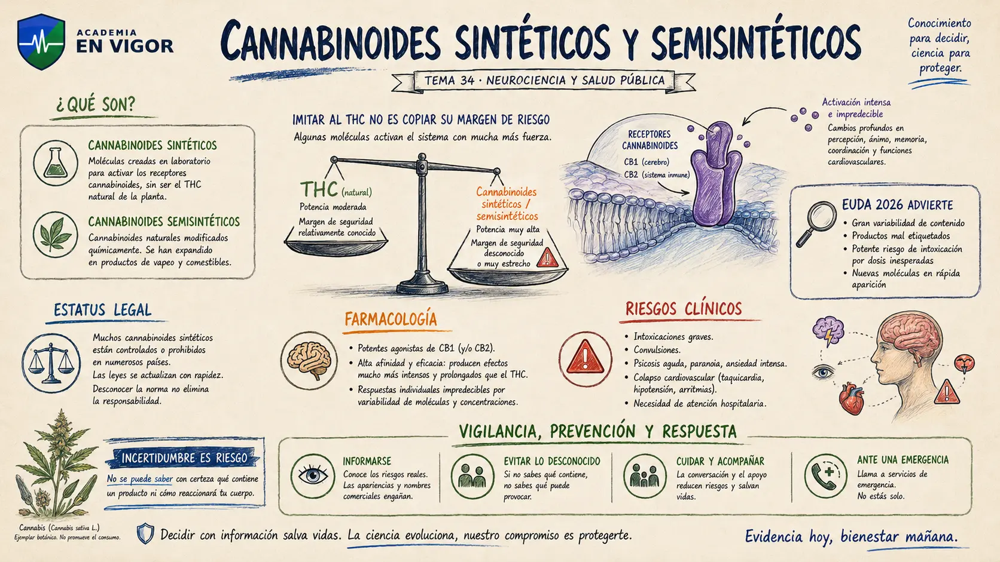

<em>Infografía: Cannabinoides sintéticos y semisintéticos.</em>

:::hablemos-claro
Imitar al THC no significa copiar su margen de riesgo; algunos activan el sistema con mucha más fuerza.
:::

:::en-la-calle
Al distinguir psicodélicos, disociativos, cannabis e inhalantes, Imitar al THC no significa copiar su margen de riesgo; algunos activan el sistema con mucha más fuerza.
:::

:::lo-que-cae
Prioriza **productos potentes e impredecibles** y descarta respuestas que confundan efecto, legalidad, origen o fecha.
:::

<!-- FUENTE: EUDA-NPS-2026-T34 -->

## 78. Inhalantes volátiles

### Lógica del bloque

Para dominar **inhalantes volátiles**, aplica esta regla: El envase cotidiano puede ocultar toxicidad cerebral, cardiaca y sistémica. El anclaje principal es **productos cotidianos y toxicidad sistémica**.

### Hechos examinables

- Inhalantes son vapores de disolventes, gases o productos volátiles consumidos por sus efectos psicoactivos. <!-- FACT:PN-T34-F309 -->
- Muchos actúan como depresores y pueden causar mareo, descoordinación, pérdida de conciencia o arritmias. <!-- FACT:PN-T34-F310 -->
- El uso puede provocar muerte súbita, asfixia, lesión neurológica y daño hepático o renal. <!-- FACT:PN-T34-F311 -->
- Disponibilidad doméstica no implica inocuidad ni uniformidad de composición. <!-- FACT:PN-T34-F312 -->

### Trampas de examen

- **Incorrecto:** Un producto doméstico no puede ser una sustancia de abuso.
- **Incorrecto:** Los inhalantes solo dañan el aparato respiratorio.

<!-- VISUAL:t34-il-78-inhalantes-volatiles.webp -->

  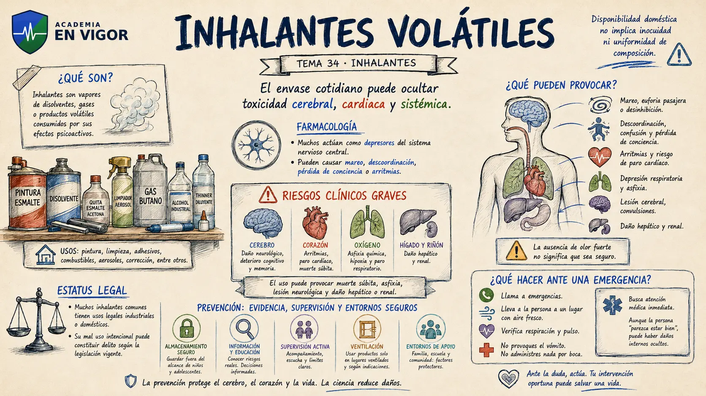

<em>Infografía: Inhalantes volátiles.</em>

:::hablemos-claro
El envase cotidiano puede ocultar toxicidad cerebral, cardiaca y sistémica.
:::

:::en-la-calle
Al distinguir psicodélicos, disociativos, cannabis e inhalantes, El envase cotidiano puede ocultar toxicidad cerebral, cardiaca y sistémica.
:::

:::lo-que-cae
Prioriza **productos cotidianos y toxicidad sistémica** y descarta respuestas que confundan efecto, legalidad, origen o fecha.
:::

<!-- FUENTE: PNSD-INFORMACION-T34 -->

## 79. Óxido nitroso y nitritos inhalados

### Lógica del bloque

Para dominar **óxido nitroso y nitritos inhalados**, aplica esta regla: Misma vía no significa misma sustancia: gas anestésico y nitritos vasodilatadores tienen riesgos distintos. El anclaje principal es **sustancias distintas bajo la vía inhalada**.

### Hechos examinables

- Óxido nitroso es un gas con usos médicos e industriales que puede consumirse por efectos breves de euforia y disociación. <!-- FACT:PN-T34-F313 -->
- Su uso repetido puede inactivar vitamina B12 y causar daño neurológico, además de hipoxia y accidentes. <!-- FACT:PN-T34-F314 -->
- Los poppers son nitritos de alquilo con efecto vasodilatador y no son óxido nitroso. <!-- FACT:PN-T34-F315 -->
- Combinar nitritos con fármacos vasodilatadores puede provocar hipotensión grave. <!-- FACT:PN-T34-F316 -->

### Trampas de examen

- **Incorrecto:** Óxido nitroso y poppers son el mismo compuesto.
- **Incorrecto:** La breve duración del efecto impide daño neurológico o accidentes.

<!-- VISUAL:t34-79-oxido-nitroso-y-nitritos-inhalados.webp -->

  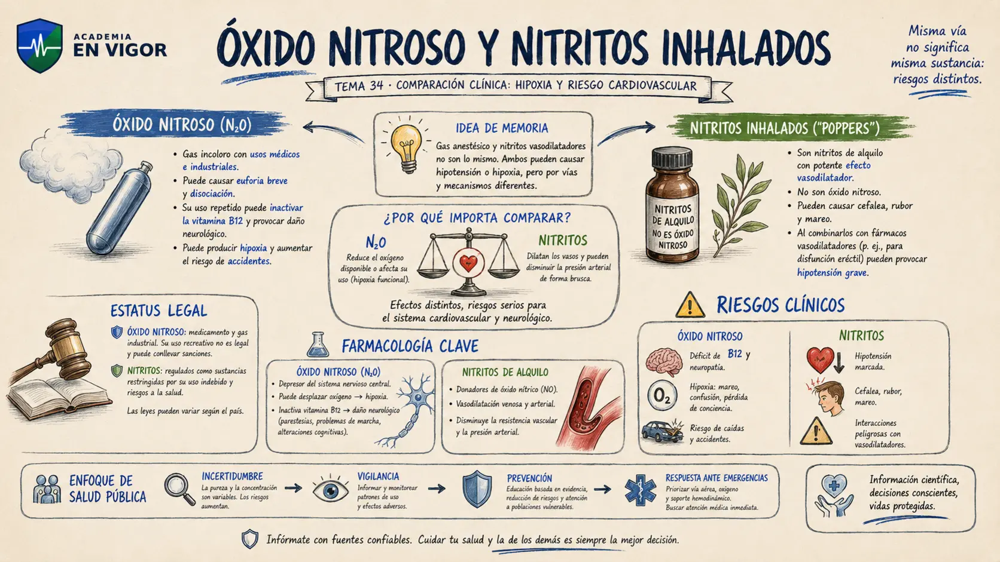

<em>Infografía: Óxido nitroso y nitritos inhalados.</em>

:::hablemos-claro
Misma vía no significa misma sustancia: gas anestésico y nitritos vasodilatadores tienen riesgos distintos.
:::

:::en-la-calle
Al distinguir psicodélicos, disociativos, cannabis e inhalantes, Misma vía no significa misma sustancia: gas anestésico y nitritos vasodilatadores tienen riesgos distintos.
:::

:::lo-que-cae
Prioriza **sustancias distintas bajo la vía inhalada** y descarta respuestas que confundan efecto, legalidad, origen o fecha.
:::

<!-- FUENTE: PNSD-SEAT-2026-T34 -->

## 80. Concepto de nueva sustancia psicoactiva

### Lógica del bloque

Para dominar **concepto de nueva sustancia psicoactiva**, aplica esta regla: Nueva describe su entrada en el sistema de vigilancia, no su fecha de nacimiento ni su seguridad. El anclaje principal es **no controlada internacionalmente e imitadora**.

### Hechos examinables

- Una NPS es una sustancia natural o sintética no controlada internacionalmente que puede plantear amenaza de salud pública. <!-- FACT:PN-T34-F317 -->
- A menudo se diseña o comercializa para imitar efectos de drogas ya controladas. <!-- FACT:PN-T34-F318 -->
- Nueva no significa recién inventada: puede ser una sustancia antigua que aparece por primera vez en el mercado o vigilancia. <!-- FACT:PN-T34-F319 -->
- El estado jurídico puede cambiar tras evaluación y adopción de medidas de control. <!-- FACT:PN-T34-F320 -->

### Trampas de examen

- **Incorrecto:** NPS significa sustancia creada necesariamente durante el último año.
- **Incorrecto:** No controlada internacionalmente equivale a legal en cualquier circunstancia.

<!-- VISUAL:t34-80-concepto-de-nueva-sustancia-psicoactiva.webp -->

  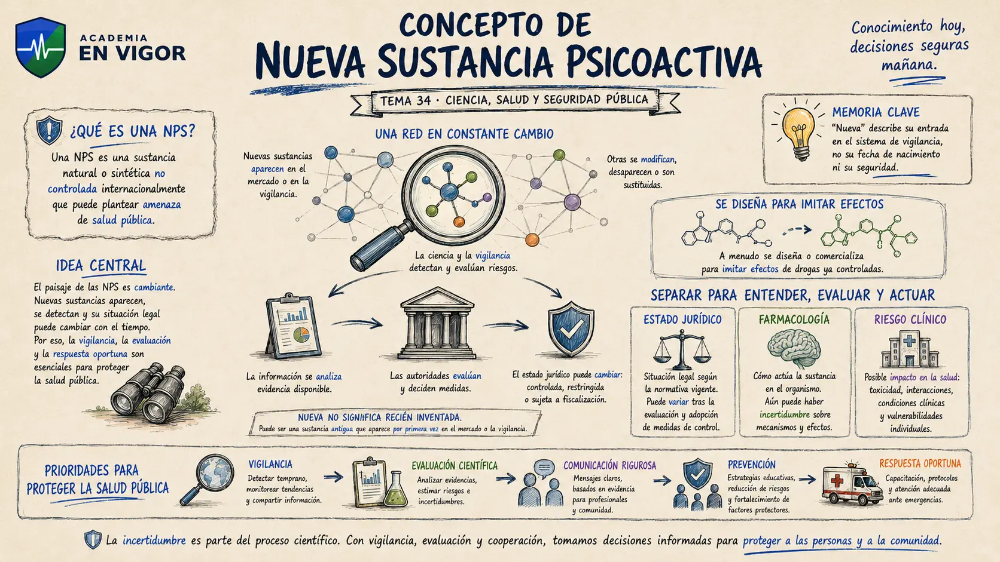

<em>Infografía: Concepto de nueva sustancia psicoactiva.</em>

:::hablemos-claro
Nueva describe su entrada en el sistema de vigilancia, no su fecha de nacimiento ni su seguridad.
:::

:::en-la-calle
Al recibir una alerta por una sustancia o mezcla emergente, Nueva describe su entrada en el sistema de vigilancia, no su fecha de nacimiento ni su seguridad.
:::

:::lo-que-cae
Prioriza **no controlada internacionalmente e imitadora** y descarta respuestas que confundan efecto, legalidad, origen o fecha.
:::

<!-- FUENTE: PNSD-SEAT-2026-T34 -->

## 81. “Legal high” no significa segura

### Lógica del bloque

Para dominar **“legal high” no significa segura**, aplica esta regla: La etiqueta vende una historia; el laboratorio identifica la sustancia. El anclaje principal es **marketing frente a composición real**.

### Hechos examinables

- La venta como producto legal, herbal o de investigación no acredita seguridad, autorización ni composición. <!-- FACT:PN-T34-F321 -->
- Los fabricantes pueden modificar moléculas o etiquetas para eludir controles existentes. <!-- FACT:PN-T34-F322 -->
- Un mismo envase puede variar entre lotes y contener sustancias no declaradas. <!-- FACT:PN-T34-F323 -->
- La evaluación jurídica y toxicológica debe basarse en análisis, no en reclamos comerciales. <!-- FACT:PN-T34-F324 -->

### Trampas de examen

- **Incorrecto:** La etiqueta “no apto para consumo” certifica que el contenido es inocuo.
- **Incorrecto:** Un producto vendido en comercio físico está necesariamente autorizado como medicamento.

<!-- VISUAL:t34-81-legal-high-no-significa-segura.webp -->

  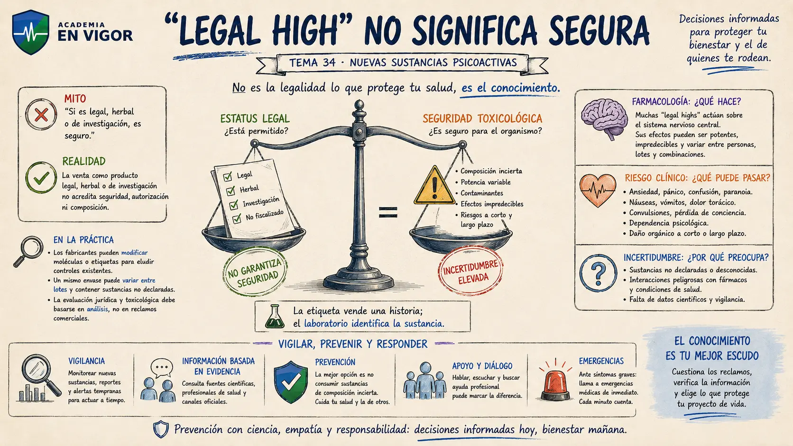

<em>Infografía: “Legal high” no significa segura.</em>

:::hablemos-claro
La etiqueta vende una historia; el laboratorio identifica la sustancia.
:::

:::en-la-calle
Al recibir una alerta por una sustancia o mezcla emergente, La etiqueta vende una historia; el laboratorio identifica la sustancia.
:::

:::lo-que-cae
Prioriza **marketing frente a composición real** y descarta respuestas que confundan efecto, legalidad, origen o fecha.
:::

<!-- FUENTE: EUDA-NPS-2026-T34 -->

## 82. Sistema europeo de alerta temprana

### Lógica del bloque

Para dominar **sistema europeo de alerta temprana**, aplica esta regla: Radar, análisis y decisión son fases distintas: alerta no equivale a prohibición automática. El anclaje principal es **detección, informe, evaluación y control**.

### Hechos examinables

- El Sistema de Alerta Temprana de la UE permite detectar, intercambiar y evaluar información sobre NPS. <!-- FACT:PN-T34-F325 -->
- La EUDA opera el sistema en estrecha cooperación con Europol y redes nacionales. <!-- FACT:PN-T34-F326 -->
- Es el primer paso de un marco que puede continuar con evaluación de riesgos y medidas de control. <!-- FACT:PN-T34-F327 -->
- También participan Comisión Europea, Agencia Europea de Medicamentos y otros socios. <!-- FACT:PN-T34-F328 -->

### Trampas de examen

- **Incorrecto:** Europol gestiona el sistema sin participación sanitaria ni científica.
- **Incorrecto:** Detectar una sustancia la prohíbe automáticamente en toda la UE.

<!-- VISUAL:t34-82-sistema-europeo-de-alerta-temprana.webp -->

  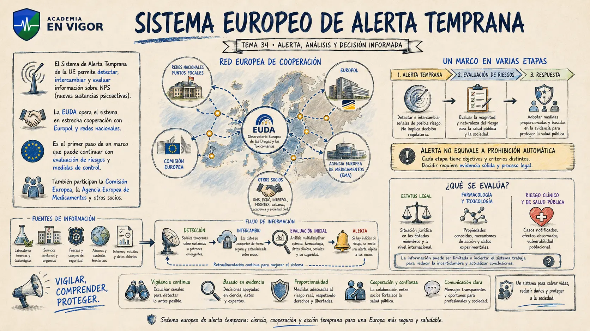

<em>Infografía: Sistema europeo de alerta temprana.</em>

:::hablemos-claro
Radar, análisis y decisión son fases distintas: alerta no equivale a prohibición automática.
:::

:::en-la-calle
Al recibir una alerta por una sustancia o mezcla emergente, Radar, análisis y decisión son fases distintas: alerta no equivale a prohibición automática.
:::

:::lo-que-cae
Prioriza **detección, informe, evaluación y control** y descarta respuestas que confundan efecto, legalidad, origen o fecha.
:::

<!-- FUENTE: EUDA-EWS-T34 -->

## 83. Sistema Español de Alerta Temprana

### Lógica del bloque

Para dominar **sistema español de alerta temprana**, aplica esta regla: España conecta laboratorio, salud, policía y territorios a través de OEDA y DGPNSD. El anclaje principal es **DGPNSD, OEDA y red estatal**.

### Hechos examinables

- La DGPNSD es responsable del correcto funcionamiento del SEAT. <!-- FACT:PN-T34-F329 -->
- El OEDA centraliza información y actúa como punto focal español ante el sistema europeo. <!-- FACT:PN-T34-F330 -->
- El SEAT detecta, intercambia, evalúa y facilita respuesta ante nuevas sustancias o eventos de salud pública. <!-- FACT:PN-T34-F331 -->
- Funciona como red estatal con niveles nacional y autonómico y conexión europea. <!-- FACT:PN-T34-F332 -->

### Trampas de examen

- **Incorrecto:** CITCO es el único responsable del SEAT y excluye al Ministerio de Sanidad.
- **Incorrecto:** El SEAT solo registra sustancias ya incluidas en convenios internacionales.

<!-- VISUAL:t34-il-83-sistema-espanol-de-alerta-temprana.webp -->

  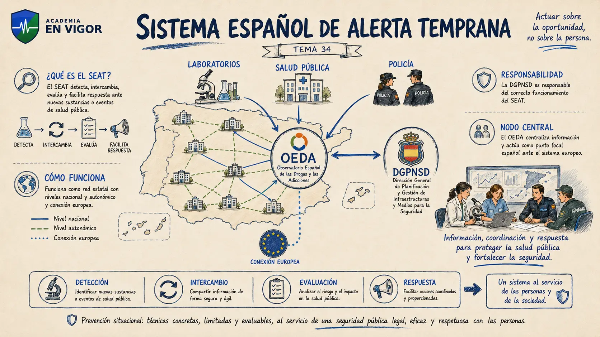

<em>Infografía: Sistema Español de Alerta Temprana.</em>

:::hablemos-claro
España conecta laboratorio, salud, policía y territorios a través de OEDA y DGPNSD.
:::

:::en-la-calle
Al recibir una alerta por una sustancia o mezcla emergente, España conecta laboratorio, salud, policía y territorios a través de OEDA y DGPNSD.
:::

:::lo-que-cae
Prioriza **DGPNSD, OEDA y red estatal** y descarta respuestas que confundan efecto, legalidad, origen o fecha.
:::

<!-- FUENTE: PNSD-SEAT-2026-T34 -->

## 84. Alerta, evaluación y fiscalización

### Lógica del bloque

Para dominar **alerta, evaluación y fiscalización**, aplica esta regla: Alerta avisa, evaluación demuestra y fiscalización decide. El anclaje principal es **no confundir fases**.

### Hechos examinables

- Una alerta comunica un riesgo potencial y activa intercambio de información. <!-- FACT:PN-T34-F333 -->
- La evaluación reúne datos químicos, toxicológicos, sanitarios, sociales y del mercado. <!-- FACT:PN-T34-F334 -->
- La fiscalización exige el procedimiento y la decisión competentes en el nivel nacional o internacional. <!-- FACT:PN-T34-F335 -->
- La respuesta puede incluir vigilancia, comunicación de riesgos, medidas sanitarias, investigación y control. <!-- FACT:PN-T34-F336 -->

### Trampas de examen

- **Incorrecto:** Toda alerta es una plantilla jurídica que prohíbe la sustancia.
- **Incorrecto:** Solo los datos policiales son pertinentes para evaluar una NPS.

<!-- VISUAL:t34-84-alerta-evaluacion-y-fiscalizacion.webp -->

  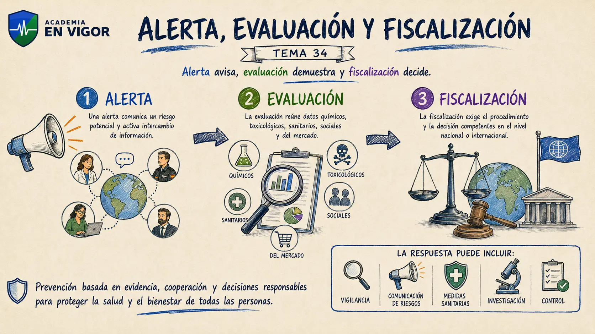

<em>Infografía: Alerta, evaluación y fiscalización.</em>

:::hablemos-claro
Alerta avisa, evaluación demuestra y fiscalización decide.
:::

:::en-la-calle
Al recibir una alerta por una sustancia o mezcla emergente, Alerta avisa, evaluación demuestra y fiscalización decide.
:::

:::lo-que-cae
Prioriza **no confundir fases** y descarta respuestas que confundan efecto, legalidad, origen o fecha.
:::

<!-- FUENTE: OEDA-SEAT-2025-T34 -->

## 85. Precursores y sustancias químicas esenciales

### Lógica del bloque

Para dominar **precursores y sustancias químicas esenciales**, aplica esta regla: El reto es separar comercio legítimo de desvío ilícito mediante trazabilidad. El anclaje principal es **desvío desde usos lícitos**.

### Hechos examinables

- Los precursores son sustancias químicas que pueden intervenir en la producción de drogas fiscalizadas. <!-- FACT:PN-T34-F337 -->
- Muchas tienen usos industriales, farmacéuticos o comerciales legítimos. <!-- FACT:PN-T34-F338 -->
- El control se centra en operaciones, cantidades, operadores y señales de desvío. <!-- FACT:PN-T34-F339 -->
- Una sustancia esencial puede facilitar procesos sin incorporarse necesariamente a la molécula final. <!-- FACT:PN-T34-F340 -->

### Trampas de examen

- **Incorrecto:** Todo precursor está prohibido para cualquier uso industrial.
- **Incorrecto:** Sustancia esencial y droga final son siempre el mismo producto.

<!-- VISUAL:t34-85-precursores-y-sustancias-quimicas-esenciales.webp -->

  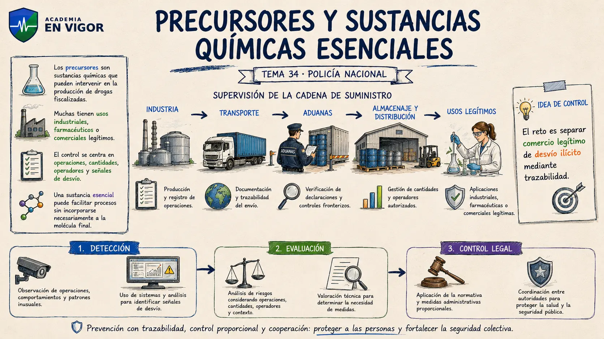

<em>Infografía: Precursores y sustancias químicas esenciales.</em>

:::hablemos-claro
El reto es separar comercio legítimo de desvío ilícito mediante trazabilidad.
:::

:::en-la-calle
Al recibir una alerta por una sustancia o mezcla emergente, El reto es separar comercio legítimo de desvío ilícito mediante trazabilidad.
:::

:::lo-que-cae
Prioriza **desvío desde usos lícitos** y descarta respuestas que confundan efecto, legalidad, origen o fecha.
:::

<!-- FUENTE: UN-CONVENTION-1988-T34 -->

## 86. Adulteración, contaminación y mezclas emergentes

### Lógica del bloque

Para dominar **adulteración, contaminación y mezclas emergentes**, aplica esta regla: La novedad puede estar en la molécula, la mezcla, la vía o el contaminante. El anclaje principal es **composición inesperada**.

### Hechos examinables

- Adulteración añade o sustituye componentes de un producto sin información fiable al consumidor. <!-- FACT:PN-T34-F341 -->
- Contaminación introduce agentes no buscados durante producción, transporte o manipulación. <!-- FACT:PN-T34-F342 -->
- Una mezcla emergente puede combinar sustancias conocidas y producir un riesgo nuevo por interacción o potencia. <!-- FACT:PN-T34-F343 -->
- El SEAT también alerta sobre nuevas combinaciones, vías, contaminantes y eventos, no solo moléculas nuevas. <!-- FACT:PN-T34-F344 -->

### Trampas de examen

- **Incorrecto:** El SEAT solo actúa cuando aparece una molécula nunca vista.
- **Incorrecto:** Adulteración y contaminación siempre son intencionadas y equivalentes.

<!-- VISUAL:t34-86-adulteracion-contaminacion-y-mezclas-emergentes.webp -->

  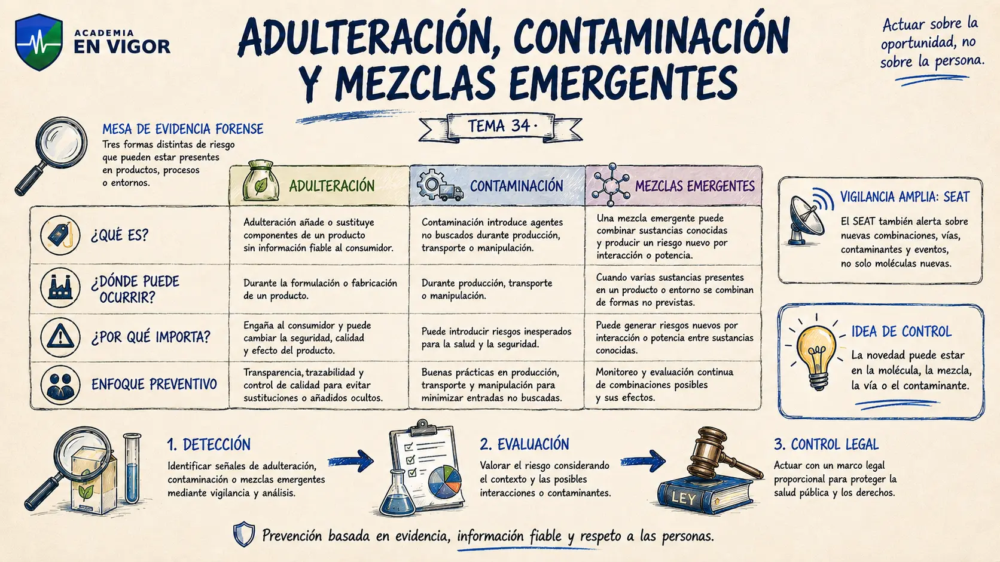

<em>Infografía: Adulteración, contaminación y mezclas emergentes.</em>

:::hablemos-claro
La novedad puede estar en la molécula, la mezcla, la vía o el contaminante.
:::

:::en-la-calle
Al recibir una alerta por una sustancia o mezcla emergente, La novedad puede estar en la molécula, la mezcla, la vía o el contaminante.
:::

:::lo-que-cae
Prioriza **composición inesperada** y descarta respuestas que confundan efecto, legalidad, origen o fecha.
:::

<!-- FUENTE: OEDA-SEAT-2025-T34 -->

## 87. Qué significa “últimas tendencias”

### Lógica del bloque

Para dominar **qué significa “últimas tendencias”**, aplica esta regla: Fecha del informe, fecha del trabajo de campo y período de consumo son tres fechas distintas. El anclaje principal es **fotografía fechada y serie**.

### Hechos examinables

- Una tendencia es un cambio observado a través de mediciones comparables, no una cifra aislada. <!-- FACT:PN-T34-F345 -->
- Debe indicarse fuente, población, período, indicador y edición. <!-- FACT:PN-T34-F346 -->
- Los datos de 2026 pueden referirse a consumos medidos en 2024 o 2025 por el tiempo de procesamiento. <!-- FACT:PN-T34-F347 -->
- La fotografía coyuntural debe revisarse en cada nueva edición sin reescribir los conceptos estables. <!-- FACT:PN-T34-F348 -->

### Trampas de examen

- **Incorrecto:** Informe publicado en 2026 significa consumo medido necesariamente en 2026.
- **Incorrecto:** Dos porcentajes de encuestas diferentes pueden compararse sin revisar población ni indicador.

<!-- VISUAL:t34-87-que-significa-ultimas-tendencias.webp -->

  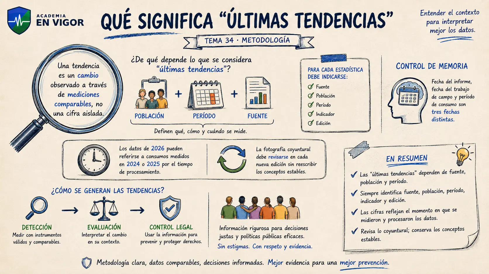

<em>Infografía: Qué significa “últimas tendencias”.</em>

:::hablemos-claro
Fecha del informe, fecha del trabajo de campo y período de consumo son tres fechas distintas.
:::

:::en-la-calle
Al interpretar una encuesta o informe reciente, Fecha del informe, fecha del trabajo de campo y período de consumo son tres fechas distintas.
:::

:::lo-que-cae
Prioriza **fotografía fechada y serie** y descarta respuestas que confundan efecto, legalidad, origen o fecha.
:::

<!-- FUENTE: CONVOCATORIA-PN-2026-T34 -->

## 88. EDADES 2024: población adulta

### Lógica del bloque

Para dominar **edades 2024: población adulta**, aplica esta regla: EDADES = hogares, 15‑64 y varios períodos de prevalencia. El anclaje principal es **15 a 64 años en hogares**.

### Hechos examinables

- EDADES estudia población residente en hogares de 15 a 64 años en España. <!-- FACT:PN-T34-F349 -->
- Se realiza de forma bienal desde 1995 y permite analizar prevalencias y evolución. <!-- FACT:PN-T34-F350 -->
- Distingue consumo alguna vez, últimos doce meses, últimos treinta días y consumo diario según sustancia. <!-- FACT:PN-T34-F351 -->
- No representa de la misma forma a menores de 15 años, mayores de 64 ni poblaciones fuera de hogares. <!-- FACT:PN-T34-F352 -->

### Trampas de examen

- **Incorrecto:** EDADES es una encuesta escolar de 14 a 18 años.
- **Incorrecto:** Sus resultados representan sin límites a toda persona residente en España.

<!-- VISUAL:t34-il-88-edades-2024-poblacion-adulta.webp -->

  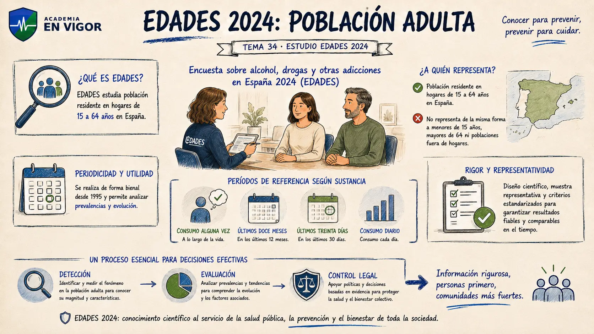

<em>Infografía: EDADES 2024: población adulta.</em>

:::hablemos-claro
EDADES = hogares, 15‑64 y varios períodos de prevalencia.
:::

:::en-la-calle
Al interpretar una encuesta o informe reciente, EDADES = hogares, 15‑64 y varios períodos de prevalencia.
:::

:::lo-que-cae
Prioriza **15 a 64 años en hogares** y descarta respuestas que confundan efecto, legalidad, origen o fecha.
:::

<!-- FUENTE: PNSD-ENCUESTAS-T34 -->

## 89. ESTUDES 2025: población escolar

### Lógica del bloque

Para dominar **estudes 2025: población escolar**, aplica esta regla: ESTUDES = aulas, 14‑18 y lectura cuidadosa del marco escolar. El anclaje principal es **estudiantes de 14 a 18 años**.

### Hechos examinables

- ESTUDES 2025 analiza estudiantes de 14 a 18 años que cursan enseñanzas secundarias. <!-- FACT:PN-T34-F353 -->
- Se realiza en centros y aulas y no representa a jóvenes fuera del marco escolar con la misma precisión. <!-- FACT:PN-T34-F354 -->
- El alcohol mantiene la mayor prevalencia de consumo entre las sustancias estudiadas. <!-- FACT:PN-T34-F355 -->
- La edición 2025 muestra descenso respecto de 2023 en varios indicadores de consumo de alcohol. <!-- FACT:PN-T34-F356 -->

### Trampas de examen

- **Incorrecto:** ESTUDES representa a toda la población de 15 a 64 años.
- **Incorrecto:** El cannabis supera al alcohol como sustancia más consumida por estudiantes en 2025.

<!-- VISUAL:t34-89-estudes-2025-poblacion-escolar.webp -->

  

<em>Infografía: ESTUDES 2025: población escolar.</em>

:::hablemos-claro
ESTUDES = aulas, 14‑18 y lectura cuidadosa del marco escolar.
:::

:::en-la-calle
Al interpretar una encuesta o informe reciente, ESTUDES = aulas, 14‑18 y lectura cuidadosa del marco escolar.
:::

:::lo-que-cae
Prioriza **estudiantes de 14 a 18 años** y descarta respuestas que confundan efecto, legalidad, origen o fecha.
:::

<!-- FUENTE: OEDA-ESTUDES-2025-T34 -->

## 90. Patrón general de consumo en España

### Lógica del bloque

Para dominar **patrón general de consumo en españa**, aplica esta regla: La pirámide española sigue encabezada por alcohol y tabaco; cannabis lidera entre las ilegales. El anclaje principal es **legales primero, cannabis y cocaína después**.

### Hechos examinables

- En EDADES 2024, alcohol y tabaco siguen entre las sustancias con mayor prevalencia de consumo. <!-- FACT:PN-T34-F357 -->
- Los hipnosedantes ocupan una posición relevante entre sustancias de uso extendido. <!-- FACT:PN-T34-F358 -->
- Cannabis es la droga ilegal con mayor prevalencia y cocaína le sigue entre las ilegales más extendidas. <!-- FACT:PN-T34-F359 -->
- Heroína e inhalables mantienen prevalencias inferiores al uno por ciento en los períodos medidos. <!-- FACT:PN-T34-F360 -->

### Trampas de examen

- **Incorrecto:** Heroína es la sustancia ilegal más extendida en EDADES 2024.
- **Incorrecto:** Las sustancias legales quedan fuera de las encuestas sobre drogas.

<!-- VISUAL:t34-90-patron-general-de-consumo-en-espana.webp -->

  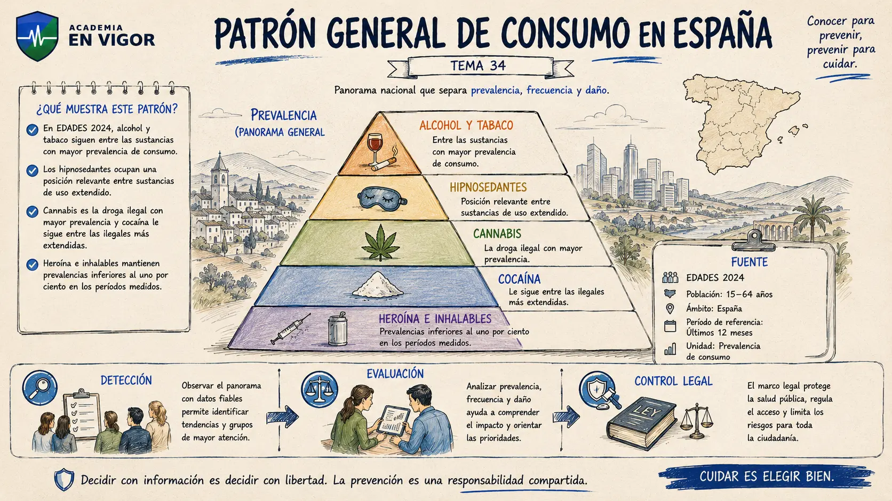

<em>Infografía: Patrón general de consumo en España.</em>

:::hablemos-claro
La pirámide española sigue encabezada por alcohol y tabaco; cannabis lidera entre las ilegales.
:::

:::en-la-calle
Al interpretar una encuesta o informe reciente, La pirámide española sigue encabezada por alcohol y tabaco; cannabis lidera entre las ilegales.
:::

:::lo-que-cae
Prioriza **legales primero, cannabis y cocaína después** y descarta respuestas que confundan efecto, legalidad, origen o fecha.
:::

<!-- FUENTE: OEDA-EDADES-2024-T34 -->

## 91. Tendencias juveniles y sustancias emergentes

### Lógica del bloque

Para dominar **tendencias juveniles y sustancias emergentes**, aplica esta regla: Frecuencia guía prioridades, pero gravedad y novedad pueden activar vigilancia con cifras pequeñas. El anclaje principal es **alcohol, tabaco, cannabis y vigilancia**.

### Hechos examinables

- Entre estudiantes, alcohol, tabaco y cannabis concentran prevalencias muy superiores a la mayoría de drogas ilegales. <!-- FACT:PN-T34-F361 -->
- Las encuestas separan cigarrillos, cigarrillos electrónicos y otras formas de nicotina. <!-- FACT:PN-T34-F362 -->
- Óxido nitroso y otras sustancias emergentes se incorporan o desglosan cuando adquieren relevancia de vigilancia. <!-- FACT:PN-T34-F363 -->
- Una prevalencia baja no elimina gravedad clínica ni necesidad de alerta temprana. <!-- FACT:PN-T34-F364 -->

### Trampas de examen

- **Incorrecto:** Solo deben vigilarse sustancias con prevalencia alta.
- **Incorrecto:** Toda forma de nicotina se registra necesariamente como cigarrillo convencional.

<!-- VISUAL:t34-91-tendencias-juveniles-y-sustancias-emergentes.webp -->

  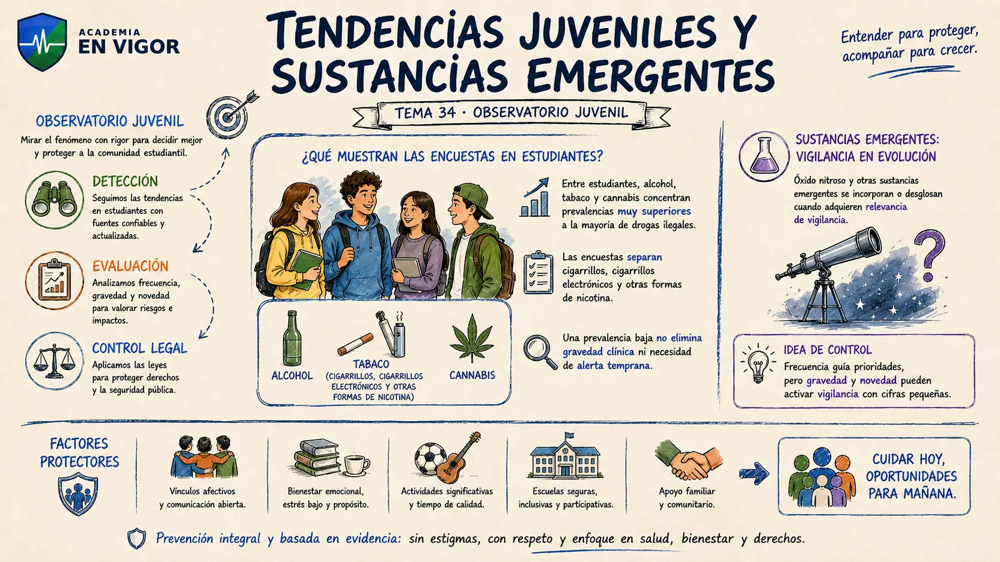

<em>Infografía: Tendencias juveniles y sustancias emergentes.</em>

:::hablemos-claro
Frecuencia guía prioridades, pero gravedad y novedad pueden activar vigilancia con cifras pequeñas.
:::

:::en-la-calle
Al interpretar una encuesta o informe reciente, Frecuencia guía prioridades, pero gravedad y novedad pueden activar vigilancia con cifras pequeñas.
:::

:::lo-que-cae
Prioriza **alcohol, tabaco, cannabis y vigilancia** y descarta respuestas que confundan efecto, legalidad, origen o fecha.
:::

<!-- FUENTE: OEDA-ESTUDES-2025-T34 -->

## 92. Panorama europeo 2026

### Lógica del bloque

Para dominar **panorama europeo 2026**, aplica esta regla: Lo nuevo se superpone a lo conocido: diversidad, mezclas y disponibilidad elevan incertidumbre. El anclaje principal es **mercado dinámico y daños combinados**.

### Hechos examinables

- El Informe Europeo sobre Drogas 2026 resume la situación disponible hasta finales de 2025. <!-- FACT:PN-T34-F365 -->
- Europa afronta alta disponibilidad, policonsumo y creciente diversidad de productos. <!-- FACT:PN-T34-F366 -->
- Catinonas sintéticas, cannabinoides sintéticos o semisintéticos y nuevos opioides destacan entre riesgos emergentes. <!-- FACT:PN-T34-F367 -->
- La ketamina ha aumentado su visibilidad en decomisos y daños en varios países, incluida España. <!-- FACT:PN-T34-F368 -->

### Trampas de examen

- **Incorrecto:** El informe 2026 contiene exclusivamente consumos ocurridos durante 2026.
- **Incorrecto:** Las nuevas sustancias han sustituido por completo a cannabis, cocaína y opioides tradicionales.

<!-- VISUAL:t34-92-panorama-europeo-2026.webp -->

  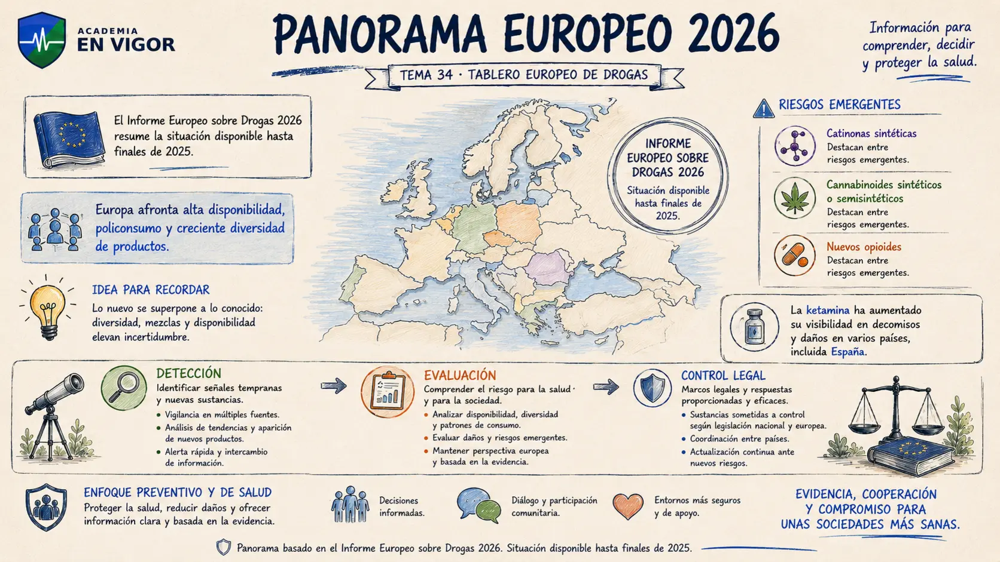

<em>Infografía: Panorama europeo 2026.</em>

:::hablemos-claro
Lo nuevo se superpone a lo conocido: diversidad, mezclas y disponibilidad elevan incertidumbre.
:::

:::en-la-calle
Al interpretar una encuesta o informe reciente, Lo nuevo se superpone a lo conocido: diversidad, mezclas y disponibilidad elevan incertidumbre.
:::

:::lo-que-cae
Prioriza **mercado dinámico y daños combinados** y descarta respuestas que confundan efecto, legalidad, origen o fecha.
:::

<!-- FUENTE: EUDA-REPORT-2026-T34 -->

## 93. NPS europeas en 2026

### Lógica del bloque

Para dominar **nps europeas en 2026**, aplica esta regla: Distingue flujo anual de nuevas detecciones del inventario acumulado vigilado. El anclaje principal es **una detección semanal y más de mil vigiladas**.

### Hechos examinables

- En 2025 se notificaron por primera vez en Europa cincuenta NPS. <!-- FACT:PN-T34-F369 -->
- La EUDA vigilaba alrededor de 1.050 NPS al publicar el informe de 2026. <!-- FACT:PN-T34-F370 -->
- Los cannabinoides nuevos, incluidos semisintéticos, representaron una parte importante de las primeras detecciones de 2025. <!-- FACT:PN-T34-F371 -->
- Los nuevos opioides sintéticos preocupan por potencia y posibilidad de intoxicación mortal. <!-- FACT:PN-T34-F372 -->

### Trampas de examen

- **Incorrecto:** Las cincuenta NPS detectadas en 2025 son todas las sustancias que vigila la EUDA.
- **Incorrecto:** El número de moléculas permite concluir que todas tienen igual prevalencia y daño.

<!-- VISUAL:t34-il-93-nps-europeas-en-2026.webp -->

  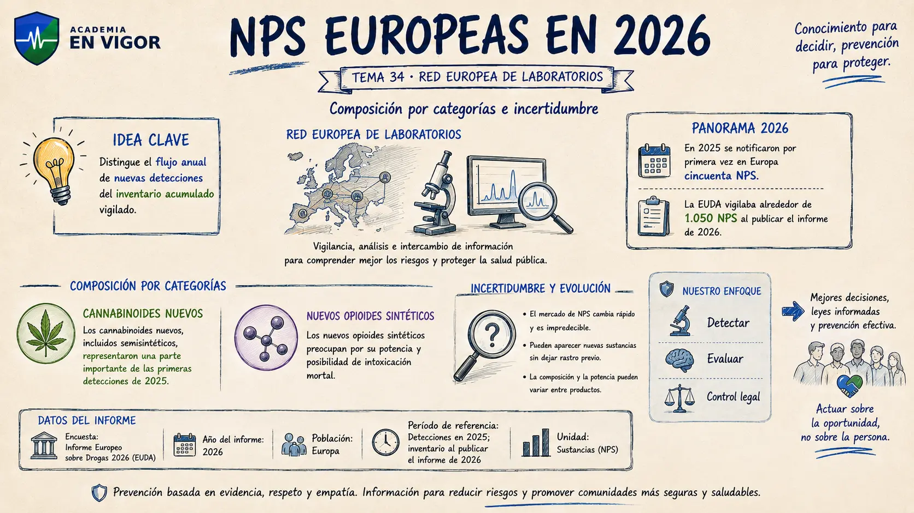

<em>Infografía: NPS europeas en 2026.</em>

:::hablemos-claro
Distingue flujo anual de nuevas detecciones del inventario acumulado vigilado.
:::

:::en-la-calle
Al interpretar una encuesta o informe reciente, Distingue flujo anual de nuevas detecciones del inventario acumulado vigilado.
:::

:::lo-que-cae
Prioriza **una detección semanal y más de mil vigiladas** y descarta respuestas que confundan efecto, legalidad, origen o fecha.
:::

<!-- FUENTE: EUDA-NPS-2026-T34 -->

## 94. Cómo responder preguntas estadísticas

### Lógica del bloque

Para dominar **cómo responder preguntas estadísticas**, aplica esta regla: El tribunal cambia una palabra y cambia el dato: vida, año, mes, diario o problemático. El anclaje principal es **población, período y denominador**.

### Hechos examinables

- Antes de elegir una cifra debe verificarse si habla de vida, año, mes, consumo diario o consumo problemático. <!-- FACT:PN-T34-F373 -->
- Una subida en “alguna vez en la vida” puede coexistir con estabilidad o descenso del consumo reciente. <!-- FACT:PN-T34-F374 -->
- Los porcentajes de EDADES y ESTUDES no deben compararse como si procedieran de la misma población. <!-- FACT:PN-T34-F375 -->
- Una cifra histórica puede explicar una antigua pregunta oficial, pero no debe presentarse como tendencia vigente. <!-- FACT:PN-T34-F376 -->

### Trampas de examen

- **Incorrecto:** Si aumenta el consumo alguna vez, necesariamente aumenta el consumo diario.
- **Incorrecto:** Una respuesta oficial antigua convierte su estadística en dato vigente.

<!-- VISUAL:t34-94-como-responder-preguntas-estadisticas.webp -->

  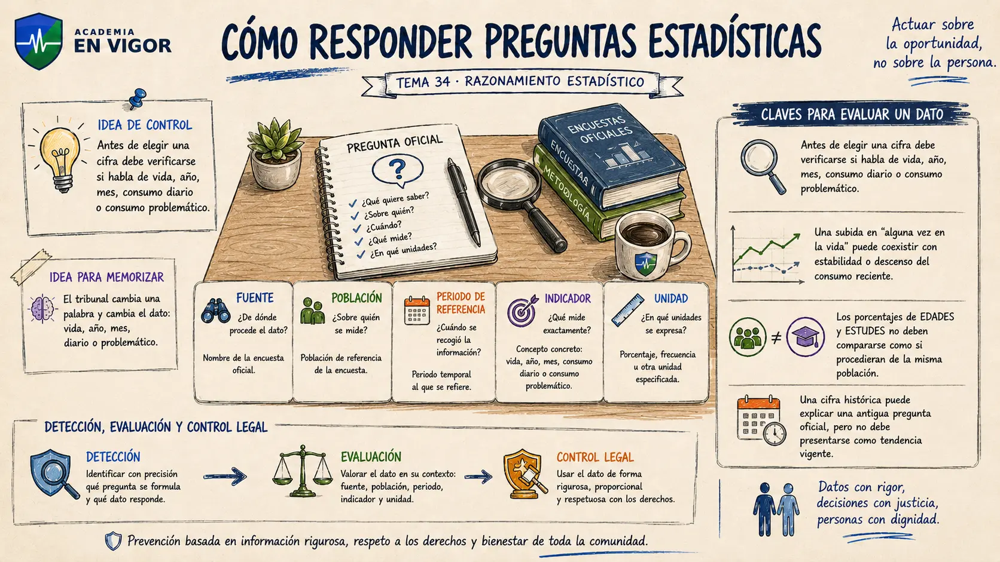

<em>Infografía: Cómo responder preguntas estadísticas.</em>

:::hablemos-claro
El tribunal cambia una palabra y cambia el dato: vida, año, mes, diario o problemático.
:::

:::en-la-calle
Al interpretar una encuesta o informe reciente, El tribunal cambia una palabra y cambia el dato: vida, año, mes, diario o problemático.
:::

:::lo-que-cae
Prioriza **población, período y denominador** y descarta respuestas que confundan efecto, legalidad, origen o fecha.
:::

<!-- FUENTE: OEDA-EDADES-2024-T34 -->

# Hablemos claro

:::hablemos-claro
Este tema tiene tres trampas maestras: tratar legal como seguro, confundir dependencia con tolerancia y memorizar una cifra antigua como tendencia actual. Separa efecto, patrón, control jurídico y fecha.
:::

# En la calle

:::en-la-calle
En una intervención real no basta con el nombre vendido: identifica signos vitales, vía, tiempo, posibles mezclas y composición conocida; ante gravedad, activa asistencia sin esperar una etiqueta perfecta.
:::

# Lo que cae

:::lo-que-cae
Prioriza consumidor experimental, ocasional, habitual y dependiente; vías; adicción, dependencia, tolerancia y abstinencia; efecto en el SNC; estupefaciente frente a psicotrópico; drogas de síntesis; psilocibina, ketamina, teofilina, GHB, mescalina, speedball; SEAT; EDADES y ESTUDES.
:::

# Ha caído

:::ha-caido
Se han localizado 18 referencias históricas del Tema 34. Permanecen ocultas y en cuarentena porque no existe plantilla oficial final verificable en el repositorio.
:::

## Fuentes legales, institucionales y primarias

- `CONVOCATORIA-PN-2026-T34`
- `WHO-ICD11-SUBSTANCE-T34`
- `UNODC-TERMINOLOGY-T34`
- `PNSD-INFORMACION-T34`
- `PNSD-SINTESIS-T34`
- `UN-CONVENTION-1961-T34`
- `UN-CONVENTION-1971-T34`
- `UN-CONVENTION-1988-T34`
- `LEY17-1967-T34`
- `RD1194-2011-T34`
- `RD2829-1977-T34`
- `RD903-2025-T34`
- `RD467-2026-T34`
- `PNSD-SEAT-2026-T34`
- `OEDA-SEAT-2025-T34`
- `OEDA-EDADES-2024-T34`
- `OEDA-ESTUDES-2025-T34`
- `PNSD-ENCUESTAS-T34`
- `EUDA-REPORT-2026-T34`
- `EUDA-NPS-2026-T34`
- `EUDA-EWS-T34`

---

*Academia En Vigor · El temario que nunca duerme · Tema 34 · v1.0.0 · Documento interno no publicado.*
