# TEMA 35 · EL DESARROLLO SOSTENIBLE. CONCEPTO. COORDINACIÓN Y COOPERACIÓN INTERNACIONAL. SOCIEDAD Y DESARROLLO SOSTENIBLE. INSTRUMENTOS DE GESTIÓN AMBIENTAL.

**Policía Nacional · Método VIGOR · ATESTADO**
**Versión de contenido:** 1.0.0
**Estado editorial:** approved_internal · **Publicación:** not_published

# Mapa del tema

El Tema 35 se estudia en nueve partes: fundamentos; cooperación internacional; Agenda 2030, Unión Europea y gobernanza española; sociedad; biodiversidad; desarrollo rural y evaluación; responsabilidad y derechos ambientales; clima y transición energética; y sistemas de gestión.

# Contenido

## 01. Alcance del Tema 35

### Lógica del bloque

Para dominar **alcance del tema 35**, aplica esta regla: Primero separa qué significa sostenibilidad, quién coopera, cómo participa la sociedad y qué instrumentos actúan. El anclaje principal es **cuatro núcleos oficiales**.

### Hechos examinables

- El programa oficial divide el tema en concepto, cooperación internacional, sociedad e instrumentos de gestión ambiental. <!-- FACT:PN-T35-F001 -->
- Desarrollo sostenible no equivale exclusivamente a protección de la naturaleza. <!-- FACT:PN-T35-F002 -->
- La gestión ambiental transforma objetivos en planificación, prevención, control, participación y mejora. <!-- FACT:PN-T35-F003 -->
- Las cifras coyunturales deben estudiarse con fecha y fuente, separadas de las reglas estables. <!-- FACT:PN-T35-F004 -->

### Trampas de examen

- **Incorrecto:** El tema oficial se limita a enumerar leyes españolas.
- **Incorrecto:** Toda cifra ambiental conserva validez indefinida.

<!-- VISUAL:t35-01-alcance-del-tema-35.webp -->

  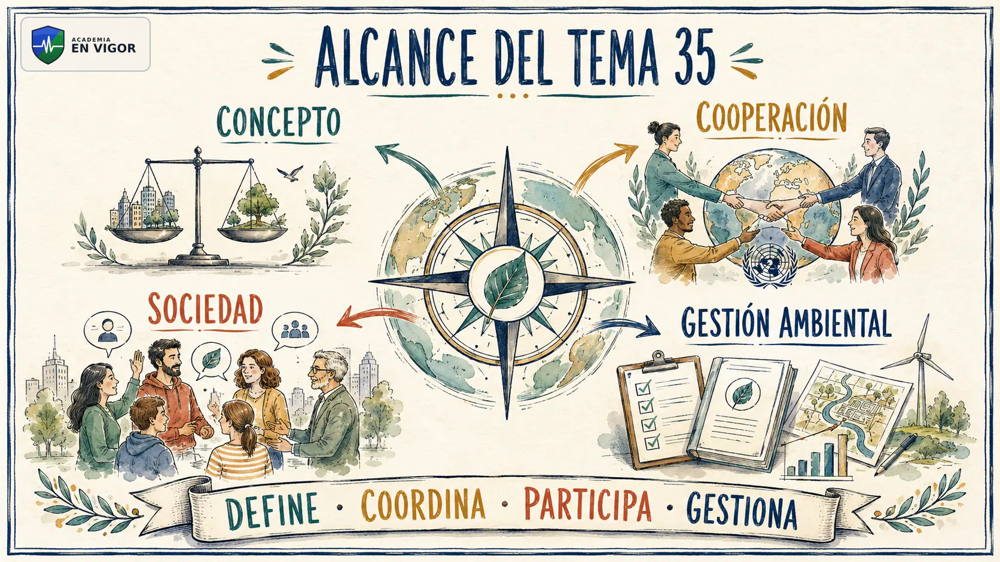

<em>Infografía: Alcance del Tema 35.</em>

:::hablemos-claro
Primero separa qué significa sostenibilidad, quién coopera, cómo participa la sociedad y qué instrumentos actúan.
:::

:::en-la-calle
Al explicar la sostenibilidad sin convertirla en un eslogan, Primero separa qué significa sostenibilidad, quién coopera, cómo participa la sociedad y qué instrumentos actúan.
:::

:::lo-que-cae
Prioriza **cuatro núcleos oficiales** y descarta respuestas que confundan concepto, órgano, instrumento o fecha.
:::

<!-- FUENTE: CONVOCATORIA-PN-2026-T35 -->

## 02. Definición del Informe Brundtland

### Lógica del bloque

Para dominar **definición del informe brundtland**, aplica esta regla: La idea cabe en una balanza temporal: necesidades de hoy sin vaciar las opciones de mañana. El anclaje principal es **necesidades presentes y generaciones futuras**.

### Hechos examinables

- El Informe Brundtland popularizó en 1987 la definición clásica de desarrollo sostenible. <!-- FACT:PN-T35-F005 -->
- La definición atiende a las necesidades presentes sin comprometer la capacidad de las generaciones futuras. <!-- FACT:PN-T35-F006 -->
- El concepto une desarrollo y límites ambientales en vez de tratarlos como políticas aisladas. <!-- FACT:PN-T35-F007 -->
- La fórmula es un criterio de orientación y no una licencia para llamar sostenible a cualquier crecimiento. <!-- FACT:PN-T35-F008 -->

### Trampas de examen

- **Incorrecto:** Brundtland define sostenibilidad como crecimiento económico sin límites.
- **Incorrecto:** La definición elimina las necesidades de la generación presente.

<!-- VISUAL:t35-il-02-definicion-del-informe-brundtland.webp -->

  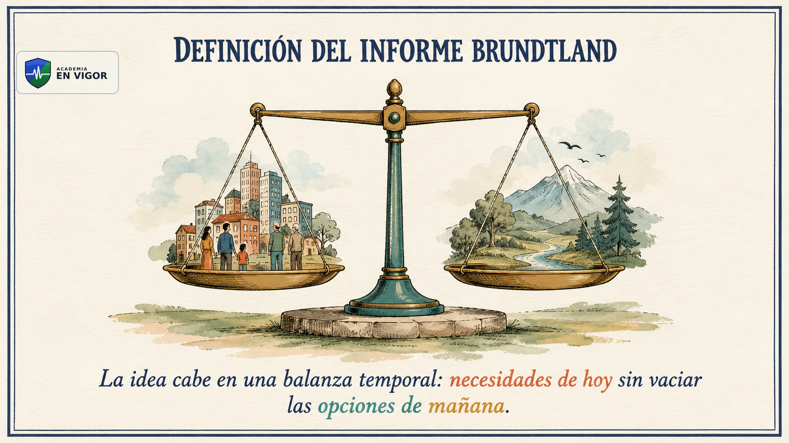

<em>Infografía: Definición del Informe Brundtland.</em>

:::hablemos-claro
La idea cabe en una balanza temporal: necesidades de hoy sin vaciar las opciones de mañana.
:::

:::en-la-calle
Al explicar la sostenibilidad sin convertirla en un eslogan, La idea cabe en una balanza temporal: necesidades de hoy sin vaciar las opciones de mañana.
:::

:::lo-que-cae
Prioriza **necesidades presentes y generaciones futuras** y descarta respuestas que confundan concepto, órgano, instrumento o fecha.
:::

<!-- FUENTE: UN-BRUNDTLAND-T35 -->

## 03. Tres dimensiones integradas

### Lógica del bloque

Para dominar **tres dimensiones integradas**, aplica esta regla: Un trípode cae si se retira cualquiera de sus patas: economía, sociedad o medio ambiente. El anclaje principal es **sociedad, economía y medio ambiente**.

### Hechos examinables

- La formulación habitual integra las dimensiones económica, social y ambiental. <!-- FACT:PN-T35-F009 -->
- Las tres dimensiones son interdependientes y no tres objetivos que puedan ignorarse entre sí. <!-- FACT:PN-T35-F010 -->
- Una medida económicamente rentable puede ser insostenible si desplaza costes sociales o ambientales graves. <!-- FACT:PN-T35-F011 -->
- La protección ambiental puede generar beneficios sociales y económicos cuando previene daños y conserva servicios ecosistémicos. <!-- FACT:PN-T35-F012 -->

### Trampas de examen

- **Incorrecto:** Los tres pilares son pasado, presente y futuro.
- **Incorrecto:** La dimensión económica prevalece siempre sobre las otras dos.

<!-- VISUAL:t35-03-tres-dimensiones-integradas.webp -->

  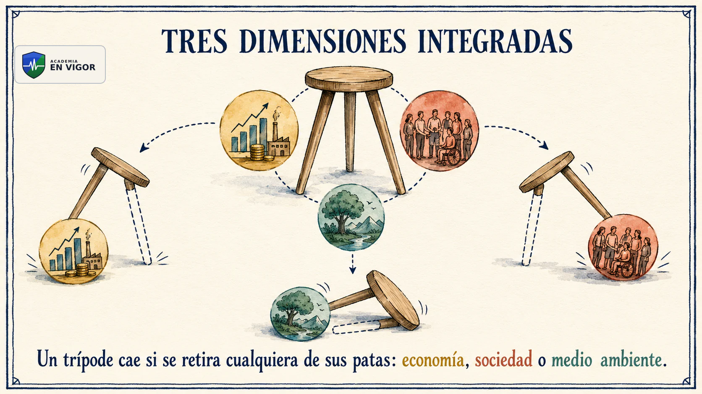

<em>Infografía: Tres dimensiones integradas.</em>

:::hablemos-claro
Un trípode cae si se retira cualquiera de sus patas: economía, sociedad o medio ambiente.
:::

:::en-la-calle
Al explicar la sostenibilidad sin convertirla en un eslogan, Un trípode cae si se retira cualquiera de sus patas: economía, sociedad o medio ambiente.
:::

:::lo-que-cae
Prioriza **sociedad, economía y medio ambiente** y descarta respuestas que confundan concepto, órgano, instrumento o fecha.
:::

<!-- FUENTE: UN-BRUNDTLAND-T35 -->

## 04. Equidad intra e intergeneracional

### Lógica del bloque

Para dominar **equidad intra e intergeneracional**, aplica esta regla: Pregunta siempre quién recibe el beneficio, quién soporta el coste y en qué momento. El anclaje principal es **entre personas y entre generaciones**.

### Hechos examinables

- La equidad intrageneracional compara oportunidades y cargas dentro de la generación presente. <!-- FACT:PN-T35-F013 -->
- La equidad intergeneracional considera efectos sobre quienes vivirán en el futuro. <!-- FACT:PN-T35-F014 -->
- Trasladar contaminación a territorios vulnerables no resuelve el problema de sostenibilidad. <!-- FACT:PN-T35-F015 -->
- Posponer costes irreversibles puede limitar de forma real las opciones de generaciones futuras. <!-- FACT:PN-T35-F016 -->

### Trampas de examen

- **Incorrecto:** Equidad intergeneracional solo compara países actuales.
- **Incorrecto:** Una carga desplazada geográficamente deja de contar.

<!-- VISUAL:t35-04-equidad-intra-e-intergeneracional.webp -->

  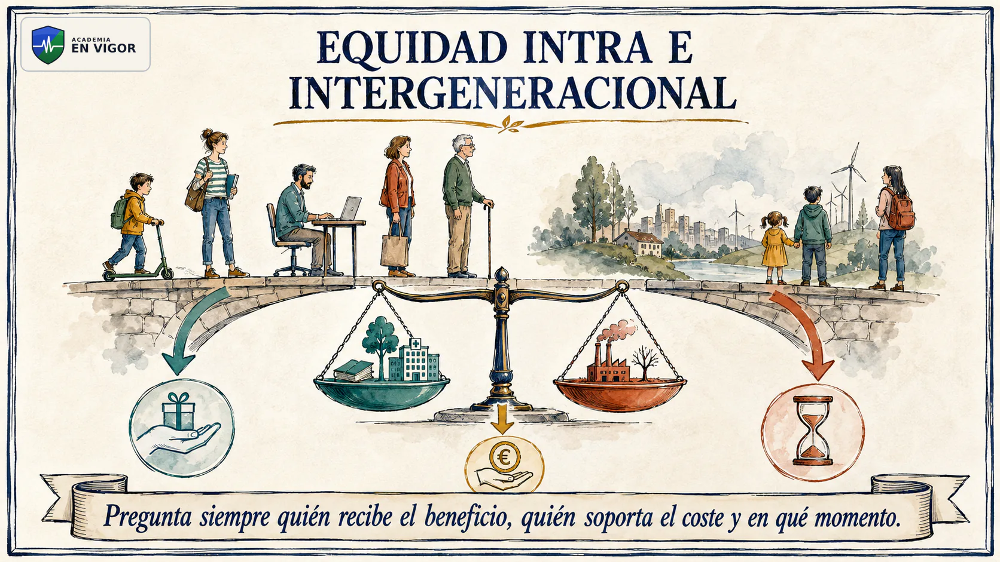

<em>Infografía: Equidad intra e intergeneracional.</em>

:::hablemos-claro
Pregunta siempre quién recibe el beneficio, quién soporta el coste y en qué momento.
:::

:::en-la-calle
Al explicar la sostenibilidad sin convertirla en un eslogan, Pregunta siempre quién recibe el beneficio, quién soporta el coste y en qué momento.
:::

:::lo-que-cae
Prioriza **entre personas y entre generaciones** y descarta respuestas que confundan concepto, órgano, instrumento o fecha.
:::

<!-- FUENTE: UN-BRUNDTLAND-T35 -->

## 05. Necesidades, límites y tecnología

### Lógica del bloque

Para dominar **necesidades, límites y tecnología**, aplica esta regla: Tecnología amplía opciones; no sustituye límites, reglas ni distribución justa. El anclaje principal es **prioridad y capacidad del medio**.

### Hechos examinables

- El Informe Brundtland destaca las necesidades esenciales de las personas pobres como prioridad. <!-- FACT:PN-T35-F017 -->
- Los límites no son solo físicos: dependen también de tecnología, organización social y capacidad ambiental. <!-- FACT:PN-T35-F018 -->
- La innovación puede reducir presión, pero no garantiza por sí sola un resultado justo o sostenible. <!-- FACT:PN-T35-F019 -->
- La eficiencia pierde efecto si el aumento del consumo supera el ahorro obtenido por unidad. <!-- FACT:PN-T35-F020 -->

### Trampas de examen

- **Incorrecto:** La tecnología elimina automáticamente todos los límites ecológicos.
- **Incorrecto:** Las necesidades esenciales ocupan un lugar secundario en la definición.

<!-- VISUAL:t35-il-05-necesidades-limites-y-tecnologia.webp -->

  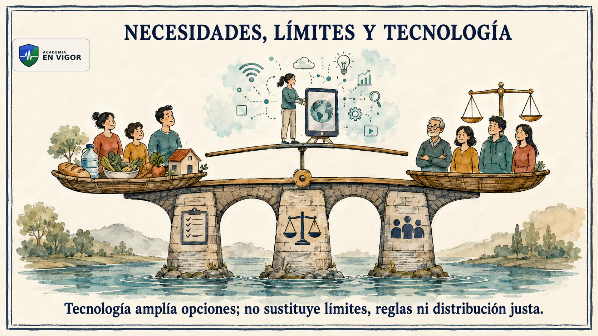

<em>Infografía: Necesidades, límites y tecnología.</em>

:::hablemos-claro
Tecnología amplía opciones; no sustituye límites, reglas ni distribución justa.
:::

:::en-la-calle
Al explicar la sostenibilidad sin convertirla en un eslogan, Tecnología amplía opciones; no sustituye límites, reglas ni distribución justa.
:::

:::lo-que-cae
Prioriza **prioridad y capacidad del medio** y descarta respuestas que confundan concepto, órgano, instrumento o fecha.
:::

<!-- FUENTE: UN-BRUNDTLAND-T35 -->

## 06. Prevención, precaución y corrección en la fuente

### Lógica del bloque

Para dominar **prevención, precaución y corrección en la fuente**, aplica esta regla: Prevención evita; precaución gestiona incertidumbre; corrección ataca el origen. El anclaje principal es **actuar antes y en el origen**.

### Hechos examinables

- La prevención actúa frente a riesgos conocidos antes de que el daño se materialice. <!-- FACT:PN-T35-F021 -->
- La precaución permite medidas proporcionadas ante riesgo grave o irreversible aunque exista incertidumbre científica. <!-- FACT:PN-T35-F022 -->
- La corrección en la fuente busca tratar la contaminación donde se produce. <!-- FACT:PN-T35-F023 -->
- Precaución no significa prohibir cualquier actividad ante una duda mínima ni ignorar evidencia disponible. <!-- FACT:PN-T35-F024 -->

### Trampas de examen

- **Incorrecto:** Precaución exige certeza científica absoluta antes de actuar.
- **Incorrecto:** Corregir en la fuente significa trasladar el residuo a otro territorio.

<!-- VISUAL:t35-06-prevencion-precaucion-y-correccion-en-la-fuente.webp -->

  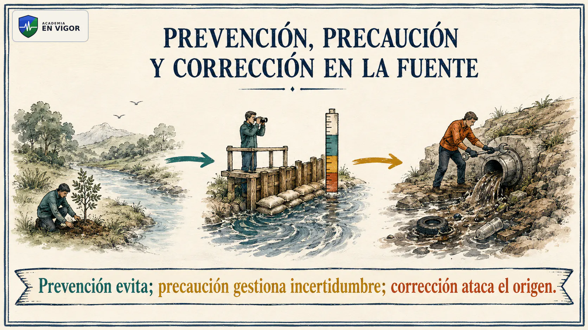

<em>Infografía: Prevención, precaución y corrección en la fuente.</em>

:::hablemos-claro
Prevención evita; precaución gestiona incertidumbre; corrección ataca el origen.
:::

:::en-la-calle
Al explicar la sostenibilidad sin convertirla en un eslogan, Prevención evita; precaución gestiona incertidumbre; corrección ataca el origen.
:::

:::lo-que-cae
Prioriza **actuar antes y en el origen** y descarta respuestas que confundan concepto, órgano, instrumento o fecha.
:::

<!-- FUENTE: EU-ENV-PRINCIPLES-T35 -->

## 07. Quien contamina paga

### Lógica del bloque

Para dominar **quien contamina paga**, aplica esta regla: La factura ambiental debe acercarse a quien genera el riesgo, sin convertir el pago en permiso. El anclaje principal es **internalizar el coste ambiental**.

### Hechos examinables

- El principio atribuye al contaminador los costes de prevención, control y reparación que legalmente correspondan. <!-- FACT:PN-T35-F025 -->
- No concede un derecho a contaminar pagando una cantidad. <!-- FACT:PN-T35-F026 -->
- Busca evitar que el coste ambiental recaiga sin más sobre toda la sociedad. <!-- FACT:PN-T35-F027 -->
- Su aplicación concreta depende del régimen jurídico y de la relación causal exigible. <!-- FACT:PN-T35-F028 -->

### Trampas de examen

- **Incorrecto:** Pagar una tasa autoriza cualquier nivel de contaminación.
- **Incorrecto:** El principio obliga siempre al consumidor final aunque no cause el daño.

<!-- VISUAL:t35-07-quien-contamina-paga.webp -->

  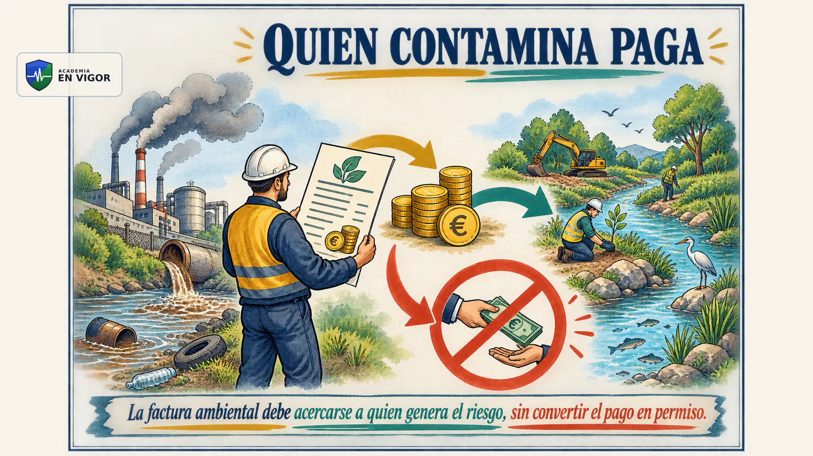

<em>Infografía: Quien contamina paga.</em>

:::hablemos-claro
La factura ambiental debe acercarse a quien genera el riesgo, sin convertir el pago en permiso.
:::

:::en-la-calle
Al explicar la sostenibilidad sin convertirla en un eslogan, La factura ambiental debe acercarse a quien genera el riesgo, sin convertir el pago en permiso.
:::

:::lo-que-cae
Prioriza **internalizar el coste ambiental** y descarta respuestas que confundan concepto, órgano, instrumento o fecha.
:::

<!-- FUENTE: EU-ENV-PRINCIPLES-T35 -->

## 08. Indicadores: PIB, IDH y huella ambiental

### Lógica del bloque

Para dominar **indicadores: pib, idh y huella ambiental**, aplica esta regla: Cada indicador ilumina una parte del cuadro; confundirlo con el cuadro entero produce errores. El anclaje principal es **medir dimensiones distintas**.

### Hechos examinables

- El PIB mide producción económica, no por sí solo bienestar, desigualdad o estado ambiental. <!-- FACT:PN-T35-F029 -->
- El IDH combina salud, educación e ingreso para ampliar la lectura del desarrollo. <!-- FACT:PN-T35-F030 -->
- Una huella ambiental estima presiones o consumos, pero su significado depende de método y límites. <!-- FACT:PN-T35-F031 -->
- Ningún indicador único describe por completo la sostenibilidad de una sociedad. <!-- FACT:PN-T35-F032 -->

### Trampas de examen

- **Incorrecto:** El IDH incluye directamente todas las variables ambientales.
- **Incorrecto:** Un PIB mayor demuestra automáticamente mayor sostenibilidad.

<!-- VISUAL:t35-08-indicadores-pib-idh-y-huella-ambiental.webp -->

  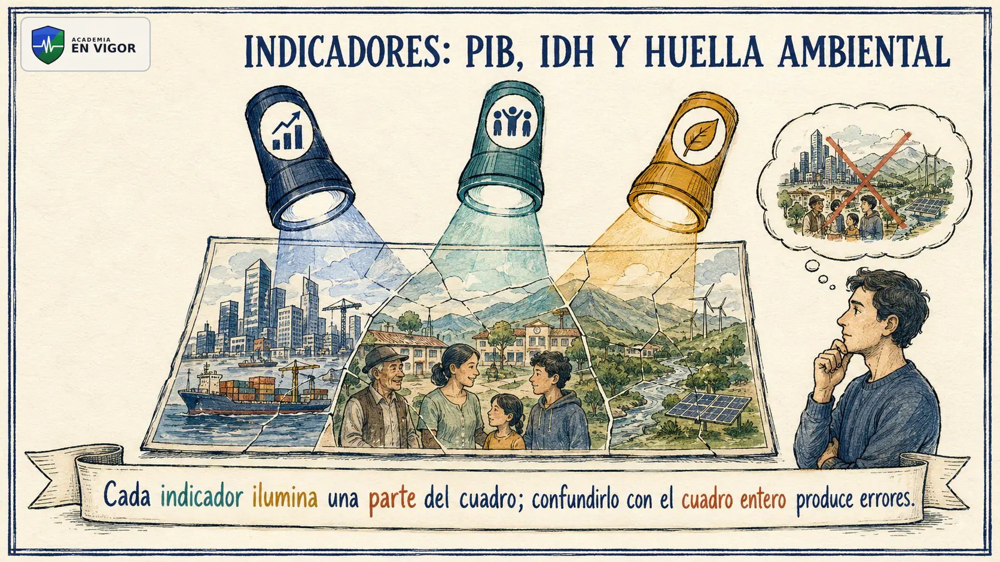

<em>Infografía: Indicadores: PIB, IDH y huella ambiental.</em>

:::hablemos-claro
Cada indicador ilumina una parte del cuadro; confundirlo con el cuadro entero produce errores.
:::

:::en-la-calle
Al explicar la sostenibilidad sin convertirla en un eslogan, Cada indicador ilumina una parte del cuadro; confundirlo con el cuadro entero produce errores.
:::

:::lo-que-cae
Prioriza **medir dimensiones distintas** y descarta respuestas que confundan concepto, órgano, instrumento o fecha.
:::

<!-- FUENTE: UNDP-HDI-T35 -->

## 09. Conferencia de Estocolmo de 1972

### Lógica del bloque

Para dominar **conferencia de estocolmo de 1972**, aplica esta regla: Estocolmo abre la puerta; Río integra ambiente y desarrollo; París organiza la acción climática común. El anclaje principal es **medio humano y cooperación mundial**.

### Hechos examinables

- La Conferencia de Estocolmo de 1972 fue la primera gran conferencia mundial de la ONU sobre medio ambiente. <!-- FACT:PN-T35-F033 -->
- Vinculó calidad ambiental y bienestar humano en la agenda internacional. <!-- FACT:PN-T35-F034 -->
- Su Declaración formuló principios y su Plan de Acción impulsó cooperación. <!-- FACT:PN-T35-F035 -->
- Contribuyó a la creación del Programa de las Naciones Unidas para el Medio Ambiente. <!-- FACT:PN-T35-F036 -->

### Trampas de examen

- **Incorrecto:** Estocolmo aprobó el Acuerdo de París.
- **Incorrecto:** La conferencia se celebró en 1992 en Río de Janeiro.

<!-- VISUAL:t35-09-conferencia-de-estocolmo-de-1972.webp -->

  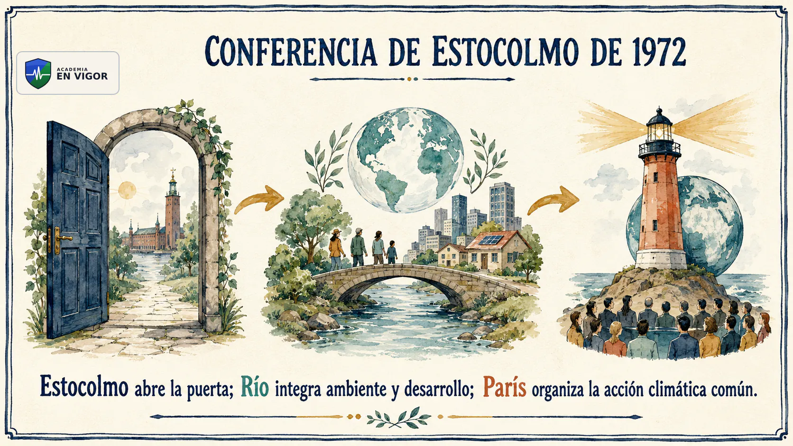

<em>Infografía: Conferencia de Estocolmo de 1972.</em>

:::hablemos-claro
Estocolmo abre la puerta; Río integra ambiente y desarrollo; París organiza la acción climática común.
:::

:::en-la-calle
Al ordenar tratados, conferencias y órganos internacionales, Estocolmo abre la puerta; Río integra ambiente y desarrollo; París organiza la acción climática común.
:::

:::lo-que-cae
Prioriza **medio humano y cooperación mundial** y descarta respuestas que confundan concepto, órgano, instrumento o fecha.
:::

<!-- FUENTE: UN-STOCKHOLM-T35 -->

## 10. Programa de las Naciones Unidas para el Medio Ambiente

### Lógica del bloque

Para dominar **programa de las naciones unidas para el medio ambiente**, aplica esta regla: El PNUMA coordina, informa y cataliza; no sustituye la soberanía ni los tratados. El anclaje principal es **PNUMA y coordinación ambiental**.

### Hechos examinables

- El PNUMA fue creado tras Estocolmo para impulsar la agenda ambiental de Naciones Unidas. <!-- FACT:PN-T35-F037 -->
- Su sede está en Nairobi. <!-- FACT:PN-T35-F038 -->
- Evalúa tendencias, apoya normas y facilita cooperación entre Estados y organizaciones. <!-- FACT:PN-T35-F039 -->
- No es un gobierno ambiental mundial con potestad general para sancionar Estados. <!-- FACT:PN-T35-F040 -->

### Trampas de examen

- **Incorrecto:** El PNUMA tiene sede en Copenhague.
- **Incorrecto:** El PNUMA dicta leyes directamente aplicables en todos los países.

<!-- VISUAL:t35-il-10-programa-de-las-naciones-unidas-para-el-medio-ambiente.webp -->

  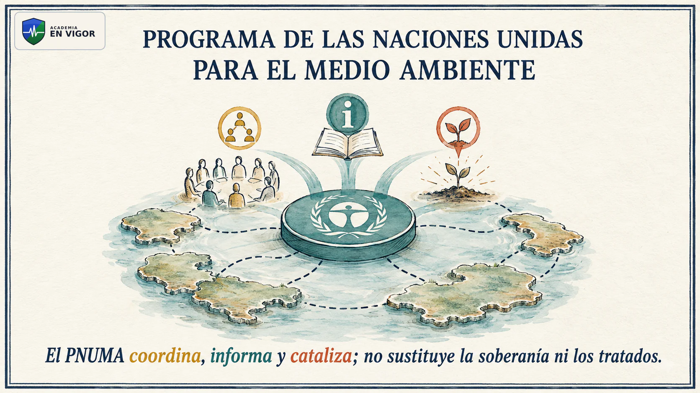

<em>Infografía: Programa de las Naciones Unidas para el Medio Ambiente.</em>

:::hablemos-claro
El PNUMA coordina, informa y cataliza; no sustituye la soberanía ni los tratados.
:::

:::en-la-calle
Al ordenar tratados, conferencias y órganos internacionales, El PNUMA coordina, informa y cataliza; no sustituye la soberanía ni los tratados.
:::

:::lo-que-cae
Prioriza **PNUMA y coordinación ambiental** y descarta respuestas que confundan concepto, órgano, instrumento o fecha.
:::

<!-- FUENTE: UN-STOCKHOLM-T35 -->

## 11. Cumbre de Río de 1992

### Lógica del bloque

Para dominar **cumbre de río de 1992**, aplica esta regla: No memorices Río como un solo documento: declaración, programa y convenios cumplen funciones distintas. El anclaje principal es **medio ambiente y desarrollo**.

### Hechos examinables

- La Conferencia de Río de 1992 consolidó la conexión entre medio ambiente y desarrollo. <!-- FACT:PN-T35-F041 -->
- Adoptó la Declaración de Río y Agenda 21. <!-- FACT:PN-T35-F042 -->
- En su marco se abrieron a firma la Convención sobre Cambio Climático y la de Diversidad Biológica. <!-- FACT:PN-T35-F043 -->
- Sus resultados combinan declaraciones, programas y tratados con distinta fuerza jurídica. <!-- FACT:PN-T35-F044 -->

### Trampas de examen

- **Incorrecto:** Río de 1992 adoptó los 17 ODS.
- **Incorrecto:** Todos los documentos de Río tienen idéntica fuerza vinculante.

<!-- VISUAL:t35-11-cumbre-de-rio-de-1992.webp -->

  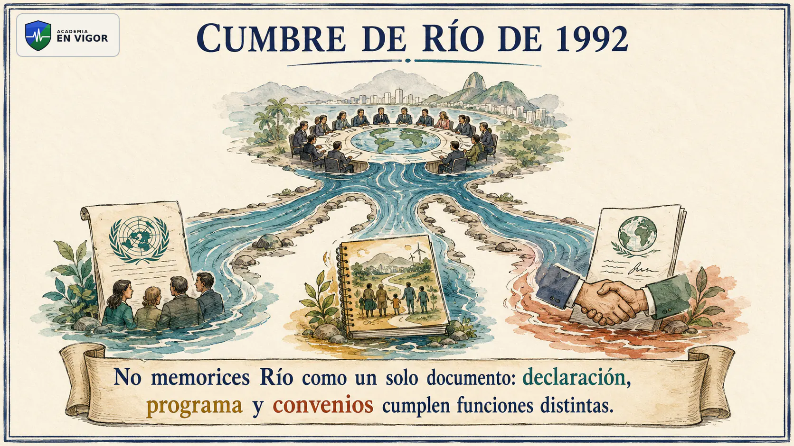

<em>Infografía: Cumbre de Río de 1992.</em>

:::hablemos-claro
No memorices Río como un solo documento: declaración, programa y convenios cumplen funciones distintas.
:::

:::en-la-calle
Al ordenar tratados, conferencias y órganos internacionales, No memorices Río como un solo documento: declaración, programa y convenios cumplen funciones distintas.
:::

:::lo-que-cae
Prioriza **medio ambiente y desarrollo** y descarta respuestas que confundan concepto, órgano, instrumento o fecha.
:::

<!-- FUENTE: UN-RIO-T35 -->

## 12. Declaración de Río y participación social

### Lógica del bloque

Para dominar **declaración de río y participación social**, aplica esta regla: Participar no es decidir automáticamente: es poder conocer, intervenir a tiempo y obtener respuesta. El anclaje principal es **principios y actores**.

### Hechos examinables

- La Declaración de Río contiene 27 principios sobre ambiente y desarrollo. <!-- FACT:PN-T35-F045 -->
- Su principio 10 conecta acceso a información, participación pública y acceso a procedimientos. <!-- FACT:PN-T35-F046 -->
- Agenda 21 promovió la intervención de administraciones, ciencia, empresas, sindicatos, ONG y ciudadanía. <!-- FACT:PN-T35-F047 -->
- La participación mejora legitimidad y conocimiento, pero no elimina la competencia del órgano decisor. <!-- FACT:PN-T35-F048 -->

### Trampas de examen

- **Incorrecto:** La participación ambiental nació en el Protocolo de Kioto.
- **Incorrecto:** Participar significa que cualquier alegación obliga a la Administración.

<!-- VISUAL:t35-12-declaracion-de-rio-y-participacion-social.webp -->

  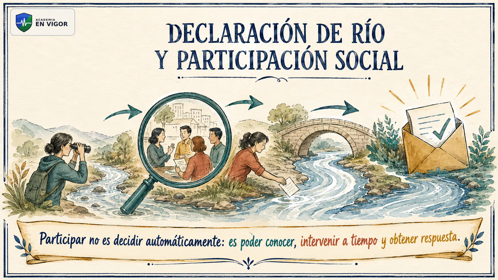

<em>Infografía: Declaración de Río y participación social.</em>

:::hablemos-claro
Participar no es decidir automáticamente: es poder conocer, intervenir a tiempo y obtener respuesta.
:::

:::en-la-calle
Al ordenar tratados, conferencias y órganos internacionales, Participar no es decidir automáticamente: es poder conocer, intervenir a tiempo y obtener respuesta.
:::

:::lo-que-cae
Prioriza **principios y actores** y descarta respuestas que confundan concepto, órgano, instrumento o fecha.
:::

<!-- FUENTE: UN-RIO-T35 -->

## 13. Convención Marco sobre Cambio Climático

### Lógica del bloque

Para dominar **convención marco sobre cambio climático**, aplica esta regla: La Convención construye el marco; Kioto y París desarrollan compromisos dentro de él. El anclaje principal es **estabilizar concentraciones de GEI**.

### Hechos examinables

- La CMNUCC fue adoptada en 1992 y entró en vigor en 1994. <!-- FACT:PN-T35-F049 -->
- Su objetivo es estabilizar concentraciones de gases de efecto invernadero evitando interferencias antropógenas peligrosas. <!-- FACT:PN-T35-F050 -->
- La Convención establece el marco institucional de las conferencias de las Partes. <!-- FACT:PN-T35-F051 -->
- Diferencia responsabilidades y capacidades sin borrar la necesidad de cooperación universal. <!-- FACT:PN-T35-F052 -->

### Trampas de examen

- **Incorrecto:** La CMNUCC fue adoptada en la COP21 de 2015.
- **Incorrecto:** La Convención fija una sanción penal mundial uniforme.

<!-- VISUAL:t35-13-convencion-marco-sobre-cambio-climatico.webp -->

  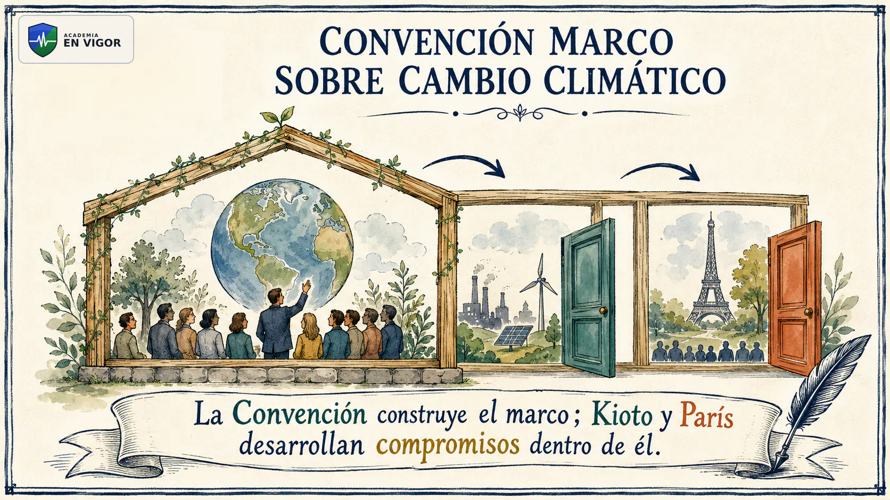

<em>Infografía: Convención Marco sobre Cambio Climático.</em>

:::hablemos-claro
La Convención construye el marco; Kioto y París desarrollan compromisos dentro de él.
:::

:::en-la-calle
Al ordenar tratados, conferencias y órganos internacionales, La Convención construye el marco; Kioto y París desarrollan compromisos dentro de él.
:::

:::lo-que-cae
Prioriza **estabilizar concentraciones de GEI** y descarta respuestas que confundan concepto, órgano, instrumento o fecha.
:::

<!-- FUENTE: UNFCCC-T35 -->

## 14. Conferencias de las Partes

### Lógica del bloque

Para dominar **conferencias de las partes**, aplica esta regla: COP es la reunión; el tratado es el instrumento; la entrada en vigor es otro hito. El anclaje principal es **COP como órgano supremo de la Convención**.

### Hechos examinables

- La COP reúne a las Partes de la Convención y revisa su aplicación. <!-- FACT:PN-T35-F053 -->
- Sus decisiones desarrollan reglas, programas de trabajo y mecanismos dentro del marco jurídico aplicable. <!-- FACT:PN-T35-F054 -->
- El número de una COP no equivale al año de entrada en vigor de todos sus resultados. <!-- FACT:PN-T35-F055 -->
- Una sede o presidencia concreta es un dato histórico y debe fecharse. <!-- FACT:PN-T35-F056 -->

### Trampas de examen

- **Incorrecto:** COP significa Comité Operativo Permanente.
- **Incorrecto:** Toda decisión de una COP modifica automáticamente las leyes nacionales.

<!-- VISUAL:t35-il-14-conferencias-de-las-partes.webp -->

  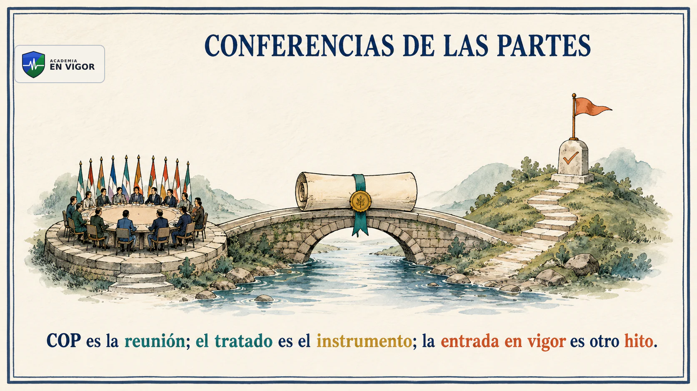

<em>Infografía: Conferencias de las Partes.</em>

:::hablemos-claro
COP es la reunión; el tratado es el instrumento; la entrada en vigor es otro hito.
:::

:::en-la-calle
Al ordenar tratados, conferencias y órganos internacionales, COP es la reunión; el tratado es el instrumento; la entrada en vigor es otro hito.
:::

:::lo-que-cae
Prioriza **COP como órgano supremo de la Convención** y descarta respuestas que confundan concepto, órgano, instrumento o fecha.
:::

<!-- FUENTE: UNFCCC-T35 -->

## 15. IPCC: función y productos

### Lógica del bloque

Para dominar **ipcc: función y productos**, aplica esta regla: El IPCC evalúa ciencia; la CMNUCC negocia política internacional. El anclaje principal es **evaluar conocimiento científico**.

### Hechos examinables

- El IPCC fue creado en 1988 por la OMM y el PNUMA. <!-- FACT:PN-T35-F057 -->
- Evalúa literatura científica sobre cambio climático, impactos, adaptación y mitigación. <!-- FACT:PN-T35-F058 -->
- No realiza por sí mismo toda la investigación primaria que sintetiza. <!-- FACT:PN-T35-F059 -->
- Sus informes apoyan decisiones, pero no son tratados ni imponen obligaciones jurídicas. <!-- FACT:PN-T35-F060 -->

### Trampas de examen

- **Incorrecto:** El IPCC negocia y ratifica tratados climáticos.
- **Incorrecto:** Sus informes son leyes vinculantes para los Estados.

<!-- VISUAL:t35-15-ipcc-funcion-y-productos.webp -->

  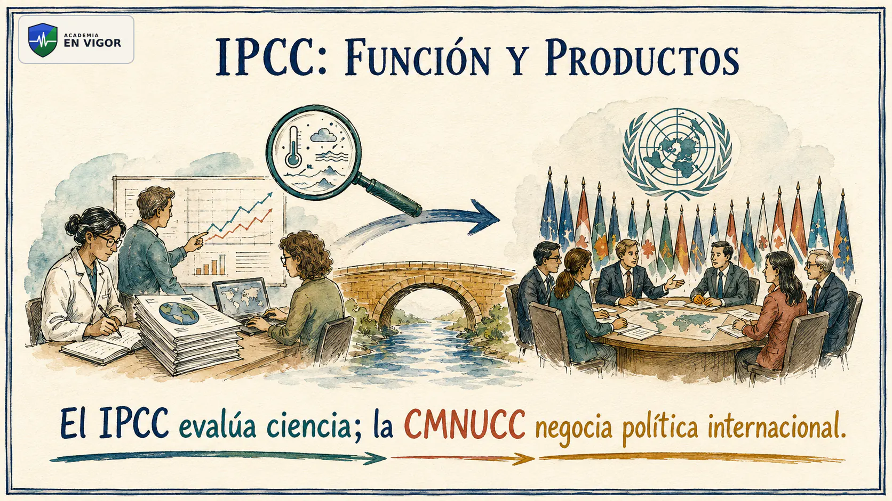

<em>Infografía: IPCC: función y productos.</em>

:::hablemos-claro
El IPCC evalúa ciencia; la CMNUCC negocia política internacional.
:::

:::en-la-calle
Al ordenar tratados, conferencias y órganos internacionales, El IPCC evalúa ciencia; la CMNUCC negocia política internacional.
:::

:::lo-que-cae
Prioriza **evaluar conocimiento científico** y descarta respuestas que confundan concepto, órgano, instrumento o fecha.
:::

<!-- FUENTE: IPCC-T35 -->

## 16. Protocolo de Kioto

### Lógica del bloque

Para dominar **protocolo de kioto**, aplica esta regla: Kioto reparte compromisos desde anexos; París pide contribuciones nacionales a todas las Partes. El anclaje principal es **compromisos cuantificados para países desarrollados**.

### Hechos examinables

- El Protocolo de Kioto fue adoptado en 1997 y entró en vigor en 2005. <!-- FACT:PN-T35-F061 -->
- Estableció compromisos cuantificados principalmente para Partes desarrolladas incluidas en su anexo correspondiente. <!-- FACT:PN-T35-F062 -->
- Utilizó mecanismos como comercio de emisiones, aplicación conjunta y desarrollo limpio. <!-- FACT:PN-T35-F063 -->
- No es correcto trasladar su arquitectura sin matices al Acuerdo de París. <!-- FACT:PN-T35-F064 -->

### Trampas de examen

- **Incorrecto:** Kioto entró en vigor el día de su adopción en 1997.
- **Incorrecto:** Kioto impuso el mismo objetivo numérico a todos los países.

<!-- VISUAL:t35-16-protocolo-de-kioto.webp -->

  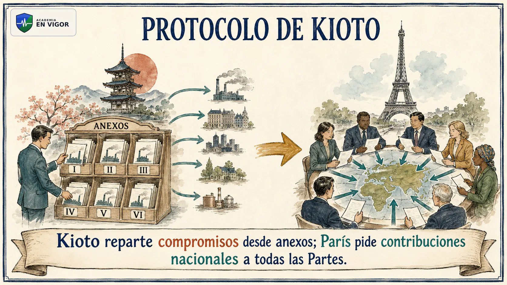

<em>Infografía: Protocolo de Kioto.</em>

:::hablemos-claro
Kioto reparte compromisos desde anexos; París pide contribuciones nacionales a todas las Partes.
:::

:::en-la-calle
Al ordenar tratados, conferencias y órganos internacionales, Kioto reparte compromisos desde anexos; París pide contribuciones nacionales a todas las Partes.
:::

:::lo-que-cae
Prioriza **compromisos cuantificados para países desarrollados** y descarta respuestas que confundan concepto, órgano, instrumento o fecha.
:::

<!-- FUENTE: UNFCCC-T35 -->

## 17. Adopción y entrada en vigor del Acuerdo de París

### Lógica del bloque

Para dominar **adopción y entrada en vigor del acuerdo de parís**, aplica esta regla: Tres casillas: adopción en 2015, firma en 2016 y entrada en vigor en noviembre de 2016. El anclaje principal es **COP21, 2015 y 2016**.

### Hechos examinables

- El Acuerdo de París fue adoptado el 12 de diciembre de 2015 en la COP21. <!-- FACT:PN-T35-F065 -->
- Se abrió a firma el 22 de abril de 2016. <!-- FACT:PN-T35-F066 -->
- Entró en vigor el 4 de noviembre de 2016 tras alcanzarse el umbral previsto. <!-- FACT:PN-T35-F067 -->
- Firma, ratificación o adhesión y entrada en vigor son actos jurídicos distintos. <!-- FACT:PN-T35-F068 -->

### Trampas de examen

- **Incorrecto:** El Acuerdo fue aprobado el 22 de abril de 2016.
- **Incorrecto:** La firma hace automáticamente parte al Estado sin trámite ulterior.

<!-- VISUAL:t35-17-adopcion-y-entrada-en-vigor-del-acuerdo-de-paris.webp -->

  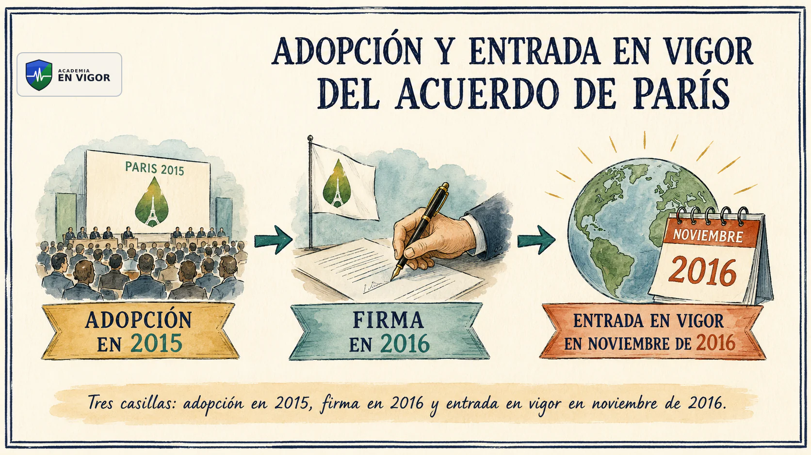

<em>Infografía: Adopción y entrada en vigor del Acuerdo de París.</em>

:::hablemos-claro
Tres casillas: adopción en 2015, firma en 2016 y entrada en vigor en noviembre de 2016.
:::

:::en-la-calle
Al ordenar tratados, conferencias y órganos internacionales, Tres casillas: adopción en 2015, firma en 2016 y entrada en vigor en noviembre de 2016.
:::

:::lo-que-cae
Prioriza **COP21, 2015 y 2016** y descarta respuestas que confundan concepto, órgano, instrumento o fecha.
:::

<!-- FUENTE: UNFCCC-PARIS-T35 -->

## 18. Partes del Acuerdo de París en 2026

### Lógica del bloque

Para dominar **partes del acuerdo de parís en 2026**, aplica esta regla: No mezcles fotografía histórica de firmantes con estado jurídico actual de Partes. El anclaje principal es **estado fechado, no lista eterna**.

### Hechos examinables

- A 27 de enero de 2026 la CMNUCC registraba 194 Partes en el Acuerdo de París. <!-- FACT:PN-T35-F069 -->
- El estado de participación puede cambiar por ratificaciones, adhesiones o retiradas. <!-- FACT:PN-T35-F070 -->
- La retirada de Estados Unidos surtió efecto el 27 de enero de 2026 según el registro de NDC de la CMNUCC. <!-- FACT:PN-T35-F071 -->
- Las preguntas históricas sobre quién firmó el 22 de abril de 2016 deben resolverse con el registro de aquella fecha. <!-- FACT:PN-T35-F072 -->

### Trampas de examen

- **Incorrecto:** La lista de firmantes de 2016 y la de Partes de 2026 son idénticas por definición.
- **Incorrecto:** Una retirada borra el hecho histórico de una firma anterior.

<!-- VISUAL:t35-il-18-partes-del-acuerdo-de-paris-en-2026.webp -->

  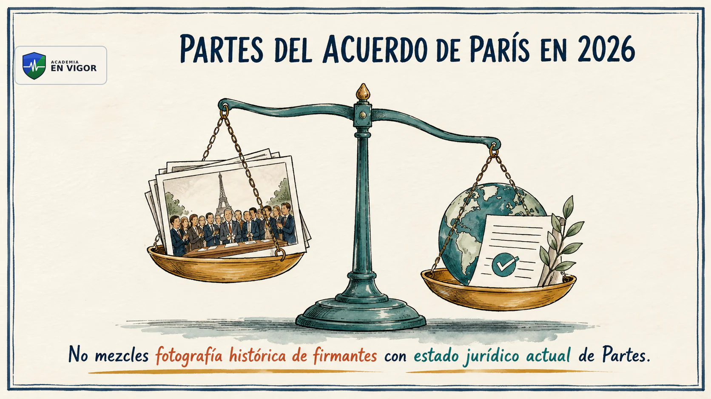

<em>Infografía: Partes del Acuerdo de París en 2026.</em>

:::hablemos-claro
No mezcles fotografía histórica de firmantes con estado jurídico actual de Partes.
:::

:::en-la-calle
Al ordenar tratados, conferencias y órganos internacionales, No mezcles fotografía histórica de firmantes con estado jurídico actual de Partes.
:::

:::lo-que-cae
Prioriza **estado fechado, no lista eterna** y descarta respuestas que confundan concepto, órgano, instrumento o fecha.
:::

<!-- FUENTE: UNFCCC-PARTIES-2026-T35 -->

## 19. Objetivos de temperatura del Acuerdo de París

### Lógica del bloque

Para dominar **objetivos de temperatura del acuerdo de parís**, aplica esta regla: La trampa está en las palabras: muy por debajo de 2 °C y esfuerzos hacia 1,5 °C. El anclaje principal es **muy por debajo de 2 °C y esfuerzo de 1,5 °C**.

### Hechos examinables

- París busca mantener el aumento de temperatura media mundial muy por debajo de 2 °C respecto de niveles preindustriales. <!-- FACT:PN-T35-F073 -->
- También persigue esfuerzos para limitar el aumento a 1,5 °C. <!-- FACT:PN-T35-F074 -->
- El objetivo convive con adaptación y orientación de flujos financieros. <!-- FACT:PN-T35-F075 -->
- No fija una cuota idéntica de reducción para cada país dentro del propio texto. <!-- FACT:PN-T35-F076 -->

### Trampas de examen

- **Incorrecto:** El único objetivo es exactamente 2 °C.
- **Incorrecto:** El Acuerdo asigna el mismo porcentaje de reducción a todos los Estados.

<!-- VISUAL:t35-19-objetivos-de-temperatura-del-acuerdo-de-paris.webp -->

  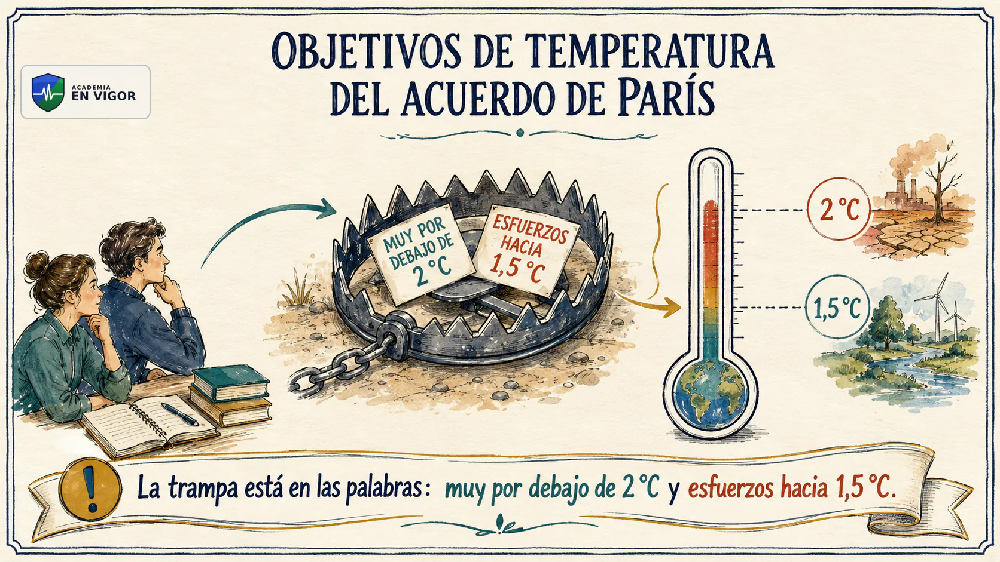

<em>Infografía: Objetivos de temperatura del Acuerdo de París.</em>

:::hablemos-claro
La trampa está en las palabras: muy por debajo de 2 °C y esfuerzos hacia 1,5 °C.
:::

:::en-la-calle
Al ordenar tratados, conferencias y órganos internacionales, La trampa está en las palabras: muy por debajo de 2 °C y esfuerzos hacia 1,5 °C.
:::

:::lo-que-cae
Prioriza **muy por debajo de 2 °C y esfuerzo de 1,5 °C** y descarta respuestas que confundan concepto, órgano, instrumento o fecha.
:::

<!-- FUENTE: UNFCCC-PARIS-T35 -->

## 20. Contribuciones determinadas a nivel nacional

### Lógica del bloque

Para dominar **contribuciones determinadas a nivel nacional**, aplica esta regla: París combina obligación de participar en el ciclo con contenido nacionalmente determinado. El anclaje principal es **NDC cada cinco años**.

### Hechos examinables

- Cada Parte prepara, comunica y mantiene contribuciones determinadas a nivel nacional. <!-- FACT:PN-T35-F077 -->
- Las NDC sucesivas deben representar progresión y reflejar la mayor ambición posible. <!-- FACT:PN-T35-F078 -->
- Se comunican en ciclos de cinco años. <!-- FACT:PN-T35-F079 -->
- Nacionalmente determinada no significa jurídicamente irrelevante: existen deberes de preparación, comunicación y seguimiento. <!-- FACT:PN-T35-F080 -->

### Trampas de examen

- **Incorrecto:** La secretaría de la CMNUCC impone una NDC idéntica a cada país.
- **Incorrecto:** Una NDC se presenta una sola vez y queda congelada.

<!-- VISUAL:t35-20-contribuciones-determinadas-a-nivel-nacional.webp -->

  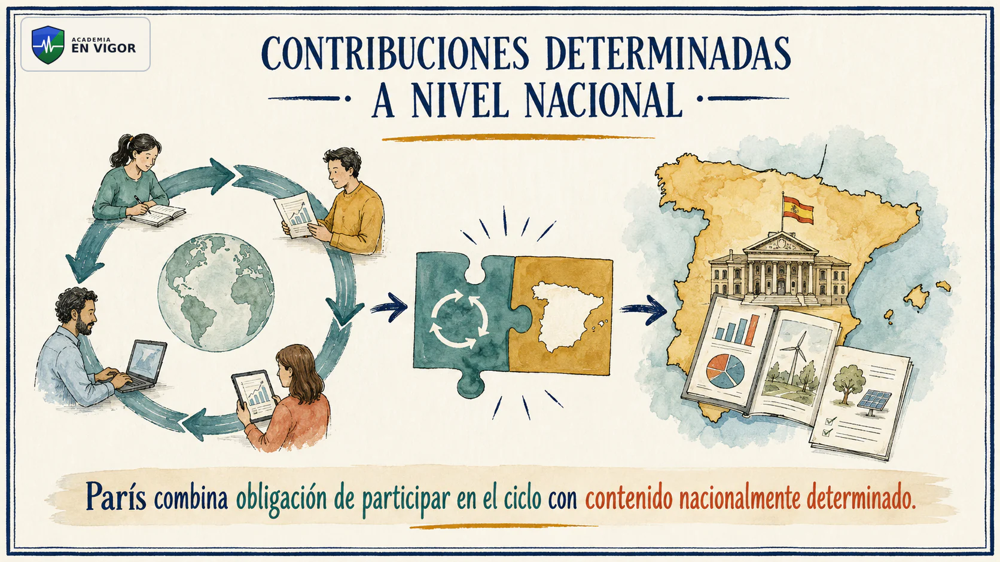

<em>Infografía: Contribuciones determinadas a nivel nacional.</em>

:::hablemos-claro
París combina obligación de participar en el ciclo con contenido nacionalmente determinado.
:::

:::en-la-calle
Al ordenar tratados, conferencias y órganos internacionales, París combina obligación de participar en el ciclo con contenido nacionalmente determinado.
:::

:::lo-que-cae
Prioriza **NDC cada cinco años** y descarta respuestas que confundan concepto, órgano, instrumento o fecha.
:::

<!-- FUENTE: UNFCCC-PARIS-T35 -->

## 21. Marco reforzado de transparencia

### Lógica del bloque

Para dominar **marco reforzado de transparencia**, aplica esta regla: Promesa sin medición es opaca; transparencia conecta objetivo, datos y revisión. El anclaje principal es **informar y revisar**.

### Hechos examinables

- El marco de transparencia persigue claridad sobre acción y apoyo climáticos. <!-- FACT:PN-T35-F081 -->
- Las Partes presentan información sobre emisiones, avances y apoyo conforme a las reglas aplicables. <!-- FACT:PN-T35-F082 -->
- La revisión técnica y la consideración multilateral no equivalen a un juicio penal. <!-- FACT:PN-T35-F083 -->
- Transparencia permite comparar progreso sin convertir capacidades nacionales distintas en datos idénticos. <!-- FACT:PN-T35-F084 -->

### Trampas de examen

- **Incorrecto:** Transparencia se limita a publicar el texto inicial de la NDC.
- **Incorrecto:** La revisión técnica impone automáticamente multas internacionales.

<!-- VISUAL:t35-21-marco-reforzado-de-transparencia.webp -->

  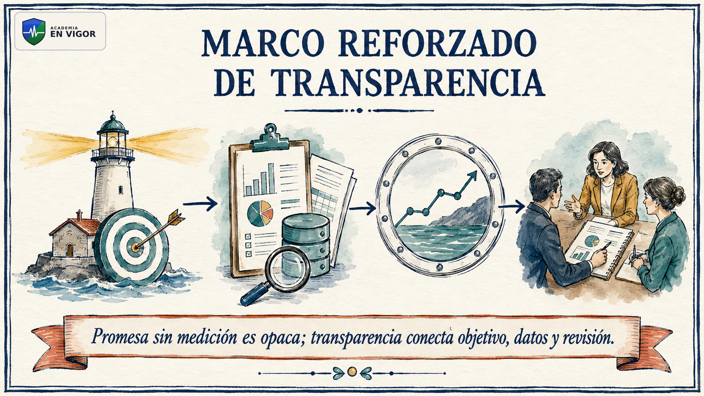

<em>Infografía: Marco reforzado de transparencia.</em>

:::hablemos-claro
Promesa sin medición es opaca; transparencia conecta objetivo, datos y revisión.
:::

:::en-la-calle
Al ordenar tratados, conferencias y órganos internacionales, Promesa sin medición es opaca; transparencia conecta objetivo, datos y revisión.
:::

:::lo-que-cae
Prioriza **informar y revisar** y descarta respuestas que confundan concepto, órgano, instrumento o fecha.
:::

<!-- FUENTE: UNFCCC-PARIS-T35 -->

## 22. Balance mundial del Acuerdo de París

### Lógica del bloque

Para dominar **balance mundial del acuerdo de parís**, aplica esta regla: El balance mira al conjunto; las NDC siguen siendo nacionales. El anclaje principal es **progreso colectivo cada cinco años**.

### Hechos examinables

- El balance mundial evalúa periódicamente el progreso colectivo hacia los fines y objetivos de París. <!-- FACT:PN-T35-F085 -->
- Se realiza cada cinco años salvo decisión distinta de las Partes. <!-- FACT:PN-T35-F086 -->
- Informa la actualización y mejora de acciones y apoyo posteriores. <!-- FACT:PN-T35-F087 -->
- No califica por sí solo el cumplimiento individual de cada Parte como una sentencia. <!-- FACT:PN-T35-F088 -->

### Trampas de examen

- **Incorrecto:** El balance mundial sustituye a todas las NDC nacionales.
- **Incorrecto:** Evalúa únicamente a un Estado cada vez.

<!-- VISUAL:t35-22-balance-mundial-del-acuerdo-de-paris.webp -->

  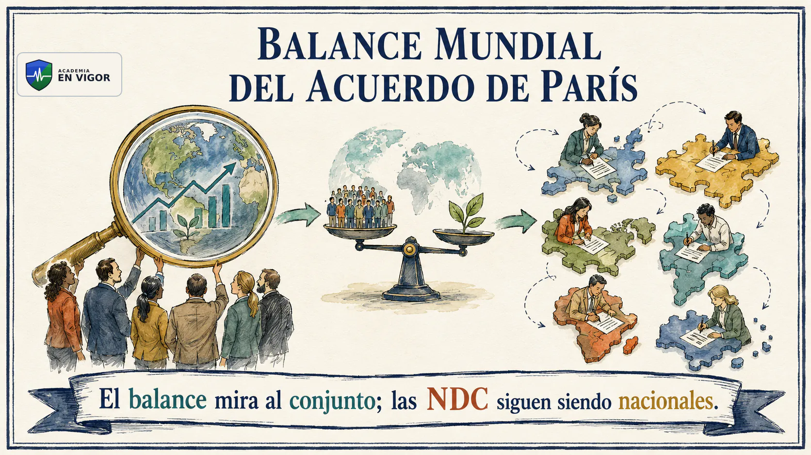

<em>Infografía: Balance mundial del Acuerdo de París.</em>

:::hablemos-claro
El balance mira al conjunto; las NDC siguen siendo nacionales.
:::

:::en-la-calle
Al ordenar tratados, conferencias y órganos internacionales, El balance mira al conjunto; las NDC siguen siendo nacionales.
:::

:::lo-que-cae
Prioriza **progreso colectivo cada cinco años** y descarta respuestas que confundan concepto, órgano, instrumento o fecha.
:::

<!-- FUENTE: UNFCCC-PARIS-T35 -->

## 23. Adaptación, financiación y pérdidas y daños

### Lógica del bloque

Para dominar **adaptación, financiación y pérdidas y daños**, aplica esta regla: Mitigar frena causas; adaptar reduce daño; pérdidas y daños atiende impactos restantes. El anclaje principal es **tres planos complementarios**.

### Hechos examinables

- Mitigación reduce emisiones o aumenta sumideros; adaptación reduce vulnerabilidad ante impactos. <!-- FACT:PN-T35-F089 -->
- La financiación climática apoya acciones de mitigación y adaptación según marcos acordados. <!-- FACT:PN-T35-F090 -->
- Pérdidas y daños aborda impactos que no se evitan completamente mediante mitigación o adaptación. <!-- FACT:PN-T35-F091 -->
- Los tres planos se relacionan, pero no son sinónimos ni fondos automáticamente intercambiables. <!-- FACT:PN-T35-F092 -->

### Trampas de examen

- **Incorrecto:** Adaptación significa únicamente reducir emisiones.
- **Incorrecto:** Pérdidas y daños es otro nombre de la NDC.

<!-- VISUAL:t35-il-23-adaptacion-financiacion-y-perdidas-y-danos.webp -->

  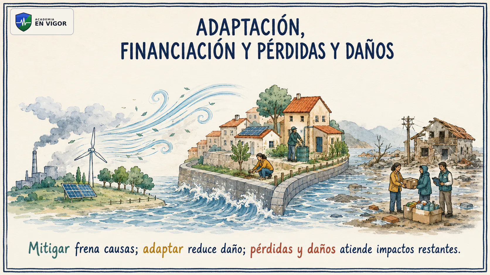

<em>Infografía: Adaptación, financiación y pérdidas y daños.</em>

:::hablemos-claro
Mitigar frena causas; adaptar reduce daño; pérdidas y daños atiende impactos restantes.
:::

:::en-la-calle
Al ordenar tratados, conferencias y órganos internacionales, Mitigar frena causas; adaptar reduce daño; pérdidas y daños atiende impactos restantes.
:::

:::lo-que-cae
Prioriza **tres planos complementarios** y descarta respuestas que confundan concepto, órgano, instrumento o fecha.
:::

<!-- FUENTE: UNFCCC-PARIS-T35 -->

## 24. Agenda 2030: adopción y estructura

### Lógica del bloque

Para dominar **agenda 2030: adopción y estructura**, aplica esta regla: Diecisiete objetivos forman una red: avanzar en uno puede apoyar o tensionar otros. El anclaje principal es **17 ODS y 169 metas**.

### Hechos examinables

- La Asamblea General de la ONU adoptó la Agenda 2030 el 25 de septiembre de 2015. <!-- FACT:PN-T35-F093 -->
- La Agenda contiene 17 Objetivos de Desarrollo Sostenible y 169 metas. <!-- FACT:PN-T35-F094 -->
- Los ODS son universales e integrados y abarcan dimensiones sociales, económicas y ambientales. <!-- FACT:PN-T35-F095 -->
- Los objetivos no son una lista de leyes penales ni sustituyen las competencias nacionales. <!-- FACT:PN-T35-F096 -->

### Trampas de examen

- **Incorrecto:** La Agenda 2030 contiene 15 objetivos.
- **Incorrecto:** Los ODS solo se aplican a países en desarrollo.

<!-- VISUAL:t35-24-agenda-2030-adopcion-y-estructura.webp -->

  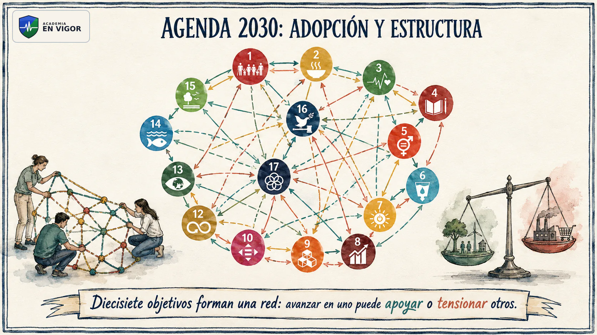

<em>Infografía: Agenda 2030: adopción y estructura.</em>

:::hablemos-claro
Diecisiete objetivos forman una red: avanzar en uno puede apoyar o tensionar otros.
:::

:::en-la-calle
Al conectar Agenda 2030, Unión Europea y gobernanza española, Diecisiete objetivos forman una red: avanzar en uno puede apoyar o tensionar otros.
:::

:::lo-que-cae
Prioriza **17 ODS y 169 metas** y descarta respuestas que confundan concepto, órgano, instrumento o fecha.
:::

<!-- FUENTE: UN-SDGS-T35 -->

## 25. Las cinco P de la Agenda 2030

### Lógica del bloque

Para dominar **las cinco p de la agenda 2030**, aplica esta regla: Cinco P ordenan el relato; diecisiete ODS contienen los objetivos concretos. El anclaje principal es **personas, planeta, prosperidad, paz y alianzas**.

### Hechos examinables

- La Agenda 2030 suele sintetizarse en personas, planeta, prosperidad, paz y alianzas. <!-- FACT:PN-T35-F097 -->
- Las cinco P agrupan el sentido político de los ODS y no reemplazan la lista oficial. <!-- FACT:PN-T35-F098 -->
- Alianzas subraya cooperación entre gobiernos, sociedad, ciencia y sector privado. <!-- FACT:PN-T35-F099 -->
- Paz e instituciones muestran que sostenibilidad no se reduce a variables biofísicas. <!-- FACT:PN-T35-F100 -->

### Trampas de examen

- **Incorrecto:** Las cinco P son prevención, precaución, pago, planeta y policía.
- **Incorrecto:** Las alianzas eliminan la responsabilidad de los poderes públicos.

<!-- VISUAL:t35-25-las-cinco-p-de-la-agenda-2030.webp -->

  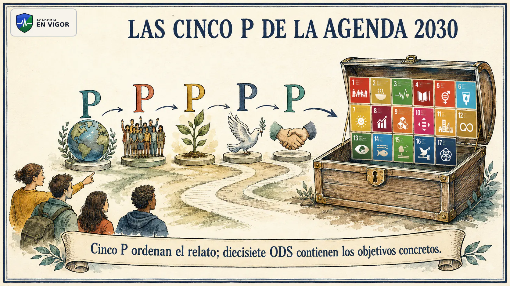

<em>Infografía: Las cinco P de la Agenda 2030.</em>

:::hablemos-claro
Cinco P ordenan el relato; diecisiete ODS contienen los objetivos concretos.
:::

:::en-la-calle
Al conectar Agenda 2030, Unión Europea y gobernanza española, Cinco P ordenan el relato; diecisiete ODS contienen los objetivos concretos.
:::

:::lo-que-cae
Prioriza **personas, planeta, prosperidad, paz y alianzas** y descarta respuestas que confundan concepto, órgano, instrumento o fecha.
:::

<!-- FUENTE: UN-SDGS-T35 -->

## 26. ODS ambientales directos y transversales

### Lógica del bloque

Para dominar **ods ambientales directos y transversales**, aplica esta regla: Aprende los ambientales como ecosistema, no como islas: agua, energía, ciudad, consumo, clima, mar y tierra. El anclaje principal es **6, 7, 11, 12, 13, 14 y 15**.

### Hechos examinables

- El ODS 6 aborda agua limpia y saneamiento. <!-- FACT:PN-T35-F101 -->
- El ODS 12 trata producción y consumo responsables y el ODS 13 acción por el clima. <!-- FACT:PN-T35-F102 -->
- Los ODS 14 y 15 se refieren a vida submarina y ecosistemas terrestres. <!-- FACT:PN-T35-F103 -->
- La dimensión ambiental también atraviesa salud, ciudades, energía, pobreza y alianzas. <!-- FACT:PN-T35-F104 -->

### Trampas de examen

- **Incorrecto:** Educación en el voluntariado es uno de los 17 ODS.
- **Incorrecto:** Solo el ODS 13 tiene relación ambiental.

<!-- VISUAL:t35-26-ods-ambientales-directos-y-transversales.webp -->

  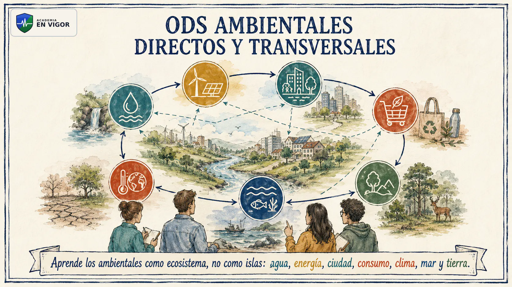

<em>Infografía: ODS ambientales directos y transversales.</em>

:::hablemos-claro
Aprende los ambientales como ecosistema, no como islas: agua, energía, ciudad, consumo, clima, mar y tierra.
:::

:::en-la-calle
Al conectar Agenda 2030, Unión Europea y gobernanza española, Aprende los ambientales como ecosistema, no como islas: agua, energía, ciudad, consumo, clima, mar y tierra.
:::

:::lo-que-cae
Prioriza **6, 7, 11, 12, 13, 14 y 15** y descarta respuestas que confundan concepto, órgano, instrumento o fecha.
:::

<!-- FUENTE: UN-SDGS-T35 -->

## 27. Metas, indicadores y seguimiento

### Lógica del bloque

Para dominar **metas, indicadores y seguimiento**, aplica esta regla: Dirección, destino medible y termómetro: objetivo, meta e indicador. El anclaje principal es **objetivo, meta e indicador**.

### Hechos examinables

- Un objetivo expresa una dirección amplia; una meta concreta un resultado y un indicador mide progreso. <!-- FACT:PN-T35-F105 -->
- No todos los indicadores internacionales pueden trasladarse sin adaptación al nivel local. <!-- FACT:PN-T35-F106 -->
- El seguimiento requiere series comparables, metodología y fecha de referencia. <!-- FACT:PN-T35-F107 -->
- Mejorar un indicador no demuestra por sí solo cumplimiento íntegro de un ODS. <!-- FACT:PN-T35-F108 -->

### Trampas de examen

- **Incorrecto:** Objetivo, meta e indicador son tres nombres de la misma unidad.
- **Incorrecto:** Un dato aislado sin metodología basta para certificar un ODS.

<!-- VISUAL:t35-27-metas-indicadores-y-seguimiento.webp -->

  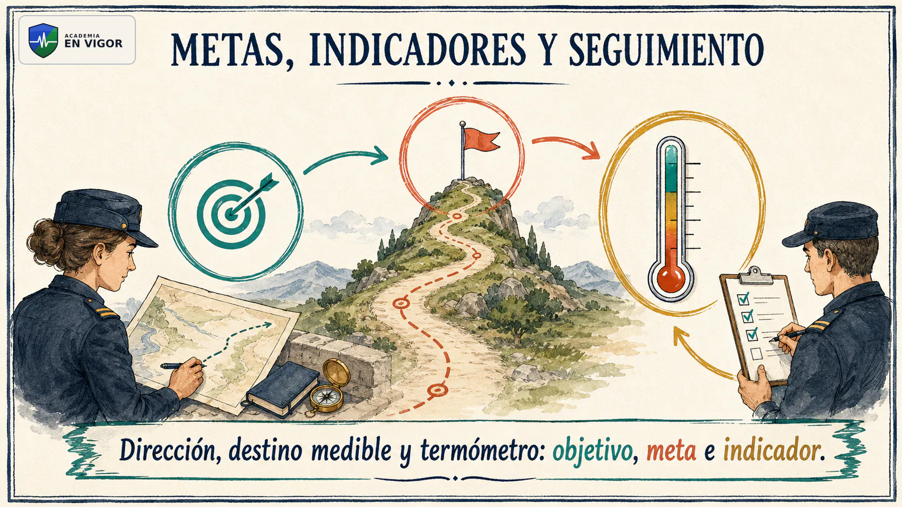

<em>Infografía: Metas, indicadores y seguimiento.</em>

:::hablemos-claro
Dirección, destino medible y termómetro: objetivo, meta e indicador.
:::

:::en-la-calle
Al conectar Agenda 2030, Unión Europea y gobernanza española, Dirección, destino medible y termómetro: objetivo, meta e indicador.
:::

:::lo-que-cae
Prioriza **objetivo, meta e indicador** y descarta respuestas que confundan concepto, órgano, instrumento o fecha.
:::

<!-- FUENTE: UN-SDGS-T35 -->

## 28. Agencia Europea de Medio Ambiente

### Lógica del bloque

Para dominar **agencia europea de medio ambiente**, aplica esta regla: AEMA observa y explica; Comisión, Parlamento y Consejo participan en la legislación. El anclaje principal es **información sólida e independiente**.

### Hechos examinables

- La AEMA es una agencia de la Unión Europea que proporciona conocimiento sobre medio ambiente y clima. <!-- FACT:PN-T35-F109 -->
- Su sede está en Copenhague. <!-- FACT:PN-T35-F110 -->
- Trabaja con Eionet, red europea de información y observación ambiental. <!-- FACT:PN-T35-F111 -->
- La AEMA informa políticas, pero no es el legislador ambiental de la Unión. <!-- FACT:PN-T35-F112 -->

### Trampas de examen

- **Incorrecto:** La AEMA tiene sede en Dublín.
- **Incorrecto:** La AEMA aprueba reglamentos obligatorios por sí sola.

<!-- VISUAL:t35-il-28-agencia-europea-de-medio-ambiente.webp -->

  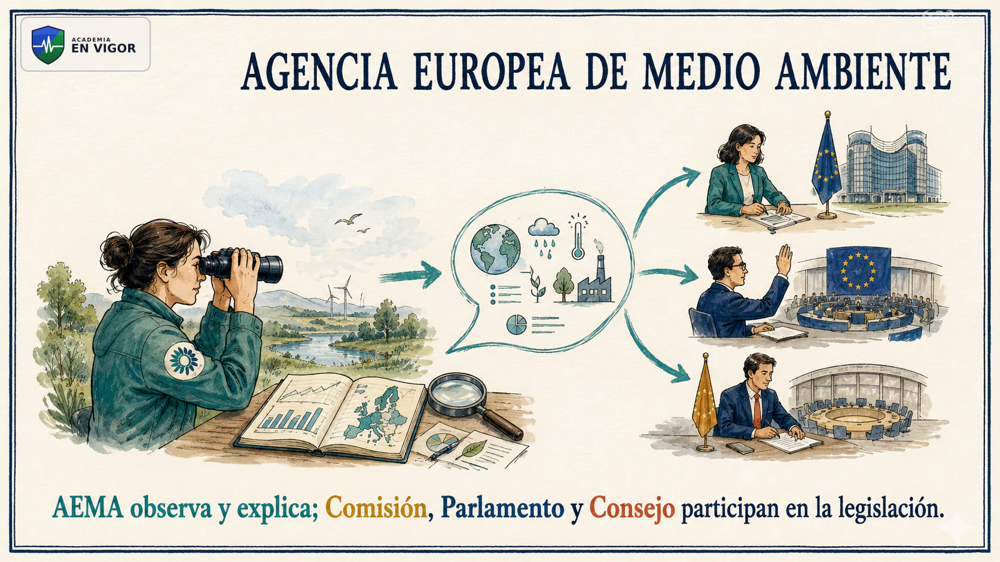

<em>Infografía: Agencia Europea de Medio Ambiente.</em>

:::hablemos-claro
AEMA observa y explica; Comisión, Parlamento y Consejo participan en la legislación.
:::

:::en-la-calle
Al conectar Agenda 2030, Unión Europea y gobernanza española, AEMA observa y explica; Comisión, Parlamento y Consejo participan en la legislación.
:::

:::lo-que-cae
Prioriza **información sólida e independiente** y descarta respuestas que confundan concepto, órgano, instrumento o fecha.
:::

<!-- FUENTE: AEMA-T35 -->

## 29. Ley Europea del Clima

### Lógica del bloque

Para dominar **ley europea del clima**, aplica esta regla: Distingue objetivo colectivo de la UE y reparto mediante legislación sectorial y planes nacionales. El anclaje principal es **neutralidad 2050 y reducción neta 2030**.

### Hechos examinables

- El Reglamento (UE) 2021/1119 hace vinculante el objetivo de neutralidad climática de la Unión a más tardar en 2050. <!-- FACT:PN-T35-F113 -->
- Fija para 2030 una reducción interna neta de emisiones de al menos el 55 % respecto de 1990. <!-- FACT:PN-T35-F114 -->
- El objetivo es de la Unión en su conjunto y no una cuota idéntica automática para cada Estado. <!-- FACT:PN-T35-F115 -->
- La norma establece un marco de progreso y revisión coherente con París. <!-- FACT:PN-T35-F116 -->

### Trampas de examen

- **Incorrecto:** La neutralidad climática de la UE está fijada para 2030.
- **Incorrecto:** Cada Estado debe reducir exactamente un 55 % por aplicación directa del objetivo colectivo.

<!-- VISUAL:t35-29-ley-europea-del-clima.webp -->

  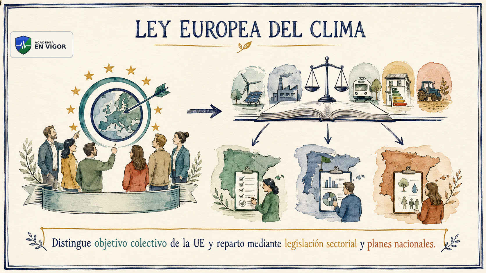

<em>Infografía: Ley Europea del Clima.</em>

:::hablemos-claro
Distingue objetivo colectivo de la UE y reparto mediante legislación sectorial y planes nacionales.
:::

:::en-la-calle
Al conectar Agenda 2030, Unión Europea y gobernanza española, Distingue objetivo colectivo de la UE y reparto mediante legislación sectorial y planes nacionales.
:::

:::lo-que-cae
Prioriza **neutralidad 2050 y reducción neta 2030** y descarta respuestas que confundan concepto, órgano, instrumento o fecha.
:::

<!-- FUENTE: EU-CLIMATE-LAW-T35 -->

## 30. Principios ambientales de la Unión Europea

### Lógica del bloque

Para dominar **principios ambientales de la unión europea**, aplica esta regla: Cuatro anclas de examen: cautela, prevención, fuente y contaminador. El anclaje principal es **artículo 191 TFUE**.

### Hechos examinables

- La política de la Unión busca un nivel de protección elevado atendiendo a la diversidad regional. <!-- FACT:PN-T35-F117 -->
- Se basa en cautela, acción preventiva, corrección preferentemente en la fuente y quien contamina paga. <!-- FACT:PN-T35-F118 -->
- También persigue uso prudente y racional de recursos naturales. <!-- FACT:PN-T35-F119 -->
- Los principios orientan políticas y normas; su aplicación concreta exige el instrumento jurídico correspondiente. <!-- FACT:PN-T35-F120 -->

### Trampas de examen

- **Incorrecto:** La política ambiental de la UE exige protección idéntica sin atender regiones.
- **Incorrecto:** Quien contamina paga elimina prevención y precaución.

<!-- VISUAL:t35-30-principios-ambientales-de-la-union-europea.webp -->

  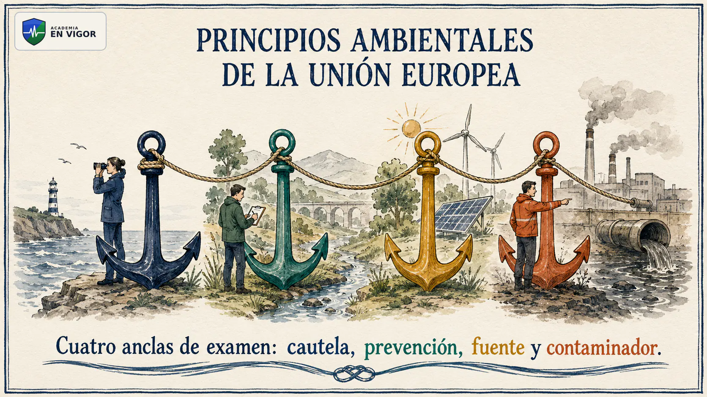

<em>Infografía: Principios ambientales de la Unión Europea.</em>

:::hablemos-claro
Cuatro anclas de examen: cautela, prevención, fuente y contaminador.
:::

:::en-la-calle
Al conectar Agenda 2030, Unión Europea y gobernanza española, Cuatro anclas de examen: cautela, prevención, fuente y contaminador.
:::

:::lo-que-cae
Prioriza **artículo 191 TFUE** y descarta respuestas que confundan concepto, órgano, instrumento o fecha.
:::

<!-- FUENTE: EU-ENV-PRINCIPLES-T35 -->

## 31. Programa LIFE 2021-2027

### Lógica del bloque

Para dominar **programa life 2021-2027**, aplica esta regla: LIFE financia acción; no concede inmunidad regulatoria. El anclaje principal es **medio ambiente y acción por el clima**.

### Hechos examinables

- LIFE es el programa de financiación de la Unión dedicado al medio ambiente y la acción por el clima. <!-- FACT:PN-T35-F121 -->
- El período 2021-2027 se rige por el Reglamento (UE) 2021/783. <!-- FACT:PN-T35-F122 -->
- Incluye ámbitos de naturaleza y biodiversidad, economía circular, mitigación, adaptación y transición energética limpia. <!-- FACT:PN-T35-F123 -->
- Una ayuda LIFE no sustituye permisos, evaluación ambiental ni obligaciones legales del proyecto. <!-- FACT:PN-T35-F124 -->

### Trampas de examen

- **Incorrecto:** LIFE es una norma ISO de certificación ambiental.
- **Incorrecto:** Recibir financiación LIFE exime de cumplir legislación nacional.

<!-- VISUAL:t35-31-programa-life-2021-2027.webp -->

  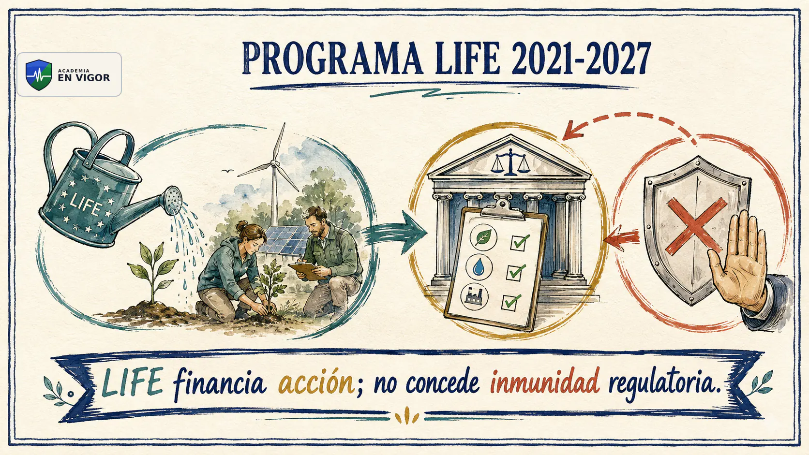

<em>Infografía: Programa LIFE 2021-2027.</em>

:::hablemos-claro
LIFE financia acción; no concede inmunidad regulatoria.
:::

:::en-la-calle
Al conectar Agenda 2030, Unión Europea y gobernanza española, LIFE financia acción; no concede inmunidad regulatoria.
:::

:::lo-que-cae
Prioriza **medio ambiente y acción por el clima** y descarta respuestas que confundan concepto, órgano, instrumento o fecha.
:::

<!-- FUENTE: LIFE-2021-783-T35 -->

## 32. Artículo 45 de la Constitución

### Lógica del bloque

Para dominar **artículo 45 de la constitución**, aplica esta regla: Tres peldaños: derecho y deber; mandato público; sanción y reparación según la ley. El anclaje principal es **derecho, deber y mandato**.

### Hechos examinables

- El artículo 45.1 reconoce el derecho a disfrutar de un medio ambiente adecuado y el deber de conservarlo. <!-- FACT:PN-T35-F125 -->
- El artículo 45.2 ordena a los poderes públicos velar por el uso racional de los recursos naturales. <!-- FACT:PN-T35-F126 -->
- El artículo 45.3 prevé sanciones penales o administrativas y obligación de reparar el daño en los términos legales. <!-- FACT:PN-T35-F127 -->
- Su ubicación constitucional no permite inventar una acción procesal directa al margen de las leyes que la articulan. <!-- FACT:PN-T35-F128 -->

### Trampas de examen

- **Incorrecto:** El artículo 45 reconoce un derecho sin deber correlativo.
- **Incorrecto:** Toda infracción ambiental es necesariamente delito.

<!-- VISUAL:t35-32-articulo-45-de-la-constitucion.webp -->

  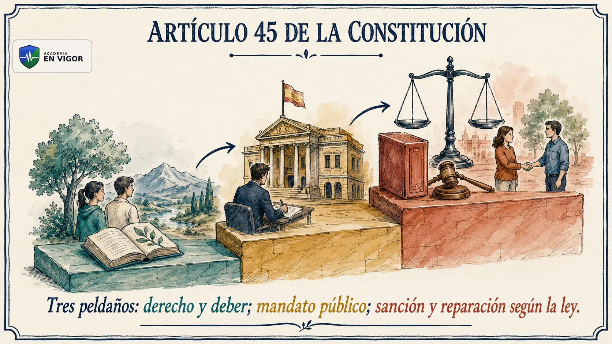

<em>Infografía: Artículo 45 de la Constitución.</em>

:::hablemos-claro
Tres peldaños: derecho y deber; mandato público; sanción y reparación según la ley.
:::

:::en-la-calle
Al conectar Agenda 2030, Unión Europea y gobernanza española, Tres peldaños: derecho y deber; mandato público; sanción y reparación según la ley.
:::

:::lo-que-cae
Prioriza **derecho, deber y mandato** y descarta respuestas que confundan concepto, órgano, instrumento o fecha.
:::

<!-- FUENTE: CE-ART45-T35 -->

## 33. Consejo de Desarrollo Sostenible

### Lógica del bloque

Para dominar **consejo de desarrollo sostenible**, aplica esta regla: Consejo significa participación y propuesta; no dirección ejecutiva. El anclaje principal es **participación de la sociedad civil**.

### Hechos examinables

- El Consejo de Desarrollo Sostenible es un órgano colegiado de participación vinculado a la implementación de la Agenda 2030. <!-- FACT:PN-T35-F129 -->
- Canaliza propuestas y seguimiento desde organizaciones sociales, económicas, ambientales y académicas. <!-- FACT:PN-T35-F130 -->
- Su naturaleza consultiva no lo convierte en órgano legislativo ni ejecutivo. <!-- FACT:PN-T35-F131 -->
- Impulsa el diálogo y la coordinación entre agentes sociales, económicos, ambientales y culturales para contribuir a los ODS. <!-- FACT:PN-T35-F132 -->

### Trampas de examen

- **Incorrecto:** El Consejo aprueba leyes y sanciona incumplimientos de ODS.
- **Incorrecto:** Es un órgano exclusivo de administraciones sin sociedad civil.

<!-- VISUAL:t35-il-33-consejo-de-desarrollo-sostenible.webp -->

  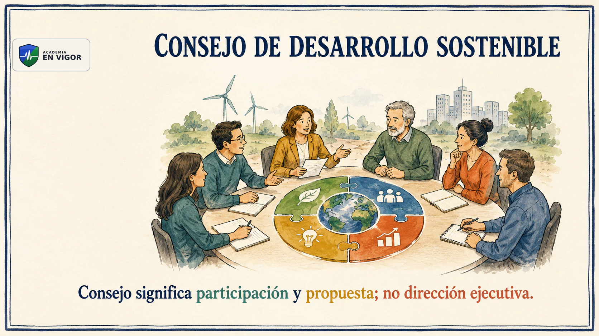

<em>Infografía: Consejo de Desarrollo Sostenible.</em>

:::hablemos-claro
Consejo significa participación y propuesta; no dirección ejecutiva.
:::

:::en-la-calle
Al conectar Agenda 2030, Unión Europea y gobernanza española, Consejo significa participación y propuesta; no dirección ejecutiva.
:::

:::lo-que-cae
Prioriza **participación de la sociedad civil** y descarta respuestas que confundan concepto, órgano, instrumento o fecha.
:::

<!-- FUENTE: ORDEN-DSA-819-2020-T35 -->

## 34. Consejo Nacional del Clima

### Lógica del bloque

Para dominar **consejo nacional del clima**, aplica esta regla: Consejo participa; comisión coordina; oficina trabaja técnicamente dentro de la Administración. El anclaje principal es **foro institucional de participación**.

### Hechos examinables

- El Consejo Nacional del Clima es un órgano colegiado de participación en políticas sobre cambio climático. <!-- FACT:PN-T35-F133 -->
- Integra administraciones y organizaciones o entidades representativas de intereses sociales y ambientales. <!-- FACT:PN-T35-F134 -->
- Participa en elaboración y seguimiento de políticas climáticas promovidas por el Estado. <!-- FACT:PN-T35-F135 -->
- No debe confundirse con la Oficina Española de Cambio Climático ni con la comisión de coordinación territorial. <!-- FACT:PN-T35-F136 -->

### Trampas de examen

- **Incorrecto:** La Oficina Española de Cambio Climático es el foro plural de participación.
- **Incorrecto:** El Consejo Nacional del Clima es un tribunal especializado.

<!-- VISUAL:t35-34-consejo-nacional-del-clima.webp -->

  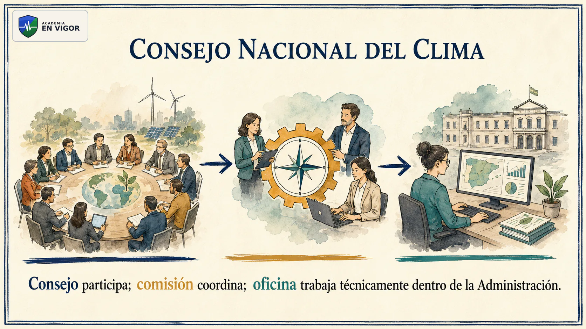

<em>Infografía: Consejo Nacional del Clima.</em>

:::hablemos-claro
Consejo participa; comisión coordina; oficina trabaja técnicamente dentro de la Administración.
:::

:::en-la-calle
Al conectar Agenda 2030, Unión Europea y gobernanza española, Consejo participa; comisión coordina; oficina trabaja técnicamente dentro de la Administración.
:::

:::lo-que-cae
Prioriza **foro institucional de participación** y descarta respuestas que confundan concepto, órgano, instrumento o fecha.
:::

<!-- FUENTE: RD415-2014-T35 -->

## 35. Coordinación climática administrativa

### Lógica del bloque

Para dominar **coordinación climática administrativa**, aplica esta regla: Para acertar, empareja verbo y órgano: participar, coordinar o ejecutar técnicamente. El anclaje principal es **interministerial y territorial**.

### Hechos examinables

- El Ministerio para la Transición Ecológica y el Reto Demográfico propone y ejecuta la política estatal en clima, contaminación, patrimonio natural, agua y energía dentro de sus competencias. <!-- FACT:PN-T35-F137 -->
- La Comisión de Coordinación de Políticas de Cambio Climático articula cooperación entre Estado y comunidades autónomas en su ámbito legal. <!-- FACT:PN-T35-F138 -->
- La Oficina Española de Cambio Climático ejerce funciones técnicas y administrativas dentro del ministerio competente. <!-- FACT:PN-T35-F139 -->
- Órganos con nombres próximos pueden participar, coordinar o ejecutar: la función distingue la respuesta. <!-- FACT:PN-T35-F140 -->

### Trampas de examen

- **Incorrecto:** Todos los órganos climáticos tienen idéntica composición y función.
- **Incorrecto:** La coordinación territorial corresponde exclusivamente al Consejo Nacional del Clima.

<!-- VISUAL:t35-35-coordinacion-climatica-administrativa.webp -->

  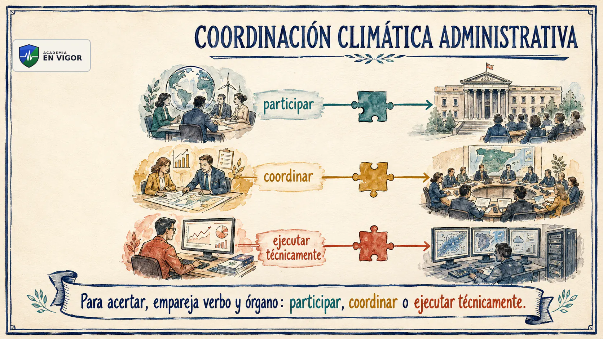

<em>Infografía: Coordinación climática administrativa.</em>

:::hablemos-claro
Para acertar, empareja verbo y órgano: participar, coordinar o ejecutar técnicamente.
:::

:::en-la-calle
Al conectar Agenda 2030, Unión Europea y gobernanza española, Para acertar, empareja verbo y órgano: participar, coordinar o ejecutar técnicamente.
:::

:::lo-que-cae
Prioriza **interministerial y territorial** y descarta respuestas que confundan concepto, órgano, instrumento o fecha.
:::

<!-- FUENTE: MITECO-ESTRUCTURA-T35 -->

## 36. Distribución de competencias ambientales

### Lógica del bloque

Para dominar **distribución de competencias ambientales**, aplica esta regla: La materia es multinivel: base estatal, desarrollo y gestión autonómica, actuación local. El anclaje principal es **Estado, comunidades y entidades locales**.

### Hechos examinables

- El Estado puede dictar legislación básica sobre protección ambiental conforme al artículo 149.1.23.ª de la Constitución. <!-- FACT:PN-T35-F141 -->
- Las comunidades autónomas pueden establecer normas adicionales de protección y gestionar materias asumidas. <!-- FACT:PN-T35-F142 -->
- Las entidades locales ejercen competencias ambientales en los términos de la legislación aplicable. <!-- FACT:PN-T35-F143 -->
- La cooperación no elimina competencias: busca coherencia entre niveles y sectores. <!-- FACT:PN-T35-F144 -->

### Trampas de examen

- **Incorrecto:** La protección ambiental es competencia exclusiva y total de un único nivel territorial.
- **Incorrecto:** La legislación básica impide toda norma autonómica adicional de protección.

<!-- VISUAL:t35-36-distribucion-de-competencias-ambientales.webp -->

  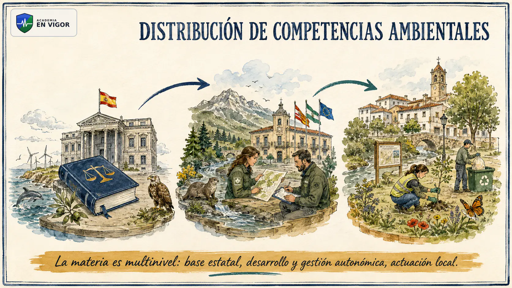

<em>Infografía: Distribución de competencias ambientales.</em>

:::hablemos-claro
La materia es multinivel: base estatal, desarrollo y gestión autonómica, actuación local.
:::

:::en-la-calle
Al conectar Agenda 2030, Unión Europea y gobernanza española, La materia es multinivel: base estatal, desarrollo y gestión autonómica, actuación local.
:::

:::lo-que-cae
Prioriza **Estado, comunidades y entidades locales** y descarta respuestas que confundan concepto, órgano, instrumento o fecha.
:::

<!-- FUENTE: CE-ART45-T35 -->

## 37. Consumo, producción y externalidades

### Lógica del bloque

Para dominar **consumo, producción y externalidades**, aplica esta regla: Si el precio no contiene el daño, alguien más recibe la factura. El anclaje principal es **costes fuera del precio**.

### Hechos examinables

- Una externalidad aparece cuando una actividad impone costes o beneficios a terceros no reflejados plenamente en la decisión. <!-- FACT:PN-T35-F145 -->
- La contaminación puede desplazar costes sanitarios, sociales y ecológicos fuera del precio de mercado. <!-- FACT:PN-T35-F146 -->
- Impuestos, límites, responsabilidad, información e incentivos son instrumentos distintos para corregir fallos. <!-- FACT:PN-T35-F147 -->
- Ningún instrumento funciona igual en todos los sectores o riesgos. <!-- FACT:PN-T35-F148 -->

### Trampas de examen

- **Incorrecto:** Una externalidad siempre beneficia a quien no participa.
- **Incorrecto:** La única respuesta posible a toda externalidad es prohibir la actividad.

<!-- VISUAL:t35-37-consumo-produccion-y-externalidades.webp -->

  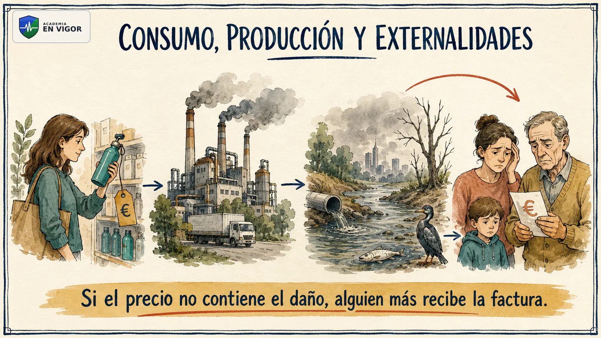

<em>Infografía: Consumo, producción y externalidades.</em>

:::hablemos-claro
Si el precio no contiene el daño, alguien más recibe la factura.
:::

:::en-la-calle
Al valorar efectos sociales, información y participación, Si el precio no contiene el daño, alguien más recibe la factura.
:::

:::lo-que-cae
Prioriza **costes fuera del precio** y descarta respuestas que confundan concepto, órgano, instrumento o fecha.
:::

<!-- FUENTE: UN-SDGS-T35 -->

## 38. Transición justa

### Lógica del bloque

Para dominar **transición justa**, aplica esta regla: Cambiar el motor sin dejar a personas y territorios tirados en la carretera. El anclaje principal es **descarbonizar sin abandonar territorios**.

### Hechos examinables

- La transición justa busca repartir oportunidades y costes de la transformación ecológica de forma equitativa. <!-- FACT:PN-T35-F149 -->
- Presta atención a trabajadores, sectores, territorios y hogares vulnerables. <!-- FACT:PN-T35-F150 -->
- Formación, diversificación y protección social pueden acompañar el cierre o cambio de actividades. <!-- FACT:PN-T35-F151 -->
- Justa no significa renunciar a objetivos climáticos ni conservar indefinidamente cualquier actividad. <!-- FACT:PN-T35-F152 -->

### Trampas de examen

- **Incorrecto:** Transición justa significa aplazar toda reducción de emisiones.
- **Incorrecto:** Solo se refiere a compensar a empresas energéticas.

<!-- VISUAL:t35-il-38-transicion-justa.webp -->

  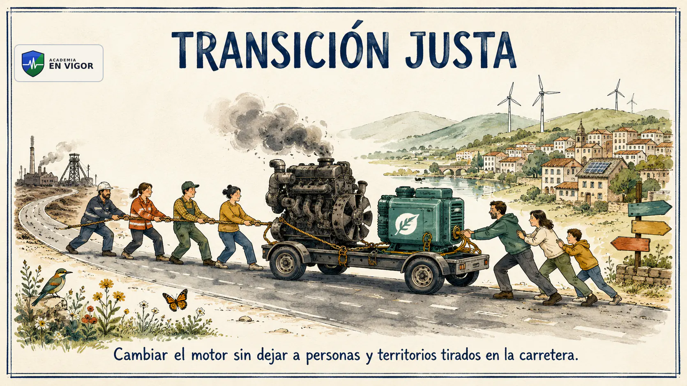

<em>Infografía: Transición justa.</em>

:::hablemos-claro
Cambiar el motor sin dejar a personas y territorios tirados en la carretera.
:::

:::en-la-calle
Al valorar efectos sociales, información y participación, Cambiar el motor sin dejar a personas y territorios tirados en la carretera.
:::

:::lo-que-cae
Prioriza **descarbonizar sin abandonar territorios** y descarta respuestas que confundan concepto, órgano, instrumento o fecha.
:::

<!-- FUENTE: LEY7-2021-T35 -->

## 39. Justicia ambiental

### Lógica del bloque

Para dominar **justicia ambiental**, aplica esta regla: Tres preguntas: quién carga, quién habla y a quién se reconoce. El anclaje principal es **distribución, procedimiento y reconocimiento**.

### Hechos examinables

- La justicia ambiental examina cómo se distribuyen beneficios, riesgos y daños ambientales. <!-- FACT:PN-T35-F153 -->
- Incluye capacidad real de participar en decisiones que afectan a una comunidad. <!-- FACT:PN-T35-F154 -->
- También exige reconocer necesidades y vulnerabilidades distintas. <!-- FACT:PN-T35-F155 -->
- Trato formalmente idéntico puede producir resultados injustos si ignora exposición o capacidad desigual. <!-- FACT:PN-T35-F156 -->

### Trampas de examen

- **Incorrecto:** Justicia ambiental se limita a calcular multas.
- **Incorrecto:** Participación y distribución son cuestiones completamente ajenas.

<!-- VISUAL:t35-39-justicia-ambiental.webp -->

  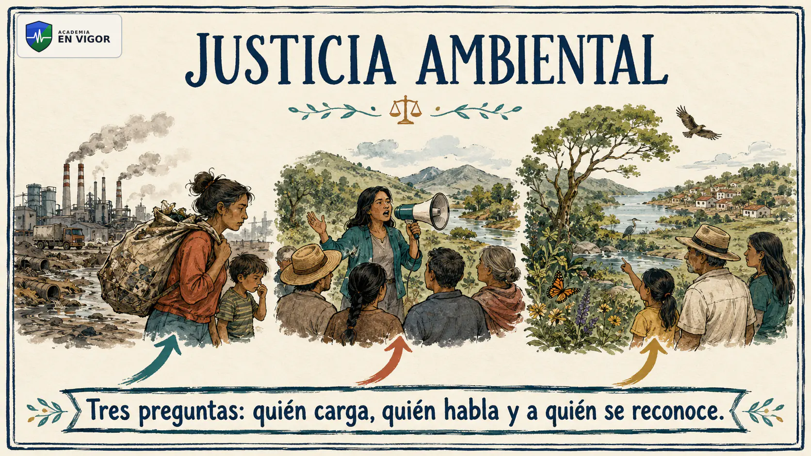

<em>Infografía: Justicia ambiental.</em>

:::hablemos-claro
Tres preguntas: quién carga, quién habla y a quién se reconoce.
:::

:::en-la-calle
Al valorar efectos sociales, información y participación, Tres preguntas: quién carga, quién habla y a quién se reconoce.
:::

:::lo-que-cae
Prioriza **distribución, procedimiento y reconocimiento** y descarta respuestas que confundan concepto, órgano, instrumento o fecha.
:::

<!-- FUENTE: LEY27-2006-T35 -->

## 40. Información y alfabetización ambiental

### Lógica del bloque

Para dominar **información y alfabetización ambiental**, aplica esta regla: Dato, contexto y capacidad de uso: si falta uno, la información pierde fuerza. El anclaje principal es **comprender para decidir**.

### Hechos examinables

- La información ambiental útil debe ser accesible, comprensible, actualizada y contextualizada. <!-- FACT:PN-T35-F157 -->
- Publicar datos sin unidad, fecha o método puede generar apariencia de transparencia sin comprensión. <!-- FACT:PN-T35-F158 -->
- La educación ambiental desarrolla capacidad para relacionar conducta, impactos y alternativas. <!-- FACT:PN-T35-F159 -->
- Informar no sustituye controles ni convierte al receptor en único responsable del problema. <!-- FACT:PN-T35-F160 -->

### Trampas de examen

- **Incorrecto:** Cualquier volcado de datos garantiza comprensión pública.
- **Incorrecto:** La educación ambiental reemplaza toda regulación obligatoria.

<!-- VISUAL:t35-40-informacion-y-alfabetizacion-ambiental.webp -->

  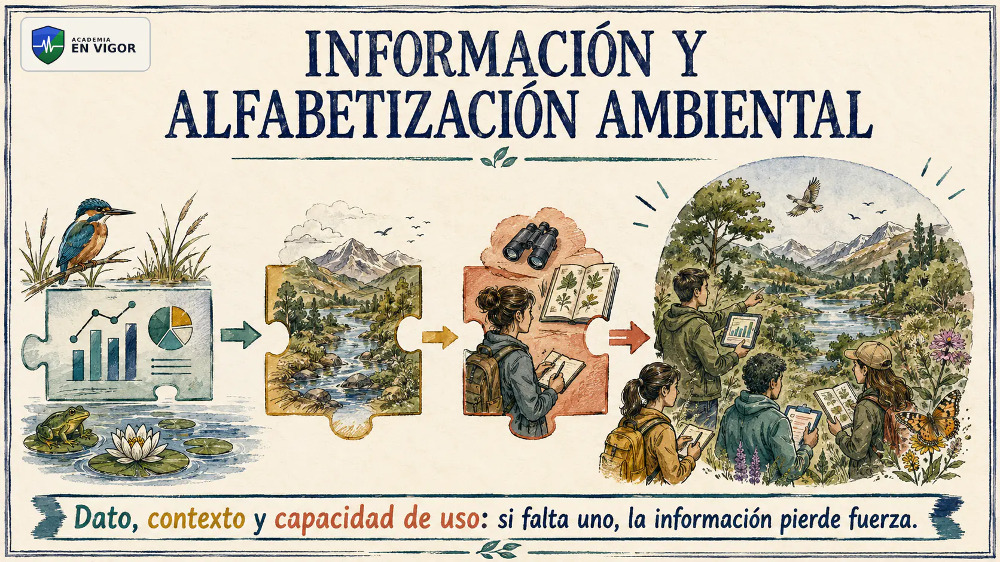

<em>Infografía: Información y alfabetización ambiental.</em>

:::hablemos-claro
Dato, contexto y capacidad de uso: si falta uno, la información pierde fuerza.
:::

:::en-la-calle
Al valorar efectos sociales, información y participación, Dato, contexto y capacidad de uso: si falta uno, la información pierde fuerza.
:::

:::lo-que-cae
Prioriza **comprender para decidir** y descarta respuestas que confundan concepto, órgano, instrumento o fecha.
:::

<!-- FUENTE: LEY27-2006-T35 -->

## 41. Participación temprana y efectiva

### Lógica del bloque

Para dominar **participación temprana y efectiva**, aplica esta regla: Participar a tiempo puede cambiar la ruta; participar después solo describe el viaje. El anclaje principal es **antes de cerrar la decisión**.

### Hechos examinables

- La participación es efectiva cuando se produce con opciones aún abiertas y tiempo razonable. <!-- FACT:PN-T35-F161 -->
- Debe facilitar información relevante para formular observaciones fundadas. <!-- FACT:PN-T35-F162 -->
- La autoridad debe tomar en consideración el resultado conforme al procedimiento. <!-- FACT:PN-T35-F163 -->
- Considerar alegaciones no obliga a aceptarlas todas ni permite una decisión arbitraria. <!-- FACT:PN-T35-F164 -->

### Trampas de examen

- **Incorrecto:** La participación puede abrirse después de adoptar definitivamente el plan.
- **Incorrecto:** Toda observación ciudadana tiene poder de veto.

<!-- VISUAL:t35-41-participacion-temprana-y-efectiva.webp -->

  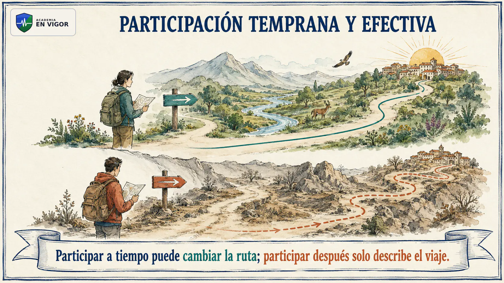

<em>Infografía: Participación temprana y efectiva.</em>

:::hablemos-claro
Participar a tiempo puede cambiar la ruta; participar después solo describe el viaje.
:::

:::en-la-calle
Al valorar efectos sociales, información y participación, Participar a tiempo puede cambiar la ruta; participar después solo describe el viaje.
:::

:::lo-que-cae
Prioriza **antes de cerrar la decisión** y descarta respuestas que confundan concepto, órgano, instrumento o fecha.
:::

<!-- FUENTE: LEY27-2006-T35 -->

## 42. Compra pública verde

### Lógica del bloque

Para dominar **compra pública verde**, aplica esta regla: Comprar no solo el objeto: también energía, mantenimiento, duración y final de vida. El anclaje principal es **criterios ambientales en contratación**.

### Hechos examinables

- La compra pública verde incorpora criterios ambientales vinculados al objeto y a la normativa de contratación. <!-- FACT:PN-T35-F165 -->
- Puede valorar ciclo de vida, eficiencia, reparabilidad, sustancias, emisiones o residuos según el contrato. <!-- FACT:PN-T35-F166 -->
- El criterio debe ser verificable y no discriminatorio. <!-- FACT:PN-T35-F167 -->
- La etiqueta puede servir como medio de prueba cuando la ley lo permite, sin cerrar injustificadamente equivalencias. <!-- FACT:PN-T35-F168 -->

### Trampas de examen

- **Incorrecto:** Compra verde permite exigir cualquier marca concreta sin justificación.
- **Incorrecto:** El precio de adquisición es siempre el único coste relevante.

<!-- VISUAL:t35-42-compra-publica-verde.webp -->

  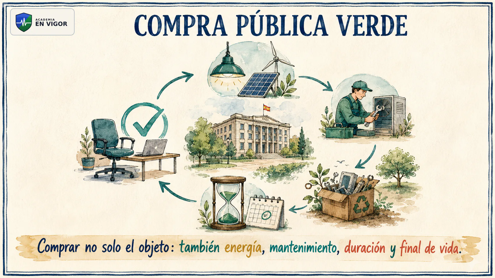

<em>Infografía: Compra pública verde.</em>

:::hablemos-claro
Comprar no solo el objeto: también energía, mantenimiento, duración y final de vida.
:::

:::en-la-calle
Al valorar efectos sociales, información y participación, Comprar no solo el objeto: también energía, mantenimiento, duración y final de vida.
:::

:::lo-que-cae
Prioriza **criterios ambientales en contratación** y descarta respuestas que confundan concepto, órgano, instrumento o fecha.
:::

<!-- FUENTE: UN-SDGS-T35 -->

## 43. Empresa, cumplimiento y desempeño

### Lógica del bloque

Para dominar **empresa, cumplimiento y desempeño**, aplica esta regla: El certificado acredita un sistema dentro de alcance; no santifica cada producto ni resultado. El anclaje principal es **cumplir no es el techo**.

### Hechos examinables

- Cumplimiento legal es un mínimo distinto de la mejora voluntaria del desempeño ambiental. <!-- FACT:PN-T35-F169 -->
- Un sistema de gestión organiza responsabilidades y evidencia, pero no garantiza impacto cero. <!-- FACT:PN-T35-F170 -->
- Los objetivos deben conectarse con aspectos significativos, riesgos y recursos. <!-- FACT:PN-T35-F171 -->
- La comunicación ambiental debe poder demostrarse con datos y criterios claros. <!-- FACT:PN-T35-F172 -->

### Trampas de examen

- **Incorrecto:** Tener un certificado prueba que la organización nunca contamina.
- **Incorrecto:** La gestión ambiental voluntaria sustituye permisos y límites legales.

<!-- VISUAL:t35-il-43-empresa-cumplimiento-y-desempeno.webp -->

  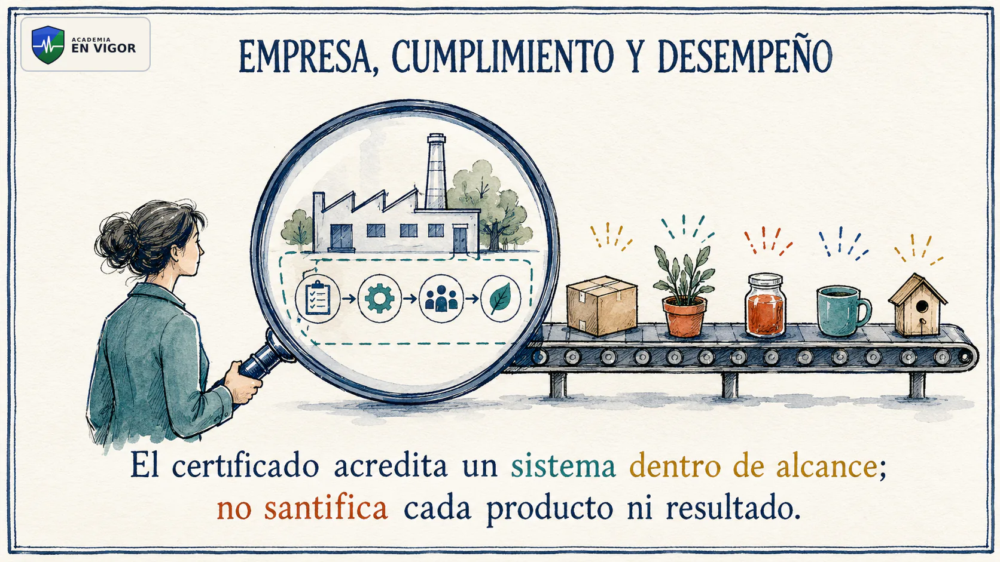

<em>Infografía: Empresa, cumplimiento y desempeño.</em>

:::hablemos-claro
El certificado acredita un sistema dentro de alcance; no santifica cada producto ni resultado.
:::

:::en-la-calle
Al valorar efectos sociales, información y participación, El certificado acredita un sistema dentro de alcance; no santifica cada producto ni resultado.
:::

:::lo-que-cae
Prioriza **cumplir no es el techo** y descarta respuestas que confundan concepto, órgano, instrumento o fecha.
:::

<!-- FUENTE: ISO14001-2026-T35 -->

## 44. Greenwashing y alegaciones ambientales

### Lógica del bloque

Para dominar **greenwashing y alegaciones ambientales**, aplica esta regla: Antes de creer una etiqueta, pide cuatro cosas: qué, cuánto, desde cuándo y con qué método. El anclaje principal es **afirmaciones comprobables**.

### Hechos examinables

- Greenwashing es presentar una imagen ambiental mejor que la respaldada por hechos o alcance real. <!-- FACT:PN-T35-F173 -->
- Palabras como verde, natural o neutro necesitan criterios, límites y evidencia. <!-- FACT:PN-T35-F174 -->
- Una mejora relativa no debe comunicarse como ausencia total de impacto. <!-- FACT:PN-T35-F175 -->
- La transparencia exige explicar período, alcance, método y compensaciones cuando sean relevantes. <!-- FACT:PN-T35-F176 -->

### Trampas de examen

- **Incorrecto:** Una alegación ambiental es fiable por usar color verde.
- **Incorrecto:** Reducir un impacto permite afirmar impacto ambiental cero.

<!-- VISUAL:t35-44-greenwashing-y-alegaciones-ambientales.webp -->

  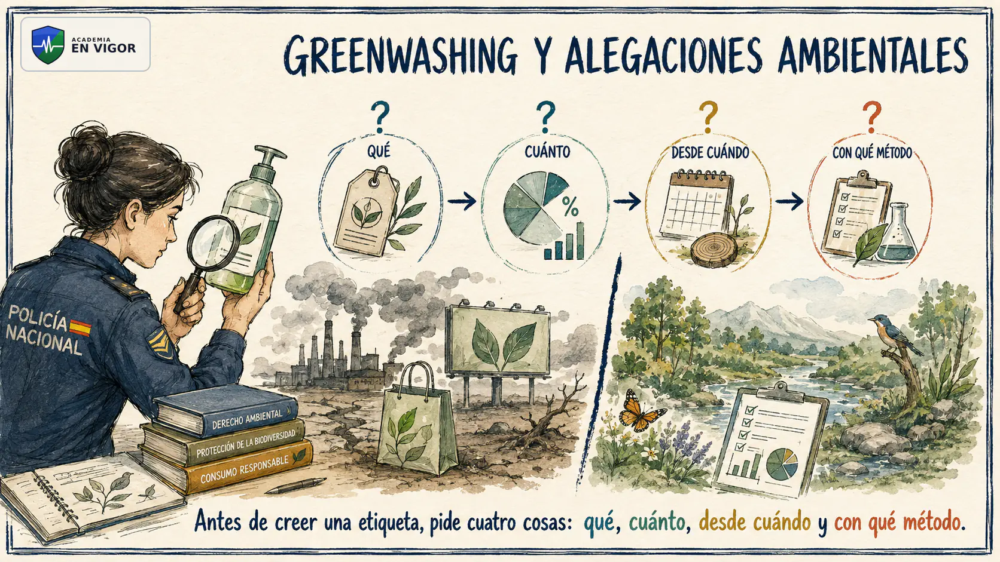

<em>Infografía: Greenwashing y alegaciones ambientales.</em>

:::hablemos-claro
Antes de creer una etiqueta, pide cuatro cosas: qué, cuánto, desde cuándo y con qué método.
:::

:::en-la-calle
Al valorar efectos sociales, información y participación, Antes de creer una etiqueta, pide cuatro cosas: qué, cuánto, desde cuándo y con qué método.
:::

:::lo-que-cae
Prioriza **afirmaciones comprobables** y descarta respuestas que confundan concepto, órgano, instrumento o fecha.
:::

<!-- FUENTE: ISO14001-2026-T35 -->

## 45. Objeto y principios de la Ley 42/2007

### Lógica del bloque

Para dominar **objeto y principios de la ley 42/2007**, aplica esta regla: Conservar no es congelar: es mantener diversidad, procesos y opciones de uso compatibles. El anclaje principal es **conservar, usar sosteniblemente y restaurar**.

### Hechos examinables

- La Ley 42/2007 establece el régimen básico de conservación, uso sostenible, mejora y restauración del patrimonio natural y biodiversidad. <!-- FACT:PN-T35-F177 -->
- Integra biodiversidad y geodiversidad en la planificación y políticas sectoriales. <!-- FACT:PN-T35-F178 -->
- Los poderes públicos deben velar por conservación y uso racional en sus competencias. <!-- FACT:PN-T35-F179 -->
- Uso sostenible no significa ausencia total de uso, sino evitar disminución a largo plazo de componentes y funciones. <!-- FACT:PN-T35-F180 -->

### Trampas de examen

- **Incorrecto:** La Ley 42/2007 prohíbe todo uso humano de recursos naturales.
- **Incorrecto:** La geodiversidad queda fuera de su objeto.

<!-- VISUAL:t35-45-objeto-y-principios-de-la-ley-42-2007.webp -->

  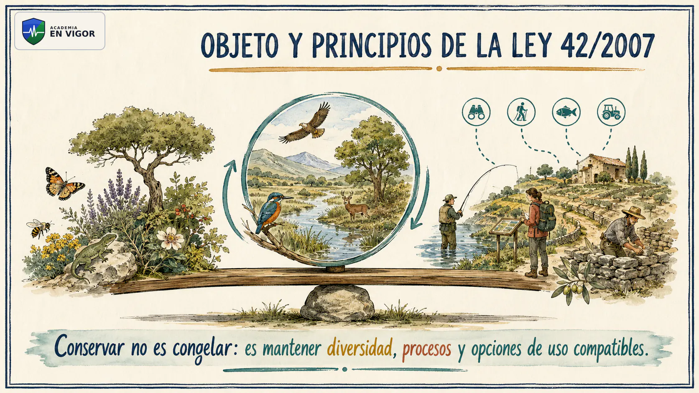

<em>Infografía: Objeto y principios de la Ley 42/2007.</em>

:::hablemos-claro
Conservar no es congelar: es mantener diversidad, procesos y opciones de uso compatibles.
:::

:::en-la-calle
Al proteger patrimonio natural, espacios o especies, Conservar no es congelar: es mantener diversidad, procesos y opciones de uso compatibles.
:::

:::lo-que-cae
Prioriza **conservar, usar sosteniblemente y restaurar** y descarta respuestas que confundan concepto, órgano, instrumento o fecha.
:::

<!-- FUENTE: LEY42-2007-T35 -->

## 46. Conceptos de biodiversidad y patrimonio natural

### Lógica del bloque

Para dominar **conceptos de biodiversidad y patrimonio natural**, aplica esta regla: Genes, especies y ecosistemas forman la biodiversidad; rocas y procesos aportan geodiversidad. El anclaje principal es **variabilidad y conjunto de bienes**.

### Hechos examinables

- Biodiversidad comprende variabilidad de organismos vivos, incluida diversidad dentro de especies, entre especies y de ecosistemas. <!-- FACT:PN-T35-F181 -->
- Patrimonio natural reúne bienes y recursos naturales con valor ambiental, científico, cultural o paisajístico. <!-- FACT:PN-T35-F182 -->
- Geodiversidad atiende variedad de elementos y procesos geológicos. <!-- FACT:PN-T35-F183 -->
- Conservación in situ mantiene componentes en sus ecosistemas; ex situ actúa fuera de su hábitat natural. <!-- FACT:PN-T35-F184 -->

### Trampas de examen

- **Incorrecto:** Biodiversidad significa únicamente número de especies.
- **Incorrecto:** Conservación ex situ se realiza siempre dentro del hábitat natural.

<!-- VISUAL:t35-46-conceptos-de-biodiversidad-y-patrimonio-natural.webp -->

  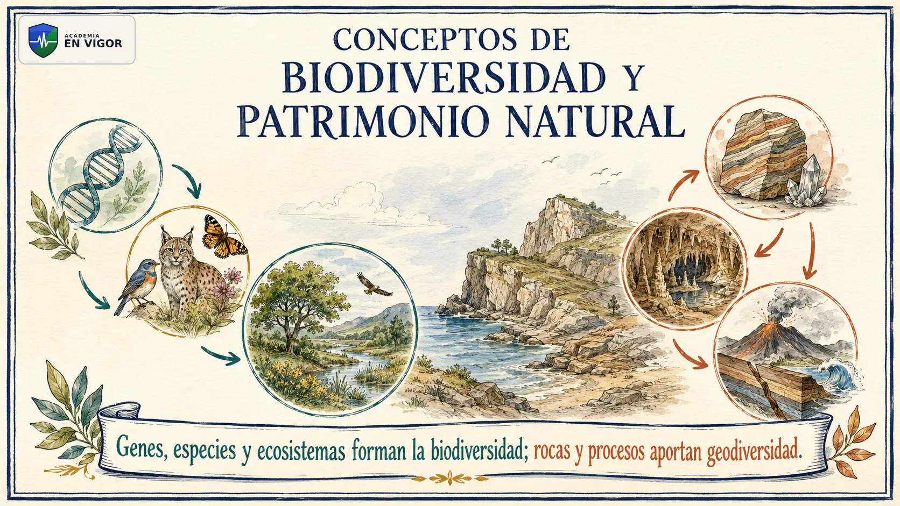

<em>Infografía: Conceptos de biodiversidad y patrimonio natural.</em>

:::hablemos-claro
Genes, especies y ecosistemas forman la biodiversidad; rocas y procesos aportan geodiversidad.
:::

:::en-la-calle
Al proteger patrimonio natural, espacios o especies, Genes, especies y ecosistemas forman la biodiversidad; rocas y procesos aportan geodiversidad.
:::

:::lo-que-cae
Prioriza **variabilidad y conjunto de bienes** y descarta respuestas que confundan concepto, órgano, instrumento o fecha.
:::

<!-- FUENTE: LEY42-2007-T35 -->

## 47. Inventario Español del Patrimonio Natural y Biodiversidad

### Lógica del bloque

Para dominar **inventario español del patrimonio natural y biodiversidad**, aplica esta regla: Inventariar es saber qué existe, dónde, en qué estado y cómo cambia. El anclaje principal es **información integrada y actualizada**.

### Hechos examinables

- El Inventario reúne información sobre distribución, abundancia, estado de conservación y uso de elementos naturales. <!-- FACT:PN-T35-F185 -->
- Integra catálogos, listados e inventarios previstos legalmente. <!-- FACT:PN-T35-F186 -->
- Un sistema de indicadores expresa de forma sintética sus resultados. <!-- FACT:PN-T35-F187 -->
- La información apoya decisiones y el informe periódico sobre estado y evolución del patrimonio. <!-- FACT:PN-T35-F188 -->

### Trampas de examen

- **Incorrecto:** El Inventario declara por sí solo todos los espacios protegidos.
- **Incorrecto:** Solo contiene mapas geológicos y excluye especies.

<!-- VISUAL:t35-47-inventario-espanol-del-patrimonio-natural-y-biodiversidad.webp -->

  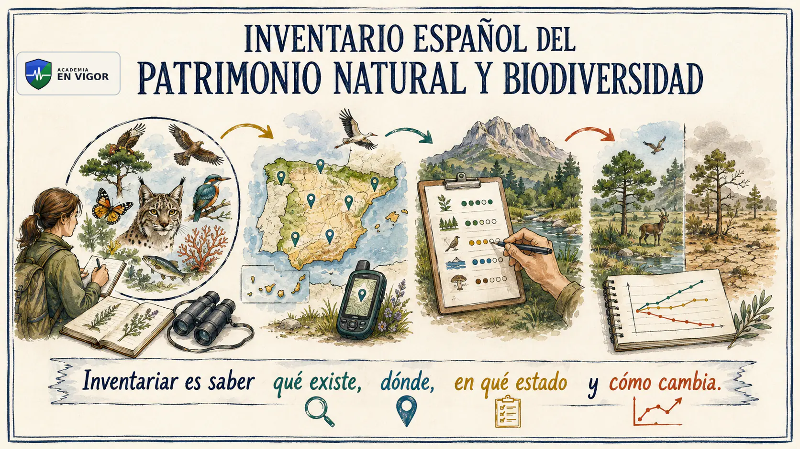

<em>Infografía: Inventario Español del Patrimonio Natural y Biodiversidad.</em>

:::hablemos-claro
Inventariar es saber qué existe, dónde, en qué estado y cómo cambia.
:::

:::en-la-calle
Al proteger patrimonio natural, espacios o especies, Inventariar es saber qué existe, dónde, en qué estado y cómo cambia.
:::

:::lo-que-cae
Prioriza **información integrada y actualizada** y descarta respuestas que confundan concepto, órgano, instrumento o fecha.
:::

<!-- FUENTE: LEY42-2007-T35 -->

## 48. Plan Estratégico Estatal a 2030

### Lógica del bloque

Para dominar **plan estratégico estatal a 2030**, aplica esta regla: La fecha clave es 2030: el plan de 2011-2017 ya fue expresamente derogado. El anclaje principal es **plan vigente aprobado en 2022**.

### Hechos examinables

- El Real Decreto 1057/2022 aprobó el Plan estratégico estatal del patrimonio natural y de la biodiversidad a 2030. <!-- FACT:PN-T35-F189 -->
- El plan define diagnóstico, objetivos, acciones, criterios y seguimiento. <!-- FACT:PN-T35-F190 -->
- Derogó el Real Decreto 1274/2011 que aprobaba el plan 2011-2017. <!-- FACT:PN-T35-F191 -->
- No debe confundirse la vigencia del plan con una duración máxima genérica tomada de apuntes antiguos. <!-- FACT:PN-T35-F192 -->

### Trampas de examen

- **Incorrecto:** El plan estatal vigente sigue siendo el de 2011-2017.
- **Incorrecto:** El Plan a 2030 fue aprobado por una norma ISO.

<!-- VISUAL:t35-il-48-plan-estrategico-estatal-a-2030.webp -->

  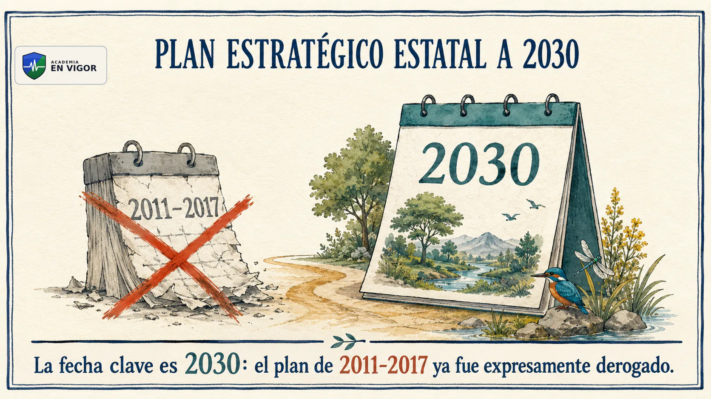

<em>Infografía: Plan Estratégico Estatal a 2030.</em>

:::hablemos-claro
La fecha clave es 2030: el plan de 2011-2017 ya fue expresamente derogado.
:::

:::en-la-calle
Al proteger patrimonio natural, espacios o especies, La fecha clave es 2030: el plan de 2011-2017 ya fue expresamente derogado.
:::

:::lo-que-cae
Prioriza **plan vigente aprobado en 2022** y descarta respuestas que confundan concepto, órgano, instrumento o fecha.
:::

<!-- FUENTE: RD1057-2022-T35 -->

## 49. Planes de Ordenación de los Recursos Naturales

### Lógica del bloque

Para dominar **planes de ordenación de los recursos naturales**, aplica esta regla: El PORN lee el territorio antes de decidir qué usos caben y bajo qué límites. El anclaje principal es **PORN y ordenación territorial**.

### Hechos examinables

- Los PORN identifican y delimitan elementos y recursos naturales del ámbito territorial correspondiente. <!-- FACT:PN-T35-F193 -->
- Determinan estado de conservación, limitaciones, regímenes de protección y criterios orientadores. <!-- FACT:PN-T35-F194 -->
- Sus disposiciones prevalecen sobre instrumentos territoriales o urbanísticos incompatibles en los términos legales. <!-- FACT:PN-T35-F195 -->
- Su elaboración incluye participación conforme al procedimiento aplicable. <!-- FACT:PN-T35-F196 -->

### Trampas de examen

- **Incorrecto:** PORN significa Programa Operativo de Residuos Nacionales.
- **Incorrecto:** Un plan urbanístico incompatible prevalece siempre sobre el PORN.

<!-- VISUAL:t35-49-planes-de-ordenacion-de-los-recursos-naturales.webp -->

  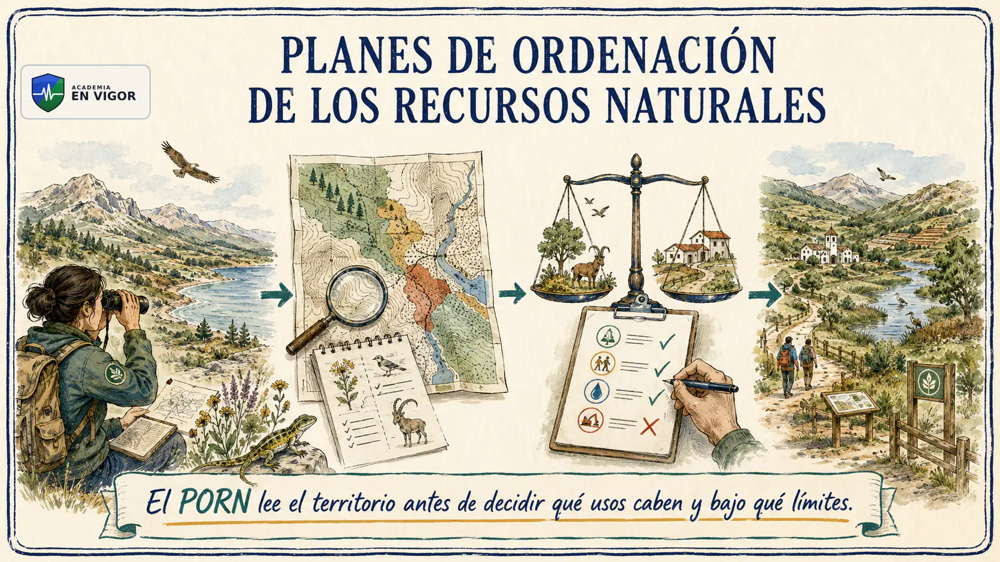

<em>Infografía: Planes de Ordenación de los Recursos Naturales.</em>

:::hablemos-claro
El PORN lee el territorio antes de decidir qué usos caben y bajo qué límites.
:::

:::en-la-calle
Al proteger patrimonio natural, espacios o especies, El PORN lee el territorio antes de decidir qué usos caben y bajo qué límites.
:::

:::lo-que-cae
Prioriza **PORN y ordenación territorial** y descarta respuestas que confundan concepto, órgano, instrumento o fecha.
:::

<!-- FUENTE: LEY42-2007-T35 -->

## 50. Espacios naturales protegidos

### Lógica del bloque

Para dominar **espacios naturales protegidos**, aplica esta regla: Cinco figuras no son cinco nombres decorativos: cada una protege algo y condiciona usos. El anclaje principal es **cinco categorías básicas**.

### Hechos examinables

- La ley contempla parques, reservas naturales, áreas marinas protegidas, monumentos naturales y paisajes protegidos. <!-- FACT:PN-T35-F197 -->
- La categoría responde a valores y objetivos de protección distintos. <!-- FACT:PN-T35-F198 -->
- La declaración no borra automáticamente competencias sectoriales ni derechos preexistentes. <!-- FACT:PN-T35-F199 -->
- La gestión debe concretar normas, planificación y medidas compatibles con la finalidad protectora. <!-- FACT:PN-T35-F200 -->

### Trampas de examen

- **Incorrecto:** Todos los espacios protegidos se denominan parques nacionales.
- **Incorrecto:** La declaración carece de efectos sobre usos y actividades.

<!-- VISUAL:t35-50-espacios-naturales-protegidos.webp -->

  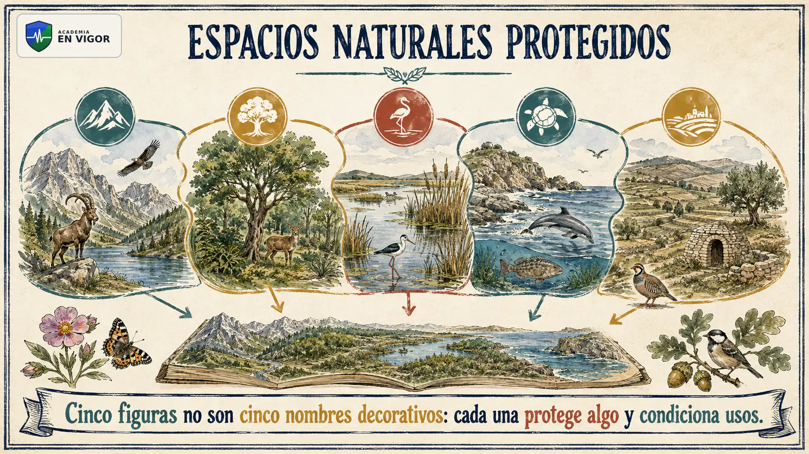

<em>Infografía: Espacios naturales protegidos.</em>

:::hablemos-claro
Cinco figuras no son cinco nombres decorativos: cada una protege algo y condiciona usos.
:::

:::en-la-calle
Al proteger patrimonio natural, espacios o especies, Cinco figuras no son cinco nombres decorativos: cada una protege algo y condiciona usos.
:::

:::lo-que-cae
Prioriza **cinco categorías básicas** y descarta respuestas que confundan concepto, órgano, instrumento o fecha.
:::

<!-- FUENTE: LEY42-2007-T35 -->

## 51. Red Natura 2000

### Lógica del bloque

Para dominar **red natura 2000**, aplica esta regla: LIC conduce a ZEC; ZEPA protege aves: dos puertas de entrada a una misma red. El anclaje principal es **ZEC y ZEPA**.

### Hechos examinables

- La Red Natura 2000 incluye Zonas Especiales de Conservación y Zonas de Especial Protección para las Aves. <!-- FACT:PN-T35-F201 -->
- Los Lugares de Importancia Comunitaria son una fase previa a su declaración como ZEC. <!-- FACT:PN-T35-F202 -->
- La red busca mantener o restablecer hábitats y especies de interés comunitario en estado favorable. <!-- FACT:PN-T35-F203 -->
- Pertenecer a Red Natura 2000 no implica prohibición absoluta de toda actividad. <!-- FACT:PN-T35-F204 -->

### Trampas de examen

- **Incorrecto:** Red Natura 2000 está formada solo por parques nacionales.
- **Incorrecto:** Un LIC y una ZEPA son términos idénticos.

<!-- VISUAL:t35-51-red-natura-2000.webp -->

  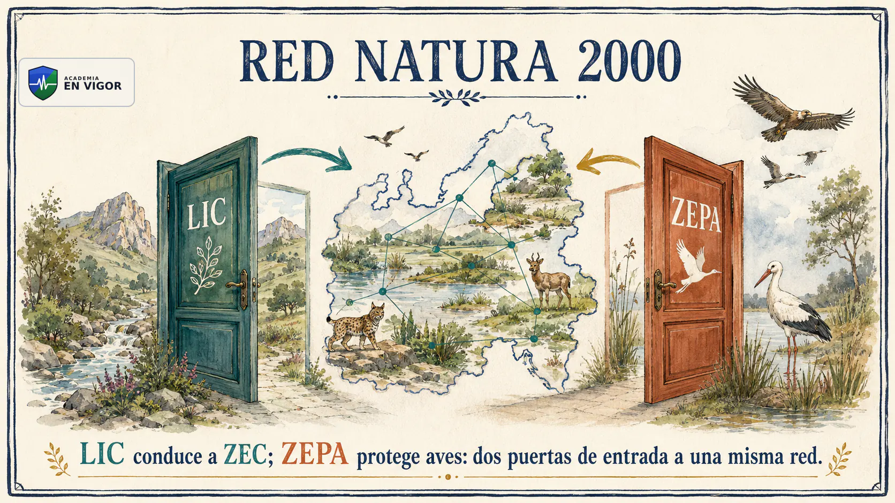

<em>Infografía: Red Natura 2000.</em>

:::hablemos-claro
LIC conduce a ZEC; ZEPA protege aves: dos puertas de entrada a una misma red.
:::

:::en-la-calle
Al proteger patrimonio natural, espacios o especies, LIC conduce a ZEC; ZEPA protege aves: dos puertas de entrada a una misma red.
:::

:::lo-que-cae
Prioriza **ZEC y ZEPA** y descarta respuestas que confundan concepto, órgano, instrumento o fecha.
:::

<!-- FUENTE: LEY42-2007-T35 -->

## 52. Evaluación de repercusiones en Red Natura 2000

### Lógica del bloque

Para dominar **evaluación de repercusiones en red natura 2000**, aplica esta regla: Primero evita daño; la excepción no es atajo y exige una cadena reforzada de condiciones. El anclaje principal es **efectos apreciables e integridad del lugar**.

### Hechos examinables

- Un plan o proyecto no relacionado directamente con la gestión del lugar se evalúa si puede afectarlo de forma apreciable. <!-- FACT:PN-T35-F205 -->
- La evaluación considera objetivos de conservación e integridad del lugar. <!-- FACT:PN-T35-F206 -->
- La ausencia de certeza sobre efectos significativos no permite saltarse automáticamente la evaluación. <!-- FACT:PN-T35-F207 -->
- Las excepciones exigen condiciones estrictas, alternativas, razones imperiosas y medidas compensatorias cuando proceda. <!-- FACT:PN-T35-F208 -->

### Trampas de examen

- **Incorrecto:** Todo proyecto dentro de Red Natura está prohibido sin evaluación.
- **Incorrecto:** Las medidas compensatorias sustituyen siempre el análisis de alternativas.

<!-- VISUAL:t35-52-evaluacion-de-repercusiones-en-red-natura-2000.webp -->

  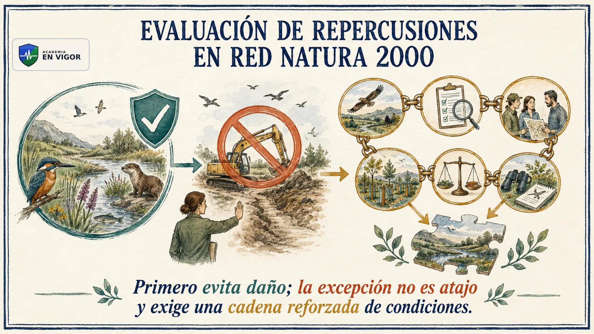

<em>Infografía: Evaluación de repercusiones en Red Natura 2000.</em>

:::hablemos-claro
Primero evita daño; la excepción no es atajo y exige una cadena reforzada de condiciones.
:::

:::en-la-calle
Al proteger patrimonio natural, espacios o especies, Primero evita daño; la excepción no es atajo y exige una cadena reforzada de condiciones.
:::

:::lo-que-cae
Prioriza **efectos apreciables e integridad del lugar** y descarta respuestas que confundan concepto, órgano, instrumento o fecha.
:::

<!-- FUENTE: LEY42-2007-T35 -->

## 53. Listado y Catálogo de especies amenazadas

### Lógica del bloque

Para dominar **listado y catálogo de especies amenazadas**, aplica esta regla: Recuperación para peligro; conservación para vulnerable: emparejamiento clásico de examen. El anclaje principal es **protección especial, vulnerable y en peligro**.

### Hechos examinables

- El Listado incluye especies silvestres en régimen de protección especial. <!-- FACT:PN-T35-F209 -->
- Dentro del Listado, el Catálogo incorpora categorías de en peligro de extinción y vulnerable. <!-- FACT:PN-T35-F210 -->
- En peligro exige plan de recuperación; vulnerable exige plan de conservación. <!-- FACT:PN-T35-F211 -->
- La inclusión genera prohibiciones y medidas cuya extensión depende de la norma y excepciones aplicables. <!-- FACT:PN-T35-F212 -->

### Trampas de examen

- **Incorrecto:** Vulnerable exige plan de recuperación y en peligro plan de conservación.
- **Incorrecto:** El Catálogo incluye toda especie silvestre existente en España.

<!-- VISUAL:t35-il-53-listado-y-catalogo-de-especies-amenazadas.webp -->

  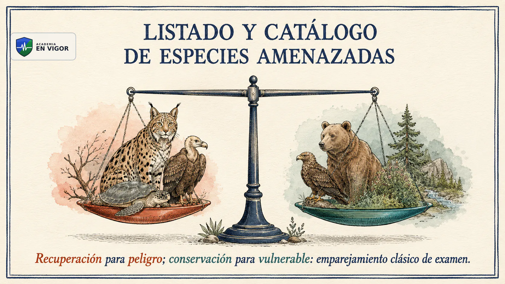

<em>Infografía: Listado y Catálogo de especies amenazadas.</em>

:::hablemos-claro
Recuperación para peligro; conservación para vulnerable: emparejamiento clásico de examen.
:::

:::en-la-calle
Al proteger patrimonio natural, espacios o especies, Recuperación para peligro; conservación para vulnerable: emparejamiento clásico de examen.
:::

:::lo-que-cae
Prioriza **protección especial, vulnerable y en peligro** y descarta respuestas que confundan concepto, órgano, instrumento o fecha.
:::

<!-- FUENTE: LEY42-2007-T35 -->

## 54. Especies exóticas invasoras

### Lógica del bloque

Para dominar **especies exóticas invasoras**, aplica esta regla: Fuera de área no basta; invasora añade amenaza ecológica. El anclaje principal es **amenaza introducida fuera de distribución natural**.

### Hechos examinables

- Especie exótica es la introducida fuera de su área de distribución natural por acción humana directa o indirecta. <!-- FACT:PN-T35-F213 -->
- Exótica invasora amenaza biodiversidad por introducción o propagación. <!-- FACT:PN-T35-F214 -->
- El Catálogo Español activa medidas de prevención y control conforme a su regulación. <!-- FACT:PN-T35-F215 -->
- Exótica no equivale automáticamente a invasora: la amenaza y catalogación importan. <!-- FACT:PN-T35-F216 -->

### Trampas de examen

- **Incorrecto:** Toda especie exótica es invasora por definición.
- **Incorrecto:** Una especie autóctona puede incluirse como exótica por aumentar su población.

<!-- VISUAL:t35-54-especies-exoticas-invasoras.webp -->

  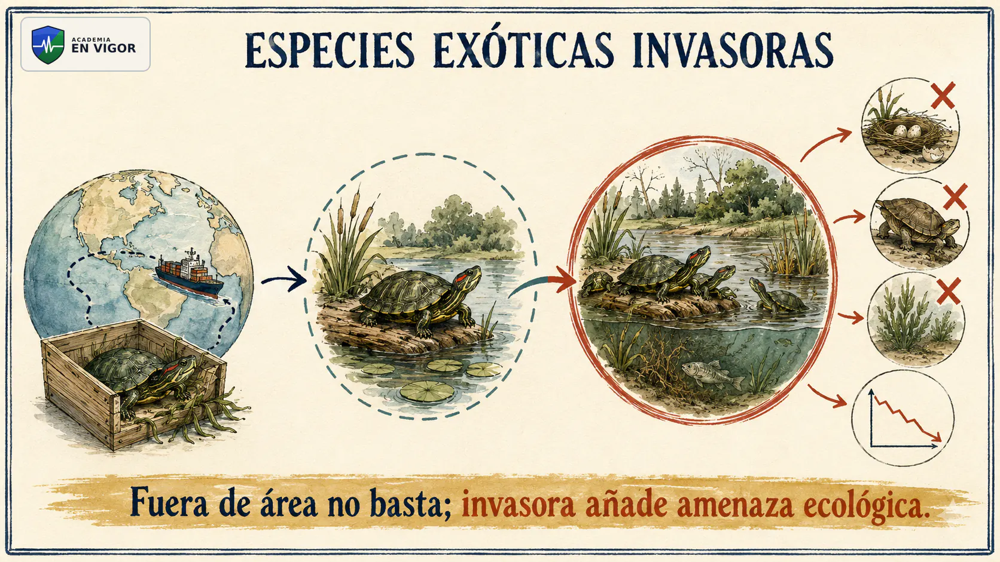

<em>Infografía: Especies exóticas invasoras.</em>

:::hablemos-claro
Fuera de área no basta; invasora añade amenaza ecológica.
:::

:::en-la-calle
Al proteger patrimonio natural, espacios o especies, Fuera de área no basta; invasora añade amenaza ecológica.
:::

:::lo-que-cae
Prioriza **amenaza introducida fuera de distribución natural** y descarta respuestas que confundan concepto, órgano, instrumento o fecha.
:::

<!-- FUENTE: LEY42-2007-T35 -->

## 55. Corredores ecológicos y conectividad

### Lógica del bloque

Para dominar **corredores ecológicos y conectividad**, aplica esta regla: No basta conservar islas verdes: las especies necesitan puentes funcionales. El anclaje principal es **conectar hábitats**.

### Hechos examinables

- La conectividad ecológica facilita desplazamiento, dispersión e intercambio genético. <!-- FACT:PN-T35-F217 -->
- Los corredores pueden reducir aislamiento causado por infraestructuras o cambios de uso. <!-- FACT:PN-T35-F218 -->
- La planificación territorial debe considerar coherencia y conectividad de redes de conservación. <!-- FACT:PN-T35-F219 -->
- Un corredor no sustituye la protección de hábitats núcleo degradados. <!-- FACT:PN-T35-F220 -->

### Trampas de examen

- **Incorrecto:** Un corredor es una carretera destinada a visitar espacios protegidos.
- **Incorrecto:** Conectar dos áreas compensa cualquier destrucción de sus núcleos.

<!-- VISUAL:t35-il-55-corredores-ecologicos-y-conectividad.webp -->

  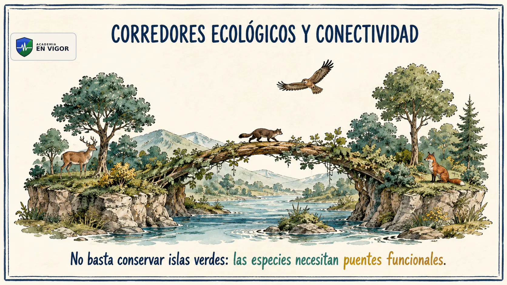

<em>Infografía: Corredores ecológicos y conectividad.</em>

:::hablemos-claro
No basta conservar islas verdes: las especies necesitan puentes funcionales.
:::

:::en-la-calle
Al proteger patrimonio natural, espacios o especies, No basta conservar islas verdes: las especies necesitan puentes funcionales.
:::

:::lo-que-cae
Prioriza **conectar hábitats** y descarta respuestas que confundan concepto, órgano, instrumento o fecha.
:::

<!-- FUENTE: LEY42-2007-T35 -->

## 56. Áreas protegidas por instrumentos internacionales

### Lógica del bloque

Para dominar **áreas protegidas por instrumentos internacionales**, aplica esta regla: La etiqueta internacional añade marco y compromiso; no borra la figura jurídica nacional concreta. El anclaje principal es **Ramsar, UNESCO y otros marcos**.

### Hechos examinables

- La ley reconoce áreas protegidas por instrumentos internacionales conforme a sus requisitos. <!-- FACT:PN-T35-F221 -->
- Incluyen humedales Ramsar y sitios naturales de la Lista del Patrimonio Mundial, entre otras figuras. <!-- FACT:PN-T35-F222 -->
- Las Reservas de la Biosfera españolas se integran en la Red Mundial del programa MaB de UNESCO. <!-- FACT:PN-T35-F223 -->
- Una designación internacional no convierte todas las categorías en el mismo régimen jurídico interno. <!-- FACT:PN-T35-F224 -->

### Trampas de examen

- **Incorrecto:** Ramsar protege exclusivamente bosques de montaña.
- **Incorrecto:** Toda Reserva de Biosfera es automáticamente parque nacional.

<!-- VISUAL:t35-56-areas-protegidas-por-instrumentos-internacionales.webp -->

  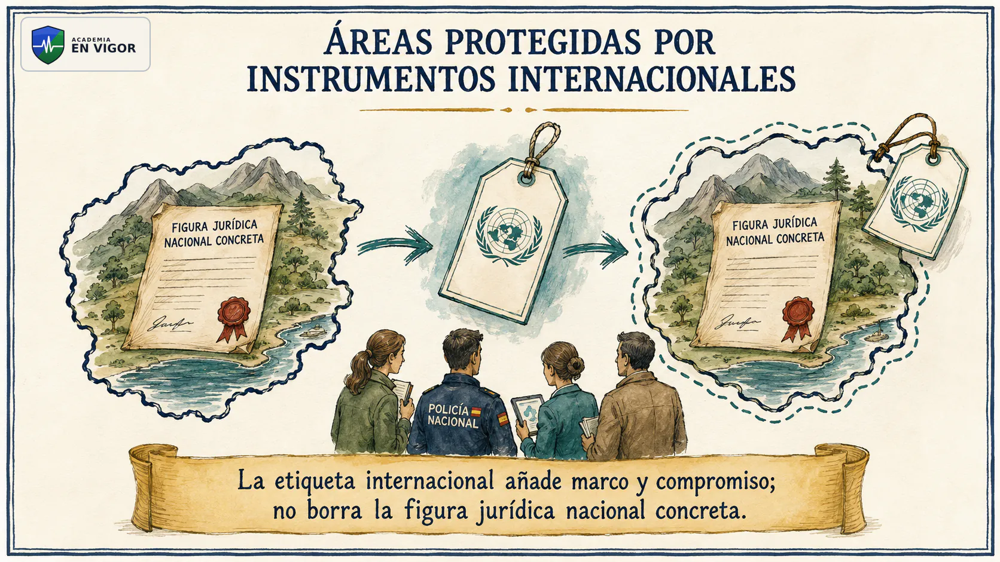

<em>Infografía: Áreas protegidas por instrumentos internacionales.</em>

:::hablemos-claro
La etiqueta internacional añade marco y compromiso; no borra la figura jurídica nacional concreta.
:::

:::en-la-calle
Al proteger patrimonio natural, espacios o especies, La etiqueta internacional añade marco y compromiso; no borra la figura jurídica nacional concreta.
:::

:::lo-que-cae
Prioriza **Ramsar, UNESCO y otros marcos** y descarta respuestas que confundan concepto, órgano, instrumento o fecha.
:::

<!-- FUENTE: LEY42-2007-T35 -->

## 57. Objeto de la Ley 45/2007

### Lógica del bloque

Para dominar **objeto de la ley 45/2007**, aplica esta regla: Rural sostenible une actividad, población, servicios y territorio. El anclaje principal es **desarrollo rural sostenible**.

### Hechos examinables

- La Ley 45/2007 establece medidas para favorecer desarrollo sostenible del medio rural. <!-- FACT:PN-T35-F225 -->
- Busca condiciones básicas que garanticen igualdad y ejercicio efectivo de derechos. <!-- FACT:PN-T35-F226 -->
- Integra economía, servicios, cohesión territorial y protección del patrimonio natural. <!-- FACT:PN-T35-F227 -->
- No es una ley exclusivamente agraria ni un plan de conservación de especies. <!-- FACT:PN-T35-F228 -->

### Trampas de examen

- **Incorrecto:** La Ley 45/2007 regula solo subvenciones agrícolas.
- **Incorrecto:** Su objeto excluye servicios públicos y cohesión territorial.

<!-- VISUAL:t35-57-objeto-de-la-ley-45-2007.webp -->

  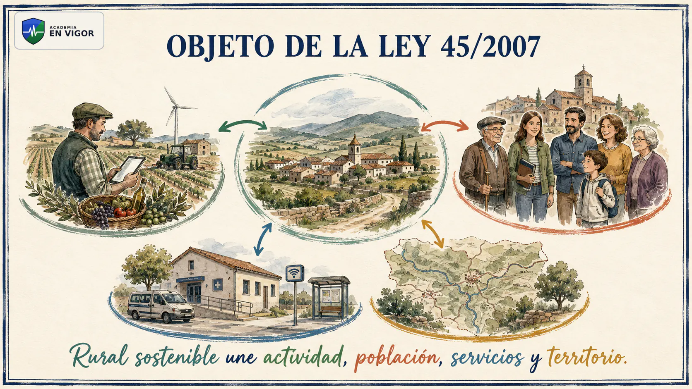

<em>Infografía: Objeto de la Ley 45/2007.</em>

:::hablemos-claro
Rural sostenible une actividad, población, servicios y territorio.
:::

:::en-la-calle
Al tramitar planificación rural o evaluación ambiental, Rural sostenible une actividad, población, servicios y territorio.
:::

:::lo-que-cae
Prioriza **desarrollo rural sostenible** y descarta respuestas que confundan concepto, órgano, instrumento o fecha.
:::

<!-- FUENTE: LEY45-2007-T35 -->

## 58. Medio rural, zona rural y municipio pequeño

### Lógica del bloque

Para dominar **medio rural, zona rural y municipio pequeño**, aplica esta regla: Espacio general, zona de actuación y municipio: tres escalas, tres definiciones. El anclaje principal es **tres definiciones distintas**.

### Hechos examinables

- Medio rural es el espacio geográfico formado por agregación de municipios o entidades locales menores definido por población y densidad legales. <!-- FACT:PN-T35-F229 -->
- Zona rural es el ámbito de aplicación de medidas del Programa con escala comarcal o subprovincial. <!-- FACT:PN-T35-F230 -->
- Municipio rural de pequeño tamaño es el que cumple el umbral poblacional específico de la ley. <!-- FACT:PN-T35-F231 -->
- No deben intercambiarse los tres conceptos ni usar cifras sin consultar el artículo consolidado. <!-- FACT:PN-T35-F232 -->

### Trampas de examen

- **Incorrecto:** Medio rural, zona rural y municipio pequeño son sinónimos jurídicos.
- **Incorrecto:** Una zona rural debe coincidir siempre con una provincia completa.

<!-- VISUAL:t35-il-58-medio-rural-zona-rural-y-municipio-pequeno.webp -->

  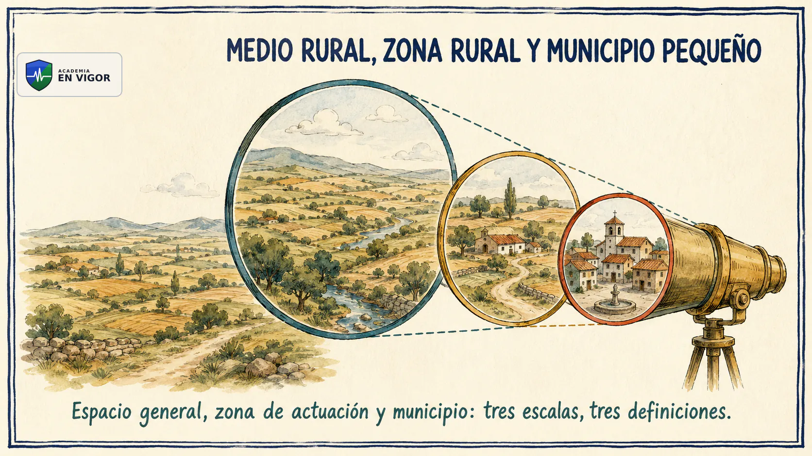

<em>Infografía: Medio rural, zona rural y municipio pequeño.</em>

:::hablemos-claro
Espacio general, zona de actuación y municipio: tres escalas, tres definiciones.
:::

:::en-la-calle
Al tramitar planificación rural o evaluación ambiental, Espacio general, zona de actuación y municipio: tres escalas, tres definiciones.
:::

:::lo-que-cae
Prioriza **tres definiciones distintas** y descarta respuestas que confundan concepto, órgano, instrumento o fecha.
:::

<!-- FUENTE: LEY45-2007-T35 -->

## 59. Programa de Desarrollo Rural Sostenible

### Lógica del bloque

Para dominar **programa de desarrollo rural sostenible**, aplica esta regla: La ley crea el instrumento; cada período y actuación necesita programación vigente. El anclaje principal es **instrumento de planificación**.

### Hechos examinables

- El Programa de Desarrollo Rural Sostenible es el instrumento principal para planificar la acción de la Administración General del Estado en esta materia. <!-- FACT:PN-T35-F233 -->
- Se elabora coordinadamente con comunidades autónomas y se aprueba por real decreto. <!-- FACT:PN-T35-F234 -->
- Las actuaciones se concretan mediante planificación, convenios y programas territoriales cuando proceda. <!-- FACT:PN-T35-F235 -->
- Su ejecución debe respetar las competencias de cada Administración y articular la cooperación entre ellas. <!-- FACT:PN-T35-F236 -->

### Trampas de examen

- **Incorrecto:** El Programa lo aprueba cada ayuntamiento mediante ordenanza.
- **Incorrecto:** El primer período conocido continúa automáticamente sin actualización.

<!-- VISUAL:t35-59-programa-de-desarrollo-rural-sostenible.webp -->

  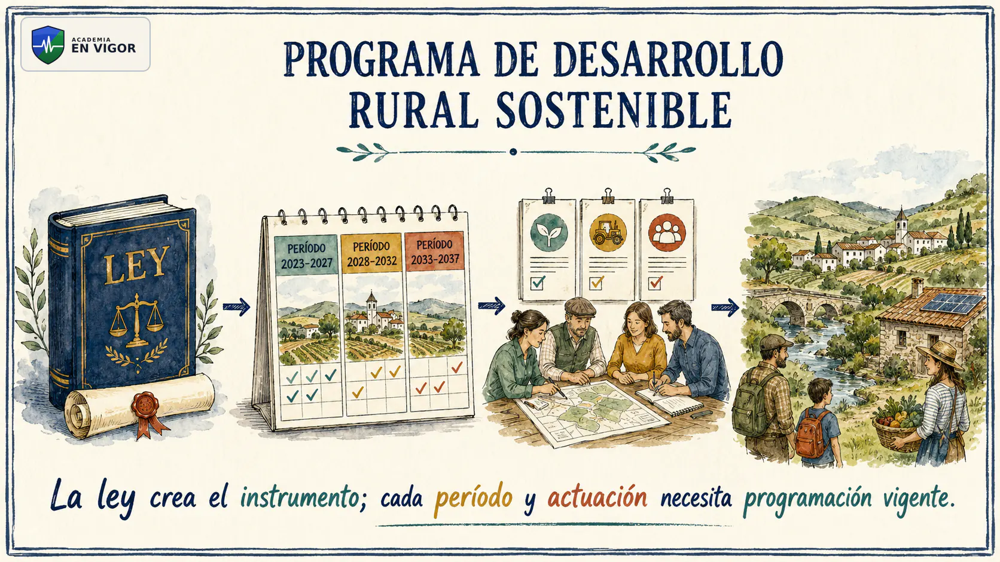

<em>Infografía: Programa de Desarrollo Rural Sostenible.</em>

:::hablemos-claro
La ley crea el instrumento; cada período y actuación necesita programación vigente.
:::

:::en-la-calle
Al tramitar planificación rural o evaluación ambiental, La ley crea el instrumento; cada período y actuación necesita programación vigente.
:::

:::lo-que-cae
Prioriza **instrumento de planificación** y descarta respuestas que confundan concepto, órgano, instrumento o fecha.
:::

<!-- FUENTE: LEY45-2007-T35 -->

## 60. Clasificación de zonas rurales

### Lógica del bloque

Para dominar **clasificación de zonas rurales**, aplica esta regla: Aislada, mixta o próxima a ciudad: la clasificación orienta medidas diferentes. El anclaje principal es **revitalizar, intermedias y periurbanas**.

### Hechos examinables

- La ley distingue zonas rurales a revitalizar, intermedias y periurbanas. <!-- FACT:PN-T35-F237 -->
- Las zonas a revitalizar presentan baja densidad, elevada actividad agraria, bajos ingresos y aislamiento significativo. <!-- FACT:PN-T35-F238 -->
- Las intermedias combinan baja o media densidad, empleo diversificado y distancia de áreas urbanas. <!-- FACT:PN-T35-F239 -->
- Las periurbanas tienen población creciente, predominio terciario y proximidad a áreas urbanas. <!-- FACT:PN-T35-F240 -->

### Trampas de examen

- **Incorrecto:** Periurbana significa necesariamente despoblada y aislada.
- **Incorrecto:** Todas las zonas rurales tienen idénticas necesidades y prioridad.

<!-- VISUAL:t35-60-clasificacion-de-zonas-rurales.webp -->

  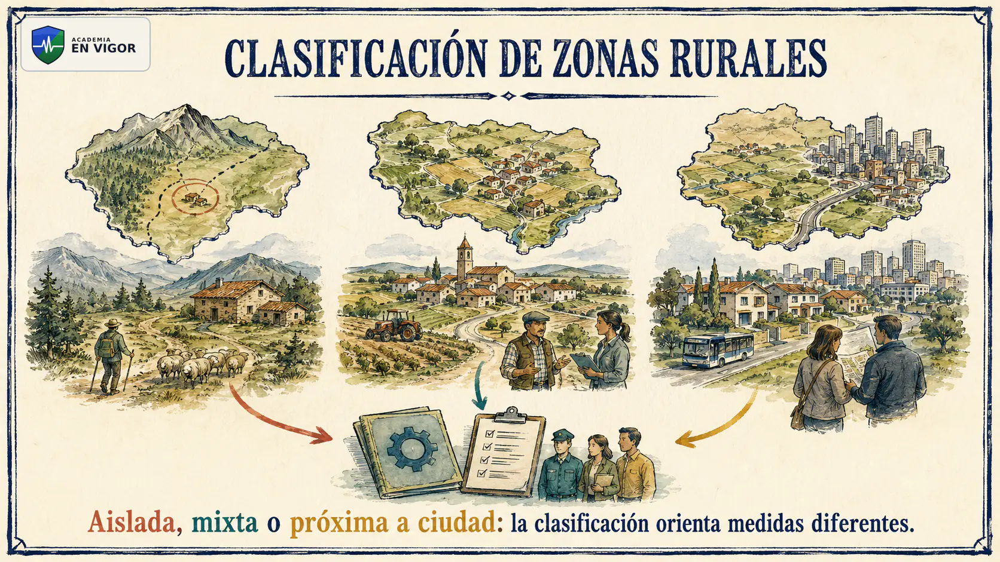

<em>Infografía: Clasificación de zonas rurales.</em>

:::hablemos-claro
Aislada, mixta o próxima a ciudad: la clasificación orienta medidas diferentes.
:::

:::en-la-calle
Al tramitar planificación rural o evaluación ambiental, Aislada, mixta o próxima a ciudad: la clasificación orienta medidas diferentes.
:::

:::lo-que-cae
Prioriza **revitalizar, intermedias y periurbanas** y descarta respuestas que confundan concepto, órgano, instrumento o fecha.
:::

<!-- FUENTE: LEY45-2007-T35 -->

## 61. Arquitectura de la Ley 21/2013

### Lógica del bloque

Para dominar **arquitectura de la ley 21/2013**, aplica esta regla: EAE mira el marco de decisiones; EIA mira el proyecto concreto. El anclaje principal es **planes y programas frente a proyectos**.

### Hechos examinables

- La evaluación ambiental estratégica se aplica a planes y programas. <!-- FACT:PN-T35-F241 -->
- La evaluación de impacto ambiental se aplica a proyectos. <!-- FACT:PN-T35-F242 -->
- Ambas pueden tramitarse mediante procedimiento ordinario o simplificado según supuestos legales. <!-- FACT:PN-T35-F243 -->
- La evaluación debe realizarse antes de la aprobación, adopción o autorización definitiva. <!-- FACT:PN-T35-F244 -->

### Trampas de examen

- **Incorrecto:** La evaluación estratégica se reserva a proyectos de obras.
- **Incorrecto:** Puede evaluarse después de ejecutar el proyecto para convalidarlo.

<!-- VISUAL:t35-61-arquitectura-de-la-ley-21-2013.webp -->

  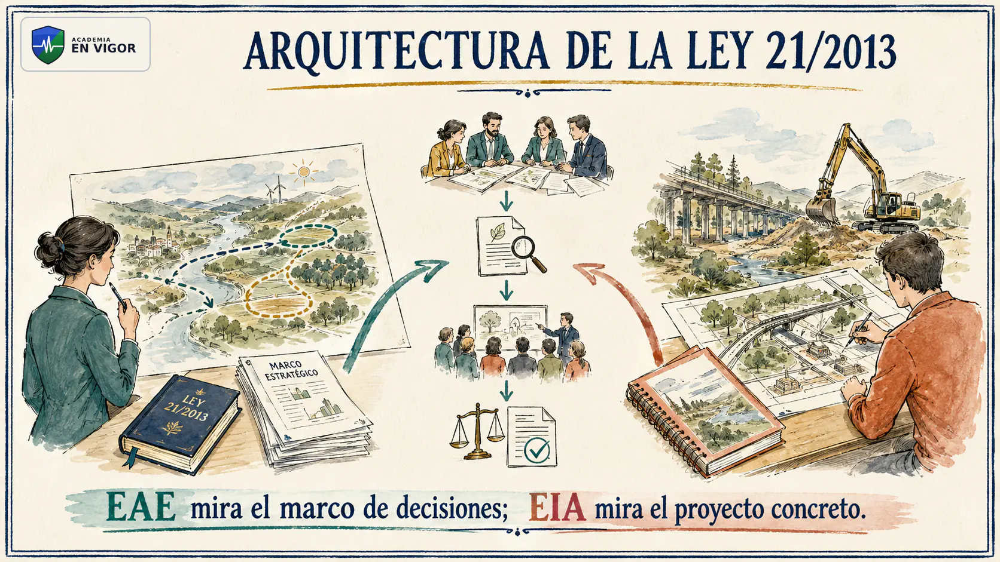

<em>Infografía: Arquitectura de la Ley 21/2013.</em>

:::hablemos-claro
EAE mira el marco de decisiones; EIA mira el proyecto concreto.
:::

:::en-la-calle
Al tramitar planificación rural o evaluación ambiental, EAE mira el marco de decisiones; EIA mira el proyecto concreto.
:::

:::lo-que-cae
Prioriza **planes y programas frente a proyectos** y descarta respuestas que confundan concepto, órgano, instrumento o fecha.
:::

<!-- FUENTE: LEY21-2013-T35 -->

## 62. Evaluación ambiental estratégica

### Lógica del bloque

Para dominar **evaluación ambiental estratégica**, aplica esta regla: Estratégica produce declaración o informe ambiental estratégico, no DIA. El anclaje principal es **integrar ambiente en planes y programas**.

### Hechos examinables

- La EAE ordinaria culmina con declaración ambiental estratégica. <!-- FACT:PN-T35-F245 -->
- La EAE simplificada culmina con informe ambiental estratégico. <!-- FACT:PN-T35-F246 -->
- El estudio ambiental estratégico analiza alternativas razonables y efectos significativos. <!-- FACT:PN-T35-F247 -->
- La declaración o informe ambiental no sustituye la aprobación sustantiva del plan. <!-- FACT:PN-T35-F248 -->

### Trampas de examen

- **Incorrecto:** La EAE ordinaria termina con declaración de impacto ambiental.
- **Incorrecto:** El órgano ambiental aprueba siempre el plan en lugar del órgano sustantivo.

<!-- VISUAL:t35-62-evaluacion-ambiental-estrategica.webp -->

  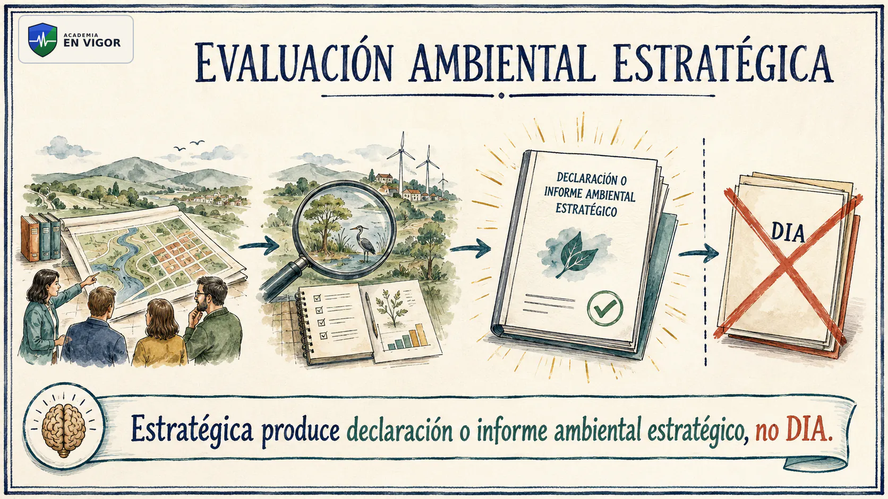

<em>Infografía: Evaluación ambiental estratégica.</em>

:::hablemos-claro
Estratégica produce declaración o informe ambiental estratégico, no DIA.
:::

:::en-la-calle
Al tramitar planificación rural o evaluación ambiental, Estratégica produce declaración o informe ambiental estratégico, no DIA.
:::

:::lo-que-cae
Prioriza **integrar ambiente en planes y programas** y descarta respuestas que confundan concepto, órgano, instrumento o fecha.
:::

<!-- FUENTE: LEY21-2013-T35 -->

## 63. Evaluación de impacto ambiental de proyectos

### Lógica del bloque

Para dominar **evaluación de impacto ambiental de proyectos**, aplica esta regla: DIA evalúa; la autorización decide dentro de sus condiciones. El anclaje principal es **proyecto, estudio y DIA**.

### Hechos examinables

- La EIA ordinaria culmina con declaración de impacto ambiental. <!-- FACT:PN-T35-F249 -->
- La EIA simplificada culmina con informe de impacto ambiental. <!-- FACT:PN-T35-F250 -->
- El estudio de impacto identifica, describe y evalúa efectos y alternativas del proyecto. <!-- FACT:PN-T35-F251 -->
- Una DIA favorable puede imponer condiciones y no equivale a autorización sustantiva. <!-- FACT:PN-T35-F252 -->

### Trampas de examen

- **Incorrecto:** La EIA ordinaria termina con declaración ambiental estratégica.
- **Incorrecto:** Una DIA favorable autoriza por sí sola cualquier proyecto.

<!-- VISUAL:t35-il-63-evaluacion-de-impacto-ambiental-de-proyectos.webp -->

  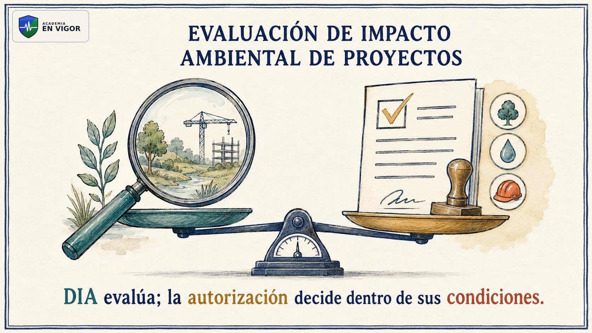

<em>Infografía: Evaluación de impacto ambiental de proyectos.</em>

:::hablemos-claro
DIA evalúa; la autorización decide dentro de sus condiciones.
:::

:::en-la-calle
Al tramitar planificación rural o evaluación ambiental, DIA evalúa; la autorización decide dentro de sus condiciones.
:::

:::lo-que-cae
Prioriza **proyecto, estudio y DIA** y descarta respuestas que confundan concepto, órgano, instrumento o fecha.
:::

<!-- FUENTE: LEY21-2013-T35 -->

## 64. Órgano ambiental, sustantivo y promotor

### Lógica del bloque

Para dominar **órgano ambiental, sustantivo y promotor**, aplica esta regla: Promotor propone; ambiental evalúa; sustantivo decide. El anclaje principal es **funciones separadas**.

### Hechos examinables

- El promotor impulsa el plan, programa o proyecto y prepara la documentación exigida. <!-- FACT:PN-T35-F253 -->
- El órgano sustantivo posee competencia para aprobar o autorizar la actuación. <!-- FACT:PN-T35-F254 -->
- El órgano ambiental realiza el análisis técnico y formula declaración o informe ambiental. <!-- FACT:PN-T35-F255 -->
- La separación de funciones evita confundir evaluación técnica con decisión sustantiva. <!-- FACT:PN-T35-F256 -->

### Trampas de examen

- **Incorrecto:** El promotor formula la declaración ambiental vinculante para sí mismo.
- **Incorrecto:** Órgano ambiental y promotor son siempre la misma persona.

<!-- VISUAL:t35-64-organo-ambiental-sustantivo-y-promotor.webp -->

  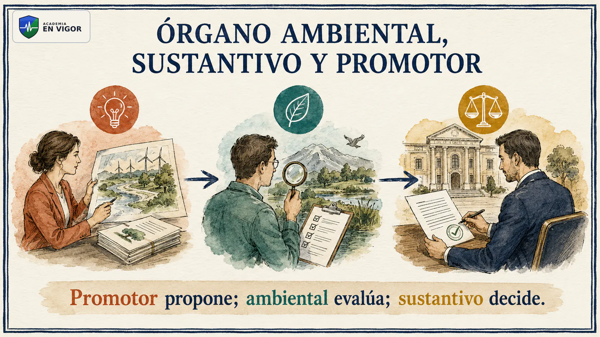

<em>Infografía: Órgano ambiental, sustantivo y promotor.</em>

:::hablemos-claro
Promotor propone; ambiental evalúa; sustantivo decide.
:::

:::en-la-calle
Al tramitar planificación rural o evaluación ambiental, Promotor propone; ambiental evalúa; sustantivo decide.
:::

:::lo-que-cae
Prioriza **funciones separadas** y descarta respuestas que confundan concepto, órgano, instrumento o fecha.
:::

<!-- FUENTE: LEY21-2013-T35 -->

## 65. Modelo de la Ley 26/2007

### Lógica del bloque

Para dominar **modelo de la ley 26/2007**, aplica esta regla: La ley mira el recurso natural: prevenir, evitar propagación y devolverlo a su estado. El anclaje principal es **responsabilidad objetiva e ilimitada en su ámbito**.

### Hechos examinables

- La Ley 26/2007 establece responsabilidad medioambiental de carácter administrativo. <!-- FACT:PN-T35-F257 -->
- En las actividades de su anexo III opera responsabilidad objetiva para medidas de prevención, evitación y reparación. <!-- FACT:PN-T35-F258 -->
- Para otras actividades la reparación exige dolo, culpa o negligencia en los términos legales, sin perjuicio de prevención y evitación. <!-- FACT:PN-T35-F259 -->
- La obligación de reparar no se reduce a pagar una multa ni tiene un tope general equivalente a la sanción. <!-- FACT:PN-T35-F260 -->

### Trampas de examen

- **Incorrecto:** Toda responsabilidad de la ley exige probar culpa.
- **Incorrecto:** Pagar la sanción sustituye siempre la reparación.

<!-- VISUAL:t35-65-modelo-de-la-ley-26-2007.webp -->

  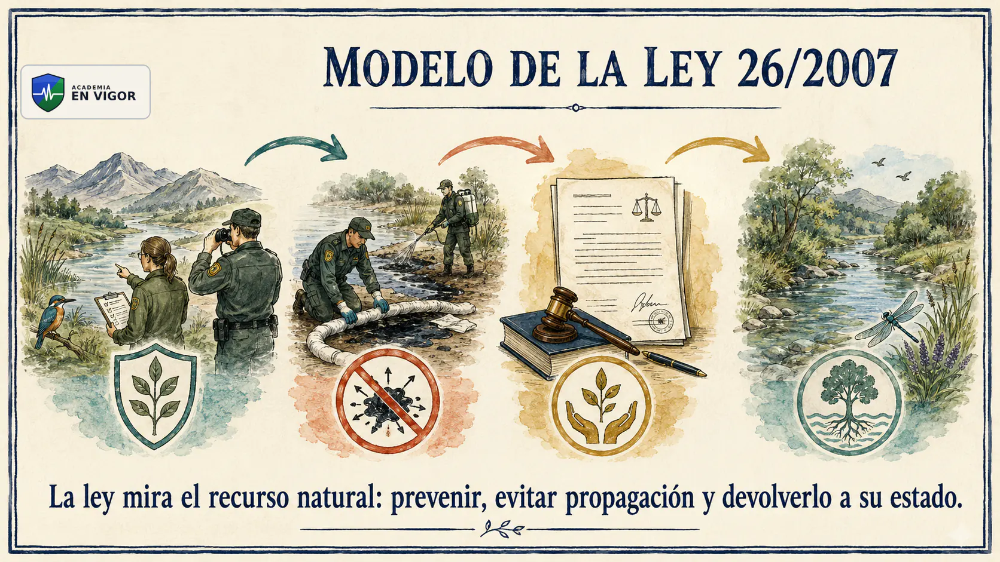

<em>Infografía: Modelo de la Ley 26/2007.</em>

:::hablemos-claro
La ley mira el recurso natural: prevenir, evitar propagación y devolverlo a su estado.
:::

:::en-la-calle
Ante una amenaza, daño o solicitud de información ambiental, La ley mira el recurso natural: prevenir, evitar propagación y devolverlo a su estado.
:::

:::lo-que-cae
Prioriza **responsabilidad objetiva e ilimitada en su ámbito** y descarta respuestas que confundan concepto, órgano, instrumento o fecha.
:::

<!-- FUENTE: LEY26-2007-T35 -->

## 66. Daño medioambiental cubierto

### Lógica del bloque

Para dominar **daño medioambiental cubierto**, aplica esta regla: El foco no es la indemnización privada: son recursos naturales y servicios protegidos. El anclaje principal es **especies, hábitats, aguas, ribera y suelo**.

### Hechos examinables

- La ley cubre daños significativos a especies silvestres y hábitats protegidos. <!-- FACT:PN-T35-F261 -->
- También cubre daños a aguas y a la ribera del mar y de las rías conforme a sus definiciones. <!-- FACT:PN-T35-F262 -->
- El daño al suelo se vincula a riesgo significativo de efectos adversos para la salud humana. <!-- FACT:PN-T35-F263 -->
- No todo perjuicio patrimonial privado es daño medioambiental de esta ley. <!-- FACT:PN-T35-F264 -->

### Trampas de examen

- **Incorrecto:** La ley cubre cualquier arañazo en un bien privado como daño ambiental.
- **Incorrecto:** El suelo solo cuenta si se destruye por completo.

<!-- VISUAL:t35-66-dano-medioambiental-cubierto.webp -->

  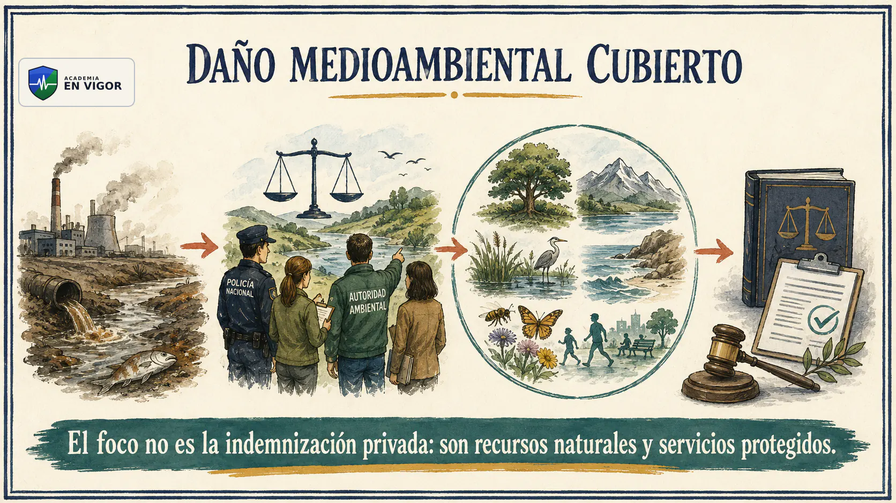

<em>Infografía: Daño medioambiental cubierto.</em>

:::hablemos-claro
El foco no es la indemnización privada: son recursos naturales y servicios protegidos.
:::

:::en-la-calle
Ante una amenaza, daño o solicitud de información ambiental, El foco no es la indemnización privada: son recursos naturales y servicios protegidos.
:::

:::lo-que-cae
Prioriza **especies, hábitats, aguas, ribera y suelo** y descarta respuestas que confundan concepto, órgano, instrumento o fecha.
:::

<!-- FUENTE: LEY26-2007-T35 -->

## 67. Amenaza inminente, prevención y evitación

### Lógica del bloque

Para dominar **amenaza inminente, prevención y evitación**, aplica esta regla: Prevención va antes del daño; evitación corta su propagación después de empezar. El anclaje principal es **antes y después del inicio**.

### Hechos examinables

- Amenaza inminente es probabilidad suficiente de que ocurra daño en un futuro próximo. <!-- FACT:PN-T35-F265 -->
- Ante amenaza inminente el operador adopta sin demora medidas preventivas apropiadas. <!-- FACT:PN-T35-F266 -->
- Cuando el daño se ha producido debe evitar nuevos daños y controlar o contener factores causantes. <!-- FACT:PN-T35-F267 -->
- La comunicación a la autoridad no permite esperar pasivamente si existen medidas inmediatas exigibles. <!-- FACT:PN-T35-F268 -->

### Trampas de examen

- **Incorrecto:** Solo se actúa cuando el daño ya es irreversible.
- **Incorrecto:** Avisar a la autoridad exime siempre de contener el daño.

<!-- VISUAL:t35-67-amenaza-inminente-prevencion-y-evitacion.webp -->

  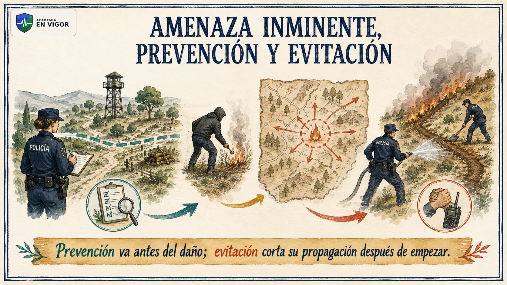

<em>Infografía: Amenaza inminente, prevención y evitación.</em>

:::hablemos-claro
Prevención va antes del daño; evitación corta su propagación después de empezar.
:::

:::en-la-calle
Ante una amenaza, daño o solicitud de información ambiental, Prevención va antes del daño; evitación corta su propagación después de empezar.
:::

:::lo-que-cae
Prioriza **antes y después del inicio** y descarta respuestas que confundan concepto, órgano, instrumento o fecha.
:::

<!-- FUENTE: LEY26-2007-T35 -->

## 68. Reparación primaria, complementaria y compensatoria

### Lógica del bloque

Para dominar **reparación primaria, complementaria y compensatoria**, aplica esta regla: Primaria repara el lugar; complementaria completa; compensatoria cubre el tiempo perdido. El anclaje principal es **restaurar, complementar y compensar pérdidas**.

### Hechos examinables

- La reparación primaria devuelve recursos y servicios a su estado básico o se aproxima a él. <!-- FACT:PN-T35-F269 -->
- La complementaria aporta un nivel similar cuando la primaria no logra la restitución completa. <!-- FACT:PN-T35-F270 -->
- La compensatoria compensa pérdidas provisionales desde el daño hasta que la reparación surte efecto. <!-- FACT:PN-T35-F271 -->
- Compensatoria no significa indemnización económica al público como sustituto automático de restaurar. <!-- FACT:PN-T35-F272 -->

### Trampas de examen

- **Incorrecto:** La reparación compensatoria reemplaza siempre la primaria.
- **Incorrecto:** Complementaria es una multa añadida a favor del Tesoro.

<!-- VISUAL:t35-il-68-reparacion-primaria-complementaria-y-compensatoria.webp -->

  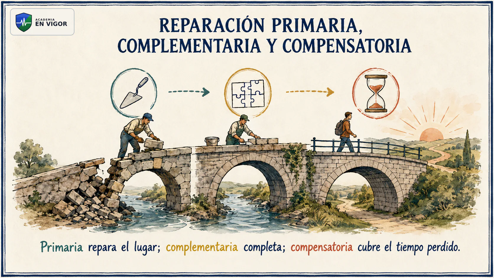

<em>Infografía: Reparación primaria, complementaria y compensatoria.</em>

:::hablemos-claro
Primaria repara el lugar; complementaria completa; compensatoria cubre el tiempo perdido.
:::

:::en-la-calle
Ante una amenaza, daño o solicitud de información ambiental, Primaria repara el lugar; complementaria completa; compensatoria cubre el tiempo perdido.
:::

:::lo-que-cae
Prioriza **restaurar, complementar y compensar pérdidas** y descarta respuestas que confundan concepto, órgano, instrumento o fecha.
:::

<!-- FUENTE: LEY26-2007-T35 -->

## 69. Plazo temporal y exclusiones

### Lógica del bloque

Para dominar **plazo temporal y exclusiones**, aplica esta regla: Treinta años limita esta ley, no borra por arte de magia todo el ordenamiento. El anclaje principal es **treinta años y supuestos legales**.

### Hechos examinables

- La Ley 26/2007 no se aplica cuando han transcurrido más de treinta años desde la emisión, suceso o incidente causante. <!-- FACT:PN-T35-F273 -->
- La ley contiene exclusiones vinculadas, entre otros supuestos, a conflictos armados y fenómenos naturales excepcionales. <!-- FACT:PN-T35-F274 -->
- También coordina su ámbito con convenios internacionales enumerados legalmente. <!-- FACT:PN-T35-F275 -->
- Una exclusión de esta ley no descarta automáticamente otras responsabilidades civiles, penales o administrativas. <!-- FACT:PN-T35-F276 -->

### Trampas de examen

- **Incorrecto:** El plazo máximo general es de cinco años.
- **Incorrecto:** Quedar fuera de esta ley elimina cualquier otra responsabilidad.

<!-- VISUAL:t35-69-plazo-temporal-y-exclusiones.webp -->

  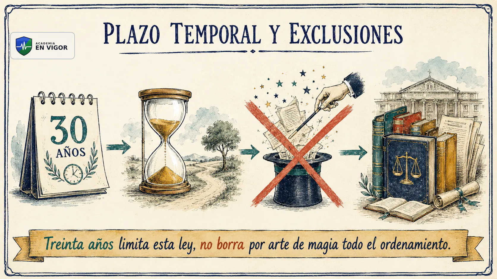

<em>Infografía: Plazo temporal y exclusiones.</em>

:::hablemos-claro
Treinta años limita esta ley, no borra por arte de magia todo el ordenamiento.
:::

:::en-la-calle
Ante una amenaza, daño o solicitud de información ambiental, Treinta años limita esta ley, no borra por arte de magia todo el ordenamiento.
:::

:::lo-que-cae
Prioriza **treinta años y supuestos legales** y descarta respuestas que confundan concepto, órgano, instrumento o fecha.
:::

<!-- FUENTE: LEY26-2007-T35 -->

## 70. Convenio de Aarhus y tres pilares

### Lógica del bloque

Para dominar **convenio de aarhus y tres pilares**, aplica esta regla: Saber, participar y recurrir: los tres pilares caben en tres verbos. El anclaje principal es **información, participación y justicia**.

### Hechos examinables

- La Ley 27/2006 incorpora al Derecho español los pilares del Convenio de Aarhus y directivas europeas. <!-- FACT:PN-T35-F277 -->
- El primer pilar es acceso a información ambiental. <!-- FACT:PN-T35-F278 -->
- El segundo es participación pública en decisiones ambientales. <!-- FACT:PN-T35-F279 -->
- El tercero es acceso a justicia y tutela administrativa en la materia. <!-- FACT:PN-T35-F280 -->

### Trampas de examen

- **Incorrecto:** Los tres pilares son prevención, sanción y auditoría.
- **Incorrecto:** Aarhus regula únicamente evaluación de proyectos.

<!-- VISUAL:t35-70-convenio-de-aarhus-y-tres-pilares.webp -->

  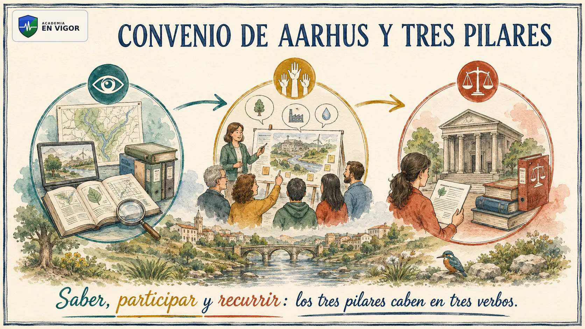

<em>Infografía: Convenio de Aarhus y tres pilares.</em>

:::hablemos-claro
Saber, participar y recurrir: los tres pilares caben en tres verbos.
:::

:::en-la-calle
Ante una amenaza, daño o solicitud de información ambiental, Saber, participar y recurrir: los tres pilares caben en tres verbos.
:::

:::lo-que-cae
Prioriza **información, participación y justicia** y descarta respuestas que confundan concepto, órgano, instrumento o fecha.
:::

<!-- FUENTE: LEY27-2006-T35 -->

## 71. Acceso a información ambiental

### Lógica del bloque

Para dominar **acceso a información ambiental**, aplica esta regla: La puerta de información no exige explicar para qué quieres entrar. El anclaje principal es **sin declarar interés**.

### Hechos examinables

- Cualquier persona puede solicitar información ambiental sin declarar un interés determinado. <!-- FACT:PN-T35-F281 -->
- La autoridad debe orientar, asistir y resolver en los plazos y condiciones legales. <!-- FACT:PN-T35-F282 -->
- Las excepciones se interpretan restrictivamente y ponderan interés público según corresponda. <!-- FACT:PN-T35-F283 -->
- Si la información está en poder de otra autoridad, debe aplicarse el mecanismo legal de remisión o información al solicitante. <!-- FACT:PN-T35-F284 -->

### Trampas de examen

- **Incorrecto:** Solo puede pedir información quien pruebe un derecho afectado.
- **Incorrecto:** Toda excepción se aplica automáticamente sin ponderación.

<!-- VISUAL:t35-71-acceso-a-informacion-ambiental.webp -->

  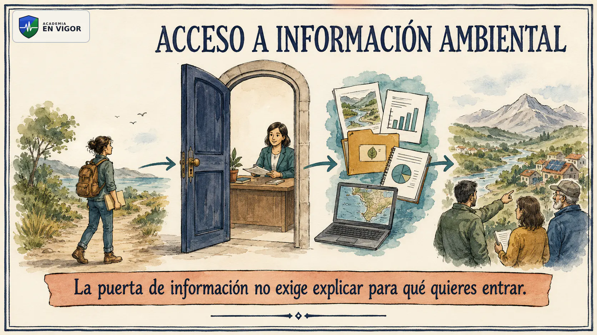

<em>Infografía: Acceso a información ambiental.</em>

:::hablemos-claro
La puerta de información no exige explicar para qué quieres entrar.
:::

:::en-la-calle
Ante una amenaza, daño o solicitud de información ambiental, La puerta de información no exige explicar para qué quieres entrar.
:::

:::lo-que-cae
Prioriza **sin declarar interés** y descarta respuestas que confundan concepto, órgano, instrumento o fecha.
:::

<!-- FUENTE: LEY27-2006-T35 -->

## 72. Participación en planes y disposiciones

### Lógica del bloque

Para dominar **participación en planes y disposiciones**, aplica esta regla: La participación útil ocurre antes del cierre y deja rastro en la motivación. El anclaje principal es **opciones abiertas y resultado considerado**.

### Hechos examinables

- La participación debe comenzar cuando las opciones todavía estén abiertas. <!-- FACT:PN-T35-F285 -->
- La información pertinente debe ponerse a disposición del público de forma adecuada. <!-- FACT:PN-T35-F286 -->
- Se conceden plazos razonables para formular observaciones y opiniones. <!-- FACT:PN-T35-F287 -->
- La decisión debe tener debidamente en cuenta los resultados de la participación. <!-- FACT:PN-T35-F288 -->

### Trampas de examen

- **Incorrecto:** La audiencia se abre tras la aprobación definitiva.
- **Incorrecto:** Tener en cuenta significa aceptar literalmente cada alegación.

<!-- VISUAL:t35-72-participacion-en-planes-y-disposiciones.webp -->

  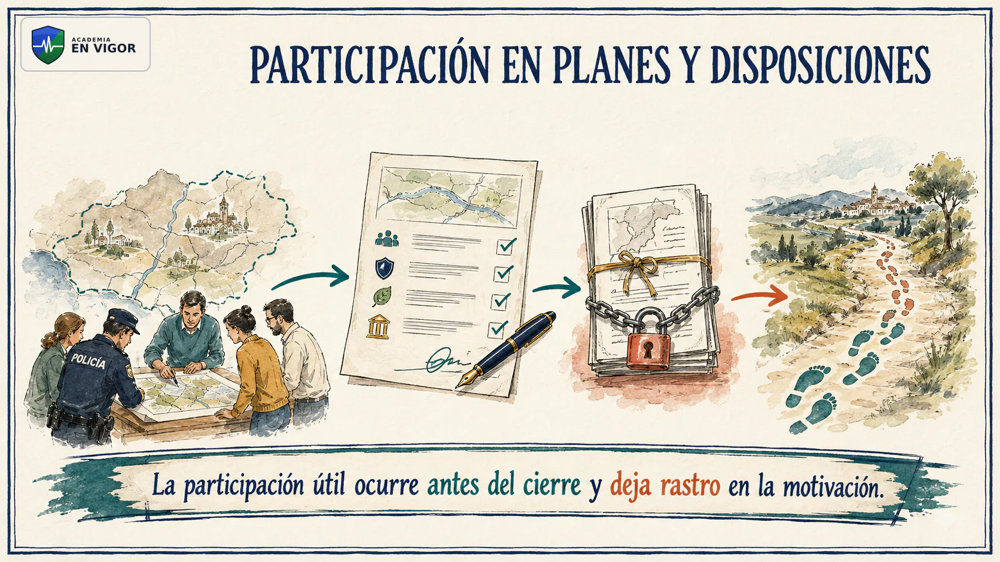

<em>Infografía: Participación en planes y disposiciones.</em>

:::hablemos-claro
La participación útil ocurre antes del cierre y deja rastro en la motivación.
:::

:::en-la-calle
Ante una amenaza, daño o solicitud de información ambiental, La participación útil ocurre antes del cierre y deja rastro en la motivación.
:::

:::lo-que-cae
Prioriza **opciones abiertas y resultado considerado** y descarta respuestas que confundan concepto, órgano, instrumento o fecha.
:::

<!-- FUENTE: LEY27-2006-T35 -->

## 73. Acceso a la justicia y acción popular ambiental

### Lógica del bloque

Para dominar **acceso a la justicia y acción popular ambiental**, aplica esta regla: Aarhus abre la puerta judicial, pero hay que entrar con legitimación y procedimiento correctos. El anclaje principal es **impugnar y exigir legalidad**.

### Hechos examinables

- La ley reconoce recursos frente a actos u omisiones que vulneren derechos de información y participación. <!-- FACT:PN-T35-F289 -->
- Determinadas personas jurídicas sin ánimo de lucro pueden ejercer acción popular ambiental si cumplen requisitos legales. <!-- FACT:PN-T35-F290 -->
- La acción popular no corresponde automáticamente a cualquier entidad por incluir ambiente en su nombre. <!-- FACT:PN-T35-F291 -->
- El acceso a justicia complementa, pero no sustituye, vías administrativas y requisitos procesales. <!-- FACT:PN-T35-F292 -->

### Trampas de examen

- **Incorrecto:** Cualquier sociedad mercantil ejerce acción popular sin requisitos.
- **Incorrecto:** El acceso a justicia elimina todos los plazos de recurso.

<!-- VISUAL:t35-il-73-acceso-a-la-justicia-y-accion-popular-ambiental.webp -->

  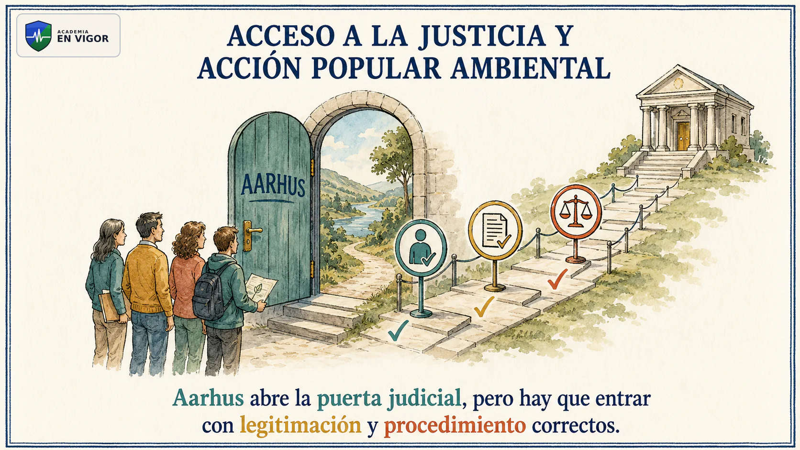

<em>Infografía: Acceso a la justicia y acción popular ambiental.</em>

:::hablemos-claro
Aarhus abre la puerta judicial, pero hay que entrar con legitimación y procedimiento correctos.
:::

:::en-la-calle
Ante una amenaza, daño o solicitud de información ambiental, Aarhus abre la puerta judicial, pero hay que entrar con legitimación y procedimiento correctos.
:::

:::lo-que-cae
Prioriza **impugnar y exigir legalidad** y descarta respuestas que confundan concepto, órgano, instrumento o fecha.
:::

<!-- FUENTE: LEY27-2006-T35 -->

## 74. Consejo Asesor de Medio Ambiente

### Lógica del bloque

Para dominar **consejo asesor de medio ambiente**, aplica esta regla: CAMA mira política ambiental general; CNC enfoca cambio climático. El anclaje principal es **participación y seguimiento de políticas generales**.

### Hechos examinables

- El Consejo Asesor de Medio Ambiente es órgano colegiado de participación y seguimiento de políticas ambientales generales. <!-- FACT:PN-T35-F293 -->
- Está integrado por representantes de organizaciones y sectores previstos legalmente. <!-- FACT:PN-T35-F294 -->
- Puede emitir informes y propuestas dentro de sus funciones. <!-- FACT:PN-T35-F295 -->
- No debe confundirse con el Consejo Nacional del Clima, centrado específicamente en política climática. <!-- FACT:PN-T35-F296 -->

### Trampas de examen

- **Incorrecto:** El Consejo Asesor es un órgano judicial ambiental.
- **Incorrecto:** Consejo Asesor y Consejo Nacional del Clima son nombres intercambiables.

<!-- VISUAL:t35-74-consejo-asesor-de-medio-ambiente.webp -->

  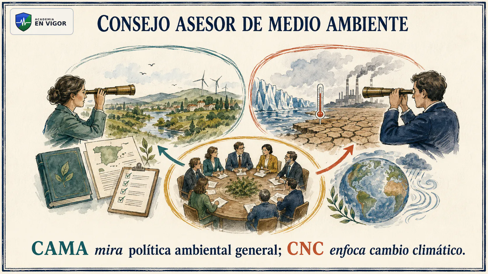

<em>Infografía: Consejo Asesor de Medio Ambiente.</em>

:::hablemos-claro
CAMA mira política ambiental general; CNC enfoca cambio climático.
:::

:::en-la-calle
Ante una amenaza, daño o solicitud de información ambiental, CAMA mira política ambiental general; CNC enfoca cambio climático.
:::

:::lo-que-cae
Prioriza **participación y seguimiento de políticas generales** y descarta respuestas que confundan concepto, órgano, instrumento o fecha.
:::

<!-- FUENTE: LEY27-2006-T35 -->

## 75. Objeto y principios de la Ley 7/2021

### Lógica del bloque

Para dominar **objeto y principios de la ley 7/2021**, aplica esta regla: Clima exige dos movimientos a la vez: descarbonizar y adaptarse. El anclaje principal es **París, descarbonización y adaptación**.

### Hechos examinables

- La Ley 7/2021 asegura el cumplimiento de objetivos de París y facilita descarbonización de la economía. <!-- FACT:PN-T35-F297 -->
- Busca un modelo de desarrollo sostenible, resiliente y adaptado a impactos climáticos. <!-- FACT:PN-T35-F298 -->
- Integra ciencia, precaución, no regresión, protección de biodiversidad y transición justa entre sus orientaciones. <!-- FACT:PN-T35-F299 -->
- La ley consolidada debe consultarse porque fue modificada hasta el 30 de junio de 2026. <!-- FACT:PN-T35-F300 -->

### Trampas de examen

- **Incorrecto:** La ley se limita a regular parques eólicos.
- **Incorrecto:** Su texto inicial de 2021 puede usarse siempre sin revisar modificaciones.

<!-- VISUAL:t35-75-objeto-y-principios-de-la-ley-7-2021.webp -->

  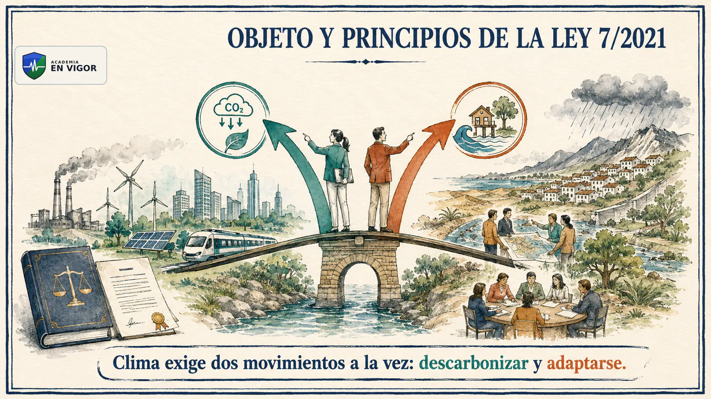

<em>Infografía: Objeto y principios de la Ley 7/2021.</em>

:::hablemos-claro
Clima exige dos movimientos a la vez: descarbonizar y adaptarse.
:::

:::en-la-calle
Al distinguir ley climática, PNIEC, PNACC y transición justa, Clima exige dos movimientos a la vez: descarbonizar y adaptarse.
:::

:::lo-que-cae
Prioriza **París, descarbonización y adaptación** y descarta respuestas que confundan concepto, órgano, instrumento o fecha.
:::

<!-- FUENTE: LEY7-2021-T35 -->

## 76. Objetivos legales y objetivos del PNIEC

### Lógica del bloque

Para dominar **objetivos legales y objetivos del pniec**, aplica esta regla: Primero identifica el documento: ley y plan pueden compartir horizonte y tener cifras distintas. El anclaje principal es **mínimo legal frente a planificación actualizada**.

### Hechos examinables

- La Ley 7/2021 fijó mínimos nacionales para 2030 y neutralidad climática a más tardar en 2050. <!-- FACT:PN-T35-F301 -->
- El PNIEC puede elevar ambición mediante planificación sin reescribir literalmente cada porcentaje de la ley. <!-- FACT:PN-T35-F302 -->
- Por eso deben distinguirse los objetivos mínimos legales de 2021 y los objetivos del PNIEC actualizado. <!-- FACT:PN-T35-F303 -->
- Una pregunta debe indicar si pide la ley o el plan; mezclar cifras produce una respuesta falsa. <!-- FACT:PN-T35-F304 -->

### Trampas de examen

- **Incorrecto:** Los porcentajes del PNIEC y del artículo 3 son necesariamente idénticos.
- **Incorrecto:** Un plan anterior prevalece sobre una ley posterior.

<!-- VISUAL:t35-76-objetivos-legales-y-objetivos-del-pniec.webp -->

  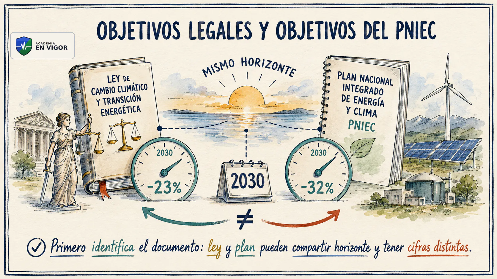

<em>Infografía: Objetivos legales y objetivos del PNIEC.</em>

:::hablemos-claro
Primero identifica el documento: ley y plan pueden compartir horizonte y tener cifras distintas.
:::

:::en-la-calle
Al distinguir ley climática, PNIEC, PNACC y transición justa, Primero identifica el documento: ley y plan pueden compartir horizonte y tener cifras distintas.
:::

:::lo-que-cae
Prioriza **mínimo legal frente a planificación actualizada** y descarta respuestas que confundan concepto, órgano, instrumento o fecha.
:::

<!-- FUENTE: LEY7-2021-T35 -->

## 77. PNIEC 2023-2030 actualizado

### Lógica del bloque

Para dominar **pniec 2023-2030 actualizado**, aplica esta regla: Regla 32-48-43-81: emisiones, energía final renovable, eficiencia y electricidad renovable. El anclaje principal es **32, 48, 43 y 81**.

### Hechos examinables

- El PNIEC 2023-2030 fija una reducción de GEI del 32 % respecto de 1990. <!-- FACT:PN-T35-F305 -->
- Prevé 48 % de renovables sobre el uso final de la energía. <!-- FACT:PN-T35-F306 -->
- Establece 43 % de mejora de eficiencia energética en términos de energía final. <!-- FACT:PN-T35-F307 -->
- Prevé 81 % de energía renovable en la generación eléctrica y reducción de dependencia energética hasta el 50 %. <!-- FACT:PN-T35-F308 -->

### Trampas de examen

- **Incorrecto:** Los objetivos vigentes siguen siendo 23 %, 42 %, 39,5 % y 74 %.
- **Incorrecto:** El 81 % se refiere al uso final total de energía.

<!-- VISUAL:t35-77-pniec-2023-2030-actualizado.webp -->

  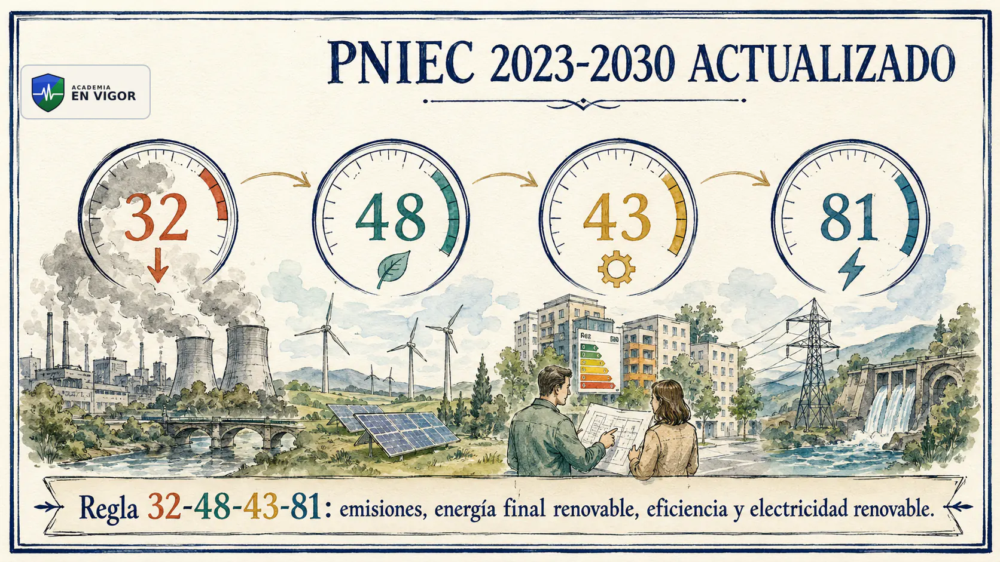

<em>Infografía: PNIEC 2023-2030 actualizado.</em>

:::hablemos-claro
Regla 32-48-43-81: emisiones, energía final renovable, eficiencia y electricidad renovable.
:::

:::en-la-calle
Al distinguir ley climática, PNIEC, PNACC y transición justa, Regla 32-48-43-81: emisiones, energía final renovable, eficiencia y electricidad renovable.
:::

:::lo-que-cae
Prioriza **32, 48, 43 y 81** y descarta respuestas que confundan concepto, órgano, instrumento o fecha.
:::

<!-- FUENTE: PNIEC-2023-2030-T35 -->

## 78. Dimensiones y estructura del PNIEC

### Lógica del bloque

Para dominar **dimensiones y estructura del pniec**, aplica esta regla: Cinco dimensiones evitan reducir energía y clima a una sola tecnología. El anclaje principal es **cinco dimensiones de la Unión de la Energía**.

### Hechos examinables

- El PNIEC cubre descarbonización, eficiencia energética, seguridad energética, mercado interior e investigación-innovación-competitividad. <!-- FACT:PN-T35-F309 -->
- Combina situación actual, objetivos, políticas, medidas y análisis de impactos. <!-- FACT:PN-T35-F310 -->
- Su actualización fue sometida a evaluación ambiental estratégica. <!-- FACT:PN-T35-F311 -->
- El plan integra sectores y no se limita a generación eléctrica. <!-- FACT:PN-T35-F312 -->

### Trampas de examen

- **Incorrecto:** El PNIEC solo contiene un objetivo de electricidad renovable.
- **Incorrecto:** La evaluación ambiental estratégica se aplica únicamente a proyectos.

<!-- VISUAL:t35-il-78-dimensiones-y-estructura-del-pniec.webp -->

  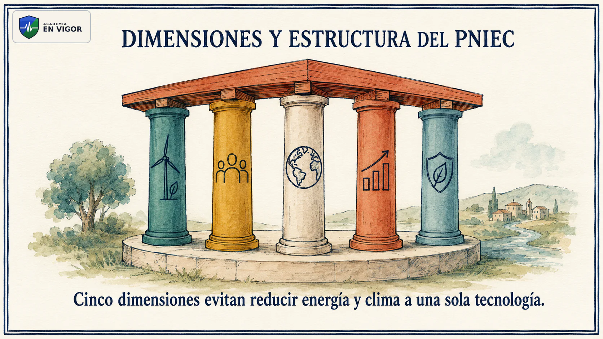

<em>Infografía: Dimensiones y estructura del PNIEC.</em>

:::hablemos-claro
Cinco dimensiones evitan reducir energía y clima a una sola tecnología.
:::

:::en-la-calle
Al distinguir ley climática, PNIEC, PNACC y transición justa, Cinco dimensiones evitan reducir energía y clima a una sola tecnología.
:::

:::lo-que-cae
Prioriza **cinco dimensiones de la Unión de la Energía** y descarta respuestas que confundan concepto, órgano, instrumento o fecha.
:::

<!-- FUENTE: PNIEC-2023-2030-T35 -->

## 79. Plan Nacional de Adaptación 2021-2030

### Lógica del bloque

Para dominar **plan nacional de adaptación 2021-2030**, aplica esta regla: Mitigación cambia la causa; PNACC prepara sistemas y territorios para los impactos. El anclaje principal es **riesgo, vulnerabilidad y resiliencia**.

### Hechos examinables

- El PNACC 2021-2030 es el instrumento básico de planificación de la adaptación en España. <!-- FACT:PN-T35-F313 -->
- Promueve conocimiento de impactos, riesgos y vulnerabilidades. <!-- FACT:PN-T35-F314 -->
- Integra adaptación en políticas sectoriales y refuerza capacidades de respuesta. <!-- FACT:PN-T35-F315 -->
- Se desarrolla mediante programas de trabajo y seguimiento, no mediante una lista cerrada e inmutable. <!-- FACT:PN-T35-F316 -->

### Trampas de examen

- **Incorrecto:** El PNACC es el plan de reducción de emisiones del sector eléctrico.
- **Incorrecto:** Adaptación significa mantener sin cambios todos los sistemas actuales.

<!-- VISUAL:t35-il-79-plan-nacional-de-adaptacion-2021-2030.webp -->

  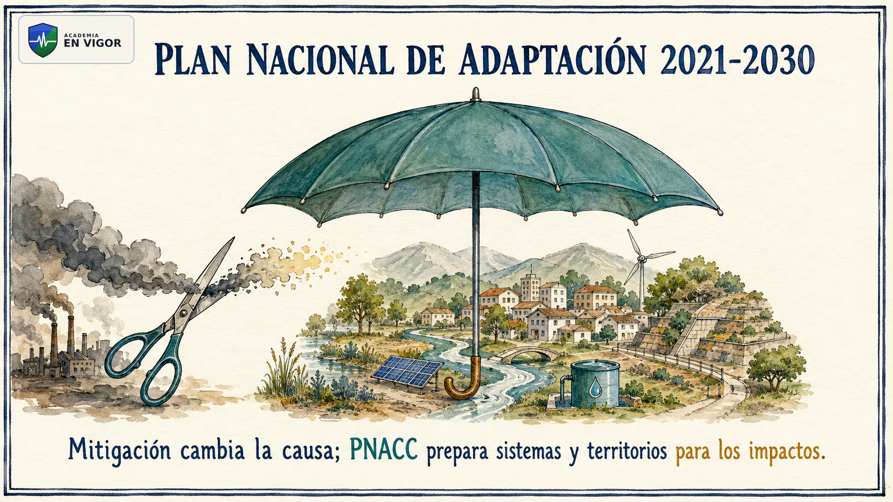

<em>Infografía: Plan Nacional de Adaptación 2021-2030.</em>

:::hablemos-claro
Mitigación cambia la causa; PNACC prepara sistemas y territorios para los impactos.
:::

:::en-la-calle
Al distinguir ley climática, PNIEC, PNACC y transición justa, Mitigación cambia la causa; PNACC prepara sistemas y territorios para los impactos.
:::

:::lo-que-cae
Prioriza **riesgo, vulnerabilidad y resiliencia** y descarta respuestas que confundan concepto, órgano, instrumento o fecha.
:::

<!-- FUENTE: PNACC-2021-2030-T35 -->

## 80. Estrategia de Transición Justa

### Lógica del bloque

Para dominar **estrategia de transición justa**, aplica esta regla: La transición se planifica con mapa de impactos laborales y territoriales, no solo con objetivos energéticos. El anclaje principal es **oportunidades, empleo y territorios**.

### Hechos examinables

- La Estrategia de Transición Justa identifica y adopta medidas para optimizar oportunidades de la transición ecológica. <!-- FACT:PN-T35-F317 -->
- Analiza sectores y territorios potencialmente vulnerables al proceso de descarbonización. <!-- FACT:PN-T35-F318 -->
- Los convenios de transición justa pueden concentrar actuaciones en zonas afectadas. <!-- FACT:PN-T35-F319 -->
- Su finalidad no es indemnizar automáticamente cualquier pérdida empresarial. <!-- FACT:PN-T35-F320 -->

### Trampas de examen

- **Incorrecto:** La Estrategia sustituye el PNACC.
- **Incorrecto:** Todo cierre genera por sí solo una indemnización ilimitada.

<!-- VISUAL:t35-80-estrategia-de-transicion-justa.webp -->

  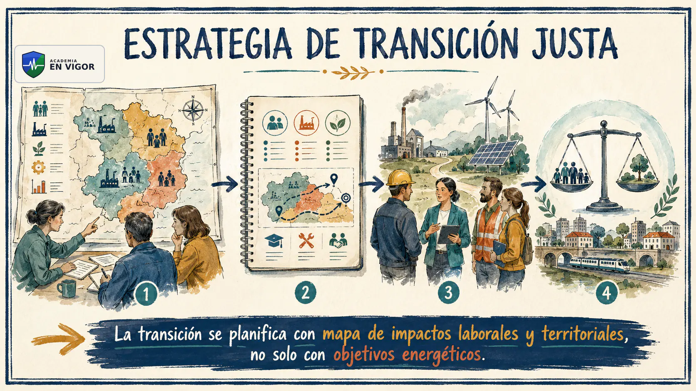

<em>Infografía: Estrategia de Transición Justa.</em>

:::hablemos-claro
La transición se planifica con mapa de impactos laborales y territoriales, no solo con objetivos energéticos.
:::

:::en-la-calle
Al distinguir ley climática, PNIEC, PNACC y transición justa, La transición se planifica con mapa de impactos laborales y territoriales, no solo con objetivos energéticos.
:::

:::lo-que-cae
Prioriza **oportunidades, empleo y territorios** y descarta respuestas que confundan concepto, órgano, instrumento o fecha.
:::

<!-- FUENTE: LEY7-2021-T35 -->

## 81. Mitigación y adaptación: casos límite

### Lógica del bloque

Para dominar **mitigación y adaptación: casos límite**, aplica esta regla: Pregunta qué cambia: emisiones y sumideros, o exposición y vulnerabilidad. El anclaje principal es **causas frente a consecuencias**.

### Hechos examinables

- Rehabilitar edificios para consumir menos energía es principalmente mitigación. <!-- FACT:PN-T35-F321 -->
- Diseñar refugios climáticos frente a olas de calor es principalmente adaptación. <!-- FACT:PN-T35-F322 -->
- Una solución basada en naturaleza puede aportar simultáneamente mitigación, adaptación y biodiversidad. <!-- FACT:PN-T35-F323 -->
- La etiqueta depende de la función principal y no del color verde del proyecto. <!-- FACT:PN-T35-F324 -->

### Trampas de examen

- **Incorrecto:** Toda plantación es automáticamente mitigación eficaz.
- **Incorrecto:** Adaptación y mitigación nunca coinciden en una misma medida.

<!-- VISUAL:t35-81-mitigacion-y-adaptacion-casos-limite.webp -->

  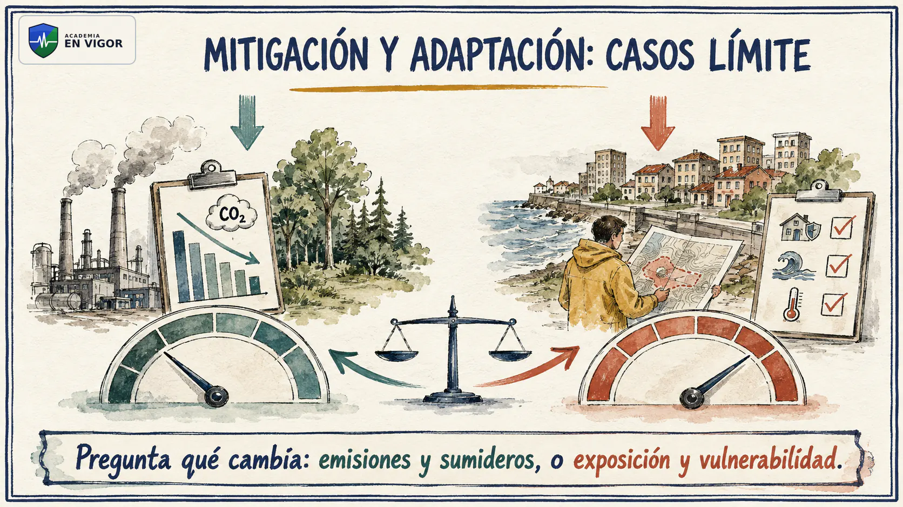

<em>Infografía: Mitigación y adaptación: casos límite.</em>

:::hablemos-claro
Pregunta qué cambia: emisiones y sumideros, o exposición y vulnerabilidad.
:::

:::en-la-calle
Al distinguir ley climática, PNIEC, PNACC y transición justa, Pregunta qué cambia: emisiones y sumideros, o exposición y vulnerabilidad.
:::

:::lo-que-cae
Prioriza **causas frente a consecuencias** y descarta respuestas que confundan concepto, órgano, instrumento o fecha.
:::

<!-- FUENTE: PNACC-2021-2030-T35 -->

## 82. Sistema de gestión ambiental

### Lógica del bloque

Para dominar **sistema de gestión ambiental**, aplica esta regla: El SGA es un circuito de mando, no una carpeta de buenas intenciones. El anclaje principal es **política, planificación, operación y mejora**.

### Hechos examinables

- Un sistema de gestión ambiental organiza procesos para gestionar aspectos, obligaciones, riesgos y oportunidades ambientales. <!-- FACT:PN-T35-F325 -->
- Incluye liderazgo, planificación, apoyo, operación, evaluación y mejora. <!-- FACT:PN-T35-F326 -->
- El sistema debe integrarse en la dirección de la organización y no quedar como archivo aislado. <!-- FACT:PN-T35-F327 -->
- Su alcance define actividades, productos, servicios y ubicaciones cubiertas. <!-- FACT:PN-T35-F328 -->

### Trampas de examen

- **Incorrecto:** Un SGA es una declaración publicitaria sin procedimientos.
- **Incorrecto:** El alcance certificado se extiende automáticamente a todas las filiales.

<!-- VISUAL:t35-82-sistema-de-gestion-ambiental.webp -->

  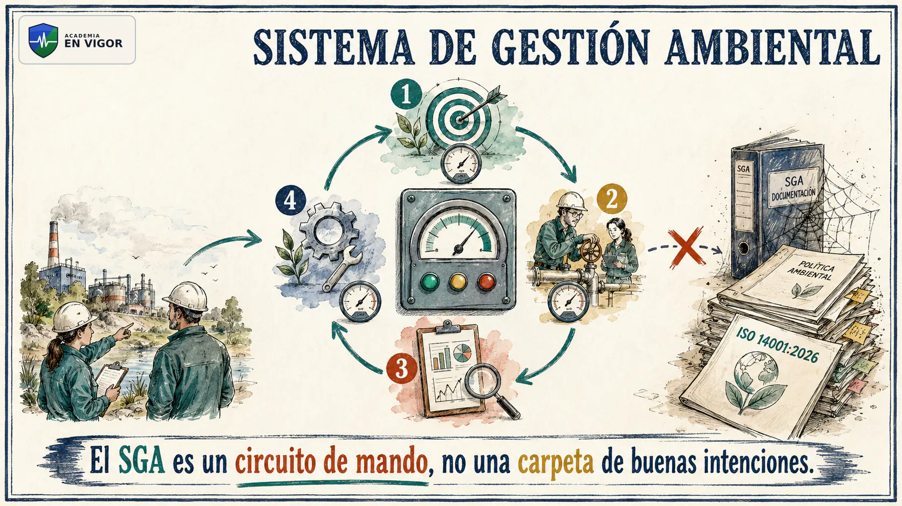

<em>Infografía: Sistema de gestión ambiental.</em>

:::hablemos-claro
El SGA es un circuito de mando, no una carpeta de buenas intenciones.
:::

:::en-la-calle
Al implantar, auditar o comparar instrumentos de gestión, El SGA es un circuito de mando, no una carpeta de buenas intenciones.
:::

:::lo-que-cae
Prioriza **política, planificación, operación y mejora** y descarta respuestas que confundan concepto, órgano, instrumento o fecha.
:::

<!-- FUENTE: ISO14001-2026-T35 -->

## 83. ISO 14001:2026

### Lógica del bloque

Para dominar **iso 14001:2026**, aplica esta regla: La trampa más reciente del tema: 2015 ya no es la edición vigente. El anclaje principal es **edición vigente publicada en abril de 2026**.

### Hechos examinables

- ISO 14001:2026 es la edición vigente de la norma internacional de sistemas de gestión ambiental. <!-- FACT:PN-T35-F329 -->
- Fue publicada en abril de 2026 y sustituye a ISO 14001:2015. <!-- FACT:PN-T35-F330 -->
- Especifica requisitos para establecer, implementar, mantener y mejorar continuamente un SGA. <!-- FACT:PN-T35-F331 -->
- La certificación es voluntaria salvo que un contrato o norma sectorial la exija como condición. <!-- FACT:PN-T35-F332 -->

### Trampas de examen

- **Incorrecto:** ISO 14001:2015 sigue siendo la edición más reciente en agosto de 2026.
- **Incorrecto:** ISO 14001 es una ley de la Unión Europea.

<!-- VISUAL:t35-il-83-iso-14001-2026.webp -->

  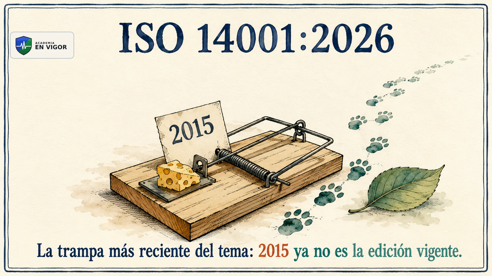

<em>Infografía: ISO 14001:2026.</em>

:::hablemos-claro
La trampa más reciente del tema: 2015 ya no es la edición vigente.
:::

:::en-la-calle
Al implantar, auditar o comparar instrumentos de gestión, La trampa más reciente del tema: 2015 ya no es la edición vigente.
:::

:::lo-que-cae
Prioriza **edición vigente publicada en abril de 2026** y descarta respuestas que confundan concepto, órgano, instrumento o fecha.
:::

<!-- FUENTE: ISO14001-2026-T35 -->

## 84. Aspectos, impactos y perspectiva de ciclo de vida

### Lógica del bloque

Para dominar **aspectos, impactos y perspectiva de ciclo de vida**, aplica esta regla: Aspecto es la causa gestionable; impacto es el cambio que provoca. El anclaje principal es **causa organizativa y cambio ambiental**.

### Hechos examinables

- Aspecto ambiental es un elemento de actividades, productos o servicios que interactúa o puede interactuar con el medio. <!-- FACT:PN-T35-F333 -->
- Impacto ambiental es el cambio producido en el medio, adverso o beneficioso. <!-- FACT:PN-T35-F334 -->
- La organización determina aspectos significativos con criterios definidos. <!-- FACT:PN-T35-F335 -->
- La perspectiva de ciclo de vida considera etapas controlables o influenciables sin exigir siempre un análisis de ciclo de vida completo. <!-- FACT:PN-T35-F336 -->

### Trampas de examen

- **Incorrecto:** Aspecto e impacto son sinónimos exactos.
- **Incorrecto:** Perspectiva de ciclo de vida obliga siempre a realizar un ACV certificado completo.

<!-- VISUAL:t35-84-aspectos-impactos-y-perspectiva-de-ciclo-de-vida.webp -->

  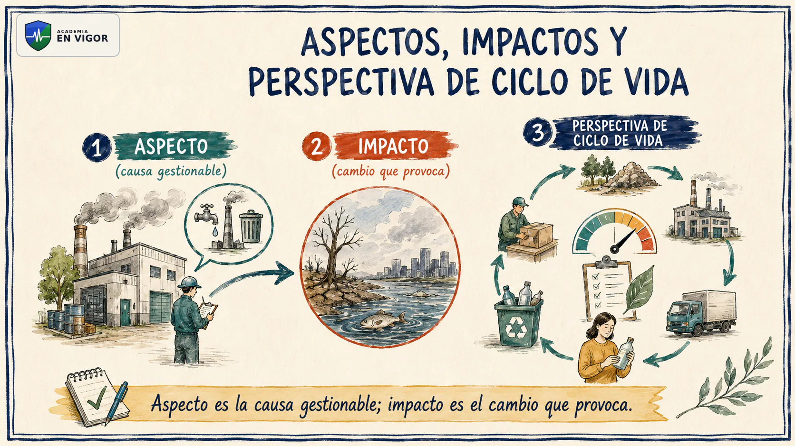

<em>Infografía: Aspectos, impactos y perspectiva de ciclo de vida.</em>

:::hablemos-claro
Aspecto es la causa gestionable; impacto es el cambio que provoca.
:::

:::en-la-calle
Al implantar, auditar o comparar instrumentos de gestión, Aspecto es la causa gestionable; impacto es el cambio que provoca.
:::

:::lo-que-cae
Prioriza **causa organizativa y cambio ambiental** y descarta respuestas que confundan concepto, órgano, instrumento o fecha.
:::

<!-- FUENTE: ISO14001-2026-T35 -->

## 85. Obligaciones de cumplimiento y objetivos

### Lógica del bloque

Para dominar **obligaciones de cumplimiento y objetivos**, aplica esta regla: Obligación encontrada, aplicabilidad entendida, cumplimiento evaluado y desviación corregida. El anclaje principal es **identificar, acceder, evaluar y actuar**.

### Hechos examinables

- La organización identifica obligaciones legales y otros compromisos aplicables a sus aspectos. <!-- FACT:PN-T35-F337 -->
- Debe determinar cómo se aplican y evaluar periódicamente el cumplimiento. <!-- FACT:PN-T35-F338 -->
- Los objetivos ambientales deben ser coherentes con política, medibles cuando sea posible y objeto de seguimiento. <!-- FACT:PN-T35-F339 -->
- Conocer una norma sin evaluar su cumplimiento no cierra el ciclo de gestión. <!-- FACT:PN-T35-F340 -->

### Trampas de examen

- **Incorrecto:** El certificado sustituye la identificación de requisitos legales.
- **Incorrecto:** Un objetivo ambiental no necesita responsable, recursos ni seguimiento.

<!-- VISUAL:t35-85-obligaciones-de-cumplimiento-y-objetivos.webp -->

  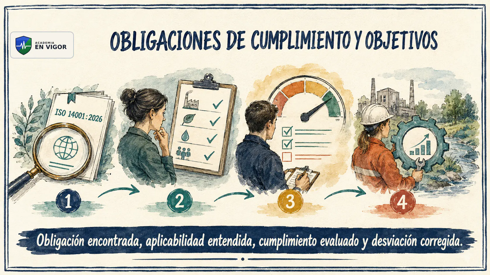

<em>Infografía: Obligaciones de cumplimiento y objetivos.</em>

:::hablemos-claro
Obligación encontrada, aplicabilidad entendida, cumplimiento evaluado y desviación corregida.
:::

:::en-la-calle
Al implantar, auditar o comparar instrumentos de gestión, Obligación encontrada, aplicabilidad entendida, cumplimiento evaluado y desviación corregida.
:::

:::lo-que-cae
Prioriza **identificar, acceder, evaluar y actuar** y descarta respuestas que confundan concepto, órgano, instrumento o fecha.
:::

<!-- FUENTE: ISO14001-2026-T35 -->

## 86. Control operacional y emergencias

### Lógica del bloque

Para dominar **control operacional y emergencias**, aplica esta regla: Controla lo normal y ensaya lo excepcional. El anclaje principal es **operar bajo criterios y responder**.

### Hechos examinables

- Los procesos asociados a aspectos significativos y obligaciones se controlan con criterios operacionales. <!-- FACT:PN-T35-F341 -->
- Los procesos externalizados relevantes deben controlarse o influenciarse en el grado definido. <!-- FACT:PN-T35-F342 -->
- La organización se prepara y responde ante situaciones potenciales de emergencia ambiental. <!-- FACT:PN-T35-F343 -->
- Los simulacros y revisiones permiten aprender; un plan no probado puede fallar cuando se necesita. <!-- FACT:PN-T35-F344 -->

### Trampas de examen

- **Incorrecto:** Externalizar un proceso elimina toda responsabilidad de gestión.
- **Incorrecto:** Preparación ante emergencias consiste solo en llamar después del incidente.

<!-- VISUAL:t35-86-control-operacional-y-emergencias.webp -->

  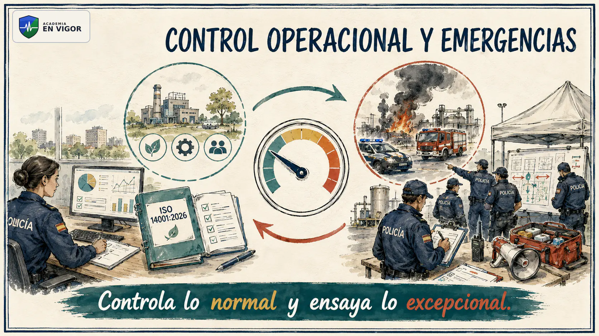

<em>Infografía: Control operacional y emergencias.</em>

:::hablemos-claro
Controla lo normal y ensaya lo excepcional.
:::

:::en-la-calle
Al implantar, auditar o comparar instrumentos de gestión, Controla lo normal y ensaya lo excepcional.
:::

:::lo-que-cae
Prioriza **operar bajo criterios y responder** y descarta respuestas que confundan concepto, órgano, instrumento o fecha.
:::

<!-- FUENTE: ISO14001-2026-T35 -->

## 87. Seguimiento, auditoría y revisión

### Lógica del bloque

Para dominar **seguimiento, auditoría y revisión**, aplica esta regla: Medir aporta datos; auditar contrasta; dirección decide cambios. El anclaje principal es **medir, comprobar y dirigir**.

### Hechos examinables

- El seguimiento y medición evalúan desempeño mediante métodos y criterios fiables. <!-- FACT:PN-T35-F345 -->
- La auditoría interna comprueba conformidad y eficacia del sistema con independencia adecuada. <!-- FACT:PN-T35-F346 -->
- La alta dirección revisa el SGA para asegurar conveniencia, adecuación y eficacia. <!-- FACT:PN-T35-F347 -->
- Una auditoría sin evidencia ni seguimiento de hallazgos no demuestra mejora. <!-- FACT:PN-T35-F348 -->

### Trampas de examen

- **Incorrecto:** La auditoría interna solo puede realizarla la entidad certificadora.
- **Incorrecto:** La revisión por la dirección se limita a firmar la política inicial.

<!-- VISUAL:t35-87-seguimiento-auditoria-y-revision.webp -->

  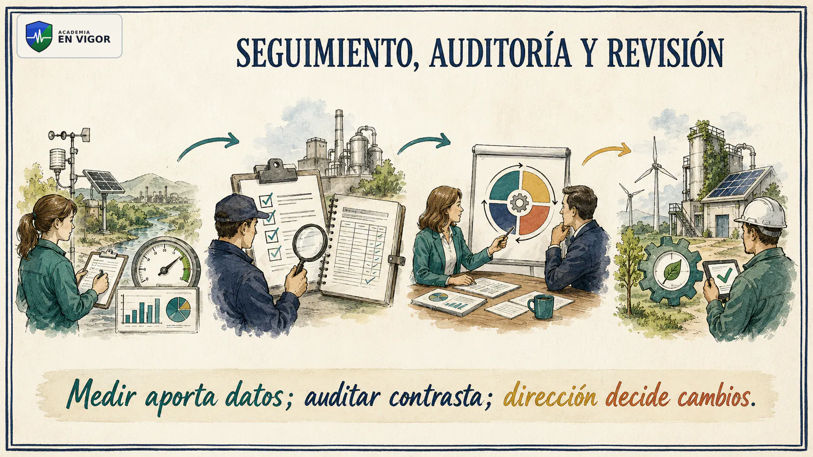

<em>Infografía: Seguimiento, auditoría y revisión.</em>

:::hablemos-claro
Medir aporta datos; auditar contrasta; dirección decide cambios.
:::

:::en-la-calle
Al implantar, auditar o comparar instrumentos de gestión, Medir aporta datos; auditar contrasta; dirección decide cambios.
:::

:::lo-que-cae
Prioriza **medir, comprobar y dirigir** y descarta respuestas que confundan concepto, órgano, instrumento o fecha.
:::

<!-- FUENTE: ISO14001-2026-T35 -->

## 88. EMAS: naturaleza y requisitos

### Lógica del bloque

Para dominar **emas: naturaleza y requisitos**, aplica esta regla: EMAS añade transparencia pública validada y registro a la lógica del sistema de gestión. El anclaje principal es **ecogestión y auditoría de la Unión**.

### Hechos examinables

- EMAS es el sistema comunitario de gestión y auditoría medioambientales. <!-- FACT:PN-T35-F349 -->
- La participación es voluntaria y conduce a registro por el organismo competente. <!-- FACT:PN-T35-F350 -->
- Exige revisión ambiental, sistema de gestión, auditoría y declaración ambiental validada. <!-- FACT:PN-T35-F351 -->
- La organización debe demostrar cumplimiento legal y mejora del desempeño conforme al Reglamento. <!-- FACT:PN-T35-F352 -->

### Trampas de examen

- **Incorrecto:** EMAS es una directiva policial sobre control de masas.
- **Incorrecto:** EMAS exige solo una declaración publicitaria sin auditoría.

<!-- VISUAL:t35-88-emas-naturaleza-y-requisitos.webp -->

  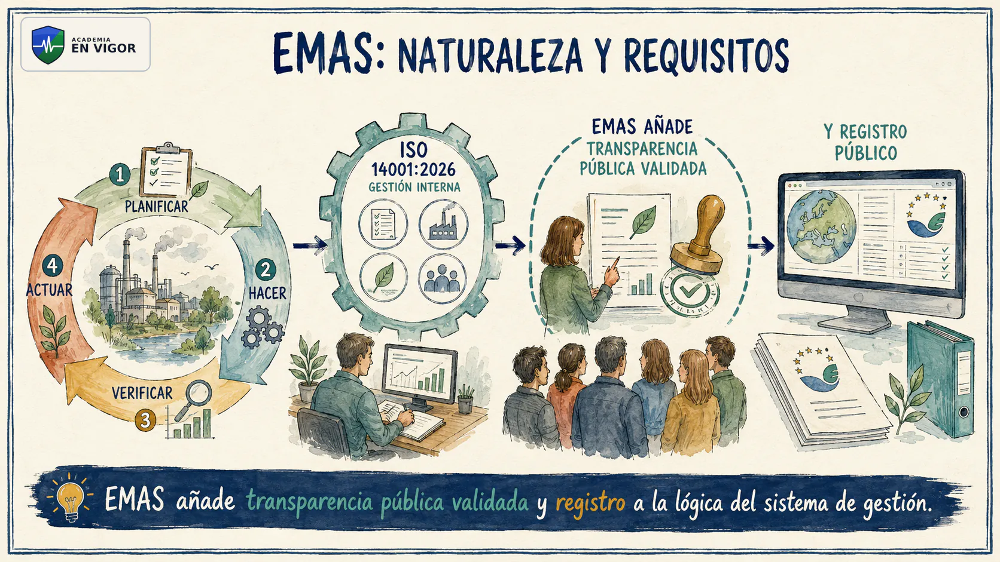

<em>Infografía: EMAS: naturaleza y requisitos.</em>

:::hablemos-claro
EMAS añade transparencia pública validada y registro a la lógica del sistema de gestión.
:::

:::en-la-calle
Al implantar, auditar o comparar instrumentos de gestión, EMAS añade transparencia pública validada y registro a la lógica del sistema de gestión.
:::

:::lo-que-cae
Prioriza **ecogestión y auditoría de la Unión** y descarta respuestas que confundan concepto, órgano, instrumento o fecha.
:::

<!-- FUENTE: EMAS-1221-2009-T35 -->

## 89. ISO 14001 y EMAS

### Lógica del bloque

Para dominar **iso 14001 y emas**, aplica esta regla: ISO certifica el sistema; EMAS registra tras añadir verificación y declaración pública. El anclaje principal es **norma internacional frente a reglamento europeo**.

### Hechos examinables

- ISO 14001 es una norma internacional certificable; EMAS nace de un reglamento de la Unión Europea. <!-- FACT:PN-T35-F353 -->
- EMAS incorpora requisitos de sistema compatibles con ISO y exigencias adicionales de declaración y registro. <!-- FACT:PN-T35-F354 -->
- Una certificación ISO no equivale automáticamente a inscripción EMAS. <!-- FACT:PN-T35-F355 -->
- Ambos instrumentos son voluntarios, pero no idénticos en evidencia pública y procedimiento. <!-- FACT:PN-T35-F356 -->

### Trampas de examen

- **Incorrecto:** ISO y EMAS son dos nombres del mismo registro europeo.
- **Incorrecto:** Inscribirse en EMAS elimina la necesidad de cumplir legislación.

<!-- VISUAL:t35-89-iso-14001-y-emas.webp -->

  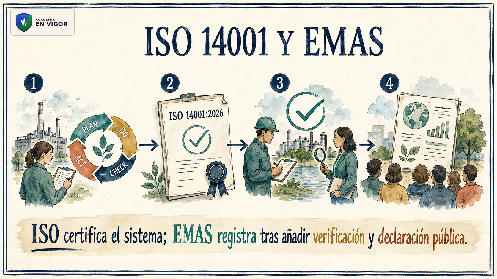

<em>Infografía: ISO 14001 y EMAS.</em>

:::hablemos-claro
ISO certifica el sistema; EMAS registra tras añadir verificación y declaración pública.
:::

:::en-la-calle
Al implantar, auditar o comparar instrumentos de gestión, ISO certifica el sistema; EMAS registra tras añadir verificación y declaración pública.
:::

:::lo-que-cae
Prioriza **norma internacional frente a reglamento europeo** y descarta respuestas que confundan concepto, órgano, instrumento o fecha.
:::

<!-- FUENTE: EMAS-1221-2009-T35 -->

## 90. Jerarquía de residuos y economía circular

### Lógica del bloque

Para dominar **jerarquía de residuos y economía circular**, aplica esta regla: La mejor papelera es la que no hizo falta llenar: prevenir precede a reciclar. El anclaje principal es **prevenir antes que eliminar**.

### Hechos examinables

- La jerarquía prioriza prevención, preparación para reutilización, reciclado, otra valorización y eliminación. <!-- FACT:PN-T35-F357 -->
- Puede apartarse de la jerarquía para determinados flujos si un enfoque de ciclo de vida lo justifica. <!-- FACT:PN-T35-F358 -->
- Economía circular busca mantener valor de productos, materiales y recursos y reducir residuos. <!-- FACT:PN-T35-F359 -->
- Reciclar es importante, pero está por debajo de prevenir y preparar para reutilización. <!-- FACT:PN-T35-F360 -->

### Trampas de examen

- **Incorrecto:** La eliminación ocupa el primer lugar de la jerarquía.
- **Incorrecto:** Economía circular significa únicamente separar residuos domésticos.

<!-- VISUAL:t35-90-jerarquia-de-residuos-y-economia-circular.webp -->

  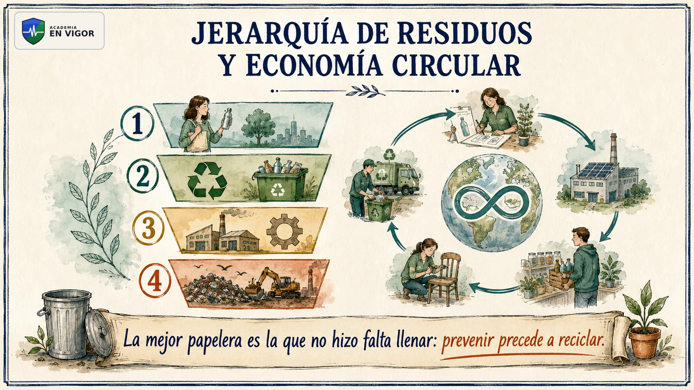

<em>Infografía: Jerarquía de residuos y economía circular.</em>

:::hablemos-claro
La mejor papelera es la que no hizo falta llenar: prevenir precede a reciclar.
:::

:::en-la-calle
Al implantar, auditar o comparar instrumentos de gestión, La mejor papelera es la que no hizo falta llenar: prevenir precede a reciclar.
:::

:::lo-que-cae
Prioriza **prevenir antes que eliminar** y descarta respuestas que confundan concepto, órgano, instrumento o fecha.
:::

<!-- FUENTE: LEY7-2022-T35 -->

## 91. Prevención y control integrados de la contaminación

### Lógica del bloque

Para dominar **prevención y control integrados de la contaminación**, aplica esta regla: Integrado significa mirar aire, agua, suelo, residuos y energía como un solo sistema. El anclaje principal es **medio ambiente en su conjunto**.

### Hechos examinables

- El texto refundido de prevención y control integrados busca evitar o reducir contaminación de atmósfera, agua y suelo. <!-- FACT:PN-T35-F361 -->
- La autorización ambiental integrada coordina condiciones para instalaciones incluidas en su ámbito. <!-- FACT:PN-T35-F362 -->
- Las mejores técnicas disponibles orientan valores límite y condiciones sin prescribir siempre una tecnología concreta. <!-- FACT:PN-T35-F363 -->
- El enfoque integrado evita resolver una emisión trasladando el problema de un medio a otro. <!-- FACT:PN-T35-F364 -->

### Trampas de examen

- **Incorrecto:** La autorización integrada solo controla emisiones al aire.
- **Incorrecto:** Mejor técnica disponible significa la máquina más cara del mercado.

<!-- VISUAL:t35-91-prevencion-y-control-integrados-de-la-contaminacion.webp -->

  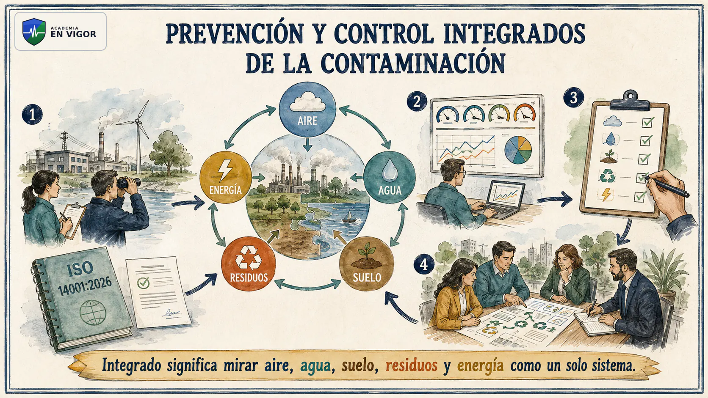

<em>Infografía: Prevención y control integrados de la contaminación.</em>

:::hablemos-claro
Integrado significa mirar aire, agua, suelo, residuos y energía como un solo sistema.
:::

:::en-la-calle
Al implantar, auditar o comparar instrumentos de gestión, Integrado significa mirar aire, agua, suelo, residuos y energía como un solo sistema.
:::

:::lo-que-cae
Prioriza **medio ambiente en su conjunto** y descarta respuestas que confundan concepto, órgano, instrumento o fecha.
:::

<!-- FUENTE: IPPC-1-2016-T35 -->

# Hablemos claro

:::hablemos-claro
Este tema tiene tres trampas maestras: llamar sostenible a cualquier mejora parcial, confundir órganos consultivos con ejecutivos y mezclar cifras de la ley con planes actualizados. Separa concepto, instrumento y fecha.
:::

# En la calle

:::en-la-calle
En una actuación ambiental, identifica primero riesgo, competencia, fase del procedimiento y evidencia. La respuesta cambia si existe amenaza, daño, proyecto, plan, solicitud de información o incumplimiento.
:::

# Lo que cae

:::lo-que-cae
Prioriza Brundtland y tres dimensiones; Estocolmo, Río, Kioto y París; 17 ODS; AEMA; artículo 45; Red Natura 2000; EAE frente a EIA; Aarhus; responsabilidad medioambiental; PNIEC 32-48-43-81; ISO 14001:2026 y EMAS.
:::

# Ha caído

:::ha-caido
Se han localizado 16 referencias históricas del Tema 35. Permanecen ocultas y en cuarentena porque no existe plantilla oficial final verificable en el repositorio.
:::

## Fuentes legales, institucionales y primarias

- `CONVOCATORIA-PN-2026-T35`
- `UN-BRUNDTLAND-T35`
- `UN-STOCKHOLM-T35`
- `UN-RIO-T35`
- `UNFCCC-T35`
- `UNFCCC-PARIS-T35`
- `UNFCCC-PARTIES-2026-T35`
- `IPCC-T35`
- `UN-SDGS-T35`
- `UNDP-HDI-T35`
- `EU-CLIMATE-LAW-T35`
- `EU-ENV-PRINCIPLES-T35`
- `AEMA-T35`
- `LIFE-2021-783-T35`
- `CE-ART45-T35`
- `ORDEN-DSA-819-2020-T35`
- `RD415-2014-T35`
- `RD958-2018-T35`
- `MITECO-ESTRUCTURA-T35`
- `LEY42-2007-T35`
- `RD1057-2022-T35`
- `LEY45-2007-T35`
- `LEY21-2013-T35`
- `LEY26-2007-T35`
- `LEY27-2006-T35`
- `LEY7-2021-T35`
- `PNIEC-2023-2030-T35`
- `PNACC-2021-2030-T35`
- `EMAS-1221-2009-T35`
- `ISO14001-2026-T35`
- `LEY7-2022-T35`
- `IPPC-1-2016-T35`

---

*Academia En Vigor · El temario que nunca duerme · Tema 35 · v1.0.0 · Documento interno no publicado.*
