# TEMA 37 · ORTOGRAFÍA DE LA LENGUA ESPAÑOLA. REGLAS ORTOGRÁFICAS. USO DE LAS LETRAS O GRAFEMAS. USO DE LA TILDE, DE LOS SIGNOS ORTOGRÁFICOS Y DE LAS LETRAS MAYÚSCULAS Y MINÚSCULAS. REPRESENTACIÓN GRÁFICA DE LAS UNIDADES LÉXICAS. ORTOGRAFÍA DE LAS EXPRESIONES PROCEDENTES DE OTRAS LENGUAS, DE NOMBRES PROPIOS Y EXPRESIONES NUMÉRICAS.

**Policía Nacional · Método VIGOR · ATESTADO**
**Versión de contenido:** 1.0.0
**Estado editorial:** approved_internal · **Publicación:** not_published

# Mapa del tema

El Tema 37 se estudia en ocho partes: sistema gráfico; uso de las letras; acentuación; signos; mayúsculas y minúsculas; unidades léxicas; expresiones extranjeras y nombres propios; y expresiones numéricas y abreviaciones.

# Contenido

## 01. Alcance oficial del Tema 37

### Lógica del bloque

Para dominar **alcance oficial del tema 37**, aplica esta regla: Estudia el tema como ocho puertas; una respuesta puede ser correcta en letras y fallar en tilde, espacio o mayúscula. El anclaje principal es **ocho ámbitos ortográficos**.

### Hechos examinables

- El epígrafe oficial incluye grafemas, tilde, signos ortográficos y uso de mayúsculas y minúsculas. <!-- FACT:PN-T37-F001 -->
- También exige la representación gráfica de unidades léxicas y la escritura de expresiones procedentes de otras lenguas. <!-- FACT:PN-T37-F002 -->
- El programa incorpora expresamente la ortografía de los nombres propios y de las expresiones numéricas. <!-- FACT:PN-T37-F003 -->
- La estructura del tema coincide con los ocho capítulos nucleares de la Ortografía académica vigente. <!-- FACT:PN-T37-F004 -->

### Ejemplos razonados

- **Aplicación correcta:** Una frase puede escribir bien todas las letras y ser incorrecta por una coma entre sujeto y verbo.
- **Contraste útil:** Una fecha puede fallar por la mayúscula del mes aunque sus cifras sean correctas.

### Trampas de examen

- **Incorrecto:** El Tema 37 se limita a elegir entre b y v.
- **Incorrecto:** La puntuación y las expresiones numéricas quedan fuera del programa.

<!-- VISUAL:t37-01-alcance-oficial-del-tema-37.webp -->

  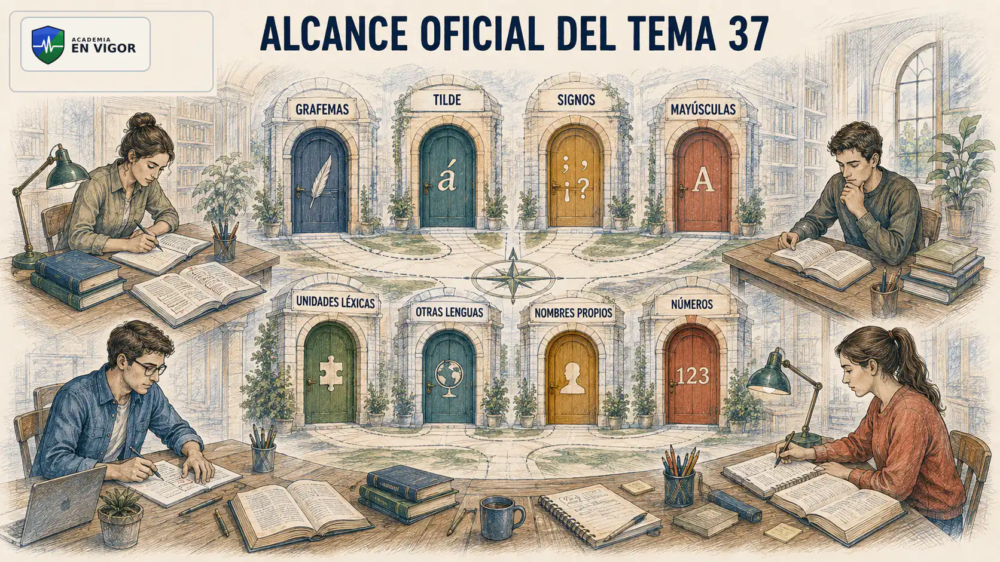

<em>Infografía: Alcance oficial del Tema 37.</em>

:::hablemos-claro
Estudia el tema como ocho puertas; una respuesta puede ser correcta en letras y fallar en tilde, espacio o mayúscula.
:::

:::en-la-calle
Al fijar el sistema gráfico antes de memorizar reglas, Estudia el tema como ocho puertas; una respuesta puede ser correcta en letras y fallar en tilde, espacio o mayúscula.
:::

:::lo-que-cae
Prioriza **ocho ámbitos ortográficos** y descarta respuestas que confundan grafía, tilde, espacio, signo o mayúscula.
:::

<!-- FUENTE: CONVOCATORIA-PN-2026-T37 -->

## 02. Ortografía, norma y escritura

### Lógica del bloque

Para dominar **ortografía, norma y escritura**, aplica esta regla: La pronunciación varía; la escritura común actúa como un mapa compartido entre variedades. El anclaje principal es **convención gráfica compartida**.

### Hechos examinables

- La ortografía es el conjunto de normas que regulan la escritura de una lengua. <!-- FACT:PN-T37-F005 -->
- La norma ortográfica atiende a letras, tildes, signos, mayúsculas, separación de palabras y otras convenciones gráficas. <!-- FACT:PN-T37-F006 -->
- La ortografía permite representar el lenguaje y facilita una interpretación común del texto escrito. <!-- FACT:PN-T37-F007 -->
- La corrección ortográfica no se identifica con la pronunciación de una sola zona: la norma es panhispánica. <!-- FACT:PN-T37-F008 -->

### Ejemplos razonados

- **Aplicación correcta:** Quienes sesean y quienes distinguen /s/ y /θ/ comparten las grafías casa y caza.
- **Contraste útil:** Punto, mayúscula inicial y separación también forman parte de la corrección.

### Trampas de examen

- **Incorrecto:** Cada hablante debe escribir exactamente como pronuncia.
- **Incorrecto:** La ortografía solo regula las letras y nunca los espacios.

<!-- VISUAL:t37-02-ortografia-norma-y-escritura.webp -->

  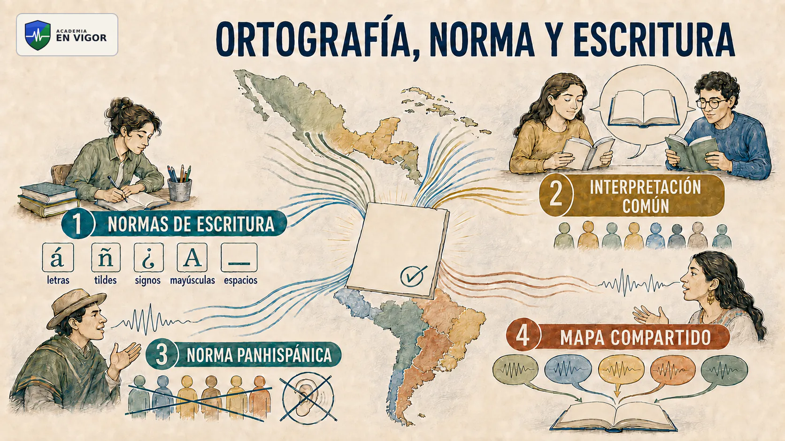

<em>Infografía: Ortografía, norma y escritura.</em>

:::hablemos-claro
La pronunciación varía; la escritura común actúa como un mapa compartido entre variedades.
:::

:::en-la-calle
Al fijar el sistema gráfico antes de memorizar reglas, La pronunciación varía; la escritura común actúa como un mapa compartido entre variedades.
:::

:::lo-que-cae
Prioriza **convención gráfica compartida** y descarta respuestas que confundan grafía, tilde, espacio, signo o mayúscula.
:::

<!-- FUENTE: RAE-OLE-GRAFEMAS-T37 -->

## 03. Sonido, fonema y grafema

### Lógica del bloque

Para dominar **sonido, fonema y grafema**, aplica esta regla: No emparejes voz y escritura como si fueran un cable único: hay desvíos, alternativas y grafemas sin sonido. El anclaje principal es **unidades fónicas y gráficas**.

### Hechos examinables

- Un sonido es una realización concreta; un fonema es una unidad abstracta capaz de distinguir significados. <!-- FACT:PN-T37-F009 -->
- El grafema es la unidad mínima distintiva del sistema gráfico y se representa mediante una letra. <!-- FACT:PN-T37-F010 -->
- La relación entre fonemas y grafemas no es siempre biunívoca en español. <!-- FACT:PN-T37-F011 -->
- Un mismo fonema puede representarse con grafemas distintos y un grafema puede tener valores fónicos diferentes. <!-- FACT:PN-T37-F012 -->

### Ejemplos razonados

- **Aplicación correcta:** El fonema /b/ puede escribirse con b o v.
- **Contraste útil:** La c no representa el mismo fonema en casa y cero en las zonas con distinción.

### Trampas de examen

- **Incorrecto:** Cada sonido distinto exige necesariamente una letra distinta.
- **Incorrecto:** Todo grafema representa siempre un único fonema en cualquier contexto.

<!-- VISUAL:t37-03-sonido-fonema-y-grafema.webp -->

  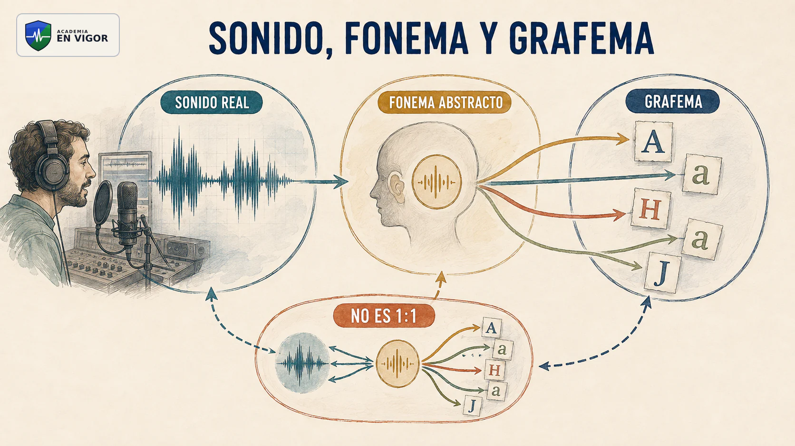

<em>Infografía: Sonido, fonema y grafema.</em>

:::hablemos-claro
No emparejes voz y escritura como si fueran un cable único: hay desvíos, alternativas y grafemas sin sonido.
:::

:::en-la-calle
Al fijar el sistema gráfico antes de memorizar reglas, No emparejes voz y escritura como si fueran un cable único: hay desvíos, alternativas y grafemas sin sonido.
:::

:::lo-que-cae
Prioriza **unidades fónicas y gráficas** y descarta respuestas que confundan grafía, tilde, espacio, signo o mayúscula.
:::

<!-- FUENTE: RAE-OLE-GRAFEMAS-T37 -->

## 04. El abecedario español

### Lógica del bloque

Para dominar **el abecedario español**, aplica esta regla: Cuenta signos simples, no sonidos: 27 letras; ch y ll trabajan en pareja, pero no obtienen asiento propio. El anclaje principal es **veintisiete letras**.

### Hechos examinables

- El abecedario español está formado por veintisiete letras. <!-- FACT:PN-T37-F013 -->
- La ñ es una letra del abecedario español. <!-- FACT:PN-T37-F014 -->
- Ch y ll no son letras independientes del abecedario, sino dígrafos. <!-- FACT:PN-T37-F015 -->
- Las palabras con ch y ll se alfabetizan dentro de c y l, respectivamente. <!-- FACT:PN-T37-F016 -->

### Ejemplos razonados

- **Aplicación correcta:** Chile se ordena después de ceniza y antes de cicatriz.
- **Contraste útil:** Llama se alfabetiza entre las palabras que comienzan por li y lo según sus letras.

### Trampas de examen

- **Incorrecto:** El abecedario actual tiene veintinueve letras porque incluye ch y ll.
- **Incorrecto:** La ñ es una variante tipográfica de n sin valor propio.

<!-- VISUAL:t37-il-04-el-abecedario-espanol.webp -->

  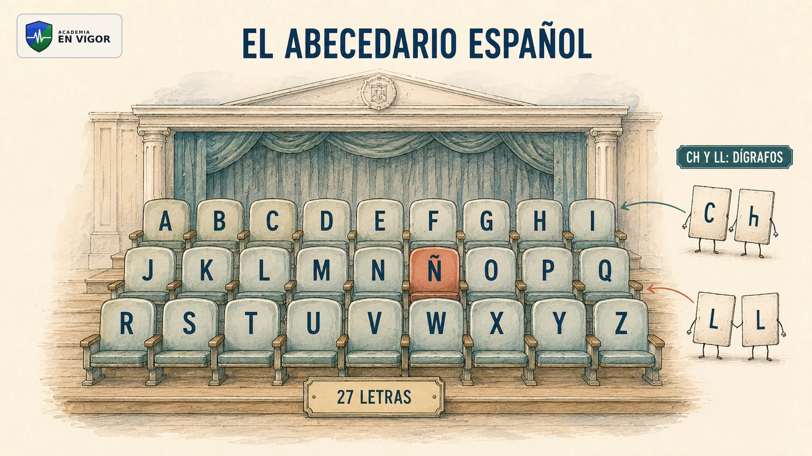

<em>Infografía: El abecedario español.</em>

:::hablemos-claro
Cuenta signos simples, no sonidos: 27 letras; ch y ll trabajan en pareja, pero no obtienen asiento propio.
:::

:::en-la-calle
Al fijar el sistema gráfico antes de memorizar reglas, Cuenta signos simples, no sonidos: 27 letras; ch y ll trabajan en pareja, pero no obtienen asiento propio.
:::

:::lo-que-cae
Prioriza **veintisiete letras** y descarta respuestas que confundan grafía, tilde, espacio, signo o mayúscula.
:::

<!-- FUENTE: RAE-OLE-GRAFEMAS-T37 -->

## 05. Nombres de las letras

### Lógica del bloque

Para dominar **nombres de las letras**, aplica esta regla: Distingue recomendación unificadora de prohibición: la Academia propone nombres comunes sin borrar variantes arraigadas. El anclaje principal es **denominaciones recomendadas y variantes**.

### Hechos examinables

- Las denominaciones recomendadas incluyen uve para v, ye para y y uve doble para w. <!-- FACT:PN-T37-F017 -->
- La recomendación de un nombre común no convierte en incorrectas todas las variantes tradicionales vigentes. <!-- FACT:PN-T37-F018 -->
- El nombre de una letra se escribe con minúscula cuando se menciona como nombre común. <!-- FACT:PN-T37-F019 -->
- Los nombres de las letras son palabras y siguen las reglas generales de escritura que les correspondan. <!-- FACT:PN-T37-F020 -->

### Ejemplos razonados

- **Aplicación correcta:** La palabra vaso se escribe con uve.
- **Contraste útil:** En distintos países se usan también ve corta o doble u como denominaciones tradicionales.

### Trampas de examen

- **Incorrecto:** Las variantes ve corta e i griega están prohibidas en todo el ámbito hispánico.
- **Incorrecto:** Los nombres de las letras deben escribirse siempre con mayúscula.

<!-- VISUAL:t37-05-nombres-de-las-letras.webp -->

  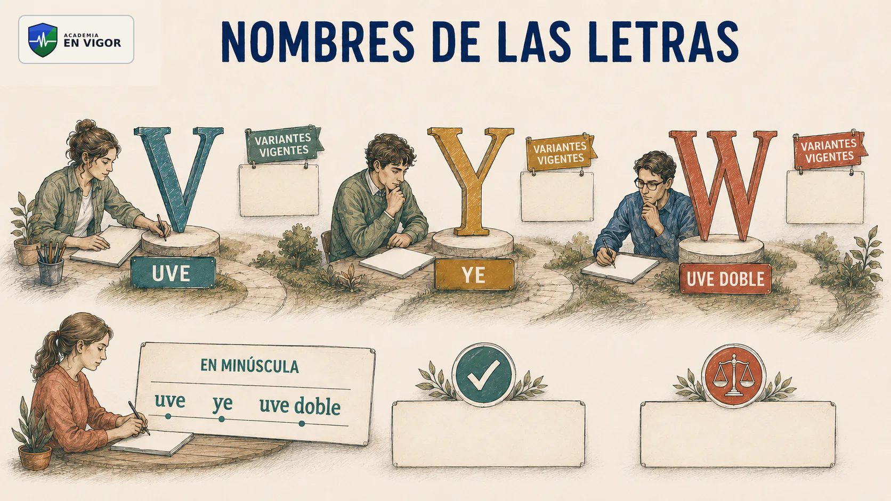

<em>Infografía: Nombres de las letras.</em>

:::hablemos-claro
Distingue recomendación unificadora de prohibición: la Academia propone nombres comunes sin borrar variantes arraigadas.
:::

:::en-la-calle
Al fijar el sistema gráfico antes de memorizar reglas, Distingue recomendación unificadora de prohibición: la Academia propone nombres comunes sin borrar variantes arraigadas.
:::

:::lo-que-cae
Prioriza **denominaciones recomendadas y variantes** y descarta respuestas que confundan grafía, tilde, espacio, signo o mayúscula.
:::

<!-- FUENTE: RAE-OLE-GRAFEMAS-T37 -->

## 06. Dígrafos del español

### Lógica del bloque

Para dominar **dígrafos del español**, aplica esta regla: Dos letras forman dígrafo solo si realizan juntas un trabajo fónico único; no basta con que estén juntas. El anclaje principal es **ch, ll, gu, qu y rr**.

### Hechos examinables

- Un dígrafo es una secuencia de dos letras que representa un solo fonema. <!-- FACT:PN-T37-F021 -->
- Son dígrafos del español ch, ll, gu, qu y rr en los contextos en que funcionan como unidades gráficas. <!-- FACT:PN-T37-F022 -->
- En gu ante e o i, la u puede carecer de sonido; la diéresis indica que debe pronunciarse. <!-- FACT:PN-T37-F023 -->
- El dígrafo rr representa el fonema vibrante múltiple entre vocales y no aparece al inicio de palabra. <!-- FACT:PN-T37-F024 -->

### Ejemplos razonados

- **Aplicación correcta:** Ch representa un solo fonema en chico.
- **Contraste útil:** Guerra y pingüino muestran la diferencia entre u muda y u pronunciada.

### Trampas de examen

- **Incorrecto:** Todo grupo de dos consonantes es un dígrafo.
- **Incorrecto:** La u de guitarra se pronuncia siempre.

<!-- VISUAL:t37-06-digrafos-del-espanol.webp -->

  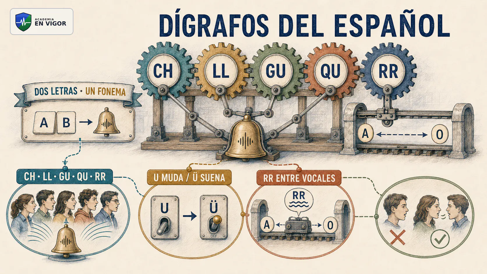

<em>Infografía: Dígrafos del español.</em>

:::hablemos-claro
Dos letras forman dígrafo solo si realizan juntas un trabajo fónico único; no basta con que estén juntas.
:::

:::en-la-calle
Al fijar el sistema gráfico antes de memorizar reglas, Dos letras forman dígrafo solo si realizan juntas un trabajo fónico único; no basta con que estén juntas.
:::

:::lo-que-cae
Prioriza **ch, ll, gu, qu y rr** y descarta respuestas que confundan grafía, tilde, espacio, signo o mayúscula.
:::

<!-- FUENTE: RAE-OLE-GRAFEMAS-T37 -->

## 07. Correspondencias regulares y zonas de duda

### Lógica del bloque

Para dominar **correspondencias regulares y zonas de duda**, aplica esta regla: Usa reglas donde existan y memoria de familias o diccionario donde la pronunciación no decida. El anclaje principal es **desajustes entre fonemas y grafemas**.

### Hechos examinables

- La escritura española presenta correspondencias bastante regulares, pero conserva zonas de duda ortográfica. <!-- FACT:PN-T37-F025 -->
- Las dudas aumentan cuando varios grafemas representan el mismo fonema en una variedad de pronunciación. <!-- FACT:PN-T37-F026 -->
- La h carece normalmente de valor fónico en el español estándar actual, pero tiene valor ortográfico. <!-- FACT:PN-T37-F027 -->
- La pronunciación por sí sola no resuelve oposiciones como b/v, g/j, h o ll/y en muchas variedades. <!-- FACT:PN-T37-F028 -->

### Ejemplos razonados

- **Aplicación correcta:** Vaca y baca pueden sonar igual y significar cosas distintas.
- **Contraste útil:** Hola y ola se distinguen gráficamente aunque la h sea muda.

### Trampas de examen

- **Incorrecto:** La ortografía española es enteramente fonética y no requiere memoria léxica.
- **Incorrecto:** Una letra sin sonido puede eliminarse libremente.

<!-- VISUAL:t37-il-07-correspondencias-regulares-y-zonas-de-duda.webp -->

  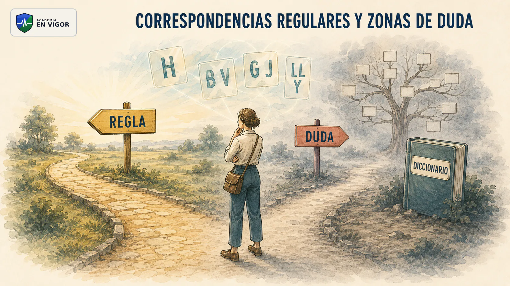

<em>Infografía: Correspondencias regulares y zonas de duda.</em>

:::hablemos-claro
Usa reglas donde existan y memoria de familias o diccionario donde la pronunciación no decida.
:::

:::en-la-calle
Al fijar el sistema gráfico antes de memorizar reglas, Usa reglas donde existan y memoria de familias o diccionario donde la pronunciación no decida.
:::

:::lo-que-cae
Prioriza **desajustes entre fonemas y grafemas** y descarta respuestas que confundan grafía, tilde, espacio, signo o mayúscula.
:::

<!-- FUENTE: RAE-OLE-GRAFEMAS-T37 -->

## 08. Regla, familia y diccionario

### Lógica del bloque

Para dominar **regla, familia y diccionario**, aplica esta regla: La ortografía no se gana inventando reglas: primero norma, después familia transparente y, si queda duda, diccionario. El anclaje principal es **jerarquía para resolver dudas**.

### Hechos examinables

- Una regla productiva debe aplicarse con las excepciones y límites que la propia norma reconoce. <!-- FACT:PN-T37-F029 -->
- La pertenencia a una familia léxica ayuda a conservar grafías cuando existe relación formal y semántica clara. <!-- FACT:PN-T37-F030 -->
- La etimología explica muchas grafías, pero no autoriza al hablante a reconstruirlas por intuición. <!-- FACT:PN-T37-F031 -->
- Cuando una grafía no puede deducirse con seguridad, la consulta del diccionario académico es el criterio fiable. <!-- FACT:PN-T37-F032 -->

### Ejemplos razonados

- **Aplicación correcta:** Huevo conserva h en sus derivados huevera y huevería.
- **Contraste útil:** Óseo pertenece a la familia de hueso, pero su forma no conserva el diptongo ni la h.

### Trampas de examen

- **Incorrecto:** Una palabra parecida transmite siempre su grafía a otra.
- **Incorrecto:** Toda regla escolar admite aplicarse sin excepciones.

<!-- VISUAL:t37-08-regla-familia-y-diccionario.webp -->

  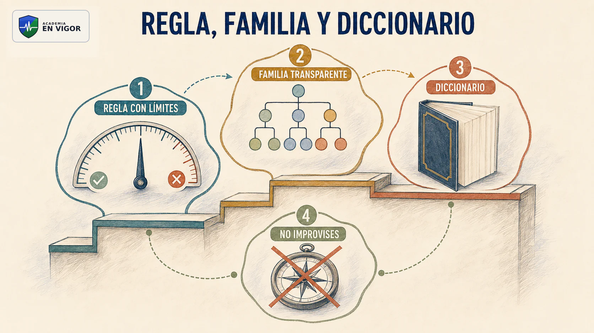

<em>Infografía: Regla, familia y diccionario.</em>

:::hablemos-claro
La ortografía no se gana inventando reglas: primero norma, después familia transparente y, si queda duda, diccionario.
:::

:::en-la-calle
Al fijar el sistema gráfico antes de memorizar reglas, La ortografía no se gana inventando reglas: primero norma, después familia transparente y, si queda duda, diccionario.
:::

:::lo-que-cae
Prioriza **jerarquía para resolver dudas** y descarta respuestas que confundan grafía, tilde, espacio, signo o mayúscula.
:::

<!-- FUENTE: RAE-DPD2-T37 -->

## 09. Las letras b y v

### Lógica del bloque

Para dominar **las letras b y v**, aplica esta regla: Si el oído no separa b y v, no lo fuerces: usa la estructura y el significado de la palabra. El anclaje principal es **un fonema y dos grafemas en la mayor parte del ámbito**.

### Hechos examinables

- En la mayor parte del ámbito hispánico, b y v representan el mismo fonema /b/. <!-- FACT:PN-T37-F033 -->
- La pronunciación habitual no permite decidir por sí sola entre b y v. <!-- FACT:PN-T37-F034 -->
- La diferencia gráfica puede distinguir palabras homófonas como baca y vaca. <!-- FACT:PN-T37-F035 -->
- La elección de b o v se resuelve mediante reglas, familias léxicas y memoria de la palabra. <!-- FACT:PN-T37-F036 -->

### Ejemplos razonados

- **Aplicación correcta:** Grabar significa registrar sonidos o imágenes; gravar significa imponer un gravamen.
- **Contraste útil:** Rebelar y revelar no comparten significado ni grafía.

### Trampas de examen

- **Incorrecto:** La v española debe pronunciarse siempre como la v francesa.
- **Incorrecto:** B y v pueden intercambiarse si no cambia la pronunciación.

<!-- VISUAL:t37-09-las-letras-b-y-v.webp -->

  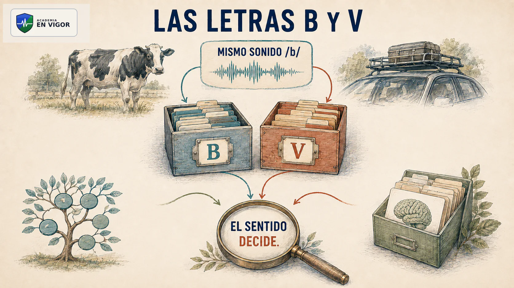

<em>Infografía: Las letras b y v.</em>

:::hablemos-claro
Si el oído no separa b y v, no lo fuerces: usa la estructura y el significado de la palabra.
:::

:::en-la-calle
Al elegir una letra que la pronunciación no distingue, Si el oído no separa b y v, no lo fuerces: usa la estructura y el significado de la palabra.
:::

:::lo-que-cae
Prioriza **un fonema y dos grafemas en la mayor parte del ámbito** y descarta respuestas que confundan grafía, tilde, espacio, signo o mayúscula.
:::

<!-- FUENTE: RAE-OLE-GRAFEMAS-T37 -->

## 10. B en secuencias y terminaciones frecuentes

### Lógica del bloque

Para dominar **b en secuencias y terminaciones frecuentes**, aplica esta regla: Son reglas potentes, pero no infinitas: aplica el patrón exacto y conserva sus excepciones léxicas. El anclaje principal es **mb, bl, br, -aba y -bilidad**.

### Hechos examinables

- Se escribe b después de m, como en cambio o también. <!-- FACT:PN-T37-F037 -->
- Se escribe b ante l o r en grupos como bl y br, como en blanco y brazo. <!-- FACT:PN-T37-F038 -->
- Las terminaciones -aba, -abas, -ábamos, -abais y -aban del pretérito imperfecto de indicativo se escriben con b. <!-- FACT:PN-T37-F039 -->
- La terminación -bilidad se escribe normalmente con b, sin extender la regla a excepciones como movilidad y civilidad. <!-- FACT:PN-T37-F040 -->

### Ejemplos razonados

- **Aplicación correcta:** Cantábamos y llegaban llevan b por la terminación verbal.
- **Contraste útil:** Amabilidad lleva b; movilidad conserva la v de móvil.

### Trampas de examen

- **Incorrecto:** Después de m se escribe siempre v.
- **Incorrecto:** Toda palabra terminada en -ilidad debe llevar b.

<!-- VISUAL:t37-10-b-en-secuencias-y-terminaciones-frecuentes.webp -->

  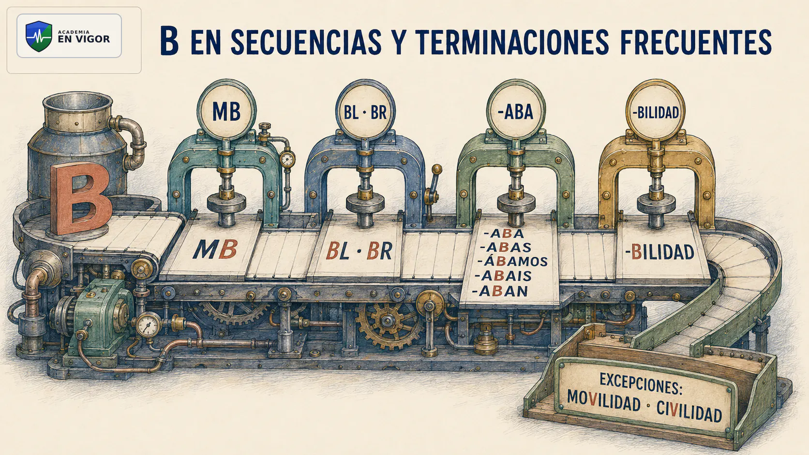

<em>Infografía: B en secuencias y terminaciones frecuentes.</em>

:::hablemos-claro
Son reglas potentes, pero no infinitas: aplica el patrón exacto y conserva sus excepciones léxicas.
:::

:::en-la-calle
Al elegir una letra que la pronunciación no distingue, Son reglas potentes, pero no infinitas: aplica el patrón exacto y conserva sus excepciones léxicas.
:::

:::lo-que-cae
Prioriza **mb, bl, br, -aba y -bilidad** y descarta respuestas que confundan grafía, tilde, espacio, signo o mayúscula.
:::

<!-- FUENTE: RAE-OLE-GRAFEMAS-T37 -->

## 11. V en formas y familias

### Lógica del bloque

Para dominar **v en formas y familias**, aplica esta regla: Busca la forma de origen y el sufijo real; una coincidencia sonora no basta. El anclaje principal es **andar, estar, tener y derivados**.

### Hechos examinables

- Las formas de andar, estar y tener que contienen el sonido /b/ y no llevan b en el infinitivo se escriben con v: anduve, estuve, tuve. <!-- FACT:PN-T37-F041 -->
- Los derivados conservan normalmente la grafía de una base transparente, como vivir en convivencia o volver en devolución. <!-- FACT:PN-T37-F042 -->
- Los adjetivos terminados en -ivo e -iva suelen escribirse con v, como activo o decisiva. <!-- FACT:PN-T37-F043 -->
- La regla de -ivo no debe aplicarse a cualquier secuencia final parecida ni sustituye la consulta de excepciones. <!-- FACT:PN-T37-F044 -->

### Ejemplos razonados

- **Aplicación correcta:** Tuve y estuvieron se escriben con v.
- **Contraste útil:** Decisivo se relaciona con decidir y contiene el sufijo -ivo.

### Trampas de examen

- **Incorrecto:** Andube es correcta porque b y v suenan igual.
- **Incorrecto:** Toda palabra que termina en sonido /ibo/ se escribe con v.

<!-- VISUAL:t37-11-v-en-formas-y-familias.webp -->

  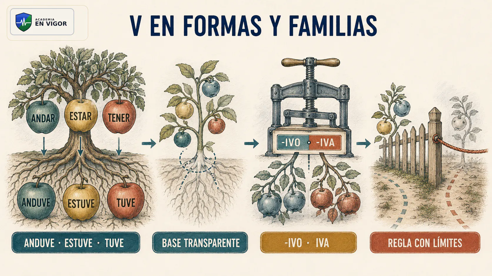

<em>Infografía: V en formas y familias.</em>

:::hablemos-claro
Busca la forma de origen y el sufijo real; una coincidencia sonora no basta.
:::

:::en-la-calle
Al elegir una letra que la pronunciación no distingue, Busca la forma de origen y el sufijo real; una coincidencia sonora no basta.
:::

:::lo-que-cae
Prioriza **andar, estar, tener y derivados** y descarta respuestas que confundan grafía, tilde, espacio, signo o mayúscula.
:::

<!-- FUENTE: RAE-OLE-GRAFEMAS-T37 -->

## 12. Las letras g y j ante e, i

### Lógica del bloque

Para dominar **las letras g y j ante e, i**, aplica esta regla: Ante e e i hay cruce de caminos: sonido igual, letras posibles distintas; decide por regla o palabra. El anclaje principal es **dos grafías para /x/**.

### Hechos examinables

- Ante e o i, g y j pueden representar el fonema /x/, como en gente y jefe. <!-- FACT:PN-T37-F045 -->
- La j representa /x/ ante cualquier vocal en palabras como jamón, jefe, jirafa, joven y júbilo. <!-- FACT:PN-T37-F046 -->
- La g representa /g/ ante a, o, u y puede representar /x/ ante e, i. <!-- FACT:PN-T37-F047 -->
- La pronunciación de /x/ ante e o i no basta para elegir entre g y j. <!-- FACT:PN-T37-F048 -->

### Ejemplos razonados

- **Aplicación correcta:** Girar y jirafa comienzan con el mismo fonema y distinta grafía.
- **Contraste útil:** Gato y goma muestran el valor /g/ de g ante a y o.

### Trampas de examen

- **Incorrecto:** La g tiene el mismo valor en gato y gente.
- **Incorrecto:** La j solo puede aparecer ante a, o y u.

<!-- VISUAL:t37-il-12-las-letras-g-y-j-ante-e-i.webp -->

  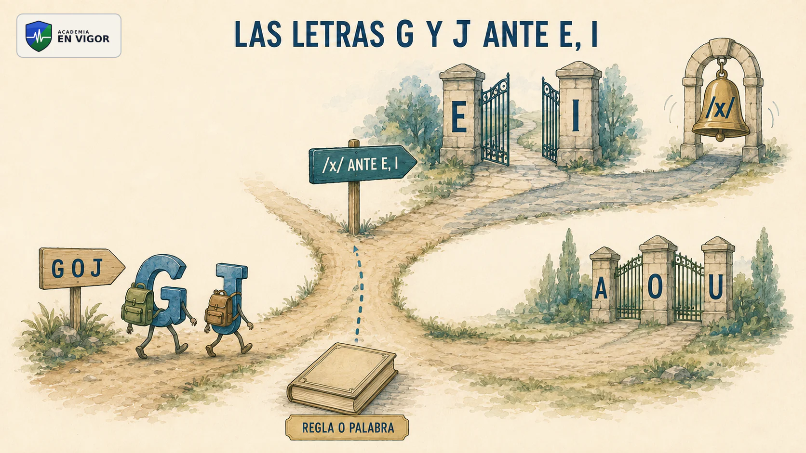

<em>Infografía: Las letras g y j ante e, i.</em>

:::hablemos-claro
Ante e e i hay cruce de caminos: sonido igual, letras posibles distintas; decide por regla o palabra.
:::

:::en-la-calle
Al elegir una letra que la pronunciación no distingue, Ante e e i hay cruce de caminos: sonido igual, letras posibles distintas; decide por regla o palabra.
:::

:::lo-que-cae
Prioriza **dos grafías para /x/** y descarta respuestas que confundan grafía, tilde, espacio, signo o mayúscula.
:::

<!-- FUENTE: RAE-OLE-GRAFEMAS-T37 -->

## 13. Gu y gü ante e, i

### Lógica del bloque

Para dominar **gu y gü ante e, i**, aplica esta regla: La diéresis es un interruptor: solo en güe y güi enciende una u que, sin ella, quedaría muda. El anclaje principal es **u muda y diéresis**.

### Hechos examinables

- Para representar /g/ ante e o i se usa normalmente el dígrafo gu, como en guerra y guitarra. <!-- FACT:PN-T37-F049 -->
- En gue y gui, la u no se pronuncia normalmente. <!-- FACT:PN-T37-F050 -->
- La diéresis sobre la u indica que esta vocal se pronuncia en güe y güi. <!-- FACT:PN-T37-F051 -->
- La diéresis no se coloca en gua o guo, donde la u ya se pronuncia sin necesidad de marca. <!-- FACT:PN-T37-F052 -->

### Ejemplos razonados

- **Aplicación correcta:** Pingüino y vergüenza llevan diéresis.
- **Contraste útil:** Guapo y antiguo no la necesitan.

### Trampas de examen

- **Incorrecto:** La u de guerra debe pronunciarse.
- **Incorrecto:** La forma paragüas necesita diéresis para que suene la u.

<!-- VISUAL:t37-13-gu-y-gu-ante-e-i.webp -->

  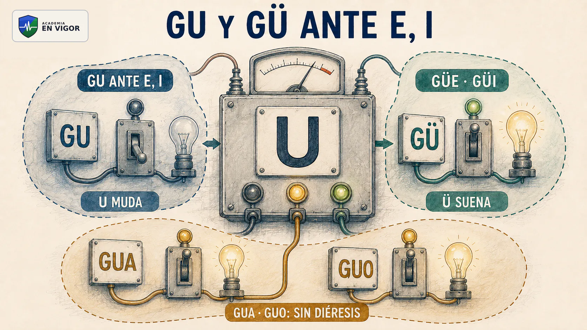

<em>Infografía: Gu y gü ante e, i.</em>

:::hablemos-claro
La diéresis es un interruptor: solo en güe y güi enciende una u que, sin ella, quedaría muda.
:::

:::en-la-calle
Al elegir una letra que la pronunciación no distingue, La diéresis es un interruptor: solo en güe y güi enciende una u que, sin ella, quedaría muda.
:::

:::lo-que-cae
Prioriza **u muda y diéresis** y descarta respuestas que confundan grafía, tilde, espacio, signo o mayúscula.
:::

<!-- FUENTE: RAE-OLE-GRAFEMAS-T37 -->

## 14. C, z y s

### Lógica del bloque

Para dominar **c, z y s**, aplica esta regla: Pronunciar igual no significa escribir igual: la variedad oral es legítima y la distinción gráfica sigue vigente. El anclaje principal es **seseo, ceceo y distinción**.

### Hechos examinables

- En las zonas con distinción, c ante e, i y z representan /θ/, mientras s representa /s/. <!-- FACT:PN-T37-F053 -->
- En las zonas de seseo, c ante e, i, z y s pueden coincidir en la pronunciación /s/. <!-- FACT:PN-T37-F054 -->
- El seseo es un rasgo de pronunciación aceptado y no autoriza a intercambiar grafías. <!-- FACT:PN-T37-F055 -->
- La elección entre c, z y s se mantiene por la norma ortográfica común, con independencia de la variedad oral. <!-- FACT:PN-T37-F056 -->

### Ejemplos razonados

- **Aplicación correcta:** Cocer y coser pueden ser homófonas para un hablante seseante.
- **Contraste útil:** Cero se escribe con c y zapato con z.

### Trampas de examen

- **Incorrecto:** El seseo es una falta ortográfica.
- **Incorrecto:** Quien sesea puede escribir casar y cazar indistintamente.

<!-- VISUAL:t37-14-c-z-y-s.webp -->

  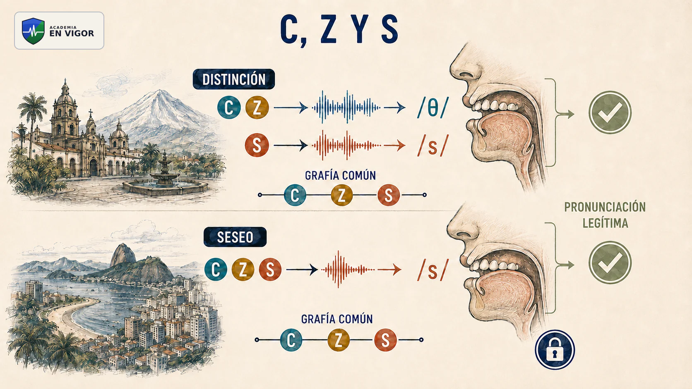

<em>Infografía: C, z y s.</em>

:::hablemos-claro
Pronunciar igual no significa escribir igual: la variedad oral es legítima y la distinción gráfica sigue vigente.
:::

:::en-la-calle
Al elegir una letra que la pronunciación no distingue, Pronunciar igual no significa escribir igual: la variedad oral es legítima y la distinción gráfica sigue vigente.
:::

:::lo-que-cae
Prioriza **seseo, ceceo y distinción** y descarta respuestas que confundan grafía, tilde, espacio, signo o mayúscula.
:::

<!-- FUENTE: RAE-OLE-GRAFEMAS-T37 -->

## 15. C y z en flexión y derivación

### Lógica del bloque

Para dominar **c y z en flexión y derivación**, aplica esta regla: La familia se mantiene aunque cambie la pieza gráfica exigida por la vocal siguiente. El anclaje principal es **alternancias z/c**.

### Hechos examinables

- La z se escribe normalmente ante a, o, u y al final de sílaba o palabra. <!-- FACT:PN-T37-F057 -->
- Ante e o i, muchas familias alternan z con c: pez/peces y empezar/empiece. <!-- FACT:PN-T37-F058 -->
- La alternancia z/c puede responder a la distribución gráfica sin romper la relación de familia. <!-- FACT:PN-T37-F059 -->
- No toda palabra con el mismo sonido pertenece a la misma familia ni comparte necesariamente grafía. <!-- FACT:PN-T37-F060 -->

### Ejemplos razonados

- **Aplicación correcta:** Luz forma luces; juez forma jueces.
- **Contraste útil:** Empiezo y empiece pertenecen al mismo verbo.

### Trampas de examen

- **Incorrecto:** El plural de pez es pezes.
- **Incorrecto:** Una familia léxica debe conservar siempre la misma letra sin alternancias.

<!-- VISUAL:t37-15-c-y-z-en-flexion-y-derivacion.webp -->

  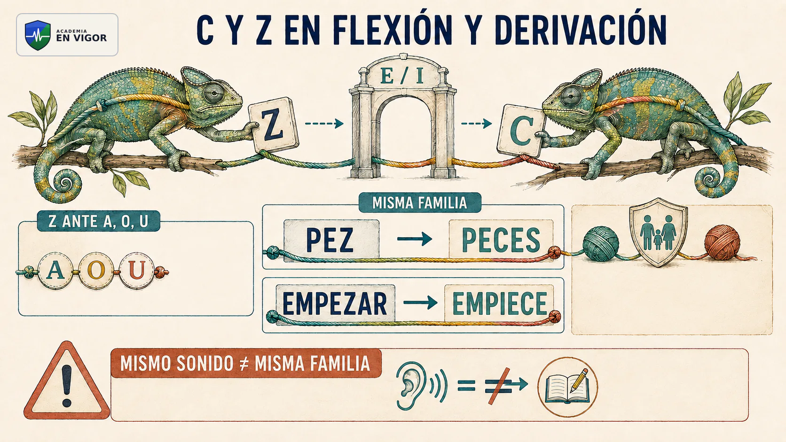

<em>Infografía: C y z en flexión y derivación.</em>

:::hablemos-claro
La familia se mantiene aunque cambie la pieza gráfica exigida por la vocal siguiente.
:::

:::en-la-calle
Al elegir una letra que la pronunciación no distingue, La familia se mantiene aunque cambie la pieza gráfica exigida por la vocal siguiente.
:::

:::lo-que-cae
Prioriza **alternancias z/c** y descarta respuestas que confundan grafía, tilde, espacio, signo o mayúscula.
:::

<!-- FUENTE: RAE-OLE-GRAFEMAS-T37 -->

## 16. K, qu y c para el fonema /k/

### Lógica del bloque

Para dominar **k, qu y c para el fonema /k/**, aplica esta regla: Para /k/, c cubre a-o-u, qu cubre e-i y k aparece en vocabulario específico o prestado. El anclaje principal es **distribución gráfica de /k/**.

### Hechos examinables

- El fonema /k/ se representa normalmente con c ante a, o, u y con qu ante e, i. <!-- FACT:PN-T37-F061 -->
- En que y qui, la u del dígrafo qu no se pronuncia. <!-- FACT:PN-T37-F062 -->
- La k aparece sobre todo en préstamos, unidades y nombres propios, aunque forma parte del abecedario español. <!-- FACT:PN-T37-F063 -->
- No se usa diéresis para hacer sonar la u de qu; cuando la u se pronuncia, la secuencia gráfica es distinta, como en cuota. <!-- FACT:PN-T37-F064 -->

### Ejemplos razonados

- **Aplicación correcta:** Casa, cosa y cuna llevan c.
- **Contraste útil:** Queso y quizá llevan qu.

### Trampas de examen

- **Incorrecto:** La u de queso se pronuncia.
- **Incorrecto:** La k no pertenece al abecedario español.

<!-- VISUAL:t37-16-k-qu-y-c-para-el-fonema-k.webp -->

  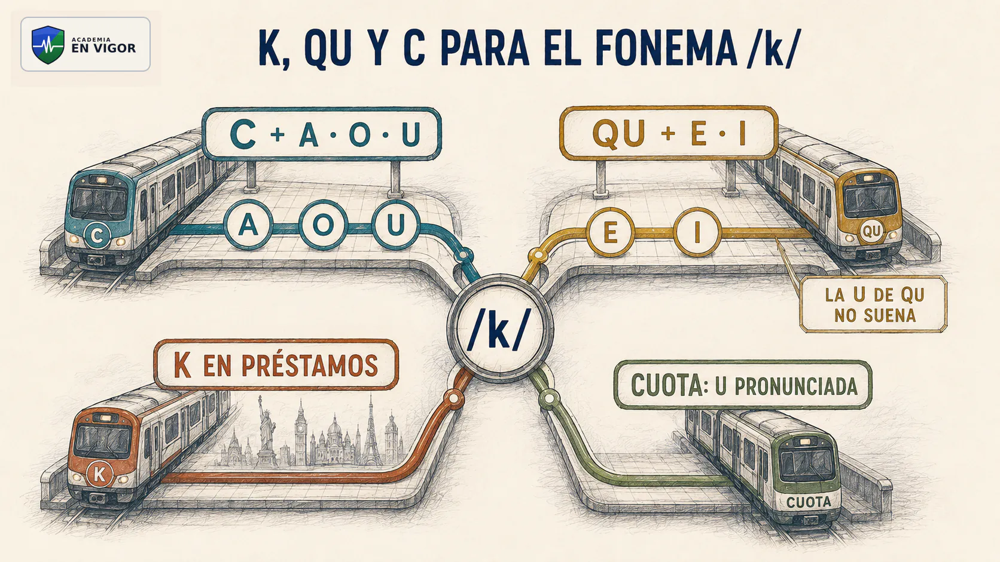

<em>Infografía: K, qu y c para el fonema /k/.</em>

:::hablemos-claro
Para /k/, c cubre a-o-u, qu cubre e-i y k aparece en vocabulario específico o prestado.
:::

:::en-la-calle
Al elegir una letra que la pronunciación no distingue, Para /k/, c cubre a-o-u, qu cubre e-i y k aparece en vocabulario específico o prestado.
:::

:::lo-que-cae
Prioriza **distribución gráfica de /k/** y descarta respuestas que confundan grafía, tilde, espacio, signo o mayúscula.
:::

<!-- FUENTE: RAE-OLE-GRAFEMAS-T37 -->

## 17. I e y con valor vocálico

### Lógica del bloque

Para dominar **i e y con valor vocálico**, aplica esta regla: La y tiene doble oficio: suele ser consonante, pero en posiciones concretas trabaja como vocal. El anclaje principal es **vocal i y consonante y**.

### Hechos examinables

- La i representa normalmente el fonema vocálico /i/. <!-- FACT:PN-T37-F065 -->
- La y puede representar un fonema consonántico y, en ciertos contextos, el fonema vocálico /i/. <!-- FACT:PN-T37-F066 -->
- La conjunción copulativa se escribe y, salvo la variante e exigida ante determinadas palabras que comienzan por sonido /i/. <!-- FACT:PN-T37-F067 -->
- Al final de algunas palabras, la y puede tener valor vocálico, como en hoy, rey o Uruguay. <!-- FACT:PN-T37-F068 -->

### Ejemplos razonados

- **Aplicación correcta:** Rey termina en y con valor vocálico.
- **Contraste útil:** Padres e hijos usa e por el sonido inicial de hijos.

### Trampas de examen

- **Incorrecto:** La y representa siempre una consonante.
- **Incorrecto:** La conjunción copulativa se escribe siempre i.

<!-- VISUAL:t37-17-i-e-y-con-valor-vocalico.webp -->

  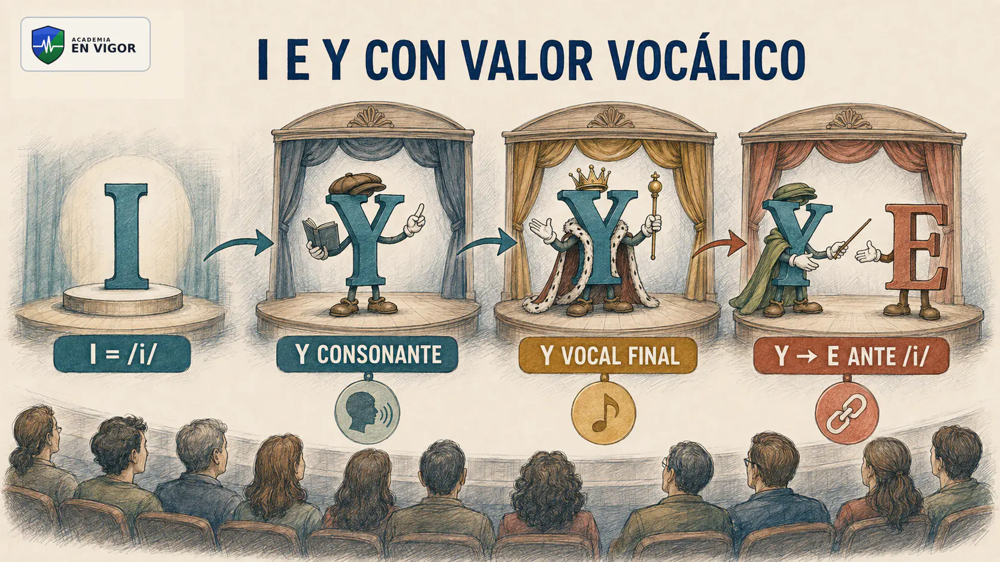

<em>Infografía: I e y con valor vocálico.</em>

:::hablemos-claro
La y tiene doble oficio: suele ser consonante, pero en posiciones concretas trabaja como vocal.
:::

:::en-la-calle
Al elegir una letra que la pronunciación no distingue, La y tiene doble oficio: suele ser consonante, pero en posiciones concretas trabaja como vocal.
:::

:::lo-que-cae
Prioriza **vocal i y consonante y** y descarta respuestas que confundan grafía, tilde, espacio, signo o mayúscula.
:::

<!-- FUENTE: RAE-OLE-GRAFEMAS-T37 -->

## 18. Ll e y

### Lógica del bloque

Para dominar **ll e y**, aplica esta regla: El oído yeísta no separa ll e y; el significado y la memoria gráfica sí. El anclaje principal es **yeísmo y distinción**.

### Hechos examinables

- Ll es un dígrafo y y es una letra. <!-- FACT:PN-T37-F069 -->
- En zonas yeístas, ll e y representan el mismo fonema en la pronunciación. <!-- FACT:PN-T37-F070 -->
- El yeísmo es un fenómeno oral extendido y aceptado, pero no elimina la diferencia ortográfica. <!-- FACT:PN-T37-F071 -->
- Palabras como vaya, valla y baya pueden coincidir en la pronunciación y conservar grafías y significados distintos. <!-- FACT:PN-T37-F072 -->

### Ejemplos razonados

- **Aplicación correcta:** Vaya es forma de ir; valla es cerca; baya es fruto.
- **Contraste útil:** Cayó y calló se distinguen por grafía y sentido.

### Trampas de examen

- **Incorrecto:** El yeísmo permite escribir yave por llave.
- **Incorrecto:** Ll sigue siendo una letra independiente del abecedario.

<!-- VISUAL:t37-il-18-ll-e-y.webp -->

  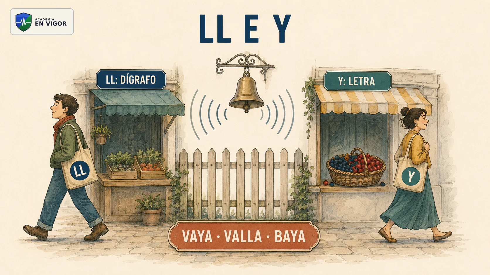

<em>Infografía: Ll e y.</em>

:::hablemos-claro
El oído yeísta no separa ll e y; el significado y la memoria gráfica sí.
:::

:::en-la-calle
Al elegir una letra que la pronunciación no distingue, El oído yeísta no separa ll e y; el significado y la memoria gráfica sí.
:::

:::lo-que-cae
Prioriza **yeísmo y distinción** y descarta respuestas que confundan grafía, tilde, espacio, signo o mayúscula.
:::

<!-- FUENTE: RAE-OLE-GRAFEMAS-T37 -->

## 19. R y rr

### Lógica del bloque

Para dominar **r y rr**, aplica esta regla: La fuerza del sonido no basta: la posición decide si la vibrante múltiple usa r o rr. El anclaje principal es **vibrante simple y múltiple**.

### Hechos examinables

- La r puede representar la vibrante simple o la múltiple según la posición. <!-- FACT:PN-T37-F073 -->
- Al inicio de palabra, una sola r representa la vibrante múltiple, como en rosa. <!-- FACT:PN-T37-F074 -->
- Entre vocales, rr representa la vibrante múltiple y r la simple: carro/caro. <!-- FACT:PN-T37-F075 -->
- Tras l, n o s, una sola r representa normalmente la vibrante múltiple, como en alrededor, enredo o israelí. <!-- FACT:PN-T37-F076 -->

### Ejemplos razonados

- **Aplicación correcta:** Rápido comienza con r, no rr.
- **Contraste útil:** Carro se opone a caro entre vocales.

### Trampas de examen

- **Incorrecto:** Toda vibrante múltiple se escribe rr.
- **Incorrecto:** La rr puede comenzar una palabra española.

<!-- VISUAL:t37-19-r-y-rr.webp -->

  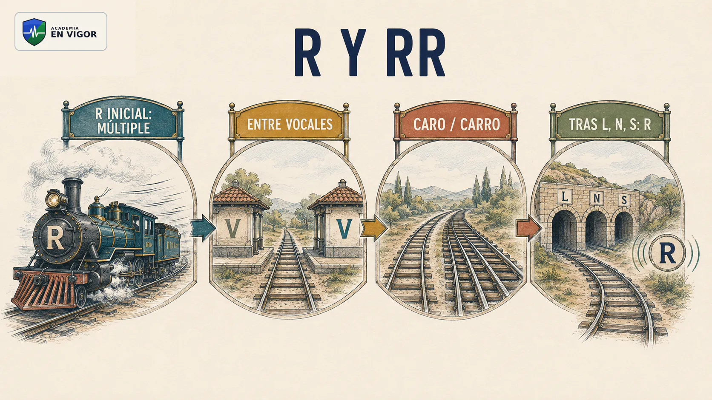

<em>Infografía: R y rr.</em>

:::hablemos-claro
La fuerza del sonido no basta: la posición decide si la vibrante múltiple usa r o rr.
:::

:::en-la-calle
Al elegir una letra que la pronunciación no distingue, La fuerza del sonido no basta: la posición decide si la vibrante múltiple usa r o rr.
:::

:::lo-que-cae
Prioriza **vibrante simple y múltiple** y descarta respuestas que confundan grafía, tilde, espacio, signo o mayúscula.
:::

<!-- FUENTE: RAE-OLE-GRAFEMAS-T37 -->

## 20. La letra h

### Lógica del bloque

Para dominar **la letra h**, aplica esta regla: La h es silenciosa, no decorativa: puede separar significados y forma parte de la palabra. El anclaje principal es **grafema normalmente mudo**.

### Hechos examinables

- La h carece normalmente de valor fónico en el español estándar actual. <!-- FACT:PN-T37-F077 -->
- La ausencia de sonido no elimina su valor distintivo y ortográfico. <!-- FACT:PN-T37-F078 -->
- Las familias pueden orientar la h cuando la relación es transparente, como hacer/hecho o heredar/herencia. <!-- FACT:PN-T37-F079 -->
- Existen pares como hasta/asta y hecho/echo cuya diferencia escrita afecta al significado. <!-- FACT:PN-T37-F080 -->

### Ejemplos razonados

- **Aplicación correcta:** He hecho el informe contiene dos palabras con h.
- **Contraste útil:** Echo la carta al buzón usa echo, forma de echar, sin h.

### Trampas de examen

- **Incorrecto:** La h puede omitirse porque no se pronuncia.
- **Incorrecto:** Toda palabra derivada conserva necesariamente la h visible de su base.

<!-- VISUAL:t37-20-la-letra-h.webp -->

  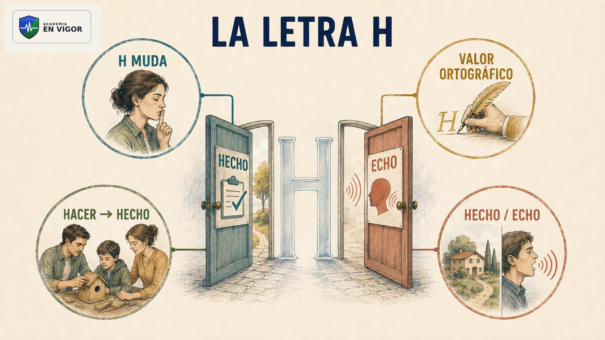

<em>Infografía: La letra h.</em>

:::hablemos-claro
La h es silenciosa, no decorativa: puede separar significados y forma parte de la palabra.
:::

:::en-la-calle
Al elegir una letra que la pronunciación no distingue, La h es silenciosa, no decorativa: puede separar significados y forma parte de la palabra.
:::

:::lo-que-cae
Prioriza **grafema normalmente mudo** y descarta respuestas que confundan grafía, tilde, espacio, signo o mayúscula.
:::

<!-- FUENTE: RAE-OLE-GRAFEMAS-T37 -->

## 21. M y n ante consonante

### Lógica del bloque

Para dominar **m y n ante consonante**, aplica esta regla: Antes de b y p, la m es la señal segura; la pronunciación rápida no reescribe la palabra. El anclaje principal es **m ante b y p**.

### Hechos examinables

- Se escribe m antes de b y p, como en cambio, también, campo o tiempo. <!-- FACT:PN-T37-F081 -->
- Ante v se escribe normalmente n, como en enviar o invierno. <!-- FACT:PN-T37-F082 -->
- La pronunciación nasal puede asimilarse al sonido siguiente sin alterar la grafía normativa. <!-- FACT:PN-T37-F083 -->
- Los prefijos y compuestos pueden conservar secuencias explicables por su estructura, por lo que la regla debe aplicarse al contexto real. <!-- FACT:PN-T37-F084 -->

### Ejemplos razonados

- **Aplicación correcta:** Imposible y cambio llevan m.
- **Contraste útil:** Invitar e invierno llevan n ante v.

### Trampas de examen

- **Incorrecto:** Antes de p se escribe n.
- **Incorrecto:** La nasal debe escribirse siempre como se oiga en el habla rápida.

<!-- VISUAL:t37-21-m-y-n-ante-consonante.webp -->

  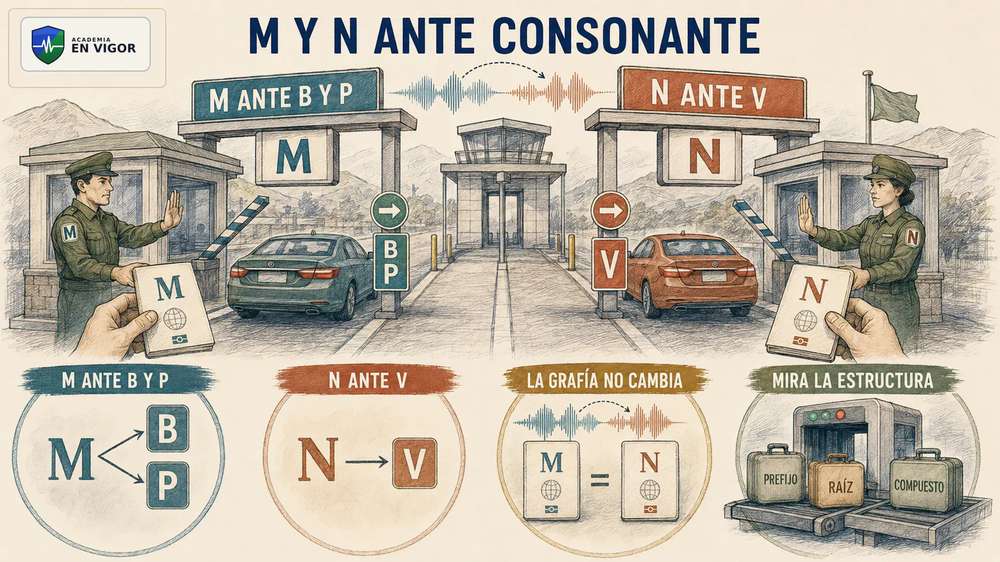

<em>Infografía: M y n ante consonante.</em>

:::hablemos-claro
Antes de b y p, la m es la señal segura; la pronunciación rápida no reescribe la palabra.
:::

:::en-la-calle
Al elegir una letra que la pronunciación no distingue, Antes de b y p, la m es la señal segura; la pronunciación rápida no reescribe la palabra.
:::

:::lo-que-cae
Prioriza **m ante b y p** y descarta respuestas que confundan grafía, tilde, espacio, signo o mayúscula.
:::

<!-- FUENTE: RAE-OLE-GRAFEMAS-T37 -->

## 22. X y s

### Lógica del bloque

Para dominar **x y s**, aplica esta regla: La x es una letra de varios valores; memoriza la grafía de la palabra, no una pronunciación simplificada. El anclaje principal es **valores de x y confusiones**.

### Hechos examinables

- La x representa habitualmente la secuencia /ks/ en posición intervocálica o final de sílaba, como en examen o texto. <!-- FACT:PN-T37-F085 -->
- En ciertos contextos y variedades, la pronunciación de x puede reducirse o variar sin que cambie la grafía. <!-- FACT:PN-T37-F086 -->
- No toda pronunciación próxima a /s/ se escribe con s: existen palabras fijadas con x. <!-- FACT:PN-T37-F087 -->
- En algunos topónimos y antropónimos, especialmente mexicanos, x puede representar un sonido semejante al de j, como en México. <!-- FACT:PN-T37-F088 -->

### Ejemplos razonados

- **Aplicación correcta:** Texto y experto conservan x.
- **Contraste útil:** México se escribe con x y se pronuncia habitualmente con el sonido de j.

### Trampas de examen

- **Incorrecto:** Examen puede escribirse esamen si se pronuncia con /s/.
- **Incorrecto:** La x representa siempre y únicamente /ks/.

<!-- VISUAL:t37-22-x-y-s.webp -->

  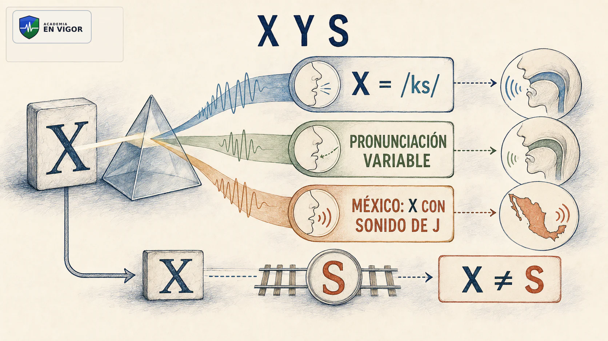

<em>Infografía: X y s.</em>

:::hablemos-claro
La x es una letra de varios valores; memoriza la grafía de la palabra, no una pronunciación simplificada.
:::

:::en-la-calle
Al elegir una letra que la pronunciación no distingue, La x es una letra de varios valores; memoriza la grafía de la palabra, no una pronunciación simplificada.
:::

:::lo-que-cae
Prioriza **valores de x y confusiones** y descarta respuestas que confundan grafía, tilde, espacio, signo o mayúscula.
:::

<!-- FUENTE: RAE-OLE-GRAFEMAS-T37 -->

## 23. La letra w

### Lógica del bloque

Para dominar **la letra w**, aplica esta regla: La w tiene pasaporte español, aunque gran parte de su equipaje venga de otras lenguas. El anclaje principal es **grafema en préstamos y nombres**.

### Hechos examinables

- La w forma parte del abecedario español. <!-- FACT:PN-T37-F089 -->
- Aparece principalmente en voces de origen extranjero y nombres propios. <!-- FACT:PN-T37-F090 -->
- Su valor fónico depende del origen y adaptación de la palabra, como /b/ en wolframio o un valor consonántico próximo a /u/ en voces de origen inglés. <!-- FACT:PN-T37-F091 -->
- Las adaptaciones asentadas pueden sustituir w por grafías propias del español, pero no se improvisan individualmente. <!-- FACT:PN-T37-F092 -->

### Ejemplos razonados

- **Aplicación correcta:** Wolframio conserva w.
- **Contraste útil:** La forma adaptada güisqui convive con el extranjerismo whisky según el tratamiento gráfico elegido.

### Trampas de examen

- **Incorrecto:** La w es un signo extranjero ajeno al abecedario.
- **Incorrecto:** Toda w debe pronunciarse del mismo modo.

<!-- VISUAL:t37-il-23-la-letra-w.webp -->

  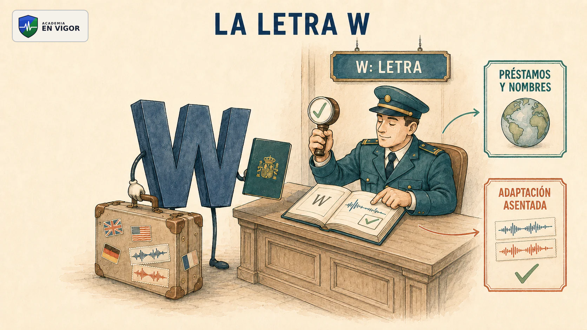

<em>Infografía: La letra w.</em>

:::hablemos-claro
La w tiene pasaporte español, aunque gran parte de su equipaje venga de otras lenguas.
:::

:::en-la-calle
Al elegir una letra que la pronunciación no distingue, La w tiene pasaporte español, aunque gran parte de su equipaje venga de otras lenguas.
:::

:::lo-que-cae
Prioriza **grafema en préstamos y nombres** y descarta respuestas que confundan grafía, tilde, espacio, signo o mayúscula.
:::

<!-- FUENTE: RAE-OLE-GRAFEMAS-T37 -->

## 24. La letra ñ y la secuencia gn

### Lógica del bloque

Para dominar **la letra ñ y la secuencia gn**, aplica esta regla: La virgulilla no adorna ni acentúa: convierte n en otra letra. El anclaje principal es **grafema ñ**.

### Hechos examinables

- La ñ es un grafema propio del abecedario español y representa normalmente el fonema nasal palatal /ñ/. <!-- FACT:PN-T37-F093 -->
- La tilde de la ñ forma parte de la letra y no es una tilde de acentuación. <!-- FACT:PN-T37-F094 -->
- La secuencia gn de ciertos préstamos o nombres no equivale automáticamente a la letra ñ en la escritura española. <!-- FACT:PN-T37-F095 -->
- La ñ conserva su forma tanto en minúscula como en mayúscula: ñ y Ñ. <!-- FACT:PN-T37-F096 -->

### Ejemplos razonados

- **Aplicación correcta:** España contiene la letra ñ.
- **Contraste útil:** AÑO conserva la virgulilla en mayúsculas.

### Trampas de examen

- **Incorrecto:** La ñ es una n con tilde acentual.
- **Incorrecto:** En mayúsculas puede omitirse la virgulilla de Ñ.

<!-- VISUAL:t37-24-la-letra-n-y-la-secuencia-gn.webp -->

  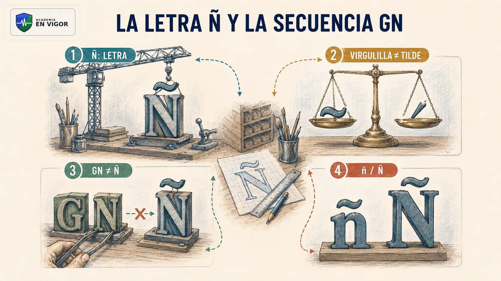

<em>Infografía: La letra ñ y la secuencia gn.</em>

:::hablemos-claro
La virgulilla no adorna ni acentúa: convierte n en otra letra.
:::

:::en-la-calle
Al elegir una letra que la pronunciación no distingue, La virgulilla no adorna ni acentúa: convierte n en otra letra.
:::

:::lo-que-cae
Prioriza **grafema ñ** y descarta respuestas que confundan grafía, tilde, espacio, signo o mayúscula.
:::

<!-- FUENTE: RAE-OLE-GRAFEMAS-T37 -->

## 25. Homófonos y parónimos ortográficos

### Lógica del bloque

Para dominar **homófonos y parónimos ortográficos**, aplica esta regla: La palabra puede estar bien escrita y ser la palabra equivocada; el significado completa el control. El anclaje principal es **significado como criterio**.

### Hechos examinables

- Los homófonos pueden sonar igual y escribirse de modo distinto porque tienen diferente significado u origen. <!-- FACT:PN-T37-F097 -->
- Los parónimos presentan forma o sonido próximos, pero no son intercambiables. <!-- FACT:PN-T37-F098 -->
- El contexto semántico permite elegir entre formas como haber/a ver, halla/haya/aya o tubo/tuvo. <!-- FACT:PN-T37-F099 -->
- Una corrección ortográfica debe revisar la palabra adecuada, no solo una secuencia de letras posible. <!-- FACT:PN-T37-F100 -->

### Ejemplos razonados

- **Aplicación correcta:** A ver qué ocurre no se escribe haber qué ocurre.
- **Contraste útil:** El investigador halla pruebas; quizá haya más.

### Trampas de examen

- **Incorrecto:** Si una forma existe en el diccionario, encaja en cualquier contexto.
- **Incorrecto:** Halla y haya son variantes gráficas del mismo verbo.

<!-- VISUAL:t37-25-homofonos-y-paronimos-ortograficos.webp -->

  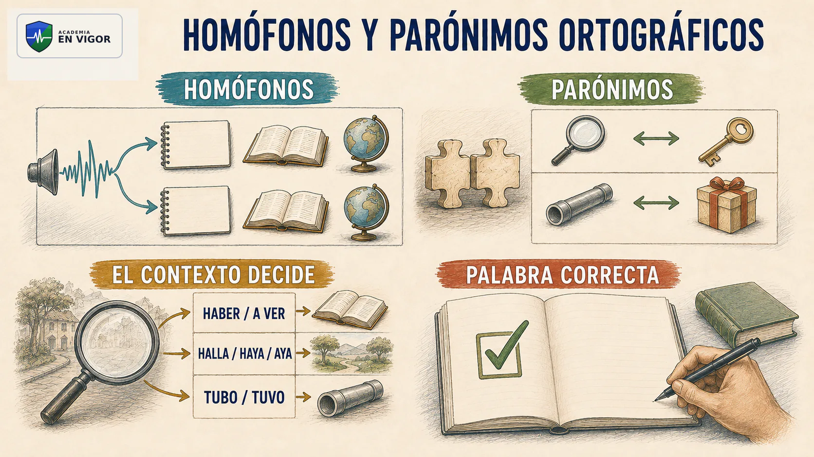

<em>Infografía: Homófonos y parónimos ortográficos.</em>

:::hablemos-claro
La palabra puede estar bien escrita y ser la palabra equivocada; el significado completa el control.
:::

:::en-la-calle
Al elegir una letra que la pronunciación no distingue, La palabra puede estar bien escrita y ser la palabra equivocada; el significado completa el control.
:::

:::lo-que-cae
Prioriza **significado como criterio** y descarta respuestas que confundan grafía, tilde, espacio, signo o mayúscula.
:::

<!-- FUENTE: RAE-DPD2-T37 -->

## 26. Familias léxicas y alternancias

### Lógica del bloque

Para dominar **familias léxicas y alternancias**, aplica esta regla: La familia conserva identidad, pero puede cambiar de uniforme gráfico para mantener el sonido. El anclaje principal es **parentesco transparente y cambios regulares**.

### Hechos examinables

- Las palabras de una familia suelen conservar rasgos gráficos cuando la relación es reconocible. <!-- FACT:PN-T37-F101 -->
- Una familia puede presentar alternancias regulares como c/qu, z/c o g/gu para mantener el valor fónico. <!-- FACT:PN-T37-F102 -->
- La semejanza gráfica sin relación de significado no basta para formar una familia léxica. <!-- FACT:PN-T37-F103 -->
- Las formas cultas o históricas pueden apartarse de una analogía superficial y deben comprobarse. <!-- FACT:PN-T37-F104 -->

### Ejemplos razonados

- **Aplicación correcta:** Sacar forma saqué; llegar forma llegué.
- **Contraste útil:** Pez forma peces mediante alternancia z/c.

### Trampas de examen

- **Incorrecto:** Una familia conserva siempre todas sus letras sin cambios.
- **Incorrecto:** Dos palabras que empiezan igual pertenecen necesariamente a la misma familia.

<!-- VISUAL:t37-26-familias-lexicas-y-alternancias.webp -->

  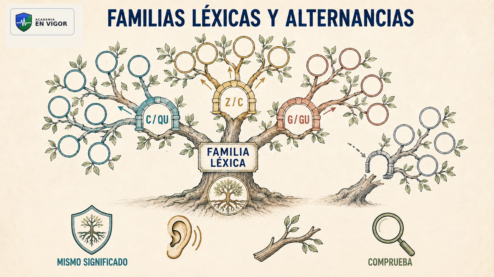

<em>Infografía: Familias léxicas y alternancias.</em>

:::hablemos-claro
La familia conserva identidad, pero puede cambiar de uniforme gráfico para mantener el sonido.
:::

:::en-la-calle
Al elegir una letra que la pronunciación no distingue, La familia conserva identidad, pero puede cambiar de uniforme gráfico para mantener el sonido.
:::

:::lo-que-cae
Prioriza **parentesco transparente y cambios regulares** y descarta respuestas que confundan grafía, tilde, espacio, signo o mayúscula.
:::

<!-- FUENTE: RAE-DPD2-T37 -->

## 27. Secuencias consonánticas y simplificación

### Lógica del bloque

Para dominar **secuencias consonánticas y simplificación**, aplica esta regla: No conviertas una variante registrada en una regla de borrado general: cada palabra tiene expediente propio. El anclaje principal es **grupos cultos y variantes admitidas**.

### Hechos examinables

- Algunas palabras contienen grupos consonánticos cultos que pueden presentar variantes simplificadas admitidas. <!-- FACT:PN-T37-F105 -->
- La admisión de una variante no autoriza a eliminar consonantes de cualquier grupo por comodidad. <!-- FACT:PN-T37-F106 -->
- Cuando existen dos variantes válidas, puede haber preferencia académica o diferencias de uso y pronunciación. <!-- FACT:PN-T37-F107 -->
- La forma concreta debe comprobarse en el diccionario, especialmente en voces con ps-, pt-, gn- o grupos internos complejos. <!-- FACT:PN-T37-F108 -->

### Ejemplos razonados

- **Aplicación correcta:** Psicología y sicología están registradas, con preferencia de uso variable.
- **Contraste útil:** No puede suprimirse una consonante de texto para escribir testo en el uso general.

### Trampas de examen

- **Incorrecto:** Cualquier grupo difícil puede simplificarse libremente.
- **Incorrecto:** Solo la forma etimológica más larga puede ser correcta.

<!-- VISUAL:t37-27-secuencias-consonanticas-y-simplificacion.webp -->

  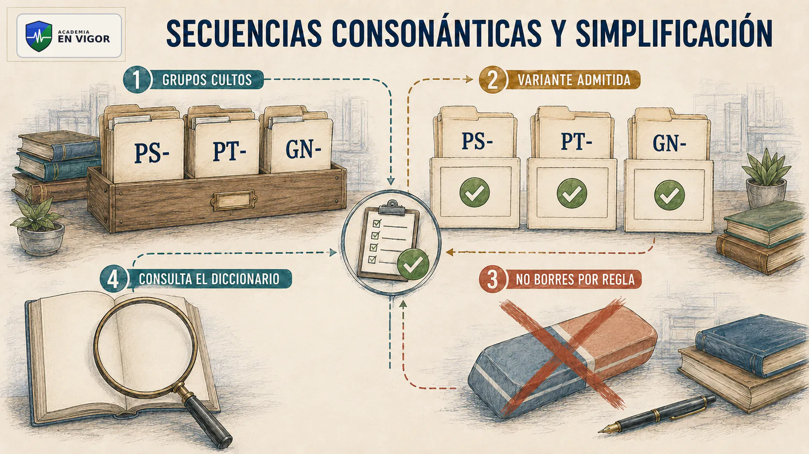

<em>Infografía: Secuencias consonánticas y simplificación.</em>

:::hablemos-claro
No conviertas una variante registrada en una regla de borrado general: cada palabra tiene expediente propio.
:::

:::en-la-calle
Al elegir una letra que la pronunciación no distingue, No conviertas una variante registrada en una regla de borrado general: cada palabra tiene expediente propio.
:::

:::lo-que-cae
Prioriza **grupos cultos y variantes admitidas** y descarta respuestas que confundan grafía, tilde, espacio, signo o mayúscula.
:::

<!-- FUENTE: RAE-OLE-GRAFEMAS-T37 -->

## 28. Grafías de palabras compuestas y prefijadas

### Lógica del bloque

Para dominar **grafías de palabras compuestas y prefijadas**, aplica esta regla: Cuando dos piezas se unen, revisa tres controles: frontera, sonido resultante y acentuación del conjunto. El anclaje principal es **conservación y ajuste gráfico**.

### Hechos examinables

- La unión de elementos puede producir ajustes gráficos necesarios para conservar la pronunciación. <!-- FACT:PN-T37-F109 -->
- Los prefijos se escriben unidos a una base univerbal, salvo los casos que exigen guion o separación. <!-- FACT:PN-T37-F110 -->
- La duplicación o simplificación de letras en una formación depende de la estructura y de la norma, no de una regla única. <!-- FACT:PN-T37-F111 -->
- Las voces prefijadas se someten a las reglas generales de acentuación como una sola palabra cuando se escriben unidas. <!-- FACT:PN-T37-F112 -->

### Ejemplos razonados

- **Aplicación correcta:** Antiinflamatorio se escribe unido y mantiene las dos íes.
- **Contraste útil:** Exministro se escribe en una sola palabra.

### Trampas de examen

- **Incorrecto:** Todo prefijo se escribe separado.
- **Incorrecto:** Al unir elementos se conservan siempre todas las letras sin ajuste.

<!-- VISUAL:t37-28-grafias-de-palabras-compuestas-y-prefijadas.webp -->

  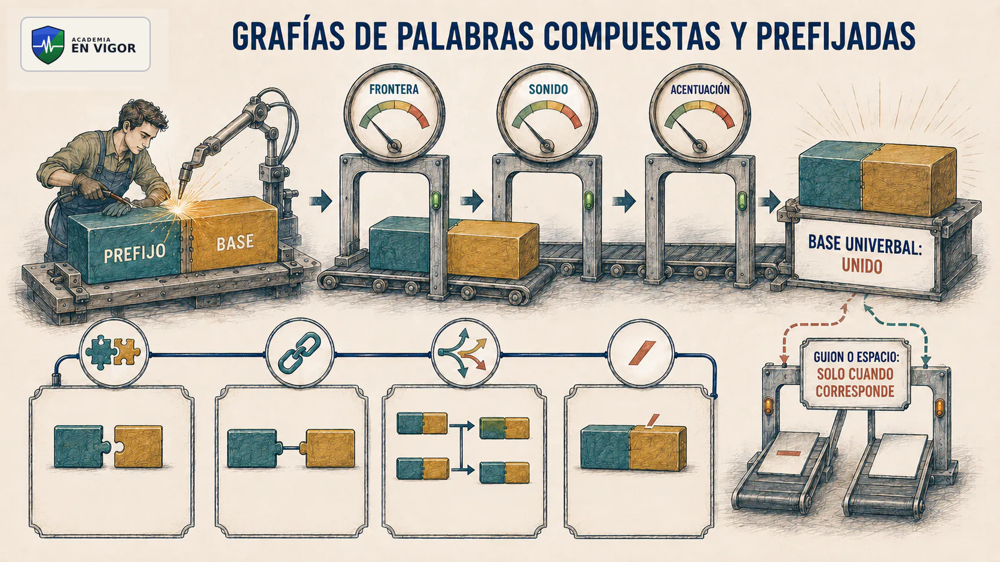

<em>Infografía: Grafías de palabras compuestas y prefijadas.</em>

:::hablemos-claro
Cuando dos piezas se unen, revisa tres controles: frontera, sonido resultante y acentuación del conjunto.
:::

:::en-la-calle
Al elegir una letra que la pronunciación no distingue, Cuando dos piezas se unen, revisa tres controles: frontera, sonido resultante y acentuación del conjunto.
:::

:::lo-que-cae
Prioriza **conservación y ajuste gráfico** y descarta respuestas que confundan grafía, tilde, espacio, signo o mayúscula.
:::

<!-- FUENTE: RAE-OLE-UNIDADES-T37 -->

## 29. Acento prosódico y tilde

### Lógica del bloque

Para dominar **acento prosódico y tilde**, aplica esta regla: Primero localiza la sílaba tónica; después pregunta si la regla exige dibujar la tilde. El anclaje principal es **acento frente a signo gráfico**.

### Hechos examinables

- El acento prosódico es la mayor prominencia de una sílaba dentro de la palabra. <!-- FACT:PN-T37-F113 -->
- La sílaba que recibe el acento prosódico es tónica; las demás son átonas. <!-- FACT:PN-T37-F114 -->
- La tilde es el signo gráfico que se coloca según las reglas de acentuación. <!-- FACT:PN-T37-F115 -->
- Todas las palabras tónicas tienen acento prosódico, pero no todas llevan tilde. <!-- FACT:PN-T37-F116 -->

### Ejemplos razonados

- **Aplicación correcta:** Casa tiene acento prosódico en ca y no lleva tilde.
- **Contraste útil:** Canción tiene acento prosódico y tilde en la última sílaba.

### Trampas de examen

- **Incorrecto:** Acento y tilde son términos siempre equivalentes.
- **Incorrecto:** Toda palabra tónica debe escribirse con tilde.

<!-- VISUAL:t37-il-29-acento-prosodico-y-tilde.webp -->

  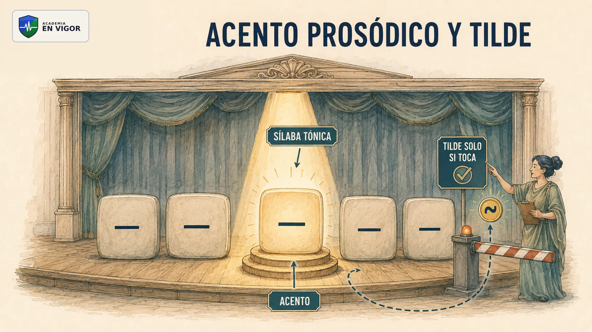

<em>Infografía: Acento prosódico y tilde.</em>

:::hablemos-claro
Primero localiza la sílaba tónica; después pregunta si la regla exige dibujar la tilde.
:::

:::en-la-calle
Al localizar la sílaba tónica y aplicar la regla completa, Primero localiza la sílaba tónica; después pregunta si la regla exige dibujar la tilde.
:::

:::lo-que-cae
Prioriza **acento frente a signo gráfico** y descarta respuestas que confundan grafía, tilde, espacio, signo o mayúscula.
:::

<!-- FUENTE: RAE-OLE-TILDE-T37 -->

## 30. Agudas, llanas, esdrújulas y sobresdrújulas

### Lógica del bloque

Para dominar **agudas, llanas, esdrújulas y sobresdrújulas**, aplica esta regla: Clasifica por la posición del golpe de voz, no por la presencia de tilde. El anclaje principal es **posición de la sílaba tónica**.

### Hechos examinables

- Las palabras polisílabas son agudas si la última sílaba es tónica. <!-- FACT:PN-T37-F117 -->
- Son llanas o graves si la penúltima sílaba es tónica. <!-- FACT:PN-T37-F118 -->
- Son esdrújulas si la antepenúltima sílaba es tónica. <!-- FACT:PN-T37-F119 -->
- Son sobresdrújulas si la sílaba tónica es anterior a la antepenúltima. <!-- FACT:PN-T37-F120 -->

### Ejemplos razonados

- **Aplicación correcta:** Reloj es aguda sin tilde.
- **Contraste útil:** Teléfono es esdrújula.

### Trampas de examen

- **Incorrecto:** Los monosílabos se clasifican como agudos.
- **Incorrecto:** Una palabra con tilde es siempre esdrújula.

<!-- VISUAL:t37-30-agudas-llanas-esdrujulas-y-sobresdrujulas.webp -->

  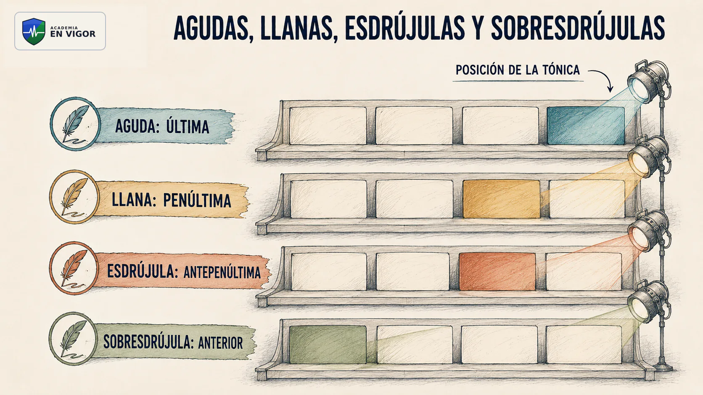

<em>Infografía: Agudas, llanas, esdrújulas y sobresdrújulas.</em>

:::hablemos-claro
Clasifica por la posición del golpe de voz, no por la presencia de tilde.
:::

:::en-la-calle
Al localizar la sílaba tónica y aplicar la regla completa, Clasifica por la posición del golpe de voz, no por la presencia de tilde.
:::

:::lo-que-cae
Prioriza **posición de la sílaba tónica** y descarta respuestas que confundan grafía, tilde, espacio, signo o mayúscula.
:::

<!-- FUENTE: RAE-OLE-TILDE-T37 -->

## 31. Regla de las palabras agudas

### Lógica del bloque

Para dominar **regla de las palabras agudas**, aplica esta regla: La contraseña es vocal, n o s simple; una consonante adicional o la y cambian la salida. El anclaje principal es **terminación en vocal, n o s**.

### Hechos examinables

- Las palabras agudas llevan tilde cuando terminan en vocal, n o s no precedida de otra consonante. <!-- FACT:PN-T37-F121 -->
- Las agudas terminadas en consonante distinta de n o s no llevan tilde por la regla general. <!-- FACT:PN-T37-F122 -->
- Las agudas terminadas en más de una consonante no llevan tilde por la regla general. <!-- FACT:PN-T37-F123 -->
- Las agudas terminadas en y no llevan tilde por la regla general. <!-- FACT:PN-T37-F124 -->

### Ejemplos razonados

- **Aplicación correcta:** Camión, compás y café llevan tilde.
- **Contraste útil:** Reloj, robots y convoy no la llevan.

### Trampas de examen

- **Incorrecto:** Toda aguda terminada en s lleva tilde aunque la s siga a otra consonante.
- **Incorrecto:** Convoy lleva tilde por terminar en sonido vocálico.

<!-- VISUAL:t37-31-regla-de-las-palabras-agudas.webp -->

  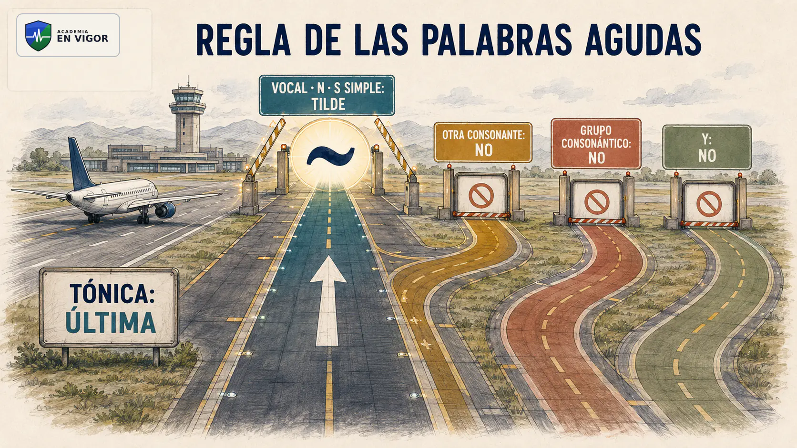

<em>Infografía: Regla de las palabras agudas.</em>

:::hablemos-claro
La contraseña es vocal, n o s simple; una consonante adicional o la y cambian la salida.
:::

:::en-la-calle
Al localizar la sílaba tónica y aplicar la regla completa, La contraseña es vocal, n o s simple; una consonante adicional o la y cambian la salida.
:::

:::lo-que-cae
Prioriza **terminación en vocal, n o s** y descarta respuestas que confundan grafía, tilde, espacio, signo o mayúscula.
:::

<!-- FUENTE: RAE-OLE-TILDE-T37 -->

## 32. Regla de las palabras llanas

### Lógica del bloque

Para dominar **regla de las palabras llanas**, aplica esta regla: En las llanas la regla se invierte, pero vigila las salidas dobles: bíceps lleva tilde porque acaba en dos consonantes. El anclaje principal es **terminación distinta de vocal, n o s**.

### Hechos examinables

- Las palabras llanas llevan tilde cuando terminan en consonante distinta de n o s. <!-- FACT:PN-T37-F125 -->
- También llevan tilde las llanas terminadas en más de una consonante. <!-- FACT:PN-T37-F126 -->
- Las llanas terminadas en y llevan tilde. <!-- FACT:PN-T37-F127 -->
- Las llanas terminadas en vocal, n o s no precedida de otra consonante no llevan tilde por la regla general. <!-- FACT:PN-T37-F128 -->

### Ejemplos razonados

- **Aplicación correcta:** Lápiz, récords y yérsey llevan tilde.
- **Contraste útil:** Margen, crisis y casa no la llevan.

### Trampas de examen

- **Incorrecto:** Bíceps no lleva tilde porque termina en s.
- **Incorrecto:** Examen lleva tilde por ser llana.

<!-- VISUAL:t37-32-regla-de-las-palabras-llanas.webp -->

  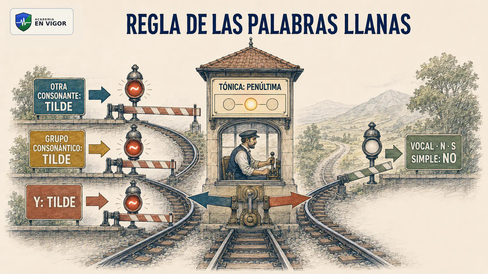

<em>Infografía: Regla de las palabras llanas.</em>

:::hablemos-claro
En las llanas la regla se invierte, pero vigila las salidas dobles: bíceps lleva tilde porque acaba en dos consonantes.
:::

:::en-la-calle
Al localizar la sílaba tónica y aplicar la regla completa, En las llanas la regla se invierte, pero vigila las salidas dobles: bíceps lleva tilde porque acaba en dos consonantes.
:::

:::lo-que-cae
Prioriza **terminación distinta de vocal, n o s** y descarta respuestas que confundan grafía, tilde, espacio, signo o mayúscula.
:::

<!-- FUENTE: RAE-OLE-TILDE-T37 -->

## 33. Esdrújulas y sobresdrújulas

### Lógica del bloque

Para dominar **esdrújulas y sobresdrújulas**, aplica esta regla: Esdrújula y sobresdrújula entran con pase directo a la tilde. El anclaje principal es **tilde obligatoria**.

### Hechos examinables

- Las palabras esdrújulas llevan siempre tilde. <!-- FACT:PN-T37-F129 -->
- Las palabras sobresdrújulas llevan siempre tilde. <!-- FACT:PN-T37-F130 -->
- El plural puede cambiar la clasificación y la acentuación de una palabra. <!-- FACT:PN-T37-F131 -->
- La tilde se coloca sobre la vocal de la sílaba tónica conforme a las reglas de la secuencia vocálica. <!-- FACT:PN-T37-F132 -->

### Ejemplos razonados

- **Aplicación correcta:** Música y dímelo llevan tilde.
- **Contraste útil:** Joven no lleva tilde, pero jóvenes sí.

### Trampas de examen

- **Incorrecto:** Una esdrújula puede perder la tilde si termina en vocal.
- **Incorrecto:** El plural conserva siempre la misma clasificación acentual.

<!-- VISUAL:t37-33-esdrujulas-y-sobresdrujulas.webp -->

  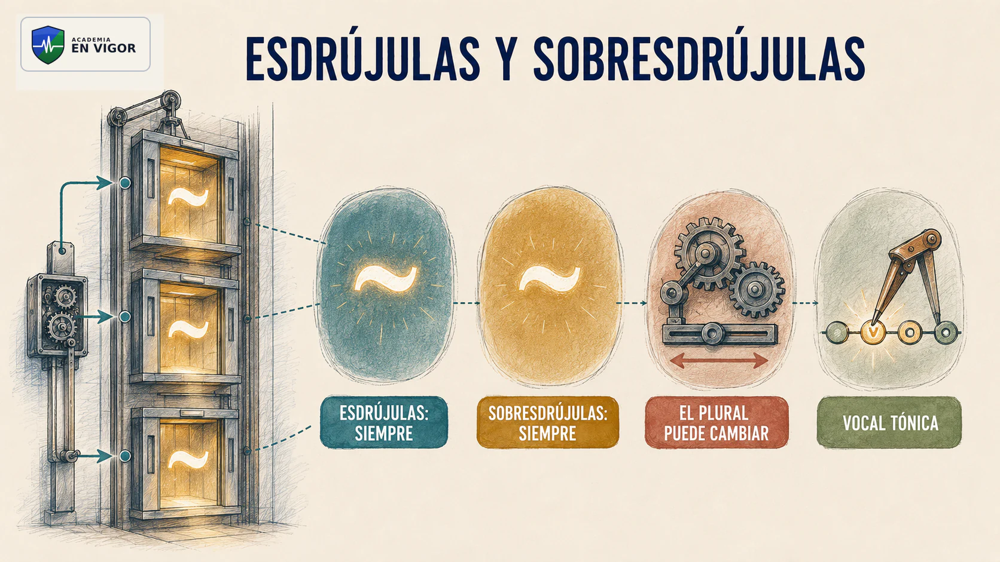

<em>Infografía: Esdrújulas y sobresdrújulas.</em>

:::hablemos-claro
Esdrújula y sobresdrújula entran con pase directo a la tilde.
:::

:::en-la-calle
Al localizar la sílaba tónica y aplicar la regla completa, Esdrújula y sobresdrújula entran con pase directo a la tilde.
:::

:::lo-que-cae
Prioriza **tilde obligatoria** y descarta respuestas que confundan grafía, tilde, espacio, signo o mayúscula.
:::

<!-- FUENTE: RAE-OLE-TILDE-T37 -->

## 34. Monosílabos

### Lógica del bloque

Para dominar **monosílabos**, aplica esta regla: En ortografía, ciertos grupos vocálicos cuentan como una sola sílaba aunque tu pronunciación los separe. El anclaje principal es **sin tilde salvo diacrítica**.

### Hechos examinables

- Los monosílabos se escriben sin tilde salvo los casos de tilde diacrítica. <!-- FACT:PN-T37-F133 -->
- Formas como fue, fui, vio, dio, guion y truhan se consideran monosílabas a efectos ortográficos. <!-- FACT:PN-T37-F134 -->
- La clasificación ortográfica de una secuencia vocálica no depende de que algunos hablantes la pronuncien en dos sílabas. <!-- FACT:PN-T37-F135 -->
- La tilde no se usa para marcar sin más una pronunciación personal bisilábica en esos casos. <!-- FACT:PN-T37-F136 -->

### Ejemplos razonados

- **Aplicación correcta:** Fue, vio y dio se escriben sin tilde.
- **Contraste útil:** Guion y truhan se escriben sin tilde según la norma actual.

### Trampas de examen

- **Incorrecto:** Fue y dio llevan tilde por ser formas verbales.
- **Incorrecto:** Guion puede tildarse libremente si se pronuncia en dos sílabas.

<!-- VISUAL:t37-il-34-monosilabos.webp -->

  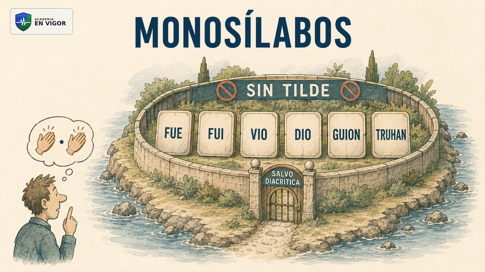

<em>Infografía: Monosílabos.</em>

:::hablemos-claro
En ortografía, ciertos grupos vocálicos cuentan como una sola sílaba aunque tu pronunciación los separe.
:::

:::en-la-calle
Al localizar la sílaba tónica y aplicar la regla completa, En ortografía, ciertos grupos vocálicos cuentan como una sola sílaba aunque tu pronunciación los separe.
:::

:::lo-que-cae
Prioriza **sin tilde salvo diacrítica** y descarta respuestas que confundan grafía, tilde, espacio, signo o mayúscula.
:::

<!-- FUENTE: RAE-OLE-TILDE-T37 -->

## 35. Tilde diacrítica en monosílabos I

### Lógica del bloque

Para dominar **tilde diacrítica en monosílabos i**, aplica esta regla: La función y la tonicidad deciden: pronombre tónico con tilde; artículo o posesivo átono sin ella. El anclaje principal es **él/el, tú/tu, mí/mi**.

### Hechos examinables

- Él lleva tilde como pronombre personal; el no la lleva como artículo. <!-- FACT:PN-T37-F137 -->
- Tú lleva tilde como pronombre personal; tu no la lleva como posesivo. <!-- FACT:PN-T37-F138 -->
- Mí lleva tilde como pronombre personal; mi no la lleva como posesivo ni como nombre de nota musical. <!-- FACT:PN-T37-F139 -->
- La tilde diacrítica distingue normalmente una forma tónica de otra átona con idéntica escritura. <!-- FACT:PN-T37-F140 -->

### Ejemplos razonados

- **Aplicación correcta:** Él trajo tu informe para mí.
- **Contraste útil:** Mi es también el nombre de una nota musical y se escribe sin tilde.

### Trampas de examen

- **Incorrecto:** El artículo el lleva tilde ante nombres propios.
- **Incorrecto:** La nota musical mí debe llevar tilde.

<!-- VISUAL:t37-35-tilde-diacritica-en-monosilabos-i.webp -->

  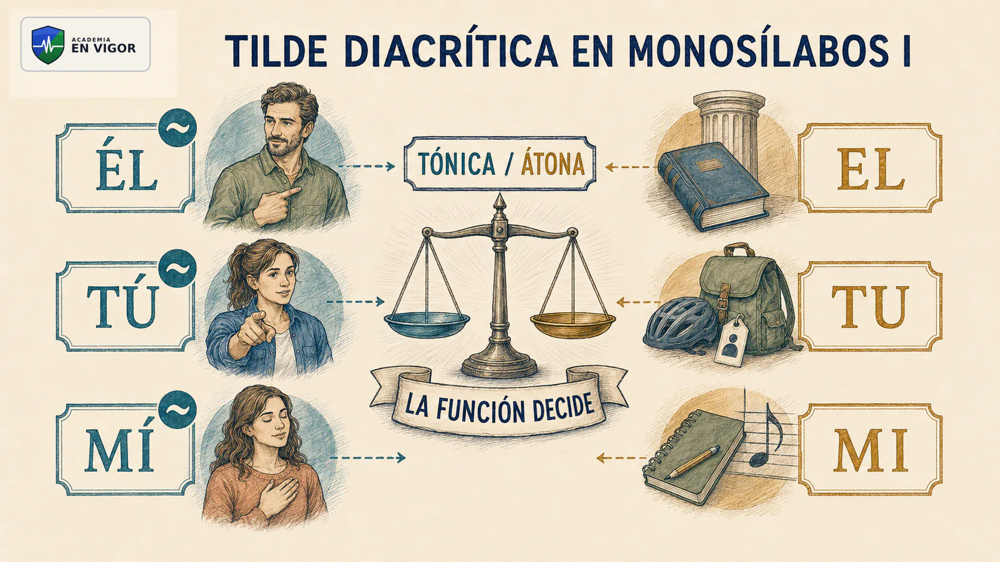

<em>Infografía: Tilde diacrítica en monosílabos I.</em>

:::hablemos-claro
La función y la tonicidad deciden: pronombre tónico con tilde; artículo o posesivo átono sin ella.
:::

:::en-la-calle
Al localizar la sílaba tónica y aplicar la regla completa, La función y la tonicidad deciden: pronombre tónico con tilde; artículo o posesivo átono sin ella.
:::

:::lo-que-cae
Prioriza **él/el, tú/tu, mí/mi** y descarta respuestas que confundan grafía, tilde, espacio, signo o mayúscula.
:::

<!-- FUENTE: RAE-OLE-TILDE-T37 -->

## 36. Tilde diacrítica en monosílabos II

### Lógica del bloque

Para dominar **tilde diacrítica en monosílabos ii**, aplica esta regla: No memorices pares aislados: identifica qué trabajo realiza cada forma dentro de la frase. El anclaje principal es **dé/de, sé/se, sí/si, té/te, más/mas**.

### Hechos examinables

- Dé lleva tilde como forma de dar; de no la lleva como preposición ni como nombre de letra. <!-- FACT:PN-T37-F141 -->
- Sé lleva tilde como forma de saber o ser; se no la lleva como pronombre. <!-- FACT:PN-T37-F142 -->
- Sí lleva tilde como adverbio de afirmación, pronombre reflexivo o sustantivo; si no la lleva como conjunción ni como nota musical. <!-- FACT:PN-T37-F143 -->
- Té lleva tilde para la bebida, te no como pronombre; más lleva tilde salvo mas con valor equivalente a pero. <!-- FACT:PN-T37-F144 -->

### Ejemplos razonados

- **Aplicación correcta:** Sé que se lo dé si dice que sí.
- **Contraste útil:** Quiso entrar, mas no pudo.

### Trampas de examen

- **Incorrecto:** La preposición dé lleva tilde.
- **Incorrecto:** Mas lleva siempre tilde porque es una palabra tónica.

<!-- VISUAL:t37-36-tilde-diacritica-en-monosilabos-ii.webp -->

  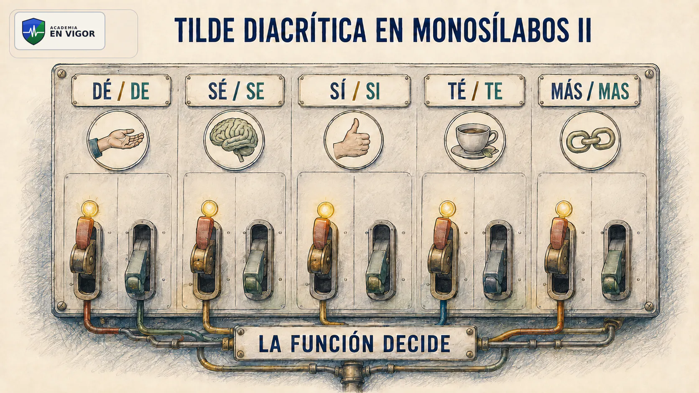

<em>Infografía: Tilde diacrítica en monosílabos II.</em>

:::hablemos-claro
No memorices pares aislados: identifica qué trabajo realiza cada forma dentro de la frase.
:::

:::en-la-calle
Al localizar la sílaba tónica y aplicar la regla completa, No memorices pares aislados: identifica qué trabajo realiza cada forma dentro de la frase.
:::

:::lo-que-cae
Prioriza **dé/de, sé/se, sí/si, té/te, más/mas** y descarta respuestas que confundan grafía, tilde, espacio, signo o mayúscula.
:::

<!-- FUENTE: RAE-OLE-TILDE-T37 -->

## 37. Aún y aun

### Lógica del bloque

Para dominar **aún y aun**, aplica esta regla: Prueba el recambio: todavía abre la puerta de aún; incluso suele abrir la de aun. El anclaje principal es **todavía frente a incluso**.

### Hechos examinables

- Aún se escribe con tilde cuando equivale normalmente a todavía. <!-- FACT:PN-T37-F145 -->
- Aun se escribe sin tilde cuando equivale normalmente a incluso, hasta, también o ni siquiera. <!-- FACT:PN-T37-F146 -->
- La diferencia se relaciona con la pronunciación tónica o átona y con el valor de la palabra. <!-- FACT:PN-T37-F147 -->
- La sustitución por todavía o incluso es una prueba útil, pero debe comprobarse el sentido completo. <!-- FACT:PN-T37-F148 -->

### Ejemplos razonados

- **Aplicación correcta:** Aún no ha llegado equivale a todavía no ha llegado.
- **Contraste útil:** Aun los expertos dudaron equivale a incluso los expertos dudaron.

### Trampas de examen

- **Incorrecto:** Aun lleva siempre tilde.
- **Incorrecto:** Aún se escribe sin tilde cuando equivale a todavía.

<!-- VISUAL:t37-37-aun-y-aun.webp -->

  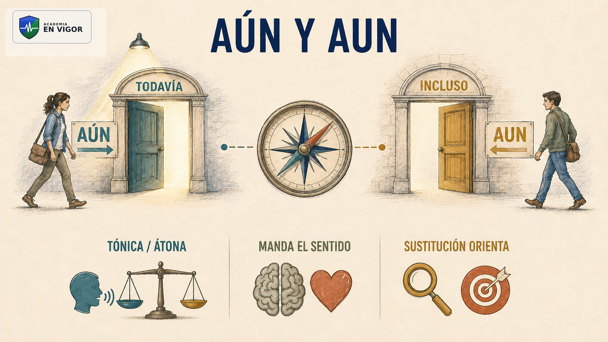

<em>Infografía: Aún y aun.</em>

:::hablemos-claro
Prueba el recambio: todavía abre la puerta de aún; incluso suele abrir la de aun.
:::

:::en-la-calle
Al localizar la sílaba tónica y aplicar la regla completa, Prueba el recambio: todavía abre la puerta de aún; incluso suele abrir la de aun.
:::

:::lo-que-cae
Prioriza **todavía frente a incluso** y descarta respuestas que confundan grafía, tilde, espacio, signo o mayúscula.
:::

<!-- FUENTE: RAE-DPD2-T37 -->

## 38. Interrogativos y exclamativos

### Lógica del bloque

Para dominar **interrogativos y exclamativos**, aplica esta regla: Busca una incógnita o una exclamación tónica, aunque esté escondida dentro de otra oración. El anclaje principal es **qué, cuál, quién, cómo, cuánto, cuándo y dónde**.

### Hechos examinables

- Las palabras interrogativas y exclamativas tónicas qué, cuál, quién, cómo, cuán, cuánto, cuándo, dónde y adónde llevan tilde. <!-- FACT:PN-T37-F149 -->
- La tilde aparece tanto en interrogaciones y exclamaciones directas como indirectas. <!-- FACT:PN-T37-F150 -->
- Las formas relativas o conjuntivas átonas correspondientes se escriben sin tilde. <!-- FACT:PN-T37-F151 -->
- La presencia de signos de interrogación no es requisito para que una interrogativa indirecta lleve tilde. <!-- FACT:PN-T37-F152 -->

### Ejemplos razonados

- **Aplicación correcta:** ¿Dónde ocurrió? y No sé dónde ocurrió llevan tilde.
- **Contraste útil:** El lugar donde ocurrió se escribe sin tilde.

### Trampas de examen

- **Incorrecto:** Solo llevan tilde dentro de signos de interrogación.
- **Incorrecto:** La forma que lleva tilde en toda oración relativa.

<!-- VISUAL:t37-38-interrogativos-y-exclamativos.webp -->

  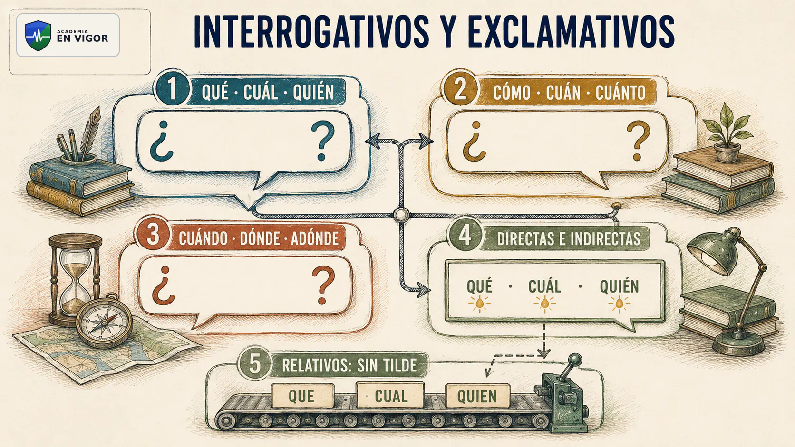

<em>Infografía: Interrogativos y exclamativos.</em>

:::hablemos-claro
Busca una incógnita o una exclamación tónica, aunque esté escondida dentro de otra oración.
:::

:::en-la-calle
Al localizar la sílaba tónica y aplicar la regla completa, Busca una incógnita o una exclamación tónica, aunque esté escondida dentro de otra oración.
:::

:::lo-que-cae
Prioriza **qué, cuál, quién, cómo, cuánto, cuándo y dónde** y descarta respuestas que confundan grafía, tilde, espacio, signo o mayúscula.
:::

<!-- FUENTE: RAE-OLE-TILDE-T37 -->

## 39. Solo y los demostrativos

### Lógica del bloque

Para dominar **solo y los demostrativos**, aplica esta regla: La regla general es no tildar; la norma actual solo admite la tilde como opción restringida ante ambigüedad real. El anclaje principal es **regla vigente y ambigüedad**.

### Hechos examinables

- Solo, sea adjetivo o adverbio, se escribe obligatoriamente sin tilde cuando no existe riesgo de ambigüedad. <!-- FACT:PN-T37-F153 -->
- En un contexto que el redactor juzgue ambiguo, es optativo tildar el adverbio solo. <!-- FACT:PN-T37-F154 -->
- Los demostrativos este, ese y aquel y sus variantes se escriben sin tilde cuando no hay ambigüedad; en usos pronominales ambiguos, la tilde es optativa. <!-- FACT:PN-T37-F155 -->
- Los demostrativos neutros esto, eso y aquello se escriben siempre sin tilde. <!-- FACT:PN-T37-F156 -->

### Ejemplos razonados

- **Aplicación correcta:** Solo vendrá Ana se recomienda sin tilde.
- **Contraste útil:** Eso no es cierto nunca lleva tilde en eso.

### Trampas de examen

- **Incorrecto:** El adverbio solo debe llevar siempre tilde.
- **Incorrecto:** Esto puede tildarse para distinguirlo de un determinante.

<!-- VISUAL:t37-39-solo-y-los-demostrativos.webp -->

  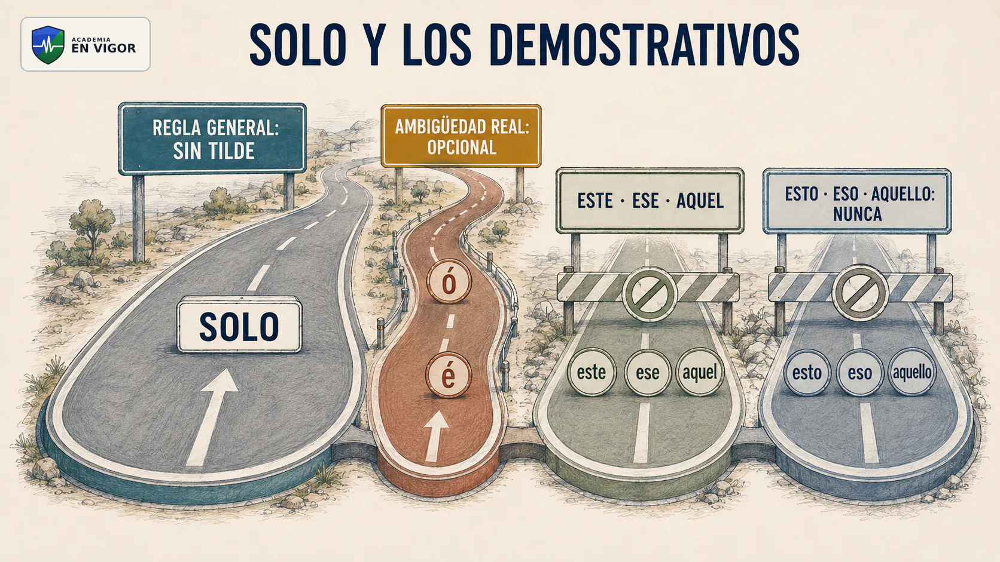

<em>Infografía: Solo y los demostrativos.</em>

:::hablemos-claro
La regla general es no tildar; la norma actual solo admite la tilde como opción restringida ante ambigüedad real.
:::

:::en-la-calle
Al localizar la sílaba tónica y aplicar la regla completa, La regla general es no tildar; la norma actual solo admite la tilde como opción restringida ante ambigüedad real.
:::

:::lo-que-cae
Prioriza **regla vigente y ambigüedad** y descarta respuestas que confundan grafía, tilde, espacio, signo o mayúscula.
:::

<!-- FUENTE: RAE-DPD2-T37 -->

## 40. Diptongos

### Lógica del bloque

Para dominar **diptongos**, aplica esta regla: Primero decide si las vocales comparten sílaba; después aplica la regla general y ubica la tilde. El anclaje principal es **dos vocales en una sílaba**.

### Hechos examinables

- A efectos ortográficos, forman diptongo una vocal abierta y una cerrada átona, o dos vocales cerradas distintas. <!-- FACT:PN-T37-F157 -->
- Las palabras con diptongo se someten a las reglas generales de acentuación. <!-- FACT:PN-T37-F158 -->
- Si el diptongo combina vocal abierta y cerrada, la tilde se coloca sobre la abierta. <!-- FACT:PN-T37-F159 -->
- En un diptongo de dos vocales cerradas, la tilde se coloca sobre la segunda vocal. <!-- FACT:PN-T37-F160 -->

### Ejemplos razonados

- **Aplicación correcta:** Adiós lleva tilde sobre la vocal abierta.
- **Contraste útil:** Cuídate lleva tilde sobre la segunda vocal cerrada.

### Trampas de examen

- **Incorrecto:** Todo encuentro de dos vocales forma hiato.
- **Incorrecto:** La tilde de un diptongo va siempre sobre la vocal cerrada.

<!-- VISUAL:t37-40-diptongos.webp -->

  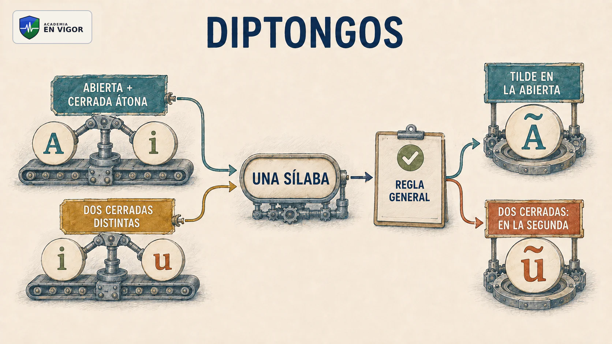

<em>Infografía: Diptongos.</em>

:::hablemos-claro
Primero decide si las vocales comparten sílaba; después aplica la regla general y ubica la tilde.
:::

:::en-la-calle
Al localizar la sílaba tónica y aplicar la regla completa, Primero decide si las vocales comparten sílaba; después aplica la regla general y ubica la tilde.
:::

:::lo-que-cae
Prioriza **dos vocales en una sílaba** y descarta respuestas que confundan grafía, tilde, espacio, signo o mayúscula.
:::

<!-- FUENTE: RAE-OLE-TILDE-T37 -->

## 41. Triptongos

### Lógica del bloque

Para dominar **triptongos**, aplica esta regla: El triptongo es un bocadillo vocálico: abierta en el centro y cerradas átonas a los lados. El anclaje principal es **cerrada átona + abierta + cerrada átona**.

### Hechos examinables

- A efectos ortográficos, un triptongo reúne una vocal cerrada átona, una abierta y otra cerrada átona en la misma sílaba. <!-- FACT:PN-T37-F161 -->
- Las palabras con triptongo siguen las reglas generales de acentuación. <!-- FACT:PN-T37-F162 -->
- Si corresponde tilde, se coloca sobre la vocal abierta del triptongo. <!-- FACT:PN-T37-F163 -->
- Una vocal cerrada tónica rompe la estructura de triptongo y da lugar a otra división silábica. <!-- FACT:PN-T37-F164 -->

### Ejemplos razonados

- **Aplicación correcta:** Averiguáis contiene triptongo y tilde sobre la vocal abierta.
- **Contraste útil:** Vivíais no se analiza como un único triptongo con ambas cerradas átonas.

### Trampas de examen

- **Incorrecto:** Todo grupo de tres vocales es un triptongo.
- **Incorrecto:** La tilde del triptongo se coloca sobre cualquiera de las vocales cerradas.

<!-- VISUAL:t37-il-41-triptongos.webp -->

  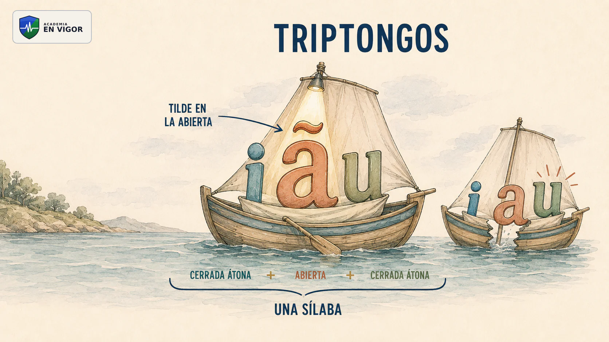

<em>Infografía: Triptongos.</em>

:::hablemos-claro
El triptongo es un bocadillo vocálico: abierta en el centro y cerradas átonas a los lados.
:::

:::en-la-calle
Al localizar la sílaba tónica y aplicar la regla completa, El triptongo es un bocadillo vocálico: abierta en el centro y cerradas átonas a los lados.
:::

:::lo-que-cae
Prioriza **cerrada átona + abierta + cerrada átona** y descarta respuestas que confundan grafía, tilde, espacio, signo o mayúscula.
:::

<!-- FUENTE: RAE-OLE-TILDE-T37 -->

## 42. Hiatos

### Lógica del bloque

Para dominar **hiatos**, aplica esta regla: La tilde en la cerrada tónica actúa como cuña: separa las vocales en sílabas distintas. El anclaje principal es **vocales en sílabas distintas**.

### Hechos examinables

- Forman hiato dos vocales abiertas, o una secuencia de vocales iguales, que pertenecen a sílabas distintas. <!-- FACT:PN-T37-F165 -->
- También hay hiato cuando una vocal cerrada tónica aparece junto a una vocal abierta átona. <!-- FACT:PN-T37-F166 -->
- Las secuencias de dos vocales abiertas siguen las reglas generales de acentuación. <!-- FACT:PN-T37-F167 -->
- La vocal cerrada tónica de un hiato con vocal abierta lleva tilde con independencia de la regla general. <!-- FACT:PN-T37-F168 -->

### Ejemplos razonados

- **Aplicación correcta:** Poeta contiene hiato sin tilde.
- **Contraste útil:** País, raíz y baúl llevan tilde en la vocal cerrada tónica.

### Trampas de examen

- **Incorrecto:** Maíz lleva tilde por ser una palabra aguda terminada en z.
- **Incorrecto:** Dos vocales abiertas forman siempre diptongo.

<!-- VISUAL:t37-42-hiatos.webp -->

  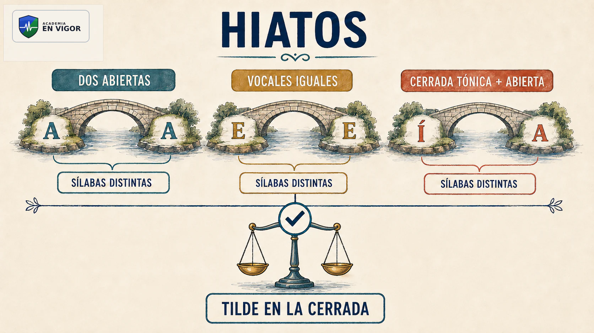

<em>Infografía: Hiatos.</em>

:::hablemos-claro
La tilde en la cerrada tónica actúa como cuña: separa las vocales en sílabas distintas.
:::

:::en-la-calle
Al localizar la sílaba tónica y aplicar la regla completa, La tilde en la cerrada tónica actúa como cuña: separa las vocales en sílabas distintas.
:::

:::lo-que-cae
Prioriza **vocales en sílabas distintas** y descarta respuestas que confundan grafía, tilde, espacio, signo o mayúscula.
:::

<!-- FUENTE: RAE-OLE-TILDE-T37 -->

## 43. Palabras compuestas

### Lógica del bloque

Para dominar **palabras compuestas**, aplica esta regla: Si se fusionan, recalcula desde cero; si el guion mantiene las piezas, cada una conserva su control. El anclaje principal es **una palabra, una regla general**.

### Hechos examinables

- Los compuestos escritos en una sola palabra se someten como unidad a las reglas generales de acentuación. <!-- FACT:PN-T37-F169 -->
- El primer componente de un compuesto univerbal pierde la tilde que llevaba como palabra independiente si ya no le corresponde. <!-- FACT:PN-T37-F170 -->
- El último componente mantiene o recibe la tilde que exija el resultado completo. <!-- FACT:PN-T37-F171 -->
- En compuestos unidos con guion, cada elemento conserva la acentuación que le corresponde como palabra independiente. <!-- FACT:PN-T37-F172 -->

### Ejemplos razonados

- **Aplicación correcta:** Décimo + séptimo forma decimoséptimo.
- **Contraste útil:** Teórico-práctico conserva las tildes de ambos componentes.

### Trampas de examen

- **Incorrecto:** Cada componente de un compuesto unido conserva siempre su tilde original.
- **Incorrecto:** Los compuestos con guion pierden todas las tildes.

<!-- VISUAL:t37-43-palabras-compuestas.webp -->

  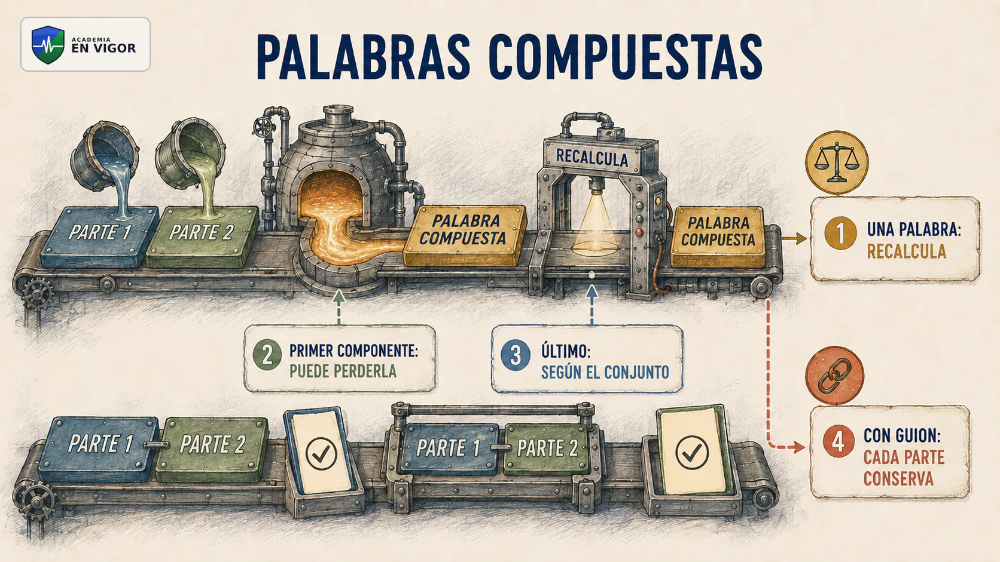

<em>Infografía: Palabras compuestas.</em>

:::hablemos-claro
Si se fusionan, recalcula desde cero; si el guion mantiene las piezas, cada una conserva su control.
:::

:::en-la-calle
Al localizar la sílaba tónica y aplicar la regla completa, Si se fusionan, recalcula desde cero; si el guion mantiene las piezas, cada una conserva su control.
:::

:::lo-que-cae
Prioriza **una palabra, una regla general** y descarta respuestas que confundan grafía, tilde, espacio, signo o mayúscula.
:::

<!-- FUENTE: RAE-OLE-TILDE-T37 -->

## 44. Adverbios en -mente y formas con pronombres enclíticos

### Lógica del bloque

Para dominar **adverbios en -mente y formas con pronombres enclíticos**, aplica esta regla: En -mente se conserva la memoria del adjetivo; con enclíticos se vuelve a pasar el conjunto por la regla general. El anclaje principal es **reglas especiales y recálculo**.

### Hechos examinables

- Los adverbios en -mente conservan la tilde del adjetivo base si este la llevaba. <!-- FACT:PN-T37-F173 -->
- Un adjetivo sin tilde origina normalmente un adverbio en -mente sin tilde. <!-- FACT:PN-T37-F174 -->
- Las formas verbales con pronombres enclíticos se someten a las reglas generales de acentuación del conjunto. <!-- FACT:PN-T37-F175 -->
- La unión de pronombres puede hacer aparecer o desaparecer una tilde respecto de la forma verbal aislada. <!-- FACT:PN-T37-F176 -->

### Ejemplos razonados

- **Aplicación correcta:** Fácilmente conserva la tilde de fácil; cordialmente no lleva.
- **Contraste útil:** Da + me + lo forma dámelo.

### Trampas de examen

- **Incorrecto:** Todo adverbio terminado en -mente lleva tilde.
- **Incorrecto:** Los enclíticos nunca cambian la acentuación gráfica del verbo.

<!-- VISUAL:t37-44-adverbios-en-mente-y-formas-con-pronombres-encliticos.webp -->

  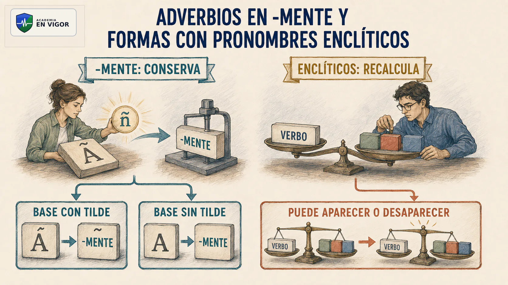

<em>Infografía: Adverbios en -mente y formas con pronombres enclíticos.</em>

:::hablemos-claro
En -mente se conserva la memoria del adjetivo; con enclíticos se vuelve a pasar el conjunto por la regla general.
:::

:::en-la-calle
Al localizar la sílaba tónica y aplicar la regla completa, En -mente se conserva la memoria del adjetivo; con enclíticos se vuelve a pasar el conjunto por la regla general.
:::

:::lo-que-cae
Prioriza **reglas especiales y recálculo** y descarta respuestas que confundan grafía, tilde, espacio, signo o mayúscula.
:::

<!-- FUENTE: RAE-OLE-TILDE-T37 -->

## 45. Mayúsculas, abreviaturas, siglas y extranjerismos

### Lógica del bloque

Para dominar **mayúsculas, abreviaturas, siglas y extranjerismos**, aplica esta regla: El formato no borra la ortografía: ÁVILA lleva tilde; una sigla, en cambio, sigue su convención propia. El anclaje principal es **la tilde no desaparece por el formato**.

### Hechos examinables

- Las mayúsculas llevan tilde y diéresis cuando lo exigen las reglas generales. <!-- FACT:PN-T37-F177 -->
- Las abreviaturas conservan la tilde si incluyen la vocal que la lleva en la palabra desarrollada, como pág. <!-- FACT:PN-T37-F178 -->
- Las siglas escritas enteramente con mayúsculas no llevan tilde. <!-- FACT:PN-T37-F179 -->
- Los extranjerismos adaptados se someten a las reglas españolas; los no adaptados conservan su grafía y reciben tratamiento tipográfico de extranjerismo. <!-- FACT:PN-T37-F180 -->

### Ejemplos razonados

- **Aplicación correcta:** ÁNGEL y ANTIGÜEDAD conservan sus signos.
- **Contraste útil:** El acrónimo láser lleva tilde porque funciona como palabra común, no como sigla en mayúsculas.

### Trampas de examen

- **Incorrecto:** Las palabras en mayúsculas nunca llevan tilde.
- **Incorrecto:** Toda sigla debe tildarse según su pronunciación.

<!-- VISUAL:t37-45-mayusculas-abreviaturas-siglas-y-extranjerismos.webp -->

  

<em>Infografía: Mayúsculas, abreviaturas, siglas y extranjerismos.</em>

:::hablemos-claro
El formato no borra la ortografía: ÁVILA lleva tilde; una sigla, en cambio, sigue su convención propia.
:::

:::en-la-calle
Al localizar la sílaba tónica y aplicar la regla completa, El formato no borra la ortografía: ÁVILA lleva tilde; una sigla, en cambio, sigue su convención propia.
:::

:::lo-que-cae
Prioriza **la tilde no desaparece por el formato** y descarta respuestas que confundan grafía, tilde, espacio, signo o mayúscula.
:::

<!-- FUENTE: RAE-LIBRO-ESTILO-T37 -->

## 46. Clases de signos ortográficos

### Lógica del bloque

Para dominar **clases de signos ortográficos**, aplica esta regla: Clasifica por función, no por forma: una rayita puede ser tilde, guion o raya y cumplir trabajos distintos. El anclaje principal es **diacríticos, puntuación y auxiliares**.

### Hechos examinables

- Los signos ortográficos se agrupan en signos diacríticos, signos de puntuación y signos auxiliares. <!-- FACT:PN-T37-F181 -->
- La tilde y la diéresis son signos diacríticos. <!-- FACT:PN-T37-F182 -->
- Los signos de puntuación delimitan unidades y orientan la interpretación del discurso. <!-- FACT:PN-T37-F183 -->
- Los signos auxiliares cumplen funciones específicas que no equivalen siempre a cerrar enunciados. <!-- FACT:PN-T37-F184 -->

### Ejemplos razonados

- **Aplicación correcta:** La coma es signo de puntuación.
- **Contraste útil:** El asterisco y la barra son signos auxiliares en muchos usos.

### Trampas de examen

- **Incorrecto:** La tilde es un signo de puntuación.
- **Incorrecto:** Todos los signos ortográficos marcan una pausa oral.

<!-- VISUAL:t37-46-clases-de-signos-ortograficos.webp -->

  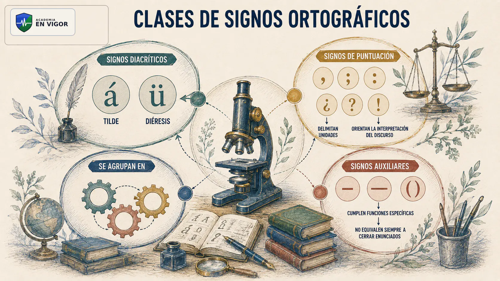

<em>Infografía: Clases de signos ortográficos.</em>

:::hablemos-claro
Clasifica por función, no por forma: una rayita puede ser tilde, guion o raya y cumplir trabajos distintos.
:::

:::en-la-calle
Al puntuar una declaración sin alterar su alcance, Clasifica por función, no por forma: una rayita puede ser tilde, guion o raya y cumplir trabajos distintos.
:::

:::lo-que-cae
Prioriza **diacríticos, puntuación y auxiliares** y descarta respuestas que confundan grafía, tilde, espacio, signo o mayúscula.
:::

<!-- FUENTE: RAE-OLE-SIGNOS-T37 -->

## 47. El punto

### Lógica del bloque

Para dominar **el punto**, aplica esta regla: Mira qué cierra el punto: una abreviatura no termina por sí sola el enunciado. El anclaje principal es **cierre de enunciado y abreviatura**.

### Hechos examinables

- El punto se escribe pegado al elemento anterior y separado por un espacio del siguiente. <!-- FACT:PN-T37-F185 -->
- El punto y seguido separa enunciados del mismo párrafo; el punto y aparte separa párrafos. <!-- FACT:PN-T37-F186 -->
- Después de un punto de cierre de enunciado se escribe mayúscula. <!-- FACT:PN-T37-F187 -->
- El punto abreviativo y el punto de cierre cumplen funciones distintas, aunque tengan la misma forma. <!-- FACT:PN-T37-F188 -->

### Ejemplos razonados

- **Aplicación correcta:** Llegó. Entró. usa puntos de cierre.
- **Contraste útil:** La abreviatura pág. lleva punto abreviativo.

### Trampas de examen

- **Incorrecto:** El punto debe ir separado de la palabra anterior.
- **Incorrecto:** Después de todo punto se continúa necesariamente en un párrafo nuevo.

<!-- VISUAL:t37-il-47-el-punto.webp -->

  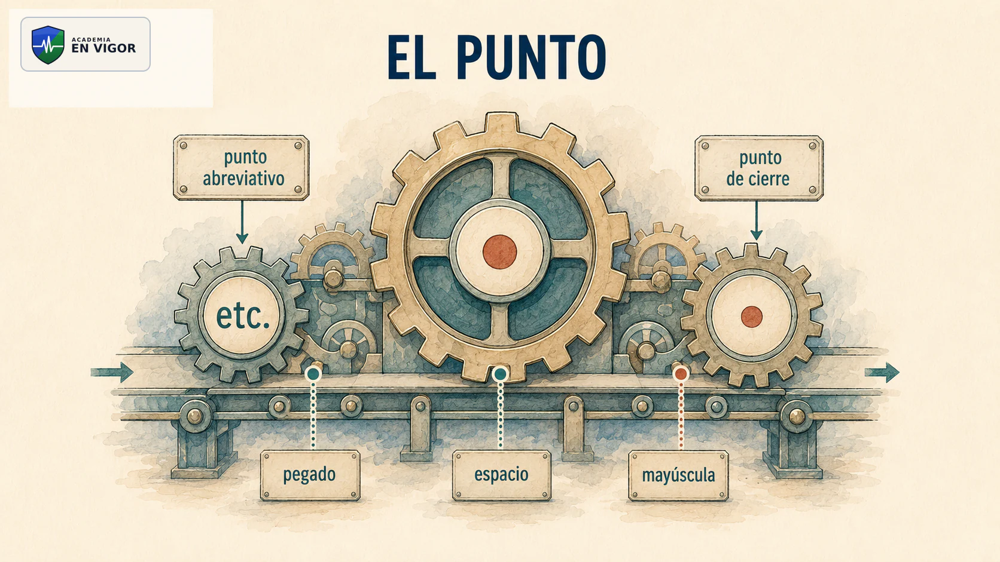

<em>Infografía: El punto.</em>

:::hablemos-claro
Mira qué cierra el punto: una abreviatura no termina por sí sola el enunciado.
:::

:::en-la-calle
Al puntuar una declaración sin alterar su alcance, Mira qué cierra el punto: una abreviatura no termina por sí sola el enunciado.
:::

:::lo-que-cae
Prioriza **cierre de enunciado y abreviatura** y descarta respuestas que confundan grafía, tilde, espacio, signo o mayúscula.
:::

<!-- FUENTE: RAE-OLE-SIGNOS-T37 -->

## 48. La coma en enumeraciones y elipsis

### Lógica del bloque

Para dominar **la coma en enumeraciones y elipsis**, aplica esta regla: La coma organiza piezas internas; no la coloques por falta de aire. El anclaje principal es **separación interna sin cierre**.

### Hechos examinables

- La coma separa elementos de una enumeración cuando no están unidos por una conjunción. <!-- FACT:PN-T37-F189 -->
- Normalmente no se escribe coma ante la conjunción que cierra una enumeración simple. <!-- FACT:PN-T37-F190 -->
- La coma puede señalar la elisión de un verbo mencionado o fácilmente recuperable. <!-- FACT:PN-T37-F191 -->
- La coma no equivale a una pausa respiratoria libre: responde a la estructura del enunciado. <!-- FACT:PN-T37-F192 -->

### Ejemplos razonados

- **Aplicación correcta:** Compró papel, tinta y carpetas.
- **Contraste útil:** Ana redactó el informe; Luis, el acta.

### Trampas de examen

- **Incorrecto:** Toda pausa al hablar debe representarse con coma.
- **Incorrecto:** Una enumeración simple exige coma antes de y.

<!-- VISUAL:t37-48-la-coma-en-enumeraciones-y-elipsis.webp -->

  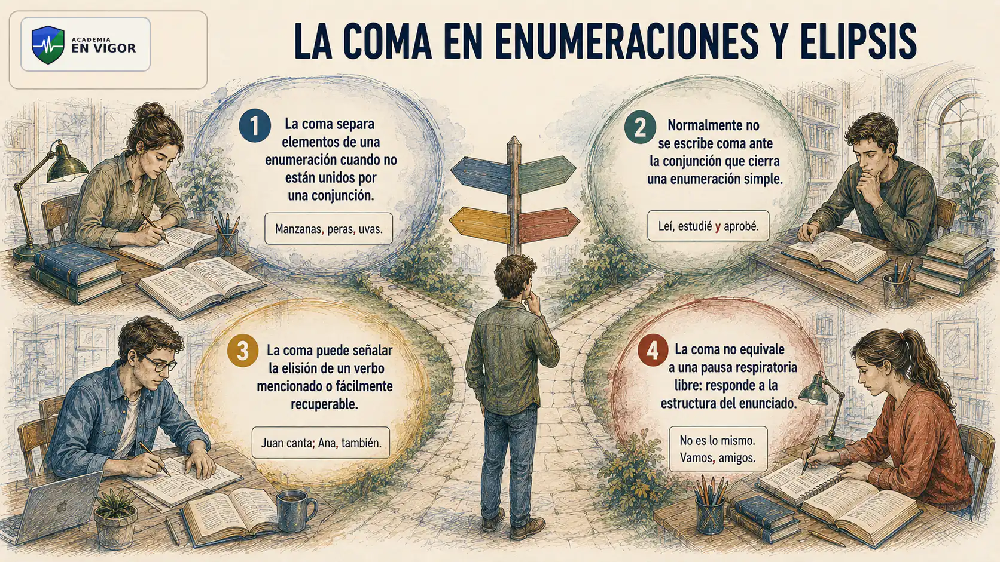

<em>Infografía: La coma en enumeraciones y elipsis.</em>

:::hablemos-claro
La coma organiza piezas internas; no la coloques por falta de aire.
:::

:::en-la-calle
Al puntuar una declaración sin alterar su alcance, La coma organiza piezas internas; no la coloques por falta de aire.
:::

:::lo-que-cae
Prioriza **separación interna sin cierre** y descarta respuestas que confundan grafía, tilde, espacio, signo o mayúscula.
:::

<!-- FUENTE: RAE-OLE-SIGNOS-T37 -->

## 49. Vocativos e incisos

### Lógica del bloque

Para dominar **vocativos e incisos**, aplica esta regla: Vocativo e inciso entran como visitantes: abre y cierra la puerta de la puntuación. El anclaje principal es **elementos periféricos**.

### Hechos examinables

- Los vocativos se separan mediante comas del resto del enunciado. <!-- FACT:PN-T37-F193 -->
- Los incisos explicativos se delimitan con dos comas si aparecen en posición interna. <!-- FACT:PN-T37-F194 -->
- Un inciso puede delimitarse también con rayas o paréntesis según su relación y grado de separación. <!-- FACT:PN-T37-F195 -->
- La ausencia de coma en un vocativo puede alterar la estructura o el sentido. <!-- FACT:PN-T37-F196 -->

### Ejemplos razonados

- **Aplicación correcta:** Agente, espere aquí.
- **Contraste útil:** La testigo, visiblemente nerviosa, pidió agua.

### Trampas de examen

- **Incorrecto:** El vocativo funciona como sujeto y no se separa.
- **Incorrecto:** Un inciso interior necesita una sola coma de apertura.

<!-- VISUAL:t37-49-vocativos-e-incisos.webp -->

  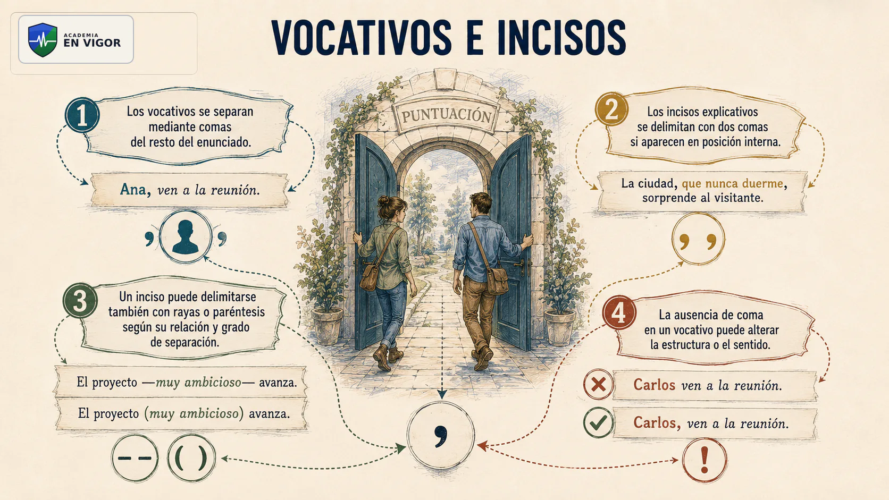

<em>Infografía: Vocativos e incisos.</em>

:::hablemos-claro
Vocativo e inciso entran como visitantes: abre y cierra la puerta de la puntuación.
:::

:::en-la-calle
Al puntuar una declaración sin alterar su alcance, Vocativo e inciso entran como visitantes: abre y cierra la puerta de la puntuación.
:::

:::lo-que-cae
Prioriza **elementos periféricos** y descarta respuestas que confundan grafía, tilde, espacio, signo o mayúscula.
:::

<!-- FUENTE: RAE-OLE-SIGNOS-T37 -->

## 50. Coma entre sujeto y predicado

### Lógica del bloque

Para dominar **coma entre sujeto y predicado**, aplica esta regla: La coma no corta la columna vertebral sujeto-verbo; si aparece ahí, debe cerrar otra estructura. El anclaje principal es **prohibición general y excepciones aparentes**.

### Hechos examinables

- No se escribe coma entre el sujeto y el verbo de una oración por el mero hecho de que el sujeto sea largo. <!-- FACT:PN-T37-F197 -->
- Tampoco se separa con coma el verbo de sus complementos exigidos sin una razón estructural. <!-- FACT:PN-T37-F198 -->
- Puede aparecer una coma entre sujeto y verbo si cierra un inciso introducido dentro del sujeto. <!-- FACT:PN-T37-F199 -->
- En ciertas enumeraciones o construcciones suspendidas puede existir una explicación específica, pero no una licencia general. <!-- FACT:PN-T37-F200 -->

### Ejemplos razonados

- **Aplicación correcta:** Los agentes destinados en la unidad presentaron el informe.
- **Contraste útil:** El agente que llegó primero, según el registro, abrió la puerta.

### Trampas de examen

- **Incorrecto:** Todo sujeto largo debe cerrarse con coma.
- **Incorrecto:** Nunca puede verse una coma gráfica antes del verbo.

<!-- VISUAL:t37-50-coma-entre-sujeto-y-predicado.webp -->

  

<em>Infografía: Coma entre sujeto y predicado.</em>

:::hablemos-claro
La coma no corta la columna vertebral sujeto-verbo; si aparece ahí, debe cerrar otra estructura.
:::

:::en-la-calle
Al puntuar una declaración sin alterar su alcance, La coma no corta la columna vertebral sujeto-verbo; si aparece ahí, debe cerrar otra estructura.
:::

:::lo-que-cae
Prioriza **prohibición general y excepciones aparentes** y descarta respuestas que confundan grafía, tilde, espacio, signo o mayúscula.
:::

<!-- FUENTE: RAE-OLE-SIGNOS-T37 -->

## 51. El punto y coma

### Lógica del bloque

Para dominar **el punto y coma**, aplica esta regla: Es una frontera de intensidad media: más fuerte que coma, menos definitiva que punto. El anclaje principal es **separación intermedia y series complejas**.

### Hechos examinables

- El punto y coma separa unidades con mayor autonomía que las delimitadas por coma y menor que las cerradas por punto. <!-- FACT:PN-T37-F201 -->
- Se usa para separar miembros de enumeraciones complejas que ya contienen comas. <!-- FACT:PN-T37-F202 -->
- Puede aparecer ante conectores como sin embargo o por tanto cuando enlazan segmentos extensos. <!-- FACT:PN-T37-F203 -->
- La palabra que sigue al punto y coma se escribe normalmente con minúscula. <!-- FACT:PN-T37-F204 -->

### Ejemplos razonados

- **Aplicación correcta:** Acudió Ana, la inspectora; Luis, el perito; y Marta, la letrada.
- **Contraste útil:** La prueba era débil; sin embargo, se incorporó al expediente.

### Trampas de examen

- **Incorrecto:** Después del punto y coma se escribe siempre mayúscula.
- **Incorrecto:** El punto y coma solo puede usarse en listas verticales.

<!-- VISUAL:t37-51-el-punto-y-coma.webp -->

  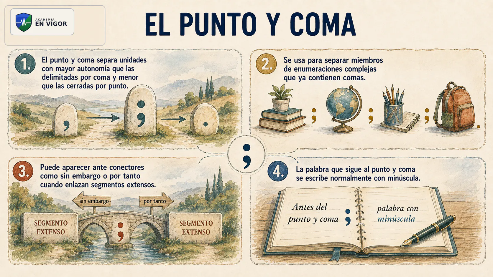

<em>Infografía: El punto y coma.</em>

:::hablemos-claro
Es una frontera de intensidad media: más fuerte que coma, menos definitiva que punto.
:::

:::en-la-calle
Al puntuar una declaración sin alterar su alcance, Es una frontera de intensidad media: más fuerte que coma, menos definitiva que punto.
:::

:::lo-que-cae
Prioriza **separación intermedia y series complejas** y descarta respuestas que confundan grafía, tilde, espacio, signo o mayúscula.
:::

<!-- FUENTE: RAE-OLE-SIGNOS-T37 -->

## 52. Los dos puntos

### Lógica del bloque

Para dominar **los dos puntos**, aplica esta regla: Los dos puntos necesitan una plataforma de lanzamiento; no cortes el verbo de aquello que rige. El anclaje principal es **anuncio y relación**.

### Hechos examinables

- Los dos puntos anuncian una explicación, consecuencia, enumeración, cita u otro segmento relacionado con lo anterior. <!-- FACT:PN-T37-F205 -->
- Se escriben pegados al elemento precedente y separados del siguiente por un espacio. <!-- FACT:PN-T37-F206 -->
- Después de dos puntos se escribe normalmente minúscula, salvo casos regulados como ciertas citas o encabezamientos. <!-- FACT:PN-T37-F207 -->
- No debe interponerse dos puntos entre una preposición o un verbo y una enumeración que constituye su complemento sin elemento anticipador. <!-- FACT:PN-T37-F208 -->

### Ejemplos razonados

- **Aplicación correcta:** Trajo tres objetos: documentos, fotos y llaves.
- **Contraste útil:** La testigo afirmó: «No vi el vehículo».

### Trampas de examen

- **Incorrecto:** Después de dos puntos se escribe siempre mayúscula.
- **Incorrecto:** Es correcto escribir Trajo: documentos, fotos y llaves.

<!-- VISUAL:t37-52-los-dos-puntos.webp -->

  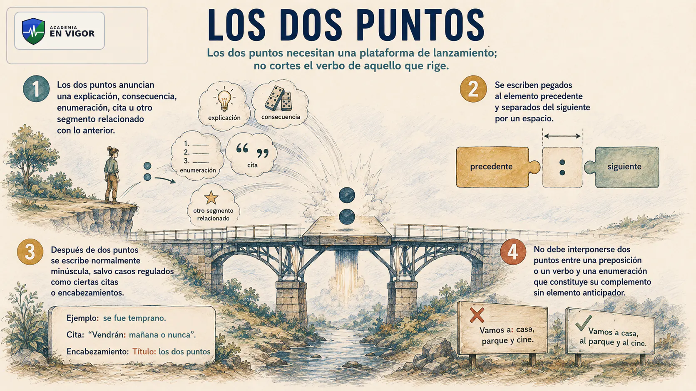

<em>Infografía: Los dos puntos.</em>

:::hablemos-claro
Los dos puntos necesitan una plataforma de lanzamiento; no cortes el verbo de aquello que rige.
:::

:::en-la-calle
Al puntuar una declaración sin alterar su alcance, Los dos puntos necesitan una plataforma de lanzamiento; no cortes el verbo de aquello que rige.
:::

:::lo-que-cae
Prioriza **anuncio y relación** y descarta respuestas que confundan grafía, tilde, espacio, signo o mayúscula.
:::

<!-- FUENTE: RAE-OLE-SIGNOS-T37 -->

## 53. Los puntos suspensivos

### Lógica del bloque

Para dominar **los puntos suspensivos**, aplica esta regla: Son tres, ni dos ni cuatro; ya llevan incorporada la idea de cierre o suspensión. El anclaje principal es **tres puntos y suspensión**.

### Hechos examinables

- Los puntos suspensivos son exactamente tres puntos consecutivos. <!-- FACT:PN-T37-F209 -->
- Pueden indicar suspensión, duda, temor, enumeración abierta o un final deliberadamente incompleto. <!-- FACT:PN-T37-F210 -->
- Si cierran el enunciado, no se añade un cuarto punto; pueden combinarse con otros signos cuando corresponde. <!-- FACT:PN-T37-F211 -->
- La abreviatura etc. no debe acumularse mecánicamente con puntos suspensivos para expresar la misma apertura. <!-- FACT:PN-T37-F212 -->

### Ejemplos razonados

- **Aplicación correcta:** Dijo que vendría, pero…
- **Contraste útil:** Compró carpetas, sobres, bolígrafos…

### Trampas de examen

- **Incorrecto:** Los puntos suspensivos pueden tener cualquier número de puntos.
- **Incorrecto:** Siempre se añade punto final después de ellos.

<!-- VISUAL:t37-il-53-los-puntos-suspensivos.webp -->

  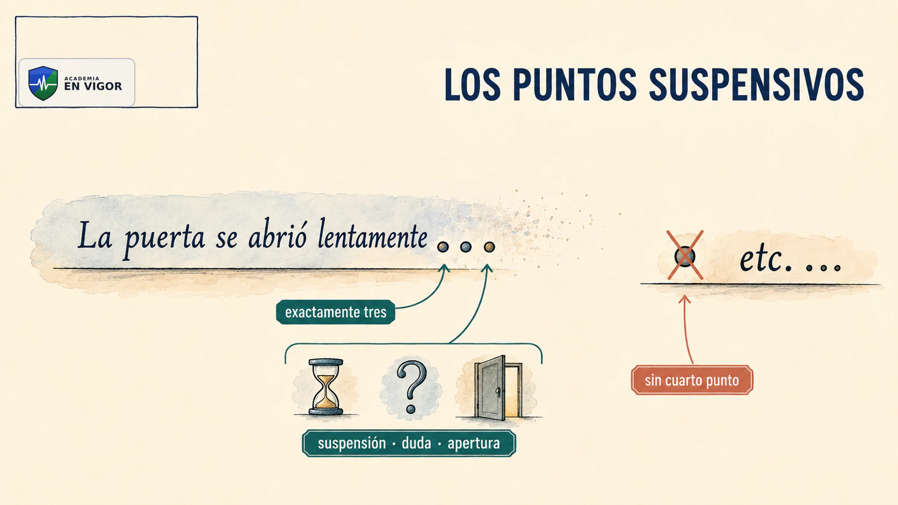

<em>Infografía: Los puntos suspensivos.</em>

:::hablemos-claro
Son tres, ni dos ni cuatro; ya llevan incorporada la idea de cierre o suspensión.
:::

:::en-la-calle
Al puntuar una declaración sin alterar su alcance, Son tres, ni dos ni cuatro; ya llevan incorporada la idea de cierre o suspensión.
:::

:::lo-que-cae
Prioriza **tres puntos y suspensión** y descarta respuestas que confundan grafía, tilde, espacio, signo o mayúscula.
:::

<!-- FUENTE: RAE-OLE-SIGNOS-T37 -->

## 54. Interrogación y exclamación

### Lógica del bloque

Para dominar **interrogación y exclamación**, aplica esta regla: Abre donde empieza la pregunta real y cierra donde acaba; el signo final ya hace de punto. El anclaje principal es **signos de apertura y cierre**.

### Hechos examinables

- En español, las interrogaciones y exclamaciones directas se delimitan con signos de apertura y cierre. <!-- FACT:PN-T37-F213 -->
- Los signos se colocan donde comienza y termina el segmento interrogativo o exclamativo, aunque no coincida con todo el enunciado. <!-- FACT:PN-T37-F214 -->
- Tras el signo de cierre no se escribe punto adicional. <!-- FACT:PN-T37-F215 -->
- Una interrogación indirecta no lleva signos de interrogación, aunque sus interrogativos tónicos mantienen la tilde. <!-- FACT:PN-T37-F216 -->

### Ejemplos razonados

- **Aplicación correcta:** Pero ¿quién abrió la puerta?
- **Contraste útil:** No sé quién abrió la puerta no lleva signos.

### Trampas de examen

- **Incorrecto:** En español basta con el signo de cierre.
- **Incorrecto:** Después de ? o ! debe añadirse un punto.

<!-- VISUAL:t37-54-interrogacion-y-exclamacion.webp -->

  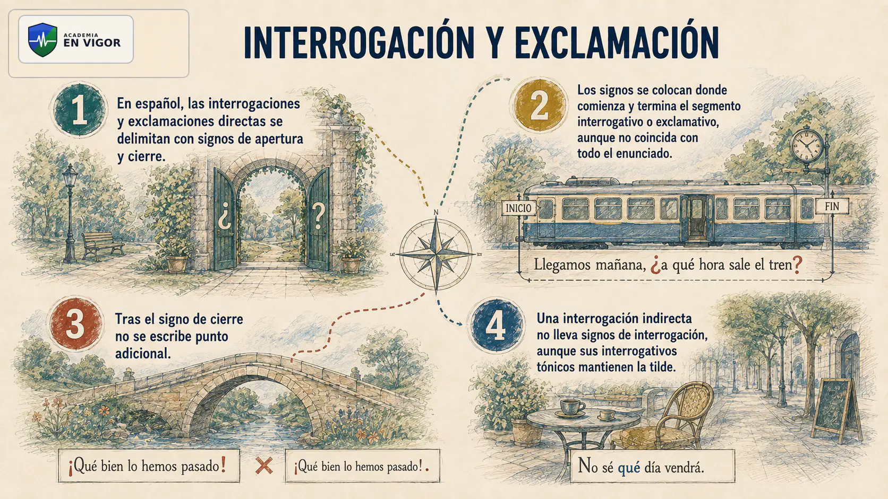

<em>Infografía: Interrogación y exclamación.</em>

:::hablemos-claro
Abre donde empieza la pregunta real y cierra donde acaba; el signo final ya hace de punto.
:::

:::en-la-calle
Al puntuar una declaración sin alterar su alcance, Abre donde empieza la pregunta real y cierra donde acaba; el signo final ya hace de punto.
:::

:::lo-que-cae
Prioriza **signos de apertura y cierre** y descarta respuestas que confundan grafía, tilde, espacio, signo o mayúscula.
:::

<!-- FUENTE: RAE-OLE-SIGNOS-T37 -->

## 55. Paréntesis y corchetes

### Lógica del bloque

Para dominar **paréntesis y corchetes**, aplica esta regla: Piensa en cajas anidadas: el signo exterior organiza el enunciado y el interior protege la aclaración. El anclaje principal es **información intercalada**.

### Hechos examinables

- Los paréntesis encierran información incidental o complementaria con cierta autonomía. <!-- FACT:PN-T37-F217 -->
- Los corchetes pueden introducir aclaraciones dentro de un texto ya entre paréntesis o intervenciones editoriales en citas. <!-- FACT:PN-T37-F218 -->
- Los signos de cierre se colocan antes o después de la puntuación exterior según pertenezca esta al texto encerrado o al enunciado principal. <!-- FACT:PN-T37-F219 -->
- No debe confundirse el contenido parentético con una supresión, que en una cita suele representarse mediante puntos suspensivos entre corchetes. <!-- FACT:PN-T37-F220 -->

### Ejemplos razonados

- **Aplicación correcta:** La reunión (aplazada dos veces) comenzó a las diez.
- **Contraste útil:** «El agente […] regresó» marca una omisión editorial.

### Trampas de examen

- **Incorrecto:** Todo paréntesis sustituye exactamente a una coma.
- **Incorrecto:** Los corchetes no pueden aparecer dentro de paréntesis.

<!-- VISUAL:t37-55-parentesis-y-corchetes.webp -->

  

<em>Infografía: Paréntesis y corchetes.</em>

:::hablemos-claro
Piensa en cajas anidadas: el signo exterior organiza el enunciado y el interior protege la aclaración.
:::

:::en-la-calle
Al puntuar una declaración sin alterar su alcance, Piensa en cajas anidadas: el signo exterior organiza el enunciado y el interior protege la aclaración.
:::

:::lo-que-cae
Prioriza **información intercalada** y descarta respuestas que confundan grafía, tilde, espacio, signo o mayúscula.
:::

<!-- FUENTE: RAE-OLE-SIGNOS-T37 -->

## 56. Raya y guion

### Lógica del bloque

Para dominar **raya y guion**, aplica esta regla: El guion cose piezas; la raya abre espacio para una voz o un inciso. El anclaje principal es **signos distintos**.

### Hechos examinables

- La raya (—) y el guion (-) son signos diferentes en forma, longitud y función. <!-- FACT:PN-T37-F221 -->
- La raya puede delimitar incisos o señalar intervenciones en diálogos. <!-- FACT:PN-T37-F222 -->
- El guion une ciertos elementos, divide palabras al final de línea y aparece en intervalos o relaciones específicas. <!-- FACT:PN-T37-F223 -->
- Las rayas de un inciso interior funcionan como pareja, salvo que el inciso coincida con el final del enunciado en determinados usos. <!-- FACT:PN-T37-F224 -->

### Ejemplos razonados

- **Aplicación correcta:** Teórico-práctico usa guion.
- **Contraste útil:** La testigo —según consta— llamó a emergencias usa rayas.

### Trampas de examen

- **Incorrecto:** Raya y guion son nombres intercambiables del mismo signo.
- **Incorrecto:** Los incisos con raya solo requieren signo de apertura.

<!-- VISUAL:t37-56-raya-y-guion.webp -->

  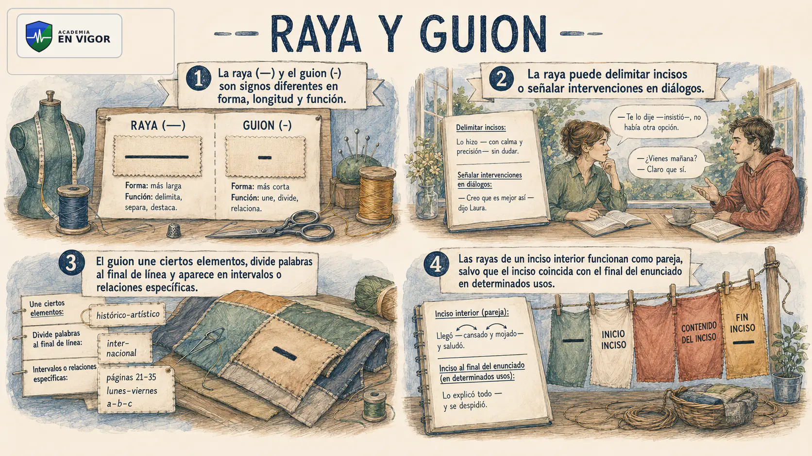

<em>Infografía: Raya y guion.</em>

:::hablemos-claro
El guion cose piezas; la raya abre espacio para una voz o un inciso.
:::

:::en-la-calle
Al puntuar una declaración sin alterar su alcance, El guion cose piezas; la raya abre espacio para una voz o un inciso.
:::

:::lo-que-cae
Prioriza **signos distintos** y descarta respuestas que confundan grafía, tilde, espacio, signo o mayúscula.
:::

<!-- FUENTE: RAE-OLE-SIGNOS-T37 -->

## 57. Comillas

### Lógica del bloque

Para dominar **comillas**, aplica esta regla: Las comillas tienen niveles como muñecas rusas: angulares, inglesas y simples según la anidación. El anclaje principal es **citas y usos metalingüísticos**.

### Hechos examinables

- Las comillas españolas o angulares (« ») son las recomendadas como primer nivel en textos impresos en español. <!-- FACT:PN-T37-F225 -->
- Dentro de unas comillas pueden emplearse otros tipos siguiendo una jerarquía coherente. <!-- FACT:PN-T37-F226 -->
- Las comillas se usan en citas directas breves y en ciertos usos metalingüísticos o de distanciamiento. <!-- FACT:PN-T37-F227 -->
- La puntuación que sigue a una cita entre comillas se coloca conforme a la estructura del enunciado, no copiando sin más el modelo inglés. <!-- FACT:PN-T37-F228 -->

### Ejemplos razonados

- **Aplicación correcta:** Declaró: «No lo conozco».
- **Contraste útil:** La palabra «porque» puede ser conjunción.

### Trampas de examen

- **Incorrecto:** El español solo admite comillas inglesas.
- **Incorrecto:** Todo título de obra debe escribirse entre comillas.

<!-- VISUAL:t37-57-comillas.webp -->

  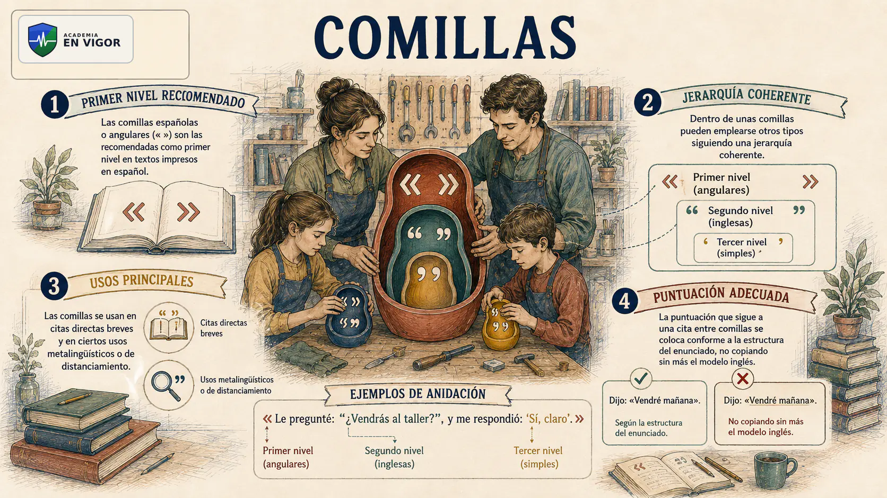

<em>Infografía: Comillas.</em>

:::hablemos-claro
Las comillas tienen niveles como muñecas rusas: angulares, inglesas y simples según la anidación.
:::

:::en-la-calle
Al puntuar una declaración sin alterar su alcance, Las comillas tienen niveles como muñecas rusas: angulares, inglesas y simples según la anidación.
:::

:::lo-que-cae
Prioriza **citas y usos metalingüísticos** y descarta respuestas que confundan grafía, tilde, espacio, signo o mayúscula.
:::

<!-- FUENTE: RAE-OLE-SIGNOS-T37 -->

## 58. Combinación de signos

### Lógica del bloque

Para dominar **combinación de signos**, aplica esta regla: Cierra las cajas en orden y después añade la puntuación que pertenezca al enunciado exterior. El anclaje principal es **jerarquía y cierre**.

### Hechos examinables

- Los signos dobles de interrogación, exclamación, paréntesis, corchetes y comillas deben cerrarse en orden coherente. <!-- FACT:PN-T37-F229 -->
- Una coma, un punto y coma o dos puntos pueden escribirse después de un signo de cierre si la estructura lo exige. <!-- FACT:PN-T37-F230 -->
- No se añade punto después de un signo de interrogación o exclamación que cierra el enunciado. <!-- FACT:PN-T37-F231 -->
- Cuando coinciden comillas y punto, la colocación responde al sistema de puntuación español y a la pertenencia del punto. <!-- FACT:PN-T37-F232 -->

### Ejemplos razonados

- **Aplicación correcta:** «¿Vendrá?», preguntó Ana.
- **Contraste útil:** Respondió «sí». coloca el punto tras las comillas del segmento citado.

### Trampas de examen

- **Incorrecto:** Dos signos de cierre consecutivos son siempre incorrectos.
- **Incorrecto:** La interrogación final impide cualquier coma posterior.

<!-- VISUAL:t37-il-58-combinacion-de-signos.webp -->

  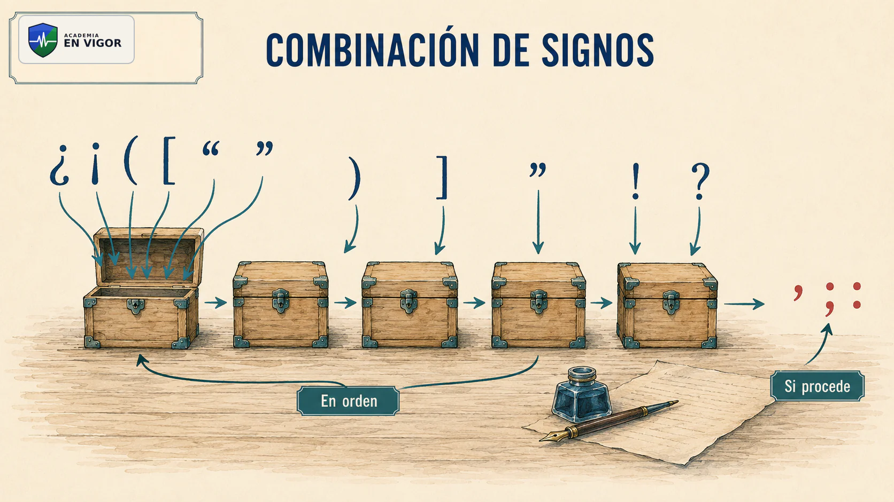

<em>Infografía: Combinación de signos.</em>

:::hablemos-claro
Cierra las cajas en orden y después añade la puntuación que pertenezca al enunciado exterior.
:::

:::en-la-calle
Al puntuar una declaración sin alterar su alcance, Cierra las cajas en orden y después añade la puntuación que pertenezca al enunciado exterior.
:::

:::lo-que-cae
Prioriza **jerarquía y cierre** y descarta respuestas que confundan grafía, tilde, espacio, signo o mayúscula.
:::

<!-- FUENTE: RAE-OLE-SIGNOS-T37 -->

## 59. Barra, apóstrofo y asterisco

### Lógica del bloque

Para dominar **barra, apóstrofo y asterisco**, aplica esta regla: Los signos auxiliares son herramientas especializadas: su forma no determina por sí sola el espaciado. El anclaje principal es **signos auxiliares**.

### Hechos examinables

- La barra puede expresar alternativa, relación, división, versos o formar parte de determinadas abreviaturas y direcciones. <!-- FACT:PN-T37-F233 -->
- El apóstrofo no se usa en español estándar para formar plurales ni para separar cifras de decimales. <!-- FACT:PN-T37-F234 -->
- El asterisco puede remitir a una nota o señalar una forma lingüísticamente inaceptable en textos especializados. <!-- FACT:PN-T37-F235 -->
- El espaciado de cada signo depende de su función; no existe una regla única válida para todos sus usos. <!-- FACT:PN-T37-F236 -->

### Ejemplos razonados

- **Aplicación correcta:** c/ puede abreviar calle en ciertos contextos.
- **Contraste útil:** La marca *delante suya puede señalar una construcción censurada en un análisis.

### Trampas de examen

- **Incorrecto:** El plural de una sigla se forma con apóstrofo y s.
- **Incorrecto:** La barra lleva siempre espacios a ambos lados.

<!-- VISUAL:t37-59-barra-apostrofo-y-asterisco.webp -->

  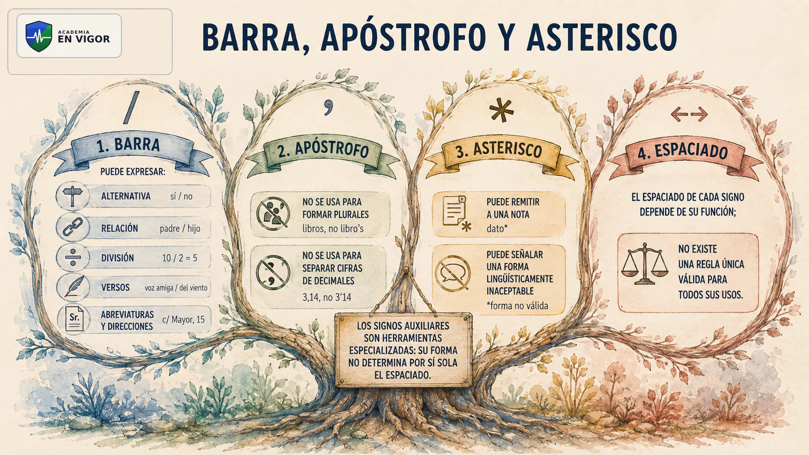

<em>Infografía: Barra, apóstrofo y asterisco.</em>

:::hablemos-claro
Los signos auxiliares son herramientas especializadas: su forma no determina por sí sola el espaciado.
:::

:::en-la-calle
Al puntuar una declaración sin alterar su alcance, Los signos auxiliares son herramientas especializadas: su forma no determina por sí sola el espaciado.
:::

:::lo-que-cae
Prioriza **signos auxiliares** y descarta respuestas que confundan grafía, tilde, espacio, signo o mayúscula.
:::

<!-- FUENTE: RAE-OLE-SIGNOS-T37 -->

## 60. Espacios y signos

### Lógica del bloque

Para dominar **espacios y signos**, aplica esta regla: Los signos abrazan el texto por dentro y dejan aire por fuera. El anclaje principal es **pegado al anterior y separación del siguiente**.

### Hechos examinables

- Punto, coma, punto y coma, dos puntos y puntos suspensivos se escriben pegados al elemento anterior. <!-- FACT:PN-T37-F237 -->
- Después de esos signos se deja normalmente un espacio si continúa el texto en la misma línea. <!-- FACT:PN-T37-F238 -->
- Los signos de apertura se escriben pegados a la palabra que sigue y los de cierre, a la palabra que precede. <!-- FACT:PN-T37-F239 -->
- No debe introducirse un espacio entre una palabra y la tilde, la diéresis o el signo que forma parte de ella. <!-- FACT:PN-T37-F240 -->

### Ejemplos razonados

- **Aplicación correcta:** Correcto: Hola, Marta. Incorrecto: Hola ,Marta.
- **Contraste útil:** Correcto: ¿Vienes hoy? sin espacios interiores.

### Trampas de examen

- **Incorrecto:** La coma se separa con un espacio de la palabra anterior.
- **Incorrecto:** Los signos de interrogación deben aislarse con espacios interiores.

<!-- VISUAL:t37-60-espacios-y-signos.webp -->

  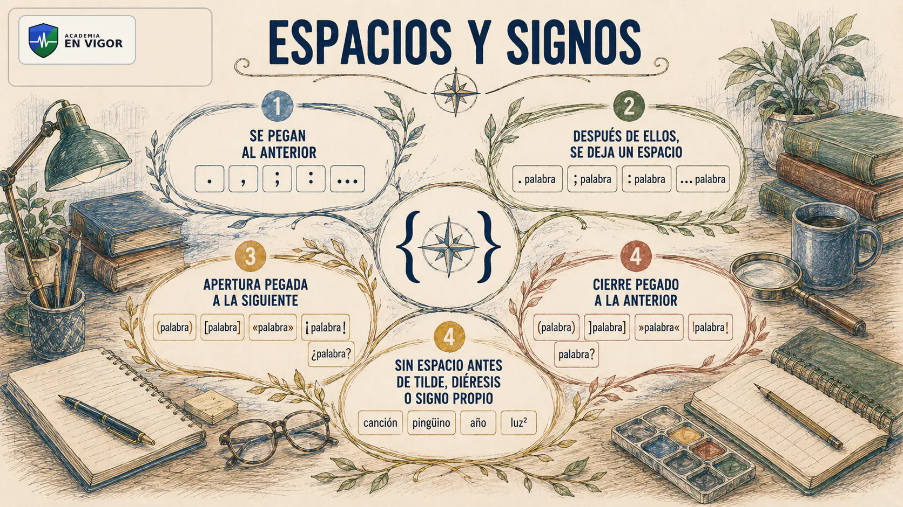

<em>Infografía: Espacios y signos.</em>

:::hablemos-claro
Los signos abrazan el texto por dentro y dejan aire por fuera.
:::

:::en-la-calle
Al puntuar una declaración sin alterar su alcance, Los signos abrazan el texto por dentro y dejan aire por fuera.
:::

:::lo-que-cae
Prioriza **pegado al anterior y separación del siguiente** y descarta respuestas que confundan grafía, tilde, espacio, signo o mayúscula.
:::

<!-- FUENTE: RAE-LIBRO-ESTILO-T37 -->

## 61. Principios de mayúsculas y minúsculas

### Lógica del bloque

Para dominar **principios de mayúsculas y minúsculas**, aplica esta regla: La mayúscula necesita una función, no una emoción: delimitar o identificar. El anclaje principal es **función delimitadora y distintiva**.

### Hechos examinables

- La mayúscula cumple principalmente funciones delimitadoras al inicio y distintivas en nombres propios y denominaciones. <!-- FACT:PN-T37-F241 -->
- La mayúscula no exime del uso de tilde ni de diéresis. <!-- FACT:PN-T37-F242 -->
- El uso reverencial o enfático no justifica por sí solo una mayúscula no prevista por la norma. <!-- FACT:PN-T37-F243 -->
- Cuando no existe una razón específica para la mayúscula, se emplea la minúscula. <!-- FACT:PN-T37-F244 -->

### Ejemplos razonados

- **Aplicación correcta:** África y Úrsula conservan tilde.
- **Contraste útil:** policía, juez y ministro se escriben con minúscula como nombres comunes.

### Trampas de examen

- **Incorrecto:** Las mayúsculas no llevan tilde.
- **Incorrecto:** Cualquier palabra importante puede escribirse con mayúscula.

<!-- VISUAL:t37-61-principios-de-mayusculas-y-minusculas.webp -->

  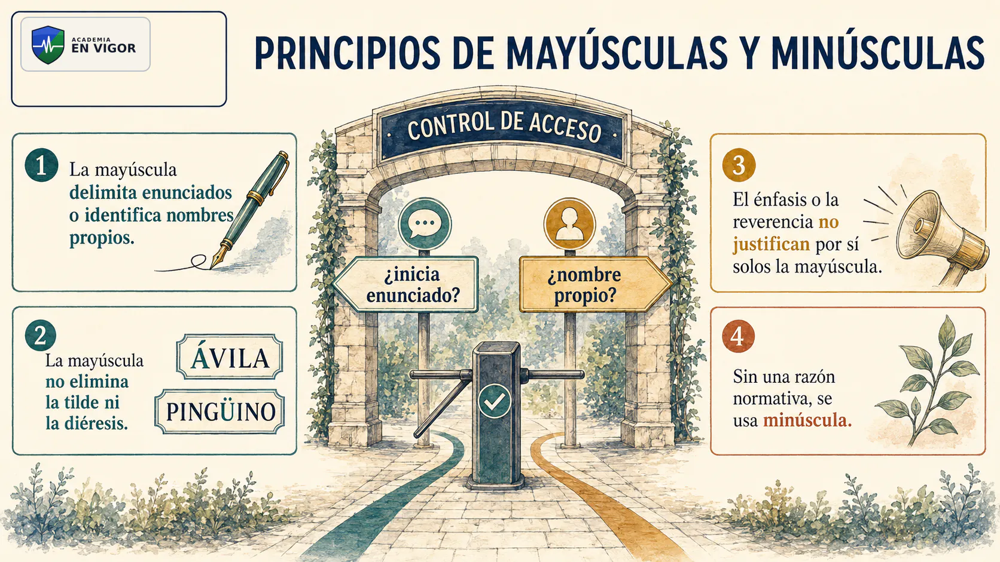

<em>Infografía: Principios de mayúsculas y minúsculas.</em>

:::hablemos-claro
La mayúscula necesita una función, no una emoción: delimitar o identificar.
:::

:::en-la-calle
Al distinguir un nombre oficial de una mención genérica, La mayúscula necesita una función, no una emoción: delimitar o identificar.
:::

:::lo-que-cae
Prioriza **función delimitadora y distintiva** y descarta respuestas que confundan grafía, tilde, espacio, signo o mayúscula.
:::

<!-- FUENTE: RAE-OLE-MAYUSCULAS-T37 -->

## 62. Inicio de enunciado y después de signos

### Lógica del bloque

Para dominar **inicio de enunciado y después de signos**, aplica esta regla: La pregunta clave es si terminó el enunciado, no qué signo viste por última vez. El anclaje principal es **mayúscula delimitadora**.

### Hechos examinables

- La primera palabra de un escrito y la que sigue a un punto de cierre se escriben con mayúscula. <!-- FACT:PN-T37-F245 -->
- Después de puntos suspensivos se usa mayúscula si estos cierran el enunciado y minúscula si este continúa. <!-- FACT:PN-T37-F246 -->
- Tras dos puntos se escribe normalmente minúscula, con excepciones reguladas. <!-- FACT:PN-T37-F247 -->
- La palabra que sigue a un signo de cierre de interrogación o exclamación lleva mayúscula si comienza un nuevo enunciado. <!-- FACT:PN-T37-F248 -->

### Ejemplos razonados

- **Aplicación correcta:** No vino. Llamó después.
- **Contraste útil:** Trajo tres cosas: pan, agua y fruta.

### Trampas de examen

- **Incorrecto:** Después de dos puntos se escribe siempre mayúscula.
- **Incorrecto:** Los puntos suspensivos obligan siempre a comenzar con mayúscula.

<!-- VISUAL:t37-62-inicio-de-enunciado-y-despues-de-signos.webp -->

  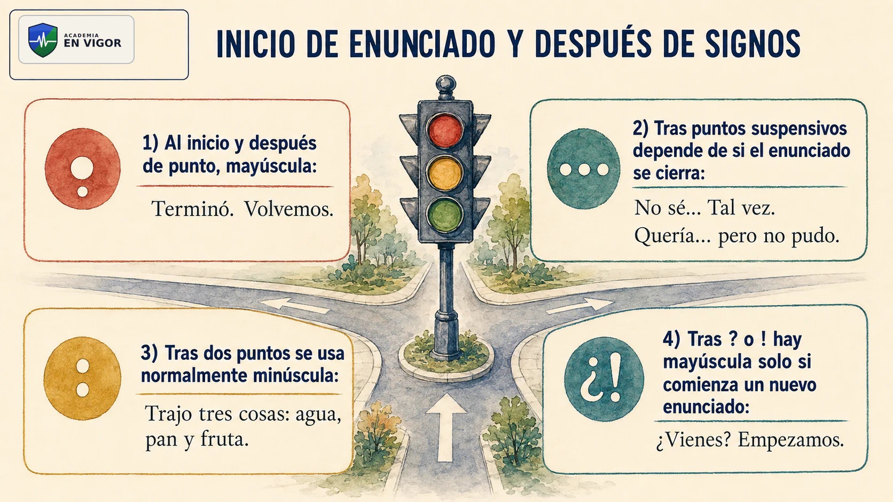

<em>Infografía: Inicio de enunciado y después de signos.</em>

:::hablemos-claro
La pregunta clave es si terminó el enunciado, no qué signo viste por última vez.
:::

:::en-la-calle
Al distinguir un nombre oficial de una mención genérica, La pregunta clave es si terminó el enunciado, no qué signo viste por última vez.
:::

:::lo-que-cae
Prioriza **mayúscula delimitadora** y descarta respuestas que confundan grafía, tilde, espacio, signo o mayúscula.
:::

<!-- FUENTE: RAE-OLE-MAYUSCULAS-T37 -->

## 63. Antropónimos, apodos y seudónimos

### Lógica del bloque

Para dominar **antropónimos, apodos y seudónimos**, aplica esta regla: El apodo recibe mayúscula; el artículo acompañante no asciende automáticamente. El anclaje principal es **nombre propio y artículo**.

### Hechos examinables

- Los nombres de pila y apellidos se escriben con mayúscula inicial. <!-- FACT:PN-T37-F249 -->
- Los apodos, sobrenombres y seudónimos se escriben con mayúscula inicial en sus elementos significativos. <!-- FACT:PN-T37-F250 -->
- El artículo que precede a un apodo se escribe normalmente con minúscula cuando aparece junto al nombre: Alfonso X el Sabio. <!-- FACT:PN-T37-F251 -->
- Si el artículo forma parte de un seudónimo o nombre y aparece sin nombre previo, puede escribirse con mayúscula según su integración. <!-- FACT:PN-T37-F252 -->

### Ejemplos razonados

- **Aplicación correcta:** Alfonso X el Sabio.
- **Contraste útil:** La Faraona es un sobrenombre usado de forma autónoma.

### Trampas de examen

- **Incorrecto:** En Alfonso X el Sabio, el debe escribirse con mayúscula.
- **Incorrecto:** Los apodos se escriben enteramente con minúscula.

<!-- VISUAL:t37-il-63-antroponimos-apodos-y-seudonimos.webp -->

  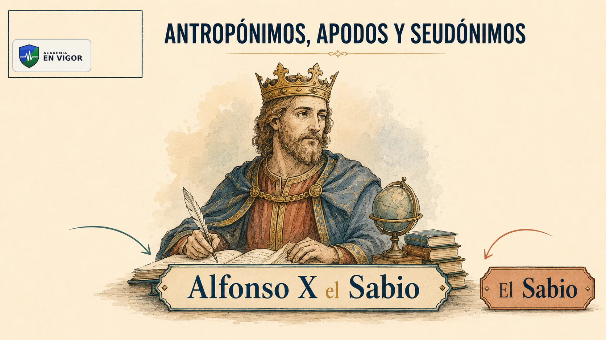

<em>Infografía: Antropónimos, apodos y seudónimos.</em>

:::hablemos-claro
El apodo recibe mayúscula; el artículo acompañante no asciende automáticamente.
:::

:::en-la-calle
Al distinguir un nombre oficial de una mención genérica, El apodo recibe mayúscula; el artículo acompañante no asciende automáticamente.
:::

:::lo-que-cae
Prioriza **nombre propio y artículo** y descarta respuestas que confundan grafía, tilde, espacio, signo o mayúscula.
:::

<!-- FUENTE: RAE-OLE-NOMBRES-T37 -->

## 64. Instituciones, organismos y cuerpos

### Lógica del bloque

Para dominar **instituciones, organismos y cuerpos**, aplica esta regla: Nombre oficial completo: placa identificativa; uso genérico: nombre común. El anclaje principal es **denominación oficial frente a uso común**.

### Hechos examinables

- Los nombres oficiales completos de instituciones, organismos, departamentos y cuerpos se escriben con mayúscula en sus elementos significativos. <!-- FACT:PN-T37-F253 -->
- Las menciones genéricas o anafóricas no oficiales se escriben con minúscula. <!-- FACT:PN-T37-F254 -->
- Los artículos y preposiciones internos suelen mantenerse en minúscula salvo que ocupen posición inicial o formen parte fijada. <!-- FACT:PN-T37-F255 -->
- Una sigla institucional se escribe conforme a sus convenciones propias, sin puntos entre las letras. <!-- FACT:PN-T37-F256 -->

### Ejemplos razonados

- **Aplicación correcta:** Ministerio del Interior y Policía Nacional son denominaciones oficiales.
- **Contraste útil:** El ministerio publicó una nota usa minúscula en una referencia genérica.

### Trampas de examen

- **Incorrecto:** Toda mención de ministerio o policía exige mayúscula.
- **Incorrecto:** Las siglas se escriben con puntos entre todas sus letras.

<!-- VISUAL:t37-64-instituciones-organismos-y-cuerpos.webp -->

  

<em>Infografía: Instituciones, organismos y cuerpos.</em>

:::hablemos-claro
Nombre oficial completo: placa identificativa; uso genérico: nombre común.
:::

:::en-la-calle
Al distinguir un nombre oficial de una mención genérica, Nombre oficial completo: placa identificativa; uso genérico: nombre común.
:::

:::lo-que-cae
Prioriza **denominación oficial frente a uso común** y descarta respuestas que confundan grafía, tilde, espacio, signo o mayúscula.
:::

<!-- FUENTE: RAE-OLE-MAYUSCULAS-T37 -->

## 65. Cargos, títulos y tratamientos

### Lógica del bloque

Para dominar **cargos, títulos y tratamientos**, aplica esta regla: El cargo es una función, no un nombre propio: se escribe con minúscula. El anclaje principal es **nombres comunes de cargo**.

### Hechos examinables

- Los nombres de cargos, dignidades y profesiones se escriben con minúscula, acompañen o no al nombre propio. <!-- FACT:PN-T37-F257 -->
- Los tratamientos protocolarios se escriben normalmente con minúscula cuando se desarrollan. <!-- FACT:PN-T37-F258 -->
- Las abreviaturas de tratamientos pueden escribirse con mayúscula inicial según la forma convencional. <!-- FACT:PN-T37-F259 -->
- La mayúscula institucional no se transmite al nombre común de la persona que ocupa el cargo. <!-- FACT:PN-T37-F260 -->

### Ejemplos razonados

- **Aplicación correcta:** El presidente del Gobierno compareció.
- **Contraste útil:** La doctora Ana López firmó el informe.

### Trampas de examen

- **Incorrecto:** Presidente del Gobierno debe llevar mayúscula en presidente por respeto.
- **Incorrecto:** Todos los tratamientos desarrollados llevan mayúscula inicial.

<!-- VISUAL:t37-65-cargos-titulos-y-tratamientos.webp -->

  

<em>Infografía: Cargos, títulos y tratamientos.</em>

:::hablemos-claro
El cargo es una función, no un nombre propio: se escribe con minúscula.
:::

:::en-la-calle
Al distinguir un nombre oficial de una mención genérica, El cargo es una función, no un nombre propio: se escribe con minúscula.
:::

:::lo-que-cae
Prioriza **nombres comunes de cargo** y descarta respuestas que confundan grafía, tilde, espacio, signo o mayúscula.
:::

<!-- FUENTE: RAE-OLE-MAYUSCULAS-T37 -->

## 66. Topónimos y accidentes geográficos

### Lógica del bloque

Para dominar **topónimos y accidentes geográficos**, aplica esta regla: Separa la clase de accidente del nombre individual: río es categoría; Ebro identifica. El anclaje principal es **genérico y específico**.

### Hechos examinables

- Los topónimos se escriben con mayúscula inicial en sus elementos significativos. <!-- FACT:PN-T37-F261 -->
- El artículo integrado oficialmente en un topónimo puede escribirse con mayúscula, como en El Salvador. <!-- FACT:PN-T37-F262 -->
- El nombre común del accidente geográfico suele escribirse con minúscula si no forma parte inseparable del nombre propio: río Ebro. <!-- FACT:PN-T37-F263 -->
- Los puntos cardinales se escriben con minúscula cuando indican orientación y con mayúscula en ciertos nombres propios o símbolos. <!-- FACT:PN-T37-F264 -->

### Ejemplos razonados

- **Aplicación correcta:** El río Ebro atraviesa varias comunidades.
- **Contraste útil:** América del Sur integra Sur en un nombre propio.

### Trampas de examen

- **Incorrecto:** Río debe escribirse siempre con mayúscula ante un topónimo.
- **Incorrecto:** Norte lleva mayúscula en cualquier indicación de dirección.

<!-- VISUAL:t37-66-toponimos-y-accidentes-geograficos.webp -->

  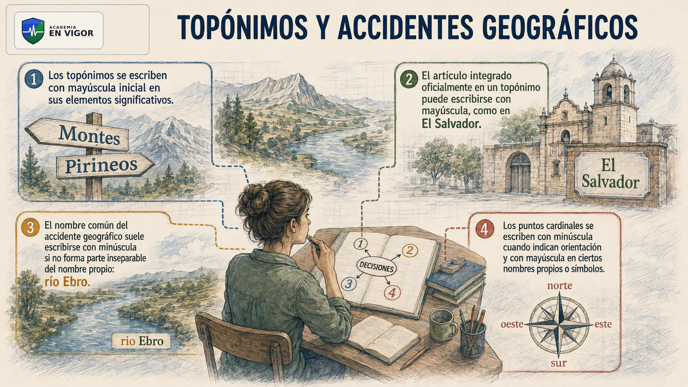

<em>Infografía: Topónimos y accidentes geográficos.</em>

:::hablemos-claro
Separa la clase de accidente del nombre individual: río es categoría; Ebro identifica.
:::

:::en-la-calle
Al distinguir un nombre oficial de una mención genérica, Separa la clase de accidente del nombre individual: río es categoría; Ebro identifica.
:::

:::lo-que-cae
Prioriza **genérico y específico** y descarta respuestas que confundan grafía, tilde, espacio, signo o mayúscula.
:::

<!-- FUENTE: RAE-OLE-NOMBRES-T37 -->

## 67. Obras, publicaciones y documentos

### Lógica del bloque

Para dominar **obras, publicaciones y documentos**, aplica esta regla: En español los títulos no se visten como en inglés: normalmente solo la primera palabra abre con mayúscula. El anclaje principal es **títulos con mayúscula inicial**.

### Hechos examinables

- En los títulos de obras de creación se escribe con mayúscula inicial la primera palabra y los nombres propios incluidos. <!-- FACT:PN-T37-F265 -->
- Los títulos de publicaciones periódicas llevan mayúscula en sus palabras significativas. <!-- FACT:PN-T37-F266 -->
- Los títulos de capítulos, artículos o piezas internas suelen escribirse entre comillas y con mayúscula inicial solo en la primera palabra, salvo nombres propios. <!-- FACT:PN-T37-F267 -->
- La cursiva o las comillas cumplen una función distinta de la mayúscula y deben aplicarse según el tipo de título. <!-- FACT:PN-T37-F268 -->

### Ejemplos razonados

- **Aplicación correcta:** Cien años de soledad.
- **Contraste útil:** El País se escribe con mayúsculas por ser cabecera de publicación.

### Trampas de examen

- **Incorrecto:** Todas las palabras de un título de libro llevan mayúscula en español.
- **Incorrecto:** Cursiva y comillas son siempre intercambiables.

<!-- VISUAL:t37-67-obras-publicaciones-y-documentos.webp -->

  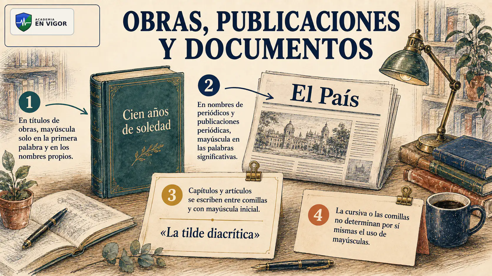

<em>Infografía: Obras, publicaciones y documentos.</em>

:::hablemos-claro
En español los títulos no se visten como en inglés: normalmente solo la primera palabra abre con mayúscula.
:::

:::en-la-calle
Al distinguir un nombre oficial de una mención genérica, En español los títulos no se visten como en inglés: normalmente solo la primera palabra abre con mayúscula.
:::

:::lo-que-cae
Prioriza **títulos con mayúscula inicial** y descarta respuestas que confundan grafía, tilde, espacio, signo o mayúscula.
:::

<!-- FUENTE: RAE-OLE-MAYUSCULAS-T37 -->

## 68. Leyes, periodos y calendario

### Lógica del bloque

Para dominar **leyes, periodos y calendario**, aplica esta regla: El calendario ordinario va en minúscula; la denominación propia de una fiesta o periodo puede llevar mayúscula. El anclaje principal es **denominación oficial y nombres comunes temporales**.

### Hechos examinables

- En los títulos oficiales de leyes y documentos, llevan mayúscula los elementos significativos de la denominación abreviada o completa según el tipo de título. <!-- FACT:PN-T37-F269 -->
- Los días de la semana, meses y estaciones se escriben con minúscula, salvo inicio de enunciado o nombre propio. <!-- FACT:PN-T37-F270 -->
- Las festividades y periodos históricos identificativos se escriben con mayúscula en sus elementos significativos. <!-- FACT:PN-T37-F271 -->
- Los movimientos y estilos se escriben normalmente con minúscula, pero ciertos grandes periodos históricos admiten o exigen mayúscula en su denominación establecida. <!-- FACT:PN-T37-F272 -->

### Ejemplos razonados

- **Aplicación correcta:** La Ley Orgánica 4/2015 se aprobó en marzo.
- **Contraste útil:** Navidad y Edad Media se escriben con mayúscula.

### Trampas de examen

- **Incorrecto:** Agosto se escribe siempre con mayúscula por ser nombre de mes.
- **Incorrecto:** Toda referencia a una ley se escribe completamente en mayúsculas.

<!-- VISUAL:t37-il-68-leyes-periodos-y-calendario.webp -->

  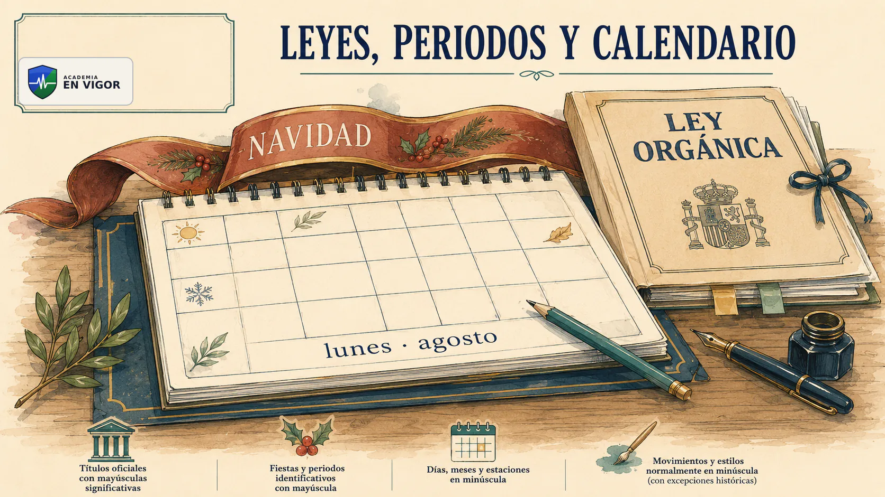

<em>Infografía: Leyes, periodos y calendario.</em>

:::hablemos-claro
El calendario ordinario va en minúscula; la denominación propia de una fiesta o periodo puede llevar mayúscula.
:::

:::en-la-calle
Al distinguir un nombre oficial de una mención genérica, El calendario ordinario va en minúscula; la denominación propia de una fiesta o periodo puede llevar mayúscula.
:::

:::lo-que-cae
Prioriza **denominación oficial y nombres comunes temporales** y descarta respuestas que confundan grafía, tilde, espacio, signo o mayúscula.
:::

<!-- FUENTE: RAE-OLE-MAYUSCULAS-T37 -->

## 69. Palabra y unidad léxica

### Lógica del bloque

Para dominar **palabra y unidad léxica**, aplica esta regla: El espacio también escribe: puede separar piezas de una locución o distinguir dos expresiones distintas. El anclaje principal es **una o varias palabras gráficas**.

### Hechos examinables

- Una unidad léxica puede estar formada por una sola palabra gráfica o por varias palabras con significado unitario. <!-- FACT:PN-T37-F273 -->
- La separación mediante espacios no coincide siempre con el número de unidades de significado. <!-- FACT:PN-T37-F274 -->
- Las locuciones se escriben normalmente en varias palabras aunque funcionen como una unidad. <!-- FACT:PN-T37-F275 -->
- La escritura unida o separada puede diferenciar significados y categorías. <!-- FACT:PN-T37-F276 -->

### Ejemplos razonados

- **Aplicación correcta:** Sin embargo es una locución escrita en dos palabras.
- **Contraste útil:** Mediodía y medio día no significan necesariamente lo mismo.

### Trampas de examen

- **Incorrecto:** Toda unidad léxica se escribe en una sola palabra.
- **Incorrecto:** Los espacios no tienen valor ortográfico.

<!-- VISUAL:t37-69-palabra-y-unidad-lexica.webp -->

  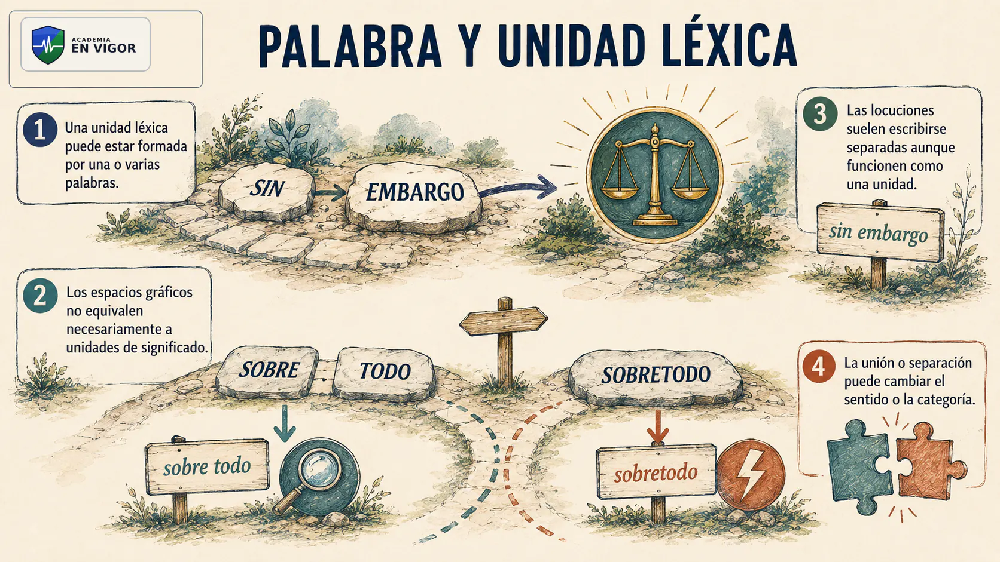

<em>Infografía: Palabra y unidad léxica.</em>

:::hablemos-claro
El espacio también escribe: puede separar piezas de una locución o distinguir dos expresiones distintas.
:::

:::en-la-calle
Al decidir si varias piezas se escriben unidas o separadas, El espacio también escribe: puede separar piezas de una locución o distinguir dos expresiones distintas.
:::

:::lo-que-cae
Prioriza **una o varias palabras gráficas** y descarta respuestas que confundan grafía, tilde, espacio, signo o mayúscula.
:::

<!-- FUENTE: RAE-OLE-UNIDADES-T37 -->

## 70. Prefijos unidos a una base

### Lógica del bloque

Para dominar **prefijos unidos a una base**, aplica esta regla: Una base de una sola palabra atrae al prefijo: se escriben juntos. El anclaje principal es **base univerbal**.

### Hechos examinables

- Los prefijos se escriben unidos a la palabra base cuando esta es univerbal. <!-- FACT:PN-T37-F277 -->
- Se escriben, por tanto, exministro, antirrobo, precontrato y vicepresidente. <!-- FACT:PN-T37-F278 -->
- No se separa el prefijo con un espacio por el mero hecho de que sea productivo o reciente. <!-- FACT:PN-T37-F279 -->
- La palabra prefijada resultante sigue las reglas generales de acentuación y ajuste gráfico. <!-- FACT:PN-T37-F280 -->

### Ejemplos razonados

- **Aplicación correcta:** Expareja y posoperatorio se escriben unidos.
- **Contraste útil:** Antiinflamatorio se escribe en una palabra.

### Trampas de examen

- **Incorrecto:** Ex ministro es la forma general correcta.
- **Incorrecto:** Todo prefijo debe llevar guion.

<!-- VISUAL:t37-70-prefijos-unidos-a-una-base.webp -->

  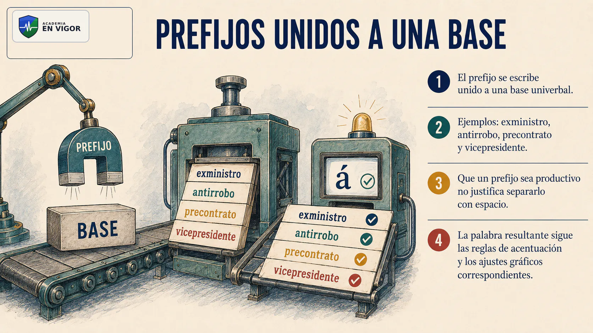

<em>Infografía: Prefijos unidos a una base.</em>

:::hablemos-claro
Una base de una sola palabra atrae al prefijo: se escriben juntos.
:::

:::en-la-calle
Al decidir si varias piezas se escriben unidas o separadas, Una base de una sola palabra atrae al prefijo: se escriben juntos.
:::

:::lo-que-cae
Prioriza **base univerbal** y descarta respuestas que confundan grafía, tilde, espacio, signo o mayúscula.
:::

<!-- FUENTE: RAE-OLE-UNIDADES-T37 -->

## 71. Prefijos con guion o separados

### Lógica del bloque

Para dominar **prefijos con guion o separados**, aplica esta regla: El prefijo se une a una palabra, usa guion ante mayúscula o cifra y se separa ante una base de varias palabras. El anclaje principal es **mayúscula, cifra y base pluriverbal**.

### Hechos examinables

- Se usa guion entre prefijo y base cuando la base comienza por mayúscula o es una sigla, como anti-OTAN. <!-- FACT:PN-T37-F281 -->
- También se usa guion ante una cifra, como sub-21. <!-- FACT:PN-T37-F282 -->
- El prefijo se escribe separado cuando afecta a una base formada por varias palabras, como ex primer ministro. <!-- FACT:PN-T37-F283 -->
- Varios prefijos coordinados pueden requerir guion o formas específicas que deben mantener clara la base compartida. <!-- FACT:PN-T37-F284 -->

### Ejemplos razonados

- **Aplicación correcta:** Pro-UE y sub-18 llevan guion.
- **Contraste útil:** Ex alto cargo se escribe separado.

### Trampas de examen

- **Incorrecto:** Ex-OTAN debe escribirse sin guion.
- **Incorrecto:** Exprimer ministro se escribe unido aunque la base tenga dos palabras.

<!-- VISUAL:t37-71-prefijos-con-guion-o-separados.webp -->

  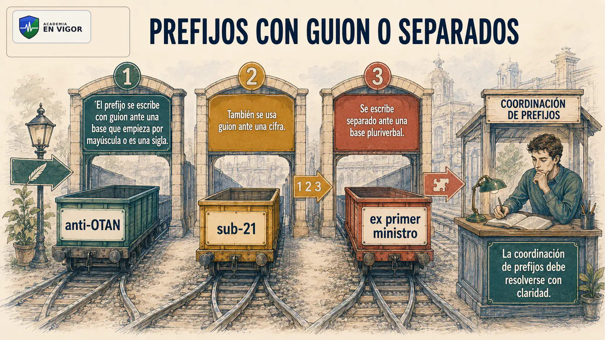

<em>Infografía: Prefijos con guion o separados.</em>

:::hablemos-claro
El prefijo se une a una palabra, usa guion ante mayúscula o cifra y se separa ante una base de varias palabras.
:::

:::en-la-calle
Al decidir si varias piezas se escriben unidas o separadas, El prefijo se une a una palabra, usa guion ante mayúscula o cifra y se separa ante una base de varias palabras.
:::

:::lo-que-cae
Prioriza **mayúscula, cifra y base pluriverbal** y descarta respuestas que confundan grafía, tilde, espacio, signo o mayúscula.
:::

<!-- FUENTE: RAE-OLE-UNIDADES-T37 -->

## 72. Por qué, porque, porqué y por que

### Lógica del bloque

Para dominar **por qué, porque, porqué y por que**, aplica esta regla: No elijas por oído: pregunta, respuesta, nombre o suma de preposición y que. El anclaje principal es **cuatro secuencias**.

### Hechos examinables

- Por qué se usa en interrogaciones y exclamaciones directas o indirectas. <!-- FACT:PN-T37-F285 -->
- Porque es una conjunción que introduce normalmente causa o respuesta. <!-- FACT:PN-T37-F286 -->
- Porqué es un sustantivo y suele aparecer con determinante; su plural es porqués. <!-- FACT:PN-T37-F287 -->
- Por que corresponde a la secuencia de la preposición por y la conjunción o el relativo que en determinados contextos. <!-- FACT:PN-T37-F288 -->

### Ejemplos razonados

- **Aplicación correcta:** ¿Por qué vino? Vino porque lo llamaron.
- **Contraste útil:** No explicó el porqué de su ausencia.

### Trampas de examen

- **Incorrecto:** Porqué introduce siempre una pregunta.
- **Incorrecto:** Porque se escribe separado en toda respuesta causal.

<!-- VISUAL:t37-72-por-que-porque-porque-y-por-que.webp -->

  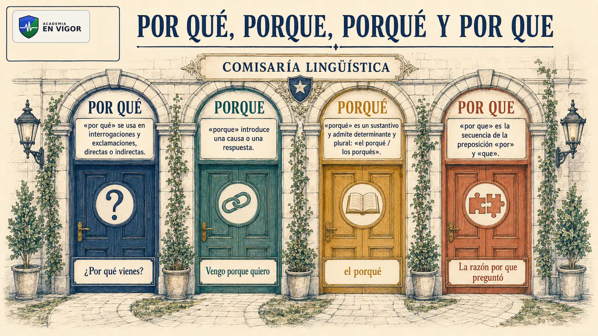

<em>Infografía: Por qué, porque, porqué y por que.</em>

:::hablemos-claro
No elijas por oído: pregunta, respuesta, nombre o suma de preposición y que.
:::

:::en-la-calle
Al decidir si varias piezas se escriben unidas o separadas, No elijas por oído: pregunta, respuesta, nombre o suma de preposición y que.
:::

:::lo-que-cae
Prioriza **cuatro secuencias** y descarta respuestas que confundan grafía, tilde, espacio, signo o mayúscula.
:::

<!-- FUENTE: RAE-DPD2-T37 -->

## 73. Sino y si no

### Lógica del bloque

Para dominar **sino y si no**, aplica esta regla: Sustitución corrige el rumbo: sino equivale a más bien; si no abre una condición negativa. El anclaje principal es **oposición frente a condición negada**.

### Hechos examinables

- Sino es una conjunción adversativa que contrapone un elemento a otro negado previamente. <!-- FACT:PN-T37-F289 -->
- Sino también puede ser sustantivo con el sentido de destino. <!-- FACT:PN-T37-F290 -->
- Si no es la combinación de la conjunción condicional si y el adverbio de negación no. <!-- FACT:PN-T37-F291 -->
- La posibilidad de intercalar un elemento tras si ayuda a reconocer la escritura separada. <!-- FACT:PN-T37-F292 -->

### Ejemplos razonados

- **Aplicación correcta:** No llamó Ana, sino Luis.
- **Contraste útil:** Si no llama, saldremos.

### Trampas de examen

- **Incorrecto:** Si no adversativo se escribe siempre unido.
- **Incorrecto:** Sino condicional se escribe siempre unido.

<!-- VISUAL:t37-il-73-sino-y-si-no.webp -->

  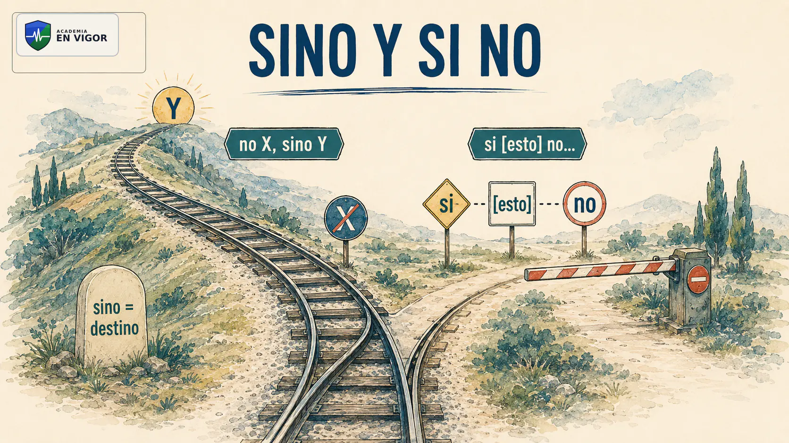

<em>Infografía: Sino y si no.</em>

:::hablemos-claro
Sustitución corrige el rumbo: sino equivale a más bien; si no abre una condición negativa.
:::

:::en-la-calle
Al decidir si varias piezas se escriben unidas o separadas, Sustitución corrige el rumbo: sino equivale a más bien; si no abre una condición negativa.
:::

:::lo-que-cae
Prioriza **oposición frente a condición negada** y descarta respuestas que confundan grafía, tilde, espacio, signo o mayúscula.
:::

<!-- FUENTE: RAE-DPD2-T37 -->

## 74. Conque, con que y con qué

### Lógica del bloque

Para dominar **conque, con que y con qué**, aplica esta regla: Tres controles: consecuencia unida, piezas sintácticas separadas e interrogación con tilde. El anclaje principal es **consecuencia, secuencia e interrogación**.

### Hechos examinables

- Conque es una conjunción consecutiva equivalente en muchos contextos a así que. <!-- FACT:PN-T37-F293 -->
- Con que puede ser la secuencia de la preposición con y el relativo o la conjunción que. <!-- FACT:PN-T37-F294 -->
- Con qué se usa cuando qué es interrogativo o exclamativo tónico. <!-- FACT:PN-T37-F295 -->
- La tilde y el espacio responden a la función, no a diferencias constantes de pronunciación. <!-- FACT:PN-T37-F296 -->

### Ejemplos razonados

- **Aplicación correcta:** Conque ya lo sabías.
- **Contraste útil:** ¿Con qué herramienta abrió la puerta?

### Trampas de examen

- **Incorrecto:** Conque se escribe separado cuando equivale a así que.
- **Incorrecto:** Con qué interrogativo se escribe sin tilde.

<!-- VISUAL:t37-74-conque-con-que-y-con-que.webp -->

  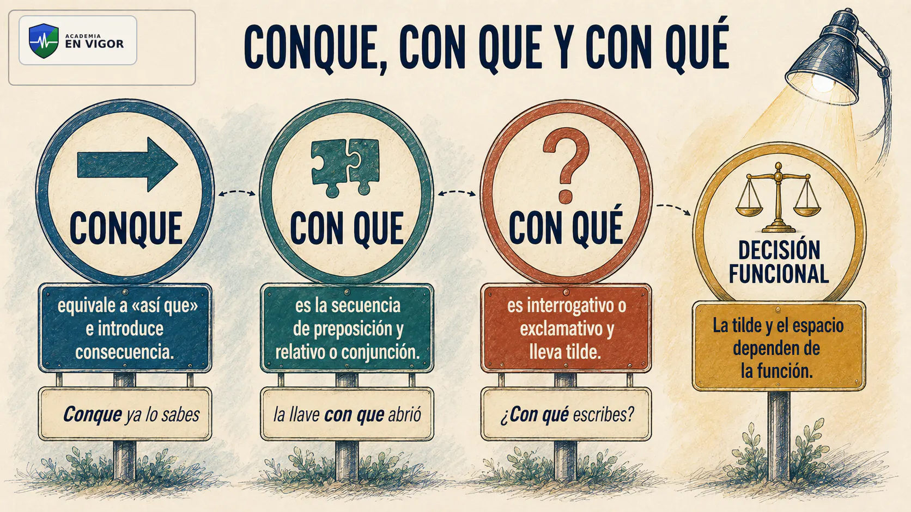

<em>Infografía: Conque, con que y con qué.</em>

:::hablemos-claro
Tres controles: consecuencia unida, piezas sintácticas separadas e interrogación con tilde.
:::

:::en-la-calle
Al decidir si varias piezas se escriben unidas o separadas, Tres controles: consecuencia unida, piezas sintácticas separadas e interrogación con tilde.
:::

:::lo-que-cae
Prioriza **consecuencia, secuencia e interrogación** y descarta respuestas que confundan grafía, tilde, espacio, signo o mayúscula.
:::

<!-- FUENTE: RAE-DPD2-T37 -->

## 75. Secuencias de escritura dudosa

### Lógica del bloque

Para dominar **secuencias de escritura dudosa**, aplica esta regla: La escritura cambia con el significado: prueba una sustitución antes de decidir el espacio o la tilde. El anclaje principal es **sobre todo, aparte, demás y asimismo**.

### Hechos examinables

- Sobre todo se escribe en dos palabras con el sentido de principalmente; sobretodo es un sustantivo que designa una prenda. <!-- FACT:PN-T37-F297 -->
- Aparte puede ser adverbio, adjetivo o sustantivo; a parte es la suma de preposición y sustantivo en contextos como a parte del grupo. <!-- FACT:PN-T37-F298 -->
- Demás significa los otros; de más expresa exceso o integra una secuencia preposicional. <!-- FACT:PN-T37-F299 -->
- Asimismo y así mismo pueden equivaler a también; a sí mismo contiene la preposición a y el pronombre reflexivo sí. <!-- FACT:PN-T37-F300 -->

### Ejemplos razonados

- **Aplicación correcta:** Me interesa sobre todo la prueba documental.
- **Contraste útil:** Se convenció a sí mismo.

### Trampas de examen

- **Incorrecto:** Sobretodo significa siempre principalmente.
- **Incorrecto:** A sí mismo equivale siempre a también.

<!-- VISUAL:t37-75-secuencias-de-escritura-dudosa.webp -->

  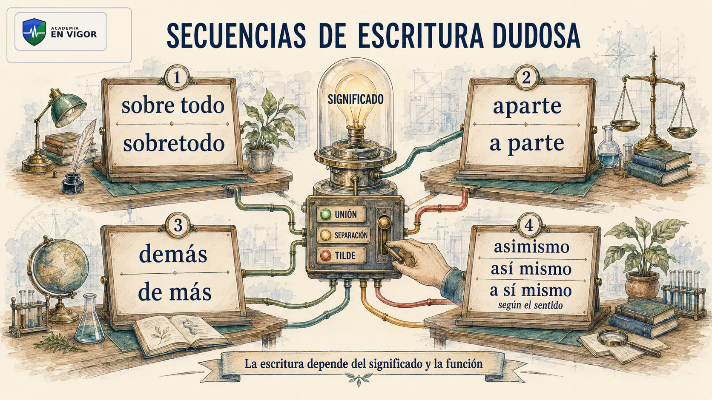

<em>Infografía: Secuencias de escritura dudosa.</em>

:::hablemos-claro
La escritura cambia con el significado: prueba una sustitución antes de decidir el espacio o la tilde.
:::

:::en-la-calle
Al decidir si varias piezas se escriben unidas o separadas, La escritura cambia con el significado: prueba una sustitución antes de decidir el espacio o la tilde.
:::

:::lo-que-cae
Prioriza **sobre todo, aparte, demás y asimismo** y descarta respuestas que confundan grafía, tilde, espacio, signo o mayúscula.
:::

<!-- FUENTE: RAE-DPD2-T37 -->

## 76. Préstamos adaptados y extranjerismos crudos

### Lógica del bloque

Para dominar **préstamos adaptados y extranjerismos crudos**, aplica esta regla: Elige un carril completo: adaptación española o forma extranjera marcada. El anclaje principal es **adaptación gráfica o marca tipográfica**.

### Hechos examinables

- Los préstamos adaptados se escriben conforme a la ortografía española y se integran sin resalte tipográfico. <!-- FACT:PN-T37-F301 -->
- Los extranjerismos no adaptados conservan su grafía original y se escriben en cursiva o, si no es posible, entre comillas. <!-- FACT:PN-T37-F302 -->
- No debe mezclarse una grafía extranjera cruda con tildes o reglas parciales españolas de manera arbitraria. <!-- FACT:PN-T37-F303 -->
- La existencia de una adaptación asentada puede hacer preferible la forma española frente al extranjerismo crudo. <!-- FACT:PN-T37-F304 -->

### Ejemplos razonados

- **Aplicación correcta:** Fútbol es una adaptación española y lleva tilde.
- **Contraste útil:** Software, si se mantiene como extranjerismo crudo, recibe cursiva.

### Trampas de examen

- **Incorrecto:** Todo extranjerismo debe escribirse en redonda sin adaptación.
- **Incorrecto:** Una voz extranjera puede recibir una tilde española y conservar a la vez el resto de su grafía cruda sin criterio.

<!-- VISUAL:t37-76-prestamos-adaptados-y-extranjerismos-crudos.webp -->

  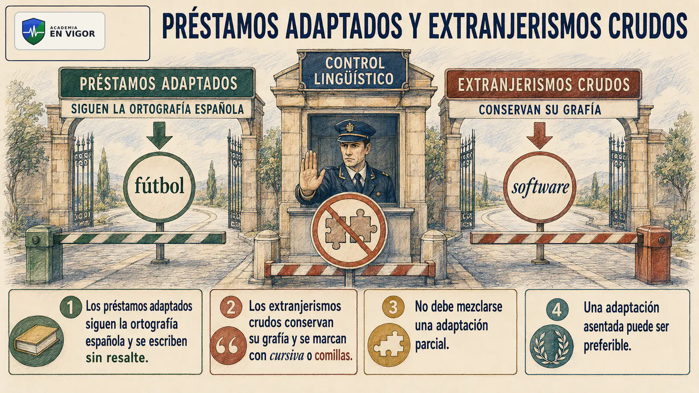

<em>Infografía: Préstamos adaptados y extranjerismos crudos.</em>

:::hablemos-claro
Elige un carril completo: adaptación española o forma extranjera marcada.
:::

:::en-la-calle
Al integrar un extranjerismo o escribir un nombre propio, Elige un carril completo: adaptación española o forma extranjera marcada.
:::

:::lo-que-cae
Prioriza **adaptación gráfica o marca tipográfica** y descarta respuestas que confundan grafía, tilde, espacio, signo o mayúscula.
:::

<!-- FUENTE: RAE-OLE-EXTRANJERISMOS-T37 -->

## 77. Latinismos y locuciones latinas

### Lógica del bloque

Para dominar **latinismos y locuciones latinas**, aplica esta regla: Una locución latina no necesita muletas castellanas: evita de motu proprio y a grosso modo. El anclaje principal es **adaptados frente a crudos**.

### Hechos examinables

- Los latinismos adaptados al español siguen las reglas generales de acentuación y se escriben en redonda. <!-- FACT:PN-T37-F305 -->
- Las locuciones latinas no adaptadas se tratan como expresiones extranjeras y se escriben en cursiva o entre comillas. <!-- FACT:PN-T37-F306 -->
- Motu proprio se escribe sin preposición antepuesta y sin añadir una s final a proprio. <!-- FACT:PN-T37-F307 -->
- Grosso modo se usa sin la preposición a antepuesta. <!-- FACT:PN-T37-F308 -->

### Ejemplos razonados

- **Aplicación correcta:** Abandonó el puesto motu proprio.
- **Contraste útil:** Actuó grosso modo según el plan.

### Trampas de examen

- **Incorrecto:** La expresión correcta es de motu propio.
- **Incorrecto:** Todas las locuciones latinas se escriben con tildes españolas.

<!-- VISUAL:t37-77-latinismos-y-locuciones-latinas.webp -->

  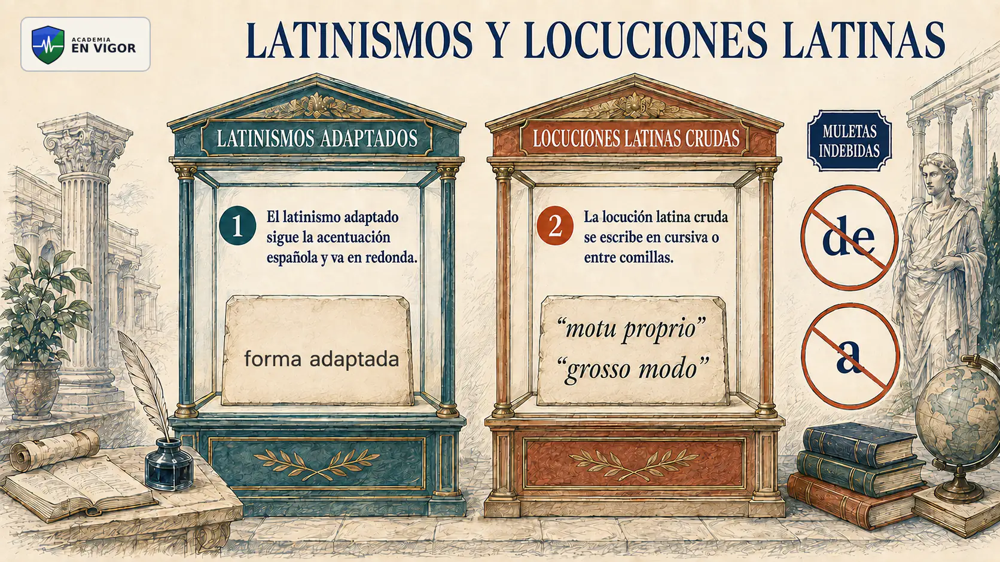

<em>Infografía: Latinismos y locuciones latinas.</em>

:::hablemos-claro
Una locución latina no necesita muletas castellanas: evita de motu proprio y a grosso modo.
:::

:::en-la-calle
Al integrar un extranjerismo o escribir un nombre propio, Una locución latina no necesita muletas castellanas: evita de motu proprio y a grosso modo.
:::

:::lo-que-cae
Prioriza **adaptados frente a crudos** y descarta respuestas que confundan grafía, tilde, espacio, signo o mayúscula.
:::

<!-- FUENTE: RAE-OLE-EXTRANJERISMOS-T37 -->

## 78. Transcripción y transliteración

### Lógica del bloque

Para dominar **transcripción y transliteración**, aplica esta regla: Transcribir aproxima el sonido; transliterar empareja signos. No son el mismo puente. El anclaje principal es **alfabetos no latinos**.

### Hechos examinables

- La transcripción busca representar la pronunciación mediante las grafías de la lengua de llegada. <!-- FACT:PN-T37-F309 -->
- La transliteración establece correspondencias sistemáticas entre signos de distintos sistemas de escritura. <!-- FACT:PN-T37-F310 -->
- Una forma transcrita al español se somete a las convenciones gráficas españolas que le correspondan. <!-- FACT:PN-T37-F311 -->
- No deben mezclarse sin criterio sistemas de transcripción procedentes de lenguas intermediarias. <!-- FACT:PN-T37-F312 -->

### Ejemplos razonados

- **Aplicación correcta:** Una transcripción española debe evitar grafías inglesas innecesarias.
- **Contraste útil:** Los sistemas científicos de transliteración pueden conservar signos técnicos específicos.

### Trampas de examen

- **Incorrecto:** Transcripción y transliteración son exactamente el mismo procedimiento.
- **Incorrecto:** Toda forma transcrita conserva obligatoriamente la ortografía de una lengua intermediaria.

<!-- VISUAL:t37-78-transcripcion-y-transliteracion.webp -->

  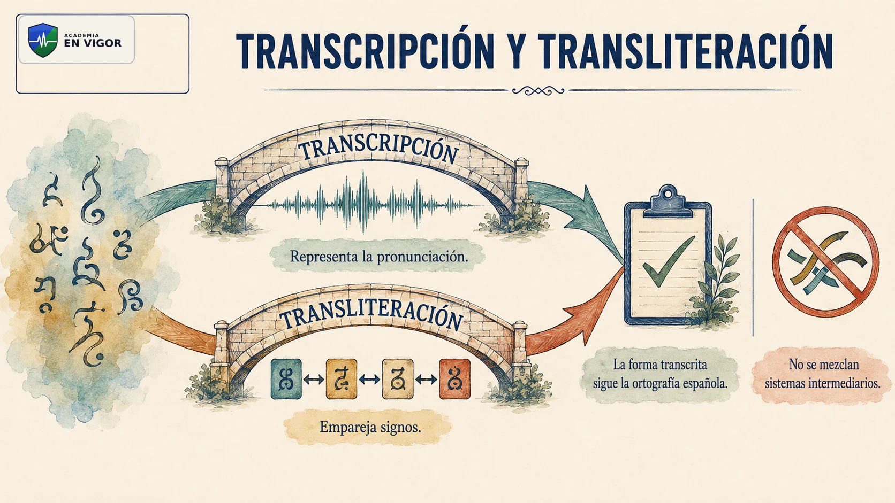

<em>Infografía: Transcripción y transliteración.</em>

:::hablemos-claro
Transcribir aproxima el sonido; transliterar empareja signos. No son el mismo puente.
:::

:::en-la-calle
Al integrar un extranjerismo o escribir un nombre propio, Transcribir aproxima el sonido; transliterar empareja signos. No son el mismo puente.
:::

:::lo-que-cae
Prioriza **alfabetos no latinos** y descarta respuestas que confundan grafía, tilde, espacio, signo o mayúscula.
:::

<!-- FUENTE: RAE-OLE-EXTRANJERISMOS-T37 -->

## 79. Antropónimos extranjeros

### Lógica del bloque

Para dominar **antropónimos extranjeros**, aplica esta regla: Conserva la identidad gráfica salvo que exista forma española tradicional o sea necesaria una transcripción. El anclaje principal es **conservación, adaptación y tradición**.

### Hechos examinables

- Los antropónimos escritos en alfabeto latino conservan normalmente su grafía original. <!-- FACT:PN-T37-F313 -->
- Ciertos nombres históricos, dinásticos, bíblicos o de tradición asentada tienen formas españolas. <!-- FACT:PN-T37-F314 -->
- Los nombres procedentes de otros alfabetos requieren una transcripción o transliteración coherente. <!-- FACT:PN-T37-F315 -->
- Las tildes y signos de la forma original se conservan o adaptan según el tratamiento aplicado, no por una regla improvisada. <!-- FACT:PN-T37-F316 -->

### Ejemplos razonados

- **Aplicación correcta:** William Shakespeare conserva su grafía.
- **Contraste útil:** Los nombres de monarcas históricos pueden presentar una forma tradicional española, como Carlos para Charles.

### Trampas de examen

- **Incorrecto:** Todo nombre extranjero debe traducirse al español.
- **Incorrecto:** Los nombres propios están exentos de reglas ortográficas.

<!-- VISUAL:t37-il-79-antroponimos-extranjeros.webp -->

  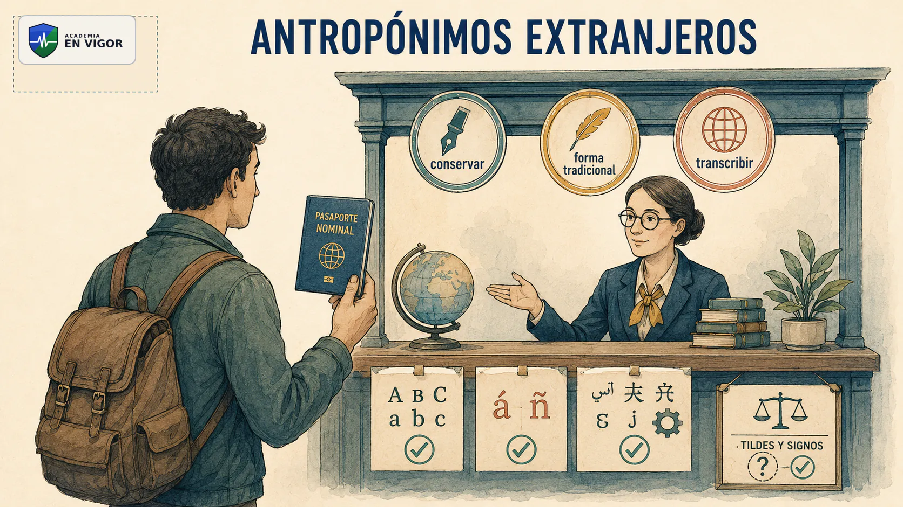

<em>Infografía: Antropónimos extranjeros.</em>

:::hablemos-claro
Conserva la identidad gráfica salvo que exista forma española tradicional o sea necesaria una transcripción.
:::

:::en-la-calle
Al integrar un extranjerismo o escribir un nombre propio, Conserva la identidad gráfica salvo que exista forma española tradicional o sea necesaria una transcripción.
:::

:::lo-que-cae
Prioriza **conservación, adaptación y tradición** y descarta respuestas que confundan grafía, tilde, espacio, signo o mayúscula.
:::

<!-- FUENTE: RAE-OLE-NOMBRES-T37 -->

## 80. Topónimos extranjeros y gentilicios

### Lógica del bloque

Para dominar **topónimos extranjeros y gentilicios**, aplica esta regla: El lugar puede conservar mayúscula; el habitante baja a minúscula. El anclaje principal es **exónimo, endónimo y derivado**.

### Hechos examinables

- Cuando existe un exónimo español asentado, se recomienda usarlo en textos españoles, como Londres o Nueva York. <!-- FACT:PN-T37-F317 -->
- Si no existe forma española asentada, se conserva o transcribe el topónimo según su sistema de escritura. <!-- FACT:PN-T37-F318 -->
- Los gentilicios se escriben con minúscula inicial, aunque deriven de nombres propios. <!-- FACT:PN-T37-F319 -->
- Los derivados de nombres propios extranjeros se adaptan a las reglas morfológicas y ortográficas del español cuando están integrados. <!-- FACT:PN-T37-F320 -->

### Ejemplos razonados

- **Aplicación correcta:** Londres y neoyorquino son formas españolas.
- **Contraste útil:** Los gentilicios español, francés y marroquí se escriben con minúscula.

### Trampas de examen

- **Incorrecto:** Los gentilicios llevan mayúscula por derivar de topónimos.
- **Incorrecto:** Debe escribirse New York en todo texto español.

<!-- VISUAL:t37-80-toponimos-extranjeros-y-gentilicios.webp -->

  

<em>Infografía: Topónimos extranjeros y gentilicios.</em>

:::hablemos-claro
El lugar puede conservar mayúscula; el habitante baja a minúscula.
:::

:::en-la-calle
Al integrar un extranjerismo o escribir un nombre propio, El lugar puede conservar mayúscula; el habitante baja a minúscula.
:::

:::lo-que-cae
Prioriza **exónimo, endónimo y derivado** y descarta respuestas que confundan grafía, tilde, espacio, signo o mayúscula.
:::

<!-- FUENTE: RAE-OLE-NOMBRES-T37 -->

## 81. Apellidos con preposiciones y artículos

### Lógica del bloque

Para dominar **apellidos con preposiciones y artículos**, aplica esta regla: La pieza del apellido cambia de altura según vaya acompañada del nombre; además, la forma registrada manda. El anclaje principal es **posición y mayúscula**.

### Hechos examinables

- Las preposiciones y artículos que forman parte de apellidos siguen reglas de mayúscula condicionadas por su posición y tradición. <!-- FACT:PN-T37-F321 -->
- Cuando el apellido español con preposición sigue al nombre de pila, la preposición suele escribirse con minúscula: Pedro de la Torre. <!-- FACT:PN-T37-F322 -->
- Cuando se omite el nombre de pila y el apellido comienza por preposición, esta puede escribirse con mayúscula: señor De la Torre. <!-- FACT:PN-T37-F323 -->
- Los artículos integrados en apellidos presentan convenciones propias y no deben corregirse ignorando la forma registrada del nombre. <!-- FACT:PN-T37-F324 -->

### Ejemplos razonados

- **Aplicación correcta:** Pedro de la Torre declaró primero.
- **Contraste útil:** El señor De la Torre declaró después.

### Trampas de examen

- **Incorrecto:** La preposición de lleva siempre mayúscula dentro de un apellido.
- **Incorrecto:** Los apellidos no admiten artículos.

<!-- VISUAL:t37-81-apellidos-con-preposiciones-y-articulos.webp -->

  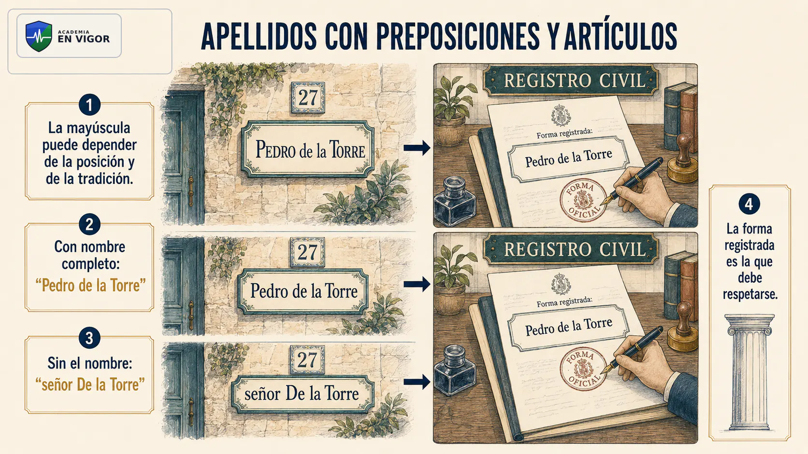

<em>Infografía: Apellidos con preposiciones y artículos.</em>

:::hablemos-claro
La pieza del apellido cambia de altura según vaya acompañada del nombre; además, la forma registrada manda.
:::

:::en-la-calle
Al integrar un extranjerismo o escribir un nombre propio, La pieza del apellido cambia de altura según vaya acompañada del nombre; además, la forma registrada manda.
:::

:::lo-que-cae
Prioriza **posición y mayúscula** y descarta respuestas que confundan grafía, tilde, espacio, signo o mayúscula.
:::

<!-- FUENTE: RAE-OLE-NOMBRES-T37 -->

## 82. Cifras arábigas y agrupación

### Lógica del bloque

Para dominar **cifras arábigas y agrupación**, aplica esta regla: Agrupa cantidades, no identificadores; el espacio separa millares sin competir con el decimal. El anclaje principal es **espacios de millares y coma decimal**.

### Hechos examinables

- Los números de muchas cifras pueden agruparse de tres en tres mediante espacios, no mediante puntos ni comas. <!-- FACT:PN-T37-F325 -->
- Los números de cuatro cifras se escriben normalmente sin espacio de agrupación. <!-- FACT:PN-T37-F326 -->
- En textos en español se admite la coma como separador decimal y también el punto según normas internacionales y contexto, pero debe mantenerse coherencia. <!-- FACT:PN-T37-F327 -->
- No se agrupan con espacios ciertos números identificativos, años, páginas, códigos o teléfonos cuando la convención exige otra disposición. <!-- FACT:PN-T37-F328 -->

### Ejemplos razonados

- **Aplicación correcta:** 27 315 857 puede agruparse con espacios.
- **Contraste útil:** El año 2026 se escribe sin separación.

### Trampas de examen

- **Incorrecto:** Los millares deben separarse siempre con punto.
- **Incorrecto:** Los años se agrupan en tríos mediante espacios.

<!-- VISUAL:t37-82-cifras-arabigas-y-agrupacion.webp -->

  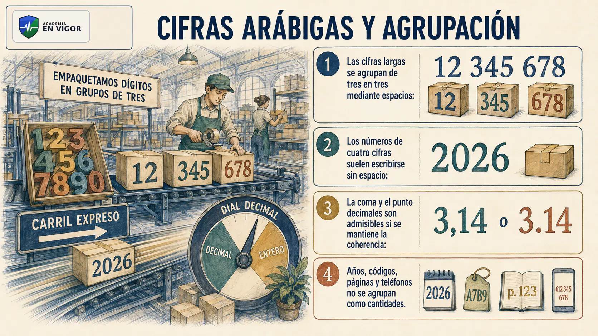

<em>Infografía: Cifras arábigas y agrupación.</em>

:::hablemos-claro
Agrupa cantidades, no identificadores; el espacio separa millares sin competir con el decimal.
:::

:::en-la-calle
Al consignar fechas, horas, cantidades o abreviaciones, Agrupa cantidades, no identificadores; el espacio separa millares sin competir con el decimal.
:::

:::lo-que-cae
Prioriza **espacios de millares y coma decimal** y descarta respuestas que confundan grafía, tilde, espacio, signo o mayúscula.
:::

<!-- FUENTE: RAE-OLE-NUMEROS-T37 -->

## 83. Cardinales y ordinales escritos con palabras

### Lógica del bloque

Para dominar **cardinales y ordinales escritos con palabras**, aplica esta regla: Cardinal cuenta, ordinal ordena y fraccionario divide: no intercambies sus uniformes. El anclaje principal es **unión, separación y concordancia**.

### Hechos examinables

- Los cardinales del cero al treinta se escriben normalmente en una sola palabra. <!-- FACT:PN-T37-F329 -->
- A partir de treinta, muchas series se escriben en varias palabras coordinadas con y, como treinta y cinco. <!-- FACT:PN-T37-F330 -->
- Los ordinales concuerdan en género y número con el sustantivo al que acompañan. <!-- FACT:PN-T37-F331 -->
- Onceavo es un numeral fraccionario y no debe usarse como ordinal equivalente a undécimo en el uso cuidado. <!-- FACT:PN-T37-F332 -->

### Ejemplos razonados

- **Aplicación correcta:** Veintidós se escribe unido y con tilde.
- **Contraste útil:** El undécimo mes es noviembre; una onceava parte expresa fracción.

### Trampas de examen

- **Incorrecto:** Treintaicinco es la única grafía válida de 35.
- **Incorrecto:** Onceavo es siempre el ordinal recomendado para el puesto 11.

<!-- VISUAL:t37-il-83-cardinales-y-ordinales-escritos-con-palabras.webp -->

  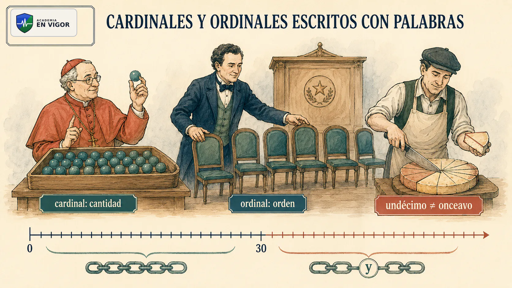

<em>Infografía: Cardinales y ordinales escritos con palabras.</em>

:::hablemos-claro
Cardinal cuenta, ordinal ordena y fraccionario divide: no intercambies sus uniformes.
:::

:::en-la-calle
Al consignar fechas, horas, cantidades o abreviaciones, Cardinal cuenta, ordinal ordena y fraccionario divide: no intercambies sus uniformes.
:::

:::lo-que-cae
Prioriza **unión, separación y concordancia** y descarta respuestas que confundan grafía, tilde, espacio, signo o mayúscula.
:::

<!-- FUENTE: RAE-OLE-NUMEROS-T37 -->

## 84. Números romanos

### Lógica del bloque

Para dominar **números romanos**, aplica esta regla: Son cifras, no abreviaturas: mayúsculas sin punto y combinación reglada. El anclaje principal es **mayúsculas y valor ordinal**.

### Hechos examinables

- Los números romanos se escriben con letras mayúsculas, salvo usos tipográficos especializados en versalitas. <!-- FACT:PN-T37-F333 -->
- No llevan punto abreviativo porque no son abreviaturas. <!-- FACT:PN-T37-F334 -->
- En los siglos I a X se admite lectura cardinal u ordinal, con preferencia culta por la ordinal; desde el XI es normal la cardinal. <!-- FACT:PN-T37-F335 -->
- En series de papas y reyes se leen como ordinales hasta X —que admite también cardinal— y como cardinales a partir de XI. <!-- FACT:PN-T37-F336 -->

### Ejemplos razonados

- **Aplicación correcta:** Siglo XXI se lee siglo veintiuno.
- **Contraste útil:** Felipe VI se lee Felipe sexto.

### Trampas de examen

- **Incorrecto:** Los números romanos deben cerrarse con punto.
- **Incorrecto:** IIII es la única forma normativa general de cuatro.

<!-- VISUAL:t37-84-numeros-romanos.webp -->

  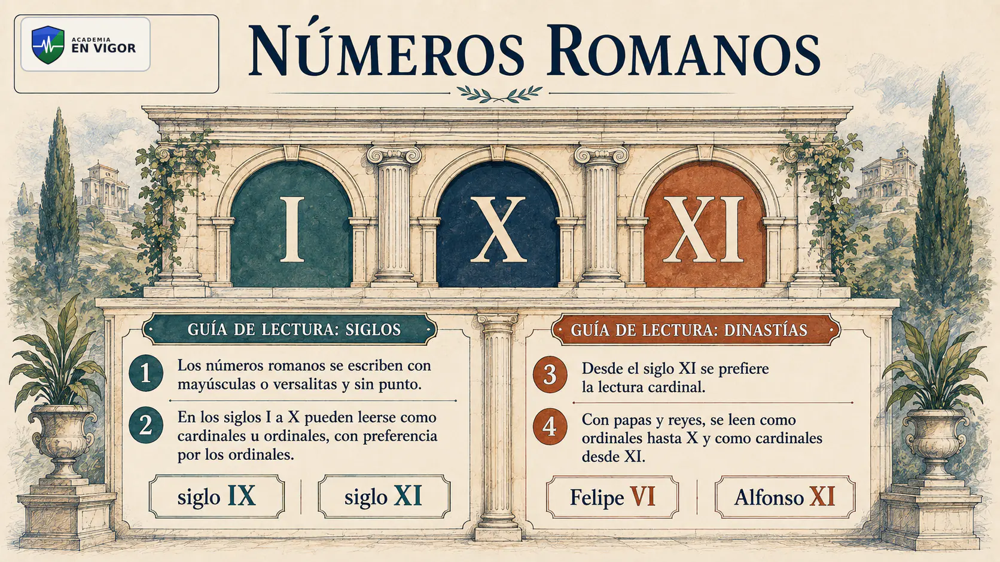

<em>Infografía: Números romanos.</em>

:::hablemos-claro
Son cifras, no abreviaturas: mayúsculas sin punto y combinación reglada.
:::

:::en-la-calle
Al consignar fechas, horas, cantidades o abreviaciones, Son cifras, no abreviaturas: mayúsculas sin punto y combinación reglada.
:::

:::lo-que-cae
Prioriza **mayúsculas y valor ordinal** y descarta respuestas que confundan grafía, tilde, espacio, signo o mayúscula.
:::

<!-- FUENTE: RAE-OLE-NUMEROS-T37 -->

## 85. Fechas

### Lógica del bloque

Para dominar **fechas**, aplica esta regla: En una fecha española el mes es nombre común y el año no es una cantidad para agrupar. El anclaje principal es **día, mes y año**.

### Hechos examinables

- En la expresión desarrollada de una fecha, el mes se escribe con minúscula: 3 de agosto de 2026. <!-- FACT:PN-T37-F337 -->
- El día y el año se escriben normalmente con cifras en documentos y textos informativos. <!-- FACT:PN-T37-F338 -->
- El primer día del mes puede expresarse con cardinal uno o con ordinal primero según la zona y el tipo de texto. <!-- FACT:PN-T37-F339 -->
- Las fechas enteramente numéricas deben mantener un orden claro y coherente para evitar ambigüedad. <!-- FACT:PN-T37-F340 -->

### Ejemplos razonados

- **Aplicación correcta:** 3 de agosto de 2026.
- **Contraste útil:** 3/8/2026 es inequívoca si se mantiene el orden día-mes-año.

### Trampas de examen

- **Incorrecto:** Los meses llevan mayúscula dentro de una fecha.
- **Incorrecto:** El año debe separarse con punto de millar.

<!-- VISUAL:t37-85-fechas.webp -->

  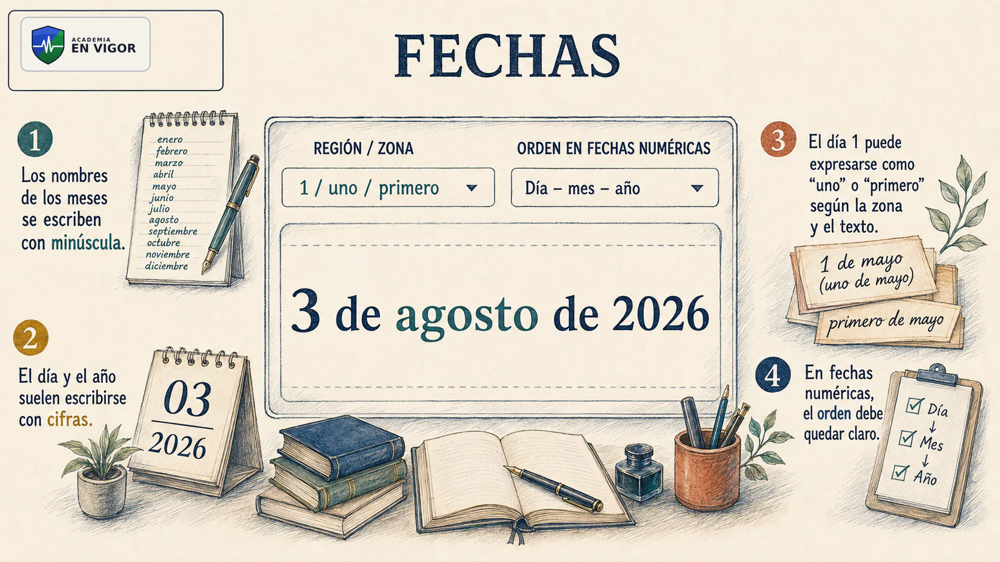

<em>Infografía: Fechas.</em>

:::hablemos-claro
En una fecha española el mes es nombre común y el año no es una cantidad para agrupar.
:::

:::en-la-calle
Al consignar fechas, horas, cantidades o abreviaciones, En una fecha española el mes es nombre común y el año no es una cantidad para agrupar.
:::

:::lo-que-cae
Prioriza **día, mes y año** y descarta respuestas que confundan grafía, tilde, espacio, signo o mayúscula.
:::

<!-- FUENTE: RAE-OLE-NUMEROS-T37 -->

## 86. La hora

### Lógica del bloque

Para dominar **la hora**, aplica esta regla: Elige reloj de 24 horas con h o sistema de 12 horas con a. m./p. m.; no superpongas ambos. El anclaje principal es **dos puntos y símbolo h**.

### Hechos examinables

- La hora puede escribirse con palabras o con cifras según el tipo de texto. <!-- FACT:PN-T37-F341 -->
- En la escritura numérica, horas y minutos se separan habitualmente con dos puntos: 17:30. <!-- FACT:PN-T37-F342 -->
- El símbolo h se escribe sin punto y separado de la cifra por un espacio: 17:30 h. <!-- FACT:PN-T37-F343 -->
- No se combina el símbolo h con las abreviaturas a. m. o p. m., porque representan sistemas distintos y redundantes. <!-- FACT:PN-T37-F344 -->

### Ejemplos razonados

- **Aplicación correcta:** La reunión es a las 17:30 h.
- **Contraste útil:** La reunión es a las 5:30 p. m.

### Trampas de examen

- **Incorrecto:** El símbolo de hora es h. con punto.
- **Incorrecto:** La forma 17:30 h p. m. es recomendable.

<!-- VISUAL:t37-86-la-hora.webp -->

  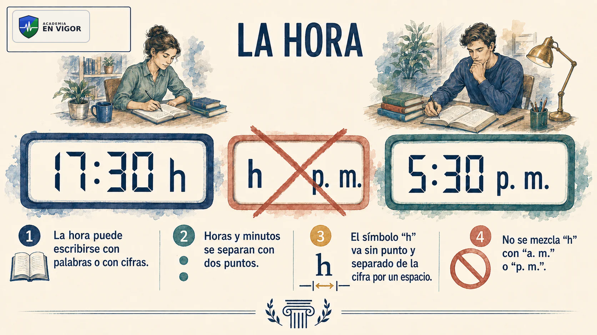

<em>Infografía: La hora.</em>

:::hablemos-claro
Elige reloj de 24 horas con h o sistema de 12 horas con a. m./p. m.; no superpongas ambos.
:::

:::en-la-calle
Al consignar fechas, horas, cantidades o abreviaciones, Elige reloj de 24 horas con h o sistema de 12 horas con a. m./p. m.; no superpongas ambos.
:::

:::lo-que-cae
Prioriza **dos puntos y símbolo h** y descarta respuestas que confundan grafía, tilde, espacio, signo o mayúscula.
:::

<!-- FUENTE: RAE-OLE-NUMEROS-T37 -->

## 87. Porcentajes, unidades y monedas

### Lógica del bloque

Para dominar **porcentajes, unidades y monedas**, aplica esta regla: El símbolo es una ficha internacional: sin punto, sin plural y con su forma fija. El anclaje principal es **cifra, espacio y símbolo**.

### Hechos examinables

- Los símbolos se escriben sin punto y son invariables en plural. <!-- FACT:PN-T37-F345 -->
- Los símbolos de unidades y el de porcentaje se escriben separados de la cifra por un espacio, preferiblemente inseparable. <!-- FACT:PN-T37-F346 -->
- En España, los símbolos de moneda se escriben normalmente pospuestos y separados de la cifra: 25 €. <!-- FACT:PN-T37-F347 -->
- La forma de mayúscula o minúscula de un símbolo está fijada y no puede alterarse libremente. <!-- FACT:PN-T37-F348 -->

### Ejemplos razonados

- **Aplicación correcta:** 3 kg y 45 %.
- **Contraste útil:** 25 € es la colocación habitual en España.

### Trampas de examen

- **Incorrecto:** El plural de kg es kgs.
- **Incorrecto:** El porcentaje se escribe obligatoriamente pegado a la cifra en la norma académica.

<!-- VISUAL:t37-87-porcentajes-unidades-y-monedas.webp -->

  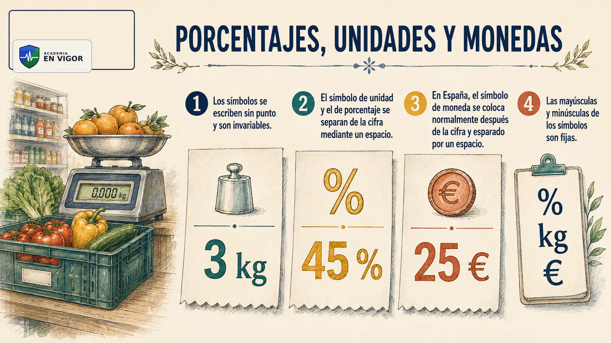

<em>Infografía: Porcentajes, unidades y monedas.</em>

:::hablemos-claro
El símbolo es una ficha internacional: sin punto, sin plural y con su forma fija.
:::

:::en-la-calle
Al consignar fechas, horas, cantidades o abreviaciones, El símbolo es una ficha internacional: sin punto, sin plural y con su forma fija.
:::

:::lo-que-cae
Prioriza **cifra, espacio y símbolo** y descarta respuestas que confundan grafía, tilde, espacio, signo o mayúscula.
:::

<!-- FUENTE: RAE-LIBRO-ESTILO-T37 -->

## 88. Abreviaturas, siglas, acrónimos y símbolos

### Lógica del bloque

Para dominar **abreviaturas, siglas, acrónimos y símbolos**, aplica esta regla: Distingue las cuatro tarjetas: abreviatura con punto, sigla sin puntos, acrónimo convertido en palabra y símbolo fijo. El anclaje principal es **cuatro mecanismos distintos**.

### Hechos examinables

- Las abreviaturas son representaciones reducidas de palabras y suelen llevar punto abreviativo o barra. <!-- FACT:PN-T37-F349 -->
- Las siglas se forman normalmente con iniciales, se escriben sin puntos y no añaden una s minúscula para el plural. <!-- FACT:PN-T37-F350 -->
- Los acrónimos lexicalizados pueden escribirse como nombres propios o comunes y someterse a las reglas generales: Unesco, láser. <!-- FACT:PN-T37-F351 -->
- Los símbolos tienen forma internacional fija, se escriben sin punto y no varían en plural. <!-- FACT:PN-T37-F352 -->

### Ejemplos razonados

- **Aplicación correcta:** pág. es abreviatura; DNI es sigla.
- **Contraste útil:** kg es símbolo y láser es acrónimo lexicalizado.

### Trampas de examen

- **Incorrecto:** Abreviatura, sigla y símbolo son nombres del mismo procedimiento.
- **Incorrecto:** El plural de ONG se escribe ONG's.

<!-- VISUAL:t37-88-abreviaturas-siglas-acronimos-y-simbolos.webp -->

  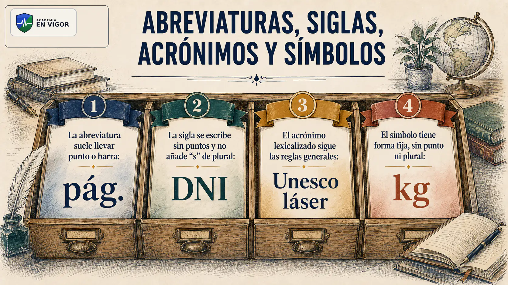

<em>Infografía: Abreviaturas, siglas, acrónimos y símbolos.</em>

:::hablemos-claro
Distingue las cuatro tarjetas: abreviatura con punto, sigla sin puntos, acrónimo convertido en palabra y símbolo fijo.
:::

:::en-la-calle
Al consignar fechas, horas, cantidades o abreviaciones, Distingue las cuatro tarjetas: abreviatura con punto, sigla sin puntos, acrónimo convertido en palabra y símbolo fijo.
:::

:::lo-que-cae
Prioriza **cuatro mecanismos distintos** y descarta respuestas que confundan grafía, tilde, espacio, signo o mayúscula.
:::

<!-- FUENTE: RAE-OLE-UNIDADES-T37 -->

# Hablemos claro

:::hablemos-claro
Este tema tiene cuatro trampas maestras: confiar solo en la pronunciación; aplicar una regla sin sus límites; olvidar que el espacio y la mayúscula también escriben; y corregir una palabra sin comprobar su significado. En cada opción revisa letra, tilde, signo, frontera y sentido.
:::

# En la calle

:::en-la-calle
En una declaración o atestado, una coma puede cambiar el alcance de una afirmación; una h puede distinguir hecho de echo; y una fecha o sigla mal construida reduce precisión. La ortografía es control del significado.
:::

# Lo que cae

:::lo-que-cae
Prioriza b/v, g/j, c/z/s, h, ll/y y r/rr; reglas generales y diacríticas de tilde; coma, punto y coma, dos puntos, raya y comillas; mayúsculas institucionales; prefijos; porqués; extranjerismos; fechas, horas, porcentajes, siglas y símbolos.
:::

# Ha caído

:::ha-caido
Se han localizado 7 referencias históricas del Tema 37. Permanecen ocultas y en cuarentena porque no existe plantilla oficial final verificable en el repositorio.
:::

## Fuentes legales, institucionales y primarias

- `CONVOCATORIA-PN-2026-T37`
- `RAE-OLE-GRAFEMAS-T37`
- `RAE-OLE-TILDE-T37`
- `RAE-OLE-SIGNOS-T37`
- `RAE-OLE-MAYUSCULAS-T37`
- `RAE-OLE-UNIDADES-T37`
- `RAE-OLE-EXTRANJERISMOS-T37`
- `RAE-OLE-NOMBRES-T37`
- `RAE-OLE-NUMEROS-T37`
- `RAE-DPD2-T37`
- `RAE-LIBRO-ESTILO-T37`

---

*Academia En Vigor · El temario que nunca duerme · Tema 37 · v1.0.0 · Documento interno no publicado.*
