# TEMA 40 · INTELIGENCIA: DATO, INFORMACIÓN E INTELIGENCIA. TIPOLOGÍAS DE INTELIGENCIA. CICLO DE LA INTELIGENCIA. INTELIGENCIA DE FUENTES ABIERTAS (OSINT). SURFACE WEB, DEEP WEB, DARK WEB Y DARK NET.

**Policía Nacional · Método VIGOR · ATESTADO**
**Versión de contenido:** 1.0.0
**Estado editorial:** approved_internal · **Publicación:** not_published

# Mapa del tema

El Tema 40 se estudia en siete partes: dato, información e inteligencia; tipologías; ciclo; rigor analítico; fundamentos OSINT; metodología y garantías OSINT; y capas web y darknets.

# Contenido

## 01. Alcance oficial del Tema 40

### Lógica del bloque

Para dominar **alcance oficial del tema 40**, aplica esta regla: El programa distingue dato, información e inteligencia y exige estudiar sus relaciones. El anclaje principal es **siete núcleos oficiales**.

### Hechos examinables

- El programa distingue dato, información e inteligencia y exige estudiar sus relaciones. <!-- FACT:PN-T40-F001 -->
- El epígrafe incluye tipologías de inteligencia y el ciclo de inteligencia. <!-- FACT:PN-T40-F002 -->
- OSINT constituye un núcleo propio y no una mera lista de buscadores. <!-- FACT:PN-T40-F003 -->
- Surface Web, Deep Web, Dark Web y Dark Net deben diferenciarse por indexación, acceso, contenido e infraestructura. <!-- FACT:PN-T40-F004 -->

### Ejemplos razonados

- **Aplicación correcta:** El epígrafe incluye tipologías de inteligencia y el ciclo de inteligencia.
- **Contraste útil:** OSINT constituye un núcleo propio y no una mera lista de buscadores.

### Trampas de examen

- **Incorrecto:** El Tema 40 exige memorizar la organización completa de la Policía Nacional.
- **Incorrecto:** Dark Web y Dark Net son sinónimos técnicos exactos.

<!-- VISUAL:t40-01-alcance-oficial-del-tema-40.webp -->

  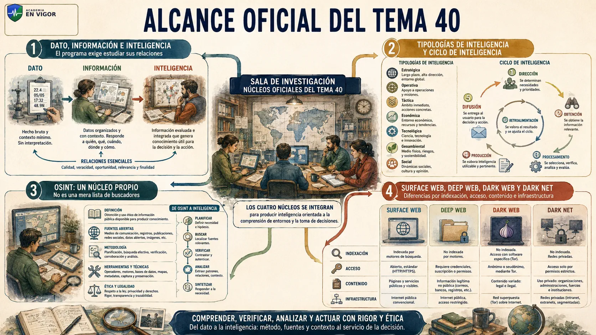

<em>Infografía: Alcance oficial del Tema 40.</em>

:::hablemos-claro
El programa distingue dato, información e inteligencia y exige estudiar sus relaciones.
:::

:::en-la-calle
Al separar dato, información e inteligencia, El programa distingue dato, información e inteligencia y exige estudiar sus relaciones.
:::

:::lo-que-cae
Prioriza **siete núcleos oficiales** y descarta respuestas que confundan dato, fuente, fase, acceso, contenido o infraestructura.
:::

<!-- FUENTE: CONVOCATORIA-PN-2026-T40 -->

## 02. Concepto de dato

### Lógica del bloque

Para dominar **concepto de dato**, aplica esta regla: Un dato es una representación elemental de un hecho, observación o atributo. El anclaje principal es **unidad bruta antes del contexto**.

### Hechos examinables

- Un dato es una representación elemental de un hecho, observación o atributo. <!-- FACT:PN-T40-F005 -->
- Un dato aislado puede ser exacto y aun carecer de significado operativo suficiente. <!-- FACT:PN-T40-F006 -->
- Texto, número, imagen, señal, fecha o coordenada pueden actuar como datos. <!-- FACT:PN-T40-F007 -->
- El valor de un dato depende de su contexto, procedencia, actualidad y relación con una necesidad. <!-- FACT:PN-T40-F008 -->

### Ejemplos razonados

- **Aplicación correcta:** Un dato aislado puede ser exacto y aun carecer de significado operativo suficiente.
- **Contraste útil:** Texto, número, imagen, señal, fecha o coordenada pueden actuar como datos.

### Trampas de examen

- **Incorrecto:** Todo dato aislado es ya inteligencia.
- **Incorrecto:** Un dato solo puede ser numérico.

<!-- VISUAL:t40-02-concepto-de-dato.webp -->

  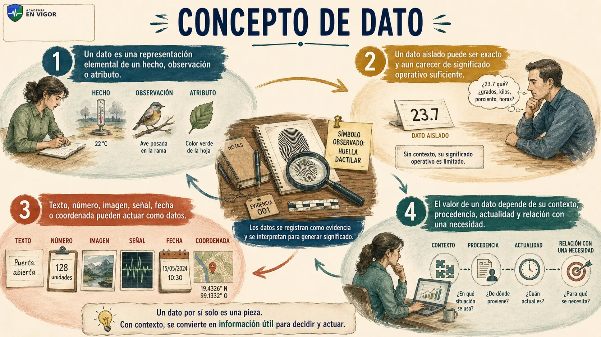

<em>Infografía: Concepto de dato.</em>

:::hablemos-claro
Un dato es una representación elemental de un hecho, observación o atributo.
:::

:::en-la-calle
Al separar dato, información e inteligencia, Un dato es una representación elemental de un hecho, observación o atributo.
:::

:::lo-que-cae
Prioriza **unidad bruta antes del contexto** y descarta respuestas que confundan dato, fuente, fase, acceso, contenido o infraestructura.
:::

<!-- FUENTE: CCN-STIC-425-T40 -->

## 03. Concepto de información

### Lógica del bloque

Para dominar **concepto de información**, aplica esta regla: La información surge al ordenar, relacionar o contextualizar datos para que adquieran significado. El anclaje principal es **datos organizados con significado**.

### Hechos examinables

- La información surge al ordenar, relacionar o contextualizar datos para que adquieran significado. <!-- FACT:PN-T40-F009 -->
- La información responde mejor que el dato a preguntas como quién, qué, cuándo, dónde o cómo. <!-- FACT:PN-T40-F010 -->
- Organizar datos no garantiza que sean verdaderos, completos o relevantes. <!-- FACT:PN-T40-F011 -->
- La información sigue necesitando evaluación y análisis antes de sostener una decisión compleja. <!-- FACT:PN-T40-F012 -->

### Ejemplos razonados

- **Aplicación correcta:** La información responde mejor que el dato a preguntas como quién, qué, cuándo, dónde o cómo.
- **Contraste útil:** Organizar datos no garantiza que sean verdaderos, completos o relevantes.

### Trampas de examen

- **Incorrecto:** Toda información es necesariamente verdadera.
- **Incorrecto:** La información elimina la necesidad de conocer su fuente.

<!-- VISUAL:t40-03-concepto-de-informacion.webp -->

  

<em>Infografía: Concepto de información.</em>

:::hablemos-claro
La información surge al ordenar, relacionar o contextualizar datos para que adquieran significado.
:::

:::en-la-calle
Al separar dato, información e inteligencia, La información surge al ordenar, relacionar o contextualizar datos para que adquieran significado.
:::

:::lo-que-cae
Prioriza **datos organizados con significado** y descarta respuestas que confundan dato, fuente, fase, acceso, contenido o infraestructura.
:::

<!-- FUENTE: UNODC-CI-ANALYSTS-T40 -->

## 04. Concepto de inteligencia

### Lógica del bloque

Para dominar **concepto de inteligencia**, aplica esta regla: La inteligencia es el resultado elaborado que facilita la toma de decisiones. El anclaje principal es **producto útil para decidir**.

### Hechos examinables

- La inteligencia es el resultado elaborado que facilita la toma de decisiones. <!-- FACT:PN-T40-F013 -->
- Añade valor mediante evaluación, integración, análisis, interpretación y comunicación. <!-- FACT:PN-T40-F014 -->
- La inteligencia debe responder a una necesidad o requisito definido. <!-- FACT:PN-T40-F015 -->
- Acumular información sin propósito ni elaboración no produce por sí solo inteligencia. <!-- FACT:PN-T40-F016 -->

### Ejemplos razonados

- **Aplicación correcta:** Añade valor mediante evaluación, integración, análisis, interpretación y comunicación.
- **Contraste útil:** La inteligencia debe responder a una necesidad o requisito definido.

### Trampas de examen

- **Incorrecto:** Inteligencia equivale a cualquier dato secreto.
- **Incorrecto:** Cuantos más datos se acumulen, más inteligencia existe automáticamente.

<!-- VISUAL:t40-04-concepto-de-inteligencia.webp -->

  

<em>Infografía: Concepto de inteligencia.</em>

:::hablemos-claro
La inteligencia es el resultado elaborado que facilita la toma de decisiones.
:::

:::en-la-calle
Al separar dato, información e inteligencia, La inteligencia es el resultado elaborado que facilita la toma de decisiones.
:::

:::lo-que-cae
Prioriza **producto útil para decidir** y descarta respuestas que confundan dato, fuente, fase, acceso, contenido o infraestructura.
:::

<!-- FUENTE: CNI-CICLO-T40 -->

## 05. Escalera dato-información-inteligencia

### Lógica del bloque

Para dominar **escalera dato-información-inteligencia**, aplica esta regla: El paso de dato a información aporta organización y contexto. El anclaje principal es **contexto, análisis y decisión**.

### Hechos examinables

- El paso de dato a información aporta organización y contexto. <!-- FACT:PN-T40-F017 -->
- El paso de información a inteligencia exige análisis orientado a una decisión. <!-- FACT:PN-T40-F018 -->
- Cada transformación puede descubrir lagunas y exigir nueva obtención. <!-- FACT:PN-T40-F019 -->
- La escalera no convierte una fuente débil en sólida por repetir sus datos. <!-- FACT:PN-T40-F020 -->

### Ejemplos razonados

- **Aplicación correcta:** El paso de información a inteligencia exige análisis orientado a una decisión.
- **Contraste útil:** Cada transformación puede descubrir lagunas y exigir nueva obtención.

### Trampas de examen

- **Incorrecto:** Procesar un dato borra sus limitaciones de origen.
- **Incorrecto:** La inteligencia se obtiene antes de definir la necesidad.

<!-- VISUAL:t40-il-05-escalera-dato-informacion-inteligencia.webp -->

  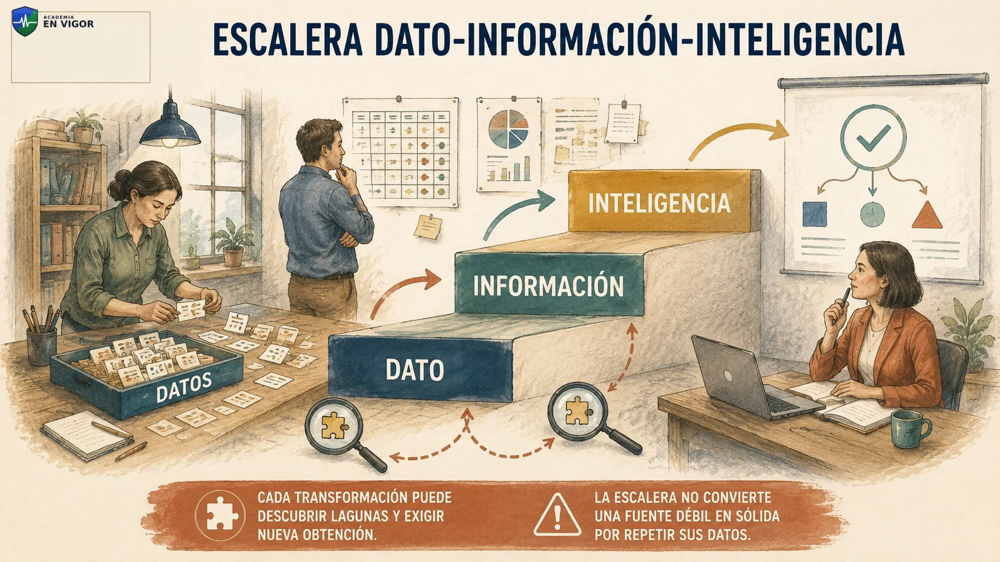

<em>Infografía: Escalera dato-información-inteligencia.</em>

:::hablemos-claro
El paso de dato a información aporta organización y contexto.
:::

:::en-la-calle
Al separar dato, información e inteligencia, El paso de dato a información aporta organización y contexto.
:::

:::lo-que-cae
Prioriza **contexto, análisis y decisión** y descarta respuestas que confundan dato, fuente, fase, acceso, contenido o infraestructura.
:::

<!-- FUENTE: CCN-STIC-425-T40 -->

## 06. Inteligencia criminal

### Lógica del bloque

Para dominar **inteligencia criminal**, aplica esta regla: La inteligencia criminal es información a la que se ha añadido valor para combatir la delincuencia. El anclaje principal es **valor añadido contra la delincuencia**.

### Hechos examinables

- La inteligencia criminal es información a la que se ha añadido valor para combatir la delincuencia. <!-- FACT:PN-T40-F021 -->
- Puede apoyar prevención, investigación, priorización de amenazas y asignación de recursos. <!-- FACT:PN-T40-F022 -->
- No se limita a información secreta ni a delitos organizados. <!-- FACT:PN-T40-F023 -->
- Un producto de inteligencia criminal no sustituye por sí mismo los requisitos de la prueba procesal. <!-- FACT:PN-T40-F024 -->

### Ejemplos razonados

- **Aplicación correcta:** Puede apoyar prevención, investigación, priorización de amenazas y asignación de recursos.
- **Contraste útil:** No se limita a información secreta ni a delitos organizados.

### Trampas de examen

- **Incorrecto:** Inteligencia criminal significa exclusivamente prueba judicial admisible.
- **Incorrecto:** Solo existe inteligencia criminal cuando interviene una organización terrorista.

<!-- VISUAL:t40-06-inteligencia-criminal.webp -->

  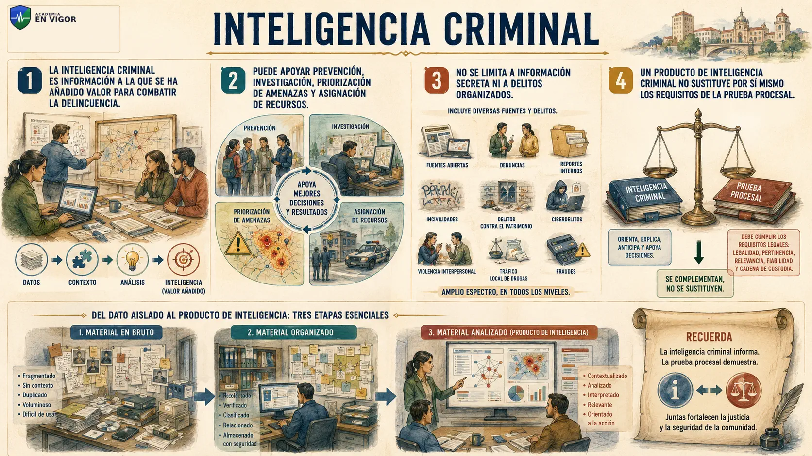

<em>Infografía: Inteligencia criminal.</em>

:::hablemos-claro
La inteligencia criminal es información a la que se ha añadido valor para combatir la delincuencia.
:::

:::en-la-calle
Al separar dato, información e inteligencia, La inteligencia criminal es información a la que se ha añadido valor para combatir la delincuencia.
:::

:::lo-que-cae
Prioriza **valor añadido contra la delincuencia** y descarta respuestas que confundan dato, fuente, fase, acceso, contenido o infraestructura.
:::

<!-- FUENTE: UNODC-CI-ANALYSTS-T40 -->

## 07. Proceso y producto de inteligencia

### Lógica del bloque

Para dominar **proceso y producto de inteligencia**, aplica esta regla: Inteligencia puede designar tanto una actividad organizada como el producto resultante. El anclaje principal es **elaborar frente a entregar**.

### Hechos examinables

- Inteligencia puede designar tanto una actividad organizada como el producto resultante. <!-- FACT:PN-T40-F025 -->
- El proceso comprende dirección, obtención, tratamiento, análisis y difusión según el modelo empleado. <!-- FACT:PN-T40-F026 -->
- El producto comunica juicios, hallazgos, incertidumbres e implicaciones al destinatario. <!-- FACT:PN-T40-F027 -->
- Confundir proceso y producto oculta dónde se produjo un error o una pérdida de calidad. <!-- FACT:PN-T40-F028 -->

### Ejemplos razonados

- **Aplicación correcta:** El proceso comprende dirección, obtención, tratamiento, análisis y difusión según el modelo empleado.
- **Contraste útil:** El producto comunica juicios, hallazgos, incertidumbres e implicaciones al destinatario.

### Trampas de examen

- **Incorrecto:** El producto final es idéntico a la colección de datos brutos.
- **Incorrecto:** La difusión ocurre antes de cualquier análisis.

<!-- VISUAL:t40-07-proceso-y-producto-de-inteligencia.webp -->

  

<em>Infografía: Proceso y producto de inteligencia.</em>

:::hablemos-claro
Inteligencia puede designar tanto una actividad organizada como el producto resultante.
:::

:::en-la-calle
Al separar dato, información e inteligencia, Inteligencia puede designar tanto una actividad organizada como el producto resultante.
:::

:::lo-que-cae
Prioriza **elaborar frente a entregar** y descarta respuestas que confundan dato, fuente, fase, acceso, contenido o infraestructura.
:::

<!-- FUENTE: UNODC-CI-ANALYSTS-T40 -->

## 08. Necesidad, requisito y destinatario

### Lógica del bloque

Para dominar **necesidad, requisito y destinatario**, aplica esta regla: La necesidad de inteligencia expresa qué decisión debe apoyarse o qué incertidumbre debe reducirse. El anclaje principal es **pregunta útil antes de buscar**.

### Hechos examinables

- La necesidad de inteligencia expresa qué decisión debe apoyarse o qué incertidumbre debe reducirse. <!-- FACT:PN-T40-F029 -->
- El requisito concreta la información o el producto necesario para atender esa necesidad. <!-- FACT:PN-T40-F030 -->
- El destinatario condiciona profundidad, lenguaje, plazo y formato del producto. <!-- FACT:PN-T40-F031 -->
- Una pregunta mal definida favorece recolección indiscriminada y conclusiones irrelevantes. <!-- FACT:PN-T40-F032 -->

### Ejemplos razonados

- **Aplicación correcta:** El requisito concreta la información o el producto necesario para atender esa necesidad.
- **Contraste útil:** El destinatario condiciona profundidad, lenguaje, plazo y formato del producto.

### Trampas de examen

- **Incorrecto:** El analista debe buscar primero y preguntar después qué necesita el destinatario.
- **Incorrecto:** Todos los destinatarios requieren el mismo nivel de detalle.

<!-- VISUAL:t40-08-necesidad-requisito-y-destinatario.webp -->

  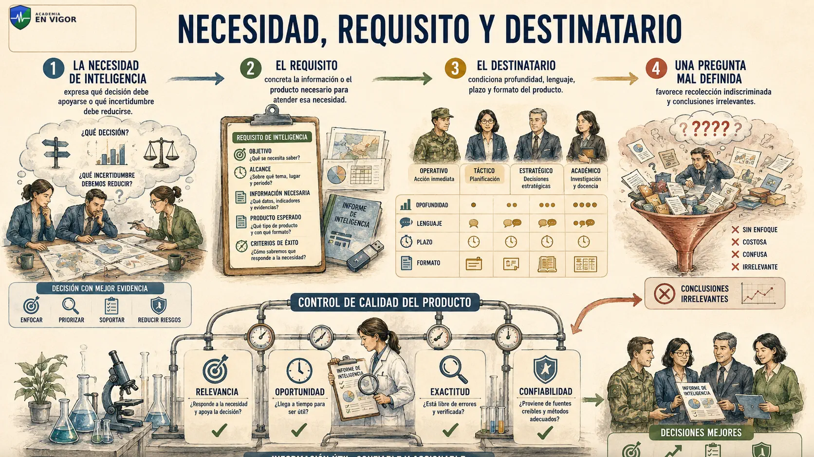

<em>Infografía: Necesidad, requisito y destinatario.</em>

:::hablemos-claro
La necesidad de inteligencia expresa qué decisión debe apoyarse o qué incertidumbre debe reducirse.
:::

:::en-la-calle
Al separar dato, información e inteligencia, La necesidad de inteligencia expresa qué decisión debe apoyarse o qué incertidumbre debe reducirse.
:::

:::lo-que-cae
Prioriza **pregunta útil antes de buscar** y descarta respuestas que confundan dato, fuente, fase, acceso, contenido o infraestructura.
:::

<!-- FUENTE: CCN-STIC-425-T40 -->

## 09. Fuente, dato y canal

### Lógica del bloque

Para dominar **fuente, dato y canal**, aplica esta regla: La fuente es el origen del que procede un dato o información. El anclaje principal es **origen, contenido y transmisión**.

### Hechos examinables

- La fuente es el origen del que procede un dato o información. <!-- FACT:PN-T40-F033 -->
- El canal es el medio por el que el contenido llega al receptor. <!-- FACT:PN-T40-F034 -->
- Una misma fuente puede aportar contenidos de calidad desigual. <!-- FACT:PN-T40-F035 -->
- Varios canales no convierten en independientes dos contenidos que nacen de la misma fuente. <!-- FACT:PN-T40-F036 -->

### Ejemplos razonados

- **Aplicación correcta:** El canal es el medio por el que el contenido llega al receptor.
- **Contraste útil:** Una misma fuente puede aportar contenidos de calidad desigual.

### Trampas de examen

- **Incorrecto:** Recibir el mismo rumor por dos aplicaciones equivale a dos fuentes independientes.
- **Incorrecto:** Fuente y canal son términos intercambiables.

<!-- VISUAL:t40-09-fuente-dato-y-canal.webp -->

  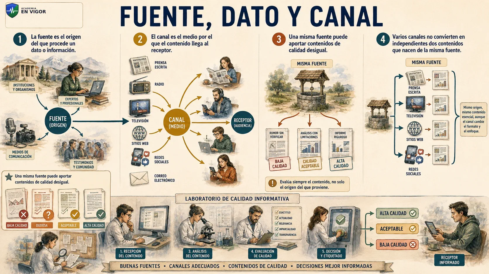

<em>Infografía: Fuente, dato y canal.</em>

:::hablemos-claro
La fuente es el origen del que procede un dato o información.
:::

:::en-la-calle
Al separar dato, información e inteligencia, La fuente es el origen del que procede un dato o información.
:::

:::lo-que-cae
Prioriza **origen, contenido y transmisión** y descarta respuestas que confundan dato, fuente, fase, acceso, contenido o infraestructura.
:::

<!-- FUENTE: UNODC-CI-ANALYSTS-T40 -->

## 10. Límites e incertidumbre

### Lógica del bloque

Para dominar **límites e incertidumbre**, aplica esta regla: La inteligencia reduce incertidumbre, pero rara vez la elimina por completo. El anclaje principal es **conclusión graduada, no certeza fingida**.

### Hechos examinables

- La inteligencia reduce incertidumbre, pero rara vez la elimina por completo. <!-- FACT:PN-T40-F037 -->
- Una conclusión debe distinguir hechos observados, supuestos y juicios analíticos. <!-- FACT:PN-T40-F038 -->
- La confianza depende de la calidad, cantidad, coherencia y actualidad de la base informativa. <!-- FACT:PN-T40-F039 -->
- La ausencia de información no demuestra por sí sola la ausencia del fenómeno investigado. <!-- FACT:PN-T40-F040 -->

### Ejemplos razonados

- **Aplicación correcta:** Una conclusión debe distinguir hechos observados, supuestos y juicios analíticos.
- **Contraste útil:** La confianza depende de la calidad, cantidad, coherencia y actualidad de la base informativa.

### Trampas de examen

- **Incorrecto:** Un informe útil debe ocultar toda incertidumbre.
- **Incorrecto:** No encontrar datos prueba definitivamente que el hecho no ocurrió.

<!-- VISUAL:t40-il-10-limites-e-incertidumbre.webp -->

  

<em>Infografía: Límites e incertidumbre.</em>

:::hablemos-claro
La inteligencia reduce incertidumbre, pero rara vez la elimina por completo.
:::

:::en-la-calle
Al separar dato, información e inteligencia, La inteligencia reduce incertidumbre, pero rara vez la elimina por completo.
:::

:::lo-que-cae
Prioriza **conclusión graduada, no certeza fingida** y descarta respuestas que confundan dato, fuente, fase, acceso, contenido o infraestructura.
:::

<!-- FUENTE: ODNI-ICD203-T40 -->

## 11. Criterios para clasificar inteligencia

### Lógica del bloque

Para dominar **criterios para clasificar inteligencia**, aplica esta regla: La inteligencia puede clasificarse por nivel de decisión, finalidad o fuente de obtención. El anclaje principal es **finalidad, nivel y fuente**.

### Hechos examinables

- La inteligencia puede clasificarse por nivel de decisión, finalidad o fuente de obtención. <!-- FACT:PN-T40-F041 -->
- Las clasificaciones responden a preguntas distintas y pueden superponerse. <!-- FACT:PN-T40-F042 -->
- Un producto estratégico puede integrar OSINT, HUMINT, SIGINT y GEOINT. <!-- FACT:PN-T40-F043 -->
- La etiqueta utilizada no sustituye la descripción del alcance real del producto. <!-- FACT:PN-T40-F044 -->

### Ejemplos razonados

- **Aplicación correcta:** Las clasificaciones responden a preguntas distintas y pueden superponerse.
- **Contraste útil:** Un producto estratégico puede integrar OSINT, HUMINT, SIGINT y GEOINT.

### Trampas de examen

- **Incorrecto:** Cada producto pertenece obligatoriamente a una sola tipología.
- **Incorrecto:** OSINT y estrategia son categorías incompatibles.

<!-- VISUAL:t40-11-criterios-para-clasificar-inteligencia.webp -->

  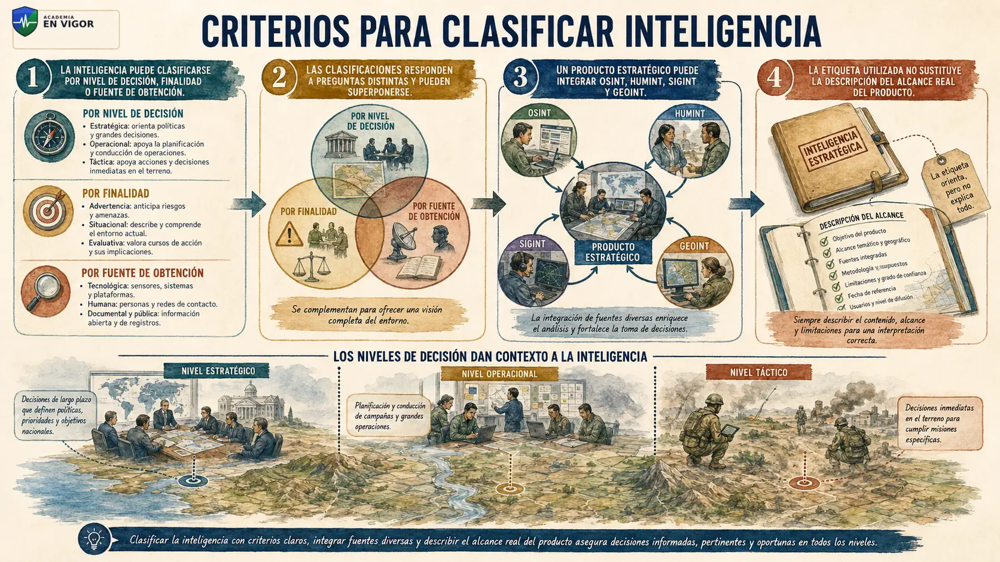

<em>Infografía: Criterios para clasificar inteligencia.</em>

:::hablemos-claro
La inteligencia puede clasificarse por nivel de decisión, finalidad o fuente de obtención.
:::

:::en-la-calle
Al clasificar el producto por fuente o nivel de decisión, La inteligencia puede clasificarse por nivel de decisión, finalidad o fuente de obtención.
:::

:::lo-que-cae
Prioriza **finalidad, nivel y fuente** y descarta respuestas que confundan dato, fuente, fase, acceso, contenido o infraestructura.
:::

<!-- FUENTE: CCN-STIC-425-T40 -->

## 12. HUMINT

### Lógica del bloque

Para dominar **humint**, aplica esta regla: HUMINT se asocia a información obtenida de fuentes humanas. El anclaje principal es **información de fuentes humanas**.

### Hechos examinables

- HUMINT se asocia a información obtenida de fuentes humanas. <!-- FACT:PN-T40-F045 -->
- Una fuente humana puede aportar observaciones, recuerdos, opiniones o acceso a otros datos. <!-- FACT:PN-T40-F046 -->
- La cercanía de una persona a los hechos no elimina errores, intereses ni sesgos. <!-- FACT:PN-T40-F047 -->
- La evaluación debe separar fiabilidad de la fuente y validez concreta del contenido. <!-- FACT:PN-T40-F048 -->

### Ejemplos razonados

- **Aplicación correcta:** Una fuente humana puede aportar observaciones, recuerdos, opiniones o acceso a otros datos.
- **Contraste útil:** La cercanía de una persona a los hechos no elimina errores, intereses ni sesgos.

### Trampas de examen

- **Incorrecto:** HUMINT significa cualquier información escrita por una persona.
- **Incorrecto:** Una fuente humana presencial es infalible.

<!-- VISUAL:t40-12-humint.webp -->

  

<em>Infografía: HUMINT.</em>

:::hablemos-claro
HUMINT se asocia a información obtenida de fuentes humanas.
:::

:::en-la-calle
Al clasificar el producto por fuente o nivel de decisión, HUMINT se asocia a información obtenida de fuentes humanas.
:::

:::lo-que-cae
Prioriza **información de fuentes humanas** y descarta respuestas que confundan dato, fuente, fase, acceso, contenido o infraestructura.
:::

<!-- FUENTE: CNI-CICLO-T40 -->

## 13. OSINT como tipología

### Lógica del bloque

Para dominar **osint como tipología**, aplica esta regla: OSINT es inteligencia derivada de información pública o comercialmente disponible. El anclaje principal es **información abierta orientada a requisitos**.

### Hechos examinables

- OSINT es inteligencia derivada de información pública o comercialmente disponible. <!-- FACT:PN-T40-F049 -->
- La información abierta debe responder a prioridades, requisitos o lagunas concretas. <!-- FACT:PN-T40-F050 -->
- OSINT incluye proceso analítico; no equivale a una búsqueda informal. <!-- FACT:PN-T40-F051 -->
- Abierto describe la disponibilidad de la información, no la ausencia de límites legales. <!-- FACT:PN-T40-F052 -->

### Ejemplos razonados

- **Aplicación correcta:** La información abierta debe responder a prioridades, requisitos o lagunas concretas.
- **Contraste útil:** OSINT incluye proceso analítico; no equivale a una búsqueda informal.

### Trampas de examen

- **Incorrecto:** Todo contenido de Internet es OSINT.
- **Incorrecto:** Si una fuente es abierta puede usarse sin finalidad ni control.

<!-- VISUAL:t40-13-osint-como-tipologia.webp -->

  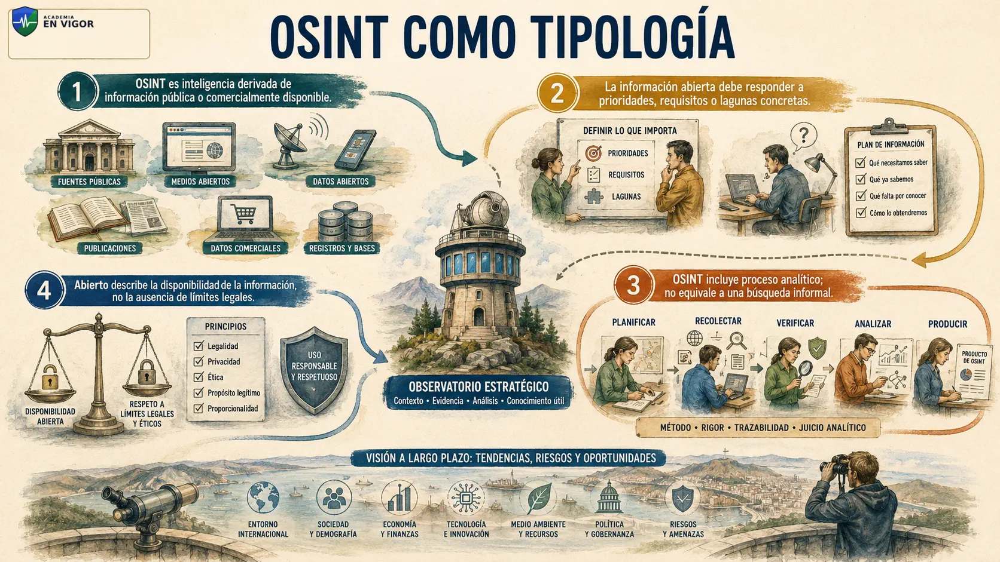

<em>Infografía: OSINT como tipología.</em>

:::hablemos-claro
OSINT es inteligencia derivada de información pública o comercialmente disponible.
:::

:::en-la-calle
Al clasificar el producto por fuente o nivel de decisión, OSINT es inteligencia derivada de información pública o comercialmente disponible.
:::

:::lo-que-cae
Prioriza **información abierta orientada a requisitos** y descarta respuestas que confundan dato, fuente, fase, acceso, contenido o infraestructura.
:::

<!-- FUENTE: ODNI-OSINT-STRATEGY-T40 -->

## 14. SIGINT

### Lógica del bloque

Para dominar **sigint**, aplica esta regla: SIGINT se vincula a inteligencia obtenida de señales o transmisiones técnicas. El anclaje principal es **información procedente de señales**.

### Hechos examinables

- SIGINT se vincula a inteligencia obtenida de señales o transmisiones técnicas. <!-- FACT:PN-T40-F053 -->
- Puede comprender comunicaciones y otras emisiones electromagnéticas según la clasificación aplicada. <!-- FACT:PN-T40-F054 -->
- SIGINT no es sinónimo de OSINT ni de cualquier archivo digital. <!-- FACT:PN-T40-F055 -->
- Su obtención está sujeta al marco competencial y jurídico correspondiente. <!-- FACT:PN-T40-F056 -->

### Ejemplos razonados

- **Aplicación correcta:** Puede comprender comunicaciones y otras emisiones electromagnéticas según la clasificación aplicada.
- **Contraste útil:** SIGINT no es sinónimo de OSINT ni de cualquier archivo digital.

### Trampas de examen

- **Incorrecto:** Toda información digital es SIGINT.
- **Incorrecto:** SIGINT se obtiene exclusivamente de periódicos.

<!-- VISUAL:t40-14-sigint.webp -->

  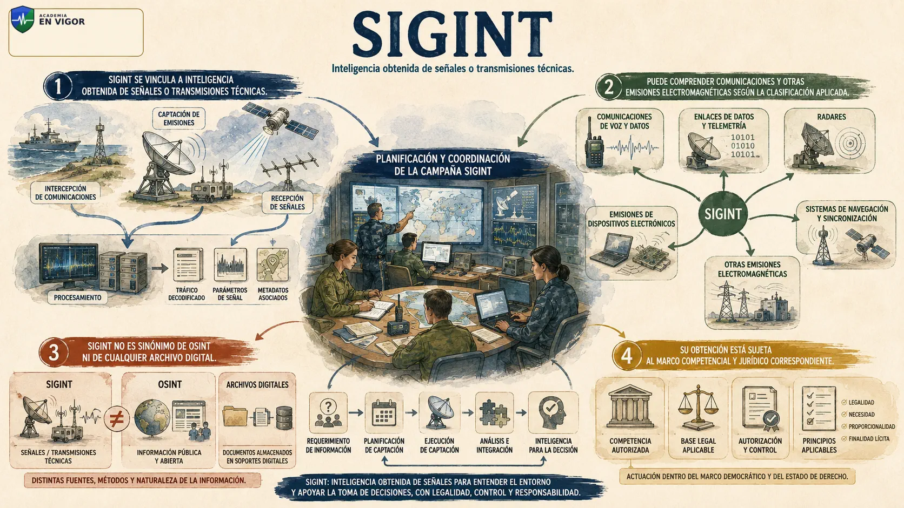

<em>Infografía: SIGINT.</em>

:::hablemos-claro
SIGINT se vincula a inteligencia obtenida de señales o transmisiones técnicas.
:::

:::en-la-calle
Al clasificar el producto por fuente o nivel de decisión, SIGINT se vincula a inteligencia obtenida de señales o transmisiones técnicas.
:::

:::lo-que-cae
Prioriza **información procedente de señales** y descarta respuestas que confundan dato, fuente, fase, acceso, contenido o infraestructura.
:::

<!-- FUENTE: CNI-CICLO-T40 -->

## 15. GEOINT

### Lógica del bloque

Para dominar **geoint**, aplica esta regla: GEOINT procede de la explotación y análisis de imágenes e información geográfica. El anclaje principal es **imágenes e información geográfica**.

### Hechos examinables

- GEOINT procede de la explotación y análisis de imágenes e información geográfica. <!-- FACT:PN-T40-F057 -->
- Relaciona objetos, actividades y lugares dentro de un contexto espacial. <!-- FACT:PN-T40-F058 -->
- Una coordenada aislada es un dato; su interpretación dentro de un patrón puede aportar inteligencia. <!-- FACT:PN-T40-F059 -->
- GEOINT puede combinar material abierto con otras fuentes autorizadas. <!-- FACT:PN-T40-F060 -->

### Ejemplos razonados

- **Aplicación correcta:** Relaciona objetos, actividades y lugares dentro de un contexto espacial.
- **Contraste útil:** Una coordenada aislada es un dato; su interpretación dentro de un patrón puede aportar inteligencia.

### Trampas de examen

- **Incorrecto:** GEOINT es únicamente dibujar mapas decorativos.
- **Incorrecto:** Toda fotografía contiene automáticamente una conclusión geoespacial.

<!-- VISUAL:t40-il-15-geoint.webp -->

  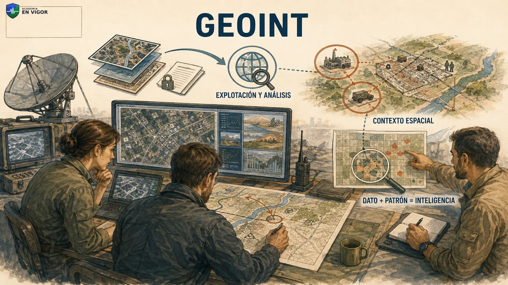

<em>Infografía: GEOINT.</em>

:::hablemos-claro
GEOINT procede de la explotación y análisis de imágenes e información geográfica.
:::

:::en-la-calle
Al clasificar el producto por fuente o nivel de decisión, GEOINT procede de la explotación y análisis de imágenes e información geográfica.
:::

:::lo-que-cae
Prioriza **imágenes e información geográfica** y descarta respuestas que confundan dato, fuente, fase, acceso, contenido o infraestructura.
:::

<!-- FUENTE: CNI-CICLO-T40 -->

## 16. Inteligencia estratégica

### Lógica del bloque

Para dominar **inteligencia estratégica**, aplica esta regla: La inteligencia estratégica apoya decisiones de medio o largo plazo y alcance general. El anclaje principal es **tendencias y decisiones de alcance amplio**.

### Hechos examinables

- La inteligencia estratégica apoya decisiones de medio o largo plazo y alcance general. <!-- FACT:PN-T40-F061 -->
- Analiza tendencias, amenazas, capacidades, entornos y posibles evoluciones. <!-- FACT:PN-T40-F062 -->
- Puede orientar prioridades, políticas y distribución de recursos. <!-- FACT:PN-T40-F063 -->
- No se define solo por el volumen del informe, sino por la decisión que apoya. <!-- FACT:PN-T40-F064 -->

### Ejemplos razonados

- **Aplicación correcta:** Analiza tendencias, amenazas, capacidades, entornos y posibles evoluciones.
- **Contraste útil:** Puede orientar prioridades, políticas y distribución de recursos.

### Trampas de examen

- **Incorrecto:** Estratégica significa siempre secreta.
- **Incorrecto:** Un informe largo es estratégico aunque solo resuelva una actuación inmediata.

<!-- VISUAL:t40-16-inteligencia-estrategica.webp -->

  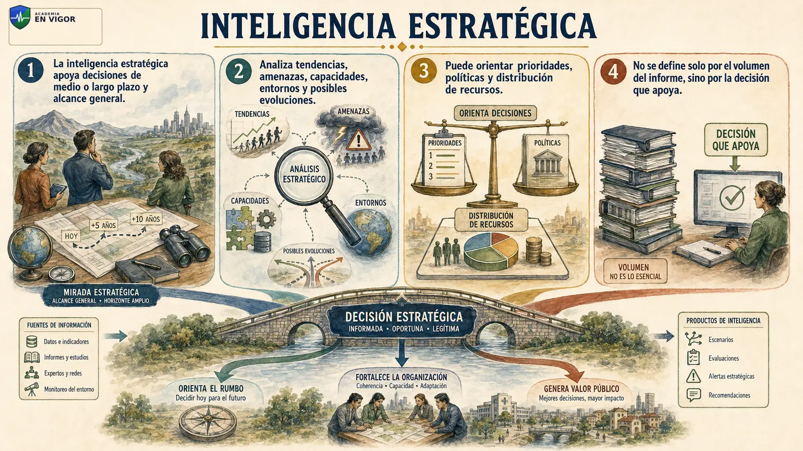

<em>Infografía: Inteligencia estratégica.</em>

:::hablemos-claro
La inteligencia estratégica apoya decisiones de medio o largo plazo y alcance general.
:::

:::en-la-calle
Al clasificar el producto por fuente o nivel de decisión, La inteligencia estratégica apoya decisiones de medio o largo plazo y alcance general.
:::

:::lo-que-cae
Prioriza **tendencias y decisiones de alcance amplio** y descarta respuestas que confundan dato, fuente, fase, acceso, contenido o infraestructura.
:::

<!-- FUENTE: UNODC-CI-ANALYSTS-T40 -->

## 17. Inteligencia operativa

### Lógica del bloque

Para dominar **inteligencia operativa**, aplica esta regla: La inteligencia operativa apoya la planificación y coordinación de operaciones concretas. El anclaje principal es **objetivos y operaciones concretas**.

### Hechos examinables

- La inteligencia operativa apoya la planificación y coordinación de operaciones concretas. <!-- FACT:PN-T40-F065 -->
- Conecta prioridades generales con objetivos, capacidades y cursos de acción. <!-- FACT:PN-T40-F066 -->
- Su horizonte suele ser más próximo que el estratégico sin reducirse al instante táctico. <!-- FACT:PN-T40-F067 -->
- Puede integrar análisis de redes, patrones, riesgos y recursos disponibles. <!-- FACT:PN-T40-F068 -->

### Ejemplos razonados

- **Aplicación correcta:** Conecta prioridades generales con objetivos, capacidades y cursos de acción.
- **Contraste útil:** Su horizonte suele ser más próximo que el estratégico sin reducirse al instante táctico.

### Trampas de examen

- **Incorrecto:** Operativa es sinónimo exacto de dato bruto.
- **Incorrecto:** La inteligencia operativa nunca se alimenta de análisis estratégico.

<!-- VISUAL:t40-17-inteligencia-operativa.webp -->

  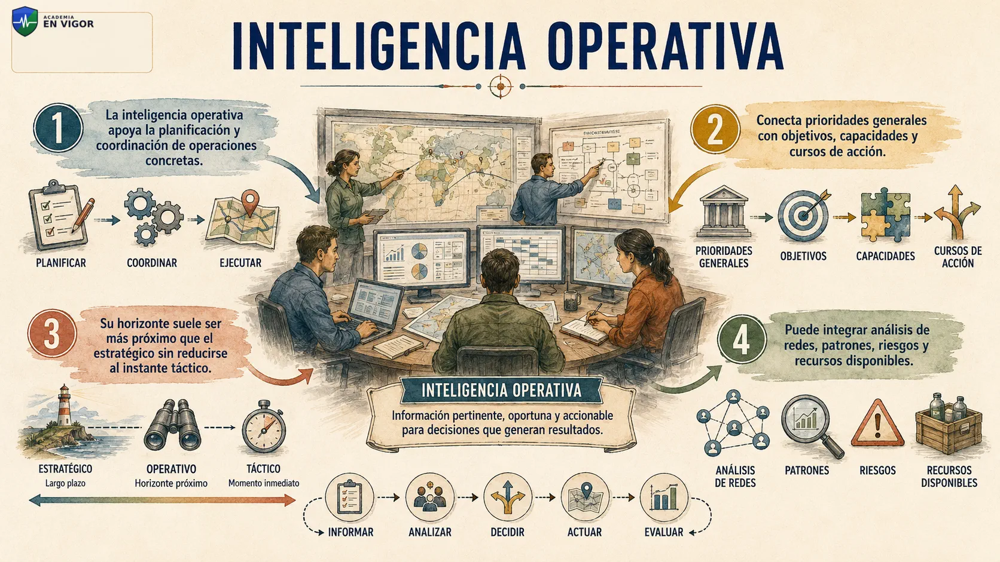

<em>Infografía: Inteligencia operativa.</em>

:::hablemos-claro
La inteligencia operativa apoya la planificación y coordinación de operaciones concretas.
:::

:::en-la-calle
Al clasificar el producto por fuente o nivel de decisión, La inteligencia operativa apoya la planificación y coordinación de operaciones concretas.
:::

:::lo-que-cae
Prioriza **objetivos y operaciones concretas** y descarta respuestas que confundan dato, fuente, fase, acceso, contenido o infraestructura.
:::

<!-- FUENTE: UNODC-CI-ANALYSTS-T40 -->

## 18. Inteligencia táctica

### Lógica del bloque

Para dominar **inteligencia táctica**, aplica esta regla: La inteligencia táctica apoya decisiones inmediatas o de corto plazo en una actuación. El anclaje principal es **decisión inmediata o de corto alcance**.

### Hechos examinables

- La inteligencia táctica apoya decisiones inmediatas o de corto plazo en una actuación. <!-- FACT:PN-T40-F069 -->
- Puede precisar sujetos, lugares, momentos, medios o riesgos concretos. <!-- FACT:PN-T40-F070 -->
- Lo táctico, operativo y estratégico forman un continuo y pueden retroalimentarse. <!-- FACT:PN-T40-F071 -->
- Un dato urgente no es táctico útil si no se evalúa y contextualiza. <!-- FACT:PN-T40-F072 -->

### Ejemplos razonados

- **Aplicación correcta:** Puede precisar sujetos, lugares, momentos, medios o riesgos concretos.
- **Contraste útil:** Lo táctico, operativo y estratégico forman un continuo y pueden retroalimentarse.

### Trampas de examen

- **Incorrecto:** Táctica significa información sin analizar por ser urgente.
- **Incorrecto:** La inteligencia táctica jamás produce conocimiento estratégico posterior.

<!-- VISUAL:t40-18-inteligencia-tactica.webp -->

  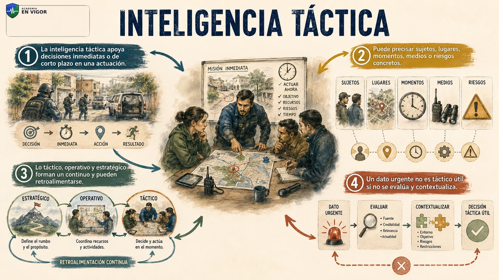

<em>Infografía: Inteligencia táctica.</em>

:::hablemos-claro
La inteligencia táctica apoya decisiones inmediatas o de corto plazo en una actuación.
:::

:::en-la-calle
Al clasificar el producto por fuente o nivel de decisión, La inteligencia táctica apoya decisiones inmediatas o de corto plazo en una actuación.
:::

:::lo-que-cae
Prioriza **decisión inmediata o de corto alcance** y descarta respuestas que confundan dato, fuente, fase, acceso, contenido o infraestructura.
:::

<!-- FUENTE: UNODC-CI-ANALYSTS-T40 -->

## 19. Qué es el ciclo de inteligencia

### Lógica del bloque

Para dominar **qué es el ciclo de inteligencia**, aplica esta regla: El ciclo de inteligencia organiza actividades que transforman necesidades e información en productos útiles. El anclaje principal es **proceso ordenado y retroalimentado**.

### Hechos examinables

- El ciclo de inteligencia organiza actividades que transforman necesidades e información en productos útiles. <!-- FACT:PN-T40-F073 -->
- Es un modelo de trabajo, no una ley física inmutable. <!-- FACT:PN-T40-F074 -->
- Sus fases interactúan y pueden solaparse o provocar retornos a etapas anteriores. <!-- FACT:PN-T40-F075 -->
- La retroalimentación permite ajustar requisitos, obtención, análisis y difusión. <!-- FACT:PN-T40-F076 -->

### Ejemplos razonados

- **Aplicación correcta:** Es un modelo de trabajo, no una ley física inmutable.
- **Contraste útil:** Sus fases interactúan y pueden solaparse o provocar retornos a etapas anteriores.

### Trampas de examen

- **Incorrecto:** Todas las organizaciones usan idéntico número y nombre de fases.
- **Incorrecto:** Cada fase termina para siempre antes de comenzar la siguiente.

<!-- VISUAL:t40-19-que-es-el-ciclo-de-inteligencia.webp -->

  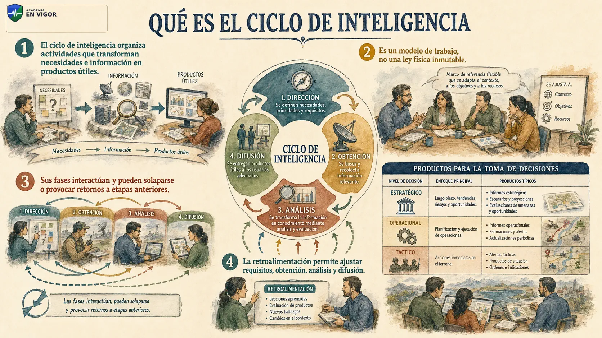

<em>Infografía: Qué es el ciclo de inteligencia.</em>

:::hablemos-claro
El ciclo de inteligencia organiza actividades que transforman necesidades e información en productos útiles.
:::

:::en-la-calle
Al recorrer el ciclo desde el requisito hasta la difusión, El ciclo de inteligencia organiza actividades que transforman necesidades e información en productos útiles.
:::

:::lo-que-cae
Prioriza **proceso ordenado y retroalimentado** y descarta respuestas que confundan dato, fuente, fase, acceso, contenido o infraestructura.
:::

<!-- FUENTE: UNODC-CI-ANALYSTS-T40 -->

## 20. Modelos de cuatro y seis fases

### Lógica del bloque

Para dominar **modelos de cuatro y seis fases**, aplica esta regla: El CNI presenta dirección, obtención, elaboración y difusión como fases principales. El anclaje principal es **misma lógica con distinto detalle**.

### Hechos examinables

- El CNI presenta dirección, obtención, elaboración y difusión como fases principales. <!-- FACT:PN-T40-F077 -->
- La guía CCN-STIC-425 detalla dirección y planificación, recolección, transformación, análisis y producción, difusión y evaluación. <!-- FACT:PN-T40-F078 -->
- Un modelo puede integrar tareas que otro representa como fases separadas. <!-- FACT:PN-T40-F079 -->
- En examen debe identificarse primero qué modelo cita el enunciado. <!-- FACT:PN-T40-F080 -->

### Ejemplos razonados

- **Aplicación correcta:** La guía CCN-STIC-425 detalla dirección y planificación, recolección, transformación, análisis y producción, difusión y evaluación.
- **Contraste útil:** Un modelo puede integrar tareas que otro representa como fases separadas.

### Trampas de examen

- **Incorrecto:** Si un modelo tiene seis fases contradice necesariamente al de cuatro.
- **Incorrecto:** Transformación y elaboración significan siempre procesos ajenos entre sí.

<!-- VISUAL:t40-il-20-modelos-de-cuatro-y-seis-fases.webp -->

  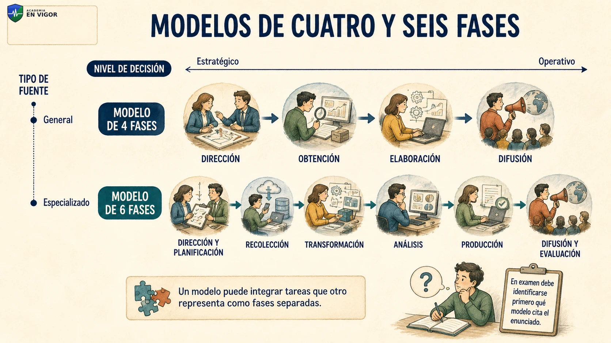

<em>Infografía: Modelos de cuatro y seis fases.</em>

:::hablemos-claro
El CNI presenta dirección, obtención, elaboración y difusión como fases principales.
:::

:::en-la-calle
Al recorrer el ciclo desde el requisito hasta la difusión, El CNI presenta dirección, obtención, elaboración y difusión como fases principales.
:::

:::lo-que-cae
Prioriza **misma lógica con distinto detalle** y descarta respuestas que confundan dato, fuente, fase, acceso, contenido o infraestructura.
:::

<!-- FUENTE: CCN-STIC-425-T40 -->

## 21. Dirección

### Lógica del bloque

Para dominar **dirección**, aplica esta regla: La dirección fija los objetivos o necesidades de inteligencia. El anclaje principal es **objetivos y necesidades**.

### Hechos examinables

- La dirección fija los objetivos o necesidades de inteligencia. <!-- FACT:PN-T40-F081 -->
- Evita que la obtención se convierta en acumulación indiscriminada. <!-- FACT:PN-T40-F082 -->
- Prioriza preguntas según relevancia, urgencia, riesgo y recursos. <!-- FACT:PN-T40-F083 -->
- Un cambio de necesidad puede obligar a revisar el plan durante el ciclo. <!-- FACT:PN-T40-F084 -->

### Ejemplos razonados

- **Aplicación correcta:** Evita que la obtención se convierta en acumulación indiscriminada.
- **Contraste útil:** Prioriza preguntas según relevancia, urgencia, riesgo y recursos.

### Trampas de examen

- **Incorrecto:** La dirección consiste en redactar la conclusión final.
- **Incorrecto:** Los objetivos se fijan después de difundir el producto.

<!-- VISUAL:t40-21-direccion.webp -->

  

<em>Infografía: Dirección.</em>

:::hablemos-claro
La dirección fija los objetivos o necesidades de inteligencia.
:::

:::en-la-calle
Al recorrer el ciclo desde el requisito hasta la difusión, La dirección fija los objetivos o necesidades de inteligencia.
:::

:::lo-que-cae
Prioriza **objetivos y necesidades** y descarta respuestas que confundan dato, fuente, fase, acceso, contenido o infraestructura.
:::

<!-- FUENTE: CNI-CICLO-T40 -->

## 22. Planificación

### Lógica del bloque

Para dominar **planificación**, aplica esta regla: La planificación organiza recursos y acciones para satisfacer los requisitos. El anclaje principal es **cómo satisfacer el requisito**.

### Hechos examinables

- La planificación organiza recursos y acciones para satisfacer los requisitos. <!-- FACT:PN-T40-F085 -->
- Debe identificar fuentes potenciales, plazos, responsables, riesgos y criterios de cierre. <!-- FACT:PN-T40-F086 -->
- Un plan de obtención asigna qué buscar, dónde, cómo y con qué prioridad. <!-- FACT:PN-T40-F087 -->
- Planificar incluye prever lagunas y vías alternativas de corroboración. <!-- FACT:PN-T40-F088 -->

### Ejemplos razonados

- **Aplicación correcta:** Debe identificar fuentes potenciales, plazos, responsables, riesgos y criterios de cierre.
- **Contraste útil:** Un plan de obtención asigna qué buscar, dónde, cómo y con qué prioridad.

### Trampas de examen

- **Incorrecto:** Planificar equivale a elegir una única herramienta.
- **Incorrecto:** El plan no necesita relacionarse con el requisito.

<!-- VISUAL:t40-22-planificacion.webp -->

  

<em>Infografía: Planificación.</em>

:::hablemos-claro
La planificación organiza recursos y acciones para satisfacer los requisitos.
:::

:::en-la-calle
Al recorrer el ciclo desde el requisito hasta la difusión, La planificación organiza recursos y acciones para satisfacer los requisitos.
:::

:::lo-que-cae
Prioriza **cómo satisfacer el requisito** y descarta respuestas que confundan dato, fuente, fase, acceso, contenido o infraestructura.
:::

<!-- FUENTE: CCN-STIC-425-T40 -->

## 23. Obtención o recolección

### Lógica del bloque

Para dominar **obtención o recolección**, aplica esta regla: La obtención reúne datos e información necesarios para el producto previsto. El anclaje principal es **recabar lo necesario y autorizado**.

### Hechos examinables

- La obtención reúne datos e información necesarios para el producto previsto. <!-- FACT:PN-T40-F089 -->
- Debe respetar finalidad, competencia, legalidad y proporcionalidad. <!-- FACT:PN-T40-F090 -->
- La cantidad recogida no compensa la irrelevancia o baja calidad. <!-- FACT:PN-T40-F091 -->
- La recolección puede revelar nuevos requisitos o exigir volver a planificar. <!-- FACT:PN-T40-F092 -->

### Ejemplos razonados

- **Aplicación correcta:** Debe respetar finalidad, competencia, legalidad y proporcionalidad.
- **Contraste útil:** La cantidad recogida no compensa la irrelevancia o baja calidad.

### Trampas de examen

- **Incorrecto:** Obtener consiste en recopilar todo lo técnicamente accesible.
- **Incorrecto:** La legalidad se revisa solo después de difundir.

<!-- VISUAL:t40-23-obtencion-o-recoleccion.webp -->

  

<em>Infografía: Obtención o recolección.</em>

:::hablemos-claro
La obtención reúne datos e información necesarios para el producto previsto.
:::

:::en-la-calle
Al recorrer el ciclo desde el requisito hasta la difusión, La obtención reúne datos e información necesarios para el producto previsto.
:::

:::lo-que-cae
Prioriza **recabar lo necesario y autorizado** y descarta respuestas que confundan dato, fuente, fase, acceso, contenido o infraestructura.
:::

<!-- FUENTE: CCN-STIC-425-T40 -->

## 24. Transformación y procesamiento

### Lógica del bloque

Para dominar **transformación y procesamiento**, aplica esta regla: La transformación convierte datos brutos en formatos utilizables para su tratamiento y análisis. El anclaje principal es **hacer analizables los datos**.

### Hechos examinables

- La transformación convierte datos brutos en formatos utilizables para su tratamiento y análisis. <!-- FACT:PN-T40-F093 -->
- Puede incluir traducción, normalización, extracción, descifrado autorizado o conversión técnica. <!-- FACT:PN-T40-F094 -->
- Procesar no equivale todavía a interpretar el significado del fenómeno. <!-- FACT:PN-T40-F095 -->
- Toda transformación relevante debe preservar procedencia y evitar alterar el contenido sin registro. <!-- FACT:PN-T40-F096 -->

### Ejemplos razonados

- **Aplicación correcta:** Puede incluir traducción, normalización, extracción, descifrado autorizado o conversión técnica.
- **Contraste útil:** Procesar no equivale todavía a interpretar el significado del fenómeno.

### Trampas de examen

- **Incorrecto:** Cambiar de formato crea automáticamente inteligencia.
- **Incorrecto:** Procesar permite perder la trazabilidad del original.

<!-- VISUAL:t40-24-transformacion-y-procesamiento.webp -->

  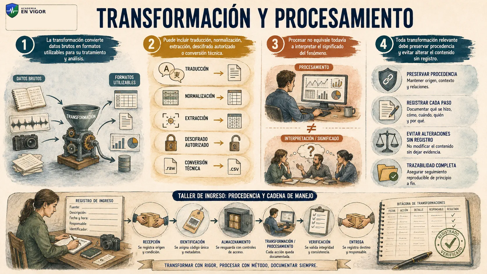

<em>Infografía: Transformación y procesamiento.</em>

:::hablemos-claro
La transformación convierte datos brutos en formatos utilizables para su tratamiento y análisis.
:::

:::en-la-calle
Al recorrer el ciclo desde el requisito hasta la difusión, La transformación convierte datos brutos en formatos utilizables para su tratamiento y análisis.
:::

:::lo-que-cae
Prioriza **hacer analizables los datos** y descarta respuestas que confundan dato, fuente, fase, acceso, contenido o infraestructura.
:::

<!-- FUENTE: CCN-STIC-425-T40 -->

## 25. Evaluación de fuente e información

### Lógica del bloque

Para dominar **evaluación de fuente e información**, aplica esta regla: La fiabilidad de la fuente y la validez del contenido se evalúan por separado. El anclaje principal es **dos juicios separados**.

### Hechos examinables

- La fiabilidad de la fuente y la validez del contenido se evalúan por separado. <!-- FACT:PN-T40-F097 -->
- Una fuente habitualmente fiable puede equivocarse en un dato concreto. <!-- FACT:PN-T40-F098 -->
- Una fuente nueva o desconocida puede aportar información corroborada por otros medios. <!-- FACT:PN-T40-F099 -->
- La calificación orienta el peso analítico; no convierte el contenido en verdad automática. <!-- FACT:PN-T40-F100 -->

### Ejemplos razonados

- **Aplicación correcta:** Una fuente habitualmente fiable puede equivocarse en un dato concreto.
- **Contraste útil:** Una fuente nueva o desconocida puede aportar información corroborada por otros medios.

### Trampas de examen

- **Incorrecto:** Fuente fiable significa contenido siempre verdadero.
- **Incorrecto:** Fuente desconocida obliga a descartar todo lo que aporta.

<!-- VISUAL:t40-il-25-evaluacion-de-fuente-e-informacion.webp -->

  

<em>Infografía: Evaluación de fuente e información.</em>

:::hablemos-claro
La fiabilidad de la fuente y la validez del contenido se evalúan por separado.
:::

:::en-la-calle
Al recorrer el ciclo desde el requisito hasta la difusión, La fiabilidad de la fuente y la validez del contenido se evalúan por separado.
:::

:::lo-que-cae
Prioriza **dos juicios separados** y descarta respuestas que confundan dato, fuente, fase, acceso, contenido o infraestructura.
:::

<!-- FUENTE: UNODC-CI-ANALYSTS-T40 -->

## 26. Sistema 4×4 de evaluación

### Lógica del bloque

Para dominar **sistema 4×4 de evaluación**, aplica esta regla: El sistema 4×4 utiliza dos escalas independientes para valorar fuente e información. El anclaje principal es **fiabilidad y validez en dos ejes**.

### Hechos examinables

- El sistema 4×4 utiliza dos escalas independientes para valorar fuente e información. <!-- FACT:PN-T40-F101 -->
- Las letras A a D expresan grados de fiabilidad de la fuente en el modelo estudiado. <!-- FACT:PN-T40-F102 -->
- Los números 1 a 4 expresan grados de validez o corroboración del contenido. <!-- FACT:PN-T40-F103 -->
- Una combinación como A1 resume dos valoraciones y no una probabilidad matemática exacta. <!-- FACT:PN-T40-F104 -->

### Ejemplos razonados

- **Aplicación correcta:** Las letras A a D expresan grados de fiabilidad de la fuente en el modelo estudiado.
- **Contraste útil:** Los números 1 a 4 expresan grados de validez o corroboración del contenido.

### Trampas de examen

- **Incorrecto:** 4×4 significa cuatro fuentes idénticas contrastadas cuatro veces.
- **Incorrecto:** A1 garantiza certeza judicial absoluta.

<!-- VISUAL:t40-26-sistema-4-4-de-evaluacion.webp -->

  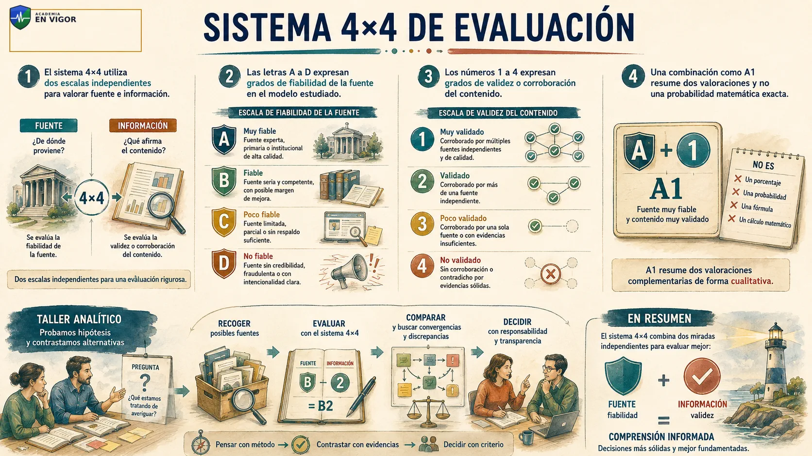

<em>Infografía: Sistema 4×4 de evaluación.</em>

:::hablemos-claro
El sistema 4×4 utiliza dos escalas independientes para valorar fuente e información.
:::

:::en-la-calle
Al recorrer el ciclo desde el requisito hasta la difusión, El sistema 4×4 utiliza dos escalas independientes para valorar fuente e información.
:::

:::lo-que-cae
Prioriza **fiabilidad y validez en dos ejes** y descarta respuestas que confundan dato, fuente, fase, acceso, contenido o infraestructura.
:::

<!-- FUENTE: UNODC-CI-ANALYSTS-T40 -->

## 27. Registro y ordenación

### Lógica del bloque

Para dominar **registro y ordenación**, aplica esta regla: La información debe registrarse con identificadores, fechas, procedencia y relaciones relevantes. El anclaje principal es **recuperar sin perder procedencia**.

### Hechos examinables

- La información debe registrarse con identificadores, fechas, procedencia y relaciones relevantes. <!-- FACT:PN-T40-F105 -->
- Ordenar permite comparar entidades, acontecimientos, lugares y tiempos. <!-- FACT:PN-T40-F106 -->
- La deduplicación debe conservar la posibilidad de reconocer fuentes realmente independientes. <!-- FACT:PN-T40-F107 -->
- Una base ordenada facilita análisis, pero no sustituye el razonamiento. <!-- FACT:PN-T40-F108 -->

### Ejemplos razonados

- **Aplicación correcta:** Ordenar permite comparar entidades, acontecimientos, lugares y tiempos.
- **Contraste útil:** La deduplicación debe conservar la posibilidad de reconocer fuentes realmente independientes.

### Trampas de examen

- **Incorrecto:** Guardar dos copias del mismo mensaje crea corroboración.
- **Incorrecto:** Una base de datos produce conclusiones sin analista.

<!-- VISUAL:t40-27-registro-y-ordenacion.webp -->

  

<em>Infografía: Registro y ordenación.</em>

:::hablemos-claro
La información debe registrarse con identificadores, fechas, procedencia y relaciones relevantes.
:::

:::en-la-calle
Al recorrer el ciclo desde el requisito hasta la difusión, La información debe registrarse con identificadores, fechas, procedencia y relaciones relevantes.
:::

:::lo-que-cae
Prioriza **recuperar sin perder procedencia** y descarta respuestas que confundan dato, fuente, fase, acceso, contenido o infraestructura.
:::

<!-- FUENTE: UNODC-CI-ANALYSTS-T40 -->

## 28. Análisis

### Lógica del bloque

Para dominar **análisis**, aplica esta regla: El análisis identifica patrones, relaciones, causas posibles, consecuencias y lagunas. El anclaje principal es **explicar significado e implicaciones**.

### Hechos examinables

- El análisis identifica patrones, relaciones, causas posibles, consecuencias y lagunas. <!-- FACT:PN-T40-F109 -->
- Contrasta hipótesis con información favorable y contraria. <!-- FACT:PN-T40-F110 -->
- Debe separar correlación, coincidencia y causalidad. <!-- FACT:PN-T40-F111 -->
- Una conclusión analítica debe poder rastrearse hasta evidencia y razonamiento explícito. <!-- FACT:PN-T40-F112 -->

### Ejemplos razonados

- **Aplicación correcta:** Contrasta hipótesis con información favorable y contraria.
- **Contraste útil:** Debe separar correlación, coincidencia y causalidad.

### Trampas de examen

- **Incorrecto:** Dos hechos correlacionados demuestran siempre causalidad.
- **Incorrecto:** El análisis consiste en copiar la información más reciente.

<!-- VISUAL:t40-28-analisis.webp -->

  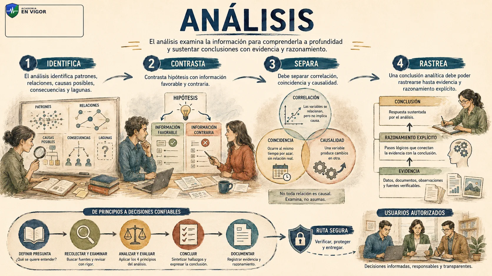

<em>Infografía: Análisis.</em>

:::hablemos-claro
El análisis identifica patrones, relaciones, causas posibles, consecuencias y lagunas.
:::

:::en-la-calle
Al recorrer el ciclo desde el requisito hasta la difusión, El análisis identifica patrones, relaciones, causas posibles, consecuencias y lagunas.
:::

:::lo-que-cae
Prioriza **explicar significado e implicaciones** y descarta respuestas que confundan dato, fuente, fase, acceso, contenido o infraestructura.
:::

<!-- FUENTE: UNODC-CI-ANALYSTS-T40 -->

## 29. Integración

### Lógica del bloque

Para dominar **integración**, aplica esta regla: La integración combina información procedente de distintas fuentes y disciplinas. El anclaje principal es **unir fuentes en una imagen coherente**.

### Hechos examinables

- La integración combina información procedente de distintas fuentes y disciplinas. <!-- FACT:PN-T40-F113 -->
- Debe conservar discrepancias significativas en vez de borrarlas para forzar coherencia. <!-- FACT:PN-T40-F114 -->
- La convergencia de fuentes independientes puede aumentar la confianza. <!-- FACT:PN-T40-F115 -->
- La repetición derivada de un mismo origen no equivale a corroboración independiente. <!-- FACT:PN-T40-F116 -->

### Ejemplos razonados

- **Aplicación correcta:** Debe conservar discrepancias significativas en vez de borrarlas para forzar coherencia.
- **Contraste útil:** La convergencia de fuentes independientes puede aumentar la confianza.

### Trampas de examen

- **Incorrecto:** Integrar exige escoger una fuente y eliminar las demás.
- **Incorrecto:** Diez republicaciones de una noticia son diez confirmaciones independientes.

<!-- VISUAL:t40-29-integracion.webp -->

  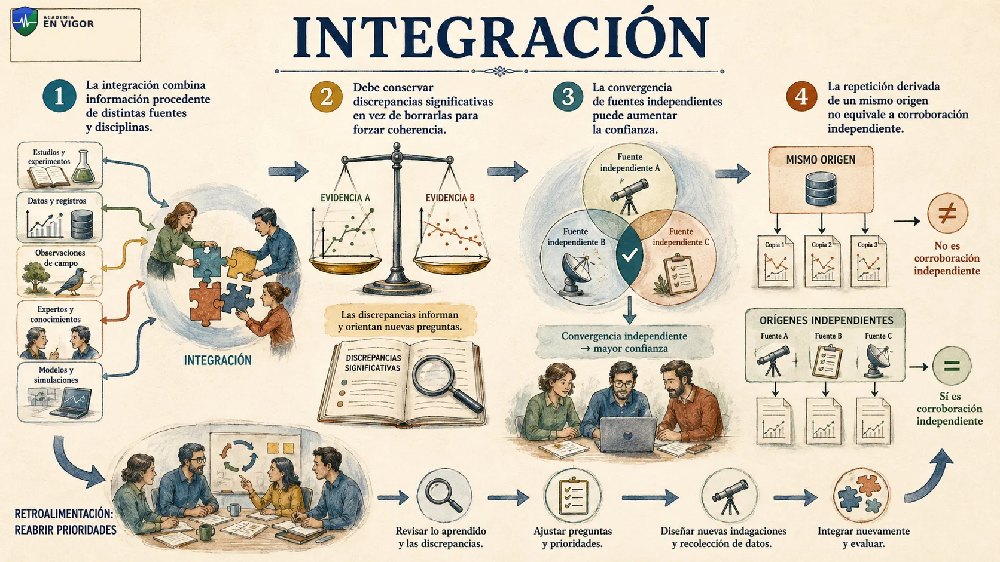

<em>Infografía: Integración.</em>

:::hablemos-claro
La integración combina información procedente de distintas fuentes y disciplinas.
:::

:::en-la-calle
Al recorrer el ciclo desde el requisito hasta la difusión, La integración combina información procedente de distintas fuentes y disciplinas.
:::

:::lo-que-cae
Prioriza **unir fuentes en una imagen coherente** y descarta respuestas que confundan dato, fuente, fase, acceso, contenido o infraestructura.
:::

<!-- FUENTE: CNI-CICLO-T40 -->

## 30. Interpretación

### Lógica del bloque

Para dominar **interpretación**, aplica esta regla: La interpretación sitúa la información dentro de contextos y explica su significado. El anclaje principal es **dar sentido en contexto**.

### Hechos examinables

- La interpretación sitúa la información dentro de contextos y explica su significado. <!-- FACT:PN-T40-F117 -->
- Debe considerar explicaciones alternativas y condiciones que cambiarían el juicio. <!-- FACT:PN-T40-F118 -->
- El contexto temporal, geográfico, cultural y operativo puede modificar una lectura. <!-- FACT:PN-T40-F119 -->
- Interpretar no autoriza a rellenar lagunas con intuiciones no declaradas. <!-- FACT:PN-T40-F120 -->

### Ejemplos razonados

- **Aplicación correcta:** Debe considerar explicaciones alternativas y condiciones que cambiarían el juicio.
- **Contraste útil:** El contexto temporal, geográfico, cultural y operativo puede modificar una lectura.

### Trampas de examen

- **Incorrecto:** Interpretar significa presentar una opinión sin base.
- **Incorrecto:** Un mismo dato conserva idéntico significado en cualquier contexto.

<!-- VISUAL:t40-il-30-interpretacion.webp -->

  

<em>Infografía: Interpretación.</em>

:::hablemos-claro
La interpretación sitúa la información dentro de contextos y explica su significado.
:::

:::en-la-calle
Al recorrer el ciclo desde el requisito hasta la difusión, La interpretación sitúa la información dentro de contextos y explica su significado.
:::

:::lo-que-cae
Prioriza **dar sentido en contexto** y descarta respuestas que confundan dato, fuente, fase, acceso, contenido o infraestructura.
:::

<!-- FUENTE: CNI-CICLO-T40 -->

## 31. Elaboración del producto

### Lógica del bloque

Para dominar **elaboración del producto**, aplica esta regla: La elaboración culmina en un producto que comunica inteligencia al destinatario. El anclaje principal es **juicio claro, sustentado y útil**.

### Hechos examinables

- La elaboración culmina en un producto que comunica inteligencia al destinatario. <!-- FACT:PN-T40-F121 -->
- Debe distinguir hechos, supuestos, juicios, incertidumbre y lagunas. <!-- FACT:PN-T40-F122 -->
- La conclusión principal debe apoyarse en razonamiento y fuentes relevantes. <!-- FACT:PN-T40-F123 -->
- El formato se adapta a la decisión sin ocultar limitaciones importantes. <!-- FACT:PN-T40-F124 -->

### Ejemplos razonados

- **Aplicación correcta:** Debe distinguir hechos, supuestos, juicios, incertidumbre y lagunas.
- **Contraste útil:** La conclusión principal debe apoyarse en razonamiento y fuentes relevantes.

### Trampas de examen

- **Incorrecto:** Adaptar el formato permite suprimir cualquier duda.
- **Incorrecto:** Un producto es mejor cuanto más extenso, aunque no responda al requisito.

<!-- VISUAL:t40-31-elaboracion-del-producto.webp -->

  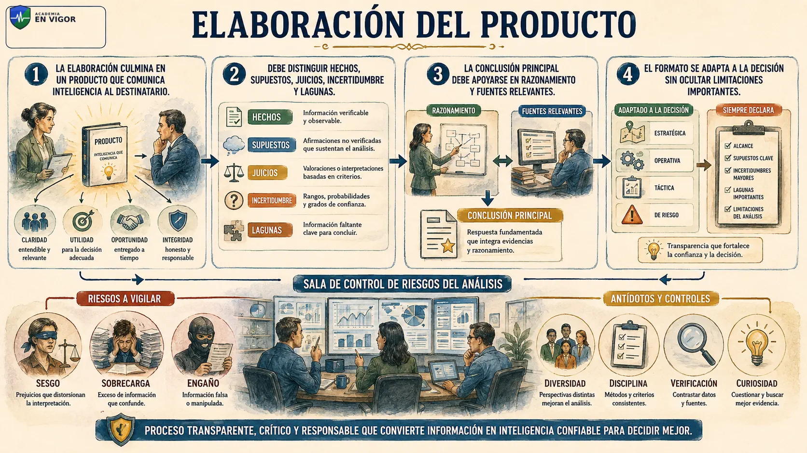

<em>Infografía: Elaboración del producto.</em>

:::hablemos-claro
La elaboración culmina en un producto que comunica inteligencia al destinatario.
:::

:::en-la-calle
Al recorrer el ciclo desde el requisito hasta la difusión, La elaboración culmina en un producto que comunica inteligencia al destinatario.
:::

:::lo-que-cae
Prioriza **juicio claro, sustentado y útil** y descarta respuestas que confundan dato, fuente, fase, acceso, contenido o infraestructura.
:::

<!-- FUENTE: CNI-CICLO-T40 -->

## 32. Difusión

### Lógica del bloque

Para dominar **difusión**, aplica esta regla: La difusión distribuye la inteligencia a quienes deben adoptar decisiones. El anclaje principal es **entrega al destinatario adecuado**.

### Hechos examinables

- La difusión distribuye la inteligencia a quienes deben adoptar decisiones. <!-- FACT:PN-T40-F125 -->
- Debe ser oportuna: un producto correcto que llega tarde puede perder utilidad. <!-- FACT:PN-T40-F126 -->
- La distribución respeta necesidad de conocer, seguridad y reglas de manejo. <!-- FACT:PN-T40-F127 -->
- Difundir no significa publicar universalmente ni entregar datos sin contexto. <!-- FACT:PN-T40-F128 -->

### Ejemplos razonados

- **Aplicación correcta:** Debe ser oportuna: un producto correcto que llega tarde puede perder utilidad.
- **Contraste útil:** La distribución respeta necesidad de conocer, seguridad y reglas de manejo.

### Trampas de examen

- **Incorrecto:** Difusión equivale siempre a publicación abierta.
- **Incorrecto:** La oportunidad no influye en la calidad práctica del producto.

<!-- VISUAL:t40-32-difusion.webp -->

  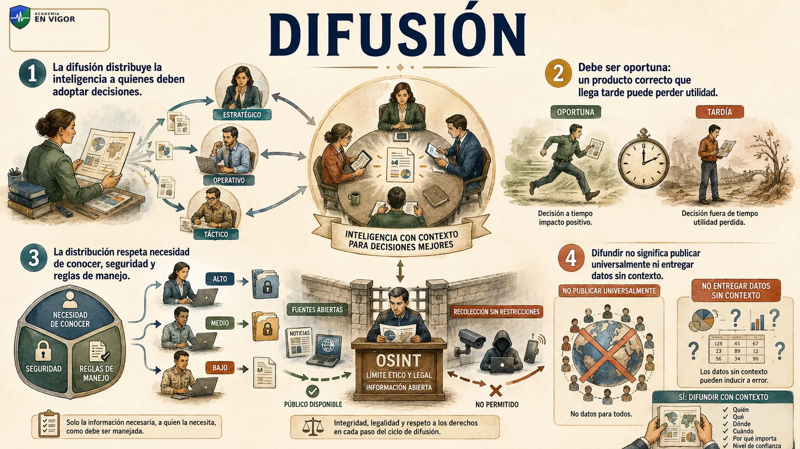

<em>Infografía: Difusión.</em>

:::hablemos-claro
La difusión distribuye la inteligencia a quienes deben adoptar decisiones.
:::

:::en-la-calle
Al recorrer el ciclo desde el requisito hasta la difusión, La difusión distribuye la inteligencia a quienes deben adoptar decisiones.
:::

:::lo-que-cae
Prioriza **entrega al destinatario adecuado** y descarta respuestas que confundan dato, fuente, fase, acceso, contenido o infraestructura.
:::

<!-- FUENTE: CNI-CICLO-T40 -->

## 33. Evaluación y retroalimentación

### Lógica del bloque

Para dominar **evaluación y retroalimentación**, aplica esta regla: La evaluación compara los resultados del ciclo con objetivos y necesidades. El anclaje principal es **medir utilidad y reajustar**.

### Hechos examinables

- La evaluación compara los resultados del ciclo con objetivos y necesidades. <!-- FACT:PN-T40-F129 -->
- La retroalimentación del destinatario indica utilidad, lagunas y nuevas preguntas. <!-- FACT:PN-T40-F130 -->
- Puede provocar una nueva dirección, obtención o revisión analítica. <!-- FACT:PN-T40-F131 -->
- Evaluar el producto no se limita a comprobar su formato técnico. <!-- FACT:PN-T40-F132 -->

### Ejemplos razonados

- **Aplicación correcta:** La retroalimentación del destinatario indica utilidad, lagunas y nuevas preguntas.
- **Contraste útil:** Puede provocar una nueva dirección, obtención o revisión analítica.

### Trampas de examen

- **Incorrecto:** El ciclo termina sin posibilidad de retorno tras difundir.
- **Incorrecto:** La evaluación solo cuenta páginas y anexos.

<!-- VISUAL:t40-33-evaluacion-y-retroalimentacion.webp -->

  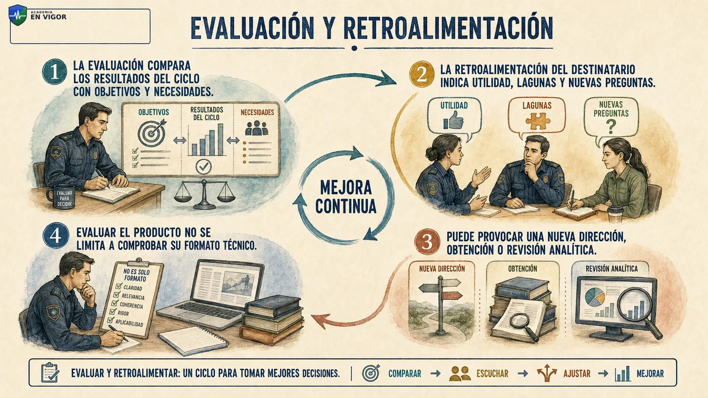

<em>Infografía: Evaluación y retroalimentación.</em>

:::hablemos-claro
La evaluación compara los resultados del ciclo con objetivos y necesidades.
:::

:::en-la-calle
Al recorrer el ciclo desde el requisito hasta la difusión, La evaluación compara los resultados del ciclo con objetivos y necesidades.
:::

:::lo-que-cae
Prioriza **medir utilidad y reajustar** y descarta respuestas que confundan dato, fuente, fase, acceso, contenido o infraestructura.
:::

<!-- FUENTE: CCN-STIC-425-T40 -->

## 34. Carácter dinámico del ciclo

### Lógica del bloque

Para dominar **carácter dinámico del ciclo**, aplica esta regla: El ciclo es dinámico, permanente y susceptible de revisión. El anclaje principal es **iteración y trabajo simultáneo**.

### Hechos examinables

- El ciclo es dinámico, permanente y susceptible de revisión. <!-- FACT:PN-T40-F133 -->
- La obtención y el análisis pueden avanzar en paralelo cuando aparecen nuevos datos. <!-- FACT:PN-T40-F134 -->
- Una hipótesis descartada puede cambiar las prioridades de recolección. <!-- FACT:PN-T40-F135 -->
- La secuencia gráfica ayuda a estudiar, pero la práctica no siempre es lineal. <!-- FACT:PN-T40-F136 -->

### Ejemplos razonados

- **Aplicación correcta:** La obtención y el análisis pueden avanzar en paralelo cuando aparecen nuevos datos.
- **Contraste útil:** Una hipótesis descartada puede cambiar las prioridades de recolección.

### Trampas de examen

- **Incorrecto:** El diagrama circular obliga a ejecutar una sola tarea cada vez.
- **Incorrecto:** Revisar una hipótesis significa que el ciclo ha fallado.

<!-- VISUAL:t40-34-caracter-dinamico-del-ciclo.webp -->

  

<em>Infografía: Carácter dinámico del ciclo.</em>

:::hablemos-claro
El ciclo es dinámico, permanente y susceptible de revisión.
:::

:::en-la-calle
Al recorrer el ciclo desde el requisito hasta la difusión, El ciclo es dinámico, permanente y susceptible de revisión.
:::

:::lo-que-cae
Prioriza **iteración y trabajo simultáneo** y descarta respuestas que confundan dato, fuente, fase, acceso, contenido o infraestructura.
:::

<!-- FUENTE: CCN-STIC-425-T40 -->

## 35. Ciclo y toma de decisiones

### Lógica del bloque

Para dominar **ciclo y toma de decisiones**, aplica esta regla: La inteligencia facilita decisiones al reducir incertidumbre y explicar opciones. El anclaje principal es **apoyar, no sustituir al decisor**.

### Hechos examinables

- La inteligencia facilita decisiones al reducir incertidumbre y explicar opciones. <!-- FACT:PN-T40-F137 -->
- El analista informa; la responsabilidad de decidir corresponde al destinatario competente. <!-- FACT:PN-T40-F138 -->
- Un producto puede exponer riesgos y alternativas sin ordenar una actuación concreta. <!-- FACT:PN-T40-F139 -->
- La independencia analítica impide moldear el juicio para agradar a una preferencia política u operativa. <!-- FACT:PN-T40-F140 -->

### Ejemplos razonados

- **Aplicación correcta:** El analista informa; la responsabilidad de decidir corresponde al destinatario competente.
- **Contraste útil:** Un producto puede exponer riesgos y alternativas sin ordenar una actuación concreta.

### Trampas de examen

- **Incorrecto:** El analista sustituye siempre al decisor.
- **Incorrecto:** El producto debe confirmar la opción preferida por el destinatario.

<!-- VISUAL:t40-il-35-ciclo-y-toma-de-decisiones.webp -->

  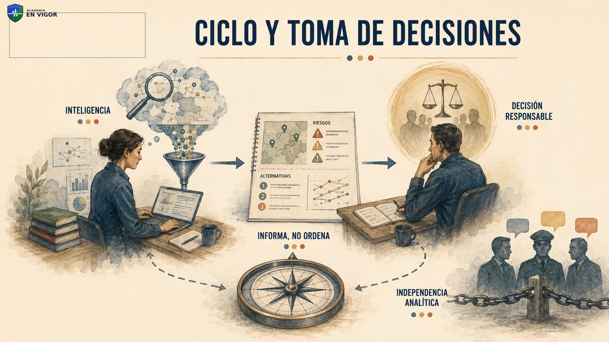

<em>Infografía: Ciclo y toma de decisiones.</em>

:::hablemos-claro
La inteligencia facilita decisiones al reducir incertidumbre y explicar opciones.
:::

:::en-la-calle
Al recorrer el ciclo desde el requisito hasta la difusión, La inteligencia facilita decisiones al reducir incertidumbre y explicar opciones.
:::

:::lo-que-cae
Prioriza **apoyar, no sustituir al decisor** y descarta respuestas que confundan dato, fuente, fase, acceso, contenido o infraestructura.
:::

<!-- FUENTE: CNI-CICLO-T40 -->

## 36. Objetividad analítica

### Lógica del bloque

Para dominar **objetividad analítica**, aplica esta regla: La objetividad exige reconocer supuestos, sesgos y límites del propio razonamiento. El anclaje principal es **hechos y razonamiento por encima de preferencias**.

### Hechos examinables

- La objetividad exige reconocer supuestos, sesgos y límites del propio razonamiento. <!-- FACT:PN-T40-F141 -->
- La conclusión no debe adaptarse para defender una agenda o resultado deseado. <!-- FACT:PN-T40-F142 -->
- La información contraria relevante debe analizarse y no ocultarse. <!-- FACT:PN-T40-F143 -->
- Objetividad no significa ausencia de juicio, sino juicio sustentado y revisable. <!-- FACT:PN-T40-F144 -->

### Ejemplos razonados

- **Aplicación correcta:** La conclusión no debe adaptarse para defender una agenda o resultado deseado.
- **Contraste útil:** La información contraria relevante debe analizarse y no ocultarse.

### Trampas de examen

- **Incorrecto:** Ser objetivo consiste en no formular ninguna conclusión.
- **Incorrecto:** La información contraria puede omitirse si complica el mensaje.

<!-- VISUAL:t40-36-objetividad-analitica.webp -->

  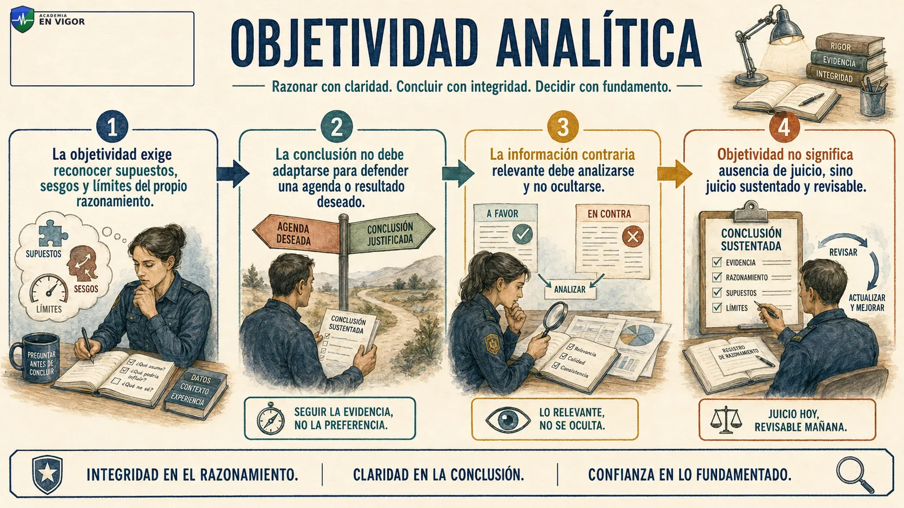

<em>Infografía: Objetividad analítica.</em>

:::hablemos-claro
La objetividad exige reconocer supuestos, sesgos y límites del propio razonamiento.
:::

:::en-la-calle
Al formular y contrastar una hipótesis, La objetividad exige reconocer supuestos, sesgos y límites del propio razonamiento.
:::

:::lo-que-cae
Prioriza **hechos y razonamiento por encima de preferencias** y descarta respuestas que confundan dato, fuente, fase, acceso, contenido o infraestructura.
:::

<!-- FUENTE: ODNI-ICD203-T40 -->

## 37. Hechos, supuestos y juicios

### Lógica del bloque

Para dominar **hechos, supuestos y juicios**, aplica esta regla: Los hechos subyacentes describen información observada o registrada. El anclaje principal es **tres niveles explícitos**.

### Hechos examinables

- Los hechos subyacentes describen información observada o registrada. <!-- FACT:PN-T40-F145 -->
- Los supuestos son proposiciones utilizadas para cubrir o estructurar lagunas. <!-- FACT:PN-T40-F146 -->
- Los juicios son conclusiones basadas en información, análisis y supuestos. <!-- FACT:PN-T40-F147 -->
- Un supuesto decisivo debe declararse y explicar qué ocurriría si fuese falso. <!-- FACT:PN-T40-F148 -->

### Ejemplos razonados

- **Aplicación correcta:** Los supuestos son proposiciones utilizadas para cubrir o estructurar lagunas.
- **Contraste útil:** Los juicios son conclusiones basadas en información, análisis y supuestos.

### Trampas de examen

- **Incorrecto:** Un supuesto debe presentarse como hecho para simplificar.
- **Incorrecto:** Todo juicio es una cita literal de la fuente.

<!-- VISUAL:t40-37-hechos-supuestos-y-juicios.webp -->

  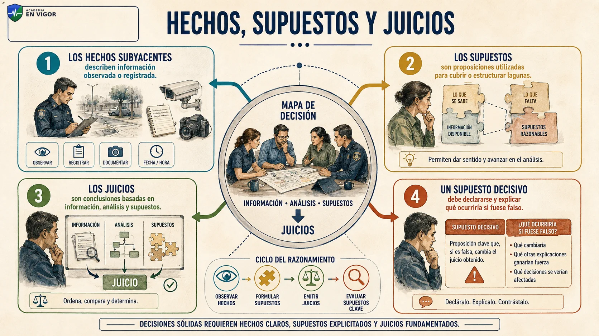

<em>Infografía: Hechos, supuestos y juicios.</em>

:::hablemos-claro
Los hechos subyacentes describen información observada o registrada.
:::

:::en-la-calle
Al formular y contrastar una hipótesis, Los hechos subyacentes describen información observada o registrada.
:::

:::lo-que-cae
Prioriza **tres niveles explícitos** y descarta respuestas que confundan dato, fuente, fase, acceso, contenido o infraestructura.
:::

<!-- FUENTE: ODNI-ICD203-T40 -->

## 38. Calidad y credibilidad de fuentes

### Lógica del bloque

Para dominar **calidad y credibilidad de fuentes**, aplica esta regla: La calidad de una fuente depende de acceso, exactitud, integridad, actualidad y posibles intereses. El anclaje principal es **describir fortalezas y debilidades**.

### Hechos examinables

- La calidad de una fuente depende de acceso, exactitud, integridad, actualidad y posibles intereses. <!-- FACT:PN-T40-F149 -->
- La metodología de obtención puede afectar al valor del contenido. <!-- FACT:PN-T40-F150 -->
- El producto debe explicar debilidades importantes de la base informativa. <!-- FACT:PN-T40-F151 -->
- Una fuente prestigiosa puede reproducir un dato de origen no identificado. <!-- FACT:PN-T40-F152 -->

### Ejemplos razonados

- **Aplicación correcta:** La metodología de obtención puede afectar al valor del contenido.
- **Contraste útil:** El producto debe explicar debilidades importantes de la base informativa.

### Trampas de examen

- **Incorrecto:** El prestigio del medio garantiza la independencia del dato.
- **Incorrecto:** Las limitaciones de la fuente nunca se mencionan al destinatario.

<!-- VISUAL:t40-38-calidad-y-credibilidad-de-fuentes.webp -->

  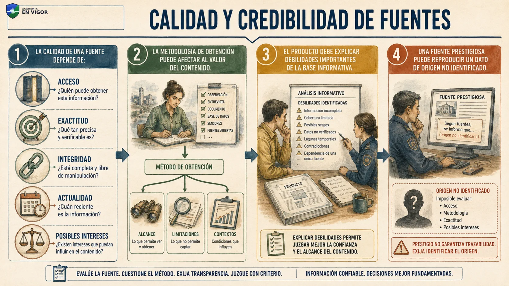

<em>Infografía: Calidad y credibilidad de fuentes.</em>

:::hablemos-claro
La calidad de una fuente depende de acceso, exactitud, integridad, actualidad y posibles intereses.
:::

:::en-la-calle
Al formular y contrastar una hipótesis, La calidad de una fuente depende de acceso, exactitud, integridad, actualidad y posibles intereses.
:::

:::lo-que-cae
Prioriza **describir fortalezas y debilidades** y descarta respuestas que confundan dato, fuente, fase, acceso, contenido o infraestructura.
:::

<!-- FUENTE: ODNI-ICD203-T40 -->

## 39. Incertidumbre, probabilidad y confianza

### Lógica del bloque

Para dominar **incertidumbre, probabilidad y confianza**, aplica esta regla: La probabilidad estima la posibilidad de un acontecimiento o desarrollo. El anclaje principal es **conceptos relacionados pero distintos**.

### Hechos examinables

- La probabilidad estima la posibilidad de un acontecimiento o desarrollo. <!-- FACT:PN-T40-F153 -->
- La confianza expresa la solidez de la base y del razonamiento que sostienen el juicio. <!-- FACT:PN-T40-F154 -->
- Alta confianza no significa que un evento sea muy probable. <!-- FACT:PN-T40-F155 -->
- Los términos de incertidumbre deben usarse de forma coherente y explicada. <!-- FACT:PN-T40-F156 -->

### Ejemplos razonados

- **Aplicación correcta:** La confianza expresa la solidez de la base y del razonamiento que sostienen el juicio.
- **Contraste útil:** Alta confianza no significa que un evento sea muy probable.

### Trampas de examen

- **Incorrecto:** Alta confianza y alta probabilidad son sinónimos.
- **Incorrecto:** Toda incertidumbre impide comunicar un juicio.

<!-- VISUAL:t40-39-incertidumbre-probabilidad-y-confianza.webp -->

  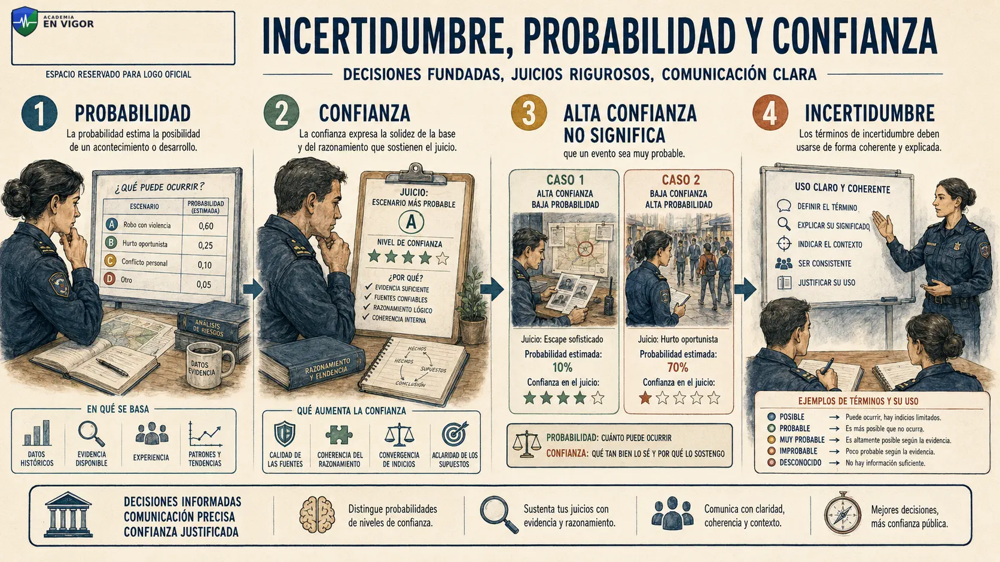

<em>Infografía: Incertidumbre, probabilidad y confianza.</em>

:::hablemos-claro
La probabilidad estima la posibilidad de un acontecimiento o desarrollo.
:::

:::en-la-calle
Al formular y contrastar una hipótesis, La probabilidad estima la posibilidad de un acontecimiento o desarrollo.
:::

:::lo-que-cae
Prioriza **conceptos relacionados pero distintos** y descarta respuestas que confundan dato, fuente, fase, acceso, contenido o infraestructura.
:::

<!-- FUENTE: ODNI-ICD203-T40 -->

## 40. Hipótesis alternativas

### Lógica del bloque

Para dominar **hipótesis alternativas**, aplica esta regla: El análisis de alternativas compara hipótesis plausibles para mitigar sorpresa y sesgo. El anclaje principal es **competir explicaciones plausibles**.

### Hechos examinables

- El análisis de alternativas compara hipótesis plausibles para mitigar sorpresa y sesgo. <!-- FACT:PN-T40-F157 -->
- Una hipótesis debe buscar datos que podrían refutarla, no solo confirmarla. <!-- FACT:PN-T40-F158 -->
- La explicación más intuitiva no es necesariamente la mejor sustentada. <!-- FACT:PN-T40-F159 -->
- Los indicadores futuros permiten revisar el peso de cada alternativa. <!-- FACT:PN-T40-F160 -->

### Ejemplos razonados

- **Aplicación correcta:** Una hipótesis debe buscar datos que podrían refutarla, no solo confirmarla.
- **Contraste útil:** La explicación más intuitiva no es necesariamente la mejor sustentada.

### Trampas de examen

- **Incorrecto:** Una vez formulada la primera hipótesis se descartan las demás.
- **Incorrecto:** Solo se recopila información confirmatoria.

<!-- VISUAL:t40-il-40-hipotesis-alternativas.webp -->

  

<em>Infografía: Hipótesis alternativas.</em>

:::hablemos-claro
El análisis de alternativas compara hipótesis plausibles para mitigar sorpresa y sesgo.
:::

:::en-la-calle
Al formular y contrastar una hipótesis, El análisis de alternativas compara hipótesis plausibles para mitigar sorpresa y sesgo.
:::

:::lo-que-cae
Prioriza **competir explicaciones plausibles** y descarta respuestas que confundan dato, fuente, fase, acceso, contenido o infraestructura.
:::

<!-- FUENTE: ODNI-ICD203-T40 -->

## 41. Sesgo de anclaje

### Lógica del bloque

Para dominar **sesgo de anclaje**, aplica esta regla: El anclaje aparece cuando la primera información condiciona de forma desproporcionada juicios posteriores. El anclaje principal es **peso excesivo de la primera referencia**.

### Hechos examinables

- El anclaje aparece cuando la primera información condiciona de forma desproporcionada juicios posteriores. <!-- FACT:PN-T40-F161 -->
- Nueva evidencia puede interpretarse indebidamente alrededor del punto inicial. <!-- FACT:PN-T40-F162 -->
- Explicitar alternativas y revisar supuestos ayuda a reducir este sesgo. <!-- FACT:PN-T40-F163 -->
- Cambiar de conclusión ante evidencia mejor no es debilidad, sino corrección analítica. <!-- FACT:PN-T40-F164 -->

### Ejemplos razonados

- **Aplicación correcta:** Nueva evidencia puede interpretarse indebidamente alrededor del punto inicial.
- **Contraste útil:** Explicitar alternativas y revisar supuestos ayuda a reducir este sesgo.

### Trampas de examen

- **Incorrecto:** Anclaje significa ignorar siempre la primera información.
- **Incorrecto:** Mantener el juicio inicial pese a evidencia contraria demuestra rigor.

<!-- VISUAL:t40-41-sesgo-de-anclaje.webp -->

  

<em>Infografía: Sesgo de anclaje.</em>

:::hablemos-claro
El anclaje aparece cuando la primera información condiciona de forma desproporcionada juicios posteriores.
:::

:::en-la-calle
Al formular y contrastar una hipótesis, El anclaje aparece cuando la primera información condiciona de forma desproporcionada juicios posteriores.
:::

:::lo-que-cae
Prioriza **peso excesivo de la primera referencia** y descarta respuestas que confundan dato, fuente, fase, acceso, contenido o infraestructura.
:::

<!-- FUENTE: ODNI-ICD203-T40 -->

## 42. Sesgos de confirmación y disponibilidad

### Lógica del bloque

Para dominar **sesgos de confirmación y disponibilidad**, aplica esta regla: El sesgo de confirmación favorece información compatible con la hipótesis preferida. El anclaje principal es **buscar confirmación y recordar lo llamativo**.

### Hechos examinables

- El sesgo de confirmación favorece información compatible con la hipótesis preferida. <!-- FACT:PN-T40-F165 -->
- La disponibilidad sobrevalora hechos fáciles de recordar o recientemente expuestos. <!-- FACT:PN-T40-F166 -->
- Registrar criterios antes de buscar ayuda a limitar selecciones oportunistas. <!-- FACT:PN-T40-F167 -->
- Una muestra visible en redes sociales no representa necesariamente al conjunto. <!-- FACT:PN-T40-F168 -->

### Ejemplos razonados

- **Aplicación correcta:** La disponibilidad sobrevalora hechos fáciles de recordar o recientemente expuestos.
- **Contraste útil:** Registrar criterios antes de buscar ayuda a limitar selecciones oportunistas.

### Trampas de examen

- **Incorrecto:** Lo más repetido en una plataforma es siempre lo más frecuente en la realidad.
- **Incorrecto:** Buscar solo ejemplos favorables fortalece una hipótesis.

<!-- VISUAL:t40-42-sesgos-de-confirmacion-y-disponibilidad.webp -->

  

<em>Infografía: Sesgos de confirmación y disponibilidad.</em>

:::hablemos-claro
El sesgo de confirmación favorece información compatible con la hipótesis preferida.
:::

:::en-la-calle
Al formular y contrastar una hipótesis, El sesgo de confirmación favorece información compatible con la hipótesis preferida.
:::

:::lo-que-cae
Prioriza **buscar confirmación y recordar lo llamativo** y descarta respuestas que confundan dato, fuente, fase, acceso, contenido o infraestructura.
:::

<!-- FUENTE: ODNI-ICD203-T40 -->

## 43. Cronologías y análisis de vínculos

### Lógica del bloque

Para dominar **cronologías y análisis de vínculos**, aplica esta regla: Una cronología ordena acontecimientos para detectar secuencias, intervalos y contradicciones. El anclaje principal es **tiempo y relaciones visibles**.

### Hechos examinables

- Una cronología ordena acontecimientos para detectar secuencias, intervalos y contradicciones. <!-- FACT:PN-T40-F169 -->
- Un gráfico de vínculos representa entidades y relaciones relevantes. <!-- FACT:PN-T40-F170 -->
- La existencia de un vínculo no demuestra por sí sola dirección, intensidad ni ilicitud. <!-- FACT:PN-T40-F171 -->
- Toda relación gráfica debe conservar la fuente que la sustenta. <!-- FACT:PN-T40-F172 -->

### Ejemplos razonados

- **Aplicación correcta:** Un gráfico de vínculos representa entidades y relaciones relevantes.
- **Contraste útil:** La existencia de un vínculo no demuestra por sí sola dirección, intensidad ni ilicitud.

### Trampas de examen

- **Incorrecto:** Aparecer en el mismo gráfico prueba pertenencia a una organización.
- **Incorrecto:** Una cronología puede omitir fechas inciertas sin indicarlo.

<!-- VISUAL:t40-43-cronologias-y-analisis-de-vinculos.webp -->

  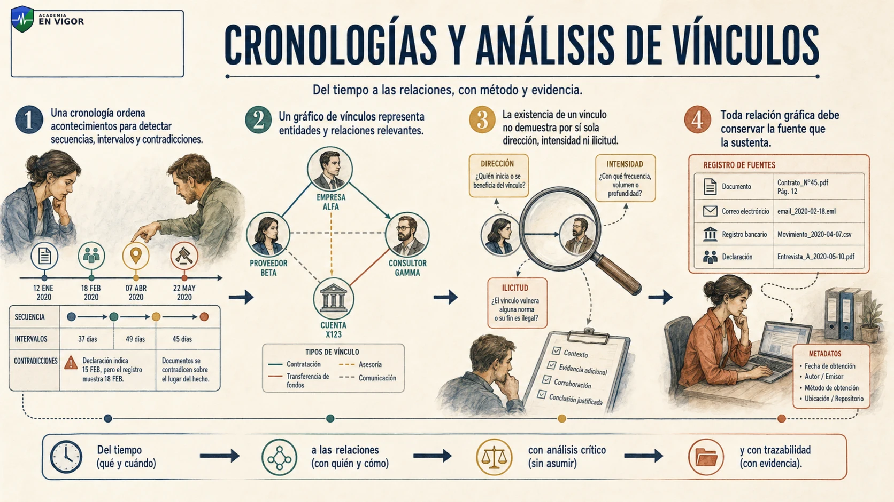

<em>Infografía: Cronologías y análisis de vínculos.</em>

:::hablemos-claro
Una cronología ordena acontecimientos para detectar secuencias, intervalos y contradicciones.
:::

:::en-la-calle
Al formular y contrastar una hipótesis, Una cronología ordena acontecimientos para detectar secuencias, intervalos y contradicciones.
:::

:::lo-que-cae
Prioriza **tiempo y relaciones visibles** y descarta respuestas que confundan dato, fuente, fase, acceso, contenido o infraestructura.
:::

<!-- FUENTE: UNODC-CI-ANALYSTS-T40 -->

## 44. Indicadores y lagunas

### Lógica del bloque

Para dominar **indicadores y lagunas**, aplica esta regla: Un indicador es una señal observable que puede apoyar o alterar una hipótesis. El anclaje principal es **qué observar y qué falta**.

### Hechos examinables

- Un indicador es una señal observable que puede apoyar o alterar una hipótesis. <!-- FACT:PN-T40-F173 -->
- Las lagunas de información limitan conclusiones y orientan nueva obtención. <!-- FACT:PN-T40-F174 -->
- No todas las lagunas justifican el mismo coste o intrusión para cerrarlas. <!-- FACT:PN-T40-F175 -->
- El producto debe señalar qué datos cambiarían materialmente el juicio. <!-- FACT:PN-T40-F176 -->

### Ejemplos razonados

- **Aplicación correcta:** Las lagunas de información limitan conclusiones y orientan nueva obtención.
- **Contraste útil:** No todas las lagunas justifican el mismo coste o intrusión para cerrarlas.

### Trampas de examen

- **Incorrecto:** Una laguna se rellena con el escenario más probable sin avisar.
- **Incorrecto:** Todo indicador aislado confirma definitivamente la hipótesis.

<!-- VISUAL:t40-44-indicadores-y-lagunas.webp -->

  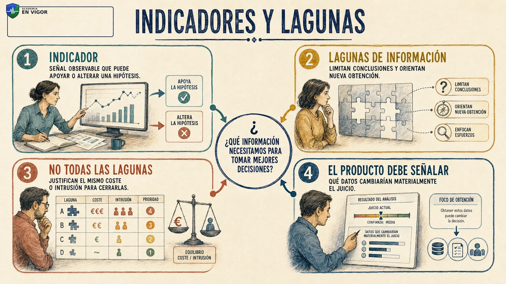

<em>Infografía: Indicadores y lagunas.</em>

:::hablemos-claro
Un indicador es una señal observable que puede apoyar o alterar una hipótesis.
:::

:::en-la-calle
Al formular y contrastar una hipótesis, Un indicador es una señal observable que puede apoyar o alterar una hipótesis.
:::

:::lo-que-cae
Prioriza **qué observar y qué falta** y descarta respuestas que confundan dato, fuente, fase, acceso, contenido o infraestructura.
:::

<!-- FUENTE: ODNI-ICD203-T40 -->

## 45. Argumentación y mensaje principal

### Lógica del bloque

Para dominar **argumentación y mensaje principal**, aplica esta regla: El mensaje analítico principal debe aparecer con claridad y responder al requisito. El anclaje principal es **conclusión, evidencia y lógica**.

### Hechos examinables

- El mensaje analítico principal debe aparecer con claridad y responder al requisito. <!-- FACT:PN-T40-F177 -->
- Cada juicio relevante necesita evidencia y razonamiento coherentes. <!-- FACT:PN-T40-F178 -->
- El lenguaje debe distinguir certeza observada de estimación. <!-- FACT:PN-T40-F179 -->
- La concisión es útil solo si no elimina contexto, contradicciones o límites esenciales. <!-- FACT:PN-T40-F180 -->

### Ejemplos razonados

- **Aplicación correcta:** Cada juicio relevante necesita evidencia y razonamiento coherentes.
- **Contraste útil:** El lenguaje debe distinguir certeza observada de estimación.

### Trampas de examen

- **Incorrecto:** Una conclusión contundente no necesita explicar su base.
- **Incorrecto:** Concisión significa borrar toda salvedad.

<!-- VISUAL:t40-il-45-argumentacion-y-mensaje-principal.webp -->

  

<em>Infografía: Argumentación y mensaje principal.</em>

:::hablemos-claro
El mensaje analítico principal debe aparecer con claridad y responder al requisito.
:::

:::en-la-calle
Al formular y contrastar una hipótesis, El mensaje analítico principal debe aparecer con claridad y responder al requisito.
:::

:::lo-que-cae
Prioriza **conclusión, evidencia y lógica** y descarta respuestas que confundan dato, fuente, fase, acceso, contenido o infraestructura.
:::

<!-- FUENTE: ODNI-ICD203-T40 -->

## 46. Privacidad, finalidad y minimización

### Lógica del bloque

Para dominar **privacidad, finalidad y minimización**, aplica esta regla: La disponibilidad pública no elimina derechos de privacidad y protección de datos. El anclaje principal es **usar solo lo necesario y legítimo**.

### Hechos examinables

- La disponibilidad pública no elimina derechos de privacidad y protección de datos. <!-- FACT:PN-T40-F181 -->
- La recopilación debe responder a una finalidad legítima, necesaria y proporcionada. <!-- FACT:PN-T40-F182 -->
- Minimizar datos reduce exposición de personas no relacionadas con la investigación. <!-- FACT:PN-T40-F183 -->
- La difusión debe limitar datos personales al alcance necesario para el producto. <!-- FACT:PN-T40-F184 -->

### Ejemplos razonados

- **Aplicación correcta:** La recopilación debe responder a una finalidad legítima, necesaria y proporcionada.
- **Contraste útil:** Minimizar datos reduce exposición de personas no relacionadas con la investigación.

### Trampas de examen

- **Incorrecto:** Publicar un dato en una red social autoriza cualquier uso posterior.
- **Incorrecto:** OSINT excluye por definición la protección de datos.

<!-- VISUAL:t40-46-privacidad-finalidad-y-minimizacion.webp -->

  

<em>Infografía: Privacidad, finalidad y minimización.</em>

:::hablemos-claro
La disponibilidad pública no elimina derechos de privacidad y protección de datos.
:::

:::en-la-calle
Al formular y contrastar una hipótesis, La disponibilidad pública no elimina derechos de privacidad y protección de datos.
:::

:::lo-que-cae
Prioriza **usar solo lo necesario y legítimo** y descarta respuestas que confundan dato, fuente, fase, acceso, contenido o infraestructura.
:::

<!-- FUENTE: OHCHR-BERKELEY-T40 -->

## 47. Definición operativa de OSINT

### Lógica del bloque

Para dominar **definición operativa de osint**, aplica esta regla: OSINT deriva exclusivamente de información pública o comercialmente disponible en la definición ODNI citada. El anclaje principal es **información abierta convertida en inteligencia**.

### Hechos examinables

- OSINT deriva exclusivamente de información pública o comercialmente disponible en la definición ODNI citada. <!-- FACT:PN-T40-F185 -->
- Debe atender prioridades, requisitos o lagunas de inteligencia específicos. <!-- FACT:PN-T40-F186 -->
- La obtención es solo una parte: procesamiento, análisis y difusión completan el producto. <!-- FACT:PN-T40-F187 -->
- OSINT puede apoyar decisiones policiales sin convertir cualquier navegación en inteligencia. <!-- FACT:PN-T40-F188 -->

### Ejemplos razonados

- **Aplicación correcta:** Debe atender prioridades, requisitos o lagunas de inteligencia específicos.
- **Contraste útil:** La obtención es solo una parte: procesamiento, análisis y difusión completan el producto.

### Trampas de examen

- **Incorrecto:** OSINT es copiar resultados de un buscador.
- **Incorrecto:** La fuente abierta elimina la necesidad de análisis.

<!-- VISUAL:t40-47-definicion-operativa-de-osint.webp -->

  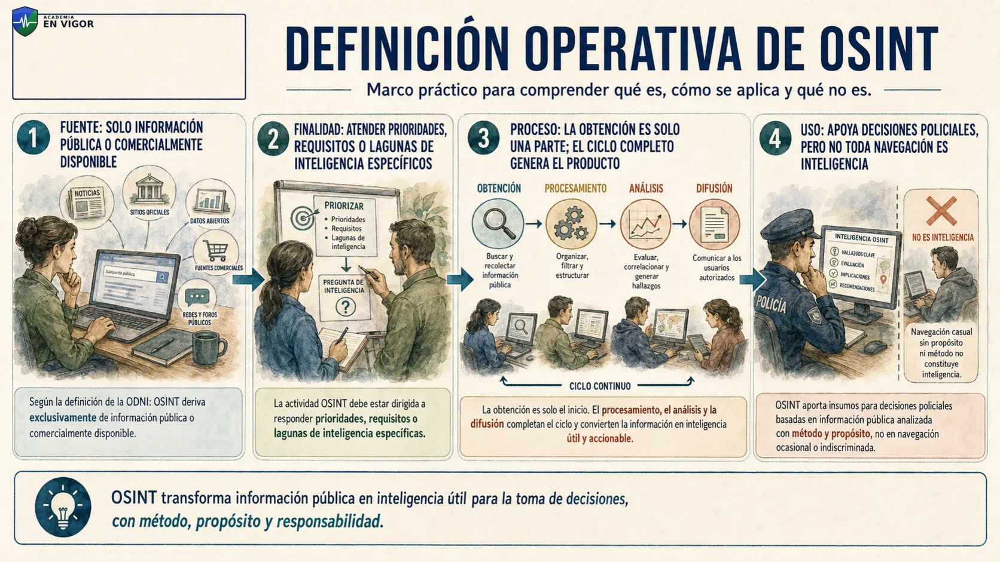

<em>Infografía: Definición operativa de OSINT.</em>

:::hablemos-claro
OSINT deriva exclusivamente de información pública o comercialmente disponible en la definición ODNI citada.
:::

:::en-la-calle
Al obtener y analizar información de fuentes abiertas, OSINT deriva exclusivamente de información pública o comercialmente disponible en la definición ODNI citada.
:::

:::lo-que-cae
Prioriza **información abierta convertida en inteligencia** y descarta respuestas que confundan dato, fuente, fase, acceso, contenido o infraestructura.
:::

<!-- FUENTE: ODNI-OSINT-STRATEGY-T40 -->

## 48. OSINF frente a OSINT

### Lógica del bloque

Para dominar **osinf frente a osint**, aplica esta regla: La información de fuente abierta es materia prima accesible al público o comercialmente disponible. El anclaje principal es **información disponible frente a producto**.

### Hechos examinables

- La información de fuente abierta es materia prima accesible al público o comercialmente disponible. <!-- FACT:PN-T40-F189 -->
- OSINT es el producto elaborado que responde a una necesidad. <!-- FACT:PN-T40-F190 -->
- Una captura pública sin evaluación continúa siendo información, no inteligencia acabada. <!-- FACT:PN-T40-F191 -->
- El valor añadido procede de selección, verificación, análisis, contexto y comunicación. <!-- FACT:PN-T40-F192 -->

### Ejemplos razonados

- **Aplicación correcta:** OSINT es el producto elaborado que responde a una necesidad.
- **Contraste útil:** Una captura pública sin evaluación continúa siendo información, no inteligencia acabada.

### Trampas de examen

- **Incorrecto:** Toda OSINF es automáticamente OSINT.
- **Incorrecto:** OSINT se define por usar una herramienta concreta.

<!-- VISUAL:t40-48-osinf-frente-a-osint.webp -->

  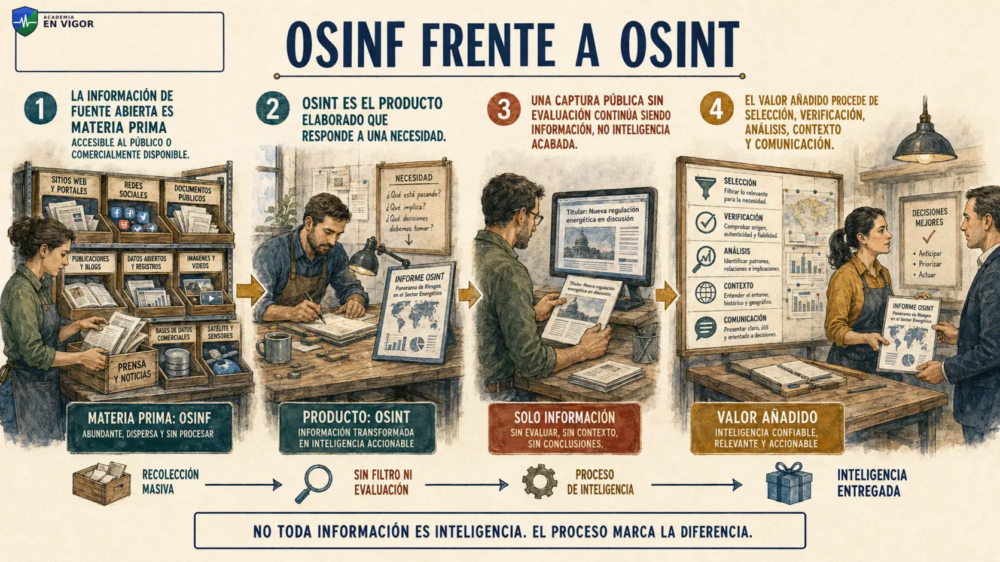

<em>Infografía: OSINF frente a OSINT.</em>

:::hablemos-claro
La información de fuente abierta es materia prima accesible al público o comercialmente disponible.
:::

:::en-la-calle
Al obtener y analizar información de fuentes abiertas, La información de fuente abierta es materia prima accesible al público o comercialmente disponible.
:::

:::lo-que-cae
Prioriza **información disponible frente a producto** y descarta respuestas que confundan dato, fuente, fase, acceso, contenido o infraestructura.
:::

<!-- FUENTE: ODNI-OSINT-STRATEGY-T40 -->

## 49. Fuentes públicas y comerciales

### Lógica del bloque

Para dominar **fuentes públicas y comerciales**, aplica esta regla: Las fuentes abiertas incluyen información pública y, según el modelo, información comercialmente disponible. El anclaje principal es **disponibilidad legítima con condiciones**.

### Hechos examinables

- Las fuentes abiertas incluyen información pública y, según el modelo, información comercialmente disponible. <!-- FACT:PN-T40-F193 -->
- Pagar una suscripción lícita no convierte automáticamente la fuente en clandestina. <!-- FACT:PN-T40-F194 -->
- Las condiciones de acceso, licencia y uso siguen siendo relevantes. <!-- FACT:PN-T40-F195 -->
- Saltar controles técnicos o suplantar una identidad no se justifica por perseguir OSINT. <!-- FACT:PN-T40-F196 -->

### Ejemplos razonados

- **Aplicación correcta:** Pagar una suscripción lícita no convierte automáticamente la fuente en clandestina.
- **Contraste útil:** Las condiciones de acceso, licencia y uso siguen siendo relevantes.

### Trampas de examen

- **Incorrecto:** OSINT exige que toda fuente sea gratuita.
- **Incorrecto:** Cualquier dato accesible tras vulnerar una cuenta sigue siendo fuente abierta.

<!-- VISUAL:t40-49-fuentes-publicas-y-comerciales.webp -->

  

<em>Infografía: Fuentes públicas y comerciales.</em>

:::hablemos-claro
Las fuentes abiertas incluyen información pública y, según el modelo, información comercialmente disponible.
:::

:::en-la-calle
Al obtener y analizar información de fuentes abiertas, Las fuentes abiertas incluyen información pública y, según el modelo, información comercialmente disponible.
:::

:::lo-que-cae
Prioriza **disponibilidad legítima con condiciones** y descarta respuestas que confundan dato, fuente, fase, acceso, contenido o infraestructura.
:::

<!-- FUENTE: ODNI-OSINT-STRATEGY-T40 -->

## 50. Categorías de fuentes OSINT

### Lógica del bloque

Para dominar **categorías de fuentes osint**, aplica esta regla: Medios de comunicación y publicaciones pueden aportar información abierta. El anclaje principal es **medios, datos públicos y literatura gris**.

### Hechos examinables

- Medios de comunicación y publicaciones pueden aportar información abierta. <!-- FACT:PN-T40-F197 -->
- Registros, estadísticas y documentos oficiales constituyen fuentes públicas relevantes. <!-- FACT:PN-T40-F198 -->
- La literatura gris incluye trabajos técnicos o institucionales fuera de circuitos editoriales ordinarios. <!-- FACT:PN-T40-F199 -->
- Imágenes, vídeos, mapas y observación abierta también pueden alimentar OSINT. <!-- FACT:PN-T40-F200 -->

### Ejemplos razonados

- **Aplicación correcta:** Registros, estadísticas y documentos oficiales constituyen fuentes públicas relevantes.
- **Contraste útil:** La literatura gris incluye trabajos técnicos o institucionales fuera de circuitos editoriales ordinarios.

### Trampas de examen

- **Incorrecto:** OSINT procede exclusivamente de redes sociales.
- **Incorrecto:** La literatura gris es información necesariamente secreta.

<!-- VISUAL:t40-il-50-categorias-de-fuentes-osint.webp -->

  

<em>Infografía: Categorías de fuentes OSINT.</em>

:::hablemos-claro
Medios de comunicación y publicaciones pueden aportar información abierta.
:::

:::en-la-calle
Al obtener y analizar información de fuentes abiertas, Medios de comunicación y publicaciones pueden aportar información abierta.
:::

:::lo-que-cae
Prioriza **medios, datos públicos y literatura gris** y descarta respuestas que confundan dato, fuente, fase, acceso, contenido o infraestructura.
:::

<!-- FUENTE: CCN-STIC-425-T40 -->

## 51. Motores de búsqueda

### Lógica del bloque

Para dominar **motores de búsqueda**, aplica esta regla: Un motor de búsqueda utiliza rastreadores e índices para localizar recursos. El anclaje principal es **localizar lo indexado, no toda la web**.

### Hechos examinables

- Un motor de búsqueda utiliza rastreadores e índices para localizar recursos. <!-- FACT:PN-T40-F201 -->
- Los resultados dependen de cobertura, fecha, idioma, ubicación y algoritmo. <!-- FACT:PN-T40-F202 -->
- No aparecer en un buscador no demuestra que un recurso no exista. <!-- FACT:PN-T40-F203 -->
- Contrastar consultas y motores reduce, pero no elimina, sesgos de cobertura. <!-- FACT:PN-T40-F204 -->

### Ejemplos razonados

- **Aplicación correcta:** Los resultados dependen de cobertura, fecha, idioma, ubicación y algoritmo.
- **Contraste útil:** No aparecer en un buscador no demuestra que un recurso no exista.

### Trampas de examen

- **Incorrecto:** Un buscador consulta en tiempo real toda Internet.
- **Incorrecto:** La primera página de resultados representa el universo completo.

<!-- VISUAL:t40-51-motores-de-busqueda.webp -->

  

<em>Infografía: Motores de búsqueda.</em>

:::hablemos-claro
Un motor de búsqueda utiliza rastreadores e índices para localizar recursos.
:::

:::en-la-calle
Al obtener y analizar información de fuentes abiertas, Un motor de búsqueda utiliza rastreadores e índices para localizar recursos.
:::

:::lo-que-cae
Prioriza **localizar lo indexado, no toda la web** y descarta respuestas que confundan dato, fuente, fase, acceso, contenido o infraestructura.
:::

<!-- FUENTE: RFC9309-ROBOTS-T40 -->

## 52. Consultas y operadores

### Lógica del bloque

Para dominar **consultas y operadores**, aplica esta regla: Una consulta precisa combina términos, frases, dominios, fechas o tipos de archivo según la herramienta. El anclaje principal es **reducir ruido con criterios explícitos**.

### Hechos examinables

- Una consulta precisa combina términos, frases, dominios, fechas o tipos de archivo según la herramienta. <!-- FACT:PN-T40-F205 -->
- Los operadores disponibles varían entre motores y pueden cambiar. <!-- FACT:PN-T40-F206 -->
- Refinar una consulta debe documentarse para poder reproducir la búsqueda. <!-- FACT:PN-T40-F207 -->
- Una coincidencia textual no demuestra identidad, autoría ni veracidad. <!-- FACT:PN-T40-F208 -->

### Ejemplos razonados

- **Aplicación correcta:** Los operadores disponibles varían entre motores y pueden cambiar.
- **Contraste útil:** Refinar una consulta debe documentarse para poder reproducir la búsqueda.

### Trampas de examen

- **Incorrecto:** Todos los buscadores admiten exactamente los mismos operadores.
- **Incorrecto:** Encontrar un nombre prueba que pertenece a la persona investigada.

<!-- VISUAL:t40-52-consultas-y-operadores.webp -->

  

<em>Infografía: Consultas y operadores.</em>

:::hablemos-claro
Una consulta precisa combina términos, frases, dominios, fechas o tipos de archivo según la herramienta.
:::

:::en-la-calle
Al obtener y analizar información de fuentes abiertas, Una consulta precisa combina términos, frases, dominios, fechas o tipos de archivo según la herramienta.
:::

:::lo-que-cae
Prioriza **reducir ruido con criterios explícitos** y descarta respuestas que confundan dato, fuente, fase, acceso, contenido o infraestructura.
:::

<!-- FUENTE: RFC3986-URI-T40 -->

## 53. Maltego y análisis gráfico

### Lógica del bloque

Para dominar **maltego y análisis gráfico**, aplica esta regla: Maltego permite representar gráficamente entidades y relaciones obtenidas de distintas fuentes. El anclaje principal es **entidades, transformaciones y relaciones**.

### Hechos examinables

- Maltego permite representar gráficamente entidades y relaciones obtenidas de distintas fuentes. <!-- FACT:PN-T40-F209 -->
- Las transformaciones automatizan consultas o enriquecimientos según su configuración. <!-- FACT:PN-T40-F210 -->
- Un enlace generado por la herramienta necesita interpretación y verificación. <!-- FACT:PN-T40-F211 -->
- La visualización ayuda a explorar, pero no convierte correlación en prueba. <!-- FACT:PN-T40-F212 -->

### Ejemplos razonados

- **Aplicación correcta:** Las transformaciones automatizan consultas o enriquecimientos según su configuración.
- **Contraste útil:** Un enlace generado por la herramienta necesita interpretación y verificación.

### Trampas de examen

- **Incorrecto:** Maltego certifica jurídicamente todos los vínculos que dibuja.
- **Incorrecto:** Maltego es un navegador exclusivo de la Dark Web.

<!-- VISUAL:t40-53-maltego-y-analisis-grafico.webp -->

  

<em>Infografía: Maltego y análisis gráfico.</em>

:::hablemos-claro
Maltego permite representar gráficamente entidades y relaciones obtenidas de distintas fuentes.
:::

:::en-la-calle
Al obtener y analizar información de fuentes abiertas, Maltego permite representar gráficamente entidades y relaciones obtenidas de distintas fuentes.
:::

:::lo-que-cae
Prioriza **entidades, transformaciones y relaciones** y descarta respuestas que confundan dato, fuente, fase, acceso, contenido o infraestructura.
:::

<!-- FUENTE: MALTEGO-DOCS-T40 -->

## 54. Shodan y servicios expuestos

### Lógica del bloque

Para dominar **shodan y servicios expuestos**, aplica esta regla: Shodan indexa información observada sobre servicios y dispositivos expuestos a Internet. El anclaje principal es **buscar dispositivos y servicios observados**.

### Hechos examinables

- Shodan indexa información observada sobre servicios y dispositivos expuestos a Internet. <!-- FACT:PN-T40-F213 -->
- Puede permitir filtrar por software, dirección IP, puerto, organización o ubicación aproximada. <!-- FACT:PN-T40-F214 -->
- Un banner puede estar desactualizado, ser incompleto o no identificar al responsable real. <!-- FACT:PN-T40-F215 -->
- Localizar un servicio no autoriza a interactuar con él fuera del marco legal. <!-- FACT:PN-T40-F216 -->

### Ejemplos razonados

- **Aplicación correcta:** Puede permitir filtrar por software, dirección IP, puerto, organización o ubicación aproximada.
- **Contraste útil:** Un banner puede estar desactualizado, ser incompleto o no identificar al responsable real.

### Trampas de examen

- **Incorrecto:** Shodan es un sistema operativo para dispositivos IoT.
- **Incorrecto:** Ver un puerto abierto autoriza cualquier prueba activa.

<!-- VISUAL:t40-54-shodan-y-servicios-expuestos.webp -->

  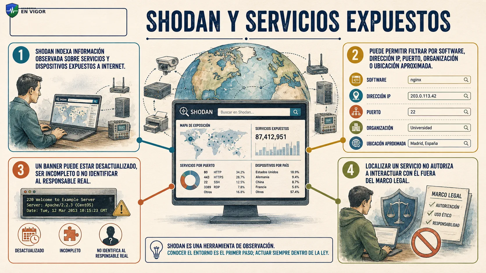

<em>Infografía: Shodan y servicios expuestos.</em>

:::hablemos-claro
Shodan indexa información observada sobre servicios y dispositivos expuestos a Internet.
:::

:::en-la-calle
Al obtener y analizar información de fuentes abiertas, Shodan indexa información observada sobre servicios y dispositivos expuestos a Internet.
:::

:::lo-que-cae
Prioriza **buscar dispositivos y servicios observados** y descarta respuestas que confundan dato, fuente, fase, acceso, contenido o infraestructura.
:::

<!-- FUENTE: SHODAN-HELP-T40 -->

## 55. Herramientas como apoyo, no como fuente de verdad

### Lógica del bloque

Para dominar **herramientas como apoyo, no como fuente de verdad**, aplica esta regla: Una herramienta automatiza tareas, pero hereda errores y límites de sus fuentes. El anclaje principal es **resultado técnico pendiente de verificación**.

### Hechos examinables

- Una herramienta automatiza tareas, pero hereda errores y límites de sus fuentes. <!-- FACT:PN-T40-F217 -->
- El analista debe registrar versión, consulta, fecha y parámetros relevantes. <!-- FACT:PN-T40-F218 -->
- Dos herramientas pueden repetir el mismo origen y aparentar falsa corroboración. <!-- FACT:PN-T40-F219 -->
- La conclusión debe apoyarse en evidencia verificable, no en la autoridad del software. <!-- FACT:PN-T40-F220 -->

### Ejemplos razonados

- **Aplicación correcta:** El analista debe registrar versión, consulta, fecha y parámetros relevantes.
- **Contraste útil:** Dos herramientas pueden repetir el mismo origen y aparentar falsa corroboración.

### Trampas de examen

- **Incorrecto:** Usar dos interfaces garantiza dos fuentes independientes.
- **Incorrecto:** El nombre de la herramienta sustituye la explicación metodológica.

<!-- VISUAL:t40-il-55-herramientas-como-apoyo-no-como-fuente-de-verdad.webp -->

  

<em>Infografía: Herramientas como apoyo, no como fuente de verdad.</em>

:::hablemos-claro
Una herramienta automatiza tareas, pero hereda errores y límites de sus fuentes.
:::

:::en-la-calle
Al obtener y analizar información de fuentes abiertas, Una herramienta automatiza tareas, pero hereda errores y límites de sus fuentes.
:::

:::lo-que-cae
Prioriza **resultado técnico pendiente de verificación** y descarta respuestas que confundan dato, fuente, fase, acceso, contenido o infraestructura.
:::

<!-- FUENTE: OHCHR-BERKELEY-T40 -->

## 56. Obtención pasiva y activa

### Lógica del bloque

Para dominar **obtención pasiva y activa**, aplica esta regla: La obtención pasiva minimiza la interacción directa con sistemas o personas objetivo. El anclaje principal es **grado de interacción con el objetivo**.

### Hechos examinables

- La obtención pasiva minimiza la interacción directa con sistemas o personas objetivo. <!-- FACT:PN-T40-F221 -->
- La obtención activa implica contacto o consultas que pueden ser detectables. <!-- FACT:PN-T40-F222 -->
- Entre ambos extremos existen técnicas con distinto grado de exposición. <!-- FACT:PN-T40-F223 -->
- La elección depende de finalidad, autorización, riesgo, necesidad y proporcionalidad. <!-- FACT:PN-T40-F224 -->

### Ejemplos razonados

- **Aplicación correcta:** La obtención activa implica contacto o consultas que pueden ser detectables.
- **Contraste útil:** Entre ambos extremos existen técnicas con distinto grado de exposición.

### Trampas de examen

- **Incorrecto:** Pasivo significa anónimo e indetectable en todo caso.
- **Incorrecto:** Activo significa automáticamente ilícito.

<!-- VISUAL:t40-56-obtencion-pasiva-y-activa.webp -->

  

<em>Infografía: Obtención pasiva y activa.</em>

:::hablemos-claro
La obtención pasiva minimiza la interacción directa con sistemas o personas objetivo.
:::

:::en-la-calle
Al obtener y analizar información de fuentes abiertas, La obtención pasiva minimiza la interacción directa con sistemas o personas objetivo.
:::

:::lo-que-cae
Prioriza **grado de interacción con el objetivo** y descarta respuestas que confundan dato, fuente, fase, acceso, contenido o infraestructura.
:::

<!-- FUENTE: OHCHR-BERKELEY-T40 -->

## 57. Metadatos

### Lógica del bloque

Para dominar **metadatos**, aplica esta regla: Los metadatos describen características como fecha, dispositivo, ubicación, autor o formato. El anclaje principal es **datos sobre origen, tiempo y formato**.

### Hechos examinables

- Los metadatos describen características como fecha, dispositivo, ubicación, autor o formato. <!-- FACT:PN-T40-F225 -->
- Pueden perderse, modificarse o falsificarse durante publicación y descarga. <!-- FACT:PN-T40-F226 -->
- Un metadato aislado requiere contraste con el contenido y otras fuentes. <!-- FACT:PN-T40-F227 -->
- Conservar el original y documentar la extracción mejora la trazabilidad. <!-- FACT:PN-T40-F228 -->

### Ejemplos razonados

- **Aplicación correcta:** Pueden perderse, modificarse o falsificarse durante publicación y descarga.
- **Contraste útil:** Un metadato aislado requiere contraste con el contenido y otras fuentes.

### Trampas de examen

- **Incorrecto:** Los metadatos son siempre visibles y auténticos.
- **Incorrecto:** Una fecha EXIF demuestra por sí sola cuándo ocurrió el hecho.

<!-- VISUAL:t40-57-metadatos.webp -->

  

<em>Infografía: Metadatos.</em>

:::hablemos-claro
Los metadatos describen características como fecha, dispositivo, ubicación, autor o formato.
:::

:::en-la-calle
Al obtener y analizar información de fuentes abiertas, Los metadatos describen características como fecha, dispositivo, ubicación, autor o formato.
:::

:::lo-que-cae
Prioriza **datos sobre origen, tiempo y formato** y descarta respuestas que confundan dato, fuente, fase, acceso, contenido o infraestructura.
:::

<!-- FUENTE: OHCHR-BERKELEY-T40 -->

## 58. Geolocalización y cronolocalización

### Lógica del bloque

Para dominar **geolocalización y cronolocalización**, aplica esta regla: Geolocalizar consiste en determinar o estimar el lugar asociado a un contenido. El anclaje principal es **lugar y tiempo mediante indicios convergentes**.

### Hechos examinables

- Geolocalizar consiste en determinar o estimar el lugar asociado a un contenido. <!-- FACT:PN-T40-F229 -->
- Cronolocalizar busca situarlo temporalmente mediante sombras, clima, publicaciones u otros indicios. <!-- FACT:PN-T40-F230 -->
- Rótulos, relieve, arquitectura y posiciones relativas pueden actuar como pistas geográficas. <!-- FACT:PN-T40-F231 -->
- La conclusión debe expresar margen de error y alternativas plausibles. <!-- FACT:PN-T40-F232 -->

### Ejemplos razonados

- **Aplicación correcta:** Cronolocalizar busca situarlo temporalmente mediante sombras, clima, publicaciones u otros indicios.
- **Contraste útil:** Rótulos, relieve, arquitectura y posiciones relativas pueden actuar como pistas geográficas.

### Trampas de examen

- **Incorrecto:** Un monumento visible prueba automáticamente la fecha.
- **Incorrecto:** La geolocalización siempre alcanza una dirección exacta.

<!-- VISUAL:t40-58-geolocalizacion-y-cronolocalizacion.webp -->

  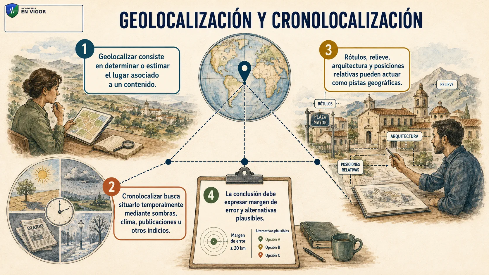

<em>Infografía: Geolocalización y cronolocalización.</em>

:::hablemos-claro
Geolocalizar consiste en determinar o estimar el lugar asociado a un contenido.
:::

:::en-la-calle
Al obtener y analizar información de fuentes abiertas, Geolocalizar consiste en determinar o estimar el lugar asociado a un contenido.
:::

:::lo-que-cae
Prioriza **lugar y tiempo mediante indicios convergentes** y descarta respuestas que confundan dato, fuente, fase, acceso, contenido o infraestructura.
:::

<!-- FUENTE: OHCHR-BERKELEY-T40 -->

## 59. Identidades y pivotes

### Lógica del bloque

Para dominar **identidades y pivotes**, aplica esta regla: Un pivote utiliza un atributo conocido para buscar relaciones con otros datos. El anclaje principal es **conectar atributos sin fusionar personas**.

### Hechos examinables

- Un pivote utiliza un atributo conocido para buscar relaciones con otros datos. <!-- FACT:PN-T40-F233 -->
- Alias, correos, teléfonos, dominios o imágenes pueden servir como pivotes. <!-- FACT:PN-T40-F234 -->
- Coincidencia de nombre o alias no basta para atribuir cuentas a una misma persona. <!-- FACT:PN-T40-F235 -->
- La atribución requiere varios indicios independientes y valoración de explicaciones alternativas. <!-- FACT:PN-T40-F236 -->

### Ejemplos razonados

- **Aplicación correcta:** Alias, correos, teléfonos, dominios o imágenes pueden servir como pivotes.
- **Contraste útil:** Coincidencia de nombre o alias no basta para atribuir cuentas a una misma persona.

### Trampas de examen

- **Incorrecto:** Dos cuentas con el mismo alias pertenecen necesariamente al mismo autor.
- **Incorrecto:** Un pivote es una prueba final de identidad.

<!-- VISUAL:t40-59-identidades-y-pivotes.webp -->

  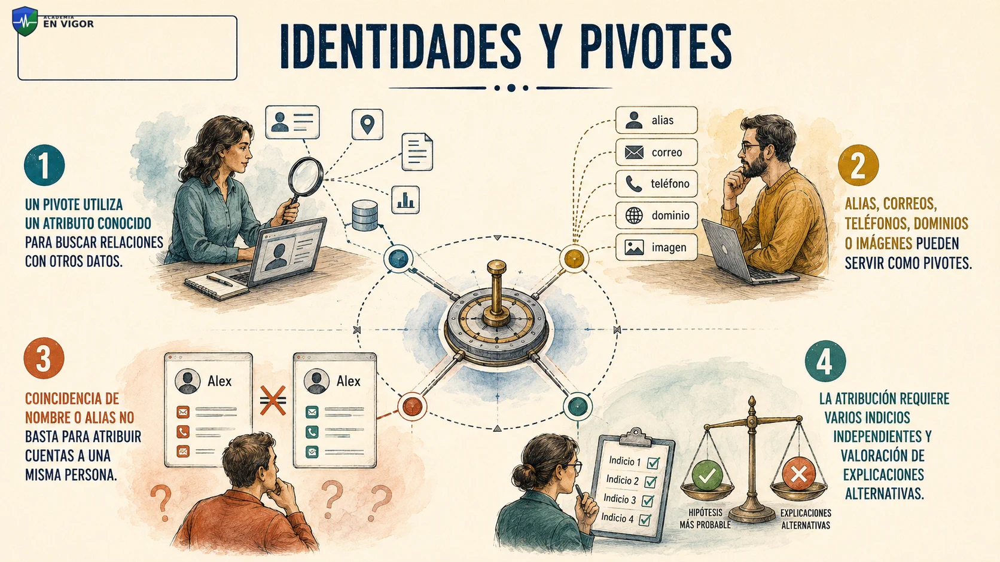

<em>Infografía: Identidades y pivotes.</em>

:::hablemos-claro
Un pivote utiliza un atributo conocido para buscar relaciones con otros datos.
:::

:::en-la-calle
Al obtener y analizar información de fuentes abiertas, Un pivote utiliza un atributo conocido para buscar relaciones con otros datos.
:::

:::lo-que-cae
Prioriza **conectar atributos sin fusionar personas** y descarta respuestas que confundan dato, fuente, fase, acceso, contenido o infraestructura.
:::

<!-- FUENTE: OHCHR-BERKELEY-T40 -->

## 60. Pregunta de investigación OSINT

### Lógica del bloque

Para dominar **pregunta de investigación osint**, aplica esta regla: La investigación comienza con una pregunta clara y vinculada a una finalidad legítima. El anclaje principal es **alcance concreto y verificable**.

### Hechos examinables

- La investigación comienza con una pregunta clara y vinculada a una finalidad legítima. <!-- FACT:PN-T40-F237 -->
- Debe definir sujetos, periodo, ámbito y nivel de certeza buscado. <!-- FACT:PN-T40-F238 -->
- Una pregunta demasiado amplia aumenta ruido, coste y exposición de terceros. <!-- FACT:PN-T40-F239 -->
- Los criterios de inclusión y exclusión reducen selección sesgada posterior. <!-- FACT:PN-T40-F240 -->

### Ejemplos razonados

- **Aplicación correcta:** Debe definir sujetos, periodo, ámbito y nivel de certeza buscado.
- **Contraste útil:** Una pregunta demasiado amplia aumenta ruido, coste y exposición de terceros.

### Trampas de examen

- **Incorrecto:** La mejor pregunta es recopilar todo sobre una persona.
- **Incorrecto:** El alcance se decide después de ver qué resultado interesa.

<!-- VISUAL:t40-il-60-pregunta-de-investigacion-osint.webp -->

  

<em>Infografía: Pregunta de investigación OSINT.</em>

:::hablemos-claro
La investigación comienza con una pregunta clara y vinculada a una finalidad legítima.
:::

:::en-la-calle
Al preservar, verificar y documentar un hallazgo OSINT, La investigación comienza con una pregunta clara y vinculada a una finalidad legítima.
:::

:::lo-que-cae
Prioriza **alcance concreto y verificable** y descarta respuestas que confundan dato, fuente, fase, acceso, contenido o infraestructura.
:::

<!-- FUENTE: OHCHR-BERKELEY-T40 -->

## 61. Plan de fuentes y consultas

### Lógica del bloque

Para dominar **plan de fuentes y consultas**, aplica esta regla: El plan relaciona cada cuestión con fuentes, consultas y métodos adecuados. El anclaje principal es **buscar con orden y alternativas**.

### Hechos examinables

- El plan relaciona cada cuestión con fuentes, consultas y métodos adecuados. <!-- FACT:PN-T40-F241 -->
- Debe prever fuentes primarias, corroboración y posibles obstáculos. <!-- FACT:PN-T40-F242 -->
- Las consultas se ajustan conforme aparecen hallazgos sin perder el registro inicial. <!-- FACT:PN-T40-F243 -->
- Planificar evita depender de una sola plataforma o proveedor. <!-- FACT:PN-T40-F244 -->

### Ejemplos razonados

- **Aplicación correcta:** Debe prever fuentes primarias, corroboración y posibles obstáculos.
- **Contraste útil:** Las consultas se ajustan conforme aparecen hallazgos sin perder el registro inicial.

### Trampas de examen

- **Incorrecto:** Una plataforma popular basta para cualquier investigación.
- **Incorrecto:** Cambiar una consulta obliga a borrar el historial anterior.

<!-- VISUAL:t40-61-plan-de-fuentes-y-consultas.webp -->

  

<em>Infografía: Plan de fuentes y consultas.</em>

:::hablemos-claro
El plan relaciona cada cuestión con fuentes, consultas y métodos adecuados.
:::

:::en-la-calle
Al preservar, verificar y documentar un hallazgo OSINT, El plan relaciona cada cuestión con fuentes, consultas y métodos adecuados.
:::

:::lo-que-cae
Prioriza **buscar con orden y alternativas** y descarta respuestas que confundan dato, fuente, fase, acceso, contenido o infraestructura.
:::

<!-- FUENTE: OHCHR-BERKELEY-T40 -->

## 62. Diario de investigación

### Lógica del bloque

Para dominar **diario de investigación**, aplica esta regla: El diario registra consultas, fechas, herramientas, resultados y decisiones. El anclaje principal es **qué se hizo, cuándo y con qué resultado**.

### Hechos examinables

- El diario registra consultas, fechas, herramientas, resultados y decisiones. <!-- FACT:PN-T40-F245 -->
- También documenta búsquedas negativas y cambios de hipótesis. <!-- FACT:PN-T40-F246 -->
- La reproducibilidad permite que otra persona comprenda y evalúe el proceso. <!-- FACT:PN-T40-F247 -->
- Registrar no significa publicar indiscriminadamente datos sensibles. <!-- FACT:PN-T40-F248 -->

### Ejemplos razonados

- **Aplicación correcta:** También documenta búsquedas negativas y cambios de hipótesis.
- **Contraste útil:** La reproducibilidad permite que otra persona comprenda y evalúe el proceso.

### Trampas de examen

- **Incorrecto:** Solo se anotan los resultados favorables.
- **Incorrecto:** Reproducible significa divulgar todas las identidades sin control.

<!-- VISUAL:t40-62-diario-de-investigacion.webp -->

  

<em>Infografía: Diario de investigación.</em>

:::hablemos-claro
El diario registra consultas, fechas, herramientas, resultados y decisiones.
:::

:::en-la-calle
Al preservar, verificar y documentar un hallazgo OSINT, El diario registra consultas, fechas, herramientas, resultados y decisiones.
:::

:::lo-que-cae
Prioriza **qué se hizo, cuándo y con qué resultado** y descarta respuestas que confundan dato, fuente, fase, acceso, contenido o infraestructura.
:::

<!-- FUENTE: OHCHR-BERKELEY-T40 -->

## 63. Captura y preservación

### Lógica del bloque

Para dominar **captura y preservación**, aplica esta regla: Preservar exige conservar contenido y contexto suficiente para interpretarlo. El anclaje principal es **contenido, contexto e integridad**.

### Hechos examinables

- Preservar exige conservar contenido y contexto suficiente para interpretarlo. <!-- FACT:PN-T40-F249 -->
- URL, fecha, hora, zona horaria y método de captura son metadatos relevantes. <!-- FACT:PN-T40-F250 -->
- Una huella criptográfica ayuda a detectar alteraciones posteriores del archivo preservado. <!-- FACT:PN-T40-F251 -->
- La captura de pantalla sola puede omitir metadatos, enlaces o contenido dinámico. <!-- FACT:PN-T40-F252 -->

### Ejemplos razonados

- **Aplicación correcta:** URL, fecha, hora, zona horaria y método de captura son metadatos relevantes.
- **Contraste útil:** Una huella criptográfica ayuda a detectar alteraciones posteriores del archivo preservado.

### Trampas de examen

- **Incorrecto:** Una captura recortada prueba todo el contexto de una página.
- **Incorrecto:** El hash demuestra que el contenido original era verdadero.

<!-- VISUAL:t40-63-captura-y-preservacion.webp -->

  

<em>Infografía: Captura y preservación.</em>

:::hablemos-claro
Preservar exige conservar contenido y contexto suficiente para interpretarlo.
:::

:::en-la-calle
Al preservar, verificar y documentar un hallazgo OSINT, Preservar exige conservar contenido y contexto suficiente para interpretarlo.
:::

:::lo-que-cae
Prioriza **contenido, contexto e integridad** y descarta respuestas que confundan dato, fuente, fase, acceso, contenido o infraestructura.
:::

<!-- FUENTE: OHCHR-BERKELEY-T40 -->

## 64. Autenticidad e integridad

### Lógica del bloque

Para dominar **autenticidad e integridad**, aplica esta regla: Autenticidad e integridad responden a preguntas diferentes. El anclaje principal es **origen probable y contenido no alterado**.

### Hechos examinables

- Autenticidad e integridad responden a preguntas diferentes. <!-- FACT:PN-T40-F253 -->
- Integridad indica que el material conservado no ha cambiado desde un punto de control. <!-- FACT:PN-T40-F254 -->
- Autenticidad valora si el contenido procede realmente del origen atribuido. <!-- FACT:PN-T40-F255 -->
- Un archivo íntegro puede conservar una falsificación original. <!-- FACT:PN-T40-F256 -->

### Ejemplos razonados

- **Aplicación correcta:** Integridad indica que el material conservado no ha cambiado desde un punto de control.
- **Contraste útil:** Autenticidad valora si el contenido procede realmente del origen atribuido.

### Trampas de examen

- **Incorrecto:** Si el hash coincide, la autoría queda probada.
- **Incorrecto:** Autenticidad e integridad son el mismo concepto.

<!-- VISUAL:t40-64-autenticidad-e-integridad.webp -->

  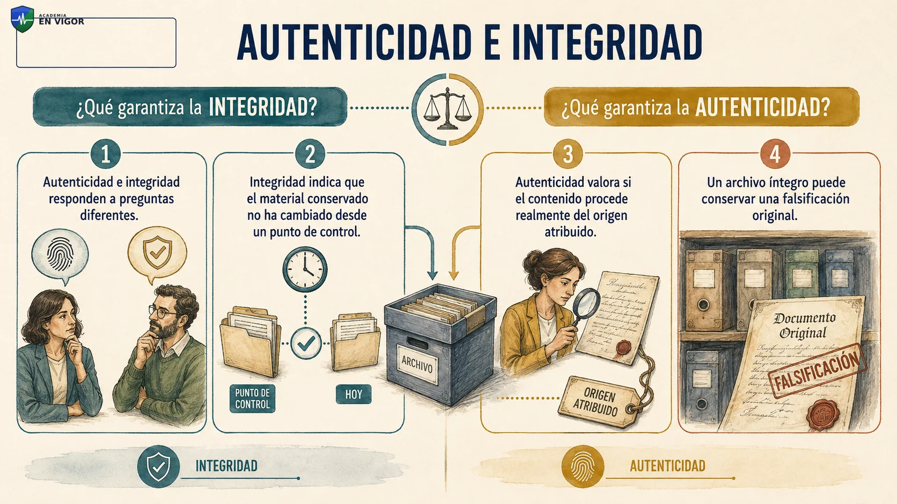

<em>Infografía: Autenticidad e integridad.</em>

:::hablemos-claro
Autenticidad e integridad responden a preguntas diferentes.
:::

:::en-la-calle
Al preservar, verificar y documentar un hallazgo OSINT, Autenticidad e integridad responden a preguntas diferentes.
:::

:::lo-que-cae
Prioriza **origen probable y contenido no alterado** y descarta respuestas que confundan dato, fuente, fase, acceso, contenido o infraestructura.
:::

<!-- FUENTE: OHCHR-BERKELEY-T40 -->

## 65. Verificación de contenido digital

### Lógica del bloque

Para dominar **verificación de contenido digital**, aplica esta regla: Verificar implica examinar origen, contenido, fecha, lugar y coherencia contextual. El anclaje principal es **fuente, contenido, lugar y tiempo**.

### Hechos examinables

- Verificar implica examinar origen, contenido, fecha, lugar y coherencia contextual. <!-- FACT:PN-T40-F257 -->
- La búsqueda inversa puede localizar versiones anteriores o reutilizaciones. <!-- FACT:PN-T40-F258 -->
- La corroboración debe buscar fuentes realmente independientes. <!-- FACT:PN-T40-F259 -->
- Una pieza no verificada puede orientar, pero debe declararse su estado. <!-- FACT:PN-T40-F260 -->

### Ejemplos razonados

- **Aplicación correcta:** La búsqueda inversa puede localizar versiones anteriores o reutilizaciones.
- **Contraste útil:** La corroboración debe buscar fuentes realmente independientes.

### Trampas de examen

- **Incorrecto:** Una búsqueda inversa sin coincidencias prueba originalidad.
- **Incorrecto:** Repetición viral equivale a verificación.

<!-- VISUAL:t40-il-65-verificacion-de-contenido-digital.webp -->

  

<em>Infografía: Verificación de contenido digital.</em>

:::hablemos-claro
Verificar implica examinar origen, contenido, fecha, lugar y coherencia contextual.
:::

:::en-la-calle
Al preservar, verificar y documentar un hallazgo OSINT, Verificar implica examinar origen, contenido, fecha, lugar y coherencia contextual.
:::

:::lo-que-cae
Prioriza **fuente, contenido, lugar y tiempo** y descarta respuestas que confundan dato, fuente, fase, acceso, contenido o infraestructura.
:::

<!-- FUENTE: OHCHR-BERKELEY-T40 -->

## 66. Procedencia y cadena de custodia

### Lógica del bloque

Para dominar **procedencia y cadena de custodia**, aplica esta regla: La procedencia describe de dónde se obtuvo un elemento y cómo llegó al investigador. El anclaje principal es **historial desde la obtención**.

### Hechos examinables

- La procedencia describe de dónde se obtuvo un elemento y cómo llegó al investigador. <!-- FACT:PN-T40-F261 -->
- La cadena de custodia registra quién lo manejó, cuándo y qué operaciones realizó. <!-- FACT:PN-T40-F262 -->
- Documentar transformaciones permite distinguir original, copia de trabajo y producto derivado. <!-- FACT:PN-T40-F263 -->
- La trazabilidad aumenta auditabilidad, pero no sustituye la valoración jurídica de admisibilidad. <!-- FACT:PN-T40-F264 -->

### Ejemplos razonados

- **Aplicación correcta:** La cadena de custodia registra quién lo manejó, cuándo y qué operaciones realizó.
- **Contraste útil:** Documentar transformaciones permite distinguir original, copia de trabajo y producto derivado.

### Trampas de examen

- **Incorrecto:** Cambiar el nombre del archivo rompe necesariamente toda custodia.
- **Incorrecto:** Una cadena completa convierte cualquier material en prueba admisible.

<!-- VISUAL:t40-66-procedencia-y-cadena-de-custodia.webp -->

  

<em>Infografía: Procedencia y cadena de custodia.</em>

:::hablemos-claro
La procedencia describe de dónde se obtuvo un elemento y cómo llegó al investigador.
:::

:::en-la-calle
Al preservar, verificar y documentar un hallazgo OSINT, La procedencia describe de dónde se obtuvo un elemento y cómo llegó al investigador.
:::

:::lo-que-cae
Prioriza **historial desde la obtención** y descarta respuestas que confundan dato, fuente, fase, acceso, contenido o infraestructura.
:::

<!-- FUENTE: OHCHR-BERKELEY-T40 -->

## 67. Legalidad y ética

### Lógica del bloque

Para dominar **legalidad y ética**, aplica esta regla: El investigador debe respetar competencia, finalidad, derechos y reglas aplicables. El anclaje principal es **acceso posible no equivale a uso legítimo**.

### Hechos examinables

- El investigador debe respetar competencia, finalidad, derechos y reglas aplicables. <!-- FACT:PN-T40-F265 -->
- El hecho de que un dato sea visible no autoriza engaño, acoso o acceso no permitido. <!-- FACT:PN-T40-F266 -->
- La proporcionalidad exige valorar utilidad frente a impacto y riesgo. <!-- FACT:PN-T40-F267 -->
- Las decisiones éticas y legales relevantes deben documentarse. <!-- FACT:PN-T40-F268 -->

### Ejemplos razonados

- **Aplicación correcta:** El hecho de que un dato sea visible no autoriza engaño, acoso o acceso no permitido.
- **Contraste útil:** La proporcionalidad exige valorar utilidad frente a impacto y riesgo.

### Trampas de examen

- **Incorrecto:** Si un navegador muestra el dato, cualquier tratamiento es legítimo.
- **Incorrecto:** OSINT permite suplantar identidades sin autorización.

<!-- VISUAL:t40-67-legalidad-y-etica.webp -->

  

<em>Infografía: Legalidad y ética.</em>

:::hablemos-claro
El investigador debe respetar competencia, finalidad, derechos y reglas aplicables.
:::

:::en-la-calle
Al preservar, verificar y documentar un hallazgo OSINT, El investigador debe respetar competencia, finalidad, derechos y reglas aplicables.
:::

:::lo-que-cae
Prioriza **acceso posible no equivale a uso legítimo** y descarta respuestas que confundan dato, fuente, fase, acceso, contenido o infraestructura.
:::

<!-- FUENTE: OHCHR-BERKELEY-T40 -->

## 68. Seguridad operacional del investigador

### Lógica del bloque

Para dominar **seguridad operacional del investigador**, aplica esta regla: La seguridad operacional reduce exposición del investigador, la organización y las fuentes. El anclaje principal es **proteger identidad, equipo y método**.

### Hechos examinables

- La seguridad operacional reduce exposición del investigador, la organización y las fuentes. <!-- FACT:PN-T40-F269 -->
- Separar entornos, actualizar sistemas y controlar cuentas limita riesgos. <!-- FACT:PN-T40-F270 -->
- La navegación puede dejar registros en servicios, redes y dispositivos. <!-- FACT:PN-T40-F271 -->
- Ninguna herramienta garantiza anonimato absoluto frente a todos los adversarios. <!-- FACT:PN-T40-F272 -->

### Ejemplos razonados

- **Aplicación correcta:** Separar entornos, actualizar sistemas y controlar cuentas limita riesgos.
- **Contraste útil:** La navegación puede dejar registros en servicios, redes y dispositivos.

### Trampas de examen

- **Incorrecto:** Usar modo incógnito borra todo rastro externo.
- **Incorrecto:** Tor garantiza anonimato perfecto con cualquier conducta del usuario.

<!-- VISUAL:t40-68-seguridad-operacional-del-investigador.webp -->

  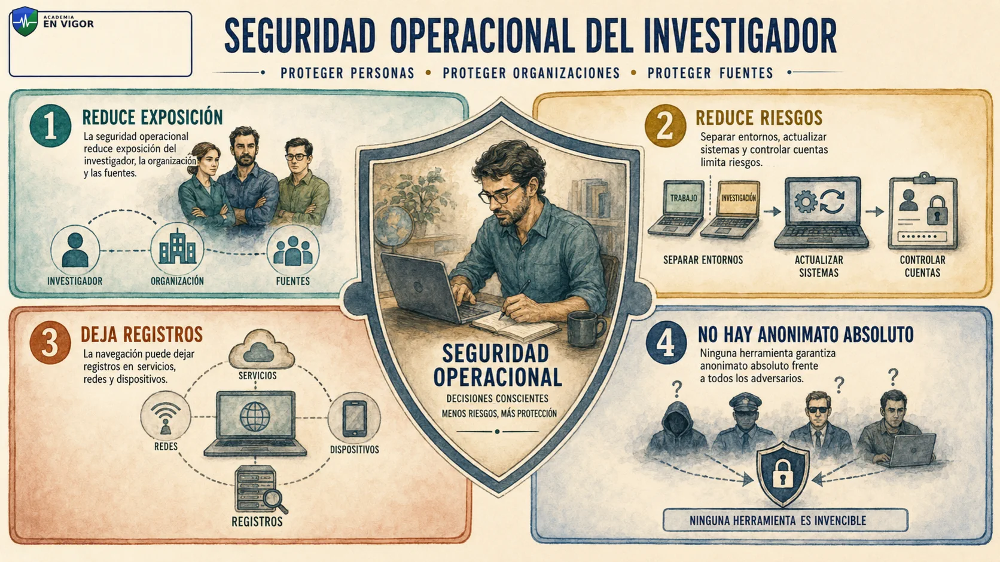

<em>Infografía: Seguridad operacional del investigador.</em>

:::hablemos-claro
La seguridad operacional reduce exposición del investigador, la organización y las fuentes.
:::

:::en-la-calle
Al preservar, verificar y documentar un hallazgo OSINT, La seguridad operacional reduce exposición del investigador, la organización y las fuentes.
:::

:::lo-que-cae
Prioriza **proteger identidad, equipo y método** y descarta respuestas que confundan dato, fuente, fase, acceso, contenido o infraestructura.
:::

<!-- FUENTE: OHCHR-BERKELEY-T40 -->

## 69. Minimización y terceros

### Lógica del bloque

Para dominar **minimización y terceros**, aplica esta regla: La minimización limita datos a lo necesario para la finalidad. El anclaje principal es **recoger y conservar solo lo necesario**.

### Hechos examinables

- La minimización limita datos a lo necesario para la finalidad. <!-- FACT:PN-T40-F273 -->
- Personas ajenas pueden aparecer incidentalmente en redes, imágenes o documentos. <!-- FACT:PN-T40-F274 -->
- Los datos irrelevantes deben excluirse, protegerse o eliminarse conforme a la política aplicable. <!-- FACT:PN-T40-F275 -->
- Publicar el informe no exige exponer toda la materia prima recopilada. <!-- FACT:PN-T40-F276 -->

### Ejemplos razonados

- **Aplicación correcta:** Personas ajenas pueden aparecer incidentalmente en redes, imágenes o documentos.
- **Contraste útil:** Los datos irrelevantes deben excluirse, protegerse o eliminarse conforme a la política aplicable.

### Trampas de examen

- **Incorrecto:** Todo contacto del objetivo pasa a ser relevante.
- **Incorrecto:** La transparencia exige difundir datos personales incidentales.

<!-- VISUAL:t40-69-minimizacion-y-terceros.webp -->

  

<em>Infografía: Minimización y terceros.</em>

:::hablemos-claro
La minimización limita datos a lo necesario para la finalidad.
:::

:::en-la-calle
Al preservar, verificar y documentar un hallazgo OSINT, La minimización limita datos a lo necesario para la finalidad.
:::

:::lo-que-cae
Prioriza **recoger y conservar solo lo necesario** y descarta respuestas que confundan dato, fuente, fase, acceso, contenido o infraestructura.
:::

<!-- FUENTE: OHCHR-BERKELEY-T40 -->

## 70. Informe OSINT

### Lógica del bloque

Para dominar **informe osint**, aplica esta regla: El informe debe responder a la pregunta y separar hallazgos, análisis y conclusiones. El anclaje principal es **hallazgos, método y límites**.

### Hechos examinables

- El informe debe responder a la pregunta y separar hallazgos, análisis y conclusiones. <!-- FACT:PN-T40-F277 -->
- Incluye fuentes, metodología, fecha de corte y limitaciones relevantes. <!-- FACT:PN-T40-F278 -->
- Los niveles de confianza y las hipótesis alternativas evitan certeza aparente. <!-- FACT:PN-T40-F279 -->
- Los anexos deben permitir auditoría sin sobrecargar el mensaje principal. <!-- FACT:PN-T40-F280 -->

### Ejemplos razonados

- **Aplicación correcta:** Incluye fuentes, metodología, fecha de corte y limitaciones relevantes.
- **Contraste útil:** Los niveles de confianza y las hipótesis alternativas evitan certeza aparente.

### Trampas de examen

- **Incorrecto:** Un buen informe oculta el método para parecer concluyente.
- **Incorrecto:** La fecha de corte es irrelevante en fuentes web cambiantes.

<!-- VISUAL:t40-il-70-informe-osint.webp -->

  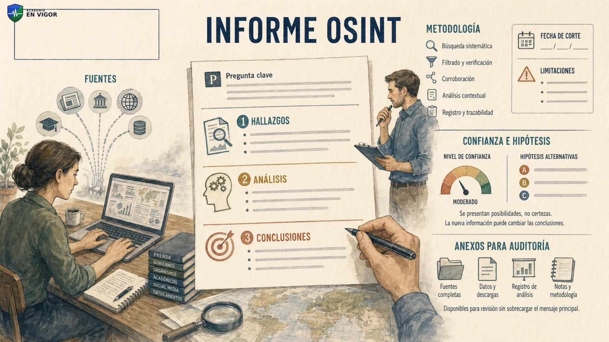

<em>Infografía: Informe OSINT.</em>

:::hablemos-claro
El informe debe responder a la pregunta y separar hallazgos, análisis y conclusiones.
:::

:::en-la-calle
Al preservar, verificar y documentar un hallazgo OSINT, El informe debe responder a la pregunta y separar hallazgos, análisis y conclusiones.
:::

:::lo-que-cae
Prioriza **hallazgos, método y límites** y descarta respuestas que confundan dato, fuente, fase, acceso, contenido o infraestructura.
:::

<!-- FUENTE: OHCHR-BERKELEY-T40 -->

## 71. Internet y World Wide Web

### Lógica del bloque

Para dominar **internet y world wide web**, aplica esta regla: Internet es una red de redes que transporta múltiples servicios. El anclaje principal es **infraestructura frente a servicio**.

### Hechos examinables

- Internet es una red de redes que transporta múltiples servicios. <!-- FACT:PN-T40-F281 -->
- La World Wide Web es uno de esos servicios y utiliza recursos enlazados y protocolos como HTTP. <!-- FACT:PN-T40-F282 -->
- Correo, DNS o mensajería pueden usar Internet sin ser páginas web. <!-- FACT:PN-T40-F283 -->
- Surface, Deep y Dark Web clasifican contenido web, no todo Internet de forma exhaustiva. <!-- FACT:PN-T40-F284 -->

### Ejemplos razonados

- **Aplicación correcta:** La World Wide Web es uno de esos servicios y utiliza recursos enlazados y protocolos como HTTP.
- **Contraste útil:** Correo, DNS o mensajería pueden usar Internet sin ser páginas web.

### Trampas de examen

- **Incorrecto:** Internet y Web son términos técnicos idénticos.
- **Incorrecto:** Todo servicio de Internet es una página HTML.

<!-- VISUAL:t40-71-internet-y-world-wide-web.webp -->

  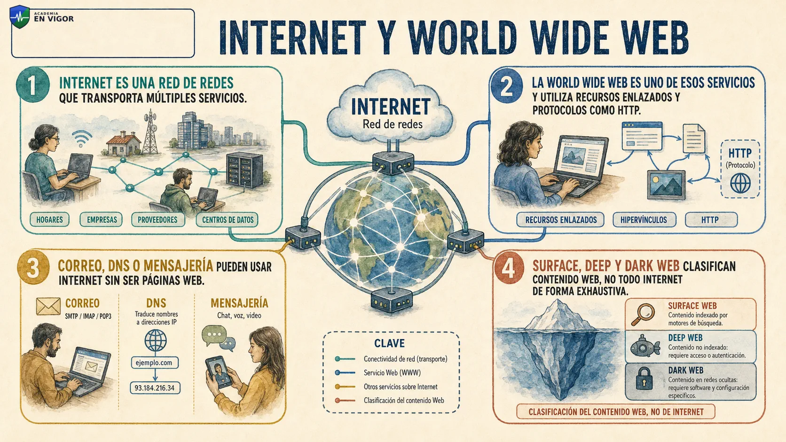

<em>Infografía: Internet y World Wide Web.</em>

:::hablemos-claro
Internet es una red de redes que transporta múltiples servicios.
:::

:::en-la-calle
Al distinguir Surface, Deep, Dark Web y Dark Net, Internet es una red de redes que transporta múltiples servicios.
:::

:::lo-que-cae
Prioriza **infraestructura frente a servicio** y descarta respuestas que confundan dato, fuente, fase, acceso, contenido o infraestructura.
:::

<!-- FUENTE: RFC3986-URI-T40 -->

## 72. URI, navegador y HTTP

### Lógica del bloque

Para dominar **uri, navegador y http**, aplica esta regla: Una URI identifica un recurso conforme a su sintaxis y esquema. El anclaje principal es **identificar, solicitar y representar**.

### Hechos examinables

- Una URI identifica un recurso conforme a su sintaxis y esquema. <!-- FACT:PN-T40-F285 -->
- El navegador actúa como cliente que solicita y presenta recursos. <!-- FACT:PN-T40-F286 -->
- HTTP define semántica de solicitudes y respuestas entre componentes. <!-- FACT:PN-T40-F287 -->
- Conocer una URL no garantiza autorización ni disponibilidad del recurso. <!-- FACT:PN-T40-F288 -->

### Ejemplos razonados

- **Aplicación correcta:** El navegador actúa como cliente que solicita y presenta recursos.
- **Contraste útil:** HTTP define semántica de solicitudes y respuestas entre componentes.

### Trampas de examen

- **Incorrecto:** Una URL concede permiso de acceso.
- **Incorrecto:** HTTP es un buscador de Internet.

<!-- VISUAL:t40-72-uri-navegador-y-http.webp -->

  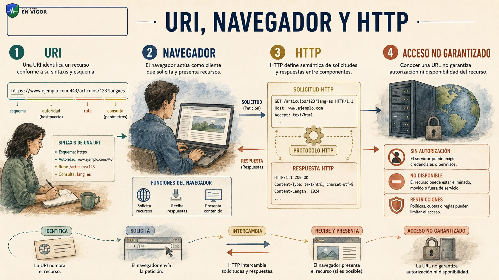

<em>Infografía: URI, navegador y HTTP.</em>

:::hablemos-claro
Una URI identifica un recurso conforme a su sintaxis y esquema.
:::

:::en-la-calle
Al distinguir Surface, Deep, Dark Web y Dark Net, Una URI identifica un recurso conforme a su sintaxis y esquema.
:::

:::lo-que-cae
Prioriza **identificar, solicitar y representar** y descarta respuestas que confundan dato, fuente, fase, acceso, contenido o infraestructura.
:::

<!-- FUENTE: RFC9110-HTTP-T40 -->

## 73. Rastreo, indexación y búsqueda

### Lógica del bloque

Para dominar **rastreo, indexación y búsqueda**, aplica esta regla: El rastreo automatizado recorre recursos y enlaces mediante clientes llamados crawlers. El anclaje principal es **descubrir, almacenar referencias y consultar**.

### Hechos examinables

- El rastreo automatizado recorre recursos y enlaces mediante clientes llamados crawlers. <!-- FACT:PN-T40-F289 -->
- La indexación incorpora información sobre recursos a un índice consultable. <!-- FACT:PN-T40-F290 -->
- La búsqueda consulta ese índice y ordena resultados según criterios del servicio. <!-- FACT:PN-T40-F291 -->
- Un recurso accesible puede no estar rastreado o indexado. <!-- FACT:PN-T40-F292 -->

### Ejemplos razonados

- **Aplicación correcta:** La indexación incorpora información sobre recursos a un índice consultable.
- **Contraste útil:** La búsqueda consulta ese índice y ordena resultados según criterios del servicio.

### Trampas de examen

- **Incorrecto:** Buscar consulta directamente cada servidor existente.
- **Incorrecto:** Accesible e indexado significan lo mismo.

<!-- VISUAL:t40-73-rastreo-indexacion-y-busqueda.webp -->

  

<em>Infografía: Rastreo, indexación y búsqueda.</em>

:::hablemos-claro
El rastreo automatizado recorre recursos y enlaces mediante clientes llamados crawlers.
:::

:::en-la-calle
Al distinguir Surface, Deep, Dark Web y Dark Net, El rastreo automatizado recorre recursos y enlaces mediante clientes llamados crawlers.
:::

:::lo-que-cae
Prioriza **descubrir, almacenar referencias y consultar** y descarta respuestas que confundan dato, fuente, fase, acceso, contenido o infraestructura.
:::

<!-- FUENTE: RFC9309-ROBOTS-T40 -->

## 74. Surface Web

### Lógica del bloque

Para dominar **surface web**, aplica esta regla: Surface Web designa de forma práctica contenido web accesible e indexable por buscadores generales. El anclaje principal es **contenido públicamente descubrible e indexado**.

### Hechos examinables

- Surface Web designa de forma práctica contenido web accesible e indexable por buscadores generales. <!-- FACT:PN-T40-F293 -->
- Suele accederse con navegadores ordinarios y protocolos web habituales. <!-- FACT:PN-T40-F294 -->
- Un recurso de Surface Web puede ser lícito o ilícito; la capa no determina legalidad. <!-- FACT:PN-T40-F295 -->
- La pertenencia puede variar cuando un buscador incorpora o retira el recurso de su índice. <!-- FACT:PN-T40-F296 -->

### Ejemplos razonados

- **Aplicación correcta:** Suele accederse con navegadores ordinarios y protocolos web habituales.
- **Contraste útil:** Un recurso de Surface Web puede ser lícito o ilícito; la capa no determina legalidad.

### Trampas de examen

- **Incorrecto:** Surface Web significa contenido legal por definición.
- **Incorrecto:** Toda página pública aparece necesariamente en todos los buscadores.

<!-- VISUAL:t40-74-surface-web.webp -->

  

<em>Infografía: Surface Web.</em>

:::hablemos-claro
Surface Web designa de forma práctica contenido web accesible e indexable por buscadores generales.
:::

:::en-la-calle
Al distinguir Surface, Deep, Dark Web y Dark Net, Surface Web designa de forma práctica contenido web accesible e indexable por buscadores generales.
:::

:::lo-que-cae
Prioriza **contenido públicamente descubrible e indexado** y descarta respuestas que confundan dato, fuente, fase, acceso, contenido o infraestructura.
:::

<!-- FUENTE: EUROPOL-DARKNET-2017-T40 -->

## 75. Deep Web

### Lógica del bloque

Para dominar **deep web**, aplica esta regla: Deep Web engloba contenido web que no figura en índices públicos generales. El anclaje principal es **contenido no indexado por buscadores generales**.

### Hechos examinables

- Deep Web engloba contenido web que no figura en índices públicos generales. <!-- FACT:PN-T40-F297 -->
- Puede estar protegido por autenticación, generado dinámicamente, no enlazado o excluido del rastreo. <!-- FACT:PN-T40-F298 -->
- La mayor parte de sus ejemplos ordinarios son servicios legítimos como correo, banca o bases de datos. <!-- FACT:PN-T40-F299 -->
- Deep Web no exige por definición Tor ni una red anónima. <!-- FACT:PN-T40-F300 -->

### Ejemplos razonados

- **Aplicación correcta:** Puede estar protegido por autenticación, generado dinámicamente, no enlazado o excluido del rastreo.
- **Contraste útil:** La mayor parte de sus ejemplos ordinarios son servicios legítimos como correo, banca o bases de datos.

### Trampas de examen

- **Incorrecto:** Deep Web es sinónimo de actividad delictiva.
- **Incorrecto:** Todo contenido Deep Web requiere un dominio .onion.

<!-- VISUAL:t40-il-75-deep-web.webp -->

  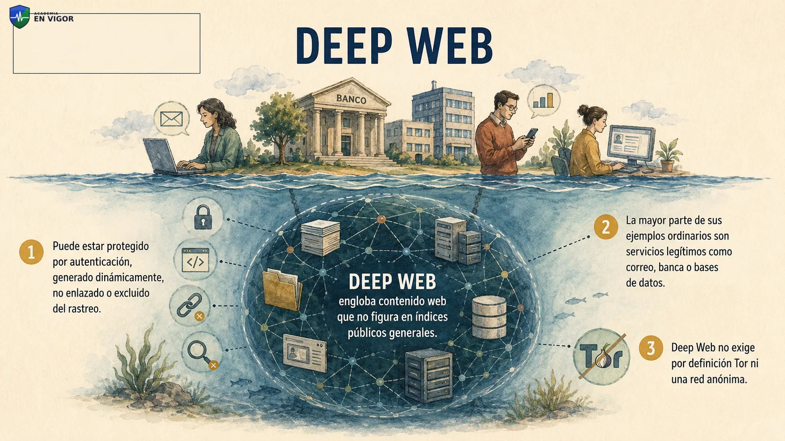

<em>Infografía: Deep Web.</em>

:::hablemos-claro
Deep Web engloba contenido web que no figura en índices públicos generales.
:::

:::en-la-calle
Al distinguir Surface, Deep, Dark Web y Dark Net, Deep Web engloba contenido web que no figura en índices públicos generales.
:::

:::lo-que-cae
Prioriza **contenido no indexado por buscadores generales** y descarta respuestas que confundan dato, fuente, fase, acceso, contenido o infraestructura.
:::

<!-- FUENTE: EUROPOL-DARKNET-2017-T40 -->

## 76. Contenido autenticado y dinámico

### Lógica del bloque

Para dominar **contenido autenticado y dinámico**, aplica esta regla: Una zona tras inicio de sesión puede ser accesible con navegador normal y pertenecer a la Deep Web. El anclaje principal es **acceso condicionado o generado a demanda**.

### Hechos examinables

- Una zona tras inicio de sesión puede ser accesible con navegador normal y pertenecer a la Deep Web. <!-- FACT:PN-T40-F301 -->
- Los resultados de formularios pueden generarse dinámicamente sin una URL previamente indexada. <!-- FACT:PN-T40-F302 -->
- Autenticación controla acceso; no debe confundirse con una instrucción para crawlers. <!-- FACT:PN-T40-F303 -->
- No indexado no significa técnicamente cifrado, secreto ni anónimo. <!-- FACT:PN-T40-F304 -->

### Ejemplos razonados

- **Aplicación correcta:** Los resultados de formularios pueden generarse dinámicamente sin una URL previamente indexada.
- **Contraste útil:** Autenticación controla acceso; no debe confundirse con una instrucción para crawlers.

### Trampas de examen

- **Incorrecto:** Todo contenido no indexado está cifrado.
- **Incorrecto:** robots.txt y una contraseña cumplen la misma función.

<!-- VISUAL:t40-76-contenido-autenticado-y-dinamico.webp -->

  

<em>Infografía: Contenido autenticado y dinámico.</em>

:::hablemos-claro
Una zona tras inicio de sesión puede ser accesible con navegador normal y pertenecer a la Deep Web.
:::

:::en-la-calle
Al distinguir Surface, Deep, Dark Web y Dark Net, Una zona tras inicio de sesión puede ser accesible con navegador normal y pertenecer a la Deep Web.
:::

:::lo-que-cae
Prioriza **acceso condicionado o generado a demanda** y descarta respuestas que confundan dato, fuente, fase, acceso, contenido o infraestructura.
:::

<!-- FUENTE: RFC9110-HTTP-T40 -->

## 77. Robots Exclusion Protocol

### Lógica del bloque

Para dominar **robots exclusion protocol**, aplica esta regla: robots.txt comunica reglas que se solicita respetar a crawlers automatizados. El anclaje principal es **reglas para crawlers, no autorización**.

### Hechos examinables

- robots.txt comunica reglas que se solicita respetar a crawlers automatizados. <!-- FACT:PN-T40-F305 -->
- RFC 9309 declara expresamente que esas reglas no son una forma de autorización de acceso. <!-- FACT:PN-T40-F306 -->
- Un recurso bloqueado al crawler puede seguir siendo accesible por URL. <!-- FACT:PN-T40-F307 -->
- La exclusión de rastreo no garantiza que el recurso desaparezca de todos los índices. <!-- FACT:PN-T40-F308 -->

### Ejemplos razonados

- **Aplicación correcta:** RFC 9309 declara expresamente que esas reglas no son una forma de autorización de acceso.
- **Contraste útil:** Un recurso bloqueado al crawler puede seguir siendo accesible por URL.

### Trampas de examen

- **Incorrecto:** robots.txt protege un directorio como una contraseña.
- **Incorrecto:** Disallow prueba que el contenido es ilícito.

<!-- VISUAL:t40-77-robots-exclusion-protocol.webp -->

  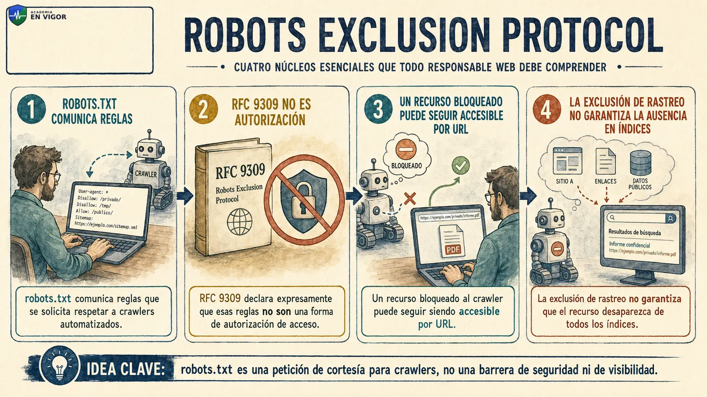

<em>Infografía: Robots Exclusion Protocol.</em>

:::hablemos-claro
robots.txt comunica reglas que se solicita respetar a crawlers automatizados.
:::

:::en-la-calle
Al distinguir Surface, Deep, Dark Web y Dark Net, robots.txt comunica reglas que se solicita respetar a crawlers automatizados.
:::

:::lo-que-cae
Prioriza **reglas para crawlers, no autorización** y descarta respuestas que confundan dato, fuente, fase, acceso, contenido o infraestructura.
:::

<!-- FUENTE: RFC9309-ROBOTS-T40 -->

## 78. No existen porcentajes universales fiables

### Lógica del bloque

Para dominar **no existen porcentajes universales fiables**, aplica esta regla: No existe un censo completo y estable que mida Surface, Deep y Dark Web con porcentajes universales. El anclaje principal es **magnitud cambiante y difícil de medir**.

### Hechos examinables

- No existe un censo completo y estable que mida Surface, Deep y Dark Web con porcentajes universales. <!-- FACT:PN-T40-F309 -->
- Las estimaciones dependen de definición, unidad de medida, fecha y método. <!-- FACT:PN-T40-F310 -->
- Cifras como 4 % frente a 96 % no deben tratarse como constantes técnicas. <!-- FACT:PN-T40-F311 -->
- En examen es más seguro dominar criterios de acceso e indexación que memorizar porcentajes no oficiales. <!-- FACT:PN-T40-F312 -->

### Ejemplos razonados

- **Aplicación correcta:** Las estimaciones dependen de definición, unidad de medida, fecha y método.
- **Contraste útil:** Cifras como 4 % frente a 96 % no deben tratarse como constantes técnicas.

### Trampas de examen

- **Incorrecto:** La Deep Web ocupa exactamente el 95 % en todo momento.
- **Incorrecto:** El número de páginas conocidas permite medir toda la web oculta.

<!-- VISUAL:t40-78-no-existen-porcentajes-universales-fiables.webp -->

  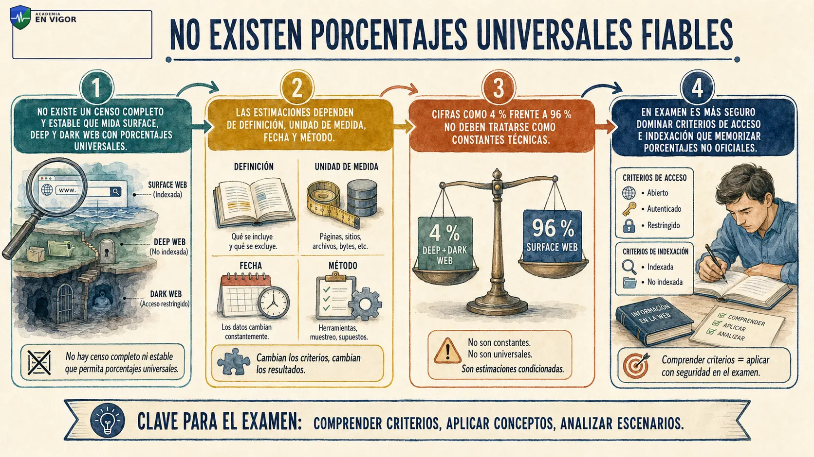

<em>Infografía: No existen porcentajes universales fiables.</em>

:::hablemos-claro
No existe un censo completo y estable que mida Surface, Deep y Dark Web con porcentajes universales.
:::

:::en-la-calle
Al distinguir Surface, Deep, Dark Web y Dark Net, No existe un censo completo y estable que mida Surface, Deep y Dark Web con porcentajes universales.
:::

:::lo-que-cae
Prioriza **magnitud cambiante y difícil de medir** y descarta respuestas que confundan dato, fuente, fase, acceso, contenido o infraestructura.
:::

<!-- FUENTE: ODNI-ICD203-T40 -->

## 79. Dark Web

### Lógica del bloque

Para dominar **dark web**, aplica esta regla: Dark Web designa contenido y servicios web accesibles mediante redes superpuestas o software específico. El anclaje principal es **servicios ocultos sobre darknets**.

### Hechos examinables

- Dark Web designa contenido y servicios web accesibles mediante redes superpuestas o software específico. <!-- FACT:PN-T40-F313 -->
- Tor es la vía más conocida, pero Dark Web no es sinónimo de toda la red Tor. <!-- FACT:PN-T40-F314 -->
- Puede alojar usos legítimos e ilícitos. <!-- FACT:PN-T40-F315 -->
- La ocultación técnica no vuelve invisible toda conducta del usuario. <!-- FACT:PN-T40-F316 -->

### Ejemplos razonados

- **Aplicación correcta:** Tor es la vía más conocida, pero Dark Web no es sinónimo de toda la red Tor.
- **Contraste útil:** Puede alojar usos legítimos e ilícitos.

### Trampas de examen

- **Incorrecto:** Dark Web es cualquier página no encontrada por Google.
- **Incorrecto:** Todo uso de Dark Web es delito.

<!-- VISUAL:t40-79-dark-web.webp -->

  

<em>Infografía: Dark Web.</em>

:::hablemos-claro
Dark Web designa contenido y servicios web accesibles mediante redes superpuestas o software específico.
:::

:::en-la-calle
Al distinguir Surface, Deep, Dark Web y Dark Net, Dark Web designa contenido y servicios web accesibles mediante redes superpuestas o software específico.
:::

:::lo-que-cae
Prioriza **servicios ocultos sobre darknets** y descarta respuestas que confundan dato, fuente, fase, acceso, contenido o infraestructura.
:::

<!-- FUENTE: EUROPOL-IOCTA-2024-T40 -->

## 80. Dark Net

### Lógica del bloque

Para dominar **dark net**, aplica esta regla: Dark Net se refiere a una red superpuesta diseñada para acceso restringido, anonimato u ocultación. El anclaje principal es **infraestructura de red superpuesta**.

### Hechos examinables

- Dark Net se refiere a una red superpuesta diseñada para acceso restringido, anonimato u ocultación. <!-- FACT:PN-T40-F317 -->
- Tor e I2P son ejemplos de tecnologías de darknet citadas en fuentes policiales. <!-- FACT:PN-T40-F318 -->
- La darknet es infraestructura; la Dark Web son servicios web alojados o accesibles sobre ella. <!-- FACT:PN-T40-F319 -->
- No todo tráfico de una darknet corresponde necesariamente a páginas web. <!-- FACT:PN-T40-F320 -->

### Ejemplos razonados

- **Aplicación correcta:** Tor e I2P son ejemplos de tecnologías de darknet citadas en fuentes policiales.
- **Contraste útil:** La darknet es infraestructura; la Dark Web son servicios web alojados o accesibles sobre ella.

### Trampas de examen

- **Incorrecto:** Dark Net es el conjunto de páginas indexadas.
- **Incorrecto:** Dark Net y Dark Web describen exactamente la misma capa.

<!-- VISUAL:t40-il-80-dark-net.webp -->

  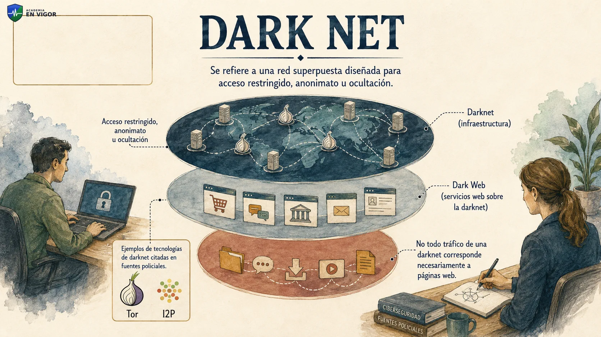

<em>Infografía: Dark Net.</em>

:::hablemos-claro
Dark Net se refiere a una red superpuesta diseñada para acceso restringido, anonimato u ocultación.
:::

:::en-la-calle
Al distinguir Surface, Deep, Dark Web y Dark Net, Dark Net se refiere a una red superpuesta diseñada para acceso restringido, anonimato u ocultación.
:::

:::lo-que-cae
Prioriza **infraestructura de red superpuesta** y descarta respuestas que confundan dato, fuente, fase, acceso, contenido o infraestructura.
:::

<!-- FUENTE: EUROPOL-IOCTA-2024-T40 -->

## 81. Relación Surface-Deep-Dark

### Lógica del bloque

Para dominar **relación surface-deep-dark**, aplica esta regla: Surface Web se asocia a contenido indexado y públicamente descubrible. El anclaje principal es **indexación, acceso e infraestructura**.

### Hechos examinables

- Surface Web se asocia a contenido indexado y públicamente descubrible. <!-- FACT:PN-T40-F321 -->
- Deep Web se asocia a contenido no indexado por buscadores generales. <!-- FACT:PN-T40-F322 -->
- Dark Web es la parte especializada de la Deep Web accesible mediante darknets. <!-- FACT:PN-T40-F323 -->
- Dark Net nombra la infraestructura y no una subcategoría de páginas por su contenido. <!-- FACT:PN-T40-F324 -->

### Ejemplos razonados

- **Aplicación correcta:** Deep Web se asocia a contenido no indexado por buscadores generales.
- **Contraste útil:** Dark Web es la parte especializada de la Deep Web accesible mediante darknets.

### Trampas de examen

- **Incorrecto:** Toda Deep Web forma parte de Dark Web.
- **Incorrecto:** Surface Web es una red física distinta de Internet.

<!-- VISUAL:t40-81-relacion-surface-deep-dark.webp -->

  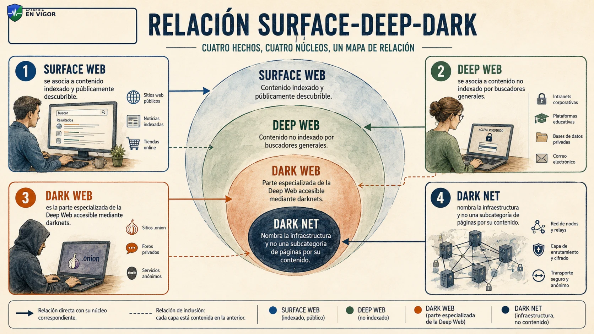

<em>Infografía: Relación Surface-Deep-Dark.</em>

:::hablemos-claro
Surface Web se asocia a contenido indexado y públicamente descubrible.
:::

:::en-la-calle
Al distinguir Surface, Deep, Dark Web y Dark Net, Surface Web se asocia a contenido indexado y públicamente descubrible.
:::

:::lo-que-cae
Prioriza **indexación, acceso e infraestructura** y descarta respuestas que confundan dato, fuente, fase, acceso, contenido o infraestructura.
:::

<!-- FUENTE: EUROPOL-IOCTA-2024-T40 -->

## 82. Tor como red de anonimato

### Lógica del bloque

Para dominar **tor como red de anonimato**, aplica esta regla: Tor encamina tráfico a través de circuitos formados por relés. El anclaje principal es **circuitos a través de relés**.

### Hechos examinables

- Tor encamina tráfico a través de circuitos formados por relés. <!-- FACT:PN-T40-F325 -->
- El cliente construye los circuitos de manera incremental. <!-- FACT:PN-T40-F326 -->
- El diseño busca separar conocimiento de origen y destino entre relés. <!-- FACT:PN-T40-F327 -->
- Tor reduce ciertos vínculos de red, pero no corrige filtraciones de identidad en la aplicación. <!-- FACT:PN-T40-F328 -->

### Ejemplos razonados

- **Aplicación correcta:** El cliente construye los circuitos de manera incremental.
- **Contraste útil:** El diseño busca separar conocimiento de origen y destino entre relés.

### Trampas de examen

- **Incorrecto:** Tor es un buscador que indexa la Dark Web.
- **Incorrecto:** Usar Tor impide cualquier identificación con independencia del comportamiento.

<!-- VISUAL:t40-82-tor-como-red-de-anonimato.webp -->

  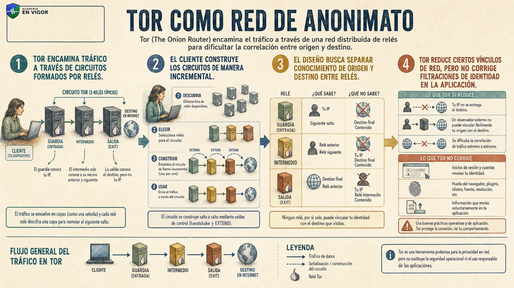

<em>Infografía: Tor como red de anonimato.</em>

:::hablemos-claro
Tor encamina tráfico a través de circuitos formados por relés.
:::

:::en-la-calle
Al distinguir Surface, Deep, Dark Web y Dark Net, Tor encamina tráfico a través de circuitos formados por relés.
:::

:::lo-que-cae
Prioriza **circuitos a través de relés** y descarta respuestas que confundan dato, fuente, fase, acceso, contenido o infraestructura.
:::

<!-- FUENTE: TOR-CIRCUITS-T40 -->

## 83. Circuito Tor hacia la web ordinaria

### Lógica del bloque

Para dominar **circuito tor hacia la web ordinaria**, aplica esta regla: Un circuito típico hacia un destino de Internet utiliza relé de entrada, intermedio y salida. El anclaje principal es **entrada, relé intermedio y salida**.

### Hechos examinables

- Un circuito típico hacia un destino de Internet utiliza relé de entrada, intermedio y salida. <!-- FACT:PN-T40-F329 -->
- El relé de entrada conoce la conexión del cliente, pero no el destino final en claro por diseño. <!-- FACT:PN-T40-F330 -->
- El relé de salida conecta con el destino externo y no conoce directamente la IP originaria del cliente. <!-- FACT:PN-T40-F331 -->
- El cifrado extremo a extremo de la aplicación sigue siendo necesario para proteger contenido frente a la salida. <!-- FACT:PN-T40-F332 -->

### Ejemplos razonados

- **Aplicación correcta:** El relé de entrada conoce la conexión del cliente, pero no el destino final en claro por diseño.
- **Contraste útil:** El relé de salida conecta con el destino externo y no conoce directamente la IP originaria del cliente.

### Trampas de examen

- **Incorrecto:** El relé de salida conoce simultáneamente origen real y destino.
- **Incorrecto:** Tor sustituye HTTPS y cifra siempre hasta cualquier servidor web.

<!-- VISUAL:t40-83-circuito-tor-hacia-la-web-ordinaria.webp -->

  

<em>Infografía: Circuito Tor hacia la web ordinaria.</em>

:::hablemos-claro
Un circuito típico hacia un destino de Internet utiliza relé de entrada, intermedio y salida.
:::

:::en-la-calle
Al distinguir Surface, Deep, Dark Web y Dark Net, Un circuito típico hacia un destino de Internet utiliza relé de entrada, intermedio y salida.
:::

:::lo-que-cae
Prioriza **entrada, relé intermedio y salida** y descarta respuestas que confundan dato, fuente, fase, acceso, contenido o infraestructura.
:::

<!-- FUENTE: TOR-CIRCUITS-T40 -->

## 84. Servicios onion

### Lógica del bloque

Para dominar **servicios onion**, aplica esta regla: Un servicio onion publica descriptores con puntos de introducción en la red Tor. El anclaje principal es **introducción y rendezvous sin relé de salida**.

### Hechos examinables

- Un servicio onion publica descriptores con puntos de introducción en la red Tor. <!-- FACT:PN-T40-F333 -->
- El cliente selecciona un punto de rendezvous y solicita la introducción al servicio. <!-- FACT:PN-T40-F334 -->
- Cliente y servicio construyen circuitos hacia el rendezvous. <!-- FACT:PN-T40-F335 -->
- La comunicación con un servicio onion no necesita un relé de salida a Internet abierto. <!-- FACT:PN-T40-F336 -->

### Ejemplos razonados

- **Aplicación correcta:** El cliente selecciona un punto de rendezvous y solicita la introducción al servicio.
- **Contraste útil:** Cliente y servicio construyen circuitos hacia el rendezvous.

### Trampas de examen

- **Incorrecto:** Un servicio onion se alcanza siempre mediante un exit relay.
- **Incorrecto:** El directorio DNS público revela la IP del servicio onion.

<!-- VISUAL:t40-84-servicios-onion.webp -->

  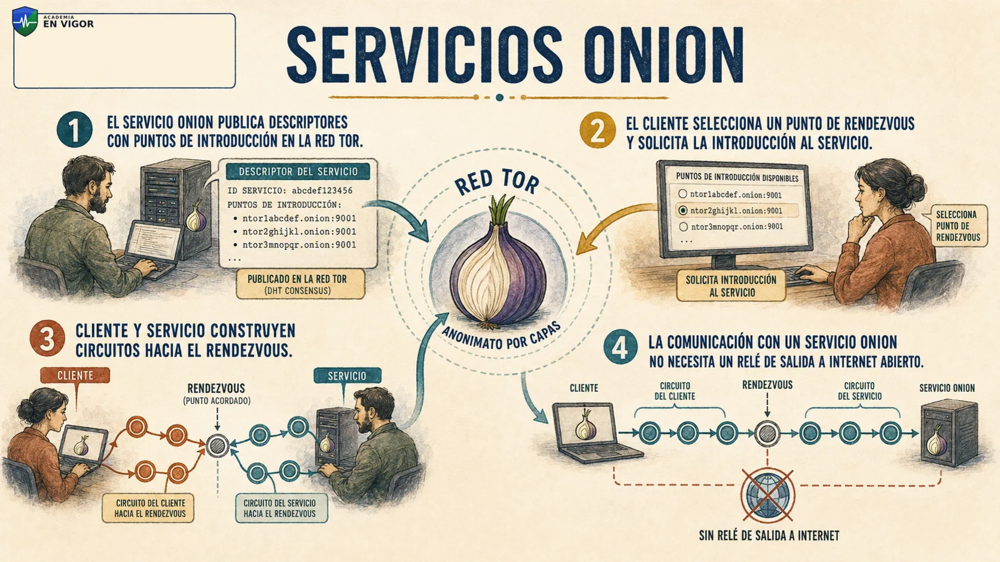

<em>Infografía: Servicios onion.</em>

:::hablemos-claro
Un servicio onion publica descriptores con puntos de introducción en la red Tor.
:::

:::en-la-calle
Al distinguir Surface, Deep, Dark Web y Dark Net, Un servicio onion publica descriptores con puntos de introducción en la red Tor.
:::

:::lo-que-cae
Prioriza **introducción y rendezvous sin relé de salida** y descarta respuestas que confundan dato, fuente, fase, acceso, contenido o infraestructura.
:::

<!-- FUENTE: TOR-ONION-T40 -->

## 85. Nombres .onion

### Lógica del bloque

Para dominar **nombres .onion**, aplica esta regla: .onion es un nombre de uso especial y no se resuelve mediante la infraestructura DNS ordinaria. El anclaje principal es **nombre especial ligado a una clave**.

### Hechos examinables

- .onion es un nombre de uso especial y no se resuelve mediante la infraestructura DNS ordinaria. <!-- FACT:PN-T40-F337 -->
- El nombre se deriva criptográficamente de la identidad del servicio. <!-- FACT:PN-T40-F338 -->
- El control de la clave correspondiente fundamenta el control del nombre. <!-- FACT:PN-T40-F339 -->
- Los nombres actuales de servicios onion v3 contienen una etiqueta larga no pensada para significado humano. <!-- FACT:PN-T40-F340 -->

### Ejemplos razonados

- **Aplicación correcta:** El nombre se deriva criptográficamente de la identidad del servicio.
- **Contraste útil:** El control de la clave correspondiente fundamenta el control del nombre.

### Trampas de examen

- **Incorrecto:** Los dominios .onion se compran en el registro DNS nacional.
- **Incorrecto:** La palabra elegida por el titular determina libremente cualquier dirección v3.

<!-- VISUAL:t40-il-85-nombres-onion.webp -->

  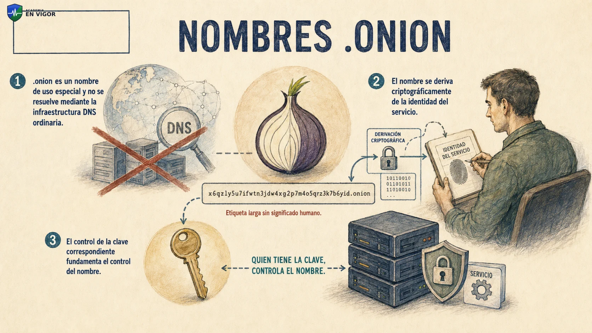

<em>Infografía: Nombres .onion.</em>

:::hablemos-claro
.onion es un nombre de uso especial y no se resuelve mediante la infraestructura DNS ordinaria.
:::

:::en-la-calle
Al distinguir Surface, Deep, Dark Web y Dark Net, .onion es un nombre de uso especial y no se resuelve mediante la infraestructura DNS ordinaria.
:::

:::lo-que-cae
Prioriza **nombre especial ligado a una clave** y descarta respuestas que confundan dato, fuente, fase, acceso, contenido o infraestructura.
:::

<!-- FUENTE: RFC7686-ONION-T40 -->

## 86. Usos legítimos e ilícitos

### Lógica del bloque

Para dominar **usos legítimos e ilícitos**, aplica esta regla: Las darknets pueden apoyar privacidad, denuncia, periodismo o acceso en entornos represivos. El anclaje principal es **la tecnología no determina la conducta**.

### Hechos examinables

- Las darknets pueden apoyar privacidad, denuncia, periodismo o acceso en entornos represivos. <!-- FACT:PN-T40-F341 -->
- También alojan mercados y foros utilizados para actividades delictivas. <!-- FACT:PN-T40-F342 -->
- La legalidad depende de la conducta, el contenido y el marco aplicable, no del mero uso de Tor. <!-- FACT:PN-T40-F343 -->
- No existe un porcentaje eterno que describa la proporción ilícita de toda la Dark Web. <!-- FACT:PN-T40-F344 -->

### Ejemplos razonados

- **Aplicación correcta:** También alojan mercados y foros utilizados para actividades delictivas.
- **Contraste útil:** La legalidad depende de la conducta, el contenido y el marco aplicable, no del mero uso de Tor.

### Trampas de examen

- **Incorrecto:** Conectarse a Tor constituye por sí solo un delito.
- **Incorrecto:** La Dark Web es enteramente legítima porque protege privacidad.

<!-- VISUAL:t40-86-usos-legitimos-e-ilicitos.webp -->

  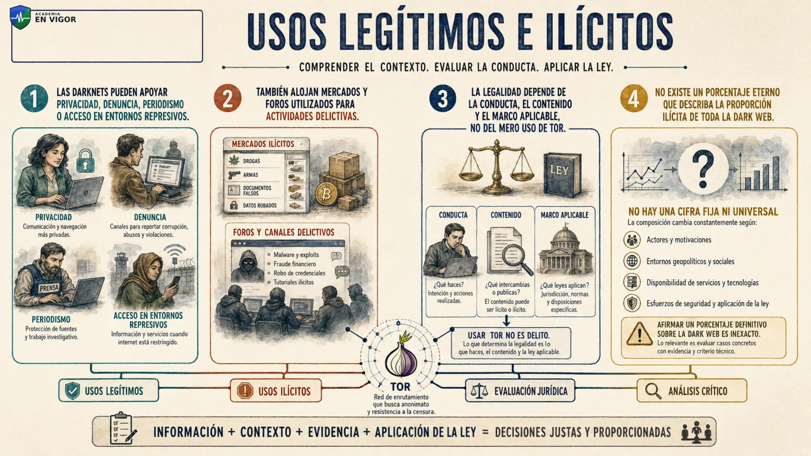

<em>Infografía: Usos legítimos e ilícitos.</em>

:::hablemos-claro
Las darknets pueden apoyar privacidad, denuncia, periodismo o acceso en entornos represivos.
:::

:::en-la-calle
Al distinguir Surface, Deep, Dark Web y Dark Net, Las darknets pueden apoyar privacidad, denuncia, periodismo o acceso en entornos represivos.
:::

:::lo-que-cae
Prioriza **la tecnología no determina la conducta** y descarta respuestas que confundan dato, fuente, fase, acceso, contenido o infraestructura.
:::

<!-- FUENTE: EUROPOL-IOCTA-2024-T40 -->

## 87. Límites del anonimato

### Lógica del bloque

Para dominar **límites del anonimato**, aplica esta regla: El anonimato puede degradarse por inicio de sesión identificativo, malware, errores o correlación de tráfico. El anclaje principal es **amenazas técnicas y conducta del usuario**.

### Hechos examinables

- El anonimato puede degradarse por inicio de sesión identificativo, malware, errores o correlación de tráfico. <!-- FACT:PN-T40-F345 -->
- El navegador, sistema y aplicaciones pueden filtrar información fuera del diseño esperado. <!-- FACT:PN-T40-F346 -->
- Un adversario con amplia observación puede plantear riesgos distintos a los de un relé aislado. <!-- FACT:PN-T40-F347 -->
- La seguridad depende del modelo de amenaza y de la disciplina operacional. <!-- FACT:PN-T40-F348 -->

### Ejemplos razonados

- **Aplicación correcta:** El navegador, sistema y aplicaciones pueden filtrar información fuera del diseño esperado.
- **Contraste útil:** Un adversario con amplia observación puede plantear riesgos distintos a los de un relé aislado.

### Trampas de examen

- **Incorrecto:** Tor garantiza anonimato absoluto frente a cualquier adversario.
- **Incorrecto:** El modo privado de un navegador sustituye una red de anonimato.

<!-- VISUAL:t40-87-limites-del-anonimato.webp -->

  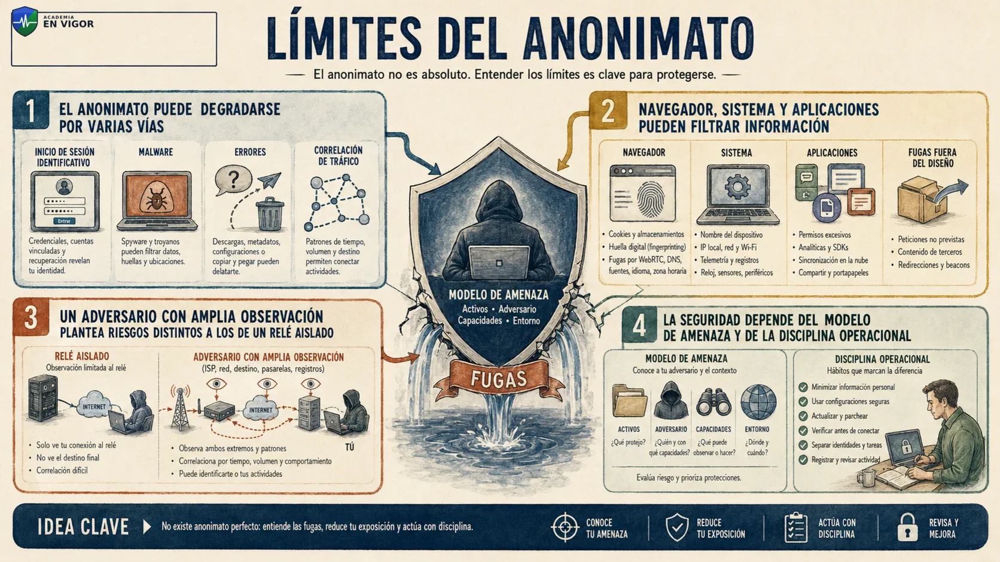

<em>Infografía: Límites del anonimato.</em>

:::hablemos-claro
El anonimato puede degradarse por inicio de sesión identificativo, malware, errores o correlación de tráfico.
:::

:::en-la-calle
Al distinguir Surface, Deep, Dark Web y Dark Net, El anonimato puede degradarse por inicio de sesión identificativo, malware, errores o correlación de tráfico.
:::

:::lo-que-cae
Prioriza **amenazas técnicas y conducta del usuario** y descarta respuestas que confundan dato, fuente, fase, acceso, contenido o infraestructura.
:::

<!-- FUENTE: TOR-CIRCUITS-T40 -->

## 88. Tor, I2P, Freenet y ZeroNet en examen

### Lógica del bloque

Para dominar **tor, i2p, freenet y zeronet en examen**, aplica esta regla: Tor e I2P son ejemplos actuales de redes superpuestas asociadas a servicios ocultos. El anclaje principal es **familia histórica de redes citadas**.

### Hechos examinables

- Tor e I2P son ejemplos actuales de redes superpuestas asociadas a servicios ocultos. <!-- FACT:PN-T40-F349 -->
- Freenet y ZeroNet aparecen en clasificaciones y preguntas históricas sobre darknets. <!-- FACT:PN-T40-F350 -->
- La inclusión en una lista no demuestra idéntico diseño, mantenimiento, seguridad ni uso. <!-- FACT:PN-T40-F351 -->
- Las respuestas deben distinguir una familia de ejemplos de una equivalencia técnica absoluta. <!-- FACT:PN-T40-F352 -->

### Ejemplos razonados

- **Aplicación correcta:** Freenet y ZeroNet aparecen en clasificaciones y preguntas históricas sobre darknets.
- **Contraste útil:** La inclusión en una lista no demuestra idéntico diseño, mantenimiento, seguridad ni uso.

### Trampas de examen

- **Incorrecto:** Todas esas redes emplean exactamente el protocolo Tor.
- **Incorrecto:** Aparecer en una pregunta histórica garantiza el mismo estado técnico en 2026.

<!-- VISUAL:t40-88-tor-i2p-freenet-y-zeronet-en-examen.webp -->

  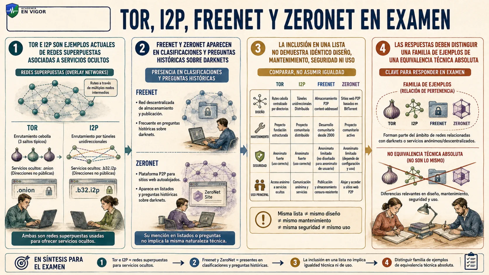

<em>Infografía: Tor, I2P, Freenet y ZeroNet en examen.</em>

:::hablemos-claro
Tor e I2P son ejemplos actuales de redes superpuestas asociadas a servicios ocultos.
:::

:::en-la-calle
Al distinguir Surface, Deep, Dark Web y Dark Net, Tor e I2P son ejemplos actuales de redes superpuestas asociadas a servicios ocultos.
:::

:::lo-que-cae
Prioriza **familia histórica de redes citadas** y descarta respuestas que confundan dato, fuente, fase, acceso, contenido o infraestructura.
:::

<!-- FUENTE: EUROPOL-IOCTA-2024-T40 -->

## 89. Matriz final de las cuatro capas

### Lógica del bloque

Para dominar **matriz final de las cuatro capas**, aplica esta regla: Surface Web: contenido indexado y accesible mediante herramientas web ordinarias. El anclaje principal es **contenido, acceso y red**.

### Hechos examinables

- Surface Web: contenido indexado y accesible mediante herramientas web ordinarias. <!-- FACT:PN-T40-F353 -->
- Deep Web: contenido no indexado, a menudo accesible con navegador normal y credenciales o consultas. <!-- FACT:PN-T40-F354 -->
- Dark Web: servicios ocultos accesibles mediante software o redes específicas. <!-- FACT:PN-T40-F355 -->
- Dark Net: infraestructura de red superpuesta que puede alojar o transportar esos servicios. <!-- FACT:PN-T40-F356 -->

### Ejemplos razonados

- **Aplicación correcta:** Deep Web: contenido no indexado, a menudo accesible con navegador normal y credenciales o consultas.
- **Contraste útil:** Dark Web: servicios ocultos accesibles mediante software o redes específicas.

### Trampas de examen

- **Incorrecto:** Deep Web y Dark Net son dos nombres de una contraseña.
- **Incorrecto:** Surface Web designa todos los protocolos de Internet.

<!-- VISUAL:t40-89-matriz-final-de-las-cuatro-capas.webp -->

  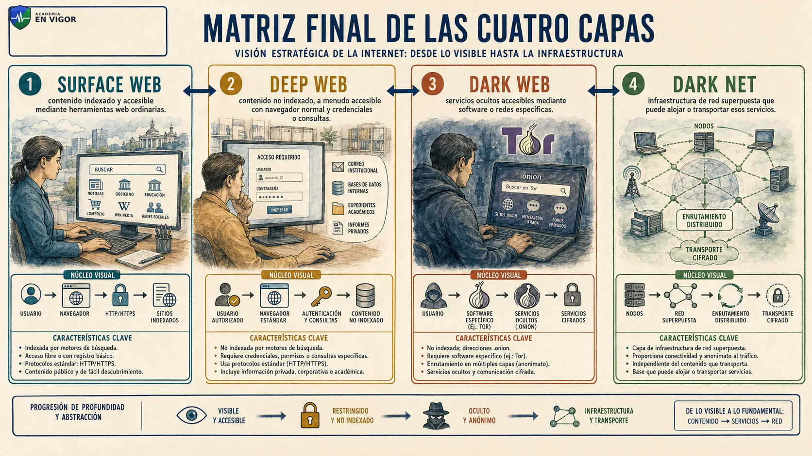

<em>Infografía: Matriz final de las cuatro capas.</em>

:::hablemos-claro
Surface Web: contenido indexado y accesible mediante herramientas web ordinarias.
:::

:::en-la-calle
Al distinguir Surface, Deep, Dark Web y Dark Net, Surface Web: contenido indexado y accesible mediante herramientas web ordinarias.
:::

:::lo-que-cae
Prioriza **contenido, acceso y red** y descarta respuestas que confundan dato, fuente, fase, acceso, contenido o infraestructura.
:::

<!-- FUENTE: EUROPOL-DARKNET-2017-T40 -->

# Hablemos claro

:::hablemos-claro
Este tema tiene cuatro trampas maestras: confundir información con inteligencia; memorizar un único ciclo como si todos los modelos tuviesen idénticas fases; reducir OSINT a buscar en Internet; y confundir Deep Web, Dark Web y Dark Net. Antes de responder identifica fuente, elaboración, acceso e infraestructura.
:::

# En la calle

:::en-la-calle
En una investigación, definir la necesidad, registrar la procedencia, contrastar hipótesis y distinguir contenido web de infraestructura evita atribuciones falsas y permite explicar cómo se obtuvo cada conclusión.
:::

# Lo que cae

:::lo-que-cae
Prioriza dato-información-inteligencia; tipologías por fuente y nivel; modelos CNI y CCN del ciclo; sistema 4×4; objetividad, incertidumbre y sesgos; diferencia OSINF-OSINT; preservación y verificación; y la matriz Surface Web, Deep Web, Dark Web y Dark Net.
:::

# Ha caído

:::ha-caido
Se han localizado 7 referencias históricas del Tema 40. Permanecen ocultas y en cuarentena porque no existe plantilla oficial final verificable en el repositorio.
:::

## Fuentes legales, institucionales y primarias

- `CONVOCATORIA-PN-2026-T40`
- `UNODC-CI-ANALYSTS-T40`
- `CNI-CICLO-T40`
- `CCN-STIC-425-T40`
- `ODNI-OSINT-STRATEGY-T40`
- `ODNI-ICD203-T40`
- `OHCHR-BERKELEY-T40`
- `RFC9309-ROBOTS-T40`
- `RFC9110-HTTP-T40`
- `RFC3986-URI-T40`
- `RFC7686-ONION-T40`
- `TOR-CIRCUITS-T40`
- `TOR-ONION-T40`
- `EUROPOL-IOCTA-2024-T40`
- `EUROPOL-DARKNET-2017-T40`
- `MALTEGO-DOCS-T40`
- `SHODAN-HELP-T40`

---

*Academia En Vigor · El temario que nunca duerme · Tema 40 · v1.0.0 · Documento interno no publicado.*
