# TEMA 42 · ORIGEN DE LAS ARMAS DE FUEGO. DEFINICIÓN, CLASIFICACIÓN, CATEGORÍAS Y FUNCIONAMIENTO DE LAS ARMAS DE FUEGO: ESPECIAL REFERENCIA AL REGLAMENTO DE ARMAS. CARTUCHO: DEFINICIÓN Y COMPONENTES. ARMAS PROHIBIDAS. DOCUMENTACIÓN QUE AMPARA LA TENENCIA Y PORTE DE ARMAS. BALÍSTICA FORENSE.

**Policía Nacional · Método VIGOR · ATESTADO**
**Versión de contenido:** 1.0.0
**Estado editorial:** approved_internal · **Publicación:** not_published

# Mapa del tema

El Tema 42 se estudia en ocho partes: origen y conceptos; clasificación y funcionamiento; categorías reglamentarias; cartucho y disparo; prohibiciones; documentación; ramas balísticas; e identificación forense.

# Contenido

## 01. Alcance oficial del Tema 42

### Lógica del bloque

Para dominar **alcance oficial del tema 42**, aplica esta regla: El programa exige origen, definición, clasificación, categorías, funcionamiento, cartucho, prohibiciones, documentación y balística forense. El anclaje principal es **siete núcleos unidos por arma, munición y prueba**.

### Hechos examinables

- El programa exige origen, definición, clasificación, categorías, funcionamiento, cartucho, prohibiciones, documentación y balística forense. <!-- FACT:PN-T42-F001 -->
- El Reglamento de Armas fija conceptos jurídicos que no siempre coinciden con el uso coloquial. <!-- FACT:PN-T42-F002 -->
- La explicación técnica sirve para comprender el disparo, pero no puede alterar una categoría jurídica. <!-- FACT:PN-T42-F003 -->
- Los ejemplos históricos y comerciales no sustituyen la definición vigente. <!-- FACT:PN-T42-F004 -->

### Ejemplos razonados

- **Aplicación correcta:** El Reglamento de Armas fija conceptos jurídicos que no siempre coinciden con el uso coloquial.
- **Contraste útil:** La explicación técnica sirve para comprender el disparo, pero no puede alterar una categoría jurídica.

### Trampas de examen

- **Incorrecto:** El Tema 42 se limita a memorizar licencias.
- **Incorrecto:** Toda clasificación técnica produce automáticamente una categoría legal.

<!-- VISUAL:t42-01-alcance-oficial-del-tema-42.webp -->

  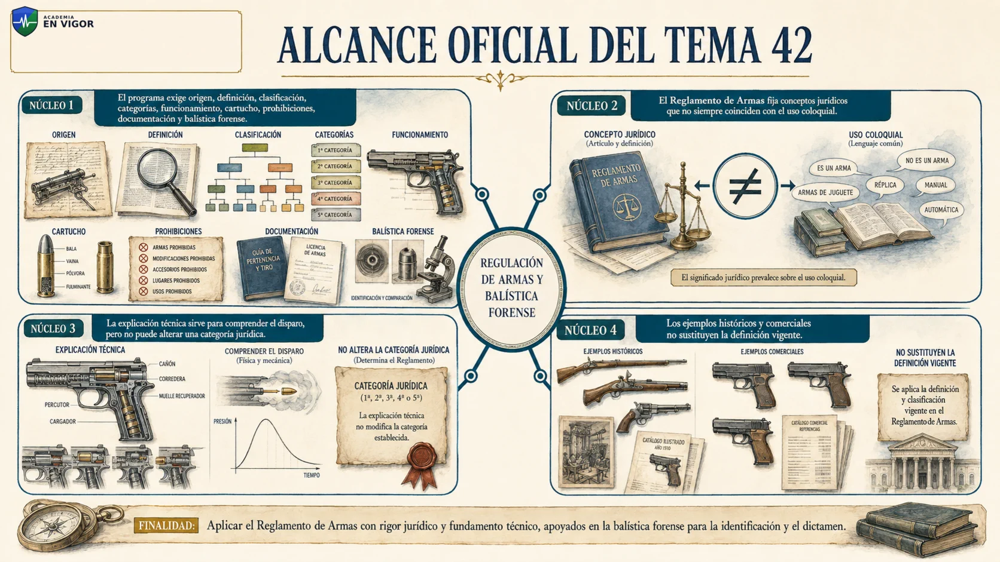

<em>Infografía: Alcance oficial del Tema 42.</em>

:::hablemos-claro
El programa exige origen, definición, clasificación, categorías, funcionamiento, cartucho, prohibiciones, documentación y balística forense.
:::

:::en-la-calle
Al identificar un arma o su régimen, El programa exige origen, definición, clasificación, categorías, funcionamiento, cartucho, prohibiciones, documentación y balística forense.
:::

:::lo-que-cae
Prioriza **siete núcleos unidos por arma, munición y prueba** y descarta respuestas que confundan categoría, mecanismo, documento, cartucho, trayectoria o indicio.
:::

<!-- FUENTE: CONVOCATORIA-PN-2026-T42 -->

## 02. Primeras armas de fuego portátiles

### Lógica del bloque

Para dominar **primeras armas de fuego portátiles**, aplica esta regla: Las primeras armas portátiles expuestas por el Museo del Ejército incluyen culebrinas de mano, arcabuces y mosquetes. El anclaje principal es **culebrina, arcabuz y mosquete**.

### Hechos examinables

- Las primeras armas portátiles expuestas por el Museo del Ejército incluyen culebrinas de mano, arcabuces y mosquetes. <!-- FACT:PN-T42-F005 -->
- Su funcionamiento dependía de una carga propulsora y un sistema de ignición separado del proyectil. <!-- FACT:PN-T42-F006 -->
- La evolución no fue una sucesión instantánea: distintos sistemas coexistieron durante largos periodos. <!-- FACT:PN-T42-F007 -->
- El origen histórico explica la avancarga, pero no convierte toda arma antigua en avancarga ni toda avancarga en antigua. <!-- FACT:PN-T42-F008 -->

### Ejemplos razonados

- **Aplicación correcta:** Su funcionamiento dependía de una carga propulsora y un sistema de ignición separado del proyectil.
- **Contraste útil:** La evolución no fue una sucesión instantánea: distintos sistemas coexistieron durante largos periodos.

### Trampas de examen

- **Incorrecto:** El primer arma portátil fue una pistola semiautomática.
- **Incorrecto:** Arma antigua y arma de avancarga son términos equivalentes.

<!-- VISUAL:t42-02-primeras-armas-de-fuego-portatiles.webp -->

  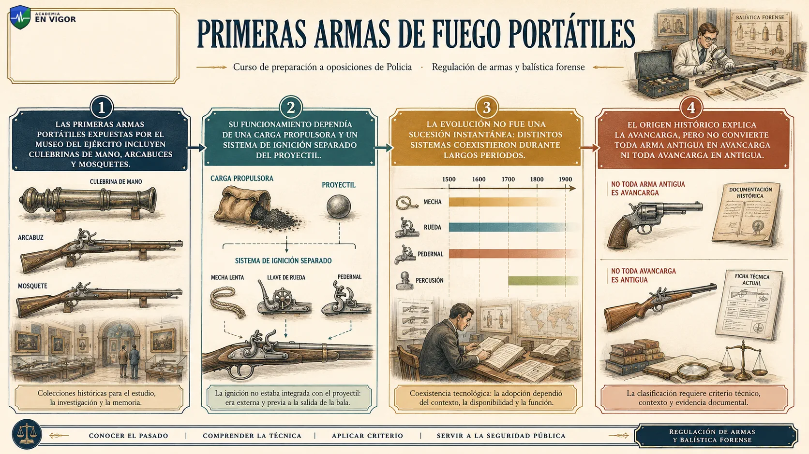

<em>Infografía: Primeras armas de fuego portátiles.</em>

:::hablemos-claro
Las primeras armas portátiles expuestas por el Museo del Ejército incluyen culebrinas de mano, arcabuces y mosquetes.
:::

:::en-la-calle
Al identificar un arma o su régimen, Las primeras armas portátiles expuestas por el Museo del Ejército incluyen culebrinas de mano, arcabuces y mosquetes.
:::

:::lo-que-cae
Prioriza **culebrina, arcabuz y mosquete** y descarta respuestas que confundan categoría, mecanismo, documento, cartucho, trayectoria o indicio.
:::

<!-- FUENTE: MUSEO-EJERCITO-T42 -->

## 03. Evolución de las llaves de ignición

### Lógica del bloque

Para dominar **evolución de las llaves de ignición**, aplica esta regla: El Museo del Ejército ordena la evolución visible desde llaves de mecha, rueda y pedernal hasta la percusión del siglo XIX. El anclaje principal es **mecha, rueda, pedernal y percusión**.

### Hechos examinables

- El Museo del Ejército ordena la evolución visible desde llaves de mecha, rueda y pedernal hasta la percusión del siglo XIX. <!-- FACT:PN-T42-F009 -->
- La llave inicia la carga; no es la carga propulsora ni el proyectil. <!-- FACT:PN-T42-F010 -->
- La percusión sustituyó progresivamente a sistemas que necesitaban llama o chispa exterior más expuesta. <!-- FACT:PN-T42-F011 -->
- Un sistema de ignición describe cómo comienza el disparo, no cuántos tiros permite el arma. <!-- FACT:PN-T42-F012 -->

### Ejemplos razonados

- **Aplicación correcta:** La llave inicia la carga; no es la carga propulsora ni el proyectil.
- **Contraste útil:** La percusión sustituyó progresivamente a sistemas que necesitaban llama o chispa exterior más expuesta.

### Trampas de examen

- **Incorrecto:** La llave de pedernal usa un cartucho eléctrico.
- **Incorrecto:** Percusión significa necesariamente fuego automático.

<!-- VISUAL:t42-03-evolucion-de-las-llaves-de-ignicion.webp -->

  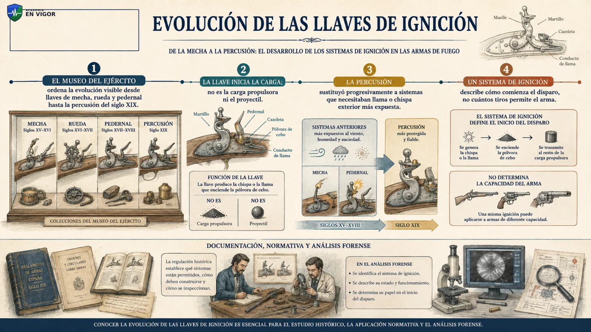

<em>Infografía: Evolución de las llaves de ignición.</em>

:::hablemos-claro
El Museo del Ejército ordena la evolución visible desde llaves de mecha, rueda y pedernal hasta la percusión del siglo XIX.
:::

:::en-la-calle
Al identificar un arma o su régimen, El Museo del Ejército ordena la evolución visible desde llaves de mecha, rueda y pedernal hasta la percusión del siglo XIX.
:::

:::lo-que-cae
Prioriza **mecha, rueda, pedernal y percusión** y descarta respuestas que confundan categoría, mecanismo, documento, cartucho, trayectoria o indicio.
:::

<!-- FUENTE: MUSEO-EJERCITO-T42 -->

## 04. Objeto del Reglamento de Armas

### Lógica del bloque

Para dominar **objeto del reglamento de armas**, aplica esta regla: El Reglamento regula fabricación, reparación, circulación, almacenamiento, comercio, adquisición, enajenación, tenencia y utilización. El anclaje principal es **control para salvaguardar seguridad pública**.

### Hechos examinables

- El Reglamento regula fabricación, reparación, circulación, almacenamiento, comercio, adquisición, enajenación, tenencia y utilización. <!-- FACT:PN-T42-F013 -->
- Incluye armas, imitaciones, réplicas y componentes esenciales dentro de su ámbito. <!-- FACT:PN-T42-F014 -->
- Sus medidas de control persiguen salvaguardar la seguridad pública. <!-- FACT:PN-T42-F015 -->
- Sus preceptos son supletorios respecto de otras disposiciones que regulen la materia con distinta finalidad. <!-- FACT:PN-T42-F016 -->

### Ejemplos razonados

- **Aplicación correcta:** Incluye armas, imitaciones, réplicas y componentes esenciales dentro de su ámbito.
- **Contraste útil:** Sus medidas de control persiguen salvaguardar la seguridad pública.

### Trampas de examen

- **Incorrecto:** El Reglamento solo regula la compra de pistolas.
- **Incorrecto:** La regulación excluye por completo imitaciones y componentes.

<!-- VISUAL:t42-il-04-objeto-del-reglamento-de-armas.webp -->

  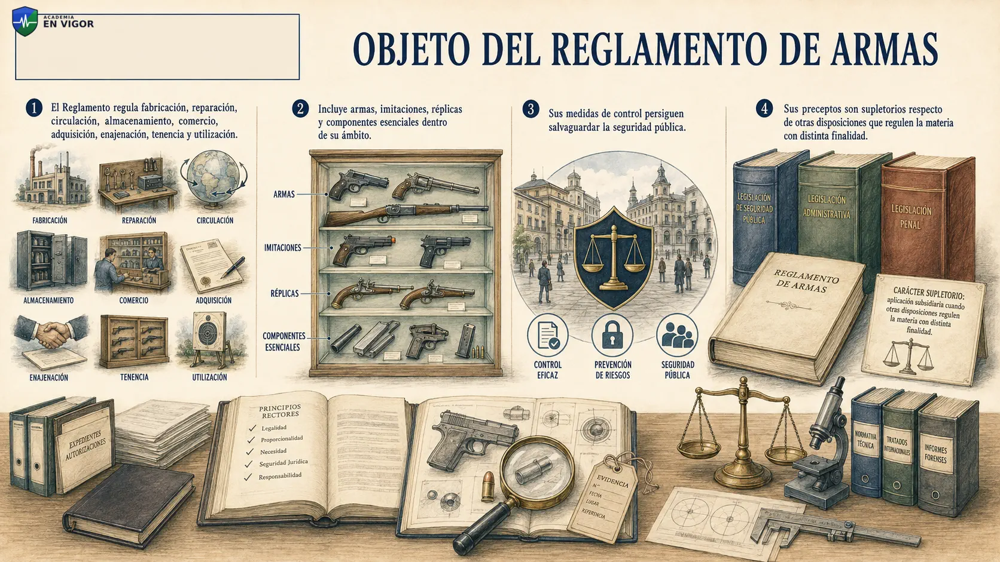

<em>Infografía: Objeto del Reglamento de Armas.</em>

:::hablemos-claro
El Reglamento regula fabricación, reparación, circulación, almacenamiento, comercio, adquisición, enajenación, tenencia y utilización.
:::

:::en-la-calle
Al identificar un arma o su régimen, El Reglamento regula fabricación, reparación, circulación, almacenamiento, comercio, adquisición, enajenación, tenencia y utilización.
:::

:::lo-que-cae
Prioriza **control para salvaguardar seguridad pública** y descarta respuestas que confundan categoría, mecanismo, documento, cartucho, trayectoria o indicio.
:::

<!-- FUENTE: BOE-RA-T42 -->

## 05. Definición reglamentaria de arma de fuego

### Lógica del bloque

Para dominar **definición reglamentaria de arma de fuego**, aplica esta regla: Es arma de fuego la portátil con cañón que lance, esté concebida para lanzar o pueda transformarse fácilmente para lanzar un proyectil. El anclaje principal es **cañón portátil y combustible propulsor**.

### Hechos examinables

- Es arma de fuego la portátil con cañón que lance, esté concebida para lanzar o pueda transformarse fácilmente para lanzar un proyectil. <!-- FACT:PN-T42-F017 -->
- La energía de lanzamiento procede de la acción de un combustible propulsor. <!-- FACT:PN-T42-F018 -->
- La definición incluye perdigón, bala u otro proyectil. <!-- FACT:PN-T42-F019 -->
- La posibilidad de transformación exige apariencia de arma de fuego y construcción o material que permita esa conversión. <!-- FACT:PN-T42-F020 -->

### Ejemplos razonados

- **Aplicación correcta:** La energía de lanzamiento procede de la acción de un combustible propulsor.
- **Contraste útil:** La definición incluye perdigón, bala u otro proyectil.

### Trampas de examen

- **Incorrecto:** Cualquier objeto con forma de pistola es arma de fuego.
- **Incorrecto:** Las armas de fuego solo incluyen las que ya han disparado.

<!-- VISUAL:t42-05-definicion-reglamentaria-de-arma-de-fuego.webp -->

  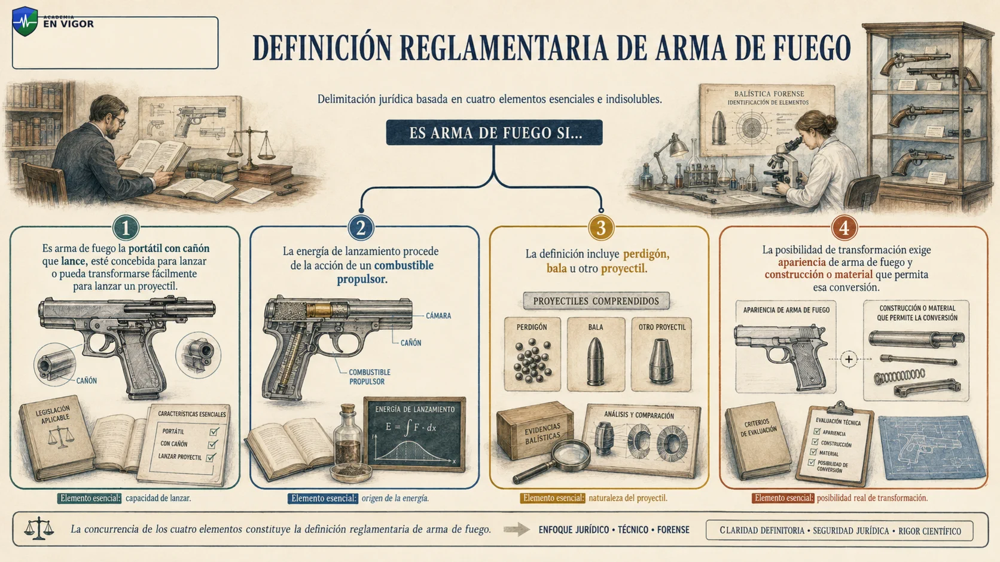

<em>Infografía: Definición reglamentaria de arma de fuego.</em>

:::hablemos-claro
Es arma de fuego la portátil con cañón que lance, esté concebida para lanzar o pueda transformarse fácilmente para lanzar un proyectil.
:::

:::en-la-calle
Al identificar un arma o su régimen, Es arma de fuego la portátil con cañón que lance, esté concebida para lanzar o pueda transformarse fácilmente para lanzar un proyectil.
:::

:::lo-que-cae
Prioriza **cañón portátil y combustible propulsor** y descarta respuestas que confundan categoría, mecanismo, documento, cartucho, trayectoria o indicio.
:::

<!-- FUENTE: BOE-RA-T42 -->

## 06. Componentes esenciales de arma corta

### Lógica del bloque

Para dominar **componentes esenciales de arma corta**, aplica esta regla: En armas de fuego cortas son esenciales el armazón y el cañón. El anclaje principal es **armazón, cañón, tambor y corredera o cerrojo**.

### Hechos examinables

- En armas de fuego cortas son esenciales el armazón y el cañón. <!-- FACT:PN-T42-F021 -->
- También lo son el tambor y la corredera o el cerrojo, según el diseño. <!-- FACT:PN-T42-F022 -->
- La conjunción reglamentaria no exige que una misma arma reúna simultáneamente tambor y corredera. <!-- FACT:PN-T42-F023 -->
- Los componentes esenciales separados siguen el régimen del arma en que se monten o vayan a montarse. <!-- FACT:PN-T42-F024 -->

### Ejemplos razonados

- **Aplicación correcta:** También lo son el tambor y la corredera o el cerrojo, según el diseño.
- **Contraste útil:** La conjunción reglamentaria no exige que una misma arma reúna simultáneamente tambor y corredera.

### Trampas de examen

- **Incorrecto:** El cargador es siempre componente esencial reglamentario del arma corta.
- **Incorrecto:** Toda arma corta debe tener a la vez tambor, corredera y cerrojo.

<!-- VISUAL:t42-06-componentes-esenciales-de-arma-corta.webp -->

  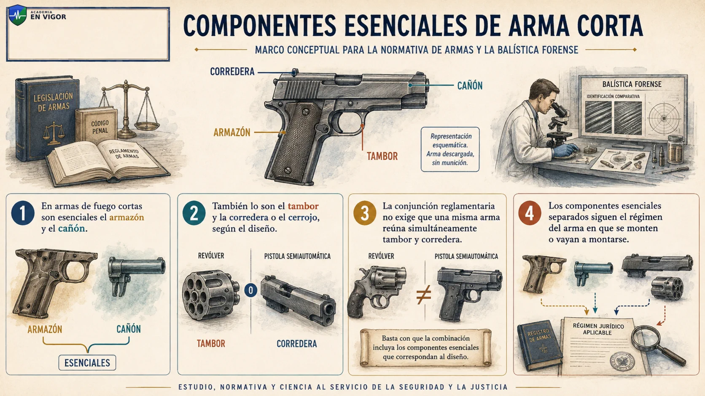

<em>Infografía: Componentes esenciales de arma corta.</em>

:::hablemos-claro
En armas de fuego cortas son esenciales el armazón y el cañón.
:::

:::en-la-calle
Al identificar un arma o su régimen, En armas de fuego cortas son esenciales el armazón y el cañón.
:::

:::lo-que-cae
Prioriza **armazón, cañón, tambor y corredera o cerrojo** y descarta respuestas que confundan categoría, mecanismo, documento, cartucho, trayectoria o indicio.
:::

<!-- FUENTE: BOE-RA-T42 -->

## 07. Componentes esenciales de arma larga

### Lógica del bloque

Para dominar **componentes esenciales de arma larga**, aplica esta regla: En armas largas es esencial la caja o cajón de mecanismos, incluidos superior e inferior cuando corresponda. El anclaje principal es **cajón, cañón, cerrojo o báscula y cierre**.

### Hechos examinables

- En armas largas es esencial la caja o cajón de mecanismos, incluidos superior e inferior cuando corresponda. <!-- FACT:PN-T42-F025 -->
- El cañón es componente esencial del arma larga. <!-- FACT:PN-T42-F026 -->
- También lo son el cerrojo o la báscula y el cierre o bloqueo del cierre, según el sistema. <!-- FACT:PN-T42-F027 -->
- La lista se interpreta conforme a la construcción real del arma, no como inventario acumulativo obligatorio. <!-- FACT:PN-T42-F028 -->

### Ejemplos razonados

- **Aplicación correcta:** El cañón es componente esencial del arma larga.
- **Contraste útil:** También lo son el cerrojo o la báscula y el cierre o bloqueo del cierre, según el sistema.

### Trampas de examen

- **Incorrecto:** La culata es siempre el único componente esencial.
- **Incorrecto:** Toda arma larga debe tener simultáneamente cerrojo y báscula.

<!-- VISUAL:t42-07-componentes-esenciales-de-arma-larga.webp -->

  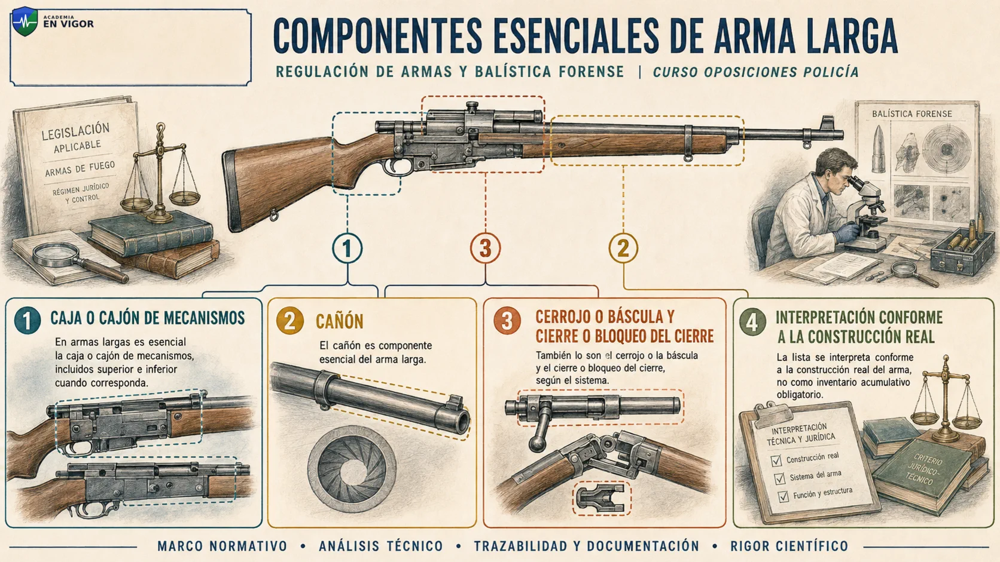

<em>Infografía: Componentes esenciales de arma larga.</em>

:::hablemos-claro
En armas largas es esencial la caja o cajón de mecanismos, incluidos superior e inferior cuando corresponda.
:::

:::en-la-calle
Al identificar un arma o su régimen, En armas largas es esencial la caja o cajón de mecanismos, incluidos superior e inferior cuando corresponda.
:::

:::lo-que-cae
Prioriza **cajón, cañón, cerrojo o báscula y cierre** y descarta respuestas que confundan categoría, mecanismo, documento, cartucho, trayectoria o indicio.
:::

<!-- FUENTE: BOE-RA-T42 -->

## 08. Pieza y componente esencial

### Lógica del bloque

Para dominar **pieza y componente esencial**, aplica esta regla: Pieza es el elemento específicamente concebido para un arma de fuego e indispensable para su funcionamiento. El anclaje principal es **función necesaria frente a lista jurídica**.

### Hechos examinables

- Pieza es el elemento específicamente concebido para un arma de fuego e indispensable para su funcionamiento. <!-- FACT:PN-T42-F029 -->
- La definición de pieza incluye el dispositivo concebido o adaptado para disminuir el sonido del disparo. <!-- FACT:PN-T42-F030 -->
- Componente esencial es una categoría jurídica concreta enumerada por el Reglamento. <!-- FACT:PN-T42-F031 -->
- No toda pieza es componente esencial ni ambos términos pueden intercambiarse sin comprobar el artículo 1. <!-- FACT:PN-T42-F032 -->

### Ejemplos razonados

- **Aplicación correcta:** La definición de pieza incluye el dispositivo concebido o adaptado para disminuir el sonido del disparo.
- **Contraste útil:** Componente esencial es una categoría jurídica concreta enumerada por el Reglamento.

### Trampas de examen

- **Incorrecto:** Pieza y componente esencial son sinónimos perfectos.
- **Incorrecto:** Solo se considera pieza lo que lleva número de serie.

<!-- VISUAL:t42-08-pieza-y-componente-esencial.webp -->

  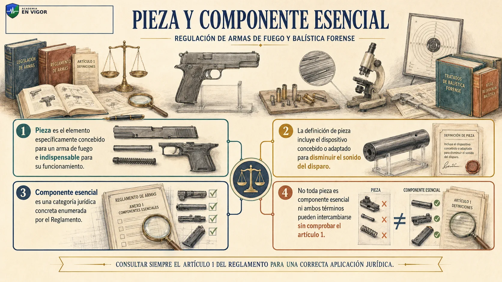

<em>Infografía: Pieza y componente esencial.</em>

:::hablemos-claro
Pieza es el elemento específicamente concebido para un arma de fuego e indispensable para su funcionamiento.
:::

:::en-la-calle
Al identificar un arma o su régimen, Pieza es el elemento específicamente concebido para un arma de fuego e indispensable para su funcionamiento.
:::

:::lo-que-cae
Prioriza **función necesaria frente a lista jurídica** y descarta respuestas que confundan categoría, mecanismo, documento, cartucho, trayectoria o indicio.
:::

<!-- FUENTE: BOE-RA-T42 -->

## 09. Arma corta y arma larga

### Lógica del bloque

Para dominar **arma corta y arma larga**, aplica esta regla: Es arma de fuego corta aquella cuyo cañón no excede de 30 centímetros o cuya longitud total no excede de 60. El anclaje principal es **30 cm de cañón o 60 cm totales**.

### Hechos examinables

- Es arma de fuego corta aquella cuyo cañón no excede de 30 centímetros o cuya longitud total no excede de 60. <!-- FACT:PN-T42-F033 -->
- La conjunción es alternativa: basta cumplir uno de los dos límites para ser corta. <!-- FACT:PN-T42-F034 -->
- Arma de fuego larga es la que no es corta conforme a esa definición. <!-- FACT:PN-T42-F035 -->
- La clasificación corta-larga es jurídica y no depende solo del nombre comercial. <!-- FACT:PN-T42-F036 -->

### Ejemplos razonados

- **Aplicación correcta:** La conjunción es alternativa: basta cumplir uno de los dos límites para ser corta.
- **Contraste útil:** Arma de fuego larga es la que no es corta conforme a esa definición.

### Trampas de examen

- **Incorrecto:** Debe cumplir a la vez ambos límites para ser corta.
- **Incorrecto:** Toda arma que mida 61 centímetros es necesariamente larga sin mirar el cañón.

<!-- VISUAL:t42-il-09-arma-corta-y-arma-larga.webp -->

  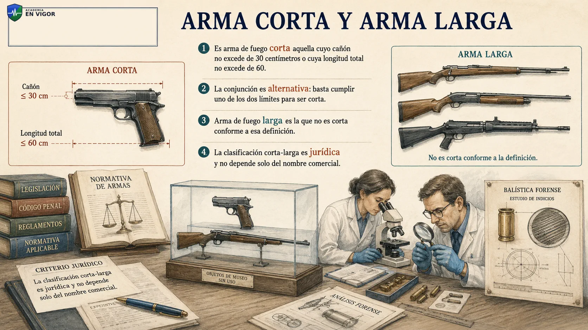

<em>Infografía: Arma corta y arma larga.</em>

:::hablemos-claro
Es arma de fuego corta aquella cuyo cañón no excede de 30 centímetros o cuya longitud total no excede de 60.
:::

:::en-la-calle
Al identificar un arma o su régimen, Es arma de fuego corta aquella cuyo cañón no excede de 30 centímetros o cuya longitud total no excede de 60.
:::

:::lo-que-cae
Prioriza **30 cm de cañón o 60 cm totales** y descarta respuestas que confundan categoría, mecanismo, documento, cartucho, trayectoria o indicio.
:::

<!-- FUENTE: BOE-RA-T42 -->

## 10. Partes funcionales básicas

### Lógica del bloque

Para dominar **partes funcionales básicas**, aplica esta regla: La recámara aloja el cartucho preparado para el disparo. El anclaje principal es **cañón, recámara, cierre y mecanismo de disparo**.

### Hechos examinables

- La recámara aloja el cartucho preparado para el disparo. <!-- FACT:PN-T42-F037 -->
- El cañón guía el proyectil hasta la boca de fuego. <!-- FACT:PN-T42-F038 -->
- El cierre contiene y soporta el cartucho durante la generación de presión según el diseño. <!-- FACT:PN-T42-F039 -->
- El mecanismo de disparo transmite la acción del tirador hasta la iniciación del cartucho. <!-- FACT:PN-T42-F040 -->

### Ejemplos razonados

- **Aplicación correcta:** El cañón guía el proyectil hasta la boca de fuego.
- **Contraste útil:** El cierre contiene y soporta el cartucho durante la generación de presión según el diseño.

### Trampas de examen

- **Incorrecto:** La recámara está siempre en el cargador.
- **Incorrecto:** El cañón inicia por sí solo la mezcla fulminante.

<!-- VISUAL:t42-10-partes-funcionales-basicas.webp -->

  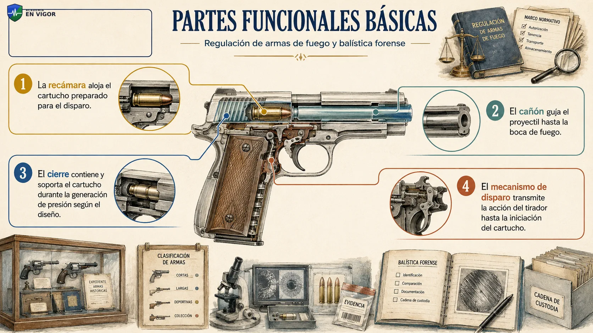

<em>Infografía: Partes funcionales básicas.</em>

:::hablemos-claro
La recámara aloja el cartucho preparado para el disparo.
:::

:::en-la-calle
Al identificar un arma o su régimen, La recámara aloja el cartucho preparado para el disparo.
:::

:::lo-que-cae
Prioriza **cañón, recámara, cierre y mecanismo de disparo** y descarta respuestas que confundan categoría, mecanismo, documento, cartucho, trayectoria o indicio.
:::

<!-- FUENTE: SECRIM-2024-T42 -->

## 11. Ánima, campos y estrías

### Lógica del bloque

Para dominar **ánima, campos y estrías**, aplica esta regla: El ánima es la superficie interior del cañón. El anclaje principal es **interior del cañón liso o rayado**.

### Hechos examinables

- El ánima es la superficie interior del cañón. <!-- FACT:PN-T42-F041 -->
- Un ánima puede ser lisa o presentar rayado helicoidal según el arma. <!-- FACT:PN-T42-F042 -->
- En un cañón rayado alternan campos y estrías que pueden imprimir marcas al proyectil. <!-- FACT:PN-T42-F043 -->
- Número, anchura y sentido del rayado son características útiles, pero no bastan siempre para identificar un arma concreta. <!-- FACT:PN-T42-F044 -->

### Ejemplos razonados

- **Aplicación correcta:** Un ánima puede ser lisa o presentar rayado helicoidal según el arma.
- **Contraste útil:** En un cañón rayado alternan campos y estrías que pueden imprimir marcas al proyectil.

### Trampas de examen

- **Incorrecto:** Toda ánima es lisa.
- **Incorrecto:** El número de estrías individualiza por sí solo un arma concreta.

<!-- VISUAL:t42-11-anima-campos-y-estrias.webp -->

  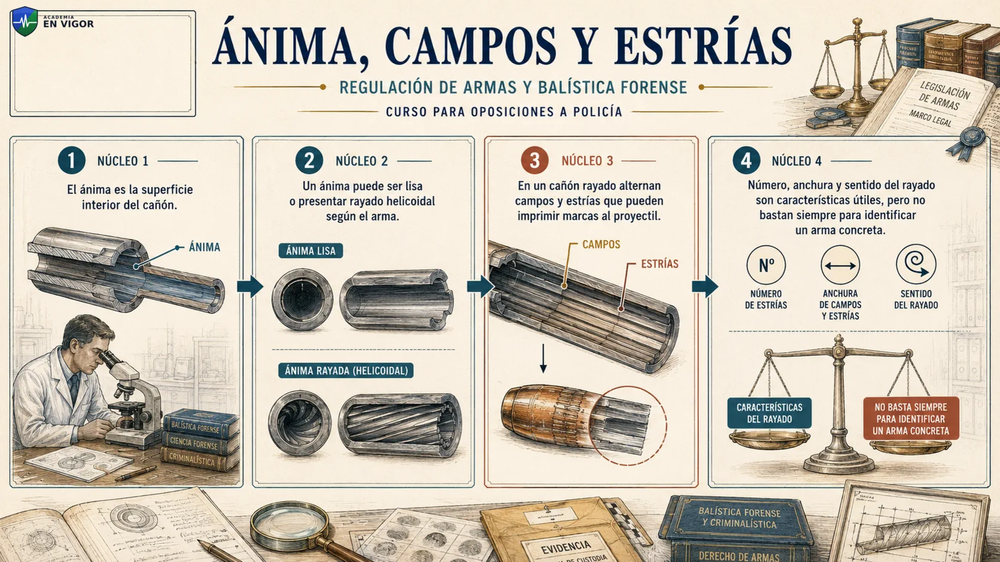

<em>Infografía: Ánima, campos y estrías.</em>

:::hablemos-claro
El ánima es la superficie interior del cañón.
:::

:::en-la-calle
Al identificar un arma o su régimen, El ánima es la superficie interior del cañón.
:::

:::lo-que-cae
Prioriza **interior del cañón liso o rayado** y descarta respuestas que confundan categoría, mecanismo, documento, cartucho, trayectoria o indicio.
:::

<!-- FUENTE: SECRIM-2024-T42 -->

## 12. Avancarga y retrocarga

### Lógica del bloque

Para dominar **avancarga y retrocarga**, aplica esta regla: En la avancarga la carga de proyección y el proyectil se introducen por la boca del cañón o de la recámara del tambor. El anclaje principal es **boca frente a recámara**.

### Hechos examinables

- En la avancarga la carga de proyección y el proyectil se introducen por la boca del cañón o de la recámara del tambor. <!-- FACT:PN-T42-F045 -->
- La carga de avancarga es pólvora negra o sustancia explosiva o pirotécnica similar. <!-- FACT:PN-T42-F046 -->
- En la retrocarga la munición se introduce desde la parte posterior del cañón, normalmente en la recámara. <!-- FACT:PN-T42-F047 -->
- El punto de carga no determina por sí solo si el arma es de un tiro, repetición o semiautomática. <!-- FACT:PN-T42-F048 -->

### Ejemplos razonados

- **Aplicación correcta:** La carga de avancarga es pólvora negra o sustancia explosiva o pirotécnica similar.
- **Contraste útil:** En la retrocarga la munición se introduce desde la parte posterior del cañón, normalmente en la recámara.

### Trampas de examen

- **Incorrecto:** Avancarga significa cargar por el cerrojo.
- **Incorrecto:** Toda retrocarga es semiautomática.

<!-- VISUAL:t42-12-avancarga-y-retrocarga.webp -->

  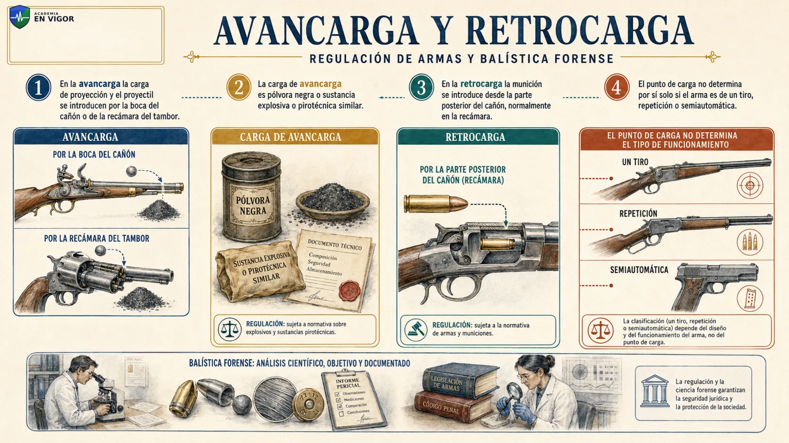

<em>Infografía: Avancarga y retrocarga.</em>

:::hablemos-claro
En la avancarga la carga de proyección y el proyectil se introducen por la boca del cañón o de la recámara del tambor.
:::

:::en-la-calle
Al examinar su mecanismo de funcionamiento, En la avancarga la carga de proyección y el proyectil se introducen por la boca del cañón o de la recámara del tambor.
:::

:::lo-que-cae
Prioriza **boca frente a recámara** y descarta respuestas que confundan categoría, mecanismo, documento, cartucho, trayectoria o indicio.
:::

<!-- FUENTE: BOE-RA-T42 -->

## 13. Arma de un solo tiro

### Lógica del bloque

Para dominar **arma de un solo tiro**, aplica esta regla: El arma de un solo tiro carece de depósito de municiones. El anclaje principal es **sin depósito y recarga manual previa**.

### Hechos examinables

- El arma de un solo tiro carece de depósito de municiones. <!-- FACT:PN-T42-F049 -->
- Se recarga antes de cada disparo. <!-- FACT:PN-T42-F050 -->
- La recarga se realiza introduciendo manualmente un cartucho en la recámara o alojamiento especial. <!-- FACT:PN-T42-F051 -->
- Un arma basculante puede ser de uno o varios cañones sin convertirse por ello en arma de repetición. <!-- FACT:PN-T42-F052 -->

### Ejemplos razonados

- **Aplicación correcta:** Se recarga antes de cada disparo.
- **Contraste útil:** La recarga se realiza introduciendo manualmente un cartucho en la recámara o alojamiento especial.

### Trampas de examen

- **Incorrecto:** Un solo tiro significa cargador con un cartucho.
- **Incorrecto:** Se recarga automáticamente después de disparar.

<!-- VISUAL:t42-13-arma-de-un-solo-tiro.webp -->

  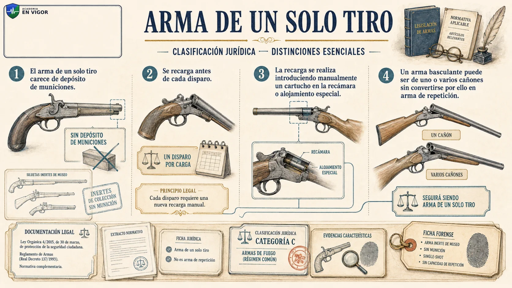

<em>Infografía: Arma de un solo tiro.</em>

:::hablemos-claro
El arma de un solo tiro carece de depósito de municiones.
:::

:::en-la-calle
Al examinar su mecanismo de funcionamiento, El arma de un solo tiro carece de depósito de municiones.
:::

:::lo-que-cae
Prioriza **sin depósito y recarga manual previa** y descarta respuestas que confundan categoría, mecanismo, documento, cartucho, trayectoria o indicio.
:::

<!-- FUENTE: BOE-RA-T42 -->

## 14. Arma basculante

### Lógica del bloque

Para dominar **arma basculante**, aplica esta regla: El arma basculante carece de depósito de municiones en la definición reglamentaria. El anclaje principal es **cierre mediante báscula**.

### Hechos examinables

- El arma basculante carece de depósito de municiones en la definición reglamentaria. <!-- FACT:PN-T42-F053 -->
- Se carga manualmente introduciendo un cartucho en la recámara. <!-- FACT:PN-T42-F054 -->
- Su cierre se realiza mediante báscula. <!-- FACT:PN-T42-F055 -->
- Puede disponer de uno o varios cañones. <!-- FACT:PN-T42-F056 -->

### Ejemplos razonados

- **Aplicación correcta:** Se carga manualmente introduciendo un cartucho en la recámara.
- **Contraste útil:** Su cierre se realiza mediante báscula.

### Trampas de examen

- **Incorrecto:** Basculante significa que usa un cerrojo longitudinal.
- **Incorrecto:** Solo puede tener un cañón.

<!-- VISUAL:t42-il-14-arma-basculante.webp -->

  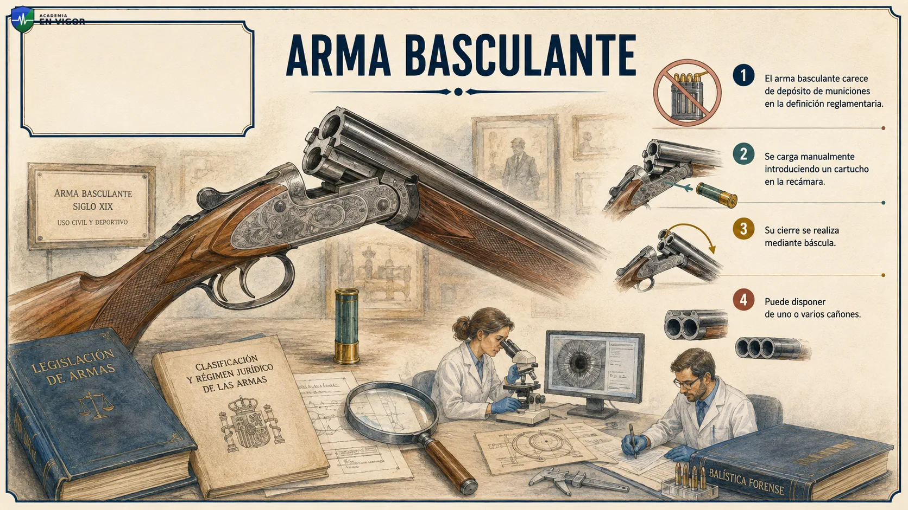

<em>Infografía: Arma basculante.</em>

:::hablemos-claro
El arma basculante carece de depósito de municiones en la definición reglamentaria.
:::

:::en-la-calle
Al examinar su mecanismo de funcionamiento, El arma basculante carece de depósito de municiones en la definición reglamentaria.
:::

:::lo-que-cae
Prioriza **cierre mediante báscula** y descarta respuestas que confundan categoría, mecanismo, documento, cartucho, trayectoria o indicio.
:::

<!-- FUENTE: BOE-RA-T42 -->

## 15. Arma de repetición

### Lógica del bloque

Para dominar **arma de repetición**, aplica esta regla: El arma de repetición se recarga después de cada disparo. El anclaje principal es **tirador acciona recarga**.

### Hechos examinables

- El arma de repetición se recarga después de cada disparo. <!-- FACT:PN-T42-F057 -->
- La recarga exige un mecanismo accionado por el tirador. <!-- FACT:PN-T42-F058 -->
- El mecanismo introduce en el cañón un cartucho colocado previamente en el depósito. <!-- FACT:PN-T42-F059 -->
- La energía del disparo no completa automáticamente el ciclo de recarga. <!-- FACT:PN-T42-F060 -->

### Ejemplos razonados

- **Aplicación correcta:** La recarga exige un mecanismo accionado por el tirador.
- **Contraste útil:** El mecanismo introduce en el cañón un cartucho colocado previamente en el depósito.

### Trampas de examen

- **Incorrecto:** Repetición significa varios disparos con una sola presión.
- **Incorrecto:** El arma se recarga sola después de cada disparo.

<!-- VISUAL:t42-15-arma-de-repeticion.webp -->

  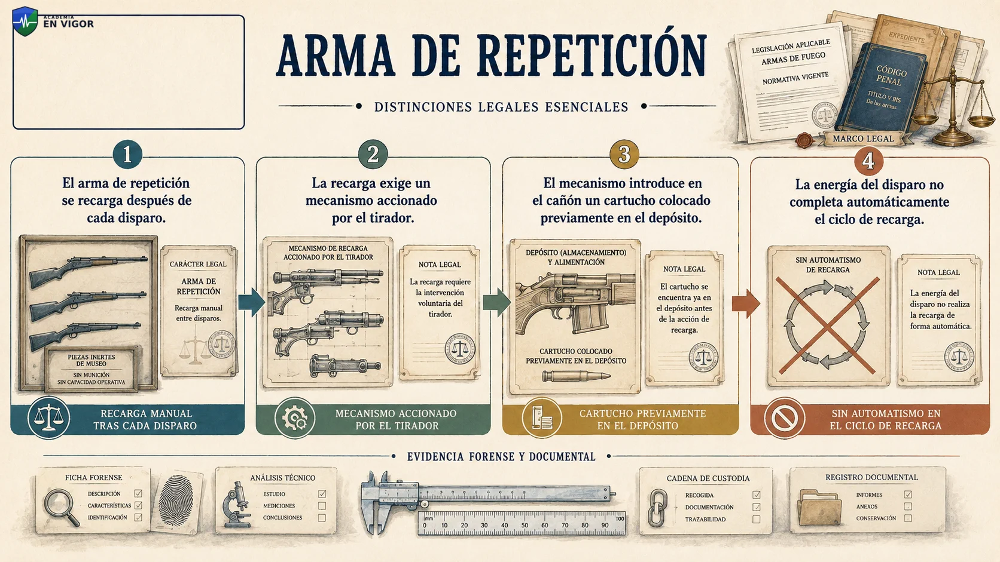

<em>Infografía: Arma de repetición.</em>

:::hablemos-claro
El arma de repetición se recarga después de cada disparo.
:::

:::en-la-calle
Al examinar su mecanismo de funcionamiento, El arma de repetición se recarga después de cada disparo.
:::

:::lo-que-cae
Prioriza **tirador acciona recarga** y descarta respuestas que confundan categoría, mecanismo, documento, cartucho, trayectoria o indicio.
:::

<!-- FUENTE: BOE-RA-T42 -->

## 16. Arma semiautomática

### Lógica del bloque

Para dominar **arma semiautomática**, aplica esta regla: El arma semiautomática se recarga automáticamente después de cada disparo. El anclaje principal es **recarga automática y un tiro por acción**.

### Hechos examinables

- El arma semiautomática se recarga automáticamente después de cada disparo. <!-- FACT:PN-T42-F061 -->
- Solo permite un disparo por cada acción del disparador. <!-- FACT:PN-T42-F062 -->
- La recarga automática y el disparo único por acción son requisitos acumulativos. <!-- FACT:PN-T42-F063 -->
- Mantener presionado el disparador no produce varios disparos sucesivos en su funcionamiento semiautomático normal. <!-- FACT:PN-T42-F064 -->

### Ejemplos razonados

- **Aplicación correcta:** Solo permite un disparo por cada acción del disparador.
- **Contraste útil:** La recarga automática y el disparo único por acción son requisitos acumulativos.

### Trampas de examen

- **Incorrecto:** Semiautomática y automática son sinónimos.
- **Incorrecto:** Exige accionar manualmente el mecanismo de recarga tras cada tiro.

<!-- VISUAL:t42-16-arma-semiautomatica.webp -->

  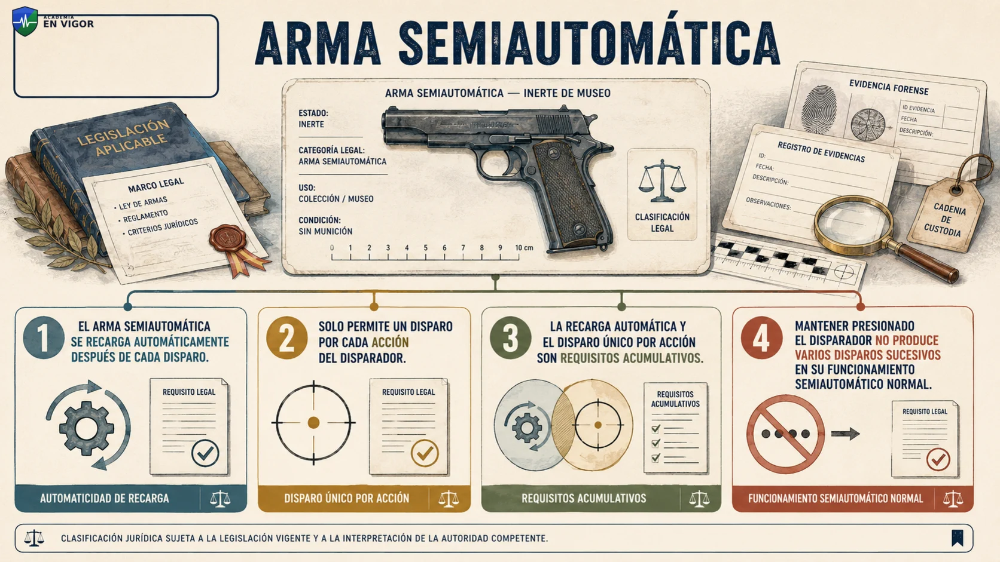

<em>Infografía: Arma semiautomática.</em>

:::hablemos-claro
El arma semiautomática se recarga automáticamente después de cada disparo.
:::

:::en-la-calle
Al examinar su mecanismo de funcionamiento, El arma semiautomática se recarga automáticamente después de cada disparo.
:::

:::lo-que-cae
Prioriza **recarga automática y un tiro por acción** y descarta respuestas que confundan categoría, mecanismo, documento, cartucho, trayectoria o indicio.
:::

<!-- FUENTE: BOE-RA-T42 -->

## 17. Arma automática

### Lógica del bloque

Para dominar **arma automática**, aplica esta regla: El arma automática se recarga automáticamente después de cada disparo. El anclaje principal es **varios disparos mientras se acciona**.

### Hechos examinables

- El arma automática se recarga automáticamente después de cada disparo. <!-- FACT:PN-T42-F065 -->
- Permite varios disparos sucesivos mientras permanezca accionado el disparador. <!-- FACT:PN-T42-F066 -->
- La diferencia decisiva con la semiautomática está en la respuesta a una sola acción mantenida. <!-- FACT:PN-T42-F067 -->
- Las armas de fuego automáticas son armas de guerra y están prohibidas a particulares. <!-- FACT:PN-T42-F068 -->

### Ejemplos razonados

- **Aplicación correcta:** Permite varios disparos sucesivos mientras permanezca accionado el disparador.
- **Contraste útil:** La diferencia decisiva con la semiautomática está en la respuesta a una sola acción mantenida.

### Trampas de examen

- **Incorrecto:** Automática significa un tiro por cada presión.
- **Incorrecto:** Toda arma que expulsa la vaina es automática.

<!-- VISUAL:t42-17-arma-automatica.webp -->

  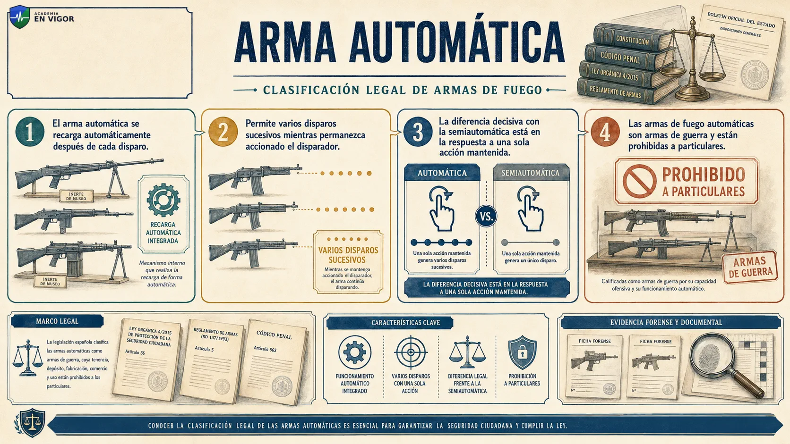

<em>Infografía: Arma automática.</em>

:::hablemos-claro
El arma automática se recarga automáticamente después de cada disparo.
:::

:::en-la-calle
Al examinar su mecanismo de funcionamiento, El arma automática se recarga automáticamente después de cada disparo.
:::

:::lo-que-cae
Prioriza **varios disparos mientras se acciona** y descarta respuestas que confundan categoría, mecanismo, documento, cartucho, trayectoria o indicio.
:::

<!-- FUENTE: BOE-RA-T42 -->

## 18. Pistola y revólver

### Lógica del bloque

Para dominar **pistola y revólver**, aplica esta regla: Pistolas y revólveres están incluidos en la 1.ª categoría como armas de fuego cortas. El anclaje principal es **recámara en cañón frente a tambor**.

### Hechos examinables

- Pistolas y revólveres están incluidos en la 1.ª categoría como armas de fuego cortas. <!-- FACT:PN-T42-F069 -->
- En la pistola ordinaria la recámara se alinea con el cañón y la alimentación depende de su mecanismo. <!-- FACT:PN-T42-F070 -->
- En el revólver varias recámaras se sitúan en un tambor giratorio. <!-- FACT:PN-T42-F071 -->
- La categoría jurídica compartida no hace idénticos sus mecanismos ni las marcas que producen. <!-- FACT:PN-T42-F072 -->

### Ejemplos razonados

- **Aplicación correcta:** En la pistola ordinaria la recámara se alinea con el cañón y la alimentación depende de su mecanismo.
- **Contraste útil:** En el revólver varias recámaras se sitúan en un tambor giratorio.

### Trampas de examen

- **Incorrecto:** Todo revólver es una pistola semiautomática.
- **Incorrecto:** Pistola y revólver producen siempre las mismas marcas sobre la vaina.

<!-- VISUAL:t42-18-pistola-y-revolver.webp -->

  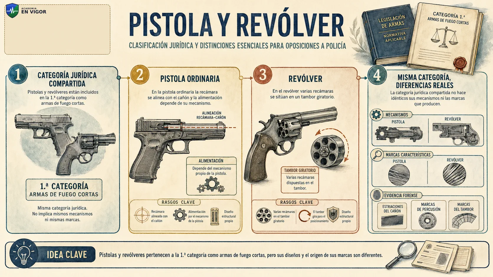

<em>Infografía: Pistola y revólver.</em>

:::hablemos-claro
Pistolas y revólveres están incluidos en la 1.ª categoría como armas de fuego cortas.
:::

:::en-la-calle
Al examinar su mecanismo de funcionamiento, Pistolas y revólveres están incluidos en la 1.ª categoría como armas de fuego cortas.
:::

:::lo-que-cae
Prioriza **recámara en cañón frente a tambor** y descarta respuestas que confundan categoría, mecanismo, documento, cartucho, trayectoria o indicio.
:::

<!-- FUENTE: GC-CLASS-T42 -->

## 19. Fusil, carabina y escopeta

### Lógica del bloque

Para dominar **fusil, carabina y escopeta**, aplica esta regla: Fusil y carabina suelen designar armas largas de cañón rayado, con diferencias dependientes del diseño y uso. El anclaje principal es **armas largas con destinos y ánimas distintos**.

### Hechos examinables

- Fusil y carabina suelen designar armas largas de cañón rayado, con diferencias dependientes del diseño y uso. <!-- FACT:PN-T42-F073 -->
- La escopeta se asocia reglamentariamente al ánima lisa o al rayado destinado a facilitar el plomeo. <!-- FACT:PN-T42-F074 -->
- El nombre común no sustituye la categoría concreta del artículo 3. <!-- FACT:PN-T42-F075 -->
- Una escopeta no se clasifica como rifle solo por tener marcas que faciliten el plomeo. <!-- FACT:PN-T42-F076 -->

### Ejemplos razonados

- **Aplicación correcta:** La escopeta se asocia reglamentariamente al ánima lisa o al rayado destinado a facilitar el plomeo.
- **Contraste útil:** El nombre común no sustituye la categoría concreta del artículo 3.

### Trampas de examen

- **Incorrecto:** Toda arma larga es una escopeta.
- **Incorrecto:** Carabina designa siempre un arma de aire comprimido.

<!-- VISUAL:t42-il-19-fusil-carabina-y-escopeta.webp -->

  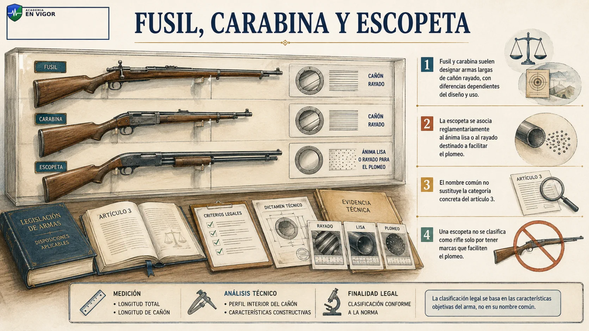

<em>Infografía: Fusil, carabina y escopeta.</em>

:::hablemos-claro
Fusil y carabina suelen designar armas largas de cañón rayado, con diferencias dependientes del diseño y uso.
:::

:::en-la-calle
Al examinar su mecanismo de funcionamiento, Fusil y carabina suelen designar armas largas de cañón rayado, con diferencias dependientes del diseño y uso.
:::

:::lo-que-cae
Prioriza **armas largas con destinos y ánimas distintos** y descarta respuestas que confundan categoría, mecanismo, documento, cartucho, trayectoria o indicio.
:::

<!-- FUENTE: GC-CLASS-T42 -->

## 20. Cargador, depósito y recámara

### Lógica del bloque

Para dominar **cargador, depósito y recámara**, aplica esta regla: El depósito de municiones almacena cartuchos disponibles para alimentar el arma. El anclaje principal es **almacenar, alimentar y alojar**.

### Hechos examinables

- El depósito de municiones almacena cartuchos disponibles para alimentar el arma. <!-- FACT:PN-T42-F077 -->
- El cargador puede ser fijo o separable según el diseño y actúa como depósito o parte de la alimentación. <!-- FACT:PN-T42-F078 -->
- La recámara aloja el cartucho que va a ser disparado. <!-- FACT:PN-T42-F079 -->
- Capacidad del cargador y cartucho en recámara son datos diferentes cuando la norma cuenta la capacidad total. <!-- FACT:PN-T42-F080 -->

### Ejemplos razonados

- **Aplicación correcta:** El cargador puede ser fijo o separable según el diseño y actúa como depósito o parte de la alimentación.
- **Contraste útil:** La recámara aloja el cartucho que va a ser disparado.

### Trampas de examen

- **Incorrecto:** Cargador y recámara son la misma pieza.
- **Incorrecto:** Un cartucho en recámara nunca cuenta en la capacidad legal.

<!-- VISUAL:t42-20-cargador-deposito-y-recamara.webp -->

  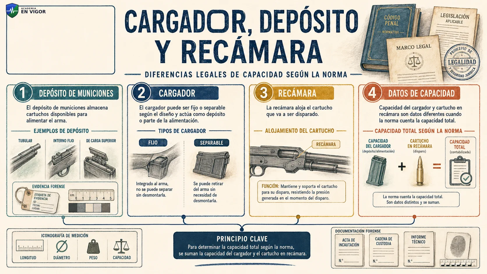

<em>Infografía: Cargador, depósito y recámara.</em>

:::hablemos-claro
El depósito de municiones almacena cartuchos disponibles para alimentar el arma.
:::

:::en-la-calle
Al examinar su mecanismo de funcionamiento, El depósito de municiones almacena cartuchos disponibles para alimentar el arma.
:::

:::lo-que-cae
Prioriza **almacenar, alimentar y alojar** y descarta respuestas que confundan categoría, mecanismo, documento, cartucho, trayectoria o indicio.
:::

<!-- FUENTE: SECRIM-2024-T42 -->

## 21. Alimentación y acerrojamiento

### Lógica del bloque

Para dominar **alimentación y acerrojamiento**, aplica esta regla: Alimentar es llevar un cartucho desde el depósito hacia la recámara. El anclaje principal es **llevar cartucho y cerrar**.

### Hechos examinables

- Alimentar es llevar un cartucho desde el depósito hacia la recámara. <!-- FACT:PN-T42-F081 -->
- Acerrojar o cerrar fija el sistema para soportar el disparo conforme al diseño. <!-- FACT:PN-T42-F082 -->
- Un fallo de alimentación no equivale a un fallo de percusión. <!-- FACT:PN-T42-F083 -->
- La comprobación funcional debe distinguir la fase exacta en que se detiene el ciclo. <!-- FACT:PN-T42-F084 -->

### Ejemplos razonados

- **Aplicación correcta:** Acerrojar o cerrar fija el sistema para soportar el disparo conforme al diseño.
- **Contraste útil:** Un fallo de alimentación no equivale a un fallo de percusión.

### Trampas de examen

- **Incorrecto:** Alimentación significa expulsar la vaina.
- **Incorrecto:** Todo cierre incompleto produce necesariamente un disparo.

<!-- VISUAL:t42-21-alimentacion-y-acerrojamiento.webp -->

  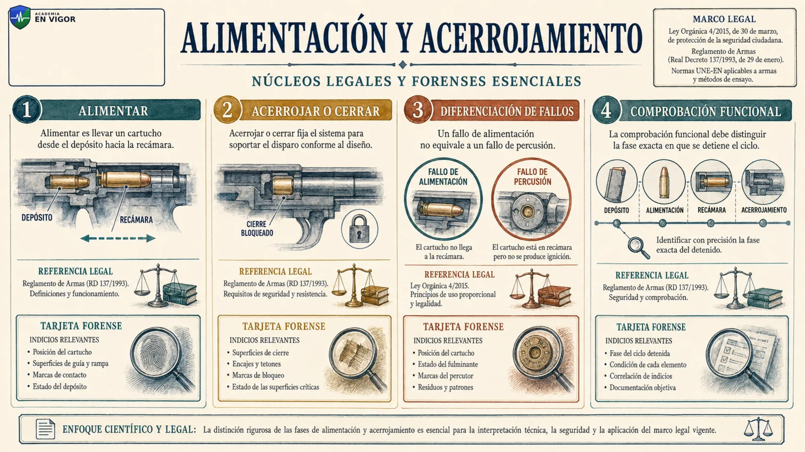

<em>Infografía: Alimentación y acerrojamiento.</em>

:::hablemos-claro
Alimentar es llevar un cartucho desde el depósito hacia la recámara.
:::

:::en-la-calle
Al examinar su mecanismo de funcionamiento, Alimentar es llevar un cartucho desde el depósito hacia la recámara.
:::

:::lo-que-cae
Prioriza **llevar cartucho y cerrar** y descarta respuestas que confundan categoría, mecanismo, documento, cartucho, trayectoria o indicio.
:::

<!-- FUENTE: NIST-OSAC-T42 -->

## 22. Extracción y expulsión

### Lógica del bloque

Para dominar **extracción y expulsión**, aplica esta regla: La extracción retira la vaina o cartucho de la recámara. El anclaje principal es **retirar de recámara y sacar del arma**.

### Hechos examinables

- La extracción retira la vaina o cartucho de la recámara. <!-- FACT:PN-T42-F085 -->
- La expulsión lo arroja fuera del arma mediante el expulsor o por la propia maniobra. <!-- FACT:PN-T42-F086 -->
- Extractor y expulsor pueden dejar marcas forenses distintas. <!-- FACT:PN-T42-F087 -->
- En un revólver las vainas suelen permanecer en el tambor hasta la descarga manual. <!-- FACT:PN-T42-F088 -->

### Ejemplos razonados

- **Aplicación correcta:** La expulsión lo arroja fuera del arma mediante el expulsor o por la propia maniobra.
- **Contraste útil:** Extractor y expulsor pueden dejar marcas forenses distintas.

### Trampas de examen

- **Incorrecto:** Extraer y expulsar son siempre una única operación idéntica.
- **Incorrecto:** Todo disparo deja una vaina en el suelo.

<!-- VISUAL:t42-22-extraccion-y-expulsion.webp -->

  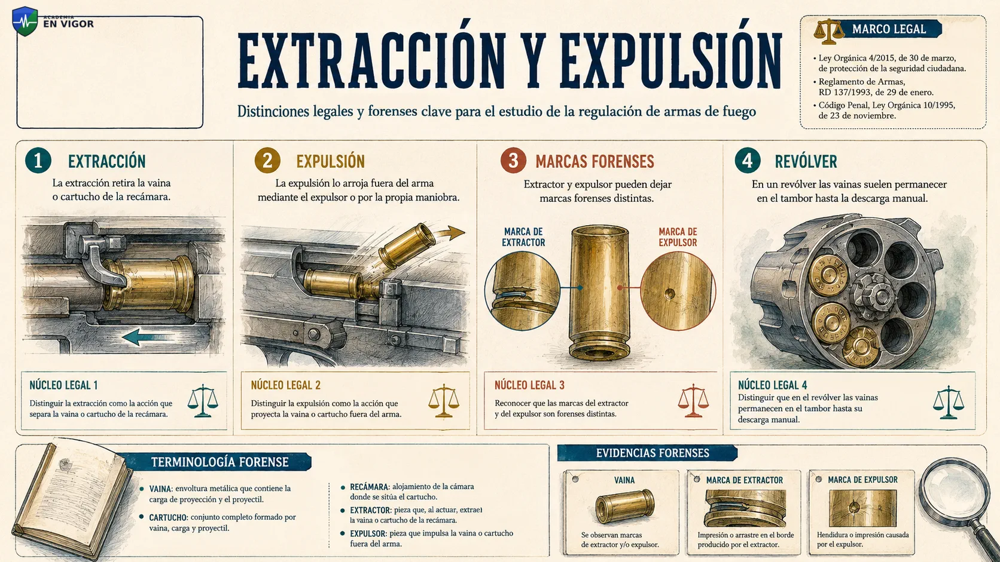

<em>Infografía: Extracción y expulsión.</em>

:::hablemos-claro
La extracción retira la vaina o cartucho de la recámara.
:::

:::en-la-calle
Al examinar su mecanismo de funcionamiento, La extracción retira la vaina o cartucho de la recámara.
:::

:::lo-que-cae
Prioriza **retirar de recámara y sacar del arma** y descarta respuestas que confundan categoría, mecanismo, documento, cartucho, trayectoria o indicio.
:::

<!-- FUENTE: NIST-OSAC-T42 -->

## 23. Desmilitarización y transformación

### Lógica del bloque

Para dominar **desmilitarización y transformación**, aplica esta regla: La desmilitarización es la actividad fabril cuyo objetivo es transformar en civil o desbaratar un arma de guerra. El anclaje principal es **transformar en civil o desbaratar un arma de guerra**.

### Hechos examinables

- La desmilitarización es la actividad fabril cuyo objetivo es transformar en civil o desbaratar un arma de guerra. <!-- FACT:PN-T42-F089 -->
- No equivale a la inutilización: esta busca volver permanentemente inservibles todos los componentes esenciales. <!-- FACT:PN-T42-F090 -->
- Transformar un arma puede requerir autorización y no altera por sí solo su régimen jurídico si la operación no se completa conforme a la norma. <!-- FACT:PN-T42-F091 -->
- Reparación, transformación, desmilitarización e inutilización describen operaciones jurídicas distintas. <!-- FACT:PN-T42-F092 -->

### Ejemplos razonados

- **Aplicación correcta:** No equivale a la inutilización: esta busca volver permanentemente inservibles todos los componentes esenciales.
- **Contraste útil:** Transformar un arma puede requerir autorización y no altera por sí solo su régimen jurídico si la operación no se completa conforme a la norma.

### Trampas de examen

- **Incorrecto:** Desmilitarizar significa eliminar una marca o inscripción militar.
- **Incorrecto:** Toda reparación convierte el arma en inutilizada.

<!-- VISUAL:t42-23-desmilitarizacion-y-transformacion.webp -->

  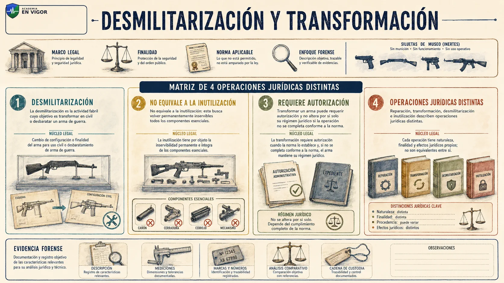

<em>Infografía: Desmilitarización y transformación.</em>

:::hablemos-claro
La desmilitarización es la actividad fabril cuyo objetivo es transformar en civil o desbaratar un arma de guerra.
:::

:::en-la-calle
Al examinar su mecanismo de funcionamiento, La desmilitarización es la actividad fabril cuyo objetivo es transformar en civil o desbaratar un arma de guerra.
:::

:::lo-que-cae
Prioriza **transformar en civil o desbaratar un arma de guerra** y descarta respuestas que confundan categoría, mecanismo, documento, cartucho, trayectoria o indicio.
:::

<!-- FUENTE: BOE-RA-T42 -->

## 24. Criterio de las categorías

### Lógica del bloque

Para dominar **criterio de las categorías**, aplica esta regla: El artículo 3 clasifica armas reglamentadas atendiendo a características, grado de peligrosidad y destino o utilización. El anclaje principal es **características, peligrosidad y destino**.

### Hechos examinables

- El artículo 3 clasifica armas reglamentadas atendiendo a características, grado de peligrosidad y destino o utilización. <!-- FACT:PN-T42-F093 -->
- Una categoría determina el régimen aplicable, pero no describe por sí sola todas las autorizaciones. <!-- FACT:PN-T42-F094 -->
- La numeración contiene categorías y subcategorías que deben leerse completas. <!-- FACT:PN-T42-F095 -->
- No debe extrapolarse una regla de una subcategoría a toda la categoría. <!-- FACT:PN-T42-F096 -->

### Ejemplos razonados

- **Aplicación correcta:** Una categoría determina el régimen aplicable, pero no describe por sí sola todas las autorizaciones.
- **Contraste útil:** La numeración contiene categorías y subcategorías que deben leerse completas.

### Trampas de examen

- **Incorrecto:** Las categorías se ordenan solo por calibre.
- **Incorrecto:** Toda arma de una categoría usa la misma licencia.

<!-- VISUAL:t42-il-24-criterio-de-las-categorias.webp -->

  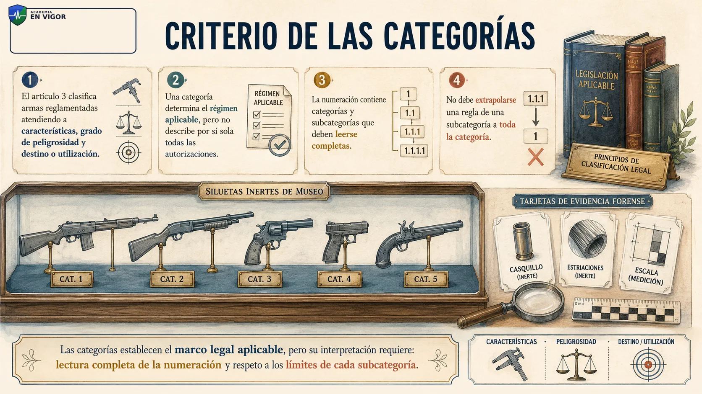

<em>Infografía: Criterio de las categorías.</em>

:::hablemos-claro
El artículo 3 clasifica armas reglamentadas atendiendo a características, grado de peligrosidad y destino o utilización.
:::

:::en-la-calle
Al clasificarla conforme al Reglamento, El artículo 3 clasifica armas reglamentadas atendiendo a características, grado de peligrosidad y destino o utilización.
:::

:::lo-que-cae
Prioriza **características, peligrosidad y destino** y descarta respuestas que confundan categoría, mecanismo, documento, cartucho, trayectoria o indicio.
:::

<!-- FUENTE: BOE-RA-T42 -->

## 25. 1.ª categoría

### Lógica del bloque

Para dominar **1.ª categoría**, aplica esta regla: La 1.ª categoría comprende armas de fuego cortas. El anclaje principal es **pistolas y revólveres**.

### Hechos examinables

- La 1.ª categoría comprende armas de fuego cortas. <!-- FACT:PN-T42-F097 -->
- Incluye pistolas. <!-- FACT:PN-T42-F098 -->
- Incluye revólveres. <!-- FACT:PN-T42-F099 -->
- La categoría no depende de que el arma corta sea de un tiro, repetición o semiautomática. <!-- FACT:PN-T42-F100 -->

### Ejemplos razonados

- **Aplicación correcta:** Incluye pistolas.
- **Contraste útil:** Incluye revólveres.

### Trampas de examen

- **Incorrecto:** La 1.ª categoría contiene todas las armas largas.
- **Incorrecto:** Solo incluye pistolas y excluye revólveres.

<!-- VISUAL:t42-25-1-a-categoria.webp -->

  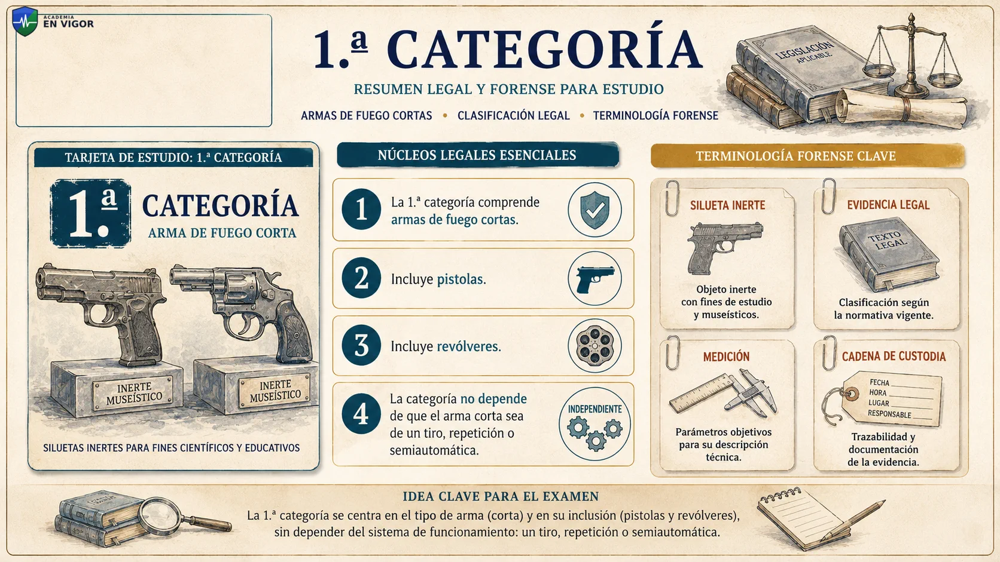

<em>Infografía: 1.ª categoría.</em>

:::hablemos-claro
La 1.ª categoría comprende armas de fuego cortas.
:::

:::en-la-calle
Al clasificarla conforme al Reglamento, La 1.ª categoría comprende armas de fuego cortas.
:::

:::lo-que-cae
Prioriza **pistolas y revólveres** y descarta respuestas que confundan categoría, mecanismo, documento, cartucho, trayectoria o indicio.
:::

<!-- FUENTE: BOE-RA-T42 -->

## 26. 2.ª categoría 1

### Lógica del bloque

Para dominar **2.ª categoría 1**, aplica esta regla: La 2.ª.1 comprende armas de fuego largas para vigilancia y guardería. El anclaje principal es **largas para vigilancia y guardería**.

### Hechos examinables

- La 2.ª.1 comprende armas de fuego largas para vigilancia y guardería. <!-- FACT:PN-T42-F101 -->
- Deben ser determinadas reglamentariamente como específicas para esas funciones. <!-- FACT:PN-T42-F102 -->
- La determinación corresponde a Orden del Ministerio del Interior o decisión adoptada a su propuesta o conformidad. <!-- FACT:PN-T42-F103 -->
- No toda arma larga utilizada de hecho por un vigilante entra automáticamente en esta subcategoría. <!-- FACT:PN-T42-F104 -->

### Ejemplos razonados

- **Aplicación correcta:** Deben ser determinadas reglamentariamente como específicas para esas funciones.
- **Contraste útil:** La determinación corresponde a Orden del Ministerio del Interior o decisión adoptada a su propuesta o conformidad.

### Trampas de examen

- **Incorrecto:** La 2.ª.1 son pistolas de particulares.
- **Incorrecto:** Basta el uso ocasional en vigilancia para reclasificar cualquier arma.

<!-- VISUAL:t42-26-2-a-categoria-1.webp -->

  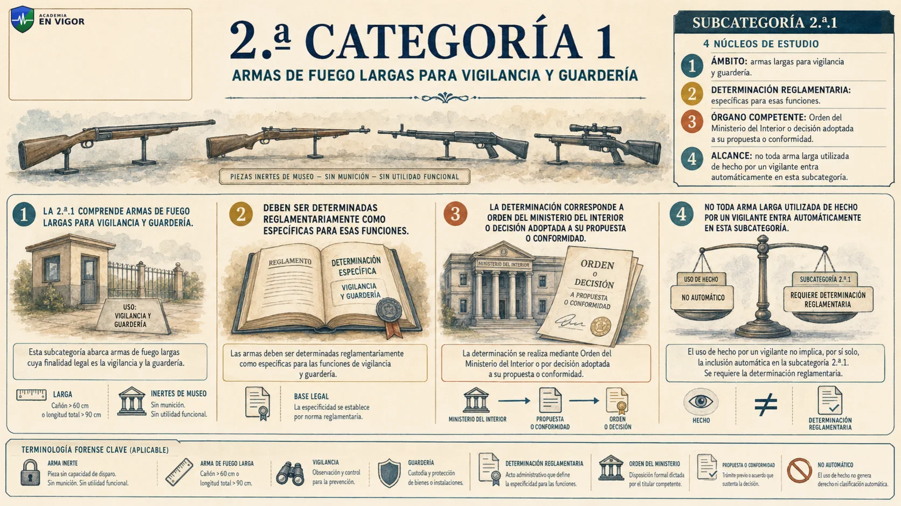

<em>Infografía: 2.ª categoría 1.</em>

:::hablemos-claro
La 2.ª.1 comprende armas de fuego largas para vigilancia y guardería.
:::

:::en-la-calle
Al clasificarla conforme al Reglamento, La 2.ª.1 comprende armas de fuego largas para vigilancia y guardería.
:::

:::lo-que-cae
Prioriza **largas para vigilancia y guardería** y descarta respuestas que confundan categoría, mecanismo, documento, cartucho, trayectoria o indicio.
:::

<!-- FUENTE: BOE-RA-T42 -->

## 27. 2.ª categoría 2

### Lógica del bloque

Para dominar **2.ª categoría 2**, aplica esta regla: La 2.ª.2 comprende armas de fuego largas rayadas utilizables para caza mayor. El anclaje principal es **largas rayadas para caza mayor**.

### Hechos examinables

- La 2.ª.2 comprende armas de fuego largas rayadas utilizables para caza mayor. <!-- FACT:PN-T42-F105 -->
- Incluye cañones estriados adaptables a escopetas de caza con recámara para cartuchos metálicos. <!-- FACT:PN-T42-F106 -->
- Quedan fuera si están clasificados como armas de guerra. <!-- FACT:PN-T42-F107 -->
- Destino, rayado y exclusión de guerra forman parte de la regla. <!-- FACT:PN-T42-F108 -->

### Ejemplos razonados

- **Aplicación correcta:** Incluye cañones estriados adaptables a escopetas de caza con recámara para cartuchos metálicos.
- **Contraste útil:** Quedan fuera si están clasificados como armas de guerra.

### Trampas de examen

- **Incorrecto:** La 2.ª.2 son escopetas de ánima lisa.
- **Incorrecto:** Incluye armas de guerra por ser rayadas.

<!-- VISUAL:t42-27-2-a-categoria-2.webp -->

  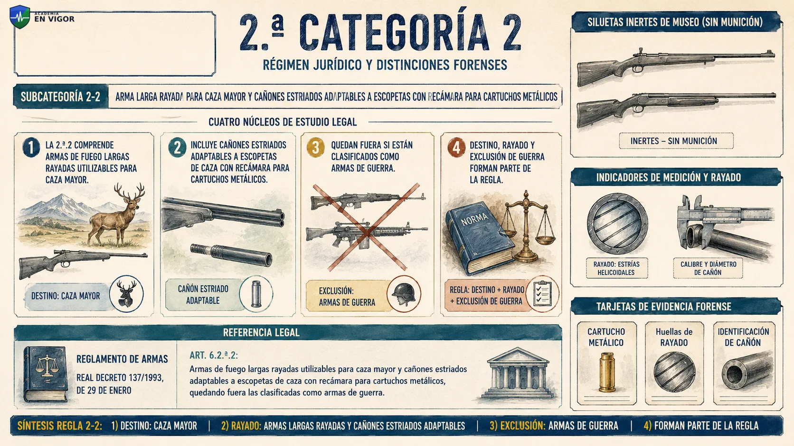

<em>Infografía: 2.ª categoría 2.</em>

:::hablemos-claro
La 2.ª.2 comprende armas de fuego largas rayadas utilizables para caza mayor.
:::

:::en-la-calle
Al clasificarla conforme al Reglamento, La 2.ª.2 comprende armas de fuego largas rayadas utilizables para caza mayor.
:::

:::lo-que-cae
Prioriza **largas rayadas para caza mayor** y descarta respuestas que confundan categoría, mecanismo, documento, cartucho, trayectoria o indicio.
:::

<!-- FUENTE: BOE-RA-T42 -->

## 28. 3.ª categoría 1

### Lógica del bloque

Para dominar **3.ª categoría 1**, aplica esta regla: La 3.ª.1 comprende armas largas rayadas para tiro deportivo. El anclaje principal es **5,6 mm, percusión anular y tiro deportivo**.

### Hechos examinables

- La 3.ª.1 comprende armas largas rayadas para tiro deportivo. <!-- FACT:PN-T42-F109 -->
- Su calibre es 5,6 milímetros o .22 americano. <!-- FACT:PN-T42-F110 -->
- La munición es de percusión anular. <!-- FACT:PN-T42-F111 -->
- Pueden ser de un disparo, repetición o semiautomáticas. <!-- FACT:PN-T42-F112 -->

### Ejemplos razonados

- **Aplicación correcta:** Su calibre es 5,6 milímetros o .22 americano.
- **Contraste útil:** La munición es de percusión anular.

### Trampas de examen

- **Incorrecto:** Incluye cualquier calibre de percusión central.
- **Incorrecto:** Solo comprende armas semiautomáticas.

<!-- VISUAL:t42-28-3-a-categoria-1.webp -->

  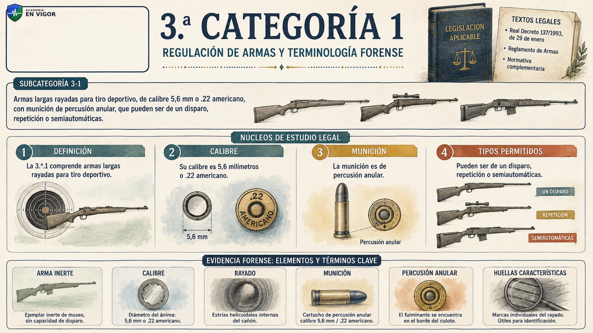

<em>Infografía: 3.ª categoría 1.</em>

:::hablemos-claro
La 3.ª.1 comprende armas largas rayadas para tiro deportivo.
:::

:::en-la-calle
Al clasificarla conforme al Reglamento, La 3.ª.1 comprende armas largas rayadas para tiro deportivo.
:::

:::lo-que-cae
Prioriza **5,6 mm, percusión anular y tiro deportivo** y descarta respuestas que confundan categoría, mecanismo, documento, cartucho, trayectoria o indicio.
:::

<!-- FUENTE: BOE-RA-T42 -->

## 29. 3.ª categoría 2

### Lógica del bloque

Para dominar **3.ª categoría 2**, aplica esta regla: La 3.ª.2 comprende escopetas y demás armas largas de ánima lisa. El anclaje principal es **escopetas y ánima lisa**.

### Hechos examinables

- La 3.ª.2 comprende escopetas y demás armas largas de ánima lisa. <!-- FACT:PN-T42-F113 -->
- Incluye las que tengan rayas para facilitar el plomeo y punzón reconocido de escopeta de caza. <!-- FACT:PN-T42-F114 -->
- No incluye armas de guerra. <!-- FACT:PN-T42-F115 -->
- El rayado para plomeo no equivale al cañón estriado para proyectil único de la 2.ª.2. <!-- FACT:PN-T42-F116 -->

### Ejemplos razonados

- **Aplicación correcta:** Incluye las que tengan rayas para facilitar el plomeo y punzón reconocido de escopeta de caza.
- **Contraste útil:** No incluye armas de guerra.

### Trampas de examen

- **Incorrecto:** Toda arma con cualquier raya pertenece a la 2.ª.2.
- **Incorrecto:** Las escopetas de caza son 1.ª categoría.

<!-- VISUAL:t42-il-29-3-a-categoria-2.webp -->

  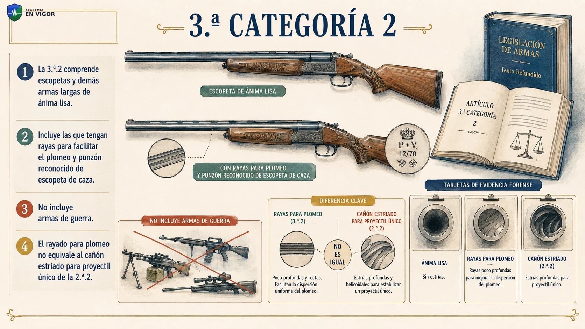

<em>Infografía: 3.ª categoría 2.</em>

:::hablemos-claro
La 3.ª.2 comprende escopetas y demás armas largas de ánima lisa.
:::

:::en-la-calle
Al clasificarla conforme al Reglamento, La 3.ª.2 comprende escopetas y demás armas largas de ánima lisa.
:::

:::lo-que-cae
Prioriza **escopetas y ánima lisa** y descarta respuestas que confundan categoría, mecanismo, documento, cartucho, trayectoria o indicio.
:::

<!-- FUENTE: BOE-RA-T42 -->

## 30. 3.ª categoría 3

### Lógica del bloque

Para dominar **3.ª categoría 3**, aplica esta regla: La 3.ª.3 comprende armas accionadas por aire u otro gas comprimido. El anclaje principal es **gas comprimido por encima de 24,2 J**.

### Hechos examinables

- La 3.ª.3 comprende armas accionadas por aire u otro gas comprimido. <!-- FACT:PN-T42-F117 -->
- Pueden ser lisas o rayadas. <!-- FACT:PN-T42-F118 -->
- La energía cinética del proyectil en boca debe exceder de 24,2 julios. <!-- FACT:PN-T42-F119 -->
- El umbral separa esta subcategoría de las armas de aire no asimiladas de 4.ª. <!-- FACT:PN-T42-F120 -->

### Ejemplos razonados

- **Aplicación correcta:** Pueden ser lisas o rayadas.
- **Contraste útil:** La energía cinética del proyectil en boca debe exceder de 24,2 julios.

### Trampas de examen

- **Incorrecto:** El límite es exactamente 24,2 J o menos.
- **Incorrecto:** Solo comprende armas de fuego con pólvora.

<!-- VISUAL:t42-30-3-a-categoria-3.webp -->

  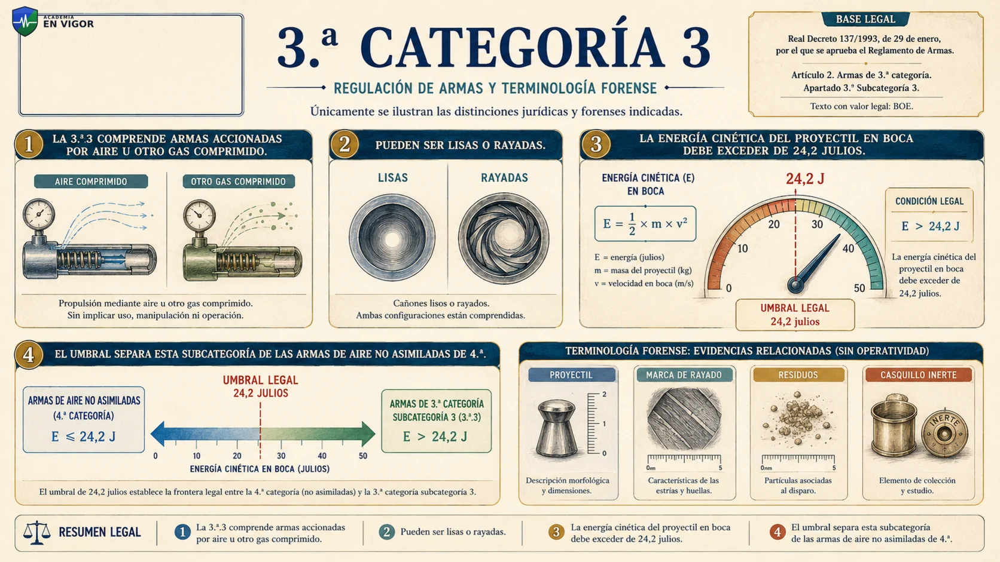

<em>Infografía: 3.ª categoría 3.</em>

:::hablemos-claro
La 3.ª.3 comprende armas accionadas por aire u otro gas comprimido.
:::

:::en-la-calle
Al clasificarla conforme al Reglamento, La 3.ª.3 comprende armas accionadas por aire u otro gas comprimido.
:::

:::lo-que-cae
Prioriza **gas comprimido por encima de 24,2 J** y descarta respuestas que confundan categoría, mecanismo, documento, cartucho, trayectoria o indicio.
:::

<!-- FUENTE: BOE-RA-T42 -->

## 31. 4.ª categoría 1

### Lógica del bloque

Para dominar **4.ª categoría 1**, aplica esta regla: La 4.ª.1 comprende carabinas y pistolas de tiro semiautomático y de repetición accionadas por aire o gas. El anclaje principal es **aire semiautomático, repetición o doble acción**.

### Hechos examinables

- La 4.ª.1 comprende carabinas y pistolas de tiro semiautomático y de repetición accionadas por aire o gas. <!-- FACT:PN-T42-F121 -->
- Incluye revólveres de doble acción accionados por aire u otro gas comprimido. <!-- FACT:PN-T42-F122 -->
- Son armas no asimiladas a escopetas. <!-- FACT:PN-T42-F123 -->
- La forma de funcionamiento diferencia 4.ª.1 de 4.ª.2. <!-- FACT:PN-T42-F124 -->

### Ejemplos razonados

- **Aplicación correcta:** Incluye revólveres de doble acción accionados por aire u otro gas comprimido.
- **Contraste útil:** Son armas no asimiladas a escopetas.

### Trampas de examen

- **Incorrecto:** La 4.ª.1 contiene solo armas de un tiro.
- **Incorrecto:** Todo revólver de aire es de 4.ª.2.

<!-- VISUAL:t42-31-4-a-categoria-1.webp -->

  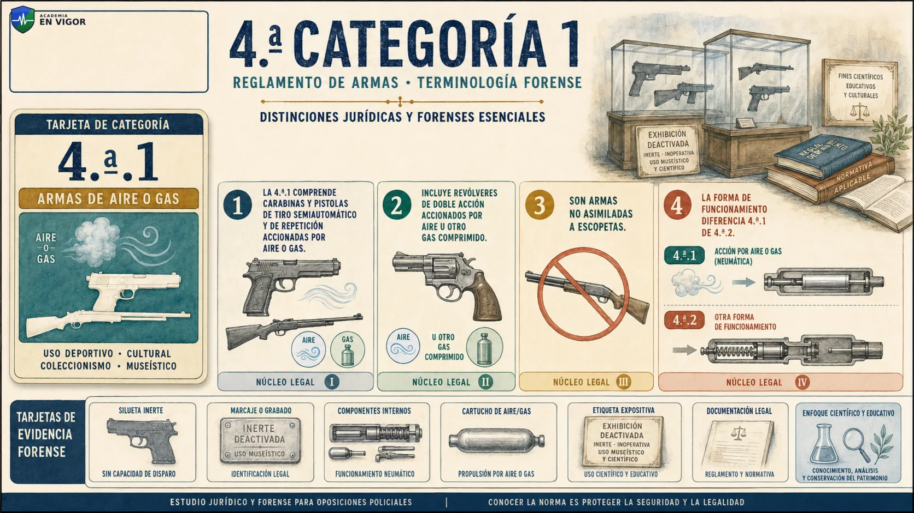

<em>Infografía: 4.ª categoría 1.</em>

:::hablemos-claro
La 4.ª.1 comprende carabinas y pistolas de tiro semiautomático y de repetición accionadas por aire o gas.
:::

:::en-la-calle
Al clasificarla conforme al Reglamento, La 4.ª.1 comprende carabinas y pistolas de tiro semiautomático y de repetición accionadas por aire o gas.
:::

:::lo-que-cae
Prioriza **aire semiautomático, repetición o doble acción** y descarta respuestas que confundan categoría, mecanismo, documento, cartucho, trayectoria o indicio.
:::

<!-- FUENTE: BOE-RA-T42 -->

## 32. 4.ª categoría 2

### Lógica del bloque

Para dominar **4.ª categoría 2**, aplica esta regla: La 4.ª.2 comprende carabinas y pistolas de un solo tiro accionadas por aire o gas. El anclaje principal es **aire de un tiro o revólver de acción simple**.

### Hechos examinables

- La 4.ª.2 comprende carabinas y pistolas de un solo tiro accionadas por aire o gas. <!-- FACT:PN-T42-F125 -->
- Pueden tener ánima lisa o rayada. <!-- FACT:PN-T42-F126 -->
- Incluye revólveres de acción simple accionados por aire u otro gas comprimido. <!-- FACT:PN-T42-F127 -->
- También son armas no asimiladas a escopetas. <!-- FACT:PN-T42-F128 -->

### Ejemplos razonados

- **Aplicación correcta:** Pueden tener ánima lisa o rayada.
- **Contraste útil:** Incluye revólveres de acción simple accionados por aire u otro gas comprimido.

### Trampas de examen

- **Incorrecto:** La 4.ª.2 comprende las semiautomáticas.
- **Incorrecto:** Solo contiene armas de ánima lisa.

<!-- VISUAL:t42-32-4-a-categoria-2.webp -->

  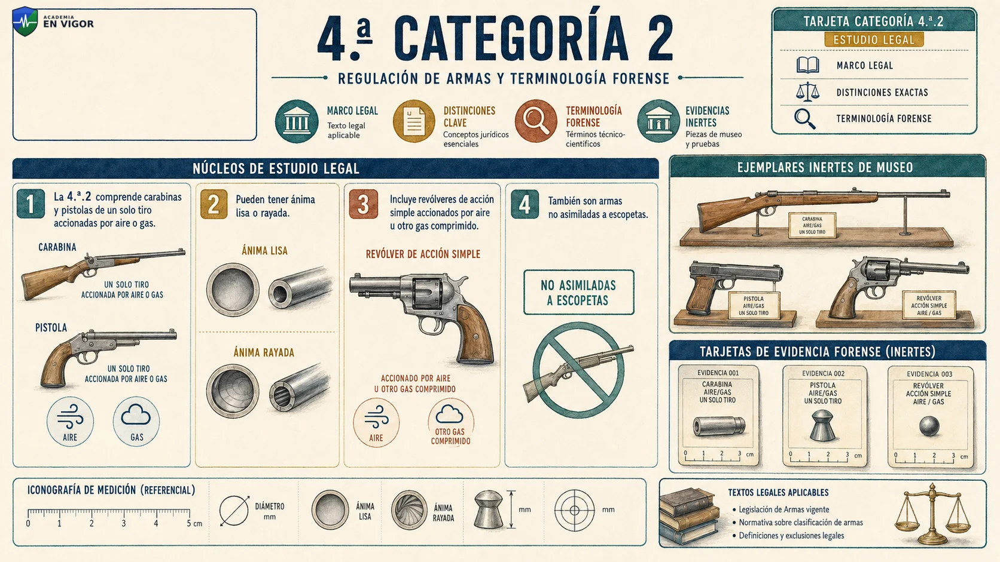

<em>Infografía: 4.ª categoría 2.</em>

:::hablemos-claro
La 4.ª.2 comprende carabinas y pistolas de un solo tiro accionadas por aire o gas.
:::

:::en-la-calle
Al clasificarla conforme al Reglamento, La 4.ª.2 comprende carabinas y pistolas de un solo tiro accionadas por aire o gas.
:::

:::lo-que-cae
Prioriza **aire de un tiro o revólver de acción simple** y descarta respuestas que confundan categoría, mecanismo, documento, cartucho, trayectoria o indicio.
:::

<!-- FUENTE: BOE-RA-T42 -->

## 33. 5.ª categoría

### Lógica del bloque

Para dominar **5.ª categoría**, aplica esta regla: La 5.ª.1 comprende armas blancas y de hoja cortante o punzante no prohibidas. El anclaje principal es **armas blancas no prohibidas y machetes militares**.

### Hechos examinables

- La 5.ª.1 comprende armas blancas y de hoja cortante o punzante no prohibidas. <!-- FACT:PN-T42-F129 -->
- La 5.ª.2 comprende cuchillos o machetes usados por unidades militares. <!-- FACT:PN-T42-F130 -->
- También incluye imitaciones de esos cuchillos o machetes. <!-- FACT:PN-T42-F131 -->
- Pertenecer a 5.ª no elimina las prohibiciones específicas de los artículos 4 y 5. <!-- FACT:PN-T42-F132 -->

### Ejemplos razonados

- **Aplicación correcta:** La 5.ª.2 comprende cuchillos o machetes usados por unidades militares.
- **Contraste útil:** También incluye imitaciones de esos cuchillos o machetes.

### Trampas de examen

- **Incorrecto:** Toda arma blanca está permitida en cualquier circunstancia.
- **Incorrecto:** La 5.ª categoría contiene pistolas detonadoras.

<!-- VISUAL:t42-33-5-a-categoria.webp -->

  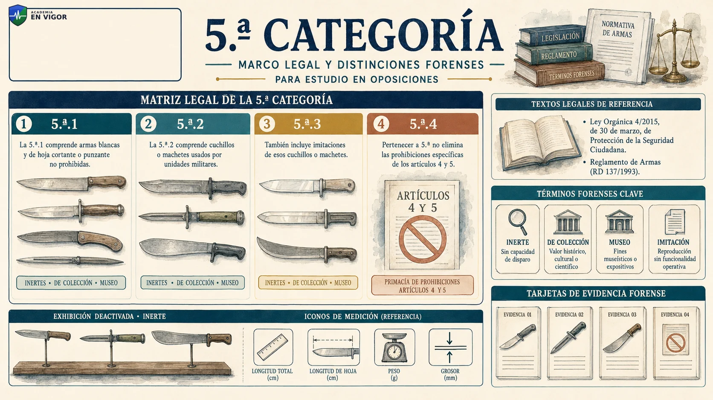

<em>Infografía: 5.ª categoría.</em>

:::hablemos-claro
La 5.ª.1 comprende armas blancas y de hoja cortante o punzante no prohibidas.
:::

:::en-la-calle
Al clasificarla conforme al Reglamento, La 5.ª.1 comprende armas blancas y de hoja cortante o punzante no prohibidas.
:::

:::lo-que-cae
Prioriza **armas blancas no prohibidas y machetes militares** y descarta respuestas que confundan categoría, mecanismo, documento, cartucho, trayectoria o indicio.
:::

<!-- FUENTE: BOE-RA-T42 -->

## 34. 6.ª categoría 1 y 2

### Lógica del bloque

Para dominar **6.ª categoría 1 y 2**, aplica esta regla: La 6.ª.1 incluye armas antiguas o históricas, reproducciones y asimiladas conservadas en museos autorizados. El anclaje principal es **museos y anterioridad a 1890**.

### Hechos examinables

- La 6.ª.1 incluye armas antiguas o históricas, reproducciones y asimiladas conservadas en museos autorizados. <!-- FACT:PN-T42-F133 -->
- La autoridad del museo depende de si pertenece a los Ejércitos o al resto de ámbitos. <!-- FACT:PN-T42-F134 -->
- La 6.ª.2 incluye armas cuyo modelo o año de fabricación sea anterior al 1 de enero de 1890. <!-- FACT:PN-T42-F135 -->
- La 6.ª.2 excluye las capaces de disparar munición destinada a armas de guerra o prohibidas. <!-- FACT:PN-T42-F136 -->

### Ejemplos razonados

- **Aplicación correcta:** La autoridad del museo depende de si pertenece a los Ejércitos o al resto de ámbitos.
- **Contraste útil:** La 6.ª.2 incluye armas cuyo modelo o año de fabricación sea anterior al 1 de enero de 1890.

### Trampas de examen

- **Incorrecto:** Toda arma fabricada en 1890 es antigua.
- **Incorrecto:** La fecha basta aunque dispare munición de guerra.

<!-- VISUAL:t42-il-34-6-a-categoria-1-y-2.webp -->

  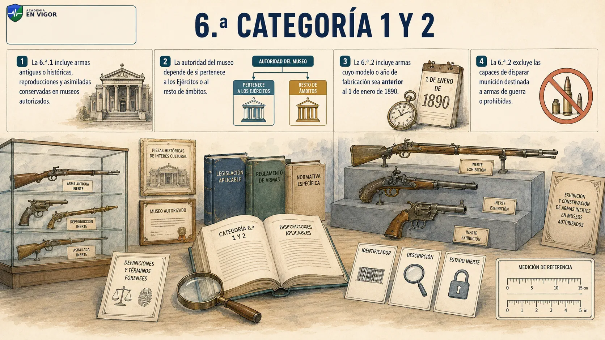

<em>Infografía: 6.ª categoría 1 y 2.</em>

:::hablemos-claro
La 6.ª.1 incluye armas antiguas o históricas, reproducciones y asimiladas conservadas en museos autorizados.
:::

:::en-la-calle
Al clasificarla conforme al Reglamento, La 6.ª.1 incluye armas antiguas o históricas, reproducciones y asimiladas conservadas en museos autorizados.
:::

:::lo-que-cae
Prioriza **museos y anterioridad a 1890** y descarta respuestas que confundan categoría, mecanismo, documento, cartucho, trayectoria o indicio.
:::

<!-- FUENTE: BOE-RA-T42 -->

## 35. 6.ª categoría 3 y 4

### Lógica del bloque

Para dominar **6.ª categoría 3 y 4**, aplica esta regla: La 6.ª.3 comprende restantes armas conservadas por carácter histórico o artístico conforme a los artículos 107 y 108. El anclaje principal es **carácter histórico o artístico y avancarga**.

### Hechos examinables

- La 6.ª.3 comprende restantes armas conservadas por carácter histórico o artístico conforme a los artículos 107 y 108. <!-- FACT:PN-T42-F137 -->
- La 6.ª.4 comprende en general las armas de avancarga. <!-- FACT:PN-T42-F138 -->
- El carácter artístico requiere acreditación y régimen documental, no una simple valoración del dueño. <!-- FACT:PN-T42-F139 -->
- Avancarga es categoría jurídica aunque el arma sea una reproducción moderna. <!-- FACT:PN-T42-F140 -->

### Ejemplos razonados

- **Aplicación correcta:** La 6.ª.4 comprende en general las armas de avancarga.
- **Contraste útil:** El carácter artístico requiere acreditación y régimen documental, no una simple valoración del dueño.

### Trampas de examen

- **Incorrecto:** Toda arma decorada es histórica automáticamente.
- **Incorrecto:** Las reproducciones de avancarga nunca están en 6.ª.

<!-- VISUAL:t42-35-6-a-categoria-3-y-4.webp -->

  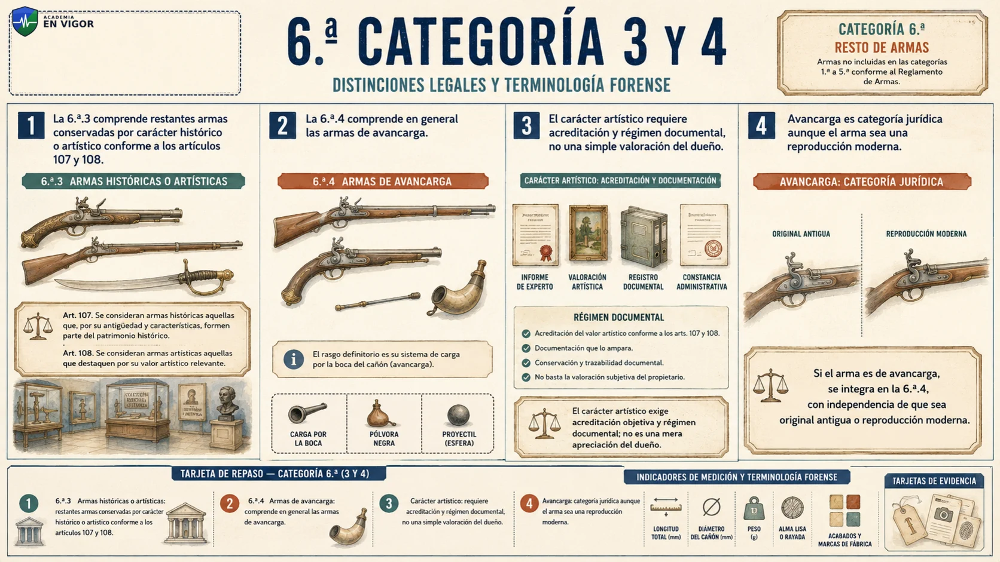

<em>Infografía: 6.ª categoría 3 y 4.</em>

:::hablemos-claro
La 6.ª.3 comprende restantes armas conservadas por carácter histórico o artístico conforme a los artículos 107 y 108.
:::

:::en-la-calle
Al clasificarla conforme al Reglamento, La 6.ª.3 comprende restantes armas conservadas por carácter histórico o artístico conforme a los artículos 107 y 108.
:::

:::lo-que-cae
Prioriza **carácter histórico o artístico y avancarga** y descarta respuestas que confundan categoría, mecanismo, documento, cartucho, trayectoria o indicio.
:::

<!-- FUENTE: BOE-RA-T42 -->

## 36. 7.ª categoría 1 a 3

### Lógica del bloque

Para dominar **7.ª categoría 1 a 3**, aplica esta regla: La 7.ª.1 comprende armas de inyección anestésica para captura o control temporal de animales. El anclaje principal es **inyección, ballestas y lanzar cabos**.

### Hechos examinables

- La 7.ª.1 comprende armas de inyección anestésica para captura o control temporal de animales. <!-- FACT:PN-T42-F141 -->
- La 7.ª.2 comprende ballestas. <!-- FACT:PN-T42-F142 -->
- La 7.ª.3 comprende armas para lanzar cabos. <!-- FACT:PN-T42-F143 -->
- Algunas armas de 7.ª están asimiladas al régimen de armas de fuego por el artículo 2. <!-- FACT:PN-T42-F144 -->

### Ejemplos razonados

- **Aplicación correcta:** La 7.ª.2 comprende ballestas.
- **Contraste útil:** La 7.ª.3 comprende armas para lanzar cabos.

### Trampas de examen

- **Incorrecto:** Toda la 7.ª categoría son armas de fuego con pólvora.
- **Incorrecto:** Las ballestas pertenecen a 5.ª categoría.

<!-- VISUAL:t42-36-7-a-categoria-1-a-3.webp -->

  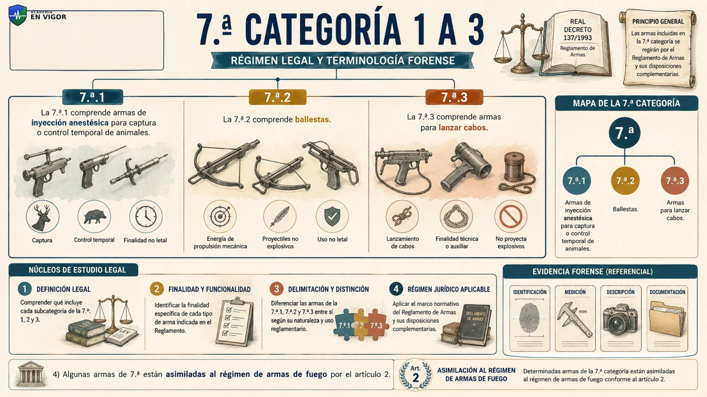

<em>Infografía: 7.ª categoría 1 a 3.</em>

:::hablemos-claro
La 7.ª.1 comprende armas de inyección anestésica para captura o control temporal de animales.
:::

:::en-la-calle
Al clasificarla conforme al Reglamento, La 7.ª.1 comprende armas de inyección anestésica para captura o control temporal de animales.
:::

:::lo-que-cae
Prioriza **inyección, ballestas y lanzar cabos** y descarta respuestas que confundan categoría, mecanismo, documento, cartucho, trayectoria o indicio.
:::

<!-- FUENTE: BOE-RA-T42 -->

## 37. 7.ª categoría 4 a 6

### Lógica del bloque

Para dominar **7.ª categoría 4 a 6**, aplica esta regla: La 7.ª.4 comprende armas de sistema Flobert. El anclaje principal es **Flobert, arcos y señales**.

### Hechos examinables

- La 7.ª.4 comprende armas de sistema Flobert. <!-- FACT:PN-T42-F145 -->
- La 7.ª.5 incluye arcos, armas para líneas de pesca y fusiles de pesca submarina que disparan flechas o arpones. <!-- FACT:PN-T42-F146 -->
- La 7.ª.6 incluye armas de alarma y señales y pistolas lanzabengalas. <!-- FACT:PN-T42-F147 -->
- Un arma Flobert usa percusión anular y no puede superar 100 julios en boca. <!-- FACT:PN-T42-F148 -->

### Ejemplos razonados

- **Aplicación correcta:** La 7.ª.5 incluye arcos, armas para líneas de pesca y fusiles de pesca submarina que disparan flechas o arpones.
- **Contraste útil:** La 7.ª.6 incluye armas de alarma y señales y pistolas lanzabengalas.

### Trampas de examen

- **Incorrecto:** Flobert pertenece a 3.ª.1 por ser .22.
- **Incorrecto:** Las pistolas lanzabengalas son siempre 1.ª categoría.

<!-- VISUAL:t42-37-7-a-categoria-4-a-6.webp -->

  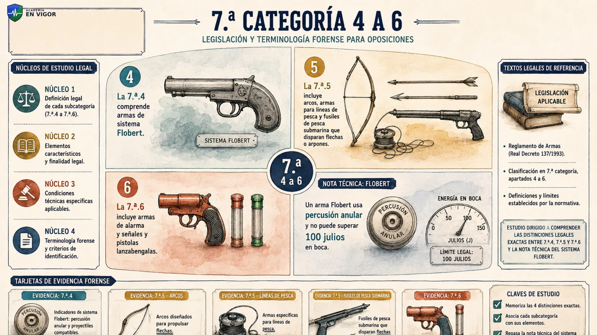

<em>Infografía: 7.ª categoría 4 a 6.</em>

:::hablemos-claro
La 7.ª.4 comprende armas de sistema Flobert.
:::

:::en-la-calle
Al clasificarla conforme al Reglamento, La 7.ª.4 comprende armas de sistema Flobert.
:::

:::lo-que-cae
Prioriza **Flobert, arcos y señales** y descarta respuestas que confundan categoría, mecanismo, documento, cartucho, trayectoria o indicio.
:::

<!-- FUENTE: BOE-RA-T42 -->

## 38. 8.ª y 9.ª categorías

### Lógica del bloque

Para dominar **8.ª y 9.ª categorías**, aplica esta regla: La 8.ª categoría comprende armas acústicas y de salvas. El anclaje principal es **salvas e inutilizadas**.

### Hechos examinables

- La 8.ª categoría comprende armas acústicas y de salvas. <!-- FACT:PN-T42-F149 -->
- Son armas de fuego transformadas específicamente para uso exclusivo con fogueo en actividades admitidas. <!-- FACT:PN-T42-F150 -->
- La 9.ª categoría comprende armas inutilizadas. <!-- FACT:PN-T42-F151 -->
- Inutilizada exige irreversibilidad verificada conforme a la ITC 2, no una avería casual. <!-- FACT:PN-T42-F152 -->

### Ejemplos razonados

- **Aplicación correcta:** Son armas de fuego transformadas específicamente para uso exclusivo con fogueo en actividades admitidas.
- **Contraste útil:** La 9.ª categoría comprende armas inutilizadas.

### Trampas de examen

- **Incorrecto:** Un arma de salvas es simplemente un arma de alarma nueva.
- **Incorrecto:** Quitar una pieza convierte por sí solo el arma en 9.ª categoría.

<!-- VISUAL:t42-38-8-a-y-9-a-categorias.webp -->

  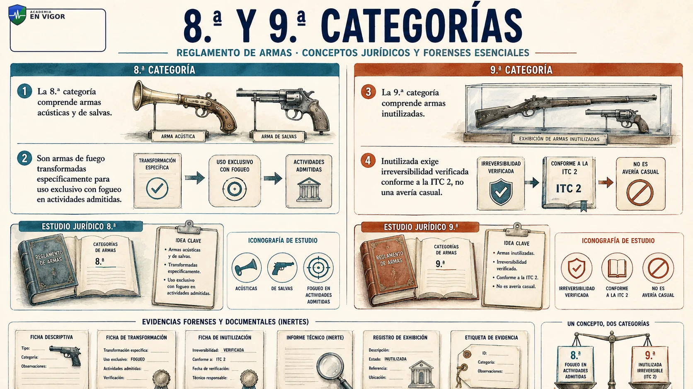

<em>Infografía: 8.ª y 9.ª categorías.</em>

:::hablemos-claro
La 8.ª categoría comprende armas acústicas y de salvas.
:::

:::en-la-calle
Al clasificarla conforme al Reglamento, La 8.ª categoría comprende armas acústicas y de salvas.
:::

:::lo-que-cae
Prioriza **salvas e inutilizadas** y descarta respuestas que confundan categoría, mecanismo, documento, cartucho, trayectoria o indicio.
:::

<!-- FUENTE: BOE-RA-T42 -->

## 39. Definición de munición y cartucho

### Lógica del bloque

Para dominar **definición de munición y cartucho**, aplica esta regla: Munición comprende el cartucho completo o sus componentes autorizados para un arma de fuego. El anclaje principal es **unidad completa y componentes autorizados**.

### Hechos examinables

- Munición comprende el cartucho completo o sus componentes autorizados para un arma de fuego. <!-- FACT:PN-T42-F153 -->
- Incluye vainas, cebos, carga propulsora, balas o proyectiles. <!-- FACT:PN-T42-F154 -->
- Cartucho es la unidad preparada para alimentar un arma y producir el lanzamiento previsto. <!-- FACT:PN-T42-F155 -->
- Cartucho y bala no son sinónimos: la bala es solo el proyectil en cartuchos que la emplean. <!-- FACT:PN-T42-F156 -->

### Ejemplos razonados

- **Aplicación correcta:** Incluye vainas, cebos, carga propulsora, balas o proyectiles.
- **Contraste útil:** Cartucho es la unidad preparada para alimentar un arma y producir el lanzamiento previsto.

### Trampas de examen

- **Incorrecto:** La vaina es siempre la bala.
- **Incorrecto:** Munición solo designa el proyectil ya disparado.

<!-- VISUAL:t42-il-39-definicion-de-municion-y-cartucho.webp -->

  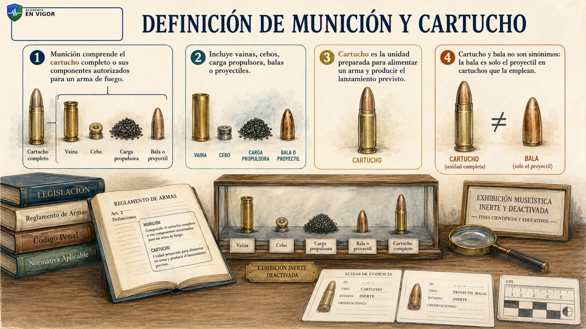

<em>Infografía: Definición de munición y cartucho.</em>

:::hablemos-claro
Munición comprende el cartucho completo o sus componentes autorizados para un arma de fuego.
:::

:::en-la-calle
Al analizar cartucho, iniciación y disparo, Munición comprende el cartucho completo o sus componentes autorizados para un arma de fuego.
:::

:::lo-que-cae
Prioriza **unidad completa y componentes autorizados** y descarta respuestas que confundan categoría, mecanismo, documento, cartucho, trayectoria o indicio.
:::

<!-- FUENTE: BOE-RA-T42 -->

## 40. Cartucho metálico

### Lógica del bloque

Para dominar **cartucho metálico**, aplica esta regla: El cartucho metálico emplea una vaina de material metálico que reúne los elementos. El anclaje principal es **vaina metálica contiene componentes**.

### Hechos examinables

- El cartucho metálico emplea una vaina de material metálico que reúne los elementos. <!-- FACT:PN-T42-F157 -->
- Normalmente integra proyectil, carga propulsora e iniciador. <!-- FACT:PN-T42-F158 -->
- La vaina posiciona el cartucho y ayuda a obturar los gases durante el disparo. <!-- FACT:PN-T42-F159 -->
- Tras el disparo pueden recuperarse vaina y proyectil como indicios distintos. <!-- FACT:PN-T42-F160 -->

### Ejemplos razonados

- **Aplicación correcta:** Normalmente integra proyectil, carga propulsora e iniciador.
- **Contraste útil:** La vaina posiciona el cartucho y ayuda a obturar los gases durante el disparo.

### Trampas de examen

- **Incorrecto:** Metálico significa que el proyectil debe ser de acero.
- **Incorrecto:** La vaina se consume por completo en todo disparo.

<!-- VISUAL:t42-40-cartucho-metalico.webp -->

  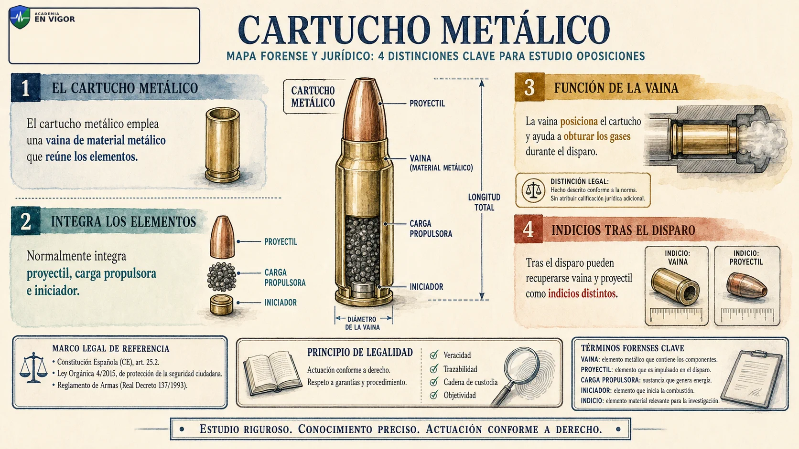

<em>Infografía: Cartucho metálico.</em>

:::hablemos-claro
El cartucho metálico emplea una vaina de material metálico que reúne los elementos.
:::

:::en-la-calle
Al analizar cartucho, iniciación y disparo, El cartucho metálico emplea una vaina de material metálico que reúne los elementos.
:::

:::lo-que-cae
Prioriza **vaina metálica contiene componentes** y descarta respuestas que confundan categoría, mecanismo, documento, cartucho, trayectoria o indicio.
:::

<!-- FUENTE: SECRIM-2024-T42 -->

## 41. Cartucho semimetálico

### Lógica del bloque

Para dominar **cartucho semimetálico**, aplica esta regla: El cartucho semimetálico combina un culote metálico con un cuerpo de otro material, habitualmente plástico o cartón. El anclaje principal es **culote metálico y cuerpo no totalmente metálico**.

### Hechos examinables

- El cartucho semimetálico combina un culote metálico con un cuerpo de otro material, habitualmente plástico o cartón. <!-- FACT:PN-T42-F161 -->
- Es característico de muchas municiones de escopeta. <!-- FACT:PN-T42-F162 -->
- Puede contener perdigones o un proyectil único, carga, pistón y taco. <!-- FACT:PN-T42-F163 -->
- Semimetálico describe la construcción del cartucho, no una potencia concreta. <!-- FACT:PN-T42-F164 -->

### Ejemplos razonados

- **Aplicación correcta:** Es característico de muchas municiones de escopeta.
- **Contraste útil:** Puede contener perdigones o un proyectil único, carga, pistón y taco.

### Trampas de examen

- **Incorrecto:** Todo cartucho de escopeta contiene perdigones.
- **Incorrecto:** Semimetálico significa mitad de la carga propulsora.

<!-- VISUAL:t42-41-cartucho-semimetalico.webp -->

  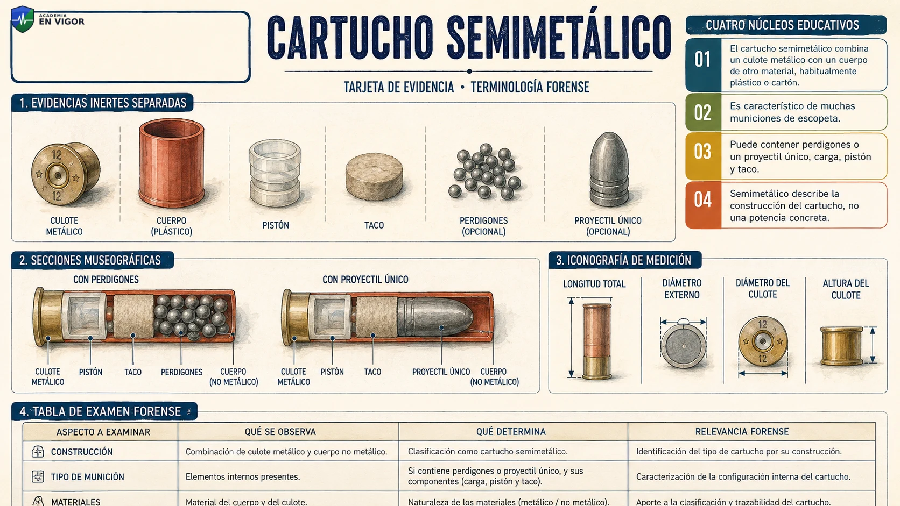

<em>Infografía: Cartucho semimetálico.</em>

:::hablemos-claro
El cartucho semimetálico combina un culote metálico con un cuerpo de otro material, habitualmente plástico o cartón.
:::

:::en-la-calle
Al analizar cartucho, iniciación y disparo, El cartucho semimetálico combina un culote metálico con un cuerpo de otro material, habitualmente plástico o cartón.
:::

:::lo-que-cae
Prioriza **culote metálico y cuerpo no totalmente metálico** y descarta respuestas que confundan categoría, mecanismo, documento, cartucho, trayectoria o indicio.
:::

<!-- FUENTE: SECRIM-2024-T42 -->

## 42. Partes de la vaina

### Lógica del bloque

Para dominar **partes de la vaina**, aplica esta regla: La boca de la vaina sujeta o cierra sobre el proyectil o contenido. El anclaje principal es **boca, cuerpo y culote**.

### Hechos examinables

- La boca de la vaina sujeta o cierra sobre el proyectil o contenido. <!-- FACT:PN-T42-F165 -->
- El cuerpo contiene la carga propulsora y se expande durante el disparo. <!-- FACT:PN-T42-F166 -->
- El culote soporta el alojamiento del iniciador y recibe marcas del cierre. <!-- FACT:PN-T42-F167 -->
- Ranura, reborde y forma dependen del diseño y facilitan extracción o posicionamiento. <!-- FACT:PN-T42-F168 -->

### Ejemplos razonados

- **Aplicación correcta:** El cuerpo contiene la carga propulsora y se expande durante el disparo.
- **Contraste útil:** El culote soporta el alojamiento del iniciador y recibe marcas del cierre.

### Trampas de examen

- **Incorrecto:** El culote es el extremo por el que sale la bala.
- **Incorrecto:** Todas las vainas tienen idéntico reborde y ranura.

<!-- VISUAL:t42-42-partes-de-la-vaina.webp -->

  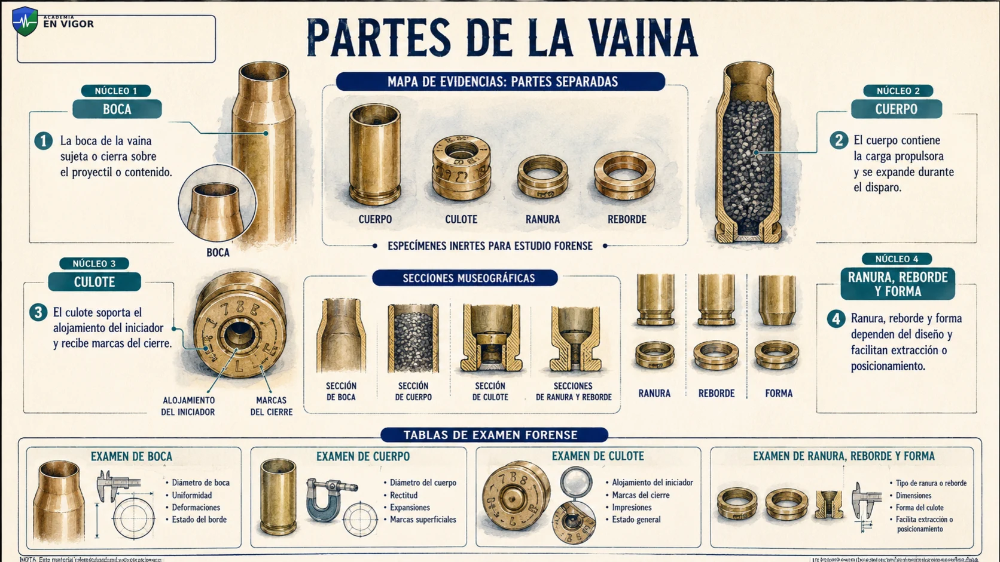

<em>Infografía: Partes de la vaina.</em>

:::hablemos-claro
La boca de la vaina sujeta o cierra sobre el proyectil o contenido.
:::

:::en-la-calle
Al analizar cartucho, iniciación y disparo, La boca de la vaina sujeta o cierra sobre el proyectil o contenido.
:::

:::lo-que-cae
Prioriza **boca, cuerpo y culote** y descarta respuestas que confundan categoría, mecanismo, documento, cartucho, trayectoria o indicio.
:::

<!-- FUENTE: SECRIM-2024-T42 -->

## 43. Pistón o cebo

### Lógica del bloque

Para dominar **pistón o cebo**, aplica esta regla: El pistón contiene una mezcla sensible que inicia la combustión de la carga. El anclaje principal es **copa, mezcla iniciadora y yunque según diseño**.

### Hechos examinables

- El pistón contiene una mezcla sensible que inicia la combustión de la carga. <!-- FACT:PN-T42-F169 -->
- En muchos cebos de percusión central hay copa, mezcla iniciadora y yunque. <!-- FACT:PN-T42-F170 -->
- La aguja percutora deforma la zona del cebo y deja una marca susceptible de examen. <!-- FACT:PN-T42-F171 -->
- La composición de los residuos depende del iniciador y la munición, por lo que no debe universalizarse una terna química. <!-- FACT:PN-T42-F172 -->

### Ejemplos razonados

- **Aplicación correcta:** En muchos cebos de percusión central hay copa, mezcla iniciadora y yunque.
- **Contraste útil:** La aguja percutora deforma la zona del cebo y deja una marca susceptible de examen.

### Trampas de examen

- **Incorrecto:** El pistón es el proyectil del cartucho.
- **Incorrecto:** Todo cebo contiene obligatoriamente plomo, bario y antimonio.

<!-- VISUAL:t42-43-piston-o-cebo.webp -->

  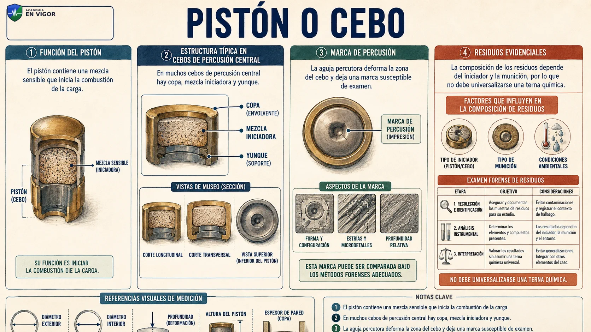

<em>Infografía: Pistón o cebo.</em>

:::hablemos-claro
El pistón contiene una mezcla sensible que inicia la combustión de la carga.
:::

:::en-la-calle
Al analizar cartucho, iniciación y disparo, El pistón contiene una mezcla sensible que inicia la combustión de la carga.
:::

:::lo-que-cae
Prioriza **copa, mezcla iniciadora y yunque según diseño** y descarta respuestas que confundan categoría, mecanismo, documento, cartucho, trayectoria o indicio.
:::

<!-- FUENTE: FBI-GSR-T42 -->

## 44. Percusión central

### Lógica del bloque

Para dominar **percusión central**, aplica esta regla: En percusión central el iniciador se sitúa en la zona central del culote. El anclaje principal es **iniciador en centro del culote**.

### Hechos examinables

- En percusión central el iniciador se sitúa en la zona central del culote. <!-- FACT:PN-T42-F173 -->
- La aguja golpea el pistón o cebo central. <!-- FACT:PN-T42-F174 -->
- El sistema permite diseños de cartucho y presiones muy variados. <!-- FACT:PN-T42-F175 -->
- Central describe la localización de la iniciación, no la posición del proyectil. <!-- FACT:PN-T42-F176 -->

### Ejemplos razonados

- **Aplicación correcta:** La aguja golpea el pistón o cebo central.
- **Contraste útil:** El sistema permite diseños de cartucho y presiones muy variados.

### Trampas de examen

- **Incorrecto:** La aguja golpea el borde periférico.
- **Incorrecto:** Percusión central significa que el arma es automática.

<!-- VISUAL:t42-il-44-percusion-central.webp -->

  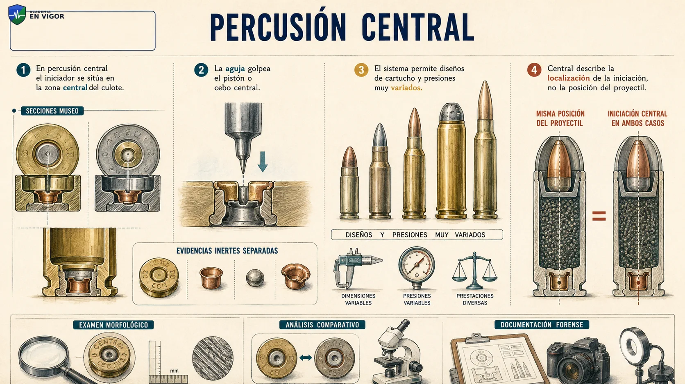

<em>Infografía: Percusión central.</em>

:::hablemos-claro
En percusión central el iniciador se sitúa en la zona central del culote.
:::

:::en-la-calle
Al analizar cartucho, iniciación y disparo, En percusión central el iniciador se sitúa en la zona central del culote.
:::

:::lo-que-cae
Prioriza **iniciador en centro del culote** y descarta respuestas que confundan categoría, mecanismo, documento, cartucho, trayectoria o indicio.
:::

<!-- FUENTE: SECRIM-2024-T42 -->

## 45. Percusión anular

### Lógica del bloque

Para dominar **percusión anular**, aplica esta regla: En percusión anular el compuesto iniciador está distribuido en el reborde hueco del culote. El anclaje principal es **compuesto iniciador en reborde**.

### Hechos examinables

- En percusión anular el compuesto iniciador está distribuido en el reborde hueco del culote. <!-- FACT:PN-T42-F177 -->
- La aguja percutora aplasta una zona periférica del reborde. <!-- FACT:PN-T42-F178 -->
- La marca de percusión aparece en el anillo periférico, no en el centro. <!-- FACT:PN-T42-F179 -->
- Flobert es siempre de percusión anular según la definición reglamentaria. <!-- FACT:PN-T42-F180 -->

### Ejemplos razonados

- **Aplicación correcta:** La aguja percutora aplasta una zona periférica del reborde.
- **Contraste útil:** La marca de percusión aparece en el anillo periférico, no en el centro.

### Trampas de examen

- **Incorrecto:** La aguja golpea la parte central del culote.
- **Incorrecto:** Percusión anular y fuego central son equivalentes.

<!-- VISUAL:t42-45-percusion-anular.webp -->

  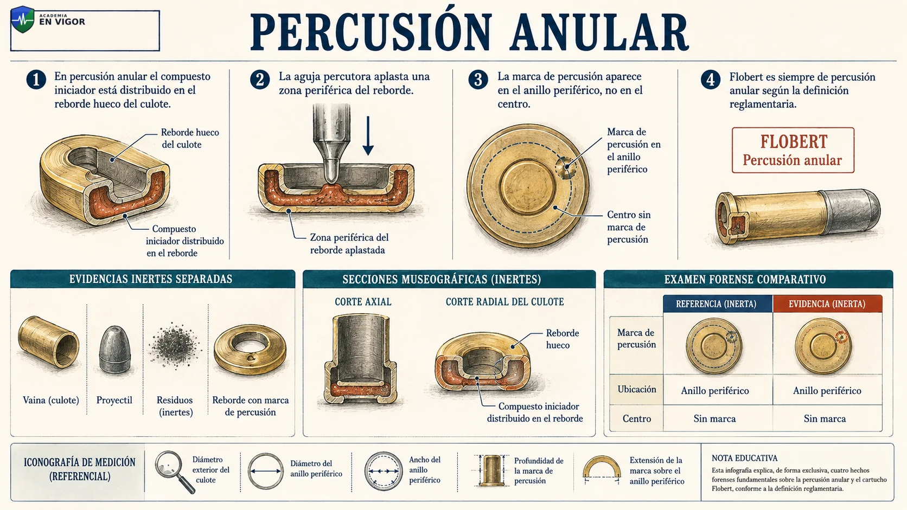

<em>Infografía: Percusión anular.</em>

:::hablemos-claro
En percusión anular el compuesto iniciador está distribuido en el reborde hueco del culote.
:::

:::en-la-calle
Al analizar cartucho, iniciación y disparo, En percusión anular el compuesto iniciador está distribuido en el reborde hueco del culote.
:::

:::lo-que-cae
Prioriza **compuesto iniciador en reborde** y descarta respuestas que confundan categoría, mecanismo, documento, cartucho, trayectoria o indicio.
:::

<!-- FUENTE: BOE-RA-T42 -->

## 46. Carga propulsora

### Lógica del bloque

Para dominar **carga propulsora**, aplica esta regla: La carga propulsora arde rápidamente tras la iniciación y genera gases a presión. El anclaje principal es **combustión genera gases**.

### Hechos examinables

- La carga propulsora arde rápidamente tras la iniciación y genera gases a presión. <!-- FACT:PN-T42-F181 -->
- La presión impulsa el proyectil por el ánima. <!-- FACT:PN-T42-F182 -->
- La pólvora no detona necesariamente como un alto explosivo en el funcionamiento normal del cartucho. <!-- FACT:PN-T42-F183 -->
- Granos quemados, parcialmente quemados o no quemados pueden integrar residuos del disparo. <!-- FACT:PN-T42-F184 -->

### Ejemplos razonados

- **Aplicación correcta:** La presión impulsa el proyectil por el ánima.
- **Contraste útil:** La pólvora no detona necesariamente como un alto explosivo en el funcionamiento normal del cartucho.

### Trampas de examen

- **Incorrecto:** La pólvora empuja la bala antes de iniciarse.
- **Incorrecto:** Toda la carga sale intacta detrás del proyectil.

<!-- VISUAL:t42-46-carga-propulsora.webp -->

  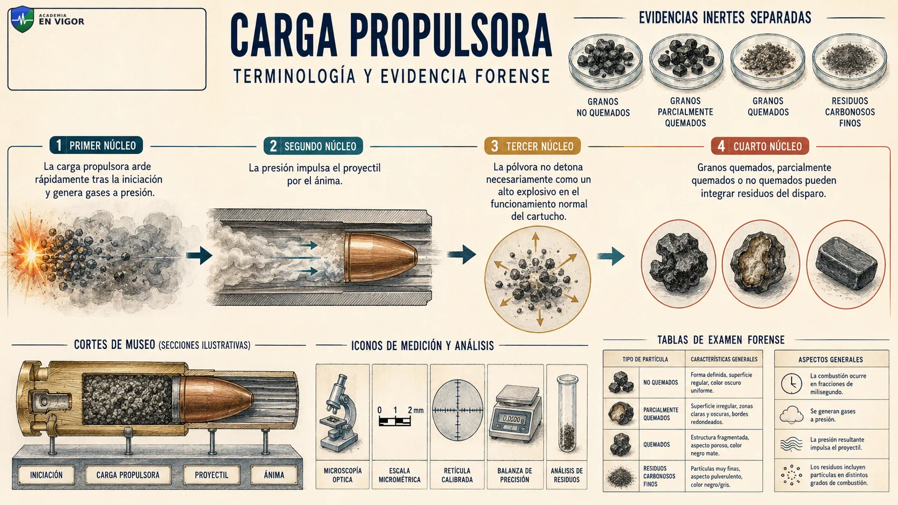

<em>Infografía: Carga propulsora.</em>

:::hablemos-claro
La carga propulsora arde rápidamente tras la iniciación y genera gases a presión.
:::

:::en-la-calle
Al analizar cartucho, iniciación y disparo, La carga propulsora arde rápidamente tras la iniciación y genera gases a presión.
:::

:::lo-que-cae
Prioriza **combustión genera gases** y descarta respuestas que confundan categoría, mecanismo, documento, cartucho, trayectoria o indicio.
:::

<!-- FUENTE: FBI-GSR-T42 -->

## 47. Bala o proyectil

### Lógica del bloque

Para dominar **bala o proyectil**, aplica esta regla: La bala es el proyectil de determinados cartuchos, no el cartucho completo. El anclaje principal es **elemento lanzado hacia el blanco**.

### Hechos examinables

- La bala es el proyectil de determinados cartuchos, no el cartucho completo. <!-- FACT:PN-T42-F185 -->
- Puede ser desnuda, encamisada o de otras construcciones autorizadas. <!-- FACT:PN-T42-F186 -->
- Su forma, masa y material influyen en vuelo y efectos. <!-- FACT:PN-T42-F187 -->
- Al atravesar un cañón rayado puede recibir marcas de campos y estrías. <!-- FACT:PN-T42-F188 -->

### Ejemplos razonados

- **Aplicación correcta:** Puede ser desnuda, encamisada o de otras construcciones autorizadas.
- **Contraste útil:** Su forma, masa y material influyen en vuelo y efectos.

### Trampas de examen

- **Incorrecto:** Bala y vaina son la misma pieza.
- **Incorrecto:** La bala conserva siempre forma perfecta después del impacto.

<!-- VISUAL:t42-47-bala-o-proyectil.webp -->

  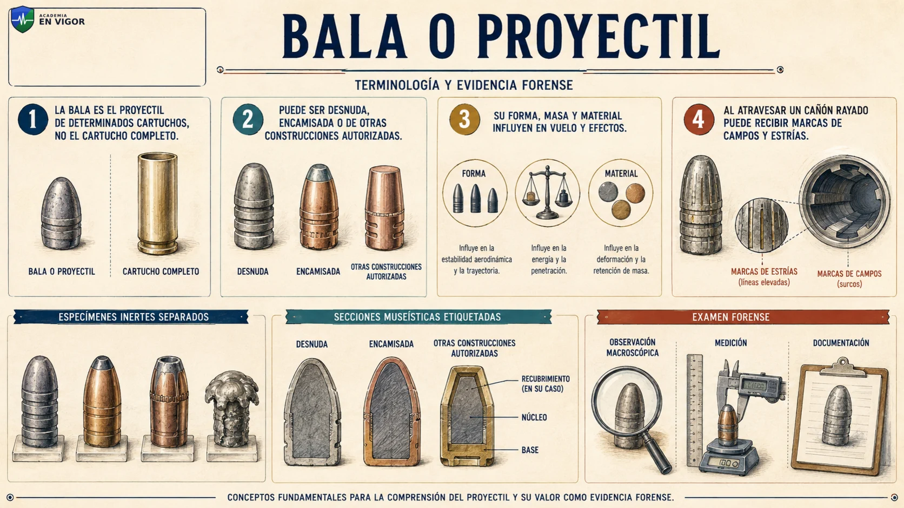

<em>Infografía: Bala o proyectil.</em>

:::hablemos-claro
La bala es el proyectil de determinados cartuchos, no el cartucho completo.
:::

:::en-la-calle
Al analizar cartucho, iniciación y disparo, La bala es el proyectil de determinados cartuchos, no el cartucho completo.
:::

:::lo-que-cae
Prioriza **elemento lanzado hacia el blanco** y descarta respuestas que confundan categoría, mecanismo, documento, cartucho, trayectoria o indicio.
:::

<!-- FUENTE: SECRIM-2024-T42 -->

## 48. Taco y perdigones

### Lógica del bloque

Para dominar **taco y perdigones**, aplica esta regla: El taco separa componentes y ayuda a obturar gases en muchos cartuchos semimetálicos. El anclaje principal es **separar, obturar y formar carga múltiple**.

### Hechos examinables

- El taco separa componentes y ayuda a obturar gases en muchos cartuchos semimetálicos. <!-- FACT:PN-T42-F189 -->
- Puede proteger la carga de perdigones y condicionar el patrón. <!-- FACT:PN-T42-F190 -->
- Los perdigones forman una carga múltiple cuyo patrón se abre con la distancia de manera dependiente del conjunto arma-cartucho. <!-- FACT:PN-T42-F191 -->
- Taco y perdigones pueden recuperarse como indicios. <!-- FACT:PN-T42-F192 -->

### Ejemplos razonados

- **Aplicación correcta:** Puede proteger la carga de perdigones y condicionar el patrón.
- **Contraste útil:** Los perdigones forman una carga múltiple cuyo patrón se abre con la distancia de manera dependiente del conjunto arma-cartucho.

### Trampas de examen

- **Incorrecto:** El taco es el iniciador del cartucho.
- **Incorrecto:** La dispersión permite conocer una distancia exacta sin disparos de prueba.

<!-- VISUAL:t42-48-taco-y-perdigones.webp -->

  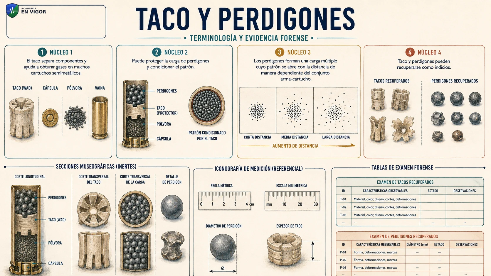

<em>Infografía: Taco y perdigones.</em>

:::hablemos-claro
El taco separa componentes y ayuda a obturar gases en muchos cartuchos semimetálicos.
:::

:::en-la-calle
Al analizar cartucho, iniciación y disparo, El taco separa componentes y ayuda a obturar gases en muchos cartuchos semimetálicos.
:::

:::lo-que-cae
Prioriza **separar, obturar y formar carga múltiple** y descarta respuestas que confundan categoría, mecanismo, documento, cartucho, trayectoria o indicio.
:::

<!-- FUENTE: SECRIM-2024-T42 -->

## 49. Secuencia del disparo

### Lógica del bloque

Para dominar **secuencia del disparo**, aplica esta regla: La acción del disparador libera o acciona el mecanismo de percusión según el diseño. El anclaje principal es **percusión, iniciación, combustión y salida**.

### Hechos examinables

- La acción del disparador libera o acciona el mecanismo de percusión según el diseño. <!-- FACT:PN-T42-F193 -->
- La percusión inicia el cebo, que enciende la carga propulsora. <!-- FACT:PN-T42-F194 -->
- Los gases elevan la presión e impulsan el proyectil por el cañón. <!-- FACT:PN-T42-F195 -->
- Después, el mecanismo puede extraer, expulsar y recargar según sea manual, semiautomático o automático. <!-- FACT:PN-T42-F196 -->

### Ejemplos razonados

- **Aplicación correcta:** La percusión inicia el cebo, que enciende la carga propulsora.
- **Contraste útil:** Los gases elevan la presión e impulsan el proyectil por el cañón.

### Trampas de examen

- **Incorrecto:** La vaina sale antes de la ignición.
- **Incorrecto:** Todos los sistemas completan la recarga automáticamente.

<!-- VISUAL:t42-il-49-secuencia-del-disparo.webp -->

  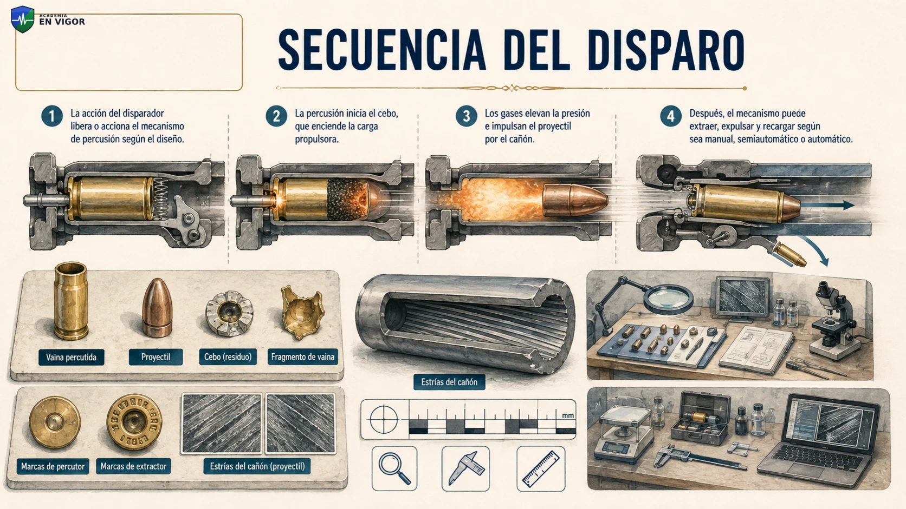

<em>Infografía: Secuencia del disparo.</em>

:::hablemos-claro
La acción del disparador libera o acciona el mecanismo de percusión según el diseño.
:::

:::en-la-calle
Al analizar cartucho, iniciación y disparo, La acción del disparador libera o acciona el mecanismo de percusión según el diseño.
:::

:::lo-que-cae
Prioriza **percusión, iniciación, combustión y salida** y descarta respuestas que confundan categoría, mecanismo, documento, cartucho, trayectoria o indicio.
:::

<!-- FUENTE: FBI-GSR-T42 -->

## 50. Calibre, gauge y marcaje

### Lógica del bloque

Para dominar **calibre, gauge y marcaje**, aplica esta regla: Calibre es una designación dimensional o comercial cuya interpretación depende del sistema y cartucho. El anclaje principal es **dimensión nominal no identifica por sí sola**.

### Hechos examinables

- Calibre es una designación dimensional o comercial cuya interpretación depende del sistema y cartucho. <!-- FACT:PN-T42-F197 -->
- En escopetas es frecuente el calibre por gauge, que no equivale directamente a milímetros. <!-- FACT:PN-T42-F198 -->
- El marcaje del culote puede orientar sobre fabricante y designación, pero no prueba por sí solo el contenido real. <!-- FACT:PN-T42-F199 -->
- Dos cartuchos de calibre nominal similar pueden no ser intercambiables. <!-- FACT:PN-T42-F200 -->

### Ejemplos razonados

- **Aplicación correcta:** En escopetas es frecuente el calibre por gauge, que no equivale directamente a milímetros.
- **Contraste útil:** El marcaje del culote puede orientar sobre fabricante y designación, pero no prueba por sí solo el contenido real.

### Trampas de examen

- **Incorrecto:** Si entra en la recámara, la munición es necesariamente segura.
- **Incorrecto:** El marcaje de culote identifica el arma que disparó la vaina.

<!-- VISUAL:t42-50-calibre-gauge-y-marcaje.webp -->

  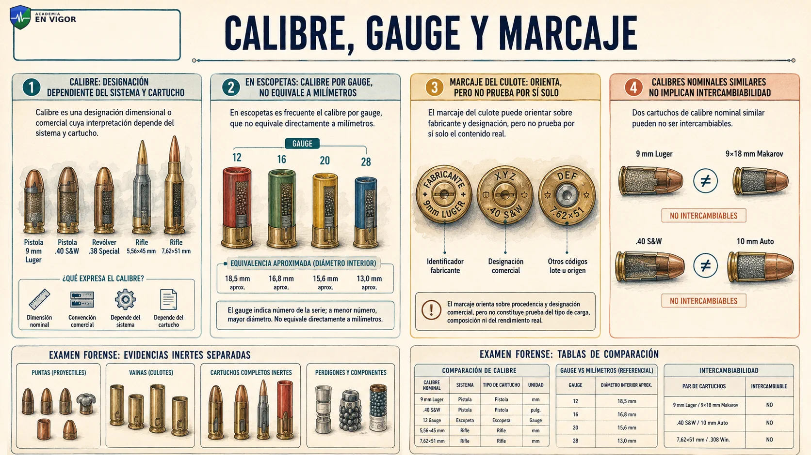

<em>Infografía: Calibre, gauge y marcaje.</em>

:::hablemos-claro
Calibre es una designación dimensional o comercial cuya interpretación depende del sistema y cartucho.
:::

:::en-la-calle
Al analizar cartucho, iniciación y disparo, Calibre es una designación dimensional o comercial cuya interpretación depende del sistema y cartucho.
:::

:::lo-que-cae
Prioriza **dimensión nominal no identifica por sí sola** y descarta respuestas que confundan categoría, mecanismo, documento, cartucho, trayectoria o indicio.
:::

<!-- FUENTE: SECRIM-2024-T42 -->

## 51. Marcas producidas en el disparo

### Lógica del bloque

Para dominar **marcas producidas en el disparo**, aplica esta regla: La aguja puede dejar una impresión en el iniciador. El anclaje principal es **percusión, cierre, extractor, expulsor y ánima**.

### Hechos examinables

- La aguja puede dejar una impresión en el iniciador. <!-- FACT:PN-T42-F201 -->
- La cara de cierre puede transferir marcas al culote. <!-- FACT:PN-T42-F202 -->
- Extractor y expulsor pueden marcar la vaina durante el ciclo. <!-- FACT:PN-T42-F203 -->
- Campos y estrías pueden marcar la superficie del proyectil. <!-- FACT:PN-T42-F204 -->

### Ejemplos razonados

- **Aplicación correcta:** La cara de cierre puede transferir marcas al culote.
- **Contraste útil:** Extractor y expulsor pueden marcar la vaina durante el ciclo.

### Trampas de examen

- **Incorrecto:** Todas las marcas aparecen con la misma calidad en cada disparo.
- **Incorrecto:** Una sola marca de clase demuestra la identidad de un arma concreta.

<!-- VISUAL:t42-51-marcas-producidas-en-el-disparo.webp -->

  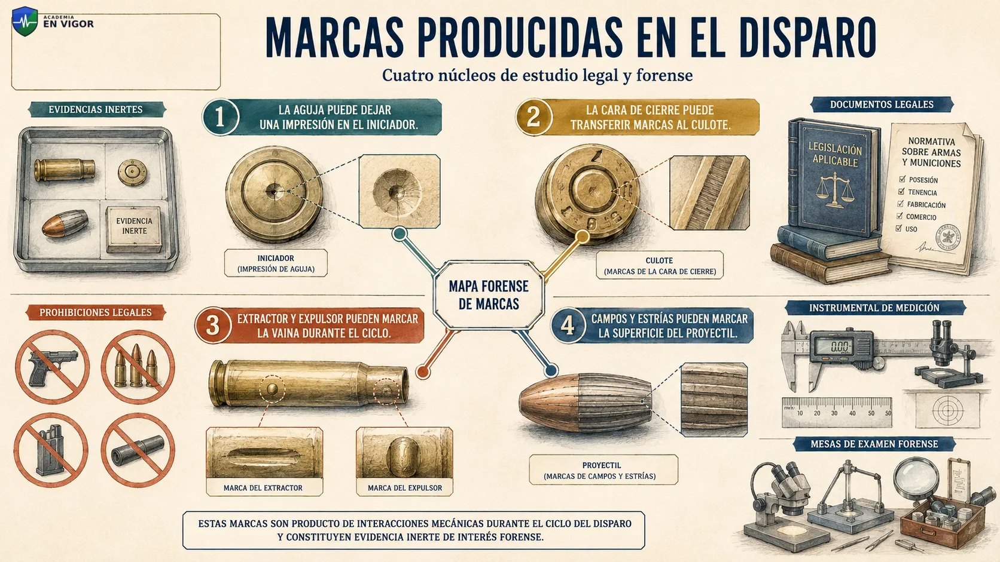

<em>Infografía: Marcas producidas en el disparo.</em>

:::hablemos-claro
La aguja puede dejar una impresión en el iniciador.
:::

:::en-la-calle
Al analizar cartucho, iniciación y disparo, La aguja puede dejar una impresión en el iniciador.
:::

:::lo-que-cae
Prioriza **percusión, cierre, extractor, expulsor y ánima** y descarta respuestas que confundan categoría, mecanismo, documento, cartucho, trayectoria o indicio.
:::

<!-- FUENTE: NIST-OSAC-T42 -->

## 52. Tres niveles de prohibición

### Lógica del bloque

Para dominar **tres niveles de prohibición**, aplica esta regla: El artículo 4 establece prohibiciones generales de fabricación, circulación, publicidad, compraventa, tenencia y uso. El anclaje principal es **artículos 4, 5 y 6**.

### Hechos examinables

- El artículo 4 establece prohibiciones generales de fabricación, circulación, publicidad, compraventa, tenencia y uso. <!-- FACT:PN-T42-F205 -->
- El artículo 5 contiene armas, objetos o municiones restringidos, con excepciones para funcionarios habilitados u otros supuestos. <!-- FACT:PN-T42-F206 -->
- El artículo 6 define armas de guerra prohibidas a particulares. <!-- FACT:PN-T42-F207 -->
- La conducta prohibida y las excepciones deben leerse en el artículo concreto, no mezclarse. <!-- FACT:PN-T42-F208 -->

### Ejemplos razonados

- **Aplicación correcta:** El artículo 5 contiene armas, objetos o municiones restringidos, con excepciones para funcionarios habilitados u otros supuestos.
- **Contraste útil:** El artículo 6 define armas de guerra prohibidas a particulares.

### Trampas de examen

- **Incorrecto:** Todos los artículos prohíben exactamente las mismas conductas.
- **Incorrecto:** Una excepción del artículo 5 legaliza cualquier arma de guerra.

<!-- VISUAL:t42-52-tres-niveles-de-prohibicion.webp -->

  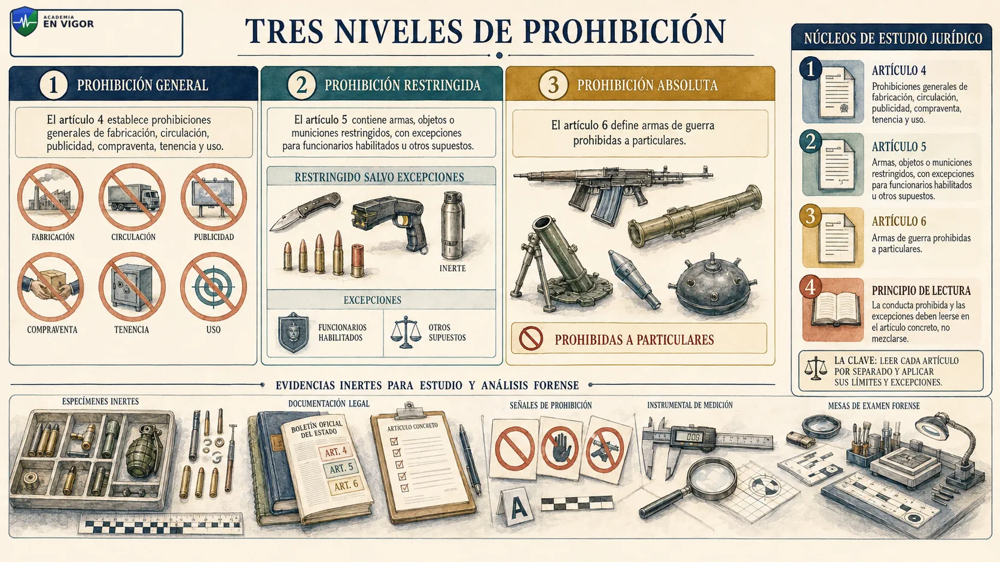

<em>Infografía: Tres niveles de prohibición.</em>

:::hablemos-claro
El artículo 4 establece prohibiciones generales de fabricación, circulación, publicidad, compraventa, tenencia y uso.
:::

:::en-la-calle
Al comprobar prohibiciones y restricciones, El artículo 4 establece prohibiciones generales de fabricación, circulación, publicidad, compraventa, tenencia y uso.
:::

:::lo-que-cae
Prioriza **artículos 4, 5 y 6** y descarta respuestas que confundan categoría, mecanismo, documento, cartucho, trayectoria o indicio.
:::

<!-- FUENTE: BOE-RA-T42 -->

## 53. Armas sustancialmente modificadas

### Lógica del bloque

Para dominar **armas sustancialmente modificadas**, aplica esta regla: El artículo 4 prohíbe armas de fuego resultantes de modificar sustancialmente características de fabricación u origen sin autorización. El anclaje principal es **alteración sin autorización de modelo**.

### Hechos examinables

- El artículo 4 prohíbe armas de fuego resultantes de modificar sustancialmente características de fabricación u origen sin autorización. <!-- FACT:PN-T42-F209 -->
- La prohibición alcanza también sus imitaciones en el ámbito señalado por el precepto. <!-- FACT:PN-T42-F210 -->
- Una reparación autorizada no equivale automáticamente a modificación sustancial ilícita. <!-- FACT:PN-T42-F211 -->
- La clave es la alteración sustancial y la falta de autorización reglamentaria. <!-- FACT:PN-T42-F212 -->

### Ejemplos razonados

- **Aplicación correcta:** La prohibición alcanza también sus imitaciones en el ámbito señalado por el precepto.
- **Contraste útil:** Una reparación autorizada no equivale automáticamente a modificación sustancial ilícita.

### Trampas de examen

- **Incorrecto:** Toda limpieza del arma es modificación prohibida.
- **Incorrecto:** Una modificación casera siempre es lícita si el arma conserva el calibre.

<!-- VISUAL:t42-il-53-armas-sustancialmente-modificadas.webp -->

  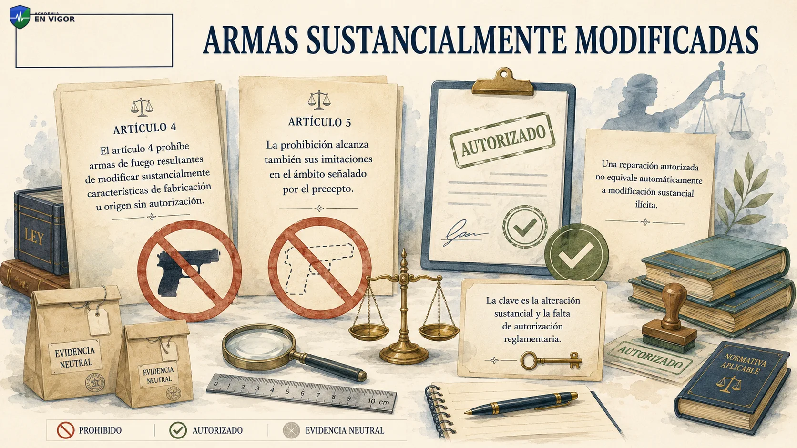

<em>Infografía: Armas sustancialmente modificadas.</em>

:::hablemos-claro
El artículo 4 prohíbe armas de fuego resultantes de modificar sustancialmente características de fabricación u origen sin autorización.
:::

:::en-la-calle
Al comprobar prohibiciones y restricciones, El artículo 4 prohíbe armas de fuego resultantes de modificar sustancialmente características de fabricación u origen sin autorización.
:::

:::lo-que-cae
Prioriza **alteración sin autorización de modelo** y descarta respuestas que confundan categoría, mecanismo, documento, cartucho, trayectoria o indicio.
:::

<!-- FUENTE: BOE-RA-T42 -->

## 54. Armas ocultas o disimuladas

### Lógica del bloque

Para dominar **armas ocultas o disimuladas**, aplica esta regla: Se prohíben armas largas con dispositivos en culata o mecanismos para alojar pistolas u otras armas. El anclaje principal es **culatines, bastones y objetos aparentes**.

### Hechos examinables

- Se prohíben armas largas con dispositivos en culata o mecanismos para alojar pistolas u otras armas. <!-- FACT:PN-T42-F213 -->
- Se prohíben pistolas y revólveres que lleven adaptado un culatín. <!-- FACT:PN-T42-F214 -->
- También se prohíben armas para alojar o alojadas en bastones u otros objetos. <!-- FACT:PN-T42-F215 -->
- La apariencia o el alojamiento oculto agravan el control, pero debe encajar en el supuesto normativo exacto. <!-- FACT:PN-T42-F216 -->

### Ejemplos razonados

- **Aplicación correcta:** Se prohíben pistolas y revólveres que lleven adaptado un culatín.
- **Contraste útil:** También se prohíben armas para alojar o alojadas en bastones u otros objetos.

### Trampas de examen

- **Incorrecto:** Las ballestas son prohibidas por estar ocultas.
- **Incorrecto:** Toda funda de pistola convierte el conjunto en arma prohibida.

<!-- VISUAL:t42-54-armas-ocultas-o-disimuladas.webp -->

  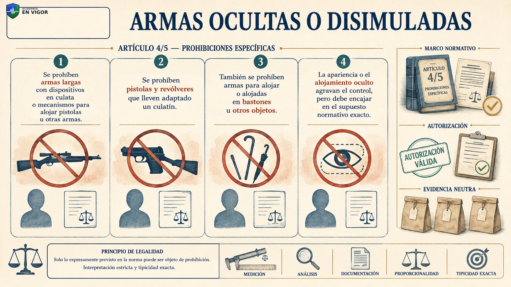

<em>Infografía: Armas ocultas o disimuladas.</em>

:::hablemos-claro
Se prohíben armas largas con dispositivos en culata o mecanismos para alojar pistolas u otras armas.
:::

:::en-la-calle
Al comprobar prohibiciones y restricciones, Se prohíben armas largas con dispositivos en culata o mecanismos para alojar pistolas u otras armas.
:::

:::lo-que-cae
Prioriza **culatines, bastones y objetos aparentes** y descarta respuestas que confundan categoría, mecanismo, documento, cartucho, trayectoria o indicio.
:::

<!-- FUENTE: BOE-RA-T42 -->

## 55. Armas de imitación peligrosa y armas blancas ocultas

### Lógica del bloque

Para dominar **armas de imitación peligrosa y armas blancas ocultas**, aplica esta regla: El artículo 4 incluye determinadas armas que imitan otros objetos o combinan mecanismos prohibidos. El anclaje principal es **apariencia y mecanismos prohibidos**.

### Hechos examinables

- El artículo 4 incluye determinadas armas que imitan otros objetos o combinan mecanismos prohibidos. <!-- FACT:PN-T42-F217 -->
- Los bastones-estoque y puñales de cualquier clase están prohibidos en los términos reglamentarios. <!-- FACT:PN-T42-F218 -->
- Se consideran puñales las armas blancas de hoja menor de 11 centímetros, de dos filos y puntiaguda. <!-- FACT:PN-T42-F219 -->
- La longitud por sí sola no convierte cualquier cuchillo en puñal: también importan filos y punta. <!-- FACT:PN-T42-F220 -->

### Ejemplos razonados

- **Aplicación correcta:** Los bastones-estoque y puñales de cualquier clase están prohibidos en los términos reglamentarios.
- **Contraste útil:** Se consideran puñales las armas blancas de hoja menor de 11 centímetros, de dos filos y puntiaguda.

### Trampas de examen

- **Incorrecto:** Todo cuchillo menor de 11 centímetros es puñal.
- **Incorrecto:** Un bastón-estoque es una simple arma reglamentada de 5.ª.

<!-- VISUAL:t42-55-armas-de-imitacion-peligrosa-y-armas-blancas-ocultas.webp -->

  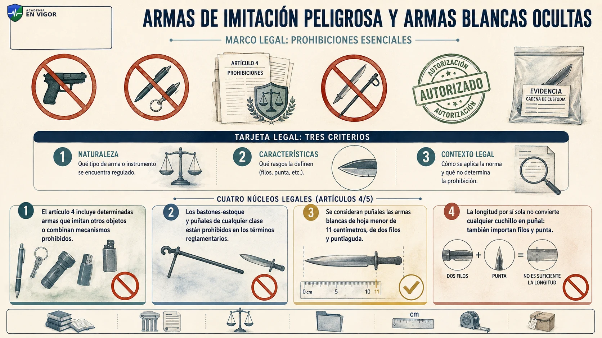

<em>Infografía: Armas de imitación peligrosa y armas blancas ocultas.</em>

:::hablemos-claro
El artículo 4 incluye determinadas armas que imitan otros objetos o combinan mecanismos prohibidos.
:::

:::en-la-calle
Al comprobar prohibiciones y restricciones, El artículo 4 incluye determinadas armas que imitan otros objetos o combinan mecanismos prohibidos.
:::

:::lo-que-cae
Prioriza **apariencia y mecanismos prohibidos** y descarta respuestas que confundan categoría, mecanismo, documento, cartucho, trayectoria o indicio.
:::

<!-- FUENTE: BOE-RA-T42 -->

## 56. Semiautomáticas restringidas del artículo 5

### Lógica del bloque

Para dominar **semiautomáticas restringidas del artículo 5**, aplica esta regla: El artículo 5 restringe ciertas semiautomáticas de las categorías 2.ª.2 y 3.ª.2. El anclaje principal es **capacidad superior a cinco o culata plegable**.

### Hechos examinables

- El artículo 5 restringe ciertas semiautomáticas de las categorías 2.ª.2 y 3.ª.2. <!-- FACT:PN-T42-F221 -->
- La restricción opera cuando su capacidad supera cinco cartuchos incluido el de recámara. <!-- FACT:PN-T42-F222 -->
- También alcanza las que tengan culata plegable o eliminable en los términos del precepto. <!-- FACT:PN-T42-F223 -->
- La regla no convierte toda arma semiautomática en automática. <!-- FACT:PN-T42-F224 -->

### Ejemplos razonados

- **Aplicación correcta:** La restricción opera cuando su capacidad supera cinco cartuchos incluido el de recámara.
- **Contraste útil:** También alcanza las que tengan culata plegable o eliminable en los términos del precepto.

### Trampas de examen

- **Incorrecto:** El límite excluye siempre el cartucho de recámara.
- **Incorrecto:** Toda semiautomática está prohibida sin excepción.

<!-- VISUAL:t42-56-semiautomaticas-restringidas-del-articulo-5.webp -->

  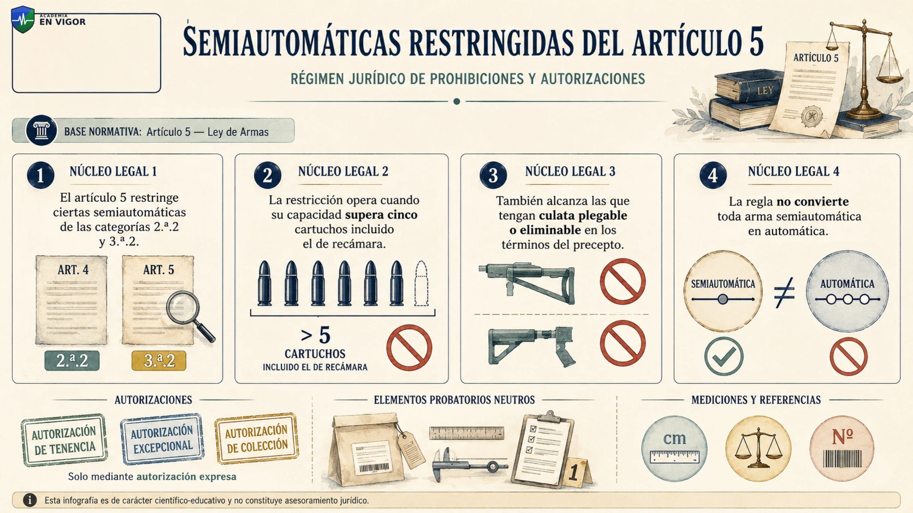

<em>Infografía: Semiautomáticas restringidas del artículo 5.</em>

:::hablemos-claro
El artículo 5 restringe ciertas semiautomáticas de las categorías 2.ª.2 y 3.ª.2.
:::

:::en-la-calle
Al comprobar prohibiciones y restricciones, El artículo 5 restringe ciertas semiautomáticas de las categorías 2.ª.2 y 3.ª.2.
:::

:::lo-que-cae
Prioriza **capacidad superior a cinco o culata plegable** y descarta respuestas que confundan categoría, mecanismo, documento, cartucho, trayectoria o indicio.
:::

<!-- FUENTE: BOE-RA-T42 -->

## 57. Armas y defensas de uso especialmente habilitado

### Lógica del bloque

Para dominar **armas y defensas de uso especialmente habilitado**, aplica esta regla: El artículo 5 restringe sprays de defensa no aprobados por el Ministerio de Sanidad. El anclaje principal es **sprays, defensas eléctricas y bastones**.

### Hechos examinables

- El artículo 5 restringe sprays de defensa no aprobados por el Ministerio de Sanidad. <!-- FACT:PN-T42-F225 -->
- También restringe defensas eléctricas, defensas de goma o extensibles y tonfas, salvo habilitación. <!-- FACT:PN-T42-F226 -->
- La excepción funcional no convierte el objeto en libre venta o uso general. <!-- FACT:PN-T42-F227 -->
- Debe comprobarse producto, aprobación, sujeto y contexto de uso. <!-- FACT:PN-T42-F228 -->

### Ejemplos razonados

- **Aplicación correcta:** También restringe defensas eléctricas, defensas de goma o extensibles y tonfas, salvo habilitación.
- **Contraste útil:** La excepción funcional no convierte el objeto en libre venta o uso general.

### Trampas de examen

- **Incorrecto:** Todo aerosol comercial es un spray de defensa aprobado.
- **Incorrecto:** Una defensa extensible es de libre porte por cualquier adulto.

<!-- VISUAL:t42-57-armas-y-defensas-de-uso-especialmente-habilitado.webp -->

  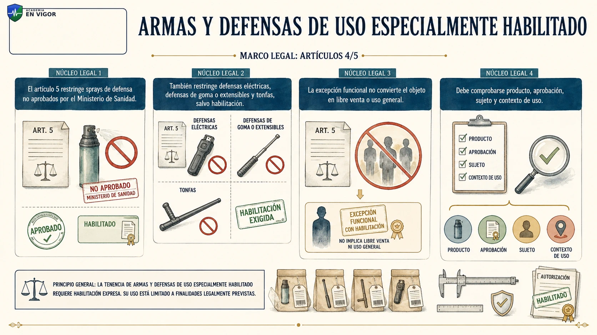

<em>Infografía: Armas y defensas de uso especialmente habilitado.</em>

:::hablemos-claro
El artículo 5 restringe sprays de defensa no aprobados por el Ministerio de Sanidad.
:::

:::en-la-calle
Al comprobar prohibiciones y restricciones, El artículo 5 restringe sprays de defensa no aprobados por el Ministerio de Sanidad.
:::

:::lo-que-cae
Prioriza **sprays, defensas eléctricas y bastones** y descarta respuestas que confundan categoría, mecanismo, documento, cartucho, trayectoria o indicio.
:::

<!-- FUENTE: BOE-RA-T42 -->

## 58. Silenciadores y municiones especiales

### Lógica del bloque

Para dominar **silenciadores y municiones especiales**, aplica esta regla: Los dispositivos concebidos o adaptados para disminuir el sonido están sometidos al régimen de pieza y a prohibiciones específicas. El anclaje principal es **disminuir sonido y proyectiles militares**.

### Hechos examinables

- Los dispositivos concebidos o adaptados para disminuir el sonido están sometidos al régimen de pieza y a prohibiciones específicas. <!-- FACT:PN-T42-F229 -->
- La munición perforante de uso militar se diseña para perforar blindajes o protección mediante núcleo duro. <!-- FACT:PN-T42-F230 -->
- La munición explosiva contiene una carga que explota por impacto. <!-- FACT:PN-T42-F231 -->
- La munición incendiaria contiene mezcla que se inflama al contacto con aire o por impacto. <!-- FACT:PN-T42-F232 -->

### Ejemplos razonados

- **Aplicación correcta:** La munición perforante de uso militar se diseña para perforar blindajes o protección mediante núcleo duro.
- **Contraste útil:** La munición explosiva contiene una carga que explota por impacto.

### Trampas de examen

- **Incorrecto:** Silenciador significa que el disparo queda inaudible.
- **Incorrecto:** Toda bala encamisada es perforante militar.

<!-- VISUAL:t42-il-58-silenciadores-y-municiones-especiales.webp -->

  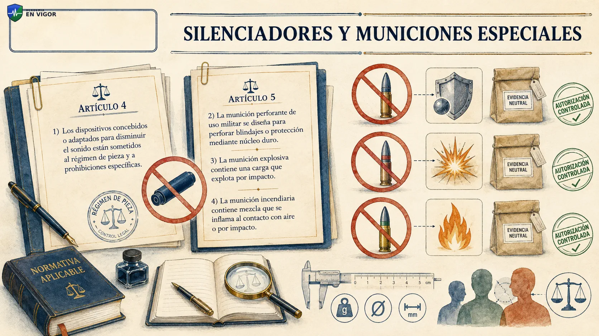

<em>Infografía: Silenciadores y municiones especiales.</em>

:::hablemos-claro
Los dispositivos concebidos o adaptados para disminuir el sonido están sometidos al régimen de pieza y a prohibiciones específicas.
:::

:::en-la-calle
Al comprobar prohibiciones y restricciones, Los dispositivos concebidos o adaptados para disminuir el sonido están sometidos al régimen de pieza y a prohibiciones específicas.
:::

:::lo-que-cae
Prioriza **disminuir sonido y proyectiles militares** y descarta respuestas que confundan categoría, mecanismo, documento, cartucho, trayectoria o indicio.
:::

<!-- FUENTE: BOE-RA-T42 -->

## 59. Munición expansiva

### Lógica del bloque

Para dominar **munición expansiva**, aplica esta regla: La munición de bala expansiva se define por proyectil que se deforma y expande en un blanco similar a tejido. El anclaje principal es **deformación y transferencia de energía**.

### Hechos examinables

- La munición de bala expansiva se define por proyectil que se deforma y expande en un blanco similar a tejido. <!-- FACT:PN-T42-F233 -->
- Su diseño busca transferir el máximo de energía cinética. <!-- FACT:PN-T42-F234 -->
- El régimen jurídico depende del arma, uso y prohibición aplicable, no solo del nombre comercial. <!-- FACT:PN-T42-F235 -->
- Expansiva no significa explosiva: una se deforma y la otra contiene una carga explosiva. <!-- FACT:PN-T42-F236 -->

### Ejemplos razonados

- **Aplicación correcta:** Su diseño busca transferir el máximo de energía cinética.
- **Contraste útil:** El régimen jurídico depende del arma, uso y prohibición aplicable, no solo del nombre comercial.

### Trampas de examen

- **Incorrecto:** Toda bala expansiva explota al impactar.
- **Incorrecto:** Perforante y expansiva son la misma munición.

<!-- VISUAL:t42-59-municion-expansiva.webp -->

  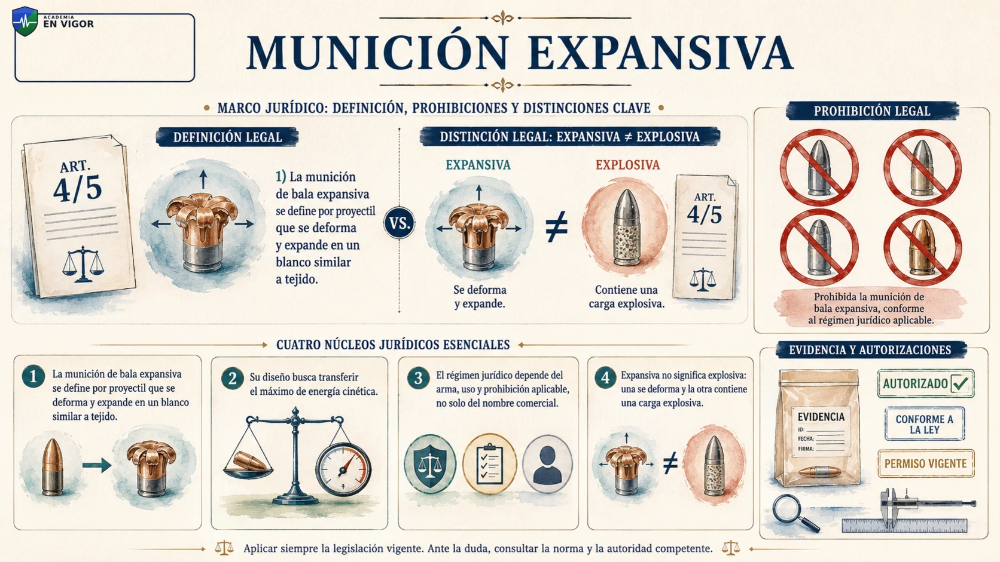

<em>Infografía: Munición expansiva.</em>

:::hablemos-claro
La munición de bala expansiva se define por proyectil que se deforma y expande en un blanco similar a tejido.
:::

:::en-la-calle
Al comprobar prohibiciones y restricciones, La munición de bala expansiva se define por proyectil que se deforma y expande en un blanco similar a tejido.
:::

:::lo-que-cae
Prioriza **deformación y transferencia de energía** y descarta respuestas que confundan categoría, mecanismo, documento, cartucho, trayectoria o indicio.
:::

<!-- FUENTE: BOE-RA-T42 -->

## 60. Navajas y armas blancas prohibidas

### Lógica del bloque

Para dominar **navajas y armas blancas prohibidas**, aplica esta regla: Las navajas automáticas están prohibidas en los términos del Reglamento. El anclaje principal es **automáticas y hoja superior a once centímetros**.

### Hechos examinables

- Las navajas automáticas están prohibidas en los términos del Reglamento. <!-- FACT:PN-T42-F237 -->
- Se prohíben comercialización, publicidad, compraventa, tenencia y uso de navajas no automáticas cuya hoja exceda de 11 centímetros. <!-- FACT:PN-T42-F238 -->
- La medida se toma desde el reborde o tope del mango hasta el extremo. <!-- FACT:PN-T42-F239 -->
- Existen supuestos limitados de fabricación, comercialización intervenida y tenencia domiciliaria para ornato o coleccionismo. <!-- FACT:PN-T42-F240 -->

### Ejemplos razonados

- **Aplicación correcta:** Se prohíben comercialización, publicidad, compraventa, tenencia y uso de navajas no automáticas cuya hoja exceda de 11 centímetros.
- **Contraste útil:** La medida se toma desde el reborde o tope del mango hasta el extremo.

### Trampas de examen

- **Incorrecto:** Toda navaja no automática está prohibida.
- **Incorrecto:** La hoja se mide solo por el filo útil visible.

<!-- VISUAL:t42-60-navajas-y-armas-blancas-prohibidas.webp -->

  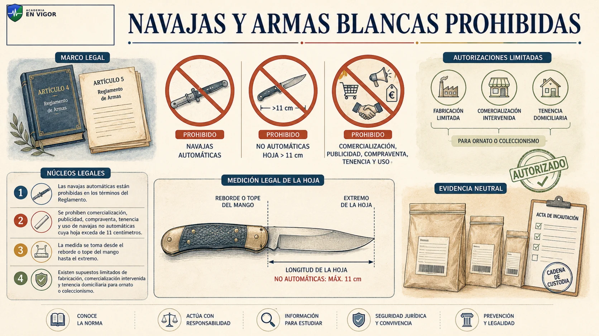

<em>Infografía: Navajas y armas blancas prohibidas.</em>

:::hablemos-claro
Las navajas automáticas están prohibidas en los términos del Reglamento.
:::

:::en-la-calle
Al comprobar prohibiciones y restricciones, Las navajas automáticas están prohibidas en los términos del Reglamento.
:::

:::lo-que-cae
Prioriza **automáticas y hoja superior a once centímetros** y descarta respuestas que confundan categoría, mecanismo, documento, cartucho, trayectoria o indicio.
:::

<!-- FUENTE: BOE-RA-T42 -->

## 61. Armas de guerra por calibre y consideración

### Lógica del bloque

Para dominar **armas de guerra por calibre y consideración**, aplica esta regla: Son armas de guerra las de calibre igual o superior a 20 milímetros. El anclaje principal es **20 mm o calibre declarado de guerra**.

### Hechos examinables

- Son armas de guerra las de calibre igual o superior a 20 milímetros. <!-- FACT:PN-T42-F241 -->
- También las inferiores a 20 milímetros cuyos calibres sean considerados de guerra por Defensa. <!-- FACT:PN-T42-F242 -->
- La cifra de 20 milímetros no es la única vía de clasificación como arma de guerra. <!-- FACT:PN-T42-F243 -->
- Sus municiones, conjuntos y componentes esenciales pueden quedar incluidos. <!-- FACT:PN-T42-F244 -->

### Ejemplos razonados

- **Aplicación correcta:** También las inferiores a 20 milímetros cuyos calibres sean considerados de guerra por Defensa.
- **Contraste útil:** La cifra de 20 milímetros no es la única vía de clasificación como arma de guerra.

### Trampas de examen

- **Incorrecto:** Todo calibre inferior a 20 milímetros es civil.
- **Incorrecto:** Solo el arma completa puede ser de guerra, nunca sus componentes.

<!-- VISUAL:t42-61-armas-de-guerra-por-calibre-y-consideracion.webp -->

  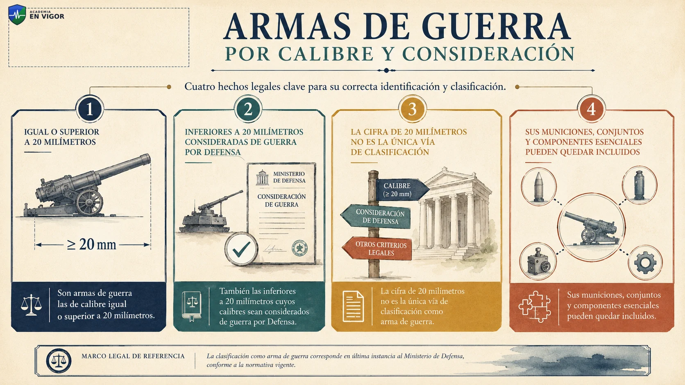

<em>Infografía: Armas de guerra por calibre y consideración.</em>

:::hablemos-claro
Son armas de guerra las de calibre igual o superior a 20 milímetros.
:::

:::en-la-calle
Al comprobar prohibiciones y restricciones, Son armas de guerra las de calibre igual o superior a 20 milímetros.
:::

:::lo-que-cae
Prioriza **20 mm o calibre declarado de guerra** y descarta respuestas que confundan categoría, mecanismo, documento, cartucho, trayectoria o indicio.
:::

<!-- FUENTE: BOE-RA-T42 -->

## 62. Armas automáticas como armas de guerra

### Lógica del bloque

Para dominar **armas automáticas como armas de guerra**, aplica esta regla: Las armas de fuego automáticas son armas de guerra. El anclaje principal es **prohibición a particulares**.

### Hechos examinables

- Las armas de fuego automáticas son armas de guerra. <!-- FACT:PN-T42-F245 -->
- Su adquisición, tenencia y uso están prohibidos a particulares. <!-- FACT:PN-T42-F246 -->
- El Gobierno puede determinar armas de guerra utilizables como dotación de Fuerzas y Cuerpos de Seguridad. <!-- FACT:PN-T42-F247 -->
- La posibilidad de dotación oficial no crea una autorización particular. <!-- FACT:PN-T42-F248 -->

### Ejemplos razonados

- **Aplicación correcta:** Su adquisición, tenencia y uso están prohibidos a particulares.
- **Contraste útil:** El Gobierno puede determinar armas de guerra utilizables como dotación de Fuerzas y Cuerpos de Seguridad.

### Trampas de examen

- **Incorrecto:** Una licencia B permite poseer un arma automática.
- **Incorrecto:** Semiautomática y automática reciben siempre el mismo régimen.

<!-- VISUAL:t42-62-armas-automaticas-como-armas-de-guerra.webp -->

  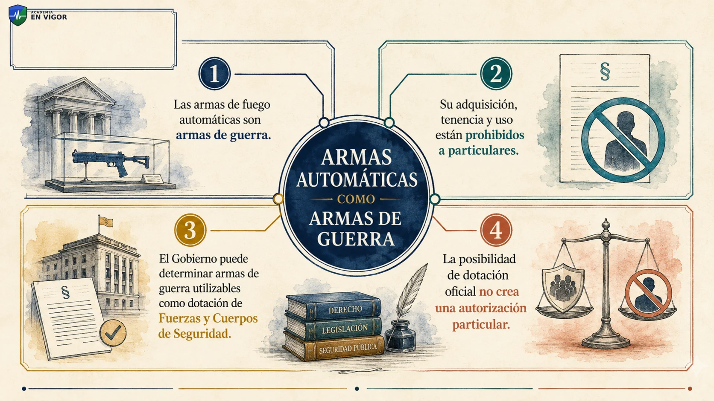

<em>Infografía: Armas automáticas como armas de guerra.</em>

:::hablemos-claro
Las armas de fuego automáticas son armas de guerra.
:::

:::en-la-calle
Al comprobar prohibiciones y restricciones, Las armas de fuego automáticas son armas de guerra.
:::

:::lo-que-cae
Prioriza **prohibición a particulares** y descarta respuestas que confundan categoría, mecanismo, documento, cartucho, trayectoria o indicio.
:::

<!-- FUENTE: BOE-RA-T42 -->

## 63. Armas de alarma y señales transformables

### Lógica del bloque

Para dominar **armas de alarma y señales transformables**, aplica esta regla: Un arma de alarma y señales debe estar diseñada para fogueo, sustancias activas o señalización. El anclaje principal es **incapacidad de transformación fácil**.

### Hechos examinables

- Un arma de alarma y señales debe estar diseñada para fogueo, sustancias activas o señalización. <!-- FACT:PN-T42-F249 -->
- No debe poder transformarse para lanzar proyectil por combustible propulsor. <!-- FACT:PN-T42-F250 -->
- Si puede transformarse fácilmente puede quedar sometida al régimen de arma de fuego o prohibición correspondiente. <!-- FACT:PN-T42-F251 -->
- La apariencia externa no basta: construcción y transformabilidad son decisivas. <!-- FACT:PN-T42-F252 -->

### Ejemplos razonados

- **Aplicación correcta:** No debe poder transformarse para lanzar proyectil por combustible propulsor.
- **Contraste útil:** Si puede transformarse fácilmente puede quedar sometida al régimen de arma de fuego o prohibición correspondiente.

### Trampas de examen

- **Incorrecto:** Toda pistola de fogueo es siempre libre.
- **Incorrecto:** Basta retirar el cartucho para que deje de ser arma.

<!-- VISUAL:t42-il-63-armas-de-alarma-y-senales-transformables.webp -->

  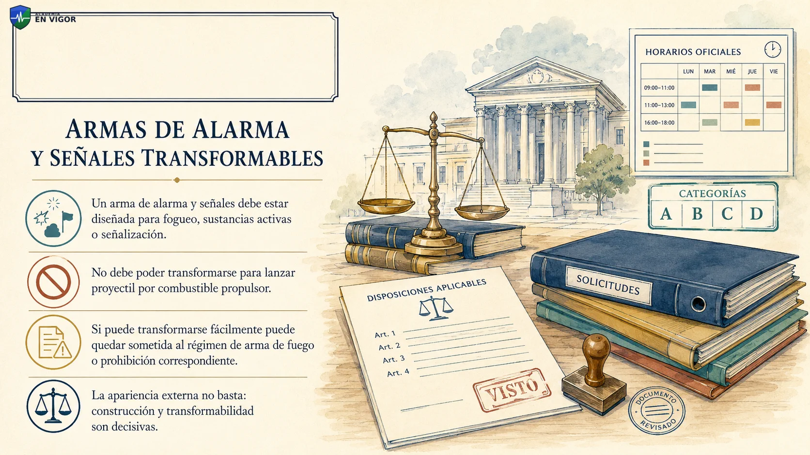

<em>Infografía: Armas de alarma y señales transformables.</em>

:::hablemos-claro
Un arma de alarma y señales debe estar diseñada para fogueo, sustancias activas o señalización.
:::

:::en-la-calle
Al comprobar prohibiciones y restricciones, Un arma de alarma y señales debe estar diseñada para fogueo, sustancias activas o señalización.
:::

:::lo-que-cae
Prioriza **incapacidad de transformación fácil** y descarta respuestas que confundan categoría, mecanismo, documento, cartucho, trayectoria o indicio.
:::

<!-- FUENTE: BOE-RA-T42 -->

## 64. Diferencia entre prohibida, reglamentada e inutilizada

### Lógica del bloque

Para dominar **diferencia entre prohibida, reglamentada e inutilizada**, aplica esta regla: Arma reglamentada es la clasificada cuya adquisición, tenencia o uso puede autorizarse o permitirse. El anclaje principal es **régimen jurídico no estado físico casual**.

### Hechos examinables

- Arma reglamentada es la clasificada cuya adquisición, tenencia o uso puede autorizarse o permitirse. <!-- FACT:PN-T42-F253 -->
- Arma prohibida encaja en un precepto que veta determinadas conductas o sujetos. <!-- FACT:PN-T42-F254 -->
- Arma inutilizada exige procedimiento irreversible, verificación, marcado y certificado. <!-- FACT:PN-T42-F255 -->
- Un arma rota no pasa automáticamente a 9.ª categoría ni deja de estar sometida a control. <!-- FACT:PN-T42-F256 -->

### Ejemplos razonados

- **Aplicación correcta:** Arma prohibida encaja en un precepto que veta determinadas conductas o sujetos.
- **Contraste útil:** Arma inutilizada exige procedimiento irreversible, verificación, marcado y certificado.

### Trampas de examen

- **Incorrecto:** Averiada e inutilizada son sinónimos.
- **Incorrecto:** Toda arma reglamentada puede portarse sin licencia.

<!-- VISUAL:t42-64-diferencia-entre-prohibida-reglamentada-e-inutilizada.webp -->

  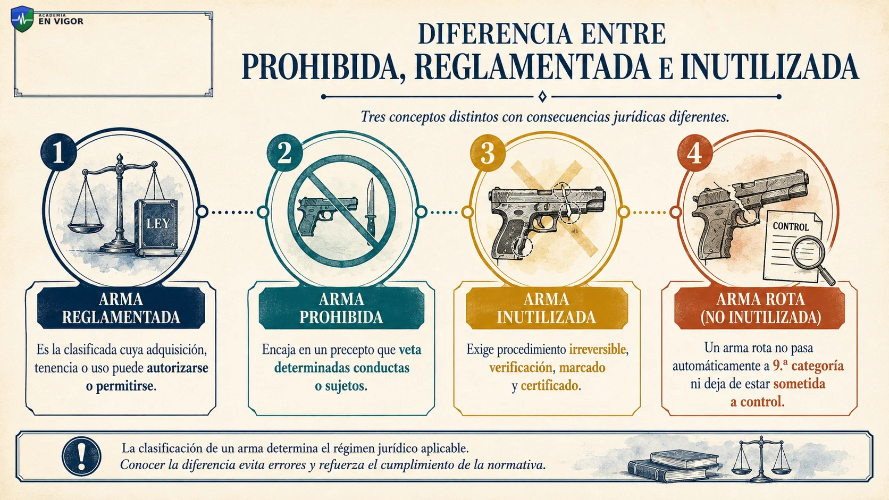

<em>Infografía: Diferencia entre prohibida, reglamentada e inutilizada.</em>

:::hablemos-claro
Arma reglamentada es la clasificada cuya adquisición, tenencia o uso puede autorizarse o permitirse.
:::

:::en-la-calle
Al comprobar prohibiciones y restricciones, Arma reglamentada es la clasificada cuya adquisición, tenencia o uso puede autorizarse o permitirse.
:::

:::lo-que-cae
Prioriza **régimen jurídico no estado físico casual** y descarta respuestas que confundan categoría, mecanismo, documento, cartucho, trayectoria o indicio.
:::

<!-- FUENTE: BOE-RA-T42 -->

## 65. Principio general de autorización

### Lógica del bloque

Para dominar **principio general de autorización**, aplica esta regla: Nadie puede llevar ni poseer armas de fuego en España sin la autorización correspondiente. El anclaje principal es **nadie porta o posee sin autorización**.

### Hechos examinables

- Nadie puede llevar ni poseer armas de fuego en España sin la autorización correspondiente. <!-- FACT:PN-T42-F257 -->
- La autorización debe expedirla el órgano administrativo competente según el Reglamento. <!-- FACT:PN-T42-F258 -->
- Para residentes en otro Estado miembro de la UE, determinadas autorizaciones se comunican a su autoridad competente. <!-- FACT:PN-T42-F259 -->
- Licencia, guía, tarjeta y autorización especial cumplen funciones distintas y pueden ser acumulativas. <!-- FACT:PN-T42-F260 -->

### Ejemplos razonados

- **Aplicación correcta:** La autorización debe expedirla el órgano administrativo competente según el Reglamento.
- **Contraste útil:** Para residentes en otro Estado miembro de la UE, determinadas autorizaciones se comunican a su autoridad competente.

### Trampas de examen

- **Incorrecto:** La guía sustituye siempre a la licencia.
- **Incorrecto:** La propiedad privada permite portar cualquier arma en territorio nacional.

<!-- VISUAL:t42-65-principio-general-de-autorizacion.webp -->

  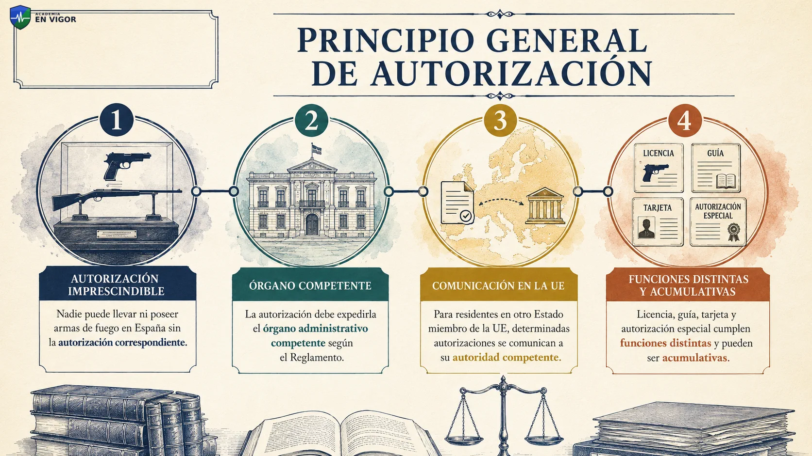

<em>Infografía: Principio general de autorización.</em>

:::hablemos-claro
Nadie puede llevar ni poseer armas de fuego en España sin la autorización correspondiente.
:::

:::en-la-calle
Al revisar licencia, guía o tarjeta, Nadie puede llevar ni poseer armas de fuego en España sin la autorización correspondiente.
:::

:::lo-que-cae
Prioriza **nadie porta o posee sin autorización** y descarta respuestas que confundan categoría, mecanismo, documento, cartucho, trayectoria o indicio.
:::

<!-- FUENTE: BOE-RA-T42 -->

## 66. Mapa de licencias

### Lógica del bloque

Para dominar **mapa de licencias**, aplica esta regla: La licencia A se vincula al personal expresamente incluido y tiene eficacia de B, D y E en su ámbito. El anclaje principal es **A, B, C, D, E y F**.

### Hechos examinables

- La licencia A se vincula al personal expresamente incluido y tiene eficacia de B, D y E en su ámbito. <!-- FACT:PN-T42-F261 -->
- La B ampara pistolas y revólveres de particulares cuando se acredita necesidad. <!-- FACT:PN-T42-F262 -->
- La C corresponde a armas de dotación de personal de vigilancia y seguridad habilitado. <!-- FACT:PN-T42-F263 -->
- D, E y F cubren respectivamente caza mayor rayada, determinadas armas de caza/tiro y armas de concurso. <!-- FACT:PN-T42-F264 -->

### Ejemplos razonados

- **Aplicación correcta:** La B ampara pistolas y revólveres de particulares cuando se acredita necesidad.
- **Contraste útil:** La C corresponde a armas de dotación de personal de vigilancia y seguridad habilitado.

### Trampas de examen

- **Incorrecto:** Todas las licencias permiten las mismas armas.
- **Incorrecto:** La licencia C es para cualquier arma corta de un particular.

<!-- VISUAL:t42-66-mapa-de-licencias.webp -->

  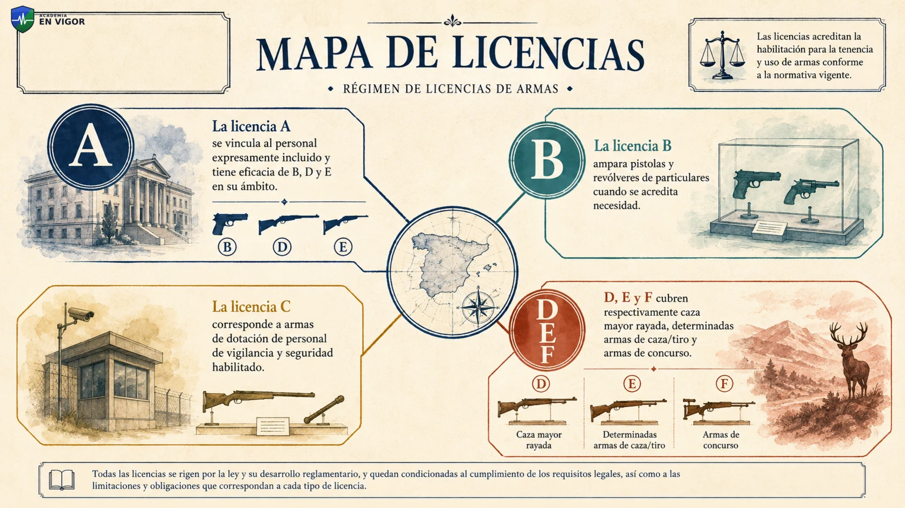

<em>Infografía: Mapa de licencias.</em>

:::hablemos-claro
La licencia A se vincula al personal expresamente incluido y tiene eficacia de B, D y E en su ámbito.
:::

:::en-la-calle
Al revisar licencia, guía o tarjeta, La licencia A se vincula al personal expresamente incluido y tiene eficacia de B, D y E en su ámbito.
:::

:::lo-que-cae
Prioriza **A, B, C, D, E y F** y descarta respuestas que confundan categoría, mecanismo, documento, cartucho, trayectoria o indicio.
:::

<!-- FUENTE: GC-LICENSES-T42 -->

## 67. Licencia A

### Lógica del bloque

Para dominar **licencia a**, aplica esta regla: La licencia A documenta armas privadas de categorías 1.ª, 2.ª y 3.ª del personal incluido en el artículo 114. El anclaje principal es **personal de Fuerzas Armadas, Fuerzas y Cuerpos y servicios**.

### Hechos examinables

- La licencia A documenta armas privadas de categorías 1.ª, 2.ª y 3.ª del personal incluido en el artículo 114. <!-- FACT:PN-T42-F265 -->
- Tiene eficacia de las licencias B, D y E, dentro del régimen reglamentario. <!-- FACT:PN-T42-F266 -->
- No elimina la guía de pertenencia individual de cada arma. <!-- FACT:PN-T42-F267 -->
- La autoridad expedidora y los límites dependen del cuerpo, escala y situación del titular. <!-- FACT:PN-T42-F268 -->

### Ejemplos razonados

- **Aplicación correcta:** Tiene eficacia de las licencias B, D y E, dentro del régimen reglamentario.
- **Contraste útil:** No elimina la guía de pertenencia individual de cada arma.

### Trampas de examen

- **Incorrecto:** La licencia A permite cualquier arma de guerra particular.
- **Incorrecto:** Con licencia A las armas no necesitan guía.

<!-- VISUAL:t42-67-licencia-a.webp -->

  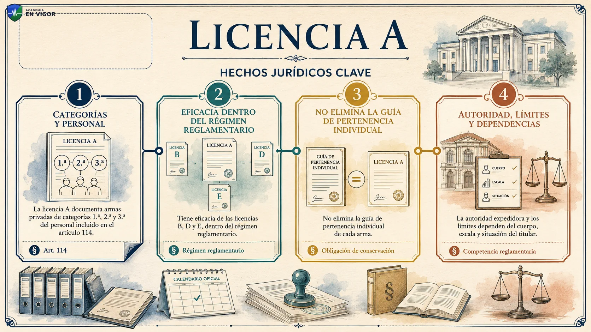

<em>Infografía: Licencia A.</em>

:::hablemos-claro
La licencia A documenta armas privadas de categorías 1.ª, 2.ª y 3.ª del personal incluido en el artículo 114.
:::

:::en-la-calle
Al revisar licencia, guía o tarjeta, La licencia A documenta armas privadas de categorías 1.ª, 2.ª y 3.ª del personal incluido en el artículo 114.
:::

:::lo-que-cae
Prioriza **personal de Fuerzas Armadas, Fuerzas y Cuerpos y servicios** y descarta respuestas que confundan categoría, mecanismo, documento, cartucho, trayectoria o indicio.
:::

<!-- FUENTE: BOE-RA-T42 -->

## 68. Licencia B

### Lógica del bloque

Para dominar **licencia b**, aplica esta regla: La licencia B ampara armas de fuego cortas de particulares. El anclaje principal es **armas cortas de particulares por necesidad**.

### Hechos examinables

- La licencia B ampara armas de fuego cortas de particulares. <!-- FACT:PN-T42-F269 -->
- Su concesión es restrictiva y requiere acreditar una necesidad que no se satisface por la mera defensa de personas o bienes. <!-- FACT:PN-T42-F270 -->
- La autoridad valora circunstancias y documentación del solicitante. <!-- FACT:PN-T42-F271 -->
- La licencia no autoriza porte o uso fuera de sus condiciones y límites. <!-- FACT:PN-T42-F272 -->

### Ejemplos razonados

- **Aplicación correcta:** Su concesión es restrictiva y requiere acreditar una necesidad que no se satisface por la mera defensa de personas o bienes.
- **Contraste útil:** La autoridad valora circunstancias y documentación del solicitante.

### Trampas de examen

- **Incorrecto:** La licencia B se concede automáticamente a todo mayor de edad.
- **Incorrecto:** B ampara rifles de caza mayor.

<!-- VISUAL:t42-il-68-licencia-b.webp -->

  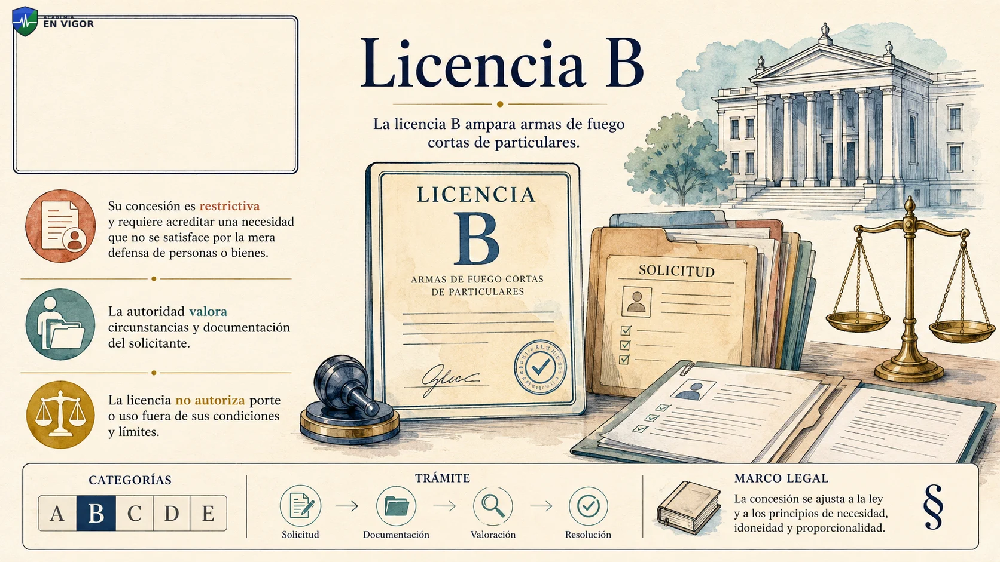

<em>Infografía: Licencia B.</em>

:::hablemos-claro
La licencia B ampara armas de fuego cortas de particulares.
:::

:::en-la-calle
Al revisar licencia, guía o tarjeta, La licencia B ampara armas de fuego cortas de particulares.
:::

:::lo-que-cae
Prioriza **armas cortas de particulares por necesidad** y descarta respuestas que confundan categoría, mecanismo, documento, cartucho, trayectoria o indicio.
:::

<!-- FUENTE: BOE-RA-T42 -->

## 69. Licencia C

### Lógica del bloque

Para dominar **licencia c**, aplica esta regla: La licencia C se vincula a armas de dotación del personal de vigilancia y seguridad habilitado. El anclaje principal es **dotación durante servicio de seguridad**.

### Hechos examinables

- La licencia C se vincula a armas de dotación del personal de vigilancia y seguridad habilitado. <!-- FACT:PN-T42-F273 -->
- Su eficacia se limita al ejercicio de las funciones o servicios autorizados. <!-- FACT:PN-T42-F274 -->
- El arma pertenece normalmente a la empresa o entidad y cuenta con guía a su nombre. <!-- FACT:PN-T42-F275 -->
- Cese o suspensión de habilitación afecta al uso y depósito conforme al Reglamento. <!-- FACT:PN-T42-F276 -->

### Ejemplos razonados

- **Aplicación correcta:** Su eficacia se limita al ejercicio de las funciones o servicios autorizados.
- **Contraste útil:** El arma pertenece normalmente a la empresa o entidad y cuenta con guía a su nombre.

### Trampas de examen

- **Incorrecto:** La C autoriza armas privadas de concurso.
- **Incorrecto:** El vigilante puede conservar el arma de dotación fuera del servicio como propia.

<!-- VISUAL:t42-69-licencia-c.webp -->

  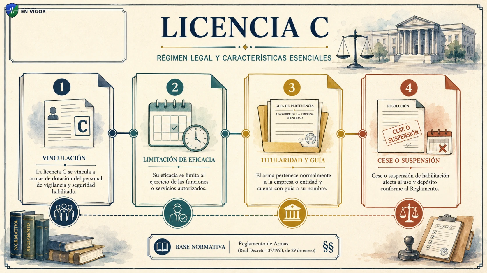

<em>Infografía: Licencia C.</em>

:::hablemos-claro
La licencia C se vincula a armas de dotación del personal de vigilancia y seguridad habilitado.
:::

:::en-la-calle
Al revisar licencia, guía o tarjeta, La licencia C se vincula a armas de dotación del personal de vigilancia y seguridad habilitado.
:::

:::lo-que-cae
Prioriza **dotación durante servicio de seguridad** y descarta respuestas que confundan categoría, mecanismo, documento, cartucho, trayectoria o indicio.
:::

<!-- FUENTE: GC-LICENSES-T42 -->

## 70. Licencia D

### Lógica del bloque

Para dominar **licencia d**, aplica esta regla: La licencia D ampara armas de la 2.ª.2 destinadas a caza mayor. El anclaje principal es **armas largas rayadas para caza mayor**.

### Hechos examinables

- La licencia D ampara armas de la 2.ª.2 destinadas a caza mayor. <!-- FACT:PN-T42-F277 -->
- No sustituye la guía de pertenencia de cada arma. <!-- FACT:PN-T42-F278 -->
- La custodia domiciliaria exige las medidas de seguridad vigentes. <!-- FACT:PN-T42-F279 -->
- El uso debe ajustarse a terrenos, actividad y demás autorizaciones aplicables. <!-- FACT:PN-T42-F280 -->

### Ejemplos razonados

- **Aplicación correcta:** No sustituye la guía de pertenencia de cada arma.
- **Contraste útil:** La custodia domiciliaria exige las medidas de seguridad vigentes.

### Trampas de examen

- **Incorrecto:** La D ampara pistolas y revólveres.
- **Incorrecto:** Con D no se necesita guía de pertenencia.

<!-- VISUAL:t42-70-licencia-d.webp -->

  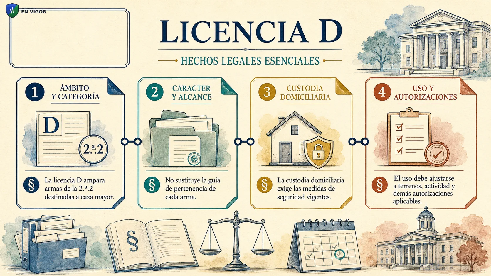

<em>Infografía: Licencia D.</em>

:::hablemos-claro
La licencia D ampara armas de la 2.ª.2 destinadas a caza mayor.
:::

:::en-la-calle
Al revisar licencia, guía o tarjeta, La licencia D ampara armas de la 2.ª.2 destinadas a caza mayor.
:::

:::lo-que-cae
Prioriza **armas largas rayadas para caza mayor** y descarta respuestas que confundan categoría, mecanismo, documento, cartucho, trayectoria o indicio.
:::

<!-- FUENTE: GC-LICENSES-T42 -->

## 71. Licencia E

### Lógica del bloque

Para dominar **licencia e**, aplica esta regla: La licencia E ampara armas de las categorías reglamentarias previstas para caza y tiro deportivo. El anclaje principal es **escopetas y determinadas armas de tiro**.

### Hechos examinables

- La licencia E ampara armas de las categorías reglamentarias previstas para caza y tiro deportivo. <!-- FACT:PN-T42-F281 -->
- Incluye escopetas de la 3.ª.2 y otras armas expresamente comprendidas en su régimen. <!-- FACT:PN-T42-F282 -->
- La licencia no convierte en libre el porte en poblaciones o lugares no autorizados. <!-- FACT:PN-T42-F283 -->
- Cada arma que lo requiera mantiene su guía de pertenencia. <!-- FACT:PN-T42-F284 -->

### Ejemplos razonados

- **Aplicación correcta:** Incluye escopetas de la 3.ª.2 y otras armas expresamente comprendidas en su régimen.
- **Contraste útil:** La licencia no convierte en libre el porte en poblaciones o lugares no autorizados.

### Trampas de examen

- **Incorrecto:** La E ampara armas automáticas.
- **Incorrecto:** La licencia permite disparar en cualquier lugar privado.

<!-- VISUAL:t42-71-licencia-e.webp -->

  

<em>Infografía: Licencia E.</em>

:::hablemos-claro
La licencia E ampara armas de las categorías reglamentarias previstas para caza y tiro deportivo.
:::

:::en-la-calle
Al revisar licencia, guía o tarjeta, La licencia E ampara armas de las categorías reglamentarias previstas para caza y tiro deportivo.
:::

:::lo-que-cae
Prioriza **escopetas y determinadas armas de tiro** y descarta respuestas que confundan categoría, mecanismo, documento, cartucho, trayectoria o indicio.
:::

<!-- FUENTE: GC-LICENSES-T42 -->

## 72. Licencia F

### Lógica del bloque

Para dominar **licencia f**, aplica esta regla: La licencia F ampara armas consideradas de concurso. El anclaje principal es **armas de concurso en instalaciones autorizadas**.

### Hechos examinables

- La licencia F ampara armas consideradas de concurso. <!-- FACT:PN-T42-F285 -->
- Solo permite su uso en campos, polígonos o galerías autorizados. <!-- FACT:PN-T42-F286 -->
- Solo pueden portarse con el objeto de practicar tiro autorizado. <!-- FACT:PN-T42-F287 -->
- La pérdida de la habilitación deportiva revoca la licencia y obliga a depositar licencia y armas, que pueden permanecer un año en la Intervención. <!-- FACT:PN-T42-F288 -->

### Ejemplos razonados

- **Aplicación correcta:** Solo permite su uso en campos, polígonos o galerías autorizados.
- **Contraste útil:** Solo pueden portarse con el objeto de practicar tiro autorizado.

### Trampas de examen

- **Incorrecto:** La F permite portar el arma cargada para defensa personal.
- **Incorrecto:** Cualquier arma deportiva queda automáticamente amparada sin reconocimiento de concurso.

<!-- VISUAL:t42-72-licencia-f.webp -->

  

<em>Infografía: Licencia F.</em>

:::hablemos-claro
La licencia F ampara armas consideradas de concurso.
:::

:::en-la-calle
Al revisar licencia, guía o tarjeta, La licencia F ampara armas consideradas de concurso.
:::

:::lo-que-cae
Prioriza **armas de concurso en instalaciones autorizadas** y descarta respuestas que confundan categoría, mecanismo, documento, cartucho, trayectoria o indicio.
:::

<!-- FUENTE: BOE-RA-T42 -->

## 73. Clases y cupos de licencia F

### Lógica del bloque

Para dominar **clases y cupos de licencia f**, aplica esta regla: La F de tercera clase autoriza un arma corta o larga de concurso y excluye pistolas libres. El anclaje principal es **tercera una, segunda seis, primera diez**.

### Hechos examinables

- La F de tercera clase autoriza un arma corta o larga de concurso y excluye pistolas libres. <!-- FACT:PN-T42-F289 -->
- La F de segunda clase puede autorizar hasta seis armas de concurso. <!-- FACT:PN-T42-F290 -->
- La F de primera clase puede autorizar hasta diez armas de concurso. <!-- FACT:PN-T42-F291 -->
- La licencia autoriza inicialmente adquirir un arma; las restantes exigen autorización previa individual. <!-- FACT:PN-T42-F292 -->

### Ejemplos razonados

- **Aplicación correcta:** La F de segunda clase puede autorizar hasta seis armas de concurso.
- **Contraste útil:** La F de primera clase puede autorizar hasta diez armas de concurso.

### Trampas de examen

- **Incorrecto:** La tercera clase permite seis armas.
- **Incorrecto:** El máximo de diez se aplica a cualquier titular F sin atender a su clase.

<!-- VISUAL:t42-il-73-clases-y-cupos-de-licencia-f.webp -->

  

<em>Infografía: Clases y cupos de licencia F.</em>

:::hablemos-claro
La F de tercera clase autoriza un arma corta o larga de concurso y excluye pistolas libres.
:::

:::en-la-calle
Al revisar licencia, guía o tarjeta, La F de tercera clase autoriza un arma corta o larga de concurso y excluye pistolas libres.
:::

:::lo-que-cae
Prioriza **tercera una, segunda seis, primera diez** y descarta respuestas que confundan categoría, mecanismo, documento, cartucho, trayectoria o indicio.
:::

<!-- FUENTE: BOE-RA-T42 -->

## 74. Guía de pertenencia

### Lógica del bloque

Para dominar **guía de pertenencia**, aplica esta regla: Cada arma de las categorías 1.ª, 2.ª, 3.ª, 6.ª y subcategorías 7.ª.1, 2, 3, 4 y 8.ª debe llevar guía. El anclaje principal es **documento individual del arma**.

### Hechos examinables

- Cada arma de las categorías 1.ª, 2.ª, 3.ª, 6.ª y subcategorías 7.ª.1, 2, 3, 4 y 8.ª debe llevar guía. <!-- FACT:PN-T42-F293 -->
- La guía individualiza el arma y la vincula a su titular y licencia o autorización. <!-- FACT:PN-T42-F294 -->
- Debe acompañar al arma en uso, depósito y transporte. <!-- FACT:PN-T42-F295 -->
- La guía no autoriza por sí sola una actividad o porte que requiera licencia. <!-- FACT:PN-T42-F296 -->

### Ejemplos razonados

- **Aplicación correcta:** La guía individualiza el arma y la vincula a su titular y licencia o autorización.
- **Contraste útil:** Debe acompañar al arma en uso, depósito y transporte.

### Trampas de examen

- **Incorrecto:** Una guía puede amparar un número ilimitado de armas.
- **Incorrecto:** La guía sustituye cualquier licencia personal.

<!-- VISUAL:t42-74-guia-de-pertenencia.webp -->

  

<em>Infografía: Guía de pertenencia.</em>

:::hablemos-claro
Cada arma de las categorías 1.ª, 2.ª, 3.ª, 6.ª y subcategorías 7.ª.1, 2, 3, 4 y 8.ª debe llevar guía.
:::

:::en-la-calle
Al revisar licencia, guía o tarjeta, Cada arma de las categorías 1.ª, 2.ª, 3.ª, 6.ª y subcategorías 7.ª.1, 2, 3, 4 y 8.ª debe llevar guía.
:::

:::lo-que-cae
Prioriza **documento individual del arma** y descarta respuestas que confundan categoría, mecanismo, documento, cartucho, trayectoria o indicio.
:::

<!-- FUENTE: BOE-RA-T42 -->

## 75. Contenido y expedición de la guía

### Lógica del bloque

Para dominar **contenido y expedición de la guía**, aplica esta regla: La guía recoge identidad y datos personales del propietario. El anclaje principal es **titular, licencia y reseña completa**.

### Hechos examinables

- La guía recoge identidad y datos personales del propietario. <!-- FACT:PN-T42-F297 -->
- Incluye datos de la licencia o autorización correspondiente. <!-- FACT:PN-T42-F298 -->
- Contiene la reseña completa del arma. <!-- FACT:PN-T42-F299 -->
- Las Intervenciones de Armas y Explosivos de la Guardia Civil expiden las guías ordinarias en su ámbito. <!-- FACT:PN-T42-F300 -->

### Ejemplos razonados

- **Aplicación correcta:** Incluye datos de la licencia o autorización correspondiente.
- **Contraste útil:** Contiene la reseña completa del arma.

### Trampas de examen

- **Incorrecto:** La guía solo contiene el calibre.
- **Incorrecto:** La expide cualquier armería sin intervención administrativa.

<!-- VISUAL:t42-75-contenido-y-expedicion-de-la-guia.webp -->

  

<em>Infografía: Contenido y expedición de la guía.</em>

:::hablemos-claro
La guía recoge identidad y datos personales del propietario.
:::

:::en-la-calle
Al revisar licencia, guía o tarjeta, La guía recoge identidad y datos personales del propietario.
:::

:::lo-que-cae
Prioriza **titular, licencia y reseña completa** y descarta respuestas que confundan categoría, mecanismo, documento, cartucho, trayectoria o indicio.
:::

<!-- FUENTE: GC-GUIDES-T42 -->

## 76. Guías del personal con licencia A

### Lógica del bloque

Para dominar **guías del personal con licencia a**, aplica esta regla: El personal del artículo 114 necesita guía para cada arma particular. El anclaje principal es **autoridad por cuerpo y marcas específicas**.

### Hechos examinables

- El personal del artículo 114 necesita guía para cada arma particular. <!-- FACT:PN-T42-F301 -->
- La Dirección General de la Policía expide las del personal de Policía Nacional. <!-- FACT:PN-T42-F302 -->
- Las guías de Policía Nacional se marcan C.N.P. y numeración correlativa. <!-- FACT:PN-T42-F303 -->
- La autoridad varía para Fuerzas Armadas, Guardia Civil, policías autonómicas, locales y Vigilancia Aduanera. <!-- FACT:PN-T42-F304 -->

### Ejemplos razonados

- **Aplicación correcta:** La Dirección General de la Policía expide las del personal de Policía Nacional.
- **Contraste útil:** Las guías de Policía Nacional se marcan C.N.P. y numeración correlativa.

### Trampas de examen

- **Incorrecto:** Todas las guías A las expide la alcaldía.
- **Incorrecto:** Una sola guía C.N.P. documenta todas las armas del funcionario.

<!-- VISUAL:t42-76-guias-del-personal-con-licencia-a.webp -->

  

<em>Infografía: Guías del personal con licencia A.</em>

:::hablemos-claro
El personal del artículo 114 necesita guía para cada arma particular.
:::

:::en-la-calle
Al revisar licencia, guía o tarjeta, El personal del artículo 114 necesita guía para cada arma particular.
:::

:::lo-que-cae
Prioriza **autoridad por cuerpo y marcas específicas** y descarta respuestas que confundan categoría, mecanismo, documento, cartucho, trayectoria o indicio.
:::

<!-- FUENTE: BOE-RA-T42 -->

## 77. Tarjetas de armas

### Lógica del bloque

Para dominar **tarjetas de armas**, aplica esta regla: Para llevar y usar armas de 4.ª fuera del domicilio se requiere tarjeta que acompañe al arma. El anclaje principal es **categoría 4.ª y validez municipal**.

### Hechos examinables

- Para llevar y usar armas de 4.ª fuera del domicilio se requiere tarjeta que acompañe al arma. <!-- FACT:PN-T42-F305 -->
- Las concede y retira el alcalde del municipio de vecindad o residencia. <!-- FACT:PN-T42-F306 -->
- Su validez se limita al término municipal. <!-- FACT:PN-T42-F307 -->
- Tarjeta A documenta hasta seis armas de 4.ª.1 por cinco años; tarjeta B puede documentar sin límite armas de 4.ª.2 y es permanente. <!-- FACT:PN-T42-F308 -->

### Ejemplos razonados

- **Aplicación correcta:** Las concede y retira el alcalde del municipio de vecindad o residencia.
- **Contraste útil:** Su validez se limita al término municipal.

### Trampas de examen

- **Incorrecto:** La tarjeta de armas tiene validez nacional.
- **Incorrecto:** Tarjeta B corresponde a pistolas de fuego de 1.ª categoría.

<!-- VISUAL:t42-77-tarjetas-de-armas.webp -->

  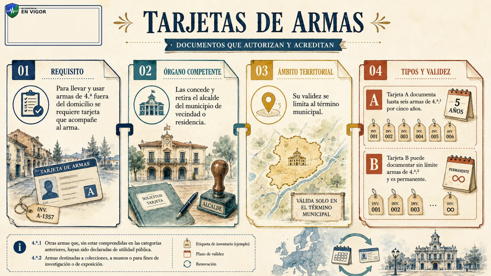

<em>Infografía: Tarjetas de armas.</em>

:::hablemos-claro
Para llevar y usar armas de 4.ª fuera del domicilio se requiere tarjeta que acompañe al arma.
:::

:::en-la-calle
Al revisar licencia, guía o tarjeta, Para llevar y usar armas de 4.ª fuera del domicilio se requiere tarjeta que acompañe al arma.
:::

:::lo-que-cae
Prioriza **categoría 4.ª y validez municipal** y descarta respuestas que confundan categoría, mecanismo, documento, cartucho, trayectoria o indicio.
:::

<!-- FUENTE: BOE-RA-T42 -->

## 78. Autorización especial de menores

### Lógica del bloque

Para dominar **autorización especial de menores**, aplica esta regla: Mayores de 16 y menores de 18 pueden usar ciertas armas largas para caza o tiro junior con autorización y supervisión. El anclaje principal es **uso supervisado sin posesión plena**.

### Hechos examinables

- Mayores de 16 y menores de 18 pueden usar ciertas armas largas para caza o tiro junior con autorización y supervisión. <!-- FACT:PN-T42-F309 -->
- Mayores de 14 y menores de 18 pueden usar determinadas armas de 3.ª.2 y 3.ª.3 en los supuestos previstos. <!-- FACT:PN-T42-F310 -->
- La autorización permite uso, pero no posesión plena ni porte dentro de poblaciones. <!-- FACT:PN-T42-F311 -->
- El adulto acompañante debe tener licencia adecuada y asumir supervisión y almacenamiento. <!-- FACT:PN-T42-F312 -->

### Ejemplos razonados

- **Aplicación correcta:** Mayores de 14 y menores de 18 pueden usar determinadas armas de 3.ª.2 y 3.ª.3 en los supuestos previstos.
- **Contraste útil:** La autorización permite uso, pero no posesión plena ni porte dentro de poblaciones.

### Trampas de examen

- **Incorrecto:** La autorización convierte al menor en titular pleno del arma.
- **Incorrecto:** Cualquier menor de 14 puede usar un rifle con permiso familiar.

<!-- VISUAL:t42-il-78-autorizacion-especial-de-menores.webp -->

  

<em>Infografía: Autorización especial de menores.</em>

:::hablemos-claro
Mayores de 16 y menores de 18 pueden usar ciertas armas largas para caza o tiro junior con autorización y supervisión.
:::

:::en-la-calle
Al revisar licencia, guía o tarjeta, Mayores de 16 y menores de 18 pueden usar ciertas armas largas para caza o tiro junior con autorización y supervisión.
:::

:::lo-que-cae
Prioriza **uso supervisado sin posesión plena** y descarta respuestas que confundan categoría, mecanismo, documento, cartucho, trayectoria o indicio.
:::

<!-- FUENTE: BOE-RA-T42 -->

## 79. Tarjeta Europea de Armas de Fuego

### Lógica del bloque

Para dominar **tarjeta europea de armas de fuego**, aplica esta regla: La Tarjeta Europea es personal e intransferible. El anclaje principal es **documentar viajes y armas del titular**.

### Hechos examinables

- La Tarjeta Europea es personal e intransferible. <!-- FACT:PN-T42-F313 -->
- En ella constan las armas de fuego que posee y utiliza su titular, incluida su categoría. <!-- FACT:PN-T42-F314 -->
- El usuario debe llevarla consigo durante los desplazamientos en que sea exigible. <!-- FACT:PN-T42-F315 -->
- No sustituye automáticamente autorizaciones del Estado visitado cuando estas son necesarias. <!-- FACT:PN-T42-F316 -->

### Ejemplos razonados

- **Aplicación correcta:** En ella constan las armas de fuego que posee y utiliza su titular, incluida su categoría.
- **Contraste útil:** El usuario debe llevarla consigo durante los desplazamientos en que sea exigible.

### Trampas de examen

- **Incorrecto:** La Tarjeta Europea autoriza cualquier arma prohibida en España.
- **Incorrecto:** Puede prestarse junto con el arma a otra persona.

<!-- VISUAL:t42-79-tarjeta-europea-de-armas-de-fuego.webp -->

  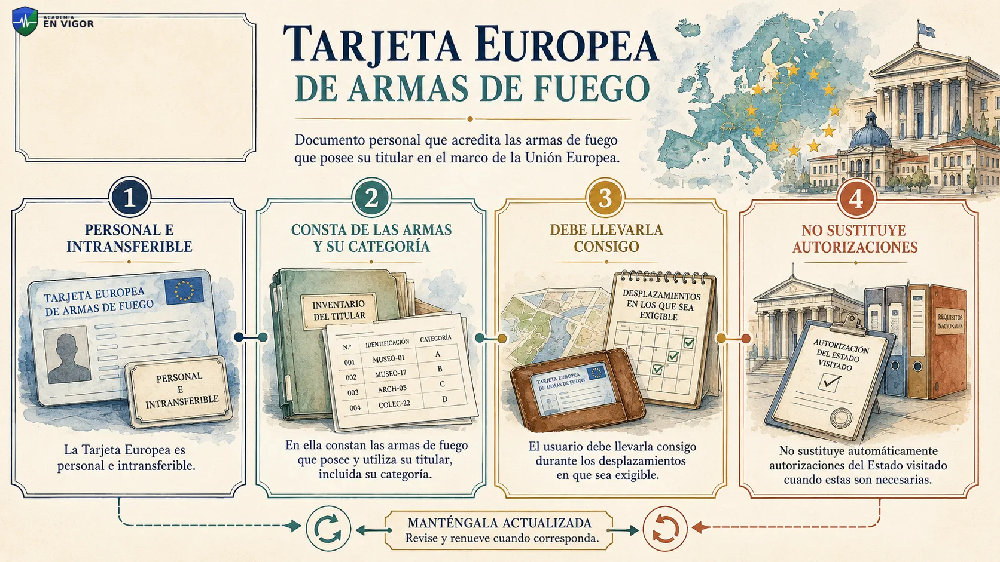

<em>Infografía: Tarjeta Europea de Armas de Fuego.</em>

:::hablemos-claro
La Tarjeta Europea es personal e intransferible.
:::

:::en-la-calle
Al revisar licencia, guía o tarjeta, La Tarjeta Europea es personal e intransferible.
:::

:::lo-que-cae
Prioriza **documentar viajes y armas del titular** y descarta respuestas que confundan categoría, mecanismo, documento, cartucho, trayectoria o indicio.
:::

<!-- FUENTE: BOE-RA-T42 -->

## 80. Revista, renovación y autorización temporal

### Lógica del bloque

Para dominar **revista, renovación y autorización temporal**, aplica esta regla: Las armas que precisan guía pasan revista cada cinco años con carácter general. El anclaje principal es **control periódico y continuidad limitada**.

### Hechos examinables

- Las armas que precisan guía pasan revista cada cinco años con carácter general. <!-- FACT:PN-T42-F317 -->
- La revista se realiza al presentar la renovación de la licencia correspondiente. <!-- FACT:PN-T42-F318 -->
- Ante renovación próxima, la Intervención puede expedir autorización temporal de uso por tres meses y recoger la licencia que caduca. <!-- FACT:PN-T42-F319 -->
- Revista, renovación y autorización temporal son trámites distintos. <!-- FACT:PN-T42-F320 -->

### Ejemplos razonados

- **Aplicación correcta:** La revista se realiza al presentar la renovación de la licencia correspondiente.
- **Contraste útil:** Ante renovación próxima, la Intervención puede expedir autorización temporal de uso por tres meses y recoger la licencia que caduca.

### Trampas de examen

- **Incorrecto:** La revista sustituye definitivamente a la licencia.
- **Incorrecto:** La autorización temporal dura cinco años.

<!-- VISUAL:t42-80-revista-renovacion-y-autorizacion-temporal.webp -->

  

<em>Infografía: Revista, renovación y autorización temporal.</em>

:::hablemos-claro
Las armas que precisan guía pasan revista cada cinco años con carácter general.
:::

:::en-la-calle
Al revisar licencia, guía o tarjeta, Las armas que precisan guía pasan revista cada cinco años con carácter general.
:::

:::lo-que-cae
Prioriza **control periódico y continuidad limitada** y descarta respuestas que confundan categoría, mecanismo, documento, cartucho, trayectoria o indicio.
:::

<!-- FUENTE: BOE-RA-T42 -->

## 81. Custodia y comunicación de pérdida

### Lógica del bloque

Para dominar **custodia y comunicación de pérdida**, aplica esta regla: El titular debe guardar armas y componentes esenciales en lugar seguro y minimizar acceso no autorizado. El anclaje principal es **lugar seguro y aviso inmediato**.

### Hechos examinables

- El titular debe guardar armas y componentes esenciales en lugar seguro y minimizar acceso no autorizado. <!-- FACT:PN-T42-F321 -->
- Debe evitar que armas y municiones sean fácilmente accesibles de forma conjunta. <!-- FACT:PN-T42-F322 -->
- Pérdida, destrucción, robo o sustracción deben comunicarse inmediatamente a la Intervención correspondiente. <!-- FACT:PN-T42-F323 -->
- Las medidas concretas de armero dependen de la categoría y licencia, además de la obligación general. <!-- FACT:PN-T42-F324 -->

### Ejemplos razonados

- **Aplicación correcta:** Debe evitar que armas y municiones sean fácilmente accesibles de forma conjunta.
- **Contraste útil:** Pérdida, destrucción, robo o sustracción deben comunicarse inmediatamente a la Intervención correspondiente.

### Trampas de examen

- **Incorrecto:** La licencia exime de toda medida de custodia.
- **Incorrecto:** La pérdida puede comunicarse al renovar cinco años después.

<!-- VISUAL:t42-81-custodia-y-comunicacion-de-perdida.webp -->

  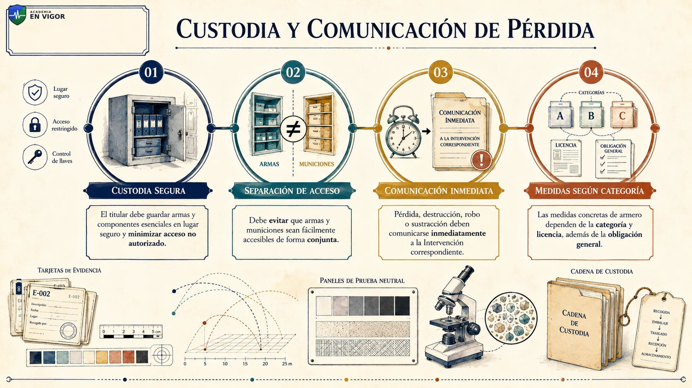

<em>Infografía: Custodia y comunicación de pérdida.</em>

:::hablemos-claro
El titular debe guardar armas y componentes esenciales en lugar seguro y minimizar acceso no autorizado.
:::

:::en-la-calle
Al revisar licencia, guía o tarjeta, El titular debe guardar armas y componentes esenciales en lugar seguro y minimizar acceso no autorizado.
:::

:::lo-que-cae
Prioriza **lugar seguro y aviso inmediato** y descarta respuestas que confundan categoría, mecanismo, documento, cartucho, trayectoria o indicio.
:::

<!-- FUENTE: BOE-RA-T42 -->

## 82. Concepto y ramas de la balística

### Lógica del bloque

Para dominar **concepto y ramas de la balística**, aplica esta regla: La balística estudia el movimiento y comportamiento de proyectiles. El anclaje principal es **proyectiles en arma, vuelo y blanco**.

### Hechos examinables

- La balística estudia el movimiento y comportamiento de proyectiles. <!-- FACT:PN-T42-F325 -->
- La balística interna estudia los fenómenos dentro del arma hasta la salida del proyectil. <!-- FACT:PN-T42-F326 -->
- La balística externa estudia el vuelo desde la boca hasta el blanco. <!-- FACT:PN-T42-F327 -->
- La balística terminal o de efectos estudia el comportamiento al impactar y dentro del blanco. <!-- FACT:PN-T42-F328 -->

### Ejemplos razonados

- **Aplicación correcta:** La balística interna estudia los fenómenos dentro del arma hasta la salida del proyectil.
- **Contraste útil:** La balística externa estudia el vuelo desde la boca hasta el blanco.

### Trampas de examen

- **Incorrecto:** La balística solo tiene dos ramas.
- **Incorrecto:** La balística externa comienza dentro de la recámara.

<!-- VISUAL:t42-82-concepto-y-ramas-de-la-balistica.webp -->

  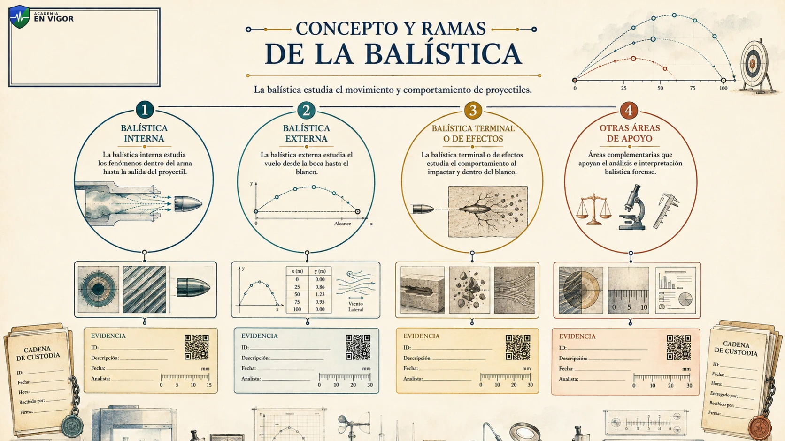

<em>Infografía: Concepto y ramas de la balística.</em>

:::hablemos-claro
La balística estudia el movimiento y comportamiento de proyectiles.
:::

:::en-la-calle
Al reconstruir trayectoria y efectos, La balística estudia el movimiento y comportamiento de proyectiles.
:::

:::lo-que-cae
Prioriza **proyectiles en arma, vuelo y blanco** y descarta respuestas que confundan categoría, mecanismo, documento, cartucho, trayectoria o indicio.
:::

<!-- FUENTE: NIJ-BALLISTICS-T42 -->

## 83. Balística interna

### Lógica del bloque

Para dominar **balística interna**, aplica esta regla: La balística interna comienza con la iniciación del cartucho. El anclaje principal es **iniciación, presión y recorrido por el ánima**.

### Hechos examinables

- La balística interna comienza con la iniciación del cartucho. <!-- FACT:PN-T42-F329 -->
- Analiza combustión, generación de gases y presión. <!-- FACT:PN-T42-F330 -->
- Incluye el movimiento del proyectil por el ánima hasta abandonar la boca. <!-- FACT:PN-T42-F331 -->
- Arma, cartucho, temperatura y estado del sistema condicionan el proceso. <!-- FACT:PN-T42-F332 -->

### Ejemplos razonados

- **Aplicación correcta:** Analiza combustión, generación de gases y presión.
- **Contraste útil:** Incluye el movimiento del proyectil por el ánima hasta abandonar la boca.

### Trampas de examen

- **Incorrecto:** Termina cuando el proyectil impacta en el blanco.
- **Incorrecto:** Solo estudia las marcas sobre la víctima.

<!-- VISUAL:t42-il-83-balistica-interna.webp -->

  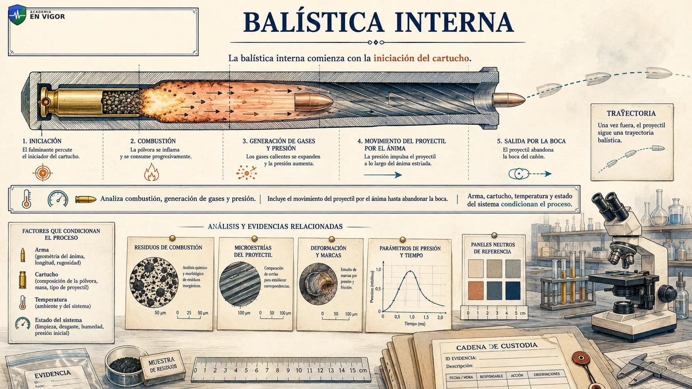

<em>Infografía: Balística interna.</em>

:::hablemos-claro
La balística interna comienza con la iniciación del cartucho.
:::

:::en-la-calle
Al reconstruir trayectoria y efectos, La balística interna comienza con la iniciación del cartucho.
:::

:::lo-que-cae
Prioriza **iniciación, presión y recorrido por el ánima** y descarta respuestas que confundan categoría, mecanismo, documento, cartucho, trayectoria o indicio.
:::

<!-- FUENTE: NIJ-BALLISTICS-T42 -->

## 84. Balística externa

### Lógica del bloque

Para dominar **balística externa**, aplica esta regla: La balística externa comienza cuando el proyectil abandona la boca. El anclaje principal es **trayectoria después de la boca**.

### Hechos examinables

- La balística externa comienza cuando el proyectil abandona la boca. <!-- FACT:PN-T42-F333 -->
- Gravedad y resistencia aerodinámica modifican su trayectoria. <!-- FACT:PN-T42-F334 -->
- Velocidad, orientación, viento y condiciones atmosféricas influyen en el vuelo. <!-- FACT:PN-T42-F335 -->
- La trayectoria real no es una parábola ideal invariable. <!-- FACT:PN-T42-F336 -->

### Ejemplos razonados

- **Aplicación correcta:** Gravedad y resistencia aerodinámica modifican su trayectoria.
- **Contraste útil:** Velocidad, orientación, viento y condiciones atmosféricas influyen en el vuelo.

### Trampas de examen

- **Incorrecto:** El proyectil vuela en línea recta indefinidamente.
- **Incorrecto:** La humedad permite identificar por sí sola el arma.

<!-- VISUAL:t42-84-balistica-externa.webp -->

  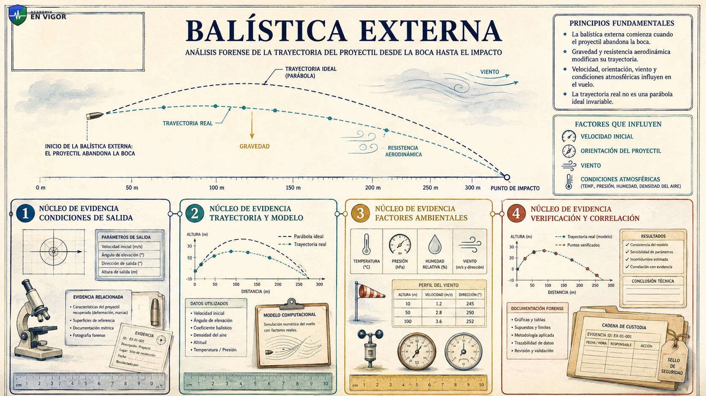

<em>Infografía: Balística externa.</em>

:::hablemos-claro
La balística externa comienza cuando el proyectil abandona la boca.
:::

:::en-la-calle
Al reconstruir trayectoria y efectos, La balística externa comienza cuando el proyectil abandona la boca.
:::

:::lo-que-cae
Prioriza **trayectoria después de la boca** y descarta respuestas que confundan categoría, mecanismo, documento, cartucho, trayectoria o indicio.
:::

<!-- FUENTE: NIJ-BALLISTICS-T42 -->

## 85. Balística terminal o de efectos

### Lógica del bloque

Para dominar **balística terminal o de efectos**, aplica esta regla: La balística terminal estudia el proyectil desde el impacto y su interacción con el blanco. El anclaje principal es **interacción con el blanco**.

### Hechos examinables

- La balística terminal estudia el proyectil desde el impacto y su interacción con el blanco. <!-- FACT:PN-T42-F337 -->
- Penetración, deformación, fragmentación y transferencia de energía dependen del conjunto proyectil-blanco. <!-- FACT:PN-T42-F338 -->
- El mismo proyectil puede comportarse de modo distinto según velocidad, ángulo y material. <!-- FACT:PN-T42-F339 -->
- Poder de penetración y poder de parada no son magnitudes universales independientes del contexto. <!-- FACT:PN-T42-F340 -->

### Ejemplos razonados

- **Aplicación correcta:** Penetración, deformación, fragmentación y transferencia de energía dependen del conjunto proyectil-blanco.
- **Contraste útil:** El mismo proyectil puede comportarse de modo distinto según velocidad, ángulo y material.

### Trampas de examen

- **Incorrecto:** Todo proyectil produce siempre el mismo canal.
- **Incorrecto:** Mayor calibre garantiza en cualquier caso mayor penetración.

<!-- VISUAL:t42-85-balistica-terminal-o-de-efectos.webp -->

  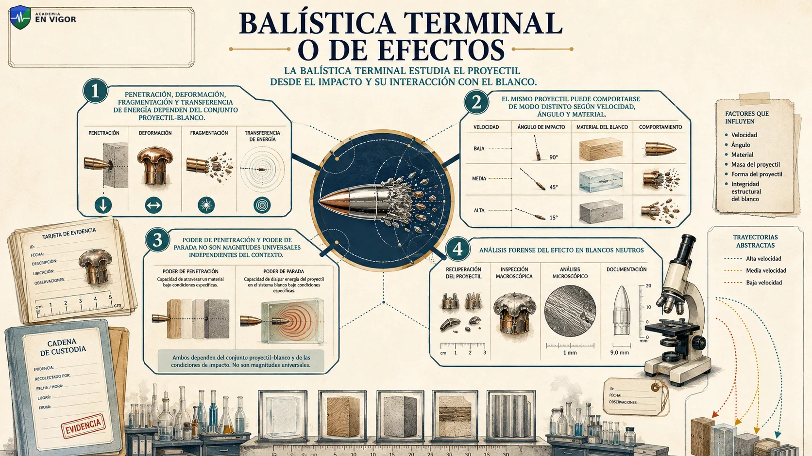

<em>Infografía: Balística terminal o de efectos.</em>

:::hablemos-claro
La balística terminal estudia el proyectil desde el impacto y su interacción con el blanco.
:::

:::en-la-calle
Al reconstruir trayectoria y efectos, La balística terminal estudia el proyectil desde el impacto y su interacción con el blanco.
:::

:::lo-que-cae
Prioriza **interacción con el blanco** y descarta respuestas que confundan categoría, mecanismo, documento, cartucho, trayectoria o indicio.
:::

<!-- FUENTE: NIJ-BALLISTICS-T42 -->

## 86. Trayectoria y línea de tiro

### Lógica del bloque

Para dominar **trayectoria y línea de tiro**, aplica esta regla: La línea inicial de tiro se aproxima a partir del eje del cañón en el instante de salida. El anclaje principal es **eje inicial, gravedad e impactos**.

### Hechos examinables

- La línea inicial de tiro se aproxima a partir del eje del cañón en el instante de salida. <!-- FACT:PN-T42-F341 -->
- La trayectoria es el camino real del proyectil y se curva por fuerzas externas. <!-- FACT:PN-T42-F342 -->
- Impactos intermedios pueden desviar, deformar o fragmentar el proyectil. <!-- FACT:PN-T42-F343 -->
- Una reconstrucción debe incorporar incertidumbre geométrica y material. <!-- FACT:PN-T42-F344 -->

### Ejemplos razonados

- **Aplicación correcta:** La trayectoria es el camino real del proyectil y se curva por fuerzas externas.
- **Contraste útil:** Impactos intermedios pueden desviar, deformar o fragmentar el proyectil.

### Trampas de examen

- **Incorrecto:** Dos impactos alineados fijan siempre con exactitud la posición del tirador.
- **Incorrecto:** La trayectoria nunca cambia después de un rebote.

<!-- VISUAL:t42-86-trayectoria-y-linea-de-tiro.webp -->

  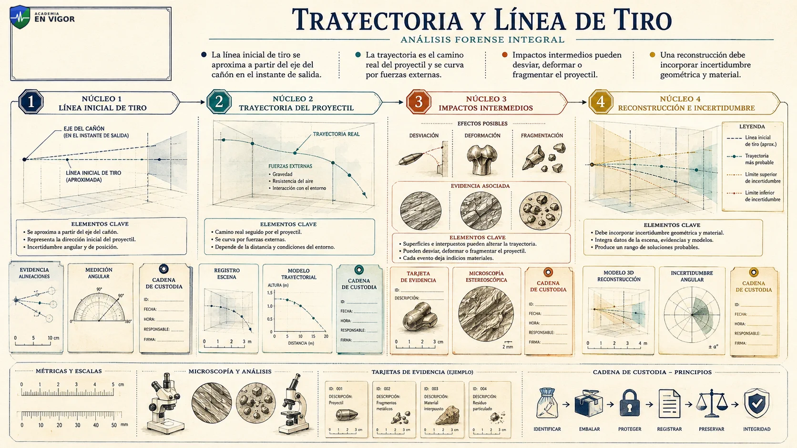

<em>Infografía: Trayectoria y línea de tiro.</em>

:::hablemos-claro
La línea inicial de tiro se aproxima a partir del eje del cañón en el instante de salida.
:::

:::en-la-calle
Al reconstruir trayectoria y efectos, La línea inicial de tiro se aproxima a partir del eje del cañón en el instante de salida.
:::

:::lo-que-cae
Prioriza **eje inicial, gravedad e impactos** y descarta respuestas que confundan categoría, mecanismo, documento, cartucho, trayectoria o indicio.
:::

<!-- FUENTE: FBI-LAB-T42 -->

## 87. Distancia de disparo

### Lógica del bloque

Para dominar **distancia de disparo**, aplica esta regla: La distancia boca-blanco puede estimarse mediante residuos y patrones sobre el blanco. El anclaje principal es **comparar patrones con pruebas conocidas**.

### Hechos examinables

- La distancia boca-blanco puede estimarse mediante residuos y patrones sobre el blanco. <!-- FACT:PN-T42-F345 -->
- La estimación fiable requiere pruebas con el arma y munición sospechosas o comparables, a distancias conocidas. <!-- FACT:PN-T42-F346 -->
- No existe un límite universal de 30 centímetros o un metro válido para toda combinación. <!-- FACT:PN-T42-F347 -->
- Superficie, ropa, munición, cañón y ambiente alteran el patrón. <!-- FACT:PN-T42-F348 -->

### Ejemplos razonados

- **Aplicación correcta:** La estimación fiable requiere pruebas con el arma y munición sospechosas o comparables, a distancias conocidas.
- **Contraste útil:** No existe un límite universal de 30 centímetros o un metro válido para toda combinación.

### Trampas de examen

- **Incorrecto:** Todo tatuaje fija una distancia exacta de 30 centímetros.
- **Incorrecto:** La ausencia de residuos demuestra disparo a larga distancia en cualquier material.

<!-- VISUAL:t42-87-distancia-de-disparo.webp -->

  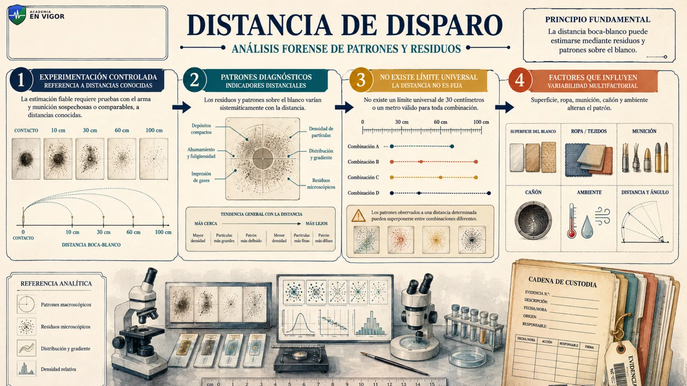

<em>Infografía: Distancia de disparo.</em>

:::hablemos-claro
La distancia boca-blanco puede estimarse mediante residuos y patrones sobre el blanco.
:::

:::en-la-calle
Al reconstruir trayectoria y efectos, La distancia boca-blanco puede estimarse mediante residuos y patrones sobre el blanco.
:::

:::lo-que-cae
Prioriza **comparar patrones con pruebas conocidas** y descarta respuestas que confundan categoría, mecanismo, documento, cartucho, trayectoria o indicio.
:::

<!-- FUENTE: FBI-GSR-T42 -->

## 88. Orificios de entrada y salida

### Lógica del bloque

Para dominar **orificios de entrada y salida**, aplica esta regla: Entrada y salida se valoran por morfología, bordes, residuos, tejidos y trayectoria conjunta. El anclaje principal es **rasgos orientadores no reglas absolutas**.

### Hechos examinables

- Entrada y salida se valoran por morfología, bordes, residuos, tejidos y trayectoria conjunta. <!-- FACT:PN-T42-F349 -->
- El orificio de entrada puede ser circular u oval y variar por ángulo, proyectil y soporte. <!-- FACT:PN-T42-F350 -->
- El orificio de salida puede faltar o presentar tamaño y forma variables. <!-- FACT:PN-T42-F351 -->
- No es válido afirmar siempre que la salida es mayor que la entrada. <!-- FACT:PN-T42-F352 -->

### Ejemplos razonados

- **Aplicación correcta:** El orificio de entrada puede ser circular u oval y variar por ángulo, proyectil y soporte.
- **Contraste útil:** El orificio de salida puede faltar o presentar tamaño y forma variables.

### Trampas de examen

- **Incorrecto:** La entrada es siempre menor y perfectamente circular.
- **Incorrecto:** Todo disparo produce necesariamente orificio de salida.

<!-- VISUAL:t42-88-orificios-de-entrada-y-salida.webp -->

  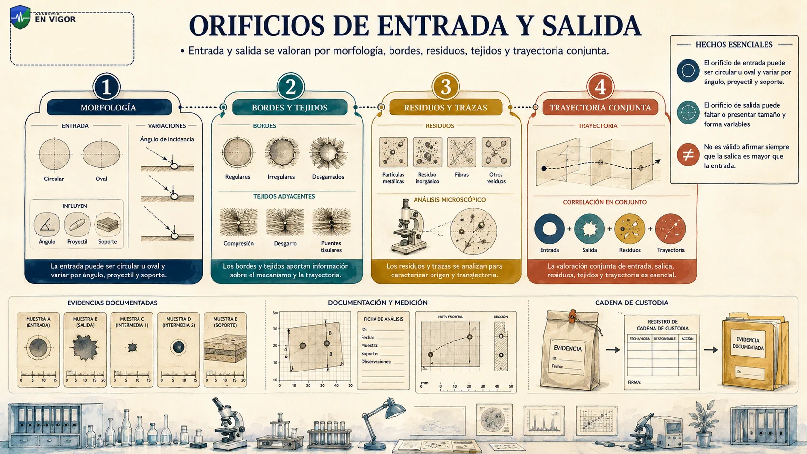

<em>Infografía: Orificios de entrada y salida.</em>

:::hablemos-claro
Entrada y salida se valoran por morfología, bordes, residuos, tejidos y trayectoria conjunta.
:::

:::en-la-calle
Al reconstruir trayectoria y efectos, Entrada y salida se valoran por morfología, bordes, residuos, tejidos y trayectoria conjunta.
:::

:::lo-que-cae
Prioriza **rasgos orientadores no reglas absolutas** y descarta respuestas que confundan categoría, mecanismo, documento, cartucho, trayectoria o indicio.
:::

<!-- FUENTE: FBI-LAB-T42 -->

## 89. Rebotes y proyectiles deformados

### Lógica del bloque

Para dominar **rebotes y proyectiles deformados**, aplica esta regla: Un rebote puede cambiar dirección, estabilidad y velocidad. El anclaje principal es **interacción intermedia altera evidencia**.

### Hechos examinables

- Un rebote puede cambiar dirección, estabilidad y velocidad. <!-- FACT:PN-T42-F353 -->
- La deformación puede borrar o superponer marcas del cañón. <!-- FACT:PN-T42-F354 -->
- Fragmentos de un mismo proyectil pueden seguir trayectorias diferentes. <!-- FACT:PN-T42-F355 -->
- La reconstrucción debe distinguir trayectoria antes y después de cada interacción. <!-- FACT:PN-T42-F356 -->

### Ejemplos razonados

- **Aplicación correcta:** La deformación puede borrar o superponer marcas del cañón.
- **Contraste útil:** Fragmentos de un mismo proyectil pueden seguir trayectorias diferentes.

### Trampas de examen

- **Incorrecto:** Un proyectil deformado carece siempre de valor forense.
- **Incorrecto:** El ángulo de salida del rebote coincide necesariamente con el de entrada.

<!-- VISUAL:t42-89-rebotes-y-proyectiles-deformados.webp -->

  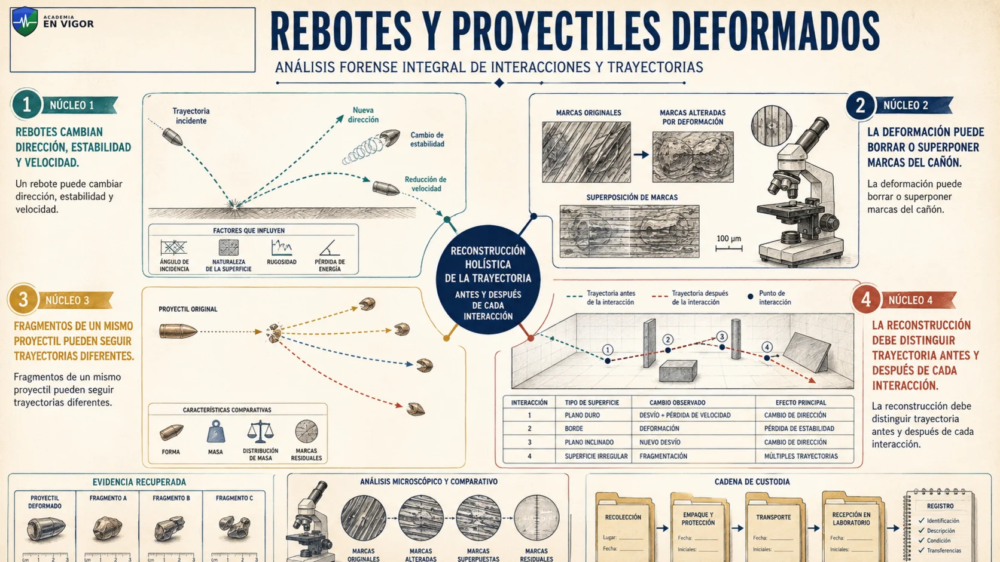

<em>Infografía: Rebotes y proyectiles deformados.</em>

:::hablemos-claro
Un rebote puede cambiar dirección, estabilidad y velocidad.
:::

:::en-la-calle
Al reconstruir trayectoria y efectos, Un rebote puede cambiar dirección, estabilidad y velocidad.
:::

:::lo-que-cae
Prioriza **interacción intermedia altera evidencia** y descarta respuestas que confundan categoría, mecanismo, documento, cartucho, trayectoria o indicio.
:::

<!-- FUENTE: FBI-LAB-T42 -->

## 90. Objeto de la balística forense

### Lógica del bloque

Para dominar **objeto de la balística forense**, aplica esta regla: La balística forense aplica conocimientos sobre armas, munición, disparos y marcas a una investigación. El anclaje principal es **aplicar examen de armas y munición a hechos**.

### Hechos examinables

- La balística forense aplica conocimientos sobre armas, munición, disparos y marcas a una investigación. <!-- FACT:PN-T42-F357 -->
- Puede estudiar funcionamiento, calibre, trayectorias, distancias y asociaciones entre elementos. <!-- FACT:PN-T42-F358 -->
- Parte de indicios y preguntas periciales, no de una narración asumida como cierta. <!-- FACT:PN-T42-F359 -->
- Sus conclusiones deben expresar alcance y limitaciones. <!-- FACT:PN-T42-F360 -->

### Ejemplos razonados

- **Aplicación correcta:** Puede estudiar funcionamiento, calibre, trayectorias, distancias y asociaciones entre elementos.
- **Contraste útil:** Parte de indicios y preguntas periciales, no de una narración asumida como cierta.

### Trampas de examen

- **Incorrecto:** Toda pericia balística identifica necesariamente un arma concreta.
- **Incorrecto:** Balística forense solo estudia heridas humanas.

<!-- VISUAL:t42-90-objeto-de-la-balistica-forense.webp -->

  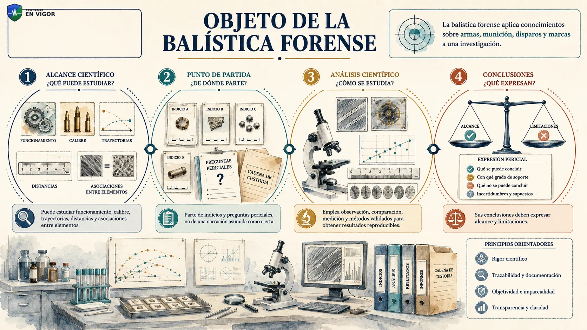

<em>Infografía: Objeto de la balística forense.</em>

:::hablemos-claro
La balística forense aplica conocimientos sobre armas, munición, disparos y marcas a una investigación.
:::

:::en-la-calle
Al practicar una identificación forense, La balística forense aplica conocimientos sobre armas, munición, disparos y marcas a una investigación.
:::

:::lo-que-cae
Prioriza **aplicar examen de armas y munición a hechos** y descarta respuestas que confundan categoría, mecanismo, documento, cartucho, trayectoria o indicio.
:::

<!-- FUENTE: INTERIOR-PC-T42 -->

## 91. Balística funcional

### Lógica del bloque

Para dominar **balística funcional**, aplica esta regla: La balística funcional examina características generales y estado de conservación. El anclaje principal es **estado, características y posibilidad de disparo**.

### Hechos examinables

- La balística funcional examina características generales y estado de conservación. <!-- FACT:PN-T42-F361 -->
- Comprueba funcionamiento de armas originales o transformadas. <!-- FACT:PN-T42-F362 -->
- Puede estudiar seguros, fuerza de disparo, manipulaciones y posibilidad de funcionamiento accidental según el caso. <!-- FACT:PN-T42-F363 -->
- La prueba debe documentarse y realizarse con medidas de seguridad. <!-- FACT:PN-T42-F364 -->

### Ejemplos razonados

- **Aplicación correcta:** Comprueba funcionamiento de armas originales o transformadas.
- **Contraste útil:** Puede estudiar seguros, fuerza de disparo, manipulaciones y posibilidad de funcionamiento accidental según el caso.

### Trampas de examen

- **Incorrecto:** Si un arma está oxidada se considera inoperante sin ensayo.
- **Incorrecto:** Funcional equivale a identificar la autoría del disparo.

<!-- VISUAL:t42-il-91-balistica-funcional.webp -->

  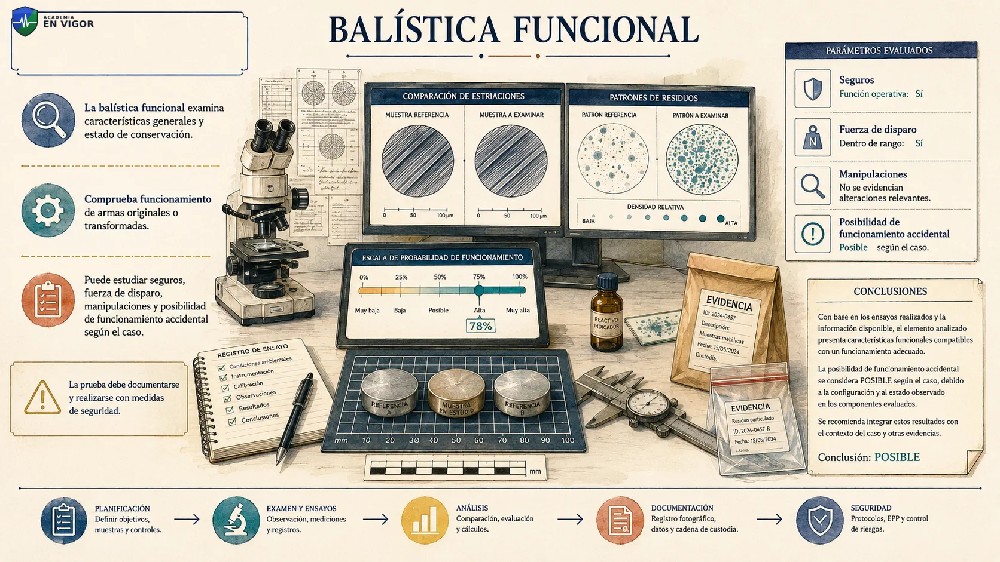

<em>Infografía: Balística funcional.</em>

:::hablemos-claro
La balística funcional examina características generales y estado de conservación.
:::

:::en-la-calle
Al practicar una identificación forense, La balística funcional examina características generales y estado de conservación.
:::

:::lo-que-cae
Prioriza **estado, características y posibilidad de disparo** y descarta respuestas que confundan categoría, mecanismo, documento, cartucho, trayectoria o indicio.
:::

<!-- FUENTE: SECRIM-2024-T42 -->

## 92. Balística identificativa

### Lógica del bloque

Para dominar **balística identificativa**, aplica esta regla: La balística identificativa compara vainas y proyectiles cuestionados con muestras de origen conocido. El anclaje principal es **comparar dubitados con indubitados**.

### Hechos examinables

- La balística identificativa compara vainas y proyectiles cuestionados con muestras de origen conocido. <!-- FACT:PN-T42-F365 -->
- Los disparos de prueba generan elementos indubitados del arma examinada. <!-- FACT:PN-T42-F366 -->
- El cotejo microscópico valora marcas reproducibles y su correspondencia. <!-- FACT:PN-T42-F367 -->
- Una búsqueda automatizada propone candidatos, pero no sustituye la evaluación experta. <!-- FACT:PN-T42-F368 -->

### Ejemplos razonados

- **Aplicación correcta:** Los disparos de prueba generan elementos indubitados del arma examinada.
- **Contraste útil:** El cotejo microscópico valora marcas reproducibles y su correspondencia.

### Trampas de examen

- **Incorrecto:** Una base de datos dicta por sí sola una identificación final.
- **Incorrecto:** Indubitado significa hallado sin saber su origen.

<!-- VISUAL:t42-92-balistica-identificativa.webp -->

  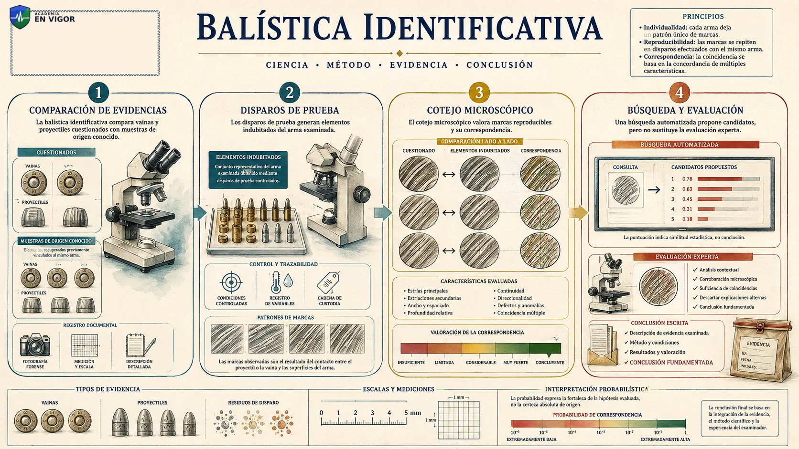

<em>Infografía: Balística identificativa.</em>

:::hablemos-claro
La balística identificativa compara vainas y proyectiles cuestionados con muestras de origen conocido.
:::

:::en-la-calle
Al practicar una identificación forense, La balística identificativa compara vainas y proyectiles cuestionados con muestras de origen conocido.
:::

:::lo-que-cae
Prioriza **comparar dubitados con indubitados** y descarta respuestas que confundan categoría, mecanismo, documento, cartucho, trayectoria o indicio.
:::

<!-- FUENTE: SECRIM-2024-T42 -->

## 93. Características de clase, subclase e individuales

### Lógica del bloque

Para dominar **características de clase, subclase e individuales**, aplica esta regla: Las características de clase proceden del diseño, como calibre, número y sentido de estrías. El anclaje principal es **diseño, fabricación compartida y variación propia**.

### Hechos examinables

- Las características de clase proceden del diseño, como calibre, número y sentido de estrías. <!-- FACT:PN-T42-F369 -->
- Las de subclase pueden compartirse por procesos de fabricación dentro de un grupo limitado. <!-- FACT:PN-T42-F370 -->
- Las individuales son variaciones aleatorias o adquiridas que pueden apoyar una asociación. <!-- FACT:PN-T42-F371 -->
- Confundir subclase con individual puede sobrevalorar una coincidencia. <!-- FACT:PN-T42-F372 -->

### Ejemplos razonados

- **Aplicación correcta:** Las de subclase pueden compartirse por procesos de fabricación dentro de un grupo limitado.
- **Contraste útil:** Las individuales son variaciones aleatorias o adquiridas que pueden apoyar una asociación.

### Trampas de examen

- **Incorrecto:** Toda característica de clase identifica un arma única.
- **Incorrecto:** Las marcas individuales se conocen antes de fabricar el arma.

<!-- VISUAL:t42-93-caracteristicas-de-clase-subclase-e-individuales.webp -->

  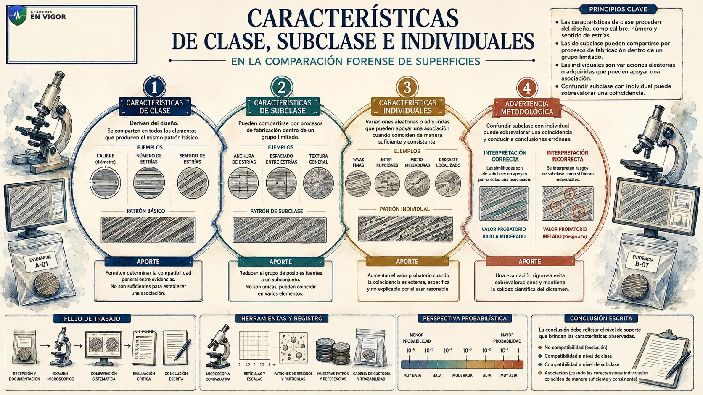

<em>Infografía: Características de clase, subclase e individuales.</em>

:::hablemos-claro
Las características de clase proceden del diseño, como calibre, número y sentido de estrías.
:::

:::en-la-calle
Al practicar una identificación forense, Las características de clase proceden del diseño, como calibre, número y sentido de estrías.
:::

:::lo-que-cae
Prioriza **diseño, fabricación compartida y variación propia** y descarta respuestas que confundan categoría, mecanismo, documento, cartucho, trayectoria o indicio.
:::

<!-- FUENTE: NIST-OSAC-T42 -->

## 94. Marcas en vaina

### Lógica del bloque

Para dominar **marcas en vaina**, aplica esta regla: La vaina puede mostrar marca de aguja percutora. El anclaje principal es **aguja, cierre, recámara, extractor y expulsor**.

### Hechos examinables

- La vaina puede mostrar marca de aguja percutora. <!-- FACT:PN-T42-F373 -->
- Puede conservar impresiones de la cara de cierre y paredes de recámara. <!-- FACT:PN-T42-F374 -->
- Extractor y expulsor pueden dejar marcas según el mecanismo. <!-- FACT:PN-T42-F375 -->
- Ausencia o mala calidad de una marca no demuestra que el arma no interviniera. <!-- FACT:PN-T42-F376 -->

### Ejemplos razonados

- **Aplicación correcta:** Puede conservar impresiones de la cara de cierre y paredes de recámara.
- **Contraste útil:** Extractor y expulsor pueden dejar marcas según el mecanismo.

### Trampas de examen

- **Incorrecto:** Toda vaina presenta obligatoriamente marca de expulsor.
- **Incorrecto:** Una marca de aguja basta siempre para identificar sin comparación.

<!-- VISUAL:t42-94-marcas-en-vaina.webp -->

  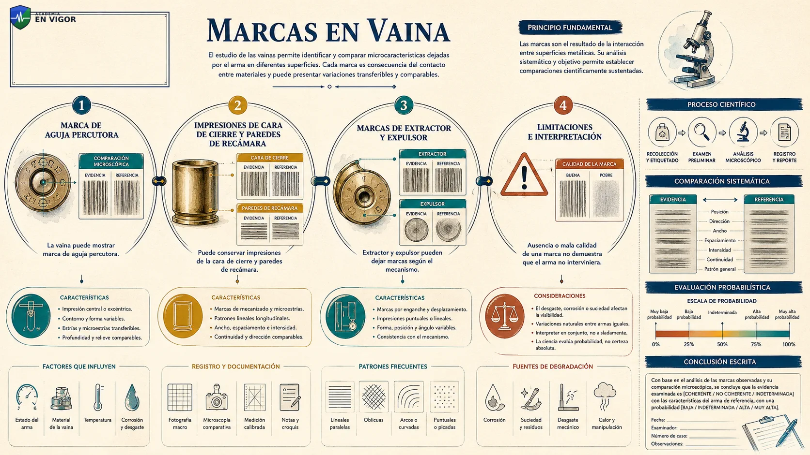

<em>Infografía: Marcas en vaina.</em>

:::hablemos-claro
La vaina puede mostrar marca de aguja percutora.
:::

:::en-la-calle
Al practicar una identificación forense, La vaina puede mostrar marca de aguja percutora.
:::

:::lo-que-cae
Prioriza **aguja, cierre, recámara, extractor y expulsor** y descarta respuestas que confundan categoría, mecanismo, documento, cartucho, trayectoria o indicio.
:::

<!-- FUENTE: NIST-OSAC-T42 -->

## 95. Marcas en proyectil

### Lógica del bloque

Para dominar **marcas en proyectil**, aplica esta regla: El proyectil puede recibir impresiones de campos y estrías durante su paso por el cañón. El anclaje principal es **campos y estrías sobre superficie**.

### Hechos examinables

- El proyectil puede recibir impresiones de campos y estrías durante su paso por el cañón. <!-- FACT:PN-T42-F377 -->
- Las características de clase orientan hacia familias de cañones. <!-- FACT:PN-T42-F378 -->
- Las estrías microscópicas pueden compararse con proyectiles de prueba. <!-- FACT:PN-T42-F379 -->
- Deformación, fragmentación o encamisado pueden limitar la comparación. <!-- FACT:PN-T42-F380 -->

### Ejemplos razonados

- **Aplicación correcta:** Las características de clase orientan hacia familias de cañones.
- **Contraste útil:** Las estrías microscópicas pueden compararse con proyectiles de prueba.

### Trampas de examen

- **Incorrecto:** El proyectil conserva siempre todas las estrías intactas.
- **Incorrecto:** El número de campos identifica por sí solo el número de serie.

<!-- VISUAL:t42-95-marcas-en-proyectil.webp -->

  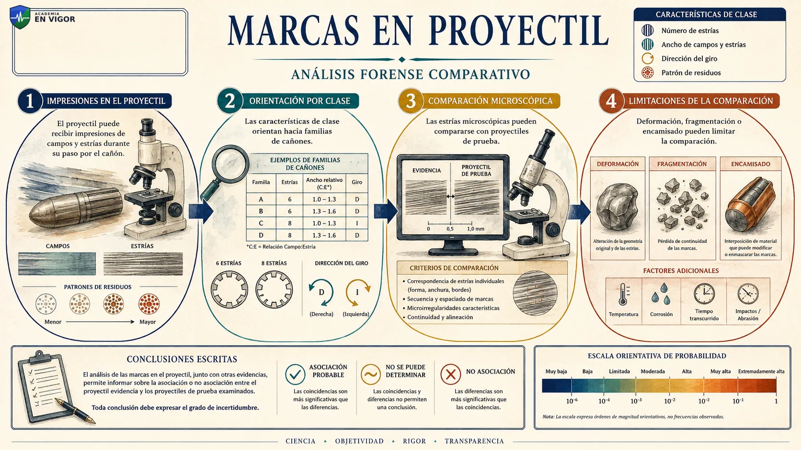

<em>Infografía: Marcas en proyectil.</em>

:::hablemos-claro
El proyectil puede recibir impresiones de campos y estrías durante su paso por el cañón.
:::

:::en-la-calle
Al practicar una identificación forense, El proyectil puede recibir impresiones de campos y estrías durante su paso por el cañón.
:::

:::lo-que-cae
Prioriza **campos y estrías sobre superficie** y descarta respuestas que confundan categoría, mecanismo, documento, cartucho, trayectoria o indicio.
:::

<!-- FUENTE: NIST-OSAC-T42 -->

## 96. Balística operativa y escena

### Lógica del bloque

Para dominar **balística operativa y escena**, aplica esta regla: La balística operativa examina lugares con impactos de disparos. El anclaje principal es **impactos, trayectorias y posición relativa**.

### Hechos examinables

- La balística operativa examina lugares con impactos de disparos. <!-- FACT:PN-T42-F381 -->
- Puede reconstruir trayectorias y posiciones relativas compatibles. <!-- FACT:PN-T42-F382 -->
- Casquillos, proyectiles, tacos, perdigones, daños y residuos deben documentarse en contexto. <!-- FACT:PN-T42-F383 -->
- Una posición compatible no equivale a identificar a la persona que disparó. <!-- FACT:PN-T42-F384 -->

### Ejemplos razonados

- **Aplicación correcta:** Puede reconstruir trayectorias y posiciones relativas compatibles.
- **Contraste útil:** Casquillos, proyectiles, tacos, perdigones, daños y residuos deben documentarse en contexto.

### Trampas de examen

- **Incorrecto:** La trayectoria señala siempre la identidad del tirador.
- **Incorrecto:** Mover un indicio antes de documentarlo no afecta a la reconstrucción.

<!-- VISUAL:t42-il-96-balistica-operativa-y-escena.webp -->

  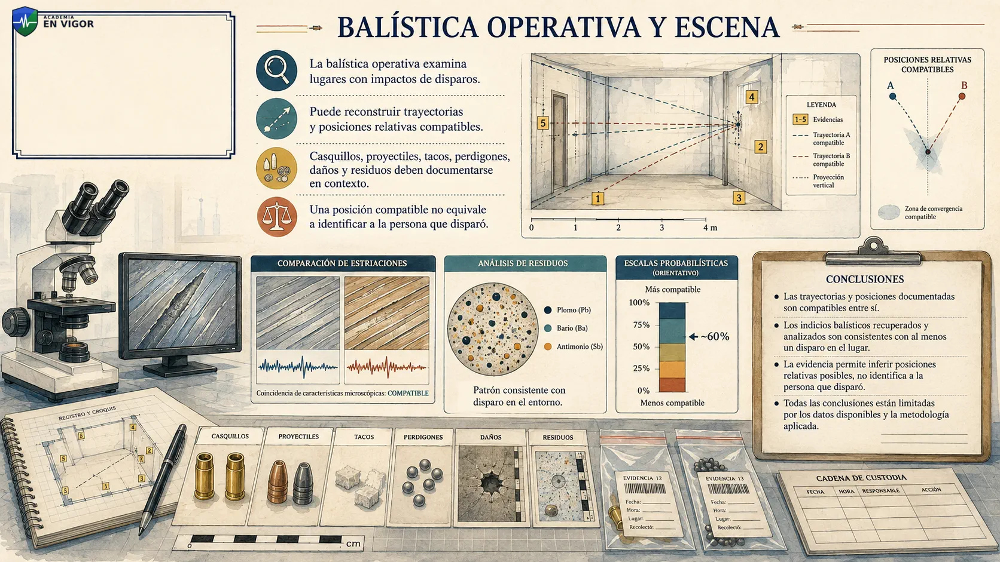

<em>Infografía: Balística operativa y escena.</em>

:::hablemos-claro
La balística operativa examina lugares con impactos de disparos.
:::

:::en-la-calle
Al practicar una identificación forense, La balística operativa examina lugares con impactos de disparos.
:::

:::lo-que-cae
Prioriza **impactos, trayectorias y posición relativa** y descarta respuestas que confundan categoría, mecanismo, documento, cartucho, trayectoria o indicio.
:::

<!-- FUENTE: SECRIM-2024-T42 -->

## 97. Residuos de disparo

### Lógica del bloque

Para dominar **residuos de disparo**, aplica esta regla: Los residuos pueden proceder del cebo, propelente, proyectil y superficies del arma. El anclaje principal es **apoyo circunstancial con transferencia y pérdida**.

### Hechos examinables

- Los residuos pueden proceder del cebo, propelente, proyectil y superficies del arma. <!-- FACT:PN-T42-F385 -->
- Pueden depositarse en manos, ropa, objetos o proximidades. <!-- FACT:PN-T42-F386 -->
- Se pierden con actividad y lavado y pueden transferirse secundariamente. <!-- FACT:PN-T42-F387 -->
- Su presencia apoya hipótesis de disparo, proximidad o contacto, pero no identifica por sí sola al tirador. <!-- FACT:PN-T42-F388 -->

### Ejemplos razonados

- **Aplicación correcta:** Pueden depositarse en manos, ropa, objetos o proximidades.
- **Contraste útil:** Se pierden con actividad y lavado y pueden transferirse secundariamente.

### Trampas de examen

- **Incorrecto:** Encontrar GSR demuestra sin excepción quién disparó.
- **Incorrecto:** No hallar partículas excluye cualquier contacto con un arma.

<!-- VISUAL:t42-97-residuos-de-disparo.webp -->

  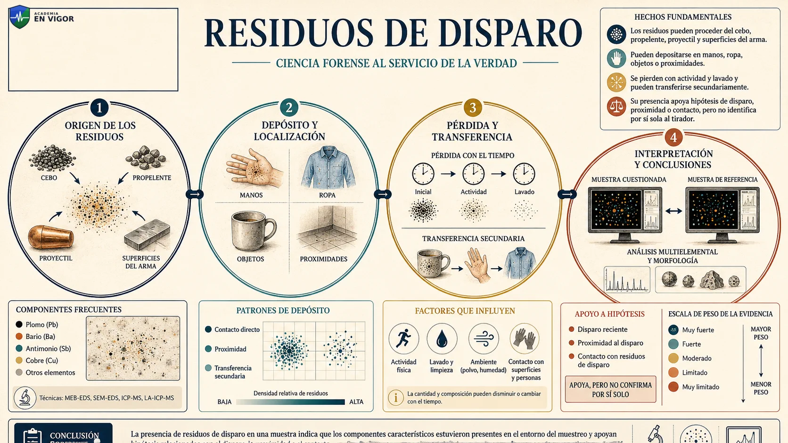

<em>Infografía: Residuos de disparo.</em>

:::hablemos-claro
Los residuos pueden proceder del cebo, propelente, proyectil y superficies del arma.
:::

:::en-la-calle
Al practicar una identificación forense, Los residuos pueden proceder del cebo, propelente, proyectil y superficies del arma.
:::

:::lo-que-cae
Prioriza **apoyo circunstancial con transferencia y pérdida** y descarta respuestas que confundan categoría, mecanismo, documento, cartucho, trayectoria o indicio.
:::

<!-- FUENTE: FBI-GSR-T42 -->

## 98. Estimación de distancia y patrones

### Lógica del bloque

Para dominar **estimación de distancia y patrones**, aplica esta regla: Residuos sobre el blanco pueden compararse con patrones obtenidos a distancias conocidas. El anclaje principal es **residuos y dispersión comparados**.

### Hechos examinables

- Residuos sobre el blanco pueden compararse con patrones obtenidos a distancias conocidas. <!-- FACT:PN-T42-F389 -->
- En escopetas, la distribución de perdigones y taco aporta información dependiente del conjunto probado. <!-- FACT:PN-T42-F390 -->
- La munición de prueba debe ser igual o suficientemente comparable a la cuestionada. <!-- FACT:PN-T42-F391 -->
- El resultado suele expresarse como intervalo o compatibilidad, no como cifra absoluta universal. <!-- FACT:PN-T42-F392 -->

### Ejemplos razonados

- **Aplicación correcta:** En escopetas, la distribución de perdigones y taco aporta información dependiente del conjunto probado.
- **Contraste útil:** La munición de prueba debe ser igual o suficientemente comparable a la cuestionada.

### Trampas de examen

- **Incorrecto:** El diámetro del patrón da una distancia exacta para todas las escopetas.
- **Incorrecto:** No es necesario conocer la munición para comparar residuos.

<!-- VISUAL:t42-98-estimacion-de-distancia-y-patrones.webp -->

  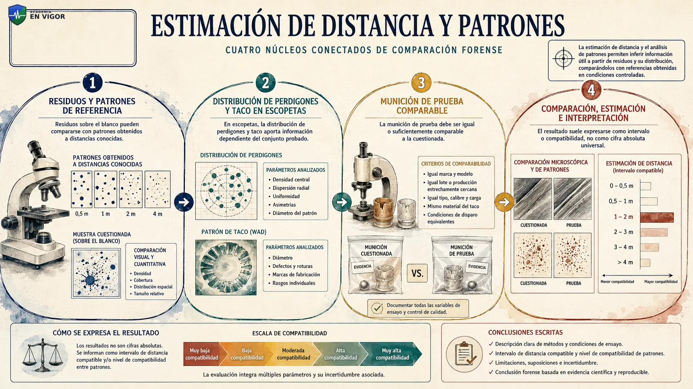

<em>Infografía: Estimación de distancia y patrones.</em>

:::hablemos-claro
Residuos sobre el blanco pueden compararse con patrones obtenidos a distancias conocidas.
:::

:::en-la-calle
Al practicar una identificación forense, Residuos sobre el blanco pueden compararse con patrones obtenidos a distancias conocidas.
:::

:::lo-que-cae
Prioriza **residuos y dispersión comparados** y descarta respuestas que confundan categoría, mecanismo, documento, cartucho, trayectoria o indicio.
:::

<!-- FUENTE: FBI-LAB-T42 -->

## 99. Límites de la conclusión forense

### Lógica del bloque

Para dominar **límites de la conclusión forense**, aplica esta regla: Una asociación de marcas se refiere a los elementos comparados y al alcance del método. El anclaje principal es **asociar evidencia sin afirmar más de lo observado**.

### Hechos examinables

- Una asociación de marcas se refiere a los elementos comparados y al alcance del método. <!-- FACT:PN-T42-F393 -->
- No demuestra por sí sola quién portó, disparó o manipuló el arma. <!-- FACT:PN-T42-F394 -->
- La ausencia de asociación puede deberse a origen distinto o a insuficiencia de marcas. <!-- FACT:PN-T42-F395 -->
- Las conclusiones deben evitar certeza absoluta no respaldada y separar observación de inferencia. <!-- FACT:PN-T42-F396 -->

### Ejemplos razonados

- **Aplicación correcta:** No demuestra por sí sola quién portó, disparó o manipuló el arma.
- **Contraste útil:** La ausencia de asociación puede deberse a origen distinto o a insuficiencia de marcas.

### Trampas de examen

- **Incorrecto:** Identificar un arma identifica automáticamente al autor.
- **Incorrecto:** Resultado inconcluso equivale a demostrar que las armas son distintas.

<!-- VISUAL:t42-99-limites-de-la-conclusion-forense.webp -->

  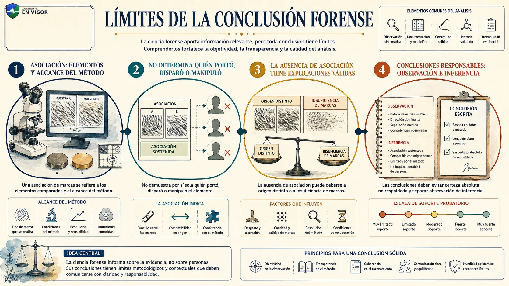

<em>Infografía: Límites de la conclusión forense.</em>

:::hablemos-claro
Una asociación de marcas se refiere a los elementos comparados y al alcance del método.
:::

:::en-la-calle
Al practicar una identificación forense, Una asociación de marcas se refiere a los elementos comparados y al alcance del método.
:::

:::lo-que-cae
Prioriza **asociar evidencia sin afirmar más de lo observado** y descarta respuestas que confundan categoría, mecanismo, documento, cartucho, trayectoria o indicio.
:::

<!-- FUENTE: NIST-OSAC-T42 -->

# Hablemos claro

:::hablemos-claro
Este tema exige separar definición técnica y efecto jurídico. Arma corta no significa arma pequeña; repetición no equivale a semiautomática; categoría, licencia y guía no son intercambiables; y una coincidencia de clase no identifica por sí sola un arma concreta.
:::

# En la calle

:::en-la-calle
En una investigación, documentar el estado, asegurar arma, cartuchos y soportes, mantener la trazabilidad y separar examen funcional, identificación y distancia evita conclusiones incompatibles con el indicio.
:::

# Lo que cae

:::lo-que-cae
Prioriza arma corta-larga; avancarga-retrocarga; un tiro-repetición-semiautomática-automática; nueve categorías; cartucho metálico-semimetálico; prohibición-restricción; licencias A-B-C-D-E-F; guía-tarjeta; balística interna-externa-de efectos; e identificación de clase e individual.
:::

# Ha caído

:::ha-caido
Se han localizado 25 referencias históricas del Tema 42. Permanecen ocultas y en cuarentena porque no existe plantilla oficial final verificable en el repositorio.
:::

## Fuentes legales, institucionales y primarias

- `CONVOCATORIA-PN-2026-T42`
- `BOE-RA-T42`
- `RD726-2020-T42`
- `GC-CLASS-T42`
- `GC-LICENSES-T42`
- `GC-GUIDES-T42`
- `GC-COLLECTOR-T42`
- `MUSEO-EJERCITO-T42`
- `INTERIOR-PC-T42`
- `SECRIM-2024-T42`
- `NIST-OSAC-T42`
- `FBI-GSR-T42`
- `FBI-LAB-T42`
- `NIJ-BALLISTICS-T42`

---

*Academia En Vigor · El temario que nunca duerme · Tema 42 · v1.0.0 · Documento interno no publicado.*
