# TEMA 44 · LA SEGURIDAD EN LA CONDUCCIÓN DE VEHÍCULOS PRIORITARIOS. DEFINICIÓN DE SEGURIDAD ACTIVA Y PASIVA. SISTEMAS DE SEGURIDAD ACTIVA Y PASIVA EN VEHÍCULOS TIPO TURISMO Y MOTOCICLETA. INFLUENCIA DE LOS SISTEMAS DE SEGURIDAD EN LOS ACCIDENTES DE TRÁFICO. REPERCUSIÓN DE LOS SISTEMAS DE SEGURIDAD EN LA CONDUCCIÓN POLICIAL Y TRASLADO DE DETENIDOS.

**Policía Nacional · Método VIGOR · ATESTADO**
**Versión de contenido:** 1.0.0
**Estado editorial:** approved_internal · **Publicación:** not_published

# Mapa del tema

El Tema 44 se estudia en ocho partes: conducción prioritaria; conceptos de seguridad; pasiva en turismo; activa básica; ADAS; motocicleta; influencia en siniestros; y conducción policial con traslado.

# Contenido

## 01. Alcance oficial y método del Tema 44

### Lógica del bloque

Para dominar **alcance oficial y método del tema 44**, aplica esta regla: El programa enlaza conducción prioritaria, seguridad activa y pasiva, turismo, motocicleta, siniestralidad y traslado de detenidos. El anclaje principal es **cinco núcleos del epígrafe**.

### Hechos examinables

- El programa enlaza conducción prioritaria, seguridad activa y pasiva, turismo, motocicleta, siniestralidad y traslado de detenidos. <!-- FACT:PN-T44-F001 -->
- Un sistema debe estudiarse por momento de actuación, función, límites y efecto sobre el riesgo. <!-- FACT:PN-T44-F002 -->
- La conducción policial añade exigencias operativas, pero no altera las leyes físicas ni convierte la urgencia en inmunidad. <!-- FACT:PN-T44-F003 -->
- Las cifras de efectividad son estimaciones dependientes del escenario y no definiciones universales. <!-- FACT:PN-T44-F004 -->

### Ejemplos razonados

- **Aplicación correcta:** Un sistema debe estudiarse por momento de actuación, función, límites y efecto sobre el riesgo.
- **Contraste útil:** La conducción policial añade exigencias operativas, pero no altera las leyes físicas ni convierte la urgencia en inmunidad.

### Trampas de examen

- **Incorrecto:** El tema se limita a memorizar nombres comerciales de ADAS.
- **Incorrecto:** Todo porcentaje de reducción publicado sirve para cualquier vehículo y siniestro.

<!-- VISUAL:t44-01-alcance-oficial-y-metodo-del-tema-44.webp -->

  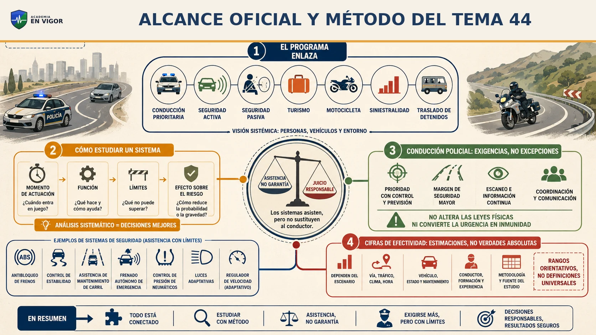

<em>Infografía: Alcance oficial y método del Tema 44.</em>

:::hablemos-claro
El programa enlaza conducción prioritaria, seguridad activa y pasiva, turismo, motocicleta, siniestralidad y traslado de detenidos.
:::

:::en-la-calle
Al conducir en servicio policial, El programa enlaza conducción prioritaria, seguridad activa y pasiva, turismo, motocicleta, siniestralidad y traslado de detenidos.
:::

:::lo-que-cae
Prioriza **cinco núcleos del epígrafe** y descarta respuestas que confundan momento, función, sensor, límite, categoría o vigencia.
:::

<!-- FUENTE: CONVOCATORIA-PN-2026-T44 -->

## 02. Urgencia, prioridad y seguridad

### Lógica del bloque

Para dominar **urgencia, prioridad y seguridad**, aplica esta regla: El régimen prioritario permite excepciones reglamentarias, pero exige uso ponderado y ausencia de peligro para los demás usuarios. El anclaje principal es **artículos 67 y 68**.

### Hechos examinables

- El régimen prioritario permite excepciones reglamentarias, pero exige uso ponderado y ausencia de peligro para los demás usuarios. <!-- FACT:PN-T44-F005 -->
- La prioridad de paso no garantiza que peatones y conductores hayan percibido correctamente luz y señal acústica. <!-- FACT:PN-T44-F006 -->
- Antes de franquear una intersección debe confirmarse que el resto se ha detenido o facilita efectivamente el paso. <!-- FACT:PN-T44-F007 -->
- Una maniobra legalmente facultada puede ser operativamente insegura si supera adherencia, visibilidad o capacidad de reacción. <!-- FACT:PN-T44-F008 -->

### Ejemplos razonados

- **Aplicación correcta:** La prioridad de paso no garantiza que peatones y conductores hayan percibido correctamente luz y señal acústica.
- **Contraste útil:** Antes de franquear una intersección debe confirmarse que el resto se ha detenido o facilita efectivamente el paso.

### Trampas de examen

- **Incorrecto:** La señal azul convierte cualquier maniobra en segura.
- **Incorrecto:** La prioridad elimina la obligación de comprobar la intersección.

<!-- VISUAL:t44-02-urgencia-prioridad-y-seguridad.webp -->

  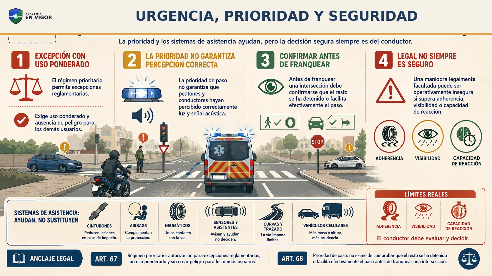

<em>Infografía: Urgencia, prioridad y seguridad.</em>

:::hablemos-claro
El régimen prioritario permite excepciones reglamentarias, pero exige uso ponderado y ausencia de peligro para los demás usuarios.
:::

:::en-la-calle
Al conducir en servicio policial, El régimen prioritario permite excepciones reglamentarias, pero exige uso ponderado y ausencia de peligro para los demás usuarios.
:::

:::lo-que-cae
Prioriza **artículos 67 y 68** y descarta respuestas que confundan momento, función, sensor, límite, categoría o vigencia.
:::

<!-- FUENTE: BOE-RGC-T44 -->

## 03. Conducción defensiva VEA

### Lógica del bloque

Para dominar **conducción defensiva vea**, aplica esta regla: La conducción defensiva combina visión amplia, espacio de seguridad y anticipación de errores ajenos. El anclaje principal es **visión, espacio y anticipación**.

### Hechos examinables

- La conducción defensiva combina visión amplia, espacio de seguridad y anticipación de errores ajenos. <!-- FACT:PN-T44-F009 -->
- Mirar lejos permite detectar antes conflictos sin abandonar la exploración próxima y lateral. <!-- FACT:PN-T44-F010 -->
- El espacio crea tiempo para frenar, esquivar o abortar una maniobra. <!-- FACT:PN-T44-F011 -->
- Anticipar no es adivinar: consiste en reconocer indicios y preparar una respuesta de bajo riesgo. <!-- FACT:PN-T44-F012 -->

### Ejemplos razonados

- **Aplicación correcta:** Mirar lejos permite detectar antes conflictos sin abandonar la exploración próxima y lateral.
- **Contraste útil:** El espacio crea tiempo para frenar, esquivar o abortar una maniobra.

### Trampas de examen

- **Incorrecto:** La visión correcta consiste en fijarse solo en el vehículo precedente.
- **Incorrecto:** Anticipar permite reducir la distancia porque el conductor ya prevé el peligro.

<!-- VISUAL:t44-03-conduccion-defensiva-vea.webp -->

  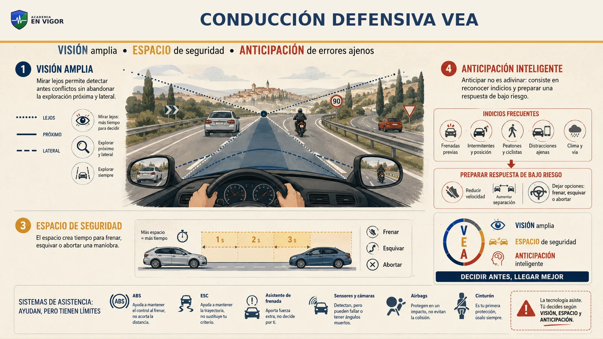

<em>Infografía: Conducción defensiva VEA.</em>

:::hablemos-claro
La conducción defensiva combina visión amplia, espacio de seguridad y anticipación de errores ajenos.
:::

:::en-la-calle
Al conducir en servicio policial, La conducción defensiva combina visión amplia, espacio de seguridad y anticipación de errores ajenos.
:::

:::lo-que-cae
Prioriza **visión, espacio y anticipación** y descarta respuestas que confundan momento, función, sensor, límite, categoría o vigencia.
:::

<!-- FUENTE: DGT-EFECTIVIDAD-2022-T44 -->

## 04. Dinámica de la velocidad

### Lógica del bloque

Para dominar **dinámica de la velocidad**, aplica esta regla: Al aumentar la velocidad crecen la distancia recorrida durante la reacción y la energía que debe disiparse. El anclaje principal es **energía y distancia de detención**.

### Hechos examinables

- Al aumentar la velocidad crecen la distancia recorrida durante la reacción y la energía que debe disiparse. <!-- FACT:PN-T44-F013 -->
- La distancia de detención integra distancia de reacción y distancia de frenado. <!-- FACT:PN-T44-F014 -->
- Duplicar la velocidad no duplica sin más la energía cinética: esta depende del cuadrado de la velocidad. <!-- FACT:PN-T44-F015 -->
- La urgencia operativa debe ponderarse frente al aumento no lineal de consecuencias y necesidad de espacio. <!-- FACT:PN-T44-F016 -->

### Ejemplos razonados

- **Aplicación correcta:** La distancia de detención integra distancia de reacción y distancia de frenado.
- **Contraste útil:** Duplicar la velocidad no duplica sin más la energía cinética: esta depende del cuadrado de la velocidad.

### Trampas de examen

- **Incorrecto:** La distancia de frenado depende solo del tiempo de reacción.
- **Incorrecto:** La energía de un impacto aumenta linealmente con la velocidad en todos los casos.

<!-- VISUAL:t44-04-dinamica-de-la-velocidad.webp -->

  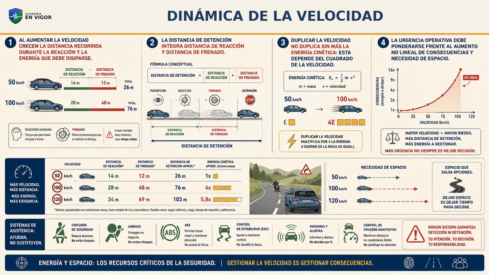

<em>Infografía: Dinámica de la velocidad.</em>

:::hablemos-claro
Al aumentar la velocidad crecen la distancia recorrida durante la reacción y la energía que debe disiparse.
:::

:::en-la-calle
Al conducir en servicio policial, Al aumentar la velocidad crecen la distancia recorrida durante la reacción y la energía que debe disiparse.
:::

:::lo-que-cae
Prioriza **energía y distancia de detención** y descarta respuestas que confundan momento, función, sensor, límite, categoría o vigencia.
:::

<!-- FUENTE: DGT-EFECTIVIDAD-2022-T44 -->

## 05. Adherencia y transferencia de masas

### Lógica del bloque

Para dominar **adherencia y transferencia de masas**, aplica esta regla: Frenar, acelerar y girar consumen la capacidad limitada de adherencia disponible en cada neumático. El anclaje principal es **neumático, carga y maniobra**.

### Hechos examinables

- Frenar, acelerar y girar consumen la capacidad limitada de adherencia disponible en cada neumático. <!-- FACT:PN-T44-F017 -->
- La frenada transfiere carga hacia el eje delantero y la aceleración hacia el trasero. <!-- FACT:PN-T44-F018 -->
- Combinar giro intenso y frenada intensa reduce el margen frente a pérdida de trayectoria. <!-- FACT:PN-T44-F019 -->
- ABS y ESC ayudan dentro de la adherencia disponible; no crean agarre donde la calzada no lo ofrece. <!-- FACT:PN-T44-F020 -->

### Ejemplos razonados

- **Aplicación correcta:** La frenada transfiere carga hacia el eje delantero y la aceleración hacia el trasero.
- **Contraste útil:** Combinar giro intenso y frenada intensa reduce el margen frente a pérdida de trayectoria.

### Trampas de examen

- **Incorrecto:** El ABS aumenta físicamente el coeficiente de adherencia.
- **Incorrecto:** La transferencia de masas desaparece en vehículos con control electrónico.

<!-- VISUAL:t44-il-05-adherencia-y-transferencia-de-masas.webp -->

  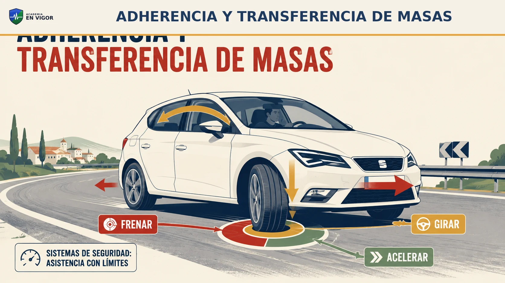

<em>Infografía: Adherencia y transferencia de masas.</em>

:::hablemos-claro
Frenar, acelerar y girar consumen la capacidad limitada de adherencia disponible en cada neumático.
:::

:::en-la-calle
Al conducir en servicio policial, Frenar, acelerar y girar consumen la capacidad limitada de adherencia disponible en cada neumático.
:::

:::lo-que-cae
Prioriza **neumático, carga y maniobra** y descarta respuestas que confundan momento, función, sensor, límite, categoría o vigencia.
:::

<!-- FUENTE: DGT-EFECTIVIDAD-2022-T44 -->

## 06. Intersecciones en servicio urgente

### Lógica del bloque

Para dominar **intersecciones en servicio urgente**, aplica esta regla: La intersección es un punto crítico porque la señal acústica puede dificultar localizar la procedencia exacta del prioritario. El anclaje principal es **artículo 67.2**.

### Hechos examinables

- La intersección es un punto crítico porque la señal acústica puede dificultar localizar la procedencia exacta del prioritario. <!-- FACT:PN-T44-F021 -->
- Reducir velocidad amplía tiempo de observación y permite verificar carriles, peatones y zonas ocultas. <!-- FACT:PN-T44-F022 -->
- La entrada se realiza cuando las trayectorias conflictivas están controladas, no por confianza en la prioridad. <!-- FACT:PN-T44-F023 -->
- Un vehículo detenido puede ocultar a otro usuario que todavía no ha percibido la emergencia. <!-- FACT:PN-T44-F024 -->

### Ejemplos razonados

- **Aplicación correcta:** Reducir velocidad amplía tiempo de observación y permite verificar carriles, peatones y zonas ocultas.
- **Contraste útil:** La entrada se realiza cuando las trayectorias conflictivas están controladas, no por confianza en la prioridad.

### Trampas de examen

- **Incorrecto:** La sirena permite atravesar una intersección sin reducir velocidad.
- **Incorrecto:** Si un carril se detiene, todos los demás quedan automáticamente libres.

<!-- VISUAL:t44-06-intersecciones-en-servicio-urgente.webp -->

  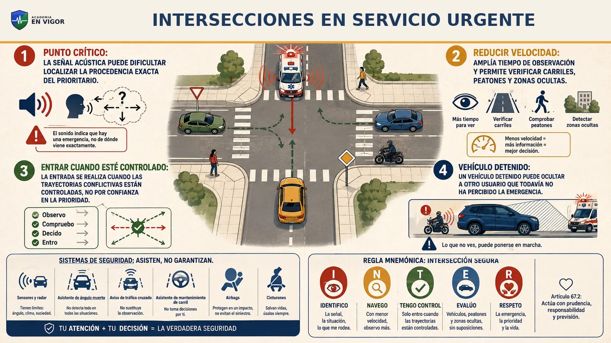

<em>Infografía: Intersecciones en servicio urgente.</em>

:::hablemos-claro
La intersección es un punto crítico porque la señal acústica puede dificultar localizar la procedencia exacta del prioritario.
:::

:::en-la-calle
Al conducir en servicio policial, La intersección es un punto crítico porque la señal acústica puede dificultar localizar la procedencia exacta del prioritario.
:::

:::lo-que-cae
Prioriza **artículo 67.2** y descarta respuestas que confundan momento, función, sensor, límite, categoría o vigencia.
:::

<!-- FUENTE: BOE-RGC-T44 -->

## 07. Elección de trayectoria y escape

### Lógica del bloque

Para dominar **elección de trayectoria y escape**, aplica esta regla: La trayectoria segura maximiza visibilidad, estabilidad y posibilidad de escape. El anclaje principal es **trayectoria visible y alternativa**.

### Hechos examinables

- La trayectoria segura maximiza visibilidad, estabilidad y posibilidad de escape. <!-- FACT:PN-T44-F025 -->
- Una línea rápida que elimina toda alternativa puede ser peor que otra ligeramente más lenta y controlable. <!-- FACT:PN-T44-F026 -->
- El conductor debe evitar encajonarse entre obstáculos, bordillos o vehículos sin margen lateral. <!-- FACT:PN-T44-F027 -->
- La maniobra debe poder abortarse si cambia el escenario o aparece un usuario vulnerable. <!-- FACT:PN-T44-F028 -->

### Ejemplos razonados

- **Aplicación correcta:** Una línea rápida que elimina toda alternativa puede ser peor que otra ligeramente más lenta y controlable.
- **Contraste útil:** El conductor debe evitar encajonarse entre obstáculos, bordillos o vehículos sin margen lateral.

### Trampas de examen

- **Incorrecto:** La trayectoria más corta es siempre la más segura.
- **Incorrecto:** Una vez iniciada una maniobra urgente nunca debe abortarse.

<!-- VISUAL:t44-07-eleccion-de-trayectoria-y-escape.webp -->

  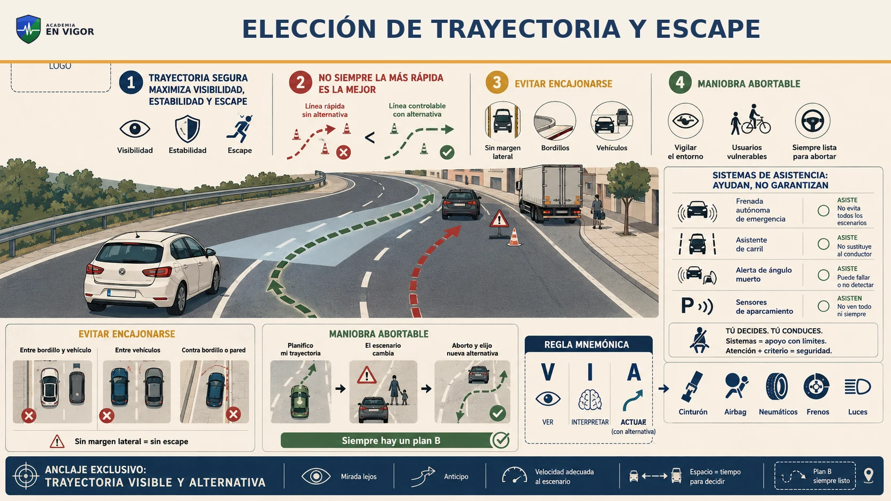

<em>Infografía: Elección de trayectoria y escape.</em>

:::hablemos-claro
La trayectoria segura maximiza visibilidad, estabilidad y posibilidad de escape.
:::

:::en-la-calle
Al conducir en servicio policial, La trayectoria segura maximiza visibilidad, estabilidad y posibilidad de escape.
:::

:::lo-que-cae
Prioriza **trayectoria visible y alternativa** y descarta respuestas que confundan momento, función, sensor, límite, categoría o vigencia.
:::

<!-- FUENTE: DGT-EFECTIVIDAD-2022-T44 -->

## 08. Uso de señales y carga mental

### Lógica del bloque

Para dominar **uso de señales y carga mental**, aplica esta regla: Las señales especiales informan de presencia urgente, pero no sustituyen observación ni comunicación táctica. El anclaje principal es **advertencia y percepción**.

### Hechos examinables

- Las señales especiales informan de presencia urgente, pero no sustituyen observación ni comunicación táctica. <!-- FACT:PN-T44-F029 -->
- El uso continuado de sirena, radio, luces y navegación eleva la carga mental del conductor. <!-- FACT:PN-T44-F030 -->
- La tripulación debe distribuir tareas para que el conductor conserve atención sobre la conducción. <!-- FACT:PN-T44-F031 -->
- La señal acústica puede provocar reacciones bruscas o imprevisibles en otros usuarios. <!-- FACT:PN-T44-F032 -->

### Ejemplos razonados

- **Aplicación correcta:** El uso continuado de sirena, radio, luces y navegación eleva la carga mental del conductor.
- **Contraste útil:** La tripulación debe distribuir tareas para que el conductor conserve atención sobre la conducción.

### Trampas de examen

- **Incorrecto:** Más señales garantizan siempre una respuesta correcta de terceros.
- **Incorrecto:** El conductor debe manejar radio, navegación y comunicaciones sin apoyo para ahorrar tiempo.

<!-- VISUAL:t44-08-uso-de-senales-y-carga-mental.webp -->

  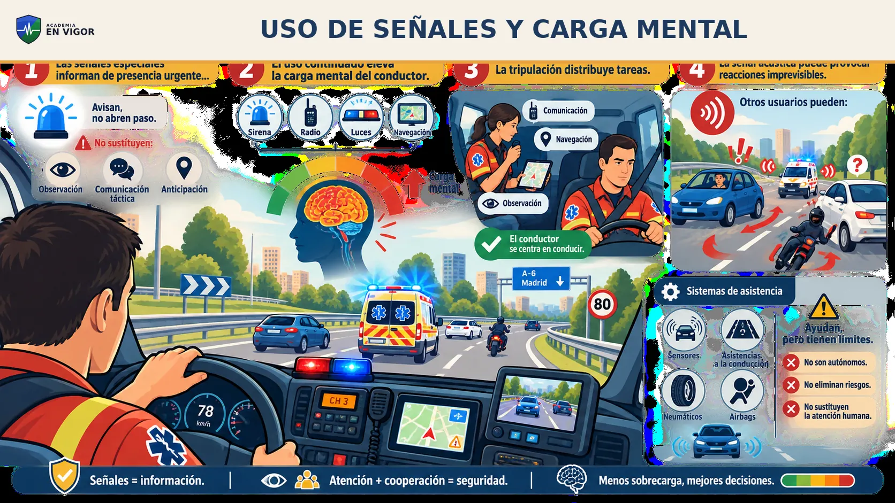

<em>Infografía: Uso de señales y carga mental.</em>

:::hablemos-claro
Las señales especiales informan de presencia urgente, pero no sustituyen observación ni comunicación táctica.
:::

:::en-la-calle
Al conducir en servicio policial, Las señales especiales informan de presencia urgente, pero no sustituyen observación ni comunicación táctica.
:::

:::lo-que-cae
Prioriza **advertencia y percepción** y descarta respuestas que confundan momento, función, sensor, límite, categoría o vigencia.
:::

<!-- FUENTE: BOE-RGC-T44 -->

## 09. Comprobación previa del vehículo

### Lógica del bloque

Para dominar **comprobación previa del vehículo**, aplica esta regla: La revisión previa debe detectar defectos de neumáticos, frenos, alumbrado, señalización, niveles y elementos de retención. El anclaje principal es **aptitud técnica antes del servicio**.

### Hechos examinables

- La revisión previa debe detectar defectos de neumáticos, frenos, alumbrado, señalización, niveles y elementos de retención. <!-- FACT:PN-T44-F033 -->
- Un testigo de avería relevante exige valorar la aptitud del vehículo antes de asumir un servicio exigente. <!-- FACT:PN-T44-F034 -->
- La carga y el material deben quedar asegurados para que no se conviertan en proyectiles. <!-- FACT:PN-T44-F035 -->
- La seguridad comienza antes de arrancar y continúa con vigilancia de anomalías durante el servicio. <!-- FACT:PN-T44-F036 -->

### Ejemplos razonados

- **Aplicación correcta:** Un testigo de avería relevante exige valorar la aptitud del vehículo antes de asumir un servicio exigente.
- **Contraste útil:** La carga y el material deben quedar asegurados para que no se conviertan en proyectiles.

### Trampas de examen

- **Incorrecto:** La urgencia permite usar un vehículo con un defecto crítico conocido.
- **Incorrecto:** Los objetos sueltos no influyen en la seguridad porque están dentro del habitáculo.

<!-- VISUAL:t44-09-comprobacion-previa-del-vehiculo.webp -->

  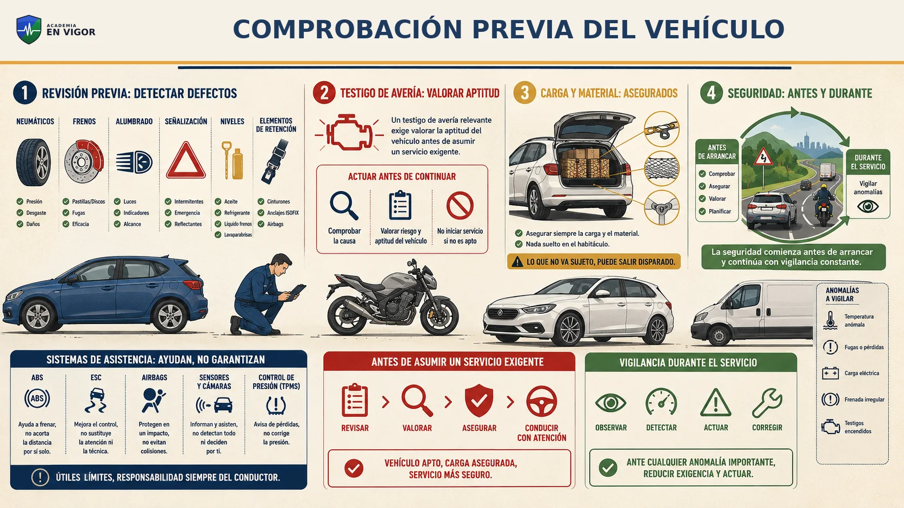

<em>Infografía: Comprobación previa del vehículo.</em>

:::hablemos-claro
La revisión previa debe detectar defectos de neumáticos, frenos, alumbrado, señalización, niveles y elementos de retención.
:::

:::en-la-calle
Al conducir en servicio policial, La revisión previa debe detectar defectos de neumáticos, frenos, alumbrado, señalización, niveles y elementos de retención.
:::

:::lo-que-cae
Prioriza **aptitud técnica antes del servicio** y descarta respuestas que confundan momento, función, sensor, límite, categoría o vigencia.
:::

<!-- FUENTE: BOE-RGV-T44 -->

## 10. Después de una incidencia

### Lógica del bloque

Para dominar **después de una incidencia**, aplica esta regla: Tras una incidencia debe evitarse crear un segundo siniestro mediante posición, señalización y autoprotección. El anclaje principal es **proteger, alertar y asistir**.

### Hechos examinables

- Tras una incidencia debe evitarse crear un segundo siniestro mediante posición, señalización y autoprotección. <!-- FACT:PN-T44-F037 -->
- La tripulación valora heridos, riesgos de incendio, tráfico, estabilidad del vehículo y necesidad de apoyo. <!-- FACT:PN-T44-F038 -->
- La conservación de datos o indicios nunca prevalece sobre la protección inmediata de la vida. <!-- FACT:PN-T44-F039 -->
- La notificación debe ser clara y permitir movilizar recursos adecuados sin abandonar la seguridad de la escena. <!-- FACT:PN-T44-F040 -->

### Ejemplos razonados

- **Aplicación correcta:** La tripulación valora heridos, riesgos de incendio, tráfico, estabilidad del vehículo y necesidad de apoyo.
- **Contraste útil:** La conservación de datos o indicios nunca prevalece sobre la protección inmediata de la vida.

### Trampas de examen

- **Incorrecto:** La prioridad tras el choque es preservar el vehículo aunque exista riesgo personal.
- **Incorrecto:** Encender luces elimina la necesidad de evaluar el entorno.

<!-- VISUAL:t44-il-10-despues-de-una-incidencia.webp -->

  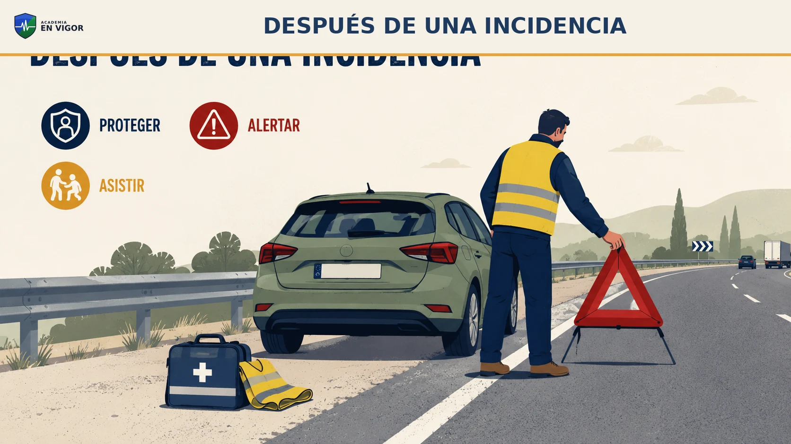

<em>Infografía: Después de una incidencia.</em>

:::hablemos-claro
Tras una incidencia debe evitarse crear un segundo siniestro mediante posición, señalización y autoprotección.
:::

:::en-la-calle
Al conducir en servicio policial, Tras una incidencia debe evitarse crear un segundo siniestro mediante posición, señalización y autoprotección.
:::

:::lo-que-cae
Prioriza **proteger, alertar y asistir** y descarta respuestas que confundan momento, función, sensor, límite, categoría o vigencia.
:::

<!-- FUENTE: BOE-LSV-T44 -->

## 11. Seguridad activa o primaria

### Lógica del bloque

Para dominar **seguridad activa o primaria**, aplica esta regla: La seguridad activa o primaria trata de evitar el siniestro o reducir su probabilidad y gravedad antes del impacto. El anclaje principal es **actuación antes del siniestro**.

### Hechos examinables

- La seguridad activa o primaria trata de evitar el siniestro o reducir su probabilidad y gravedad antes del impacto. <!-- FACT:PN-T44-F041 -->
- Frenos, neumáticos, dirección, alumbrado y controles dinámicos forman parte de esta función preventiva. <!-- FACT:PN-T44-F042 -->
- Un sistema activo puede advertir, asistir o intervenir, según su diseño. <!-- FACT:PN-T44-F043 -->
- La clasificación atiende a la función principal y no al nombre comercial. <!-- FACT:PN-T44-F044 -->

### Ejemplos razonados

- **Aplicación correcta:** Frenos, neumáticos, dirección, alumbrado y controles dinámicos forman parte de esta función preventiva.
- **Contraste útil:** Un sistema activo puede advertir, asistir o intervenir, según su diseño.

### Trampas de examen

- **Incorrecto:** La seguridad activa actúa únicamente después del impacto.
- **Incorrecto:** Todo componente eléctrico es por definición seguridad activa.

<!-- VISUAL:t44-11-seguridad-activa-o-primaria.webp -->

  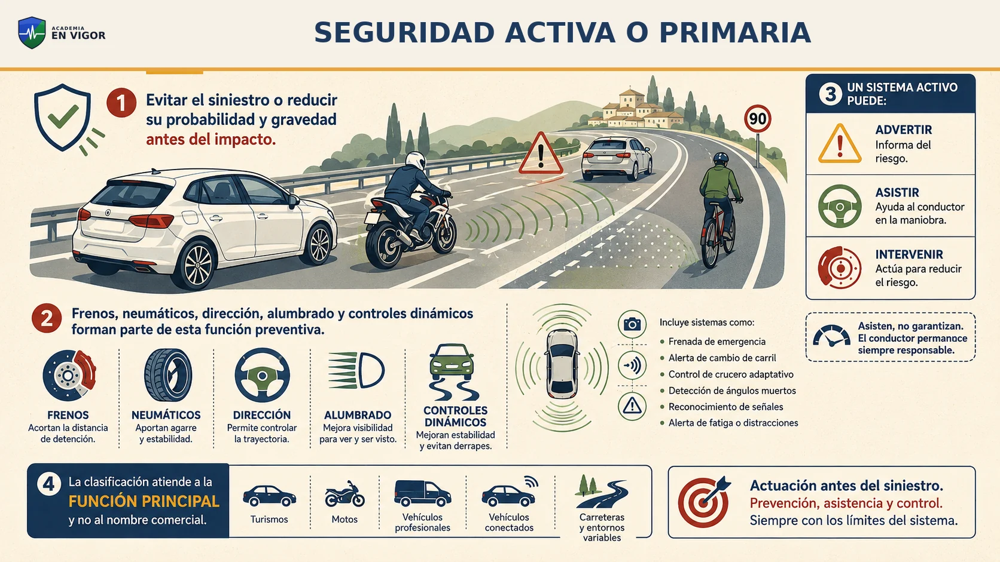

<em>Infografía: Seguridad activa o primaria.</em>

:::hablemos-claro
La seguridad activa o primaria trata de evitar el siniestro o reducir su probabilidad y gravedad antes del impacto.
:::

:::en-la-calle
Al clasificar un sistema de seguridad, La seguridad activa o primaria trata de evitar el siniestro o reducir su probabilidad y gravedad antes del impacto.
:::

:::lo-que-cae
Prioriza **actuación antes del siniestro** y descarta respuestas que confundan momento, función, sensor, límite, categoría o vigencia.
:::

<!-- FUENTE: DGT-EFECTIVIDAD-2022-T44 -->

## 12. Seguridad pasiva o secundaria

### Lógica del bloque

Para dominar **seguridad pasiva o secundaria**, aplica esta regla: La seguridad pasiva o secundaria busca limitar lesiones cuando el siniestro ya se produce. El anclaje principal es **actuación durante el siniestro**.

### Hechos examinables

- La seguridad pasiva o secundaria busca limitar lesiones cuando el siniestro ya se produce. <!-- FACT:PN-T44-F045 -->
- Cinturón, airbag, reposacabezas y estructura de absorción trabajan durante la colisión. <!-- FACT:PN-T44-F046 -->
- La protección depende de compatibilidad, posición, ajuste y uso correcto. <!-- FACT:PN-T44-F047 -->
- Un elemento pasivo no evita necesariamente el choque, pero puede reducir sus consecuencias. <!-- FACT:PN-T44-F048 -->

### Ejemplos razonados

- **Aplicación correcta:** Cinturón, airbag, reposacabezas y estructura de absorción trabajan durante la colisión.
- **Contraste útil:** La protección depende de compatibilidad, posición, ajuste y uso correcto.

### Trampas de examen

- **Incorrecto:** El cinturón evita que se produzca cualquier accidente.
- **Incorrecto:** La seguridad pasiva solo protege la carrocería y no a las personas.

<!-- VISUAL:t44-12-seguridad-pasiva-o-secundaria.webp -->

  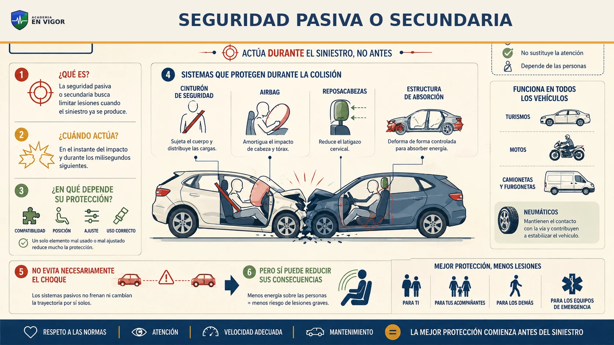

<em>Infografía: Seguridad pasiva o secundaria.</em>

:::hablemos-claro
La seguridad pasiva o secundaria busca limitar lesiones cuando el siniestro ya se produce.
:::

:::en-la-calle
Al clasificar un sistema de seguridad, La seguridad pasiva o secundaria busca limitar lesiones cuando el siniestro ya se produce.
:::

:::lo-que-cae
Prioriza **actuación durante el siniestro** y descarta respuestas que confundan momento, función, sensor, límite, categoría o vigencia.
:::

<!-- FUENTE: DGT-EFECTIVIDAD-2022-T44 -->

## 13. Seguridad terciaria

### Lógica del bloque

Para dominar **seguridad terciaria**, aplica esta regla: La seguridad terciaria facilita rescate, aviso y asistencia después del siniestro. El anclaje principal es **actuación después del siniestro**.

### Hechos examinables

- La seguridad terciaria facilita rescate, aviso y asistencia después del siniestro. <!-- FACT:PN-T44-F049 -->
- eCall, liberación de puertas y medidas que facilitan evacuación pueden integrarse en esta capa. <!-- FACT:PN-T44-F050 -->
- La clasificación terciaria evita llamar pasivo a todo lo que no frena o dirige. <!-- FACT:PN-T44-F051 -->
- La rapidez de respuesta puede reducir consecuencias sin haber evitado el impacto. <!-- FACT:PN-T44-F052 -->

### Ejemplos razonados

- **Aplicación correcta:** eCall, liberación de puertas y medidas que facilitan evacuación pueden integrarse en esta capa.
- **Contraste útil:** La clasificación terciaria evita llamar pasivo a todo lo que no frena o dirige.

### Trampas de examen

- **Incorrecto:** La seguridad terciaria se limita a reparar el vehículo.
- **Incorrecto:** eCall impide físicamente la colisión.

<!-- VISUAL:t44-13-seguridad-terciaria.webp -->

  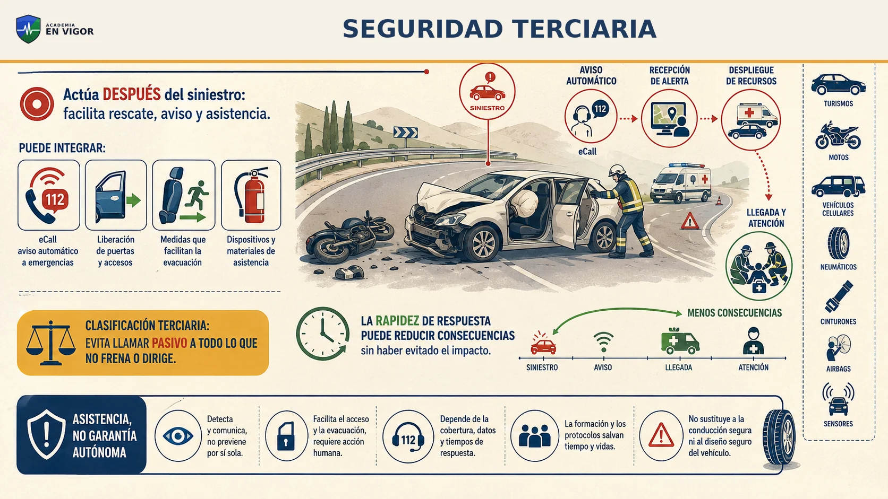

<em>Infografía: Seguridad terciaria.</em>

:::hablemos-claro
La seguridad terciaria facilita rescate, aviso y asistencia después del siniestro.
:::

:::en-la-calle
Al clasificar un sistema de seguridad, La seguridad terciaria facilita rescate, aviso y asistencia después del siniestro.
:::

:::lo-que-cae
Prioriza **actuación después del siniestro** y descarta respuestas que confundan momento, función, sensor, límite, categoría o vigencia.
:::

<!-- FUENTE: DGT-EFECTIVIDAD-2022-T44 -->

## 14. Seguridad integrada

### Lógica del bloque

Para dominar **seguridad integrada**, aplica esta regla: La seguridad integrada coordina funciones activas, pasivas y posteriores al impacto. El anclaje principal es **antes, durante y después**.

### Hechos examinables

- La seguridad integrada coordina funciones activas, pasivas y posteriores al impacto. <!-- FACT:PN-T44-F053 -->
- Una detección previa puede preparar pretensores o sistemas de protección antes del contacto. <!-- FACT:PN-T44-F054 -->
- Las capas no compiten: se complementan porque ningún sistema elimina todos los riesgos. <!-- FACT:PN-T44-F055 -->
- El resultado depende de la cadena completa, desde percepción hasta asistencia. <!-- FACT:PN-T44-F056 -->

### Ejemplos razonados

- **Aplicación correcta:** Una detección previa puede preparar pretensores o sistemas de protección antes del contacto.
- **Contraste útil:** Las capas no compiten: se complementan porque ningún sistema elimina todos los riesgos.

### Trampas de examen

- **Incorrecto:** Un buen sistema activo vuelve innecesario el cinturón.
- **Incorrecto:** La seguridad integrada significa que todos los dispositivos se activan siempre a la vez.

<!-- VISUAL:t44-14-seguridad-integrada.webp -->

  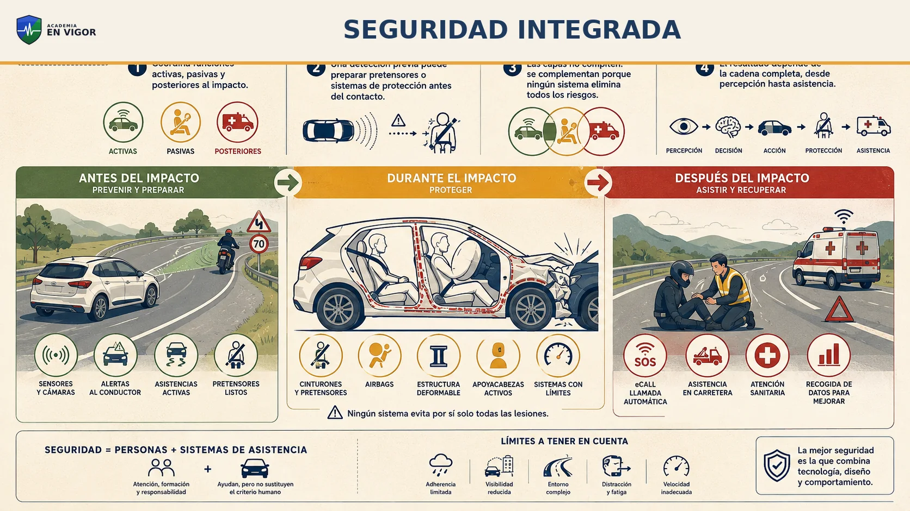

<em>Infografía: Seguridad integrada.</em>

:::hablemos-claro
La seguridad integrada coordina funciones activas, pasivas y posteriores al impacto.
:::

:::en-la-calle
Al clasificar un sistema de seguridad, La seguridad integrada coordina funciones activas, pasivas y posteriores al impacto.
:::

:::lo-que-cae
Prioriza **antes, durante y después** y descarta respuestas que confundan momento, función, sensor, límite, categoría o vigencia.
:::

<!-- FUENTE: DGT-EFECTIVIDAD-2022-T44 -->

## 15. Sistema, función y componente

### Lógica del bloque

Para dominar **sistema, función y componente**, aplica esta regla: Un sistema combina sensores, lógica, actuadores e interfaz para cumplir una función de seguridad. El anclaje principal es **diferencia conceptual**.

### Hechos examinables

- Un sistema combina sensores, lógica, actuadores e interfaz para cumplir una función de seguridad. <!-- FACT:PN-T44-F057 -->
- Un mismo sensor puede alimentar varias funciones y una función puede necesitar varios sensores. <!-- FACT:PN-T44-F058 -->
- El fallo de una función no implica necesariamente fallo mecánico de todo el vehículo. <!-- FACT:PN-T44-F059 -->
- El examen debe separar el componente físico de la función que presta. <!-- FACT:PN-T44-F060 -->

### Ejemplos razonados

- **Aplicación correcta:** Un mismo sensor puede alimentar varias funciones y una función puede necesitar varios sensores.
- **Contraste útil:** El fallo de una función no implica necesariamente fallo mecánico de todo el vehículo.

### Trampas de examen

- **Incorrecto:** Un sensor aislado constituye siempre un ADAS completo.
- **Incorrecto:** Una función de seguridad solo puede usar un único componente.

<!-- VISUAL:t44-il-15-sistema-funcion-y-componente.webp -->

  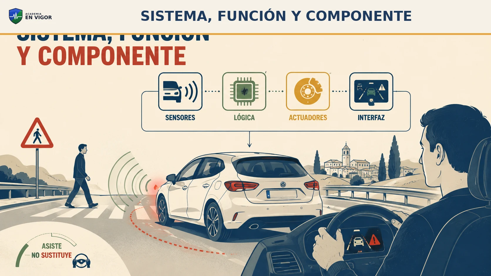

<em>Infografía: Sistema, función y componente.</em>

:::hablemos-claro
Un sistema combina sensores, lógica, actuadores e interfaz para cumplir una función de seguridad.
:::

:::en-la-calle
Al clasificar un sistema de seguridad, Un sistema combina sensores, lógica, actuadores e interfaz para cumplir una función de seguridad.
:::

:::lo-que-cae
Prioriza **diferencia conceptual** y descarta respuestas que confundan momento, función, sensor, límite, categoría o vigencia.
:::

<!-- FUENTE: EU-GSR-2019-2144-T44 -->

## 16. Ayuda a la conducción y responsabilidad

### Lógica del bloque

Para dominar **ayuda a la conducción y responsabilidad**, aplica esta regla: ADAS significa sistema avanzado de ayuda a la conducción, no sustitución general del conductor. El anclaje principal es **asistencia no autonomía**.

### Hechos examinables

- ADAS significa sistema avanzado de ayuda a la conducción, no sustitución general del conductor. <!-- FACT:PN-T44-F061 -->
- El conductor mantiene vigilancia y control salvo el régimen específico de una automatización autorizada. <!-- FACT:PN-T44-F062 -->
- Una intervención automática puede requerir corrección o recuperación inmediata por la persona que conduce. <!-- FACT:PN-T44-F063 -->
- Confiar ciegamente en la asistencia crea riesgo de sobredependencia. <!-- FACT:PN-T44-F064 -->

### Ejemplos razonados

- **Aplicación correcta:** El conductor mantiene vigilancia y control salvo el régimen específico de una automatización autorizada.
- **Contraste útil:** Una intervención automática puede requerir corrección o recuperación inmediata por la persona que conduce.

### Trampas de examen

- **Incorrecto:** ADAS equivale siempre a vehículo autónomo.
- **Incorrecto:** Con un asistente activo el conductor puede desentenderse de la vía.

<!-- VISUAL:t44-16-ayuda-a-la-conduccion-y-responsabilidad.webp -->

  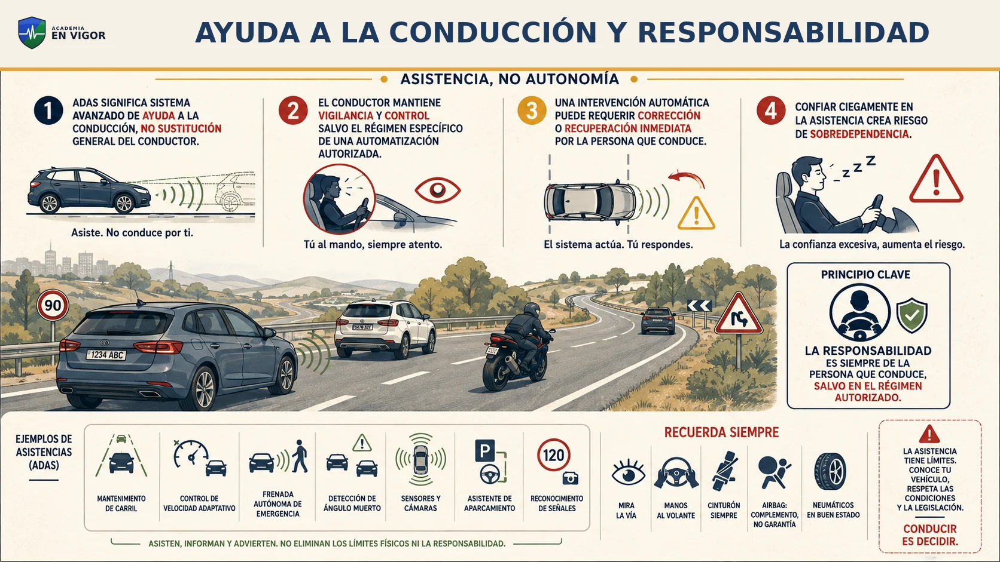

<em>Infografía: Ayuda a la conducción y responsabilidad.</em>

:::hablemos-claro
ADAS significa sistema avanzado de ayuda a la conducción, no sustitución general del conductor.
:::

:::en-la-calle
Al clasificar un sistema de seguridad, ADAS significa sistema avanzado de ayuda a la conducción, no sustitución general del conductor.
:::

:::lo-que-cae
Prioriza **asistencia no autonomía** y descarta respuestas que confundan momento, función, sensor, límite, categoría o vigencia.
:::

<!-- FUENTE: DGT-ADAS-T44 -->

## 17. Sensor, entorno y degradación

### Lógica del bloque

Para dominar **sensor, entorno y degradación**, aplica esta regla: La eficacia de cámaras, radar y otros sensores depende de visibilidad, limpieza, calibración y condiciones ambientales. El anclaje principal es **límites operativos**.

### Hechos examinables

- La eficacia de cámaras, radar y otros sensores depende de visibilidad, limpieza, calibración y condiciones ambientales. <!-- FACT:PN-T44-F065 -->
- Lluvia intensa, suciedad, deslumbramiento o señalización deficiente pueden degradar una función. <!-- FACT:PN-T44-F066 -->
- La advertencia de indisponibilidad debe interpretarse y no ignorarse. <!-- FACT:PN-T44-F067 -->
- Un sistema sin error visible tampoco garantiza detección perfecta de todos los peligros. <!-- FACT:PN-T44-F068 -->

### Ejemplos razonados

- **Aplicación correcta:** Lluvia intensa, suciedad, deslumbramiento o señalización deficiente pueden degradar una función.
- **Contraste útil:** La advertencia de indisponibilidad debe interpretarse y no ignorarse.

### Trampas de examen

- **Incorrecto:** Los sensores mantienen idéntico rendimiento en cualquier condición.
- **Incorrecto:** Si no aparece un testigo, el sistema detectará necesariamente todo obstáculo.

<!-- VISUAL:t44-17-sensor-entorno-y-degradacion.webp -->

  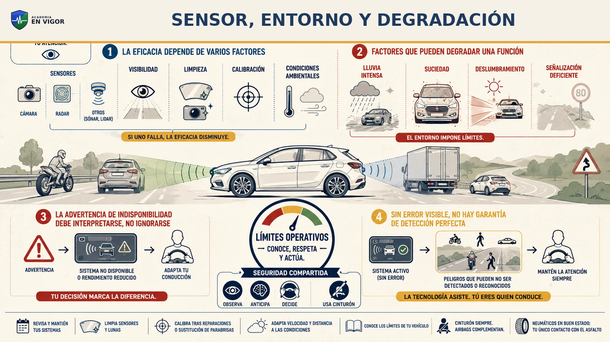

<em>Infografía: Sensor, entorno y degradación.</em>

:::hablemos-claro
La eficacia de cámaras, radar y otros sensores depende de visibilidad, limpieza, calibración y condiciones ambientales.
:::

:::en-la-calle
Al clasificar un sistema de seguridad, La eficacia de cámaras, radar y otros sensores depende de visibilidad, limpieza, calibración y condiciones ambientales.
:::

:::lo-que-cae
Prioriza **límites operativos** y descarta respuestas que confundan momento, función, sensor, límite, categoría o vigencia.
:::

<!-- FUENTE: DGT-ADAS-T44 -->

## 18. Mantenimiento y calibración

### Lógica del bloque

Para dominar **mantenimiento y calibración**, aplica esta regla: La sustitución de parabrisas, sensores, ruedas o elementos de suspensión puede exigir calibración de ayudas. El anclaje principal es **estado técnico y reparación**.

### Hechos examinables

- La sustitución de parabrisas, sensores, ruedas o elementos de suspensión puede exigir calibración de ayudas. <!-- FACT:PN-T44-F069 -->
- Una reparación correcta conserva geometría, fijaciones y parámetros previstos por el fabricante. <!-- FACT:PN-T44-F070 -->
- Desactivar permanentemente un sistema obligatorio o circular con un defecto puede comprometer seguridad y conformidad. <!-- FACT:PN-T44-F071 -->
- El mantenimiento preventivo sostiene la eficacia que se atribuye al sistema. <!-- FACT:PN-T44-F072 -->

### Ejemplos razonados

- **Aplicación correcta:** Una reparación correcta conserva geometría, fijaciones y parámetros previstos por el fabricante.
- **Contraste útil:** Desactivar permanentemente un sistema obligatorio o circular con un defecto puede comprometer seguridad y conformidad.

### Trampas de examen

- **Incorrecto:** Los ADAS no necesitan calibración tras ninguna reparación.
- **Incorrecto:** La homologación inicial garantiza eficacia aunque el sistema esté averiado.

<!-- VISUAL:t44-18-mantenimiento-y-calibracion.webp -->

  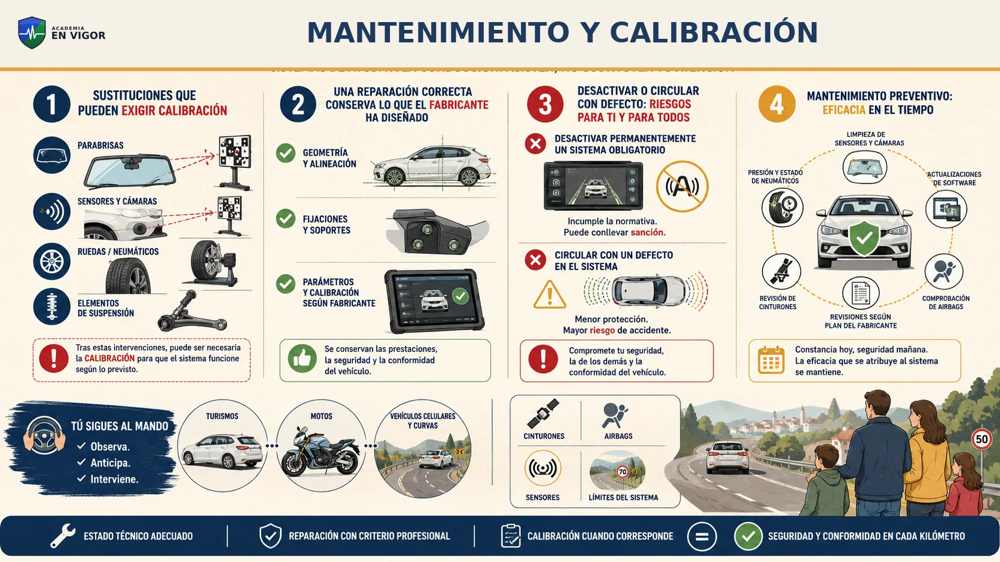

<em>Infografía: Mantenimiento y calibración.</em>

:::hablemos-claro
La sustitución de parabrisas, sensores, ruedas o elementos de suspensión puede exigir calibración de ayudas.
:::

:::en-la-calle
Al clasificar un sistema de seguridad, La sustitución de parabrisas, sensores, ruedas o elementos de suspensión puede exigir calibración de ayudas.
:::

:::lo-que-cae
Prioriza **estado técnico y reparación** y descarta respuestas que confundan momento, función, sensor, límite, categoría o vigencia.
:::

<!-- FUENTE: BOE-RGV-T44 -->

## 19. Homologación y uso real

### Lógica del bloque

Para dominar **homologación y uso real**, aplica esta regla: La homologación verifica requisitos técnicos definidos, no promete ausencia de siniestros. El anclaje principal es **requisito de tipo y conducta**.

### Hechos examinables

- La homologación verifica requisitos técnicos definidos, no promete ausencia de siniestros. <!-- FACT:PN-T44-F073 -->
- La obligación de equipamiento puede variar por categoría, fecha y condición de tipo nuevo o vehículo nuevo. <!-- FACT:PN-T44-F074 -->
- Un dispositivo instalado debe usarse dentro de sus condiciones y no como permiso para asumir más riesgo. <!-- FACT:PN-T44-F075 -->
- El calendario normativo se consulta por sistema y categoría, no mediante una fecha única. <!-- FACT:PN-T44-F076 -->

### Ejemplos razonados

- **Aplicación correcta:** La obligación de equipamiento puede variar por categoría, fecha y condición de tipo nuevo o vehículo nuevo.
- **Contraste útil:** Un dispositivo instalado debe usarse dentro de sus condiciones y no como permiso para asumir más riesgo.

### Trampas de examen

- **Incorrecto:** Toda homologación certifica eficacia absoluta en tráfico real.
- **Incorrecto:** Todos los sistemas del Reglamento 2019/2144 tienen la misma fecha y categorías.

<!-- VISUAL:t44-19-homologacion-y-uso-real.webp -->

  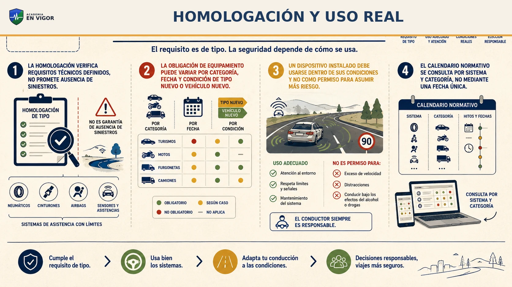

<em>Infografía: Homologación y uso real.</em>

:::hablemos-claro
La homologación verifica requisitos técnicos definidos, no promete ausencia de siniestros.
:::

:::en-la-calle
Al clasificar un sistema de seguridad, La homologación verifica requisitos técnicos definidos, no promete ausencia de siniestros.
:::

:::lo-que-cae
Prioriza **requisito de tipo y conducta** y descarta respuestas que confundan momento, función, sensor, límite, categoría o vigencia.
:::

<!-- FUENTE: EU-GSR-2019-2144-T44 -->

## 20. Trampa de las cifras universales

### Lógica del bloque

Para dominar **trampa de las cifras universales**, aplica esta regla: La efectividad se estima comparando escenarios y depende de exposición, parque, uso y definición de resultado. El anclaje principal es **efectividad condicionada**.

### Hechos examinables

- La efectividad se estima comparando escenarios y depende de exposición, parque, uso y definición de resultado. <!-- FACT:PN-T44-F077 -->
- Una reducción de riesgo poblacional no predice con exactitud el resultado de un caso individual. <!-- FACT:PN-T44-F078 -->
- Los porcentajes de estudios distintos no deben sumarse como si fueran independientes. <!-- FACT:PN-T44-F079 -->
- Para examen importa primero el mecanismo y después la magnitud contextualizada. <!-- FACT:PN-T44-F080 -->

### Ejemplos razonados

- **Aplicación correcta:** Una reducción de riesgo poblacional no predice con exactitud el resultado de un caso individual.
- **Contraste útil:** Los porcentajes de estudios distintos no deben sumarse como si fueran independientes.

### Trampas de examen

- **Incorrecto:** Dos sistemas con reducción estimada del 30 % producen siempre un 60 %.
- **Incorrecto:** Una cifra de laboratorio se aplica sin cambios a cualquier población.

<!-- VISUAL:t44-il-20-trampa-de-las-cifras-universales.webp -->

  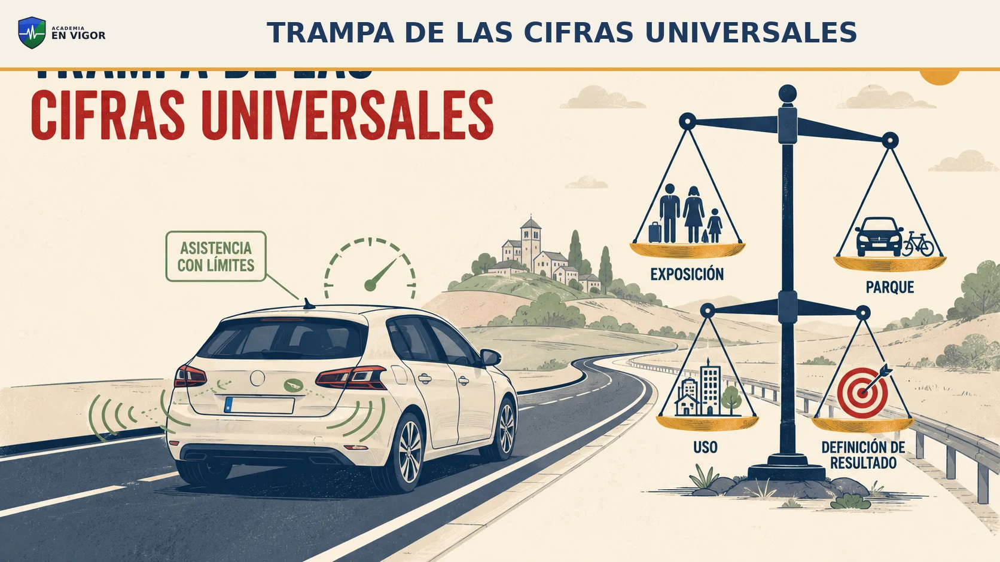

<em>Infografía: Trampa de las cifras universales.</em>

:::hablemos-claro
La efectividad se estima comparando escenarios y depende de exposición, parque, uso y definición de resultado.
:::

:::en-la-calle
Al clasificar un sistema de seguridad, La efectividad se estima comparando escenarios y depende de exposición, parque, uso y definición de resultado.
:::

:::lo-que-cae
Prioriza **efectividad condicionada** y descarta respuestas que confundan momento, función, sensor, límite, categoría o vigencia.
:::

<!-- FUENTE: DGT-EFECTIVIDAD-2022-T44 -->

## 21. Estructura y célula de supervivencia

### Lógica del bloque

Para dominar **estructura y célula de supervivencia**, aplica esta regla: La estructura combina zonas de deformación programada con un habitáculo que debe preservar espacio vital. El anclaje principal es **gestión de energía del impacto**.

### Hechos examinables

- La estructura combina zonas de deformación programada con un habitáculo que debe preservar espacio vital. <!-- FACT:PN-T44-F081 -->
- Deformarse de manera controlada permite disipar energía fuera de la célula de ocupantes. <!-- FACT:PN-T44-F082 -->
- La rigidez útil del habitáculo no significa que todo el vehículo deba ser indeformable. <!-- FACT:PN-T44-F083 -->
- La intrusión y la desaceleración soportada por ocupantes son variables distintas pero relacionadas. <!-- FACT:PN-T44-F084 -->

### Ejemplos razonados

- **Aplicación correcta:** Deformarse de manera controlada permite disipar energía fuera de la célula de ocupantes.
- **Contraste útil:** La rigidez útil del habitáculo no significa que todo el vehículo deba ser indeformable.

### Trampas de examen

- **Incorrecto:** La carrocería más segura es totalmente rígida en todas sus zonas.
- **Incorrecto:** La deformación exterior demuestra necesariamente un mal diseño.

<!-- VISUAL:t44-21-estructura-y-celula-de-supervivencia.webp -->

  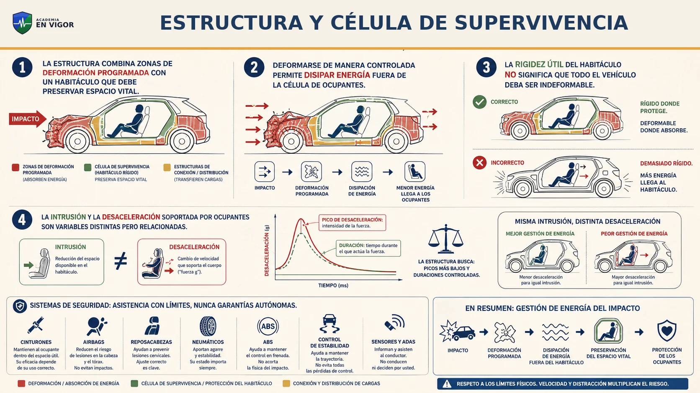

<em>Infografía: Estructura y célula de supervivencia.</em>

:::hablemos-claro
La estructura combina zonas de deformación programada con un habitáculo que debe preservar espacio vital.
:::

:::en-la-calle
Al proteger a los ocupantes durante el impacto, La estructura combina zonas de deformación programada con un habitáculo que debe preservar espacio vital.
:::

:::lo-que-cae
Prioriza **gestión de energía del impacto** y descarta respuestas que confundan momento, función, sensor, límite, categoría o vigencia.
:::

<!-- FUENTE: DGT-EFECTIVIDAD-2022-T44 -->

## 22. Cinturón de tres puntos

### Lógica del bloque

Para dominar **cinturón de tres puntos**, aplica esta regla: El cinturón retiene al ocupante, distribuye cargas y reduce impactos contra interior o expulsión. El anclaje principal es **artículos 117 y 119**.

### Hechos examinables

- El cinturón retiene al ocupante, distribuye cargas y reduce impactos contra interior o expulsión. <!-- FACT:PN-T44-F085 -->
- Debe ir abrochado y ajustado sin holguras ni torsiones. <!-- FACT:PN-T44-F086 -->
- La banda diagonal pasa por clavícula y centro del pecho; la pélvica se apoya baja sobre la pelvis. <!-- FACT:PN-T44-F087 -->
- Airbag y cinturón están diseñados para trabajar conjuntamente. <!-- FACT:PN-T44-F088 -->

### Ejemplos razonados

- **Aplicación correcta:** Debe ir abrochado y ajustado sin holguras ni torsiones.
- **Contraste útil:** La banda diagonal pasa por clavícula y centro del pecho; la pélvica se apoya baja sobre la pelvis.

### Trampas de examen

- **Incorrecto:** El cinturón se coloca sobre el abdomen para resultar más cómodo.
- **Incorrecto:** El airbag permite prescindir del cinturón.

<!-- VISUAL:t44-22-cinturon-de-tres-puntos.webp -->

  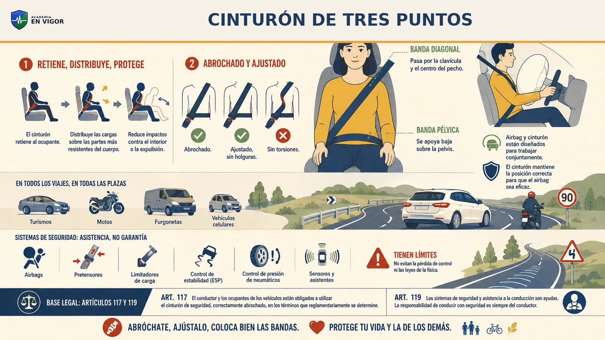

<em>Infografía: Cinturón de tres puntos.</em>

:::hablemos-claro
El cinturón retiene al ocupante, distribuye cargas y reduce impactos contra interior o expulsión.
:::

:::en-la-calle
Al proteger a los ocupantes durante el impacto, El cinturón retiene al ocupante, distribuye cargas y reduce impactos contra interior o expulsión.
:::

:::lo-que-cae
Prioriza **artículos 117 y 119** y descarta respuestas que confundan momento, función, sensor, límite, categoría o vigencia.
:::

<!-- FUENTE: BOE-RGC-T44 -->

## 23. Pretensor y limitador de carga

### Lógica del bloque

Para dominar **pretensor y limitador de carga**, aplica esta regla: El pretensor reduce rápidamente la holgura del cinturón al iniciarse un choque relevante. El anclaje principal es **retener y modular esfuerzo**.

### Hechos examinables

- El pretensor reduce rápidamente la holgura del cinturón al iniciarse un choque relevante. <!-- FACT:PN-T44-F089 -->
- El limitador permite una cesión controlada para evitar cargas excesivas sobre el tórax. <!-- FACT:PN-T44-F090 -->
- Pretensor y limitador cumplen funciones complementarias y no opuestas. <!-- FACT:PN-T44-F091 -->
- Su activación depende de la lógica del sistema y del tipo de colisión. <!-- FACT:PN-T44-F092 -->

### Ejemplos razonados

- **Aplicación correcta:** El limitador permite una cesión controlada para evitar cargas excesivas sobre el tórax.
- **Contraste útil:** Pretensor y limitador cumplen funciones complementarias y no opuestas.

### Trampas de examen

- **Incorrecto:** El limitador aprieta indefinidamente la cinta.
- **Incorrecto:** El pretensor sustituye el anclaje del cinturón.

<!-- VISUAL:t44-23-pretensor-y-limitador-de-carga.webp -->

  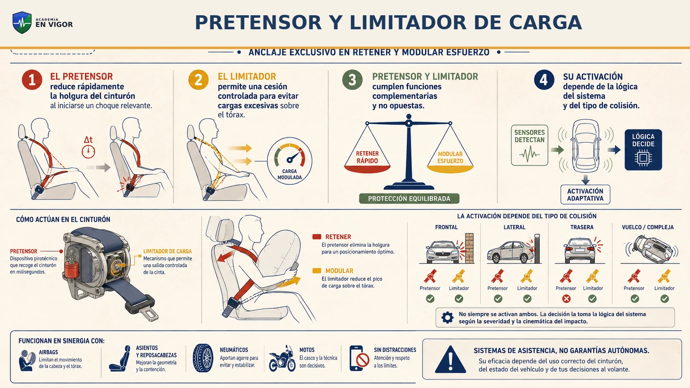

<em>Infografía: Pretensor y limitador de carga.</em>

:::hablemos-claro
El pretensor reduce rápidamente la holgura del cinturón al iniciarse un choque relevante.
:::

:::en-la-calle
Al proteger a los ocupantes durante el impacto, El pretensor reduce rápidamente la holgura del cinturón al iniciarse un choque relevante.
:::

:::lo-que-cae
Prioriza **retener y modular esfuerzo** y descarta respuestas que confundan momento, función, sensor, límite, categoría o vigencia.
:::

<!-- FUENTE: DGT-EFECTIVIDAD-2022-T44 -->

## 24. Reposacabezas y latigazo cervical

### Lógica del bloque

Para dominar **reposacabezas y latigazo cervical**, aplica esta regla: El reposacabezas limita el desplazamiento relativo de la cabeza respecto del tronco en un alcance. El anclaje principal es **altura y distancia**.

### Hechos examinables

- El reposacabezas limita el desplazamiento relativo de la cabeza respecto del tronco en un alcance. <!-- FACT:PN-T44-F093 -->
- Su parte superior debe quedar aproximadamente entre la altura de los ojos y la parte superior de la cabeza. <!-- FACT:PN-T44-F094 -->
- La separación con la cabeza debe ser pequeña sin forzar una postura anormal. <!-- FACT:PN-T44-F095 -->
- Un reposacabezas presente pero mal ajustado pierde gran parte de su utilidad. <!-- FACT:PN-T44-F096 -->

### Ejemplos razonados

- **Aplicación correcta:** Su parte superior debe quedar aproximadamente entre la altura de los ojos y la parte superior de la cabeza.
- **Contraste útil:** La separación con la cabeza debe ser pequeña sin forzar una postura anormal.

### Trampas de examen

- **Incorrecto:** Debe colocarse a la altura de los hombros.
- **Incorrecto:** Cuanto más lejos esté de la cabeza, mejor absorbe el movimiento.

<!-- VISUAL:t44-24-reposacabezas-y-latigazo-cervical.webp -->

  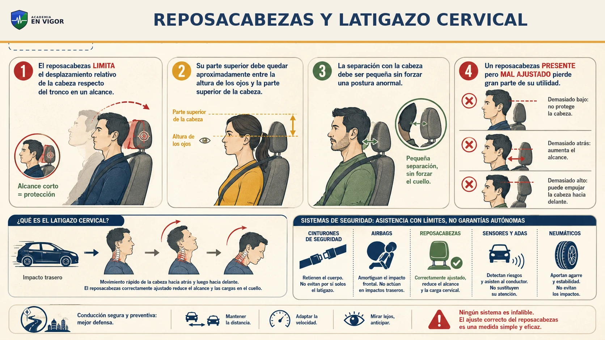

<em>Infografía: Reposacabezas y latigazo cervical.</em>

:::hablemos-claro
El reposacabezas limita el desplazamiento relativo de la cabeza respecto del tronco en un alcance.
:::

:::en-la-calle
Al proteger a los ocupantes durante el impacto, El reposacabezas limita el desplazamiento relativo de la cabeza respecto del tronco en un alcance.
:::

:::lo-que-cae
Prioriza **altura y distancia** y descarta respuestas que confundan momento, función, sensor, límite, categoría o vigencia.
:::

<!-- FUENTE: DGT-EFECTIVIDAD-2022-T44 -->

## 25. Airbag como complemento

### Lógica del bloque

Para dominar **airbag como complemento**, aplica esta regla: El airbag crea una superficie de desaceleración y reduce contacto con elementos duros en colisiones previstas. El anclaje principal es **bolsa, sensor y cinturón**.

### Hechos examinables

- El airbag crea una superficie de desaceleración y reduce contacto con elementos duros en colisiones previstas. <!-- FACT:PN-T44-F097 -->
- No se despliega en todos los golpes: la unidad decide según dirección y severidad detectadas. <!-- FACT:PN-T44-F098 -->
- La distancia y postura del ocupante influyen en su protección. <!-- FACT:PN-T44-F099 -->
- Objetos, sistemas infantiles a contramarcha y ocupantes demasiado próximos exigen cautelas específicas. <!-- FACT:PN-T44-F100 -->

### Ejemplos razonados

- **Aplicación correcta:** No se despliega en todos los golpes: la unidad decide según dirección y severidad detectadas.
- **Contraste útil:** La distancia y postura del ocupante influyen en su protección.

### Trampas de examen

- **Incorrecto:** Todo roce activa todos los airbags del vehículo.
- **Incorrecto:** El airbag frontal es una almohada reutilizable que actúa lentamente.

<!-- VISUAL:t44-il-25-airbag-como-complemento.webp -->

  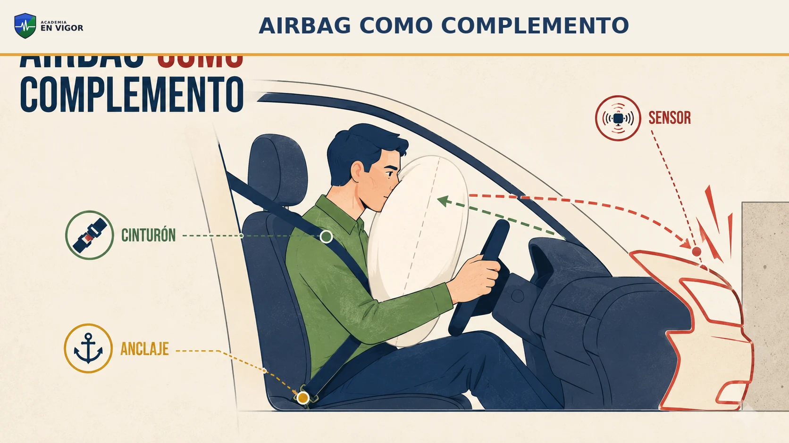

<em>Infografía: Airbag como complemento.</em>

:::hablemos-claro
El airbag crea una superficie de desaceleración y reduce contacto con elementos duros en colisiones previstas.
:::

:::en-la-calle
Al proteger a los ocupantes durante el impacto, El airbag crea una superficie de desaceleración y reduce contacto con elementos duros en colisiones previstas.
:::

:::lo-que-cae
Prioriza **bolsa, sensor y cinturón** y descarta respuestas que confundan momento, función, sensor, límite, categoría o vigencia.
:::

<!-- FUENTE: DGT-EFECTIVIDAD-2022-T44 -->

## 26. Sistemas de retención infantil

### Lógica del bloque

Para dominar **sistemas de retención infantil**, aplica esta regla: Los menores de estatura igual o inferior a 135 centímetros deben usar sistemas homologados adecuados a sus características. El anclaje principal es **artículo 117**.

### Hechos examinables

- Los menores de estatura igual o inferior a 135 centímetros deben usar sistemas homologados adecuados a sus características. <!-- FACT:PN-T44-F101 -->
- Como regla ocupan asientos traseros, con excepciones reglamentarias tasadas. <!-- FACT:PN-T44-F102 -->
- Un sistema orientado hacia atrás en asiento delantero exige desactivar el airbag frontal. <!-- FACT:PN-T44-F103 -->
- La instalación debe seguir las instrucciones del fabricante del sistema. <!-- FACT:PN-T44-F104 -->

### Ejemplos razonados

- **Aplicación correcta:** Como regla ocupan asientos traseros, con excepciones reglamentarias tasadas.
- **Contraste útil:** Un sistema orientado hacia atrás en asiento delantero exige desactivar el airbag frontal.

### Trampas de examen

- **Incorrecto:** Todo menor puede viajar delante si lleva cinturón de adulto.
- **Incorrecto:** Un sistema a contramarcha delante es compatible con airbag frontal activo.

<!-- VISUAL:t44-26-sistemas-de-retencion-infantil.webp -->

  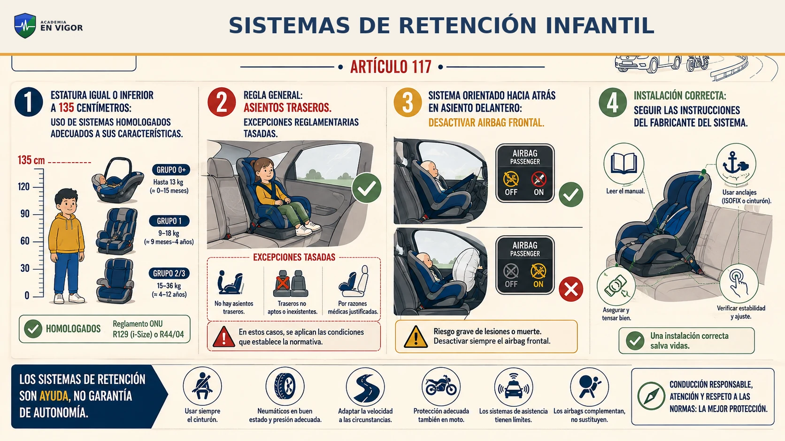

<em>Infografía: Sistemas de retención infantil.</em>

:::hablemos-claro
Los menores de estatura igual o inferior a 135 centímetros deben usar sistemas homologados adecuados a sus características.
:::

:::en-la-calle
Al proteger a los ocupantes durante el impacto, Los menores de estatura igual o inferior a 135 centímetros deben usar sistemas homologados adecuados a sus características.
:::

:::lo-que-cae
Prioriza **artículo 117** y descarta respuestas que confundan momento, función, sensor, límite, categoría o vigencia.
:::

<!-- FUENTE: BOE-RGC-T44 -->

## 27. Asientos y anclajes

### Lógica del bloque

Para dominar **asientos y anclajes**, aplica esta regla: El asiento y sus anclajes deben soportar cargas y mantener al ocupante en posición compatible con la retención. El anclaje principal es **soporte del ocupante**.

### Hechos examinables

- El asiento y sus anclajes deben soportar cargas y mantener al ocupante en posición compatible con la retención. <!-- FACT:PN-T44-F105 -->
- Una postura muy reclinada altera la geometría del cinturón y puede favorecer deslizamiento. <!-- FACT:PN-T44-F106 -->
- Los anclajes infantiles facilitan instalación correcta, pero no corrigen un montaje incompatible. <!-- FACT:PN-T44-F107 -->
- La regulación del asiento debe permitir control del vehículo sin acercamiento excesivo al airbag. <!-- FACT:PN-T44-F108 -->

### Ejemplos razonados

- **Aplicación correcta:** Una postura muy reclinada altera la geometría del cinturón y puede favorecer deslizamiento.
- **Contraste útil:** Los anclajes infantiles facilitan instalación correcta, pero no corrigen un montaje incompatible.

### Trampas de examen

- **Incorrecto:** Reclinar al máximo el respaldo mejora siempre la retención.
- **Incorrecto:** El anclaje ISOFIX elimina la necesidad de seguir instrucciones.

<!-- VISUAL:t44-27-asientos-y-anclajes.webp -->

  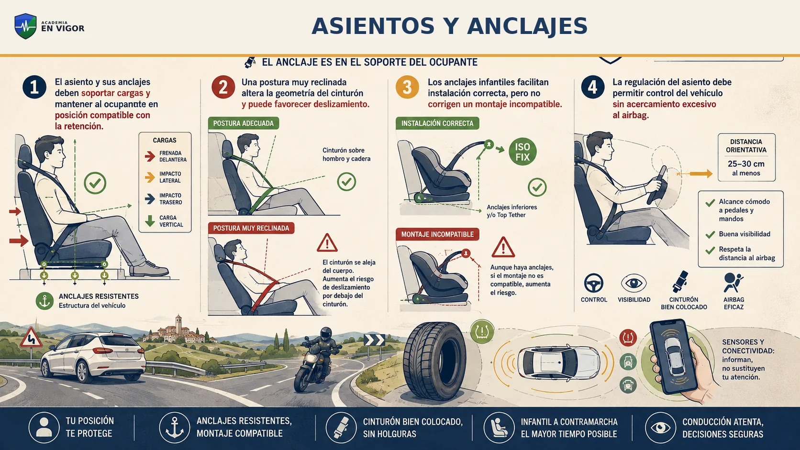

<em>Infografía: Asientos y anclajes.</em>

:::hablemos-claro
El asiento y sus anclajes deben soportar cargas y mantener al ocupante en posición compatible con la retención.
:::

:::en-la-calle
Al proteger a los ocupantes durante el impacto, El asiento y sus anclajes deben soportar cargas y mantener al ocupante en posición compatible con la retención.
:::

:::lo-que-cae
Prioriza **soporte del ocupante** y descarta respuestas que confundan momento, función, sensor, límite, categoría o vigencia.
:::

<!-- FUENTE: DGT-EFECTIVIDAD-2022-T44 -->

## 28. Cristales y parabrisas

### Lógica del bloque

Para dominar **cristales y parabrisas**, aplica esta regla: El parabrisas laminado contribuye a visibilidad, retención de fragmentos y comportamiento estructural. El anclaje principal es **laminado y visibilidad**.

### Hechos examinables

- El parabrisas laminado contribuye a visibilidad, retención de fragmentos y comportamiento estructural. <!-- FACT:PN-T44-F109 -->
- Su reparación o sustitución debe conservar campo de visión y calibración de sensores asociados. <!-- FACT:PN-T44-F110 -->
- Los vidrios laterales pueden usar soluciones distintas y no se comportan igual que el parabrisas. <!-- FACT:PN-T44-F111 -->
- Una grieta en zona crítica puede afectar visión y resistencia. <!-- FACT:PN-T44-F112 -->

### Ejemplos razonados

- **Aplicación correcta:** Su reparación o sustitución debe conservar campo de visión y calibración de sensores asociados.
- **Contraste útil:** Los vidrios laterales pueden usar soluciones distintas y no se comportan igual que el parabrisas.

### Trampas de examen

- **Incorrecto:** Todos los cristales del vehículo tienen idéntica construcción.
- **Incorrecto:** El parabrisas solo protege del viento y no participa en otras funciones.

<!-- VISUAL:t44-28-cristales-y-parabrisas.webp -->

  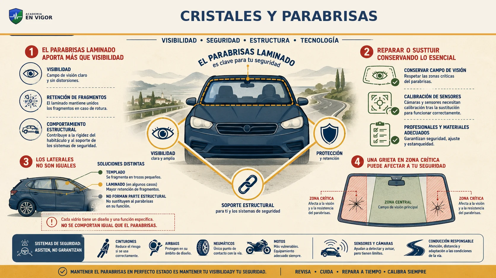

<em>Infografía: Cristales y parabrisas.</em>

:::hablemos-claro
El parabrisas laminado contribuye a visibilidad, retención de fragmentos y comportamiento estructural.
:::

:::en-la-calle
Al proteger a los ocupantes durante el impacto, El parabrisas laminado contribuye a visibilidad, retención de fragmentos y comportamiento estructural.
:::

:::lo-que-cae
Prioriza **laminado y visibilidad** y descarta respuestas que confundan momento, función, sensor, límite, categoría o vigencia.
:::

<!-- FUENTE: DGT-EFECTIVIDAD-2022-T44 -->

## 29. Columna de dirección y pedales

### Lógica del bloque

Para dominar **columna de dirección y pedales**, aplica esta regla: Los diseños colapsables y de desacoplamiento buscan reducir lesiones por intrusión durante el impacto. El anclaje principal es **reducción de intrusión**.

### Hechos examinables

- Los diseños colapsables y de desacoplamiento buscan reducir lesiones por intrusión durante el impacto. <!-- FACT:PN-T44-F113 -->
- La función pasiva aparece cuando la estructura gestiona cargas, no durante la dirección ordinaria. <!-- FACT:PN-T44-F114 -->
- La posición de manos y cuerpo influye en la interacción con volante y airbag. <!-- FACT:PN-T44-F115 -->
- Las modificaciones no homologadas pueden alterar rutas de carga previstas. <!-- FACT:PN-T44-F116 -->

### Ejemplos razonados

- **Aplicación correcta:** La función pasiva aparece cuando la estructura gestiona cargas, no durante la dirección ordinaria.
- **Contraste útil:** La posición de manos y cuerpo influye en la interacción con volante y airbag.

### Trampas de examen

- **Incorrecto:** La columna debe permanecer completamente rígida hacia el ocupante.
- **Incorrecto:** La seguridad de los pedales pertenece siempre a la seguridad activa.

<!-- VISUAL:t44-29-columna-de-direccion-y-pedales.webp -->

  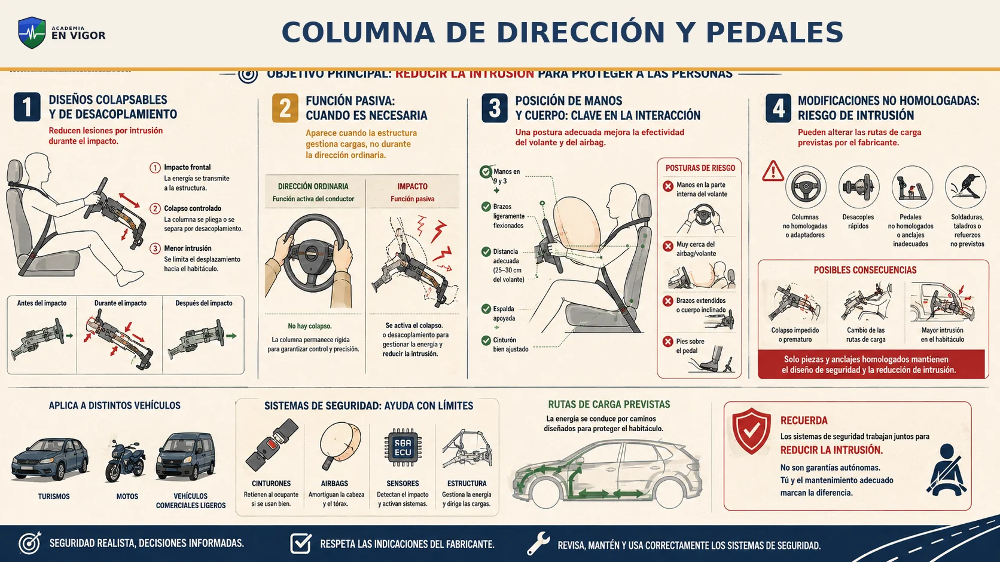

<em>Infografía: Columna de dirección y pedales.</em>

:::hablemos-claro
Los diseños colapsables y de desacoplamiento buscan reducir lesiones por intrusión durante el impacto.
:::

:::en-la-calle
Al proteger a los ocupantes durante el impacto, Los diseños colapsables y de desacoplamiento buscan reducir lesiones por intrusión durante el impacto.
:::

:::lo-que-cae
Prioriza **reducción de intrusión** y descarta respuestas que confundan momento, función, sensor, límite, categoría o vigencia.
:::

<!-- FUENTE: DGT-EFECTIVIDAD-2022-T44 -->

## 30. Protección de usuarios vulnerables

### Lógica del bloque

Para dominar **protección de usuarios vulnerables**, aplica esta regla: La seguridad pasiva también puede reducir lesiones de peatones o ciclistas en un impacto. El anclaje principal es **peatones y ciclistas**.

### Hechos examinables

- La seguridad pasiva también puede reducir lesiones de peatones o ciclistas en un impacto. <!-- FACT:PN-T44-F117 -->
- Formas, zonas deformables y protección frente a bordes rígidos condicionan la severidad. <!-- FACT:PN-T44-F118 -->
- La detección activa y la protección pasiva son capas diferentes que pueden actuar sobre el mismo riesgo. <!-- FACT:PN-T44-F119 -->
- La homologación europea incorpora requisitos orientados a ocupantes y usuarios vulnerables. <!-- FACT:PN-T44-F120 -->

### Ejemplos razonados

- **Aplicación correcta:** Formas, zonas deformables y protección frente a bordes rígidos condicionan la severidad.
- **Contraste útil:** La detección activa y la protección pasiva son capas diferentes que pueden actuar sobre el mismo riesgo.

### Trampas de examen

- **Incorrecto:** La seguridad pasiva solo se diseña para personas dentro del vehículo.
- **Incorrecto:** Detectar a un peatón y absorber el impacto son la misma función.

<!-- VISUAL:t44-il-30-proteccion-de-usuarios-vulnerables.webp -->

  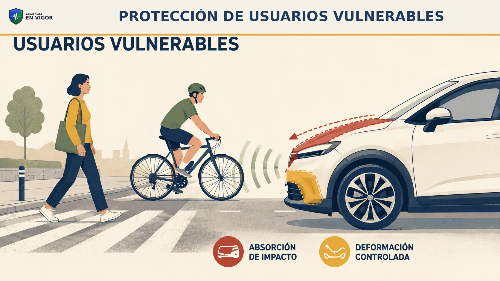

<em>Infografía: Protección de usuarios vulnerables.</em>

:::hablemos-claro
La seguridad pasiva también puede reducir lesiones de peatones o ciclistas en un impacto.
:::

:::en-la-calle
Al proteger a los ocupantes durante el impacto, La seguridad pasiva también puede reducir lesiones de peatones o ciclistas en un impacto.
:::

:::lo-que-cae
Prioriza **peatones y ciclistas** y descarta respuestas que confundan momento, función, sensor, límite, categoría o vigencia.
:::

<!-- FUENTE: EU-GSR-2019-2144-T44 -->

## 31. Neumático como único contacto

### Lógica del bloque

Para dominar **neumático como único contacto**, aplica esta regla: El neumático transmite frenado, guiado y aceleración entre vehículo y calzada. El anclaje principal es **estado, presión y dibujo**.

### Hechos examinables

- El neumático transmite frenado, guiado y aceleración entre vehículo y calzada. <!-- FACT:PN-T44-F121 -->
- Presión, carga, temperatura, desgaste y daños alteran su comportamiento. <!-- FACT:PN-T44-F122 -->
- El dibujo ayuda a evacuar agua, pero no elimina el aquaplaning. <!-- FACT:PN-T44-F123 -->
- La profundidad mínima legal depende de la categoría; 1,6 milímetros no debe universalizarse a toda motocicleta. <!-- FACT:PN-T44-F124 -->

### Ejemplos razonados

- **Aplicación correcta:** Presión, carga, temperatura, desgaste y daños alteran su comportamiento.
- **Contraste útil:** El dibujo ayuda a evacuar agua, pero no elimina el aquaplaning.

### Trampas de examen

- **Incorrecto:** El dibujo crea adherencia ilimitada sobre agua.
- **Incorrecto:** Todos los vehículos, incluidas todas las categorías L, comparten sin matices el mínimo de 1,6 milímetros.

<!-- VISUAL:t44-31-neumatico-como-unico-contacto.webp -->

  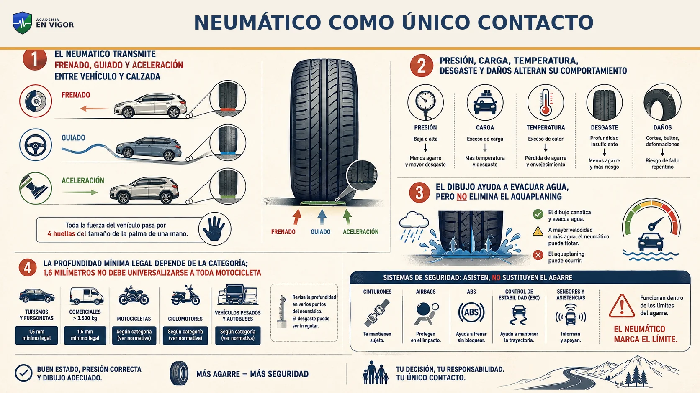

<em>Infografía: Neumático como único contacto.</em>

:::hablemos-claro
El neumático transmite frenado, guiado y aceleración entre vehículo y calzada.
:::

:::en-la-calle
Al conservar adherencia, frenado y trayectoria, El neumático transmite frenado, guiado y aceleración entre vehículo y calzada.
:::

:::lo-que-cae
Prioriza **estado, presión y dibujo** y descarta respuestas que confundan momento, función, sensor, límite, categoría o vigencia.
:::

<!-- FUENTE: BOE-RGV-T44 -->

## 32. Sistema de frenado y reparto

### Lógica del bloque

Para dominar **sistema de frenado y reparto**, aplica esta regla: El freno transforma energía cinética principalmente en calor para reducir velocidad. El anclaje principal es **deceleración estable**.

### Hechos examinables

- El freno transforma energía cinética principalmente en calor para reducir velocidad. <!-- FACT:PN-T44-F125 -->
- El reparto entre ejes debe conservar estabilidad y aprovechar la carga disponible. <!-- FACT:PN-T44-F126 -->
- El sobrecalentamiento puede producir pérdida de eficacia aunque el pedal siga actuando. <!-- FACT:PN-T44-F127 -->
- La distancia final depende también de adherencia, velocidad, pendiente y reacción. <!-- FACT:PN-T44-F128 -->

### Ejemplos razonados

- **Aplicación correcta:** El reparto entre ejes debe conservar estabilidad y aprovechar la carga disponible.
- **Contraste útil:** El sobrecalentamiento puede producir pérdida de eficacia aunque el pedal siga actuando.

### Trampas de examen

- **Incorrecto:** Los frenos detienen igual con cualquier velocidad y firme.
- **Incorrecto:** La frenada solo utiliza las ruedas delanteras.

<!-- VISUAL:t44-32-sistema-de-frenado-y-reparto.webp -->

  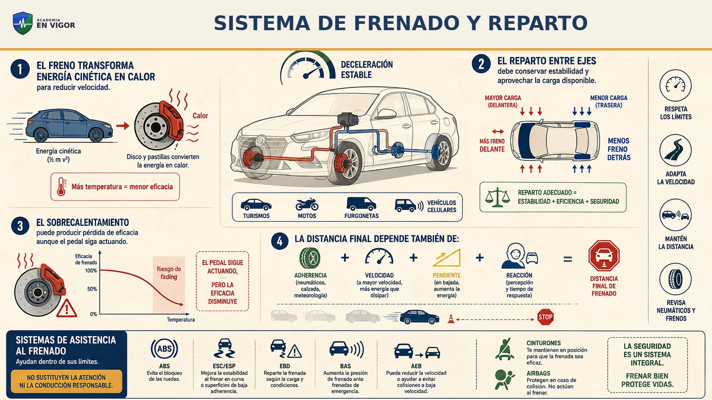

<em>Infografía: Sistema de frenado y reparto.</em>

:::hablemos-claro
El freno transforma energía cinética principalmente en calor para reducir velocidad.
:::

:::en-la-calle
Al conservar adherencia, frenado y trayectoria, El freno transforma energía cinética principalmente en calor para reducir velocidad.
:::

:::lo-que-cae
Prioriza **deceleración estable** y descarta respuestas que confundan momento, función, sensor, límite, categoría o vigencia.
:::

<!-- FUENTE: DGT-EFECTIVIDAD-2022-T44 -->

## 33. ABS

### Lógica del bloque

Para dominar **abs**, aplica esta regla: ABS modula la presión para evitar bloqueo sostenido de ruedas durante una frenada intensa. El anclaje principal es **evitar bloqueo de ruedas**.

### Hechos examinables

- ABS modula la presión para evitar bloqueo sostenido de ruedas durante una frenada intensa. <!-- FACT:PN-T44-F129 -->
- Al conservar capacidad de giro facilita mantener dirección mientras se frena. <!-- FACT:PN-T44-F130 -->
- La vibración del pedal puede indicar regulación y no obliga a soltarlo. <!-- FACT:PN-T44-F131 -->
- ABS no garantiza menor distancia en toda superficie ni vence la falta de adherencia. <!-- FACT:PN-T44-F132 -->

### Ejemplos razonados

- **Aplicación correcta:** Al conservar capacidad de giro facilita mantener dirección mientras se frena.
- **Contraste útil:** La vibración del pedal puede indicar regulación y no obliga a soltarlo.

### Trampas de examen

- **Incorrecto:** ABS impide físicamente cualquier derrape lateral.
- **Incorrecto:** Ante vibración del pedal debe dejarse de frenar de inmediato.

<!-- VISUAL:t44-33-abs.webp -->

  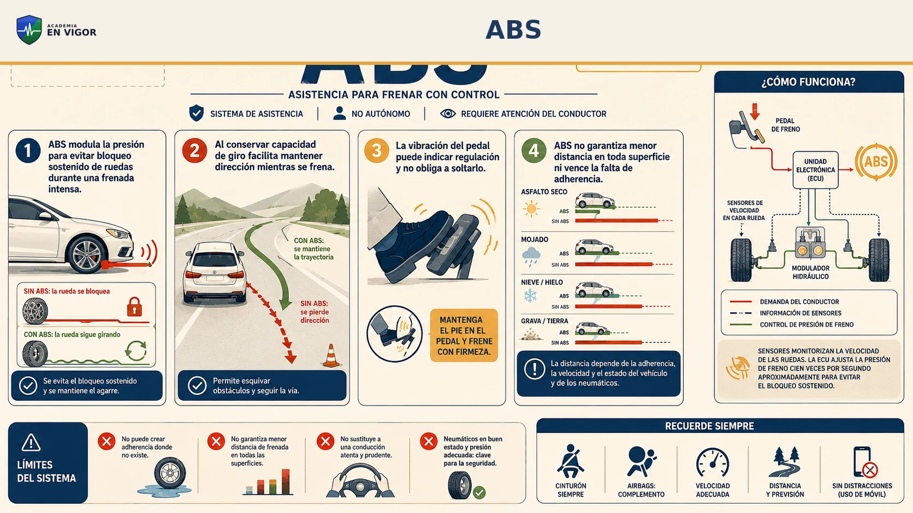

<em>Infografía: ABS.</em>

:::hablemos-claro
ABS modula la presión para evitar bloqueo sostenido de ruedas durante una frenada intensa.
:::

:::en-la-calle
Al conservar adherencia, frenado y trayectoria, ABS modula la presión para evitar bloqueo sostenido de ruedas durante una frenada intensa.
:::

:::lo-que-cae
Prioriza **evitar bloqueo de ruedas** y descarta respuestas que confundan momento, función, sensor, límite, categoría o vigencia.
:::

<!-- FUENTE: DGT-EFECTIVIDAD-2022-T44 -->

## 34. Asistencia a la frenada

### Lógica del bloque

Para dominar **asistencia a la frenada**, aplica esta regla: La asistencia de frenado reconoce una solicitud urgente y ayuda a alcanzar presión suficiente. El anclaje principal es **detectar frenada de emergencia**.

### Hechos examinables

- La asistencia de frenado reconoce una solicitud urgente y ayuda a alcanzar presión suficiente. <!-- FACT:PN-T44-F133 -->
- No debe confundirse con AEB, que puede iniciar frenado sin orden equivalente del conductor. <!-- FACT:PN-T44-F134 -->
- Su utilidad aparece cuando la persona pisa rápido pero con fuerza insuficiente. <!-- FACT:PN-T44-F135 -->
- El sistema trabaja con frenos y ABS, pero no modifica el límite de adherencia. <!-- FACT:PN-T44-F136 -->

### Ejemplos razonados

- **Aplicación correcta:** No debe confundirse con AEB, que puede iniciar frenado sin orden equivalente del conductor.
- **Contraste útil:** Su utilidad aparece cuando la persona pisa rápido pero con fuerza insuficiente.

### Trampas de examen

- **Incorrecto:** La asistencia de frenado detecta peatones y decide siempre por sí sola.
- **Incorrecto:** Aumenta la adherencia del pavimento durante la emergencia.

<!-- VISUAL:t44-34-asistencia-a-la-frenada.webp -->

  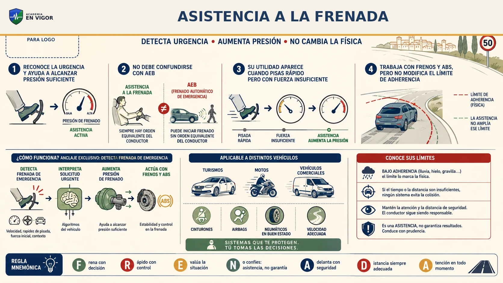

<em>Infografía: Asistencia a la frenada.</em>

:::hablemos-claro
La asistencia de frenado reconoce una solicitud urgente y ayuda a alcanzar presión suficiente.
:::

:::en-la-calle
Al conservar adherencia, frenado y trayectoria, La asistencia de frenado reconoce una solicitud urgente y ayuda a alcanzar presión suficiente.
:::

:::lo-que-cae
Prioriza **detectar frenada de emergencia** y descarta respuestas que confundan momento, función, sensor, límite, categoría o vigencia.
:::

<!-- FUENTE: DGT-EFECTIVIDAD-2022-T44 -->

## 35. Control electrónico de estabilidad

### Lógica del bloque

Para dominar **control electrónico de estabilidad**, aplica esta regla: ESC compara trayectoria pretendida y movimiento real para ayudar a corregir pérdida de estabilidad. El anclaje principal es **trayectoria y guiñada**.

### Hechos examinables

- ESC compara trayectoria pretendida y movimiento real para ayudar a corregir pérdida de estabilidad. <!-- FACT:PN-T44-F137 -->
- Puede frenar ruedas selectivamente y reducir par motor. <!-- FACT:PN-T44-F138 -->
- Ayuda frente a subviraje o sobreviraje dentro de límites físicos. <!-- FACT:PN-T44-F139 -->
- No compensa una velocidad incompatible con la curva o adherencia disponible. <!-- FACT:PN-T44-F140 -->

### Ejemplos razonados

- **Aplicación correcta:** Puede frenar ruedas selectivamente y reducir par motor.
- **Contraste útil:** Ayuda frente a subviraje o sobreviraje dentro de límites físicos.

### Trampas de examen

- **Incorrecto:** ESC dirige el vehículo sin necesitar acción del conductor.
- **Incorrecto:** Con ESC no existe riesgo de salida de vía.

<!-- VISUAL:t44-il-35-control-electronico-de-estabilidad.webp -->

  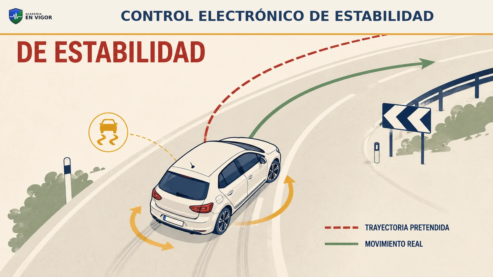

<em>Infografía: Control electrónico de estabilidad.</em>

:::hablemos-claro
ESC compara trayectoria pretendida y movimiento real para ayudar a corregir pérdida de estabilidad.
:::

:::en-la-calle
Al conservar adherencia, frenado y trayectoria, ESC compara trayectoria pretendida y movimiento real para ayudar a corregir pérdida de estabilidad.
:::

:::lo-que-cae
Prioriza **trayectoria y guiñada** y descarta respuestas que confundan momento, función, sensor, límite, categoría o vigencia.
:::

<!-- FUENTE: DGT-EFECTIVIDAD-2022-T44 -->

## 36. Control de tracción

### Lógica del bloque

Para dominar **control de tracción**, aplica esta regla: El control de tracción limita el patinamiento excesivo de ruedas motrices. El anclaje principal es **patinamiento al acelerar**.

### Hechos examinables

- El control de tracción limita el patinamiento excesivo de ruedas motrices. <!-- FACT:PN-T44-F141 -->
- Puede actuar sobre par motor y frenos según el diseño. <!-- FACT:PN-T44-F142 -->
- Su función principal se diferencia de ABS porque interviene al transmitir tracción. <!-- FACT:PN-T44-F143 -->
- No permite acelerar sin medida sobre hielo o agua. <!-- FACT:PN-T44-F144 -->

### Ejemplos razonados

- **Aplicación correcta:** Puede actuar sobre par motor y frenos según el diseño.
- **Contraste útil:** Su función principal se diferencia de ABS porque interviene al transmitir tracción.

### Trampas de examen

- **Incorrecto:** Control de tracción y ABS son idénticos porque ambos usan sensores de rueda.
- **Incorrecto:** El sistema garantiza aceleración máxima sin pérdida en cualquier firme.

<!-- VISUAL:t44-36-control-de-traccion.webp -->

  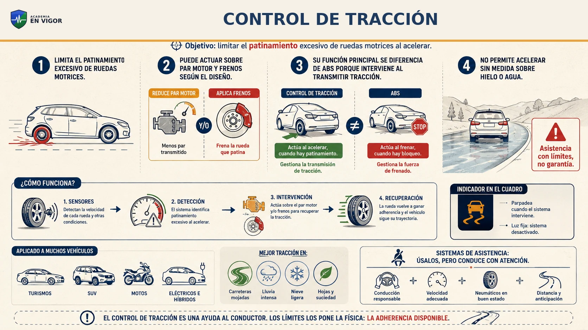

<em>Infografía: Control de tracción.</em>

:::hablemos-claro
El control de tracción limita el patinamiento excesivo de ruedas motrices.
:::

:::en-la-calle
Al conservar adherencia, frenado y trayectoria, El control de tracción limita el patinamiento excesivo de ruedas motrices.
:::

:::lo-que-cae
Prioriza **patinamiento al acelerar** y descarta respuestas que confundan momento, función, sensor, límite, categoría o vigencia.
:::

<!-- FUENTE: DGT-EFECTIVIDAD-2022-T44 -->

## 37. Dirección y suspensión

### Lógica del bloque

Para dominar **dirección y suspensión**, aplica esta regla: La dirección permite orientar el vehículo y la suspensión ayuda a mantener contacto y controlar movimientos. El anclaje principal es **guiado y contacto**.

### Hechos examinables

- La dirección permite orientar el vehículo y la suspensión ayuda a mantener contacto y controlar movimientos. <!-- FACT:PN-T44-F145 -->
- Holguras, amortiguadores degradados o geometría incorrecta reducen precisión y estabilidad. <!-- FACT:PN-T44-F146 -->
- Una suspensión firme no es automáticamente más segura en toda superficie. <!-- FACT:PN-T44-F147 -->
- Los sistemas electrónicos dependen de una base mecánica en buen estado. <!-- FACT:PN-T44-F148 -->

### Ejemplos razonados

- **Aplicación correcta:** Holguras, amortiguadores degradados o geometría incorrecta reducen precisión y estabilidad.
- **Contraste útil:** Una suspensión firme no es automáticamente más segura en toda superficie.

### Trampas de examen

- **Incorrecto:** La suspensión solo mejora comodidad y nunca seguridad.
- **Incorrecto:** Los controles electrónicos corrigen cualquier holgura mecánica.

<!-- VISUAL:t44-37-direccion-y-suspension.webp -->

  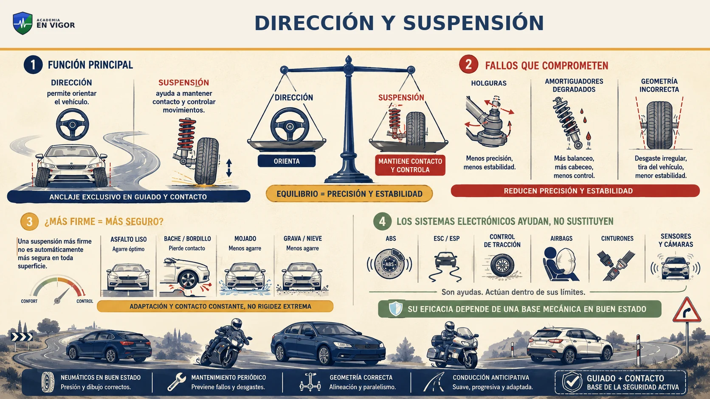

<em>Infografía: Dirección y suspensión.</em>

:::hablemos-claro
La dirección permite orientar el vehículo y la suspensión ayuda a mantener contacto y controlar movimientos.
:::

:::en-la-calle
Al conservar adherencia, frenado y trayectoria, La dirección permite orientar el vehículo y la suspensión ayuda a mantener contacto y controlar movimientos.
:::

:::lo-que-cae
Prioriza **guiado y contacto** y descarta respuestas que confundan momento, función, sensor, límite, categoría o vigencia.
:::

<!-- FUENTE: DGT-EFECTIVIDAD-2022-T44 -->

## 38. Alumbrado y visibilidad

### Lógica del bloque

Para dominar **alumbrado y visibilidad**, aplica esta regla: El alumbrado permite ver la vía y hacer visible el vehículo sin deslumbrar. El anclaje principal es **ver y ser visto**.

### Hechos examinables

- El alumbrado permite ver la vía y hacer visible el vehículo sin deslumbrar. <!-- FACT:PN-T44-F149 -->
- La regulación incorrecta puede reducir alcance útil o molestar a otros usuarios. <!-- FACT:PN-T44-F150 -->
- Luces adaptativas modifican distribución según condiciones, pero no sustituyen una velocidad visible segura. <!-- FACT:PN-T44-F151 -->
- Parabrisas limpio, limpiaparabrisas y desempañado también sostienen percepción. <!-- FACT:PN-T44-F152 -->

### Ejemplos razonados

- **Aplicación correcta:** La regulación incorrecta puede reducir alcance útil o molestar a otros usuarios.
- **Contraste útil:** Luces adaptativas modifican distribución según condiciones, pero no sustituyen una velocidad visible segura.

### Trampas de examen

- **Incorrecto:** Más intensidad luminosa siempre mejora seguridad aunque deslumbre.
- **Incorrecto:** Las luces adaptativas permiten conducir por encima del alcance visual.

<!-- VISUAL:t44-38-alumbrado-y-visibilidad.webp -->

  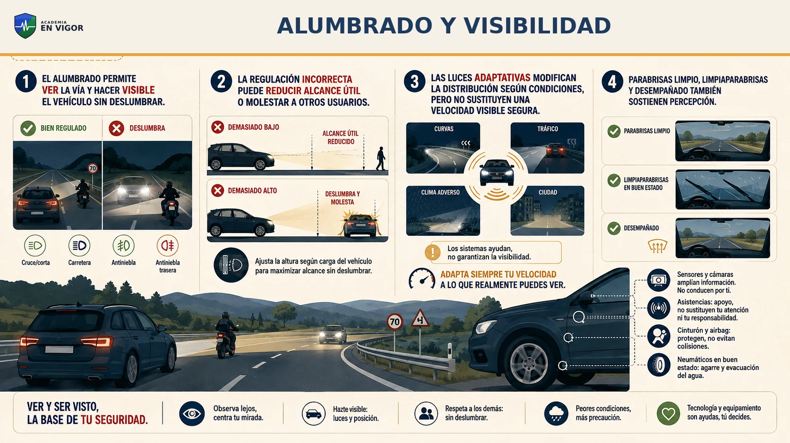

<em>Infografía: Alumbrado y visibilidad.</em>

:::hablemos-claro
El alumbrado permite ver la vía y hacer visible el vehículo sin deslumbrar.
:::

:::en-la-calle
Al conservar adherencia, frenado y trayectoria, El alumbrado permite ver la vía y hacer visible el vehículo sin deslumbrar.
:::

:::lo-que-cae
Prioriza **ver y ser visto** y descarta respuestas que confundan momento, función, sensor, límite, categoría o vigencia.
:::

<!-- FUENTE: BOE-RGV-T44 -->

## 39. TPMS

### Lógica del bloque

Para dominar **tpms**, aplica esta regla: TPMS advierte una presión anómala o pérdida según el sistema y sus umbrales. El anclaje principal es **advertencia de presión**.

### Hechos examinables

- TPMS advierte una presión anómala o pérdida según el sistema y sus umbrales. <!-- FACT:PN-T44-F153 -->
- No sustituye la comprobación periódica con presión adecuada al vehículo y carga. <!-- FACT:PN-T44-F154 -->
- Una advertencia exige detenerse con seguridad y revisar causa, no limitarse a reiniciarla. <!-- FACT:PN-T44-F155 -->
- TPMS no informa necesariamente sobre profundidad de dibujo, grietas o envejecimiento. <!-- FACT:PN-T44-F156 -->

### Ejemplos razonados

- **Aplicación correcta:** No sustituye la comprobación periódica con presión adecuada al vehículo y carga.
- **Contraste útil:** Una advertencia exige detenerse con seguridad y revisar causa, no limitarse a reiniciarla.

### Trampas de examen

- **Incorrecto:** TPMS certifica que el neumático no tiene ningún defecto.
- **Incorrecto:** Borrar el aviso repara automáticamente la pérdida de presión.

<!-- VISUAL:t44-39-tpms.webp -->

  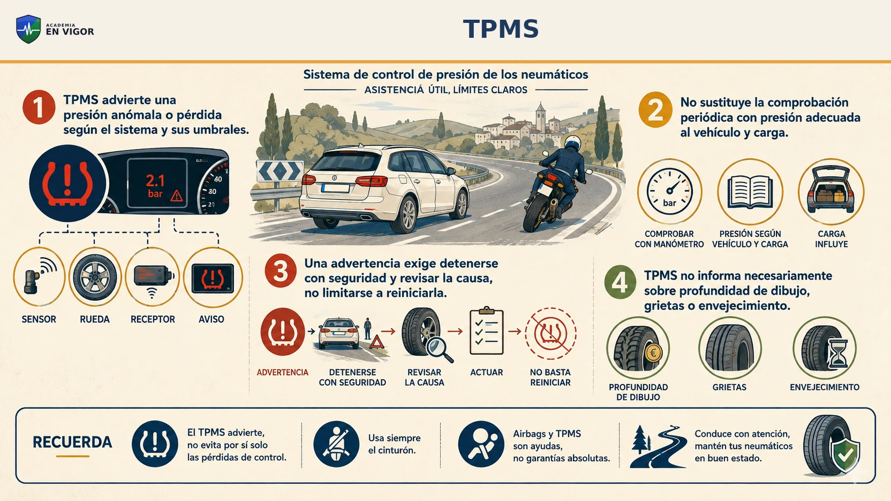

<em>Infografía: TPMS.</em>

:::hablemos-claro
TPMS advierte una presión anómala o pérdida según el sistema y sus umbrales.
:::

:::en-la-calle
Al conservar adherencia, frenado y trayectoria, TPMS advierte una presión anómala o pérdida según el sistema y sus umbrales.
:::

:::lo-que-cae
Prioriza **advertencia de presión** y descarta respuestas que confundan momento, función, sensor, límite, categoría o vigencia.
:::

<!-- FUENTE: DGT-EFECTIVIDAD-2022-T44 -->

## 40. Mantenimiento como seguridad activa

### Lógica del bloque

Para dominar **mantenimiento como seguridad activa**, aplica esta regla: El mantenimiento conserva prestaciones de neumáticos, frenos, dirección, suspensión y luces. El anclaje principal es **inspección y prevención**.

### Hechos examinables

- El mantenimiento conserva prestaciones de neumáticos, frenos, dirección, suspensión y luces. <!-- FACT:PN-T44-F157 -->
- Un defecto pequeño puede combinarse con lluvia, carga o velocidad y convertirse en fallo crítico. <!-- FACT:PN-T44-F158 -->
- La inspección técnica no sustituye las comprobaciones cotidianas del usuario. <!-- FACT:PN-T44-F159 -->
- Las modificaciones deben respetar homologación y no interferir con sensores o protecciones. <!-- FACT:PN-T44-F160 -->

### Ejemplos razonados

- **Aplicación correcta:** Un defecto pequeño puede combinarse con lluvia, carga o velocidad y convertirse en fallo crítico.
- **Contraste útil:** La inspección técnica no sustituye las comprobaciones cotidianas del usuario.

### Trampas de examen

- **Incorrecto:** Superar ITV elimina la necesidad de revisar el vehículo hasta la siguiente inspección.
- **Incorrecto:** Cualquier modificación estética es irrelevante para sensores y seguridad.

<!-- VISUAL:t44-il-40-mantenimiento-como-seguridad-activa.webp -->

  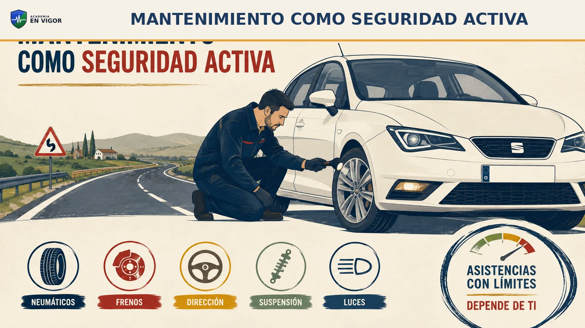

<em>Infografía: Mantenimiento como seguridad activa.</em>

:::hablemos-claro
El mantenimiento conserva prestaciones de neumáticos, frenos, dirección, suspensión y luces.
:::

:::en-la-calle
Al conservar adherencia, frenado y trayectoria, El mantenimiento conserva prestaciones de neumáticos, frenos, dirección, suspensión y luces.
:::

:::lo-que-cae
Prioriza **inspección y prevención** y descarta respuestas que confundan momento, función, sensor, límite, categoría o vigencia.
:::

<!-- FUENTE: BOE-RGV-T44 -->

## 41. Calendario escalonado del GSR

### Lógica del bloque

Para dominar **calendario escalonado del gsr**, aplica esta regla: El Reglamento 2019/2144 implanta requisitos por fases y distingue homologaciones nuevas de todos los vehículos nuevos. El anclaje principal es **tipo nuevo frente a vehículo nuevo**.

### Hechos examinables

- El Reglamento 2019/2144 implanta requisitos por fases y distingue homologaciones nuevas de todos los vehículos nuevos. <!-- FACT:PN-T44-F161 -->
- Las fechas de 2022, 2024 y 2026 no se aplican de idéntica forma a cada función. <!-- FACT:PN-T44-F162 -->
- El 7 de julio de 2026 marca, entre otros hitos, la extensión del aviso avanzado de distracción a todos los vehículos nuevos afectados. <!-- FACT:PN-T44-F163 -->
- Para resolver una pregunta debe identificarse sistema, categoría y clase de fecha. <!-- FACT:PN-T44-F164 -->

### Ejemplos razonados

- **Aplicación correcta:** Las fechas de 2022, 2024 y 2026 no se aplican de idéntica forma a cada función.
- **Contraste útil:** El 7 de julio de 2026 marca, entre otros hitos, la extensión del aviso avanzado de distracción a todos los vehículos nuevos afectados.

### Trampas de examen

- **Incorrecto:** Todos los ADAS fueron obligatorios para todos los vehículos el mismo día.
- **Incorrecto:** Vehículo nuevo y tipo nuevo significan exactamente lo mismo en homologación.

<!-- VISUAL:t44-41-calendario-escalonado-del-gsr.webp -->

  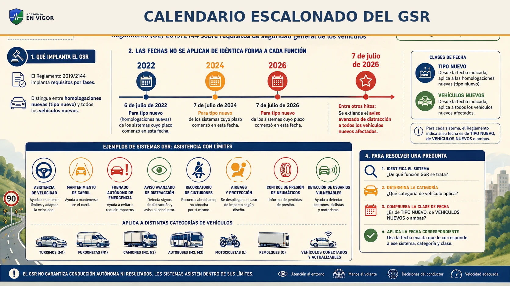

<em>Infografía: Calendario escalonado del GSR.</em>

:::hablemos-claro
El Reglamento 2019/2144 implanta requisitos por fases y distingue homologaciones nuevas de todos los vehículos nuevos.
:::

:::en-la-calle
Al interpretar una ayuda ADAS, El Reglamento 2019/2144 implanta requisitos por fases y distingue homologaciones nuevas de todos los vehículos nuevos.
:::

:::lo-que-cae
Prioriza **tipo nuevo frente a vehículo nuevo** y descarta respuestas que confundan momento, función, sensor, límite, categoría o vigencia.
:::

<!-- FUENTE: EU-GSR-2019-2144-T44 -->

## 42. Aviso de colisión frontal

### Lógica del bloque

Para dominar **aviso de colisión frontal**, aplica esta regla: FCW estima riesgo de colisión frontal y emite una advertencia para provocar reacción del conductor. El anclaje principal es **FCW advierte**.

### Hechos examinables

- FCW estima riesgo de colisión frontal y emite una advertencia para provocar reacción del conductor. <!-- FACT:PN-T44-F165 -->
- Advertir no equivale a frenar automáticamente. <!-- FACT:PN-T44-F166 -->
- El tiempo de aviso depende de detección, velocidad relativa y parámetros del sistema. <!-- FACT:PN-T44-F167 -->
- Una falsa alarma no justifica desactivar permanentemente toda ayuda. <!-- FACT:PN-T44-F168 -->

### Ejemplos razonados

- **Aplicación correcta:** Advertir no equivale a frenar automáticamente.
- **Contraste útil:** El tiempo de aviso depende de detección, velocidad relativa y parámetros del sistema.

### Trampas de examen

- **Incorrecto:** FCW aplica siempre frenado máximo sin intervención humana.
- **Incorrecto:** El sistema solo funciona cuando ya se ha producido el impacto.

<!-- VISUAL:t44-42-aviso-de-colision-frontal.webp -->

  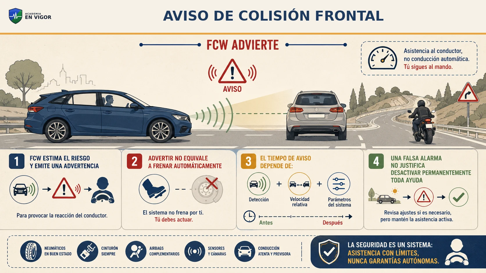

<em>Infografía: Aviso de colisión frontal.</em>

:::hablemos-claro
FCW estima riesgo de colisión frontal y emite una advertencia para provocar reacción del conductor.
:::

:::en-la-calle
Al interpretar una ayuda ADAS, FCW estima riesgo de colisión frontal y emite una advertencia para provocar reacción del conductor.
:::

:::lo-que-cae
Prioriza **FCW advierte** y descarta respuestas que confundan momento, función, sensor, límite, categoría o vigencia.
:::

<!-- FUENTE: DGT-EFECTIVIDAD-2022-T44 -->

## 43. Frenada autónoma de emergencia

### Lógica del bloque

Para dominar **frenada autónoma de emergencia**, aplica esta regla: AEB detecta una situación de emergencia y puede activar frenos para evitar o mitigar la colisión. El anclaje principal es **AEB evita o mitiga**.

### Hechos examinables

- AEB detecta una situación de emergencia y puede activar frenos para evitar o mitigar la colisión. <!-- FACT:PN-T44-F169 -->
- La capacidad de detectar vehículos, peatones o ciclistas depende de la variante y condiciones. <!-- FACT:PN-T44-F170 -->
- Mitigar significa reducir severidad cuando evitar por completo no es posible. <!-- FACT:PN-T44-F171 -->
- El conductor debe seguir frenando o maniobrando si la situación lo exige. <!-- FACT:PN-T44-F172 -->

### Ejemplos razonados

- **Aplicación correcta:** La capacidad de detectar vehículos, peatones o ciclistas depende de la variante y condiciones.
- **Contraste útil:** Mitigar significa reducir severidad cuando evitar por completo no es posible.

### Trampas de examen

- **Incorrecto:** AEB garantiza que nunca habrá colisión.
- **Incorrecto:** Todas las variantes detectan cualquier objeto con idéntico rendimiento.

<!-- VISUAL:t44-43-frenada-autonoma-de-emergencia.webp -->

  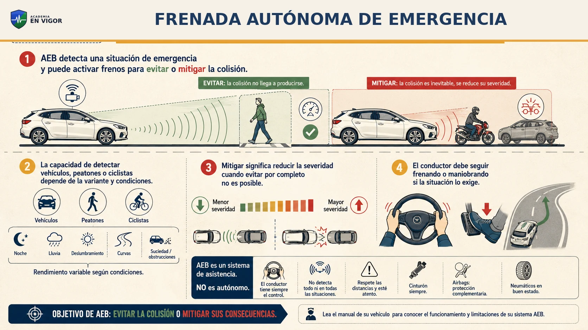

<em>Infografía: Frenada autónoma de emergencia.</em>

:::hablemos-claro
AEB detecta una situación de emergencia y puede activar frenos para evitar o mitigar la colisión.
:::

:::en-la-calle
Al interpretar una ayuda ADAS, AEB detecta una situación de emergencia y puede activar frenos para evitar o mitigar la colisión.
:::

:::lo-que-cae
Prioriza **AEB evita o mitiga** y descarta respuestas que confundan momento, función, sensor, límite, categoría o vigencia.
:::

<!-- FUENTE: DGT-ADAS-T44 -->

## 44. Aviso y mantenimiento de carril

### Lógica del bloque

Para dominar **aviso y mantenimiento de carril**, aplica esta regla: LDW avisa de una salida involuntaria de carril detectada. El anclaje principal es **LDW, LKA y emergencia**.

### Hechos examinables

- LDW avisa de una salida involuntaria de carril detectada. <!-- FACT:PN-T44-F173 -->
- LKA puede aplicar corrección de dirección para ayudar a mantener el carril. <!-- FACT:PN-T44-F174 -->
- Un sistema de emergencia de mantenimiento interviene ante una situación definida y no equivale a conducción centrada continua. <!-- FACT:PN-T44-F175 -->
- Marcas deficientes, obras o carriles ambiguos pueden limitar detección. <!-- FACT:PN-T44-F176 -->

### Ejemplos razonados

- **Aplicación correcta:** LKA puede aplicar corrección de dirección para ayudar a mantener el carril.
- **Contraste útil:** Un sistema de emergencia de mantenimiento interviene ante una situación definida y no equivale a conducción centrada continua.

### Trampas de examen

- **Incorrecto:** LDW y LKA son sinónimos porque ambos usan cámara.
- **Incorrecto:** La ayuda de carril funciona igual aunque no haya marcas detectables.

<!-- VISUAL:t44-44-aviso-y-mantenimiento-de-carril.webp -->

  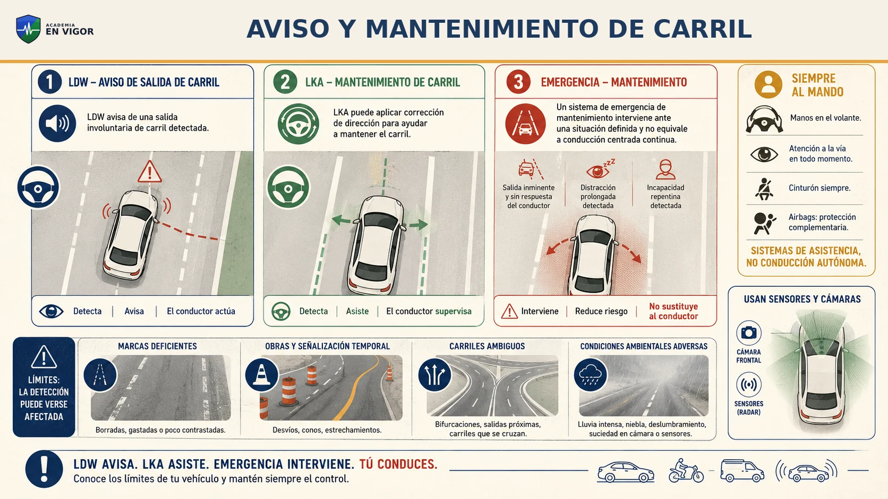

<em>Infografía: Aviso y mantenimiento de carril.</em>

:::hablemos-claro
LDW avisa de una salida involuntaria de carril detectada.
:::

:::en-la-calle
Al interpretar una ayuda ADAS, LDW avisa de una salida involuntaria de carril detectada.
:::

:::lo-que-cae
Prioriza **LDW, LKA y emergencia** y descarta respuestas que confundan momento, función, sensor, límite, categoría o vigencia.
:::

<!-- FUENTE: DGT-ADAS-T44 -->

## 45. ISA

### Lógica del bloque

Para dominar **isa**, aplica esta regla: ISA ayuda a conocer y respetar el límite de velocidad mediante información, aviso o asistencia según diseño. El anclaje principal es **asistencia inteligente de velocidad**.

### Hechos examinables

- ISA ayuda a conocer y respetar el límite de velocidad mediante información, aviso o asistencia según diseño. <!-- FACT:PN-T44-F177 -->
- La fuente del límite puede contener errores por señalización, mapas o interpretación. <!-- FACT:PN-T44-F178 -->
- El conductor debe atender al límite aplicable y al contexto real. <!-- FACT:PN-T44-F179 -->
- ISA no autoriza a circular automáticamente a la velocidad indicada cuando las condiciones exigen menos. <!-- FACT:PN-T44-F180 -->

### Ejemplos razonados

- **Aplicación correcta:** La fuente del límite puede contener errores por señalización, mapas o interpretación.
- **Contraste útil:** El conductor debe atender al límite aplicable y al contexto real.

### Trampas de examen

- **Incorrecto:** ISA concede derecho a circular siempre a la velocidad máxima detectada.
- **Incorrecto:** La lectura de una señal por cámara es jurídicamente infalible.

<!-- VISUAL:t44-il-45-isa.webp -->

  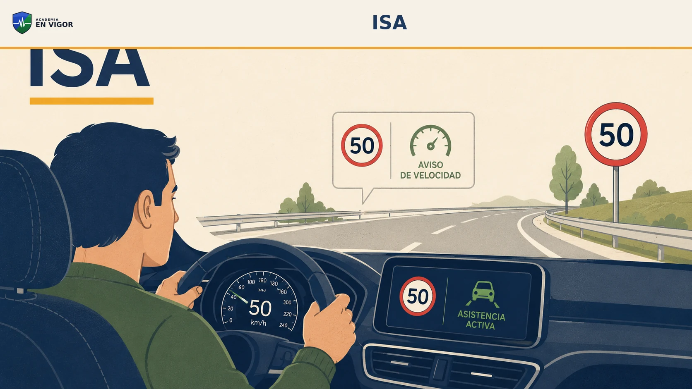

<em>Infografía: ISA.</em>

:::hablemos-claro
ISA ayuda a conocer y respetar el límite de velocidad mediante información, aviso o asistencia según diseño.
:::

:::en-la-calle
Al interpretar una ayuda ADAS, ISA ayuda a conocer y respetar el límite de velocidad mediante información, aviso o asistencia según diseño.
:::

:::lo-que-cae
Prioriza **asistencia inteligente de velocidad** y descarta respuestas que confundan momento, función, sensor, límite, categoría o vigencia.
:::

<!-- FUENTE: DGT-ADAS-T44 -->

## 46. ACC

### Lógica del bloque

Para dominar **acc**, aplica esta regla: ACC adapta velocidad para mantener una separación programada respecto de un vehículo detectado. El anclaje principal es **control longitudinal adaptativo**.

### Hechos examinables

- ACC adapta velocidad para mantener una separación programada respecto de un vehículo detectado. <!-- FACT:PN-T44-F181 -->
- No sustituye la vigilancia ni garantiza respuesta a objetos estáticos o incorporaciones en toda situación. <!-- FACT:PN-T44-F182 -->
- La distancia seleccionada debe ser compatible con condiciones y normativa. <!-- FACT:PN-T44-F183 -->
- El conductor debe poder frenar y asumir control. <!-- FACT:PN-T44-F184 -->

### Ejemplos razonados

- **Aplicación correcta:** No sustituye la vigilancia ni garantiza respuesta a objetos estáticos o incorporaciones en toda situación.
- **Contraste útil:** La distancia seleccionada debe ser compatible con condiciones y normativa.

### Trampas de examen

- **Incorrecto:** ACC es un piloto automático completo.
- **Incorrecto:** La separación mínima del sistema sirve igual con lluvia intensa y firme seco.

<!-- VISUAL:t44-46-acc.webp -->

  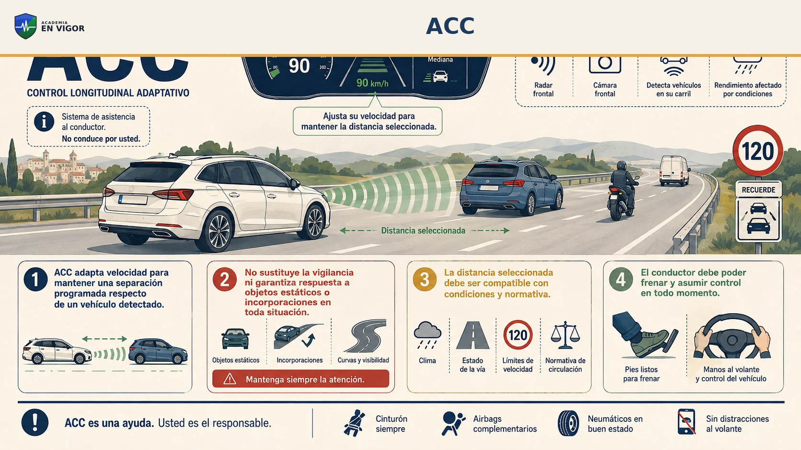

<em>Infografía: ACC.</em>

:::hablemos-claro
ACC adapta velocidad para mantener una separación programada respecto de un vehículo detectado.
:::

:::en-la-calle
Al interpretar una ayuda ADAS, ACC adapta velocidad para mantener una separación programada respecto de un vehículo detectado.
:::

:::lo-que-cae
Prioriza **control longitudinal adaptativo** y descarta respuestas que confundan momento, función, sensor, límite, categoría o vigencia.
:::

<!-- FUENTE: DGT-EFECTIVIDAD-2022-T44 -->

## 47. Ángulo muerto y tráfico cruzado

### Lógica del bloque

Para dominar **ángulo muerto y tráfico cruzado**, aplica esta regla: BSM vigila zonas laterales difíciles de ver y advierte de usuarios presentes. El anclaje principal es **BSM, LCA y RCTA**.

### Hechos examinables

- BSM vigila zonas laterales difíciles de ver y advierte de usuarios presentes. <!-- FACT:PN-T44-F185 -->
- LCA puede asistir en el cambio de carril, pero no sustituye espejos, señalización y comprobación directa. <!-- FACT:PN-T44-F186 -->
- RCTA supervisa tráfico transversal trasero al salir marcha atrás. <!-- FACT:PN-T44-F187 -->
- Una alerta indica riesgo detectado, no certeza absoluta sobre todo el entorno. <!-- FACT:PN-T44-F188 -->

### Ejemplos razonados

- **Aplicación correcta:** LCA puede asistir en el cambio de carril, pero no sustituye espejos, señalización y comprobación directa.
- **Contraste útil:** RCTA supervisa tráfico transversal trasero al salir marcha atrás.

### Trampas de examen

- **Incorrecto:** El aviso de ángulo muerto autoriza cambiar de carril sin mirar.
- **Incorrecto:** RCTA está diseñado principalmente para controlar el tráfico frontal en autopista.

<!-- VISUAL:t44-47-angulo-muerto-y-trafico-cruzado.webp -->

  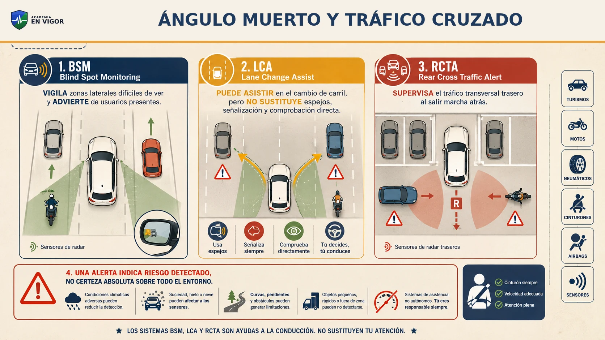

<em>Infografía: Ángulo muerto y tráfico cruzado.</em>

:::hablemos-claro
BSM vigila zonas laterales difíciles de ver y advierte de usuarios presentes.
:::

:::en-la-calle
Al interpretar una ayuda ADAS, BSM vigila zonas laterales difíciles de ver y advierte de usuarios presentes.
:::

:::lo-que-cae
Prioriza **BSM, LCA y RCTA** y descarta respuestas que confundan momento, función, sensor, límite, categoría o vigencia.
:::

<!-- FUENTE: DGT-ADAS-T44 -->

## 48. Somnolencia y distracción

### Lógica del bloque

Para dominar **somnolencia y distracción**, aplica esta regla: Los sistemas de somnolencia o distracción analizan indicios y avisan cuando detectan pérdida de atención. El anclaje principal es **DDAW y ADDW**.

### Hechos examinables

- Los sistemas de somnolencia o distracción analizan indicios y avisan cuando detectan pérdida de atención. <!-- FACT:PN-T44-F189 -->
- El aviso recomienda recuperar condiciones seguras y, cuando proceda, detenerse. <!-- FACT:PN-T44-F190 -->
- No diagnostican médicamente ni garantizan detectar todo episodio. <!-- FACT:PN-T44-F191 -->
- El conductor no debe usar el sistema como permiso para prolongar una conducción fatigada. <!-- FACT:PN-T44-F192 -->

### Ejemplos razonados

- **Aplicación correcta:** El aviso recomienda recuperar condiciones seguras y, cuando proceda, detenerse.
- **Contraste útil:** No diagnostican médicamente ni garantizan detectar todo episodio.

### Trampas de examen

- **Incorrecto:** El detector certifica que el conductor está descansado mientras no avise.
- **Incorrecto:** Una taza en el cuadro sustituye el descanso necesario.

<!-- VISUAL:t44-48-somnolencia-y-distraccion.webp -->

  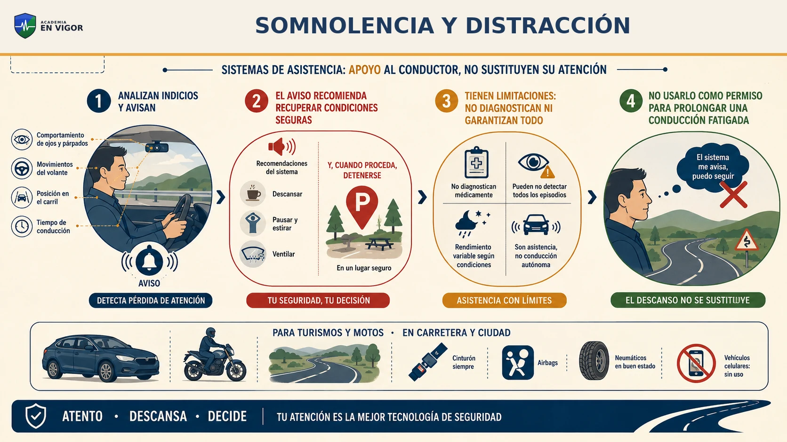

<em>Infografía: Somnolencia y distracción.</em>

:::hablemos-claro
Los sistemas de somnolencia o distracción analizan indicios y avisan cuando detectan pérdida de atención.
:::

:::en-la-calle
Al interpretar una ayuda ADAS, Los sistemas de somnolencia o distracción analizan indicios y avisan cuando detectan pérdida de atención.
:::

:::lo-que-cae
Prioriza **DDAW y ADDW** y descarta respuestas que confundan momento, función, sensor, límite, categoría o vigencia.
:::

<!-- FUENTE: DGT-ADAS-T44 -->

## 49. Detector de marcha atrás

### Lógica del bloque

Para dominar **detector de marcha atrás**, aplica esta regla: El detector de marcha atrás advierte de personas u objetos en la zona posterior al retroceder. El anclaje principal es **REV advierte detrás**.

### Hechos examinables

- El detector de marcha atrás advierte de personas u objetos en la zona posterior al retroceder. <!-- FACT:PN-T44-F193 -->
- La función descrita por DGT emite alerta y no implica necesariamente frenar o dirigir. <!-- FACT:PN-T44-F194 -->
- Cámara y sensores tienen zonas ciegas y requieren observación directa. <!-- FACT:PN-T44-F195 -->
- La maniobra debe hacerse lentamente y con posibilidad de detenerse. <!-- FACT:PN-T44-F196 -->

### Ejemplos razonados

- **Aplicación correcta:** La función descrita por DGT emite alerta y no implica necesariamente frenar o dirigir.
- **Contraste útil:** Cámara y sensores tienen zonas ciegas y requieren observación directa.

### Trampas de examen

- **Incorrecto:** Todo detector de marcha atrás frena automáticamente.
- **Incorrecto:** La pantalla elimina la necesidad de mirar espejos y entorno.

<!-- VISUAL:t44-49-detector-de-marcha-atras.webp -->

  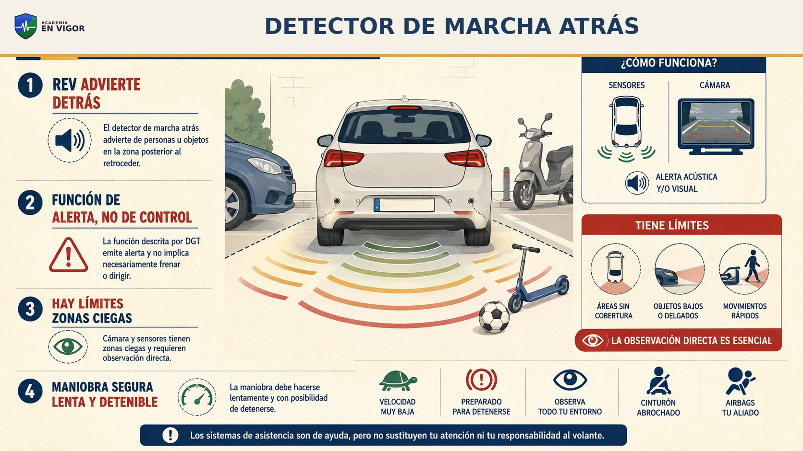

<em>Infografía: Detector de marcha atrás.</em>

:::hablemos-claro
El detector de marcha atrás advierte de personas u objetos en la zona posterior al retroceder.
:::

:::en-la-calle
Al interpretar una ayuda ADAS, El detector de marcha atrás advierte de personas u objetos en la zona posterior al retroceder.
:::

:::lo-que-cae
Prioriza **REV advierte detrás** y descarta respuestas que confundan momento, función, sensor, límite, categoría o vigencia.
:::

<!-- FUENTE: DGT-ADAS-T44 -->

## 50. EDR y llamada de emergencia

### Lógica del bloque

Para dominar **edr y llamada de emergencia**, aplica esta regla: EDR registra determinados parámetros asociados a un incidente para análisis y no actúa como freno o dirección. El anclaje principal es **registro frente a auxilio**.

### Hechos examinables

- EDR registra determinados parámetros asociados a un incidente para análisis y no actúa como freno o dirección. <!-- FACT:PN-T44-F197 -->
- eCall comunica automáticamente o manualmente una emergencia y facilita localización y asistencia. <!-- FACT:PN-T44-F198 -->
- Registrar datos y pedir ayuda son funciones distintas, aunque ambas se relacionen con el siniestro. <!-- FACT:PN-T44-F199 -->
- Ninguna de ellas convierte por sí sola el vehículo en autónomo. <!-- FACT:PN-T44-F200 -->

### Ejemplos razonados

- **Aplicación correcta:** eCall comunica automáticamente o manualmente una emergencia y facilita localización y asistencia.
- **Contraste útil:** Registrar datos y pedir ayuda son funciones distintas, aunque ambas se relacionen con el siniestro.

### Trampas de examen

- **Incorrecto:** EDR es una cámara que graba continuamente todo el habitáculo.
- **Incorrecto:** eCall evita el impacto aplicando los frenos.

<!-- VISUAL:t44-il-50-edr-y-llamada-de-emergencia.webp -->

  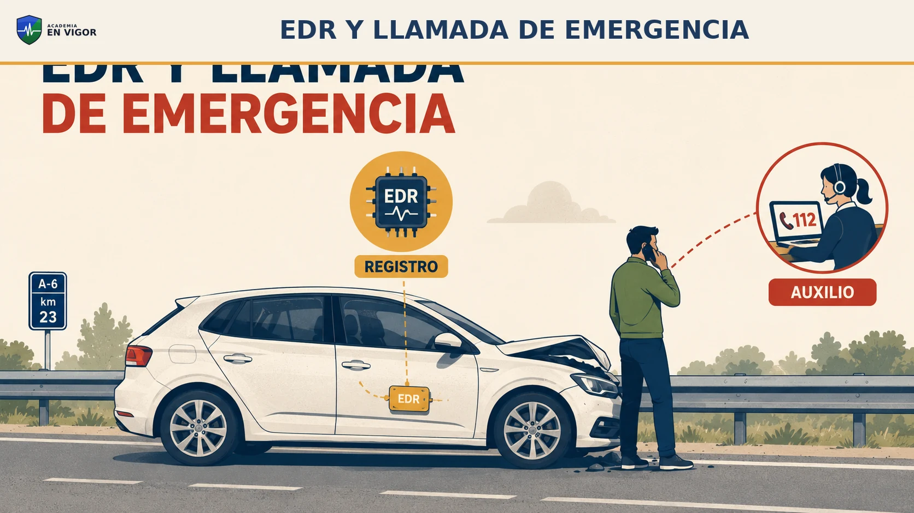

<em>Infografía: EDR y llamada de emergencia.</em>

:::hablemos-claro
EDR registra determinados parámetros asociados a un incidente para análisis y no actúa como freno o dirección.
:::

:::en-la-calle
Al interpretar una ayuda ADAS, EDR registra determinados parámetros asociados a un incidente para análisis y no actúa como freno o dirección.
:::

:::lo-que-cae
Prioriza **registro frente a auxilio** y descarta respuestas que confundan momento, función, sensor, límite, categoría o vigencia.
:::

<!-- FUENTE: EU-GSR-2019-2144-T44 -->

## 51. Vulnerabilidad específica de la motocicleta

### Lógica del bloque

Para dominar **vulnerabilidad específica de la motocicleta**, aplica esta regla: La motocicleta ofrece menor protección estructural y exige combinar estabilidad, evitación y equipamiento personal. El anclaje principal es **sin célula protectora**.

### Hechos examinables

- La motocicleta ofrece menor protección estructural y exige combinar estabilidad, evitación y equipamiento personal. <!-- FACT:PN-T44-F201 -->
- La pérdida de equilibrio puede originar caída sin colisión previa con otro vehículo. <!-- FACT:PN-T44-F202 -->
- La visibilidad del motorista para terceros es una variable crítica. <!-- FACT:PN-T44-F203 -->
- La protección no debe estudiarse copiando sin más la arquitectura de un turismo. <!-- FACT:PN-T44-F204 -->

### Ejemplos razonados

- **Aplicación correcta:** La pérdida de equilibrio puede originar caída sin colisión previa con otro vehículo.
- **Contraste útil:** La visibilidad del motorista para terceros es una variable crítica.

### Trampas de examen

- **Incorrecto:** Una motocicleta protege al ocupante con una célula de deformación equivalente a la de un turismo.
- **Incorrecto:** La caída solo ocurre después de chocar con otro vehículo.

<!-- VISUAL:t44-51-vulnerabilidad-especifica-de-la-motocicleta.webp -->

  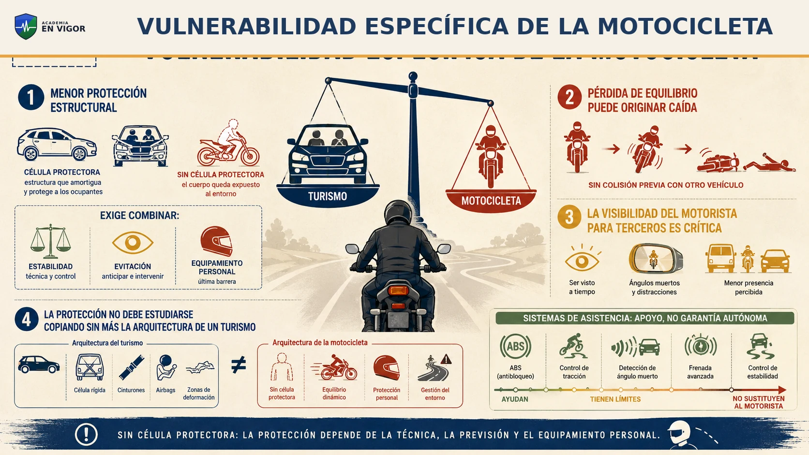

<em>Infografía: Vulnerabilidad específica de la motocicleta.</em>

:::hablemos-claro
La motocicleta ofrece menor protección estructural y exige combinar estabilidad, evitación y equipamiento personal.
:::

:::en-la-calle
Al valorar una motocicleta y su equipamiento, La motocicleta ofrece menor protección estructural y exige combinar estabilidad, evitación y equipamiento personal.
:::

:::lo-que-cae
Prioriza **sin célula protectora** y descarta respuestas que confundan momento, función, sensor, límite, categoría o vigencia.
:::

<!-- FUENTE: DGT-MOTOS-2021-T44 -->

## 52. Neumáticos de motocicleta

### Lógica del bloque

Para dominar **neumáticos de motocicleta**, aplica esta regla: Los neumáticos sostienen inclinación, guiado, frenada y tracción mediante una huella reducida. El anclaje principal es **perfil, presión y contacto**.

### Hechos examinables

- Los neumáticos sostienen inclinación, guiado, frenada y tracción mediante una huella reducida. <!-- FACT:PN-T44-F205 -->
- Presión o desgaste inadecuados alteran estabilidad y respuesta. <!-- FACT:PN-T44-F206 -->
- La inspección debe buscar daños, deformaciones, objetos y envejecimiento además del dibujo. <!-- FACT:PN-T44-F207 -->
- La cifra de 1,6 milímetros no debe trasladarse como mínimo universal a todas las categorías L. <!-- FACT:PN-T44-F208 -->

### Ejemplos razonados

- **Aplicación correcta:** Presión o desgaste inadecuados alteran estabilidad y respuesta.
- **Contraste útil:** La inspección debe buscar daños, deformaciones, objetos y envejecimiento además del dibujo.

### Trampas de examen

- **Incorrecto:** El neumático de moto trabaja siempre plano como el de un turismo.
- **Incorrecto:** Solo importa la profundidad del dibujo y no la presión.

<!-- VISUAL:t44-52-neumaticos-de-motocicleta.webp -->

  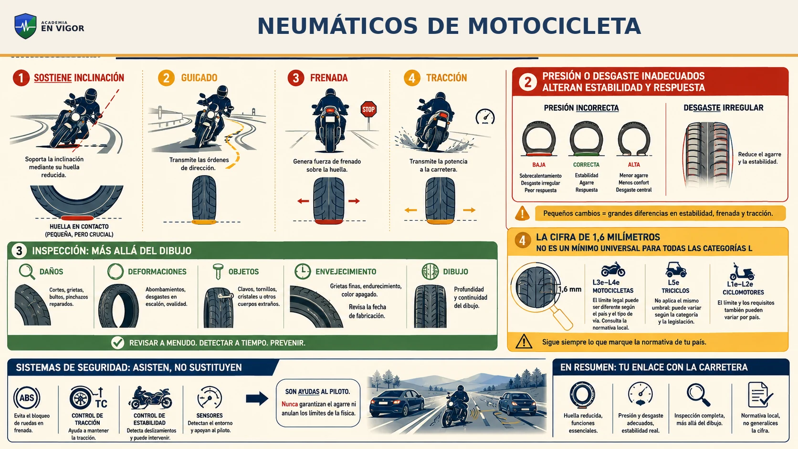

<em>Infografía: Neumáticos de motocicleta.</em>

:::hablemos-claro
Los neumáticos sostienen inclinación, guiado, frenada y tracción mediante una huella reducida.
:::

:::en-la-calle
Al valorar una motocicleta y su equipamiento, Los neumáticos sostienen inclinación, guiado, frenada y tracción mediante una huella reducida.
:::

:::lo-que-cae
Prioriza **perfil, presión y contacto** y descarta respuestas que confundan momento, función, sensor, límite, categoría o vigencia.
:::

<!-- FUENTE: DGT-MOTOS-2021-T44 -->

## 53. Frenado combinado y reparto

### Lógica del bloque

Para dominar **frenado combinado y reparto**, aplica esta regla: CBS distribuye o combina la acción de frenado entre ruedas según el diseño. El anclaje principal es **CBS y dos ejes**.

### Hechos examinables

- CBS distribuye o combina la acción de frenado entre ruedas según el diseño. <!-- FACT:PN-T44-F209 -->
- No debe confundirse con ABS: combinar frenada y evitar bloqueo son funciones distintas. <!-- FACT:PN-T44-F210 -->
- La eficacia exige técnica compatible con adherencia y geometría de la motocicleta. <!-- FACT:PN-T44-F211 -->
- La normativa europea diferencia categorías y requisitos de frenado, por lo que no admite una regla única para toda moto. <!-- FACT:PN-T44-F212 -->

### Ejemplos razonados

- **Aplicación correcta:** No debe confundirse con ABS: combinar frenada y evitar bloqueo son funciones distintas.
- **Contraste útil:** La eficacia exige técnica compatible con adherencia y geometría de la motocicleta.

### Trampas de examen

- **Incorrecto:** CBS y ABS son exactamente el mismo sistema.
- **Incorrecto:** Toda motocicleta de cualquier categoría tiene idéntica obligación técnica.

<!-- VISUAL:t44-53-frenado-combinado-y-reparto.webp -->

  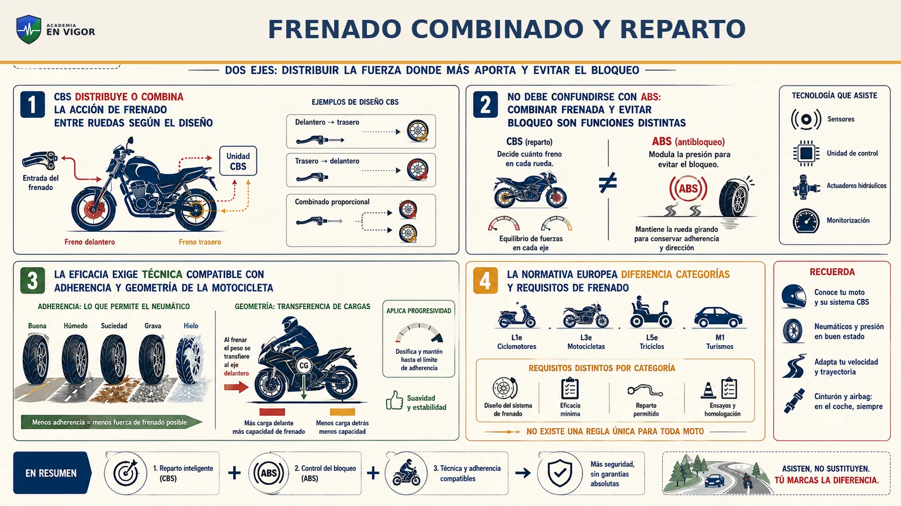

<em>Infografía: Frenado combinado y reparto.</em>

:::hablemos-claro
CBS distribuye o combina la acción de frenado entre ruedas según el diseño.
:::

:::en-la-calle
Al valorar una motocicleta y su equipamiento, CBS distribuye o combina la acción de frenado entre ruedas según el diseño.
:::

:::lo-que-cae
Prioriza **CBS y dos ejes** y descarta respuestas que confundan momento, función, sensor, límite, categoría o vigencia.
:::

<!-- FUENTE: EU-L-168-2013-T44 -->

## 54. ABS en motocicleta

### Lógica del bloque

Para dominar **abs en motocicleta**, aplica esta regla: ABS de motocicleta reduce el riesgo de bloqueo durante frenada y puede ayudar a conservar estabilidad. El anclaje principal es **bloqueo y estabilidad**.

### Hechos examinables

- ABS de motocicleta reduce el riesgo de bloqueo durante frenada y puede ayudar a conservar estabilidad. <!-- FACT:PN-T44-F213 -->
- No elimina el riesgo de caída por inclinación, maniobra brusca o falta de adherencia. <!-- FACT:PN-T44-F214 -->
- La regulación se percibe como pulsación o modulación y no aconseja soltar el freno por reflejo. <!-- FACT:PN-T44-F215 -->
- Los requisitos de equipamiento dependen de categoría y fecha de homologación. <!-- FACT:PN-T44-F216 -->

### Ejemplos razonados

- **Aplicación correcta:** No elimina el riesgo de caída por inclinación, maniobra brusca o falta de adherencia.
- **Contraste útil:** La regulación se percibe como pulsación o modulación y no aconseja soltar el freno por reflejo.

### Trampas de examen

- **Incorrecto:** ABS impide cualquier caída de la motocicleta.
- **Incorrecto:** Al notar regulación debe liberar por completo ambos frenos.

<!-- VISUAL:t44-54-abs-en-motocicleta.webp -->

  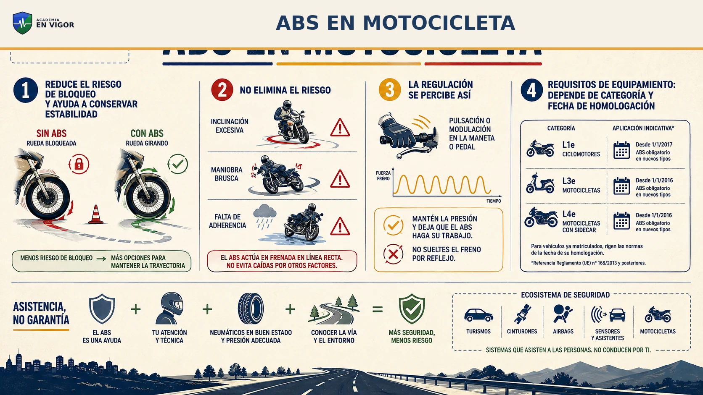

<em>Infografía: ABS en motocicleta.</em>

:::hablemos-claro
ABS de motocicleta reduce el riesgo de bloqueo durante frenada y puede ayudar a conservar estabilidad.
:::

:::en-la-calle
Al valorar una motocicleta y su equipamiento, ABS de motocicleta reduce el riesgo de bloqueo durante frenada y puede ayudar a conservar estabilidad.
:::

:::lo-que-cae
Prioriza **bloqueo y estabilidad** y descarta respuestas que confundan momento, función, sensor, límite, categoría o vigencia.
:::

<!-- FUENTE: DGT-MOTOS-2021-T44 -->

## 55. ABS en curva e IMU

### Lógica del bloque

Para dominar **abs en curva e imu**, aplica esta regla: Los sistemas avanzados pueden usar una unidad inercial para adaptar frenado a inclinación y dinámica. El anclaje principal es **inclinación y dinámica**.

### Hechos examinables

- Los sistemas avanzados pueden usar una unidad inercial para adaptar frenado a inclinación y dinámica. <!-- FACT:PN-T44-F217 -->
- La denominación comercial no garantiza idénticas capacidades entre modelos. <!-- FACT:PN-T44-F218 -->
- La ayuda en curva no vence la combinación extrema de velocidad, inclinación y baja adherencia. <!-- FACT:PN-T44-F219 -->
- Debe distinguirse ABS convencional de funciones sensibles al ángulo. <!-- FACT:PN-T44-F220 -->

### Ejemplos razonados

- **Aplicación correcta:** La denominación comercial no garantiza idénticas capacidades entre modelos.
- **Contraste útil:** La ayuda en curva no vence la combinación extrema de velocidad, inclinación y baja adherencia.

### Trampas de examen

- **Incorrecto:** Todo ABS básico conoce necesariamente el ángulo de inclinación.
- **Incorrecto:** Con ABS en curva puede frenarse sin límite sobre gravilla.

<!-- VISUAL:t44-il-55-abs-en-curva-e-imu.webp -->

  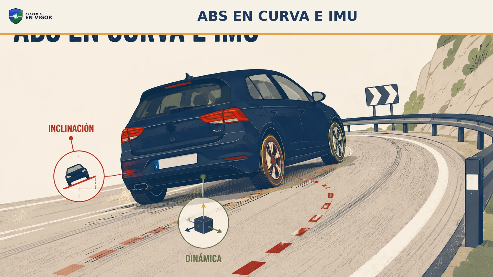

<em>Infografía: ABS en curva e IMU.</em>

:::hablemos-claro
Los sistemas avanzados pueden usar una unidad inercial para adaptar frenado a inclinación y dinámica.
:::

:::en-la-calle
Al valorar una motocicleta y su equipamiento, Los sistemas avanzados pueden usar una unidad inercial para adaptar frenado a inclinación y dinámica.
:::

:::lo-que-cae
Prioriza **inclinación y dinámica** y descarta respuestas que confundan momento, función, sensor, límite, categoría o vigencia.
:::

<!-- FUENTE: DGT-MOTOS-2021-T44 -->

## 56. Control de tracción en motocicleta

### Lógica del bloque

Para dominar **control de tracción en motocicleta**, aplica esta regla: El control de tracción reduce patinamiento excesivo de la rueda motriz durante aceleración. El anclaje principal es **deslizamiento motriz**.

### Hechos examinables

- El control de tracción reduce patinamiento excesivo de la rueda motriz durante aceleración. <!-- FACT:PN-T44-F221 -->
- Puede modular par motor y considerar inclinación en versiones avanzadas. <!-- FACT:PN-T44-F222 -->
- No evita que la rueda delantera pierda adherencia por cualquier causa. <!-- FACT:PN-T44-F223 -->
- El ajuste elegido debe responder a firme, neumático y operación. <!-- FACT:PN-T44-F224 -->

### Ejemplos razonados

- **Aplicación correcta:** Puede modular par motor y considerar inclinación en versiones avanzadas.
- **Contraste útil:** No evita que la rueda delantera pierda adherencia por cualquier causa.

### Trampas de examen

- **Incorrecto:** Control de tracción actúa principalmente sobre el bloqueo al frenar.
- **Incorrecto:** Garantiza agarre de ambas ruedas en cualquier curva.

<!-- VISUAL:t44-56-control-de-traccion-en-motocicleta.webp -->

  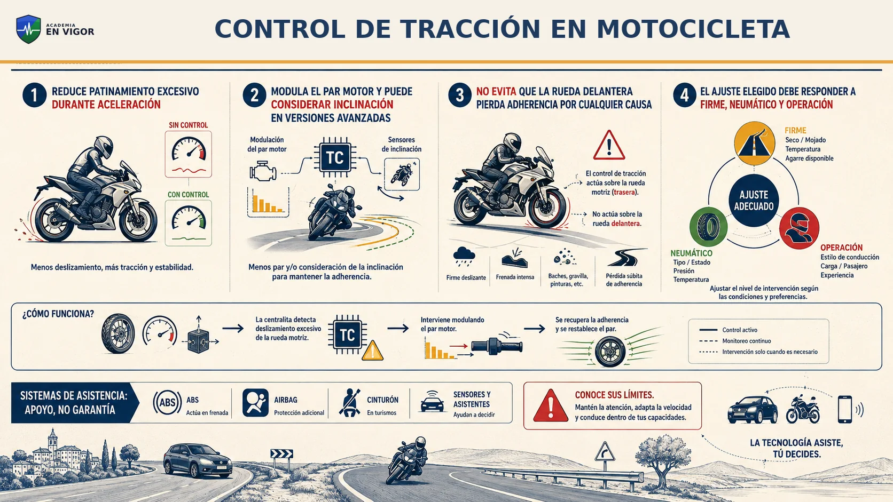

<em>Infografía: Control de tracción en motocicleta.</em>

:::hablemos-claro
El control de tracción reduce patinamiento excesivo de la rueda motriz durante aceleración.
:::

:::en-la-calle
Al valorar una motocicleta y su equipamiento, El control de tracción reduce patinamiento excesivo de la rueda motriz durante aceleración.
:::

:::lo-que-cae
Prioriza **deslizamiento motriz** y descarta respuestas que confundan momento, función, sensor, límite, categoría o vigencia.
:::

<!-- FUENTE: DGT-MOTOS-2021-T44 -->

## 57. Casco homologado y ajuste

### Lógica del bloque

Para dominar **casco homologado y ajuste**, aplica esta regla: El casco homologado es el elemento pasivo esencial del motorista y debe llevarse correctamente abrochado. El anclaje principal es **artículo 118**.

### Hechos examinables

- El casco homologado es el elemento pasivo esencial del motorista y debe llevarse correctamente abrochado. <!-- FACT:PN-T44-F225 -->
- La talla y el ajuste evitan desplazamiento o pérdida durante un impacto. <!-- FACT:PN-T44-F226 -->
- Un casco que ha sufrido un golpe relevante puede requerir sustitución aunque el daño externo parezca pequeño. <!-- FACT:PN-T44-F227 -->
- La pantalla debe mantener visibilidad y protección compatibles con las condiciones. <!-- FACT:PN-T44-F228 -->

### Ejemplos razonados

- **Aplicación correcta:** La talla y el ajuste evitan desplazamiento o pérdida durante un impacto.
- **Contraste útil:** Un casco que ha sufrido un golpe relevante puede requerir sustitución aunque el daño externo parezca pequeño.

### Trampas de examen

- **Incorrecto:** Un casco holgado protege mejor porque deja espacio para moverse.
- **Incorrecto:** Si no hay grietas visibles, cualquier impacto previo resulta irrelevante.

<!-- VISUAL:t44-57-casco-homologado-y-ajuste.webp -->

  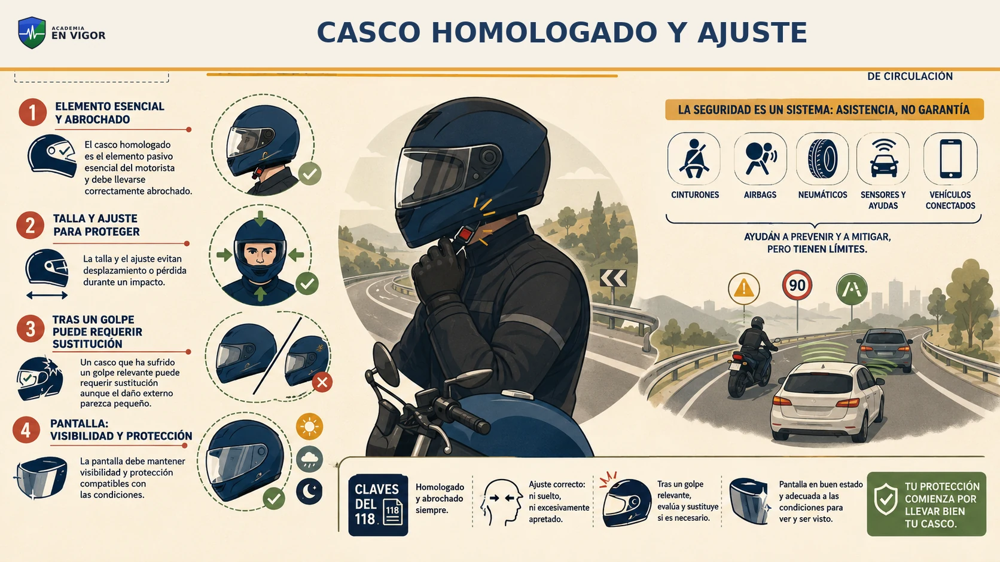

<em>Infografía: Casco homologado y ajuste.</em>

:::hablemos-claro
El casco homologado es el elemento pasivo esencial del motorista y debe llevarse correctamente abrochado.
:::

:::en-la-calle
Al valorar una motocicleta y su equipamiento, El casco homologado es el elemento pasivo esencial del motorista y debe llevarse correctamente abrochado.
:::

:::lo-que-cae
Prioriza **artículo 118** y descarta respuestas que confundan momento, función, sensor, límite, categoría o vigencia.
:::

<!-- FUENTE: BOE-RGC-T44 -->

## 58. Ropa, guantes, botas y protecciones

### Lógica del bloque

Para dominar **ropa, guantes, botas y protecciones**, aplica esta regla: La equipación reduce abrasión, cortes y cargas sobre articulaciones, aunque no evita todo daño. El anclaje principal es **abrasión e impacto**.

### Hechos examinables

- La equipación reduce abrasión, cortes y cargas sobre articulaciones, aunque no evita todo daño. <!-- FACT:PN-T44-F229 -->
- Guantes y botas protegen extremidades que suelen contactar con el suelo. <!-- FACT:PN-T44-F230 -->
- Protecciones de espalda y articulaciones deben ajustarse y permanecer en posición. <!-- FACT:PN-T44-F231 -->
- La visibilidad de la ropa complementa, pero no sustituye, alumbrado y conducción defensiva. <!-- FACT:PN-T44-F232 -->

### Ejemplos razonados

- **Aplicación correcta:** Guantes y botas protegen extremidades que suelen contactar con el suelo.
- **Contraste útil:** Protecciones de espalda y articulaciones deben ajustarse y permanecer en posición.

### Trampas de examen

- **Incorrecto:** La ropa protectora impide cualquier lesión por caída.
- **Incorrecto:** Usar color visible elimina la necesidad de luces.

<!-- VISUAL:t44-58-ropa-guantes-botas-y-protecciones.webp -->

  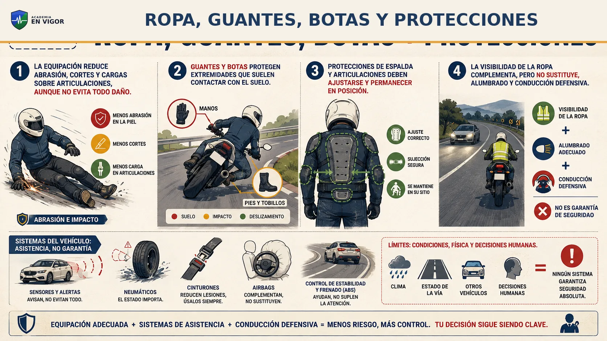

<em>Infografía: Ropa, guantes, botas y protecciones.</em>

:::hablemos-claro
La equipación reduce abrasión, cortes y cargas sobre articulaciones, aunque no evita todo daño.
:::

:::en-la-calle
Al valorar una motocicleta y su equipamiento, La equipación reduce abrasión, cortes y cargas sobre articulaciones, aunque no evita todo daño.
:::

:::lo-que-cae
Prioriza **abrasión e impacto** y descarta respuestas que confundan momento, función, sensor, límite, categoría o vigencia.
:::

<!-- FUENTE: DGT-MOTOS-2021-T44 -->

## 59. Airbag de motorista

### Lógica del bloque

Para dominar **airbag de motorista**, aplica esta regla: El airbag de motorista despliega protección corporal al detectar condiciones previstas por su diseño. El anclaje principal es **protección inflable personal**.

### Hechos examinables

- El airbag de motorista despliega protección corporal al detectar condiciones previstas por su diseño. <!-- FACT:PN-T44-F233 -->
- Puede integrarse en chaqueta o chaleco y requiere ajuste, carga y mantenimiento. <!-- FACT:PN-T44-F234 -->
- Los sistemas con cable y electrónicos tienen lógicas distintas. <!-- FACT:PN-T44-F235 -->
- Es una capa adicional y no sustituye casco ni conducción preventiva. <!-- FACT:PN-T44-F236 -->

### Ejemplos razonados

- **Aplicación correcta:** Puede integrarse en chaqueta o chaleco y requiere ajuste, carga y mantenimiento.
- **Contraste útil:** Los sistemas con cable y electrónicos tienen lógicas distintas.

### Trampas de examen

- **Incorrecto:** El airbag de motorista reemplaza el casco.
- **Incorrecto:** Todos los airbags de moto se activan únicamente mediante cable.

<!-- VISUAL:t44-59-airbag-de-motorista.webp -->

  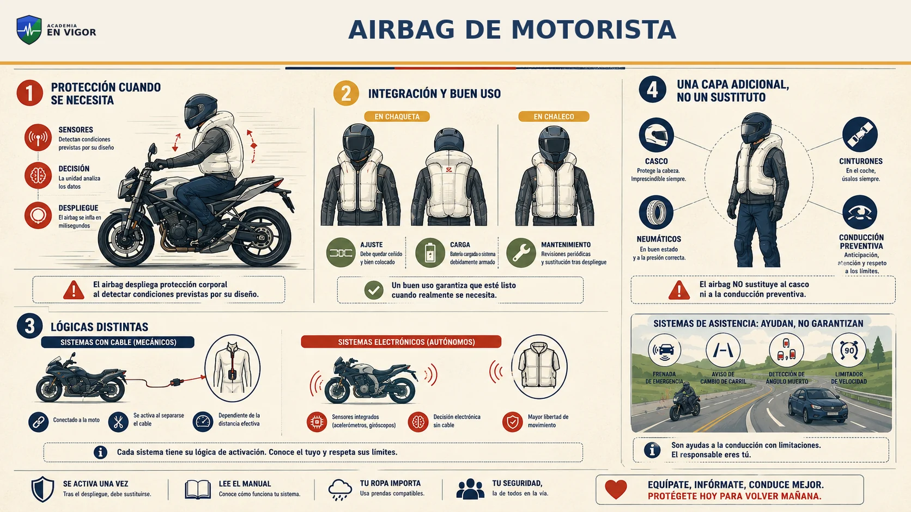

<em>Infografía: Airbag de motorista.</em>

:::hablemos-claro
El airbag de motorista despliega protección corporal al detectar condiciones previstas por su diseño.
:::

:::en-la-calle
Al valorar una motocicleta y su equipamiento, El airbag de motorista despliega protección corporal al detectar condiciones previstas por su diseño.
:::

:::lo-que-cae
Prioriza **protección inflable personal** y descarta respuestas que confundan momento, función, sensor, límite, categoría o vigencia.
:::

<!-- FUENTE: DGT-MOTOS-2021-T44 -->

## 60. Conducción con pasajero y carga

### Lógica del bloque

Para dominar **conducción con pasajero y carga**, aplica esta regla: El pasajero y la carga modifican masa, centro de gravedad, frenada y respuesta de la motocicleta. El anclaje principal es **masa y coordinación**.

### Hechos examinables

- El pasajero y la carga modifican masa, centro de gravedad, frenada y respuesta de la motocicleta. <!-- FACT:PN-T44-F237 -->
- La carga debe fijarse sin interferir con dirección, suspensión, luces o escape. <!-- FACT:PN-T44-F238 -->
- Conductor y pasajero necesitan coordinación en aceleración, frenada y curva. <!-- FACT:PN-T44-F239 -->
- La presión y reglajes se adaptan según indicaciones del fabricante. <!-- FACT:PN-T44-F240 -->

### Ejemplos razonados

- **Aplicación correcta:** La carga debe fijarse sin interferir con dirección, suspensión, luces o escape.
- **Contraste útil:** Conductor y pasajero necesitan coordinación en aceleración, frenada y curva.

### Trampas de examen

- **Incorrecto:** El pasajero no altera la dinámica porque se mueve con el conductor.
- **Incorrecto:** La carga suelta se estabiliza sola por la velocidad.

<!-- VISUAL:t44-il-60-conduccion-con-pasajero-y-carga.webp -->

  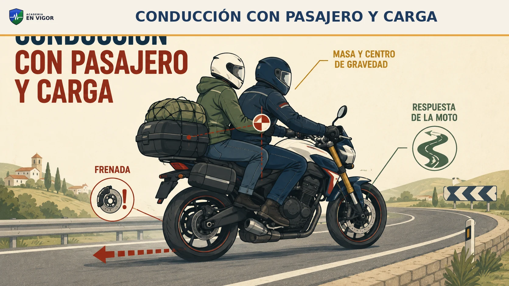

<em>Infografía: Conducción con pasajero y carga.</em>

:::hablemos-claro
El pasajero y la carga modifican masa, centro de gravedad, frenada y respuesta de la motocicleta.
:::

:::en-la-calle
Al valorar una motocicleta y su equipamiento, El pasajero y la carga modifican masa, centro de gravedad, frenada y respuesta de la motocicleta.
:::

:::lo-que-cae
Prioriza **masa y coordinación** y descarta respuestas que confundan momento, función, sensor, límite, categoría o vigencia.
:::

<!-- FUENTE: DGT-MOTOS-2021-T44 -->

## 61. Cadena del siniestro

### Lógica del bloque

Para dominar **cadena del siniestro**, aplica esta regla: La seguridad puede actuar reduciendo exposición, evitando conflicto, mitigando impacto o facilitando asistencia. El anclaje principal es **exposición, conflicto, impacto y lesión**.

### Hechos examinables

- La seguridad puede actuar reduciendo exposición, evitando conflicto, mitigando impacto o facilitando asistencia. <!-- FACT:PN-T44-F241 -->
- Un sistema puede no evitar el choque y aun reducir velocidad de impacto. <!-- FACT:PN-T44-F242 -->
- La lesión depende de energía, dirección, protección, ocupante y respuesta posterior. <!-- FACT:PN-T44-F243 -->
- Analizar solo si hubo colisión oculta beneficios de mitigación. <!-- FACT:PN-T44-F244 -->

### Ejemplos razonados

- **Aplicación correcta:** Un sistema puede no evitar el choque y aun reducir velocidad de impacto.
- **Contraste útil:** La lesión depende de energía, dirección, protección, ocupante y respuesta posterior.

### Trampas de examen

- **Incorrecto:** Si hay choque, todos los sistemas activos han fracasado por completo.
- **Incorrecto:** La gravedad depende únicamente de la velocidad del otro vehículo.

<!-- VISUAL:t44-61-cadena-del-siniestro.webp -->

  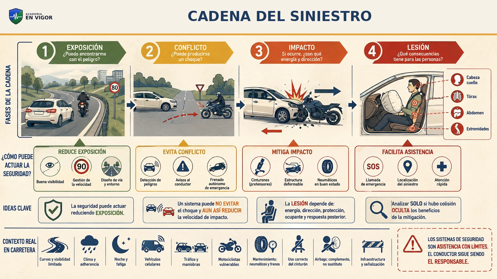

<em>Infografía: Cadena del siniestro.</em>

:::hablemos-claro
La seguridad puede actuar reduciendo exposición, evitando conflicto, mitigando impacto o facilitando asistencia.
:::

:::en-la-calle
Al estudiar la influencia sobre un siniestro, La seguridad puede actuar reduciendo exposición, evitando conflicto, mitigando impacto o facilitando asistencia.
:::

:::lo-que-cae
Prioriza **exposición, conflicto, impacto y lesión** y descarta respuestas que confundan momento, función, sensor, límite, categoría o vigencia.
:::

<!-- FUENTE: DGT-EFECTIVIDAD-2022-T44 -->

## 62. Probabilidad frente a severidad

### Lógica del bloque

Para dominar **probabilidad frente a severidad**, aplica esta regla: La frecuencia de siniestros y la gravedad de lesiones son resultados diferentes. El anclaje principal es **dos resultados distintos**.

### Hechos examinables

- La frecuencia de siniestros y la gravedad de lesiones son resultados diferentes. <!-- FACT:PN-T44-F245 -->
- La seguridad activa actúa principalmente sobre ocurrencia y velocidad previa; la pasiva sobre consecuencias. <!-- FACT:PN-T44-F246 -->
- Un sistema puede mejorar un resultado sin cambiar de forma apreciable el otro. <!-- FACT:PN-T44-F247 -->
- Los estudios deben declarar qué variable y población comparan. <!-- FACT:PN-T44-F248 -->

### Ejemplos razonados

- **Aplicación correcta:** La seguridad activa actúa principalmente sobre ocurrencia y velocidad previa; la pasiva sobre consecuencias.
- **Contraste útil:** Un sistema puede mejorar un resultado sin cambiar de forma apreciable el otro.

### Trampas de examen

- **Incorrecto:** Reducir lesiones demuestra necesariamente que hubo menos accidentes.
- **Incorrecto:** Todo sistema activo solo modifica lesiones después del impacto.

<!-- VISUAL:t44-62-probabilidad-frente-a-severidad.webp -->

  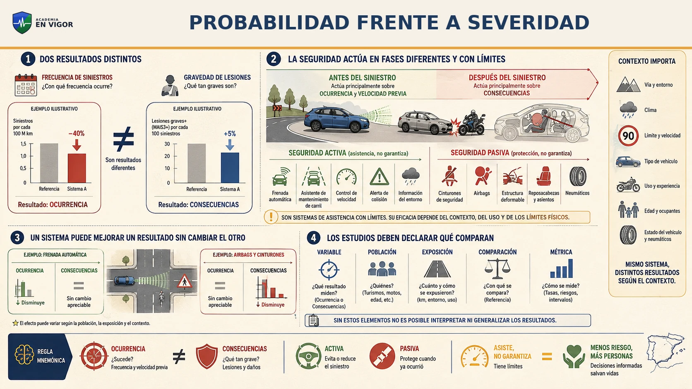

<em>Infografía: Probabilidad frente a severidad.</em>

:::hablemos-claro
La frecuencia de siniestros y la gravedad de lesiones son resultados diferentes.
:::

:::en-la-calle
Al estudiar la influencia sobre un siniestro, La frecuencia de siniestros y la gravedad de lesiones son resultados diferentes.
:::

:::lo-que-cae
Prioriza **dos resultados distintos** y descarta respuestas que confundan momento, función, sensor, límite, categoría o vigencia.
:::

<!-- FUENTE: DGT-EFECTIVIDAD-2022-T44 -->

## 63. Efectividad combinada

### Lógica del bloque

Para dominar **efectividad combinada**, aplica esta regla: La combinación de sistemas puede producir efectos solapados o complementarios. El anclaje principal es **capas no aditivas**.

### Hechos examinables

- La combinación de sistemas puede producir efectos solapados o complementarios. <!-- FACT:PN-T44-F249 -->
- No se suman porcentajes sin conocer independencia y escenario de cálculo. <!-- FACT:PN-T44-F250 -->
- Una capa posterior sigue siendo necesaria porque la anterior no cubre todos los casos. <!-- FACT:PN-T44-F251 -->
- El rendimiento real depende de uso correcto y mantenimiento. <!-- FACT:PN-T44-F252 -->

### Ejemplos razonados

- **Aplicación correcta:** No se suman porcentajes sin conocer independencia y escenario de cálculo.
- **Contraste útil:** Una capa posterior sigue siendo necesaria porque la anterior no cubre todos los casos.

### Trampas de examen

- **Incorrecto:** Dos reducciones del 50 % eliminan automáticamente el 100 % del riesgo.
- **Incorrecto:** Un sistema nuevo hace innecesarios todos los anteriores.

<!-- VISUAL:t44-63-efectividad-combinada.webp -->

  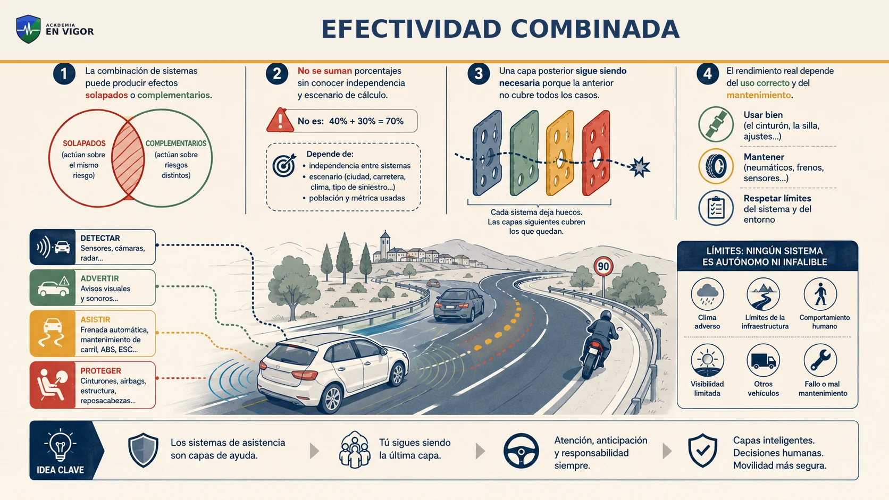

<em>Infografía: Efectividad combinada.</em>

:::hablemos-claro
La combinación de sistemas puede producir efectos solapados o complementarios.
:::

:::en-la-calle
Al estudiar la influencia sobre un siniestro, La combinación de sistemas puede producir efectos solapados o complementarios.
:::

:::lo-que-cae
Prioriza **capas no aditivas** y descarta respuestas que confundan momento, función, sensor, límite, categoría o vigencia.
:::

<!-- FUENTE: DGT-EFECTIVIDAD-2022-T44 -->

## 64. Compensación del riesgo

### Lógica del bloque

Para dominar **compensación del riesgo**, aplica esta regla: La sensación de protección puede inducir a algunas personas a asumir más riesgo. El anclaje principal es **conducta frente a ayuda**.

### Hechos examinables

- La sensación de protección puede inducir a algunas personas a asumir más riesgo. <!-- FACT:PN-T44-F253 -->
- La tecnología debe apoyar una conducta segura y no justificar mayor velocidad o menor atención. <!-- FACT:PN-T44-F254 -->
- La comunicación del sistema debe evitar promesas de invulnerabilidad. <!-- FACT:PN-T44-F255 -->
- La formación reduce mal uso y expectativas falsas. <!-- FACT:PN-T44-F256 -->

### Ejemplos razonados

- **Aplicación correcta:** La tecnología debe apoyar una conducta segura y no justificar mayor velocidad o menor atención.
- **Contraste útil:** La comunicación del sistema debe evitar promesas de invulnerabilidad.

### Trampas de examen

- **Incorrecto:** Con más ayudas siempre disminuye automáticamente todo comportamiento arriesgado.
- **Incorrecto:** La formación no influye porque el sistema decide por el conductor.

<!-- VISUAL:t44-64-compensacion-del-riesgo.webp -->

  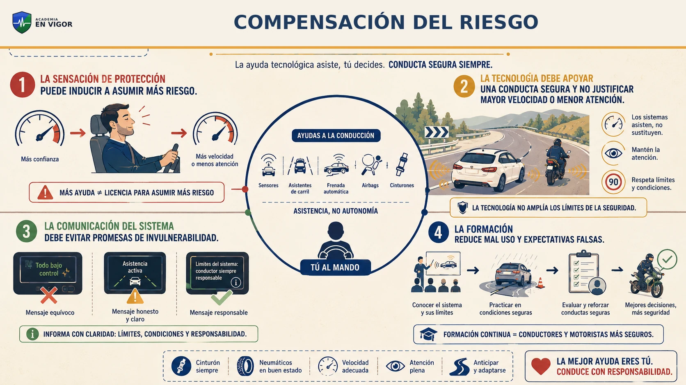

<em>Infografía: Compensación del riesgo.</em>

:::hablemos-claro
La sensación de protección puede inducir a algunas personas a asumir más riesgo.
:::

:::en-la-calle
Al estudiar la influencia sobre un siniestro, La sensación de protección puede inducir a algunas personas a asumir más riesgo.
:::

:::lo-que-cae
Prioriza **conducta frente a ayuda** y descarta respuestas que confundan momento, función, sensor, límite, categoría o vigencia.
:::

<!-- FUENTE: DGT-EFECTIVIDAD-2022-T44 -->

## 65. Uso real y tasa de activación

### Lógica del bloque

Para dominar **uso real y tasa de activación**, aplica esta regla: Un sistema solo aporta su beneficio potencial cuando está disponible, operativo y correctamente utilizado. El anclaje principal es **disponibilidad y aceptación**.

### Hechos examinables

- Un sistema solo aporta su beneficio potencial cuando está disponible, operativo y correctamente utilizado. <!-- FACT:PN-T44-F257 -->
- Desactivación, fallo, mala calibración o desconocimiento reducen efectividad real. <!-- FACT:PN-T44-F258 -->
- Las alertas excesivas pueden provocar habituación o rechazo. <!-- FACT:PN-T44-F259 -->
- La interfaz debe facilitar comprensión sin distraer. <!-- FACT:PN-T44-F260 -->

### Ejemplos razonados

- **Aplicación correcta:** Desactivación, fallo, mala calibración o desconocimiento reducen efectividad real.
- **Contraste útil:** Las alertas excesivas pueden provocar habituación o rechazo.

### Trampas de examen

- **Incorrecto:** La presencia en la ficha técnica demuestra uso efectivo en todo viaje.
- **Incorrecto:** Cuantas más alarmas simultáneas, mejor comprensión del conductor.

<!-- VISUAL:t44-il-65-uso-real-y-tasa-de-activacion.webp -->

  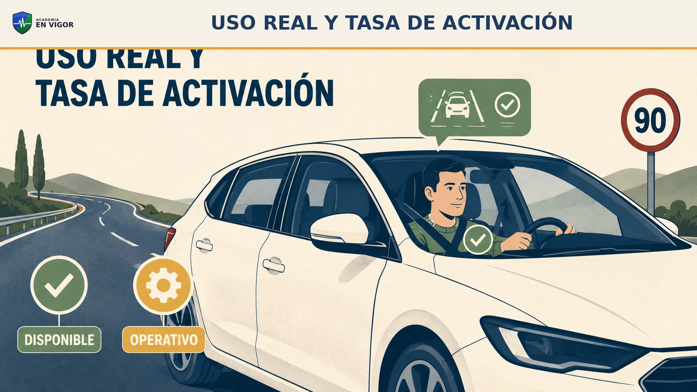

<em>Infografía: Uso real y tasa de activación.</em>

:::hablemos-claro
Un sistema solo aporta su beneficio potencial cuando está disponible, operativo y correctamente utilizado.
:::

:::en-la-calle
Al estudiar la influencia sobre un siniestro, Un sistema solo aporta su beneficio potencial cuando está disponible, operativo y correctamente utilizado.
:::

:::lo-que-cae
Prioriza **disponibilidad y aceptación** y descarta respuestas que confundan momento, función, sensor, límite, categoría o vigencia.
:::

<!-- FUENTE: DGT-EFECTIVIDAD-2022-T44 -->

## 66. Siniestros evitables y no cubiertos

### Lógica del bloque

Para dominar **siniestros evitables y no cubiertos**, aplica esta regla: Cada sistema tiene un dominio de diseño con tipos de peligro, velocidades y condiciones cubiertas. El anclaje principal es **dominio de diseño**.

### Hechos examinables

- Cada sistema tiene un dominio de diseño con tipos de peligro, velocidades y condiciones cubiertas. <!-- FACT:PN-T44-F261 -->
- Un resultado fuera de ese dominio no demuestra por sí solo avería. <!-- FACT:PN-T44-F262 -->
- La evaluación debe distinguir ausencia de detección, detección tardía, intervención insuficiente y conducta posterior. <!-- FACT:PN-T44-F263 -->
- No existe un único sistema capaz de resolver todos los modos de siniestro. <!-- FACT:PN-T44-F264 -->

### Ejemplos razonados

- **Aplicación correcta:** Un resultado fuera de ese dominio no demuestra por sí solo avería.
- **Contraste útil:** La evaluación debe distinguir ausencia de detección, detección tardía, intervención insuficiente y conducta posterior.

### Trampas de examen

- **Incorrecto:** AEB debe evitar cualquier accidente lateral, posterior o vuelco.
- **Incorrecto:** Si el sistema no actúa fuera de su diseño, está necesariamente defectuoso.

<!-- VISUAL:t44-66-siniestros-evitables-y-no-cubiertos.webp -->

  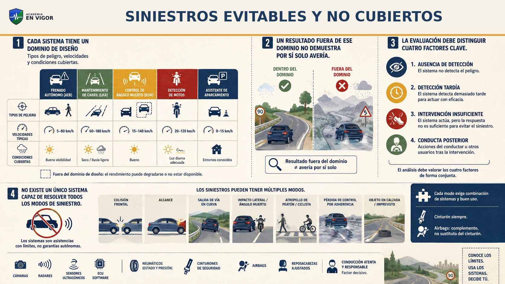

<em>Infografía: Siniestros evitables y no cubiertos.</em>

:::hablemos-claro
Cada sistema tiene un dominio de diseño con tipos de peligro, velocidades y condiciones cubiertas.
:::

:::en-la-calle
Al estudiar la influencia sobre un siniestro, Cada sistema tiene un dominio de diseño con tipos de peligro, velocidades y condiciones cubiertas.
:::

:::lo-que-cae
Prioriza **dominio de diseño** y descarta respuestas que confundan momento, función, sensor, límite, categoría o vigencia.
:::

<!-- FUENTE: DGT-EFECTIVIDAD-2022-T44 -->

## 67. Compatibilidad entre ocupante y retención

### Lógica del bloque

Para dominar **compatibilidad entre ocupante y retención**, aplica esta regla: La protección varía con talla, edad, posición y compatibilidad del sistema de retención. El anclaje principal es **posición y características**.

### Hechos examinables

- La protección varía con talla, edad, posición y compatibilidad del sistema de retención. <!-- FACT:PN-T44-F265 -->
- El uso incorrecto puede desplazar cargas hacia zonas vulnerables. <!-- FACT:PN-T44-F266 -->
- Los sistemas infantiles responden a necesidades distintas de las del adulto. <!-- FACT:PN-T44-F267 -->
- La evaluación no debe usar al ocupante medio como única referencia. <!-- FACT:PN-T44-F268 -->

### Ejemplos razonados

- **Aplicación correcta:** El uso incorrecto puede desplazar cargas hacia zonas vulnerables.
- **Contraste útil:** Los sistemas infantiles responden a necesidades distintas de las del adulto.

### Trampas de examen

- **Incorrecto:** Un cinturón adulto protege igual a cualquier menor sin adaptación.
- **Incorrecto:** La postura del ocupante no afecta al resultado de un airbag.

<!-- VISUAL:t44-67-compatibilidad-entre-ocupante-y-retencion.webp -->

  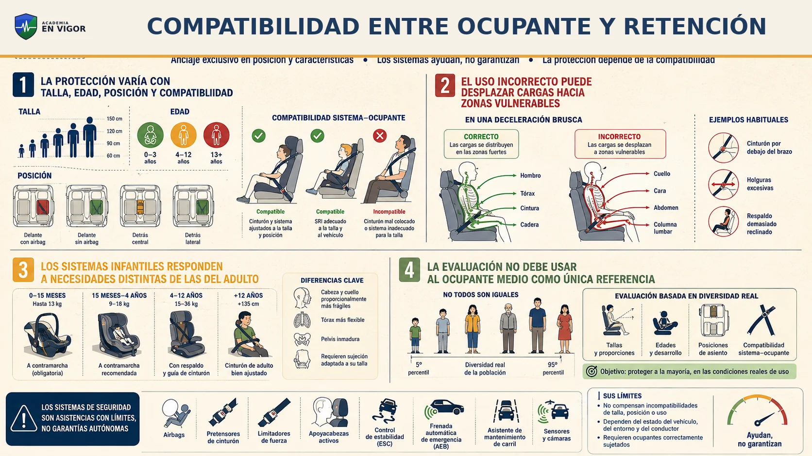

<em>Infografía: Compatibilidad entre ocupante y retención.</em>

:::hablemos-claro
La protección varía con talla, edad, posición y compatibilidad del sistema de retención.
:::

:::en-la-calle
Al estudiar la influencia sobre un siniestro, La protección varía con talla, edad, posición y compatibilidad del sistema de retención.
:::

:::lo-que-cae
Prioriza **posición y características** y descarta respuestas que confundan momento, función, sensor, límite, categoría o vigencia.
:::

<!-- FUENTE: DGT-EFECTIVIDAD-2022-T44 -->

## 68. Mantenimiento y siniestralidad

### Lógica del bloque

Para dominar **mantenimiento y siniestralidad**, aplica esta regla: Neumáticos, frenos, alumbrado y suspensión degradados reducen márgenes antes del siniestro. El anclaje principal es **defecto como factor**.

### Hechos examinables

- Neumáticos, frenos, alumbrado y suspensión degradados reducen márgenes antes del siniestro. <!-- FACT:PN-T44-F269 -->
- Los defectos pueden interactuar con lluvia, carga o maniobra y agravar el resultado. <!-- FACT:PN-T44-F270 -->
- La revisión preventiva busca detectar degradación antes de una demanda crítica. <!-- FACT:PN-T44-F271 -->
- El testigo o la inspección son señales para actuar, no simples molestias administrativas. <!-- FACT:PN-T44-F272 -->

### Ejemplos razonados

- **Aplicación correcta:** Los defectos pueden interactuar con lluvia, carga o maniobra y agravar el resultado.
- **Contraste útil:** La revisión preventiva busca detectar degradación antes de una demanda crítica.

### Trampas de examen

- **Incorrecto:** Un defecto técnico solo importa después de un accidente.
- **Incorrecto:** Apagar un testigo elimina el riesgo mecánico asociado.

<!-- VISUAL:t44-68-mantenimiento-y-siniestralidad.webp -->

  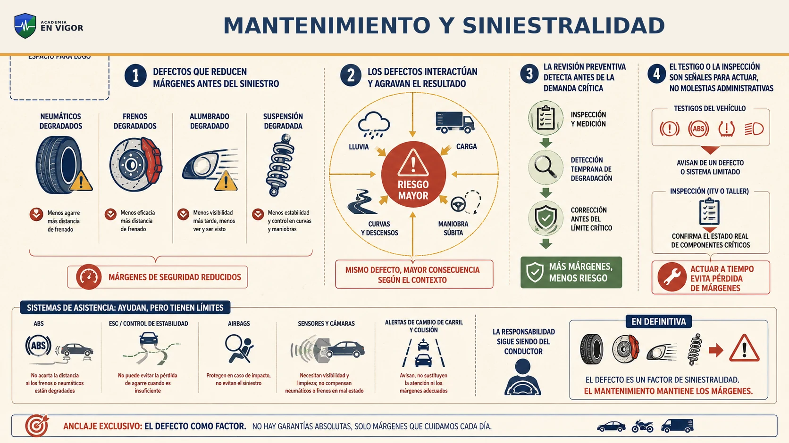

<em>Infografía: Mantenimiento y siniestralidad.</em>

:::hablemos-claro
Neumáticos, frenos, alumbrado y suspensión degradados reducen márgenes antes del siniestro.
:::

:::en-la-calle
Al estudiar la influencia sobre un siniestro, Neumáticos, frenos, alumbrado y suspensión degradados reducen márgenes antes del siniestro.
:::

:::lo-que-cae
Prioriza **defecto como factor** y descarta respuestas que confundan momento, función, sensor, límite, categoría o vigencia.
:::

<!-- FUENTE: BOE-RGV-T44 -->

## 69. Datos, EDR y atribución

### Lógica del bloque

Para dominar **datos, edr y atribución**, aplica esta regla: Los datos de un registrador ayudan a reconstruir parámetros, pero requieren interpretación contextual. El anclaje principal es **registro no causalidad automática**.

### Hechos examinables

- Los datos de un registrador ayudan a reconstruir parámetros, pero requieren interpretación contextual. <!-- FACT:PN-T44-F273 -->
- Una correlación temporal no demuestra por sí sola causa jurídica del siniestro. <!-- FACT:PN-T44-F274 -->
- La ausencia de un dato puede deberse al diseño o a límites de registro. <!-- FACT:PN-T44-F275 -->
- La investigación integra huellas físicas, testimonios, vehículo, vía y datos. <!-- FACT:PN-T44-F276 -->

### Ejemplos razonados

- **Aplicación correcta:** Una correlación temporal no demuestra por sí sola causa jurídica del siniestro.
- **Contraste útil:** La ausencia de un dato puede deberse al diseño o a límites de registro.

### Trampas de examen

- **Incorrecto:** El EDR identifica automáticamente al responsable legal.
- **Incorrecto:** Un único parámetro registrado explica por sí solo todo el accidente.

<!-- VISUAL:t44-69-datos-edr-y-atribucion.webp -->

  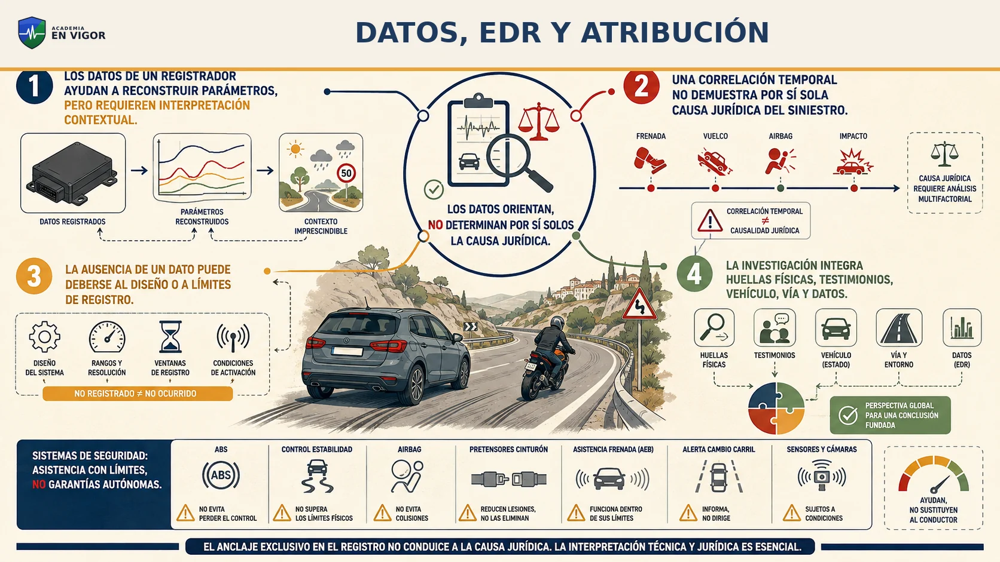

<em>Infografía: Datos, EDR y atribución.</em>

:::hablemos-claro
Los datos de un registrador ayudan a reconstruir parámetros, pero requieren interpretación contextual.
:::

:::en-la-calle
Al estudiar la influencia sobre un siniestro, Los datos de un registrador ayudan a reconstruir parámetros, pero requieren interpretación contextual.
:::

:::lo-que-cae
Prioriza **registro no causalidad automática** y descarta respuestas que confundan momento, función, sensor, límite, categoría o vigencia.
:::

<!-- FUENTE: EU-GSR-2019-2144-T44 -->

## 70. Jerarquía preventiva

### Lógica del bloque

Para dominar **jerarquía preventiva**, aplica esta regla: La prevención eficaz combina comportamiento, vehículo seguro, vía y respuesta de emergencia. El anclaje principal es **persona, vehículo y entorno**.

### Hechos examinables

- La prevención eficaz combina comportamiento, vehículo seguro, vía y respuesta de emergencia. <!-- FACT:PN-T44-F277 -->
- La tecnología del vehículo no corrige todos los fallos humanos o ambientales. <!-- FACT:PN-T44-F278 -->
- La infraestructura puede facilitar o dificultar el funcionamiento de percepción y guiado. <!-- FACT:PN-T44-F279 -->
- El enfoque de sistema evita atribuir toda la seguridad a un solo actor. <!-- FACT:PN-T44-F280 -->

### Ejemplos razonados

- **Aplicación correcta:** La tecnología del vehículo no corrige todos los fallos humanos o ambientales.
- **Contraste útil:** La infraestructura puede facilitar o dificultar el funcionamiento de percepción y guiado.

### Trampas de examen

- **Incorrecto:** Comprar un vehículo con ADAS elimina la influencia de la vía.
- **Incorrecto:** La siniestralidad depende exclusivamente del conductor.

<!-- VISUAL:t44-il-70-jerarquia-preventiva.webp -->

  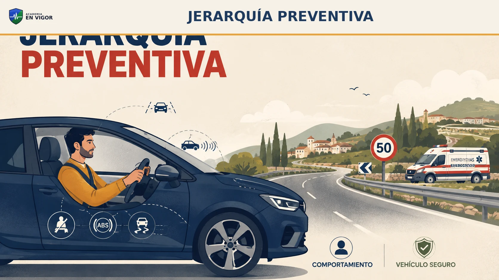

<em>Infografía: Jerarquía preventiva.</em>

:::hablemos-claro
La prevención eficaz combina comportamiento, vehículo seguro, vía y respuesta de emergencia.
:::

:::en-la-calle
Al estudiar la influencia sobre un siniestro, La prevención eficaz combina comportamiento, vehículo seguro, vía y respuesta de emergencia.
:::

:::lo-que-cae
Prioriza **persona, vehículo y entorno** y descarta respuestas que confundan momento, función, sensor, límite, categoría o vigencia.
:::

<!-- FUENTE: DGT-EFECTIVIDAD-2022-T44 -->

## 71. Conducción policial convencional y urgente

### Lógica del bloque

Para dominar **conducción policial convencional y urgente**, aplica esta regla: El patrullaje ordinario se rige por normas comunes; el servicio urgente añade facultades y riesgos específicos. El anclaje principal es **régimen ordinario y especial**.

### Hechos examinables

- El patrullaje ordinario se rige por normas comunes; el servicio urgente añade facultades y riesgos específicos. <!-- FACT:PN-T44-F281 -->
- La decisión de activar el régimen especial debe responder a necesidad real y uso ponderado. <!-- FACT:PN-T44-F282 -->
- La conducción segura busca llegar con capacidad operativa, no solo reducir tiempo. <!-- FACT:PN-T44-F283 -->
- La tripulación debe ajustar velocidad, ruta y señales a tráfico, vía y misión. <!-- FACT:PN-T44-F284 -->

### Ejemplos razonados

- **Aplicación correcta:** La decisión de activar el régimen especial debe responder a necesidad real y uso ponderado.
- **Contraste útil:** La conducción segura busca llegar con capacidad operativa, no solo reducir tiempo.

### Trampas de examen

- **Incorrecto:** Todo desplazamiento policial es servicio urgente.
- **Incorrecto:** Llegar antes justifica cualquier incremento de riesgo.

<!-- VISUAL:t44-71-conduccion-policial-convencional-y-urgente.webp -->

  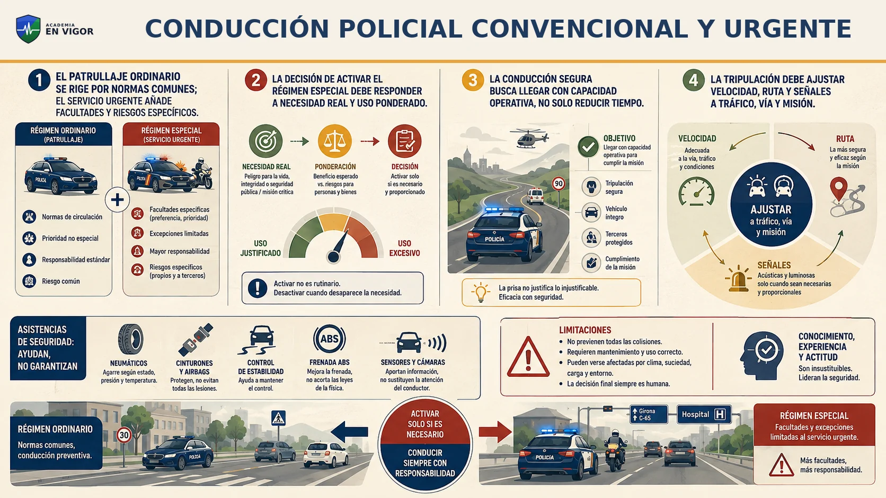

<em>Infografía: Conducción policial convencional y urgente.</em>

:::hablemos-claro
El patrullaje ordinario se rige por normas comunes; el servicio urgente añade facultades y riesgos específicos.
:::

:::en-la-calle
Al planificar conducción policial o un traslado, El patrullaje ordinario se rige por normas comunes; el servicio urgente añade facultades y riesgos específicos.
:::

:::lo-que-cae
Prioriza **régimen ordinario y especial** y descarta respuestas que confundan momento, función, sensor, límite, categoría o vigencia.
:::

<!-- FUENTE: BOE-RGC-T44 -->

## 72. Cinturón en servicios de urgencia

### Lógica del bloque

Para dominar **cinturón en servicios de urgencia**, aplica esta regla: La regla general obliga a conductor y ocupantes a usar cinturones homologados en vías urbanas e interurbanas. El anclaje principal es **artículos 117 y 119 vigentes**.

### Hechos examinables

- La regla general obliga a conductor y ocupantes a usar cinturones homologados en vías urbanas e interurbanas. <!-- FACT:PN-T44-F285 -->
- El artículo 119 mantiene para vehículos en servicios de urgencia una exención cuando circulan en poblado. <!-- FACT:PN-T44-F286 -->
- La exención no alcanza autopistas, autovías ni carreteras convencionales. <!-- FACT:PN-T44-F287 -->
- Una exención jurídica no convierte en segura la falta de cinturón ni obliga a prescindir de él. <!-- FACT:PN-T44-F288 -->

### Ejemplos razonados

- **Aplicación correcta:** El artículo 119 mantiene para vehículos en servicios de urgencia una exención cuando circulan en poblado.
- **Contraste útil:** La exención no alcanza autopistas, autovías ni carreteras convencionales.

### Trampas de examen

- **Incorrecto:** Desde enero de 2026 desaparecieron todas las exenciones urbanas del artículo 119.
- **Incorrecto:** Los servicios de urgencia están exentos en cualquier tipo de vía.

<!-- VISUAL:t44-72-cinturon-en-servicios-de-urgencia.webp -->

  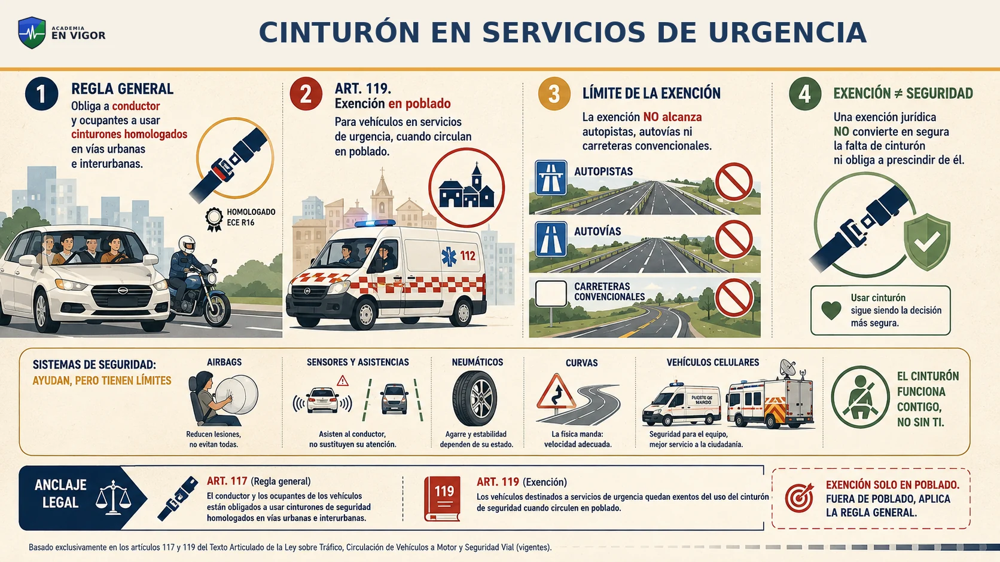

<em>Infografía: Cinturón en servicios de urgencia.</em>

:::hablemos-claro
La regla general obliga a conductor y ocupantes a usar cinturones homologados en vías urbanas e interurbanas.
:::

:::en-la-calle
Al planificar conducción policial o un traslado, La regla general obliga a conductor y ocupantes a usar cinturones homologados en vías urbanas e interurbanas.
:::

:::lo-que-cae
Prioriza **artículos 117 y 119 vigentes** y descarta respuestas que confundan momento, función, sensor, límite, categoría o vigencia.
:::

<!-- FUENTE: BOE-RGC-T44 -->

## 73. Distribución de tareas en el vehículo policial

### Lógica del bloque

Para dominar **distribución de tareas en el vehículo policial**, aplica esta regla: El conductor debe priorizar control del vehículo y percepción del entorno. El anclaje principal es **conductor y acompañante**.

### Hechos examinables

- El conductor debe priorizar control del vehículo y percepción del entorno. <!-- FACT:PN-T44-F289 -->
- El acompañante puede gestionar comunicaciones, navegación y observación táctica cuando la dotación lo permite. <!-- FACT:PN-T44-F290 -->
- Las órdenes deben ser breves y evitar mensajes simultáneos contradictorios. <!-- FACT:PN-T44-F291 -->
- La coordinación reduce carga mental y errores en intersecciones o maniobras. <!-- FACT:PN-T44-F292 -->

### Ejemplos razonados

- **Aplicación correcta:** El acompañante puede gestionar comunicaciones, navegación y observación táctica cuando la dotación lo permite.
- **Contraste útil:** Las órdenes deben ser breves y evitar mensajes simultáneos contradictorios.

### Trampas de examen

- **Incorrecto:** El conductor debe asumir todas las comunicaciones para centralizar decisiones.
- **Incorrecto:** Hablar simultáneamente mejora la velocidad de respuesta.

<!-- VISUAL:t44-73-distribucion-de-tareas-en-el-vehiculo-policial.webp -->

  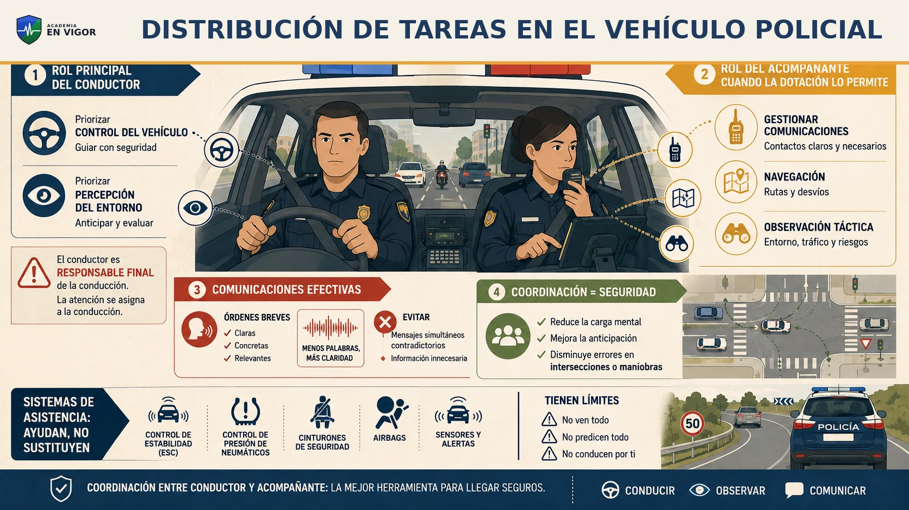

<em>Infografía: Distribución de tareas en el vehículo policial.</em>

:::hablemos-claro
El conductor debe priorizar control del vehículo y percepción del entorno.
:::

:::en-la-calle
Al planificar conducción policial o un traslado, El conductor debe priorizar control del vehículo y percepción del entorno.
:::

:::lo-que-cae
Prioriza **conductor y acompañante** y descarta respuestas que confundan momento, función, sensor, límite, categoría o vigencia.
:::

<!-- FUENTE: DGT-EFECTIVIDAD-2022-T44 -->

## 74. Traslado digno y seguro

### Lógica del bloque

Para dominar **traslado digno y seguro**, aplica esta regla: Los desplazamientos de detenidos, presos y penados deben respetar dignidad y derechos y garantizar seguridad. El anclaje principal es **artículo 36**.

### Hechos examinables

- Los desplazamientos de detenidos, presos y penados deben respetar dignidad y derechos y garantizar seguridad. <!-- FACT:PN-T44-F293 -->
- Se utiliza el medio de transporte más idóneo, generalmente por carretera y bajo custodia de la fuerza pública. <!-- FACT:PN-T44-F294 -->
- La seguridad comprende a la persona trasladada, la escolta y terceros. <!-- FACT:PN-T44-F295 -->
- Peligrosidad, salud, duración y circunstancias influyen en la planificación. <!-- FACT:PN-T44-F296 -->

### Ejemplos razonados

- **Aplicación correcta:** Se utiliza el medio de transporte más idóneo, generalmente por carretera y bajo custodia de la fuerza pública.
- **Contraste útil:** La seguridad comprende a la persona trasladada, la escolta y terceros.

### Trampas de examen

- **Incorrecto:** La seguridad permite ignorar la dignidad de la persona trasladada.
- **Incorrecto:** Siempre debe elegirse carretera aunque exista un medio más idóneo.

<!-- VISUAL:t44-74-traslado-digno-y-seguro.webp -->

  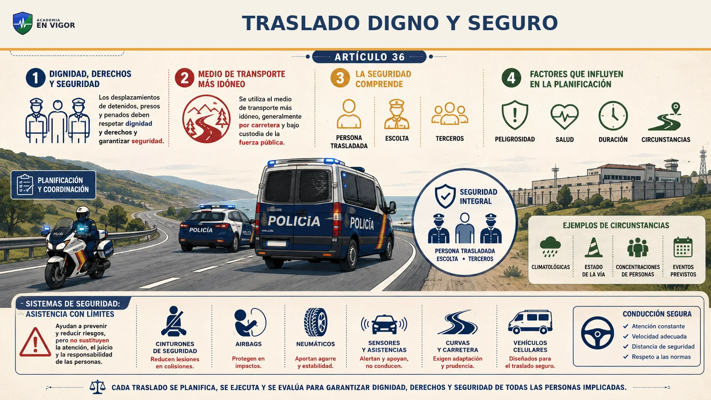

<em>Infografía: Traslado digno y seguro.</em>

:::hablemos-claro
Los desplazamientos de detenidos, presos y penados deben respetar dignidad y derechos y garantizar seguridad.
:::

:::en-la-calle
Al planificar conducción policial o un traslado, Los desplazamientos de detenidos, presos y penados deben respetar dignidad y derechos y garantizar seguridad.
:::

:::lo-que-cae
Prioriza **artículo 36** y descarta respuestas que confundan momento, función, sensor, límite, categoría o vigencia.
:::

<!-- FUENTE: BOE-RP-190-1996-T44 -->

## 75. Ámbito temporal de la Orden INT/2573/2015

### Lógica del bloque

Para dominar **ámbito temporal de la orden int/2573/2015**, aplica esta regla: La Orden fija condiciones mínimas para vehículos de las FCSE adquiridos desde su entrada en vigor. El anclaje principal es **artículos 1 y 2 y transitoria**.

### Hechos examinables

- La Orden fija condiciones mínimas para vehículos de las FCSE adquiridos desde su entrada en vigor. <!-- FACT:PN-T44-F297 -->
- Los vehículos existentes pudieron seguir en uso hasta su baja definitiva. <!-- FACT:PN-T44-F298 -->
- La adaptación o sustitución se condiciona a posibilidad técnica y disponibilidades previstas. <!-- FACT:PN-T44-F299 -->
- El anexo aplicable depende de que el número de plazas exceda o no de nueve, incluido conductor y escolta. <!-- FACT:PN-T44-F300 -->

### Ejemplos razonados

- **Aplicación correcta:** Los vehículos existentes pudieron seguir en uso hasta su baja definitiva.
- **Contraste útil:** La adaptación o sustitución se condiciona a posibilidad técnica y disponibilidades previstas.

### Trampas de examen

- **Incorrecto:** La Orden obligó a retirar inmediatamente todos los vehículos existentes.
- **Incorrecto:** El umbral de nueve plazas excluye siempre al conductor y la escolta.

<!-- VISUAL:t44-il-75-ambito-temporal-de-la-orden-int-2573-2015.webp -->

  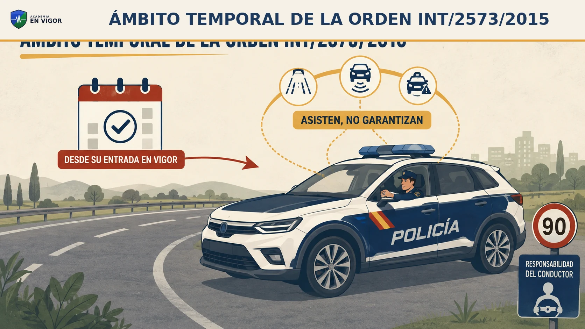

<em>Infografía: Ámbito temporal de la Orden INT/2573/2015.</em>

:::hablemos-claro
La Orden fija condiciones mínimas para vehículos de las FCSE adquiridos desde su entrada en vigor.
:::

:::en-la-calle
Al planificar conducción policial o un traslado, La Orden fija condiciones mínimas para vehículos de las FCSE adquiridos desde su entrada en vigor.
:::

:::lo-que-cae
Prioriza **artículos 1 y 2 y transitoria** y descarta respuestas que confundan momento, función, sensor, límite, categoría o vigencia.
:::

<!-- FUENTE: BOE-INT-2573-2015-T44 -->

## 76. Vehículos de hasta nueve plazas

### Lógica del bloque

Para dominar **vehículos de hasta nueve plazas**, aplica esta regla: El anexo I regula vehículos celulares de hasta nueve plazas, incluido conductor y escolta, y los encuadra en M1. El anclaje principal es **anexo I · categoría M1**.

### Hechos examinables

- El anexo I regula vehículos celulares de hasta nueve plazas, incluido conductor y escolta, y los encuadra en M1. <!-- FACT:PN-T44-F301 -->
- Distingue compartimento de conducción y vigilancia del compartimento de personas trasladadas. <!-- FACT:PN-T44-F302 -->
- Prevé puertas de servicio y salida de socorro, con ambos sistemas cuando la configuración lo permita. <!-- FACT:PN-T44-F303 -->
- El maletero es un espacio separado para equipaje cuando existe. <!-- FACT:PN-T44-F304 -->

### Ejemplos razonados

- **Aplicación correcta:** Distingue compartimento de conducción y vigilancia del compartimento de personas trasladadas.
- **Contraste útil:** Prevé puertas de servicio y salida de socorro, con ambos sistemas cuando la configuración lo permita.

### Trampas de examen

- **Incorrecto:** Los vehículos del anexo I pertenecen a M2 o M3.
- **Incorrecto:** El compartimento de detenidos se integra sin separación en el puesto de conducción.

<!-- VISUAL:t44-76-vehiculos-de-hasta-nueve-plazas.webp -->

  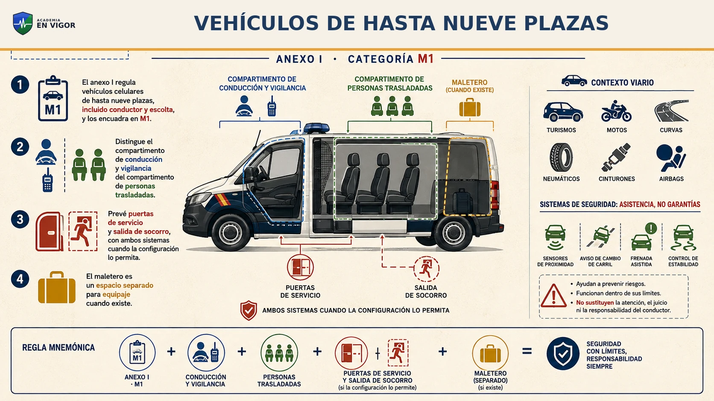

<em>Infografía: Vehículos de hasta nueve plazas.</em>

:::hablemos-claro
El anexo I regula vehículos celulares de hasta nueve plazas, incluido conductor y escolta, y los encuadra en M1.
:::

:::en-la-calle
Al planificar conducción policial o un traslado, El anexo I regula vehículos celulares de hasta nueve plazas, incluido conductor y escolta, y los encuadra en M1.
:::

:::lo-que-cae
Prioriza **anexo I · categoría M1** y descarta respuestas que confundan momento, función, sensor, límite, categoría o vigencia.
:::

<!-- FUENTE: BOE-INT-2573-2015-T44 -->

## 77. Habitabilidad y alumbrado

### Lógica del bloque

Para dominar **habitabilidad y alumbrado**, aplica esta regla: Los habitáculos deben mantenerse aproximadamente entre 18 y 28 grados mediante climatización. El anclaje principal es **anexos I y II · 18-28 °C y 7 l/s/persona**.

### Hechos examinables

- Los habitáculos deben mantenerse aproximadamente entre 18 y 28 grados mediante climatización. <!-- FACT:PN-T44-F305 -->
- La renovación mínima de aire es de siete litros por segundo y por persona. <!-- FACT:PN-T44-F306 -->
- El alumbrado debe ser suficiente sin deslumbrar ni molestar indebidamente a otros usuarios. <!-- FACT:PN-T44-F307 -->
- La luz del compartimento de detenidos debe estar protegida y permitir observación. <!-- FACT:PN-T44-F308 -->

### Ejemplos razonados

- **Aplicación correcta:** La renovación mínima de aire es de siete litros por segundo y por persona.
- **Contraste útil:** El alumbrado debe ser suficiente sin deslumbrar ni molestar indebidamente a otros usuarios.

### Trampas de examen

- **Incorrecto:** La Orden fija exactamente 22 grados sin margen.
- **Incorrecto:** La ventilación se expresa como siete litros por minuto para todo el vehículo.

<!-- VISUAL:t44-77-habitabilidad-y-alumbrado.webp -->

  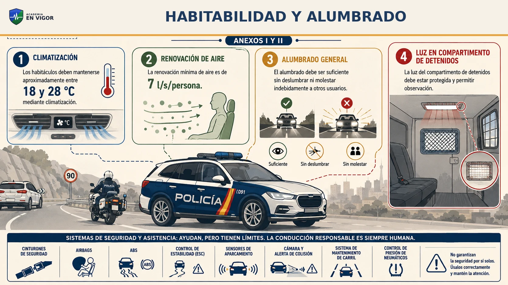

<em>Infografía: Habitabilidad y alumbrado.</em>

:::hablemos-claro
Los habitáculos deben mantenerse aproximadamente entre 18 y 28 grados mediante climatización.
:::

:::en-la-calle
Al planificar conducción policial o un traslado, Los habitáculos deben mantenerse aproximadamente entre 18 y 28 grados mediante climatización.
:::

:::lo-que-cae
Prioriza **anexos I y II · 18-28 °C y 7 l/s/persona** y descarta respuestas que confundan momento, función, sensor, límite, categoría o vigencia.
:::

<!-- FUENTE: BOE-INT-2573-2015-T44 -->

## 78. Compartimento, asientos y retención

### Lógica del bloque

Para dominar **compartimento, asientos y retención**, aplica esta regla: El compartimento se separa mediante estructura antivandálica transparente u opaca con ventana no practicable. El anclaje principal es **anexo I · apartado 3.3**.

### Hechos examinables

- El compartimento se separa mediante estructura antivandálica transparente u opaca con ventana no practicable. <!-- FACT:PN-T44-F309 -->
- Los asientos tienen estructura metálica, material rígido lavable y reposacabezas integrado. <!-- FACT:PN-T44-F310 -->
- Los asientos se colocan en dirección de la marcha. <!-- FACT:PN-T44-F311 -->
- El sistema de retención homologado se abre desde el puesto de vigilancia. <!-- FACT:PN-T44-F312 -->

### Ejemplos razonados

- **Aplicación correcta:** Los asientos tienen estructura metálica, material rígido lavable y reposacabezas integrado.
- **Contraste útil:** Los asientos se colocan en dirección de la marcha.

### Trampas de examen

- **Incorrecto:** Los asientos se orientan obligatoriamente en sentido contrario a la marcha.
- **Incorrecto:** La persona trasladada controla libremente la apertura del sistema de retención.

<!-- VISUAL:t44-78-compartimento-asientos-y-retencion.webp -->

  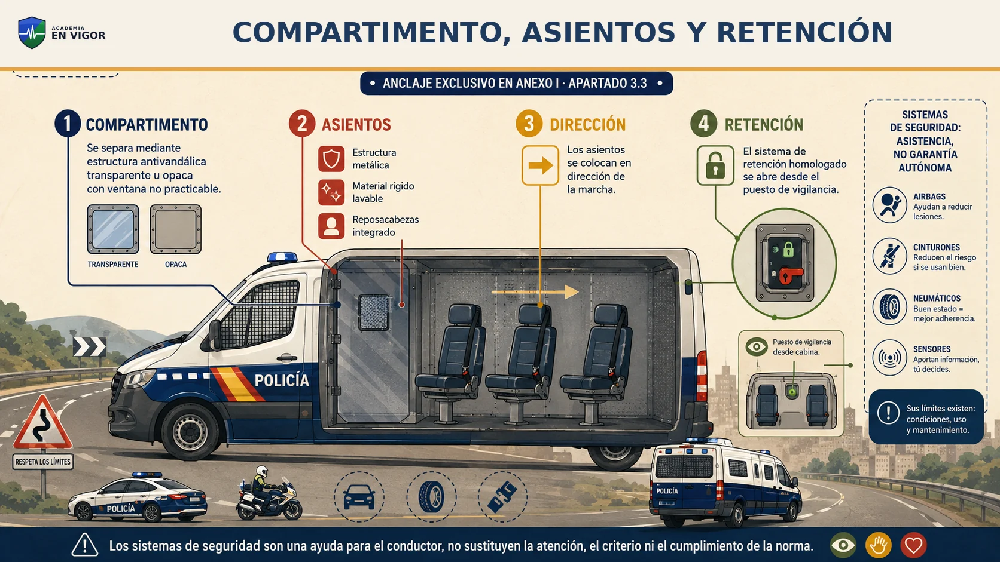

<em>Infografía: Compartimento, asientos y retención.</em>

:::hablemos-claro
El compartimento se separa mediante estructura antivandálica transparente u opaca con ventana no practicable.
:::

:::en-la-calle
Al planificar conducción policial o un traslado, El compartimento se separa mediante estructura antivandálica transparente u opaca con ventana no practicable.
:::

:::lo-que-cae
Prioriza **anexo I · apartado 3.3** y descarta respuestas que confundan momento, función, sensor, límite, categoría o vigencia.
:::

<!-- FUENTE: BOE-INT-2573-2015-T44 -->

## 79. Vigilancia, salidas y extintor

### Lógica del bloque

Para dominar **vigilancia, salidas y extintor**, aplica esta regla: La vigilancia electrónica permite observar el habitáculo mediante cámaras y pantallas y graba las imágenes. El anclaje principal es **anexo I · apartados 3.4, 4 y 5**.

### Hechos examinables

- La vigilancia electrónica permite observar el habitáculo mediante cámaras y pantallas y graba las imágenes. <!-- FACT:PN-T44-F313 -->
- El vehículo cuenta al menos con la salida de socorro exigida según su configuración. <!-- FACT:PN-T44-F314 -->
- La apertura de socorro se acciona desde los compartimentos de conducción y vigilancia. <!-- FACT:PN-T44-F315 -->
- Los vehículos de hasta nueve plazas llevan un extintor de polvo de seis kilogramos accesible a la escolta. <!-- FACT:PN-T44-F316 -->

### Ejemplos razonados

- **Aplicación correcta:** El vehículo cuenta al menos con la salida de socorro exigida según su configuración.
- **Contraste útil:** La apertura de socorro se acciona desde los compartimentos de conducción y vigilancia.

### Trampas de examen

- **Incorrecto:** La vigilancia electrónica excluye toda observación humana.
- **Incorrecto:** El extintor del anexo I debe ser de doce kilogramos y estar dentro de la celda.

<!-- VISUAL:t44-79-vigilancia-salidas-y-extintor.webp -->

  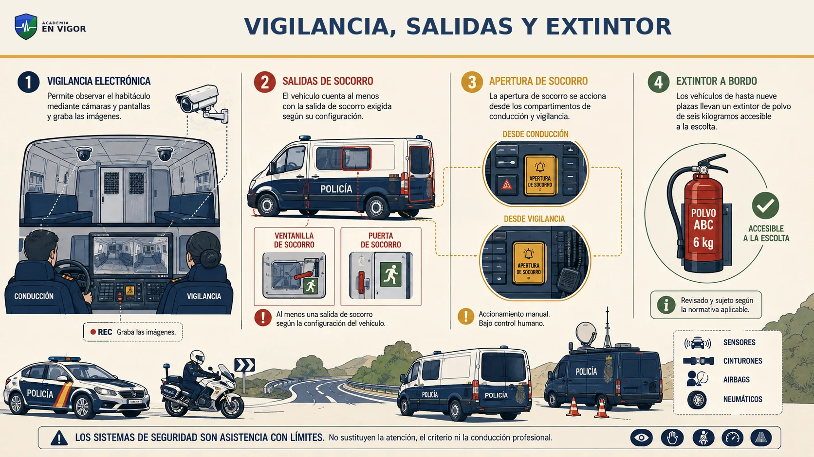

<em>Infografía: Vigilancia, salidas y extintor.</em>

:::hablemos-claro
La vigilancia electrónica permite observar el habitáculo mediante cámaras y pantallas y graba las imágenes.
:::

:::en-la-calle
Al planificar conducción policial o un traslado, La vigilancia electrónica permite observar el habitáculo mediante cámaras y pantallas y graba las imágenes.
:::

:::lo-que-cae
Prioriza **anexo I · apartados 3.4, 4 y 5** y descarta respuestas que confundan momento, función, sensor, límite, categoría o vigencia.
:::

<!-- FUENTE: BOE-INT-2573-2015-T44 -->

## 80. Vehículos de más de nueve plazas

### Lógica del bloque

Para dominar **vehículos de más de nueve plazas**, aplica esta regla: El anexo II regula vehículos de más de nueve plazas y los encuadra en categorías M2 y M3. El anclaje principal es **anexo II · M2 y M3**.

### Hechos examinables

- El anexo II regula vehículos de más de nueve plazas y los encuadra en categorías M2 y M3. <!-- FACT:PN-T44-F317 -->
- Distingue compartimento delantero, central con celdas y trasero de vigilancia. <!-- FACT:PN-T44-F318 -->
- Los compartimentos delantero y trasero se conectan mediante intercomunicador. <!-- FACT:PN-T44-F319 -->
- Las celdas incorporan aviso de emergencia, intercomunicación y cámaras según la Orden. <!-- FACT:PN-T44-F320 -->

### Ejemplos razonados

- **Aplicación correcta:** Distingue compartimento delantero, central con celdas y trasero de vigilancia.
- **Contraste útil:** Los compartimentos delantero y trasero se conectan mediante intercomunicador.

### Trampas de examen

- **Incorrecto:** Los vehículos de más de nueve plazas son siempre M1.
- **Incorrecto:** El anexo II elimina el compartimento trasero de vigilancia.

<!-- VISUAL:t44-il-80-vehiculos-de-mas-de-nueve-plazas.webp -->

  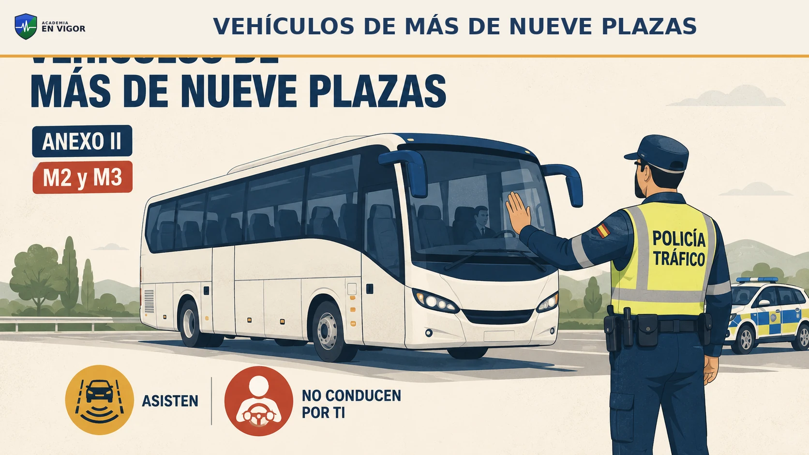

<em>Infografía: Vehículos de más de nueve plazas.</em>

:::hablemos-claro
El anexo II regula vehículos de más de nueve plazas y los encuadra en categorías M2 y M3.
:::

:::en-la-calle
Al planificar conducción policial o un traslado, El anexo II regula vehículos de más de nueve plazas y los encuadra en categorías M2 y M3.
:::

:::lo-que-cae
Prioriza **anexo II · M2 y M3** y descarta respuestas que confundan momento, función, sensor, límite, categoría o vigencia.
:::

<!-- FUENTE: BOE-INT-2573-2015-T44 -->

# Hablemos claro

:::hablemos-claro
Este tema exige separar momento, función y límite. Activa no significa electrónica; pasiva no significa opcional; ADAS no equivale a autonomía; ABS no crea adherencia; airbag no sustituye cinturón; y una cifra de efectividad no es una ley universal.
:::

# En la calle

:::en-la-calle
En servicio, revisar el vehículo, distribuir tareas, anticipar reacciones y conservar espacio permite llegar con capacidad operativa. En traslado, la seguridad incluye dignidad, habitabilidad, retención, vigilancia y evacuación.
:::

# Lo que cae

:::lo-que-cae
Prioriza activa-pasiva-terciaria; energía y adherencia; cinturón-pretensor-limitador-airbag; ABS-ESC-TCS; FCW-AEB; LDW-LKA; calendario 2022-2024-2026; moto; artículo 119; y anexos I-II de la Orden INT/2573/2015.
:::

# Ha caído

:::ha-caido
Se han localizado 7 referencias históricas del Tema 44. Permanecen ocultas y en cuarentena porque no existe plantilla oficial final verificable en el repositorio.
:::

## Fuentes legales, institucionales y primarias

- `CONVOCATORIA-PN-2026-T44`
- `BOE-LSV-T44`
- `BOE-RGC-T44`
- `BOE-RGV-T44`
- `EU-GSR-2019-2144-T44`
- `DGT-EFECTIVIDAD-2022-T44`
- `DGT-ADAS-T44`
- `EU-L-168-2013-T44`
- `DGT-MOTOS-2021-T44`
- `BOE-INT-2573-2015-T44`
- `BOE-RP-190-1996-T44`
- `INTERIOR-INST-1-2024-T44`

---

*Academia En Vigor · El temario que nunca duerme · Tema 44 · v1.0.0 · Documento interno no publicado.*
