# TEMA 1 · EL DERECHO, LA PERSONA Y LA NACIONALIDAD

**Policía Nacional · Método VIGOR · PARTE**
**Versión de contenido:** 0.2.0
**Estado editorial:** draft_review · **Publicación:** not_published

# Mapa del tema

## Programa oficial cubierto

**El Derecho: concepto y acepciones. Las normas jurídicas positivas: concepto, estructura, clases y caracteres. El principio de jerarquía normativa. La persona en sentido jurídico: concepto y clases; su nacimiento y extinción; capacidad jurídica y capacidad de obrar. Adquisición, conservación y pérdida de la nacionalidad española. El domicilio. La vecindad civil.**

## Ruta de estudio

1. **Derecho y norma:** bloques 1 a 9.
2. **Persona y capacidad:** bloques 10 a 16.
3. **Nacionalidad:** bloques 17 a 25.
4. **Domicilio y vecindad civil:** bloques 26 a 29.

La parte más densa es nacionalidad: conviene estudiarla como una secuencia de **sujeto → vía → plazo → autoridad → declaración → inscripción → efecto**. En vecindad civil, separa atribución inicial, opción y residencia.

<!-- VISUAL:t01-01-mapa-general.webp -->

  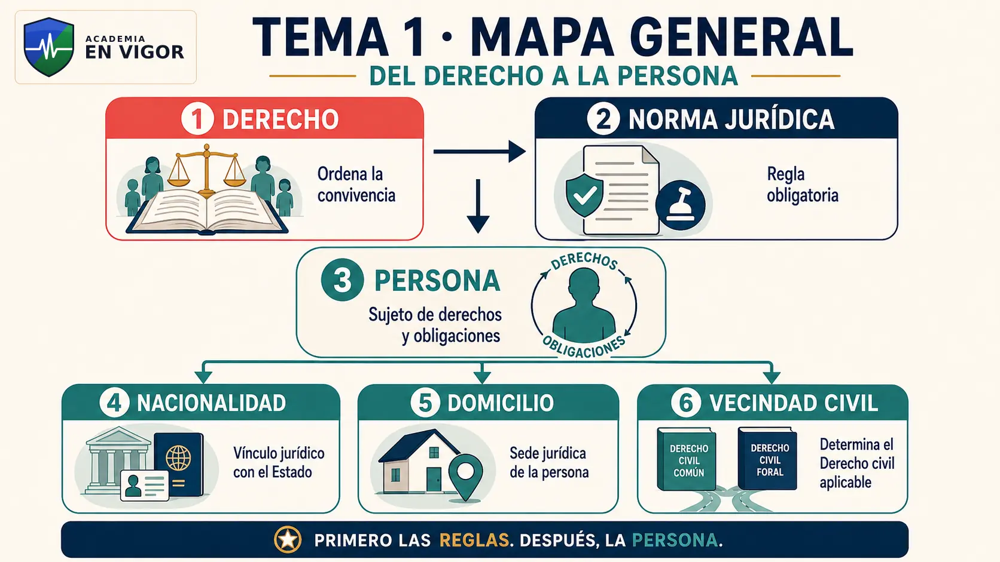

# Contenido

## 01. El Derecho: concepto y función

El Derecho es el sistema de normas, principios e instituciones que ordena la convivencia, atribuye derechos, deberes y potestades y ofrece cauces institucionales para prevenir y resolver conflictos.

:::perla-vigor
la coacción distingue al Derecho de otras reglas sociales, pero no significa que toda norma contenga una pena ni que siempre sea necesario emplear la fuerza.
:::

<!-- MATERIAL PENDIENTE: t01-p1-audio -->
<!-- MATERIAL PENDIENTE: t01-p1-video -->
<!-- MATERIAL PENDIENTE: t01-p1-presentacion -->

<!-- FUENTE: DPEJ-DERECHO -->

## 02. Acepciones del Derecho

- **Derecho objetivo:** conjunto de normas del ordenamiento.
- **Derecho subjetivo:** facultad o poder reconocido a una persona.
- **Derecho positivo:** Derecho establecido y vigente en un lugar y tiempo.
- **Derecho natural:** principios de justicia concebidos como anteriores o superiores al legislador.
- **Ciencia del Derecho:** disciplina que estudia e interpreta el fenómeno jurídico.

:::trampa
el derecho subjetivo existe y se ejerce dentro del marco del Derecho objetivo.
:::

<!-- VISUAL:t01-02-acepciones-derecho.webp -->

  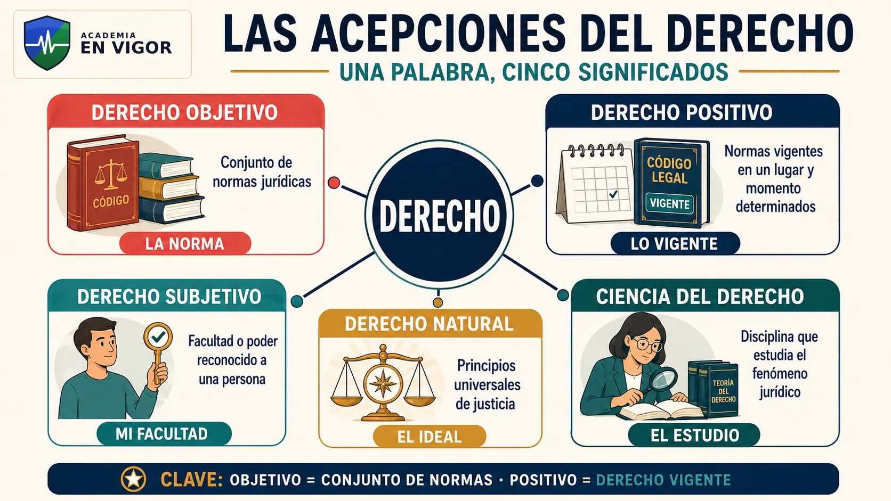

<!-- MATERIAL PENDIENTE: t01-p1-audio -->
<!-- MATERIAL PENDIENTE: t01-p1-video -->
<!-- MATERIAL PENDIENTE: t01-p1-presentacion -->

<!-- FUENTE: DPEJ-DERECHO -->

## 03. Derecho público, privado, común y especial

El Derecho público regula la organización de los poderes públicos y las relaciones en las que se ejercen potestades públicas; el privado regula principalmente relaciones de coordinación entre particulares. El Derecho común contiene el régimen general y el especial disciplina una materia o situación específica.

:::perla-vigor
que intervenga una Administración no convierte por sí solo toda relación en Derecho público.
:::

<!-- MATERIAL PENDIENTE: t01-p1-audio -->
<!-- MATERIAL PENDIENTE: t01-p1-video -->
<!-- MATERIAL PENDIENTE: t01-p1-presentacion -->

<!-- FUENTE: DPEJ-DERECHO -->

## 04. La norma jurídica positiva

La norma jurídica positiva es una regla de conducta u organización integrada en un ordenamiento vigente y producida o reconocida conforme a su sistema de fuentes. Puede mandar, prohibir, permitir, atribuir potestades, reconocer derechos, definir conceptos u organizar procedimientos.

:::trampa
norma jurídica no equivale necesariamente a artículo ni a sanción.
:::

<!-- VISUAL:t01-03-anatomia-norma.webp -->

  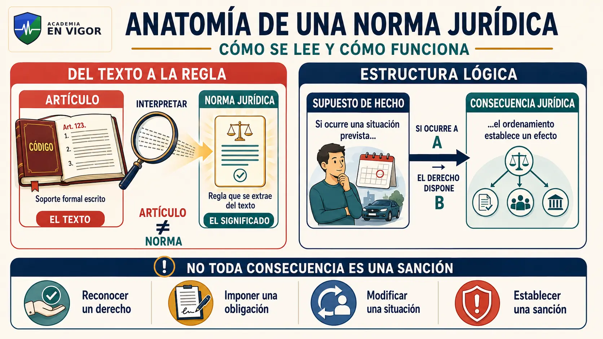

<!-- MATERIAL PENDIENTE: t01-p2-audio -->
<!-- MATERIAL PENDIENTE: t01-p2-video -->
<!-- MATERIAL PENDIENTE: t01-p2-presentacion -->

<!-- FUENTE: DPEJ-NORMA -->

## 05. Estructura de la norma jurídica

La estructura lógica clásica distingue **supuesto de hecho** y **consecuencia jurídica**. Cuando se realiza la situación prevista, el ordenamiento vincula el efecto correspondiente. La consecuencia puede crear, modificar o extinguir derechos, deberes, potestades, responsabilidades o estados civiles.

:::trampa
consecuencia jurídica no significa necesariamente castigo.
:::

<!-- MATERIAL PENDIENTE: t01-p2-audio -->
<!-- MATERIAL PENDIENTE: t01-p2-video -->
<!-- MATERIAL PENDIENTE: t01-p2-presentacion -->

<!-- FUENTE: DPEJ-NORMA -->

## 06. Clases de normas jurídicas

Las normas pueden ser imperativas, prohibitivas, permisivas o dispositivas; generales o especiales; permanentes o temporales; completas o de remisión. Las clasificaciones son doctrinales y responden a criterios distintos.

:::perla-vigor
una norma dispositiva no es inútil ni voluntaria: se aplica cuando los particulares no han establecido válidamente otra regulación.
:::

<!-- VISUAL:t01-04-clases-normas.webp -->

  

<!-- MATERIAL PENDIENTE: t01-p2-audio -->
<!-- MATERIAL PENDIENTE: t01-p2-video -->
<!-- MATERIAL PENDIENTE: t01-p2-presentacion -->

<!-- FUENTE: DPEJ-NORMA -->

## 07. Caracteres de las normas jurídicas

Entre los caracteres doctrinales destacan generalidad, abstracción, obligatoriedad, heteronomía, exterioridad, bilateralidad y coercibilidad. No aparecen con igual intensidad en todas las normas.

:::trampa
generalidad no significa que la norma se aplique a todas las personas, sino a una categoría definida de destinatarios o supuestos.
:::

<!-- MATERIAL PENDIENTE: t01-p2-audio -->
<!-- MATERIAL PENDIENTE: t01-p2-video -->
<!-- MATERIAL PENDIENTE: t01-p2-presentacion -->

<!-- FUENTE: DPEJ-NORMA -->

## 08. Fuentes y principio de jerarquía normativa

El artículo 1 CC enumera ley, costumbre y principios generales del Derecho. La jurisprudencia complementa el ordenamiento. La Constitución garantiza la jerarquía normativa: una disposición inferior no puede contradecir otra superior.

:::perla-vigor
la costumbre rige en defecto de ley aplicable; los principios generales, en defecto de ley o costumbre, y además informan el ordenamiento.
:::

<!-- VISUAL:t01-05-fuentes-jerarquia.webp -->

  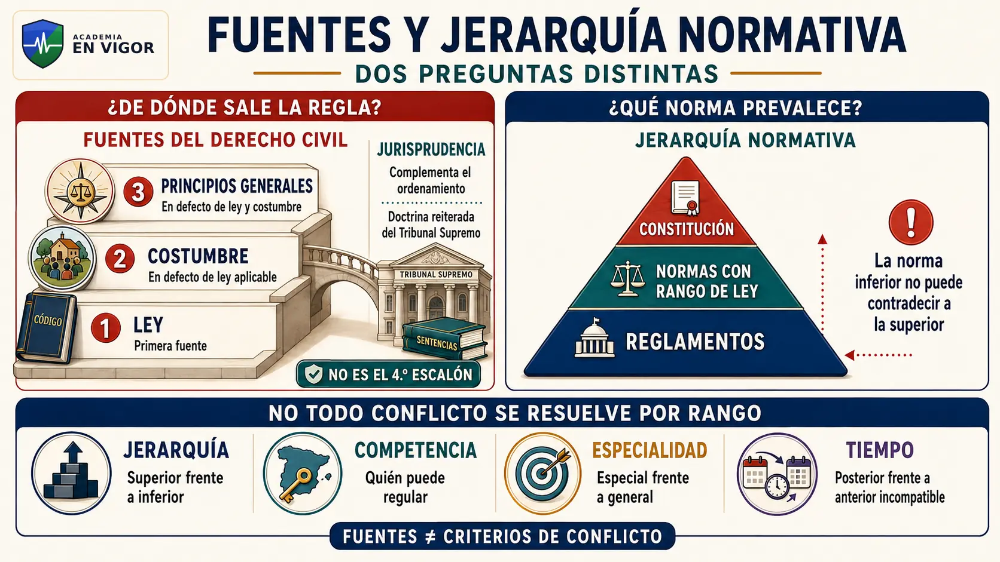

<!-- MATERIAL PENDIENTE: t01-p2-audio -->
<!-- MATERIAL PENDIENTE: t01-p2-video -->
<!-- MATERIAL PENDIENTE: t01-p2-presentacion -->

<!-- FUENTE: CC-PRELIMINAR -->

## 09. Publicación, vigencia y eficacia de las normas

Salvo disposición distinta, las leyes entran en vigor a los **veinte días** de su publicación completa en el BOE. Solo se derogan por otras posteriores. La ignorancia no excusa; la retroactividad exige previsión; y el ordenamiento rechaza fraude de ley, abuso de derecho y actos contrarios a normas imperativas o prohibitivas.

:::perla-vigor
derogar una ley no hace revivir automáticamente las que esta había derogado.
:::

<!-- VISUAL:t01-06-vigencia-eficacia.webp -->

  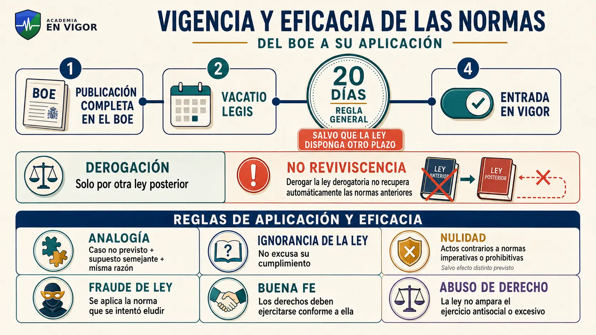

<!-- MATERIAL PENDIENTE: t01-p2-audio -->
<!-- MATERIAL PENDIENTE: t01-p2-video -->
<!-- MATERIAL PENDIENTE: t01-p2-presentacion -->

<!-- FUENTE: CC-PRELIMINAR -->

## 10. La persona en sentido jurídico

Persona es el sujeto capaz de ser titular de derechos y obligaciones. Se distinguen **personas naturales o físicas** y **personas jurídicas**, a las que el ordenamiento reconoce personalidad propia y distinta de la de sus integrantes.

:::trampa
ser persona jurídica no significa ser una persona humana; significa ser un sujeto reconocido por el Derecho.
:::

<!-- VISUAL:t01-07-persona-fisica-juridica.webp -->

  

<!-- MATERIAL PENDIENTE: t01-p3-audio -->
<!-- MATERIAL PENDIENTE: t01-p3-video -->
<!-- MATERIAL PENDIENTE: t01-p3-presentacion -->

<!-- FUENTE: DPEJ-PERSONA -->

## 11. Nacimiento y protección del concebido

El nacimiento determina la personalidad. Esta se adquiere al nacer **con vida**, una vez producido el **entero desprendimiento del seno materno**. El concebido se tiene por nacido para los efectos favorables si finalmente nace cumpliendo esas condiciones.

:::perla-vigor
el concebido no tiene personalidad plena, pero el ordenamiento anticipa la protección de efectos favorables condicionados al nacimiento.
:::

<!-- VISUAL:t01-08-nacimiento-personalidad.webp -->

  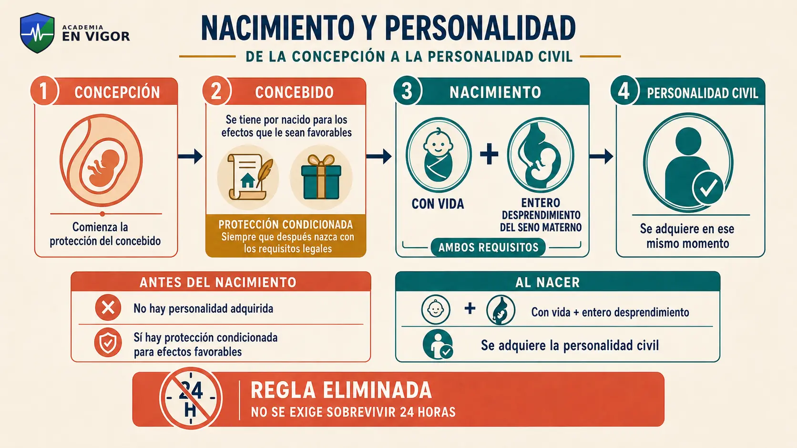

<!-- MATERIAL PENDIENTE: t01-p3-audio -->
<!-- MATERIAL PENDIENTE: t01-p3-video -->
<!-- MATERIAL PENDIENTE: t01-p3-presentacion -->

<!-- FUENTE: CC-PERSONA -->

## 12. Extinción de la personalidad y conmoriencia

La personalidad civil se extingue por la muerte. Si dos o más personas llamadas a sucederse fallecen y no se prueba quién murió antes, se presumen muertas al mismo tiempo y no se transmiten derechos de una a otra.

:::trampa
la conmoriencia es una regla probatoria para el caso de duda, no una afirmación de que realmente murieron en el mismo instante.
:::

<!-- MATERIAL PENDIENTE: t01-p3-audio -->
<!-- MATERIAL PENDIENTE: t01-p3-video -->
<!-- MATERIAL PENDIENTE: t01-p3-presentacion -->

<!-- FUENTE: CC-PERSONA -->

## 13. Capacidad jurídica y capacidad de obrar

La capacidad jurídica es la aptitud para ser titular de derechos y obligaciones. La capacidad de obrar —terminología clásica que mantiene el programa— es la aptitud para ejercitarlos mediante actos jurídicos eficaces. La discapacidad no elimina la capacidad jurídica: el sistema prevé apoyos para su ejercicio.

:::perla-vigor
apoyo no equivale automáticamente a sustitución de la voluntad.
:::

<!-- VISUAL:t01-09-capacidad-apoyos.webp -->

  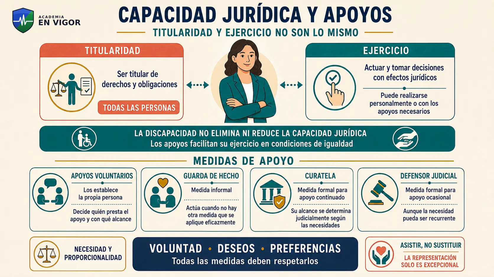

<!-- MATERIAL PENDIENTE: t01-p3-audio -->
<!-- MATERIAL PENDIENTE: t01-p3-video -->
<!-- MATERIAL PENDIENTE: t01-p3-presentacion -->

<!-- FUENTE: DPEJ-CAPACIDAD -->

## 14. Mayoría de edad y emancipación

La mayoría de edad comienza a los **dieciocho años**. El mayor puede realizar todos los actos de la vida civil salvo las excepciones legales. La emancipación amplía la autonomía del menor desde los dieciséis años, pero mantiene límites patrimoniales relevantes.

:::perla-vigor
el emancipado necesita consentimiento para tomar dinero a préstamo y para enajenar o gravar determinados bienes de especial importancia.
:::

<!-- VISUAL:t01-10-mayoria-emancipacion.webp -->

  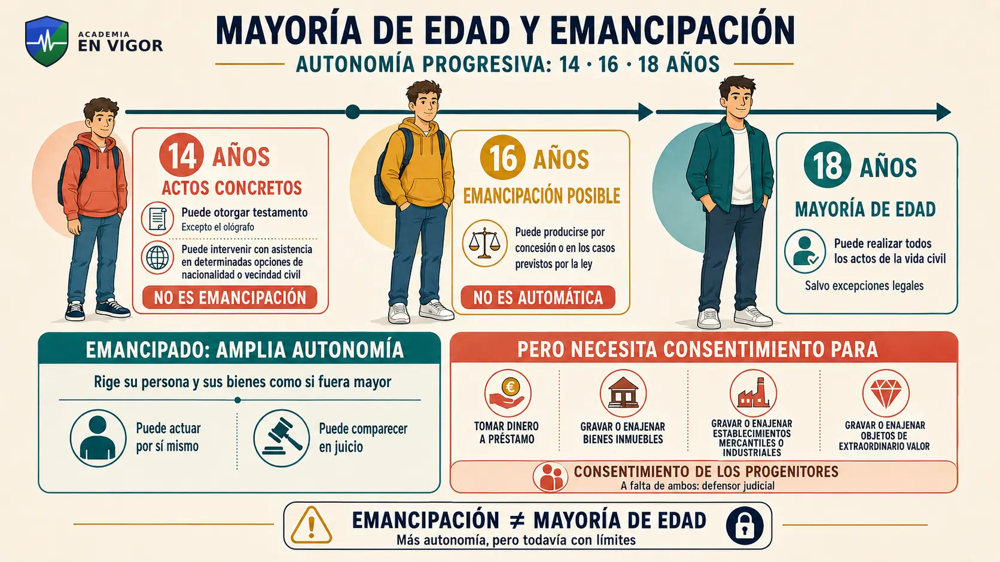

<!-- VISUAL:t01-il-02-14-16-18-anos.webp -->

  

<em>Ilustración: autonomía progresiva a los 14, 16 y 18 años.</em>

<!-- MATERIAL PENDIENTE: t01-p3-audio -->
<!-- MATERIAL PENDIENTE: t01-p3-video -->
<!-- MATERIAL PENDIENTE: t01-p3-presentacion -->

<!-- FUENTE: CC-CAPACIDAD -->

## 15. Personas jurídicas: clases y constitución

El Código Civil reconoce como personas jurídicas las corporaciones, asociaciones y fundaciones de interés público reconocidas por la ley y las asociaciones de interés particular a las que la ley concede personalidad propia. Su personalidad comienza desde la válida constitución conforme a Derecho.

:::trampa
el reconocimiento de personalidad no depende siempre de una inscripción idéntica para todas las entidades; cada tipo se rige por su normativa.
:::

<!-- MATERIAL PENDIENTE: t01-p3-audio -->
<!-- MATERIAL PENDIENTE: t01-p3-video -->
<!-- MATERIAL PENDIENTE: t01-p3-presentacion -->

<!-- FUENTE: CC-PERSONA -->

## 16. Capacidad y extinción de las personas jurídicas

La capacidad de corporaciones, asociaciones y fundaciones se determina por sus leyes, estatutos o reglas fundacionales. Pueden adquirir bienes, contraer obligaciones y ejercitar acciones. Su extinción y el destino de sus bienes se rigen por la ley y por sus normas constitutivas.

:::perla-vigor
si no se ha previsto destino para los bienes tras la extinción, el Código Civil establece una regla orientada a fines análogos de interés territorial.
:::

<!-- MATERIAL PENDIENTE: t01-p3-audio -->
<!-- MATERIAL PENDIENTE: t01-p3-video -->
<!-- MATERIAL PENDIENTE: t01-p3-presentacion -->

<!-- FUENTE: CC-PERSONA -->

## 17. Nacionalidad española: marco constitucional

La nacionalidad es el vínculo jurídico entre una persona y el Estado. El artículo 11 CE remite a la ley su adquisición, conservación y pérdida, impide privar de ella a los españoles de origen y permite tratados de doble nacionalidad con países especialmente vinculados.

:::trampa
«no puede ser privado» no significa que un español de origen jamás pueda perderla en los casos legalmente previstos.
:::

<!-- VISUAL:t01-11-vias-nacionalidad.webp -->

  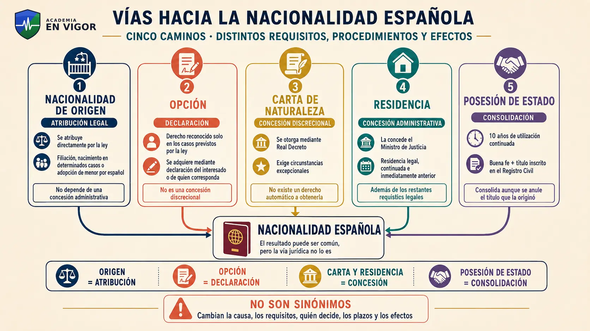

<!-- VISUAL:t01-il-03-caminos-nacionalidad.webp -->

  

<em>Ilustración: distintas vías pueden conducir a la nacionalidad española.</em>

<!-- MATERIAL PENDIENTE: t01-p4-audio -->
<!-- MATERIAL PENDIENTE: t01-p4-video -->
<!-- MATERIAL PENDIENTE: t01-p4-presentacion -->

<!-- FUENTE: CC-NACIONALIDAD -->

## 18. Españoles de origen

Son españoles de origen los nacidos de padre o madre españoles y determinados nacidos en España: progenitor extranjero también nacido en España —salvo diplomáticos—; ausencia de nacionalidad atribuida por las leyes de los progenitores; o filiación no determinada.

:::perla-vigor
si filiación o nacimiento en España se determina después de los dieciocho años, no hay adquisición automática; cabe optar durante dos años.
:::

<!-- VISUAL:t01-12-espanoles-origen.webp -->

  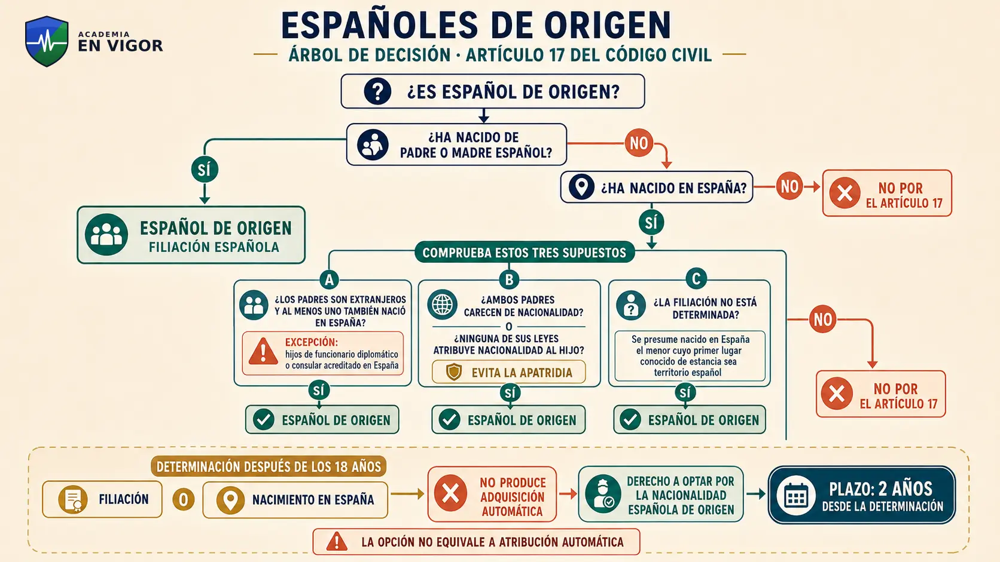

<!-- MATERIAL PENDIENTE: t01-p4-audio -->
<!-- MATERIAL PENDIENTE: t01-p4-video -->
<!-- MATERIAL PENDIENTE: t01-p4-presentacion -->

<!-- FUENTE: CC-NACIONALIDAD -->

## 19. Consolidación por posesión de estado y adopción

La posesión y utilización continuadas de la nacionalidad durante **diez años**, con buena fe y título inscrito, consolidan la nacionalidad aunque después se anule el título. El menor extranjero adoptado por español adquiere nacionalidad de origen; el adoptado mayor puede optar durante dos años.

:::trampa
consolidación del artículo 18 no es nacionalidad por residencia del artículo 22.
:::

<!-- MATERIAL PENDIENTE: t01-p4-audio -->
<!-- MATERIAL PENDIENTE: t01-p4-video -->
<!-- MATERIAL PENDIENTE: t01-p4-presentacion -->

<!-- FUENTE: CC-NACIONALIDAD -->

## 20. Derecho de opción

Pueden optar quienes estén o hayan estado sujetos a patria potestad de español; quienes tengan padre o madre originariamente español y nacido en España; y los casos de determinación tardía de filiación o nacimiento y adopción de mayor. La forma de declarar depende de edad, emancipación y apoyos.

:::perla-vigor
la opción del hijo de padre o madre originariamente español y nacido en España no está sujeta a límite de edad.
:::

<!-- VISUAL:t01-14-opcion-nacionalidad.webp -->

  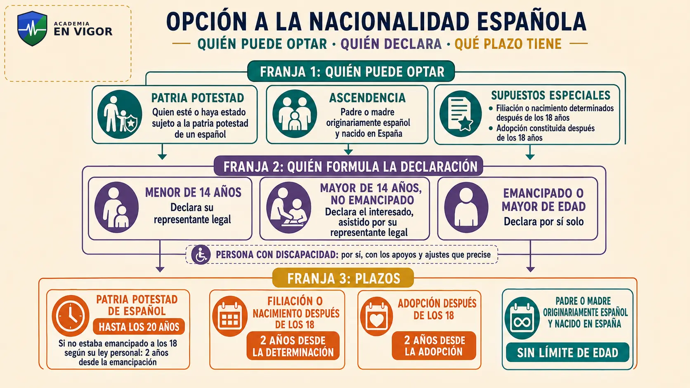

<!-- MATERIAL PENDIENTE: t01-p4-audio -->
<!-- MATERIAL PENDIENTE: t01-p4-video -->
<!-- MATERIAL PENDIENTE: t01-p4-presentacion -->

<!-- FUENTE: CC-NACIONALIDAD -->

## 21. Carta de naturaleza y nacionalidad por residencia

La carta de naturaleza se otorga discrecionalmente mediante **Real Decreto** cuando concurren circunstancias excepcionales. La nacionalidad por residencia se concede por el **Ministro de Justicia** y puede denegarse motivadamente por orden público o interés nacional.

:::perla-vigor
ambas concesiones caducan a los **180 días** de la notificación si no se comparece para cumplir los requisitos del artículo 23.
:::

<!-- MATERIAL PENDIENTE: t01-p4-audio -->
<!-- MATERIAL PENDIENTE: t01-p4-video -->
<!-- MATERIAL PENDIENTE: t01-p4-presentacion -->

<!-- FUENTE: CC-NACIONALIDAD -->

## 22. Plazos de residencia para la nacionalidad

La residencia debe ser legal, continuada e inmediatamente anterior a la petición. Plazos: **10 años** general; **5** para refugiados; **2** para nacionales de origen de países iberoamericanos, Andorra, Filipinas, Guinea Ecuatorial o Portugal y sefardíes; **1** en los supuestos especiales del artículo 22.2.

:::perla-vigor
recuerda la secuencia **10–5–2–1**, pero el año exige encajar exactamente en una de las letras legales.
:::

<!-- VISUAL:t01-15-plazos-residencia.webp -->

  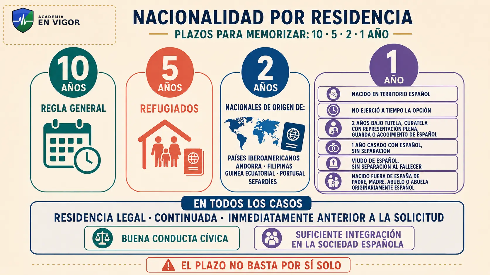

<!-- MATERIAL PENDIENTE: t01-p4-audio -->
<!-- MATERIAL PENDIENTE: t01-p4-video -->
<!-- MATERIAL PENDIENTE: t01-p4-presentacion -->

<!-- FUENTE: CC-NACIONALIDAD -->

## 23. Requisitos comunes de adquisición

Para la validez de la adquisición por opción, carta de naturaleza o residencia, el mayor de catorce años capaz de declarar debe jurar o prometer fidelidad al Rey y obediencia a Constitución y leyes; declarar la renuncia anterior cuando proceda; e inscribir la adquisición en el Registro Civil.

:::trampa
la renuncia tiene excepciones; la inscripción no.
:::

<!-- MATERIAL PENDIENTE: t01-p4-audio -->
<!-- MATERIAL PENDIENTE: t01-p4-video -->
<!-- MATERIAL PENDIENTE: t01-p4-presentacion -->

<!-- FUENTE: CC-NACIONALIDAD -->

## 24. Conservación y pérdida de la nacionalidad

Los españoles emancipados que residan habitualmente en el extranjero pueden perder la nacionalidad tras tres años por adquisición voluntaria de otra o uso exclusivo de la anterior, salvo declaración de conservación. Hay reglas específicas para nacidos y residentes en el extranjero y para españoles no originarios.

:::perla-vigor
adquirir la nacionalidad de un país iberoamericano, Andorra, Filipinas, Guinea Ecuatorial o Portugal no basta por sí solo para que un español de origen pierda la española.
:::

<!-- VISUAL:t01-16-perdida-conservacion.webp -->

  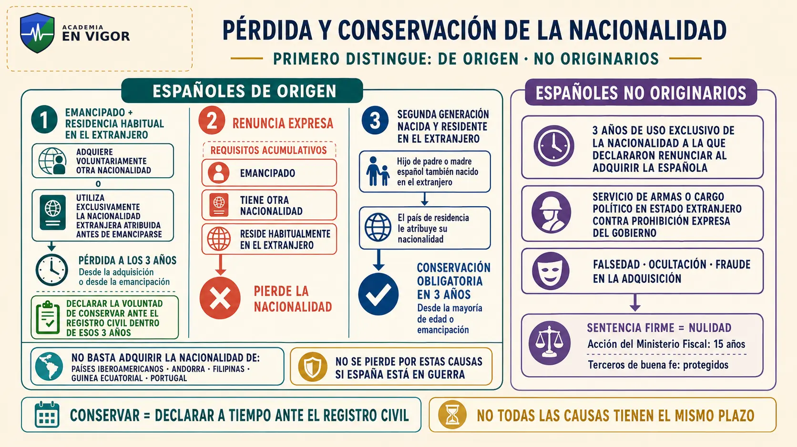

<!-- MATERIAL PENDIENTE: t01-p4-audio -->
<!-- MATERIAL PENDIENTE: t01-p4-video -->
<!-- MATERIAL PENDIENTE: t01-p4-presentacion -->

<!-- FUENTE: CC-NACIONALIDAD -->

## 25. Recuperación de la nacionalidad

Para recuperar la nacionalidad se exige, como regla, residencia legal en España, declaración ante el Registro Civil e inscripción de la recuperación. La residencia no se exige a emigrantes ni a sus hijos y puede dispensarse por circunstancias excepcionales. Los supuestos del artículo 25 requieren habilitación previa del Gobierno.

:::trampa
recuperar nacionalidad no equivale a renovar DNI o pasaporte.
:::

<!-- VISUAL:t01-il-06-conservar-recuperar.webp -->

  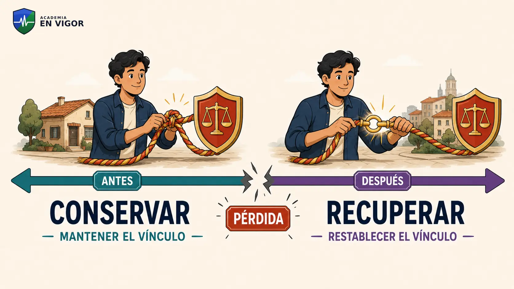

<em>Ilustración: conservar actúa antes de la pérdida; recuperar, después.</em>

<!-- MATERIAL PENDIENTE: t01-p4-audio -->
<!-- MATERIAL PENDIENTE: t01-p4-video -->
<!-- MATERIAL PENDIENTE: t01-p4-presentacion -->

<!-- FUENTE: CC-NACIONALIDAD -->

## 26. El domicilio

El domicilio civil de la persona natural es el lugar de su **residencia habitual**. Para diplomáticos españoles destinados en el extranjero es el último domicilio en España. En personas jurídicas rige el fijado por ley, estatutos o fundación y, en defecto, el lugar de representación legal o funciones principales.

:::trampa
domicilio civil, empadronamiento y domicilio constitucional no son conceptos idénticos.
:::

<!-- VISUAL:t01-18-domicilio-conceptos.webp -->

  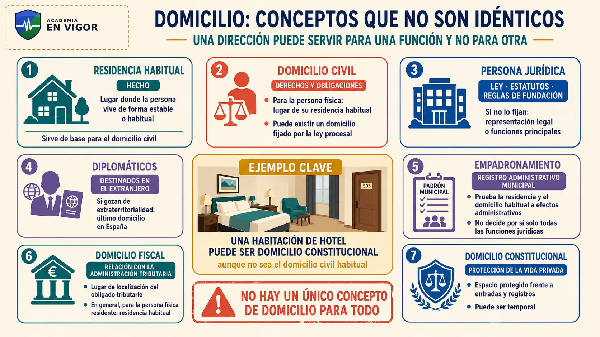

<!-- MATERIAL PENDIENTE: t01-p5-audio -->
<!-- MATERIAL PENDIENTE: t01-p5-video -->
<!-- MATERIAL PENDIENTE: t01-p5-presentacion -->

<!-- FUENTE: CC-DOMICILIO -->

## 27. Vecindad civil: concepto y atribución inicial

La vecindad civil determina la sujeción al Derecho civil común o especial o foral. Si los progenitores tienen la misma vecindad, el hijo adquiere esa; si difieren, operan la filiación determinada antes, el lugar de nacimiento y, en último término, la vecindad común. Puede atribuirse la de cualquiera de los progenitores dentro de seis meses.

:::trampa
vecindad civil no es empadronamiento, domicilio, nacionalidad ni vecindad administrativa.
:::

<!-- VISUAL:t01-19-vecindad-atribucion.webp -->

  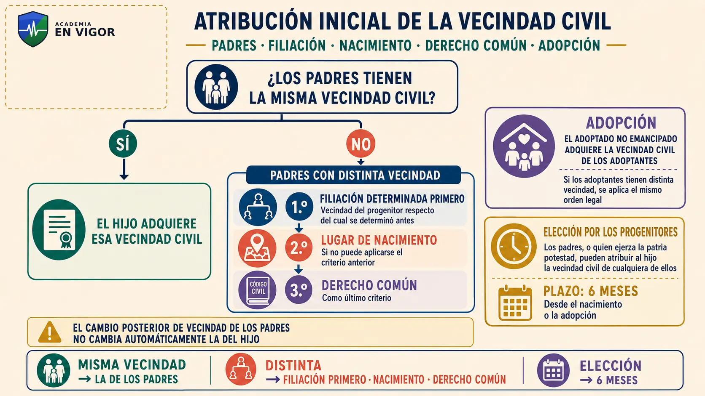

<!-- MATERIAL PENDIENTE: t01-p5-audio -->
<!-- MATERIAL PENDIENTE: t01-p5-video -->
<!-- MATERIAL PENDIENTE: t01-p5-presentacion -->

<!-- FUENTE: CC-VECINDAD -->

## 28. Opción y adquisición de vecindad por residencia

Desde los catorce años y hasta un año después de la emancipación puede optarse por la vecindad del lugar de nacimiento o la última de cualquiera de los progenitores. También se adquiere por dos años de residencia continuada con declaración o diez años sin declaración en contrario.

:::perla-vigor
«2 si lo declaras; 10 si no declaras lo contrario». El matrimonio no altera automáticamente la vecindad.
:::

<!-- VISUAL:t01-20-vecindad-dos-diez.webp -->

  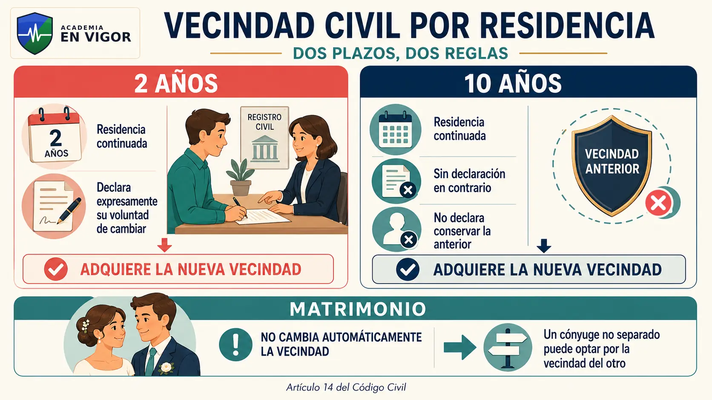

<!-- MATERIAL PENDIENTE: t01-p5-audio -->
<!-- MATERIAL PENDIENTE: t01-p5-video -->
<!-- MATERIAL PENDIENTE: t01-p5-presentacion -->

<!-- FUENTE: CC-VECINDAD -->

## 29. Vecindad en nacionalización y recuperación

Al adquirir la nacionalidad española debe optarse, según las conexiones legales, por la vecindad del lugar de residencia, nacimiento, última de progenitor o adoptante, o cónyuge. La carta de naturaleza puede determinarla en el Real Decreto. Recuperar la nacionalidad lleva consigo recuperar la vecindad anterior.

:::trampa
el nacionalizado no elige libremente cualquier vecindad civil; debe existir una conexión legal.
:::

<!-- MATERIAL PENDIENTE: t01-p5-audio -->
<!-- MATERIAL PENDIENTE: t01-p5-video -->
<!-- MATERIAL PENDIENTE: t01-p5-presentacion -->

<!-- FUENTE: CC-VECINDAD -->

# Hablemos claro

:::hablemos-claro
Este tema mezcla categorías doctrinales con reglas literales del Código Civil. No memorices todo con el mismo método:

- En **Derecho y norma**, domina definiciones y comparaciones.
- En **persona y capacidad**, separa personalidad, titularidad y ejercicio.
- En **nacionalidad**, construye árboles de decisión y aprende los plazos exactos.
- En **domicilio y vecindad**, pregunta siempre qué función cumple cada concepto.

Las simplificaciones ayudan a recordar, pero la respuesta de examen debe conservar el término jurídico: «dos años con declaración / diez sin declaración en contrario» es útil; «cambia sola» es una simplificación peligrosa.
:::

# En la calle

:::en-la-calle
El tema aparece de forma transversal en la actividad policial: identificación de personas físicas y representantes de entidades; menores y emancipados; personas que requieren apoyos; ciudadanos con distintas nacionalidades; domicilios con funciones jurídicas diferentes; y documentación de hechos inscritos en Registro Civil.

Estos ejemplos ayudan a comprender, pero no sustituyen la normativa específica de extranjería, documentación, protección de menores, procedimiento o entrada y registro. El concepto civil de domicilio y el constitucional no responden a la misma pregunta.
:::

# Lo que cae

:::lo-que-cae
Prioridad alta de estudio:

- objetivo/subjetivo y positivo/natural;
- supuesto de hecho/consecuencia y norma imperativa/dispositiva;
- artículo 1 CC, jerarquía y jurisprudencia;
- entrada en vigor a veinte días, ignorancia, fraude, nulidad y abuso;
- artículos 29, 30, 32 y 33;
- capacidad jurídica, apoyos, mayoría y emancipación;
- artículos 17 a 26: sujeto, plazo, autoridad, formalidades, pérdida y recuperación;
- plazos 10–5–2–1 y 180 días;
- artículos 40 y 41;
- vecindad civil: seis meses, 14 años, un año tras emancipación y plazos 2/10.

No se utilizarán expresiones como «cae seguro» hasta disponer de una estadística histórica completamente verificada.
:::

# Ha caído

:::ha-caido
El banco histórico contiene registros pendientes de cotejo y mapeo para este tema, pero **ninguno se activa todavía como pregunta oficial verificada**. Las referencias antiguas encontradas durante la redacción permanecen en cuarentena y no alimentan frecuencias, pesos ni afirmaciones de «Ha caído» hasta comprobar cuestionario, localizador, respuesta definitiva y posible anulación.
:::

---

*Academia En Vigor · El temario que nunca duerme · Tema 1 · v0.2.0 · Documento interno no publicado.*
