# TEMA 2 · LA CONSTITUCIÓN ESPAÑOLA (I)

**Policía Nacional · Método VIGOR · PARTE**
**Versión de contenido:** 0.1.0
**Estado editorial:** draft_review · **Publicación:** not_published

# Mapa del tema

<!-- VISUAL:t02-02-plano-constitucion.webp -->

  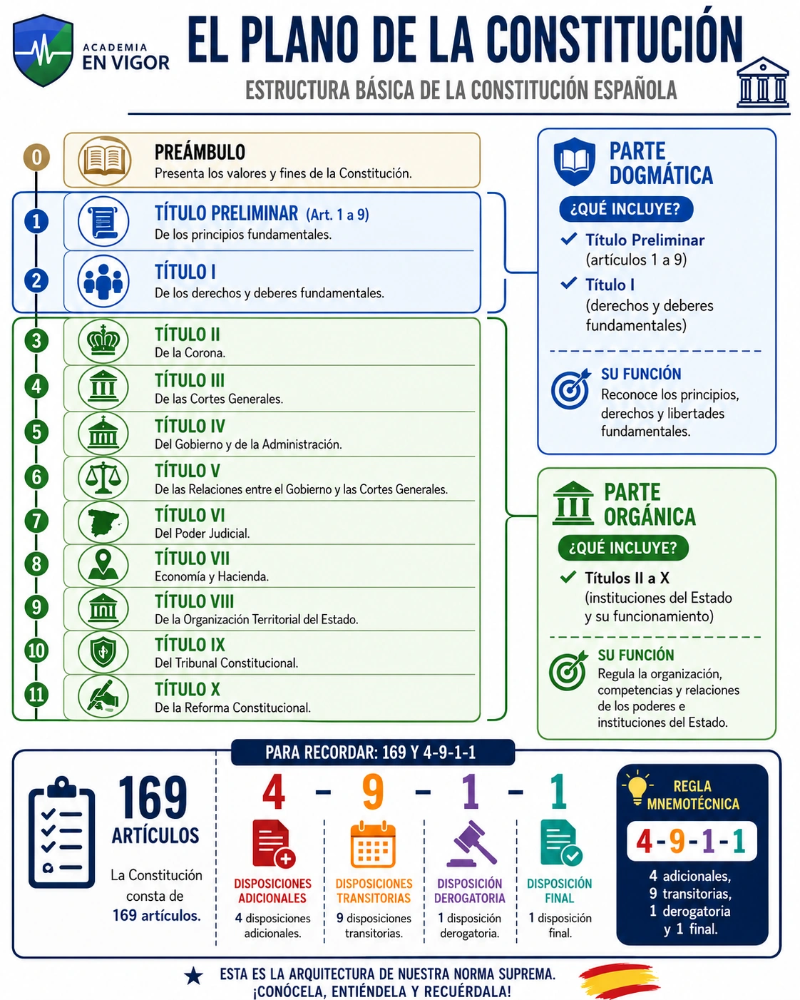

<em>Infografía: recorrido desde la norma suprema hasta el Defensor del Pueblo.</em>

El tema se estudia en siete partes: Constitución; valores y modelo de Estado; Título I; libertades públicas; derechos ciudadanos y principios rectores; garantías y suspensión; y Defensor del Pueblo.

# Contenido

## 01. La Constitución Como Norma Suprema

**Supremacía formal.** Ninguna norma inferior puede modificar la Constitución; su reforma exige los procedimientos constitucionales.
**Supremacía material.** Las leyes, los reglamentos y la actuación de los poderes públicos deben respetar el contenido constitucional.
**Fuerza normativa.** La Constitución es una norma jurídica vinculante y no una mera declaración política.
**Sujeción constitucional.** El artículo 9.1 somete a ciudadanos y poderes públicos a la Constitución y al resto del ordenamiento.

<!-- VISUAL:t02-ilu-01-constitucion-norma-suprema.webp -->

  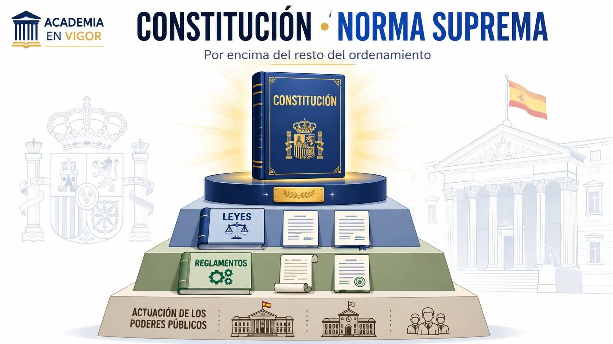

<em>Ilustración: La Constitución por encima del resto del ordenamiento.</em>

<!-- MATERIAL PENDIENTE: t02-p1-audio -->
<!-- MATERIAL PENDIENTE: t02-p1-video -->
<!-- MATERIAL PENDIENTE: t02-p1-presentacione -->

<!-- FUENTE: CE-T02 -->

## 02. Elaboración De La Constitución De 1978

**Elecciones constituyentes.** Las elecciones del 15 de junio de 1977 dieron lugar a unas Cortes que asumieron de hecho una función constituyente.
**Ponencia constitucional.** La Ponencia constitucional estuvo formada por siete diputados.
**Aprobación parlamentaria.** El Congreso y el Senado aprobaron la Constitución el 31 de octubre de 1978.
**Referéndum.** El pueblo español ratificó la Constitución en referéndum el 6 de diciembre de 1978.
**Sanción y promulgación.** El Rey sancionó y promulgó la Constitución el 27 de diciembre de 1978.
**Entrada en vigor.** La Constitución se publicó y entró en vigor el 29 de diciembre de 1978.

<!-- VISUAL:t02-01-linea-tiempo-1978.webp -->

  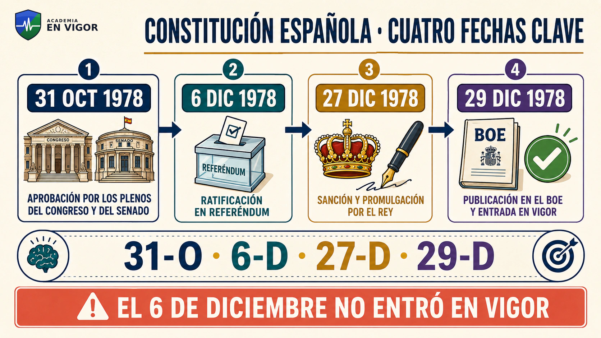

<em>Infografía: Cuatro fechas esenciales del proceso constituyente.</em>

<!-- VISUAL:t02-ilu-02-consenso-constituyente.webp -->

  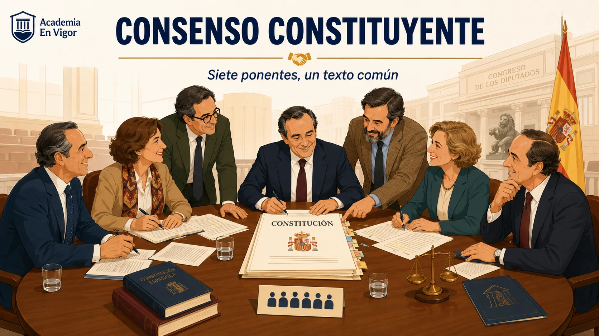

<em>Ilustración: Siete ponentes construyen un texto común.</em>

:::trampa
No confundas referéndum, sanción y entrada en vigor: 6, 27 y 29 de diciembre cumplen funciones distintas.
:::

<!-- MATERIAL PENDIENTE: t02-p1-audio -->
<!-- MATERIAL PENDIENTE: t02-p1-video -->
<!-- MATERIAL PENDIENTE: t02-p1-presentacione -->

<!-- FUENTE: CE-T02 -->

## 03. Estructura De La Constitución

**Articulado.** La Constitución contiene 169 artículos.
**Títulos.** La Constitución tiene un Título Preliminar y diez títulos numerados del I al X.
**Disposiciones.** La Constitución contiene cuatro disposiciones adicionales, nueve transitorias, una derogatoria y una final.
**Parte dogmática.** La parte dogmática comprende el Título Preliminar y el Título I.
**Parte orgánica.** La parte orgánica comprende esencialmente los Títulos II a X.
**Preámbulo.** El preámbulo tiene valor interpretativo, pero no está dividido en artículos.

:::trampa
La formulación precisa es un Título Preliminar y diez títulos numerados.
:::

<!-- MATERIAL PENDIENTE: t02-p1-audio -->
<!-- MATERIAL PENDIENTE: t02-p1-video -->
<!-- MATERIAL PENDIENTE: t02-p1-presentacione -->

<!-- FUENTE: CE-T02 -->

## 04. Reformas Constitucionales Realizadas

**Reforma de 1992.** La reforma de 1992 modificó el artículo 13.2 para el sufragio activo y pasivo de extranjeros en elecciones municipales.
**Reforma de 2011.** La reforma de 2011 modificó el artículo 135 sobre estabilidad presupuestaria.
**Reforma de 2024.** La reforma de 2024 sustituyó el artículo 49 sobre las personas con discapacidad.
**Reforma de 2026.** La reforma de 2026 modificó el artículo 69.3 para que Formentera elija un senador propio.
**Número de reformas.** A 23 de julio de 2026 la Constitución Española ha sido reformada cuatro veces.

<!-- VISUAL:t02-03-reformas-constitucionales.webp -->

  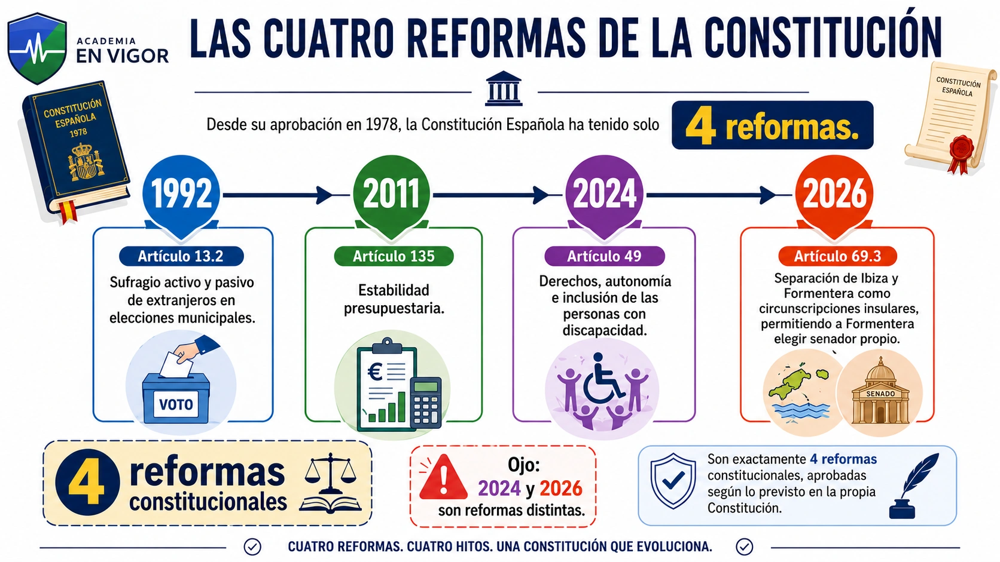

<em>Infografía: Reformas de 1992, 2011, 2024 y 2026.</em>

:::trampa
La reforma de 2026 es la cuarta; la de 2024 afectó al artículo 49.
:::

<!-- MATERIAL PENDIENTE: t02-p1-audio -->
<!-- MATERIAL PENDIENTE: t02-p1-video -->
<!-- MATERIAL PENDIENTE: t02-p1-presentacione -->

<!-- FUENTE: CE-T02 -->

## 05. Caracteres De La Constitución

**Constitución escrita.** La Constitución está recogida en un texto escrito, único y codificado.
**Constitución extensa.** La Constitución se considera extensa por el detalle de sus 169 artículos.
**Constitución consensuada.** La Constitución fue fruto de un amplio acuerdo entre fuerzas políticas distintas.
**Constitución rígida.** La Constitución exige procedimientos reforzados para su reforma.
**Constitución normativa.** La Constitución vincula jurídicamente a ciudadanos y poderes públicos.
**Constitución derivada.** La Constitución recibió influencias de otros textos constitucionales europeos.

<!-- MATERIAL PENDIENTE: t02-p1-audio -->
<!-- MATERIAL PENDIENTE: t02-p1-video -->
<!-- MATERIAL PENDIENTE: t02-p1-presentacione -->

<!-- FUENTE: CE-T02 -->

## 06. Valores Superiores Del Artículo 1.1

**Valores superiores.** El artículo 1.1 proclama libertad, justicia, igualdad y pluralismo político como valores superiores.
**Libertad.** La libertad actúa como valor del ordenamiento y como base de numerosos derechos.
**Justicia.** La justicia es un valor superior y no debe confundirse con el Poder Judicial.
**Igualdad.** La igualdad del artículo 1.1 se proyecta también en los artículos 9.2 y 14.
**Pluralismo político.** El pluralismo político se expresa especialmente a través de los partidos políticos.

<!-- VISUAL:t02-ilu-03-valores-constitucionales.webp -->

  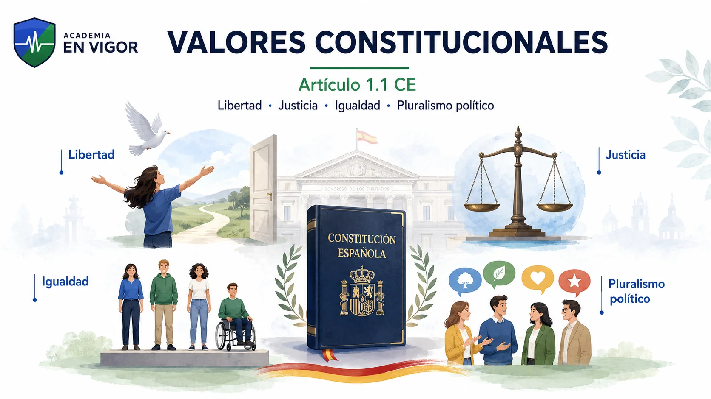

<em>Ilustración: Libertad, justicia, igualdad y pluralismo político.</em>

<!-- MATERIAL PENDIENTE: t02-p2-audio -->
<!-- MATERIAL PENDIENTE: t02-p2-video -->
<!-- MATERIAL PENDIENTE: t02-p2-presentacione -->

<!-- FUENTE: CE-T02 -->

## 07. El Estado Democrático

**Soberanía nacional.** La soberanía nacional reside en el pueblo español.
**Origen de los poderes.** Los poderes del Estado emanan del pueblo español.
**Participación política.** Los ciudadanos pueden participar directamente o por medio de representantes libremente elegidos.
**Partidos políticos.** Los partidos expresan el pluralismo, concurren a formar la voluntad popular y son instrumento de participación.
**Democracia interna.** La estructura interna y el funcionamiento de los partidos deben ser democráticos.

<!-- VISUAL:t02-ilu-04-cinco-modelos-estado.webp -->

  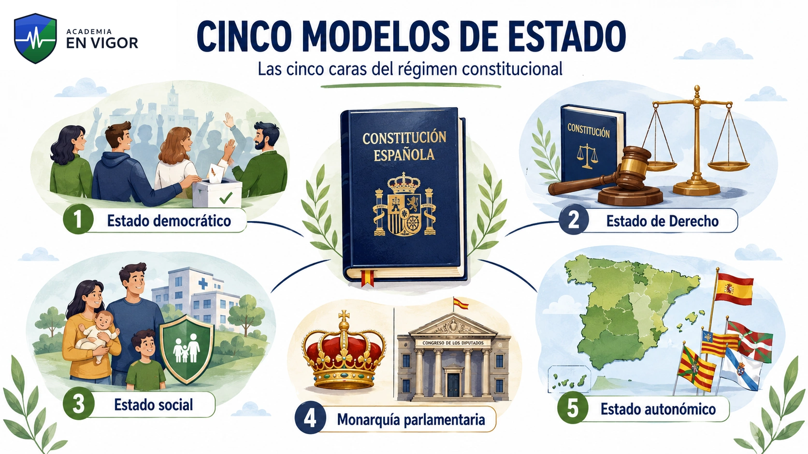

<em>Ilustración: Cinco caras complementarias del régimen constitucional.</em>

<!-- MATERIAL PENDIENTE: t02-p2-audio -->
<!-- MATERIAL PENDIENTE: t02-p2-video -->
<!-- MATERIAL PENDIENTE: t02-p2-presentacione -->

<!-- FUENTE: CE-T02 -->

## 08. El Estado De Derecho

**Estado de Derecho.** El poder público está sometido a la Constitución, a la ley y al control jurisdiccional.
**Principio de legalidad.** La Constitución garantiza el principio de legalidad.
**Jerarquía normativa.** La Constitución garantiza la jerarquía normativa.
**Publicidad normativa.** La Constitución garantiza la publicidad de las normas.
**Irretroactividad.** El artículo 9.3 garantiza la irretroactividad de las disposiciones sancionadoras no favorables o restrictivas de derechos individuales.
**Seguridad jurídica.** La Constitución garantiza la seguridad jurídica.
**Responsabilidad.** La Constitución garantiza la responsabilidad de los poderes públicos.
**Interdicción de la arbitrariedad.** La Constitución prohíbe la arbitrariedad de los poderes públicos.

<!-- VISUAL:t02-05-articulo-9-3.webp -->

  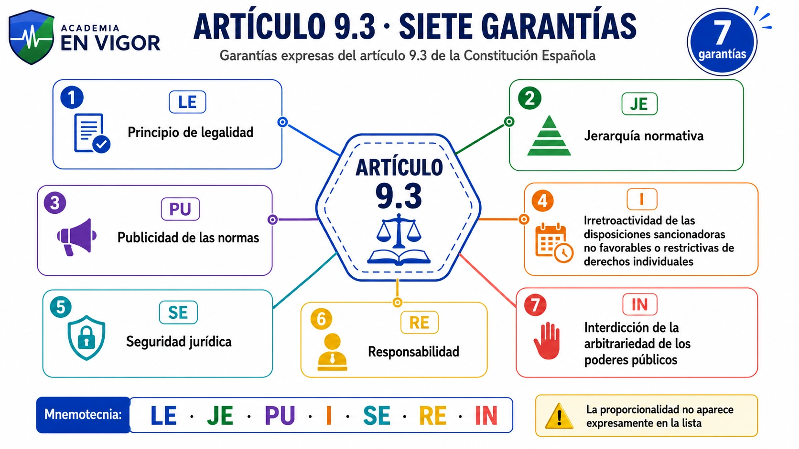

<em>Infografía: Garantías expresas del artículo 9.3.</em>

:::trampa
El artículo 9.3 no menciona expresamente proporcionalidad ni igualdad.
:::

<!-- MATERIAL PENDIENTE: t02-p2-audio -->
<!-- MATERIAL PENDIENTE: t02-p2-video -->
<!-- MATERIAL PENDIENTE: t02-p2-presentacione -->

<!-- FUENTE: CE-T02 -->

## 09. El Estado Social

**Estado social.** El Estado social exige una actuación pública orientada a hacer reales la libertad y la igualdad.
**Igualdad material.** El artículo 9.2 ordena promover condiciones para que libertad e igualdad sean reales y efectivas.
**Remoción de obstáculos.** Los poderes públicos deben remover los obstáculos que impidan o dificulten la plenitud de libertad e igualdad.
**Participación social.** Los poderes públicos deben facilitar la participación en la vida política, económica, cultural y social.

<!-- MATERIAL PENDIENTE: t02-p2-audio -->
<!-- MATERIAL PENDIENTE: t02-p2-video -->
<!-- MATERIAL PENDIENTE: t02-p2-presentacione -->

<!-- FUENTE: CE-T02 -->

## 10. La Monarquía Parlamentaria

**Forma política.** La forma política del Estado español es la Monarquía parlamentaria.
**Jefatura y Gobierno.** El Rey ejerce la Jefatura del Estado, mientras que el Gobierno dirige la política.
**Refrendo.** Los actos del Rey quedan sometidos con carácter general a refrendo.
**Responsabilidad política.** La responsabilidad política corresponde a los órganos que adoptan y refrendan las decisiones.

<!-- MATERIAL PENDIENTE: t02-p2-audio -->
<!-- MATERIAL PENDIENTE: t02-p2-video -->
<!-- MATERIAL PENDIENTE: t02-p2-presentacione -->

<!-- FUENTE: CE-T02 -->

## 11. El Estado Autonomista

**Unidad.** La Constitución se fundamenta en la indisoluble unidad de la Nación española.
**Autonomía.** La Constitución reconoce y garantiza el derecho a la autonomía de nacionalidades y regiones.
**Solidaridad.** La Constitución garantiza la solidaridad entre nacionalidades y regiones.
**Lengua oficial.** El castellano es la lengua española oficial del Estado; existe deber de conocerla y derecho a usarla.
**Banderas autonómicas.** Las banderas autonómicas se utilizan junto a la bandera de España en edificios públicos y actos oficiales.
**Capital.** La capital del Estado es la villa de Madrid.
**Fuerzas Armadas.** El artículo 8 CE enumera literalmente el Ejército de Tierra, la Armada y el Ejército del Aire.

<!-- VISUAL:t02-04-cinco-pilares.webp -->

  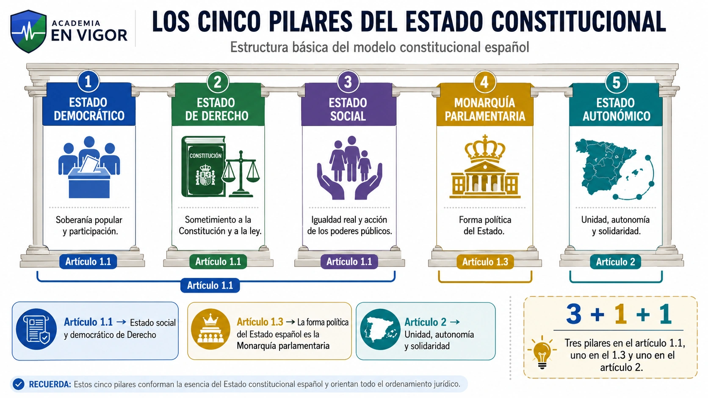

<em>Infografía: Estado democrático, de Derecho, social, monarquía parlamentaria y Estado autonómico.</em>

<!-- MATERIAL PENDIENTE: t02-p2-audio -->
<!-- MATERIAL PENDIENTE: t02-p2-video -->
<!-- MATERIAL PENDIENTE: t02-p2-presentacione -->

<!-- FUENTE: CE-T02 -->

## 12. Mapa Del Título I

**Extensión del Título I.** El Título I comprende los artículos 10 a 55.
**Capítulo I.** El Capítulo I del Título I regula a españoles y extranjeros en los artículos 11 a 13.
**Capítulo II.** El Capítulo II contiene derechos y libertades en los artículos 14 a 38.
**Capítulo III.** El Capítulo III contiene los principios rectores en los artículos 39 a 52.
**Capítulo IV.** El Capítulo IV regula las garantías y el Defensor del Pueblo en los artículos 53 y 54.
**Capítulo V.** El Capítulo V regula la suspensión de derechos y libertades en el artículo 55.

<!-- VISUAL:t02-06-arbol-titulo-i.webp -->

  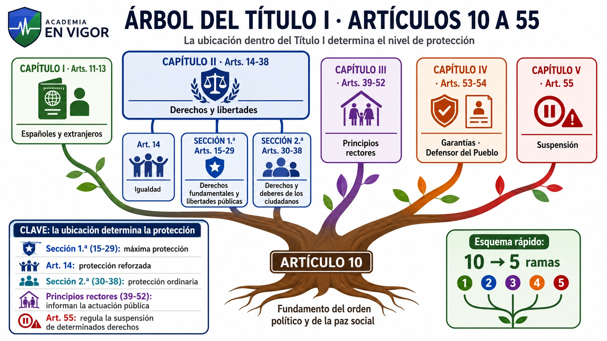

<em>Infografía: Capítulos, secciones y artículos del Título I.</em>

:::trampa
El artículo 14 está dentro del Capítulo II, pero antes de sus dos secciones.
:::

<!-- MATERIAL PENDIENTE: t02-p3-audio -->
<!-- MATERIAL PENDIENTE: t02-p3-video -->
<!-- MATERIAL PENDIENTE: t02-p3-presentacione -->

<!-- FUENTE: CE-T02 -->

## 13. Artículo 10: Dignidad E Interpretación

**Dignidad.** La dignidad de la persona es fundamento del orden político y de la paz social.
**Derechos inviolables.** Los derechos inviolables inherentes a la persona fundamentan el orden político y la paz social.
**Libre desarrollo.** El libre desarrollo de la personalidad es fundamento del orden político y de la paz social.
**Interpretación internacional.** Los derechos fundamentales y libertades se interpretan conforme a la Declaración Universal y a los tratados ratificados por España.

<!-- MATERIAL PENDIENTE: t02-p3-audio -->
<!-- MATERIAL PENDIENTE: t02-p3-video -->
<!-- MATERIAL PENDIENTE: t02-p3-presentacione -->

<!-- FUENTE: CE-T02 -->

## 14. Españoles, Extranjeros E Igualdad (Arts. 11-14)

**Nacionalidad.** La nacionalidad española se adquiere, conserva y pierde conforme a la ley.
**Español de origen.** Ningún español de origen puede ser privado de su nacionalidad.
**Mayoría de edad.** Los españoles son mayores de edad a los dieciocho años.
**Extranjeros.** Los extranjeros gozan de las libertades públicas del Título I en los términos de los tratados y la ley.
**Sufragio municipal.** Puede reconocerse a extranjeros sufragio activo y pasivo en elecciones municipales atendiendo a reciprocidad.
**Extradición.** La extradición se concede conforme a tratado o ley y reciprocidad; el terrorismo no se considera delito político.
**Igualdad ante la ley.** El artículo 14 proclama la igualdad de los españoles ante la ley y prohíbe la discriminación.

<!-- VISUAL:t02-07-titulares-derechos.webp -->

  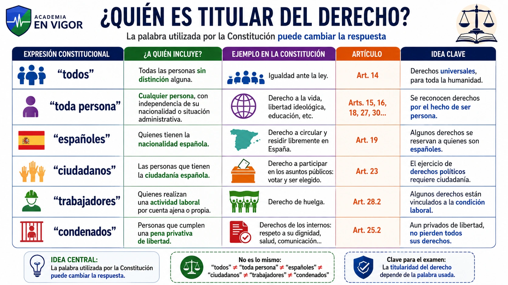

<em>Infografía: Todos, españoles, ciudadanos y trabajadores.</em>

<!-- MATERIAL PENDIENTE: t02-p3-audio -->
<!-- MATERIAL PENDIENTE: t02-p3-video -->
<!-- MATERIAL PENDIENTE: t02-p3-presentacione -->

<!-- FUENTE: CE-T02 -->

## 15. Derechos De La Esfera Personal (Arts. 15-19)

**Vida e integridad.** El artículo 15 reconoce el derecho a la vida y a la integridad física y moral.
**Prohibición de tortura.** Nadie puede ser sometido a tortura ni a penas o tratos inhumanos o degradantes.
**Libertad ideológica y religiosa.** La libertad ideológica, religiosa y de culto solo puede limitarse por el orden público protegido por la ley.
**Libertad y seguridad.** Toda persona tiene derecho a la libertad y a la seguridad.
**Duración de la detención.** La detención preventiva dura solo el tiempo estrictamente necesario y, como máximo ordinario, setenta y dos horas.
**Información al detenido.** La persona detenida debe ser informada inmediatamente y de modo comprensible de sus derechos y de las razones de la detención.
**Asistencia letrada.** La Constitución garantiza asistencia de abogado al detenido en diligencias policiales y judiciales.
**Habeas corpus.** La ley regula un procedimiento de habeas corpus para la inmediata puesta a disposición judicial del detenido ilegalmente.
**Inviolabilidad domiciliaria.** La entrada domiciliaria requiere consentimiento, resolución judicial o flagrante delito.
**Secreto de comunicaciones.** Las comunicaciones son secretas salvo resolución judicial.
**Circulación y residencia.** Los españoles pueden elegir residencia, circular por el territorio y entrar y salir de España en los términos legales.

<!-- VISUAL:t02-08-reloj-detencion.webp -->

  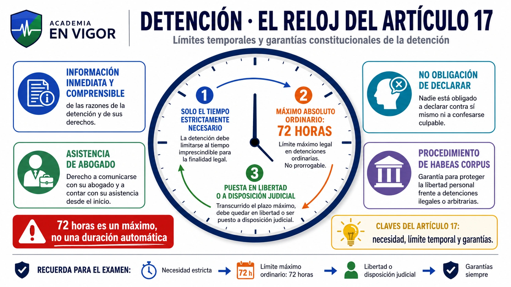

<em>Infografía: Necesidad, máximo de 72 horas, información, abogado y habeas corpus.</em>

<!-- VISUAL:t02-09-cojufla-domicilio.webp -->

  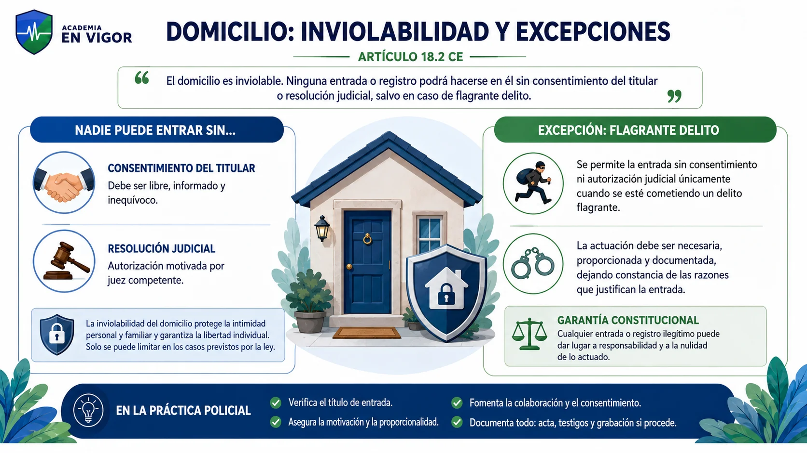

<em>Infografía: Consentimiento, resolución judicial y flagrante delito.</em>

<!-- VISUAL:t02-ilu-05-derechos-persona.webp -->

  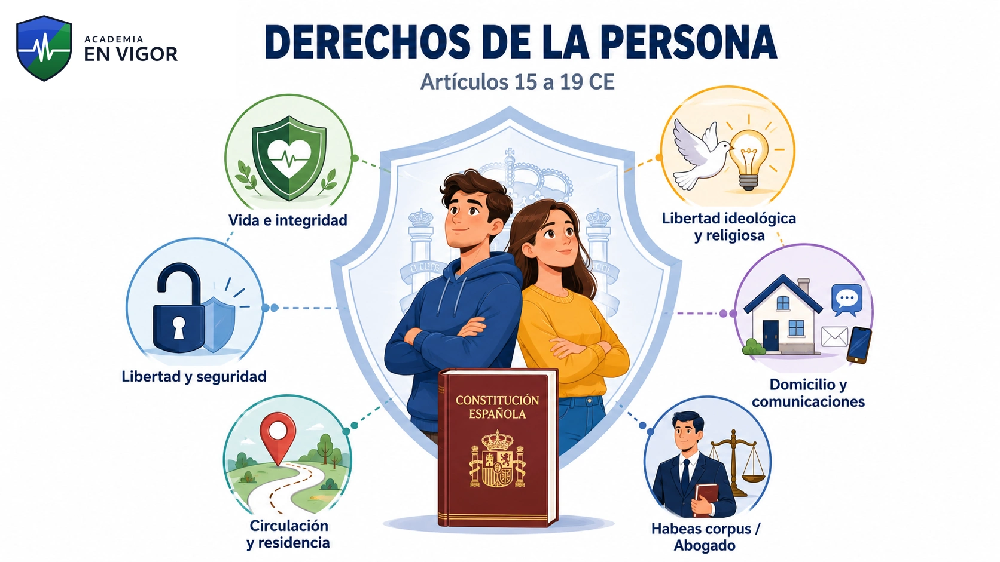

<em>Ilustración: La persona protegida por derechos conectados.</em>

:::trampa
Setenta y dos horas es un máximo, no una duración automática.
:::

<!-- MATERIAL PENDIENTE: t02-p4-audio -->
<!-- MATERIAL PENDIENTE: t02-p4-video -->
<!-- MATERIAL PENDIENTE: t02-p4-presentacione -->

<!-- FUENTE: CE-T02 -->

## 16. Expresión, Reunión, Asociación Y Participación (Arts. 20-23)

**Libertad de expresión.** El artículo 20 reconoce libertades de expresión, creación, cátedra e información veraz.
**Censura previa.** El ejercicio de las libertades del artículo 20 no puede restringirse mediante censura previa.
**Secuestro de publicaciones.** El secuestro de publicaciones, grabaciones y otros medios de información exige resolución judicial.
**Derecho de reunión.** El derecho de reunión pacífica y sin armas no necesita autorización previa.
**Manifestaciones.** Las reuniones en lugares de tránsito público y las manifestaciones requieren comunicación previa.
**Prohibición de reunión.** Una reunión comunicada solo puede prohibirse por razones fundadas de alteración del orden público con peligro para personas o bienes.
**Derecho de asociación.** Las asociaciones con fines o medios delictivos son ilegales y las secretas y paramilitares están prohibidas.
**Participación pública.** Los ciudadanos participan en asuntos públicos directamente o mediante representantes elegidos por sufragio universal.
**Acceso a funciones públicas.** Los ciudadanos acceden en igualdad a funciones y cargos públicos con los requisitos legales.

<!-- VISUAL:t02-10-semaforo-reunion.webp -->

  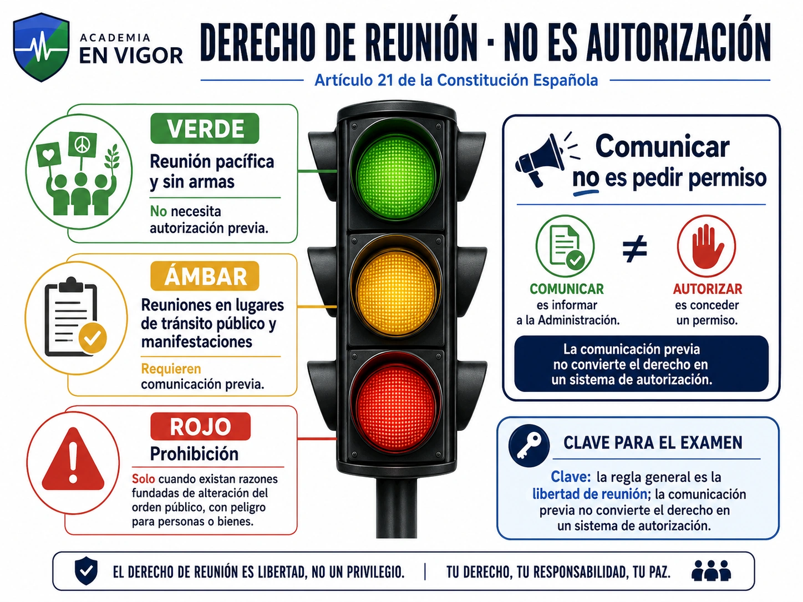

<em>Infografía: Reunión libre, comunicación y prohibición excepcional.</em>

:::trampa
La manifestación se comunica; no se solicita autorización.
:::

<!-- MATERIAL PENDIENTE: t02-p4-audio -->
<!-- MATERIAL PENDIENTE: t02-p4-video -->
<!-- MATERIAL PENDIENTE: t02-p4-presentacione -->

<!-- FUENTE: CE-T02 -->

## 17. Garantías Procesales Y Legalidad Sancionadora (Arts. 24-26)

**Tutela judicial efectiva.** Todas las personas tienen derecho a obtener tutela efectiva de jueces y tribunales sin indefensión.
**Juez ordinario.** El artículo 24.2 reconoce el derecho al juez ordinario predeterminado por la ley.
**Defensa y asistencia letrada.** El artículo 24.2 reconoce los derechos de defensa y asistencia de letrado.
**Proceso público.** El proceso debe ser público, sin dilaciones indebidas y con todas las garantías.
**Presunción de inocencia.** Toda persona tiene derecho a la presunción de inocencia.
**Legalidad sancionadora.** Nadie puede ser condenado o sancionado por hechos que no fueran infracción cuando se produjeron.
**Finalidad de las penas.** Las penas privativas de libertad y medidas de seguridad se orientan a reeducación y reinserción social.
**Tribunales de honor.** Los tribunales de honor están prohibidos en la Administración civil y en las organizaciones profesionales.

<!-- MATERIAL PENDIENTE: t02-p4-audio -->
<!-- MATERIAL PENDIENTE: t02-p4-video -->
<!-- MATERIAL PENDIENTE: t02-p4-presentacione -->

<!-- FUENTE: CE-T02 -->

## 18. Educación, Sindicación, Huelga Y Petición (Arts. 27-29)

**Derecho a la educación.** Todos tienen derecho a la educación y se reconoce la libertad de enseñanza.
**Enseñanza básica.** La enseñanza básica es obligatoria y gratuita.
**Libertad sindical.** La libertad sindical comprende fundar sindicatos, afiliarse y no ser obligado a afiliarse.
**Derecho de huelga.** Los trabajadores tienen derecho a la huelga para defender sus intereses.
**Servicios esenciales.** La regulación de la huelga debe establecer garantías para mantener los servicios esenciales de la comunidad.
**Derecho de petición.** Todos los españoles tienen derecho de petición individual y colectiva por escrito.
**Petición militar.** Los miembros de cuerpos sometidos a disciplina militar ejercen el derecho de petición solo individualmente y conforme a su legislación.

<!-- MATERIAL PENDIENTE: t02-p4-audio -->
<!-- MATERIAL PENDIENTE: t02-p4-video -->
<!-- MATERIAL PENDIENTE: t02-p4-presentacione -->

<!-- FUENTE: CE-T02 -->

## 19. Sección 2.ª: Derechos Y Deberes De Los Ciudadanos (Arts. 30-38)

**Defensa de España.** Los españoles tienen el derecho y el deber de defender España.
**Sistema tributario.** El sistema tributario debe ser justo, inspirado en igualdad y progresividad y sin alcance confiscatorio.
**Matrimonio.** El hombre y la mujer tienen derecho a contraer matrimonio con plena igualdad jurídica.
**Propiedad y herencia.** La Constitución reconoce la propiedad privada y la herencia, delimitadas por su función social.
**Expropiación.** La privación de bienes exige utilidad pública o interés social, indemnización y conformidad con la ley.
**Fundación.** Se reconoce el derecho de fundación para fines de interés general conforme a la ley.
**Trabajo.** Todos los españoles tienen el deber de trabajar y el derecho al trabajo.
**Negociación colectiva.** La ley garantiza la negociación colectiva laboral y la fuerza vinculante de los convenios.
**Libertad de empresa.** Se reconoce la libertad de empresa en el marco de la economía de mercado.

:::trampa
La Constitución dice «correspondiente indemnización», no siempre «indemnización previa».
:::

<!-- MATERIAL PENDIENTE: t02-p5-audio -->
<!-- MATERIAL PENDIENTE: t02-p5-video -->
<!-- MATERIAL PENDIENTE: t02-p5-presentacione -->

<!-- FUENTE: CE-T02 -->

## 20. Principios Rectores: Naturaleza Y Garantía

**Naturaleza de los principios rectores.** Los artículos 39 a 52 contienen principios rectores de la política social y económica.
**Función interpretativa.** Los principios rectores informan la legislación positiva, la práctica judicial y la actuación de los poderes públicos.
**Alegación judicial.** Los principios rectores solo pueden alegarse ante la jurisdicción conforme a las leyes que los desarrollen.
**Ausencia de amparo directo.** Los principios rectores no son directamente protegibles mediante recurso de amparo.

<!-- VISUAL:t02-11-principios-rectores.webp -->

  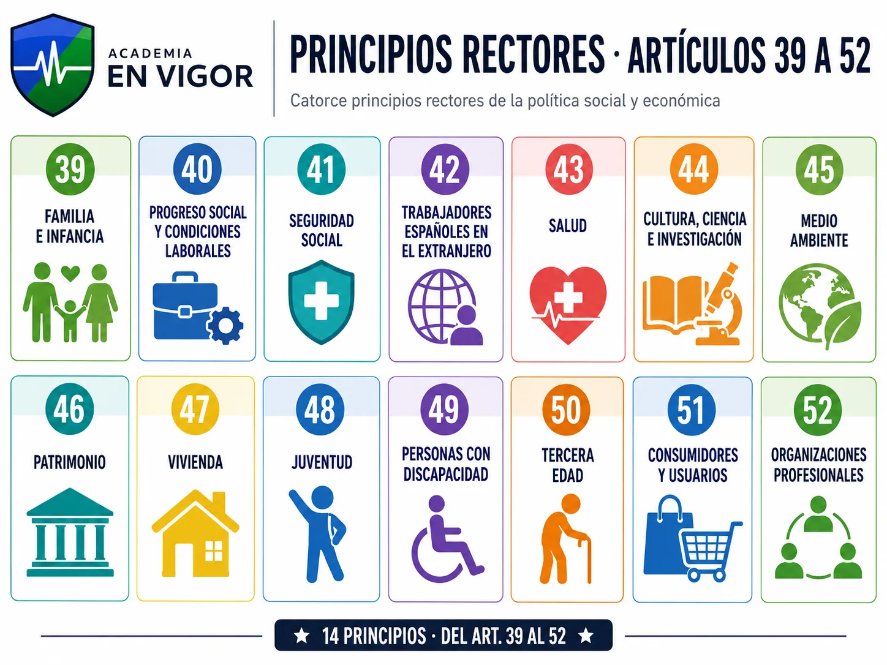

<em>Infografía: Mapa de los artículos 39 a 52.</em>

<!-- MATERIAL PENDIENTE: t02-p5-audio -->
<!-- MATERIAL PENDIENTE: t02-p5-video -->
<!-- MATERIAL PENDIENTE: t02-p5-presentacione -->

<!-- FUENTE: CE-T02 -->

## 21. Familia, Trabajo Y Seguridad Social (Arts. 39-42)

**Protección de la familia.** Los poderes públicos aseguran la protección social, económica y jurídica de la familia.
**Protección de los hijos.** Los hijos son iguales ante la ley con independencia de su filiación.
**Política laboral.** Los poderes públicos promueven progreso social, distribución de renta, pleno empleo y formación profesional.
**Seguridad Social.** Los poderes públicos mantienen un régimen público de Seguridad Social para todos los ciudadanos.
**Trabajadores en el extranjero.** El Estado vela por los derechos económicos y sociales de los trabajadores españoles en el extranjero y orienta su política al retorno.

<!-- MATERIAL PENDIENTE: t02-p5-audio -->
<!-- MATERIAL PENDIENTE: t02-p5-video -->
<!-- MATERIAL PENDIENTE: t02-p5-presentacione -->

<!-- FUENTE: CE-T02 -->

## 22. Salud, Cultura Y Medio Ambiente (Arts. 43-46)

**Protección de la salud.** Se reconoce el derecho a la protección de la salud.
**Cultura.** Los poderes públicos promueven y tutelan el acceso a la cultura.
**Ciencia e investigación.** Los poderes públicos promueven la ciencia y la investigación científica y técnica.
**Medio ambiente.** Todos tienen derecho a un medio ambiente adecuado y el deber de conservarlo.
**Patrimonio histórico.** Los poderes públicos garantizan la conservación y promueven el enriquecimiento del patrimonio histórico, cultural y artístico.

<!-- MATERIAL PENDIENTE: t02-p5-audio -->
<!-- MATERIAL PENDIENTE: t02-p5-video -->
<!-- MATERIAL PENDIENTE: t02-p5-presentacione -->

<!-- FUENTE: CE-T02 -->

## 23. Vivienda, Juventud, Discapacidad Y Mayores (Arts. 47-50)

**Vivienda.** Todos los españoles tienen derecho a disfrutar de una vivienda digna y adecuada.
**Participación juvenil.** Los poderes públicos promueven la participación libre y eficaz de la juventud.
**Personas con discapacidad.** El artículo 49 exige políticas de plena autonomía personal e inclusión social en entornos universalmente accesibles.
**Mujeres y menores con discapacidad.** El artículo 49 atiende particularmente a las necesidades específicas de mujeres y menores con discapacidad.
**Personas mayores.** Los poderes públicos garantizan suficiencia económica a las personas durante la tercera edad.

<!-- MATERIAL PENDIENTE: t02-p5-audio -->
<!-- MATERIAL PENDIENTE: t02-p5-video -->
<!-- MATERIAL PENDIENTE: t02-p5-presentacione -->

<!-- FUENTE: CE-T02 -->

## 24. Consumidores Y Organizaciones Profesionales (Arts. 51-52)

**Consumidores.** Los poderes públicos garantizan la defensa de consumidores y usuarios.
**Seguridad y salud.** La defensa de consumidores protege mediante procedimientos eficaces su seguridad, salud e intereses económicos.
**Información y educación.** Los poderes públicos promueven información y educación de consumidores y usuarios.
**Organizaciones profesionales.** La ley regula las organizaciones profesionales que contribuyen a defender intereses económicos propios.
**Democracia interna.** La estructura interna y el funcionamiento de las organizaciones profesionales deben ser democráticos.

<!-- MATERIAL PENDIENTE: t02-p5-audio -->
<!-- MATERIAL PENDIENTE: t02-p5-video -->
<!-- MATERIAL PENDIENTE: t02-p5-presentacione -->

<!-- FUENTE: CE-T02 -->

## 25. Sistema General De Garantías

**Garantías normativas.** Las garantías normativas incluyen reserva de ley, contenido esencial y control de constitucionalidad.
**Garantías judiciales.** Las garantías judiciales incluyen tutela ordinaria, procedimiento preferente y sumario y recurso de amparo.
**Garantías institucionales.** El Tribunal Constitucional y el Defensor del Pueblo forman parte del sistema institucional de garantías.
**Garantía internacional.** El artículo 10.2 conecta la interpretación de los derechos con la Declaración Universal y los tratados ratificados.

<!-- VISUAL:t02-ilu-06-garantias-escudo.webp -->

  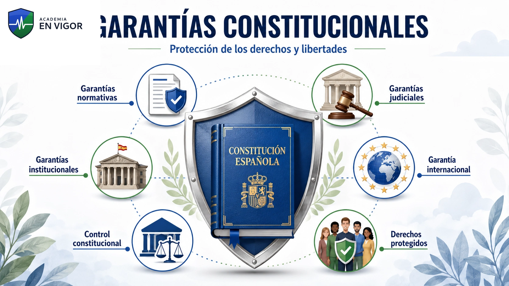

<em>Ilustración: Las garantías convierten los derechos en protección efectiva.</em>

<!-- MATERIAL PENDIENTE: t02-p6-audio -->
<!-- MATERIAL PENDIENTE: t02-p6-video -->
<!-- MATERIAL PENDIENTE: t02-p6-presentacione -->

<!-- FUENTE: CE-T02 -->

## 26. Los Tres Apartados Del Artículo 53

**Artículo 53.1.** Los derechos del Capítulo II vinculan a todos los poderes públicos y solo pueden regularse por ley respetando su contenido esencial.
**Artículo 53.2.** El artículo 14 y la Sección 1.ª reciben tutela por procedimiento preferente y sumario y recurso de amparo.
**Objeción de conciencia.** El recurso de amparo se extiende a la objeción de conciencia del artículo 30.2.
**Artículo 53.3.** Los principios del Capítulo III informan legislación, práctica judicial y actuación pública y se alegan conforme a sus leyes de desarrollo.

<!-- VISUAL:t02-12-tres-niveles-garantias.webp -->

  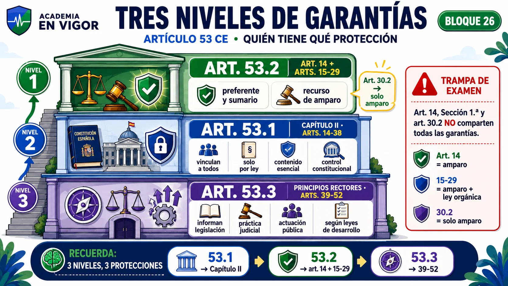

<em>Infografía: Artículo 53.1, 53.2 y 53.3.</em>

:::trampa
El artículo 30.2 tiene amparo, pero no pertenece a la Sección 1.ª.
:::

<!-- MATERIAL PENDIENTE: t02-p6-audio -->
<!-- MATERIAL PENDIENTE: t02-p6-video -->
<!-- MATERIAL PENDIENTE: t02-p6-presentacione -->

<!-- FUENTE: CE-T02 -->

## 27. Ley Orgánica, Reforma Agravada Y Control De Leyes

**Desarrollo por ley orgánica.** El desarrollo de derechos fundamentales y libertades públicas requiere ley orgánica.
**Ámbito de ley orgánica.** La reserva de ley orgánica se refiere a la Sección 1.ª y no automáticamente al artículo 14 o al 30.2.
**Reforma agravada.** La reforma que afecte a la Sección 1.ª del Capítulo II sigue el procedimiento agravado del artículo 168.
**Control constitucional.** El Tribunal Constitucional controla la constitucionalidad de las leyes y normas con fuerza de ley.

<!-- MATERIAL PENDIENTE: t02-p6-audio -->
<!-- MATERIAL PENDIENTE: t02-p6-video -->
<!-- MATERIAL PENDIENTE: t02-p6-presentacione -->

<!-- FUENTE: CE-T02 -->

## 28. Recurso De Amparo

**Naturaleza del amparo.** El recurso de amparo es subsidiario y protege los derechos comprendidos en los artículos 14 a 29 y 30.2.
**Subsidiariedad.** Antes del amparo deben agotarse las vías judiciales procedentes, salvo los supuestos constitucionales y legales específicos.
**Legitimación.** Pueden interponer amparo la persona afectada, el Defensor del Pueblo y el Ministerio Fiscal en los términos legales.
**Objeto.** El amparo no es una tercera instancia para revisar cualquier error de legalidad ordinaria.

<!-- MATERIAL PENDIENTE: t02-p6-audio -->
<!-- MATERIAL PENDIENTE: t02-p6-video -->
<!-- MATERIAL PENDIENTE: t02-p6-presentacione -->

<!-- FUENTE: LOTC -->

## 29. Suspensión General De Derechos (Art. 55.1)

**Suspensión general.** La suspensión general del artículo 55.1 solo puede operar durante los estados de excepción o de sitio.
**Derechos suspendibles.** Pueden suspenderse los derechos de los artículos 17, 18.2, 18.3, 19, 20.1.a y d, 20.5, 21, 28.2 y 37.2.
**Excepción del artículo 17.3.** En el estado de excepción no puede suspenderse el artículo 17.3.
**Estado de alarma.** El estado de alarma no permite suspender derechos fundamentales.
**Proporcionalidad.** La suspensión debe limitarse a lo previsto en la Constitución, la ley y la declaración correspondiente.

<!-- VISUAL:t02-13-suspension-derechos.webp -->

  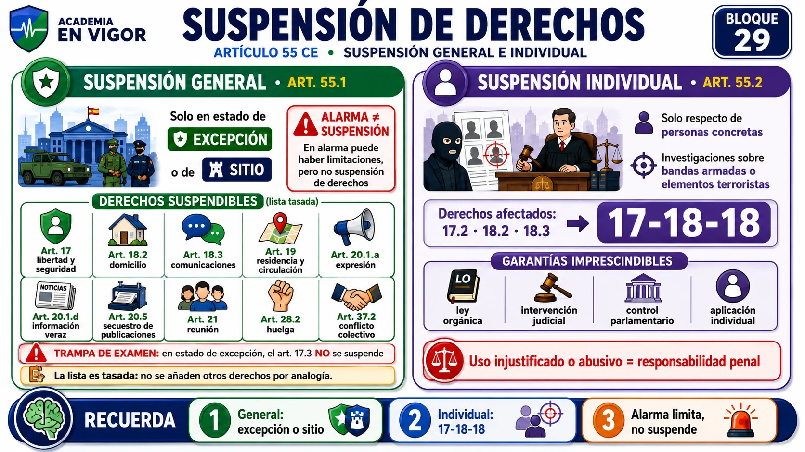

<em>Infografía: Suspensión general e individual.</em>

<!-- VISUAL:t02-ilu-07-excepcion-no-normalidad.webp -->

  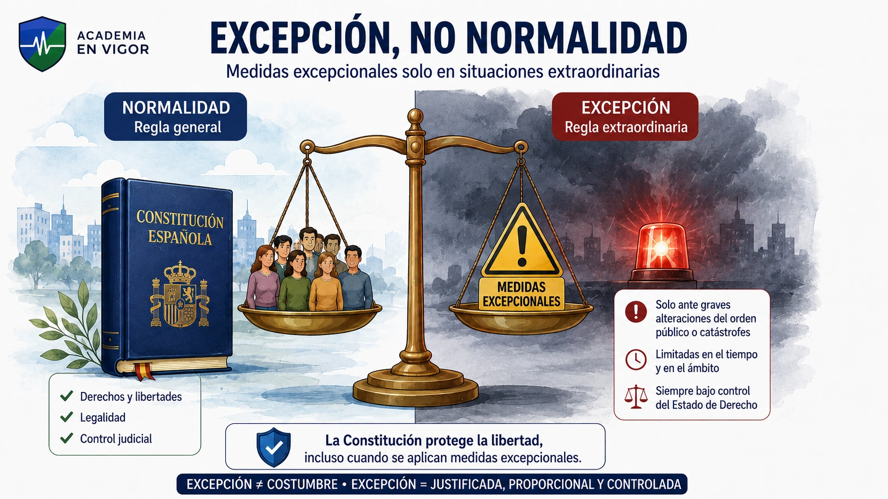

<em>Ilustración: La suspensión como medida excepcional y limitada.</em>

:::trampa
Alarma puede limitar derechos conforme a la ley, pero no suspenderlos.
:::

<!-- MATERIAL PENDIENTE: t02-p6-audio -->
<!-- MATERIAL PENDIENTE: t02-p6-video -->
<!-- MATERIAL PENDIENTE: t02-p6-presentacione -->

<!-- FUENTE: CE-T02 -->

## 30. Alarma, Excepción Y Sitio: Contexto Necesario

**Declaración de alarma.** El Gobierno declara el estado de alarma por decreto acordado en Consejo de Ministros por un máximo inicial de quince días.
**Prórroga de alarma.** La prórroga del estado de alarma necesita autorización del Congreso.
**Declaración de excepción.** El Gobierno declara el estado de excepción previa autorización del Congreso por un máximo de treinta días.
**Prórroga de excepción.** El estado de excepción puede prorrogarse por otros treinta días con los mismos requisitos.
**Declaración de sitio.** El Congreso declara el estado de sitio por mayoría absoluta a propuesta exclusiva del Gobierno.

<!-- MATERIAL PENDIENTE: t02-p6-audio -->
<!-- MATERIAL PENDIENTE: t02-p6-video -->
<!-- MATERIAL PENDIENTE: t02-p6-presentacione -->

<!-- FUENTE: LOAES -->

## 31. Suspensión Individual Del Artículo 55.2

**Suspensión individual.** La suspensión individual puede afectar a los artículos 17.2, 18.2 y 18.3.
**Ámbito subjetivo.** La suspensión individual se vincula a investigaciones sobre bandas armadas o elementos terroristas.
**Intervención judicial.** La suspensión individual exige intervención judicial y adecuado control parlamentario.
**Responsabilidad penal.** El uso injustificado o abusivo de estas facultades produce responsabilidad penal por violación de derechos.

<!-- MATERIAL PENDIENTE: t02-p6-audio -->
<!-- MATERIAL PENDIENTE: t02-p6-video -->
<!-- MATERIAL PENDIENTE: t02-p6-presentacione -->

<!-- FUENTE: CE-T02 -->

## 32. Conexión Con Protección De Datos

**Artículo 18.4.** La ley limita el uso de la informática para garantizar honor, intimidad y pleno ejercicio de los derechos.
**Derecho a la protección de datos.** Del artículo 18.4 se deriva un derecho autónomo al control de los datos personales.
**Regulación transversal.** La protección de datos se desarrolla con carácter general y mediante normas específicas para tratamientos policiales y penales.

<!-- MATERIAL PENDIENTE: t02-p6-audio -->
<!-- MATERIAL PENDIENTE: t02-p6-video -->
<!-- MATERIAL PENDIENTE: t02-p6-presentacione -->

<!-- FUENTE: CE-T02 -->

## 33. Naturaleza, Finalidad Y Normativa

**Alto comisionado.** El Defensor del Pueblo es el alto comisionado de las Cortes Generales.
**Finalidad.** El Defensor del Pueblo protege los derechos comprendidos en el Título I.
**Supervisión administrativa.** Puede supervisar la actividad de la Administración y dar cuenta a las Cortes Generales.
**Norma reguladora.** La institución se regula por la Ley Orgánica 3/1981.
**Legitimación constitucional.** El Defensor está legitimado para interponer recursos de inconstitucionalidad y de amparo.

<!-- VISUAL:t02-ilu-08-defensor-supervision.webp -->

  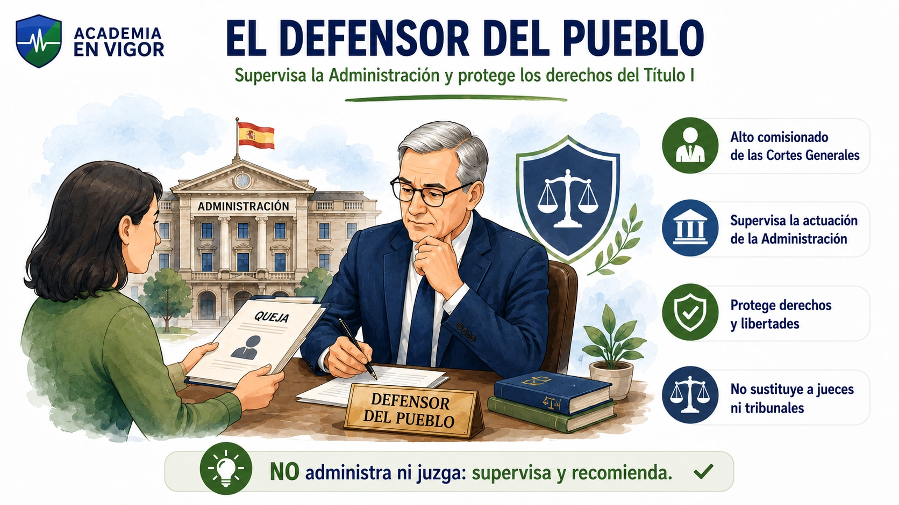

<em>Ilustración: El Defensor supervisa sin sustituir a jueces ni Administración.</em>

<!-- MATERIAL PENDIENTE: t02-p7-audio -->
<!-- MATERIAL PENDIENTE: t02-p7-video -->
<!-- MATERIAL PENDIENTE: t02-p7-presentacione -->

<!-- FUENTE: LODP -->

## 34. Elección, Nombramiento Y Mandato

**Mandato.** El Defensor del Pueblo es elegido por las Cortes Generales para un periodo de cinco años.
**Mayoría inicial.** La elección ordinaria exige tres quintos del Congreso y ratificación por tres quintos del Senado.
**Plazo de ratificación.** El Senado debe ratificar la propuesta inicial en un plazo máximo de veinte días.
**Procedimiento subsidiario.** Si fracasa la mayoría inicial, basta tres quintos del Congreso y mayoría absoluta del Senado.
**Nombramiento.** El nombramiento se acredita con las firmas de los Presidentes del Congreso y del Senado y se publica en el BOE.

<!-- VISUAL:t02-14-defensor-352.webp -->

  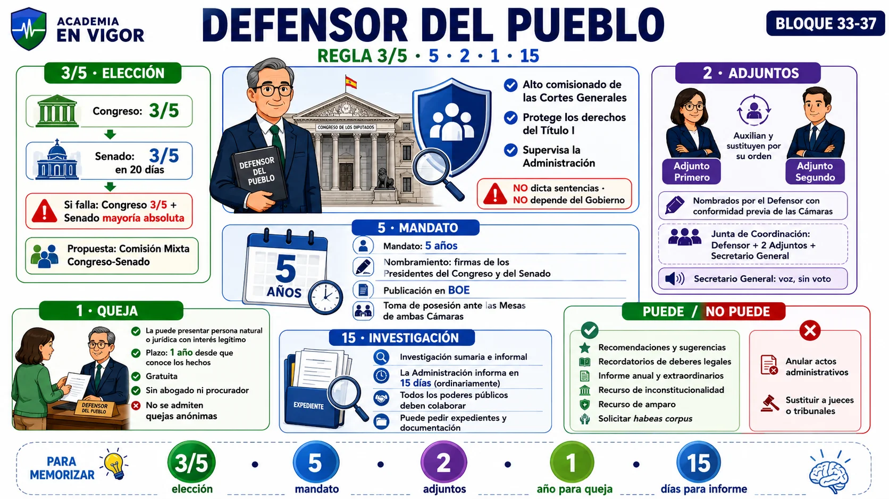

<em>Infografía: Elección, mandato, Adjuntos, quejas e informes.</em>

:::trampa
En la fase subsidiaria el Senado necesita mayoría absoluta, no tres quintos.
:::

<!-- MATERIAL PENDIENTE: t02-p7-audio -->
<!-- MATERIAL PENDIENTE: t02-p7-video -->
<!-- MATERIAL PENDIENTE: t02-p7-presentacione -->

<!-- FUENTE: LODP -->

## 35. Independencia, Prerrogativas, Incompatibilidades Y Cese

**Independencia.** El Defensor no recibe mandato imperativo ni instrucciones y ejerce sus funciones con autonomía.
**Inviolabilidad.** El Defensor no puede ser detenido, expedientado, multado, perseguido o juzgado por opiniones o actos realizados en sus funciones.
**Fuero.** Fuera de la flagrancia delictiva, su detención y procesamiento corresponden a la Sala de lo Penal del Tribunal Supremo.
**Incompatibilidades.** El cargo es incompatible, entre otros supuestos, con mandato representativo, cargo político y actividad profesional.
**Vacante ordinaria.** El Presidente del Congreso declara la vacante por muerte, renuncia o expiración del mandato.

<!-- MATERIAL PENDIENTE: t02-p7-audio -->
<!-- MATERIAL PENDIENTE: t02-p7-video -->
<!-- MATERIAL PENDIENTE: t02-p7-presentacione -->

<!-- FUENTE: LODP -->

## 36. Adjuntos Y Organización Interna

**Adjuntos.** El Defensor está auxiliado por un Adjunto Primero y un Adjunto Segundo.
**Nombramiento de Adjuntos.** Los Adjuntos son nombrados y separados por el Defensor con conformidad previa de las Cámaras.
**Junta de Coordinación.** La Junta de Coordinación está formada por el Defensor, los dos Adjuntos y el Secretario General.
**Voz sin voto.** El Secretario General actúa como secretario de la Junta con voz y sin voto.
**Mecanismo Nacional de Prevención.** El Defensor ejerce las funciones del Mecanismo Nacional de Prevención de la Tortura.
**Consejo Asesor.** El Mecanismo Nacional de Prevención cuenta con un Consejo Asesor de cooperación técnica y jurídica.

<!-- MATERIAL PENDIENTE: t02-p7-audio -->
<!-- MATERIAL PENDIENTE: t02-p7-video -->
<!-- MATERIAL PENDIENTE: t02-p7-presentacione -->

<!-- FUENTE: LODP -->

## 37. Quejas, Investigación Y Resoluciones

**Legitimación para la queja.** Puede presentar queja toda persona natural o jurídica que invoque un interés legítimo.
**Plazo de queja.** La queja debe presentarse en el plazo máximo de un año desde el conocimiento de los hechos.
**Gratuidad.** Las actuaciones ante el Defensor son gratuitas y no requieren abogado ni procurador.
**Quejas anónimas.** El Defensor rechaza las quejas anónimas.
**Investigación.** Admitida la queja, el Defensor promueve una investigación sumaria e informal.
**Plazo de informe administrativo.** El organismo requerido dispone normalmente de quince días para remitir su informe.
**Colaboración.** Todos los poderes públicos deben auxiliar al Defensor con carácter preferente y urgente.
**Límites de las resoluciones.** El Defensor no puede modificar ni anular actos o resoluciones administrativas.
**Recomendaciones.** El Defensor puede formular advertencias, recomendaciones, recordatorios de deberes legales y sugerencias.
**Informes parlamentarios.** El Defensor presenta un informe anual y puede presentar informes extraordinarios por gravedad o urgencia.

:::trampa
El Defensor recomienda y supervisa; no anula actos administrativos.
:::

<!-- MATERIAL PENDIENTE: t02-p7-audio -->
<!-- MATERIAL PENDIENTE: t02-p7-video -->
<!-- MATERIAL PENDIENTE: t02-p7-presentacione -->

<!-- FUENTE: LODP -->

# Hablemos claro

:::hablemos-claro
No memorices los derechos como una lista plana. La ubicación dentro del Título I determina quién es titular, qué ley puede desarrollarlos, qué tutela judicial reciben y si cabe amparo o suspensión.
:::

# En la calle

:::en-la-calle
Para la actuación policial, los artículos 17, 18 y 21 son límites operativos: duración y garantías de la detención, entrada domiciliaria y tratamiento de reuniones y manifestaciones.
:::

# Lo que cae

:::lo-que-cae
Fechas de 1978; 169 y 4-9-1-1; cuatro reformas; L-J-I-P; artículo 9.3; estructura del Título I; titulares; 72 horas; CO-JU-FLA; artículo 53; suspensión general e individual; y cifras del Defensor del Pueblo.
:::

# Ha caído

:::ha-caido
Hay 26 preguntas históricas mapeadas a bloques del Tema 2. Ninguna se presenta todavía con respuesta oficial porque las plantillas definitivas permanecen pendientes de cotejo.
:::

---

*Academia En Vigor · El temario que nunca duerme · Tema 2 · v0.1.0 · Documento interno no publicado.*
