# TEMA 3 · LA CONSTITUCIÓN ESPAÑOLA (II)

**Policía Nacional · Método VIGOR · PARTE**
**Versión de contenido:** 0.3.0
**Estado editorial:** approved_internal · **Publicación:** not_published

# Mapa del tema

<!-- VISUAL:t03-ilu-01-portada-constitucion-instituciones.png -->

  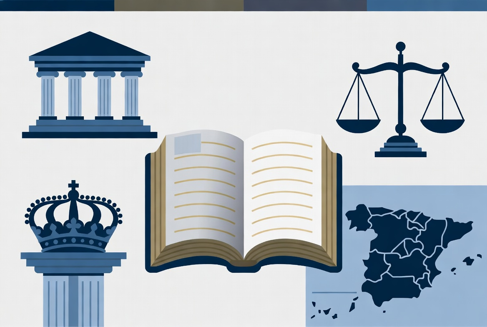

<em>Ilustración: Constitución e instituciones del Estado.</em>

1. Corona (bloques 1-4) → 2. Cortes y producción normativa (5-11) → 3. Gobierno, control y estados excepcionales (12-16) → 4. Poder Judicial (17-18) → 5. Organización territorial (19-23) → 6. Tribunal Constitucional y reforma (24-25).

# Contenido

## 01. La Corona: posición, inviolabilidad, refrendo y Casa del Rey

<!-- VISUAL:t03-ilu-02-corona-estado.png -->

  

<em>Ilustración: La Corona como Jefatura del Estado.</em>

- El Rey es el Jefe del Estado y símbolo de la unidad y permanencia de España. **(56.1)**
- El Rey arbitra y modera el funcionamiento regular de las instituciones. **(56.1)**
- La persona del Rey es inviolable y no está sujeta a responsabilidad. **(56.3)**
- Los actos del Rey carecen de validez sin refrendo, salvo la excepción del artículo 65.2. **(56.3)**
- Los actos del Rey son refrendados por el Presidente del Gobierno y, en su caso, por los ministros competentes. **(64.1)**
- La propuesta y el nombramiento del Presidente del Gobierno y la disolución del artículo 99 son refrendados por el Presidente del Congreso. **(64.1)**
- De los actos del Rey responden las personas que los refrendan. **(64.2)**
- El Rey nombra y releva libremente a los miembros civiles y militares de su Casa. **(65.2)**

<!-- VISUAL:t03-01-corona-refrendo.png -->

  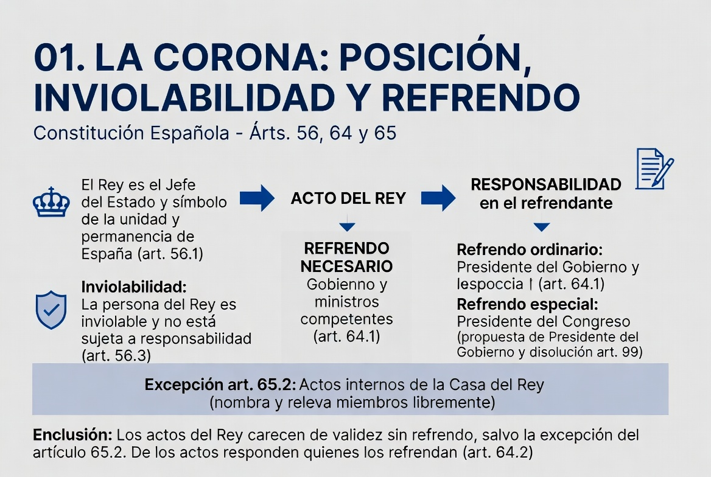

<em>Infografía: La Corona y el refrendo.</em>

<!-- FUENTE: CE-CORONA -->

## 02. Sucesión a la Corona y consorte

- La Corona es hereditaria en los sucesores de Juan Carlos I de Borbón, legítimo heredero de la dinastía histórica. **(57.1)**
- La sucesión sigue el orden regular de primogenitura y representación. **(57.1)**
- En la sucesión se prefiere siempre la línea anterior a las posteriores. **(57.1)**
- Dentro de la misma línea se prefiere el grado más próximo al más remoto. **(57.1)**
- En el mismo grado se prefiere el varón a la mujer. **(57.1)**
- En el mismo sexo se prefiere la persona de más edad a la de menos. **(57.1)**
- El heredero, desde su nacimiento o desde que se produzca el llamamiento, tiene la dignidad de Príncipe de Asturias y los demás títulos tradicionales. **(57.2)**
- Las abdicaciones, renuncias y dudas sucesorias se resuelven mediante ley orgánica. **(57.5)**
- La Reina consorte o el consorte de la Reina no puede asumir funciones constitucionales, salvo lo dispuesto para la Regencia. **(58)**

<!-- VISUAL:t03-02-sucesion-corona.png -->

  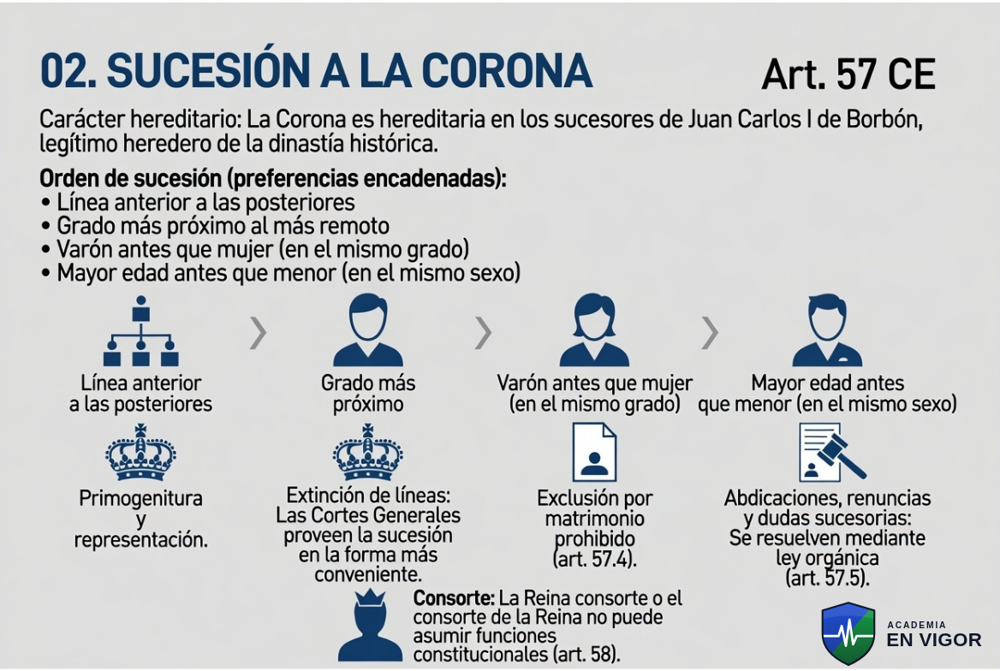

<em>Infografía: Sucesión a la Corona.</em>

<!-- FUENTE: CE-CORONA -->

## 03. Regencia, tutela y juramento

- Si el Rey es menor, ejerce inmediatamente la Regencia el padre o la madre y, en su defecto, el pariente mayor de edad más próximo según el orden sucesorio. **(59.1)**
- Si el Rey queda inhabilitado y las Cortes reconocen la imposibilidad, ejerce la Regencia el Príncipe heredero si es mayor de edad. **(59.2)**
- Si no existe persona llamada a ejercer la Regencia, las Cortes la nombran y puede estar compuesta por una, tres o cinco personas. **(59.3)**
- Para ejercer la Regencia se exige ser español y mayor de edad. **(59.4)**
- La Regencia se ejerce por mandato constitucional y siempre en nombre del Rey. **(59.5)**
- Es tutor del Rey menor la persona nombrada por el Rey difunto en testamento, siempre que sea mayor de edad y español de nacimiento. **(60.1)**
- Solo el padre, la madre o los ascendientes directos del Rey pueden acumular los cargos de Regente y tutor. **(60.1)**
- La tutela del Rey es incompatible con todo cargo o representación política. **(60.2)**
- El Rey, al ser proclamado ante las Cortes, jura desempeñar fielmente sus funciones, guardar y hacer guardar la Constitución y las leyes y respetar derechos y autonomías. **(61.1)**

<!-- VISUAL:t03-03-regencia-tutela.png -->

  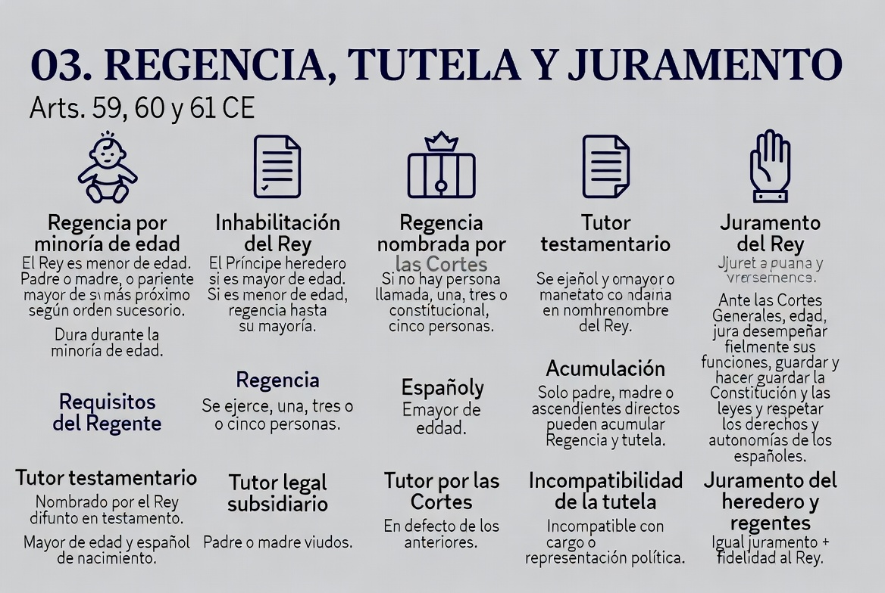

<em>Infografía: Regencia y tutela.</em>

<!-- FUENTE: CE-CORONA -->

## 04. Funciones nacionales e internacionales del Rey

- Corresponde al Rey sancionar y promulgar las leyes. **(62)**
- Corresponde al Rey convocar y disolver las Cortes Generales y convocar elecciones en los términos constitucionales. **(62)**
- Corresponde al Rey convocar a referéndum en los casos previstos en la Constitución. **(62)**
- Corresponde al Rey proponer candidato a Presidente del Gobierno, nombrarlo y poner fin a sus funciones en los términos constitucionales. **(62)**
- Corresponde al Rey nombrar y separar a los miembros del Gobierno a propuesta de su Presidente. **(62)**
- El Rey puede presidir sesiones del Consejo de Ministros, a petición del Presidente del Gobierno, cuando lo estime oportuno para ser informado de asuntos de Estado. **(62)**
- Corresponde al Rey el mando supremo de las Fuerzas Armadas. **(62)**
- El Rey ejerce el derecho de gracia con arreglo a la ley, que no puede autorizar indultos generales. **(62)**
- Corresponde al Rey manifestar el consentimiento del Estado para obligarse internacionalmente por medio de tratados. **(63.2)**
- Corresponde al Rey declarar la guerra y hacer la paz, previa autorización de las Cortes Generales. **(63.3)**

<!-- VISUAL:t03-04-funciones-rey.png -->

  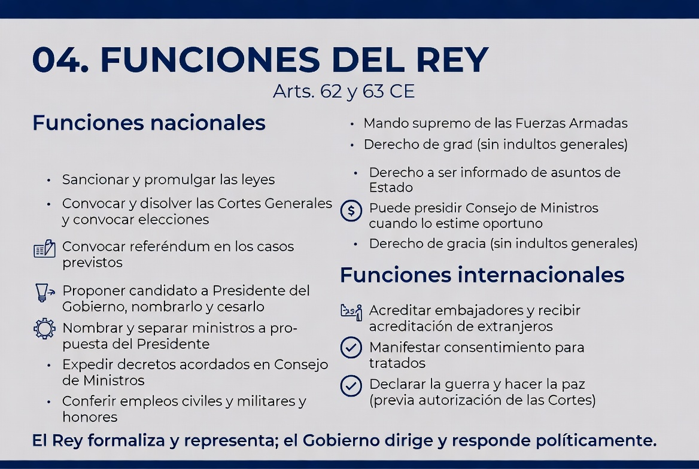

<em>Infografía: Funciones del Rey.</em>

<!-- FUENTE: CE-CORONA -->

## 05. Cortes Generales: naturaleza, funciones y mandato representativo

<!-- VISUAL:t03-ilu-03-cortes-debate-parlamentario.png -->

  

<em>Ilustración: Las Cortes Generales y el debate parlamentario.</em>

- Las Cortes Generales representan al pueblo español y están formadas por Congreso y Senado. **(66.1)**
- Las Cortes ejercen la potestad legislativa, aprueban los Presupuestos, controlan la acción del Gobierno y ejercen las demás competencias constitucionales. **(66.2)**
- Las Cortes Generales son inviolables. **(66.3)**
- Nadie puede ser miembro simultáneamente del Congreso y del Senado. **(67.1)**
- Los miembros de las Cortes Generales no están ligados por mandato imperativo. **(67.2)**

<!-- VISUAL:t03-05-cortes-generales.png -->

  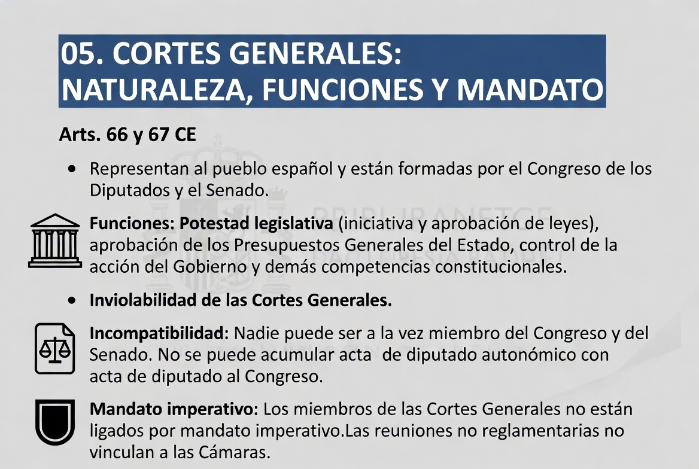

<em>Infografía: Cortes Generales.</em>

<!-- FUENTE: CE-CORTES -->

## 06. Congreso, Senado e incompatibilidades

- El Congreso se compone de un mínimo de 300 y un máximo de 400 diputados. **(68.1)**
- Los diputados son elegidos por sufragio universal, libre, igual, directo y secreto en los términos legales. **(68.1)**
- La circunscripción electoral para el Congreso es la provincia; Ceuta y Melilla están representadas cada una por un diputado. **(68.2)**
- La elección al Congreso se verifica en cada circunscripción atendiendo a criterios de representación proporcional. **(68.3)**
- El Congreso es elegido por cuatro años y el mandato termina cuatro años después de la elección o el día de la disolución. **(68.4)**
- Las elecciones al Congreso tienen lugar entre los 30 y 60 días desde la terminación del mandato. **(68.6)**
- El Congreso electo debe ser convocado dentro de los 25 días siguientes a las elecciones. **(68.6)**
- El Senado es la Cámara de representación territorial. **(69.1)**
- En cada provincia se eligen cuatro senadores por sufragio universal, libre, igual, directo y secreto. **(69.2)**
- Cada isla mayor —Gran Canaria, Mallorca y Tenerife— elige tres senadores. **(69.3)**
- Ceuta y Melilla eligen cada una dos senadores. **(69.4)**
- Cada comunidad autónoma designa un senador y otro más por cada millón de habitantes de su territorio. **(69.5)**
- El Senado es elegido por cuatro años y el mandato termina cuatro años después de la elección o el día de la disolución. **(69.6)**
- Entre las causas constitucionalmente mencionadas figuran determinados altos cargos, miembros del Tribunal Constitucional, Defensor del Pueblo, magistrados, jueces y fiscales en activo, militares y policías en activo y miembros de juntas electorales. **(70.1)**

<!-- VISUAL:t03-06-congreso-senado.png -->

  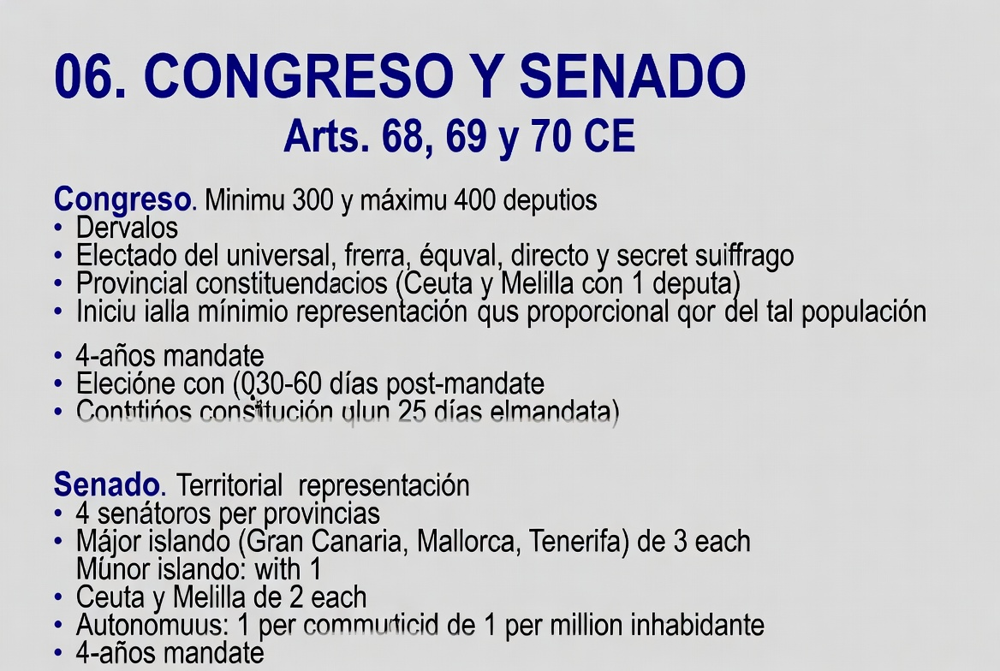

<em>Infografía: Congreso y Senado.</em>

<!-- FUENTE: CE-CORTES -->

## 07. Prerrogativas parlamentarias y autonomía de las Cámaras

- Diputados y senadores gozan de inviolabilidad por las opiniones manifestadas en el ejercicio de sus funciones. **(71.1)**
- Durante su mandato, diputados y senadores gozan de inmunidad y solo pueden ser detenidos en caso de flagrante delito. **(71.2)**
- Diputados y senadores no pueden ser inculpados ni procesados sin autorización previa de la Cámara respectiva. **(71.2)**
- En las causas contra diputados y senadores es competente la Sala de lo Penal del Tribunal Supremo. **(71.3)**
- Las Cámaras establecen sus propios reglamentos, aprueban autónomamente sus presupuestos y regulan de común acuerdo el estatuto del personal de las Cortes. **(72.1)**
- Los reglamentos y sus reformas se someten a una votación final sobre su totalidad que requiere mayoría absoluta. **(72.1)**
- Las sesiones conjuntas son presididas por el Presidente del Congreso y se rigen por un reglamento de las Cortes aprobado por mayoría absoluta de cada Cámara. **(72.2)**

<!-- VISUAL:t03-07-prerrogativas-parlamentarias.png -->

  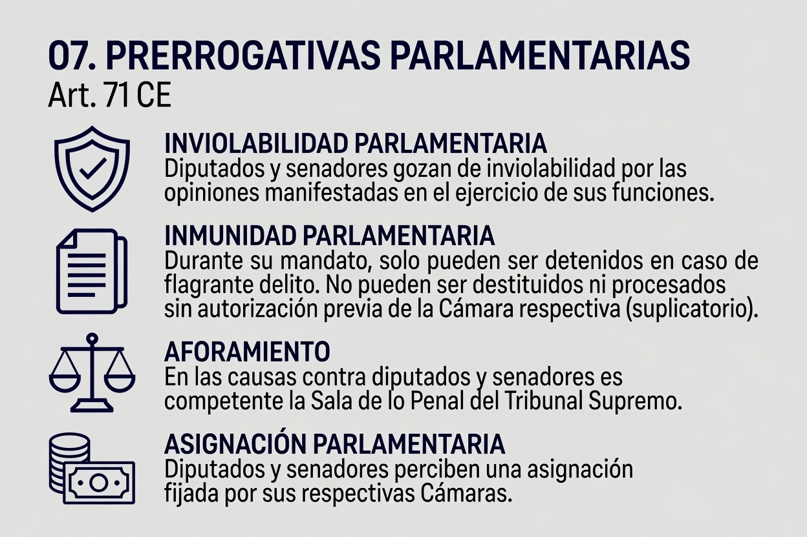

<em>Infografía: Prerrogativas parlamentarias.</em>

<!-- FUENTE: CE-CORTES -->

## 08. Funcionamiento de las Cámaras

- Las Cámaras se reúnen en dos períodos ordinarios: septiembre-diciembre y febrero-junio. **(73.1)**
- Las sesiones extraordinarias pueden solicitarse por el Gobierno, la Diputación Permanente o la mayoría absoluta de la Cámara. **(73.2)**
- Las Cámaras se reúnen conjuntamente para ejercer las competencias no legislativas que el Título II atribuye a las Cortes. **(74.1)**
- Las decisiones de los artículos 94.1, 145.2 y 158.2 requieren mayoría de cada Cámara. **(74.2)**
- El procedimiento del artículo 94.1 se inicia en el Congreso; los de los artículos 145.2 y 158.2, en el Senado. **(74.2)**
- Las Cámaras funcionan en Pleno y por Comisiones. **(75.1)**
- No puede delegarse en comisiones la reforma constitucional, cuestiones internacionales, leyes orgánicas y de bases ni los Presupuestos Generales. **(75.2)**
- Congreso y Senado, conjuntamente o por separado, pueden nombrar comisiones de investigación sobre asuntos de interés público. **(76.1)**
- Las conclusiones de una comisión de investigación no vinculan a los tribunales ni afectan a resoluciones judiciales. **(76.1)**
- Es obligatorio comparecer a requerimiento de las Cámaras; la ley regula sanciones por incumplimiento. **(76.2)**
- Está prohibida la presentación directa de peticiones por manifestaciones ciudadanas. **(77.1)**
- Cada Cámara tiene una Diputación Permanente con un mínimo de 21 miembros, representativos de los grupos parlamentarios. **(78.1)**
- Las Diputaciones Permanentes ejercen las funciones de los artículos 73, 86 y 116 y velan por los poderes de las Cámaras cuando no están reunidas. **(78.2)**
- Para adoptar acuerdos, las Cámaras deben estar reunidas reglamentariamente y con asistencia de la mayoría de sus miembros. **(79.1)**
- Los acuerdos son válidos cuando los aprueba la mayoría de los miembros presentes, salvo mayorías especiales. **(79.2)**
- El voto de senadores y diputados es personal e indelegable. **(79.3)**
- Las sesiones plenarias son públicas, salvo acuerdo en contrario adoptado por mayoría absoluta o con arreglo al reglamento. **(80)**

<!-- VISUAL:t03-08-funcionamiento-camaras.png -->

  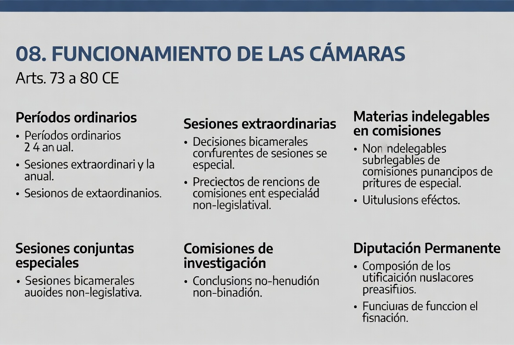

<em>Infografía: Funcionamiento de las Cámaras.</em>

<!-- FUENTE: CE-CORTES -->

## 09. Leyes orgánicas y delegación legislativa

- Son leyes orgánicas las relativas al desarrollo de derechos fundamentales y libertades públicas, Estatutos de Autonomía, régimen electoral general y demás previstas constitucionalmente. **(81.1)**
- La aprobación, modificación o derogación de una ley orgánica exige mayoría absoluta del Congreso en votación final sobre el conjunto. **(81.2)**
- Las Cortes pueden delegar en el Gobierno la potestad de dictar normas con rango de ley sobre materias no reservadas a ley orgánica. **(82.1)**
- La delegación para formar textos articulados se otorga mediante una ley de bases. **(82.2)**
- La delegación para refundir textos legales se otorga mediante ley ordinaria. **(82.2)**
- La delegación debe otorgarse de forma expresa, para materia concreta y con fijación de plazo. **(82.3)**
- La delegación no puede entenderse concedida implícitamente, por tiempo indeterminado ni permitir subdelegación. **(82.3)**
- Las leyes de bases no pueden autorizar la modificación de la propia ley de bases ni facultar para dictar normas retroactivas. **(83)**
- Las disposiciones del Gobierno que contienen legislación delegada reciben el título de decretos legislativos. **(85)**

<!-- VISUAL:t03-09-leyes-organicas.png -->

  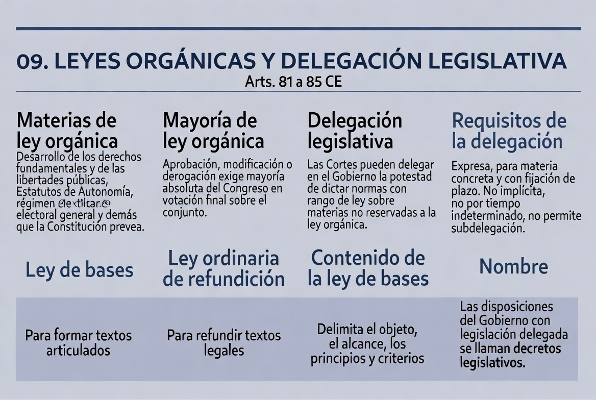

<em>Infografía: Leyes orgánicas y delegación legislativa.</em>

<!-- FUENTE: CE-CORTES -->

## 10. Decreto-ley, iniciativa y procedimiento legislativo

- El Gobierno puede dictar decretos-leyes en caso de extraordinaria y urgente necesidad. **(86.1)**
- El decreto-ley es una disposición legislativa provisional. **(86.1)**
- El decreto-ley no puede afectar a instituciones básicas del Estado, derechos del Título I, régimen autonómico ni derecho electoral general. **(86.1)**
- El Congreso debe debatir y votar la convalidación o derogación del decreto-ley dentro de los 30 días siguientes a su promulgación. **(86.2)**
- La iniciativa legislativa corresponde al Gobierno, Congreso y Senado, conforme a Constitución y reglamentos. **(87.1)**
- Las asambleas autonómicas pueden solicitar al Gobierno un proyecto o remitir al Congreso una proposición de ley. **(87.2)**
- La iniciativa legislativa popular requiere al menos 500.000 firmas acreditadas. **(87.3)**
- La iniciativa popular no procede en materias de ley orgánica, tributarias, internacionales ni relativas a la prerrogativa de gracia. **(87.3)**
- Los proyectos de ley son aprobados en Consejo de Ministros, que los remite al Congreso con exposición de motivos y antecedentes. **(88)**
- Las proposiciones que tome en consideración el Senado se remiten al Congreso para su tramitación. **(89.2)**
- El Senado dispone de dos meses para vetar o enmendar el texto recibido. **(90.2)**
- El veto del Senado requiere mayoría absoluta. **(90.2)**
- El Congreso puede levantar el veto inmediatamente por mayoría absoluta. **(90.2)**
- Transcurridos dos meses desde el veto, el Congreso puede levantarlo por mayoría simple. **(90.2)**
- El Congreso decide sobre las enmiendas del Senado por mayoría simple. **(90.2)**
- En proyectos declarados urgentes, el plazo del Senado se reduce a 20 días naturales. **(90.3)**
- El Rey sanciona las leyes aprobadas por las Cortes en el plazo de 15 días, las promulga y ordena su inmediata publicación. **(91)**
- Las decisiones políticas de especial trascendencia pueden someterse a referéndum consultivo de todos los ciudadanos. **(92.1)**
- El referéndum consultivo es convocado por el Rey a propuesta del Presidente del Gobierno, previamente autorizada por el Congreso. **(92.2)**

<!-- VISUAL:t03-10-decreto-ley-iniciativa.png -->

  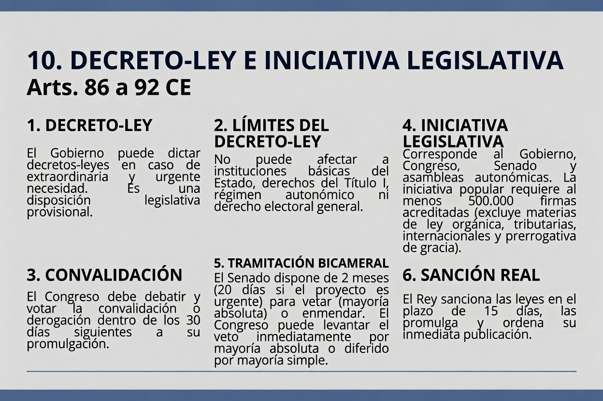

<em>Infografía: Decreto-ley, iniciativa y procedimiento legislativo.</em>

<!-- FUENTE: CE-CORTES -->

## 11. Tratados internacionales

- Mediante ley orgánica puede autorizarse un tratado que atribuya a una organización internacional competencias derivadas de la Constitución. **(93)**
- Los tratados políticos y militares requieren autorización previa de las Cortes. **(94.1)**
- Requieren autorización previa los tratados que afecten a integridad territorial o a derechos y deberes fundamentales del Título I. **(94.1)**
- Requieren autorización previa los tratados que supongan modificar o derogar una ley o exijan medidas legislativas. **(94.1)**
- La celebración de un tratado con estipulaciones contrarias a la Constitución exige revisión constitucional previa. **(95.1)**
- El Gobierno o cualquiera de las Cámaras puede requerir al Tribunal Constitucional para que declare si existe contradicción. **(95.2)**
- Los tratados válidamente celebrados y publicados oficialmente forman parte del ordenamiento interno. **(96.1)**
- Para denunciar tratados se utiliza el mismo procedimiento previsto para su aprobación en el artículo 94. **(96.2)**

<!-- VISUAL:t03-11-tratados-internacionales.png -->

  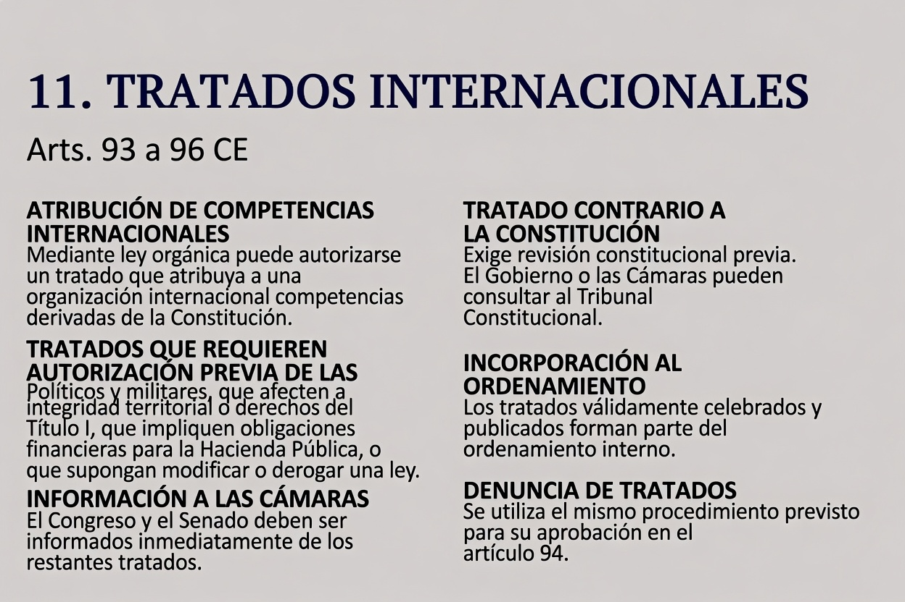

<em>Infografía: Tratados internacionales.</em>

<!-- FUENTE: CE-CORTES -->

## 12. Gobierno: funciones, composición, investidura y cese

<!-- VISUAL:t03-ilu-05-gobierno-y-parlamento.png -->

  

<em>Ilustración: Gobierno y control parlamentario.</em>

- El Gobierno dirige la política interior y exterior, la Administración civil y militar y la defensa del Estado. **(97)**
- El Gobierno ejerce la función ejecutiva y la potestad reglamentaria de acuerdo con la Constitución y las leyes. **(97)**
- El Gobierno se compone del Presidente, vicepresidentes en su caso, ministros y demás miembros que establezca la ley. **(98.1)**
- El Presidente dirige la acción del Gobierno y coordina las funciones de sus miembros. **(98.2)**
- Tras la renovación del Congreso y en otros supuestos, el Rey consulta a los grupos y propone candidato a través del Presidente del Congreso. **(99.1)**
- La primera votación de investidura requiere mayoría absoluta del Congreso. **(99.3)**
- Si no hay mayoría absoluta, se celebra nueva votación 48 horas después y basta mayoría simple. **(99.3)**
- Si transcurren dos meses desde la primera votación sin investidura, el Rey disuelve ambas Cámaras y convoca elecciones. **(99.5)**
- La disolución del artículo 99.5 se realiza con refrendo del Presidente del Congreso. **(99.5)**
- Los demás miembros del Gobierno son nombrados y separados por el Rey a propuesta del Presidente. **(100)**
- El Gobierno cesa tras elecciones generales, pérdida de confianza, dimisión o fallecimiento de su Presidente. **(101.1)**
- El Gobierno cesante continúa en funciones hasta la toma de posesión del nuevo Gobierno. **(101.2)**

<!-- VISUAL:t03-12-gobierno-investidura.png -->

  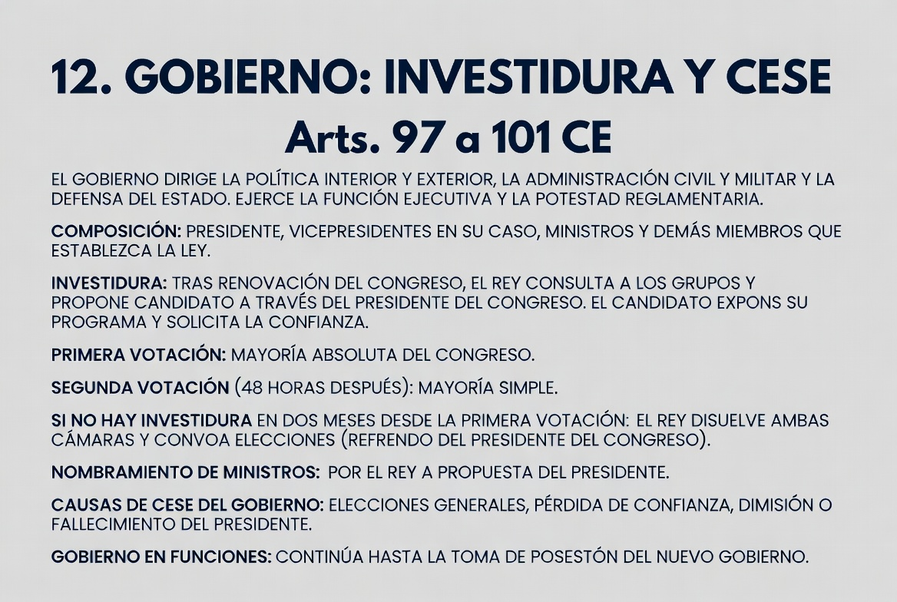

<em>Infografía: Gobierno e investidura.</em>

<!-- FUENTE: CE-GOBIERNO -->

## 13. Responsabilidad del Gobierno y Administración Pública

- La responsabilidad criminal del Presidente y ministros se exige ante la Sala de lo Penal del Tribunal Supremo. **(102.1)**
- La acusación por traición o delito contra la seguridad del Estado cometido en el ejercicio del cargo solo puede plantearse por iniciativa de una cuarta parte del Congreso. **(102.2)**
- La acusación especial del artículo 102.2 requiere aprobación por mayoría absoluta del Congreso. **(102.2)**
- La prerrogativa real de gracia no se aplica a los supuestos del artículo 102. **(102.3)**
- La Administración Pública sirve con objetividad los intereses generales. **(103.1)**
- La Administración actúa conforme a eficacia, jerarquía, descentralización, desconcentración y coordinación. **(103.1)**
- La Administración actúa con sometimiento pleno a la ley y al Derecho. **(103.1)**
- La ley regula el acceso a la función pública conforme a mérito y capacidad. **(103.3)**
- Las Fuerzas y Cuerpos de Seguridad actúan bajo la dependencia del Gobierno. **(104.1)**
- Las Fuerzas y Cuerpos de Seguridad protegen el libre ejercicio de derechos y libertades y garantizan la seguridad ciudadana. **(104.1)**
- Una ley orgánica determina funciones, principios básicos de actuación y estatutos de las Fuerzas y Cuerpos de Seguridad. **(104.2)**
- La ley regula el acceso a archivos y registros administrativos, con límites por seguridad, investigación de delitos e intimidad. **(105.b)**
- Los tribunales controlan la potestad reglamentaria, la legalidad administrativa y el sometimiento a sus fines. **(106.1)**
- Los particulares tienen derecho a indemnización por lesiones causadas por servicios públicos, salvo fuerza mayor y en los términos legales. **(106.2)**
- El Consejo de Estado es el supremo órgano consultivo del Gobierno y una ley orgánica regula su composición y competencia. **(107)**

<!-- VISUAL:t03-13-responsabilidad-gobierno.png -->

  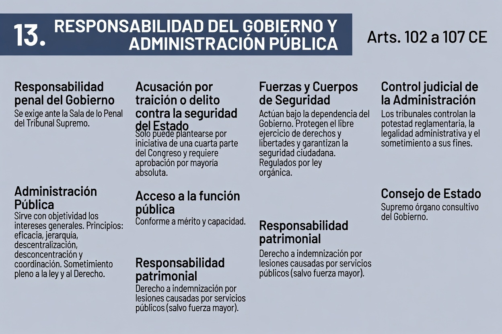

<em>Infografía: Responsabilidad del Gobierno y Administración.</em>

<!-- FUENTE: CE-GOBIERNO -->

## 14. Control parlamentario ordinario del Gobierno

- El Gobierno responde solidariamente de su gestión política ante el Congreso. **(108)**
- Las Cámaras y sus comisiones pueden recabar información y ayuda del Gobierno, departamentos y autoridades estatales y autonómicas. **(109)**
- Las Cámaras y sus comisiones pueden reclamar la presencia de los miembros del Gobierno. **(110.1)**
- El Gobierno y cada uno de sus miembros están sometidos a preguntas e interpelaciones parlamentarias. **(111.1)**
- Toda interpelación puede dar lugar a una moción en la que la Cámara manifieste su posición. **(111.2)**

<!-- VISUAL:t03-14-control-parlamentario.png -->

  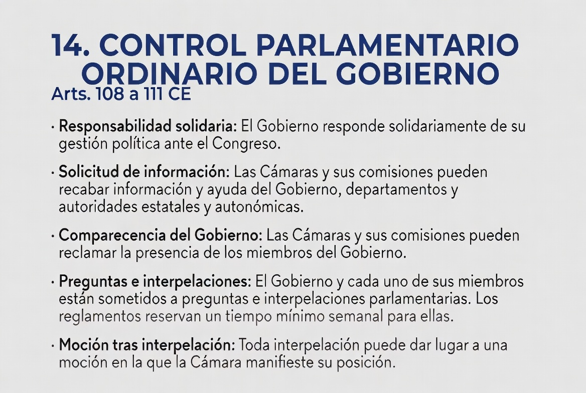

<em>Infografía: Control parlamentario.</em>

<!-- FUENTE: CE-RELACIONES -->

## 15. Confianza, censura y disolución

- El Presidente del Gobierno puede plantear la cuestión de confianza previa deliberación del Consejo de Ministros. **(112)**
- La cuestión de confianza puede versar sobre el programa o una declaración de política general. **(112)**
- La confianza se entiende otorgada por mayoría simple del Congreso. **(112)**
- El Congreso exige responsabilidad política mediante moción de censura aprobada por mayoría absoluta. **(113.1)**
- La moción debe ser propuesta al menos por una décima parte de los diputados. **(113.2)**
- La moción de censura debe incluir un candidato a la Presidencia del Gobierno. **(113.2)**
- La moción de censura no puede votarse hasta que transcurran cinco días desde su presentación. **(113.3)**
- Durante los dos primeros días desde la presentación pueden presentarse mociones alternativas. **(113.3)**
- Si la moción no es aprobada, sus firmantes no pueden presentar otra en el mismo período de sesiones. **(113.4)**
- Si el Congreso niega la confianza, el Gobierno presenta su dimisión y se inicia el procedimiento del artículo 99. **(114.1)**
- Si prospera la censura, el Gobierno presenta su dimisión y el candidato se entiende investido. **(114.2)**
- El Presidente del Gobierno, previa deliberación del Consejo de Ministros y bajo su responsabilidad, puede proponer la disolución de una o ambas Cámaras. **(115.1)**
- No puede proponerse la disolución mientras esté en trámite una moción de censura. **(115.2)**
- No procede una nueva disolución antes de un año desde la anterior, salvo el artículo 99.5. **(115.3)**

<!-- VISUAL:t03-15-censura-disolucion.png -->

  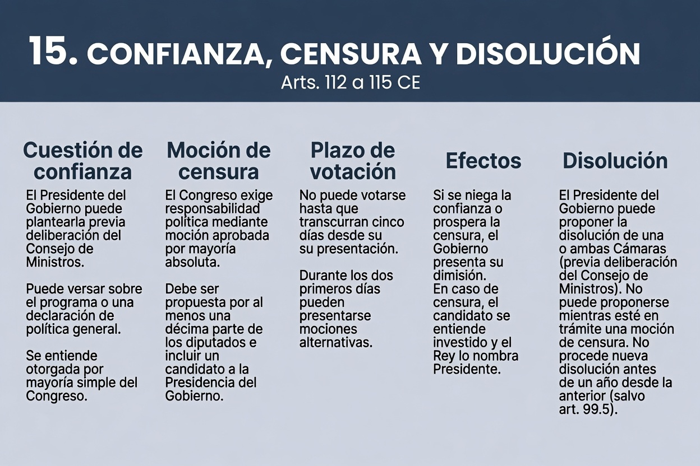

<em>Infografía: Moción de censura y disolución.</em>

<!-- FUENTE: CE-RELACIONES -->

## 16. Estados de alarma, excepción y sitio

- Los estados excepcionales solo proceden cuando circunstancias extraordinarias impiden mantener la normalidad mediante poderes ordinarios. **(LO 4/1981 art. 1)**
- Las medidas y su duración deben ser estrictamente indispensables y proporcionadas a las circunstancias. **(LO 4/1981 art. 1)**
- El estado de alarma lo declara el Gobierno mediante decreto acordado en Consejo de Ministros. **(116.2)**
- La duración inicial del estado de alarma no puede exceder de 15 días. **(116.2)**
- La prórroga del estado de alarma requiere autorización del Congreso, que establece alcance y condiciones. **(116.2)**
- La alarma puede declararse por catástrofes, crisis sanitarias, paralización de servicios esenciales en condiciones legales o desabastecimiento de productos básicos. **(LO 4/1981 art. 4)**
- La alarma puede limitar circulación, imponer requisas y prestaciones, intervenir locales no domiciliarios, racionar consumos y asegurar abastecimientos. **(LO 4/1981 art. 11)**
- El Gobierno declara el estado de excepción previa autorización del Congreso. **(116.3)**
- El estado de excepción dura como máximo 30 días, prorrogables por otros 30 con los mismos requisitos. **(116.3)**
- La excepción procede ante alteraciones graves de derechos, instituciones, servicios esenciales u orden público que no puedan resolverse con potestades ordinarias. **(LO 4/1981 art. 13)**
- El estado de sitio lo declara el Congreso por mayoría absoluta a propuesta exclusiva del Gobierno. **(116.4)**
- El Congreso determina ámbito territorial, duración y condiciones del estado de sitio. **(116.4)**
- El sitio procede ante insurrección o acto de fuerza contra soberanía, independencia, integridad territorial u orden constitucional no resoluble por otros medios. **(LO 4/1981 art. 32)**
- No puede disolverse el Congreso mientras esté declarado alguno de los estados excepcionales. **(116.5)**
- Si las Cámaras no están en período de sesiones, quedan automáticamente convocadas durante los estados excepcionales. **(116.5)**
- El funcionamiento de las Cámaras y demás poderes constitucionales no puede interrumpirse durante los estados excepcionales. **(116.5)**
- La declaración de alarma, excepción o sitio no modifica la responsabilidad del Gobierno ni de sus agentes. **(116.6)**

<!-- VISUAL:t03-16-estados-excepcionales.png -->

  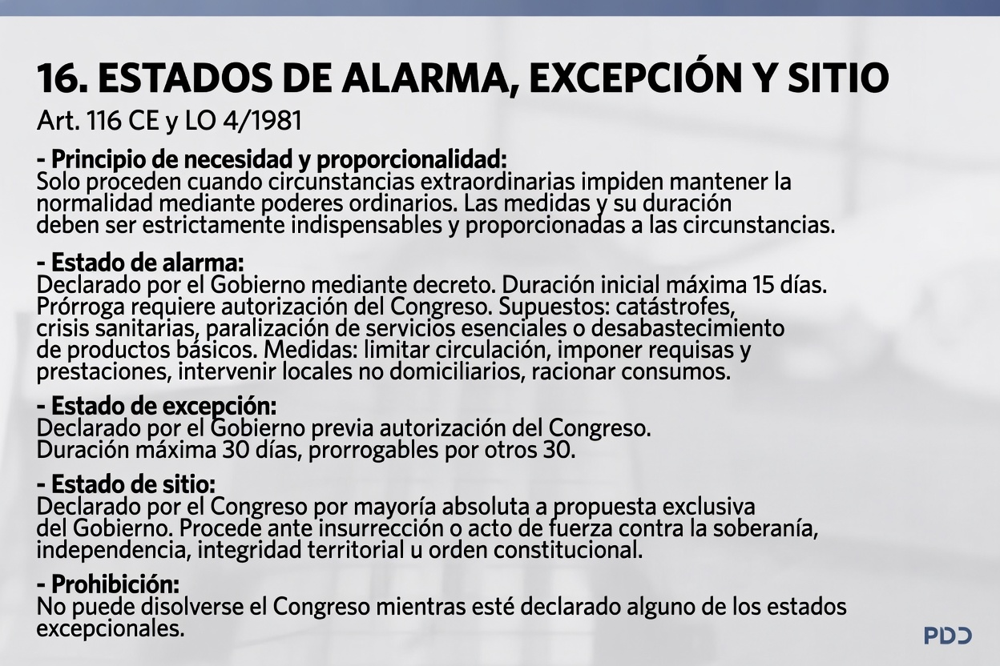

<em>Infografía: Estados excepcionales.</em>

<!-- FUENTE: LOAES -->

## 17. Poder Judicial: principios y proceso

<!-- VISUAL:t03-ilu-07-justicia-independiente.png -->

  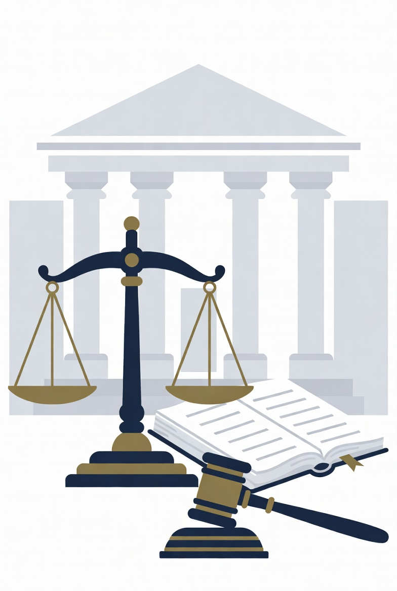

<em>Ilustración: Independencia judicial.</em>

- La justicia emana del pueblo y se administra en nombre del Rey. **(117.1)**
- Jueces y magistrados son independientes, inamovibles, responsables y sometidos únicamente al imperio de la ley. **(117.1)**
- Los jueces no pueden ser separados, suspendidos, trasladados ni jubilados salvo por causas y garantías legales. **(117.2)**
- Juzgar y hacer ejecutar lo juzgado corresponde exclusivamente a juzgados y tribunales determinados por las leyes. **(117.3)**
- El principio de unidad jurisdiccional es la base de la organización y funcionamiento de los tribunales. **(117.5)**
- La ley regula la jurisdicción militar en el ámbito estrictamente castrense y en los supuestos de estado de sitio. **(117.5)**
- Se prohíben los tribunales de excepción. **(117.6)**
- Es obligatorio cumplir sentencias y resoluciones firmes y prestar la colaboración requerida por jueces y tribunales. **(118)**
- La justicia es gratuita cuando lo disponga la ley y, en todo caso, para quienes acrediten insuficiencia de recursos. **(119)**
- Las actuaciones judiciales son públicas, salvo excepciones previstas por las leyes de procedimiento. **(120.1)**
- Las sentencias deben ser motivadas y pronunciarse en audiencia pública. **(120.3)**

<!-- FUENTE: CE-JUDICIAL -->

## 18. Órganos judiciales, Ministerio Fiscal, Jurado y Policía Judicial

- Los daños por error judicial o funcionamiento anormal de la Administración de Justicia generan indemnización a cargo del Estado. **(121)**
- El Consejo General del Poder Judicial es el órgano de gobierno del Poder Judicial. **(122.2)**
- El CGPJ está integrado por el Presidente del Tribunal Supremo y 20 miembros nombrados por el Rey por cinco años. **(122.3)**
- Doce vocales del CGPJ se eligen entre jueces y magistrados de todas las categorías judiciales. **(122.3)**
- Ocho vocales son abogados u otros juristas de reconocida competencia con más de 15 años de ejercicio. **(122.3)**
- Congreso y Senado proponen cuatro vocales juristas cada uno por mayoría de tres quintos. **(122.3)**
- El Tribunal Supremo es el órgano jurisdiccional superior en todos los órdenes, salvo garantías constitucionales. **(123.1)**
- El Presidente del Tribunal Supremo es nombrado por el Rey a propuesta del CGPJ en la forma legal. **(123.2)**
- El Ministerio Fiscal promueve la acción de la justicia en defensa de legalidad, derechos de ciudadanos e interés público. **(124.1)**
- El Ministerio Fiscal actúa con unidad de actuación y dependencia jerárquica, sujeto a legalidad e imparcialidad. **(124.2)**
- El Fiscal General del Estado es nombrado por el Rey a propuesta del Gobierno, oído el CGPJ. **(124.4)**
- Los ciudadanos pueden participar en la Administración de Justicia mediante la institución del Jurado en procesos penales determinados por la ley. **(125)**
- La Policía Judicial depende de jueces, tribunales y Ministerio Fiscal en sus funciones de investigación. **(126)**
- La Policía Judicial averigua el delito y descubre y asegura al delincuente en los términos legales. **(126)**
- Jueces, magistrados y fiscales en activo no pueden desempeñar otros cargos públicos ni pertenecer a partidos o sindicatos. **(127.1)**

<!-- FUENTE: LOPJ -->

## 19. Principios territoriales y Administración local

<!-- VISUAL:t03-ilu-09-territorio-y-autonomia.png -->

  

<em>Ilustración: Territorio, autonomía y solidaridad.</em>

- El Estado se organiza territorialmente en municipios, provincias y comunidades autónomas que se constituyan. **(137)**
- Municipios, provincias y comunidades autónomas gozan de autonomía para gestionar sus intereses. **(137)**
- El Estado garantiza la realización efectiva del principio de solidaridad y un equilibrio económico adecuado y justo. **(138.1)**
- La garantía de equilibrio territorial debe atender en particular a las circunstancias del hecho insular. **(138.1)**
- Las diferencias entre Estatutos no pueden implicar privilegios económicos o sociales. **(138.2)**
- Todos los españoles tienen los mismos derechos y obligaciones en cualquier parte del territorio. **(139.1)**
- Ninguna autoridad puede obstaculizar directa o indirectamente la libertad de circulación y establecimiento ni la libre circulación de bienes. **(139.2)**
- La Constitución garantiza la autonomía de los municipios y su personalidad jurídica plena. **(140)**
- El gobierno y administración municipal corresponden a ayuntamientos integrados por alcaldes y concejales. **(140)**
- Los alcaldes son elegidos por los concejales o por los vecinos. **(140)**
- La provincia es entidad local con personalidad jurídica propia, agrupación de municipios y división territorial para actividades del Estado. **(141.1)**
- La alteración de límites provinciales debe aprobarse por las Cortes mediante ley orgánica. **(141.1)**
- El gobierno y administración autónoma de las provincias se encomiendan a diputaciones u otras corporaciones representativas. **(141.2)**
- En los archipiélagos, las islas tienen administración propia mediante cabildos o consejos. **(141.4)**
- Las haciendas locales deben disponer de medios suficientes y se nutren principalmente de tributos propios y participación en tributos estatal y autonómicos. **(142)**

<!-- FUENTE: CE-TERRITORIAL -->

## 20. Acceso a la autonomía y Estatutos

- Pueden acceder al autogobierno provincias limítrofes con características comunes, territorios insulares y provincias con entidad regional histórica. **(143.1)**
- La iniciativa corresponde a todas las diputaciones u órganos insulares y a dos tercios de municipios de cada provincia que representen mayoría del censo. **(143.2)**
- Los requisitos de la iniciativa autonómica deben cumplirse en seis meses desde el primer acuerdo. **(143.2)**
- Si la iniciativa no prospera, solo puede reiterarse pasados cinco años. **(143.3)**
- Las Cortes pueden autorizar por ley orgánica una comunidad cuyo ámbito no supere una provincia y no reúna las condiciones del artículo 143.1. **(144.a)**
- Las Cortes pueden sustituir la iniciativa de las corporaciones locales mediante ley orgánica. **(144.c)**
- No se admite en ningún caso la federación de comunidades autónomas. **(145.1)**
- Los demás acuerdos de cooperación entre comunidades requieren autorización de las Cortes. **(145.2)**
- El proyecto de Estatuto se elabora por una asamblea formada por miembros de diputaciones u órganos insulares y diputados y senadores elegidos en el territorio. **(146)**
- Los Estatutos son la norma institucional básica de cada comunidad y el Estado los reconoce como parte de su ordenamiento. **(147.1)**
- El Estatuto debe contener denominación, delimitación territorial, organización institucional y competencias asumidas con bases de traspaso. **(147.2)**
- La reforma de los Estatutos se ajusta a su procedimiento y requiere aprobación de las Cortes mediante ley orgánica. **(147.3)**

<!-- FUENTE: CE-TERRITORIAL -->

## 21. Distribución de competencias: artículos 148 y 149

- Las comunidades autónomas pueden asumir competencias sobre ordenación del territorio, urbanismo y vivienda. **(148.1.3)**
- Las comunidades autónomas pueden asumir competencias sobre agricultura y ganadería de acuerdo con la ordenación general de la economía. **(148.1.7)**
- Las comunidades autónomas pueden asumir competencias sobre gestión en materia de protección del medio ambiente. **(148.1.9)**
- Las comunidades autónomas pueden asumir competencias sobre sanidad e higiene. **(148.1.21)**
- Las comunidades autónomas pueden asumir competencias sobre vigilancia y protección de edificios e instalaciones y coordinación y otras facultades sobre policías locales conforme a ley orgánica. **(148.1.22)**
- Transcurridos cinco años, las comunidades pueden ampliar sucesivamente sus competencias dentro del marco del artículo 149 mediante reforma estatutaria. **(148.2)**
- El Estado tiene competencia exclusiva sobre nacionalidad, inmigración, emigración, extranjería y derecho de asilo. **(149.1.2)**
- El Estado tiene competencia exclusiva sobre defensa y Fuerzas Armadas. **(149.1.4)**
- El Estado tiene competencia exclusiva sobre administración de Justicia. **(149.1.5)**
- El Estado tiene competencia exclusiva sobre legislación mercantil, penal y penitenciaria y legislación procesal, con especialidades autonómicas derivadas de su Derecho sustantivo. **(149.1.6)**
- El Estado tiene competencia exclusiva sobre régimen de producción, comercio, tenencia y uso de armas y explosivos. **(149.1.26)**
- El Estado tiene competencia exclusiva sobre seguridad pública, sin perjuicio de la creación de policías autonómicas en el marco de ley orgánica. **(149.1.29)**
- Las materias no atribuidas expresamente al Estado pueden corresponder a comunidades si las asumen en sus Estatutos. **(149.3)**
- Las competencias no asumidas por los Estatutos corresponden al Estado. **(149.3)**
- En caso de conflicto, las normas estatales prevalecen salvo en materias de competencia exclusiva autonómica. **(149.3)**
- El Derecho estatal es supletorio del Derecho autonómico. **(149.3)**

<!-- FUENTE: CE-TERRITORIAL -->

## 22. Técnicas del artículo 150 y vía especial del artículo 151

- Las Cortes pueden atribuir a comunidades la facultad de dictar normas legislativas dentro de principios, bases y directrices de una ley estatal. **(150.1)**
- El Estado puede transferir o delegar mediante ley orgánica facultades estatales susceptibles por su naturaleza. **(150.2)**
- El Estado puede dictar leyes de armonización de disposiciones autonómicas cuando lo exija el interés general. **(150.3)**
- La necesidad de armonización debe ser apreciada por mayoría absoluta de cada Cámara. **(150.3)**
- La vía especial exige acuerdo de órganos provinciales y de tres cuartas partes de municipios que representen mayoría del censo de cada provincia. **(151.1)**
- La iniciativa especial debe ser ratificada por mayoría absoluta de electores de cada provincia en referéndum. **(151.1)**
- La Asamblea de parlamentarios aprueba el proyecto de Estatuto por mayoría absoluta de sus miembros. **(151.2.1)**
- El proyecto se examina en dos meses por la Comisión Constitucional del Congreso con una delegación de la Asamblea proponente. **(151.2.2)**
- El Estatuto se eleva a las Cortes si lo aprueba la mayoría de votos válidamente emitidos en cada provincia. **(151.2.4)**
- La organización autonómica especial se basa en una asamblea elegida por sufragio universal y representación proporcional que asegure territorios. **(152.1)**
- Existe un Consejo de Gobierno con funciones ejecutivas y administrativas. **(152.1)**
- El Presidente es elegido por la Asamblea entre sus miembros y nombrado por el Rey. **(152.1)**
- El Presidente dirige el Consejo, representa supremamente a la comunidad y representa ordinariamente al Estado en ella. **(152.1)**
- Un Tribunal Superior de Justicia culmina la organización judicial en el territorio, sin perjuicio del Tribunal Supremo. **(152.1)**

<!-- FUENTE: CE-TERRITORIAL -->

## 23. Instituciones, controles, coerción y financiación autonómica

- El Tribunal Constitucional controla la constitucionalidad de disposiciones autonómicas con fuerza de ley. **(153.a)**
- El Gobierno, previo dictamen del Consejo de Estado, controla el ejercicio de funciones delegadas del artículo 150.2. **(153.b)**
- La jurisdicción contencioso-administrativa controla la administración autonómica y sus normas reglamentarias. **(153.c)**
- El Tribunal de Cuentas ejerce el control económico y presupuestario de las comunidades. **(153.d)**
- Un Delegado nombrado por el Gobierno dirige la Administración del Estado en la comunidad y la coordina cuando proceda con la autonómica. **(154)**
- El artículo 155 procede por incumplimiento de obligaciones constitucionales o legales o atentado grave al interés general. **(155.1)**
- Antes de aplicar el artículo 155, el Gobierno debe requerir al Presidente de la comunidad. **(155.1)**
- Si el requerimiento no es atendido, las medidas requieren aprobación por mayoría absoluta del Senado. **(155.1)**
- Para ejecutar las medidas, el Gobierno puede dar instrucciones a todas las autoridades autonómicas. **(155.2)**
- Las comunidades gozan de autonomía financiera para desarrollar y ejecutar competencias. **(156.1)**
- La autonomía financiera se ejerce con coordinación con la Hacienda estatal y solidaridad entre españoles. **(156.1)**
- Los recursos autonómicos incluyen impuestos cedidos, recargos sobre impuestos estatales y tributos propios. **(157.1)**
- Las comunidades no pueden gravar bienes fuera de su territorio ni obstaculizar libre circulación de mercancías o servicios. **(157.2)**
- Los Presupuestos pueden asignar recursos según volumen de servicios para garantizar un nivel mínimo de servicios públicos fundamentales. **(158.1)**
- El Fondo de Compensación corrige desequilibrios y destina recursos a gastos de inversión. **(158.2)**

<!-- FUENTE: CE-TERRITORIAL -->

## 24. Tribunal Constitucional

<!-- VISUAL:t03-ilu-10-guardian-de-la-constitucion.png -->

  

<em>Ilustración: El Tribunal Constitucional como garante.</em>

- El Tribunal Constitucional se compone de 12 miembros nombrados por el Rey. **(159.1)**
- Cuatro magistrados son propuestos por el Congreso por mayoría de tres quintos. **(159.1)**
- Cuatro magistrados son propuestos por el Senado por mayoría de tres quintos. **(159.1)**
- Dos magistrados son propuestos por el Gobierno y dos por el CGPJ. **(159.1)**
- Deben ser juristas de reconocida competencia con más de 15 años de ejercicio profesional. **(159.2)**
- Los magistrados son designados por nueve años y se renuevan por terceras partes cada tres. **(159.3)**
- La condición de miembro del TC es incompatible con mandato representativo, cargos políticos o administrativos, dirección partidista o sindical, carrera judicial o fiscal y actividad profesional o mercantil. **(159.4)**
- Los miembros del TC son independientes e inamovibles durante su mandato. **(159.5)**
- El Presidente del TC es nombrado por el Rey a propuesta del Pleno por tres años. **(160)**
- El TC conoce del recurso de inconstitucionalidad contra leyes y disposiciones normativas con fuerza de ley. **(161.1.a)**
- El TC conoce del recurso de amparo por violación de derechos del artículo 53.2 en los casos legales. **(161.1.b)**
- El TC conoce de conflictos de competencia entre Estado y comunidades o de estas entre sí. **(161.1.c)**
- El Gobierno puede impugnar ante el TC disposiciones y resoluciones autonómicas. **(161.2)**
- La impugnación del Gobierno produce suspensión y el TC debe ratificarla o levantarla en un plazo máximo de cinco meses. **(161.2)**
- Están legitimados el Presidente del Gobierno, Defensor del Pueblo, 50 diputados, 50 senadores y órganos autonómicos en su ámbito. **(162.1.a)**
- Puede interponer amparo toda persona con interés legítimo, el Defensor del Pueblo y el Ministerio Fiscal. **(162.1.b)**
- Un órgano judicial plantea cuestión cuando una norma con rango de ley aplicable y decisiva para el fallo puede ser contraria a la Constitución. **(163)**
- Las sentencias del TC se publican en el BOE con los votos particulares, si los hay. **(164.1)**
- Las sentencias del TC tienen valor de cosa juzgada desde el día siguiente a su publicación y no cabe recurso. **(164.1)**
- Las sentencias que declaran inconstitucionalidad y las no limitadas a estimación subjetiva tienen plenos efectos frente a todos. **(164.1)**
- Una ley orgánica regula funcionamiento del TC, estatuto de miembros, procedimiento y condiciones de acciones. **(165)**
- El Tribunal Constitucional actúa en Pleno, Sala o Sección. **(LOTC art. 6)**
- El Tribunal Constitucional consta de dos Salas de seis magistrados cada una. **(LOTC art. 7)**
- El Presidente preside la Sala Primera y el Vicepresidente la Sala Segunda. **(LOTC art. 7)**
- Las Secciones están compuestas por el Presidente correspondiente o sustituto y dos magistrados. **(LOTC art. 8)**

<!-- FUENTE: LOTC -->

## 25. Reforma constitucional

- La iniciativa de reforma se ejerce en los términos del artículo 87.1 y 87.2. **(166)**
- La iniciativa legislativa popular no puede promover una reforma constitucional. **(166)**
- La reforma ordinaria exige mayoría de tres quintos de cada Cámara. **(167.1)**
- Si no hay acuerdo, se crea una Comisión Mixta paritaria que presenta un texto a Congreso y Senado. **(167.1)**
- Si falla la Comisión y el Senado aprueba por mayoría absoluta, el Congreso puede aprobar por dos tercios. **(167.2)**
- La reforma ordinaria se somete a referéndum si lo pide una décima parte de cualquiera de las Cámaras dentro de 15 días. **(167.3)**
- La vía agravada se aplica a revisión total o parcial del Título Preliminar, Sección 1.ª del Capítulo II del Título I o Título II. **(168.1)**
- El principio de reforma agravada requiere dos tercios de cada Cámara. **(168.1)**
- Aprobado el principio de reforma agravada se disuelven inmediatamente las Cortes. **(168.1)**
- El nuevo texto requiere dos tercios de ambas nuevas Cámaras. **(168.2)**
- La reforma agravada aprobada se somete siempre a referéndum de ratificación. **(168.3)**
- No puede iniciarse una reforma constitucional en tiempo de guerra ni durante los estados del artículo 116. **(169)**

<!-- VISUAL:t03-17-reforma-constitucional.png -->

  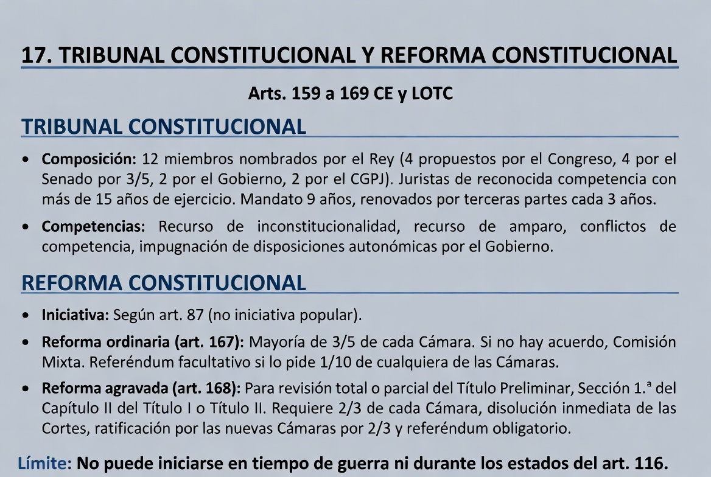

<em>Infografía: Reforma constitucional.</em>

<!-- FUENTE: CE-REFORMA -->

# Hablemos claro

El Tema 3 no se memoriza como una narración. Se domina separando órgano competente, procedimiento, mayoría, plazo, efecto jurídico y excepción. Cada hecho atómico del Atestado tiene una pregunta asociada y los hechos de riesgo máximo tienen una segunda pregunta inversa.

# En la calle

Para Policía Nacional son especialmente operativos los artículos 104 y 126: las Fuerzas y Cuerpos de Seguridad dependen del Gobierno para su misión constitucional, mientras la Policía Judicial depende funcionalmente de jueces, tribunales y Ministerio Fiscal durante la investigación del delito.

# Lo que cae

Mayorías, plazos, composición de órganos, refrendo, sucesión, funcionamiento parlamentario, decreto-ley, tratados, investidura, censura, estados excepcionales, CGPJ, Policía Judicial, artículos 148 a 155, Tribunal Constitucional y reforma constitucional.

# Ha caído

Se han mapeado 30 referencias históricas al Tema 3. Ninguna alimenta todavía «Ha caído»: permanecen desactivadas hasta confirmar de forma independiente el cuestionario, la plantilla final oficial y la relación exacta con el hecho atómico.

---

*Academia En Vigor · El temario que nunca duerme · Tema 3 · v0.3.0 · Documento interno no publicado.*
