# TEMA 5 · ORGANIZACIÓN Y FUNCIONAMIENTO DE LA ADMINISTRACIÓN GENERAL DEL ESTADO

**Policía Nacional · Método VIGOR · PARTE**
**Versión de contenido:** 1.0.0
**Estado editorial:** draft_review · **Publicación:** not_published

# Mapa del tema

## Programa oficial cubierto

**Organización y funcionamiento de la Administración General del Estado: principios de organización, funcionamiento y relaciones con los ciudadanos. Órganos superiores y órganos directivos en la organización central. El Gobierno: composición, organización y funciones.**

## Ruta de estudio

1. **La AGE y sus principios:** bloques 1 a 5.
2. **Organización, funcionamiento e intervención:** bloques 6 a 9.
3. **El Gobierno: composición y Presidente:** bloques 10 a 14.
4. **Órganos del Gobierno:** bloques 15 a 19.
5. **Colaboración, apoyo y consulta:** bloques 20 a 24.
6. **Órganos superiores y altos cargos:** bloques 25 a 26.
7. **Órganos directivos:** bloques 27 a 30.
8. **Administración periférica y sector público institucional:** bloques 31 a 35.

El tema encadena tres leyes: la **Ley 40/2015** organiza la Administración, la **Ley 50/1997** regula el Gobierno y la **Ley 3/2015** el estatuto de los altos cargos. Conviene estudiar cada órgano con el mismo esquema —**naturaleza, carácter obligatorio u opcional, nombramiento, requisitos, funciones y rango**—, porque el tribunal pregunta esos seis datos de cada uno.

El Atestado desarrolla los mismos bloques que El Parte con mayor extensión: aquí se razona el porqué de cada regla, se traduce el vocabulario técnico y se comparan las figuras que se confunden entre sí. El Parte es la versión de repaso; El Atestado, la de comprensión.

<!-- MATERIAL PENDIENTE: t05-todo-audio -->
<!-- MATERIAL PENDIENTE: t05-todo-video -->
<!-- MATERIAL PENDIENTE: t05-todo-pres -->

# Contenido

## 01. La Administración General del Estado: concepto y posición constitucional

La **Administración General del Estado (AGE)** es la organización que, **bajo la dirección del Gobierno**, ejecuta las políticas públicas y presta los servicios estatales. Tiene **personalidad jurídica única**: por muchos órganos que tenga, jurídicamente es un solo sujeto.

La distinción esencial está en dos artículos de la Constitución. El **artículo 97** dice que el **Gobierno dirige** la política interior y exterior, la Administración civil y militar y la defensa. El **artículo 103.1** dice que la **Administración sirve con objetividad** los intereses generales y actúa **con sometimiento pleno a la ley y al Derecho**. Gobierno dirige, Administración ejecuta.

Tres leyes vertebran el tema: la **Ley 40/2015 (LRJSP)** para la organización, la **Ley 50/1997 (LG)** para el Gobierno, y la **Ley 39/2015 (LPACAP)** para el procedimiento.

:::perla-vigor
**Gobierno dirige (art. 97), Administración ejecuta (art. 103).** Y dos leyes hermanas del mismo día: la **40/2015** organiza, la **39/2015** tramita.
:::

:::trampa
La AGE tiene **personalidad jurídica única**, no una por ministerio. Los organismos con personalidad propia son precisamente los que se han separado de ella.
:::

<!-- VISUAL:t05-01-concepto-de-age.webp -->

  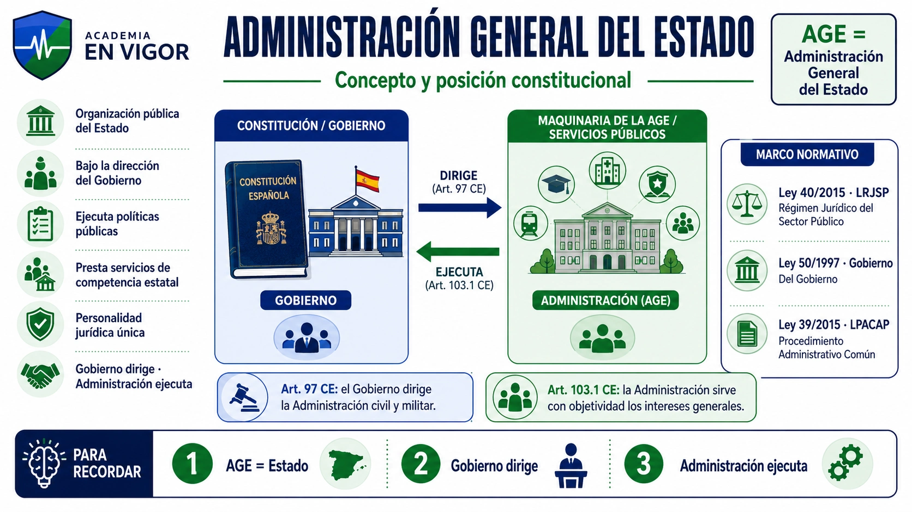

<em>Infografía: recurso visual planificado.</em>

<!-- MATERIAL PENDIENTE: t05-p1-audio -->
<!-- MATERIAL PENDIENTE: t05-p1-video -->
<!-- MATERIAL PENDIENTE: t05-p1-pres -->
<!-- MATERIAL PENDIENTE: t05-todo-audio -->
<!-- MATERIAL PENDIENTE: t05-todo-video -->
<!-- MATERIAL PENDIENTE: t05-todo-pres -->

<!-- FUENTE: AGE-CONCEPTO -->

## 02. La estructura territorial de la AGE: central, periférica y exterior

La AGE se organiza en **tres niveles territoriales**. La **Administración central** son los órganos con competencia en **todo el territorio nacional**: los órganos superiores y directivos de los ministerios. La **Administración periférica** son los que limitan su competencia a **una parte del territorio**, con los **Delegados del Gobierno** en las comunidades autónomas y los **Subdelegados** en las provincias. Y la **Administración en el exterior**, formada por **misiones diplomáticas, representaciones permanentes y oficinas consulares**; en ella son órganos directivos los **embajadores** y los representantes permanentes.

El criterio que las separa es el **ámbito territorial** de la competencia, no la jerarquía.

:::perla-vigor
Tres niveles y un solo criterio: **todo el territorio** (central), **parte del territorio** (periférica), **fuera de España** (exterior).
:::

:::trampa
Periférica no significa secundaria. La diferencia es **territorial**, no jerárquica: un Delegado del Gobierno tiene rango de Subsecretario.
:::

<!-- VISUAL:t05-02-estructura-territorial.webp -->

  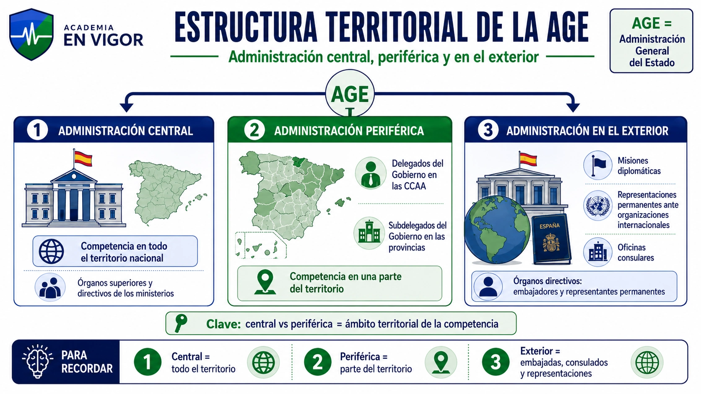

<em>Infografía: recurso visual planificado.</em>

<!-- MATERIAL PENDIENTE: t05-p1-audio -->
<!-- MATERIAL PENDIENTE: t05-p1-video -->
<!-- MATERIAL PENDIENTE: t05-p1-pres -->
<!-- MATERIAL PENDIENTE: t05-todo-audio -->
<!-- MATERIAL PENDIENTE: t05-todo-video -->
<!-- MATERIAL PENDIENTE: t05-todo-pres -->

<!-- FUENTE: AGE-ESTRUCTURA -->

## 03. Ámbito subjetivo: qué es sector público

El **artículo 2 de la Ley 40/2015** delimita a quién se aplica la ley. El **sector público** comprende cuatro bloques: la **Administración General del Estado**, las **Administraciones de las comunidades autónomas**, las **entidades de la Administración Local** y el **sector público institucional**.

Este último incluye los **organismos públicos y entidades de derecho público** vinculados o dependientes, las **entidades de derecho privado** vinculadas o dependientes —sujetas a la ley **cuando ejerzan potestades administrativas**— y las **universidades públicas**, que se rigen por su normativa específica y, supletoriamente, por esta ley.

:::perla-vigor
Sector público = **Estado + CCAA + Local + institucional**. El institucional es el cajón de organismos, sociedades y fundaciones.
:::

:::trampa
Una entidad de derecho privado del sector público **sí queda sujeta** a las Leyes 39 y 40 de 2015 **cuando ejerce potestades administrativas**. La forma privada no la exime.
:::

<!-- VISUAL:t05-03-sector-publico.webp -->

  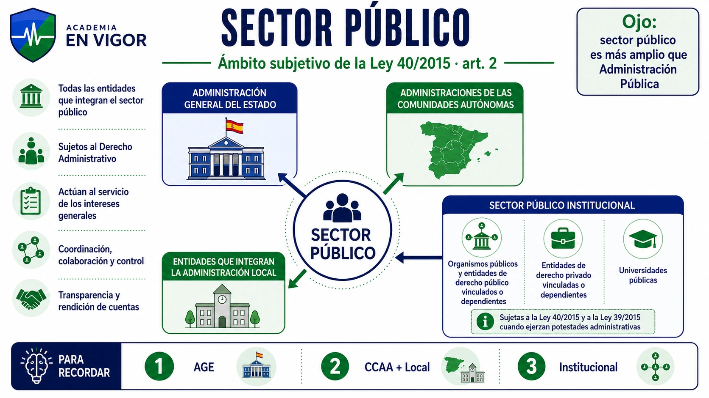

<em>Infografía: recurso visual planificado.</em>

<!-- MATERIAL PENDIENTE: t05-p1-audio -->
<!-- MATERIAL PENDIENTE: t05-p1-video -->
<!-- MATERIAL PENDIENTE: t05-p1-pres -->
<!-- MATERIAL PENDIENTE: t05-todo-audio -->
<!-- MATERIAL PENDIENTE: t05-todo-video -->
<!-- MATERIAL PENDIENTE: t05-todo-pres -->

<!-- FUENTE: AGE-AMBITO -->

## 04. Sector público frente a Administraciones Públicas

Esta es la distinción que más se pregunta del bloque: **no todo el sector público es Administración Pública**.

Tienen la consideración de **Administraciones Públicas** solo cuatro categorías: la **AGE**, las **Administraciones autonómicas**, las **entidades locales** y los **organismos públicos y entidades de derecho público** vinculados o dependientes de ellas.

Quedan fuera las **entidades de derecho privado** del sector público: sociedades mercantiles estatales, fundaciones públicas y demás. Son sector público, pero no Administración Pública. Y la diferencia no es teórica: determina qué régimen jurídico se les aplica.

:::perla-vigor
Dos círculos: **sector público** es el grande, **Administración Pública** el pequeño. Lo privado está en el grande pero nunca en el pequeño.
:::

:::trampa
Una sociedad mercantil estatal **es sector público pero no es Administración Pública**. Confundirlo es el error más repetido del bloque.
:::

<!-- VISUAL:t05-04-sector-vs-administracion.webp -->

  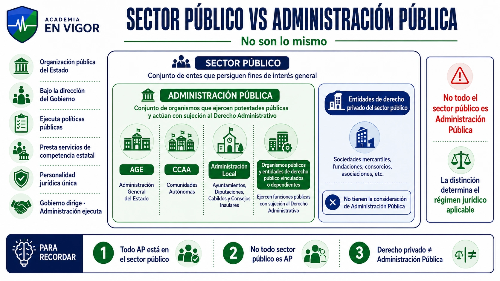

<em>Infografía: recurso visual planificado.</em>

<!-- VISUAL:t05-il-04-dos-circulos.webp -->

  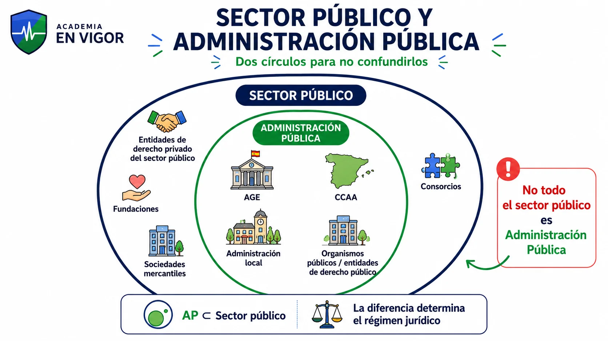

<em>Infografía: recurso visual planificado.</em>

<!-- MATERIAL PENDIENTE: t05-p1-audio -->
<!-- MATERIAL PENDIENTE: t05-p1-video -->
<!-- MATERIAL PENDIENTE: t05-p1-pres -->
<!-- MATERIAL PENDIENTE: t05-todo-audio -->
<!-- MATERIAL PENDIENTE: t05-todo-video -->
<!-- MATERIAL PENDIENTE: t05-todo-pres -->

<!-- FUENTE: AGE-AMBITO -->

## 05. Principios generales de actuación: el artículo 3 de la Ley 40/2015

El **artículo 3 de la Ley 40/2015** parte de la fórmula constitucional: las Administraciones sirven con objetividad los intereses generales conforme a los principios de **eficacia, jerarquía, descentralización, desconcentración y coordinación**, con sometimiento pleno a la Constitución, la ley y el Derecho.

Sobre esa base añade tres grupos. **Hacia los ciudadanos:** servicio efectivo; simplicidad, claridad y proximidad; participación, objetividad y transparencia. **De gestión interna:** racionalización y agilidad; buena fe, confianza legítima y lealtad institucional; responsabilidad; planificación y dirección por objetivos; y eficacia, economía y eficiencia. **Entre Administraciones:** cooperación, colaboración y coordinación.

Y una regla que hoy es central: las Administraciones deben relacionarse **por medios electrónicos**, garantizando la **interoperabilidad**, la seguridad de los datos y la protección de la información personal.

:::perla-vigor
Tres grupos según a quién miran: **al ciudadano**, **hacia dentro** y **a las otras Administraciones**. Los cinco primeros son constitucionales, del artículo 103.1.
:::

:::trampa
**Interoperabilidad** no es lo mismo que digitalización: es que los sistemas de distintas Administraciones **se entiendan entre sí**.
:::

<!-- VISUAL:t05-05-principios-articulo-3.webp -->

  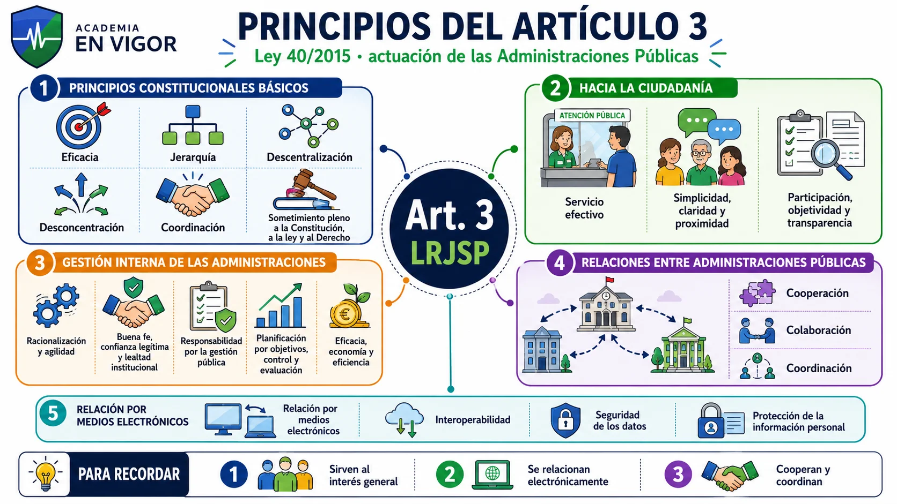

<em>Infografía: recurso visual planificado.</em>

<!-- FUENTE: AGE-PRINCIPIOS -->

<!-- PARTE 2: Organización, funcionamiento e intervención -->

<!-- MATERIAL PENDIENTE: t05-p1-audio -->
<!-- MATERIAL PENDIENTE: t05-p1-video -->
<!-- MATERIAL PENDIENTE: t05-p1-pres -->
<!-- MATERIAL PENDIENTE: t05-todo-audio -->
<!-- MATERIAL PENDIENTE: t05-todo-video -->
<!-- MATERIAL PENDIENTE: t05-todo-pres -->

<!-- FUENTE: AGE-PRINCIPIOS -->

## 06. Principios de organización de la AGE: el artículo 54

El **artículo 54 de la Ley 40/2015** añade, para la AGE en concreto, cuatro principios organizativos: **descentralización funcional**, **desconcentración funcional y territorial**, **jerarquía** y **coordinación**.

La **descentralización funcional** consiste en atribuir competencias a **entidades con personalidad jurídica propia**, distinta de la Administración matriz. La **desconcentración** es el traspaso de la **titularidad y el ejercicio** de competencias de un órgano superior a otro inferior **dentro de la misma persona jurídica**; puede ser **funcional**, por materia, o **territorial**, por ámbito geográfico.

La **jerarquía** es la estructura de mando vertical, y la **coordinación** busca la armonía entre órganos y evitar duplicidades.

Además, el artículo 54.1 exige garantizar la **presencia equilibrada de mujeres y hombres** en los nombramientos y designaciones de titulares de órganos superiores y directivos y en el personal de alta dirección del sector público institucional estatal. Los artículos 55 bis y 84 bis concretan la regla: las personas de cada sexo no pueden superar el **60 %** ni quedar por debajo del **40 %** en sus respectivos ámbitos.

:::perla-vigor
**Descentralización cambia de persona jurídica; desconcentración se queda dentro.** Esa es toda la diferencia.
:::

:::trampa
La desconcentración traspasa **titularidad y ejercicio**, no solo el ejercicio. Si solo se cede el ejercicio y el superior conserva la competencia, eso es delegación, que es otra figura.
:::

<!-- VISUAL:t05-06-principios-organizacion.webp -->

  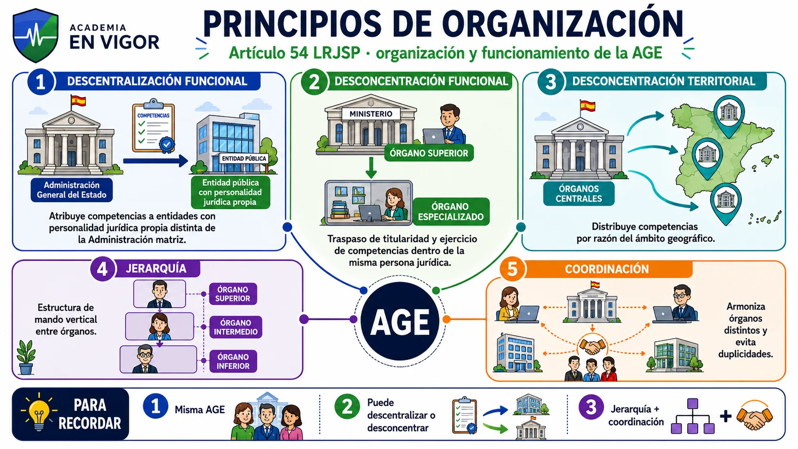

<em>Infografía: recurso visual planificado.</em>

<!-- VISUAL:t05-il-06-descentralizar-desconcentrar.webp -->

  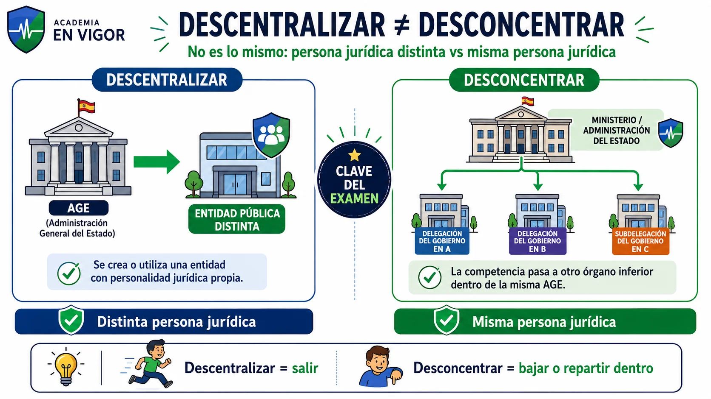

<em>Infografía: recurso visual planificado.</em>

<!-- MATERIAL PENDIENTE: t05-p2-audio -->
<!-- MATERIAL PENDIENTE: t05-p2-video -->
<!-- MATERIAL PENDIENTE: t05-p2-pres -->
<!-- MATERIAL PENDIENTE: t05-todo-audio -->
<!-- MATERIAL PENDIENTE: t05-todo-video -->
<!-- MATERIAL PENDIENTE: t05-todo-pres -->

<!-- FUENTE: AGE-ORGANIZACION -->

## 07. Competencias residuales en materia de organización

Cuando una competencia sobre **organización administrativa, régimen de personal, procedimientos o inspección de servicios** no está atribuida específicamente **por una ley** a otro órgano de la AGE **ni al Gobierno**, se entiende atribuida al **ministerio competente en materia de función pública**. Es una cláusula de cierre: no deja huecos.

A la fecha de esta versión ese ministerio es el **Ministerio para la Transformación Digital y de la Función Pública**. Las referencias que la Ley 40/2015 hace al antiguo *Ministerio de Hacienda y Administraciones Públicas* deben entenderse hechas al que tenga en cada momento la competencia: **función pública** para organización y personal, **hacienda** para lo presupuestario.

Los nombres de los ministerios se fijan por **real decreto del Presidente del Gobierno** y cambian con cada legislatura.

:::perla-vigor
Las referencias a ministerios se leen **por competencia, no por nombre**: organización y personal a función pública, presupuesto a hacienda.
:::

:::trampa
El nombre del ministerio es el dato que antes caduca de todo el tema. Se fija por **real decreto del Presidente del Gobierno** y cambia con cada legislatura.
:::

<!-- VISUAL:t05-07-competencias-residuales.webp -->

  

<em>Infografía: recurso visual planificado.</em>

<!-- MATERIAL PENDIENTE: t05-p2-audio -->
<!-- MATERIAL PENDIENTE: t05-p2-video -->
<!-- MATERIAL PENDIENTE: t05-p2-pres -->
<!-- MATERIAL PENDIENTE: t05-todo-audio -->
<!-- MATERIAL PENDIENTE: t05-todo-video -->
<!-- MATERIAL PENDIENTE: t05-todo-pres -->

<!-- FUENTE: AGE-ORGANIZACION -->

## 08. Principios de intervención: el artículo 4 de la Ley 40/2015

El **artículo 4** regula cómo puede la Administración limitar la actividad de los ciudadanos, y lo somete a reglas estrictas.

Cuando establezca medidas que **limiten derechos** o **exijan requisitos** para una actividad, debe aplicar el **principio de proporcionalidad**: elegir siempre **la medida menos restrictiva** entre las posibles. Además debe **motivar** la necesidad de la medida para el interés público, **justificar** que es adecuada al fin perseguido, no producir **diferencias de trato discriminatorias** y **evaluar periódicamente** sus efectos.

Para velar por el cumplimiento, la Administración puede **comprobar, verificar, investigar e inspeccionar**, siempre respetando la legislación de **protección de datos**.

:::perla-vigor
Proporcionalidad no es «medida suave»: es **la menos restrictiva de las que sirven** para el fin.
:::

:::trampa
La Administración debe **evaluar periódicamente** las medidas limitativas. No basta con que estuvieran justificadas cuando se impusieron.
:::

<!-- VISUAL:t05-08-principios-intervencion.webp -->

  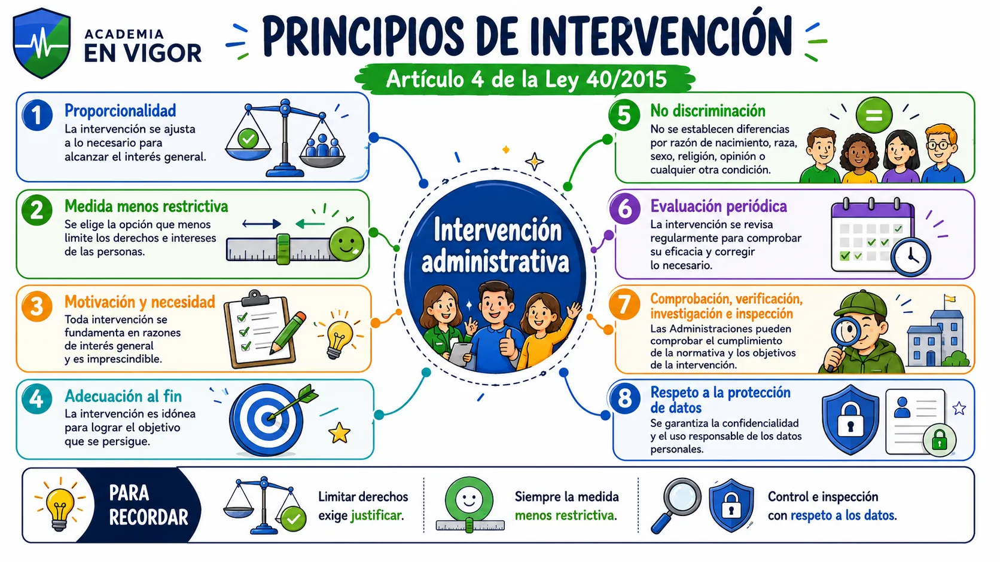

<em>Infografía: recurso visual planificado.</em>

<!-- MATERIAL PENDIENTE: t05-p2-audio -->
<!-- MATERIAL PENDIENTE: t05-p2-video -->
<!-- MATERIAL PENDIENTE: t05-p2-pres -->
<!-- MATERIAL PENDIENTE: t05-todo-audio -->
<!-- MATERIAL PENDIENTE: t05-todo-video -->
<!-- MATERIAL PENDIENTE: t05-todo-pres -->

<!-- FUENTE: AGE-INTERVENCION -->

## 09. El límite del artículo 25.3 de la Constitución

El **artículo 25.3 de la Constitución** fija el límite más contundente de toda la potestad sancionadora: **la Administración civil no podrá imponer sanciones que, directa o subsidiariamente, impliquen privación de libertad**.

Dos precisiones importantes. El precepto habla de **Administración civil**. Y la prohibición alcanza tanto a la privación de libertad **directa** como a la **subsidiaria** — es decir, tampoco cabe una multa que, de no pagarse, se convierta en arresto.

La privación de libertad como consecuencia de una infracción solo puede imponerla un **órgano judicial del orden penal**.

:::perla-vigor
Ni **directa** ni **subsidiariamente**. Una multa administrativa nunca puede acabar en arresto por impago.
:::

:::trampa
El precepto dice **Administración civil**, no «Administración» a secas. Y prohíbe también la privación de libertad **subsidiaria**, que es lo que suele omitir el distractor.
:::

<!-- VISUAL:t05-09-limite-articulo-25-3.webp -->

  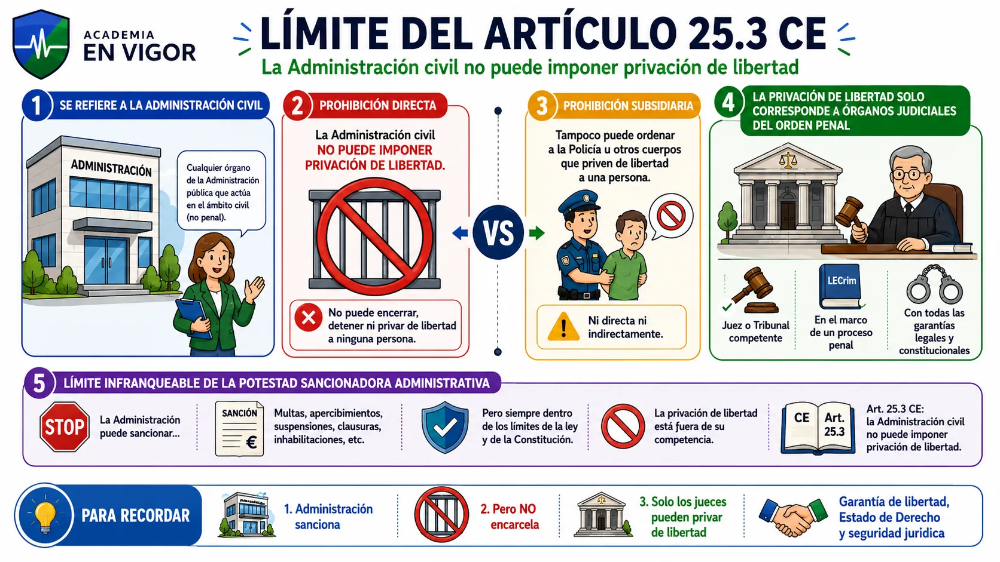

<em>Infografía: recurso visual planificado.</em>

<!-- VISUAL:t05-il-09-limite-libertad.webp -->

  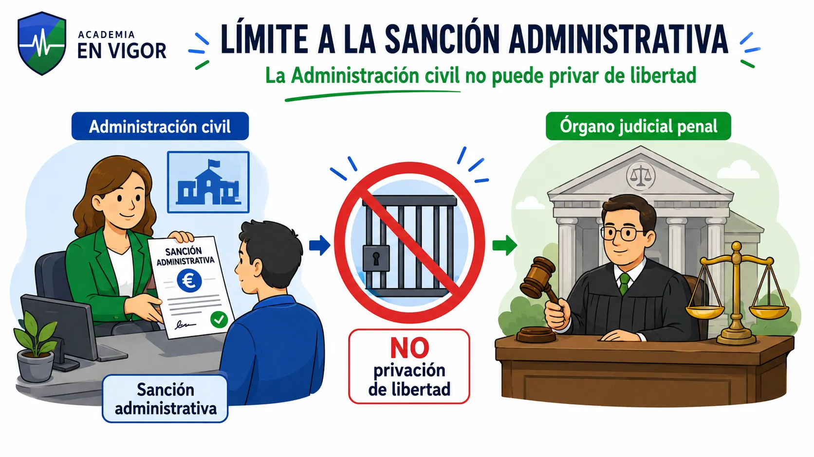

<em>Infografía: recurso visual planificado.</em>

<!-- FUENTE: AGE-INTERVENCION -->

<!-- PARTE 3: El Gobierno: composición y Presidente -->

<!-- MATERIAL PENDIENTE: t05-p2-audio -->
<!-- MATERIAL PENDIENTE: t05-p2-video -->
<!-- MATERIAL PENDIENTE: t05-p2-pres -->
<!-- MATERIAL PENDIENTE: t05-todo-audio -->
<!-- MATERIAL PENDIENTE: t05-todo-video -->
<!-- MATERIAL PENDIENTE: t05-todo-pres -->

<!-- FUENTE: AGE-INTERVENCION -->

## 10. El Gobierno: naturaleza y funciones

El Gobierno se regula en el **Título IV de la Constitución** y en la **Ley 50/1997, del Gobierno**. Conforme al **artículo 97 CE** y al **artículo 1.1 LG**, dirige la **política interior y exterior**, la **Administración civil y militar** y la **defensa del Estado**, y ejerce la **función ejecutiva** y la **potestad reglamentaria**.

La potestad reglamentaria es la facultad de dictar normas de rango inferior a la ley. El Gobierno es un **órgano constitucional** y responde **solidariamente** de su gestión política ante el **Congreso de los Diputados**.

Sus miembros se reúnen en **Consejo de Ministros** y en **Comisiones Delegadas del Gobierno**.

:::perla-vigor
Artículo 97: dirige **política interior y exterior**, **Administración civil y militar** y **defensa**; ejerce **función ejecutiva** y **potestad reglamentaria**.
:::

:::trampa
El Gobierno responde solidariamente ante el **Congreso de los Diputados**, no ante las Cortes Generales. El Senado queda fuera de la relación de confianza.
:::

<!-- VISUAL:t05-10-gobierno-funciones.webp -->

  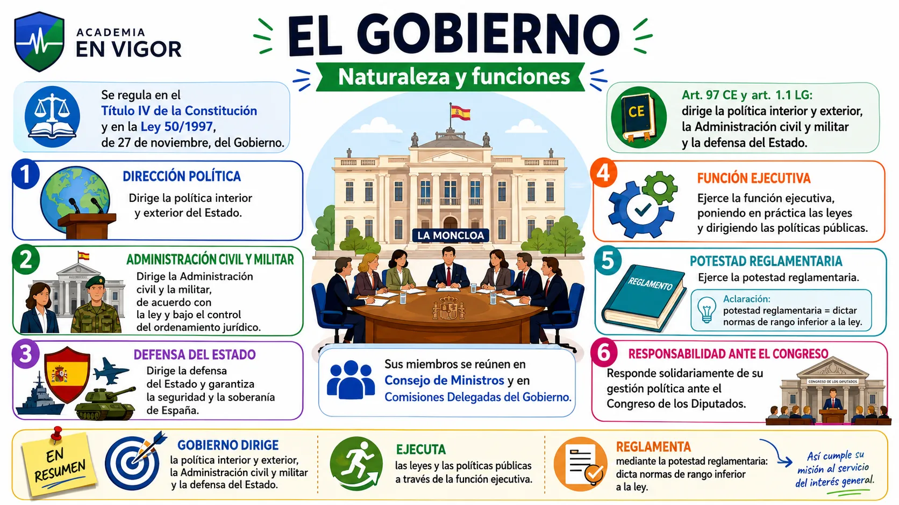

<em>Infografía: recurso visual planificado.</em>

<!-- MATERIAL PENDIENTE: t05-p3-audio -->
<!-- MATERIAL PENDIENTE: t05-p3-video -->
<!-- MATERIAL PENDIENTE: t05-p3-pres -->
<!-- MATERIAL PENDIENTE: t05-todo-audio -->
<!-- MATERIAL PENDIENTE: t05-todo-video -->
<!-- MATERIAL PENDIENTE: t05-todo-pres -->

<!-- FUENTE: GOB-NATURALEZA -->

## 11. Composición del Gobierno

Conforme al **artículo 98.1 CE**, el Gobierno se compone del **Presidente**, de los **Vicepresidentes en su caso**, de los **Ministros** y de los demás miembros que establezca la ley. El **artículo 1.2 LG** concreta actualmente la composición en Presidente, Vicepresidente o Vicepresidentes en su caso y Ministros.

Dos precisiones que se preguntan mucho. Los **Vicepresidentes son potestativos**: puede haber uno, varios o ninguno. Y los **Secretarios de Estado no son miembros del Gobierno**, aunque sean órganos superiores.

Sus miembros deben ser **españoles, mayores de edad**, con **derechos de sufragio activo y pasivo**, sin inhabilitación por sentencia firme y reunir los restantes requisitos de **idoneidad de la Ley 3/2015**. No pueden ejercer otras funciones representativas salvo el mandato parlamentario, ni actividad profesional o mercantil alguna.

Desde 2024, el nombramiento conjunto de titulares de las **Vicepresidencias y los Ministerios** debe respetar la **presencia equilibrada**: cada sexo debe representar, como mínimo, el **40 %**.

:::perla-vigor
**Vicepresidentes «en su caso»** significa potestativos. Y los **Secretarios de Estado no son miembros del Gobierno**.
:::

:::trampa
Un ministro **sí puede** ser simultáneamente diputado o senador. El mandato parlamentario es la única función representativa compatible.
:::

<!-- VISUAL:t05-11-composicion-gobierno.webp -->

  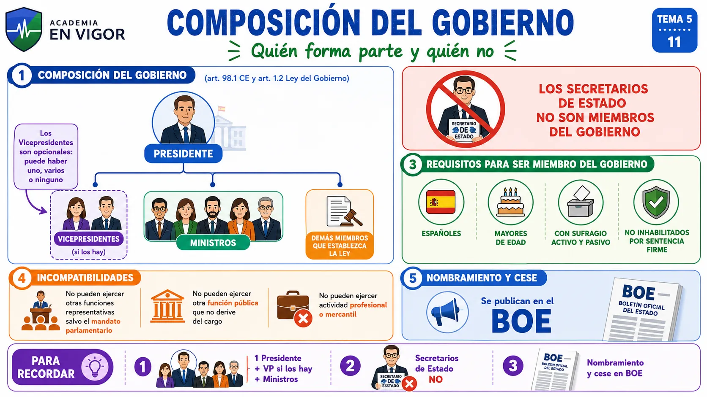

<em>Infografía: recurso visual planificado.</em>

<!-- MATERIAL PENDIENTE: t05-p3-audio -->
<!-- MATERIAL PENDIENTE: t05-p3-video -->
<!-- MATERIAL PENDIENTE: t05-p3-pres -->
<!-- MATERIAL PENDIENTE: t05-todo-audio -->
<!-- MATERIAL PENDIENTE: t05-todo-video -->
<!-- MATERIAL PENDIENTE: t05-todo-pres -->

<!-- FUENTE: GOB-COMPOSICION -->

## 12. El Presidente del Gobierno: dirección y funciones

El **artículo 2 de la Ley del Gobierno** define al Presidente con dos verbos: **dirige la acción del Gobierno** y **coordina las funciones** de sus miembros, sin perjuicio de la competencia y responsabilidad directa de los Ministros. Sus funciones más preguntadas:

Representa al Gobierno, **establece el programa político** y vela por su cumplimiento. Propone al Rey la **disolución** del Congreso, del Senado o de las Cortes, previa deliberación del Consejo de Ministros. Plantea la **cuestión de confianza**, también previa deliberación del Consejo de Ministros. Propone el **referéndum consultivo**, previa autorización del Congreso. **Dirige la política de defensa**. **Convoca, preside y fija el orden del día** del Consejo de Ministros. **Refrenda** actos del Rey y le somete para sanción las leyes y demás normas con rango de ley; además, propone el nombramiento y separación de Vicepresidentes y Ministros. Interpone el **recurso de inconstitucionalidad**. **Crea, modifica y suprime por real decreto los Departamentos ministeriales y las Secretarías de Estado**. Resuelve **conflictos de atribuciones entre Ministerios** e **imparte instrucciones**.

:::perla-vigor
El Presidente **crea, modifica y suprime ministerios y Secretarías de Estado por real decreto**, él solo. De ahí que los nombres bailen tanto.
:::

:::trampa
La cuestión de confianza exige **deliberación previa del Consejo de Ministros**; el referéndum consultivo exige **autorización previa del Congreso**. Son requisitos distintos y se cruzan en los distractores.
:::

<!-- VISUAL:t05-12-presidente-funciones.webp -->

  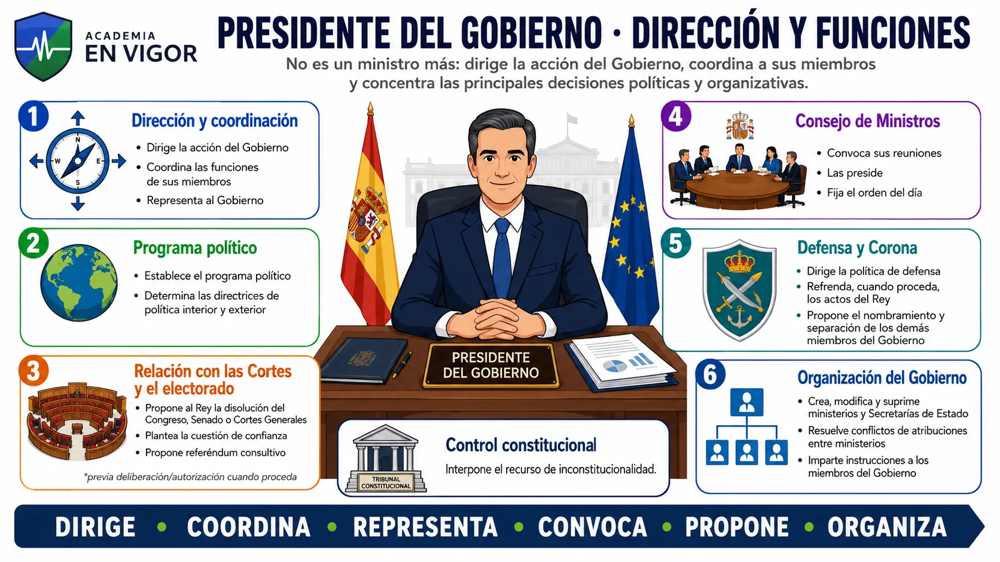

<em>Infografía: recurso visual planificado.</em>

<!-- MATERIAL PENDIENTE: t05-p3-audio -->
<!-- MATERIAL PENDIENTE: t05-p3-video -->
<!-- MATERIAL PENDIENTE: t05-p3-pres -->
<!-- MATERIAL PENDIENTE: t05-todo-audio -->
<!-- MATERIAL PENDIENTE: t05-todo-video -->
<!-- MATERIAL PENDIENTE: t05-todo-pres -->

<!-- FUENTE: GOB-PRESIDENTE -->

## 13. Nombramiento y cese del Presidente del Gobierno

El Presidente es **nombrado por el Rey** conforme al procedimiento de **investidura** previsto en la Constitución. **Cesa** por cuatro causas: **celebración de elecciones generales**, **pérdida de la confianza parlamentaria**, **dimisión** o **fallecimiento**.

La pérdida de confianza puede venir por **moción de censura aprobada** o por **cuestión de confianza denegada**.

Y una consecuencia esencial: **el cese del Presidente lleva consigo el cese de todo el Gobierno**. El Gobierno cesante continúa **en funciones** hasta la toma de posesión del nuevo.

Los **Vicepresidentes y Ministros** son nombrados y separados por el **Rey, a propuesta del Presidente**.

:::perla-vigor
Cuatro causas de cese: **elecciones, pérdida de confianza, dimisión y fallecimiento**. Y en las cuatro cae el Gobierno entero.
:::

:::trampa
El Gobierno cesa por la **celebración** de elecciones generales, no por la disolución de las Cámaras ni por la constitución del nuevo Congreso.
:::

<!-- VISUAL:t05-13-presidente-nombramiento-cese.webp -->

  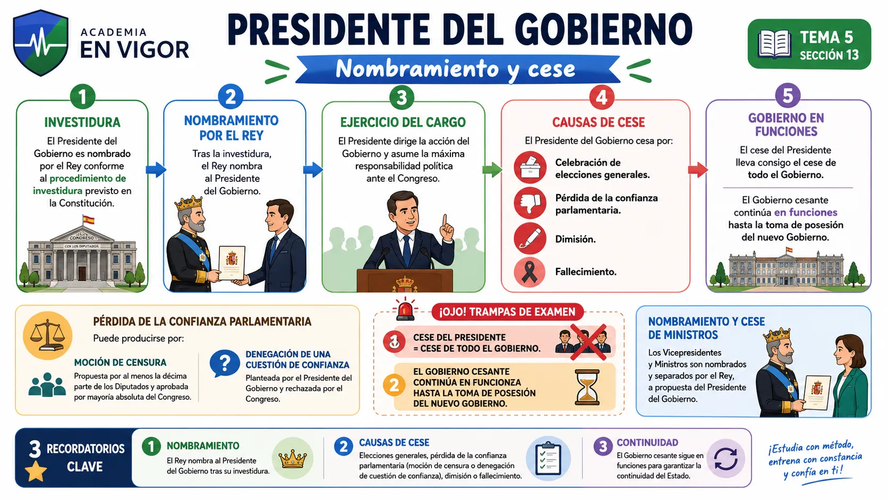

<em>Infografía: recurso visual planificado.</em>

<!-- MATERIAL PENDIENTE: t05-p3-audio -->
<!-- MATERIAL PENDIENTE: t05-p3-video -->
<!-- MATERIAL PENDIENTE: t05-p3-pres -->
<!-- MATERIAL PENDIENTE: t05-todo-audio -->
<!-- MATERIAL PENDIENTE: t05-todo-video -->
<!-- MATERIAL PENDIENTE: t05-todo-pres -->

<!-- FUENTE: GOB-PRESIDENTE -->

## 14. Suplencia y orden de prelación

En caso de **vacante, ausencia o enfermedad**, las funciones del Presidente las asumen los **Vicepresidentes** según el **orden de prelación**, y **en su defecto los Ministros** según el **orden de precedencia de los Departamentos**.

La **suplencia de los Ministros** se determina por **real decreto del Presidente del Gobierno**, debe recaer **necesariamente en otro miembro del Gobierno** y el real decreto debe expresar **la causa y el carácter** de la suplencia.

Un matiz práctico: la **interrupción transitoria de la asistencia** a una reunión de un órgano colegiado **no se considera ausencia**; en ese caso actúa la **siguiente autoridad en rango presente**.

:::perla-vigor
Presidente: **Vicepresidentes y, en su defecto, Ministros**. Ministro: **real decreto del Presidente** y el suplente **debe ser otro miembro del Gobierno**.
:::

:::trampa
Un Secretario de Estado **no puede suplir a un Ministro**: la suplencia debe recaer en otro miembro del Gobierno, y él no lo es.
:::

<!-- VISUAL:t05-14-suplencia-y-prelacion.webp -->

  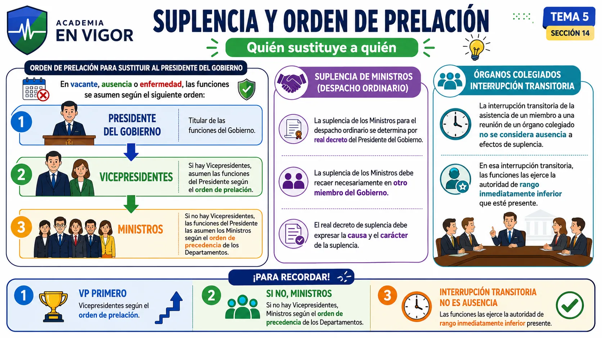

<em>Infografía: recurso visual planificado.</em>

<!-- FUENTE: GOB-PRESIDENTE -->

<!-- PARTE 4: Órganos del Gobierno -->

<!-- MATERIAL PENDIENTE: t05-p3-audio -->
<!-- MATERIAL PENDIENTE: t05-p3-video -->
<!-- MATERIAL PENDIENTE: t05-p3-pres -->
<!-- MATERIAL PENDIENTE: t05-todo-audio -->
<!-- MATERIAL PENDIENTE: t05-todo-video -->
<!-- MATERIAL PENDIENTE: t05-todo-pres -->

<!-- FUENTE: GOB-PRESIDENTE -->

## 15. Los Vicepresidentes y los Ministros como miembros del Gobierno

A los **Vicepresidentes** les corresponden **las funciones que les encomiende el Presidente**. Si un Vicepresidente asume la titularidad de un Departamento, **ostenta además la condición de Ministro**.

Los **Ministros** tienen competencia y responsabilidad en la esfera específica de su actuación. **Desarrollan la acción del Gobierno** en su Departamento conforme a los acuerdos del Consejo de Ministros o a las directrices del Presidente, **ejercen la potestad reglamentaria** en sus materias y **refrendan los actos del Rey** en materia de su competencia.

Pueden existir **Ministros sin cartera**, con responsabilidad sobre determinadas funciones gubernamentales. Cuando existan, un **real decreto** determina sus competencias, estructura y medios; su separación lleva aparejada la extinción del correspondiente órgano.

:::perla-vigor
El Ministro tiene **doble naturaleza**: miembro del Gobierno (Ley 50/1997) y jefe del Departamento (Ley 40/2015).
:::

:::trampa
Un **Ministro sin cartera es ministro de pleno derecho**: es miembro del Gobierno y vota en el Consejo de Ministros. Lo que no tiene es departamento.
:::

<!-- VISUAL:t05-15-vicepresidentes-y-ministros.webp -->

  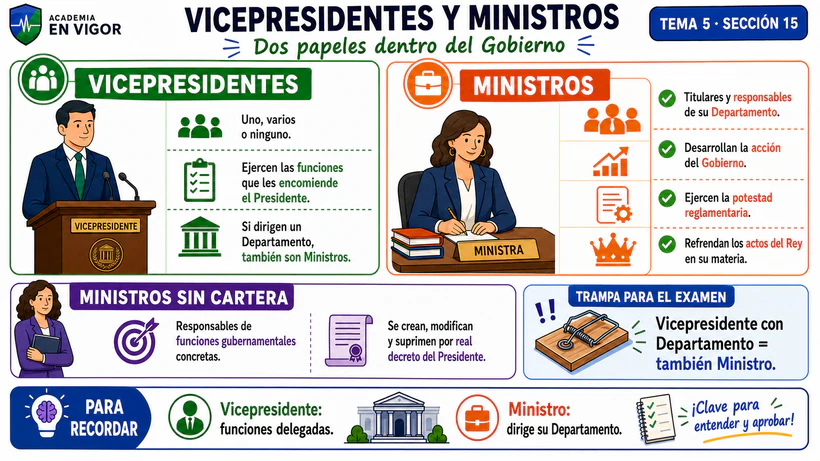

<em>Infografía: recurso visual planificado.</em>

<!-- MATERIAL PENDIENTE: t05-p4-audio -->
<!-- MATERIAL PENDIENTE: t05-p4-video -->
<!-- MATERIAL PENDIENTE: t05-p4-pres -->
<!-- MATERIAL PENDIENTE: t05-todo-audio -->
<!-- MATERIAL PENDIENTE: t05-todo-video -->
<!-- MATERIAL PENDIENTE: t05-todo-pres -->

<!-- FUENTE: GOB-MIEMBROS -->

## 16. Delegación y avocación de competencias

El **artículo 20 de la Ley del Gobierno** regula la delegación. El **Presidente** puede delegar en **Vicepresidentes y Ministros**. Los **Ministros** pueden delegar competencias propias en **Secretarios de Estado y Subsecretarios** dependientes de ellos, en los **Delegados del Gobierno** en las comunidades autónomas y en los demás **órganos directivos** del Ministerio.

También pueden delegarse, a propuesta del Presidente, las **funciones administrativas del Consejo de Ministros** en las Comisiones Delegadas del Gobierno.

No son delegables en ningún caso: las competencias **atribuidas directamente por la Constitución**; las de **nombramiento y separación de altos cargos** atribuidas al Consejo de Ministros; las atribuidas a los **órganos colegiados del Gobierno**, salvo la excepción anterior; y las atribuidas por una **ley que prohíba expresamente la delegación**.

El **Consejo de Ministros** puede avocar para sí, a propuesta del Presidente, un asunto que corresponda a una Comisión Delegada. Debe hacerlo por **acuerdo motivado**, mencionar la avocación en la decisión final y el acuerdo de avocación no admite recurso autónomo, aunque sí puede discutirse al recurrir la decisión final. En la delegación el órgano superior **conserva la titularidad** y solo cede el **ejercicio**.

:::perla-vigor
**Delegación cede el ejercicio; desconcentración cede la titularidad.** Y la **avocación** es el camino de vuelta: el superior atrae el asunto.
:::

:::trampa
Las competencias de los órganos colegiados del Gobierno **no son delegables**, salvo la delegación de funciones administrativas del Consejo de Ministros en Comisiones Delegadas prevista expresamente en el artículo 20.2 LG.
:::

<!-- VISUAL:t05-16-delegacion-y-avocacion.webp -->

  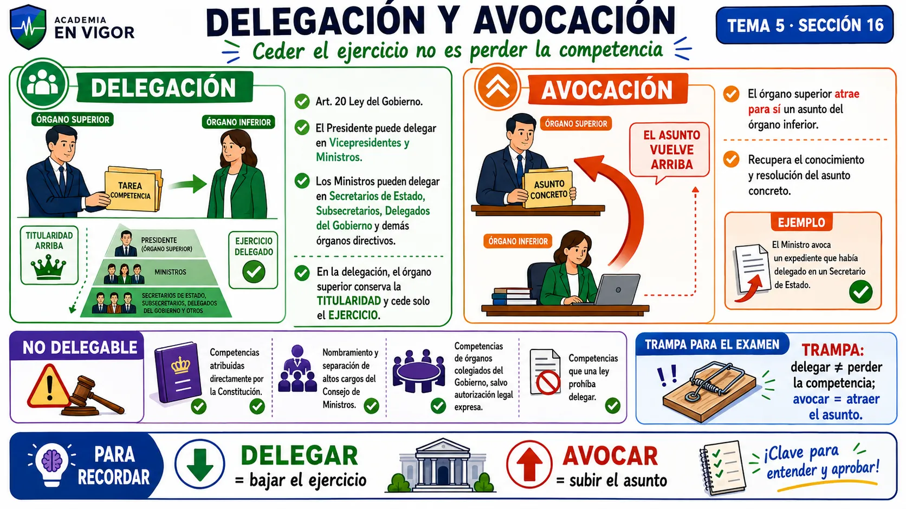

<em>Infografía: recurso visual planificado.</em>

<!-- VISUAL:t05-il-16-delegar-avocar.webp -->

  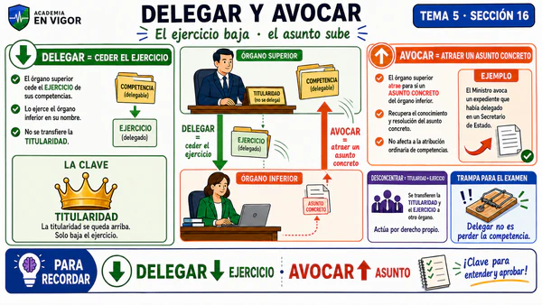

<em>Infografía: recurso visual planificado.</em>

<!-- MATERIAL PENDIENTE: t05-p4-audio -->
<!-- MATERIAL PENDIENTE: t05-p4-video -->
<!-- MATERIAL PENDIENTE: t05-p4-pres -->
<!-- MATERIAL PENDIENTE: t05-todo-audio -->
<!-- MATERIAL PENDIENTE: t05-todo-video -->
<!-- MATERIAL PENDIENTE: t05-todo-pres -->

<!-- FUENTE: GOB-DELEGACION -->

## 17. El Consejo de Ministros

El **Consejo de Ministros** (artículo 5 LG) es el órgano colegiado del Gobierno integrado por el **Presidente**, los **Vicepresidentes en su caso** y los **Ministros**. Los **Secretarios de Estado pueden asistir cuando sean convocados**. Sus **deliberaciones son secretas**.

Entre sus competencias: aprobar los **proyectos de ley** y remitirlos a las Cámaras; aprobar el **Proyecto de Ley de Presupuestos**; aprobar los **reales decretos-leyes y decretos legislativos**; acordar la **negociación y firma de tratados**; **declarar los estados de alarma y de excepción** y proponer al Congreso el de **sitio**; disponer la **emisión de deuda pública** cuando lo autorice una ley; aprobar los **reglamentos** de desarrollo y ejecución de las leyes; crear, modificar y suprimir los **órganos directivos** de los Departamentos; y adoptar programas, planes y directrices vinculantes para toda la AGE.

De cada sesión se levanta **acta** con el tiempo y lugar, los asistentes, los acuerdos y los informes presentados.

:::perla-vigor
Alarma y excepción las **declara** el Consejo de Ministros; el estado de sitio solo lo **propone** al Congreso, que es quien lo declara.
:::

:::trampa
El acta del Consejo de Ministros **no recoge opiniones ni votos**: solo tiempo y lugar, asistentes, acuerdos e informes. Las deliberaciones son secretas.
:::

<!-- VISUAL:t05-17-consejo-de-ministros.webp -->

  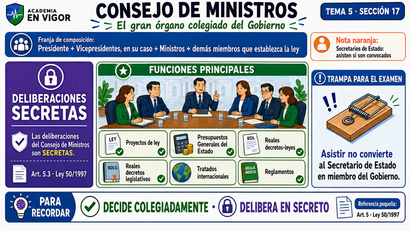

<em>Infografía: recurso visual planificado.</em>

<!-- MATERIAL PENDIENTE: t05-p4-audio -->
<!-- MATERIAL PENDIENTE: t05-p4-video -->
<!-- MATERIAL PENDIENTE: t05-p4-pres -->
<!-- MATERIAL PENDIENTE: t05-todo-audio -->
<!-- MATERIAL PENDIENTE: t05-todo-video -->
<!-- MATERIAL PENDIENTE: t05-todo-pres -->

<!-- FUENTE: GOB-CONSEJO -->

## 18. Las Comisiones Delegadas del Gobierno

Las **Comisiones Delegadas del Gobierno** (artículo 6 LG) se **crean, modifican y suprimen por real decreto del Consejo de Ministros, a propuesta del Presidente**. El real decreto debe especificar **quién la preside, qué miembros del Gobierno y, en su caso, Secretarios de Estado la integran, qué funciones tiene, quién ejerce la secretaría y cuál es su régimen interno**, especialmente convocatorias y suplencias.

Pueden ser convocados los titulares de otros **órganos superiores y directivos** de la AGE que se estime conveniente.

Sus funciones: **examinar** cuestiones generales que afecten a varios Departamentos; **estudiar** asuntos que requieran propuesta conjunta previa a su resolución por el Consejo de Ministros; **resolver** los asuntos que, afectando a más de un Ministerio, no requieran elevarse al Consejo; y ejercer las atribuciones que les confiera el ordenamiento o les delegue el Consejo. Sus **deliberaciones son secretas**.

:::perla-vigor
Ministerios los crea el **Presidente**. Comisiones Delegadas las crea el **Consejo de Ministros a propuesta del Presidente**.
:::

:::trampa
Las Comisiones Delegadas **resuelven** asuntos, no solo los preparan. Tienen capacidad decisoria propia cuando el asunto no debe elevarse al Consejo de Ministros.
:::

<!-- VISUAL:t05-18-comisiones-delegadas.webp -->

  

<em>Infografía: recurso visual planificado.</em>

<!-- MATERIAL PENDIENTE: t05-p4-audio -->
<!-- MATERIAL PENDIENTE: t05-p4-video -->
<!-- MATERIAL PENDIENTE: t05-p4-pres -->
<!-- MATERIAL PENDIENTE: t05-todo-audio -->
<!-- MATERIAL PENDIENTE: t05-todo-video -->
<!-- MATERIAL PENDIENTE: t05-todo-pres -->

<!-- FUENTE: GOB-COMISIONES -->

## 19. El Gobierno en funciones

El **artículo 21 LG** regula el Gobierno en funciones. El Gobierno cesante **continúa en funciones hasta la toma de posesión del nuevo**, debe **facilitar el traspaso de poderes** y **limita su gestión al despacho ordinario de los asuntos públicos**. Solo puede ir más allá en **casos de urgencia debidamente acreditados** o por **razones de interés general** cuya acreditación expresa lo justifique.

**El Presidente en funciones no puede:** proponer la **disolución** de las Cámaras, plantear la **cuestión de confianza** ni proponer el **referéndum consultivo**.

**El Gobierno en funciones no puede:** aprobar el **Proyecto de Ley de Presupuestos** ni **presentar proyectos de ley** a las Cámaras.

Además, las **delegaciones legislativas quedan en suspenso** mientras el Gobierno esté en funciones **por celebración de elecciones generales**.

:::perla-vigor
Tres prohibiciones son **del Presidente** (disolución, confianza, referéndum) y dos son **del Gobierno** (presupuestos y proyectos de ley).
:::

:::trampa
Las delegaciones legislativas se suspenden **solo si el Gobierno está en funciones por celebración de elecciones generales**, no en los demás supuestos de cese.
:::

<!-- VISUAL:t05-19-gobierno-en-funciones.webp -->

  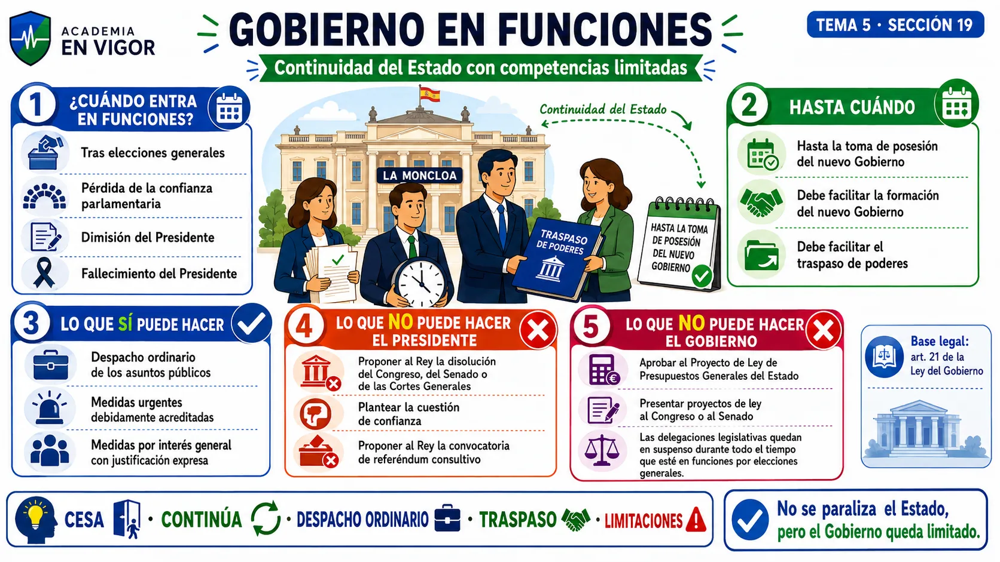

<em>Infografía: recurso visual planificado.</em>

<!-- VISUAL:t05-il-19-gobierno-en-funciones.webp -->

  

<em>Infografía: recurso visual planificado.</em>

<!-- FUENTE: GOB-FUNCIONES -->

<!-- PARTE 5: Colaboración, apoyo y consulta -->

<!-- MATERIAL PENDIENTE: t05-p4-audio -->
<!-- MATERIAL PENDIENTE: t05-p4-video -->
<!-- MATERIAL PENDIENTE: t05-p4-pres -->
<!-- MATERIAL PENDIENTE: t05-todo-audio -->
<!-- MATERIAL PENDIENTE: t05-todo-video -->
<!-- MATERIAL PENDIENTE: t05-todo-pres -->

<!-- FUENTE: GOB-FUNCIONES -->

## 20. Órganos de colaboración y apoyo: los Secretarios de Estado y la Comisión General

Los **órganos de colaboración y apoyo** del Gobierno son cuatro: los **Secretarios de Estado**, la **Comisión General de Secretarios de Estado y Subsecretarios**, el **Secretariado del Gobierno** y los **Gabinetes**.

Los **Secretarios de Estado** son **órganos superiores** de la AGE, **directamente responsables de la ejecución** de la acción del Gobierno en un sector específico. Actúan bajo la dirección del **Ministro** o, si la Secretaría está adscrita a Presidencia, del **Presidente**.

La **Comisión General** la integran los **Secretarios de Estado y los Subsecretarios**, y la preside un **Vicepresidente** o, en su defecto, el **Ministro de la Presidencia**. La secretaría corresponde al **Subsecretario de la Presidencia** y, si falta, al **Director del Secretariado del Gobierno**.

Examina los asuntos que vayan al Consejo de Ministros, salvo **nombramientos, ceses, ascensos a empleos de oficiales generales** y asuntos que deban elevarse directamente por **urgencia**. También analiza asuntos que afecten a varios Ministerios y no sean competencia del Consejo ni de sus Comisiones Delegadas cuando los someta su presidente. Sus deliberaciones son **reservadas** y **no puede adoptar decisiones o acuerdos por delegación del Gobierno**.

:::perla-vigor
La Comisión General es el **filtro previo ordinario** del Consejo de Ministros, con excepciones tasadas, y **no puede decidir por delegación del Gobierno**.
:::

:::trampa
La Comisión General **no adopta acuerdos por delegación**. Examina y prepara, pero la decisión sigue siendo del Consejo de Ministros.
:::

<!-- VISUAL:t05-20-secretarios-estado-y-comision-general.webp -->

  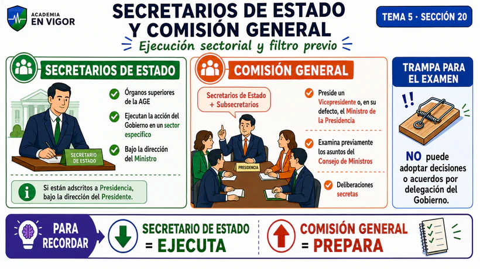

<em>Infografía: recurso visual planificado.</em>

<!-- MATERIAL PENDIENTE: t05-p5-audio -->
<!-- MATERIAL PENDIENTE: t05-p5-video -->
<!-- MATERIAL PENDIENTE: t05-p5-pres -->
<!-- MATERIAL PENDIENTE: t05-todo-audio -->
<!-- MATERIAL PENDIENTE: t05-todo-video -->
<!-- MATERIAL PENDIENTE: t05-todo-pres -->

<!-- FUENTE: GOB-APOYO -->

## 21. El Secretariado del Gobierno y los Gabinetes

El **Secretariado del Gobierno** apoya al **Consejo de Ministros**, a las **Comisiones Delegadas** y a la **Comisión General**, y se integra en el **Ministerio de la Presidencia**. Asiste al Ministro-Secretario; remite convocatorias; colabora con las Secretarías Técnicas; archiva convocatorias, órdenes del día y actas; vela por la buena regulación y la calidad técnica; y garantiza la publicación correcta y fiel en el BOE.

Como órgano de asistencia al Ministro de la Presidencia, tramita también la sanción y promulgación real de las leyes, la expedición de reales decretos y determinados actos del Rey y del Presidente. Su Director ejerce la **secretaría adjunta de la Comisión General**.

Los **Gabinetes** prestan apoyo político y técnico al Presidente, Vicepresidentes, Ministros y Secretarios de Estado. Sus miembros realizan tareas de confianza y asesoramiento especial y no pueden adoptar actos reservados a órganos de la AGE o de sus organizaciones adscritas. Esta prohibición no impide su pertenencia a órganos colegiados; además, los **Directores de Gabinete sí pueden dictar los actos propios de la jefatura de su unidad**.

Los Directores de Gabinete del Presidente, Vicepresidentes y Ministros se nombran y separan por **real decreto aprobado en Consejo de Ministros**; los de Secretarios de Estado, por **orden ministerial**, previo conocimiento del Consejo. Cesan con el titular, salvo durante el Gobierno en funciones, cuando continúan hasta la formación del nuevo Gobierno.

:::perla-vigor
El Secretariado es **técnico y permanente**; los Gabinetes son **políticos y de confianza**. El Director de Gabinete conserva los actos de jefatura de su propia unidad.
:::

:::trampa
El Secretariado del Gobierno se integra en el **Ministerio de la Presidencia**, no en Presidencia del Gobierno ni en un órgano autónomo.
:::

<!-- VISUAL:t05-21-secretariado-y-gabinetes.webp -->

  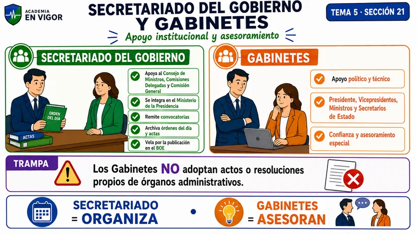

<em>Infografía: recurso visual planificado.</em>

<!-- MATERIAL PENDIENTE: t05-p5-audio -->
<!-- MATERIAL PENDIENTE: t05-p5-video -->
<!-- MATERIAL PENDIENTE: t05-p5-pres -->
<!-- MATERIAL PENDIENTE: t05-todo-audio -->
<!-- MATERIAL PENDIENTE: t05-todo-video -->
<!-- MATERIAL PENDIENTE: t05-todo-pres -->

<!-- FUENTE: GOB-APOYO -->

## 22. La jerarquía normativa de las disposiciones del Gobierno

El **artículo 24 de la Ley del Gobierno** establece solo **dos niveles reglamentarios**. En el primero están las disposiciones aprobadas por **real decreto del Presidente del Gobierno** o acordado en **Consejo de Ministros**. En el segundo, las aprobadas por **orden ministerial**.

Los acuerdos de las **Comisiones Delegadas** se formalizan mediante orden del Ministro competente o del Ministro de la Presidencia si afectan a varios Ministros; por eso **no crean un tercer nivel autónomo**. Las disposiciones contrarias a la Constitución, las leyes o una norma superior, las que invaden materias reservadas a la ley y las que establecen retroactividad sancionadora desfavorable son **nulas de pleno derecho**.

:::perla-vigor
Dos peldaños: **real decreto** (Presidente o Consejo) y **orden ministerial**.
:::

:::trampa
Los reales decretos del **Presidente** y los del **Consejo de Ministros** están en el **mismo nivel**. No hay jerarquía entre ellos.
:::

<!-- VISUAL:t05-22-jerarquia-normativa.webp -->

  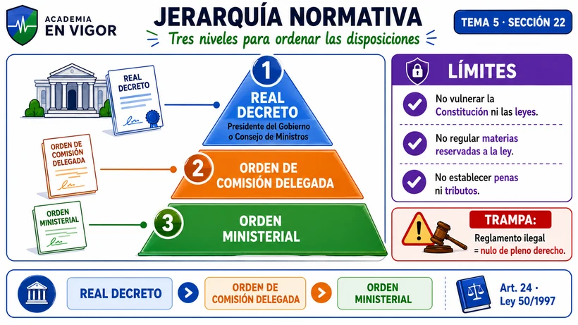

<em>Infografía: recurso visual planificado.</em>

<!-- MATERIAL PENDIENTE: t05-p5-audio -->
<!-- MATERIAL PENDIENTE: t05-p5-video -->
<!-- MATERIAL PENDIENTE: t05-p5-pres -->
<!-- MATERIAL PENDIENTE: t05-todo-audio -->
<!-- MATERIAL PENDIENTE: t05-todo-video -->
<!-- MATERIAL PENDIENTE: t05-todo-pres -->

<!-- FUENTE: GOB-NORMAS -->

## 23. El Consejo de Estado: naturaleza, composición y dictámenes

El **Consejo de Estado** (artículo 107 CE y **Ley Orgánica 3/1980**) es el **supremo órgano consultivo del Gobierno**. Ejerce sus funciones con **autonomía orgánica y funcional** y **no forma parte de la Administración activa**.

Se compone del **Presidente**, los **Consejeros permanentes**, los **natos**, los **electivos** y el **Secretario general**. Actúa en **Pleno**, **Comisión Permanente** y **Comisión de Estudios**.

Sus **dictámenes no son vinculantes**, salvo que la ley disponga lo contrario. Si dictaminó el **Pleno**, ningún otro órgano de la Administración del Estado puede informar después; si dictaminó la **Comisión Permanente**, solo puede informar posteriormente el **Pleno**. Si el Ministro consultante disiente en un asunto de consulta preceptiva, resuelve el **Consejo de Ministros**.

Las fórmulas son inequívocas: **«oído el Consejo de Estado»** si la resolución se aparta del dictamen y **«de acuerdo con el Consejo de Estado»** si lo sigue.

:::perla-vigor
**«De acuerdo con»** significa que se siguió el dictamen; **«oído»** significa que se apartó de él. Oído es escucharlo y hacer otra cosa.
:::

:::trampa
Los dictámenes del Consejo de Estado **no son vinculantes** con carácter general. Solo lo son cuando una ley lo dispone expresamente.
:::

<!-- VISUAL:t05-23-consejo-de-estado.webp -->

  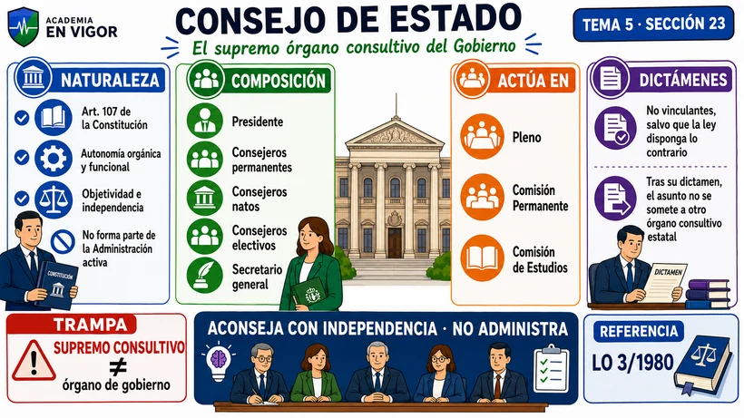

<em>Infografía: recurso visual planificado.</em>

<!-- VISUAL:t05-il-23-oido-o-de-acuerdo.webp -->

  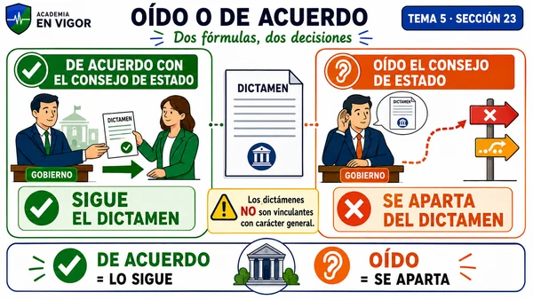

<em>Infografía: recurso visual planificado.</em>

<!-- MATERIAL PENDIENTE: t05-p5-audio -->
<!-- MATERIAL PENDIENTE: t05-p5-video -->
<!-- MATERIAL PENDIENTE: t05-p5-pres -->
<!-- MATERIAL PENDIENTE: t05-todo-audio -->
<!-- MATERIAL PENDIENTE: t05-todo-video -->
<!-- MATERIAL PENDIENTE: t05-todo-pres -->

<!-- FUENTE: GOB-CONSEJO-ESTADO -->

## 24. La consulta preceptiva al Consejo de Estado

La consulta al Consejo de Estado es **preceptiva** en los casos previstos por la ley y **facultativa** en los demás. La **omisión de un dictamen preceptivo puede determinar la invalidez** de la resolución.

**Al Pleno** le corresponde dictaminar, entre otros, sobre los **anteproyectos de reforma constitucional**, los **anteproyectos de ley** que ejecuten tratados internacionales o Derecho de la Unión, los **proyectos de decretos legislativos**, las **transacciones sobre derechos de la Hacienda Pública** y el sometimiento a **arbitraje** de las controversias sobre esos derechos.

**A la Comisión Permanente** le corresponde dictaminar sobre las **disposiciones reglamentarias** que desarrollen tratados o Derecho de la Unión, los **reglamentos ejecutivos de las leyes** y sus modificaciones, la **revisión de oficio** de actos administrativos, la **responsabilidad patrimonial** en la cuantía legal, y la **interpretación, nulidad y resolución de contratos administrativos**.

:::perla-vigor
Regla del rango: **rango de ley o reforma constitucional al Pleno; reglamentos y gestión ordinaria a la Comisión Permanente**.
:::

:::trampa
**Preceptivo no es vinculante.** Un dictamen puede ser obligatorio de pedir y, aun así, el Gobierno puede apartarse de él usando la fórmula «oído el Consejo de Estado».
:::

<!-- VISUAL:t05-24-consulta-preceptiva.webp -->

  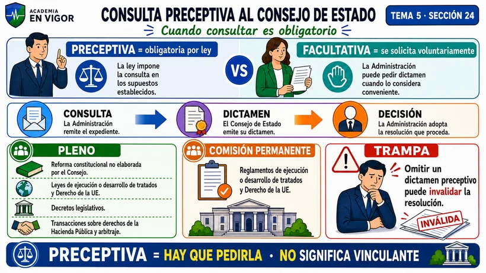

<em>Infografía: recurso visual planificado.</em>

<!-- FUENTE: GOB-CONSEJO-ESTADO -->

<!-- PARTE 6: Órganos superiores y altos cargos -->

<!-- MATERIAL PENDIENTE: t05-p5-audio -->
<!-- MATERIAL PENDIENTE: t05-p5-video -->
<!-- MATERIAL PENDIENTE: t05-p5-pres -->
<!-- MATERIAL PENDIENTE: t05-todo-audio -->
<!-- MATERIAL PENDIENTE: t05-todo-video -->
<!-- MATERIAL PENDIENTE: t05-todo-pres -->

<!-- FUENTE: GOB-CONSEJO-ESTADO -->

## 25. El estatuto del Alto Cargo

El estatuto del alto cargo se regula en la **Ley 3/2015, de 30 de marzo**. Tienen esa consideración los **miembros del Gobierno y Secretarios de Estado**; **Subsecretarios, Secretarios Generales, Secretarios Generales Técnicos y Directores Generales**; **Delegados del Gobierno**; jefes de misión diplomática y de representación permanente; determinados máximos responsables del sector público estatal; y titulares de órganos reguladores y de supervisión.

**Los Subdirectores Generales no son alto cargo.**

Su ejercicio se rige por los principios de **interés general, integridad, objetividad, transparencia y responsabilidad, y austeridad**. El nombramiento debe recaer en personas **idóneas**, entendiendo por tales las que reúnen **honorabilidad y la debida formación y experiencia**. La idoneidad la aprecian tanto quien propone como quien nombra.

:::perla-vigor
Todos los órganos directivos son alto cargo **salvo los Subdirectores Generales**. Esa es la frontera.
:::

:::trampa
Un **Subdirector General** es órgano directivo y debe ser funcionario A1, pero **no es alto cargo**. Es el error más repetido del tema.
:::

<!-- VISUAL:t05-25-estatuto-alto-cargo.webp -->

  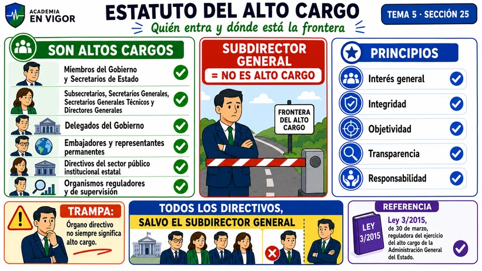

<em>Infografía: recurso visual planificado.</em>

<!-- VISUAL:t05-il-25-frontera-alto-cargo.webp -->

  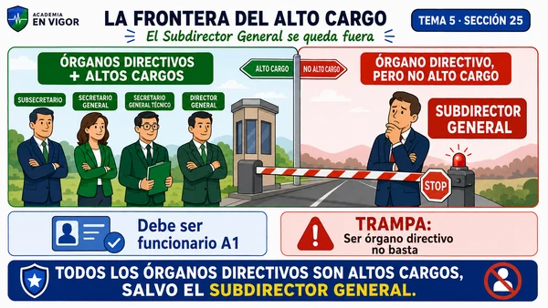

<em>Infografía: recurso visual planificado.</em>

<!-- MATERIAL PENDIENTE: t05-p6-audio -->
<!-- MATERIAL PENDIENTE: t05-p6-video -->
<!-- MATERIAL PENDIENTE: t05-p6-pres -->
<!-- MATERIAL PENDIENTE: t05-todo-audio -->
<!-- MATERIAL PENDIENTE: t05-todo-video -->
<!-- MATERIAL PENDIENTE: t05-todo-pres -->

<!-- FUENTE: AGE-ALTOS-CARGOS -->

## 26. Los Ministros como órgano superior del Departamento

El **artículo 61 de la Ley 40/2015** regula a los Ministros como **órganos superiores** de la AGE. Son los **jefes superiores del Departamento** y superiores jerárquicos directos de los **Secretarios de Estado y Subsecretarios**.

Entre sus competencias: ejercer la **potestad reglamentaria** en sus materias; **fijar objetivos**, aprobar planes y asignar recursos; mantener relaciones con las **comunidades autónomas** y convocar las **Conferencias Sectoriales**; **determinar y proponer la organización interna**; **nombrar y separar a los titulares de los órganos directivos** cuando la competencia no corresponda al Consejo de Ministros, a otro órgano o al propio organismo; imponer la sanción de **separación del servicio** por faltas muy graves; **administrar los créditos** y aprobar modificaciones presupuestarias; **celebrar contratos y convenios** y conceder subvenciones; **resolver recursos** y **declarar la lesividad** de actos; **resolver conflictos de atribuciones** dentro del Ministerio; y ejercer el **control de eficacia**.

:::perla-vigor
El Ministro impone la **separación del servicio** por faltas muy graves. Es la sanción más grave y está reservada a él.
:::

:::trampa
**Declarar la lesividad** no es anular. La Administración declara lesivo el acto y luego debe impugnarlo ante los tribunales: no puede anularlo por sí sola.
:::

<!-- VISUAL:t05-26-ministros-organo-superior.webp -->

  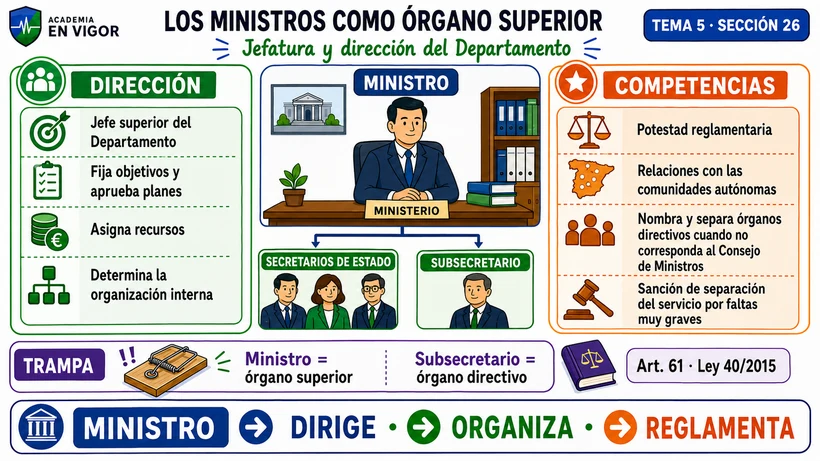

<em>Infografía: recurso visual planificado.</em>

<!-- FUENTE: AGE-SUPERIORES -->

<!-- PARTE 7: Órganos directivos -->

<!-- MATERIAL PENDIENTE: t05-p6-audio -->
<!-- MATERIAL PENDIENTE: t05-p6-video -->
<!-- MATERIAL PENDIENTE: t05-p6-pres -->
<!-- MATERIAL PENDIENTE: t05-todo-audio -->
<!-- MATERIAL PENDIENTE: t05-todo-video -->
<!-- MATERIAL PENDIENTE: t05-todo-pres -->

<!-- FUENTE: AGE-SUPERIORES -->

## 27. Los Subsecretarios

El **Subsecretario** (artículo 63 de la Ley 40/2015) es un **órgano directivo obligatorio** en cada Ministerio y su segunda jefatura.

Ostenta la **representación ordinaria del Ministerio**, dirige los **servicios comunes**, ejerce la **jefatura superior de todo el personal** del Departamento, es responsable del **asesoramiento jurídico al Ministro**, establece los **programas de inspección de servicios**, administra los créditos de la Subsecretaría y ejerce la **potestad disciplinaria por faltas graves y muy graves, salvo la separación del servicio**.

Se nombra por **real decreto del Consejo de Ministros a propuesta del Ministro**, y debe recaer en **funcionario de carrera del Subgrupo A1** del Estado, de las comunidades autónomas o de las entidades locales.

:::perla-vigor
El Subsecretario sanciona faltas **graves y muy graves salvo la separación del servicio**; esa se la reserva el **Ministro**.
:::

:::trampa
El Subsecretario es **obligatorio** en todo Ministerio. Su nombramiento debe recaer en un **funcionario de carrera A1** del Estado, de una comunidad autónoma o de una entidad local, o en quien hubiera perdido esa condición por **jubilación**; en todo caso debe reunir los requisitos de **idoneidad** de la Ley 3/2015. Los opcionales son las Secretarías de Estado y las Secretarías Generales.
:::

<!-- VISUAL:t05-27-subsecretarios.webp -->

  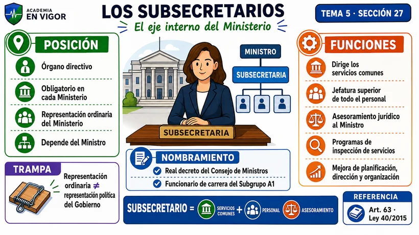

<em>Infografía: recurso visual planificado.</em>

<!-- MATERIAL PENDIENTE: t05-p7-audio -->
<!-- MATERIAL PENDIENTE: t05-p7-video -->
<!-- MATERIAL PENDIENTE: t05-p7-pres -->
<!-- MATERIAL PENDIENTE: t05-todo-audio -->
<!-- MATERIAL PENDIENTE: t05-todo-video -->
<!-- MATERIAL PENDIENTE: t05-todo-pres -->

<!-- FUENTE: AGE-DIRECTIVOS -->

## 28. Secretarios Generales y Secretarios Generales Técnicos

Los **Secretarios Generales** (artículo 64) son órganos directivos **opcionales**: pueden preverse en la estructura de un Ministerio para gestionar un sector de actividad administrativa determinado. Tienen **categoría de Subsecretario**, se nombran por **real decreto del Consejo de Ministros a propuesta del Ministro o del Presidente**, y **no exigen ser funcionario**: deben reunir cualificación y experiencia en puestos de responsabilidad de gestión pública o privada, además de los requisitos legales de **idoneidad**.

Los **Secretarios Generales Técnicos** (artículo 65) son **obligatorios** en cada Ministerio, **dependen directamente del Subsecretario** y tienen **categoría de Director General**. Sus competencias son los servicios comunes y, **en todo caso, la producción normativa, la asistencia jurídica y las publicaciones**. Se nombran por **real decreto del Consejo de Ministros a propuesta del Ministro**, deben ser **funcionarios de carrera del Subgrupo A1** y reunir los requisitos legales de **idoneidad**.

:::perla-vigor
**Secretario General**: opcional, rango de Subsecretario, **no requiere ser funcionario**. **Secretario General Técnico**: obligatorio, rango de Director General, **funcionario A1**.
:::

:::trampa
El **Secretario General** es el único órgano directivo que no exige la condición de funcionario de carrera. No lo confundas con el Secretario General Técnico, que sí la exige.
:::

<!-- VISUAL:t05-28-secretarios-generales.webp -->

  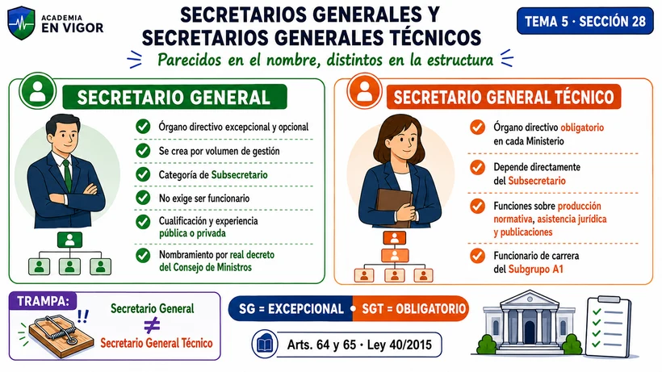

<em>Infografía: recurso visual planificado.</em>

<!-- MATERIAL PENDIENTE: t05-p7-audio -->
<!-- MATERIAL PENDIENTE: t05-p7-video -->
<!-- MATERIAL PENDIENTE: t05-p7-pres -->
<!-- MATERIAL PENDIENTE: t05-todo-audio -->
<!-- MATERIAL PENDIENTE: t05-todo-video -->
<!-- MATERIAL PENDIENTE: t05-todo-pres -->

<!-- FUENTE: AGE-DIRECTIVOS -->

## 29. Directores Generales y Subdirectores Generales

Los **Directores Generales** (artículo 66) gestionan **una o varias áreas funcionalmente homogéneas**. Proponen los proyectos de su Dirección General y dirigen su ejecución, ejercen las competencias atribuidas, desconcentradas o delegadas, y supervisan la gestión ordinaria. Se nombran por **real decreto del Consejo de Ministros a propuesta del Ministro o del Presidente**, entre **funcionarios de carrera del Subgrupo A1** o personas que hubieran perdido esa condición por **jubilación**. Excepcionalmente, el real decreto de estructura puede dispensar ese requisito por las características específicas del puesto, con **memoria razonada**. En todo caso deben reunir los requisitos de **idoneidad**.

Los **Subdirectores Generales** (artículo 67) son los **responsables inmediatos de la ejecución**. Los nombra, respetando los principios de **igualdad, mérito y capacidad**, y los cesa el **Ministro, Secretario de Estado o Subsecretario del que dependan**. Deben ser **funcionarios de carrera A1** del Estado o de otras Administraciones cuando lo permitan las normas aplicables. **No son alto cargo.**

:::perla-vigor
Escalera de exigencia: el SGT debe ser **funcionario A1**; el Subsecretario y el Director General admiten también a quien perdió esa condición por **jubilación**; el Director General permite además una **excepción motivada**; el Secretario General **no exige ser funcionario**.
:::

:::trampa
El **Subdirector General no se nombra por real decreto** ni es alto cargo. Lo nombra el Ministro, Secretario de Estado o Subsecretario del que dependa.
:::

<!-- VISUAL:t05-29-directores-y-subdirectores.webp -->

  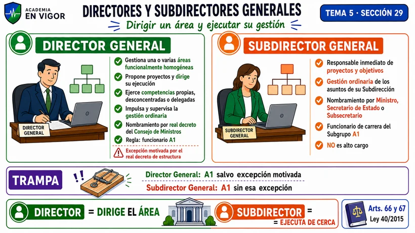

<em>Infografía: recurso visual planificado.</em>

<!-- MATERIAL PENDIENTE: t05-p7-audio -->
<!-- MATERIAL PENDIENTE: t05-p7-video -->
<!-- MATERIAL PENDIENTE: t05-p7-pres -->
<!-- MATERIAL PENDIENTE: t05-todo-audio -->
<!-- MATERIAL PENDIENTE: t05-todo-video -->
<!-- MATERIAL PENDIENTE: t05-todo-pres -->

<!-- FUENTE: AGE-DIRECTIVOS -->

## 30. Creación de órganos, servicios comunes y unidades administrativas

La **creación de órganos** sigue tres niveles. **Ministerios y Secretarías de Estado**: real decreto del **Presidente del Gobierno**. **Subsecretarías, Secretarías Generales, Secretarías Generales Técnicas, Direcciones Generales y Subdirecciones Generales**: real decreto del **Consejo de Ministros**, a **iniciativa del Ministro** y a **propuesta del ministerio de función pública**. **Órganos de nivel inferior a Subdirección General**: **orden del Ministro**, previa autorización del ministerio de función pública.

Los **servicios comunes** (artículo 68) prestan asesoramiento, apoyo técnico y, en su caso, gestión directa en materias transversales. Su **gestión compartida** puede preverse mediante **real decreto** y coordinarse por el ministerio competente en hacienda o un organismo autónomo dependiente de él para varios Ministerios, o por la Subsecretaría de cada Ministerio o un organismo autónomo dependiente de ella para todo el Departamento.

Las **unidades administrativas** son los elementos organizativos básicos, se establecen mediante las **relaciones de puestos de trabajo** y tienen un **jefe responsable** de su funcionamiento.

:::perla-vigor
Tres niveles: **Presidente** crea ministerios; **Consejo de Ministros** crea órganos directivos; **orden ministerial** crea lo inferior a subdirección general.
:::

:::trampa
Las **unidades administrativas se crean por las relaciones de puestos de trabajo**, no por real decreto ni por orden ministerial.
:::

<!-- VISUAL:t05-30-creacion-de-organos.webp -->

  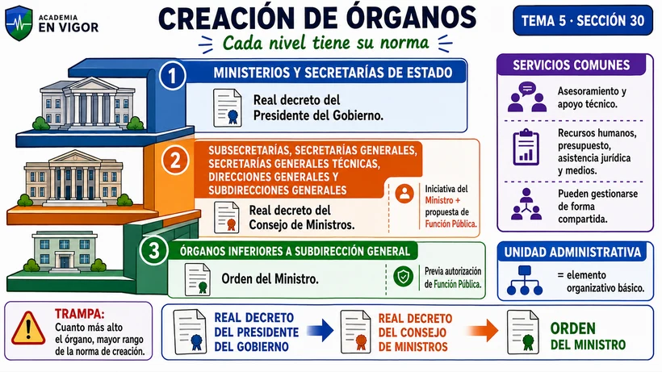

<em>Infografía: recurso visual planificado.</em>

<!-- FUENTE: AGE-ORGANOS -->

<!-- PARTE 8: Administración periférica y sector público institucional -->

<!-- MATERIAL PENDIENTE: t05-p7-audio -->
<!-- MATERIAL PENDIENTE: t05-p7-video -->
<!-- MATERIAL PENDIENTE: t05-p7-pres -->
<!-- MATERIAL PENDIENTE: t05-todo-audio -->
<!-- MATERIAL PENDIENTE: t05-todo-video -->
<!-- MATERIAL PENDIENTE: t05-todo-pres -->

<!-- FUENTE: AGE-ORGANOS -->

## 31. Delegaciones y Subdelegaciones del Gobierno: estructura y servicios territoriales

Existe una **Delegación del Gobierno en cada comunidad autónoma**, con sede en la localidad donde radique el **Consejo de Gobierno autonómico**, salvo acuerdo distinto del Consejo de Ministros o previsión del Estatuto de Autonomía. Están **adscritas orgánicamente al ministerio de política territorial**.

En las comunidades **pluriprovinciales** hay un **Subdelegado en cada provincia**. En las **uniprovinciales** el Delegado asume sus competencias, salvo que se cree la Subdelegación por **real decreto** cuando lo justifiquen la población, el volumen de gestión o singularidades geográficas, sociales o económicas.

En cada Delegación y Subdelegación existe una **Secretaría General obligatoria** para los servicios comunes. Los **servicios integrados** dependen del Delegado o Subdelegado **a través de la Secretaría General**; los **no integrados** dependen de su **órgano central**. La **asistencia jurídica** corresponde a la **Abogacía del Estado** y el **control económico-financiero** a la **IGAE**.

:::perla-vigor
**Integrados** dependen del Delegado a través de la Secretaría General; **no integrados** dependen de su ministerio central.
:::

:::trampa
En comunidades **uniprovinciales** puede crearse Subdelegación **por real decreto** si lo justifican población, volumen de gestión o singularidades. No está prohibido, solo no es la regla.
:::

<!-- VISUAL:t05-31-delegaciones-y-subdelegaciones.webp -->

  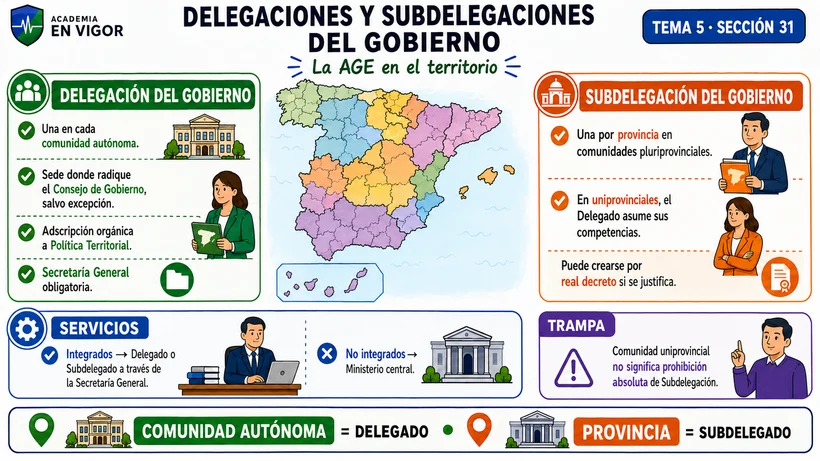

<em>Infografía: recurso visual planificado.</em>

<!-- VISUAL:t05-il-31-integrados-no-integrados.webp -->

  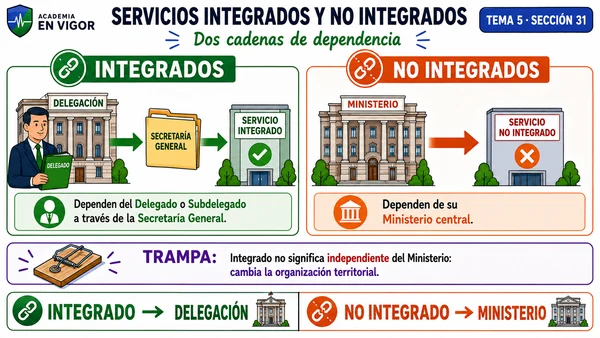

<em>Infografía: recurso visual planificado.</em>

<!-- MATERIAL PENDIENTE: t05-p8-audio -->
<!-- MATERIAL PENDIENTE: t05-p8-video -->
<!-- MATERIAL PENDIENTE: t05-p8-pres -->
<!-- MATERIAL PENDIENTE: t05-todo-audio -->
<!-- MATERIAL PENDIENTE: t05-todo-video -->
<!-- MATERIAL PENDIENTE: t05-todo-pres -->

<!-- FUENTE: AGE-PERIFERICA -->

## 32. Los Delegados del Gobierno: naturaleza y nombramiento

El **Delegado del Gobierno** (artículo 72) **representa al Gobierno de la Nación** en el territorio de la comunidad autónoma, **sin perjuicio de la representación ordinaria del Estado que ostenta el Presidente autonómico**. **Dirige y supervisa** la AGE en el territorio y la **coordina** con la Administración autonómica y local.

Tiene **rango de Subsecretario**. Depende **orgánicamente del Presidente del Gobierno** y **funcionalmente del ministerio competente por razón de la materia**. Se nombra por **real decreto del Consejo de Ministros a propuesta del Presidente del Gobierno**, atendiendo a **competencia profesional, experiencia e idoneidad** conforme a la Ley 3/2015.

En caso de ausencia le suple el **Subdelegado que designe**; en su defecto, el de la **provincia sede**; y en uniprovinciales sin Subdelegado, el **Secretario General**. Cuenta con una **Comisión territorial de asistencia** en las pluriprovinciales y una **Comisión de asistencia** en las uniprovinciales.

:::perla-vigor
Doble dependencia: **orgánica de Presidencia del Gobierno**, **funcional del ministerio competente** por razón de la materia.
:::

:::trampa
El **Delegado del Gobierno no necesita ser funcionario**; el **Subdelegado sí**, obligatoriamente funcionario de carrera A1.
:::

<!-- VISUAL:t05-32-delegados-naturaleza.webp -->

  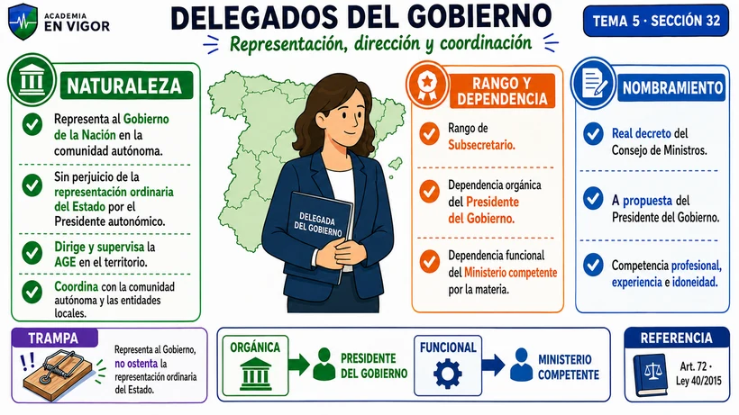

<em>Infografía: recurso visual planificado.</em>

<!-- MATERIAL PENDIENTE: t05-p8-audio -->
<!-- MATERIAL PENDIENTE: t05-p8-video -->
<!-- MATERIAL PENDIENTE: t05-p8-pres -->
<!-- MATERIAL PENDIENTE: t05-todo-audio -->
<!-- MATERIAL PENDIENTE: t05-todo-video -->
<!-- MATERIAL PENDIENTE: t05-todo-pres -->

<!-- FUENTE: AGE-PERIFERICA -->

## 33. Competencias de los Delegados del Gobierno

El **artículo 73** agrupa las competencias del Delegado en cinco áreas.

**Dirección de la AGE:** impulsar, coordinar y supervisar con carácter general su actividad en el territorio y, cuando se trate de **servicios integrados**, dirigirla; **nombrar a los Subdelegados y, en su caso, a los Directores Insulares**; e **informar preceptivamente** las propuestas de nombramiento de titulares de órganos territoriales de la AGE y organismos públicos estatales de ámbito autonómico y provincial en la Delegación.

**Información y ciudadanía:** coordinar la información sobre programas del Gobierno y **elevar anualmente un informe** al Gobierno sobre el funcionamiento de los servicios estatales.

**Relación con otras Administraciones:** comunicar y colaborar con la comunidad autónoma y las entidades locales, y participar en las **comisiones mixtas de transferencias** y **bilaterales de cooperación**.

**Seguridad y legalidad:** **proteger el libre ejercicio de derechos y libertades y garantizar la seguridad ciudadana**, a través de los Subdelegados y de las **Fuerzas y Cuerpos de Seguridad del Estado**, bajo **dependencia funcional del Ministerio del Interior**; resolver recursos; y velar por las competencias del Estado.

**Recursos:** coordinar la utilización de los **edificios de uso administrativo** estatales.

:::perla-vigor
En seguridad ciudadana el Delegado actúa **bajo dependencia funcional del Ministerio del Interior**, aunque orgánicamente dependa de Presidencia.
:::

:::trampa
Los **Subdelegados los nombra el Delegado del Gobierno**, no el Ministro ni el Consejo de Ministros.
:::

<!-- VISUAL:t05-33-delegados-competencias.webp -->

  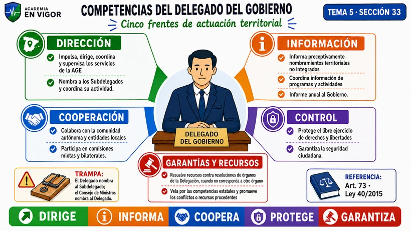

<em>Infografía: recurso visual planificado.</em>

<!-- MATERIAL PENDIENTE: t05-p8-audio -->
<!-- MATERIAL PENDIENTE: t05-p8-video -->
<!-- MATERIAL PENDIENTE: t05-p8-pres -->
<!-- MATERIAL PENDIENTE: t05-todo-audio -->
<!-- MATERIAL PENDIENTE: t05-todo-video -->
<!-- MATERIAL PENDIENTE: t05-todo-pres -->

<!-- FUENTE: AGE-PERIFERICA -->

## 34. Subdelegados del Gobierno y Directores Insulares

El **Subdelegado del Gobierno** (artículos 74 y 75) existe en **cada provincia de las comunidades pluriprovinciales**, bajo la **inmediata dependencia del Delegado**. Tiene **nivel de Subdirector General**, lo nombra el **Delegado del Gobierno por libre designación** y debe ser **funcionario de carrera del Subgrupo A1**. Le suple el **Secretario General** de la Subdelegación y cuenta con una **Comisión de asistencia**.

Sus competencias: **dirigir los servicios integrados** e **impulsar, supervisar e inspeccionar los no integrados**; **dirigir y coordinar la protección civil** en la provincia; **dirigir las Fuerzas y Cuerpos de Seguridad del Estado** en la provincia, **bajo la dirección del Delegado**; y ejercer la **potestad sancionadora**.

Los **Directores Insulares** (artículo 70) los nombra el **Delegado por libre designación entre funcionarios A1**, dependen jerárquicamente del Delegado o del Subdelegado si existe, y ejercen en su isla **las mismas competencias que los Subdelegados** en las provincias.

:::perla-vigor
Delegado y Subdelegado en cuatro contrastes: **Subsecretario/Subdirector General**, **Consejo de Ministros/Delegado**, **no funcionario/funcionario A1**, **alto cargo/no alto cargo**.
:::

:::trampa
El Subdelegado dirige las Fuerzas y Cuerpos de Seguridad en la provincia **bajo la dirección del Delegado del Gobierno**, no de forma autónoma.
:::

<!-- VISUAL:t05-34-subdelegados-e-insulares.webp -->

  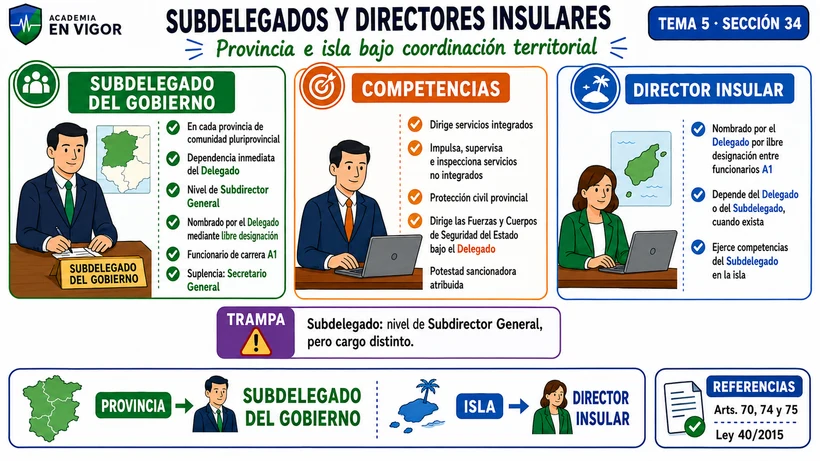

<em>Infografía: recurso visual planificado.</em>

<!-- MATERIAL PENDIENTE: t05-p8-audio -->
<!-- MATERIAL PENDIENTE: t05-p8-video -->
<!-- MATERIAL PENDIENTE: t05-p8-pres -->
<!-- MATERIAL PENDIENTE: t05-todo-audio -->
<!-- MATERIAL PENDIENTE: t05-todo-video -->
<!-- MATERIAL PENDIENTE: t05-todo-pres -->

<!-- FUENTE: AGE-PERIFERICA -->

## 35. El sector público institucional estatal: organismos autónomos y entidades públicas empresariales

El **artículo 84** enumera los integrantes del **sector público institucional estatal**: los **organismos públicos** —que comprenden los **organismos autónomos**, las **entidades públicas empresariales** y las **agencias estatales**—, las **autoridades administrativas independientes**, las **sociedades mercantiles estatales**, los **consorcios**, las **fundaciones del sector público**, los **fondos sin personalidad jurídica** y las **universidades públicas no transferidas**.

El **artículo 84 bis** exige presencia equilibrada entre mujeres y hombres —cada sexo entre el **40 % y el 60 %**— entre los máximos responsables y las personas con contratos de alta dirección de cada entidad, y también en sus órganos colegiados de gobierno.

Los **organismos autónomos** (artículos 98 y 99) se rigen por el **Derecho administrativo**, tienen **personalidad jurídica pública diferenciada, patrimonio y tesorería propios** y **autonomía de gestión**. Dependen de la **AGE**, a la que corresponde la **dirección estratégica, la evaluación de resultados y el control de eficacia**. Su denominación debe incluir **«Organismo Autónomo»** o **«O.A.»**.

Las **entidades públicas empresariales** (artículos 103 y 104) se financian con **ingresos de mercado**, salvo las que sean o puedan ser declaradas **medio propio personificado**, y se rigen por el **Derecho privado**, salvo en la **formación de la voluntad de sus órganos**, en el **ejercicio de potestades administrativas** y en lo específicamente regulado por la ley. Pueden depender de la **AGE o de un organismo autónomo**. Su denominación debe incluir **«Entidad Pública Empresarial»** o **«E.P.E.»**. La financiación mayoritaria con ingresos de mercado se determina por su condición de **productor de mercado conforme al Sistema Europeo de Cuentas**.

:::perla-vigor
**Organismo autónomo: Derecho administrativo y dinero público.** **Entidad pública empresarial: Derecho privado e ingresos de mercado.**
:::

:::trampa
La entidad pública empresarial se rige por Derecho privado **salvo tres excepciones**: formación de la voluntad de sus órganos, ejercicio de potestades administrativas y lo regulado específicamente por la ley.
:::

<!-- VISUAL:t05-35-organismos-y-entidades.webp -->

  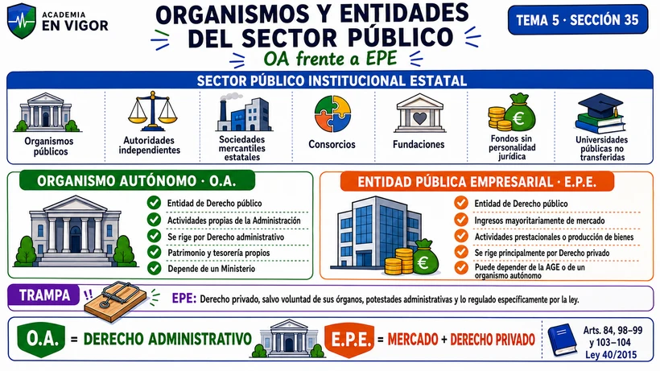

<em>Infografía: recurso visual planificado.</em>

<!-- VISUAL:t05-il-35-oa-frente-epe.webp -->

  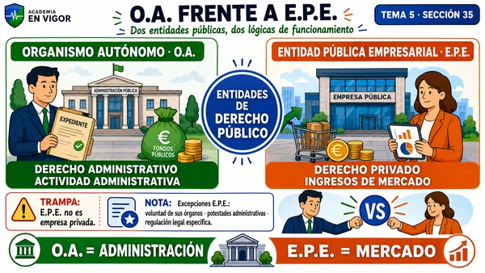

<em>Infografía: recurso visual planificado.</em>

<!-- MATERIAL PENDIENTE: t05-p8-audio -->
<!-- MATERIAL PENDIENTE: t05-p8-video -->
<!-- MATERIAL PENDIENTE: t05-p8-pres -->
<!-- MATERIAL PENDIENTE: t05-todo-audio -->
<!-- MATERIAL PENDIENTE: t05-todo-video -->
<!-- MATERIAL PENDIENTE: t05-todo-pres -->

<!-- FUENTE: AGE-INSTITUCIONAL -->

# Hablemos claro

:::hablemos-claro
Este tema se estudia mal si se memoriza como una lista de cargos. Se estudia bien con tres claves:

- **Cada órgano, seis datos.** Naturaleza, si es obligatorio u opcional, quién lo nombra, si exige ser funcionario, qué hace y qué rango tiene. Rellena esa ficha para los quince órganos del tema y lo tendrás resuelto.
- **Las parejas que se confunden.** Descentralización y desconcentración. Delegación y avocación. Secretario General y Secretario General Técnico. Delegado y Subdelegado. Organismo autónomo y entidad pública empresarial. Estúdialas siempre enfrentadas, nunca por separado.
- **Las fronteras.** La del alto cargo pasa por el Subdirector General. La de la Administración Pública deja fuera lo privado. La del reglamento no llega a penas ni tributos.

Y una advertencia sobre lo que caduca. Los **nombres de los ministerios** cambian con cada legislatura y a veces dentro de ella, porque los fija el Presidente del Gobierno por real decreto. Esta versión está cerrada a **2026-07-27**, con el Ministerio para la Transformación Digital y de la Función Pública y el Ministerio de Política Territorial y Memoria Democrática vigentes. Si una pregunta gira sobre un nombre, comprueba la convocatoria; si gira sobre qué ministerio es competente **por razón de la materia**, la respuesta es estable.
:::

# En la calle

:::en-la-calle
La parte con más aplicación directa es la Administración periférica. El **Delegado del Gobierno** protege el libre ejercicio de derechos y libertades y garantiza la seguridad ciudadana en la comunidad autónoma, y el **Subdelegado** dirige las Fuerzas y Cuerpos de Seguridad del Estado en la provincia, bajo la dirección de aquel. En ambos casos con **dependencia funcional del Ministerio del Interior**: la cadena va de Interior al Delegado y del Delegado al Subdelegado.

El Subdelegado dirige además la **protección civil** provincial y ejerce la **potestad sancionadora** que la normativa le atribuya, lo que en la práctica incluye buena parte de las sanciones de seguridad ciudadana que se proponen desde una actuación policial.

Conviene tener claro también dónde encaja la propia Dirección General de la Policía: es una **dirección general**, es decir, un órgano directivo de gestión de un área funcional homogénea, cuyo titular es alto cargo y se nombra por real decreto del Consejo de Ministros.
:::

# Lo que cae

:::lo-que-cae
Prioridad alta de estudio:

- diferencia entre sector público y Administración Pública;
- descentralización frente a desconcentración, y delegación frente a avocación;
- artículo 25.3 CE: ni directa ni subsidiariamente;
- composición del Gobierno y la exclusión de los Secretarios de Estado;
- funciones del Presidente, con la creación de ministerios por real decreto;
- estados de alarma y excepción se declaran, el de sitio se propone;
- prohibiciones del Gobierno en funciones, separando las del Presidente de las del Gobierno;
- la Comisión General no decide por delegación;
- las fórmulas «oído» y «de acuerdo con» del Consejo de Estado, y el reparto Pleno / Comisión Permanente;
- la frontera del alto cargo en el Subdirector General;
- Secretario General frente a Secretario General Técnico;
- quién nombra a cada órgano y quién debe ser funcionario A1;
- servicios integrados frente a no integrados;
- Delegado frente a Subdelegado en rango, nombramiento y requisitos;
- organismo autónomo frente a entidad pública empresarial.

No se utilizarán expresiones como «cae seguro» hasta disponer de una estadística histórica completamente verificada.
:::

# Ha caído

:::ha-caido
Las preguntas de exámenes oficiales que tocan esta materia se incorporarán al índice del tema una vez revisado su mapeo. Hasta entonces no alimentan frecuencias ni afirmaciones de «Ha caído».
:::

---

*Academia En Vigor · El temario que nunca duerme · Tema 5 · v1.0.0 · Documento interno no publicado.*
