# TEMA 6 · LOS FUNCIONARIOS PÚBLICOS: CONCEPTO Y CLASES. ADQUISICIÓN Y PÉRDIDA DE LA CONDICIÓN DE FUNCIONARIO

**Policía Nacional · Método VIGOR · PARTE**
**Versión de contenido:** 1.0.1
**Estado editorial:** approved_internal · **Publicación:** not_published

# Mapa del tema

El tema se estudia en dos recorridos: **quién trabaja para la Administración** y **cómo se adquiere o se pierde la condición de funcionario de carrera**. Dentro del segundo recorrido se comparan siempre la regla general del TREBEP y la especial de Policía Nacional.

<!-- VISUAL:t06-01-mapa-general.webp -->

  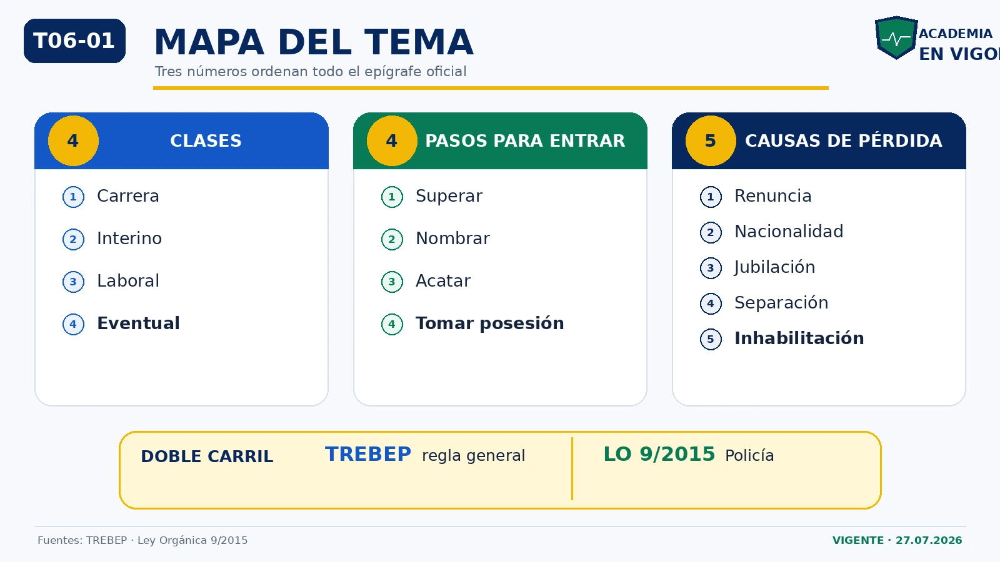

<em>Infografía: clasificación, adquisición, pérdida y comparación TREBEP/Policía Nacional.</em>

<!-- MATERIAL PENDIENTE: t06-todo-audio -->
<!-- MATERIAL PENDIENTE: t06-todo-video -->
<!-- MATERIAL PENDIENTE: t06-todo-pres -->

# Contenido

## 01. Alcance oficial y marco normativo

El programa oficial de 2026 limita el Tema 6 a dos núcleos: **concepto y clases de funcionarios públicos** y **adquisición y pérdida de la condición de funcionario**. No forman parte de este epígrafe las situaciones administrativas, la carrera profesional, la movilidad, las retribuciones ni el código de conducta.

La Constitución garantiza el acceso en condiciones de igualdad a las funciones y cargos públicos (art. 23.2) y reserva a la ley el estatuto de los funcionarios, con acceso conforme a mérito y capacidad (art. 103.3).

El marco general es el TREBEP. Para la Policía Nacional existe legislación específica: la Ley Orgánica 9/2015. Por eso hay que distinguir siempre entre **régimen general** y **régimen policial**.

:::trampa
El TREBEP no se aplica automáticamente en bloque a las Fuerzas y Cuerpos de Seguridad. Su aplicación directa depende de lo que disponga la legislación específica.
:::

<!-- MATERIAL PENDIENTE: t06-p1-audio -->
<!-- MATERIAL PENDIENTE: t06-p1-video -->
<!-- MATERIAL PENDIENTE: t06-p1-pres -->
<!-- MATERIAL PENDIENTE: t06-todo-audio -->
<!-- MATERIAL PENDIENTE: t06-todo-video -->
<!-- MATERIAL PENDIENTE: t06-todo-pres -->

<!-- FUENTE: CONV-PN-2026,CE-T06,TREBEP-T06,LO9-2015-T06 -->

## 02. Empleado público: concepto y clasificación

Son empleados públicos quienes desempeñan **funciones retribuidas** en las Administraciones Públicas **al servicio de los intereses generales**.

El artículo 8.2 del TREBEP establece cuatro clases:

1. funcionarios de carrera;
2. funcionarios interinos;
3. personal laboral, fijo, por tiempo indefinido o temporal;
4. personal eventual.

El personal directivo profesional se regula aparte en el artículo 13: no es una quinta clase añadida a la lista del artículo 8.2.

:::perla-vigor
Cuatro casillas: carrera, interino, laboral y eventual. Si aparece «personal accidental», sobra.
:::

<!-- VISUAL:t06-02-cuatro-clases.webp -->

  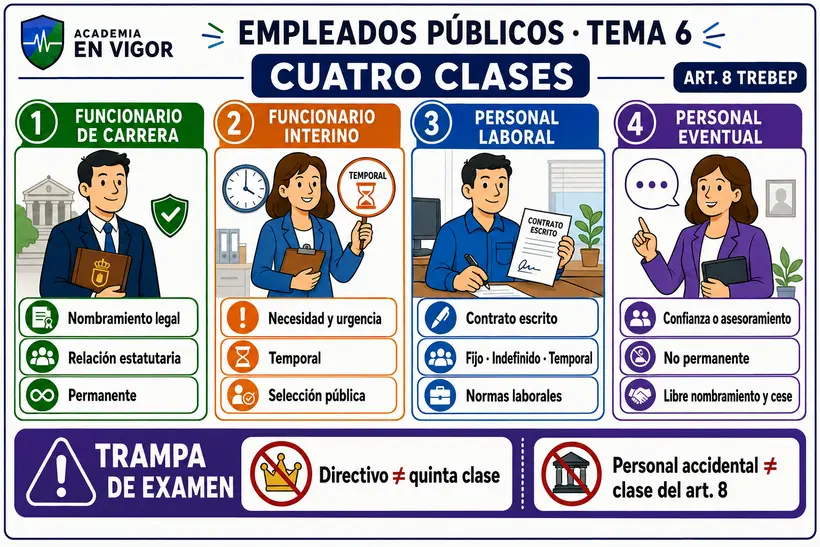

<em>Infografía: las cuatro clases del artículo 8.</em>

<!-- VISUAL:t06-il-02-cuatro-clases-no-cinco.webp -->

  

<em>Ilustración: cuatro clases dentro del artículo 8 y el directivo profesional fuera de la lista.</em>

<!-- MATERIAL PENDIENTE: t06-p1-audio -->
<!-- MATERIAL PENDIENTE: t06-p1-video -->
<!-- MATERIAL PENDIENTE: t06-p1-pres -->
<!-- MATERIAL PENDIENTE: t06-todo-audio -->
<!-- MATERIAL PENDIENTE: t06-todo-video -->
<!-- MATERIAL PENDIENTE: t06-todo-pres -->

<!-- FUENTE: TREBEP-T06 -->

## 03. Funcionarios de carrera

El funcionario de carrera:

- recibe un **nombramiento legal**;
- queda vinculado a una Administración por una **relación estatutaria**;
- se rige por el **Derecho Administrativo**;
- presta servicios profesionales retribuidos de **carácter permanente**.

Las funciones que impliquen participación directa o indirecta en potestades públicas o salvaguardia de intereses generales corresponden exclusivamente a **funcionarios públicos**, en los términos que determine la ley de cada Administración.

<!-- VISUAL:t06-03-funcionario-carrera.webp -->

  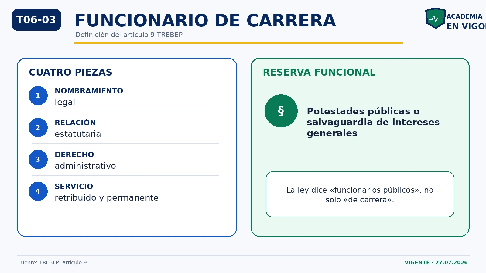

<em>Infografía: definición del funcionario de carrera y reserva funcional.</em>

<!-- MATERIAL PENDIENTE: t06-p1-audio -->
<!-- MATERIAL PENDIENTE: t06-p1-video -->
<!-- MATERIAL PENDIENTE: t06-p1-pres -->
<!-- MATERIAL PENDIENTE: t06-todo-audio -->
<!-- MATERIAL PENDIENTE: t06-todo-video -->
<!-- MATERIAL PENDIENTE: t06-todo-pres -->

<!-- FUENTE: TREBEP-T06 -->

## 04. Funcionarios interinos: concepto y cuatro supuestos

El interino es nombrado temporalmente, por razones expresamente justificadas de **necesidad y urgencia**, para funciones propias de funcionarios de carrera.

Supuestos del artículo 10:

- vacante no cubierta por carrera: máximo **3 años**;
- sustitución transitoria: tiempo estrictamente necesario;
- programa temporal: máximo **3 años**, ampliable hasta **12 meses** por ley de Función Pública;
- exceso o acumulación de tareas: máximo **9 meses en 18 meses**.

<!-- VISUAL:t06-04-interinos-cuatro-supuestos.webp -->

  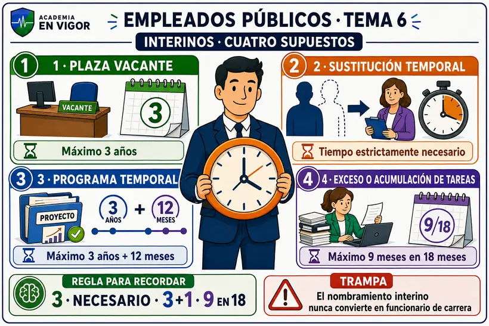

<em>Infografía: cuatro supuestos de interinidad y sus plazos.</em>

<!-- VISUAL:t06-il-04-reloj-interinidad.webp -->

  

<em>Ilustración: regla mnemotécnica 3, necesario, 3+1 y 9 en 18.</em>

<!-- MATERIAL PENDIENTE: t06-p2-audio -->
<!-- MATERIAL PENDIENTE: t06-p2-video -->
<!-- MATERIAL PENDIENTE: t06-p2-pres -->
<!-- MATERIAL PENDIENTE: t06-todo-audio -->
<!-- MATERIAL PENDIENTE: t06-todo-video -->
<!-- MATERIAL PENDIENTE: t06-todo-pres -->

<!-- FUENTE: TREBEP-T06 -->

## 05. Interinos: selección, cese y control de la temporalidad

La selección del interino es pública y se rige por igualdad, mérito, capacidad, publicidad y **celeridad**. Su nombramiento nunca convierte por sí solo al interino en funcionario de carrera.

La Administración finaliza de oficio la interinidad por cobertura reglada, supresión o amortización, fin del plazo o fin de la causa del nombramiento. El cese ordinario no genera compensación.

En vacante, a los tres años termina la interinidad, salvo convocatoria publicada dentro de ese plazo y pendiente de resolución. La compensación de 20 días por año, con máximo de 12 mensualidades, solo nace cuando la Administración incumple el plazo máximo de permanencia.

<!-- VISUAL:t06-05-interino-reloj-temporalidad.webp -->

  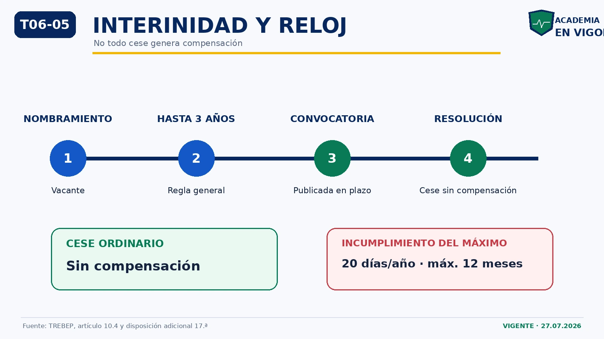

<em>Infografía: cese ordinario y compensación por incumplimiento.</em>

<!-- MATERIAL PENDIENTE: t06-p2-audio -->
<!-- MATERIAL PENDIENTE: t06-p2-video -->
<!-- MATERIAL PENDIENTE: t06-p2-pres -->
<!-- MATERIAL PENDIENTE: t06-todo-audio -->
<!-- MATERIAL PENDIENTE: t06-todo-video -->
<!-- MATERIAL PENDIENTE: t06-todo-pres -->

<!-- FUENTE: TREBEP-T06 -->

## 06. Personal laboral

El personal laboral presta servicios retribuidos mediante **contrato de trabajo escrito**. Puede ser fijo, por tiempo indefinido o temporal.

Se rige por la legislación laboral, las normas convencionales y los preceptos del TREBEP que resulten aplicables. Las leyes de Función Pública determinan qué puestos puede ocupar, respetando la reserva de funciones públicas del artículo 9.2.

<!-- VISUAL:t06-06-laboral-eventual.webp -->

  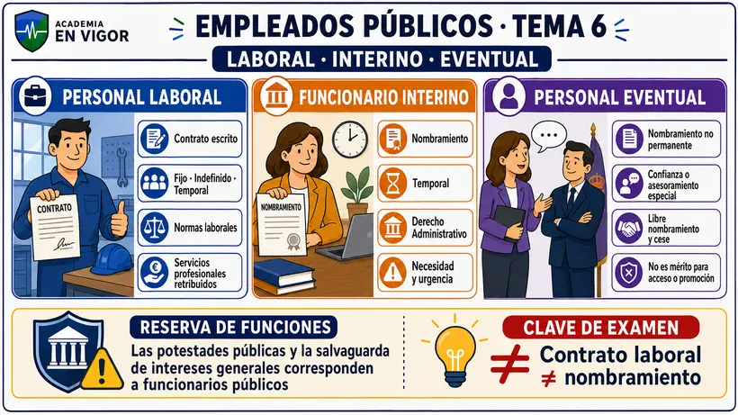

<em>Infografía: contrato laboral, interinidad y confianza eventual.</em>

<!-- MATERIAL PENDIENTE: t06-p3-audio -->
<!-- MATERIAL PENDIENTE: t06-p3-video -->
<!-- MATERIAL PENDIENTE: t06-p3-pres -->
<!-- MATERIAL PENDIENTE: t06-todo-audio -->
<!-- MATERIAL PENDIENTE: t06-todo-video -->
<!-- MATERIAL PENDIENTE: t06-todo-pres -->

<!-- FUENTE: TREBEP-T06 -->

## 07. Personal eventual

El personal eventual:

- recibe un nombramiento no permanente;
- solo realiza funciones de confianza o asesoramiento especial;
- tiene nombramiento y cese libres;
- cesa, en todo caso, cuando lo hace la autoridad a la que asesora;
- no convierte su servicio en mérito para acceder a la función pública ni para promoción interna.

<!-- MATERIAL PENDIENTE: t06-p3-audio -->
<!-- MATERIAL PENDIENTE: t06-p3-video -->
<!-- MATERIAL PENDIENTE: t06-p3-pres -->
<!-- MATERIAL PENDIENTE: t06-todo-audio -->
<!-- MATERIAL PENDIENTE: t06-todo-video -->
<!-- MATERIAL PENDIENTE: t06-todo-pres -->

<!-- FUENTE: TREBEP-T06 -->

## 08. Personal directivo profesional

El personal directivo desarrolla funciones directivas profesionales definidas por la normativa de cada Administración.

Su designación atiende a mérito, capacidad e idoneidad mediante publicidad y concurrencia. Se somete a evaluación por eficacia, eficiencia, responsabilidad y resultados. Sus condiciones de empleo no son materia de negociación colectiva.

:::trampa
El directivo está regulado en el artículo 13, pero no es la quinta clase de la lista del artículo 8.2.
:::

<!-- VISUAL:t06-07-directivo-fuera-clasificacion.webp -->

  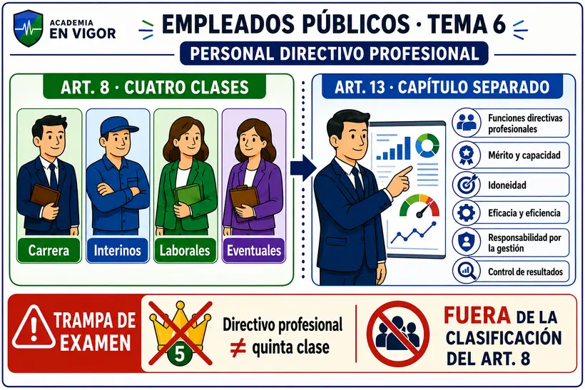

<em>Infografía: el directivo como función y no quinta clase.</em>

<!-- MATERIAL PENDIENTE: t06-p3-audio -->
<!-- MATERIAL PENDIENTE: t06-p3-video -->
<!-- MATERIAL PENDIENTE: t06-p3-pres -->
<!-- MATERIAL PENDIENTE: t06-todo-audio -->
<!-- MATERIAL PENDIENTE: t06-todo-video -->
<!-- MATERIAL PENDIENTE: t06-todo-pres -->

<!-- FUENTE: TREBEP-T06 -->

## 09. Adquisición de la condición de funcionario de carrera: TREBEP

La condición de funcionario de carrera se adquiere cumpliendo **sucesivamente** cuatro requisitos:

1. superar el proceso selectivo;
2. ser nombrado por el órgano o autoridad competente, con publicación en el diario oficial;
3. acatar la Constitución y, en su caso, el Estatuto de Autonomía y el resto del ordenamiento;
4. tomar posesión dentro del plazo.

El último requisito es la **toma de posesión**.

<!-- VISUAL:t06-08-cuatro-pasos-adquisicion.webp -->

  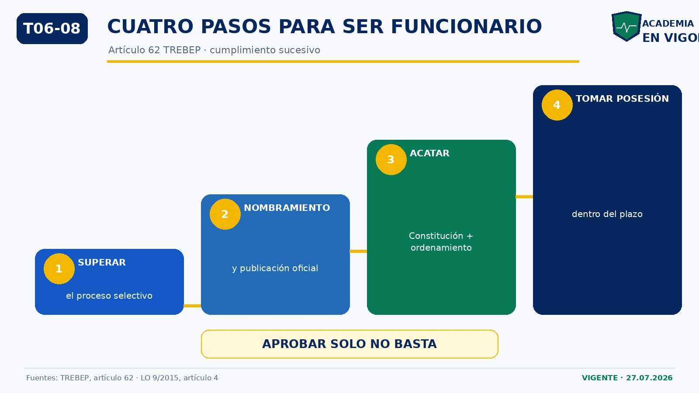

<em>Infografía: cuatro requisitos sucesivos de adquisición.</em>

<!-- VISUAL:t06-il-08-escalera-adquisicion.webp -->

  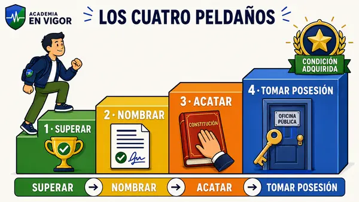

<em>Ilustración: los cuatro peldaños hasta adquirir la condición.</em>

<!-- MATERIAL PENDIENTE: t06-p4-audio -->
<!-- MATERIAL PENDIENTE: t06-p4-video -->
<!-- MATERIAL PENDIENTE: t06-p4-pres -->
<!-- MATERIAL PENDIENTE: t06-todo-audio -->
<!-- MATERIAL PENDIENTE: t06-todo-video -->
<!-- MATERIAL PENDIENTE: t06-todo-pres -->

<!-- FUENTE: TREBEP-T06 -->

## 10. Adquisición y régimen específico en Policía Nacional

La Ley Orgánica 9/2015 exige también cuatro pasos sucesivos:

1. superación del proceso selectivo;
2. nombramiento por la autoridad competente;
3. acatamiento de la Constitución y del resto del ordenamiento;
4. toma de posesión dentro del plazo.

Diferencias literales: el artículo 4 policial no menciona la publicación del nombramiento ni el Estatuto de Autonomía.

<!-- MATERIAL PENDIENTE: t06-p4-audio -->
<!-- MATERIAL PENDIENTE: t06-p4-video -->
<!-- MATERIAL PENDIENTE: t06-p4-pres -->
<!-- MATERIAL PENDIENTE: t06-todo-audio -->
<!-- MATERIAL PENDIENTE: t06-todo-video -->
<!-- MATERIAL PENDIENTE: t06-todo-pres -->

<!-- FUENTE: LO9-2015-T06 -->

## 11. Causas de pérdida: regla general y Policía Nacional

TREBEP, artículo 63:

- renuncia;
- pérdida de la nacionalidad relevante para el nombramiento;
- jubilación total;
- separación del servicio firme;
- inhabilitación absoluta o especial firme, como pena principal o accesoria.

La Ley Orgánica 9/2015 recoge para Policía Nacional: jubilación, renuncia, pérdida de la nacionalidad española, separación firme e inhabilitación firme.

<!-- VISUAL:t06-09-cinco-causas-perdida.webp -->

  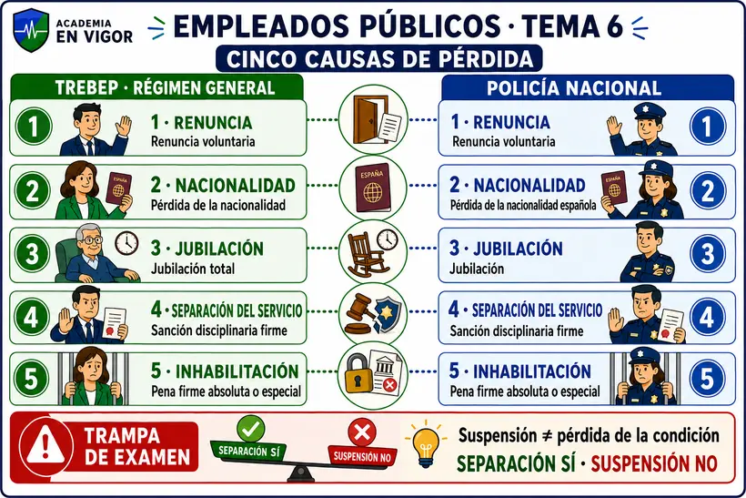

<em>Infografía: comparación de las cinco causas de pérdida.</em>

<!-- VISUAL:t06-il-09-separacion-no-suspension.webp -->

  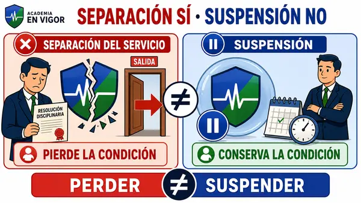

<em>Ilustración: separación del servicio frente a suspensión.</em>

<!-- MATERIAL PENDIENTE: t06-p5-audio -->
<!-- MATERIAL PENDIENTE: t06-p5-video -->
<!-- MATERIAL PENDIENTE: t06-p5-pres -->
<!-- MATERIAL PENDIENTE: t06-todo-audio -->
<!-- MATERIAL PENDIENTE: t06-todo-video -->
<!-- MATERIAL PENDIENTE: t06-todo-pres -->

<!-- FUENTE: TREBEP-T06,LO9-2015-T06 -->

## 12. Renuncia, nacionalidad e inhabilitación

La renuncia debe constar por escrito y ser aceptada expresamente. No se acepta con expediente disciplinario abierto ni con auto de procesamiento o apertura de juicio oral. Renunciar no impide volver a ingresar mediante un nuevo proceso selectivo.

En Policía Nacional, la Administración dispone de un máximo de **3 meses** para aceptar la renuncia y el impedimento penal se refiere a delito **doloso**.

La inhabilitación absoluta alcanza todos los empleos o cargos; la especial, solo los especificados en la sentencia.

<!-- MATERIAL PENDIENTE: t06-p5-audio -->
<!-- MATERIAL PENDIENTE: t06-p5-video -->
<!-- MATERIAL PENDIENTE: t06-p5-pres -->
<!-- MATERIAL PENDIENTE: t06-todo-audio -->
<!-- MATERIAL PENDIENTE: t06-todo-video -->
<!-- MATERIAL PENDIENTE: t06-todo-pres -->

<!-- FUENTE: TREBEP-T06,LO9-2015-T06 -->

## 13. Jubilación: régimen general y Policía Nacional

TREBEP:

- voluntaria;
- forzosa;
- por incapacidad permanente.

La regla general menciona 65 años, pero no puede memorizarse aislada: puede solicitarse prolongación hasta 70, hay cuerpos con normas específicas y, para funcionarios en el Régimen General, rige la edad ordinaria de ese régimen sin coeficiente reductor.

Policía Nacional: jubilación voluntaria, forzosa a los 65 si se cumplen los requisitos de Seguridad Social, o por incapacidad permanente. Desde 2024, la persona titular de la Dirección Adjunta Operativa puede continuar en servicio activo mientras mantenga el cargo.

<!-- VISUAL:t06-10-edad-jubilacion-general-policia.webp -->

  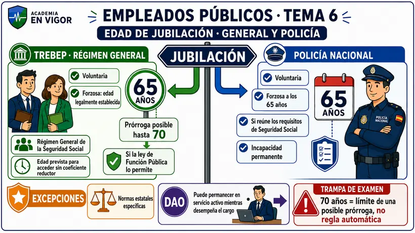

<em>Infografía: árbol de jubilación general y policial.</em>

<!-- MATERIAL PENDIENTE: t06-p5-audio -->
<!-- MATERIAL PENDIENTE: t06-p5-video -->
<!-- MATERIAL PENDIENTE: t06-p5-pres -->
<!-- MATERIAL PENDIENTE: t06-todo-audio -->
<!-- MATERIAL PENDIENTE: t06-todo-video -->
<!-- MATERIAL PENDIENTE: t06-todo-pres -->

<!-- FUENTE: TREBEP-T06,LO9-2015-T06 -->

## 14. Rehabilitación y recuperación de la condición

Régimen general:

- si desaparece la causa que motivó la pérdida de nacionalidad o la jubilación por incapacidad, puede solicitarse rehabilitación y debe concederse;
- tras una inhabilitación, la rehabilitación es excepcional y depende de las circunstancias y entidad del delito;
- el silencio en esta segunda vía es desestimatorio.

Policía Nacional:

- la recuperación por nacionalidad o incapacidad exige, además, cumplir los requisitos del artículo 26.1;
- la rehabilitación tras inhabilitación puede concederla excepcionalmente el Consejo de Ministros, a propuesta del Ministro del Interior;
- el silencio es desestimatorio.

<!-- VISUAL:t06-11-rehabilitacion-dos-vias.webp -->

  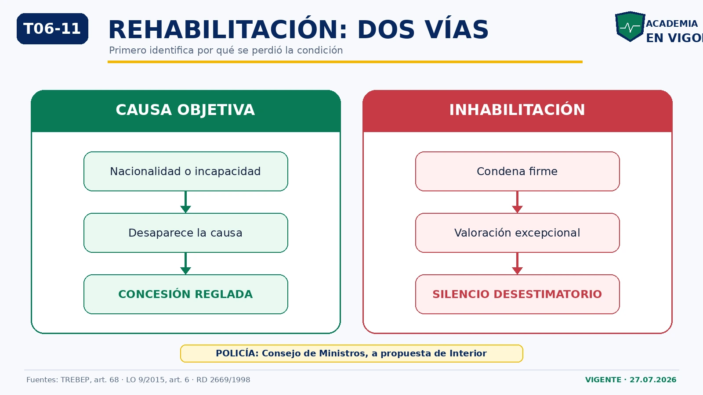

<em>Infografía: dos vías de rehabilitación.</em>

<!-- VISUAL:t06-il-11-dos-llaves-rehabilitacion.webp -->

  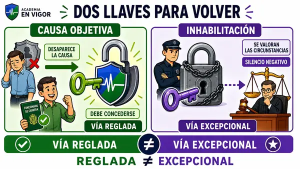

<em>Ilustración: vía reglada por causa objetiva frente a vía excepcional por inhabilitación.</em>

<!-- MATERIAL PENDIENTE: t06-p5-audio -->
<!-- MATERIAL PENDIENTE: t06-p5-video -->
<!-- MATERIAL PENDIENTE: t06-p5-pres -->
<!-- MATERIAL PENDIENTE: t06-todo-audio -->
<!-- MATERIAL PENDIENTE: t06-todo-video -->
<!-- MATERIAL PENDIENTE: t06-todo-pres -->

<!-- FUENTE: TREBEP-T06,LO9-2015-T06,RD2669-1998 -->

# Hablemos claro

:::hablemos-claro
Primero identifica el vínculo: nombramiento permanente, nombramiento temporal, contrato o confianza. Después memoriza dos secuencias: cuatro pasos para entrar y cinco causas para perder la condición. Finalmente compara TREBEP y Policía Nacional solo en los puntos donde cambia la literalidad.
:::

# En la calle

:::en-la-calle
Un policía de carrera no nace jurídicamente al aprobar el examen: todavía faltan nombramiento, acatamiento y toma de posesión. Del mismo modo, dejar un destino, cambiar de unidad o pasar a otra situación administrativa no equivale a perder la condición de funcionario.
:::

# Lo que cae

:::lo-que-cae
Prioridad máxima: cuatro clases del artículo 8; plazos 3 / necesario / 3+1 / 9 en 18 de interinos; diferencia entre cese regular y compensación; cuatro requisitos sucesivos de adquisición; cinco causas de pérdida; renuncia; absoluta frente a especial; 65/70 con excepciones; dos vías de rehabilitación.
:::

# Ha caído

:::ha-caido
Antecedentes revisados: ámbito especial del TREBEP (2020); clases de empleados públicos (2024 y 2025); interinos (2017, 2018 y 2020, con reglas históricas que deben actualizarse); personal laboral (2017); personal eventual (2018, 2021 y 2023); adquisición (2024); causas de pérdida e inhabilitación (2016); renuncia (2019); permanencia hasta 70 años (2023); plazo de rehabilitación (2023). Las apariciones históricas no convierten una redacción derogada en regla vigente.
:::

---

*Academia En Vigor · El temario que nunca duerme · Tema 6 · v1.0.1 · Documento interno no publicado.*
