# TEMA 9 · LEY ORGÁNICA 2/1986: FUERZAS Y CUERPOS DE SEGURIDAD

**Policía Nacional · Método VIGOR · PARTE**
**Versión de contenido:** 1.0.0
**Estado editorial:** approved_internal · **Publicación:** not_published

# Mapa del tema

El tema se estudia en seis partes:

1. **Bases comunes de la LO 2/1986:** bloques 1 a 6.
2. **Estatuto común y Fuerzas estatales:** bloques 7 a 12.
3. **Representación colectiva y Consejo de Policía:** bloques 13 a 17.
4. **Policía Judicial:** bloques 18 a 20.
5. **Policías autonómicas y coordinación territorial:** bloques 21 a 25.
6. **Policías Locales:** bloques 26 a 27.

<!-- VISUAL:t09-01-mapa-sistema-seguridad.webp -->

  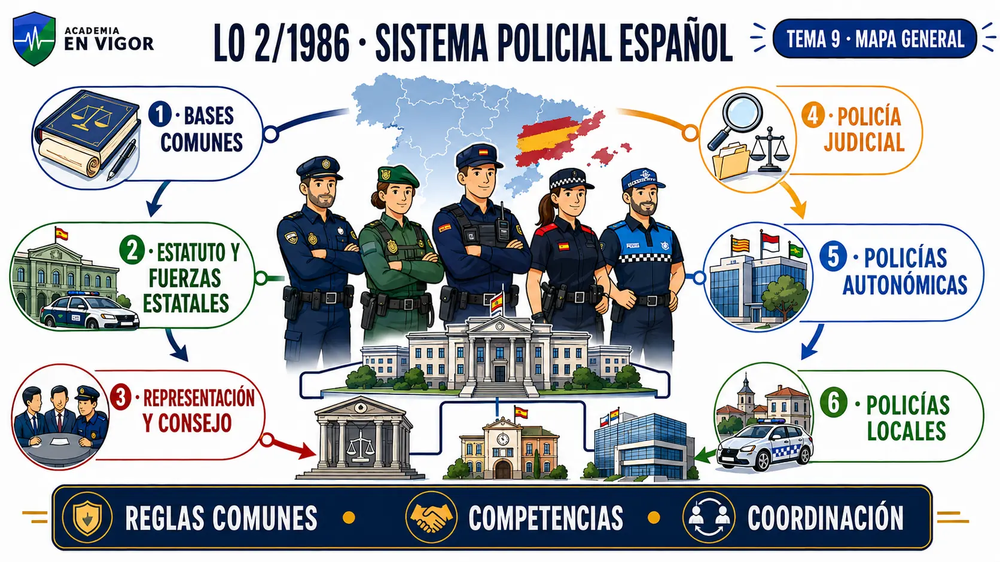

<em>Infografía: recorrido desde las bases comunes hasta las policías locales.</em>

# Contenido

## 01. Arquitectura general de la seguridad pública

La LO 2/1986 parte de una competencia estatal y articula la participación territorial. No confunde participación con titularidad de la competencia.

- La seguridad pública es competencia exclusiva del Estado y su mantenimiento corresponde al Gobierno de la Nación.
- Las comunidades autónomas participan en el mantenimiento de la seguridad pública en los términos de sus estatutos y en el marco de la LO 2/1986.
- Las corporaciones locales participan en el mantenimiento de la seguridad pública conforme a la legislación de régimen local y a la LO 2/1986.
- El mantenimiento de la seguridad pública se ejerce por las distintas Administraciones públicas a través de las Fuerzas y Cuerpos de Seguridad.

<!-- VISUAL:t09-01-mapa-sistema-seguridad.webp -->

  

<em>Infografía: arquitectura general de la seguridad pública.</em>

<!-- MATERIAL PENDIENTE: t09-p1-audio -->
<!-- MATERIAL PENDIENTE: t09-p1-video -->
<!-- MATERIAL PENDIENTE: t09-p1-pres -->

<!-- FUENTE: LO2-1986-T09 -->

## 02. Quién integra las Fuerzas y Cuerpos de Seguridad

La Ley agrupa bajo la expresión Fuerzas y Cuerpos de Seguridad tres familias policiales y añade dos reglas de relación: cooperación y auxilio.

- Son Fuerzas y Cuerpos de Seguridad las del Estado, los cuerpos de policía de las comunidades autónomas y los cuerpos de policía dependientes de las corporaciones locales.
- Los miembros de las Fuerzas y Cuerpos de Seguridad ajustan su actuación al principio de cooperación recíproca.
- La coordinación entre cuerpos se efectúa mediante los órganos establecidos por la LO 2/1986.
- Quienes ejercen vigilancia, seguridad o custodia de personas o bienes tienen una obligación especial de auxiliar o colaborar con las Fuerzas y Cuerpos de Seguridad.

<!-- MATERIAL PENDIENTE: t09-p1-audio -->
<!-- MATERIAL PENDIENTE: t09-p1-video -->
<!-- MATERIAL PENDIENTE: t09-p1-pres -->

<!-- FUENTE: LO2-1986-T09 -->

## 03. Principios: adecuación al ordenamiento jurídico

El primer grupo del artículo 5 vincula la actuación policial con la Constitución, la neutralidad, la integridad, la jerarquía legal y la Justicia.

- Los miembros de las Fuerzas y Cuerpos de Seguridad deben ejercer su función con absoluto respeto a la Constitución y al resto del ordenamiento jurídico.
- Deben actuar con absoluta neutralidad política e imparcialidad y sin discriminación por razón de raza, religión u opinión.
- Deben actuar con integridad y dignidad, abstenerse de todo acto de corrupción y oponerse a él resueltamente.
- La obediencia debida no ampara órdenes que entrañen actos manifiestamente delictivos o contrarios a la Constitución o a las leyes.
- Deben colaborar con la Administración de Justicia y auxiliarla en los términos establecidos en la ley.

<!-- VISUAL:t09-02-seis-principios-actuacion.webp -->

  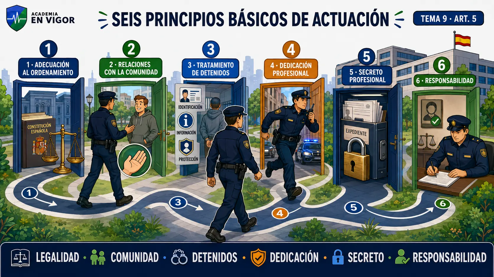

<em>Infografía: principios: adecuación al ordenamiento jurídico.</em>

<!-- MATERIAL PENDIENTE: t09-p1-audio -->
<!-- MATERIAL PENDIENTE: t09-p1-video -->
<!-- MATERIAL PENDIENTE: t09-p1-pres -->

<!-- FUENTE: LO2-1986-T09 -->

## 04. Principios: relaciones con la comunidad y uso de la fuerza

El segundo grupo del artículo 5 ordena cómo se proyecta la autoridad sobre la ciudadanía y cómo se decide el uso de medios coercitivos.

- La actuación profesional debe impedir prácticas abusivas, arbitrarias o discriminatorias que entrañen violencia física o moral.
- El trato con la ciudadanía debe ser correcto y esmerado, procurando auxilio y protección e informando sobre las causas y finalidad de la intervención tan ampliamente como sea posible.
- Cuando sea necesario evitar un daño grave, inmediato e irreparable se actuará con decisión y sin demora, aplicando congruencia, oportunidad y proporcionalidad.
- Las armas solo deben utilizarse ante un riesgo racionalmente grave para la vida o integridad física propia o ajena, o un grave riesgo para la seguridad ciudadana, conforme al triple principio de actuación.

<!-- VISUAL:t09-il-01-triple-filtro-fuerza.webp -->

  

<em>Ilustración: principios: relaciones con la comunidad y uso de la fuerza.</em>

<!-- MATERIAL PENDIENTE: t09-p1-audio -->
<!-- MATERIAL PENDIENTE: t09-p1-video -->
<!-- MATERIAL PENDIENTE: t09-p1-pres -->

<!-- FUENTE: LO2-1986-T09 -->

## 05. Principios: personas detenidas

La detención activa deberes de identificación, protección de la vida e integridad y cumplimiento diligente de los trámites.

- Al efectuar una detención, los agentes deben identificarse debidamente como tales.
- La persona detenida debe ser informada, con la mayor amplitud posible, de sus derechos y de las razones de la detención.
- Los agentes deben velar por la vida e integridad física de las personas detenidas o bajo su custodia y respetar su honor y dignidad.
- Los trámites, plazos y requisitos exigidos por el ordenamiento jurídico al practicar una detención deben observarse con diligencia.

<!-- VISUAL:t09-03-secuencia-detencion.webp -->

  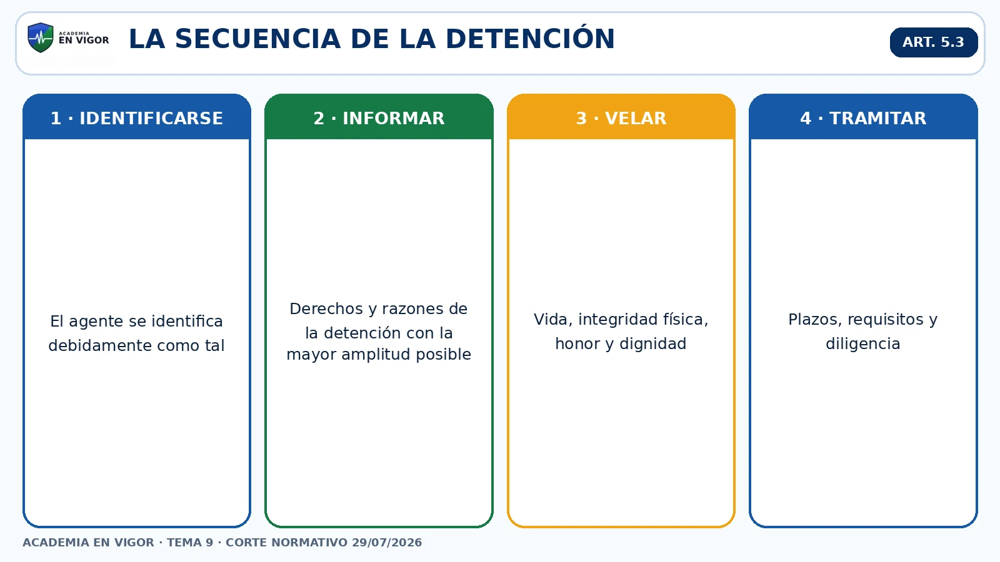

<em>Infografía: principios: personas detenidas.</em>

<!-- MATERIAL PENDIENTE: t09-p1-audio -->
<!-- MATERIAL PENDIENTE: t09-p1-video -->
<!-- MATERIAL PENDIENTE: t09-p1-pres -->

<!-- FUENTE: LO2-1986-T09 -->

## 06. Dedicación, secreto y responsabilidad

El artículo 5 cierra con tres deberes que siguen al agente fuera de la intervención concreta: disponibilidad, reserva y responsabilidad.

- La dedicación profesional exige intervenir siempre, en cualquier tiempo y lugar, se esté o no de servicio, en defensa de la ley y de la seguridad ciudadana.
- El secreto profesional comprende la información conocida por razón o con ocasión del servicio.
- Las fuentes de información no deben revelarse salvo que el ejercicio de las funciones o una disposición legal impongan actuar de otra manera.
- Los agentes responden personal y directamente por los actos profesionales que infrinjan las normas o los principios de actuación, sin perjuicio de la responsabilidad patrimonial de la Administración.

<!-- MATERIAL PENDIENTE: t09-p1-audio -->
<!-- MATERIAL PENDIENTE: t09-p1-video -->
<!-- MATERIAL PENDIENTE: t09-p1-pres -->

<!-- FUENTE: LO2-1986-T09 -->

## 07. Promoción, formación y condiciones estatutarias

Las disposiciones estatutarias comunes conectan profesionalización, formación permanente, mérito y las singularidades del servicio policial.

- La promoción profesional, social y humana de los miembros de las Fuerzas y Cuerpos de Seguridad se rige por objetividad, igualdad de oportunidades, mérito y capacidad.
- La formación y el perfeccionamiento policial tienen carácter profesional y permanente y deben adecuarse a los principios básicos de actuación.
- Los miembros de las Fuerzas y Cuerpos de Seguridad deben jurar o prometer acatamiento a la Constitución como norma fundamental del Estado.
- La provisión de puestos de servicio en las categorías se realiza conforme a mérito, capacidad y antigüedad, según la reglamentación correspondiente.

<!-- VISUAL:t09-04-estatuto-comun.webp -->

  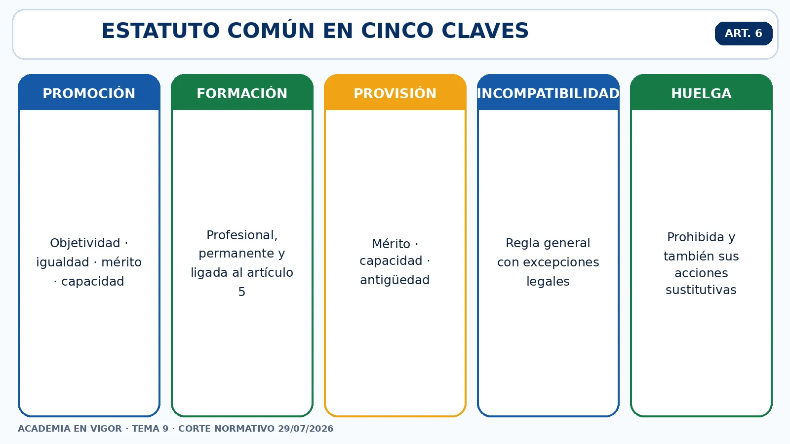

<em>Infografía: promoción, formación y condiciones estatutarias.</em>

<!-- MATERIAL PENDIENTE: t09-p2-audio -->
<!-- MATERIAL PENDIENTE: t09-p2-video -->
<!-- MATERIAL PENDIENTE: t09-p2-pres -->

<!-- FUENTE: LO2-1986-T09 -->

## 08. Retribución, horario, incompatibilidad, huelga y disciplina

El estatuto común compensa las exigencias del servicio con una remuneración justa y somete el empleo policial a incompatibilidades y límites colectivos propios.

- La remuneración justa debe contemplar formación, incompatibilidades, movilidad, dedicación, riesgo, horarios y peculiar estructura policial.
- El horario de servicio se determina reglamentariamente y se adapta a las características peculiares de la función policial.
- La pertenencia a las Fuerzas y Cuerpos de Seguridad es incompatible con otras actividades públicas o privadas, salvo las exceptuadas por la legislación de incompatibilidades.
- Los miembros de las Fuerzas y Cuerpos de Seguridad no pueden ejercer el derecho de huelga ni acciones sustitutivas o concertadas destinadas a alterar el funcionamiento normal de los servicios.
- El régimen disciplinario debe respetar las garantías y ser acorde con la misión constitucional y la organización jerarquizada y disciplinada de los cuerpos.

<!-- MATERIAL PENDIENTE: t09-p2-audio -->
<!-- MATERIAL PENDIENTE: t09-p2-video -->
<!-- MATERIAL PENDIENTE: t09-p2-pres -->

<!-- FUENTE: LO2-1986-T09 -->

## 09. Agente de la autoridad y jurisdicción

Los artículos 7 y 8 combinan protección penal, naturaleza de la Guardia Civil y reglas procesales comunes.

- En el ejercicio de sus funciones, los miembros de las Fuerzas y Cuerpos de Seguridad tienen a todos los efectos legales carácter de agentes de la autoridad.
- Ante un atentado con medios de análoga peligrosidad que generen grave peligro para su integridad, reciben a efectos de protección penal la consideración de autoridad.
- La Guardia Civil solo tiene consideración de fuerza armada al cumplir misiones de carácter militar encomendadas conforme al ordenamiento.
- La jurisdicción ordinaria conoce de los delitos contra miembros de las Fuerzas y Cuerpos de Seguridad y de los cometidos por estos en el ejercicio de sus funciones, salvo competencia militar.
- El procedimiento penal no impide tramitar expediente disciplinario por los mismos hechos, pero la resolución definitiva espera a la sentencia penal firme y queda vinculada por sus hechos probados.

<!-- VISUAL:t09-il-02-agente-no-autoridad.webp -->

  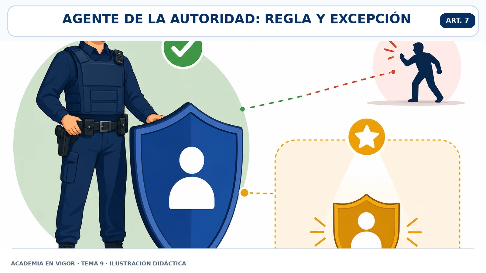

<em>Ilustración: agente de la autoridad y jurisdicción.</em>

<!-- MATERIAL PENDIENTE: t09-p2-audio -->
<!-- MATERIAL PENDIENTE: t09-p2-video -->
<!-- MATERIAL PENDIENTE: t09-p2-pres -->

<!-- FUENTE: LO2-1986-T09 -->

## 10. Composición y dependencia de las Fuerzas estatales

Las FCSE actúan en todo el territorio nacional y se integran por Policía Nacional y Guardia Civil, con distinta naturaleza.

- Las Fuerzas y Cuerpos de Seguridad del Estado ejercen sus funciones en todo el territorio nacional.
- La Policía Nacional es un instituto armado de naturaleza civil dependiente del Ministro del Interior.
- La Guardia Civil es un instituto armado de naturaleza militar y depende de Interior para las funciones de la LO 2/1986.
- En tiempo de guerra y durante el estado de sitio la Guardia Civil depende exclusivamente del Ministro de Defensa.
- Al Ministro del Interior le corresponde la administración general de la seguridad ciudadana y el mando superior de las Fuerzas y Cuerpos de Seguridad del Estado.

<!-- VISUAL:t09-05-pn-gc-naturaleza.webp -->

  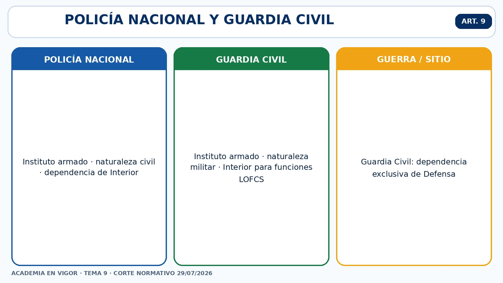

<em>Infografía: composición y dependencia de las fuerzas estatales.</em>

<!-- MATERIAL PENDIENTE: t09-p2-audio -->
<!-- MATERIAL PENDIENTE: t09-p2-video -->
<!-- MATERIAL PENDIENTE: t09-p2-pres -->

<!-- FUENTE: LO2-1986-T09 -->

## 11. Funciones comunes y distribución territorial

El artículo 11 enumera la misión común y después distribuye territorialmente su ejercicio ordinario.

- Las FCSE protegen el libre ejercicio de derechos y libertades y garantizan la seguridad ciudadana mediante las funciones del artículo 11.
- Entre sus funciones comunes están mantener y restablecer el orden, prevenir delitos e investigar los delitos con aseguramiento de instrumentos, efectos y pruebas.
- Policía Nacional ejerce ordinariamente las funciones comunes en capitales de provincia y en los términos municipales y núcleos urbanos que determine el Gobierno.
- La Guardia Civil ejerce ordinariamente las funciones comunes en el resto del territorio nacional y en su mar territorial.
- Policía Nacional puede ejercer en todo el territorio nacional las funciones de investigación y de coordinación de datos de los apartados 11.1.g y h.

<!-- VISUAL:t09-06-articulo-11-territorio.webp -->

  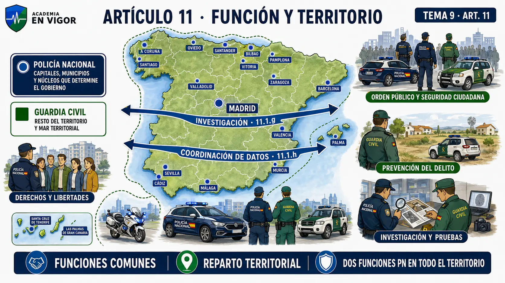

<em>Infografía: funciones comunes y distribución territorial.</em>

<!-- MATERIAL PENDIENTE: t09-p2-audio -->
<!-- MATERIAL PENDIENTE: t09-p2-video -->
<!-- MATERIAL PENDIENTE: t09-p2-pres -->

<!-- FUENTE: LO2-1986-T09 -->

## 12. Distribución material entre Policía Nacional y Guardia Civil

El artículo 12 reparte materias exclusivas sin eliminar las funciones comunes ni la cooperación recíproca.

- Corresponden a Policía Nacional la expedición del DNI y pasaportes y el control de entrada y salida del territorio nacional de españoles y extranjeros.
- Corresponden a Policía Nacional extranjería, refugio y asilo, extradición, expulsión, emigración e inmigración, así como juego, delitos de drogas y control de la seguridad privada.
- Corresponden a la Guardia Civil armas y explosivos, resguardo fiscal, contrabando y tráfico, tránsito y transporte en vías públicas interurbanas.
- Corresponden a la Guardia Civil la custodia de determinadas vías, costas, fronteras, puertos, aeropuertos e instalaciones, la protección de la naturaleza y la conducción interurbana de presos y detenidos.
- Policía Nacional y Guardia Civil deben cooperar recíprocamente y sus dependencias actúan como oficinas para recibir y tramitar documentos dirigidos a cualquiera de los dos institutos.

<!-- VISUAL:t09-07-competencias-pn-gc.webp -->

  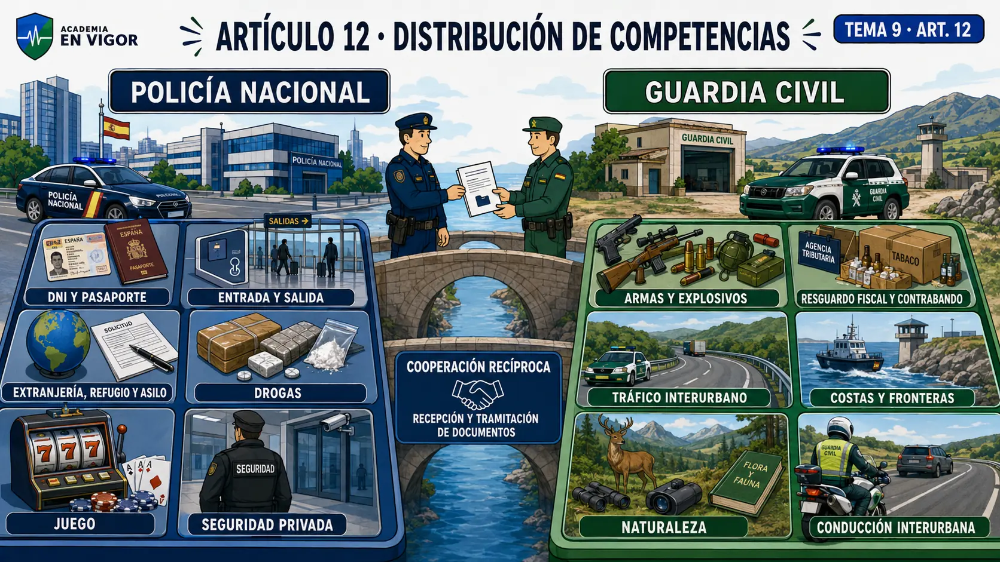

<em>Infografía: distribución material entre policía nacional y guardia civil.</em>

<!-- MATERIAL PENDIENTE: t09-p2-audio -->
<!-- MATERIAL PENDIENTE: t09-p2-video -->
<!-- MATERIAL PENDIENTE: t09-p2-pres -->

<!-- FUENTE: LO2-1986-T09 -->

## 13. Régimen vigente de representación colectiva

La regulación original de los artículos 16 a 26 de la LO 2/1986 fue derogada. El régimen vigente se encuentra en el título XIII de la LO 9/2015.

- Los artículos 16 a 26 de la LO 2/1986 están derogados por la LO 9/2015 desde el 18 de agosto de 2015.
- El régimen vigente de representación y participación de los funcionarios de Policía Nacional se contiene en el título XIII de la LO 9/2015.
- El título XIII de la LO 9/2015 regula organizaciones sindicales, Consejo de Policía y participación en prevención de riesgos laborales.
- Las preguntas actuales sobre el Consejo de Policía deben resolverse con la LO 9/2015 y, en lo procedente, con su normativa electoral de desarrollo.

<!-- VISUAL:t09-08-cambio-normativo-consejo.webp -->

  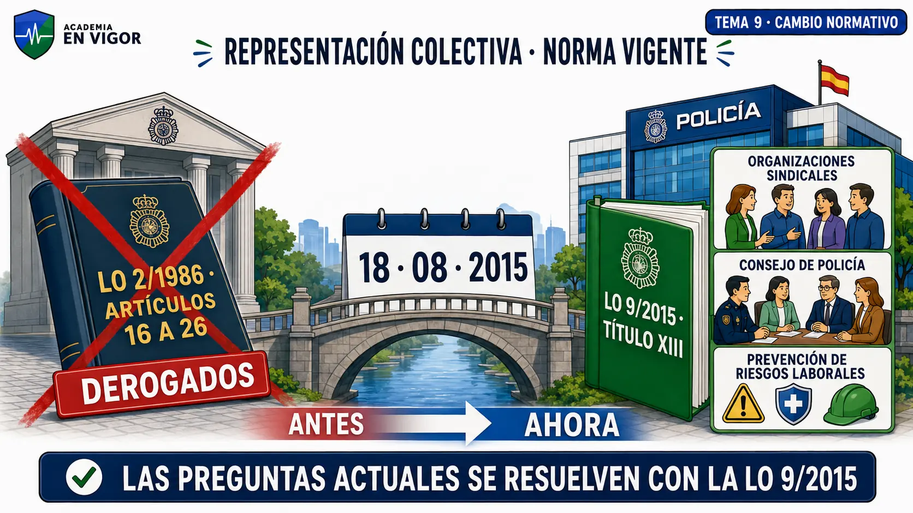

<em>Infografía: régimen vigente de representación colectiva.</em>

<!-- MATERIAL PENDIENTE: t09-p3-audio -->
<!-- MATERIAL PENDIENTE: t09-p3-video -->
<!-- MATERIAL PENDIENTE: t09-p3-pres -->

<!-- FUENTE: LO9-2015-T09 -->

## 14. Constitución y representatividad sindical

La LO 9/2015 distingue constitución, representatividad y facultades mínimas de las organizaciones no representativas.

- Para constituir una organización sindical en Policía Nacional deben depositarse estatutos y acta fundacional en el registro especial de la Dirección General de la Policía.
- Los defectos subsanables de los estatutos disponen de un plazo de diez días desde el requerimiento antes de que pueda rechazarse motivadamente su inscripción.
- Es representativa la organización que obtenga al menos un representante en el Consejo o, en dos escalas, al menos el 10 % de los votos emitidos en cada una.
- Las organizaciones no representativas pueden formular propuestas, elevar informes, dirigir peticiones y representar a sus afiliados.
- Una organización con al menos el 10 % de votos en una escala tiene derecho a un representante a los solos efectos de las facultades previstas para representantes sindicales.

<!-- VISUAL:t09-09-representatividad-sindical.webp -->

  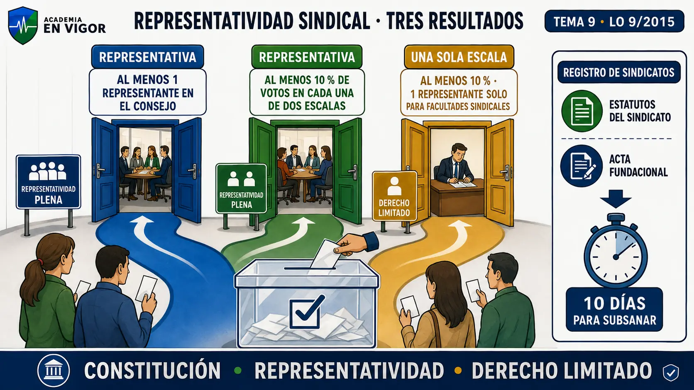

<em>Infografía: constitución y representatividad sindical.</em>

<!-- MATERIAL PENDIENTE: t09-p3-audio -->
<!-- MATERIAL PENDIENTE: t09-p3-video -->
<!-- MATERIAL PENDIENTE: t09-p3-pres -->

<!-- FUENTE: LO9-2015-T09 -->

## 15. Actividad sindical y sus límites

La acción sindical tiene derechos instrumentales, responsabilidades y límites vinculados al servicio policial.

- Los representantes de organizaciones representativas pueden acceder a centros de trabajo previa comunicación al jefe de la dependencia y sin interrumpir el servicio policial.
- La acción sindical está limitada por los derechos fundamentales, el honor, intimidad e imagen, el prestigio de las FCSE, la seguridad ciudadana y de los funcionarios, el secreto profesional y los principios del artículo 5 de la LOFCS.
- En dependencias con más de 250 funcionarios, las organizaciones representativas tienen derecho a un local adecuado y, en todo caso, a un tablón de anuncios en cada dependencia.
- Las reuniones sindicales en locales oficiales se celebran fuera de las horas de trabajo, sin perturbar el servicio y previa autorización del jefe de la dependencia.
- La reunión debe solicitarse con al menos 72 horas y la resolución notificarse al menos 24 horas antes de su celebración.

<!-- VISUAL:t09-il-03-reloj-sindical.webp -->

  

<em>Ilustración: actividad sindical y sus límites.</em>

<!-- MATERIAL PENDIENTE: t09-p3-audio -->
<!-- MATERIAL PENDIENTE: t09-p3-video -->
<!-- MATERIAL PENDIENTE: t09-p3-pres -->

<!-- FUENTE: LO9-2015-T09 -->

## 16. Consejo de Policía: naturaleza y funciones

El Consejo es el órgano colegiado paritario de participación entre Administración y representantes de Policía Nacional.

- El Consejo de Policía es un órgano colegiado de participación con representación paritaria de la Administración y de los miembros de Policía Nacional.
- Preside el Consejo de Policía el Ministro del Interior o la persona en quien delegue.
- El Consejo media y concilia en conflictos colectivos y estudia propuestas sobre derechos sindicales y de participación.
- El Consejo participa en condiciones de prestación del servicio, evaluación del desempeño, calendario, horarios, jornadas, vacaciones, permisos y licencias.
- El Consejo informa los expedientes por faltas muy graves y los instruidos a representantes sindicales, e informa previamente disposiciones generales sobre sus materias.

<!-- VISUAL:t09-10-consejo-policia.webp -->

  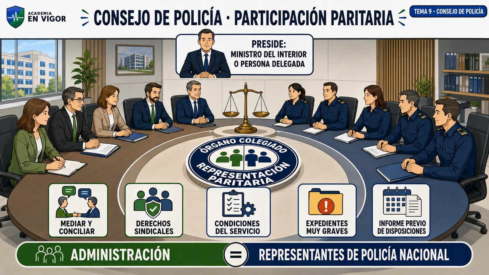

<em>Infografía: consejo de policía: naturaleza y funciones.</em>

<!-- MATERIAL PENDIENTE: t09-p3-audio -->
<!-- MATERIAL PENDIENTE: t09-p3-video -->
<!-- MATERIAL PENDIENTE: t09-p3-pres -->

<!-- FUENTE: LO9-2015-T09 -->

## 17. Consejo de Policía: composición, elecciones y mandato

La mitad administrativa es designada; la mitad policial se elige por escalas con representación proporcional.

- Los representantes de la Administración en el Consejo de Policía son designados por el Ministro del Interior.
- La representación policial se estructura por escalas a razón de un representante por cada 6.000 funcionarios o fracción de cada una de las cuatro escalas.
- Las elecciones al Consejo se celebran por escalas mediante sufragio personal, libre, directo y secreto.
- Las listas son nacionales por escala, contienen tantos candidatos como puestos más igual número de suplentes y los puestos se atribuyen por representación proporcional.
- El mandato de los consejeros dura cuatro años, admite reelección y las vacantes se cubren automáticamente por el siguiente candidato de la lista.

<!-- VISUAL:t09-il-04-balanza-paritaria.webp -->

  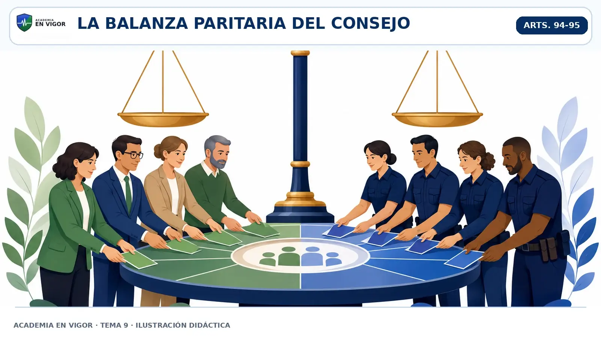

<em>Ilustración: consejo de policía: composición, elecciones y mandato.</em>

<!-- MATERIAL PENDIENTE: t09-p3-audio -->
<!-- MATERIAL PENDIENTE: t09-p3-video -->
<!-- MATERIAL PENDIENTE: t09-p3-pres -->

<!-- FUENTE: LO9-2015-T09 -->

## 18. Policía Judicial: función general y unidades especializadas

La expresión Policía Judicial designa una función general y, dentro de ella, unas unidades orgánicas especializadas de carácter permanente.

- Las funciones de Policía Judicial del artículo 126 de la Constitución son ejercidas por las FCSE a través de las unidades reguladas en la LO 2/1986.
- El personal de policías autonómicas y locales tiene carácter colaborador de las FCSE para el cumplimiento de la función de Policía Judicial.
- El Ministerio del Interior organiza las Unidades de Policía Judicial con funcionarios de las FCSE dotados de formación especializada.
- Las Unidades de Policía Judicial se organizan con criterios territoriales y de especialización delictual y ejercen la función con carácter permanente y especial.

<!-- VISUAL:t09-11-policia-judicial-dos-niveles.webp -->

  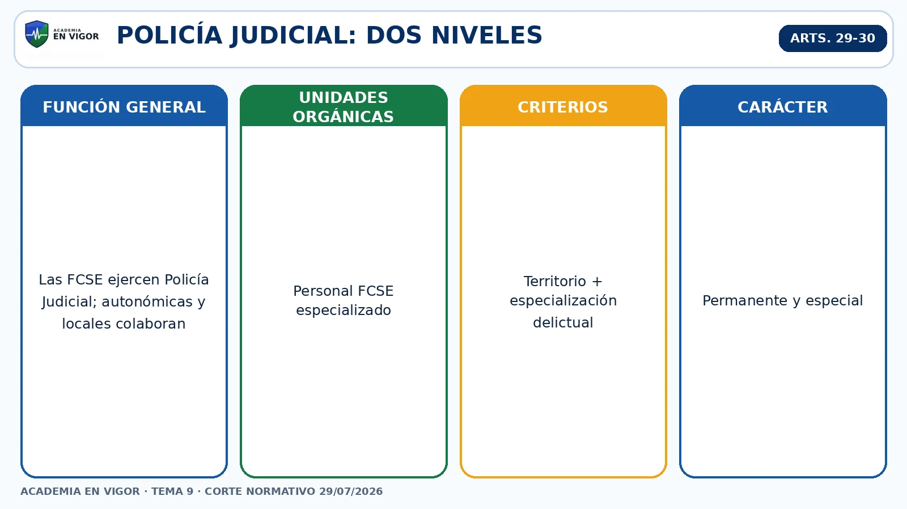

<em>Infografía: policía judicial: función general y unidades especializadas.</em>

<!-- MATERIAL PENDIENTE: t09-p4-audio -->
<!-- MATERIAL PENDIENTE: t09-p4-video -->
<!-- MATERIAL PENDIENTE: t09-p4-pres -->

<!-- FUENTE: LO2-1986-T09 -->

## 19. Dependencias y adscripción de las unidades

La doble dependencia permite conservar la organización administrativa y someter la investigación concreta a la dirección judicial o fiscal.

- Las Unidades Orgánicas de Policía Judicial pueden adscribirse total o parcialmente a juzgados y tribunales por el Ministerio del Interior, oído el Consejo General del Poder Judicial.
- También pueden adscribirse al Ministerio Fiscal por el Ministerio del Interior, oído el Fiscal General del Estado.
- Los funcionarios adscritos dependen orgánicamente del Ministerio del Interior y funcionalmente del juez, tribunal o fiscal que conozca del asunto.
- La dependencia funcional se vincula al asunto concreto objeto de investigación y no convierte al órgano judicial en superior orgánico del funcionario.

<!-- VISUAL:t09-il-05-doble-dependencia.webp -->

  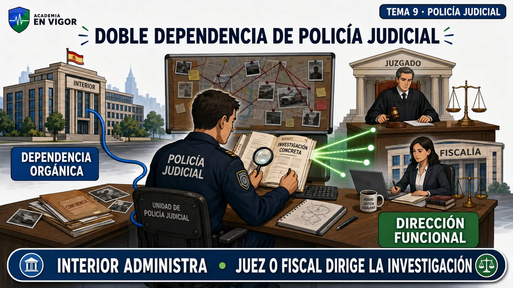

<em>Ilustración: dependencias y adscripción de las unidades.</em>

<!-- MATERIAL PENDIENTE: t09-p4-audio -->
<!-- MATERIAL PENDIENTE: t09-p4-video -->
<!-- MATERIAL PENDIENTE: t09-p4-pres -->

<!-- FUENTE: LO2-1986-T09 -->

## 20. Especialización, exclusividad y garantías de investigación

La especialización se acredita, la investigación se protege frente a remociones y los órganos judiciales y fiscales disponen de facultades de dirección y control.

- La especialización de Policía Judicial se cursa en centros de formación de las FCSE con participación judicial y fiscal, o complementariamente en el Centro de Estudios Judiciales.
- Poseer el diploma correspondiente es requisito para ocupar puestos en las Unidades de Policía Judicial.
- Los adscritos desempeñan la función con carácter exclusivo, sin perjuicio de misiones preventivas y otras de las FCSE cuando las circunstancias lo requieran.
- No pueden ser removidos de una investigación hasta que termine esta o la fase procesal que la originó, salvo decisión o autorización del juez o fiscal competente.
- En actuaciones encargadas y supervisadas por jueces, tribunales o fiscales penales, los integrantes de las unidades tienen carácter de comisionados y pueden requerir auxilio.
- Jueces, tribunales penales y Ministerio Fiscal pueden impartir instrucciones, concretar actuaciones, controlar su ejecución e instar la potestad disciplinaria.

<!-- VISUAL:t09-12-garantias-investigacion.webp -->

  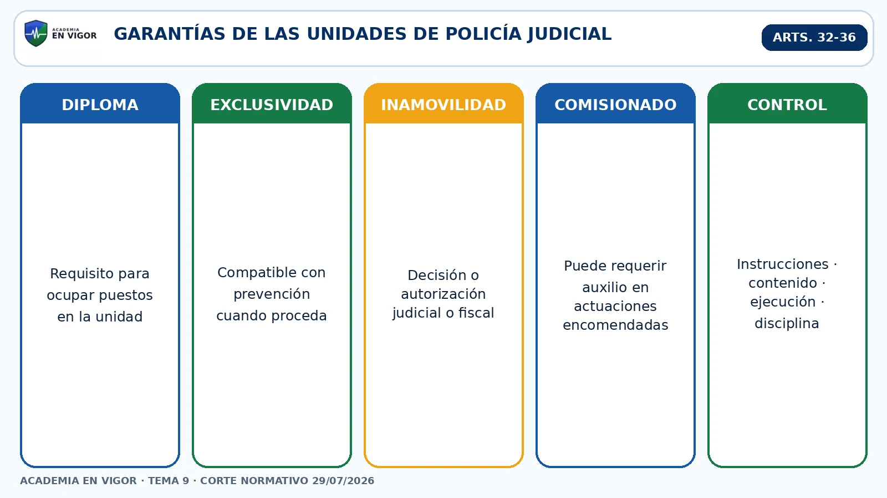

<em>Infografía: especialización, exclusividad y garantías de investigación.</em>

<!-- MATERIAL PENDIENTE: t09-p4-audio -->
<!-- MATERIAL PENDIENTE: t09-p4-video -->
<!-- MATERIAL PENDIENTE: t09-p4-pres -->

<!-- FUENTE: LO2-1986-T09 -->

## 21. Policías autonómicas: creación y vías de ejercicio

La LOFCS contempla cuerpo propio, ejercicio mediante mecanismos de colaboración y acuerdos específicos con el Estado.

- Las comunidades cuyos estatutos lo prevean pueden crear cuerpos de policía para las funciones del artículo 148.1.22 de la Constitución y las atribuidas por la LOFCS.
- Las comunidades que pudiendo crear cuerpo propio no lo hagan pueden ejercer las funciones del artículo 148.1.22 conforme a los artículos 39 y 47 de la LOFCS.
- Las comunidades cuyos estatutos no prevean cuerpo propio pueden ejercer vigilancia y protección mediante acuerdos de cooperación específica con el Estado.
- La creación, modificación o supresión del cuerpo autonómico corresponde al órgano autonómico competente, previo informe del Consejo de Política de Seguridad y conforme al Estatuto.

<!-- VISUAL:t09-13-tres-vias-autonomicas.webp -->

  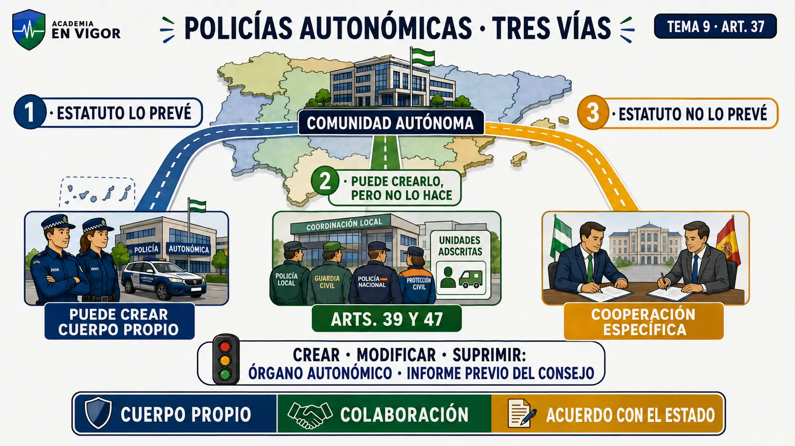

<em>Infografía: policías autonómicas: creación y vías de ejercicio.</em>

<!-- MATERIAL PENDIENTE: t09-p5-audio -->
<!-- MATERIAL PENDIENTE: t09-p5-video -->
<!-- MATERIAL PENDIENTE: t09-p5-pres -->

<!-- FUENTE: LO2-1986-T09 -->

## 22. Funciones de las policías autonómicas

Las funciones autonómicas se ordenan en tres columnas: propias, en colaboración y simultáneas e indiferenciadas.

- Son funciones propias cumplir disposiciones autonómicas, proteger personas y edificios de la comunidad, inspeccionar actividades sometidas a su ordenación y ejecutar coactivamente sus actos.
- En colaboración con las FCSE, las policías autonómicas velan por leyes estatales, participan en Policía Judicial y vigilan espacios públicos y grandes concentraciones.
- La vigilancia de espacios públicos, manifestaciones y grandes concentraciones corresponde prioritariamente a la policía autonómica, sin excluir intervención estatal en los supuestos legales.
- Se prestan simultánea e indiferenciadamente la cooperación en conflictos privados, el auxilio ante accidentes o calamidades y la protección de naturaleza y recursos.

<!-- VISUAL:t09-14-tres-columnas-autonomicas.webp -->

  

<em>Infografía: funciones de las policías autonómicas.</em>

<!-- MATERIAL PENDIENTE: t09-p5-audio -->
<!-- MATERIAL PENDIENTE: t09-p5-video -->
<!-- MATERIAL PENDIENTE: t09-p5-pres -->

<!-- FUENTE: LO2-1986-T09 -->

## 23. Naturaleza, territorio, uniforme y mandos autonómicos

La LOFCS fija un estatuto básico y deja selección, ingreso, promoción y formación a cada comunidad dentro de su marco.

- Los cuerpos de policía autonómica son institutos armados de naturaleza civil con estructura y organización jerarquizada.
- Deben vestir uniforme reglamentario salvo los casos excepcionales autorizados por las Juntas de Seguridad.
- Solo actúan en su comunidad, salvo emergencia con requerimiento estatal o protección de autoridades con autorización de Interior y, cuando proceda, comunicación a la comunidad afectada.
- La licencia de armas de sus miembros compete en todo caso al Gobierno de la Nación.
- La selección, ingreso, promoción y formación de sus miembros se regula y organiza por las respectivas comunidades autónomas, sin perjuicio de sus estatutos.

<!-- MATERIAL PENDIENTE: t09-p5-audio -->
<!-- MATERIAL PENDIENTE: t09-p5-video -->
<!-- MATERIAL PENDIENTE: t09-p5-pres -->

<!-- FUENTE: LO2-1986-T09 -->

## 24. Colaboración, auxilio y unidades adscritas

La colaboración opera mediante información y auxilio, apoyo estatal por insuficiencia y adscripción de unidades completas de Policía Nacional.

- FCSE y policías autonómicas deben prestarse mutuo auxilio e información recíproca en el ejercicio de sus funciones.
- Si una comunidad con posibilidad estatutaria de cuerpo propio carece de medios suficientes, puede solicitar auxilio estatal para las funciones señaladas en el artículo 46.
- En concurrencia simultánea no incluida en el auxilio solicitado, los mandos de las FCSE asumen la dirección de la operación.
- La adscripción a una comunidad debe afectar a unidades operativas completas de Policía Nacional, no a miembros individuales.
- Las unidades adscritas dependen funcionalmente de la comunidad, orgánicamente de Interior y actúan bajo sus jefes naturales.

<!-- VISUAL:t09-il-06-enchufe-doble-adscritas.webp -->

  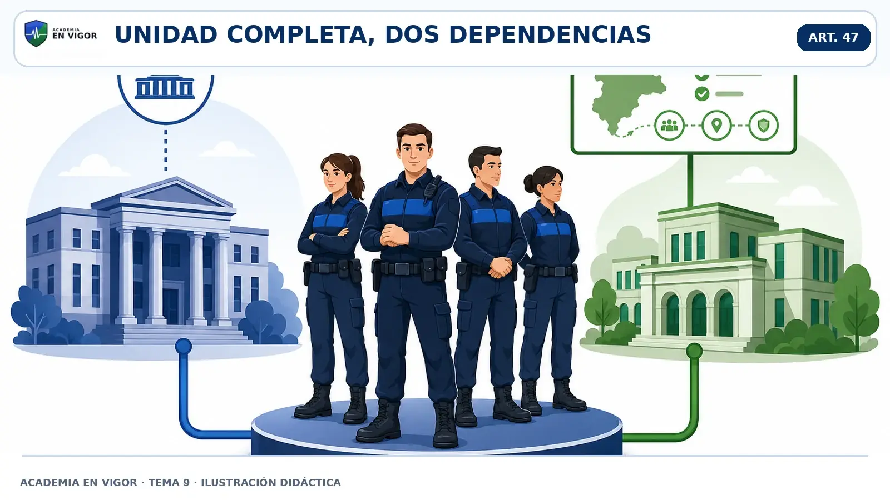

<em>Ilustración: colaboración, auxilio y unidades adscritas.</em>

<!-- MATERIAL PENDIENTE: t09-p5-audio -->
<!-- MATERIAL PENDIENTE: t09-p5-video -->
<!-- MATERIAL PENDIENTE: t09-p5-pres -->

<!-- FUENTE: LO2-1986-T09 -->

## 25. Órganos de coordinación Estado-comunidades

La coordinación se articula en tres niveles: Consejo de Política de Seguridad, Comité de Expertos y Junta de Seguridad autonómica.

- El Consejo de Política de Seguridad está presidido por el Ministro del Interior y tiene composición paritaria entre consejeros autonómicos y representantes estatales.
- El Consejo aprueba planes de coordinación, informa plantillas y normas autonómicas, aprueba directivas y recomienda e informa convenios de cooperación.
- El Comité de Expertos tiene ocho representantes, cuatro estatales y cuatro autonómicos, y asesora y prepara los asuntos del Consejo.
- El Comité elabora fórmulas de coordinación, prepara acuerdos, propone formación y elabora planes de actuación conjunta.
- En comunidades con cuerpo propio puede constituirse una Junta de Seguridad paritaria para coordinar fuerzas estatales y policía autonómica y resolver incidencias de colaboración.

<!-- VISUAL:t09-15-tres-organos-coordinacion.webp -->

  

<em>Infografía: órganos de coordinación estado-comunidades.</em>

<!-- MATERIAL PENDIENTE: t09-p5-audio -->
<!-- MATERIAL PENDIENTE: t09-p5-video -->
<!-- MATERIAL PENDIENTE: t09-p5-pres -->

<!-- FUENTE: LO2-1986-T09 -->

## 26. Policías Locales: creación, naturaleza y territorio

El municipio puede crear cuerpo propio; si no existe, las tareas de custodia y vigilancia se asignan al personal previsto por la ley.

- Los municipios pueden crear cuerpos de policía propios conforme a la LOFCS, la legislación básica local y la legislación autonómica.
- Donde no exista Policía Municipal, sus cometidos de custodia y vigilancia se ejercen por guardas, vigilantes, agentes, alguaciles o análogos.
- La Policía Local es instituto armado de naturaleza civil con estructura y organización jerarquizada.
- La Policía Local actúa en su municipio salvo emergencia y requerimiento de autoridad competente, o protección de autoridades locales con la autorización territorialmente procedente.
- El régimen estatutario local combina principios de la LOFCS, normas autonómicas, reglamentos del cuerpo y disposiciones municipales.

<!-- VISUAL:t09-16-territorio-local.webp -->

  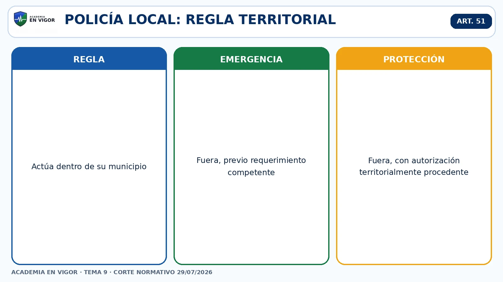

<em>Infografía: policías locales: creación, naturaleza y territorio.</em>

<!-- MATERIAL PENDIENTE: t09-p6-audio -->
<!-- MATERIAL PENDIENTE: t09-p6-video -->
<!-- MATERIAL PENDIENTE: t09-p6-pres -->

<!-- FUENTE: LO2-1986-T09 -->

## 27. Funciones y coordinación de las Policías Locales

El artículo 53 enumera funciones municipales y obliga a comunicar a las FCSE las actuaciones de dos letras concretas.

- La Policía Local protege autoridades y edificios municipales y ordena, señaliza y dirige el tráfico en el casco urbano.
- Instruye atestados por accidentes de circulación en el casco urbano y ejerce policía administrativa respecto de ordenanzas, bandos y disposiciones municipales.
- Participa en Policía Judicial como colaboradora, auxilia en emergencias y efectúa diligencias de prevención en el marco de las Juntas de Seguridad.
- Vigila espacios públicos y colabora en manifestaciones y grandes concentraciones cuando es requerida, además de cooperar en conflictos privados a requerimiento.
- Las actuaciones por accidentes urbanos y las diligencias preventivas de las letras c y g deben comunicarse a las FCSE competentes.
- En municipios con cuerpo propio puede constituirse una Junta Local de Seguridad para fijar formas y procedimientos de colaboración en su territorio.

<!-- VISUAL:t09-17-funciones-policia-local.webp -->

  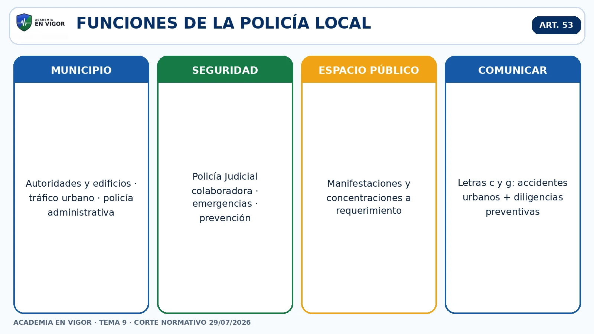

<em>Infografía: funciones y coordinación de las policías locales.</em>

<!-- MATERIAL PENDIENTE: t09-p6-audio -->
<!-- MATERIAL PENDIENTE: t09-p6-video -->
<!-- MATERIAL PENDIENTE: t09-p6-pres -->

<!-- FUENTE: LO2-1986-T09 -->

# Hablemos claro

:::hablemos-claro
El hilo conductor es sencillo: primero se fijan reglas comunes para cualquier cuerpo; después se reparten funciones entre Policía Nacional y Guardia Civil; por último se explica cómo encajan policía judicial, policías autonómicas y policías locales sin perder cooperación ni control.
:::

# En la calle

:::en-la-calle
Ante una actuación real hay que responder cuatro preguntas: qué función se ejerce, qué cuerpo es competente, en qué territorio actúa y quién dirige funcionalmente el servicio. Esa secuencia evita mezclar naturaleza, dependencia y competencia.
:::

# Lo que cae

:::lo-que-cae
Prioridad máxima: artículo 5; funciones de los artículos 11 y 12; cifras y reglas del Consejo de Policía; doble dependencia de Policía Judicial; tres clases de funciones autonómicas; unidades adscritas; órganos de coordinación; funciones locales y comunicación de las letras c y g.
:::

# Ha caído

:::ha-caido
Las coincidencias históricas se conservan en el índice oficial del tema, pero no se activa ninguna frecuencia hasta que convocatoria, enunciado y respuesta estén verificados conforme a la política del repositorio.
:::

---

*Academia En Vigor · El temario que nunca duerme · Tema 9 · v1.0.0 · Documento interno no publicado.*
