# TEMA 12 · PROTECCIÓN INTERNACIONAL, ACOGIDA, APATRIDIA Y PERSONAS DESPLAZADAS

**Policía Nacional · Método VIGOR · PARTE**
**Versión de contenido:** 1.0.0
**Estado editorial:** approved_internal · **Publicación:** not_published

# Mapa del tema

<!-- VISUAL:t12-01-mapa-general.webp -->

  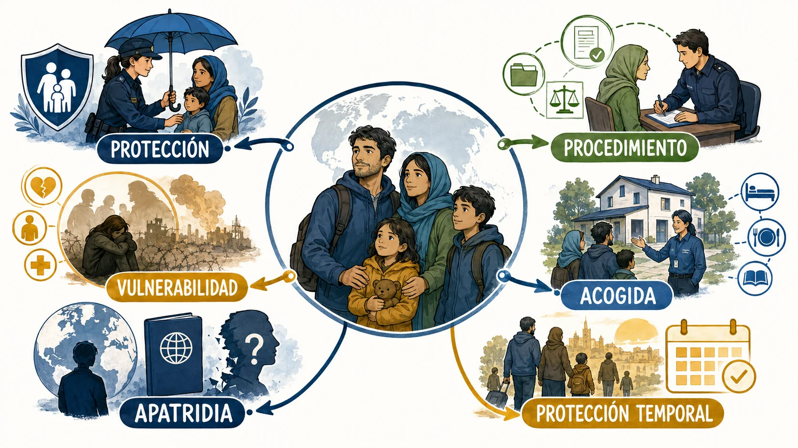

<em>Infografía: recorrido visual por las seis partes y sus relaciones.</em>

El Tema 12 se estudia como un sistema de decisiones enlazadas, no como una colección de listas aisladas.

# Contenido

## 01. Mapa normativo vigente en 2026

La protección internacional se estudia hoy en un sistema multinivel: Convención de Ginebra, Derecho de la Unión, Ley 12/2009 y normas de acogida.

- El Tema 12 oficial comprende protección internacional, procedimiento, personas vulnerables, centros de acogida, apatridia y personas desplazadas.
- Los reglamentos de la Unión son obligatorios en todos sus elementos y directamente aplicables.
- La Ley 12/2009 se aplica en 2026 en la medida en que sea compatible con el Derecho de la Unión directamente aplicable.

<!-- VISUAL:t12-02-mapa-normativo-2026.webp -->

  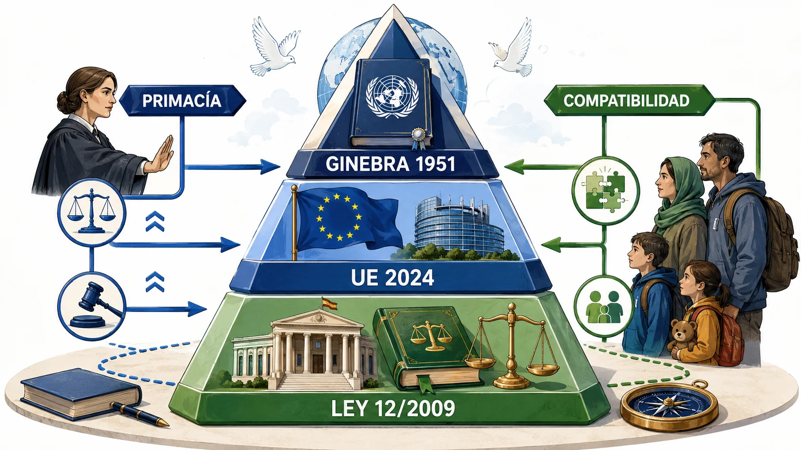

<em>Infografía: Pirámide normativa con reglas de primacía y compatibilidad.</em>

<!-- MATERIAL PENDIENTE: t12-p1-audio -->
<!-- MATERIAL PENDIENTE: t12-p1-video -->
<!-- MATERIAL PENDIENTE: t12-p1-pres -->

<!-- FUENTE: CONV-PN-2026,L12-2009-T12,INS11-2026-T12,RUE1348-2024-T12 -->

## 02. Asilo, refugiado y protección subsidiaria

Protección internacional es el género; asilo y protección subsidiaria son sus dos estatutos principales.

- El derecho de asilo es la protección dispensada a quien obtiene la condición de refugiado.
- La protección subsidiaria exige un riesgo real de daños graves y que no concurra causa de exclusión o denegación.
- Asilo y protección subsidiaria integran la protección internacional, pero responden a presupuestos jurídicos distintos.

<!-- VISUAL:t12-03-dos-estatutos.webp -->

  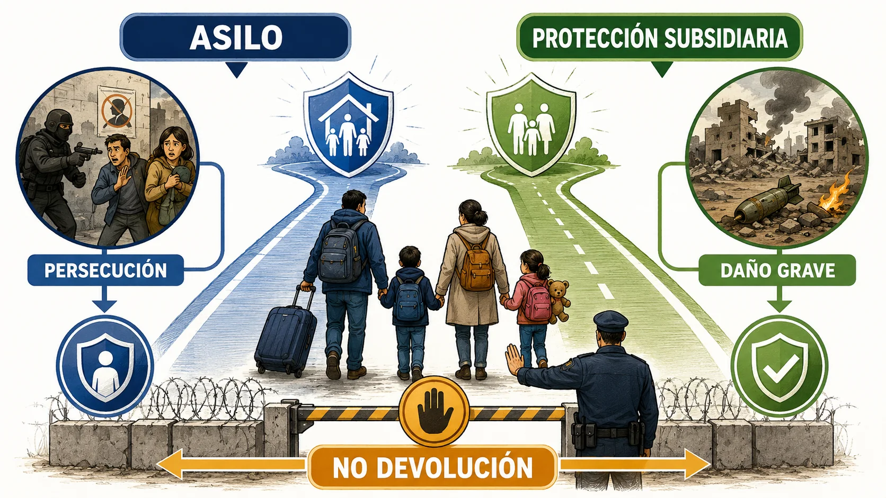

<em>Infografía: Comparación visual entre asilo y protección subsidiaria.</em>

<!-- MATERIAL PENDIENTE: t12-p1-audio -->
<!-- MATERIAL PENDIENTE: t12-p1-video -->
<!-- MATERIAL PENDIENTE: t12-p1-pres -->

<!-- FUENTE: L12-2009-T12,CONV1951-T12 -->

## 03. Condición de refugiado: temor y motivos

La definición combina temor fundado, persecución, motivo protegido, salida del país y falta de protección efectiva.

- La condición de refugiado exige fundados temores de persecución relacionados con alguno de los motivos protegidos.
- La persecución puede vincularse a raza, religión, nacionalidad, opiniones políticas o pertenencia a determinado grupo social.
- También puede ser refugiado el apátrida que no pueda o no quiera regresar a su anterior residencia habitual por esos temores.

<!-- MATERIAL PENDIENTE: t12-p1-audio -->
<!-- MATERIAL PENDIENTE: t12-p1-video -->
<!-- MATERIAL PENDIENTE: t12-p1-pres -->

<!-- FUENTE: L12-2009-T12,CONV1951-T12 -->

## 04. Actos y agentes de persecución

La persecución puede resultar de un acto grave o de una acumulación de medidas que alcance gravedad equivalente.

- Los actos de persecución pueden consistir en violencia, medidas discriminatorias o procesamientos desproporcionados.
- Una acumulación suficientemente grave de medidas puede equivaler a una violación grave de derechos.
- Los agentes no estatales pueden causar persecución cuando el Estado u otros agentes de protección no puedan o no quieran brindar protección efectiva.

<!-- VISUAL:t12-il-01-red-de-persecucion.webp -->

  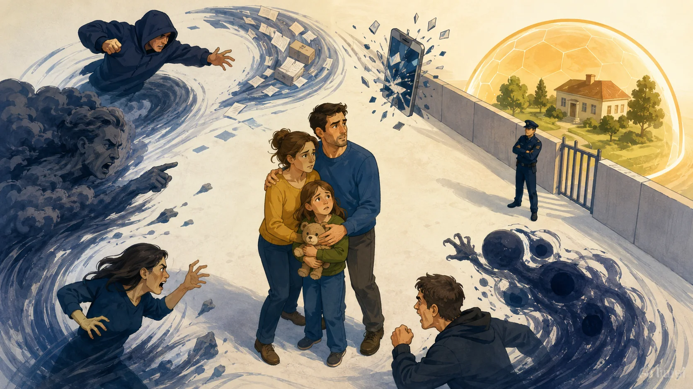

<em>Ilustración: Persona rodeada por varias formas dibujadas de persecución y una protección inaccesible.</em>

<!-- MATERIAL PENDIENTE: t12-p1-audio -->
<!-- MATERIAL PENDIENTE: t12-p1-video -->
<!-- MATERIAL PENDIENTE: t12-p1-pres -->

<!-- FUENTE: L12-2009-T12 -->

## 05. Daños graves de la protección subsidiaria

Los daños graves están tasados y no equivalen a cualquier dificultad del país de origen.

- La condena a pena de muerte o el riesgo de su ejecución es un daño grave.
- La tortura y los tratos inhumanos o degradantes en el país de origen son daños graves.
- La amenaza grave contra la vida o integridad de civiles por violencia indiscriminada en conflicto puede constituir daño grave.

<!-- VISUAL:t12-06-triangulo-danos-graves.webp -->

  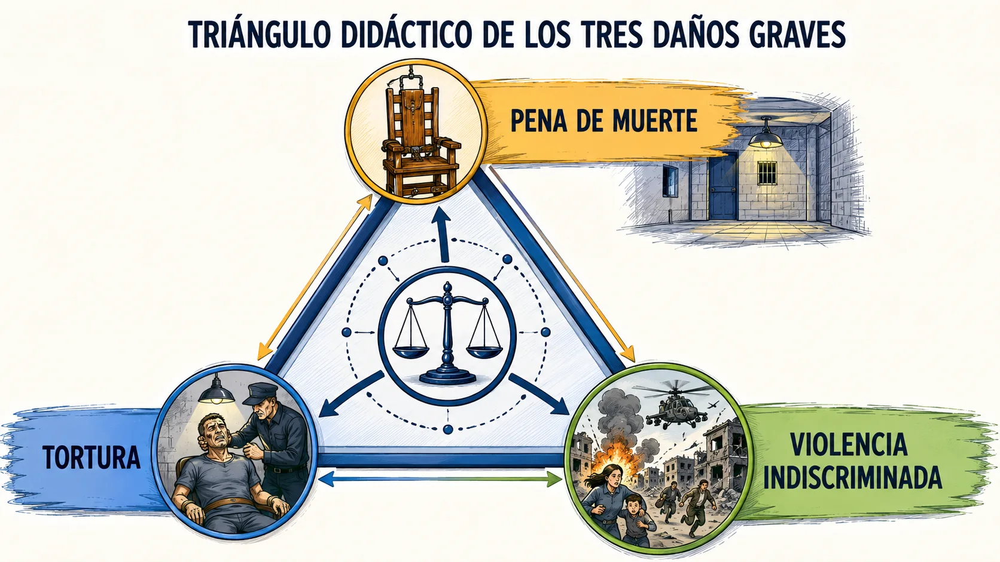

<em>Infografía: Triángulo didáctico de los tres daños graves.</em>

<!-- MATERIAL PENDIENTE: t12-p1-audio -->
<!-- MATERIAL PENDIENTE: t12-p1-video -->
<!-- MATERIAL PENDIENTE: t12-p1-pres -->

<!-- FUENTE: L12-2009-T12 -->

## 06. Exclusión, denegación y no devolución

Excluir, denegar y proteger frente a la devolución son operaciones distintas que no deben mezclarse.

- La exclusión del asilo puede fundarse en delitos contra la paz, de guerra o contra la humanidad.
- El asilo se deniega a quien constituya por razones fundadas un peligro para la seguridad de España.
- La no devolución protege frente al traslado al territorio donde la vida o la libertad quedarían amenazadas, con el alcance y excepciones del régimen aplicable.

<!-- VISUAL:t12-07-tres-filtros.webp -->

  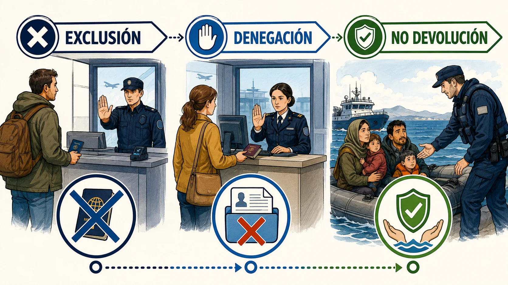

<em>Infografía: Tres filtros diferenciados: exclusión, denegación y no devolución.</em>

<!-- MATERIAL PENDIENTE: t12-p1-audio -->
<!-- MATERIAL PENDIENTE: t12-p1-video -->
<!-- MATERIAL PENDIENTE: t12-p1-pres -->

<!-- FUENTE: L12-2009-T12,CONV1951-T12 -->

## 07. Derecho a solicitar y formalización

La solicitud debe poder expresarse y registrarse con garantías, sin exigir que la persona domine la terminología jurídica.

- Las personas nacionales no comunitarias y las apátridas presentes en España tienen derecho a solicitar protección internacional.
- La solicitud se formaliza mediante comparecencia personal y entrevista individual, salvo imposibilidad prevista legalmente.
- La falta de documentos de identidad no impide por sí sola formular la solicitud, aunque debe explicarse y aportarse lo disponible.

<!-- VISUAL:t12-il-02-primera-escucha.webp -->

  

<em>Ilustración: Escena dibujada de primera escucha con intérprete y carpeta de solicitud.</em>

<!-- MATERIAL PENDIENTE: t12-p2-audio -->
<!-- MATERIAL PENDIENTE: t12-p2-video -->
<!-- MATERIAL PENDIENTE: t12-p2-pres -->

<!-- FUENTE: L12-2009-T12,RUE1348-2024-T12 -->

## 08. Derechos y obligaciones del solicitante

La condición de solicitante incorpora asistencia, información y documentación, junto con deberes de cooperación.

- El solicitante tiene derecho a asistencia jurídica y a intérprete en los términos previstos.
- La presentación de la solicitud suspende, con los límites legales, procesos de devolución, expulsión o extradición que pudieran afectar al solicitante.
- El solicitante debe cooperar con las autoridades y proporcionar cuanto antes la información relevante.

<!-- VISUAL:t12-09-balanza-derechos-deberes.webp -->

  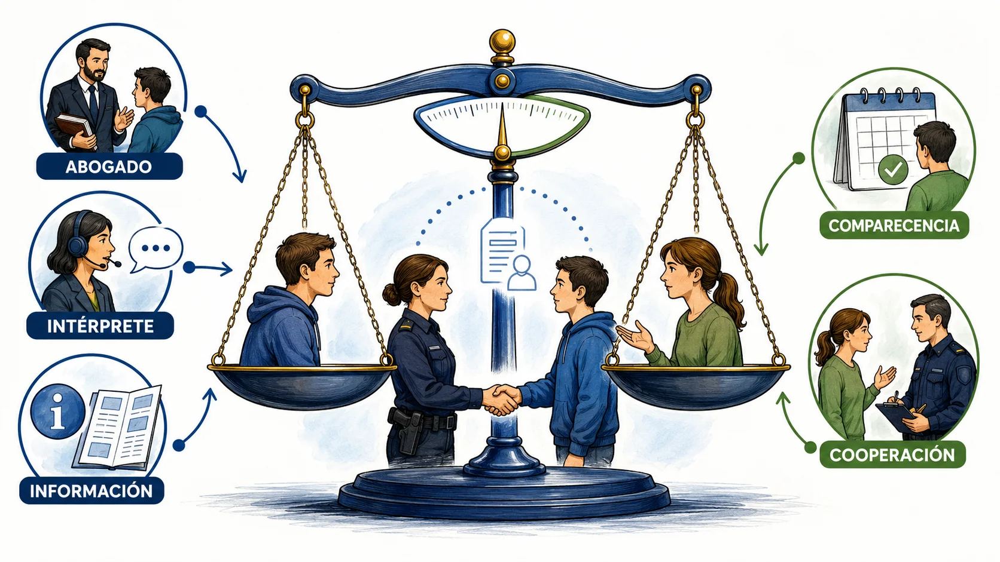

<em>Infografía: Balanza con derechos del solicitante y deberes de cooperación.</em>

<!-- MATERIAL PENDIENTE: t12-p2-audio -->
<!-- MATERIAL PENDIENTE: t12-p2-video -->
<!-- MATERIAL PENDIENTE: t12-p2-pres -->

<!-- FUENTE: L12-2009-T12 -->

## 09. Primacía europea y procedimiento común

El Pacto Europeo racionaliza y armoniza el examen de las solicitudes mediante procedimientos comunes.

- El Reglamento (UE) 2024/1348 establece un procedimiento común de protección internacional.
- La primacía exige no aplicar una norma nacional incompatible con una disposición europea de efecto directo.
- La Instrucción de 11 de junio de 2026 se aplica desde el 12 de junio de 2026.

<!-- VISUAL:t12-10-puente-2025-2026.webp -->

  

<em>Infografía: Puente temporal entre el régimen anterior y la aplicación plena en 2026.</em>

<!-- MATERIAL PENDIENTE: t12-p2-audio -->
<!-- MATERIAL PENDIENTE: t12-p2-video -->
<!-- MATERIAL PENDIENTE: t12-p2-pres -->

<!-- FUENTE: INS11-2026-T12,RUE1348-2024-T12,RUE1351-2024-T12 -->

## 10. Procedimiento fronterizo de asilo

El procedimiento fronterizo depende del lugar y forma de presentación, del triaje cuando proceda y de la situación de entrada.

- El procedimiento fronterizo puede seguir a una solicitud formulada en un puesto fronterizo de entrada.
- También puede aplicarse tras aprehensión relacionada con cruce no autorizado o desembarco después de búsqueda y rescate.
- Cuando proceda, el triaje del Reglamento (UE) 2024/1356 precede al procedimiento fronterizo.

<!-- VISUAL:t12-11-cuatro-accesos-frontera.webp -->

  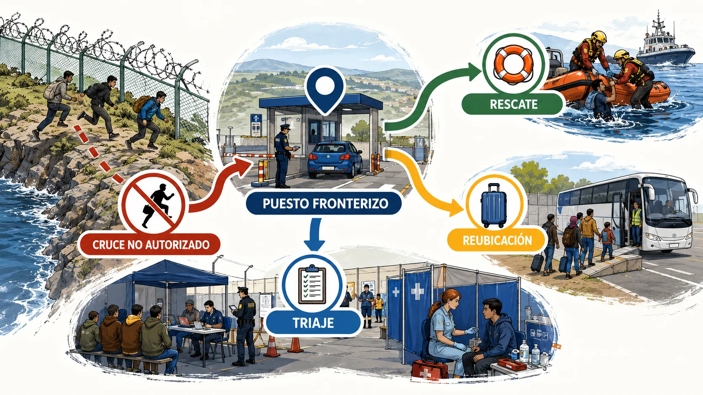

<em>Infografía: Cuatro accesos didácticos al procedimiento fronterizo.</em>

<!-- MATERIAL PENDIENTE: t12-p2-audio -->
<!-- MATERIAL PENDIENTE: t12-p2-video -->
<!-- MATERIAL PENDIENTE: t12-p2-pres -->

<!-- FUENTE: INS11-2026-T12,RUE1348-2024-T12,RUE1356-2024-T12 -->

## 11. Garantías y examen inicial en frontera

La rapidez del examen fronterizo convive con asistencia jurídica preceptiva, posible intervención de ACNUR y resolución motivada.

- La asistencia jurídica es preceptiva en la formalización y durante el procedimiento fronterizo administrativo.
- Con consentimiento previo del solicitante, ACNUR puede acceder a la solicitud y ser oído antes de determinadas resoluciones.
- El examen inicial comprueba causas de inadmisión y determinados supuestos de desestimación previstos en el Reglamento 2024/1348.

<!-- VISUAL:t12-12-reloj-con-garantias.webp -->

  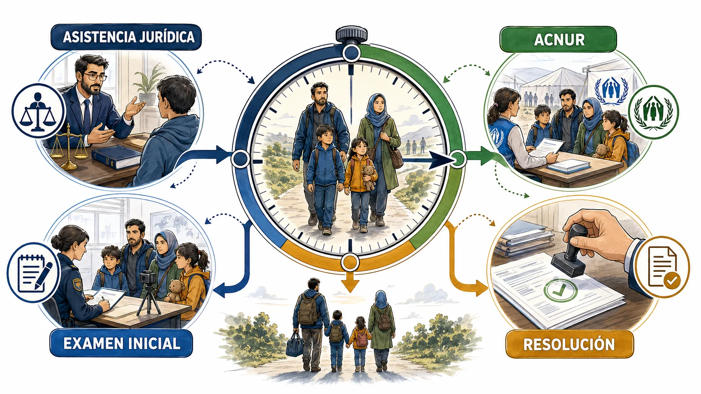

<em>Infografía: Reloj procedimental rodeado de abogado, ACNUR, entrevista y resolución.</em>

<!-- MATERIAL PENDIENTE: t12-p2-audio -->
<!-- MATERIAL PENDIENTE: t12-p2-video -->
<!-- MATERIAL PENDIENTE: t12-p2-pres -->

<!-- FUENTE: INS11-2026-T12,RUE1348-2024-T12,L12-2009-T12 -->

## 12. Instrucción, evaluación, archivo y recursos

La instrucción debe valorar individualmente relato, pruebas e información del país sin poner en peligro al solicitante.

- La evaluación no debe informar a los responsables de la persecución de que la persona ha solicitado protección.
- Para una resolución favorable pueden bastar indicios suficientes de persecución o daños graves conforme a la Ley 12/2009.
- La resolución debe informar del recurso y del órgano jurisdiccional competente.

<!-- VISUAL:t12-il-03-expediente-protegido.webp -->

  

<em>Ilustración: Expediente protegido de miradas externas durante la evaluación.</em>

<!-- MATERIAL PENDIENTE: t12-p2-audio -->
<!-- MATERIAL PENDIENTE: t12-p2-video -->
<!-- MATERIAL PENDIENTE: t12-p2-pres -->

<!-- FUENTE: L12-2009-T12,RUE1348-2024-T12,INS11-2026-T12 -->

## 13. Régimen general de vulnerabilidad

Las necesidades específicas deben detectarse y atenderse durante todo el procedimiento y la acogida.

- La situación de vulnerabilidad exige un tratamiento diferenciado cuando resulte necesario.
- La evaluación debe identificar necesidades específicas de acogida y de procedimiento.
- Las víctimas de trata, tortura o violencia grave pueden requerir atención especializada.

<!-- VISUAL:t12-14-radar-vulnerabilidad.webp -->

  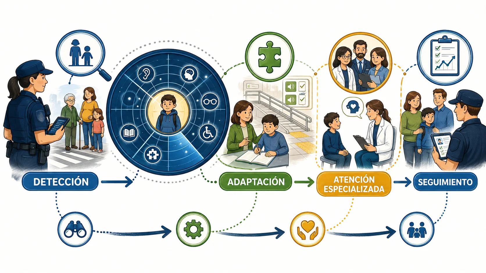

<em>Infografía: Radar de necesidades específicas y respuestas de apoyo.</em>

<!-- MATERIAL PENDIENTE: t12-p3-audio -->
<!-- MATERIAL PENDIENTE: t12-p3-video -->
<!-- MATERIAL PENDIENTE: t12-p3-pres -->

<!-- FUENTE: L12-2009-T12,RD220-2022-T12 -->

## 14. Menores y el interés superior

Toda decisión que afecte a un menor debe atender primordialmente a su interés superior.

- El interés superior del menor es consideración primordial en las decisiones que le afecten.
- La información debe adaptarse a la edad y madurez del menor.
- La unidad familiar y la seguridad del menor deben considerarse al asignar recursos.

<!-- VISUAL:t12-il-04-brujula-del-menor.webp -->

  

<em>Ilustración: Menor acompañado por una brújula protectora en un cruce de decisiones.</em>

<!-- MATERIAL PENDIENTE: t12-p3-audio -->
<!-- MATERIAL PENDIENTE: t12-p3-video -->
<!-- MATERIAL PENDIENTE: t12-p3-pres -->

<!-- FUENTE: L12-2009-T12,RD220-2022-T12 -->

## 15. Menores no acompañados

La ausencia de una persona adulta responsable activa protección de menores, intervención fiscal y representación adecuada.

- El menor no acompañado solicitante de protección internacional se remite a los servicios competentes de protección de menores.
- El hecho se pone en conocimiento del Ministerio Fiscal.
- La representación y asistencia deben permitir que el menor participe efectivamente en el procedimiento.

<!-- VISUAL:t12-16-triangulo-mena.webp -->

  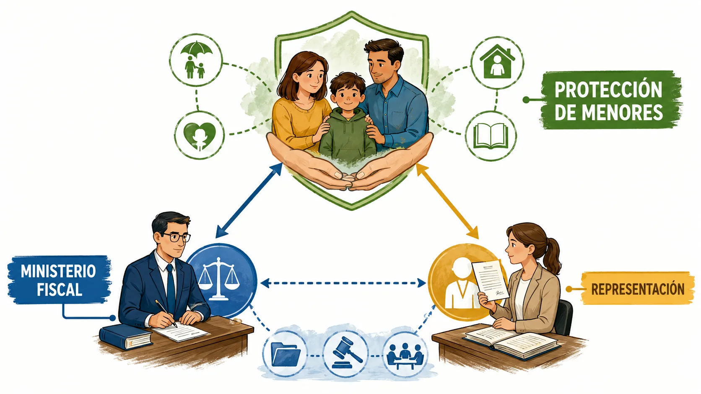

<em>Infografía: Triángulo de protección, Ministerio Fiscal y representación.</em>

<!-- MATERIAL PENDIENTE: t12-p3-audio -->
<!-- MATERIAL PENDIENTE: t12-p3-video -->
<!-- MATERIAL PENDIENTE: t12-p3-pres -->

<!-- FUENTE: L12-2009-T12,RD865-2001-T12 -->

## 16. Sistema de acogida: finalidad y destinatarios

El sistema de acogida cubre necesidades y acompaña un itinerario orientado a autonomía e inclusión.

- El sistema de acogida atiende a personas solicitantes y beneficiarias incluidas en su ámbito subjetivo.
- La acogida se organiza como un itinerario adaptado a la situación y necesidades de la persona.
- La carencia de recursos económicos es relevante para acceder a las condiciones materiales de acogida.

<!-- VISUAL:t12-17-itinerario-acogida.webp -->

  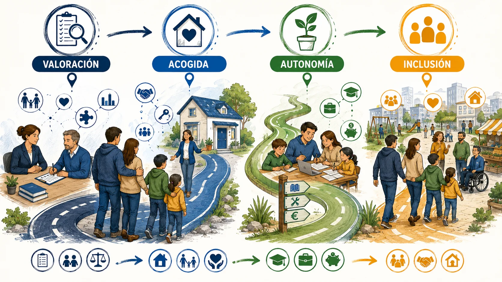

<em>Infografía: Itinerario completo de acogida desde la valoración hasta la autonomía.</em>

<!-- MATERIAL PENDIENTE: t12-p4-audio -->
<!-- MATERIAL PENDIENTE: t12-p4-video -->
<!-- MATERIAL PENDIENTE: t12-p4-pres -->

<!-- FUENTE: RD220-2022-T12 -->

## 17. Tres fases del itinerario

El itinerario distingue valoración inicial y derivación, acogida y autonomía.

- La valoración inicial identifica perfil, vulnerabilidades y recurso adecuado.
- La fase de acogida proporciona alojamiento y actuaciones de atención integral.
- La fase de autonomía apoya la salida progresiva del recurso y la vida independiente.

<!-- VISUAL:t12-18-tres-fases-sapi.webp -->

  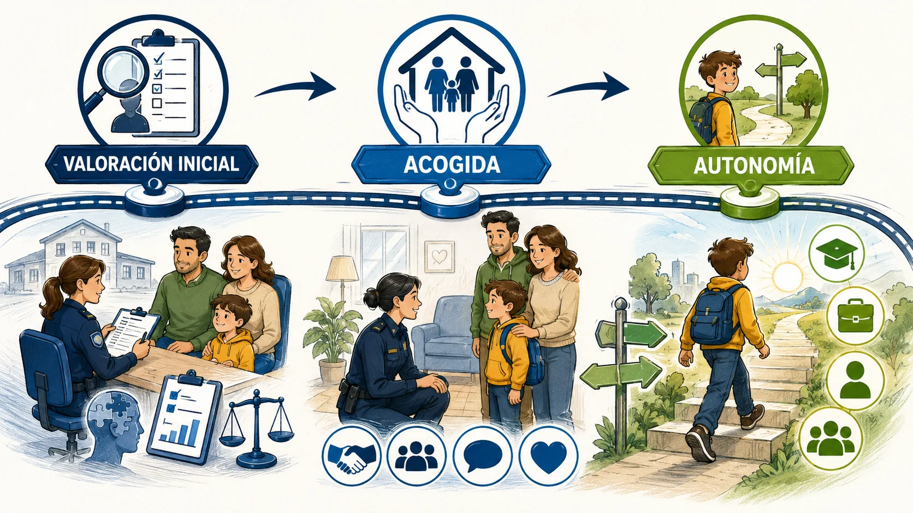

<em>Infografía: Tres estaciones del itinerario SAPI con prestaciones de cada fase.</em>

<!-- MATERIAL PENDIENTE: t12-p4-audio -->
<!-- MATERIAL PENDIENTE: t12-p4-video -->
<!-- MATERIAL PENDIENTE: t12-p4-pres -->

<!-- FUENTE: RD220-2022-T12 -->

## 18. Derechos, deberes y finalización de la acogida

La participación en el sistema genera derechos de información y atención, junto con deberes de convivencia y cooperación.

- La persona destinataria tiene derecho a información comprensible sobre condiciones, derechos, deberes y causas de reducción o retirada.
- La persona destinataria debe respetar las normas de funcionamiento y cooperar cuando sea requerida.
- La reducción o retirada de condiciones de acogida debe apoyarse en causas y procedimiento reglamentarios.

<!-- MATERIAL PENDIENTE: t12-p4-audio -->
<!-- MATERIAL PENDIENTE: t12-p4-video -->
<!-- MATERIAL PENDIENTE: t12-p4-pres -->

<!-- FUENTE: RD220-2022-T12 -->

## 19. Red de recursos y centros de migraciones

La red combina centros públicos, recursos concertados y dispositivos adaptados a distintas necesidades.

- Los Centros de Acogida a Refugiados forman parte de la red pública de centros de migraciones.
- Los recursos pueden ser de alojamiento colectivo, viviendas u otras modalidades previstas por el sistema.
- La asignación debe considerar disponibilidad, perfil y necesidades específicas.

<!-- VISUAL:t12-il-05-red-de-recursos.webp -->

  

<em>Ilustración: Mapa dibujado de CAR, vivienda y recurso especializado conectados.</em>

<!-- MATERIAL PENDIENTE: t12-p4-audio -->
<!-- MATERIAL PENDIENTE: t12-p4-video -->
<!-- MATERIAL PENDIENTE: t12-p4-pres -->

<!-- FUENTE: RD220-2022-T12 -->

## 20. Concepto y reconocimiento de apátrida

Apátrida es quien no es considerado nacional por ningún Estado conforme a su legislación.

- Se reconoce como apátrida a quien no sea considerado nacional suyo por ningún Estado conforme a su legislación.
- El procedimiento puede iniciarse de oficio o a solicitud de la persona interesada.
- Apatridia y condición de refugiado responden a definiciones distintas.

<!-- VISUAL:t12-21-apatridia-no-indocumentacion.webp -->

  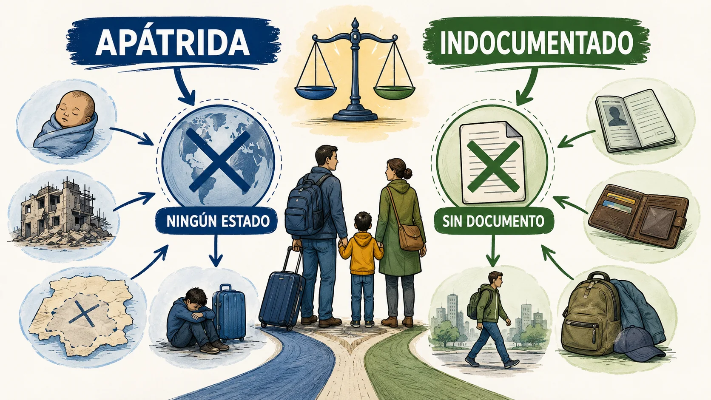

<em>Infografía: Comparación entre apatridia e indocumentación.</em>

<!-- MATERIAL PENDIENTE: t12-p5-audio -->
<!-- MATERIAL PENDIENTE: t12-p5-video -->
<!-- MATERIAL PENDIENTE: t12-p5-pres -->

<!-- FUENTE: RD865-2001-T12 -->

## 21. Procedimiento y efectos de la apatridia

La Oficina de Asilo y Refugio instruye; el Ministro del Interior resuelve y el interesado debe colaborar.

- La Oficina de Asilo y Refugio instruye el procedimiento de reconocimiento de apatridia.
- Instruido el procedimiento, el trámite de audiencia es de quince días cuando proceda.
- La resolución favorable reconoce la condición de apátrida en los términos de la Convención de 1954.

<!-- VISUAL:t12-22-ruta-apatridia.webp -->

  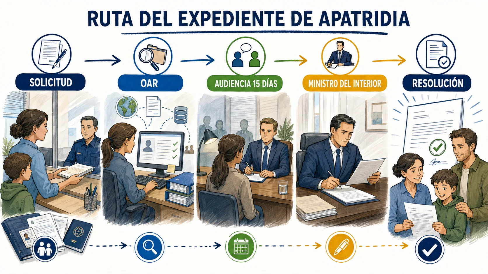

<em>Infografía: Ruta del expediente de apatridia desde inicio hasta resolución.</em>

<!-- MATERIAL PENDIENTE: t12-p5-audio -->
<!-- MATERIAL PENDIENTE: t12-p5-video -->
<!-- MATERIAL PENDIENTE: t12-p5-pres -->

<!-- FUENTE: RD865-2001-T12 -->

## 22. Protección temporal y personas desplazadas

La protección temporal responde a una afluencia masiva y ofrece una respuesta colectiva inmediata sin sustituir el derecho individual a pedir asilo.

- La protección temporal se dirige a afluencias masivas de personas desplazadas que no pueden regresar en condiciones seguras y duraderas.
- Una decisión del Consejo de la Unión Europea puede activar el régimen de protección temporal.
- La protección temporal no impide presentar una solicitud individual de protección internacional.

<!-- VISUAL:t12-23-doble-via-temporal-asilo.webp -->

  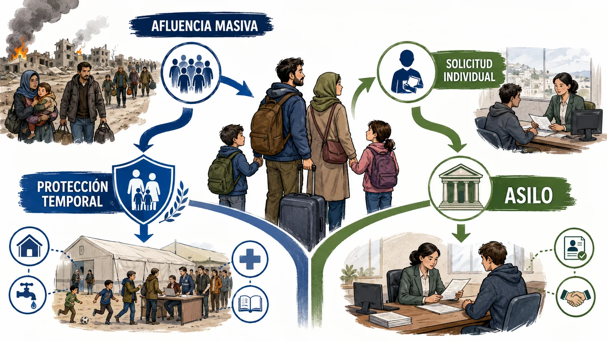

<em>Infografía: Doble vía compatible entre protección temporal y solicitud individual.</em>

<!-- MATERIAL PENDIENTE: t12-p5-audio -->
<!-- MATERIAL PENDIENTE: t12-p5-video -->
<!-- MATERIAL PENDIENTE: t12-p5-pres -->

<!-- FUENTE: RD1325-2003-T12 -->

## 23. Contenido y cese de la protección temporal

La protección temporal incorpora residencia, trabajo, información, acogida y reunificación en los términos del régimen.

- La persona beneficiaria recibe información escrita en una lengua que pueda comprender.
- El régimen contempla residencia y autorización para trabajar en los términos previstos.
- La reunificación familiar puede alcanzar a los familiares definidos reglamentariamente cuando concurran sus requisitos.

<!-- VISUAL:t12-il-06-maleta-de-derechos.webp -->

  

<em>Ilustración: Familia desplazada con una maleta dibujada que contiene derechos básicos.</em>

<!-- MATERIAL PENDIENTE: t12-p5-audio -->
<!-- MATERIAL PENDIENTE: t12-p5-video -->
<!-- MATERIAL PENDIENTE: t12-p5-pres -->

<!-- FUENTE: RD1325-2003-T12 -->

## 24. ACNUR y cooperación institucional

ACNUR ocupa una posición de garantía y cooperación, pero no sustituye al órgano español que resuelve.

- ACNUR puede intervenir en el procedimiento en los términos previstos por la ley.
- La Comisión Interministerial de Asilo y Refugio formula propuestas en el sistema nacional.
- La resolución administrativa corresponde a la autoridad española competente, no a ACNUR.

<!-- VISUAL:t12-25-mesa-institucional.webp -->

  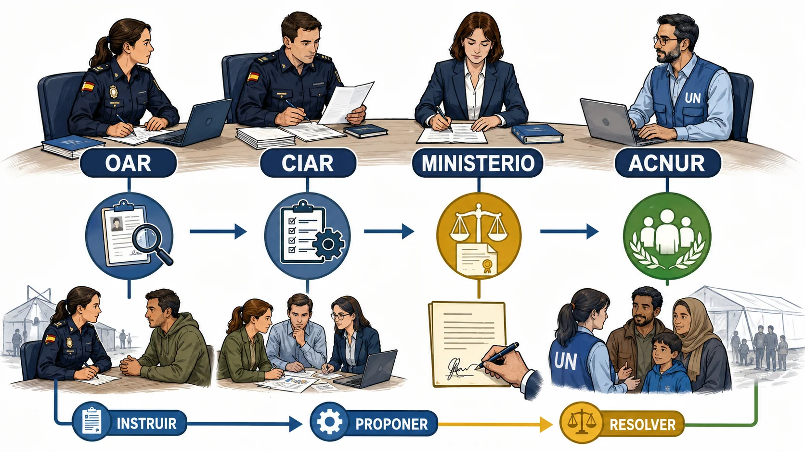

<em>Infografía: Mesa institucional con OAR, CIAR, Ministerio y ACNUR y sus verbos.</em>

<!-- MATERIAL PENDIENTE: t12-p6-audio -->
<!-- MATERIAL PENDIENTE: t12-p6-video -->
<!-- MATERIAL PENDIENTE: t12-p6-pres -->

<!-- FUENTE: L12-2009-T12,INS11-2026-T12 -->

## 25. Método de resolución de supuestos

Un caso completo exige separar estatuto, procedimiento, vulnerabilidad, acogida y posibles figuras vecinas.

- La primera clasificación distingue protección internacional, apatridia y protección temporal.
- El lugar de presentación puede condicionar el procedimiento, especialmente en frontera.
- La vulnerabilidad y la acogida se analizan además del fondo de la solicitud.

<!-- VISUAL:t12-26-tablero-cinco-casillas.webp -->

  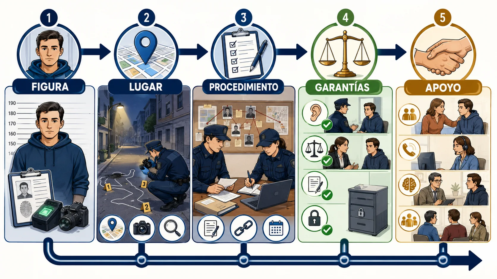

<em>Infografía: Tablero de decisión con cinco casillas para resolver supuestos.</em>

<!-- MATERIAL PENDIENTE: t12-p6-audio -->
<!-- MATERIAL PENDIENTE: t12-p6-video -->
<!-- MATERIAL PENDIENTE: t12-p6-pres -->

<!-- FUENTE: CONV-PN-2026,L12-2009-T12,INS11-2026-T12,RD220-2022-T12 -->

# Hablemos claro

:::hablemos-claro
Lee primero el sujeto, después la figura jurídica y por último la competencia, el procedimiento o el efecto.
:::

# En la calle

:::en-la-calle
Una actuación correcta fija hechos, activa garantías y documenta el cauce empleado antes de llegar a la conclusión.
:::

# Lo que cae

:::lo-que-cae
Prioriza definiciones próximas, sujetos competentes, secuencias, límites, excepciones y diferencias entre figuras vecinas.
:::

# Ha caído

:::ha-caido
Las coincidencias históricas se conservan en el índice interno y permanecen ocultas mientras no exista plantilla oficial final verificada.
:::

---

*Academia En Vigor · El temario que nunca duerme · Tema 12 · v1.0.0 · Documento interno no publicado.*
