# TEMA 13 · SEGURIDAD PRIVADA: ORGANIZACIÓN, PERSONAL, SERVICIOS Y MEDIDAS

**Policía Nacional · Método VIGOR · PARTE**
**Versión de contenido:** 1.0.0
**Estado editorial:** approved_internal · **Publicación:** not_published

# Mapa del tema

<!-- VISUAL:t13-01-mapa-general.webp -->

  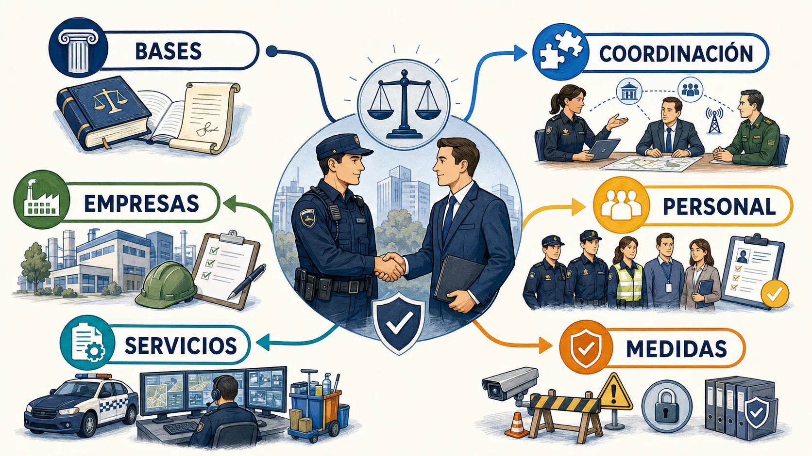

<em>Infografía: recorrido visual por las seis partes y sus relaciones.</em>

El Tema 13 se estudia como un sistema de decisiones enlazadas, no como una colección de listas aisladas.

# Contenido

## 01. Objeto, modelo y subordinación

La seguridad privada protege personas y bienes mediante actividades contratadas y sometidas a control público.

- La Ley 5/2014 regula actividades, servicios, personal, empresas, medidas e investigación privada.
- Las actividades de seguridad privada son complementarias y subordinadas respecto de la seguridad pública.
- La seguridad privada puede ser contratada voluntariamente o venir impuesta legalmente.

<!-- VISUAL:t13-02-modelo-complementario.webp -->

  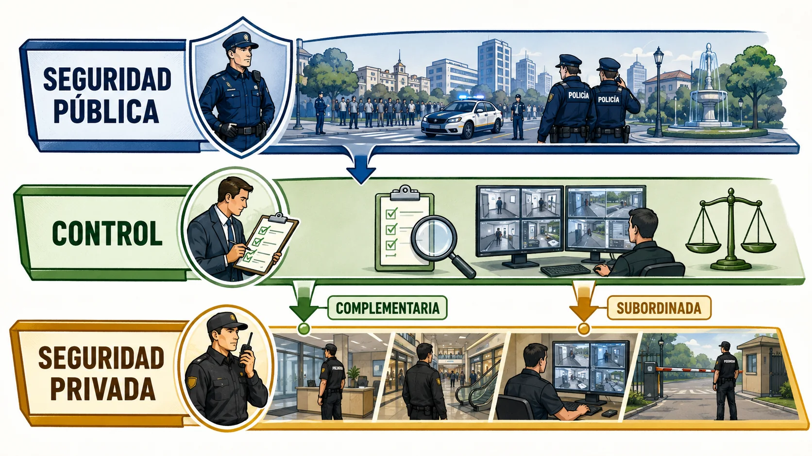

<em>Infografía: Relación jerárquica entre seguridad pública, control y prestación privada.</em>

<!-- MATERIAL PENDIENTE: t13-p1-audio -->
<!-- MATERIAL PENDIENTE: t13-p1-video -->
<!-- MATERIAL PENDIENTE: t13-p1-pres -->

<!-- FUENTE: CONV-PN-2026,L5-2014-T13 -->

## 02. Definiciones que no deben mezclarse

Actividad, servicio, función y medida describen planos distintos de la seguridad privada.

- Las actividades son los ámbitos materiales en que actúan los prestadores.
- Los servicios son las acciones realizadas para materializar las actividades.
- Las funciones son las facultades atribuidas al personal de seguridad privada.

<!-- VISUAL:t13-03-cuatro-conceptos.webp -->

  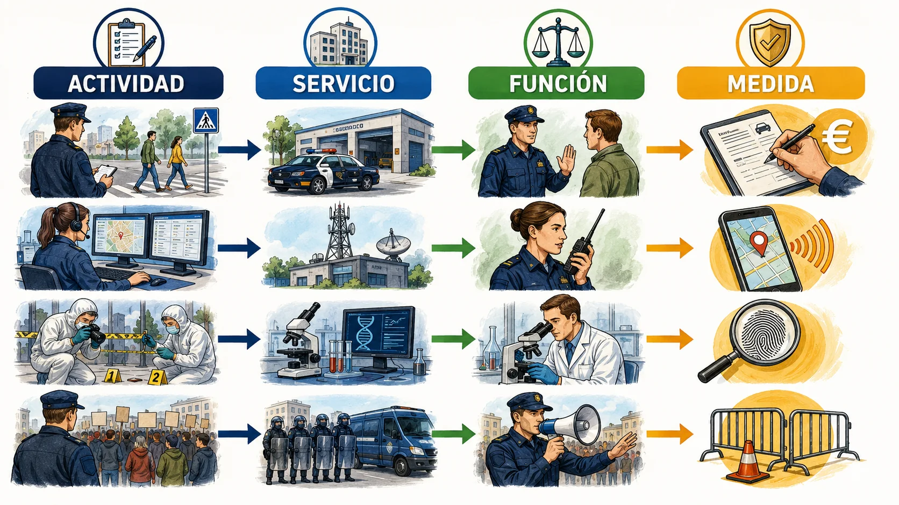

<em>Infografía: Matriz de actividad, servicio, función y medida con ejemplos.</em>

<!-- MATERIAL PENDIENTE: t13-p1-audio -->
<!-- MATERIAL PENDIENTE: t13-p1-video -->
<!-- MATERIAL PENDIENTE: t13-p1-pres -->

<!-- FUENTE: L5-2014-T13 -->

## 03. Ámbito subjetivo de aplicación

La ley alcanza a prestadores, personal, servicios, medidas, usuarios y establecimientos obligados.

- La ley se aplica a empresas de seguridad, personal, despachos de detectives, servicios, medidas y contratos del sector.
- El régimen de inspección y sanción alcanza también a quien actúa sin autorización o habilitación.
- Los usuarios y establecimientos obligados pueden quedar sujetos a las disposiciones que les resulten pertinentes.

<!-- VISUAL:t13-04-ecosistema-sujetos.webp -->

  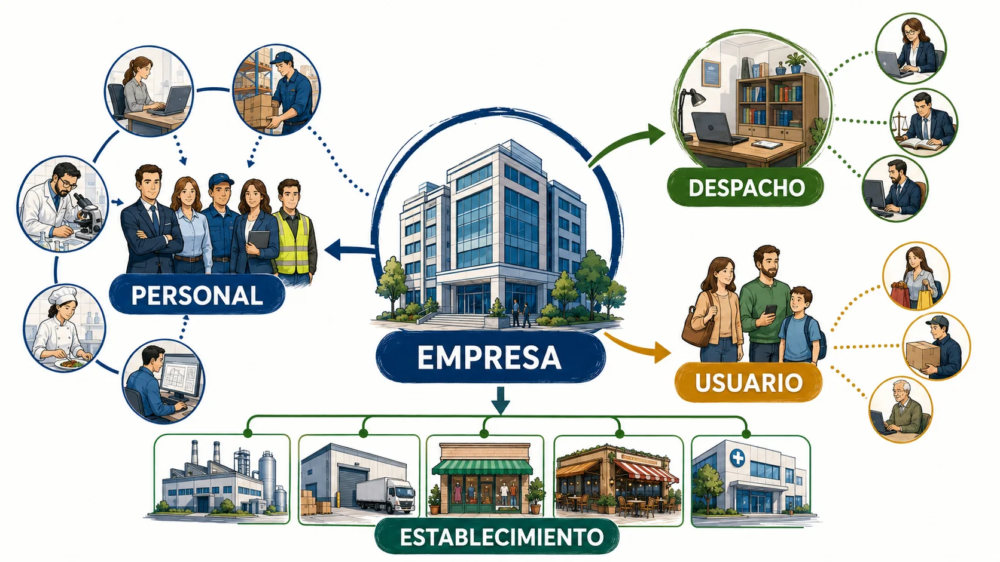

<em>Infografía: Ecosistema completo de sujetos incluidos en la ley.</em>

<!-- MATERIAL PENDIENTE: t13-p1-audio -->
<!-- MATERIAL PENDIENTE: t13-p1-video -->
<!-- MATERIAL PENDIENTE: t13-p1-pres -->

<!-- FUENTE: L5-2014-T13 -->

## 04. Fines de la seguridad privada

Los fines combinan necesidades legítimas del usuario, contribución a la seguridad pública e integración funcional.

- Un fin es satisfacer necesidades legítimas de seguridad o información del usuario.
- La seguridad privada contribuye a prevenir infracciones y aportar información a procedimientos.
- La seguridad privada integra funcionalmente medios y capacidades como recurso externo de la seguridad pública.

<!-- VISUAL:t13-05-tres-fines.webp -->

  

<em>Infografía: Tres engranajes de protección, contribución e integración.</em>

<!-- MATERIAL PENDIENTE: t13-p1-audio -->
<!-- MATERIAL PENDIENTE: t13-p1-video -->
<!-- MATERIAL PENDIENTE: t13-p1-pres -->

<!-- FUENTE: L5-2014-T13 -->

## 05. Principios rectores y colaboración

La prestación debe respetar Constitución, ley, principios profesionales y colaboración con las Fuerzas y Cuerpos de Seguridad.

- Los prestadores deben colaborar en todo momento y lugar con las Fuerzas y Cuerpos de Seguridad.
- Deben seguir las instrucciones policiales relacionadas con servicios que afecten a la seguridad pública o a sus competencias.
- La prestación debe respetar la Constitución y el resto del ordenamiento jurídico.

<!-- VISUAL:t13-il-01-relevo-coordinado.webp -->

  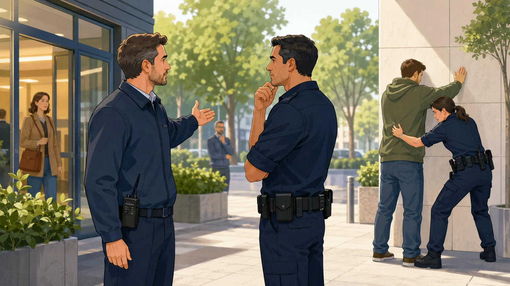

<em>Ilustración: Vigilante y policía coordinan una intervención sin confundirse de función.</em>

<!-- MATERIAL PENDIENTE: t13-p1-audio -->
<!-- MATERIAL PENDIENTE: t13-p1-video -->
<!-- MATERIAL PENDIENTE: t13-p1-pres -->

<!-- FUENTE: L5-2014-T13 -->

## 06. Prohibiciones y reserva de información

La seguridad privada no puede controlar ideas, interferir conflictos ni comunicar información protegida fuera de los cauces legales.

- No puede ejercerse control sobre opiniones políticas, sindicales o religiosas.
- La información conocida por razón del servicio está sometida a reserva, salvo comunicación legítima a autoridades judiciales o policiales.
- Está prohibido ejercer funciones de seguridad privada sin habilitación o acreditación exigible.

<!-- VISUAL:t13-07-semáforo-limites.webp -->

  

<em>Infografía: Semáforo de conductas permitidas, condicionadas y prohibidas.</em>

<!-- MATERIAL PENDIENTE: t13-p1-audio -->
<!-- MATERIAL PENDIENTE: t13-p1-video -->
<!-- MATERIAL PENDIENTE: t13-p1-pres -->

<!-- FUENTE: L5-2014-T13 -->

## 07. Competencias de la Administración del Estado

El Estado ejerce autorización, inspección, control, sanción y coordinación en el ámbito que le corresponde.

- Corresponde al Estado autorizar, inspeccionar y sancionar en los términos de la Ley 5/2014.
- La Policía ejerce funciones de control sobre empresas, personal y servicios en su ámbito competencial.
- La Guardia Civil ejerce competencias específicas, entre otras, respecto de guardas rurales y sus especialidades.

<!-- VISUAL:t13-08-mapa-competencias.webp -->

  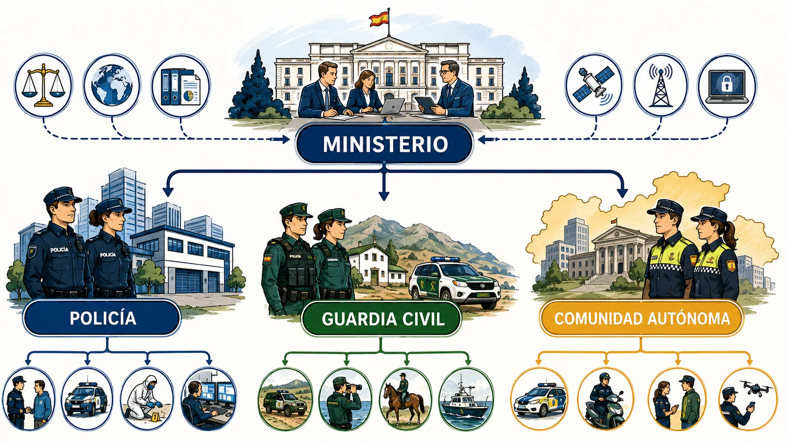

<em>Infografía: Mapa funcional de Interior, Policía, Guardia Civil y órganos autonómicos.</em>

<!-- MATERIAL PENDIENTE: t13-p2-audio -->
<!-- MATERIAL PENDIENTE: t13-p2-video -->
<!-- MATERIAL PENDIENTE: t13-p2-pres -->

<!-- FUENTE: L5-2014-T13 -->

## 08. Competencias autonómicas y registros

Las comunidades autónomas con competencias asumidas ejercen funciones sobre actividades y servicios desarrollados en su territorio.

- Las comunidades autónomas pueden ejercer competencias asumidas estatutariamente sobre seguridad privada.
- Existe un Registro Nacional de Seguridad Privada y pueden existir registros autonómicos.
- La coordinación registral evita duplicidades y facilita el control administrativo.

<!-- MATERIAL PENDIENTE: t13-p2-audio -->
<!-- MATERIAL PENDIENTE: t13-p2-video -->
<!-- MATERIAL PENDIENTE: t13-p2-pres -->

<!-- FUENTE: L5-2014-T13 -->

## 09. Acceso a información y coordinación

La coordinación se apoya en información recíproca, órganos de participación y medidas organizativas.

- Las Fuerzas y Cuerpos de Seguridad pueden acceder a información necesaria para el ejercicio de sus funciones.
- El Ministerio del Interior o el órgano autonómico competente adopta medidas organizativas de coordinación.
- Los órganos de participación permiten intercambio entre sector y Administraciones sin sustituir la autoridad pública.

<!-- VISUAL:t13-10-centro-coordinacion.webp -->

  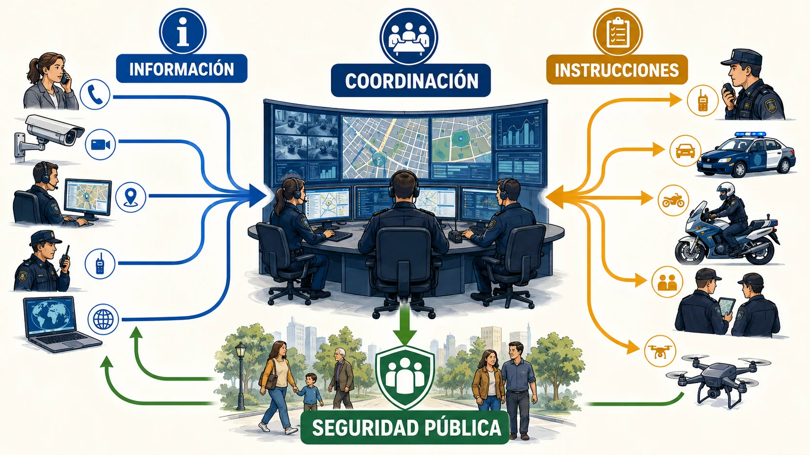

<em>Infografía: Centro de coordinación con flujos de información delimitados.</em>

<!-- MATERIAL PENDIENTE: t13-p2-audio -->
<!-- MATERIAL PENDIENTE: t13-p2-video -->
<!-- MATERIAL PENDIENTE: t13-p2-pres -->

<!-- FUENTE: L5-2014-T13 -->

## 10. Actividades reservadas, compatibles y excluidas

La ley separa actividades de seguridad privada, actividades compatibles y actividades excluidas.

- La vigilancia y protección de bienes, lugares, eventos y personas determinadas es actividad de seguridad privada.
- La planificación y asesoramiento en seguridad pueden ser actividades compatibles en los términos legales.
- Las tareas de recepción, información o control de accesos sin funciones de seguridad pueden ser actividades excluidas.

<!-- VISUAL:t13-11-tres-zonas-actividad.webp -->

  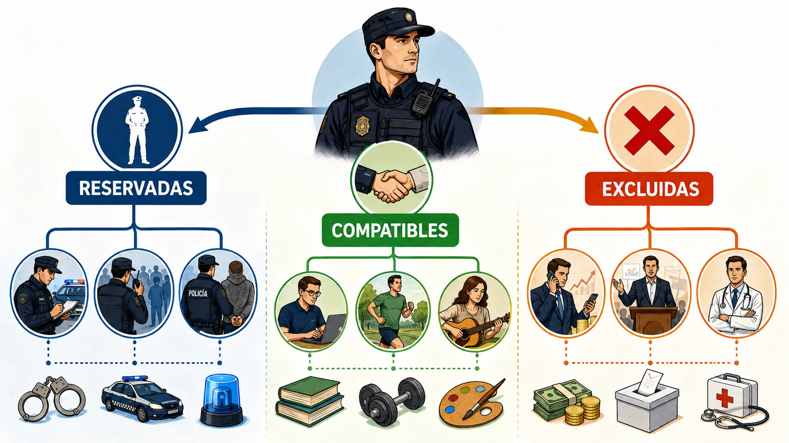

<em>Infografía: Tres zonas: reservadas, compatibles y excluidas con ejemplos.</em>

<!-- MATERIAL PENDIENTE: t13-p3-audio -->
<!-- MATERIAL PENDIENTE: t13-p3-video -->
<!-- MATERIAL PENDIENTE: t13-p3-pres -->

<!-- FUENTE: L5-2014-T13 -->

## 11. Autorización y requisitos de empresas

Las empresas necesitan autorización o declaración responsable cuando la ley la admite, inscripción y requisitos adecuados a la actividad.

- La prestación de actividades reservadas exige autorización administrativa o declaración responsable en los casos previstos.
- La empresa debe estar inscrita en el registro correspondiente.
- Los requisitos y garantías se ajustan a las actividades para las que se solicita autorización.

<!-- MATERIAL PENDIENTE: t13-p3-audio -->
<!-- MATERIAL PENDIENTE: t13-p3-video -->
<!-- MATERIAL PENDIENTE: t13-p3-pres -->

<!-- FUENTE: L5-2014-T13,OINT314-2011-T13 -->

## 12. Obligaciones y representantes de empresas

La empresa debe mantener requisitos, comunicar cambios, asegurar formación y garantizar correcta prestación.

- La empresa debe comunicar las modificaciones relevantes que afecten a su autorización o inscripción.
- Debe garantizar que el personal asignado esté habilitado y formado para sus funciones.
- La empresa debe facilitar inspecciones y conservar la documentación exigida.

<!-- VISUAL:t13-il-02-sala-operaciones.webp -->

  

<em>Ilustración: Equipo de empresa revisa personal, contrato y medios antes del servicio.</em>

<!-- MATERIAL PENDIENTE: t13-p3-audio -->
<!-- MATERIAL PENDIENTE: t13-p3-video -->
<!-- MATERIAL PENDIENTE: t13-p3-pres -->

<!-- FUENTE: L5-2014-T13 -->

## 13. Despachos de detectives privados

La investigación privada se presta desde despachos habilitados y está separada de las actividades propias de empresas de seguridad.

- Los detectives privados prestan servicios de investigación desde despachos inscritos.
- El encargo debe responder a un interés legítimo del contratante.
- Las empresas de seguridad no pueden realizar la investigación privada propia de detectives, ni estos servicios propios de aquellas.

<!-- VISUAL:t13-14-frontera-investigacion.webp -->

  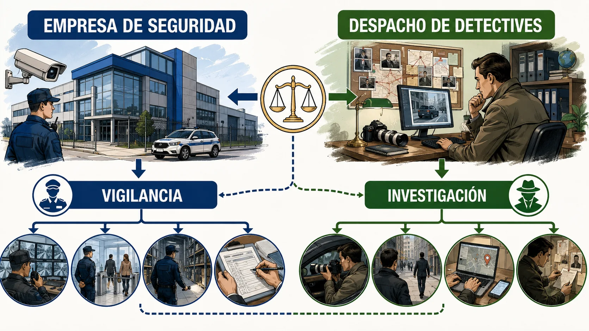

<em>Infografía: Frontera entre vigilancia empresarial e investigación de detectives.</em>

<!-- MATERIAL PENDIENTE: t13-p3-audio -->
<!-- MATERIAL PENDIENTE: t13-p3-video -->
<!-- MATERIAL PENDIENTE: t13-p3-pres -->

<!-- FUENTE: L5-2014-T13 -->

## 14. Categorías de personal habilitado

La ley enumera categorías profesionales con funciones propias y no intercambiables.

- El vigilante de explosivos es una especialidad del vigilante de seguridad.
- Guardas de caza y guardapescas marítimos son especialidades de los guardas rurales.
- Jefes y directores de seguridad son categorías distintas con funciones diferenciadas.

<!-- VISUAL:t13-15-arbol-profesional.webp -->

  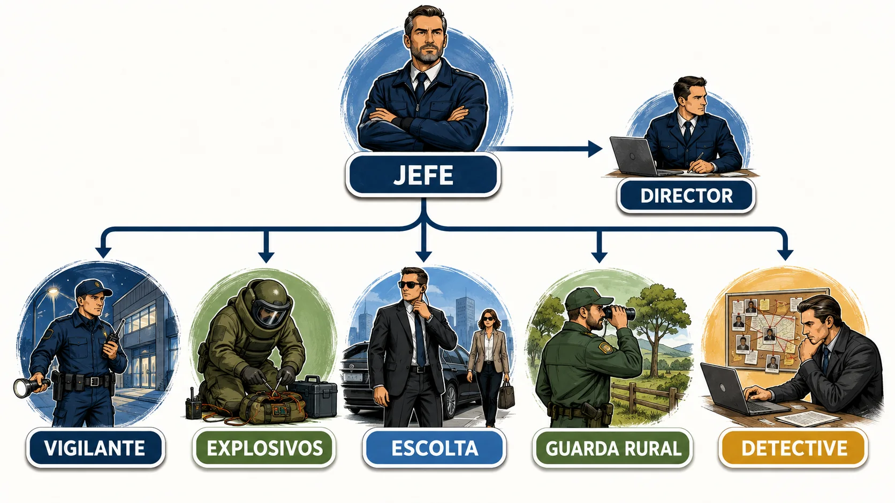

<em>Infografía: Árbol de categorías y especialidades del personal.</em>

<!-- MATERIAL PENDIENTE: t13-p4-audio -->
<!-- MATERIAL PENDIENTE: t13-p4-video -->
<!-- MATERIAL PENDIENTE: t13-p4-pres -->

<!-- FUENTE: L5-2014-T13 -->

## 15. Habilitación y requisitos generales

El ejercicio de funciones exige habilitación profesional y mantenimiento de requisitos de aptitud y honorabilidad.

- La habilitación profesional es previa al ejercicio de las funciones reservadas.
- No haber sido sancionado por infracción grave o muy grave en los períodos legales es un requisito general.
- La formación y las pruebas acreditan conocimientos y aptitudes para la categoría.

<!-- MATERIAL PENDIENTE: t13-p4-audio -->
<!-- MATERIAL PENDIENTE: t13-p4-video -->
<!-- MATERIAL PENDIENTE: t13-p4-pres -->

<!-- FUENTE: L5-2014-T13,OINT318-2011-T13 -->

## 16. Principios de actuación y protección jurídica

El personal actúa con legalidad, integridad, dignidad, corrección, congruencia y proporcionalidad.

- Legalidad, integridad, dignidad, corrección, congruencia y proporcionalidad son principios de actuación.
- La fuerza solo puede emplearse cuando sea necesaria y de forma proporcional.
- La protección jurídica reforzada se vincula a personal identificado que coopera y actúa bajo mando policial.

<!-- VISUAL:t13-il-03-escudo-proporcional.webp -->

  

<em>Ilustración: Vigilante protegido por un escudo con principios de actuación.</em>

<!-- MATERIAL PENDIENTE: t13-p4-audio -->
<!-- MATERIAL PENDIENTE: t13-p4-video -->
<!-- MATERIAL PENDIENTE: t13-p4-pres -->

<!-- FUENTE: L5-2014-T13 -->

## 17. Vigilantes de seguridad

Los vigilantes protegen bienes, establecimientos, eventos y personas dentro del servicio contratado.

- Los vigilantes ejercen vigilancia y protección de bienes, lugares, eventos y personas.
- Pueden realizar controles de identidad en el acceso o interior sin retener documentación personal.
- Ante un delito relacionado con el objeto protegido, deben detener y poner inmediatamente a disposición de las Fuerzas y Cuerpos de Seguridad al autor y efectos.

<!-- VISUAL:t13-18-ciclo-vigilante.webp -->

  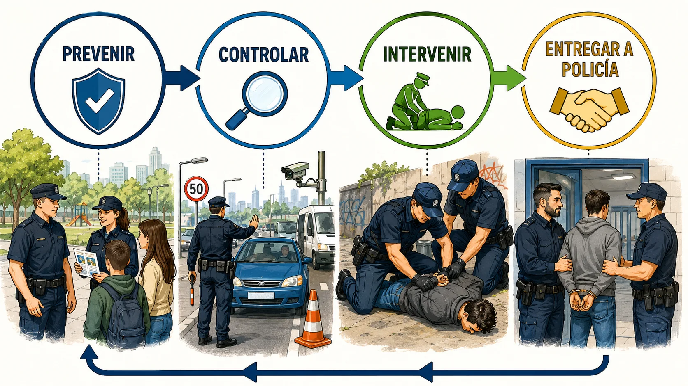

<em>Infografía: Ciclo de prevención, control, intervención y entrega policial.</em>

<!-- MATERIAL PENDIENTE: t13-p4-audio -->
<!-- MATERIAL PENDIENTE: t13-p4-video -->
<!-- MATERIAL PENDIENTE: t13-p4-pres -->

<!-- FUENTE: L5-2014-T13 -->

## 18. Escoltas privados

El escolta acompaña, defiende y protege a personas determinadas frente a agresiones o actos delictivos.

- El escolta privado protege a personas determinadas.
- Debe impedir agresiones o actos delictivos contra la persona protegida.
- El porte y uso de armas se somete a las condiciones legales del servicio.

<!-- VISUAL:t13-il-04-burbuja-proteccion.webp -->

  

<em>Ilustración: Escolta crea una burbuja móvil de protección alrededor de una persona.</em>

<!-- MATERIAL PENDIENTE: t13-p4-audio -->
<!-- MATERIAL PENDIENTE: t13-p4-video -->
<!-- MATERIAL PENDIENTE: t13-p4-pres -->

<!-- FUENTE: L5-2014-T13 -->

## 19. Guardas rurales y especialidades

Los guardas rurales protegen personas y bienes en fincas rústicas y desarrollan funciones en el medio rural.

- Los guardas rurales ejercen vigilancia y protección en fincas rústicas.
- Guardas de caza y guardapescas marítimos son especialidades del guarda rural.
- Deben colaborar y poner hechos delictivos a disposición de las Fuerzas y Cuerpos de Seguridad.

<!-- MATERIAL PENDIENTE: t13-p4-audio -->
<!-- MATERIAL PENDIENTE: t13-p4-video -->
<!-- MATERIAL PENDIENTE: t13-p4-pres -->

<!-- FUENTE: L5-2014-T13 -->

## 20. Jefes y directores de seguridad

El jefe organiza servicios de la empresa; el director integra la seguridad de la entidad usuaria.

- El jefe de seguridad ejerce funciones de análisis, planificación y organización de servicios de la empresa.
- El director de seguridad organiza y administra recursos de seguridad de la entidad usuaria.
- Jefe y director cooperan con las Fuerzas y Cuerpos de Seguridad dentro de sus respectivos ámbitos.

<!-- VISUAL:t13-21-doble-puesto.webp -->

  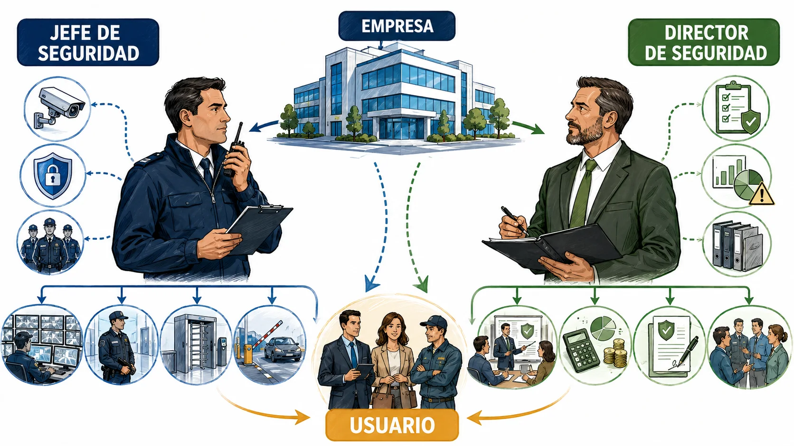

<em>Infografía: Comparación jefe de seguridad y director de seguridad.</em>

<!-- MATERIAL PENDIENTE: t13-p4-audio -->
<!-- MATERIAL PENDIENTE: t13-p4-video -->
<!-- MATERIAL PENDIENTE: t13-p4-pres -->

<!-- FUENTE: L5-2014-T13 -->

## 21. Detectives privados: funciones y límites

El detective investiga hechos privados legítimos, delitos perseguibles a instancia de parte y vigilancia en determinados ámbitos.

- El detective investiga hechos y conductas privadas vinculados a un interés legítimo.
- Puede investigar delitos perseguibles a instancia de parte por encargo legitimado.
- Si conoce un delito perseguible de oficio debe denunciarlo inmediatamente y poner a disposición lo obtenido.

<!-- VISUAL:t13-il-05-investigacion-legitima.webp -->

  

<em>Ilustración: Detective sigue una ruta legítima y se detiene ante el límite de la intimidad.</em>

<!-- MATERIAL PENDIENTE: t13-p4-audio -->
<!-- MATERIAL PENDIENTE: t13-p4-video -->
<!-- MATERIAL PENDIENTE: t13-p4-pres -->

<!-- FUENTE: L5-2014-T13 -->

## 22. Reglas comunes de prestación

Todo servicio debe estar contratado, comunicado cuando proceda y prestarse por personal y empresa habilitados.

- No puede prestarse un servicio de seguridad privada sin contratación previa y, cuando proceda, autorización o comunicación.
- Los contratos deben formalizarse por escrito y comunicarse con la antelación reglamentaria.
- El servicio se presta por personal habilitado integrado en empresa autorizada cuando así lo exige la actividad.

<!-- MATERIAL PENDIENTE: t13-p5-audio -->
<!-- MATERIAL PENDIENTE: t13-p5-video -->
<!-- MATERIAL PENDIENTE: t13-p5-pres -->

<!-- FUENTE: L5-2014-T13 -->

## 23. Vigilancia, protección y armas

Los servicios de vigilancia se prestan en los lugares y condiciones legales; el arma es excepcional y vinculada al servicio.

- La vigilancia puede extenderse fuera de inmuebles en los supuestos expresamente previstos.
- Los servicios con armas se limitan a los supuestos legal o reglamentariamente determinados.
- El arma reglamentaria se porta durante el servicio autorizado y se custodia conforme a la normativa.

<!-- VISUAL:t13-il-06-perimetro-servicio.webp -->

  

<em>Ilustración: Vigilante dentro de un perímetro claro con excepciones señaladas.</em>

<!-- MATERIAL PENDIENTE: t13-p5-audio -->
<!-- MATERIAL PENDIENTE: t13-p5-video -->
<!-- MATERIAL PENDIENTE: t13-p5-pres -->

<!-- FUENTE: L5-2014-T13 -->

## 24. Videovigilancia

La videovigilancia capta, graba, trata y almacena imágenes para prevenir y proteger dentro de límites de proporcionalidad y privacidad.

- La videovigilancia de seguridad debe respetar proporcionalidad y normativa de protección de datos.
- Las cámaras que forman parte de medidas obligatorias o sistemas de alarma no requieren autorización administrativa individual para su instalación o uso en los términos del artículo 42.
- La visualización profesional de sistemas de seguridad corresponde al personal y servicios habilitados cuando la ley lo reserva.

<!-- VISUAL:t13-25-cono-vision.webp -->

  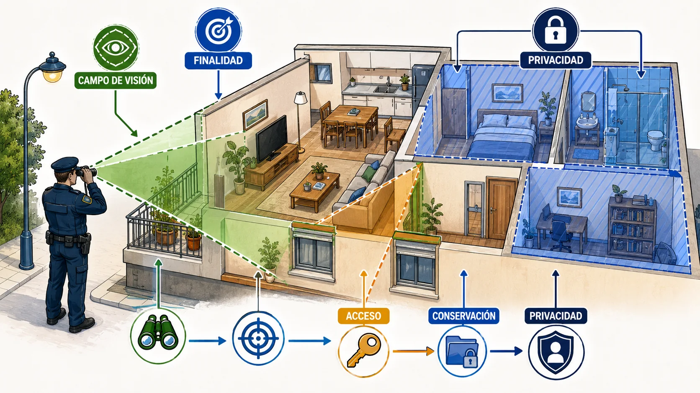

<em>Infografía: Conos de visión permitidos y zonas de privacidad protegida.</em>

<!-- MATERIAL PENDIENTE: t13-p5-audio -->
<!-- MATERIAL PENDIENTE: t13-p5-video -->
<!-- MATERIAL PENDIENTE: t13-p5-pres -->

<!-- FUENTE: L5-2014-T13 -->

## 25. Protección personal, depósito y transporte

La ley diferencia protección de personas, custodia de bienes valiosos y transporte de seguridad.

- La protección personal se presta por escoltas privados en servicios autorizados.
- El depósito de objetos valiosos exige instalaciones y medidas de seguridad adecuadas.
- El transporte de fondos y valores mantiene una cadena de custodia con medios y personal reglamentarios.

<!-- MATERIAL PENDIENTE: t13-p5-audio -->
<!-- MATERIAL PENDIENTE: t13-p5-video -->
<!-- MATERIAL PENDIENTE: t13-p5-pres -->

<!-- FUENTE: L5-2014-T13 -->

## 26. Instalación, mantenimiento y alarmas

Los sistemas conectados a centrales y la gestión de alarmas son actividades reservadas sometidas a verificación y comunicación.

- La instalación de sistemas conectados a centrales receptoras es actividad de seguridad privada.
- La central debe verificar las señales por los procedimientos reglamentarios antes de comunicar cuando así proceda.
- La comunicación a las Fuerzas y Cuerpos de Seguridad debe aportar datos útiles sobre la alarma.

<!-- MATERIAL PENDIENTE: t13-p5-audio -->
<!-- MATERIAL PENDIENTE: t13-p5-video -->
<!-- MATERIAL PENDIENTE: t13-p5-pres -->

<!-- FUENTE: L5-2014-T13,OINT316-2011-T13 -->

## 27. Investigación privada e informes

El informe documenta hechos investigados, medios y resultados dentro del encargo legítimo.

- El informe de investigación se entrega al cliente legitimado y documenta el resultado del encargo.
- Los informes y soportes se conservan durante el plazo legal con medidas de reserva.
- La investigación no puede utilizar medios que vulneren honor, intimidad, imagen o secreto de comunicaciones.

<!-- VISUAL:t13-il-07-informe-bajo-llave.webp -->

  

<em>Ilustración: Informe de detective guardado bajo llave y entregado al destinatario legítimo.</em>

<!-- MATERIAL PENDIENTE: t13-p5-audio -->
<!-- MATERIAL PENDIENTE: t13-p5-video -->
<!-- MATERIAL PENDIENTE: t13-p5-pres -->

<!-- FUENTE: L5-2014-T13 -->

## 28. Adopción y tipos de medidas de seguridad

Las medidas pueden imponerse por norma o resolución y combinar componentes físicos, electrónicos, informáticos, organizativos y personales.

- Las medidas de seguridad pueden ser físicas, electrónicas, informáticas, organizativas o personales.
- Determinados establecimientos están obligados a adoptar medidas por su riesgo.
- Los elementos deben cumplir homologación, certificación o verificación cuando sea preceptivo.

<!-- VISUAL:t13-29-capas-medidas.webp -->

  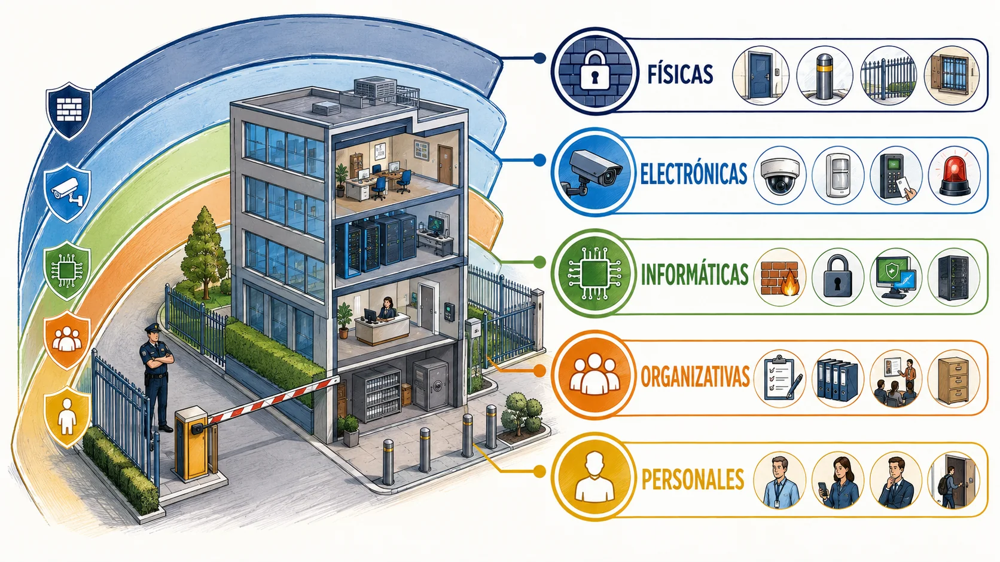

<em>Infografía: Edificio protegido por capas físicas, electrónicas, organizativas y personales.</em>

<!-- MATERIAL PENDIENTE: t13-p6-audio -->
<!-- MATERIAL PENDIENTE: t13-p6-video -->
<!-- MATERIAL PENDIENTE: t13-p6-pres -->

<!-- FUENTE: L5-2014-T13,OINT317-2011-T13 -->

## 29. Establecimientos obligados y medidas específicas

Entidades de crédito, joyerías, estaciones de servicio, farmacias, administraciones de lotería y otros establecimientos tienen reglas diferenciadas.

- Las entidades de crédito deben adoptar las medidas específicas previstas para su actividad.
- Joyerías y establecimientos de especial riesgo tienen obligaciones adaptadas a valores y exposición.
- Las administraciones de lotería están entre los establecimientos con medidas específicas, pero cada obligación debe comprobarse en la norma vigente.

<!-- MATERIAL PENDIENTE: t13-p6-audio -->
<!-- MATERIAL PENDIENTE: t13-p6-video -->
<!-- MATERIAL PENDIENTE: t13-p6-pres -->

<!-- FUENTE: OINT317-2011-T13 -->

## 30. Inspección y deber de colaboración

Las Fuerzas y Cuerpos de Seguridad inspeccionan entidades, servicios, personal y medidas dentro de su competencia.

- La inspección puede abarcar empresas, despachos, servicios, personal, centros y establecimientos obligados.
- Los inspeccionados deben facilitar información y acceso a documentación exigible.
- El acta de inspección documenta hechos sin sustituir por sí sola la resolución sancionadora.

<!-- VISUAL:t13-il-08-inspeccion-en-capas.webp -->

  

<em>Ilustración: Equipo inspector revisa documentos, personal, sistema y establecimiento.</em>

<!-- MATERIAL PENDIENTE: t13-p6-audio -->
<!-- MATERIAL PENDIENTE: t13-p6-video -->
<!-- MATERIAL PENDIENTE: t13-p6-pres -->

<!-- FUENTE: L5-2014-T13 -->

## 31. Control, corrección y repaso operativo

Resolver bien exige identificar sujeto, actividad, autorización, personal, función, servicio, medida y órgano de control.

- La calificación correcta comienza por identificar quién actúa y qué actividad o función realiza.
- Después se comprueban habilitación, autorización, contrato, lugar y límites de la actuación.
- La cooperación policial no transforma al personal privado en funcionario, salvo la protección jurídica concreta prevista.

<!-- VISUAL:t13-32-tablero-ocho-casillas.webp -->

  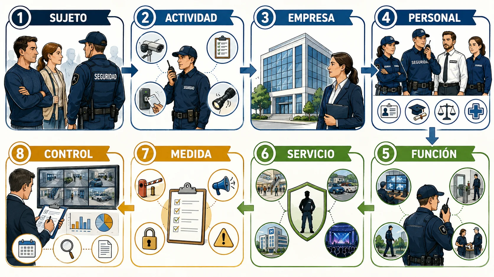

<em>Infografía: Tablero de ocho casillas para resolver supuestos de seguridad privada.</em>

<!-- MATERIAL PENDIENTE: t13-p6-audio -->
<!-- MATERIAL PENDIENTE: t13-p6-video -->
<!-- MATERIAL PENDIENTE: t13-p6-pres -->

<!-- FUENTE: L5-2014-T13 -->

# Hablemos claro

:::hablemos-claro
Lee primero el sujeto, después la figura jurídica y por último la competencia, el procedimiento o el efecto.
:::

# En la calle

:::en-la-calle
Una actuación correcta fija hechos, activa garantías y documenta el cauce empleado antes de llegar a la conclusión.
:::

# Lo que cae

:::lo-que-cae
Prioriza definiciones próximas, sujetos competentes, secuencias, límites, excepciones y diferencias entre figuras vecinas.
:::

# Ha caído

:::ha-caido
Las coincidencias históricas se conservan en el índice interno y permanecen ocultas mientras no exista plantilla oficial final verificada.
:::

---

*Academia En Vigor · El temario que nunca duerme · Tema 13 · v1.0.0 · Documento interno no publicado.*
