# TEMA 14 · LEY ORGÁNICA 4/2015 DE PROTECCIÓN DE LA SEGURIDAD CIUDADANA

**Policía Nacional · Método VIGOR · PARTE**
**Versión de contenido:** 1.0.0
**Estado editorial:** approved_internal · **Publicación:** not_published

# Mapa del tema

<!-- VISUAL:t14-01-mapa-general.webp -->

  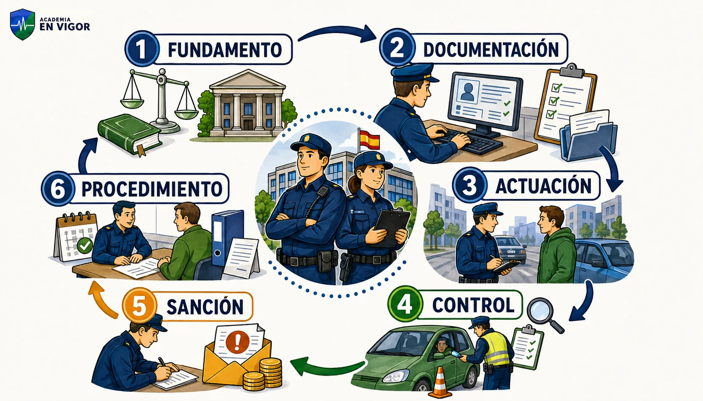

<em>Infografía: recorrido visual por las seis partes y sus relaciones.</em>

El Tema 14 se estudia como un sistema de decisiones enlazadas, no como una colección de listas aisladas.

# Contenido

## 01. Mapa de la Ley Orgánica 4/2015

El Tema 14 recorre la Ley Orgánica 4/2015 desde sus principios hasta la ejecución de las sanciones.

- El epígrafe oficial exige estudiar disposiciones generales, documentación, actuaciones de mantenimiento, potestades administrativas especiales y régimen sancionador.
- La Ley Orgánica 4/2015 se estructura en cinco capítulos.
- La lectura vigente debe integrar el texto legal, sus modificaciones y las interpretaciones del Tribunal Constitucional.

<!-- VISUAL:t14-02-mapa-cinco-capitulos.webp -->

  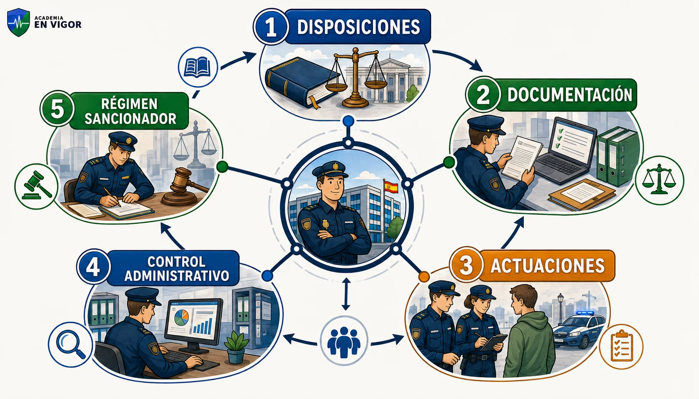

<em>Infografía: Mapa funcional de los cinco capítulos y su conexión.</em>

<!-- MATERIAL PENDIENTE: t14-p1-audio -->
<!-- MATERIAL PENDIENTE: t14-p1-video -->
<!-- MATERIAL PENDIENTE: t14-p1-pres -->

<!-- FUENTE: CONV-PN-2026,LO4-2015-T14 -->

## 02. Objeto y ámbito de aplicación

La seguridad ciudadana es un bien jurídico colectivo ligado al ejercicio efectivo de derechos y libertades.

- La salvaguarda de la seguridad ciudadana, como bien jurídico colectivo, es función del Estado con sujeción a la Constitución y las leyes.
- La ley tutela la seguridad ciudadana mediante la protección de personas y bienes y el mantenimiento de la tranquilidad ciudadana.
- La Ley Orgánica 4/2015 se aplica en todo el territorio nacional sin perjuicio de las competencias autonómicas asumidas.

<!-- VISUAL:t14-03-objeto-ambito.webp -->

  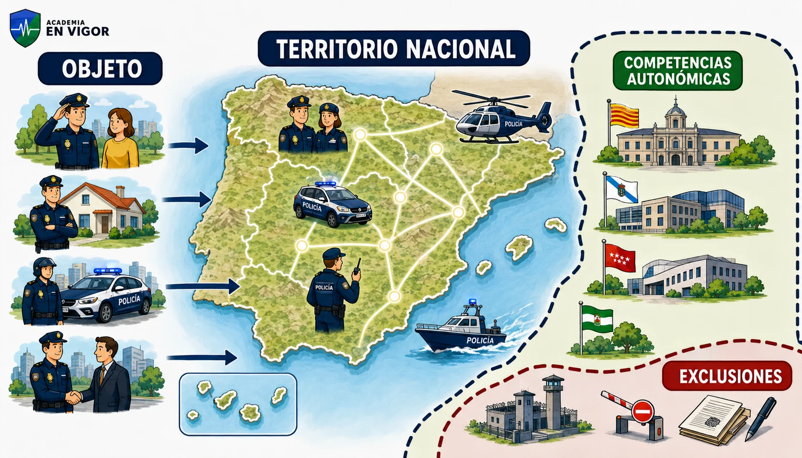

<em>Infografía: Diagrama objeto, territorio y exclusiones.</em>

<!-- MATERIAL PENDIENTE: t14-p1-audio -->
<!-- MATERIAL PENDIENTE: t14-p1-video -->
<!-- MATERIAL PENDIENTE: t14-p1-pres -->

<!-- FUENTE: LO4-2015-T14 -->

## 03. Fines de la ley

Los fines legales convierten la seguridad en protección concreta de derechos, instituciones, convivencia y servicios esenciales.

- La protección del libre ejercicio de derechos y libertades y de los demás derechos reconocidos por el ordenamiento es un fin de la ley.
- La preservación de la seguridad y la convivencia ciudadanas forma parte de los fines legales.
- La ley incluye entre sus fines la prevención de delitos e infracciones administrativas directamente relacionadas con sus objetivos.

<!-- VISUAL:t14-il-01-equilibrio-libertad-seguridad.webp -->

  

<em>Ilustración: Escena dibujada de convivencia protegida con libertad y seguridad en equilibrio.</em>

<!-- MATERIAL PENDIENTE: t14-p1-audio -->
<!-- MATERIAL PENDIENTE: t14-p1-video -->
<!-- MATERIAL PENDIENTE: t14-p1-pres -->

<!-- FUENTE: LO4-2015-T14 -->

## 04. Principios de actuación y control

La intervención está sometida a legalidad, igualdad, proporcionalidad, control judicial y respeto de derechos.

- La intervención debe regirse por legalidad, igualdad de trato y no discriminación, oportunidad, proporcionalidad, eficacia, eficiencia y responsabilidad.
- La actividad de intervención se justifica por una amenaza concreta o un comportamiento objetivamente peligroso susceptible de provocar un perjuicio real.
- Las medidas limitativas de derechos deben interpretarse y aplicarse del modo más favorable a la plena efectividad de los derechos fundamentales.

<!-- VISUAL:t14-05-triple-test-proporcionalidad.webp -->

  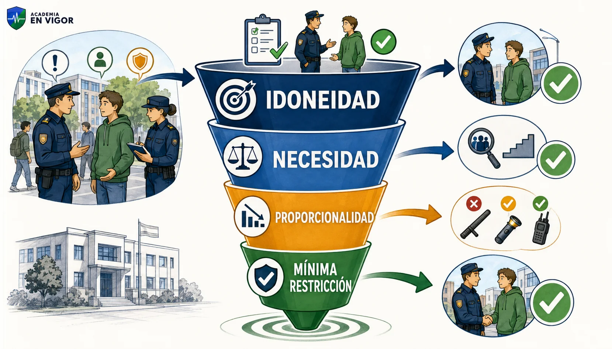

<em>Infografía: Test de idoneidad, necesidad y proporcionalidad.</em>

<!-- MATERIAL PENDIENTE: t14-p1-audio -->
<!-- MATERIAL PENDIENTE: t14-p1-video -->
<!-- MATERIAL PENDIENTE: t14-p1-pres -->

<!-- FUENTE: LO4-2015-T14,CE-T14 -->

## 05. Autoridades, cooperación y deber de colaboración

La ley distribuye autoridad, cooperación administrativa y colaboración de funcionarios, particulares y seguridad privada.

- El Ministro del Interior y el Secretario de Estado de Seguridad son autoridades competentes en materia de seguridad ciudadana.
- Las administraciones con competencias se relacionan conforme a cooperación y lealtad institucional.
- La ayuda recabada de particulares debe ser necesaria y no puede implicar riesgo personal para ellos.

<!-- VISUAL:t14-06-red-autoridades-colaboracion.webp -->

  

<em>Infografía: Red de autoridades y niveles de colaboración.</em>

<!-- MATERIAL PENDIENTE: t14-p1-audio -->
<!-- MATERIAL PENDIENTE: t14-p1-video -->
<!-- MATERIAL PENDIENTE: t14-p1-pres -->

<!-- FUENTE: LO4-2015-T14 -->

## 06. DNI: naturaleza y valor acreditativo

El DNI es público, oficial, personal e intransferible y acredita por sí solo identidad y datos personales.

- El DNI es el único documento con suficiente valor por sí solo para acreditar, a todos los efectos, la identidad y los datos personales de su titular.
- El Real Decreto 255/2025 regula el DNI en sus versiones física y digital.
- La identificación digital mediante DNI puede realizarse de forma presencial o remota por un procedimiento seguro.

<!-- VISUAL:t14-07-dni-fisico-digital.webp -->

  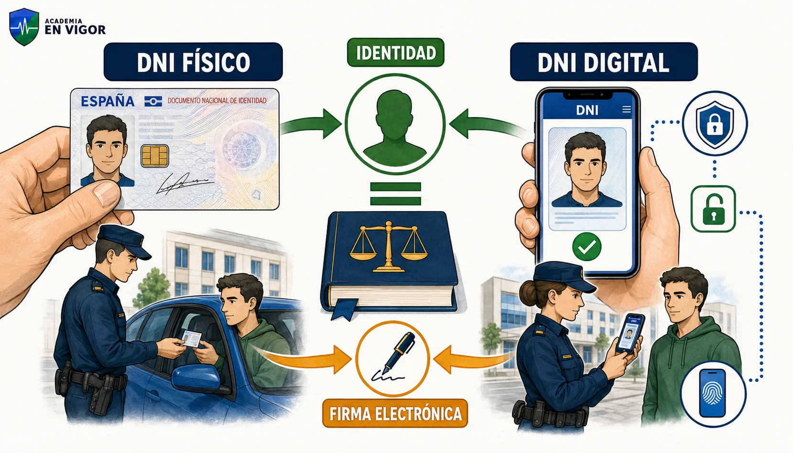

<em>Infografía: Comparativa operativa entre DNI físico y DNI digital.</em>

<!-- MATERIAL PENDIENTE: t14-p2-audio -->
<!-- MATERIAL PENDIENTE: t14-p2-video -->
<!-- MATERIAL PENDIENTE: t14-p2-pres -->

<!-- FUENTE: LO4-2015-T14,RDL14-2019-T14,RD255-2025-T14 -->

## 07. DNI: obtención, custodia y exhibición

La ley diferencia obtener el DNI, conservarlo vigente, custodiarlo y exhibirlo cuando proceda.

- La obtención del DNI es obligatoria a partir de los catorce años en los términos reglamentarios.
- El titular debe mantener el DNI en vigor y custodiarlo con diligencia.
- La obligación de exhibir el DNI cuando exista requerimiento legal no equivale a una obligación general de llevar siempre la tarjeta física.

<!-- VISUAL:t14-il-02-identidad-dos-formatos.webp -->

  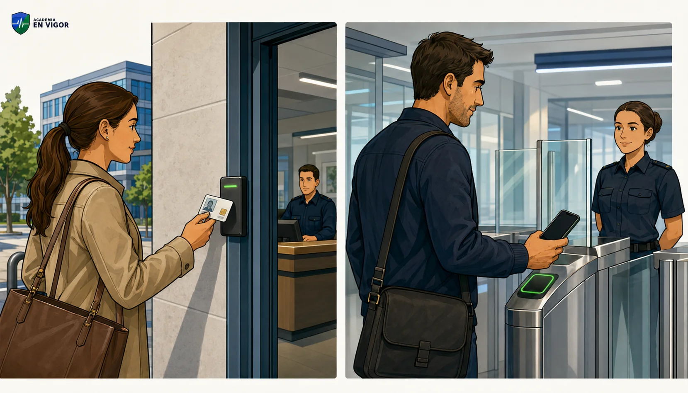

<em>Ilustración: Persona identificándose de forma segura con tarjeta o móvil en dos escenas dibujadas.</em>

<!-- MATERIAL PENDIENTE: t14-p2-audio -->
<!-- MATERIAL PENDIENTE: t14-p2-video -->
<!-- MATERIAL PENDIENTE: t14-p2-pres -->

<!-- FUENTE: LO4-2015-T14,RD255-2025-T14 -->

## 08. Contenido del DNI y protección de datos

El contenido del DNI combina datos identificativos, medidas antifalsificación y funciones electrónicas.

- El DNI incorpora fotografía, firma y los datos personales determinados reglamentariamente con respeto a la intimidad.
- El DNI no puede contener datos relativos, entre otros, a raza, religión, opinión o afiliación sindical.
- La tarjeta soporte incorpora medidas de seguridad para impedir su falsificación y manipulación.

<!-- VISUAL:t14-09-datos-si-datos-no.webp -->

  

<em>Infografía: Matriz visual de datos identificativos y datos excluidos.</em>

<!-- MATERIAL PENDIENTE: t14-p2-audio -->
<!-- MATERIAL PENDIENTE: t14-p2-video -->
<!-- MATERIAL PENDIENTE: t14-p2-pres -->

<!-- FUENTE: LO4-2015-T14,RD255-2025-T14 -->

## 09. Competencia y gestión del DNI

La dirección y gestión del DNI corresponden al Ministerio del Interior y se ejercen por la Dirección General de la Policía.

- Corresponde al Ministerio del Interior la competencia exclusiva sobre dirección, organización y gestión del DNI.
- La Dirección General de la Policía ejerce la gestión del Documento Nacional de Identidad.
- A cada DNI se asigna un número personal con consideración de identificador numérico personal de carácter general.

<!-- MATERIAL PENDIENTE: t14-p2-audio -->
<!-- MATERIAL PENDIENTE: t14-p2-video -->
<!-- MATERIAL PENDIENTE: t14-p2-pres -->

<!-- FUENTE: LO4-2015-T14,RD255-2025-T14 -->

## 10. Pasaporte de ciudadanos españoles

El pasaporte acredita identidad y nacionalidad fuera de España y, dentro, las de los españoles no residentes.

- El pasaporte español acredita, salvo prueba en contrario, identidad y nacionalidad de los españoles fuera de España.
- En territorio nacional la competencia para expedir el pasaporte corresponde a la Dirección General de la Policía.
- En el extranjero el pasaporte es expedido por las representaciones diplomáticas y consulares de España.

<!-- VISUAL:t14-11-pasaporte-dos-canales.webp -->

  

<em>Infografía: Dos canales de expedición del pasaporte dentro y fuera de España.</em>

<!-- MATERIAL PENDIENTE: t14-p2-audio -->
<!-- MATERIAL PENDIENTE: t14-p2-video -->
<!-- MATERIAL PENDIENTE: t14-p2-pres -->

<!-- FUENTE: LO4-2015-T14 -->

## 11. Documentación de ciudadanos extranjeros

Los extranjeros deben conservar y portar su documentación de identidad y la acreditativa de su situación regular.

- Los extranjeros en España tienen derecho y obligación de conservar y portar la documentación de identidad y la de su situación regular.
- La documentación de origen no puede retirarse salvo en el curso de investigaciones judiciales de carácter penal.
- Si no llevan la documentación consigo, los extranjeros pueden demostrar su identidad por cualquier otro medio.

<!-- MATERIAL PENDIENTE: t14-p2-audio -->
<!-- MATERIAL PENDIENTE: t14-p2-video -->
<!-- MATERIAL PENDIENTE: t14-p2-pres -->

<!-- FUENTE: LO4-2015-T14 -->

## 12. Órdenes, prohibiciones y motivación

Las autoridades pueden ordenar, prohibir y disponer actuaciones solo dentro de la ley y con motivación.

- Las órdenes y prohibiciones del artículo 14 deben adoptarse mediante resolución debidamente motivada.
- Las actuaciones policiales dispuestas deben ser estrictamente necesarias para los fines de la ley.
- Las autoridades competentes actúan de conformidad con las leyes y reglamentos.

<!-- VISUAL:t14-13-formula-orden-valida.webp -->

  

<em>Infografía: Fórmula visual de una orden válida y motivada.</em>

<!-- MATERIAL PENDIENTE: t14-p3-audio -->
<!-- MATERIAL PENDIENTE: t14-p3-video -->
<!-- MATERIAL PENDIENTE: t14-p3-pres -->

<!-- FUENTE: LO4-2015-T14 -->

## 13. Entrada en domicilio y edificios públicos

El domicilio mantiene protección constitucional; la ley añade una causa urgente para evitar daños inminentes y graves.

- La entrada y registro en domicilio solo procede en los casos permitidos por la Constitución y en los términos legales.
- Evitar daños inminentes y graves en catástrofe, calamidad, ruina inminente u otra extrema y urgente necesidad es causa legítima suficiente.
- Tras entrar en un domicilio por las causas del artículo 15, el acta o atestado se remite sin dilación a la autoridad judicial competente.

<!-- VISUAL:t14-il-03-domicilio-emergencia.webp -->

  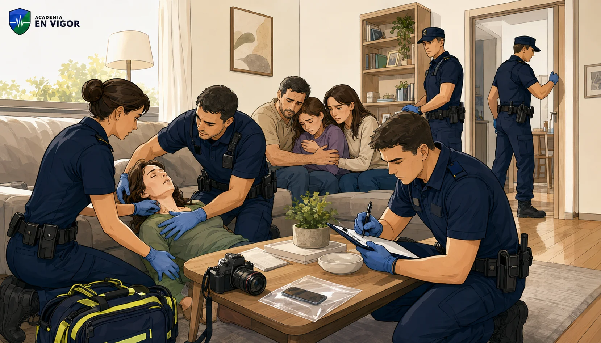

<em>Ilustración: Escena dibujada de rescate urgente en domicilio con posterior documentación judicial.</em>

<!-- MATERIAL PENDIENTE: t14-p3-audio -->
<!-- MATERIAL PENDIENTE: t14-p3-video -->
<!-- MATERIAL PENDIENTE: t14-p3-pres -->

<!-- FUENTE: LO4-2015-T14,CE-T14 -->

## 14. Supuestos para requerir identificación

La identificación no es indiscriminada: exige indicios de participación en una infracción o necesidad razonable de prevenir un delito.

- Puede requerirse identificación cuando existan indicios de participación en una infracción.
- También procede cuando sea razonablemente necesario acreditar la identidad para prevenir la comisión de un delito.
- Puede comprobarse la identidad de quien cubra su rostro cuando ello impida o dificulte identificar y resulte preciso para los fines legales.

<!-- VISUAL:t14-15-dos-puertas-identificacion.webp -->

  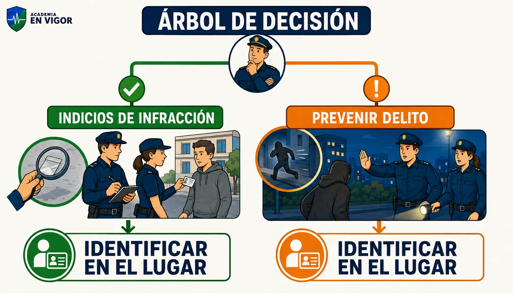

<em>Infografía: Árbol de decisión de los dos supuestos de identificación.</em>

<!-- MATERIAL PENDIENTE: t14-p3-audio -->
<!-- MATERIAL PENDIENTE: t14-p3-video -->
<!-- MATERIAL PENDIENTE: t14-p3-pres -->

<!-- FUENTE: LO4-2015-T14 -->

## 15. Traslado para identificación: límites y garantías

El acompañamiento a dependencias es subsidiario, finalista y temporalmente limitado.

- El traslado para identificar solo procede si no es posible la identificación por cualquier medio o si la persona se niega.
- La permanencia a efectos exclusivos de identificación no puede superar seis horas.
- A la salida debe entregarse un volante con tiempo de permanencia, causa e identidad de los agentes actuantes.

<!-- VISUAL:t14-16-reloj-seis-horas.webp -->

  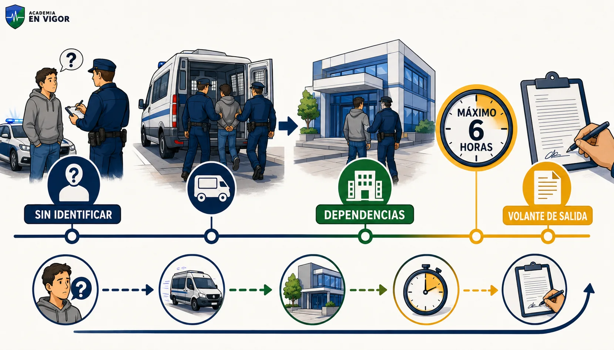

<em>Infografía: Cronología garantista del traslado de identificación.</em>

<!-- MATERIAL PENDIENTE: t14-p3-audio -->
<!-- MATERIAL PENDIENTE: t14-p3-video -->
<!-- MATERIAL PENDIENTE: t14-p3-pres -->

<!-- FUENTE: LO4-2015-T14 -->

## 16. Igualdad, información y registro de identificaciones

La identificación debe ser proporcionada, no discriminatoria, explicada y documentada cuando hay traslado.

- La identificación debe respetar estrictamente proporcionalidad, igualdad de trato y no discriminación.
- La persona debe ser informada de modo inmediato y comprensible de las razones de la identificación.
- El órgano competente remite mensualmente al Ministerio Fiscal un extracto de las diligencias con el tiempo empleado.

<!-- MATERIAL PENDIENTE: t14-p3-audio -->
<!-- MATERIAL PENDIENTE: t14-p3-video -->
<!-- MATERIAL PENDIENTE: t14-p3-pres -->

<!-- FUENTE: LO4-2015-T14 -->

## 17. Restricción del tránsito y controles

La restricción de circulación responde a alteración o indicios racionales de alteración y dura lo imprescindible.

- Puede limitarse la circulación o permanencia ante alteración de la seguridad o indicios racionales de que vaya a producirse.
- Las zonas de seguridad se mantienen por el tiempo imprescindible para mantener o restablecer la seguridad.
- Los controles del artículo 17.2 se vinculan a delitos de especial gravedad o generadores de alarma social.

<!-- VISUAL:t14-18-zona-control.webp -->

  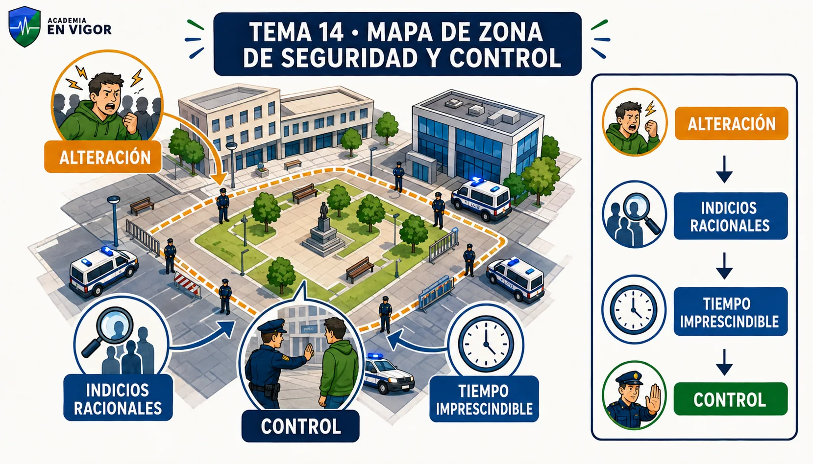

<em>Infografía: Mapa de zona de seguridad y control con requisitos.</em>

<!-- MATERIAL PENDIENTE: t14-p3-audio -->
<!-- MATERIAL PENDIENTE: t14-p3-video -->
<!-- MATERIAL PENDIENTE: t14-p3-pres -->

<!-- FUENTE: LO4-2015-T14 -->

## 18. Comprobaciones, registros e intervención

La ley permite comprobaciones en personas, bienes y vehículos ante indicios de objetos peligrosos o ilícitos.

- Las comprobaciones del artículo 18 requieren indicios de la eventual presencia de armas, explosivos u otros objetos de riesgo.
- Los agentes pueden intervenir los objetos detectados cuando proceda legalmente.
- La aprehensión durante la diligencia debe reflejarse en acta, que se firma por el interesado o deja constancia de su negativa.

<!-- VISUAL:t14-19-cadena-comprobacion.webp -->

  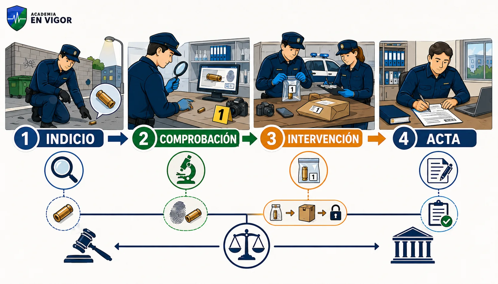

<em>Infografía: Cadena desde el indicio hasta el acta de intervención.</em>

<!-- MATERIAL PENDIENTE: t14-p3-audio -->
<!-- MATERIAL PENDIENTE: t14-p3-video -->
<!-- MATERIAL PENDIENTE: t14-p3-pres -->

<!-- FUENTE: LO4-2015-T14 -->

## 19. Registro corporal externo

El registro externo y superficial exige indicios racionales y una ejecución respetuosa con intimidad y dignidad.

- El registro corporal externo exige indicios racionales de que permitirá hallar objetos relevantes para funciones de indagación o prevención.
- Salvo urgencia por riesgo grave e inminente para los agentes, lo realiza un agente del mismo sexo.
- Si deja a la vista partes normalmente cubiertas, se realiza en lugar reservado y se deja constancia escrita.

<!-- VISUAL:t14-il-04-registro-con-garantias.webp -->

  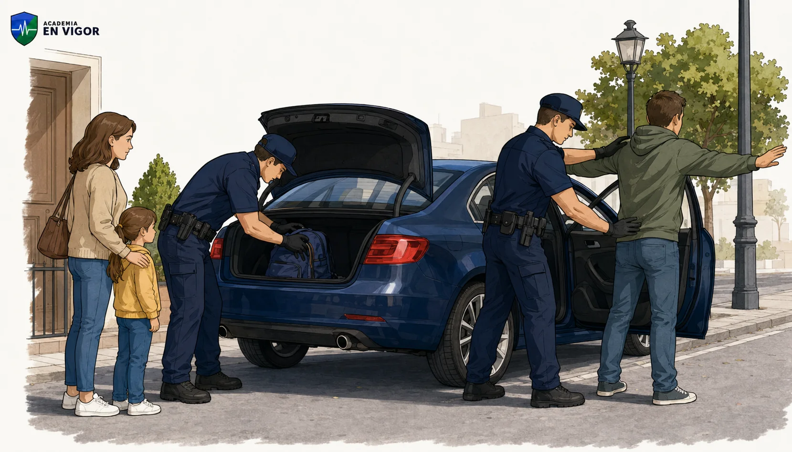

<em>Ilustración: Escena dibujada sobria de registro externo con privacidad y explicación.</em>

<!-- MATERIAL PENDIENTE: t14-p3-audio -->
<!-- MATERIAL PENDIENTE: t14-p3-video -->
<!-- MATERIAL PENDIENTE: t14-p3-pres -->

<!-- FUENTE: LO4-2015-T14,STC13-2021-T14 -->

## 20. Medidas extraordinarias y videocámaras

En emergencia pueden adoptarse medidas intensas, pero solo mientras sean imprescindibles.

- Las medidas extraordinarias se adoptan en situaciones de emergencia y durante el tiempo estrictamente necesario.
- Si la urgencia lo hace imprescindible, los agentes pueden adoptar estas medidas incluso mediante órdenes verbales.
- La grabación mediante videocámaras fijas o móviles exige autorización legal y sujeción a la legislación vigente.

<!-- VISUAL:t14-21-medidas-emergencia.webp -->

  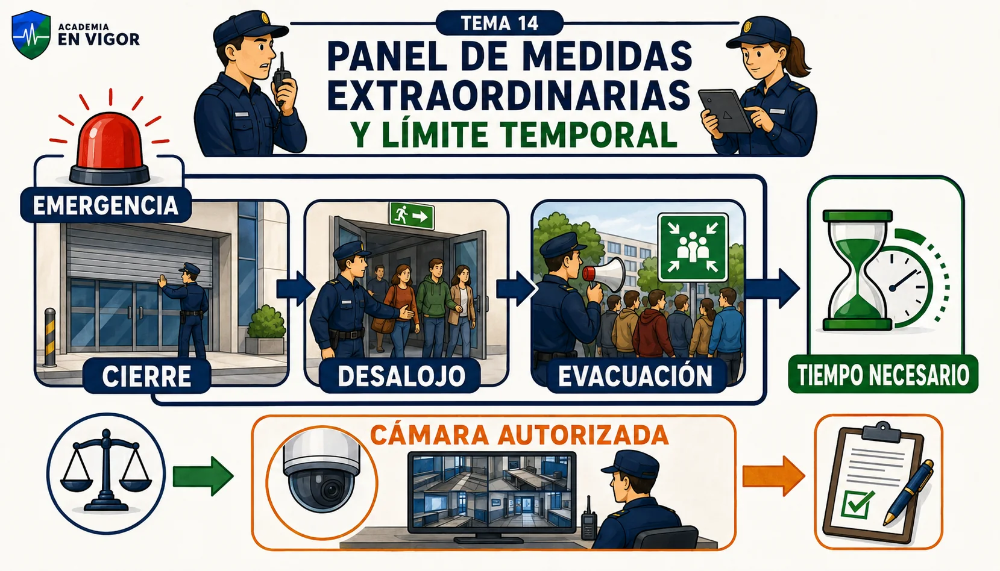

<em>Infografía: Panel de medidas extraordinarias y límite temporal.</em>

<!-- MATERIAL PENDIENTE: t14-p3-audio -->
<!-- MATERIAL PENDIENTE: t14-p3-video -->
<!-- MATERIAL PENDIENTE: t14-p3-pres -->

<!-- FUENTE: LO4-2015-T14 -->

## 21. Reuniones y manifestaciones

La primera obligación de la autoridad es proteger la celebración; la disolución es el último recurso.

- La autoridad debe adoptar medidas para proteger reuniones y manifestaciones e impedir perturbaciones de la seguridad.
- La disolución de reuniones y manifestaciones constituye el último recurso.
- Ante alteración con armas, explosivos u otros objetos peligrosos puede disolverse sin previo aviso.

<!-- VISUAL:t14-il-05-reunion-protegida.webp -->

  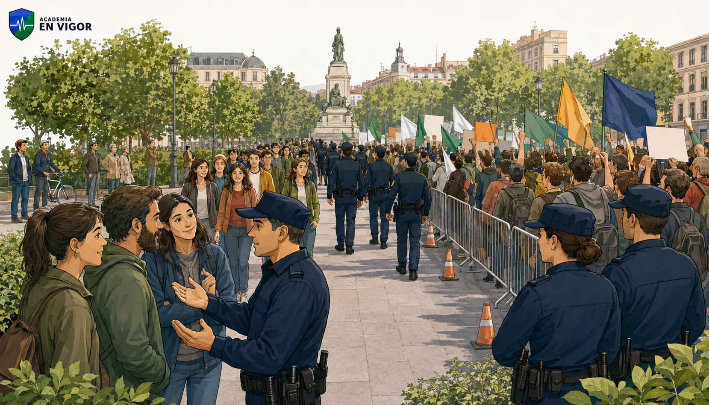

<em>Ilustración: Manifestación dibujada con mediación, itinerario seguro y escalada gradual.</em>

<!-- MATERIAL PENDIENTE: t14-p3-audio -->
<!-- MATERIAL PENDIENTE: t14-p3-video -->
<!-- MATERIAL PENDIENTE: t14-p3-pres -->

<!-- FUENTE: LO4-2015-T14,LO9-1983-T14 -->

## 22. Registro documental de actividades relevantes

Determinadas actividades privadas deben registrar e informar por su relevancia para la seguridad ciudadana.

- Los centros gestores de residuos metálicos pueden quedar sujetos a registro documental e información.
- La compraventa de joyas y metales es una actividad relevante sometida a las obligaciones aplicables.
- Los titulares de embarcaciones de alta velocidad y aeronaves ligeras deben cumplir las actuaciones documentales previstas en la normativa.

<!-- VISUAL:t14-23-radar-actividades.webp -->

  

<em>Infografía: Radar sectorial de actividades con registro documental.</em>

<!-- MATERIAL PENDIENTE: t14-p4-audio -->
<!-- MATERIAL PENDIENTE: t14-p4-video -->
<!-- MATERIAL PENDIENTE: t14-p4-pres -->

<!-- FUENTE: LO4-2015-T14 -->

## 23. Establecimientos, espectáculos y actividades recreativas

La ley permite imponer medidas de seguridad a instalaciones vulnerables y preservar la celebración pacífica de espectáculos.

- Puede exigirse reglamentariamente adoptar medidas de seguridad en instalaciones vulnerables o que generen riesgos directos.
- Un espectáculo puede prohibirse o suspenderse ante peligro cierto para personas o bienes.
- Los espectáculos deportivos quedan sujetos a la legislación específica contra violencia, racismo, xenofobia e intolerancia.

<!-- VISUAL:t14-il-06-espectaculo-seguro.webp -->

  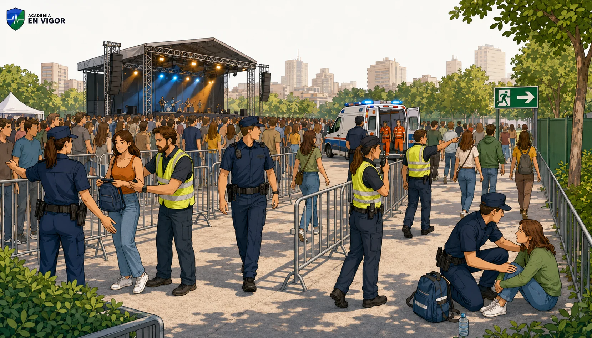

<em>Ilustración: Escena dibujada de evento público con accesos, prevención y evacuación.</em>

<!-- MATERIAL PENDIENTE: t14-p4-audio -->
<!-- MATERIAL PENDIENTE: t14-p4-video -->
<!-- MATERIAL PENDIENTE: t14-p4-pres -->

<!-- FUENTE: LO4-2015-T14 -->

## 24. Armas, explosivos y competencia administrativa

El Gobierno regula requisitos y controles; el Ministerio del Interior interviene a través de la Dirección General de la Guardia Civil.

- La intervención de armas, explosivos, cartuchería y pirotecnia corresponde al Ministerio del Interior a través de la Dirección General de la Guardia Civil.
- El Gobierno regula requisitos de fabricación, reparación, circulación, almacenamiento, comercio, adquisición, tenencia y uso.
- El control incluye inspección y comprobación de medidas de seguridad en fábricas, talleres, depósitos y lugares de utilización.

<!-- VISUAL:t14-25-competencia-armas.webp -->

  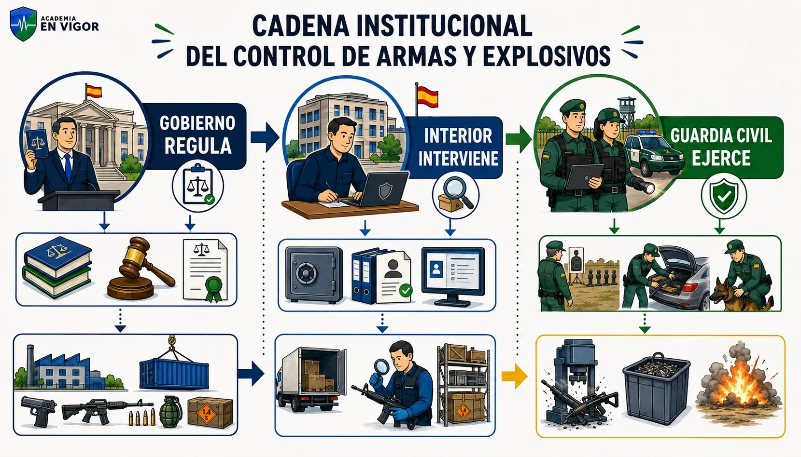

<em>Infografía: Cadena institucional del control de armas y explosivos.</em>

<!-- MATERIAL PENDIENTE: t14-p4-audio -->
<!-- MATERIAL PENDIENTE: t14-p4-video -->
<!-- MATERIAL PENDIENTE: t14-p4-pres -->

<!-- FUENTE: LO4-2015-T14 -->

## 25. Medidas de control sobre armas y explosivos

El control combina autorizaciones, inspección, habilitación de personal y prohibiciones sobre materiales peligrosos.

- Las licencias para armas de defensa personal tienen carácter restrictivo y se limitan a supuestos de estricta necesidad.
- Para conceder licencias se tienen en cuenta la conducta y los antecedentes del interesado.
- El solicitante presta consentimiento expreso para recabar sus antecedentes penales.

<!-- MATERIAL PENDIENTE: t14-p4-audio -->
<!-- MATERIAL PENDIENTE: t14-p4-video -->
<!-- MATERIAL PENDIENTE: t14-p4-pres -->

<!-- FUENTE: LO4-2015-T14 -->

## 26. Sujetos responsables y menores

La responsabilidad recae directamente en el autor; los menores de catorce años están exentos.

- La responsabilidad por la infracción recae directamente en el autor del hecho.
- Los menores de catorce años están exentos de responsabilidad por las infracciones de esta ley.
- Puede ser organizador quien de hecho presida o dirija la reunión aunque no haya firmado la comunicación.

<!-- VISUAL:t14-27-sujetos-responsables.webp -->

  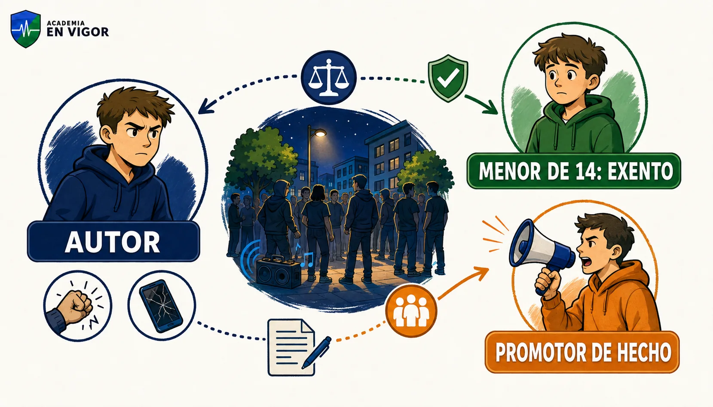

<em>Infografía: Mapa de autor, menor y promotor de reunión.</em>

<!-- MATERIAL PENDIENTE: t14-p5-audio -->
<!-- MATERIAL PENDIENTE: t14-p5-video -->
<!-- MATERIAL PENDIENTE: t14-p5-pres -->

<!-- FUENTE: LO4-2015-T14 -->

## 27. Concurso de normas y órganos sancionadores

Las reglas concursales evitan castigar dos veces el mismo desvalor y la competencia cambia con gravedad y grado.

- El precepto especial se aplica con preferencia al general.
- El Ministro del Interior sanciona las infracciones muy graves en grado máximo.
- Los Delegados del Gobierno sancionan en la Administración General del Estado las infracciones graves y leves.

<!-- VISUAL:t14-28-escalera-competencia.webp -->

  

<em>Infografía: Escalera de órganos sancionadores y reglas concursales.</em>

<!-- MATERIAL PENDIENTE: t14-p5-audio -->
<!-- MATERIAL PENDIENTE: t14-p5-video -->
<!-- MATERIAL PENDIENTE: t14-p5-pres -->

<!-- FUENTE: LO4-2015-T14 -->

## 28. Graduación de las sanciones

Las multas graves y muy graves se dividen en grados mínimo, medio y máximo.

- Una infracción grave o muy grave se sanciona de partida en grado mínimo.
- La reincidencia relevante para el grado medio exige más de una infracción de la misma naturaleza en dos años declarada por resolución firme.
- El grado máximo solo procede cuando los hechos revistan especial gravedad y se justifique.

<!-- MATERIAL PENDIENTE: t14-p5-audio -->
<!-- MATERIAL PENDIENTE: t14-p5-video -->
<!-- MATERIAL PENDIENTE: t14-p5-pres -->

<!-- FUENTE: LO4-2015-T14 -->

## 29. Infracciones muy graves

La ley contiene cuatro infracciones muy graves, ligadas a riesgo vital, perjuicios muy graves o desobediencia a prohibiciones de seguridad.

- La intrusión en una infraestructura básica es muy grave cuando genera riesgo para la vida o integridad física.
- Las conductas irregulares con armas o explosivos son muy graves cuando, además de no ser delito, causan perjuicios muy graves.
- Proyectar haces de luz sobre pilotos o conductores es muy grave si puede deslumbrar o distraer y provocar accidentes.

<!-- VISUAL:t14-30-cuatro-muy-graves.webp -->

  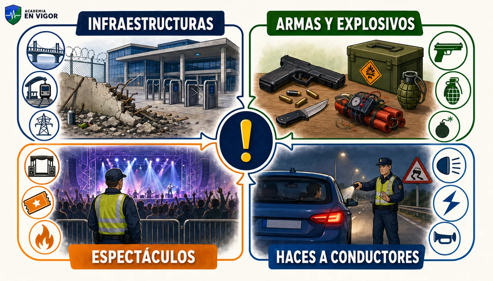

<em>Infografía: Panel de las cuatro infracciones muy graves.</em>

<!-- MATERIAL PENDIENTE: t14-p5-audio -->
<!-- MATERIAL PENDIENTE: t14-p5-video -->
<!-- MATERIAL PENDIENTE: t14-p5-pres -->

<!-- FUENTE: LO4-2015-T14 -->

## 30. Infracciones graves: orden público y reuniones

Los primeros tipos graves protegen actos multitudinarios, instituciones, vías, servicios públicos y reuniones lícitas.

- La negativa a identificarse a requerimiento legítimo puede constituir infracción grave cuando no sea delito.
- Obstaculizar servicios de emergencia es grave si provoca o incrementa riesgo o agrava las consecuencias del suceso.
- Perturbar una reunión o manifestación lícita es grave cuando no constituye infracción penal.

<!-- MATERIAL PENDIENTE: t14-p5-audio -->
<!-- MATERIAL PENDIENTE: t14-p5-video -->
<!-- MATERIAL PENDIENTE: t14-p5-pres -->

<!-- FUENTE: LO4-2015-T14 -->

## 31. Infracciones graves: armas, servicios y drogas

El segundo grupo grave abarca infraestructuras, armas, inspecciones, colaboración y conductas relacionadas con drogas.

- Portar un arma incluso con licencia puede ser grave si se hace fuera de lugares habilitados y no constituye delito.
- El consumo o tenencia ilícitos de drogas en lugares públicos o transportes colectivos es infracción grave aunque no se destine al tráfico.
- La obstrucción deliberada de inspecciones reglamentarias en fábricas, locales, embarcaciones o aeronaves es grave.

<!-- VISUAL:t14-32-graves-armas-drogas.webp -->

  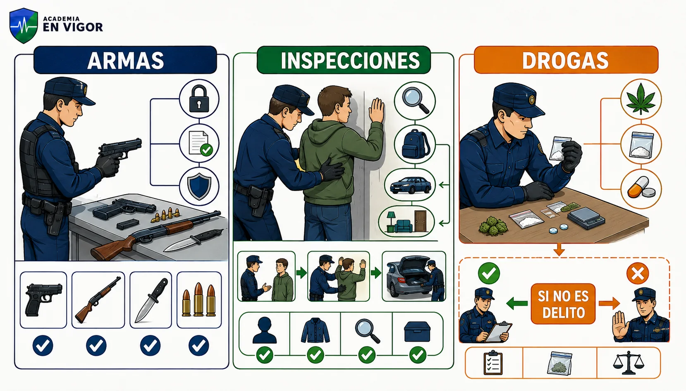

<em>Infografía: Tríptico de armas, inspecciones y drogas.</em>

<!-- MATERIAL PENDIENTE: t14-p5-audio -->
<!-- MATERIAL PENDIENTE: t14-p5-video -->
<!-- MATERIAL PENDIENTE: t14-p5-pres -->

<!-- FUENTE: LO4-2015-T14 -->

## 32. Infracciones graves: registros, navegación e imágenes

Los últimos tipos graves requieren una lectura constitucional actualizada.

- El artículo 36.22 exige, conforme a la STC 13/2021, restricción por seguridad ciudadana y perjuicio real o amenaza concreta.
- La STC 172/2020 anuló únicamente el inciso «no autorizado» del artículo 36.23.
- El uso de imágenes solo encaja en el tipo residual si puede poner en peligro seguridad personal o familiar, instalaciones protegidas o el éxito de una operación, respetando el derecho a la información.

<!-- MATERIAL PENDIENTE: t14-p5-audio -->
<!-- MATERIAL PENDIENTE: t14-p5-video -->
<!-- MATERIAL PENDIENTE: t14-p5-pres -->

<!-- FUENTE: LO4-2015-T14,STC172-2020-T14,STC13-2021-T14 -->

## 33. Infracciones leves

Las diecisiete infracciones leves reúnen conductas heterogéneas que exigen identificar contexto y cláusulas de exclusión.

- Proyectar haces de luz sobre agentes para impedir o dificultar sus funciones es infracción leve.
- La tercera y posteriores pérdidas o extravíos de documentación en un año se consideran negligencia de custodia.
- El consumo de alcohol en lugares o transportes públicos es leve cuando perturba gravemente la tranquilidad ciudadana.

<!-- VISUAL:t14-34-familias-leves.webp -->

  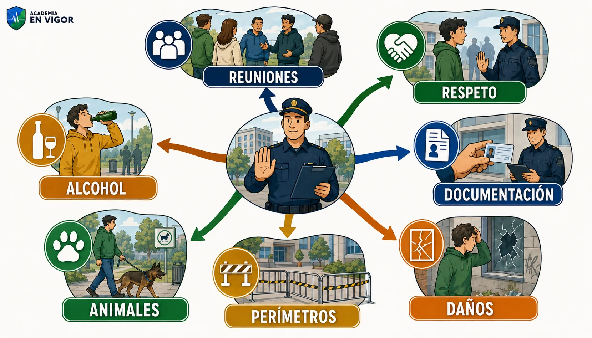

<em>Infografía: Mapa por familias de las diecisiete infracciones leves.</em>

<!-- MATERIAL PENDIENTE: t14-p5-audio -->
<!-- MATERIAL PENDIENTE: t14-p5-video -->
<!-- MATERIAL PENDIENTE: t14-p5-pres -->

<!-- FUENTE: LO4-2015-T14,STC172-2020-T14,STC13-2021-T14 -->

## 34. Prescripción de infracciones y sanciones

La ley utiliza plazos distintos para la infracción todavía perseguible y para la sanción ya firme.

- Las infracciones leves prescriben a los seis meses, las graves al año y las muy graves a los dos años.
- Las sanciones leves prescriben al año, las graves a los dos años y las muy graves a los tres años.
- La prescripción de la sanción se computa desde el día siguiente a la firmeza administrativa.

<!-- MATERIAL PENDIENTE: t14-p5-audio -->
<!-- MATERIAL PENDIENTE: t14-p5-video -->
<!-- MATERIAL PENDIENTE: t14-p5-pres -->

<!-- FUENTE: LO4-2015-T14 -->

## 35. Multas, accesorias y reparación

Las cuantías dependen de la clasificación y pueden añadirse consecuencias accesorias y reparación del daño.

- Las infracciones muy graves se sancionan con multa de 30.001 a 600.000 euros.
- Las graves se sancionan con 601 a 30.000 euros y las leves con 100 a 600 euros.
- La resolución puede exigir reposición al estado originario y, si no es posible, indemnización de daños a la Administración.

<!-- VISUAL:t14-36-piramide-multas.webp -->

  

<em>Infografía: Pirámide de cuantías y sanciones accesorias.</em>

<!-- MATERIAL PENDIENTE: t14-p5-audio -->
<!-- MATERIAL PENDIENTE: t14-p5-video -->
<!-- MATERIAL PENDIENTE: t14-p5-pres -->

<!-- FUENTE: LO4-2015-T14 -->

## 36. Registro central y subsidiariedad penal

El Registro Central sirve exclusivamente para apreciar reincidencia y el procedimiento administrativo cede ante el penal.

- El Registro Central de Infracciones se crea exclusivamente para apreciar reincidencia.
- No pueden sancionarse dos veces hechos con identidad de sujeto, hecho y fundamento.
- Si la conducta puede ser delito, el órgano administrativo pasa el tanto de culpa y se abstiene de seguir hasta la decisión penal correspondiente.

<!-- MATERIAL PENDIENTE: t14-p6-audio -->
<!-- MATERIAL PENDIENTE: t14-p6-video -->
<!-- MATERIAL PENDIENTE: t14-p6-pres -->

<!-- FUENTE: LO4-2015-T14 -->

## 37. Medidas provisionales y actuaciones previas

Antes y durante el expediente pueden adoptarse medidas para preservar pruebas, eficacia y seguridad, nunca como castigo anticipado.

- Las medidas provisionales no pueden tener carácter sancionador.
- Las medidas previas adoptadas por agentes ante riesgo grave deben revisarse en el acuerdo de incoación en un máximo de quince días.
- Las actuaciones previas no interrumpen la prescripción de las infracciones.

<!-- MATERIAL PENDIENTE: t14-p6-audio -->
<!-- MATERIAL PENDIENTE: t14-p6-video -->
<!-- MATERIAL PENDIENTE: t14-p6-pres -->

<!-- FUENTE: LO4-2015-T14 -->

## 38. Caducidad, prueba y resolución

El procedimiento caduca al año sin resolución notificada, con ajustes por paralización imputable o proceso penal.

- El procedimiento sancionador caduca al año desde su incoación si no se notifica resolución, con los ajustes legales.
- Un procedimiento caducado no interrumpe el plazo de prescripción.
- El valor de actas y atestados admite prueba en contrario y exige ratificación si los hechos son negados.

<!-- VISUAL:t14-il-07-expediente-probatorio.webp -->

  

<em>Ilustración: Mesa de expediente dibujada con acta, prueba contradictoria y reloj de caducidad.</em>

<!-- MATERIAL PENDIENTE: t14-p6-audio -->
<!-- MATERIAL PENDIENTE: t14-p6-video -->
<!-- MATERIAL PENDIENTE: t14-p6-pres -->

<!-- FUENTE: LO4-2015-T14 -->

## 39. Ejecución y procedimiento abreviado

La firmeza activa la ejecución y el pago voluntario temprano abre un cauce abreviado con reducción.

- Las sanciones pecuniarias no abonadas deben hacerse efectivas dentro de los quince días siguientes a la firmeza.
- El procedimiento abreviado se aplica a infracciones graves o leves, no a las muy graves.
- El pago voluntario en plazo reduce la multa un 50 por ciento y supone renuncia a formular alegaciones.

<!-- MATERIAL PENDIENTE: t14-p6-audio -->
<!-- MATERIAL PENDIENTE: t14-p6-video -->
<!-- MATERIAL PENDIENTE: t14-p6-pres -->

<!-- FUENTE: LO4-2015-T14 -->

## 40. Disposiciones adicionales y transitorias

Las disposiciones complementan el articulado con regímenes sectoriales, destinos de efectos y reglas para menores.

- La protección de infraestructuras críticas se rige por su normativa específica y supletoriamente por esta ley.
- Las sanciones de menores por consumo o tenencia de drogas pueden suspenderse si acceden al tratamiento o reeducación previstos.
- Los procedimientos iniciados al entrar en vigor se rigen por la legislación anterior salvo norma nueva más favorable.

<!-- MATERIAL PENDIENTE: t14-p6-audio -->
<!-- MATERIAL PENDIENTE: t14-p6-video -->
<!-- MATERIAL PENDIENTE: t14-p6-pres -->

<!-- FUENTE: LO4-2015-T14 -->

## 41. Naturaleza orgánica, competencia y vigencia

No todos los preceptos de una ley titulada orgánica tienen carácter orgánico.

- No todos los preceptos de la Ley Orgánica 4/2015 tienen carácter orgánico.
- Los artículos 28 y 29 se dictan al amparo de la competencia estatal sobre producción, comercio, tenencia y uso de armas y explosivos.
- La ley entró en vigor el 1 de julio de 2015, salvo la disposición final primera, vigente al día siguiente de la publicación.

<!-- MATERIAL PENDIENTE: t14-p6-audio -->
<!-- MATERIAL PENDIENTE: t14-p6-video -->
<!-- MATERIAL PENDIENTE: t14-p6-pres -->

<!-- FUENTE: LO4-2015-T14,CE-T14 -->

## 42. Jurisprudencia constitucional y método de examen

La aplicación constitucional no elimina la ley: precisa el alcance de registros, navegación, imágenes, ocupación y rechazo fronterizo.

- La STC 13/2021 consideró constitucional el artículo 20 sobre registros corporales externos con sus garantías.
- La constitucionalidad del rechazo fronterizo exige aplicación individualizada, control judicial y obligaciones internacionales.
- Una pregunta sobre un precepto interpretado debe resolverse con el texto vigente y la condición fijada por el Tribunal Constitucional.

<!-- MATERIAL PENDIENTE: t14-p6-audio -->
<!-- MATERIAL PENDIENTE: t14-p6-video -->
<!-- MATERIAL PENDIENTE: t14-p6-pres -->

<!-- FUENTE: STC172-2020-T14,STC13-2021-T14,LO4-2015-T14 -->

# Hablemos claro

:::hablemos-claro
Lee primero el sujeto, después la figura jurídica y por último la competencia, el procedimiento o el efecto.
:::

# En la calle

:::en-la-calle
Una actuación correcta fija hechos, activa garantías y documenta el cauce empleado antes de llegar a la conclusión.
:::

# Lo que cae

:::lo-que-cae
Prioriza definiciones próximas, sujetos competentes, secuencias, límites, excepciones y diferencias entre figuras vecinas.
:::

# Ha caído

:::ha-caido
Las coincidencias históricas se conservan en el índice interno y permanecen ocultas mientras no exista plantilla oficial final verificada.
:::

---

*Academia En Vigor · El temario que nunca duerme · Tema 14 · v1.0.0 · Documento interno no publicado.*
