# TEMA 16 · DERECHO PENAL PARTE GENERAL

**Policía Nacional · Método VIGOR · PARTE**
**Versión de contenido:** 1.0.0
**Estado editorial:** approved_internal · **Publicación:** not_published

# Mapa del tema

Cinco tramos: fundamentos y vigencia; ejecución y responsables; edad y circunstancias; penas; aplicación y demás consecuencias.

# Contenido

## 01. Mapa oficial y ruta de estudio

El Tema 16 oficial abarca concepto y principios del Derecho penal, infracción penal, concepto material de delito, ejecución, responsables físicos y jurídicos, consecuencias jurídicas, vigencia temporal y espacial, edad penal y circunstancias modificativas.

- El Tema 16 oficial abarca concepto y principios del Derecho penal, infracción penal, concepto material de delito, ejecución, responsables físicos y jurídicos, consecuencias jurídicas, vigencia temporal y espacial, edad penal y circunstancias modificativas.
- La ruta eficaz separa cinco tramos: fundamentos y vigencia; delito y ejecución; responsables; circunstancias; y consecuencias jurídicas.
- El Código Penal es la fuente principal, pero la vigencia espacial se completa con el artículo 23 de la Ley Orgánica del Poder Judicial y la edad con la Ley Orgánica 5/2000.
- Las explicaciones doctrinales ayudan a comprender, pero nunca sustituyen el tenor de los artículos ni se presentan como derecho vigente.

<!-- VISUAL:t16-01-mapa-oficial-y-ruta-de-estudio.webp -->

  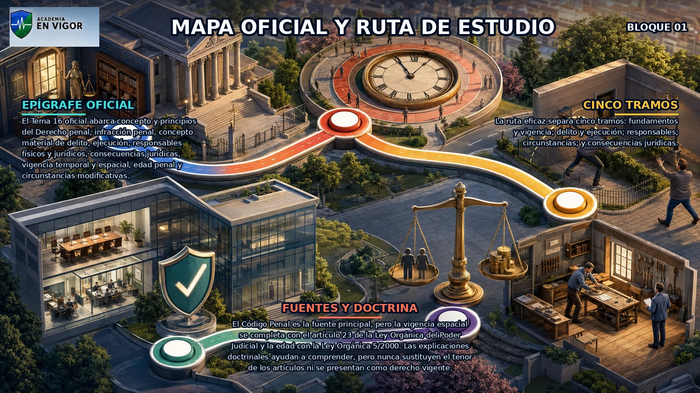

<em>Infografía: Mapa oficial y ruta de estudio.</em>

<!-- FUENTE: CONV-PN-2026 -->

## 02. Concepto y función del Derecho penal

El Derecho penal es la rama del ordenamiento que define delitos y vincula a ellos penas, medidas de seguridad y otras consecuencias jurídicas.

- El Derecho penal es la rama del ordenamiento que define delitos y vincula a ellos penas, medidas de seguridad y otras consecuencias jurídicas.
- La norma penal contiene un supuesto de hecho y una consecuencia jurídica: describe la conducta prohibida y fija la respuesta aplicable.
- El Derecho penal protege bienes jurídicos mediante el recurso más intenso del Estado, por lo que debe operar como última ratio.
- Las penas privativas de libertad y las medidas de seguridad se orientan a reeducación y reinserción social y no pueden consistir en trabajos forzados.

<!-- FUENTE: CP-T16,CE-T16 -->

## 03. Legalidad y garantías penales

Nadie puede ser castigado por una acción u omisión que no estuviera prevista como delito por ley anterior a su realización.

- Nadie puede ser castigado por una acción u omisión que no estuviera prevista como delito por ley anterior a su realización.
- Las medidas de seguridad solo pueden aplicarse cuando sus presupuestos estaban establecidos previamente por la ley.
- No puede ejecutarse pena o medida sin sentencia firme del órgano competente ni de forma distinta a la prevista legalmente.
- Las leyes penales no se aplican a casos distintos de los expresamente comprendidos: la analogía perjudicial al reo está prohibida.

<!-- VISUAL:t16-02-legalidad-y-garantias-penales.webp -->

  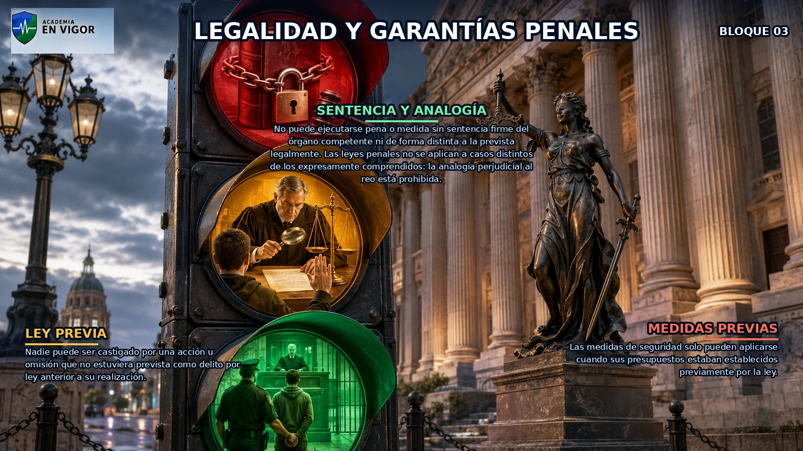

<em>Infografía: Legalidad y garantías penales.</em>

<!-- FUENTE: CP-T16,CE-T16 -->

## 04. Vigencia temporal de la ley penal

Las leyes penales desfavorables no tienen efecto retroactivo.

- Las leyes penales desfavorables no tienen efecto retroactivo.
- Las leyes penales posteriores favorables al reo se aplican retroactivamente incluso con sentencia firme y durante el cumplimiento de la condena.
- Si existe duda sobre cuál es la ley más favorable, el reo debe ser oído.
- Los hechos cometidos bajo una ley temporal se juzgan conforme a ella, salvo que la propia ley disponga expresamente lo contrario.

<!-- VISUAL:t16-03-vigencia-temporal-de-la-ley-penal.webp -->

  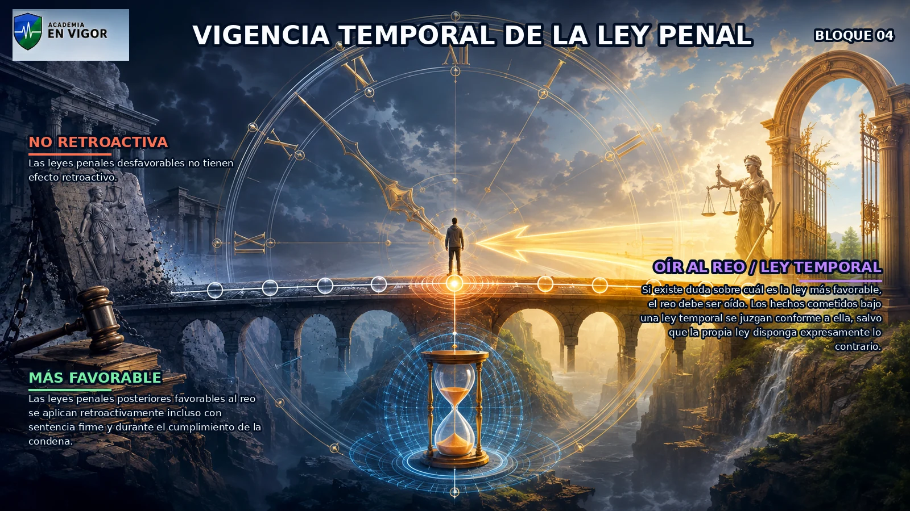

<em>Infografía: Vigencia temporal de la ley penal.</em>

<!-- FUENTE: CP-T16 -->

## 05. Vigencia espacial y jurisdicción española

La jurisdicción española conoce de los delitos cometidos en territorio español o a bordo de buques o aeronaves españoles, sin perjuicio de los tratados.

- La jurisdicción española conoce de los delitos cometidos en territorio español o a bordo de buques o aeronaves españoles, sin perjuicio de los tratados.
- El principio de personalidad permite perseguir determinados hechos cometidos fuera de España por españoles o personas que adquirieron después la nacionalidad, si se cumplen los requisitos legales.
- El principio real o de protección permite perseguir fuera de España los delitos específicamente enumerados que atacan intereses esenciales del Estado.
- La jurisdicción universal solo opera para los delitos y con las conexiones expresamente previstas en el artículo 23.4 de la Ley Orgánica del Poder Judicial.

<!-- VISUAL:t16-04-vigencia-espacial-y-jurisdiccion-espanola.webp -->

  

<em>Infografía: Vigencia espacial y jurisdicción española.</em>

<!-- FUENTE: LOPJ-T16,CP-T16 -->

## 06. Momento, lugar y leyes penales especiales

El delito se considera cometido en el momento en que el sujeto ejecuta la acción u omite el acto que estaba obligado a realizar.

- El delito se considera cometido en el momento en que el sujeto ejecuta la acción u omite el acto que estaba obligado a realizar.
- En el concurso aparente de normas rigen especialidad, subsidiariedad, consunción y, en defecto de las anteriores, el precepto penal más grave.
- Las garantías del Título Preliminar se aplican también a delitos de leyes penales especiales.
- Las restantes disposiciones del Código Penal se aplican supletoriamente a las leyes especiales en lo no previsto expresamente por ellas.

<!-- FUENTE: CP-T16 -->

## 07. Infracción penal y concepto material de delito

Son delitos las acciones y omisiones dolosas o imprudentes penadas por la ley.

- Son delitos las acciones y omisiones dolosas o imprudentes penadas por la ley.
- El concepto material explica el delito como conducta humana típica, antijurídica, culpable y punible.
- La tipicidad exige que el hecho encaje en la descripción legal; la antijuridicidad desaparece cuando concurre una causa de justificación completa.
- La culpabilidad exige que el hecho pueda reprocharse personalmente al autor; la punibilidad comprueba que no exista una condición que excluya la pena.

<!-- VISUAL:t16-05-infraccion-penal-y-concepto-material-de-delito.webp -->

  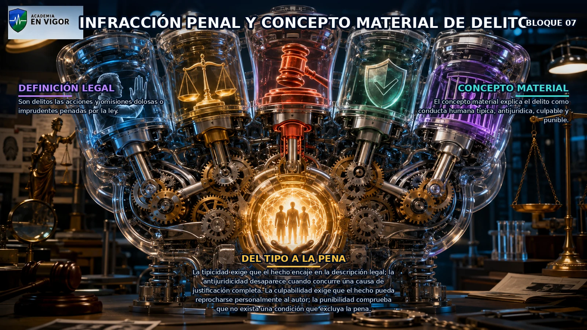

<em>Infografía: Infracción penal y concepto material de delito.</em>

<!-- FUENTE: CP-T16 -->

## 08. Acción, omisión y comisión por omisión

El delito puede realizarse mediante una acción o mediante una omisión.

- El delito puede realizarse mediante una acción o mediante una omisión.
- Los delitos de resultado solo se imputan por omisión cuando no evitar el resultado equivale, según la ley, a causarlo y el autor tenía un deber jurídico especial.
- Existe posición de garante cuando una obligación legal o contractual imponía actuar.
- También existe posición de garante cuando el omitente creó previamente una situación de riesgo para el bien jurídico mediante acción u omisión.

<!-- FUENTE: CP-T16 -->

## 09. Dolo e imprudencia

No hay pena sin dolo o imprudencia.

- No hay pena sin dolo o imprudencia.
- El dolo supone conocer los elementos esenciales del hecho y querer su realización o aceptar el resultado en los términos admitidos penalmente.
- La imprudencia implica infringir el deber objetivo de cuidado y producir un resultado previsible y evitable sin voluntad de realizarlo.
- Las acciones u omisiones imprudentes solo se castigan cuando la ley lo dispone expresamente.

<!-- FUENTE: CP-T16 -->

## 10. Elementos del delito

La conducta es el comportamiento humano activo u omisivo del que parte el análisis del delito.

- La conducta es el comportamiento humano activo u omisivo del que parte el análisis del delito.
- La tipicidad reúne los elementos objetivos y subjetivos exigidos por el tipo penal.
- La antijuridicidad expresa la contradicción del hecho típico con el ordenamiento cuando no concurre una justificación.
- La culpabilidad comprende imputabilidad, conciencia potencial de la ilicitud y exigibilidad de una conducta conforme a Derecho.

<!-- FUENTE: CP-T16 -->

## 11. Delitos graves, menos graves y leves

Son delitos graves los castigados por la ley con pena grave.

- Son delitos graves los castigados por la ley con pena grave.
- Son delitos menos graves los castigados con pena menos grave y delitos leves los castigados con pena leve.
- Si la extensión de una pena permite clasificarla a la vez como grave y menos grave, el delito se considera grave.
- Si la extensión de una pena permite clasificarla a la vez como leve y menos grave, el delito se considera leve.

<!-- VISUAL:t16-08-delitos-graves-menos-graves-y-leves.webp -->

  

<em>Infografía: Delitos graves, menos graves y leves.</em>

<!-- FUENTE: CP-T16 -->

## 12. Error de tipo y error de prohibición

El error invencible sobre un hecho constitutivo de la infracción excluye la responsabilidad criminal.

- El error invencible sobre un hecho constitutivo de la infracción excluye la responsabilidad criminal.
- El error de tipo vencible permite castigar, en su caso, la infracción como imprudente.
- El error sobre un hecho cualificador o una circunstancia agravante impide apreciarlos.
- El error invencible sobre la ilicitud excluye responsabilidad; si es vencible, se impone la pena inferior en uno o dos grados.

<!-- FUENTE: CP-T16 -->

## 13. Consumación, tentativa y actos preparatorios

Son punibles el delito consumado y la tentativa de delito.

- Son punibles el delito consumado y la tentativa de delito.
- Los actos internos no se castigan por sí solos porque aún no exteriorizan una conducta típica.
- La conspiración, proposición y provocación solo se castigan en los casos especialmente previstos por la ley.
- Consumación y agotamiento no son equivalentes: la consumación completa el tipo; el agotamiento obtiene o prolonga el propósito perseguido.

<!-- FUENTE: CP-T16 -->

## 14. Tentativa y determinación de la pena

Hay tentativa cuando el sujeto inicia directamente la ejecución mediante hechos exteriores y practica todos o parte de los actos que objetivamente deberían producir el resultado.

- Hay tentativa cuando el sujeto inicia directamente la ejecución mediante hechos exteriores y practica todos o parte de los actos que objetivamente deberían producir el resultado.
- El resultado no se produce por causas independientes de la voluntad del autor.
- La tentativa puede ser acabada cuando se ejecutan todos los actos previstos e inacabada cuando solo se ejecuta una parte.
- A los autores de tentativa se les impone la pena inferior en uno o dos grados, atendiendo al peligro del intento y al grado de ejecución.

<!-- VISUAL:t16-10-tentativa-y-determinacion-de-la-pena.webp -->

  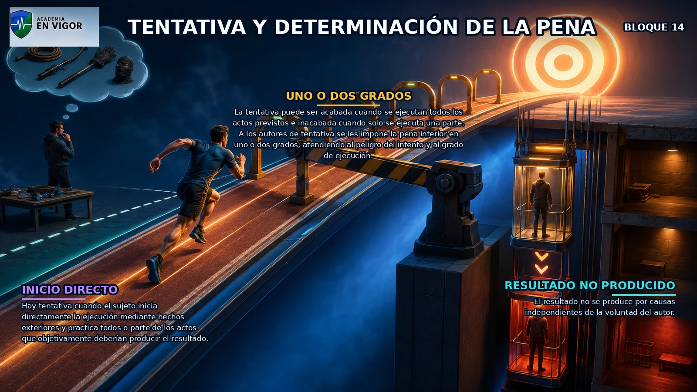

<em>Infografía: Tentativa y determinación de la pena.</em>

<!-- FUENTE: CP-T16 -->

## 15. Desistimiento y evitación del resultado

Queda exento por el delito intentado quien evita voluntariamente la consumación desistiendo de la ejecución ya iniciada o impidiendo el resultado.

- Queda exento por el delito intentado quien evita voluntariamente la consumación desistiendo de la ejecución ya iniciada o impidiendo el resultado.
- La exención por desistimiento no elimina la responsabilidad por otros actos ya ejecutados que constituyan delito.
- Cuando intervienen varios sujetos, queda exento quien desiste e impide o intenta impedir seria, firme y decididamente la consumación.
- El desistimiento exige voluntariedad: no basta abandonar porque la consumación se ha vuelto imposible o porque aparece un obstáculo insuperable.

<!-- VISUAL:t16-il-03-el-freno-del-desistimiento.webp -->

  

<em>Ilustración: El freno del desistimiento.</em>

<!-- FUENTE: CP-T16 -->

## 16. Conspiración y proposición

La conspiración existe cuando dos o más personas se conciertan para ejecutar un delito y resuelven llevarlo a cabo.

- La conspiración existe cuando dos o más personas se conciertan para ejecutar un delito y resuelven llevarlo a cabo.
- La proposición existe cuando quien ha resuelto cometer un delito invita a otra u otras personas a participar en él.
- Conspiración y proposición son actos preparatorios punibles únicamente cuando el Libro II lo prevé expresamente.
- La proposición exige una decisión propia previa de delinquir; no equivale a una invitación abstracta o meramente retórica.

<!-- FUENTE: CP-T16 -->

## 17. Provocación y apología

La provocación exige incitación directa a cometer un delito mediante un medio de publicidad eficaz o ante una concurrencia de personas.

- La provocación exige incitación directa a cometer un delito mediante un medio de publicidad eficaz o ante una concurrencia de personas.
- La provocación solo se castiga cuando la ley lo prevé expresamente.
- La apología solo es delictiva como forma de provocación cuando constituye incitación directa a cometer un delito.
- Si a la provocación sigue la perpetración del delito, se castiga como inducción.

<!-- FUENTE: CP-T16 -->

## 18. Autores, inductores y cooperadores necesarios

Son responsables criminalmente de los delitos los autores y los cómplices.

- Son responsables criminalmente de los delitos los autores y los cómplices.
- Es autor quien realiza el hecho por sí solo, conjuntamente o por medio de otro del que se sirve como instrumento.
- También se consideran autores quienes inducen directamente a otro a ejecutar el delito.
- También se consideran autores quienes cooperan con un acto sin el cual el delito no se habría efectuado.

<!-- VISUAL:t16-11-autores-inductores-y-cooperadores-necesarios.webp -->

  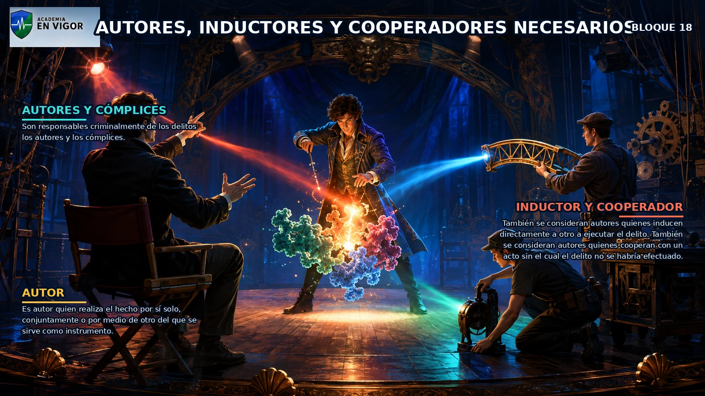

<em>Infografía: Autores, inductores y cooperadores necesarios.</em>

<!-- FUENTE: CP-T16 -->

## 19. Complicidad y encubrimiento

Son cómplices quienes, sin estar comprendidos en el artículo 28, cooperan a la ejecución con actos anteriores o simultáneos.

- Son cómplices quienes, sin estar comprendidos en el artículo 28, cooperan a la ejecución con actos anteriores o simultáneos.
- La cooperación del cómplice no es imprescindible: si el acto era necesario, la figura correcta es cooperación necesaria.
- Al cómplice de delito consumado o intentado se le impone, salvo regla especial, la pena inferior en grado a la fijada para el autor.
- El encubrimiento no es una forma de participación en el delito previo: es un delito autónomo cometido después de su ejecución.

<!-- FUENTE: CP-T16 -->

## 20. Delitos mediante difusión y actuación en nombre de otro

En delitos cometidos mediante medios de difusión no responden criminalmente los cómplices ni quienes favorecen personal o realmente el hecho.

- En delitos cometidos mediante medios de difusión no responden criminalmente los cómplices ni quienes favorecen personal o realmente el hecho.
- La responsabilidad en delitos de difusión es escalonada, excluyente y subsidiaria según el orden del artículo 30.
- Quien actúa como administrador de hecho o de derecho o en representación de otro puede responder personalmente aunque no reúna una cualidad exigida por el tipo.
- Para aplicar el artículo 31, la cualidad especial debe concurrir en la entidad o persona en cuyo nombre o representación se actúa.

<!-- FUENTE: CP-T16 -->

## 21. Responsabilidad penal de la persona jurídica

Las personas jurídicas responden penalmente solo en los supuestos expresamente previstos por el Código Penal.

- Las personas jurídicas responden penalmente solo en los supuestos expresamente previstos por el Código Penal.
- Una vía de imputación comprende delitos cometidos en nombre o por cuenta y en beneficio directo o indirecto por representantes o personas con facultades decisorias, organizativas o de control.
- La segunda vía comprende delitos de subordinados cometidos en actividades sociales, por cuenta y beneficio de la entidad, por incumplimiento grave de supervisión, vigilancia y control.
- La responsabilidad de la persona jurídica no sustituye automáticamente la responsabilidad penal de las personas físicas intervinientes.

<!-- VISUAL:t16-12-responsabilidad-penal-de-la-persona-juridica.webp -->

  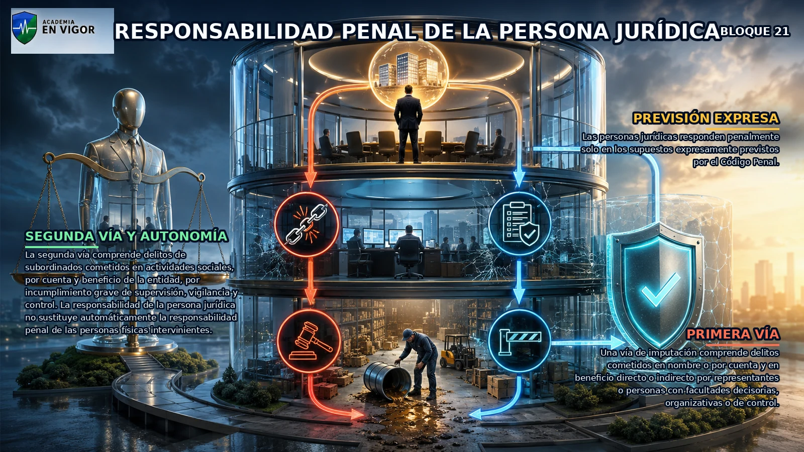

<em>Infografía: Responsabilidad penal de la persona jurídica.</em>

<!-- FUENTE: CP-T16 -->

## 22. Programas de cumplimiento y exención

Para delitos de dirigentes, la exención exige un modelo eficaz previo, supervisión autónoma, elusión fraudulenta por el autor y ausencia de omisión de control.

- Para delitos de dirigentes, la exención exige un modelo eficaz previo, supervisión autónoma, elusión fraudulenta por el autor y ausencia de omisión de control.
- En personas jurídicas pequeñas, las funciones de supervisión pueden ser asumidas directamente por el órgano de administración.
- Para delitos de subordinados, la exención exige haber adoptado y ejecutado eficazmente antes del delito un modelo adecuado de prevención o reducción significativa del riesgo.
- Los modelos deben identificar riesgos, establecer protocolos, gestionar recursos, imponer deber de informar, prever disciplina y verificarse periódicamente.

<!-- FUENTE: CP-T16 -->

## 23. Autonomía, atenuantes y entidades excluidas

La responsabilidad de la persona jurídica puede declararse aunque no se identifique o no pueda dirigirse el procedimiento contra la persona física concreta.

- La responsabilidad de la persona jurídica puede declararse aunque no se identifique o no pueda dirigirse el procedimiento contra la persona física concreta.
- Las circunstancias que afectan a la culpabilidad o agravan la responsabilidad de la persona física no excluyen ni modifican automáticamente la de la persona jurídica.
- Las atenuantes de la persona jurídica son posteriores al delito: confesión temprana, colaboración decisiva, reparación antes del juicio oral y medidas preventivas eficaces antes del juicio.
- El Estado y las entidades públicas enumeradas en el artículo 31 quinquies quedan fuera del régimen general, con la regla especial prevista para sociedades mercantiles públicas.

<!-- FUENTE: CP-T16 -->

## 24. Edad penal y sus efectos

Los menores de dieciocho años no responden criminalmente con arreglo al Código Penal.

- Los menores de dieciocho años no responden criminalmente con arreglo al Código Penal.
- La Ley Orgánica 5/2000 se aplica a personas mayores de catorce y menores de dieciocho años por hechos tipificados como delitos.
- Los menores de catorce años no responden conforme a la Ley Orgánica 5/2000 y se aplican, en su caso, medidas de protección de menores.
- Desde los dieciocho años rige el Código Penal de adultos; la antigua extensión ordinaria del régimen juvenil hasta veintiún años fue suprimida.

<!-- VISUAL:t16-13-edad-penal-y-sus-efectos.webp -->

  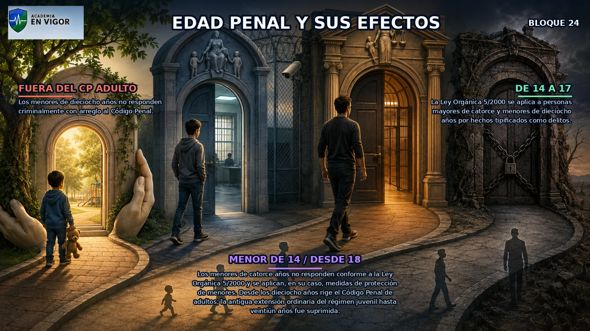

<em>Infografía: Edad penal y sus efectos.</em>

<!-- VISUAL:t16-il-05-las-cuatro-puertas-de-la-edad-penal.webp -->

  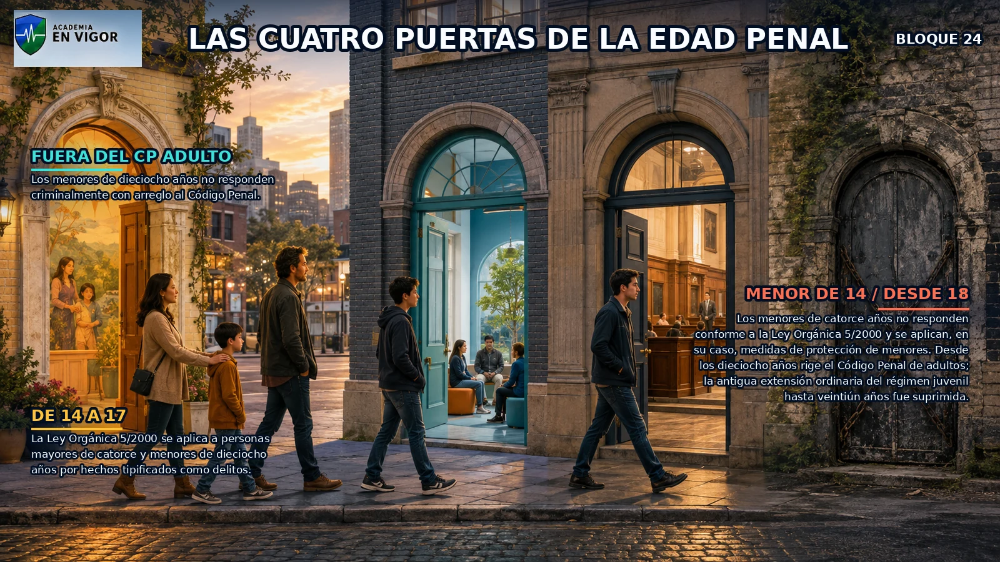

<em>Ilustración: Las cuatro puertas de la edad penal.</em>

<!-- FUENTE: CP-T16,LORPM-T16 -->

## 25. Anomalía psíquica, intoxicación y alteración perceptiva

Exime la anomalía o alteración psíquica que impide comprender la ilicitud del hecho o actuar conforme a esa comprensión al cometerlo.

- Exime la anomalía o alteración psíquica que impide comprender la ilicitud del hecho o actuar conforme a esa comprensión al cometerlo.
- El trastorno mental transitorio provocado para delinquir o cuya comisión se previó o debió prever no exime.
- La intoxicación plena o el síndrome de abstinencia pueden eximir si impiden comprender o actuar y la situación no fue buscada o previsible para delinquir.
- La alteración grave de la conciencia de la realidad debe derivar de alteraciones en la percepción sufridas desde el nacimiento o la infancia.

<!-- FUENTE: CP-T16 -->

## 26. Legítima defensa

La legítima defensa exige agresión ilegítima, necesidad racional del medio empleado y falta de provocación suficiente del defensor.

- La legítima defensa exige agresión ilegítima, necesidad racional del medio empleado y falta de provocación suficiente del defensor.
- En defensa de bienes, la agresión ilegítima exige un ataque constitutivo de delito que los ponga en grave peligro de deterioro o pérdida inminentes.
- En defensa de la morada o sus dependencias, se considera agresión ilegítima la entrada indebida.
- Si falta un requisito no esencial, puede apreciarse una eximente incompleta como atenuante; sin agresión ilegítima no existe legítima defensa.

<!-- VISUAL:t16-14-legitima-defensa.webp -->

  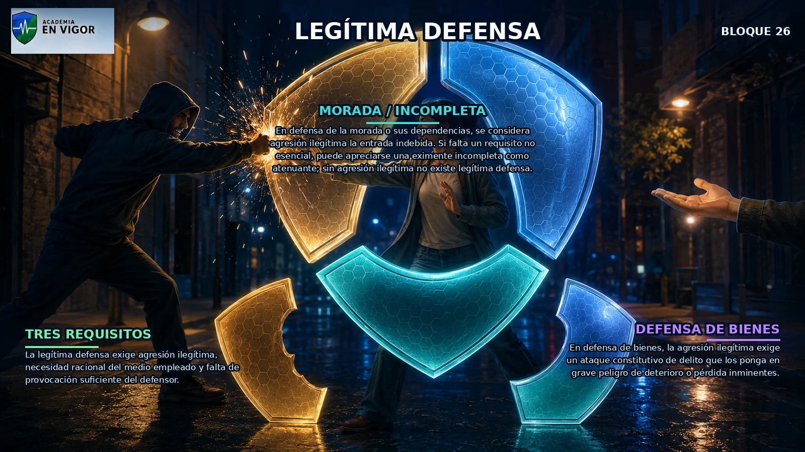

<em>Infografía: Legítima defensa.</em>

<!-- FUENTE: CP-T16 -->

## 27. Estado de necesidad, miedo y cumplimiento del deber

El estado de necesidad exige que el mal causado no sea mayor que el evitado.

- El estado de necesidad exige que el mal causado no sea mayor que el evitado.
- También exige que la situación no haya sido provocada intencionadamente y que el necesitado no tenga obligación profesional de sacrificarse.
- El miedo insuperable exime cuando anula razonablemente la exigibilidad de actuar conforme a Derecho.
- Exime obrar en cumplimiento de un deber o en el ejercicio legítimo de un derecho, oficio o cargo.

<!-- FUENTE: CP-T16 -->

## 28. Circunstancias atenuantes

Son atenuantes las eximentes incompletas y actuar a causa de una grave adicción.

- Son atenuantes las eximentes incompletas y actuar a causa de una grave adicción.
- También atenúan el arrebato, la obcecación u otro estado pasional de entidad semejante.
- La confesión debe producirse antes de conocer que el procedimiento judicial se dirige contra el culpable.
- La reparación antes del juicio oral, la dilación extraordinaria e indebida no atribuible al acusado y las circunstancias análogas completan el catálogo.

<!-- FUENTE: CP-T16 -->

## 29. Alevosía y debilitamiento de la defensa

La alevosía exige asegurar la ejecución de un delito contra las personas eliminando el riesgo procedente de la defensa del ofendido.

- La alevosía exige asegurar la ejecución de un delito contra las personas eliminando el riesgo procedente de la defensa del ofendido.
- El disfraz agrava cuando facilita la ejecución o la impunidad y posee aptitud real para ocultar la identidad.
- El abuso de superioridad aprovecha un desequilibrio relevante de fuerzas que debilita la defensa sin eliminarla necesariamente.
- También agrava aprovechar lugar, tiempo o auxilio de otras personas para debilitar la defensa o facilitar la impunidad.

<!-- FUENTE: CP-T16 -->

## 30. Precio, discriminación, ensañamiento y abusos

El precio, recompensa o promesa agrava cuando actúa como motivo determinante para ejecutar el delito.

- El precio, recompensa o promesa agrava cuando actúa como motivo determinante para ejecutar el delito.
- La agravante discriminatoria incluye, entre otros, racismo, antisemitismo, antigitanismo, sexo, edad, orientación o identidad sexual o de género, aporofobia, enfermedad y discapacidad.
- El ensañamiento consiste en aumentar deliberada e inhumanamente el sufrimiento con padecimientos innecesarios para ejecutar el delito.
- Completan el catálogo el abuso de confianza y prevalerse del carácter público del culpable.

<!-- FUENTE: CP-T16 -->

## 31. Reincidencia vigente desde abril de 2026

Hay reincidencia cuando, al delinquir, el culpable ya fue condenado ejecutoriamente por delito del mismo título y de la misma naturaleza.

- Hay reincidencia cuando, al delinquir, el culpable ya fue condenado ejecutoriamente por delito del mismo título y de la misma naturaleza.
- No se computan antecedentes cancelados o cancelables.
- Los antecedentes por delitos leves no se computan, salvo lo dispuesto para tipos agravados por multirreincidencia de delitos leves.
- Las condenas firmes de otros Estados de la Unión Europea producen efecto de reincidencia salvo que el antecedente esté cancelado o pudiera cancelarse conforme al Derecho español.

<!-- VISUAL:t16-17-reincidencia-vigente-desde-abril-de-2026.webp -->

  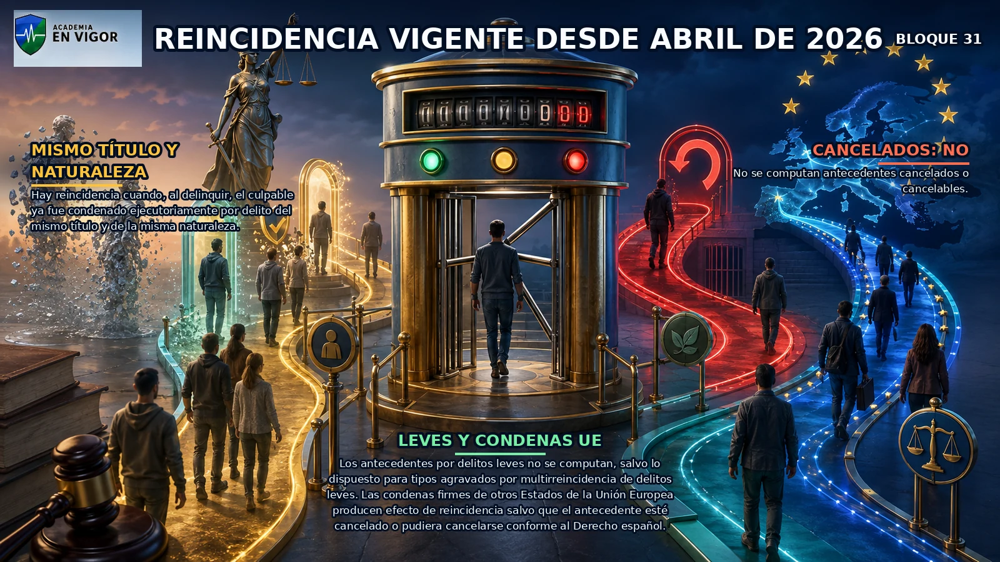

<em>Infografía: Reincidencia vigente desde abril de 2026.</em>

<!-- FUENTE: CP-T16,LO1-2026-T16 -->

## 32. Circunstancia mixta de parentesco

El parentesco puede atenuar o agravar según la naturaleza, motivos y efectos del delito.

- El parentesco puede atenuar o agravar según la naturaleza, motivos y efectos del delito.
- Comprende al cónyuge o a quien esté o haya estado ligado de forma estable por análoga relación de afectividad.
- Comprende ascendientes, descendientes y hermanos por naturaleza o adopción del ofensor.
- También alcanza a ascendientes, descendientes y hermanos del cónyuge o conviviente en los términos del artículo 23.

<!-- FUENTE: CP-T16 -->

## 33. Concepto, fines y clases de penas

Las penas pueden imponerse con carácter principal o accesorio.

- Las penas pueden imponerse con carácter principal o accesorio.
- Por su contenido, las penas son privativas de libertad, privativas de otros derechos y multa.
- Por naturaleza y duración, las penas se clasifican en graves, menos graves y leves.
- No son penas la detención y prisión preventiva, las sanciones administrativas o disciplinarias ni las privaciones reparadoras civiles o administrativas.

<!-- VISUAL:t16-18-concepto-fines-y-clases-de-penas.webp -->

  

<em>Infografía: Concepto, fines y clases de penas.</em>

<!-- FUENTE: CP-T16,CE-T16 -->

## 34. Penas graves

Son graves la prisión permanente revisable y la prisión superior a cinco años.

- Son graves la prisión permanente revisable y la prisión superior a cinco años.
- Son graves la inhabilitación absoluta y las inhabilitaciones especiales o suspensión de empleo o cargo público superiores a cinco años.
- Son graves la privación de conducir o de armas superior a ocho años y las prohibiciones de residencia, aproximación o comunicación superiores a cinco años.
- La privación de la patria potestad es pena grave cualquiera que sea su duración.

<!-- FUENTE: CP-T16 -->

## 35. Penas menos graves

Es menos grave la prisión de tres meses hasta cinco años.

- Es menos grave la prisión de tres meses hasta cinco años.
- Son menos graves las inhabilitaciones especiales y la suspensión de empleo o cargo público hasta cinco años.
- Son menos graves la multa de más de tres meses y la multa proporcional, salvo las reglas de personas jurídicas.
- Son menos graves los trabajos en beneficio de la comunidad de treinta y un días a un año.

<!-- FUENTE: CP-T16 -->

## 36. Penas leves y penas de personas jurídicas

Son leves la multa de hasta tres meses, la localización permanente de un día a tres meses y los trabajos en beneficio de la comunidad de uno a treinta días.

- Son leves la multa de hasta tres meses, la localización permanente de un día a tres meses y los trabajos en beneficio de la comunidad de uno a treinta días.
- Son leves las privaciones de conducir, armas o actividades relacionadas con animales de tres meses a un año.
- Todas las penas aplicables a personas jurídicas tienen consideración de graves.
- Las penas de personas jurídicas incluyen multa, disolución, suspensión, clausura, prohibición de actividades, inhabilitación para ayudas o contratos e intervención judicial.

<!-- VISUAL:t16-19-penas-leves-y-penas-de-personas-juridicas.webp -->

  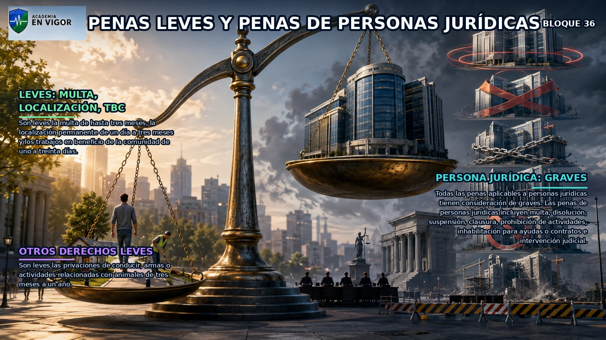

<em>Infografía: Penas leves y penas de personas jurídicas.</em>

<!-- FUENTE: CP-T16 -->

## 37. Penas privativas de libertad

Son penas privativas de libertad la prisión permanente revisable, la prisión, la localización permanente y la responsabilidad personal subsidiaria por impago de multa.

- Son penas privativas de libertad la prisión permanente revisable, la prisión, la localización permanente y la responsabilidad personal subsidiaria por impago de multa.
- La pena de prisión tiene duración mínima de tres meses y máxima de veinte años, salvo disposición excepcional del Código.
- La localización permanente obliga a permanecer en el domicilio o lugar fijado y puede durar hasta seis meses.
- El cómputo de las penas privativas de libertad comienza desde la firmeza si el penado está preso y desde el ingreso si no lo está.

<!-- FUENTE: CP-T16 -->

## 38. Prisión permanente revisable y prisión

La prisión permanente revisable es pena grave de duración indeterminada pero sujeta a revisión judicial conforme a los plazos y requisitos legales.

- La prisión permanente revisable es pena grave de duración indeterminada pero sujeta a revisión judicial conforme a los plazos y requisitos legales.
- El acceso al tercer grado en prisión permanente revisable exige autorización judicial y pronóstico favorable de reinserción.
- En prisión superior a cinco años, el tribunal puede ordenar que el tercer grado no se alcance hasta cumplir la mitad de la pena.
- Los límites máximos efectivos por acumulación del artículo 76 no cambian la duración nominal de cada pena, sino el tiempo máximo de cumplimiento.

<!-- FUENTE: CP-T16 -->

## 39. Localización permanente y responsabilidad subsidiaria

La localización permanente se cumple en domicilio o lugar determinado por el órgano judicial.

- La localización permanente se cumple en domicilio o lugar determinado por el órgano judicial.
- Puede acordarse cumplimiento discontinuo cuando el reo lo solicite y las circunstancias lo aconsejen, oído el Ministerio Fiscal.
- En la multa por cuotas, la responsabilidad subsidiaria general es un día de privación de libertad por cada dos cuotas diarias impagadas.
- No se impone responsabilidad personal subsidiaria por impago de multa a condenados a pena privativa de libertad superior a cinco años.

<!-- FUENTE: CP-T16 -->

## 40. Penas privativas de derechos

Las privativas de derechos incluyen inhabilitaciones, suspensión de empleo, privación de conducir o armas, prohibiciones de residencia, aproximación y comunicación, trabajos comunitarios y privación de patria potestad.

- Las privativas de derechos incluyen inhabilitaciones, suspensión de empleo, privación de conducir o armas, prohibiciones de residencia, aproximación y comunicación, trabajos comunitarios y privación de patria potestad.
- La inhabilitación absoluta priva definitivamente de honores, empleos y cargos públicos y de la posibilidad de obtenerlos o ser elegido durante la condena.
- La inhabilitación especial afecta al empleo, cargo, profesión, oficio, derecho o actividad concretamente señalados en sentencia.
- Si la privación de conducir o de armas supera dos años, comporta la pérdida de vigencia del permiso o licencia.

<!-- FUENTE: CP-T16 -->

## 41. Prohibiciones y trabajos en beneficio de la comunidad

La prohibición de aproximación impide acercarse a la víctima y a los lugares definidos judicialmente y suspende el régimen de visitas respecto de los hijos durante su vigencia.

- La prohibición de aproximación impide acercarse a la víctima y a los lugares definidos judicialmente y suspende el régimen de visitas respecto de los hijos durante su vigencia.
- La prohibición de comunicación impide todo contacto escrito, verbal, visual o mediante medios informáticos o telemáticos.
- Los trabajos en beneficio de la comunidad requieren consentimiento del penado, son no retribuidos y no pueden atentar contra su dignidad.
- La jornada de trabajos en beneficio de la comunidad no puede exceder de ocho horas.

<!-- FUENTE: CP-T16 -->

## 42. Pena de multa

La multa se impone por el sistema de días-multa salvo que la ley establezca una multa proporcional.

- La multa se impone por el sistema de días-multa salvo que la ley establezca una multa proporcional.
- Para personas físicas, la multa va de diez días a dos años y la cuota diaria de dos a cuatrocientos euros.
- Para personas jurídicas, la multa por cuotas puede durar hasta cinco años y la cuota diaria va de treinta a cinco mil euros.
- En la multa proporcional se atiende al daño, valor del objeto o beneficio y a la situación económica y circunstancias del culpable.

<!-- VISUAL:t16-22-pena-de-multa.webp -->

  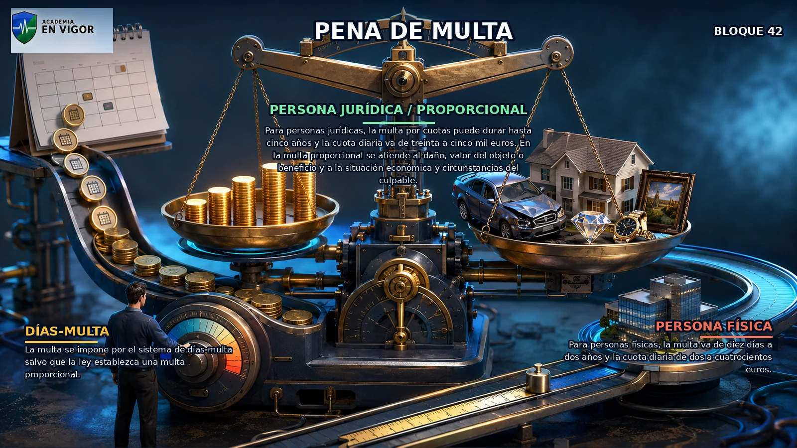

<em>Infografía: Pena de multa.</em>

<!-- FUENTE: CP-T16 -->

## 43. Penas accesorias

Las penas accesorias duran, con carácter general, lo mismo que la principal salvo que la ley disponga otra cosa.

- Las penas accesorias duran, con carácter general, lo mismo que la principal salvo que la ley disponga otra cosa.
- La prisión igual o superior a diez años lleva inhabilitación absoluta durante la condena, salvo que ya sea pena principal.
- En prisión inferior a diez años pueden imponerse suspensión o inhabilitaciones vinculadas con el delito, con motivación expresa.
- En los delitos previstos por el artículo 57 pueden imponerse o resultar obligatorias las prohibiciones del artículo 48 según víctima, gravedad y peligro.

<!-- FUENTE: CP-T16 -->

## 44. Pena del autor consumado, tentativa y complicidad

La pena señalada por la ley se entiende prevista para el autor de la infracción consumada.

- La pena señalada por la ley se entiende prevista para el autor de la infracción consumada.
- Al autor de tentativa se le impone la pena inferior en uno o dos grados.
- Al cómplice se le impone la pena inferior en grado a la fijada para el autor del delito consumado o intentado.
- Las circunstancias personales solo afectan a quienes concurren; las relativas a ejecución o medios afectan a quienes las conocían al actuar o cooperar.

<!-- FUENTE: CP-T16 -->

## 45. Atenuantes, agravantes y grados de pena

En delitos dolosos, una atenuante sin agravantes conduce a la mitad inferior y una o dos agravantes sin atenuantes a la mitad superior.

- En delitos dolosos, una atenuante sin agravantes conduce a la mitad inferior y una o dos agravantes sin atenuantes a la mitad superior.
- Dos o más atenuantes o una muy cualificada sin agravantes permiten bajar uno o dos grados.
- En delitos leves e imprudentes se aplica prudente arbitrio, salvo la regla especial de multirreincidencia de delitos leves vigente desde abril de 2026.
- La eximente incompleta obliga a imponer la pena inferior en uno o dos grados y la sentencia debe razonar grado y extensión concreta.

<!-- VISUAL:t16-23-atenuantes-agravantes-y-grados-de-pena.webp -->

  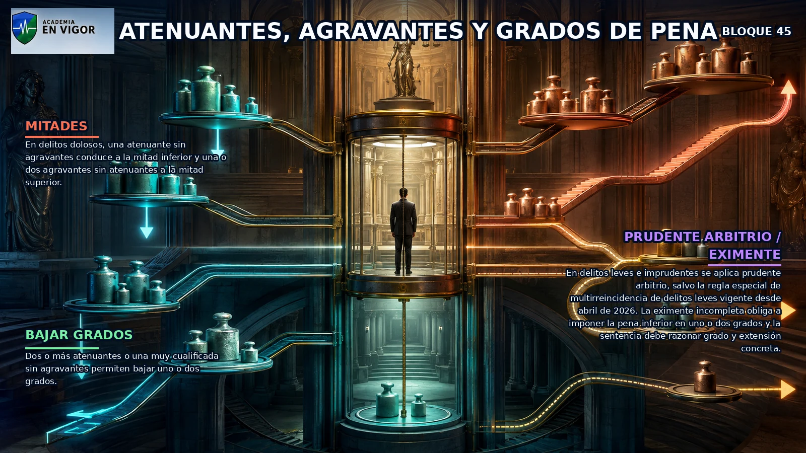

<em>Infografía: Atenuantes, agravantes y grados de pena.</em>

<!-- FUENTE: CP-T16,LO1-2026-T16 -->

## 46. Concurso real, continuado, ideal y medial

En concurso real se imponen todas las penas por las distintas infracciones para cumplimiento simultáneo cuando sea posible.

- En concurso real se imponen todas las penas por las distintas infracciones para cumplimiento simultáneo cuando sea posible.
- El delito continuado del artículo 74 reúne acciones u omisiones ejecutadas en un plan preconcebido o aprovechando idéntica ocasión que infringen el mismo o semejantes preceptos.
- El concurso ideal existe cuando un solo hecho constituye dos o más delitos; el medial cuando una infracción es medio necesario para cometer otra.
- El artículo 76 limita el cumplimiento efectivo en concurso real al triple de la pena más grave, con topes ordinario y excepcionales legalmente previstos.

<!-- FUENTE: CP-T16 -->

## 47. Medidas de seguridad: fundamento y clases

Las medidas de seguridad exigen la comisión de un hecho previsto como delito y un pronóstico de probabilidad de nuevos delitos.

- Las medidas de seguridad exigen la comisión de un hecho previsto como delito y un pronóstico de probabilidad de nuevos delitos.
- Si el delito cometido no tiene pena privativa de libertad, no puede imponerse una medida de internamiento.
- Son privativas de libertad los internamientos en centro psiquiátrico, de deshabituación o educativo especial.
- Son no privativas, entre otras, la inhabilitación profesional, expulsión de extranjero no residente legal, libertad vigilada, custodia familiar y privaciones de conducir o armas.

<!-- FUENTE: CP-T16 -->

## 48. Aplicación y revisión de medidas de seguridad

Durante la ejecución, el órgano judicial puede mantener, cesar, sustituir o suspender la medida dentro de los límites de la sentencia.

- Durante la ejecución, el órgano judicial puede mantener, cesar, sustituir o suspender la medida dentro de los límites de la sentencia.
- El quebrantamiento de una medida de internamiento provoca reingreso; en otras medidas puede determinar su sustitución.
- Cuando concurren pena y medida privativas de libertad, se abona el tiempo de la medida al cumplimiento de la pena conforme al sistema vicarial.
- Las medidas aplicables a exentos o semiimputables deben ser proporcionales y no pueden resultar más gravosas ni durar más que la pena abstractamente aplicable.

<!-- FUENTE: CP-T16 -->

## 49. Responsabilidad civil derivada del delito

La ejecución de un hecho descrito como delito obliga a reparar los daños y perjuicios causados.

- La ejecución de un hecho descrito como delito obliga a reparar los daños y perjuicios causados.
- El perjudicado puede optar por exigir la responsabilidad civil ante la jurisdicción civil.
- La responsabilidad civil comprende restitución, reparación del daño e indemnización de perjuicios materiales y morales.
- El órgano judicial debe fijar razonadamente en la resolución las bases y cuantía de daños e indemnizaciones.

<!-- VISUAL:t16-25-responsabilidad-civil-derivada-del-delito.webp -->

  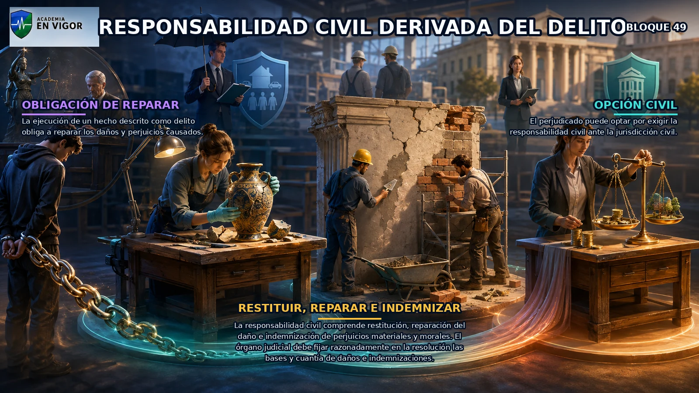

<em>Infografía: Responsabilidad civil derivada del delito.</em>

<!-- FUENTE: CP-T16 -->

## 50. Responsables civiles directos y subsidiarios

Todo responsable criminal lo es también civilmente si del hecho derivan daños o perjuicios.

- Todo responsable criminal lo es también civilmente si del hecho derivan daños o perjuicios.
- Los aseguradores responden directamente dentro del límite pactado o legal cuando el riesgo esté asegurado.
- Los exentos de responsabilidad criminal pueden conservar responsabilidad civil en los supuestos y con la distribución del artículo 118.
- El Código prevé responsabilidad civil subsidiaria de padres o tutores, empresarios, titulares de establecimientos y administraciones en los casos legalmente delimitados.

<!-- FUENTE: CP-T16 -->

## 51. Orden, transmisión y pago de responsabilidades

El Estado y demás entes públicos responden subsidiariamente por daños causados por autoridades, agentes o empleados en los supuestos del artículo 121.

- El Estado y demás entes públicos responden subsidiariamente por daños causados por autoridades, agentes o empleados en los supuestos del artículo 121.
- Quien participa por título lucrativo en los efectos de un delito debe restituir o resarcir hasta la cuantía de su participación.
- La obligación de restitución o reparación se transmite a herederos y la acción para exigirla a los herederos del perjudicado.
- Los pagos del penado siguen el orden legal: reparación e indemnización, indemnización al Estado, costas del acusador particular, demás costas y multa.

<!-- FUENTE: CP-T16 -->

## 52. Decomiso

Todo delito doloso lleva consigo la pérdida de efectos, bienes, medios o instrumentos y ganancias en los términos del artículo 127.

- Todo delito doloso lleva consigo la pérdida de efectos, bienes, medios o instrumentos y ganancias en los términos del artículo 127.
- El decomiso puede alcanzar bienes transformados o de valor equivalente cuando no sea posible aprehender los directamente relacionados.
- El decomiso ampliado requiere los presupuestos y delitos expresamente previstos por el Código.
- El decomiso sin condena y el decomiso de bienes de terceros solo proceden en los casos y con las garantías establecidos legalmente.

<!-- VISUAL:t16-26-decomiso.webp -->

  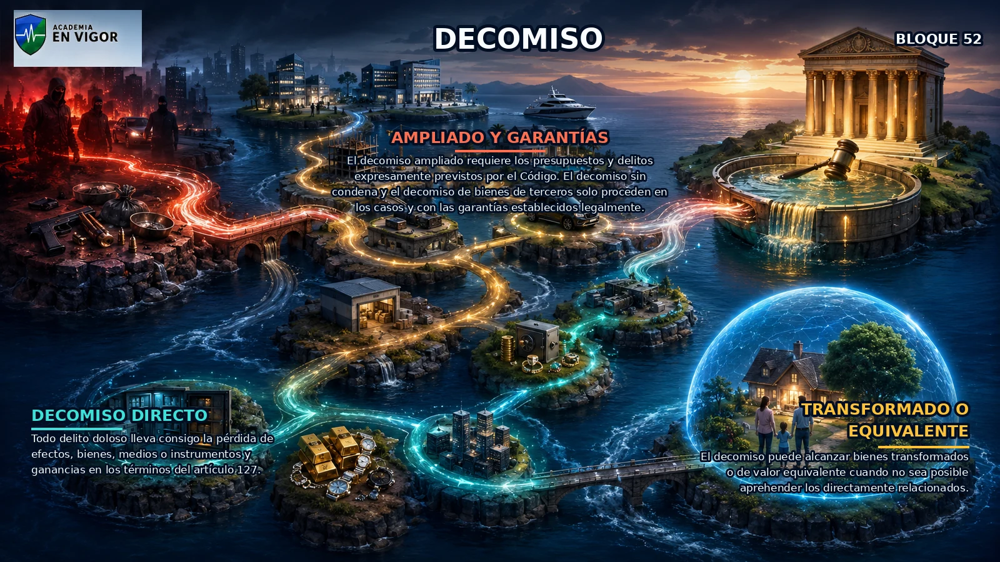

<em>Infografía: Decomiso.</em>

<!-- FUENTE: CP-T16 -->

## 53. Consecuencias accesorias para entidades sin personalidad

El artículo 129 se dirige a empresas, organizaciones, grupos o entidades sin personalidad jurídica no comprendidos en el artículo 31 bis.

- El artículo 129 se dirige a empresas, organizaciones, grupos o entidades sin personalidad jurídica no comprendidos en el artículo 31 bis.
- El juez o tribunal puede imponer motivadamente una o varias consecuencias equivalentes a las letras c) a g) del artículo 33.7.
- Solo se aplican cuando el Código lo prevé expresamente o por delitos que permiten responsabilidad penal de personas jurídicas.
- Durante la instrucción pueden acordarse cautelarmente clausura temporal, suspensión de actividades e intervención judicial dentro de los límites legales.

<!-- FUENTE: CP-T16 -->

# Hablemos claro

:::hablemos-claro
No memorices listas aisladas: sigue siempre la secuencia ley aplicable → delito → responsable → circunstancia → consecuencia.
:::

# En la calle

:::en-la-calle
Ante un supuesto, fija fecha, lugar, acción u omisión, fase de ejecución, función de cada sujeto y resultado antes de calcular la respuesta penal.
:::

# Lo que cae

:::lo-que-cae
Prioriza artículos 2, 10-23, 27-33, 35, 39, 50-53, 61-79, 95-109 y 127-129, junto con edad y responsabilidad de personas jurídicas.
:::

# Ha caído

:::ha-caido
No hay antecedentes activados como oficiales mientras sigan en cuarentena editorial.
:::

---

*Academia En Vigor · El temario que nunca duerme · Tema 16 · v1.0.0 · Documento interno no publicado.*
