# TEMA 17 · DERECHO PENAL ESPECIAL: HOMICIDIO, ABORTO, LESIONES, LIBERTAD, INTEGRIDAD MORAL Y LIBERTAD SEXUAL

**Policía Nacional · Método VIGOR · PARTE**
**Versión de contenido:** 1.0.0
**Estado editorial:** approved_internal · **Publicación:** not_published

# Mapa del tema

<!-- VISUAL:t17-01-mapa-general.webp -->

  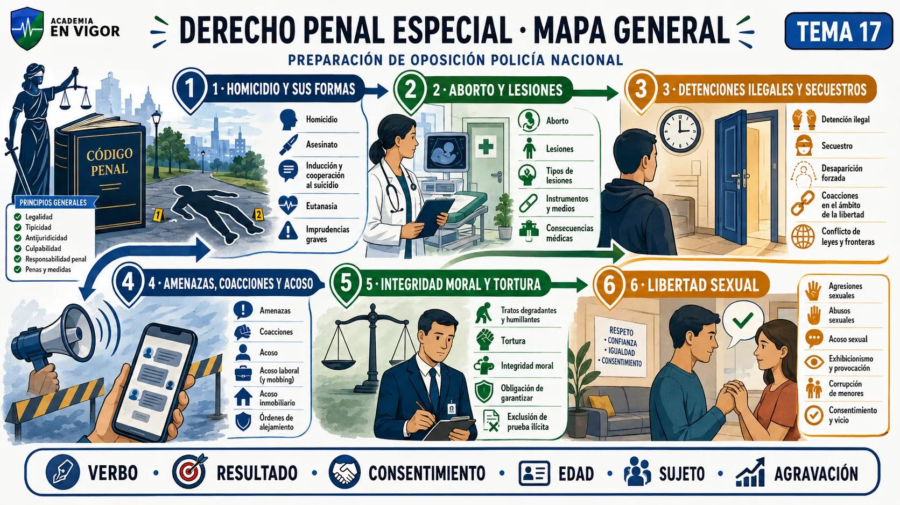

<em>Infografía: recorrido visual por las seis partes del Tema 17.</em>

El Tema 17 se estudia identificando conducta, resultado, consentimiento, edad, sujeto y circunstancias.

# Contenido

## 01. Mapa general del Tema 17

El Tema 17 estudia los delitos contra la vida, la integridad física, la libertad, la integridad moral y la libertad sexual.

- El Tema 17 estudia los delitos contra la vida, la integridad física, la libertad, la integridad moral y la libertad sexual.
- La respuesta de examen exige distinguir el verbo típico, el resultado, el consentimiento, la edad de la víctima, la cualidad del autor y las circunstancias de agravación.
- La trata de seres humanos se conserva como material complementario de origen, pero no integra el epígrafe oficial del Tema 17 utilizado en esta edición.

<!-- MATERIAL PENDIENTE: t17-p1-audio -->
<!-- MATERIAL PENDIENTE: t17-p1-video -->
<!-- MATERIAL PENDIENTE: t17-p1-pres -->

<!-- FUENTE: CONV-PN-2026 -->

## 02. Homicidio: tipo básico y agravaciones

El que matare a otro será castigado como reo de homicidio con prisión de 10 a 15 años.

- El que matare a otro será castigado como reo de homicidio con prisión de 10 a 15 años.
- Los hechos serán castigados con la pena superior en grado (prisión de 15 a 20 años) cuando concurra alguna de las circunstancias del art. 140.1 CP:
- La víctima fuere menor de 16 años o persona especialmente vulnerable por razón de edad, enfermedad o discapacidad.

<!-- VISUAL:t17-02-homicidio-tipo-basico-y-agravaciones.webp -->

  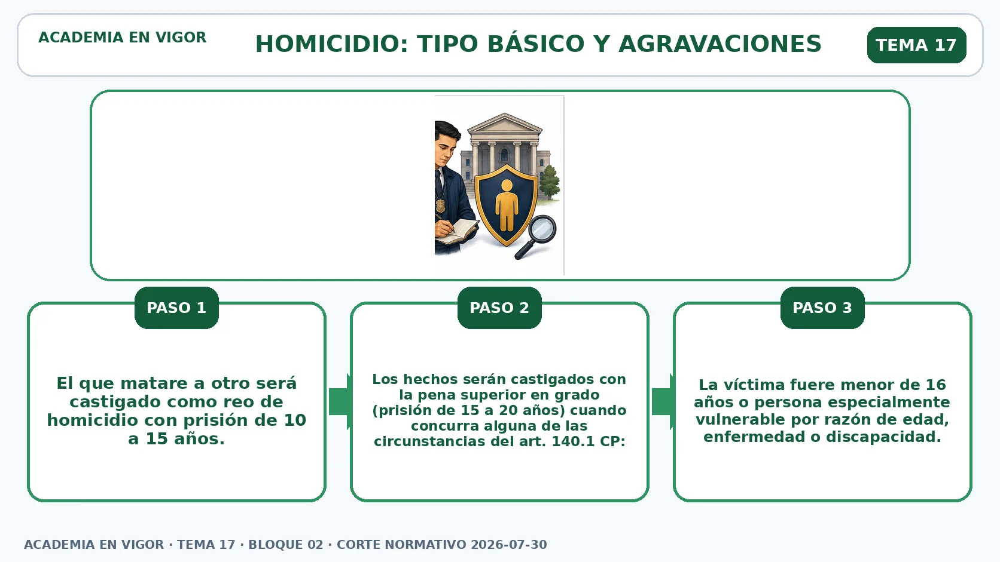

<em>Infografía: Homicidio: tipo básico y agravaciones.</em>

<!-- MATERIAL PENDIENTE: t17-p1-audio -->
<!-- MATERIAL PENDIENTE: t17-p1-video -->
<!-- MATERIAL PENDIENTE: t17-p1-pres -->

<!-- FUENTE: CP-T17 -->

## 03. Asesinato: elementos y circunstancias

prisión de 15 a 25 años el que matare a otro concurriendo alguna de estas circunstancias:

- prisión de 15 a 25 años el que matare a otro concurriendo alguna de estas circunstancias:
- 1.ª Con alevosía (víctima en situación de indefensión).
- 2.ª Por precio, recompensa o promesa.

<!-- VISUAL:t17-03-asesinato-elementos-y-circunstancias.webp -->

  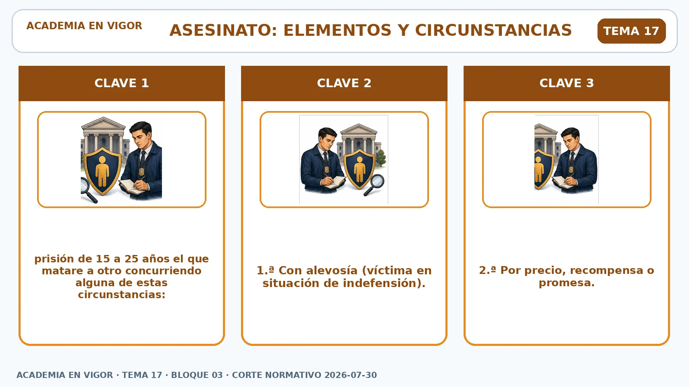

<em>Infografía: Asesinato: elementos y circunstancias.</em>

<!-- MATERIAL PENDIENTE: t17-p1-audio -->
<!-- MATERIAL PENDIENTE: t17-p1-video -->
<!-- MATERIAL PENDIENTE: t17-p1-pres -->

<!-- FUENTE: CP-T17 -->

## 04. Asesinato agravado y prisión permanente revisable

Tipo agravado (Art. 139.2 CP)

- Tipo agravado (Art. 139.2 CP)
- Si concurren dos o más circunstancias del 139.1: pena en su mitad superior (22 años y 6 meses a 25 años).
- Tipo hiperagravado (Art. 140 CP)

<!-- VISUAL:t17-04-asesinato-agravado-y-prision-permanente-revisable.webp -->

  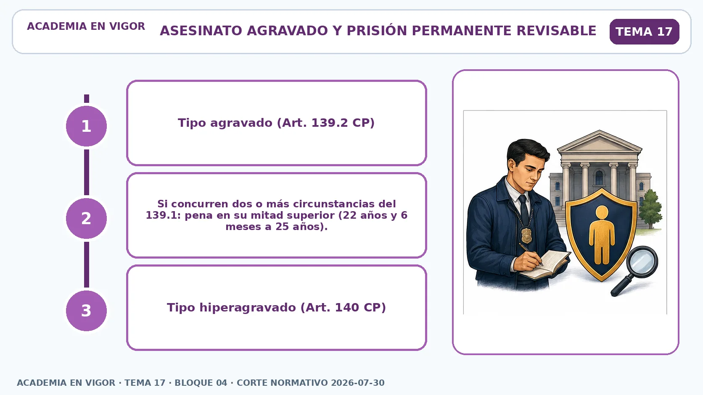

<em>Infografía: Asesinato agravado y prisión permanente revisable.</em>

<!-- MATERIAL PENDIENTE: t17-p1-audio -->
<!-- MATERIAL PENDIENTE: t17-p1-video -->
<!-- MATERIAL PENDIENTE: t17-p1-pres -->

<!-- FUENTE: CP-T17 -->

## 05. Homicidio imprudente

Quien cause la muerte por imprudencia grave: prisión de 1 a 4 años.

- Quien cause la muerte por imprudencia grave: prisión de 1 a 4 años.
- Si se utiliza vehículo a motor o ciclomotor: además, privación del derecho a conducir de 1 a 6 años. Se considera imprudencia grave la conducción con alguna circunstancia del art. 379 CP (ej.: exceso de velocidad o alcoholemia).
- Si se utiliza arma de fuego: privación del derecho a tenencia o porte de armas de 1 a 6 años.

<!-- VISUAL:t17-05-homicidio-imprudente.webp -->

  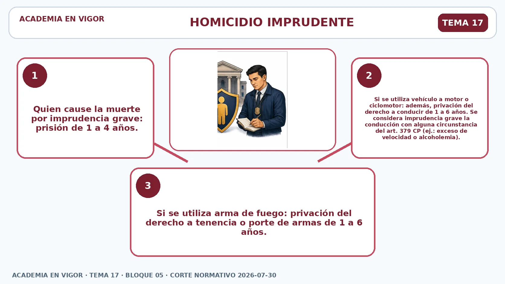

<em>Infografía: Homicidio imprudente.</em>

<!-- MATERIAL PENDIENTE: t17-p1-audio -->
<!-- MATERIAL PENDIENTE: t17-p1-video -->
<!-- MATERIAL PENDIENTE: t17-p1-pres -->

<!-- FUENTE: CP-T17 -->

## 06. Inducción, cooperación al suicidio y eutanasia

Inducción al suicidio (Art. 143.1 CP)

- Inducción al suicidio (Art. 143.1 CP)
- El que induzca al suicidio de otro: prisión de 4 a 8 años.
- Cooperación necesaria (Art. 143.2 CP)

<!-- VISUAL:t17-06-induccion-cooperacion-al-suicidio-y-eutanasia.webp -->

  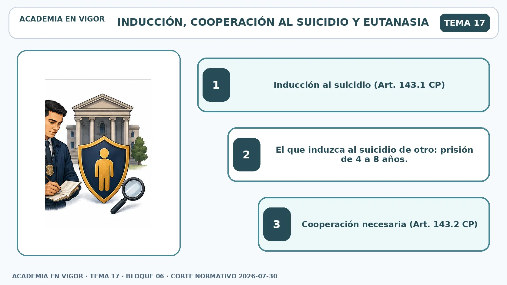

<em>Infografía: Inducción, cooperación al suicidio y eutanasia.</em>

<!-- VISUAL:t17-il-01-red-apoyo-digital.webp -->

  

<em>Ilustración: Inducción, cooperación al suicidio y eutanasia.</em>

<!-- MATERIAL PENDIENTE: t17-p1-audio -->
<!-- MATERIAL PENDIENTE: t17-p1-video -->
<!-- MATERIAL PENDIENTE: t17-p1-pres -->

<!-- FUENTE: CP-T17,LO3-2021-T17 -->

## 07. Actos preparatorios y consecuencias adicionales

Actos preparatorios (Art. 141 CP)

- Actos preparatorios (Art. 141 CP)
- Provocación, conspiración o proposición para cometer homicidio o asesinato: pena inferior en 1 o 2 grados.
- Medidas de seguridad (Art. 140 bis CP)

<!-- VISUAL:t17-07-actos-preparatorios-y-consecuencias-adicionales.webp -->

  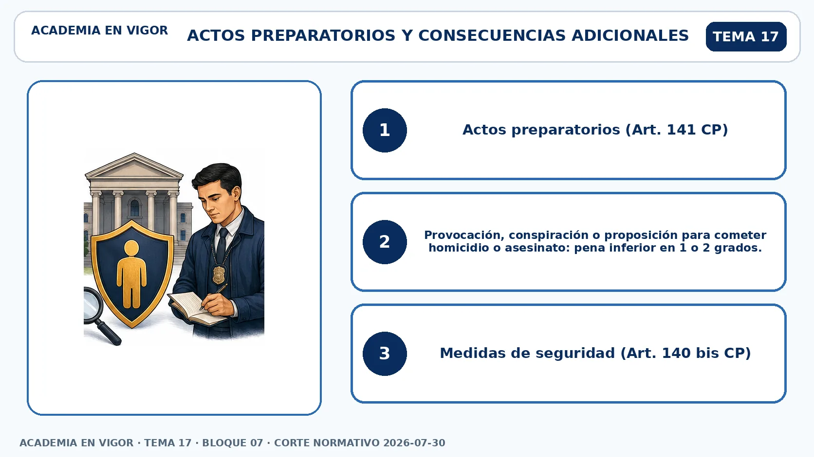

<em>Infografía: Actos preparatorios y consecuencias adicionales.</em>

<!-- MATERIAL PENDIENTE: t17-p1-audio -->
<!-- MATERIAL PENDIENTE: t17-p1-video -->
<!-- MATERIAL PENDIENTE: t17-p1-pres -->

<!-- FUENTE: CP-T17 -->

## 08. Aborto sin consentimiento

Aborto sin consentimiento (Art. 144 CP)

- Aborto sin consentimiento (Art. 144 CP)
- El que produzca el aborto de una mujer sin su consentimiento: prisión de 4 a 8 años + inhabilitación especial para cualquier profesión sanitaria o servicios en clínicas/consultorios ginecológicos (públicos o privados) de 3 a 10 años.
- Las mismas penas si obtiene el consentimiento mediante violencia, amenaza o engaño.

<!-- VISUAL:t17-08-aborto-sin-consentimiento.webp -->

  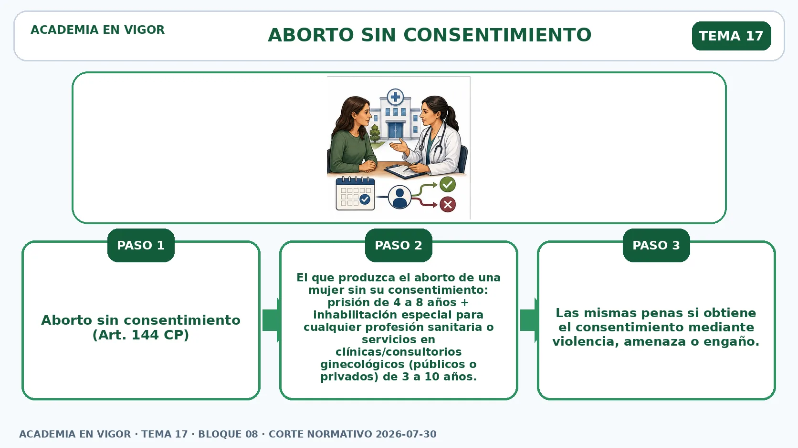

<em>Infografía: Aborto sin consentimiento.</em>

<!-- MATERIAL PENDIENTE: t17-p2-audio -->
<!-- MATERIAL PENDIENTE: t17-p2-video -->
<!-- MATERIAL PENDIENTE: t17-p2-pres -->

<!-- FUENTE: CP-T17 -->

## 09. Aborto consentido fuera de los casos legales

Aborto con consentimiento fuera de los casos permitidos (Art. 145 CP)

- Aborto con consentimiento fuera de los casos permitidos (Art. 145 CP)
- Quien produzca el aborto con consentimiento pero fuera de los casos legales: prisión de 1 a 3 años + inhabilitación especial de 1 a 6 años.
- El juez podrá imponer la pena en mitad superior si se realiza fuera de centro acreditado.

<!-- VISUAL:t17-09-aborto-consentido-fuera-de-los-casos-legales.webp -->

  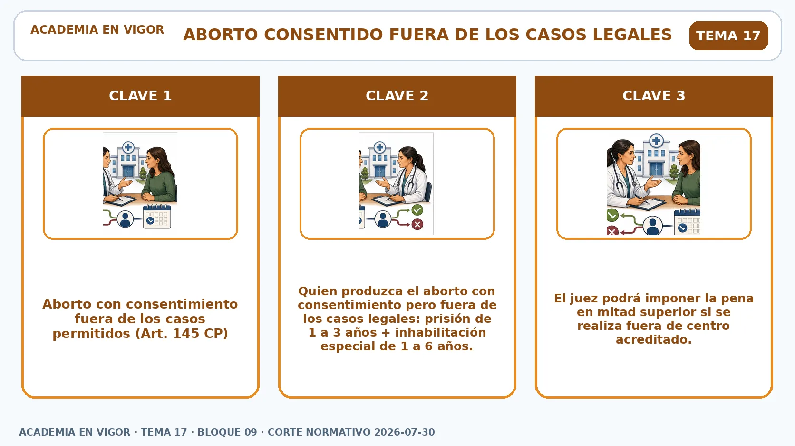

<em>Infografía: Aborto consentido fuera de los casos legales.</em>

<!-- MATERIAL PENDIENTE: t17-p2-audio -->
<!-- MATERIAL PENDIENTE: t17-p2-video -->
<!-- MATERIAL PENDIENTE: t17-p2-pres -->

<!-- FUENTE: CP-T17 -->

## 10. Requisitos incumplidos y aborto imprudente

Aborto en casos permitidos pero sin cumplir requisitos (Art. 145 bis CP – modificado por LO 1/2023)

- Aborto en casos permitidos pero sin cumplir requisitos (Art. 145 bis CP – modificado por LO 1/2023)
- multa de 6 a 12 meses + inhabilitación especial de 6 meses a 2 años al que practique un aborto dentro de los casos legales pero fuera de un centro o establecimiento público o privado acreditado.
- El juez podrá imponer la pena en mitad superior.

<!-- VISUAL:t17-10-requisitos-incumplidos-y-aborto-imprudente.webp -->

  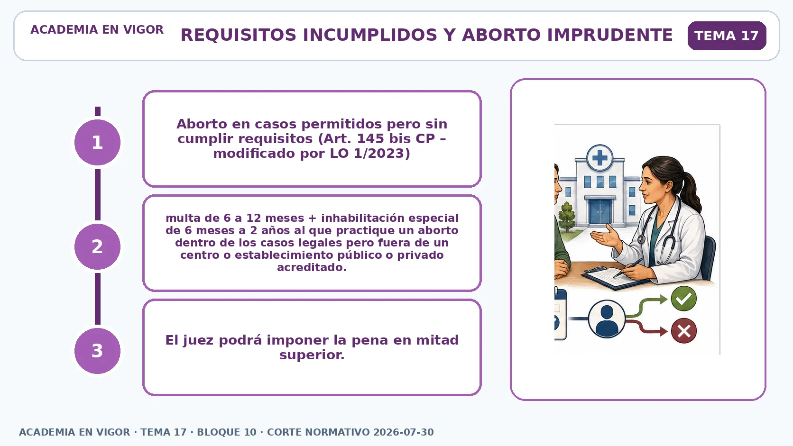

<em>Infografía: Requisitos incumplidos y aborto imprudente.</em>

<!-- MATERIAL PENDIENTE: t17-p2-audio -->
<!-- MATERIAL PENDIENTE: t17-p2-video -->
<!-- MATERIAL PENDIENTE: t17-p2-pres -->

<!-- FUENTE: CP-T17 -->

## 11. Interrupción voluntaria del embarazo en los casos permitidos

Requisitos comunes (Art. 13 LO 2/2010, actualizado)

- Requisitos comunes (Art. 13 LO 2/2010, actualizado)
- Practicado por médico especialista (preferiblemente ginecólogo) o bajo su dirección.
- En centro sanitario público o privado acreditado.

<!-- VISUAL:t17-11-interrupcion-voluntaria-del-embarazo-en-los-casos-pe.webp -->

  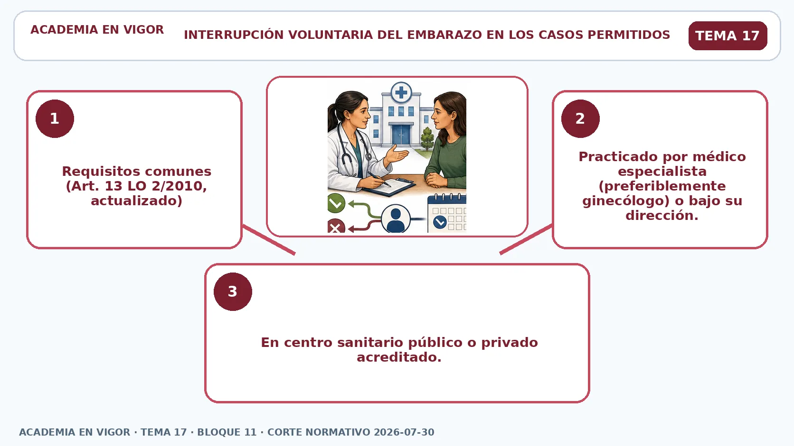

<em>Infografía: Interrupción voluntaria del embarazo en los casos permitidos.</em>

<!-- MATERIAL PENDIENTE: t17-p2-audio -->
<!-- MATERIAL PENDIENTE: t17-p2-video -->
<!-- MATERIAL PENDIENTE: t17-p2-pres -->

<!-- FUENTE: LO2-2010-T17 -->

## 12. Lesiones: bien jurídico y tratamiento médico

El bien jurídico protegido es la integridad corporal y la salud física o mental de las personas.

- El bien jurídico protegido es la integridad corporal y la salud física o mental de las personas.
- Las lesiones requieren un menoscabo objetivo (no basta dolor subjetivo).
- La jurisprudencia considera tratamiento médico cualquier intervención curativa activa; quirúrgico incluye suturas o reducciones. La mera vigilancia no cuenta.

<!-- VISUAL:t17-12-lesiones-bien-juridico-y-tratamiento-medico.webp -->

  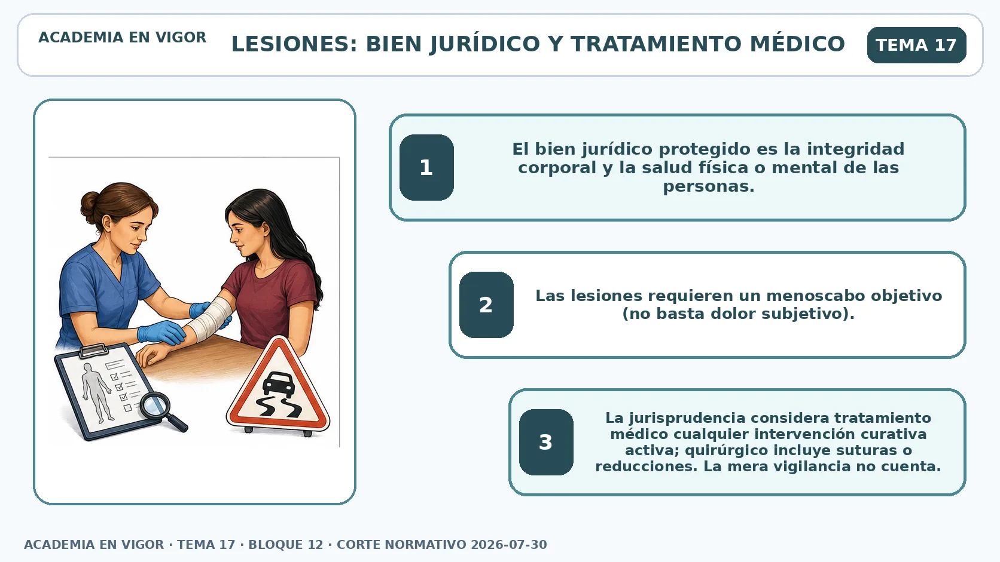

<em>Infografía: Lesiones: bien jurídico y tratamiento médico.</em>

<!-- MATERIAL PENDIENTE: t17-p3-audio -->
<!-- MATERIAL PENDIENTE: t17-p3-video -->
<!-- MATERIAL PENDIENTE: t17-p3-pres -->

<!-- FUENTE: CP-T17 -->

## 13. Lesiones atenuadas y maltrato de obra

Lesión sin tratamiento requerido (Art. 147.2 CP)

- Lesión sin tratamiento requerido (Art. 147.2 CP)
- Lesión que no requiere tratamiento médico/quirúrgico: multa de 1 a 3 meses.
- Maltrato de obra (Art. 147.3 CP)

<!-- VISUAL:t17-13-lesiones-atenuadas-y-maltrato-de-obra.webp -->

  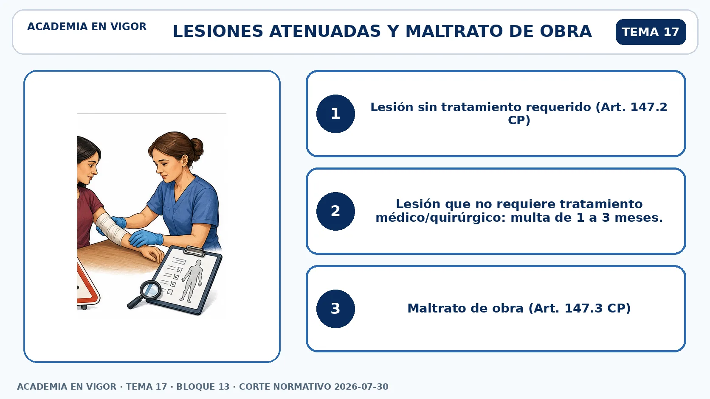

<em>Infografía: Lesiones atenuadas y maltrato de obra.</em>

<!-- MATERIAL PENDIENTE: t17-p3-audio -->
<!-- MATERIAL PENDIENTE: t17-p3-video -->
<!-- MATERIAL PENDIENTE: t17-p3-pres -->

<!-- FUENTE: CP-T17 -->

## 14. Lesiones agravadas por el medio o la víctima

Tipo agravado por forma de comisión (Art. 148 CP)

- Tipo agravado por forma de comisión (Art. 148 CP)
- Lesiones básicas con: prisión de 2 a 5 años si concurre:
- Uso de armas, instrumentos o métodos peligrosos.

<!-- VISUAL:t17-14-lesiones-agravadas-por-el-medio-o-la-victima.webp -->

  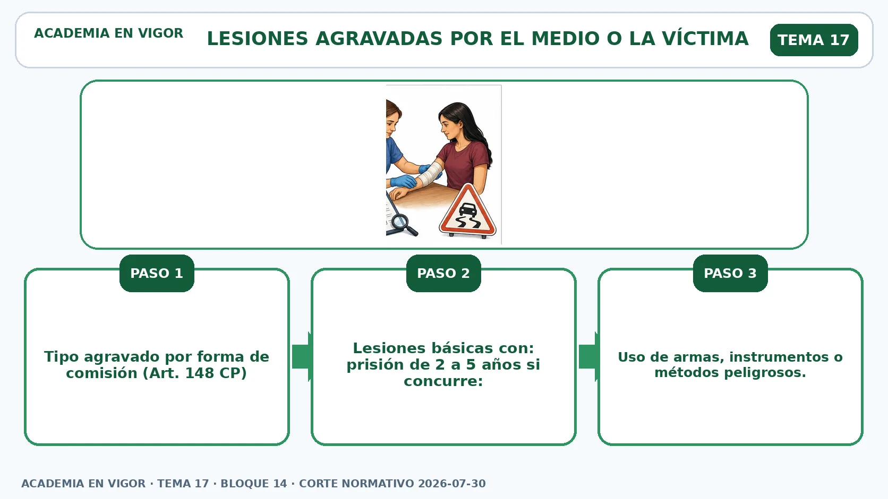

<em>Infografía: Lesiones agravadas por el medio o la víctima.</em>

<!-- MATERIAL PENDIENTE: t17-p3-audio -->
<!-- MATERIAL PENDIENTE: t17-p3-video -->
<!-- MATERIAL PENDIENTE: t17-p3-pres -->

<!-- FUENTE: CP-T17 -->

## 15. Lesiones graves por el resultado

Lesiones graves por resultado (Arts. 149 y 150 CP)

- Lesiones graves por resultado (Arts. 149 y 150 CP)
- Pérdida/inutilidad de órgano/miembro principal, sentido, impotencia, esterilidad, grave deformidad o grave enfermedad somática/psíquica:
- Si víctima menor o con discapacidad:

<!-- VISUAL:t17-15-lesiones-graves-por-el-resultado.webp -->

  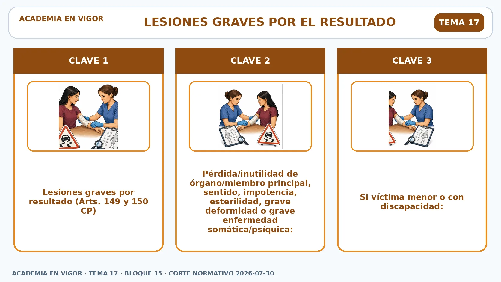

<em>Infografía: Lesiones graves por el resultado.</em>

<!-- MATERIAL PENDIENTE: t17-p3-audio -->
<!-- MATERIAL PENDIENTE: t17-p3-video -->
<!-- MATERIAL PENDIENTE: t17-p3-pres -->

<!-- FUENTE: CP-T17 -->

## 16. Lesiones imprudentes

Básicas (art. 147.1): prisión 3-6 meses o multa 6-18 meses.

- Básicas (art. 147.1): prisión 3-6 meses o multa 6-18 meses.
- Graves (art. 149): prisión 1-3 años.
- Menos graves (art. 150): prisión 6 meses-2 años.

<!-- VISUAL:t17-16-lesiones-imprudentes.webp -->

  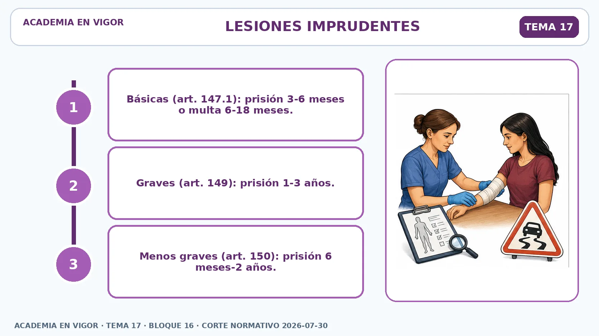

<em>Infografía: Lesiones imprudentes.</em>

<!-- MATERIAL PENDIENTE: t17-p3-audio -->
<!-- MATERIAL PENDIENTE: t17-p3-video -->
<!-- MATERIAL PENDIENTE: t17-p3-pres -->

<!-- FUENTE: CP-T17 -->

## 17. Violencia en el ámbito doméstico o familiar

Mitad superior si en presencia de menores, con armas, en domicilio o quebrantando pena/medida.

- Mitad superior si en presencia de menores, con armas, en domicilio o quebrantando pena/medida.
- Posible inferior en grado (motivado por circunstancias personales).
- 3. Delitos de lesiones (Título III del Libro II del Código Penal – vigente a 30 de diciembre de 2025)

<!-- VISUAL:t17-17-violencia-en-el-ambito-domestico-o-familiar.webp -->

  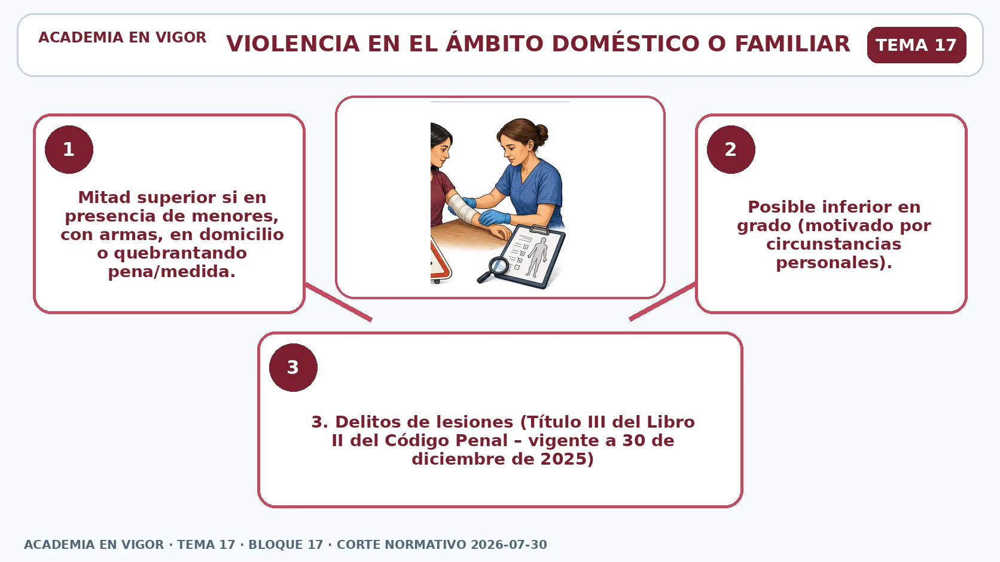

<em>Infografía: Violencia en el ámbito doméstico o familiar.</em>

<!-- MATERIAL PENDIENTE: t17-p3-audio -->
<!-- MATERIAL PENDIENTE: t17-p3-video -->
<!-- MATERIAL PENDIENTE: t17-p3-pres -->

<!-- FUENTE: CP-T17 -->

## 18. Riña tumultuaria y consentimiento

Riña tumultuaria (Art. 154 CP)

- Riña tumultuaria (Art. 154 CP)
- Riña colectiva tumultuaria con medios peligrosos para vida/integridad: prisión 3 meses-1 año o multa 6-24 meses.
- Requiere pluralidad, reciprocidad y peligrosidad.

<!-- VISUAL:t17-18-rina-tumultuaria-y-consentimiento.webp -->

  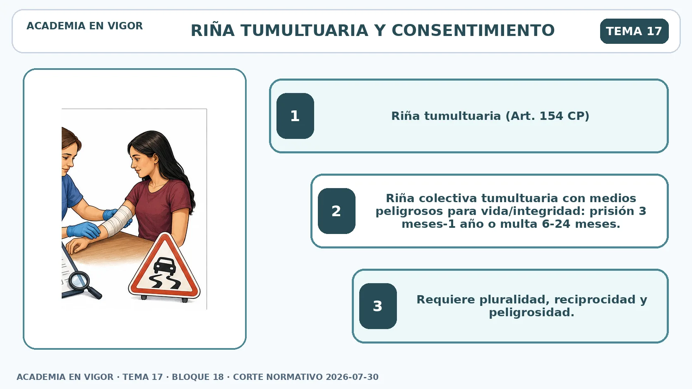

<em>Infografía: Riña tumultuaria y consentimiento.</em>

<!-- VISUAL:t17-il-02-consentimiento-rina.webp -->

  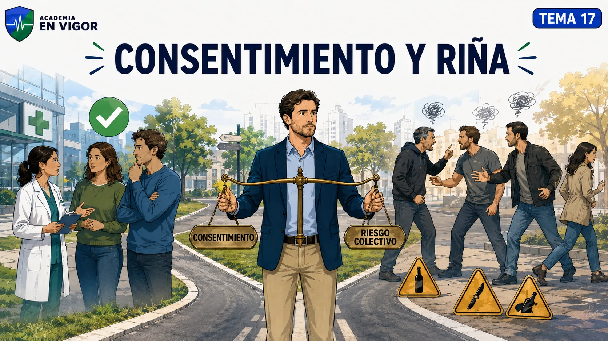

<em>Ilustración: Riña tumultuaria y consentimiento.</em>

<!-- MATERIAL PENDIENTE: t17-p3-audio -->
<!-- MATERIAL PENDIENTE: t17-p3-video -->
<!-- MATERIAL PENDIENTE: t17-p3-pres -->

<!-- FUENTE: CP-T17 -->

## 19. Órganos, autolesión, menores y lesiones al feto

Tráfico ilegal de órganos humanos (Art. 156 bis CP)

- Tráfico ilegal de órganos humanos (Art. 156 bis CP)
- Promoción, facilitación o ejecución de tráfico: prisión 6-12 años (órgano vivo) o 3-6 años (fallecido).
- Agravantes por peligro grave, vulnerabilidad víctima, organización criminal, etc., elevan penas (hasta superior en grado + inhabilitaciones).

<!-- VISUAL:t17-19-organos-autolesion-menores-y-lesiones-al-feto.webp -->

  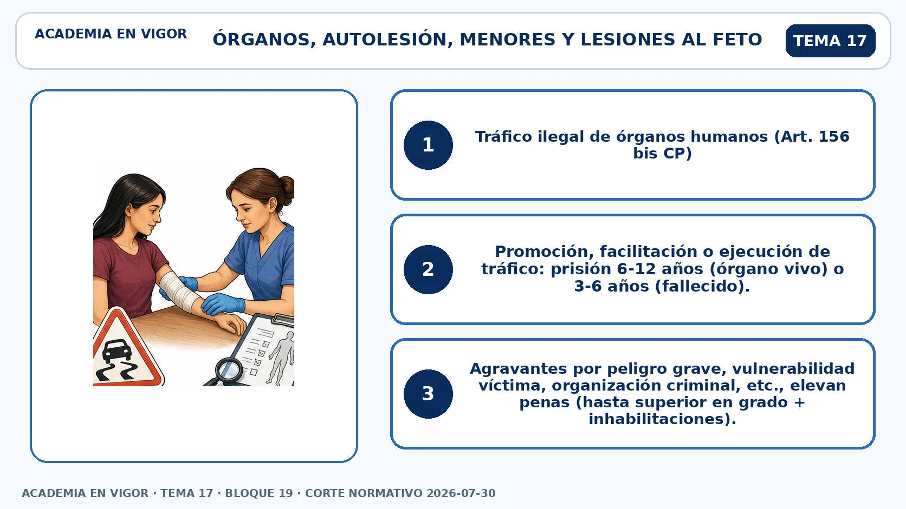

<em>Infografía: Órganos, autolesión, menores y lesiones al feto.</em>

<!-- MATERIAL PENDIENTE: t17-p3-audio -->
<!-- MATERIAL PENDIENTE: t17-p3-video -->
<!-- MATERIAL PENDIENTE: t17-p3-pres -->

<!-- FUENTE: CP-T17 -->

## 20. Detención ilegal: tipo básico

El particular que encierre o detenga a otro, privándole de su libertad: prisión de 4 a 6 años.

- El particular que encierre o detenga a otro, privándole de su libertad: prisión de 4 a 6 años.
- Encierro: Limitación física de la capacidad ambulatoria en espacio cerrado del que la víctima no puede salir por sus propios medios.
- Detención: Posibilidad de deambulación, pero forzada y no autónoma (ej.: vigilancia constante).

<!-- VISUAL:t17-20-detencion-ilegal-tipo-basico.webp -->

  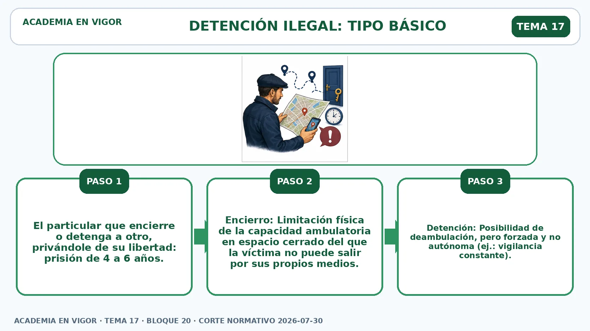

<em>Infografía: Detención ilegal: tipo básico.</em>

<!-- MATERIAL PENDIENTE: t17-p4-audio -->
<!-- MATERIAL PENDIENTE: t17-p4-video -->
<!-- MATERIAL PENDIENTE: t17-p4-pres -->

<!-- FUENTE: CP-T17 -->

## 21. Liberación temprana y duración de la detención

Tipos atenuados (Art. 163.2 y 4 CP)

- Tipos atenuados (Art. 163.2 y 4 CP)
- Si el culpable libera a la víctima en los tres primeros días de detención, sin lograr el objeto perseguido: pena inferior en grado (prisión de 6 meses a 2 años).
- El particular que, fuera de casos permitidos por las leyes (art. 490 LECrim), aprehenda a una persona para presentarla inmediatamente a la autoridad: multa de 3 a 6 meses.

<!-- VISUAL:t17-21-liberacion-temprana-y-duracion-de-la-detencion.webp -->

  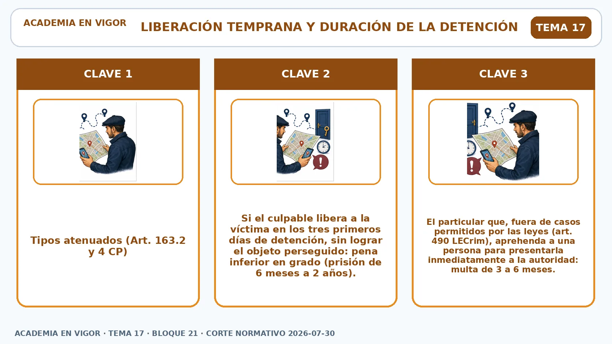

<em>Infografía: Liberación temprana y duración de la detención.</em>

<!-- MATERIAL PENDIENTE: t17-p4-audio -->
<!-- MATERIAL PENDIENTE: t17-p4-video -->
<!-- MATERIAL PENDIENTE: t17-p4-pres -->

<!-- FUENTE: CP-T17 -->

## 22. Secuestro condicional

El que secuestre a una persona exigiendo alguna condición para liberarla: prisión de 6 a 10 años.

- El que secuestre a una persona exigiendo alguna condición para liberarla: prisión de 6 a 10 años.
- Aplicación de circunstancias atenuadas (art. 163.2): pena inferior en grado.
- Aplicación de agravantes por duración (art. 163.3): pena superior en grado.

<!-- VISUAL:t17-22-secuestro-condicional.webp -->

  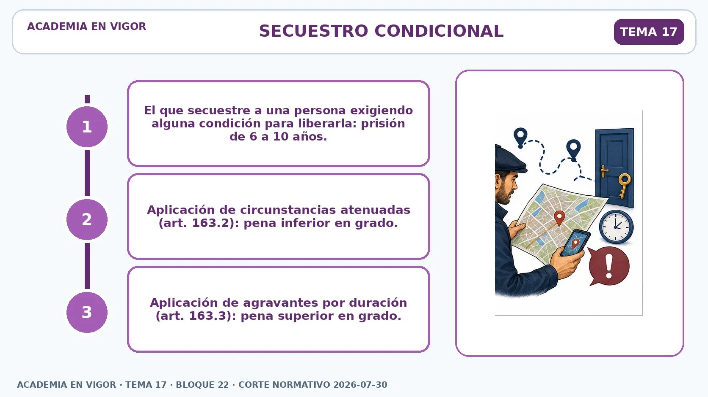

<em>Infografía: Secuestro condicional.</em>

<!-- MATERIAL PENDIENTE: t17-p4-audio -->
<!-- MATERIAL PENDIENTE: t17-p4-video -->
<!-- MATERIAL PENDIENTE: t17-p4-pres -->

<!-- FUENTE: CP-T17 -->

## 23. Agravaciones por simulación, víctima u ocultación

Tipo agravado por simulación de autoridad o victimología (Art. 165 CP)

- Tipo agravado por simulación de autoridad o victimología (Art. 165 CP)
- Pena en su mitad superior si:
- Se ejecuta simulando autoridad o función pública.

<!-- VISUAL:t17-23-agravaciones-por-simulacion-victima-u-ocultacion.webp -->

  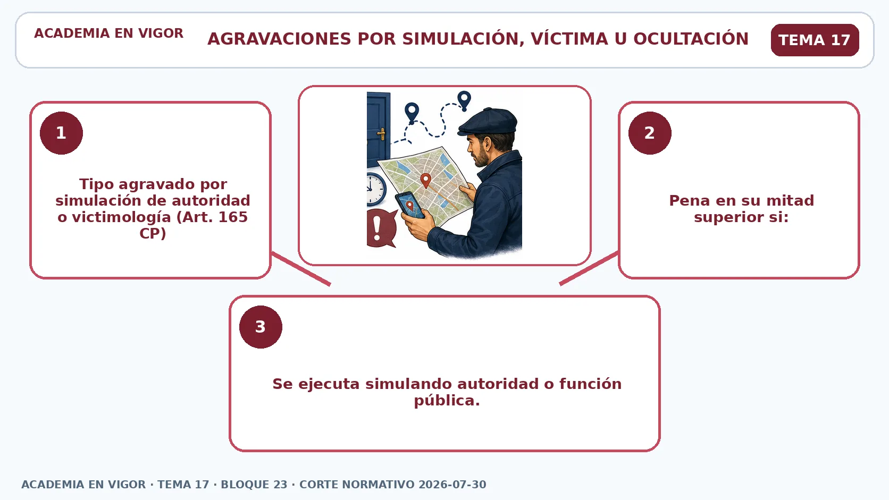

<em>Infografía: Agravaciones por simulación, víctima u ocultación.</em>

<!-- MATERIAL PENDIENTE: t17-p4-audio -->
<!-- MATERIAL PENDIENTE: t17-p4-video -->
<!-- MATERIAL PENDIENTE: t17-p4-pres -->

<!-- FUENTE: CP-T17 -->

## 24. Detención por autoridad o funcionario público

Detenciones ilegales por autoridad o funcionario público (Art. 167 CP)

- Detenciones ilegales por autoridad o funcionario público (Art. 167 CP)
- La autoridad o funcionario público que, fuera de casos legales y sin causa por delito, cometa detención ilegal o secuestro: pena en mitad superior, pudiéndose elevar a superior en grado.
- a) Funcionario que acuerde, practique o prolongue privación de libertad sin reconocerla u ocultando situación o derechos de la víctima.

<!-- VISUAL:t17-24-detencion-por-autoridad-o-funcionario-publico.webp -->

  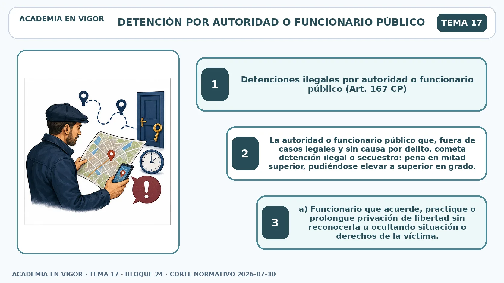

<em>Infografía: Detención por autoridad o funcionario público.</em>

<!-- MATERIAL PENDIENTE: t17-p4-audio -->
<!-- MATERIAL PENDIENTE: t17-p4-video -->
<!-- MATERIAL PENDIENTE: t17-p4-pres -->

<!-- FUENTE: CP-T17 -->

## 25. Actos preparatorios en detenciones y secuestros

Actos preparatorios (Art. 168 CP)

- Actos preparatorios (Art. 168 CP)
- Provocación, conspiración o proposición para cometer estos delitos: pena inferior en 1 o 2 grados.
- 4. Delitos contra la libertad (Título VI del Libro II del Código Penal – vigente a 30 de diciembre de 2025)

<!-- VISUAL:t17-25-actos-preparatorios-en-detenciones-y-secuestros.webp -->

  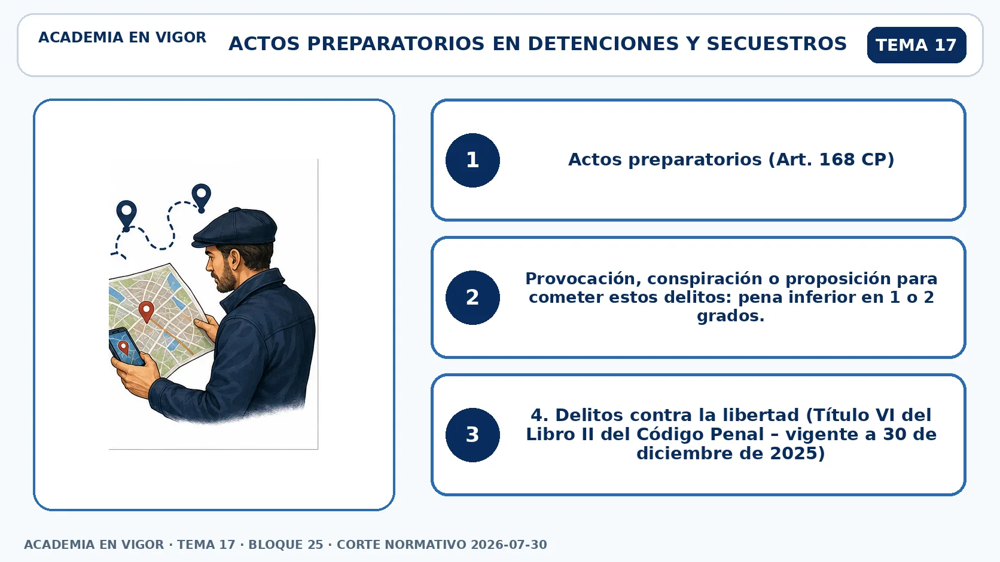

<em>Infografía: Actos preparatorios en detenciones y secuestros.</em>

<!-- MATERIAL PENDIENTE: t17-p4-audio -->
<!-- MATERIAL PENDIENTE: t17-p4-video -->
<!-- MATERIAL PENDIENTE: t17-p4-pres -->

<!-- FUENTE: CP-T17 -->

## 26. Amenazas de un mal constitutivo de delito

Condicional (exigiendo cantidad o recompensa, aunque sea lícita):

- Condicional (exigiendo cantidad o recompensa, aunque sea lícita):
- Si logra el propósito: prisión de 1 a 5 años.
- Si no: prisión de 6 meses a 3 años.

<!-- VISUAL:t17-26-amenazas-de-un-mal-constitutivo-de-delito.webp -->

  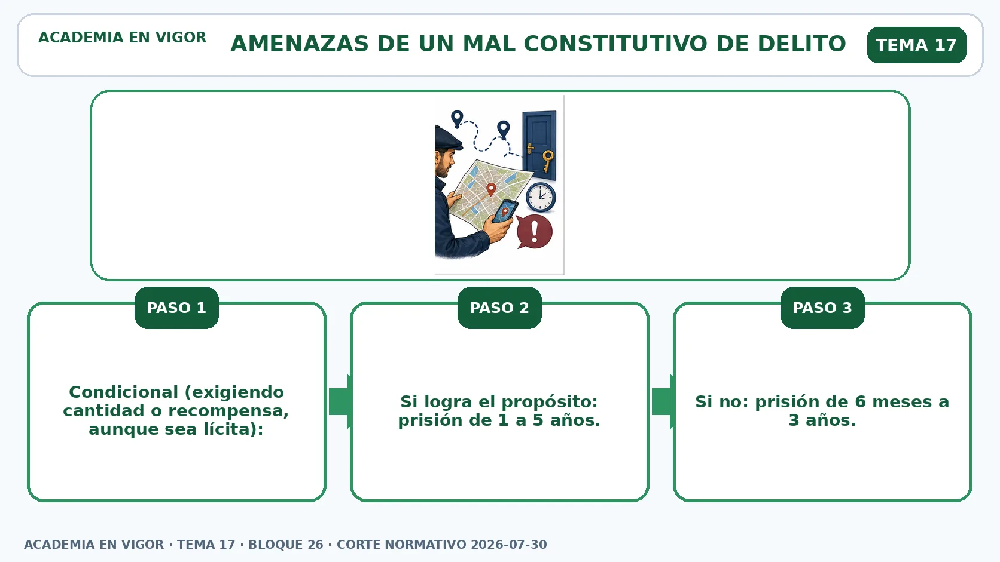

<em>Infografía: Amenazas de un mal constitutivo de delito.</em>

<!-- MATERIAL PENDIENTE: t17-p4-audio -->
<!-- MATERIAL PENDIENTE: t17-p4-video -->
<!-- MATERIAL PENDIENTE: t17-p4-pres -->

<!-- FUENTE: CP-T17 -->

## 27. Amenazas colectivas y de finalidad terrorista

Tipo agravado terrorista (Art. 170 CP)

- Tipo agravado terrorista (Art. 170 CP)
- Si se dirige a atemorizar a población, grupo étnico/cultural/religioso, colectivo social/profesional u otro grupo, con gravedad suficiente: pena superior en grado.
- Reclamar públicamente acciones violentas de organizaciones/grupos terroristas con misma finalidad/gravedad: prisión de 6 meses a 2 años.

<!-- VISUAL:t17-27-amenazas-colectivas-y-de-finalidad-terrorista.webp -->

  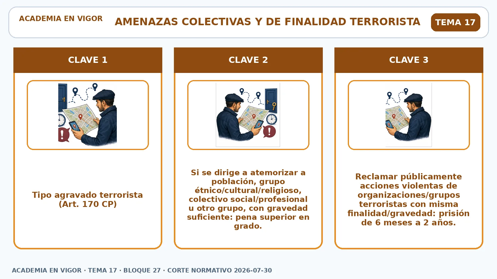

<em>Infografía: Amenazas colectivas y de finalidad terrorista.</em>

<!-- MATERIAL PENDIENTE: t17-p4-audio -->
<!-- MATERIAL PENDIENTE: t17-p4-video -->
<!-- MATERIAL PENDIENTE: t17-p4-pres -->

<!-- FUENTE: CP-T17 -->

## 28. Amenazas de mal no delictivo y chantaje

Amenazas de mal no constitutivo de delito (Art. 171.1 CP)

- Amenazas de mal no constitutivo de delito (Art. 171.1 CP)
- Amenaza condicional de mal no delictivo, siempre que la condición no sea conducta debida:
- Si logra propósito: pena en mitad superior.

<!-- VISUAL:t17-28-amenazas-de-mal-no-delictivo-y-chantaje.webp -->

  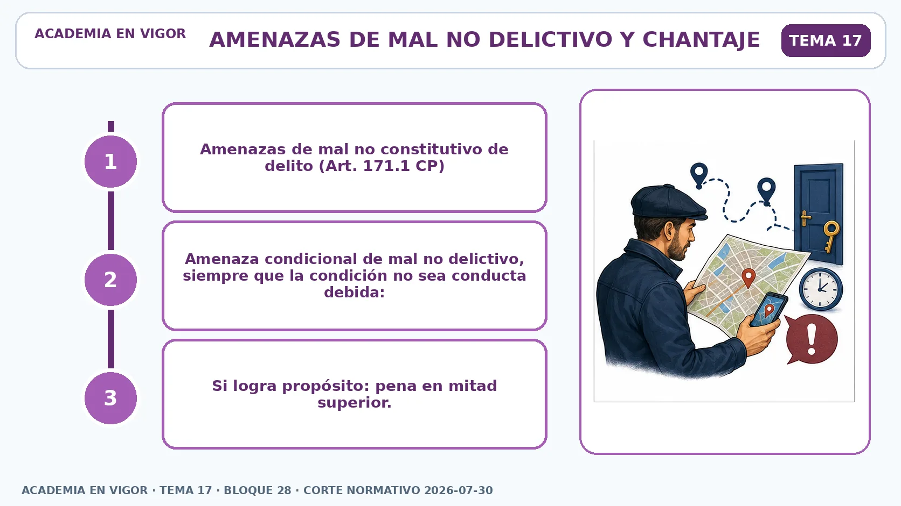

<em>Infografía: Amenazas de mal no delictivo y chantaje.</em>

<!-- MATERIAL PENDIENTE: t17-p4-audio -->
<!-- MATERIAL PENDIENTE: t17-p4-video -->
<!-- MATERIAL PENDIENTE: t17-p4-pres -->

<!-- FUENTE: CP-T17 -->

## 29. Amenazas leves en contextos especialmente protegidos

Amenazas leves en ámbito doméstico/vulnerable (Art. 171.4 CP)

- Amenazas leves en ámbito doméstico/vulnerable (Art. 171.4 CP)
- Amenaza leve a pareja/ex o persona vulnerable conviviente: prisión de 6 meses a 1 año o TBC 31-80 días + privación armas 1 año+1 día a 3 años + posible inhabilitación parental hasta 5 años.
- Posible pena inferior en grado (motivada).

<!-- VISUAL:t17-29-amenazas-leves-en-contextos-especialmente-protegidos.webp -->

  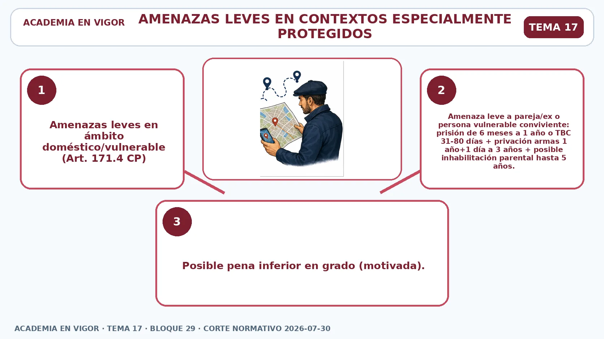

<em>Infografía: Amenazas leves en contextos especialmente protegidos.</em>

<!-- MATERIAL PENDIENTE: t17-p4-audio -->
<!-- MATERIAL PENDIENTE: t17-p4-video -->
<!-- MATERIAL PENDIENTE: t17-p4-pres -->

<!-- FUENTE: CP-T17 -->

## 30. Coacciones básicas, agravadas y leves

Quien, sin autorización legítima, impida con violencia hacer lo que la ley no prohíbe, o compela a hacer lo que no quiere (justo o injusto): prisión de 6 meses a 3 años o multa de 12 a 24 meses (según gravedad/medios).

- Quien, sin autorización legítima, impida con violencia hacer lo que la ley no prohíbe, o compela a hacer lo que no quiere (justo o injusto): prisión de 6 meses a 3 años o multa de 12 a 24 meses (según gravedad/medios).
- Elementos jurisprudenciales:
- Violencia material (vis física) o intimidación (vis compulsiva), directa o indirecta.

<!-- VISUAL:t17-30-coacciones-basicas-agravadas-y-leves.webp -->

  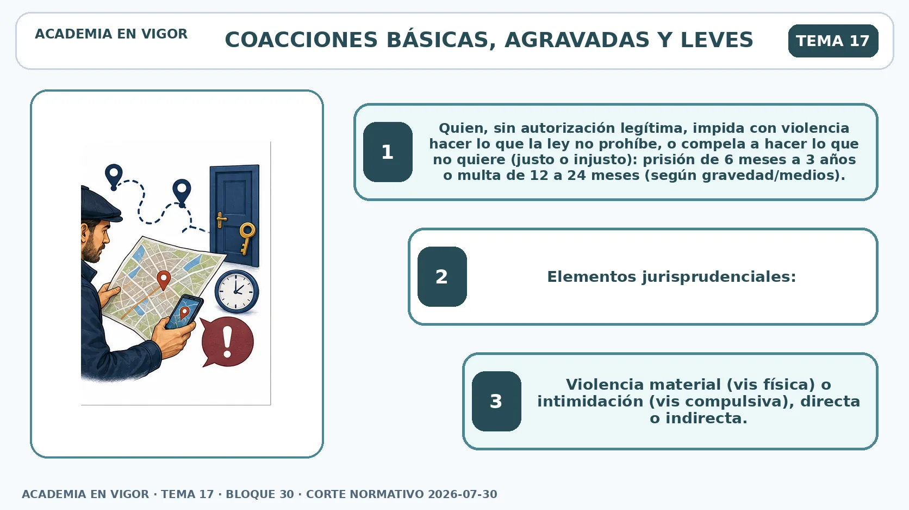

<em>Infografía: Coacciones básicas, agravadas y leves.</em>

<!-- MATERIAL PENDIENTE: t17-p4-audio -->
<!-- MATERIAL PENDIENTE: t17-p4-video -->
<!-- MATERIAL PENDIENTE: t17-p4-pres -->

<!-- FUENTE: CP-T17 -->

## 31. Matrimonio forzado

Delito de matrimonio forzado (Art. 172 bis CP)

- Delito de matrimonio forzado (Art. 172 bis CP)
- Compeler con violencia/intimidación grave a contraer matrimonio, o forzar con violencia/intimidación/engaño a abandonar territorio español o no regresar: prisión 6 meses-3 años y 6 meses o multa 12-24 meses (según gravedad).
- Mitad superior si víctima menor.

<!-- VISUAL:t17-31-matrimonio-forzado.webp -->

  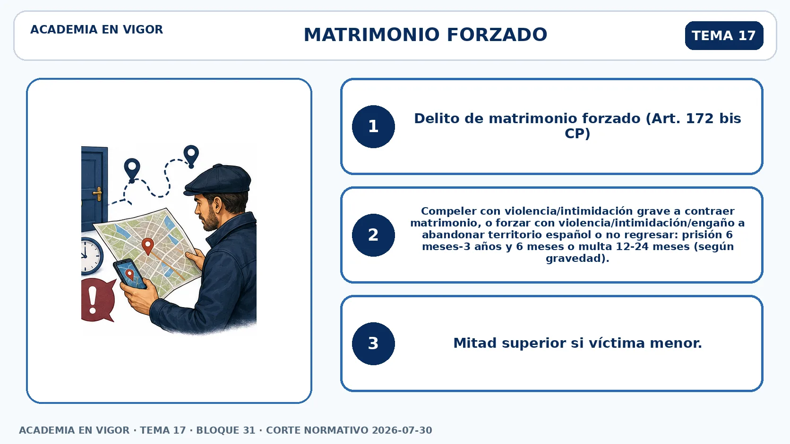

<em>Infografía: Matrimonio forzado.</em>

<!-- VISUAL:t17-il-03-libertad-eleccion.webp -->

  

<em>Ilustración: Matrimonio forzado.</em>

<!-- MATERIAL PENDIENTE: t17-p4-audio -->
<!-- MATERIAL PENDIENTE: t17-p4-video -->
<!-- MATERIAL PENDIENTE: t17-p4-pres -->

<!-- FUENTE: CP-T17 -->

## 32. Acoso reiterado o stalking

Acoso (stalking) (Art. 172 ter CP)

- Acoso (stalking) (Art. 172 ter CP)
- Quien acose insistentemente y reiteradamente, sin autorización legítima, alterando gravemente la vida cotidiana de la víctima: prisión 3 meses-2 años o multa 6-24 meses.
- Vigilar, perseguir o buscar cercanía física.

<!-- VISUAL:t17-32-acoso-reiterado-o-stalking.webp -->

  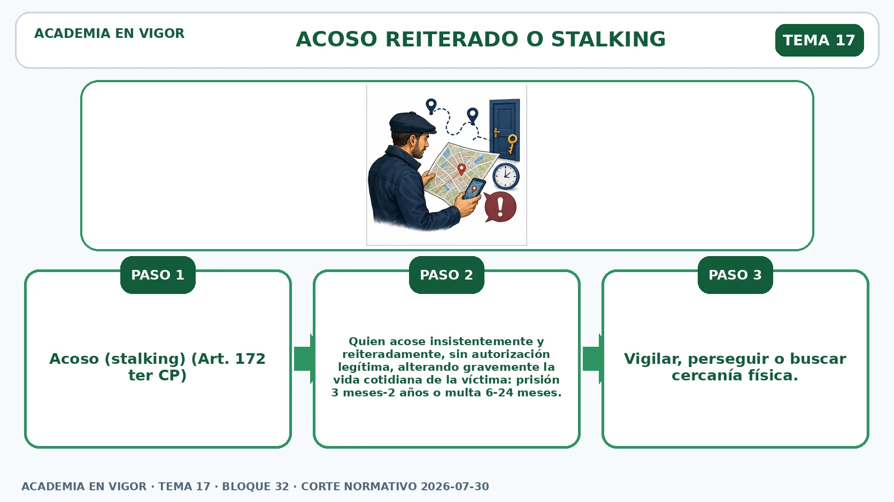

<em>Infografía: Acoso reiterado o stalking.</em>

<!-- VISUAL:t17-il-04-red-localizacion.webp -->

  

<em>Ilustración: Acoso reiterado o stalking.</em>

<!-- MATERIAL PENDIENTE: t17-p4-audio -->
<!-- MATERIAL PENDIENTE: t17-p4-video -->
<!-- MATERIAL PENDIENTE: t17-p4-pres -->

<!-- FUENTE: CP-T17 -->

## 33. Trato degradante y atentado contra la integridad moral

Delito de tratos degradantes o vejatorios (Art. 173.1, primer párrafo CP)

- Delito de tratos degradantes o vejatorios (Art. 173.1, primer párrafo CP)
- Quien inflija a otra persona un trato degradante, menoscabando gravemente su integridad moral: prisión de 6 meses a 2 años.
- Requiere un menoscabo objetivo y grave de la dignidad (humillación intensa que trasciende el mero disgusto o molestia).

<!-- VISUAL:t17-33-trato-degradante-y-atentado-contra-la-integridad-mor.webp -->

  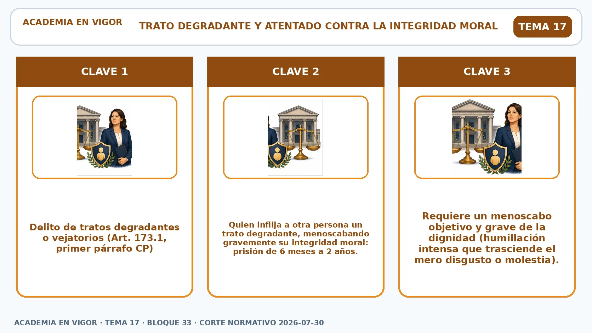

<em>Infografía: Trato degradante y atentado contra la integridad moral.</em>

<!-- MATERIAL PENDIENTE: t17-p5-audio -->
<!-- MATERIAL PENDIENTE: t17-p5-video -->
<!-- MATERIAL PENDIENTE: t17-p5-pres -->

<!-- FUENTE: CP-T17 -->

## 34. Ocultación reiterada del paradero de un cadáver

Ocultación reiterada del paradero de cadáver (Art. 173.1, segundo párrafo CP – introducido por LO 14/2022)

- Ocultación reiterada del paradero de cadáver (Art. 173.1, segundo párrafo CP – introducido por LO 14/2022)
- Quien, conociendo el paradero del cadáver de una persona, oculte de modo reiterado tal información a los familiares o allegados: prisión de 6 meses a 2 años.
- Esta modalidad protege el derecho de los allegados a conocer el destino de los restos y a superar el duelo, evitando el sufrimiento moral prolongado propio de las desapariciones forzadas de cadáveres.

<!-- VISUAL:t17-34-ocultacion-reiterada-del-paradero-de-un-cadaver.webp -->

  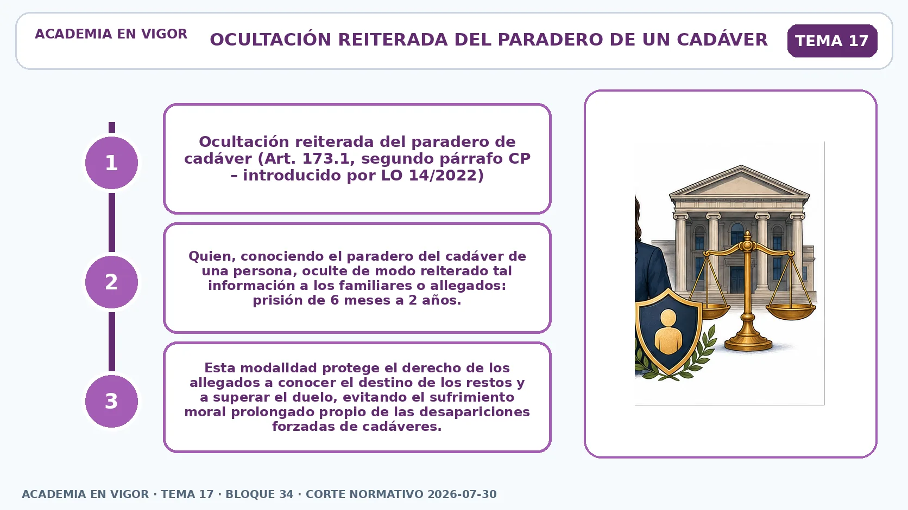

<em>Infografía: Ocultación reiterada del paradero de un cadáver.</em>

<!-- MATERIAL PENDIENTE: t17-p5-audio -->
<!-- MATERIAL PENDIENTE: t17-p5-video -->
<!-- MATERIAL PENDIENTE: t17-p5-pres -->

<!-- FUENTE: CP-T17 -->

## 35. Acoso laboral, inmobiliario y persona jurídica

Acoso laboral (mobbing) (Art. 173.1, tercer párrafo CP)

- Acoso laboral (mobbing) (Art. 173.1, tercer párrafo CP)
- prisión de 6 meses a 2 años.
- Requiere reiteración, prevalimiento de superioridad y gravedad del acoso (aunque no alcance el nivel de trato degradante).

<!-- MATERIAL PENDIENTE: t17-p5-audio -->
<!-- MATERIAL PENDIENTE: t17-p5-video -->
<!-- MATERIAL PENDIENTE: t17-p5-pres -->

<!-- FUENTE: CP-T17 -->

## 36. Violencia habitual en el ámbito familiar

Violencia física o psíquica habitual en el ámbito familiar (Art. 173.2 y 3 CP)

- Violencia física o psíquica habitual en el ámbito familiar (Art. 173.2 y 3 CP)
- Penas en mitad superior si los actos se perpetran en presencia de menores, utilizando armas, en el domicilio común o de la víctima, o quebrantando pena del art. 48 CP o medida cautelar similar.
- Además, podrá imponerse medida de libertad vigilada.

<!-- MATERIAL PENDIENTE: t17-p5-audio -->
<!-- MATERIAL PENDIENTE: t17-p5-video -->
<!-- MATERIAL PENDIENTE: t17-p5-pres -->

<!-- FUENTE: CP-T17 -->

## 37. Injurias, vejaciones y acoso sexual leve

Injurias o vejaciones injustas leves y acoso sexual leve (Art. 173.4 CP – ampliado por LO 10/2022)

- Injurias o vejaciones injustas leves y acoso sexual leve (Art. 173.4 CP – ampliado por LO 10/2022)
- Quien cause injuria o vejación injusta de carácter leve a persona del ámbito del apartado 2 (familiar/vulnerable):
- localización permanente de 5 a 30 días (alejada de la víctima), TBC de 5 a 30 días o multa de 1 a 4 meses (solo si concurren circunstancias del art.

<!-- MATERIAL PENDIENTE: t17-p5-audio -->
<!-- MATERIAL PENDIENTE: t17-p5-video -->
<!-- MATERIAL PENDIENTE: t17-p5-pres -->

<!-- FUENTE: CP-T17 -->

## 38. Tortura cometida por autoridad o funcionario

Si el atentado es grave: prisión de 2 a 6 años.

- Si el atentado es grave: prisión de 2 a 6 años.
- Si no: prisión de 1 a 3 años.
- En todo caso: inhabilitación absoluta de 8 a 12 años.

<!-- MATERIAL PENDIENTE: t17-p5-audio -->
<!-- MATERIAL PENDIENTE: t17-p5-video -->
<!-- MATERIAL PENDIENTE: t17-p5-pres -->

<!-- FUENTE: CP-T17 -->

## 39. Integridad moral por acción, omisión y concurso

Delito especial contra la integridad moral por autoridad (Art. 175 CP)

- Delito especial contra la integridad moral por autoridad (Art. 175 CP)
- La autoridad o funcionario público que, abusando de su cargo y fuera de los casos de tortura (art. 174), atente contra la integridad moral de una persona:
- Si el atentado es grave: prisión de 2 a 4 años.

<!-- MATERIAL PENDIENTE: t17-p5-audio -->
<!-- MATERIAL PENDIENTE: t17-p5-video -->
<!-- MATERIAL PENDIENTE: t17-p5-pres -->

<!-- FUENTE: CP-T17 -->

## 40. Consentimiento y agresión sexual

Agresiones sexuales (Art. 178 CP)

- Agresiones sexuales (Art. 178 CP)
- Quien realice cualquier acto que atente contra la libertad sexual de otra persona sin su consentimiento será castigado con prisión de 1 a 4 años.
- Cuando la agresión sexual consista en actos que se ejecuten empleando violencia o intimidación o sobre persona con voluntad anulada por cualquier causa (privación de sentido, abuso de situación mental, etc.): prisión de 1 a 5 años.

<!-- MATERIAL PENDIENTE: t17-p6-audio -->
<!-- MATERIAL PENDIENTE: t17-p6-video -->
<!-- MATERIAL PENDIENTE: t17-p6-pres -->

<!-- FUENTE: CP-T17,LO10-2022-T17,LO4-2023-T17 -->

## 41. Violación

Cuando la agresión sexual consista en acceso carnal por vía vaginal, anal o bucal, o en la introducción de miembros corporales u objetos por vía vaginal o anal: prisión de 4 a 12 años.

- Cuando la agresión sexual consista en acceso carnal por vía vaginal, anal o bucal, o en la introducción de miembros corporales u objetos por vía vaginal o anal: prisión de 4 a 12 años.
- Si se comete empleando violencia o intimidación o sobre víctima con voluntad anulada: prisión de 6 a 12 años.
- 7. Delitos contra la libertad sexual (Título VIII del Libro II del Código Penal – vigente a 30 de diciembre de 2025)

<!-- MATERIAL PENDIENTE: t17-p6-audio -->
<!-- MATERIAL PENDIENTE: t17-p6-video -->
<!-- MATERIAL PENDIENTE: t17-p6-pres -->

<!-- FUENTE: CP-T17 -->

## 42. Circunstancias agravantes de las agresiones sexuales

Tipo agravado específico (Art. 180 CP)

- Tipo agravado específico (Art. 180 CP)
- Las penas previstas en los arts. 178 y 179 se impondrán en sus respectivas mitades superiores (o superiores en grado según el caso) cuando concurra alguna de las siguientes circunstancias:
- Actuación conjunta de dos o más personas.

<!-- MATERIAL PENDIENTE: t17-p6-audio -->
<!-- MATERIAL PENDIENTE: t17-p6-video -->
<!-- MATERIAL PENDIENTE: t17-p6-pres -->

<!-- FUENTE: CP-T17 -->

## 43. Agresiones sexuales a menores de dieciséis años

Agresiones sexuales a menores de 16 años (Art. 181 CP)

- Agresiones sexuales a menores de 16 años (Art. 181 CP)
- Quien realice actos de carácter sexual con menor de 16 años (incluye inducir al menor a realizarlos sobre tercero o sobre sí mismo): prisión de 2 a 6 años.
- Si hay acceso carnal o introducción: prisión de 8 a 12 años.

<!-- VISUAL:t17-il-05-entorno-seguro-menor.webp -->

  

<em>Ilustración: Agresiones sexuales a menores de dieciséis años.</em>

<!-- MATERIAL PENDIENTE: t17-p6-audio -->
<!-- MATERIAL PENDIENTE: t17-p6-video -->
<!-- MATERIAL PENDIENTE: t17-p6-pres -->

<!-- FUENTE: CP-T17 -->

## 44. Corrupción de menores

Corrupción de menores (Art. 182 CP)

- Corrupción de menores (Art. 182 CP)
- Hacer presenciar a menor de 16 años actos sexuales (aunque el autor no participe): prisión de 6 meses a 2 años.
- Si los actos presenciados constituyen delito contra libertad sexual: prisión de 1 a 3 años.

<!-- MATERIAL PENDIENTE: t17-p6-audio -->
<!-- MATERIAL PENDIENTE: t17-p6-video -->
<!-- MATERIAL PENDIENTE: t17-p6-pres -->

<!-- FUENTE: CP-T17 -->

## 45. Contacto sexual con menores por medios tecnológicos

Child grooming o contacto con fines sexuales vía TIC (Art. 183 CP)

- Child grooming o contacto con fines sexuales vía TIC (Art. 183 CP)
- Contactar con menor de 16 años por Internet, teléfono u otra TIC proponiendo encuentro para delitos de arts. 181 o 189, con actos materiales de acercamiento: prisión de 1 a 3 años o multa de 12 a 24 meses (sin perjuicio de delitos cometidos).
- Mitad superior si coacción, intimidación o engaño.

<!-- MATERIAL PENDIENTE: t17-p6-audio -->
<!-- MATERIAL PENDIENTE: t17-p6-video -->
<!-- MATERIAL PENDIENTE: t17-p6-pres -->

<!-- FUENTE: CP-T17 -->

## 46. Cláusula de proximidad de edad y madurez

Eximente por proximidad (Art. 183 bis CP)

- Eximente por proximidad (Art. 183 bis CP)
- El consentimiento libre de menor de 16 años excluye responsabilidad si el autor es persona próxima por edad y grado de desarrollo/madurez (excepto casos con violencia, etc.).
- 7. Delitos contra la libertad sexual (Título VIII del Libro II del Código Penal – vigente a 30 de diciembre de 2025)

<!-- MATERIAL PENDIENTE: t17-p6-audio -->
<!-- MATERIAL PENDIENTE: t17-p6-video -->
<!-- MATERIAL PENDIENTE: t17-p6-pres -->

<!-- FUENTE: CP-T17 -->

## 47. Acoso sexual

Quien solicite favores sexuales (para sí o tercero) en relación laboral, docente o de servicios continuada/habitual, provocando situación objetiva y gravemente intimidatoria, hostil o humillante:

- Quien solicite favores sexuales (para sí o tercero) en relación laboral, docente o de servicios continuada/habitual, provocando situación objetiva y gravemente intimidatoria, hostil o humillante:
- prisión de 6 a 12 meses o multa de 10 a 15 meses + inhabilitación profesional de 12 a 15 meses.
- Si prevalimiento de superioridad jerárquica o anuncio de mal relacionado con expectativas legítimas: prisión de 1 a 2 años + inhabilitación de 18 a 24 meses.

<!-- MATERIAL PENDIENTE: t17-p6-audio -->
<!-- MATERIAL PENDIENTE: t17-p6-video -->
<!-- MATERIAL PENDIENTE: t17-p6-pres -->

<!-- FUENTE: CP-T17 -->

## 48. Exhibicionismo y difusión de pornografía a vulnerables

Exhibicionismo (Art. 185 CP)

- Exhibicionismo (Art. 185 CP)
- Ejecutar o inducir actos de exhibición obscena ante menor de 16 años o persona con discapacidad necesitada de protección: prisión de 6 meses a 1 año o multa de 12 a 24 meses.
- Difusión de material pornográfico a vulnerables (Art. 186 CP)

<!-- MATERIAL PENDIENTE: t17-p6-audio -->
<!-- MATERIAL PENDIENTE: t17-p6-video -->
<!-- MATERIAL PENDIENTE: t17-p6-pres -->

<!-- FUENTE: CP-T17 -->

## 49. Prostitución y explotación sexual

Explotación de la prostitución de mayores (Art. 187 CP)

- Explotación de la prostitución de mayores (Art. 187 CP)
- Determinar mediante violencia, intimidación, engaño o abuso de superioridad/necesidad/vulnerabilidad a ejercer o mantenerse en prostitución: prisión de 2 a 5 años + multa de 12 a 24 meses.
- Lucrarse explotando prostitución ajena (aun con consentimiento) cuando exista vulnerabilidad o condiciones abusivas: prisión de 2 a 4 años + multa de 12 a 24 meses.

<!-- MATERIAL PENDIENTE: t17-p6-audio -->
<!-- MATERIAL PENDIENTE: t17-p6-video -->
<!-- MATERIAL PENDIENTE: t17-p6-pres -->

<!-- FUENTE: CP-T17 -->

## 50. Pornografía infantil y corrupción

Pornografía infantil y corrupción (Art. 189 CP)

- Pornografía infantil y corrupción (Art. 189 CP)
- Captar/utilizar menor/discapacitado para material pornográfico, producirlo, venderlo, difundirlo o poseerlo: prisión de 1 a 5 años.
- Agravado (5 a 9 años) por menor de 16, carácter degradante/violento, vulnerabilidad, peligro salud, importancia material, organización, parentesco/tutor o reincidencia.

<!-- MATERIAL PENDIENTE: t17-p6-audio -->
<!-- MATERIAL PENDIENTE: t17-p6-video -->
<!-- MATERIAL PENDIENTE: t17-p6-pres -->

<!-- FUENTE: CP-T17 -->

## 51. Incitación digital y responsabilidad de personas jurídicas

Promoción o incitación vía TIC (Art. 189 bis CP)

- Promoción o incitación vía TIC (Art. 189 bis CP)
- Distribuir o difundir públicamente vía TIC contenidos destinados a promover/incitar delitos de capítulos II, IV y V: multa de 6 a 12 meses o prisión de 1 a 3 años.
- Orden de retirada, interrupción o bloqueo.

<!-- MATERIAL PENDIENTE: t17-p6-audio -->
<!-- MATERIAL PENDIENTE: t17-p6-video -->
<!-- MATERIAL PENDIENTE: t17-p6-pres -->

<!-- FUENTE: CP-T17 -->

## 52. Disposiciones comunes de los delitos sexuales

Reincidencia internacional (Art. 190 CP)

- Reincidencia internacional (Art. 190 CP)
- Condenas extranjeras equiparadas para agravante de reincidencia.
- Requiere denuncia de agraviada o representante, salvo menores/discapacitados/desvalidos (basta denuncia Fiscalía).

<!-- MATERIAL PENDIENTE: t17-p6-audio -->
<!-- MATERIAL PENDIENTE: t17-p6-video -->
<!-- MATERIAL PENDIENTE: t17-p6-pres -->

<!-- FUENTE: CP-T17 -->

# Hablemos claro

:::hablemos-claro
Primero identifica qué ocurrió; después encaja el tipo, la modalidad y la consecuencia.
:::

# En la calle

:::en-la-calle
Una actuación profesional separa hechos, indicios, protección de la víctima y calificación jurídica provisional.
:::

# Lo que cae

:::lo-que-cae
Prioriza verbos típicos, edades, consentimiento, denuncia, resultado, cualidad del autor y agravaciones.
:::

# Ha caído

:::ha-caido
Las coincidencias históricas quedan ocultas mientras permanezcan en cuarentena editorial.
:::

---

*Academia En Vigor · El temario que nunca duerme · Tema 17 · v1.0.0 · Documento interno no publicado.*
