# TEMA 18 · DELITOS CONTRA EL PATRIMONIO Y EL ORDEN SOCIOECONÓMICO

**Policía Nacional · Método VIGOR · PARTE**
**Versión de contenido:** 1.0.0
**Estado editorial:** approved_internal · **Publicación:** not_published

# Mapa del tema

El Tema 18 se recorre en cuatro tramos: hurto; robo y extorsión; vehículos, usurpación y estafas; y, por último, estafas agravadas, apropiaciones y defraudaciones.

# Contenido

## 01. Mapa general y método de calificación

El epígrafe oficial del Tema 18 comprende hurto, robo, extorsión, robo y hurto de uso de vehículos, usurpación, estafas, apropiación indebida y defraudaciones de fluido eléctrico y análogas.

- El epígrafe oficial del Tema 18 comprende hurto, robo, extorsión, robo y hurto de uso de vehículos, usurpación, estafas, apropiación indebida y defraudaciones de fluido eléctrico y análogas.
- La primera decisión consiste en identificar si existe apoderamiento, engaño, abuso de facultades, recepción previa de la cosa o utilización clandestina de un suministro.
- La fuerza sobre las cosas conduce al robo de los artículos 237 a 241; la violencia o intimidación sobre personas conduce al artículo 242.
- Las referencias históricas sin plantilla oficial verificable se mantienen en cuarentena y no acreditan que una respuesta sea oficial.

<!-- VISUAL:t18-01-mapa-general-y-metodo-de-calificacion.webp -->

  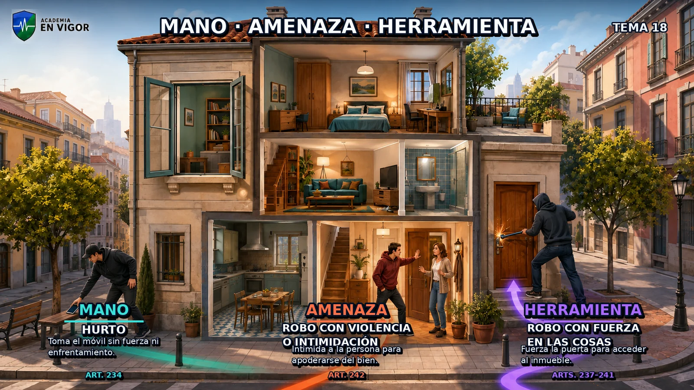

<em>Infografía: Mapa general y método de calificación.</em>

<!-- FUENTE: CONV-PN-2026 -->

## 02. Hurto básico: artículo 234.1

Comete hurto quien, con ánimo de lucro, toma cosas muebles ajenas sin voluntad de su dueño.

- Comete hurto quien, con ánimo de lucro, toma cosas muebles ajenas sin voluntad de su dueño.
- Cuando la cuantía de lo sustraído excede de 400 euros, el hurto del artículo 234.1 se castiga con prisión de seis a dieciocho meses.
- El hurto es un delito de apoderamiento: no exige fuerza en las cosas ni violencia o intimidación en las personas.
- La cosa ha de ser mueble, ajena y susceptible de valoración económica; el consentimiento válido del dueño excluye la toma inconsentida.

<!-- FUENTE: CP-T18 -->

## 03. Hurto leve y multirreincidencia vigente

Si la cuantía no excede de 400 euros se impone multa de uno a tres meses, salvo que concurra alguna circunstancia del artículo 235.

- Si la cuantía no excede de 400 euros se impone multa de uno a tres meses, salvo que concurra alguna circunstancia del artículo 235.
- Desde el 10 de abril de 2026, el artículo 234.2 aplica la pena del artículo 234.1 cuando el culpable tiene al menos tres condenas por delitos del Título XIII de la misma naturaleza y una de ellas, como mínimo, es por delito leve.
- Para la multirreincidencia del artículo 234.2 no se computan antecedentes cancelados o que debieran serlo.
- El régimen anterior a la LO 1/2026 atendía además al montante acumulado superior a 400 euros; ese requisito ya no figura en el texto vigente del artículo 234.2.

<!-- VISUAL:t18-03-hurto-leve-y-multirreincidencia-vigente.webp -->

  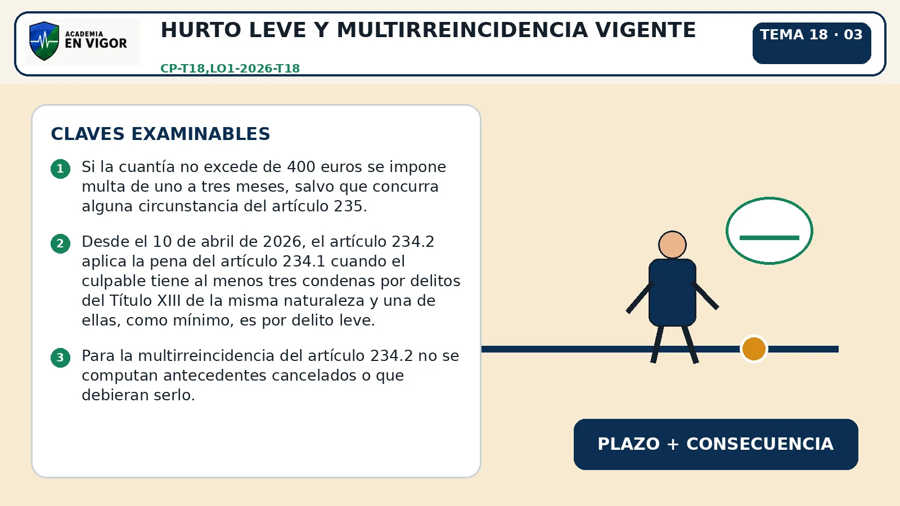

<em>Infografía: Hurto leve y multirreincidencia vigente.</em>

<!-- FUENTE: CP-T18,LO1-2026-T18 -->

## 04. Neutralización de alarmas en el hurto

Las penas de los apartados 1 y 2 del artículo 234 se imponen en su mitad superior cuando se neutralizan, eliminan o inutilizan dispositivos de alarma o seguridad instalados en las cosas sustraídas.

- Las penas de los apartados 1 y 2 del artículo 234 se imponen en su mitad superior cuando se neutralizan, eliminan o inutilizan dispositivos de alarma o seguridad instalados en las cosas sustraídas.
- La agravación del artículo 234.3 opera sobre un hurto, no convierte por sí sola el hecho en robo con fuerza.
- La alarma o dispositivo ha de estar instalado en la propia cosa sustraída para aplicar el artículo 234.3.
- Forzar un dispositivo que protege el acceso al lugar puede integrar fuerza del artículo 238, mientras neutralizar la etiqueta de la cosa se encuadra en el artículo 234.3.

<!-- FUENTE: CP-T18 -->

## 05. Hurto agravado: bienes especialmente protegidos

El artículo 235.1.1.ª agrava el hurto de cosas de valor artístico, histórico, cultural o científico.

- El artículo 235.1.1.ª agrava el hurto de cosas de valor artístico, histórico, cultural o científico.
- El artículo 235.1.2.ª comprende cosas de primera necesidad cuando se cause una situación de desabastecimiento.
- El artículo 235.1.3.ª comprende conducciones, cableado, equipos o componentes de infraestructuras de suministro o telecomunicaciones cuando se cause quebranto grave al servicio.
- El hurto agravado del artículo 235 se castiga con prisión de uno a tres años.

<!-- FUENTE: CP-T18 -->

## 06. Hurto agravado: campo, perjuicio y vulnerabilidad

Los productos agrarios o ganaderos, instrumentos o medios usados para obtenerlos se incluyen cuando se sustraen en explotaciones agrícolas o ganaderas y el valor excede de 400 euros.

- Los productos agrarios o ganaderos, instrumentos o medios usados para obtenerlos se incluyen cuando se sustraen en explotaciones agrícolas o ganaderas y el valor excede de 400 euros.
- Reviste especial gravedad el hurto atendiendo al valor de los efectos o a los perjuicios de especial consideración.
- Se agrava cuando el hecho pone a la víctima o a su familia en grave situación económica o se realiza abusando de sus circunstancias personales o de su desamparo.
- La agravación agraria vigente exige que el valor de lo sustraído exceda de 400 euros; una redacción anterior basada en otros criterios no debe usarse como regla actual.

<!-- FUENTE: CP-T18 -->

## 07. Hurto agravado: multirreincidencia, menores y móviles

La multirreincidencia agravada del artículo 235.1.7.ª exige al menos tres condenas por delitos menos graves o graves del Título XIII de la misma naturaleza; no cuentan antecedentes cancelados o cancelables.

- La multirreincidencia agravada del artículo 235.1.7.ª exige al menos tres condenas por delitos menos graves o graves del Título XIII de la misma naturaleza; no cuentan antecedentes cancelados o cancelables.
- Se agrava el hurto cuando se utiliza a menores de dieciséis años para cometer el delito.
- Se agrava cuando el culpable actúa como miembro de una organización o grupo criminal dedicado a delitos del mismo Título XIII.
- Desde el 10 de abril de 2026 se agrava el hurto de teléfonos u otros dispositivos móviles de comunicación o almacenamiento digital masivo aptos para contener datos personales, salvo los destinados a venta, almacenaje o exposición en establecimientos comerciales.

<!-- VISUAL:t18-07-hurto-agravado-multirreincidencia-menores-y-moviles.webp -->

  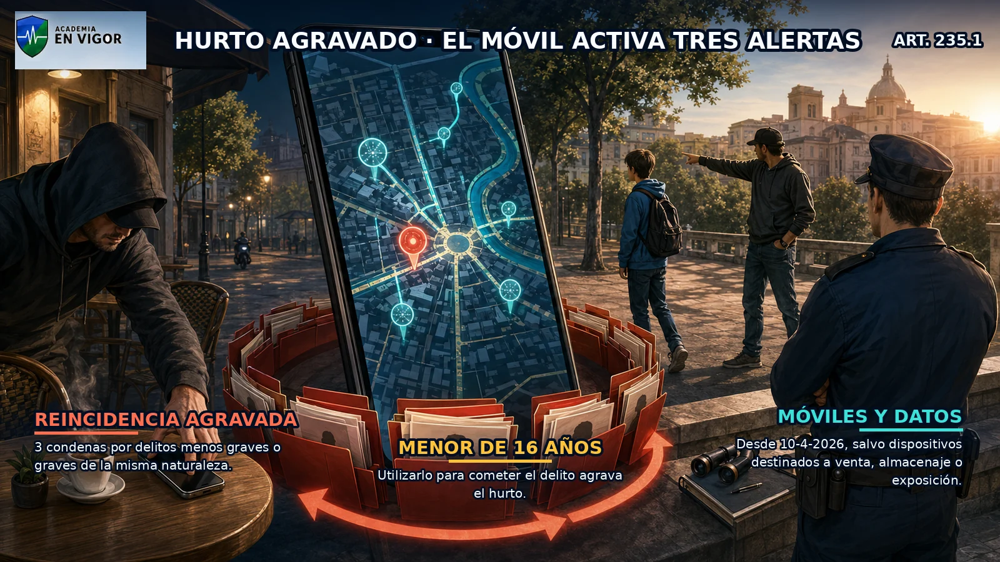

<em>Infografía: Hurto agravado: multirreincidencia, menores y móviles.</em>

<!-- FUENTE: CP-T18,LO1-2026-T18 -->

## 08. Furtum possessionis

El artículo 236 castiga al dueño de una cosa mueble o a quien actúe con su consentimiento que la sustrae de quien la posee legítimamente, con perjuicio para este o un tercero.

- El artículo 236 castiga al dueño de una cosa mueble o a quien actúe con su consentimiento que la sustrae de quien la posee legítimamente, con perjuicio para este o un tercero.
- Si el valor excede de 400 euros, el furtum possessionis se castiga con multa de tres a doce meses.
- Si el valor no excede de 400 euros, la pena es multa de uno a tres meses.
- La clave diferencial es que el autor es el propietario o actúa autorizado por él, pero la víctima mantiene una posesión legítima.

<!-- FUENTE: CP-T18 -->

## 09. Concepto de robo con fuerza

Son reos de robo con fuerza quienes se apoderan de cosas muebles ajenas con ánimo de lucro empleando fuerza para acceder al lugar donde están o para abandonarlo.

- Son reos de robo con fuerza quienes se apoderan de cosas muebles ajenas con ánimo de lucro empleando fuerza para acceder al lugar donde están o para abandonarlo.
- También existe robo con fuerza si la fuerza se emplea para abandonar el lugar donde se encuentran las cosas.
- El artículo 237 incluye la fuerza para proteger la huida sobre quienes persiguen al autor o a quienes este auxilia.
- El robo comparte con el hurto el apoderamiento lucrativo de cosa mueble ajena, pero añade fuerza típica o violencia o intimidación.

<!-- VISUAL:t18-09-concepto-de-robo-con-fuerza.webp -->

  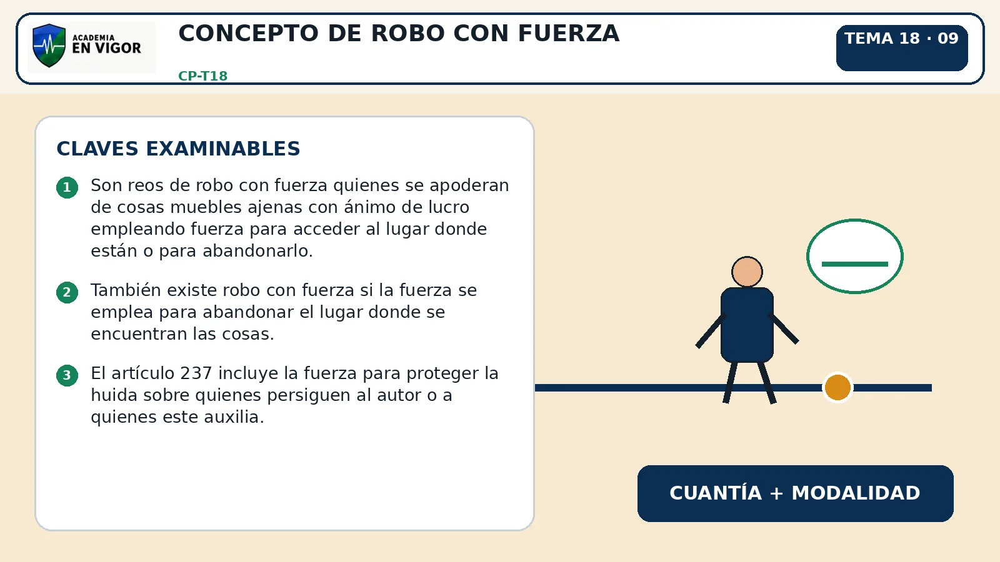

<em>Infografía: Concepto de robo con fuerza.</em>

<!-- FUENTE: CP-T18 -->

## 10. Fuerza típica: escalamiento y fracturas

El escalamiento es una modalidad de fuerza del artículo 238.1.º.

- El escalamiento es una modalidad de fuerza del artículo 238.1.º.
- La fractura exterior de pared, techo o suelo, o de puerta o ventana, es fuerza típica del artículo 238.2.º.
- La fractura de armarios, arcas u objetos cerrados o sellados, así como forzar sus cerraduras o descubrir sus claves, integra el artículo 238.3.º.
- La fractura interior del artículo 238.3.º puede realizarse en el lugar del robo o fuera de él para sustraer el contenido.

<!-- VISUAL:t18-il-02-caja-fuerte-abierta-fuera-del-local.webp -->

  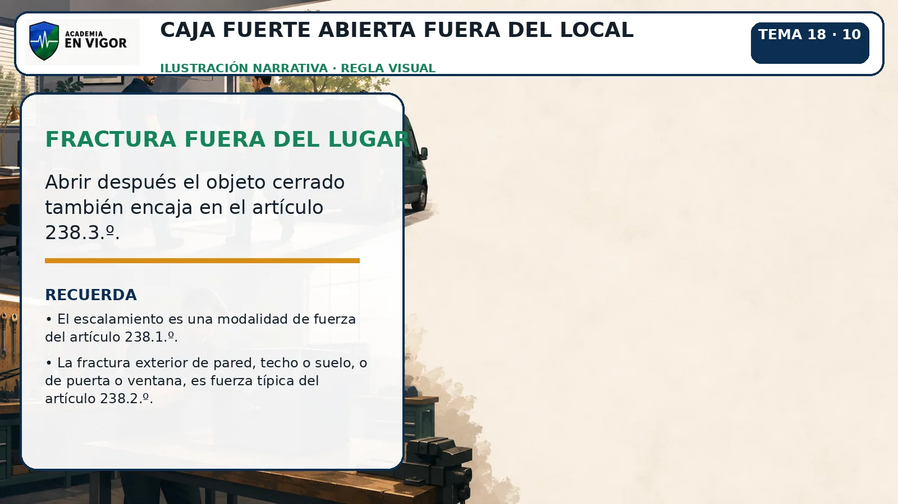

<em>Ilustración: Caja fuerte abierta fuera del local.</em>

<!-- FUENTE: CP-T18 -->

## 11. Llaves falsas e inutilización de alarmas

El uso de llaves falsas constituye fuerza típica conforme al artículo 238.4.º.

- El uso de llaves falsas constituye fuerza típica conforme al artículo 238.4.º.
- Son llaves falsas las ganzúas u otros instrumentos análogos y las llaves legítimas perdidas por el propietario u obtenidas por medio constitutivo de infracción penal.
- También se consideran llaves las tarjetas magnéticas o perforadas, los mandos o instrumentos de apertura a distancia y otros medios tecnológicos de eficacia semejante.
- La inutilización de sistemas específicos de alarma o guarda constituye fuerza del artículo 238.5.º.

<!-- VISUAL:t18-11-llaves-falsas-e-inutilizacion-de-alarmas.webp -->

  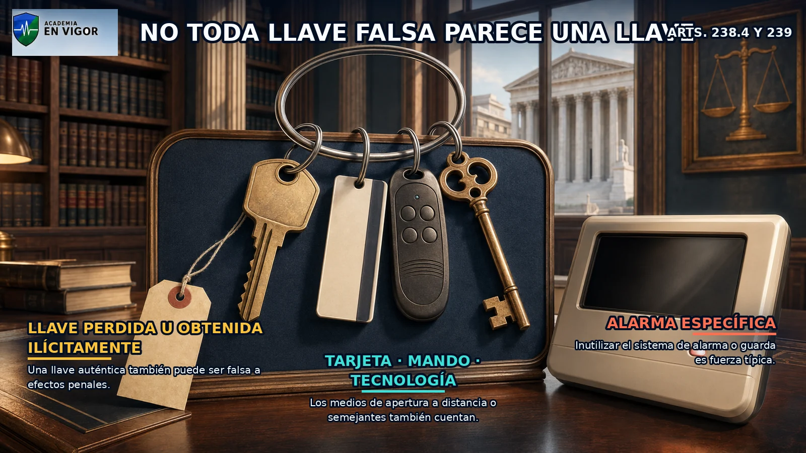

<em>Infografía: Llaves falsas e inutilización de alarmas.</em>

<!-- FUENTE: CP-T18 -->

## 12. Penas del robo con fuerza

El robo con fuerza en las cosas se castiga, con carácter general, con prisión de uno a tres años.

- El robo con fuerza en las cosas se castiga, con carácter general, con prisión de uno a tres años.
- Si concurre alguna circunstancia del artículo 235, el robo con fuerza se castiga con prisión de dos a cinco años.
- Para aplicar la agravación del artículo 240.2 debe identificarse una circunstancia concreta del artículo 235.
- La cuantía por sí sola no transforma el hurto en robo: la diferencia descansa en el medio comisivo típico.

<!-- FUENTE: CP-T18 -->

## 13. Casa habitada y locales abiertos

El robo con fuerza en casa habitada, edificio o local abierto al público o en cualquiera de sus dependencias se castiga con prisión de dos a cinco años.

- El robo con fuerza en casa habitada, edificio o local abierto al público o en cualquiera de sus dependencias se castiga con prisión de dos a cinco años.
- Casa habitada es todo albergue que constituya morada de una o más personas, aunque estén accidentalmente ausentes cuando se produzca el robo.
- Son dependencias los patios, garajes y demás espacios cercados y contiguos, comunicados interiormente con el edificio y formando unidad física.
- En establecimiento abierto al público fuera de sus horas de apertura, la pena es prisión de uno a cinco años; el artículo 241.4 prevé prisión de dos a seis años para supuestos de especial gravedad.

<!-- VISUAL:t18-13-casa-habitada-y-locales-abiertos.webp -->

  

<em>Infografía: Casa habitada y locales abiertos.</em>

<!-- FUENTE: CP-T18 -->

## 14. Robo con violencia o intimidación: tipo básico

El robo con violencia o intimidación en las personas se castiga con prisión de dos a cinco años, sin perjuicio de la pena por los actos de violencia física.

- El robo con violencia o intimidación en las personas se castiga con prisión de dos a cinco años, sin perjuicio de la pena por los actos de violencia física.
- La violencia recae físicamente sobre una persona; la intimidación consiste en anunciar o generar un mal inmediato capaz de doblegar su voluntad.
- La violencia o intimidación puede emplearse al cometer el delito, para proteger la huida o sobre quienes persiguen al autor o a quienes este auxilia.
- Las lesiones causadas pueden sancionarse separadamente porque el artículo 242.1 contiene la cláusula sin perjuicio.

<!-- FUENTE: CP-T18 -->

## 15. Robo violento: casa, armas y atenuación

Si el robo violento se comete en casa habitada, edificio o local abierto al público o sus dependencias, la pena es prisión de tres años y seis meses a cinco años.

- Si el robo violento se comete en casa habitada, edificio o local abierto al público o sus dependencias, la pena es prisión de tres años y seis meses a cinco años.
- El uso de armas u otros medios igualmente peligrosos eleva la pena a su mitad superior en los supuestos del artículo 242.3.
- La agravación por armas comprende su empleo al cometer el delito, para proteger la huida o al atacar a quienes persiguen al autor.
- Atendida la menor entidad de la violencia o intimidación y las restantes circunstancias, puede imponerse la pena inferior en grado conforme al artículo 242.4.

<!-- FUENTE: CP-T18 -->

## 16. Extorsión

Comete extorsión quien, con ánimo de lucro, obliga a otro mediante violencia o intimidación a realizar u omitir un acto o negocio jurídico en perjuicio de su patrimonio o del de un tercero.

- Comete extorsión quien, con ánimo de lucro, obliga a otro mediante violencia o intimidación a realizar u omitir un acto o negocio jurídico en perjuicio de su patrimonio o del de un tercero.
- La extorsión se castiga con prisión de uno a cinco años, sin perjuicio de las penas por los actos de violencia física realizados.
- La diferencia central con el robo violento es que en la extorsión la víctima realiza u omite un acto o negocio jurídico patrimonial.
- El perjuicio exigido puede recaer sobre el patrimonio del obligado o sobre el de un tercero.

<!-- VISUAL:t18-16-extorsion.webp -->

  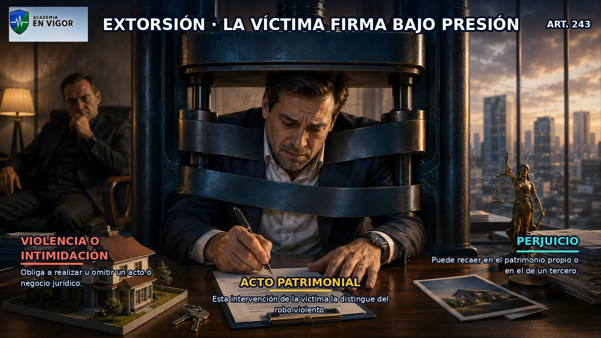

<em>Infografía: Extorsión.</em>

<!-- FUENTE: CP-T18 -->

## 17. Uso de vehículo y restitución en 48 horas

El artículo 244 exige sustraer o utilizar sin autorización un vehículo a motor o ciclomotor ajeno, sin ánimo de apropiárselo, y restituirlo directa o indirectamente en un plazo no superior a cuarenta y ocho horas.

- El artículo 244 exige sustraer o utilizar sin autorización un vehículo a motor o ciclomotor ajeno, sin ánimo de apropiárselo, y restituirlo directa o indirectamente en un plazo no superior a cuarenta y ocho horas.
- La pena del tipo básico es trabajos en beneficio de la comunidad de treinta y uno a noventa días o multa de dos a doce meses.
- La pena impuesta nunca puede ser igual o superior a la que correspondería si el autor se hubiese apropiado definitivamente del vehículo.
- La restitución indirecta requiere que el vehículo quede en condiciones razonables de ser recuperado; el mero abandono oculto no asegura ese efecto.

<!-- VISUAL:t18-17-uso-de-vehiculo-y-restitucion-en-48-horas.webp -->

  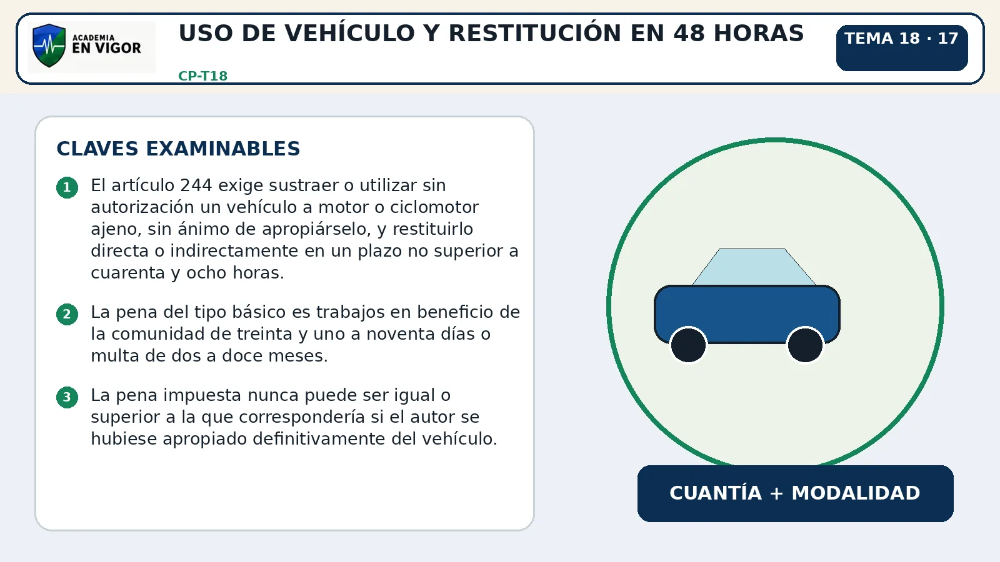

<em>Infografía: Uso de vehículo y restitución en 48 horas.</em>

<!-- VISUAL:t18-il-04-el-reloj-de-las-48-horas.webp -->

  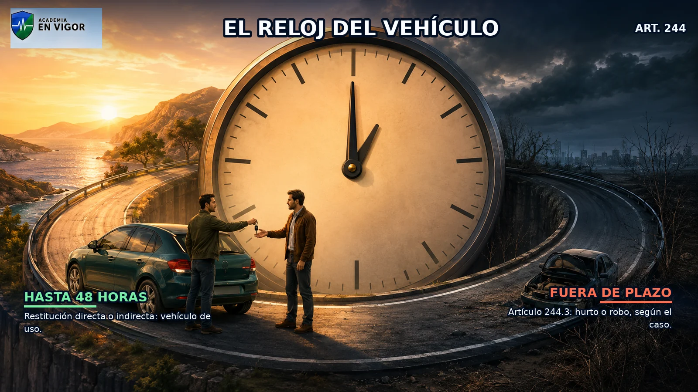

<em>Ilustración: El reloj de las 48 horas.</em>

<!-- FUENTE: CP-T18 -->

## 18. Vehículo: fuerza, falta de devolución y violencia

Si el uso del vehículo se realiza empleando fuerza en las cosas, la pena del artículo 244.1 se impone en su mitad superior.

- Si el uso del vehículo se realiza empleando fuerza en las cosas, la pena del artículo 244.1 se impone en su mitad superior.
- La falta de restitución dentro de las cuarenta y ocho horas se regula en el artículo 244.3 y permite castigar el hecho como hurto o robo en su caso.
- El artículo 244.3, y no el 244.2, contiene la consecuencia jurídica de no devolver el vehículo en el plazo de cuarenta y ocho horas.
- Si existe violencia o intimidación en las personas, se aplican en todo caso las penas del artículo 242 conforme al artículo 244.4.

<!-- VISUAL:t18-18-vehiculo-fuerza-falta-de-devolucion-y-violencia.webp -->

  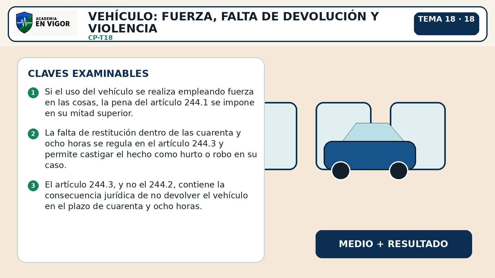

<em>Infografía: Vehículo: fuerza, falta de devolución y violencia.</em>

<!-- FUENTE: CP-T18 -->

## 19. Usurpación violenta de inmuebles

El artículo 245.1 castiga a quien, con violencia o intimidación, ocupa una cosa inmueble o usurpa un derecho real inmobiliario ajeno.

- El artículo 245.1 castiga a quien, con violencia o intimidación, ocupa una cosa inmueble o usurpa un derecho real inmobiliario ajeno.
- La pena es prisión de uno a dos años, además de las penas correspondientes por la violencia ejercida.
- La pena se fija teniendo en cuenta la utilidad obtenida y el daño causado.
- El objeto material es un inmueble o un derecho real inmobiliario; la modalidad violenta no se confunde con la ocupación pacífica del apartado 2.

<!-- FUENTE: CP-T18 -->

## 20. Ocupación pacífica de inmueble ajeno

El artículo 245.2 castiga ocupar sin autorización debida un inmueble, vivienda o edificio ajenos que no constituyan morada, o mantenerse en ellos contra la voluntad de su titular.

- El artículo 245.2 castiga ocupar sin autorización debida un inmueble, vivienda o edificio ajenos que no constituyan morada, o mantenerse en ellos contra la voluntad de su titular.
- La ocupación pacífica del artículo 245.2 se castiga con multa de tres a seis meses.
- Si el inmueble constituye morada, la respuesta penal no se encuadra en la ocupación pacífica del artículo 245.2.
- La conducta puede consistir tanto en entrar y ocupar sin autorización como en permanecer después contra la voluntad del titular.

<!-- FUENTE: CP-T18 -->

## 21. Alteración de lindes y distracción de aguas

El artículo 246 castiga alterar términos o lindes de pueblos, heredades o cualquier clase de propiedades o demarcaciones de predios contiguos.

- El artículo 246 castiga alterar términos o lindes de pueblos, heredades o cualquier clase de propiedades o demarcaciones de predios contiguos.
- Si la utilidad reportada por la alteración de lindes excede de 400 euros, la pena es multa de tres a dieciocho meses; si no excede, multa de uno a tres meses.
- El artículo 247 castiga distraer, sin hallarse autorizado, aguas de uso público o privativo de su curso o de su embalse natural o artificial.
- En la distracción de aguas, si la utilidad excede de 400 euros la multa es de tres a seis meses y, si no excede, de uno a tres meses.

<!-- VISUAL:t18-21-alteracion-de-lindes-y-distraccion-de-aguas.webp -->

  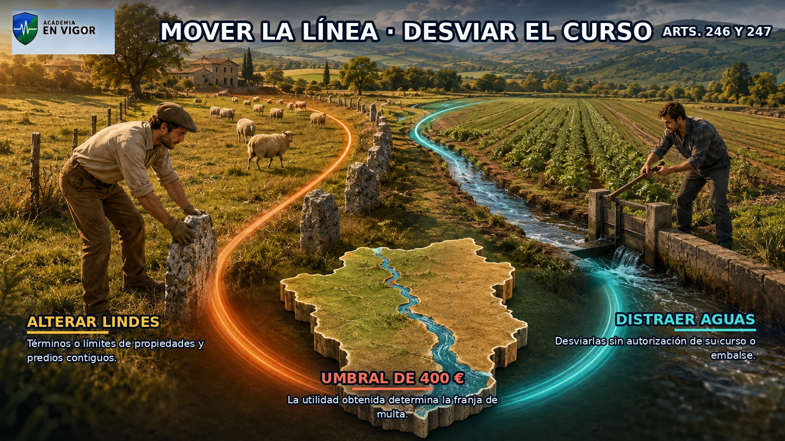

<em>Infografía: Alteración de lindes y distracción de aguas.</em>

<!-- FUENTE: CP-T18 -->

## 22. Estafa básica y multirreincidencia vigente

Cometen estafa quienes, con ánimo de lucro, utilizan engaño bastante para producir error en otro e inducirle a realizar un acto de disposición en perjuicio propio o ajeno.

- Cometen estafa quienes, con ánimo de lucro, utilizan engaño bastante para producir error en otro e inducirle a realizar un acto de disposición en perjuicio propio o ajeno.
- La estafa básica se castiga con prisión de seis meses a tres años; para fijar la pena se atiende, entre otros factores, al importe, relaciones, medios y quebranto causado.
- Si la cuantía no excede de 400 euros, la pena es multa de uno a tres meses, salvo que concurra alguna circunstancia del artículo 250.
- Desde el 10 de abril de 2026, con al menos tres condenas por delitos del capítulo de la misma naturaleza y al menos una por delito leve, se aplica la prisión del tipo básico; no cuentan antecedentes cancelados o cancelables.

<!-- VISUAL:t18-22-estafa-basica-y-multirreincidencia-vigente.webp -->

  

<em>Infografía: Estafa básica y multirreincidencia vigente.</em>

<!-- FUENTE: CP-T18,LO1-2026-T18 -->

## 23. Estafas informáticas y medios de pago

El artículo 249.1.a castiga conseguir una transferencia no consentida de activos patrimoniales mediante manipulación informática o artificio semejante.

- El artículo 249.1.a castiga conseguir una transferencia no consentida de activos patrimoniales mediante manipulación informática o artificio semejante.
- El artículo 249.1.b incluye el uso fraudulento de tarjetas de crédito o débito, cheques de viaje o cualquier otro instrumento de pago material o inmaterial.
- Fabricar, importar, obtener, poseer, transportar, comerciar o facilitar programas o dispositivos destinados específicamente a estas estafas se castiga conforme al artículo 249.2.
- La adquisición ilícita de instrumentos de pago para uso fraudulento y su posesión, transmisión o distribución reciben tratamiento específico en los apartados 3 y 4 del artículo 249.

<!-- FUENTE: CP-T18 -->

## 24. Estafas agravadas I

La estafa se agrava cuando recae sobre cosas de primera necesidad, viviendas u otros bienes de reconocida utilidad social.

- La estafa se agrava cuando recae sobre cosas de primera necesidad, viviendas u otros bienes de reconocida utilidad social.
- También se agrava si se perpetra abusando de firma de otro o sustrayendo, ocultando o inutilizando un proceso, expediente, protocolo o documento público u oficial.
- El artículo 250.1.3.ª comprende bienes del patrimonio artístico, histórico, cultural o científico.
- Se agrava la estafa de especial gravedad atendiendo a la entidad del perjuicio y a la situación económica en que deje a la víctima o su familia.

<!-- FUENTE: CP-T18 -->

## 25. Estafas agravadas II y reforma de 2026

La estafa se agrava si el valor de la defraudación supera 50.000 euros o afecta a un elevado número de personas.

- La estafa se agrava si el valor de la defraudación supera 50.000 euros o afecta a un elevado número de personas.
- También se agrava cuando se comete con abuso de relaciones personales o aprovechando credibilidad empresarial o profesional.
- La estafa procesal consiste en manipular pruebas o emplear fraude procesal análogo para provocar error judicial y una resolución perjudicial para la otra parte o un tercero.
- Desde el 10 de abril de 2026, el artículo 250.1.8.ª exige al menos tres condenas por delitos menos graves o graves del mismo capítulo y naturaleza; la combinación del 250.1.1.ª con los ordinales 4.º a 7.º o una defraudación superior a 250.000 euros activa el artículo 250.2.

<!-- FUENTE: CP-T18,LO1-2026-T18 -->

## 26. Estafas inmobiliarias y persona jurídica

El artículo 251.1 castiga atribuirse falsamente facultad de disposición sobre cosa mueble o inmueble y enajenarla, gravarla o arrendarla en perjuicio de otro.

- El artículo 251.1 castiga atribuirse falsamente facultad de disposición sobre cosa mueble o inmueble y enajenarla, gravarla o arrendarla en perjuicio de otro.
- El artículo 251.2 castiga disponer de una cosa ocultando cargas o volver a disponer de ella antes de transmitirla definitivamente tras haberla enajenado como libre.
- El artículo 251.3 castiga otorgar en perjuicio de otro un contrato simulado.
- El artículo 251 bis establece la responsabilidad penal de la persona jurídica por los delitos de esta sección con las multas y consecuencias legalmente previstas.

<!-- FUENTE: CP-T18 -->

## 27. Administración desleal

Comete administración desleal quien tiene facultades para administrar un patrimonio ajeno, las infringe excediéndose en su ejercicio y causa con ello un perjuicio al patrimonio administrado.

- Comete administración desleal quien tiene facultades para administrar un patrimonio ajeno, las infringe excediéndose en su ejercicio y causa con ello un perjuicio al patrimonio administrado.
- Las facultades de administración pueden emanar de la ley, de una autoridad o de un negocio jurídico.
- La administración desleal se castiga con las penas de los artículos 248 o 250 según el caso.
- Si el perjuicio no excede de 400 euros, la pena del artículo 252 es multa de uno a tres meses.

<!-- FUENTE: CP-T18 -->

## 28. Apropiación indebida de bienes recibidos

El artículo 253 castiga apropiarse, para sí o para tercero, de dinero, efectos, valores u otra cosa mueble recibida en depósito, comisión, custodia u otro título que obligue a entregarla o devolverla.

- El artículo 253 castiga apropiarse, para sí o para tercero, de dinero, efectos, valores u otra cosa mueble recibida en depósito, comisión, custodia u otro título que obligue a entregarla o devolverla.
- También integra el artículo 253 negar haber recibido la cosa cuando existía obligación de entregarla o devolverla.
- La diferencia con la administración desleal es que la apropiación indebida exige incorporación o negación de bienes concretos previamente recibidos, mientras aquella se centra en exceder facultades de gestión causando perjuicio.
- Se aplican las penas de los artículos 248 o 250 y, si la cuantía no excede de 400 euros, multa de uno a tres meses.

<!-- FUENTE: CP-T18 -->

## 29. Apropiación de otras cosas muebles

Fuera de los casos del artículo 253, el artículo 254 castiga apropiarse de cosa mueble ajena.

- Fuera de los casos del artículo 253, el artículo 254 castiga apropiarse de cosa mueble ajena.
- El tipo general del artículo 254 se castiga con multa de tres a seis meses.
- Si se trata de cosas de valor artístico, histórico, cultural o científico, la pena es prisión de seis meses a dos años.
- Si la cuantía no excede de 400 euros, el artículo 254.3 establece multa de uno a dos meses.

<!-- FUENTE: CP-T18 -->

## 30. Defraudación de energía y reforma del artículo 255

El artículo 255 castiga defraudar electricidad, gas, agua, telecomunicaciones u otra energía, elemento o fluido ajenos mediante mecanismos instalados, alteración maliciosa de contadores o aparatos clandestinos.

- El artículo 255 castiga defraudar electricidad, gas, agua, telecomunicaciones u otra energía, elemento o fluido ajenos mediante mecanismos instalados, alteración maliciosa de contadores o aparatos clandestinos.
- El tipo general se castiga con multa de tres a doce meses y, si lo defraudado no excede de 400 euros, con multa de uno a tres meses.
- Desde el 10 de abril de 2026, el artículo 255.3 castiga la defraudación de electricidad, cualquiera que sea la cuantía, cuando las instalaciones de suministro se utilicen para conductas del artículo 368.
- La modalidad del artículo 255.3 se castiga con prisión de seis a dieciocho meses o multa de doce a veinticuatro meses.

<!-- VISUAL:t18-il-06-cultivo-clandestino-y-enganche-electrico.webp -->

  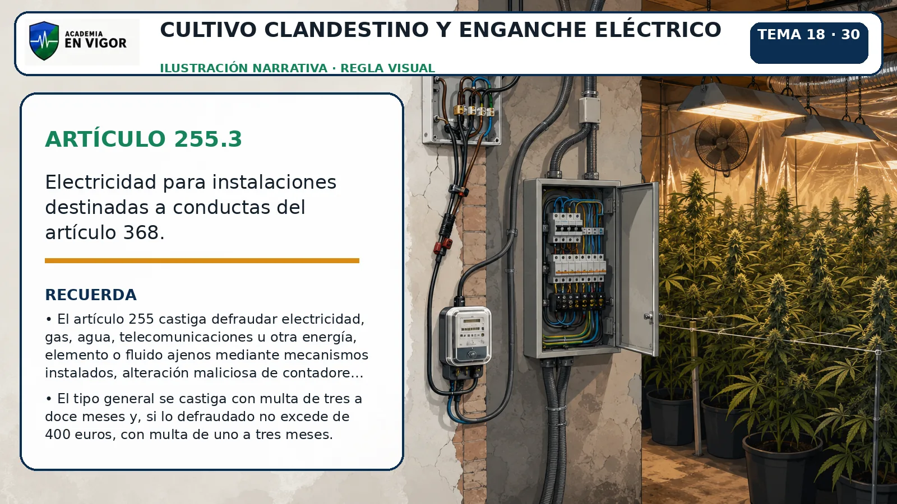

<em>Ilustración: Cultivo clandestino y enganche eléctrico.</em>

<!-- FUENTE: CP-T18,LO1-2026-T18 -->

## 31. Terminales de telecomunicación

El artículo 256 castiga utilizar un equipo terminal de telecomunicación sin consentimiento de su titular y causando a este un perjuicio económico.

- El artículo 256 castiga utilizar un equipo terminal de telecomunicación sin consentimiento de su titular y causando a este un perjuicio económico.
- La conducta se castiga con multa de tres a doce meses.
- Si el perjuicio causado no excede de 400 euros, la pena es multa de uno a tres meses.
- El artículo 256 exige perjuicio económico al titular y se diferencia del artículo 255, centrado en la obtención fraudulenta de energía, fluidos o telecomunicaciones por los medios allí enumerados.

<!-- FUENTE: CP-T18 -->

# Hablemos claro

:::hablemos-claro
Primero identifica cómo sale el bien o la ventaja del patrimonio: apoderamiento, engaño, gestión desleal, recepción previa o consumo clandestino.
:::

# En la calle

:::en-la-calle
En el supuesto práctico, fija objeto, titular, consentimiento, medio, cuantía, plazo y resultado antes de cerrar la calificación provisional.
:::

# Lo que cae

:::lo-que-cae
Prioriza 400 euros, 48 horas, clases de fuerza, casa habitada, multirreincidencia y diferencias 252/253 y 255/256.
:::

# Ha caído

:::ha-caido
Las coincidencias históricas quedan ocultas mientras permanezcan en cuarentena editorial y sin plantilla oficial verificable.
:::

---

*Academia En Vigor · El temario que nunca duerme · Tema 18 · v1.0.0 · Documento interno no publicado.*
