# TEMA 19 · DELITOS CONTRA EL ORDEN PÚBLICO

**Policía Nacional · Método VIGOR · PARTE**
**Versión de contenido:** 1.0.0
**Estado editorial:** approved_internal · **Publicación:** not_published

# Mapa del tema

El recorrido tiene cuatro tramos: atentados, resistencia y desobediencia; desórdenes públicos; tenencia ilícita de armas; y depósitos, explosivos y consecuencias comunes.

# Contenido

## 01. Mapa oficial y método de calificación

El Tema 19 comprende atentados contra la autoridad, sus agentes y funcionarios públicos, resistencia y desobediencia, desórdenes públicos, la disposición común y la tenencia, tráfico y depósito de armas, municiones o explosivos.

- El Tema 19 comprende atentados contra la autoridad, sus agentes y funcionarios públicos, resistencia y desobediencia, desórdenes públicos, la disposición común y la tenencia, tráfico y depósito de armas, municiones o explosivos.
- La calificación empieza por identificar el bien jurídico, el sujeto protegido, la conducta, el contexto y los medios empleados.
- Los artículos 550 a 556 regulan atentados, resistencia y desobediencia; los artículos 557 a 562, desórdenes públicos y su disposición común; y los artículos 563 a 570, armas, municiones y explosivos.
- Las referencias históricas sin plantilla oficial verificable se mantienen en cuarentena y no acreditan una respuesta oficial.

<!-- VISUAL:t19-01-mapa-oficial-y-metodo-de-calificacion.webp -->

  

<em>Infografía: Mapa oficial y método de calificación.</em>

<!-- FUENTE: CONV-PN-2026 -->

## 02. Atentado: conducta y situación del sujeto pasivo

Comete atentado quien agrede o, con intimidación grave o violencia, opone resistencia grave a la autoridad, a sus agentes o a los funcionarios públicos.

- Comete atentado quien agrede o, con intimidación grave o violencia, opone resistencia grave a la autoridad, a sus agentes o a los funcionarios públicos.
- El sujeto protegido ha de encontrarse en el ejercicio de las funciones de su cargo o sufrir el hecho con ocasión de ellas.
- La agresión integra por sí misma el atentado; la resistencia exige, además, gravedad y el empleo de intimidación grave o violencia.
- El artículo 550.1 no convierte toda oposición o desobediencia en atentado: deben concurrir sus elementos típicos.

<!-- VISUAL:t19-02-atentado-conducta-y-situacion-del-sujeto-pasivo.webp -->

  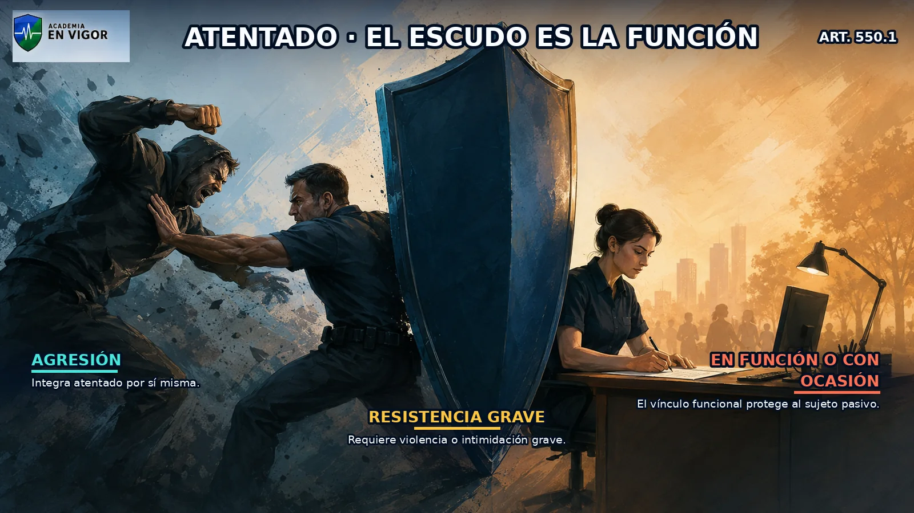

<em>Infografía: Atentado: conducta y situación del sujeto pasivo.</em>

<!-- FUENTE: CP-T19 -->

## 03. Penas y autoridades especialmente protegidas

El atentado contra autoridad se castiga con prisión de uno a cuatro años y multa de tres a seis meses; en los demás casos, con prisión de seis meses a tres años.

- El atentado contra autoridad se castiga con prisión de uno a cuatro años y multa de tres a seis meses; en los demás casos, con prisión de seis meses a tres años.
- Si la autoridad es miembro del Gobierno, de los Consejos de Gobierno autonómicos, del Congreso, del Senado, de una asamblea legislativa autonómica, de una corporación local, del Consejo General del Poder Judicial, magistrado del Tribunal Constitucional, juez, magistrado o miembro del Ministerio Fiscal, la pena es prisión de uno a seis años y multa de seis a doce meses.
- Los funcionarios docentes y sanitarios tienen la consideración de autoridad a efectos del artículo 550 cuando se hallan en el ejercicio de sus funciones.
- La condición del sujeto pasivo determina el marco penal, pero no elimina la necesidad de una conducta típica de atentado.

<!-- FUENTE: CP-T19 -->

## 04. Atentado agravado

Las penas del artículo 550 se imponen en su mitad superior cuando el atentado se comete haciendo uso de armas u otros objetos peligrosos.

- Las penas del artículo 550 se imponen en su mitad superior cuando el atentado se comete haciendo uso de armas u otros objetos peligrosos.
- También se aplica la mitad superior cuando el acto de violencia resulta potencialmente peligroso para la vida o puede causar lesiones graves, en especial mediante objetos contundentes, líquidos inflamables, incendio o explosión.
- El artículo 551 agrava el atentado cometido acometiendo a la autoridad, a su agente o al funcionario público mediante un vehículo de motor.
- Se agrava el atentado cometido con ocasión de un motín, plante o incidente colectivo en el interior de un centro penitenciario.

<!-- VISUAL:t19-04-atentado-agravado.webp -->

  

<em>Infografía: Atentado agravado.</em>

<!-- FUENTE: CP-T19 -->

## 05. Actos preparatorios y artículos suprimidos

La provocación, la conspiración y la proposición para cometer atentado se castigan con pena inferior en uno o dos grados a la del delito correspondiente.

- La provocación, la conspiración y la proposición para cometer atentado se castigan con pena inferior en uno o dos grados a la del delito correspondiente.
- La rebaja de los actos preparatorios se calcula respecto del atentado que se pretendía cometer, incluidas en su caso sus circunstancias.
- El artículo 552 del Código Penal está suprimido desde 2015 y no contiene una regla vigente de concurso.
- El artículo 555 del Código Penal está suprimido desde 2015 y no regula un levantamiento armado.

<!-- FUENTE: CP-T19 -->

## 06. Fuerzas Armadas y personas que auxilian

Los hechos descritos en los artículos 550 y 551 se castigan también cuando se cometen contra un miembro de las Fuerzas Armadas que, vistiendo uniforme, presta un servicio legalmente encomendado.

- Los hechos descritos en los artículos 550 y 551 se castigan también cuando se cometen contra un miembro de las Fuerzas Armadas que, vistiendo uniforme, presta un servicio legalmente encomendado.
- La protección del militar exige conjuntamente uniforme y prestación de un servicio legalmente encomendado.
- Las penas de los artículos 550 y 551 se aplican a quienes acometen, emplean violencia o intimidan a las personas que acuden en auxilio de la autoridad, sus agentes o funcionarios.
- El auxilio efectivo conecta la protección del particular con la actuación funcional de la autoridad, agente o funcionario.

<!-- FUENTE: CP-T19 -->

## 07. Emergencias y seguridad privada

Se aplican las penas de los artículos 550 y 551 a quienes acometen, emplean violencia o intimidan gravemente a bomberos o miembros del personal sanitario o equipos de socorro durante un siniestro, calamidad pública o situación de emergencia.

- Se aplican las penas de los artículos 550 y 551 a quienes acometen, emplean violencia o intimidan gravemente a bomberos o miembros del personal sanitario o equipos de socorro durante un siniestro, calamidad pública o situación de emergencia.
- La protección exige que esos profesionales estén interviniendo para auxiliar a la autoridad, sus agentes o funcionarios.
- También se protege al personal de seguridad privada debidamente identificado que desarrolla actividades de seguridad privada en cooperación y bajo el mando de las Fuerzas y Cuerpos de Seguridad.
- No basta la mera condición profesional del personal de seguridad privada: deben concurrir identificación, cooperación y mando policial.

<!-- VISUAL:t19-07-emergencias-y-seguridad-privada.webp -->

  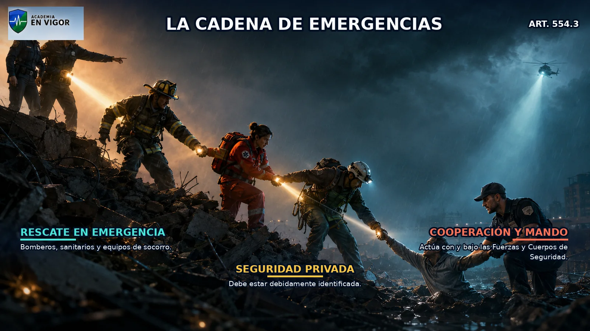

<em>Infografía: Emergencias y seguridad privada.</em>

<!-- FUENTE: CP-T19 -->

## 08. Resistencia, desobediencia y falta de respeto

La resistencia o desobediencia grave a la autoridad o sus agentes, fuera del artículo 550, se castiga con prisión de tres meses a un año o multa de seis a dieciocho meses.

- La resistencia o desobediencia grave a la autoridad o sus agentes, fuera del artículo 550, se castiga con prisión de tres meses a un año o multa de seis a dieciocho meses.
- El artículo 556.1 protege también al personal de seguridad privada debidamente identificado cuando actúa en cooperación y bajo el mando de las Fuerzas y Cuerpos de Seguridad.
- La falta de respeto y consideración debida a la autoridad, en el ejercicio de sus funciones, se castiga con multa de uno a tres meses.
- El artículo 556 vigente solo tiene dos apartados; no existe un apartado 3 sobre desobediencia penitenciaria.

<!-- VISUAL:t19-08-resistencia-desobediencia-y-falta-de-respeto.webp -->

  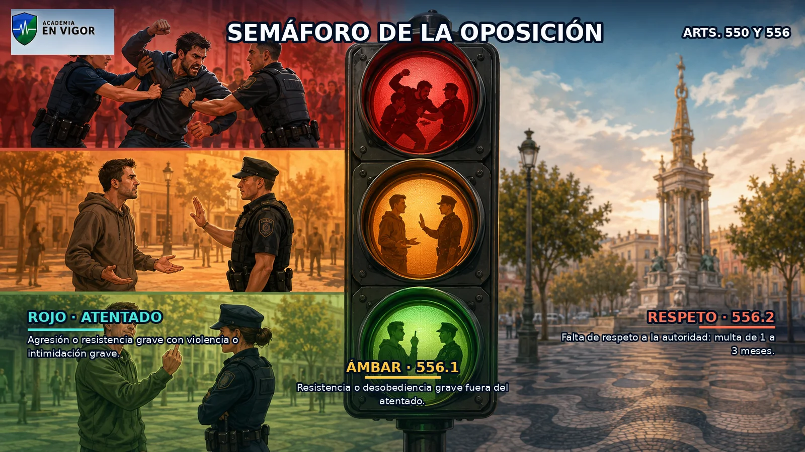

<em>Infografía: Resistencia, desobediencia y falta de respeto.</em>

<!-- VISUAL:t19-il-02-semaforo-de-la-oposicion-a-la-autoridad.webp -->

  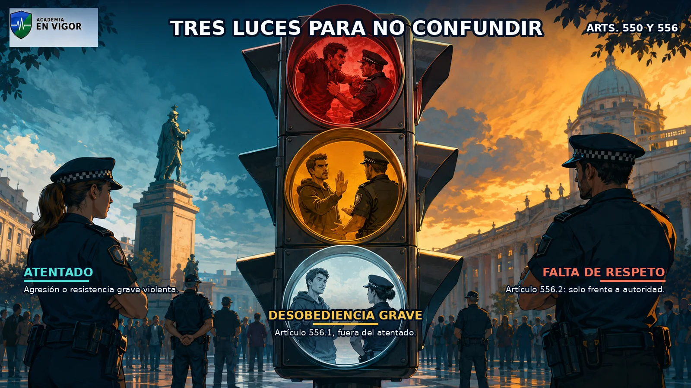

<em>Ilustración: Semáforo de la oposición a la autoridad.</em>

<!-- FUENTE: CP-T19 -->

## 09. Frontera penal y administrativa

La resistencia grave con violencia o intimidación grave puede integrar atentado; la resistencia o desobediencia grave fuera de ese marco se encuadra en el artículo 556.1.

- La resistencia grave con violencia o intimidación grave puede integrar atentado; la resistencia o desobediencia grave fuera de ese marco se encuadra en el artículo 556.1.
- La desobediencia o resistencia a la autoridad o sus agentes que no sea constitutiva de delito puede ser infracción grave del artículo 36.6 de la Ley Orgánica 4/2015.
- La negativa a identificarse o la alegación de datos falsos o inexactos en el proceso de identificación puede integrar la infracción administrativa del artículo 36.6.
- La frontera entre delito e infracción administrativa depende de la conducta concreta y de su gravedad, no de una etiqueta automática.

<!-- VISUAL:t19-09-frontera-penal-y-administrativa.webp -->

  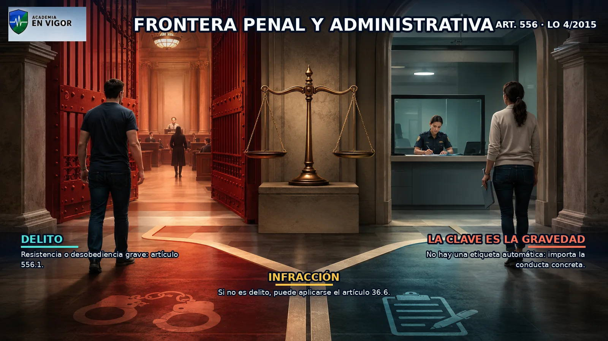

<em>Infografía: Frontera penal y administrativa.</em>

<!-- FUENTE: CP-T19,LO4-2015-T19 -->

## 10. Desórdenes públicos: tipo básico

Cometen desórdenes públicos quienes, actuando en grupo y con el fin de atentar contra la paz pública, ejecutan actos de violencia o intimidación sobre personas o cosas.

- Cometen desórdenes públicos quienes, actuando en grupo y con el fin de atentar contra la paz pública, ejecutan actos de violencia o intimidación sobre personas o cosas.
- También integra el artículo 557.1 obstaculizar las vías públicas ocasionando un peligro para la vida o salud de las personas.
- La invasión de instalaciones o edificios que altere gravemente el funcionamiento efectivo de servicios esenciales puede integrar el tipo básico.
- El tipo básico exige actuación en grupo y finalidad de atentar contra la paz pública.

<!-- VISUAL:t19-10-desordenes-publicos-tipo-basico.webp -->

  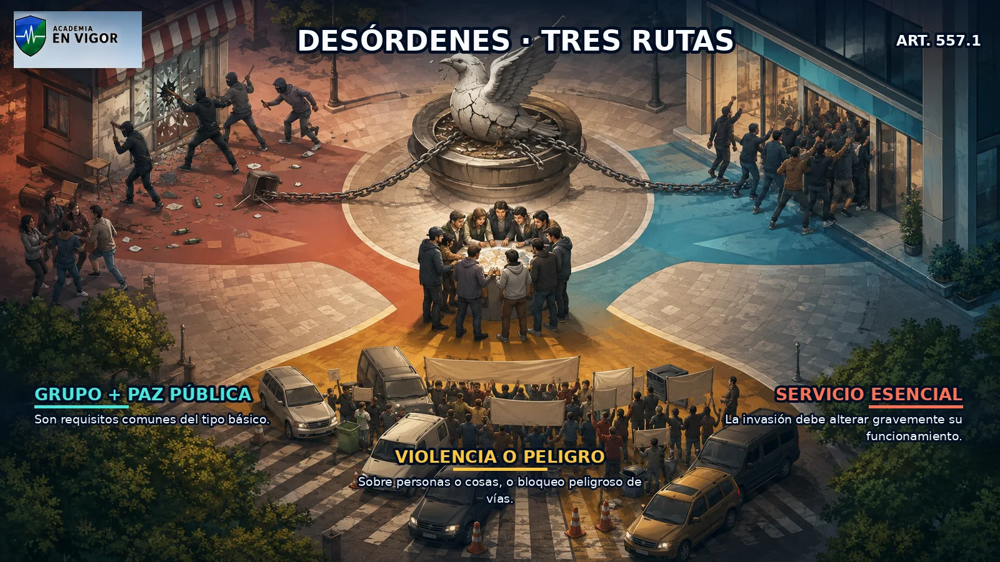

<em>Infografía: Desórdenes públicos: tipo básico.</em>

<!-- FUENTE: CP-T19 -->

## 11. Desórdenes con multitud

Los hechos del artículo 557.1 se castigan con prisión de tres a cinco años e inhabilitación especial para empleo o cargo público por el mismo tiempo cuando se realizan por una multitud cuyo número, organización y propósito sean idóneos para afectar gravemente el orden público.

- Los hechos del artículo 557.1 se castigan con prisión de tres a cinco años e inhabilitación especial para empleo o cargo público por el mismo tiempo cuando se realizan por una multitud cuyo número, organización y propósito sean idóneos para afectar gravemente el orden público.
- La agravación exige valorar conjuntamente número, organización y propósito de la multitud.
- No toda reunión numerosa activa el artículo 557.2: la multitud ha de ser idónea para afectar gravemente el orden público.
- La inhabilitación especial del artículo 557.2 acompaña a la pena de prisión por el mismo tiempo.

<!-- FUENTE: CP-T19 -->

## 12. Instrumentos peligrosos, pillaje y armas

Las penas de los apartados 1 y 2 se imponen en su mitad superior cuando alguno de los partícipes porta un arma u otro instrumento peligroso.

- Las penas de los apartados 1 y 2 se imponen en su mitad superior cuando alguno de los partícipes porta un arma u otro instrumento peligroso.
- La mitad superior también se aplica cuando se exhibe un arma de fuego simulada o cuando se realizan actos de pillaje.
- Si se hace uso de armas de fuego, las penas de los apartados 1 y 2 se imponen en grado superior.
- El artículo 557.3 distingue portar o exhibir, que eleva a mitad superior, de usar un arma de fuego, que eleva un grado.

<!-- VISUAL:t19-12-instrumentos-peligrosos-pillaje-y-armas.webp -->

  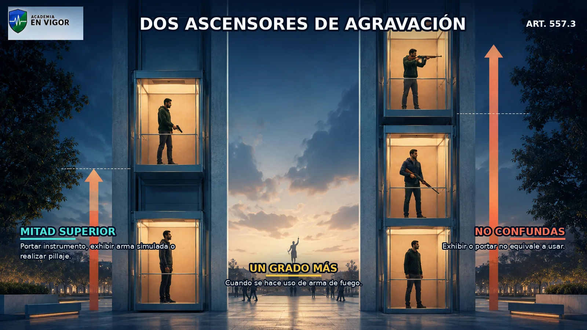

<em>Infografía: Instrumentos peligrosos, pillaje y armas.</em>

<!-- VISUAL:t19-il-03-ascensores-del-peligro-y-del-arma-de-fuego.webp -->

  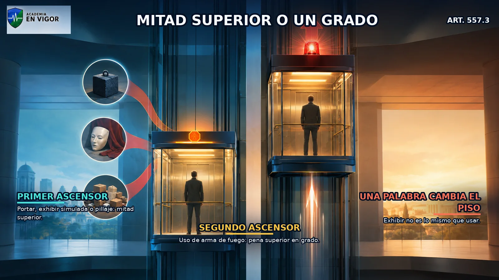

<em>Ilustración: Ascensores del peligro y del arma de fuego.</em>

<!-- FUENTE: CP-T19 -->

## 13. Preparación y concurrencia en desórdenes

La provocación, la conspiración y la proposición para los delitos de los apartados 2 y 3 del artículo 557 se castigan con pena inferior en uno o dos grados.

- La provocación, la conspiración y la proposición para los delitos de los apartados 2 y 3 del artículo 557 se castigan con pena inferior en uno o dos grados.
- El apartado 4 no extiende expresamente esta punición preparatoria al tipo básico del artículo 557.1.
- Las penas del artículo 557 se imponen sin perjuicio de las que correspondan por actos concretos de violencia, amenazas, coacciones, daños o lesiones.
- La cláusula de concurrencia evita que el desorden absorba automáticamente los delitos concretos cometidos.

<!-- FUENTE: CP-T19 -->

## 14. Avalancha o estampida

El artículo 557.5 castiga provocar una avalancha o estampida en lugares públicos causando peligro para la vida o la salud de las personas.

- El artículo 557.5 castiga provocar una avalancha o estampida en lugares públicos causando peligro para la vida o la salud de las personas.
- La pena es prisión de seis meses a dos años, salvo que los hechos estén castigados con pena más grave en otro precepto.
- La figura exige un peligro para la vida o la salud, no únicamente desorganización o molestias.
- La cláusula de subsidiariedad desplaza el artículo 557.5 si otro precepto sanciona el hecho con mayor pena.

<!-- VISUAL:t19-14-avalancha-o-estampida.webp -->

  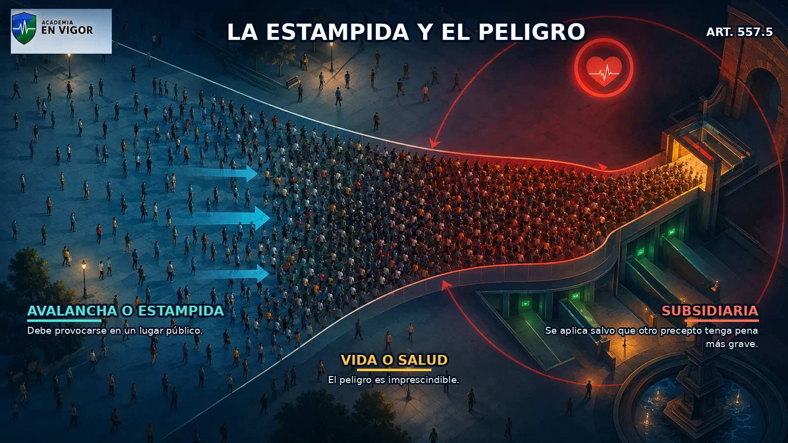

<em>Infografía: Avalancha o estampida.</em>

<!-- FUENTE: CP-T19 -->

## 15. Ocupación perturbadora de domicilio o establecimiento

Quienes, actuando en grupo, invaden u ocupan contra la voluntad del titular el domicilio de una persona jurídica pública o privada, un despacho, oficina, establecimiento o local, aunque esté abierto al público, y perturban de forma relevante la paz pública y la actividad normal, son castigados con prisión de tres a seis meses o multa de seis a doce meses.

- Quienes, actuando en grupo, invaden u ocupan contra la voluntad del titular el domicilio de una persona jurídica pública o privada, un despacho, oficina, establecimiento o local, aunque esté abierto al público, y perturban de forma relevante la paz pública y la actividad normal, son castigados con prisión de tres a seis meses o multa de seis a doce meses.
- La conducta exige actuación en grupo y oposición a la voluntad del titular.
- La ocupación debe perturbar de forma relevante tanto la paz pública como la actividad normal.
- El artículo 557 bis vigente no debe confundirse con el antiguo artículo 557 ter, hoy suprimido.

<!-- VISUAL:t19-15-ocupacion-perturbadora-de-domicilio-o-establecimiento.webp -->

  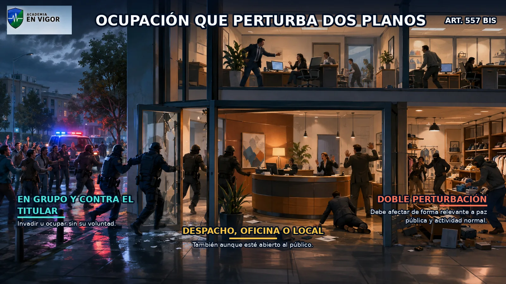

<em>Infografía: Ocupación perturbadora de domicilio o establecimiento.</em>

<!-- FUENTE: CP-T19 -->

## 16. Preceptos suprimidos en desórdenes

El artículo 557 ter del Código Penal está suprimido y la ocupación perturbadora vigente se regula en el artículo 557 bis.

- El artículo 557 ter del Código Penal está suprimido y la ocupación perturbadora vigente se regula en el artículo 557 bis.
- El artículo 559 del Código Penal está suprimido y no contiene hoy un delito de difusión de mensajes.
- Los artículos suprimidos no pueden presentarse como derecho vigente aunque aparezcan en materiales anteriores.
- La secuencia vigente pasa del artículo 558 al artículo 560 porque el artículo 559 permanece formalmente sin contenido.

<!-- FUENTE: CP-T19 -->

## 17. Lugares especialmente protegidos

Perturbar gravemente el orden en la audiencia de un tribunal o juzgado, en actos públicos propios de una autoridad o corporación, en colegio electoral, oficina o establecimiento público, centro docente o con motivo de espectáculos deportivos o culturales se castiga con prisión de tres a seis meses o multa de seis a doce meses.

- Perturbar gravemente el orden en la audiencia de un tribunal o juzgado, en actos públicos propios de una autoridad o corporación, en colegio electoral, oficina o establecimiento público, centro docente o con motivo de espectáculos deportivos o culturales se castiga con prisión de tres a seis meses o multa de seis a doce meses.
- Cuando la perturbación se produce en un colegio electoral, puede imponerse además privación del derecho de sufragio pasivo de dos a seis años.
- La perturbación debe ser grave y producirse en alguno de los contextos expresamente enumerados.
- El artículo 558 protege el normal desarrollo de espacios y actos institucionales, docentes, deportivos y culturales.

<!-- VISUAL:t19-17-lugares-especialmente-protegidos.webp -->

  

<em>Infografía: Lugares especialmente protegidos.</em>

<!-- FUENTE: CP-T19 -->

## 18. Daños a infraestructuras y falsa alarma

Causar daños que interrumpan, obstaculicen o destruyan líneas o instalaciones de telecomunicaciones o la correspondencia postal se castiga con prisión de uno a cinco años.

- Causar daños que interrumpan, obstaculicen o destruyan líneas o instalaciones de telecomunicaciones o la correspondencia postal se castiga con prisión de uno a cinco años.
- La misma pena se aplica a daños en vías férreas u origen de grave daño para la circulación ferroviaria, y a daños que interrumpan conducciones o transmisiones de agua, gas o electricidad.
- El artículo 561 castiga afirmar falsamente o simular una situación de peligro para la comunidad que requiera auxilio policial, asistencia o salvamento y provoque su movilización.
- La falsa alarma del artículo 561 se castiga con prisión de tres meses y un día a un año o multa de tres a dieciocho meses.

<!-- VISUAL:t19-18-danos-a-infraestructuras-y-falsa-alarma.webp -->

  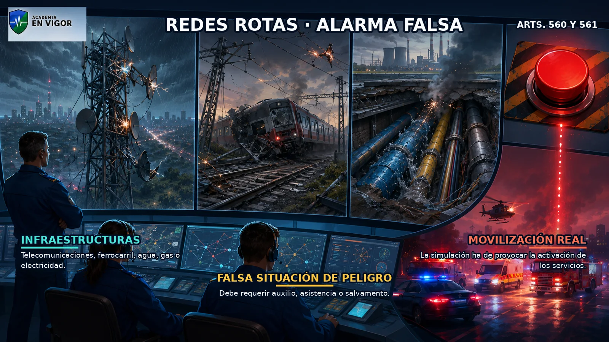

<em>Infografía: Daños a infraestructuras y falsa alarma.</em>

<!-- FUENTE: CP-T19 -->

## 19. Disposición común sobre autoridad

En los delitos de los artículos 557, 557 bis, 558, 560 y 561, cuando el autor se prevale de su condición de autoridad, la pena de inhabilitación prevista se sustituye por inhabilitación absoluta de diez a quince años.

- En los delitos de los artículos 557, 557 bis, 558, 560 y 561, cuando el autor se prevale de su condición de autoridad, la pena de inhabilitación prevista se sustituye por inhabilitación absoluta de diez a quince años.
- El artículo 562 es una disposición común y no crea por sí solo un delito autónomo.
- La regla solo opera respecto de los delitos expresamente enumerados en el precepto.
- La consecuencia exige que el autor se haya prevalido de su condición de autoridad.

<!-- FUENTE: CP-T19 -->

## 20. Armas prohibidas y modificadas

La tenencia de armas prohibidas y la de armas reglamentadas modificadas sustancialmente se castigan con prisión de uno a tres años.

- La tenencia de armas prohibidas y la de armas reglamentadas modificadas sustancialmente se castigan con prisión de uno a tres años.
- El artículo 563 exige que la conducta no esté comprendida en el capítulo siguiente del Código Penal.
- Para determinar qué armas son prohibidas o reglamentadas debe acudirse también al Reglamento de Armas vigente.
- La modificación ha de ser sustancial; no toda alteración material convierte automáticamente el arma en objeto del artículo 563.

<!-- VISUAL:t19-20-armas-prohibidas-y-modificadas.webp -->

  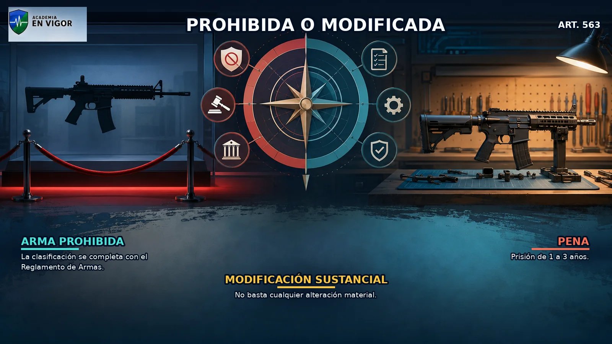

<em>Infografía: Armas prohibidas y modificadas.</em>

<!-- FUENTE: CP-T19,RA-T19 -->

## 21. Armas de fuego reglamentadas sin licencia

La tenencia de armas de fuego reglamentadas sin las licencias o permisos necesarios se castiga con prisión de uno a dos años si se trata de armas cortas.

- La tenencia de armas de fuego reglamentadas sin las licencias o permisos necesarios se castiga con prisión de uno a dos años si se trata de armas cortas.
- Si se trata de armas largas, la pena es prisión de seis meses a un año.
- La diferencia entre arma corta y larga modifica el marco penal del artículo 564.1.
- El tipo exige un arma de fuego reglamentada y la carencia de la licencia o permiso necesario.

<!-- VISUAL:t19-21-armas-de-fuego-reglamentadas-sin-licencia.webp -->

  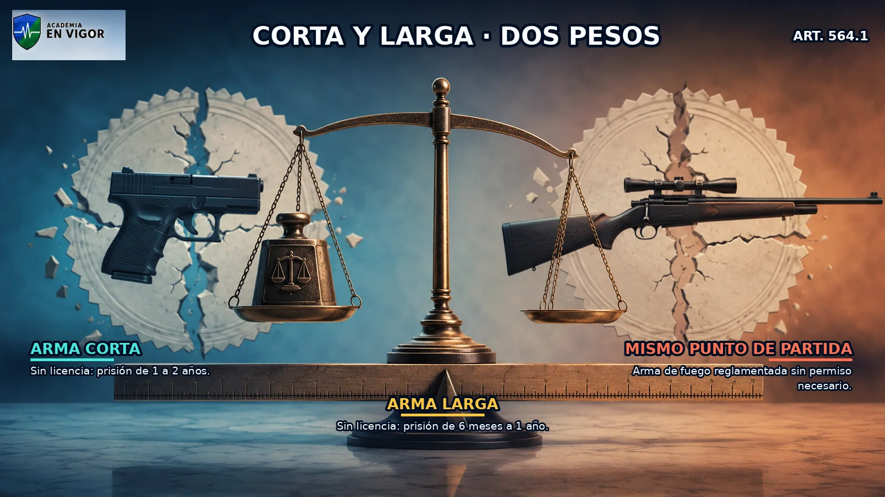

<em>Infografía: Armas de fuego reglamentadas sin licencia.</em>

<!-- FUENTE: CP-T19 -->

## 22. Agravaciones en la tenencia ilícita

Las penas del artículo 564.1 se imponen en su mitad superior cuando el arma carece de marcas de fábrica o de número, o los tiene alterados o borrados.

- Las penas del artículo 564.1 se imponen en su mitad superior cuando el arma carece de marcas de fábrica o de número, o los tiene alterados o borrados.
- También se aplica la mitad superior cuando el arma ha sido introducida ilegalmente en territorio español.
- La agravación comprende el arma transformada mediante modificación de sus características originales.
- Las circunstancias del artículo 564.2 agravan la pena, pero no sustituyen los elementos básicos de tenencia sin licencia.

<!-- FUENTE: CP-T19 -->

## 23. Reducción facultativa de la pena

Los jueces o tribunales pueden rebajar en un grado las penas de los artículos 563 y 564 cuando, por las circunstancias del hecho y del culpable, se evidencie falta de intención de usar las armas con fines ilícitos.

- Los jueces o tribunales pueden rebajar en un grado las penas de los artículos 563 y 564 cuando, por las circunstancias del hecho y del culpable, se evidencie falta de intención de usar las armas con fines ilícitos.
- La reducción del artículo 565 es facultativa, no automática.
- La rebaja posible es de un grado y se refiere a las penas de los artículos 563 y 564.
- La falta de intención de uso ilícito debe resultar evidenciada por las circunstancias del hecho y del culpable.

<!-- FUENTE: CP-T19 -->

## 24. Fabricación, comercialización y depósitos

Quienes fabriquen, comercialicen o establezcan depósitos de armas o municiones no autorizados por las leyes o la autoridad competente son castigados conforme al artículo 566.

- Quienes fabriquen, comercialicen o establezcan depósitos de armas o municiones no autorizados por las leyes o la autoridad competente son castigados conforme al artículo 566.
- El régimen penal distingue entre armas o municiones de guerra, armas químicas, biológicas, nucleares, minas antipersona o municiones en racimo, armas de fuego reglamentadas y otras armas o municiones.
- La clase de objeto y la condición del autor determinan el marco penal aplicable.
- El artículo 566 sanciona actividades no autorizadas y se completa con las definiciones del artículo 567.

<!-- FUENTE: CP-T19 -->

## 25. Armas de guerra, NBQR, minas y racimo

Para armas o municiones de guerra, armas químicas, biológicas, nucleares o radiológicas, minas antipersona o municiones en racimo, los promotores y organizadores son castigados con prisión de cinco a diez años y los cooperadores con prisión de tres a cinco años.

- Para armas o municiones de guerra, armas químicas, biológicas, nucleares o radiológicas, minas antipersona o municiones en racimo, los promotores y organizadores son castigados con prisión de cinco a diez años y los cooperadores con prisión de tres a cinco años.
- Las penas del artículo 566.1.1 se aplican también a quienes desarrollan o emplean armas químicas, biológicas, nucleares o radiológicas, minas antipersona o municiones en racimo, o inician preparativos militares para su empleo.
- El artículo 566.2 alcanza a quienes emplean esas armas o inician preparativos militares para emplearlas.
- La mayor gravedad responde a la naturaleza especialmente destructiva e indiscriminada de estos medios.

<!-- FUENTE: CP-T19 -->

## 26. Armas reglamentadas y tráfico

Cuando se trata de armas de fuego reglamentadas o sus municiones, los promotores y organizadores son castigados con prisión de dos a cuatro años y los cooperadores con prisión de seis meses a dos años.

- Cuando se trata de armas de fuego reglamentadas o sus municiones, los promotores y organizadores son castigados con prisión de dos a cuatro años y los cooperadores con prisión de seis meses a dos años.
- Respecto de otras armas o municiones, los promotores y organizadores son castigados con prisión de uno a tres años y los cooperadores con prisión de seis meses a un año.
- Las penas por armas de fuego reglamentadas son inferiores a las previstas para armas de guerra y superiores a las de otras armas o municiones.
- La distinción entre promotor u organizador y cooperador también modifica el marco penal.

<!-- FUENTE: CP-T19 -->

## 27. Definiciones de depósito y comercio

Se considera depósito de armas de guerra la fabricación, comercialización o tenencia de cualquiera de dichas armas, con independencia de su modelo o clase, aunque se hallen desmontadas.

- Se considera depósito de armas de guerra la fabricación, comercialización o tenencia de cualquiera de dichas armas, con independencia de su modelo o clase, aunque se hallen desmontadas.
- Se considera depósito de armas químicas, biológicas, nucleares o radiológicas, minas antipersona o municiones en racimo la fabricación, comercialización o tenencia de las mismas.
- Se entiende por desarrollo de estas armas cualquier actividad de investigación o estudio científico o técnico encaminada a crear una nueva arma o modificar una preexistente.
- El artículo 567 utiliza conceptos legales propios que no dependen solo del sentido cotidiano de la palabra depósito.

<!-- VISUAL:t19-il-05-el-contador-de-cinco-armas.webp -->

  

<em>Ilustración: El contador de cinco armas.</em>

<!-- FUENTE: CP-T19 -->

## 28. Cinco armas y depósito de municiones

Con respecto a las armas de fuego reglamentadas, se entiende por depósito la fabricación, comercialización o reunión de cinco o más armas, aunque estén desmontadas.

- Con respecto a las armas de fuego reglamentadas, se entiende por depósito la fabricación, comercialización o reunión de cinco o más armas, aunque estén desmontadas.
- El número legal de cinco se aplica a las armas de fuego reglamentadas sin distinguir entre armas cortas y largas.
- Existe depósito de municiones cuando se reúnen cantidades y clases que reglamentariamente se determinen.
- La fabricación o comercialización se considera depósito aunque no se alcance simultáneamente una reunión física de cinco armas.

<!-- FUENTE: CP-T19 -->

## 29. Sustancias explosivas y afines

La tenencia o depósito de sustancias o aparatos explosivos, inflamables, incendiarios o asfixiantes, o de sus componentes, así como su fabricación, tráfico o transporte, se castiga con prisión de cuatro a ocho años cuando no estén autorizados por las leyes o la autoridad competente.

- La tenencia o depósito de sustancias o aparatos explosivos, inflamables, incendiarios o asfixiantes, o de sus componentes, así como su fabricación, tráfico o transporte, se castiga con prisión de cuatro a ocho años cuando no estén autorizados por las leyes o la autoridad competente.
- La misma conducta se castiga con prisión de tres a cinco años para quienes cooperen a su formación.
- El artículo 568.1 comprende sustancias, aparatos y componentes de naturaleza explosiva, inflamable, incendiaria o asfixiante.
- La autorización legal o administrativa válida excluye el carácter no autorizado exigido por el tipo.

<!-- FUENTE: CP-T19 -->

## 30. Combustible líquido y reforma de 2026

Desde el 10 de abril de 2026, el artículo 568.2 castiga con prisión de tres a cinco años la tenencia o depósito no autorizados de combustible líquido para su comercialización o distribución.

- Desde el 10 de abril de 2026, el artículo 568.2 castiga con prisión de tres a cinco años la tenencia o depósito no autorizados de combustible líquido para su comercialización o distribución.
- El nuevo apartado también comprende la fabricación, el tráfico o el transporte no autorizados de combustible líquido con esa finalidad.
- Los jueces o tribunales pueden imponer la pena inferior en grado atendiendo a la menor entidad de la conducta y a las circunstancias personales del responsable.
- La modalidad del artículo 568.2 fue introducida por la Ley Orgánica 1/2026 y no debe confundirse con el régimen general de explosivos del apartado 1.

<!-- VISUAL:t19-il-06-combustible-liquido-y-el-nuevo-articulo-568-2.webp -->

  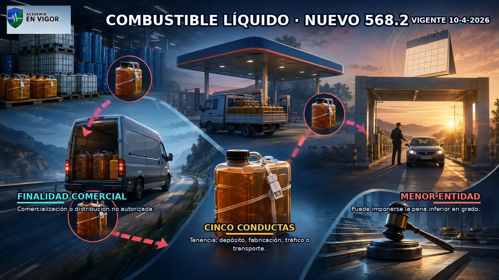

<em>Ilustración: Combustible líquido y el nuevo artículo 568.2.</em>

<!-- FUENTE: CP-T19,LO1-2026-T19 -->

## 31. Asociación, disolución e inhabilitaciones

Los depósitos de armas, municiones o explosivos establecidos en nombre o por cuenta de una asociación con propósito delictivo determinan la declaración judicial de ilicitud y su disolución.

- Los depósitos de armas, municiones o explosivos establecidos en nombre o por cuenta de una asociación con propósito delictivo determinan la declaración judicial de ilicitud y su disolución.
- Los autores de los delitos de este capítulo pueden ser condenados además a privación del derecho a la tenencia y porte de armas por tiempo superior en tres años a la prisión impuesta.
- Cuando los delitos son cometidos por autoridad, agente, funcionario, trabajador o encargado de servicios públicos, se impone además inhabilitación especial para empleo o cargo público de doce a veinte años.
- El artículo 570 reúne consecuencias comunes y adicionales, no sustituye las penas principales de los delitos precedentes.

<!-- FUENTE: CP-T19 -->

# Hablemos claro

:::hablemos-claro
Primero identifica qué ocurre; después, quién está protegido, con qué intensidad se actúa y qué medio o contexto modifica la pena.
:::

# En la calle

:::en-la-calle
En intervención, documenta órdenes, advertencias, conducta, violencia, instrumentos, número y organización del grupo, titularidad del lugar y autorizaciones administrativas.
:::

# Lo que cae

:::lo-que-cae
Prioriza 550 frente a 556, la escala del artículo 557, los preceptos suprimidos, arma corta o larga, cinco armas y la novedad del artículo 568.2.
:::

# Ha caído

:::ha-caido
Las coincidencias históricas quedan ocultas mientras permanezcan en cuarentena editorial y sin plantilla oficial verificable.
:::

---

*Academia En Vigor · El temario que nunca duerme · Tema 19 · v1.0.0 · Documento interno no publicado.*
