# TEMA 20 · DELITOS INFORMÁTICOS. DERECHO A LA INTIMIDAD Y PRUEBA DIGITAL

**Policía Nacional · Método VIGOR · PARTE**
**Versión de contenido:** 1.0.0
**Estado editorial:** approved_internal · **Publicación:** not_published

# Mapa del tema

El recorrido tiene cuatro tramos: mapa penal, intimidad, ataques a datos y sistemas, y prueba digital.

# Contenido

## 01. Alcance oficial y método de resolución

El Tema 20 comprende los delitos informáticos, la especial consideración del derecho a la intimidad y la prueba digital en el proceso penal.

- El Tema 20 comprende los delitos informáticos, la especial consideración del derecho a la intimidad y la prueba digital en el proceso penal.
- El Código Penal no reúne todos los delitos informáticos en un título autónomo: la calificación depende del bien jurídico y de la conducta realizada.
- Para resolver un supuesto hay que separar el acceso, la obtención o revelación de información, el daño a datos, la interrupción del sistema y el desplazamiento patrimonial.
- La denominación técnica de un ataque no sustituye a los elementos del tipo penal aplicable.

<!-- VISUAL:t20-01-alcance-oficial-y-metodo-de-resolucion.webp -->

  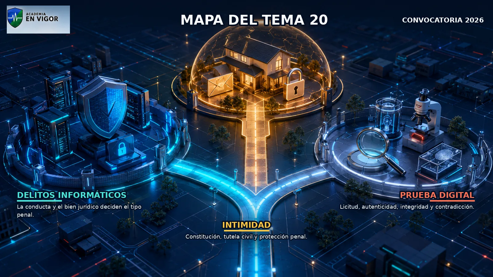

<em>Infografía: Alcance oficial y método de resolución.</em>

<!-- FUENTE: CONV-PN-2026 -->

## 02. Convenio de Budapest: función y alcance

El Convenio sobre la Ciberdelincuencia, hecho en Budapest el 23 de noviembre de 2001, es el marco internacional de referencia sobre ciberdelitos y prueba electrónica.

- El Convenio sobre la Ciberdelincuencia, hecho en Budapest el 23 de noviembre de 2001, es el marco internacional de referencia sobre ciberdelitos y prueba electrónica.
- El Convenio combina derecho penal sustantivo, reglas procesales y cooperación internacional.
- Sus medidas procesales se aplican tanto a delitos contra sistemas y datos como a la obtención de prueba electrónica de otros delitos.
- La red 24/7 del artículo 35 presta asistencia inmediata en investigaciones sobre sistemas, datos y obtención de prueba electrónica.

<!-- VISUAL:t20-02-convenio-de-budapest-funcion-y-alcance.webp -->

  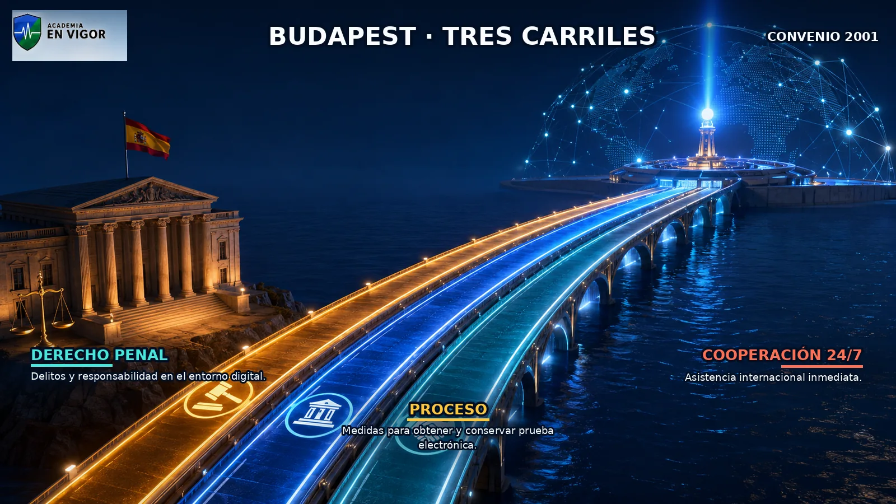

<em>Infografía: Convenio de Budapest: función y alcance.</em>

<!-- FUENTE: BUDAPEST-T20 -->

## 03. Definiciones informáticas del Convenio

Sistema informático es todo dispositivo aislado o conjunto de dispositivos interconectados o relacionados que permita el tratamiento automatizado de datos mediante un programa.

- Sistema informático es todo dispositivo aislado o conjunto de dispositivos interconectados o relacionados que permita el tratamiento automatizado de datos mediante un programa.
- Dato informático es toda representación de hechos, información o conceptos apta para tratamiento informático, incluido un programa que haga ejecutar una función al sistema.
- Proveedor de servicios comprende a quien permite comunicar mediante un sistema informático y a quien procesa o almacena datos para ese servicio o sus usuarios.
- Datos de tráfico son los generados en la cadena de comunicación que indican origen, destino, ruta, hora, fecha, tamaño, duración o tipo de servicio.

<!-- FUENTE: BUDAPEST-T20 -->

## 04. Familias delictivas del Convenio

El Convenio agrupa acceso ilícito, interceptación ilícita, interferencia en datos, interferencia en sistemas y abuso de dispositivos entre los delitos contra confidencialidad, integridad y disponibilidad.

- El Convenio agrupa acceso ilícito, interceptación ilícita, interferencia en datos, interferencia en sistemas y abuso de dispositivos entre los delitos contra confidencialidad, integridad y disponibilidad.
- La falsificación informática y el fraude informático forman una segunda familia de delitos relacionados con ordenadores.
- El Convenio contempla delitos relacionados con contenido y con infracciones de propiedad intelectual y derechos afines.
- La clasificación del Convenio es un mapa internacional; en España cada conducta debe conectarse con un precepto penal vigente.

<!-- VISUAL:t20-04-familias-delictivas-del-convenio.webp -->

  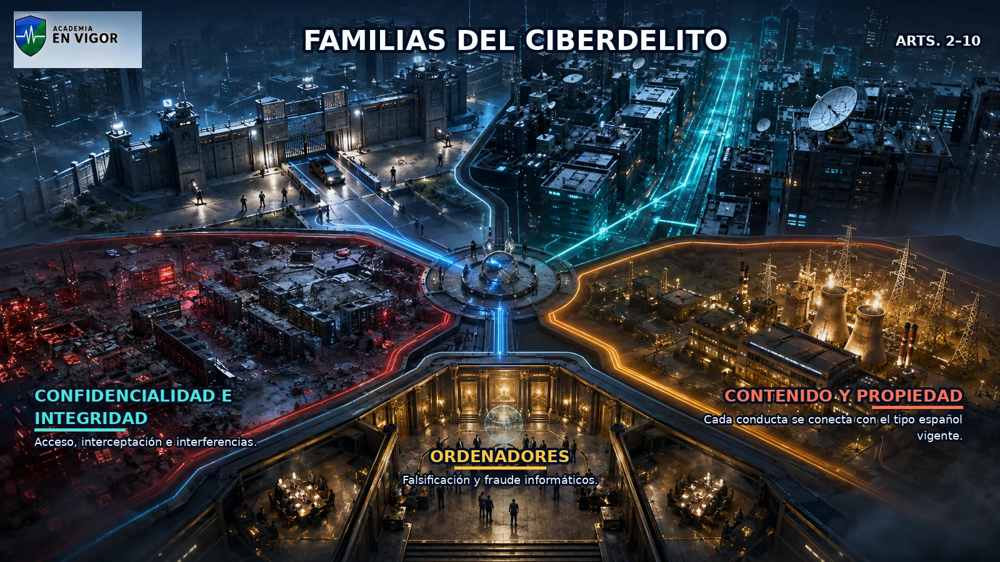

<em>Infografía: Familias delictivas del Convenio.</em>

<!-- VISUAL:t20-il-01-la-ciudad-de-las-cuatro-familias-delictivas.webp -->

  

<em>Ilustración: La ciudad de las cuatro familias delictivas.</em>

<!-- FUENTE: BUDAPEST-T20 -->

## 05. Estafa informática y transferencia no consentida

El artículo 249.1.a considera estafa obtener, con ánimo de lucro, una transferencia no consentida de un activo patrimonial en perjuicio de otro mediante manipulación informática o artificio semejante.

- El artículo 249.1.a considera estafa obtener, con ánimo de lucro, una transferencia no consentida de un activo patrimonial en perjuicio de otro mediante manipulación informática o artificio semejante.
- La manipulación puede consistir en obstaculizar o interferir indebidamente el sistema o en introducir, alterar, borrar, transmitir o suprimir indebidamente datos.
- La pena del artículo 249.1 es prisión de seis meses a tres años, sin perjuicio de las agravaciones que procedan.
- La referencia histórica al artículo 248.2 como sede de la estafa informática está desactualizada: la regulación vigente se encuentra en el artículo 249.

<!-- VISUAL:t20-05-estafa-informatica-y-transferencia-no-consentida.webp -->

  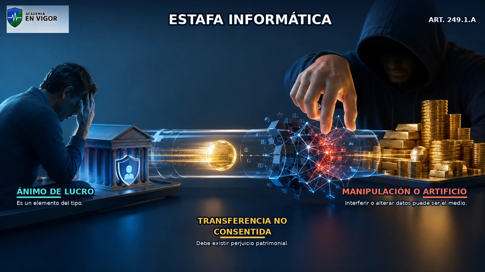

<em>Infografía: Estafa informática y transferencia no consentida.</em>

<!-- FUENTE: CP-T20 -->

## 06. Instrumentos de pago y medios preparatorios

El uso fraudulento de instrumentos de pago materiales o inmateriales distintos del efectivo para realizar operaciones en perjuicio del titular o de un tercero integra el artículo 249.1.b.

- El uso fraudulento de instrumentos de pago materiales o inmateriales distintos del efectivo para realizar operaciones en perjuicio del titular o de un tercero integra el artículo 249.1.b.
- El artículo 249.2.a castiga fabricar, importar, obtener, poseer, transportar, comerciar o facilitar medios diseñados o adaptados específicamente para cometer las estafas del artículo 249.
- El artículo 249.2.b castiga sustraer, apropiarse o adquirir ilícitamente instrumentos de pago distintos del efectivo para utilizarlos fraudulentamente.
- La posesión, adquisición, transferencia, distribución o puesta a disposición de instrumentos obtenidos ilícitamente se castiga en la mitad inferior cuando se conoce su origen y existe finalidad fraudulenta.

<!-- FUENTE: CP-T20 -->

## 07. Ciberdelito como medio y no como etiqueta

Amenazas, coacciones, delitos sexuales, delitos de odio, falsedades o infracciones de propiedad intelectual pueden cometerse mediante TIC sin perder su ubicación sistemática propia.

- Amenazas, coacciones, delitos sexuales, delitos de odio, falsedades o infracciones de propiedad intelectual pueden cometerse mediante TIC sin perder su ubicación sistemática propia.
- Phishing, smishing, vishing, ransomware o suplantación describen técnicas o fenómenos, no tipos penales autónomos con ese nombre.
- Una misma campaña puede integrar varios delitos si concurren accesos ilícitos, daños, revelación de secretos, coacciones o transferencias patrimoniales no consentidas.
- La calificación exige probar los elementos de cada delito y aplicar las reglas de autoría, concurso y responsabilidad correspondientes.

<!-- FUENTE: CP-T20,FGE3-2017-T20 -->

## 08. Intimidad, datos y secreto: tres planos

La intimidad, el secreto de las comunicaciones y la protección frente al uso de la informática son garantías constitucionales relacionadas pero distintas.

- La intimidad, el secreto de las comunicaciones y la protección frente al uso de la informática son garantías constitucionales relacionadas pero distintas.
- La Ley Orgánica 1/1982 articula tutela civil frente a intromisiones ilegítimas, mientras los artículos 197 a 201 protegen penalmente conductas tipificadas.
- La normativa de protección de datos regula tratamientos de información personal, pero no convierte por sí sola toda infracción administrativa en delito.
- La vía civil y la penal pueden responder a finalidades distintas; el carácter delictivo de una intromisión no impide la tutela civil prevista legalmente.

<!-- VISUAL:t20-08-intimidad-datos-y-secreto-tres-planos.webp -->

  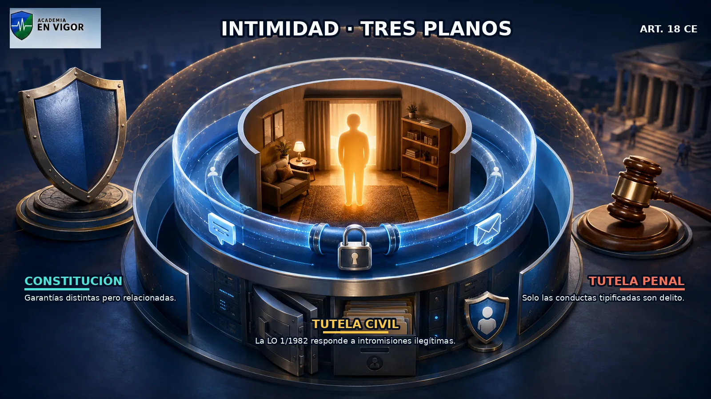

<em>Infografía: Intimidad, datos y secreto: tres planos.</em>

<!-- FUENTE: CE-T20,LO1-1982-T20,CP-T20 -->

## 09. Artículo 18 de la Constitución

El artículo 18.1 garantiza el derecho al honor, a la intimidad personal y familiar y a la propia imagen.

- El artículo 18.1 garantiza el derecho al honor, a la intimidad personal y familiar y a la propia imagen.
- El artículo 18.2 proclama la inviolabilidad del domicilio y exige consentimiento, resolución judicial o flagrante delito para la entrada o registro.
- El artículo 18.3 garantiza el secreto de las comunicaciones, especialmente postales, telegráficas y telefónicas, salvo resolución judicial.
- El artículo 18.4 ordena limitar por ley el uso de la informática para garantizar honor, intimidad y pleno ejercicio de los derechos.

<!-- VISUAL:t20-09-articulo-18-de-la-constitucion.webp -->

  

<em>Infografía: Artículo 18 de la Constitución.</em>

<!-- FUENTE: CE-T20 -->

## 10. Tutela civil y consentimiento

Los derechos al honor, intimidad personal y familiar y propia imagen son irrenunciables, inalienables e imprescriptibles.

- Los derechos al honor, intimidad personal y familiar y propia imagen son irrenunciables, inalienables e imprescriptibles.
- La protección civil se delimita por las leyes y los usos sociales, atendiendo al ámbito que cada persona mantiene reservado por sus propios actos.
- No existe intromisión ilegítima cuando está expresamente autorizada por ley o cuando el titular ha prestado consentimiento expreso.
- El consentimiento civil es revocable, aunque la revocación puede generar la obligación de indemnizar daños y expectativas justificadas.

<!-- VISUAL:t20-10-tutela-civil-y-consentimiento.webp -->

  

<em>Infografía: Tutela civil y consentimiento.</em>

<!-- FUENTE: LO1-1982-T20 -->

## 11. Descubrimiento de secretos y captación

El artículo 197.1 exige actuar para descubrir secretos o vulnerar la intimidad ajena y sin consentimiento.

- El artículo 197.1 exige actuar para descubrir secretos o vulnerar la intimidad ajena y sin consentimiento.
- La conducta puede consistir en apoderarse de papeles, cartas, correos electrónicos u otros documentos o efectos personales.
- También comprende interceptar telecomunicaciones o emplear artificios técnicos de escucha, transmisión, grabación o reproducción de sonido, imagen u otra señal.
- La pena del artículo 197.1 es prisión de uno a cuatro años y multa de doce a veinticuatro meses.

<!-- FUENTE: CP-T20 -->

## 12. Datos reservados personales o familiares

El artículo 197.2 castiga apoderarse, utilizar o modificar sin autorización y en perjuicio de tercero datos reservados personales o familiares registrados.

- El artículo 197.2 castiga apoderarse, utilizar o modificar sin autorización y en perjuicio de tercero datos reservados personales o familiares registrados.
- Los datos pueden estar en ficheros o soportes informáticos, electrónicos o telemáticos, o en cualquier archivo o registro público o privado.
- También se castiga acceder sin autorización a esos datos y alterarlos o utilizarlos en perjuicio del titular o de un tercero.
- Las conductas del artículo 197.2 tienen la misma pena básica que el apartado 1: prisión de uno a cuatro años y multa de doce a veinticuatro meses.

<!-- VISUAL:t20-12-datos-reservados-personales-o-familiares.webp -->

  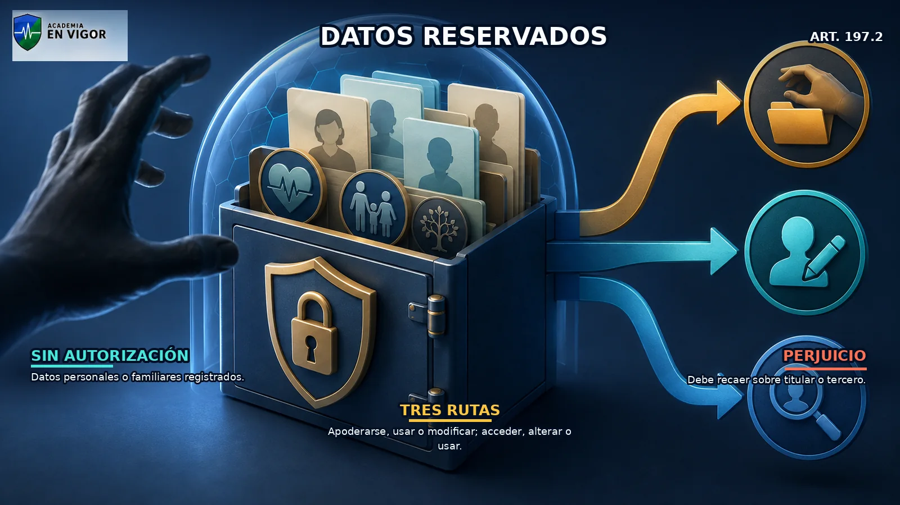

<em>Infografía: Datos reservados personales o familiares.</em>

<!-- FUENTE: CP-T20 -->

## 13. Difusión de lo ilícitamente descubierto

Difundir, revelar o ceder a terceros datos, hechos o imágenes obtenidos mediante los apartados 1 o 2 se castiga con prisión de dos a cinco años.

- Difundir, revelar o ceder a terceros datos, hechos o imágenes obtenidos mediante los apartados 1 o 2 se castiga con prisión de dos a cinco años.
- Quien no participó en el descubrimiento pero conoce su origen ilícito y difunde, revela o cede la información responde con pena diferenciada.
- Para el tercero conocedor del origen ilícito la pena es prisión de uno a tres años y multa de doce a veinticuatro meses.
- El apartado 3 distingue al autor del descubrimiento del receptor posterior que conoce el origen ilícito.

<!-- FUENTE: CP-T20 -->

## 14. Agravaciones por sujeto, datos y lucro

Los apartados 1 y 2 se castigan con prisión de tres a cinco años si actúa un encargado o responsable del fichero o se usan sin autorización datos personales de la víctima.

- Los apartados 1 y 2 se castigan con prisión de tres a cinco años si actúa un encargado o responsable del fichero o se usan sin autorización datos personales de la víctima.
- Si en esos supuestos agravados los datos reservados se difunden, ceden o revelan, la pena se impone en su mitad superior.
- Los datos sobre ideología, religión, creencias, salud, origen racial o vida sexual y las víctimas menores o especialmente protegidas llevan las penas a su mitad superior.
- La finalidad lucrativa impone la mitad superior y, si concurre además la especial sensibilidad del apartado 5, prisión de cuatro a siete años.

<!-- FUENTE: CP-T20 -->

## 15. Difusión de imágenes íntimas obtenidas con anuencia

El artículo 197.7 castiga difundir, revelar o ceder sin autorización imágenes o grabaciones obtenidas con anuencia en un domicilio o lugar fuera de la mirada de terceros cuando se menoscaba gravemente la intimidad.

- El artículo 197.7 castiga difundir, revelar o ceder sin autorización imágenes o grabaciones obtenidas con anuencia en un domicilio o lugar fuera de la mirada de terceros cuando se menoscaba gravemente la intimidad.
- El autor que obtuvo el material con anuencia se enfrenta a prisión de tres meses a un año o multa de seis a doce meses.
- Quien recibió posteriormente esas imágenes y las redistribuye sin consentimiento se castiga con multa de uno a tres meses.
- La mitad superior se aplica, entre otros casos, por relación afectiva, víctima menor o especialmente protegida o finalidad lucrativa.

<!-- VISUAL:t20-15-difusion-de-imagenes-intimas-obtenidas-con-anuencia.webp -->

  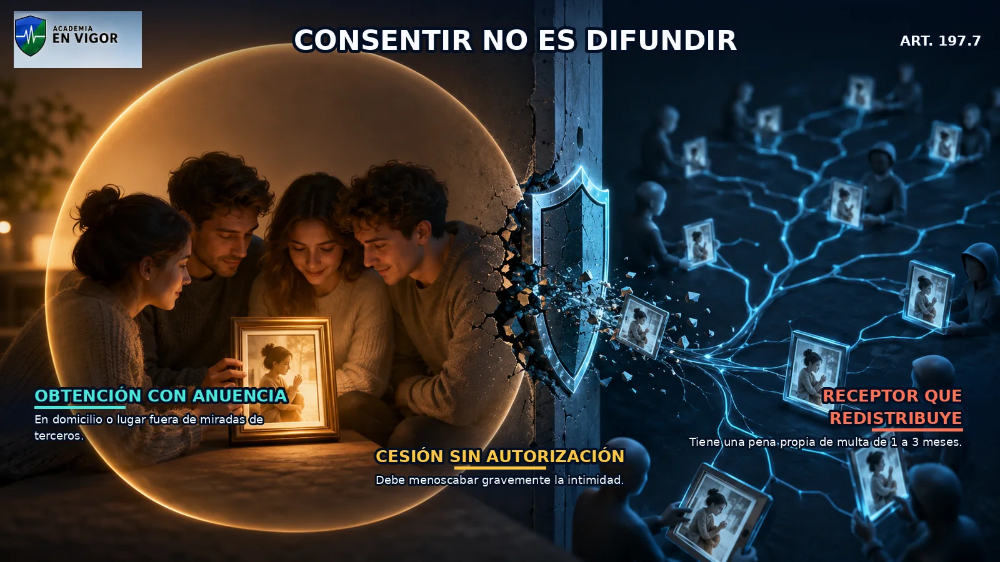

<em>Infografía: Difusión de imágenes íntimas obtenidas con anuencia.</em>

<!-- FUENTE: CP-T20 -->

## 16. Acceso ilícito a sistemas

El artículo 197 bis.1 castiga acceder o facilitar a otro el acceso a todo o parte de un sistema vulnerando las medidas de seguridad y sin autorización.

- El artículo 197 bis.1 castiga acceder o facilitar a otro el acceso a todo o parte de un sistema vulnerando las medidas de seguridad y sin autorización.
- También castiga mantenerse en el sistema contra la voluntad de quien tiene el derecho legítimo a excluir al intruso.
- El acceso típico exige vulneración de medidas de seguridad; no basta una mera consulta incómoda sin ese elemento.
- La pena del acceso ilícito es prisión de seis meses a dos años.

<!-- VISUAL:t20-16-acceso-ilicito-a-sistemas.webp -->

  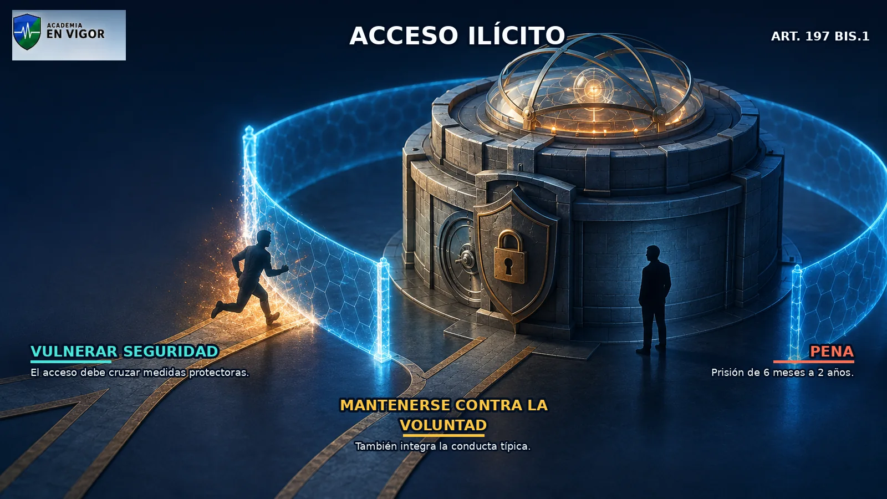

<em>Infografía: Acceso ilícito a sistemas.</em>

<!-- VISUAL:t20-il-02-la-imagen-que-rompe-el-circulo-privado.webp -->

  

<em>Ilustración: La imagen que rompe el círculo privado.</em>

<!-- FUENTE: CP-T20 -->

## 17. Interceptación ilícita de datos

El artículo 197 bis.2 castiga interceptar sin autorización transmisiones no públicas de datos desde, hacia o dentro de un sistema de información.

- El artículo 197 bis.2 castiga interceptar sin autorización transmisiones no públicas de datos desde, hacia o dentro de un sistema de información.
- La interceptación ha de realizarse mediante artificios o instrumentos técnicos.
- El tipo incluye las emisiones electromagnéticas de los datos informáticos transmitidos.
- La pena es prisión de tres meses a dos años o multa de tres a doce meses.

<!-- VISUAL:t20-17-interceptacion-ilicita-de-datos.webp -->

  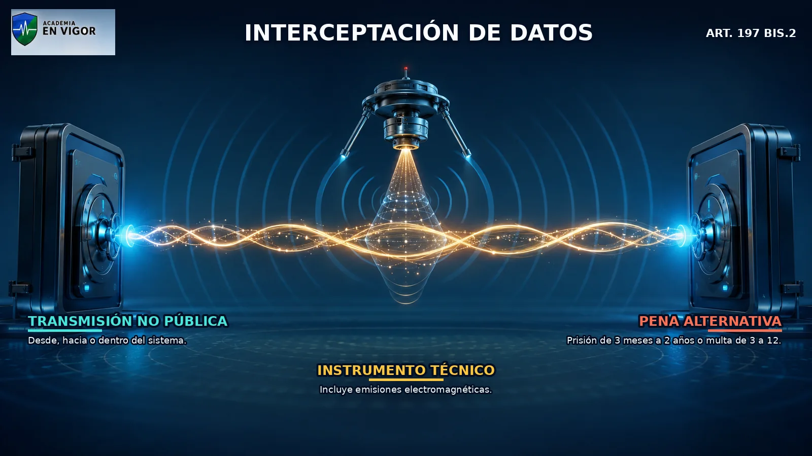

<em>Infografía: Interceptación ilícita de datos.</em>

<!-- FUENTE: CP-T20 -->

## 18. Programas y credenciales para atacar intimidad

El artículo 197 ter exige actuar sin autorización y con intención de facilitar delitos de los apartados 1 y 2 del artículo 197 o del artículo 197 bis.

- El artículo 197 ter exige actuar sin autorización y con intención de facilitar delitos de los apartados 1 y 2 del artículo 197 o del artículo 197 bis.
- Comprende programas concebidos o adaptados principalmente para cometer esos delitos.
- También comprende contraseñas, códigos de acceso o datos similares que permitan acceder a todo o parte de un sistema.
- La pena es prisión de seis meses a dos años o multa de tres a dieciocho meses.

<!-- FUENTE: CP-T20 -->

## 19. Organización y persona jurídica

Si los delitos del capítulo se cometen en el seno de una organización o grupo criminal, se aplican las penas superiores en grado.

- Si los delitos del capítulo se cometen en el seno de una organización o grupo criminal, se aplican las penas superiores en grado.
- La agravación del artículo 197 quater requiere el contexto de organización o grupo criminal, no mera actuación conjunta ocasional.
- La persona jurídica puede responder por los delitos de los artículos 197, 197 bis y 197 ter conforme al artículo 31 bis.
- El artículo 197 quinquies prevé para la persona jurídica multa de seis meses a dos años y permite otras consecuencias del artículo 33.7.

<!-- VISUAL:t20-19-organizacion-y-persona-juridica.webp -->

  

<em>Infografía: Organización y persona jurídica.</em>

<!-- FUENTE: CP-T20 -->

## 20. Autoridad, oficio, persona jurídica y perseguibilidad

La autoridad o funcionario que actúa fuera de la ley, sin causa legal por delito y prevaliéndose del cargo recibe las penas del artículo 197 en mitad superior e inhabilitación absoluta de seis a doce años.

- La autoridad o funcionario que actúa fuera de la ley, sin causa legal por delito y prevaliéndose del cargo recibe las penas del artículo 197 en mitad superior e inhabilitación absoluta de seis a doce años.
- El artículo 199 distingue la revelación de secretos conocidos por oficio o relación laboral de la divulgación profesional con infracción del deber de sigilo.
- El artículo 200 extiende el capítulo a datos reservados de personas jurídicas cuando se descubren, revelan o ceden sin consentimiento de sus representantes.
- La regla general exige denuncia del agraviado o representante, con excepciones por artículo 198, intereses generales, pluralidad de personas y víctimas menores o especialmente protegidas.

<!-- FUENTE: CP-T20 -->

## 21. Daño grave a datos, programas y documentos

El artículo 264.1 castiga borrar, dañar, deteriorar, alterar, suprimir o hacer inaccesibles datos, programas o documentos electrónicos ajenos.

- El artículo 264.1 castiga borrar, dañar, deteriorar, alterar, suprimir o hacer inaccesibles datos, programas o documentos electrónicos ajenos.
- La conducta debe realizarse sin autorización y de manera grave.
- El resultado producido también ha de ser grave; el tipo no convierte cualquier alteración mínima en delito del artículo 264.1.
- La pena básica es prisión de seis meses a tres años.

<!-- VISUAL:t20-21-dano-grave-a-datos-programas-y-documentos.webp -->

  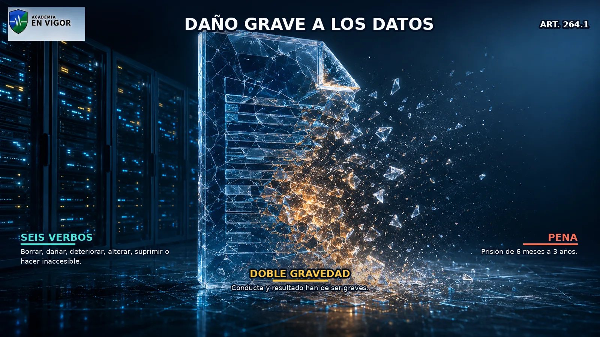

<em>Infografía: Daño grave a datos, programas y documentos.</em>

<!-- FUENTE: CP-T20 -->

## 22. Daños informáticos agravados

El artículo 264.2 agrava por organización criminal, especial gravedad o afectación de un número elevado de sistemas.

- El artículo 264.2 agrava por organización criminal, especial gravedad o afectación de un número elevado de sistemas.
- También agrava el perjuicio grave a servicios públicos esenciales o bienes de primera necesidad y la afectación de infraestructuras críticas o grave peligro para la seguridad.
- El uso de programas o credenciales del artículo 264 ter constituye otra circunstancia agravante y la extrema gravedad permite pena superior en grado.
- El uso ilícito de datos personales ajenos para acceder al sistema o ganarse la confianza de un tercero lleva las penas a su mitad superior.

<!-- VISUAL:t20-22-danos-informaticos-agravados.webp -->

  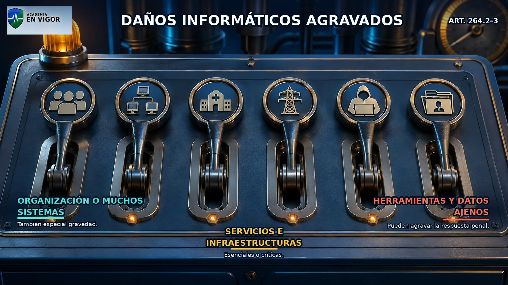

<em>Infografía: Daños informáticos agravados.</em>

<!-- FUENTE: CP-T20 -->

## 23. Interferencia grave en sistemas

El artículo 264 bis castiga obstaculizar o interrumpir gravemente, sin autorización, el funcionamiento de un sistema informático ajeno.

- El artículo 264 bis castiga obstaculizar o interrumpir gravemente, sin autorización, el funcionamiento de un sistema informático ajeno.
- La interferencia puede ejecutarse mediante daños a datos, introducción o transmisión de datos o destrucción, daño, inutilización, eliminación o sustitución del sistema.
- Si se perjudica relevantemente la actividad normal de empresa, negocio o Administración pública, se aplica la mitad superior y puede alcanzarse el grado superior.
- Cuando concurren agravantes del artículo 264.2, la pena es prisión de tres a ocho años y multa del triplo al décuplo del perjuicio.

<!-- VISUAL:t20-23-interferencia-grave-en-sistemas.webp -->

  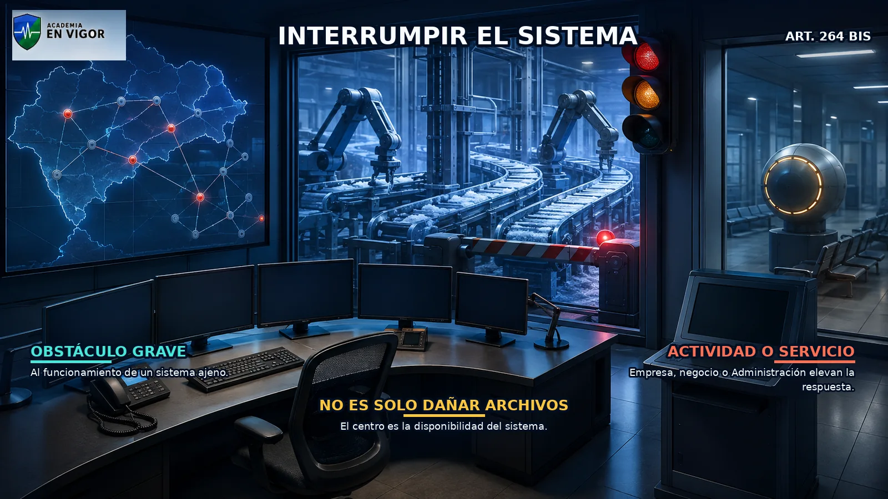

<em>Infografía: Interferencia grave en sistemas.</em>

<!-- FUENTE: CP-T20 -->

## 24. Herramientas y credenciales para causar daños

El artículo 264 ter exige intención de facilitar daños del artículo 264 o interferencias del artículo 264 bis.

- El artículo 264 ter exige intención de facilitar daños del artículo 264 o interferencias del artículo 264 bis.
- Comprende programas concebidos o adaptados principalmente para cometer esos delitos.
- También comprende contraseñas, códigos de acceso o datos similares que permitan acceder a todo o parte de un sistema.
- La pena es prisión de seis meses a dos años o multa de tres a dieciocho meses.

<!-- VISUAL:t20-24-herramientas-y-credenciales-para-causar-danos.webp -->

  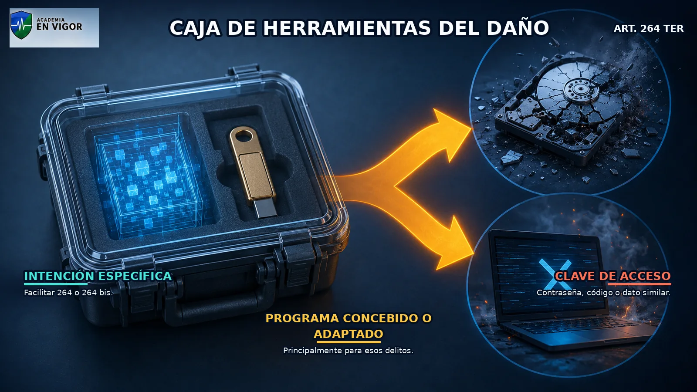

<em>Infografía: Herramientas y credenciales para causar daños.</em>

<!-- FUENTE: CP-T20 -->

## 25. Responsabilidad de la persona jurídica por daños

La persona jurídica puede responder por los delitos de los artículos 264, 264 bis y 264 ter conforme al artículo 31 bis.

- La persona jurídica puede responder por los delitos de los artículos 264, 264 bis y 264 ter conforme al artículo 31 bis.
- Para delitos castigados con prisión superior a tres años se prevé multa de dos a cinco años o del quíntuplo a doce veces el perjuicio si resulta mayor.
- En los demás casos se prevé multa de uno a tres años o del triple a ocho veces el perjuicio si resulta mayor.
- Además de la multa pueden imponerse las consecuencias de las letras b) a g) del artículo 33.7 atendiendo al artículo 66 bis.

<!-- FUENTE: CP-T20 -->

## 26. Acceso, daño, interrupción y fraude

El acceso ilícito del artículo 197 bis protege el sistema frente a la intrusión aunque no se produzca daño ni transferencia patrimonial.

- El acceso ilícito del artículo 197 bis protege el sistema frente a la intrusión aunque no se produzca daño ni transferencia patrimonial.
- El artículo 264 exige un resultado grave sobre datos, programas o documentos, mientras el 264 bis se centra en el funcionamiento del sistema.
- El artículo 249.1.a exige ánimo de lucro y transferencia patrimonial no consentida, elementos que no definen los daños informáticos.
- Una misma secuencia puede exigir concurso entre acceso, daños y estafa si conserva autonomía lesiva y concurren todos sus elementos.

<!-- FUENTE: CP-T20,FGE3-2017-T20 -->

## 27. Ransomware: calificación por conductas

Ransomware no es el nombre de un único tipo penal: su calificación depende del acceso, cifrado, interrupción, apoderamiento de datos y exigencia económica realizados.

- Ransomware no es el nombre de un único tipo penal: su calificación depende del acceso, cifrado, interrupción, apoderamiento de datos y exigencia económica realizados.
- Cifrar o hacer inaccesibles datos ajenos de manera y resultado graves puede integrar el artículo 264.
- Interrumpir gravemente un sistema puede integrar el artículo 264 bis y exigir rescate puede añadir coacciones, amenazas o extorsión según el caso.
- Pagar no garantiza recuperación ni excluye el deber de preservar evidencias; la respuesta penal se construye desde hechos comprobables.

<!-- VISUAL:t20-il-04-el-candado-del-ransomware-y-sus-varios-delitos.webp -->

  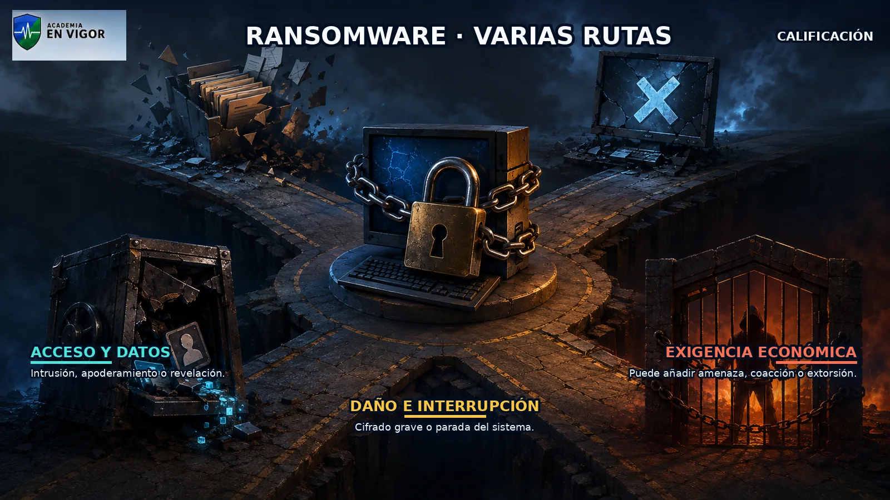

<em>Ilustración: El candado del ransomware y sus varios delitos.</em>

<!-- FUENTE: CP-T20 -->

## 28. Phishing y suplantación: calificación por resultado

Phishing describe un engaño para obtener credenciales o inducir acciones, pero su encaje penal depende de la conducta y el resultado.

- Phishing describe un engaño para obtener credenciales o inducir acciones, pero su encaje penal depende de la conducta y el resultado.
- El uso de credenciales para lograr una transferencia patrimonial no consentida puede integrar el artículo 249.1.a.
- El acceso a sistemas, correos o datos mediante credenciales obtenidas ilícitamente puede activar los artículos 197 o 197 bis según sus elementos.
- La mera denominación suplantación de identidad no permite elegir automáticamente un delito sin identificar el uso concreto de los datos o la identidad.

<!-- FUENTE: CP-T20 -->

## 29. Concepto, fuentes y valoración de la prueba digital

Prueba digital es la información con relevancia procesal generada, transmitida o almacenada mediante sistemas o dispositivos electrónicos.

- Prueba digital es la información con relevancia procesal generada, transmitida o almacenada mediante sistemas o dispositivos electrónicos.
- Su fuerza probatoria depende de licitud en la obtención, autenticidad, integridad, trazabilidad y posibilidad de contradicción.
- Una captura de pantalla no se vuelve infalible por estar impresa: si se impugna seriamente su autenticidad puede requerir corroboración o prueba pericial.
- La cadena de custodia documenta identidad, recogida, conservación, acceso y transferencia del indicio para detectar alteraciones o sustituciones.

<!-- FUENTE: LECRIM-T20,STS300-2015-T20 -->

## 30. Primeras diligencias sobre contenidos ilícitos

En delitos cometidos mediante internet, teléfono o TIC, el juez puede acordar como primeras diligencias la retirada provisional de contenidos ilícitos.

- En delitos cometidos mediante internet, teléfono o TIC, el juez puede acordar como primeras diligencias la retirada provisional de contenidos ilícitos.
- También puede acordar la interrupción provisional de los servicios que ofrecen esos contenidos.
- Cuando los contenidos o servicios radiquen en el extranjero, puede ordenarse su bloqueo provisional.
- Estas medidas son cautelares y provisionales; no sustituyen la investigación ni la decisión definitiva sobre responsabilidad.

<!-- FUENTE: LECRIM-T20 -->

## 31. Principios de la investigación tecnológica

Las medidas de investigación tecnológica requieren autorización judicial y sujeción a especialidad, idoneidad, excepcionalidad, necesidad y proporcionalidad.

- Las medidas de investigación tecnológica requieren autorización judicial y sujeción a especialidad, idoneidad, excepcionalidad, necesidad y proporcionalidad.
- Especialidad exige relación con un delito concreto y prohíbe medidas para despejar sospechas sin base objetiva.
- Excepcionalidad y necesidad exigen que no exista una medida menos gravosa igualmente útil o que sin la injerencia se dificulte gravemente la investigación.
- Proporcionalidad exige que el sacrificio de derechos no sea superior al beneficio para el interés público y de terceros.

<!-- VISUAL:t20-il-05-la-balanza-de-los-cinco-principios.webp -->

  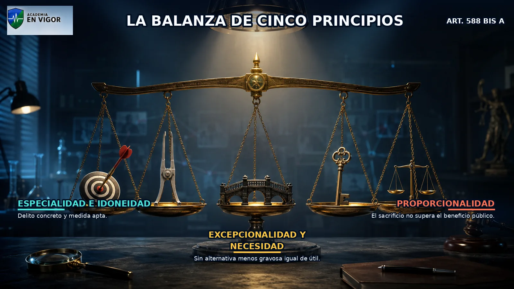

<em>Ilustración: La balanza de los cinco principios.</em>

<!-- FUENTE: LECRIM-T20 -->

## 32. Solicitud, resolución, secreto y control

El juez puede acordar la medida de oficio o a instancia del Ministerio Fiscal o de la Policía Judicial.

- El juez puede acordar la medida de oficio o a instancia del Ministerio Fiscal o de la Policía Judicial.
- La solicitud debe describir el hecho, indicios, afectados, alcance, unidad investigadora, ejecución, duración y sujeto obligado conocido.
- El juez autoriza o deniega por auto motivado, oído el Ministerio Fiscal, en el plazo máximo de veinticuatro horas desde la solicitud.
- La medida se tramita en pieza separada y secreta y la Policía Judicial informa al juez de su desarrollo y resultado.

<!-- FUENTE: LECRIM-T20 -->

## 33. Interceptación de comunicaciones telemáticas

La interceptación puede autorizarse para los delitos del artículo 579.1 y para delitos cometidos mediante instrumentos informáticos, TIC o servicios de comunicación.

- La interceptación puede autorizarse para los delitos del artículo 579.1 y para delitos cometidos mediante instrumentos informáticos, TIC o servicios de comunicación.
- La intervención ha de delimitar terminales o medios y respetar los principios comunes de investigación tecnológica.
- La duración máxima inicial es de tres meses desde la autorización judicial.
- Puede prorrogarse por períodos sucesivos de igual duración hasta un máximo total de dieciocho meses.

<!-- FUENTE: LECRIM-T20 -->

## 34. Dirección IP, IMSI, IMEI y titularidad

Si una IP se usa para cometer un delito y no se conoce el equipo ni el usuario, la Policía Judicial solicita al juez requerir los datos de identificación y localización.

- Si una IP se usa para cometer un delito y no se conoce el equipo ni el usuario, la Policía Judicial solicita al juez requerir los datos de identificación y localización.
- Cuando sea indispensable y no se haya obtenido el número de abonado, la Policía Judicial puede captar códigos técnicos como IMSI o IMEI para identificar equipo o tarjeta.
- Obtenidos esos códigos, la intervención de comunicaciones exige la solicitud y resolución judicial correspondientes.
- Para identificar titular o terminal, el Ministerio Fiscal o la Policía Judicial pueden dirigirse directamente a prestadores en los supuestos del artículo 588 ter m.

<!-- FUENTE: LECRIM-T20 -->

## 35. Incautar no es acceder: registro de dispositivos

La autorización de entrada y registro domiciliario debe motivar específicamente el acceso previsible a ordenadores, móviles, dispositivos o repositorios telemáticos.

- La autorización de entrada y registro domiciliario debe motivar específicamente el acceso previsible a ordenadores, móviles, dispositivos o repositorios telemáticos.
- La simple incautación de un dispositivo durante el registro domiciliario no legitima acceder a su contenido.
- Fuera del domicilio, los agentes comunican la incautación al juez y este autoriza el acceso si lo considera indispensable.
- La autorización fija alcance, copias y condiciones de integridad y preservación; la urgencia excepcional exige comunicación judicial en veinticuatro horas y confirmación o revocación motivada.

<!-- VISUAL:t20-il-06-la-caja-fuerte-digital-incautar-no-es-abrir.webp -->

  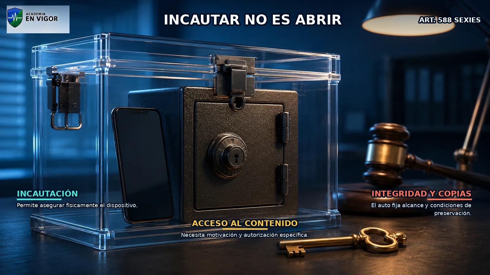

<em>Ilustración: La caja fuerte digital: incautar no es abrir.</em>

<!-- FUENTE: LECRIM-T20 -->

## 36. Registro remoto y conservación urgente

El registro remoto exige autorización judicial y solo procede para las categorías delictivas enumeradas en el artículo 588 septies a.

- El registro remoto exige autorización judicial y solo procede para las categorías delictivas enumeradas en el artículo 588 septies a.
- La resolución identifica sistemas y datos, alcance, software, agentes, copias y medidas de integridad; su duración máxima es un mes, prorrogable hasta tres.
- El Ministerio Fiscal o la Policía Judicial pueden ordenar conservar datos concretos hasta obtener autorización judicial para su cesión.
- La conservación dura como máximo noventa días y puede prorrogarse una sola vez hasta la cesión o hasta ciento ochenta días.

<!-- FUENTE: LECRIM-T20 -->

# Hablemos claro

:::hablemos-claro
No memorices nombres de ataques como si fueran artículos: identifica qué se hizo, sin qué autorización y qué bien o resultado se afectó.
:::

# En la calle

:::en-la-calle
Preserva el original, trabaja sobre copias verificadas, documenta cada transferencia y separa siempre la incautación física de la autorización para acceder al contenido.
:::

# Lo que cae

:::lo-que-cae
Prioriza 197 frente a 197 bis, 264 frente a 264 bis, el artículo 249 vigente y los plazos 3–18, 1–3 y 90–180.
:::

# Ha caído

:::ha-caido
Las coincidencias históricas permanecen sin respuesta pública mientras no exista plantilla final oficial cotejada.
:::

---

*Academia En Vigor · El temario que nunca duerme · Tema 20 · v1.0.0 · Documento interno no publicado.*
