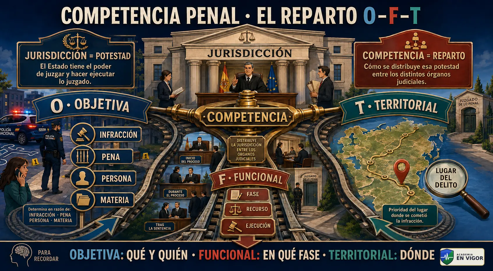
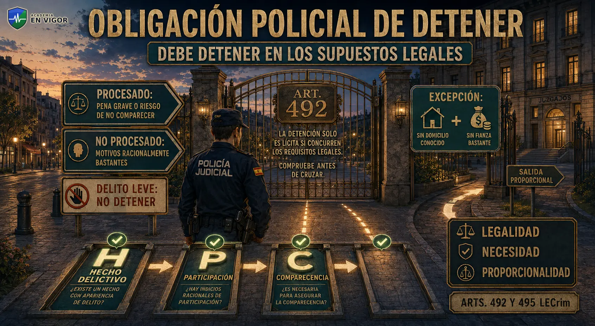
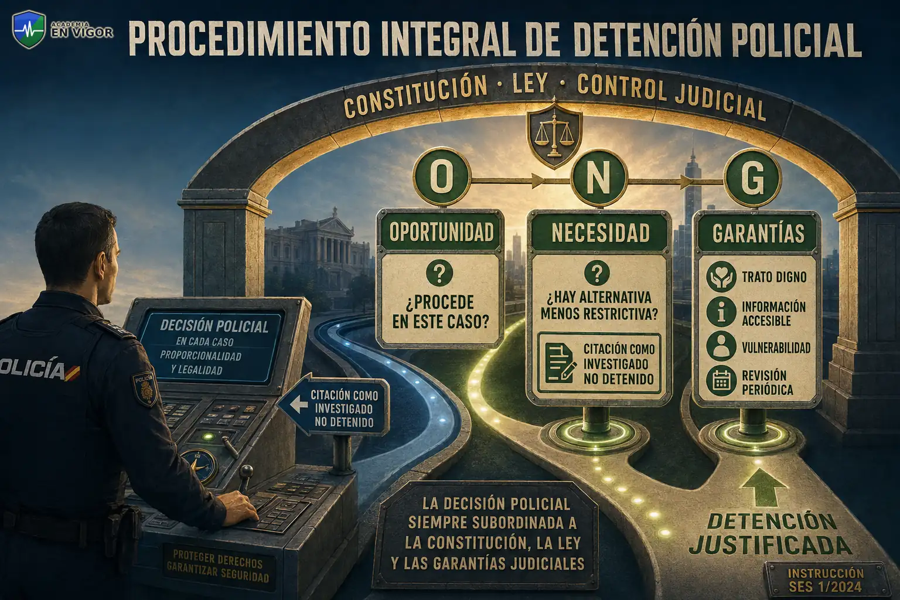
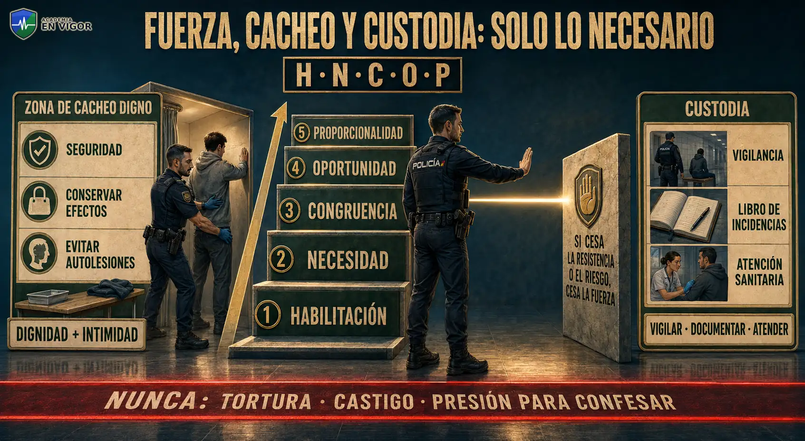
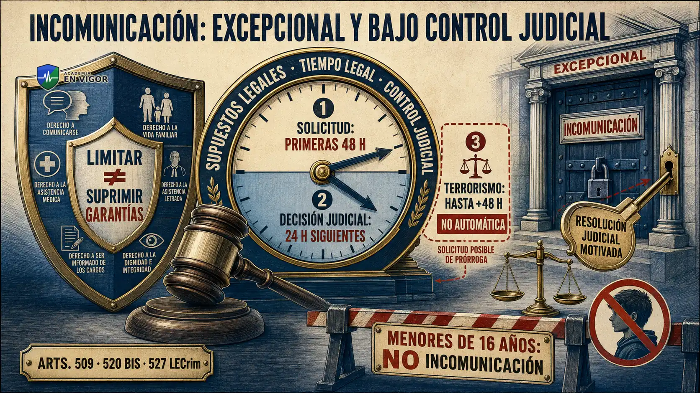
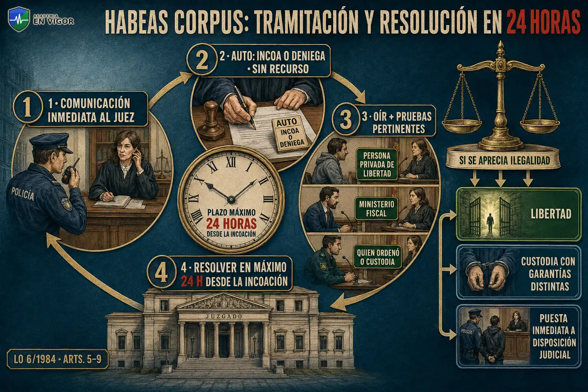

# TEMA 21 · NOCIÓN DE DERECHO PROCESAL PENAL. CONCEPTO DE JURISDICCIÓN Y DE COMPETENCIA. LOS ÓRGANOS DE LA JURISDICCIÓN PENAL. CONCEPTO DE DENUNCIA Y OBLIGACIÓN DE DENUNCIAR. LA DETENCIÓN: CONCEPTO, DURACIÓN, OBLIGACIÓN DE DETENER Y DERECHOS DEL DETENIDO. EL PROCEDIMIENTO DE HABEAS CORPUS. EL PROCEDIMIENTO INTEGRAL DE LA DETENCIÓN POLICIAL. EL MINISTERIO FISCAL. LA POLICÍA JUDICIAL.

**Policía Nacional · Método VIGOR · PARTE**
**Versión de contenido:** 1.0.0
**Estado editorial:** approved_internal · **Publicación:** not_published

# Mapa del tema

El Tema 21 se recorre en cuatro partes: proceso penal, jurisdicción, competencia y órganos; denuncia y detención; garantías, procedimiento policial y habeas corpus; ministerio fiscal y policía judicial.

# Contenido

## 01. Derecho procesal penal y proceso

El Derecho procesal penal regula la actuación de los órganos jurisdiccionales y de las partes para investigar, enjuiciar y ejecutar las consecuencias de los hechos con apariencia delictiva.

- El Derecho procesal penal regula la actuación de los órganos jurisdiccionales y de las partes para investigar, enjuiciar y ejecutar las consecuencias de los hechos con apariencia delictiva.
- El proceso penal sirve a la aplicación del Derecho penal con garantías; la policía no declara culpabilidad ni impone penas.
- La fase de investigación reúne elementos de cargo y de descargo, mientras que el juicio oral concentra la prueba y la decisión jurisdiccional.
- La presunción de inocencia exige actividad probatoria de cargo obtenida y practicada con respeto a las garantías.
- La detención, la denuncia y el atestado son actuaciones preprocesales o procesales que no sustituyen la sentencia.

<!-- VISUAL:t21-01-derecho-procesal-penal-y-proceso.webp -->

  

<em>Infografía: Derecho procesal penal y proceso.</em>

<!-- FUENTE: LECRIM-T21 -->

## 02. Jurisdicción penal

La jurisdicción es la potestad de juzgar y hacer ejecutar lo juzgado, atribuida exclusivamente a los juzgados y tribunales determinados por las leyes.

- La jurisdicción es la potestad de juzgar y hacer ejecutar lo juzgado, atribuida exclusivamente a los juzgados y tribunales determinados por las leyes.
- La unidad jurisdiccional es la base de la organización y funcionamiento de los tribunales.
- El ejercicio de la jurisdicción corresponde a jueces y magistrados independientes, inamovibles, responsables y sometidos únicamente al imperio de la ley.
- La jurisdicción penal conoce de las causas y juicios criminales, salvo las materias atribuidas a la jurisdicción militar en su ámbito estrictamente castrense y supuestos constitucionales.
- El derecho al juez ordinario predeterminado por la ley impide crear un órgano ad hoc para un caso concreto.

<!-- VISUAL:t21-02-jurisdiccion-penal.webp -->

  

<em>Infografía: Jurisdicción penal.</em>

<!-- FUENTE: CE-T21 -->

## 03. Competencia: concepto y criterios

La competencia distribuye el ejercicio de la jurisdicción entre los distintos órganos que integran el orden penal.

- La competencia distribuye el ejercicio de la jurisdicción entre los distintos órganos que integran el orden penal.
- La competencia objetiva atiende, entre otros factores, a la clase de infracción, la pena, la persona investigada y la materia legalmente atribuida.
- La competencia funcional determina qué órgano interviene en cada fase, recurso o ejecución.
- La competencia territorial fija el lugar cuyo órgano debe conocer y se rige prioritariamente por el lugar de comisión del delito.
- Jurisdicción y competencia no son sinónimos: la primera expresa potestad estatal y la segunda su reparto entre órganos.

<!-- VISUAL:t21-03-competencia-concepto-y-criterios.webp -->

  

<em>Infografía: Competencia: concepto y criterios.</em>

<!-- FUENTE: LECRIM-T21 -->

## 04. Fueros territoriales y delitos conexos

Cuando no consta el lugar del delito, la Ley de Enjuiciamiento Criminal establece fueros subsidiarios para determinar la competencia territorial.

- Cuando no consta el lugar del delito, la Ley de Enjuiciamiento Criminal establece fueros subsidiarios para determinar la competencia territorial.
- Entre los fueros subsidiarios figuran el lugar de hallazgo de pruebas materiales, el de aprehensión del presunto reo, su residencia y el lugar donde se tuviera noticia del delito.
- El órgano que conoce inicialmente puede practicar diligencias urgentes aunque después resulte competente otro territorio.
- La conexión permite el conocimiento conjunto de delitos en los casos previstos legalmente cuando exista relación relevante entre ellos.
- Las cuestiones de competencia se resuelven por los cauces legales y no autorizan a paralizar diligencias urgentes e inaplazables.

<!-- VISUAL:t21-04-fueros-territoriales-y-delitos-conexos.webp -->

  

<em>Infografía: Fueros territoriales y delitos conexos.</em>

<!-- FUENTE: LECRIM-T21 -->

## 05. Órganos penales territoriales

La organización vigente articula Tribunales de Instancia en los partidos judiciales, con Secciones de Instrucción o Secciones Únicas cuando proceda.

- La organización vigente articula Tribunales de Instancia en los partidos judiciales, con Secciones de Instrucción o Secciones Únicas cuando proceda.
- Las Audiencias Provinciales conocen de los asuntos penales que les atribuyen las leyes y de los recursos previstos contra resoluciones de órganos inferiores.
- Las Salas de lo Civil y Penal de los Tribunales Superiores de Justicia ejercen las competencias penales legalmente asignadas en su comunidad autónoma.
- La Sala Segunda del Tribunal Supremo culmina el orden jurisdiccional penal, sin perjuicio de las competencias constitucionales.
- El Tribunal del Jurado actúa en el ámbito de las Audiencias Provinciales u otros tribunales y para los delitos expresamente establecidos por su ley orgánica.

<!-- VISUAL:t21-05-organos-penales-territoriales.webp -->

  

<em>Infografía: Órganos penales territoriales.</em>

<!-- FUENTE: LOPJ-T21 -->

## 06. Audiencia Nacional y Tribunal Central

La Audiencia Nacional cuenta con Sala de lo Penal y Sala de Apelación para las competencias que determina la ley.

- La Audiencia Nacional cuenta con Sala de lo Penal y Sala de Apelación para las competencias que determina la ley.
- El Tribunal Central de Instancia integra las secciones centrales previstas legalmente, incluida la instrucción de asuntos atribuidos a la Audiencia Nacional.
- La competencia de los órganos centrales es excepcional y depende de una atribución legal expresa, no solo de la gravedad mediática del caso.
- Las antiguas referencias a Juzgados Centrales deben leerse conforme a la implantación de los Tribunales de Instancia introducida por la Ley Orgánica 1/2025.
- La reforma organizativa no elimina las reglas materiales de competencia; cambia la estructura orgánica en la que se ejercen.

<!-- VISUAL:t21-06-audiencia-nacional-y-tribunal-central.webp -->

  

<em>Infografía: Audiencia Nacional y Tribunal Central.</em>

<!-- FUENTE: LOPJ-T21 -->

## 07. Denuncia: concepto y efectos

La denuncia es la comunicación a la autoridad de hechos que pueden constituir delito; no exige formular una pretensión de condena.

- La denuncia es la comunicación a la autoridad de hechos que pueden constituir delito; no exige formular una pretensión de condena.
- Denunciar no convierte por sí solo al denunciante en parte del proceso penal.
- La denuncia puede presentarse ante juez, Ministerio Fiscal o funcionario policial competente.
- La autoridad debe comprobar los hechos denunciados salvo que no revistan carácter de delito o la denuncia sea manifiestamente falsa.
- La denuncia se diferencia de la querella, que está sujeta a mayores requisitos y expresa voluntad de ejercer la acción penal.

<!-- VISUAL:t21-07-denuncia-concepto-y-efectos.webp -->

  

<em>Infografía: Denuncia: concepto y efectos.</em>

<!-- FUENTE: LECRIM-T21 -->

## 08. Forma e identificación de la denuncia

La denuncia puede hacerse por escrito o de palabra, personalmente o por mandatario con poder especial.

- La denuncia puede hacerse por escrito o de palabra, personalmente o por mandatario con poder especial.
- La denuncia debe identificar al denunciante y contener una relación circunstanciada de los hechos conocidos.
- Quien recibe una denuncia verbal la documenta en acta, que debe ser firmada por denunciante y receptor cuando sea posible.
- El denunciante no está obligado a probar los hechos ni a formalizar querella por el mero hecho de denunciar.
- La denuncia falsa o la simulación de delito pueden generar responsabilidad, pero esa posibilidad no autoriza a desalentar una denuncia de buena fe.

<!-- VISUAL:t21-08-forma-e-identificacion-de-la-denuncia.webp -->

  

<em>Infografía: Forma e identificación de la denuncia.</em>

<!-- FUENTE: LECRIM-T21 -->

## 09. Obligación general de denunciar

Quien presencia la perpetración de un delito público tiene el deber de ponerlo inmediatamente en conocimiento de la autoridad.

- Quien presencia la perpetración de un delito público tiene el deber de ponerlo inmediatamente en conocimiento de la autoridad.
- Quienes conocen un delito público por razón de su cargo, profesión u oficio tienen un deber específico de denuncia.
- El incumplimiento del deber puede producir las consecuencias previstas legalmente, sin convertir al obligado en investigador del hecho.
- La noticia criminis puede llegar por denuncia, atestado, comunicación oficial u otras vías legítimas.
- En delitos semipúblicos, la perseguibilidad puede depender de denuncia de la persona legitimada según la norma penal aplicable.

<!-- VISUAL:t21-09-obligacion-general-de-denunciar.webp -->

  

<em>Infografía: Obligación general de denunciar.</em>

<!-- FUENTE: LECRIM-T21 -->

## 10. Exenciones del deber de denunciar

La ley exime del deber general de denunciar a quienes no gocen del pleno uso de razón y a los menores de edad en los términos legales.

- La ley exime del deber general de denunciar a quienes no gocen del pleno uso de razón y a los menores de edad en los términos legales.
- El cónyuge no separado y la persona unida por análoga relación de afectividad están exentos en los términos del artículo 261.
- La exención alcanza a determinados ascendientes, descendientes y parientes colaterales hasta segundo grado, con las excepciones legales.
- Las exenciones familiares no operan en determinados delitos graves cometidos contra menores o personas con discapacidad necesitadas de especial protección.
- Abogados, procuradores y ministros de culto cuentan con dispensas vinculadas a los hechos conocidos por sus funciones en los términos del artículo 263.

<!-- VISUAL:t21-10-exenciones-del-deber-de-denunciar.webp -->

  

<em>Infografía: Exenciones del deber de denunciar.</em>

<!-- FUENTE: LECRIM-T21 -->

## 11. Detención: concepto y presupuesto

La detención es una privación cautelar y provisional de libertad sometida a reserva legal, necesidad y control judicial.

- La detención es una privación cautelar y provisional de libertad sometida a reserva legal, necesidad y control judicial.
- Nadie puede ser detenido fuera de los casos y en la forma previstos por la ley.
- La mera conveniencia de tomar declaración no basta para detener si no concurre habilitación legal.
- La proporcionalidad exige valorar idoneidad, necesidad y equilibrio entre la medida y el fin legítimo.
- La condición de investigado no equivale automáticamente a la de detenido; puede procederse como investigado no detenido cuando sea suficiente.

<!-- VISUAL:t21-11-detencion-concepto-y-presupuesto.webp -->

  

<em>Infografía: Detención: concepto y presupuesto.</em>

<!-- FUENTE: CE-T21 -->

## 12. Detención por particulares

Cualquier persona puede detener a quien intenta cometer un delito en el momento de ir a cometerlo.

- Cualquier persona puede detener a quien intenta cometer un delito en el momento de ir a cometerlo.
- Cualquier persona puede detener al delincuente in fraganti y a determinados fugados o rebeldes previstos en la ley.
- El particular que detiene debe justificar, si el detenido lo exige, que actuó por motivos racionalmente suficientes.
- La detención ciudadana es una facultad en los casos del artículo 490, no una potestad general de investigación.
- El particular debe entregar al detenido a la autoridad o ponerlo en libertad dentro del plazo legal, sin prolongar su custodia.

<!-- VISUAL:t21-12-detencion-por-particulares.webp -->

  

<em>Infografía: Detención por particulares.</em>

<!-- FUENTE: LECRIM-T21 -->

## 13. Obligación policial de detener

La autoridad o agente de Policía Judicial debe detener en los supuestos obligatorios enumerados por el artículo 492.

- La autoridad o agente de Policía Judicial debe detener en los supuestos obligatorios enumerados por el artículo 492.
- La detención puede proceder respecto de quien esté procesado por delito con pena grave o cuando las circunstancias permitan presumir que no comparecerá.
- Fuera de procesamiento, deben existir motivos racionalmente bastantes de la existencia de un hecho delictivo y de la participación de la persona.
- Por simples delitos leves no se detiene, salvo que el presunto autor carezca de domicilio conocido y no preste fianza bastante cuando proceda.
- La obligación de detener no elimina el juicio de legalidad, necesidad y proporcionalidad exigible en cada intervención.

<!-- VISUAL:t21-13-obligacion-policial-de-detener.webp -->

  

<em>Infografía: Obligación policial de detener.</em>

<!-- FUENTE: LECRIM-T21 -->

## 14. Duración y puesta en libertad o a disposición

La detención preventiva dura solo el tiempo estrictamente necesario para las averiguaciones dirigidas al esclarecimiento de los hechos.

- La detención preventiva dura solo el tiempo estrictamente necesario para las averiguaciones dirigidas al esclarecimiento de los hechos.
- En todo caso, en el plazo máximo de setenta y dos horas el detenido debe ser puesto en libertad o a disposición judicial.
- El artículo 496 contempla la entrega por particulares o autoridades en veinticuatro horas; debe distinguirse del límite constitucional máximo de setenta y dos horas de la detención preventiva.
- El atestado debe reflejar el lugar y la hora de la detención y de la puesta en libertad o a disposición judicial.
- Agotar automáticamente setenta y dos horas vulnera la exigencia de estricta necesidad cuando las diligencias concluyeron antes.

<!-- VISUAL:t21-14-duracion-y-puesta-en-libertad-o-a-disposic.webp -->

  

<em>Infografía: Duración y puesta en libertad o a disposición.</em>

<!-- FUENTE: CE-T21 -->

## 15. Información, silencio y no autoincriminación

El detenido debe recibir inmediatamente información escrita, sencilla, accesible y en lengua que comprenda sobre hechos, razones y derechos.

- El detenido debe recibir inmediatamente información escrita, sencilla, accesible y en lengua que comprenda sobre hechos, razones y derechos.
- Tiene derecho a guardar silencio, a no declarar si no quiere y a no contestar alguna o algunas preguntas.
- Tiene derecho a no declarar contra sí mismo y a no confesarse culpable.
- Debe acceder a los elementos esenciales de las actuaciones necesarios para impugnar la legalidad de la detención.
- La información incluye el plazo máximo legal de detención y el procedimiento para impugnar su legalidad.

<!-- VISUAL:t21-15-informacion-silencio-y-no-autoincriminacio.webp -->

  

<em>Infografía: Información, silencio y no autoincriminación.</em>

<!-- FUENTE: LECRIM-T21 -->

## 16. Asistencia letrada y comunicaciones

El detenido tiene derecho a designar abogado y a ser asistido sin demora injustificada, salvo las excepciones legales tasadas.

- El detenido tiene derecho a designar abogado y a ser asistido sin demora injustificada, salvo las excepciones legales tasadas.
- El abogado designado debe acudir con la máxima premura y, en todo caso, dentro del plazo máximo de tres horas desde el encargo recibido.
- El detenido puede poner en conocimiento de un familiar o persona elegida su privación de libertad y el lugar de custodia.
- Tiene derecho a comunicarse telefónicamente, sin demora injustificada, con un tercero de su elección en los términos legales.
- La entrevista reservada con el abogado puede celebrarse antes y después de la declaración, con las excepciones previstas por ley.

<!-- VISUAL:t21-16-asistencia-letrada-y-comunicaciones.webp -->

  

<em>Infografía: Asistencia letrada y comunicaciones.</em>

<!-- FUENTE: LECRIM-T21 -->

## 17. Extranjeros, intérprete, salud y accesibilidad

El extranjero detenido tiene derecho a que se comunique su detención a la oficina consular de su país y a ser visitado y comunicarse con ella.

- El extranjero detenido tiene derecho a que se comunique su detención a la oficina consular de su país y a ser visitado y comunicarse con ella.
- El detenido tiene derecho a intérprete gratuito cuando no comprenda o no hable castellano o la lengua oficial de la actuación, y en casos de discapacidad auditiva o del lenguaje.
- El detenido tiene derecho a ser reconocido por médico forense o sustituto legal y, en su defecto, por el de la institución o cualquier dependiente público.
- La información y la práctica de derechos deben adaptarse a la edad, madurez, discapacidad y demás circunstancias personales.
- Las personas extranjeras deben recibir un trato no discriminatorio; la situación administrativa no reduce las garantías de la detención.

<!-- VISUAL:t21-17-extranjeros-interprete-salud-y-accesibilid.webp -->

  

<em>Infografía: Extranjeros, intérprete, salud y accesibilidad.</em>

<!-- FUENTE: LECRIM-T21 -->

## 18. Menores y personas vulnerables

La detención de una persona menor de edad se comunica inmediatamente al Ministerio Fiscal y a quienes ejerzan patria potestad, tutela o guarda, salvo conflicto de intereses.

- La detención de una persona menor de edad se comunica inmediatamente al Ministerio Fiscal y a quienes ejerzan patria potestad, tutela o guarda, salvo conflicto de intereses.
- Los menores de catorce años no responden conforme a la Ley Orgánica 5/2000 y deben ser puestos a disposición de las entidades de protección competentes.
- Entre catorce y dieciocho años se aplica el régimen especial de responsabilidad penal de menores.
- La valoración policial debe detectar riesgo de autolesión, enfermedad, discapacidad, embarazo u otras vulnerabilidades que exijan ajustes o protección.
- La pertenencia a un colectivo vulnerable no justifica por sí sola la detención; obliga a reforzar garantías y a individualizar la actuación.

<!-- VISUAL:t21-18-menores-y-personas-vulnerables.webp -->

  

<em>Infografía: Menores y personas vulnerables.</em>

<!-- FUENTE: LECRIM-T21 -->

## 19. Procedimiento integral de detención policial

La Instrucción 1/2024 de la Secretaría de Estado de Seguridad aprueba el procedimiento integral de la detención policial y unifica criterios antes dispersos.

- La Instrucción 1/2024 de la Secretaría de Estado de Seguridad aprueba el procedimiento integral de la detención policial y unifica criterios antes dispersos.
- La oportunidad valora si, aun existiendo habilitación, la detención es procedente en las circunstancias concretas.
- La necesidad pregunta si el objetivo legítimo puede alcanzarse mediante una alternativa menos restrictiva, como la citación como investigado no detenido.
- El procedimiento exige trato digno, información accesible, especial atención a personas vulnerables y revisión periódica de la necesidad de la medida.
- Las reglas internas del procedimiento se interpretan subordinadas a la Constitución, la ley y las garantías judiciales.

<!-- VISUAL:t21-19-procedimiento-integral-de-detencion-polici.webp -->

  

<em>Infografía: Procedimiento integral de detención policial.</em>

<!-- FUENTE: INT-1-2024-T21 -->

## 20. Uso de la fuerza, cacheo y custodia

El uso de la fuerza durante la detención requiere habilitación, necesidad, congruencia, oportunidad y proporcionalidad.

- El uso de la fuerza durante la detención requiere habilitación, necesidad, congruencia, oportunidad y proporcionalidad.
- La fuerza cesa cuando cesa la resistencia o el riesgo que justificó su empleo.
- El cacheo y la retirada de objetos deben orientarse a la seguridad, la conservación de efectos y la prevención de autolesiones, respetando dignidad e intimidad.
- La custodia exige vigilancia adecuada, documentación de incidencias y atención inmediata ante riesgos para la salud.
- Ninguna finalidad investigadora justifica tortura, trato inhumano, castigo o presión para obtener una confesión.

<!-- VISUAL:t21-20-uso-de-la-fuerza-cacheo-y-custodia.webp -->

  

<em>Infografía: Uso de la fuerza, cacheo y custodia.</em>

<!-- FUENTE: INT-1-2024-T21 -->

## 21. Detención incomunicada y terrorismo

La incomunicación es excepcional, requiere resolución judicial motivada y solo procede en los supuestos y por el tiempo legalmente previstos.

- La incomunicación es excepcional, requiere resolución judicial motivada y solo procede en los supuestos y por el tiempo legalmente previstos.
- Para determinados delitos de terrorismo puede solicitarse una prórroga de hasta cuarenta y ocho horas adicionales al límite ordinario.
- La solicitud de prórroga debe formularse dentro de las primeras cuarenta y ocho horas y el juez decide motivadamente en las veinticuatro horas siguientes.
- La incomunicación puede limitar temporalmente derechos concretos, pero no suprime el núcleo de garantías ni el control judicial.
- Los menores de dieciséis años no pueden ser objeto de detención incomunicada.

<!-- VISUAL:t21-21-detencion-incomunicada-y-terrorismo.webp -->

  

<em>Infografía: Detención incomunicada y terrorismo.</em>

<!-- FUENTE: LECRIM-T21 -->

## 22. Habeas corpus: detención ilegal

El habeas corpus procura la inmediata puesta a disposición judicial de toda persona detenida ilegalmente.

- El habeas corpus procura la inmediata puesta a disposición judicial de toda persona detenida ilegalmente.
- Es ilegal la detención realizada sin los supuestos legales o sin cumplir las formalidades y requisitos exigidos.
- También es ilegal el internamiento ilícito en cualquier establecimiento o lugar.
- La detención se vuelve ilegal si supera el plazo legal o si, transcurrido este, la persona no es liberada o entregada al juez más próximo.
- Existe detención ilegal cuando no se respetan los derechos constitucionales y procesales de la persona privada de libertad.

<!-- VISUAL:t21-22-habeas-corpus-detencion-ilegal.webp -->

  

<em>Infografía: Habeas corpus: detención ilegal.</em>

<!-- FUENTE: LOHC-T21 -->

## 23. Habeas corpus: legitimación y juez competente

Puede instar habeas corpus la persona detenida, su cónyuge o pareja análoga, descendientes, ascendientes, hermanos y representantes legales en los casos previstos.

- Puede instar habeas corpus la persona detenida, su cónyuge o pareja análoga, descendientes, ascendientes, hermanos y representantes legales en los casos previstos.
- También están legitimados el Ministerio Fiscal, el Defensor del Pueblo y el abogado defensor; el juez puede iniciarlo de oficio.
- No es preceptiva la intervención de abogado ni procurador para promover el procedimiento.
- Es competente el juez de instrucción del lugar donde se halle la persona; subsidiariamente, el del lugar de detención y, en último término, el de las últimas noticias.
- En menores sujetos a la Ley Orgánica 5/2000 la competencia corresponde al juez de menores del lugar de custodia, con las especialidades legales.

<!-- VISUAL:t21-23-habeas-corpus-legitimacion-y-juez-competen.webp -->

  

<em>Infografía: Habeas corpus: legitimación y juez competente.</em>

<!-- FUENTE: LOHC-T21 -->

## 24. Habeas corpus: tramitación y resolución

La autoridad custodiante debe comunicar inmediatamente al juez la solicitud de habeas corpus formulada por persona legitimada.

- La autoridad custodiante debe comunicar inmediatamente al juez la solicitud de habeas corpus formulada por persona legitimada.
- El juez examina los requisitos y decide por auto, sin recurso, si incoa o deniega el procedimiento.
- Incoado el procedimiento, se oye al privado de libertad, al Ministerio Fiscal y a quienes ordenaron o custodian la detención, y se practican pruebas pertinentes.
- Desde el auto de incoación, el juez debe practicar las actuaciones y resolver en el plazo máximo de veinticuatro horas.
- Si aprecia ilegalidad, puede ordenar libertad, continuación de la custodia con garantías distintas o inmediata puesta a disposición judicial.

<!-- VISUAL:t21-24-habeas-corpus-tramitacion-y-resolucion.webp -->

  

<em>Infografía: Habeas corpus: tramitación y resolución.</em>

<!-- FUENTE: LOHC-T21 -->

## 25. Ministerio Fiscal: naturaleza y principios

El Ministerio Fiscal promueve la acción de la justicia en defensa de la legalidad, los derechos de la ciudadanía y el interés público tutelado por la ley.

- El Ministerio Fiscal promueve la acción de la justicia en defensa de la legalidad, los derechos de la ciudadanía y el interés público tutelado por la ley.
- Actúa de oficio o a petición de interesados y vela por la independencia de los tribunales.
- El Ministerio Fiscal ejerce sus funciones por órganos propios conforme a unidad de actuación y dependencia jerárquica.
- Su actuación se sujeta en todo caso a los principios de legalidad e imparcialidad.
- La dependencia jerárquica interna del Ministerio Fiscal no equivale a dependencia de jueces ni elimina la obligación de objetividad.

<!-- VISUAL:t21-25-ministerio-fiscal-naturaleza-y-principios.webp -->

  

<em>Infografía: Ministerio Fiscal: naturaleza y principios.</em>

<!-- FUENTE: EOMF-T21 -->

## 26. Funciones e investigación del Ministerio Fiscal

El Ministerio Fiscal ejercita acciones penales y civiles dimanantes de delitos u se opone a las indebidamente promovidas cuando proceda.

- El Ministerio Fiscal ejercita acciones penales y civiles dimanantes de delitos u se opone a las indebidamente promovidas cuando proceda.
- Puede recibir denuncias y enviarlas a la autoridad judicial o decretar su archivo cuando el hecho no revista carácter delictivo, notificándolo al denunciante.
- Puede practicar diligencias de investigación, que deben respetar contradicción, proporcionalidad y defensa en los términos legales.
- Las diligencias fiscales no pueden adoptar medidas cautelares o limitativas de derechos, salvo detención en los supuestos legalmente permitidos.
- La duración ordinaria de las diligencias de investigación fiscal no puede exceder de seis meses, salvo prórroga motivada del Fiscal General del Estado y regímenes especiales.

<!-- VISUAL:t21-26-funciones-e-investigacion-del-ministerio-f.webp -->

  

<em>Infografía: Funciones e investigación del Ministerio Fiscal.</em>

<!-- FUENTE: EOMF-T21 -->

## 27. Policía Judicial: misión

La Policía Judicial depende de jueces, tribunales y Ministerio Fiscal en sus funciones de averiguación del delito y descubrimiento y aseguramiento del delincuente.

- La Policía Judicial depende de jueces, tribunales y Ministerio Fiscal en sus funciones de averiguación del delito y descubrimiento y aseguramiento del delincuente.
- Tiene por objeto investigar delitos públicos, practicar diligencias necesarias, descubrir responsables y recoger efectos, instrumentos o pruebas con riesgo de desaparición.
- Debe auxiliar a la víctima, informarle de derechos y realizar una primera evaluación de sus necesidades de protección cuando proceda.
- La Policía Judicial comunica a la autoridad judicial o fiscal los delitos conocidos y practica las diligencias urgentes e inaplazables.
- El atestado documenta actuaciones policiales, pero sus afirmaciones no sustituyen la prueba practicada con contradicción en juicio.

<!-- VISUAL:t21-27-policia-judicial-mision.webp -->

  

<em>Infografía: Policía Judicial: misión.</em>

<!-- FUENTE: CE-T21 -->

## 28. Policía Judicial: composición y unidades

La función de Policía Judicial corresponde genéricamente a los cuerpos y agentes que enumera la ley y, de modo especializado, a unidades orgánicas.

- La función de Policía Judicial corresponde genéricamente a los cuerpos y agentes que enumera la ley y, de modo especializado, a unidades orgánicas.
- Las unidades orgánicas de Policía Judicial se integran por miembros de Fuerzas y Cuerpos de Seguridad del Estado con formación especializada.
- En sus funciones judiciales específicas, los funcionarios actúan bajo dependencia funcional de jueces, tribunales y Ministerio Fiscal.
- La dependencia orgánica administrativa coexiste con la dependencia funcional respecto de la autoridad judicial o fiscal que dirige la investigación.
- Los funcionarios comisionados no pueden ser removidos de una investigación concreta sino en los supuestos y con las garantías reglamentarias.

<!-- VISUAL:t21-28-policia-judicial-composicion-y-unidades.webp -->

  

<em>Infografía: Policía Judicial: composición y unidades.</em>

<!-- FUENTE: RD769-T21 -->

## 29. Secuencia policial y trampas de examen

La secuencia correcta es comprobar habilitación, valorar necesidad, informar derechos, documentar custodia y revisar continuamente la medida.

- La secuencia correcta es comprobar habilitación, valorar necesidad, informar derechos, documentar custodia y revisar continuamente la medida.
- Veinticuatro horas es el plazo máximo del procedimiento de habeas corpus desde la incoación; setenta y dos horas es el límite máximo ordinario de detención preventiva.
- Tres horas es el plazo máximo de comparecencia del abogado designado desde el encargo, no la duración general de la detención.
- La denuncia comunica hechos; la querella ejercita acción y el atestado documenta la investigación policial.
- Las referencias históricas sin plantilla oficial verificable permanecen en cuarentena y no acreditan por sí solas una respuesta oficial.

<!-- VISUAL:t21-29-secuencia-policial-y-trampas-de-examen.webp -->

  

<em>Infografía: Secuencia policial y trampas de examen.</em>

<!-- FUENTE: LECRIM-T21 -->

# Hablemos claro

:::hablemos-claro
Una regla bien estudiada responde cinco preguntas: quién, cuándo, qué hace, con qué límite y bajo qué control.
:::

# En la calle

:::en-la-calle
En el supuesto práctico, documenta hechos y tiempos antes de aplicar la norma; después revisa necesidad, proporcionalidad y garantías.
:::

# Lo que cae

:::lo-que-cae
Prioriza sujetos competentes, plazos máximos, excepciones tasadas y derechos que no admiten atajos.
:::

# Ha caído

:::ha-caido
Se han mapeado 21 referencias históricas. Permanecen ocultas y en cuarentena porque no existe plantilla oficial final verificable.
:::

## Fuentes oficiales

- `CONV-PN-2026`
- `CE-T21`
- `LECRIM-T21`
- `LOPJ-T21`
- `LOHC-T21`
- `EOMF-T21`
- `RD769-T21`
- `LO2-1986-T21`
- `INT-1-2024-T21`

---

*Academia En Vigor · El temario que nunca duerme · Tema 21 · v1.0.0 · Documento interno no publicado.*
