# TEMA 22 · LEY 4/2015, DE 27 DE ABRIL, DEL ESTATUTO DE LA VÍCTIMA DEL DELITO: ÁMBITO DE APLICACIÓN, CONCEPTO GENERAL DE VÍCTIMA, DERECHOS BÁSICOS, PROTECCIÓN DE LAS VÍCTIMAS Y MEDIDAS DE PROTECCIÓN.

**Policía Nacional · Método VIGOR · PARTE**
**Versión de contenido:** 1.0.0
**Estado editorial:** approved_internal · **Publicación:** not_published

# Mapa del tema

El Tema 22 se recorre en cuatro partes: ámbito, víctima y derechos básicos; información, apoyo y participación; protección y evaluación individual; medidas especiales, oficinas y garantías.

# Contenido

## 01. Ámbito de aplicación

La Ley 4/2015 se aplica a víctimas de delitos cometidos en España o que puedan ser perseguidos en España.

- La Ley 4/2015 se aplica a víctimas de delitos cometidos en España o que puedan ser perseguidos en España.
- La aplicación no depende de la nacionalidad de la víctima.
- La aplicación no depende de que la víctima sea mayor o menor de edad.
- La aplicación no depende de que la víctima disfrute o no de residencia legal.
- El Estatuto establece un marco general sin perjuicio de regímenes especiales de protección más favorables.

<!-- VISUAL:t22-01-ambito-de-aplicacion.webp -->

  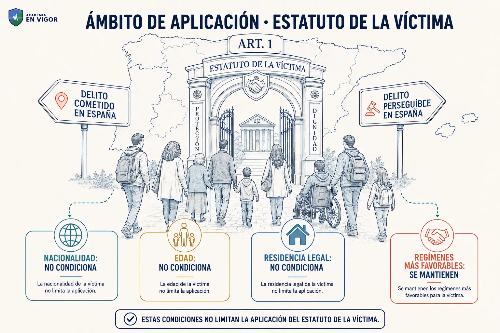

<em>Infografía: Ámbito de aplicación.</em>

<!-- FUENTE: LEV-T22 -->

## 02. Víctima directa

Es víctima directa toda persona física que haya sufrido un daño o perjuicio sobre su propia persona o patrimonio causado directamente por un delito.

- Es víctima directa toda persona física que haya sufrido un daño o perjuicio sobre su propia persona o patrimonio causado directamente por un delito.
- El daño directo puede consistir en lesiones físicas o psíquicas.
- También comprende daños emocionales y perjuicios económicos directamente causados por el delito.
- Una persona jurídica no encaja en el concepto general de víctima directa del artículo 2, que exige persona física.
- La condición de víctima no depende de que el autor haya sido identificado, acusado o condenado.

<!-- VISUAL:t22-02-victima-directa.webp -->

  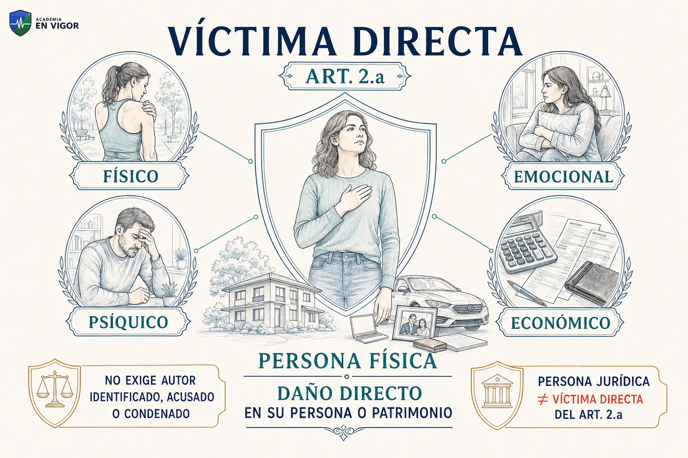

<em>Infografía: Víctima directa.</em>

<!-- FUENTE: LEV-T22 -->

## 03. Víctima indirecta

Existe víctima indirecta en casos de muerte o desaparición de una persona causada directamente por un delito, salvo responsables de los hechos.

- Existe víctima indirecta en casos de muerte o desaparición de una persona causada directamente por un delito, salvo responsables de los hechos.
- La ley incluye al cónyuge no separado legalmente o de hecho y a los hijos de la víctima o de la pareja conviviente en los términos previstos.
- También contempla a la persona unida por análoga relación de afectividad y a determinados parientes directos a cargo de la víctima.
- A falta de los anteriores, pueden ser víctimas indirectas otros parientes en línea directa y hermanos, con preferencia legal.
- No se incluyen como víctimas indirectas los terceros que sufran perjuicios derivados del delito fuera de los supuestos del artículo 2.

<!-- VISUAL:t22-03-victima-indirecta.webp -->

  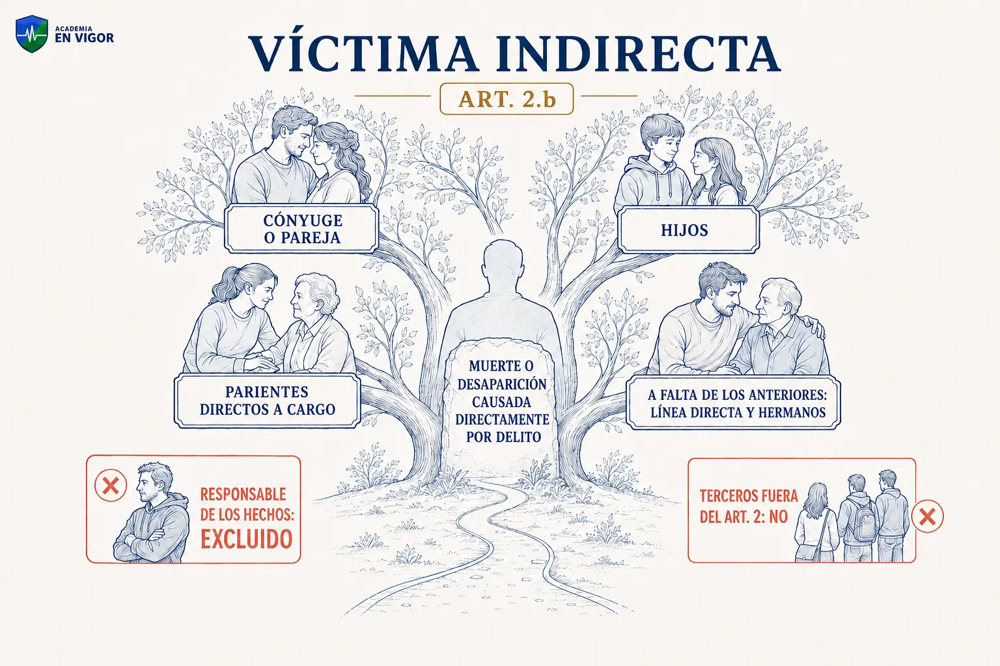

<em>Infografía: Víctima indirecta.</em>

<!-- FUENTE: LEV-T22 -->

## 04. Derechos generales y trato

Toda víctima tiene derecho a protección, información, apoyo, asistencia, atención y reparación, además de participación activa en el proceso penal.

- Toda víctima tiene derecho a protección, información, apoyo, asistencia, atención y reparación, además de participación activa en el proceso penal.
- El trato debe ser respetuoso, profesional, individualizado y no discriminatorio.
- Los derechos se reconocen desde el primer contacto con autoridades y durante un período adecuado después de concluir el proceso.
- El reconocimiento de derechos no depende de que se conozca la identidad del infractor ni del resultado del proceso.
- La mediación y la conciliación están prohibidas en los supuestos de violencia sexual y violencia de género previstos legalmente.

<!-- VISUAL:t22-04-derechos-generales-y-trato.webp -->

  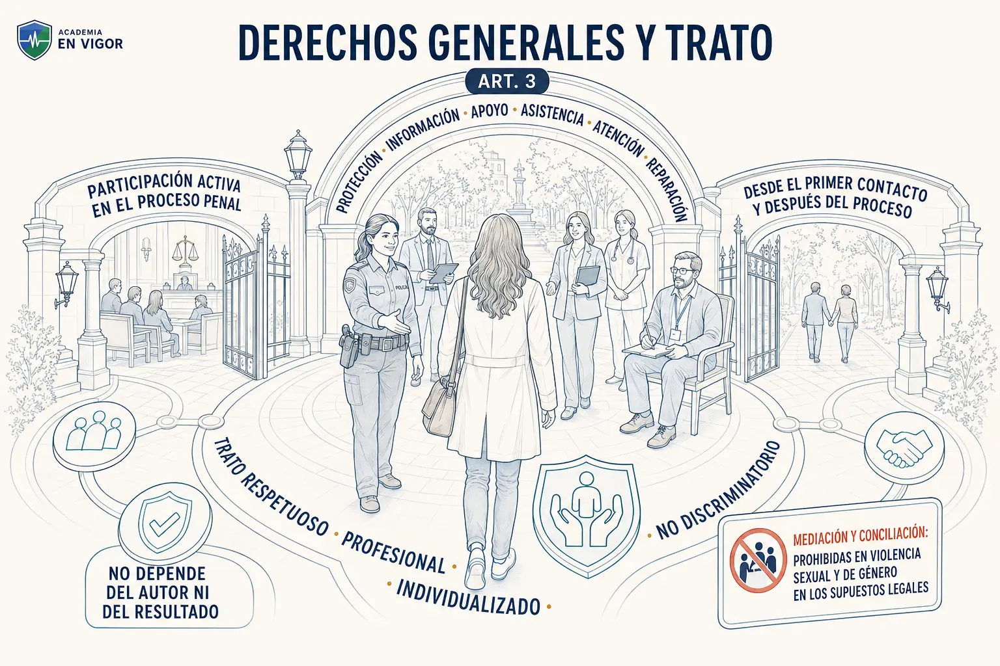

<em>Infografía: Derechos generales y trato.</em>

<!-- FUENTE: LEV-T22 -->

## 05. Derecho a entender y ser entendida

Toda comunicación con la víctima debe realizarse en lenguaje claro, sencillo y accesible.

- Toda comunicación con la víctima debe realizarse en lenguaje claro, sencillo y accesible.
- La comunicación debe adaptarse a circunstancias personales, especialmente discapacidad, minoría de edad y madurez.
- La víctima puede estar acompañada desde el primer contacto por una persona de su elección, además de abogado cuando proceda.
- Las autoridades deben facilitar apoyos para que la víctima comprenda y pueda hacerse entender.
- En menores o personas que precisen especial protección, las comunicaciones se realizan también a su representante o persona de apoyo cuando corresponda.

<!-- VISUAL:t22-05-derecho-a-entender-y-ser-entendida.webp -->

  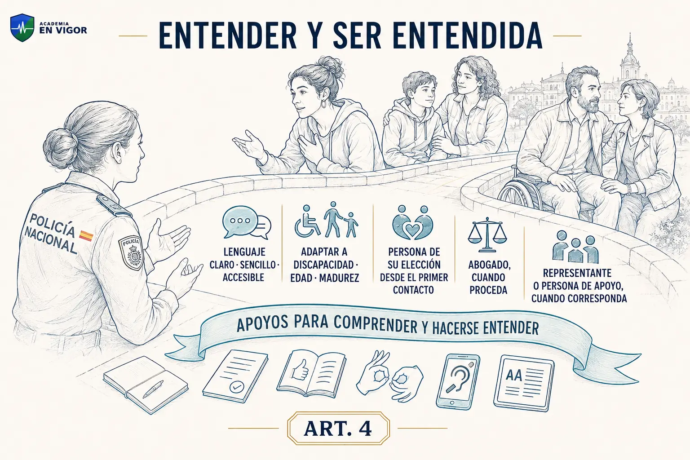

<em>Infografía: Derecho a entender y ser entendida.</em>

<!-- FUENTE: LEV-T22 -->

## 06. Información desde el primer contacto

Desde el primer contacto, la víctima tiene derecho a recibir información adaptada sobre las medidas de asistencia y apoyo disponibles.

- Desde el primer contacto, la víctima tiene derecho a recibir información adaptada sobre las medidas de asistencia y apoyo disponibles.
- La información comprende cómo y dónde denunciar y el procedimiento para obtener asesoramiento y defensa jurídica.
- Debe informar sobre medidas de protección, indemnizaciones, interpretación, traducción y ayudas económicas que procedan.
- También comprende los datos de contacto de la autoridad responsable y los cauces para comunicar con ella.
- La información se actualiza en cada fase para que la víctima pueda ejercer de forma efectiva sus derechos.

<!-- VISUAL:t22-06-informacion-desde-el-primer-contacto.webp -->

  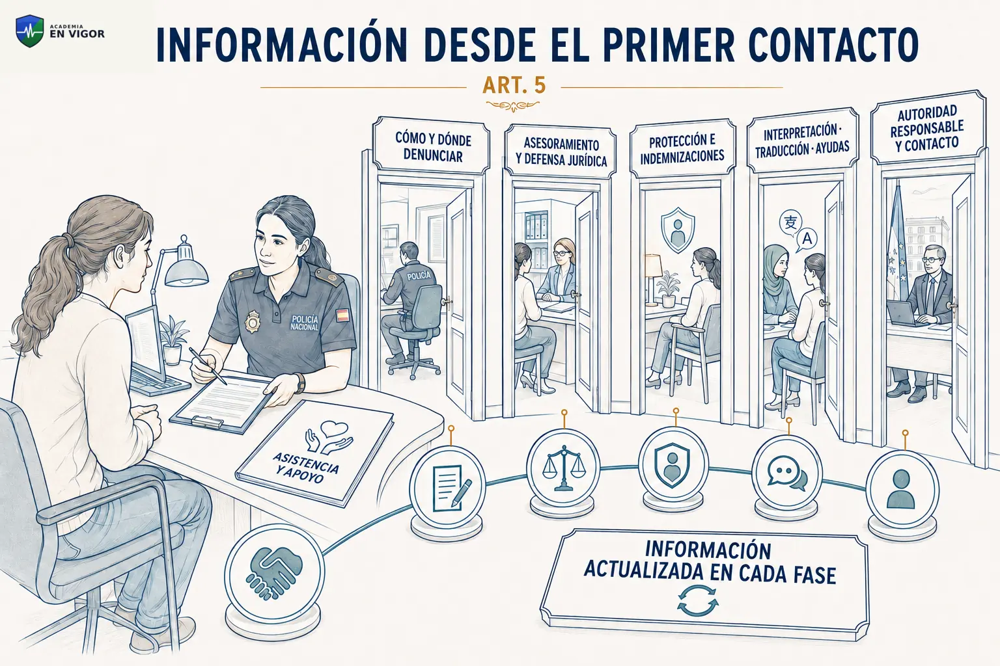

<em>Infografía: Información desde el primer contacto.</em>

<!-- FUENTE: LEV-T22 -->

## 07. Denuncia, copia e interpretación

La víctima tiene derecho a obtener copia de la denuncia debidamente certificada.

- La víctima tiene derecho a obtener copia de la denuncia debidamente certificada.
- Cuando no entienda o no hable una lengua oficial del lugar, tiene derecho a asistencia lingüística gratuita para denunciar.
- Puede obtener traducción escrita de la copia de la denuncia presentada.
- La interpretación y traducción en el proceso se prestan gratuitamente en los supuestos y para las actuaciones esenciales previstas.
- La denegación policial de interpretación o traducción puede impugnarse ante el juez de instrucción haciendo constar la disconformidad.

<!-- VISUAL:t22-07-denuncia-copia-e-interpretacion.webp -->

  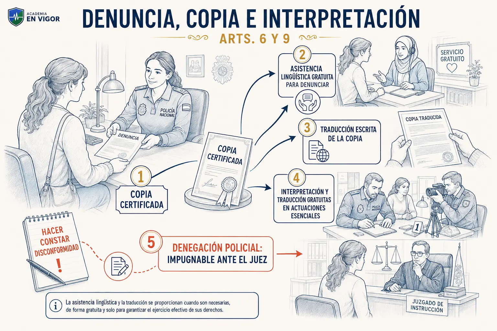

<em>Infografía: Denuncia, copia e interpretación.</em>

<!-- FUENTE: LEV-T22 -->

## 08. Información sobre la causa

La víctima que lo solicite recibe información sobre fecha, hora y lugar del juicio y contenido de la acusación dirigida contra el infractor.

- La víctima que lo solicite recibe información sobre fecha, hora y lugar del juicio y contenido de la acusación dirigida contra el infractor.
- Debe ser notificada de resoluciones relevantes enumeradas en la ley, como las que acuerdan no iniciar o poner fin al procedimiento.
- La víctima puede manifestar que no desea recibir determinadas notificaciones, con las excepciones legales.
- Las resoluciones se comunican a la dirección de correo electrónico o, en su defecto, por correo ordinario o domicilio facilitado.
- En violencia de género se notifican determinadas resoluciones sobre situación personal del investigado sin necesidad de solicitud, salvo renuncia expresa.

<!-- VISUAL:t22-08-informacion-sobre-la-causa.webp -->

  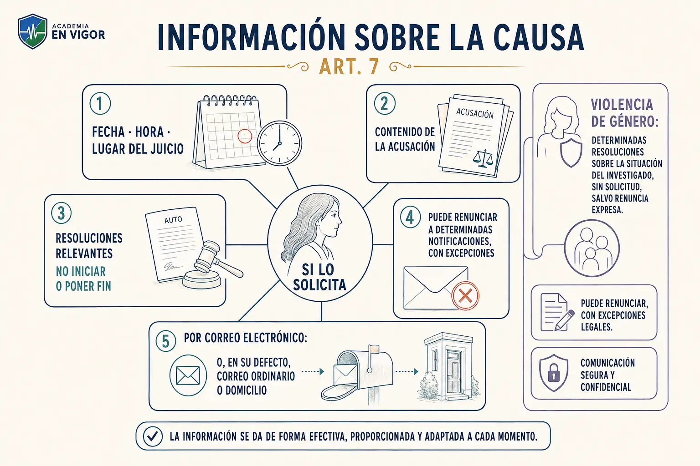

<em>Infografía: Información sobre la causa.</em>

<!-- FUENTE: LEV-T22 -->

## 09. Período de reflexión y asistencia jurídica

Abogados y procuradores no pueden dirigirse a víctimas directas o indirectas de catástrofes para ofrecer servicios hasta transcurridos cuarenta y cinco días.

- Abogados y procuradores no pueden dirigirse a víctimas directas o indirectas de catástrofes para ofrecer servicios hasta transcurridos cuarenta y cinco días.
- La prohibición de captación durante cuarenta y cinco días cede si la propia víctima solicita expresamente esos servicios.
- La infracción de la prohibición puede determinar responsabilidad disciplinaria por falta muy grave.
- La víctima puede presentar solicitud de reconocimiento de justicia gratuita ante la autoridad o funcionario que le informe de sus derechos.
- La autoridad receptora traslada la solicitud al colegio profesional competente con la documentación aportada.

<!-- VISUAL:t22-09-periodo-de-reflexion-y-asistencia-juridica.webp -->

  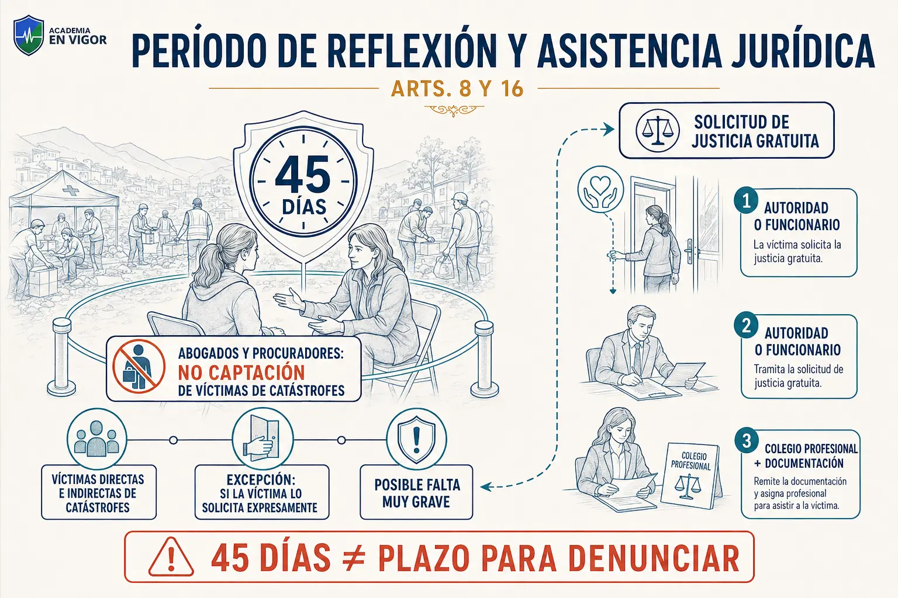

<em>Infografía: Período de reflexión y asistencia jurídica.</em>

<!-- FUENTE: LEV-T22 -->

## 10. Servicios de apoyo

Toda víctima tiene acceso gratuito y confidencial a servicios de asistencia y apoyo públicos y concertados.

- Toda víctima tiene acceso gratuito y confidencial a servicios de asistencia y apoyo públicos y concertados.
- El acceso a los servicios de apoyo no está condicionado a la presentación previa de denuncia.
- Las autoridades derivan a la víctima a estos servicios cuando resulte necesario por la gravedad, circunstancias o solicitud de la propia víctima.
- Los servicios atienden también a familiares cuando se trate de víctimas indirectas o cuando la asistencia sea necesaria.
- Los hijos menores y menores sujetos a guarda de víctimas de violencia de género, sexual o doméstica tienen derecho a medidas de asistencia y protección.

<!-- VISUAL:t22-10-servicios-de-apoyo.webp -->

  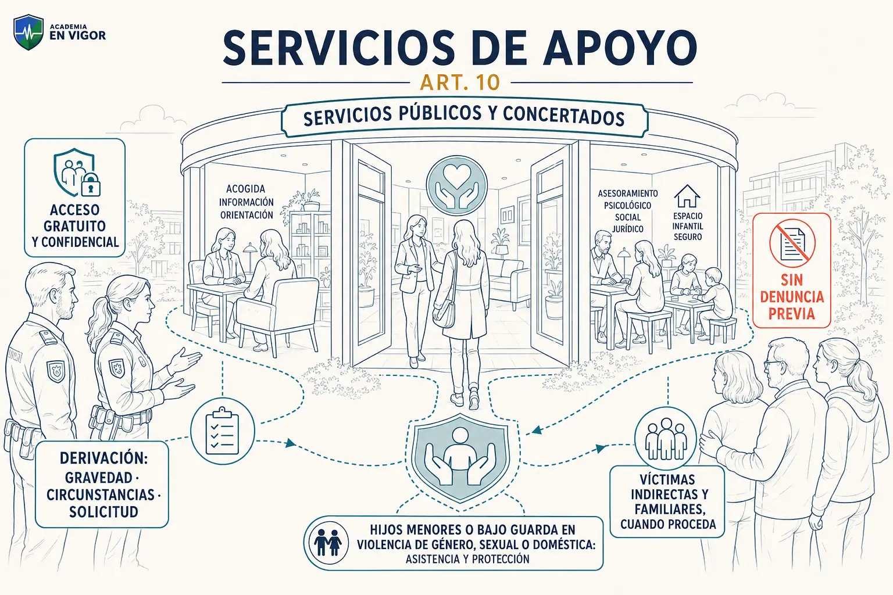

<em>Infografía: Servicios de apoyo.</em>

<!-- FUENTE: LEV-T22 -->

## 11. Participación en el proceso penal

La víctima puede ejercer acciones penal y civil conforme a la Ley de Enjuiciamiento Criminal.

- La víctima puede ejercer acciones penal y civil conforme a la Ley de Enjuiciamiento Criminal.
- Puede aportar fuentes de prueba e información relevante para el esclarecimiento de los hechos.
- La resolución de sobreseimiento debe comunicarse a la víctima en los términos legales.
- La víctima puede recurrir el sobreseimiento aunque no se hubiera personado antes en la causa.
- Para recurrir el sobreseimiento no es requisito haber presentado denuncia o querella previamente.

<!-- VISUAL:t22-11-participacion-en-el-proceso-penal.webp -->

  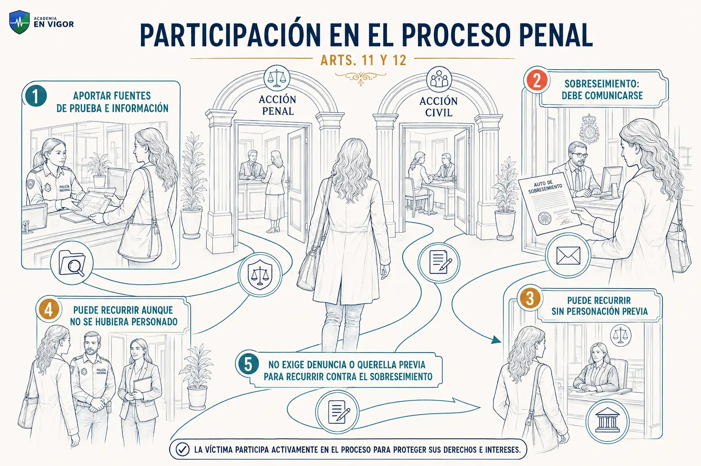

<em>Infografía: Participación en el proceso penal.</em>

<!-- FUENTE: LEV-T22 -->

## 12. Ejecución, gastos y devolución de bienes

Determinadas víctimas pueden recurrir resoluciones penitenciarias previstas en el artículo 13 y formular alegaciones sobre ejecución.

- Determinadas víctimas pueden recurrir resoluciones penitenciarias previstas en el artículo 13 y formular alegaciones sobre ejecución.
- Para recurrir ciertas resoluciones debe anunciarse la voluntad de recurrir en cinco días y formalizarse el recurso en quince días.
- La víctima puede solicitar medidas de control necesarias para garantizar su seguridad durante la ejecución.
- El reembolso de gastos necesarios para ejercer derechos y costas procede con la preferencia y requisitos del artículo 14.
- Los bienes restituibles incautados se devuelven sin demora, salvo que su conservación sea imprescindible para el proceso o exista otra causa legal.

<!-- VISUAL:t22-12-ejecucion-gastos-y-devolucion-de-bienes.webp -->

  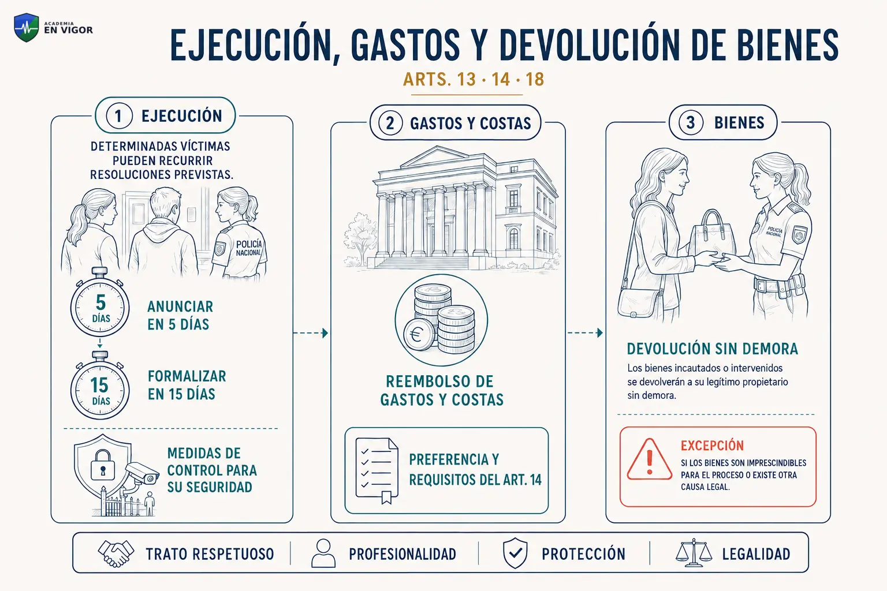

<em>Infografía: Ejecución, gastos y devolución de bienes.</em>

<!-- FUENTE: LEV-T22 -->

## 13. Justicia restaurativa

La víctima puede acceder a justicia restaurativa cuando el infractor reconoce los hechos esenciales de los que deriva su responsabilidad.

- La víctima puede acceder a justicia restaurativa cuando el infractor reconoce los hechos esenciales de los que deriva su responsabilidad.
- La víctima debe prestar consentimiento informado después de recibir explicación exhaustiva e imparcial sobre contenido y resultados posibles.
- El infractor también debe consentir la intervención y ambos pueden revocar su consentimiento en cualquier momento.
- No debe existir riesgo para la seguridad de la víctima ni peligro de nuevos perjuicios materiales o morales.
- Los debates del procedimiento restaurativo son confidenciales y el servicio no se presta cuando está prohibido por la ley.

<!-- VISUAL:t22-13-justicia-restaurativa.webp -->

  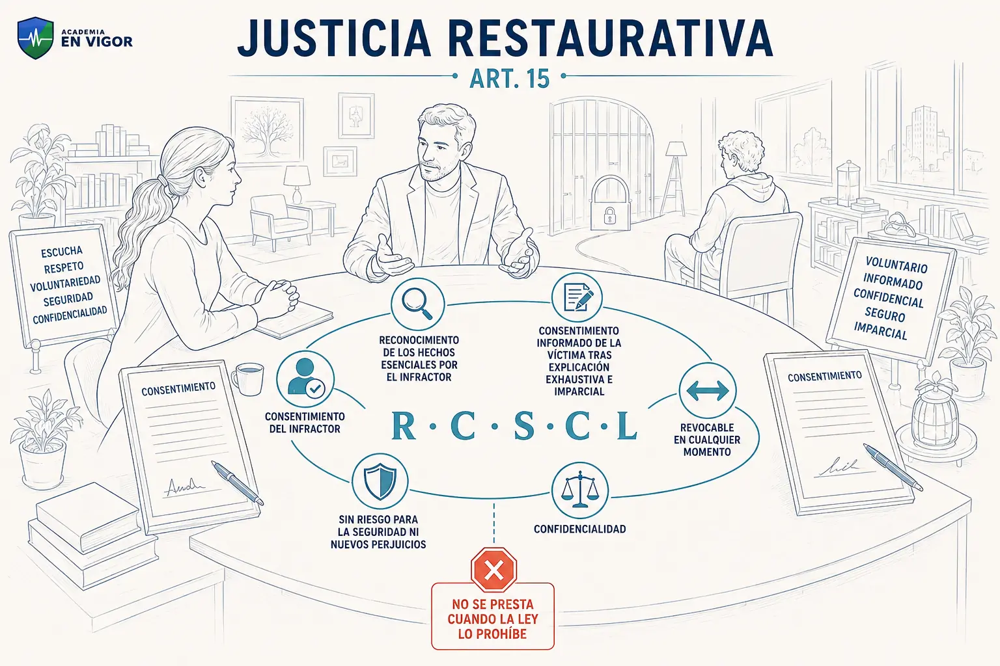

<em>Infografía: Justicia restaurativa.</em>

<!-- FUENTE: LEV-T22 -->

## 14. Protección integral y prevención

Las autoridades deben proteger la vida, integridad física y psíquica, libertad, seguridad, libertad e indemnidad sexuales, intimidad y dignidad de la víctima.

- Las autoridades deben proteger la vida, integridad física y psíquica, libertad, seguridad, libertad e indemnidad sexuales, intimidad y dignidad de la víctima.
- La protección busca evitar victimización secundaria y reiterada.
- La protección se extiende durante investigación, proceso y tiempo posterior que resulte adecuado.
- El Ministerio Fiscal vela especialmente por el cumplimiento del derecho de protección de víctimas menores.
- La protección se individualiza: no todas las víctimas precisan la misma medida ni con idéntica intensidad.

<!-- VISUAL:t22-14-proteccion-integral-y-prevencion.webp -->

  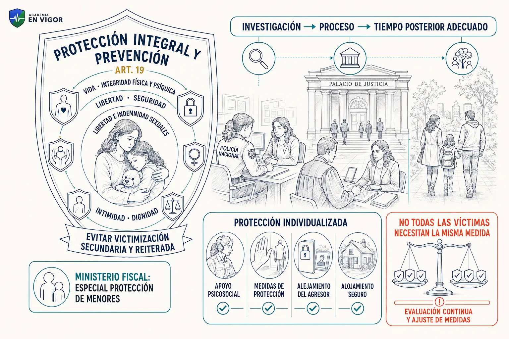

<em>Infografía: Protección integral y prevención.</em>

<!-- FUENTE: LEV-T22 -->

## 15. Evitar el contacto con el infractor

Las dependencias donde se desarrollen actos del proceso deben evitar el contacto directo entre víctima y familiares, de una parte, e infractor, de otra.

- Las dependencias donde se desarrollen actos del proceso deben evitar el contacto directo entre víctima y familiares, de una parte, e infractor, de otra.
- La separación física debe preverse especialmente en edificios judiciales y dependencias de espera.
- Evitar el contacto no significa impedir contradicción procesal; exige organizarla sin exposición innecesaria.
- Las medidas pueden incluir circuitos, salas de espera diferenciadas o medios tecnológicos apropiados.
- La necesidad de evitar contacto se valora desde el primer momento y se revisa según evolucione el riesgo.

<!-- VISUAL:t22-15-evitar-el-contacto-con-el-infractor.webp -->

  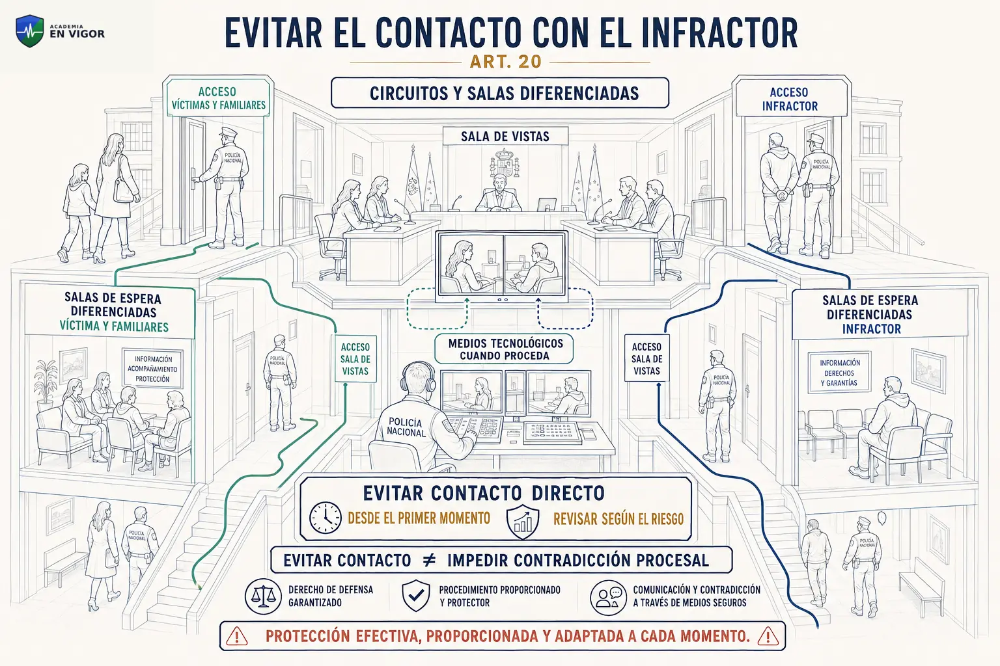

<em>Infografía: Evitar el contacto con el infractor.</em>

<!-- FUENTE: LEV-T22 -->

## 16. Declaración y reconocimientos médicos

La declaración de la víctima debe recibirse sin dilaciones injustificadas tras la denuncia.

- La declaración de la víctima debe recibirse sin dilaciones injustificadas tras la denuncia.
- El número de declaraciones debe reducirse al mínimo y practicarse solo cuando resulte estrictamente necesario.
- La víctima puede estar acompañada por su representante legal y una persona de su elección, salvo resolución motivada en contrario.
- Los reconocimientos médicos se limitan al mínimo indispensable y solo se realizan cuando sean imprescindibles para el proceso.
- La planificación de actuaciones debe evitar repeticiones innecesarias que agraven el daño sufrido.

<!-- VISUAL:t22-16-declaracion-y-reconocimientos-medicos.webp -->

  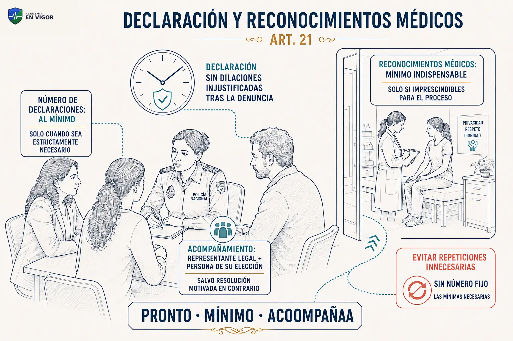

<em>Infografía: Declaración y reconocimientos médicos.</em>

<!-- FUENTE: LEV-T22 -->

## 17. Intimidad y tratamiento de datos

Jueces, fiscales y demás autoridades adoptan medidas para proteger la intimidad de todas las víctimas y de sus familiares.

- Jueces, fiscales y demás autoridades adoptan medidas para proteger la intimidad de todas las víctimas y de sus familiares.
- Debe impedirse la difusión de información que facilite identificar a víctimas menores o con discapacidad necesitadas de especial protección.
- La captación o difusión de imágenes de víctimas especialmente protegidas se somete a restricciones reforzadas.
- La protección de intimidad se concilia con publicidad procesal y libertad de información mediante medidas legales y proporcionadas.
- Los datos personales de la víctima solo deben tratarse para fines legítimos, con minimización y seguridad adecuadas.

<!-- VISUAL:t22-17-intimidad-y-tratamiento-de-datos.webp -->

  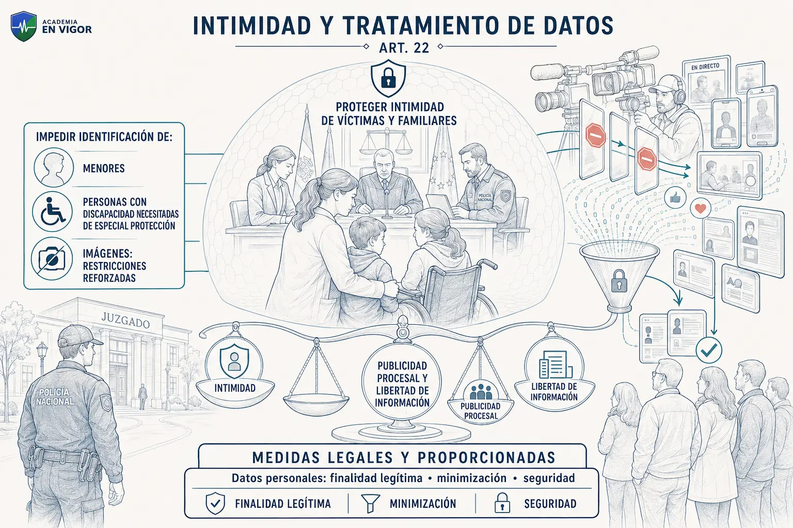

<em>Infografía: Intimidad y tratamiento de datos.</em>

<!-- FUENTE: LEV-T22 -->

## 18. Evaluación individual: finalidad y factores

Toda víctima debe ser evaluada individualmente para determinar sus necesidades especiales de protección y las medidas adecuadas.

- Toda víctima debe ser evaluada individualmente para determinar sus necesidades especiales de protección y las medidas adecuadas.
- La evaluación considera características personales, naturaleza y gravedad del delito y circunstancias de su comisión.
- Se presta especial atención a discapacidad, dependencia, relación con el infractor y riesgo de reiteración.
- También se consideran delitos de terrorismo, trata, violencia de género, violencia sexual, odio, delincuencia organizada y otros enumerados en la ley.
- Las víctimas menores se presumen necesitadas de protección específica frente a victimización secundaria o reiterada.

<!-- VISUAL:t22-18-evaluacion-individual-finalidad-y-factores.webp -->

  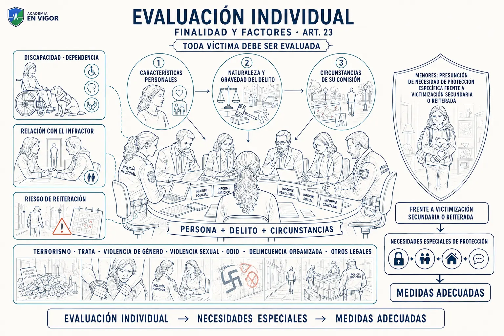

<em>Infografía: Evaluación individual: finalidad y factores.</em>

<!-- FUENTE: LEV-T22 -->

## 19. Quién evalúa y cuándo se actualiza

Durante la investigación, la evaluación y medidas corresponden a juez de instrucción o fiscal, sin perjuicio de la valoración y medidas provisionales policiales.

- Durante la investigación, la evaluación y medidas corresponden a juez de instrucción o fiscal, sin perjuicio de la valoración y medidas provisionales policiales.
- Durante el enjuiciamiento, decide el juez o tribunal competente mediante resolución motivada.
- La evaluación debe tomar en consideración la voluntad y opinión de la víctima.
- La víctima puede renunciar a medidas de protección de los artículos 25 y 26, salvo límites vinculados a menores o personas especialmente protegidas.
- La evaluación se actualiza cuando cambian significativamente las circunstancias que sirvieron para adoptarla.

<!-- VISUAL:t22-19-quien-evalua-y-cuando-se-actualiza.webp -->

  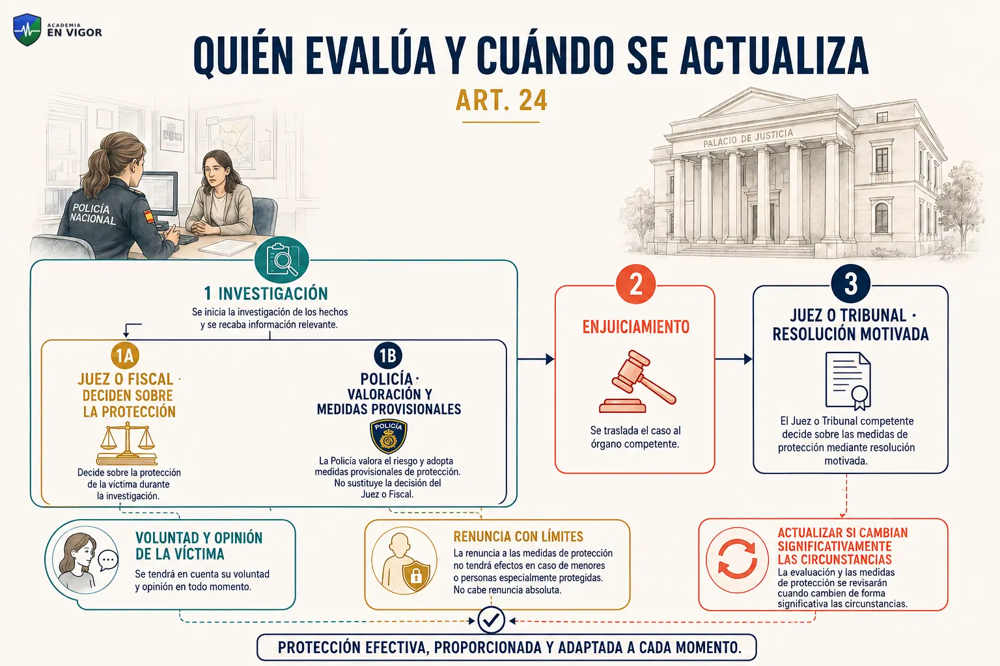

<em>Infografía: Quién evalúa y cuándo se actualiza.</em>

<!-- FUENTE: LEV-T22 -->

## 20. Medidas durante la investigación

La declaración puede recibirse en dependencias concebidas o adaptadas para evitar daño a la víctima.

- La declaración puede recibirse en dependencias concebidas o adaptadas para evitar daño a la víctima.
- Puede ser tomada por profesionales con formación especial para reducir perjuicios.
- Cuando sea posible, todas las declaraciones se realizan por la misma persona, salvo perjuicio relevante para el proceso.
- En violencia sexual, género o doméstica, la declaración puede ser tomada por persona del mismo sexo si la víctima lo solicita, salvo perjuicio relevante.
- Las medidas de investigación se seleccionan según la evaluación individual y no se aplican de forma automática e indiferenciada.

<!-- VISUAL:t22-20-medidas-durante-la-investigacion.webp -->

  

<em>Infografía: Medidas durante la investigación.</em>

<!-- FUENTE: LEV-T22 -->

## 21. Medidas durante el juicio

Durante el juicio pueden adoptarse medidas para evitar contacto visual entre víctima e infractor, incluso mediante tecnologías de comunicación.

- Durante el juicio pueden adoptarse medidas para evitar contacto visual entre víctima e infractor, incluso mediante tecnologías de comunicación.
- La víctima puede ser oída sin estar presente en la sala utilizando medios adecuados.
- Pueden impedirse preguntas sobre la vida privada sin relevancia para el hecho enjuiciado.
- El juicio puede celebrarse sin público cuando la ley procesal lo permita y la protección lo justifique.
- Las medidas deben respetar los derechos de defensa y el principio de contradicción.

<!-- VISUAL:t22-21-medidas-durante-el-juicio.webp -->

  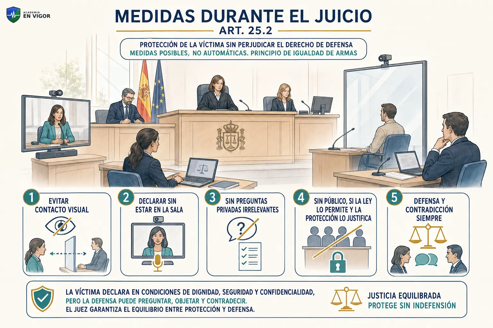

<em>Infografía: Medidas durante el juicio.</em>

<!-- FUENTE: LEV-T22 -->

## 22. Menores, discapacidad y prueba preconstituida

Las declaraciones de menores o personas con discapacidad necesitadas de especial protección pueden grabarse por medios audiovisuales.

- Las declaraciones de menores o personas con discapacidad necesitadas de especial protección pueden grabarse por medios audiovisuales.
- La grabación puede reproducirse en juicio en los casos y con las garantías establecidos por la ley procesal.
- La declaración puede recibirse por medio de personas expertas cuando resulte necesario.
- Si existe conflicto de intereses con representantes legales, el fiscal solicita la designación de defensor judicial.
- Cuando existan dudas sobre la edad y no pueda determinarse con certeza, se presume que la víctima es menor a efectos de protección.

<!-- VISUAL:t22-22-menores-discapacidad-y-prueba-preconstitui.webp -->

  

<em>Infografía: Menores, discapacidad y prueba preconstituida.</em>

<!-- FUENTE: LEV-T22 -->

## 23. Oficinas de Asistencia a las Víctimas

Las Oficinas de Asistencia a las Víctimas son un servicio público y gratuito de carácter multidisciplinar.

- Las Oficinas de Asistencia a las Víctimas son un servicio público y gratuito de carácter multidisciplinar.
- Su acceso no se condiciona a la interposición previa de denuncia.
- Prestan información, apoyo emocional, orientación sobre derechos económicos y coordinación con servicios especializados.
- Realizan valoración individual y pueden elaborar planes de apoyo psicológico y propuestas de medidas de protección.
- La Administración General del Estado y las comunidades autónomas con competencias organizan las oficinas en su ámbito.

<!-- VISUAL:t22-23-oficinas-de-asistencia-a-las-victimas.webp -->

  

<em>Infografía: Oficinas de Asistencia a las Víctimas.</em>

<!-- FUENTE: LEV-T22 -->

## 24. Coordinación, formación y buenas prácticas

Los poderes públicos fomentan formación general y especializada de profesionales que tratan con víctimas.

- Los poderes públicos fomentan formación general y especializada de profesionales que tratan con víctimas.
- La actuación debe coordinar justicia, fiscalía, policía, oficinas, servicios sociales y sanitarios, respetando competencias y confidencialidad.
- Los protocolos deben facilitar derivación, intercambio legítimo de información y continuidad asistencial.
- La cooperación con organizaciones de apoyo puede mejorar asistencia sin sustituir las obligaciones públicas.
- La sensibilización y los códigos de conducta de medios contribuyen a proteger dignidad, intimidad e imagen de las víctimas.

<!-- VISUAL:t22-24-coordinacion-formacion-y-buenas-practicas.webp -->

  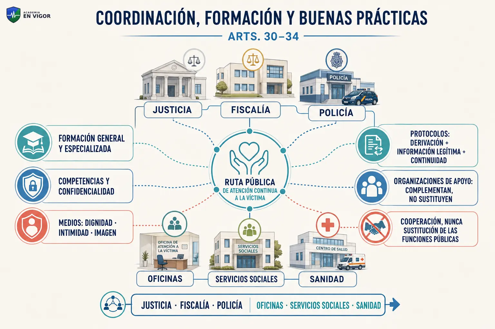

<em>Infografía: Coordinación, formación y buenas prácticas.</em>

<!-- FUENTE: LEV-T22 -->

## 25. Fraude, límites y trampas de examen

La víctima condenada por simulación de delito o denuncia falsa debe reembolsar los gastos causados a la Administración por reconocimiento o prestación indebida de derechos.

- La víctima condenada por simulación de delito o denuncia falsa debe reembolsar los gastos causados a la Administración por reconocimiento o prestación indebida de derechos.
- La obligación de reembolso exige sentencia condenatoria firme y se limita a los supuestos legales.
- Cuarenta y cinco días corresponde al período de reflexión frente a captación profesional tras catástrofes, no a un plazo general para denunciar.
- La copia de la denuncia debe estar certificada y la asistencia lingüística para interponerla es gratuita.
- Las referencias históricas sin plantilla oficial verificable permanecen en cuarentena y no acreditan por sí solas una respuesta oficial.

<!-- VISUAL:t22-25-fraude-limites-y-trampas-de-examen.webp -->

  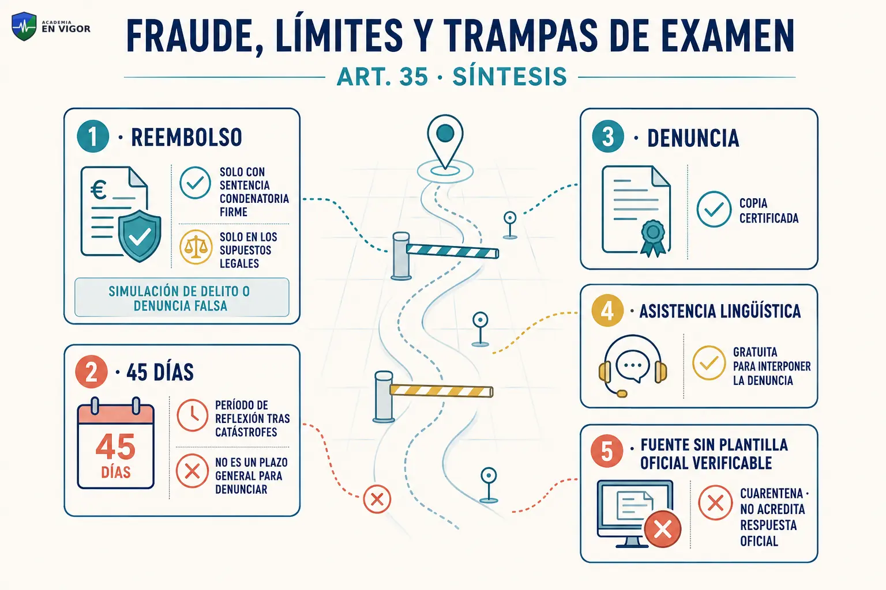

<em>Infografía: Fraude, límites y trampas de examen.</em>

<!-- FUENTE: LEV-T22 -->

# Hablemos claro

:::hablemos-claro
Una regla bien estudiada responde cinco preguntas: quién, cuándo, qué hace, con qué límite y bajo qué control.
:::

# En la calle

:::en-la-calle
En el supuesto práctico, documenta hechos y tiempos antes de aplicar la norma; después revisa necesidad, proporcionalidad y garantías.
:::

# Lo que cae

:::lo-que-cae
Prioriza sujetos competentes, plazos máximos, excepciones tasadas y derechos que no admiten atajos.
:::

# Ha caído

:::ha-caido
Se han mapeado 6 referencias históricas. Permanecen ocultas y en cuarentena porque no existe plantilla oficial final verificable.
:::

## Fuentes oficiales

- `CONV-PN-2026`
- `LEV-T22`
- `RD1109-T22`
- `LO10-2022-T22`

---

*Academia En Vigor · El temario que nunca duerme · Tema 22 · v1.0.0 · Documento interno no publicado.*
