# TEMA 26 · LA PROTECCIÓN DE DATOS DE CARÁCTER PERSONAL: LA LEY ORGÁNICA 3/2018, DE 5 DE DICIEMBRE, DE PROTECCIÓN DE DATOS PERSONALES Y GARANTÍA DE LOS DERECHOS DIGITALES. LEY ORGÁNICA 7/2021, DE 26 DE MAYO, DE PROTECCIÓN DE DATOS PERSONALES TRATADOS PARA FINES DE PREVENCIÓN, DETECCIÓN, INVESTIGACIÓN Y ENJUICIAMIENTO DE INFRACCIONES PENALES Y DE EJECUCIÓN DE SANCIONES PENALES.

**Policía Nacional · Método VIGOR · PARTE**
**Versión de contenido:** 1.0.0
**Estado editorial:** approved_internal · **Publicación:** not_published

# Mapa del tema

El Tema 26 se recorre en cinco partes: fundamentos, principios y régimen general; derechos y tratamientos concretos de la ley orgánica 3/2018; responsabilidad, autoridades, sanciones y derechos digitales; régimen policial-penal: ámbito, principios, videovigilancia y derechos; obligaciones, seguridad, transferencias, control y sanciones en la ley orgánica 7/2021.

# Contenido

## 01. Fundamento constitucional y europeo

El artículo 18.4 de la Constitución ordena limitar por ley el uso de la informática para garantizar honor, intimidad y pleno ejercicio de los derechos.

- El artículo 18.4 de la Constitución ordena limitar por ley el uso de la informática para garantizar honor, intimidad y pleno ejercicio de los derechos.
- La protección de datos es un derecho fundamental autónomo que atribuye control sobre el uso de la información personal.
- La Carta de los Derechos Fundamentales de la Unión Europea reconoce separadamente el respeto de la vida privada y familiar y la protección de datos personales.
- El artículo 16 del Tratado de Funcionamiento de la Unión Europea reconoce el derecho a la protección de los datos personales.
- La protección de datos no prohíbe tratar información personal: exige finalidad legítima, base jurídica, necesidad, proporcionalidad y garantías.

<!-- VISUAL:t26-01-fundamento-constitucional-y-europeo.webp -->

  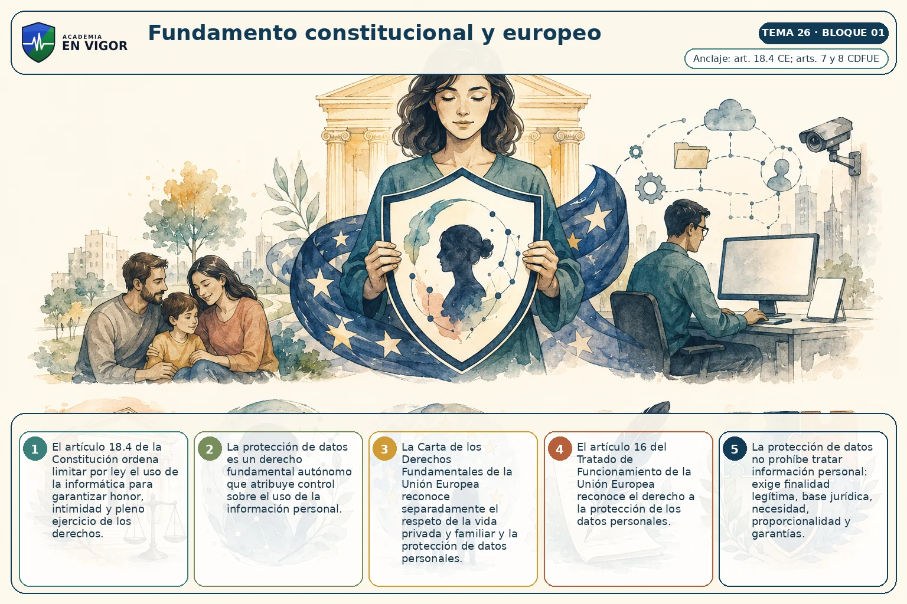

<em>Infografía: Fundamento constitucional y europeo.</em>

<!-- FUENTE: CE-T26 -->

## 02. Mapa normativo y frontera entre regímenes

El Reglamento General de Protección de Datos y la Ley Orgánica 3/2018 forman el régimen general aplicable a los tratamientos comprendidos en el Derecho de la Unión.

- El Reglamento General de Protección de Datos y la Ley Orgánica 3/2018 forman el régimen general aplicable a los tratamientos comprendidos en el Derecho de la Unión.
- La Ley Orgánica 7/2021 regula el tratamiento por autoridades competentes para fines policiales, penales y de ejecución de sanciones penales incluidos en su artículo 1.
- Que trate los datos la Policía no basta para aplicar la Ley Orgánica 7/2021: también debe concurrir uno de sus fines específicos.
- Cuando una autoridad competente trata datos para fines distintos de los policiales o penales del artículo 1, se aplica el régimen general salvo actividad fuera del Derecho de la Unión.
- La derogada Ley Orgánica 15/1999 puede aparecer en preguntas históricas, pero no debe utilizarse como respuesta vigente.

<!-- VISUAL:t26-02-mapa-normativo-y-frontera-entre-regimenes.webp -->

  

<em>Infografía: Mapa normativo y frontera entre regímenes.</em>

<!-- FUENTE: LO7-2021-T26 -->

## 03. Conceptos esenciales de protección de datos

Dato personal es toda información sobre una persona física identificada o identificable.

- Dato personal es toda información sobre una persona física identificada o identificable.
- Tratamiento es cualquier operación o conjunto de operaciones sobre datos personales, automatizada o no, como recoger, consultar, comunicar, limitar o suprimir.
- Responsable es quien determina los fines y medios del tratamiento, solo o junto con otros.
- Encargado es quien trata datos personales por cuenta del responsable y siguiendo el marco jurídico que los vincula.
- Seudonimizar reduce la vinculación directa con una persona mediante información adicional separada, pero los datos seudonimizados siguen siendo personales.

<!-- VISUAL:t26-03-conceptos-esenciales-de-proteccion-de-dato.webp -->

  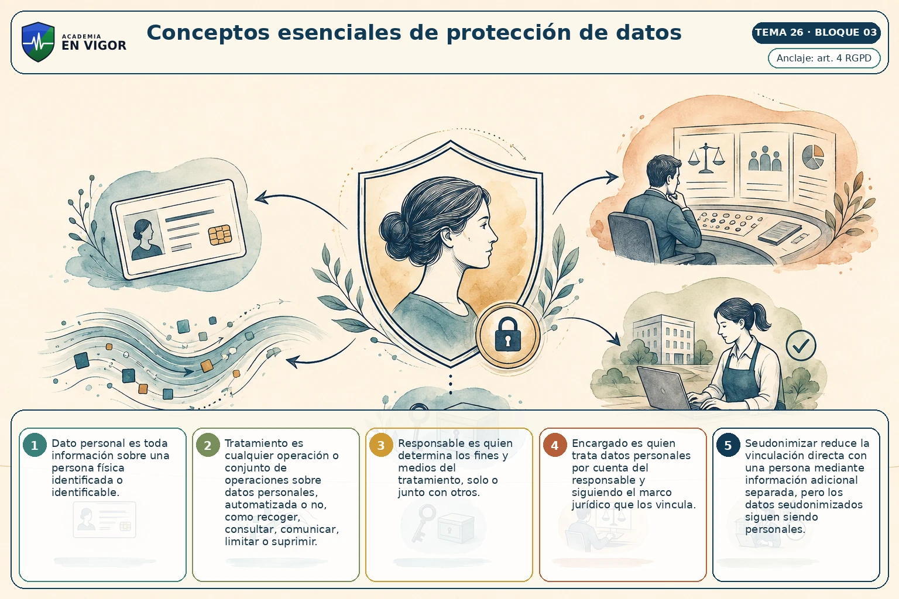

<em>Infografía: Conceptos esenciales de protección de datos.</em>

<!-- FUENTE: RGPD-T26 -->

## 04. Principios del tratamiento

Los datos deben tratarse de manera lícita, leal y transparente en relación con el interesado.

- Los datos deben tratarse de manera lícita, leal y transparente en relación con el interesado.
- La limitación de la finalidad exige recoger datos con fines determinados, explícitos y legítimos y evitar usos posteriores incompatibles.
- La minimización exige datos adecuados, pertinentes y limitados a lo necesario para la finalidad.
- Exactitud y limitación del plazo obligan a actualizar o rectificar datos y a no conservarlos identificables más tiempo del necesario.
- Integridad, confidencialidad y responsabilidad proactiva exigen seguridad adecuada y capacidad de demostrar el cumplimiento.

<!-- VISUAL:t26-04-principios-del-tratamiento.webp -->

  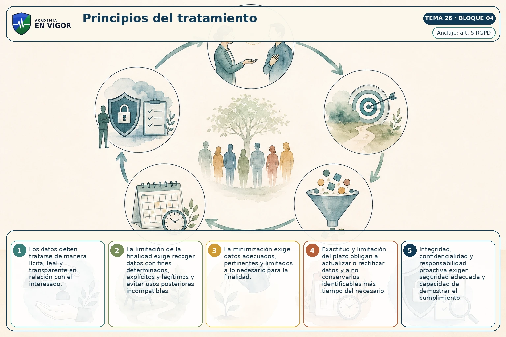

<em>Infografía: Principios del tratamiento.</em>

<!-- FUENTE: RGPD-T26 -->

## 05. Licitud y bases jurídicas del régimen general

El consentimiento es una base de licitud, pero no es la única ni siempre la adecuada para una autoridad pública.

- El consentimiento es una base de licitud, pero no es la única ni siempre la adecuada para una autoridad pública.
- También pueden legitimar el tratamiento un contrato, una obligación legal, intereses vitales, una misión de interés público o el ejercicio de poderes públicos y el interés legítimo en los términos del RGPD.
- La obligación legal que legitima un tratamiento debe estar prevista por el Derecho de la Unión o por una norma con rango de ley.
- La misión de interés público o el ejercicio de poderes públicos debe derivar de una competencia atribuida por norma con rango de ley.
- Las autoridades públicas no pueden invocar interés legítimo para el tratamiento realizado en el ejercicio de sus funciones.

<!-- VISUAL:t26-05-licitud-y-bases-juridicas-del-regimen-gene.webp -->

  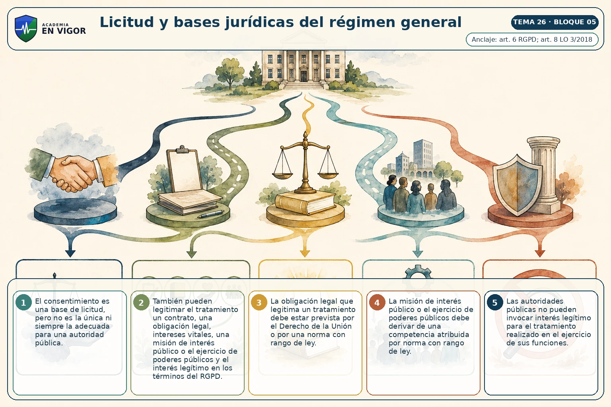

<em>Infografía: Licitud y bases jurídicas del régimen general.</em>

<!-- FUENTE: RGPD-T26 -->

## 06. Consentimiento y menores de edad

El consentimiento debe proceder de una manifestación de voluntad libre, específica, informada e inequívoca mediante declaración o clara acción afirmativa.

- El consentimiento debe proceder de una manifestación de voluntad libre, específica, informada e inequívoca mediante declaración o clara acción afirmativa.
- La ejecución de un contrato no puede condicionarse a consentir tratamientos no relacionados con el mantenimiento, desarrollo o control de la relación contractual.
- El tratamiento de datos de un menor fundado en su propio consentimiento solo es posible cuando sea mayor de catorce años.
- Para menores de catorce años, el tratamiento fundado en consentimiento solo es lícito si consta el del titular de la patria potestad o tutela.
- La regla de los catorce años no desplaza una ley que exija asistencia de patria potestad o tutela para el acto o negocio en cuyo contexto se recaba el consentimiento.

<!-- VISUAL:t26-06-consentimiento-y-menores-de-edad.webp -->

  

<em>Infografía: Consentimiento y menores de edad.</em>

<!-- FUENTE: LOPDGDD-T26 -->

## 07. Personas fallecidas y deber de confidencialidad

Familiares o personas vinculadas de hecho y herederos pueden solicitar acceso, rectificación o supresión de datos del fallecido.

- Familiares o personas vinculadas de hecho y herederos pueden solicitar acceso, rectificación o supresión de datos del fallecido.
- No procederá el acceso cuando el fallecido lo haya prohibido expresamente o así lo establezca una ley, sin perjuicio del acceso de los herederos a datos patrimoniales del causante.
- Las personas o instituciones designadas expresamente por el fallecido también pueden solicitar acceso, rectificación o supresión según las instrucciones recibidas.
- En fallecimiento de menores pueden actuar además sus representantes legales o el Ministerio Fiscal, de oficio o a instancia de cualquier persona interesada.
- El deber de confidencialidad de responsables, encargados y quienes intervengan en el tratamiento complementa los deberes de secreto y subsiste al terminar la relación.

<!-- VISUAL:t26-07-personas-fallecidas-y-deber-de-confidencia.webp -->

  

<em>Infografía: Personas fallecidas y deber de confidencialidad.</em>

<!-- FUENTE: LOPDGDD-T26 -->

## 08. Categorías especiales y datos penales

Son categorías especiales, entre otras, los datos sobre origen étnico o racial, opiniones políticas, religión, afiliación sindical, genética, biometría identificativa, salud, vida sexual u orientación sexual.

- Son categorías especiales, entre otras, los datos sobre origen étnico o racial, opiniones políticas, religión, afiliación sindical, genética, biometría identificativa, salud, vida sexual u orientación sexual.
- El tratamiento de categorías especiales está prohibido como regla general, salvo que concurra una excepción del artículo 9.2 del RGPD y las garantías exigibles.
- El solo consentimiento no basta para levantar la prohibición de tratar datos cuya finalidad principal sea identificar ideología, afiliación sindical, religión, orientación sexual, creencias u origen racial o étnico.
- Los datos sobre condenas e infracciones penales se someten al artículo 10 del RGPD y solo se tratan bajo control de autoridad pública o cuando lo autorice el Derecho aplicable con garantías.
- Fuera de los supuestos legales, abogados y procuradores pueden tratar datos penales facilitados por sus clientes para ejercer sus funciones.

<!-- VISUAL:t26-08-categorias-especiales-y-datos-penales.webp -->

  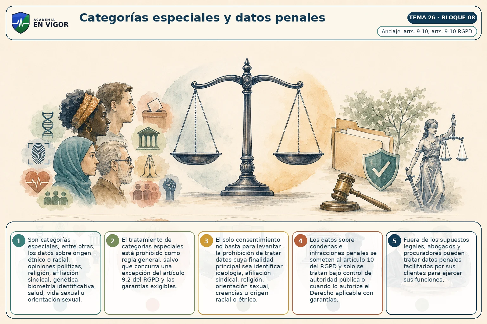

<em>Infografía: Categorías especiales y datos penales.</em>

<!-- FUENTE: LOPDGDD-T26 -->

## 09. Transparencia e información por capas

Cuando los datos se obtienen del afectado puede darse primero información básica y ofrecer acceso sencillo e inmediato a la información restante.

- Cuando los datos se obtienen del afectado puede darse primero información básica y ofrecer acceso sencillo e inmediato a la información restante.
- La información básica incluye identidad del responsable, finalidad y posibilidad de ejercer los derechos de los artículos 15 a 22 del RGPD.
- Si los datos se destinan a elaborar perfiles, la información básica debe indicarlo y permitir acceso a información completa sobre esa elaboración.
- Cuando los datos no se obtienen del afectado, la información básica incluye además las categorías de datos y las fuentes de procedencia.
- La transparencia exige lenguaje conciso, inteligible, accesible, claro y sencillo; una cláusula oscura no cumple por ser extensa.

<!-- VISUAL:t26-09-transparencia-e-informacion-por-capas.webp -->

  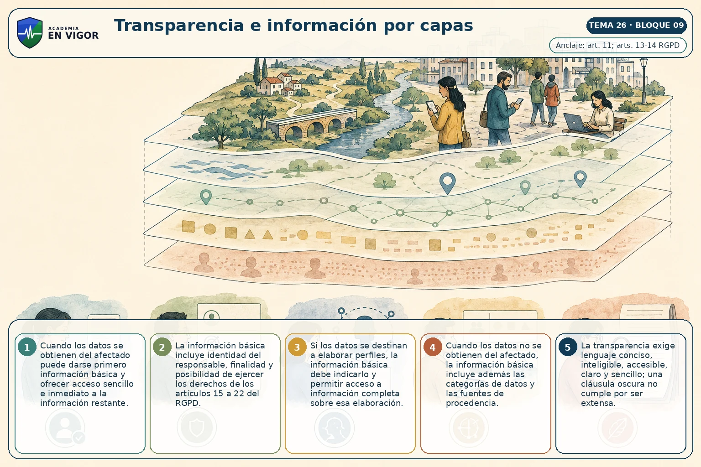

<em>Infografía: Transparencia e información por capas.</em>

<!-- FUENTE: LOPDGDD-T26 -->

## 10. Derechos del RGPD: mapa general

El derecho de acceso permite conocer si se tratan datos propios y obtener los datos y la información legal asociada al tratamiento.

- El derecho de acceso permite conocer si se tratan datos propios y obtener los datos y la información legal asociada al tratamiento.
- Rectificación corrige datos inexactos y completa los incompletos; supresión elimina datos cuando concurre una causa legal.
- La limitación restringe temporalmente operaciones de tratamiento en los supuestos del artículo 18 del RGPD.
- La portabilidad permite recibir y transmitir determinados datos tratados automatizadamente sobre la base de consentimiento o contrato.
- Oposición y garantías frente a decisiones automatizadas dependen de la base y finalidad del tratamiento y admiten las excepciones previstas por el RGPD.

<!-- VISUAL:t26-10-derechos-del-rgpd-mapa-general.webp -->

  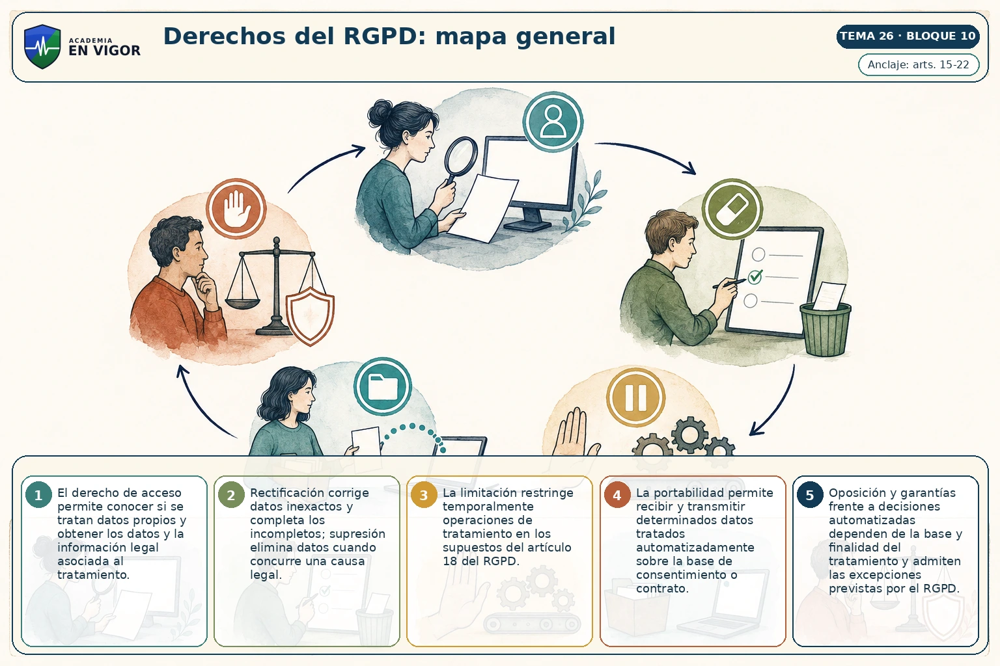

<em>Infografía: Derechos del RGPD: mapa general.</em>

<!-- FUENTE: RGPD-T26 -->

## 11. Ejercicio de derechos y representación

Los derechos de los artículos 15 a 22 del RGPD pueden ejercerse directamente o mediante representante legal o voluntario.

- Los derechos de los artículos 15 a 22 del RGPD pueden ejercerse directamente o mediante representante legal o voluntario.
- El responsable debe informar de medios fácilmente accesibles para ejercer los derechos y no puede denegar el ejercicio por elegir otro medio.
- Corresponde al responsable probar que respondió a la solicitud de ejercicio de derechos.
- Los titulares de la patria potestad pueden ejercer en nombre de los menores de catorce años los derechos que les correspondan.
- La atención de derechos es gratuita, salvo solicitudes manifiestamente infundadas o excesivas en los casos y con las condiciones del RGPD.

<!-- VISUAL:t26-11-ejercicio-de-derechos-y-representacion.webp -->

  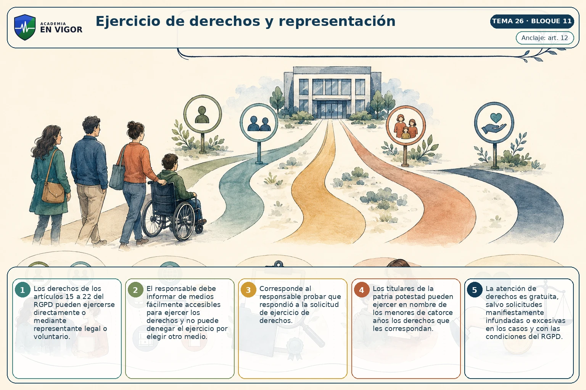

<em>Infografía: Ejercicio de derechos y representación.</em>

<!-- FUENTE: LOPDGDD-T26 -->

## 12. Derecho de acceso

El responsable que trate gran cantidad de datos puede pedir al afectado que concrete datos o actividades cuando la solicitud de acceso no los especifique.

- El responsable que trate gran cantidad de datos puede pedir al afectado que concrete datos o actividades cuando la solicitud de acceso no los especifique.
- El acceso se entiende otorgado si se facilita un sistema remoto, directo y seguro que permita acceder de modo permanente a todos los datos personales.
- El afectado puede solicitar información que no figure en el sistema remoto y el responsable debe facilitarla por otra vía.
- Puede considerarse repetitivo el acceso ejercido más de una vez en seis meses, salvo causa legítima.
- Si el afectado elige un medio distinto que ocasiona coste desproporcionado, asume el exceso de coste o recibe el acceso por el medio ofrecido.

<!-- VISUAL:t26-12-derecho-de-acceso.webp -->

  

<em>Infografía: Derecho de acceso.</em>

<!-- FUENTE: LOPDGDD-T26 -->

## 13. Rectificación, supresión y bloqueo

La solicitud de rectificación debe identificar los datos, la corrección y, cuando sea preciso, aportar documentación justificativa.

- La solicitud de rectificación debe identificar los datos, la corrección y, cuando sea preciso, aportar documentación justificativa.
- La supresión se ejerce conforme al artículo 17 del RGPD y no equivale a borrar siempre e inmediatamente cualquier dato solicitado.
- Si la supresión deriva de oposición a mercadotecnia directa, pueden conservarse datos identificativos necesarios para impedir tratamientos futuros con ese fin.
- La limitación del tratamiento debe constar claramente en los sistemas de información del responsable.
- El bloqueo identifica y reserva los datos para responsabilidades, impide su tratamiento ordinario y termina con su destrucción al prescribir las responsabilidades.

<!-- VISUAL:t26-13-rectificacion-supresion-y-bloqueo.webp -->

  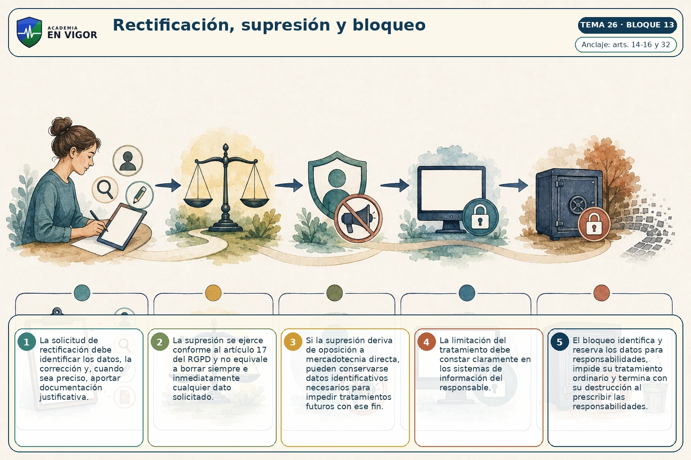

<em>Infografía: Rectificación, supresión y bloqueo.</em>

<!-- FUENTE: LOPDGDD-T26 -->

## 14. Portabilidad, oposición y decisiones automatizadas

La portabilidad se ejerce conforme al artículo 20 del RGPD y no convierte en portable cualquier dato conservado por una Administración.

- La portabilidad se ejerce conforme al artículo 20 del RGPD y no convierte en portable cualquier dato conservado por una Administración.
- La oposición permite solicitar el cese de tratamientos basados en interés público, poderes públicos o interés legítimo, con las condiciones del artículo 21 del RGPD.
- La oposición a mercadotecnia directa comprende la elaboración de perfiles relacionada con esa mercadotecnia.
- Existe derecho a no ser objeto de una decisión basada únicamente en tratamiento automatizado que produzca efectos jurídicos o afecte significativamente de modo similar, salvo excepción legal.
- Cuando la decisión automatizada esté permitida deben existir garantías, incluida al menos intervención humana, expresión del punto de vista e impugnación en los términos aplicables.

<!-- VISUAL:t26-14-portabilidad-oposicion-y-decisiones-automa.webp -->

  

<em>Infografía: Portabilidad, oposición y decisiones automatizadas.</em>

<!-- FUENTE: LOPDGDD-T26 -->

## 15. Datos de contacto y sistemas de información crediticia

Se presume amparado en interés legítimo el tratamiento de datos de contacto profesionales limitado a localización profesional y relación con la persona jurídica.

- Se presume amparado en interés legítimo el tratamiento de datos de contacto profesionales limitado a localización profesional y relación con la persona jurídica.
- La presunción se extiende a empresarios individuales y profesionales liberales solo respecto de esa condición profesional.
- Los sistemas de información crediticia requieren deuda cierta, vencida y exigible, no discutida por reclamación vinculante y datos aportados por acreedor o quien actúe por su cuenta.
- El acreedor debe informar de la posible inclusión y el sistema notifica al afectado la inclusión y derechos dentro del plazo legal.
- Los datos de incumplimiento solo se mantienen mientras persista este y, como máximo, cinco años desde el vencimiento de la obligación.

<!-- VISUAL:t26-15-datos-de-contacto-y-sistemas-de-informacio.webp -->

  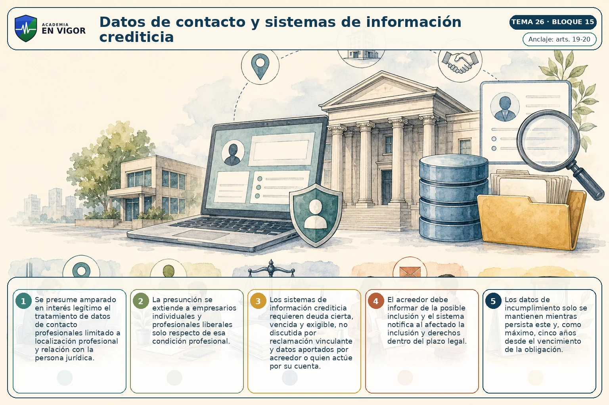

<em>Infografía: Datos de contacto y sistemas de información crediticia.</em>

<!-- FUENTE: LOPDGDD-T26 -->

## 16. Videovigilancia general y exclusión doméstica

Personas físicas o jurídicas pueden tratar imágenes para preservar seguridad de personas, bienes e instalaciones dentro de los límites legales.

- Personas físicas o jurídicas pueden tratar imágenes para preservar seguridad de personas, bienes e instalaciones dentro de los límites legales.
- Solo puede captarse vía pública en la medida imprescindible para preservar la seguridad; la captación más amplia exige el supuesto legal correspondiente.
- Las imágenes se suprimen en el plazo máximo de un mes, salvo conservación para acreditar actos contra personas, bienes o instalaciones.
- La existencia del tratamiento se informa mediante dispositivo visible que identifique al menos el tratamiento, responsable y posibilidad de ejercer derechos.
- La excepción doméstica cubre a la persona física que capta solo el interior de su domicilio, pero no a una empresa de seguridad con acceso a las imágenes.

<!-- VISUAL:t26-16-videovigilancia-general-y-exclusion-domest.webp -->

  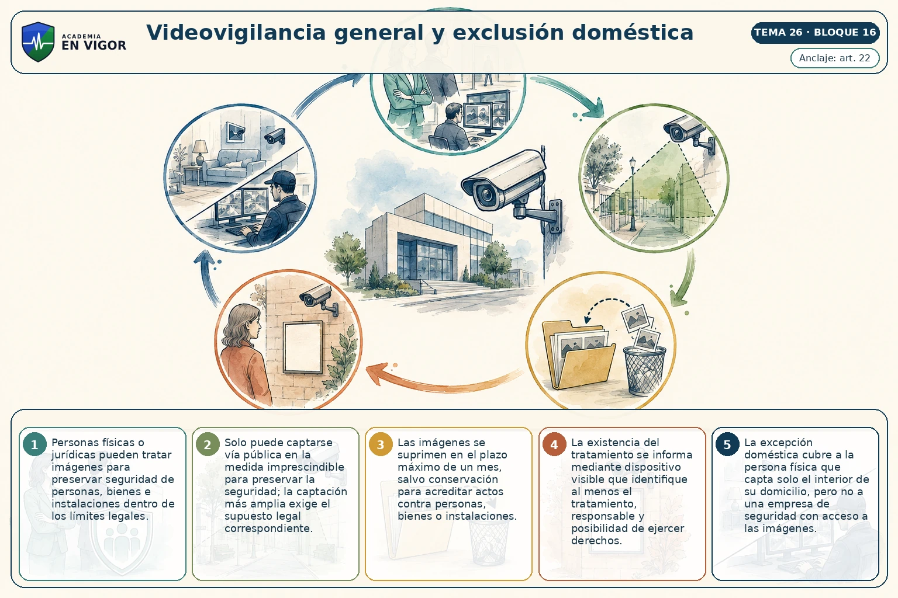

<em>Infografía: Videovigilancia general y exclusión doméstica.</em>

<!-- FUENTE: LOPDGDD-T26 -->

## 17. Exclusión publicitaria y propaganda electoral

Es lícito tratar datos para evitar comunicaciones comerciales a quienes hayan manifestado negativa u oposición.

- Es lícito tratar datos para evitar comunicaciones comerciales a quienes hayan manifestado negativa u oposición.
- Pueden crearse sistemas generales o sectoriales de exclusión publicitaria que incluyan solo los datos imprescindibles para identificar a quienes rechazan publicidad.
- Quien pretenda realizar comunicaciones de mercadotecnia directa debe consultar los sistemas de exclusión que puedan afectar a su actuación.
- Los datos de opiniones políticas tratados por partidos en actividades electorales quedan sometidos a garantías adecuadas y al marco constitucional y europeo.
- El envío de propaganda electoral por medios electrónicos debe permitir de modo sencillo y gratuito ejercer el derecho de oposición.

<!-- VISUAL:t26-17-exclusion-publicitaria-y-propaganda-electo.webp -->

  

<em>Infografía: Exclusión publicitaria y propaganda electoral.</em>

<!-- FUENTE: LOPDGDD-T26 -->

## 18. Tratamientos administrativos y de archivo

El tratamiento por Administraciones con fines de archivo en interés público se rige por el RGPD, la Ley Orgánica 3/2018 y la normativa archivística aplicable.

- El tratamiento por Administraciones con fines de archivo en interés público se rige por el RGPD, la Ley Orgánica 3/2018 y la normativa archivística aplicable.
- Los datos sobre infracciones y sanciones administrativas solo pueden tratarse por órganos competentes y limitarse a lo estrictamente necesario, salvo otra habilitación válida.
- Si no concurren competencia y necesidad, el tratamiento de infracciones administrativas exige consentimiento o autorización por norma con rango de ley y garantías.
- Abogados y procuradores pueden tratar fuera de esos supuestos la información sancionadora facilitada por clientes para ejercer sus funciones.
- La publicidad de sanciones administrativas no se deduce automáticamente de que los datos obren en un expediente público.

<!-- VISUAL:t26-18-tratamientos-administrativos-y-de-archivo.webp -->

  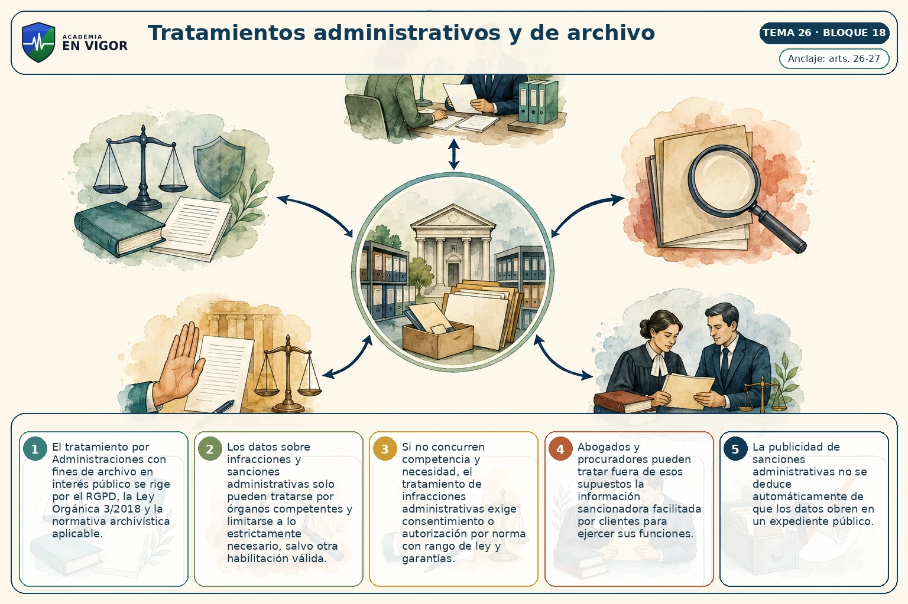

<em>Infografía: Tratamientos administrativos y de archivo.</em>

<!-- FUENTE: LOPDGDD-T26 -->

## 19. Responsabilidad proactiva y protección desde el diseño

El responsable debe aplicar medidas apropiadas según naturaleza, contexto, fines y riesgos y revisar su eficacia.

- El responsable debe aplicar medidas apropiadas según naturaleza, contexto, fines y riesgos y revisar su eficacia.
- Protección desde el diseño incorpora garantías al decidir medios y durante el tratamiento; por defecto limita cantidad, extensión, conservación y accesibilidad.
- El registro de actividades sustituye al antiguo enfoque de inscripción general de ficheros y documenta quién trata, para qué, qué datos, destinatarios, plazos y seguridad.
- La evaluación de impacto es previa cuando el tratamiento pueda entrañar alto riesgo para derechos y libertades.
- La responsabilidad proactiva exige demostrar cumplimiento; disponer de formularios no basta si la práctica contradice las garantías.

<!-- VISUAL:t26-19-responsabilidad-proactiva-y-proteccion-des.webp -->

  

<em>Infografía: Responsabilidad proactiva y protección desde el diseño.</em>

<!-- FUENTE: RGPD-T26 -->

## 20. Encargado del tratamiento y brechas de seguridad

El acceso del encargado a datos necesarios para prestar un servicio no es comunicación si cumple el RGPD y el instrumento jurídico aplicable.

- El acceso del encargado a datos necesarios para prestar un servicio no es comunicación si cumple el RGPD y el instrumento jurídico aplicable.
- Quien usa los datos para finalidades propias pasa a ser responsable respecto de ese uso, aunque el contrato lo denomine encargado.
- El encargado debe ofrecer garantías suficientes y tratar datos siguiendo instrucciones documentadas del responsable.
- Una violación de seguridad se notifica a la autoridad de control sin dilación indebida y, de ser posible, dentro de setenta y dos horas, salvo improbabilidad de riesgo.
- Cuando la brecha entrañe alto riesgo para las personas, también se comunica al afectado sin dilación indebida salvo excepción legal.

<!-- VISUAL:t26-20-encargado-del-tratamiento-y-brechas-de-seg.webp -->

  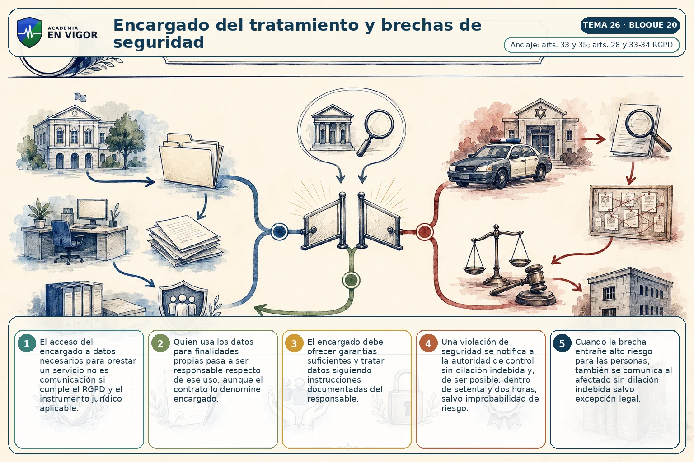

<em>Infografía: Encargado del tratamiento y brechas de seguridad.</em>

<!-- FUENTE: LOPDGDD-T26 -->

## 21. Delegado de protección de datos

Debe designarse delegado en los supuestos del artículo 37.1 del RGPD y en las entidades enumeradas por el artículo 34 de la Ley Orgánica 3/2018.

- Debe designarse delegado en los supuestos del artículo 37.1 del RGPD y en las entidades enumeradas por el artículo 34 de la Ley Orgánica 3/2018.
- La designación y el cese se comunican a la autoridad de control dentro de diez días y los datos de contacto se hacen públicos.
- El delegado actúa como interlocutor, inspecciona procedimientos, emite recomendaciones y debe mantener independencia y ausencia de conflicto de intereses.
- El responsable no puede impedir al delegado acceder a datos y procesos alegando confidencialidad o secreto.
- Si el afectado reclama primero al delegado, este comunica la decisión en un máximo de dos meses; si la autoridad remite la reclamación, responde en un mes.

<!-- VISUAL:t26-21-delegado-de-proteccion-de-datos.webp -->

  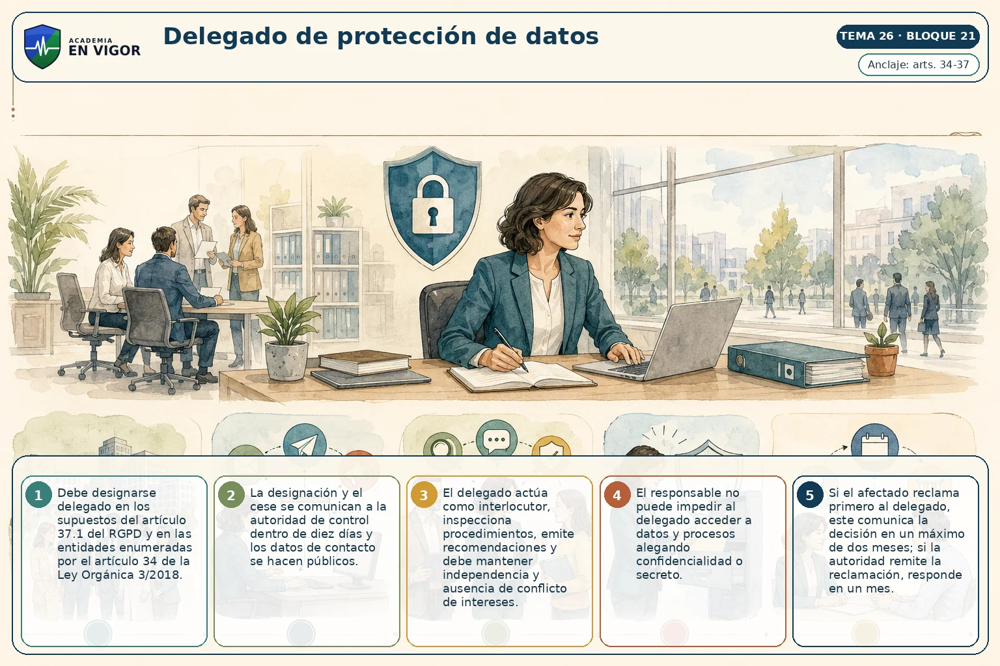

<em>Infografía: Delegado de protección de datos.</em>

<!-- FUENTE: LOPDGDD-T26 -->

## 22. Códigos, certificación y transferencias internacionales

Los códigos de conducta concretan la aplicación de la normativa para sectores o tratamientos y requieren aprobación y supervisión conforme al RGPD.

- Los códigos de conducta concretan la aplicación de la normativa para sectores o tratamientos y requieren aprobación y supervisión conforme al RGPD.
- La certificación acredita aspectos del cumplimiento, es voluntaria y no reduce la responsabilidad del responsable o encargado.
- Las transferencias internacionales se rigen por el RGPD, la Ley Orgánica 3/2018, normas de desarrollo y circulares competentes.
- Una decisión de adecuación permite transferir sin autorización específica; en su ausencia pueden utilizarse garantías adecuadas del artículo 46 del RGPD.
- Las excepciones del artículo 49 del RGPD son vías tasadas y no convierten transferencias repetitivas en libres de garantías.

<!-- VISUAL:t26-22-codigos-certificacion-y-transferencias-int.webp -->

  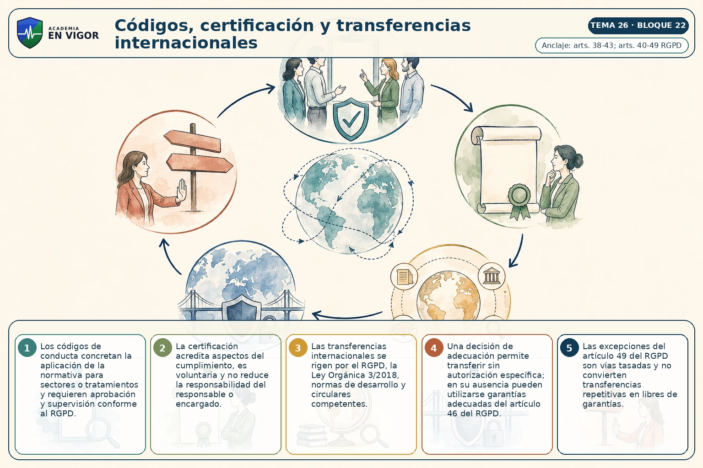

<em>Infografía: Códigos, certificación y transferencias internacionales.</em>

<!-- FUENTE: LOPDGDD-T26 -->

## 23. Naturaleza y funciones de la AEPD

La Agencia Española de Protección de Datos es autoridad administrativa independiente de ámbito estatal, con personalidad jurídica y plena capacidad.

- La Agencia Española de Protección de Datos es autoridad administrativa independiente de ámbito estatal, con personalidad jurídica y plena capacidad.
- La AEPD actúa con plena independencia de los poderes públicos en el ejercicio de sus funciones.
- Se relaciona con el Gobierno a través del Ministerio de Justicia y representa comúnmente a las autoridades españolas en el Comité Europeo de Protección de Datos.
- Supervisa la aplicación del RGPD y la Ley Orgánica 3/2018 y ejerce funciones y potestades de los artículos 57 y 58 del RGPD.
- Sus funciones de investigación, corrección, autorización y asesoramiento no la convierten en responsable de los tratamientos que supervisa.

<!-- VISUAL:t26-23-naturaleza-y-funciones-de-la-aepd.webp -->

  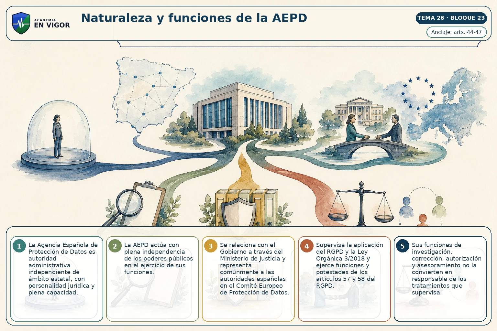

<em>Infografía: Naturaleza y funciones de la AEPD.</em>

<!-- FUENTE: LOPDGDD-T26 -->

## 24. Presidencia, mandato y Consejo Consultivo

La Presidencia dirige la AEPD, la representa y dicta sus resoluciones, circulares y directrices.

- La Presidencia dirige la AEPD, la representa y dicta sus resoluciones, circulares y directrices.
- La Presidencia y el Adjunto son nombrados por el Consejo de Ministros mediante real decreto tras el procedimiento legal.
- El mandato de Presidencia y Adjunto dura cinco años y puede renovarse por otro periodo de igual duración.
- Los actos y disposiciones de la Presidencia agotan la vía administrativa y se recurren directamente ante la Sala de lo Contencioso-administrativo de la Audiencia Nacional.
- El Consejo Consultivo asesora a la Presidencia y reúne representación institucional, profesional, académica y social prevista por la ley.

<!-- VISUAL:t26-24-presidencia-mandato-y-consejo-consultivo.webp -->

  

<em>Infografía: Presidencia, mandato y Consejo Consultivo.</em>

<!-- FUENTE: LOPDGDD-T26 -->

## 25. Autoridades autonómicas y cooperación

Las autoridades autonómicas ejercen funciones y potestades del RGPD respecto de tratamientos incluidos en su ámbito competencial legal.

- Las autoridades autonómicas ejercen funciones y potestades del RGPD respecto de tratamientos incluidos en su ámbito competencial legal.
- La AEPD y las autoridades autonómicas deben cooperar para aplicar de manera coherente el RGPD y la Ley Orgánica 3/2018.
- Las reuniones de cooperación entre Presidencia de la AEPD y autoridades autonómicas se celebran en todo caso semestralmente.
- Las comunicaciones con el Comité Europeo se canalizan por la AEPD cuando la ley así lo establece, con participación de la autoridad autonómica interesada.
- La competencia autonómica no se presume para cualquier entidad ubicada en la comunidad: depende del responsable y del tratamiento previstos por el artículo 57.

<!-- VISUAL:t26-25-autoridades-autonomicas-y-cooperacion.webp -->

  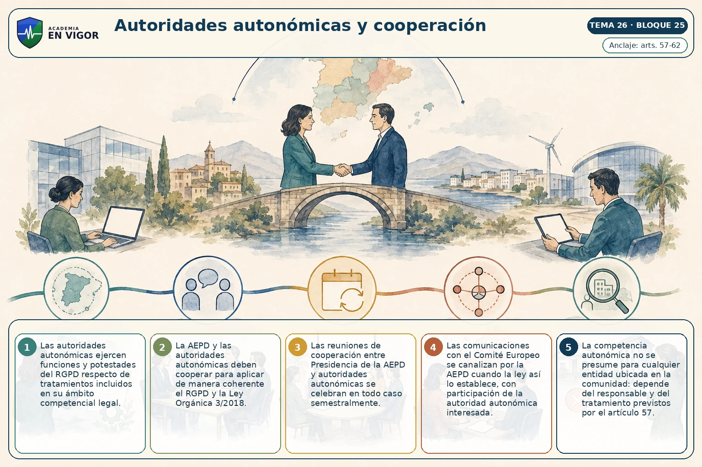

<em>Infografía: Autoridades autonómicas y cooperación.</em>

<!-- FUENTE: LOPDGDD-T26 -->

## 26. Reclamaciones e investigación

El Título VIII regula reclamaciones por falta de atención de derechos y procedimientos sobre posibles infracciones del RGPD o de la Ley Orgánica 3/2018.

- El Título VIII regula reclamaciones por falta de atención de derechos y procedimientos sobre posibles infracciones del RGPD o de la Ley Orgánica 3/2018.
- Antes de admitir una reclamación la AEPD puede remitirla al delegado, al organismo de supervisión o al responsable para que responda en el plazo previsto.
- La AEPD determina previamente si el tratamiento es nacional o transfronterizo y qué autoridad es competente.
- Las actuaciones previas investigan hechos y pueden preceder al acuerdo de inicio del procedimiento sancionador.
- La AEPD puede adoptar medidas provisionales necesarias y proporcionadas, como bloqueo cautelar o atención inmediata de un derecho.

<!-- VISUAL:t26-26-reclamaciones-e-investigacion.webp -->

  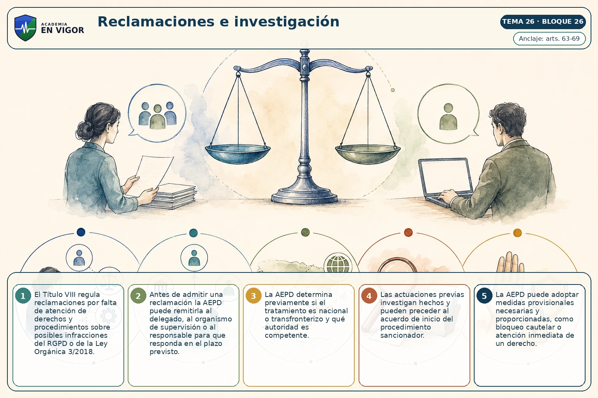

<em>Infografía: Reclamaciones e investigación.</em>

<!-- FUENTE: LOPDGDD-T26 -->

## 27. Infracciones y sujetos responsables

Están sujetos al régimen sancionador responsables, encargados, representantes no establecidos y entidades de certificación o supervisión en los casos legales.

- Están sujetos al régimen sancionador responsables, encargados, representantes no establecidos y entidades de certificación o supervisión en los casos legales.
- El delegado de protección de datos no está incluido como sujeto responsable del régimen sancionador por el mero ejercicio de sus funciones.
- Las infracciones se clasifican como muy graves, graves y leves a efectos de prescripción según su encaje en el RGPD.
- Tratar sin base jurídica, vulnerar derechos o quebrantar seguridad puede integrar distinta gravedad según conducta, alcance y perjuicio.
- La clasificación española no sustituye los límites de multa y criterios de graduación del artículo 83 del RGPD.

<!-- VISUAL:t26-27-infracciones-y-sujetos-responsables.webp -->

  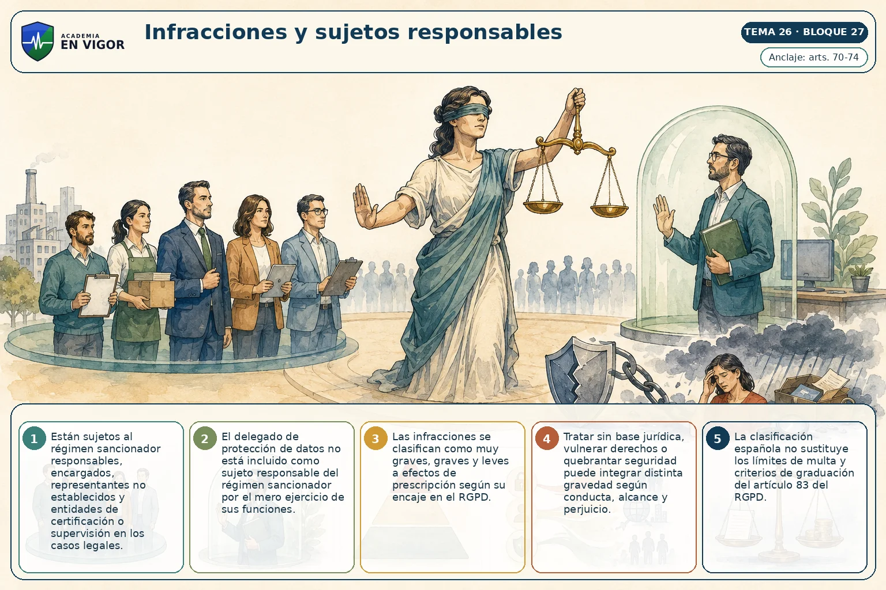

<em>Infografía: Infracciones y sujetos responsables.</em>

<!-- FUENTE: LOPDGDD-T26 -->

## 28. Sanciones, sector público y prescripción

Las multas administrativas del RGPD pueden alcanzar veinte millones de euros o el cuatro por ciento del volumen de negocio mundial anual, según el grupo de infracción y la cifra superior aplicable.

- Las multas administrativas del RGPD pueden alcanzar veinte millones de euros o el cuatro por ciento del volumen de negocio mundial anual, según el grupo de infracción y la cifra superior aplicable.
- Para determinadas Administraciones y entidades públicas del artículo 77 se aplica apercibimiento con medidas correctivas, sin imponer multa administrativa.
- La autoridad puede proponer actuaciones disciplinarias cuando existan indicios suficientes y comunicar la resolución a órganos de control.
- Las sanciones de hasta cuarenta mil euros prescriben al año; de 40.001 a 300.000 euros, a los dos años; y las superiores a 300.000, a los tres.
- La iniciación conocida del procedimiento interrumpe la prescripción, que reinicia si el expediente queda paralizado más de seis meses por causa no imputable al infractor.

<!-- VISUAL:t26-28-sanciones-sector-publico-y-prescripcion.webp -->

  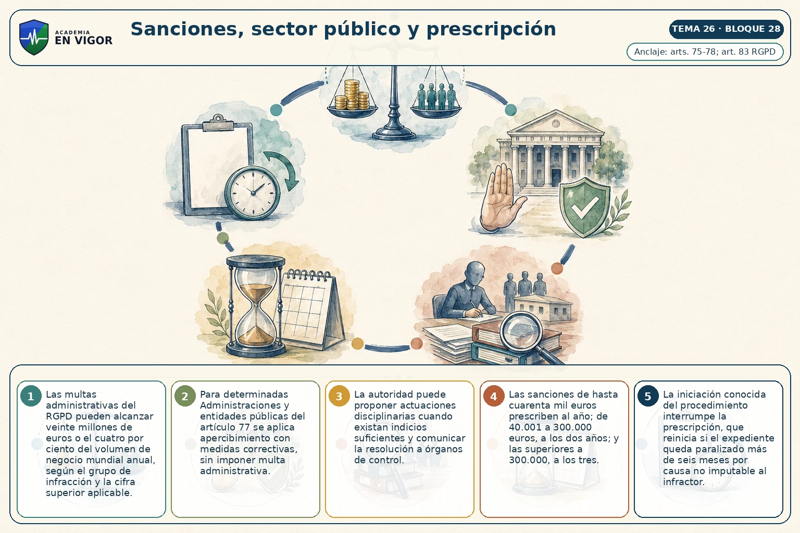

<em>Infografía: Sanciones, sector público y prescripción.</em>

<!-- FUENTE: LOPDGDD-T26 -->

## 29. Derechos digitales, neutralidad, acceso y seguridad

Los derechos constitucionales y convencionales son plenamente aplicables en Internet.

- Los derechos constitucionales y convencionales son plenamente aplicables en Internet.
- La neutralidad de Internet exige una oferta transparente de servicios sin discriminación por motivos técnicos o económicos.
- El derecho de acceso universal a Internet debe ser universal, asequible, de calidad y no discriminatorio.
- El acceso debe atender brechas de género y generación, necesidades especiales y realidad de los entornos rurales.
- La seguridad digital protege las comunicaciones transmitidas y recibidas por Internet y obliga a los proveedores a informar de derechos.

<!-- VISUAL:t26-29-derechos-digitales-neutralidad-acceso-y-se.webp -->

  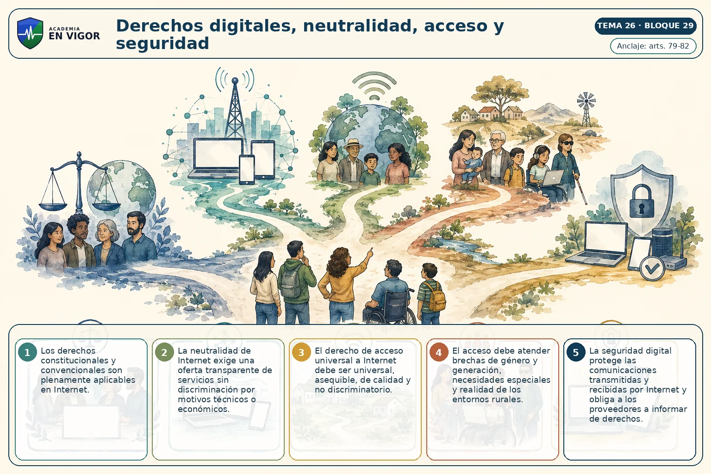

<em>Infografía: Derechos digitales, neutralidad, acceso y seguridad.</em>

<!-- FUENTE: LOPDGDD-T26 -->

## 30. Educación digital y protección de menores

El sistema educativo debe enseñar consumo responsable y uso crítico, seguro y respetuoso de medios digitales y protección de datos.

- El sistema educativo debe enseñar consumo responsable y uso crítico, seguro y respetuoso de medios digitales y protección de datos.
- Las actuaciones de educación digital deben ser inclusivas, con atención al alumnado con necesidades educativas especiales.
- El profesorado debe recibir competencias y formación para enseñar valores, derechos y uso seguro de tecnologías.
- Padres, madres, tutores, curadores o representantes legales procurarán que los menores hagan uso equilibrado y responsable de dispositivos y servicios digitales.
- Centros y entidades con actividades de menores deben proteger interés superior y derechos fundamentales al publicar o difundir sus datos en Internet.

<!-- VISUAL:t26-30-educacion-digital-y-proteccion-de-menores.webp -->

  

<em>Infografía: Educación digital y protección de menores.</em>

<!-- FUENTE: LOPDGDD-T26 -->

## 31. Rectificación y actualización en Internet

Todos tienen derecho a la libertad de expresión en Internet, sin perjuicio de honor, intimidad y derecho a información veraz.

- Todos tienen derecho a la libertad de expresión en Internet, sin perjuicio de honor, intimidad y derecho a información veraz.
- Redes sociales y servicios equivalentes deben disponer de protocolos adecuados para el ejercicio del derecho de rectificación.
- Los medios digitales que atiendan una rectificación deben publicar junto a la información original un aviso aclaratorio visible.
- La actualización permite solicitar motivadamente un aviso cuando hechos posteriores hacen que una noticia ya no refleje la situación actual y cause perjuicio.
- Rectificación corrige una información controvertida; actualización añade el cambio posterior sin borrar necesariamente la noticia original.

<!-- VISUAL:t26-31-rectificacion-y-actualizacion-en-internet.webp -->

  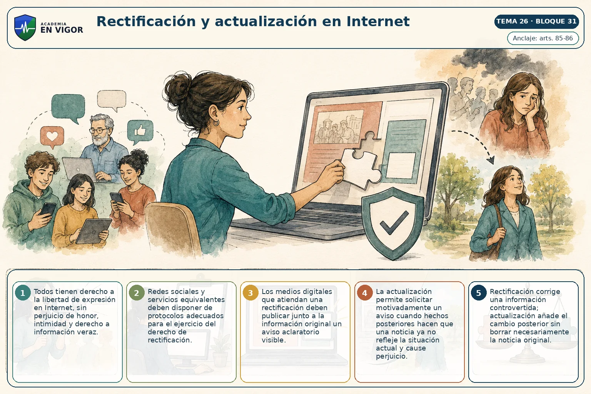

<em>Infografía: Rectificación y actualización en Internet.</em>

<!-- FUENTE: LOPDGDD-T26 -->

## 32. Intimidad laboral y desconexión digital

Trabajadores y empleados públicos tienen derecho a proteger su intimidad al usar dispositivos digitales puestos a disposición por el empleador.

- Trabajadores y empleados públicos tienen derecho a proteger su intimidad al usar dispositivos digitales puestos a disposición por el empleador.
- El empleador puede acceder a contenidos para controlar obligaciones laborales o estatutarias y garantizar integridad de dispositivos dentro de límites legales.
- Los criterios de uso deben respetar estándares mínimos de intimidad conforme a usos sociales y derechos constitucionales y elaborarse con participación representativa.
- La desconexión digital protege fuera del tiempo de trabajo el descanso, permisos, vacaciones e intimidad personal y familiar.
- El empleador debe elaborar, previa audiencia representativa, una política interna de desconexión, formación y prevención de fatiga informática.

<!-- VISUAL:t26-32-intimidad-laboral-y-desconexion-digital.webp -->

  

<em>Infografía: Intimidad laboral y desconexión digital.</em>

<!-- FUENTE: LOPDGDD-T26 -->

## 33. Videovigilancia, sonido y geolocalización laboral

El empleador puede tratar imágenes para control laboral dentro de las funciones legales y con información previa clara, expresa y concisa.

- El empleador puede tratar imágenes para control laboral dentro de las funciones legales y con información previa clara, expresa y concisa.
- La captación de sonidos en el trabajo solo se admite ante riesgos relevantes para seguridad de instalaciones, bienes o personas y respetando proporcionalidad e intervención mínima.
- No se instalan sistemas de grabación de sonido ni videovigilancia en lugares destinados al descanso o esparcimiento.
- Los sistemas de geolocalización laboral requieren ejercicio legítimo de control e información previa, expresa, clara e inequívoca.
- Los convenios colectivos pueden establecer garantías adicionales de derechos digitales, pero no reducir el mínimo legal.

<!-- VISUAL:t26-33-videovigilancia-sonido-y-geolocalizacion-l.webp -->

  

<em>Infografía: Videovigilancia, sonido y geolocalización laboral.</em>

<!-- FUENTE: LOPDGDD-T26 -->

## 34. Derecho al olvido y testamento digital

El derecho al olvido en buscadores permite solicitar que una búsqueda por nombre deje de mostrar enlaces inadecuados, inexactos, no pertinentes, no actualizados o excesivos.

- El derecho al olvido en buscadores permite solicitar que una búsqueda por nombre deje de mostrar enlaces inadecuados, inexactos, no pertinentes, no actualizados o excesivos.
- Desindexar un resultado por nombre no elimina la información de la página de origen ni impide acceder por otros criterios.
- En redes sociales puede pedirse la supresión de datos facilitados por el propio interesado y, bajo condiciones, de datos facilitados por terceros.
- Las personas vinculadas al fallecido y quienes este haya designado pueden gestionar contenidos digitales conforme a la ley y a las instrucciones del causante.
- El testamento digital no autoriza a ignorar la voluntad expresa del fallecido ni sustituye las reglas sucesorias sobre contenidos patrimoniales.

<!-- VISUAL:t26-34-derecho-al-olvido-y-testamento-digital.webp -->

  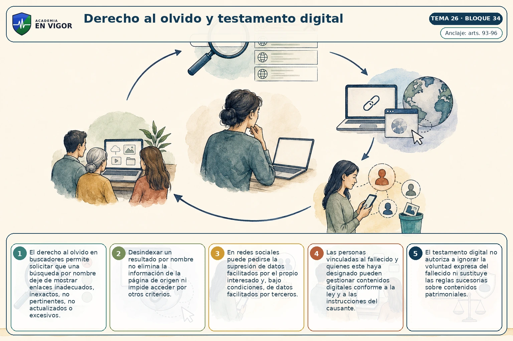

<em>Infografía: Derecho al olvido y testamento digital.</em>

<!-- FUENTE: LOPDGDD-T26 -->

## 35. Objeto y ámbito de la Ley Orgánica 7/2021

La Ley Orgánica 7/2021 protege a las personas físicas en tratamientos realizados por autoridades competentes para fines policiales y penales definidos en su artículo 1.

- La Ley Orgánica 7/2021 protege a las personas físicas en tratamientos realizados por autoridades competentes para fines policiales y penales definidos en su artículo 1.
- Incluye prevención, detección, investigación y enjuiciamiento de infracciones penales, ejecución de sanciones penales y protección frente a amenazas para la seguridad pública.
- Se aplica a tratamientos total o parcialmente automatizados y a los no automatizados contenidos o destinados a un fichero.
- Quedan fuera los tratamientos de autoridades competentes para fines distintos, materias clasificadas y actividades excluidas del Derecho de la Unión en los términos legales.
- Los tratamientos excluidos por tener finalidad distinta pasan al RGPD y a la Ley Orgánica 3/2018 cuando están dentro del Derecho de la Unión.

<!-- VISUAL:t26-35-objeto-y-ambito-de-la-ley-organica-7-2021.webp -->

  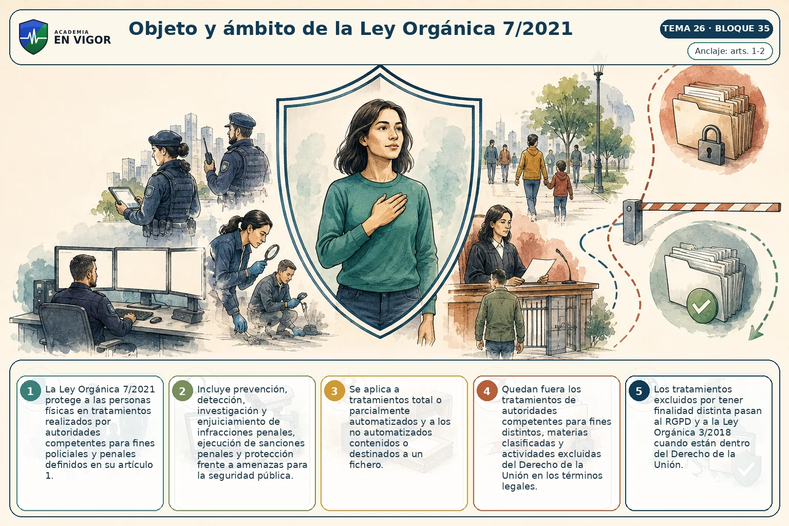

<em>Infografía: Objeto y ámbito de la Ley Orgánica 7/2021.</em>

<!-- FUENTE: LO7-2021-T26 -->

## 36. Fallecidos y autoridades competentes

Familiares, personas vinculadas de hecho y herederos pueden solicitar acceso, rectificación o supresión de datos de una persona fallecida bajo la Ley Orgánica 7/2021.

- Familiares, personas vinculadas de hecho y herederos pueden solicitar acceso, rectificación o supresión de datos de una persona fallecida bajo la Ley Orgánica 7/2021.
- En fallecimiento de menores también pueden actuar representantes legales y Ministerio Fiscal, de oficio o a instancia de cualquier persona interesada.
- Son autoridades competentes las Fuerzas y Cuerpos de Seguridad y las Administraciones Penitenciarias en sus competencias.
- También lo son Vigilancia Aduanera, SEPBLAC, la Comisión de Vigilancia de Actividades de Financiación del Terrorismo, autoridades judiciales penales y Ministerio Fiscal.
- Las autoridades judiciales civiles no adquieren por esa condición la consideración de autoridad competente del artículo 4.

<!-- VISUAL:t26-36-fallecidos-y-autoridades-competentes.webp -->

  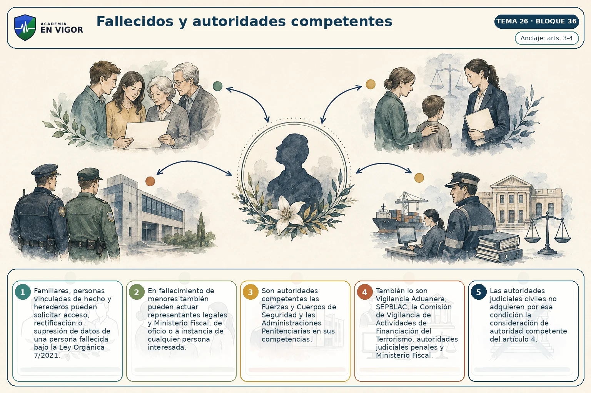

<em>Infografía: Fallecidos y autoridades competentes.</em>

<!-- FUENTE: LO7-2021-T26 -->

## 37. Definiciones del régimen policial-penal

Dato personal y tratamiento conservan en la Ley Orgánica 7/2021 un sentido amplio equivalente al marco europeo.

- Dato personal y tratamiento conservan en la Ley Orgánica 7/2021 un sentido amplio equivalente al marco europeo.
- Responsable es la autoridad competente que determina fines y medios, salvo atribución legal diferente.
- Encargado es persona, autoridad, servicio u organismo que trata datos personales por cuenta del responsable.
- Elaboración de perfiles es tratamiento automatizado destinado a evaluar aspectos personales de una persona física.
- Violación de seguridad incluye destrucción, pérdida, alteración, comunicación o acceso no autorizados, accidentales o ilícitos.

<!-- VISUAL:t26-37-definiciones-del-regimen-policial-penal.webp -->

  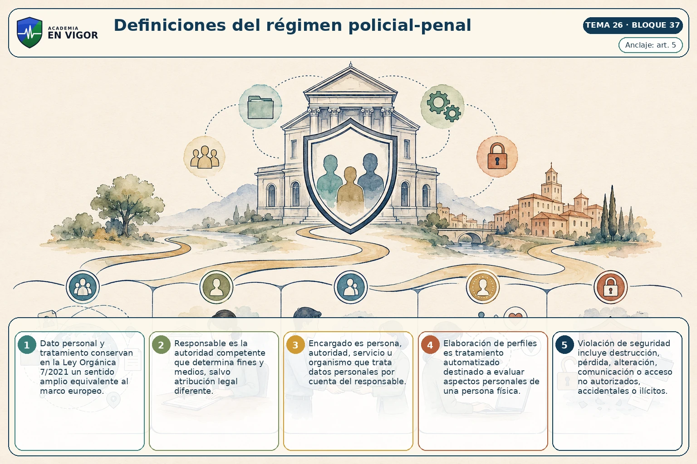

<em>Infografía: Definiciones del régimen policial-penal.</em>

<!-- FUENTE: LO7-2021-T26 -->

## 38. Principios y finalidades compatibles

Los datos se tratan lícita y lealmente, se recogen con fines determinados, explícitos y legítimos y no se usan de modo incompatible.

- Los datos se tratan lícita y lealmente, se recogen con fines determinados, explícitos y legítimos y no se usan de modo incompatible.
- Deben ser adecuados, pertinentes y no excesivos, exactos y actualizados, y conservarse identificables solo el tiempo necesario.
- El tratamiento debe garantizar seguridad apropiada frente a accesos, pérdidas o daños no autorizados.
- Un tratamiento ulterior para otro fin del artículo 1 requiere que el responsable sea competente y que el nuevo tratamiento sea necesario y proporcionado.
- El responsable debe garantizar y poder demostrar el cumplimiento de los principios.

<!-- VISUAL:t26-38-principios-y-finalidades-compatibles.webp -->

  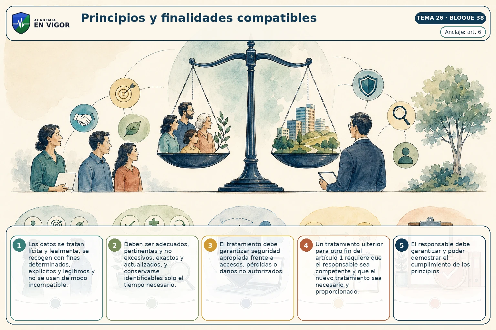

<em>Infografía: Principios y finalidades compatibles.</em>

<!-- FUENTE: LO7-2021-T26 -->

## 39. Deber de colaboración y reserva

Administraciones y personas físicas o jurídicas deben proporcionar a autoridad judicial, Ministerio Fiscal o Policía Judicial datos necesarios para investigar, enjuiciar o ejecutar penas.

- Administraciones y personas físicas o jurídicas deben proporcionar a autoridad judicial, Ministerio Fiscal o Policía Judicial datos necesarios para investigar, enjuiciar o ejecutar penas.
- Para otras autoridades competentes la colaboración cubre datos necesarios para sus misiones específicas de prevención, detección e investigación y frente a peligro real y grave.
- El deber de colaboración cede cuando la ley exige autorización judicial para recabar los datos.
- El interesado no es informado de la transmisión o acceso realizado bajo este deber para proteger la actividad investigadora.
- La reserva alcanza también a sujetos con deber específico de colaboración, que no deben alertar al interesado de la transmisión.

<!-- VISUAL:t26-39-deber-de-colaboracion-y-reserva.webp -->

  

<em>Infografía: Deber de colaboración y reserva.</em>

<!-- FUENTE: LO7-2021-T26 -->

## 40. Conservación y revisión: tres y veinte años

Los datos se conservan solo durante el tiempo necesario para cumplir los fines del artículo 1.

- Los datos se conservan solo durante el tiempo necesario para cumplir los fines del artículo 1.
- El responsable revisa la necesidad de conservar, limitar o suprimir cada actividad de tratamiento como máximo cada tres años.
- La revisión atiende especialmente a edad, carácter de los datos y conclusión de investigación o procedimiento penal.
- Con carácter general, el plazo máximo para suprimir los datos es veinte años.
- Investigaciones abiertas, delitos no prescritos, ejecución pendiente, reincidencia, protección de víctimas u otras circunstancias motivadas pueden justificar superar el plazo general.

<!-- VISUAL:t26-40-conservacion-y-revision-tres-y-veinte-anos.webp -->

  

<em>Infografía: Conservación y revisión: tres y veinte años.</em>

<!-- FUENTE: LO7-2021-T26 -->

## 41. Categorías de interesados y calidad

En la medida de lo posible deben distinguirse sospechosos o potenciales autores, condenados, víctimas y terceros involucrados.

- En la medida de lo posible deben distinguirse sospechosos o potenciales autores, condenados, víctimas y terceros involucrados.
- La categoría de sospechoso no elimina la presunción de inocencia.
- Deben diferenciarse, en la medida de lo posible, datos basados en hechos y datos basados en apreciaciones personales.
- Antes de transmitir deben adoptarse medidas razonables para evitar datos inexactos, incompletos o desactualizados.
- Si se detecta transmisión incorrecta o ilegal se avisa sin dilación al destinatario y se rectifica, suprime o limita el tratamiento.

<!-- VISUAL:t26-41-categorias-de-interesados-y-calidad.webp -->

  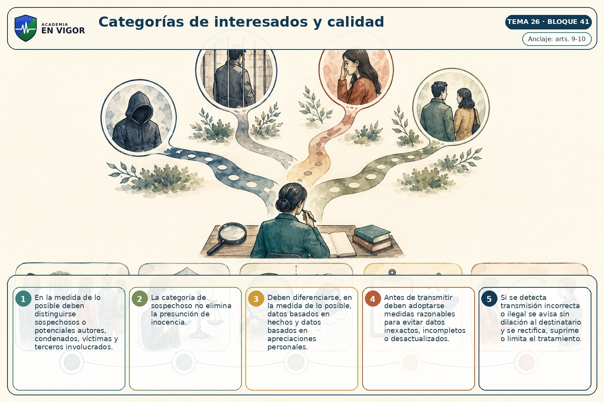

<em>Infografía: Categorías de interesados y calidad.</em>

<!-- FUENTE: LO7-2021-T26 -->

## 42. Licitud y categorías especiales

El tratamiento solo es lícito si es necesario para los fines del artículo 1 y lo realiza una autoridad competente en ejercicio de funciones.

- El tratamiento solo es lícito si es necesario para los fines del artículo 1 y lo realiza una autoridad competente en ejercicio de funciones.
- La ley que habilite un tratamiento debe indicar al menos objetivos, datos personales y finalidades.
- Las condiciones específicas comunicadas por la autoridad transmisora obligan al destinatario, incluida una prohibición de reutilización o retransmisión.
- Las categorías especiales solo se tratan cuando sea estrictamente necesario, con garantías y bajo una circunstancia del artículo 13.
- Las autoridades competentes pueden tratar biometría dirigida a identificar unívocamente para los fines legalmente previstos.

<!-- VISUAL:t26-42-licitud-y-categorias-especiales.webp -->

  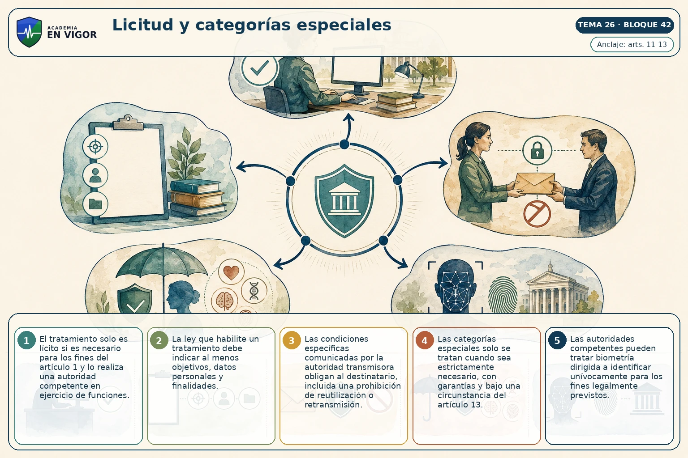

<em>Infografía: Licitud y categorías especiales.</em>

<!-- FUENTE: LO7-2021-T26 -->

## 43. Decisiones automatizadas y perfiles

Se prohíben las decisiones basadas únicamente en tratamiento automatizado que produzcan efectos jurídicos negativos o afecten significativamente, salvo habilitación legal.

- Se prohíben las decisiones basadas únicamente en tratamiento automatizado que produzcan efectos jurídicos negativos o afecten significativamente, salvo habilitación legal.
- La norma habilitante debe establecer garantías adecuadas e incluir derecho a intervención humana en la revisión.
- Las decisiones automatizadas no se basan en categorías especiales salvo garantías adecuadas.
- Está prohibida la elaboración de perfiles que produzca discriminación basada en categorías especiales.
- La utilidad operativa de un algoritmo no sustituye la habilitación, la evaluación de riesgos ni la revisión humana exigible.

<!-- VISUAL:t26-43-decisiones-automatizadas-y-perfiles.webp -->

  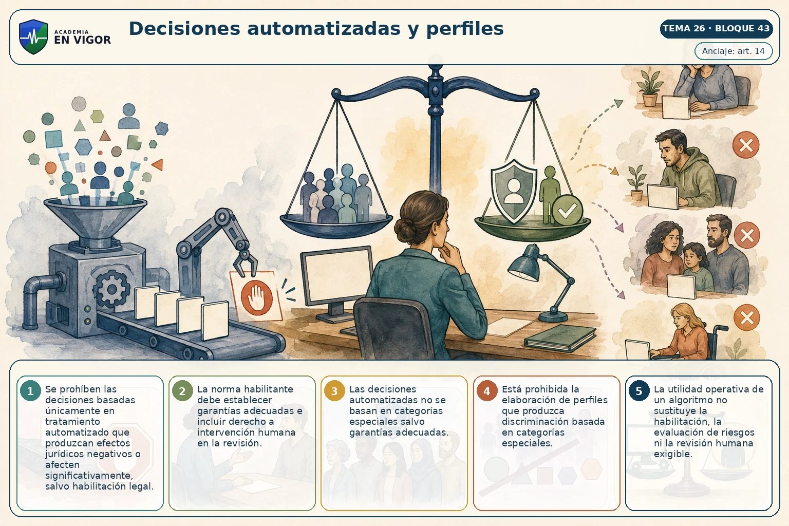

<em>Infografía: Decisiones automatizadas y perfiles.</em>

<!-- FUENTE: LO7-2021-T26 -->

## 44. Videovigilancia policial: sistema y proporcionalidad

La captación y tratamiento por Fuerzas y Cuerpos de Seguridad conforme a la Ley Orgánica 7/2021 no constituye intromisión ilegítima a efectos de la Ley Orgánica 1/1982.

- La captación y tratamiento por Fuerzas y Cuerpos de Seguridad conforme a la Ley Orgánica 7/2021 no constituye intromisión ilegítima a efectos de la Ley Orgánica 1/1982.
- La instalación debe responder a protección de edificios, instalaciones, seguridad nacional, investigación penal o amenazas a la seguridad pública.
- Las videocámaras fijas en vías o lugares públicos exigen valorar idoneidad e intervención mínima.
- El responsable debe realizar análisis de riesgos o evaluación de impacto según perjuicio posible y finalidad.
- Videocámara fija es la anclada a soporte o fachada aunque el sistema pueda moverse en cualquier dirección.

<!-- VISUAL:t26-44-videovigilancia-policial-sistema-y-proporc.webp -->

  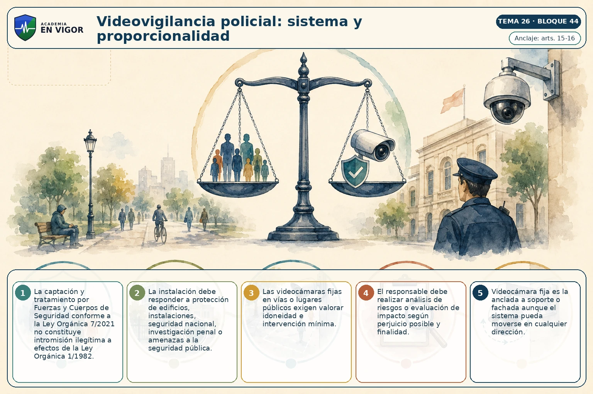

<em>Infografía: Videovigilancia policial: sistema y proporcionalidad.</em>

<!-- FUENTE: LO7-2021-T26 -->

## 45. Sistemas fijos y deber de información

La regulación de sistemas fijos también se aplica si la Policía usa cámaras ajenas y controla y dirige efectivamente todo el tratamiento.

- La regulación de sistemas fijos también se aplica si la Policía usa cámaras ajenas y controla y dirige efectivamente todo el tratamiento.
- Las instalaciones fijas no quedan sujetas al control preventivo local, sin perjuicio de respetar los principios materiales aplicables.
- Propietarios y poseedores deben facilitar instalación y mantenimiento, sin perjuicio de indemnizaciones procedentes.
- La ciudadanía debe ser informada clara y permanentemente de la existencia de cámaras fijas.
- La información identifica a la autoridad responsable, pero no debe especificar el emplazamiento exacto de las cámaras.

<!-- VISUAL:t26-45-sistemas-fijos-y-deber-de-informacion.webp -->

  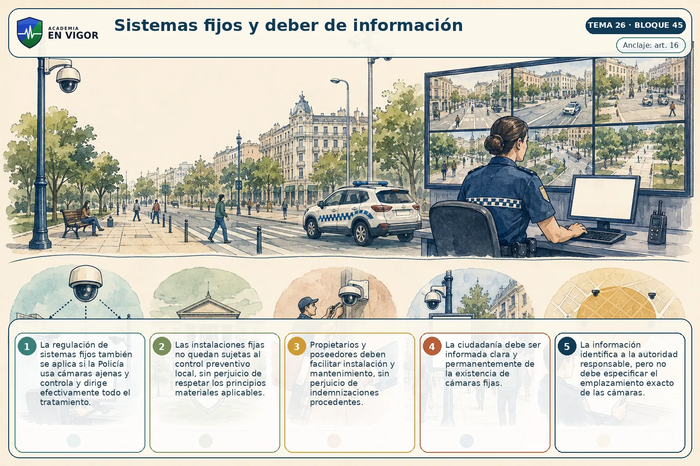

<em>Infografía: Sistemas fijos y deber de información.</em>

<!-- FUENTE: LO7-2021-T26 -->

## 46. Dispositivos móviles

Los dispositivos móviles pueden captar conjuntamente imagen y sonido cuando concurra un peligro o evento concreto.

- Los dispositivos móviles pueden captar conjuntamente imagen y sonido cuando concurra un peligro o evento concreto.
- Su uso requiere autorización del Delegado o Subdelegado del Gobierno, o del órgano autonómico competente según el cuerpo policial.
- La autorización debe adecuarse a principios de tratamiento y proporcionalidad y no puede ser indefinida o permanente.
- El periodo máximo es un mes prorrogable por otro.
- En urgencia o necesidad inaplazable decide el responsable operativo y comunica la actuación a la autoridad competente a la mayor brevedad y siempre dentro de veinticuatro horas.

<!-- VISUAL:t26-46-dispositivos-moviles.webp -->

  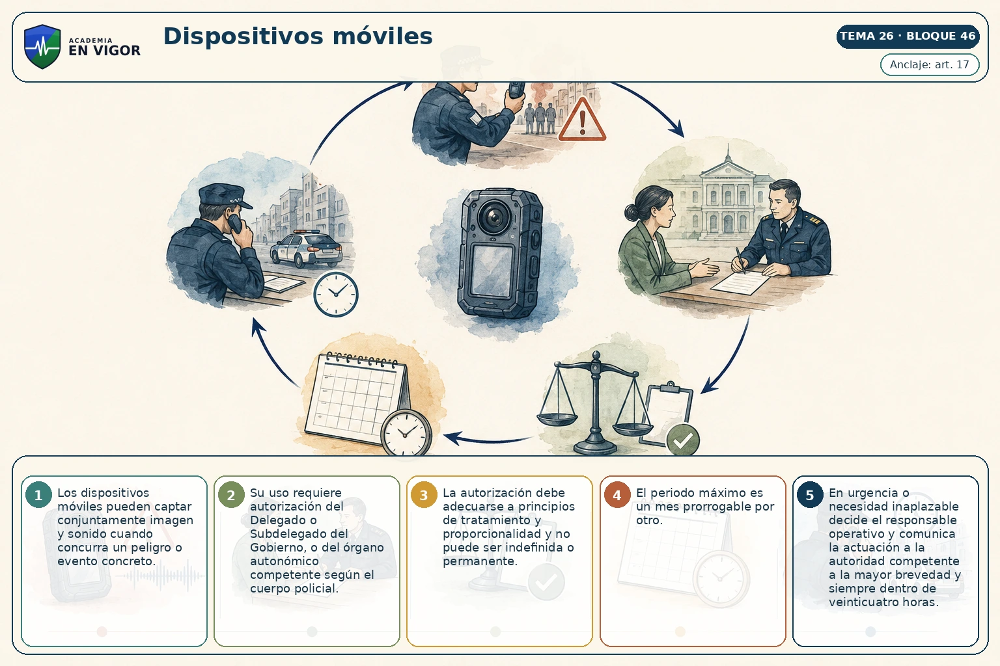

<em>Infografía: Dispositivos móviles.</em>

<!-- FUENTE: LO7-2021-T26 -->

## 47. Entrega, conservación y disciplina de grabaciones

Si una grabación capta posible infracción penal, el soporte original íntegro se pone a disposición judicial cuanto antes y como máximo en setenta y dos horas.

- Si una grabación capta posible infracción penal, el soporte original íntegro se pone a disposición judicial cuanto antes y como máximo en setenta y dos horas.
- Si no puede redactarse el atestado en ese plazo, se relatan verbalmente los hechos a autoridad judicial o fiscal junto con la entrega de la grabación.
- Las infracciones administrativas de seguridad pública captadas se remiten de inmediato al órgano competente.
- Las grabaciones se destruyen como máximo a los tres meses, salvo relación con infracción relevante, investigación o procedimiento abierto.
- Manipular registros, permitir accesos no autorizados o usar grabaciones para fines distintos puede constituir falta disciplinaria muy grave.

<!-- VISUAL:t26-47-entrega-conservacion-y-disciplina-de-graba.webp -->

  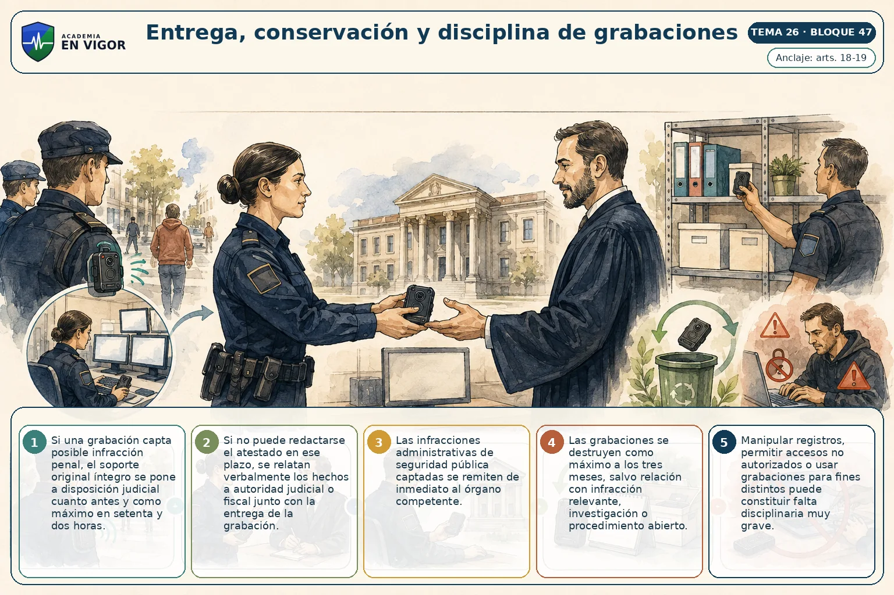

<em>Infografía: Entrega, conservación y disciplina de grabaciones.</em>

<!-- FUENTE: LO7-2021-T26 -->

## 48. Condiciones generales de los derechos

La información debe ser concisa, inteligible, accesible y expresada con lenguaje claro y sencillo, también para personas con discapacidad.

- La información debe ser concisa, inteligible, accesible y expresada con lenguaje claro y sencillo, también para personas con discapacidad.
- El interesado con capacidad de obrar puede actuar personalmente o mediante representante.
- La respuesta se facilita sin dilación indebida y la solicitud se entiende desestimada si en un mes no se resuelve y notifica expresamente.
- Las solicitudes son gratuitas, pero pueden inadmitirse motivadamente si son manifiestamente infundadas o excesivas.
- Se considera repetitiva la presentación de tres solicitudes sobre el mismo supuesto en seis meses, salvo causa legítima.

<!-- VISUAL:t26-48-condiciones-generales-de-los-derechos.webp -->

  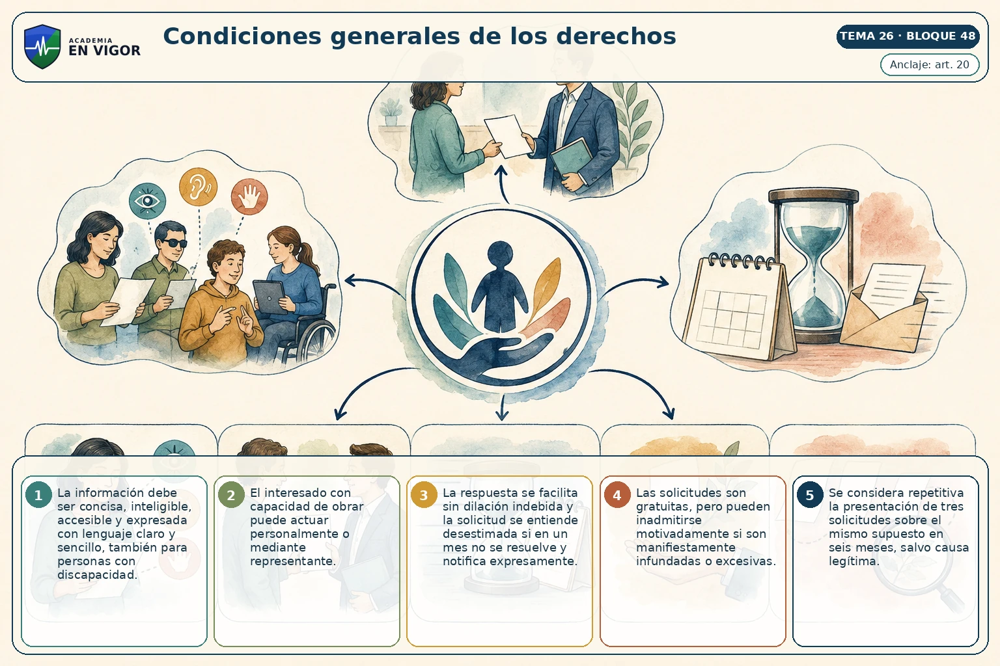

<em>Infografía: Condiciones generales de los derechos.</em>

<!-- FUENTE: LO7-2021-T26 -->

## 49. Información y acceso en la Ley Orgánica 7/2021

Debe ponerse a disposición identidad y contacto del responsable, contacto del delegado, fines, derechos y autoridad de reclamación.

- Debe ponerse a disposición identidad y contacto del responsable, contacto del delegado, fines, derechos y autoridad de reclamación.
- Según el caso se informa también de base jurídica, conservación, destinatarios y datos recabados sin conocimiento del interesado.
- El acceso confirma si existen tratamientos y permite conocer datos, fines, base, categorías, destinatarios y plazo de conservación.
- El acceso incluye información sobre origen de los datos y garantías de decisiones automatizadas cuando proceda.
- Elegir un medio de acceso con coste desproporcionado obliga al interesado a asumir el exceso o aceptar el medio inicialmente ofrecido.

<!-- VISUAL:t26-49-informacion-y-acceso-en-la-ley-organica-7-.webp -->

  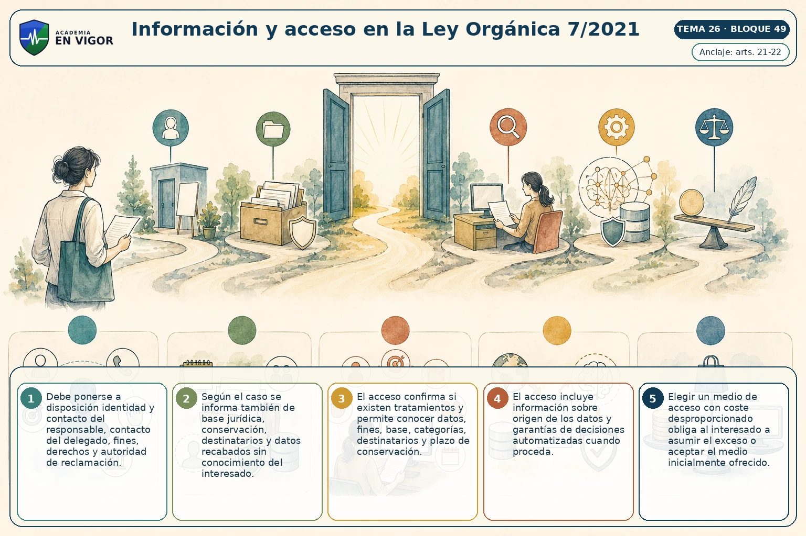

<em>Infografía: Información y acceso en la Ley Orgánica 7/2021.</em>

<!-- FUENTE: LO7-2021-T26 -->

## 50. Rectificación, supresión y limitación policial

La rectificación se obtiene sin dilación indebida cuando los datos son inexactos y puede completarlos cuando sean incompletos.

- La rectificación se obtiene sin dilación indebida cuando los datos son inexactos y puede completarlos cuando sean incompletos.
- La solicitud identifica datos y corrección y aporta documentación justificativa cuando sea preciso.
- La supresión procede sin dilación y como máximo en un mes cuando el tratamiento infringe los artículos 6, 11 o 13 o existe obligación legal.
- Se limita, en lugar de suprimir, si no puede determinarse exactitud o los datos deben conservarse con fines probatorios.
- La rectificación, supresión o limitación se notifica a destinatarios para que actúen sobre los datos bajo su responsabilidad.

<!-- VISUAL:t26-50-rectificacion-supresion-y-limitacion-polic.webp -->

  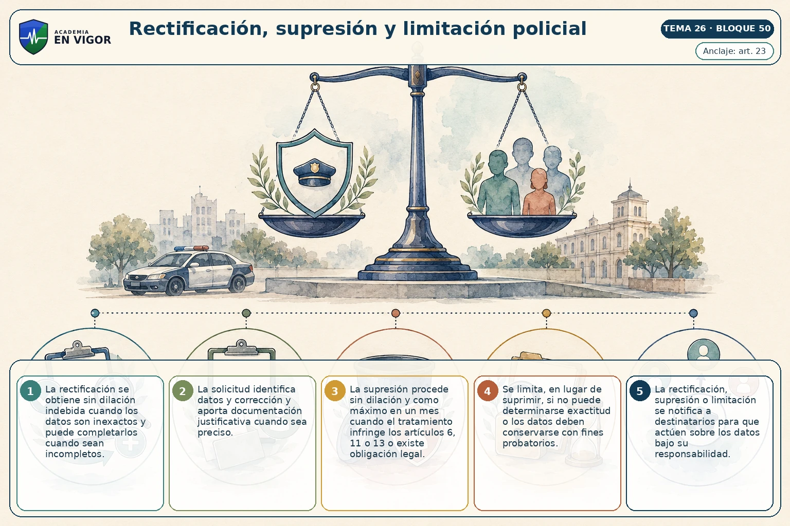

<em>Infografía: Rectificación, supresión y limitación policial.</em>

<!-- FUENTE: LO7-2021-T26 -->

## 51. Restricciones y ejercicio a través de la autoridad

El responsable puede aplazar, limitar u omitir información o restringir derechos solo cuando sea necesario y proporcional para fines tasados.

- El responsable puede aplazar, limitar u omitir información o restringir derechos solo cuando sea necesario y proporcional para fines tasados.
- Los fines incluyen no obstaculizar investigaciones, proteger prevención y enjuiciamiento, seguridad pública, Seguridad Nacional o derechos ajenos.
- La restricción se comunica por escrito sin dilación y como máximo en un mes, con razones y vías de reclamación salvo riesgo para el fin protegido.
- Los fundamentos de hecho y derecho de una denegación de acceso deben documentarse y quedar disponibles para la autoridad de protección de datos.
- El interesado puede ejercer derechos a través de la autoridad de protección de datos cuando operen las restricciones del artículo 24.

<!-- VISUAL:t26-51-restricciones-y-ejercicio-a-traves-de-la-a.webp -->

  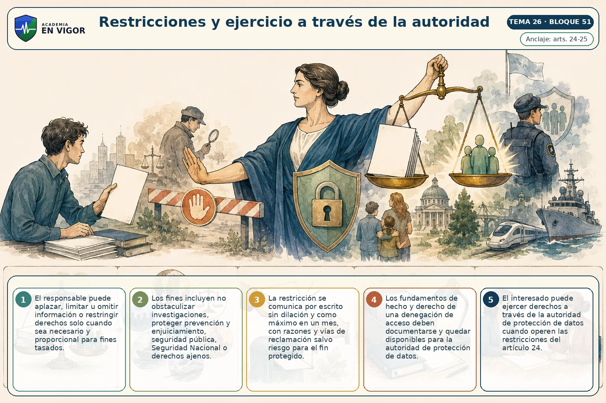

<em>Infografía: Restricciones y ejercicio a través de la autoridad.</em>

<!-- FUENTE: LO7-2021-T26 -->

## 52. Derechos en investigaciones y procesos penales

Si los datos figuran en resoluciones, registros, diligencias o expedientes de investigaciones y procesos penales, los derechos se ejercen conforme a normas procesales penales.

- Si los datos figuran en resoluciones, registros, diligencias o expedientes de investigaciones y procesos penales, los derechos se ejercen conforme a normas procesales penales.
- Para tratamientos jurisdiccionales de órganos penales se aplica la Ley Orgánica del Poder Judicial y las normas procesales.
- Para tratamientos jurisdiccionales del Ministerio Fiscal se atiende además a su Estatuto Orgánico.
- La Ley Orgánica 7/2021 actúa supletoriamente cuando esas normas no regulan el ejercicio del derecho.
- La vía procesal especial impide trasladar mecánicamente el procedimiento administrativo ordinario de acceso a un sumario o diligencia penal.

<!-- VISUAL:t26-52-derechos-en-investigaciones-y-procesos-pen.webp -->

  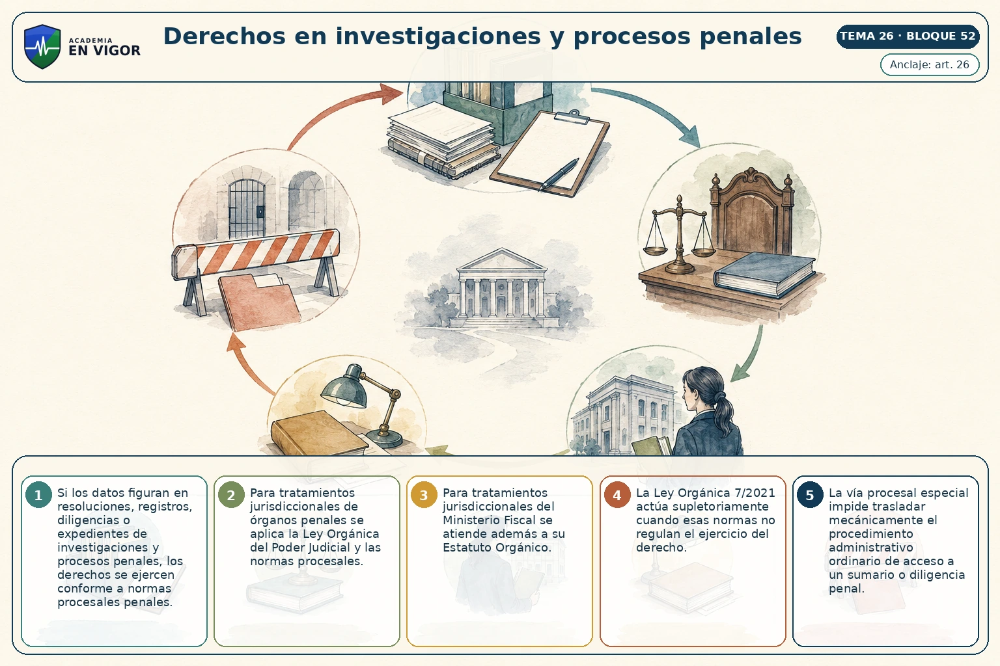

<em>Infografía: Derechos en investigaciones y procesos penales.</em>

<!-- FUENTE: LO7-2021-T26 -->

## 53. Responsable, diseño y corresponsabilidad

El responsable adopta y actualiza medidas técnicas y organizativas apropiadas según contexto, fines y riesgos.

- El responsable adopta y actualiza medidas técnicas y organizativas apropiadas según contexto, fines y riesgos.
- La protección desde el diseño se aplica al determinar medios y durante el tratamiento.
- Por defecto solo se tratan los datos necesarios en cantidad, extensión, conservación y accesibilidad.
- Los corresponsables determinan transparentemente sus responsabilidades mediante el instrumento oportuno, salvo que la ley las asigne.
- El acuerdo de corresponsabilidad debe designar punto de contacto para interesados si no viene legalmente determinado.

<!-- VISUAL:t26-53-responsable-diseno-y-corresponsabilidad.webp -->

  

<em>Infografía: Responsable, diseño y corresponsabilidad.</em>

<!-- FUENTE: LO7-2021-T26 -->

## 54. Encargado y actuación bajo instrucciones

El responsable solo recurre a encargados que ofrezcan garantías suficientes de medidas apropiadas.

- El responsable solo recurre a encargados que ofrezcan garantías suficientes de medidas apropiadas.
- El encargado puede ser persona física o jurídica, pública o privada.
- No puede recurrir a otro encargado sin autorización previa escrita del responsable.
- La relación se formaliza por escrito en contrato, convenio u otro instrumento jurídico que fija objeto, duración, datos y obligaciones.
- Quien actúa bajo autoridad del responsable o encargado solo trata datos siguiendo instrucciones, salvo obligación legal.

<!-- VISUAL:t26-54-encargado-y-actuacion-bajo-instrucciones.webp -->

  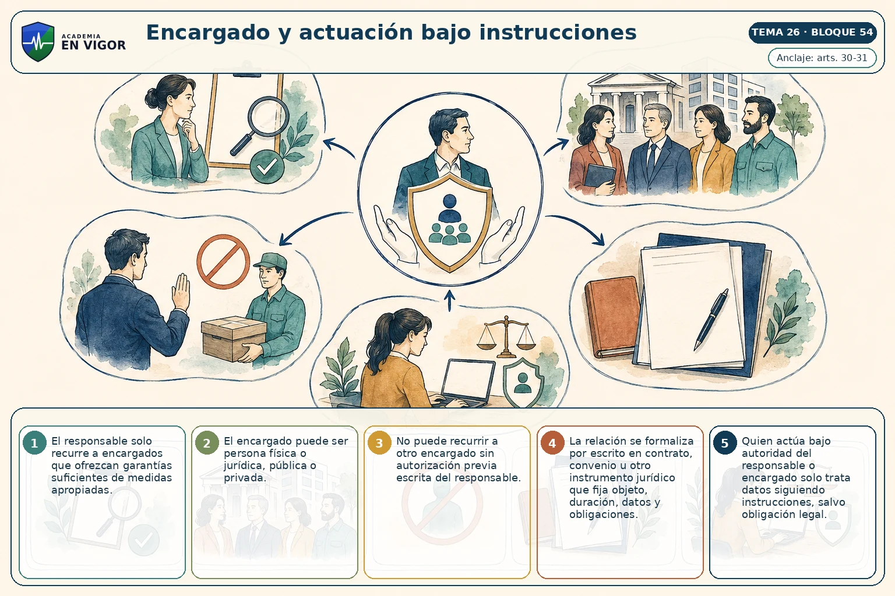

<em>Infografía: Encargado y actuación bajo instrucciones.</em>

<!-- FUENTE: LO7-2021-T26 -->

## 55. Registros de actividades y operaciones

Responsable y encargado llevan por escrito, también en formato electrónico, registros de las actividades que les correspondan.

- Responsable y encargado llevan por escrito, también en formato electrónico, registros de las actividades que les correspondan.
- El registro del responsable incluye fines, categorías, destinatarios, transferencias, base jurídica, plazos y medidas de seguridad cuando sea posible.
- Los responsables hacen público electrónicamente su registro de actividades con la información legalmente prevista.
- En sistemas automatizados se registran, como mínimo, recogida, modificación, consulta, comunicación, transferencias, interconexión y supresión.
- Los registros de consulta y comunicación permiten conocer justificación, fecha, hora, usuario y destinatario en la medida de lo posible.

<!-- VISUAL:t26-55-registros-de-actividades-y-operaciones.webp -->

  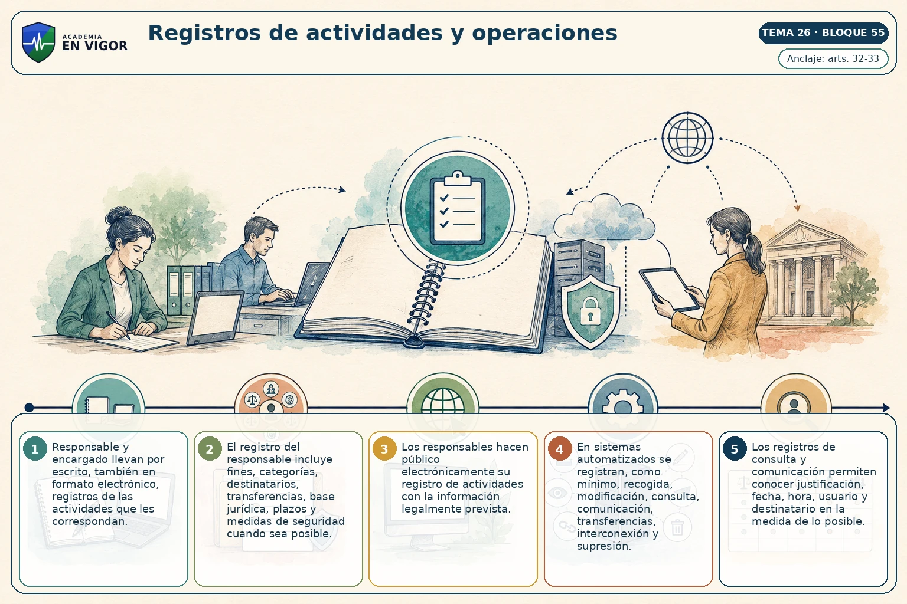

<em>Infografía: Registros de actividades y operaciones.</em>

<!-- FUENTE: LO7-2021-T26 -->

## 56. Evaluación de impacto y consulta previa

La evaluación de impacto es previa cuando un tratamiento, especialmente con nuevas tecnologías, pueda suponer alto riesgo.

- La evaluación de impacto es previa cuando un tratamiento, especialmente con nuevas tecnologías, pueda suponer alto riesgo.
- Debe describir operaciones, evaluar riesgos y recoger medidas de mitigación, seguridad y demostración de conformidad.
- La consulta previa procede si persiste alto riesgo sin medidas suficientes o si nuevas tecnologías pueden generar alto riesgo.
- La autoridad asesora por escrito en seis semanas y puede prorrogar un mes por complejidad, informando de la prórroga.
- La falta de respuesta a la consulta dentro del plazo no produce silencio favorable.

<!-- VISUAL:t26-56-evaluacion-de-impacto-y-consulta-previa.webp -->

  

<em>Infografía: Evaluación de impacto y consulta previa.</em>

<!-- FUENTE: LO7-2021-T26 -->

## 57. Seguridad y Esquema Nacional de Seguridad

Responsable y encargado aplican medidas adecuadas al estado de la técnica, costes, naturaleza y riesgos.

- Responsable y encargado aplican medidas adecuadas al estado de la técnica, costes, naturaleza y riesgos.
- A los tratamientos de autoridades públicas competentes se aplican las medidas incluidas en el Esquema Nacional de Seguridad.
- La seguridad automatizada debe controlar acceso a equipos, soportes, almacenamiento, usuarios, transmisión y disponibilidad.
- Los sistemas deben permitir restablecimiento, asegurar fiabilidad e integridad y señalar errores de funcionamiento.
- Las categorías especiales requieren atención reforzada, pero la seguridad debe cubrir todo dato personal tratado.

<!-- VISUAL:t26-57-seguridad-y-esquema-nacional-de-seguridad.webp -->

  

<em>Infografía: Seguridad y Esquema Nacional de Seguridad.</em>

<!-- FUENTE: LO7-2021-T26 -->

## 58. Violaciones de seguridad

La violación se notifica a la autoridad dentro de setenta y dos horas desde que se tiene constancia, salvo improbabilidad de peligro para derechos y libertades.

- La violación se notifica a la autoridad dentro de setenta y dos horas desde que se tiene constancia, salvo improbabilidad de peligro para derechos y libertades.
- Si se notifica tarde deben explicarse los motivos de la dilación.
- El encargado comunica sin dilación indebida al responsable las violaciones conocidas.
- Si existen indicios de alto riesgo, el responsable comunica la violación al interesado sin dilación indebida y en lenguaje claro.
- La comunicación al interesado puede omitirse por protección previa eficaz, medidas posteriores que eliminen el alto riesgo, esfuerzo desproporcionado o restricción válida.

<!-- VISUAL:t26-58-violaciones-de-seguridad.webp -->

  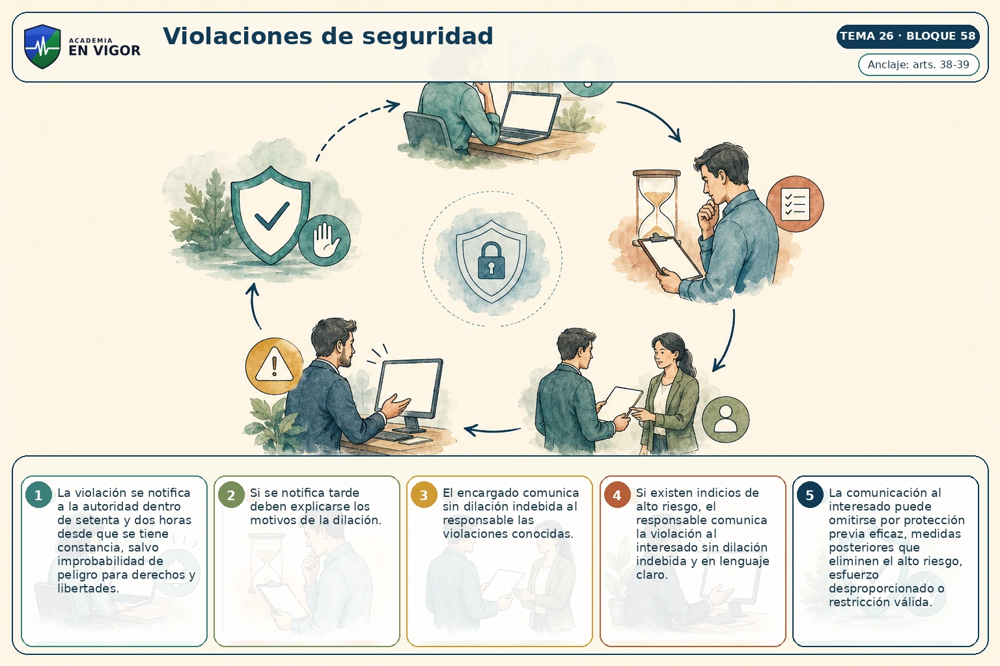

<em>Infografía: Violaciones de seguridad.</em>

<!-- FUENTE: LO7-2021-T26 -->

## 59. Delegado de protección de datos policial

Los responsables sometidos a la Ley Orgánica 7/2021 designan en todo caso delegado, salvo órganos judiciales o Ministerio Fiscal en funciones jurisdiccionales.

- Los responsables sometidos a la Ley Orgánica 7/2021 designan en todo caso delegado, salvo órganos judiciales o Ministerio Fiscal en funciones jurisdiccionales.
- Puede existir un único delegado para varias autoridades competentes atendiendo a estructura y tamaño.
- Designación y cese se comunican a la autoridad y se publican datos de contacto en diez días.
- El delegado debe participar oportunamente, mantener conocimientos, disponer de recursos, acceder a datos y actuar sin instrucciones sobre sus funciones.
- Sus funciones incluyen informar, supervisar, asesorar sobre impacto, cooperar y ser punto de contacto con la autoridad.

<!-- VISUAL:t26-59-delegado-de-proteccion-de-datos-policial.webp -->

  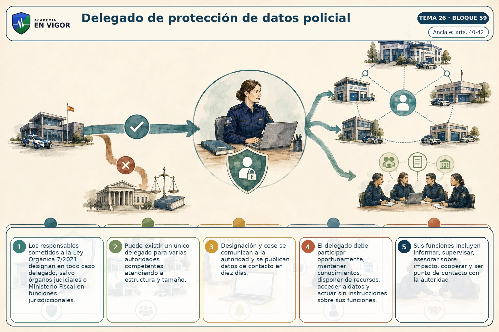

<em>Infografía: Delegado de protección de datos policial.</em>

<!-- FUENTE: LO7-2021-T26 -->

## 60. Transferencias internacionales: regla y adecuación

Las transferencias a terceros países u organizaciones internacionales deben ser necesarias para los fines del artículo 1.

- Las transferencias a terceros países u organizaciones internacionales deben ser necesarias para los fines del artículo 1.
- Como regla, el destinatario debe ser autoridad competente y deben respetarse autorizaciones previas del Estado miembro de origen cuando proceda.
- Una decisión de adecuación de la Comisión Europea permite transferir sin autorización específica.
- La retirada de una decisión de adecuación no impide acudir a garantías apropiadas o excepciones legales.
- Las transferencias ulteriores deben respetar las condiciones impuestas y el nivel de protección de la Ley Orgánica 7/2021.

<!-- VISUAL:t26-60-transferencias-internacionales-regla-y-ade.webp -->

  

<em>Infografía: Transferencias internacionales: regla y adecuación.</em>

<!-- FUENTE: LO7-2021-T26 -->

## 61. Garantías, excepciones y transferencias directas

Sin adecuación puede transferirse mediante instrumento vinculante con garantías apropiadas o tras evaluación documentada del responsable.

- Sin adecuación puede transferirse mediante instrumento vinculante con garantías apropiadas o tras evaluación documentada del responsable.
- Sin adecuación ni garantías, las excepciones permiten transferencias necesarias para intereses vitales, intereses legítimos, prevención de amenazas o fines concretos tasados.
- Las excepciones no se aplican si los derechos y libertades fundamentales prevalecen en los supuestos legales de intereses legítimos.
- La transferencia directa a destinatario privado de tercer país es excepcional, para casos particulares y exige todas las condiciones del artículo 47.
- Las transferencias directas se informan a la autoridad de protección de datos y deben documentarse.

<!-- VISUAL:t26-61-garantias-excepciones-y-transferencias-dir.webp -->

  

<em>Infografía: Garantías, excepciones y transferencias directas.</em>

<!-- FUENTE: LO7-2021-T26 -->

## 62. Autoridades independientes, funciones y poderes

Son autoridades independientes la AEPD y las autonómicas dentro de su competencia.

- Son autoridades independientes la AEPD y las autonómicas dentro de su competencia.
- La AEPD representa a las autoridades de protección de datos en el Comité Europeo de Protección de Datos.
- Las autoridades supervisan, sensibilizan, asesoran, tramitan reclamaciones, investigan y cooperan sin coste para interesado o delegado.
- Sus poderes incluyen investigación, advertencia, órdenes de rectificación, supresión o limitación y prohibición temporal o definitiva del tratamiento.
- El control de tratamientos jurisdiccionales corresponde a los órganos previstos en la legislación judicial y fiscal, no a la autoridad administrativa ordinaria.

<!-- VISUAL:t26-62-autoridades-independientes-funciones-y-pod.webp -->

  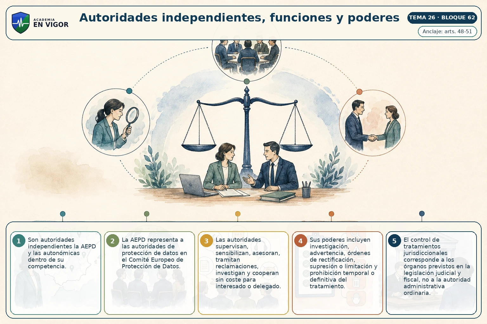

<em>Infografía: Autoridades independientes, funciones y poderes.</em>

<!-- FUENTE: LO7-2021-T26 -->

## 63. Reclamación, indemnización y tutela judicial

El interesado puede reclamar ante la autoridad si considera infringida la ley o desatendida una solicitud de derechos.

- El interesado puede reclamar ante la autoridad si considera infringida la ley o desatendida una solicitud de derechos.
- Las reclamaciones se tramitan conforme al Título VIII de la Ley Orgánica 3/2018 y, en su caso, normativa autonómica.
- Existe derecho a indemnización por daños derivados de incumplimiento, con el régimen diferenciado para sector público y encargados privados.
- Las decisiones de la autoridad de protección de datos pueden recurrirse ante la jurisdicción contencioso-administrativa.
- El interesado puede conferir representación a entidad sin ánimo de lucro constituida y activa en protección de derechos y libertades.

<!-- VISUAL:t26-63-reclamacion-indemnizacion-y-tutela-judicia.webp -->

  

<em>Infografía: Reclamación, indemnización y tutela judicial.</em>

<!-- FUENTE: LO7-2021-T26 -->

## 64. Régimen sancionador: sujetos e infracciones

Responden directamente quienes, por acción u omisión, realizan la conducta infractora.

- Responden directamente quienes, por acción u omisión, realizan la conducta infractora.
- Están sujetos responsables, encargados, representantes de encargados no establecidos y obligados por el deber de colaboración.
- El delegado de protección de datos queda fuera de este régimen sancionador por el ejercicio de sus funciones.
- Las infracciones se clasifican en muy graves, graves y leves.
- La negativa a colaborar puede ser muy grave o grave según conducta y perjuicio, y la potestad corresponde en supuestos específicos a Secretaría de Estado de Seguridad o Delegaciones del Gobierno.

<!-- VISUAL:t26-64-regimen-sancionador-sujetos-e-infracciones.webp -->

  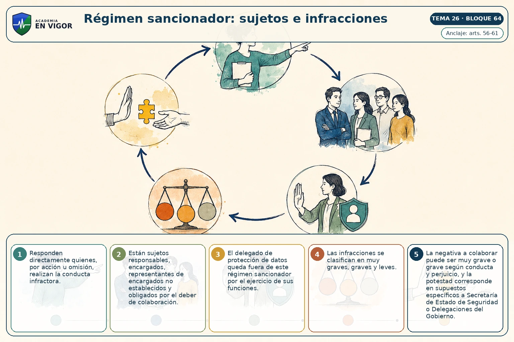

<em>Infografía: Régimen sancionador: sujetos e infracciones.</em>

<!-- FUENTE: LO7-2021-T26 -->

## 65. Sanciones, prescripción y cuadro comparativo

Para sujetos del artículo 77.1 de la Ley Orgánica 3/2018 se aplican las medidas previstas para el sector público.

- Para sujetos del artículo 77.1 de la Ley Orgánica 3/2018 se aplican las medidas previstas para el sector público.
- Para otros infractores, las multas son de 360.001 a un millón para muy graves, 60.001 a 360.000 para graves y 6.000 a 60.000 para leves.
- Las infracciones muy graves prescriben a los tres años, las graves a los dos y las leves al año.
- Las sanciones de hasta 60.000 euros prescriben al año, de 60.001 a 360.000 a los dos y las superiores a 360.000 a los tres.
- La clave final es separar RGPD y Ley Orgánica 3/2018 del régimen especial de la Ley Orgánica 7/2021 según autoridad, finalidad, derecho, plazo y sanción.

<!-- VISUAL:t26-65-sanciones-prescripcion-y-cuadro-comparativ.webp -->

  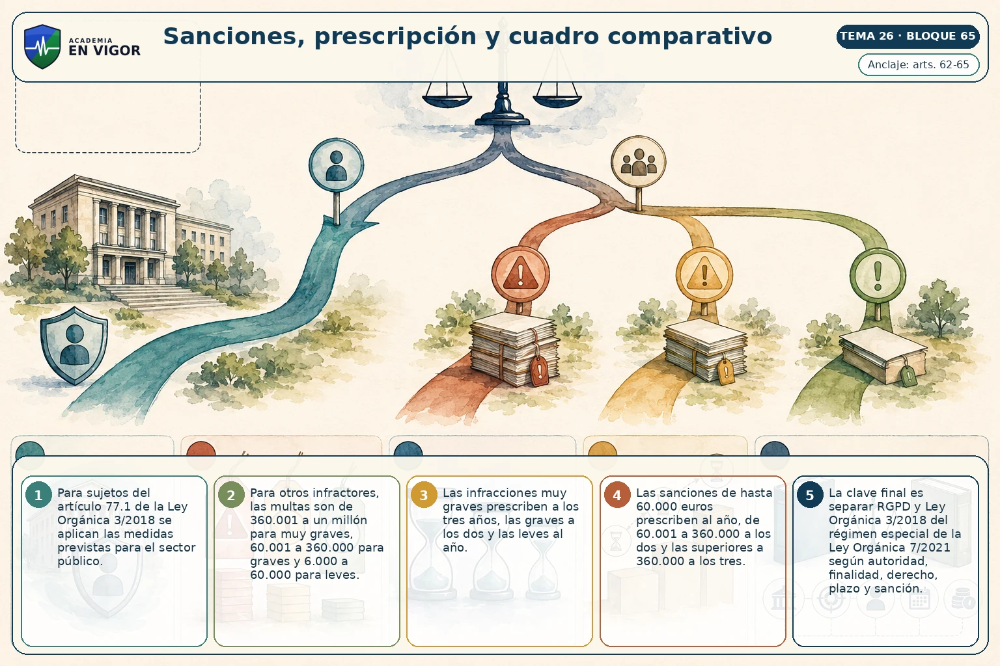

<em>Infografía: Sanciones, prescripción y cuadro comparativo.</em>

<!-- FUENTE: LO7-2021-T26 -->

# Hablemos claro

:::hablemos-claro
Una regla bien estudiada responde cinco preguntas: quién, cuándo, qué hace, con qué límite y bajo qué control.
:::

# En la calle

:::en-la-calle
En el supuesto práctico, documenta hechos y tiempos antes de aplicar la norma; después revisa necesidad, proporcionalidad y garantías.
:::

# Lo que cae

:::lo-que-cae
Prioriza sujetos competentes, plazos máximos, excepciones tasadas y derechos que no admiten atajos.
:::

# Ha caído

:::ha-caido
Se han mapeado 12 referencias históricas. Permanecen ocultas y en cuarentena porque no existe plantilla oficial final verificable.
:::

## Fuentes oficiales

- `CONV-PN-2026`
- `CE-T26`
- `RGPD-T26`
- `LOPDGDD-T26`
- `DIR2016-680-T26`
- `LO7-2021-T26`
- `LO9-2022-T26`

---

*Academia En Vigor · El temario que nunca duerme · Tema 26 · v1.0.0 · Documento interno no publicado.*
