# TEMA 28 · GLOBALIZACIÓN Y ANTIGLOBALIZACIÓN. CONCEPTOS Y CARACTERÍSTICAS. CONSECUENCIA DE LA GLOBALIZACIÓN. REACCIONES A LA GLOBALIZACIÓN. EL MOVIMIENTO ANTIGLOBALIZACIÓN: ORGANIZACIONES, OBJETIVOS E HISTORIA. EL FORO SOCIAL MUNDIAL.

**Policía Nacional · Método VIGOR · PARTE**
**Versión de contenido:** 1.0.0
**Estado editorial:** approved_internal · **Publicación:** not_published

# Mapa del tema

El Tema 28 se estudia en seis partes: concepto y motores; características y actores; consecuencias; reacciones; movimiento antiglobalización; y Foro Social Mundial.

# Contenido

## 01. Concepto general de globalización

La globalización describe la extensión de relaciones, instituciones, decisiones y flujos desde marcos nacionales hacia una escala internacional o mundial.

- La globalización describe la extensión de relaciones, instituciones, decisiones y flujos desde marcos nacionales hacia una escala internacional o mundial.
- El fenómeno integra dimensiones económicas, tecnológicas, sociales, culturales, políticas, jurídicas y ambientales que avanzan con ritmos desiguales.
- La interdependencia aumenta cuando una decisión o crisis localizada produce efectos relevantes en otros territorios y sistemas conectados.
- Globalización no equivale a uniformidad total: conecta espacios y puede homogeneizar algunas prácticas mientras mantiene o reactiva diferencias locales.

<!-- VISUAL:t28-il-01-concepto-general-de-globalizacion.webp -->

  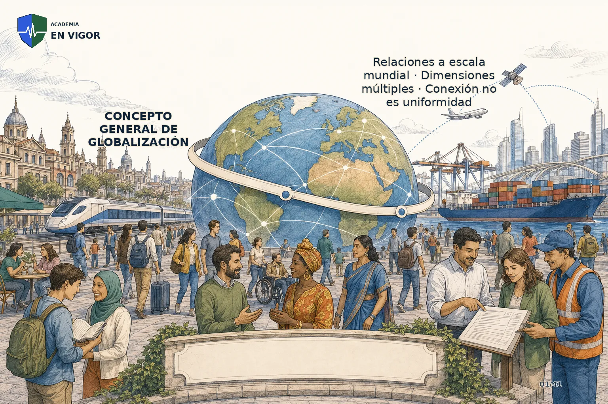

<em>Infografía: Concepto general de globalización.</em>

<!-- FUENTE: RAE-GLOBAL-T28 -->

## 02. Globalización económica e interdependencia

La globalización económica implica una creciente integración transfronteriza mediante comercio, inversión, financiación, tecnología, información y organización productiva.

- La globalización económica implica una creciente integración transfronteriza mediante comercio, inversión, financiación, tecnología, información y organización productiva.
- La interdependencia hace que los resultados de una economía dependan parcialmente de decisiones, demanda, suministros y riesgos originados fuera de sus fronteras.
- La apertura económica es una política que facilita intercambios; la globalización es el proceso más amplio que resulta de múltiples políticas, tecnologías y decisiones privadas.
- Integración no elimina la capacidad pública: desplaza parte de los problemas hacia niveles de coordinación regional y multilateral.

<!-- VISUAL:t28-02-globalizacion-economica-e-interdependencia.webp -->

  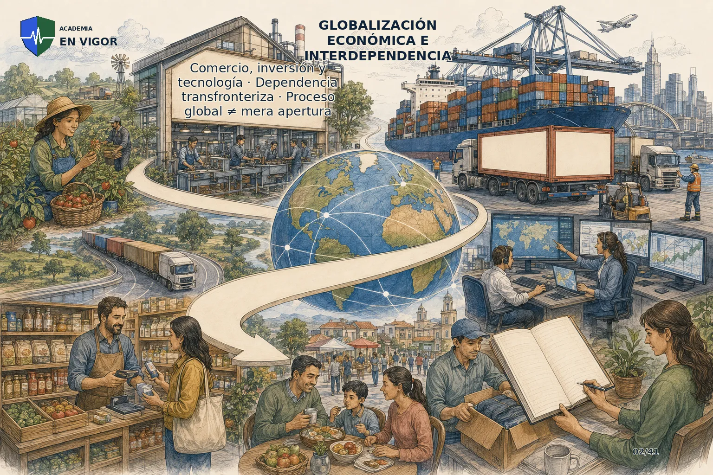

<em>Infografía: Globalización económica e interdependencia.</em>

<!-- FUENTE: ONU-GLOBAL-T28 -->

## 03. Antecedentes históricos de la integración mundial

Los intercambios a larga distancia, las migraciones, los imperios y la difusión de ideas muestran que la interconexión mundial tiene antecedentes anteriores al siglo XX.

- Los intercambios a larga distancia, las migraciones, los imperios y la difusión de ideas muestran que la interconexión mundial tiene antecedentes anteriores al siglo XX.
- La industrialización, el ferrocarril, el vapor, el telégrafo y la expansión comercial del siglo XIX aceleraron una primera gran integración económica moderna.
- Las guerras mundiales y la crisis de entreguerras interrumpieron y reordenaron flujos, demostrando que la globalización no avanza de forma lineal e irreversible.
- Tras 1945 se construyó un marco multilateral de cooperación económica que impulsó nuevas etapas de apertura e integración.

<!-- VISUAL:t28-03-antecedentes-historicos-de-la-integracion-mundial.webp -->

  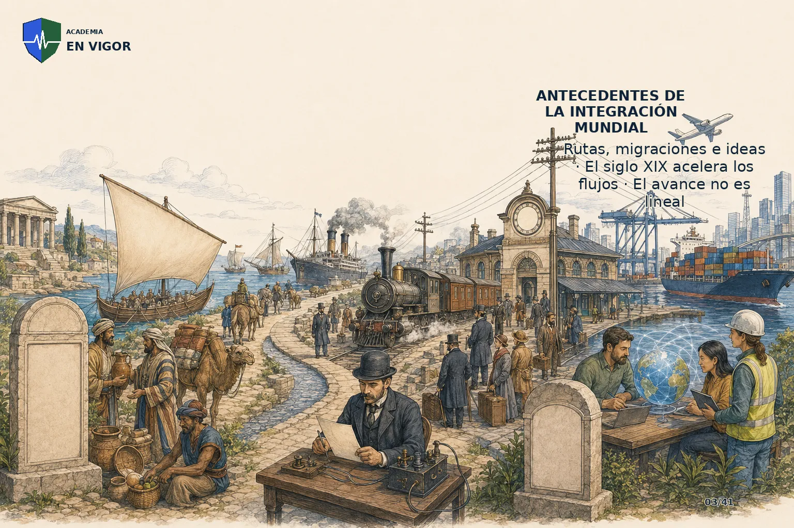

<em>Infografía: Antecedentes históricos de la integración mundial.</em>

<!-- FUENTE: WTO-HISTORY-T28 -->

## 04. GATT, Ronda Uruguay y nacimiento de la OMC

El GATT entró en vigor el 1 de enero de 1948 y proporcionó reglas para gran parte del comercio mundial hasta 1994.

- El GATT entró en vigor el 1 de enero de 1948 y proporcionó reglas para gran parte del comercio mundial hasta 1994.
- La Ronda Uruguay se desarrolló entre 1986 y 1994 y desembocó en la creación de la Organización Mundial del Comercio.
- El Acuerdo de Marrakech por el que se establece la OMC se firmó el 15 de abril de 1994 y la organización comenzó a funcionar el 1 de enero de 1995.
- La OMC amplió el marco multilateral más allá de mercancías, incorporando servicios y aspectos comerciales de la propiedad intelectual.

<!-- VISUAL:t28-04-gatt-ronda-uruguay-y-nacimiento-de-la-omc.webp -->

  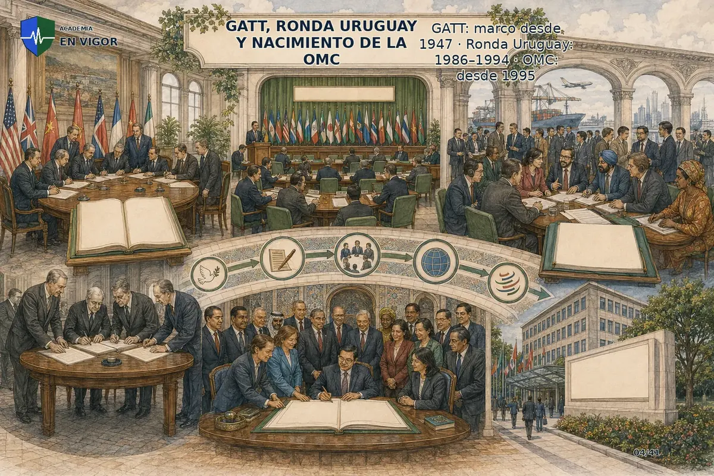

<em>Infografía: GATT, Ronda Uruguay y nacimiento de la OMC.</em>

<!-- FUENTE: WTO-HISTORY-T28 -->

## 05. Tecnología como motor de la globalización

La reducción de costes de transporte y comunicación permite coordinar actividades, intercambiar información y acceder a mercados a mayor distancia.

- La reducción de costes de transporte y comunicación permite coordinar actividades, intercambiar información y acceder a mercados a mayor distancia.
- Las tecnologías digitales aceleran la circulación de datos, servicios, capital y conocimiento, aunque su acceso y sus capacidades están distribuidos de forma desigual.
- La conectividad aumenta la velocidad de propagación tanto de innovaciones como de desinformación, fraudes, ciberamenazas y crisis.
- La tecnología facilita la integración, pero sus efectos dependen de normas, capacidades, competencia, educación e infraestructuras.

<!-- VISUAL:t28-il-05-tecnologia-como-motor-de-la-globalizacion.webp -->

  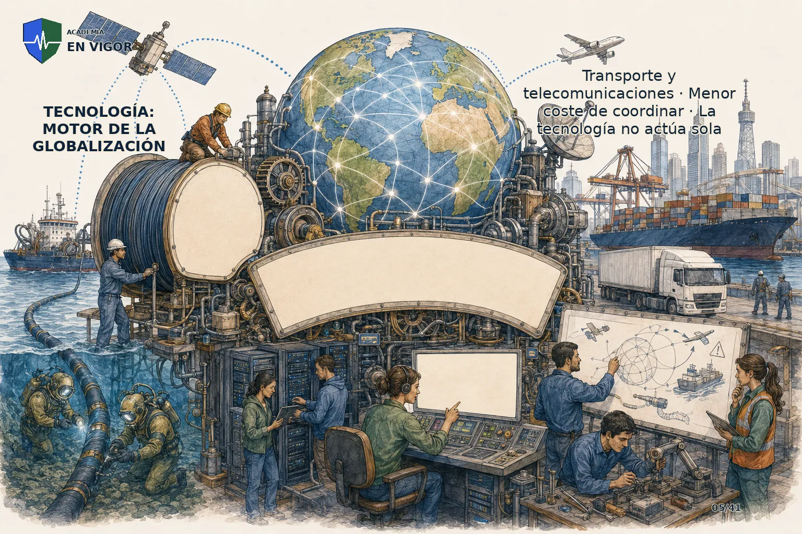

<em>Infografía: Tecnología como motor de la globalización.</em>

<!-- FUENTE: OECD-MEASURE-T28 -->

## 06. Liberalización y decisiones públicas

La liberalización comercial reduce o disciplina obstáculos al intercambio mediante decisiones nacionales, acuerdos bilaterales, regionales y multilaterales.

- La liberalización comercial reduce o disciplina obstáculos al intercambio mediante decisiones nacionales, acuerdos bilaterales, regionales y multilaterales.
- Los acuerdos de la OMC son negociados por sus miembros y establecen derechos y límites para las políticas comerciales de los gobiernos.
- Liberalizar no significa ausencia de reglas: el sistema multilateral funciona mediante reglas, compromisos, excepciones y mecanismos de solución de diferencias.
- La apertura puede aumentar oportunidades, pero requiere políticas internas de adaptación, competencia, protección social y formación.

<!-- VISUAL:t28-06-liberalizacion-y-decisiones-publicas.webp -->

  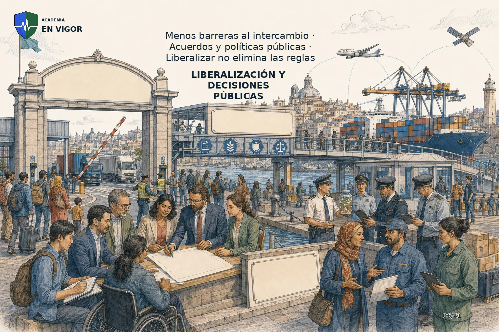

<em>Infografía: Liberalización y decisiones públicas.</em>

<!-- FUENTE: WTO-INBRIEF-T28 -->

## 07. Empresas multinacionales y cadenas globales de valor

Una empresa multinacional controla o coordina actividades en más de un país y puede organizar producción, inversión, conocimiento y distribución a escala transfronteriza.

- Una empresa multinacional controla o coordina actividades en más de un país y puede organizar producción, inversión, conocimiento y distribución a escala transfronteriza.
- Una cadena global de valor divide las fases de diseño, componentes, ensamblaje, logística, comercialización y servicios entre distintos territorios.
- La deslocalización traslada una actividad a otro territorio; la externalización encarga una actividad a otra empresa y ambas decisiones pueden coincidir o no.
- Las cadenas globales generan especialización y eficiencia, pero también dependencia de proveedores, rutas, tecnologías y decisiones concentradas.

<!-- VISUAL:t28-07-empresas-multinacionales-y-cadenas-globales-de-valor.webp -->

  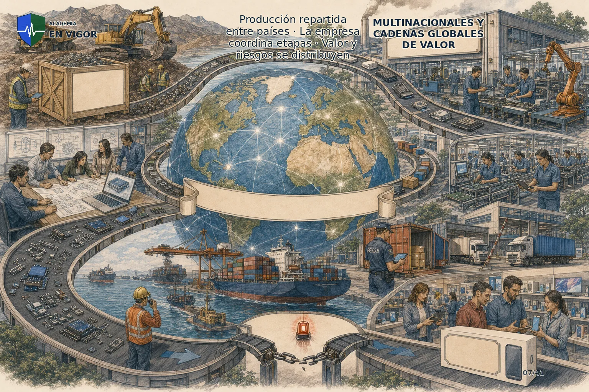

<em>Infografía: Empresas multinacionales y cadenas globales de valor.</em>

<!-- FUENTE: WB-GVC-T28 -->

## 08. Globalización financiera

La globalización financiera incrementa las operaciones, inversiones y movimientos de capital entre jurisdicciones y conecta mercados financieros nacionales.

- La globalización financiera incrementa las operaciones, inversiones y movimientos de capital entre jurisdicciones y conecta mercados financieros nacionales.
- Puede ampliar financiación y diversificar riesgos, pero también transmitir volatilidad, salidas bruscas de capital y crisis entre economías.
- La velocidad de los flujos exige supervisión financiera, transparencia, cooperación y políticas macroeconómicas capaces de gestionar vulnerabilidades.
- Integración financiera y globalización comercial son dimensiones relacionadas, pero no idénticas: una puede avanzar o retroceder a distinto ritmo.

<!-- VISUAL:t28-08-globalizacion-financiera.webp -->

  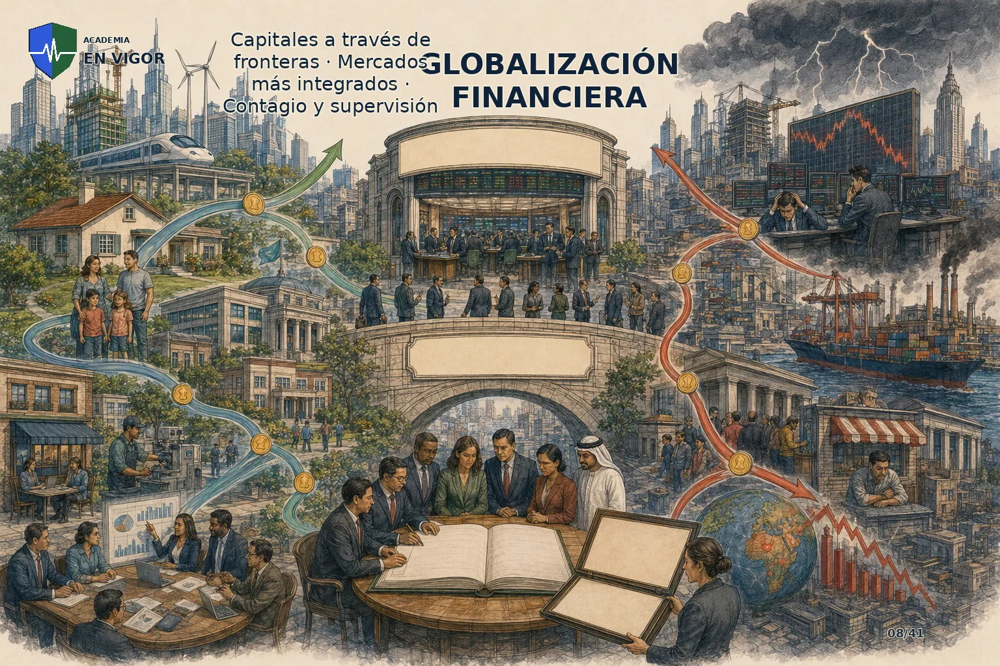

<em>Infografía: Globalización financiera.</em>

<!-- FUENTE: IMF-GLOBAL-T28 -->

## 09. Dimensiones de la globalización

La dimensión económica comprende comercio, inversión, financiación, producción y empresas que operan a través de fronteras.

- La dimensión económica comprende comercio, inversión, financiación, producción y empresas que operan a través de fronteras.
- La dimensión tecnológica e informacional comprende infraestructuras, redes, datos, conocimiento y comunicaciones de alcance mundial.
- La dimensión social y cultural incluye movilidad, estilos de vida, identidades, consumo, medios y contactos entre grupos.
- La dimensión política, jurídica y ambiental aparece cuando decisiones y problemas requieren reglas, cooperación o respuestas transnacionales.

<!-- VISUAL:t28-09-dimensiones-de-la-globalizacion.webp -->

  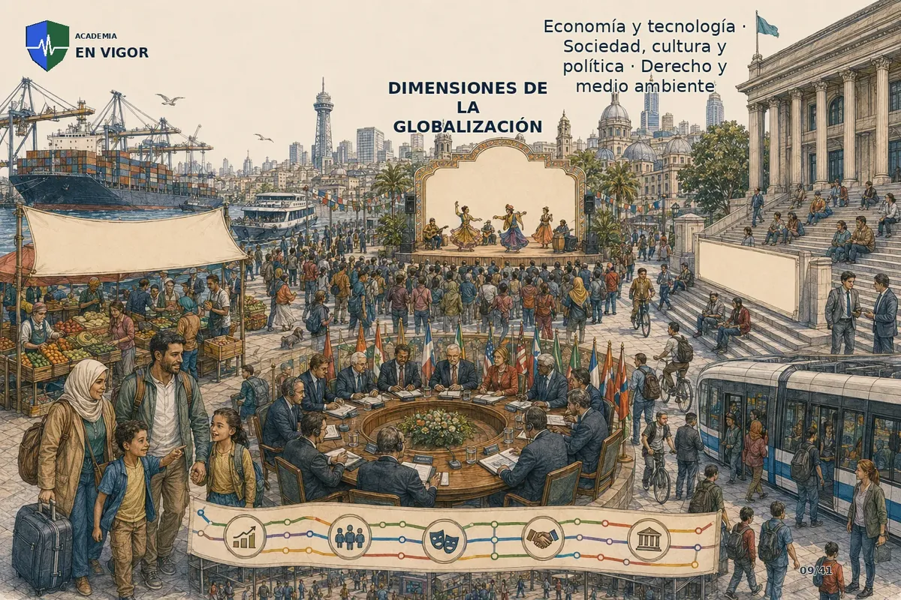

<em>Infografía: Dimensiones de la globalización.</em>

<!-- FUENTE: OECD-MEASURE-T28 -->

## 10. Rasgos estructurales: alcance, intensidad y velocidad

El alcance expresa cuántos territorios y ámbitos conecta un proceso; la intensidad indica la densidad de esas relaciones.

- El alcance expresa cuántos territorios y ámbitos conecta un proceso; la intensidad indica la densidad de esas relaciones.
- La velocidad aumenta cuando transporte, digitalización y mercados reducen el tiempo entre una decisión local y su efecto exterior.
- La simultaneidad permite coordinar actividades en tiempo real, pero no suprime distancias físicas, fronteras ni diferencias horarias.
- La desigualdad de conexión explica que personas y territorios participen de manera distinta y soporten costes y beneficios desiguales.

<!-- VISUAL:t28-10-rasgos-estructurales-alcance-intensidad-y-velocidad.webp -->

  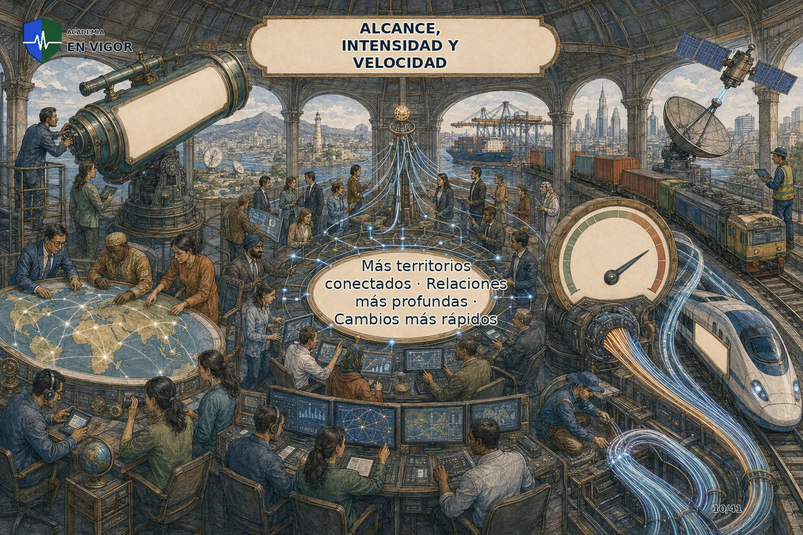

<em>Infografía: Rasgos estructurales: alcance, intensidad y velocidad.</em>

<!-- FUENTE: ONU-GLOBAL-T28 -->

## 11. Homogeneización, hibridación y diversidad

La difusión mundial de productos, marcas, formatos y prácticas puede favorecer cierta homogeneización de consumos y referencias.

- La difusión mundial de productos, marcas, formatos y prácticas puede favorecer cierta homogeneización de consumos y referencias.
- La hibridación cultural combina elementos de distintos orígenes y produce expresiones nuevas, en vez de limitarse a copiar una cultura dominante.
- La circulación de ideas puede enriquecer la diversidad, mientras los desequilibrios de poder y acceso pueden amenazar expresiones minoritarias.
- Los bienes y servicios culturales transmiten identidades, valores y significados, por lo que no poseen únicamente valor comercial.

<!-- VISUAL:t28-il-11-homogeneizacion-hibridacion-y-diversidad.webp -->

  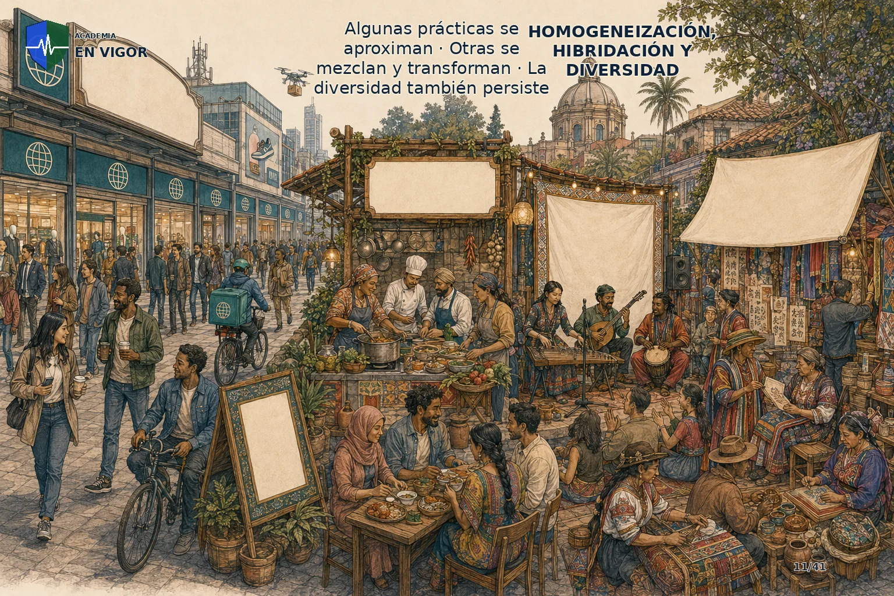

<em>Infografía: Homogeneización, hibridación y diversidad.</em>

<!-- FUENTE: UNESCO-DIVERSITY-T28 -->

## 12. Glocalización

Glocalización expresa la interacción entre dinámicas globales y respuestas, adaptaciones o creaciones locales.

- Glocalización expresa la interacción entre dinámicas globales y respuestas, adaptaciones o creaciones locales.
- El concepto evita presentar lo global y lo local como fuerzas necesariamente excluyentes: pueden transformarse mutuamente.
- Roland Robertson difundió el término en la teoría social de la globalización y se asocia a la fórmula didáctica de pensar globalmente y actuar localmente.
- Adaptar un producto mundial a preferencias locales es un ejemplo comercial, pero la glocalización también tiene usos sociales, culturales y políticos.

<!-- VISUAL:t28-il-12-glocalizacion.webp -->

  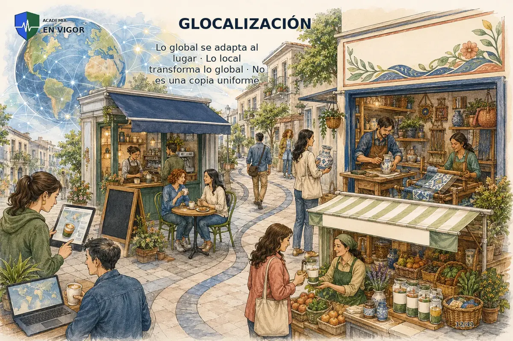

<em>Infografía: Glocalización.</em>

<!-- FUENTE: OECD-GLOCAL-T28 -->

## 13. Aldea global y medios de comunicación

Marshall McLuhan introdujo expresiones como aldea global para describir el efecto social de los medios electrónicos que conectan acontecimientos y públicos distantes.

- Marshall McLuhan introdujo expresiones como aldea global para describir el efecto social de los medios electrónicos que conectan acontecimientos y públicos distantes.
- La aldea global alude a proximidad comunicativa, no a la desaparición física del planeta, los Estados o las culturas.
- La comunicación inmediata puede ampliar conocimiento y participación, pero también concentrar agendas, acelerar rumores y generar sobrecarga informativa.
- La frase el medio es el mensaje destaca que la forma tecnológica de comunicación transforma relaciones y percepciones, además del contenido transmitido.

<!-- VISUAL:t28-il-13-aldea-global-y-medios-de-comunicacion.webp -->

  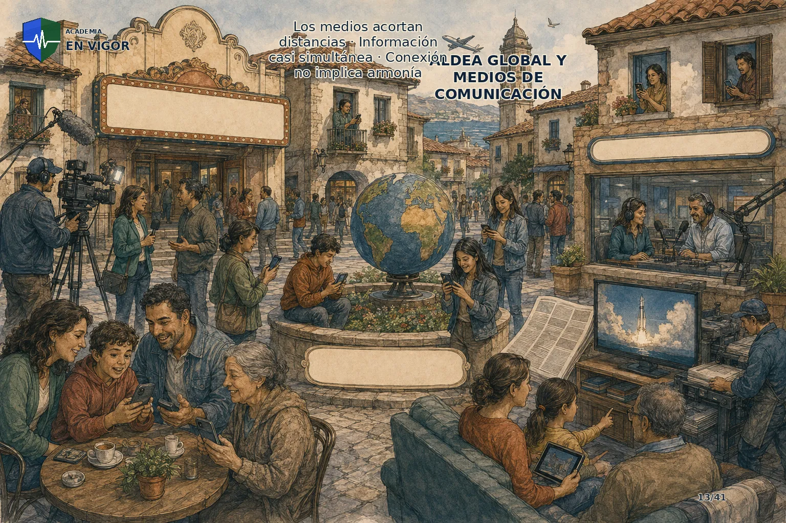

<em>Infografía: Aldea global y medios de comunicación.</em>

<!-- FUENTE: UNESCO-MCLUHAN-T28 -->

## 14. Sociedad red

La sociedad red organiza actividades y relaciones mediante redes de información y comunicación que conectan nodos a distintas escalas.

- La sociedad red organiza actividades y relaciones mediante redes de información y comunicación que conectan nodos a distintas escalas.
- Manuel Castells desarrolló ampliamente el análisis de la sociedad red en su estudio de la era de la información.
- Un nodo puede ser una persona, organización, ciudad o infraestructura; su posición y capacidad de conexión condicionan su influencia.
- La exclusión digital no es solo carecer de internet: también incluye falta de dispositivos, competencias, accesibilidad, seguridad y uso significativo.

<!-- VISUAL:t28-14-sociedad-red.webp -->

  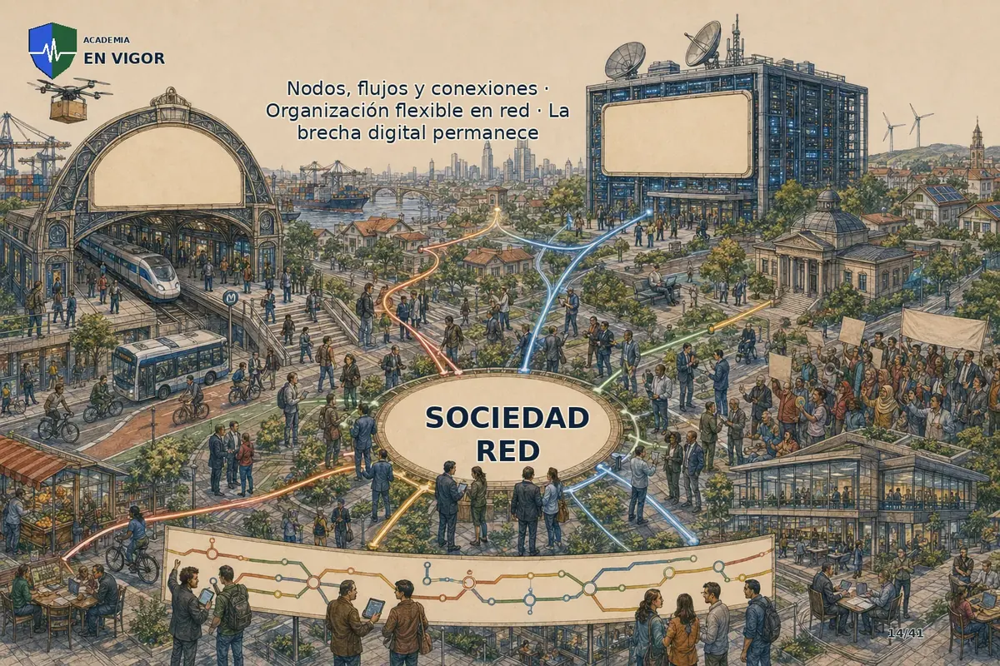

<em>Infografía: Sociedad red.</em>

<!-- FUENTE: UNESCO-DIGITAL-T28 -->

## 15. Ciudad global

Saskia Sassen se asocia al concepto de ciudad global y al análisis de Nueva York, Londres y Tokio como nodos estratégicos de la economía mundial.

- Saskia Sassen se asocia al concepto de ciudad global y al análisis de Nueva York, Londres y Tokio como nodos estratégicos de la economía mundial.
- Una ciudad global concentra funciones de dirección, finanzas, servicios avanzados, información y conexiones transnacionales.
- La relevancia global no depende solo del tamaño demográfico: importa la función que la ciudad cumple dentro de redes mundiales.
- La concentración de riqueza y servicios avanzados puede coexistir con desigualdad, segmentación laboral y expulsión residencial.

<!-- VISUAL:t28-15-ciudad-global.webp -->

  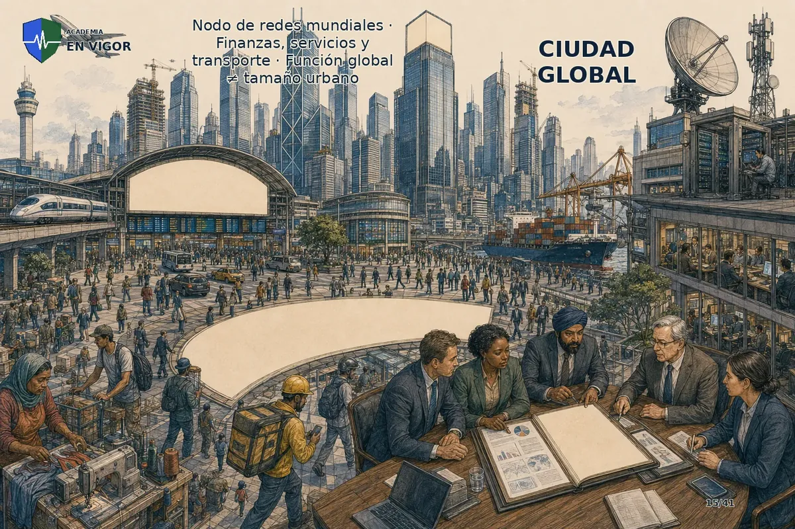

<em>Infografía: Ciudad global.</em>

<!-- FUENTE: UN-GLOBAL-CITY-T28 -->

## 16. Actores e instituciones de la globalización

Los Estados siguen siendo actores centrales porque negocian tratados, regulan mercados, protegen derechos y participan en organizaciones internacionales.

- Los Estados siguen siendo actores centrales porque negocian tratados, regulan mercados, protegen derechos y participan en organizaciones internacionales.
- Las organizaciones económicas internacionales tienen mandatos distintos: la OMC regula comercio; el FMI cooperación monetaria y estabilidad; el Banco Mundial financiación y conocimiento para el desarrollo.
- Empresas multinacionales, inversores, medios, plataformas y organizaciones de la sociedad civil también influyen en flujos y agendas globales.
- Ningún actor controla por sí solo la globalización: el resultado surge de relaciones de poder, reglas, tecnología, mercados y acción colectiva.

<!-- VISUAL:t28-16-actores-e-instituciones-de-la-globalizacion.webp -->

  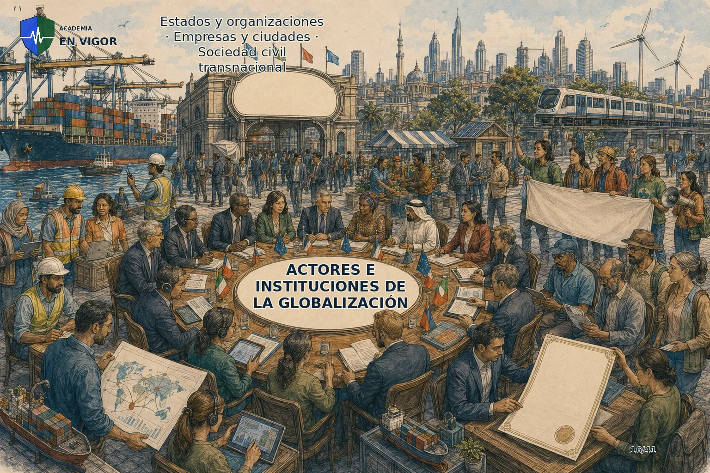

<em>Infografía: Actores e instituciones de la globalización.</em>

<!-- FUENTE: WTO-INBRIEF-T28 -->

## 17. FMI, Banco Mundial y OMC: diferencias

El Fondo Monetario Internacional promueve cooperación monetaria, estabilidad financiera y apoyo a sus miembros mediante supervisión, asistencia y financiación.

- El Fondo Monetario Internacional promueve cooperación monetaria, estabilidad financiera y apoyo a sus miembros mediante supervisión, asistencia y financiación.
- El Grupo Banco Mundial se centra en desarrollo, reducción de pobreza, financiación de proyectos, reformas y conocimiento aplicado.
- La Organización Mundial del Comercio administra acuerdos comerciales, sirve de foro negociador y encauza diferencias entre sus miembros.
- Las tres instituciones influyen en la economía global, pero no comparten órgano, tratado fundacional, financiación ni competencias.

<!-- VISUAL:t28-17-fmi-banco-mundial-y-omc-diferencias.webp -->

  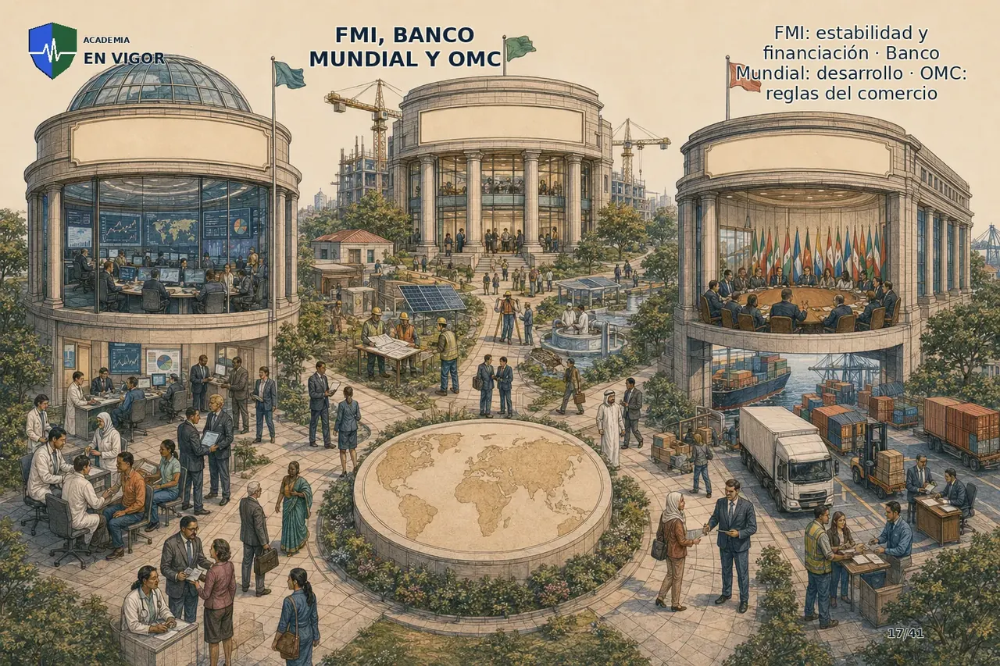

<em>Infografía: FMI, Banco Mundial y OMC: diferencias.</em>

<!-- FUENTE: IMF-ATGLANCE-T28 -->

## 18. Consecuencias económicas: crecimiento y especialización

La integración comercial puede ampliar mercados, favorecer especialización, difundir tecnología y elevar productividad cuando existen capacidades e instituciones adecuadas.

- La integración comercial puede ampliar mercados, favorecer especialización, difundir tecnología y elevar productividad cuando existen capacidades e instituciones adecuadas.
- El crecimiento agregado no prueba que todos los sectores, territorios y trabajadores ganen en la misma medida o al mismo tiempo.
- La reasignación productiva crea oportunidades y también costes de ajuste para actividades expuestas a nueva competencia o cambios tecnológicos.
- Formación, movilidad, competencia, innovación y protección social condicionan cómo se reparten los beneficios y los costes de la apertura.

<!-- VISUAL PENDIENTE: t28-18-consecuencias-economicas-crecimiento-y-especializaci.webp -->

<!-- FUENTE: WB-TRADE-T28 -->

## 19. Desigualdad, pobreza y distribución

La globalización puede contribuir al crecimiento y a reducir pobreza, pero sus resultados dependen de gobernanza, instituciones y políticas nacionales e internacionales.

- La globalización puede contribuir al crecimiento y a reducir pobreza, pero sus resultados dependen de gobernanza, instituciones y políticas nacionales e internacionales.
- La desigualdad entre países y la desigualdad dentro de cada país son indicadores diferentes y pueden evolucionar en sentidos distintos.
- La OIT sostiene que una globalización justa debe ampliar oportunidades, trabajo decente, protección social, derechos y participación.
- Atribuir toda pobreza o toda mejora a la globalización ignora factores como conflicto, educación, salud, instituciones, tecnología y distribución interna.

<!-- VISUAL:t28-19-desigualdad-pobreza-y-distribucion.webp -->

  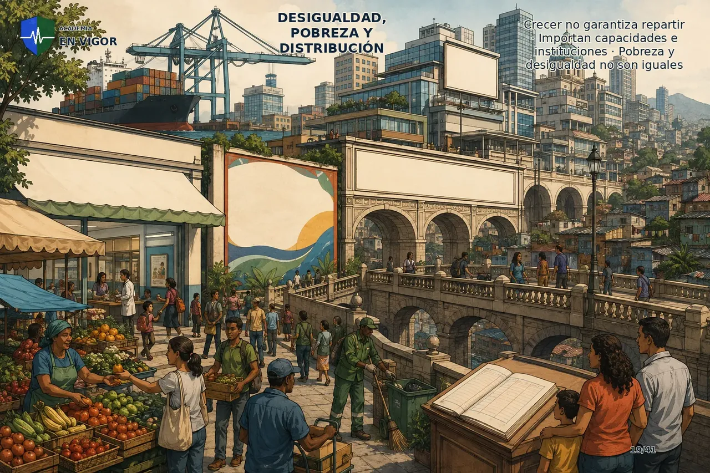

<em>Infografía: Desigualdad, pobreza y distribución.</em>

<!-- FUENTE: ILO-FAIR-T28 -->

## 20. Empleo, deslocalización y trabajo decente

La competencia y la reorganización productiva pueden crear empleo en unos sectores y destruirlo o transformarlo en otros.

- La competencia y la reorganización productiva pueden crear empleo en unos sectores y destruirlo o transformarlo en otros.
- La deslocalización busca combinar costes, capacidades, mercados, fiscalidad, infraestructuras, estabilidad y acceso a proveedores; no responde a una única causa.
- Sin normas y vigilancia adecuadas, la presión competitiva puede favorecer precariedad, explotación o deterioro de derechos laborales.
- El trabajo decente integra empleo productivo, derechos, protección social y diálogo social, no únicamente disponer de cualquier puesto.

<!-- VISUAL:t28-il-20-empleo-deslocalizacion-y-trabajo-decente.webp -->

  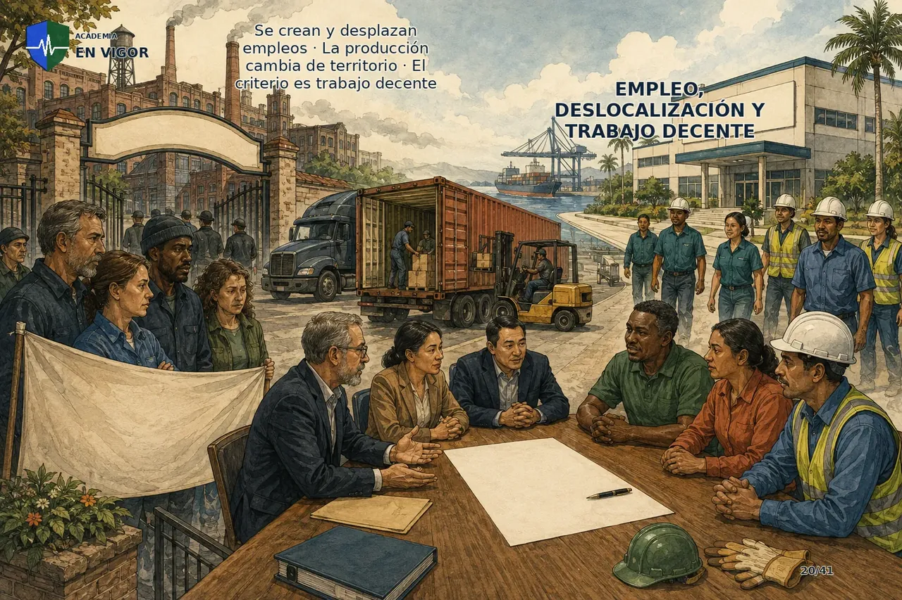

<em>Infografía: Empleo, deslocalización y trabajo decente.</em>

<!-- FUENTE: ILO-FAIR-T28 -->

## 21. Soberanía, gobernanza y poder transnacional

La soberanía estatal no desaparece, pero se ejerce en un entorno donde problemas y actores atraviesan fronteras.

- La soberanía estatal no desaparece, pero se ejerce en un entorno donde problemas y actores atraviesan fronteras.
- La gobernanza global comprende reglas, instituciones y procesos de coordinación sin exigir la existencia de un gobierno mundial único.
- Los tratados limitan y habilitan a la vez: crean compromisos, pero también cooperación, previsibilidad y capacidad de afrontar problemas comunes.
- El déficit de gobernanza aparece cuando los efectos transnacionales avanzan más rápido que la rendición de cuentas, la regulación o la participación.

<!-- VISUAL:t28-21-soberania-gobernanza-y-poder-transnacional.webp -->

  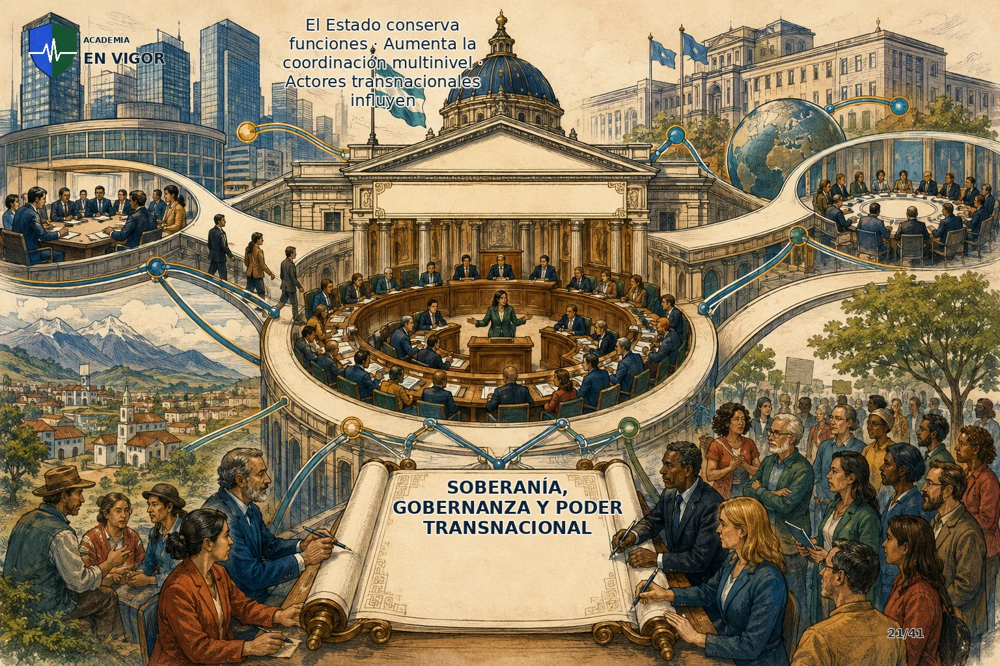

<em>Infografía: Soberanía, gobernanza y poder transnacional.</em>

<!-- FUENTE: ONU-GLOBAL-T28 -->

## 22. Consecuencias sociales: movilidad, identidades y cohesión

La dimensión social incluye empleo, salud, educación, seguridad económica, participación y experiencia cotidiana de la integración mundial.

- La dimensión social incluye empleo, salud, educación, seguridad económica, participación y experiencia cotidiana de la integración mundial.
- Movilidad y comunicación amplían contactos y pertenencias múltiples, pero también pueden generar desarraigo, ansiedad identitaria o conflictos distributivos.
- La cohesión social se debilita cuando los costes se concentran y las instituciones no ofrecen protección, voz ni oportunidades creíbles.
- Políticas inclusivas, servicios públicos y diálogo social pueden convertir interdependencia en cooperación en lugar de polarización.

<!-- VISUAL PENDIENTE: t28-22-consecuencias-sociales-movilidad-identidades-y-cohes.webp -->

<!-- FUENTE: ILO-FAIR-T28 -->

## 23. Consecuencias culturales y diversidad

La globalización y las TIC crean condiciones inéditas para el intercambio cultural, pero también riesgos de desequilibrio y pérdida de expresiones vulnerables.

- La globalización y las TIC crean condiciones inéditas para el intercambio cultural, pero también riesgos de desequilibrio y pérdida de expresiones vulnerables.
- La diversidad cultural es fuente de intercambio, innovación y creatividad y la UNESCO la considera patrimonio común de la humanidad.
- El pluralismo cultural exige interacción armoniosa, inclusión y participación de personas y grupos con identidades diversas.
- Proteger diversidad no significa congelar culturas: las culturas cambian, intercambian y se recrean.

<!-- VISUAL:t28-il-23-consecuencias-culturales-y-diversidad.webp -->

  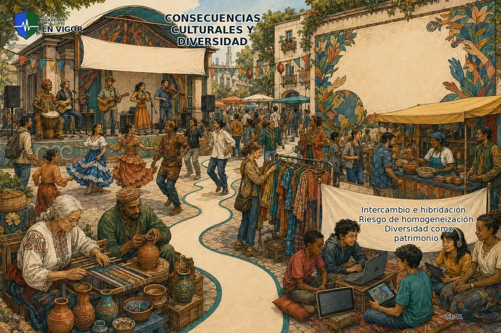

<em>Infografía: Consecuencias culturales y diversidad.</em>

<!-- FUENTE: UNESCO-DIVERSITY-T28 -->

## 24. Consecuencias ambientales

Producción, transporte y consumo globales pueden aumentar extracción de recursos, emisiones, residuos y presión sobre ecosistemas.

- Producción, transporte y consumo globales pueden aumentar extracción de recursos, emisiones, residuos y presión sobre ecosistemas.
- La difusión tecnológica y la cooperación también pueden acelerar energías limpias, eficiencia, financiación y estándares ambientales.
- Los daños ambientales cruzan fronteras mediante clima, aire, agua, biodiversidad y cadenas de suministro, por lo que requieren coordinación.
- El efecto ambiental neto depende de escala de actividad, composición productiva, tecnología, regulación y hábitos de consumo.

<!-- VISUAL:t28-24-consecuencias-ambientales.webp -->

  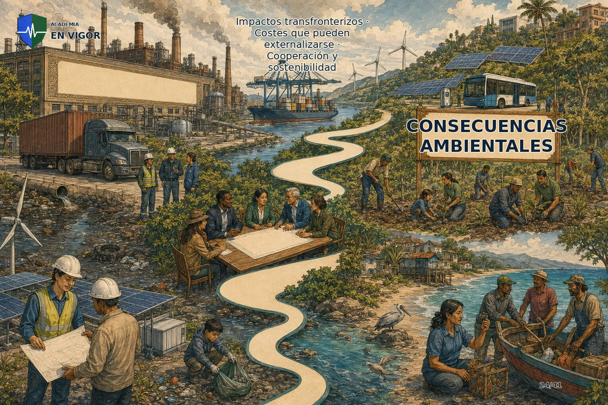

<em>Infografía: Consecuencias ambientales.</em>

<!-- FUENTE: UN-ENV-GLOBAL-T28 -->

## 25. Riesgos sistémicos, resiliencia y fragmentación

Una red muy interconectada transmite con rapidez perturbaciones financieras, sanitarias, energéticas, logísticas, digitales o geopolíticas.

- Una red muy interconectada transmite con rapidez perturbaciones financieras, sanitarias, energéticas, logísticas, digitales o geopolíticas.
- Resiliencia es la capacidad de anticipar, absorber, adaptarse y recuperarse sin confundirla con autosuficiencia total.
- Diversificar proveedores, rutas, tecnologías y reservas reduce ciertas dependencias, aunque puede elevar costes y complejidad.
- La fragmentación económica puede disminuir algunos riesgos de dependencia y crear otros por duplicación, menor cooperación y pérdida de eficiencia.

<!-- VISUAL:t28-25-riesgos-sistemicos-resiliencia-y-fragmentacion.webp -->

  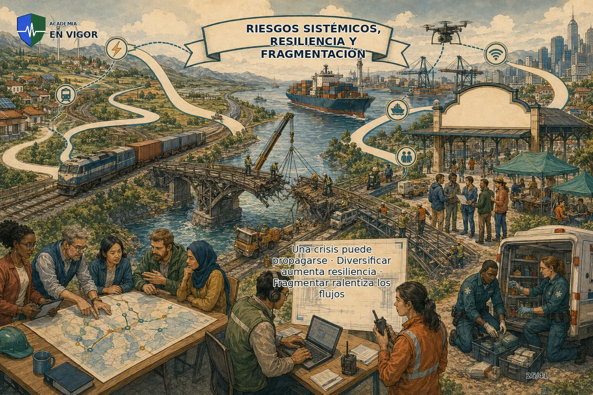

<em>Infografía: Riesgos sistémicos, resiliencia y fragmentación.</em>

<!-- FUENTE: IMF-GLOBAL-2024-T28 -->

## 26. Reacciones culturales: etnocentrismo

El etnocentrismo interpreta otras culturas usando la propia como centro y patrón de valoración.

- El etnocentrismo interpreta otras culturas usando la propia como centro y patrón de valoración.
- Puede reforzar pertenencia interna, pero se convierte en barrera cuando presupone superioridad y bloquea la comprensión de otros contextos.
- Etnocentrismo no es sinónimo de toda identidad cultural: una identidad fuerte puede convivir con respeto y autocrítica.
- Su radicalización favorece estereotipos, discriminación, xenofobia y chovinismo.

<!-- VISUAL:t28-26-reacciones-culturales-etnocentrismo.webp -->

  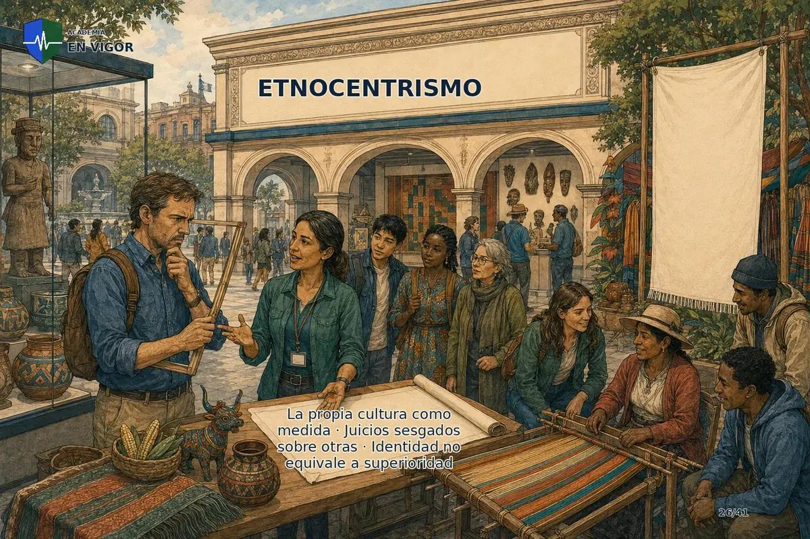

<em>Infografía: Reacciones culturales: etnocentrismo.</em>

<!-- FUENTE: UNESCO-DIVERSITY-T28 -->

## 27. Relativismo cultural y sus límites

El relativismo cultural propone comprender prácticas y valores dentro del contexto cultural en que adquieren significado.

- El relativismo cultural propone comprender prácticas y valores dentro del contexto cultural en que adquieren significado.
- Como método, ayuda a suspender prejuicios y evita juzgar automáticamente con categorías propias.
- Llevado a un extremo normativo, puede impedir criticar prácticas que vulneran dignidad, igualdad o derechos humanos.
- La diversidad cultural no puede invocarse para vulnerar derechos humanos ni limitar su alcance universal.

<!-- VISUAL:t28-27-relativismo-cultural-y-sus-limites.webp -->

  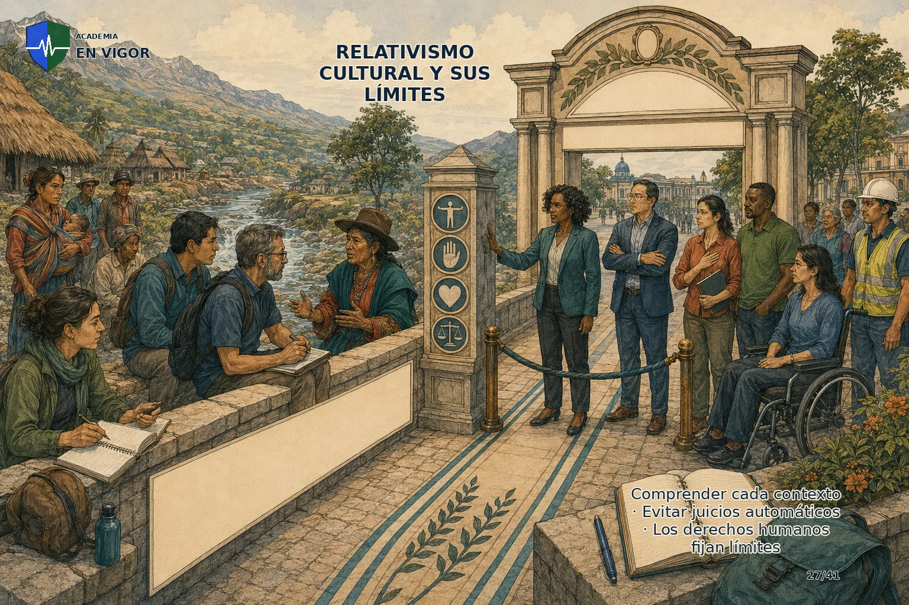

<em>Infografía: Relativismo cultural y sus límites.</em>

<!-- FUENTE: UNESCO-DIVERSITY-T28 -->

## 28. Xenocentrismo y desarraigo

El xenocentrismo valora sistemáticamente lo extranjero como superior y desprecia o infravalora la cultura propia.

- El xenocentrismo valora sistemáticamente lo extranjero como superior y desprecia o infravalora la cultura propia.
- Se diferencia de la apertura cultural porque esta permite aprender sin asumir una inferioridad automática de origen.
- Puede favorecer imitación acrítica, pérdida de autoestima colectiva o desarraigo, aunque adoptar elementos externos no es por sí mismo xenocentrismo.
- La reacción opuesta al etnocentrismo no garantiza una evaluación más rigurosa si sustituye un prejuicio por otro.

<!-- VISUAL:t28-il-28-xenocentrismo-y-desarraigo.webp -->

  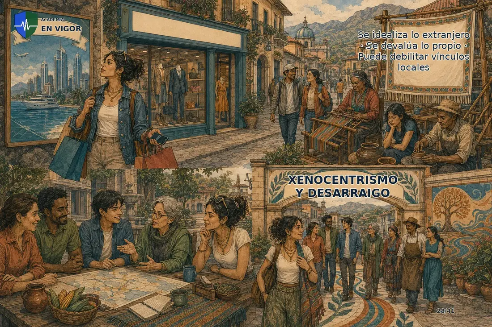

<em>Infografía: Xenocentrismo y desarraigo.</em>

<!-- FUENTE: UNESCO-DIVERSITY-T28 -->

## 29. Interculturalismo

El interculturalismo promueve encuentro, comunicación y diálogo entre culturas en condiciones de igualdad y respeto.

- El interculturalismo promueve encuentro, comunicación y diálogo entre culturas en condiciones de igualdad y respeto.
- No se limita a coexistencia separada: busca interacción, aprendizaje recíproco y participación común.
- Requiere combatir discriminación y corregir desigualdades que impiden un diálogo materialmente equilibrado.
- Su límite es el respeto a dignidad y derechos humanos; tolerancia no obliga a aceptar prácticas lesivas.

<!-- VISUAL:t28-29-interculturalismo.webp -->

  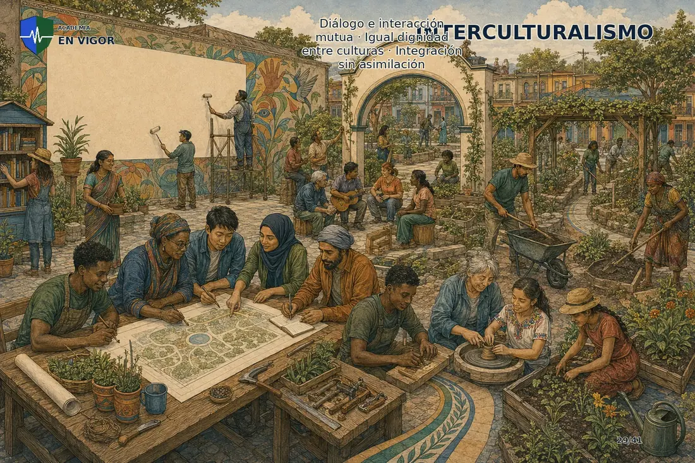

<em>Infografía: Interculturalismo.</em>

<!-- FUENTE: UNESCO-DIVERSITY-T28 -->

## 30. Universalismo cultural y derechos humanos

El universalismo sostiene que ciertos principios de dignidad y derechos corresponden a toda persona con independencia de su cultura.

- El universalismo sostiene que ciertos principios de dignidad y derechos corresponden a toda persona con independencia de su cultura.
- No exige que todas las culturas sean idénticas ni que una imponga sus costumbres particulares como universales.
- La diversidad cultural es compatible con un núcleo de derechos humanos que limita prácticas discriminatorias o lesivas.
- El reto consiste en aplicar universales mediante diálogo, igualdad y participación, evitando tanto imposición cultural como relativismo extremo.

<!-- VISUAL:t28-30-universalismo-cultural-y-derechos-humanos.webp -->

  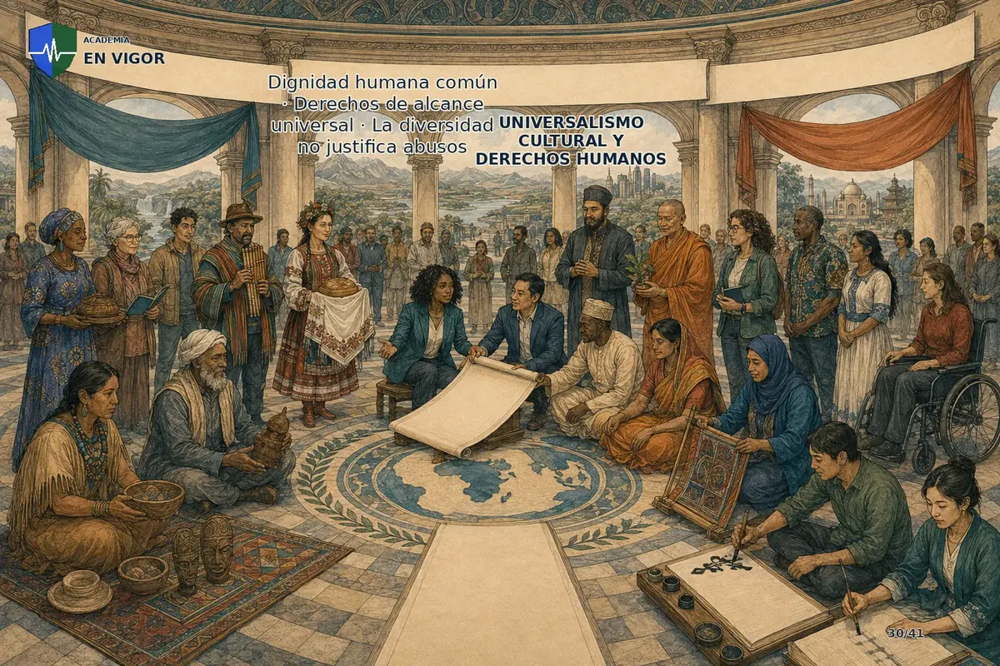

<em>Infografía: Universalismo cultural y derechos humanos.</em>

<!-- FUENTE: UNESCO-DECLARATION-T28 -->

## 31. Localismo, nacionalismo y cierre identitario

La percepción de pérdida de control puede alimentar demandas de relocalización, proteccionismo, soberanía o recuperación de identidades nacionales y locales.

- La percepción de pérdida de control puede alimentar demandas de relocalización, proteccionismo, soberanía o recuperación de identidades nacionales y locales.
- El localismo puede proteger proximidad y resiliencia, pero se vuelve excluyente cuando convierte al exterior o a minorías en amenaza esencial.
- El proteccionismo utiliza barreras para defender objetivos internos; sus efectos dependen del instrumento, duración, respuesta externa y estructura productiva.
- No toda crítica a la globalización es xenófoba ni toda cooperación internacional elimina la identidad nacional.

<!-- VISUAL:t28-31-localismo-nacionalismo-y-cierre-identitario.webp -->

  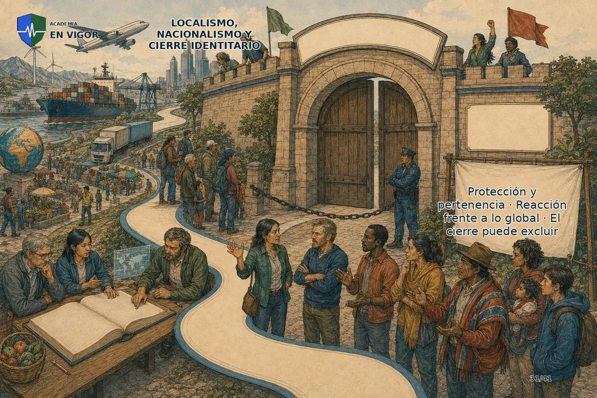

<em>Infografía: Localismo, nacionalismo y cierre identitario.</em>

<!-- FUENTE: ONU-GLOBAL-T28 -->

## 32. Antiglobalización y altermundismo: concepto

Movimiento antiglobalización es una etiqueta amplia para redes y organizaciones críticas con la globalización neoliberal, el poder corporativo y déficits sociales, democráticos o ambientales.

- Movimiento antiglobalización es una etiqueta amplia para redes y organizaciones críticas con la globalización neoliberal, el poder corporativo y déficits sociales, democráticos o ambientales.
- Altermundismo subraya que muchas de esas redes no rechazan toda conexión mundial, sino que proponen otra globalización más justa, democrática, social y sostenible.
- El movimiento es plural y descentralizado: incluye sindicatos, ONG, ecologistas, feministas, campesinado, colectivos indígenas, redes religiosas y grupos de acción directa.
- Su heterogeneidad impide atribuir a todas las organizaciones una ideología, estructura, táctica o programa único.

<!-- VISUAL:t28-il-32-antiglobalizacion-y-altermundismo-concepto.webp -->

  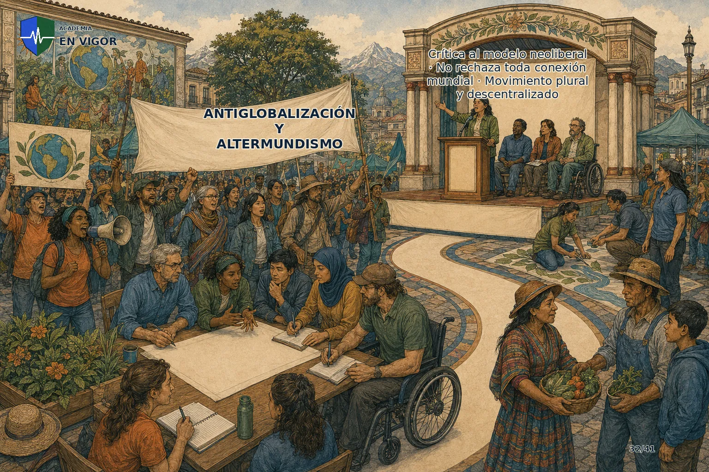

<em>Infografía: Antiglobalización y altermundismo: concepto.</em>

<!-- FUENTE: ILO-FAIR-T28 -->

## 33. Objetivos y críticas del movimiento

Entre sus críticas aparecen desigualdad, deuda, especulación, poder corporativo, precariedad laboral, deterioro ambiental y falta de control democrático.

- Entre sus críticas aparecen desigualdad, deuda, especulación, poder corporativo, precariedad laboral, deterioro ambiental y falta de control democrático.
- Entre sus objetivos figuran justicia social, derechos laborales, comercio equitativo, sostenibilidad, democracia participativa y protección de bienes comunes.
- Las prioridades varían entre organizaciones y campañas, por lo que no existe un catálogo cerrado aceptado por todo el movimiento.
- La obra No Logo, de Naomi Klein, se convirtió en una referencia simbólica de la crítica al poder de las marcas y corporaciones globales.

<!-- VISUAL:t28-33-objetivos-y-criticas-del-movimiento.webp -->

  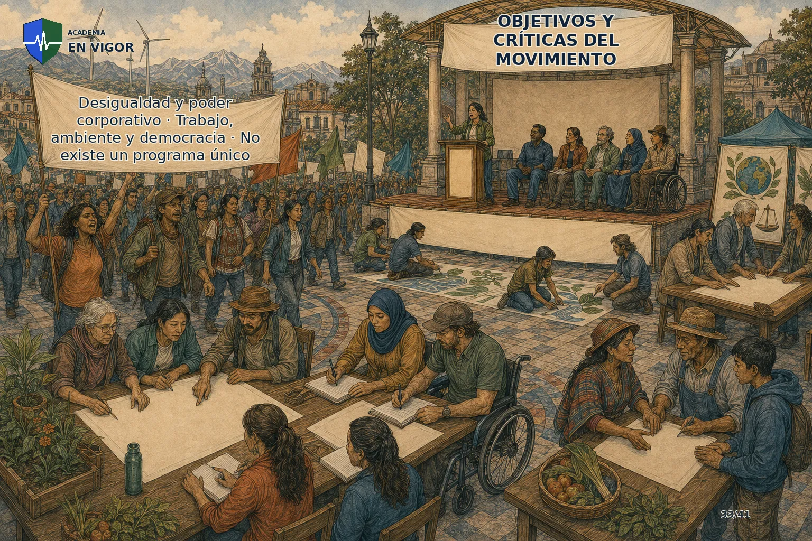

<em>Infografía: Objetivos y críticas del movimiento.</em>

<!-- FUENTE: WSF-CHARTER-T28 -->

## 34. Historia: antecedentes y movilizaciones de 1998

A finales de la década de 1990 confluyeron campañas contra acuerdos de inversión, deuda, liberalización financiera y poder de instituciones económicas internacionales.

- A finales de la década de 1990 confluyeron campañas contra acuerdos de inversión, deuda, liberalización financiera y poder de instituciones económicas internacionales.
- La oposición al proyecto de Acuerdo Multilateral de Inversiones negociado en la OCDE fue uno de los antecedentes de movilización transnacional de 1998.
- ATTAC nació en Francia en 1998 a partir del debate sobre gravar transacciones financieras y ampliar control democrático sobre las finanzas.
- La Acción Global de los Pueblos articuló desde 1998 una coordinación descentralizada de movimientos y jornadas de acción global.

<!-- VISUAL:t28-34-historia-antecedentes-y-movilizaciones-de-1998.webp -->

  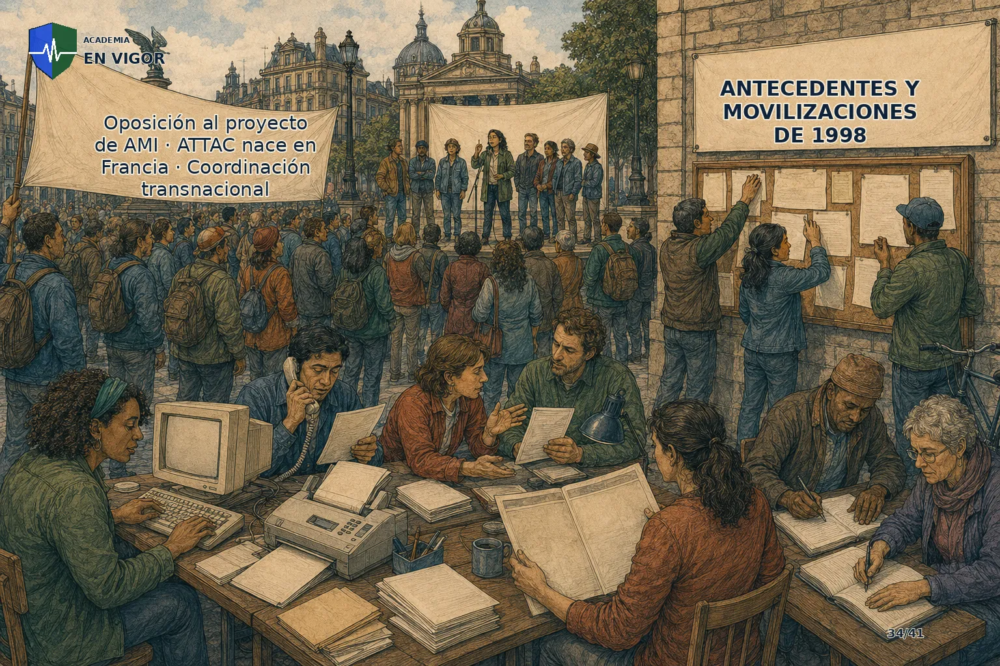

<em>Infografía: Historia: antecedentes y movilizaciones de 1998.</em>

<!-- FUENTE: ATTAC-ES-T28 -->

## 35. La batalla de Seattle de 1999

Las protestas contra la Conferencia Ministerial de la OMC celebrada en Seattle en 1999 se conocen como batalla de Seattle.

- Las protestas contra la Conferencia Ministerial de la OMC celebrada en Seattle en 1999 se conocen como batalla de Seattle.
- Confluyeron sindicatos, ecologistas, organizaciones sociales, estudiantes y redes internacionales con objetivos no siempre idénticos.
- Seattle adquirió valor simbólico por su visibilidad mediática y por mostrar coordinación transnacional contra la llamada Ronda del Milenio.
- Considerarla acto fundacional es una convención histórica sobre visibilidad del movimiento, no la negación de antecedentes anteriores.

<!-- VISUAL:t28-il-35-la-batalla-de-seattle-de-1999.webp -->

  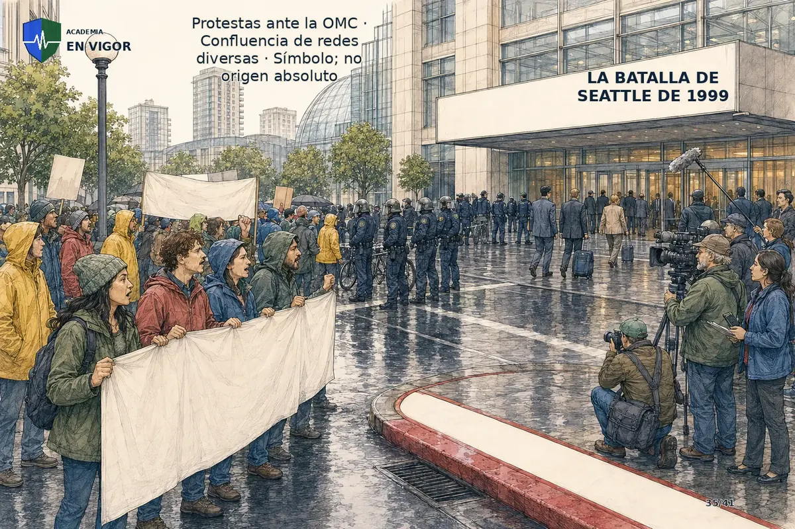

<em>Infografía: La batalla de Seattle de 1999.</em>

<!-- FUENTE: WTO-SEATTLE-T28 -->

## 36. Organizaciones y redes: ATTAC

ATTAC es una asociación vinculada históricamente a la propuesta de gravar transacciones financieras y a la acción ciudadana frente al poder financiero.

- ATTAC es una asociación vinculada históricamente a la propuesta de gravar transacciones financieras y a la acción ciudadana frente al poder financiero.
- Ignacio Ramonet impulsó en 1997 la propuesta pública que condujo a la creación de ATTAC en Francia en 1998.
- ATTAC España declara utilizar estudio, investigación, formación ciudadana, presión política, movilización y acciones legales.
- ATTAC no representa a todo el movimiento altermundista y su estrategia institucional y educativa difiere de redes de acción directa.

<!-- VISUAL:t28-36-organizaciones-y-redes-attac.webp -->

  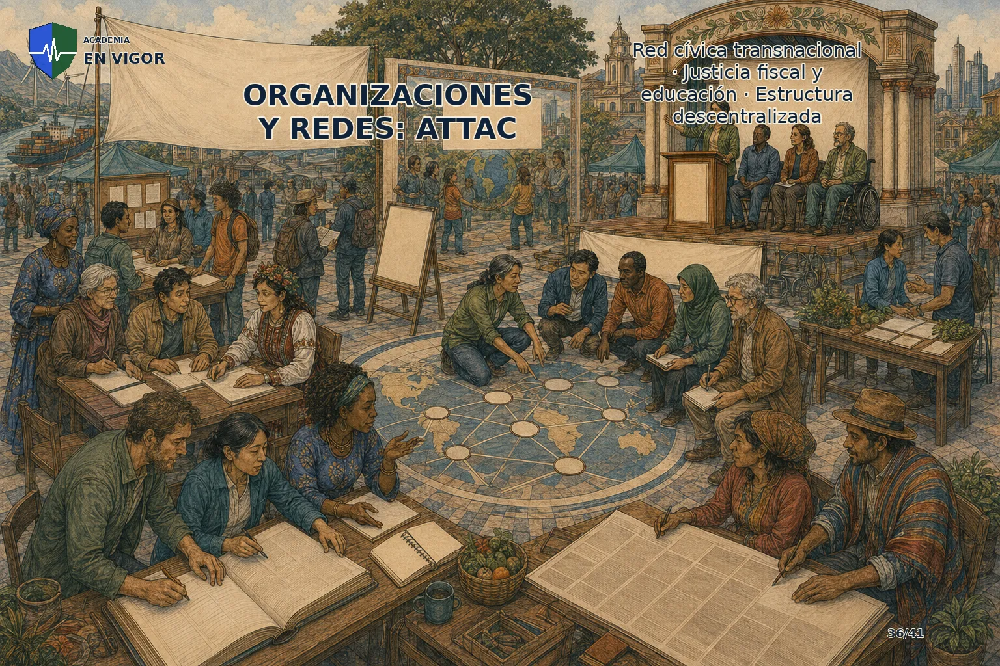

<em>Infografía: Organizaciones y redes: ATTAC.</em>

<!-- FUENTE: ATTAC-ES-T28 -->

## 37. Propuestas: tasa sobre transacciones financieras

James Tobin propuso en 1972 un gravamen reducido sobre determinadas operaciones cambiarias para limitar movimientos especulativos de muy corto plazo.

- James Tobin propuso en 1972 un gravamen reducido sobre determinadas operaciones cambiarias para limitar movimientos especulativos de muy corto plazo.
- El movimiento altermundista amplió la idea hacia una tributación de transacciones financieras con finalidades regulatorias y de financiación social.
- La Comisión Europea propuso en 2011 un impuesto armonizado sobre transacciones financieras y, ante falta de unanimidad, varios Estados promovieron cooperación reforzada.
- Tasa Tobin y las distintas propuestas modernas de impuesto financiero están relacionadas, pero no son idénticas en base, tipos, ámbito ni destino de ingresos.

<!-- VISUAL:t28-37-propuestas-tasa-sobre-transacciones-financieras.webp -->

  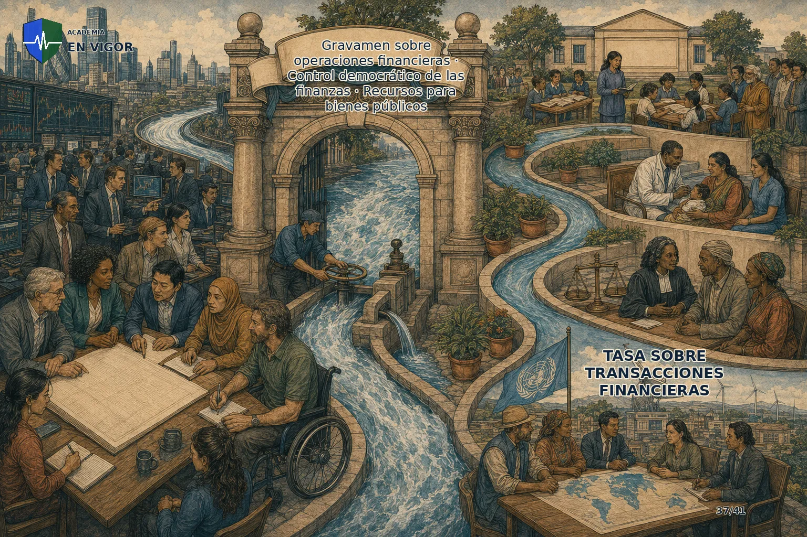

<em>Infografía: Propuestas: tasa sobre transacciones financieras.</em>

<!-- FUENTE: EU-FTT-T28 -->

## 38. Origen del Foro Social Mundial

El primer Foro Social Mundial se celebró en Porto Alegre, Brasil, del 25 al 30 de enero de 2001.

- El primer Foro Social Mundial se celebró en Porto Alegre, Brasil, del 25 al 30 de enero de 2001.
- Surgió como espacio de encuentro de organizaciones y movimientos de la sociedad civil críticos con el neoliberalismo y otras formas de dominación.
- La afirmación otro mundo es posible sintetiza la orientación propositiva del proceso del Foro Social Mundial.
- Su celebración se presentó como contrapunto al Foro Económico Mundial de Davos, aunque ambos foros poseen naturaleza y participantes distintos.

<!-- VISUAL:t28-38-origen-del-foro-social-mundial.webp -->

  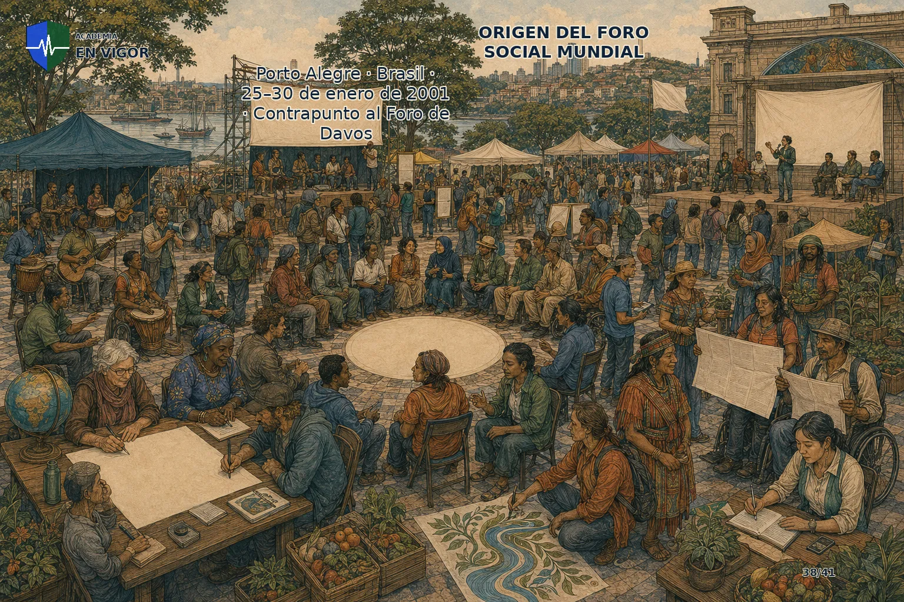

<em>Infografía: Origen del Foro Social Mundial.</em>

<!-- FUENTE: WSF-CHARTER-T28 -->

## 39. Carta de Principios: naturaleza del Foro

La Carta define el Foro como lugar abierto de reflexión, debate democrático, formulación de propuestas, intercambio de experiencias y articulación de acciones.

- La Carta define el Foro como lugar abierto de reflexión, debate democrático, formulación de propuestas, intercambio de experiencias y articulación de acciones.
- El Foro es plural, diverso, no confesional, no gubernamental y no partidista según sus principios.
- No pretende convertirse en instancia representativa de la sociedad civil mundial ni hablar en nombre de todas las personas participantes.
- El Foro se concibe como proceso permanente y no queda reducido a un único acontecimiento, lugar o calendario anual.

<!-- VISUAL:t28-39-carta-de-principios-naturaleza-del-foro.webp -->

  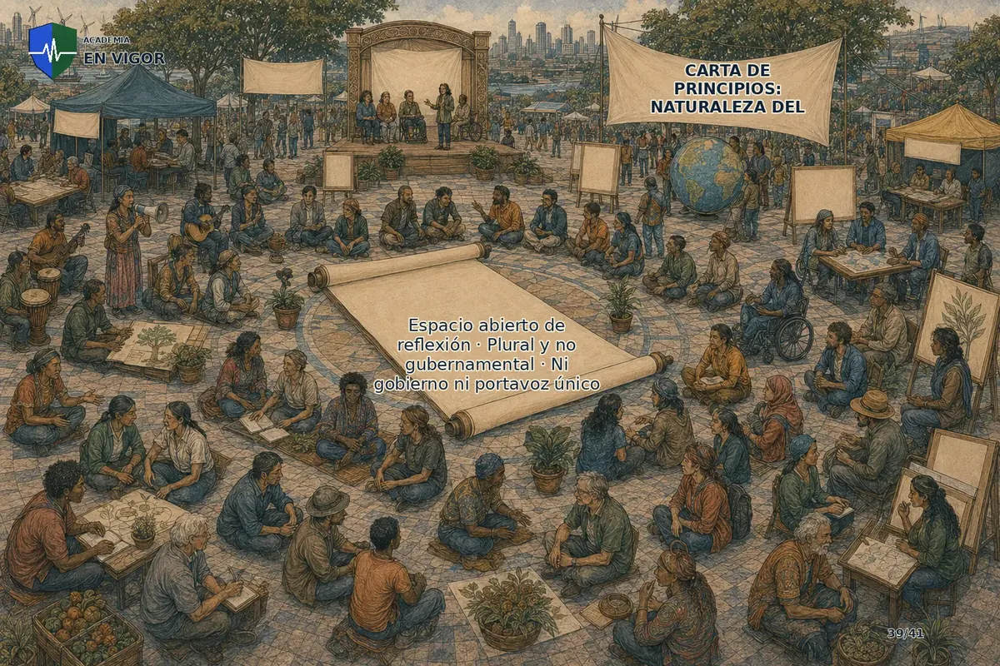

<em>Infografía: Carta de Principios: naturaleza del Foro.</em>

<!-- FUENTE: WSF-CHARTER-T28 -->

## 40. Principios, límites y participación

El proceso se orienta a una globalización solidaria respetuosa con derechos humanos universales, ciudadanía y medio ambiente.

- El proceso se orienta a una globalización solidaria respetuosa con derechos humanos universales, ciudadanía y medio ambiente.
- La Carta rechaza el uso de violencia como medio de control social por el Estado y admite el encuentro de organizaciones comprometidas con medios pacíficos.
- Las decisiones o declaraciones corresponden a las organizaciones que las suscriben y no al Foro como totalidad.
- La pluralidad permite estrategias distintas, pero la Carta fija un marco común frente a neoliberalismo, dominación e imperialismo.

<!-- VISUAL:t28-40-principios-limites-y-participacion.webp -->

  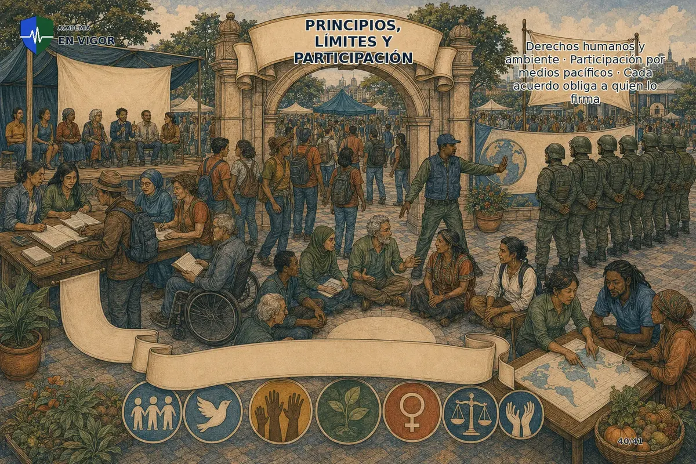

<em>Infografía: Principios, límites y participación.</em>

<!-- FUENTE: WSF-CHARTER-T28 -->

## 41. Historia y geografía del Foro Social Mundial

El segundo Foro Social Mundial volvió a celebrarse en Porto Alegre del 31 de enero al 5 de febrero de 2002.

- El segundo Foro Social Mundial volvió a celebrarse en Porto Alegre del 31 de enero al 5 de febrero de 2002.
- El proceso se extendió mediante foros mundiales, temáticos, regionales y locales, mostrando que no pertenece a una sola ciudad.
- Entre las sedes mundiales posteriores figuran Mumbai en 2004, Nairobi en 2007, Túnez en 2013 y 2015, Montreal en 2016 y México en 2022.
- Las descripciones organizativas del Foro han evolucionado; referencias históricas al Consejo Internacional, Secretaría y comités organizadores no deben tratarse como una estructura jurídica inmutable.

<!-- VISUAL:t28-41-historia-y-geografia-del-foro-social-mundial.webp -->

  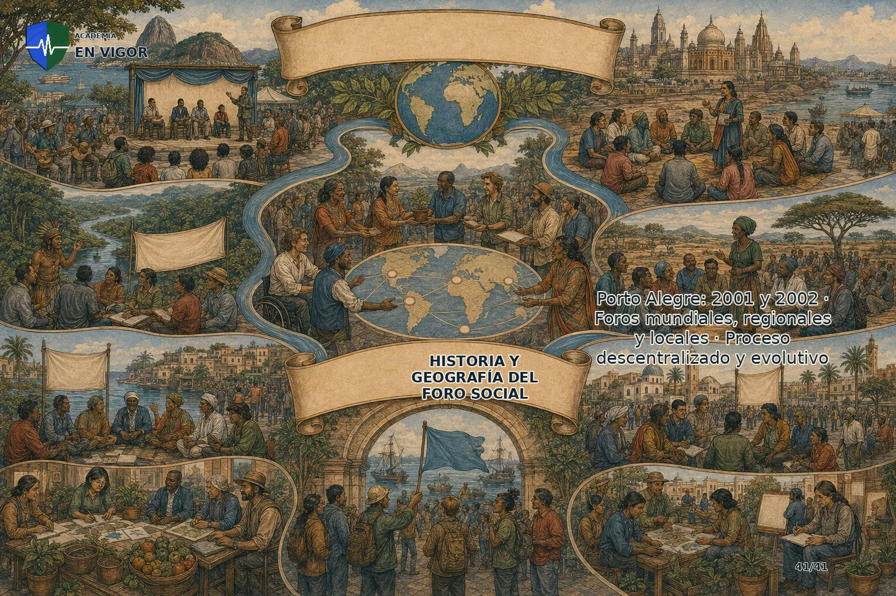

<em>Infografía: Historia y geografía del Foro Social Mundial.</em>

<!-- FUENTE: WSF-HISTORY-T28 -->

# Hablemos claro

:::hablemos-claro
Globalización es conexión e interdependencia; no es un actor con voluntad propia. Antiglobalización es una familia de críticas; altermundismo destaca alternativas. El Foro Social Mundial es un espacio de encuentro, no un gobierno ni un portavoz único.
:::

# En la calle

:::en-la-calle
Para analizar un caso real, localiza qué cruza la frontera —capital, mercancía, dato, persona, riesgo o idea—, quién decide, quién gana, quién asume el coste y qué institución puede responder.
:::

# Lo que cae

:::lo-que-cae
Prioriza diferencias entre dimensiones, OMC-FMI-Banco Mundial, aldea global-sociedad red-ciudad global-glocalización, reacciones culturales, Seattle 1999, ATTAC, tasa Tobin y Porto Alegre 2001.
:::

# Ha caído

:::ha-caido
Se han localizado 20 referencias históricas del Tema 28. Permanecen ocultas y en cuarentena porque no existe plantilla oficial final verificable en el repositorio.
:::

## Fuentes primarias e institucionales

- `RAE-GLOBAL-T28`
- `ONU-GLOBAL-T28`
- `WTO-HISTORY-T28`
- `WTO-INBRIEF-T28`
- `OECD-MEASURE-T28`
- `OECD-GLOCAL-T28`
- `IMF-GLOBAL-T28`
- `IMF-GLOBAL-2024-T28`
- `IMF-ATGLANCE-T28`
- `WB-TRADE-T28`
- `WB-GVC-T28`
- `ILO-FAIR-T28`
- `UNESCO-DIVERSITY-T28`
- `UNESCO-DECLARATION-T28`
- `UNESCO-MCLUHAN-T28`
- `UNESCO-DIGITAL-T28`
- `UN-GLOBAL-CITY-T28`
- `UN-ENV-GLOBAL-T28`
- `ATTAC-ES-T28`
- `EU-FTT-T28`
- `WTO-SEATTLE-T28`
- `WSF-CHARTER-T28`
- `WSF-HISTORY-T28`
- `CONV-PN-2026`

---

*Academia En Vigor · El temario que nunca duerme · Tema 28 · v1.0.0 · Documento interno no publicado.*
