# TEMA 32 · CONCEPTO DE GEOGRAFÍA HUMANA. LA CIUDAD, CORRIENTES DE ESTUDIO DE LA MISMA. POBLACIÓN, ESTRUCTURA Y GRUPOS SOCIALES. LA DEMOGRAFÍA: DENSIDAD DEMOGRÁFICA, TASAS DE NATALIDAD Y MORTALIDAD, CRECIMIENTO VEGETATIVO. LA SOCIEDAD DE MASAS. CONTAMINACIÓN Y PROTECCIÓN DEL MEDIO AMBIENTE.

**Policía Nacional · Método VIGOR · PARTE**
**Versión de contenido:** 1.0.0
**Estado editorial:** approved_internal · **Publicación:** not_published

# Mapa del tema

El Tema 32 se estudia en seis partes: fundamentos de geografía humana; ciudad y corrientes; población y estructura social; demografía; sociedad de masas; y contaminación y protección ambiental.

# Contenido

## 01. Concepto de geografía humana

**Idea de control:** Piensa en una relación de doble sentido: la sociedad organiza el espacio y el espacio condiciona posibilidades sin dictar el resultado.

- La geografía humana estudia la organización espacial de las sociedades y sus relaciones con los territorios que habitan y transforman.
- Su objeto no es el ser humano aislado, sino la distribución, movilidad, actividades, relaciones y paisajes producidos socialmente sobre la superficie terrestre.
- El análisis combina localización, distribución, conexión, escala y cambio para explicar por qué los fenómenos humanos adoptan configuraciones espaciales diferentes.
- La separación entre geografía física y humana es analítica: procesos ambientales y sociales interactúan continuamente.

<!-- VISUAL:t32-il-01-concepto-de-geografia-humana.webp -->

  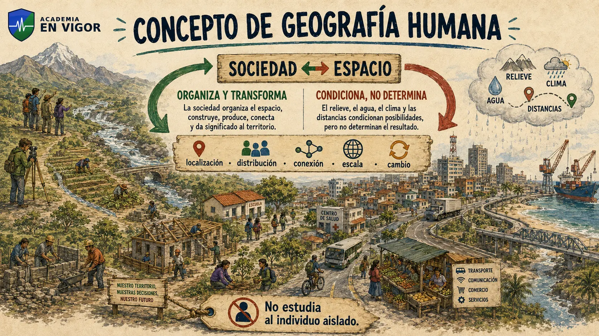

<em>Infografía: Concepto de geografía humana.</em>

<!-- FUENTE: UN-HABITAT-T32 -->

## 02. Sociedad, espacio y medio

**Idea de control:** Evita los determinismos: condición física no equivale a destino social.

- Las sociedades aprovechan recursos, construyen infraestructuras y asignan usos que transforman el espacio geográfico.
- El medio ofrece condiciones y límites, pero una misma condición física puede producir respuestas distintas según tecnología, cultura, poder y organización social.
- Las decisiones espaciales distribuyen de manera desigual accesibilidad, oportunidades, costes y riesgos entre grupos y territorios.
- El espacio geográfico es dinámico: conserva huellas históricas y cambia mediante procesos demográficos, económicos, políticos, culturales y ambientales.

<!-- VISUAL:t32-02-sociedad-espacio-y-medio.webp -->

  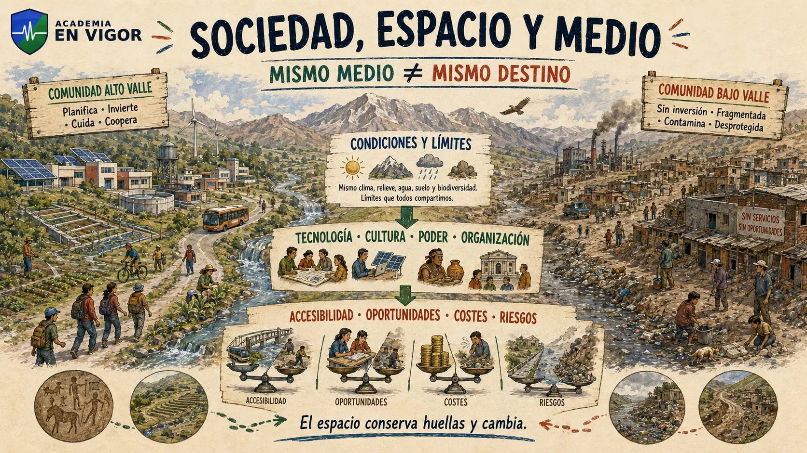

<em>Infografía: Sociedad, espacio y medio.</em>

<!-- FUENTE: UN-HABITAT-T32 -->

## 03. Ramas de la geografía humana

**Idea de control:** Clasifica la rama por la pregunta central, no por una palabra suelta del enunciado.

- La geografía de la población analiza distribución, estructura, dinámica y movilidad de los grupos humanos.
- La geografía urbana estudia ciudades, redes urbanas, usos del suelo, morfología, funciones y procesos de urbanización.
- Las geografías económica y rural examinan localización de actividades, producción, intercambios, sistemas agrarios y transformación de espacios no urbanos.
- Las geografías social, cultural y política analizan desigualdades, identidades, prácticas, instituciones, poder y territorialidad.

<!-- VISUAL:t32-03-ramas-de-la-geografia-humana.webp -->

  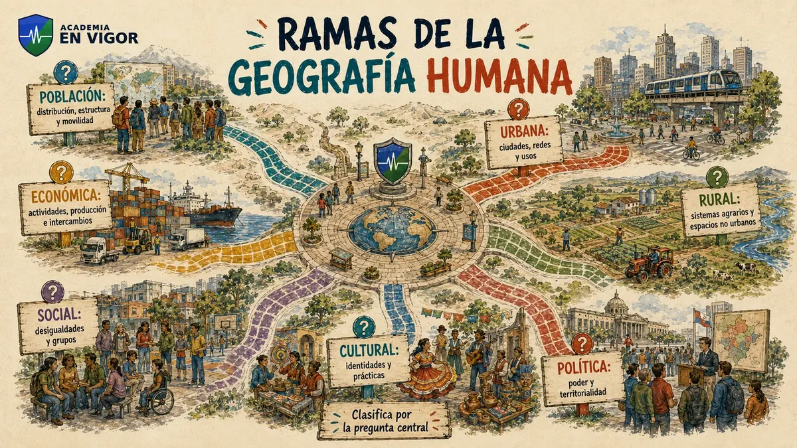

<em>Infografía: Ramas de la geografía humana.</em>

<!-- FUENTE: UN-HABITAT-T32 -->

## 04. Lugar, región, paisaje y territorio

**Idea de control:** Lugar aporta significado; región delimita; paisaje muestra; territorio organiza y ejerce poder.

- Lugar designa un espacio vivido o reconocido al que personas y grupos atribuyen experiencia, identidad y significado.
- Región es un ámbito delimitado para el análisis por rasgos homogéneos, relaciones funcionales o decisiones político-administrativas.
- Paisaje es la expresión visible y percibida de la interacción entre componentes naturales y humanos a lo largo del tiempo.
- Territorio es un espacio apropiado, organizado o regulado por actores e instituciones y vinculado a relaciones de poder.

<!-- VISUAL:t32-04-lugar-region-paisaje-y-territorio.webp -->

  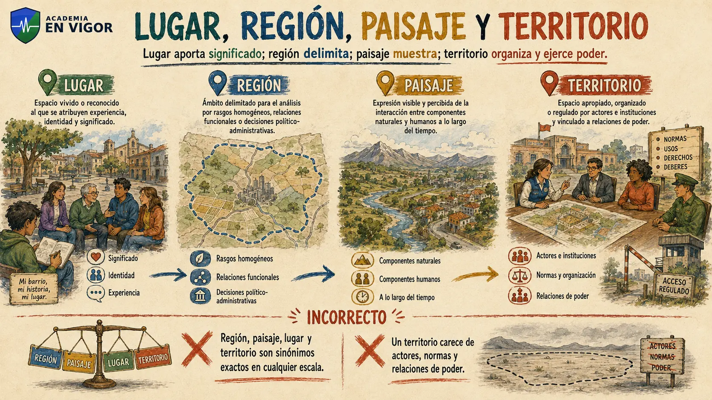

<em>Infografía: Lugar, región, paisaje y territorio.</em>

<!-- FUENTE: IGN-CONCEPTS-T32 -->

## 05. Escala, localización y situación

**Idea de control:** Coordenada localiza; relación sitúa; escala decide cuánto detalle ves.

- La localización absoluta sitúa un fenómeno mediante coordenadas u otra referencia fija; la relativa lo ubica respecto de otros lugares y conexiones.
- La situación describe la posición relacional de un lugar dentro de redes, rutas, mercados, áreas de influencia o sistemas territoriales.
- La escala cartográfica expresa la relación entre distancia representada y real; la escala de análisis indica el nivel espacial desde el que se estudia un proceso.
- Un patrón visible a escala nacional puede ocultar diferencias locales, por lo que cambiar de escala puede modificar la interpretación.

<!-- VISUAL:t32-il-05-escala-localizacion-y-situacion.webp -->

  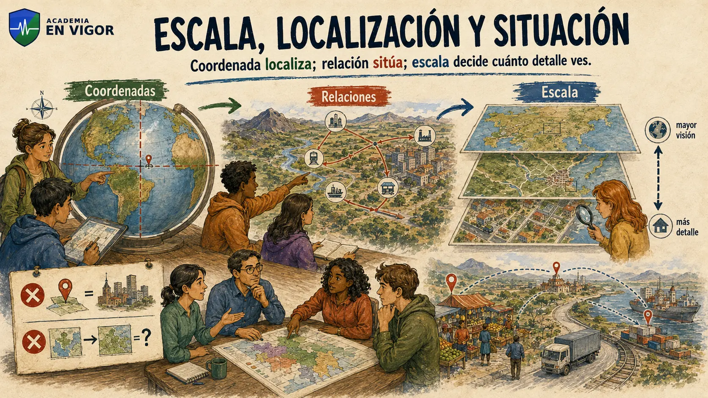

<em>Infografía: Escala, localización y situación.</em>

<!-- FUENTE: IGN-CONCEPTS-T32 -->

## 06. Distribución, densidad y accesibilidad

**Idea de control:** La media territorial puede esconder vacíos y concentraciones; añade siempre distribución y conexiones.

- Distribución describe cómo se reparte un fenómeno en el espacio y permite reconocer concentración, dispersión, continuidad o agrupamiento.
- Densidad relaciona una cantidad con la superficie de referencia, pero no informa por sí sola de la distribución interna.
- Accesibilidad expresa la facilidad de alcanzar lugares, servicios u oportunidades según distancia, tiempo, coste, red y barreras.
- Dos territorios con igual densidad media pueden presentar asentamientos y niveles de accesibilidad completamente distintos.

<!-- VISUAL:t32-06-distribucion-densidad-y-accesibilidad.webp -->

  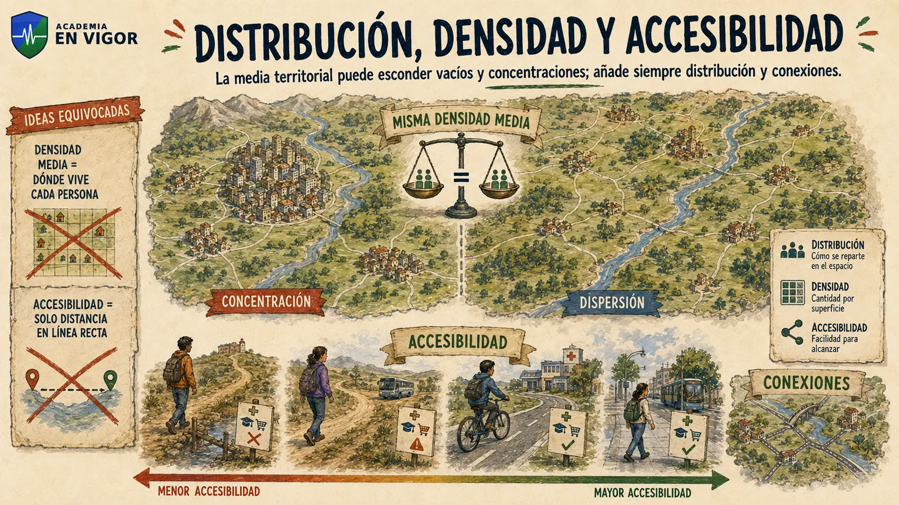

<em>Infografía: Distribución, densidad y accesibilidad.</em>

<!-- FUENTE: INE-CENSO-T32 -->

## 07. Enfoques y métodos de la geografía humana

**Idea de control:** Los enfoques no se excluyen: cada uno ilumina una dimensión y tiene límites.

- El enfoque regional describe y explica combinaciones singulares de fenómenos en áreas concretas.
- El enfoque cuantitativo utiliza medición, modelos y análisis espacial para identificar regularidades y contrastar relaciones.
- Los enfoques humanista y de la percepción atienden a experiencia, significado, decisiones y representaciones del espacio.
- La geografía crítica examina cómo poder, desigualdad y organización económica producen territorios y distribuyen recursos y riesgos.

<!-- VISUAL:t32-il-07-enfoques-y-metodos-de-la-geografia-humana.webp -->

  

<em>Infografía: Enfoques y métodos de la geografía humana.</em>

<!-- FUENTE: IGN-CONCEPTS-T32 -->

## 08. Concepto operativo de ciudad

**Idea de control:** Una cifra sola no define toda ciudad: cruza población, forma, función y administración.

- No existe una única definición universal de ciudad: los países combinan criterios demográficos, morfológicos, funcionales y administrativos.
- El criterio demográfico usa población y densidad; el morfológico atiende a continuidad de la edificación y forma del asentamiento.
- El criterio funcional considera empleo no agrario, servicios, movilidad y relaciones con un área de influencia.
- El criterio administrativo depende de límites y estatutos legales, que pueden no coincidir con la ciudad construida o funcional.

<!-- VISUAL:t32-08-concepto-operativo-de-ciudad.webp -->

  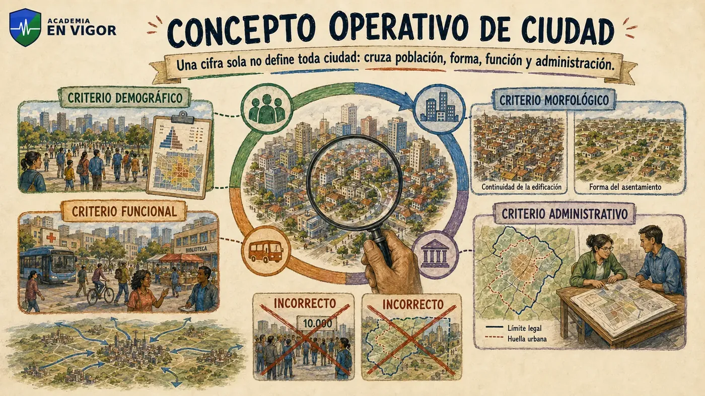

<em>Infografía: Concepto operativo de ciudad.</em>

<!-- FUENTE: UN-HABITAT-CITY-T32 -->

## 09. Grado de urbanización y comparación internacional

**Idea de control:** Distingue clasificación estadística comparable y estatuto administrativo.

- El grado de urbanización clasifica el territorio mediante celdas de población contiguas y distingue ciudades, áreas de densidad intermedia y áreas rurales.
- La metodología armonizada mejora la comparación internacional frente a umbrales nacionales incompatibles.
- La clase de una celda depende de concentración, densidad y población, no solo del nombre administrativo del municipio.
- La clasificación estadística no elimina las definiciones jurídicas nacionales ni convierte todas las áreas urbanas en una misma realidad social.

<!-- VISUAL:t32-09-grado-de-urbanizacion-y-comparacion-internacional.webp -->

  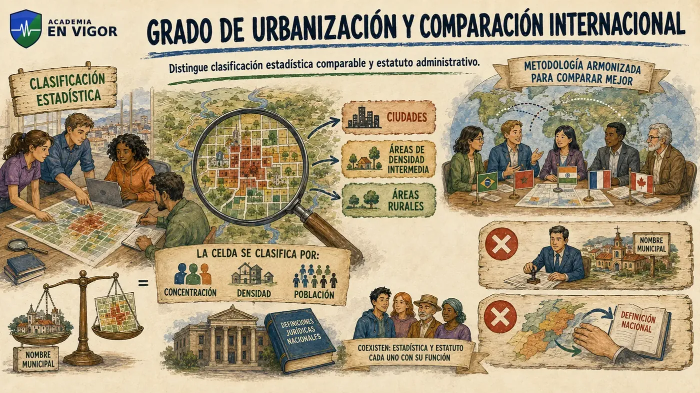

<em>Infografía: Grado de urbanización y comparación internacional.</em>

<!-- FUENTE: UN-HABITAT-CITY-T32 -->

## 10. Emplazamiento, situación, función y jerarquía

**Idea de control:** Sitio es dónde se asienta; situación, con qué se conecta; función, qué hace; jerarquía, hasta dónde influye.

- El emplazamiento o sitio es el soporte físico concreto de la ciudad, como relieve, costa, río o cruce de caminos.
- La situación es su posición relativa respecto de rutas, mercados, recursos y otras ciudades.
- La función urbana expresa actividades predominantes, como administración, industria, comercio, transporte, turismo o servicios.
- La jerarquía urbana ordena ciudades por tamaño, funciones, especialización y alcance de su área de influencia.

<!-- VISUAL:t32-10-emplazamiento-situacion-funcion-y-jerarquia.webp -->

  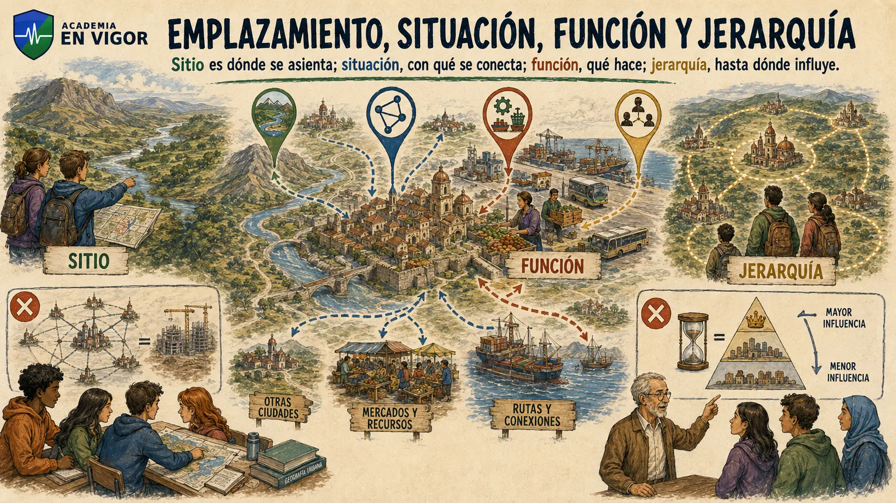

<em>Infografía: Emplazamiento, situación, función y jerarquía.</em>

<!-- FUENTE: UN-HABITAT-T32 -->

## 11. Urbanización y crecimiento urbano

**Idea de control:** Urbanización mide proporción; crecimiento mide volumen; expansión mide huella.

- Urbanización es el aumento de la proporción de población que vive en áreas urbanas y la expansión de formas de vida y organización urbanas.
- Crecimiento urbano es el aumento absoluto de población o superficie urbana y puede ocurrir sin que aumente la proporción urbana nacional.
- La expansión física puede ser compacta o dispersa y sus efectos dependen de planificación, transporte, vivienda, servicios y protección ambiental.
- Urbanización no equivale necesariamente a industrialización, aunque ambos procesos han estado históricamente relacionados.

<!-- VISUAL:t32-11-urbanizacion-y-crecimiento-urbano.webp -->

  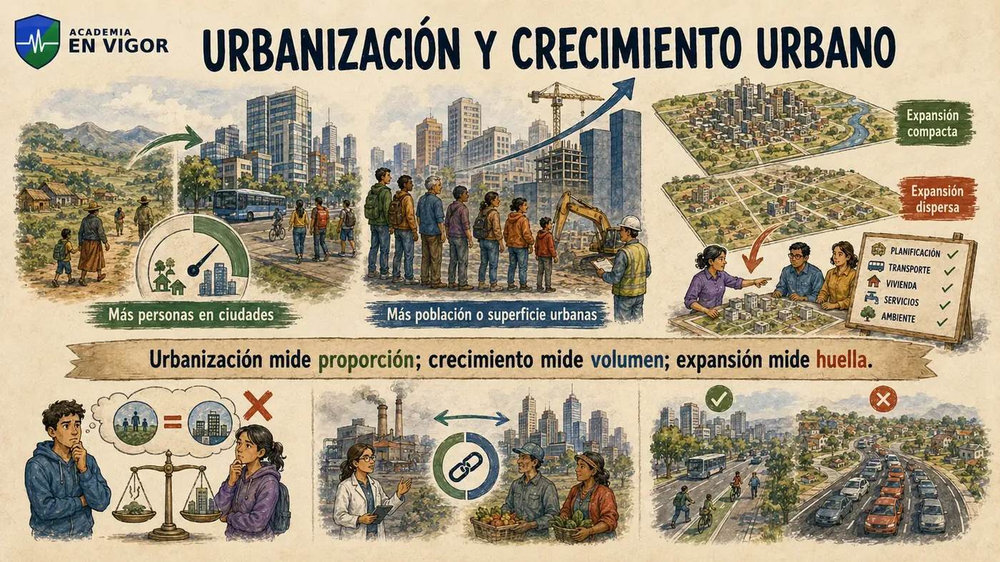

<em>Infografía: Urbanización y crecimiento urbano.</em>

<!-- FUENTE: UN-HABITAT-WCR-T32 -->

## 12. Morfología y plano urbano

**Idea de control:** Lee el plano como una biografía: cada trama deja la huella de una etapa.

- La morfología urbana es la forma material de la ciudad resultante de plano, edificación, usos del suelo y evolución histórica.
- El plano representa calles, parcelas, manzanas, espacios públicos y otros elementos de la estructura urbana.
- La trama describe la disposición y relación entre vías, parcelas y construcciones y puede ser abierta, cerrada, regular o irregular.
- Una misma ciudad suele superponer morfologías de etapas diferentes y no responde a un único modelo puro.

<!-- VISUAL:t32-12-morfologia-y-plano-urbano.webp -->

  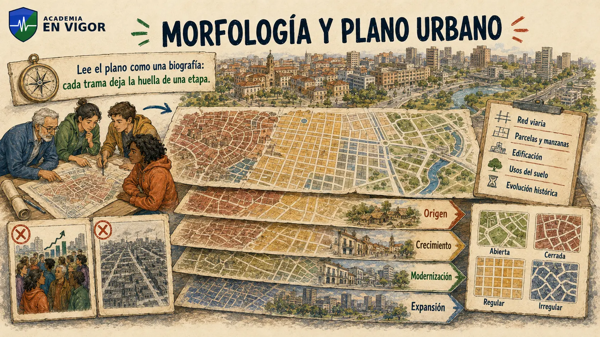

<em>Infografía: Morfología y plano urbano.</em>

<!-- FUENTE: IGN-CONCEPTS-T32 -->

## 13. Planos irregular, ortogonal, radial y lineal

**Idea de control:** Identifica la geometría dominante: laberinto, cuadrícula, radios o eje.

- El plano irregular presenta calles sinuosas y de anchura variable sin una retícula dominante, frecuente en cascos de crecimiento orgánico.
- El plano ortogonal o en cuadrícula organiza calles que se cruzan normalmente en ángulos rectos y facilita parcelación y extensión.
- El plano radiocéntrico combina ejes radiales con anillos alrededor de un centro, favoreciendo conexiones centro-periferia.
- El plano lineal desarrolla el asentamiento a lo largo de un eje de transporte, valle, costa u otra directriz principal.

<!-- VISUAL:t32-13-planos-irregular-ortogonal-radial-y-lineal.webp -->

  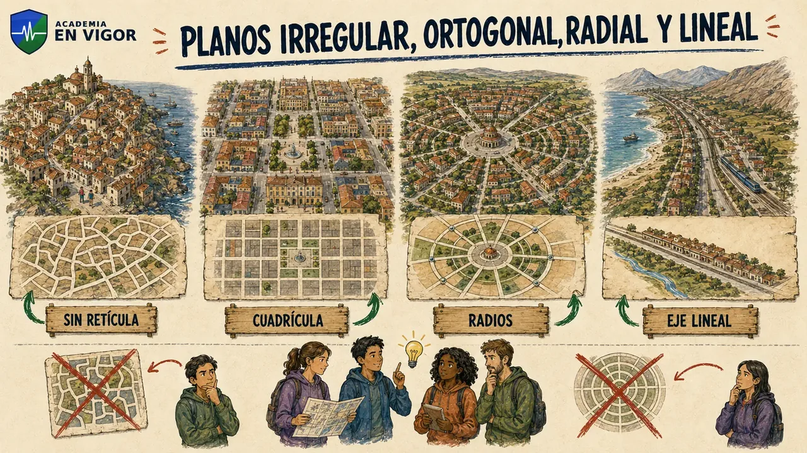

<em>Infografía: Planos irregular, ortogonal, radial y lineal.</em>

<!-- FUENTE: IGN-CONCEPTS-T32 -->

## 14. Centro histórico, ensanche y periferia

**Idea de control:** Distingue etapa y función sin convertir centro-periferia en una etiqueta social absoluta.

- El centro histórico concentra la ciudad anterior a las expansiones modernas y suele reunir patrimonio, trazado antiguo y funciones centrales.
- El ensanche es una ampliación planificada, habitualmente con trama regular, creada para responder al crecimiento urbano más allá del casco antiguo.
- La periferia reúne áreas residenciales, industriales, logísticas y comerciales de épocas recientes con densidades y calidades muy distintas.
- Centro y periferia son posiciones relacionales y funcionales; no equivalen automáticamente a riqueza y pobreza.

<!-- VISUAL:t32-14-centro-historico-ensanche-y-periferia.webp -->

  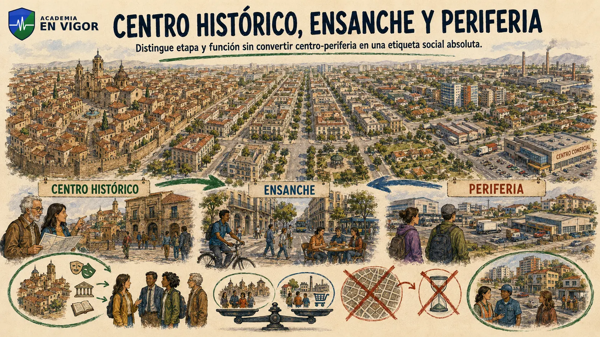

<em>Infografía: Centro histórico, ensanche y periferia.</em>

<!-- FUENTE: IGN-CONCEPTS-T32 -->

## 15. Red urbana y áreas de influencia

**Idea de control:** La red existe por los flujos; sin relaciones solo hay puntos sobre un mapa.

- Una red urbana está formada por ciudades y por los flujos de personas, bienes, información, capital y servicios que las conectan.
- Los nodos urbanos difieren en centralidad, accesibilidad, especialización y capacidad de organizar territorios próximos o lejanos.
- El área de influencia es el espacio que utiliza una ciudad para atraer desplazamientos, prestar servicios o articular actividades.
- Las redes cambian con infraestructuras, tecnología, economía y políticas; no son simples listas estáticas de ciudades.

<!-- VISUAL:t32-15-red-urbana-y-areas-de-influencia.webp -->

  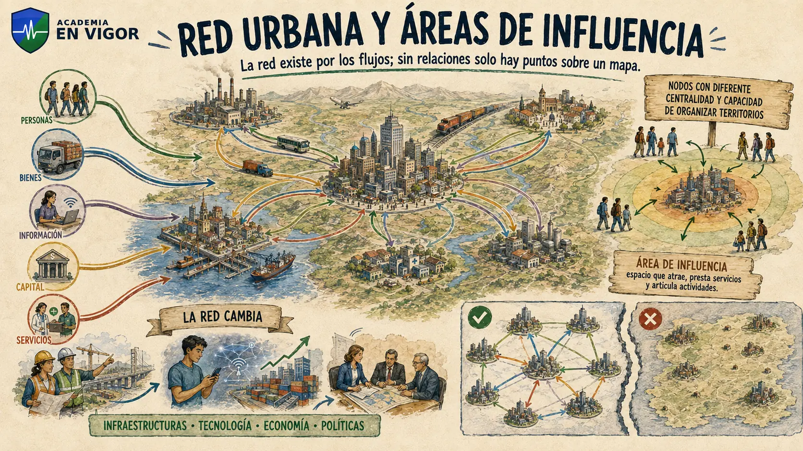

<em>Infografía: Red urbana y áreas de influencia.</em>

<!-- FUENTE: UN-HABITAT-WCR-T32 -->

## 16. Metrópolis, área metropolitana, conurbación y megalópolis

**Idea de control:** La conurbación nace de varios núcleos; el área metropolitana se reconoce por su integración funcional.

- Metrópolis es una ciudad principal con funciones complejas y capacidad de organizar un territorio amplio.
- Un área metropolitana integra una ciudad central y municipios vinculados por continuidad o intensas relaciones funcionales, especialmente movilidad cotidiana.
- Conurbación es la unión física o funcional de núcleos inicialmente independientes que conservan identidades o centros propios.
- Megalópolis es una extensa región urbanizada que conecta varias áreas metropolitanas y redes de ciudades, no una única ciudad gigantesca.

<!-- VISUAL:t32-16-metropolis-area-metropolitana-conurbacion-y-megalopolis.webp -->

  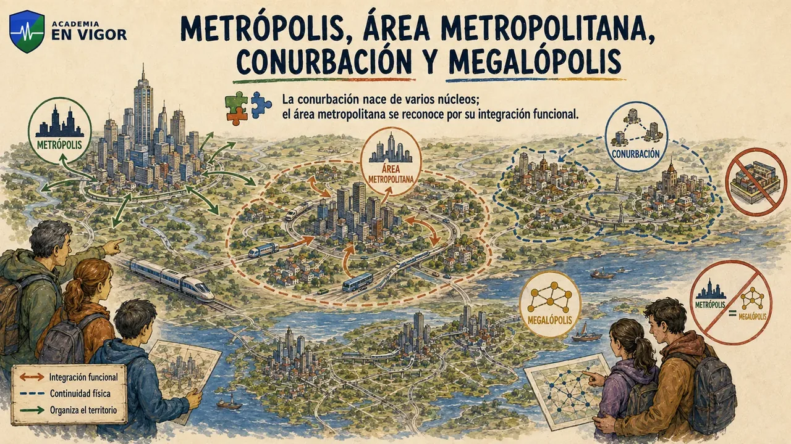

<em>Infografía: Metrópolis, área metropolitana, conurbación y megalópolis.</em>

<!-- FUENTE: UN-HABITAT-WCR-T32 -->

## 17. Suburbanización, periurbanización y rururbanización

**Idea de control:** La corona exterior no es un vacío: combina desplazamiento residencial, nuevos usos y dependencia funcional.

- Suburbanización es el traslado o crecimiento de población y actividades hacia coronas exteriores conectadas con la ciudad central.
- Periurbanización extiende usos urbanos discontinuos sobre espacios de borde y mezcla vivienda, industria, agricultura, logística y vacíos.
- Rururbanización incorpora actividades, población y formas de vida urbanas en espacios que conservan rasgos rurales.
- Estos procesos pueden aumentar movilidad y consumo de suelo si no se coordinan vivienda, servicios y transporte.

<!-- VISUAL:t32-17-suburbanizacion-periurbanizacion-y-rururbanizacion.webp -->

  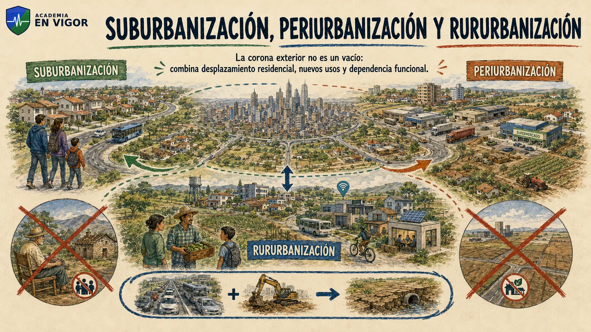

<em>Infografía: Suburbanización, periurbanización y rururbanización.</em>

<!-- FUENTE: UN-HABITAT-WCR-T32 -->

## 18. Desurbanización, reurbanización y ciudad compacta

**Idea de control:** Recuperar y compactar exige calidad y equidad; densidad sola no resuelve la ciudad.

- Desurbanización describe pérdida de población o actividad en grandes centros a favor de ciudades menores o espacios no metropolitanos.
- Reurbanización es la recuperación de población, actividad o inversión en áreas centrales previamente degradadas o vaciadas.
- La ciudad compacta concentra usos y población y puede reducir distancias, aunque necesita vivienda asequible, zonas verdes y capacidad de servicios.
- Densificar sin calidad urbana puede aumentar hacinamiento, precios y exposición ambiental; compacto no significa saturado.

<!-- VISUAL:t32-18-desurbanizacion-reurbanizacion-y-ciudad-compacta.webp -->

  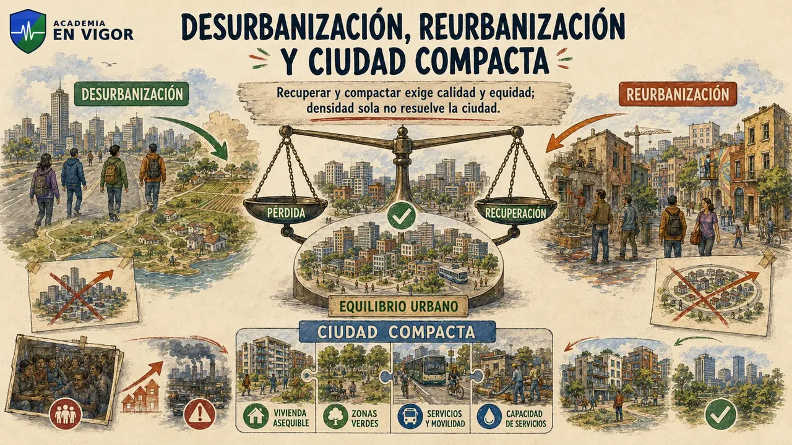

<em>Infografía: Desurbanización, reurbanización y ciudad compacta.</em>

<!-- FUENTE: UN-HABITAT-WCR-T32 -->

## 19. Segregación, gueto y gentrificación

**Idea de control:** Rehabilitar un edificio no basta para definir gentrificación: observa revalorización, cambio social y desplazamiento.

- Segregación residencial es la separación espacial desigual de grupos según renta, origen, edad u otras características.
- Un gueto implica concentración y aislamiento de un grupo bajo fuertes restricciones sociales, económicas o institucionales; no es cualquier barrio homogéneo.
- Gentrificación es la reinversión y revalorización de un área que atrae población de mayor renta y puede desplazar a residentes anteriores.
- La rehabilitación física no produce inevitablemente expulsión, pero el riesgo crece sin protección residencial y participación local.

<!-- VISUAL:t32-il-19-segregacion-gueto-y-gentrificacion.webp -->

  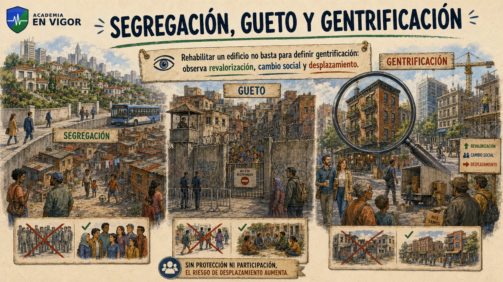

<em>Infografía: Segregación, gueto y gentrificación.</em>

<!-- FUENTE: UN-HABITAT-WCR-T32 -->

## 20. Ciudad jardín y ciudad lineal

**Idea de control:** Howard dibuja núcleos con cinturón verde; Soria despliega la ciudad sobre un eje.

- Ebenezer Howard propuso la ciudad jardín como asentamiento planificado que combinara ventajas urbanas y rurales, rodeado por un cinturón verde.
- La ciudad jardín buscaba limitar tamaño, ordenar crecimiento y articular vivienda, empleo, servicios y suelo comunitario.
- Arturo Soria formuló la ciudad lineal organizada a lo largo de un eje de transporte y servicios con edificación extendida a ambos lados.
- Ciudad jardín y ciudad lineal son propuestas de planificación diferentes: una organiza núcleos limitados; la otra prioriza un corredor.

<!-- VISUAL:t32-20-ciudad-jardin-y-ciudad-lineal.webp -->

  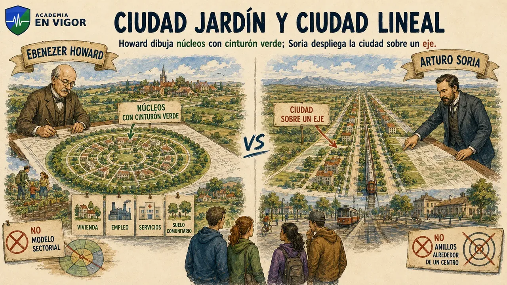

<em>Infografía: Ciudad jardín y ciudad lineal.</em>

<!-- FUENTE: HOWARD-1902-T32 -->

## 21. Escuela de Chicago y ecología urbana

**Idea de control:** Es una analogía ecológica para estudiar organización social y espacio, no una ley biológica de la ciudad.

- La Escuela de Chicago abordó la ciudad como un laboratorio social y relacionó organización espacial, movilidad, competencia y diferenciación de áreas.
- Park y Burgess emplearon una perspectiva ecológica para estudiar cómo grupos y actividades ocupan, compiten y se suceden en el espacio urbano.
- La ecología urbana utilizó conceptos como invasión, sucesión, dominación y áreas naturales para describir cambios territoriales.
- El enfoque produjo hipótesis influyentes, pero no debe tratarse como ley universal ni convertir procesos sociales en biología.

<!-- VISUAL:t32-21-escuela-de-chicago-y-ecologia-urbana.webp -->

  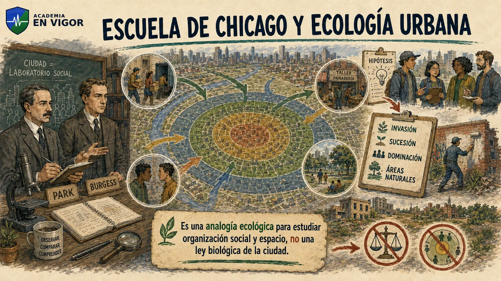

<em>Infografía: Escuela de Chicago y ecología urbana.</em>

<!-- FUENTE: PARK-BURGESS-1925-T32 -->

## 22. Modelo concéntrico de Burgess

**Idea de control:** Burgess piensa en anillos; recuerda que el mapa real puede deformarlos.

- Burgess representó el crecimiento de Chicago mediante zonas concéntricas que se expanden desde el distrito central de negocios.
- El modelo distingue centro, zona de transición, vivienda obrera, residencias de mayor calidad y zona de personas que se desplazan diariamente.
- La zona de transición combina deterioro, cambio de usos, industria ligera y elevada movilidad residencial.
- El modelo es ideal-típico: barreras físicas, planificación, transporte e historia pueden romper la forma concéntrica.

<!-- VISUAL:t32-il-22-modelo-concentrico-de-burgess.webp -->

  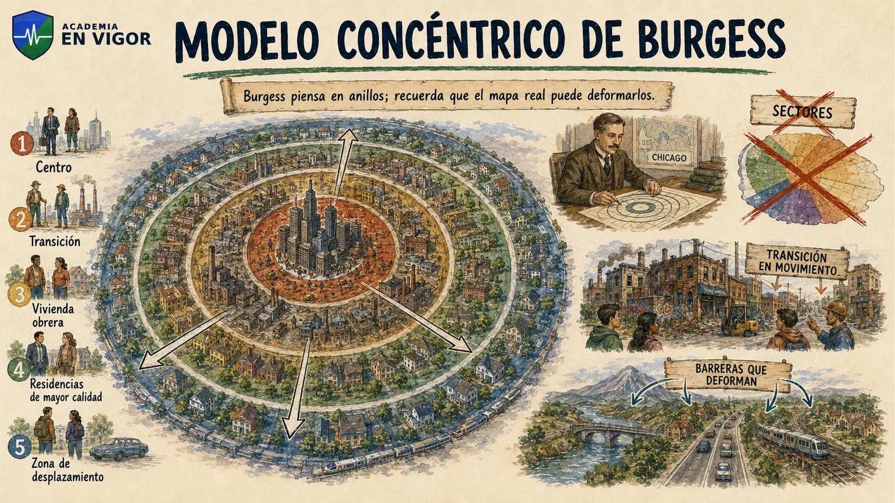

<em>Infografía: Modelo concéntrico de Burgess.</em>

<!-- FUENTE: BURGESS-1925-T32 -->

## 23. Modelo sectorial de Homer Hoyt

**Idea de control:** Hoyt corta la diana de Burgess en cuñas que siguen corredores.

- Homer Hoyt propuso el modelo sectorial como alternativa al crecimiento exclusivamente concéntrico.
- Los usos del suelo y áreas residenciales tienden a prolongarse desde el centro en sectores asociados a ejes de transporte y ventajas ambientales.
- Las zonas de renta alta pueden expandirse siguiendo corredores atractivos, mientras otros usos ocupan sectores distintos.
- El modelo explica direcciones de crecimiento, pero no supone que toda ciudad tenga un único centro o sectores perfectos.

<!-- VISUAL:t32-23-modelo-sectorial-de-homer-hoyt.webp -->

  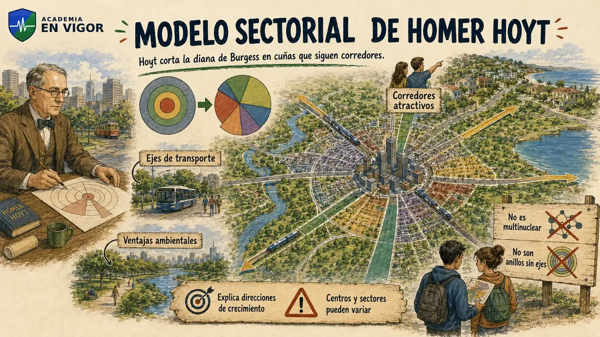

<em>Infografía: Modelo sectorial de Homer Hoyt.</em>

<!-- FUENTE: HOYT-1939-T32 -->

## 24. Modelo de núcleos múltiples

**Idea de control:** La ciudad deja de ser una diana única y funciona como constelación de centros.

- Harris y Ullman sostuvieron que la ciudad puede crecer alrededor de varios núcleos especializados y no de un único centro.
- Ciertas actividades se atraen entre sí, otras se repelen y algunas necesitan localizaciones específicas por accesibilidad, suelo o infraestructura.
- Un distrito industrial, un centro comercial periférico, un campus o un aeropuerto pueden actuar como núcleos diferenciados.
- El modelo multinuclear se adapta mejor a áreas metropolitanas complejas, aunque tampoco reproduce cada ciudad de manera exacta.

<!-- VISUAL:t32-il-24-modelo-de-nucleos-multiples.webp -->

  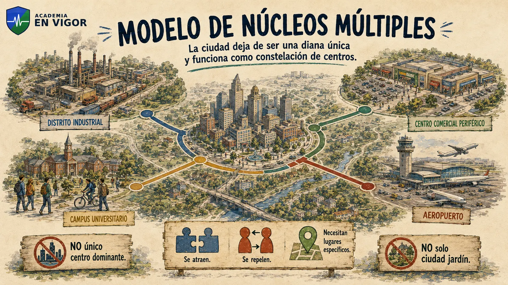

<em>Infografía: Modelo de núcleos múltiples.</em>

<!-- FUENTE: HARRIS-ULLMAN-1945-T32 -->

## 25. Urbanismo como modo de vida: Louis Wirth

**Idea de control:** Regla TDH: tamaño, densidad y heterogeneidad; después analiza efectos, no destinos inevitables.

- Louis Wirth definió la ciudad sociológicamente como un asentamiento relativamente grande, denso y permanente de individuos socialmente heterogéneos.
- Tamaño, densidad y heterogeneidad favorecen especialización, segmentación de roles y predominio de contactos secundarios.
- El anonimato y la movilidad pueden ampliar libertad y asociaciones voluntarias, pero también debilitar vínculos primarios o producir aislamiento.
- La tesis describe tendencias y no permite deducir que toda relación urbana sea impersonal o desorganizada.

<!-- VISUAL:t32-25-urbanismo-como-modo-de-vida-louis-wirth.webp -->

  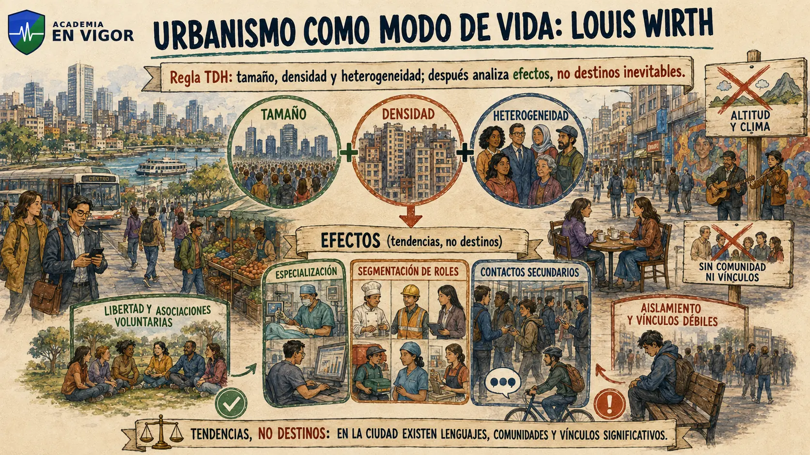

<em>Infografía: Urbanismo como modo de vida: Louis Wirth.</em>

<!-- FUENTE: WIRTH-1938-T32 -->

## 26. Geografía cuantitativa y análisis espacial urbano

**Idea de control:** El número ayuda a contrastar patrones; no sustituye la calidad de datos ni la explicación.

- La geografía cuantitativa busca regularidades mediante estadísticas, modelos, cartografía y análisis de localización y redes.
- El análisis espacial urbano mide densidad, accesibilidad, autocorrelación, áreas de influencia y distribución de usos o servicios.
- Los sistemas de información geográfica integran datos georreferenciados para representar, relacionar y analizar fenómenos urbanos.
- Un modelo simplifica la realidad y debe contrastarse; precisión numérica no corrige datos deficientes ni supuestos erróneos.

<!-- VISUAL:t32-26-geografia-cuantitativa-y-analisis-espacial-urbano.webp -->

  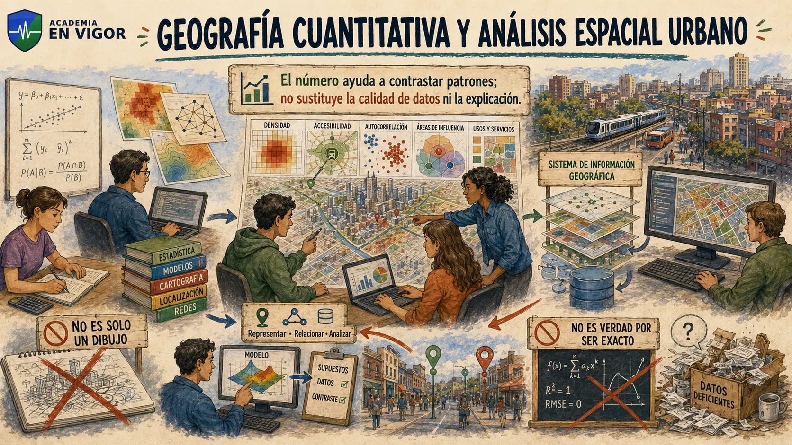

<em>Infografía: Geografía cuantitativa y análisis espacial urbano.</em>

<!-- FUENTE: IGN-CONCEPTS-T32 -->

## 27. Enfoques perceptivo, humanista y crítico de la ciudad

**Idea de control:** La ciudad también se percibe, se vive y se disputa; no es solo forma edificada.

- El enfoque perceptivo estudia cómo imágenes, información y sesgos influyen en decisiones y mapas mentales de la ciudad.
- La geografía humanista atiende a experiencia, identidad, apego, miedo y significado de los lugares.
- La geografía crítica analiza producción del espacio, vivienda, capital, poder y distribución desigual de beneficios y costes urbanos.
- Estos enfoques complementan el análisis morfológico: la misma calle puede ser físicamente igual y socialmente vivida de modos diferentes.

<!-- VISUAL:t32-il-27-enfoques-perceptivo-humanista-y-critico-de-la-ciudad.webp -->

  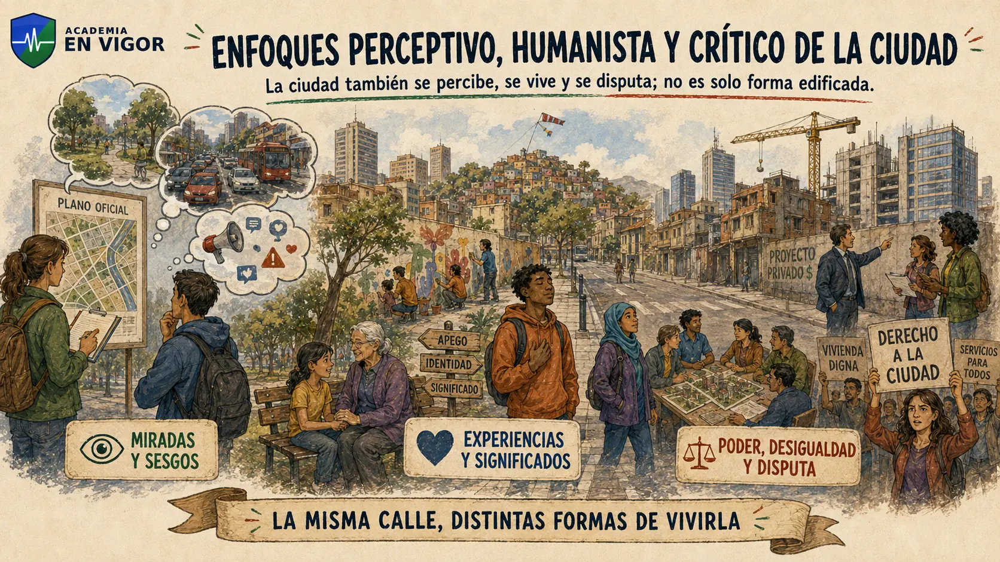

<em>Infografía: Enfoques perceptivo, humanista y crítico de la ciudad.</em>

<!-- FUENTE: UN-HABITAT-WCR-T32 -->

## 28. Ciudades según su función predominante

**Idea de control:** Función predominante no significa función exclusiva.

- Una clasificación funcional identifica la actividad que otorga especialización y área de influencia, no todas las actividades existentes.
- Las ciudades pueden destacar por funciones administrativas, industriales, comerciales, logísticas, portuarias, turísticas, culturales o universitarias.
- La especialización cambia con el tiempo y una ciudad suele combinar varias funciones en proporciones diferentes.
- La etiqueta funcional no depende solo del empleo: también cuentan infraestructuras, servicios, flujos y posición en la red urbana.

<!-- VISUAL:t32-28-ciudades-segun-su-funcion-predominante.webp -->

  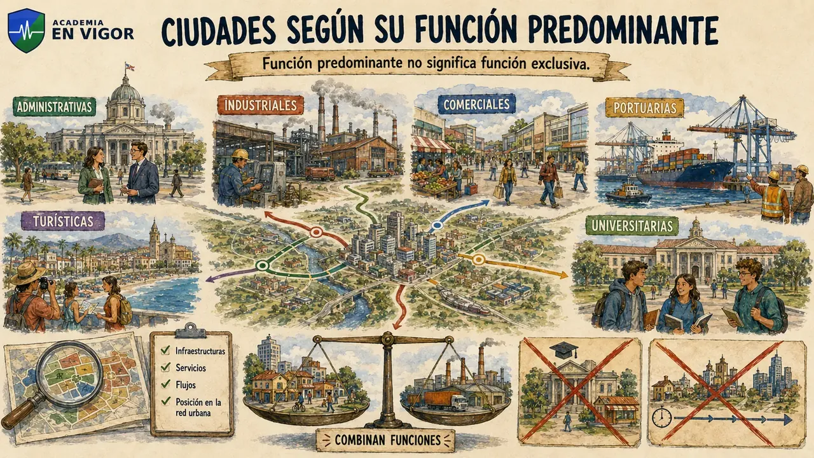

<em>Infografía: Ciudades según su función predominante.</em>

<!-- FUENTE: UN-HABITAT-WCR-T32 -->

## 29. Formas de la red urbana

**Idea de control:** Mira la silueta de las conexiones: mancha, línea, radios o ramas.

- En una red concentrada, gran parte de las ciudades se agrupa en una zona mientras otras áreas quedan débilmente urbanizadas.
- La red lineal sigue un eje dominante como costa, valle, corredor ferroviario o carretera principal.
- La red radiocéntrica organiza conexiones en torno a una ciudad central de la que parten ejes radiales.
- La red dendrítica presenta ramificaciones semejantes a un árbol y puede concentrar nodos en costas o vías principales dejando un interior menos conectado.

<!-- VISUAL:t32-29-formas-de-la-red-urbana.webp -->

  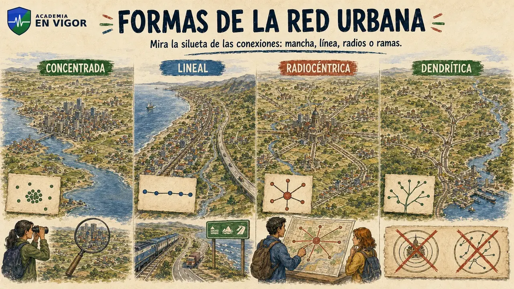

<em>Infografía: Formas de la red urbana.</em>

<!-- FUENTE: IGN-CONCEPTS-T32 -->

## 30. Población absoluta y población relativa

**Idea de control:** Absoluta cuenta personas; relativa pone la cifra en relación con otra magnitud.

- Población absoluta es el número de personas residentes en un territorio y fecha determinados.
- Población relativa expresa una relación con otra magnitud; en geografía suele emplearse para la densidad de población.
- Comparar poblaciones absolutas informa de tamaño, pero no de presión territorial ni patrón de asentamiento.
- Toda cifra de población debe indicar territorio, fecha, unidad y fuente para ser interpretable.

<!-- VISUAL:t32-30-poblacion-absoluta-y-poblacion-relativa.webp -->

  

<em>Infografía: Población absoluta y población relativa.</em>

<!-- FUENTE: INE-CENSO-T32 -->

## 31. Distribución de la población

**Idea de control:** Separa estado y tendencia: baja densidad es una foto; despoblación, una trayectoria.

- La población se distribuye de forma desigual por la combinación de condiciones físicas, historia, empleo, servicios, redes, seguridad y decisiones públicas.
- Litorales, valles, ejes de transporte y áreas metropolitanas suelen concentrar población, pero no existe una regla física universal.
- Despoblación es una pérdida sostenida de habitantes; baja densidad describe una relación población-superficie y no implica por sí sola descenso.
- La concentración puede generar economías de aglomeración y también costes de vivienda, congestión, contaminación y desigualdad.

<!-- VISUAL:t32-31-distribucion-de-la-poblacion.webp -->

  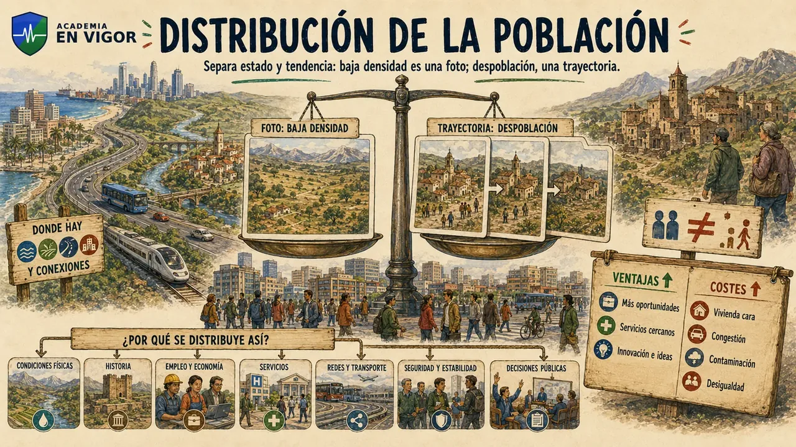

<em>Infografía: Distribución de la población.</em>

<!-- FUENTE: INE-CENSO-T32 -->

## 32. Estructura por sexo y edad

**Idea de control:** El total puede no moverse mientras cambia por completo quiénes lo componen.

- La estructura por sexo y edad distribuye la población en categorías y permite analizar necesidades, reproducción, actividad y envejecimiento.
- La edad puede agruparse en intervalos, pero los cortes dependen del objetivo estadístico y no son universales.
- La razón de sexos compara cantidades de hombres y mujeres mediante una relación cuya convención debe declararse.
- La composición resulta de nacimientos, defunciones y migraciones acumuladas y puede cambiar aunque el total permanezca estable.

<!-- VISUAL:t32-32-estructura-por-sexo-y-edad.webp -->

  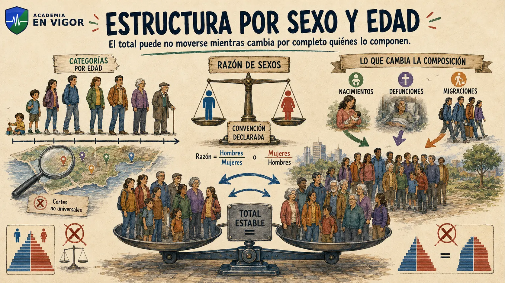

<em>Infografía: Estructura por sexo y edad.</em>

<!-- FUENTE: INE-CENSO-T32 -->

## 33. Pirámides de población

**Idea de control:** Base ancha expande; lados equilibrados estacionan; base estrecha envejece.

- La pirámide de población representa grupos de edad, habitualmente por sexo, mediante barras horizontales enfrentadas.
- La forma expansiva presenta base ancha y alta presencia infantil, asociada a natalidad elevada y crecimiento rápido.
- La forma estacionaria muestra proporciones más equilibradas y crecimiento lento o aproximadamente nulo.
- La forma regresiva o constrictiva tiene base estrecha y mayor peso adulto y anciano, compatible con baja natalidad y envejecimiento.

<!-- VISUAL:t32-33-piramides-de-poblacion.webp -->

  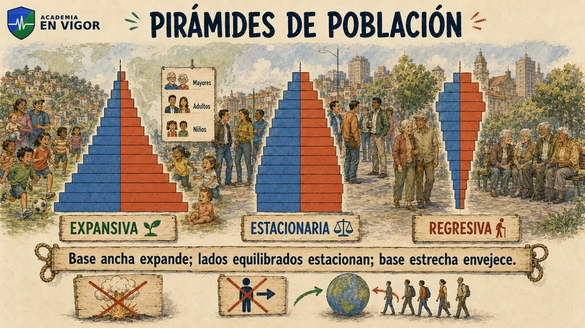

<em>Infografía: Pirámides de población.</em>

<!-- FUENTE: INE-DEMOGRAFIA-T32 -->

## 34. Estructura económica y actividad

**Idea de control:** Activa suma ocupadas y paradas; sin empleo no basta para ser parada estadística.

- La población económicamente activa reúne personas ocupadas y paradas que buscan empleo y están disponibles para trabajar según la definición estadística.
- La población ocupada realiza trabajo remunerado o mantiene un vínculo laboral en las condiciones de la estadística.
- La población parada carece de empleo, busca activamente y está disponible; no equivale a toda persona sin trabajo.
- La población inactiva incluye, entre otras, personas que no trabajan ni buscan activamente conforme a los criterios de la encuesta.

<!-- VISUAL:t32-34-estructura-economica-y-actividad.webp -->

  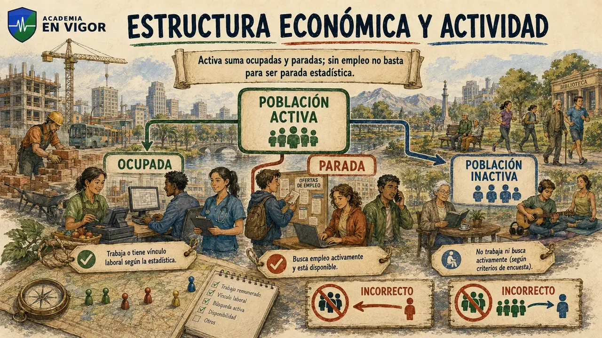

<em>Infografía: Estructura económica y actividad.</em>

<!-- FUENTE: INE-CENSO-T32 -->

## 35. Estructura social, posición y rol

**Idea de control:** Estatus responde dónde estás; rol, qué se espera que hagas.

- La estructura social es el patrón relativamente estable de posiciones, relaciones, instituciones y desigualdades de una sociedad.
- El estatus es una posición social reconocida; el rol es el conjunto de expectativas de conducta asociado a una posición.
- Una persona ocupa varios estatus y desempeña roles que pueden entrar en conflicto.
- Clase, ocupación, educación, renta, género, edad y origen pueden influir en oportunidades, pero no determinan por sí solos cada conducta individual.

<!-- VISUAL:t32-il-35-estructura-social-posicion-y-rol.webp -->

  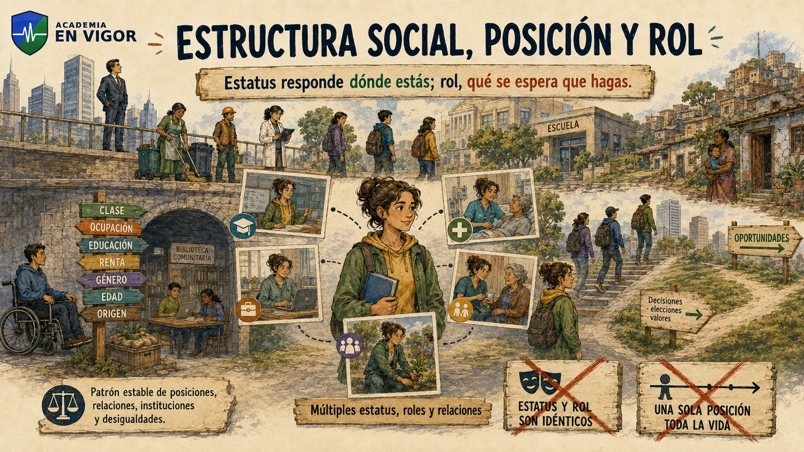

<em>Infografía: Estructura social, posición y rol.</em>

<!-- FUENTE: UN-HABITAT-WCR-T32 -->

## 36. Estratificación y movilidad social

**Idea de control:** Vertical cambia escalón; horizontal cambia lugar; intergeneracional compara generaciones.

- Estratificación social es la distribución jerarquizada y relativamente duradera de recursos, prestigio, poder y oportunidades.
- Los sistemas de estratificación pueden ser más cerrados o abiertos según permitan cambiar de posición.
- Movilidad vertical implica ascenso o descenso de posición; movilidad horizontal cambia de situación sin variación jerárquica clara.
- La movilidad intergeneracional compara posiciones entre generaciones y la intrageneracional cambios durante la vida de una persona.

<!-- VISUAL:t32-36-estratificacion-y-movilidad-social.webp -->

  

<em>Infografía: Estratificación y movilidad social.</em>

<!-- FUENTE: UN-HABITAT-WCR-T32 -->

## 37. Grupos sociales y categorías estadísticas

**Idea de control:** No confundas casilla estadística con grupo: falta interacción o identidad compartida.

- Un grupo social implica interacción, reconocimiento mutuo, expectativas o identidad compartida; una categoría estadística solo reúne personas por un atributo.
- Los grupos primarios se basan en relaciones cercanas y duraderas; los secundarios se orientan más a fines y relaciones formalizadas.
- El grupo de pertenencia es aquel del que se forma parte; el de referencia sirve para comparar, orientar aspiraciones o evaluar conducta.
- Formal e informal describen grado de regulación y espontaneidad, y no equivalen exactamente a primario y secundario.

<!-- VISUAL:t32-37-grupos-sociales-y-categorias-estadisticas.webp -->

  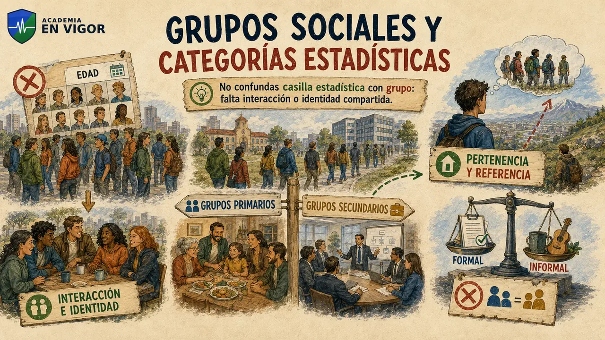

<em>Infografía: Grupos sociales y categorías estadísticas.</em>

<!-- FUENTE: UN-HABITAT-WCR-T32 -->

## 38. Fuentes demográficas y territoriales

**Idea de control:** Censo describe; padrón registra vecinos; Registro Civil documenta hechos vitales.

- El censo de población proporciona información estadística amplia sobre población y hogares con referencia territorial y temporal definida.
- El padrón municipal es el registro administrativo de vecinos y se actualiza de forma continua.
- El Registro Civil documenta hechos vitales como nacimientos, matrimonios y defunciones que alimentan estadísticas demográficas.
- Encuestas, registros y nomenclátor complementan la información sobre características, flujos y entidades de población inferiores al municipio.

<!-- VISUAL:t32-38-fuentes-demograficas-y-territoriales.webp -->

  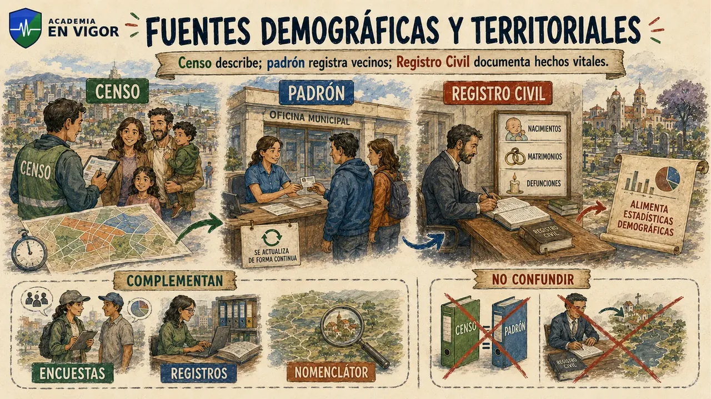

<em>Infografía: Fuentes demográficas y territoriales.</em>

<!-- FUENTE: INE-CENSO-T32 -->

## 39. Concepto y dimensiones de la demografía

**Idea de control:** Foto: stock y estructura; película: nacimientos, defunciones y migraciones.

- La demografía estudia tamaño, estructura, distribución y evolución de las poblaciones humanas.
- El análisis estático observa una población en una fecha; el dinámico estudia cambios por nacimientos, defunciones y migraciones.
- Un stock mide población en un momento y un flujo cuenta acontecimientos durante un período.
- Las tasas relacionan acontecimientos con población expuesta al riesgo y permiten comparar poblaciones de tamaño diferente.

<!-- VISUAL:t32-39-concepto-y-dimensiones-de-la-demografia.webp -->

  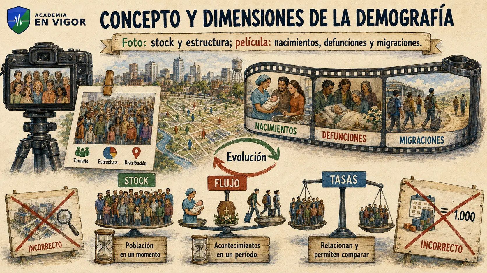

<em>Infografía: Concepto y dimensiones de la demografía.</em>

<!-- FUENTE: INE-DEMOGRAFIA-T32 -->

## 40. Densidad demográfica

**Idea de control:** Fórmula limpia: habitantes entre km²; interpretación prudente: la media no dibuja el asentamiento.

- La densidad demográfica se calcula dividiendo la población de un territorio entre su superficie, normalmente expresada en habitantes por kilómetro cuadrado.
- La densidad también recibe el nombre de población relativa, frente a la población absoluta o total.
- El resultado depende de los límites y de la superficie usada, por lo que comparar unidades muy distintas puede inducir a error.
- La densidad media no revela concentración interna, ocupación estacional ni diferencias entre suelo habitable y no habitable.

<!-- VISUAL:t32-40-densidad-demografica.webp -->

  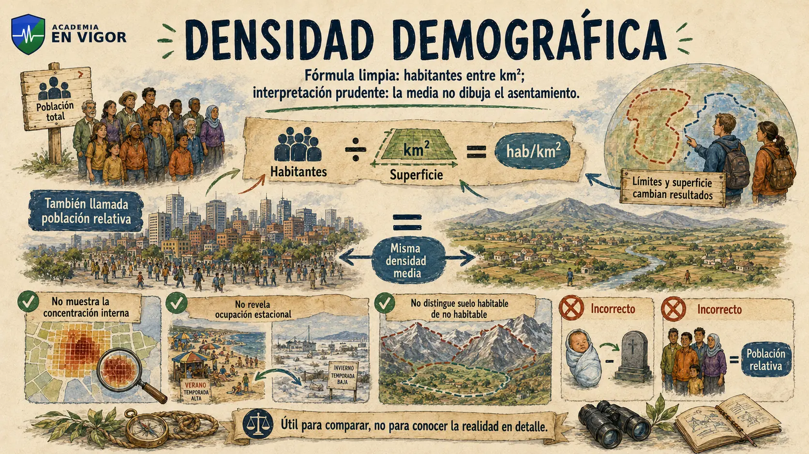

<em>Infografía: Densidad demográfica.</em>

<!-- FUENTE: INE-CENSO-T32 -->

## 41. Tasa bruta de natalidad

**Idea de control:** Nacimientos / población media × 1.000; bruta significa que usa toda la población.

- La tasa bruta de natalidad relaciona los nacimientos registrados durante un año con la población residente media del mismo ámbito y período.
- Se expresa habitualmente por mil habitantes: nacimientos divididos por población media y multiplicados por 1.000.
- Es una tasa bruta porque su denominador incluye toda la población y no solo a quienes pueden tener hijos.
- Comparar tasas brutas exige considerar estructura por edad y sexo, pues una población más joven puede registrar mayor tasa sin mayor fecundidad individual.

<!-- VISUAL:t32-41-tasa-bruta-de-natalidad.webp -->

  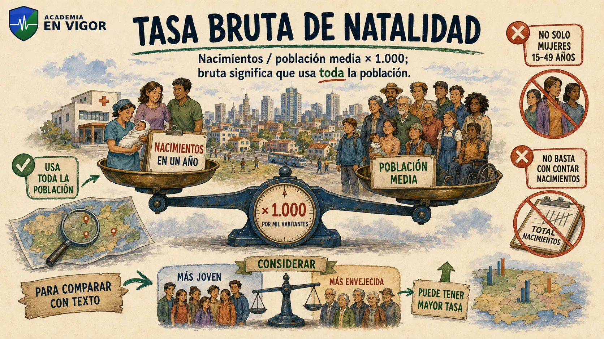

<em>Infografía: Tasa bruta de natalidad.</em>

<!-- FUENTE: INE-IDB-T32 -->

## 42. Tasa bruta de mortalidad

**Idea de control:** La estructura por edad puede engañar a la tasa bruta; no confundas nivel con causa.

- La tasa bruta de mortalidad relaciona las defunciones registradas durante un año con la población residente media del ámbito.
- Se expresa habitualmente por mil habitantes: defunciones divididas por población media y multiplicadas por 1.000.
- Una tasa bruta alta puede reflejar envejecimiento y no necesariamente peores condiciones sanitarias.
- Para comparaciones causales se emplean tasas específicas o estandarizadas que controlan edad, sexo u otras diferencias.

<!-- VISUAL:t32-42-tasa-bruta-de-mortalidad.webp -->

  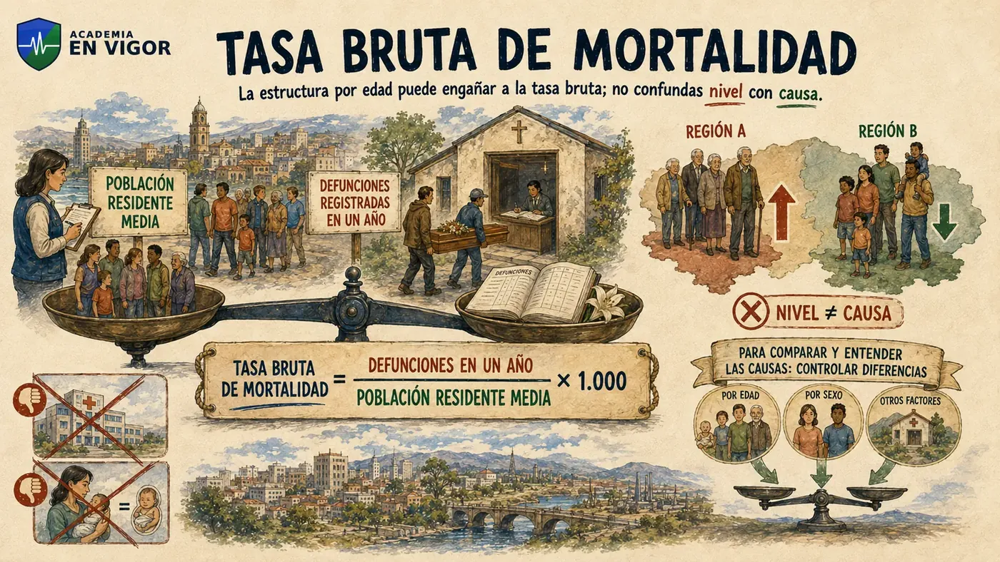

<em>Infografía: Tasa bruta de mortalidad.</em>

<!-- FUENTE: INE-IDB-T32 -->

## 43. Crecimiento vegetativo o natural

**Idea de control:** Natural = nacimientos − defunciones; total añade después la migración.

- El crecimiento vegetativo o natural es la diferencia entre nacimientos y defunciones de una población durante un período.
- Es positivo cuando nacen más personas de las que mueren, negativo cuando las defunciones superan a los nacimientos y nulo cuando se igualan.
- La tasa de crecimiento vegetativo puede expresarse como diferencia entre las tasas brutas de natalidad y mortalidad si usan igual base y período.
- El saldo vegetativo no incluye inmigraciones ni emigraciones y por ello no equivale al crecimiento total.

<!-- VISUAL:t32-43-crecimiento-vegetativo-o-natural.webp -->

  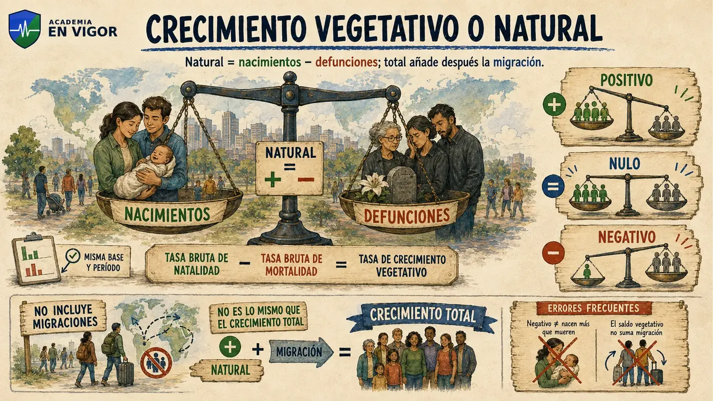

<em>Infografía: Crecimiento vegetativo o natural.</em>

<!-- FUENTE: INE-IDB-T32 -->

## 44. Crecimiento total y saldo migratorio

**Idea de control:** Ecuación de control: total = natural + migratorio; el signo final depende de ambos.

- El crecimiento total de la población resulta de combinar crecimiento natural y saldo migratorio, además de ajustes estadísticos cuando proceda.
- El saldo migratorio es inmigraciones menos emigraciones durante el mismo ámbito y período.
- Una población puede crecer con saldo vegetativo negativo si el saldo migratorio positivo lo supera.
- No debe inferirse un componente a partir del total sin conocer el otro, porque combinaciones distintas producen el mismo resultado.

<!-- VISUAL:t32-44-crecimiento-total-y-saldo-migratorio.webp -->

  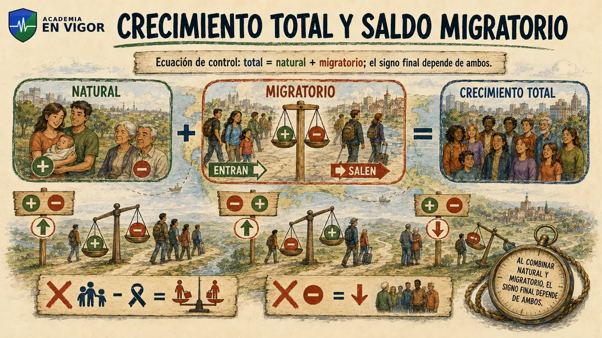

<em>Infografía: Crecimiento total y saldo migratorio.</em>

<!-- FUENTE: INE-DEMOGRAFIA-T32 -->

## 45. Natalidad, fecundidad y reproducción

**Idea de control:** Natalidad mira toda la población; fecundidad centra la población expuesta; fertilidad alude a capacidad.

- Natalidad relaciona nacimientos con población total; fecundidad estudia nacimientos respecto de mujeres o personas expuestas al fenómeno según la medida.
- La tasa general de fecundidad usa nacimientos y población femenina en edades fértiles definida por la metodología.
- El indicador coyuntural de fecundidad estima el número medio de hijos por mujer si se mantuvieran las tasas por edad del período.
- Fecundidad y fertilidad no deben confundirse: en demografía, fecundidad se refiere a hijos efectivamente tenidos y fertilidad a capacidad biológica.

<!-- VISUAL:t32-45-natalidad-fecundidad-y-reproduccion.webp -->

  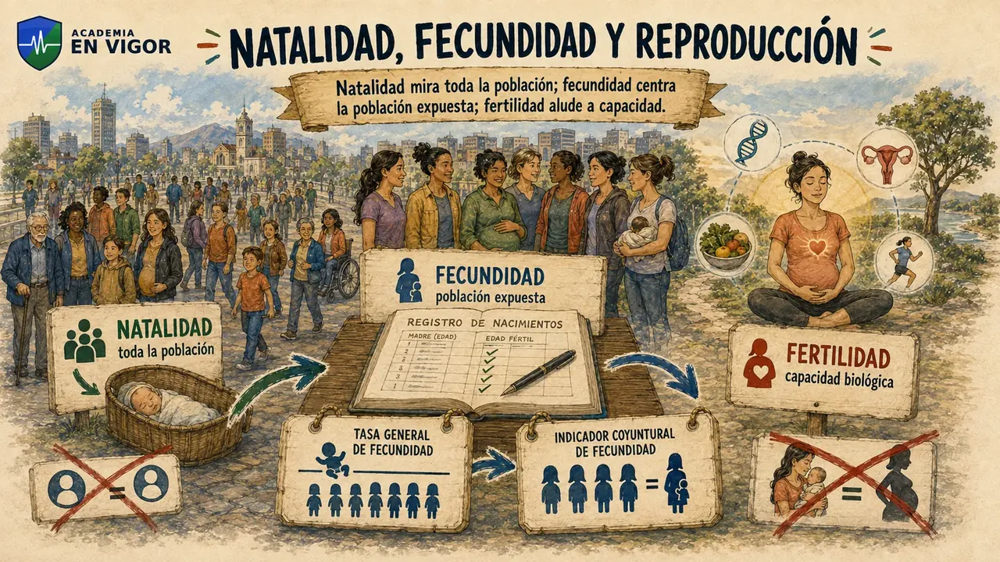

<em>Infografía: Natalidad, fecundidad y reproducción.</em>

<!-- FUENTE: INE-IDB-T32 -->

## 46. Mortalidad infantil y esperanza de vida

**Idea de control:** Son indicadores sintéticos, no profecías individuales.

- La tasa de mortalidad infantil relaciona defunciones de menores de un año con nacidos vivos del período y suele expresarse por mil.
- La esperanza de vida al nacimiento resume los años medios que viviría una cohorte hipotética sometida a las tasas de mortalidad por edad del período.
- Esperanza de vida no es la edad máxima ni predice exactamente cuánto vivirá una persona concreta.
- Mortalidad infantil y esperanza de vida sintetizan dimensiones diferentes y no se obtienen mediante la tasa bruta de mortalidad.

<!-- VISUAL:t32-46-mortalidad-infantil-y-esperanza-de-vida.webp -->

  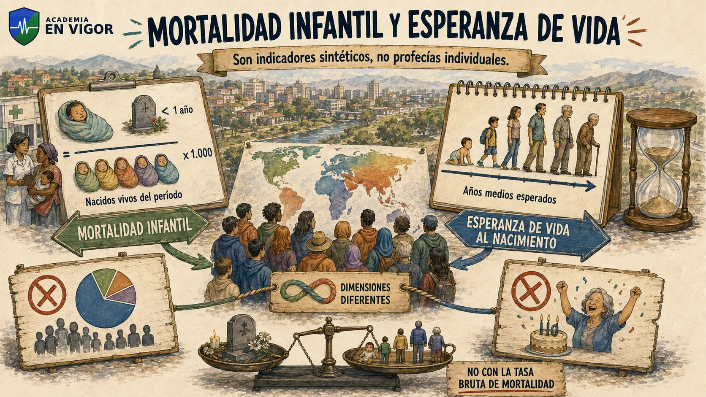

<em>Infografía: Mortalidad infantil y esperanza de vida.</em>

<!-- FUENTE: INE-IDB-T32 -->

## 47. Tasas brutas, específicas y estandarizadas

**Idea de control:** Bruta resume; específica enfoca; estandarizada compara con mayor limpieza.

- Una tasa bruta usa la población total como denominador y resume el fenómeno sin controlar su estructura.
- Una tasa específica restringe numerador y denominador a una edad, sexo, causa u otro grupo relevante.
- La estandarización permite comparar poblaciones con estructuras distintas aplicando una estructura común o ajustando el efecto de composición.
- Una proporción expresa parte sobre total y una razón compara cantidades que no necesariamente forman una parte del mismo total.

<!-- VISUAL:t32-47-tasas-brutas-especificas-y-estandarizadas.webp -->

  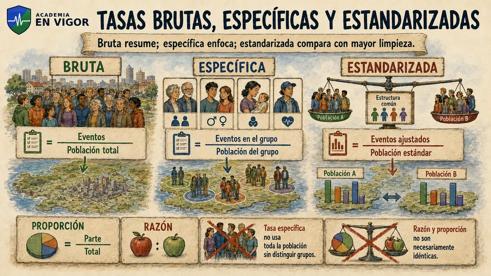

<em>Infografía: Tasas brutas, específicas y estandarizadas.</em>

<!-- FUENTE: INE-IDB-T32 -->

## 48. Transición demográfica

**Idea de control:** El desfase entre caída de mortalidad y natalidad explica el gran crecimiento transicional.

- La transición demográfica describe el paso histórico desde mortalidad y natalidad altas hacia niveles bajos mediante fases analíticas.
- En una primera fase ambas tasas son altas y el crecimiento natural suele ser reducido e irregular.
- Cuando desciende antes la mortalidad y la natalidad permanece alta, el crecimiento natural se acelera.
- Cuando también cae la natalidad, el crecimiento se modera y puede llegar a ser muy bajo o negativo en fases avanzadas.

<!-- VISUAL:t32-48-transicion-demografica.webp -->

  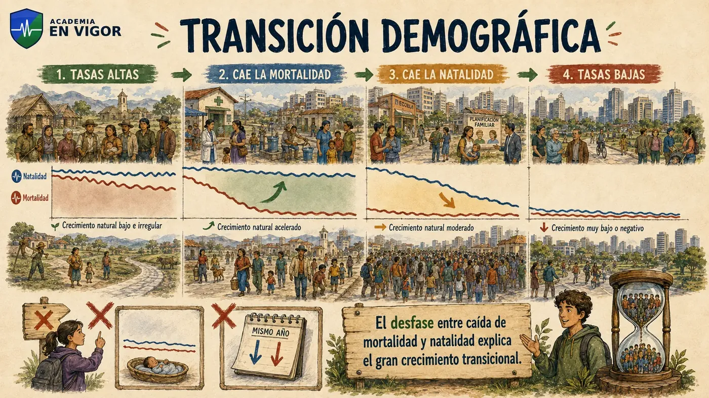

<em>Infografía: Transición demográfica.</em>

<!-- FUENTE: UN-DESA-DEMOGRAPHY-T32 -->

## 49. Regímenes demográficos y envejecimiento

**Idea de control:** Los índices usan grupos de edad convencionales; describen estructura, no conducta laboral individual.

- Un régimen demográfico resume combinaciones de natalidad, mortalidad, crecimiento y estructura por edades en un período.
- El envejecimiento demográfico es el aumento del peso relativo de las personas mayores y resulta de baja fecundidad, mayor supervivencia y migraciones selectivas.
- El índice de envejecimiento relaciona población mayor con población joven según edades definidas por la metodología.
- La tasa o índice de dependencia relaciona grupos potencialmente dependientes con población en edades potencialmente activas, no dependencia económica individual real.

<!-- VISUAL:t32-49-regimenes-demograficos-y-envejecimiento.webp -->

  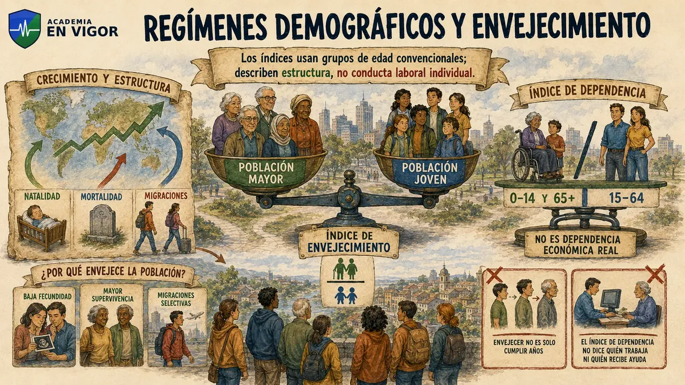

<em>Infografía: Regímenes demográficos y envejecimiento.</em>

<!-- FUENTE: UN-DESA-DEMOGRAPHY-T32 -->

## 50. Masa, multitud, público y grupo

**Idea de control:** Cuerpo junto: multitud; atención compartida: público; interacción estable: grupo.

- Masa es una agregación amplia en la que disminuye la individualización y aumenta la orientación compartida, sin exigir organización estable.
- Multitud suele designar concentración física de personas, mientras una masa puede articularse también mediante medios y símbolos sin copresencia.
- Público reúne personas interesadas en un asunto que intercambian atención u opinión, incluso a distancia.
- Un grupo social presenta interacción, normas o identidad más estables que una masa ocasional.

<!-- VISUAL:t32-50-masa-multitud-publico-y-grupo.webp -->

  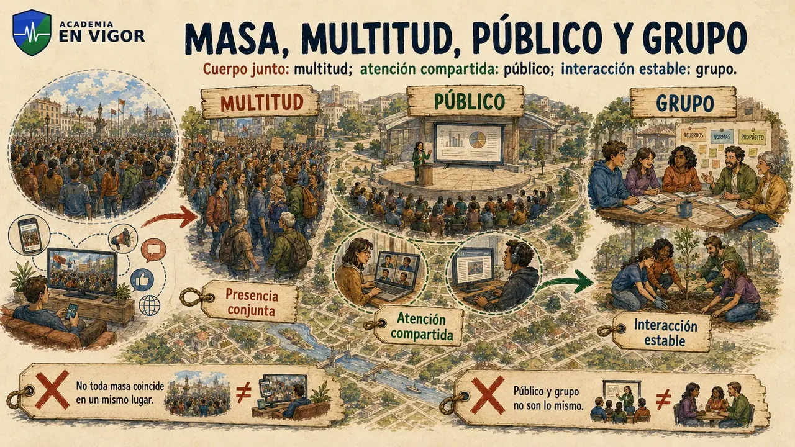

<em>Infografía: Masa, multitud, público y grupo.</em>

<!-- FUENTE: CANETTI-1960-T32 -->

## 51. Características de la sociedad de masas

**Idea de control:** Gran escala no significa uniformidad total: estandariza algunas vías y multiplica otras.

- La sociedad de masas se asocia a urbanización, industrialización, alfabetización, consumo amplio y comunicación de gran alcance.
- Predominan organizaciones e instituciones de gran escala y muchas relaciones son indirectas, especializadas o formalizadas.
- La estandarización de productos y mensajes puede coexistir con segmentación de públicos, estilos e identidades.
- Anonimato y debilitamiento de vínculos tradicionales son tendencias posibles, no desaparición automática de comunidad y participación.

<!-- VISUAL:t32-51-caracteristicas-de-la-sociedad-de-masas.webp -->

  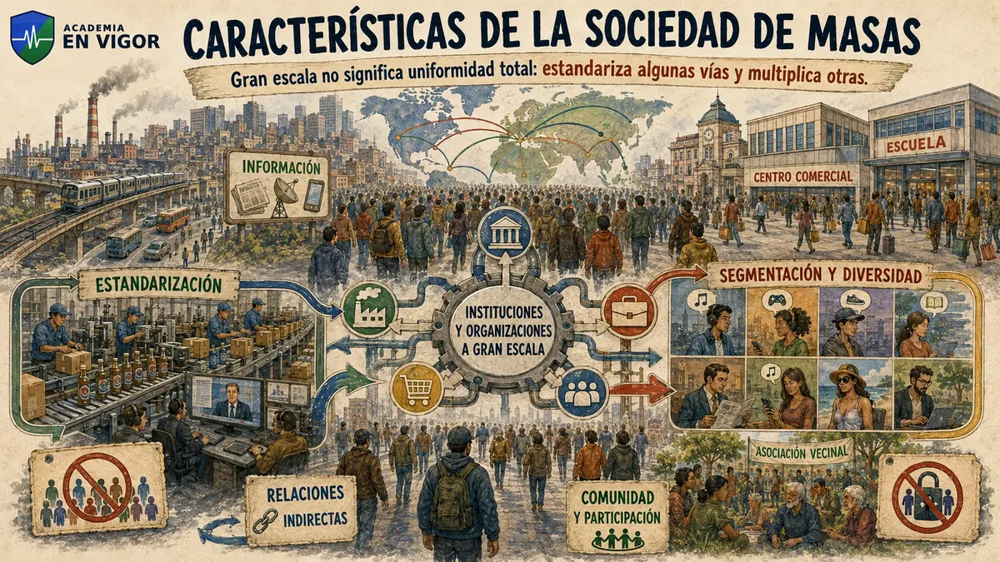

<em>Infografía: Características de la sociedad de masas.</em>

<!-- FUENTE: ORTEGA-1930-T32 -->

## 52. Gustave Le Bon y la psicología de las multitudes

**Idea de control:** Memoriza sus tres claves y también el límite: es una teoría histórica, no una condena de toda concentración.

- Le Bon explicó la conducta de las multitudes mediante anonimato, contagio y sugestibilidad.
- Sostuvo que la inmersión en la multitud reduce responsabilidad individual percibida y facilita respuestas emocionales compartidas.
- Su obra influyó en la psicología colectiva, propaganda y análisis político del siglo XX.
- El enfoque generaliza en exceso y no debe usarse para considerar irracional a toda reunión o justificar control indiscriminado.

<!-- VISUAL:t32-52-gustave-le-bon-y-la-psicologia-de-las-multitudes.webp -->

  

<em>Infografía: Gustave Le Bon y la psicología de las multitudes.</em>

<!-- FUENTE: LE-BON-1895-T32 -->

## 53. Gabriel Tarde: públicos, imitación y opinión

**Idea de control:** Le Bon mira la multitud reunida; Tarde abre el análisis al público conectado a distancia.

- Tarde distinguió la multitud físicamente reunida del público disperso cuyos miembros están conectados por medios de comunicación.
- La imitación explica difusión de creencias, prácticas y modas mediante relaciones sociales.
- La conversación y la prensa participan en la formación y circulación de la opinión pública.
- Difusión no implica recepción idéntica: los mensajes son interpretados y compiten con redes y experiencias previas.

<!-- VISUAL:t32-53-gabriel-tarde-publicos-imitacion-y-opinion.webp -->

  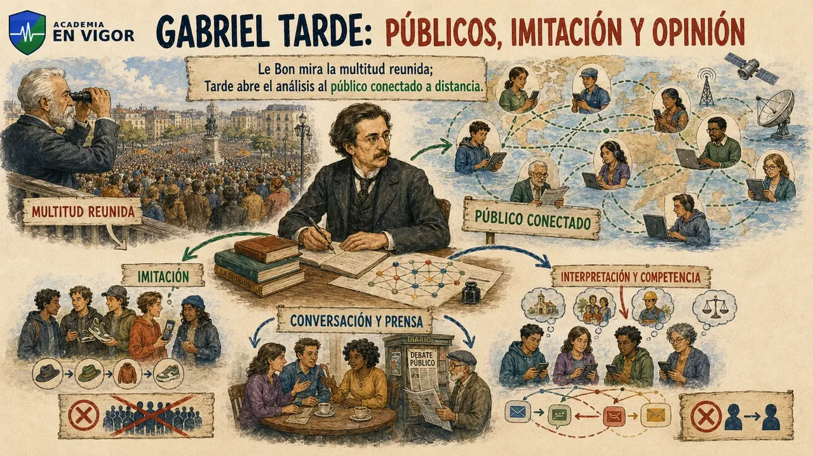

<em>Infografía: Gabriel Tarde: públicos, imitación y opinión.</em>

<!-- FUENTE: TARDE-1901-T32 -->

## 54. Ortega y Gasset y el hombre-masa

**Idea de control:** En Ortega, masa es una actitud de baja autoexigencia, no una nómina ni un aforo.

- Ortega y Gasset empleó hombre-masa para describir una actitud y no una clase económica ni una cantidad física de personas.
- El hombre-masa se considera satisfecho tal como es, no reconoce instancias superiores de exigencia y pretende imponer sus opiniones sin justificación.
- La minoría excelente no es una élite hereditaria, sino quien se exige más y asume deberes y disciplina.
- La rebelión de las masas analiza la entrada de amplios sectores en espacios y decisiones antes restringidos, con oportunidades y riesgos políticos.

<!-- VISUAL:t32-il-54-ortega-y-gasset-y-el-hombre-masa.webp -->

  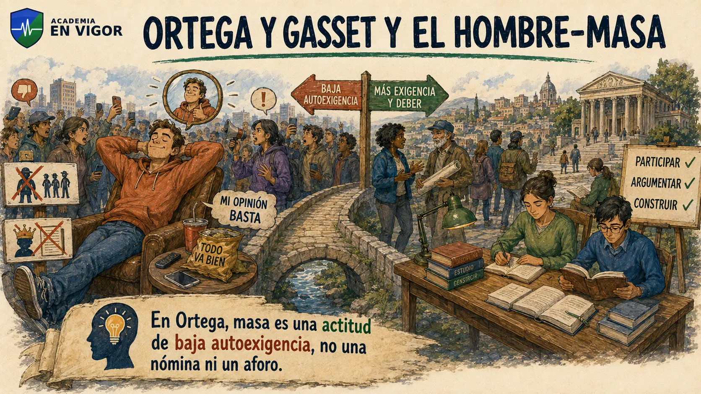

<em>Infografía: Ortega y Gasset y el hombre-masa.</em>

<!-- FUENTE: ORTEGA-1930-T32 -->

## 55. Elias Canetti y los tipos de masa

**Idea de control:** Canetti clasifica la dirección afectiva de la masa; no confundas su ensayo con una norma.

- Canetti distinguió masa abierta, que busca crecer sin límite, y masa cerrada, que fija fronteras, repetición y forma.
- Clasificó masas según afecto dominante, entre ellas las de acoso, fuga, prohibición, inversión y festiva.
- También estudió masas de guerra y de lamento en relación con amenaza, pérdida y supervivencia colectiva.
- Sus categorías son instrumentos interpretativos de una obra ensayística y no tipos jurídicos ni diagnósticos clínicos.

<!-- VISUAL:t32-il-55-elias-canetti-y-los-tipos-de-masa.webp -->

  

<em>Infografía: Elias Canetti y los tipos de masa.</em>

<!-- FUENTE: CANETTI-1960-T32 -->

## 56. Medio ambiente, contaminación y contaminante

**Idea de control:** Separa agente, medio y efecto; la contaminación puede viajar como materia o energía.

- El medio ambiente integra elementos naturales y humanos, sus interacciones y las condiciones que sostienen vida, salud y actividades.
- Contaminación es la introducción o presencia de sustancias, organismos o formas de energía capaces de producir efectos adversos.
- Contaminante es el agente físico, químico o biológico que causa o puede causar la alteración perjudicial.
- No toda modificación ambiental es contaminación, pero puede constituir otro impacto relevante como fragmentación, sobreexplotación o pérdida de hábitat.

<!-- VISUAL:t32-56-medio-ambiente-contaminacion-y-contaminante.webp -->

  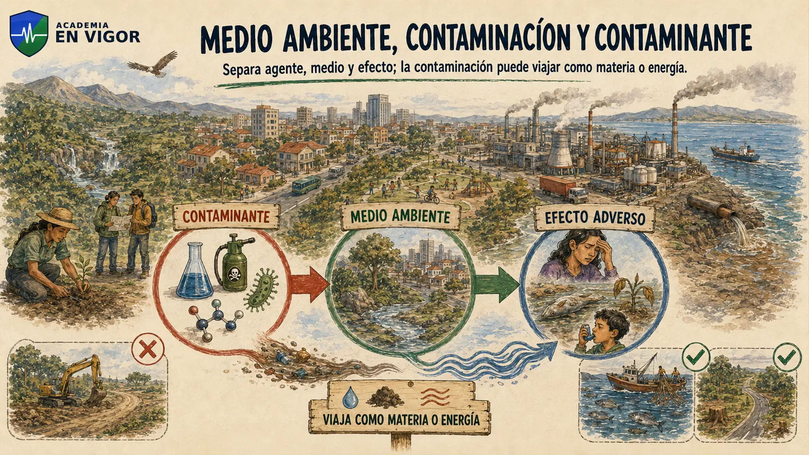

<em>Infografía: Medio ambiente, contaminación y contaminante.</em>

<!-- FUENTE: CE-1978-T32 -->

## 57. Fuente, vía, receptor y escala del impacto

**Idea de control:** Cadena de control: fuente → vía → receptor → efecto; cuanto antes cortes, mejor.

- La fuente es la actividad o punto de emisión; la vía es el medio de transporte; el receptor es la persona, ecosistema o bien expuesto.
- Una fuente puntual es localizable, como una chimenea o vertido; una difusa procede de múltiples focos dispersos, como escorrentía o tráfico.
- La contaminación puede ser local, transfronteriza o global según alcance, persistencia y transporte.
- Prevenir en la fuente suele ser más eficaz que actuar cuando el contaminante ya se dispersó o acumuló.

<!-- VISUAL:t32-57-fuente-via-receptor-y-escala-del-impacto.webp -->

  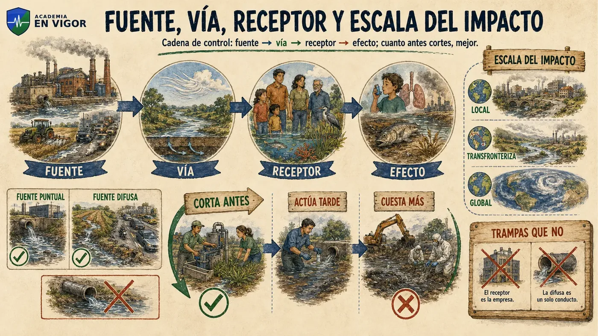

<em>Infografía: Fuente, vía, receptor y escala del impacto.</em>

<!-- FUENTE: EEA-T32 -->

## 58. Contaminación atmosférica

**Idea de control:** Emisión sale de la fuente; inmisión llega al aire que respira el receptor.

- La contaminación atmosférica incluye sustancias o formas de energía introducidas por actividad humana con efectos nocivos para salud, ambiente o bienes.
- Los contaminantes primarios se emiten directamente; los secundarios se forman en la atmósfera mediante reacciones.
- Emisión es la liberación desde una fuente; inmisión o concentración ambiental es el nivel presente donde se evalúa la calidad del aire.
- La Ley 34/2007 establece bases para prevenir, vigilar y reducir la contaminación atmosférica aplicando cautela, prevención, corrección en la fuente y quien contamina paga.

<!-- VISUAL:t32-58-contaminacion-atmosferica.webp -->

  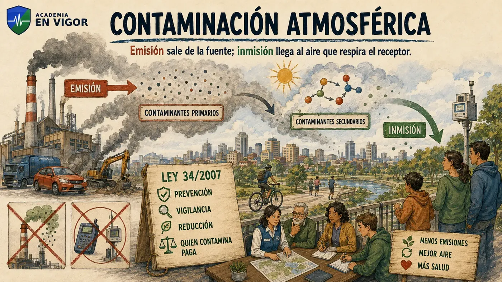

<em>Infografía: Contaminación atmosférica.</em>

<!-- FUENTE: LEY34-2007-T32 -->

## 59. Contaminación del agua y del suelo

**Idea de control:** El contaminante cruza fronteras entre suelo, agua superficial y acuífero; no estudies los medios como cajas aisladas.

- La contaminación del agua altera su composición o estado y puede perjudicar salud, ecosistemas, usos y calidad del recurso.
- Los vertidos puntuales se descargan por conducciones identificables; la contaminación difusa procede de fuentes dispersas y escorrentía.
- Un suelo contaminado contiene componentes peligrosos de origen humano en concentración que genera riesgo inaceptable para salud o ambiente conforme a la normativa.
- Aguas y suelos están conectados: filtración, escorrentía y sedimentos pueden transferir contaminantes entre medios.

<!-- VISUAL:t32-59-contaminacion-del-agua-y-del-suelo.webp -->

  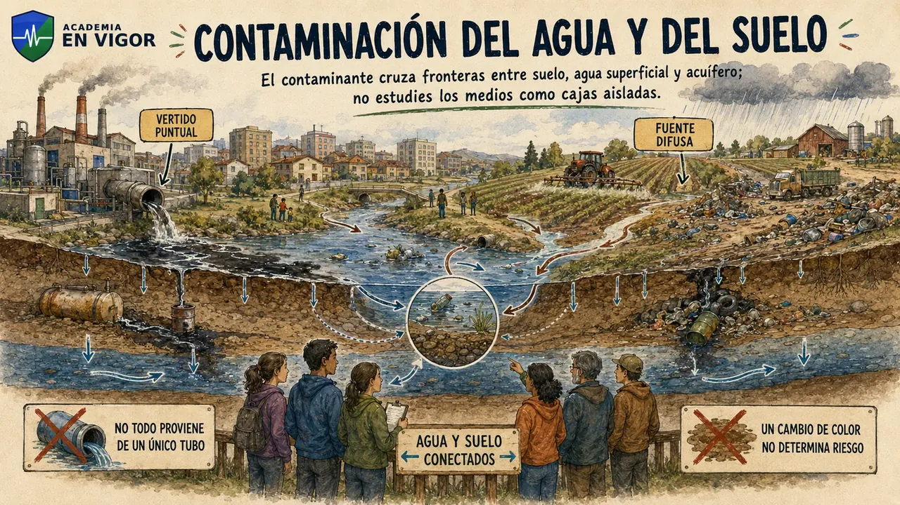

<em>Infografía: Contaminación del agua y del suelo.</em>

<!-- FUENTE: RDL1-2001-T32 -->

## 60. Residuos, subproductos y economía circular

**Idea de control:** La mejor gestión empieza antes del residuo: diseño, duración, reparación y reutilización.

- Residuo es cualquier sustancia u objeto que su poseedor desecha o tiene la intención o la obligación de desechar.
- La prevención reduce cantidad, peligrosidad o impactos antes de que una sustancia u objeto se convierta en residuo.
- La economía circular busca mantener productos, componentes y materiales en uso y reducir extracción, residuos y impactos.
- Un subproducto deja de tratarse como residuo solo si cumple las condiciones legales; no basta con que tenga valor económico.

<!-- VISUAL:t32-60-residuos-subproductos-y-economia-circular.webp -->

  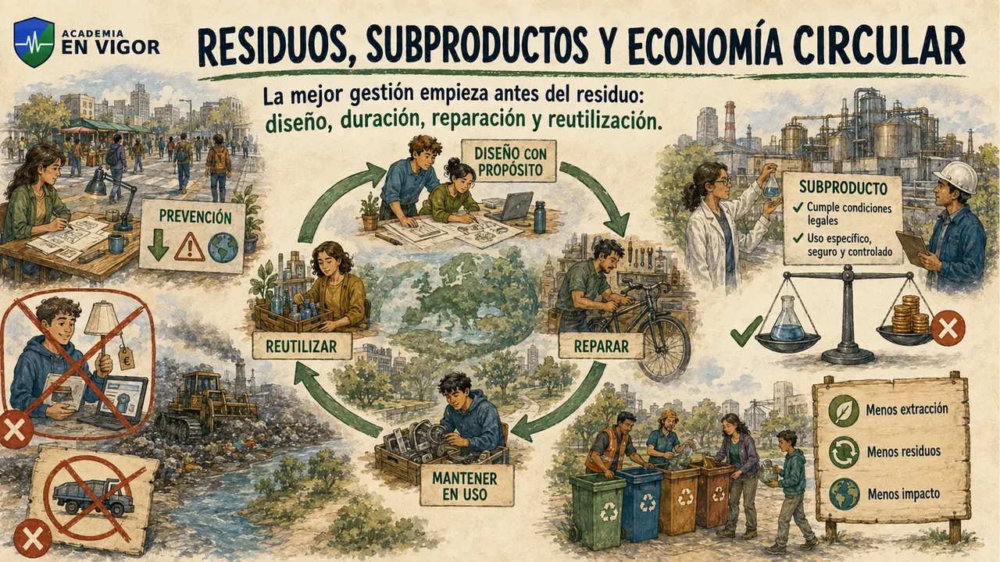

<em>Infografía: Residuos, subproductos y economía circular.</em>

<!-- FUENTE: LEY7-2022-T32 -->

## 61. Ruido, luz, calor y radiaciones

**Idea de control:** Materia no es la única vía: ruido, luz, calor y radiación también alteran el medio.

- La contaminación acústica es la presencia de ruido o vibraciones que produce molestia, riesgo o daño para personas, actividades, bienes o ambiente.
- La contaminación lumínica es la alteración de la oscuridad natural por luz artificial innecesaria o mal dirigida y afecta observación, energía y biodiversidad.
- La contaminación térmica modifica temperaturas del medio, por ejemplo mediante descargas de calor en agua o aire.
- Las radiaciones ionizantes y no ionizantes requieren evaluar fuente, dosis, exposición y efectos; no son categorías equivalentes.

<!-- VISUAL:t32-il-61-ruido-luz-calor-y-radiaciones.webp -->

  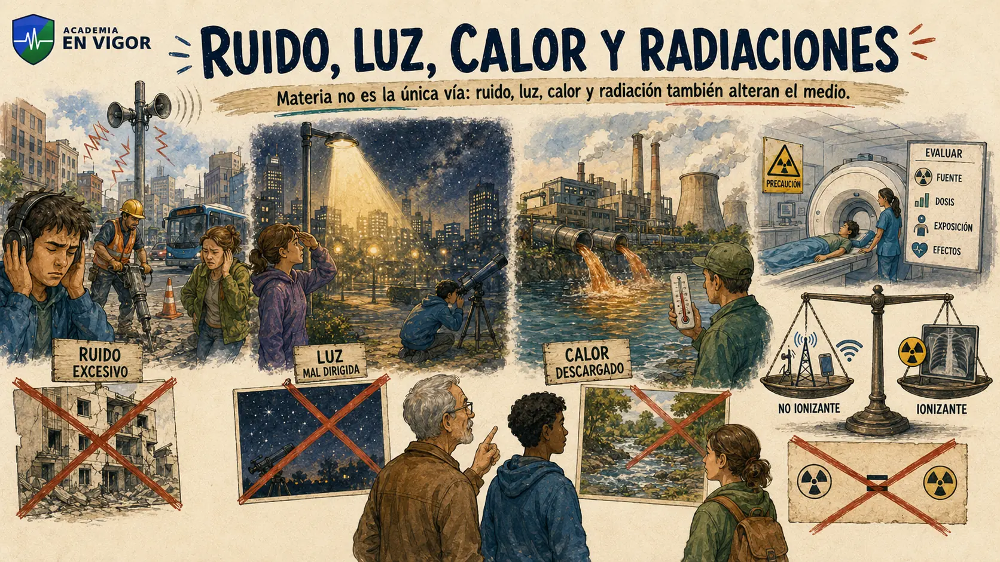

<em>Infografía: Ruido, luz, calor y radiaciones.</em>

<!-- FUENTE: LEY37-2003-T32 -->

## 62. Efectos sobre salud, ecosistemas y clima

**Idea de control:** Pregunta siempre dosis, tiempo, vía, receptor y combinación con otros impactos.

- La contaminación puede causar efectos agudos o crónicos según dosis, duración, vía de exposición y vulnerabilidad del receptor.
- Los ecosistemas sufren toxicidad, eutrofización, acidificación, pérdida de biodiversidad y alteración de funciones ecológicas.
- Los impactos pueden acumularse o interactuar de forma sinérgica, por lo que evaluar cada fuente de manera aislada puede infravalorar el riesgo.
- Cambio climático y contaminación atmosférica se relacionan, pero no son sinónimos: difieren en agentes, escalas y mecanismos.

<!-- VISUAL:t32-62-efectos-sobre-salud-ecosistemas-y-clima.webp -->

  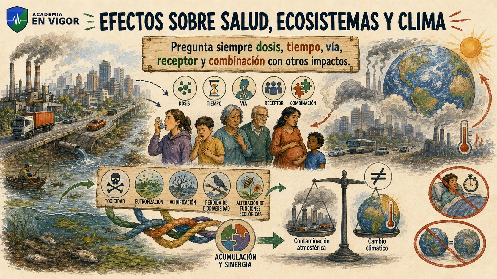

<em>Infografía: Efectos sobre salud, ecosistemas y clima.</em>

<!-- FUENTE: EEA-T32 -->

## 63. Artículo 45 de la Constitución

**Idea de control:** Regla 45: disfrutar y conservar; usar racionalmente, defender y restaurar; sancionar y reparar.

- El artículo 45.1 reconoce el derecho a disfrutar de un medio ambiente adecuado para el desarrollo de la persona y el deber de conservarlo.
- El artículo 45.2 ordena a los poderes públicos velar por el uso racional de los recursos para proteger y mejorar la calidad de vida y defender y restaurar el medio ambiente.
- La actuación pública se apoya en la indispensable solidaridad colectiva.
- El artículo 45.3 prevé sanciones penales o administrativas y la obligación de reparar el daño en los términos que fije la ley.

<!-- VISUAL:t32-63-articulo-45-de-la-constitucion.webp -->

  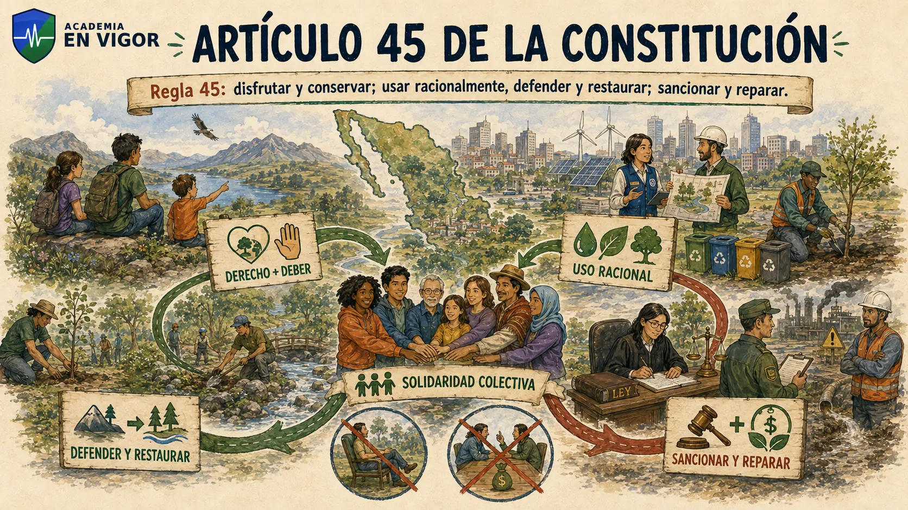

<em>Infografía: Artículo 45 de la Constitución.</em>

<!-- FUENTE: CE-1978-T32 -->

## 64. Principios de protección ambiental

**Idea de control:** Prevenir antes, actuar con cautela ante incertidumbre y cargar el coste al responsable.

- Prevención actúa ante riesgos conocidos antes de que el daño ocurra; precaución o cautela responde a incertidumbre científica razonable sobre daños graves.
- Corrección en la fuente prioriza intervenir donde se origina la contaminación frente a trasladarla o diluirla.
- Quien contamina paga atribuye al responsable los costes de prevención, control y reparación, sin convertir el pago en permiso para contaminar.
- Integración ambiental exige incorporar la protección del medio en políticas y decisiones sectoriales, no aislarla al final del proceso.

<!-- VISUAL:t32-64-principios-de-proteccion-ambiental.webp -->

  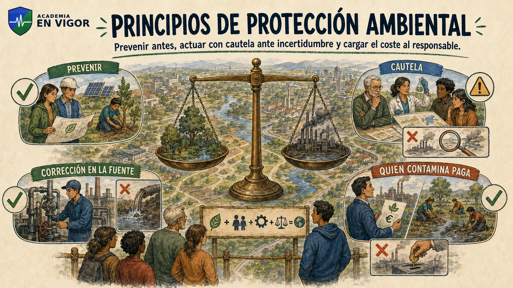

<em>Infografía: Principios de protección ambiental.</em>

<!-- FUENTE: LEY34-2007-T32 -->

## 65. Evaluación ambiental y control preventivo

**Idea de control:** Plan o programa: estratégica; proyecto: impacto; ambos deben actuar antes de decidir.

- La evaluación ambiental integra aspectos ambientales antes de autorizar proyectos o aprobar planes y programas con efectos significativos.
- La evaluación estratégica se aplica a planes y programas; la evaluación de impacto ambiental se refiere a proyectos.
- El procedimiento analiza alternativas, impactos, medidas preventivas, correctoras y compensatorias, seguimiento e información pública.
- La declaración o informe ambiental no sustituye todas las autorizaciones sectoriales ni elimina la obligación de cumplir sus condiciones.

<!-- VISUAL:t32-65-evaluacion-ambiental-y-control-preventivo.webp -->

  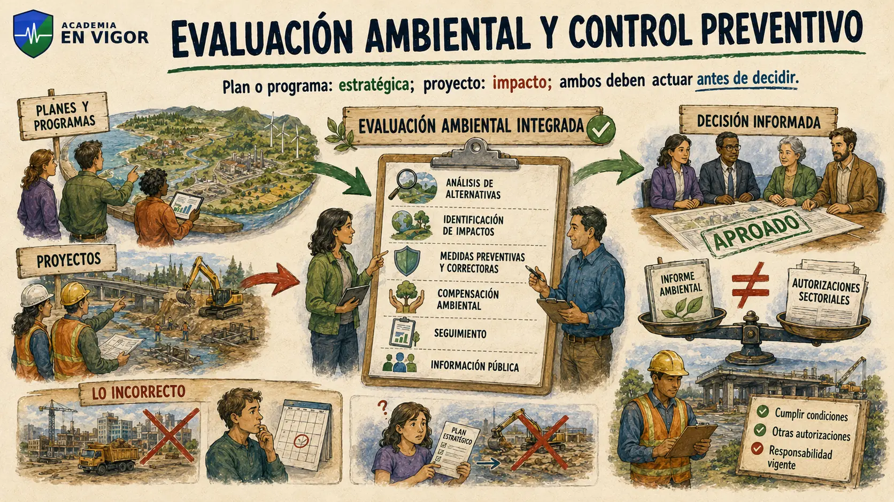

<em>Infografía: Evaluación ambiental y control preventivo.</em>

<!-- FUENTE: LEY21-2013-T32 -->

## 66. Jerarquía de residuos y responsabilidad ambiental

**Idea de control:** Primero evita crear residuo; si hay daño, la respuesta no termina en sancionar: hay que reparar.

- La jerarquía de residuos prioriza prevención, preparación para la reutilización, reciclado, otras formas de valorización y, al final, eliminación.
- La jerarquía puede apartarse en casos justificados por el mejor resultado ambiental del ciclo de vida.
- La Ley 26/2007 obliga a determinados operadores a prevenir, evitar y reparar daños medioambientales conforme a un régimen administrativo.
- La reparación busca devolver recursos y servicios naturales al estado básico y puede incluir reparación primaria, complementaria y compensatoria.

<!-- VISUAL:t32-66-jerarquia-de-residuos-y-responsabilidad-ambiental.webp -->

  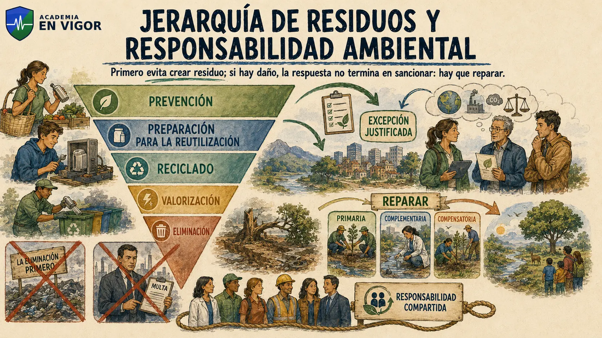

<em>Infografía: Jerarquía de residuos y responsabilidad ambiental.</em>

<!-- FUENTE: LEY26-2007-T32 -->

## 67. Información, participación y justicia ambiental

**Idea de control:** Tres puertas ciudadanas: información, participación y justicia; el Consejo asesora y hace seguimiento.

- La Ley 27/2006 reconoce derechos de acceso a información ambiental, participación pública en decisiones y acceso a la justicia en materia ambiental.
- La información ambiental debe facilitarse con las excepciones y plazos legales, sin exigir que la persona pruebe un interés determinado en los casos previstos.
- La participación debe producirse cuando las opciones estén abiertas y permitir que las observaciones sean consideradas antes de la decisión.
- El Consejo Asesor de Medio Ambiente es el órgano colegiado de participación y seguimiento de políticas ambientales generales orientadas al desarrollo sostenible.

<!-- VISUAL:t32-67-informacion-participacion-y-justicia-ambiental.webp -->

  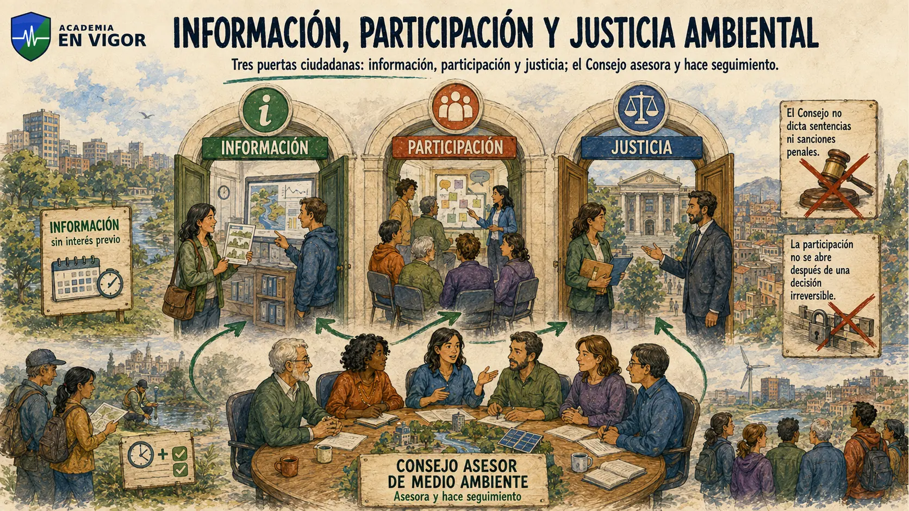

<em>Infografía: Información, participación y justicia ambiental.</em>

<!-- FUENTE: LEY27-2006-T32 -->

## 68. Agencia Europea de Medio Ambiente

**Idea de control:** AEMA informa y evalúa; no legisla. Sede: Copenhague.

- La Agencia Europea de Medio Ambiente es una agencia de la Unión Europea que proporciona información sólida e independiente sobre medio ambiente y clima.
- Apoya a responsables públicos y ciudadanía mediante datos, indicadores, evaluaciones y conocimiento para políticas de sostenibilidad.
- Trabaja con la Red Europea de Información y Observación del Medio Ambiente, Eionet.
- La Agencia comenzó a operar en 1994 y tiene su sede en Copenhague, Dinamarca.

<!-- VISUAL:t32-il-68-agencia-europea-de-medio-ambiente.webp -->

  

<em>Infografía: Agencia Europea de Medio Ambiente.</em>

<!-- FUENTE: EEA-T32 -->

## 69. Competencias, vigilancia y respuesta ambiental

**Idea de control:** Proteger el medio exige datos, competencias claras, coordinación y una cadena de custodia sólida.

- La protección ambiental se distribuye entre Unión Europea, Estado, comunidades autónomas y entidades locales según materia y competencia.
- La vigilancia combina inventarios de emisiones, redes de medición, inspección, indicadores, alertas y seguimiento de planes.
- La respuesta sigue una secuencia de prevención, preparación, detección, contención, corrección, reparación y evaluación.
- La actuación policial ambiental preserva seguridad y pruebas, identifica responsables y coordina con autoridades competentes sin sustituir la pericia técnica.

<!-- VISUAL:t32-69-competencias-vigilancia-y-respuesta-ambiental.webp -->

  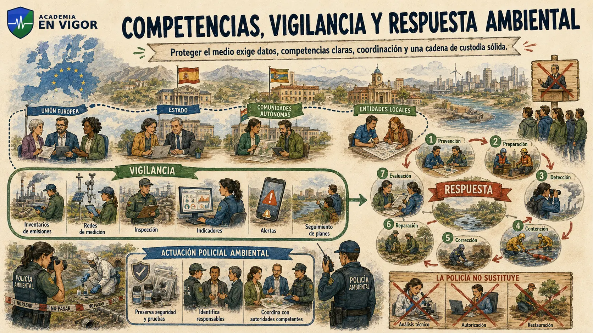

<em>Infografía: Competencias, vigilancia y respuesta ambiental.</em>

<!-- FUENTE: MITECO-T32 -->

# Hablemos claro

:::hablemos-claro
El tema cambia varias veces de escala: del mapa a la ciudad, de la ciudad a la población, de la población a la masa y de la masa al medio. Nombra siempre la unidad, el período y la relación medida.
:::

# En la calle

:::en-la-calle
Una actuación territorial o ambiental mejora cuando separas observación de inferencia: localiza la fuente, describe el patrón, identifica a los afectados y conserva datos y pruebas antes de atribuir causas.
:::

# Lo que cae

:::lo-que-cae
Prioriza definición de geografía humana, modelos de Burgess-Hoyt-Harris y Ullman, conurbación y suburbanización, densidad, tasas por mil, crecimiento vegetativo, pirámides, Canetti, artículo 45, principios ambientales, Consejo Asesor y AEMA.
:::

# Ha caído

:::ha-caido
Se han localizado 17 referencias históricas del Tema 32. Permanecen ocultas y en cuarentena porque no existe plantilla oficial final verificable en el repositorio.
:::

## Fuentes primarias e institucionales

- `CONV-PN-2026-T32`
- `UN-HABITAT-T32`
- `UN-HABITAT-CITY-T32`
- `UN-HABITAT-WCR-T32`
- `IGN-CONCEPTS-T32`
- `INE-CENSO-T32`
- `INE-DEMOGRAFIA-T32`
- `INE-IDB-T32`
- `UN-DESA-DEMOGRAPHY-T32`
- `HOWARD-1902-T32`
- `PARK-BURGESS-1925-T32`
- `BURGESS-1925-T32`
- `HOYT-1939-T32`
- `HARRIS-ULLMAN-1945-T32`
- `WIRTH-1938-T32`
- `LE-BON-1895-T32`
- `TARDE-1901-T32`
- `ORTEGA-1930-T32`
- `CANETTI-1960-T32`
- `CE-1978-T32`
- `LEY34-2007-T32`
- `RDL1-2001-T32`
- `LEY7-2022-T32`
- `LEY37-2003-T32`
- `LEY21-2013-T32`
- `LEY26-2007-T32`
- `LEY27-2006-T32`
- `EEA-T32`
- `MITECO-T32`

---

*Academia En Vigor · El temario que nunca duerme · Tema 32 · v1.0.0 · Documento interno no publicado.*
