# TEMA 33 · LA SEGURIDAD. CONCEPTO. SEGURIDAD INDIVIDUAL Y SEGURIDAD COLECTIVA. SEGURIDAD PÚBLICA Y SEGURIDAD PRIVADA. LA INSEGURIDAD. TEORÍAS EXPLICATIVAS DE LA DELINCUENCIA: CONCEPTO, MODELOS EXPLICATIVOS Y CLASES DE DELINCUENCIA.

**Policía Nacional · Método VIGOR · PARTE**
**Versión de contenido:** 1.0.0
**Estado editorial:** approved_internal · **Publicación:** not_published

# Mapa del tema

El Tema 33 se estudia en ocho partes: concepto y gestión de la seguridad; dimensiones individual, colectiva, pública y privada; inseguridad; construcción de modelos; enfoques biológicos y psicológicos; modelos sociológicos; oportunidad y reacción social; y clases y medición de la delincuencia.

# Contenido

## 01. Concepto operativo de seguridad

**Idea de control:** Formula siempre cuatro preguntas: qué proteger, frente a qué, con qué medios y dentro de qué límites jurídicos.

- La seguridad puede describir un estado de protección, un proceso de reducción de riesgos y una capacidad para prevenir, responder y recuperarse.
- No equivale a ausencia absoluta de peligro: trabaja con riesgos que se identifican, valoran y reducen hasta niveles asumibles.
- Es un concepto relacional porque siempre exige precisar qué se protege, frente a qué amenaza, mediante qué capacidades y en qué contexto.
- La seguridad democrática protege personas, derechos, convivencia e instituciones bajo la ley; no convierte el orden en un fin desligado de la libertad.

<!-- VISUAL:t33-il-01-concepto-operativo-de-seguridad.webp -->

  

<em>Infografía: Concepto operativo de seguridad.</em>

<!-- FUENTE: CONVOCATORIA-PN-2026-T33 -->

## 02. Seguridad como valor, derecho y política pública

**Idea de control:** Distingue el plano: valor social, derecho individual, bien colectivo, competencia pública o política concreta.

- La seguridad funciona como valor social y condición práctica para que las personas desarrollen su vida y ejerzan derechos.
- La Constitución reconoce ámbitos concretos de seguridad y atribuye a los poderes públicos deberes de protección, promoción y garantía.
- Como política pública, la seguridad combina normas, instituciones, prevención, prestación de servicios, respuesta y rendición de cuentas.
- Derecho a la seguridad, seguridad ciudadana y seguridad pública se relacionan, pero no son expresiones intercambiables en todos los contextos jurídicos.

<!-- VISUAL:t33-02-seguridad-como-valor-derecho-y-politica-publica.webp -->

  

<em>Infografía: Seguridad como valor, derecho y política pública.</em>

<!-- FUENTE: CE-1978-T33 -->

## 03. Dimensión objetiva y dimensión subjetiva

**Idea de control:** Dos cuadros de mando: hechos y daños por un lado; percepción y conducta por otro.

- La dimensión objetiva se aproxima mediante hechos, daños, victimización, denuncias, registros e indicadores verificables.
- La dimensión subjetiva comprende percepción de riesgo, preocupación, miedo y confianza en las instituciones de protección.
- Ambas dimensiones pueden divergir: una reducción de delitos registrados no garantiza una reducción equivalente del miedo.
- Una política rigurosa mide las dos dimensiones y evita usar la percepción como sustituto de los hechos o los registros como sustituto de la experiencia social.

<!-- VISUAL:t33-03-dimension-objetiva-y-dimension-subjetiva.webp -->

  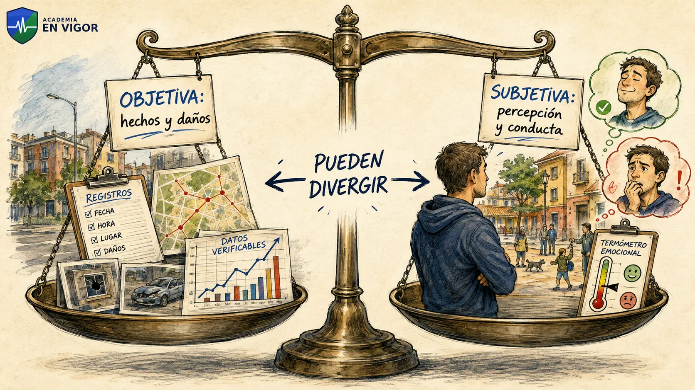

<em>Infografía: Dimensión objetiva y dimensión subjetiva.</em>

<!-- FUENTE: CIS-SEGURIDAD-T33 -->

## 04. Amenaza, vulnerabilidad, exposición y riesgo

**Idea de control:** Amenaza puede golpear; vulnerabilidad facilita; exposición coloca; riesgo estima; daño materializa.

- Amenaza es un agente, hecho o proceso con capacidad potencial de causar daño.
- Vulnerabilidad es una debilidad o condición que facilita que una amenaza produzca consecuencias.
- Exposición indica personas, bienes, derechos o sistemas situados al alcance de la amenaza.
- Riesgo combina probabilidad y consecuencias dentro de un contexto; no se identifica automáticamente con amenaza ni con daño consumado.

<!-- VISUAL:t33-04-amenaza-vulnerabilidad-exposicion-y-riesgo.webp -->

  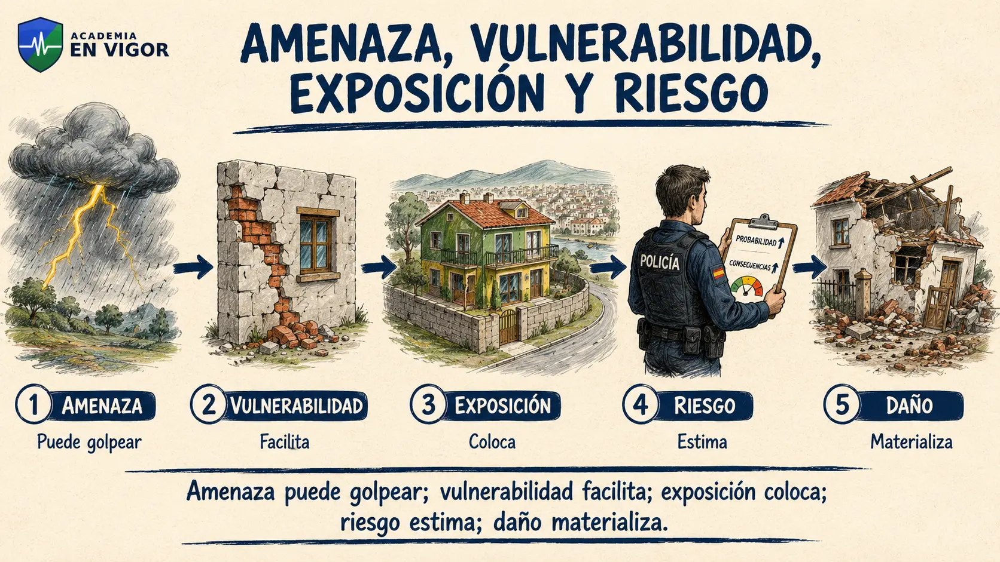

<em>Infografía: Amenaza, vulnerabilidad, exposición y riesgo.</em>

<!-- FUENTE: ESN-2021-T33 -->

## 05. Prevención, protección, respuesta y recuperación

**Idea de control:** Usa el ciclo antes-durante-después y añade aprendizaje para no repetir el fallo.

- La prevención actúa sobre causas, oportunidades o condiciones antes de que el incidente ocurra.
- La protección reduce exposición o vulnerabilidad mediante barreras, procedimientos, vigilancia y diseño seguro.
- La respuesta contiene el incidente, protege a las personas, preserva pruebas y restablece funciones prioritarias.
- La recuperación repara daños, aprende del suceso y mejora capacidades para reducir repetición e impacto futuro.

<!-- VISUAL:t33-05-prevencion-proteccion-respuesta-y-recuperacion.webp -->

  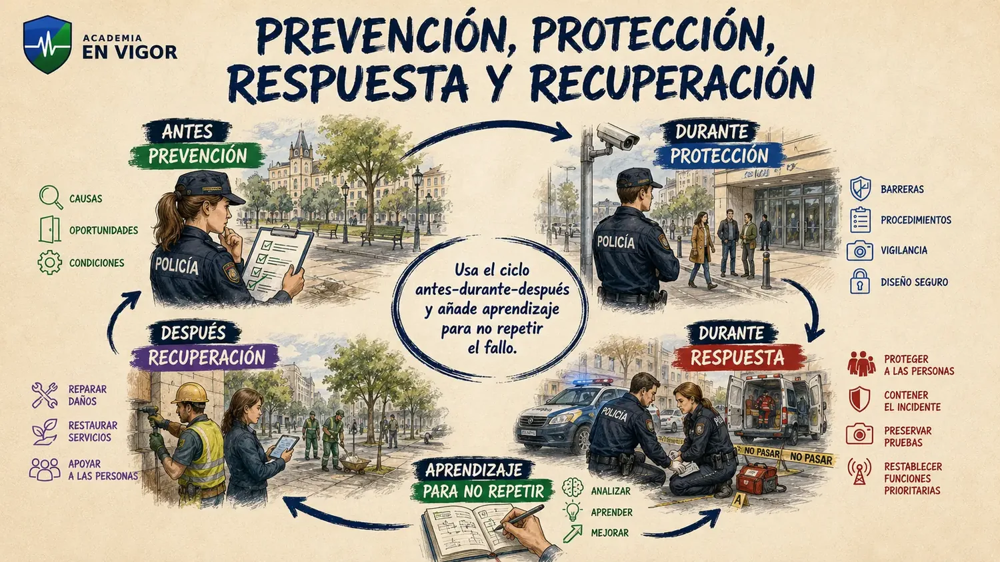

<em>Infografía: Prevención, protección, respuesta y recuperación.</em>

<!-- FUENTE: ESN-2021-T33 -->

## 06. Prevención primaria, secundaria y terciaria

**Idea de control:** Primaria: universal; secundaria: riesgo focalizado; terciaria: después del hecho para evitar repetición.

- La prevención primaria se dirige a población o contextos amplios antes de identificar un riesgo individual concreto.
- La prevención secundaria interviene sobre grupos, lugares o situaciones con factores de riesgo específicos.
- La prevención terciaria actúa después del delito para reducir reincidencia, revictimización y nuevos daños.
- Los tres niveles pueden coexistir y no equivalen a una escala de mayor o menor dureza policial.

<!-- VISUAL:t33-06-prevencion-primaria-secundaria-y-terciaria.webp -->

  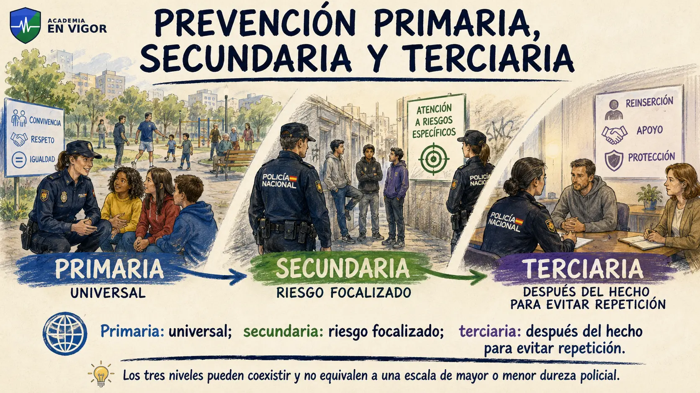

<em>Infografía: Prevención primaria, secundaria y terciaria.</em>

<!-- FUENTE: UNODC-PREVENTION-T33 -->

## 07. Seguridad, libertad y proporcionalidad

**Idea de control:** La pregunta correcta no es seguridad o libertad, sino qué intervención legal protege ambas con el menor sacrificio necesario.

- Seguridad y libertad forman un binomio constitucional: la seguridad sirve al ejercicio de derechos y no autoriza su anulación general.
- La intervención pública exige cobertura legal, finalidad legítima, necesidad, idoneidad y proporcionalidad.
- La Ley Orgánica 4/2015 somete las potestades de seguridad ciudadana a legalidad, igualdad y no discriminación, oportunidad, proporcionalidad, eficacia, eficiencia y responsabilidad.
- Las medidas deben interpretarse del modo más favorable a la efectividad de derechos fundamentales cuando la ley así lo ordena.

<!-- VISUAL:t33-il-07-seguridad-libertad-y-proporcionalidad.webp -->

  

<em>Infografía: Seguridad, libertad y proporcionalidad.</em>

<!-- FUENTE: LO4-2015-T33 -->

## 08. Seguridad integral y resiliencia

**Idea de control:** Integral coordina; resiliente resiste y se recupera; ninguna borra competencias ni garantiza riesgo cero.

- La seguridad integral coordina dimensiones personales, sociales, institucionales, físicas y digitales sin confundir sus regímenes jurídicos.
- La interdependencia hace que un fallo local pueda propagarse por redes, servicios y cadenas de suministro.
- Resiliencia es capacidad de resistir, absorber, adaptarse y recuperarse conservando funciones esenciales.
- Coordinar capacidades no elimina la responsabilidad específica de cada autoridad, servicio u operador.

<!-- VISUAL:t33-08-seguridad-integral-y-resiliencia.webp -->

  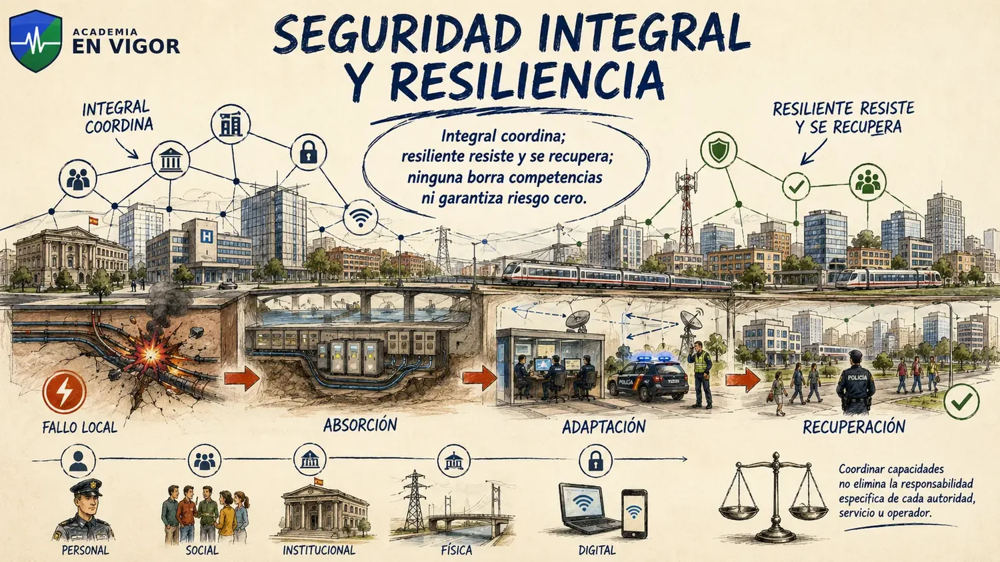

<em>Infografía: Seguridad integral y resiliencia.</em>

<!-- FUENTE: ESN-2021-T33 -->

## 09. Seguridad individual

**Idea de control:** En el artículo 17, seguridad acompaña a libertad y protege frente a privaciones ilegales; no promete invulnerabilidad.

- La seguridad individual describe condiciones que permiten a una persona desarrollar su vida sin amenazas indebidas contra libertad, integridad, bienes y derechos.
- El artículo 17.1 de la Constitución reconoce conjuntamente el derecho a la libertad y a la seguridad frente a privaciones de libertad fuera de los casos y formas legales.
- La seguridad individual posee dimensión objetiva de protección y dimensión subjetiva de confianza o temor.
- No autoriza a exigir al Estado una inmunidad absoluta frente a todo daño, sino garantías y actuaciones exigibles conforme al ordenamiento.

<!-- VISUAL:t33-09-seguridad-individual.webp -->

  

<em>Infografía: Seguridad individual.</em>

<!-- FUENTE: CE-1978-T33 -->

## 10. Seguridad colectiva

**Idea de control:** Colectiva significa compartida, no ilimitada: protege convivencia e instituciones sin vaciar derechos individuales.

- La seguridad colectiva se refiere a condiciones compartidas que permiten convivencia, funcionamiento institucional y ejercicio común de derechos.
- La Ley Orgánica 4/2015 califica la salvaguarda de la seguridad ciudadana como bien jurídico de carácter colectivo.
- La protección colectiva no disuelve a la persona: debe respetar derechos, igualdad y controles propios del Estado de Derecho.
- Una amenaza puede afectar simultáneamente seguridad individual y colectiva, aunque las respuestas y competencias sean distintas.

<!-- VISUAL:t33-il-10-seguridad-colectiva.webp -->

  

<em>Infografía: Seguridad colectiva.</em>

<!-- FUENTE: LO4-2015-T33 -->

## 11. Seguridad ciudadana en la Constitución

**Idea de control:** Regla 104: derechos y libertades + seguridad ciudadana; la ley orgánica ordena funciones, principios y estatutos.

- El artículo 104.1 atribuye a las Fuerzas y Cuerpos de Seguridad, bajo la dependencia del Gobierno, proteger el libre ejercicio de derechos y libertades.
- El mismo precepto les encomienda garantizar la seguridad ciudadana.
- Las dos misiones se leen conjuntamente: la seguridad ciudadana es garantía de libertad y no una finalidad separada de ella.
- El artículo 104.2 reserva a una ley orgánica las funciones, principios básicos de actuación y estatutos de las Fuerzas y Cuerpos de Seguridad.

<!-- VISUAL:t33-11-seguridad-ciudadana-en-la-constitucion.webp -->

  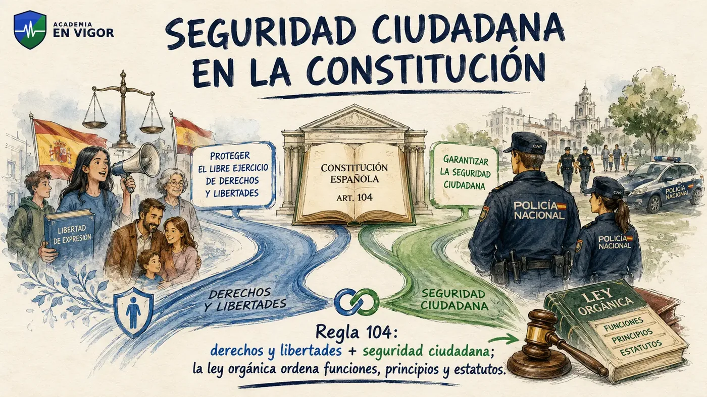

<em>Infografía: Seguridad ciudadana en la Constitución.</em>

<!-- FUENTE: CE-1978-T33 -->

## 12. Competencia sobre seguridad pública

**Idea de control:** Estado: competencia exclusiva; policías autonómicas: excepción constitucional encauzada por estatuto y ley orgánica.

- El artículo 149.1.29 atribuye al Estado competencia exclusiva sobre seguridad pública.
- La propia regla constitucional deja a salvo la posibilidad de policías autonómicas según los estatutos y una ley orgánica.
- La competencia estatal no impide participación autonómica y local dentro del marco constitucional y legal.
- Competencia, titularidad del cuerpo y ámbito territorial son planos distintos que deben analizarse por separado.

<!-- VISUAL:t33-12-competencia-sobre-seguridad-publica.webp -->

  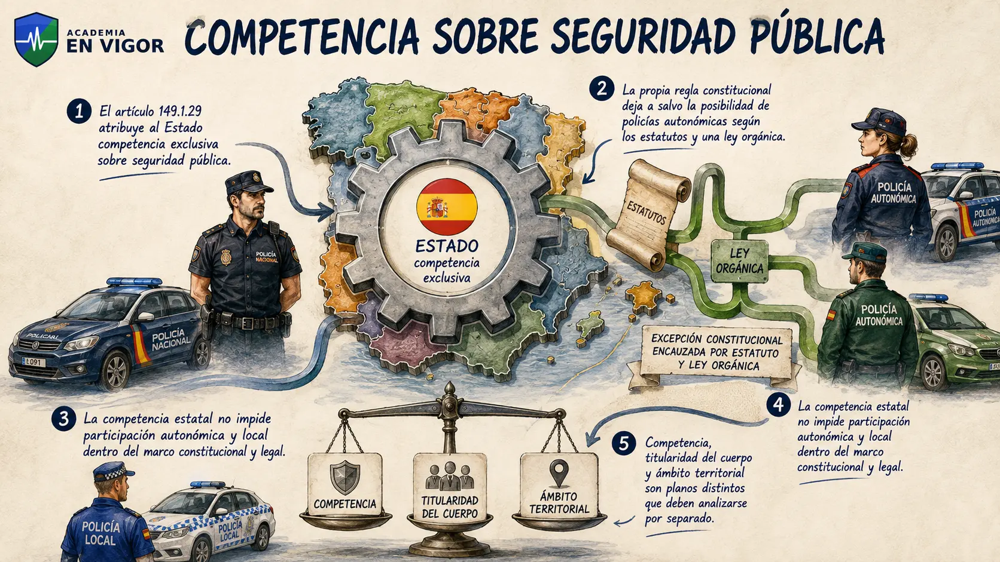

<em>Infografía: Competencia sobre seguridad pública.</em>

<!-- FUENTE: CE-1978-T33 -->

## 13. Sistema policial y cooperación territorial

**Idea de control:** Coordinar no es fusionar: cada cuerpo conserva función y territorio mientras comparte información y apoyo.

- La Ley Orgánica 2/1986 articula Fuerzas y Cuerpos de Seguridad del Estado, policías autonómicas y policías locales.
- La cooperación y coordinación buscan evitar vacíos, duplicidades y respuestas incompatibles entre cuerpos.
- Cada cuerpo actúa dentro de funciones y territorio atribuidos, sin que la cooperación transforme automáticamente una competencia en otra.
- La seguridad pública exige intercambio de información, auxilio mutuo y mecanismos institucionales de coordinación.

<!-- VISUAL:t33-13-sistema-policial-y-cooperacion-territorial.webp -->

  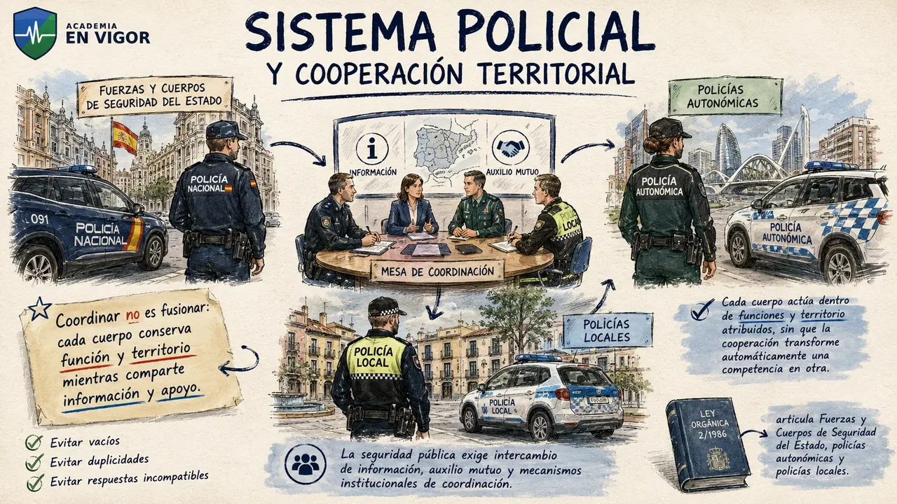

<em>Infografía: Sistema policial y cooperación territorial.</em>

<!-- FUENTE: LO2-1986-T33 -->

## 14. Objeto de la protección de la seguridad ciudadana

**Idea de control:** El artículo 1 une requisito para los derechos, bien colectivo y tutela mediante personas, bienes y tranquilidad.

- La Ley Orgánica 4/2015 considera la seguridad ciudadana requisito indispensable para el pleno ejercicio de derechos fundamentales y libertades públicas.
- Su salvaguarda, como bien jurídico colectivo, es función del Estado con sujeción a la Constitución y a las leyes.
- La ley regula actuaciones diversas orientadas a tutelar la seguridad ciudadana mediante protección de personas y bienes y mantenimiento de la tranquilidad.
- La seguridad ciudadana no se reduce al régimen sancionador: incluye prevención, actuación administrativa, colaboración y garantías.

<!-- VISUAL:t33-14-objeto-de-la-proteccion-de-la-seguridad-ciudadana.webp -->

  

<em>Infografía: Objeto de la protección de la seguridad ciudadana.</em>

<!-- FUENTE: LO4-2015-T33 -->

## 15. Fines y principios de seguridad ciudadana

**Idea de control:** Memoriza fines y principios por separado: qué se protege y cómo puede actuar la autoridad.

- Entre los fines legales están proteger derechos, asegurar instituciones, preservar convivencia, proteger personas y bienes y permitir uso pacífico de espacios públicos.
- También figuran normalidad de servicios básicos, prevención de delitos e infracciones relacionadas y transparencia pública.
- Las potestades se rigen por legalidad, igualdad y no discriminación, oportunidad, proporcionalidad, eficacia, eficiencia y responsabilidad.
- Una amenaza concreta o un comportamiento objetivamente peligroso es el presupuesto que justifica la intervención en los términos legales.

<!-- VISUAL:t33-15-fines-y-principios-de-seguridad-ciudadana.webp -->

  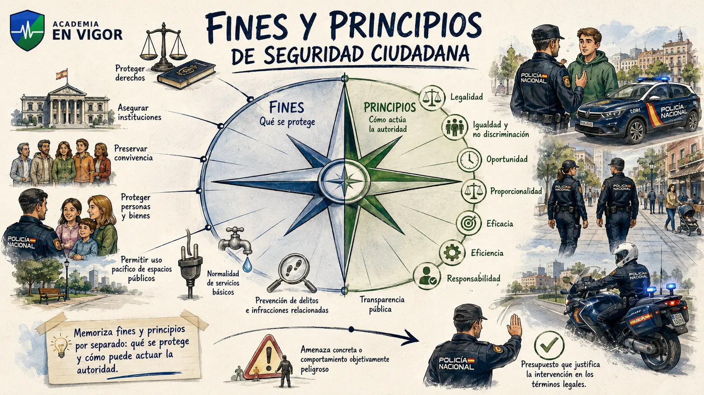

<em>Infografía: Fines y principios de seguridad ciudadana.</em>

<!-- FUENTE: LO4-2015-T33 -->

## 16. Concepto funcional de seguridad pública

**Idea de control:** Función pública es más amplia que patrulla; colaboración no cambia por sí sola la naturaleza jurídica.

- Seguridad pública designa una función estatal orientada a proteger personas, derechos, bienes, convivencia e instituciones frente a riesgos y alteraciones relevantes.
- Comprende actividad normativa, preventiva, policial, coordinadora y de respuesta, no solo presencia uniformada.
- Se financia y organiza mediante poderes públicos, aunque pueda requerir colaboración social y privada sometida a ley.
- No toda actividad que produce seguridad pertenece jurídicamente al título competencial de seguridad pública.

<!-- VISUAL:t33-16-concepto-funcional-de-seguridad-publica.webp -->

  

<em>Infografía: Concepto funcional de seguridad pública.</em>

<!-- FUENTE: CE-1978-T33 -->

## 17. Modelo español de seguridad privada

**Idea de control:** Cuatro palabras de examen: complementaria, subordinada, colaboradora y controlada.

- La seguridad privada comprende actividades, servicios, funciones y medidas desarrollados por sujetos privados dentro del marco de la Ley 5/2014.
- El modelo español la configura como complementaria, subordinada, colaboradora y controlada por la seguridad pública.
- La finalidad privada de proteger personas o bienes puede contribuir simultáneamente a seguridad pública y prevención de infracciones.
- La prestación está sujeta a habilitación, autorización, inspección y límites porque incide en derechos y seguridad general.

<!-- VISUAL:t33-17-modelo-espanol-de-seguridad-privada.webp -->

  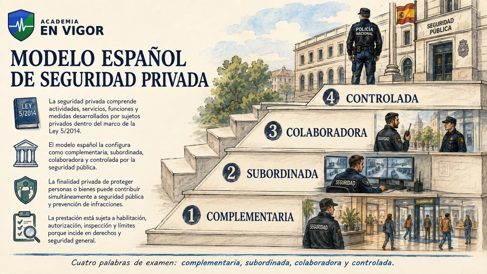

<em>Infografía: Modelo español de seguridad privada.</em>

<!-- FUENTE: LEY5-2014-T33 -->

## 18. Relación y límites entre seguridad pública y privada

**Idea de control:** Colabora y complementa, pero no sustituye ni recibe por contagio potestades públicas.

- La colaboración privada aporta información, prevención y capacidad de protección, pero no desplaza las potestades reservadas a autoridades y agentes públicos.
- El personal privado debe comunicar hechos relevantes y auxiliar conforme a la ley y a los mecanismos de coordinación.
- Subordinación funcional en supuestos legales no convierte al personal privado en miembro de las Fuerzas y Cuerpos de Seguridad.
- Toda actuación privada queda sometida a legalidad, necesidad, proporcionalidad y respeto a dignidad y derechos.

<!-- VISUAL:t33-il-18-relacion-y-limites-entre-seguridad-publica-y-privada.webp -->

  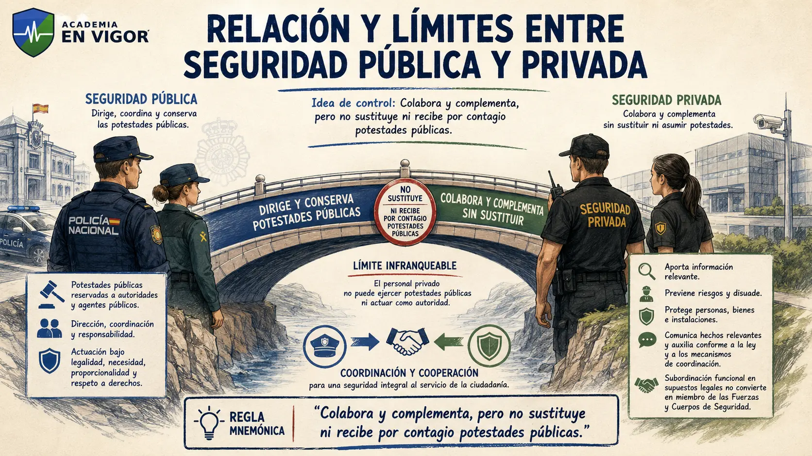

<em>Infografía: Relación y límites entre seguridad pública y privada.</em>

<!-- FUENTE: LEY5-2014-T33 -->

## 19. Concepto de inseguridad

**Idea de control:** Separa exposición, victimización, percepción y respuesta; mezclarlas produce diagnósticos falsos.

- La inseguridad puede referirse a exposición objetiva a daños o a vivencia subjetiva de amenaza, vulnerabilidad e incertidumbre.
- No es el simple reverso matemático de la seguridad, porque incorpora confianza, control percibido y tolerancia al riesgo.
- La inseguridad ciudadana suele analizar hechos delictivos, victimización, miedo, preocupación y conductas de evitación.
- Una definición útil separa el fenómeno medido de la valoración emocional y del juicio político sobre su gravedad.

<!-- VISUAL:t33-19-concepto-de-inseguridad.webp -->

  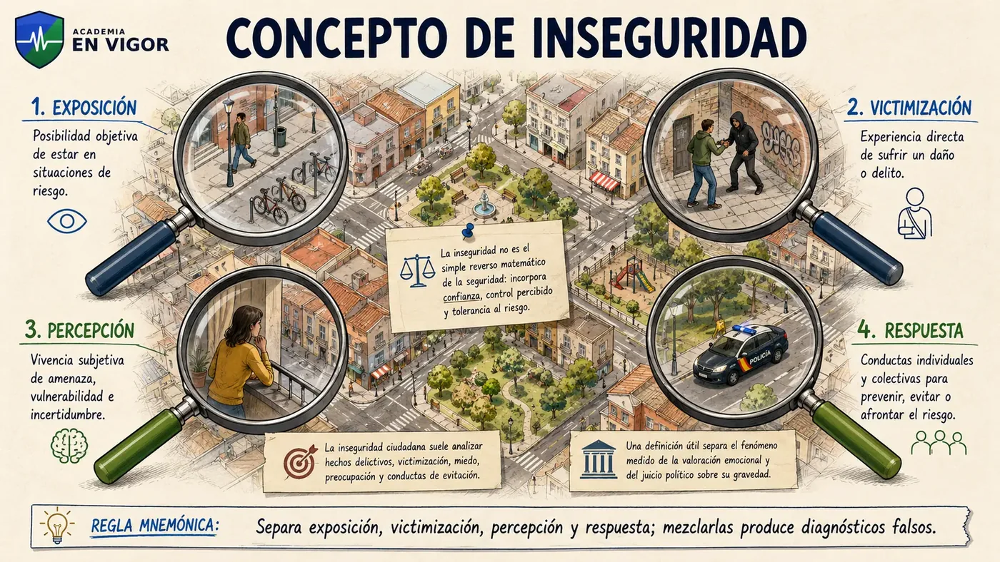

<em>Infografía: Concepto de inseguridad.</em>

<!-- FUENTE: CIS-SEGURIDAD-T33 -->

## 20. Inseguridad objetiva

**Idea de control:** Antes de comparar pregunta: qué cuenta, quién lo conoce, con qué definición, dónde y durante cuánto tiempo.

- La inseguridad objetiva se aproxima mediante ocurrencia de hechos, frecuencia, gravedad, distribución, victimización y daños.
- Los registros policiales cuentan hechos conocidos y clasificados por el sistema, no toda la delincuencia realmente producida.
- Las tasas permiten comparar poblaciones o períodos mejor que cifras absolutas cuando los denominadores difieren.
- Comparar exige mantener definiciones, fuentes, período y cobertura territorial o explicar sus cambios.

<!-- VISUAL:t33-20-inseguridad-objetiva.webp -->

  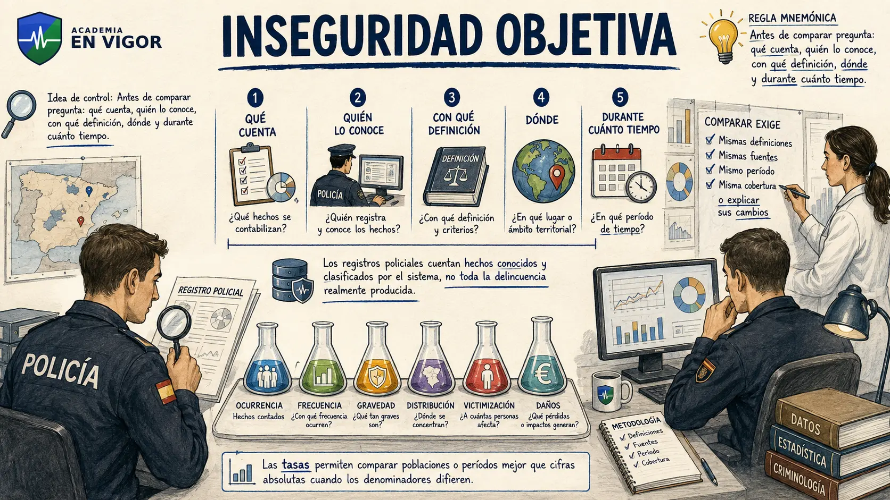

<em>Infografía: Inseguridad objetiva.</em>

<!-- FUENTE: INTERIOR-BALANCE-T33 -->

## 21. Inseguridad subjetiva y miedo al delito

**Idea de control:** Emoción, juicio de probabilidad y preocupación pública son tres agujas distintas del mismo panel.

- La inseguridad subjetiva comprende percepciones y emociones ante la posibilidad de victimización propia, cercana o social.
- Miedo, preocupación por el delito y evaluación cognitiva del riesgo son dimensiones relacionadas pero no idénticas.
- Una persona puede estimar probable un delito sin sentir miedo intenso o sentir temor con probabilidad objetiva baja.
- La medición debe preguntar por conducta o emoción concreta, marco temporal y situación, no usar una sola pregunta ambigua.

<!-- VISUAL:t33-21-inseguridad-subjetiva-y-miedo-al-delito.webp -->

  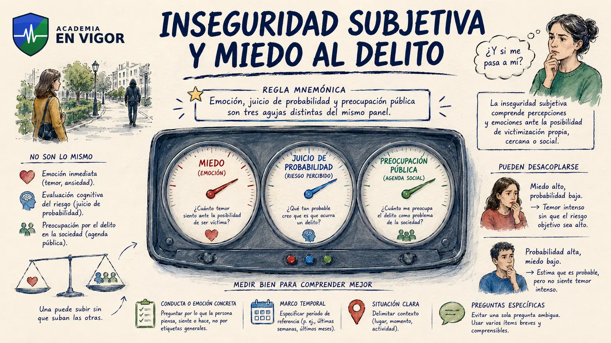

<em>Infografía: Inseguridad subjetiva y miedo al delito.</em>

<!-- FUENTE: CIS-SEGURIDAD-T33 -->

## 22. Miedo concreto y preocupación difusa

**Idea de control:** Concreto pregunta «¿me ocurrirá aquí?»; difuso pregunta «¿es un problema para la sociedad?».

- El miedo concreto se vincula a ser víctima de un hecho determinado en una situación reconocible.
- La preocupación difusa se dirige al delito como problema social general sin necesidad de amenaza inmediata y personal.
- Ambas dimensiones pueden cambiar por experiencia, información, entorno, vulnerabilidad percibida y confianza institucional.
- La distinción evita interpretar una opinión sobre el país como miedo personal cotidiano.

<!-- VISUAL:t33-22-miedo-concreto-y-preocupacion-difusa.webp -->

  

<em>Infografía: Miedo concreto y preocupación difusa.</em>

<!-- FUENTE: CIS-SEGURIDAD-T33 -->

## 23. Victimización y cifra oculta

**Idea de control:** Tres círculos solapados: lo ocurrido, lo conocido y lo registrado.

- Victimización es la experiencia de sufrir un delito o sus consecuencias dentro de una población y período definidos.
- La cifra oculta reúne hechos no conocidos por policía o justicia por falta de denuncia, detección o registro.
- Las encuestas de victimización complementan registros, pero también sufren errores de recuerdo, interpretación y cobertura.
- Combinar fuentes permite aproximarse mejor al fenómeno sin afirmar que ninguna ofrece por sí sola la cifra real completa.

<!-- VISUAL:t33-23-victimizacion-y-cifra-oculta.webp -->

  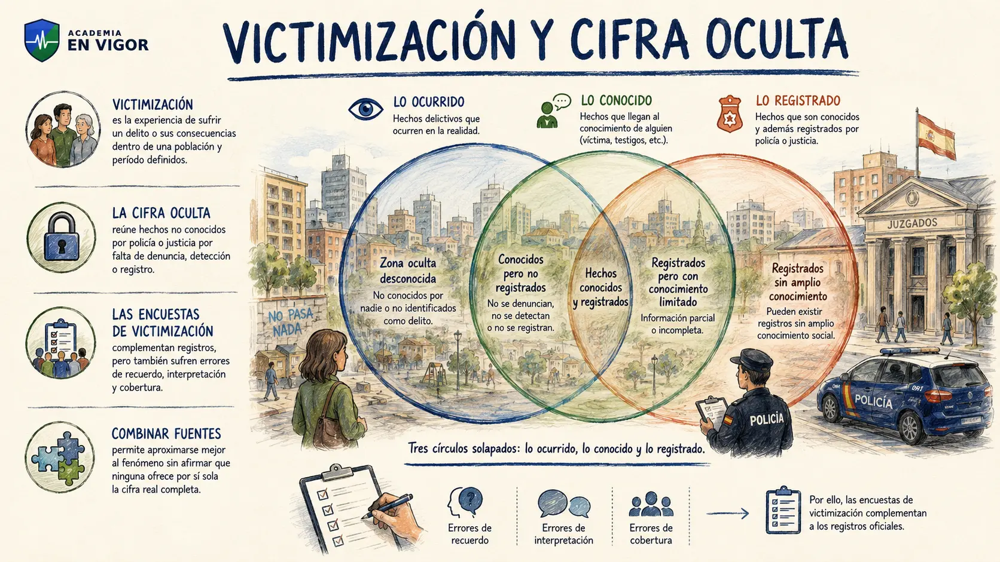

<em>Infografía: Victimización y cifra oculta.</em>

<!-- FUENTE: UNODC-ICCS-T33 -->

## 24. Factores que moldean la percepción

**Idea de control:** El miedo no nace de una sola fuente: combina experiencia, señales, información, vulnerabilidad y control percibido.

- La experiencia directa o cercana puede aumentar disponibilidad mental del riesgo y modificar hábitos.
- Desorden físico, iluminación, aislamiento, incivilidades y familiaridad con el lugar influyen en la evaluación situacional.
- La cobertura mediática y las redes pueden amplificar hechos llamativos, pero su efecto depende de recepción y contexto.
- La confianza en policía, justicia, comunidad y capacidad personal modula la sensación de control y seguridad.

<!-- VISUAL:t33-24-factores-que-moldean-la-percepcion.webp -->

  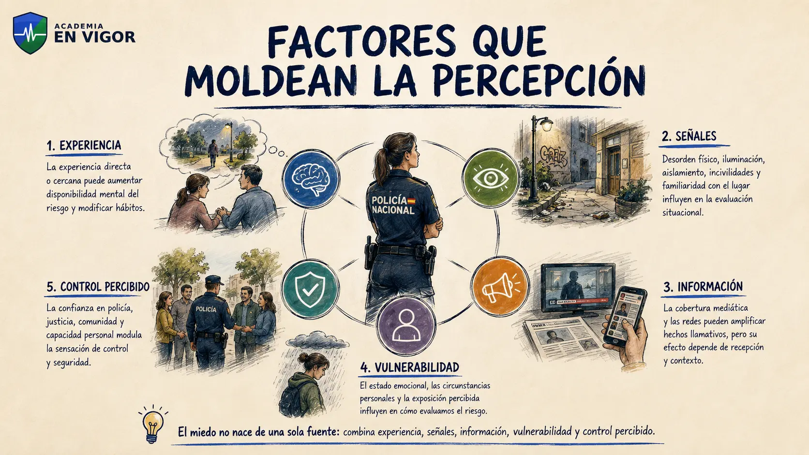

<em>Infografía: Factores que moldean la percepción.</em>

<!-- FUENTE: CIS-SEGURIDAD-T33 -->

## 25. Consecuencias de la inseguridad percibida

**Idea de control:** La percepción también cambia la ciudad: decide quién sale, cuándo, por dónde y con qué confianza.

- La inseguridad percibida puede cambiar recorridos, horarios, uso del espacio público, relaciones y decisiones de autoprotección.
- El miedo persistente puede reducir bienestar y participación aun cuando no exista victimización directa.
- Las conductas de evitación pueden proteger a corto plazo y, a la vez, disminuir presencia comunitaria y control informal.
- La política pública debe reducir daños y miedo desproporcionado sin estigmatizar barrios, colectivos o víctimas.

<!-- VISUAL:t33-il-25-consecuencias-de-la-inseguridad-percibida.webp -->

  

<em>Infografía: Consecuencias de la inseguridad percibida.</em>

<!-- FUENTE: CIS-SEGURIDAD-T33 -->

## 26. Evaluación de políticas de seguridad

**Idea de control:** No confundas después con debido a: mide mecanismo, comparación, desplazamiento, derechos y costes.

- Evaluar exige definir objetivo, población, período, indicador, comparación y mecanismo esperado antes de interpretar resultados.
- Una intervención puede reducir un delito, desplazarlo a otro lugar, momento, modalidad o víctima, o generar difusión de beneficios.
- El descenso posterior no demuestra por sí solo causalidad si faltan comparación y control de tendencias externas.
- La evaluación debe incluir eficacia, proporcionalidad, costes, efectos distributivos, derechos y confianza pública.

<!-- VISUAL:t33-26-evaluacion-de-politicas-de-seguridad.webp -->

  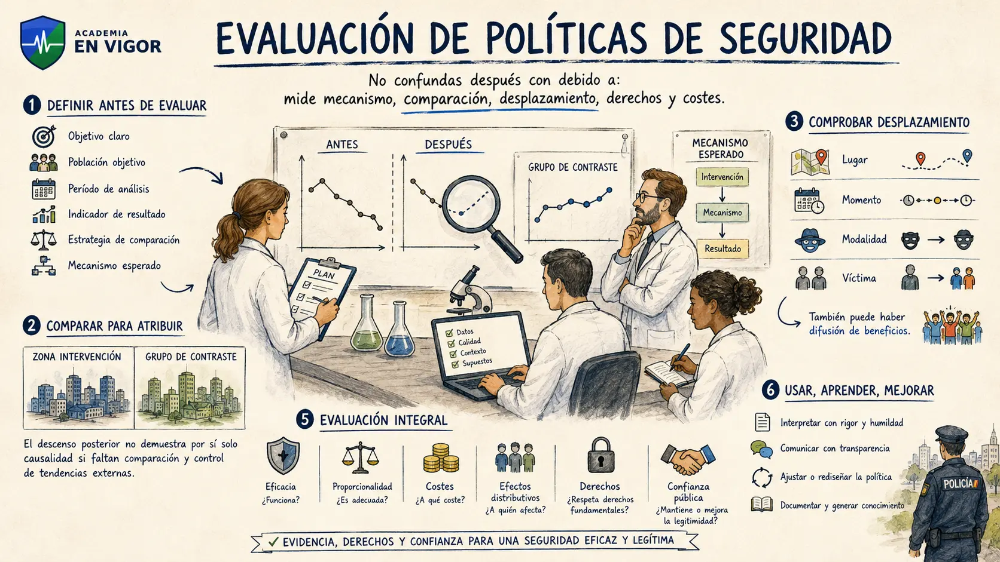

<em>Infografía: Evaluación de políticas de seguridad.</em>

<!-- FUENTE: UNODC-PREVENTION-T33 -->

## 27. Delito, delincuencia, criminalidad y criminología

**Idea de control:** Delito: categoría legal; delincuencia: fenómeno; criminalidad: patrón o magnitud; criminología: disciplina.

- Delito es una conducta tipificada por la ley penal; su definición jurídica depende del ordenamiento vigente.
- Delincuencia designa el fenómeno o conjunto de conductas delictivas, autores, contextos y dinámicas estudiados en una población.
- Criminalidad puede expresar el volumen, estructura o características de delitos en un lugar y período.
- Criminología es una disciplina empírica e interdisciplinar que estudia delito, infractor, víctima, control social y prevención.

<!-- VISUAL:t33-27-delito-delincuencia-criminalidad-y-criminologia.webp -->

  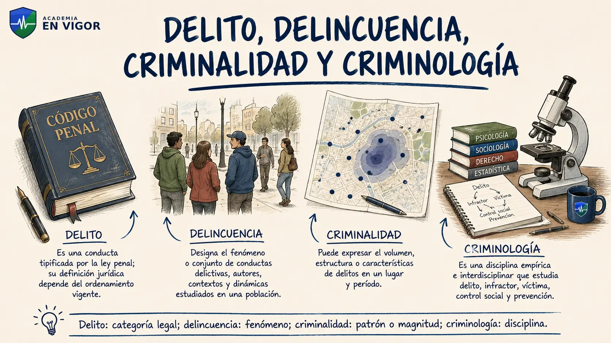

<em>Infografía: Delito, delincuencia, criminalidad y criminología.</em>

<!-- FUENTE: UNODC-ICCS-T33 -->

## 28. Desviación, conducta antisocial y delito

**Idea de control:** Tres filtros: norma social, daño y ley penal; solo el último convierte la conducta en delito.

- Desviación es apartamiento de expectativas o normas sociales y puede existir sin infracción penal.
- Conducta antisocial describe comportamientos dañinos o contrarios a convivencia, pero no es por sí sola una categoría penal cerrada.
- Todo delito supone infracción penal, pero no toda desviación o conducta socialmente desaprobada constituye delito.
- Confundir desaprobación moral con tipificación favorece estigma, arbitrariedad y errores de examen.

<!-- VISUAL:t33-28-desviacion-conducta-antisocial-y-delito.webp -->

  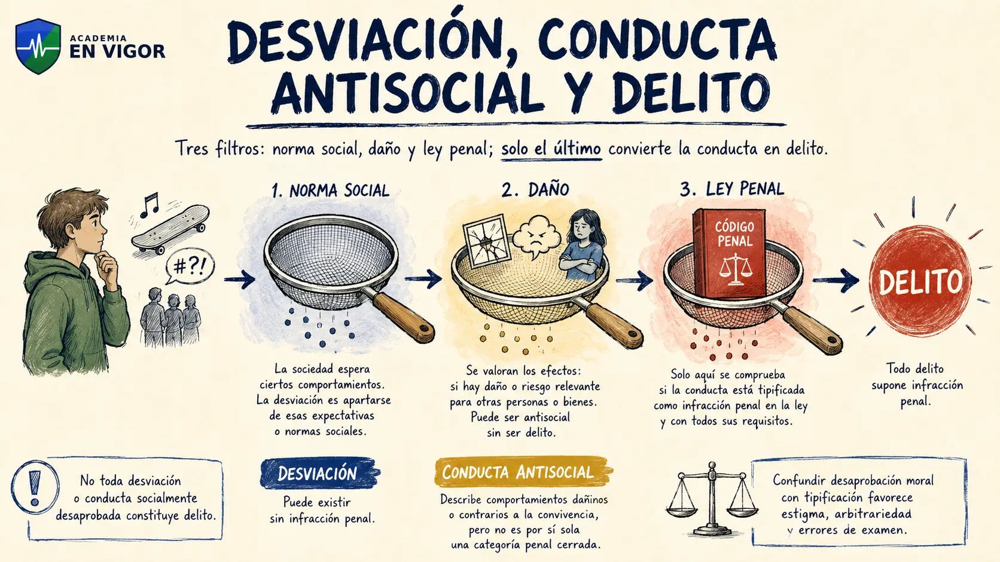

<em>Infografía: Desviación, conducta antisocial y delito.</em>

<!-- FUENTE: BECKER-1963-T33 -->

## 29. Teoría, modelo y factor de riesgo

**Idea de control:** Factor eleva probabilidad; mecanismo explica cómo; teoría ordena; evidencia limita.

- Una teoría organiza conceptos y proposiciones para explicar mecanismos y producir expectativas contrastables.
- Un modelo simplifica relaciones relevantes para describir, explicar o predecir dentro de supuestos definidos.
- Un factor de riesgo se asocia con mayor probabilidad de un resultado, pero no constituye una causa necesaria ni suficiente.
- Una buena explicación distingue correlación, mecanismo causal, condiciones de aplicación y evidencia que podría refutarla.

<!-- VISUAL:t33-29-teoria-modelo-y-factor-de-riesgo.webp -->

  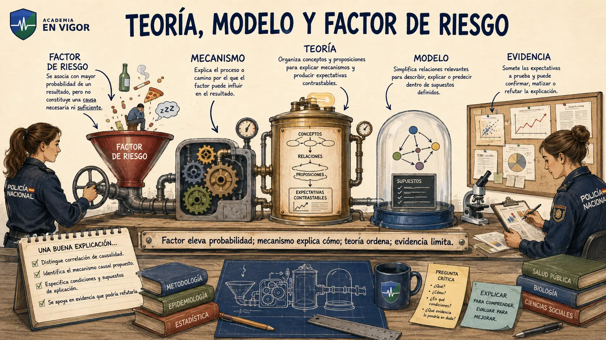

<em>Infografía: Teoría, modelo y factor de riesgo.</em>

<!-- FUENTE: UNODC-PREVENTION-T33 -->

## 30. Niveles de explicación de la delincuencia

**Idea de control:** No obligues a competir a escalas distintas: persona, relación, situación y estructura responden preguntas diferentes.

- El nivel individual estudia características, aprendizaje, decisiones y trayectorias personales.
- El nivel relacional analiza familia, iguales, redes, supervisión, vínculos y transmisión de normas.
- El nivel situacional examina oportunidades, objetivos, guardianes, lugares, tiempos y diseño.
- El nivel estructural estudia desigualdad, instituciones, organización comunitaria, mercados y distribución de recursos y poder.

<!-- VISUAL:t33-30-niveles-de-explicacion-de-la-delincuencia.webp -->

  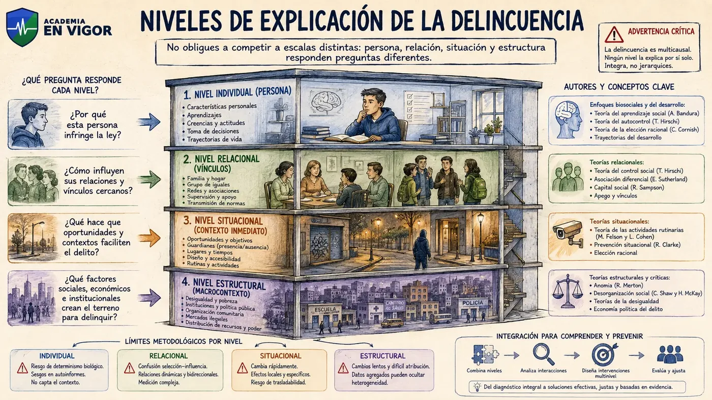

<em>Infografía: Niveles de explicación de la delincuencia.</em>

<!-- FUENTE: SAMPSON-LAUB-1993-T33 -->

## 31. Quételet y la estadística moral

**Idea de control:** Quételet mira series y estaciones: patrón agregado no es destino individual ni ley natural inmutable.

- Adolphe Quételet aplicó estadística a fenómenos sociales y observó regularidades en los datos criminales agregados.
- Las llamadas leyes térmicas asociaron históricamente delitos patrimoniales con estaciones frías y delitos contra las personas con estaciones cálidas.
- El hallazgo se formuló sobre patrones colectivos y no permite predecir la conducta de un individuo concreto.
- Las asociaciones históricas entre estación y delito pueden variar por movilidad, oportunidad, registro y organización social y no constituyen leyes naturales universales.

<!-- VISUAL:t33-31-quetelet-y-la-estadistica-moral.webp -->

  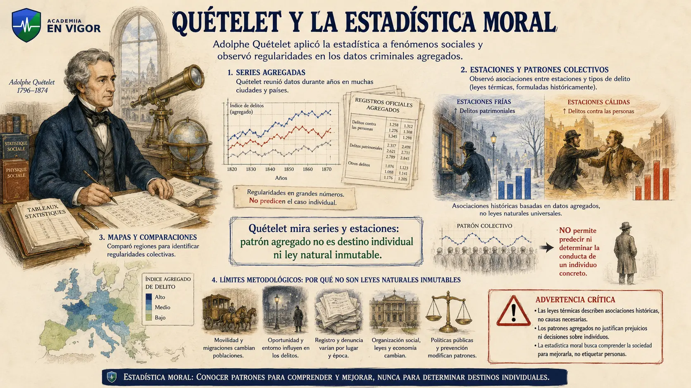

<em>Infografía: Quételet y la estadística moral.</em>

<!-- FUENTE: QUETELET-1835-T33 -->

## 32. Escuela clásica y elección

**Idea de control:** Clásica mira elección y acto; positivista buscará causas en autor y entorno.

- La escuela clásica concibe al individuo como agente capaz de elegir y centra la respuesta en el acto y la responsabilidad.
- Beccaria defendió legalidad, certeza, prontitud y proporcionalidad de las penas frente a arbitrariedad y crueldad.
- La disuasión depende de percepción de costes y beneficios, con especial relevancia de certeza y celeridad.
- El enfoque clásico inspira teorías de elección, pero no explica por sí solo emociones, aprendizaje, estructuras u oportunidades.

<!-- VISUAL:t33-32-escuela-clasica-y-eleccion.webp -->

  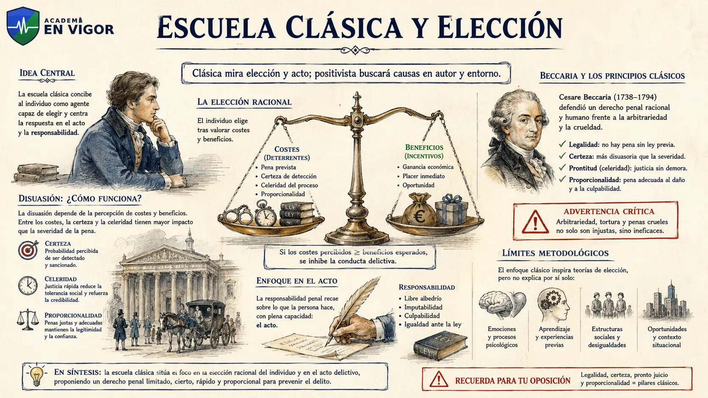

<em>Infografía: Escuela clásica y elección.</em>

<!-- FUENTE: BECCARIA-1764-T33 -->

## 33. Positivismo criminológico

**Idea de control:** Memoriza autor y propuesta, pero añade una etiqueta roja: antecedente histórico, no herramienta predictiva válida.

- El positivismo trasladó el foco desde el acto abstracto hacia el infractor y las causas observables del delito.
- Sus autores recurrieron a medición, clasificación y determinismo biológico o social propios de su época.
- Impulsó investigación empírica, pero muchas categorías y métodos incurrieron en sesgo, circularidad y pseudociencia.
- Las tipologías históricas deben estudiarse como antecedentes preguntables, no como diagnósticos actuales de peligrosidad.

<!-- VISUAL:t33-33-positivismo-criminologico.webp -->

  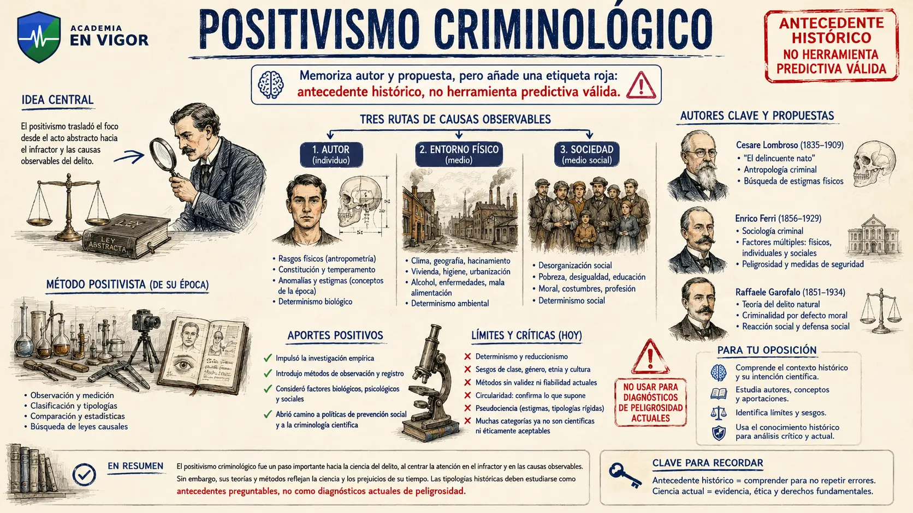

<em>Infografía: Positivismo criminológico.</em>

<!-- FUENTE: LOMBROSO-1876-T33 -->

## 34. Criterios para comparar teorías

**Idea de control:** Ficha de cinco campos: conducta, unidad, nivel, mecanismo y límite.

- Comparar teorías exige identificar qué conducta explican, qué unidad analizan y en qué nivel operan.
- Debe precisarse el mecanismo propuesto, las variables observables y la dirección de la relación.
- También importa qué predicción diferencial producen y qué evidencia podría contradecirlas.
- Una teoría útil puede tener alcance limitado; el error es convertir una explicación parcial en ley universal.

<!-- VISUAL:t33-34-criterios-para-comparar-teorias.webp -->

  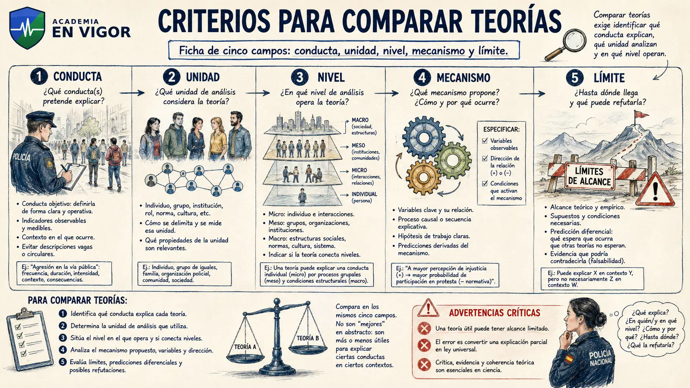

<em>Infografía: Criterios para comparar teorías.</em>

<!-- FUENTE: UNODC-PREVENTION-T33 -->

## 35. Lombroso y el delincuente nato

**Idea de control:** Lombroso es examen histórico: atavismo y delincuente nato, seguido de crítica metodológica imprescindible.

- Lombroso vinculó criminalidad con rasgos atávicos y anomalías físicas dentro de una concepción determinista.
- Su delincuente nato pretendía identificar una categoría humana predispuesta biológicamente al delito.
- La antropología criminal lombrosiana influyó en el positivismo y en clasificaciones posteriores.
- Sus inferencias carecen de validez predictiva actual y confundieron selección penitenciaria, correlación, estigma y causalidad.

<!-- VISUAL:t33-il-35-lombroso-y-el-delincuente-nato.webp -->

  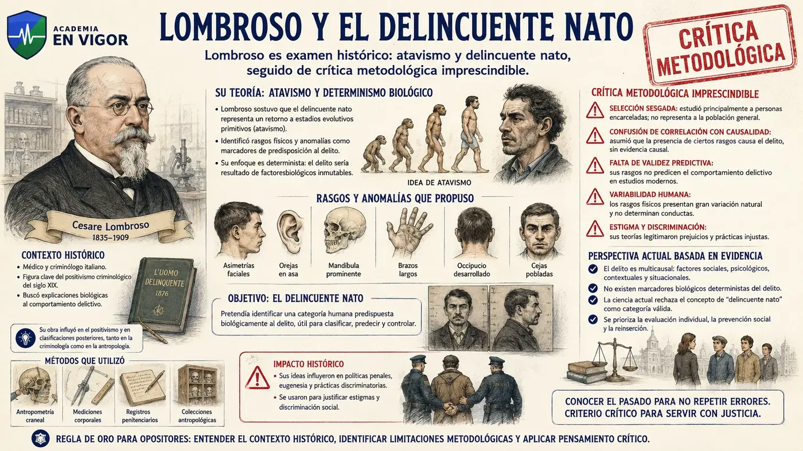

<em>Infografía: Lombroso y el delincuente nato.</em>

<!-- FUENTE: LOMBROSO-1876-T33 -->

## 36. Enrico Ferri y los factores del delito

**Idea de control:** Tríada que ha caído: antropológicos, físicos o telúricos y sociales.

- Ferri explicó el delito como resultado de factores antropológicos o individuales, físicos o telúricos y sociales.
- Su sociología criminal amplió el positivismo más allá de una causa biológica exclusiva.
- Defendió una clasificación de delincuentes y una política criminal orientada por peligrosidad y prevención.
- Sus categorías son históricas y no legitiman atribuir delito a raza, clima o condición personal sin evidencia contemporánea.

<!-- VISUAL:t33-36-enrico-ferri-y-los-factores-del-delito.webp -->

  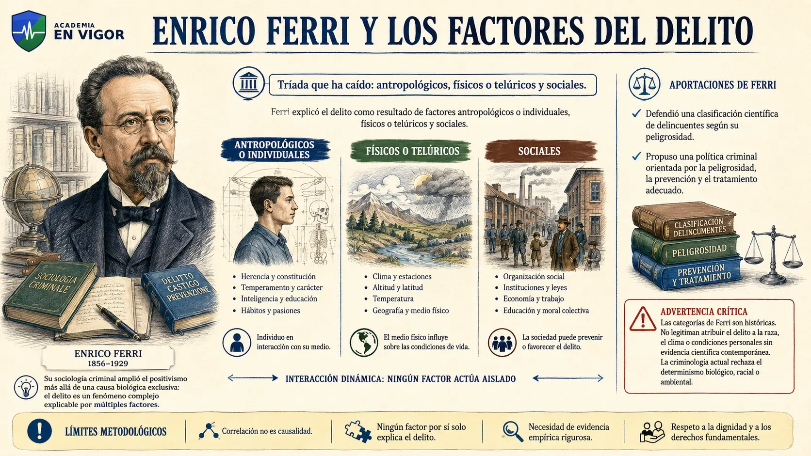

<em>Infografía: Enrico Ferri y los factores del delito.</em>

<!-- FUENTE: FERRI-1884-T33 -->

## 37. Garófalo, delito natural y peligrosidad

**Idea de control:** Piedad y probidad identifican a Garófalo; temibilidad es antecedente, no atajo contra garantías.

- Garófalo buscó un concepto de delito natural ligado a lesión de sentimientos altruistas fundamentales, especialmente piedad y probidad.
- La temibilidad o peligrosidad pretendía expresar capacidad criminal y adaptabilidad social del infractor.
- Su enfoque pertenece a la escuela positiva italiana y desplazó atención desde culpabilidad por el acto hacia características del autor.
- La concepción histórica no sustituye las garantías actuales de legalidad, culpabilidad, prueba y proporcionalidad.

<!-- VISUAL:t33-37-garofalo-delito-natural-y-peligrosidad.webp -->

  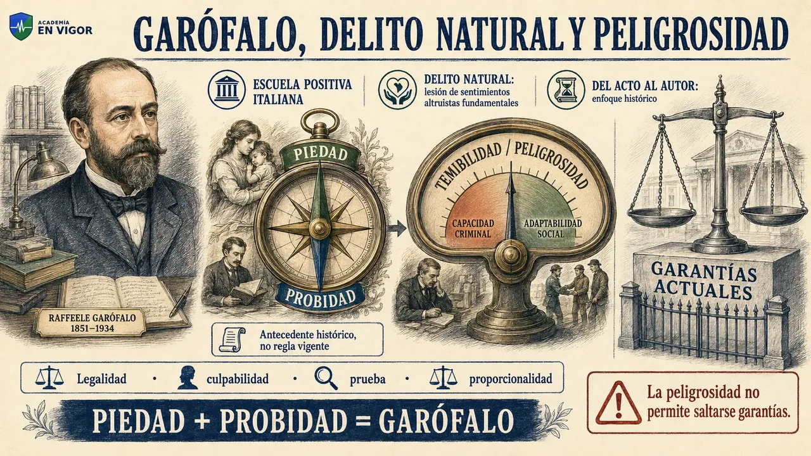

<em>Infografía: Garófalo, delito natural y peligrosidad.</em>

<!-- FUENTE: GAROFALO-1885-T33 -->

## 38. Kretschmer y la biotipología

**Idea de control:** Kretschmer: leptosomático, atlético, pícnico y displásico; no lo mezcles con Sheldon.

- Kretschmer distinguió tipos constitucionales como leptosomático o asténico, atlético, pícnico y displásico.
- Relacionó constitución corporal con temperamentos y cuadros psiquiátricos dentro de la biotipología alemana.
- Las descripciones físicas de sus tipos han sido preguntadas históricamente en el acceso policial.
- No existe base para inferir culpabilidad o conducta criminal individual a partir de la forma corporal.

<!-- VISUAL:t33-38-kretschmer-y-la-biotipologia.webp -->

  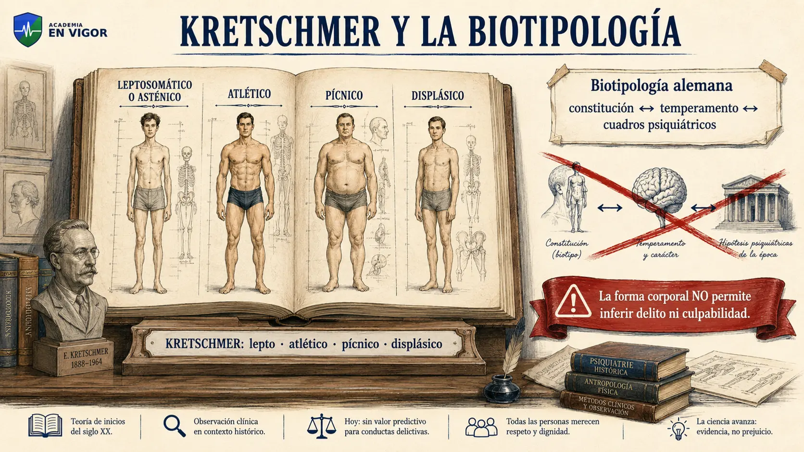

<em>Infografía: Kretschmer y la biotipología.</em>

<!-- FUENTE: KRETSCHMER-1921-T33 -->

## 39. Sheldon y los somatotipos

**Idea de control:** Sheldon: endo-meso-ecto; Kretschmer: lepto-atlético-pícnico.

- Sheldon clasificó somatotipos como endomorfo, mesomorfo y ectomorfo.
- Asoció esos tipos corporales con temperamentos denominados viscerotonía, somatotonía y cerebrotonía.
- Sus estudios intentaron relacionar predominio mesomorfo y delincuencia mediante muestras seleccionadas.
- La teoría presenta problemas de medición, sesgo y causalidad y no sirve para perfilar delincuentes por apariencia.

<!-- VISUAL:t33-39-sheldon-y-los-somatotipos.webp -->

  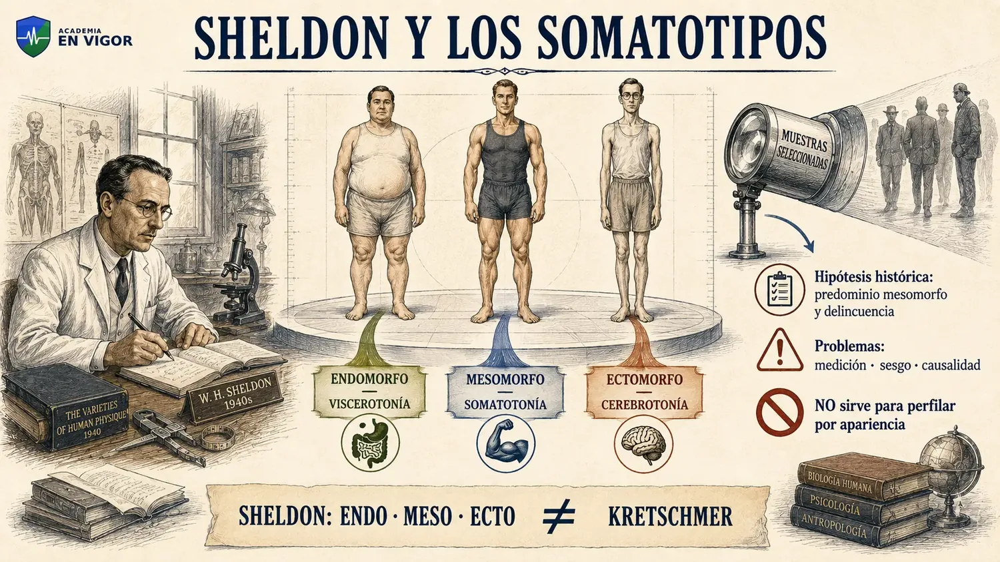

<em>Infografía: Sheldon y los somatotipos.</em>

<!-- FUENTE: SHELDON-1949-T33 -->

## 40. Genética, neurobiología y conducta

**Idea de control:** Biología influye; no sentencia. Pasa siempre por desarrollo, ambiente, conducta concreta y garantías.

- La investigación biológica contemporánea estudia predisposiciones, desarrollo cerebral, impulsividad, estrés y regulación emocional.
- Herencia no equivale a destino: la expresión de rasgos depende de múltiples genes, desarrollo y ambiente.
- Ningún biomarcador diagnostica por sí solo conducta delictiva futura en una persona.
- La interpretación responsable evita determinismo, discriminación y salto indebido desde asociación grupal a predicción individual.

<!-- VISUAL:t33-il-40-genetica-neurobiologia-y-conducta.webp -->

  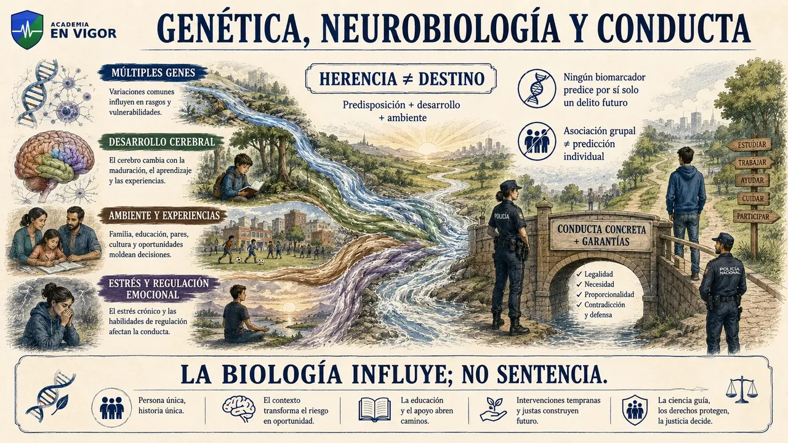

<em>Infografía: Genética, neurobiología y conducta.</em>

<!-- FUENTE: UNODC-PREVENTION-T33 -->

## 41. Eysenck: personalidad y condicionamiento

**Idea de control:** Eysenck une rasgos y condicionamiento; habla de probabilidad, no de culpabilidad.

- Eysenck relacionó conducta antisocial con dimensiones de personalidad y diferencias en condicionabilidad.
- Extraversión y neuroticismo ocuparon su formulación inicial, a la que después añadió psicoticismo.
- Una baja adquisición de respuestas condicionadas de temor o conciencia dificultaría socialización en su modelo.
- Las dimensiones son continuas y probabilísticas; no convierten una puntuación de personalidad en diagnóstico criminal.

<!-- VISUAL:t33-41-eysenck-personalidad-y-condicionamiento.webp -->

  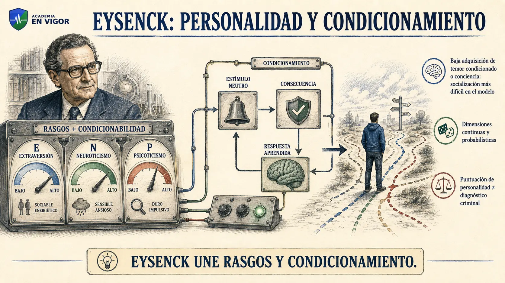

<em>Infografía: Eysenck: personalidad y condicionamiento.</em>

<!-- FUENTE: EYSENCK-1964-T33 -->

## 42. Bandura y aprendizaje observacional

**Idea de control:** Bandura separa aprender de ejecutar: observar abre el repertorio; consecuencias y control deciden la conducta.

- Bandura explicó que nuevas conductas pueden aprenderse observando modelos y consecuencias sin experiencia directa inicial.
- El aprendizaje observacional requiere procesos de atención, retención, capacidad de reproducción y motivación.
- La observación puede producir adquisición o modelado, inhibición, desinhibición y facilitación de respuestas.
- Aprender una conducta no implica ejecutarla: expectativas, consecuencias y autorregulación influyen en su realización.

<!-- VISUAL:t33-42-bandura-y-aprendizaje-observacional.webp -->

  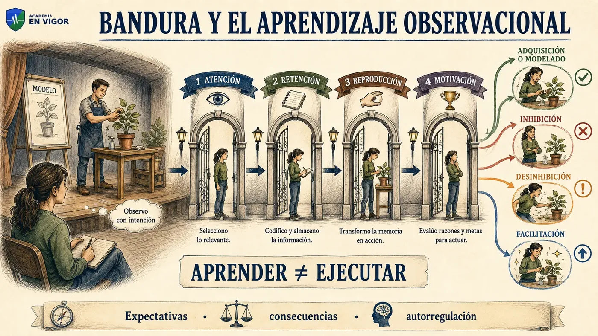

<em>Infografía: Bandura y aprendizaje observacional.</em>

<!-- FUENTE: BANDURA-1977-T33 -->

## 43. Sutherland y asociación diferencial

**Idea de control:** Sutherland responde cómo se aprende: interacción, técnicas y balance de definiciones.

- Sutherland sostuvo que la conducta criminal se aprende en interacción con otras personas mediante comunicación.
- El aprendizaje incluye técnicas y motivos, impulsos, racionalizaciones y actitudes.
- La delincuencia se favorece cuando predominan definiciones favorables a infringir la ley sobre definiciones desfavorables.
- Las asociaciones varían en frecuencia, duración, prioridad e intensidad; el contacto con delincuentes no produce automáticamente delito.

<!-- VISUAL:t33-43-sutherland-y-asociacion-diferencial.webp -->

  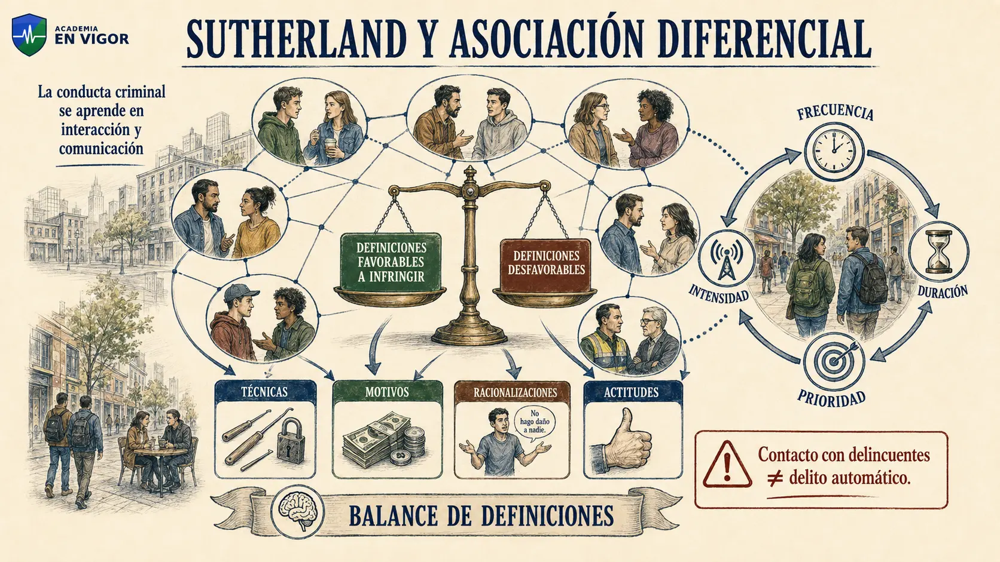

<em>Infografía: Sutherland y asociación diferencial.</em>

<!-- FUENTE: SUTHERLAND-1947-T33 -->

## 44. Akers y aprendizaje social criminológico

**Idea de control:** Regla AKER: Asociación, definiciones, refuerzo e imitación.

- Akers integró asociación diferencial con principios de aprendizaje y refuerzo.
- Sus cuatro elementos centrales son asociación diferencial, definiciones, refuerzo diferencial e imitación.
- Las recompensas y castigos reales o anticipados influyen en inicio, repetición y mantenimiento de la conducta.
- El modelo especifica mecanismos de aprendizaje, pero no afirma que toda persona expuesta responda igual.

<!-- VISUAL:t33-44-akers-y-aprendizaje-social-criminologico.webp -->

  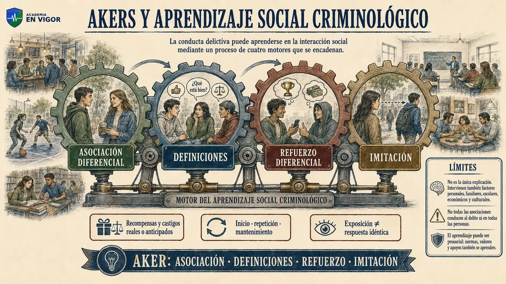

<em>Infografía: Akers y aprendizaje social criminológico.</em>

<!-- FUENTE: AKERS-1998-T33 -->

## 45. Durkheim: delito y anomia

**Idea de control:** Normal significa general como fenómeno social; anomia significa regulación debilitada, no ausencia física de normas.

- Durkheim entendió el delito como hecho social normal en el sentido de presente en todas las sociedades, no como conducta deseable.
- La anomia describe debilitamiento o insuficiencia de regulación social ante cambios y desajustes.
- Una sociedad puede experimentar variaciones patológicas cuando el delito supera determinadas condiciones o cambia bruscamente.
- Su explicación opera en el plano social y no atribuye anomia a una anomalía corporal individual.

<!-- VISUAL:t33-45-durkheim-delito-y-anomia.webp -->

  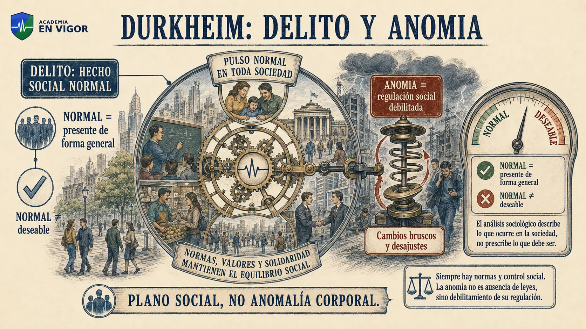

<em>Infografía: Durkheim: delito y anomia.</em>

<!-- FUENTE: DURKHEIM-1897-T33 -->

## 46. Merton: estructura social y anomia

**Idea de control:** Merton: metas muy premiadas + acceso desigual a medios legítimos = presión estructural.

- Merton explicó tensión cuando una cultura enfatiza metas de éxito y la estructura distribuye de forma desigual medios legítimos para alcanzarlas.
- La presión hacia desviación no procede de aspirar mucho por sí solo, sino del desajuste entre metas y medios institucionalizados.
- La teoría es sociológica porque analiza organización cultural y oportunidades, aunque produzca adaptaciones individuales.
- No predice que toda persona con desventaja elegirá delito ni reduce toda delincuencia a pobreza.

<!-- VISUAL:t33-46-merton-estructura-social-y-anomia.webp -->

  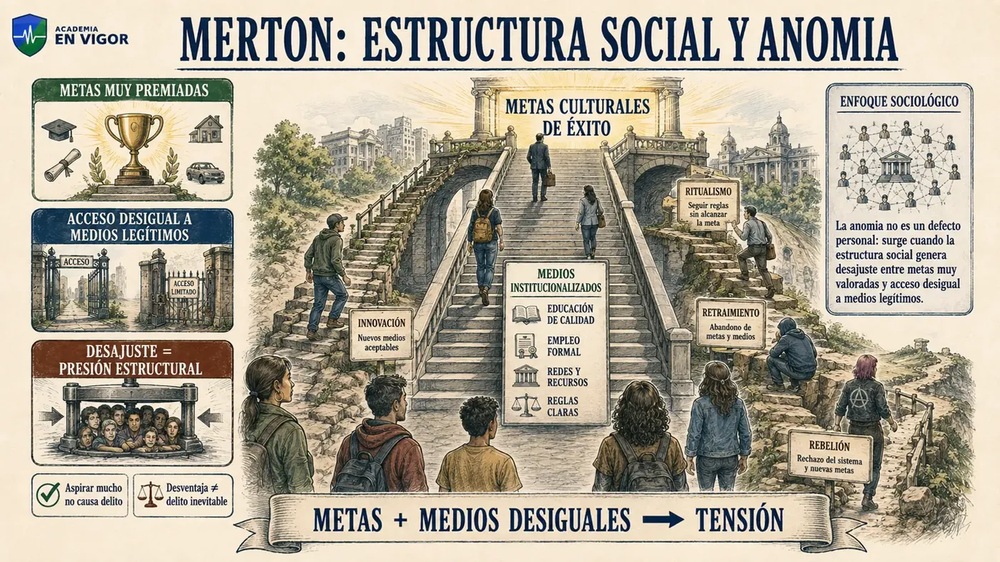

<em>Infografía: Merton: estructura social y anomia.</em>

<!-- FUENTE: MERTON-1938-T33 -->

## 47. Modos de adaptación de Merton

**Idea de control:** Tabla dos columnas: metas y medios; los signos de aceptación, rechazo o sustitución resuelven la pregunta.

- La conformidad acepta metas culturales y medios institucionalizados.
- La innovación acepta metas, pero recurre a medios no institucionalizados.
- El ritualismo reduce o abandona metas mientras mantiene medios; el retraimiento rechaza ambos.
- La rebelión sustituye metas y medios existentes por otros nuevos y no equivale al simple retraimiento.

<!-- VISUAL:t33-47-modos-de-adaptacion-de-merton.webp -->

  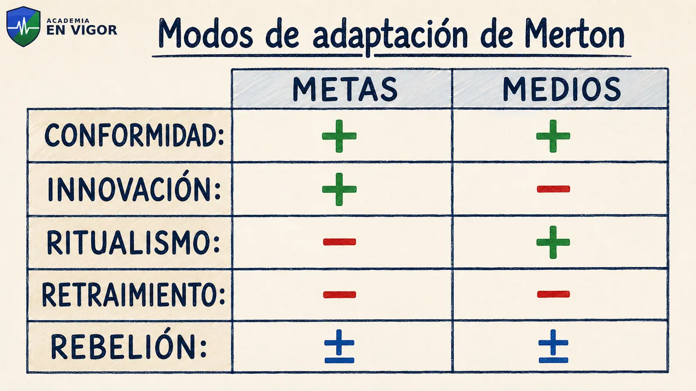

<em>Infografía: Modos de adaptación de Merton.</em>

<!-- FUENTE: MERTON-1938-T33 -->

## 48. Agnew y la tensión general

**Idea de control:** Tres fuentes: no lograr, perder lo positivo, sufrir lo negativo; después pregunta cómo se afronta.

- Agnew amplió la tensión más allá del éxito económico y distinguió varias fuentes de experiencia negativa.
- Puede surgir por fracaso en lograr metas valoradas, pérdida de estímulos positivos o presencia de estímulos negativos.
- La tensión genera emociones como ira o frustración, pero la respuesta depende de apoyos, habilidades, control y oportunidades.
- Delito es una posible estrategia de afrontamiento, no una consecuencia automática de toda adversidad.

<!-- VISUAL:t33-48-agnew-y-la-tension-general.webp -->

  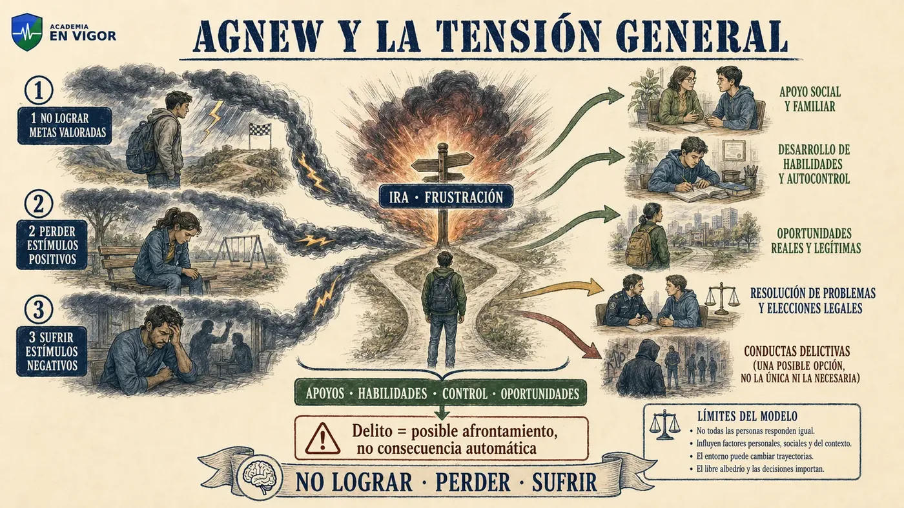

<em>Infografía: Agnew y la tensión general.</em>

<!-- FUENTE: AGNEW-1992-T33 -->

## 49. Escuela de Chicago y ecología urbana

**Idea de control:** Chicago mira el mapa y la organización del área; no etiqueta como criminal a quien vive allí.

- La Escuela de Chicago estudió la ciudad como laboratorio social y cartografió distribución espacial de problemas y delincuencia.
- Park y Burgess analizaron procesos de crecimiento urbano, competencia, invasión y sucesión mediante el modelo de zonas concéntricas.
- El enfoque ecológico sitúa la unidad de análisis en áreas y relaciones urbanas, no en supuestas esencias criminales de sus residentes.
- El modelo nació en un contexto histórico concreto y no debe trasladarse mecánicamente a toda ciudad.

<!-- VISUAL:t33-49-escuela-de-chicago-y-ecologia-urbana.webp -->

  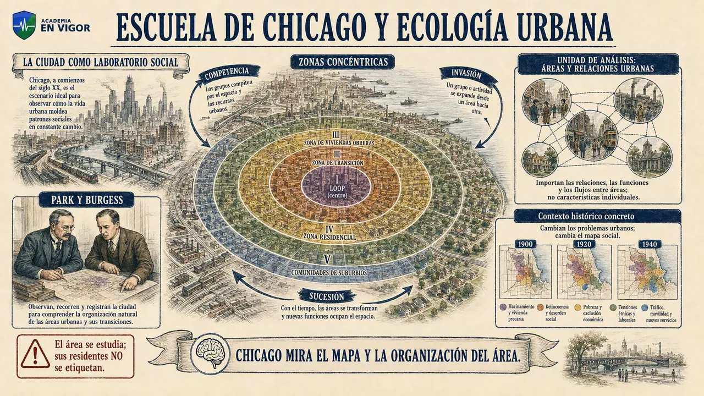

<em>Infografía: Escuela de Chicago y ecología urbana.</em>

<!-- FUENTE: PARK-BURGESS-1925-T33 -->

## 50. Shaw y McKay: desorganización social

**Idea de control:** El patrón persiste en el área porque cambian redes y control, no porque sus habitantes tengan una esencia criminal.

- Shaw y McKay observaron persistencia espacial de tasas de delincuencia juvenil pese al cambio de habitantes.
- Relacionaron desventaja económica, movilidad residencial y heterogeneidad con debilitamiento de organización comunitaria.
- La desorganización dificulta supervisión, cooperación y transmisión eficaz de normas convencionales.
- La teoría explica condiciones de áreas y control informal; no afirma que pobreza o diversidad causen delito por naturaleza.

<!-- VISUAL:t33-il-50-shaw-y-mckay-desorganizacion-social.webp -->

  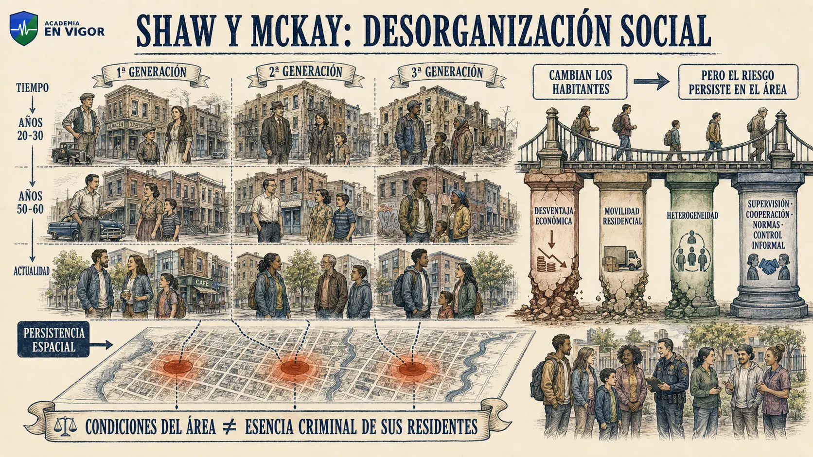

<em>Infografía: Shaw y McKay: desorganización social.</em>

<!-- FUENTE: SHAW-MCKAY-1942-T33 -->

## 51. Cohen y la subcultura delictiva

**Idea de control:** Cohen: problema de estatus + respuesta colectiva + valores propios del grupo.

- Albert Cohen explicó ciertas subculturas juveniles como respuesta colectiva a frustración de estatus.
- El grupo puede invertir criterios dominantes y otorgar reconocimiento por conductas rechazadas fuera de él.
- Describió rasgos como no utilidad inmediata, malicia y negativismo en la subcultura analizada.
- La teoría se refiere a un fenómeno delimitado y no permite atribuir delincuencia a toda juventud o grupo de clase trabajadora.

<!-- VISUAL:t33-51-cohen-y-la-subcultura-delictiva.webp -->

  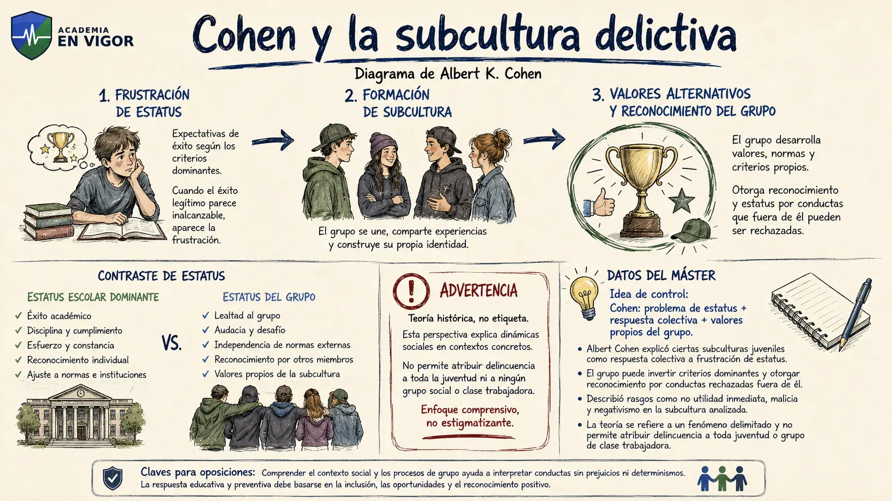

<em>Infografía: Cohen y la subcultura delictiva.</em>

<!-- FUENTE: COHEN-1955-T33 -->

## 52. Cloward y Ohlin: oportunidades diferenciales

**Idea de control:** No basta querer delinquir: también se aprende y se accede de forma desigual a oportunidades ilegítimas.

- Cloward y Ohlin añadieron que también las oportunidades ilegítimas se distribuyen de forma desigual.
- La disponibilidad de redes y modelos favorece distintas respuestas subculturales.
- Diferenciaron subculturas criminal, conflictiva y de retirada dentro de su esquema.
- La tipología es un modelo histórico y no una clasificación legal actual de grupos o delitos.

<!-- VISUAL:t33-52-cloward-y-ohlin-oportunidades-diferenciales.webp -->

  

<em>Infografía: Cloward y Ohlin: oportunidades diferenciales.</em>

<!-- FUENTE: CLOWARD-OHLIN-1960-T33 -->

## 53. Hirschi y el vínculo social

**Idea de control:** Hirschi: Apego, Compromiso, Participación y Creencia.

- Hirschi preguntó por qué muchas personas no delinquen y situó el freno en sus vínculos con la sociedad convencional.
- Los cuatro elementos del vínculo son apego, compromiso, participación y creencia.
- Vínculos fuertes elevan costes sociales y morales de transgredir y ocupan tiempo en actividades convencionales.
- Un vínculo débil aumenta posibilidad, pero no convierte el delito en resultado inevitable.

<!-- VISUAL:t33-53-hirschi-y-el-vinculo-social.webp -->

  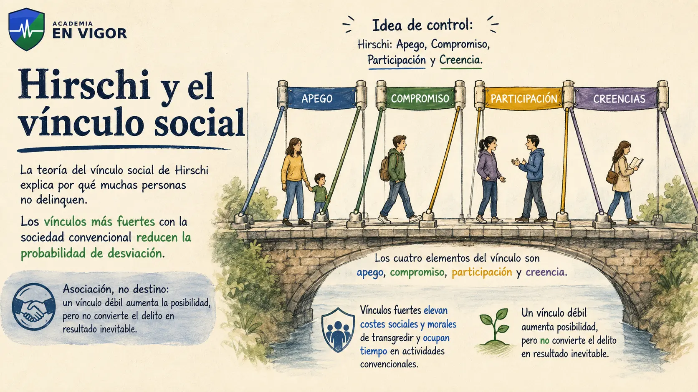

<em>Infografía: Hirschi y el vínculo social.</em>

<!-- FUENTE: HIRSCHI-1969-T33 -->

## 54. Gottfredson y Hirschi: autocontrol

**Idea de control:** Propensión no es acto: bajo autocontrol aumenta atractivo inmediato, pero necesita oportunidad.

- La teoría general relaciona bajo autocontrol con impulsividad, preferencia por gratificación inmediata y escasa consideración de consecuencias.
- El autocontrol se desarrollaría principalmente mediante crianza, supervisión, reconocimiento y corrección de conductas.
- La oportunidad sigue siendo necesaria para que una propensión se traduzca en un acto concreto.
- La estabilidad propuesta ha sido discutida y no autoriza etiquetar de forma permanente a una persona desde la infancia.

<!-- VISUAL:t33-54-gottfredson-y-hirschi-autocontrol.webp -->

  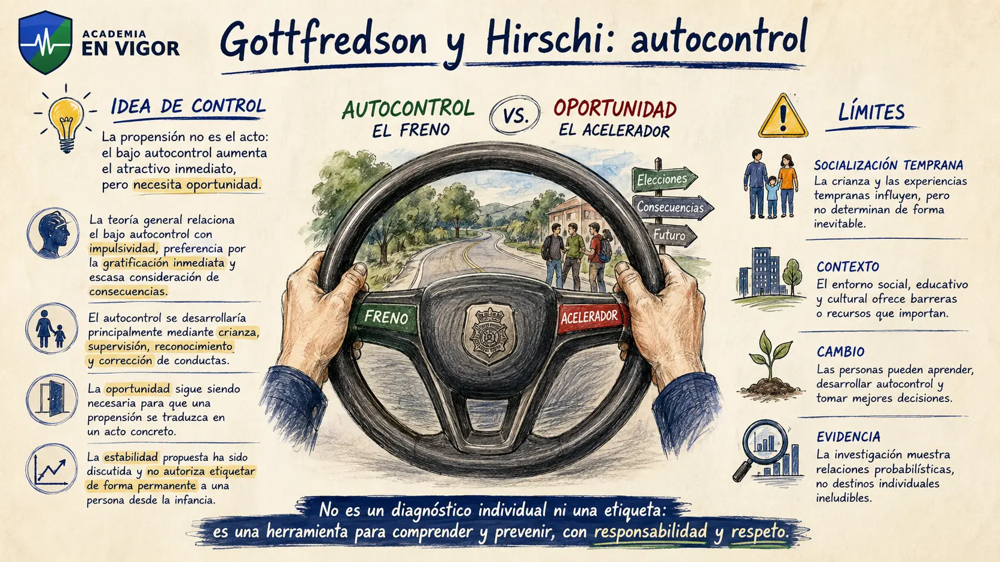

<em>Infografía: Gottfredson y Hirschi: autocontrol.</em>

<!-- FUENTE: GOTTFREDSON-HIRSCHI-1990-T33 -->

## 55. Becker y el etiquetamiento

**Idea de control:** Cambia la pregunta: además de qué hizo, quién define, quién aplica y con qué consecuencias.

- Becker subrayó que la desviación depende también de reglas, procesos de aplicación y reacción de otros.
- La etiqueta se produce cuando una definición social se aplica con éxito a una persona o conducta.
- El enfoque estudia quién crea y aplica normas, a quién se etiqueta y qué consecuencias genera.
- No sostiene que el acto material nunca importe ni que etiquetar sea la única causa de toda delincuencia.

<!-- VISUAL:t33-il-55-becker-y-el-etiquetamiento.webp -->

  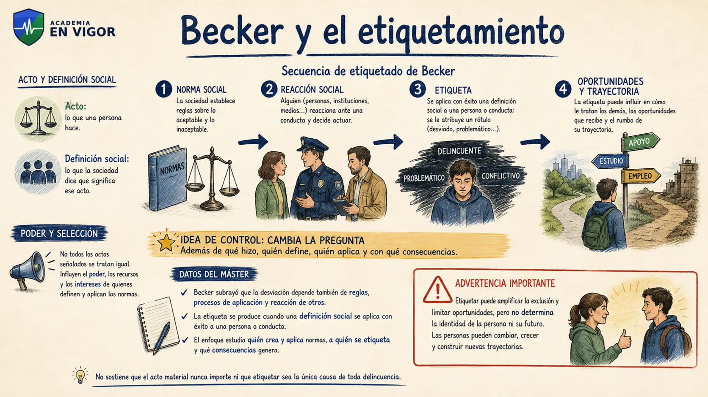

<em>Infografía: Becker y el etiquetamiento.</em>

<!-- FUENTE: BECKER-1963-T33 -->

## 56. Lemert: desviación primaria y secundaria

**Idea de control:** Primaria no significa «primera condena»; secundaria describe reorganización de identidad por la reacción.

- La desviación primaria comprende actos iniciales que no reorganizan necesariamente identidad y vida del sujeto.
- La desviación secundaria surge cuando reacción, estigma y respuestas del individuo consolidan un papel desviado.
- El proceso puede incluir exclusión de oportunidades convencionales y mayor relación con grupos estigmatizados.
- La distinción es analítica y no convierte cualquier intervención formal en causa suficiente de reincidencia.

<!-- VISUAL:t33-56-lemert-desviacion-primaria-y-secundaria.webp -->

  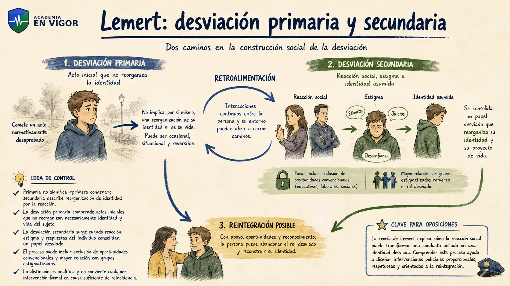

<em>Infografía: Lemert: desviación primaria y secundaria.</em>

<!-- FUENTE: LEMERT-1951-T33 -->

## 57. Perspectivas de conflicto y críticas

**Idea de control:** Tres momentos: crear la regla, aplicarla y distribuir sus efectos.

- Las perspectivas de conflicto analizan cómo poder e intereses influyen en creación, definición y aplicación de normas.
- Distinguen daño social, criminalización formal y selección práctica por instituciones de control.
- Una ley puede aplicarse de forma desigual aunque su texto sea general, lo que exige estudiar datos y procedimientos.
- Analizar poder no demuestra que toda norma sea ilegítima ni sustituye la prueba del delito concreto.

<!-- VISUAL:t33-57-perspectivas-de-conflicto-y-criticas.webp -->

  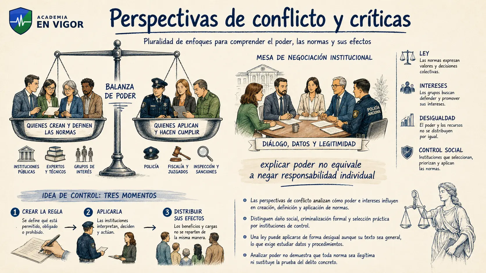

<em>Infografía: Perspectivas de conflicto y críticas.</em>

<!-- FUENTE: BECKER-1963-T33 -->

## 58. Elección racional

**Idea de control:** Racional no significa perfecto: basta una decisión orientada por incentivos bajo límites concretos.

- Cornish y Clarke modelaron al infractor como decisor que valora costes, beneficios, esfuerzo, riesgo y oportunidad.
- La racionalidad es limitada por información, tiempo, emociones, habilidades y contexto.
- Las decisiones varían según tipo de delito y entre inicio, preparación, ejecución y abandono.
- El modelo orienta prevención situacional sin afirmar cálculo perfecto ni explicar por sí solo el origen de preferencias.

<!-- VISUAL:t33-58-eleccion-racional.webp -->

  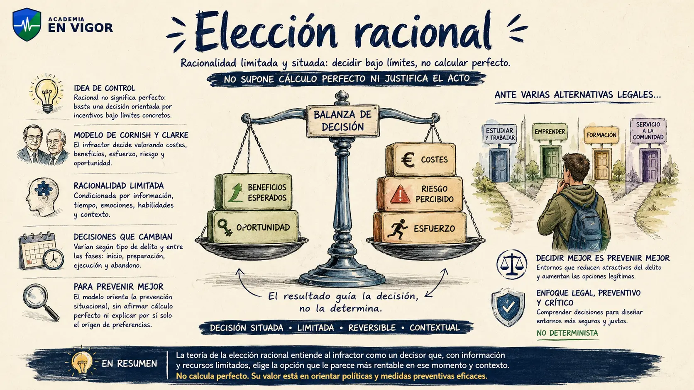

<em>Infografía: Elección racional.</em>

<!-- FUENTE: CORNISH-CLARKE-1986-T33 -->

## 59. Actividades rutinarias

**Idea de control:** Triángulo de 1979: motivado + objetivo adecuado + guardián ausente.

- Cohen y Felson explicaron cambios en tasas delictivas mediante organización cotidiana de actividades y oportunidades.
- El delito predatorio requiere convergencia en espacio y tiempo de infractor motivado, objetivo adecuado y ausencia de guardián eficaz.
- El guardián puede ser persona, organización, tecnología o diseño que disuada o impida, no solo policía.
- La teoría toma la motivación como dada para analizar oportunidad y no explica por sí sola cómo nace el infractor motivado.

<!-- VISUAL:t33-59-actividades-rutinarias.webp -->

  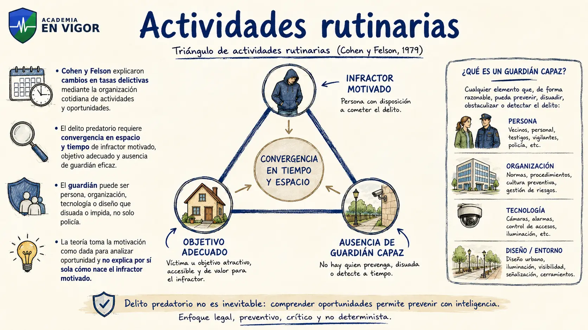

<em>Infografía: Actividades rutinarias.</em>

<!-- FUENTE: COHEN-FELSON-1979-T33 -->

## 60. Prevención situacional del delito

**Idea de control:** Interviene sobre la escena y la oportunidad, no diagnostica el alma del infractor.

- La prevención situacional modifica condiciones inmediatas de delitos específicos para reducir oportunidades.
- Sus familias de técnicas buscan aumentar esfuerzo, aumentar riesgo, reducir recompensas, reducir provocaciones y eliminar excusas.
- Debe adaptarse al mecanismo del delito concreto y evaluarse frente a desplazamiento y difusión de beneficios.
- No sustituye prevención social ni justicia y puede producir costes o exclusiones si se diseña sin proporcionalidad.

<!-- VISUAL:t33-60-prevencion-situacional-del-delito.webp -->

  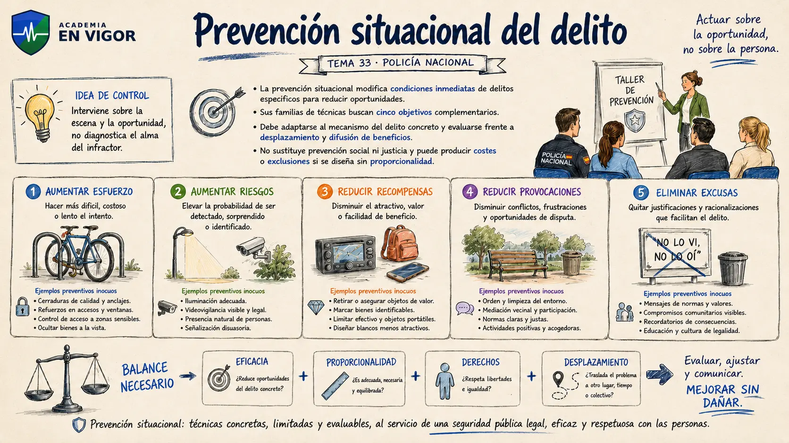

<em>Infografía: Prevención situacional del delito.</em>

<!-- FUENTE: CLARKE-1997-T33 -->

## 61. Diseño ambiental y espacio defendible

**Idea de control:** Un espacio seguro ayuda a ver, reconocer, usar y cuidar; no se reduce a fortificar.

- El diseño ambiental busca reducir oportunidades mediante visibilidad, control de accesos, territorialidad, actividad y mantenimiento.
- Newman vinculó espacio defendible con capacidad de residentes para reconocer, controlar y responsabilizarse de áreas próximas.
- La vigilancia natural depende de usos y presencia legítima, no solo de cámaras o iluminación intensa.
- El diseño debe evitar exclusión, desplazamiento y falsa sensación de seguridad por soluciones meramente estéticas.

<!-- VISUAL:t33-61-diseno-ambiental-y-espacio-defendible.webp -->

  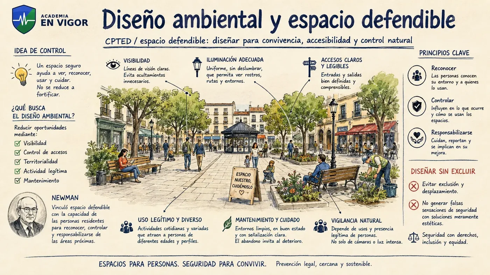

<em>Infografía: Diseño ambiental y espacio defendible.</em>

<!-- FUENTE: NEWMAN-1972-T33 -->

## 62. Ventanas rotas: tesis y límites

**Idea de control:** Estudia señal y control informal, pero no conviertas metáfora en causalidad automática.

- Wilson y Kelling propusieron que desorden visible no atendido puede debilitar control informal y favorecer más incivilidad y delito.
- La metáfora de la ventana rota describe señales de abandono y expectativas sobre intervención comunitaria.
- La relación entre desorden y delito no es automática y puede estar confundida por desventaja, segregación y otros factores.
- La teoría no justifica tolerancia cero indiscriminada ni intervenciones desproporcionadas sobre conductas no delictivas.

<!-- VISUAL:t33-il-62-ventanas-rotas-tesis-y-limites.webp -->

  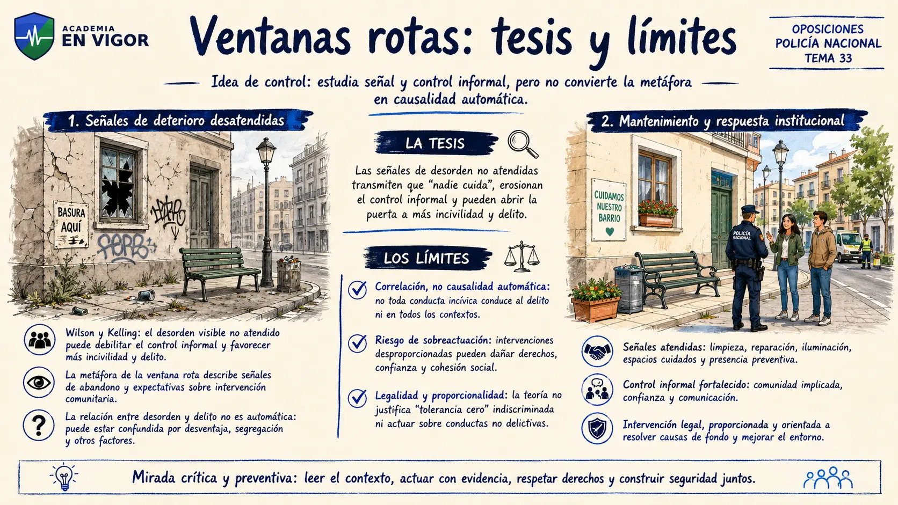

<em>Infografía: Ventanas rotas: tesis y límites.</em>

<!-- FUENTE: WILSON-KELLING-1982-T33 -->

## 63. Curso de vida y puntos de inflexión

**Idea de control:** La trayectoria tiene continuidad, pero también giros: importa cuándo ocurre el vínculo y qué significado adquiere.

- La criminología del curso de vida estudia inicio, persistencia, frecuencia, escalada y desistimiento a lo largo del tiempo.
- Sampson y Laub destacaron que vínculos sociales y control informal cambian durante la trayectoria.
- Transiciones como empleo estable o relaciones significativas pueden actuar como puntos de inflexión según su calidad y contexto.
- La historia previa condiciona, pero no determina de forma irreversible la conducta futura.

<!-- VISUAL:t33-63-curso-de-vida-y-puntos-de-inflexion.webp -->

  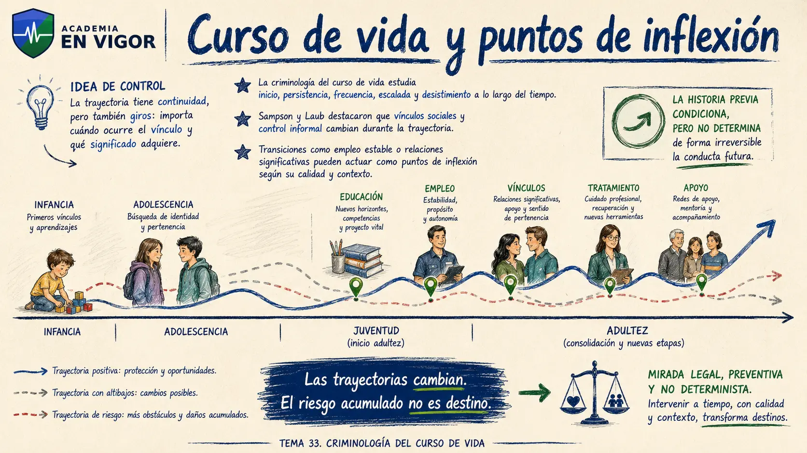

<em>Infografía: Curso de vida y puntos de inflexión.</em>

<!-- FUENTE: SAMPSON-LAUB-1993-T33 -->

## 64. Teorías integradoras

**Idea de control:** Integrar es conectar mecanismos con orden, no fabricar una enciclopedia sin dirección.

- Las teorías integradoras combinan proposiciones compatibles de distintos modelos para explicar más fases o niveles.
- Integrar exige especificar orden causal, mediaciones, moderadores y límites, no sumar autores en una lista.
- Un modelo puede enlazar estructura con redes, aprendizaje, autocontrol, oportunidad y reacción institucional.
- Más variables no garantizan mejor teoría si no aumentan claridad, contraste y capacidad explicativa.

<!-- VISUAL:t33-64-teorias-integradoras.webp -->

  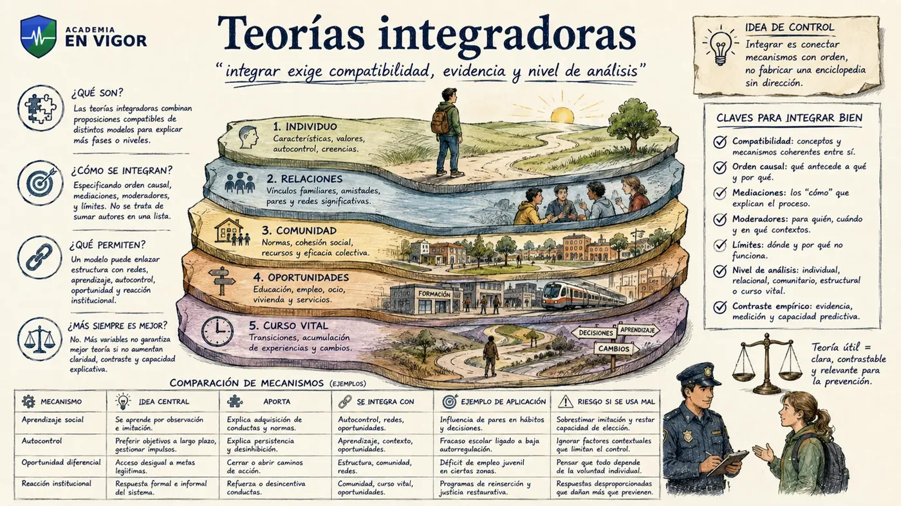

<em>Infografía: Teorías integradoras.</em>

<!-- FUENTE: SAMPSON-LAUB-1993-T33 -->

## 65. Clasificar la delincuencia sin falso canon

**Idea de control:** Antes de memorizar categorías pregunta: ¿clasificadas según qué?

- No existe una única clasificación universal de delincuencia válida para todo propósito.
- Puede clasificarse por conducta, bien jurídico, gravedad, frecuencia, autoría, organización, víctima, territorio, medio o finalidad.
- Una misma conducta puede pertenecer simultáneamente a varias categorías según el eje utilizado.
- Toda clasificación debe declarar criterio, fuente y finalidad para evitar presentar etiquetas descriptivas como tipos legales.

<!-- VISUAL:t33-65-clasificar-la-delincuencia-sin-falso-canon.webp -->

  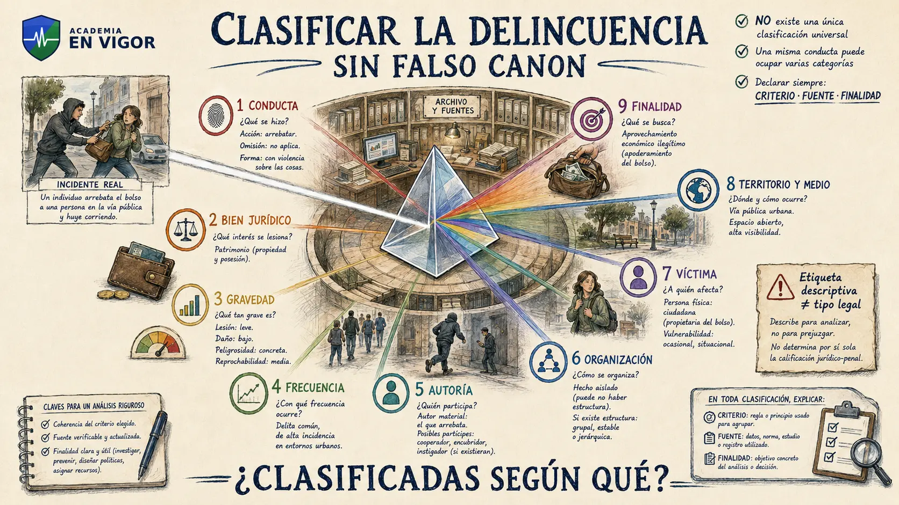

<em>Infografía: Clasificar la delincuencia sin falso canon.</em>

<!-- FUENTE: UNODC-ICCS-T33 -->

## 66. Delincuencia ocasional, habitual y profesional

**Idea de control:** Frecuencia describe trayectoria; la consecuencia jurídica exige su propia norma y prueba.

- Ocasional describe participación esporádica o ligada a circunstancias sin carrera estable demostrada.
- Habitual alude a repetición o persistencia, pero su significado exacto depende del contexto criminológico o jurídico utilizado.
- Profesional describe planificación, especialización, continuidad y obtención de recursos mediante actividad delictiva.
- Las etiquetas son descriptivas y no sustituyen requisitos legales de reincidencia, habitualidad u organización criminal.

<!-- VISUAL:t33-66-delincuencia-ocasional-habitual-y-profesional.webp -->

  

<em>Infografía: Delincuencia ocasional, habitual y profesional.</em>

<!-- FUENTE: UNODC-ICCS-T33 -->

## 67. Delincuencia individual, grupal y organizada

**Idea de control:** Pluralidad no basta: comprueba número, tiempo, concierto, delito grave y finalidad de beneficio en la fuente aplicable.

- La autoría individual no excluye colaboración puntual, pero carece de una estructura colectiva estable atribuible al hecho.
- La delincuencia grupal comprende actuación conjunta con grados diversos de coordinación y duración.
- La Convención de Palermo define grupo delictivo organizado mediante tres o más personas, existencia durante cierto tiempo, actuación concertada y finalidad delictiva y de beneficio.
- No toda pluralidad de autores constituye delincuencia organizada; deben comprobarse los elementos de la definición aplicable.

<!-- VISUAL:t33-67-delincuencia-individual-grupal-y-organizada.webp -->

  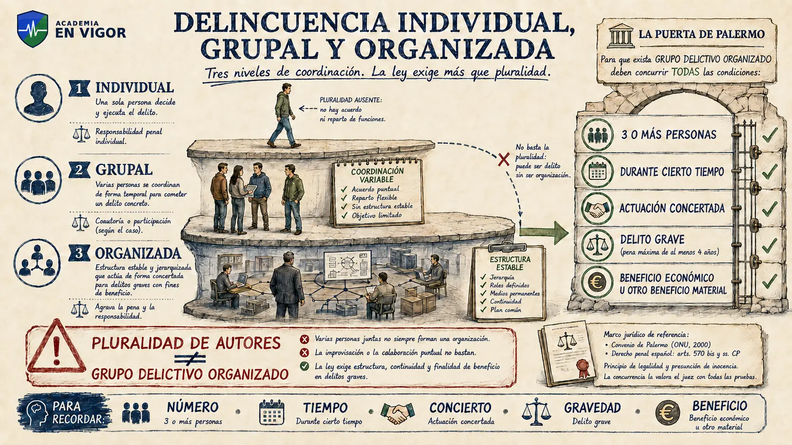

<em>Infografía: Delincuencia individual, grupal y organizada.</em>

<!-- FUENTE: UNTOC-2000-T33 -->

## 68. Delincuencia juvenil y edad

**Idea de control:** En España: 14 a 17, régimen de menores; menos de 14, protección, no responsabilidad bajo la LO 5/2000.

- Delincuencia juvenil es una categoría criminológica cuya delimitación por edad varía según estudio y ordenamiento.
- En España, la Ley Orgánica 5/2000 se aplica a quienes tengan catorce años y sean menores de dieciocho por hechos tipificados como delito.
- Quienes tienen menos de catorce años no responden conforme a esa ley y quedan bajo normas de protección de menores.
- Edad no explica por sí sola el delito y ninguna característica negativa puede atribuirse a toda la juventud.

<!-- VISUAL:t33-68-delincuencia-juvenil-y-edad.webp -->

  

<em>Infografía: Delincuencia juvenil y edad.</em>

<!-- FUENTE: LO5-2000-T33 -->

## 69. Delincuencia convencional, económica y de cuello blanco

**Idea de control:** Sutherland rompió el sesgo: la delincuencia también puede ocultarse tras prestigio y ocupación.

- Delincuencia convencional suele agrupar delitos comunes visibles contra personas o patrimonio, pero no es una categoría legal única.
- Sutherland usó delito de cuello blanco para destacar infracciones cometidas por personas respetables y de alto estatus en el ejercicio de su ocupación.
- Delincuencia económica abarca conductas que dañan orden socioeconómico, mercados, hacienda, consumidores o empresas según el marco usado.
- La posición social no convierte una conducta en delito ni la excluye: la tipificación y prueba siguen siendo necesarias.

<!-- VISUAL:t33-il-69-delincuencia-convencional-economica-y-de-cuello-blanco.webp -->

  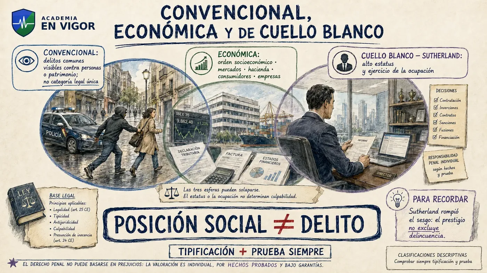

<em>Infografía: Delincuencia convencional, económica y de cuello blanco.</em>

<!-- FUENTE: SUTHERLAND-1947-T33 -->

## 70. Delincuencia violenta, patrimonial y digital

**Idea de control:** Clasifica por conducta, bien y medio; un mismo hecho puede ocupar varios ejes.

- Delincuencia violenta agrupa conductas con fuerza o amenaza contra personas, aunque las definiciones estadísticas varían.
- Delincuencia patrimonial se centra en apoderamiento, daño, fraude u otras afectaciones de bienes y derechos económicos.
- Ciberdelincuencia puede comprender delitos dependientes de sistemas y delitos tradicionales facilitados por medios digitales.
- Las categorías pueden solaparse: una extorsión digital puede ser patrimonial, intimidatoria y transnacional.

<!-- VISUAL:t33-70-delincuencia-violenta-patrimonial-y-digital.webp -->

  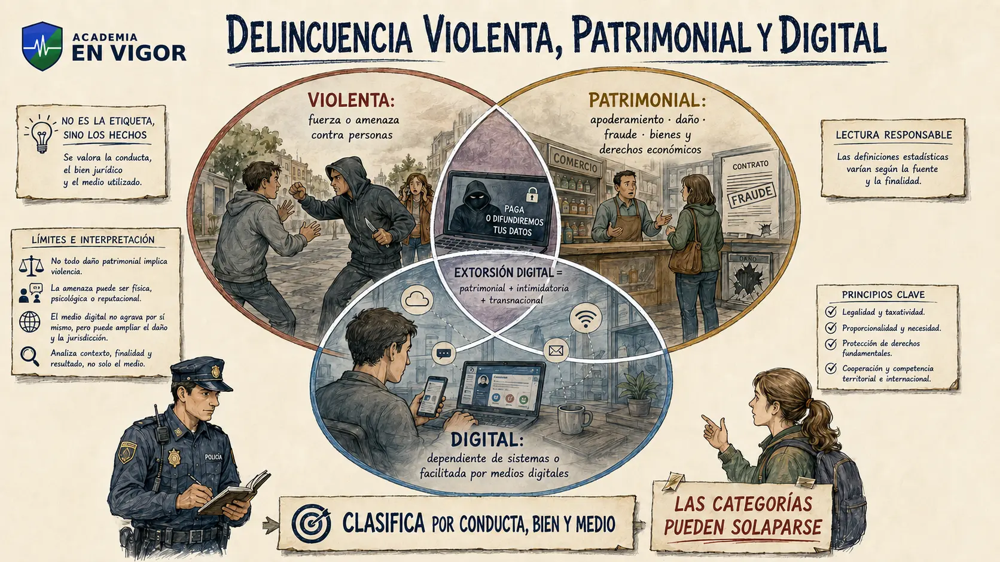

<em>Infografía: Delincuencia violenta, patrimonial y digital.</em>

<!-- FUENTE: UNODC-ICCS-T33 -->

## 71. Criminalidad registrada, aparente y real

**Idea de control:** No mezcles unidad de cuenta: hecho, denuncia, detenido, víctima y condena responden preguntas distintas.

- Criminalidad registrada recoge hechos incorporados a sistemas administrativos conforme a reglas de conocimiento y clasificación.
- Criminalidad aparente puede referirse a hechos conocidos inicialmente, aunque después cambie su calificación o no se prueben.
- Criminalidad real es una magnitud teórica que incluye hechos conocidos y ocultos y no se observa de forma completa y directa.
- Denuncias, diligencias, condenas y víctimas son unidades distintas y no deben sumarse o compararse como equivalentes.

<!-- VISUAL:t33-71-criminalidad-registrada-aparente-y-real.webp -->

  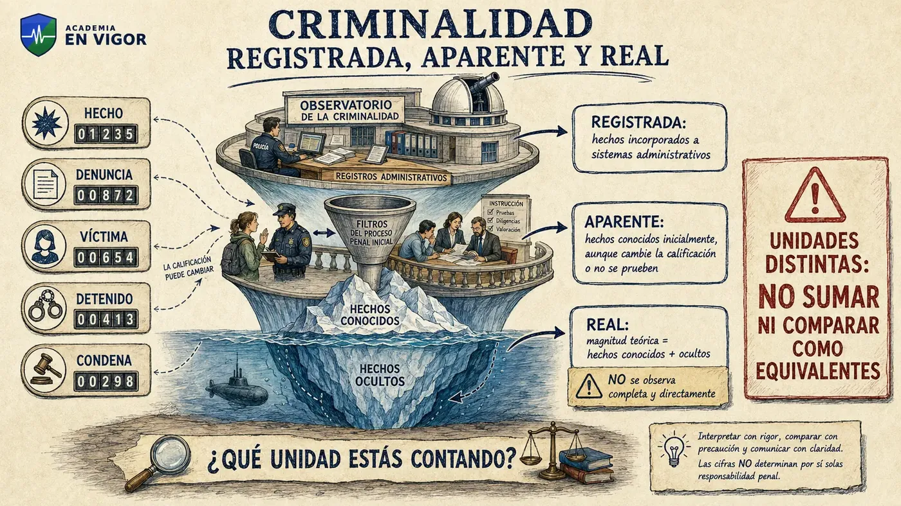

<em>Infografía: Criminalidad registrada, aparente y real.</em>

<!-- FUENTE: INTERIOR-BALANCE-T33 -->

## 72. Tasas, prevalencia, incidencia y concentración

**Idea de control:** Prevalencia pregunta cuántos afectados; incidencia cuántos hechos; concentración dónde se acumulan.

- Una tasa relaciona hechos con población u otra exposición durante un período y facilita comparación relativa.
- Prevalencia de victimización mide proporción de personas u hogares que sufrieron al menos un hecho en el período.
- Incidencia cuenta el número de sucesos, por lo que incorpora repetición sobre una misma víctima.
- Concentración examina qué parte de hechos se acumula en pocos lugares, víctimas, objetivos o infractores.

<!-- VISUAL:t33-72-tasas-prevalencia-incidencia-y-concentracion.webp -->

  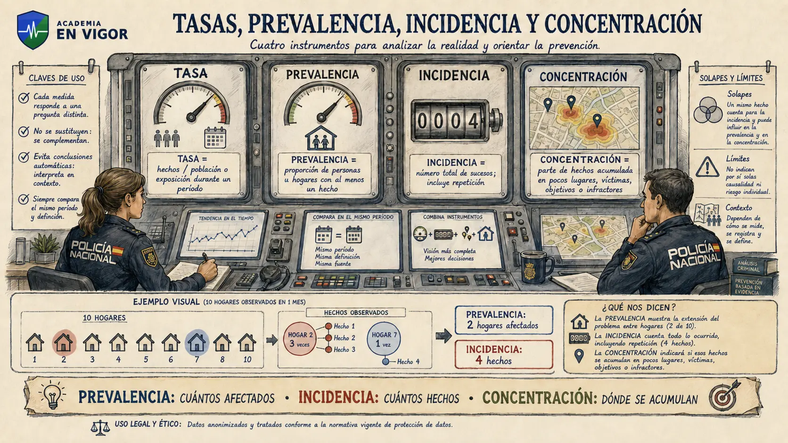

<em>Infografía: Tasas, prevalencia, incidencia y concentración.</em>

<!-- FUENTE: UNODC-ICCS-T33 -->

## 73. Lectura responsable de datos delictivos

**Idea de control:** Cinco controles antes del titular: definición, cifra, denominador, período y cambio de registro.

- Una variación porcentual grande puede partir de números pequeños y debe acompañarse de valores absolutos y tasas.
- Cambios legales, tecnológicos, de denuncia o registro pueden alterar series sin cambio equivalente en conducta real.
- Los promedios nacionales pueden ocultar concentración territorial, modalidades y grupos afectados.
- Comunicar seguridad exige incertidumbre, contexto y ausencia de inferencias estigmatizantes sobre colectivos.

<!-- VISUAL:t33-73-lectura-responsable-de-datos-delictivos.webp -->

  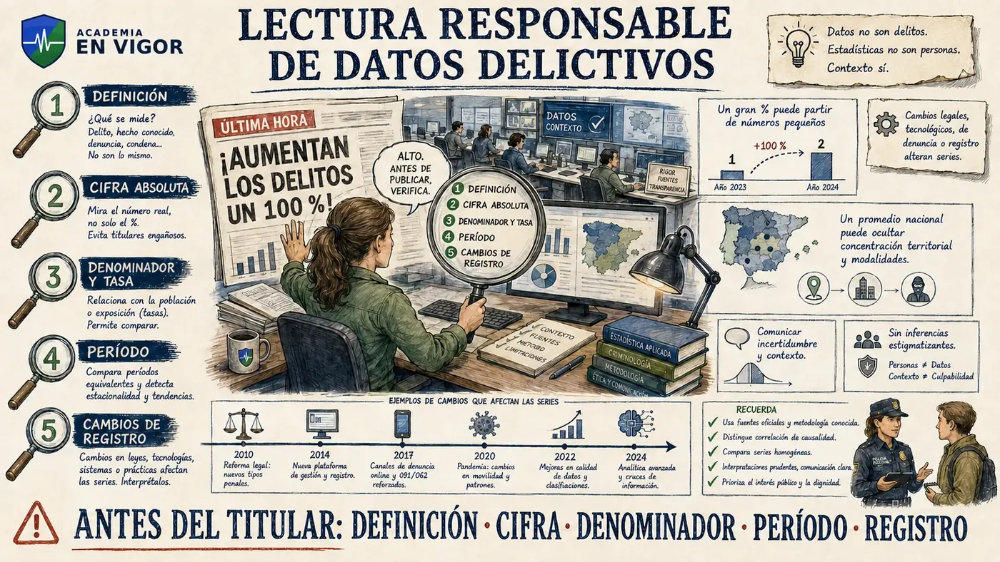

<em>Infografía: Lectura responsable de datos delictivos.</em>

<!-- FUENTE: INTERIOR-BALANCE-T33 -->

# Hablemos claro

:::hablemos-claro
Este tema tiene dos trampas maestras: confundir inseguridad real con miedo y estudiar teorías históricas como si fueran diagnósticos actuales. Separa dato, percepción, mecanismo y límite.
:::

# En la calle

:::en-la-calle
Una buena decisión de seguridad identifica amenaza, vulnerabilidad, personas expuestas y mecanismo del delito; después elige una respuesta legal y evalúa efectos, desplazamientos y confianza.
:::

# Lo que cae

:::lo-que-cae
Prioriza artículos 17, 104 y 149.1.29 CE; modelo público-privado; inseguridad objetiva y subjetiva; Kretschmer frente a Sheldon; Ferri; Bandura; Sutherland; anomia de Durkheim y Merton; Escuela de Chicago; vínculo social; etiquetamiento; actividades rutinarias y ejes de clasificación.
:::

# Ha caído

:::ha-caido
Se han localizado 11 referencias históricas del Tema 33. Permanecen ocultas y en cuarentena porque no existe plantilla oficial final verificable en el repositorio.
:::

## Fuentes legales, institucionales y primarias

- `CONVOCATORIA-PN-2026-T33`
- `CE-1978-T33`
- `LO2-1986-T33`
- `LO4-2015-T33`
- `LEY5-2014-T33`
- `LO5-2000-T33`
- `ESN-2021-T33`
- `INTERIOR-BALANCE-T33`
- `CIS-SEGURIDAD-T33`
- `UNODC-ICCS-T33`
- `UNODC-PREVENTION-T33`
- `UNTOC-2000-T33`
- `QUETELET-1835-T33`
- `BECCARIA-1764-T33`
- `LOMBROSO-1876-T33`
- `FERRI-1884-T33`
- `GAROFALO-1885-T33`
- `KRETSCHMER-1921-T33`
- `SHELDON-1949-T33`
- `EYSENCK-1964-T33`
- `BANDURA-1977-T33`
- `SUTHERLAND-1947-T33`
- `AKERS-1998-T33`
- `DURKHEIM-1897-T33`
- `MERTON-1938-T33`
- `AGNEW-1992-T33`
- `PARK-BURGESS-1925-T33`
- `SHAW-MCKAY-1942-T33`
- `COHEN-1955-T33`
- `CLOWARD-OHLIN-1960-T33`
- `HIRSCHI-1969-T33`
- `GOTTFREDSON-HIRSCHI-1990-T33`
- `BECKER-1963-T33`
- `LEMERT-1951-T33`
- `CORNISH-CLARKE-1986-T33`
- `COHEN-FELSON-1979-T33`
- `CLARKE-1997-T33`
- `NEWMAN-1972-T33`
- `WILSON-KELLING-1982-T33`
- `SAMPSON-LAUB-1993-T33`

---

*Academia En Vigor · El temario que nunca duerme · Tema 33 · v1.0.0 · Documento interno no publicado.*
