# TEMA 36 · GRAMÁTICA DE LA LENGUA ESPAÑOLA. MORFOLOGÍA. SUFIJOS, SUSTANTIVOS Y PRONOMBRES. ADJETIVOS: SUS GRADOS Y TIPOS. LOS ADVERBIOS Y SUS TIPOS. VERBOS: MODOS Y CONJUGACIÓN. PREPOSICIONES Y CONJUNCIONES. SINTAXIS. LA ORACIÓN: PARTES Y TIPOS. ANÁLISIS SINTÁCTICO.

**Policía Nacional · Método VIGOR · PARTE**
**Versión de contenido:** 1.0.0
**Estado editorial:** approved_internal · **Publicación:** not_published

# Mapa del tema

El Tema 36 se estudia en nueve partes: fundamentos y morfología; sustantivos; pronombres y determinantes; adjetivos; adverbios; verbos; preposiciones y conjunciones; grupos y funciones sintácticas; y tipos y análisis de la oración.

# Contenido

## 01. Alcance oficial del Tema 36

**Idea de control:** Primero separa cuatro planos: forma de la palabra, clase, grupo y función en la oración.

- El epígrafe oficial integra morfología, clases de palabras, flexión verbal, enlaces y sintaxis.
- La parte morfológica estudia tanto la estructura de las palabras como sus variaciones.
- La parte sintáctica estudia la combinación de palabras y grupos y las oraciones resultantes.
- El análisis debe identificar categorías, grupos, funciones y relaciones sin confundir estos niveles.

<!-- VISUAL:t36-01-alcance-oficial-del-tema-36.webp -->

  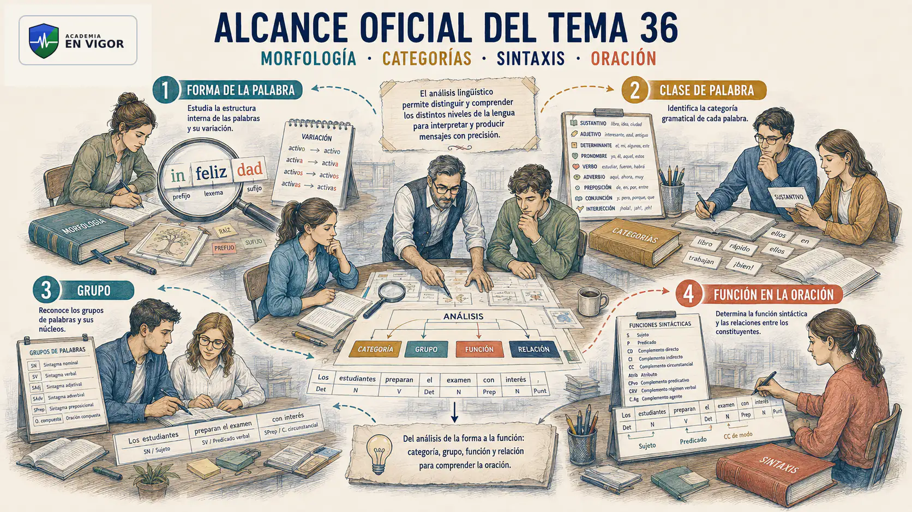

<em>Infografía: Alcance oficial del Tema 36.</em>

<!-- FUENTE: CONVOCATORIA-PN-2026-T36 -->

## 02. Gramática, morfología y sintaxis

**Idea de control:** Morfología mira dentro de la palabra; sintaxis mira cómo se combina con otras unidades.

- La gramática estudia la estructura de las palabras y las formas en que se combinan.
- La morfología analiza la constitución interna de las palabras y sus variaciones.
- La sintaxis analiza combinaciones, dependencias y funciones dentro de grupos y oraciones.
- Morfología y sintaxis se relacionan, pero responden a preguntas distintas sobre una misma expresión.

<!-- VISUAL:t36-il-02-gramatica-morfologia-y-sintaxis.webp -->

  

<em>Infografía: Gramática, morfología y sintaxis.</em>

<!-- FUENTE: RAE-NGB-T36 -->

## 03. Palabra, lexema y morfema

**Idea de control:** Imagina una palabra como una pieza central léxica a la que pueden añadirse marcas gramaticales.

- La palabra es la unidad superior de la morfología y una unidad mínima de la sintaxis.
- El lexema o raíz aporta el contenido léxico básico de una familia de palabras.
- El morfema aporta información gramatical o interviene en la formación de palabras.
- Una palabra puede estar formada por un solo morfema o por varios segmentos morfológicos.

<!-- VISUAL:t36-03-palabra-lexema-y-morfema.webp -->

  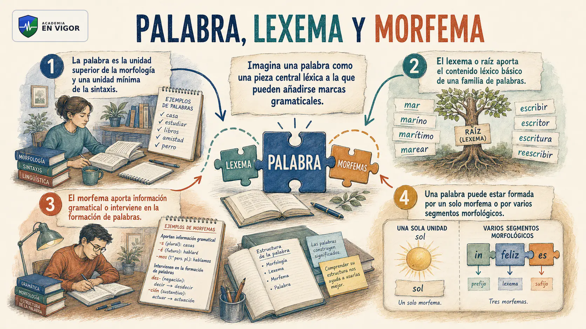

<em>Infografía: Palabra, lexema y morfema.</em>

<!-- FUENTE: RAE-NGB-MORFOLOGIA-T36 -->

## 04. Morfología flexiva y derivativa

**Idea de control:** Flexionar es cambiar el uniforme de la misma palabra; derivar es crear otra entrada léxica.

- La flexión crea formas de un mismo paradigma sin originar por sí sola un nuevo lexema.
- La derivación forma palabras relacionadas mediante afijos derivativos.
- Género, número, persona, tiempo y modo pueden expresarse mediante rasgos flexivos según la categoría.
- La derivación puede cambiar la categoría gramatical de la base, aunque no lo hace necesariamente.

<!-- VISUAL:t36-il-04-morfologia-flexiva-y-derivativa.webp -->

  

<em>Infografía: Morfología flexiva y derivativa.</em>

<!-- FUENTE: RAE-NGB-MORFOLOGIA-T36 -->

## 05. Palabras simples, derivadas y compuestas

**Idea de control:** Clasifica por piezas reconocibles, no por el número de letras ni por una etimología remota.

- Una palabra simple no contiene afijos derivativos ni combina dos bases léxicas en el análisis sincrónico.
- Una palabra derivada incorpora un afijo derivativo a una base.
- Una palabra compuesta combina dos o más bases o elementos compositivos.
- La historia etimológica no sustituye al análisis que reconoce el hablante en el español actual.

<!-- VISUAL:t36-05-palabras-simples-derivadas-y-compuestas.webp -->

  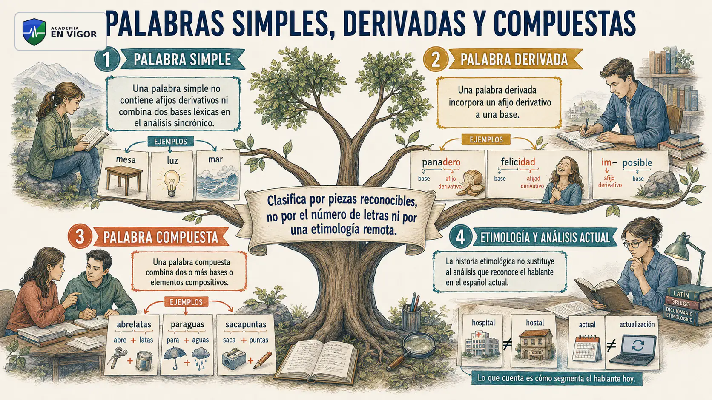

<em>Infografía: Palabras simples, derivadas y compuestas.</em>

<!-- FUENTE: RAE-NGB-DERIVACION-T36 -->

## 06. Prefijación, sufijación y composición

**Idea de control:** La posición orienta, pero la función decide: delante prefijo, detrás sufijo, base con base compuesto.

- Los prefijos se anteponen a la base y los sufijos se posponen a ella.
- La sufijación puede crear sustantivos, adjetivos, verbos y otras unidades derivadas.
- La composición reúne bases léxicas o elementos compositivos en una nueva unidad.
- Prefijación, sufijación y composición son mecanismos distintos aunque puedan concurrir.

<!-- VISUAL:t36-06-prefijacion-sufijacion-y-composicion.webp -->

  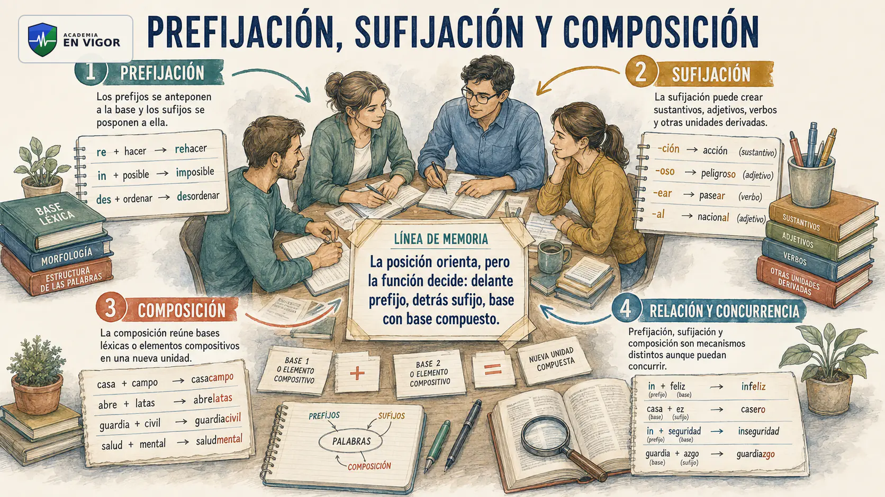

<em>Infografía: Prefijación, sufijación y composición.</em>

<!-- FUENTE: RAE-NGB-DERIVACION-T36 -->

## 07. El sufijo derivativo

**Idea de control:** Para reconocer un sufijo exige tres pruebas: posición final, base identificable y aporte de significado.

- El sufijo derivativo se añade después de una base para formar una palabra nueva.
- Un sufijo puede seleccionar determinadas clases de bases y aportar un significado regular.
- La sufijación puede provocar ajustes fonológicos o alomorfia en la base o en el afijo.
- No toda secuencia final repetida es un sufijo: debe existir relación formal y semántica analizable.

<!-- VISUAL:t36-07-el-sufijo-derivativo.webp -->

  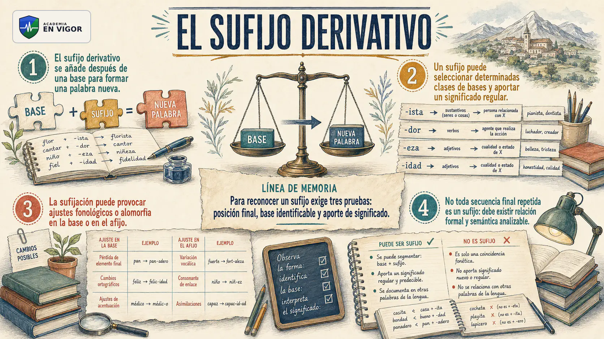

<em>Infografía: El sufijo derivativo.</em>

<!-- FUENTE: RAE-NGB-DERIVACION-T36 -->

## 08. Sufijos nominales, adjetivales y verbales

**Idea de control:** Nombra el sufijo por la puerta de salida: nominal si el resultado es nombre, verbal si es verbo.

- Los sufijos nominales forman sustantivos a partir de bases diversas.
- Los sufijos adjetivales forman adjetivos y pueden expresar relación, cualidad o capacidad.
- Los sufijos verbales forman verbos y pueden aportar valores aspectuales o causativos.
- La clase del derivado se determina por el resultado, no únicamente por la categoría de la base.

<!-- VISUAL:t36-il-08-sufijos-nominales-adjetivales-y-verbales.webp -->

  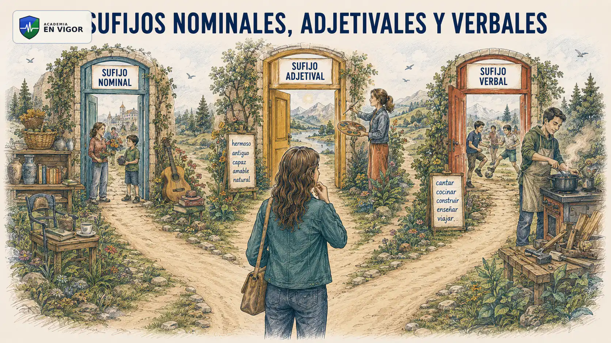

<em>Infografía: Sufijos nominales, adjetivales y verbales.</em>

<!-- FUENTE: RAE-NGB-DERIVACION-T36 -->

## 09. Sufijos apreciativos

**Idea de control:** El sufijo apreciativo lleva termómetro emocional: el contexto decide si mide tamaño, afecto o ironía.

- Los sufijos apreciativos aportan valoraciones de tamaño, intensidad, afecto o menosprecio.
- Diminutivo, aumentativo y despectivo describen tendencias semánticas, no significados mecánicos.
- El contexto puede hacer que un diminutivo exprese afecto, cortesía, atenuación o ironía.
- La sufijación apreciativa suele mantener la categoría gramatical de la base.

<!-- VISUAL:t36-09-sufijos-apreciativos.webp -->

  

<em>Infografía: Sufijos apreciativos.</em>

<!-- FUENTE: RAE-NGB-DERIVACION-T36 -->

## 10. Interfijos y parasíntesis

**Idea de control:** En la parasíntesis las dos puertas se abren a la vez: sin una de ellas no existe la palabra intermedia.

- El interfijo aparece entre la base y un sufijo sin aportar normalmente un significado léxico autónomo.
- La parasíntesis puede combinar simultáneamente prefijación y sufijación cuando no existen etapas intermedias válidas.
- También se denomina parasintética cierta formación que combina composición y derivación.
- Para defender un análisis parasintético se comprueba si las formaciones intermedias existen con el sentido pertinente.

<!-- VISUAL:t36-il-10-interfijos-y-parasintesis.webp -->

  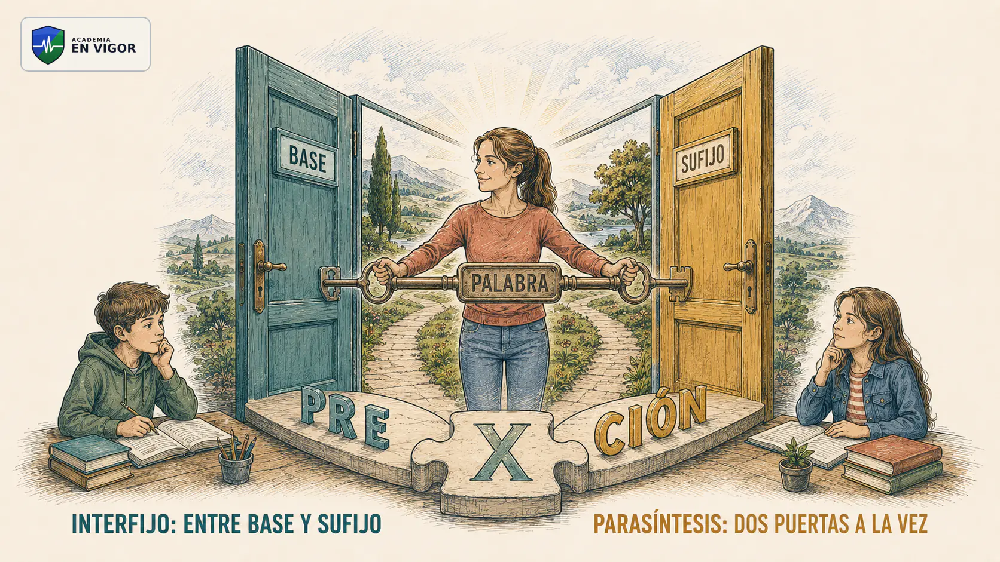

<em>Infografía: Interfijos y parasíntesis.</em>

<!-- FUENTE: RAE-NGB-DERIVACION-T36 -->

## 11. El sustantivo: propiedades básicas

**Idea de control:** Sustantivo es categoría; sujeto es función. Un mismo nombre puede ocupar puestos distintos.

- El sustantivo es una categoría léxica que puede constituir el núcleo de un grupo nominal.
- Los sustantivos presentan normalmente género y admiten oposición de número.
- Pueden combinarse con determinantes, adjetivos y complementos.
- La función sintáctica depende del grupo en la oración, no de que una palabra sea sustantivo.

<!-- VISUAL:t36-11-el-sustantivo-propiedades-basicas.webp -->

  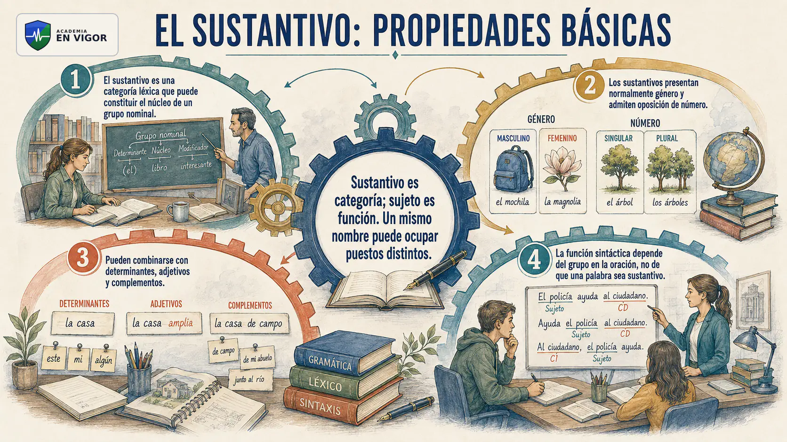

<em>Infografía: El sustantivo: propiedades básicas.</em>

<!-- FUENTE: RAE-NGB-SUSTANTIVO-T36 -->

## 12. Sustantivos comunes y propios

**Idea de control:** El común abre una carpeta de clase; el propio señala una ficha concreta.

- El nombre común clasifica individuos o entidades por propiedades compartidas.
- El nombre propio identifica directamente individuos o entidades en un contexto.
- Los nombres propios pueden llevar determinante en ciertos usos y variedades.
- Un nombre propio puede adquirir uso común y un nombre común puede integrarse en una denominación propia.

<!-- VISUAL:t36-12-sustantivos-comunes-y-propios.webp -->

  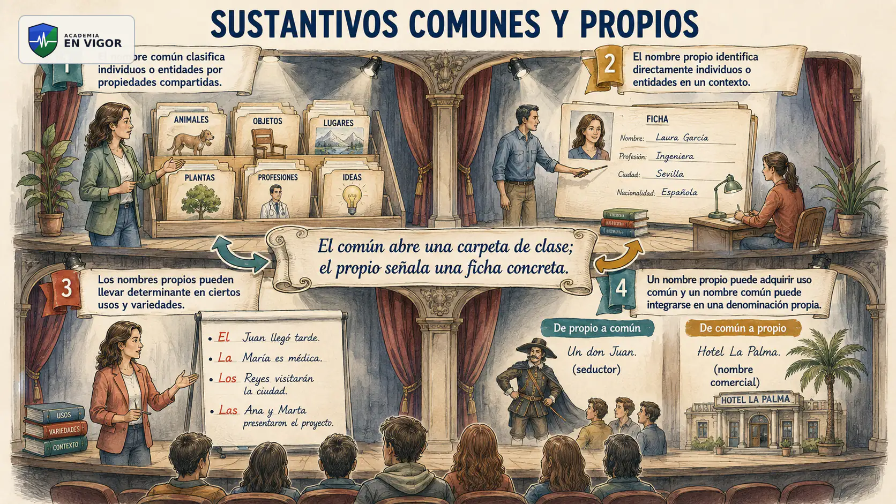

<em>Infografía: Sustantivos comunes y propios.</em>

<!-- FUENTE: RAE-NGB-SUSTANTIVO-T36 -->

## 13. Sustantivos concretos y abstractos

**Idea de control:** No uses solo los cinco sentidos: pregunta si se nombra una entidad o se conceptualiza una cualidad o proceso.

- La distinción concreto-abstracto es semántica y admite zonas graduales.
- Los concretos suelen designar entidades materiales o perceptibles, pero la definición no se reduce al tacto.
- Los abstractos suelen designar cualidades, estados, procesos o nociones.
- El contexto puede favorecer lecturas concretas o abstractas de una misma forma léxica.

<!-- VISUAL:t36-il-13-sustantivos-concretos-y-abstractos.webp -->

  

<em>Infografía: Sustantivos concretos y abstractos.</em>

<!-- FUENTE: RAE-NGB-SUSTANTIVO-T36 -->

## 14. Sustantivos contables y no contables

**Idea de control:** Contable usa contador; no contable necesita báscula o recipiente, salvo que el contexto cambie la lectura.

- Los contables designan entidades que pueden contarse directamente en unidades.
- Los no contables o de materia suelen cuantificarse mediante medidas, porciones o recipientes.
- Muchos sustantivos alternan entre lectura contable y no contable según el contexto.
- El plural de un nombre de materia puede designar clases, variedades o porciones.

<!-- VISUAL:t36-14-sustantivos-contables-y-no-contables.webp -->

  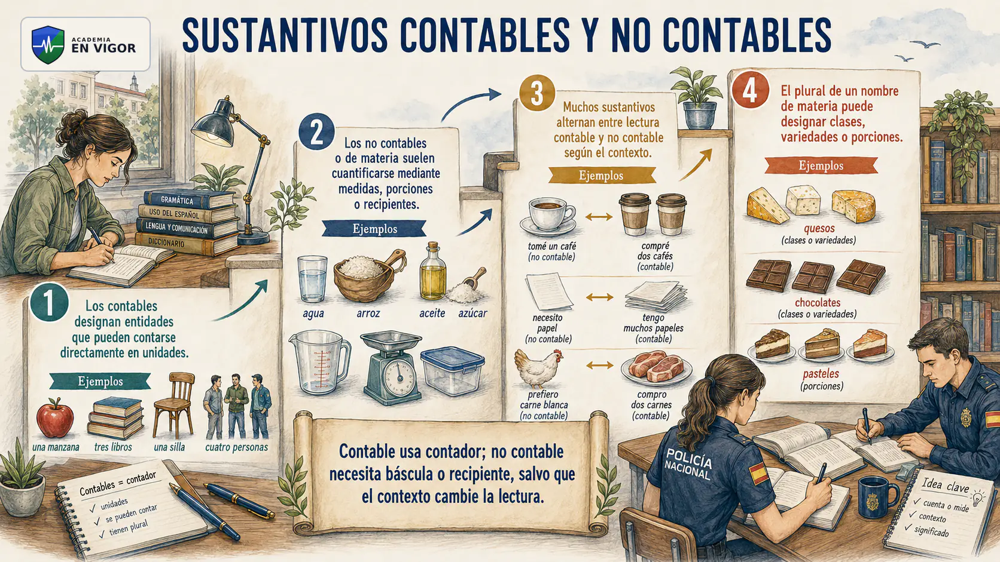

<em>Infografía: Sustantivos contables y no contables.</em>

<!-- FUENTE: RAE-NGB-SUSTANTIVO-T36 -->

## 15. Sustantivos individuales y colectivos

**Idea de control:** Colectivo es una caja con muchos elementos, pero la caja puede seguir en singular.

- Un sustantivo individual en singular designa normalmente una entidad de la clase.
- Un colectivo en singular designa un conjunto concebido como unidad.
- El colectivo singular no equivale morfológicamente a un plural.
- La concordancia estándar atiende normalmente al número gramatical del núcleo colectivo.

<!-- VISUAL:t36-15-sustantivos-individuales-y-colectivos.webp -->

  

<em>Infografía: Sustantivos individuales y colectivos.</em>

<!-- FUENTE: RAE-NGB-SUSTANTIVO-T36 -->

## 16. Género del sustantivo

**Idea de control:** El género se comprueba por concordancia, no por mirar únicamente la última letra.

- El género del sustantivo condiciona la concordancia de determinantes y adjetivos.
- Masculino y femenino son rasgos gramaticales y no equivalen siempre a sexo biológico.
- La terminación ayuda en muchos casos, pero no determina por sí sola el género.
- Los sustantivos epicenos tienen un solo género gramatical aunque designen seres de ambos sexos.

<!-- VISUAL:t36-16-genero-del-sustantivo.webp -->

  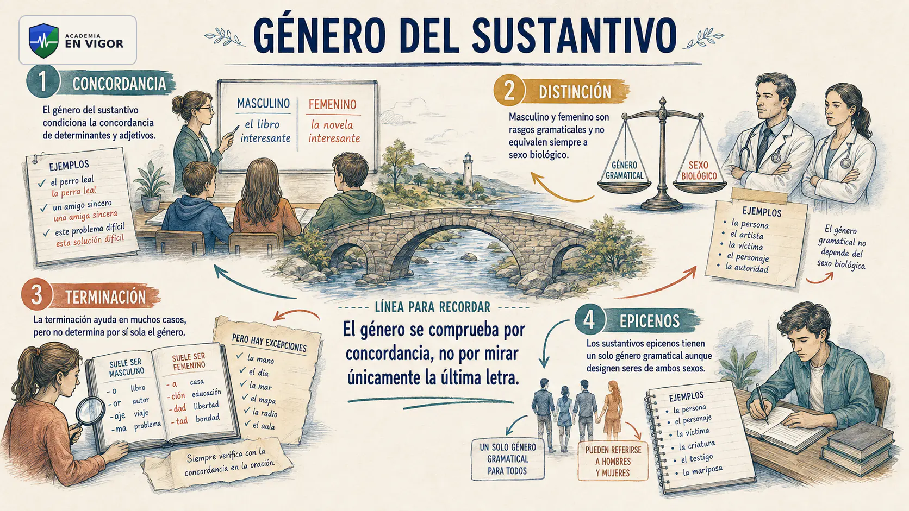

<em>Infografía: Género del sustantivo.</em>

<!-- FUENTE: RAE-NGB-T36 -->

## 17. Comunes en cuanto al género y heterónimos

**Idea de control:** Separa cuatro cajones: una forma con concordancia, un género fijo, dos géneros posibles o dos raíces.

- Los comunes en cuanto al género mantienen una misma forma y distinguen género mediante concordancia.
- Los heterónimos emplean palabras de raíz distinta para los sexos de una especie o relación.
- Los sustantivos ambiguos en cuanto al género admiten masculino o femenino sin cambiar normalmente el referente.
- Común, epiceno, ambiguo y heterónimo describen comportamientos diferentes y no son sinónimos.

<!-- VISUAL:t36-il-17-comunes-en-cuanto-al-genero-y-heteronimos.webp -->

  

<em>Infografía: Comunes en cuanto al género y heterónimos.</em>

<!-- FUENTE: RAE-NGB-T36 -->

## 18. Número: singular y plural

**Idea de control:** Número es una marca gramatical; el mundo real puede contar de otra manera.

- El número opone normalmente singular y plural en sustantivos, adjetivos, determinantes y pronombres.
- El singular no significa siempre una sola entidad ni el plural una pluralidad simple.
- La concordancia hace visible el número en varios componentes del grupo nominal.
- Existen sustantivos usados preferentemente o exclusivamente en singular o en plural.

<!-- VISUAL:t36-18-numero-singular-y-plural.webp -->

  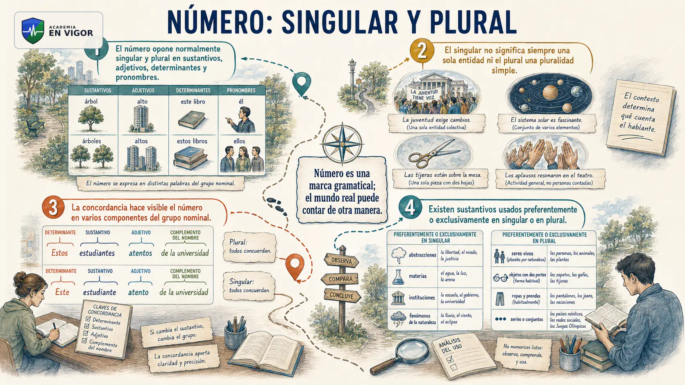

<em>Infografía: Número: singular y plural.</em>

<!-- FUENTE: RAE-NGB-T36 -->

## 19. Formación regular del plural

**Idea de control:** Antes de añadir la marca, escucha la terminación: vocal átona y consonante siguen rutas distintas.

- El plural se forma generalmente con -s tras vocal átona y con -es tras consonante.
- Las palabras acabadas en vocal tónica presentan pautas diversas según la vocal y el uso.
- La formación del plural atiende a la pronunciación y no solo a la letra final.
- Algunas voces admiten variantes de plural asentadas en distintas áreas o registros.

<!-- VISUAL:t36-19-formacion-regular-del-plural.webp -->

  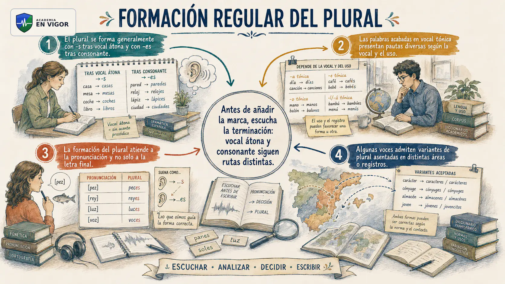

<em>Infografía: Formación regular del plural.</em>

<!-- FUENTE: RAE-NGB-T36 -->

## 20. Plurales especiales e invariables

**Idea de control:** Si la forma no cambia, mira el entorno: artículo, adjetivo y verbo revelan el número.

- Algunas palabras llanas o esdrújulas terminadas en -s o -x permanecen invariables en plural.
- Ciertos préstamos adaptan su plural a las pautas generales del español.
- Las abreviaturas, siglas y compuestos pueden seguir reglas específicas que no se deducen por analogía simple.
- El determinante y la concordancia permiten reconocer el número de nombres formalmente invariables.

<!-- VISUAL:t36-20-plurales-especiales-e-invariables.webp -->

  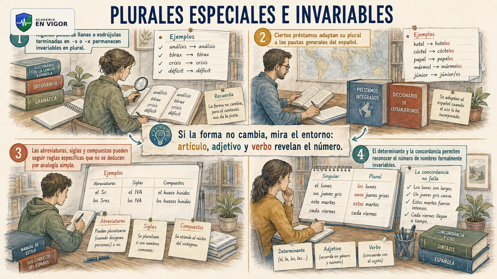

<em>Infografía: Plurales especiales e invariables.</em>

<!-- FUENTE: RAE-NGB-T36 -->

## 21. El grupo nominal

**Idea de control:** El núcleo es el motor y los demás elementos forman el vehículo que entra entero en la oración.

- El grupo nominal se organiza habitualmente en torno a un sustantivo o elemento equivalente.
- Puede contener determinantes, cuantificadores, adjetivos, grupos preposicionales y relativas.
- Un grupo nominal puede estar formado por una sola palabra.
- El grupo completo desempeña la función sintáctica, aunque el sustantivo sea su núcleo.

<!-- VISUAL:t36-il-21-el-grupo-nominal.webp -->

  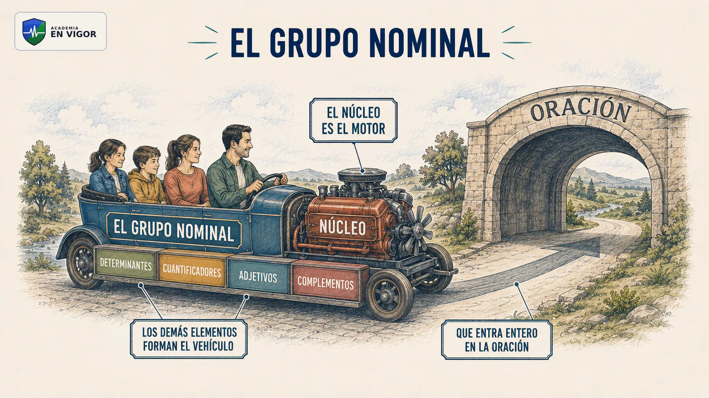

<em>Infografía: El grupo nominal.</em>

<!-- FUENTE: RAE-NGB-T36 -->

## 22. Determinación y artículo

**Idea de control:** El artículo no solo cuenta: orienta al oyente sobre cómo localizar el referente.

- Los determinantes acotan la referencia del grupo nominal y preceden normalmente al nombre.
- El artículo determinado presenta el referente como identificable en el contexto.
- El artículo indeterminado introduce habitualmente un referente no identificado de forma previa.
- El artículo neutro lo no acompaña a sustantivos y forma expresiones de valor abstracto con adjetivos u otras unidades.

<!-- VISUAL:t36-22-determinacion-y-articulo.webp -->

  

<em>Infografía: Determinación y artículo.</em>

<!-- FUENTE: RAE-NGB-T36 -->

## 23. Pronombre y determinante

**Idea de control:** Si acompaña al nombre, determina; si ocupa autónomamente el hueco nominal, funciona como pronombre.

- El pronombre puede constituir por sí mismo un grupo nominal o su núcleo.
- El determinante acompaña a un nombre o grupo nominal y delimita su referencia.
- Muchas series comparten formas, pero se distinguen por su comportamiento sintáctico.
- No es preciso afirmar que todo pronombre sustituye materialmente a un sustantivo previamente expreso.

<!-- VISUAL:t36-23-pronombre-y-determinante.webp -->

  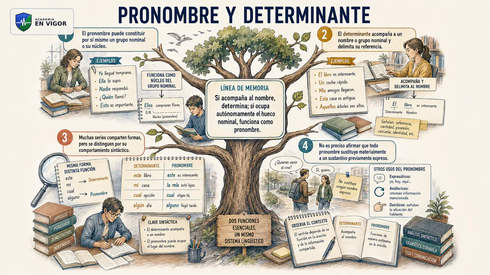

<em>Infografía: Pronombre y determinante.</em>

<!-- FUENTE: RAE-NGB-PRONOMBRES-T36 -->

## 24. Pronombres personales tónicos

**Idea de control:** Los pronombres tónicos llevan voz propia; el caso decide qué forma ocupa cada puesto.

- Los pronombres personales distinguen personas del discurso y, en varias formas, número y género.
- Las formas tónicas poseen acento propio y pueden aparecer como sujeto o término de preposición.
- Yo y tú son formas de sujeto; mí y ti aparecen como término de preposición en los usos correspondientes.
- Consigo es reflexivo y debe remitir al sujeto de tercera persona de la construcción pertinente.

<!-- VISUAL:t36-24-pronombres-personales-tonicos.webp -->

  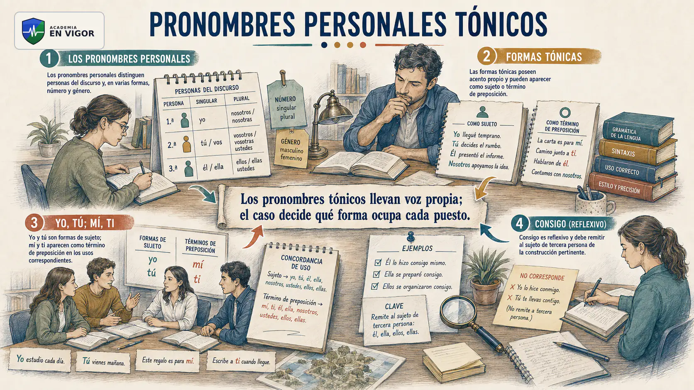

<em>Infografía: Pronombres personales tónicos.</em>

<!-- FUENTE: RAE-NGB-PRONOMBRES-T36 -->

## 25. Pronombres átonos y clíticos

**Idea de control:** Los clíticos viajan pegados al verbo y guardan un orden: no son vagones intercambiables.

- Los pronombres átonos carecen de acento propio y se apoyan fonológicamente en el verbo.
- Pueden aparecer antes del verbo conjugado o pospuestos a infinitivo, gerundio e imperativo afirmativo.
- Los clíticos expresan funciones como complemento directo o indirecto según su forma y contexto.
- La combinación de varios clíticos sigue un orden gramatical y puede producir la variante se ante lo, la, los o las.

<!-- VISUAL:t36-il-25-pronombres-atonos-y-cliticos.webp -->

  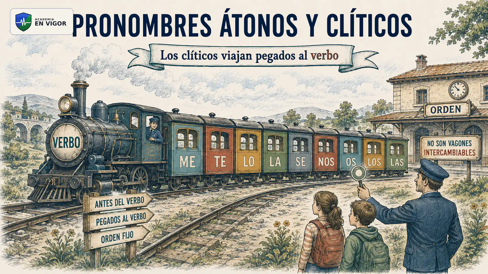

<em>Infografía: Pronombres átonos y clíticos.</em>

<!-- FUENTE: RAE-NGB-PRONOMBRES-T36 -->

## 26. Leísmo, laísmo y loísmo

**Idea de control:** Diagnostica primero CD o CI; después elige el clítico y solo entonces valora las excepciones admitidas.

- El leísmo usa le o les como complemento directo donde el sistema etimológico emplea lo, la, los o las.
- El laísmo usa la o las como complemento indirecto femenino.
- El loísmo usa lo o los como complemento indirecto masculino o neutro.
- La norma culta admite ciertos usos limitados de leísmo, pero no convierte laísmo y loísmo en pautas generales correctas.

<!-- VISUAL:t36-26-leismo-laismo-y-loismo.webp -->

  

<em>Infografía: Leísmo, laísmo y loísmo.</em>

<!-- FUENTE: RAE-DPD2-T36 -->

## 27. Pronombres reflexivos y recíprocos

**Idea de control:** Reflexivo vuelve al mismo participante; recíproco dibuja flechas en ambos sentidos.

- Un reflexivo remite normalmente al sujeto dentro del dominio sintáctico correspondiente.
- La reciprocidad exige una relación mutua entre dos o más participantes.
- Las formas nos, os y se pueden recibir lectura reflexiva o recíproca según el contexto.
- Los refuerzos a sí mismo o el uno al otro ayudan a distinguir interpretaciones.

<!-- VISUAL:t36-27-pronombres-reflexivos-y-reciprocos.webp -->

  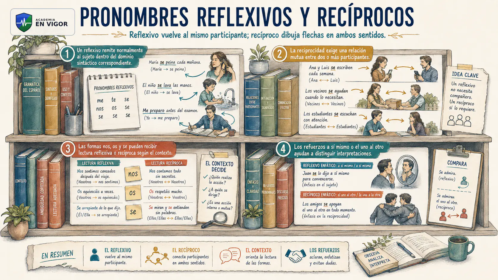

<em>Infografía: Pronombres reflexivos y recíprocos.</em>

<!-- FUENTE: RAE-NGB-PRONOMBRES-T36 -->

## 28. Valores gramaticales de se

**Idea de control:** Se es una navaja con varias hojas: identifica la construcción antes de asignarle función.

- Se puede ser pronombre reflexivo o recíproco.
- Se sustituye a le o les ante clíticos de acusativo de tercera persona.
- Se interviene en pasivas reflejas e impersonales sin desempeñar siempre una función pronominal argumental.
- Algunos verbos pronominales incorporan se como parte de su construcción léxica.

<!-- VISUAL:t36-28-valores-gramaticales-de-se.webp -->

  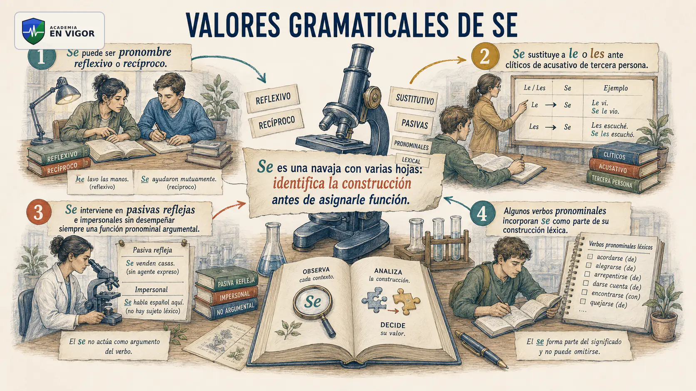

<em>Infografía: Valores gramaticales de se.</em>

<!-- FUENTE: RAE-NGLE-T36 -->

## 29. Demostrativos

**Idea de control:** Los demostrativos son coordenadas: cerca, intermedio o lejos del hablante y del discurso.

- Los demostrativos sitúan referentes respecto del centro deíctico o del discurso.
- Este, ese y aquel, con sus variantes, pueden funcionar como determinantes o pronombres.
- Esto, eso y aquello son pronombres neutros y no acompañan a sustantivos.
- La oposición de distancia puede ser espacial, temporal, discursiva o afectiva.

<!-- VISUAL:t36-29-demostrativos.webp -->

  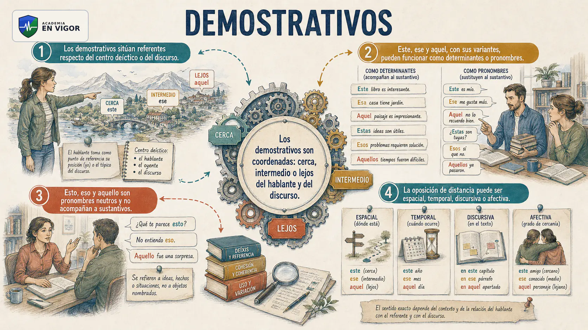

<em>Infografía: Demostrativos.</em>

<!-- FUENTE: RAE-NGB-PRONOMBRES-T36 -->

## 30. Posesivos

**Idea de control:** Mira el objeto poseído para concordar; mira el contexto para saber quién posee.

- Los posesivos expresan relaciones de posesión o pertenencia en sentido amplio.
- Las formas átonas antepuestas y las tónicas pospuestas tienen distribuciones diferentes.
- El posesivo concuerda en género y número con la entidad poseída, no con el poseedor.
- Su y sus pueden ser ambiguos respecto de la persona o el número del poseedor.

<!-- VISUAL:t36-il-30-posesivos.webp -->

  

<em>Infografía: Posesivos.</em>

<!-- FUENTE: RAE-NGB-PRONOMBRES-T36 -->

## 31. Cuantificadores indefinidos

**Idea de control:** El indefinido cuantifica sin dar matrícula exacta; su categoría depende del puesto que ocupe.

- Los indefinidos expresan cantidad, identidad o existencia de manera no precisa.
- Pueden funcionar como determinantes, pronombres o adverbios según la forma y el contexto.
- Alguno y ninguno presentan variantes apocopadas ante ciertos sustantivos masculinos singulares.
- Nada, nadie y ninguno participan en construcciones negativas con reglas de concordancia negativa propias del español.

<!-- VISUAL:t36-31-cuantificadores-indefinidos.webp -->

  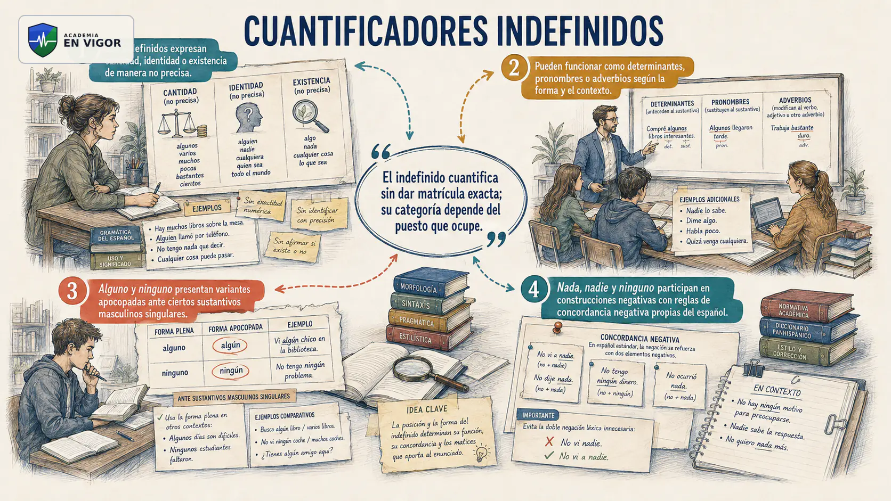

<em>Infografía: Cuantificadores indefinidos.</em>

<!-- FUENTE: RAE-NGB-PRONOMBRES-T36 -->

## 32. Numerales

**Idea de control:** Cardinal cuenta, ordinal ordena, multiplicativo multiplica y fraccionario reparte.

- Los cardinales expresan cantidad numérica y los ordinales posición en una serie.
- Los multiplicativos expresan multiplicación y los fraccionarios división de una unidad.
- Las formas numerales pueden desempeñar funciones determinativas, pronominales o adjetivales.
- No deben confundirse ordinales con fraccionarios aunque algunas formas coincidan en ciertos usos.

<!-- VISUAL:t36-32-numerales.webp -->

  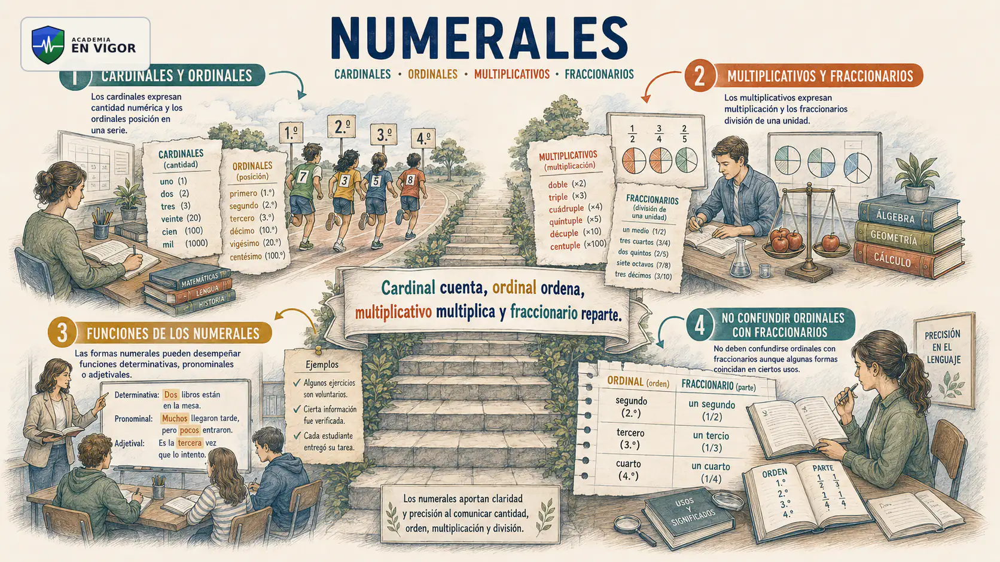

<em>Infografía: Numerales.</em>

<!-- FUENTE: RAE-NGB-PRONOMBRES-T36 -->

## 33. Relativos

**Idea de control:** El relativo es puente doble: enlaza con el antecedente y trabaja dentro de la subordinada.

- Los relativos introducen subordinadas de relativo y desempeñan una función dentro de ellas.
- Que es invariable; quien y cual presentan otras propiedades de flexión y distribución.
- Cuyo es determinante relativo posesivo y concuerda con el sustantivo que introduce.
- Donde, cuando y como pueden funcionar como adverbios relativos en los contextos correspondientes.

<!-- VISUAL:t36-33-relativos.webp -->

  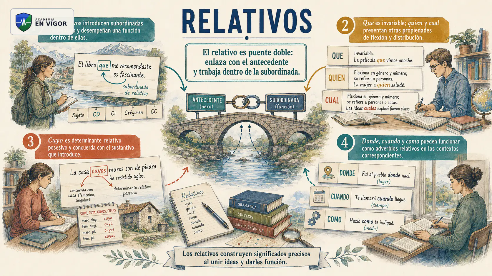

<em>Infografía: Relativos.</em>

<!-- FUENTE: RAE-NGB-PRONOMBRES-T36 -->

## 34. Interrogativos y exclamativos

**Idea de control:** La pregunta puede ir escondida dentro de otra oración: la tonicidad, no los signos, manda.

- Qué, quién, cuál, cuánto, cómo, cuándo y dónde son tónicos en usos interrogativos o exclamativos.
- Pueden introducir interrogativas directas o indirectas y exclamativas.
- Según el contexto funcionan como pronombres, determinantes o adverbios.
- La tilde distingue estos usos tónicos de muchos relativos y conjunciones átonos homónimos.

<!-- VISUAL:t36-34-interrogativos-y-exclamativos.webp -->

  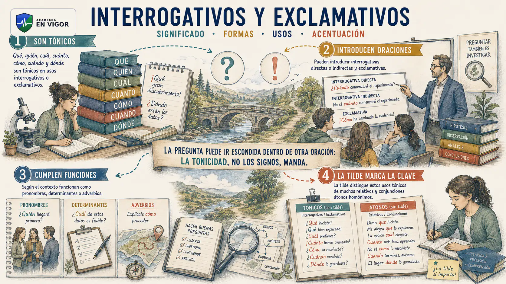

<em>Infografía: Interrogativos y exclamativos.</em>

<!-- FUENTE: RAE-NGB-PRONOMBRES-T36 -->

## 35. El adjetivo: propiedades básicas

**Idea de control:** Adjetivo es la herramienta; modificador, atributo o predicativo son trabajos que puede desempeñar.

- El adjetivo modifica al sustantivo o atribuye una propiedad a una entidad.
- Concuerda normalmente en género y número con el sustantivo al que se refiere.
- Puede ser núcleo de un grupo adjetival y recibir modificadores y complementos.
- La categoría adjetivo no equivale a la función sintáctica de atributo o complemento predicativo.

<!-- VISUAL:t36-35-el-adjetivo-propiedades-basicas.webp -->

  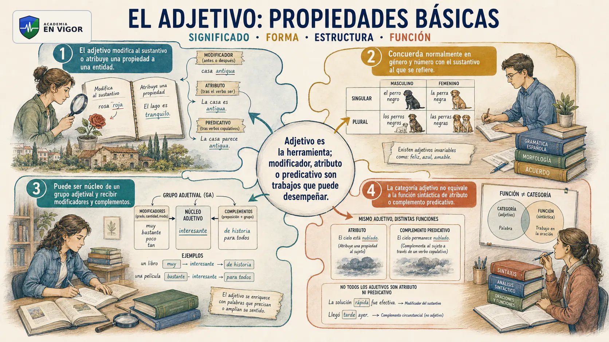

<em>Infografía: El adjetivo: propiedades básicas.</em>

<!-- FUENTE: RAE-NGB-ADJETIVO-T36 -->

## 36. Adjetivos calificativos y relacionales

**Idea de control:** Calificativo pinta una propiedad; relacional coloca una etiqueta de clasificación.

- Los calificativos expresan cualidades o propiedades y suelen admitir grado.
- Los relacionales clasifican el sustantivo por su vínculo con un ámbito o entidad.
- Los relacionales suelen aparecer pospuestos y rechazar el grado en su lectura estricta.
- Un mismo adjetivo puede alternar lectura relacional y calificativa según el contexto.

<!-- VISUAL:t36-36-adjetivos-calificativos-y-relacionales.webp -->

  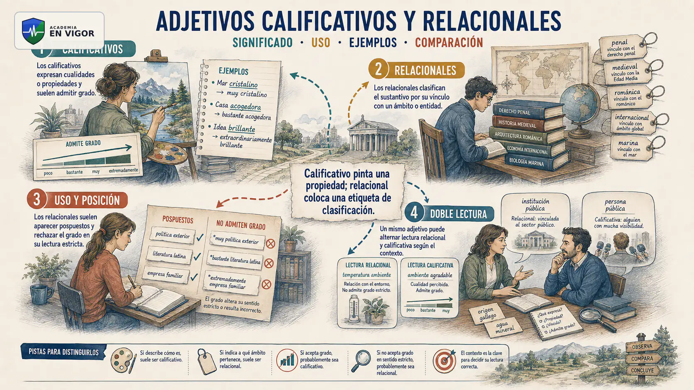

<em>Infografía: Adjetivos calificativos y relacionales.</em>

<!-- FUENTE: RAE-NGB-ADJETIVO-T36 -->

## 37. Adjetivos especificativos y explicativos

**Idea de control:** Especificativo filtra; explicativo comenta. No decidas solo por dónde aparece.

- El especificativo restringe la extensión del sustantivo y selecciona un subconjunto.
- El explicativo aporta una propiedad no usada para seleccionar el referente en ese contexto.
- La posición y la entonación influyen, pero el sentido de la construcción es decisivo.
- La misma forma adjetiva puede ser especificativa o explicativa en contextos diferentes.

<!-- VISUAL:t36-il-37-adjetivos-especificativos-y-explicativos.webp -->

  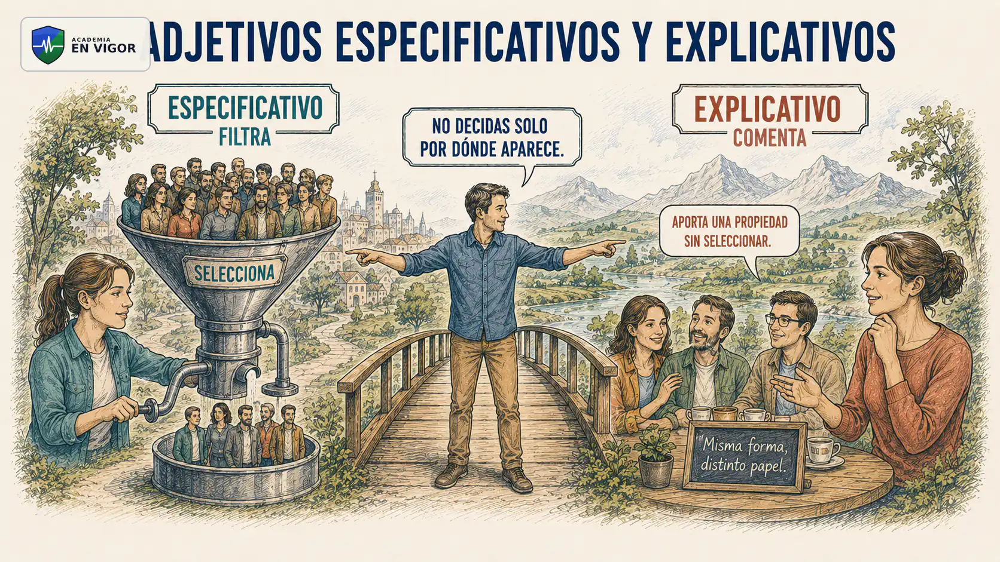

<em>Infografía: Adjetivos especificativos y explicativos.</em>

<!-- FUENTE: RAE-NGB-ADJETIVO-T36 -->

## 38. Posición del adjetivo

**Idea de control:** Mover el adjetivo puede mover el significado: analiza la lectura, no solo el orden.

- La posición del adjetivo puede asociarse a diferencias de interpretación, foco o estilo.
- Los adjetivos relacionales se posponen normalmente al nombre.
- Ciertos adjetivos cambian de significado o valoración al anteponerse o posponerse.
- No existe una regla general que haga ornamental todo adjetivo antepuesto y restrictivo todo pospuesto.

<!-- VISUAL:t36-38-posicion-del-adjetivo.webp -->

  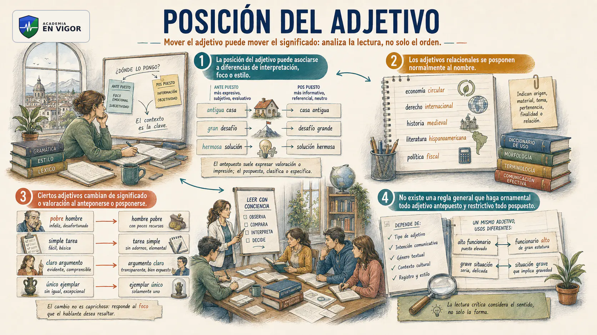

<em>Infografía: Posición del adjetivo.</em>

<!-- FUENTE: RAE-NGB-ADJETIVO-T36 -->

## 39. Flexión y apócope del adjetivo

**Idea de control:** Una terminación no significa sin concordancia; la marca puede verse solo en el número y en el entorno.

- Los adjetivos de dos terminaciones distinguen masculino y femenino; los de una mantienen una forma de género.
- Todos concuerdan en número cuando la estructura lo exige.
- Algunos adjetivos se apocopan ante sustantivo masculino singular, como bueno y primero.
- La apócope es una reducción formal condicionada por posición y contexto, no una pérdida de significado gramatical.

<!-- VISUAL:t36-39-flexion-y-apocope-del-adjetivo.webp -->

  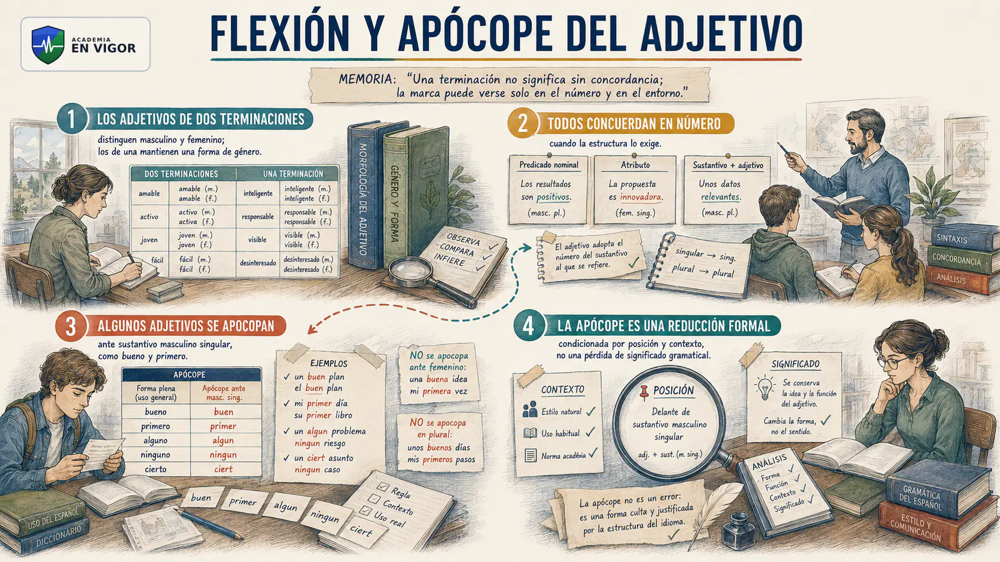

<em>Infografía: Flexión y apócope del adjetivo.</em>

<!-- FUENTE: RAE-NGB-ADJETIVO-T36 -->

## 40. Grado positivo

**Idea de control:** Positivo es el punto de partida del termómetro, no un juicio favorable.

- El grado positivo presenta la propiedad sin establecer comparación ni intensidad máxima.
- Positivo no significa valoración favorable, sino ausencia de marcas comparativas o superlativas.
- Un adjetivo en positivo puede aparecer modificado por adverbios de intensidad.
- Los adjetivos relacionales no suelen participar en el paradigma de grado en su lectura estricta.

<!-- VISUAL:t36-40-grado-positivo.webp -->

  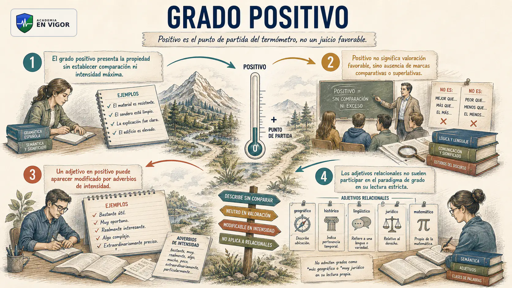

<em>Infografía: Grado positivo.</em>

<!-- FUENTE: RAE-NGB-ADJETIVO-T36 -->

## 41. Grado comparativo

**Idea de control:** Tres carriles: más que, tan como y menos que; vigila los comparativos irregulares.

- La comparación de superioridad se construye prototípicamente con más... que.
- La igualdad se expresa con tan... como y la inferioridad con menos... que.
- El segundo término de la comparación completa la relación comparativa.
- Mejor, peor, mayor y menor son comparativos sincréticos en determinados usos.

<!-- VISUAL:t36-il-41-grado-comparativo.webp -->

  

<em>Infografía: Grado comparativo.</em>

<!-- FUENTE: RAE-NGB-ADJETIVO-T36 -->

## 42. Superlativo absoluto y relativo

**Idea de control:** Absoluto sube el volumen; relativo gana una competición dentro de un grupo.

- El superlativo absoluto expresa grado muy alto sin comparar necesariamente con un conjunto delimitado.
- Puede formarse con muy, sumamente o sufijos como -ísimo, según la palabra.
- El superlativo relativo sitúa una entidad en el extremo de una escala dentro de un conjunto.
- El más alto del grupo es relativo; altísimo puede ser absoluto.

<!-- VISUAL:t36-42-superlativo-absoluto-y-relativo.webp -->

  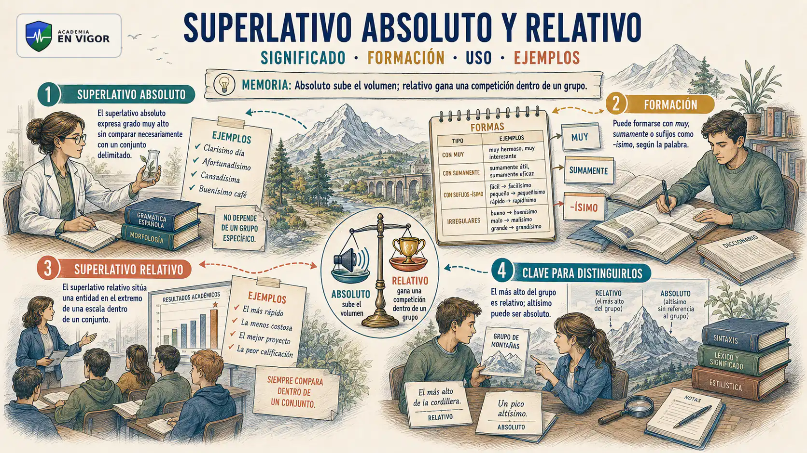

<em>Infografía: Superlativo absoluto y relativo.</em>

<!-- FUENTE: RAE-NGB-ADJETIVO-T36 -->

## 43. El adverbio: propiedades básicas

**Idea de control:** El adverbio es una pieza móvil e invariable: observa qué unidad modifica.

- El adverbio es normalmente invariable y puede modificar verbos, adjetivos, adverbios u oraciones.
- Puede ser núcleo de un grupo adverbial y recibir modificadores o complementos.
- Su invariabilidad lo distingue de adjetivos y determinantes en muchos contextos.
- La función concreta se establece dentro de la estructura y no por una lista memorizada.

<!-- VISUAL:t36-43-el-adverbio-propiedades-basicas.webp -->

  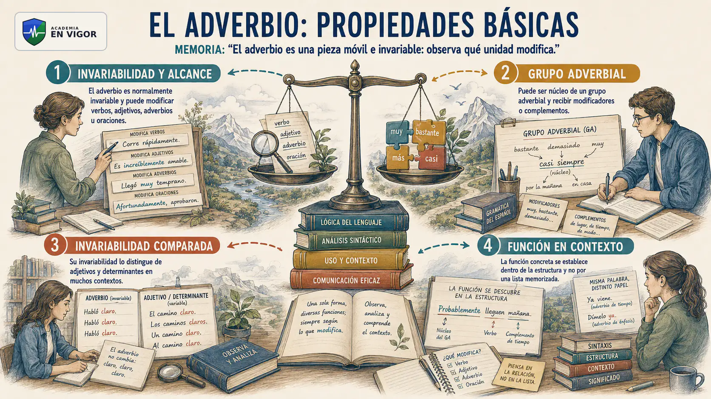

<em>Infografía: El adverbio: propiedades básicas.</em>

<!-- FUENTE: RAE-NGB-ADVERBIO-T36 -->

## 44. Adverbios de lugar y tiempo

**Idea de control:** Lugar responde al mapa; tiempo puede responder al reloj, a la duración o a la repetición.

- Los adverbios de lugar sitúan entidades o eventos en el espacio.
- Los de tiempo pueden expresar localización, duración o frecuencia.
- Aquí, allí, ayer y mañana poseen propiedades deícticas o demostrativas.
- Un adverbio temporal puede afectar al evento o establecer el marco de toda la oración.

<!-- VISUAL:t36-44-adverbios-de-lugar-y-tiempo.webp -->

  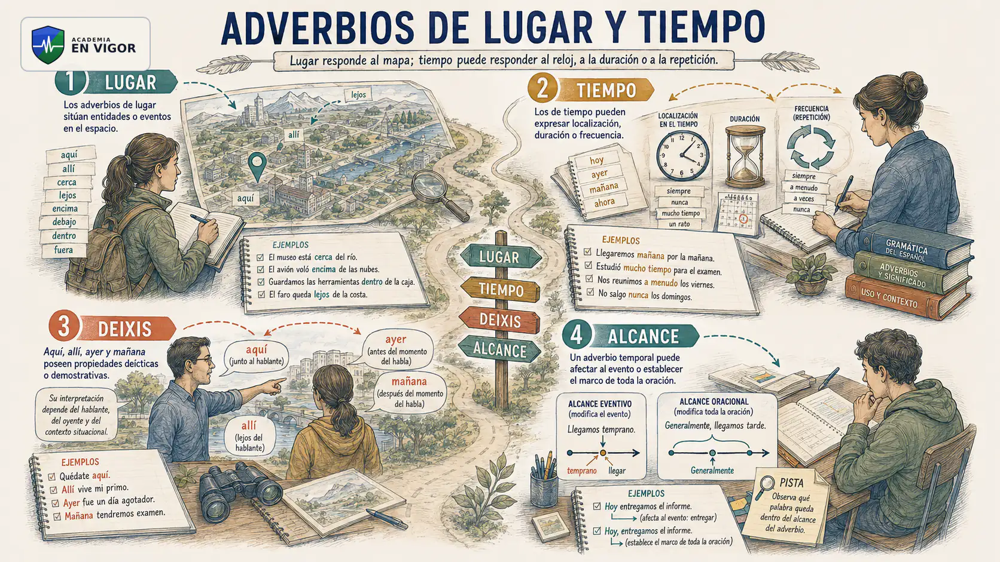

<em>Infografía: Adverbios de lugar y tiempo.</em>

<!-- FUENTE: RAE-GTG-ESQUEMAS-T36 -->

## 45. Adverbios de modo, cantidad y grado

**Idea de control:** Modo explica cómo; grado mueve la intensidad. La forma aislada no basta para clasificar.

- Los adverbios de modo expresan la manera en que se desarrolla una acción o propiedad.
- Los de cantidad o grado cuantifican propiedades, procesos u otros adverbios.
- Muy modifica típicamente adjetivos o adverbios, mientras mucho puede presentar otros comportamientos.
- Una misma forma puede pertenecer a categorías distintas según su distribución.

<!-- VISUAL:t36-45-adverbios-de-modo-cantidad-y-grado.webp -->

  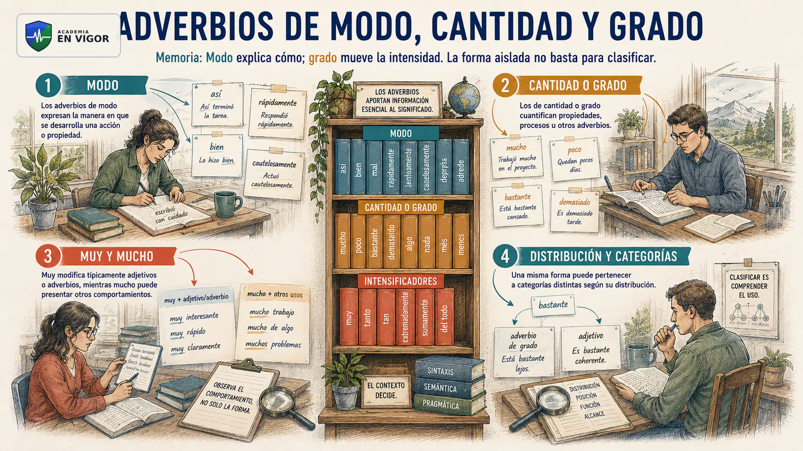

<em>Infografía: Adverbios de modo, cantidad y grado.</em>

<!-- FUENTE: RAE-GTG-ESQUEMAS-T36 -->

## 46. Afirmación, negación y duda

**Idea de control:** Afirmación y negación cambian el interruptor; duda regula la intensidad de compromiso.

- Sí puede funcionar como adverbio de afirmación y no como adverbio de negación.
- Quizá, acaso y probablemente pueden expresar grados de duda o probabilidad.
- Los adverbios de polaridad afectan a la afirmación o negación del contenido.
- Algunos adverbios de duda inciden sobre toda la oración y no son simples circunstanciales del verbo.

<!-- VISUAL:t36-46-afirmacion-negacion-y-duda.webp -->

  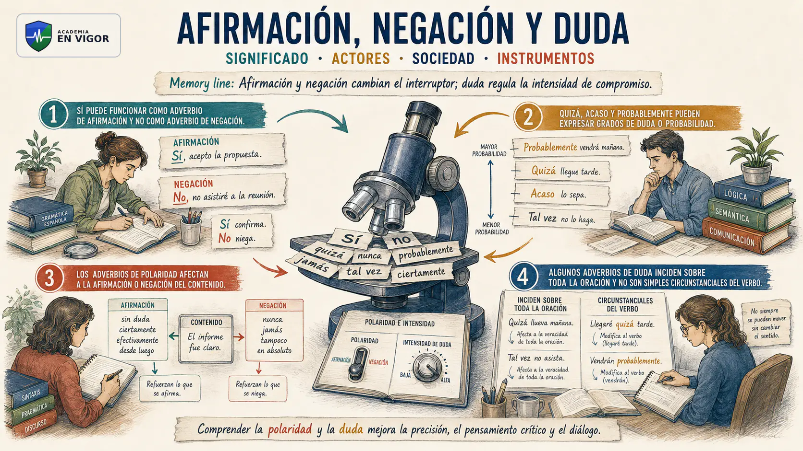

<em>Infografía: Afirmación, negación y duda.</em>

<!-- FUENTE: RAE-GTG-ESQUEMAS-T36 -->

## 47. Adverbios relativos, interrogativos y exclamativos

**Idea de control:** La tilde marca la voz tónica interrogativa o exclamativa, incluso cuando la pregunta va dentro.

- Donde, cuando, como y cuanto pueden ser adverbios relativos en usos átonos.
- Dónde, cuándo, cómo y cuánto son tónicos en usos interrogativos o exclamativos.
- Los relativos introducen subordinadas y desempeñan función dentro de ellas.
- Los interrogativos pueden aparecer en preguntas directas o indirectas.

<!-- VISUAL:t36-il-47-adverbios-relativos-interrogativos-y-exclamativos.webp -->

  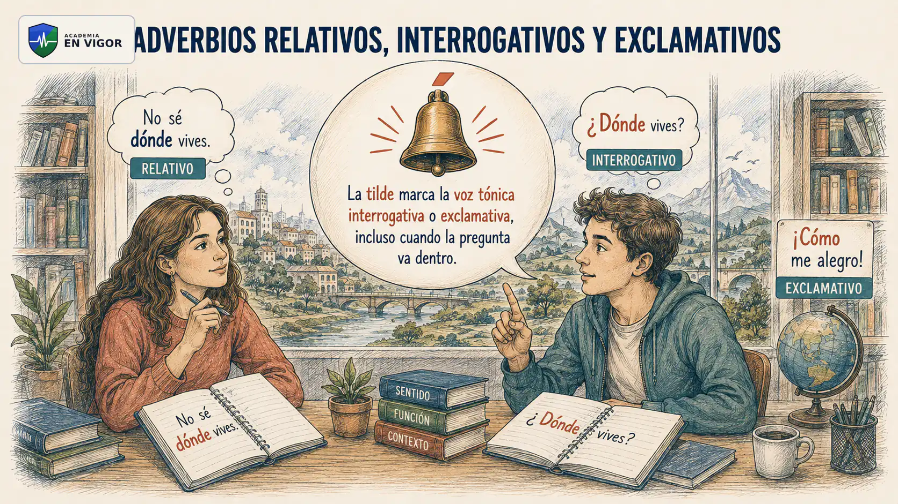

<em>Infografía: Adverbios relativos, interrogativos y exclamativos.</em>

<!-- FUENTE: RAE-GTG-ESQUEMAS-T36 -->

## 48. Adverbios terminados en -mente

**Idea de control:** La fábrica -mente parte del femenino singular, pero el producto puede modificar el evento o toda la oración.

- Muchos adverbios de modo se forman con la forma femenina singular del adjetivo y el sufijo -mente.
- En coordinaciones puede aparecer -mente solo en el último elemento.
- Estos adverbios conservan el acento gráfico del adjetivo base cuando le corresponde.
- No todos los adverbios en -mente expresan exclusivamente manera; algunos son oracionales o evaluativos.

<!-- VISUAL:t36-48-adverbios-terminados-en-mente.webp -->

  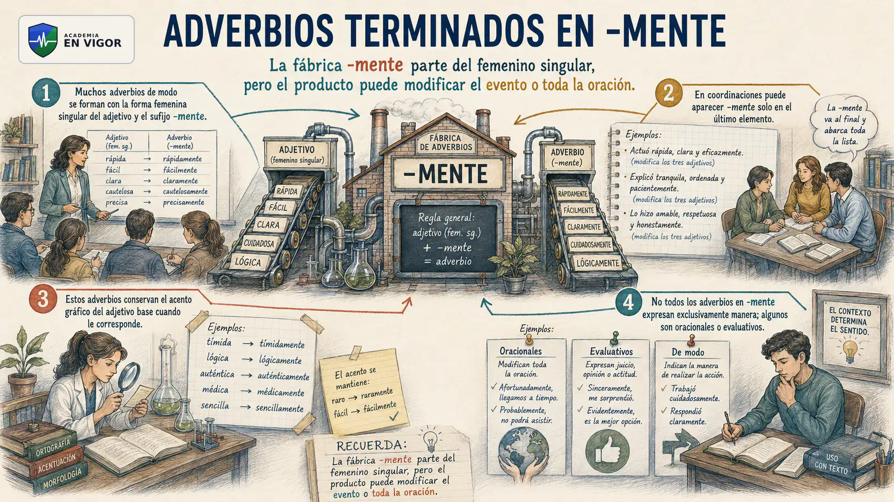

<em>Infografía: Adverbios terminados en -mente.</em>

<!-- FUENTE: RAE-NGB-ADVERBIO-T36 -->

## 49. Locuciones y grupos adverbiales

**Idea de control:** Locución es una pieza fijada; grupo es una estructura con núcleo y componentes analizables.

- Una locución adverbial es una expresión fija o semificja que funciona globalmente como adverbio.
- Un grupo adverbial se organiza en torno a un adverbio que puede recibir modificadores y complementos.
- De repente es locución; muy lejos de aquí es un grupo con núcleo adverbial.
- La función adverbial de una secuencia no obliga a considerarla morfológicamente un solo adverbio.

<!-- VISUAL:t36-49-locuciones-y-grupos-adverbiales.webp -->

  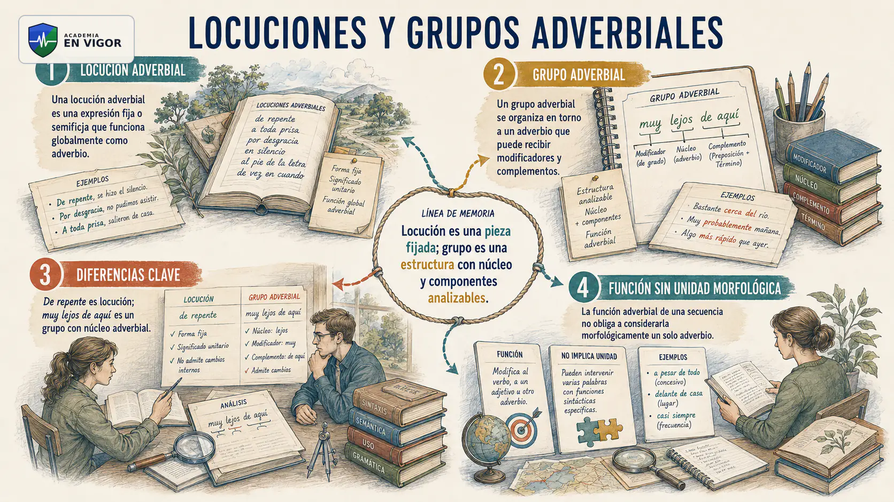

<em>Infografía: Locuciones y grupos adverbiales.</em>

<!-- FUENTE: RAE-NGB-ADVERBIO-T36 -->

## 50. El verbo: propiedades y estructura

**Idea de control:** El verbo es el centro de mando: flexiona y decide qué participantes necesita la escena.

- El verbo constituye normalmente el núcleo del grupo verbal y organiza sus argumentos.
- La flexión verbal expresa persona, número, tiempo, modo y otros rasgos.
- Las formas verbales se construyen sobre raíz, vocal temática y desinencias según el análisis.
- Categoría verbal y función de predicado están relacionadas, pero el predicado puede incluir todo el grupo verbal.

<!-- VISUAL:t36-50-el-verbo-propiedades-y-estructura.webp -->

  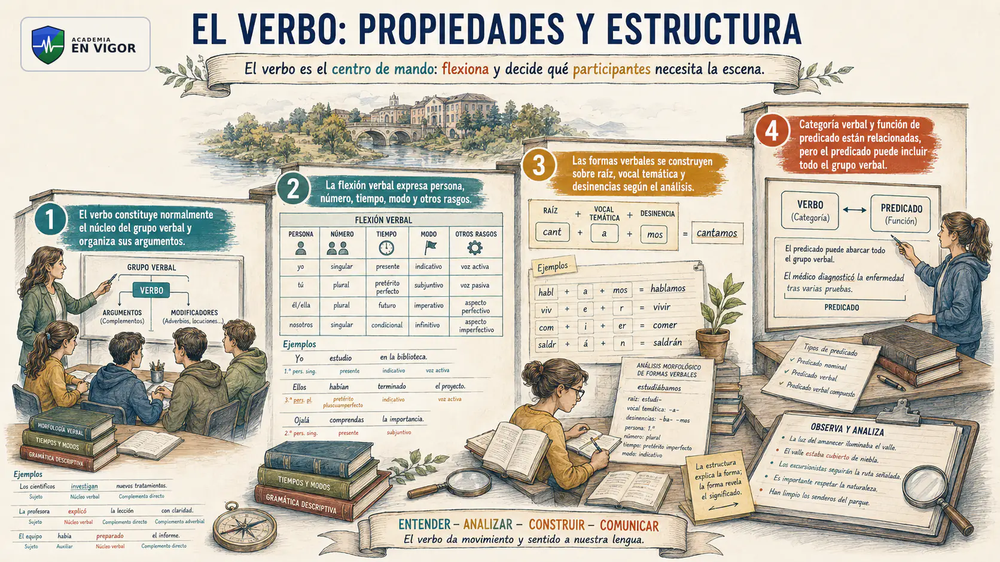

<em>Infografía: El verbo: propiedades y estructura.</em>

<!-- FUENTE: RAE-NGB-VERBO-T36 -->

## 51. Las tres conjugaciones

**Idea de control:** Mira el infinitivo para la familia; mira el paradigma para saber si es regular.

- La primera conjugación reúne verbos cuyo infinitivo termina en -ar.
- La segunda agrupa los terminados en -er y la tercera los terminados en -ir.
- La vocal temática ayuda a identificar la conjugación y aparece con variantes en el paradigma.
- Pertenecer a una conjugación no garantiza que el verbo sea regular.

<!-- VISUAL:t36-51-las-tres-conjugaciones.webp -->

  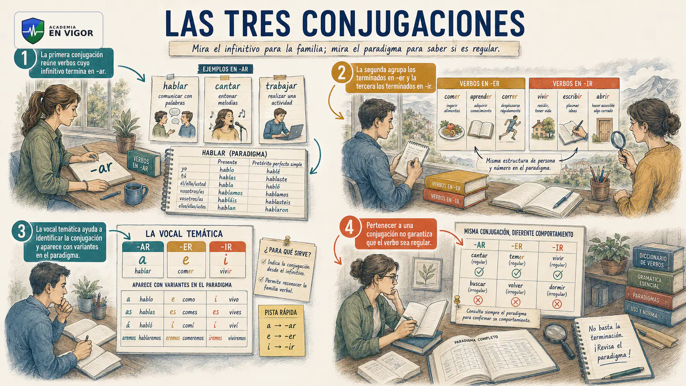

<em>Infografía: Las tres conjugaciones.</em>

<!-- FUENTE: RAE-NGB-FLEXION-VERBAL-T36 -->

## 52. Verbos regulares e irregulares

**Idea de control:** Compara con el modelo completo: una irregularidad puede esconderse en una sola zona del paradigma.

- Un verbo regular mantiene la raíz y las desinencias del modelo de su conjugación.
- Un verbo irregular presenta cambios en la raíz, en las terminaciones o en ambas.
- Las irregularidades pueden afectar solo a determinadas personas, tiempos o modos.
- Los cambios puramente ortográficos para conservar un sonido no siempre constituyen irregularidad morfológica.

<!-- VISUAL:t36-il-52-verbos-regulares-e-irregulares.webp -->

  

<em>Infografía: Verbos regulares e irregulares.</em>

<!-- FUENTE: RAE-NGB-FLEXION-VERBAL-T36 -->

## 53. Persona y número verbal

**Idea de control:** La terminación verbal lleva la matrícula del sujeto: persona y número.

- La persona verbal distingue primera, segunda y tercera personas del discurso.
- El número verbal opone singular y plural.
- El verbo finito concuerda normalmente en persona y número con el sujeto.
- La desinencia puede permitir recuperar un sujeto tácito sin pronombre expreso.

<!-- VISUAL:t36-53-persona-y-numero-verbal.webp -->

  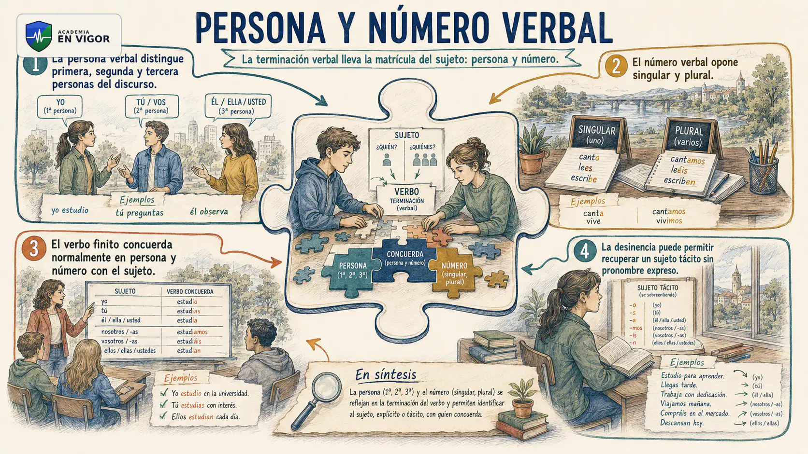

<em>Infografía: Persona y número verbal.</em>

<!-- FUENTE: RAE-NGB-FLEXION-VERBAL-T36 -->

## 54. Tiempo verbal y referencia temporal

**Idea de control:** El tiempo verbal no es un reloj aislado: contexto y aspecto ajustan la lectura.

- El tiempo verbal sitúa la situación respecto del momento del habla o de otro punto de referencia.
- Tiempo gramatical y tiempo cronológico no coinciden siempre de modo directo.
- El presente puede recibir valores actuales, habituales, históricos o prospectivos.
- La interpretación temporal depende también de aspecto, adverbios y contexto.

<!-- VISUAL:t36-54-tiempo-verbal-y-referencia-temporal.webp -->

  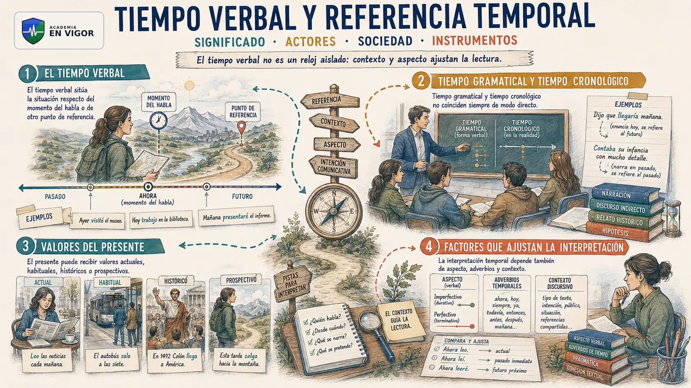

<em>Infografía: Tiempo verbal y referencia temporal.</em>

<!-- FUENTE: RAE-NGB-VERBO-T36 -->

## 55. Aspecto léxico y gramatical

**Idea de control:** Tiempo coloca la escena en el calendario; aspecto muestra si la vemos entera, en curso o por fases.

- El aspecto informa sobre el desarrollo, límites o fases de una situación.
- El aspecto léxico depende del significado del predicado; el gramatical se expresa mediante formas o construcciones.
- La oposición perfectivo-imperfectivo no equivale simplemente a pasado-presente.
- Las perífrasis pueden expresar comienzo, duración, repetición o final de una acción.

<!-- VISUAL:t36-il-55-aspecto-lexico-y-gramatical.webp -->

  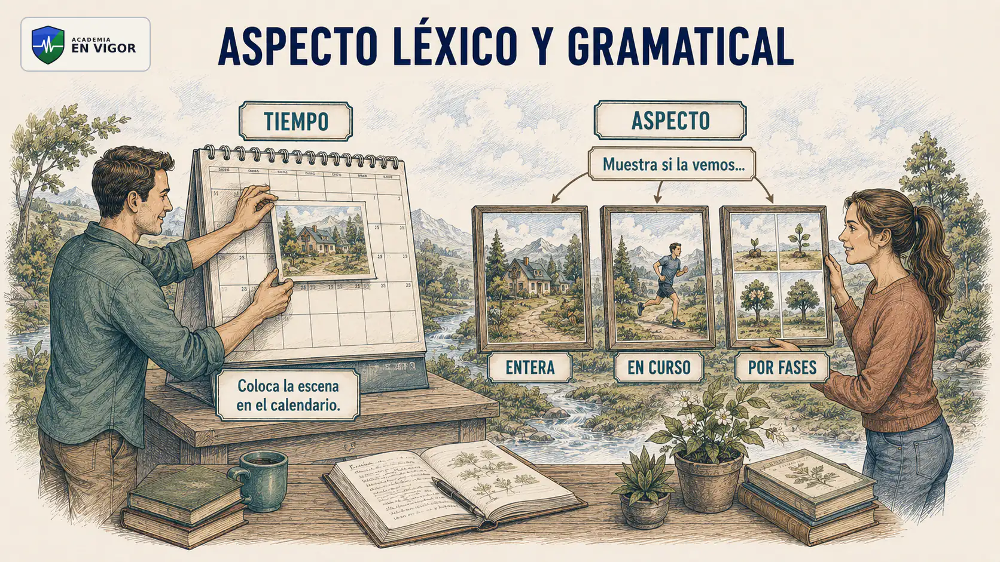

<em>Infografía: Aspecto léxico y gramatical.</em>

<!-- FUENTE: RAE-NGB-VERBO-T36 -->

## 56. Modo indicativo

**Idea de control:** Indicativo presenta información; no expide un certificado de verdad.

- El indicativo aparece prototípicamente en afirmaciones presentadas como información.
- Su uso no garantiza que el contenido sea objetivamente verdadero.
- Incluye tiempos simples y compuestos de presente, pasado y futuro, además del condicional en el paradigma tradicional.
- La selección de modo depende de la construcción, la actitud del hablante y el tipo de subordinación.

<!-- VISUAL:t36-56-modo-indicativo.webp -->

  

<em>Infografía: Modo indicativo.</em>

<!-- FUENTE: RAE-NGB-VERBO-T36 -->

## 57. Modo subjuntivo

**Idea de control:** El subjuntivo no niega la realidad: marca cómo se integra el contenido en la actitud o dependencia.

- El subjuntivo aparece en numerosos contextos de deseo, duda, valoración, negación o dependencia.
- No puede reducirse a un modo de irrealidad, pues también aparece con hechos conocidos.
- Posee formas simples y compuestas organizadas en su paradigma.
- La elección entre indicativo y subjuntivo puede cambiar la interpretación de una subordinada.

<!-- VISUAL:t36-57-modo-subjuntivo.webp -->

  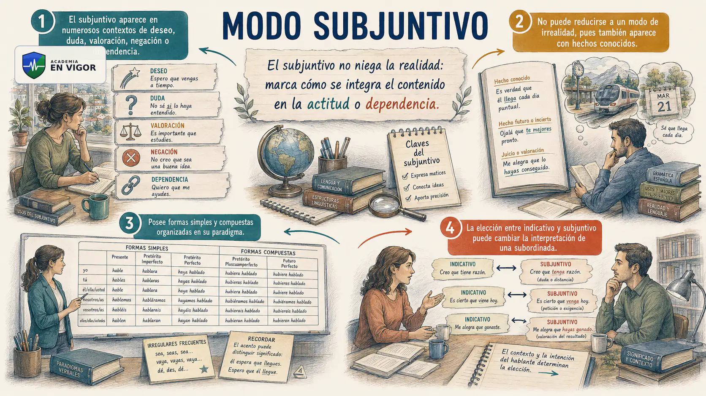

<em>Infografía: Modo subjuntivo.</em>

<!-- FUENTE: RAE-NGB-VERBO-T36 -->

## 58. Modo imperativo

**Idea de control:** Imperativo afirmativo engancha clíticos detrás; la negación los coloca delante con subjuntivo.

- El imperativo se emplea prototípicamente para órdenes, instrucciones, ruegos o exhortaciones.
- El paradigma imperativo posee restricciones de persona y polaridad.
- Las órdenes negativas se construyen con formas de subjuntivo.
- Los pronombres átonos se posponen al imperativo afirmativo y se anteponen en el negativo.

<!-- VISUAL:t36-58-modo-imperativo.webp -->

  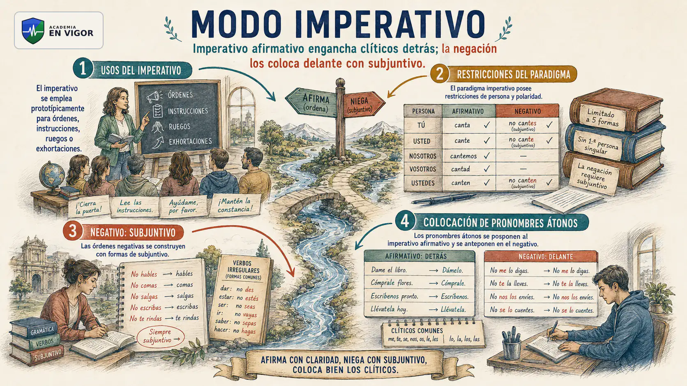

<em>Infografía: Modo imperativo.</em>

<!-- FUENTE: RAE-NGB-VERBO-T36 -->

## 59. Formas no personales

**Idea de control:** Son verbos sin matrícula personal: conservan capacidad verbal, pero no flexión de persona.

- Infinitivo, gerundio y participio son formas no personales del verbo.
- No expresan por sí mismas persona y número mediante desinencias personales.
- El infinitivo puede encabezar construcciones con propiedades nominales y verbales.
- Gerundio y participio participan en perífrasis y otras construcciones, pero no son intercambiables.

<!-- VISUAL:t36-59-formas-no-personales.webp -->

  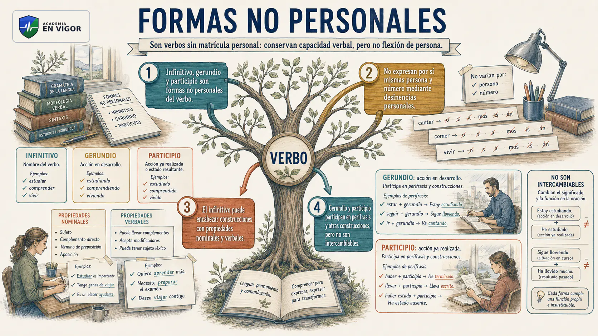

<em>Infografía: Formas no personales.</em>

<!-- FUENTE: RAE-NGB-FLEXION-VERBAL-T36 -->

## 60. Gerundio simple y compuesto

**Idea de control:** El gerundio acompaña o mira hacia atrás; sospecha cuando intenta narrar una acción posterior independiente.

- El gerundio simple se forma con -ando o -iendo y variantes irregulares.
- El gerundio compuesto se construye con habiendo y participio.
- Suele expresar una situación simultánea o anterior a la principal según el contexto.
- El llamado gerundio de posterioridad resulta inadecuado cuando presenta como posterior una acción independiente.

<!-- VISUAL:t36-60-gerundio-simple-y-compuesto.webp -->

  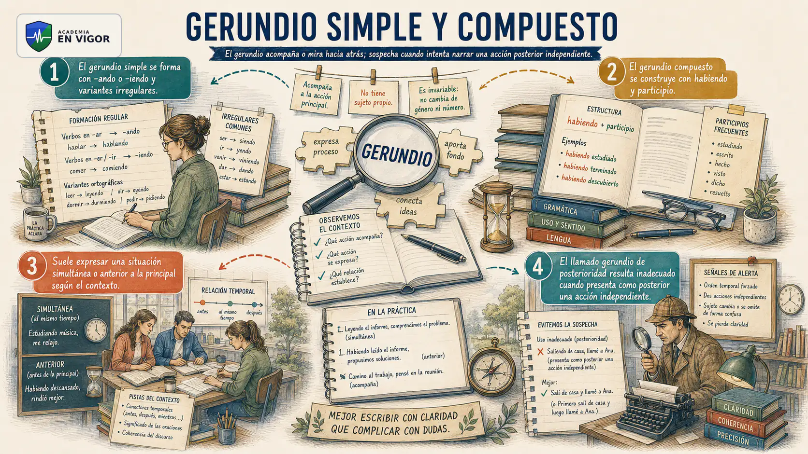

<em>Infografía: Gerundio simple y compuesto.</em>

<!-- FUENTE: RAE-NGB-FLEXION-VERBAL-T36 -->

## 61. Participio y construcciones de perfecto

**Idea de control:** Con haber, el participio queda fijo; como adjetivo o pasivo, puede concordar.

- El participio regular termina generalmente en -ado o -ido, con participios irregulares frecuentes.
- Con haber, el participio forma tiempos compuestos y permanece invariable.
- En usos adjetivales o pasivos con ser, el participio concuerda cuando corresponde.
- Algunos verbos presentan participios dobles con distribución léxica o histórica específica.

<!-- VISUAL:t36-61-participio-y-construcciones-de-perfecto.webp -->

  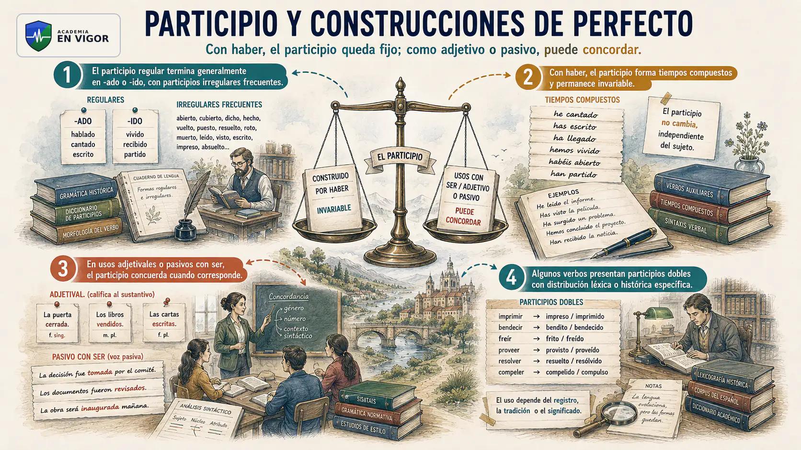

<em>Infografía: Participio y construcciones de perfecto.</em>

<!-- FUENTE: RAE-NGB-FLEXION-VERBAL-T36 -->

## 62. Presente y pretérito imperfecto

**Idea de control:** El imperfecto abre una ventana dentro del pasado; el perfecto simple suele mostrar el hecho cerrado.

- El presente de indicativo posee usos actuales, habituales, generales e históricos.
- El pretérito imperfecto presenta normalmente una situación pasada sin mostrar su límite final.
- El imperfecto sirve como marco descriptivo, habitual o simultáneo en narraciones.
- El presente y el imperfecto pueden adquirir valores modales de cortesía o atenuación.

<!-- VISUAL:t36-62-presente-y-preterito-imperfecto.webp -->

  

<em>Infografía: Presente y pretérito imperfecto.</em>

<!-- FUENTE: RAE-NGB-FLEXION-VERBAL-T36 -->

## 63. Pretérito perfecto simple y compuesto

**Idea de control:** Ambas miran al pasado, pero el compuesto crea un puente con el marco presente en muchos usos.

- El pretérito perfecto simple presenta prototípicamente una situación pasada como concluida.
- El perfecto compuesto se forma con presente de haber y participio.
- La oposición entre ambas formas varía según áreas dialectales y relación con el presente.
- No debe suponerse que una de las dos formas ha desaparecido del español general.

<!-- VISUAL:t36-63-preterito-perfecto-simple-y-compuesto.webp -->

  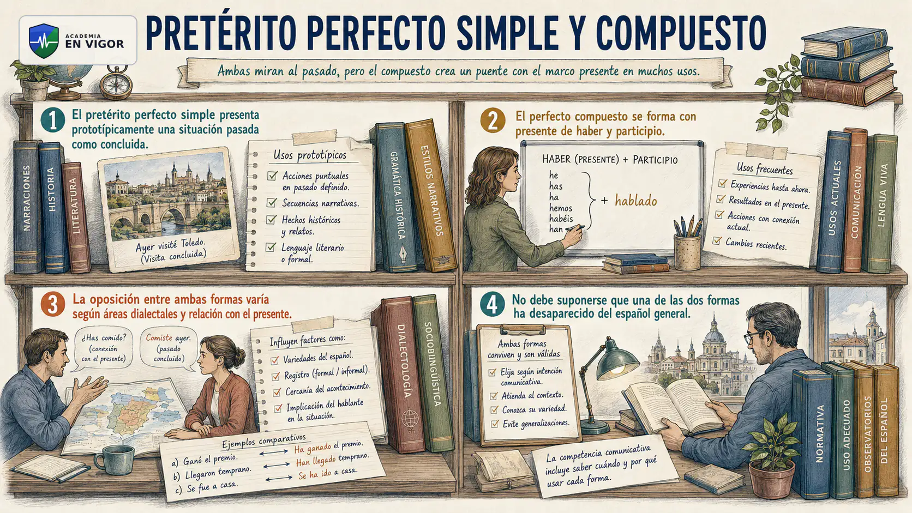

<em>Infografía: Pretérito perfecto simple y compuesto.</em>

<!-- FUENTE: RAE-NGB-FLEXION-VERBAL-T36 -->

## 64. Pluscuamperfecto y pretérito anterior

**Idea de control:** En la línea del pasado, el pluscuamperfecto coloca un hecho detrás de otro hecho ya pasado.

- El pluscuamperfecto se forma con imperfecto de haber y participio.
- Expresa normalmente anterioridad respecto de otro punto pasado.
- El pretérito anterior se forma con pretérito perfecto simple de haber y participio.
- El pretérito anterior tiene hoy uso muy restringido, sobre todo literario y en subordinadas temporales.

<!-- VISUAL:t36-il-64-pluscuamperfecto-y-preterito-anterior.webp -->

  

<em>Infografía: Pluscuamperfecto y pretérito anterior.</em>

<!-- FUENTE: RAE-NGB-FLEXION-VERBAL-T36 -->

## 65. Futuro y condicional

**Idea de control:** Futuro y condicional tienen doble vida: colocan hechos en el tiempo y expresan distancia modal.

- El futuro simple expresa posterioridad, pero también puede expresar conjetura o mandato.
- El condicional simple puede expresar posterioridad respecto de un punto pasado.
- El condicional aparece además en hipótesis, cortesía y usos de probabilidad referida al pasado.
- Futuro y condicional poseen formas compuestas con haber y participio.

<!-- VISUAL:t36-65-futuro-y-condicional.webp -->

  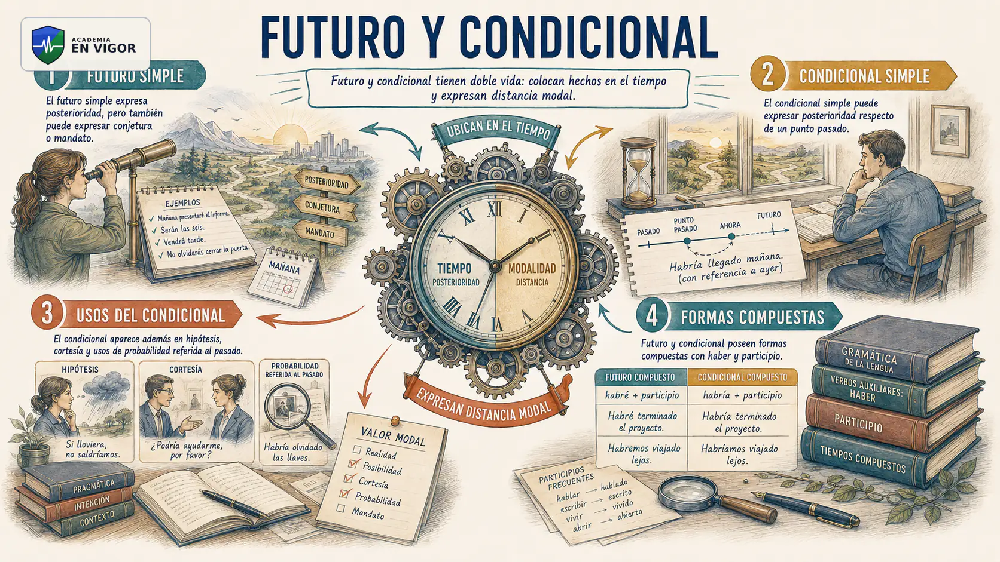

<em>Infografía: Futuro y condicional.</em>

<!-- FUENTE: RAE-NGB-FLEXION-VERBAL-T36 -->

## 66. Tiempos del subjuntivo

**Idea de control:** Haya más participio es perfecto; hubiera o hubiese más participio es pluscuamperfecto.

- El presente de subjuntivo expresa valores presentes o futuros según el contexto.
- El imperfecto de subjuntivo admite las series en -ra y -se con amplia equivalencia en muchos usos.
- El pretérito perfecto de subjuntivo se forma con presente de subjuntivo de haber y participio.
- El pluscuamperfecto de subjuntivo se forma con imperfecto de subjuntivo de haber y participio.

<!-- VISUAL:t36-66-tiempos-del-subjuntivo.webp -->

  

<em>Infografía: Tiempos del subjuntivo.</em>

<!-- FUENTE: RAE-NGB-FLEXION-VERBAL-T36 -->

## 67. Perífrasis verbales

**Idea de control:** En la perífrasis los dos verbos conducen un solo vehículo predicativo.

- La perífrasis combina un verbo auxiliar con una forma no personal y funciona como núcleo verbal complejo.
- Puede expresar modalidad o aspecto, como obligación, posibilidad, comienzo o duración.
- No toda sucesión de verbo conjugado y forma no personal constituye una perífrasis.
- La unidad sintáctica se comprueba mediante propiedades como la selección de complementos y el comportamiento de clíticos.

<!-- VISUAL:t36-67-perifrasis-verbales.webp -->

  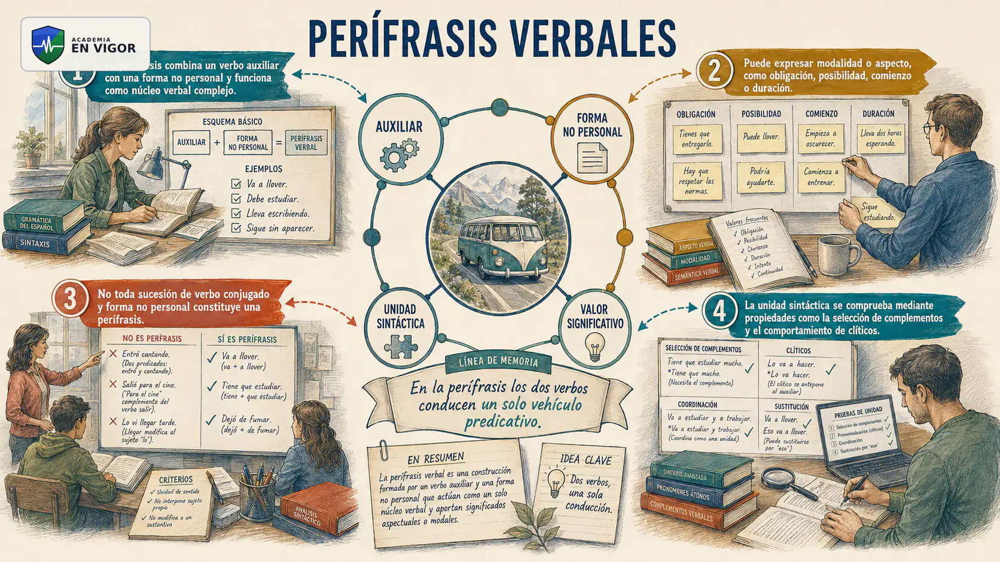

<em>Infografía: Perífrasis verbales.</em>

<!-- FUENTE: RAE-NGB-VERBO-T36 -->

## 68. Verbos copulativos y predicativos

**Idea de control:** Copulativo enlaza sujeto y atributo; predicativo aporta por sí mismo la escena principal.

- Ser, estar y parecer son verbos copulativos prototípicos en construcciones atributivas.
- El atributo aporta el contenido predicativo principal de la construcción copulativa.
- Los verbos predicativos poseen contenido léxico y seleccionan sus argumentos.
- Algunos verbos son semicopulativos cuando expresan cambio, permanencia o estado con atributo.

<!-- VISUAL:t36-68-verbos-copulativos-y-predicativos.webp -->

  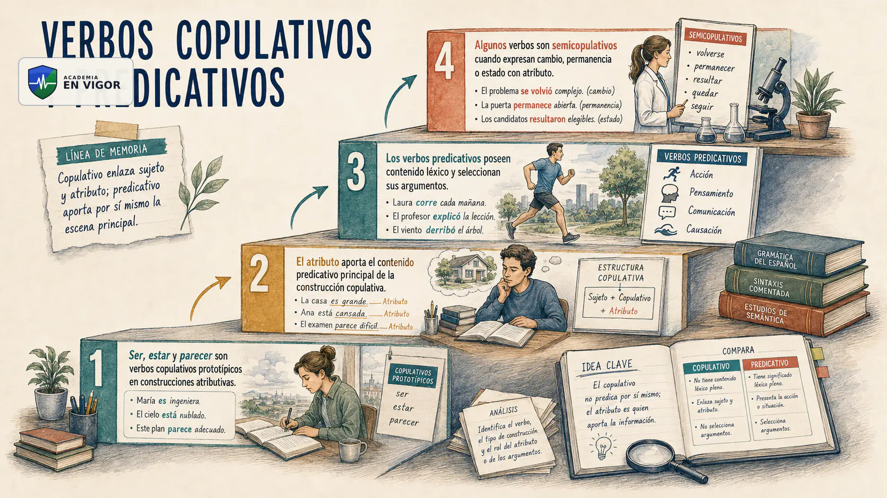

<em>Infografía: Verbos copulativos y predicativos.</em>

<!-- FUENTE: RAE-NGB-VERBO-T36 -->

## 69. Transitividad e intransitividad

**Idea de control:** Clasifica la acepción y la construcción, no una palabra aislada ni la presencia visible de un CD.

- Un verbo transitivo admite o selecciona complemento directo en alguna de sus acepciones.
- Un verbo intransitivo no se construye con complemento directo en la acepción analizada.
- Muchos verbos alternan usos transitivos e intransitivos.
- La ausencia superficial de complemento directo no convierte automáticamente en intransitivo un verbo usado de forma absoluta.

<!-- VISUAL:t36-69-transitividad-e-intransitividad.webp -->

  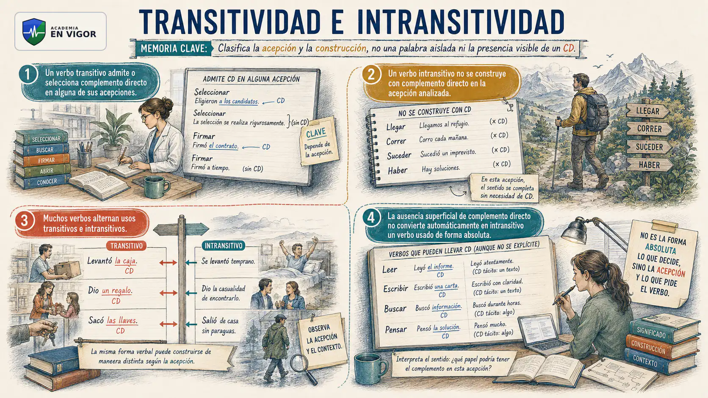

<em>Infografía: Transitividad e intransitividad.</em>

<!-- FUENTE: RAE-NGB-VERBO-T36 -->

## 70. Verbos pronominales e impersonales

**Idea de control:** Pronominal lleva clítico; impersonal no lleva sujeto. Son diagnósticos distintos.

- Un verbo pronominal se construye con un pronombre átono concordante que forma parte de su paradigma o uso.
- Las oraciones impersonales carecen de sujeto sintáctico.
- Haber existencial se usa en tercera persona singular en la norma general.
- Las impersonales con se llevan verbo en tercera persona singular y no deben confundirse con pasivas reflejas.

<!-- VISUAL:t36-70-verbos-pronominales-e-impersonales.webp -->

  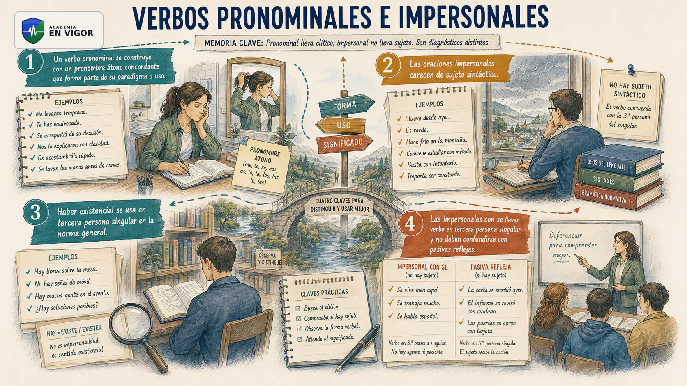

<em>Infografía: Verbos pronominales e impersonales.</em>

<!-- FUENTE: RAE-NGB-VERBO-T36 -->

## 71. Verbos incoativos, causativos y frecuentativos

**Idea de control:** Incoativo enciende la acción, causativo la provoca y frecuentativo la repite.

- Un verbo incoativo expresa el comienzo de una acción, proceso o estado.
- Un verbo causativo presenta una situación como causada por un participante.
- Un verbo frecuentativo o iterativo expresa repetición o frecuencia de la acción.
- Estas etiquetas describen significado léxico o aspectual y no conjugaciones verbales distintas.

<!-- VISUAL:t36-71-verbos-incoativos-causativos-y-frecuentativos.webp -->

  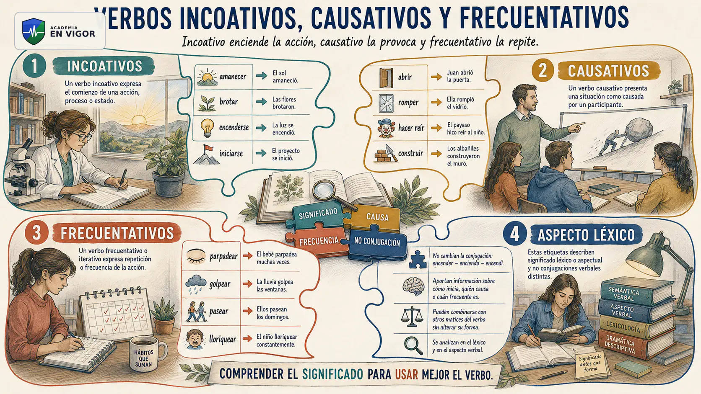

<em>Infografía: Verbos incoativos, causativos y frecuentativos.</em>

<!-- FUENTE: RAE-GTG-T36 -->

## 72. La preposición

**Idea de control:** La preposición abre una relación y exige mirar qué término introduce y de qué núcleo depende.

- La preposición es una palabra invariable que introduce un término y establece relaciones sintácticas y semánticas.
- El grupo preposicional contiene la preposición y su término.
- El término puede ser un grupo nominal, una subordinada u otra unidad admitida por la construcción.
- La preposición puede estar seleccionada por un núcleo o introducir un adjunto.

<!-- VISUAL:t36-72-la-preposicion.webp -->

  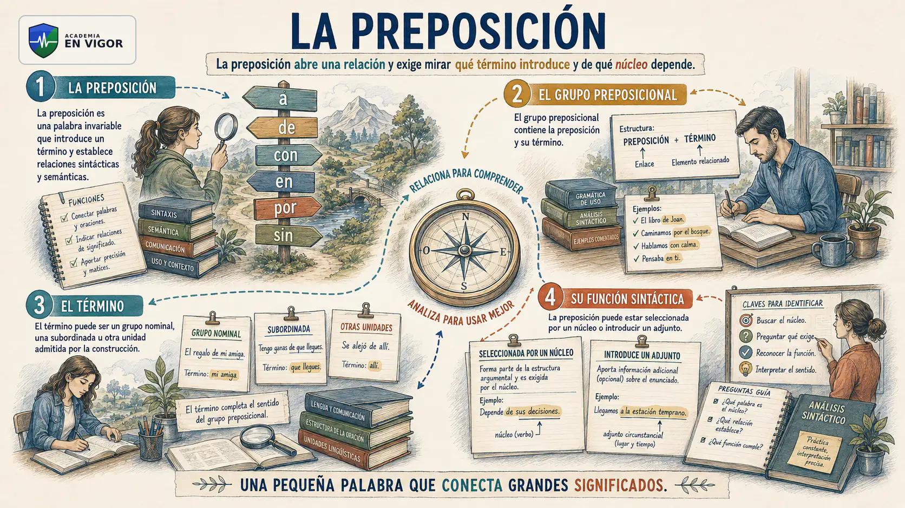

<em>Infografía: La preposición.</em>

<!-- FUENTE: RAE-NGB-ENLACES-T36 -->

## 73. Inventario de preposiciones

**Idea de control:** Aprende el inventario vigente, pero distingue presencia en la lista y frecuencia real de uso.

- El inventario académico incluye a, ante, bajo, cabe, con, contra, de, desde, durante, en, entre, hacia, hasta, mediante, para, por, según, sin, so, sobre, tras y versus.
- Cabe y so tienen uso restringido en el español actual.
- Durante y mediante se integran en el inventario moderno de preposiciones.
- La pertenencia a la clase se establece por comportamiento gramatical, no solo por una lista escolar histórica.

<!-- VISUAL:t36-il-73-inventario-de-preposiciones.webp -->

  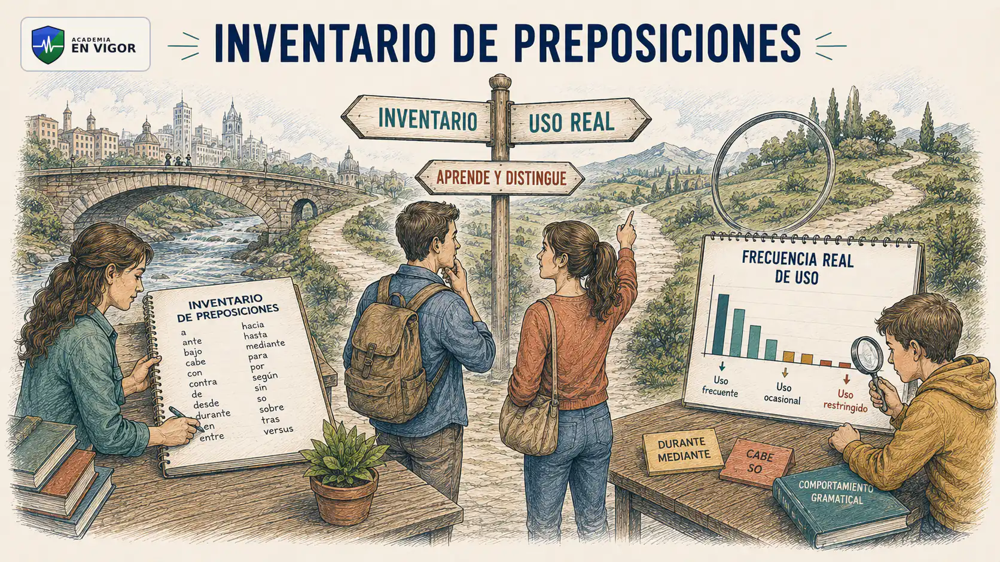

<em>Infografía: Inventario de preposiciones.</em>

<!-- FUENTE: RAE-NGB-ENLACES-T36 -->

## 74. Contracciones al y del

**Idea de control:** Comprueba si el es artículo común, artículo de nombre propio o pronombre él antes de contraer.

- Al resulta de la contracción de a y el; del, de de y el.
- La contracción es obligatoria en los contextos generales previstos.
- No se contrae cuando El forma parte de un nombre propio en el que conserva artículo integrado según el uso normativo.
- La contracción no se produce con él pronombre, que mantiene tilde.

<!-- VISUAL:t36-74-contracciones-al-y-del.webp -->

  

<em>Infografía: Contracciones al y del.</em>

<!-- FUENTE: RAE-DPD2-T36 -->

## 75. Locuciones preposicionales

**Idea de control:** Locución es puente fijo de varias piezas: debe funcionar globalmente y conservar un término.

- Una locución preposicional es una expresión fija que funciona en conjunto de forma semejante a una preposición.
- A causa de, frente a y con respecto a son ejemplos prototípicos.
- No toda secuencia acabada en preposición constituye una locución.
- La selección entre preposición simple y locución puede cambiar el significado o el registro.

<!-- VISUAL:t36-75-locuciones-preposicionales.webp -->

  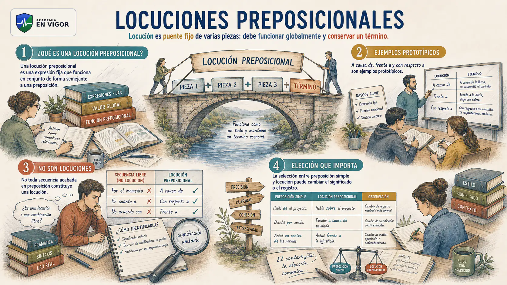

<em>Infografía: Locuciones preposicionales.</em>

<!-- FUENTE: RAE-NGB-ENLACES-T36 -->

## 76. La conjunción

**Idea de control:** Conjunción es enlace; relativo es enlace y además ocupa un puesto dentro de su oración.

- La conjunción es una palabra invariable que enlaza palabras, grupos u oraciones.
- Las coordinantes unen unidades del mismo nivel sintáctico.
- Las subordinantes introducen construcciones dependientes o marcan relaciones entre cláusulas.
- Una conjunción no desempeña normalmente dentro de la subordinada la función que sí puede desempeñar un relativo.

<!-- VISUAL:t36-76-la-conjuncion.webp -->

  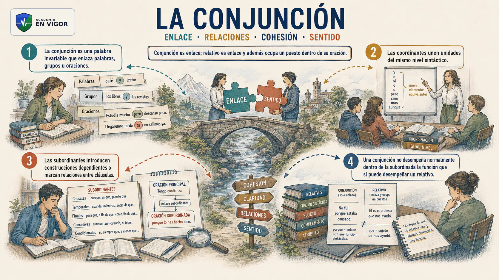

<em>Infografía: La conjunción.</em>

<!-- FUENTE: RAE-NGB-ENLACES-T36 -->

## 77. Conjunciones coordinantes

**Idea de control:** Coordinar es poner unidades al mismo nivel: suma, alternativa o contraste.

- Y, e, ni presentan coordinación copulativa en los contextos correspondientes.
- O y u introducen coordinación disyuntiva.
- Pero, sino y mas pueden introducir relaciones adversativas con distribuciones propias.
- La elección de e o u responde al entorno fónico y no cambia el tipo de coordinación.

<!-- VISUAL:t36-77-conjunciones-coordinantes.webp -->

  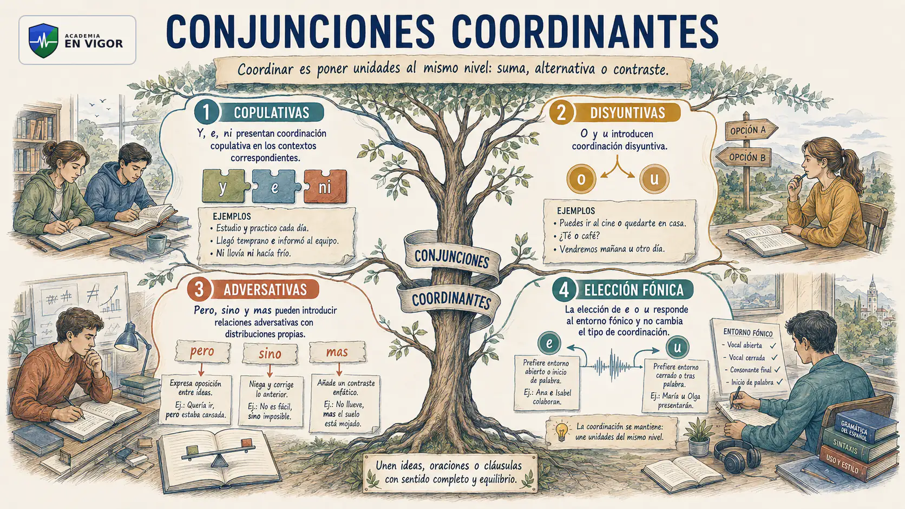

<em>Infografía: Conjunciones coordinantes.</em>

<!-- FUENTE: RAE-NGB-ENLACES-T36 -->

## 78. Conjunciones subordinantes

**Idea de control:** Primero identifica si la oración depende; después nombra la relación de significado.

- Que y si introducen muchas subordinadas sustantivas.
- Porque, aunque y otras conjunciones o locuciones expresan relaciones causales, concesivas y de otros tipos.
- La misma forma puede recibir análisis distinto según la construcción.
- La clasificación semántica no elimina la necesidad de identificar la dependencia sintáctica.

<!-- VISUAL:t36-78-conjunciones-subordinantes.webp -->

  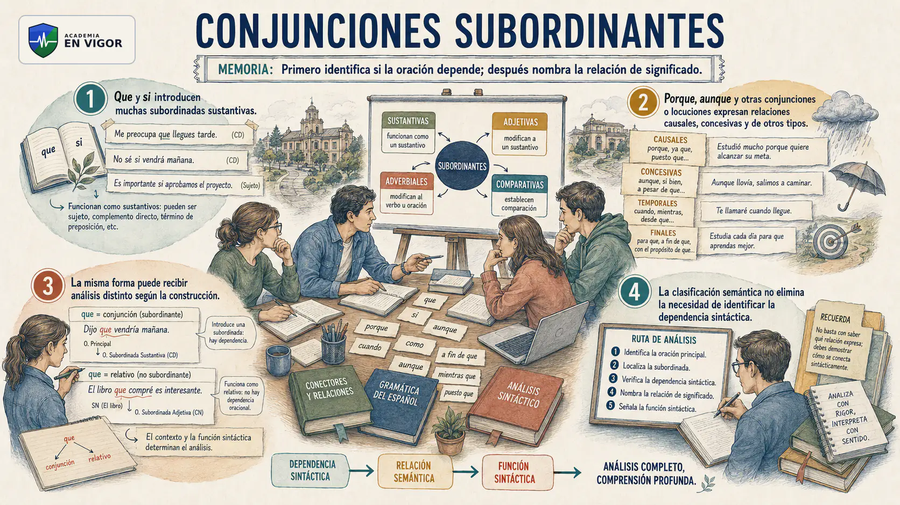

<em>Infografía: Conjunciones subordinantes.</em>

<!-- FUENTE: RAE-NGB-ENLACES-T36 -->

## 79. Locuciones conjuntivas y enlaces complejos

**Idea de control:** Una locución conjuntiva actúa como una bisagra fija; el conector organiza el discurso en otro nivel.

- Una locución conjuntiva está formada por varias palabras que funcionan conjuntamente como enlace.
- Puesto que, a fin de que y a pesar de que introducen relaciones diferentes.
- Las locuciones pueden contener una preposición, un sustantivo u otros elementos internamente fijados.
- No deben confundirse conectores discursivos y conjunciones solo porque ambos relacionen contenidos.

<!-- VISUAL:t36-79-locuciones-conjuntivas-y-enlaces-complejos.webp -->

  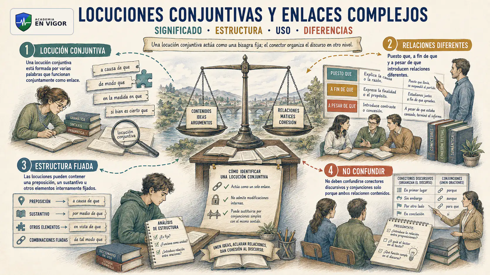

<em>Infografía: Locuciones conjuntivas y enlaces complejos.</em>

<!-- FUENTE: RAE-NGB-ENLACES-T36 -->

## 80. La sintaxis y sus unidades

**Idea de control:** No leas la oración como una fila plana: agrupa piezas y descubre quién depende de quién.

- La sintaxis estudia cómo se combinan palabras y grupos y qué relaciones contraen.
- La palabra es unidad mínima de la sintaxis, pero los grupos constituyen unidades intermedias esenciales.
- Las funciones se atribuyen a constituyentes dentro de una estructura.
- El análisis lineal debe complementarse con la jerarquía y dependencia entre unidades.

<!-- VISUAL:t36-80-la-sintaxis-y-sus-unidades.webp -->

  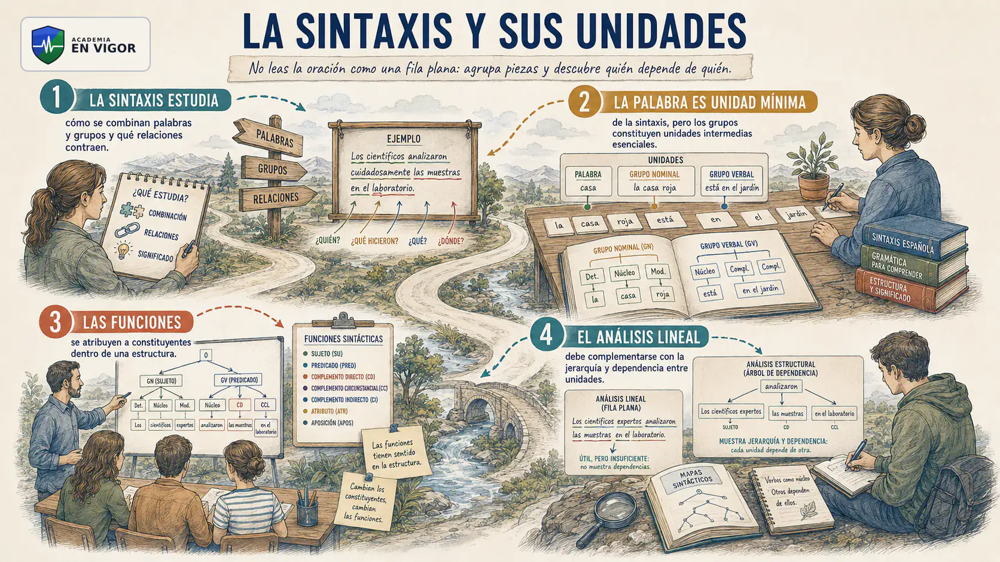

<em>Infografía: La sintaxis y sus unidades.</em>

<!-- FUENTE: RAE-NGB-SINTAXIS-T36 -->

## 81. Grupos sintácticos y núcleo

**Idea de control:** Busca el núcleo para nombrar el grupo; busca la relación con el verbo para nombrar la función.

- Los grupos nominal, adjetival, verbal y adverbial se organizan en torno a un núcleo.
- Un grupo puede estar formado por una sola palabra.
- Los grupos pueden contener otros grupos y formar estructuras jerárquicas.
- La denominación del grupo atiende a la categoría de su núcleo, no a su función oracional.

<!-- VISUAL:t36-81-grupos-sintacticos-y-nucleo.webp -->

  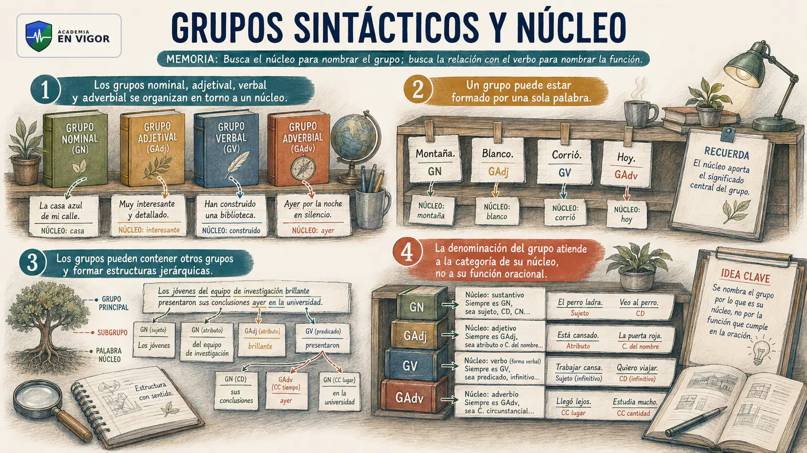

<em>Infografía: Grupos sintácticos y núcleo.</em>

<!-- FUENTE: RAE-NGB-SINTAXIS-T36 -->

## 82. Sujeto y predicado

**Idea de control:** La concordancia es la prueba principal; el orden y la pregunta quién pueden engañar.

- La oración bimembre se articula prototípicamente en sujeto y predicado.
- El sujeto concuerda en número y persona con el verbo finito.
- El predicado atribuye al sujeto una acción, proceso, estado o propiedad.
- El sujeto puede ser expreso o tácito; su posición no es fija en español.

<!-- VISUAL:t36-82-sujeto-y-predicado.webp -->

  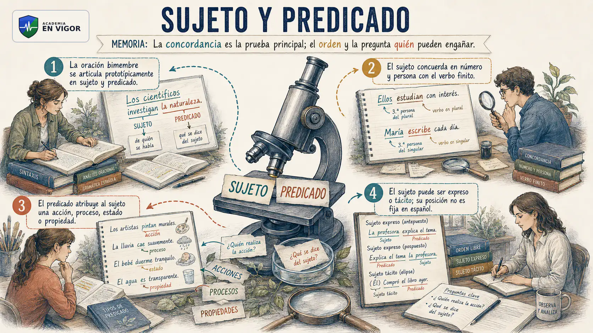

<em>Infografía: Sujeto y predicado.</em>

<!-- FUENTE: RAE-NGB-SINTAXIS-T36 -->

## 83. Complemento directo

**Idea de control:** Usa varias pruebas: clítico acusativo, pasiva posible y selección del verbo; ninguna pregunta aislada basta.

- El complemento directo es una función seleccionada por verbos transitivos.
- Puede sustituirse prototípicamente por lo, la, los o las según género y número.
- Puede llevar la preposición a cuando designa personas u otros referentes determinados en contextos previstos.
- En la pasiva perifrástica, el complemento directo de la activa corresponde normalmente al sujeto paciente.

<!-- VISUAL:t36-83-complemento-directo.webp -->

  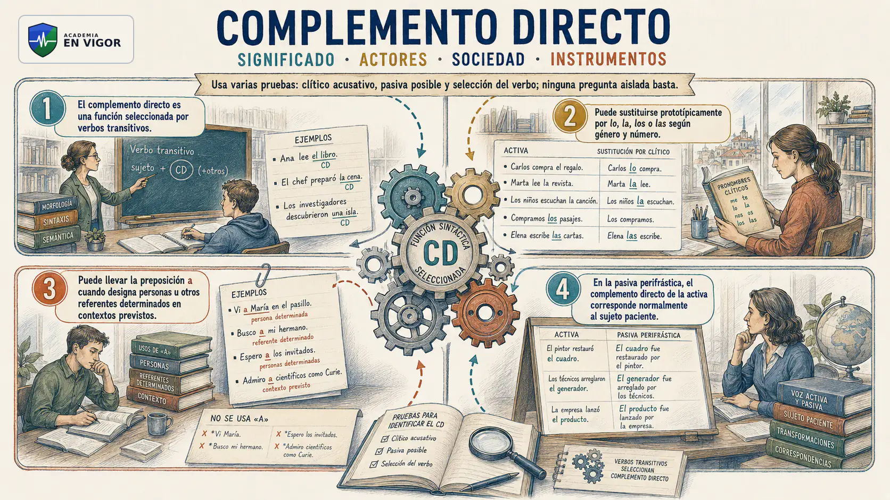

<em>Infografía: Complemento directo.</em>

<!-- FUENTE: RAE-NGB-SINTAXIS-T36 -->

## 84. Complemento indirecto

**Idea de control:** El dativo le/les es la huella más estable; a y para por sí solas no resuelven el análisis.

- El complemento indirecto se relaciona prototípicamente con destinatario, receptor, experimentante o beneficiario.
- Se representa mediante le o les, con la variante se ante clíticos acusativos de tercera persona.
- Puede aparecer duplicado por un grupo introducido por a.
- No todo grupo con para es complemento indirecto; muchos son complementos o adjuntos de finalidad o beneficiario.

<!-- VISUAL:t36-84-complemento-indirecto.webp -->

  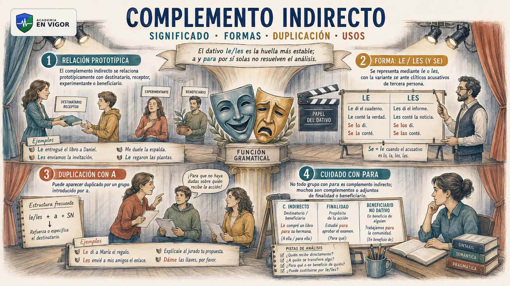

<em>Infografía: Complemento indirecto.</em>

<!-- FUENTE: RAE-NGB-SINTAXIS-T36 -->

## 85. Complemento de régimen

**Idea de control:** Pregunta si la preposición viene impuesta por el núcleo, no si la frase responde a una pregunta memorizada.

- El complemento de régimen es un grupo preposicional exigido o seleccionado por un verbo, nombre o adjetivo.
- La preposición forma parte del patrón de selección del núcleo.
- No se identifica por significado circunstancial, sino por dependencia léxica y sintáctica.
- Puede coexistir con complemento directo en algunos predicados.

<!-- VISUAL:t36-85-complemento-de-regimen.webp -->

  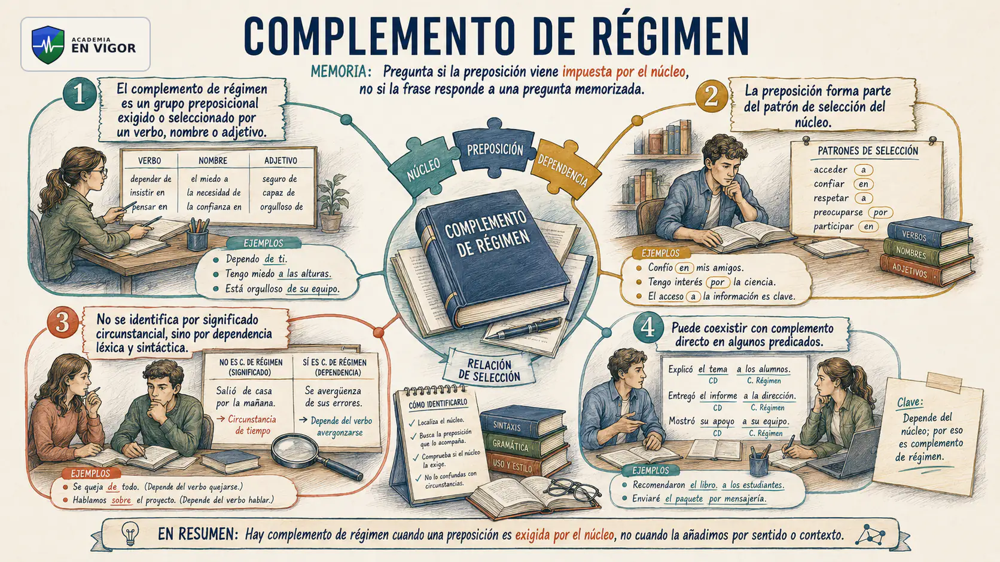

<em>Infografía: Complemento de régimen.</em>

<!-- FUENTE: RAE-NGB-SINTAXIS-T36 -->

## 86. Atributo y verbos copulativos

**Idea de control:** El atributo completa la predicación copulativa; no lo identifiques solo por su categoría.

- El atributo aparece prototípicamente con ser, estar y parecer.
- Atribuye una propiedad, estado o identificación al sujeto.
- Puede estar realizado por grupos adjetivales, nominales, preposicionales o adverbiales según el contexto.
- Con ser, estar y parecer puede sustituirse a menudo por el pronombre neutro lo.

<!-- VISUAL:t36-86-atributo-y-verbos-copulativos.webp -->

  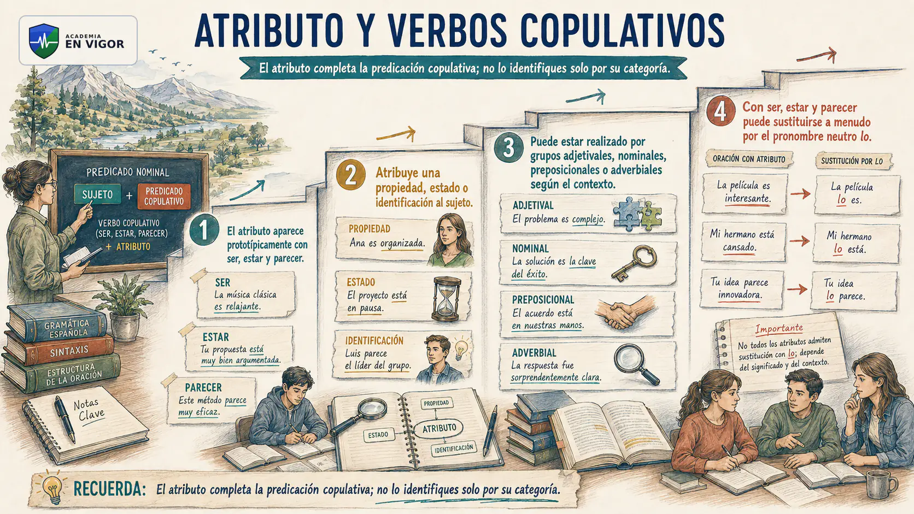

<em>Infografía: Atributo y verbos copulativos.</em>

<!-- FUENTE: RAE-NGB-SINTAXIS-T36 -->

## 87. Complemento predicativo

**Idea de control:** Predicativo lanza dos flechas: hacia el verbo y hacia el participante descrito.

- El predicativo atribuye una propiedad a un participante y simultáneamente modifica al predicado verbal.
- Puede orientarse al sujeto o al complemento directo.
- Cuando es adjetival, concuerda con la unidad de la que se predica.
- Se distingue del circunstancial de modo porque establece predicación sobre un participante.

<!-- VISUAL:t36-87-complemento-predicativo.webp -->

  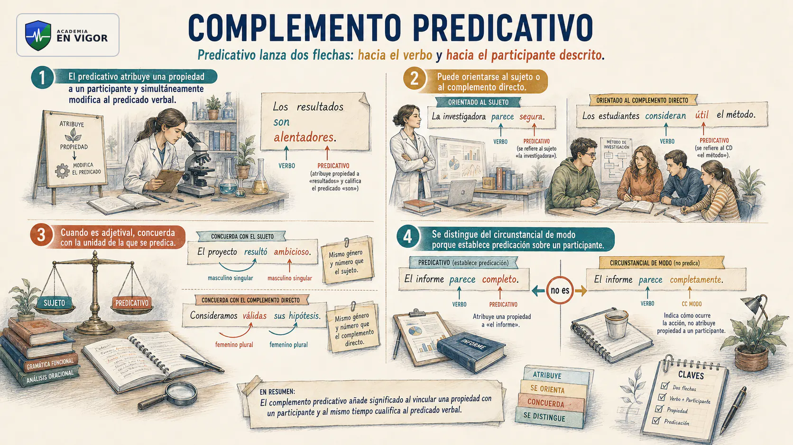

<em>Infografía: Complemento predicativo.</em>

<!-- FUENTE: RAE-NGB-SINTAXIS-T36 -->

## 88. Complementos circunstanciales y adjuntos

**Idea de control:** Un circunstancial añade marco a la escena; antes de etiquetarlo, comprueba a qué nivel se une.

- Los complementos circunstanciales son adjuntos que expresan tiempo, lugar, modo, causa, finalidad y otros valores.
- Suelen ser opcionales y pueden aparecer con distintas clases de predicados.
- Pueden estar realizados por grupos adverbiales, preposicionales, nominales u oraciones.
- El significado de lugar o tiempo no convierte automáticamente una unidad en complemento circunstancial si pertenece a otro grupo.

<!-- VISUAL:t36-il-88-complementos-circunstanciales-y-adjuntos.webp -->

  

<em>Infografía: Complementos circunstanciales y adjuntos.</em>

<!-- FUENTE: RAE-NGB-SINTAXIS-T36 -->

## 89. Complemento agente y pasiva

**Idea de control:** Solo hay agente si hay pasiva: por no entrega automáticamente esa función.

- El complemento agente aparece en pasivas perifrásticas y se introduce prototípicamente por por.
- Expresa el participante que realiza o causa la acción representada en pasiva.
- Es normalmente opcional y no debe confundirse con cualquier grupo causal introducido por por.
- Al transformar en activa, el complemento agente corresponde prototípicamente al sujeto agente.

<!-- VISUAL:t36-89-complemento-agente-y-pasiva.webp -->

  

<em>Infografía: Complemento agente y pasiva.</em>

<!-- FUENTE: RAE-NGB-SINTAXIS-T36 -->

## 90. Enunciado, oración y proposición

**Idea de control:** Enunciado mira la comunicación; oración mira la estructura predicativa.

- El enunciado es una unidad comunicativa con autonomía en un contexto.
- La oración contiene una relación predicativa y normalmente un verbo en forma personal o estructura equivalente.
- Puede haber enunciados no oracionales, como ciertas interjecciones o grupos usados autónomamente.
- El término proposición se usa con sentidos distintos en las tradiciones gramaticales y debe definirse antes de aplicarlo.

<!-- VISUAL:t36-90-enunciado-oracion-y-proposicion.webp -->

  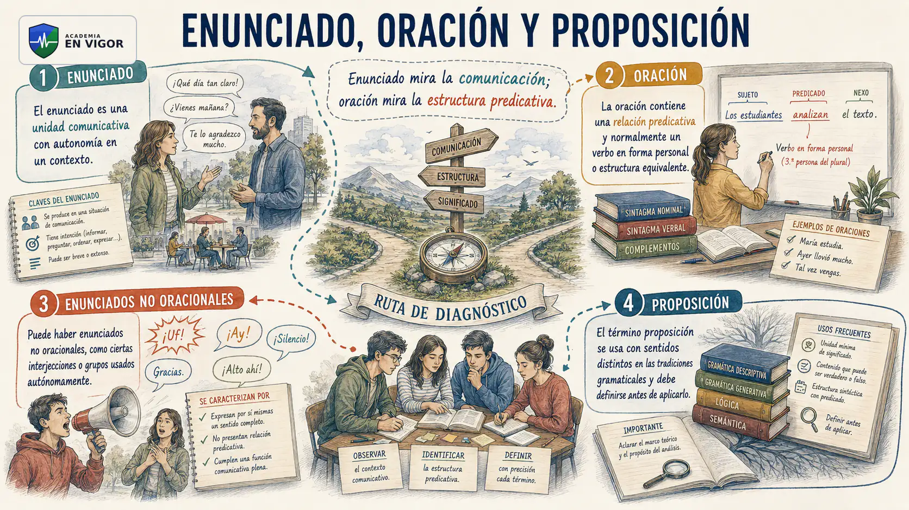

<em>Infografía: Enunciado, oración y proposición.</em>

<!-- FUENTE: RAE-NGB-SINTAXIS-T36 -->

## 91. Modalidad oracional

**Idea de control:** La modalidad es la intención con uniforme gramatical; el contexto puede cambiar la misión.

- La modalidad relaciona el contenido con la actitud y el acto comunicativo del hablante.
- Se distinguen declarativas, interrogativas, exclamativas, imperativas o exhortativas, desiderativas y dubitativas.
- La forma sintáctica y la fuerza comunicativa pueden no coincidir exactamente.
- La entonación, el modo verbal y ciertas partículas contribuyen a expresar modalidad.

<!-- VISUAL:t36-91-modalidad-oracional.webp -->

  

<em>Infografía: Modalidad oracional.</em>

<!-- FUENTE: RAE-NGB-SINTAXIS-T36 -->

## 92. Oraciones personales e impersonales

**Idea de control:** Sujeto oculto existe; en la impersonal no hay sujeto que recuperar.

- Las oraciones personales tienen sujeto expreso o tácito.
- Las impersonales sintácticas carecen de sujeto.
- Son impersonales prototípicas ciertas construcciones meteorológicas y existenciales con haber.
- Las impersonales con se llevan verbo en tercera persona singular y admiten complementos humanos introducidos por a.

<!-- VISUAL:t36-92-oraciones-personales-e-impersonales.webp -->

  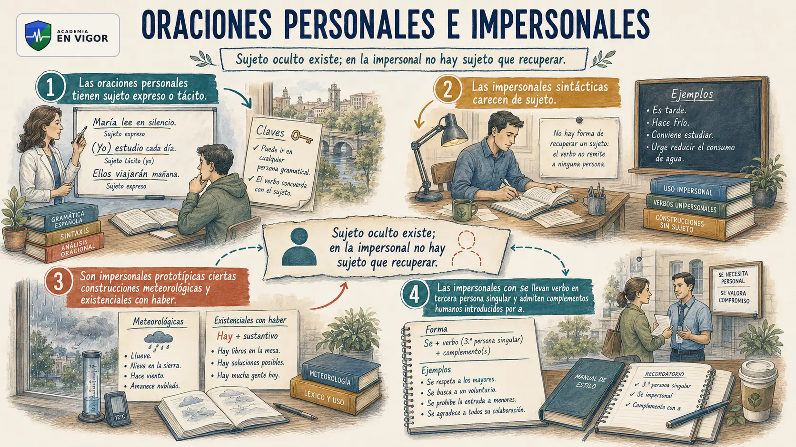

<em>Infografía: Oraciones personales e impersonales.</em>

<!-- FUENTE: RAE-NGB-SINTAXIS-T36 -->

## 93. Activas, pasivas y medias

**Idea de control:** Pasiva perifrástica usa ser; pasiva refleja usa se y concordancia; impersonal con se no tiene sujeto.

- La activa presenta normalmente al sujeto como participante no paciente en predicados transitivos.
- La pasiva perifrástica se forma con ser y participio concordado y presenta sujeto paciente.
- La pasiva refleja se construye con se y un sujeto que concuerda con el verbo.
- Las construcciones medias presentan propiedades o procesos sin focalizar un agente externo.

<!-- VISUAL:t36-93-activas-pasivas-y-medias.webp -->

  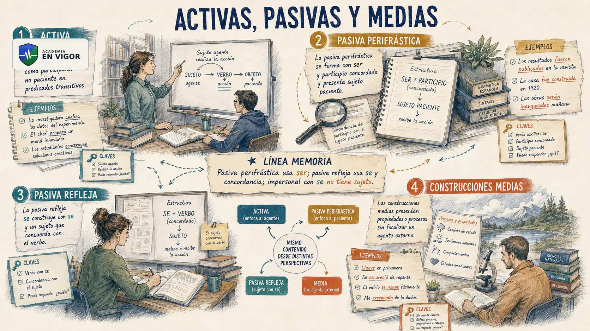

<em>Infografía: Activas, pasivas y medias.</em>

<!-- FUENTE: RAE-NGB-SINTAXIS-T36 -->

## 94. Oraciones simples y compuestas

**Idea de control:** Cuenta predicaciones y relaciones, no verbos gráficos sin analizar.

- La oración simple contiene una sola estructura predicativa principal.
- La oración compuesta o compleja integra más de una predicación mediante coordinación, subordinación o yuxtaposición.
- Una perífrasis verbal constituye normalmente un núcleo complejo, no dos oraciones por el mero número de formas verbales.
- Una forma no personal puede encabezar una construcción subordinada con estructura propia.

<!-- VISUAL:t36-94-oraciones-simples-y-compuestas.webp -->

  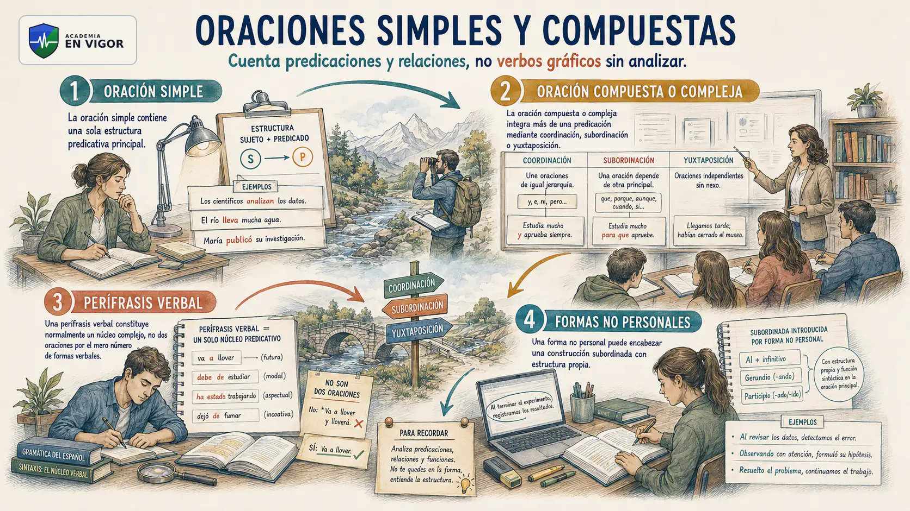

<em>Infografía: Oraciones simples y compuestas.</em>

<!-- FUENTE: RAE-NGB-SINTAXIS-T36 -->

## 95. Coordinación y yuxtaposición

**Idea de control:** Coordinación pone dos vagones al mismo nivel; yuxtaposición elimina la pieza de enlace visible.

- La coordinación une unidades del mismo nivel sintáctico sin que una dependa de la otra.
- Puede ser copulativa, disyuntiva o adversativa, entre otras clasificaciones tradicionales.
- La yuxtaposición une unidades sin conjunción expresa mediante pausa o signo gráfico en la escritura.
- La ausencia de conjunción no elimina las relaciones semánticas entre miembros yuxtapuestos.

<!-- VISUAL:t36-95-coordinacion-y-yuxtaposicion.webp -->

  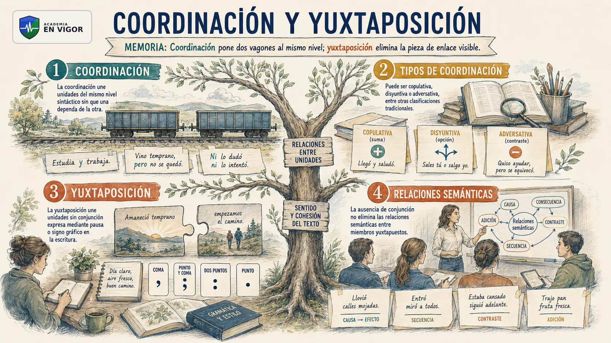

<em>Infografía: Coordinación y yuxtaposición.</em>

<!-- FUENTE: RAE-NGB-SINTAXIS-T36 -->

## 96. Subordinadas sustantivas

**Idea de control:** Sustituye el bloque por eso como prueba inicial, pero confirma luego la función exacta.

- Las subordinadas sustantivas desempeñan funciones características de grupos nominales.
- Pueden funcionar como sujeto, complemento directo, término de preposición u otras funciones.
- Que y si son nexos frecuentes, y también existen interrogativas indirectas.
- El nexo que conjuntivo no desempeña función sintáctica dentro de la subordinada.

<!-- VISUAL:t36-96-subordinadas-sustantivas.webp -->

  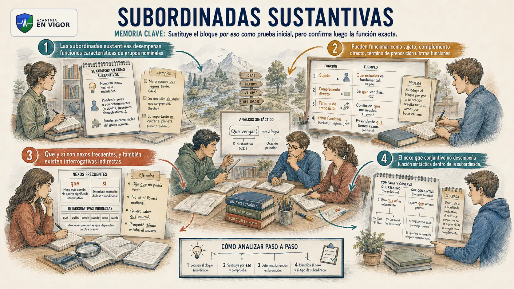

<em>Infografía: Subordinadas sustantivas.</em>

<!-- FUENTE: RAE-NGB-SINTAXIS-T36 -->

## 97. Subordinadas de relativo

**Idea de control:** Localiza dos cosas: qué antecedente modifica y qué puesto ocupa el relativo dentro.

- Las relativas modifican un antecedente expreso o incorporan el antecedente en ciertas construcciones.
- El relativo desempeña una función sintáctica dentro de la subordinada.
- Las especificativas restringen la referencia; las explicativas aportan información incidental.
- Las explicativas se aíslan prosódicamente y mediante comas en la escritura.

<!-- VISUAL:t36-97-subordinadas-de-relativo.webp -->

  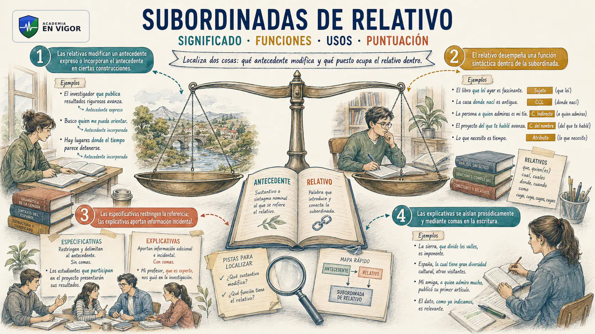

<em>Infografía: Subordinadas de relativo.</em>

<!-- FUENTE: RAE-NGB-SINTAXIS-T36 -->

## 98. Subordinadas adverbiales y construcciones circunstanciales

**Idea de control:** La etiqueta tradicional sirve de mapa, pero cada relación necesita su propio análisis.

- La tradición agrupa como adverbiales diversas subordinadas de tiempo, lugar, modo, causa, finalidad, condición y concesión.
- La gramática actual distingue construcciones con comportamientos sintácticos diferentes dentro de ese conjunto.
- Una subordinada puede funcionar como adjunto del predicado o incidir sobre toda la oración.
- El nexo y la relación semántica deben analizarse junto con la dependencia estructural.

<!-- VISUAL:t36-98-subordinadas-adverbiales-y-construcciones-circunstanciales.webp -->

  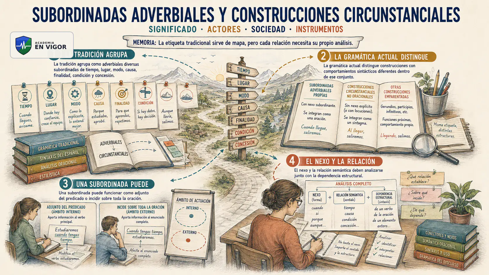

<em>Infografía: Subordinadas adverbiales y construcciones circunstanciales.</em>

<!-- FUENTE: RAE-NGB-SINTAXIS-T36 -->

## 99. Método de análisis sintáctico

**Idea de control:** Analiza como un atestado: localiza hechos, agrupa indicios, contrasta varias pruebas y justifica la conclusión.

- El análisis comienza localizando predicaciones y núcleos verbales.
- Después se segmentan grupos, se identifica su núcleo y se asignan funciones mediante pruebas convergentes.
- Concordancia, sustitución pronominal, selección léxica y transformación son pruebas útiles, no recetas infalibles aisladas.
- El resultado debe justificar relaciones jerárquicas y admitir ambigüedad cuando la estructura permite más de una lectura.

<!-- VISUAL:t36-il-99-metodo-de-analisis-sintactico.webp -->

  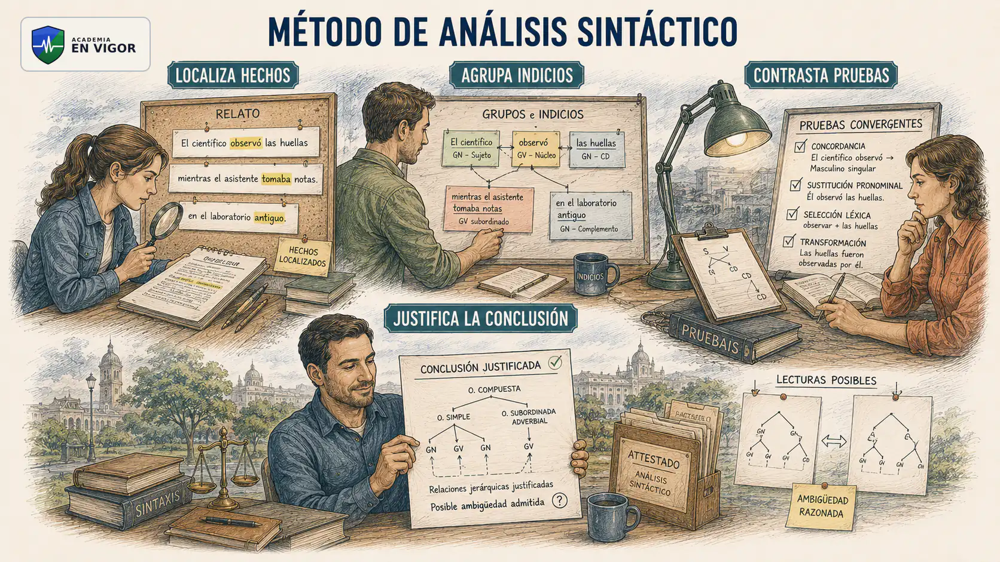

<em>Infografía: Método de análisis sintáctico.</em>

<!-- FUENTE: RAE-NGB-SINTAXIS-T36 -->

# Hablemos claro

:::hablemos-claro
Este tema tiene tres trampas maestras: confundir categoría con función, clasificar por una sola pregunta mecánica y tratar como idénticas etiquetas tradicionales y análisis académicos actuales. Separa palabra, grupo, función y construcción antes de responder.
:::

# En la calle

:::en-la-calle
En una declaración o atestado, la gramática cambia el sentido operativo: identifica primero el núcleo verbal, sus participantes, los modificadores y el alcance de negaciones, pronombres y enlaces.
:::

# Lo que cae

:::lo-que-cae
Prioriza flexión frente a derivación; sufijos; clases de sustantivos y pronombres; grados del adjetivo; tipos de adverbio; conjugación, modos y formas no personales; inventario de preposiciones; conjunciones; sujeto, CD, CI, régimen, atributo, predicativo; voz, modalidad y subordinación.
:::

# Ha caído

:::ha-caido
Se han localizado 2 referencias históricas del Tema 36. Permanecen ocultas y en cuarentena porque no existe plantilla oficial final verificable en el repositorio.
:::

## Fuentes legales, institucionales y primarias

- `CONVOCATORIA-PN-2026-T36`
- `RAE-NGLE-T36`
- `RAE-NGB-T36`
- `RAE-GTG-T36`
- `RAE-GTG-ESQUEMAS-T36`
- `RAE-NGB-MORFOLOGIA-T36`
- `RAE-NGB-DERIVACION-T36`
- `RAE-NGB-SUSTANTIVO-T36`
- `RAE-NGB-PRONOMBRES-T36`
- `RAE-NGB-ADJETIVO-T36`
- `RAE-NGB-ADVERBIO-T36`
- `RAE-NGB-VERBO-T36`
- `RAE-NGB-FLEXION-VERBAL-T36`
- `RAE-NGB-ENLACES-T36`
- `RAE-NGB-SINTAXIS-T36`
- `RAE-DPD2-T36`

---

*Academia En Vigor · El temario que nunca duerme · Tema 36 · v1.0.0 · Documento interno no publicado.*
