# TEMA 39 · REDES INFORMÁTICAS: MODELO OSI Y MODELO TCP/IP. DISPOSITIVOS DE RED: HUBS, SWITCHES, ROUTERS, FIREWALL, SERVIDORES DHCP, SERVIDORES DNS Y SERVIDORES PROXY. DIRECCIONAMIENTO IP: CLASES DE REDES, IPV4 E IPV6.

**Policía Nacional · Método VIGOR · PARTE**
**Versión de contenido:** 1.0.0
**Estado editorial:** approved_internal · **Publicación:** not_published

# Mapa del tema

El Tema 39 se estudia en ocho partes: fundamentos; modelo OSI; modelo TCP/IP; hubs y switches; routers y firewall; DHCP, DNS y proxy; IPv4 y clases históricas; e IPv6.

# Contenido

## 01. Alcance oficial del Tema 39

**Idea de control:** El programa exige estudiar los modelos OSI y TCP/IP.

- El programa exige estudiar los modelos OSI y TCP/IP.
- El epígrafe enumera hubs, switches, routers, firewall y servidores DHCP, DNS y proxy.
- El direccionamiento comprende clases de redes, IPv4 e IPv6.
- Protocolos o técnicas auxiliares se incluyen solo cuando explican esos núcleos oficiales.

<!-- VISUAL:t39-01-alcance-oficial-del-tema-39.webp -->

  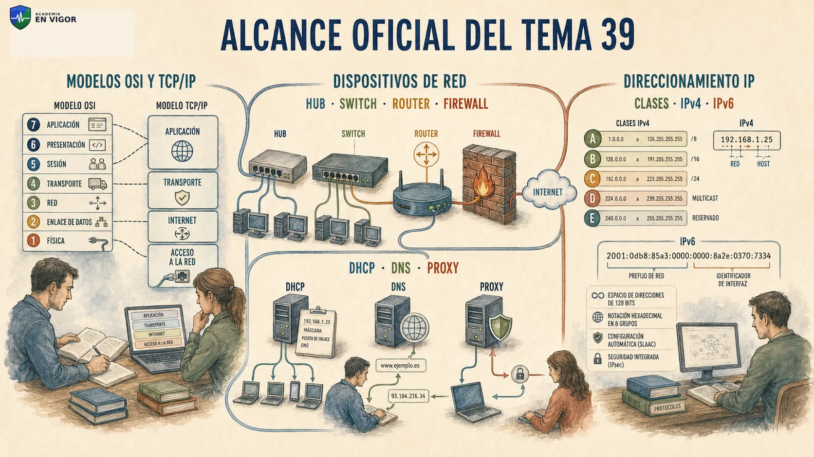

<em>Infografía: Alcance oficial del Tema 39.</em>

<!-- FUENTE: CONVOCATORIA-PN-2026-T39 -->

## 02. Red, nodo, enlace y protocolo

**Idea de control:** Una red interconecta sistemas para intercambiar datos y compartir recursos.

- Una red interconecta sistemas para intercambiar datos y compartir recursos.
- Un nodo es un sistema o dispositivo que participa en la comunicación.
- Un enlace es el medio lógico o físico que conecta nodos adyacentes.
- Un protocolo define reglas y formatos compartidos para que las entidades se entiendan.

<!-- VISUAL:t39-02-red-nodo-enlace-y-protocolo.webp -->

  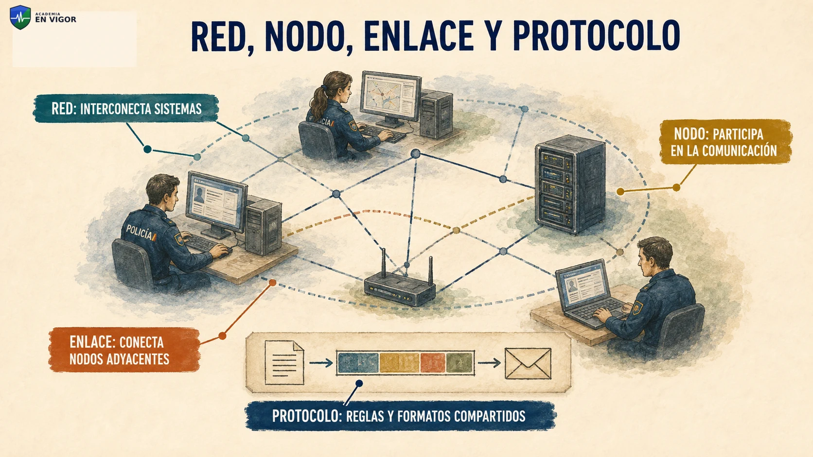

<em>Infografía: Red, nodo, enlace y protocolo.</em>

<!-- FUENTE: RFC1122-HOSTS-T39 -->

## 03. LAN, MAN, WAN y PAN

**Idea de control:** Una LAN cubre normalmente un ámbito local bajo administración próxima.

- Una LAN cubre normalmente un ámbito local bajo administración próxima.
- Una WAN interconecta redes o sistemas a distancias amplias.
- MAN describe un ámbito metropolitano y PAN una red personal de corto alcance.
- La clasificación por alcance no determina por sí sola el protocolo, el medio ni la propiedad.

<!-- VISUAL:t39-03-lan-man-wan-y-pan.webp -->

  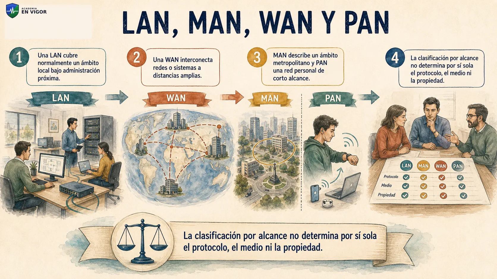

<em>Infografía: LAN, MAN, WAN y PAN.</em>

<!-- FUENTE: RFC1122-HOSTS-T39 -->

## 04. Topología física y topología lógica

**Idea de control:** La topología física describe cómo se disponen enlaces y dispositivos.

- La topología física describe cómo se disponen enlaces y dispositivos.
- La topología lógica describe cómo circula la información o se organiza el acceso.
- Bus, anillo, estrella, árbol y malla son modelos de topología.
- Una red puede presentar topología física y lógica diferentes.

<!-- VISUAL:t39-04-topologia-fisica-y-topologia-logica.webp -->

  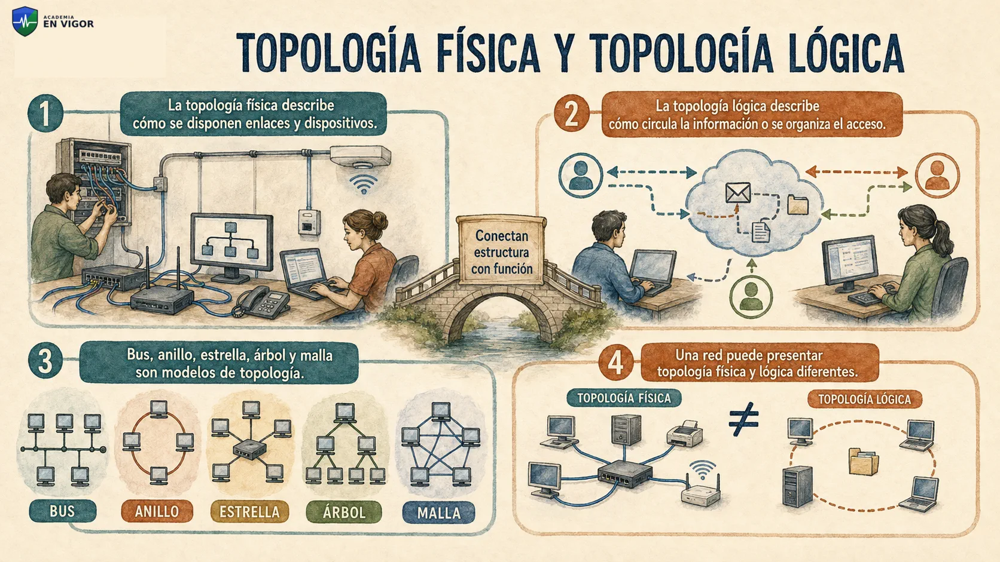

<em>Infografía: Topología física y topología lógica.</em>

<!-- FUENTE: IEEE8023-ETHERNET-T39 -->

## 05. Conmutación, encaminamiento y servicios

**Idea de control:** La conmutación Ethernet decide el reenvío local principalmente mediante direcciones MAC.

- La conmutación Ethernet decide el reenvío local principalmente mediante direcciones MAC.
- El encaminamiento IP decide el siguiente salto entre redes mediante prefijos IP.
- DHCP asigna parámetros, DNS resuelve nombres y un proxy actúa como intermediario.
- Un mismo equipo comercial puede reunir varias funciones sin volverlas equivalentes.

<!-- VISUAL:t39-il-05-conmutacion-encaminamiento-y-servicios.webp -->

  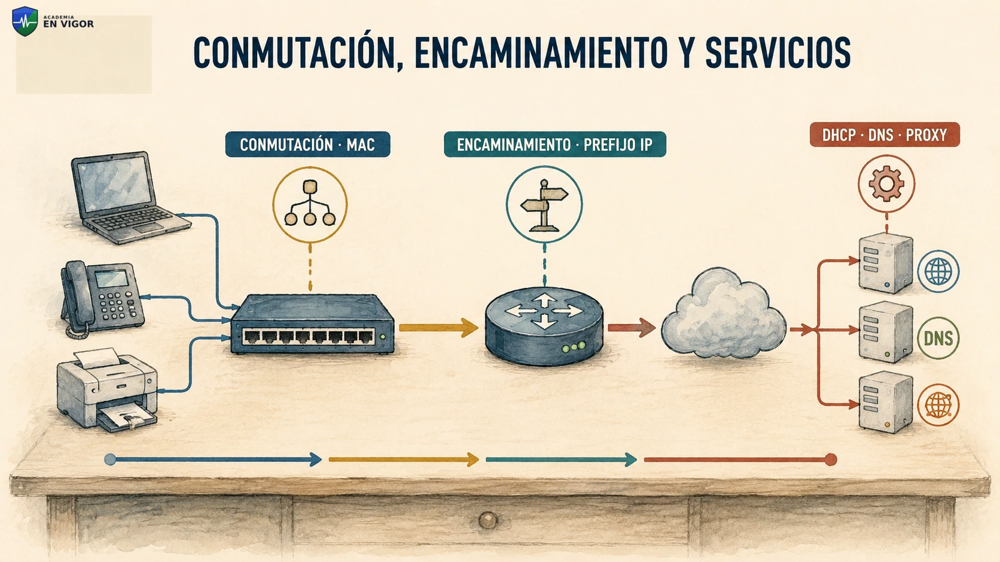

<em>Infografía: Conmutación, encaminamiento y servicios.</em>

<!-- FUENTE: RFC1812-ROUTERS-T39 -->

## 06. Encapsulación y unidades de datos

**Idea de control:** La encapsulación añade información de control al bajar por la pila.

- La encapsulación añade información de control al bajar por la pila.
- La desencapsulación interpreta y retira esa información al recibir.
- Los datos de aplicación se transportan dentro de unidades de capas inferiores.
- Cabecera, carga útil y, cuando existe, tráiler cumplen funciones distintas.

<!-- VISUAL:t39-06-encapsulacion-y-unidades-de-datos.webp -->

  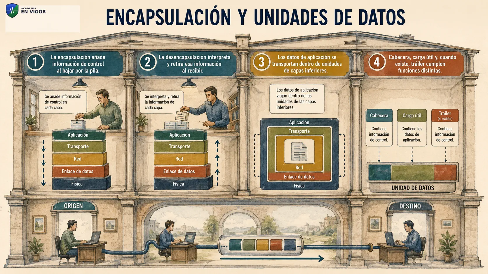

<em>Infografía: Encapsulación y unidades de datos.</em>

<!-- FUENTE: RFC1122-HOSTS-T39 -->

## 07. Finalidad del modelo OSI

**Idea de control:** OSI proporciona una base común para coordinar estándares de interconexión de sistemas abiertos.

- OSI proporciona una base común para coordinar estándares de interconexión de sistemas abiertos.
- El modelo divide funciones de comunicación en siete capas.
- OSI es un modelo de referencia y no una única pila obligatoria implementada literalmente.
- Su separación facilita describir interoperabilidad y localizar fallos.

<!-- VISUAL:t39-07-finalidad-del-modelo-osi.webp -->

  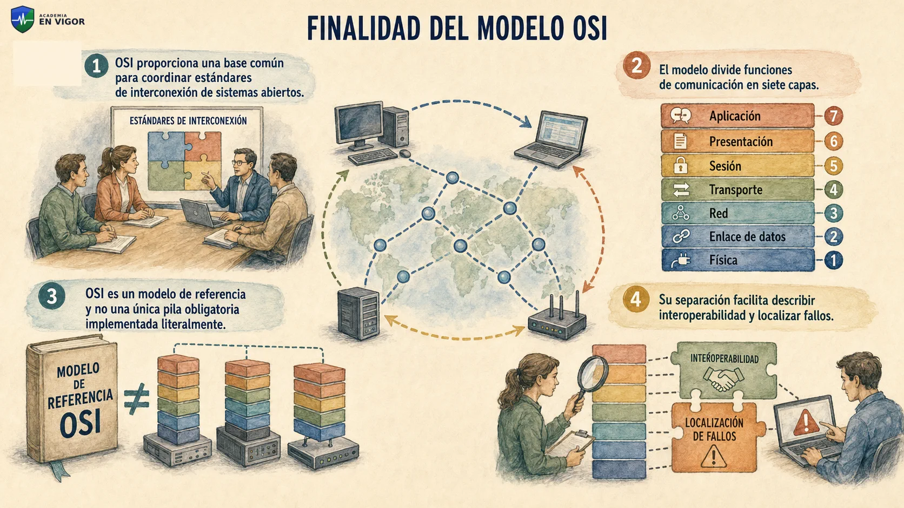

<em>Infografía: Finalidad del modelo OSI.</em>

<!-- FUENTE: ISO-7498-1-OSI-T39 -->

## 08. Capas, servicios, protocolos e interfaces

**Idea de control:** Una capa presta servicios a la capa superior y utiliza servicios de la inferior.

- Una capa presta servicios a la capa superior y utiliza servicios de la inferior.
- Un protocolo regula la comunicación entre entidades pares de una misma capa.
- Una interfaz define cómo una capa accede a servicios de la capa adyacente.
- Servicio y protocolo están relacionados, pero no son términos intercambiables.

<!-- VISUAL:t39-08-capas-servicios-protocolos-e-interfaces.webp -->

  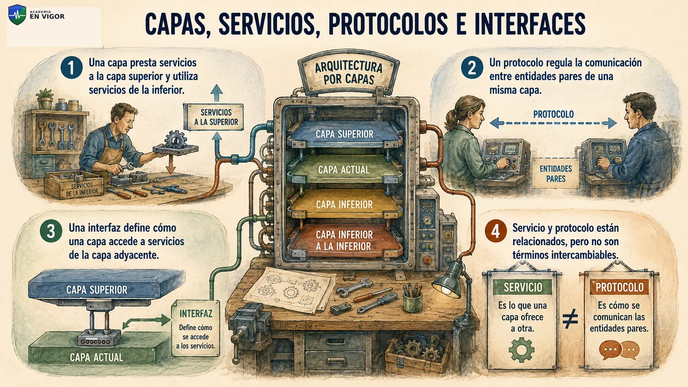

<em>Infografía: Capas, servicios, protocolos e interfaces.</em>

<!-- FUENTE: ISO-7498-1-OSI-T39 -->

## 09. Capa 1: física

**Idea de control:** La capa física transmite un flujo de bits a través del medio.

- La capa física transmite un flujo de bits a través del medio.
- Se ocupa de características eléctricas, ópticas, radioeléctricas, mecánicas y de señalización.
- Conectores, modulación y velocidad física se asocian a esta capa.
- La capa física no interpreta direcciones IP ni decide rutas.

<!-- VISUAL:t39-09-capa-1-fisica.webp -->

  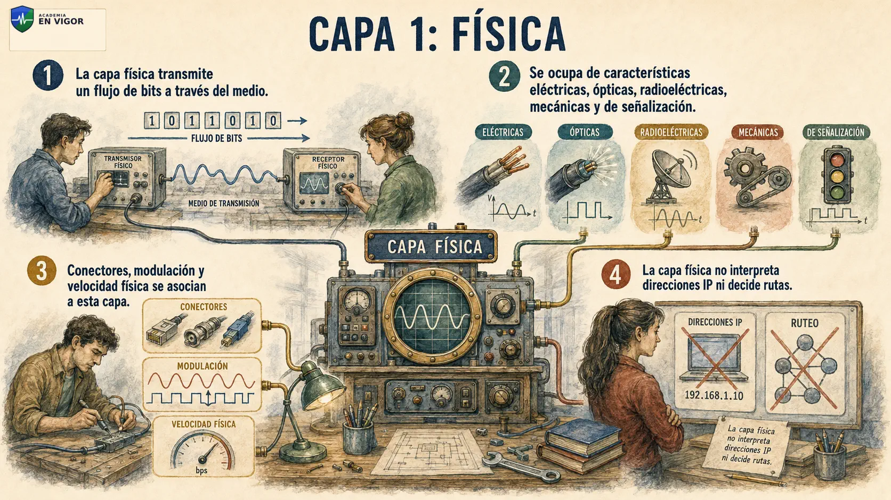

<em>Infografía: Capa 1: física.</em>

<!-- FUENTE: ISO-7498-1-OSI-T39 -->

## 10. Capa 2: enlace de datos

**Idea de control:** La capa de enlace organiza la transmisión sobre un enlace en unidades como tramas.

- La capa de enlace organiza la transmisión sobre un enlace en unidades como tramas.
- Puede proporcionar delimitación, detección de errores y control de acceso al medio.
- Ethernet utiliza direcciones MAC para el reenvío dentro del dominio de enlace.
- La entrega de capa 2 no sustituye el encaminamiento entre redes IP.

<!-- VISUAL:t39-il-10-capa-2-enlace-de-datos.webp -->

  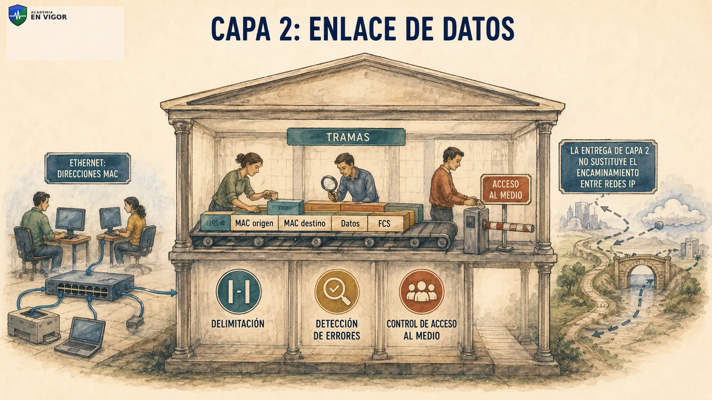

<em>Infografía: Capa 2: enlace de datos.</em>

<!-- FUENTE: ISO-7498-1-OSI-T39 -->

## 11. Sublayers LLC y MAC

**Idea de control:** La subcapa MAC se relaciona con el acceso al medio y el direccionamiento físico.

- La subcapa MAC se relaciona con el acceso al medio y el direccionamiento físico.
- La subcapa LLC proporciona una interfaz lógica hacia capas superiores en arquitecturas IEEE 802.
- Un switch Ethernet aprende y reenvía usando información MAC.
- No debe confundirse la dirección MAC con la dirección IP de capa de red.

<!-- VISUAL:t39-11-sublayers-llc-y-mac.webp -->

  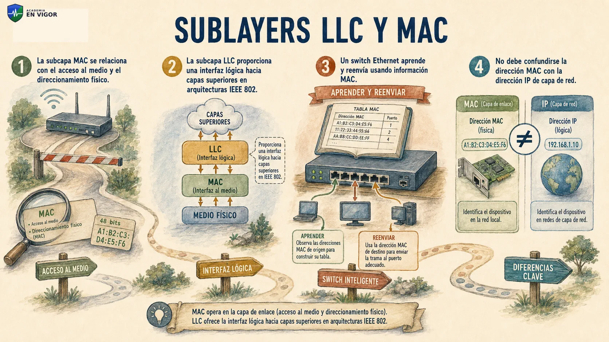

<em>Infografía: Sublayers LLC y MAC.</em>

<!-- FUENTE: IEEE8021Q-BRIDGES-T39 -->

## 12. Capa 3: red

**Idea de control:** La capa de red permite transferir paquetes entre sistemas a través de redes intermedias.

- La capa de red permite transferir paquetes entre sistemas a través de redes intermedias.
- IP aporta direccionamiento lógico y soporte para el encaminamiento.
- Los routers operan principalmente tomando decisiones de capa 3.
- La capa de red no garantiza por sí sola la entrega fiable de extremo a extremo.

<!-- VISUAL:t39-12-capa-3-red.webp -->

  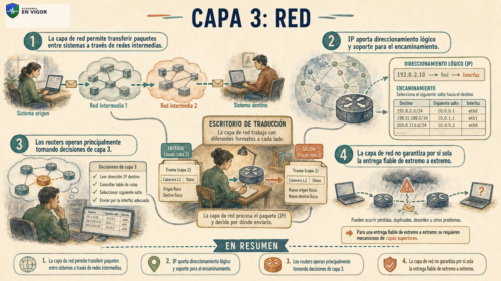

<em>Infografía: Capa 3: red.</em>

<!-- FUENTE: ISO-7498-1-OSI-T39 -->

## 13. Capa 4: transporte

**Idea de control:** La capa de transporte ofrece comunicación lógica entre extremos o procesos.

- La capa de transporte ofrece comunicación lógica entre extremos o procesos.
- Puede segmentar, reensamblar, multiplexar y controlar la transmisión.
- TCP proporciona un servicio fiable orientado a conexión.
- UDP proporciona datagramas sin establecer una conexión fiable.

<!-- VISUAL:t39-13-capa-4-transporte.webp -->

  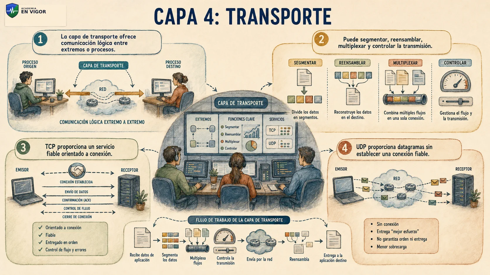

<em>Infografía: Capa 4: transporte.</em>

<!-- FUENTE: ISO-7498-1-OSI-T39 -->

## 14. Capa 5: sesión

**Idea de control:** La capa de sesión modela el establecimiento, mantenimiento y cierre de diálogos.

- La capa de sesión modela el establecimiento, mantenimiento y cierre de diálogos.
- Puede coordinar puntos de sincronización y recuperación del diálogo.
- En pilas actuales sus funciones suelen integrarse en protocolos o aplicaciones superiores.
- Que una función no aparezca como capa separada en TCP/IP no significa que desaparezca.

<!-- VISUAL:t39-14-capa-5-sesion.webp -->

  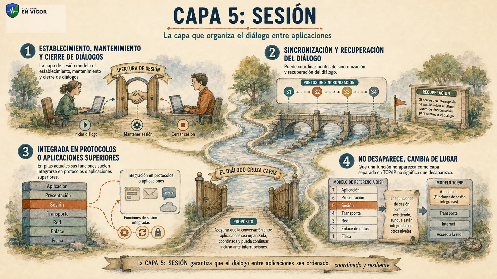

<em>Infografía: Capa 5: sesión.</em>

<!-- FUENTE: ISO-7498-1-OSI-T39 -->

## 15. Capa 6: presentación

**Idea de control:** La capa de presentación trata la sintaxis y representación de la información.

- La capa de presentación trata la sintaxis y representación de la información.
- Codificación, transformación de formatos, compresión o cifrado pueden asociarse a esta función.
- Su objetivo es que entidades con representaciones distintas intercambien datos comprensibles.
- En Internet estas funciones suelen residir en bibliotecas y protocolos de aplicación.

<!-- VISUAL:t39-il-15-capa-6-presentacion.webp -->

  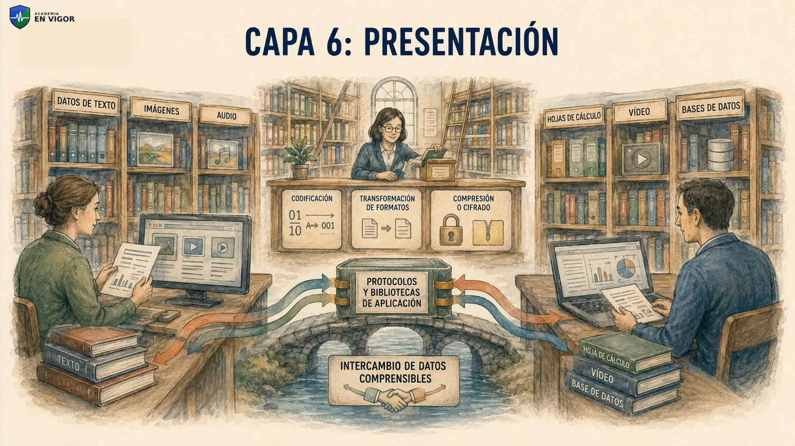

<em>Infografía: Capa 6: presentación.</em>

<!-- FUENTE: ISO-7498-1-OSI-T39 -->

## 16. Capa 7: aplicación

**Idea de control:** La capa de aplicación ofrece servicios de comunicación a procesos de aplicación.

- La capa de aplicación ofrece servicios de comunicación a procesos de aplicación.
- HTTP, DNS y protocolos de correo son ejemplos habituales de protocolos de aplicación en TCP/IP.
- Aplicación no significa que el usuario interactúe siempre directamente con el protocolo.
- La capa de aplicación utiliza servicios de transporte para intercambiar mensajes.

<!-- VISUAL:t39-16-capa-7-aplicacion.webp -->

  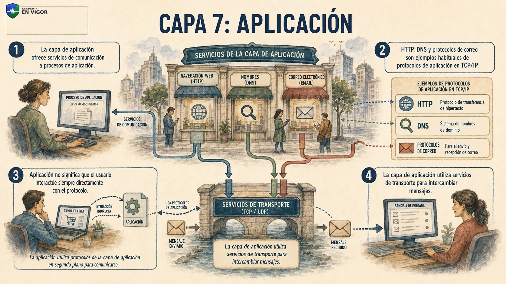

<em>Infografía: Capa 7: aplicación.</em>

<!-- FUENTE: ISO-7498-1-OSI-T39 -->

## 17. PDU: bits, tramas, paquetes y segmentos

**Idea de control:** Bits es la denominación elemental asociada a la transmisión física.

- Bits es la denominación elemental asociada a la transmisión física.
- Trama es la unidad habitual de enlace de datos.
- Paquete o datagrama IP es la unidad habitual de capa de red.
- Segmento TCP y datagrama UDP son denominaciones usuales de transporte.

<!-- VISUAL:t39-17-pdu-bits-tramas-paquetes-y-segmentos.webp -->

  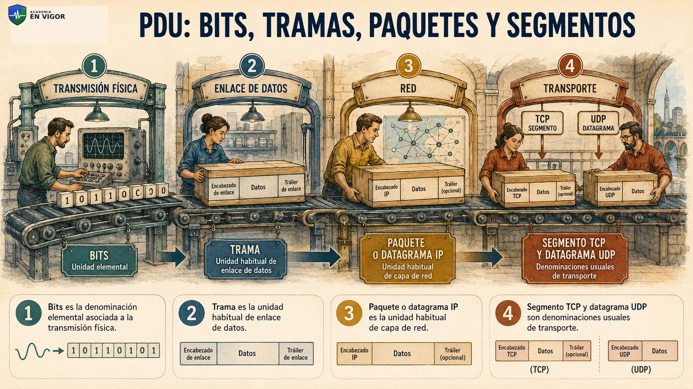

<em>Infografía: PDU: bits, tramas, paquetes y segmentos.</em>

<!-- FUENTE: ISO-7498-1-OSI-T39 -->

## 18. Encapsulación en el modelo OSI

**Idea de control:** Cada capa puede añadir su cabecera a la unidad recibida de la superior.

- Cada capa puede añadir su cabecera a la unidad recibida de la superior.
- En Ethernet puede existir además un tráiler para detección de errores.
- El receptor procesa las cabeceras en orden inverso al emisor.
- La misma carga útil cambia de denominación funcional al atravesar capas.

<!-- VISUAL:t39-18-encapsulacion-en-el-modelo-osi.webp -->

  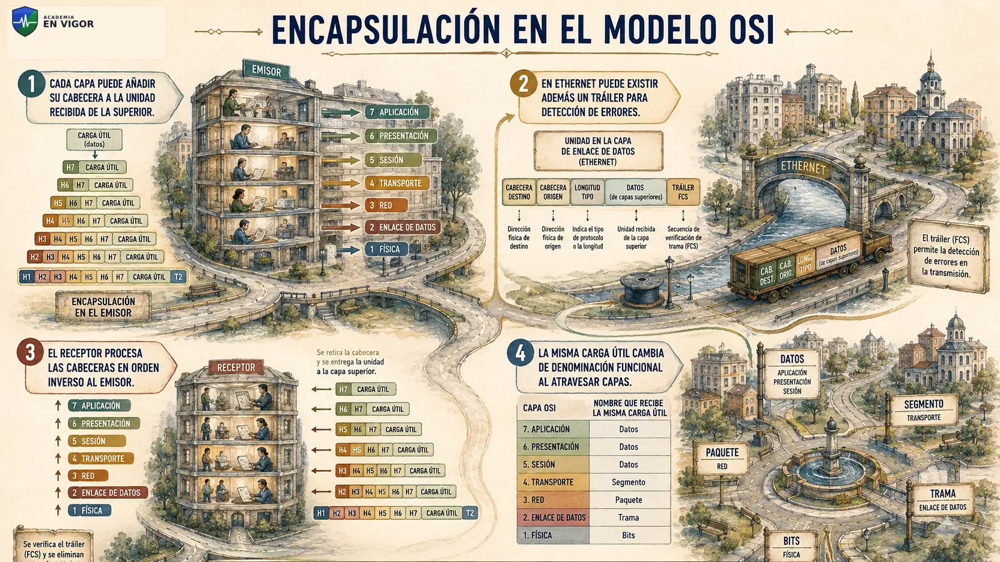

<em>Infografía: Encapsulación en el modelo OSI.</em>

<!-- FUENTE: ISO-7498-1-OSI-T39 -->

## 19. Dispositivos y capas OSI

**Idea de control:** Hub y repetidor se asocian principalmente a la capa física.

- Hub y repetidor se asocian principalmente a la capa física.
- Bridge y switch Ethernet se asocian principalmente a la capa de enlace.
- Router se asocia principalmente a la capa de red.
- Firewall y proxy pueden examinar varias capas según su tecnología.

<!-- VISUAL:t39-19-dispositivos-y-capas-osi.webp -->

  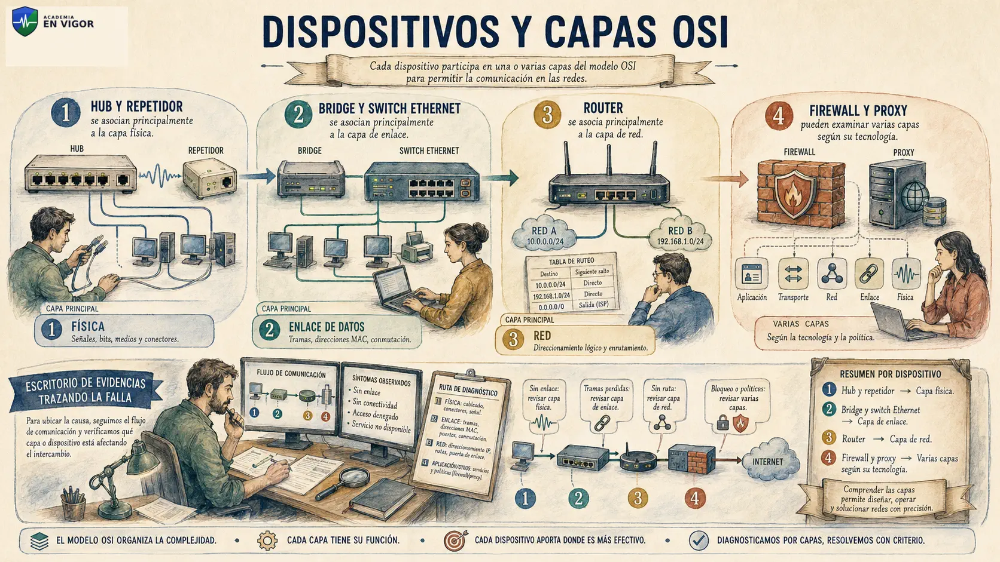

<em>Infografía: Dispositivos y capas OSI.</em>

<!-- FUENTE: ISO-7498-1-OSI-T39 -->

## 20. Diagnóstico por capas

**Idea de control:** La ausencia de enlace físico se investiga antes que la resolución DNS.

- La ausencia de enlace físico se investiga antes que la resolución DNS.
- Una MAC aprendida no demuestra que exista ruta IP extremo a extremo.
- Una IP alcanzable no demuestra que el servicio de aplicación responda.
- El análisis por capas evita atribuir a DNS fallos de cableado o a TCP errores de direccionamiento.

<!-- VISUAL:t39-il-20-diagnostico-por-capas.webp -->

  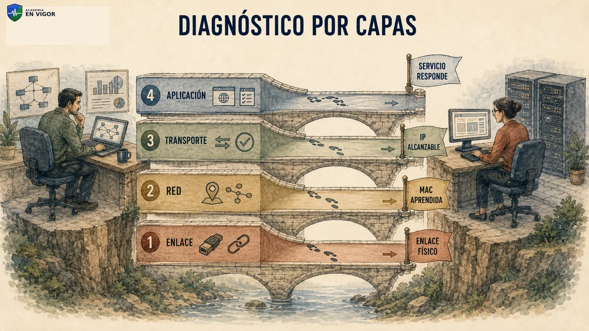

<em>Infografía: Diagnóstico por capas.</em>

<!-- FUENTE: ISO-7498-1-OSI-T39 -->

## 21. Finalidad del modelo TCP/IP

**Idea de control:** TCP/IP agrupa protocolos usados para interconectar redes y prestar servicios de Internet.

- TCP/IP agrupa protocolos usados para interconectar redes y prestar servicios de Internet.
- El modelo se describe habitualmente mediante capas de aplicación, transporte, Internet y enlace.
- Algunas obras separan la física y hablan de cinco capas sin cambiar los protocolos básicos.
- El número de capas citado debe acompañarse del modelo concreto empleado.

<!-- VISUAL:t39-21-finalidad-del-modelo-tcp-ip.webp -->

  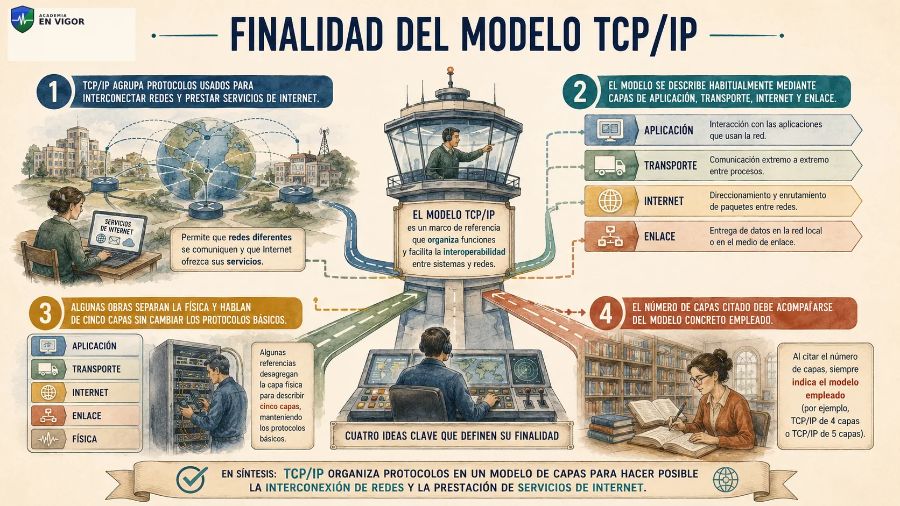

<em>Infografía: Finalidad del modelo TCP/IP.</em>

<!-- FUENTE: RFC1122-HOSTS-T39 -->

## 22. Correspondencia OSI y TCP/IP

**Idea de control:** La aplicación TCP/IP agrupa funciones que OSI separa en aplicación, presentación y sesión.

- La aplicación TCP/IP agrupa funciones que OSI separa en aplicación, presentación y sesión.
- La capa de transporte se corresponde de forma aproximada en ambos modelos.
- La capa Internet se relaciona con la capa de red OSI.
- El acceso a red TCP/IP reúne funciones de enlace y del medio físico.

<!-- VISUAL:t39-22-correspondencia-osi-y-tcp-ip.webp -->

  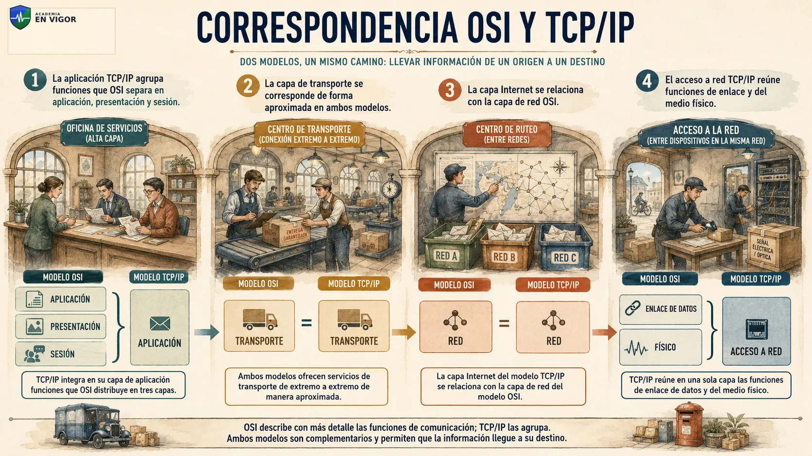

<em>Infografía: Correspondencia OSI y TCP/IP.</em>

<!-- FUENTE: RFC1122-HOSTS-T39 -->

## 23. Capa de aplicación TCP/IP

**Idea de control:** La capa de aplicación contiene protocolos que soportan servicios para programas y usuarios.

- La capa de aplicación contiene protocolos que soportan servicios para programas y usuarios.
- HTTP intercambia representaciones web, DNS resuelve nombres y DHCP configura nodos.
- Los protocolos de aplicación se apoyan normalmente en TCP o UDP.
- Un puerto identifica un punto lógico de transporte, no una aplicación de forma absoluta.

<!-- VISUAL:t39-23-capa-de-aplicacion-tcp-ip.webp -->

  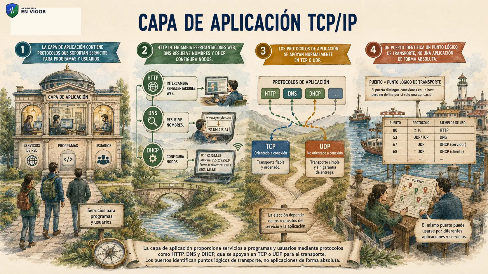

<em>Infografía: Capa de aplicación TCP/IP.</em>

<!-- FUENTE: RFC1122-HOSTS-T39 -->

## 24. TCP: conexión y fiabilidad

**Idea de control:** TCP ofrece a las aplicaciones un flujo fiable y ordenado de bytes.

- TCP ofrece a las aplicaciones un flujo fiable y ordenado de bytes.
- TCP establece estado de conexión entre los extremos.
- Números de secuencia, reconocimientos y retransmisión contribuyen a la fiabilidad.
- TCP incorpora control de flujo y mecanismos de control de congestión en la pila de Internet.

<!-- VISUAL:t39-24-tcp-conexion-y-fiabilidad.webp -->

  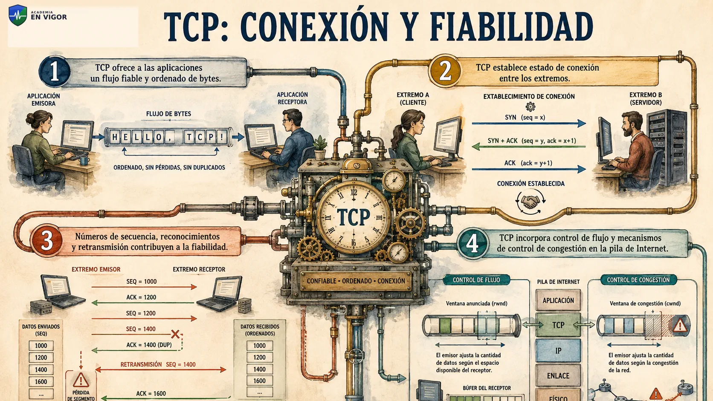

<em>Infografía: TCP: conexión y fiabilidad.</em>

<!-- FUENTE: RFC9293-TCP-T39 -->

## 25. Establecimiento y cierre TCP

**Idea de control:** El establecimiento normal de TCP usa el intercambio SYN, SYN-ACK y ACK.

- El establecimiento normal de TCP usa el intercambio SYN, SYN-ACK y ACK.
- El three-way handshake sincroniza números de secuencia y confirma capacidad de comunicación.
- FIN participa en un cierre ordenado y RST aborta o rechaza una conexión.
- El cierre de un sentido del flujo no implica siempre el cierre simultáneo del otro.

<!-- VISUAL:t39-il-25-establecimiento-y-cierre-tcp.webp -->

  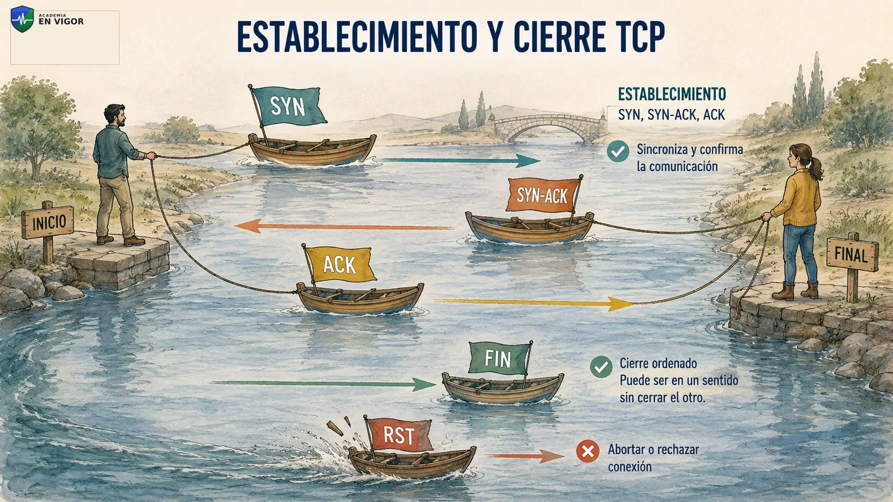

<em>Infografía: Establecimiento y cierre TCP.</em>

<!-- FUENTE: RFC9293-TCP-T39 -->

## 26. UDP: datagramas sin conexión

**Idea de control:** UDP transporta datagramas sin establecer una conexión fiable.

- UDP transporta datagramas sin establecer una conexión fiable.
- Su cabecera incluye puertos, longitud y suma de comprobación.
- UDP no garantiza entrega, orden, eliminación de duplicados ni retransmisión.
- Una aplicación puede añadir sobre UDP los controles que necesite.

<!-- VISUAL:t39-26-udp-datagramas-sin-conexion.webp -->

  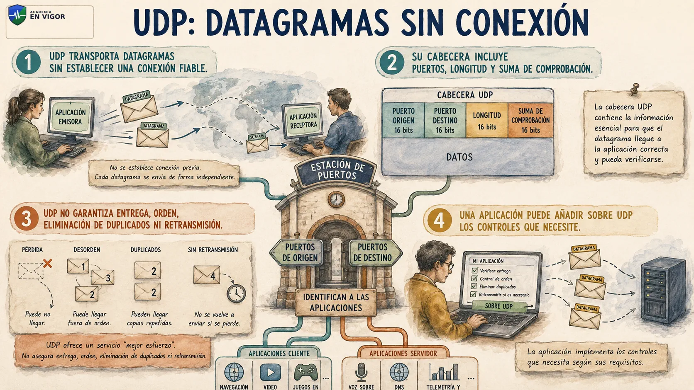

<em>Infografía: UDP: datagramas sin conexión.</em>

<!-- FUENTE: RFC768-UDP-T39 -->

## 27. IP: servicio de datagramas

**Idea de control:** IP transporta datagramas entre redes mediante direcciones lógicas.

- IP transporta datagramas entre redes mediante direcciones lógicas.
- El servicio IP básico es no orientado a conexión y de mejor esfuerzo.
- Los routers reenvían cada paquete según destino y tabla de encaminamiento.
- La fiabilidad extremo a extremo, cuando se exige, se aporta en otras capas.

<!-- VISUAL:t39-27-ip-servicio-de-datagramas.webp -->

  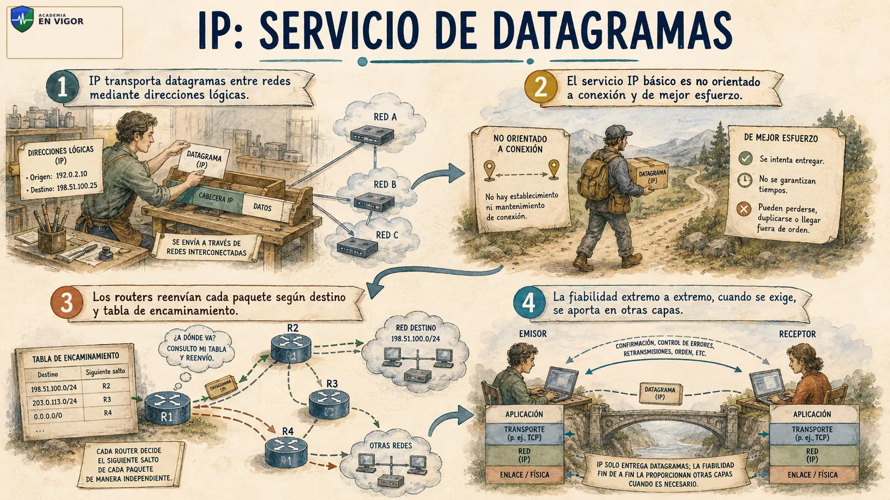

<em>Infografía: IP: servicio de datagramas.</em>

<!-- FUENTE: RFC791-IPV4-T39 -->

## 28. ICMP y el comando ping

**Idea de control:** ICMP comunica determinados errores y condiciones de control asociados a IP.

- ICMP comunica determinados errores y condiciones de control asociados a IP.
- Ping utiliza normalmente mensajes ICMP Echo Request y Echo Reply.
- Una respuesta ICMP no demuestra que todos los puertos o aplicaciones estén disponibles.
- Bloquear ICMP puede impedir diagnósticos sin significar que el destino esté apagado.

<!-- VISUAL:t39-28-icmp-y-el-comando-ping.webp -->

  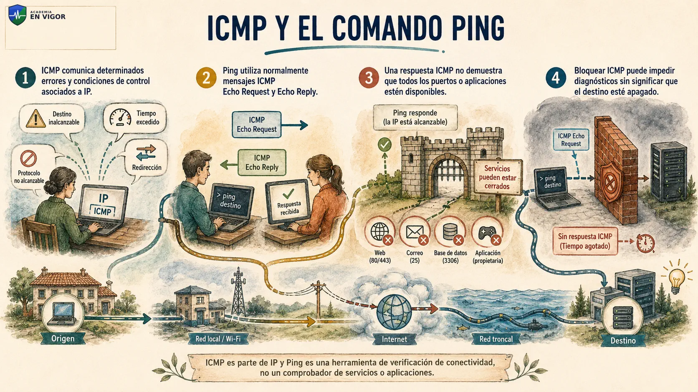

<em>Infografía: ICMP y el comando ping.</em>

<!-- FUENTE: RFC792-ICMP-T39 -->

## 29. ARP en IPv4 y NDP en IPv6

**Idea de control:** ARP permite asociar una dirección IPv4 con una dirección de enlace en la red local.

- ARP permite asociar una dirección IPv4 con una dirección de enlace en la red local.
- IPv6 utiliza Neighbor Discovery basado en ICMPv6, no ARP.
- La resolución local del vecino es distinta de la resolución DNS de nombres.
- Para un destino remoto se resuelve normalmente la dirección de enlace del siguiente salto, no la del destino final.

<!-- VISUAL:t39-29-arp-en-ipv4-y-ndp-en-ipv6.webp -->

  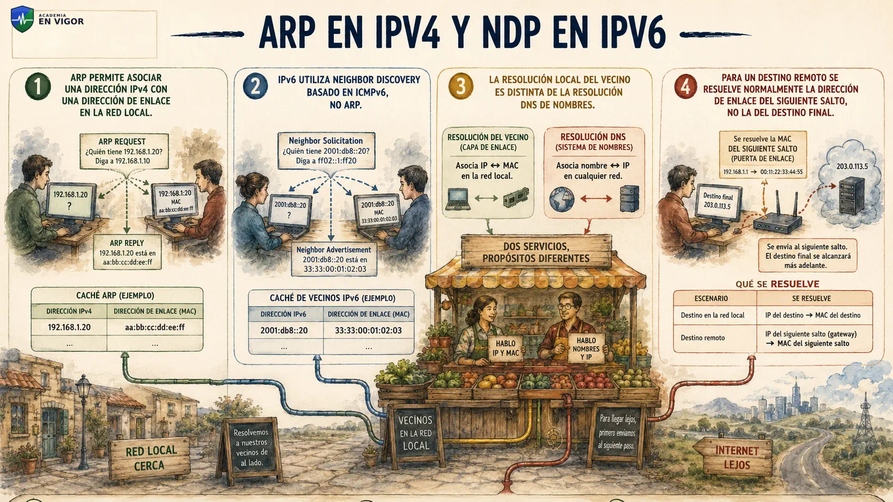

<em>Infografía: ARP en IPv4 y NDP en IPv6.</em>

<!-- FUENTE: RFC4861-NDP-T39 -->

## 30. Puertos, sockets y multiplexación

**Idea de control:** Los puertos permiten multiplexar conversaciones de transporte en un host.

- Los puertos permiten multiplexar conversaciones de transporte en un host.
- Un extremo TCP se identifica mediante una dirección IP y un puerto.
- Una conexión TCP queda distinguida por direcciones y puertos de ambos extremos.
- Un puerto conocido es una convención de servicio, no una garantía de la aplicación ejecutada.

<!-- VISUAL:t39-il-30-puertos-sockets-y-multiplexacion.webp -->

  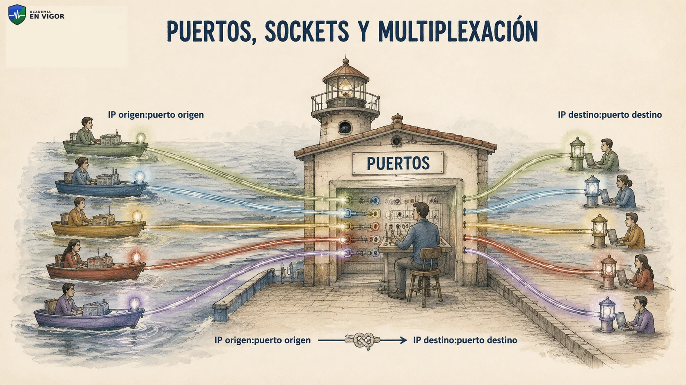

<em>Infografía: Puertos, sockets y multiplexación.</em>

<!-- FUENTE: RFC9293-TCP-T39 -->

## 31. Repetidor y concentrador hub

**Idea de control:** Un repetidor regenera o repite señales para extender un segmento físico.

- Un repetidor regenera o repite señales para extender un segmento físico.
- Un hub multipuerto replica hacia otros puertos la señal recibida.
- El hub no aprende direcciones MAC ni selecciona un único puerto por destino.
- Hub y switch no son equivalentes aunque ambos tengan varios puertos.

<!-- VISUAL:t39-31-repetidor-y-concentrador-hub.webp -->

  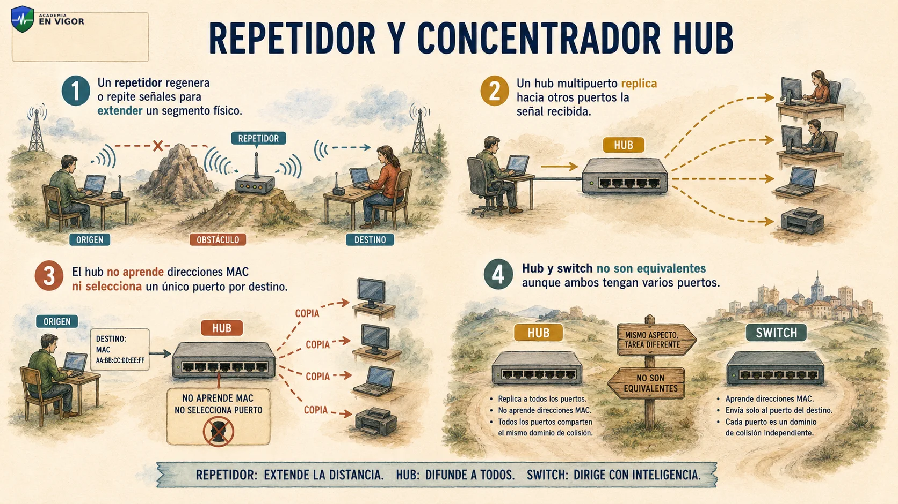

<em>Infografía: Repetidor y concentrador hub.</em>

<!-- FUENTE: IEEE8023-ETHERNET-T39 -->

## 32. Dominio de colisión compartido

**Idea de control:** Los puertos de un hub comparten el mismo dominio de colisión.

- Los puertos de un hub comparten el mismo dominio de colisión.
- El ancho de banda del segmento se comparte entre los equipos conectados.
- La operación clásica con hub es semidúplex y puede requerir CSMA/CD.
- Un hub no separa el tráfico de broadcast del resto del segmento.

<!-- VISUAL:t39-32-dominio-de-colision-compartido.webp -->

  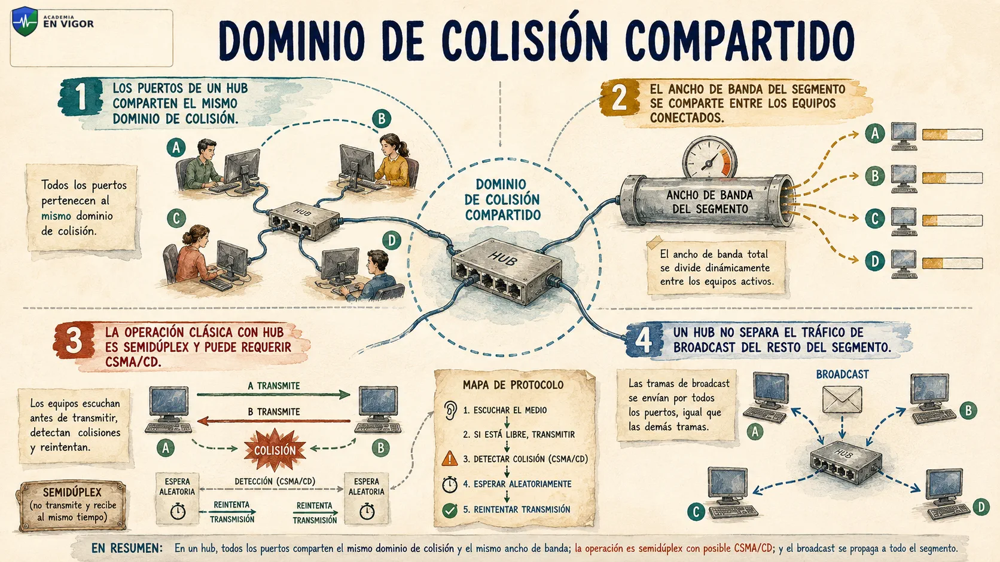

<em>Infografía: Dominio de colisión compartido.</em>

<!-- FUENTE: IEEE8023-ETHERNET-T39 -->

## 33. Bridge y switch Ethernet

**Idea de control:** Un bridge conecta segmentos de capa 2 y filtra o reenvía tramas.

- Un bridge conecta segmentos de capa 2 y filtra o reenvía tramas.
- Un switch Ethernet es funcionalmente un bridge multipuerto.
- El switch toma decisiones principalmente con la MAC de destino.
- La conmutación reduce colisiones respecto de un medio compartido por hub.

<!-- VISUAL:t39-33-bridge-y-switch-ethernet.webp -->

  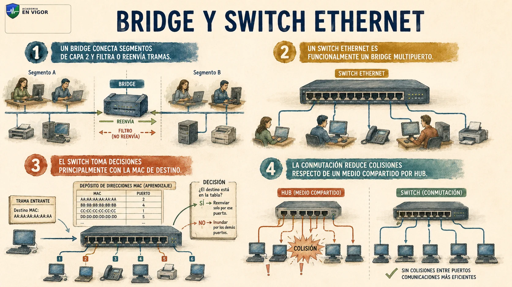

<em>Infografía: Bridge y switch Ethernet.</em>

<!-- FUENTE: IEEE8021Q-BRIDGES-T39 -->

## 34. Aprendizaje de la tabla MAC

**Idea de control:** El switch aprende la asociación entre MAC de origen y puerto de entrada.

- El switch aprende la asociación entre MAC de origen y puerto de entrada.
- Las entradas dinámicas envejecen para adaptarse a cambios de ubicación.
- La tabla MAC se denomina también tabla de reenvío o filtrado según el contexto.
- Aprender una MAC no equivale a asignar una dirección IP mediante DHCP.

<!-- VISUAL:t39-34-aprendizaje-de-la-tabla-mac.webp -->

  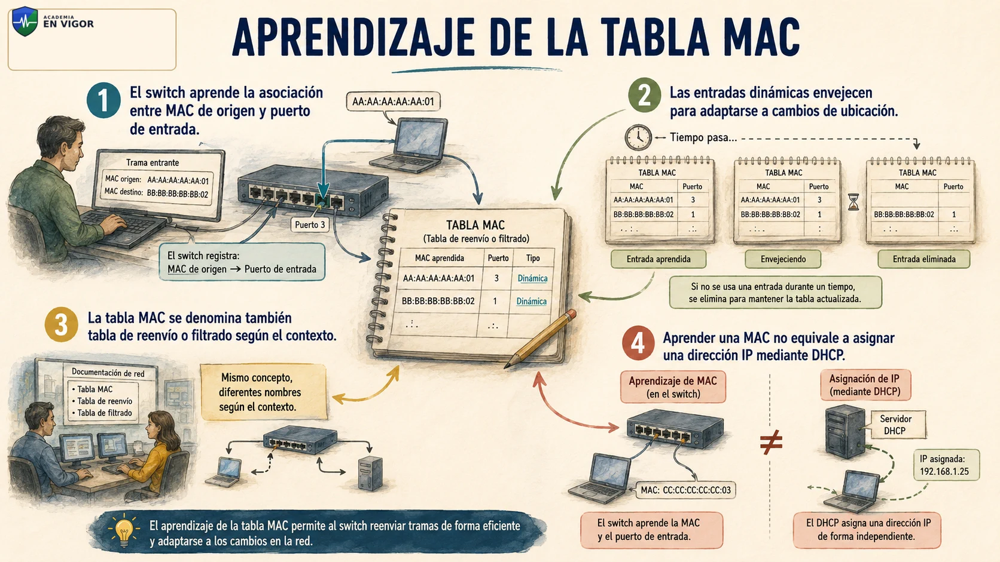

<em>Infografía: Aprendizaje de la tabla MAC.</em>

<!-- FUENTE: IEEE8021Q-BRIDGES-T39 -->

## 35. Filtrado, reenvío y flooding

**Idea de control:** Si el destino conocido está en otro puerto, el switch reenvía hacia ese puerto.

- Si el destino conocido está en otro puerto, el switch reenvía hacia ese puerto.
- Si origen y destino se localizan en el mismo puerto, puede filtrar la trama.
- Un unicast desconocido se difunde por los puertos pertinentes salvo el de entrada.
- Broadcast y ciertos multicast también se propagan dentro del dominio correspondiente.

<!-- VISUAL:t39-il-35-filtrado-reenvio-y-flooding.webp -->

  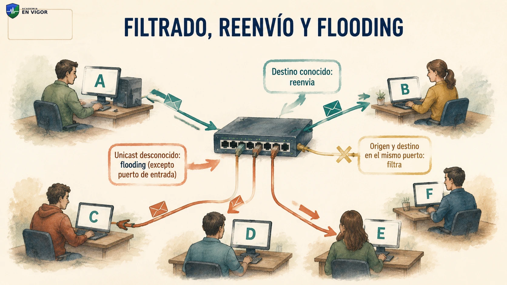

<em>Infografía: Filtrado, reenvío y flooding.</em>

<!-- FUENTE: IEEE8021Q-BRIDGES-T39 -->

## 36. Dominios de colisión y broadcast

**Idea de control:** Cada puerto de switch constituye normalmente un dominio de colisión separado.

- Cada puerto de switch constituye normalmente un dominio de colisión separado.
- Un switch de capa 2 mantiene por defecto un dominio de broadcast por VLAN.
- Un router separa dominios de broadcast de capa 2.
- Full-duplex elimina las colisiones Ethernet del enlace punto a punto conmutado.

<!-- VISUAL:t39-36-dominios-de-colision-y-broadcast.webp -->

  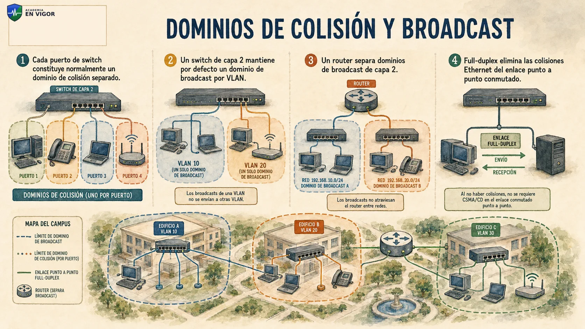

<em>Infografía: Dominios de colisión y broadcast.</em>

<!-- FUENTE: IEEE8021Q-BRIDGES-T39 -->

## 37. VLAN y etiquetado

**Idea de control:** Una VLAN crea un dominio lógico de broadcast dentro de una infraestructura conmutada.

- Una VLAN crea un dominio lógico de broadcast dentro de una infraestructura conmutada.
- IEEE 802.1Q define etiquetado para transportar varias VLAN por determinados enlaces.
- Puertos de acceso y enlaces troncales cumplen funciones diferentes.
- La comunicación entre VLAN distintas requiere una función de capa 3.

<!-- VISUAL:t39-37-vlan-y-etiquetado.webp -->

  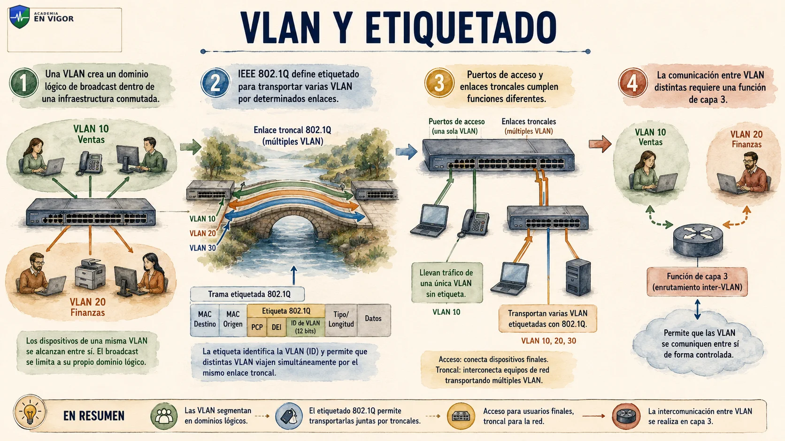

<em>Infografía: VLAN y etiquetado.</em>

<!-- FUENTE: IEEE8021Q-BRIDGES-T39 -->

## 38. Bucles y Spanning Tree

**Idea de control:** Un bucle de capa 2 puede multiplicar tramas y causar tormentas de broadcast.

- Un bucle de capa 2 puede multiplicar tramas y causar tormentas de broadcast.
- Ethernet no incorpora un campo TTL en la trama que extinga por sí solo el bucle.
- Spanning Tree mantiene una topología lógica sin bucles bloqueando caminos redundantes.
- La redundancia física puede conservarse aunque no todos los enlaces reenvíen simultáneamente.

<!-- VISUAL:t39-38-bucles-y-spanning-tree.webp -->

  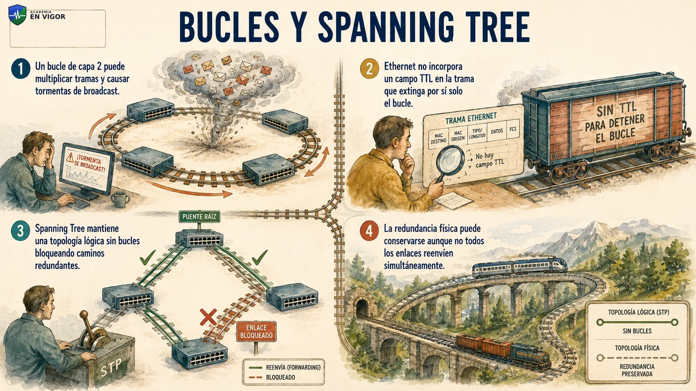

<em>Infografía: Bucles y Spanning Tree.</em>

<!-- FUENTE: IEEE8021Q-BRIDGES-T39 -->

## 39. Función del router

**Idea de control:** Un router conecta redes y reenvía datagramas IP entre interfaces.

- Un router conecta redes y reenvía datagramas IP entre interfaces.
- La decisión se basa en la dirección IP de destino y la tabla de encaminamiento.
- El router vuelve a encapsular el paquete en una trama adecuada al siguiente enlace.
- La MAC de la trama cambia por salto aunque la IP extremo a extremo normalmente se conserve.

<!-- VISUAL:t39-39-funcion-del-router.webp -->

  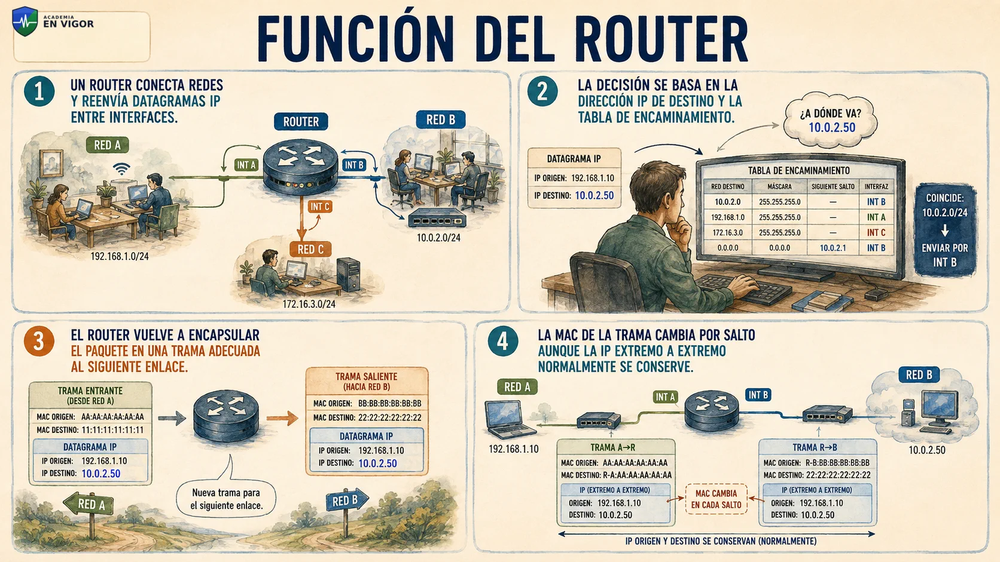

<em>Infografía: Función del router.</em>

<!-- FUENTE: RFC1812-ROUTERS-T39 -->

## 40. Tabla de encaminamiento y ruta por defecto

**Idea de control:** Una ruta asocia un prefijo de destino con un siguiente salto o una interfaz.

- Una ruta asocia un prefijo de destino con un siguiente salto o una interfaz.
- El reenvío selecciona normalmente la coincidencia de prefijo más larga.
- La ruta por defecto se usa cuando no existe una ruta más específica aplicable.
- En IPv4 la ruta por defecto se representa como 0.0.0.0/0.

<!-- VISUAL:t39-il-40-tabla-de-encaminamiento-y-ruta-por-defecto.webp -->

  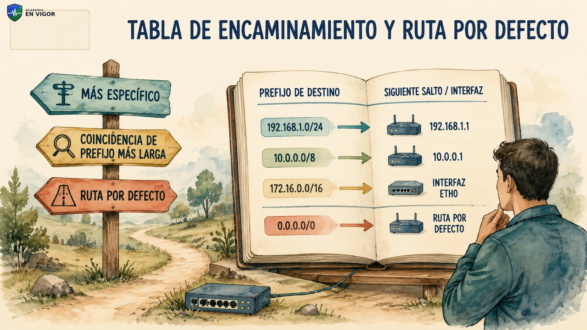

<em>Infografía: Tabla de encaminamiento y ruta por defecto.</em>

<!-- FUENTE: RFC1812-ROUTERS-T39 -->

## 41. Siguiente salto, TTL y Hop Limit

**Idea de control:** El siguiente salto es el router o destino vecino al que se entrega el paquete.

- El siguiente salto es el router o destino vecino al que se entrega el paquete.
- Cada router reduce el TTL de IPv4 antes de reenviar.
- IPv6 usa Hop Limit con finalidad equivalente.
- Al agotarse el contador, el paquete se descarta y puede generarse un mensaje ICMP.

<!-- VISUAL:t39-41-siguiente-salto-ttl-y-hop-limit.webp -->

  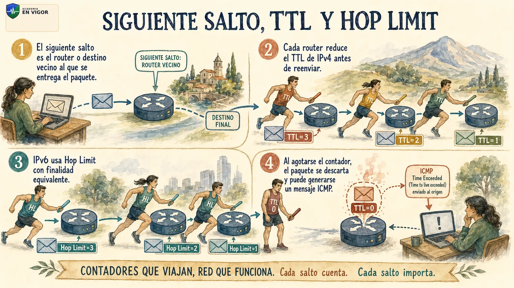

<em>Infografía: Siguiente salto, TTL y Hop Limit.</em>

<!-- FUENTE: RFC1812-ROUTERS-T39 -->

## 42. Rutas estáticas y protocolos dinámicos

**Idea de control:** Una ruta estática se configura explícitamente y no se aprende por intercambio dinámico.

- Una ruta estática se configura explícitamente y no se aprende por intercambio dinámico.
- Los protocolos de encaminamiento intercambian información para calcular rutas.
- RIP, OSPF y BGP responden a diseños y ámbitos distintos.
- La existencia de una ruta no garantiza que la aplicación de destino esté disponible.

<!-- VISUAL:t39-42-rutas-estaticas-y-protocolos-dinamicos.webp -->

  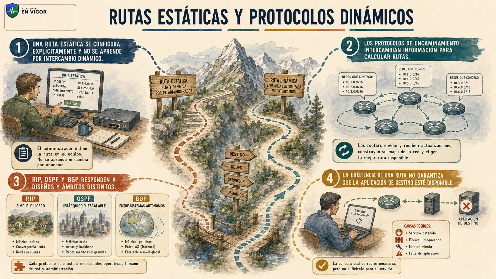

<em>Infografía: Rutas estáticas y protocolos dinámicos.</em>

<!-- FUENTE: RFC1812-ROUTERS-T39 -->

## 43. NAT y PAT

**Idea de control:** NAT modifica direcciones IP al atravesar el traductor.

- NAT modifica direcciones IP al atravesar el traductor.
- NAPT o PAT distingue múltiples flujos también mediante puertos de transporte.
- La traducción permite reutilizar direcciones privadas, pero altera la transparencia extremo a extremo.
- NAT no sustituye por sí solo una política completa de cortafuegos.

<!-- VISUAL:t39-43-nat-y-pat.webp -->

  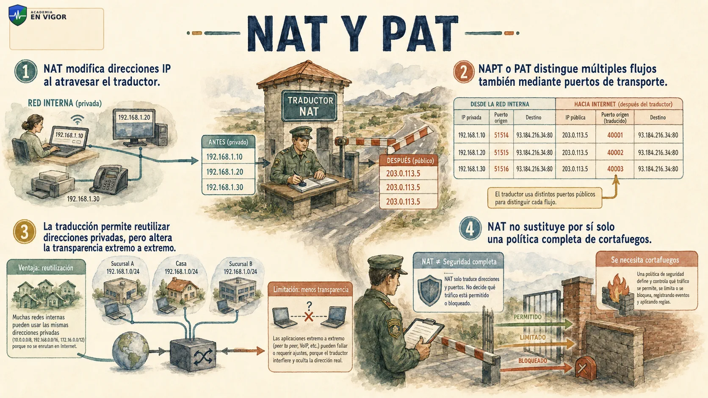

<em>Infografía: NAT y PAT.</em>

<!-- FUENTE: RFC3022-NAT-T39 -->

## 44. Concepto y política de firewall

**Idea de control:** Un firewall es un dispositivo o programa que controla tráfico entre redes o hosts con posturas de seguridad diferentes.

- Un firewall es un dispositivo o programa que controla tráfico entre redes o hosts con posturas de seguridad diferentes.
- La política define qué tráfico se permite o bloquea según criterios establecidos.
- La regla de denegación por defecto permite solo lo expresamente autorizado.
- Un firewall mal configurado no aporta protección efectiva por el mero hecho de existir.

<!-- VISUAL:t39-44-concepto-y-politica-de-firewall.webp -->

  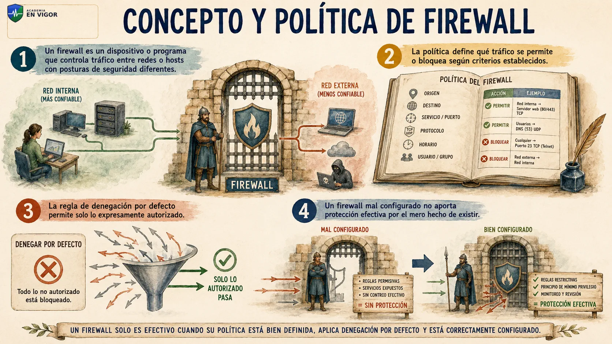

<em>Infografía: Concepto y política de firewall.</em>

<!-- FUENTE: NIST-SP800-41R1-T39 -->

## 45. Filtrado de paquetes y estado

**Idea de control:** El filtrado de paquetes evalúa campos como direcciones, protocolos y puertos.

- El filtrado de paquetes evalúa campos como direcciones, protocolos y puertos.
- La inspección con estado mantiene contexto sobre conexiones o flujos.
- El estado permite distinguir respuestas asociadas de tráfico nuevo no solicitado.
- Ni el filtrado simple ni el estado comprenden necesariamente toda la semántica de la aplicación.

<!-- VISUAL:t39-il-45-filtrado-de-paquetes-y-estado.webp -->

  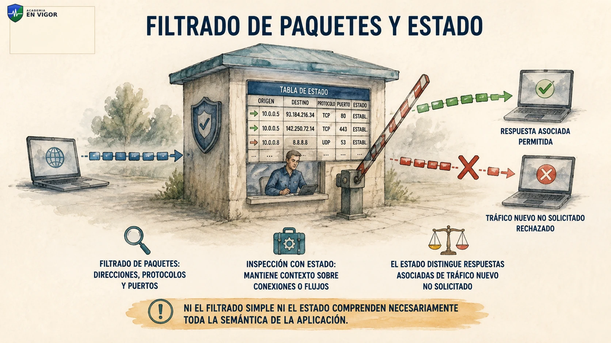

<em>Infografía: Filtrado de paquetes y estado.</em>

<!-- FUENTE: NIST-SP800-41R1-T39 -->

## 46. Proxy firewall, UTM y defensa en profundidad

**Idea de control:** Un proxy de aplicación termina una conversación y origina otra como intermediario.

- Un proxy de aplicación termina una conversación y origina otra como intermediario.
- Un firewall proxy puede inspeccionar información específica del protocolo de aplicación.
- UTM integra varias funciones de seguridad en una plataforma, sin convertirlas en una sola técnica.
- La defensa en profundidad no debe depender exclusivamente de un único firewall perimetral.

<!-- VISUAL:t39-46-proxy-firewall-utm-y-defensa-en-profundidad.webp -->

  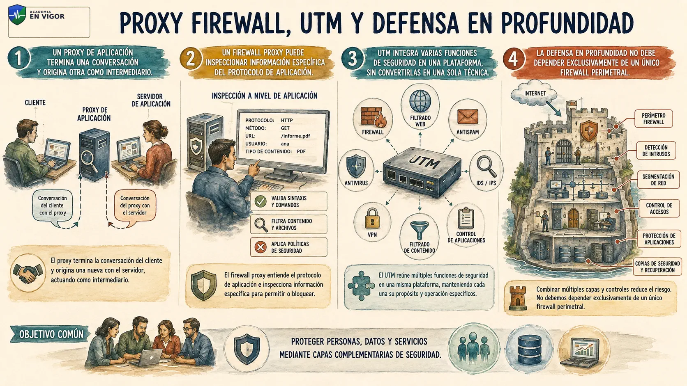

<em>Infografía: Proxy firewall, UTM y defensa en profundidad.</em>

<!-- FUENTE: NIST-SP800-41R1-T39 -->

## 47. Finalidad y actores de DHCPv4

**Idea de control:** DHCPv4 permite entregar parámetros de configuración a clientes de forma automática.

- DHCPv4 permite entregar parámetros de configuración a clientes de forma automática.
- El cliente solicita configuración y el servidor ofrece o asigna valores.
- Un relay reenvía mensajes DHCP entre subredes cuando el servidor no está en el enlace local.
- DHCP puede proporcionar dirección, máscara, router y servidores DNS, entre otras opciones.

<!-- VISUAL:t39-47-finalidad-y-actores-de-dhcpv4.webp -->

  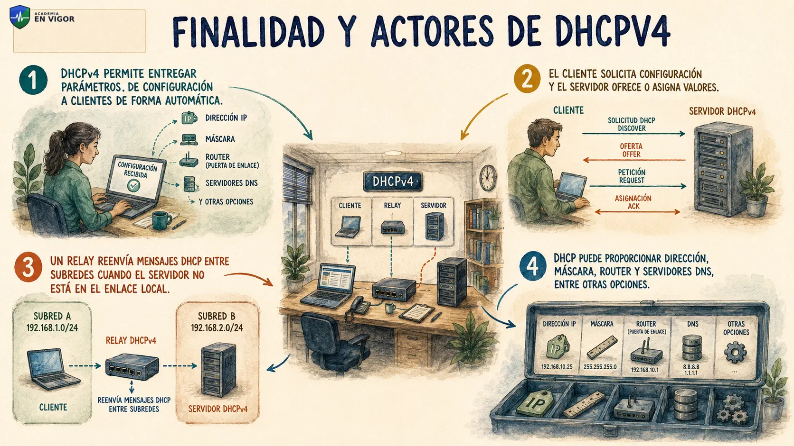

<em>Infografía: Finalidad y actores de DHCPv4.</em>

<!-- FUENTE: RFC2131-DHCP-T39 -->

## 48. DORA: descubrimiento y concesión

**Idea de control:** DHCPDISCOVER permite al cliente localizar servidores disponibles.

- DHCPDISCOVER permite al cliente localizar servidores disponibles.
- DHCPOFFER comunica una oferta de configuración.
- DHCPREQUEST identifica la oferta solicitada o renueva una concesión.
- DHCPACK confirma los parámetros concedidos; DHCPNAK puede rechazar una solicitud inválida.

<!-- VISUAL:t39-48-dora-descubrimiento-y-concesion.webp -->

  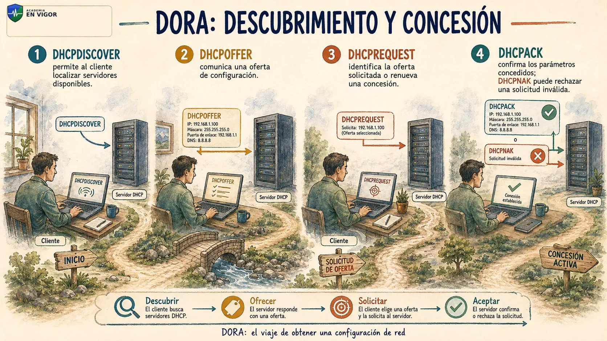

<em>Infografía: DORA: descubrimiento y concesión.</em>

<!-- FUENTE: RFC2131-DHCP-T39 -->

## 49. Concesión, renovación y reserva DHCP

**Idea de control:** Una concesión DHCP asigna parámetros durante un intervalo administrado.

- Una concesión DHCP asigna parámetros durante un intervalo administrado.
- El cliente intenta renovar antes de que expire la concesión.
- Una reserva vincula administrativamente un cliente identificado con una dirección prevista.
- Dirección dinámica y dirección aleatoria no son sinónimos.

<!-- VISUAL:t39-49-concesion-renovacion-y-reserva-dhcp.webp -->

  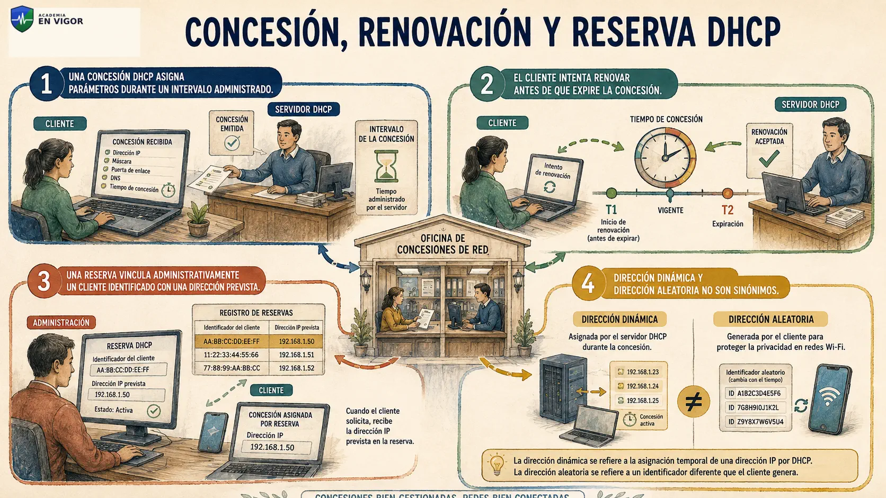

<em>Infografía: Concesión, renovación y reserva DHCP.</em>

<!-- FUENTE: RFC2131-DHCP-T39 -->

## 50. Broadcast, relay y autoconfiguración IPv4

**Idea de control:** Un cliente IPv4 sin dirección puede utilizar broadcast para iniciar DHCP.

- Un cliente IPv4 sin dirección puede utilizar broadcast para iniciar DHCP.
- Los routers no reenvían broadcasts locales de forma ordinaria; el relay resuelve ese límite.
- 169.254.0.0/16 está reservado para direccionamiento link-local IPv4.
- Una dirección link-local no sustituye una configuración enrutable completa.

<!-- VISUAL:t39-il-50-broadcast-relay-y-autoconfiguracion-ipv4.webp -->

  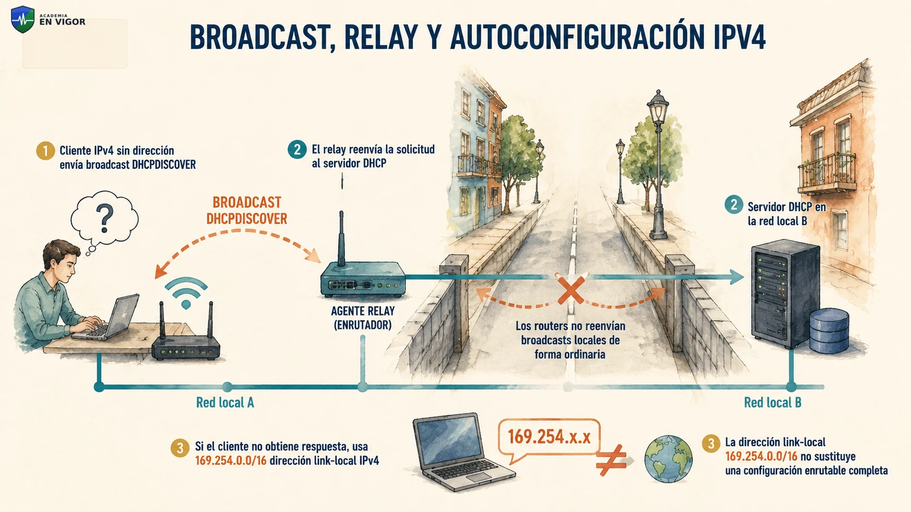

<em>Infografía: Broadcast, relay y autoconfiguración IPv4.</em>

<!-- FUENTE: RFC2131-DHCP-T39 -->

## 51. DHCPv6 y SLAAC

**Idea de control:** DHCPv6 puede proporcionar direcciones, prefijos y parámetros de configuración.

- DHCPv6 puede proporcionar direcciones, prefijos y parámetros de configuración.
- SLAAC permite formar direcciones a partir de anuncios de router sin asignación DHCPv6 con estado.
- DHCPv6 puede operar con estado o sin estado y coexistir con SLAAC.
- En 2026 la especificación vigente de DHCPv6 es RFC 9915, que reemplaza RFC 8415.

<!-- VISUAL:t39-51-dhcpv6-y-slaac.webp -->

  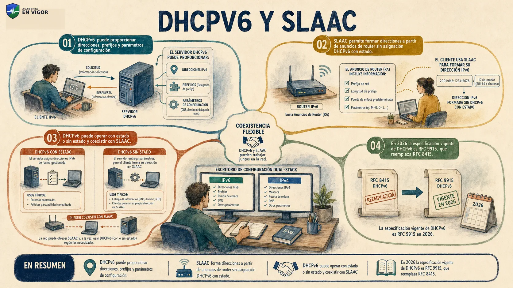

<em>Infografía: DHCPv6 y SLAAC.</em>

<!-- FUENTE: RFC9915-DHCPV6-T39 -->

## 52. Espacio de nombres DNS

**Idea de control:** DNS organiza nombres en un espacio jerárquico distribuido.

- DNS organiza nombres en un espacio jerárquico distribuido.
- La raíz se sitúa sobre dominios de nivel superior y dominios delegados.
- Una zona es una porción administrada del espacio de nombres.
- Dominio y zona se relacionan, pero no son necesariamente idénticos.

<!-- VISUAL:t39-52-espacio-de-nombres-dns.webp -->

  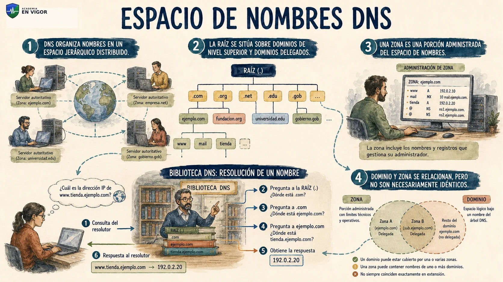

<em>Infografía: Espacio de nombres DNS.</em>

<!-- FUENTE: RFC1034-DNS-T39 -->

## 53. Registros DNS principales

**Idea de control:** A asocia un nombre con una dirección IPv4 y AAAA con una dirección IPv6.

- A asocia un nombre con una dirección IPv4 y AAAA con una dirección IPv6.
- NS identifica servidores autorizados para una zona.
- MX indica intercambiadores de correo y CNAME crea un alias canónico.
- PTR se usa habitualmente en resolución inversa y TXT transporta texto asociado a un nombre.

<!-- VISUAL:t39-53-registros-dns-principales.webp -->

  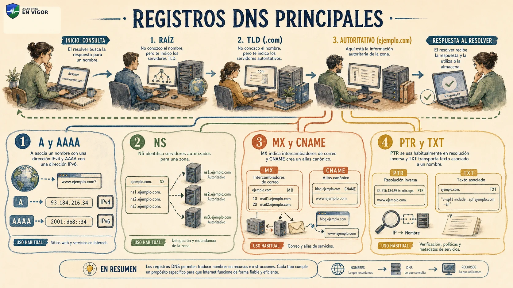

<em>Infografía: Registros DNS principales.</em>

<!-- FUENTE: RFC1035-DNS-T39 -->

## 54. Consulta recursiva e iterativa

**Idea de control:** En una consulta recursiva el servidor consultado debe devolver una respuesta final o un error.

- En una consulta recursiva el servidor consultado debe devolver una respuesta final o un error.
- En una consulta iterativa el servidor puede remitir al consultante hacia otra autoridad.
- Los resolvers recursivos consultan la jerarquía en nombre de clientes stub.
- Recursión y autoridad son funciones diferentes que pueden coexistir o separarse.

<!-- VISUAL:t39-54-consulta-recursiva-e-iterativa.webp -->

  

<em>Infografía: Consulta recursiva e iterativa.</em>

<!-- FUENTE: RFC1034-DNS-T39 -->

## 55. Servidores autoritativos, primario y secundario

**Idea de control:** Un servidor autoritativo responde con datos de las zonas para las que tiene autoridad.

- Un servidor autoritativo responde con datos de las zonas para las que tiene autoridad.
- Primario y secundario describen cómo obtiene el servidor los datos de zona, no distinta autoridad del nombre.
- El secundario puede obtener la zona mediante transferencia desde otro servidor autorizado.
- Un resolver de caché no se convierte en autoritativo por almacenar temporalmente una respuesta.

<!-- VISUAL:t39-il-55-servidores-autoritativos-primario-y-secundario.webp -->

  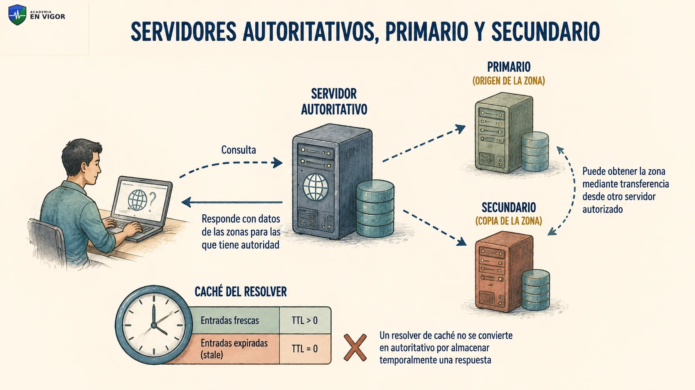

<em>Infografía: Servidores autoritativos, primario y secundario.</em>

<!-- FUENTE: RFC8499-DNS-TERMS-T39 -->

## 56. Caché, TTL y transporte DNS

**Idea de control:** El TTL de un registro limita cuánto tiempo puede conservarse en caché.

- El TTL de un registro limita cuánto tiempo puede conservarse en caché.
- La caché reduce latencia y carga de consultas repetidas.
- DNS usa tradicionalmente el puerto 53 y puede operar sobre UDP o TCP.
- TCP no se limita hoy únicamente a transferencias de zona; el tamaño y otras condiciones también influyen.

<!-- VISUAL:t39-56-cache-ttl-y-transporte-dns.webp -->

  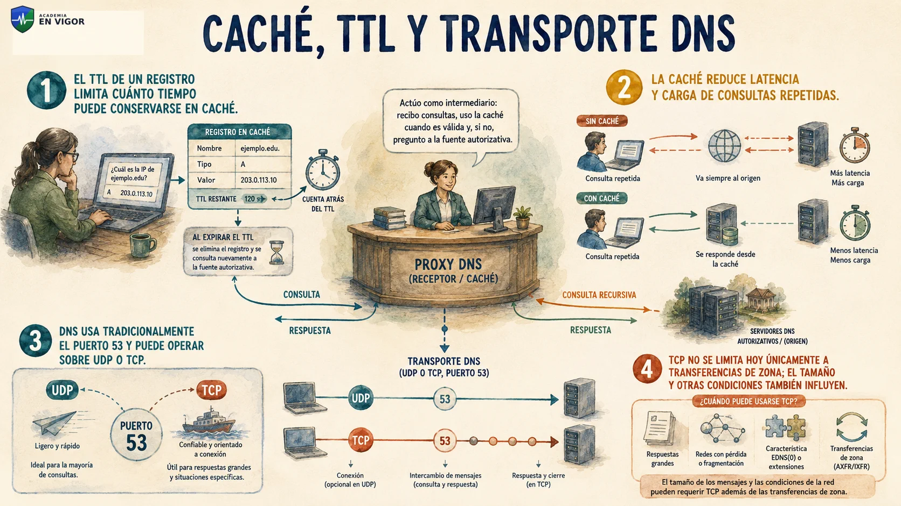

<em>Infografía: Caché, TTL y transporte DNS.</em>

<!-- FUENTE: RFC1035-DNS-T39 -->

## 57. Proxy directo o forward proxy

**Idea de control:** Un forward proxy actúa en nombre del cliente frente a servidores de destino.

- Un forward proxy actúa en nombre del cliente frente a servidores de destino.
- Puede aplicar control de acceso, registro, filtrado o caché según su diseño.
- El cliente puede estar configurado explícitamente para utilizarlo.
- Un proxy de aplicación no es simplemente la parte software de cualquier router.

<!-- VISUAL:t39-57-proxy-directo-o-forward-proxy.webp -->

  

<em>Infografía: Proxy directo o forward proxy.</em>

<!-- FUENTE: RFC9110-HTTP-T39 -->

## 58. Reverse proxy, caché y túnel

**Idea de control:** Un reverse proxy recibe solicitudes en nombre de uno o varios servidores de origen.

- Un reverse proxy recibe solicitudes en nombre de uno o varios servidores de origen.
- Puede distribuir carga, terminar TLS, ocultar orígenes o aplicar controles.
- Una caché reutiliza respuestas solo bajo reglas de validez aplicables.
- El método CONNECT permite establecer un túnel a través de un intermediario HTTP cuando está autorizado.

<!-- VISUAL:t39-58-reverse-proxy-cache-y-tunel.webp -->

  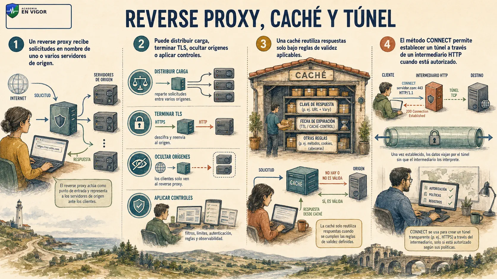

<em>Infografía: Reverse proxy, caché y túnel.</em>

<!-- FUENTE: RFC9110-HTTP-T39 -->

## 59. Formato y longitud de IPv4

**Idea de control:** Una dirección IPv4 tiene 32 bits.

- Una dirección IPv4 tiene 32 bits.
- La notación habitual usa cuatro octetos decimales separados por puntos.
- Cada octeto representa un valor entre 0 y 255.
- La validez sintáctica de una dirección no demuestra que sea asignable o enrutable globalmente.

<!-- VISUAL:t39-59-formato-y-longitud-de-ipv4.webp -->

  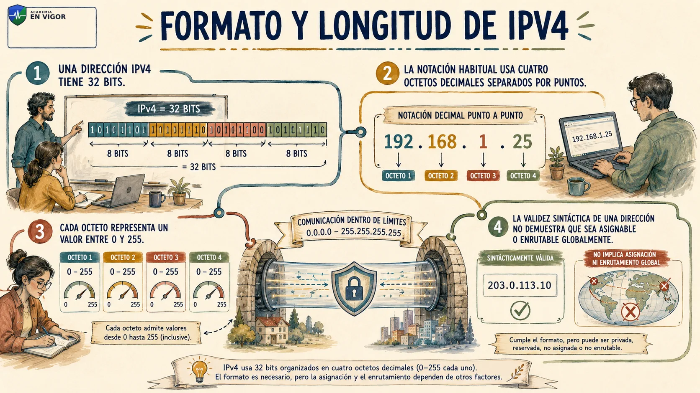

<em>Infografía: Formato y longitud de IPv4.</em>

<!-- FUENTE: RFC791-IPV4-T39 -->

## 60. Prefijo, host y máscara de subred

**Idea de control:** El prefijo identifica la parte de red usada para el encaminamiento.

- El prefijo identifica la parte de red usada para el encaminamiento.
- La longitud /n indica cuántos bits iniciales pertenecen al prefijo.
- Una máscara IPv4 representa el prefijo con unos contiguos seguidos de ceros.
- Dos hosts están en la misma subred lógica cuando sus prefijos calculados coinciden.

<!-- VISUAL:t39-il-60-prefijo-host-y-mascara-de-subred.webp -->

  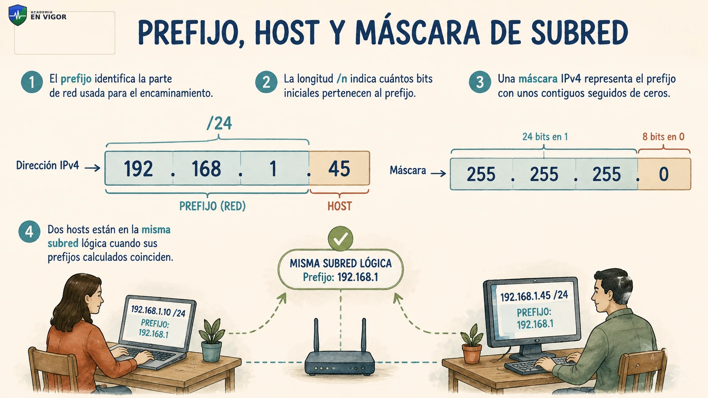

<em>Infografía: Prefijo, host y máscara de subred.</em>

<!-- FUENTE: RFC4632-CIDR-T39 -->

## 61. Clase A histórica

**Idea de control:** En el esquema histórico, una dirección de clase A comienza con bit 0.

- En el esquema histórico, una dirección de clase A comienza con bit 0.
- Su primer octeto se sitúa convencionalmente entre 1 y 126 para redes unicast ordinarias.
- La máscara por defecto histórica de clase A es 255.0.0.0 o /8.
- El rango 127.0.0.0/8 se reserva para loopback y no es una red clase A ordinaria asignable.

<!-- VISUAL:t39-61-clase-a-historica.webp -->

  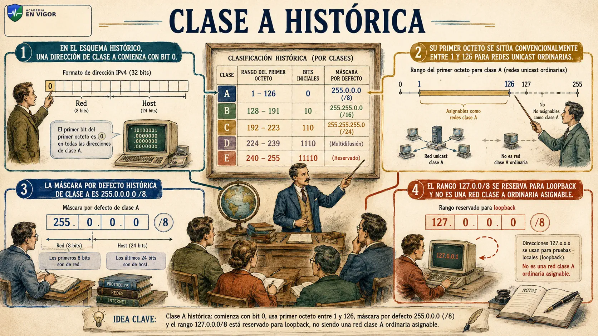

<em>Infografía: Clase A histórica.</em>

<!-- FUENTE: RFC791-IPV4-T39 -->

## 62. Clase B histórica

**Idea de control:** En el esquema histórico, una dirección de clase B comienza con bits 10.

- En el esquema histórico, una dirección de clase B comienza con bits 10.
- El primer octeto se sitúa entre 128 y 191.
- La máscara por defecto histórica es 255.255.0.0 o /16.
- La clase no determina hoy el prefijo real de una red configurada mediante CIDR.

<!-- VISUAL:t39-62-clase-b-historica.webp -->

  

<em>Infografía: Clase B histórica.</em>

<!-- FUENTE: RFC791-IPV4-T39 -->

## 63. Clase C histórica

**Idea de control:** En el esquema histórico, una dirección de clase C comienza con bits 110.

- En el esquema histórico, una dirección de clase C comienza con bits 110.
- El primer octeto se sitúa entre 192 y 223.
- La máscara por defecto histórica es 255.255.255.0 o /24.
- Una red /24 dispone de 256 combinaciones, aunque no todas son hosts unicast ordinarios.

<!-- VISUAL:t39-63-clase-c-historica.webp -->

  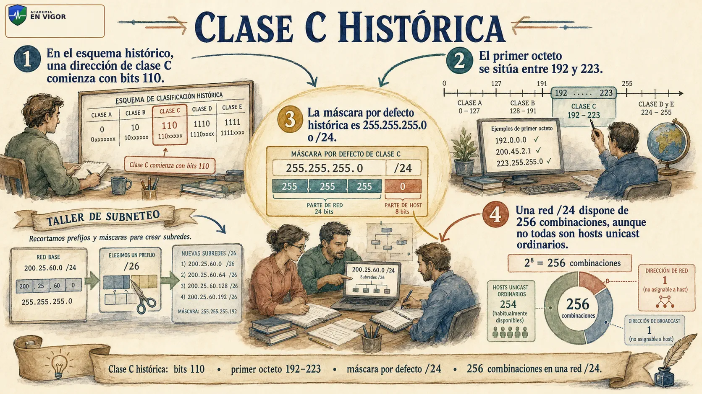

<em>Infografía: Clase C histórica.</em>

<!-- FUENTE: RFC791-IPV4-T39 -->

## 64. Clases D y E históricas

**Idea de control:** El rango histórico de clase D comprende primeros octetos 224 a 239 y se asocia a multicast.

- El rango histórico de clase D comprende primeros octetos 224 a 239 y se asocia a multicast.
- El rango histórico de clase E comprende 240 a 255 y se reservó para usos especiales o experimentales.
- Clases D y E no usan la división red/host de A, B y C.
- Las propiedades actuales de cada bloque deben consultarse en los registros de propósito especial.

<!-- VISUAL:t39-64-clases-d-y-e-historicas.webp -->

  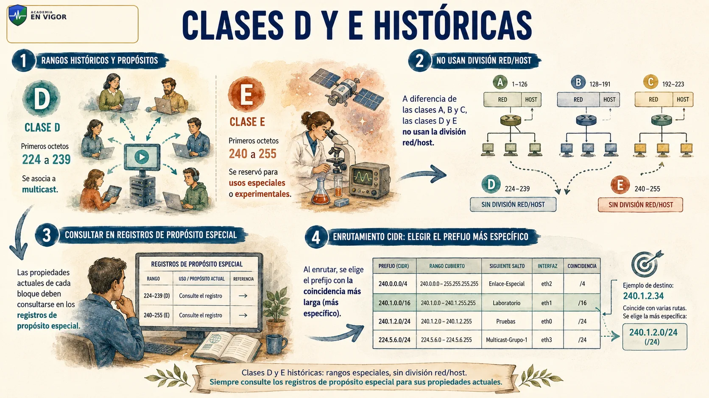

<em>Infografía: Clases D y E históricas.</em>

<!-- FUENTE: RFC6890-SPECIAL-T39 -->

## 65. CIDR frente a direccionamiento por clases

**Idea de control:** CIDR sustituyó operacionalmente las fronteras rígidas de clases por longitudes de prefijo.

- CIDR sustituyó operacionalmente las fronteras rígidas de clases por longitudes de prefijo.
- Un prefijo CIDR puede agregarse para reducir entradas de encaminamiento.
- La notación /n expresa el tamaño del prefijo sin depender de A, B o C.
- Las clases se estudian por exigencia histórica y de examen, no como regla actual universal.

<!-- VISUAL:t39-il-65-cidr-frente-a-direccionamiento-por-clases.webp -->

  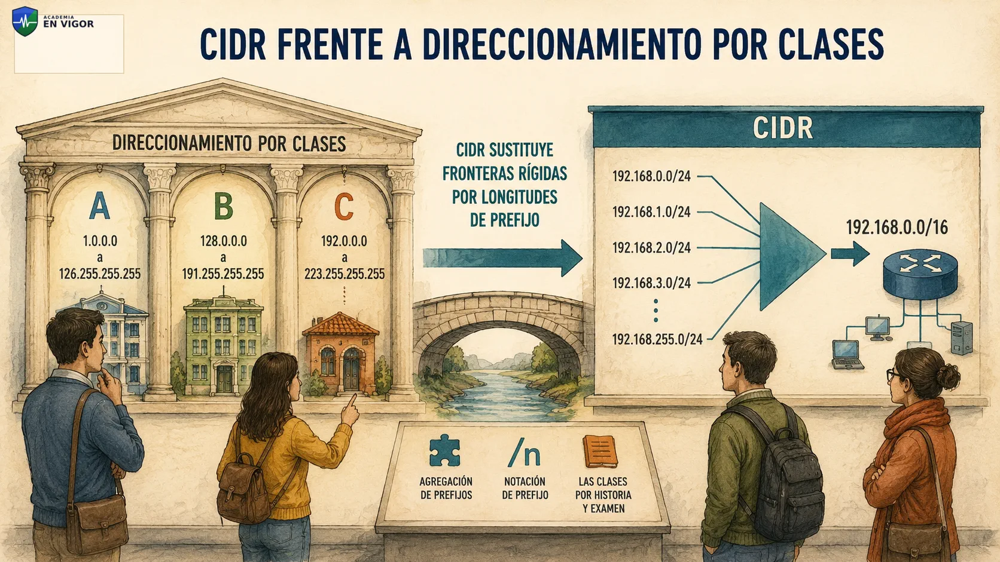

<em>Infografía: CIDR frente a direccionamiento por clases.</em>

<!-- FUENTE: RFC4632-CIDR-T39 -->

## 66. Cálculo de subred, red y broadcast

**Idea de control:** La dirección de red IPv4 se obtiene aplicando la máscara a la dirección.

- La dirección de red IPv4 se obtiene aplicando la máscara a la dirección.
- En una subred convencional, la combinación con todos los bits de host a uno identifica el broadcast dirigido.
- Una /30 tiene cuatro direcciones totales y normalmente dos hosts unicast ordinarios.
- Una /31 puede emplearse en enlaces punto a punto conforme a reglas específicas y rompe la regla escolar de dos direcciones no utilizables.

<!-- VISUAL:t39-66-calculo-de-subred-red-y-broadcast.webp -->

  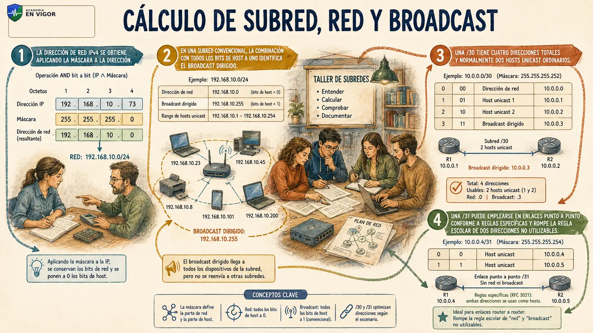

<em>Infografía: Cálculo de subred, red y broadcast.</em>

<!-- FUENTE: RFC4632-CIDR-T39 -->

## 67. Direcciones IPv4 privadas

**Idea de control:** Los bloques privados son 10.0.0.0/8, 172.16.0.0/12 y 192.168.0.0/16.

- Los bloques privados son 10.0.0.0/8, 172.16.0.0/12 y 192.168.0.0/16.
- Las direcciones privadas no deben anunciarse como rutas globales públicas.
- El bloque 172.16.0.0/12 abarca de 172.16.0.0 a 172.31.255.255.
- 172.0.0.0/8 completo no es privado, y 192.0.0.0/8 completo tampoco lo es.

<!-- VISUAL:t39-67-direcciones-ipv4-privadas.webp -->

  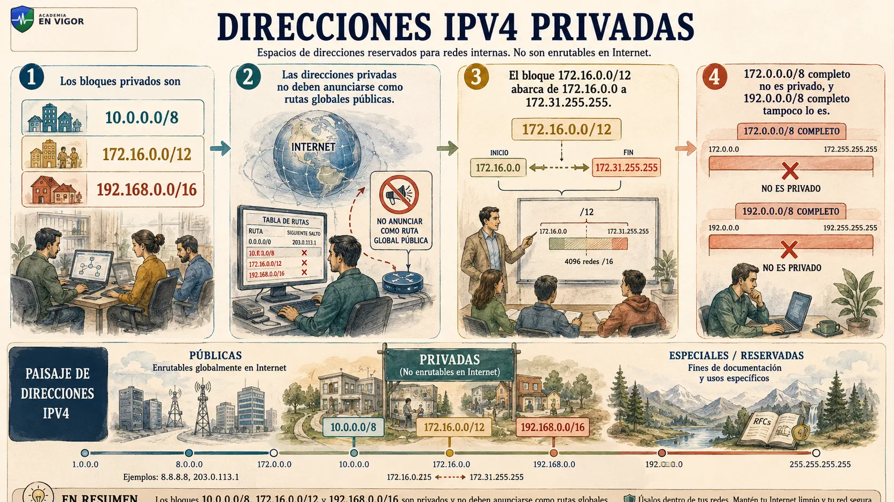

<em>Infografía: Direcciones IPv4 privadas.</em>

<!-- FUENTE: RFC1918-PRIVATE-T39 -->

## 68. Direcciones IPv4 especiales y puerta de enlace

**Idea de control:** 0.0.0.0 puede expresar dirección no especificada y 0.0.0.0/0 la ruta por defecto según contexto.

- 0.0.0.0 puede expresar dirección no especificada y 0.0.0.0/0 la ruta por defecto según contexto.
- 127.0.0.0/8 está reservado para loopback.
- 255.255.255.255 es el broadcast limitado y no se reenvía como tráfico global ordinario.
- La puerta de enlace predeterminada es el siguiente salto usado para destinos sin ruta más específica.

<!-- VISUAL:t39-68-direcciones-ipv4-especiales-y-puerta-de-enlace.webp -->

  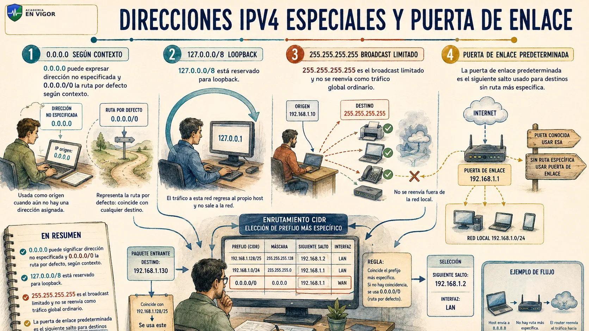

<em>Infografía: Direcciones IPv4 especiales y puerta de enlace.</em>

<!-- FUENTE: RFC6890-SPECIAL-T39 -->

## 69. Longitud y notación IPv6

**Idea de control:** Una dirección IPv6 tiene 128 bits.

- Una dirección IPv6 tiene 128 bits.
- Se representa normalmente en ocho grupos hexadecimales de 16 bits separados por dos puntos.
- Los ceros iniciales de cada grupo pueden omitirse.
- Una única secuencia continua de grupos cero puede comprimirse con doble dos puntos.

<!-- VISUAL:t39-69-longitud-y-notacion-ipv6.webp -->

  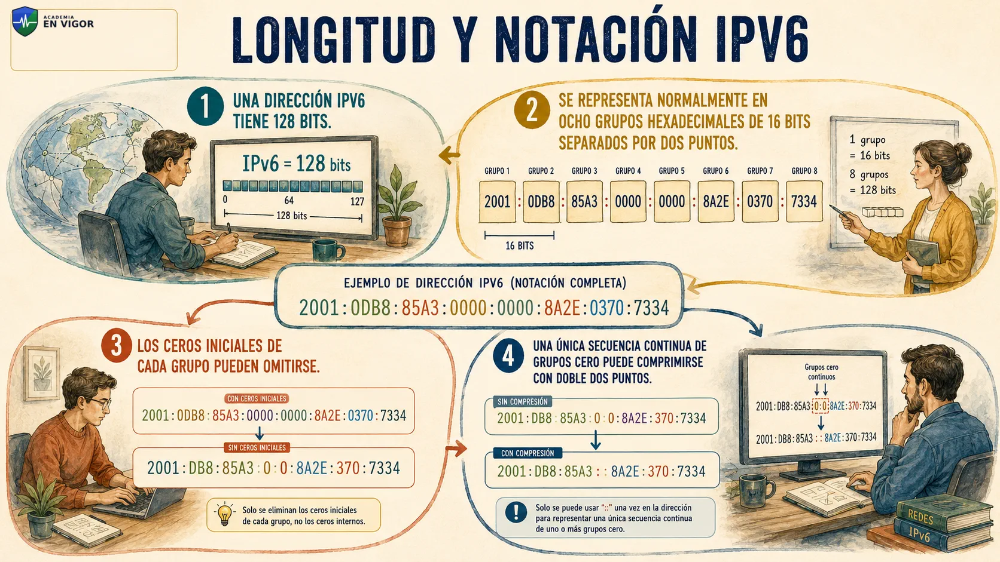

<em>Infografía: Longitud y notación IPv6.</em>

<!-- FUENTE: RFC4291-IPV6-ADDR-T39 -->

## 70. Unicast, anycast y multicast

**Idea de control:** Una dirección unicast identifica una interfaz individual.

- Una dirección unicast identifica una interfaz individual.
- Una dirección anycast se asigna a varias interfaces y entrega al miembro apropiado según el encaminamiento.
- Una dirección multicast identifica un grupo de interfaces.
- IPv6 no utiliza broadcast; sus funciones se resuelven mediante multicast u otros mecanismos.

<!-- VISUAL:t39-il-70-unicast-anycast-y-multicast.webp -->

  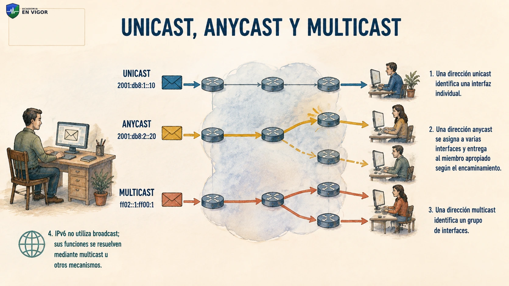

<em>Infografía: Unicast, anycast y multicast.</em>

<!-- FUENTE: RFC4291-IPV6-ADDR-T39 -->

## 71. Prefijos IPv6 principales

**Idea de control:** 2000::/3 cubre el espacio general de unicast global actualmente asignable.

- 2000::/3 cubre el espacio general de unicast global actualmente asignable.
- fe80::/10 identifica direcciones unicast link-local.
- ::1 es la dirección loopback y :: la dirección no especificada.
- ff00::/8 identifica direcciones multicast IPv6.

<!-- VISUAL:t39-71-prefijos-ipv6-principales.webp -->

  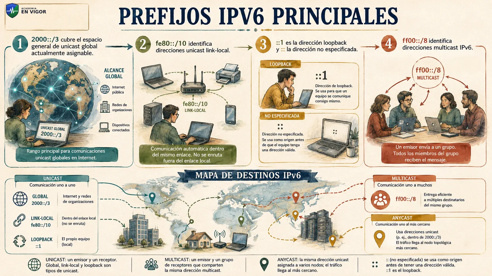

<em>Infografía: Prefijos IPv6 principales.</em>

<!-- FUENTE: RFC4291-IPV6-ADDR-T39 -->

## 72. Cabecera básica y extensiones IPv6

**Idea de control:** La cabecera básica IPv6 tiene longitud fija de 40 bytes.

- La cabecera básica IPv6 tiene longitud fija de 40 bytes.
- IPv6 usa direcciones origen y destino de 128 bits.
- Next Header encadena una cabecera de extensión o un protocolo superior.
- Los routers no fragmentan paquetes IPv6; la fragmentación corresponde al nodo origen mediante cabecera de fragmento.

<!-- VISUAL:t39-72-cabecera-basica-y-extensiones-ipv6.webp -->

  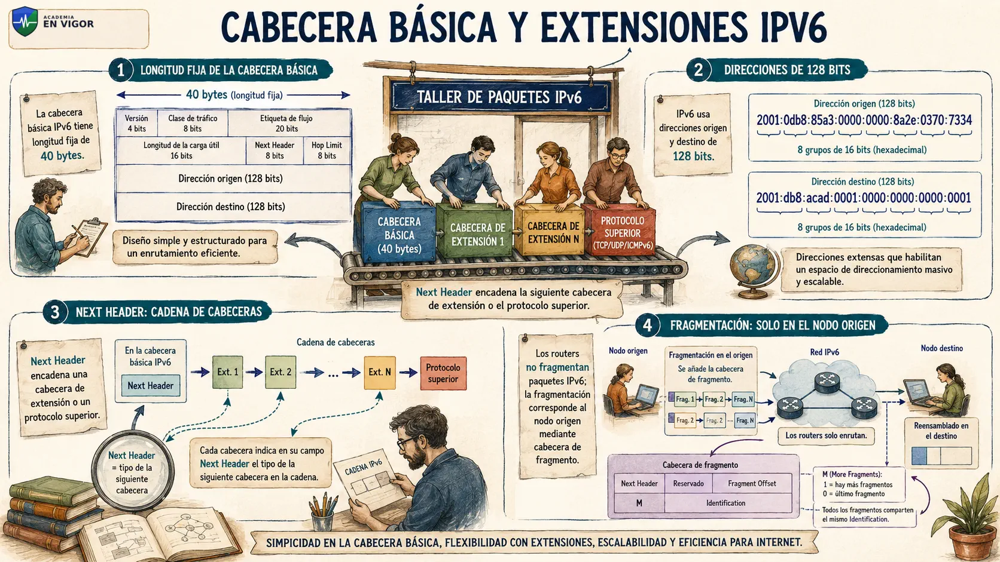

<em>Infografía: Cabecera básica y extensiones IPv6.</em>

<!-- FUENTE: RFC8200-IPV6-T39 -->

## 73. Neighbor Discovery y SLAAC

**Idea de control:** Neighbor Discovery usa ICMPv6 para descubrir vecinos, routers y parámetros del enlace.

- Neighbor Discovery usa ICMPv6 para descubrir vecinos, routers y parámetros del enlace.
- Los anuncios de router comunican prefijos y otra información de configuración.
- SLAAC permite autoconfigurar direcciones sin un servidor DHCPv6 con estado.
- La detección de direcciones duplicadas comprueba si una dirección prevista ya está en uso.

<!-- VISUAL:t39-73-neighbor-discovery-y-slaac.webp -->

  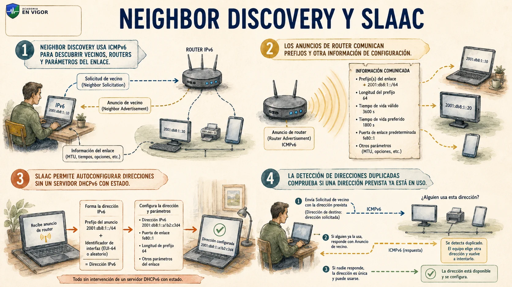

<em>Infografía: Neighbor Discovery y SLAAC.</em>

<!-- FUENTE: RFC4861-NDP-T39 -->

## 74. Transición y límites de IPv6

**Idea de control:** Dual stack permite ejecutar IPv4 e IPv6 simultáneamente.

- Dual stack permite ejecutar IPv4 e IPv6 simultáneamente.
- Túneles encapsulan un protocolo dentro de otro y la traducción conecta dominios incompatibles.
- IPv6 amplía el espacio de direcciones, pero no elimina por sí solo vulnerabilidades ni errores de configuración.
- IPsec está definido para IPv6, pero su mera presencia no cifra automáticamente todo el tráfico.

<!-- VISUAL:t39-74-transicion-y-limites-de-ipv6.webp -->

  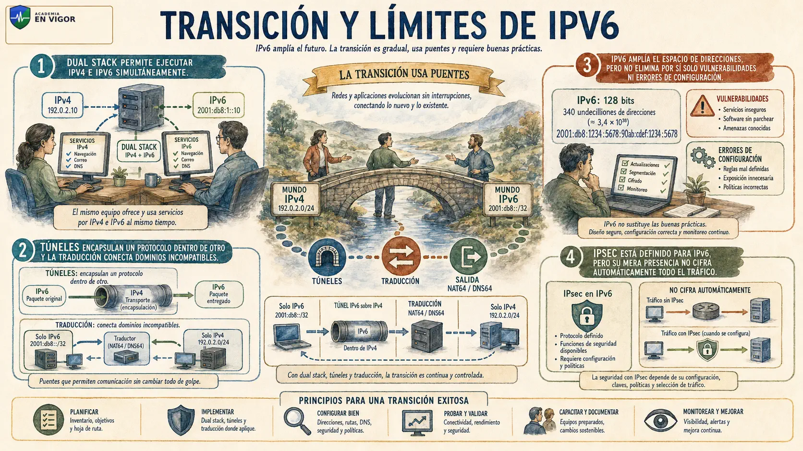

<em>Infografía: Transición y límites de IPv6.</em>

<!-- FUENTE: RFC8200-IPV6-T39 -->

# Hablemos claro

:::hablemos-claro
Este tema tiene cuatro trampas maestras: tomar OSI como implementación literal; confundir hub, switch y router; mezclar DNS, DHCP y proxy; y tratar las clases A, B y C como direccionamiento vigente. Antes de responder identifica capa, función, alcance y versión del protocolo.
:::

# En la calle

:::en-la-calle
En una intervención, separar enlace físico, conmutación local, ruta IP, resolución DNS y servicio de aplicación permite localizar el fallo sin alterar más sistemas de los necesarios y documentar la conectividad observada.
:::

# Lo que cae

:::lo-que-cae
Prioriza las siete capas OSI y su correspondencia aproximada con TCP/IP; diferencias entre hub, switch, router, firewall y proxy; DORA, DNS autoritativo y recursivo; clases históricas frente a CIDR; rangos IPv4 especiales; y notación, tipos y autoconfiguración IPv6.
:::

# Ha caído

:::ha-caido
Se han localizado 8 referencias históricas del Tema 39. Permanecen ocultas y en cuarentena porque no existe plantilla oficial final verificable en el repositorio.
:::

## Fuentes legales, institucionales y primarias

- `CONVOCATORIA-PN-2026-T39`
- `ISO-7498-1-OSI-T39`
- `RFC1122-HOSTS-T39`
- `RFC9293-TCP-T39`
- `RFC768-UDP-T39`
- `RFC792-ICMP-T39`
- `IEEE8023-ETHERNET-T39`
- `IEEE8021Q-BRIDGES-T39`
- `RFC1812-ROUTERS-T39`
- `NIST-SP800-41R1-T39`
- `RFC3022-NAT-T39`
- `RFC2131-DHCP-T39`
- `RFC9915-DHCPV6-T39`
- `RFC1034-DNS-T39`
- `RFC1035-DNS-T39`
- `RFC8499-DNS-TERMS-T39`
- `RFC9110-HTTP-T39`
- `RFC791-IPV4-T39`
- `RFC4632-CIDR-T39`
- `RFC1918-PRIVATE-T39`
- `RFC6890-SPECIAL-T39`
- `RFC8200-IPV6-T39`
- `RFC4291-IPV6-ADDR-T39`
- `RFC4861-NDP-T39`
- `RFC4862-SLAAC-T39`

---

*Academia En Vigor · El temario que nunca duerme · Tema 39 · v1.0.0 · Documento interno no publicado.*
