# TEMA 41 · CIBERDELINCUENCIA Y AGENTES DE LA AMENAZA: BOTNET; BUSINESS E-MAIL COMPROMISE; CARTAS NIGERIANAS; CRYPTOJACKING; DENEGACIÓN DE SERVICIO; INGENIERÍA SOCIAL; INYECCIÓN SQL; MALWARE; PHARMING; PHISHING; SPEAR PHISHING; RANSOMWARE; SKIMMING; SPOOFING; SPYWARE; TROYANO; XSS; ZERO-DAY. CIBERCRIMINALES. CRIMEN AS SERVICE. HACKTIVISTAS. INSIDER THREAT. APTS. CYBER KILL CHAIN.

**Policía Nacional · Método VIGOR · PARTE**
**Versión de contenido:** 1.0.0
**Estado editorial:** approved_internal · **Publicación:** not_published

# Mapa del tema

El Tema 41 se estudia en ocho partes: fundamentos; botnets, DDoS y cryptojacking; ingeniería social y fraude; malware; ataques web y zero-day; skimming; actores; y Cyber Kill Chain.

# Contenido

## 01. Alcance oficial del Tema 41

**Idea de control:** El programa reúne modalidades técnicas, fraudes, malware, actores y un modelo de fases.

- El programa reúne modalidades técnicas, fraudes, malware, actores y un modelo de fases.
- Cada término se estudia por mecanismo, objetivo, impacto y diferencias con conceptos próximos.
- El epígrafe no convierte toda conducta en delito ni sustituye la calificación penal de los temas jurídicos.
- Los ejemplos coyunturales se usan solo para comprender y no como definiciones universales.

<!-- VISUAL:t41-01-alcance-oficial-del-tema-41.webp -->

  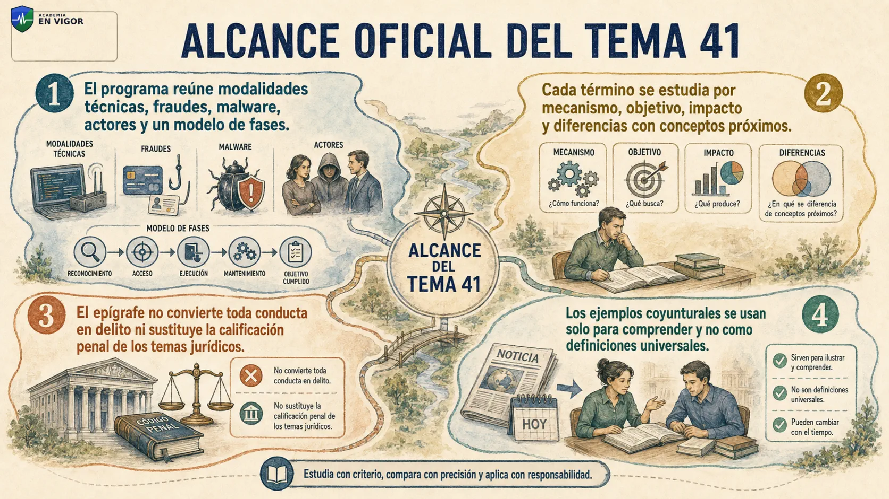

<em>Infografía: Alcance oficial del Tema 41.</em>

<!-- FUENTE: CONVOCATORIA-PN-2026-T41 -->

## 02. Ciberdelincuencia

**Idea de control:** La ciberdelincuencia comprende conductas ilícitas en las que sistemas, redes o datos son objetivo, instrumento o entorno relevante.

- La ciberdelincuencia comprende conductas ilícitas en las que sistemas, redes o datos son objetivo, instrumento o entorno relevante.
- Puede incluir delitos dependientes de sistemas y delitos tradicionales ampliados mediante tecnología.
- El componente digital puede aparecer en preparación, ejecución, beneficio, ocultación o blanqueo.
- La dimensión transfronteriza y la automatización aumentan escala, velocidad y dificultad investigadora.

<!-- VISUAL:t41-02-ciberdelincuencia.webp -->

  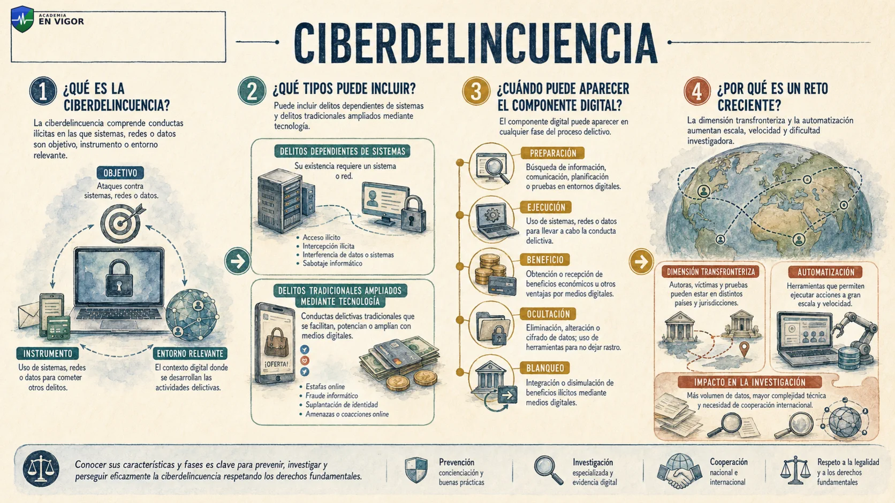

<em>Infografía: Ciberdelincuencia.</em>

<!-- FUENTE: EUROPOL-IOCTA-2025-T41 -->

## 03. Delitos ciberdependientes y cibermediados

**Idea de control:** Un delito ciberdependiente no puede ejecutarse sin sistemas digitales, como ciertas intrusiones o ataques a disponibilidad.

- Un delito ciberdependiente no puede ejecutarse sin sistemas digitales, como ciertas intrusiones o ataques a disponibilidad.
- Un delito cibermediado adapta o amplía una conducta previa, como fraude, extorsión o suplantación.
- La distinción describe dependencia del medio, no gravedad ni competencia judicial.
- Una misma campaña puede combinar intrusión ciberdependiente con fraude o extorsión cibermediados.

<!-- VISUAL:t41-03-delitos-ciberdependientes-y-cibermediados.webp -->

  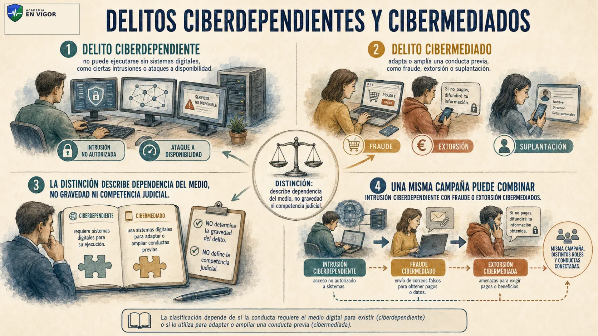

<em>Infografía: Delitos ciberdependientes y cibermediados.</em>

<!-- FUENTE: EUROPOL-IOCTA-2025-T41 -->

## 04. Confidencialidad, integridad y disponibilidad

**Idea de control:** La confidencialidad evita la divulgación no autorizada de información.

- La confidencialidad evita la divulgación no autorizada de información.
- La integridad protege frente a modificación o destrucción no autorizadas.
- La disponibilidad permite acceso y uso oportunos por entidades autorizadas.
- Una campaña puede afectar simultáneamente a varias propiedades, como robo, cifrado y caída del servicio.

<!-- VISUAL:t41-04-confidencialidad-integridad-y-disponibilidad.webp -->

  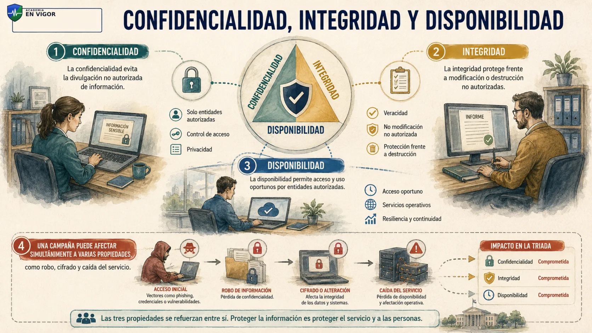

<em>Infografía: Confidencialidad, integridad y disponibilidad.</em>

<!-- FUENTE: NIST-IR7298-T41 -->

## 05. Amenaza, vulnerabilidad y riesgo

**Idea de control:** Una amenaza es una circunstancia o fuente con potencial de causar daño.

- Una amenaza es una circunstancia o fuente con potencial de causar daño.
- Una vulnerabilidad es una debilidad susceptible de explotación o activación.
- El riesgo combina probabilidad y consecuencias en un contexto determinado.
- Una vulnerabilidad sin actor observado sigue siendo una debilidad, pero no garantiza explotación.

<!-- VISUAL:t41-il-05-amenaza-vulnerabilidad-y-riesgo.webp -->

  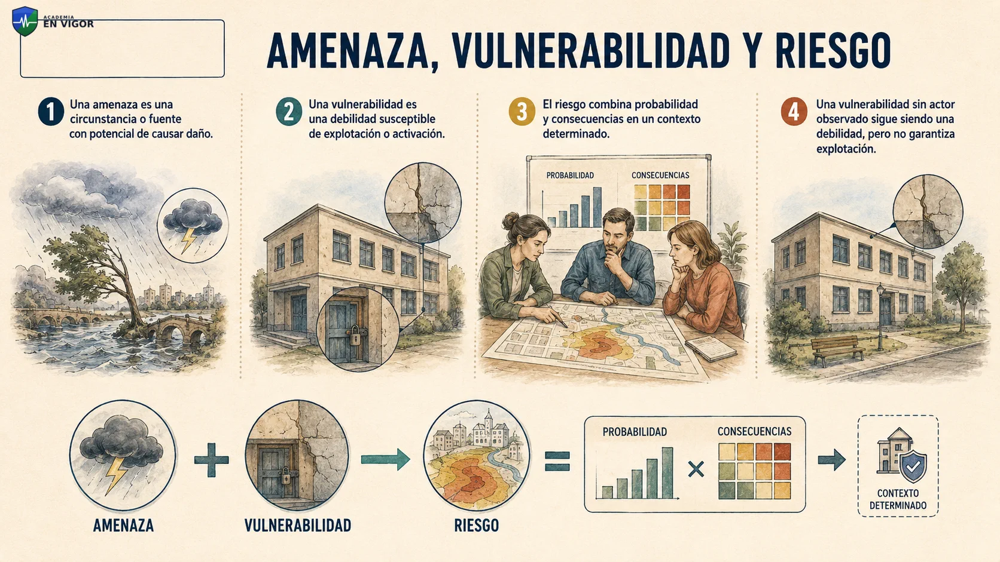

<em>Infografía: Amenaza, vulnerabilidad y riesgo.</em>

<!-- FUENTE: NIST-IR7298-T41 -->

## 06. Exploit, vector y carga útil

**Idea de control:** Un exploit es código o técnica que aprovecha una vulnerabilidad para producir un efecto.

- Un exploit es código o técnica que aprovecha una vulnerabilidad para producir un efecto.
- El vector de ataque es la vía o mecanismo por el que el adversario intenta acceder o actuar.
- La carga útil es la función ejecutada después o como parte del compromiso.
- Correo, servicio expuesto y dispositivo extraíble pueden ser vectores distintos para una misma carga.

<!-- VISUAL:t41-06-exploit-vector-y-carga-util.webp -->

  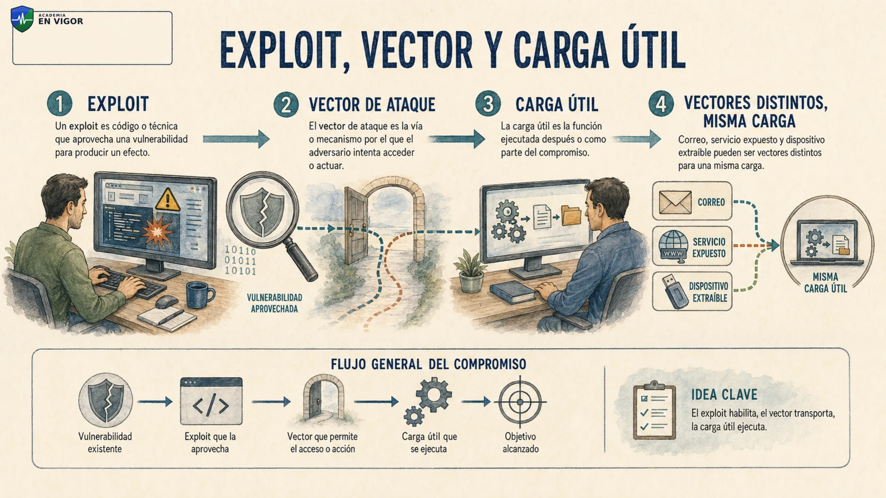

<em>Infografía: Exploit, vector y carga útil.</em>

<!-- FUENTE: NIST-SP800-150-T41 -->

## 07. Evento, alerta e incidente

**Idea de control:** Un evento es una ocurrencia observable en un sistema o red.

- Un evento es una ocurrencia observable en un sistema o red.
- Una alerta señala que uno o varios eventos merecen análisis.
- Un incidente implica una afectación real o inminente de políticas, operaciones o seguridad.
- No toda alerta confirma un ataque; requiere contexto, correlación y validación.

<!-- VISUAL:t41-07-evento-alerta-e-incidente.webp -->

  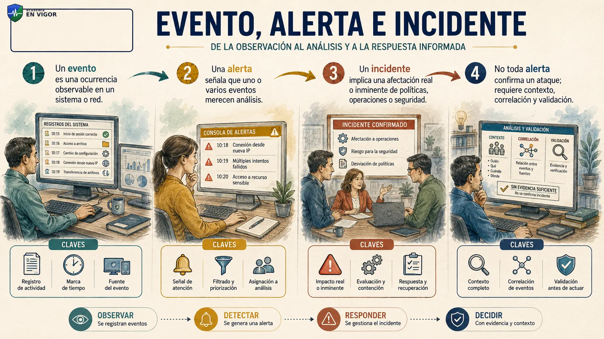

<em>Infografía: Evento, alerta e incidente.</em>

<!-- FUENTE: NIST-SP800-150-T41 -->

## 08. Indicadores y TTP

**Idea de control:** Un indicador es un artefacto u observable asociado a actividad potencialmente maliciosa.

- Un indicador es un artefacto u observable asociado a actividad potencialmente maliciosa.
- Las TTP describen tácticas, técnicas y procedimientos del adversario.
- Los indicadores concretos pueden caducar más rápido que los patrones de comportamiento.
- Ningún indicador aislado prueba por sí solo autoría o intención.

<!-- VISUAL:t41-08-indicadores-y-ttp.webp -->

  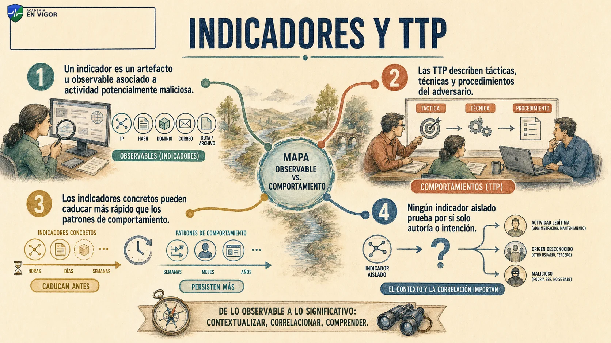

<em>Infografía: Indicadores y TTP.</em>

<!-- FUENTE: MITRE-ATTACK-T41 -->

## 09. Concepto de botnet

**Idea de control:** Una botnet es un conjunto de dispositivos comprometidos controlados para ejecutar órdenes coordinadas.

- Una botnet es un conjunto de dispositivos comprometidos controlados para ejecutar órdenes coordinadas.
- Los equipos pueden ser ordenadores, servidores, móviles o dispositivos IoT.
- Botnet describe la red y su control; el malware es uno de los medios para reclutarla.
- El propietario puede desconocer que su dispositivo participa en la red.

<!-- VISUAL:t41-09-concepto-de-botnet.webp -->

  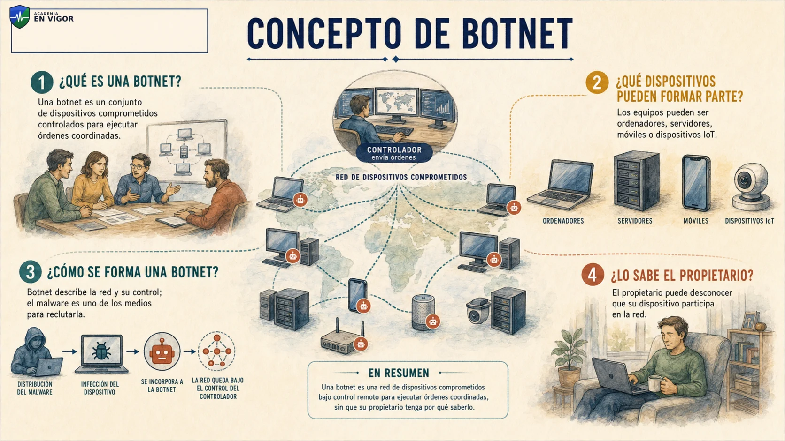

<em>Infografía: Concepto de botnet.</em>

<!-- FUENTE: INCIBE-BOTNET-T41 -->

## 10. Bot, zombi y operador

**Idea de control:** Cada dispositivo controlado se denomina bot o zombi.

- Cada dispositivo controlado se denomina bot o zombi.
- El operador puede recibir nombres como botmaster o bot herder.
- El bot ejecuta instrucciones a través de un canal o mecanismo de mando.
- La titularidad del equipo y el control efectivo pueden corresponder a personas distintas.

<!-- VISUAL:t41-il-10-bot-zombi-y-operador.webp -->

  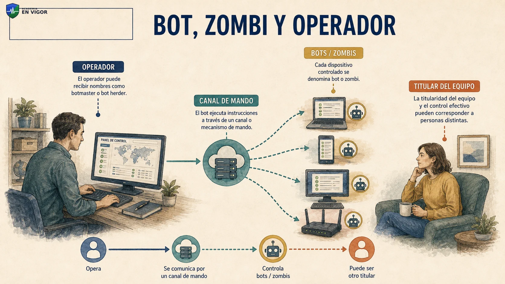

<em>Infografía: Bot, zombi y operador.</em>

<!-- FUENTE: INCIBE-BOTNET-T41 -->

## 11. Reclutamiento de una botnet

**Idea de control:** El reclutamiento puede aprovechar phishing, credenciales débiles, software vulnerable o servicios expuestos.

- El reclutamiento puede aprovechar phishing, credenciales débiles, software vulnerable o servicios expuestos.
- Los dispositivos IoT con contraseñas por defecto son objetivos frecuentes.
- La infección silenciosa permite conservar el nodo durante más tiempo.
- Una botnet puede incorporar varios métodos de propagación en una campaña.

<!-- VISUAL:t41-11-reclutamiento-de-una-botnet.webp -->

  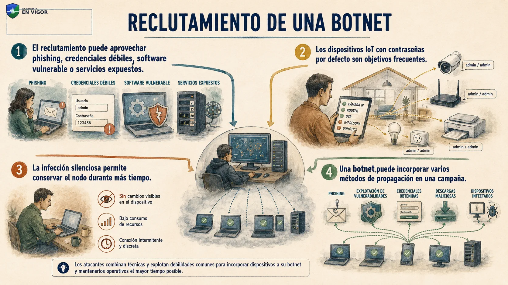

<em>Infografía: Reclutamiento de una botnet.</em>

<!-- FUENTE: INCIBE-BOTNET-T41 -->

## 12. Mando y control de botnets

**Idea de control:** El mando y control permite distribuir órdenes y recibir resultados o estado de los bots.

- El mando y control permite distribuir órdenes y recibir resultados o estado de los bots.
- Una arquitectura centralizada depende de servidores o puntos de control identificables.
- Una arquitectura entre pares distribuye funciones de control y puede aumentar resiliencia.
- Cambiar de canal o dominio dificulta la interrupción, pero no garantiza anonimato.

<!-- VISUAL:t41-12-mando-y-control-de-botnets.webp -->

  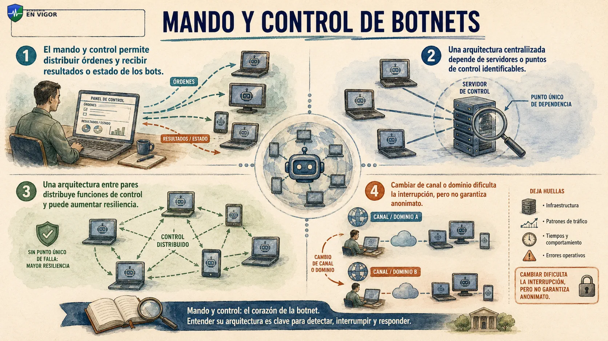

<em>Infografía: Mando y control de botnets.</em>

<!-- FUENTE: MITRE-ATTACK-T41 -->

## 13. Funciones maliciosas de una botnet

**Idea de control:** Una botnet puede enviar spam, distribuir malware, robar datos o generar tráfico fraudulento.

- Una botnet puede enviar spam, distribuir malware, robar datos o generar tráfico fraudulento.
- También puede ejecutar DDoS, probar credenciales o minar criptoactivos.
- La función depende de las órdenes y capacidades desplegadas, no del nombre botnet.
- Un mismo conjunto de bots puede cambiar de tarea durante su ciclo de vida.

<!-- VISUAL:t41-13-funciones-maliciosas-de-una-botnet.webp -->

  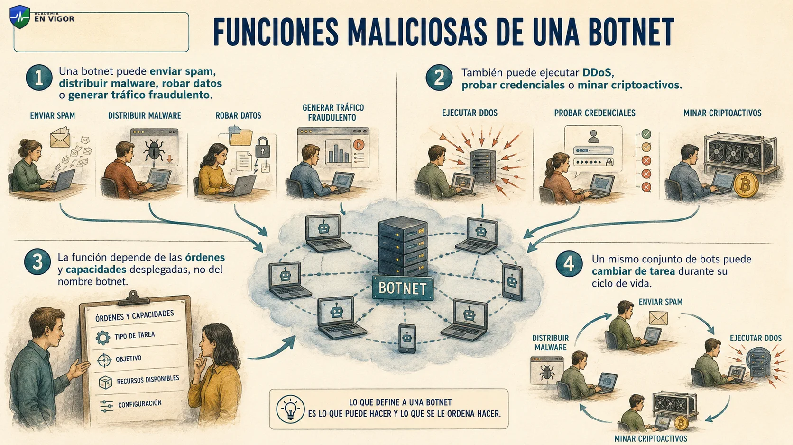

<em>Infografía: Funciones maliciosas de una botnet.</em>

<!-- FUENTE: INCIBE-BOTNET-T41 -->

## 14. Denegación de servicio

**Idea de control:** Un ataque DoS busca degradar o impedir el acceso legítimo a un servicio o recurso.

- Un ataque DoS busca degradar o impedir el acceso legítimo a un servicio o recurso.
- Puede agotar ancho de banda, conexiones, capacidad de proceso o recursos de aplicación.
- El éxito se mide por impacto en disponibilidad, no por acceso al contenido.
- Una denegación puede ser deliberada aunque no destruya ni robe datos.

<!-- VISUAL:t41-14-denegacion-de-servicio.webp -->

  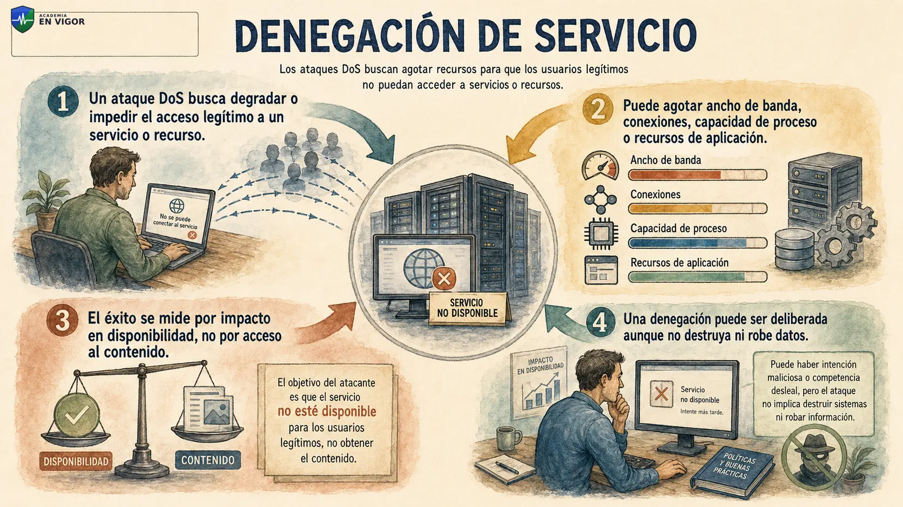

<em>Infografía: Denegación de servicio.</em>

<!-- FUENTE: ENISA-TL-2025-T41 -->

## 15. DoS y DDoS

**Idea de control:** DDoS distribuye el tráfico o las solicitudes entre múltiples fuentes o nodos.

- DDoS distribuye el tráfico o las solicitudes entre múltiples fuentes o nodos.
- DoS no implica necesariamente un único paquete ni DDoS una única técnica.
- La distribución complica filtrado y atribución y puede aumentar capacidad.
- Las botnets son una infraestructura habitual para DDoS, pero no son equivalentes al ataque.

<!-- VISUAL:t41-il-15-dos-y-ddos.webp -->

  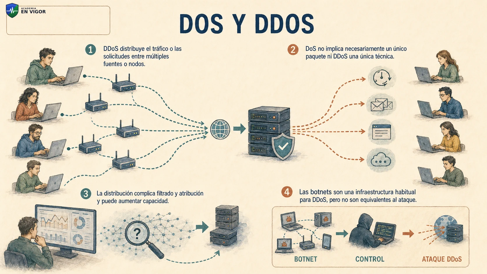

<em>Infografía: DoS y DDoS.</em>

<!-- FUENTE: ENISA-TL-2025-T41 -->

## 16. Ataques volumétricos, de protocolo y de aplicación

**Idea de control:** Los ataques volumétricos buscan consumir capacidad de red.

- Los ataques volumétricos buscan consumir capacidad de red.
- Los ataques de protocolo explotan estados o límites de componentes de comunicación.
- Los ataques de aplicación agotan recursos mediante solicitudes que aparentan mayor legitimidad.
- La capa atacada condiciona detección y mitigación.

<!-- VISUAL:t41-16-ataques-volumetricos-de-protocolo-y-de-aplicacion.webp -->

  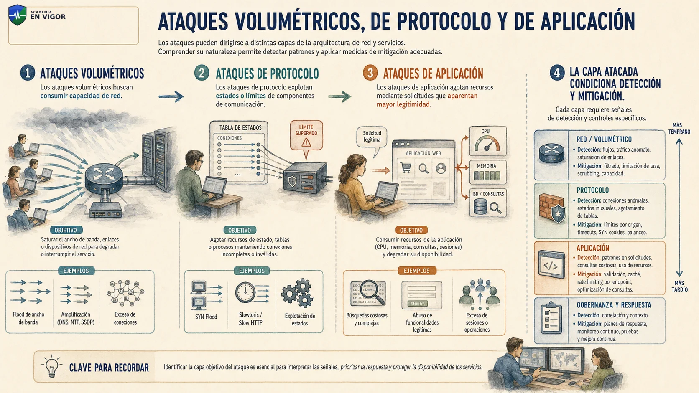

<em>Infografía: Ataques volumétricos, de protocolo y de aplicación.</em>

<!-- FUENTE: ENISA-TL-2025-T41 -->

## 17. Reflexión y amplificación

**Idea de control:** En reflexión, el atacante provoca que terceros envíen respuestas a la víctima.

- En reflexión, el atacante provoca que terceros envíen respuestas a la víctima.
- La suplantación de la dirección origen puede hacer aparecer a la víctima como solicitante.
- Existe amplificación cuando la respuesta es significativamente mayor que la petición.
- Cerrar servicios mal configurados reduce su uso como reflectores.

<!-- VISUAL:t41-17-reflexion-y-amplificacion.webp -->

  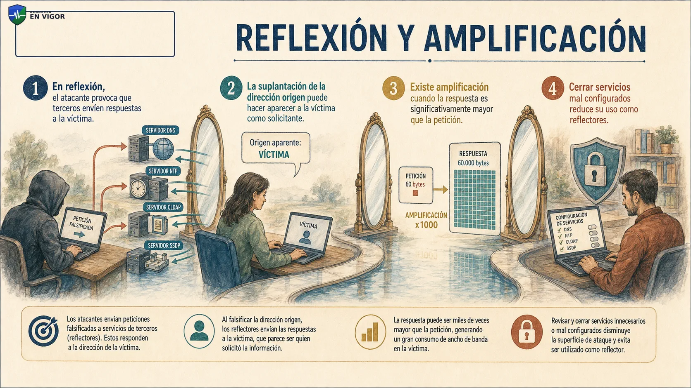

<em>Infografía: Reflexión y amplificación.</em>

<!-- FUENTE: ENISA-TL-2025-T41 -->

## 18. Cryptojacking

**Idea de control:** Cryptojacking es el uso no autorizado de recursos ajenos para realizar minería de criptoactivos.

- Cryptojacking es el uso no autorizado de recursos ajenos para realizar minería de criptoactivos.
- Puede ejecutarse mediante malware, abuso de credenciales o código en servicios comprometidos.
- Su impacto incluye consumo, degradación, costes y desgaste, aunque no siempre robe archivos.
- No debe confundirse con minería legítima consentida ni con robo directo de criptomonedas.

<!-- VISUAL:t41-18-cryptojacking.webp -->

  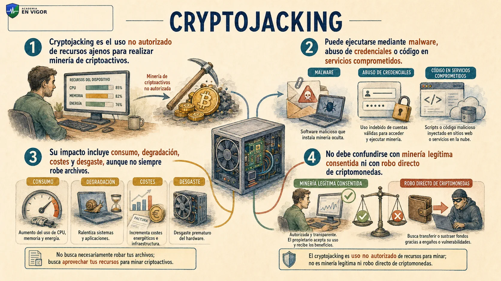

<em>Infografía: Cryptojacking.</em>

<!-- FUENTE: ENISA-TL-2025-T41 -->

## 19. Detección e impacto del cryptojacking

**Idea de control:** Uso elevado e inexplicado de CPU o GPU puede ser un indicador, no una prueba aislada.

- Uso elevado e inexplicado de CPU o GPU puede ser un indicador, no una prueba aislada.
- Procesos, conexiones, tareas programadas y consumo en nube deben correlacionarse.
- En entornos cloud puede generar costes económicos rápidos.
- Eliminar el minero sin cerrar el acceso inicial permite reinfección.

<!-- VISUAL:t41-19-deteccion-e-impacto-del-cryptojacking.webp -->

  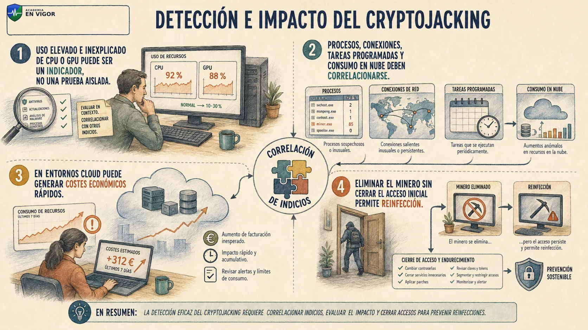

<em>Infografía: Detección e impacto del cryptojacking.</em>

<!-- FUENTE: ENISA-TL-2025-T41 -->

## 20. Ingeniería social

**Idea de control:** La ingeniería social manipula a personas para que revelen información o ejecuten acciones inseguras.

- La ingeniería social manipula a personas para que revelen información o ejecuten acciones inseguras.
- Puede apoyarse en correo, teléfono, mensajería, presencia física o redes sociales.
- El engaño explota contexto y confianza, no una vulnerabilidad técnica obligatoria.
- Puede combinarse con malware, suplantación o compromiso real de cuentas.

<!-- VISUAL:t41-il-20-ingenieria-social.webp -->

  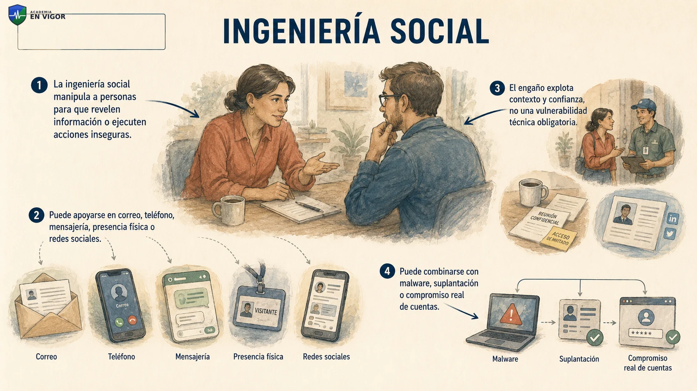

<em>Infografía: Ingeniería social.</em>

<!-- FUENTE: ENISA-TL-2025-T41 -->

## 21. Palancas de persuasión

**Idea de control:** Los atacantes usan urgencia para reducir la reflexión y la verificación.

- Los atacantes usan urgencia para reducir la reflexión y la verificación.
- La autoridad aparente y la familiaridad aumentan obediencia.
- Miedo, curiosidad, escasez y recompensa pueden funcionar como cebos.
- Reconocer una palanca no basta: debe verificarse identidad y petición por canal independiente.

<!-- VISUAL:t41-21-palancas-de-persuasion.webp -->

  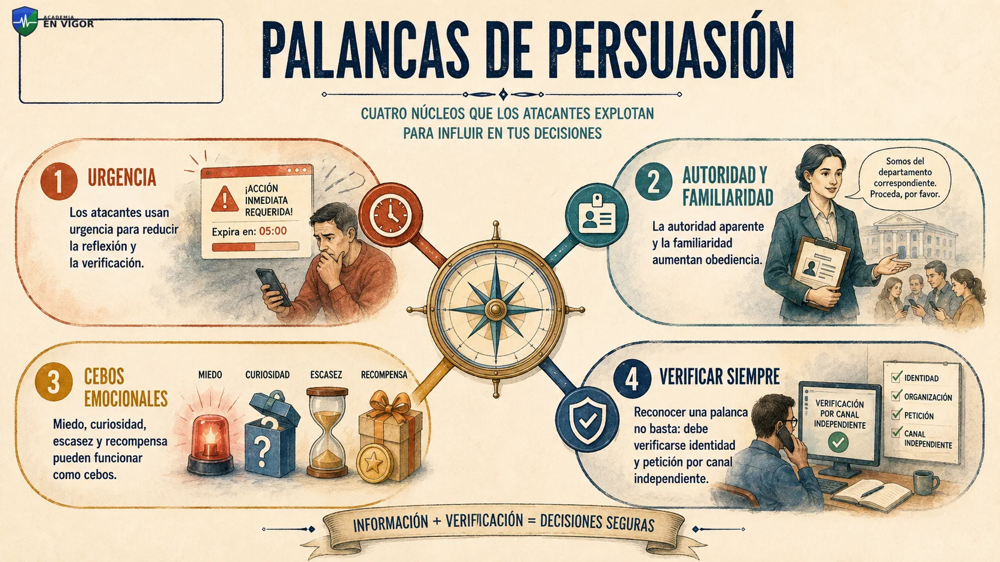

<em>Infografía: Palancas de persuasión.</em>

<!-- FUENTE: ENISA-TL-2025-T41 -->

## 22. Pretexto, cebo y quid pro quo

**Idea de control:** El pretexting construye una historia o identidad para justificar la solicitud.

- El pretexting construye una historia o identidad para justificar la solicitud.
- El baiting ofrece un cebo atractivo, digital o físico, para provocar interacción.
- Quid pro quo promete un beneficio o servicio a cambio de información o acción.
- Estas técnicas pueden aparecer dentro de campañas de phishing o contacto directo.

<!-- VISUAL:t41-22-pretexto-cebo-y-quid-pro-quo.webp -->

  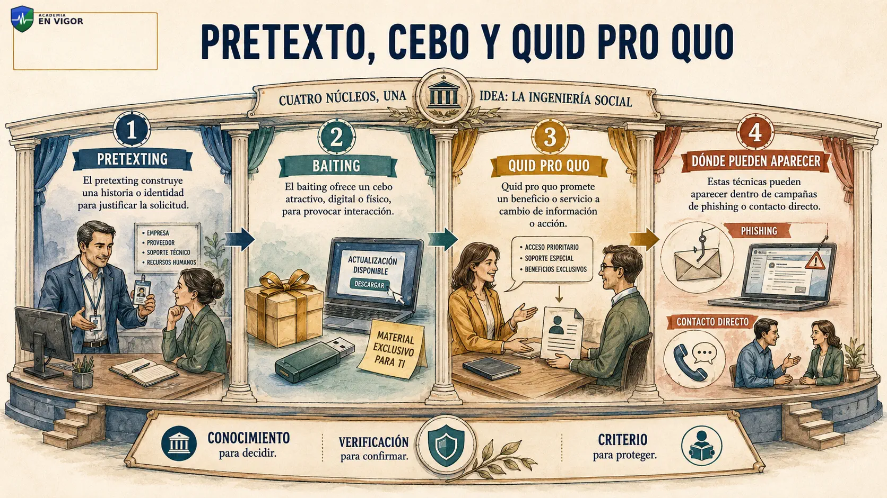

<em>Infografía: Pretexto, cebo y quid pro quo.</em>

<!-- FUENTE: ENISA-TL-2025-T41 -->

## 23. Phishing, smishing y vishing

**Idea de control:** Phishing suele emplear mensajes digitales para inducir entrega de datos o ejecución de acciones.

- Phishing suele emplear mensajes digitales para inducir entrega de datos o ejecución de acciones.
- Smishing usa mensajes SMS o canales de texto móvil.
- Vishing emplea comunicación de voz, normalmente llamadas.
- El canal no determina por sí solo el grado de personalización.

<!-- VISUAL:t41-23-phishing-smishing-y-vishing.webp -->

  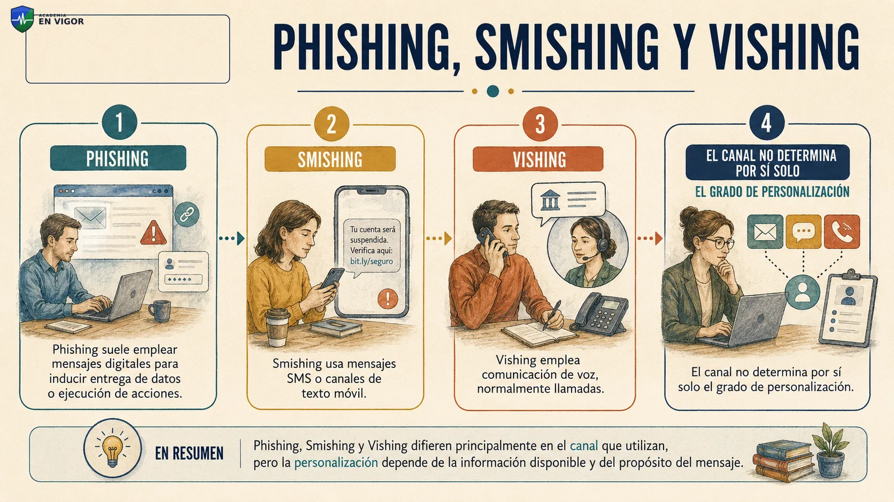

<em>Infografía: Phishing, smishing y vishing.</em>

<!-- FUENTE: CISA-MPR-T41 -->

## 24. Phishing

**Idea de control:** Phishing suplanta o imita una entidad para inducir clics, credenciales, pagos o ejecución de archivos.

- Phishing suplanta o imita una entidad para inducir clics, credenciales, pagos o ejecución de archivos.
- Una campaña puede ser masiva o segmentada sin dejar de ser phishing.
- Enlaces, adjuntos, formularios y códigos QR pueden servir de soporte.
- El remitente visible no demuestra el origen real del mensaje.

<!-- VISUAL:t41-24-phishing.webp -->

  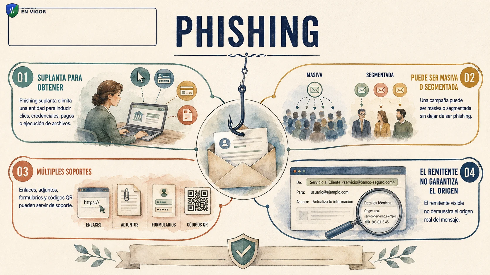

<em>Infografía: Phishing.</em>

<!-- FUENTE: CISA-MPR-T41 -->

## 25. Spear phishing

**Idea de control:** Spear phishing es phishing dirigido a una persona o grupo concreto.

- Spear phishing es phishing dirigido a una persona o grupo concreto.
- La personalización usa información del objetivo, su función o relaciones.
- Puede buscar credenciales, ejecución de malware, fraude o acceso inicial.
- Ser dirigido aumenta credibilidad, pero no garantiza éxito.

<!-- VISUAL:t41-il-25-spear-phishing.webp -->

  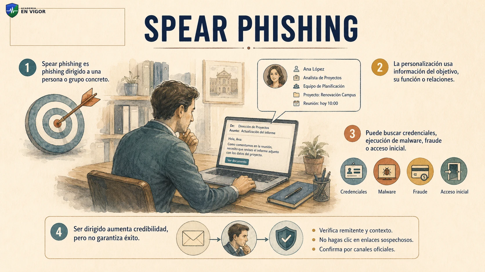

<em>Infografía: Spear phishing.</em>

<!-- FUENTE: CISA-MPR-T41 -->

## 26. Whaling

**Idea de control:** Whaling es una variante dirigida a ejecutivos u otros objetivos de alto valor.

- Whaling es una variante dirigida a ejecutivos u otros objetivos de alto valor.
- El rasgo diferencial es el perfil del objetivo, no un canal distinto.
- Puede imitar comunicaciones legales, financieras o de dirección.
- No todo BEC es whaling ni todo whaling implica una cuenta comprometida.

<!-- VISUAL:t41-26-whaling.webp -->

  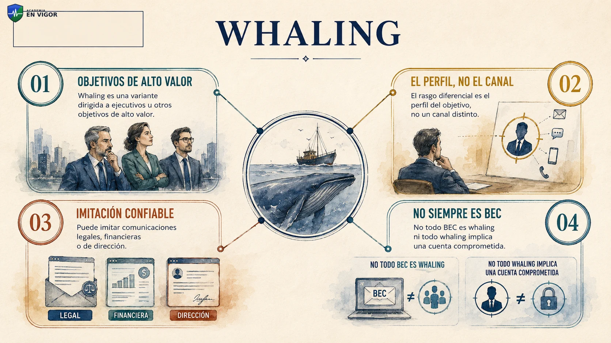

<em>Infografía: Whaling.</em>

<!-- FUENTE: ENISA-TL-2025-T41 -->

## 27. Business Email Compromise

**Idea de control:** BEC es un fraude que manipula comunicaciones empresariales o profesionales para obtener pagos o información.

- BEC es un fraude que manipula comunicaciones empresariales o profesionales para obtener pagos o información.
- Puede comprometer una cuenta real, suplantar una dirección o utilizar un dominio parecido.
- El atacante estudia relaciones, facturación, funciones y momentos de pago.
- La petición suele parecer coherente con un proceso real de negocio.

<!-- VISUAL:t41-27-business-email-compromise.webp -->

  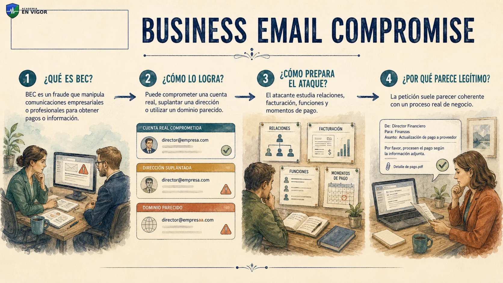

<em>Infografía: Business Email Compromise.</em>

<!-- FUENTE: FBI-IC3-2025-T41 -->

## 28. Compromiso real y suplantación en BEC

**Idea de control:** Una cuenta comprometida permite leer hilos, reglas y contactos reales.

- Una cuenta comprometida permite leer hilos, reglas y contactos reales.
- La suplantación puede falsificar el remitente o usar dominios visualmente similares sin tomar la cuenta.
- Ambos mecanismos pueden producir una petición aparentemente legítima.
- La respuesta debe verificar cambio de cuenta o pago mediante un canal conocido e independiente.

<!-- VISUAL:t41-28-compromiso-real-y-suplantacion-en-bec.webp -->

  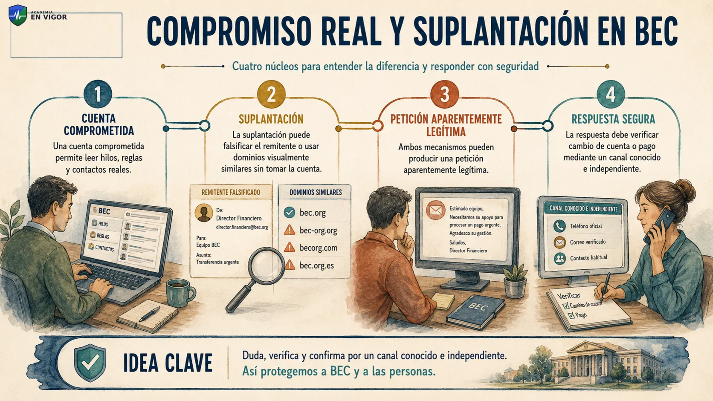

<em>Infografía: Compromiso real y suplantación en BEC.</em>

<!-- FUENTE: FBI-SCAMS-T41 -->

## 29. Fraude de factura y cambio de cuenta

**Idea de control:** El atacante puede insertar nuevas instrucciones bancarias en una operación real.

- El atacante puede insertar nuevas instrucciones bancarias en una operación real.
- La urgencia o confidencialidad buscan saltarse controles de doble verificación.
- Un proveedor, directivo o asesor puede ser la identidad imitada.
- Confirmar con datos de contacto ya conocidos reduce el riesgo de desvío.

<!-- VISUAL:t41-29-fraude-de-factura-y-cambio-de-cuenta.webp -->

  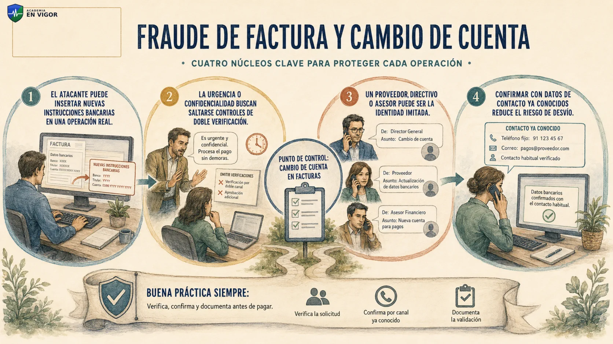

<em>Infografía: Fraude de factura y cambio de cuenta.</em>

<!-- FUENTE: FBI-IC3-2025-T41 -->

## 30. Carta nigeriana o fraude 419

**Idea de control:** El fraude 419 promete una ganancia, herencia o fondos a cambio de pagos o datos previos.

- El fraude 419 promete una ganancia, herencia o fondos a cambio de pagos o datos previos.
- La víctima abona tasas, trámites o garantías, pero el beneficio prometido no llega.
- El nombre histórico no limita autores, países ni variantes actuales.
- Es una forma de fraude de pago anticipado y puede combinarse con identidad falsa.

<!-- VISUAL:t41-il-30-carta-nigeriana-o-fraude-419.webp -->

  

<em>Infografía: Carta nigeriana o fraude 419.</em>

<!-- FUENTE: FBI-SCAMS-T41 -->

## 31. Pharming

**Idea de control:** Pharming redirige al usuario hacia un destino falso alterando resolución o configuración.

- Pharming redirige al usuario hacia un destino falso alterando resolución o configuración.
- Puede aprovechar respuestas DNS corruptas, configuración del router o archivo hosts.
- La víctima puede escribir correctamente el nombre y aun así llegar al destino fraudulento.
- Pharming describe la redirección; el objetivo posterior puede ser robo de credenciales o malware.

<!-- VISUAL:t41-31-pharming.webp -->

  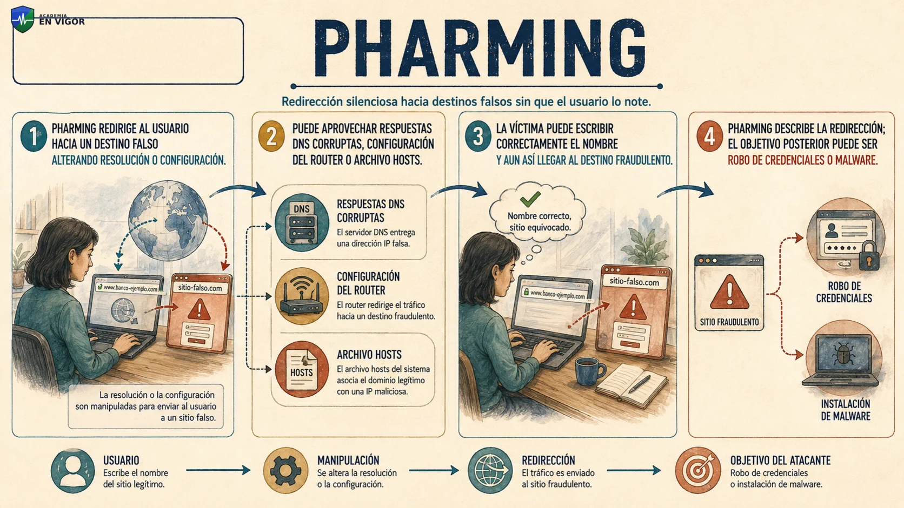

<em>Infografía: Pharming.</em>

<!-- FUENTE: RFC3833-DNS-T41 -->

## 32. Envenenamiento DNS y archivo hosts

**Idea de control:** Una respuesta DNS falsa puede asociar un nombre legítimo con una dirección controlada.

- Una respuesta DNS falsa puede asociar un nombre legítimo con una dirección controlada.
- Modificar el archivo hosts altera la resolución del equipo afectado sin cambiar el DNS autoritativo.
- Comprometer un router puede cambiar los resolutores usados por varios dispositivos.
- Los tres caminos pueden producir una redirección parecida con evidencias distintas.

<!-- VISUAL:t41-32-envenenamiento-dns-y-archivo-hosts.webp -->

  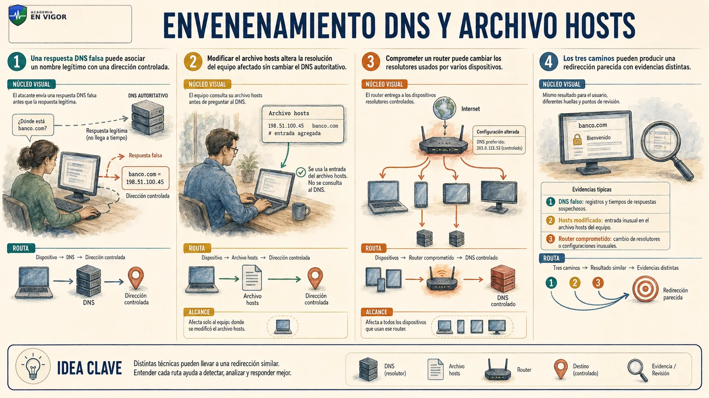

<em>Infografía: Envenenamiento DNS y archivo hosts.</em>

<!-- FUENTE: RFC3833-DNS-T41 -->

## 33. Spoofing

**Idea de control:** Spoofing consiste en falsificar o aparentar una identidad, origen o dato de comunicación.

- Spoofing consiste en falsificar o aparentar una identidad, origen o dato de comunicación.
- Puede afectar correo, IP, DNS, sitios, identificadores de llamada u otros elementos.
- El término describe la suplantación técnica, no garantiza acceso a la cuenta imitada.
- El impacto depende de cómo se use la apariencia falsa.

<!-- VISUAL:t41-33-spoofing.webp -->

  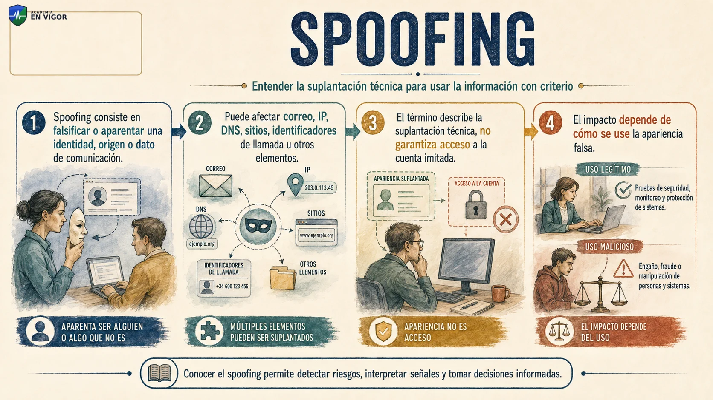

<em>Infografía: Spoofing.</em>

<!-- FUENTE: NIST-SP800-150-T41 -->

## 34. Email spoofing

**Idea de control:** Email spoofing altera o fabrica datos para que un mensaje parezca proceder de otro remitente.

- Email spoofing altera o fabrica datos para que un mensaje parezca proceder de otro remitente.
- El campo visible puede diferir del origen y de las rutas técnicas del mensaje.
- SPF, DKIM y DMARC ayudan a autenticar dominios, pero no eliminan todos los engaños.
- Un dominio parecido puede engañar sin falsificar exactamente el dominio legítimo.

<!-- VISUAL:t41-34-email-spoofing.webp -->

  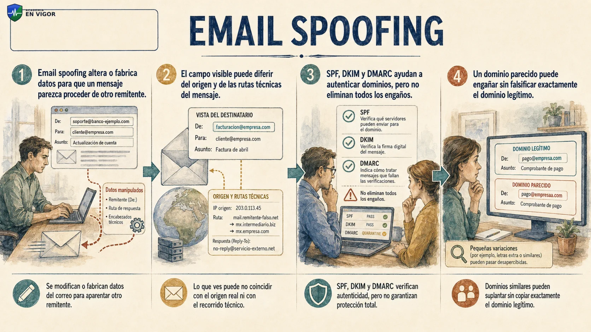

<em>Infografía: Email spoofing.</em>

<!-- FUENTE: CISA-MPR-T41 -->

## 35. IP spoofing

**Idea de control:** IP spoofing falsifica la dirección de origen de paquetes.

- IP spoofing falsifica la dirección de origen de paquetes.
- Es útil en ataques de reflexión cuando no se necesita recibir la respuesta en el origen real.
- No proporciona automáticamente una sesión bidireccional ni control del equipo suplantado.
- Los filtros de origen reducen su abuso en redes correctamente configuradas.

<!-- VISUAL:t41-il-35-ip-spoofing.webp -->

  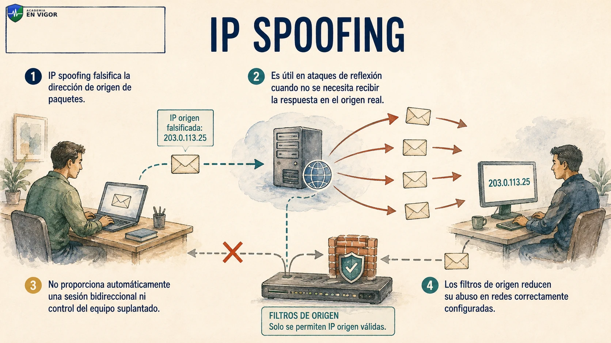

<em>Infografía: IP spoofing.</em>

<!-- FUENTE: NIST-SP800-150-T41 -->

## 36. DNS y web spoofing

**Idea de control:** DNS spoofing busca que se acepte una asociación de nombre y dirección falsa.

- DNS spoofing busca que se acepte una asociación de nombre y dirección falsa.
- Una web imitada reproduce apariencia o dominio parecido para engañar al usuario.
- La web falsa puede existir sin manipular DNS mediante un enlace o dominio semejante.
- Separar resolución, certificado, dominio y contenido evita confundir mecanismos.

<!-- VISUAL:t41-36-dns-y-web-spoofing.webp -->

  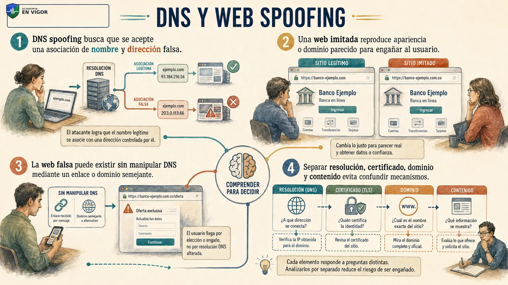

<em>Infografía: DNS y web spoofing.</em>

<!-- FUENTE: RFC3833-DNS-T41 -->

## 37. Verificación fuera de banda

**Idea de control:** Cambios de pago, credenciales o datos sensibles deben verificarse por un canal conocido.

- Cambios de pago, credenciales o datos sensibles deben verificarse por un canal conocido.
- No se debe usar el teléfono o enlace aportado dentro del mensaje sospechoso.
- La doble autorización reduce el riesgo de que una sola persona complete el fraude.
- La presión por urgencia o secreto es un motivo para elevar la comprobación.

<!-- VISUAL:t41-37-verificacion-fuera-de-banda.webp -->

  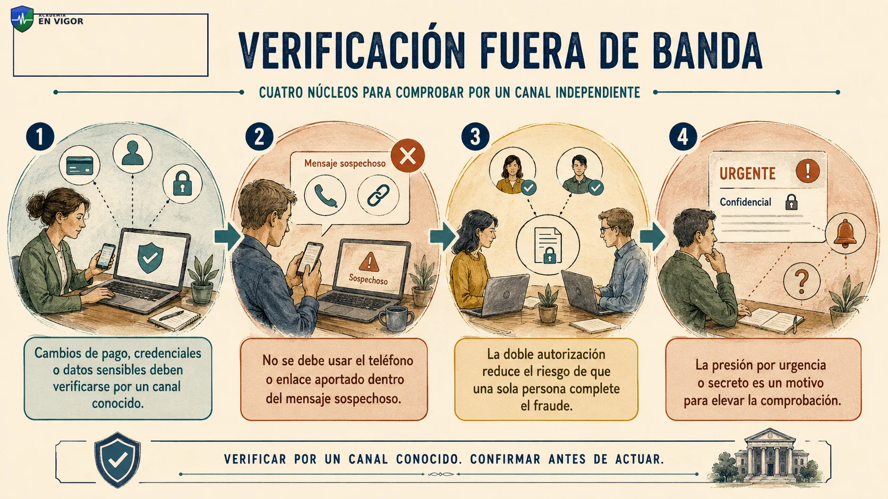

<em>Infografía: Verificación fuera de banda.</em>

<!-- FUENTE: FBI-SCAMS-T41 -->

## 38. Malware

**Idea de control:** Malware es software, firmware o código diseñado para realizar acciones maliciosas.

- Malware es software, firmware o código diseñado para realizar acciones maliciosas.
- Puede robar, alterar, cifrar, espiar, controlar, propagarse o interrumpir.
- Virus, gusano, troyano, spyware y ransomware describen comportamientos o finalidades diferentes.
- Una muestra puede reunir varias capacidades y etiquetas.

<!-- VISUAL:t41-38-malware.webp -->

  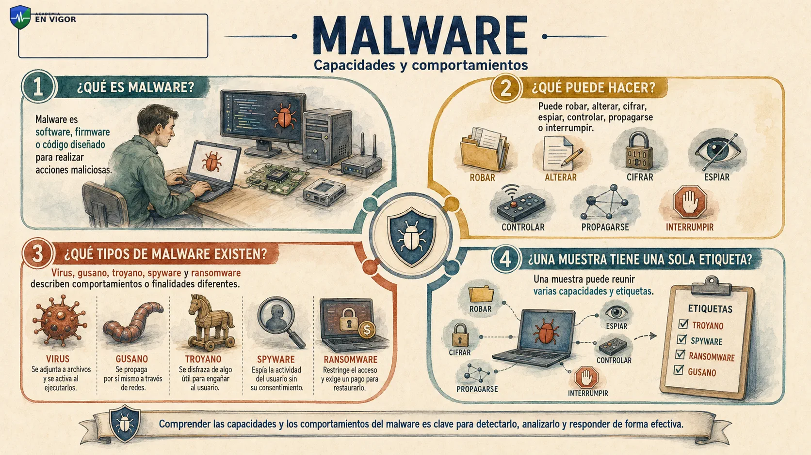

<em>Infografía: Malware.</em>

<!-- FUENTE: CISA-MPR-T41 -->

## 39. Clasificar malware

**Idea de control:** El malware puede clasificarse por propagación, forma de entrada, persistencia, carga o finalidad.

- El malware puede clasificarse por propagación, forma de entrada, persistencia, carga o finalidad.
- Una etiqueta no excluye otras: un troyano puede instalar spyware o ransomware.
- Botnet describe una infraestructura; bot o agente puede ser la carga instalada.
- La clasificación debe explicar comportamiento observable y no solo el nombre comercial.

<!-- VISUAL:t41-39-clasificar-malware.webp -->

  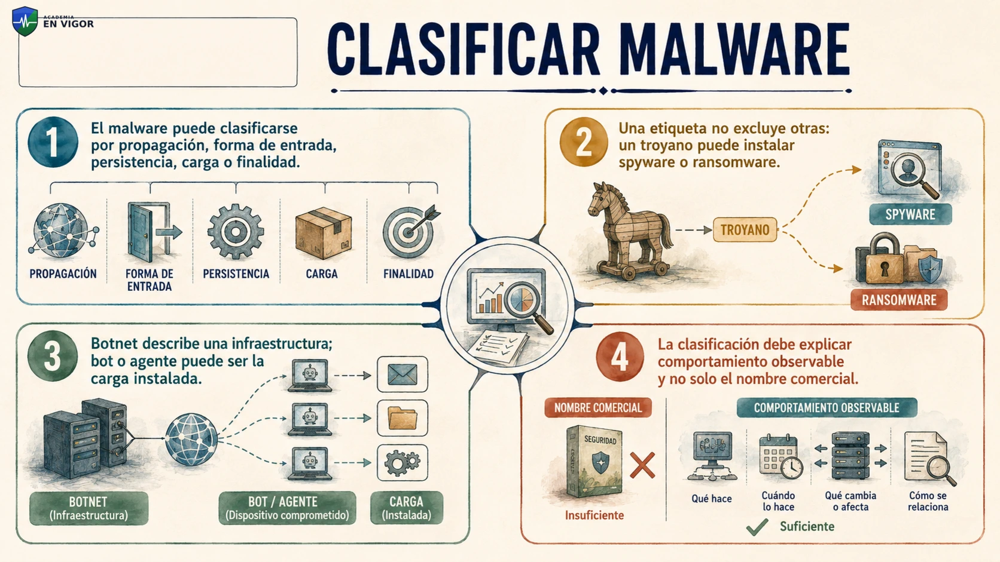

<em>Infografía: Clasificar malware.</em>

<!-- FUENTE: NIST-IR7298-T41 -->

## 40. Virus informático

**Idea de control:** Un virus se inserta o vincula a archivos, programas o áreas de arranque para replicarse.

- Un virus se inserta o vincula a archivos, programas o áreas de arranque para replicarse.
- Suele requerir la ejecución del huésped o una acción que active el código infectado.
- La carga dañina y el mecanismo de replicación son aspectos distintos.
- No todo malware se replica ni todo código autorreplicante es un troyano.

<!-- VISUAL:t41-il-40-virus-informatico.webp -->

  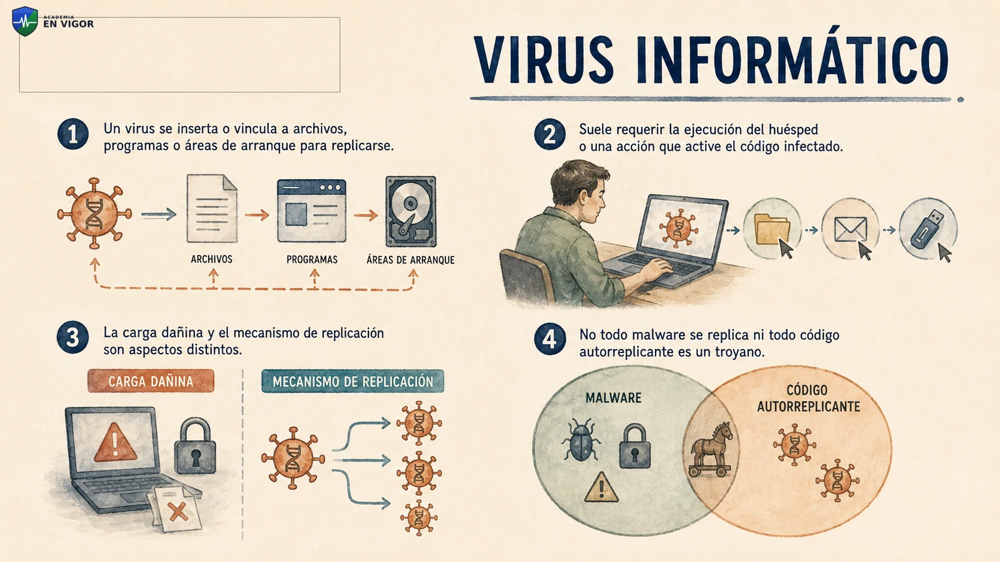

<em>Infografía: Virus informático.</em>

<!-- FUENTE: NIST-IR7298-T41 -->

## 41. Gusano

**Idea de control:** Un gusano se replica y propaga entre sistemas o redes sin depender de infectar un archivo huésped.

- Un gusano se replica y propaga entre sistemas o redes sin depender de infectar un archivo huésped.
- Puede explotar servicios vulnerables, credenciales o configuraciones.
- La propagación automática puede producir gran impacto operativo.
- Un gusano puede transportar otras cargas, incluido ransomware.

<!-- VISUAL:t41-41-gusano.webp -->

  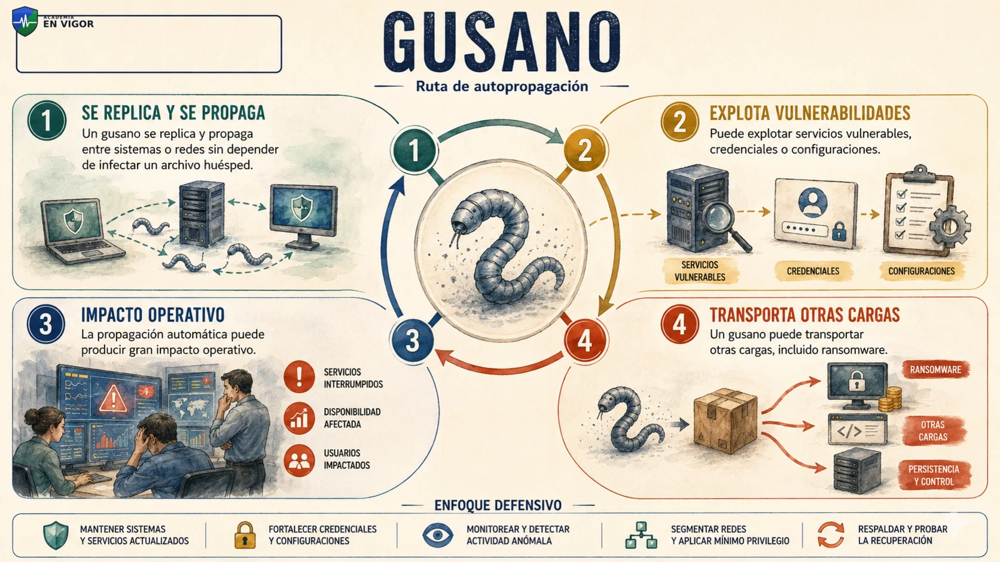

<em>Infografía: Gusano.</em>

<!-- FUENTE: NIST-IR7298-T41 -->

## 42. Troyano

**Idea de control:** Un troyano se presenta como legítimo o útil para inducir su instalación o ejecución.

- Un troyano se presenta como legítimo o útil para inducir su instalación o ejecución.
- Su rasgo definitorio es el engaño, no la autorreplicación.
- Puede descargar otras cargas, robar información o abrir acceso remoto.
- No todo troyano es un RAT y no todo acceso remoto legítimo es un troyano.

<!-- VISUAL:t41-42-troyano.webp -->

  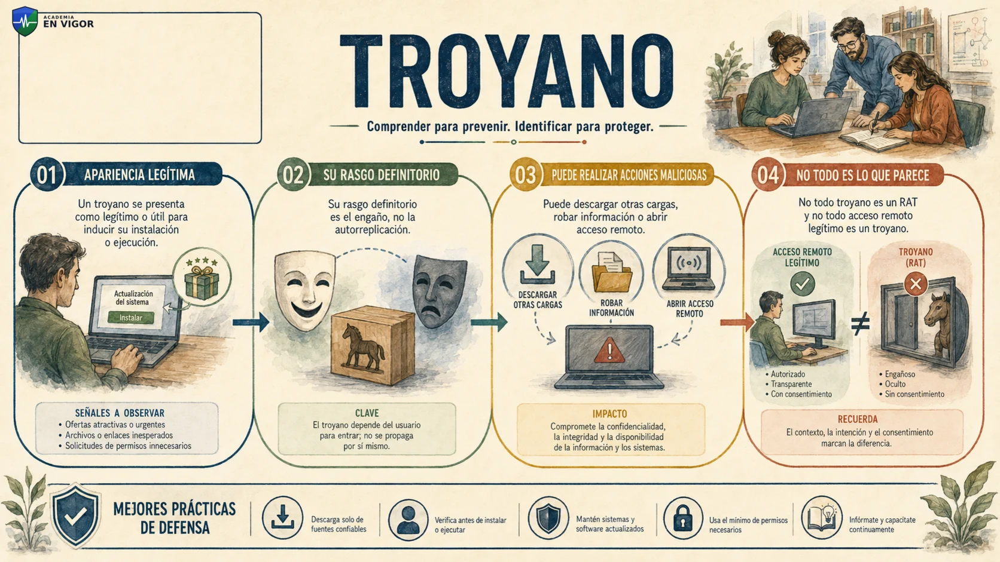

<em>Infografía: Troyano.</em>

<!-- FUENTE: NIST-IR7298-T41 -->

## 43. RAT y backdoor

**Idea de control:** Un RAT proporciona capacidades de administración remota usadas maliciosamente.

- Un RAT proporciona capacidades de administración remota usadas maliciosamente.
- Una backdoor ofrece un acceso que evita o elude el mecanismo normal.
- Un troyano puede instalar un RAT o una backdoor, pero los términos no son idénticos.
- Herramientas legítimas de acceso remoto pueden abusarse sin convertirse por nombre en malware.

<!-- VISUAL:t41-43-rat-y-backdoor.webp -->

  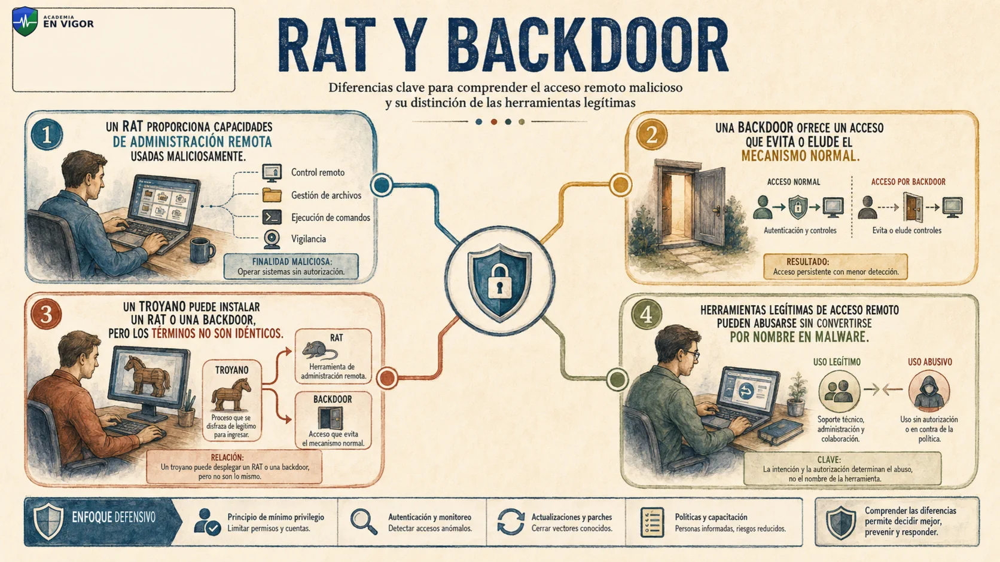

<em>Infografía: RAT y backdoor.</em>

<!-- FUENTE: MITRE-ATTACK-T41 -->

## 44. Spyware

**Idea de control:** Spyware recopila información o actividad sin conocimiento o consentimiento adecuados.

- Spyware recopila información o actividad sin conocimiento o consentimiento adecuados.
- Puede registrar navegación, credenciales, comunicaciones, ubicación o datos del sistema.
- La captura puede ser selectiva o continua y combinarse con exfiltración.
- Adware intrusivo y spyware pueden solaparse, pero no son equivalentes.

<!-- VISUAL:t41-44-spyware.webp -->

  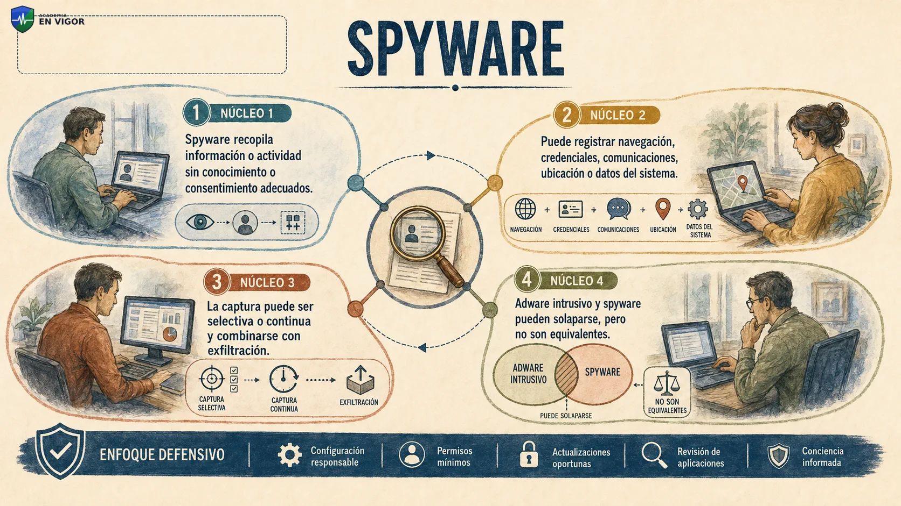

<em>Infografía: Spyware.</em>

<!-- FUENTE: CISA-MPR-T41 -->

## 45. Keylogger e infostealer

**Idea de control:** Un keylogger registra pulsaciones o entradas para obtener información.

- Un keylogger registra pulsaciones o entradas para obtener información.
- Un infostealer busca credenciales, cookies, carteras, archivos u otros datos de valor.
- El keylogging puede ser una capacidad dentro de spyware o de un troyano.
- Robar cookies de sesión puede permitir acceso sin conocer la contraseña.

<!-- VISUAL:t41-il-45-keylogger-e-infostealer.webp -->

  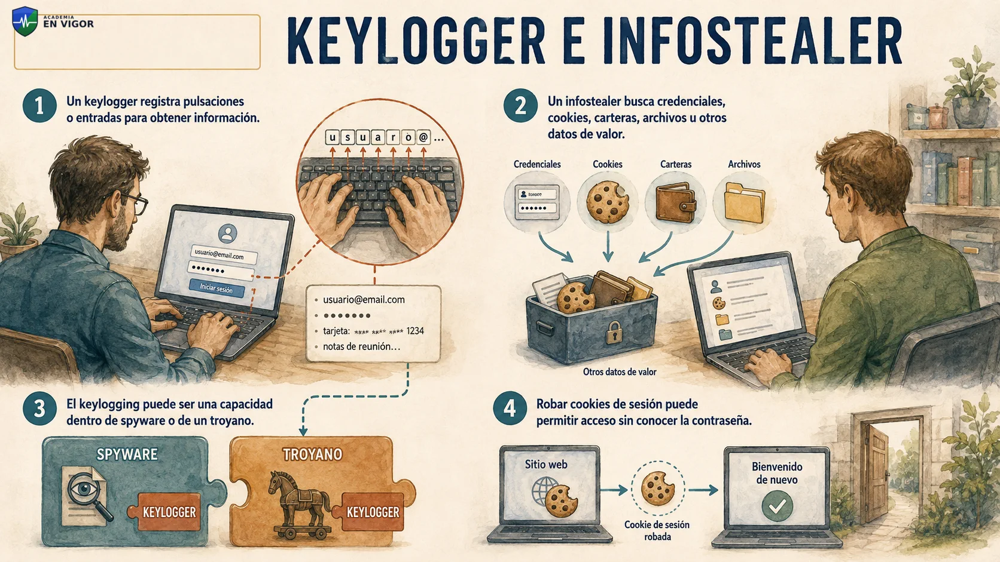

<em>Infografía: Keylogger e infostealer.</em>

<!-- FUENTE: CISA-MPR-T41 -->

## 46. Ransomware

**Idea de control:** Ransomware es malware que cifra datos o bloquea sistemas para exigir un rescate.

- Ransomware es malware que cifra datos o bloquea sistemas para exigir un rescate.
- La demanda puede acompañarse de amenaza de publicación, venta o daño adicional.
- Pagar no garantiza descifrado, borrado de datos ni ausencia de nuevas extorsiones.
- La respuesta debe priorizar contención, preservación, continuidad y recuperación.

<!-- VISUAL:t41-46-ransomware.webp -->

  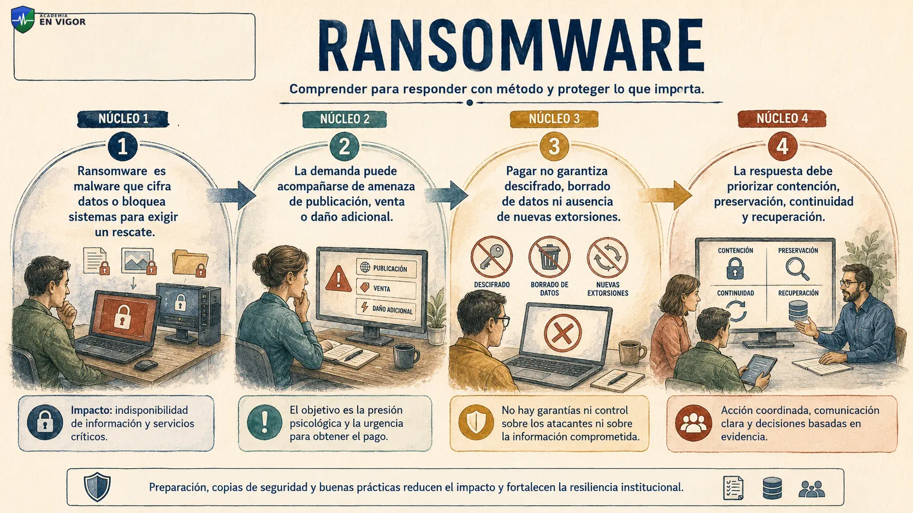

<em>Infografía: Ransomware.</em>

<!-- FUENTE: CISA-RANSOMWARE-T41 -->

## 47. Locker y crypto-ransomware

**Idea de control:** Locker ransomware impide usar el dispositivo o la sesión sin cifrar necesariamente todos los archivos.

- Locker ransomware impide usar el dispositivo o la sesión sin cifrar necesariamente todos los archivos.
- Crypto-ransomware cifra datos para volverlos inaccesibles.
- Un aviso policial falso puede ser una técnica de intimidación de un locker.
- Las variantes pueden combinar bloqueo, cifrado y robo.

<!-- VISUAL:t41-47-locker-y-crypto-ransomware.webp -->

  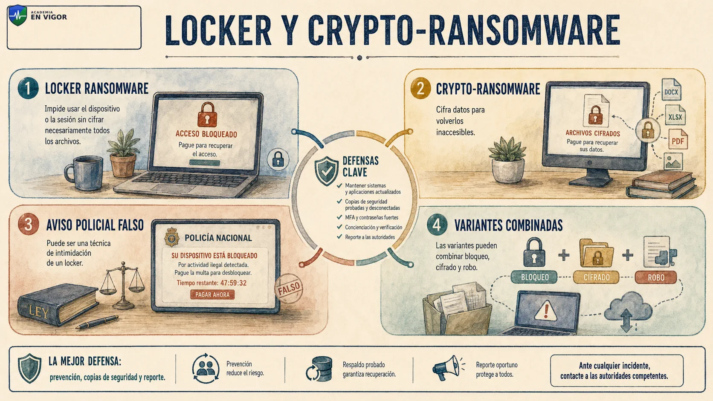

<em>Infografía: Locker y crypto-ransomware.</em>

<!-- FUENTE: CISA-RANSOMWARE-T41 -->

## 48. Doble y múltiple extorsión

**Idea de control:** La doble extorsión añade amenaza de divulgar datos al cifrado o bloqueo.

- La doble extorsión añade amenaza de divulgar datos al cifrado o bloqueo.
- La presión puede ampliarse con DDoS, contacto a terceros o publicación parcial.
- Tener copias reduce el impacto del cifrado, pero no neutraliza una filtración.
- Exfiltración y cifrado son hechos distintos que requieren evidencias separadas.

<!-- VISUAL:t41-48-doble-y-multiple-extorsion.webp -->

  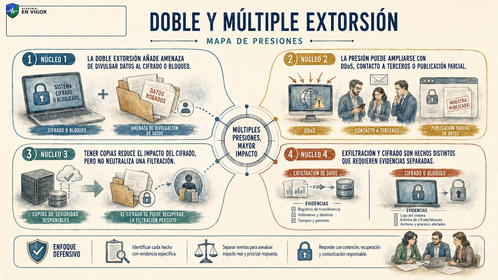

<em>Infografía: Doble y múltiple extorsión.</em>

<!-- FUENTE: ENISA-TL-2025-T41 -->

## 49. Vectores de infección

**Idea de control:** El malware puede llegar por phishing, explotación, credenciales comprometidas, descargas o cadena de suministro.

- El malware puede llegar por phishing, explotación, credenciales comprometidas, descargas o cadena de suministro.
- Un adjunto puede requerir interacción, mientras una vulnerabilidad expuesta puede permitir ejecución remota.
- El acceso inicial puede venderse a otro actor.
- Conocer el vector permite cerrar la causa y no solo borrar la carga.

<!-- VISUAL:t41-49-vectores-de-infeccion.webp -->

  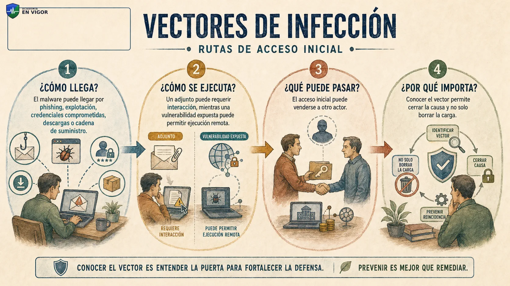

<em>Infografía: Vectores de infección.</em>

<!-- FUENTE: CISA-MPR-T41 -->

## 50. Persistencia y escalada de privilegios

**Idea de control:** La persistencia busca conservar acceso tras reinicio, cierre de sesión o cambios.

- La persistencia busca conservar acceso tras reinicio, cierre de sesión o cambios.
- La escalada de privilegios intenta obtener permisos superiores.
- Son objetivos diferentes aunque una técnica contribuya a ambos.
- Cuentas, servicios, tareas y configuraciones pueden usarse para persistencia.

<!-- VISUAL:t41-il-50-persistencia-y-escalada-de-privilegios.webp -->

  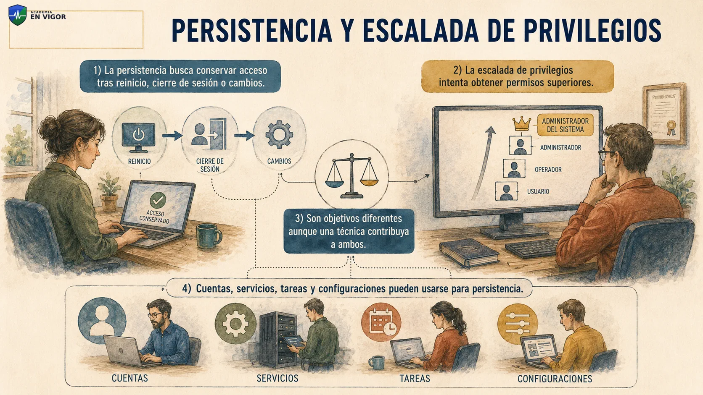

<em>Infografía: Persistencia y escalada de privilegios.</em>

<!-- FUENTE: MITRE-ATTACK-T41 -->

## 51. Comando y control

**Idea de control:** El C2 permite al adversario enviar órdenes y recibir datos de sistemas comprometidos.

- El C2 permite al adversario enviar órdenes y recibir datos de sistemas comprometidos.
- Puede usar protocolos comunes, servicios web, infraestructura intermedia o canales encubiertos.
- Bloquear un dominio puede interrumpir una campaña sin eliminar la persistencia local.
- C2 es una función de operación y no una familia concreta de malware.

<!-- VISUAL:t41-51-comando-y-control.webp -->

  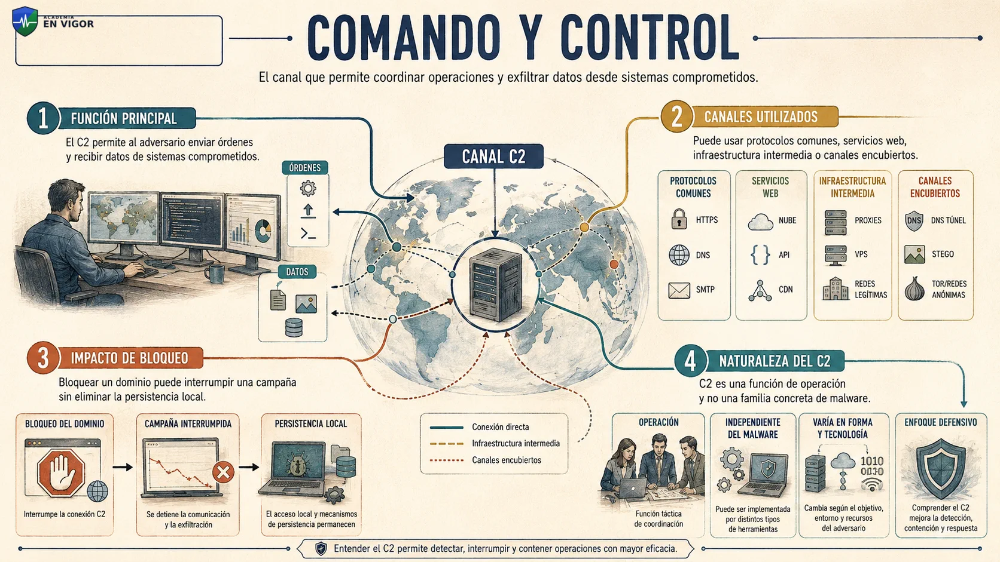

<em>Infografía: Comando y control.</em>

<!-- FUENTE: MITRE-ATTACK-T41 -->

## 52. Indicadores de malware

**Idea de control:** Hashes, dominios, procesos, claves, conexiones y comportamientos pueden actuar como indicadores.

- Hashes, dominios, procesos, claves, conexiones y comportamientos pueden actuar como indicadores.
- Un hash identifica una muestra concreta, pero pequeñas modificaciones generan otro.
- Los indicadores deben contextualizarse por fuente, fecha y confianza.
- Ausencia de una firma conocida no demuestra ausencia de malware.

<!-- VISUAL:t41-52-indicadores-de-malware.webp -->

  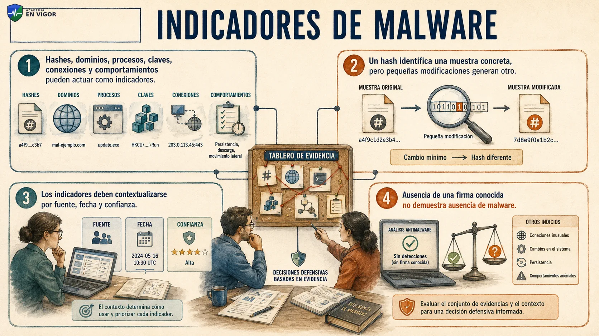

<em>Infografía: Indicadores de malware.</em>

<!-- FUENTE: NIST-SP800-150-T41 -->

## 53. Prevención y recuperación de malware

**Idea de control:** Parches, autenticación resistente, mínimo privilegio y segmentación reducen oportunidades e impacto.

- Parches, autenticación resistente, mínimo privilegio y segmentación reducen oportunidades e impacto.
- Copias aisladas y probadas permiten recuperar sin depender del atacante.
- La respuesta incluye aislar, investigar, erradicar, restaurar y vigilar.
- Restaurar antes de cerrar persistencia o credenciales facilita recaída.

<!-- VISUAL:t41-53-prevencion-y-recuperacion-de-malware.webp -->

  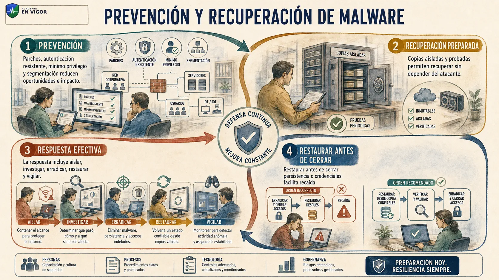

<em>Infografía: Prevención y recuperación de malware.</em>

<!-- FUENTE: CISA-RANSOMWARE-T41 -->

## 54. Inyección

**Idea de control:** Una inyección ocurre cuando datos no confiables alteran la estructura o instrucciones enviadas a un intérprete.

- Una inyección ocurre cuando datos no confiables alteran la estructura o instrucciones enviadas a un intérprete.
- Puede afectar SQL, comandos, LDAP, expresiones u otros lenguajes.
- La causa central es mezclar datos y código sin controles adecuados al contexto.
- El impacto depende de permisos y capacidad del intérprete.

<!-- VISUAL:t41-54-inyeccion.webp -->

  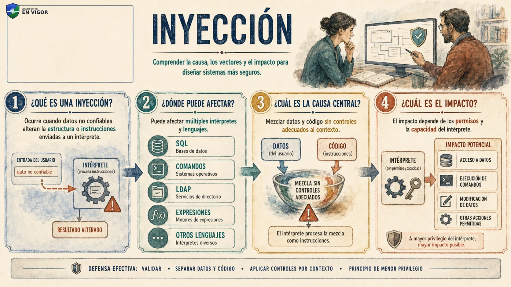

<em>Infografía: Inyección.</em>

<!-- FUENTE: OWASP-INJECTION-T41 -->

## 55. Inyección SQL

**Idea de control:** SQL injection permite que una entrada controlada modifique el significado de una consulta SQL.

- SQL injection permite que una entrada controlada modifique el significado de una consulta SQL.
- Suele aparecer cuando se concatenan datos del usuario en consultas dinámicas.
- Puede afectar parámetros, cabeceras, cookies u otros campos que alimenten la consulta.
- No exige que el atacante vea directamente los errores de la base de datos.

<!-- VISUAL:t41-il-55-inyeccion-sql.webp -->

  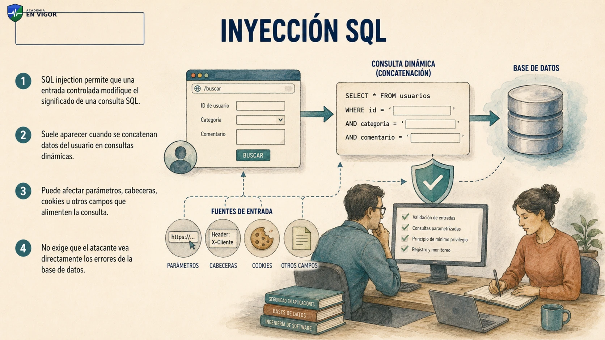

<em>Infografía: Inyección SQL.</em>

<!-- FUENTE: OWASP-SQLI-T41 -->

## 56. Causa de SQLi

**Idea de control:** Concatenar entrada no confiable con código SQL crea riesgo de alterar la consulta.

- Concatenar entrada no confiable con código SQL crea riesgo de alterar la consulta.
- Escapar caracteres de forma genérica no sustituye una interfaz parametrizada.
- La validación positiva complementa, pero no reemplaza, la separación de datos y consulta.
- ORM y procedimientos almacenados pueden ser vulnerables si construyen SQL dinámico inseguro.

<!-- VISUAL:t41-56-causa-de-sqli.webp -->

  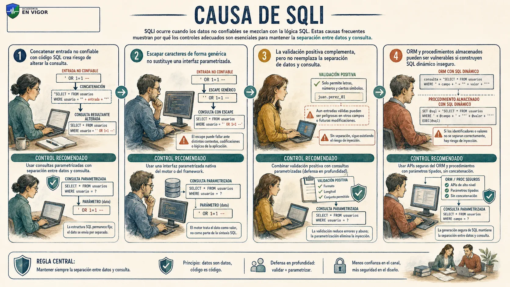

<em>Infografía: Causa de SQLi.</em>

<!-- FUENTE: OWASP-INJECTION-T41 -->

## 57. Impactos de SQLi

**Idea de control:** Una SQLi puede eludir controles lógicos o leer registros no autorizados.

- Una SQLi puede eludir controles lógicos o leer registros no autorizados.
- También puede modificar o borrar datos si la cuenta de base dispone de permisos.
- Algunas configuraciones permiten invocar funciones o alcanzar otros recursos.
- El mínimo privilegio limita consecuencias aunque no corrige la vulnerabilidad.

<!-- VISUAL:t41-57-impactos-de-sqli.webp -->

  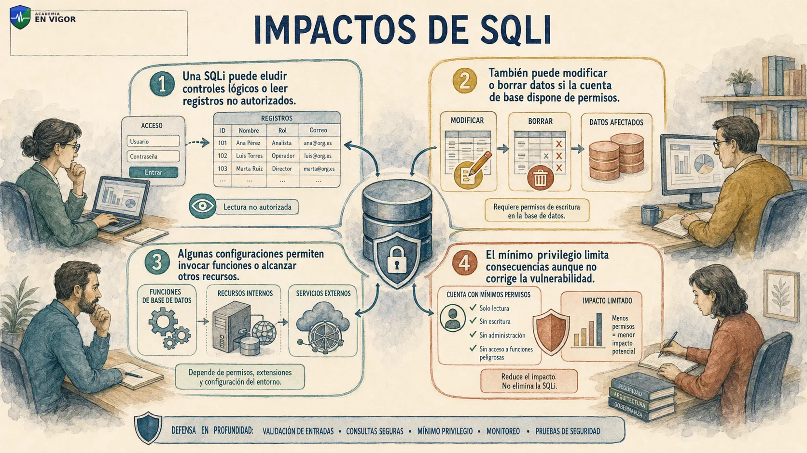

<em>Infografía: Impactos de SQLi.</em>

<!-- FUENTE: OWASP-INJECTION-T41 -->

## 58. SQLi visible, ciega y basada en tiempo

**Idea de control:** La inyección visible devuelve datos o errores útiles en la respuesta.

- La inyección visible devuelve datos o errores útiles en la respuesta.
- La inyección ciega infiere resultados mediante diferencias booleanas o de comportamiento.
- La variante basada en tiempo usa retrasos observables como canal.
- No recibir errores SQL no demuestra que la consulta sea segura.

<!-- VISUAL:t41-58-sqli-visible-ciega-y-basada-en-tiempo.webp -->

  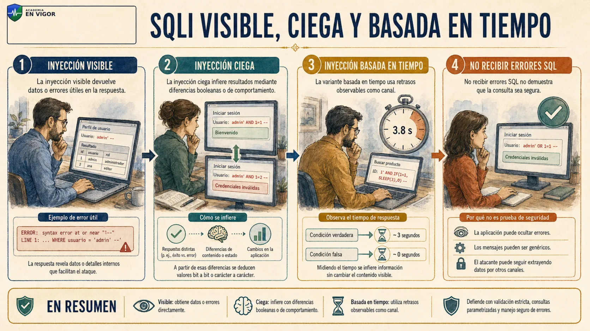

<em>Infografía: SQLi visible, ciega y basada en tiempo.</em>

<!-- FUENTE: OWASP-SQLI-T41 -->

## 59. Consultas parametrizadas

**Idea de control:** Las consultas parametrizadas separan la estructura SQL de los valores aportados.

- Las consultas parametrizadas separan la estructura SQL de los valores aportados.
- El motor trata los parámetros como datos, no como fragmentos de consulta.
- Los nombres dinámicos de tablas o columnas requieren diseño y listas permitidas específicas.
- Parametrizar debe aplicarse en todos los caminos que construyen consultas.

<!-- VISUAL:t41-59-consultas-parametrizadas.webp -->

  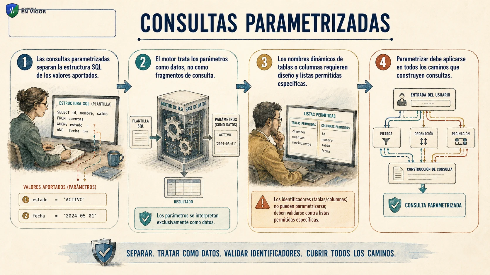

<em>Infografía: Consultas parametrizadas.</em>

<!-- FUENTE: OWASP-SQLI-T41 -->

## 60. Mínimo privilegio y validación en SQLi

**Idea de control:** La cuenta de base debe tener solo los permisos necesarios para la función.

- La cuenta de base debe tener solo los permisos necesarios para la función.
- La validación positiva limita formatos y valores esperados.
- Ocultar errores reduce información, pero no corrige la consulta vulnerable.
- Defensa en profundidad combina parametrización, validación y privilegios limitados.

<!-- VISUAL:t41-il-60-minimo-privilegio-y-validacion-en-sqli.webp -->

  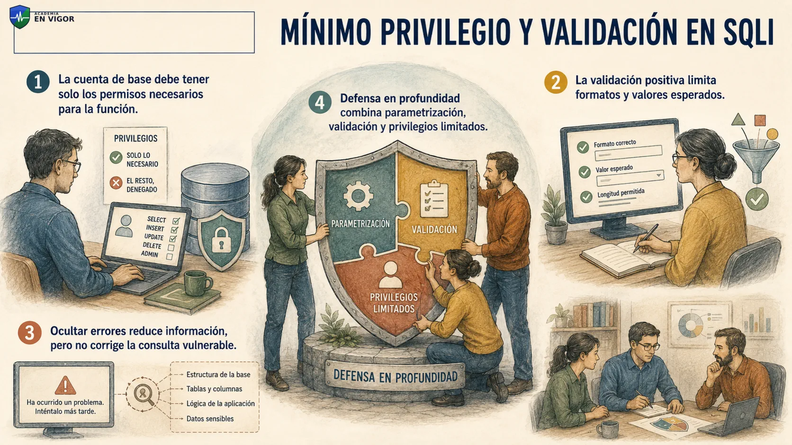

<em>Infografía: Mínimo privilegio y validación en SQLi.</em>

<!-- FUENTE: OWASP-SQLI-T41 -->

## 61. Cross-Site Scripting

**Idea de control:** XSS permite que contenido controlado por el atacante se ejecute en el navegador de otra persona.

- XSS permite que contenido controlado por el atacante se ejecute en el navegador de otra persona.
- La aplicación incorpora datos no confiables en una salida sin tratamiento adecuado al contexto.
- El navegador puede confiar en el código porque aparece dentro del origen legítimo.
- XSS ataca principalmente al usuario y su sesión, no al intérprete SQL.

<!-- VISUAL:t41-61-cross-site-scripting.webp -->

  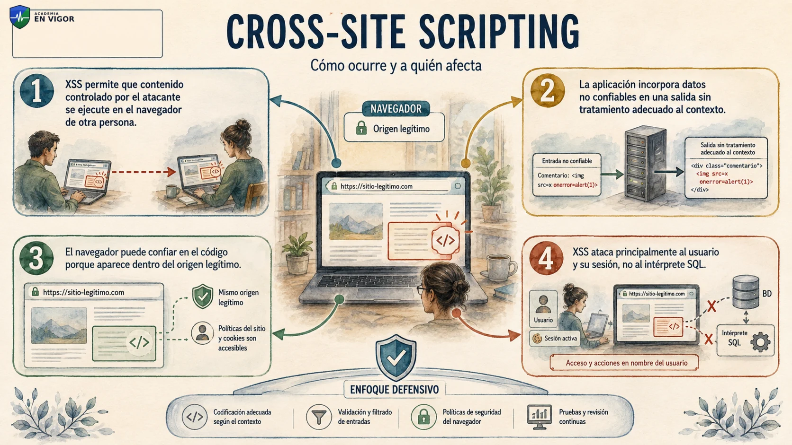

<em>Infografía: Cross-Site Scripting.</em>

<!-- FUENTE: OWASP-XSS-T41 -->

## 62. XSS reflejado

**Idea de control:** En XSS reflejado, la carga llega en una solicitud y reaparece en la respuesta.

- En XSS reflejado, la carga llega en una solicitud y reaparece en la respuesta.
- La víctima suele abrir un enlace o enviar un formulario manipulado.
- La carga no queda almacenada necesariamente en el servidor.
- La ejecución ocurre en el navegador bajo el contexto del sitio vulnerable.

<!-- VISUAL:t41-62-xss-reflejado.webp -->

  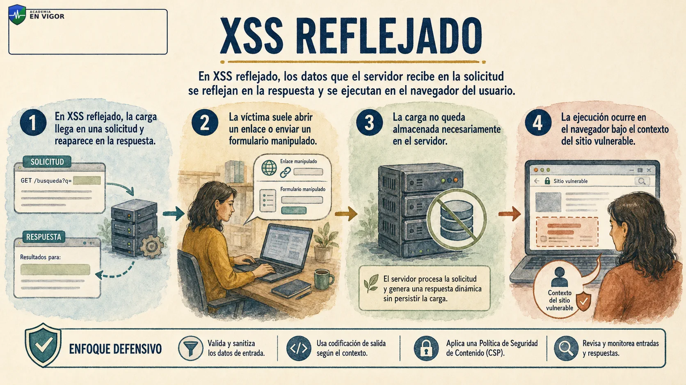

<em>Infografía: XSS reflejado.</em>

<!-- FUENTE: OWASP-XSS-T41 -->

## 63. XSS almacenado

**Idea de control:** En XSS almacenado, la aplicación guarda la carga y la entrega posteriormente a usuarios.

- En XSS almacenado, la aplicación guarda la carga y la entrega posteriormente a usuarios.
- Comentarios, perfiles, tickets o registros pueden actuar como almacén.
- La víctima puede ejecutar el script al visitar la página sin abrir el enlace original del atacante.
- Puede afectar a múltiples usuarios y a cuentas privilegiadas.

<!-- VISUAL:t41-63-xss-almacenado.webp -->

  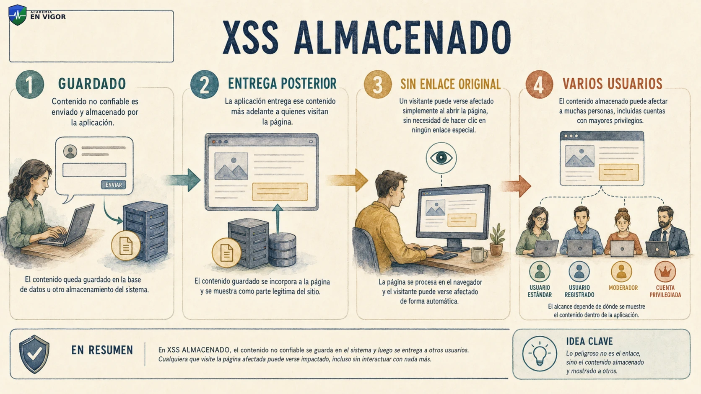

<em>Infografía: XSS almacenado.</em>

<!-- FUENTE: OWASP-XSS-T41 -->

## 64. XSS basado en DOM

**Idea de control:** DOM XSS surge cuando código del navegador lleva datos controlables a un sumidero peligroso.

- DOM XSS surge cuando código del navegador lleva datos controlables a un sumidero peligroso.
- La carga puede ejecutarse sin que el servidor la refleje en HTML.
- Origen y sumidero deben analizarse dentro del flujo de JavaScript.
- DOM, almacenado y reflejado describen dimensiones que pueden solaparse.

<!-- VISUAL:t41-64-xss-basado-en-dom.webp -->

  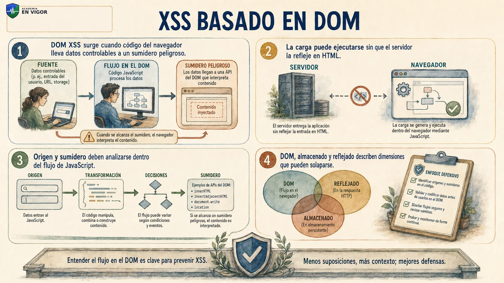

<em>Infografía: XSS basado en DOM.</em>

<!-- FUENTE: OWASP-XSS-T41 -->

## 65. Impacto de XSS

**Idea de control:** XSS puede leer datos accesibles al script, modificar contenido o realizar acciones en nombre de la víctima.

- XSS puede leer datos accesibles al script, modificar contenido o realizar acciones en nombre de la víctima.
- Puede facilitar secuestro de sesión si obtiene tokens utilizables.
- HttpOnly limita lectura de cookies, pero no impide toda acción XSS.
- El impacto depende del origen, privilegios y controles del navegador.

<!-- VISUAL:t41-il-65-impacto-de-xss.webp -->

  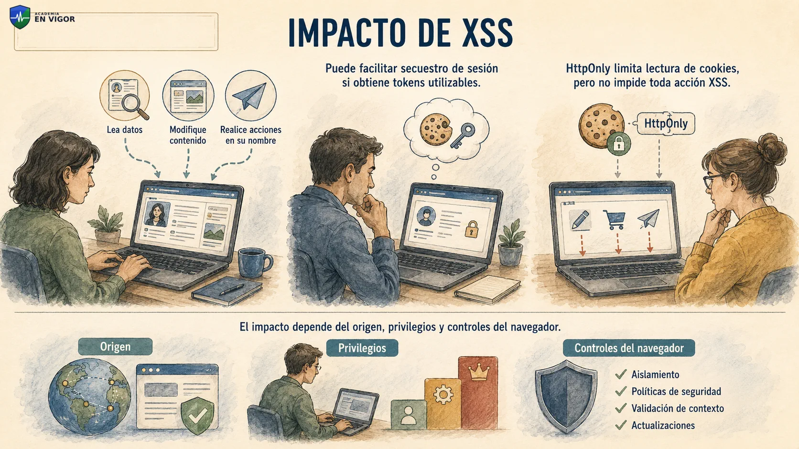

<em>Infografía: Impacto de XSS.</em>

<!-- FUENTE: OWASP-XSS-T41 -->

## 66. Prevención de XSS

**Idea de control:** La salida debe codificarse según contexto HTML, atributo, URL o JavaScript.

- La salida debe codificarse según contexto HTML, atributo, URL o JavaScript.
- Las plantillas con autoescape ayudan si no se desactivan o eluden.
- Sanitizar HTML es necesario cuando se admite marcado no confiable.
- CSP puede reducir impacto, pero no sustituye codificación y diseño seguros.

<!-- VISUAL:t41-66-prevencion-de-xss.webp -->

  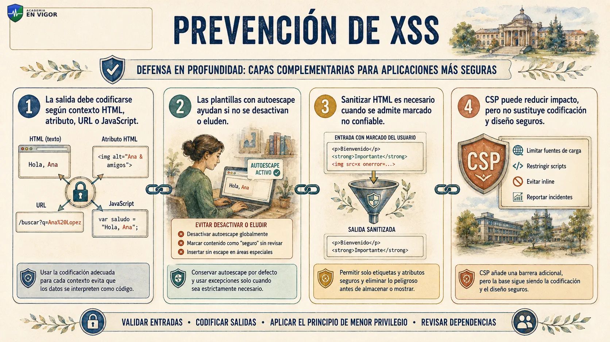

<em>Infografía: Prevención de XSS.</em>

<!-- FUENTE: OWASP-XSS-T41 -->

## 67. Vulnerabilidad y exploit

**Idea de control:** La vulnerabilidad es la debilidad; el exploit es el medio que la aprovecha.

- La vulnerabilidad es la debilidad; el exploit es el medio que la aprovecha.
- Puede existir vulnerabilidad sin exploit público conocido.
- Un exploit puede requerir condiciones, versión, configuración o interacción concretas.
- La severidad de la debilidad y el riesgo del entorno no son valores idénticos.

<!-- VISUAL:t41-67-vulnerabilidad-y-exploit.webp -->

  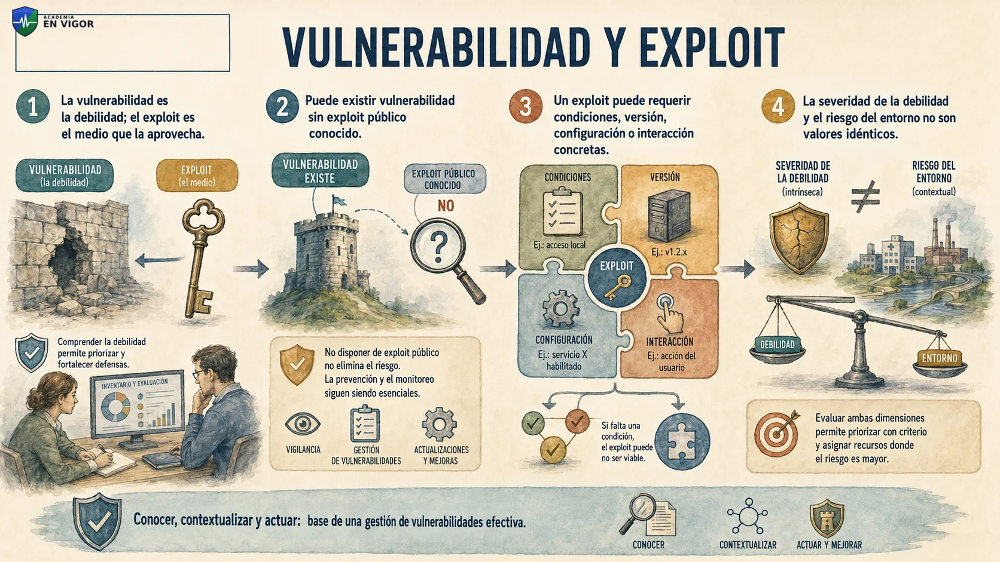

<em>Infografía: Vulnerabilidad y exploit.</em>

<!-- FUENTE: NIST-IR7298-T41 -->

## 68. Zero-day

**Idea de control:** Una vulnerabilidad zero-day es desconocida o no corregida por el proveedor en el momento relevante.

- Una vulnerabilidad zero-day es desconocida o no corregida por el proveedor en el momento relevante.
- Un exploit zero-day aprovecha esa debilidad antes de existir una defensa o parche disponible y desplegado.
- La etiqueta depende del estado de conocimiento y corrección, no de la antigüedad del software.
- Tras divulgarse y parchearse, la misma debilidad deja de ser zero-day aunque siga sin actualizarse en muchos equipos.

<!-- VISUAL:t41-68-zero-day.webp -->

  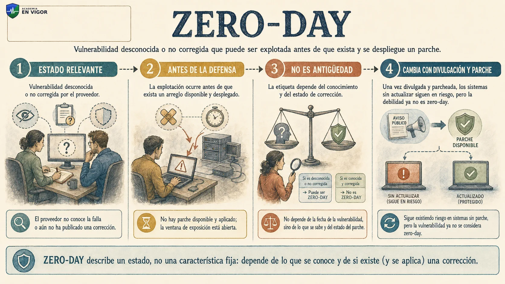

<em>Infografía: Zero-day.</em>

<!-- FUENTE: NIST-ZERODAY-T41 -->

## 69. Divulgación, parche y ventana de exposición

**Idea de control:** La publicación de un parche no actualiza automáticamente todos los sistemas.

- La publicación de un parche no actualiza automáticamente todos los sistemas.
- Una vulnerabilidad conocida y parcheada puede seguir explotándose en equipos desactualizados.
- WannaCry se propagó masivamente explotando una vulnerabilidad para la que Microsoft ya había publicado parche.
- Confundir vulnerabilidad conocida sin parchear con zero-day falsea la pregunta.

<!-- VISUAL:t41-69-divulgacion-parche-y-ventana-de-exposicion.webp -->

  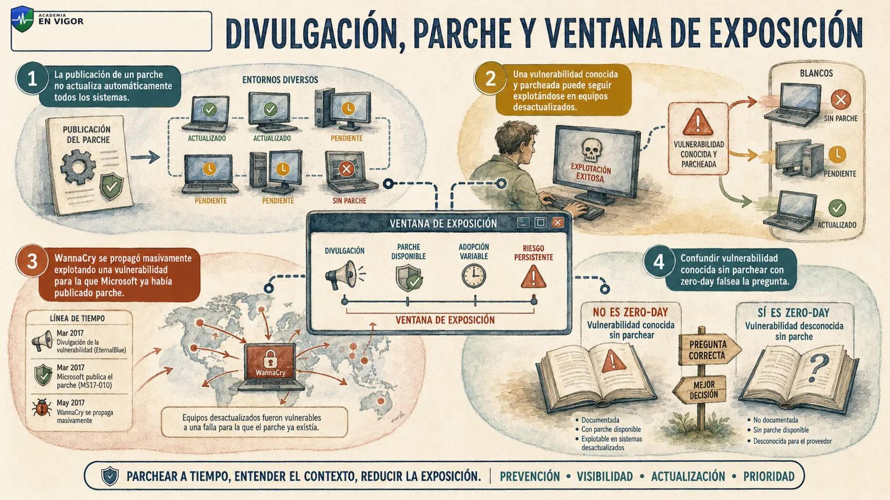

<em>Infografía: Divulgación, parche y ventana de exposición.</em>

<!-- FUENTE: NIST-ZERODAY-T41 -->

## 70. Skimming

**Idea de control:** Skimming es la captura y transferencia no autorizada de datos de una tarjeta o del entorno de pago.

- Skimming es la captura y transferencia no autorizada de datos de una tarjeta o del entorno de pago.
- Puede realizarse en cajeros, terminales o puntos de venta mediante dispositivos manipulados.
- El objetivo habitual es fraude, clonación o uso no autorizado de los datos.
- Puede acompañarse de captura del PIN mediante cámara o teclado superpuesto.

<!-- VISUAL:t41-il-70-skimming.webp -->

  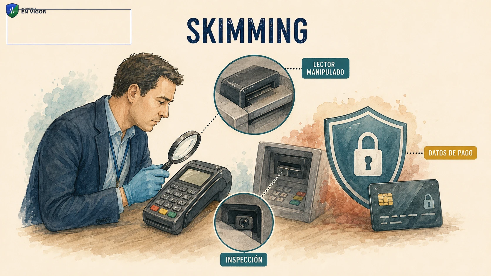

<em>Infografía: Skimming.</em>

<!-- FUENTE: PCI-SKIMMING-T41 -->

## 71. Dispositivos de skimming

**Idea de control:** Un skimmer puede instalarse sobre, dentro o junto al lector legítimo.

- Un skimmer puede instalarse sobre, dentro o junto al lector legítimo.
- Teclados falsos o cámaras pueden capturar el PIN.
- Algunos dispositivos almacenan datos y otros los transmiten.
- La apariencia externa normal no descarta manipulación interna.

<!-- VISUAL:t41-71-dispositivos-de-skimming.webp -->

  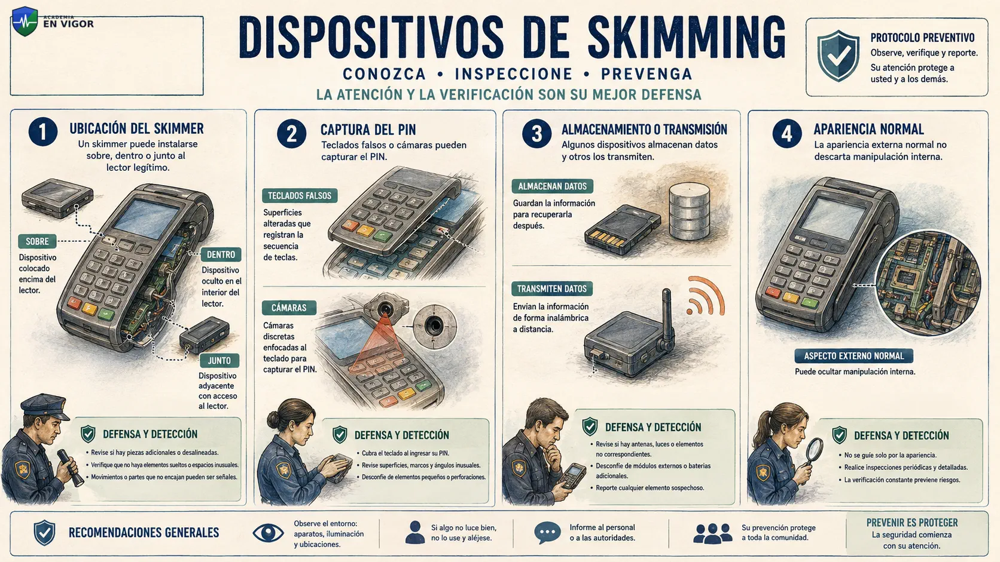

<em>Infografía: Dispositivos de skimming.</em>

<!-- FUENTE: PCI-SKIMMING-T41 -->

## 72. E-skimming

**Idea de control:** E-skimming inserta o carga código malicioso en un entorno de comercio electrónico para capturar datos de pago.

- E-skimming inserta o carga código malicioso en un entorno de comercio electrónico para capturar datos de pago.
- La información puede copiarse mientras el cliente la introduce antes de llegar al procesador legítimo.
- El ataque puede afectar scripts propios, terceros o cadena de suministro.
- La base de datos puede no ser el punto comprometido.

<!-- VISUAL:t41-72-e-skimming.webp -->

  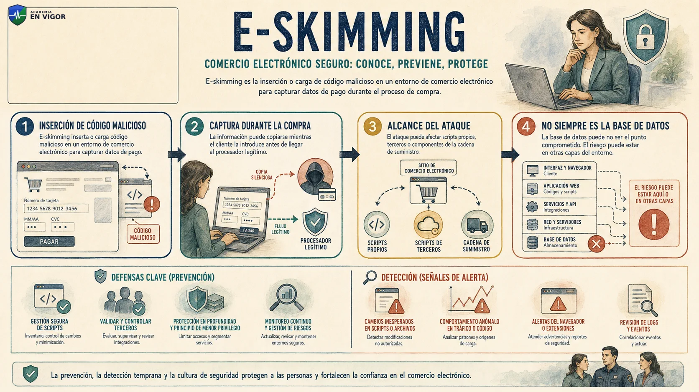

<em>Infografía: E-skimming.</em>

<!-- FUENTE: PCI-ESKIMMING-T41 -->

## 73. Scripts de terceros y cadena de suministro

**Idea de control:** Una página de pago puede ejecutar scripts de varios dominios y proveedores.

- Una página de pago puede ejecutar scripts de varios dominios y proveedores.
- Comprometer un tercero puede introducir código en múltiples comercios.
- Inventariar, autorizar y verificar integridad de scripts reduce el riesgo.
- Detectar cambios no autorizados en cabeceras y contenido es una medida clave.

<!-- VISUAL:t41-73-scripts-de-terceros-y-cadena-de-suministro.webp -->

  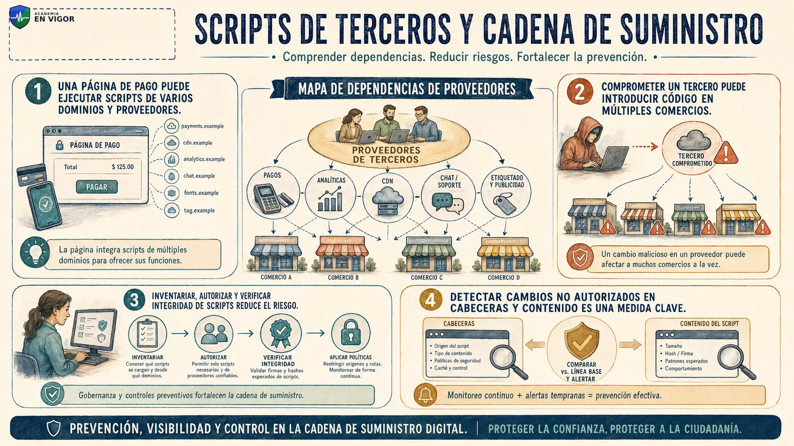

<em>Infografía: Scripts de terceros y cadena de suministro.</em>

<!-- FUENTE: PCI-ESKIMMING-T41 -->

## 74. Skimming frente a phishing

**Idea de control:** En skimming, los datos se capturan al usar un canal o terminal manipulado.

- En skimming, los datos se capturan al usar un canal o terminal manipulado.
- En phishing, la víctima es inducida a entregar datos en una comunicación o sitio engañoso.
- Ambos pueden terminar en fraude con tarjeta, pero el mecanismo probatorio difiere.
- E-skimming puede operar dentro de la tienda legítima sin imitar otra página.

<!-- VISUAL:t41-74-skimming-frente-a-phishing.webp -->

  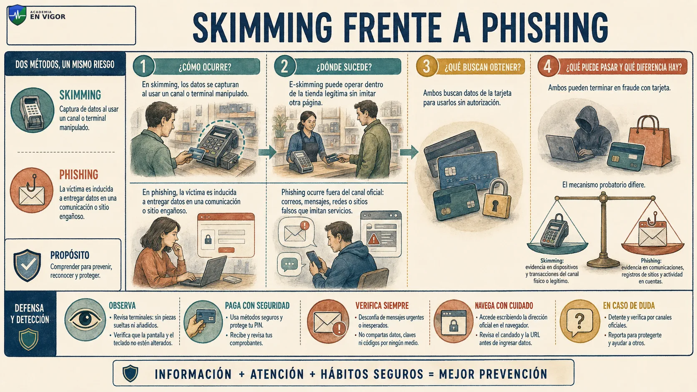

<em>Infografía: Skimming frente a phishing.</em>

<!-- FUENTE: PCI-SKIMMING-T41 -->

## 75. Detección y prevención del skimming

**Idea de control:** Terminales físicos requieren inventario, inspección y control de sustituciones o añadidos.

- Terminales físicos requieren inventario, inspección y control de sustituciones o añadidos.
- Páginas de pago requieren control de scripts, integridad y detección de cambios.
- La segmentación y el mínimo privilegio reducen alcance del compromiso.
- Una transacción correcta no demuestra que los datos no hayan sido copiados.

<!-- VISUAL:t41-il-75-deteccion-y-prevencion-del-skimming.webp -->

  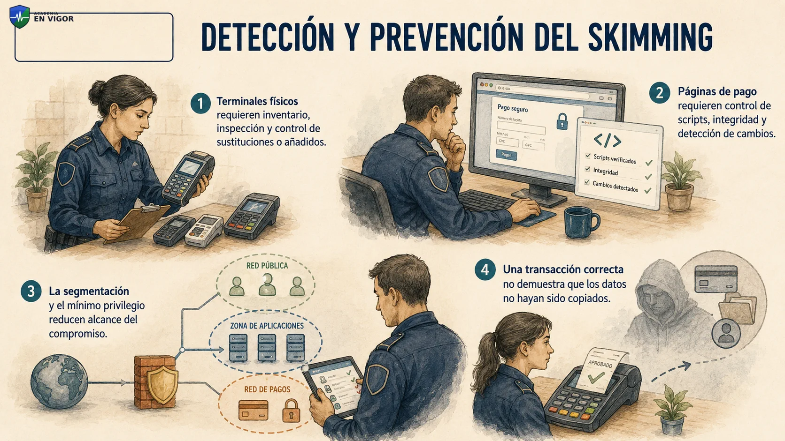

<em>Infografía: Detección y prevención del skimming.</em>

<!-- FUENTE: PCI-ESKIMMING-T41 -->

## 76. Cibercriminales

**Idea de control:** Cibercriminal es quien utiliza capacidades digitales para cometer, facilitar o monetizar delitos.

- Cibercriminal es quien utiliza capacidades digitales para cometer, facilitar o monetizar delitos.
- Puede actuar individualmente, en grupo, como afiliado o como proveedor especializado.
- No necesita desarrollar personalmente todas las herramientas utilizadas.
- La motivación económica es frecuente, pero no es la única posible.

<!-- VISUAL:t41-76-cibercriminales.webp -->

  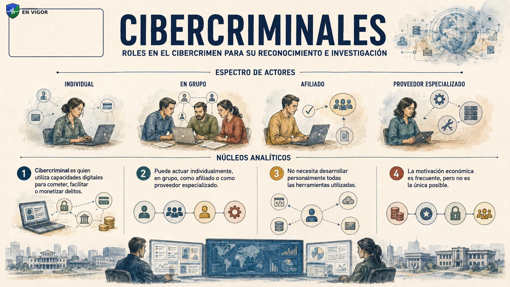

<em>Infografía: Cibercriminales.</em>

<!-- FUENTE: EUROPOL-IOCTA-2025-T41 -->

## 77. Motivaciones y capacidades

**Idea de control:** Los actores pueden buscar beneficio, espionaje, coerción, sabotaje, notoriedad o causa ideológica.

- Los actores pueden buscar beneficio, espionaje, coerción, sabotaje, notoriedad o causa ideológica.
- Capacidad, intención y oportunidad son dimensiones distintas.
- Una motivación compartida no prueba que dos campañas tengan el mismo autor.
- Los recursos disponibles condicionan persistencia, acceso y selección de objetivos.

<!-- VISUAL:t41-77-motivaciones-y-capacidades.webp -->

  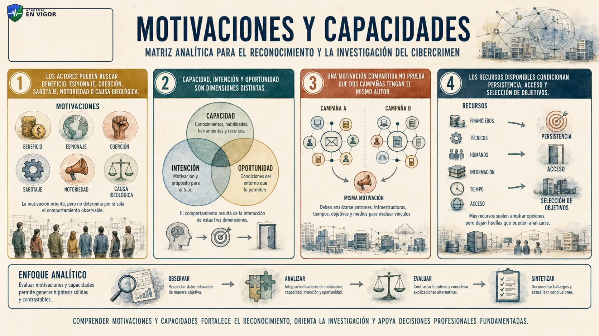

<em>Infografía: Motivaciones y capacidades.</em>

<!-- FUENTE: NIST-SP800-150-T41 -->

## 78. Ciberdelincuencia organizada

**Idea de control:** El ecosistema criminal separa desarrollo, acceso inicial, infraestructura, fraude, cobro y blanqueo.

- El ecosistema criminal separa desarrollo, acceso inicial, infraestructura, fraude, cobro y blanqueo.
- Los participantes pueden no conocerse personalmente y coordinarse mediante plataformas.
- La especialización aumenta escala y reduce barreras de entrada.
- Una operación puede ser organizada aunque sus miembros estén distribuidos.

<!-- VISUAL:t41-78-ciberdelincuencia-organizada.webp -->

  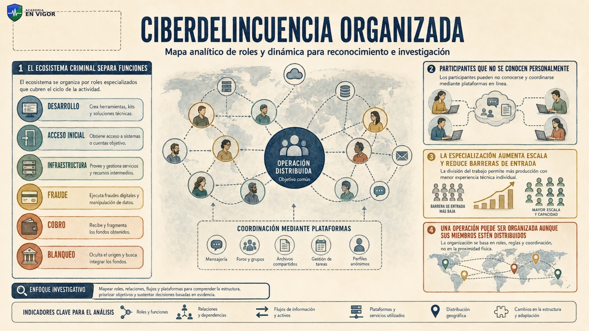

<em>Infografía: Ciberdelincuencia organizada.</em>

<!-- FUENTE: EUROPOL-IOCTA-2025-T41 -->

## 79. Crime as a Service

**Idea de control:** Crime as a Service ofrece herramientas, accesos, infraestructura o conocimientos criminales a clientes o afiliados.

- Crime as a Service ofrece herramientas, accesos, infraestructura o conocimientos criminales a clientes o afiliados.
- Puede funcionar mediante venta, alquiler, suscripción, comisión o reparto de beneficios.
- El cliente reduce necesidad de desarrollar capacidades propias.
- El modelo fragmenta responsabilidades, pero no vuelve lícito el servicio.

<!-- VISUAL:t41-79-crime-as-a-service.webp -->

  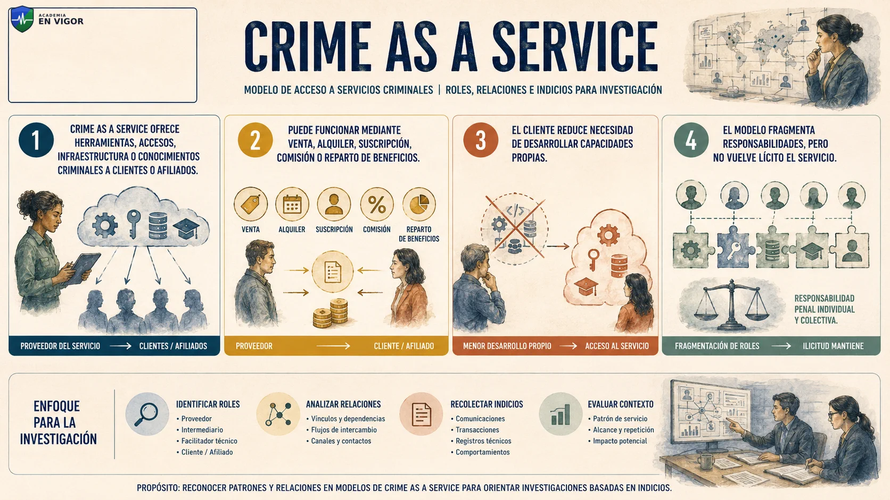

<em>Infografía: Crime as a Service.</em>

<!-- FUENTE: EUROPOL-CAAS-T41 -->

## 80. Malware, ransomware e infraestructura como servicio

**Idea de control:** Malware as a Service proporciona código, paneles, actualizaciones o soporte.

- Malware as a Service proporciona código, paneles, actualizaciones o soporte.
- Ransomware as a Service suele separar operador de plataforma y afiliado que ejecuta intrusiones.
- La infraestructura criminal puede incluir alojamiento, proxies, dominios o botnets.
- Las denominaciones comerciales describen modelos, no una autoría única.

<!-- VISUAL:t41-il-80-malware-ransomware-e-infraestructura-como-servicio.webp -->

  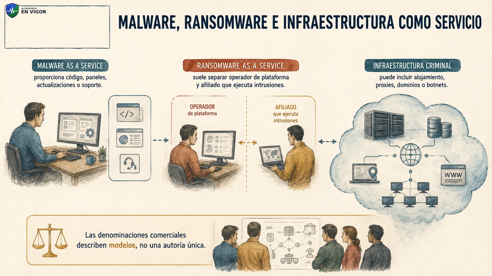

<em>Infografía: Malware, ransomware e infraestructura como servicio.</em>

<!-- FUENTE: EUROPOL-CAAS-T41 -->

## 81. Initial Access Brokers

**Idea de control:** Un intermediario de acceso inicial compromete organizaciones y vende o transfiere ese acceso.

- Un intermediario de acceso inicial compromete organizaciones y vende o transfiere ese acceso.
- Puede usar credenciales, servicios remotos o vulnerabilidades expuestas.
- El comprador despliega después espionaje, fraude o ransomware.
- Separar acceso y explotación final complica atribución y cronología.

<!-- VISUAL:t41-81-initial-access-brokers.webp -->

  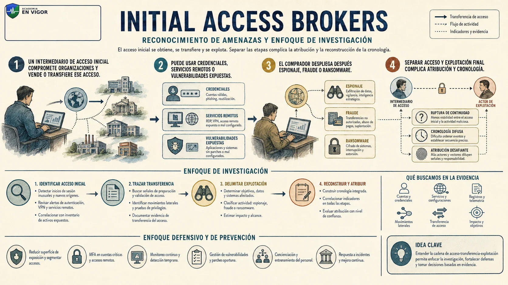

<em>Infografía: Initial Access Brokers.</em>

<!-- FUENTE: MITRE-ATTACK-T41 -->

## 82. Datos robados y monetización

**Idea de control:** Credenciales, cookies, documentos y datos personales pueden venderse o reutilizarse.

- Credenciales, cookies, documentos y datos personales pueden venderse o reutilizarse.
- Una misma filtración alimenta fraude, extorsión, acceso o ingeniería social.
- Los mercados e intermediarios conectan proveedores y compradores.
- El valor del dato depende de actualidad, acceso y posibilidad de abuso.

<!-- VISUAL:t41-82-datos-robados-y-monetizacion.webp -->

  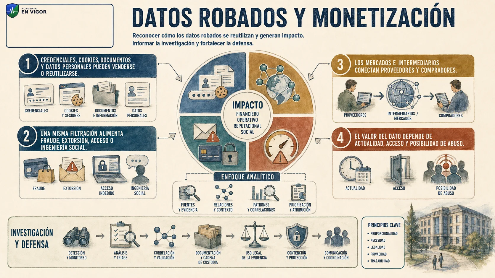

<em>Infografía: Datos robados y monetización.</em>

<!-- FUENTE: EUROPOL-IOCTA-2025-T41 -->

## 83. Afiliados, mulas y blanqueo

**Idea de control:** Los afiliados pueden aportar acceso y operación a cambio de parte del rescate o beneficio.

- Los afiliados pueden aportar acceso y operación a cambio de parte del rescate o beneficio.
- Las mulas reciben, transfieren o retiran fondos para dificultar el rastro.
- Criptoactivos no eliminan por sí solos trazabilidad ni necesidad de conversión.
- La cadena financiera forma parte de la operación aunque no ejecute malware.

<!-- VISUAL:t41-83-afiliados-mulas-y-blanqueo.webp -->

  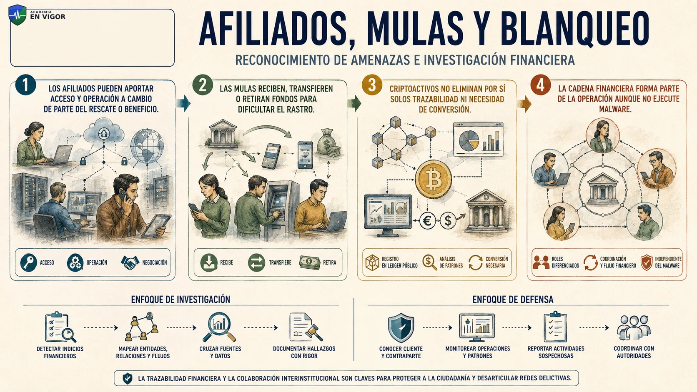

<em>Infografía: Afiliados, mulas y blanqueo.</em>

<!-- FUENTE: EUROPOL-CAAS-T41 -->

## 84. Hacktivistas

**Idea de control:** El hacktivismo usa acciones digitales para promover, protestar o imponer una causa política o social.

- El hacktivismo usa acciones digitales para promover, protestar o imponer una causa política o social.
- Puede incluir filtraciones, defacement, DDoS o difusión de información.
- La motivación alegada no convierte en lícito el método utilizado.
- Grupos y campañas pueden ser descentralizados y usar identidades colectivas.

<!-- VISUAL:t41-84-hacktivistas.webp -->

  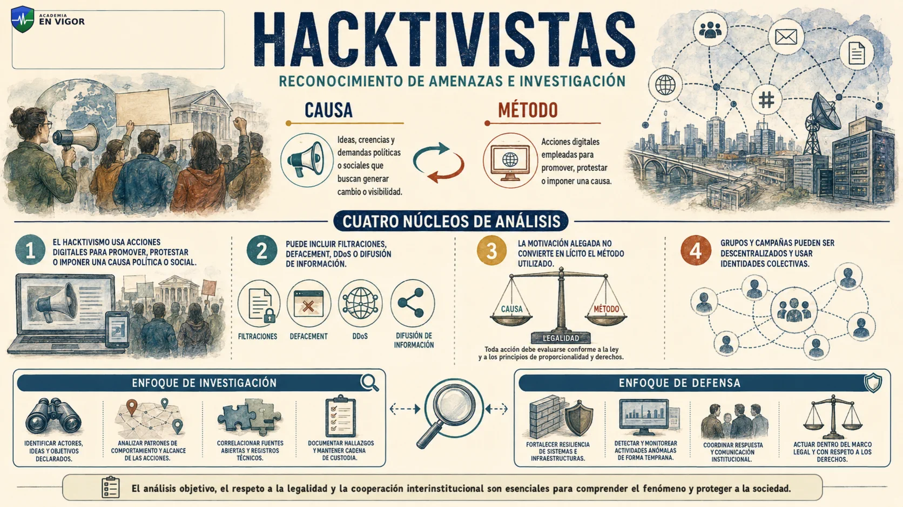

<em>Infografía: Hacktivistas.</em>

<!-- FUENTE: ENISA-TL-2025-T41 -->

## 85. Insider threat

**Idea de control:** Insider threat procede de una persona con acceso autorizado que puede causar daño a sistemas o información.

- Insider threat procede de una persona con acceso autorizado que puede causar daño a sistemas o información.
- Puede afectar confidencialidad, integridad, disponibilidad u operaciones.
- Empleados, contratistas, proveedores o socios pueden entrar en el alcance.
- La condición interna depende del acceso y relación, no solo del lugar físico.

<!-- VISUAL:t41-il-85-insider-threat.webp -->

  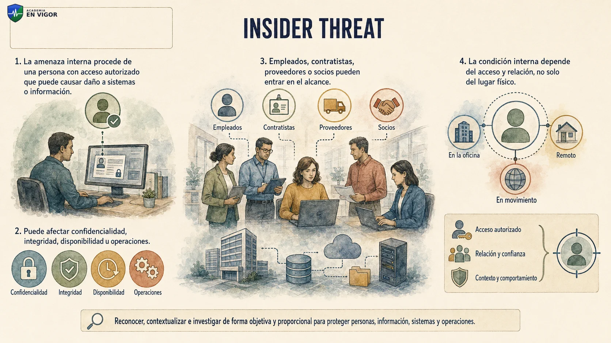

<em>Infografía: Insider threat.</em>

<!-- FUENTE: NIST-IR7298-T41 -->

## 86. Insider malicioso, negligente o comprometido

**Idea de control:** El insider malicioso abusa deliberadamente de acceso legítimo.

- El insider malicioso abusa deliberadamente de acceso legítimo.
- El negligente causa riesgo por error, incumplimiento o mala práctica.
- El comprometido actúa bajo control o engaño de un tercero.
- La prevención combina controles técnicos, procesos, formación y supervisión proporcional.

<!-- VISUAL:t41-86-insider-malicioso-negligente-o-comprometido.webp -->

  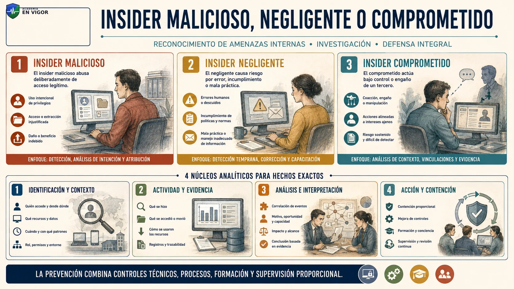

<em>Infografía: Insider malicioso, negligente o comprometido.</em>

<!-- FUENTE: NIST-IR7298-T41 -->

## 87. Advanced Persistent Threat

**Idea de control:** Una APT es un adversario con experiencia y recursos capaz de mantener campañas prolongadas y multivector.

- Una APT es un adversario con experiencia y recursos capaz de mantener campañas prolongadas y multivector.
- Busca establecer y ampliar presencia para cumplir objetivos definidos.
- Persistente describe continuidad y adaptación, no presencia eterna e indetectable.
- La etiqueta puede referirse al tipo de amenaza o a un grupo atribuido según el contexto.

<!-- VISUAL:t41-87-advanced-persistent-threat.webp -->

  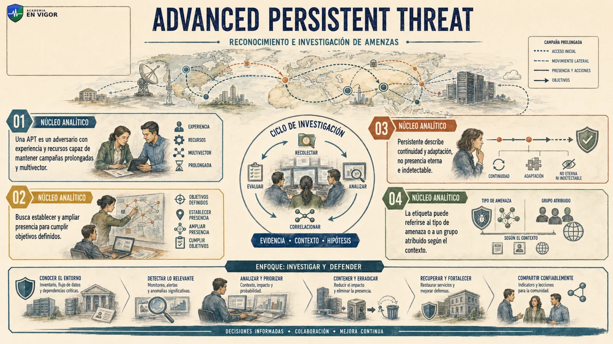

<em>Infografía: Advanced Persistent Threat.</em>

<!-- FUENTE: MITRE-APT-T41 -->

## 88. TTP y atribución de APT

**Idea de control:** ATT&CK organiza tácticas y técnicas observadas en campañas y grupos.

- ATT&CK organiza tácticas y técnicas observadas en campañas y grupos.
- Compartir una técnica no demuestra que dos incidentes tengan el mismo autor.
- La atribución combina infraestructura, código, objetivos, tiempos, operaciones y otras evidencias.
- Los nombres de grupo varían entre proveedores y pueden solaparse o divergir.

<!-- VISUAL:t41-88-ttp-y-atribucion-de-apt.webp -->

  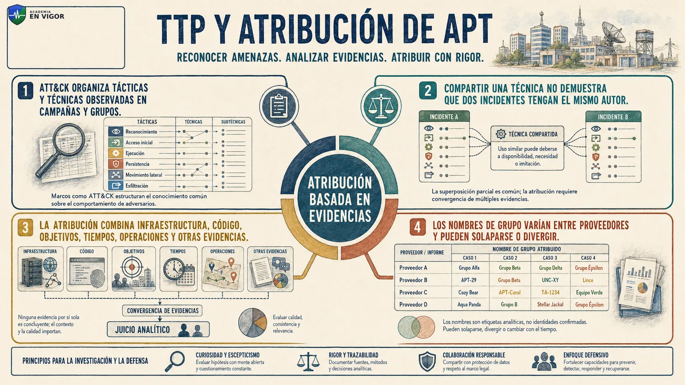

<em>Infografía: TTP y atribución de APT.</em>

<!-- FUENTE: MITRE-ATTACK-T41 -->

## 89. Cyber Kill Chain

**Idea de control:** Cyber Kill Chain modela una intrusión mediante siete fases para identificar oportunidades defensivas.

- Cyber Kill Chain modela una intrusión mediante siete fases para identificar oportunidades defensivas.
- Las fases originales son reconocimiento, weaponization, delivery, explotación, instalación, C2 y acciones sobre objetivos.
- El modelo se centra en intrusiones y no describe por igual todo fraude o insider threat.
- Interrumpir una fase puede impedir que el adversario complete su objetivo.

<!-- VISUAL:t41-89-cyber-kill-chain.webp -->

  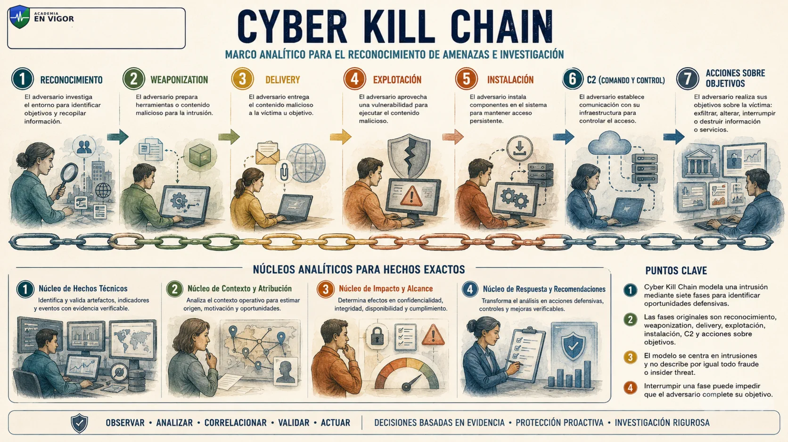

<em>Infografía: Cyber Kill Chain.</em>

<!-- FUENTE: LOCKHEED-KILLCHAIN-T41 -->

## 90. Reconocimiento

**Idea de control:** En reconocimiento, el adversario recopila información sobre personas, tecnología, servicios y relaciones.

- En reconocimiento, el adversario recopila información sobre personas, tecnología, servicios y relaciones.
- Puede usar fuentes abiertas, escaneo o interacción encubierta.
- El resultado orienta selección de vector y preparación.
- Reducir exposición y detectar sondeos dificulta esta fase, pero no la elimina.

<!-- VISUAL:t41-il-90-reconocimiento.webp -->

  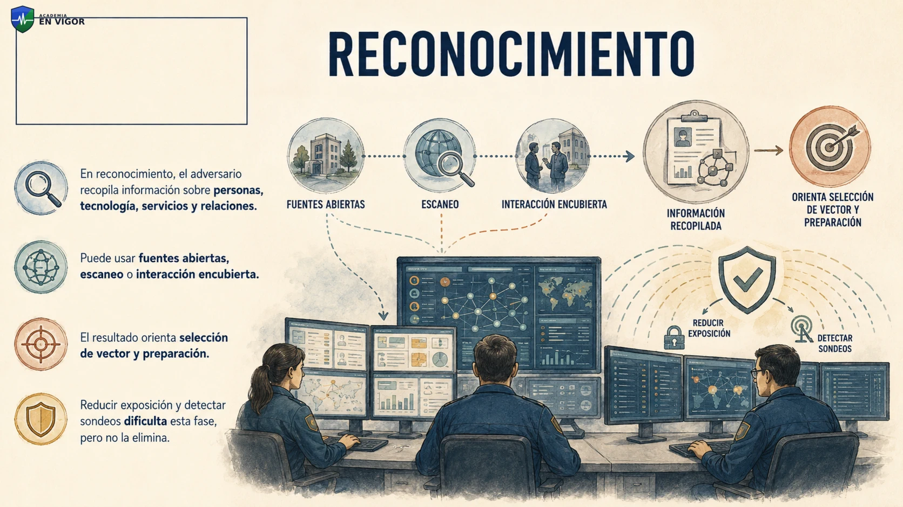

<em>Infografía: Reconocimiento.</em>

<!-- FUENTE: LOCKHEED-KILLCHAIN-T41 -->

## 91. Weaponization

**Idea de control:** En weaponization se combina una carga con un medio de explotación o entrega.

- En weaponization se combina una carga con un medio de explotación o entrega.
- El adversario adapta documento, malware, enlace o herramienta al objetivo.
- La fase puede ocurrir fuera de la infraestructura de la víctima.
- Su observación directa suele ser difícil antes de la entrega.

<!-- VISUAL:t41-91-weaponization.webp -->

  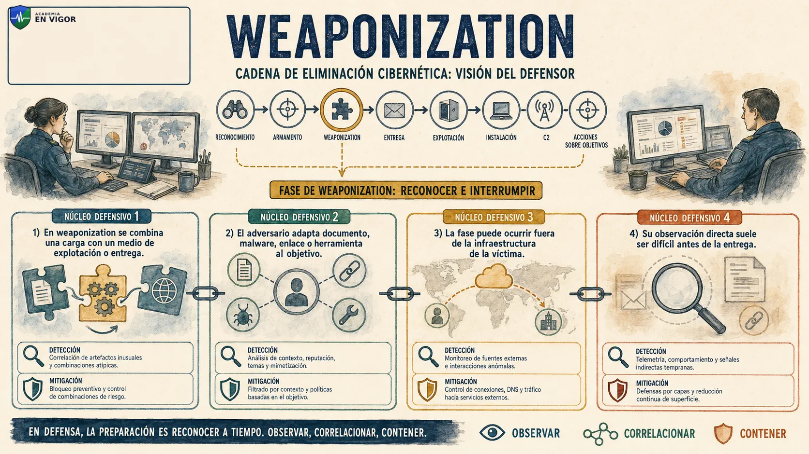

<em>Infografía: Weaponization.</em>

<!-- FUENTE: LOCKHEED-KILLCHAIN-T41 -->

## 92. Delivery

**Idea de control:** Delivery transmite el artefacto o vector al entorno objetivo.

- Delivery transmite el artefacto o vector al entorno objetivo.
- Correo, web, USB, servicio expuesto o cadena de suministro pueden servir de entrega.
- Entrega no significa todavía que la explotación haya tenido éxito.
- Filtrado, aislamiento y formación pueden cortar la cadena en este punto.

<!-- VISUAL:t41-92-delivery.webp -->

  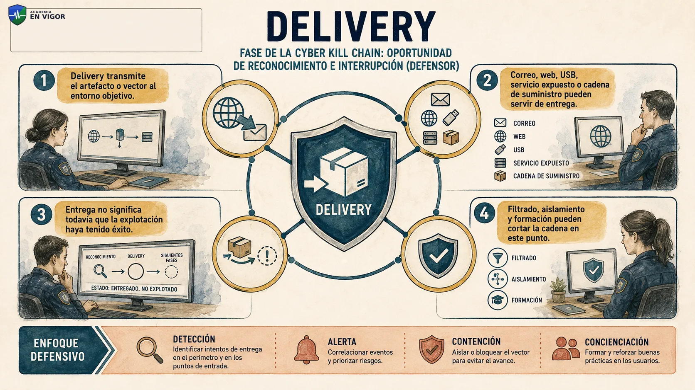

<em>Infografía: Delivery.</em>

<!-- FUENTE: LOCKHEED-KILLCHAIN-T41 -->

## 93. Explotación

**Idea de control:** En explotación, código o acción aprovecha una vulnerabilidad o comportamiento para obtener ejecución.

- En explotación, código o acción aprovecha una vulnerabilidad o comportamiento para obtener ejecución.
- Puede depender de interacción del usuario o ser remota.
- La explotación convierte la entrega en capacidad efectiva dentro del objetivo.
- Parches y mitigaciones reducen oportunidades de esta fase.

<!-- VISUAL:t41-93-explotacion.webp -->

  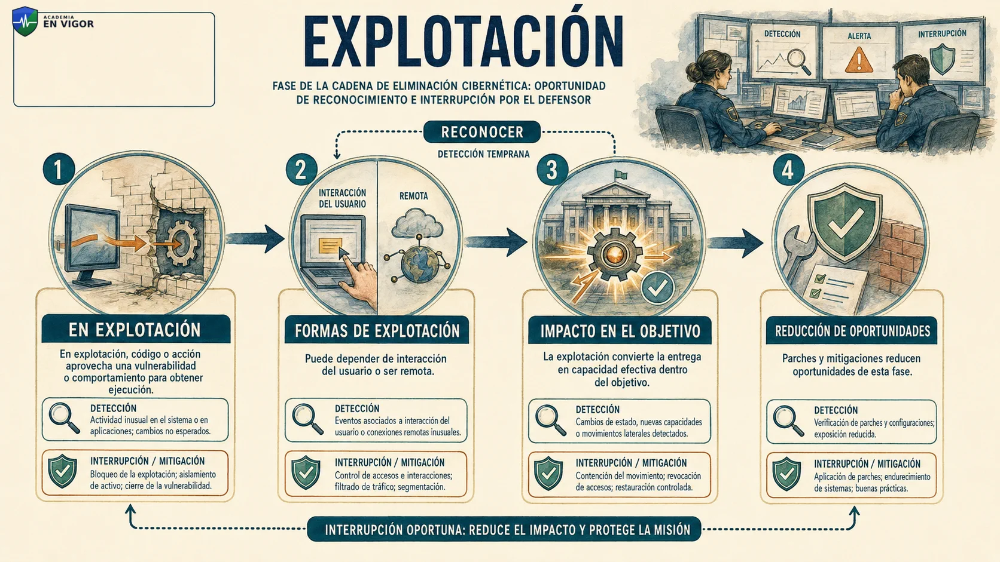

<em>Infografía: Explotación.</em>

<!-- FUENTE: LOCKHEED-KILLCHAIN-T41 -->

## 94. Instalación

**Idea de control:** En instalación, el adversario coloca malware, persistencia o componentes necesarios.

- En instalación, el adversario coloca malware, persistencia o componentes necesarios.
- Puede crear servicios, tareas, archivos o cambios de configuración.
- No toda explotación requiere instalar un archivo permanente.
- Control de aplicaciones y detección de cambios ayudan a interrumpirla.

<!-- VISUAL:t41-94-instalacion.webp -->

  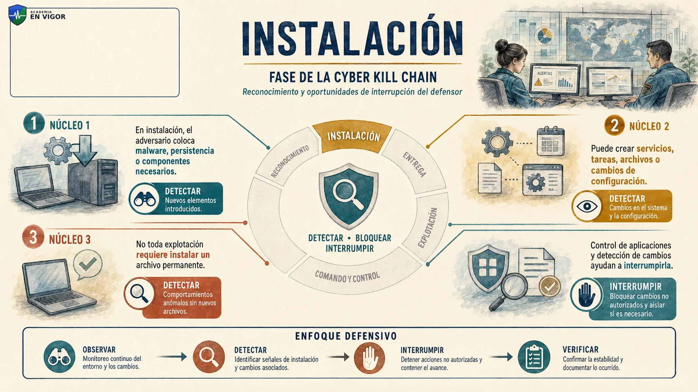

<em>Infografía: Instalación.</em>

<!-- FUENTE: LOCKHEED-KILLCHAIN-T41 -->

## 95. Command and Control

**Idea de control:** En C2, el sistema comprometido establece o mantiene comunicación con infraestructura adversaria.

- En C2, el sistema comprometido establece o mantiene comunicación con infraestructura adversaria.
- El canal transporta órdenes, estado o datos y puede ocultarse en protocolos habituales.
- Bloquear C2 reduce capacidad operativa aunque quede malware instalado.
- El adversario puede cambiar dominios, direcciones o servicios para recuperar comunicación.

<!-- VISUAL:t41-il-95-command-and-control.webp -->

  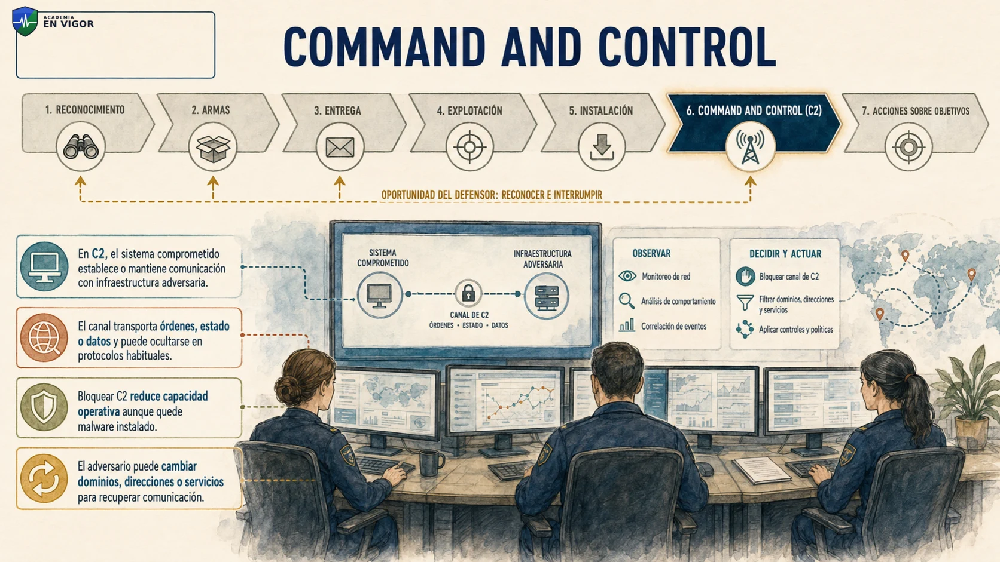

<em>Infografía: Command and Control.</em>

<!-- FUENTE: LOCKHEED-KILLCHAIN-T41 -->

## 96. Actions on Objectives

**Idea de control:** La fase final ejecuta el objetivo: espionaje, fraude, cifrado, sabotaje, movimiento o exfiltración.

- La fase final ejecuta el objetivo: espionaje, fraude, cifrado, sabotaje, movimiento o exfiltración.
- Puede requerir descubrimiento y movimiento lateral previos no detallados por la cadena original.
- El impacto observable depende del propósito del actor.
- Contención tardía aún puede limitar alcance y preservar evidencia.

<!-- VISUAL:t41-96-actions-on-objectives.webp -->

  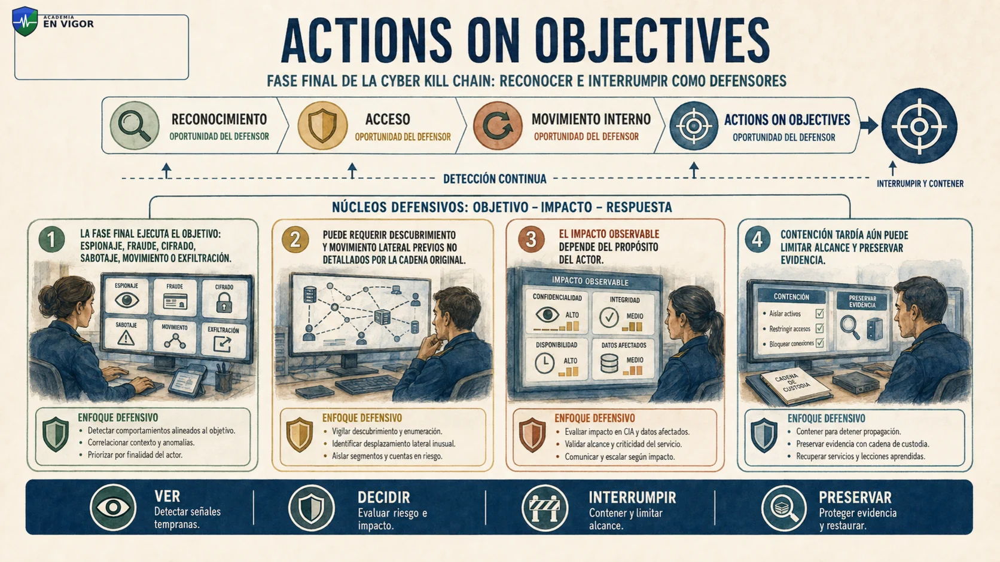

<em>Infografía: Actions on Objectives.</em>

<!-- FUENTE: LOCKHEED-KILLCHAIN-T41 -->

## 97. Romper la cadena

**Idea de control:** Cada fase ofrece oportunidades de prevención, detección, interrupción o respuesta.

- Cada fase ofrece oportunidades de prevención, detección, interrupción o respuesta.
- Defender solo el perímetro deja sin cubrir actividad posterior al acceso.
- Controles superpuestos evitan depender de una única barrera.
- La inteligencia de amenazas ayuda a relacionar indicadores y comportamiento con fases.

<!-- VISUAL:t41-97-romper-la-cadena.webp -->

  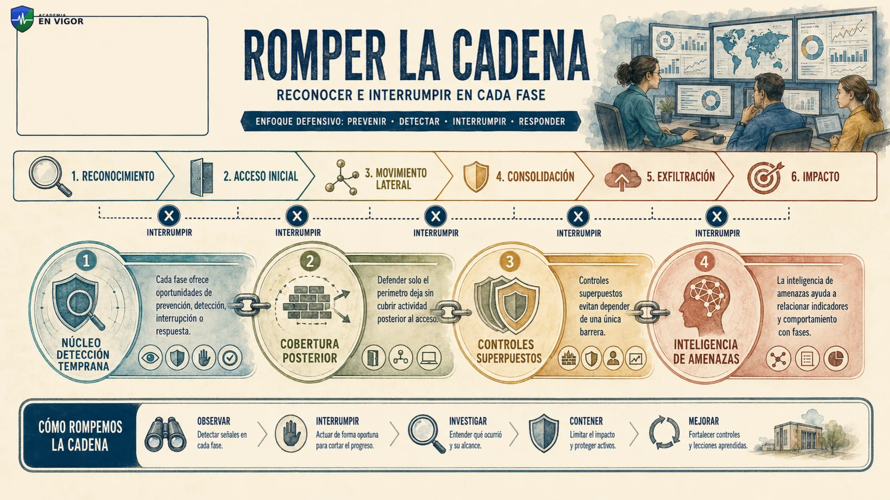

<em>Infografía: Romper la cadena.</em>

<!-- FUENTE: LOCKHEED-KILLCHAIN-T41 -->

## 98. Límites y complemento con ATT&CK

**Idea de control:** La Kill Chain ofrece una secuencia de alto nivel orientada a intrusiones.

- La Kill Chain ofrece una secuencia de alto nivel orientada a intrusiones.
- ATT&CK describe tácticas y técnicas con mayor detalle y no exige una única secuencia lineal.
- Un adversario puede repetir, saltar o solapar actividades según acceso y objetivo.
- Los modelos son herramientas analíticas y no sustituyen evidencia del incidente.

<!-- VISUAL:t41-98-limites-y-complemento-con-att-ck.webp -->

  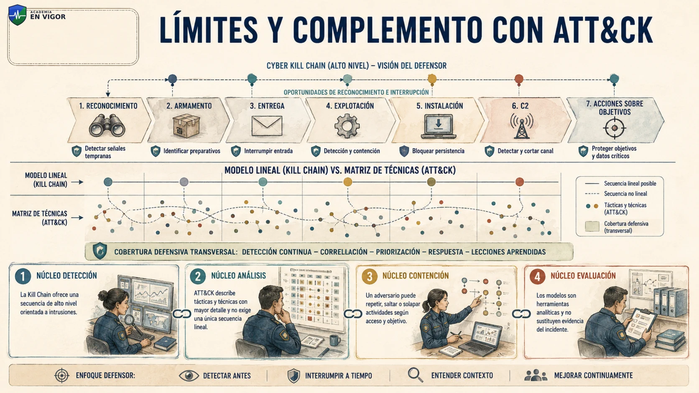

<em>Infografía: Límites y complemento con ATT&CK.</em>

<!-- FUENTE: MITRE-ATTACK-T41 -->

# Hablemos claro

:::hablemos-claro
Este tema exige separar actor, vector, técnica, carga, impacto y fase. Botnet no es un virus; pharming no es un correo; spoofing no implica tomar una cuenta; troyano no equivale a RAT; y una vulnerabilidad conocida sin parchear no vuelve a ser zero-day.
:::

# En la calle

:::en-la-calle
En una investigación, preservar mensajes, cabeceras, dominios, registros, artefactos, cuentas y movimientos permite separar engaño, compromiso real, malware, infraestructura y monetización sin destruir la cronología.
:::

# Lo que cae

:::lo-que-cae
Prioriza bot-botnet; DoS-DDoS; phishing-spear-whaling; BEC-spoofing-cuenta comprometida; virus-gusano-troyano; locker-crypto-ransomware; SQLi-XSS; zero-day-vulnerabilidad conocida; skimming-e-skimming; insider-APT; y las siete fases de la Kill Chain.
:::

# Ha caído

:::ha-caido
Se han localizado 14 referencias históricas del Tema 41. Permanecen ocultas y en cuarentena porque no existe plantilla oficial final verificable en el repositorio.
:::

## Fuentes legales, institucionales y primarias

- `CONVOCATORIA-PN-2026-T41`
- `ENISA-TL-2025-T41`
- `EUROPOL-IOCTA-2025-T41`
- `EUROPOL-CAAS-T41`
- `NIST-SP800-150-T41`
- `NIST-IR7298-T41`
- `NIST-ZERODAY-T41`
- `CISA-MPR-T41`
- `CISA-RANSOMWARE-T41`
- `INCIBE-BOTNET-T41`
- `FBI-SCAMS-T41`
- `FBI-IC3-2025-T41`
- `OWASP-INJECTION-T41`
- `OWASP-SQLI-T41`
- `OWASP-XSS-T41`
- `RFC3833-DNS-T41`
- `PCI-SKIMMING-T41`
- `PCI-ESKIMMING-T41`
- `MITRE-ATTACK-T41`
- `MITRE-APT-T41`
- `LOCKHEED-KILLCHAIN-T41`

---

*Academia En Vigor · El temario que nunca duerme · Tema 41 · v1.0.0 · Documento interno no publicado.*
