# TEMA 43 · EL VEHÍCULO PRIORITARIO. DEFINICIÓN DE VEHÍCULO PRIORITARIO. FACULTADES DE LOS CONDUCTORES DE VEHÍCULOS PRIORITARIOS. COMPORTAMIENTO DE LOS DEMÁS CONDUCTORES RESPECTO DE LOS VEHÍCULOS PRIORITARIOS. LA CONDUCCIÓN DE VEHÍCULOS EN SITUACIÓN DE EMERGENCIA. UTILIZACIÓN DE LAS SEÑALES DE EMERGENCIA.

**Policía Nacional · Método VIGOR · PARTE**
**Versión de contenido:** 1.0.0
**Estado editorial:** approved_internal · **Publicación:** not_published

# Mapa del tema

El Tema 43 se estudia en ocho partes: marco y servicios; prioridad; facultades; advertencias V-1; conducta de terceros; urgencia no prioritaria; inmovilización; y reformas 2025-2026.

# Contenido

## 01. Alcance oficial del Tema 43

**Idea de control:** El programa exige concepto, facultades, conducta de terceros, conducción en emergencia y señales de emergencia.

- El programa exige concepto, facultades, conducta de terceros, conducción en emergencia y señales de emergencia.
- La prioridad jurídica y la señalización técnica se estudian juntas, pero no son conceptos equivalentes.
- La urgencia de un servicio no elimina las condiciones de seguridad impuestas por el Reglamento.
- La seguridad activa y pasiva pertenece al Tema 44 y no debe duplicarse aquí.

<!-- VISUAL:t43-01-alcance-oficial-del-tema-43.webp -->

  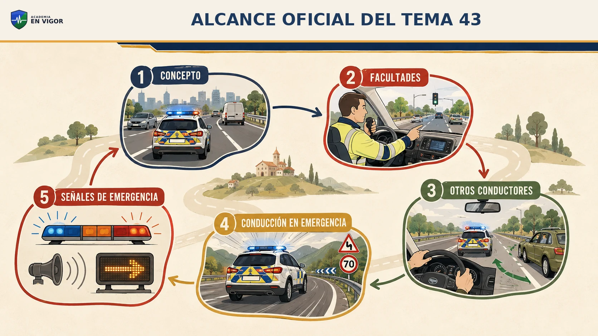

<em>Infografía: Alcance oficial del Tema 43.</em>

<!-- FUENTE: CONVOCATORIA-PN-2026-T43 -->

## 02. Mapa normativo del tema

**Idea de control:** Los artículos 67 a 70 del Reglamento General de Circulación contienen el régimen central de los servicios de urgencia.

- Los artículos 67 a 70 del Reglamento General de Circulación contienen el régimen central de los servicios de urgencia.
- Los artículos 111 y 112 remiten las advertencias de esos servicios al artículo 68.2.
- Los artículos 109 y 130 regulan advertencias ópticas e inmovilizaciones relevantes para las señales de emergencia.
- El Reglamento General de Vehículos concreta técnicamente V-1 y V-16 en sus anexos.

<!-- VISUAL:t43-02-mapa-normativo-del-tema.webp -->

  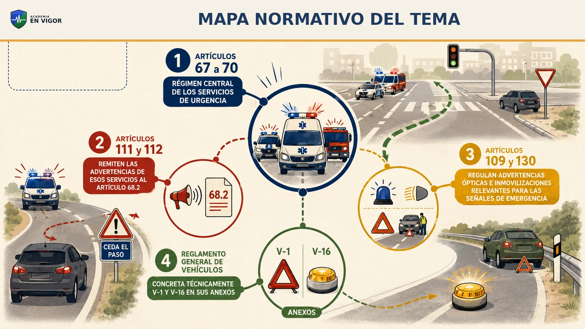

<em>Infografía: Mapa normativo del tema.</em>

<!-- FUENTE: BOE-RGC-T43 -->

## 03. Corte normativo de 3 de agosto de 2026

**Idea de control:** El contenido vigente a 3 de agosto de 2026 se distingue expresamente de las reformas con eficacia futura.

- El contenido vigente a 3 de agosto de 2026 se distingue expresamente de las reformas con eficacia futura.
- El Real Decreto 518/2026 está publicado, pero su entrada en vigor general se fija para el 1 de octubre de 2026.
- Una regla futura puede estudiarse como transición sin presentarla como obligación ya exigible.
- La fecha de publicación y la fecha de entrada en vigor no son intercambiables.

<!-- VISUAL:t43-03-corte-normativo-de-3-de-agosto-de-2026.webp -->

  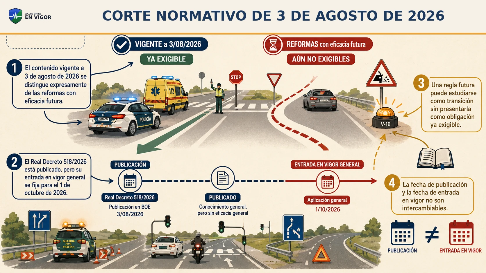

<em>Infografía: Corte normativo de 3 de agosto de 2026.</em>

<!-- FUENTE: RD518-2026-T43 -->

## 04. Prioridad ligada al servicio urgente

**Idea de control:** La prioridad de paso corresponde a vehículos de servicios de urgencia cuando se hallan en servicio de tal carácter.

- La prioridad de paso corresponde a vehículos de servicios de urgencia cuando se hallan en servicio de tal carácter.
- La pertenencia del vehículo a un servicio de emergencia no basta si circula en actividad ordinaria.
- El régimen especial se activa por la situación funcional y por las condiciones reglamentarias.
- Fuera de servicio urgente, el vehículo se somete al régimen ordinario de circulación.

<!-- VISUAL:t43-04-prioridad-ligada-al-servicio-urgente.webp -->

  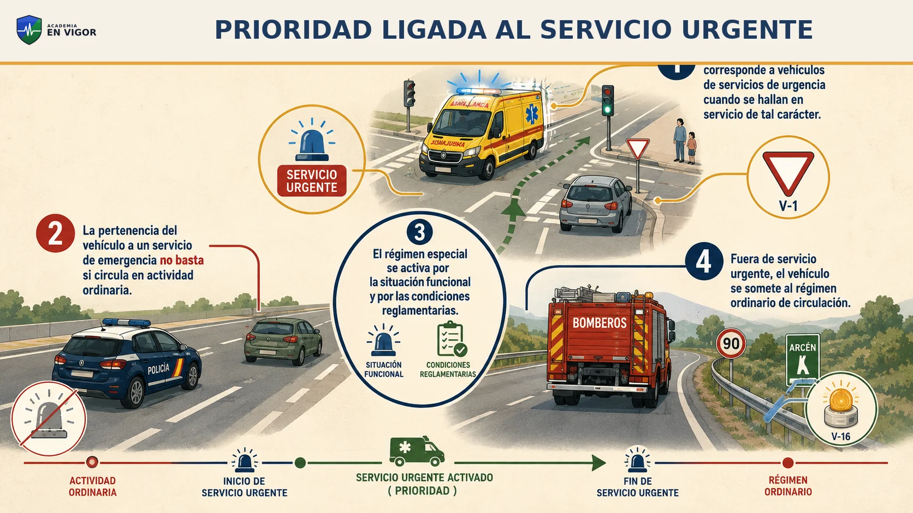

<em>Infografía: Prioridad ligada al servicio urgente.</em>

<!-- FUENTE: BOE-RGC-T43 -->

## 05. Requisitos del carácter prioritario

**Idea de control:** El carácter prioritario exige pertenecer a uno de los servicios enumerados, circular en servicio urgente y advertir la presencia reglamentariamente.

- El carácter prioritario exige pertenecer a uno de los servicios enumerados, circular en servicio urgente y advertir la presencia reglamentariamente.
- Servicio, urgencia y advertencia son requisitos acumulativos del régimen del artículo 68.2.
- Una señal luminosa instalada no convierte por sí sola el vehículo en prioritario.
- La prioridad no nace de la voluntad subjetiva del conductor ni del tipo de matrícula.

<!-- VISUAL:t43-il-05-requisitos-del-caracter-prioritario.webp -->

  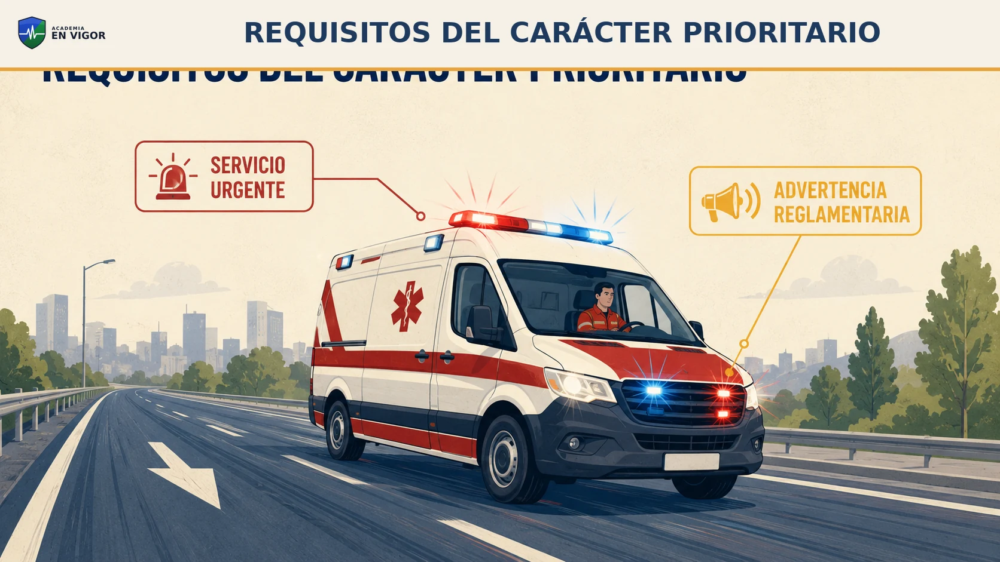

<em>Infografía: Requisitos del carácter prioritario.</em>

<!-- FUENTE: BOE-RGC-T43 -->

## 06. Vehículos de los servicios de policía

**Idea de control:** Los vehículos de los servicios de policía integran uno de los grupos legalmente enumerados como prioritarios.

- Los vehículos de los servicios de policía integran uno de los grupos legalmente enumerados como prioritarios.
- Su régimen especial solo opera cuando circulan en servicio urgente y con las advertencias exigidas.
- La condición policial no elimina la obligación de uso ponderado ni el deber de evitar peligros.
- Las facultades del vehículo no sustituyen las órdenes concretas de los agentes que regulan el tráfico.

<!-- VISUAL:t43-06-vehiculos-de-los-servicios-de-policia.webp -->

  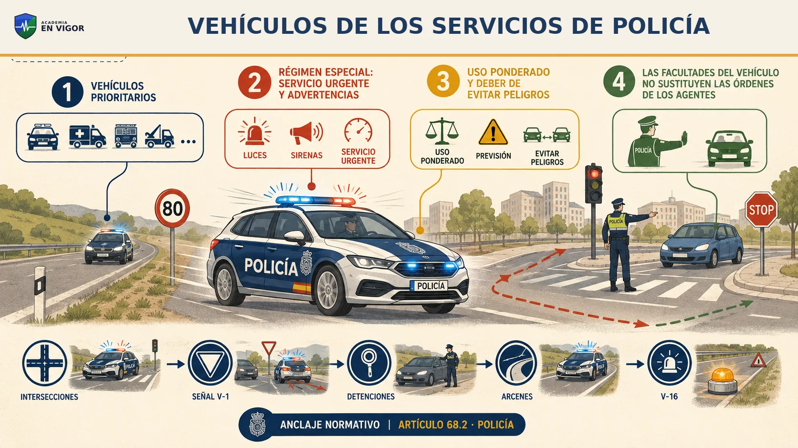

<em>Infografía: Vehículos de los servicios de policía.</em>

<!-- FUENTE: BOE-RGC-T43 -->

## 07. Extinción de incendios

**Idea de control:** Los vehículos de extinción de incendios están incluidos expresamente entre los servicios prioritarios.

- Los vehículos de extinción de incendios están incluidos expresamente entre los servicios prioritarios.
- La titularidad pública o privada del servicio de urgencia no altera por sí sola el régimen del artículo 67.
- La salida a una intervención urgente debe advertirse con las señales especiales previstas.
- En desplazamientos no urgentes se aplican las normas ordinarias.

<!-- VISUAL:t43-07-extincion-de-incendios.webp -->

  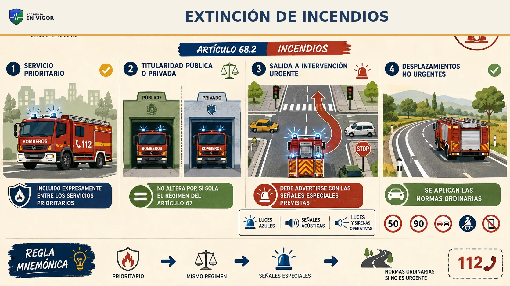

<em>Infografía: Extinción de incendios.</em>

<!-- FUENTE: BOE-RGC-T43 -->

## 08. Protección civil y salvamento

**Idea de control:** Protección civil y salvamento forman un grupo expresamente incluido en la enumeración legal.

- Protección civil y salvamento forman un grupo expresamente incluido en la enumeración legal.
- La mera colaboración con una emergencia no convierte cualquier vehículo de apoyo en prioritario.
- Debe tratarse de un vehículo del servicio y concurrir servicio urgente y señalización reglamentaria.
- La señal V-2 de un vehículo de obras no equivale a la V-1 de protección civil.

<!-- VISUAL:t43-08-proteccion-civil-y-salvamento.webp -->

  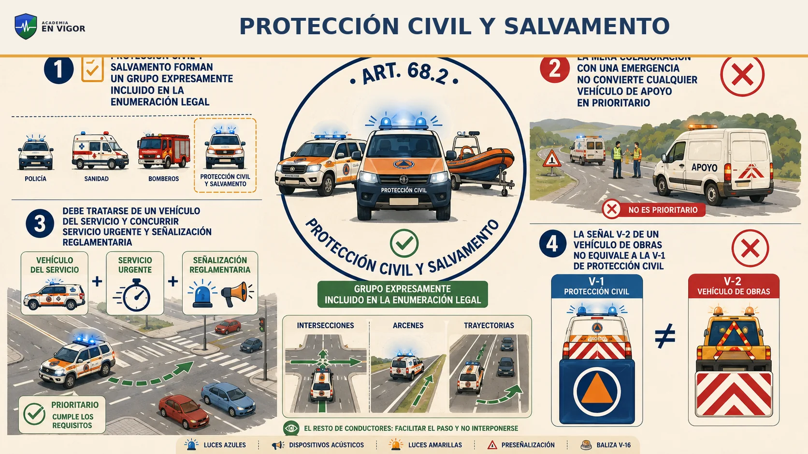

<em>Infografía: Protección civil y salvamento.</em>

<!-- FUENTE: BOE-RGC-T43 -->

## 09. Asistencia sanitaria pública o privada

**Idea de control:** La asistencia sanitaria aparece expresamente con independencia de que sea pública o privada.

- La asistencia sanitaria aparece expresamente con independencia de que sea pública o privada.
- La titularidad privada no excluye la prioridad cuando concurren los demás requisitos.
- Una ambulancia fuera de servicio urgente no disfruta del régimen excepcional.
- La asistencia sanitaria y el simple transporte sanitario programado no se confunden.

<!-- VISUAL:t43-09-asistencia-sanitaria-publica-o-privada.webp -->

  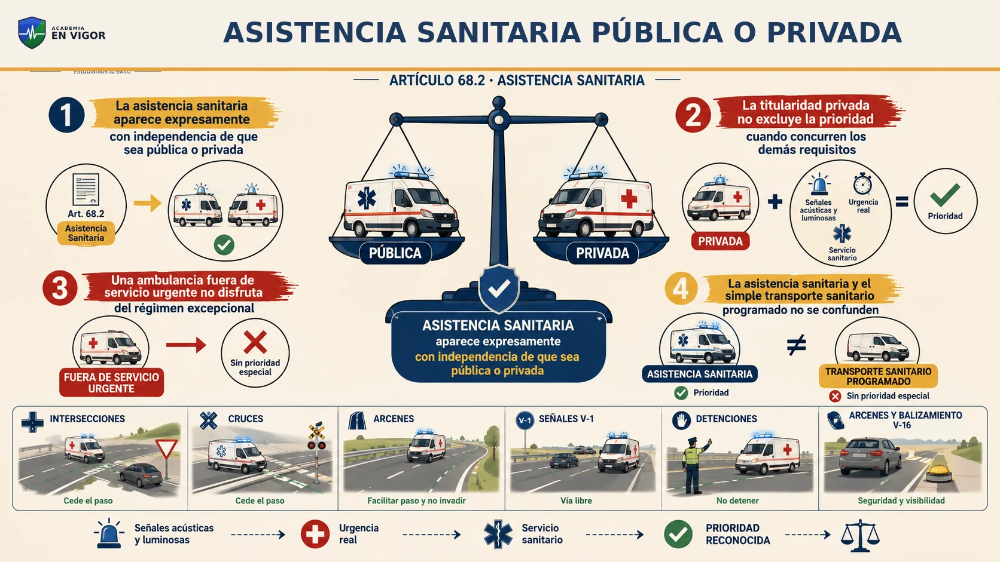

<em>Infografía: Asistencia sanitaria pública o privada.</em>

<!-- FUENTE: BOE-RGC-T43 -->

## 10. Vehículos que no adquieren prioridad

**Idea de control:** La señal V-2 identifica vehículos obstáculo o de determinados servicios, pero no les atribuye el carácter de prioritarios del artículo 68.2.

- La señal V-2 identifica vehículos obstáculo o de determinados servicios, pero no les atribuye el carácter de prioritarios del artículo 68.2.
- La V-16 advierte una inmovilización o carga caída y no es una señal de prioridad.
- Una grúa, un vehículo de mantenimiento o un particular no se convierten en prioritarios por usar luces amarillas.
- El montaje de V-1 en vehículos no prioritarios está prohibido.

<!-- VISUAL:t43-il-10-vehiculos-que-no-adquieren-prioridad.webp -->

  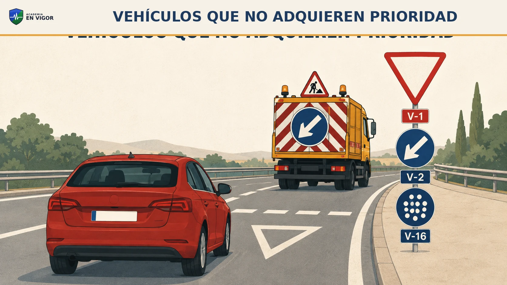

<em>Infografía: Vehículos que no adquieren prioridad.</em>

<!-- FUENTE: BOE-RGV-T43 -->

## 11. Prioridad de paso

**Idea de control:** En servicio urgente, los vehículos comprendidos en el régimen tienen prioridad sobre los demás vehículos y usuarios de la vía.

- En servicio urgente, los vehículos comprendidos en el régimen tienen prioridad sobre los demás vehículos y usuarios de la vía.
- La prioridad permite solicitar y recibir paso, pero no crea un derecho a producir riesgo.
- Los demás usuarios deben colaborar desde que perciben las señales especiales.
- La preferencia se ejerce dentro de las condiciones y límites de la sección reglamentaria.

<!-- VISUAL:t43-11-prioridad-de-paso.webp -->

  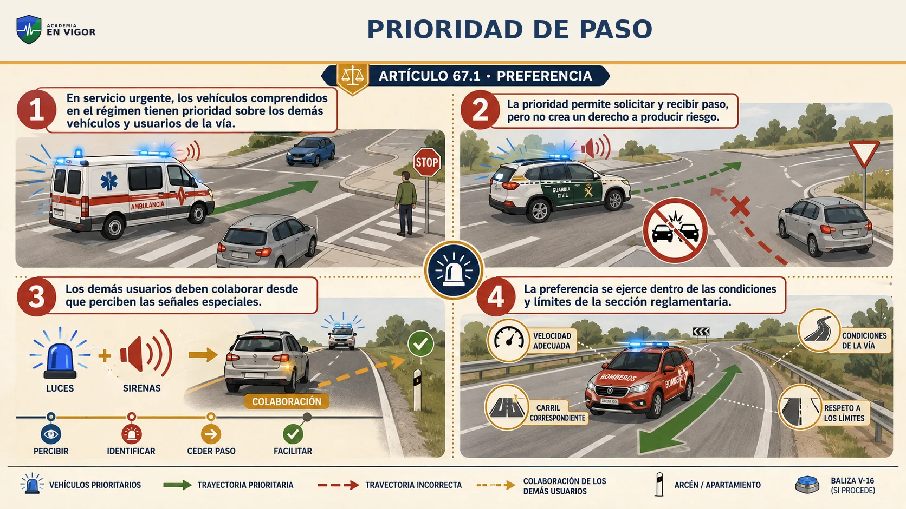

<em>Infografía: Prioridad de paso.</em>

<!-- FUENTE: BOE-RGC-T43 -->

## 12. Superación de límites de velocidad

**Idea de control:** Los vehículos prioritarios en servicio urgente pueden circular por encima de los límites de velocidad en los casos y condiciones reglamentarios.

- Los vehículos prioritarios en servicio urgente pueden circular por encima de los límites de velocidad en los casos y condiciones reglamentarios.
- La facultad no impone circular siempre por encima del límite.
- La velocidad debe ser compatible con la seguridad de todos los usuarios.
- La necesidad del servicio no elimina la responsabilidad del conductor.

<!-- VISUAL:t43-12-superacion-de-limites-de-velocidad.webp -->

  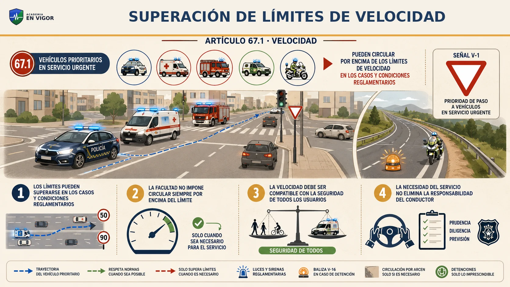

<em>Infografía: Superación de límites de velocidad.</em>

<!-- FUENTE: BOE-RGC-T43 -->

## 13. Exención de otras normas o señales

**Idea de control:** La exención de otras normas o señales solo existe en los casos y con las condiciones determinadas por la sección.

- La exención de otras normas o señales solo existe en los casos y con las condiciones determinadas por la sección.
- El artículo 68 concreta qué títulos pueden excepcionarse y qué límites permanecen.
- La exención no es general ni automática por encender la señal luminosa.
- Las órdenes y señales de los agentes quedan fuera de la posibilidad de excepción.

<!-- VISUAL:t43-13-exencion-de-otras-normas-o-senales.webp -->

  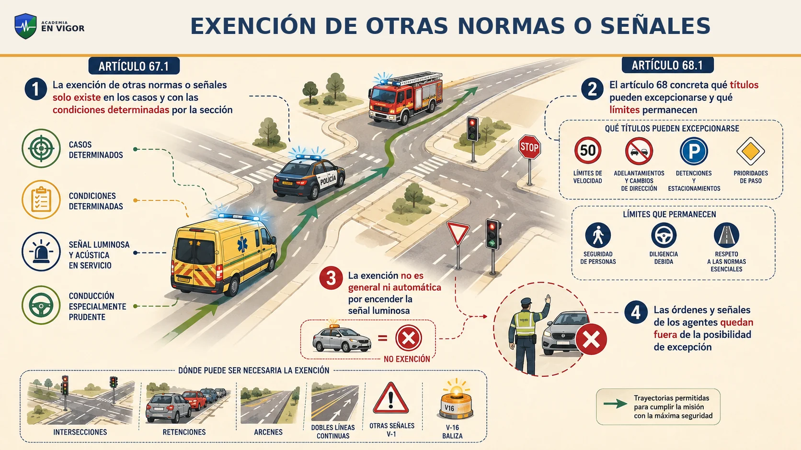

<em>Infografía: Exención de otras normas o señales.</em>

<!-- FUENTE: BOE-RGC-T43 -->

## 14. Uso ponderado del régimen especial

**Idea de control:** Los conductores deben hacer un uso ponderado del régimen especial.

- Los conductores deben hacer un uso ponderado del régimen especial.
- Ponderar exige relacionar urgencia, necesidad, vía, tráfico, visibilidad y riesgo.
- La opción jurídicamente posible puede no ser prudente en una situación concreta.
- El carácter urgente no transforma toda maniobra en necesaria.

<!-- VISUAL:t43-14-uso-ponderado-del-regimen-especial.webp -->

  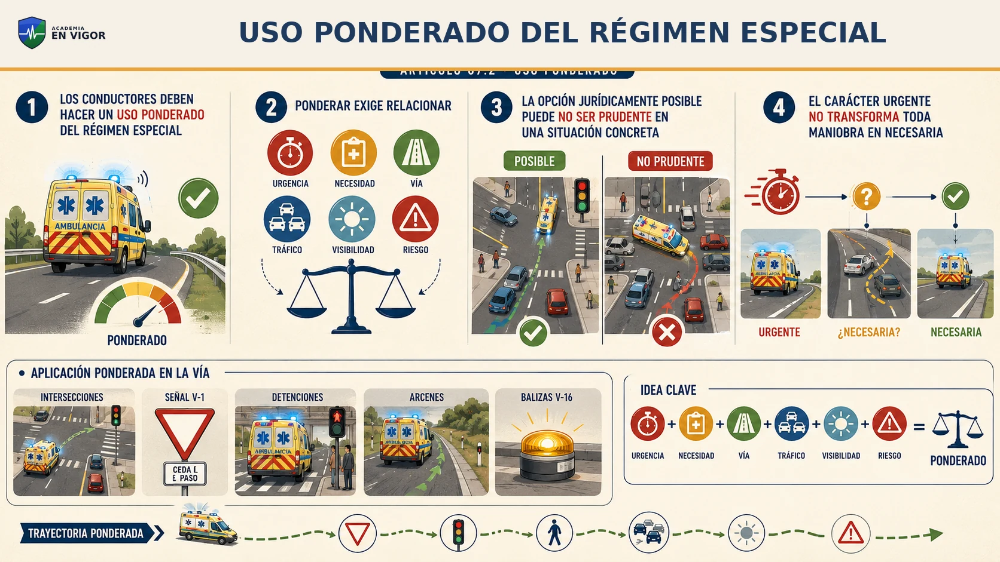

<em>Infografía: Uso ponderado del régimen especial.</em>

<!-- FUENTE: BOE-RGC-T43 -->

## 15. Solo durante la prestación urgente

**Idea de control:** El régimen especial se utiliza únicamente mientras se presta un servicio urgente.

- El régimen especial se utiliza únicamente mientras se presta un servicio urgente.
- El regreso a base sin urgencia no conserva automáticamente las facultades excepcionales.
- La urgencia debe ser real y funcional, no una fórmula para justificar desplazamientos ordinarios.
- El fin del servicio obliga a volver al régimen normal aunque permanezcan instalados los dispositivos.

<!-- VISUAL:t43-il-15-solo-durante-la-prestacion-urgente.webp -->

  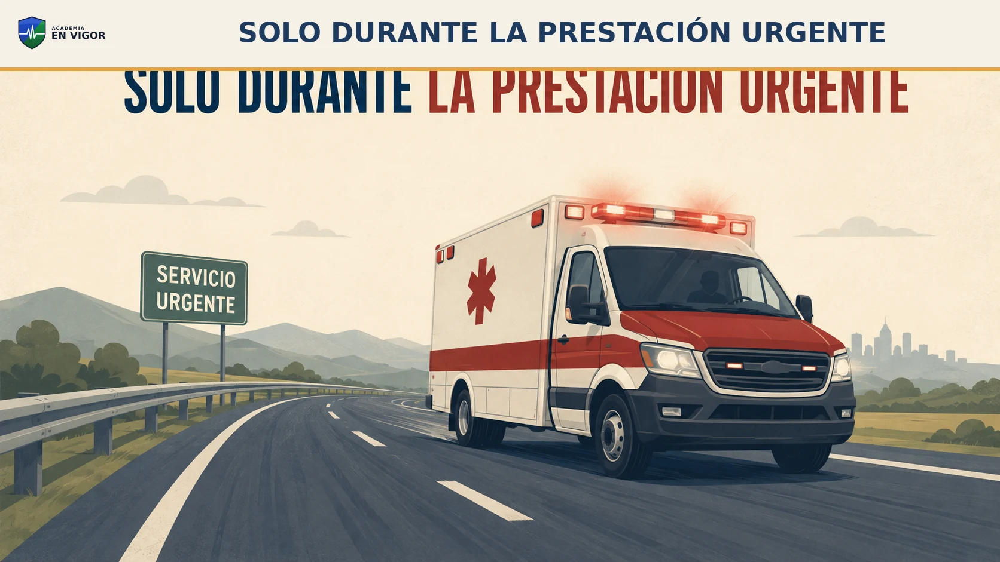

<em>Infografía: Solo durante la prestación urgente.</em>

<!-- FUENTE: BOE-RGC-T43 -->

## 16. Intersecciones y semáforos

**Idea de control:** Antes de vulnerar una prioridad de paso o una señal semafórica deben adoptarse extremadas precauciones.

- Antes de vulnerar una prioridad de paso o una señal semafórica deben adoptarse extremadas precauciones.
- La señal azul no convierte el rojo en un paso libre automático.
- El conductor debe comprobar la reacción de los demás usuarios antes de entrar en conflicto.
- La aproximación exige una velocidad que permita controlar y detener el vehículo si fuese necesario.

<!-- VISUAL:t43-16-intersecciones-y-semaforos.webp -->

  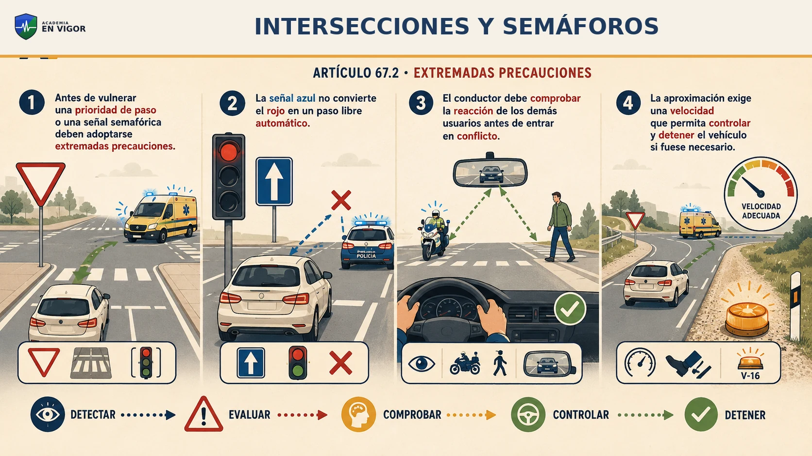

<em>Infografía: Intersecciones y semáforos.</em>

<!-- FUENTE: BOE-RGC-T43 -->

## 17. Riesgo de atropello a peatones

**Idea de control:** El conductor debe cerciorarse de que no existe riesgo de atropello a peatones.

- El conductor debe cerciorarse de que no existe riesgo de atropello a peatones.
- La advertencia acústica no garantiza que una persona haya percibido o localizado el vehículo.
- Cruces, pasos peatonales y obstáculos visuales exigen una comprobación efectiva.
- La prioridad de servicio no desplaza el deber de proteger a usuarios vulnerables.

<!-- VISUAL:t43-17-riesgo-de-atropello-a-peatones.webp -->

  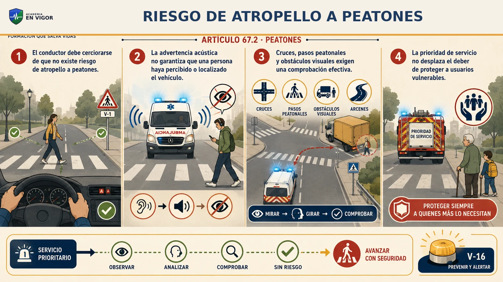

<em>Infografía: Riesgo de atropello a peatones.</em>

<!-- FUENTE: BOE-RGC-T43 -->

## 18. Reacción de los demás conductores

**Idea de control:** Antes de avanzar, el conductor prioritario debe cerciorarse de que los otros vehículos se han detenido o se disponen a facilitar su marcha.

- Antes de avanzar, el conductor prioritario debe cerciorarse de que los otros vehículos se han detenido o se disponen a facilitar su marcha.
- Percibir una luz azul no implica que cada conductor haya comprendido desde dónde llega el vehículo.
- La comprobación visual y dinámica prevalece sobre la mera expectativa de colaboración.
- Una trayectoria abierta solo es segura si no crea un conflicto nuevo.

<!-- VISUAL:t43-18-reaccion-de-los-demas-conductores.webp -->

  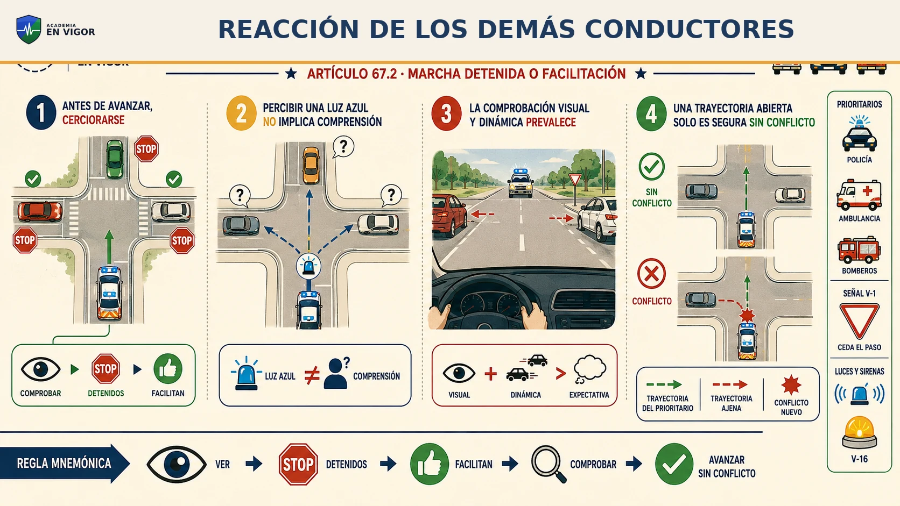

<em>Infografía: Reacción de los demás conductores.</em>

<!-- FUENTE: BOE-RGC-T43 -->

## 19. Autorización de aparatos especiales

**Idea de control:** La instalación de aparatos emisores de luces y señales acústicas especiales requiere autorización de la Jefatura Provincial de Tráfico correspondiente.

- La instalación de aparatos emisores de luces y señales acústicas especiales requiere autorización de la Jefatura Provincial de Tráfico correspondiente.
- La regla se refiere a la instalación de los aparatos en vehículos prioritarios.
- Debe distinguirse esta autorización de la afirmación del anexo XI según la cual utilizar V-1 no requiere autorización administrativa.
- Una pregunta debe identificar si habla de instalar el equipo o de usar la señal.

<!-- VISUAL:t43-19-autorizacion-de-aparatos-especiales.webp -->

  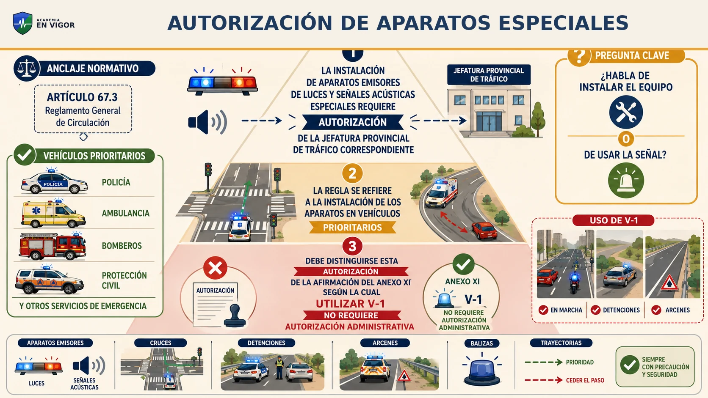

<em>Infografía: Autorización de aparatos especiales.</em>

<!-- FUENTE: BOE-RGC-T43 -->

## 20. Necesidad, idoneidad y mínimo riesgo

**Idea de control:** El régimen debe aplicarse de forma adecuada a la urgencia y con el menor riesgo compatible con el servicio.

- El régimen debe aplicarse de forma adecuada a la urgencia y con el menor riesgo compatible con el servicio.
- Una maniobra excepcional se descarta cuando otra opción segura permite cumplir la finalidad.
- La decisión se reevalúa a medida que cambian tráfico, visibilidad y respuesta de terceros.
- La urgencia explica la excepción, pero la seguridad condiciona su ejercicio.

<!-- VISUAL:t43-il-20-necesidad-idoneidad-y-minimo-riesgo.webp -->

  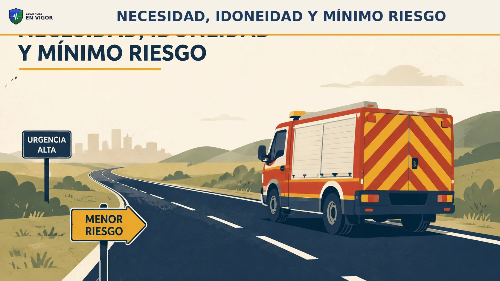

<em>Infografía: Necesidad, idoneidad y mínimo riesgo.</em>

<!-- FUENTE: BOE-RGC-T43 -->

## 21. Regla general de observancia

**Idea de control:** Los conductores prioritarios deben observar como regla los preceptos del Reglamento General de Circulación.

- Los conductores prioritarios deben observar como regla los preceptos del Reglamento General de Circulación.
- La excepción se interpreta desde unas condiciones concretas y no como inmunidad general.
- El punto de partida es cumplir la norma; apartarse de ella requiere necesidad y seguridad.
- El vehículo sigue integrado en la circulación y debe anticipar reacciones ajenas.

<!-- VISUAL:t43-21-regla-general-de-observancia.webp -->

  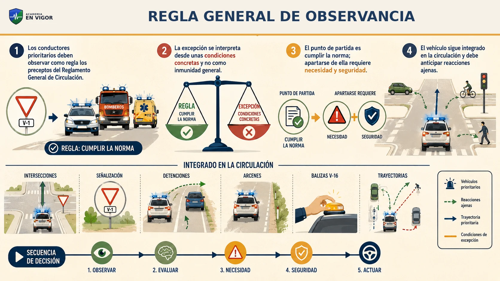

<em>Infografía: Regla general de observancia.</em>

<!-- FUENTE: BOE-RGC-T43 -->

## 22. Títulos II, III y IV

**Idea de control:** Cumplidas las condiciones, pueden dejar de observarse normas de los títulos II, III y IV del Reglamento.

- Cumplidas las condiciones, pueden dejar de observarse normas de los títulos II, III y IV del Reglamento.
- La enumeración delimita materialmente la facultad excepcional.
- No se trata de una dispensa de cualquier norma del ordenamiento.
- La excepción no borra los requisitos de servicio urgente y señalización del artículo 68.2.

<!-- VISUAL:t43-22-titulos-ii-iii-y-iv.webp -->

  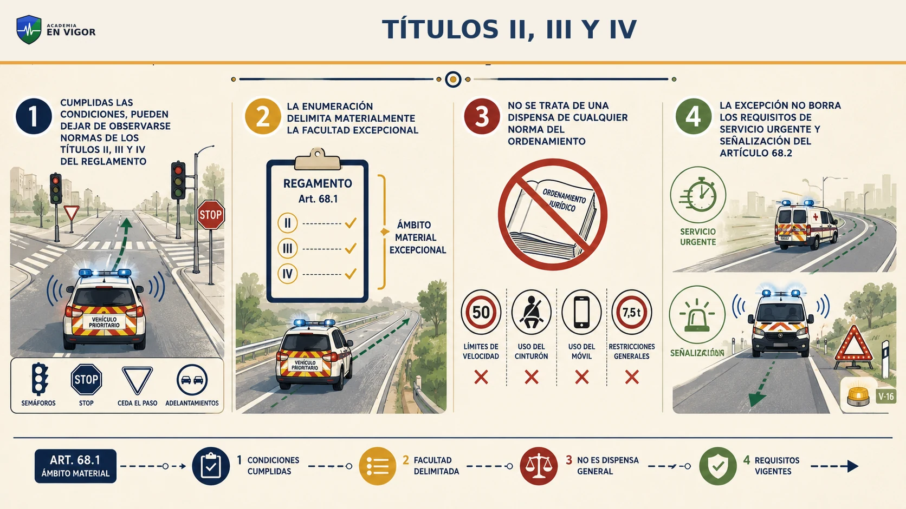

<em>Infografía: Títulos II, III y IV.</em>

<!-- FUENTE: BOE-RGC-T43 -->

## 23. Órdenes y señales de los agentes

**Idea de control:** Las órdenes y señales de los agentes son siempre de obligado cumplimiento.

- Las órdenes y señales de los agentes son siempre de obligado cumplimiento.
- Esta obligación permanece aunque el vehículo circule en servicio urgente.
- El agente puede adaptar la circulación a un riesgo que el conductor no percibe.
- La señal acústica especial no prevalece sobre una orden del agente.

<!-- VISUAL:t43-23-ordenes-y-senales-de-los-agentes.webp -->

  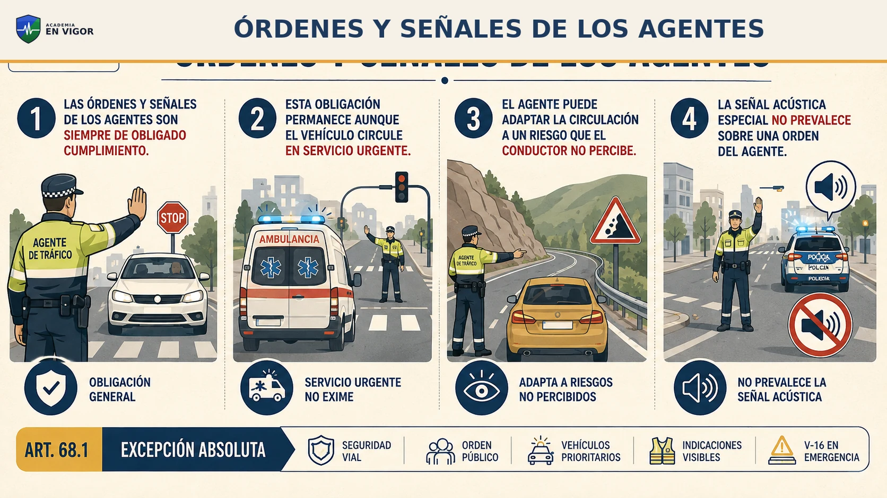

<em>Infografía: Órdenes y señales de los agentes.</em>

<!-- FUENTE: BOE-RGC-T43 -->

## 24. Exclusiva responsabilidad del conductor

**Idea de control:** La decisión de dejar de cumplir esas normas se ejerce bajo exclusiva responsabilidad del conductor.

- La decisión de dejar de cumplir esas normas se ejerce bajo exclusiva responsabilidad del conductor.
- La orden de acudir con urgencia no sustituye la valoración inmediata de seguridad.
- El conductor debe poder explicar por qué la maniobra era necesaria y controlada.
- La prioridad no equivale a exención automática de responsabilidad por el resultado.

<!-- VISUAL:t43-24-exclusiva-responsabilidad-del-conductor.webp -->

  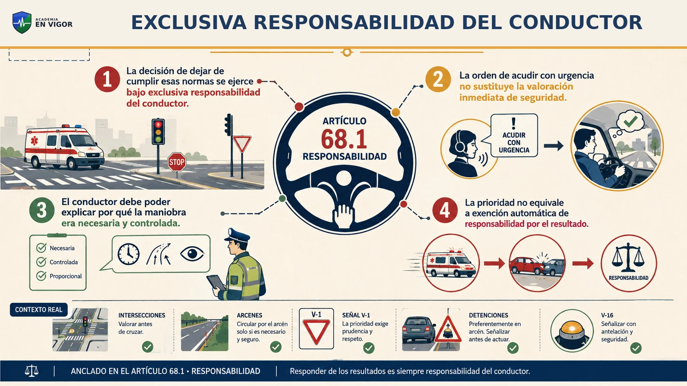

<em>Infografía: Exclusiva responsabilidad del conductor.</em>

<!-- FUENTE: BOE-RGC-T43 -->

## 25. Condición de no poner en peligro

**Idea de control:** Antes de usar la excepción el conductor debe haberse cerciorado de que no pone en peligro a ningún usuario.

- Antes de usar la excepción el conductor debe haberse cerciorado de que no pone en peligro a ningún usuario.
- La condición alcanza a ocupantes, peatones, ciclistas y demás conductores.
- No basta una valoración abstracta: debe aplicarse al momento y lugar concretos.
- Si el riesgo no puede controlarse, la facultad excepcional no debe ejercerse.

<!-- VISUAL:t43-il-25-condicion-de-no-poner-en-peligro.webp -->

  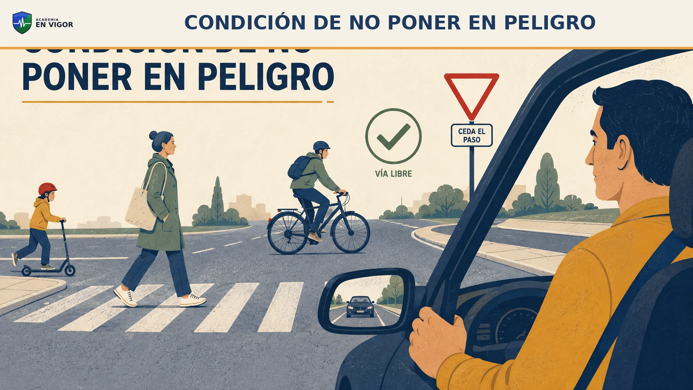

<em>Infografía: Condición de no poner en peligro.</em>

<!-- FUENTE: BOE-RGC-T43 -->

## 26. Media vuelta en autopista o autovía

**Idea de control:** En autopista o autovía puede darse media vuelta con carácter excepcional en servicio urgente y sin comprometer la seguridad.

- En autopista o autovía puede darse media vuelta con carácter excepcional en servicio urgente y sin comprometer la seguridad.
- La posibilidad no convierte la maniobra en ordinaria ni obliga a realizarla.
- El conductor debe valorar accesos, visibilidad, tráfico y espacio disponible.
- Fuera de las condiciones legales rige la prohibición general.

<!-- VISUAL:t43-26-media-vuelta-en-autopista-o-autovia.webp -->

  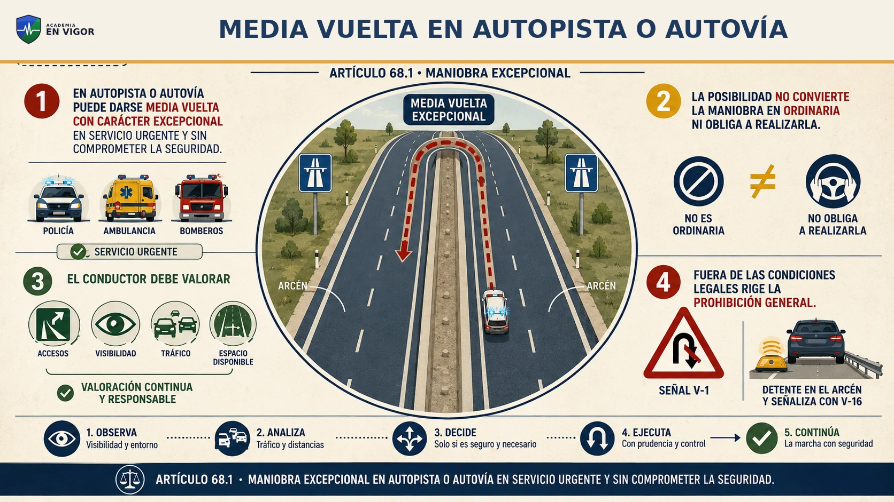

<em>Infografía: Media vuelta en autopista o autovía.</em>

<!-- FUENTE: BOE-RGC-T43 -->

## 27. Marcha atrás en autopista o autovía

**Idea de control:** La marcha atrás puede realizarse excepcionalmente en autopista o autovía durante un servicio urgente si no compromete la seguridad.

- La marcha atrás puede realizarse excepcionalmente en autopista o autovía durante un servicio urgente si no compromete la seguridad.
- La excepción no elimina la obligación de control del entorno.
- Distancia, velocidad y señalización deben ajustarse al riesgo de la maniobra.
- La presencia de tráfico que no ha advertido la maniobra impide ejecutarla con seguridad.

<!-- VISUAL:t43-27-marcha-atras-en-autopista-o-autovia.webp -->

  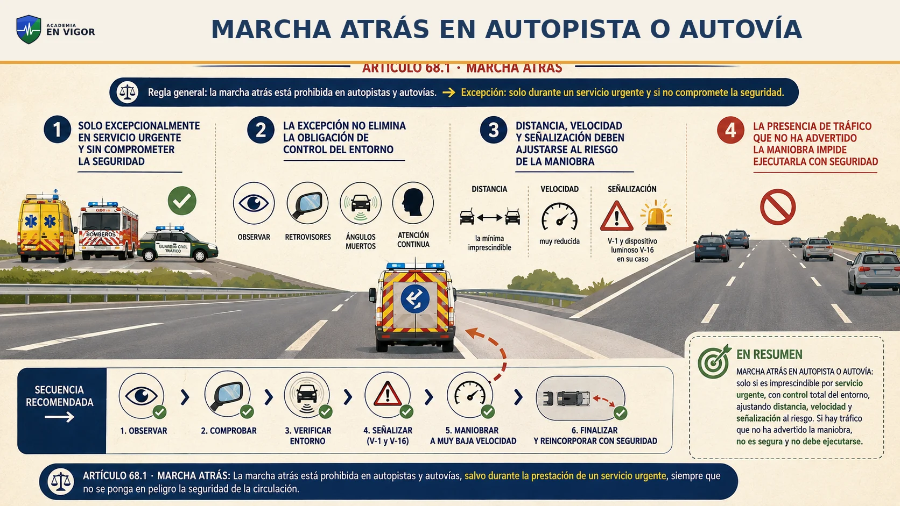

<em>Infografía: Marcha atrás en autopista o autovía.</em>

<!-- FUENTE: BOE-RGC-T43 -->

## 28. Sentido contrario por el arcén

**Idea de control:** La circulación en sentido contrario al correspondiente a la calzada se admite excepcionalmente siempre que se haga por el arcén.

- La circulación en sentido contrario al correspondiente a la calzada se admite excepcionalmente siempre que se haga por el arcén.
- La mención del arcén condiciona específicamente esta modalidad de sentido contrario.
- También deben concurrir servicio urgente y ausencia de compromiso para la seguridad.
- No se autoriza circular en sentido contrario por cualquier carril de la calzada.

<!-- VISUAL:t43-28-sentido-contrario-por-el-arcen.webp -->

  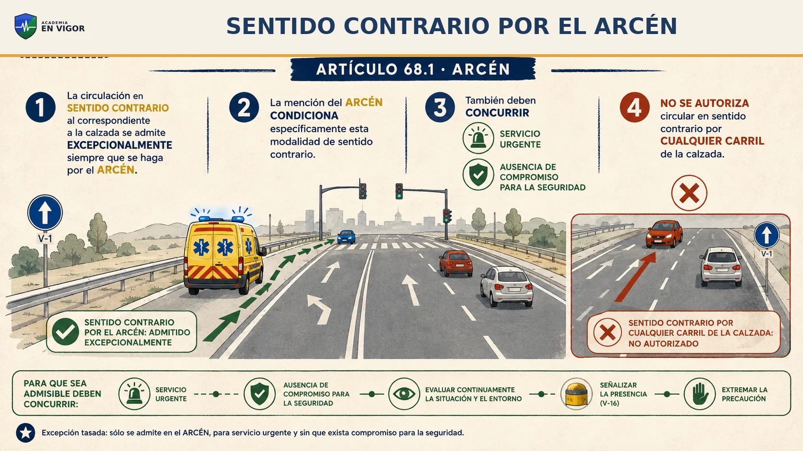

<em>Infografía: Sentido contrario por el arcén.</em>

<!-- FUENTE: BOE-RGC-T43 -->

## 29. Mediana y pasos transversales

**Idea de control:** El vehículo prioritario puede penetrar excepcionalmente en la mediana o en sus pasos transversales.

- El vehículo prioritario puede penetrar excepcionalmente en la mediana o en sus pasos transversales.
- La maniobra requiere autopista o autovía, servicio urgente y seguridad no comprometida.
- La existencia física de un paso no convierte su uso en automático.
- El conductor debe evitar crear peligro a tráficos de ambos sentidos.

<!-- VISUAL:t43-29-mediana-y-pasos-transversales.webp -->

  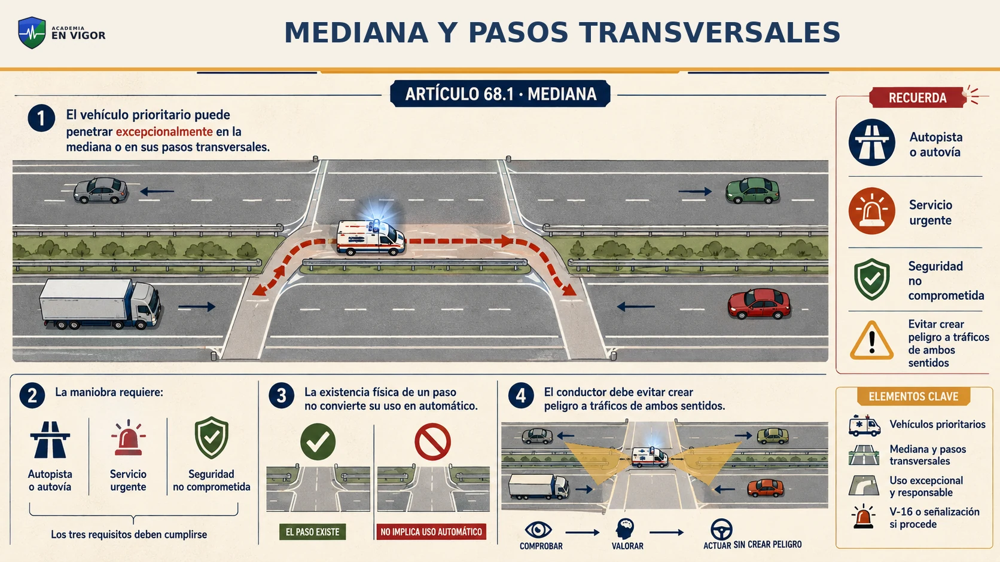

<em>Infografía: Mediana y pasos transversales.</em>

<!-- FUENTE: BOE-RGC-T43 -->

## 30. Posición de vehículos de los agentes

**Idea de control:** Los agentes responsables de vigilancia, regulación y control pueden utilizar o situar sus vehículos en la parte de la vía necesaria.

- Los agentes responsables de vigilancia, regulación y control pueden utilizar o situar sus vehículos en la parte de la vía necesaria.
- La facultad opera cuando prestan auxilio o lo exigen las necesidades del servicio o de la circulación.
- La posición debe responder a una función concreta y no a mera comodidad.
- Asimismo, estos agentes determinan en cada caso los lugares donde deben situarse los vehículos de urgencia o de otros servicios especiales.

<!-- VISUAL:t43-il-30-posicion-de-vehiculos-de-los-agentes.webp -->

  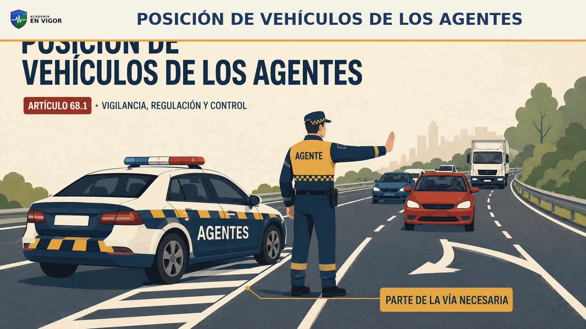

<em>Infografía: Posición de vehículos de los agentes.</em>

<!-- FUENTE: BOE-RGC-T43 -->

## 31. Normas generales de advertencia especial

**Idea de control:** Los servicios de urgencia pueden utilizar señales ópticas y acústicas especiales en los casos y condiciones reglamentarios.

- Los servicios de urgencia pueden utilizar señales ópticas y acústicas especiales en los casos y condiciones reglamentarios.
- El artículo 112 remite la advertencia de policía, incendios, protección civil, salvamento y asistencia sanitaria al artículo 68.2.
- Las señales especiales comunican presencia y urgencia, pero no sustituyen la conducción segura.
- Otros servicios especiales se rigen por advertencias distintas, como V-2.

<!-- VISUAL:t43-31-normas-generales-de-advertencia-especial.webp -->

  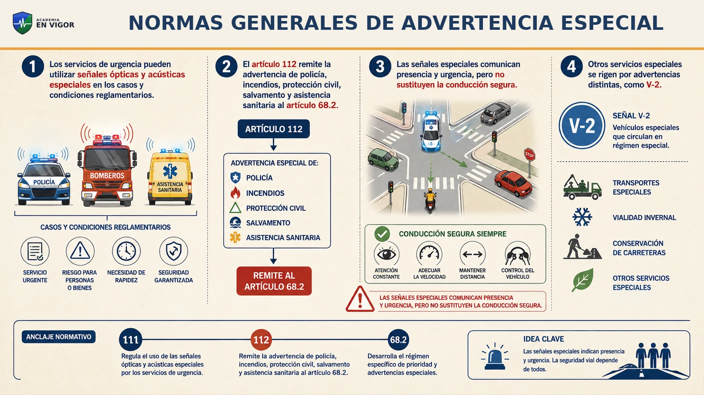

<em>Infografía: Normas generales de advertencia especial.</em>

<!-- FUENTE: BOE-RGC-T43 -->

## 32. Regla de uso simultáneo

**Idea de control:** Como regla, la presencia se advierte mediante utilización simultánea de la señal luminosa y del aparato acústico especial.

- Como regla, la presencia se advierte mediante utilización simultánea de la señal luminosa y del aparato acústico especial.
- Los dos medios cumplen funciones complementarias de detección visual y auditiva.
- La simultaneidad se vincula al carácter prioritario durante el servicio urgente.
- El claxon ordinario no sustituye sin más al aparato acústico especial.

<!-- VISUAL:t43-32-regla-de-uso-simultaneo.webp -->

  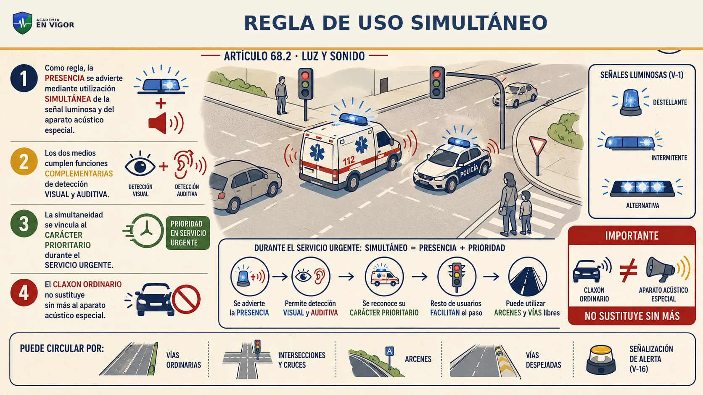

<em>Infografía: Regla de uso simultáneo.</em>

<!-- FUENTE: BOE-RGC-T43 -->

## 33. Excepción de señal luminosa aislada

**Idea de control:** La señal luminosa debe utilizarse aisladamente cuando omitir la señal acústica especial no entrañe peligro para los demás usuarios.

- La señal luminosa debe utilizarse aisladamente cuando omitir la señal acústica especial no entrañe peligro para los demás usuarios.
- La excepción depende del riesgo, no de una preferencia estética ni de comodidad.
- Si la omisión del sonido impide que otros detecten el vehículo, debe mantenerse la advertencia acústica.
- El uso solo luminoso no elimina las demás condiciones del servicio urgente.

<!-- VISUAL:t43-33-excepcion-de-senal-luminosa-aislada.webp -->

  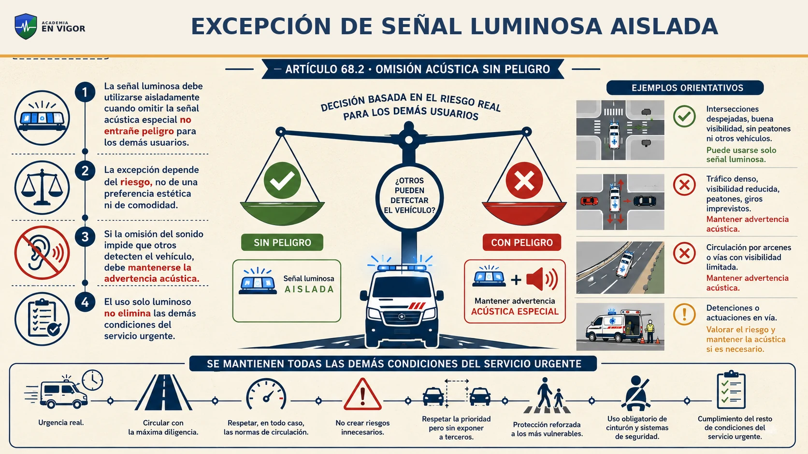

<em>Infografía: Excepción de señal luminosa aislada.</em>

<!-- FUENTE: BOE-RGC-T43 -->

## 34. Significado de la señal V-1

**Idea de control:** La utilización de V-1 indica un servicio de policía, incendios, protección civil y salvamento o asistencia sanitaria en servicio urgente.

- La utilización de V-1 indica un servicio de policía, incendios, protección civil y salvamento o asistencia sanitaria en servicio urgente.
- V-1 no identifica una simple avería ni un vehículo obstáculo.
- Su significado combina tipo de servicio y situación urgente.
- La señal puede utilizarse simultáneamente con el aparato acústico especial.

<!-- VISUAL:t43-34-significado-de-la-senal-v-1.webp -->

  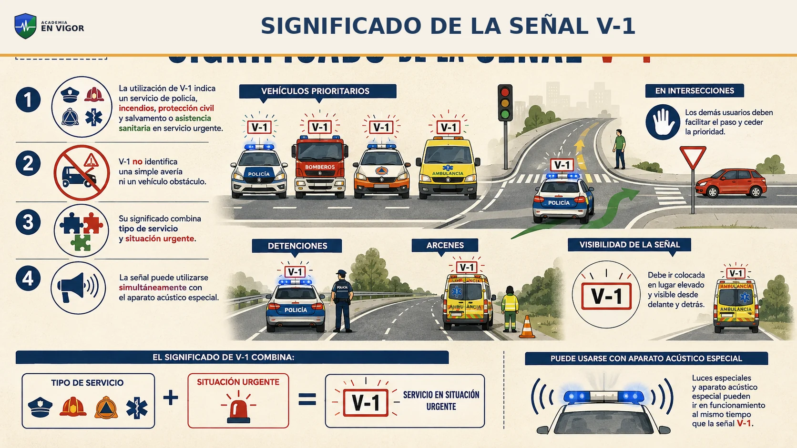

<em>Infografía: Significado de la señal V-1.</em>

<!-- FUENTE: BOE-RGV-T43 -->

## 35. Uso de V-1 frente a instalación del equipo

**Idea de control:** El anexo XI declara que la utilización de V-1 no requiere autorización administrativa, sea elemento adicional o constructivo.

- El anexo XI declara que la utilización de V-1 no requiere autorización administrativa, sea elemento adicional o constructivo.
- El artículo 67.3 del RGC exige autorización de la Jefatura Provincial para instalar aparatos emisores de luces y señales acústicas especiales.
- Uso de la señal e instalación del aparato son preguntas jurídicas distintas.
- Resolverlas exige atender al verbo exacto del enunciado.

<!-- VISUAL:t43-il-35-uso-de-v-1-frente-a-instalacion-del-equipo.webp -->

  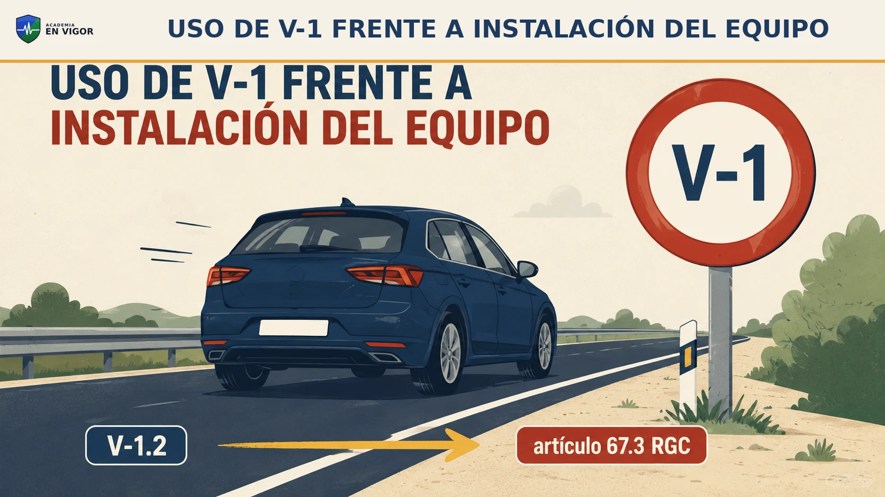

<em>Infografía: Uso de V-1 frente a instalación del equipo.</em>

<!-- FUENTE: BOE-RGV-T43 -->

## 36. Color y homologación de V-1

**Idea de control:** La señal luminosa V-1 está formada por una o varias luces de color azul.

- La señal luminosa V-1 está formada por una o varias luces de color azul.
- Las luces deben estar homologadas conforme al Reglamento CEPE/ONU número 65.
- Desde la unificación de 2018 el azul identifica a todos los servicios prioritarios.
- El amarillo auto queda reservado a señales con funciones distintas, como V-2 o V-16.

<!-- VISUAL:t43-36-color-y-homologacion-de-v-1.webp -->

  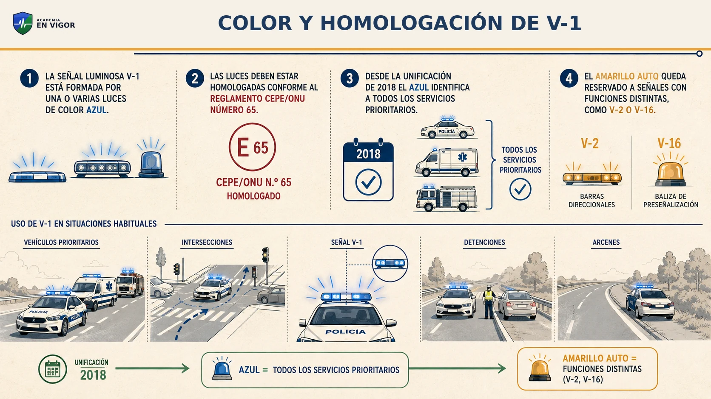

<em>Infografía: Color y homologación de V-1.</em>

<!-- FUENTE: BOE-RGV-T43 -->

## 37. Colocación de V-1 en vehículos

**Idea de control:** V-1 se instala en la parte delantera del plano superior, por encima de la luz más alta, o a lo largo del perímetro de la zona más alta.

- V-1 se instala en la parte delantera del plano superior, por encima de la luz más alta, o a lo largo del perímetro de la zona más alta.
- La instalación puede abarcar la zona alta delantera y trasera conforme al anexo.
- La posición busca visibilidad multidireccional sin perjudicar al conductor.
- No debe confundirse con una baliza colocada sobre la calzada.

<!-- VISUAL:t43-37-colocacion-de-v-1-en-vehiculos.webp -->

  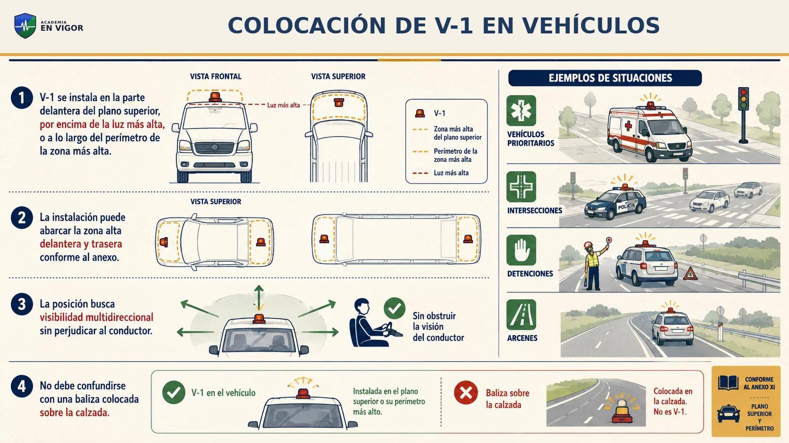

<em>Infografía: Colocación de V-1 en vehículos.</em>

<!-- FUENTE: BOE-RGV-T43 -->

## 38. V-1 en motocicletas

**Idea de control:** En motocicletas, V-1 puede situarse atrás sobre un cabezal telescópico elevable por encima de su parte más alta.

- En motocicletas, V-1 puede situarse atrás sobre un cabezal telescópico elevable por encima de su parte más alta.
- También puede ir incrustada en la parte delantera y trasera sin sobresalir del carenado.
- La solución debe conservar visibilidad y no afectar al control de la motocicleta.
- La regla específica no se sustituye por llevar una luz en el casco.

<!-- VISUAL:t43-38-v-1-en-motocicletas.webp -->

  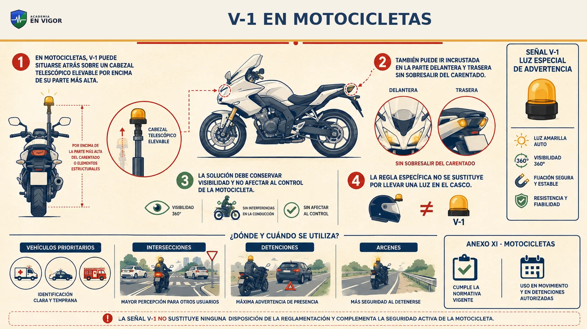

<em>Infografía: V-1 en motocicletas.</em>

<!-- FUENTE: BOE-RGV-T43 -->

## 39. Visibilidad mínima de V-1

**Idea de control:** V-1 debe ser visible en todas las direcciones a una distancia mínima de 50 metros.

- V-1 debe ser visible en todas las direcciones a una distancia mínima de 50 metros.
- En ningún caso puede afectar a la visibilidad del conductor.
- La regla combina alcance exterior y seguridad interior.
- Los 50 metros corresponden a V-1 y no deben confundirse con los 100 metros de V-2.

<!-- VISUAL:t43-39-visibilidad-minima-de-v-1.webp -->

  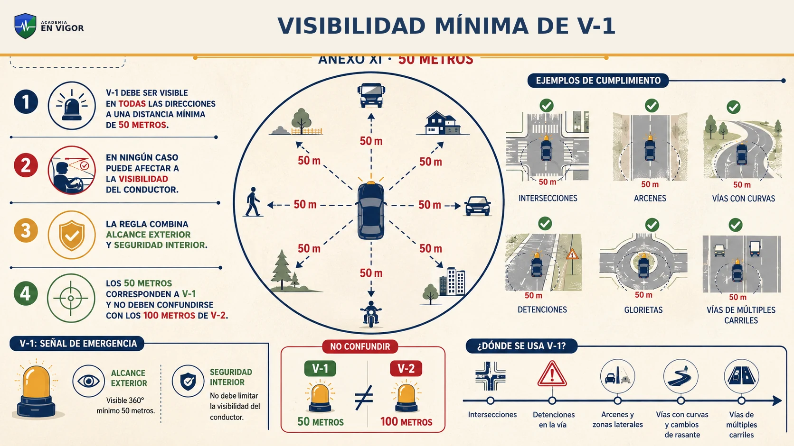

<em>Infografía: Visibilidad mínima de V-1.</em>

<!-- FUENTE: BOE-RGV-T43 -->

## 40. Sistemas auxiliares y prohibición de montaje

**Idea de control:** Los vehículos de policía pueden usar voluntariamente dos fuentes auxiliares azules intermitentes o estroboscópicas en el frontal.

- Los vehículos de policía pueden usar voluntariamente dos fuentes auxiliares azules intermitentes o estroboscópicas en el frontal.
- Ese sistema se coloca a la altura de las luces de cruce o por encima en motocicletas.
- El montaje y utilización de V-1 están prohibidos en vehículos que no sean prioritarios.
- Un sistema auxiliar azul no convierte un vehículo ajeno en prioritario.

<!-- VISUAL:t43-il-40-sistemas-auxiliares-y-prohibicion-de-montaje.webp -->

  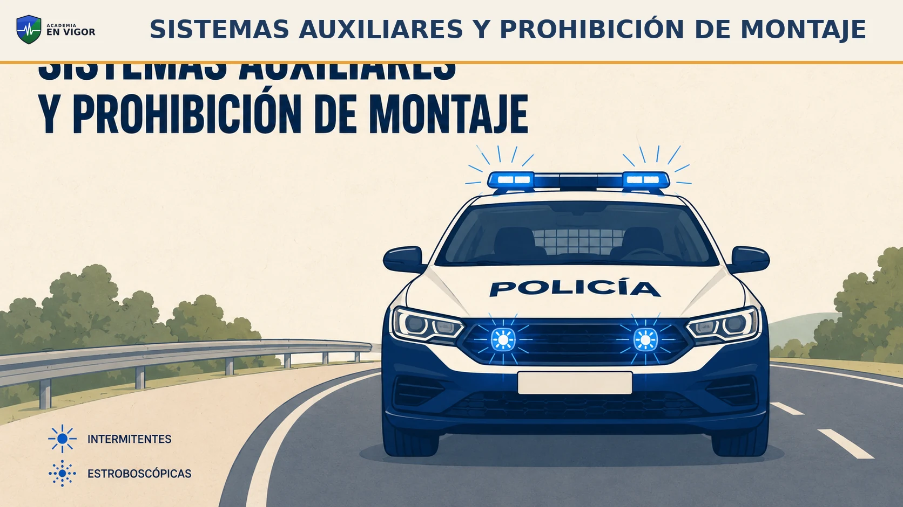

<em>Infografía: Sistemas auxiliares y prohibición de montaje.</em>

<!-- FUENTE: BOE-RGV-T43 -->

## 41. Momento en que nace el deber de facilitar

**Idea de control:** El deber de colaboración comienza tan pronto se perciben las señales especiales que anuncian la proximidad del vehículo prioritario.

- El deber de colaboración comienza tan pronto se perciben las señales especiales que anuncian la proximidad del vehículo prioritario.
- No es necesario esperar a que el vehículo esté inmediatamente detrás.
- La reacción debe anticipar su trayectoria sin crear un peligro adicional.
- No percibir razonablemente las señales es distinto de ignorarlas después de advertirlas.

<!-- VISUAL:t43-41-momento-en-que-nace-el-deber-de-facilitar.webp -->

  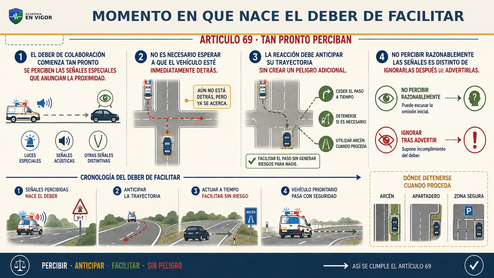

<em>Infografía: Momento en que nace el deber de facilitar.</em>

<!-- FUENTE: BOE-RGC-T43 -->

## 42. Medidas adecuadas según contexto

**Idea de control:** Los conductores adoptarán las medidas adecuadas según las circunstancias del momento y lugar.

- Los conductores adoptarán las medidas adecuadas según las circunstancias del momento y lugar.
- El Reglamento no impone una maniobra idéntica para toda vía o situación.
- Carriles, peatones, intersecciones y espacio disponible condicionan la respuesta segura.
- Facilitar el paso no autoriza una maniobra prohibida o peligrosa sin necesidad.

<!-- VISUAL:t43-42-medidas-adecuadas-segun-contexto.webp -->

  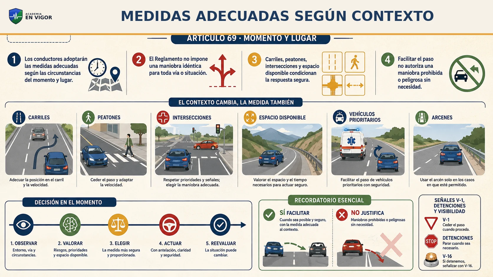

<em>Infografía: Medidas adecuadas según contexto.</em>

<!-- FUENTE: BOE-RGC-T43 -->

## 43. Apartarse normalmente a la derecha

**Idea de control:** La respuesta normal es apartarse a la derecha cuando resulte adecuada y segura.

- La respuesta normal es apartarse a la derecha cuando resulte adecuada y segura.
- La palabra normalmente admite adaptar la maniobra a la configuración real de la vía.
- El desplazamiento debe señalizarse y comprobar que no invade una zona peligrosa.
- La finalidad es despejar el itinerario, no competir con el vehículo prioritario.

<!-- VISUAL:t43-43-apartarse-normalmente-a-la-derecha.webp -->

  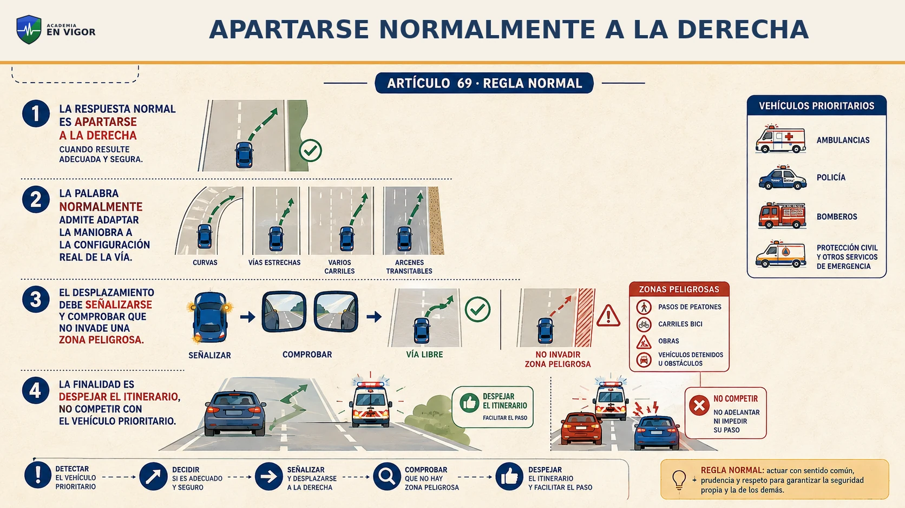

<em>Infografía: Apartarse normalmente a la derecha.</em>

<!-- FUENTE: BOE-RGC-T43 -->

## 44. Detenerse si fuera preciso

**Idea de control:** El conductor debe detenerse si resulta preciso para facilitar el paso.

- El conductor debe detenerse si resulta preciso para facilitar el paso.
- La detención ha de hacerse de modo controlado y sin generar un nuevo riesgo.
- Puede ser preferible detenerse a continuar ocupando el espacio necesario.
- La obligación depende de la situación, no de una distancia fija.

<!-- VISUAL:t43-44-detenerse-si-fuera-preciso.webp -->

  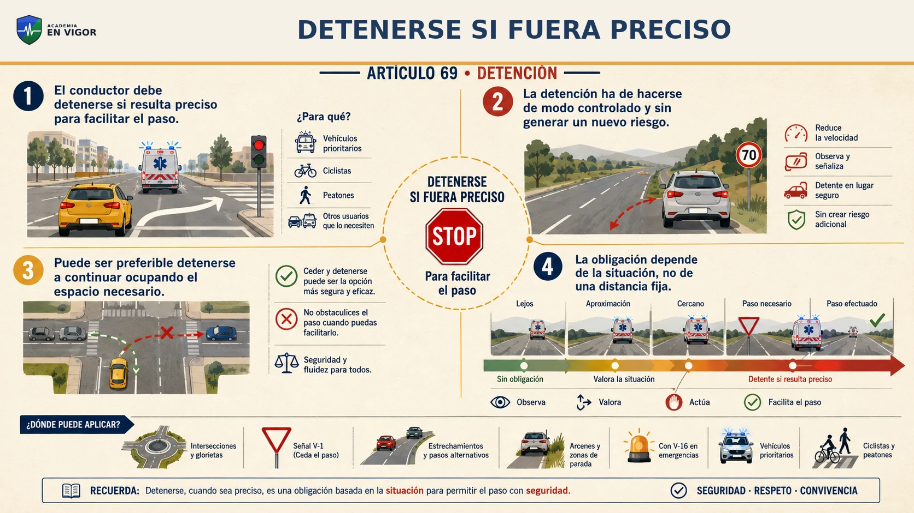

<em>Infografía: Detenerse si fuera preciso.</em>

<!-- FUENTE: BOE-RGC-T43 -->

## 45. Reacciones inseguras que no facilitan

**Idea de control:** Una maniobra brusca o imprevisible puede obstaculizar más al vehículo prioritario aunque pretenda ayudar.

- Una maniobra brusca o imprevisible puede obstaculizar más al vehículo prioritario aunque pretenda ayudar.
- Frenar sin comprobar el tráfico posterior puede crear una colisión secundaria.
- Cruzar una intersección cerrada para liberar espacio exige valorar si la maniobra es legal y segura.
- La cooperación se mide por facilitar el paso sin añadir riesgo.

<!-- VISUAL:t43-il-45-reacciones-inseguras-que-no-facilitan.webp -->

  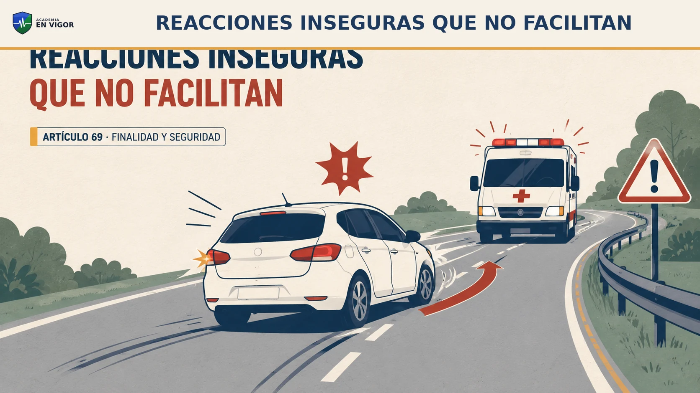

<em>Infografía: Reacciones inseguras que no facilitan.</em>

<!-- FUENTE: BOE-RGC-T43 -->

## 46. Activación policial de detención

**Idea de control:** Desde el 1 de julio de 2025, el supuesto de detención exige un vehículo de policía detrás que manifieste su presencia conforme al artículo 68.2 y active luz roja hacia adelante.

- Desde el 1 de julio de 2025, el supuesto de detención exige un vehículo de policía detrás que manifieste su presencia conforme al artículo 68.2 y active luz roja hacia adelante.
- La luz roja debe emitirse de forma intermitente o destellante.
- La señal roja es adicional a la manifestación de presencia del vehículo policial.
- No debe confundirse con la V-1 azul ni con la señal de emergencia amarilla auto.

<!-- VISUAL:t43-46-activacion-policial-de-detencion.webp -->

  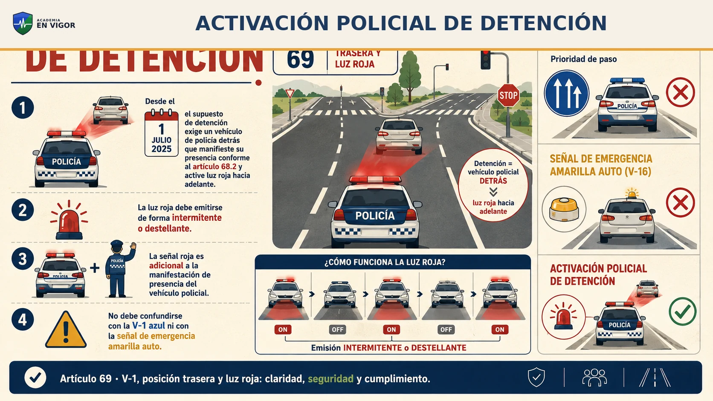

<em>Infografía: Activación policial de detención.</em>

<!-- FUENTE: RD465-2025-T43 -->

## 47. Detención en el lado derecho

**Idea de control:** El conductor requerido debe detener su vehículo con las debidas precauciones en el lado derecho.

- El conductor requerido debe detener su vehículo con las debidas precauciones en el lado derecho.
- La maniobra debe señalizarse y adaptarse a la vía.
- No se autoriza elegir indistintamente derecha o izquierda.
- La detención debe evitar interferir innecesariamente con el resto de usuarios.

<!-- VISUAL:t43-47-detencion-en-el-lado-derecho.webp -->

  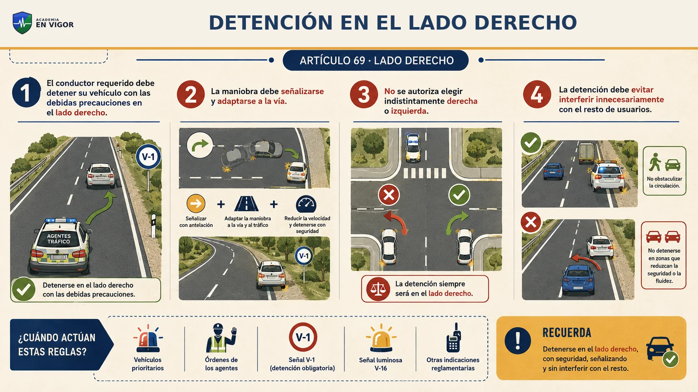

<em>Infografía: Detención en el lado derecho.</em>

<!-- FUENTE: BOE-RGC-T43 -->

## 48. Posición delante del vehículo policial

**Idea de control:** El vehículo requerido debe quedar delante del vehículo policial.

- El vehículo requerido debe quedar delante del vehículo policial.
- La posición permite al vehículo policial proteger y controlar la actuación desde atrás.
- No debe detenerse detrás del vehículo policial por iniciativa propia.
- La distancia concreta se adapta al lugar seguro disponible.

<!-- VISUAL:t43-48-posicion-delante-del-vehiculo-policial.webp -->

  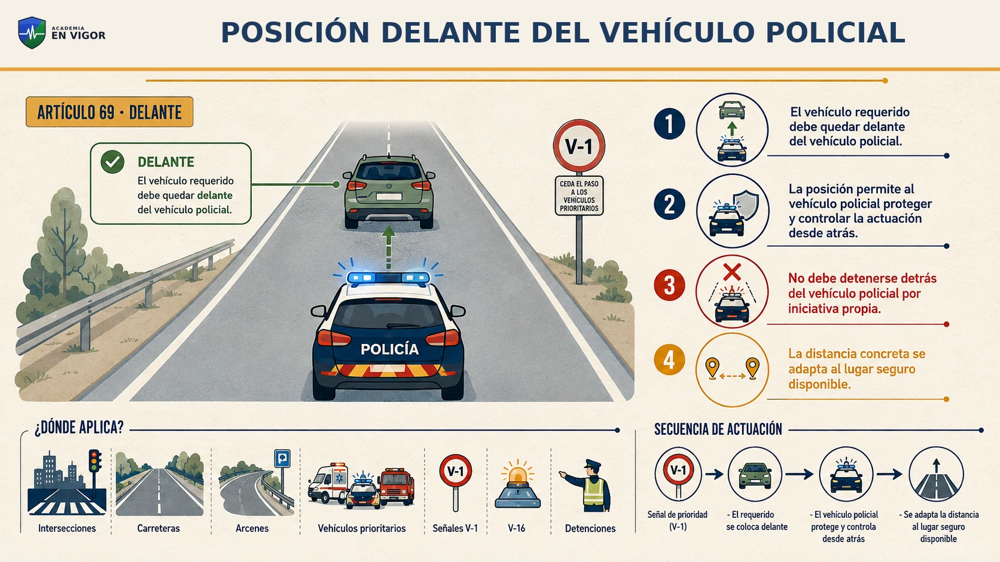

<em>Infografía: Posición delante del vehículo policial.</em>

<!-- FUENTE: BOE-RGC-T43 -->

## 49. Lugar seguro y permanencia interior

**Idea de control:** La detención debe realizarse donde no genere mayores riesgos o molestias para los demás usuarios.

- La detención debe realizarse donde no genere mayores riesgos o molestias para los demás usuarios.
- El conductor debe permanecer en el interior del vehículo.
- Salir sin indicación puede aumentar el riesgo de atropello o interferir en la actuación.
- La seguridad del lugar prevalece sobre detenerse de forma instantánea en un punto peligroso.

<!-- VISUAL:t43-49-lugar-seguro-y-permanencia-interior.webp -->

  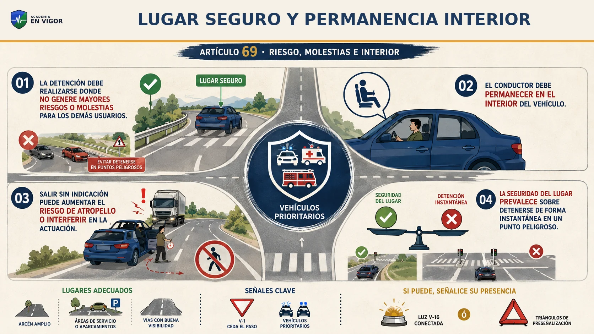

<em>Infografía: Lugar seguro y permanencia interior.</em>

<!-- FUENTE: BOE-RGC-T43 -->

## 50. Instrucciones del agente y cambio de color

**Idea de control:** El conductor ajustará en todo momento su comportamiento a las instrucciones impartidas por megafonía u otro medio claramente perceptible.

- El conductor ajustará en todo momento su comportamiento a las instrucciones impartidas por megafonía u otro medio claramente perceptible.
- La reforma de 2025 sustituyó en el texto reglamentario el antiguo dispositivo amarillo por uno rojo hacia adelante.
- Las preguntas históricas con luz amarilla deben identificarse como formulaciones de una redacción anterior.
- La conducta de detenerse a la derecha, delante y permanecer dentro se mantiene como núcleo operativo.

<!-- VISUAL:t43-il-50-instrucciones-del-agente-y-cambio-de-color.webp -->

  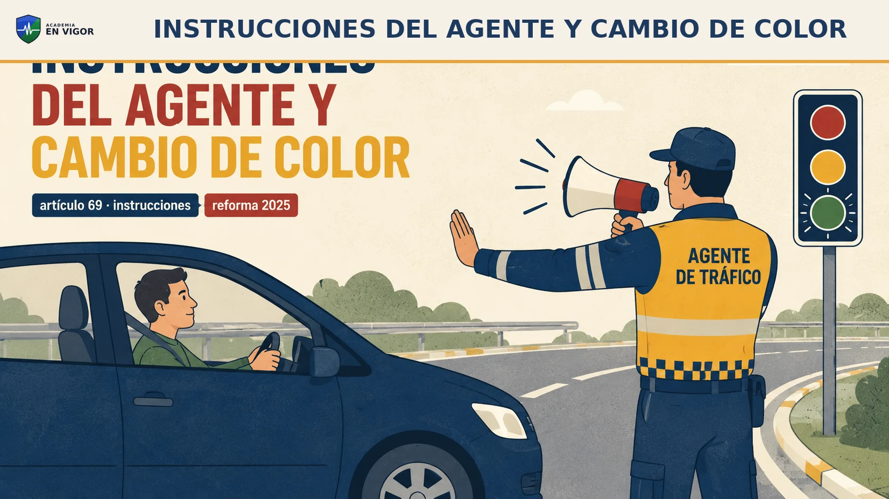

<em>Infografía: Instrucciones del agente y cambio de color.</em>

<!-- FUENTE: RD465-2025-T43 -->

## 51. Circunstancias especialmente graves

**Idea de control:** El artículo 70 parte de circunstancias especialmente graves.

- El artículo 70 parte de circunstancias especialmente graves.
- Una simple conveniencia o prisa personal no activa este régimen.
- La gravedad debe explicar por qué se realiza un servicio normalmente reservado a prioritarios.
- La excepción se interpreta de forma restrictiva por el riesgo que genera.

<!-- VISUAL:t43-51-circunstancias-especialmente-graves.webp -->

  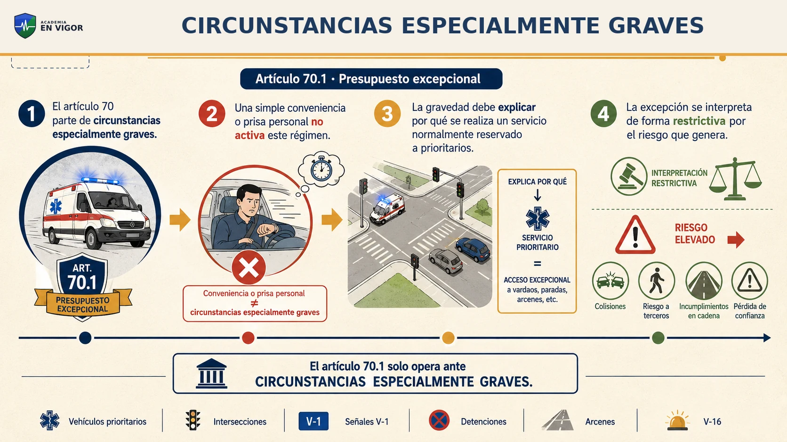

<em>Infografía: Circunstancias especialmente graves.</em>

<!-- FUENTE: BOE-RGC-T43 -->

## 52. Falta de otro medio disponible

**Idea de control:** El conductor debe verse forzado a actuar sin poder recurrir a otro medio.

- El conductor debe verse forzado a actuar sin poder recurrir a otro medio.
- Si existe una alternativa prioritaria disponible y adecuada, falta uno de los presupuestos del artículo 70.
- La imposibilidad se valora atendiendo a la situación real y al tiempo de respuesta.
- La norma no convierte el vehículo particular en ambulancia por mera elección.

<!-- VISUAL:t43-52-falta-de-otro-medio-disponible.webp -->

  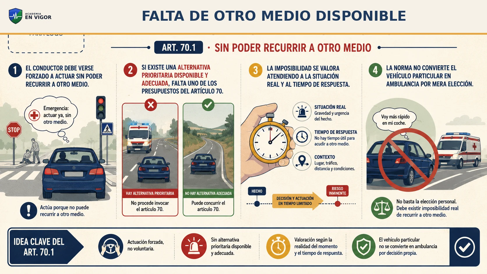

<em>Infografía: Falta de otro medio disponible.</em>

<!-- FUENTE: BOE-RGC-T43 -->

## 53. Servicio normalmente reservado a prioritarios

**Idea de control:** El vehículo no prioritario efectúa excepcionalmente un servicio de los normalmente reservados a los prioritarios.

- El vehículo no prioritario efectúa excepcionalmente un servicio de los normalmente reservados a los prioritarios.
- El ejemplo típico es un traslado urgente impuesto por circunstancias graves, no cualquier desplazamiento rápido.
- La naturaleza del servicio explica la advertencia a terceros, pero no cambia la clasificación del vehículo.
- Debe existir relación directa entre la urgencia y la conducción realizada.

<!-- VISUAL:t43-53-servicio-normalmente-reservado-a-prioritarios.webp -->

  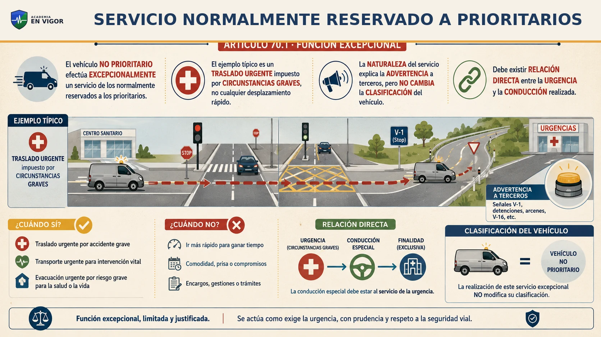

<em>Infografía: Servicio normalmente reservado a prioritarios.</em>

<!-- FUENTE: BOE-RGC-T43 -->

## 54. Avisador acústico intermitente

**Idea de control:** El conductor procurará advertir la situación utilizando el avisador acústico de forma intermitente.

- El conductor procurará advertir la situación utilizando el avisador acústico de forma intermitente.
- Se trata del avisador ordinario del vehículo, no del aparato acústico especial reservado al régimen prioritario.
- La intermitencia diferencia la advertencia de un sonido continuo indiscriminado.
- El aviso no concede facultad para vulnerar normas de circulación.

<!-- VISUAL:t43-54-avisador-acustico-intermitente.webp -->

  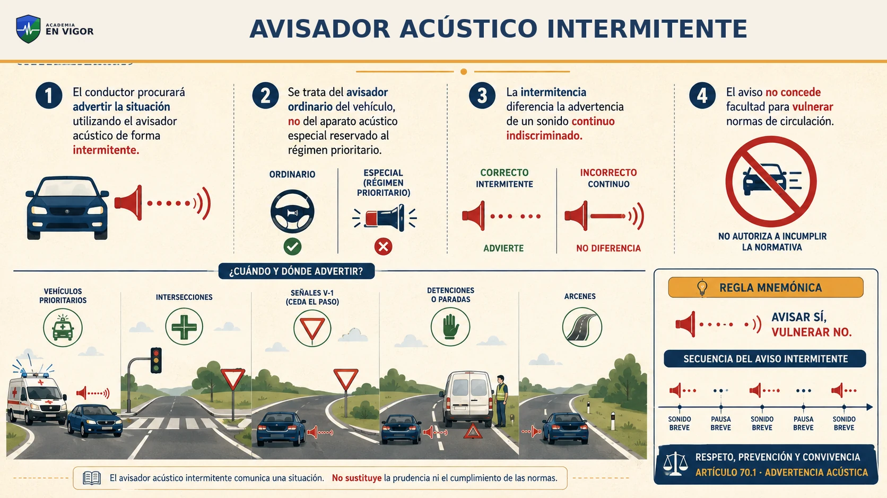

<em>Infografía: Avisador acústico intermitente.</em>

<!-- FUENTE: BOE-RGC-T43 -->

## 55. Conexión de la luz de emergencia

**Idea de control:** El vehículo conectará la luz de emergencia si dispone de ella para hacer visible la situación especial.

- El vehículo conectará la luz de emergencia si dispone de ella para hacer visible la situación especial.
- La señal de emergencia emplea simultáneamente los indicadores de dirección.
- No equivale a V-1 azul ni atribuye prioridad jurídica.
- Su uso se combina con el avisador intermitente en la formulación reglamentaria.

<!-- VISUAL:t43-il-55-conexion-de-la-luz-de-emergencia.webp -->

  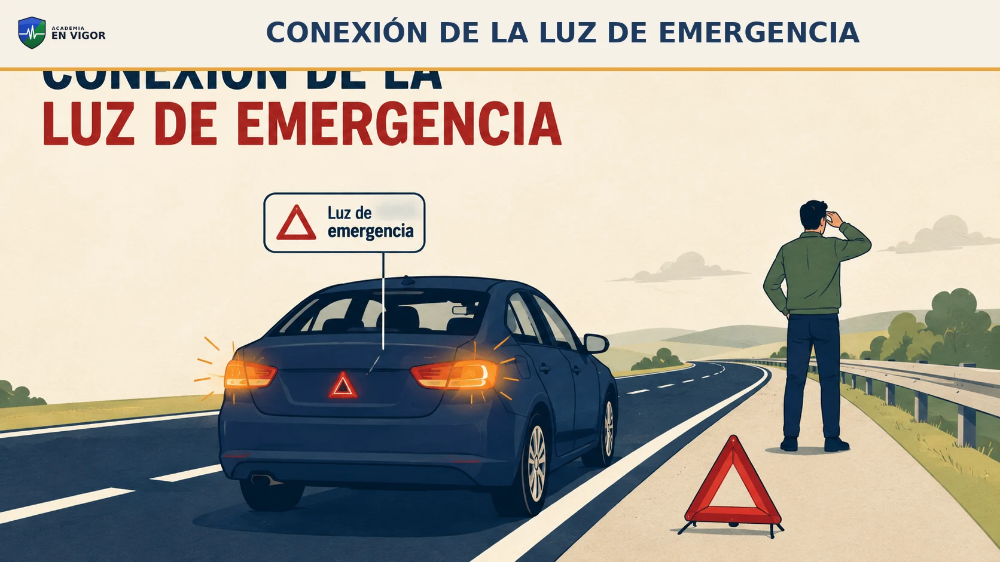

<em>Infografía: Conexión de la luz de emergencia.</em>

<!-- FUENTE: BOE-RGC-T43 -->

## 56. Pañuelo o procedimiento similar

**Idea de control:** El artículo 70 admite agitar un pañuelo o utilizar un procedimiento similar para advertir la especial situación.

- El artículo 70 admite agitar un pañuelo o utilizar un procedimiento similar para advertir la especial situación.
- Es una alternativa visible prevista por la norma, no una señal V reglamentaria.
- La elección debe poder ser percibida sin comprometer el control del vehículo.
- El medio alternativo no elimina la obligación de respetar las normas.

<!-- VISUAL:t43-56-panuelo-o-procedimiento-similar.webp -->

  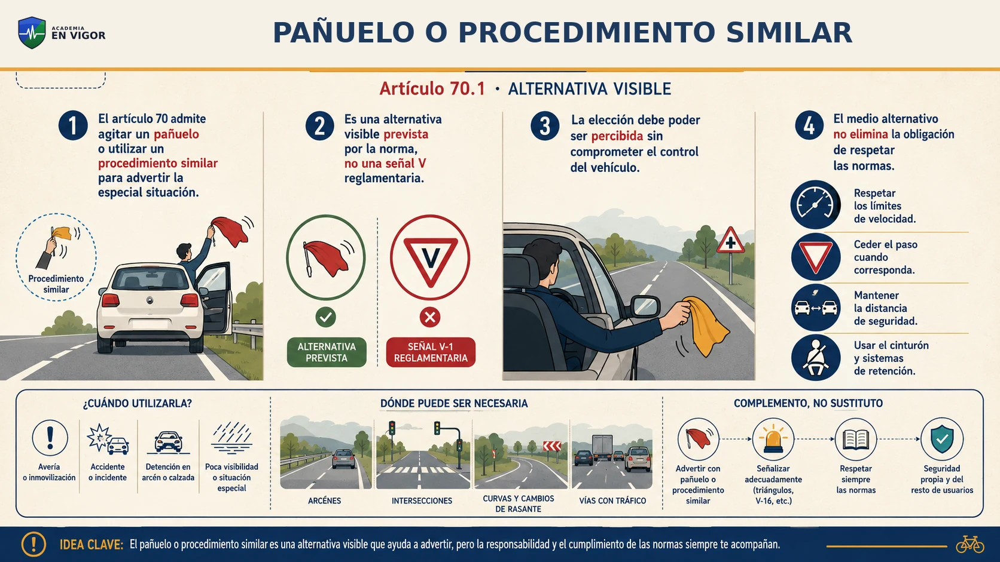

<em>Infografía: Pañuelo o procedimiento similar.</em>

<!-- FUENTE: BOE-RGC-T43 -->

## 57. No adquisición del carácter prioritario

**Idea de control:** El vehículo continúa siendo no prioritario pese a realizar el servicio urgente excepcional.

- El vehículo continúa siendo no prioritario pese a realizar el servicio urgente excepcional.
- No adquiere las facultades del artículo 68 por usar claxon y luz de emergencia.
- La colaboración de terceros no convierte la advertencia en una V-1.
- La clasificación jurídica permanece separada de la gravedad de la situación.

<!-- VISUAL:t43-57-no-adquisicion-del-caracter-prioritario.webp -->

  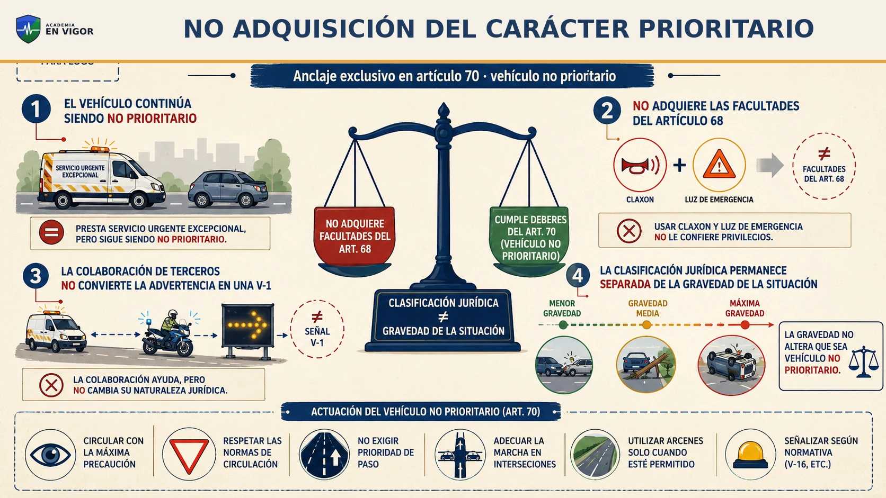

<em>Infografía: No adquisición del carácter prioritario.</em>

<!-- FUENTE: BOE-RGC-T43 -->

## 58. Respeto de las normas de circulación

**Idea de control:** El conductor no prioritario debe respetar las normas de circulación.

- El conductor no prioritario debe respetar las normas de circulación.
- El artículo destaca especialmente el respeto en las intersecciones.
- No puede superar límites ni franquear semáforos por el solo hecho de advertir la urgencia.
- La situación podrá valorarse jurídicamente, pero no crea el régimen excepcional del artículo 68.

<!-- VISUAL:t43-58-respeto-de-las-normas-de-circulacion.webp -->

  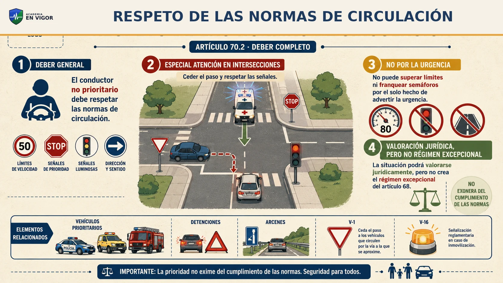

<em>Infografía: Respeto de las normas de circulación.</em>

<!-- FUENTE: BOE-RGC-T43 -->

## 59. Conducta de los demás usuarios

**Idea de control:** Los demás usuarios cumplirán respecto de ese vehículo lo dispuesto en el artículo 69.

- Los demás usuarios cumplirán respecto de ese vehículo lo dispuesto en el artículo 69.
- Deben facilitar el paso mediante medidas adecuadas al momento y lugar.
- La colaboración no atribuye al vehículo no prioritario facultades para incumplir normas.
- Cada conductor debe evitar que su maniobra de ayuda cree un peligro nuevo.

<!-- VISUAL:t43-59-conducta-de-los-demas-usuarios.webp -->

  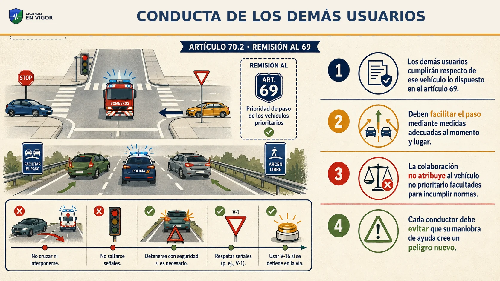

<em>Infografía: Conducta de los demás usuarios.</em>

<!-- FUENTE: BOE-RGC-T43 -->

## 60. Justificación exigible por agentes

**Idea de control:** Los agentes pueden exigir en cualquier momento la justificación de las circunstancias graves.

- Los agentes pueden exigir en cualquier momento la justificación de las circunstancias graves.
- La mera afirmación del conductor no impide la comprobación.
- La justificación debe guardar relación con el servicio urgente realizado.
- La posibilidad de control refuerza el carácter excepcional del artículo 70.

<!-- VISUAL:t43-il-60-justificacion-exigible-por-agentes.webp -->

  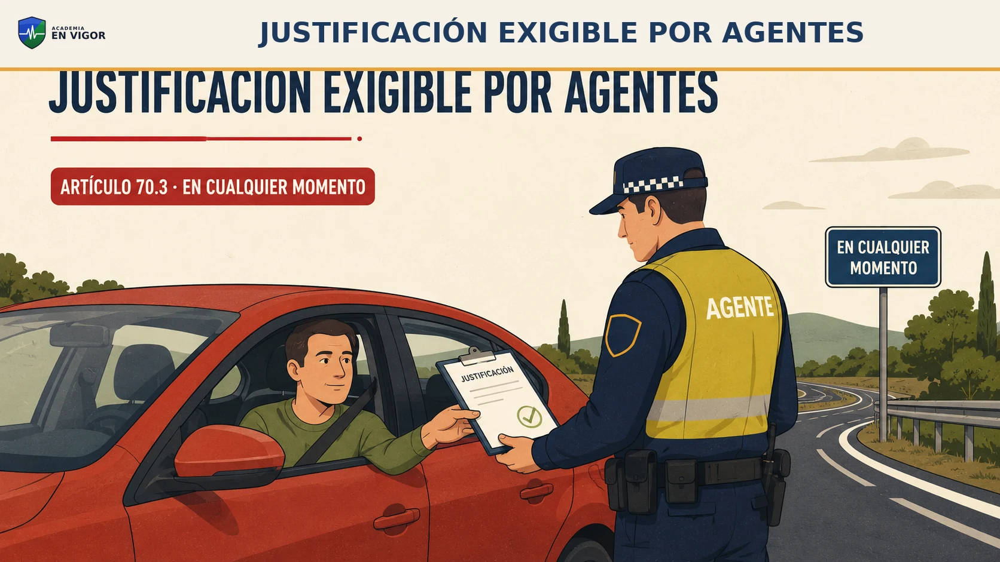

<em>Infografía: Justificación exigible por agentes.</em>

<!-- FUENTE: BOE-RGC-T43 -->

## 61. Concepto técnico de señal de emergencia

**Idea de control:** La señal de emergencia consiste en el funcionamiento simultáneo de todas las luces indicadoras de dirección.

- La señal de emergencia consiste en el funcionamiento simultáneo de todas las luces indicadoras de dirección.
- Su finalidad es advertir que el vehículo representa temporalmente un peligro para otros usuarios.
- Su color corresponde al amarillo auto de los indicadores de dirección.
- No debe confundirse con la señal especial azul V-1.

<!-- VISUAL:t43-61-concepto-tecnico-de-senal-de-emergencia.webp -->

  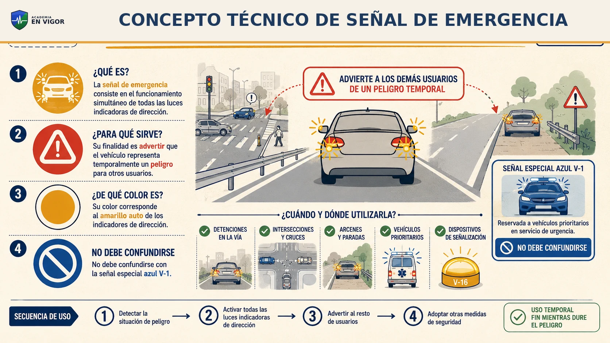

<em>Infografía: Concepto técnico de señal de emergencia.</em>

<!-- FUENTE: BOE-RGV-T43 -->

## 62. Advertencia de inmovilización o frenado

**Idea de control:** El propósito de inmovilizar el vehículo o frenar considerablemente debe advertirse ópticamente con antelación suficiente cuando sea posible.

- El propósito de inmovilizar el vehículo o frenar considerablemente debe advertirse ópticamente con antelación suficiente cuando sea posible.
- La frenada considerable puede anunciarse mediante empleo reiterado de las luces de frenado.
- También puede advertirse con el brazo mediante movimientos cortos y rápidos de arriba abajo.
- La advertencia debe permitir a quienes circulan detrás anticipar la reducción.

<!-- VISUAL:t43-62-advertencia-de-inmovilizacion-o-frenado.webp -->

  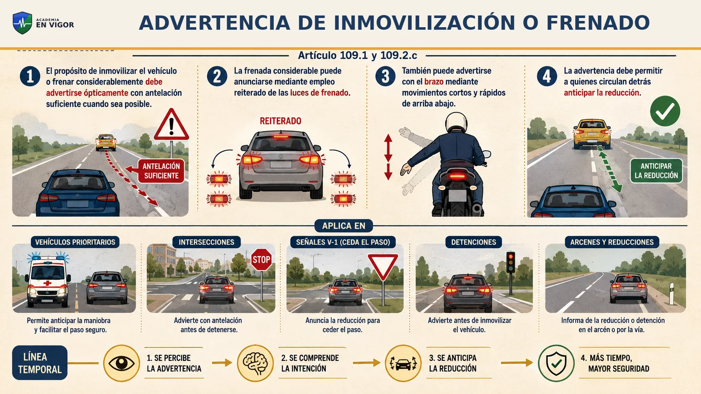

<em>Infografía: Advertencia de inmovilización o frenado.</em>

<!-- FUENTE: BOE-RGC-T43 -->

## 63. Inmovilización en autopista o con poca visibilidad

**Idea de control:** En autopista o autovía, la inmovilización se señaliza con la luz de emergencia si el vehículo dispone de ella.

- En autopista o autovía, la inmovilización se señaliza con la luz de emergencia si el vehículo dispone de ella.
- La misma obligación opera en lugares o circunstancias que disminuyen sensiblemente la visibilidad.
- Cuando proceda se añaden las luces de posición.
- La señalización advierte la presencia del vehículo, pero no sustituye las demás medidas de seguridad.

<!-- VISUAL:t43-63-inmovilizacion-en-autopista-o-con-poca-visibilidad.webp -->

  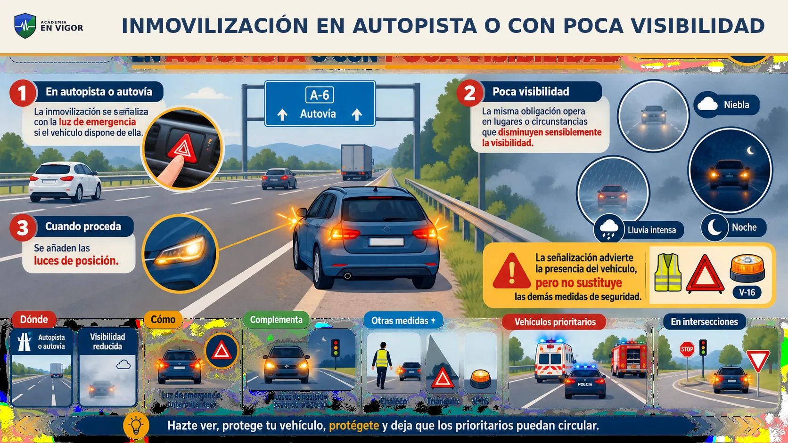

<em>Infografía: Inmovilización en autopista o con poca visibilidad.</em>

<!-- FUENTE: BOE-RGC-T43 -->

## 64. Obstáculo por accidente, avería o carga

**Idea de control:** Si un accidente, avería o carga obstaculiza la calzada, debe señalizarse convenientemente el vehículo o el obstáculo.

- Si un accidente, avería o carga obstaculiza la calzada, debe señalizarse convenientemente el vehículo o el obstáculo.
- Deben adoptarse medidas para retirarlo en el menor tiempo posible.
- Siempre que sea factible se sacará de la calzada y se situará conforme a las normas de estacionamiento.
- La prioridad inicial es advertir y reducir la exposición al riesgo.

<!-- VISUAL:t43-64-obstaculo-por-accidente-averia-o-carga.webp -->

  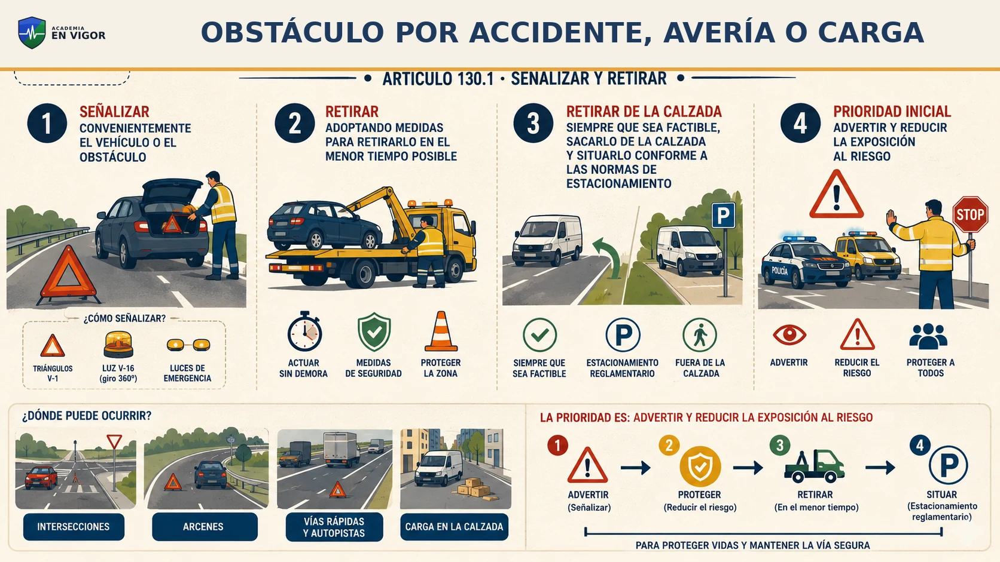

<em>Infografía: Obstáculo por accidente, avería o carga.</em>

<!-- FUENTE: BOE-RGC-T43 -->

## 65. Vehículo que puede continuar la marcha

**Idea de control:** Tras accidente o avería, el vehículo que pueda continuar lo hará de forma inmediata.

- Tras accidente o avería, el vehículo que pueda continuar lo hará de forma inmediata.
- Antes de reanudar la marcha debe asegurarse de que puede circular con seguridad.
- Continuar evita mantener un obstáculo innecesario en la zona de circulación.
- La posibilidad mecánica no basta si el vehículo no puede desplazarse con seguridad.

<!-- VISUAL:t43-il-65-vehiculo-que-puede-continuar-la-marcha.webp -->

  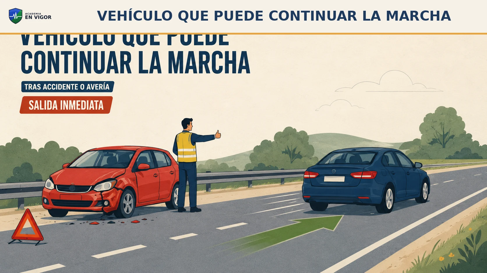

<em>Infografía: Vehículo que puede continuar la marcha.</em>

<!-- FUENTE: BOE-RGC-T43 -->

## 66. Vehículo que necesita auxilio

**Idea de control:** Si precisa auxilio, el vehículo debe abandonar cuanto antes los carriles de circulación.

- Si precisa auxilio, el vehículo debe abandonar cuanto antes los carriles de circulación.
- Debe dirigirse a la primera salida disponible utilizando el arcén derecho cuando pueda hacerlo con seguridad.
- El arcén se usa aquí para retirar el riesgo de los carriles, no como carril ordinario de circulación.
- La marcha debe ser controlada y compatible con el estado del vehículo.

<!-- VISUAL:t43-66-vehiculo-que-necesita-auxilio.webp -->

  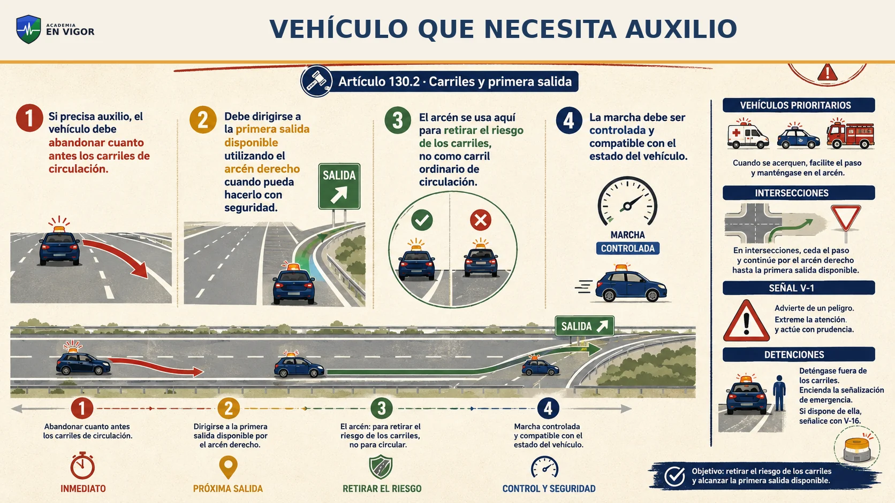

<em>Infografía: Vehículo que necesita auxilio.</em>

<!-- FUENTE: BOE-RGC-T43 -->

## 67. Imposibilidad de alcanzar una salida

**Idea de control:** Si no puede llegar a una salida, debe detenerse en el arcén derecho.

- Si no puede llegar a una salida, debe detenerse en el arcén derecho.
- Si tampoco es posible, se elegirá el lugar donde cause menor obstáculo a la circulación.
- La elección debe reducir la exposición del vehículo y de sus ocupantes.
- Una zona de menor obstáculo no autoriza a ignorar un peligro mayor para personas.

<!-- VISUAL:t43-67-imposibilidad-de-alcanzar-una-salida.webp -->

  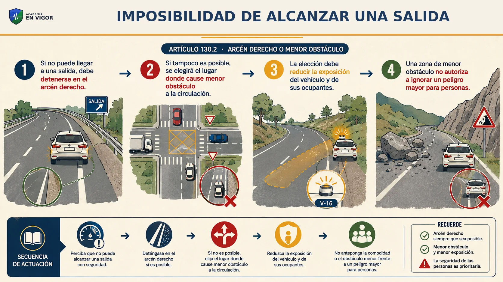

<em>Infografía: Imposibilidad de alcanzar una salida.</em>

<!-- FUENTE: BOE-RGC-T43 -->

## 68. Salida de ocupantes

**Idea de control:** Como regla, los ocupantes abandonarán el vehículo inmovilizado si existe un lugar seguro fuera de la plataforma de circulación.

- Como regla, los ocupantes abandonarán el vehículo inmovilizado si existe un lugar seguro fuera de la plataforma de circulación.
- La salida debe hacerse por el lado contrario al flujo de tráfico.
- No deben transitar ni permanecer en carriles o arcenes de la plataforma.
- Si salir obliga a ocupar una zona más peligrosa, se valora la seguridad real antes de abandonar.

<!-- VISUAL:t43-68-salida-de-ocupantes.webp -->

  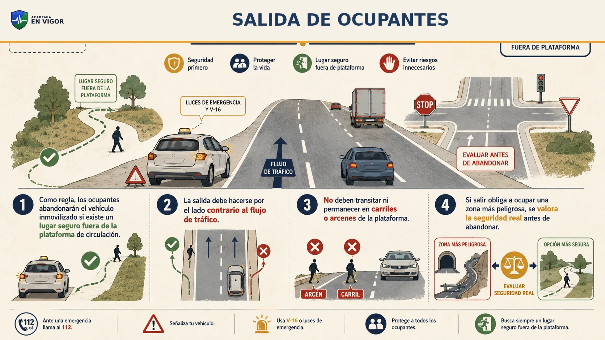

<em>Infografía: Salida de ocupantes.</em>

<!-- FUENTE: BOE-RGC-T43 -->

## 69. Luces durante la retirada del obstáculo

**Idea de control:** Mientras se deja expedita la vía se enciende la luz de emergencia si el vehículo la lleva.

- Mientras se deja expedita la vía se enciende la luz de emergencia si el vehículo la lleva.
- Cuando proceda se mantienen también las luces de posición.
- Las luces de gálibo se usan cuando resulten exigibles por el vehículo y las condiciones.
- Estas luces complementan el dispositivo reglamentario de preseñalización de peligro.

<!-- VISUAL:t43-69-luces-durante-la-retirada-del-obstaculo.webp -->

  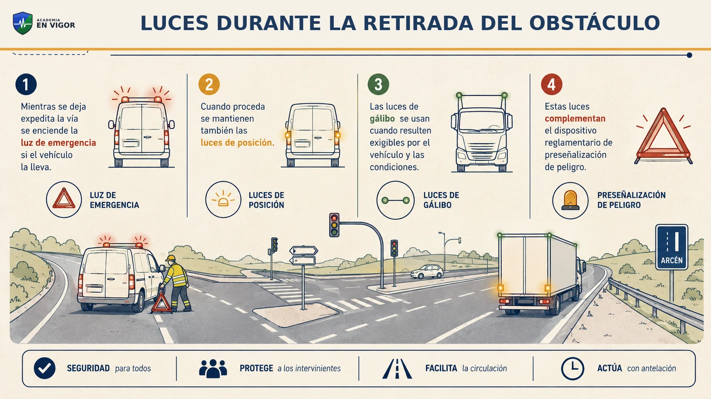

<em>Infografía: Luces durante la retirada del obstáculo.</em>

<!-- FUENTE: BOE-RGC-T43 -->

## 70. Dispositivo reglamentario de preseñalización

**Idea de control:** Todo conductor debe emplear el dispositivo reglamentario de preseñalización para advertir la inmovilización o el obstáculo.

- Todo conductor debe emplear el dispositivo reglamentario de preseñalización para advertir la inmovilización o el obstáculo.
- En el régimen vigente de 2026 ese dispositivo es la señal V-16 conectada aplicable.
- V-16 complementa la luz de emergencia y las luces que procedan.
- Su finalidad es hacer visible y comunicar la incidencia sin convertir el vehículo en prioritario.

<!-- VISUAL:t43-il-70-dispositivo-reglamentario-de-presenalizacion.webp -->

  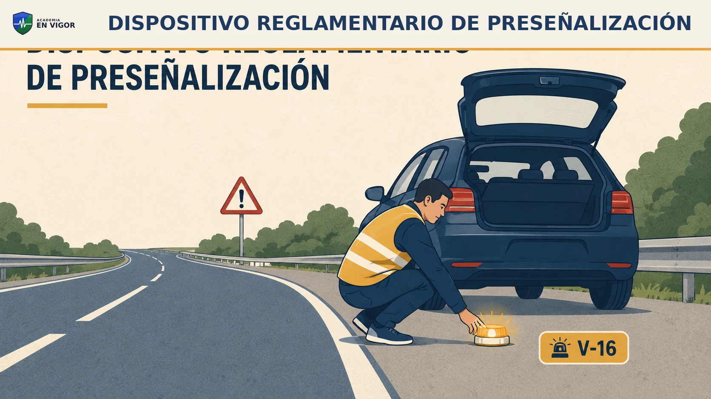

<em>Infografía: Dispositivo reglamentario de preseñalización.</em>

<!-- FUENTE: BOE-RGC-T43 -->

## 71. Significado de V-16

**Idea de control:** V-16 indica que el vehículo ha quedado inmovilizado en la calzada o que su carga está caída sobre ella.

- V-16 indica que el vehículo ha quedado inmovilizado en la calzada o que su carga está caída sobre ella.
- La señal no identifica a un servicio de policía o sanitario.
- Su significado se vincula a un peligro temporal por inmovilización u obstáculo.
- La activación no autoriza a ocupar la vía más tiempo del necesario.

<!-- VISUAL:t43-71-significado-de-v-16.webp -->

  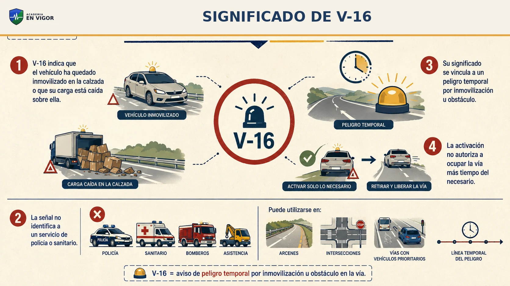

<em>Infografía: Significado de V-16.</em>

<!-- FUENTE: BOE-RGV-T43 -->

## 72. Colocación de V-16

**Idea de control:** V-16, de color amarillo auto, se coloca en la parte más alta posible del vehículo inmovilizado.

- V-16, de color amarillo auto, se coloca en la parte más alta posible del vehículo inmovilizado.
- La ubicación debe garantizar su máxima visibilidad.
- La colocación busca evitar que el usuario tenga que invadir innecesariamente la calzada.
- No se instala de forma permanente como una V-1.

<!-- VISUAL:t43-72-colocacion-de-v-16.webp -->

  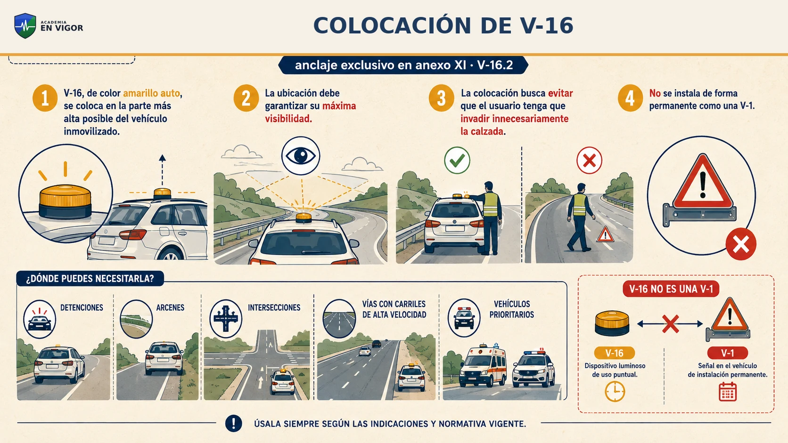

<em>Infografía: Colocación de V-16.</em>

<!-- FUENTE: BOE-RGV-T43 -->

## 73. Características luminosas de V-16

**Idea de control:** La señal V-16 emite luz amarillo auto y debe cumplir las características técnicas reglamentarias.

- La señal V-16 emite luz amarillo auto y debe cumplir las características técnicas reglamentarias.
- La visibilidad debe mantenerse en el campo horizontal y vertical definido por el anexo.
- La homologación y certificación permiten distinguir un dispositivo válido de una simple luz comercial.
- El usuario debe comprobar la fecha de caducidad del servicio de conectividad.

<!-- VISUAL:t43-73-caracteristicas-luminosas-de-v-16.webp -->

  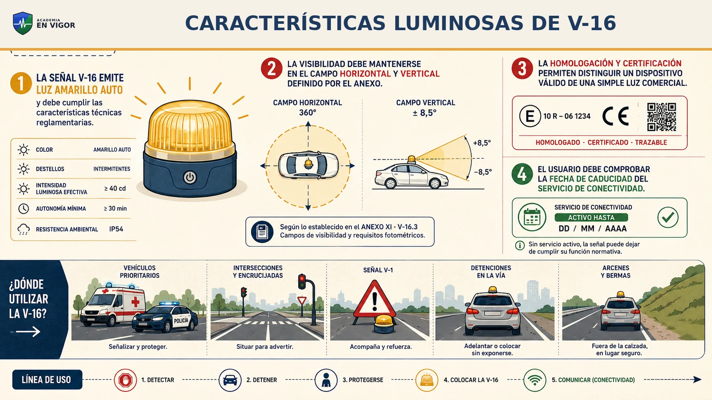

<em>Infografía: Características luminosas de V-16.</em>

<!-- FUENTE: BOE-RGV-T43 -->

## 74. Comunicación y geoposicionamiento V-16

**Idea de control:** V-16 comunica su activación, desactivación y geoposicionamiento al punto de acceso nacional de tráfico y movilidad.

- V-16 comunica su activación, desactivación y geoposicionamiento al punto de acceso nacional de tráfico y movilidad.
- La ubicación se envía cada 100 segundos mientras permanece activada.
- La transmisión cesa después de comunicarse la desactivación.
- La conectividad informa de la incidencia sin identificar por sí sola quién conducía.

<!-- VISUAL:t43-74-comunicacion-y-geoposicionamiento-v-16.webp -->

  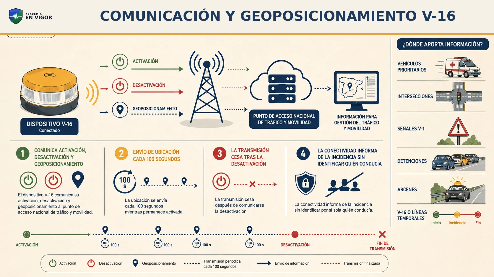

<em>Infografía: Comunicación y geoposicionamiento V-16.</em>

<!-- FUENTE: BOE-RGV-T43 -->

## 75. Conectividad, plazo y caducidad

**Idea de control:** El coste de las comunicaciones está incluido en el precio de venta de V-16.

- El coste de las comunicaciones está incluido en el precio de venta de V-16.
- Las comunicaciones deben garantizarse durante al menos doce años.
- La fecha de caducidad del servicio debe figurar en el envase y en el propio dispositivo.
- Una baliza con conectividad caducada no satisface la misma garantía de servicio.

<!-- VISUAL:t43-il-75-conectividad-plazo-y-caducidad.webp -->

  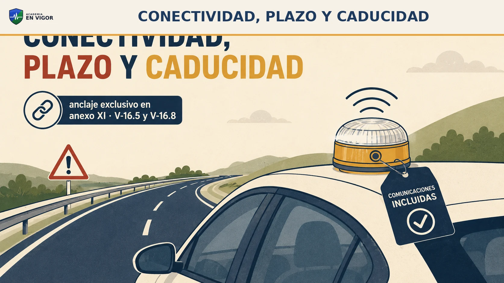

<em>Infografía: Conectividad, plazo y caducidad.</em>

<!-- FUENTE: BOE-RGV-T43 -->

## 76. Finalidad exclusiva de V-16

**Idea de control:** V-16 se destina exclusivamente a visibilizar el vehículo accidentado y remitir su ubicación a la DGT.

- V-16 se destina exclusivamente a visibilizar el vehículo accidentado y remitir su ubicación a la DGT.
- El dispositivo no puede incorporar funcionalidades adicionales.
- La limitación protege la función reglamentaria y evita confundir homologación con otros servicios.
- Una aplicación del teléfono no sustituye por sí sola el dispositivo certificado.

<!-- VISUAL:t43-76-finalidad-exclusiva-de-v-16.webp -->

  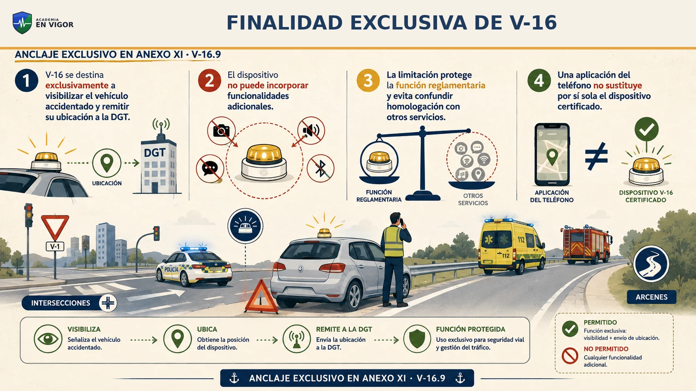

<em>Infografía: Finalidad exclusiva de V-16.</em>

<!-- FUENTE: BOE-RGV-T43 -->

## 77. Fin de la transición de V-16 no conectada

**Idea de control:** Los dispositivos con características anteriores pudieron utilizarse como V-16 hasta el 1 de enero de 2026.

- Los dispositivos con características anteriores pudieron utilizarse como V-16 hasta el 1 de enero de 2026.
- En el corte de 3 de agosto de 2026 esa transición ya ha finalizado.
- La referencia a 2026 no afecta al color azul de V-1 ni convierte V-16 en señal prioritaria.
- Debe estudiarse la fecha exacta para no aplicar una baliza antigua como solución vigente.

<!-- VISUAL:t43-77-fin-de-la-transicion-de-v-16-no-conectada.webp -->

  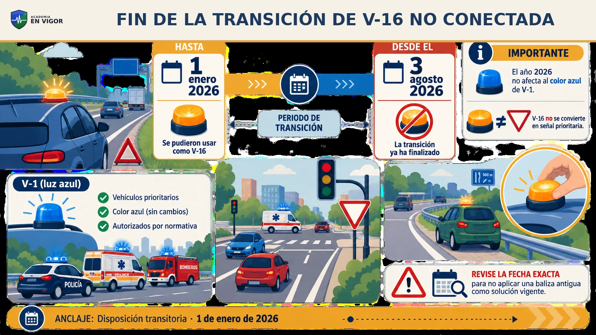

<em>Infografía: Fin de la transición de V-16 no conectada.</em>

<!-- FUENTE: RD159-2021-T43 -->

## 78. Cambio amarillo-rojo del dispositivo policial

**Idea de control:** El artículo 69 vigente usa luz roja hacia adelante para ordenar la detención desde el vehículo policial.

- El artículo 69 vigente usa luz roja hacia adelante para ordenar la detención desde el vehículo policial.
- La redacción histórica utilizaba luz amarilla y explica preguntas oficiales antiguas.
- El cambio de color no altera por sí solo la obligación de parar a la derecha, delante y permanecer dentro.
- Una pregunta debe fechar la regla antes de resolver el color.

<!-- VISUAL:t43-78-cambio-amarillo-rojo-del-dispositivo-policial.webp -->

  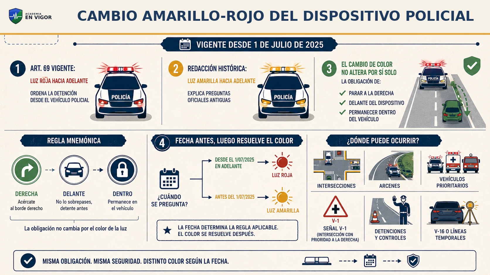

<em>Infografía: Cambio amarillo-rojo del dispositivo policial.</em>

<!-- FUENTE: RD465-2025-T43 -->

## 79. Carril de emergencia futuro

**Idea de control:** El Real Decreto 518/2026 introduce el artículo 32 sobre carriles de emergencia con efectos desde el 1 de octubre de 2026.

- El Real Decreto 518/2026 introduce el artículo 32 sobre carriles de emergencia con efectos desde el 1 de octubre de 2026.
- En vías de dos carriles por sentido el espacio se forma entre ambos carriles.
- Con tres o más se forma entre el carril más a la izquierda y el contiguo: el primero se orilla a la izquierda y los demás a la derecha.
- La reforma también prevé reglas con nieve y enlaza el artículo 69 con el nuevo artículo 32 desde su entrada en vigor.

<!-- VISUAL:t43-79-carril-de-emergencia-futuro.webp -->

  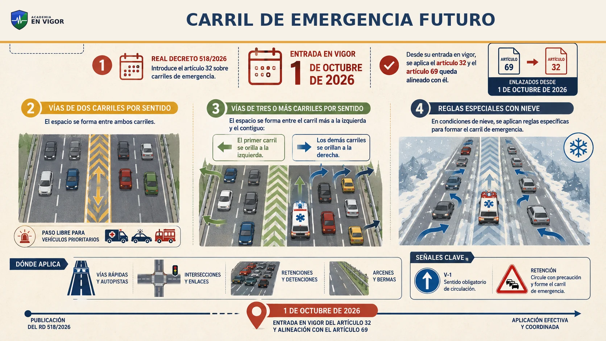

<em>Infografía: Carril de emergencia futuro.</em>

<!-- FUENTE: RD518-2026-T43 -->

## 80. Árbol final de decisión

**Idea de control:** Para resolver un supuesto se identifica primero si el vehículo pertenece a un servicio enumerado o es no prioritario.

- Para resolver un supuesto se identifica primero si el vehículo pertenece a un servicio enumerado o es no prioritario.
- Después se comprueba urgencia real, advertencia utilizada y norma temporalmente vigente.
- Las facultades del artículo 68 solo se aplican al prioritario que cumple sus condiciones.
- V-1, señal de emergencia y V-16 tienen significados diferentes y nunca deben intercambiarse.

<!-- VISUAL:t43-il-80-arbol-final-de-decision.webp -->

  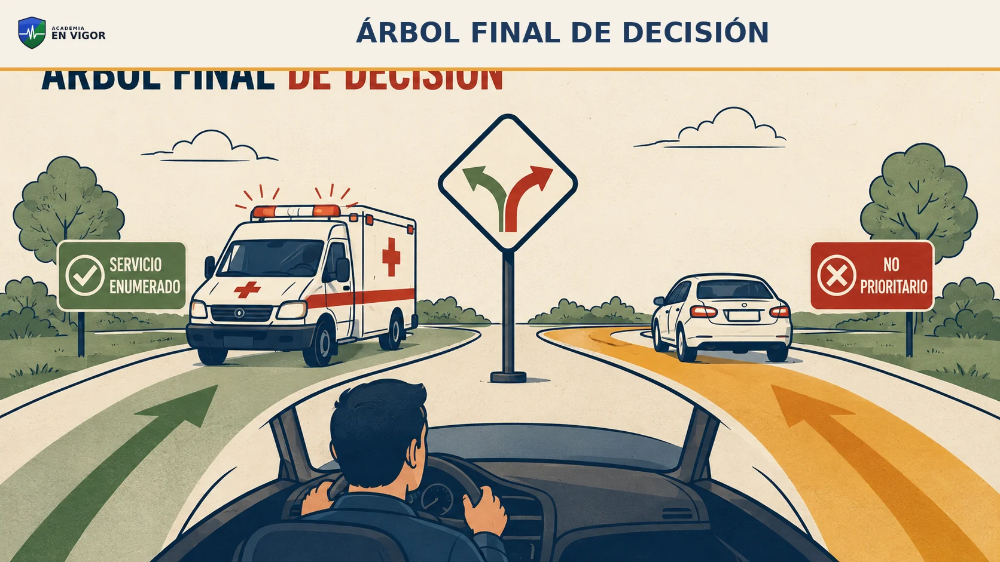

<em>Infografía: Árbol final de decisión.</em>

<!-- FUENTE: CONVOCATORIA-PN-2026-T43 -->

# Hablemos claro

:::hablemos-claro
Este tema exige separar vehículo de servicio, servicio urgente y advertencia reglamentaria. La luz azul no es inmunidad; la señal de emergencia no es V-1; V-16 no concede prioridad; y una reforma publicada puede no estar todavía vigente.
:::

# En la calle

:::en-la-calle
En circulación, anticipar la reacción de peatones y conductores, controlar intersecciones y elegir la maniobra de menor riesgo permite atender la urgencia sin convertirla en un peligro nuevo.
:::

# Lo que cae

:::lo-que-cae
Prioriza artículos 67-70; servicio y advertencia; títulos II-III-IV; órdenes de agentes; maniobras en autopista; V-1 azul y 50 metros; detención policial roja; vehículo no prioritario; señal de emergencia; V-16 conectada; y vigencia del carril de emergencia.
:::

# Ha caído

:::ha-caido
Se han localizado 9 referencias históricas del Tema 43. Permanecen ocultas y en cuarentena porque no existe plantilla oficial final verificable en el repositorio.
:::

## Fuentes legales, institucionales y primarias

- `CONVOCATORIA-PN-2026-T43`
- `BOE-RGC-T43`
- `BOE-RGV-T43`
- `RD465-2025-T43`
- `RD518-2026-T43`
- `ORDEN-PCI-810-2018-T43`
- `RD159-2021-T43`
- `DGT-V16-2025-T43`

---

*Academia En Vigor · El temario que nunca duerme · Tema 43 · v1.0.0 · Documento interno no publicado.*
